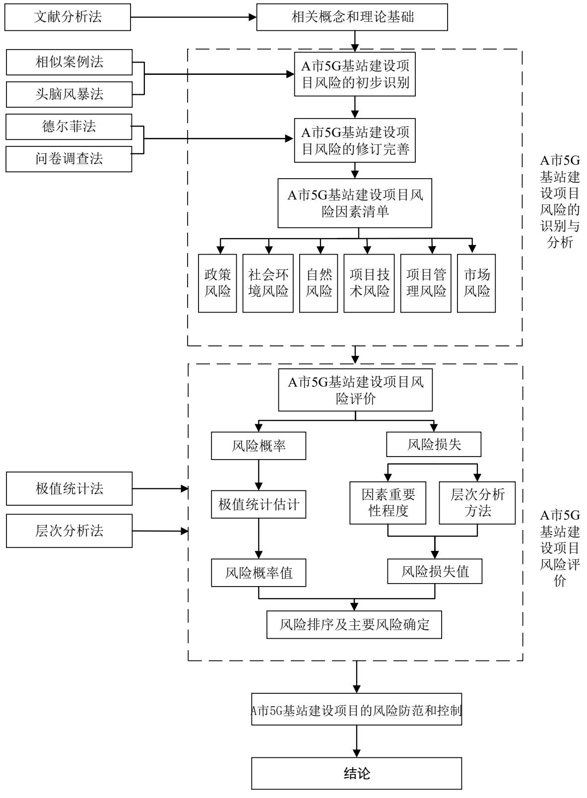

# 第 1 章 绪 论

# 1.1 研究背景

5G 是具有高速率、低时延和大连接特征的新一代宽带移动通信技术，不但能够解决人与人通信，为客户提供增强现实、虚拟现实、超高清视频等更加身临其境的极致业务体验，而且可以有效解决解决人与物、物与物通信问题，满足移动医疗、车联网、智能家居、工业控制、环境监测等物联网应用需求。目前已经广泛渗透到各行业领域，成为支撑经济社会数字化、网络化、智能化转型的关键新型基础设施。从 2019 年开始，中国移动、联通、电信和广电四大企业正式领取了 5G 牌照，标志了中国已经正式进入了 5G 时代，作为未来经济发展的有力技术支撑，5G 技术具有更高的宽带、更高速率和延迟性低等优点，而 5G通信基站正是能够实现 5G技术功能的基础设施[1]。

2020 年初国内正式启动了 5G 商业网络，尽管给社会进步、经济发展和人们生活带来很大促进便利，但在 5G 通信基站建设过程中仍存在很多问题，比如 5G 基站建设很难完全复制已有建设模式，而必须结合 5G通信基站覆盖区域的实际情况进行重组网络[2]。5G 通信基站项目建设过程中要尽量减少对现有网络的改造，避免对原有网络的破坏影响。为了实现 5G应用场景需求且满足各行业领域的应用需求，必须增加更多的5G 基站，这些都在不同层面上给 5G 通信基站项目建设工作增加了难度，并产生了相应的风险，不但影响了 5G通信基站项目建设，对后期运营维护也可能会造成不利影响。

然而，对 5G通信基站项目整体管理当前在 A市 5G基站建设项目的风险管理工作中仍存在以下几点问题：首先，在风险识别方面，由于 A 市 5G 基站建设项目在进行风险识别及修正工作时，比较依赖于项目参与人员的主观判断与思考，识别方法不够科学，导致识别结果不够全面；其次，在风险防范与控制措施方面，尽管对于已经识别的风险采取了相应的应对措施，但由于有些措施方法较于笼统和缺乏针对性，再加上项目实施人员习惯基于经验性结论形成一般性解决方案，导致对于风险应对措施的执行不到位；并且在项目沟通协调上，需要与甲方、运营商、政府部门等多部门人员沟通，参与人员较多，使得在实际风险管理和应对工作上效率相对较低，从而最终体现出项目风险防范效果不及预期。

本文通过对 A 市 5G 基站建设项目为研究案例，结合项目风险管理理论，对 A 市5G 基站建设项目风险进行识别和评价，以此确定 A 市 5G 基站建设项目主要风险，并采取相应措施对不同类别风险进行针对性防范控制，尽可能减少各类不良风险对 A 市

5G基站建设项目的影响，从而有效的达成 A市 5G基站建设项目管理目标。

# 1.2 研究意义

# 1.2.1 理论意义

本文以 A 市 5G 基站建设项目为研究对象，在项目风险的识别、评估和防范进行了深入的讨论，理论意义主要体现在以下两个方面：(1) 丰富和完善了我国在 5G 通信建设领域的风险管理理论，尤其是 5G基站建设项目风险识别和评估方面的相关研究；(2) 对于在实际项目过程中可能出现的风险，提出了使用相似案例法、头脑风暴法、德尔菲法和问卷调查法进行项目风险识别，使用极值统计法和层次分析法进行项目风险评估，并针对不同等级的风险项进行排序并提出应对方案和控制方法。

# 1.2.2 实践意义

由于目前关于 5G 网络建设的风险管理研究还相对较少，部分企业进行 5G 网络建设的时间较短，在 5G建设项目中经验积累相对薄弱，理论意义主要体现在以下两个方面：(1) 论文针对 A 市 5G 基站建设项目风险的识别分析、评价和防范研究，解决了企业对于 5G 基站建设相关项目风险识别难，评价不准确和防范不到位的问题；(2) 有利于通信企业减少不必要的支出和损失，还对相关配套、施工产业相关公司有很大的借鉴作用，并且同时也可以为今后其他类似项目的风险管理工作提供借鉴和参考。

# 1.3 研究现状

本研究涉及的相关研究主要包含以下三个方面：5G 基站建设项目风险识别、5G基站建设项目风险评价和 5G基站建设项目风险防范与控制。

在项目风险识别方面，Erfan Hoseini 等(2020)将 9 个荷兰防洪工程项目作为样本，讨论了在实际建设项目中的己知的风险因素和未知的风险因素[3]。Singh 等(2020)对项目风险辨识相关研究进行了回顾与总结，研究了风险对个体的影响以及对项目组或者项目集的影响，了解项目的整体风险敞口对项目经理、项目发起人和其他利益相关者的重要性[4]。Abelev 等(2021)研究了岩土工程建设项目相关的特定风险，证明了让客户和承包商参与所有施工阶段进行的全面岩土风险管理的必要性，其目的是确保良好的工艺以及现有结构的安全性[5]。Agnes Clare Odimarha 等(2024)通过在供应链风险管理中应用的探索，认为在风险识别中发挥着关键作用[6]。张铎等(2021)以 B 市铁塔公司5G 基站建设项目为研究案例，从政策、项目选址、项目环境、市场和项目管理等方面识别分析了 B市铁塔公司 5G基站建设项目风险，采用层次分析法和模糊综合评价方法确定了 B市铁塔公司 5G基站建设项目整体风险等级和各项风险类别所处风险等级，提出了风险解决对策[7]。李学博(2022)研究了 EPC 模式下 5G 建设工程采购风险，划分为采购价格、采购质量、供应商产能和延期供应四个方面风险[8]。

在项目风险评价方面，Shen 等(2019)以青岛岩体区为例，通过系统分析影响地铁站基坑施工的各种因素，构建了地铁站基坑施工危险性综合评估指标体系，根据上述各种因素的层次结构，给出了三阶段模糊综合评估模式，基于层次分析法定义了各个因素的权重关系，结合模糊集法定义隶属函数，进行了风险排序[9]。Jason Crawford 等(2024)认为基于统计的判断为风险评价提供了很好的基础[10]。Chukwulozie 等(2018)提出在工程风险决策分析过程中，增加工程风险管理专业技能人员数量，并引入先进分析技术，可促进风险决策过程和风险评估，从而提高风险管理效率[11]。Sulastri 等(2019)对项目风险管理理论与风险评估理论进行了归纳总结，识别项目风险，防止风险发生的措施是项目风险管理的主要目的[12]。Ifeanyi Okpala 等(2020)项目风险管理方法虽然对控制建设项目风险起到了一定的作用，但建筑行业和其他行业相比，风险仍然较大。因此，新兴技术的创新方法应用到实际的风险管理至关重要， 同时总结了不同类型的技术在缓解和管理施工安全风险方面的实际应用[13]。Chen 等(2013)以中国港口的防波堤建设情况为例展开分析，利用对每一种风险来源和不确定性的识别，来判断危害海运安全的风险指标[14]。Xu 等(2019)建立了一套基于实体的道路工程安全风险评估的知识库[15]。杨扬等(2018)研究是将风险概率进行定量分析，计算出一个大概的风险概率区间，然后结合风险因素权重计算风险程度[16]。也有其他研究如刘超等(2024)认为利用熵权法对各类不安全行为风险进行排序,量化不安全行为风险程度, 并进行模糊综合评价的体系更加具体化 [17]。另外，左文辉(2021)基于总包商视角研究了 5G 通信工程建设项目的风险问题，采用定性定量方法对识别组织、技术、市场、社会、政治、管理、经济和自然风险进行了排序，划分了主要风险、重要风险和一般风险，分别采取规避、缓解和转移措施[18]。

在项目风险防范与控制方面，Opeyemi Abayomi Odejide 等(2024)通过数字技术对生命周期较短的快销产品的营销风险进行识别和控制[19]。DongChao 等(2018)根据知识的动力学整合，构建了一套地铁工程的安全风险控制体系[20] 。ZhouYing 等(2013)在轨道交通建设中，以可视技术为基础，建立了一套安全监控体系[21]。Xin 等(2021)鉴于降低风险概率和降低风险损失这两种策略的不同效果和成本以及有限的项目预算，提出了一种减轻项目风险的方法[22]。冯凯文和谢群(2024)认为在加 5G 网络发展的同时，5G供应链的安全问题日益凸显，逐步完善 5G产业链，将各类资源引入到产业的薄弱环节，并对其进行监管与执行，从而提升其供应链的安全性十分关键[23]。邓苇(2021)研究认为5G 基站项目管理相对复杂，采用先进项目管理理念和技术，借助现代化项目管理方法对其进行宋体管理，结合 5G 基站项目建设标准和要求，重点做好 5G 基站项目的布局优化，努力降低 5G 基站项目成本，确保 5G 基站项目工期目标[24]。刘鸣(2019)提出 5G基站项目建设过程中应该对其建设内容进行合理的分解，找到 5G基站项目共性内容进行提取和重组[25]。蒋治成(2023)认为 5G 通信基站具有投资大、回报期长的特点，因此可能给企业造成较大的资金管理负担，强化了其项目管理的必要性，提出了应该在 5G基站项目建设过程中制定科学合理的项目管理体系，简化项目管理流程，重点管理核心技术，对项目要素进行整合优化和重新分配，依据项目实际情况进行动态化管理方案，重点关注项目施工进度和成本等措施[26]。

# 1.4 研究评述

综上所述，虽然国内外对于风险管理研究已经有了一定程度的理论研究，但 5G基站建设时间相对较短，国内和国外对于 5G基站建设风险管理研究较少，因此仍然存在一定的局限性或不足之处。第一，现有研究对于 5G基站建设的风险识别管理缺乏体系化流程，较多关注对于因素识别本身，而对于识别因素的准确性和可信性分析关注较少。第二，现有研究对于 5G基站建设的风险因素评价较多以单一的定性分析为主，缺乏结合定量分析进行系统评价的方法。因此，本研究结合 A 市 5G 基站项目的实际情况，对于风险因素识别采用信度和效度分析的方式，计算风险因素识别的可信性，再对于风险评价采用定量分析和定性分析结合得出评价结果，从而实现对于 5G基站建设项目风险的科学体系化分析，丰富了国内关于 5G基站建设项目风险管理的研究。

# 1.5 主要内容、研究方法和技术路线

# 1.5.1 主要内容

本研究主要包含以下三点研究内容：

(1) A 市 5G 基站建设项目风险的识别与分析。介绍 A 市 5G 基站建设项目基本情况，确定 A 市 5G 基站建设项目风险识别方法，采用相似案例法和头脑风暴法对 A 市5G 基站建设项目风险进行初步识别，基于德尔菲法的 A 市 5G 基站建设项目风险的筛选和修正，描述A市5G基站建设项目风险。

(2) A 市 5G 基站建设项目风险评价。组建 A 市 5G 基站建设项目风险小组，采用极值统计法对 A市 5G基站建设项目风险概率进行估计，采用层次分析法对 A市 5G基站建设项目风险损失进行估计。对 A 市 5G 基站建设项目风险进行综合评价，依据各项u风险因素的危害性进行结果分析。

(3) A 市 5G 基站建设项目风险防范与控制对策。根据风险评价体系得出的结果确定 A 市 5G 基站建设项目 A 类、B 类和 C 类风险，制定出有效的风险防范和控制措施，明确规划风险应对过程的关键成功因素，提出风险防范和控制对策，从而保证 A时 5G基站建设项目风险管理的有效性。

# 1.5.2 研究方法

(1) 相似案例法。从 A市已完成的项目中找到与 A市 5G基站建设项目相类似项目，然后通过分析这些项目的风险资料确定这些项目的风险，或者直接借鉴这些项目的风险因素。

(2) 头脑风暴法。采用相似案例方法初步识别质量风险清单后，为了进一步贴合 A市 5G 基站建设项目风险的实际情况，笔者邀请了 14 位各部门经验丰富的项目管理人员，针对 A 市 5G 基站建设项目的具体情况，采用头脑风暴法进行深入的项目风险识别。

(3) 德尔菲法。论文采用德尔菲法对初步识别的 A 市 5G 基站建设项目风险进行修订完善，最终确定契合 A市5G基站建设项目风险因素。

(4) 极值统计法。极值统计法能够邀请多人通过风险概率区间估计给出一个相对合理的风险概率结果，分别给出风险因素发生概率的最大可能和最小可能，即极大值和极小值，然后转化为一个相对合理的风险取值，通过风险概率估计实现了风险概率估计量化。

(5) 层次分析法。通过层次分析法计算出风险因素的相对权重，而风险因素的重要性程度又能体现出其对风险目标的影响程度大小，即可以通过风险因素权重表示其对风险的影响程度，影响程度越大表明其发生后的后果损失越大，反之越小。

# 1.5.3 技术路线图

本文针对 A 市 5G 基站建设项目风险管理问题，梳理风险管理相关文献和理论概念，并对该项目当前风险管理状况了解后，运用头脑风暴法等风险识别方法识别并完善风险要素，并运用定量与定性相结合的方法构建风险评估模型，计算风险危害程度，

并针对风险识别和评估结果制定相应的风险防范和控制方案，提高 A 市 5G 基站建设项目风险管理水平，防范风险事件的发生或是降低由风险事件造成的损失。论文的技术路线图见图1.1所示。

  
图 1.1 技术路线图  
Figure1.1 Technology roadmap
