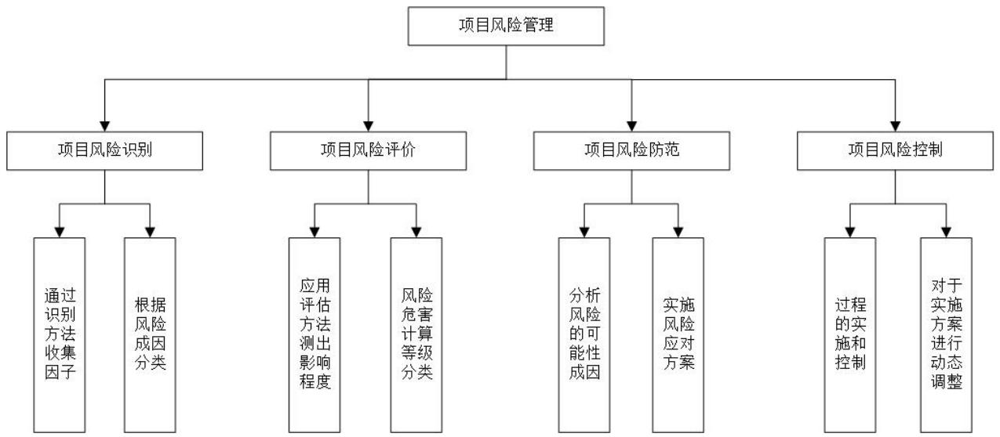

# 第 2 章 风险管理理论概述

# 2.1 项目风险理论概述

风险是指目标与结果的不确定性，在项目管理过程中有很多的不确定性，无法对其进行准确预测，预期的项目目标与项目实际结果之间往往存在一定的偏差，即项目风险。项目风险可能会对项目造成严重的负面影响和各种损失，甚至会导致项目任务目标失败。

关于项目风险通常有以下几个共识：项目风险普遍存在项目全过程各环节，无法完全消除，且会不断出现新的风险；客观性是指无法完全避免，只能采取有效方法降低风险发生概率或减少风险损失；不确定性是指即使存在风险也不是百分百发生，其发生条件及后果损失也都有一定不确定性；相对性由于人们对于风险的识别能力和处理能力具有差异，另外每个项目的建设规模和建设周期具有独特性， 因此即使风险程度相同，对项目造成的影响通常也具有较大的差异；可变性是指风险不断处于变化，可能会转化为其他风险，或者与其他风险相关联；多样性是指建设项目通常具有规模大、工期长、成本高、受多项因素综合影响的特征，这些因素通常会导致多种风险周时或接续发生，因此项目风险具有多样性的特征；可识别是指风险可以预先识别分析，为风险控制提供依据。

项目风险管理是采取一系列组织、技术、管理等手段方法，对项目风险进行系统性的分析和控制的过程，包括风险识别、分析、评价和应对。合理的项目风险管理能够预防风险，将风险概率和损失将至最低，从而确保项目目标的实现。

# 2.2 项目风险分类

关于风险的分类许多学者提出了多种不同的看法，本论文在研究过程中，参照了近年来被大多数学者认可的分类标准，将从以下三个方面分类：(1) 按系统要素分类系统要素主要分为环境风险、项目主体风险和技术因素风险三个方面。其中，环境风险包括经济环境风险、政治环境风险等。项目主体风险，指项目利益相关者的风险。任何方面的利益相关者都会对项目的施工风险造成影响，造成无法按期施工，隐瞒风险因素，操作人员不具备要求的资质等都会造成发生项目主体风险。技术因素风险指的是建设项目由于建筑原材料和机械设备等由于质量问题或操作问题而对项目造成的影响。(2) 按管理过程及要素分类可划分出风险具体责任，包括：项目策划风险、战略风险、技术设计风险等。(3) 依据风险对项目目标的影响着手，将其划分为以下几种类型风险：进度风险是指项目因为种种原因影响而无法如期交付，进而给项目带来损失的风险；成本风险是指项目施工过程中，因为人工、原材料等价格上涨而带来的成本增加，进而衍生出的风险；质量风险是指项目施工过程中，某一个环节的质量不符合原定要求，后续可能需要返工而带来的风险；生产能力风险是指项目最终的设计标准和要求不符合预期；市场风险是指采取具体措施推广宣传项目但并没有达到预期，或者通过推广获得的市场份额没有达到预期；安全风险是指在建设项目的过程中，原材料、机器设备等问题危及人员身心健康的风险；法律责任风险是指项目相关人员因为自身某些问题的影响而必须承担相应的法律责任。另外还可以依据风险给项目造成的后果对风险进行划分，可分别按照人员损失、财产损失、物料损失三类进行划分；按照项目风险的可预测性，可分为己知风险，可预测风险和不可预测风险。

# 2.3 项目风险管理流程

项目风险管理流程主要包括四个方面，分别是风险识别、风险评价、风险防范和风险控制，具体管理过程如图 2.1所示。

  
图2.1项目风险管理内容  
Figure 2.1 Project Risk Management Content

# 2.3.1 项目风险识别

风险管理的首要工作就是结合项目特点，对项目的各种不确定因素进行识别，提取和描述影响项目目标的风险因素。风险识别是确保后期风险评价和控制的前提，如果不能做好此环节，会直接导致后期风险评价和防范出现偏差，不能对实际风险进行合理控制。并且整个项目周期中，项目参与人员众多，因此需要全面识别风险类型以及对应的风险因素，保证项目参与人员的风险灵敏度。经过长期的理论研究和工程实践，目前已经形成了许多风险识别的具体方法。

风险识别工作往往需要结合使用多种专业的方法和理论知识。首先是分析与收集历史数据和资料，即收集项目的相关材料，包括项目计划书，前期市场调查报告，财务预算，人员安排等，另外还要搜集其他同类项目的建设报告，为持续推进项目实施提供参考；其次是利用头脑风暴法、访谈法、德尔菲法、核查表法以及故障树法等有效的风险识别方法对项目风险进行排查，掌握项目实施过程的风险评估状态；最后是对风险识别结果分析与检验，找出风险发生的具体成因并预估其可能造成的结果，并检验识别结果的有效性。

常用的风险识别方法有文献分析法、 专家咨询法、 头脑风暴法、德尔菲法等，本文主要使用了相似案例法、头脑风暴法、德尔菲法和问卷调查法。

(1) 文献分析法

文献分析法是最常见和基础的学术研究方法，在该领域已经有一定研究基础的基础上，通过图书馆数据库等途径对研究对象领域进行检索和整理分析，整理已有研究成果结论，用于风险因素识别的参考借鉴。文献分析法的优点是不受时间和地域限制，方便操作。但文献分析法也有很多不足，很多文献是二次及以上加工，带有研究者较强烈的主观意识，可能影响风险识别结果。

(2) 专家咨询方法

专家咨询方法是邀请行业领域专家对研究议题征询意见或进行讨论方式，具体操作方式如问卷调查、头脑风暴、德尔菲法，将收集的意见进行整理汇总形成决策意见，提取风险因素。专家咨询方法的优点是专家熟悉研究议题，结论可信度较高，与实践契合度高。专家咨询方法的缺点是邀请专家困难，组织实施难度较大。

(3) 头脑风暴法

头脑风暴法是通过小组讨论方式，利用集体的思考智慧对研究议题进行开放式讨论和发表见解。主持者向会议参加者宣布会议规则和讨论议题，过程中尽量营造出轻松融洽方式，让参与者毫无顾忌畅所欲言。头脑风暴法的优点是集中熟悉议题的人员集中讨论，高效可信度高。头脑风暴法的缺点是开放式讨论，难以形成统一意见。

# (4) 德尔菲法

德尔菲法是通过邀请领域内资深专家对研究议题进行匿名调查讨论，通过非面对面的多轮匿名意见征询，最终汇总收集到比较统一的专家意见，从而使得资深专家对研究议题形成一致性意见，以确保研究结论的科学合理性。德尔菲法的优点是匿名讨论，相互影响较小，不用将专家集中到一起面对面讨论。德尔菲法的缺点是专家意见征询周期较长，通常需要数论讨论才能统一意见。

(5) 问卷调查法

问卷调查法是依据研究内容设置调查问卷，风险因素调查通常是关注其因素重要性调查，与李克特量表结合，统计分析确定风险因素。问卷调查法的优点是选择熟悉人员参与调查，获取更加客观结论。问卷调查法的缺点是问卷调查通常比较简单，以客观选择为主。

# 2.3.2 项目风险评价

项目风险评价是在项目风险识别的基础上，通过分析、估计和统计等方法对项目风险各因素进行定性和定量的评价和估量。部分文献提出采用风险定义，利用层次分析法和模糊综合评价法确定项目风险等级，但因为确定的风险等级是一个相对风险，即使确定了风险等级高或低，那么仍然无法指导后期风险控制，无法区分主要风险和次要风险。论文认为应该对每项风险因素的概率和权重进行统计计算，然后计算出风险因素危害性，然后排序确定风险等级。因此，解决风险评价问题的关键仍是风险概率和风险权重两个参数：

(1) 风险概率

对风险事件发生的可能性进行估计，由此确定风险概率大小。事实上基于项目风险的不确定性和可变性可知，风险概率估计的难度很大，通常情况下是无法对其进行准确估计的。梳理风险评价的相关文献发现，很多文献采用模糊等级确定方法确定风险概率，将风险事件发生概率确定在某个风险等级上，尽管该方法可以比较快速的确定风险等级，但无法给出具体的风险概率值，甚至无法给出概率值区间，容易造成后期风险评价失真[27]。部分文献研究了极值统计方法在风险评价中的适用性，通过一定的判定规则，给出项目风险的概率区间，然后转化为一个相对统计的风险概率结果，非常适合没有原始数据的定性评价指标，介入专家主观评价才能实现风险概率评价。相比较常见风险概率方法，极值统计法能够邀请多人通过风险概率区间估计给出一个相对合理的风险概率结果，分别给出风险因素发生概率的最大可能和最小可能，即极大值和极小值，然后转化为一个相对合理的风险取值，通过风险概率估计实现了风险概率估计量化[28]。

# (2) 风险权重

当前文献研究的风险损失估计方法包括以下三种：一是给出具体的风险损失结果，主要参考以往类似项目特征及数据进行估计，但风险损失估计难度很大。二是采用模糊数学方法将风险损失转化为若干模糊等级，如模糊综合评价然后进行风险评价，最终得到的风险评价结果是风险等级形式。三是按照风险因素的相对权重计算方法，风险因素的重要性程度能体现出其对风险目标的影响程度大小，即可以通过风险因素权重表示其对风险的影响程度，影响程度越大表明项目风险发生后的后果损失越大，反之越小[29]。

A市 5G基站建设项目通过计算风险因素发生的可能性，采用极值统计法和层次分析法，结合各因素的权重综合计算分析，最后将所有风险因素分为 A 类风险、B 类风险和 C 类风险。

# 2.3.3项目风险防范与控制

完成了项目风险识别和评价工作后，就可以根据由此获得的信息开展项目风险的防范了。风险防范需要能够达到在风险发生前，将风险发生的可能性降到最低，从而防止风险因素的产生。

风险防范可根据风险评估结果和对应风险因素进行针对性应对策略，如对于风险过大且评估损失过大的风险，需要谨慎评估项目的可行性，若风险所带来的损失超过可承受范围，则应该终止项目的进行；如项目风险在可控范围内，就可以制定相应防范对策，最大程度上降低风险发生的可能性；如果风险发生概率大且无法避免，若风险所带来的损失在项目可承受范围内，则可对该风险消极处理，承受风险发生所带来的相应后果。

风险控制具体是统筹设定方案或者引入对应的处理措施最小化风险损失，合理管控风险概率。在发生风险之前、发生风险过程中以及发生风险之后三个时间点进行控制风险或者减少风险负面影响。在发生风险之前控制风险目的是最大限度减少风险发生概率；在发生风险过程中或者发生风险之后控制风险的最终目的在于减少风险对接下来其他环节的负面影响。
