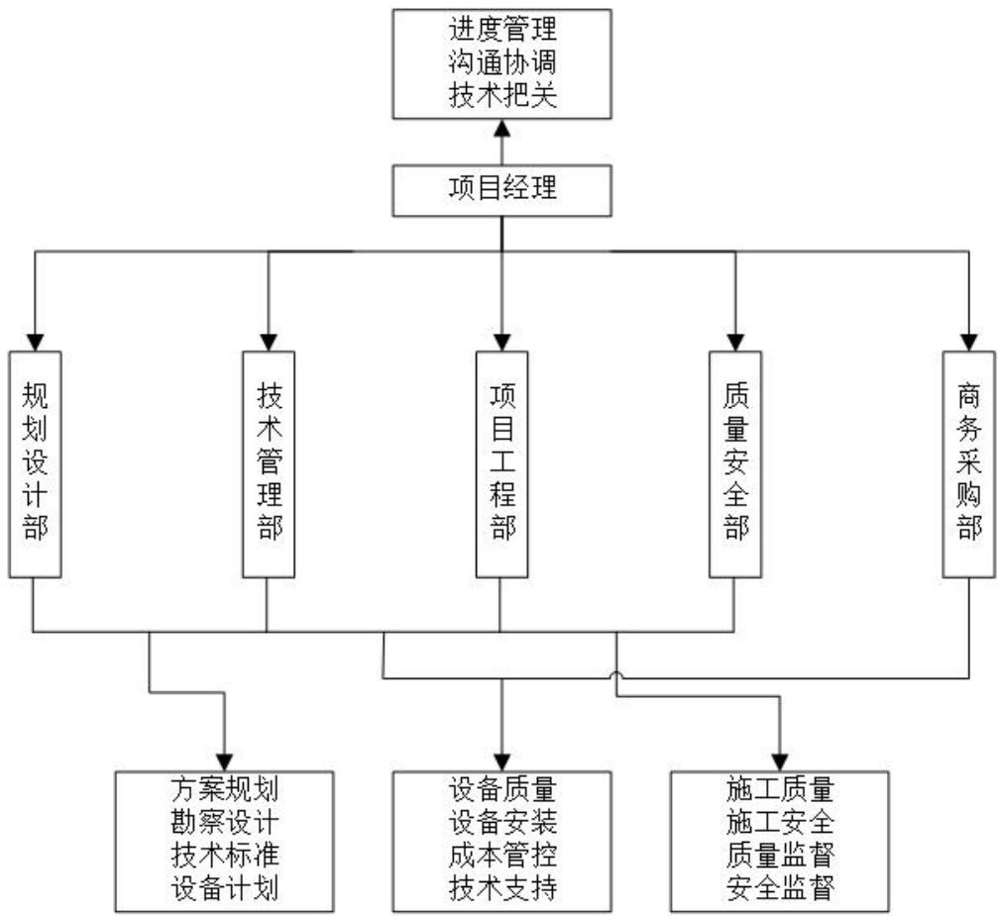

# 第 3 章 A 市 5G 基站建设项目概况

# 3.1 A 市 5G 基站建设项目简介

2019 年起，我国 5G 正式实现商用，5G 技术开始广泛投入。截止 2022 年，我国5G 基站建设超 100 万个，并且基本覆盖全国大部分城市、乡镇等人口密集地区。随着5G网络的普及，频段持续走高，以及 5G网络应用场景逐渐扩大，对于现阶段 5G网络的承载和覆盖能力提出了新的要求。

截止 2022 年 3 月份，A 市已建设 5G 基站约 1800 个，对于市内城区，乡镇等人口密集的商圈，住宅，学校等重点场景已经可以实现 5G网络覆盖。但随着联网设备的增加以及城市的扩张，现有 5G 基站不能满足当前设备连入的速率和稳定性，并且 A 市5G 网络建设初期多为以 4G 核心网为基础的非独立组网（NSA）模式建设，不能满足现在对于网络对于万物互联、自动驾驶、远程医疗等新业务的需求。

A 市位于中国东北部，域内以平原为主，环境条件适中，交通便利，设备材料运输方便，维护方便，对于通讯基站的建设来说较为合适。

该 A市 5G基站建设项目主要目的是基于 A市现有 5G网络基站的升级和补点，项目内容包括对于 A 市当前 5G 网络状况的分析，网络建设方案的定制，网络建设的工程实施，网络优化及竣工验收等过程。项目开始于 2022 年第三季度，截止于 2024 年第三季度。截止 2024年第一季度，A市 5G基站建设项目新增基站约 2400个，基本实现了对于市内重点区域的网络升级以及对新区、郊区的 5G 网络增点覆盖，提高了 A市整体的网络覆盖率、网络速率和网络质量。

# 3.2 A 市 5G 基站建设项目风险管理计划

A 市 5G 基站建设项目的开工之前，需要详细制定科学、全面、合理的项目风险控制方案，对提高工程项目的风险控制具有重要意义。在风险控制规划中，需先明确项目的风险控制目的，确定了预期的效果后，按照组织结构对各个部门进行分工，明确每个部门的责任和权力，并对各个阶段的风险进行分析。以下是风险管理目标、风险管理组织及实施过程所采取的方法。

# 3.2.1 风险管理目标

A市 5G基站建设项目的实施将会遇到市场风险、技术风险、时间风险、社会环境风险、自然环境风险和项目管理风险等。由于项目本身的特殊性，工期进度、设备、技术、质量等环节都非常的关键。因此，在本项目的风险管理中，需着重围绕这六个方面的进行管控，在此基础上，控制好其它方面的风险，从而实现低成本、高效率的任务。

# 3.2.2 A 市 5G 基站建设项目管理组织

A市 5G基站建设项目中，构建一个具有横向结构的工程风险管理控制体系，有利于提高工程质量，明确各部门职责，消除监管死角。由于项目经理同时也是技术专家，因此在执行进度管理和沟通协调工作的同时，还有技术把关职责。由于 A 市 5G 基站建设项目过程比较繁琐，参与部门众多且相互交叉，因此项目风管理工作由多个部门共同完成。图3.1列出了项目管理组织及职责。

  
图 3.1项目风险管理组织及职责  
Figure 3.1 Project Risk Management Organization and Responsibilities

# 3.2.3 达到风险管理目标所采用的方法

在进行 A 市 5G 基站建设项目风险识别和风险分析时，主要运用相似案例法、头脑风暴法、德尔菲法和问卷调查法，结合以往 5G基站成功的建设案例，进行反复细致的识别、修正和检验，最后得出了一个风险识别清单。

在风险评估过程中，使用层次分析法和极值统计法对 A 市 5G 基站建设项目各个风险因素进行量化评定，并根据危害程度划分不同风险等级。在风险应对过程中，根据不同的风险等级，采取优先防范、主动控制和重点控制；经常防范，常规控制和减少影响和适当防范；宽松控制和降低发生的对策和实际措施。

# 3.3 A 市 5G 基站建设项目难点

A 市 5G 基站建设项目是承建公司所承接的第一个同时承接中国移动、中国联通和中国电信三家 5G 基站建设的工程项目，基站建设数目相对较大。虽然 5G 基站已经普及了一段时间，但对于项目承建公司来说， 5G 基站建设经验不是特别丰富，因此该项目是一个不小的挑战。

(1) 风貌控制难

A市5G基站建设项目涉及 A市多和管控分区如城市公共区、居住生活区、自然生态区、郊野边缘区等，对于不同管控分区，需要有不同的风貌控制标准以及设计要求，并且A市对于5G基站选址的美观程度要求较高，则需要在满足要求标准的同时，衡量建设成本，保证落地的实施性。因此这对基站承建公司的布局、设计与成本控制带来了一定的困难和挑战。

(2) 建设技术复杂

从基站设备方面看，5G 基站将 BBU 分割为 CU（中央单元）和 DU（分布式单元），并通过光纤与 AAU（有源天线单元）连接，相对于 4G 基站设备构成更为复杂；另外 4G 基站的配套设备相对简单，主要包括电源、备用电池、空调和监控系统等，5G 基站的配套设备更加复杂，需要更多的电源、铁塔、机房等设施来保障设备的稳定运行。因此需要高素质的技术操作人员和专业性强的施工管理人员组成的项目团队来进行系统科学的规划，并不断提高改造与建设的效率和质量，对于 A 市 5G 基站项目建设承建公司的施工和设备安装在技术上提出了更高的要求。

(3) 盈利空间小

5G 基站建设项目盈利主要通过基础设施建设以及基站运营与维护两个方面，对于基础设施建设来说，虽然 5G 基站的硬件设施需求量较大，如天线、滤波器、功分器等设备，但当前承建施工单位数量多，竞争激烈，硬件设备价格透明；对于基站运营与维护来说，虽然基站运营与维护市场较大，且收入来源稳定，但工作通常由铁塔公司或其指定运维公司承担，基站承建公司很难从中获利。因此为提高项目盈利能力需做好项目成本优化，减少项目建设过程中的各项成本，这对于 5G基站承建公司的管理和经营能力具有一定挑战。

(4) 协调难度大

在 A 市 5G 基站建设期间，具有项目参与部门和人员众多且复杂的特点，其中有信息化主管部门、运营商、市政管理部门、设计和规划部门等等，同时还有多家施工单位，多个施工队伍在不同地点，同时开展基站建设工程，导致协调困难。项目各方人员情况复杂，涉及多个部门跨专业合作。A 市 5G 基站项目关系部门庞杂，并且人员背景、专业各有不同， 沟通协调的难度较大，项目管理也存在一定的复杂性。

# 3.4 A 市 5G 基站建设项目风险管理问题

(1) 风险识别不全面

承建公司在项目风险识别上缺乏一定的辨别能力和体系流程，所有同类型项目均使用同一套风险因素模板，再通过几个专家和一线工作人员在模板的基础上进行一轮修正后结束，此种识别方法较为敷衍，识别结果不全面，对于无效的风险因素也不能及时的发现和剔除，使得企业无法及时和正确的获取项目风险信息，有可能会给企业带来一定的经济损失。

(2)风险评价不科学

承建公司的管理和决策人员对基站建设评价体系建设的重视程度较低，对基站建设评价体系的作用缺乏正确的认识。公司中的部分管理人员对风险管理的认识还停留在当风险发生时采取相应的治理措施来减少风险对企业日常经营的影响的事中处理，而忽视了在风险发生之前建立风险评价体系的事前预防；在风险评价工作中也仅仅通过简单的筛选评分来进行风险排序，评价主观性极强，评价方法不科学，无法达到对风险的分析和预测效果。

(3) 风险管理职责划分不清晰

承建公司对于风险管理的职责划分并不清晰，对于项目风险管理来说，不仅仅需要专业的项目风险负责人员，还需要所有的项目参与人员共同具有相应的风险意识。承建公司当前在项目中还没有形成应有的风险意识，对此企业应该指定相应的考核制度和培训机制，保证项目参与人员的风险管理责任，防止项目成员风险处理不到位而导致的风险事故。

# 3.5 A 市 5G 基站建设项目风险管理要求

5G 基站建设正朝着 “高质量、 高效率” 的方向努力。如果项目承建方不能在项目施工初期和过程中有效识别、防范风险和控制风险将会给项目造成非常严重的损失。因此，围绕A市5G基站建设项目的总体目标，主要有四个方面要求。

(1) 项目进度风险要求

5G 基站项目的建设工期较长，因而施工阶段会出现诸多不确定或者突发状况。比如说，政策、天气以及物料设备不到位等诸多因素都会对正常施工造成影响。这就要求项目实施前提前做好各项预防措施，在制定工期进度表时充分考虑潜在的影响因素，当项目工期与实际计划日期出现偏差时，及时采取有效措施，在保证施工安全和项目质量的前提下，合理加快施工进程，实现对工程进度风险的有效管理。

(2) 项目质量风险要求

好的工程质量是项目高质量、高要求完成的基础。在 5G基站建设项目施工过程中，人员、设备等多方面因素均会影响到项目的整体质量。首先作为管理和技术人员，必须做好监管工作，确保施工过程、相关设备、物料的技术参数等符合施工要求和标准；其次是作为项目施工人员，必须是具备相应岗位职业技能才能上岗工作；最后是质量管控人员，采用定期结合抽查的方式实时跟进并保证项目质量。

(3)协调组织风险要求

由于 A 市 5G 基站建设项目本身体量大且复杂，涉及的项目参与部门众多，因此，要求对各参与部门进行有效管理。同时，协调各参与部门避免由于作业项目出现制约，影响工程质量。另外项目施工涉及的人员多，需采取科学措施管理人员，制定对应的奖惩机制确保相关人员权责分明。在项目施工中，要求管理、技术及施工人员等各司其职，做好自己职责范围内的工作，规避项目因为个人、组织问题而衍生出来的风险。

(4) 项目技术风险要求

5G 基站建设后的信号强度、覆盖率以及维护成本十分依赖前期在设计规划时对于基站的选点、机房布局、设备选用等技术指标。因此 A 市 5G 基站建设项目需要在规划基站选址和机房布局等关键技术指标时，需要充分考虑潜在的影响因素，进行多次模拟和仿真测试等技术手段，并与运营商、信息化主管部门等相关部门进行充分的沟通，保证规划方案的准确性和合理性。
