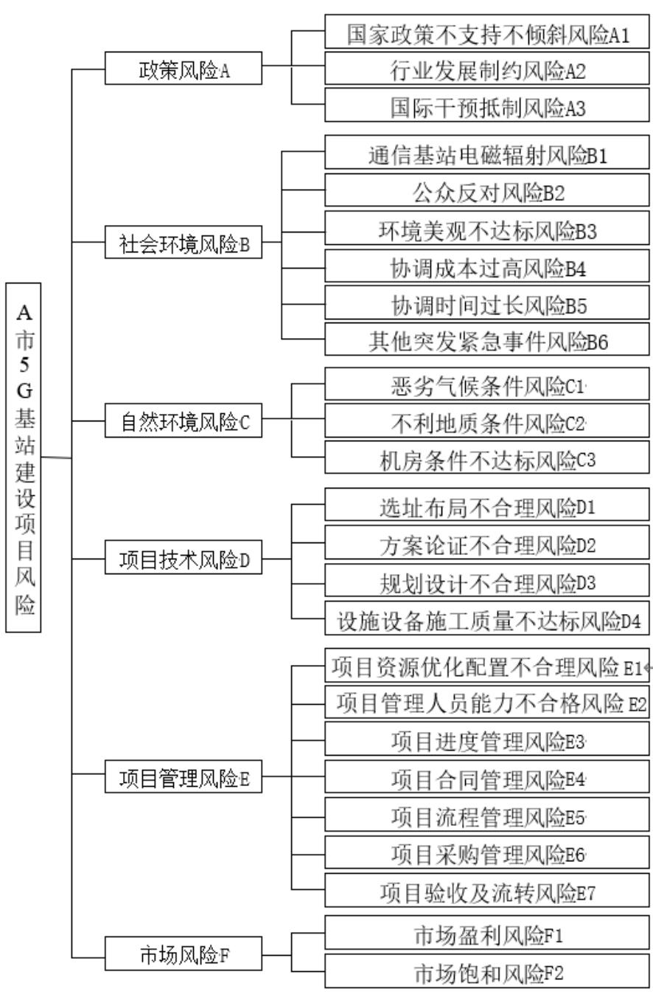
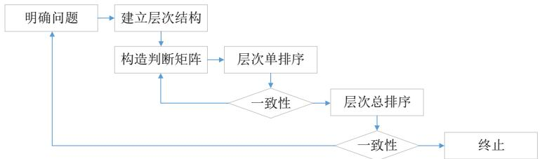
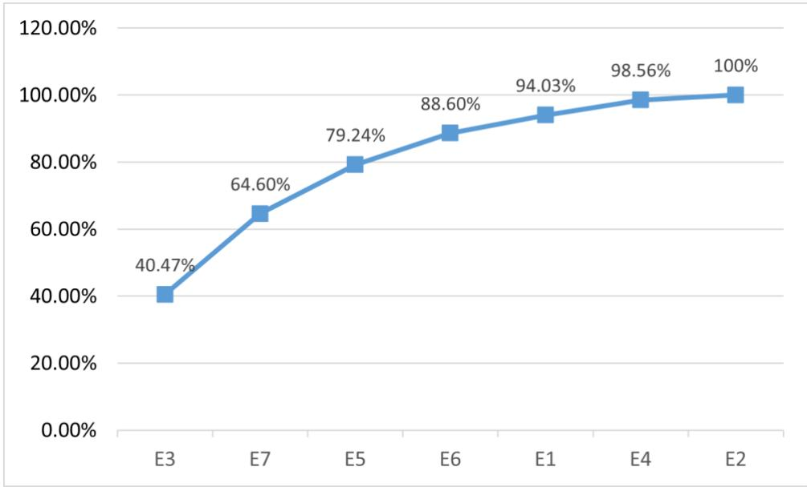
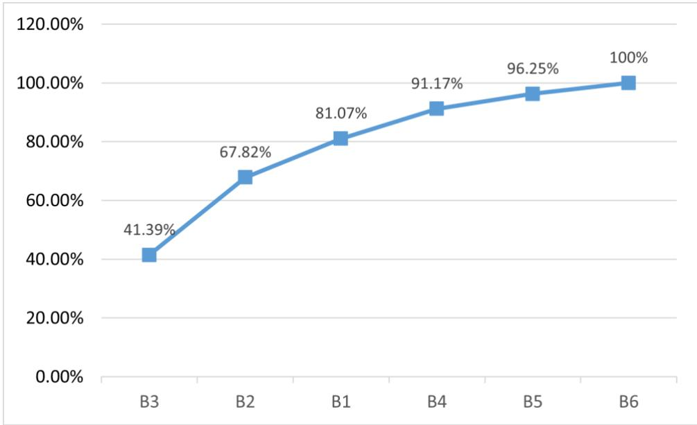
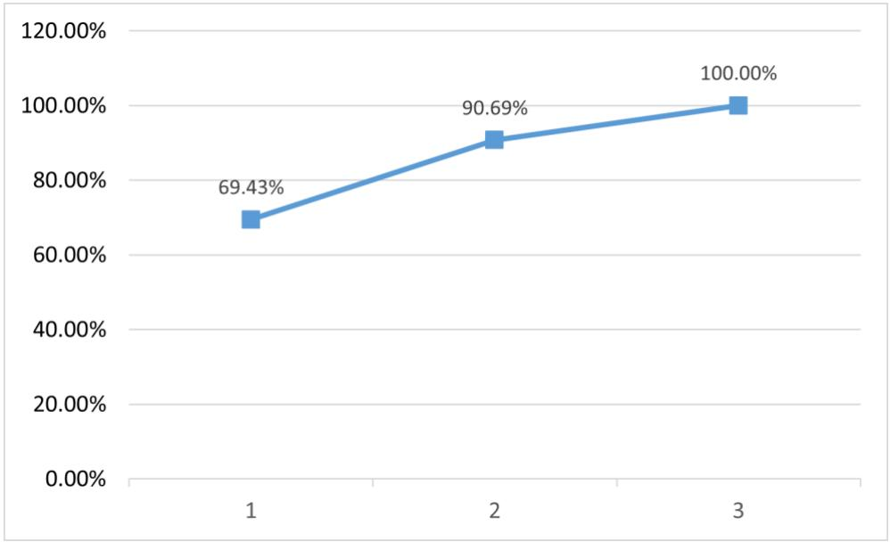
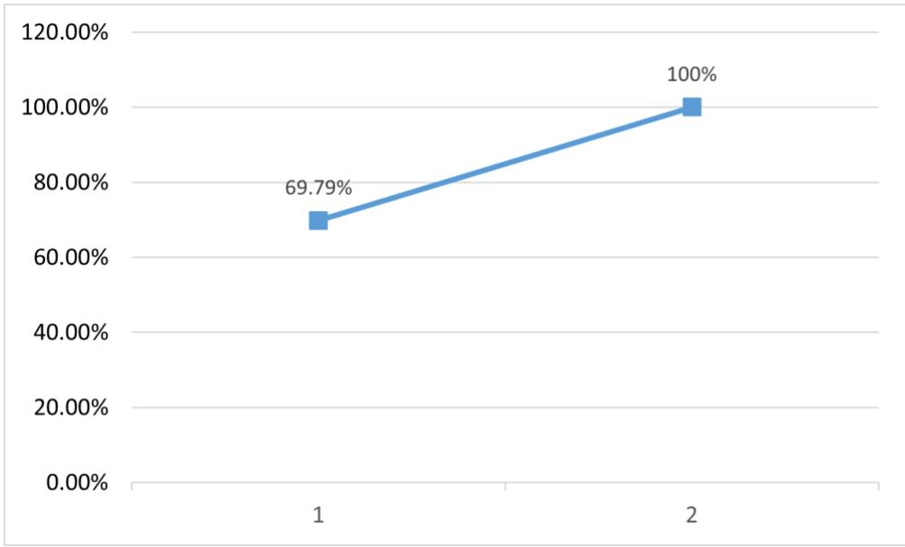
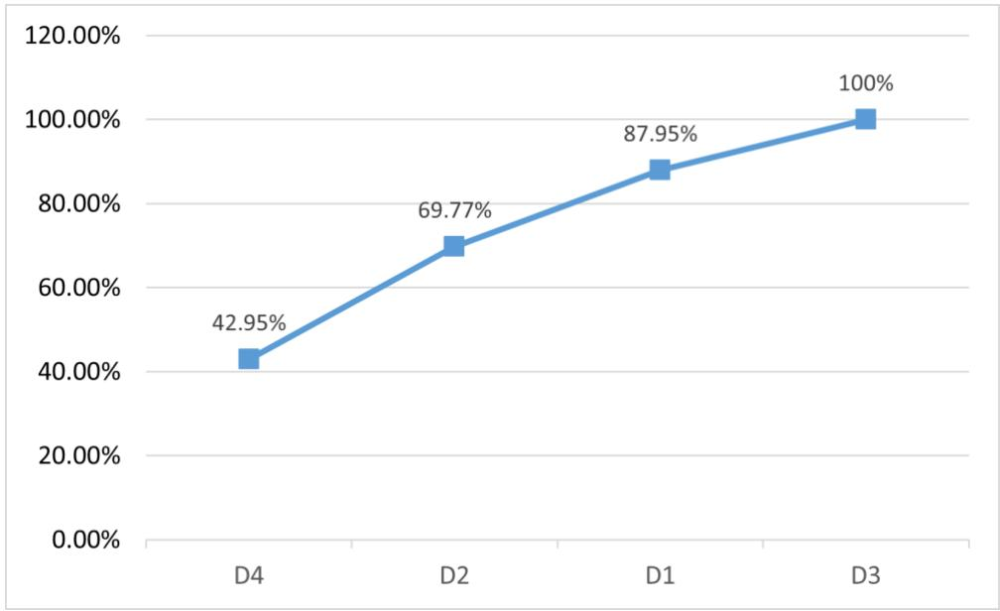
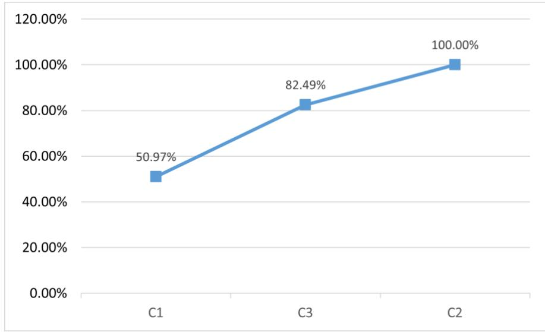

# 第 4 章 A 市 5G 基站建设项目风险的识别与分析

# 4.1 A 市 5G 基站建设项目风险识别

A 市 5G 基站建设项目风险识别首先采用相似案例法找到 5G 基站建设项目的共有风险，然后结合 A 市 5G 基站建设项目特点采用头脑风暴法加入本项目特有风险，再用采用德尔菲法邀请专家对 A 市 5G 基站建设项目风险进行最后的修正，最后通过调查问卷法对识别到的风险因素进行信度和效度分析，保证识别因素的合理性和科学性，如图 4.1所示。最后对与 A市 5G基站建设项目识别出政策、环境、技术、管理和市场等六种类型风险。

  
图 4.1 风险因素识别路线图  
Figure 4.1 Risk factor identification roadmap

# 4.1.1 5G 基站建设项目的常见风险识别

A 市 5G 基站建设项目开始之前，已经完成了许多 5G 基站建设项目的工作，从已完成的项目中找到与 A 市 5G 基站建设项目类似项目，将常见的风险因素进行识别，作为项目开展的基础资料，同时也是形成宏观风险清单的基础。

使用相似案例法，目的为分析和借鉴以往与 A 市 5G 基站建设项目相似度较高的5G 基站建设项目，可以更好地了解本项目可能存在的风险，识别相应的风险因素。该方法更加贴合工程实际情况，也为后面深入分析 A 市 5G 基站建设项目风险的工作打下基础。论文收集并参考了以下两个项目：

第一个项目是 N 市铁塔公司的 5G 基站项目，该项目的工期从 2019.1.31 到2021.1.31，历时两年时间，统一采用 NSA 组网模式，是非独立组网，建成后要达到减少视觉污染，降低项目成本，便于管理和提升通信基础设施可持续水平等目标。该案例项目的难点和重点在于项目涉及的单位部门众多，职权混乱，存在较多的信息交叉和重复管理等问题；项目风险意识不足，风险管理体系也不完善，项目流程比较复杂，造成项目管理相关信息孤岛和信息不对称等问题。经过梳理得到以下风险（表 4.1）：

(1) N 市铁塔公司的 5G 基站项目采用订单驱动模式，订单阶段需要对多家运营商的运营规划目标进行统一规划问题，存在规划目标确认不到位风险。另外，采用线上订单推送方式可能存在订单延迟推送和订单整合错误等问题。

(2) N 市铁塔公司的 5G 基站项目方案设计是基于现有网站进行选址设计，选址方案决定后期通信网络效果，考虑到 5G 设备与以往 4G 设备比较具有体积大、能耗高和质量大等特点，因此需要更加科学布局优化和统筹规划[30]。在该阶段可能存在方案论证不充分不合理风险；项目选择错误风险；审批时间过长风险和方案设计反复修改延长时间风险。

表 $4 . 1 \mathrm { N }$ 市铁塔公司的5G基站项目风险因素  
Table 4.1Risk factors of 5G base station project of N City Tower Company   

<table><tr><td>风险分类</td><td>风险因素</td></tr><tr><td>订单承接风险</td><td>项目规划不统一，确认不到位风险</td></tr><tr><td rowspan="3">项目设计风险</td><td>项目订单延迟推送风险</td></tr><tr><td>项目订单整合错误风险</td></tr><tr><td>方案论证不充分不合理风险</td></tr><tr><td></td><td>项目选择错误风险</td></tr></table>

续表 4.1  
Table 4.1 Continued   

<table><tr><td>风险分类</td><td>风险因素</td></tr><tr><td rowspan="5">项目选址风险</td><td>审批时间过长风险</td></tr><tr><td>方案设计反复修改延长时间风险</td></tr><tr><td>项目协调时间过长风险</td></tr><tr><td>基站业主不同意设计方案需要反复调整风险</td></tr><tr><td>基站业主不同意施工方案需要反复调整风险</td></tr><tr><td rowspan="4">项目施工风险</td><td>项目安全隐患风险</td></tr><tr><td>不利的自然环境风险</td></tr><tr><td>施工延期风险</td></tr><tr><td>施工质量不合格风险</td></tr><tr><td rowspan="2">验收风险</td><td>验收不合格风险</td></tr><tr><td>交付流转无法实现风险</td></tr></table>

(3) N 市铁塔公司的 5G 基站项目的选择协调是在现有网络站点上进行扩容，因此对站点业主方进行沟通协调，确保能够进行后期施工。该过程可能面临基站业主不同意的情况，因此需要花费更多成本进行协调，或者基站业主方不认同项目的规划设计方案，不同意按照方案组织施工。

(4) N 市铁塔公司的 5G 基站项目施工环节也面临诸多风险问题，首先是项目施工安全问题，多专业交叉作业，且大量的高空带电作业和机械使用存在很多安全隐患问题。不利自然环境条件（如高温、多雨）等会造成施工延期或增加安全隐患。与以往项目类似的是存在相应施工质量不合格或施工延期等项目风险。

(5) N 市铁塔公司的 5G 基站项目建成后需要进行验收交付，此阶段可能存在验收不合格无法投入使用风险，或者系统流转审批无法完成等风险问题。

第二个项目是 W市铁塔公司的 5G基站项目，W市铁塔公司 2019年 5月开始建设5G基站，半年时间建成 2200多个，覆盖了城区等重点场景。W市铁塔公司的 5G基站项目从选址开始到后期验收审批进行了全过程风险管理，依据 W 市铁塔公司的 5G 基站项目的资料风险进行了表 4.2所示的划分。

表 4.2 W 市铁塔公司的 5G 基站项目风险因素  
Table 4.2 Risk factors of 5G base station project of W Tower Company   

<table><tr><td>风险分类</td><td>风险因素</td></tr><tr><td>政策风险</td><td>国内政策环境</td></tr><tr><td rowspan="2">选址风险</td><td>国外政策环境</td></tr><tr><td>对周边居民干扰风险</td></tr><tr><td rowspan="5">环境风险</td><td>辐射风险</td></tr><tr><td>不利于环境美观风险</td></tr><tr><td>紧急突发事件风险</td></tr><tr><td>机房损坏风险</td></tr><tr><td>不利自然条件风险</td></tr><tr><td rowspan="4">市场风险</td><td></td></tr><tr><td>不利地理条件风险</td></tr><tr><td>市场盈利风险</td></tr><tr><td>项目管理人员能力风险</td></tr><tr><td></td><td>进度风险</td></tr><tr><td></td><td>合同风险</td></tr><tr><td></td><td>施工安全风险</td></tr><tr><td></td><td>成本管理风险</td></tr></table>

(1) W 市铁塔公司的 5G 基站项目政策环境风险包括国内政策环境和国外政策环境两个方面。国内政策环境表现在国家近年来对 5G基站项目进行了大力的扶持帮助，鼓励 5G基站项目共建共享，以达到节约公用目的，总体来讲国家政策环境的风险较小。而国际环境方面主要面临以美国为首的“网络清洁”科技化压力，对中国企业参与通信网络项目进行千方百计的围堵，在频谱政策、供应链和设备方面都有一定的风险。

(2) W 市铁塔公司的 5G 基站项目面临以下环境风险：居民健康环保的维权意识逐渐增强，越来越多人强调生活品质，认为电磁辐射会影响居民健康，国家也缺乏该方面的正确引导，因此可能存在大量的居民反对组织建设基站风险问题。现行政策要求W 市铁塔公司的 5G 基站项目必须将项目美化设计与周边环境融合，倡导项目与环境的和谐，减少人们的抵触。

(3) W 市铁塔公司的 5G 基站项目面临的环境风险主要是机房资源，这主要是 5G基站的高耗能和设备大切贵重等因素决定的。另外，自然条件如多雨干燥等也会对后期维护运营造成不利影响，会造成较大风险。地理风险主要是对项目区域地形面貌的改变，可能引发人员安全、项目破坏等问题。

(4) W 市铁塔公司的 5G 基站项目面临的市场风险主要是无法正式移交运营等风险类型。

(5) W 市铁塔公司的 5G 基站项目在建设实施构成中还面临一些常规的项目管理风险，比如项目人员风险、进度风险、成本风险、合同风险和安全风险等。

# 4.1.2 A 市 5G 基站建设项目的特殊风险识别

采用相似案例方法初步识别 A 市 5G 基站建设项目风险清单基础上，为了进一步贴合 A市 5G基站建设项目风险的实际情况，邀请了熟悉 A市 5G基站建设项目的项目参与人员（见表 4.3），结合 A 市 5G 基站建设项目的实际情况，运用头脑风暴方法深入分析A市5G基站建设项目风险。

表4.3 A市5G基站建设项目参与头脑风暴法人员的基本情况  
Table 4.3 The basic situation of the personnel participating in the brainstorming method of the 5G base   
station construction project in City A   

<table><tr><td>序号</td><td>姓名</td><td>部门</td><td>岗位</td><td>年龄</td></tr><tr><td>1</td><td>张XX</td><td>技术部</td><td>项目经理</td><td>35</td></tr><tr><td>2</td><td>陈X</td><td>技术部</td><td>通讯工程师</td><td>28</td></tr><tr><td>3</td><td>李X</td><td>设计部</td><td>工程设计师</td><td>33</td></tr><tr><td>4</td><td>刘XX</td><td>质量部</td><td>项目专员</td><td>37</td></tr><tr><td>5</td><td>吴XX</td><td>采购部</td><td>采购专员</td><td>30</td></tr><tr><td>6</td><td>马XX</td><td>项目部</td><td>法务专员</td><td>34</td></tr><tr><td>7</td><td>刘X</td><td>项目部</td><td>预算专员</td><td>26</td></tr><tr><td>8</td><td>张X</td><td>项目部</td><td>经营分析专员</td><td>29</td></tr><tr><td>9</td><td>李XX</td><td>质量部</td><td>质量控制专员</td><td>31</td></tr><tr><td>10</td><td>梁X</td><td>工程部</td><td>队长</td><td>33</td></tr></table>

头脑风暴法是通过小组讨论方式，利用集体的思考智慧对研究议题进行开放式讨论和发表见解。主持者向会议参加者宣布会议规则和讨论议题，尽量营造出轻松融洽方式，让参与者放弃芥蒂、毫无顾忌的畅所欲言。通过本次小组讨论确定 A 市 5G 基站建设项目风险，讨论结果如下（表 4.4）：

表 4.4 A 市 5G 基站建设项目风险的初步识别结果  
Table 4.4 Preliminary risk identification results of 5G base station construction project in City A   

<table><tr><td>风险分类</td><td>风险因素</td></tr><tr><td>政策风险</td><td>国家政策调整风险</td></tr><tr><td rowspan="5">社会环境风险</td><td>行业发展制约风险</td></tr><tr><td>国际干预抵制风险</td></tr><tr><td>通信基站电磁辐射风险</td></tr><tr><td>环境美观不达标风险</td></tr><tr><td>协调时间过长风险</td></tr><tr><td></td><td>民扰风险 其他突发紧急事件风险</td></tr><tr><td>自然环境风险</td><td>恶劣气候条件风险</td></tr><tr><td rowspan="2">项目技术风险</td><td>机房条件不达标风险</td></tr><tr><td>选址布局不合理风险</td></tr><tr><td rowspan="8">项目管理风险</td><td>方案论证不合理风险</td></tr><tr><td>规划设计不合理风险</td></tr><tr><td>设施设备施工质量不达标风险</td></tr><tr><td>项目资源协调不合理风险</td></tr><tr><td>项目管理人员能力不合格风险</td></tr><tr><td>项目进度管理风险</td></tr><tr><td>项目合同管理风险</td></tr><tr><td>项目流程管理风险</td></tr><tr><td></td><td>项目采购管理风险</td></tr><tr><td></td><td>项目验收及流转风险</td></tr><tr><td></td><td></td></tr><tr><td>市场风险</td><td>市场饱和风险</td></tr></table>

(1) 政策风险

A市 5G基站建设项目面临国家政策、国际政策和行业发展制约风险三个方面。参与头脑风暴法的人员认为国家自 2016 年以来积极推动 5G 商用项目，2017 年工信部国资委发布《推进电信基础设施共建共享的实施意见》指出民营单位可以参与通信设施的共建共享，2020年工信部发布《关于推动 5G加快发展通知》，要全力确保 5G建设。A 市与该市通讯建设公司一直长期进行紧密合作，对该司的工作予以大力支持，包括纳入有效的土地规划，协调相关单位支持 5G 基站建设项目建设，开放公众资源，提供选址便利等[31]。因此，国家政策方面带来的风险可能性较小。国际环境方面以美国为首的部分国家开展网络清洁计划，对中国通信设备企业进行全面打压，因此国际环境风险较大。行业发展方面国家已经发放 5G 商用牌照很多年，5G 技术已经在很多领域得到广泛应用，与社会发展和人们生活密不可分，成为经济发展和社会稳定的重要基础设施，需求量较为稳定。

(2) 社会环境风险

从以往类似项目发现，基站电磁辐射是人们热门讨论话题，由于国家及行业缺乏对相关知识的宣传普及，使得很多人们认为通信基站存在辐射危害。在选址时也会尽量满足使用功能前提下，按照环保要求远离学校、住宅等人们密集区域，但 5G 通讯基站为了实现全面覆盖，势必会增加建设密度，这样就会有人口密集区域的辐射风险和民众不满而阻碍基站正常建设的问题。A 市近年来一直参与文创、环保、园林、旅游等工作，并且此次增点补点有很多位于景区，因此对城市的市容市貌存在较高要求，A市 5G基站建设项目应该重点考虑与周边环境相结合，进行相应的美化施工管理，确保满足环保要求，也降低人们的抵触情绪。由于 A 市 5G 基站建设项目的设施产权和场地并非都为建设公司所有，需要与场地业主签订租赁使用协议，其中涉及场地使用审批协调等可能时间过长，影响 A市 5G基站建设项目正常进度。

(3) 自然环境风险

A市四季分明，降水较为集中，相对干燥且多风，对 A市 5G基站建设项目的正常建设及后期维护管理的影响较小。另外 A 市通信公司比较重视机房资源，为 A 市 5G基站运行提供坚实保障，但考虑到 A 市 5G 基站能耗高和设备贵中等因素，可能会出现设备损坏和被盗等风险，给后期机房维护管理造成风险。

(4) 项目技术风险

A市 5G基站建设项目首先存在选址布局不合理风险，该风险可能会引发居民反对、规划设计方案错误以及后期施工管理等风险，需要选择具体站点并对站点方案进行细化。比如站点区域有可以利用的落地塔可以用于安装天线，如果没有充分利用而是新增加楼顶方柱，则就是典型的选址布局不合理，会增加项目成本和工期，同样也属于不合理的方案论证。

(5) 项目管理风险

项目管理风险是项目实施过程中常见风险，常见有进度风险、采购风险、合同风险、流程管理风险、人员风险、资源协调风险等。项目开始时期正值疫情时期，因此

要着重考虑疫情带来的项目进度风险。

(6) 市场风险

当前国家对通信基站的维护服务、租赁使用等制定了相关规定标准，但同时也伴随着“提速扩量”的目标要求，因此当前市场已经开始对于 5G网络进行现象级应用以推动行业发展，市场饱和程度可能会面临一定风险。

# 4.1.3 A 市 5G 基站建设项目识别风险的筛选和修正

本文已经采用相似案例方法和头脑风暴方法初步整理了 A 市 5G 基站建设项目风险因素（表 4.4）。但通过相似案例法得到的风险因素并不全面，只能作为项目开展的基础资料；通过头脑风暴得出的风险因素，也只是通过小范围的专家讨论得出的结果，并不能保证风险识别的完整性和准确性；通过德尔菲法可以邀请领域内资深专家对研究议题进行匿名调查讨论，通过非面对面的多轮匿名意见征询，首先选取和修正方案，其次通过两轮征询对风险因素做出最终调整和修订，最后通过问卷调查保证风险因素的科学性和合理性。

通过德尔菲法对 A 市 5G 基站建设项目风险因素进一步研究，邀请专家选取和修正方案，选取专家情况见表 4.5所示。

表 4.5 参与 A 市 5G 基站建设项目的德尔菲法调查的人员情况  
Table 4.5 Personnel involved in the Delphi Method investigation of the 5G base station construction project   

<table><tr><td colspan="4">in City A</td></tr><tr><td>序号</td><td>姓名</td><td>部门</td><td>岗位 年龄</td></tr><tr><td>1</td><td>张XX</td><td>技术部</td><td>项目经理 35</td></tr><tr><td>2</td><td>王X</td><td>技术部</td><td>经理 38</td></tr><tr><td>3</td><td>李XX</td><td>设计部</td><td>设计高级工程师 33</td></tr><tr><td>4</td><td>刘XX</td><td>项目部</td><td>政府事务总监 40</td></tr><tr><td>5</td><td>陈XX</td><td>质量部</td><td>经理 42</td></tr><tr><td>6</td><td>张XX</td><td>项目部</td><td>经理 37</td></tr><tr><td>7</td><td>李X</td><td>质量部</td><td>质量主管 34</td></tr><tr><td>8</td><td>王XX</td><td>项目部</td><td>项目协调专员 37</td></tr><tr><td>9</td><td>张XX</td><td>采购部</td><td>采购主管 36</td></tr><tr><td>10</td><td>何X</td><td>工程部</td><td>监理 39</td></tr></table>

依据德尔菲法的实施步骤，结合 A 市 5G 基站建设项目风险因素修正要求（增删调因素），以下是德尔菲法的调查方案和实施过程：

首先是第一轮修订，由专家判定风险因素是否需要做出相应调整。

(1) 将 A 市 5G 基站建设项目的基本情况和表 4.4 初步识别的 A 市 5G 基站建设项目风险因素形成调查内容，发放给专家人员。明确调查目的和本轮调查内容，结合 A市 5G基站建设项目情况判定初步识别的风险因素是否合理，是否需要增加、删除或调整。专家完成调查内容后回收统计。

(2) 统计整理第一轮征询意见，形成 A 市 5G 基站建设项目风险因素的调整建议，再次发放给专家。风险因素的调整是由每个专家意见整理形成的，由于各位专家人员的理解思考可能会受到其他专家的建议影响，因此在第二轮意见征询时可能会提出不同于第一轮匿名调查的结论意见。本轮主要是基于第一轮整理结果判定风险因素是否需要做出相应调整。

(3) 依据征询方案整理第一轮意见结果见表 4.6 所示。将“民扰风险”改为“公众反对风险”，因为从以往经验来讲，反对基站建设的不一定只是周边居民，还可能包括行业内人员等人群。增加“协调成本过高风险”，协调不顺利除了会造成“协调时间过长风险外”，场地业主方很可能提出增加场地费用等，增加项目成本。将“项目资源协调不合理风险”修改为“项目资源优化配置不合理风险”，后者的范围大于前者，包括对项目资源的一系列整合。对于“自然环境风险”，由于 A 市城市化发展较快，建设了大量的房屋住宅、道路和景观设施，对原有地形面貌进行了较大改变，因此增加“不利地质条件风险”。“市场风险”主要是市场难把控难度较大，由于 5G基站建设和维护成本远高于 4G 基站，但 5G 的通讯资费却无明显增加。因此，还有可能会出现对于基站建设的报价出现成本倒挂的现象，因此建议增加“市场盈利风险”。

表 4.6 第一轮修订结果  
Table 4.6 Results of the first round of revisions   

<table><tr><td>风险分类</td><td>风险修订</td></tr><tr><td>社会环境风险</td><td>民扰风险改为公众反对风险</td></tr><tr><td>项目管理风险</td><td>增加协调成本过高风险 项目资源协调不合理风险调整为项目资源优化配置不合理风险</td></tr><tr><td>自然环境风险</td><td>增加不利地质条件风险</td></tr><tr><td>市场风险</td><td>增加市场盈利风险</td></tr></table>

其次是第二轮和第三轮修订，由专家判断风险因素是否需要做出最终调整修订。

德尔菲法的匿名性会导致信息沟通不畅。为更加准确的收集专家意见，确保匿名调查结果合理性，将第二轮调查意见统计整理后再次发放给专家，第三轮采取于第二轮相同的调查内容，即连续调查两次。经过三轮调查后，专家对风险因素的调整意见已经基本确定，以第三轮调查结果为准，采取少数服从多数原则，判定风险因素是否需要做出最终调整修订（表 4.7）。表 4.8 是修订后的 A 市 5G 基站建设项目风险因素。

表 4.7 第 2-3 轮修订结果  
Table 4.7 Results of the 2-3 rounds of revisions   

<table><tr><td rowspan="2">风险分类</td><td rowspan="2">风险修订</td><td rowspan="2">变化</td><td colspan="2">第二轮</td><td colspan="2">第三轮</td></tr><tr><td>同意</td><td>不同意</td><td>同意</td><td>不同意</td></tr><tr><td>社会环境</td><td>民扰风险改为公众反对风险</td><td>修改</td><td>7</td><td>3</td><td>8</td><td>2</td></tr><tr><td>风险</td><td>增加协调成本过高风险</td><td>增加</td><td>8</td><td>2</td><td>10</td><td>0</td></tr><tr><td>项目管理 风险</td><td>项目资源协调不合理风险调整为 项目资源优化配置不合理风险</td><td>调整</td><td>9</td><td>1</td><td>8</td><td>2</td></tr><tr><td>自然环境</td><td>不利地质条件风险</td><td>增加</td><td>9</td><td>1</td><td>10</td><td>0</td></tr><tr><td>风险 市场风险</td><td>增加市场盈利风险</td><td>增加</td><td>8</td><td>2</td><td>9</td><td>1</td></tr></table>

表 4.8 修订后的 A 市 5G 基站建设项目风险因素

Table 4.8 Revised risk factors of 5G base station construction project in City A   

<table><tr><td>风险分类</td><td>风险因素</td></tr><tr><td>政策风险</td><td>国家政策不支持不倾斜风险</td></tr><tr><td rowspan="5">社会环境风险</td><td>行业发展制约风险</td></tr><tr><td>国际干预抵制风险</td></tr><tr><td>通信基站电磁辐射风险</td></tr><tr><td>公众反对风险</td></tr><tr><td>环境美观不达标风险</td></tr><tr><td rowspan="6">自然环境风险</td><td>协调成本过高风险</td></tr><tr><td></td></tr><tr><td>协调时间过长风险</td></tr><tr><td>其他突发紧急事件风险</td></tr><tr><td>恶劣气候条件风险</td></tr><tr><td>不利地质条件风险 机房条件不达标风险</td></tr></table>

续表 4.8

Table 4.8 Continued   

<table><tr><td>风险分类</td><td>风险因素</td></tr><tr><td>项目技术风险</td><td>选址布局不合理风险</td></tr><tr><td rowspan="6">项目管理风险</td><td>方案论证不合理风险</td></tr><tr><td>规划设计不合理风险</td></tr><tr><td>设施设备施工质量不达标风险</td></tr><tr><td>项目资源优化配置不合理风险</td></tr><tr><td>项目管理人员能力不合格风险</td></tr><tr><td>项目进度管理风险</td></tr><tr><td>市场风险</td><td></td></tr><tr><td rowspan="8"></td><td>项目合同管理风险</td></tr><tr><td>项目流程管理风险</td></tr><tr><td>项目采购管理风险</td></tr><tr><td>项目验收及流转风险</td></tr><tr><td>市场盈利风险</td></tr></table>

最后对修改后形成的 A 市 5G 基站建设项目风险因素进行检验。

经过三轮的德尔菲法调查后已经基本确定了 A 市 5G 基站建设项目风险因素，为了进一步提高调查结果的科学合理性，避免小范围调查导致的调查结果不准确，在原有德尔菲法基础上扩大调查范围，对修订后风险因素的重要性进行问卷调查，确定最终的A市5G基站建设项目风险因素。

(1) 检验方法

基于德尔菲法修订的 A 市 5G 基站建设项目风险因素和李克特量表设计调查问卷，将 A 市 5G 基站建设项目风险依次分为非常重要、很重要、一般重要、不重要和很不重要 5个等级，分值依次对应 5、4、3、2、1。回收调查结果后统计分析 A市 5G基站建设项目风险因素的重要性均值、满分比和变异系数。

$\textcircled{1}$ 均值

计算见公式 3.1，其中 $\mathrm { C _ { i j } }$ 是问卷填写者 j 对 i 的评分值； $\mathbf { m }$ 是参与本次 A 市 5G 基站建设项目风险因素重要性评价人员数量。依据设计问卷，判定不低于 3 分的 A 市 5G基站建设项目风险因素为重要的，予以保留。

$$
\begin{array} { r } { \overline { { C _ { i } } } = \frac { 1 } { m } \sum _ { j = 1 } ^ { m } C _ { R } C _ { i j } } \end{array}
$$

$\textcircled{2}$ 满分比

计算见公式 3.2，其中： $\mathrm { m _ { i } } ^ { \prime }$ ′参与 A 市 5G 基站建设项目风险因素重要性调查中给出 4-5分的人数， $\mathrm { m } _ { \mathrm { i } }$ 表示参与 A市 5G基站建设项目风险因素重要性调查的全部人数。满分比并没有严格界定标准，很多文献的参考引用标准也不完全一致，论文参考使用高于 $60 \%$ 为A市5G基站建设项目风险因素保留标准。

$$
k _ { i } = \frac { m ^ { \prime } } { m _ { i } }
$$

$\textcircled{3}$ 变异系数

计算见公式 3.3，其中 $\mathbf { m }$ 是参与 A 市 5G 基站建设项目风险因素重要性调查的全部人数， $\mathrm { C _ { i j } }$ 是专家 j对 i评分。变异系数高表明各位专家对 A市 5G基站建设项目风险因素重要性的认识存在较大分歧，因此要控制变异系数不宜过大。变异系数的界定标准通常在 $1 5 - 2 0 \%$ ，论文选择以 $20 \%$ 以下的A市5G基站建设项目风险因素予以保留。

$$
V _ { i } = \frac { \sqrt { \frac { 1 } { m - 1 } \sum _ { i = 1 } ^ { m } \left( C _ { i j } - \overline { { C _ { i } } } \right) ^ { 2 } } } { \overline { { C _ { i } } } }
$$

(2) 问卷发放和回收

本次主要使用电子邮件方式，在公司内部选择熟悉 A 市 5G 基站建设项目或类似项目经验人员参与问卷调查，采用电子邮件方式，将编辑的电子问卷邮件逐一发放给调查对象，邀请对方在规定时间内完成调查问卷内容，并反馈调查问卷信息。回收调查问卷后，将调查问卷中不按照规定填写，全部题目答案雷同的问卷定义为不合格问卷予以剔除，按照上述方法在公司范围内熟悉 A 市 5G 基站建设项目的人员共 65 人参与此次风险因素重要性的问卷调查，最终回收有效问卷 60份。

(3) 信度和效度分析

按照调查问卷实施步骤，回收问卷后正式统计分析前应该对问卷的信度和效度进行分析。信度检验采用 L.J.Cronbach 的α系数，表 4.9 是信度检验结果，依据 Nunnally研究，α系数最低是0.894，满足不低于0.7要求。

表 4.9 Cronbach’s Alpha 分析结果  
Table 4.9 Cronbach's Alpha analysis results   

<table><tr><td>风险分类</td><td>Cronbach&#x27;s Alpha</td></tr><tr><td>政策风险</td><td>0.894</td></tr><tr><td>社会环境风险</td><td>0.959</td></tr><tr><td>自然环境风险</td><td>0.954</td></tr><tr><td>项目技术风险</td><td>0.961</td></tr></table>

续表 4.9 Table 4.9 Continued   

<table><tr><td>风险分类</td><td>Cronbach&#x27;s Alpha</td></tr><tr><td>项目管理风险</td><td>0.950</td></tr><tr><td>市场风险</td><td>0.971</td></tr></table>

效度检验采用 KMO 和 Bartlett 指标，表 4.10 是依据 SPSS 分析计算结果，满足后续研究要求。

表 4.10 KMO 检验和 Bartlett 检验  
Table 4.10 KMO test and Bartlett test   

<table><tr><td>风险分类</td><td>KMO</td><td>巴特球形值</td><td>df</td><td>Sig</td></tr><tr><td>政策风险</td><td>0.706</td><td>127.118</td><td>3</td><td>0.00</td></tr><tr><td>社会环境风险</td><td>0.804</td><td>563.355</td><td>15</td><td>0.00</td></tr><tr><td>自然环境风险</td><td>0.749</td><td>193.710</td><td>3</td><td>0.00</td></tr><tr><td>项目技术风险</td><td>0.853</td><td>299.254</td><td>6</td><td>0.00</td></tr><tr><td>项目管理风险</td><td>0.779</td><td>641.743</td><td>21</td><td>0.00</td></tr></table>

(4) 结果统计分析

统计调查结果，依据公式 4.1 至 4.3 分别计算均值、满分比和变异系数，结果见表4.11。结果发现，经过初步识别和修订的 A市 5G基站建设项目风险因素满足保留标准。

表 4.11 统计结果分析  
Table 4.11 Analysis of statistical results   

<table><tr><td>风险分类</td><td>风险因素</td><td>均值</td><td>满分比</td><td>变异系数</td></tr><tr><td>政策风险</td><td>国家政策不支持不倾斜风险</td><td>4.45</td><td>0.87</td><td>0.12</td></tr><tr><td rowspan="7">社会环境风险</td><td>行业发展制约风险</td><td>4.66</td><td>0.90</td><td>0.09</td></tr><tr><td>国际干预抵制风险</td><td>4.85</td><td>0.98</td><td>0.04</td></tr><tr><td>通信基站电磁辐射风险</td><td>4.60</td><td>0.83</td><td>0.13</td></tr><tr><td>公众反对风险</td><td>4.71</td><td>0.83</td><td>0.12</td></tr><tr><td>环境美观不达标风险</td><td>4.86</td><td>0.98</td><td>0.06</td></tr><tr><td>协调成本过高风险</td><td>4.55</td><td>0.85</td><td>0.16</td></tr><tr><td>协调时间过长风险</td><td>4.51</td><td>0.80</td><td>0.18</td></tr><tr><td></td><td>其他突发紧急事件风险</td><td>4.45</td><td>0.90</td><td>0.17</td></tr></table>

续表 4.11  
Table 4.11 Continued   

<table><tr><td>风险分类</td><td>风险因素</td><td>均值</td><td>满分比</td><td>变异系数</td></tr><tr><td>自然环境风险</td><td>恶劣气候条件风险</td><td>3.95</td><td>0.67</td><td>0.19</td></tr><tr><td rowspan="5">项目技术风险</td><td>不利地质条件风险</td><td>3.91</td><td>0.60</td><td>0.20</td></tr><tr><td>机房条件不达标风险</td><td>4.31</td><td>0.75</td><td>0.17</td></tr><tr><td>选址布局不合理风险</td><td>4.15</td><td>0.73</td><td>0.19</td></tr><tr><td>方案论证不合理风险</td><td>4.23</td><td>0.75</td><td>0.17</td></tr><tr><td>规划设计不合理风险</td><td>3.98</td><td>0.66</td><td>0.18</td></tr><tr><td>项目管理风险</td><td>设施设备施工质量不达标风险</td><td>4.50</td><td>0.83</td><td>0.16</td></tr><tr><td></td><td>项目资源优化配置不合理风险</td><td>4.50</td><td>0.90</td><td>0.15</td></tr><tr><td></td><td>项目管理人员能力不合格风险</td><td>4.07</td><td>0.65</td><td>0.19</td></tr><tr><td></td><td>项目进度管理风险</td><td>4.92</td><td>0.98</td><td>0.02</td></tr><tr><td></td><td>项目合同管理风险</td><td>4.23</td><td>0.83</td><td>0.20</td></tr><tr><td></td><td>项目流程管理风险</td><td>4.65</td><td>0.90</td><td>0.14</td></tr><tr><td></td><td>项目采购管理风险</td><td>4.55</td><td>0.87</td><td>0.17</td></tr><tr><td rowspan="3">市场风险</td><td>项目验收及流转风险</td><td>4.72</td><td>0.93</td><td>0.07</td></tr><tr><td>市场盈利风险</td><td>4.32</td><td>0.87</td><td>0.18</td></tr><tr><td>市场饱和风险</td><td>4.18</td><td>0.83</td><td>0.20</td></tr></table>

# 4.2 A 市 5G 基站建设项目风险因素总述

图 4.2是最终确定的 A市 5G基站建设项目风险因素共 6个分类，其中政策风险分类包括 3项风险因素，社会环境风险分类包括 6项风险因素，自然环境风险分类包括 3项风险因素，项目技术风险分类包括 4 项风险因素，项目管理风险分类包括 7 项风险因素，市场风险分类包括 2 项风险因素。论文对各项风险因素进行了编码，并对不同分类的各项风险因素以及分类原因做出相应解释。

  
图 $4 . 2 \mathrm { \ A }$ 市 5G 基站建设项目风险因素体系  
Figure 4.2 Risk Factors System of 5G Base Station Construction Project in City A

(1) 政策风险

政策风险是指国内外政策、行业现状的发展变化可能对 A 市 5G 基站建设项目造成的风险，即使某些政策当前看来稳定且具有持续性，但政策风险一旦产生，往往后果比较严重，因此列出 5G基站建设政策影响较大的相关风险因素，企业需对风险因素持续关注并采取一定的防范措施。

当前国家积极推动 5G 技术，给与相关企业相关支持。同时，5G 技术与人们日常工作生活已经密不可分，成为当前社会发展的重要基础设施，因此，国内政策方面的风险虽然需要注重关注，但影响相对较小。行业发展制约风险主要指 5G 基站建设过程中，因政策和行业变动等问题使 5G 基站及 5G 技术无法满足当前需要，导致基站建设项目无法持续推进的风险。同时，国际方面伴随着西方国家对中国通讯产业技术和芯片制造方面的打压，5G 行业面临较大压力，需要考虑因技术封锁所带来的相关规范的改变以及设备供应问题。

(2) 社会环境风险

社会环境风险主要是在于社会环境层面可能带来的影响，因为 5G基站建设不仅会在郊区等人口稀少等区域建设，也会在人口密集处如商业街、医院甚至区民楼体上进行建设，因此需考虑到基站建设对民众带来相关影响所导致的风险，此类风险属于 5G基站建设的特有风险，所以单独提出该类型风险因素并加以预防控制。

A市 5G基站建设项目的社会环境风险主要包括通信基站电磁辐射风险、公众反对风险、协调风险和环境美观不达标风险等。通信基站电磁辐射风险主要指基站的电磁辐射对人类的危害性，如果功率频率等指标不达标，则有可能造成该风险的发生。此外，尽管政府提供了选址便利等条件，但也不可避免的面对与场地业主方的协调问题，协调时间过长风险是指与业主协调及维护基站建设场地工作所要考虑的风险。协调成本增加是指在协调场地时所需要支付的场地和协调费用相关风险。对于环境美观不达标风险，由于 A 市积极进行文创等工作并且景区较多，市政部门对于基站风貌控制要求较高，因此在环境美观方面面临较大压力。另外，设立其它紧急突发事件风险，是由于 5G基站建设项目所面对的社会环境较复杂，通过相似案例和头脑风暴无法完全考虑到所有社会环境风险，因此除了已经列出的社会环境风险因素需要重点关注防范外，还需持续关注社会反映，以避免引发不必要的社会环境问题导致项目不能顺利进行。

(3) 自然环境风险

自然环境风险一方面是指因地理、地貌及天气环境的客观因素和可能发生变动的因素对 5G基站建设项目所带来的实际施工、运输等问题的风险；另一方面指设备运行所产生的废水、废气和热量等会对自然环境产生不利影响等问题的风险。

对于恶劣气候条件风险，A 市自然环境条件适宜，鲜有地震、洪涝等自然灾害的出现，并且 A 市处于平原地带，无需考虑极端自然环境的风险，但 A 市夏秋时期雨季较长，冬季较为寒冷，因此在建设阶段应考虑自然环境对于实际施工和人员安全的风险。对于不利地址条件风险，由于 A 市地表多为沙土层且常有大风天气，在 5G 基站设备施工安装时需注意该风险。同时，由于 5G 基站相比 4G 基站功率更高，因此机房的能耗、发热等也相对更高，若机房需要在景区等生态保护区域附近建设，则需要考虑基站条件不达标风险。

(4) 项目技术风险

项目技术风险主要指在 5G基站建设前期方案规划及建设期间所需要考虑的技术相关风险，若重要技术指标不合格，会产生重建、返工等一系列严重后果，因此对该类风险因素也需要进行防范和控制。

在 A 市 5G 基站建设项目建设过程中，需要对站点进行综合调查和规划设计，选址布局不合理风险是指对于地形及已有建筑物的外形因素，避免对通信信号覆盖产生不利影响主要考虑信号强弱与覆盖率等技术指标。方案论证不合理风险主要指对现场地质勘察，并判断是否适合基站建设，主要考虑基站建设的技术性风险。规划设计不合理风险是指综合基站选址布局，需考虑相关配套设施如供电、联网等条件是否满足要求，是5G基站建设时需要考虑的重要技术指标。

(5) 项目管理风险

项目管理风险指在进行工程项目时需要考虑的通常性风险因素，如项目进度管理风险、项目流程管理风险、项目采购管理风险等，同时也是需要重点关注的风险因素，项目管理相关风险的成功防范和控制，往往关乎整体项目的顺利进行。

同以往类似项目一样，A市 5G基站建设项目在项目管理过程中同样存在此类风险，需要企业在项目规划、执行和验收全阶段持续关注和控制此类风险。对于资源优化配置不合理风险，主要考虑因项目启动时为疫情时期，需要考虑疫情为项目带来的人员短缺、采购货物交期长等因素导致的仓库对于物料设备无法及时增补的问题。对于其它项目管理风险因素也需要在考虑当前在特定的环境和政策影响下的防范与控制。

(6) 市场风险

市场风险指在市场充分的竞争和发展大环境中，5G 基站建设项目的盈利性和可持续性是否满足项目承建企业的生存和发展需求，是项目规划和执行阶段必须要考虑的问题。

尽管当前 5G 市场的需求量比较大，但是近几年的基站建设量也很大，伴随着 5G网络现象级应用推动行业发展，5G 基站建设相关企业的快速孵化和内卷，导致 A 市5G基站建设项目可能面临市场相对饱和盈利不如预期的风险问题。

# 第 5 章 A 市 5G 基站建设项目风险评价

第四章识别了 A 市 5G 基站建设项目风险因素，依据风险管理理论，本章应该选取合适的评价方法对识别确定的 A 市 5G 基站建设项目风险因素进行风险评价，并以此找到主要风险进行优先防范、主动控制和重点控制。

# 5.1 A 市 5G 基站建设项目风险评价组织

为了确保评价结果的科学准确，本文作者在全面收集 A 市 5G 基站建设项目风险资料基础上，邀请了多名专家参与 A 市 5G 基站建设项目评价，目的是减少个别专家的极端意见和主观性干扰，通过多人共同评价方式减少评价主观性。参评人是至少具有五年工作经验的专家，对 A 市 5G 基站建设项目比较熟悉，且比较熟悉风险评价管理操作，能够比较公平公正的完成 A市 5G基站建设项目风险评价。表 5.1是 A市 5G基站建设项目质量风险评价人员基本情况。

表 5.1 A 市 5G 基站建设项目风险评价人员基本情况  
Table 5.1 Basic Information of Risk Assessment Personnel for 5G Base Station Construction Project in   

<table><tr><td colspan="5">City A</td></tr><tr><td>序号</td><td>专家</td><td>年龄</td><td>职务</td><td>主要经历</td></tr><tr><td>1</td><td>宋XX</td><td>36</td><td>项目经理</td><td>参与多个基站建设项目</td></tr><tr><td>2</td><td>刘XX</td><td>38</td><td>项目经理</td><td>参与多个基站建设项目</td></tr><tr><td>3</td><td>邱X</td><td>32</td><td>高级网建工程师</td><td>8年相关行业从业经验</td></tr><tr><td>4</td><td>王XX</td><td>36</td><td>高级网维工程师</td><td>12 年相关行业从业经验</td></tr><tr><td>5</td><td>宋XX</td><td>41</td><td>高级设计工程师</td><td>15 年相关行业从业经验</td></tr><tr><td>6</td><td>张X</td><td>39</td><td>高级设计工程师</td><td>10 年相关行业从业经验</td></tr><tr><td>7</td><td>李X</td><td>44</td><td>财务高级经理</td><td>16年相关行业从业经验</td></tr><tr><td>8</td><td>孙XX</td><td>37</td><td>采购经理</td><td>12 年相关行业从业经验</td></tr><tr><td>9</td><td>王XX</td><td>39</td><td>监理</td><td>参与多个基站建设项目</td></tr><tr><td>10</td><td>张XX</td><td>35</td><td>高级电力工程师</td><td>10 年相关行业从业经验</td></tr></table>

# 5.2 A 市 5G 基站建设项目风险概率估计

# 5.2.1 极值统计法应用

论文第二章风险评价理论部分提出了常用的风险概率评价方法，结合 A 市 5G 基站建设项目风险因素特征发现，几乎全部风险因素都是没有原始数据的定性评价指标，需要介入专家主观评价才能实现风险概率评价。相比较常见风险概率方法，极值统计方法能够通过风险概率区间估计给出一个相对合理的风险概率结果，其步骤如下：

(1) A市5G基站建设项目风险的判定标准

极值统计法是通过一定的判定规则，给出 A 市 5G 基站建设项目风险的概率区间，然后转化为一个相对统计的风险概率结果。对于概率区间估计方法目前很多文献都是采用等级确定方法，即给出不同风险概率等级的定性评价，如模糊综合评价方法。论文认为这种研究方法的模糊性较强，不利于风险评价的定量分析。因此论文采用概率等级和定量区间相结合方式。表 5.2是A市5G基站建设项目风险概率估计标准。

表 5.2 A 市 5G 基站建设项目风险概率估计标准  
Table 5.2 Risk Probability Estimation Standards for 5G Base Station Construction Projects in City A   

<table><tr><td>概率取值（%)</td><td>说明</td></tr><tr><td>0-10</td><td>基本不会发生</td></tr><tr><td>11-30</td><td>偶然发生</td></tr><tr><td>31-60</td><td>可能发生</td></tr><tr><td>61-90</td><td>很可能发生</td></tr><tr><td>90-10</td><td>极有可能发生</td></tr></table>

(2) A市5G基站建设项目风险概率估计

通常风险概率估计并不是一个人就可以完成的，需要多人共同参与风险评价。假设参与风险概率估计的专家人数为 $\mathbf { n }$ ，第 $\mathbf { k }$ 位专家给出的风险概率取值范围是 $\left[ \mathfrak { p } _ { 1 } ^ { \mathrm { k } } , \mathfrak { p } _ { 2 } ^ { \mathrm { k } } \right]$ ，分别表示该项风险概率的极小值和极大值，则多个决策者对单个评价方案的综合评价指标为[32]：

$$
\begin{array} { r } { \overline { { p } } = \frac { 1 } { 2 } { \sum _ { k = 1 } ^ { n } } [ \left( p _ { 2 } ^ { k } \right) ^ { 2 } - \left( p _ { 1 } ^ { k } \right) ^ { 2 } ] / \sum _ { k = 1 } ^ { n } [ p _ { 2 } ^ { k } - p _ { 1 } ^ { k } ] } \end{array}
$$

(3) 可信性评价

在给定风险概率区间过程中可能出现逻辑错误等问题，为了减少这些错误对风险概率结果的影响，应该对风险概率估计结果进行可信性评价，通常要求结果不大于 0.1。

$$
\begin{array} { r } { g = \frac { 1 } { 3 } \sum _ { k = 1 } ^ { n } [ ( p _ { 2 } ^ { k } - \bar { p } ) ^ { 3 } - ( p _ { 1 } ^ { k } - \bar { p } ) ^ { 3 } ] / \sum _ { k = 1 } ^ { n } [ p _ { 2 } ^ { k } - p _ { 1 } ^ { k } ] } \end{array}
$$

# 5.2.2 风险概率的估计

依据极值统计法由评价人员对 A 市 5G 基站建设项目风险概率进行估计（表 5.3），依据风险概率估计计算和可信性评价计算结果见表 5.4。以“行业发展制约风险（A2）”为例，第一位专家认为该项风险处于“偶然发生区间””最终给定的概率最小值是 20，极大值是 23，给出的风险概率区间是[20,23]。同样，统计其它 9位专家对 A2风险的概率极值统计结果，见表 5.3。

表 5.3 A 市 5G 基站建设项目风险概率的极值统计  
Table 4.3 Extreme Value Statistics of Risk Probability for 5G Base Station Construction Projects in City A   

<table><tr><td>风险 分类</td><td>风险 因素</td><td>1</td><td>2</td><td>3</td><td>4</td><td>5</td><td>6</td><td>7</td><td>8</td><td>9</td><td>10</td></tr><tr><td>A</td><td>A1</td><td>[31,42]</td><td>[28,30]</td><td>[28,29]</td><td>[14,19]</td><td>[21,28]</td><td>[31,40]</td><td>[34,42]</td><td>[41,50]</td><td>[18,24]</td><td>[21,24]</td></tr><tr><td rowspan="5">B</td><td>A2</td><td>[20,23]</td><td>[16,18]</td><td>[23,26]</td><td>[24,26]</td><td>[18,23]</td><td>[32,35]</td><td>[16,20]</td><td>[18,24]</td><td>[27,29]</td><td>[25,30]</td></tr><tr><td>A3</td><td>[58,60]</td><td>[62,70]</td><td>[64,72]</td><td>[51,60]</td><td>[62,68]</td><td>[48,56]</td><td>[63,72]</td><td>[51,58]</td><td>[68,72]</td><td>[52,59]</td></tr><tr><td>B1</td><td>[22,29]</td><td>[23,30]</td><td>[28,32]</td><td>[17,25]</td><td>[49,60]</td><td>[52,59]</td><td>[42,52]</td><td>[32,43]</td><td>[41,50]</td><td>[38,42]</td></tr><tr><td>B2</td><td>[61,73]</td><td>[71,84]</td><td>[70,81]</td><td>[63,82]</td><td>[49,58]</td><td>[63,78]</td><td>[63,75]</td><td>[76,85]</td><td>[74,87]</td><td>[72,85]</td></tr><tr><td>B3</td><td>[49,57]</td><td>[48,57]</td><td>[53,57]</td><td>[63,70]</td><td>[49,54]</td><td>[53,59]</td><td>[42,54]</td><td>[42,49]</td><td>[61,65]</td><td>[36,39]</td></tr><tr><td rowspan="5">C</td><td>B4</td><td>[32,41]</td><td>[45,48]</td><td>[26,29]</td><td>[31,34]</td><td>[16,23]</td><td>[18,27]</td><td>[30,35]</td><td>[24,30]</td><td>[23,30]</td><td>[23,27]</td></tr><tr><td>B5</td><td>[19,23]</td><td>[24,30]</td><td>[32,40]</td><td>[19,23]</td><td>[24,30]</td><td>[19,26]</td><td>[27,30]</td><td>[32,38]</td><td>[31,36]</td><td>[18,24]</td></tr><tr><td>B6</td><td>[19,25]</td><td>[18,26]</td><td>[14,21]</td><td>[15,20]</td><td>[14,21]</td><td>[13,20]</td><td>[13,21]</td><td>[18,26]</td><td>[21,27]</td><td>[18,27]</td></tr><tr><td>C1</td><td>[22,28]</td><td>[19,25]</td><td>[31,40]</td><td>[23,30]</td><td>[19,27]</td><td>[25,29]</td><td>[23,27]</td><td>[28,30]</td><td>[31,34]</td><td>[22,25]</td></tr><tr><td>C2</td><td>[14,21]</td><td>[26,30]</td><td>[15,21]</td><td>[8,10]</td><td>[21,24]</td><td>[4,10]</td><td>[21,30]</td><td>[24,27]</td><td>[16,23]</td><td>[19,21]</td></tr><tr><td rowspan="4">D</td><td>C3</td><td>[19,30]</td><td>[23,25]</td><td>[26,30]</td><td>[23,27]</td><td>[23,30]</td><td>[20,26]</td><td>[23,29]</td><td>[25,29]</td><td>[18,24]</td><td>[15,20]</td></tr><tr><td>D1</td><td>[37,44]</td><td>[36,39]</td><td>[19,27]</td><td>[35,40]</td><td>[32,37]</td><td>[28,35]</td><td>[42,45]</td><td>[29,36]</td><td>[42,47]</td><td>[31,40]</td></tr><tr><td>D2</td><td>[42,53]</td><td>[34,40]</td><td>[29,30]</td><td>[19,28]</td><td>[38,42]</td><td>[36,42]</td><td>[32,41]</td><td>[32,43]</td><td>[19,30]</td><td>[28,32]</td></tr><tr><td>D3</td><td>[29,30]</td><td>[22,30]</td><td>[19,25]</td><td>[23,30]</td><td>[22,30]</td><td>[11,12]</td><td>[23,29]</td><td>[31,35]</td><td>[24,30]</td><td>[19,24]</td></tr><tr><td rowspan="6">E</td><td>D4</td><td>[39,50]</td><td>[38,51]</td><td>[29,30]</td><td>[47,52]</td><td>[49,58]</td><td>[32,40]</td><td>[38,49]</td><td>[44,53]</td><td>[42,60]</td><td>[50,60]</td></tr><tr><td>E1</td><td>[32,40]</td><td>[32,39]</td><td>[42,50]</td><td>[26,30]</td><td>[24,30]</td><td>[19,30]</td><td>[34,40]</td><td>[32,41]</td><td>[32,37]</td><td>[27,29]</td></tr><tr><td>E2</td><td>[13,27]</td><td>[18,24]</td><td>[26,30]</td><td>[7,10]</td><td>[23,31]</td><td>[13,21]</td><td>[6,15]</td><td>[16,24]</td><td>[21,30]</td><td>[11,23]</td></tr><tr><td>E3</td><td>[65,70]</td><td>[48,52]</td><td>[65,69]</td><td>[58,62]</td><td>[58,60]</td><td>[59,62]</td><td>[72,76]</td><td>[68,74]</td><td>[67,69]</td><td>[81,87]</td></tr><tr><td>E4</td><td>[50,59]</td><td>[52,60]</td><td>[51,57]</td><td>[64,70]</td><td>[48,57]</td><td>[50,60]</td><td>[46,51]</td><td>[39,20]</td><td>[41,50]</td><td>[43,54]</td></tr><tr><td>E5</td><td>[31,36]</td><td>[26,30]</td><td>[32,42]</td><td>[36,42]</td><td>[31,35]</td><td>[41,50]</td><td>[33,37]</td><td>[23,26]</td><td>[22,25]</td><td>[31,34]</td></tr></table>

续表 5.3  
Table 5.3 Continued   

<table><tr><td>风险 分类</td><td>风险 因素</td><td>1</td><td>2</td><td>3</td><td>4</td><td>5</td><td>6</td><td>7</td><td>8</td><td>9</td><td>10</td></tr><tr><td rowspan="5">F</td><td>E6</td><td>[5,8]</td><td>[3,7]</td><td>[5,10]</td><td>[5,7]</td><td>[12,20]</td><td>[11,19]</td><td>[8,10]</td><td>[6,10]</td><td>[18,23]</td><td>[14,22]</td></tr><tr><td>E7</td><td>[33,40]</td><td>[32,40]</td><td></td><td></td><td></td><td>[22,26][14,19][19,22][24,28][31,34]</td><td></td><td>[29,30]</td><td>[43,46]</td><td>[22,27]</td></tr><tr><td>F1</td><td>[54,67]</td><td>[52,69]</td><td></td><td></td><td></td><td></td><td></td><td></td><td>[46,59] [64,71][48,56][43,60][48,59] [51,60][50,60][</td><td>[43,50]</td></tr><tr><td>F2</td><td>[31,40]</td><td>[25,32]</td><td></td><td></td><td></td><td></td><td></td><td></td><td>[25,29][24,29][21,30][19,30][16,29] [36,42][37,45]</td><td>1[38,40]</td></tr><tr><td></td><td></td><td></td><td></td><td></td><td></td><td></td><td></td><td></td><td></td><td></td></tr></table>

以表 5.3统计的各项风险概率极值区间为基础，进行风险概率估计并一致性检验。以“行业发展制约风险（A2）”为例，按照公式 5.1 计算，如下：

$1 / 2 \times [ ( 2 3 ^ { 2 } - 2 0 ^ { 2 } ) + ( 1 8 ^ { 2 } - 1 6 ^ { 2 } ) + ( 2 6 ^ { 2 } - 2 3 ^ { 2 } ) + ( 2 6 ^ { 2 } - 2 4 ^ { 2 } ) + ( 2 3 ^ { 2 } - 1 8 ^ { 2 } ) + ( 3 5 ^ { 2 } - 3 2 ^ { 2 } ) ] .$ ）+（ $2 0 ^ { 2 } - 1 6 ^ { 2 } ) \ + \ ( 2 4 ^ { 2 } - 1 8 ^ { 2 } ) \ + \ ( 2 9 ^ { 2 } - 2 7 ^ { 2 } ) \ + \ ( 3 0 ^ { 2 } - 2 5 ^ { 2 } ) \ ] \div [ \ ( 2 3 - 2 0 ) \ + \ ( 1 8 - 1 6 ) \ + \ ( 2 6 - 2 ) \ ] \div 2 = 2 . 5 7 $ 3）$ + ~ ( 2 6 { - } 2 4 ) ~ + ~ ( 2 3 { - } 1 8 ) ~ + ~ ( 3 5 { - } 3 2 ) ~ + ~ ( 2 0 { - } 1 6 ) ~ + ~ ( 2 4 { - } 1 8 ) ~ + ~ ( 2 9 { - } 2 7 ) ~ + ~ ( 3 0 { - } 2 5 ) ~ ]$

最终计算结果是 24.80，对应的“行业发展制约风险（A2）”的概率估计结果是$2 4 . 8 0 \%$ 。采用公式 5.2 进行可信性检验，结果是 0.056。同理计算其它风险因素的概率估计结果并检验，见表 5.4。

表 5.4 A 市 5G 基站建设项目质量风险概率估计结果和检验  
Table 5.4 Probability estimation results and verification of quality risks for 5G base station construction   

<table><tr><td colspan="6">projects in City A</td></tr><tr><td>风险名称</td><td>概率估计</td><td>可信性</td><td>风险名称</td><td>概率估计</td><td>可信性</td></tr><tr><td>A1</td><td>15.40%</td><td>0.003</td><td>D2</td><td>35.72%</td><td>0.068</td></tr><tr><td>A2</td><td>24.80%</td><td>0.056</td><td>D3</td><td>27.73%</td><td>0.088</td></tr><tr><td>A3</td><td>61.42%</td><td>0.050</td><td>D4</td><td>46.64%</td><td>0.080</td></tr><tr><td>B1</td><td>37.94%</td><td>0.092</td><td>E1</td><td>33.02%</td><td>0.026</td></tr><tr><td>B2</td><td>49.92%</td><td>0.043</td><td>E2</td><td>11.08%</td><td>0.071</td></tr><tr><td>B3</td><td>54.07%</td><td>0.030</td><td>E3</td><td>71.88%</td><td>0.019</td></tr><tr><td>B4</td><td>33.02%</td><td>0.026</td><td>E4</td><td>31.92%</td><td>0.027</td></tr><tr><td>B5</td><td>22.47%</td><td>0.031</td><td>E5</td><td>37.42%</td><td>0.041</td></tr><tr><td>B6</td><td>19.00%</td><td>0.100</td><td>E6</td><td>33.94%</td><td>0.065</td></tr><tr><td>C1</td><td>26.45%</td><td>0.039</td><td>E7</td><td>52.66%</td><td>0.057</td></tr><tr><td>C2</td><td>12.79%</td><td>0.014</td><td>F1</td><td>55.90%</td><td>0.046</td></tr></table>

续表 5.4  
Table 5.4 Continued   

<table><tr><td>风险名称</td><td>概率估计</td><td>可信性</td><td>风险名称</td><td>概率估计</td><td>可信性</td></tr><tr><td>C3</td><td>16.24%</td><td>0.018</td><td>F2</td><td>34.57%</td><td>0.065</td></tr><tr><td>D1</td><td>32.23%</td><td>0.035</td><td></td><td></td><td></td></tr></table>

# 5.3 A 市 5G 基站建设项目风险权重估计

# 5.3.1 层次分析法应用

论文前文分析可以通过层次分析法计算出风险因素的相对权重，而风险因素的重要性程度又能体现出其对风险目标的影响程度大小，即可以通过风险因素权重表示其对风险的影响程度。在计算完成风险概率后，通过计算风险因素权重计算可以找到风险因素对 A 市 5G 基站建设项目的相对损失大小，然后通过风险定义确定出各项风险因素的相对危害性，找到 A 类风险，B 类风险和 C 类风险。层次分析法的基本原理在很多文献都已经介绍过，本文不再单独详细介绍其应用步骤，图 5.1介绍了层析分析法的实现过程。

  
图 5.1 层次分析法应用步骤  
Figure 5.1 Application steps of Analytic Hierarchy Process

(1)依据A市5G基站建设项目风险因素建立层次结构体系，参考图 4.2所列出。

(2) 构造判断矩阵。结合 A 市 5G 基站建设项目风险因素体系构建判断矩阵，由专家进行打分评价，对同一层次下的两两评价指标进行判断比较，其标准见表 5.5。

$$
A = ( a _ { i j } ) _ { n \times n } , a _ { i j } > 0 ,
$$

$$
a _ { j i } = 1 / a _ { i j } , a _ { i i } = 1 , ( i , j = 1 , 2 , \cdots , n )
$$

表 5.5 A 市 5G 基站建设项目风险因素的判断标准  
Table 5.5 Criteria for Judging Risk Factors of 5G Base Station Construction Projects in City A   

<table><tr><td>D因素i比j因素</td><td>量化值</td></tr><tr><td>同等重要</td><td>1</td></tr></table>

续表 5.5  
Table 5.5 Continued   

<table><tr><td>D因素i比j因素</td><td>量化值</td></tr><tr><td>稍微重要</td><td>3</td></tr><tr><td>较强重要</td><td>5</td></tr><tr><td>非常重要</td><td>7</td></tr><tr><td>极端重要</td><td>9</td></tr><tr><td>两相邻判断中间值</td><td>2,4,6,8</td></tr></table>

(3) 统计整理判断矩阵，计算满足公式（5.3）的特征根 $\lambda$ 与特征向量 $\mathsf { W _ { i } }$ ，按照公式（5.4）归一化处理得到aij，然后对归一化结果进行横向求和得到 $\overline { { \mathsf { W } _ { \mathrm { i } } } }$ ，见（5.5），求和后按照公式（5.6）进行归一化处理，最终得到权向量表示为 $\mathsf { W } = ( \mathsf { w } _ { 1 } , \mathsf { w } _ { 2 } , \cdots , \mathsf { w } _ { \mathrm { n } } ) ^ { \mathrm { T } }$ 。

$$
A W = \lambda _ { m a x } W
$$

$$
{ \overline { { a _ { i j } } } } = { ^ { a _ { i j } } } { \left/ { \sum _ { k = 1 } ^ { n } a _ { k j } } \right. } \left( i , j = 1 , 2 , \cdots , n \right)
$$

$$
\begin{array} { r } { \overline { { W _ { i } } } = \sum _ { j = 1 } ^ { n } \overline { { a _ { i j } } } ( i = 1 , 2 , \cdots , n ) } \end{array}
$$

$$
\begin{array} { r } { W _ { i } = \frac { \overline { { W _ { i } } } } { \sum _ { k = 1 } ^ { n } \overline { { W _ { k } } } } ( i = 1 , 2 , \cdots , n ) } \end{array}
$$

(4) 对权向量的特征值进行求解，计算得到最大特征根，见公式（5.7）。

$$
\begin{array} { r } { \lambda _ { m a x } = \sum _ { i = 1 } ^ { n } \frac { ( A W ) _ { i } } { n W _ { i } } } \end{array}
$$

(5) 进行一致性检验。在同一层次结构中的因素数量较多情况下，不同因素之间的比较可能存在一定的差异，从而破坏不同因素之间的重要性顺序。应该按照公式进行一致性检验，以确保计算权重在合理的误差范围以内。当 CR小于0.1计算结果可信。

# 5.3.2 风险权重的计算

对于风险权重的计算，获取专家打分（判断矩阵）结果均值计算风险因素权重，并进行一致性检验，若满足一致性检验则计算的结果即为风险权重。若不满足一致性

检验结果，则需要对每位专家打分结果进行一致性检验，剔除不满足一致性检验的数据再计算风险权重。表 5.13是A市 5G基站建设项目风险因素权重计算结果。

表 5.6 风险分类的判断矩阵及权重  
Table 5.6 Judgment Matrix and Weights for Risk Classification   

<table><tr><td>因素</td><td>A</td><td>B</td><td>C</td><td>D</td><td>E</td><td>F</td><td>权重</td></tr><tr><td>A</td><td>1.00</td><td>0.91</td><td>1.54</td><td>1.18</td><td>0.53</td><td>1.25</td><td>0.1603</td></tr><tr><td>B</td><td>1.10</td><td>1.00</td><td>1.59</td><td>1.33</td><td>0.56</td><td>1.43</td><td>0.1747</td></tr><tr><td>C</td><td>0.65</td><td>0.63</td><td>1.00</td><td>0.67</td><td>0.39</td><td>0.77</td><td>0.1046</td></tr><tr><td>D</td><td>0.85</td><td>0.75</td><td>1.50</td><td>1.00</td><td>0.52</td><td>1.18</td><td>0.1453</td></tr><tr><td>E</td><td>1.90</td><td>1.80</td><td>2.60</td><td>1.90</td><td>1.00</td><td>2.17</td><td>0.2848</td></tr><tr><td>F</td><td>0.80</td><td>0.70</td><td>1.30</td><td>0.85</td><td>0.50</td><td>1.00</td><td>0.1303</td></tr><tr><td colspan="8">CR=0.002&lt;0.1</td></tr></table>

表 5.7 政策风险的判断矩阵及权重  
Table 5.7 Judgment Matrix and Weights of Policy Risks   

<table><tr><td>A</td><td>A1</td><td>A2</td><td>A3</td><td>权重</td></tr><tr><td>A1</td><td>1.00</td><td>0.71</td><td>0.53</td><td>0.2329</td></tr><tr><td>A2</td><td>1.40</td><td>1.00</td><td>0.77</td><td>0.3308</td></tr><tr><td>A3</td><td>1.90</td><td>1.30</td><td>1.00</td><td>0.4363</td></tr><tr><td colspan="5">CR=0.004&lt;0.1</td></tr></table>

表 5.8 社会环境风险来源矩阵及权重  
Table 5.8 Social Environment Risk Source Matrix and Weights   

<table><tr><td>B</td><td>B1</td><td>B2</td><td>B3</td><td>B4</td><td>B5</td><td>B6</td><td>权重</td></tr><tr><td>B1</td><td>1.00</td><td>0.59</td><td>0.44</td><td>1.11</td><td>1.67</td><td>2.00</td><td>0.1472</td></tr><tr><td>B2</td><td>1.70</td><td>1.00</td><td>0.53</td><td>2.00</td><td>2.22</td><td>2.86</td><td>0.2231</td></tr><tr><td>B3</td><td>2.30</td><td>1.90</td><td>1.00</td><td>2.50</td><td>2.86</td><td>3.33</td><td>0.3226</td></tr><tr><td>B4</td><td>0.90</td><td>0.50</td><td>0.40</td><td>1.00</td><td>1.43</td><td>1.67</td><td>0.1289</td></tr><tr><td>B5</td><td>0.60</td><td>0.45</td><td>0.35</td><td>0.70</td><td>1.00</td><td>1.05</td><td>0.0953</td></tr><tr><td>B6</td><td>0.50</td><td>0.35</td><td>0.30</td><td>0.60</td><td>0.95</td><td>1.00</td><td>0.0830</td></tr><tr><td colspan="8">CR=0.0007&lt;0.1</td></tr></table>

表 5.9 自然环境风险的判断矩阵及权重  
Table 5.9 Judgment Matrix and Weights of Natural Environment Risks   

<table><tr><td>C</td><td>C1</td><td>C2</td><td>C3</td><td>权重</td></tr><tr><td>C1</td><td>1.00</td><td>1.54</td><td>0.91</td><td>0.3680</td></tr><tr><td>C2</td><td>0.65</td><td>1.00</td><td>0.77</td><td>0.2614</td></tr><tr><td>C3</td><td>1.10</td><td>1.30</td><td>1.00</td><td>0.3707</td></tr><tr><td colspan="5">CR=0.004&lt;0.1</td></tr></table>

表 5.10 项目技术风险矩阵及权重  
Table 5.10 Project Technical Risk Matrix and Weights   
表 5.11 项目管理风险矩阵及权重  

<table><tr><td>D</td><td>D1</td><td>D2</td><td>D3</td><td>D4</td><td>权重</td></tr><tr><td>D1</td><td>1.00</td><td>0.71</td><td>1.43</td><td>0.59</td><td>0.2113</td></tr><tr><td>D2</td><td>1.40</td><td>1.00</td><td>1.82</td><td>0.74</td><td>0.2812</td></tr><tr><td>D3</td><td>0.70</td><td>0.55</td><td>1.00</td><td>0.54</td><td>0.1626</td></tr><tr><td>D4</td><td>1.70</td><td>1.35</td><td>1.85</td><td>1.00</td><td>0.3449</td></tr><tr><td colspan="6">CR=0.004&lt;0.1</td></tr></table>

Table 5.11 Project Management Risk Matrix and Weights   

<table><tr><td>E</td><td>E1</td><td>E2</td><td>E3</td><td>E4</td><td>E5</td><td>E6</td><td>E7</td><td>权重</td></tr><tr><td>E1</td><td>1.00</td><td>1.43</td><td>0.29</td><td>1.25</td><td>0.37</td><td>0.61</td><td>0.33</td><td>0.0774</td></tr><tr><td>E2</td><td>0.70</td><td>1.00</td><td>0.23</td><td>0.91</td><td>0.33</td><td>0.51</td><td>0.5</td><td>0.0611</td></tr><tr><td>E3</td><td>3.50</td><td>4.40</td><td>1.00</td><td>3.85</td><td>1.42</td><td>2.00</td><td>1.25</td><td>0.2658</td></tr><tr><td>E4</td><td>0.80</td><td>1.10</td><td>0.26</td><td>1.00</td><td>0.35</td><td>0.56</td><td>0.32</td><td>0.0667</td></tr><tr><td>E5</td><td>2.70</td><td>3.00</td><td>0.70</td><td>2.85</td><td>1.00</td><td>1.33</td><td>0.77</td><td>0.1840</td></tr><tr><td>E6</td><td>1.65</td><td>2.00</td><td>0.50</td><td>1.80</td><td>0.75</td><td>1.00</td><td>0.65</td><td>0.1297</td></tr><tr><td>E7</td><td>3.00</td><td>3.30</td><td>0.80</td><td>3.15</td><td>1.30</td><td>1.55</td><td>1.00</td><td>0.2155</td></tr><tr><td colspan="9">CR=0.002&lt;0.1</td></tr></table>

# 表5.12 市场风险矩阵及权重

Table 5.12 Market Risk Matrix and Weights   

<table><tr><td>F</td><td>F1</td><td>F2</td><td>权重</td></tr><tr><td>F1</td><td>1.00</td><td>1.43</td><td>0.5882</td></tr><tr><td>F2</td><td>0.70</td><td>1.00</td><td>0.4118</td></tr></table>

表 5.13 A 市 5G 基站建设项目风险因素权重结果  
Table 5.13 Weighted Results of Risk Factors for 5G Base Station Construction Projects in City A   

<table><tr><td colspan="2"></td><td colspan="3"></td></tr><tr><td>风险分类</td><td>权重</td><td>风险因素</td><td>单权重</td><td>风险权重</td></tr><tr><td>政策风险（A）</td><td>0.1603</td><td>国家政策不支持不倾斜风险A1 行业发展制约风险 A2</td><td>0.2329</td><td>0.0373</td></tr><tr><td rowspan="6">社会环境风险（B）</td><td rowspan="6">0.1747</td><td></td><td>0.3308</td><td>0.0530</td></tr><tr><td>国际干预抵制风险A3</td><td>0.4363</td><td>0.0699</td></tr><tr><td>通信基站电磁辐射风险B1</td><td>0.1472</td><td>0.0257</td></tr><tr><td>公众反对风险B2 环境美观不达标风险B3</td><td>0.2231 0.3226</td><td>0.0390 0.0564</td></tr><tr><td>协调成本过高风险B4</td><td>0.1289</td><td>0.0225</td></tr><tr><td>协调时间过长风险B5</td><td>0.0953</td><td>0.0167</td></tr><tr><td rowspan="4">自然环境风险（C)</td><td></td><td>其他突发紧急事件风险B6</td><td>0.0830</td><td>0.0145</td></tr><tr><td>0.1046</td><td>恶劣气候条件风险C1</td><td>0.3680</td><td>0.0385</td></tr><tr><td></td><td>不利地质条件风险C2</td><td>0.2614</td><td>0.0273</td></tr><tr><td>机房条件不达标风险C3</td><td></td><td>0.3707</td><td>0.0388</td></tr><tr><td rowspan="4">项目技术风险（D）</td><td>0.1453</td><td>选址布局不合理风险D1</td><td>0.2113</td><td></td></tr><tr><td></td><td>方案论证不合理风险D2</td><td>0.2812</td><td>0.0307</td></tr><tr><td></td><td>规划设计不合理风险D3</td><td>0.1626</td><td>0.0409 0.0236</td></tr><tr><td></td><td>设施设备施工质量不达标风险D4</td><td>0.3449</td><td></td></tr><tr><td rowspan="6">项目管理风险（E）</td><td>0.2848</td><td></td><td></td><td>0.0501</td></tr><tr><td></td><td>项目资源优化配置不合理风险E1</td><td>0.0774</td><td>0.0220</td></tr><tr><td></td><td>项目管理人员能力不合格风险E2</td><td>0.0611</td><td>0.0174</td></tr><tr><td></td><td>项目进度管理风险E3</td><td>0.2658</td><td>0.0757</td></tr><tr><td></td><td>项目合同管理风险E4</td><td>0.0667</td><td>0.0190</td></tr><tr><td></td><td>项目流程管理风险 E5</td><td>0.1840</td><td>0.0524</td></tr><tr><td></td><td></td><td>项目采购管理风险E6</td><td>0.1297</td><td>0.0369</td></tr></table>

续表 5.13  
Table 5.13 Continued   

<table><tr><td>风险分类</td><td>权重</td><td>风险因素</td><td>单权重</td><td>风险权重</td></tr><tr><td rowspan="3">市场风险（F）</td><td rowspan="3">0.1303</td><td>项目验收及流转风险 E7</td><td>0.2155</td><td>0.0614</td></tr><tr><td>市场盈利风险F1</td><td>0.5882</td><td>0.0766</td></tr><tr><td>市场饱和风险F2</td><td>0.4118</td><td>0.0537</td></tr></table>

# 5.4 A 市 5G 基站建设项目风险综合评价及分析

# (1) 整体风险

依据风险定义，将前文计算的风险权重（风险损失）和风险概率计算风险因素危害性程度，然后计算出各项风险因素危害性在全部风险危害性总和中的百分比和累计百分比，找到在 A 市 5G 基站建设项目中各项风险因素对项目整体的危害性程度，见表 5.14 和图 5.2。

表5.14 A市 5G基站建设项目整体风险评价结果  
Table 5.14 Overall Risk Assessment Results of 5G Base Station Construction Project in City A   

<table><tr><td>风险因素</td><td>风险损失</td><td>风险概率</td><td>风险危害</td><td>单项占比</td><td>累计占比</td></tr><tr><td>E3</td><td>0.0757</td><td>71.88%</td><td>0.0544</td><td>13.41%</td><td>13.41%</td></tr><tr><td>A3</td><td>0.0699</td><td>61.42%</td><td>0.0429</td><td>10.59%</td><td>24.00%</td></tr><tr><td>F1</td><td>0.0766</td><td>55.90%</td><td>0.0428</td><td>10.56%</td><td>34.56%</td></tr><tr><td>E7</td><td>0.0614</td><td>52.66%</td><td>0.0323</td><td>7.97%</td><td>42.53%</td></tr><tr><td>B3</td><td>0.0564</td><td>54.07%</td><td>0.0305</td><td>7.52%</td><td>50.05%</td></tr><tr><td>D4</td><td>0.0501</td><td>46.64%</td><td>0.0234</td><td>5.76%</td><td>55.81%</td></tr><tr><td>E5</td><td>0.0524</td><td>37.42%</td><td>0.0196</td><td>4.83%</td><td>60.64%</td></tr><tr><td>B2</td><td>0.039</td><td>49.92%</td><td>0.0195</td><td>4.80%</td><td>65.44%</td></tr><tr><td>F2</td><td>0.0537</td><td>34.57%</td><td>0.0186</td><td>4.58%</td><td>70.02%</td></tr><tr><td>D2</td><td>0.0409</td><td>35.72%</td><td>0.0146</td><td>3.60%</td><td>73.62%</td></tr><tr><td>A2</td><td>0.053</td><td>24.80%</td><td>0.0131</td><td>3.24%</td><td>76.86%</td></tr><tr><td>E6</td><td>0.0369</td><td>33.94%</td><td>0.0125</td><td>3.09%</td><td>79.95%</td></tr><tr><td>C1</td><td>0.0385</td><td>26.45%</td><td>0.0102</td><td>2.51%</td><td>82.46%</td></tr><tr><td>D1</td><td>0.0307</td><td>32.23%</td><td>0.0099</td><td>2.44%</td><td>84.90%</td></tr><tr><td>B1</td><td>0.0257</td><td>37.94%</td><td>0.0097</td><td>2.40%</td><td>87.30%</td></tr></table>

续表 5.14  
Table 5.14 Continued   

<table><tr><td>风险因素</td><td>风险损失</td><td>风险概率</td><td>风险危害</td><td>单项占比</td><td>累计占比</td></tr><tr><td>B4</td><td>0.0225</td><td>33.02%</td><td>0.0074</td><td>1.83%</td><td>89.13%</td></tr><tr><td>E1</td><td>0.0220</td><td>33.02%</td><td>0.0073</td><td>1.79%</td><td>90.92%</td></tr><tr><td>D3</td><td>0.0236</td><td>27.73%</td><td>0.0065</td><td>1.62%</td><td>92.54%</td></tr><tr><td>C3</td><td>0.0388</td><td>16.24%</td><td>0.0063</td><td>1.56%</td><td>94.10%</td></tr><tr><td>E4</td><td>0.0190</td><td>31.92%</td><td>0.0061</td><td>1.50%</td><td>95.60%</td></tr><tr><td>A1</td><td>0.0373</td><td>15.40%</td><td>0.0057</td><td>1.42%</td><td>97.20%</td></tr><tr><td>B5</td><td>0.0167</td><td>22.47%</td><td>0.0038</td><td>0.94%</td><td>97.96%</td></tr><tr><td>C2</td><td>0.0273</td><td>12.79%</td><td>0.0035</td><td>0.87%</td><td>98.83%</td></tr><tr><td>B6</td><td>0.0145</td><td>19.00%</td><td>0.0028</td><td>0.68%</td><td>99.51%</td></tr><tr><td>E2</td><td>0.0174</td><td>11.08%</td><td>0.0019</td><td>0.49%</td><td>100%</td></tr></table>

评价结果分析发现：项目进度管理风险（E3）是 A 市 5G 基站建设项目最大风险项，风险危害性占比 $1 3 . 4 1 \%$ 。第 2 项国际干预抵制风险（A3）的风险危害性占比$1 0 . 5 9 \%$ ，累计风险危害性占比 $2 4 . 0 0 \%$ 。第 3 项市场盈利风险（F1）的危害性占比$1 0 . 5 6 \%$ ，累计风险危害性占比 $3 4 . 5 6 \%$ 。项目验收及流转风险（E7）的风险危害性占比$7 . 9 7 \%$ ，累计风险危害性占比 $4 2 . 5 3 \%$ 。环境美观不达标（B3）的风险危害性占比$7 . 5 2 \%$ ，累计风险危害性占比 $5 0 . 0 5 \%$ 。设施设备施工质量不达标风险（D4）的风险危害性占比 $5 . 7 6 \%$ ，累计风险危害性占比 $5 5 . 8 1 \%$ 。项目流程管理风险（E5）的风险危害性占比 $4 . 8 3 \%$ ，累计风险危害性占比 $6 0 . 6 4 \%$ 。这些风险可以归属于 A 市 5G 基站建设项目的 A 类风险。

公众反对风险（B2）的风险危害性占比 $4 . 8 0 \%$ ，累计风险危害性占比 $6 5 . 4 4 \%$ ；市场报饱和风险（F2）的风险危害性占比 $4 . 5 8 \%$ ，累计 $7 0 . 0 2 \%$ ；方案论证不合理风险（D2）的风险危害性占比 $3 . 6 0 \%$ ，累计 $7 3 . 6 2 \%$ ；行业发展制约风险（A2）的风险危害性占比 $3 . 2 4 \%$ ，累计 $7 6 . 8 6 \%$ ；项目采购管理风险（E6）的风险危害性占比 $3 . 0 9 \%$ ，累计 $7 9 . 9 5 \%$ ；恶劣气候条件风险（C1）的风险危害性占比 $2 . 5 1 \%$ ，累计 $8 2 . 4 6 \%$ ；选址布局不合理风险（D1）的风险危害性占比 $2 . 4 4 \%$ ，累计 $8 4 . 9 0 \%$ ；通信基站电磁辐射风险（B1）的风险危害性占比 $2 . 4 0 \%$ ，累计 $8 7 . 3 0 \%$ ；协调成本过高风险（B4）的风险危害性占比 $1 . 8 3 \%$ ，累计 $8 9 . 1 3 \%$ ，项目资源优化配置不合理风险（E1）的风险危害性占比$1 . 7 9 \%$ ，累计 $9 0 . 9 2 \%$ 。这些风险可以归属于 A 市 5G 基站建设项目的 B 类风险。

规划设计不合理风险（D3）的风险危害性占比 $1 . 6 2 \%$ ，累计 $9 2 . 5 4 \%$ ；机房条件不达标风险（C3）的风险危害性占比 $1 . 5 6 \%$ ，累计 $9 4 . 1 0 \%$ ；项目合同管理风险（E4）的风险危害性占比 $1 . 5 0 \%$ ，累计 $9 5 . 6 0 \%$ ；国家政策不支持不倾斜风险（A1）的风险危害性占比 $1 . 4 2 \%$ ，累计 $9 7 . 2 0 \%$ ；协调时间过长风险（B5）的风险危害性占比 $0 . 9 4 \%$ ，累计 $9 7 . 9 6 \%$ ；不利地址条件风险（C2）的风险危害性占比 $0 . 8 7 \%$ ，累计 $9 8 . 8 3 \%$ ；其他突发紧急事件风险（B6）的风险危害性占比 $0 . 6 8 \%$ ，累计 $9 9 . 5 1 \%$ ；项目管理人员能力不合格（E2）的风险危害性占比 $0 . 4 9 \%$ ，累计 $1 0 0 . 0 0 \%$ 。这些风险的危害性全部占比不到$10 \%$ ，可以列为 C 类风险。

  
图 $5 . 2 \mathrm { ~ A ~ }$ 市 5G 基站建设项目风险危害的累计百分比

Figure 5.2 Accumulated percentage of risk hazards in the construction project of 5G base stations in City A

将各项风险因素的危害性进行累计并归类到对应的风险领域中发现（表 5.15），项目管理风险的危害性为 0.1341，占比 $3 3 . 0 9 \%$ ；其次是社会环境风险，占比 $1 8 . 1 2 \%$ ，累计占比 $5 1 . 2 1 \%$ ；政策风险 $1 5 . 2 6 \%$ ，累计占比 $6 6 . 4 7 \%$ ，是 A 市 5G 基站建设项目主要风险部分。市场风险、项目技术风险和自然环境风险的风险危害性占比分别是$1 5 . 1 6 \%$ 、 $1 3 . 4 3 \%$ 和 $4 . 9 4 \%$ 。

表5.15 A市 5G基站建设项目风险分类的危害性  
Table 5.15 Hazards of Risk Classification for 5G Base Station Construction Projects in City A   

<table><tr><td>风险分类</td><td>风险危害性</td><td>风险危害性占比</td><td>风险危害性累计占比</td></tr><tr><td>项目管理风险</td><td>0.1341</td><td>33.09%</td><td>33.09%</td></tr></table>

续表 5.15  
Table 5.15 Continued   

<table><tr><td>风险分类</td><td>风险危害性</td><td>风险危害性占比</td><td>风险危害性累计占比</td></tr><tr><td>社会环境风险</td><td>0.0735</td><td>18.12%</td><td>51.21%</td></tr><tr><td>政策风险</td><td>0.0618</td><td>15.26%</td><td>66.47%</td></tr><tr><td>市场风险</td><td>0.0614</td><td>15.16%</td><td>81.63%</td></tr><tr><td>项目技术风险</td><td>0.0544</td><td>13.43%</td><td>95.06%</td></tr><tr><td>自然环境风险</td><td>0.0200</td><td>4.94%</td><td>100.00%</td></tr></table>

(2) 项目管理风险

依据风险因素的综合权重（风险损失），对各项风险因素的危害性进行评价，结果见表 5.16 和图 5.3 中可以看出：项目进度管理风险（E3）是最大风险，风险危害性占比 $4 0 . 4 7 \%$ ；其次是项目验收及流转风险（E7）危害性占比 $2 4 . 1 3 \%$ ，累计风险占比$6 4 . 6 0 \%$ ；项目流程管理风险（E5）危害性占比 $1 4 . 6 4 \%$ ，累计风险占比 $7 9 . 2 4 \%$ 。其余项目采购管理风险（E6）、项目资源整合不到位风险（E1）、项目管理人员能力不合格风（E2）和项目合同管理风险（E4）风险危害性占比均在 $10 \%$ 以下，分别是 $9 . 3 6 \%$ 、$5 . 4 3 \%$ 、 $4 . 5 3 \%$ 和 $1 . 4 4 \%$ 。

表 5.16 A 市 5G 基站建设项目的项目管理风险评价结果  
Table 5.16 Project Management Risk Assessment Results of 5G Base Station Construction Project in   

<table><tr><td colspan="6">City A</td></tr><tr><td>项目管理风险因素</td><td>风险损失</td><td>风险概率</td><td>归一化</td><td>百分比</td><td>累计百分比</td></tr><tr><td>项目进度管理风险 E3</td><td>0.2648</td><td>71.88%</td><td>0.1903</td><td>40.47%</td><td>40.47%</td></tr><tr><td>项目验收及流转风险E7</td><td>0.2148</td><td>52.66%</td><td>0.1131</td><td>24.13%</td><td>64.60%</td></tr><tr><td>项目流程管理风险E5</td><td>0.1858</td><td>37.42%</td><td>0.0688</td><td>14.64%</td><td>79.24%</td></tr><tr><td>项目采购管理风险E6</td><td>0.1287</td><td>33.94%</td><td>0.0440</td><td>9.36%</td><td>88.60%</td></tr><tr><td>项目资源优化配置不合理风险E1</td><td>0.0772</td><td>33.02%</td><td>0.0255</td><td>5.43%</td><td>94.03%</td></tr><tr><td>项目合同管理风险E4</td><td>0.0676</td><td>31.92%</td><td>0.0213</td><td>4.53%</td><td>98.56%</td></tr><tr><td>项目管理人员能力不合格风险E2</td><td>0.0612</td><td>11.08%</td><td>0.0068</td><td>1.44%</td><td>100%</td></tr></table>

  
图 5.3 A 市 5G 基站建设项目的项目管理风险的累计百分比

Figure 5.3 Cumulative percentage of project management risks for the construction of 5G base stations in

City A

(3) 社会环境风险

依据风险因素的综合权重（风险损失），对各项风险因素的危害性进行评价，结果见表 5.17和图 5.4中可以看出：环境美观不达标风险（B3）的危害性占比 $4 1 . 3 9 \%$ ，是项目社会环境风险类别中最大风险项；公众反对风险（B2）和通信基站电磁辐射风险（B1）的危害性分别是 $2 6 . 4 3 \%$ 和 $1 3 . 2 5 \%$ ，累计风险危害性分别是 $6 7 . 8 2 \%$ 和 $8 1 . 0 7 \%$ 。协调成本过高风险（B4）危害性为 $1 0 . 1 0 \%$ ，累计风险危害性为 $9 1 . 1 7 \%$ ；协调时间过长风险（B5）危害性为 $5 . 0 8 \%$ ，累计风险占比 $9 6 . 2 5 \%$ ；其他突发紧急事件风险（B6）危害性为 $3 . 7 5 \%$ 。

表 5.17 A 市 5G 基站建设项目社会环境风险评价结果  
Table 5.17 Social and Environmental Risk Assessment Results of 5G Base Station Construction Project in   

<table><tr><td colspan="6">City A</td></tr><tr><td>政策风险因素</td><td>风险损失</td><td>风险概率</td><td>归一化</td><td>百分比</td><td>累计百分比</td></tr><tr><td>环境美观不达标风险B3</td><td>0.3226</td><td>54.07%</td><td>0.1744</td><td>41.39%</td><td>41.39%</td></tr><tr><td>公众反对风险B2</td><td>0.2231</td><td>49.92%</td><td>0.1114</td><td>26.43%</td><td>67.82%</td></tr><tr><td>通信基站电磁辐射风险B1</td><td>0.1472</td><td>33.02%</td><td>0.0558</td><td>13.25%</td><td>81.07%</td></tr><tr><td>协调成本过高风险B4</td><td>0.1289</td><td>37.94%</td><td>0.0425</td><td>10.10%</td><td>91.17%</td></tr><tr><td>协调时间过长风险B5</td><td>0.0953</td><td>22.47%</td><td>0.0214</td><td>5.08%</td><td>96.25%</td></tr><tr><td>其他突发紧急事件风险B6</td><td>0.0830</td><td>19.00%</td><td>0.0158</td><td>3.75%</td><td>100%</td></tr></table>

  
图 $5 . 4 \mathrm { ~ A ~ }$ 市 5G 基站建设项目的社会环境风险的累计百分比

Figure 5.4 Accumulated percentage of social and environmental risks for the construction project of 5G

base stations in City A (4) 政策风险

依据风险因素的综合权重（风险损失），对各项风险因素的危害性进行评价，结果见表 5.18和图 5.5图中可以看出国际干预抵制风险（A3）的危害性占比 $6 9 . 4 3 \%$ ，是最大风险项；其次是行业发展制约风险（A2），风险危害性占比 $2 1 . 2 6 \%$ ，累计占比$9 0 . 6 9 \%$ ；国家政策不支持不倾斜风险（A1）的风险危害性占比 $9 . 3 1 \%$ 。

表 5.18 A 市 5G 基站建设项目的政策风险评价结果  
Table 5.18 Policy Risk Assessment Results of 5G Base Station Construction Project in City A   

<table><tr><td>风险因素</td><td>风险损失</td><td>风险概率</td><td>归一化</td><td>百分比</td><td>累计百分比</td></tr><tr><td>国际干预抵制风险A3</td><td>0.4363</td><td>61.42%</td><td>0.2680</td><td>69.43%</td><td>69.43%</td></tr><tr><td>行业发展制约风险A2</td><td>0.3308</td><td>24.80%</td><td>0.0820</td><td>21.26%</td><td>90.69%</td></tr><tr><td>国家政策不支持不倾斜风险 A1</td><td>0.2329</td><td>15.40%</td><td>0.0359</td><td>9.31%</td><td>100.00%</td></tr></table>

  
图 5.5 A 市 5G 基站建设项目政策风险的累计百分比

Figure 5.5 Accumulated percentage of policy risks in the construction project of 5G base stations in City A

(5) 市场风险

依据风险因素的综合权重（风险损失），对各项风险因素的危害性进行评价，结果见表 5.19 和图 5.6 中可以看出：市场盈利风险（F1）的危害性占比 $6 9 . 7 9 \%$ ，市场饱和风险（F2）危害性占比 $3 0 . 2 1 \%$ 。

表 5.19 A 市 5G 基站建设项目的市场风险评价结果  
Table 5.19 Market Risk Assessment Results of 5G Base Station Construction Project in City A   

<table><tr><td>市场风险因素</td><td>风险损失</td><td>风险概率</td><td>归一化</td><td>百分比</td><td>累计百分比</td></tr><tr><td>市场盈利风险F1</td><td>0.5882</td><td>55.90%</td><td>0.3288</td><td>69.79%</td><td>69.79%</td></tr><tr><td>市场饱和风险F2</td><td>0.4118</td><td>34.57%</td><td>0.1424</td><td>30.21%</td><td>100%</td></tr></table>

  
图 5.6 A 市 5G 基站建设项目的市场风险的累计百分比

Figure 5.6 Accumulated percentage of market risk for the construction project of 5G base stations in City A

(6) 项目技术风险

依据风险因素的综合权重（风险损失），对各项风险因素的危害性进行评价，结果见表 5.20 和图 5.7 中可以看出：设施设备施工质量不达标风险（D4）的风险危害性占比 $4 2 . 9 5 \%$ ，是项目技术管理中最大风险项；其余方案论证不合理风险（D2）危害性百分比为 $2 6 . 8 2 \%$ ，累计风险占比 $6 9 . 7 7 \%$ 。其余选址布局不合理风险（D1）和规划设计不合理风险（D3）的风险危害性百分比依次是 $1 8 . 1 8 \%$ 和 $1 2 . 0 5 \%$ 。

表 5.20 A 市 5G 基站建设项目技术风险评价结果  
Table 5.20 Technical Risk Assessment Results of 5G Base Station Construction Project in City A   

<table><tr><td>政策风险因素</td><td>风险损失</td><td>风险概率</td><td>归一化</td><td>百分比</td><td>累计百分比</td></tr><tr><td>设施设备施工质量不达标风险D4</td><td>0.3449</td><td>46.64%</td><td>0.1609</td><td>42.95%</td><td>42.95%</td></tr><tr><td>方案论证不合理风险D2</td><td>0.2812</td><td>35.72%</td><td>0.1004</td><td>26.82%</td><td>69.77%</td></tr><tr><td>选址布局不合理风险D1</td><td>0.2113</td><td>32.23%</td><td>0.0681</td><td>18.18%</td><td>87.95%</td></tr><tr><td>规划设计不合理风险 D3</td><td>0.1626</td><td>27.73%</td><td>0.0451</td><td>12.05%</td><td>100%</td></tr></table>

  
图5.7 A市5G基站建设项目的项目技术风险的累计百分比

Figure 5.7 Accumulated percentage of project technical risks for the construction of 5G base stations in

City A

(7) 自然环境风险

依据风险因素的综合权重（风险损失），对各项风险因素的危害性进行评价，结果见表 5.21 和图 5.8 中可以看出：恶劣气候条件风险（C1）危害性占比 $5 0 . 9 7 \%$ ，其次是机房条件不达标风险（C3），危害性占比 $3 1 . 5 2 \%$ ，累计风险危害性占比 $8 2 . 4 9 \%$ ；不利地质条件风险（C2）危害性占比 $1 7 . 5 1 \%$ 。

表 5.21 A 市 5G 基站建设项目自然环境风险评价结果  
Table 5.21 Natural Environment Risk Assessment Results of 5G Base Station Construction Project in City   

<table><tr><td colspan="6">A</td></tr><tr><td>风险名称</td><td>风险危害</td><td>风险概率</td><td>归一化</td><td>百分比</td><td>累计百分比</td></tr><tr><td>恶劣气候条件风险C1</td><td>0.368</td><td>26.45%</td><td>0.0973</td><td>50.97%</td><td>50.97%</td></tr><tr><td>机房条件不达标风险C3</td><td>0.3707</td><td>16.24%</td><td>0.0602</td><td>31.52%</td><td>82.49%</td></tr><tr><td>不利地质条件风险C2</td><td>0.2614</td><td>12.79%</td><td>0.0334</td><td>17.51%</td><td>100.00%</td></tr></table>

  
图 5.8 A 市 5G 基站建设项目自然环境风险的累计百分比

Figure 5.8 Accumulated percentage of natural environmental risks in the construction project of 5G base

stations in City A

# 第 6 章 A 市 5G 基站建设项目风险的防范和控制

# 6.1 风险防范和控制原则

通过第五章风险评价结果确定了 A 市 5G 基站建设项目的结果共 A 类，B 类和 C类三种风险等级，并根据项目风险防范和控制的一般策略，结合项目的特征要求，提出优先防范、主动控制和重点控制，经常防范，常规控制和减少影响以及适当防范，宽松控制和降低发生这三种策略。针对前文的风险识别和风险评估结果，本文对于 A类风险项目进度管理风险、国际干预抵制风险、市场盈利风险、项目验收及流转风险、环境美观不达标风险、设施设备施工质量不达标风险、项目流程管理风险进行优先防范、主动控制和重点控制措施，B 类 10 项风险因素采取经常防范，常规控制和减少影响的措施，C类8项风险因素采取适当防范，宽松控制和降低发生的措施。

# 6.2 风险防范措施

# 6.2.1 A类风险的防范措施

风险评价结果确定了 A 市 5G 基站建设项目中最大风险是项目进度管理风险，包含国际干预抵制风险、市场盈利风险、项目验收及流转风险、环境美观不达标、设施设备施工质量不达标风险，累积到项目流程管理风险共 7 项风险因素危害性占比超过$60 \%$ ，是A类风险（见表 6.1），针对这类风险应该优先防范。

表 6.1 A 类风险因素  
Table 6.1 Class A Risk Factors   

<table><tr><td>序号</td><td>风险因素</td><td>风险分类</td></tr><tr><td>1</td><td>项目进度管理风险</td><td>项目管理风险</td></tr><tr><td>2</td><td>国际干预抵制风险</td><td>政策风险</td></tr><tr><td>3</td><td>市场盈利风险</td><td>市场风险</td></tr><tr><td>4</td><td>项目验收及流转风险</td><td>项目管理风险</td></tr><tr><td>5</td><td>环境美观不达标风险</td><td>社会环境风险</td></tr><tr><td>6</td><td>设施设备施工质量不达标风险</td><td>项目技术风险</td></tr><tr><td>7</td><td>项目流程管理风险</td><td>项目管理风险</td></tr></table>

(1) 有效的项目进度计划

综合考虑项目质量目标和流程情况制定 A 市 5G 基站建设项目的进度计划，全面审核项目各阶段的主要工作制定项目整体流程规划并严格落实。A市 5G 基站建设项进度计划执行过程中应该认真审查，一旦发现问题应该及时分析原因，并制定专门的整改计划，并对相关责任人进行问责。为了确保进度计划的顺利进行，A 市 5G基站建设项目应该加强相关资源的投入和优化整合工作，强化各部门之间的协作管理，确保进度计划的顺利进行[33]。对于疫情有可能带来的人员短缺和设备调度问题需要打好提前量，采用多组轮换的方式进行施工，并以更高的比例储备设备。问题制定的项目进度计划要进行合理评估，准确把握项目整体进度和关键节点，对项目进度计划进行分解，落实到具体责任部门和责任人，做到专人专项负责。对于项目开始阶段时期正值疫情，因此在项目施工方面采用多组轮换的方式，项目执行阶段时疫情已过，因此现在采用多组施工同时进行的方式，更加降低了项目进度风险发生的概率，当前进度风险要专注于项目各环节资源的投入和优化整合，保证项目按照计划顺利进行。

(2) 做好多供应商储备

2018 年起，美国政府掀起新一轮的中美贸易争端，制裁主要波及航天科工、电子科技、机械制造等领域。2019 年 5 月，美国商务部以威胁国家安全为由，将华为和其他关联公司列入实体清单，规定美企业在未经商务部批准下禁止向华为提供产品和软件。因此台积电无法继续给华为提供相关 5G 芯片，而中国的三大运营商现在入网的设备，份额最高的其实是华为，所占份额达到 $50 \%$ 以上。项目开始时期打压还未结束，就此，A市 5G基站建设项目应该需要加强运营商沟通，在订购华为、爱立信的基站外，也要储备中兴、诺基亚的 5G基站订单，从而减少国际形势对于 A市 5G基站建设项目的影响。项目开始阶段国际对于我国芯片打压十分严重，导致使用 5G芯片的基站天线存在缺货和延期发货的现象，项目执行阶段国际的打压力度明显降低，并且国产芯片的研发和生产也有了明显提高，因此项目中后期阶段该风险危害程度有了明显下降。当前可适当减少基站的订单的储备，减少库存和现金压力。

(3) 提升项目的盈利水平

尽管5G比原来4G网络有了很大的提高，但目前认为还没有出现现象级别的应用实现市场的带动发展，因此对用户升级服务仍比较优先。尽管盈利水平较低，但国家将5G作为国家级战略发展方向，对通信网络的建设影响较小，很多运营商纷纷加入5G 市场，估计未来盈利水平也会逐渐增加。A 市 5G 基站建设项目当前重点是做好项目成本优化，减少项目建设过程中的各项成本，提高 A 市 5G 基站建设项目质量品质，以达到提升A市5G基站建设项目盈利目的。在 A市5G基站建设项目建设过程中做好资金风险关注，通过内部财务控制降低财务风险，科学分析制定盈利指标等内容。也可以利用大数据分析行业标杆企业项目经验，结合行业环境分析确定可能面临的风险，从而实现降低风险提高盈利目标。项目执行阶段时，也是 5G 基站建设如火如荼的时候，各地方政府都在大力发展 5G基站业务，组网技术的升级以及设备的大批量生产，都在一定程度上减小了盈利风险的危害，对于当前的 5G 基站建设，更应注重于建设项目的人员分配以及后期的服务，保证盈利的可持续性。

(4) 减少项目交付问题

针对项目验收及流转风险，在项目启动初期，所有的利益相关者需确定明确的验收标准，包括技术参数、性能标准、时间节点以及质量标准，防止在项目的最终阶段出现分歧。施工方在验收期间应该及时联系各单位进行验收，保证 A 市 5G 基站建设项目质量符合要求，对验收存在的问题进行及时整改，安排建立单位依据验收检查表对结果进行确认[34]。并且系统流转需要项目团队和母公司共同完成，此环节需要对关键节点和项目流程进行梳理，加强任务协同，提高系统流转效率。

(5) 多方案提升美观度

针对环境美观不达标风险，由于 A 市景点较多并积极进行文创等工作，因此在环境美观方面面临较大压力。A市 5G基站建设项目覆盖了商业、住宅、景区等几乎全部类型建筑景观，因此应该规划设计出与周边环境协调一致的项目方案，将 A 市 5G 基站建设项目藏身于建筑中进行“隐形”，还有的与路灯融为一体，变成城市的智能终端。采用不同基站模式，在基站外观上考虑与城市景观的融，利用楼宇栅栏、空调外机、美化外罩等美化方式，将 5G天线很好地融入建筑的外立面内，同时也不会阻挡天线方向，影响覆盖的效果。

(6) 完善项目质量把控

以保证和提高质量为目标，运用系统的原理和方法，设置统一协调的组织系统，把各环节的质量管理职能严密起来，依据 A 市 5G 基站建设项目实际情况，形成以项目经理总负责，质检安全组牵头，各队长直接负责对于基站主、配套设备建设和测试的全面质量监督检查体系。进行施工质量教育，项目经理部对每批进场作业的施工人员进行质量教育，让每个施工人员明确质量标准是每道工序必须达到优良，并建立完善的安全管理制度，制定相关安全操作规范，并进行定期培训。

(7) 加强部门间协调合作

A 市 5G 基站建设项目涉及的部门单位很多，需要各单位部门之间协调配合，否则就会影响 A 市 5G 基站建设项目的顺利开展建设。为了确保 A 市 5G 基站建设项目的顺利进行，减少流程管理造成的项目拖延及成本增加等问题，应该在项目开始前对外部单位上级部门审批流程进行统筹分析安排，梳理各单位部门之间的关系，对各环节单位之间的应该提交的资料和审核时间进行提前分析，预设 A 市 5G 基站建设项目涉及管理流程进度，并明确不同流程阶段的部门职责、完成内容以及对接责任人，确保 A市 5G基站建设项目流程专人负责，发现问题及时解决并追责，确保 A市 5G基站建设项目流程不受到影响。

# 6.2.2 B类风险的防范措施

风险评价结果确定了 A 市 5G 基站建设项目中包含公众反对风险、市场报饱和风险、方案论证不合理风险、行业发展制约风险、恶劣气候条件风险、选址布局不合理风险、通信基站电磁辐射风险、协调成本过高风险、项目资源优化配置不合理风险，累积到项目验收及流转风险共 10 项风险因素危害性占比超过 $90 \%$ ，是 B 类风险（表6.2），针对这类风险应该经常防范。

表 6.2 B 类风险因素  
Table 6.2 Class B Risk Factors   

<table><tr><td>序号</td><td>风险因素</td><td>风险分类</td></tr><tr><td>1</td><td>公众反对风险</td><td>社会环境风险</td></tr><tr><td>2</td><td>市场报饱和风险</td><td>市场风险</td></tr><tr><td>3</td><td>方案论证不合理风险</td><td>项目技术风险</td></tr><tr><td>4</td><td>行业发展制约风险</td><td>政策风险</td></tr><tr><td>5</td><td>项目采购管理风险</td><td>项目管理风险</td></tr><tr><td>6</td><td>恶劣气候条件风险</td><td>自然环境风险</td></tr><tr><td>7</td><td>选址布局不合理风险</td><td>项目技术风险</td></tr><tr><td>8</td><td>通信基站电磁辐射风险</td><td>社会环境风险</td></tr><tr><td>9</td><td>协调成本过高风险</td><td>社会环境风险</td></tr><tr><td>10</td><td>项目资源优化配置不合理风险</td><td>项目管理风险</td></tr></table>

(1) 从以往项目经验来看，在 5G 项目建设过程中自始至终都要重点关注公众意见，因此很多情况下公众的反对会导致项目延期或者终止。公众尤其是周边居民缺乏对 5G知识的了解，认为存在很大的辐射干扰，对居民身体健康会造成很大危害。因此，A市 5G 基站建设项目应该首先从宏观层面将国家的相关标准政策进行普及宣传，利用微信号、公众号、互联网和线下宣传等方式，提高公众对 A 市 5G 基站建设项目的正确认识，减少居民的反对意见。A市 5G基站建设项目过程中应该始终关注社会舆论，可以邀请部分公众对 A 市 5G 基站建设项目进行环境监督，认真听取这些人意见，按照要求做到信息公开。通过正面舆论引导公众，将该项风险降至最低[35]。

(2) 关于市场饱和的风险应该采用主动提高服务水平，提供高品质的 A 市 5G 基站建设项目应对，要加强与三大运营商的信息沟通与交换，了解运营商对 5G基站建设的需求趋向，以此调整 5G基站建设项目方案，减少项目建设及运营风险。同时要加强与场地业主的关系维护，确保能够正常履行使用基站场地。

(3) 针对方案论证不合理风险可以采取风险接受措施，由设计单位编制设计方案，在设计方案编写前进行详细的现场地质勘察，从以往情况来看发生风险的可能性并不大。为了尽可能解决这个风险可以由不少于两名设计人员同时到现场进行勘察，进行方案审核和精细化论证，并由设计单位承担可能风险及后果[36]。

(4) 针对行业发展制约风险主要是要求建设方要全面深入市场调查分析，做好 A市5G 基站建设项目方案设计，满足未来相当长一段时间需求。利用行业平台宣传 A 市5G 基站建设项目进行正面舆论引导，利用公共资源做好项目选址工作等，适应未来 A市5G技术市场发展需要。

(5) 要提起那与运营商进行沟通，了解运营商对 A 市 5G 基站建设项目的具体需求情况，以便做好 A 市 5G 基站建设项目的采购工作，通常情况下按照 $60 \%$ 比例进行物资采购备货。要做好 A 市 5G 基站建设项目的仓库管理工作，确保仓库不闲置，在建设高峰时段也要不滞留很多物资，对仓库内部的基站建设物资和维护物资进行调整，依据项目情况适当增加或减少建设物资仓储空间，做好 A 市 5G 基站建设项目物资准备工作。加强对物资供应商的遴选，建立长期合作伙伴关系，制定供应商合格名录[37]。

(6) 针对恶劣气候条件风险应该考虑项目工期跨越的雨季等恶劣天气条件，避免雨雪天施工和高温夜间施工等，做好相应的人力和子午防护使用工作。积极与气象台进行联系做好天气预报研究判断和预防措施，针对恶劣自然天气予以主动回避，高度关注，避免产生风险。

(7) 在 A 市 5G 基站建设项目应该依旧当地总体网络规划选择站点，避免站点选择错误，应该考虑地形及已有建筑物的外形因素，避免对通信信号覆盖产生不利影响。选择过程中要综合考虑相邻基站和系统之间的相互干扰问题，需要对周边公司及运营商的网络布局进行整合优化，提高网络架构的科学性[38]。要不断完善《通信铁塔标准图集》，收集参考已有 5G 基站建设项目的成熟方案，适应不同类型情境下的需求。在A市 5G基站建设项目选择过程中应该提前预测到后续可能与场地业主的协调工作和突发紧急事件，评估风险，提前做好防范措施。

(8) 针对通信基站电磁辐射风险主要措施是关注和做好舆论宣传，避免公众反对，对国家的相关标准政策进行普及宣传，利用微信号、公众号、互联网和线下宣传等方式，提高公众对A市5G基站建设项目的正确认识，减少居民的反对意见[39]。

(9) 针对协调成本过高风险应该提前做好场地选址调查工作，制定合理的场地选址协调资费标准、协调费审批流程及支付办法。依据现场实际情况确定场地协调成本，由专业人员与场地业主进行谈判尽量降低场地协调成本，减少该部分风险。

(10) 针对项目资源整合不到位风险，主要是要求对公司内部之间部门岗位职责进行梳理，规范岗位职责和章程，建立完整的组织架构，确保各部门岗位之间的工作有序开展。做好物资采购采购和使用工作，依据项目情况适当增加或减少建设物资仓储空间。

# 6.2.3 C 类风险的防范措施

风险评价结果确定了 A 市 5G 基站建设项目中的规划设计不合理风险、协调时间过长风险、机房条件不达标风险、项目合同管理风险、国家政策不支持不倾斜风险、协调时间过长风险、不利地址条件风险、其他突发紧急事件风险、项目管理人员能力不合格共 8 项，危害性占比不超过 $10 \%$ ，归纳为 C 类风险，主要对策是适当防范，见表 6.3。

表 6.3 C 类风险因素  
Table 6.3 Class C Risk Factors   

<table><tr><td>序号</td><td>风险因素</td><td>风险分类</td></tr><tr><td>1</td><td>规划设计不合理风险</td><td>项目管理风险</td></tr><tr><td>2</td><td>机房条件不达标风险</td><td>社会环境风险</td></tr><tr><td>3</td><td>项目合同管理风险</td><td>自然环境风险</td></tr><tr><td>4</td><td>国家政策不支持不倾斜风险</td><td>自然环境风险</td></tr><tr><td>5</td><td>协调时间过长风险</td><td>政策风险</td></tr><tr><td>6</td><td>不利地址条件风险</td><td>项目管理风险</td></tr><tr><td>7</td><td>他突发紧急事件风险</td><td>社会环境风险</td></tr><tr><td>8</td><td>项目管理人员能力不合格</td><td>社会环境风险</td></tr></table>

(1) 针对规划设计不合理风险，本次 A 市 5G 基站建设项目的现场环境较为复杂，应该严格按照国家规范标准进行规划设计，重点关注不同站间距符合要求，避免重复上站，考虑周边高层建筑对信号覆盖的影响，详细调查周边环境及配套设施条件，原理加油站、地铁站等极端环境条件，出具的设计方案要符合国家行业要求，做到布局合理、便于识别[40]。

(2) 针对机房条件不达标风险首先要严格按照国家能耗标准做好节能减排措施，确保基站运行满足国家政策要求；其次是要做好相应 A 市 5G 基站的运营维护管理工作，对其主要设备进行定期监控维护，确保正常使用[41]。

(3) 针对项目合同管理风险，尽管 A 市 5G 基站建设项目的合同管理风险较低，但仍要确保项目严格按照国家相关标准签订和执行。要重视 A 市 5G 基站合同内容，合同谈判和签订时要明确回款时间与不确定因素不进行挂钩；在发生合同变更时保留相关证据，防止日后发生纠纷、防范风险于未然等。

(4) 针对国家政策不支持不倾斜风险，该项风险的发生几率很小，也并非某个公司可以改变的。当前主要是要借助国家政府对 5G战略的政策和支持，加强政府融建，推进5G通信网络建设的顺利进行。

(5) 针对协调时间过长风险问题可以采用第三方维护单位负责场地业主关系维护，确保项目进度，将该项风险转移给第三方维护单位。与第三方维护单位签订选址协调合同，并可以选取与其进行长期合作，形成长期合作机制，对其进行考核管理，确保该项风险降至最低。

(6) 针对不利地质条件风险主要是做好勘察工作，防止建筑楼宇对于信号的遮挡；A市沙土地居多且多风，基站安装时也需注意对于基站的地基加固和防风相关措施。

(7) 针对其他突发紧急事件风险，A 市 5G 基站建设项目中突发紧急事件可能为公众反对和场地业主协调困难，针对该两项风险已经制定了相应措施。除此以外重点是在项目初期做好项目宣传和居民沟通工作，做到信息公开，多方听取意见。

(8) 针对项目管理人员能力不合格风险，应该选择具有综合素质高能的人员，经过系统化培训后再上岗作业。邀请不同专业资深专家人员，对 A 市 5G 基站建设项目管理人员进行专项培训。加强对 A 市 5G 基站建设项目管理人员的考核，对不符合岗位要求的项目人员及时予以调整，尽力做到不因人为原因而影响到 5G 基站的顺利完成。

# 6.3 风险控制措施

# 6.3.1 A类风险的控制措施

对于A类风险应采用主动控制和重点控制的策略。

(1) 如果出现项目进度延迟的风险后，应该立即采取以下措施进行风险控制，消除风险：立即组织进度审查会议，识别具体原因，并调整进度计划。引入额外的资源或调整工作顺序，以弥补进度损失。加强进度监控，确保新的进度计划得以有效执行。在项目结束后，对进度管理进行反思，识别可优化的流程和资源分配方式。

(2) 若发生国际干预抵制风险后，可以采取以下措施消除国际干预抵制风险：一旦出现供应商受制裁或供货中断的情况，立即启动备选供应商计划。加强与备选供应商的合作，确保产品供应的稳定性和质量。密切关注国际政治经济形势，提前预测潜在风险，并制定应对措施。在项目结束后，评估供应商策略的有效性，并更新备选供应商名单。

(3) 若发生市场盈利风险后，可以采取以下措施消除风险：定期进行市场分析和盈利预测，及时调整项目策略。探索新的盈利模式，如增值服务、广告合作等。加强成本控制，优化资源配置，提高项目盈利能力。在项目结束后，对盈利情况进行总结，识别可改进的领域。

(4) 如果出现项目验收及流转风险后，可以通过以下措施消除风险：设立专门的验收团队，确保验收工作的专业性和准确性。对于验收中发现的问题，及时整改并重新进行验收。加强与项目团队和母公司的沟通，确保系统流转的顺畅。在项目结束后，对验收和流转流程进行审查，优化不必要的环节。

(5) 如果出现环境美观不达标风险后，可以通过以下措施消除风险：设立专门的环境美化团队，负责基站与周边环境的协调。对于不符合美观要求的部分，进行整改或重新设计。加强与城市规划、环保等部门的沟通，确保基站建设符合城市形象要求。在项目结束后，对基站的美观度进行评估，总结经验教训。

(6) 如果出现设施设备施工质量不达标风险，可以采取以下措施消除风险：设立严格的质量检测流程，确保设施设备的施工质量。对于不符合质量要求的设备，进行返修或更换。加强施工过程中的质量监控，确保每个环节的施工质量。在项目结束后，对施工质量进行总结，识别可改进的领域。

(7) 如果出现项目流程管理风险，可以采取以下措施消除风险：设立专门的流程管理团队，负责项目的流程管理。对于流程中出现的问题，及时进行调整和优化。加强与各部门之间的沟通和协调，确保流程的高效运行。在项目结束后，对流程管理进行反思，识别可优化的环节和流程。

# 6.3.2 B类风险的控制措施

对于B类风险应采用常规控制和减少影响的策略。

(1) 一旦发生公众反对风险，应立即启动公关策略，通过社区会议、公开讲座等渠道向公众解释 5G基站的安全性和必要性，同时设立咨询热线解答公众疑问，积极回应关切，以减少反对声音。

(2) 发生风险后，面对市场饱和风险，需迅速调整市场策略，与运营商紧密合作，了解市场需求变化，提供差异化服务，共同寻找新的市场增长点，以应对市场饱和带来的挑战。

(3) 若方案论证出现不合理情况，应立即组织专家团队对方案进行重新评估和优化，确保设计方案的科学性和可行性，同时加强与设计单位的沟通，确保方案满足项目实际需求。

(4) 行业发展制约风险一旦发生，应密切关注行业动态和政策变化，及时调整项目战略，加强与行业协会和专家学者的联系，获取最新信息和建议，以降低行业风险对项目的影响。

(5) 针对项目采购管理风险，需加强供应商管理，确保采购流程的规范性和透明性，及时与供应商沟通解决供应问题，同时建立长期合作关系，确保项目所需物资的及时供应和质量保障。

(6) 面对恶劣气候条件风险，应提前制定应急预案，合理安排施工计划，避免在恶劣天气条件下进行施工，同时加强施工现场的防护措施，确保施工人员的安全和物资的安全。

(7) 选址布局不合理风险一旦发生，应立即重新评估选址布局的合理性，必要时进行调整和优化，确保选址符合城市规划和项目需求，同时加强与城市规划部门的沟通，确保选址的合规性。

(8) 针对通信基站电磁辐射风险，应加强电磁辐射的监测和评估工作，确保基站电磁辐射水平符合国家标准，同时采用低辐射技术和设备，降低电磁辐射水平，加强与环保部门的沟通，确保基站建设符合环保要求。

(9) 面对协调成本过高风险，应重新评估协调成本的合理性，与相关部门和单位进行协商，寻求降低协调成本的方法，同时加强前期调查和准备工作，避免不必要的协调成本。

(10) 项目资源优化配置不合理风险发生后，应立即对项目资源进行优化配置，确保资源的有效利用，同时加强项目团队的协作和沟通，提高项目执行效率，引入先进的管理工具和技术，提高项目管理的科学性和有效性。

# 6.3.3 C类风险的控制措施

对于 C 类风险应采用宽松控制和降低发生的策略。

(1) 一旦发现规划设计存在不合理之处，应立即组织专家团队进行重新评估和调整。重点考虑站间距的合理性、信号覆盖的完整性以及周边环境对基站运行的影响。同时，加强与设计单位的沟通协作，确保最终设计方案符合国家标准和行业要求。

(2) 对于机房条件不达标的情况，应立即进行整改。首先要确保机房的能耗符合国家标准，采取节能减排措施。其次，加强机房设备的监控和维护，确保设备正常运行。同时，对机房环境进行定期检查，确保满足基站运行的需求。

(3) 项目合同管理风险一旦发生，应立即启动应急预案，确保项目合同严格按照国家相关标准签订和执行，加强合同内容的审查和管理，确保合同条款的明确性和完整性。在合同变更时，要保留相关证据，防止发生纠纷。

(4) 一旦发现政策变动可能对项目产生不利影响，应立即调整项目策略，寻求政策支持和倾斜。同时，加强与政府部门的沟通和协调，争取更多的政策支持和资源保障。

(5) 协调时间过长风险若发生，可以采取引入第三方维护单位的方式，负责场地业主关系的维护工作。与第三方维护单位签订选址协调合同，并建立长期合作机制，加强对其的考核管理。通过第三方维护单位的协助，降低协调时间的风险，确保项目进度不受影响。

(6) 对于不利地质条件的风险，首先要加强地质勘察工作，确保基站选址的地质条件符合要求。在基站建设过程中，采取相应的地基加固和防风措施，确保基站的稳定性和安全性。同时，加强基站周边环境的监测和评估，及时发现并处理可能的地质风险。

(7) 对于其他突发紧急事件的风险发生，首先要制定应急预案和应对措施。在项目初期加强项目宣传和居民沟通工作，提高公众对项目的认知度和支持度。同时，加强与相关部门的协作和配合，共同应对突发紧急事件，确保项目的顺利进行。

(8) 针对项目管理人员能力不合格的问题，应立即进行培训和调整。选择具有综合素质高的人员进行项目管理工作，并经过系统化培训后再上岗作业。邀请不同专业的资深专家对项目管理人员进行专项培训，提高他们的专业技能和管理能力。加强项目管理人员的考核和评估工作，对不符合岗位要求的人员及时进行调整和更换。通过不断提升项目管理团队的能力和素质，确保项目的成功实施。
