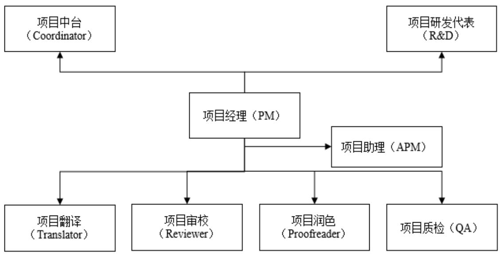
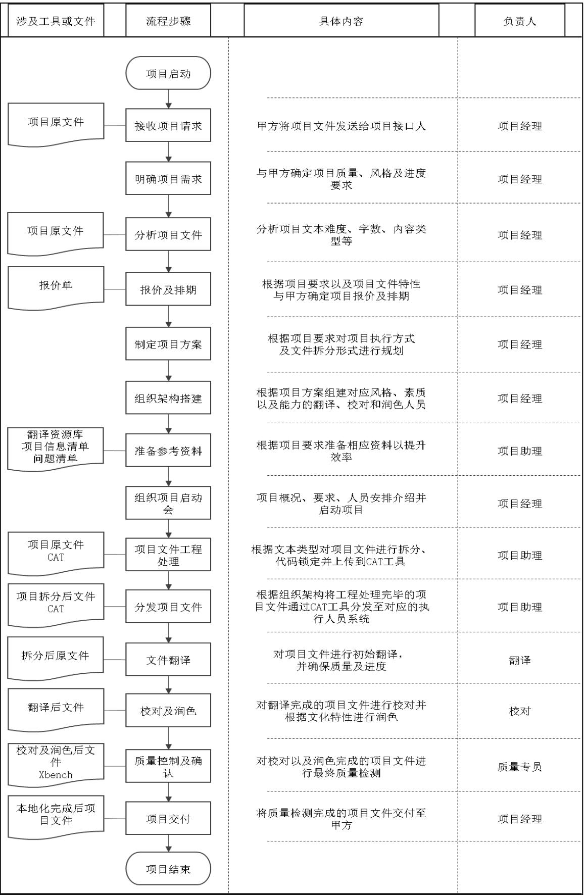

# 第 3 章 LX 游戏本地化项目概况

# 3.1 CC 创新公司简介

CC 创新公司自成立以来一直致力于消除跨国企业在国际沟通过程中的语言障碍，并助力技术传播。作为一家以技术为推动力的语言服务提供商，该公司由650 多名全职员工和全球 5000 多名认证语言专家和行业专家组成，通过优化本地化技术持续为客户提供高品质的本地化解决方案。经过 26 年的发展，CC 创新公司已成为业内发展最快的多语言服务供应商之一。

CC 创新公司能够为客户的语言要求提供全方位解决方案，包括笔译、口译、文化咨询、ISEO/ISEM、营销创翻、软件本地化、网站本地化、多媒体本地化（包括配音和字幕）、功能和语言测试等。公司对质量有着极高的承诺，采用经ISO9001:2015 和 ISO17100:2016 认证的质量管理系统，并规定所有语言专家必须拥有行业广泛承认的专业资质。

CC 创新公司时刻关注最新的行业趋势，包括机器翻译、众包和多媒体等领域，致力于持续满足客户不断变化的质量需求和预算。公司为每位客户定制适合他们的最佳解决方案，进而帮助其实现提高品牌知名度和增加市场份额的目标。

CC 创新公司的生产团队由语言专家、本地化工程师、项目经理和桌面排版人员组成，每位成员在其负责的领域都拥有专业知识以及行业相关的实战经验。公司为以下行业领域提供专业的本地化解决方案：生命科学、工业制造业、游戏娱乐、IT及软件业、汽车制造业、电子及通信业、在线教学、多媒体、金融业、旅游和酒店业、法律行业等。

大多数本地化服务供应商都以销量为驱动，以收入为导向，承诺以最低的价格提供完美的服务，而全然不考虑质量的真正成本。然而，CC 创新公司采用的是另一种行事方法：销售团队直接向运营部门汇报，而运营人员则从第一天起就参与到销售周期中来。公司采用公平透明的合作模式，费率也综合了价格和质量两个因素，可以为每一位选择CC 创新公司服务的客户交付高品质的翻译。这种理念帮助CC 创新公司在业内建立起无与伦比的质量声誉。

CC 创新公司如今已在全球范围内设立了17个战略分支机构，为全球260个国家和地区提供140多种语言的本地化服务。公司仍在不断将自己打造成为以客户为中心、质量为本和技术创新的企业，致力于为客户的本地化项目带来更多附加价值。

# $3 . 2 \mathrm { L X }$ 游戏本地化项目介绍

# 3.2.1 项目主要内容和目标

LX 游戏是由 A 游戏开发公司开发的 MOBA 类国产战斗型移动端游戏，于2018 年 11 月 26 日在 Android、iOS 平台上正式公测，计划于 2024 年 12 月 30 日在全球发布。LX 游戏的世界观基于中国古代历史和神话故事，为玩家呈现了一个激烈的战斗场景。在游戏中，玩家可以选择自己喜欢的人物角色，每个角色都有独特的技能和故事背景。游戏的核心目标是击败敌人、摧毁敌方建筑和抢夺地图上的资源，获得经验和金币，提升自己的能力和装备，在对手基地中摧毁对方的核心建筑，同时保护自己的核心建筑不被摧毁。除了基本的战斗玩法，LX 游戏还为玩家提供了多种 PVP 对战模式，包括 1V1、3V3 和 5V5 等。此外，玩家满足一定条件后还可以参加排位赛以及PVE的闯关模式，挑战更高难度的敌人。

作为一款MOBA游戏，LX游戏的人物设计、角色服饰以及整体的音乐风格都充满了浓郁的东方韵味。根据A游戏开发公司的市场发展战略，决定将 LX游戏出海，为了让海外玩家更好地理解游戏内容，A 游戏开发公司最终选定由 CC创新公司对 LX游戏进行本地化翻译处理。

项目内容包括本地化翻译游戏故事主线、主要情景等剧情文本，以及技能道具、通用商城等功能配置文本；此外，还需要将英雄角色的名称、古诗词念白等本地化翻译成目标语言，同时保留中国古代的文化元素。项目流程主要为翻译、校对、润色、排版以及质检。工作流程复杂，需要严谨的规划和精细的管理，以确保不同语言版本的文本能够准确、流畅地传达游戏内容，并且符合当地的语言习惯和文化背景。

根据 A 游戏开发公司的国际市场开发战略，LX 游戏的首批公测将于 2024年 8 月在美国正式开启，并陆续在欧洲、南美等地进行公测。项目预计于 2024年1月启动，交付时间节点定在2024年7月1日。公测版项目字数为50万中文字，需求语言为 8 种，分别为美式英语、日语、韩语、德语、法语、意大利语、拉丁西语、巴西葡语，需要多个语种同时启动并推进。

该项目是 A 游戏开发公司的年度重点项目，也是 CC 创新公司的战略性项目。为了确保项目的顺利进行和交付，CC 创新公司需要协助A游戏开发公司制定详细的本地化计划。由于涉及目标语言种类多且复杂，因此项目执行具有一定的挑战性。

在风险管理方面，CC 创新公司需要制定相应的风险应对措施，包括时间管理、人员配备、沟通协调等方面的工作。同时，加强对项目的监控和评估，及时发现和解决问题，确保项目的质量和交付效果。

# 3.2.2 项目组织架构与组织方式

根据 CC 创新公司的项目管理流程及相关文件要求，LX 游戏本地化项目的组织架构主要由项目经理总负责，向上对接甲方项目中台以及研发代表，向下负责项目翻译、项目审校、项目润色、项目质检等多个角色的沟通管理，同时内部协调项目助理、工程人员等辅助部门的工作，确保项目质量、进度、成本目标的达成。

其中，项目中台的主要责任为沟通甲方内部需求，同时将需求与进度等项目信息反馈至游戏开发及推广团队，确保游戏上线整体目标的达成；项目研发代表的主要责任为在 LX游戏的本地化进程中，解答由本地化团队提出的各项疑惑并给予专业指导；项目助理的主要责任为协助项目经理进行项目沟通管理，协调项目资源，跟进项目进度等辅助类项目管理工作；项目翻译全权负责对应语种的项目文件翻译，确保翻译文本质量，包括游戏语言风格、流畅度、地道性、准确度等，同时对游戏文本中可能存在的文化冲突、法律风险进行把关，需要具备源语言与目标语言的双重知识储备；项目审校负责对应语种翻译后的项目文件质量以及译后文本与甲方需求之间匹配程度的检验，同时对游戏文本中可能存在的文化冲突、法律风险进行二次把关，保证项目质量目标顺利达成；项目润色主要负责审校后文本的流畅度、逻辑性以及文学性，以满足项目的美学需求；项目质检为LX 游戏本地化项目的最后一道质量把关，需要对排版后的交付物进行综合评估与质检，使其达到交付标准。

  
图 3.1 项目组织架构  
Fig.3.1 Organization Structure

# 3.2.3 项目工作流程

游戏本地化项目一般分为接收、实施、交付三个重要流程，但每个流程都包含丰富的细节工作需要说明，如图 3.2 所示，为 CC 创新公司 LX 游戏本地化项目的一般流程：

  
图 3.2项目工作流程  
Fig.3.2 Workflow of LX Game Localization Project

通过上述流程图可知，LX游戏本地化项目起始于游戏开发公司的项目需求，将游戏基础语言传送至本地化执行团队进行文件需求确认、报价、排期、文件处理、分发、翻译、校对、润色、质检、排版、交付等一系列项目活动，最终完成游戏本地化翻译。

该流程中涉及诸多项目相关方之间的配合，对于项目经理的管理水平以及公司的管理流程具有一定的挑战性。同时，项目执行过程中的每一个环节均有可能发生预期之外的变化，因此，风险管理的重要性得以凸显，加强项目执行过程中的风险管理对保证项目顺利实施有着举足轻重的作用。

# 3.2.4 项目进度计划

项目整体分十二个步骤，从 2024 年 1 月 4 日起至 6 月 30 日交付为止，具体进度计划如图3.2所示：

<table><tr><td rowspan=1 colspan=7>LX游戏本地化项目进度计划</td></tr><tr><td rowspan=1 colspan=2>公司名称：</td><td rowspan=1 colspan=1>CC创新公司</td><td rowspan=1 colspan=1></td><td rowspan=1 colspan=1></td><td rowspan=1 colspan=1></td><td rowspan=1 colspan=1></td></tr><tr><td rowspan=1 colspan=2>项目经理：</td><td rowspan=1 colspan=1>ZXY</td><td rowspan=1 colspan=1></td><td rowspan=1 colspan=1></td><td rowspan=1 colspan=1></td><td rowspan=1 colspan=1></td></tr><tr><td rowspan=1 colspan=2>项目开始日期：</td><td rowspan=1 colspan=1>2024/1/4</td><td rowspan=1 colspan=1></td><td rowspan=1 colspan=1></td><td rowspan=1 colspan=1></td><td rowspan=1 colspan=1></td></tr><tr><td rowspan=1 colspan=2>跟踪频率（周）：</td><td rowspan=1 colspan=1>1</td><td rowspan=1 colspan=1></td><td rowspan=1 colspan=1></td><td rowspan=1 colspan=1></td><td rowspan=1 colspan=1></td></tr><tr><td rowspan=1 colspan=1>序号</td><td rowspan=1 colspan=1>任务</td><td rowspan=1 colspan=1>责任人</td><td rowspan=1 colspan=1>开始日期</td><td rowspan=1 colspan=1>天数</td><td rowspan=1 colspan=1>结束日期</td><td rowspan=1 colspan=1>进度</td></tr><tr><td rowspan=1 colspan=1>1</td><td rowspan=1 colspan=1>接收项目文件</td><td rowspan=1 colspan=1>PM</td><td rowspan=1 colspan=1>1/4/24</td><td rowspan=1 colspan=1>1</td><td rowspan=1 colspan=1>1/4/24</td><td rowspan=1 colspan=1>100%</td></tr><tr><td rowspan=1 colspan=1>2</td><td rowspan=1 colspan=1>分析项目文件</td><td rowspan=1 colspan=1>PM</td><td rowspan=1 colspan=1>1/4/24</td><td rowspan=1 colspan=1>2</td><td rowspan=1 colspan=1>1/5/24</td><td rowspan=1 colspan=1>100%</td></tr><tr><td rowspan=1 colspan=1>3</td><td rowspan=1 colspan=1>制定项目方案</td><td rowspan=1 colspan=1>PM</td><td rowspan=1 colspan=1>1/5/24</td><td rowspan=1 colspan=1>2</td><td rowspan=1 colspan=1>1/6/24</td><td rowspan=1 colspan=1>100%</td></tr><tr><td rowspan=1 colspan=1>4</td><td rowspan=1 colspan=1>组织架构搭建</td><td rowspan=1 colspan=1>PM</td><td rowspan=1 colspan=1>1/7/24</td><td rowspan=1 colspan=1>3</td><td rowspan=1 colspan=1>1/9/24</td><td rowspan=1 colspan=1>100%</td></tr><tr><td rowspan=1 colspan=1>5</td><td rowspan=1 colspan=1>准备参考资料</td><td rowspan=1 colspan=1>PM</td><td rowspan=1 colspan=1>1/9/24</td><td rowspan=1 colspan=1>2</td><td rowspan=1 colspan=1>1/10/24</td><td rowspan=1 colspan=1>100%</td></tr><tr><td rowspan=1 colspan=1>6</td><td rowspan=1 colspan=1>组织项目启动会</td><td rowspan=1 colspan=1>PM</td><td rowspan=1 colspan=1>1/10/24</td><td rowspan=1 colspan=1>1</td><td rowspan=1 colspan=1>1/10/24</td><td rowspan=1 colspan=1>100%</td></tr><tr><td rowspan=1 colspan=1>7</td><td rowspan=1 colspan=1>项目文件工程处理</td><td rowspan=1 colspan=1>APM</td><td rowspan=1 colspan=1>1/10/24</td><td rowspan=1 colspan=1>2</td><td rowspan=1 colspan=1>1/11/24</td><td rowspan=1 colspan=1>100%</td></tr><tr><td rowspan=1 colspan=1>8</td><td rowspan=1 colspan=1>分发项目文件</td><td rowspan=1 colspan=1>APM</td><td rowspan=1 colspan=1>1/11/24</td><td rowspan=1 colspan=1>1</td><td rowspan=1 colspan=1>1/11/24</td><td rowspan=1 colspan=1>100%</td></tr><tr><td rowspan=1 colspan=1>9</td><td rowspan=1 colspan=1>文件翻译</td><td rowspan=1 colspan=1>翻译</td><td rowspan=1 colspan=1>1/11/24</td><td rowspan=1 colspan=1>143</td><td rowspan=1 colspan=1>6/1/24</td><td rowspan=1 colspan=1>100%</td></tr><tr><td rowspan=1 colspan=1>10</td><td rowspan=1 colspan=1>校对及润色</td><td rowspan=1 colspan=1>校对</td><td rowspan=1 colspan=1>4/1/24</td><td rowspan=1 colspan=1>81</td><td rowspan=1 colspan=1>6/20/24</td><td rowspan=1 colspan=1>90%</td></tr><tr><td rowspan=1 colspan=1>11</td><td rowspan=1 colspan=1>质量控制及确认</td><td rowspan=1 colspan=1>质检</td><td rowspan=1 colspan=1>6/20/24</td><td rowspan=1 colspan=1>10</td><td rowspan=1 colspan=1>6/29/24</td><td rowspan=1 colspan=1>0%</td></tr><tr><td rowspan=1 colspan=1>12</td><td rowspan=1 colspan=1>项目交付</td><td rowspan=1 colspan=1>PM</td><td rowspan=1 colspan=1>6/29/24</td><td rowspan=1 colspan=1>2</td><td rowspan=1 colspan=1>6/30/24</td><td rowspan=1 colspan=1>0%</td></tr></table>

# 3.2.5 项目风险管理目标

作为A游戏开发公司的重点项目，LX游戏本地化项目的成功与否对CC 创新公司与A游戏开发公司的后续合作有着相当大的影响。因此，CC 创新公司对该项目给予了高度重视，并为该项目制定了总体方针，即质量与进度优先于成本，务必确保项目顺利进行。

为了实现对 LX游戏本地化项目目标达成的有效管控，公司根据项目合同结合各项考评原则为该项目制定了合理的风险管理目标，具体如下：

（1）风险事件损失项目进度不超过10个自然日：此目标旨在确保项目进度不会因风险事件而受到严重影响。在竞争激烈、节奏快速多变的游戏行业，时间是一个关键因素。通过实施有效的风险管理措施，期望在发生风险事件时，能够迅速应对并减少其对项目进度的影响，确保项目按时完成；

（2）风险事件降低项目质量评分不超过 3 个百分点：此目标旨在确保项目的质量不受风险事件的影响。游戏本地化的质量会直接影响到玩家的体验和评价。通过实施有效的风险管理策略，期望将风险事件对项目质量的影响控制在3个百分点以内，以确保项目保质保量地交付；

（3）风险事件造成的经济损失不超过项目总金额的 $3 \%$ ：此目标旨在将风险损失控制在可接受的范围内。风险损失可能来自于各种原因，如翻译错误导致的游戏平衡性失调、文化差异引起的玩家不满、甲方要求反复横跳导致的返工等。通过实施有效的风险管理策略，期望将风险损失控制在项目总金额的 $3 \%$ 以内，以避免因风险事件导致的重大经济损失；

（4）风险事件不得引起甲方投诉：此目标旨在确保项目满足客户期望，提升客户满意度。客户反馈是衡量一个项目成功与否的重要标准。通过实施有效的风险管理，期望在发生风险事件时能够迅速应对并减少对客户的影响，确保客户对项目的满意度。

根据上述风险管理目标，结合 LX游戏本地化项目进度计划表可以看出，在项目进行中实施有效的进度跟踪和质量管理至关重要。在 LX游戏本地化项目的进展过程中，最难控制的应为文件翻译、校对及润色环节，该环节占据了整个项目 $90 \%$ 以上的时间，因此项目经理应该加强翻校润阶段的管理，通过制定详细的排期计划、建立有效的监控机制、加强内外部沟通协调、积极应对突发情况、激发团队积极性和持续优化项目流程等措施，有效地进行项目风险管理，推动项目的顺利进行。

# $3 . 3 \mathrm { L X }$ 游戏本地化项目难点

# 3.3.1 文本理解难度大

首先，LX 游戏的故事主线和背景题材蕴含丰富的中国传统文化元素。对于母语译员而言，尤其是那些对中国传统文化缺乏深入了解的译员，准确理解并传达这些元素尤为困难。举例来说，游戏中融入的“糖瓜粘”、“扫房子”、“磨豆腐”等传统习俗和食品，不仅需要译员深入解读其文化内涵，还需寻找恰当的翻译策略，以确保译文在传达文化精髓的同时保持准确性与灵活性。以“糖瓜粘”为例，作为春节期间的传统食品，若直接翻译为“sugar stick”可能无法准确传达其文化意义和特色，因为英文中并不存在与之相对应的传统食品概念。因此，这要求译员具备对中国食品文化的深刻理解和丰富的语言知识，以找到既能体现其文化特色又易于目标语言读者理解的翻译方式。由此细节可见，LX 游戏所承载的深厚历史和文化背景对本地化团队构成了巨大挑战。为了确保游戏文本的可理解性和文化准确性，译员必须拥有相当高的文学素养，能够妥善处理游戏中所有的文化元素，从而确保本地化工作的成功实施。

其次，LX 游戏中还融入了一系列幽默、讽刺、双关等修辞手法，这些手法的翻译不仅需要保持原文的韵味，还需充分考虑到目标语言的文化和语言习惯。这对于译员而言，是一项极具挑战性的任务。以游戏中的一句台词为例：“此‘局’全输矣！于此失却‘局’，奇哉！”，这里的“局”字在字面上指的是“棋局”，但实际上却暗指“天下大局”。这种含蓄而富有深意的修辞手法，可能涉及特定的文化参照或历史典故，对译员的文化背景和知识储备提出了更高要求。为了准确传达这些修辞手法的含义和韵味，译员需要深入了解游戏背后的文化背景，并灵活运用翻译技巧，如意译、加注等，以确保译文既能忠实于原文，又能被目标语言读者所理解和接受。

此外，LX 游戏的源文本存在大量术语不一致或前后逻辑不通的问题。由于LX 游戏体量较大，游戏文本由十余个策划共同打磨完成，这种多方共同作业的方式虽然提高了效率，但也存在明显的缺点，容易导致文本内容不一致或前后逻辑不通。每个策划都有自己独特的语言习惯，如果多方沟通不顺畅，就可能出现同一个词语有多种说法的情况，这无疑加大了文本理解的难度，对本地化翻译工作造成了巨大的挑战。例如，文本中出现的“怒涛之城”和“怒潮之城”实际上指的是同一个地点，“水晶凝萃”和“水晶凝练”指的是同一个技能。面对这种情况，译员需要投入更多精力去理解和梳理游戏文本，并与策划进行多次有效的沟通和修订，才能在译文中尽力修正原文中的一致性和逻辑性问题。

同时，项目组提供的参考文件和术语清单并不完整，文本中代码混杂且数量众多，缺少 Key 值，文本类型分类混乱，剧情、系统、技能等内容混杂在一起。这些因素都会增加文本理解的难度，给项目执行带来巨大困难。在这种情况下，译员需要充分利用有限的参考资料和术语清单，对游戏文本进行深入的分析和研究，以了解游戏的具体内容和机制，并在本地化翻译过程中与项目组成员进行多次沟通和提问。此外，也需要项目经理对游戏文本、代码和文件梳理上具备足够的能力，在准备阶段对文本类型进行适当分类，并对游戏文本中的代码进行充分处理，以降低译员翻译过程中文本理解的难度和错误率。

# 3.3.2 项目交付周期短

LX 游戏本地化项目的交付周期较短，从项目发起到项目交付的时间只有不到 7 个月。在这段时间内，需要完成包括 8 个语种的 50 万字的翻译、审校、润色、质检等工作。按照一位译员的平均翻译效率为3000字/天计算，在除去项目前期准备及收尾工作所需时间后，项目执行的实际可用时间约为 6 个月，即 180天。在这 180 天中，还需要考虑到节假日等非工作日近 60 天，真正可用于项目的时间约为120天。这意味着该项目需要各环节成员协作，在短短不到120天内完成所有的翻译、审校、润色、质检等工作，由于涉及多个语种和大量文本，需要协调不同语种之间的翻译进度，确保所有文本都能按时完成。同时，还需要与美术、音效等其他部门密切合作，确保游戏内容的协调性。这是一个非常庞大的任务，不仅涉及翻译工作本身的复杂性，还要考虑到多个语种、大量文本的并行处理以及一系列项目管理环节所需的时间。

可以看出，该项目无论在交付周期还是在项目管理上都面临着很大的考验，可能导致团队在应对突发情况时缺乏足够的缓冲时间，增加项目遇到风险的可能性，比如资源不足、技术难题、需求变更等，使得项目更难以管理；还可能导致员工长时间加班、工作强度增大、影响工作效率、增加出错率、创新受限、测试与验证不足，进而导致质量下降、成本增加、团队协作受阻，客户满意度下降，损害企业声誉。为了项目的顺利交付，项目团队需要制定详细的交付计划和时间表，明确每个阶段的任务和时间节点；同时建立高效的协作机制和沟通渠道，确保团队成员之间的信息共享和及时沟通；另外，也要充分利用先进的翻译工具和技术，以提高翻译效率和准确性，避免返工影响交期的情况发生。

# 3.3.3 项目管理难度大

其一，体现在成员管理难度大。首先，按照常规翻译人员的平均产出 3000 字/天为计算基准，为了满足交付节点，每一个语言对需要 3 到 4 位译员协作；同时，为了尽可能确保译文风格的前后一致性，每一位译员要在此项目坚守接近半年且每天维持高质高量的产出。如何确保每个译员都能按照预定的计划和标准进行语言工作，并在多人协作的前提下，保持项目内译文风格、句式、术语的一致性，是一个非常困难的问题。其次，该项目需要在同一时间节点完成 8 个语种的本地化翻译，相当于同时管理8个单一语种需求的项目，这意味着该项目单从语言人员的数量上便会涉及 30 余人，其人员数量与成分非常复杂，直接升级了项目成员管理的难度。在实践中，同时管理多个项目需要非常高的协调能力和管理能力。如何确保每个项目都能够按照预定的计划和标准进行，保持各个项目之间的协调一致性，同时确保各个项目流程的人员各司其职，是一个非常具有挑战性的问题。此外，由于项目各个语言对的成员来自不同的国家和地区，时区、文化背景和语言习惯等方面存在很大的差异，这需要项目经理具备跨文化沟通和管理的能力，在项目执行过程中充分考虑到这些差异，并采取相应的措施来解决问题。

其二，体现在目标语地区的政策、文化、风俗本地化管理难度大。政策、文化、风俗本地化是一个极为复杂且充满挑战的难点。首先，不同国家和地区在游戏内容、审查标准、乃至语言使用上都可能存在严格的法规限制，本地化翻译团队需要深入研究和理解目标市场的政策环境，确保本地化内容符合当地法律法规，避免因违反政策而导致的市场准入障碍或法律纠纷；其次，游戏作为文化产品，其内容和表达方式往往深受源语言文化的影响，在本地化翻译过程中，如何准确传达游戏的文化内涵，同时又能符合目标语地区的文化习惯，是一项极具挑战性的任务，本地化翻译团队需要具备深厚的跨文化沟通能力，能够灵活处理文化差异带来的翻译难题；最后，不同地区的风俗习惯和表达方式千差万别，如何在本地化翻译中准确体现这些差异，同时又能保持游戏的整体风格和用户体验，是本地化翻译团队需要解决的关键问题，这需要语言人员具备丰富的目标语地区知识，能够准确把握当地的风俗习惯，并将其巧妙地融入游戏本地化内容中。

其三，体现在流程管理难度大。在项目的执行过程中，需求方在前期的准备工作上存在明显不足，未能充分履行其职责，反而将本应自身承担的文件分类、整理代码和 Key 值等重要任务推脱给本地化团队，不仅增加了团队的工作负担，也对项目的整体进度和质量造成了不利影响。同时，由于需求方在项目初期未能及时提供必要的参考文件，导致本地化团队在缺乏充分信息的情况下进行盲翻，增加了项目的不确定性。此外，需求方在项目进行中未能及时响应并解答项目团队的问题，导致团队在面临困难时无法及时得到支持。更为严重的是，项目中缺乏完善的答疑、质检、反馈流程，这意味着在翻校过程中语言人员遇到的文本方面的疑问无法得到及时有效的反馈，导致项目的质量和进度均无法得到保障。

其四，体现在管理制度不健全。CC 创新公司在管理制度方面存在明显的不足，亟待完善。目前，公司尚未建立起一套健全有效的委任制度和奖惩制度，这导致项目经理在寻求工作支持时常常面临响应不及时的问题。由于缺乏明确的职责划分和权力授予机制，项目经理在协调资源和解决问题时也常遭遇阻碍，这不仅影响项目的推进效率，也会削弱团队的凝聚力。此外，奖惩制度的缺失也对员工的工作积极性和职业态度造成了负面影响。在缺乏有效激励的情况下，优秀员工因为无法得到应有的奖励而逐渐失去工作热情，创造力和贡献度因此下降；而对于表现不佳的员工，由于缺乏相应的惩罚机制，他们会更加肆无忌惮地犯错或推卸责任，损害团队的整体利益，破坏公司文化的健康发展。

# 3.3.4 沟通能力要求高

项目经理的沟通能力在维护与需求方的合作关系中起着至关重要的作用。在LX 游戏本地化项目中，策划和中台对于游戏的风格方向和质量评判具有较大的话语权，因此，项目经理需要与需求方（包括策划和中台人员）进行频繁而密切的沟通。通过深入的交流，才能更好地理解游戏设计、功能和剧情等方面的内容，同时也能更准确地把握甲方的需求和期望。

项目经理还要与团队内部的项目助理、工程人员进行有效沟通，包括对项目文本处理、人员筛选、进度计划、质量等方面的协商和安排。LX 游戏本地化项目文本处理难度大、交期紧张、涉及语言人员数量较多，各个环节的工作都需要团队内部的紧密配合，因为不同环节的工作内容和目标存在差异，所以需要项目经理具备高度的沟通协调能力和解决问题的能力，才能确保团队内部的紧密合作，推动项目的顺利进行。

此外，与语言人员的沟通更是至关重要，因为语言人员是把控整个项目的进度与质量的关键。翻译、审校、润色和质检环节的成员来自不同的地区，拥有不同的文化背景和工作习惯。因此，项目经理需要具备跨文化沟通能力，才能与语言人员建立良好的沟通，向他们传达翻译质量、风格、术语等方面的指导和建议，并为他们提供必要的培训和支持，帮助他们更好地理解项目要求和目标。而且，由于该项目涉及环节多、目标语言多，项目经理需要建立一个有效的沟通渠道，一旦需求方有任何规则、内容等方面的变更，可以快速同步给多方，确保信息准确传递，项目及时应对变更。

# 3.3.5 项目可变更程度低

首先，对于一个已经在国内运行多年并广受玩家喜爱的游戏，其研发团队在项目需求交底阶段就明确了项目语言风格、形式等尽量不做修改，这种明确的要求在一定程度上限制了项目的灵活性。例如，游戏中的角色形象、服装设计、武器造型等元素，作为游戏文化的一部分，是玩家识别和喜爱游戏的重要因素。在本地化过程中，由于涉及到不同地区和文化背景的玩家审美和接受度，往往需要在译文上进行一定的调整和创造。但是，由于 LX游戏的特殊限制要求，即游戏风格和形式的可变更程度低，本地化团队会因此在项目执行过程中变得束手束脚。

其次，项目的交付节点已经确定，无法更改。考虑到项目交付周期的紧迫，项目如果出现任何形式的变更必定会增加额外的时间，而任一时间节点发生变更都会牵一发而动全身，涉及到的工作计划、人力资源分配以及与其他部门的协调沟通都需要重新安排，这不仅需要花费更多的时间和精力，还可能会导致项目进度和质量受到影响，其可控程度不能得到保证。

此外，该项目涉及的语言人员非常多，一旦需求发生变更，小到一个术语、一个代码，大到整个文件的替换或交付节点的调整等，项目经理都需要逐一与成员进行沟通和同步，过程既繁琐又耗时，也可能会因为沟通不畅或者信息遗漏等原因，导致部分问题得不到及时解决或者出现误解的情况。

与此同时，项目上任何形式的变更都会对项目造成额外的成本支出。由于该项目为八个语言对并行，每一次变更都会涉及各个支线的修改，即八倍的成本支出，进而导致项目成本超出预算，给项目团队带来更多的压力和挑战，甚至会影响到项目的整体效益。

# 3.3.6 交付质量要求严苛

LX游戏作为 A游戏开发公司的年度重点项目，由成熟的中国模式向海外辐射，通过国内成熟的运营经验，经过严苛的细节打磨，游戏的整体效果及质量具有非常完整的评估体系与计分标准。这意味着，该项目对翻译的准确性、表达的自然度以及与游戏的契合度要求非常高，对于项目执行人员来说，需要在翻译、审校、润色、质检等各个环节中都严格按照既定的标准和要求操作，不能有丝毫的松懈。这需要项目团队建立完善的本地化流程和质量控制体系，对语言人员进行专业培训和指导，同时需要项目执行人员具备非常高的语言能力和文化敏感度，加上多次的审校和润色等流程工作的叠加，以确保翻译的整体效果能够达到甲方的要求。
