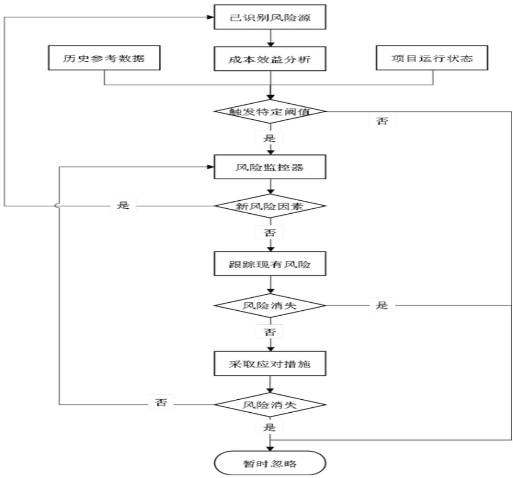

# 第 4 章 项目风险的识别与评估

# 4.1 LX 游戏本地化项目风险识别

# 4.1.1 访谈的设计与实施

通过访谈搜集 LX游戏本地化项目相关方认识到的风险类型与风险因素，并以此作为头脑风暴活动的主题数据，在头脑风暴中，结合访谈结果，验证或排除最初的假设。

访谈过程中，问题以开放式为主，需要访谈人员与被访谈人员深入沟通和充分互动，灵活应变。

访谈的三个步骤如下：

选择访谈对象：访谈对象的选择与调研目的和要解决的问题性质直接相关，即不同的调研目的和要解决的问题性质，对应着不同的访谈对象。本次调研目的是要了解游戏本地化翻译项目执行过程中，各利益相关方认识到的项目风险，访谈对象则需要涉及：第一部分是企业内部人员，包括项目经理、项目助理、内部翻译、内部校对等角色。第二部分是客户人员，包括项目中台、项目研发、项目运营以及项目二审人员。第三部分是行业专家，包括行业协会专家。第四部分是外部合作方，包括外委译员以及校对等。

由于游戏本地化项目的发展年限较短，目前还无法做出相对科学的样本数量要求，因此，暂拟选择各方资深代表人员 1 至 3 名进行深入访谈。

拟定访谈提纲：本次调研的主要目的是为了全面掌握游戏本地化翻译项目执行过程中的风险类型及其风险因素，同时，调研过程应该科学、合理、公开，因此，本次访谈本着“大胆假设、小心求证”的原则，进行半结果化访谈，拟出如下访谈提纲：

（1）被访者身份：职位、从业年限、与项目所属关系  
（2）项目执行过程中遇到的挑战及困难  
（3）项目挑战及困难形成的原因  
（4）该挑战及困难是否属于项目风险因素之一  
（5）能否提前识别该风险因素  
（6）该风险因素归属项目管理风险理论的哪一类别  
（7）如何避免此类挑战及困难再次发生

根据被访者的回答深入探讨风险成因及可行的预防策略等话题，以便获得更为准确和详细的一手信息。

实施访谈：共发出15份访谈邀请，得到13份回复，其中确认参与访谈的共9人。访谈形式为半结构化，具体流程如下：

首先确定被访者身份信息，并告知被访谈者自己的身份、职位、调研目的和相关承诺，说明将匿名统计访谈结果，并只用作研究用途，访谈内容依据被访者反馈的实际感受记录等；

根据访谈提纲与被访者进行话题探讨，并做好详细记录；

访谈结束后，与被访者确认访谈信息记录的完整、准确性，以确保数据的真实性，然后统计、整理访谈内容，对于交流中未能充分理解的内容，需要再次与被访者进行确认，保证访谈内容的有效性。

通过对访谈结果的初步整理与分析，对 LX游戏本地化项目全生命周期中存在的风险因素罗列如下：文本题材小众、文本专业性高、文本逻辑矛盾、文本语意模糊、文本一致性弱、参考资料不足、文本代码杂乱、文本分类混乱无序、缺少 Key 值、职责分工不明确，互相推诿、组织架构不完善、领导力不强、内外部语言人员资源紧张、CAT 工具架构不完善、QA 工具体系不健全、辅助翻译技术不成熟、网络不稳定、政策法律/市场环境/行业等变动、领导层支持力度不够、工作环境不理想、企业与员工理念不合、不可抗力事件、管理制度不完善、需求方配合程度较低、未建立良好的内外部沟通机制、管理资源紧张、业务流程缺失、员工履历不匹配、中标价格过低、成本分配不均衡、外部语言人员价格过高、需求不够全面明确、需求变更频繁、需求交付计划不合理。

对 LX游戏本地化项目的风险因素进行再梳理、再分析，最终将其合并为六大类风险因素，并形成初步风险清单如下：

表4.1初步风险清单  
Tab.4.1 Preliminary Risk List   

<table><tr><td colspan="2">风险名称 风险因素</td></tr><tr><td>文本风险</td><td>文本题材小众、文本专业性高、文本逻辑矛盾、文本语意模糊、文本一 致性弱、参考资料不足、文本代码杂乱、文本分类混乱无序、缺少 Key 值</td></tr><tr><td>人力风险</td><td>职责分工不明确、互相推诿、组织架构不完善、领导力不强、内外部语 言人员资源紧张</td></tr><tr><td>技术风险</td><td>CAT工具架构不完善、QA工具体系不健全、辅助翻译技术不成熟、 网络不稳定</td></tr><tr><td>管理风险</td><td>管理制度不完善、需求方配合程度较低、未建立良好的内外部沟通机 制、管理资源紧张、业务流程缺失、员工履历不匹配、领导层支持力度 不够、工作环境不理想、企业与员工理念不合</td></tr><tr><td>经济风险</td><td>中标价格过低、成本分配不均衡、外部语言人员价格过高</td></tr><tr><td>需求风险</td><td>需求不够全面明确、需求变更频繁、需求交付计划不合理、不可抗力 事件</td></tr></table>

# 4.1.2 头脑风暴的组织与实施

头脑风暴法主要是通过召开风险因素识别专题会议的形式来展开，具体步骤如下：

由项目经理指定专人整理项目相关资料，包括项目计划书、项目说明书、游戏文本、参考资料等内部资料，从中提取关键信息。由本人查阅历史项目档案、相关方整理的与项目有关的外部信息，包括近期的行业政策、游戏资源信息等。

征得项目方同意，召集项目决策人、游戏策划、本地化中台、行业专家、项目经理、技术人员、语言人员等不同环节的工作人员共 13 人召开讨论会议。另外，还设置主持人一名，记录员一名。

在讨论会议正式开始前，将前期整理的初步风险清单发放到与会人员手中，会议开始后，由主持人强调会议的内容与最终目标，明确使用头脑风暴法展开集中讨论，对 LX 游戏本地化项目进行全面的风险识别，不受限于初步风险清单。

风险因素识别专题会议坚持平等的原则，每一名参会人员在会上都有平等发表个人想法的权利，与参与人员的职位、在项目中的角色毫无关系。会上，所有参会人员要充分发挥自己的主观能动性，挖掘的风险因素越多越好，发表的观点没有对与错之分，也不需要对其他人的观点进行评判。记录员对每名与会者提出的风险因素进行详细记录，对相同观点归类汇总。

再次召集所有与会者，简要公布汇总结果和每个人的意见，再次进行讨论，互相说明缘由，再次汇总观点，归总风险类型及风险因素，在初步风险清单的基础上进行汇总增减，形成最终风险清单，其中包括 21 项风险因素：

# 表 4.2 最终风险清单

Tab.4.2 Final Risk List   

<table><tr><td>风险名称</td><td>风险因素</td><td>风险成因</td></tr><tr><td>文本风险文本专业性高</td><td></td><td>游戏题材较为小众，专业性较高，具体表现在涉及中国古 代历史与神话内容较多，且有大量文言文、古诗词、双关 语、修辞手法等</td></tr><tr><td>文本风险</td><td>文本逻辑矛盾/语意模 糊</td><td>游戏文本由多个策划合作而成，不同的策划有不同的逻 辑习惯与语言特点，加上缺乏沟通，导致文本语意模糊， 前后逻辑矛盾</td></tr><tr><td>文本风险文本一致性弱</td><td></td><td>游戏文本由多个策划合作而成，不同的策划有不同的逻 辑习惯与语言特点，加上缺乏沟通，导致多个术语前后不 一致</td></tr><tr><td></td><td>文本风险参考资料不足</td><td>参考文件和术语清单不完整，项目组未提供游戏Demo供 试玩</td></tr><tr><td>文本风险文本代码杂乱</td><td></td><td>文本中代码混杂且数量众多，各代码指代含义不清晰</td></tr><tr><td></td><td>文本风险　文本分类混乱无序</td><td>文本类型分类混乱，剧情、系统、技能等内容混杂</td></tr><tr><td></td><td>人力风险职责分工不明确</td><td>需求方准备工作不完善，将文件分类、整理参考等工作推 脱给乙方；团队内部、本地化翻译各流程人员之间也存在 互相推卸责任的情况，导致工作重叠、任务遗漏或相互干 扰</td></tr><tr><td></td><td>人力风险组织架构不完善</td><td>管理资源紧张，缺少专业的项目助理、技术人员</td></tr><tr><td></td><td>人力风险语言人员资源紧张</td><td>在语言能力、文学素养、对目标语地区政策与风俗的熟悉 度上足够胜任本项目且工作排期合适的翻译、审校、润色 资源紧张，不足以应对LX游戏紧张的排期</td></tr><tr><td>人力风险领导力不强</td><td></td><td>领导层支持力度不够，直接上级领导力不强</td></tr><tr><td></td><td>管理风险管理制度不完善</td><td>公司管理制度有待完善，暂没有完善的委任制度、奖惩制 度等，导致项目经理需要工作支持时无法得到及时响应， 优者因无法得到奖励而降低积极性，劣者即便犯错也不 会受到惩罚而更加嚣张</td></tr><tr><td></td><td>管理风险需求方配合程度较低</td><td>需求方响应较慢，在项目初期未提供参考文件；在项目进 行中不及时答疑；将分内工作推脱给本地化团队</td></tr><tr><td>管理风险</td><td>未建立良好的內外部 沟通机制</td><td>内部人员之间、项目经理与外委语言人员之间、项目经理 与需求方之间的沟通都存在一定程度的问题</td></tr><tr><td></td><td>管理风险业务流程缺失</td><td>缺乏完善的答疑、质检、反馈流程</td></tr><tr><td></td><td>经济风险中标价格过低</td><td>公司处于业务开拓、抢占市场阶段，投标阶段报价较低</td></tr><tr><td></td><td>经济风险成本分配不均衡</td><td>外部语言人员成本占项目总成本比例过高</td></tr><tr><td></td><td>需求风险需求不够全面明确</td><td>项目初期需求方提供的资料、规则等不够全面，在项目进 行中不断增减更改；存在文本逻辑不通、语意模糊的情 况，导致翻译文本整体不明确；在项目进行中需求方对于 答疑的重视程度不够</td></tr><tr><td></td><td>需求风险需求变更频繁</td><td>项目执行过程中频繁出现内容、规则、文件变更的情况</td></tr><tr><td></td><td>需求风险需求交付计划不合理项目体量大、语言对多、交期紧张</td><td></td></tr><tr><td></td><td>技术风险工具体系搭建不健全</td><td>QA工具体系不健全、辅助翻译技术不完善</td></tr><tr><td>技术风险</td><td>工具/网络不稳定或功 能缺失</td><td>CAT工具不稳定、功能缺失、网络不稳定</td></tr></table>

# $4 . 2 \mathrm { L X }$ 游戏本地化项目风险评估

# 4.2.1 项目风险评估过程

LX 游戏本地化项目将采用层次分析法对项目各风险因素进行量化评估，并对各个风险因素按照评估结果进行排序，最终依据评估结果提出针对性强的风险应对策略，为项目目标的顺利达成保驾护航。

使用层次分析法进行风险评估的步骤如下：

（1）构建层次评价模型：根据上一节中的 LX 游戏本地化项目风险识别结果，将文本风险、人力风险、管理风险、经济风险、需求风险、技术风险确定为一级风险评估指标，将文本专业性高、文本逻辑矛盾/语意模糊、文本一致性弱、参考资料不足、文本代码杂乱、文本分类混乱无序、职责分工不明确、组织架构不完善、语言人员资源紧张、领导力不强、管理制度不完善、需求方配合程度较低、未建立良好的内外部沟通机制、业务流程缺失、中标价格过低、成本分配不均衡、需求不够全面明确、需求变更频繁、需求交付计划不合理、工具体系搭建不健全、工具/网络不稳定或功能缺失确定为二级风险评估指标，具体指标如表4.3 所示：

# 表4.3项目风险评估指标

Tab.4.3 Risk assessment indicators   

<table><tr><td>目标层</td><td>一级指标</td><td>二级指标</td></tr><tr><td rowspan="9"></td><td></td><td>文本专业性高U11</td></tr><tr><td rowspan="3">文本风险U1</td><td>文本逻辑矛盾/语意模糊U12</td></tr><tr><td>文本一致性弱U13</td></tr><tr><td>参考资料不足U14 文本代码杂乱U15</td></tr><tr><td rowspan="3">人力风险U2</td><td>文本分类混乱无序U16</td></tr><tr><td>职责分工不明确U21</td></tr><tr><td>组织架构不完善U22</td></tr><tr><td rowspan="3">LX游戏本地化 项目风险评估 管理风险U3</td><td>语言人员资源紧张U23 领导力不强U24</td></tr><tr><td>管理制度不完善 U31</td></tr><tr><td>需求方配合程度较低U32 未建立良好的内外部沟通机制U33</td></tr><tr><td rowspan="5"></td><td></td><td>业务流程缺失U34</td></tr><tr><td>经济风险U4</td><td>中标价格过低U41</td></tr><tr><td></td><td>成本分配不均衡 U42</td></tr><tr><td rowspan="2">需求风险U5</td><td>需求不够全面明确U51</td></tr><tr><td>需求变更频繁U52</td></tr><tr><td rowspan="2"></td><td>技术风险U6</td><td>需求交付计划不合理U53 工具体系搭建不健全U61</td></tr><tr><td></td><td>工具/网络不稳定或功能缺失U62</td></tr></table>

（2）构建判断矩阵、计算各准则对应目标的权重并进行一致性检验：构建判断矩阵是为了计算各级风险评估指标的权重大小。权重越大，代表风险等级越高，风险发生的可能性越大，风险发生后造成的不利后果越严重，影响范围越广，越需要重点防范应对。

在构建判断矩阵的过程中，为了确定各级评价指标权重，需要采用问卷调查的形式，将不同级别的风险评估指标分别进行层级内两两比较打分，按照各层级指标之间的相对风险性赋予其相应的分数，包括1、3、5、7、9，为了能够更好的体现出两个指标的对标结果，又在上述分数之间再加四个分数，为 2、4、6、8，共九个分数赋值，从而得到判断矩阵。

各分数所代表的意义如表 4.4 所示：

表4.4 评估标度衡量赋值表  
Tab.4.4 Evaluation table of each scale   

<table><tr><td>标度</td><td>含义</td></tr><tr><td>1</td><td>表示两个元素相比，具有相同的重要性</td></tr><tr><td>3</td><td>表示两个元素相比，前者比后者稍微重要</td></tr><tr><td>5</td><td>表示两个元素相比，前者比后者明显重要</td></tr><tr><td>7</td><td>表示两个元素相比，前者比后者极其重要</td></tr><tr><td>9</td><td>表示两个元素相比，前者比后者绝对重要</td></tr><tr><td>2,4,6,8</td><td>表示上述相邻判断的中间值</td></tr><tr><td>1-9的倒数</td><td>表示相应两因素交换次序比较的重要性</td></tr></table>

在本次研究中，选择了十位专家参与问卷调查。这十位专家从业时间长、业务能力强，基本涵盖了游戏本地化项目策划、中台、项目经理、语言专家、行业专家等全部业务领域。具体打分以及结果汇总过程如下：

（1） 下发问卷给10位专家；  
（2） 专家组根据实践经验和专业知识对同层次各指标的重要性进行比较赋值，构建两两比较判断矩阵，但不汇总各位专家具体赋值数据；  
（3） 专家组自行组织座谈会，通过逐项讨论并做出最终判断决策，如遇分歧通过分歧专家自述然后投票的方式做成最终判断决策。

LX游戏本地化项目风险评估一级指标的打分结果如表4.5所示：

表4.5 风险评估一级指标打分表  
Tab 4.5 First level index scoring table   

<table><tr><td></td><td>文本风险 U1</td><td>人力风险 U2</td><td>管理风险 U3</td><td>经济风险 U4</td><td>需求风险 U5</td><td>技术风险 U6</td></tr><tr><td>文本风险U1</td><td>1</td><td>1/2</td><td>2</td><td>3</td><td>1</td><td>4</td></tr><tr><td>人力风险U2</td><td>2</td><td>1</td><td>1/2</td><td>3</td><td>1/3</td><td>6</td></tr><tr><td>管理风险U3</td><td>1/2</td><td>2</td><td>1</td><td>3</td><td>1/2</td><td>5</td></tr><tr><td>经济风险U4</td><td>1/3</td><td>1/3</td><td>1/3</td><td>1</td><td>1/4</td><td>1/2</td></tr><tr><td>需求风险U5</td><td>1</td><td>3</td><td>2</td><td>4</td><td>1</td><td>6</td></tr><tr><td>技术风险U6</td><td>1/4</td><td>1/6</td><td>1/5</td><td>2</td><td>1/6</td><td>1</td></tr></table>

打分说明：对表 4.5 中的行和列中的风险指标进行两两比较，根据两者之间的严重程度赋予相应的分值。例如，b21表示人力风险与文本风险严重程度进行比较，根据表4.4中罗列的九种重要性衡量值，认为人力风险严重程度比文本风险严重程度稍微重要，则 b21为2，同时可以确定b12为1/2。其中，表4.5中对角线位置表示与自身进行重要性比较，故直接赋分值为 1，即 b11、b22、b33、b44、b55、b66 的数值均为 1。

由表 4.5 可以构建 LX 游戏本地化项目风险评估一级指标的判断矩阵 A 为：

通过判断矩阵 A 计算指标权重：进行归一化处理，将一级指标的值替换为当前列总和的比例值，并将其计算出来，最后将对应行进行处理，求出平均值，作为该指标的权重 W，如表 4.6 所示：

表 4.6 一级指标权重  
Tab.4.6 First level index weight   

<table><tr><td></td><td>文本风险 U1</td><td>人力风 险U2</td><td>管理风 险U3</td><td>经济风 险U4</td><td>需求风 险U5</td><td>技术风 险U6</td><td>权重值 W</td></tr><tr><td>文本风险U1</td><td>0.206</td><td>0.092</td><td>0.382</td><td>0.167</td><td>0.312</td><td>0.205</td><td>0.206</td></tr><tr><td>人力风险U2</td><td>0.413</td><td>0.184</td><td>0.095</td><td>0.167</td><td>0.104</td><td>0.307</td><td>0.184</td></tr><tr><td>管理风险U3</td><td>0.103</td><td>0.368</td><td>0.191</td><td>0.167</td><td>0.156</td><td>0.256</td><td>0.191</td></tr><tr><td>经济风险U4</td><td>0.069</td><td>0.061</td><td>0.064</td><td>0.056</td><td>0.078</td><td>0.026</td><td>0.056</td></tr><tr><td>需求风险U5</td><td>0.206</td><td>0.551</td><td>0.382</td><td>0.223</td><td>0.312</td><td>0.307</td><td>0.312</td></tr><tr><td>技术风险U6</td><td>0.052</td><td>0.031</td><td>0.038</td><td>0.111</td><td>0.052</td><td>0.051</td><td>0.051</td></tr></table>

一致性检验：对一级指标权重进行一致性检验，如下：

$$
\mathrm { A W } = { \left[ \begin{array} { l l l l l l } { 1 } & { 1 / 2 } & { 2 } & { 3 } & { 1 } & { 4 } \\ { 2 } & { 1 } & { 1 / 2 } & { 3 } & { 1 / 3 } & { 6 } \\ { 1 / 2 } & { 2 } & { 1 } & { 3 } & { 1 / 2 } & { 5 } \\ { 1 / 3 } & { 1 / 3 } & { 1 / 3 } & { 1 } & { 1 / 4 } & { 1 / 2 } \\ { 1 } & { 3 } & { 2 } & { 4 } & { 1 } & { 6 } \\ { 1 / 4 } & { 1 / 6 } & { 1 / 5 } & { 2 } & { 1 / 6 } & { 1 } \end{array} \right] } { \left[ \begin{array} { l } { 0 . 2 0 6 } \\ { 0 . 1 8 4 } \\ { 0 . 1 9 1 } \\ { 0 . 0 5 6 } \\ { 0 . 3 1 2 } \\ { 0 . 0 5 1 } \end{array} \right] } = { \left[ \begin{array} { l } { 1 . 3 6 4 } \\ { 1 . 2 7 0 } \\ { 1 . 2 4 0 } \\ { 0 . 3 5 3 } \\ { 1 . 9 8 1 } \\ { 0 . 3 3 5 } \end{array} \right] }
$$

$\lambda { \mathrm { m a x } } = 1 / 6 \times ( 1 . 3 6 4 / 0 . 4 3 7 + 1 . 2 7 0 / 0 . 1 8 4 + 1 . 2 4 0 / 0 . 1 9 1 + 0 . 3 5 3 / 0 . 0 5 6 + $ $1 . 9 8 1 / 0 . 3 1 2 + 0 . 3 3 5 / 0 . 0 5 1 ) = 6 . 5 4 2$ （4.3）

$$
\mathrm { { C . I . } = ( \lambda m a x - n ) / ( n - 1 ) = 0 . 1 0 8 }
$$

根据表 4.7 可知，R.I.值 $= 1 . 2 4$ ，

表 4.7 一致性检验 R.I.值  
Tab.4.7 Consistency check R.I.   

<table><tr><td>矩阵 阶数n</td><td>1 2</td><td>3</td><td>4</td><td>5</td><td>6</td><td>7</td><td>8</td><td>9</td><td>10</td><td>11</td><td>12</td><td>13</td></tr><tr><td>R.I.</td><td>00</td><td>0.58</td><td>0.9</td><td>1.12</td><td></td><td>1.24 1.32</td><td>1.41</td><td>1.45</td><td>1.49</td><td>1.51</td><td>1.54</td><td>1.56</td></tr></table>

$$
\mathrm { C . R . } = \mathrm { C . I . } / \mathrm { R . I . } = 0 . 0 8 7 < 0 . 1
$$

所以，一级指标权重值满足一致性要求。

同理，可以计算得到各二级指标的权重值，如表 4.8、表 4.9、表 4.10、表

4.11、表 4.12、表 4.13 所示：

表 4.8 文本风险指标权重  

<table><tr><td colspan="8">Tab.4.8 Text Risk index weight</td></tr><tr><td></td><td>文本专业 性高U11</td><td>文本逻辑 矛盾/语 意模糊 U12</td><td></td><td>文本一致参考资料文本代码 性弱U13不足U14杂乱U15</td><td></td><td>文本分类 混乱无序 U16</td><td>权重值 W</td></tr><tr><td>文本专业 性高U11 文本逻辑</td><td>1</td><td>1/3</td><td>1/3</td><td>1/4</td><td>2</td><td>3</td><td>0.098</td></tr><tr><td>矛盾/语 意模糊 U12</td><td>3</td><td>1</td><td>1</td><td>1/2</td><td>3</td><td>4</td><td>0.214</td></tr><tr><td>文本一致 性弱U13</td><td>3</td><td>1</td><td>1</td><td>1/2</td><td>3</td><td>4</td><td>0.214</td></tr></table>

续表 4.8  

<table><tr><td>参考资料 不足U14</td><td>4</td><td>2</td><td>2</td><td>1</td><td>5</td><td>5</td><td>0.358</td></tr><tr><td>文本代码 杂乱U15</td><td>1/2</td><td>1/3</td><td>1/3</td><td>1/5</td><td>1</td><td>2</td><td>0.070</td></tr><tr><td>文本分类 混乱无序 U16</td><td>1/3</td><td>1/4</td><td>1/4</td><td>1/5</td><td>1/2</td><td>1</td><td>0.047</td></tr></table>

λmax=6.140， $\mathrm { C . I . } { = } 0 . 0 2 8$ ， $\mathrm { C . R . } { = } 0 . 0 2 3 { < } 0 . 1$ ，指标权重值满足一致性要求。

表 4.9 人力风险指标权重  
Tab.4.9 Personnel Risk index weight   

<table><tr><td></td><td>职责分工不 明确U21</td><td>组织架构不 完善U22</td><td>语言人员资 源紧张U23</td><td>领导力不强 U24</td><td>权重值W</td></tr><tr><td>职责分工不 明确U21</td><td>1</td><td>1</td><td>1/3</td><td>3</td><td>0.206</td></tr><tr><td>组织架构不 完善U22</td><td>1</td><td>1</td><td>1/3</td><td>3</td><td>0.206</td></tr><tr><td>语言人员资 源紧张 U23</td><td>3</td><td>3</td><td>1</td><td>4</td><td>0.504</td></tr><tr><td>领导力不强 U24</td><td>1/3</td><td>1/3</td><td>1/4</td><td>1</td><td>0.084</td></tr></table>

λmax=4.083， $\mathrm { C . I . } { = } 0 . 0 2 8$ ， $\mathrm { C . R . } { = } 0 . 0 3 1 { < } 0 . 1$ ，指标权重值满足一致性要求。

表4.10 管理风险指标权重  
Tab.4.10 Management Risk index weight   

<table><tr><td></td><td>管理制度不 完善U31</td><td>需求方配合 程度较低 U32</td><td>未建立良好 的内外部沟 通机制U33</td><td>业务流程缺 失U34</td><td>权重值 W</td></tr><tr><td>管理制度不 完善U31</td><td>1</td><td>1/4</td><td>1/3</td><td>1/2</td><td>0.095</td></tr><tr><td>需求方配合 程度较低 U32</td><td>4</td><td>1</td><td>2</td><td>3</td><td>0.467</td></tr><tr><td>未建立良好 的内外部沟 通机制U33</td><td>3</td><td>1/2</td><td>1</td><td>2</td><td>0.278</td></tr><tr><td>业务流程缺 失U34</td><td>2</td><td>1/3</td><td>1/2</td><td>1</td><td>0.160</td></tr></table>

λmax=4.031， $\mathrm { C . I . } { = } 0 . 0 1 0$ ， $\mathrm { C . R . } { = } 0 . 0 1 1 { < } 0 . 1$ ，指标权重值满足一致性要求。

# 表 4.11 经济风险指标权重

Tab.4.11 Economic Risk index weight   

<table><tr><td></td><td>中标价格过低U41</td><td>成本分配不均衡 U42</td><td>权重值w</td></tr><tr><td>中标价格过低U41</td><td>1</td><td>3</td><td>0.750</td></tr><tr><td>成本分配不均衡 U42</td><td>1/3</td><td>1</td><td>0.250</td></tr></table>

λmax $^ { - 2 }$ ， $\mathrm { { C . I . } = 0 }$ ， ${ \mathrm { C . R . { = } } } 0 { \ < } 0 . 1$ ，指标权重值满足一致性要求。

表4.12 需求风险指标权重  
Tab.4.12 Demand Risk index weight   

<table><tr><td></td><td>需求不够全面 明确U51</td><td>需求变更频繁 U52</td><td>需求交付计划 不合理U53</td><td>权重值W</td></tr><tr><td>需求不够全面 明确U51</td><td>1</td><td>1/3</td><td>1/5</td><td>0.101</td></tr><tr><td>需求变更频繁 U52</td><td>3</td><td>1</td><td>1/4</td><td>0.226</td></tr><tr><td>需求交付计划 不合理U53</td><td>5</td><td>4</td><td>1</td><td>0.674</td></tr></table>

λmax=3.086， $\mathrm { C . I . } { = } 0 . 0 4 3$ ， $\mathrm { C . R . } { = } 0 . 0 7 4 { < } 0 . 1$ ，指标权重值满足一致性要求。

表 4.13 技术风险指标权重  
Tab.4.13 Technology Risk index weight   

<table><tr><td></td><td>工具体系搭建不健 全U61</td><td>工具/网络不稳定或 功能缺失U62</td><td>权重值W</td></tr><tr><td>工具体系搭建不健 全U61</td><td>1</td><td>2</td><td>0.667</td></tr><tr><td>工具/网络不稳定或 功能缺失U62</td><td>1/2</td><td>1</td><td>0.333</td></tr></table>

λmax $^ { = 2 }$ ， $\mathrm { { C . I . } = 0 }$ ， ${ \mathrm { C . R . { = } } } 0 { \ < } 0 . 1$ ，指标权重值满足一致性要求。

（3）计算风险因素综合权重值并排序：通过层次分析法对 LX 游戏本地化项目的风险因素一级指标和二级指标的风险权重进行量化计算赋值，将一级风险指标的权重值与其直属的各项二级风险指标的权重值分别相乘，即可得到各项二级风险指标相对于整个项目的综合权重。依据 CC 创新公司 LX游戏本地化项目各项风险指标的综合权重值进行风险统计排序，结果如表4.14所示：

表 4.14 风险因素综合权重排序表  
Tab.4.14 Risk factor comprehensive weight ranking table   

<table><tr><td></td><td></td><td></td><td>二级风险</td><td></td><td></td></tr><tr><td>一级风险指 标</td><td>一级风 险指标 权重值</td><td>二级风险指标</td><td>指标权重 值</td><td>综合权 重值</td><td>风险 排序</td></tr><tr><td>文本风险U1</td><td>0.206</td><td>文本专业性高U11</td><td>0.098</td><td>0.0202</td><td>15</td></tr><tr><td>文本风险U1</td><td>0.206</td><td>文本逻辑矛盾/语意模糊 U12</td><td>0.214</td><td>0.0441</td><td>7</td></tr><tr><td>文本风险U1</td><td>0.206</td><td>文本一致性弱U13</td><td>0.214</td><td>0.0441</td><td>8</td></tr><tr><td>文本风险U1</td><td>0.206</td><td>参考资料不足U14</td><td>0.358</td><td>0.0739</td><td>4</td></tr><tr><td>文本风险U1</td><td>0.206</td><td>文本代码杂乱U15</td><td>0.070</td><td>0.0144</td><td>19</td></tr><tr><td>文本风险U1</td><td>0.206</td><td>文本分类混乱无序U16</td><td>0.047</td><td>0.0097</td><td>21</td></tr><tr><td>人力风险U2</td><td>0.184</td><td>职责分工不明确U21</td><td>0.206</td><td>0.0378</td><td>10</td></tr><tr><td>人力风险U2</td><td>0.184</td><td>组织架构不完善 U22</td><td>0.206</td><td>0.0378</td><td>11</td></tr><tr><td>人力风险U2</td><td>0.184</td><td>语言人员资源紧张U23</td><td>0.504</td><td>0.0927</td><td>2</td></tr><tr><td>人力风险U2</td><td>0.184</td><td>领导力不强U24</td><td>0.084</td><td>0.0154</td><td>18</td></tr><tr><td>管理风险U3</td><td>0.191</td><td>管理制度不完善 U31</td><td>0.095</td><td>0.0182</td><td>16</td></tr><tr><td>管理风险U3</td><td>0.191</td><td>需求方配合程度较低 U32</td><td>0.467</td><td>0.0891</td><td>3</td></tr><tr><td>管理风险U3</td><td>0.191</td><td>未建立良好的內外部沟通机制U33</td><td>0.278</td><td>0.0530</td><td>6</td></tr><tr><td>管理风险U3</td><td>0.191</td><td>业务流程缺失U34</td><td>0.160</td><td>0.0306</td><td>14</td></tr><tr><td>经济风险U4</td><td>0.056</td><td>中标价格过低 U41</td><td>0.750</td><td>0.0418</td><td>9</td></tr><tr><td>经济风险U4</td><td>0.056</td><td>成本分配不均衡 U42</td><td>0.250</td><td>0.0139</td><td>20</td></tr><tr><td>需求风险U5</td><td>0.312</td><td>需求不够全面明确 U51</td><td>0.101</td><td>0.0314</td><td>13</td></tr><tr><td>需求风险U5</td><td>0.312</td><td>需求变更频繁U52</td><td>0.226</td><td>0.0704</td><td>5</td></tr><tr><td>需求风险U5</td><td>0.312</td><td>需求交付计划不合理U53</td><td>0.674</td><td>0.2104</td><td>1</td></tr><tr><td>技术风险 U6</td><td>0.051</td><td>工具体系搭建不健全U61</td><td>0.667</td><td>0.0341</td><td>12</td></tr><tr><td>技术风险U6</td><td>0.051</td><td>工具/网络不稳定或功能缺失U62</td><td>0.333</td><td>0.0170</td><td>17</td></tr></table>

根据各个指标的综合权重值结果，一级指标中，需求风险U5（0.312）、文本风险 U1（0.206）、管理风险 U3（0.191）、人力风险 U2（0.184）的综合权重值较大，表示有较高的风险；经济风险 U4（0.056）、技术风险 U6（0.051）的综合权重值较小，表示有较低的风险。

二级指标中，需求交付计划不合理U53（0.2104）、语言人员资源紧张U23（0.0927）、需求方配合程度较低 U32（0.0891）、参考资料不足 U14（0.0739）、需求变更频繁 U52（0.0704）、未建立良好的内外部沟通机制 U33（0.0530）的综合权重值较大，表示有较高的风险；工具/网络不稳定或功能缺失U62（0.0170）、领导力不强U24（0.0154）、文本代码杂乱U15（0.0144）、成本分配不均衡U42（0.0139）、文本分类混乱无序 U16（0.0097）的综合权重值较小，表示有较低的风险。

# 4.2.2 项目风险评估结果

在得出各个风险因素最终的风险值相对大小的权重后，项目组组织了LX游戏本地化项目风险因素等级评定的专题会议，召集章节 4.2中专家组的专家（项目策划、中台、项目经理、语言专家、行业专家）进行会议讨论，共同制定 LX游戏本地化项目风险等级标准，将风险等级的标准分为高、较高、中等、较低、低五个等级，具体综合评定值区间详见表4.15：

表 4.15 风险等级表  
Tab.4.15 Risk Level   

<table><tr><td>风险标准</td><td>风险因素综合评定值区间</td></tr><tr><td>高</td><td>&gt;0.1</td></tr><tr><td>较高</td><td>&gt;0.05 且&lt;=0.1</td></tr><tr><td>中等</td><td>&gt;0.03 且&lt;=0.05</td></tr><tr><td>较低</td><td>&gt;0.01 且&lt;=0.03</td></tr><tr><td>低</td><td>&lt;=0.01</td></tr></table>

根据上述综合评定值区间，最终得出 LX游戏本地化项目风险因素的风险等级表，见表 4.16：

表 4.16 LX 游戏本地化项目风险因素等级表  
Tab.4.16 LX Game Localization Project Risk Factor Level   

<table><tr><td>风险类型</td><td>风险因素</td><td>综合权重值</td><td>风险等级</td></tr><tr><td>文本风险U1</td><td>文本专业性高U11</td><td>0.0202</td><td>较低</td></tr><tr><td>文本风险U1</td><td>文本逻辑矛盾/语意模糊 U12</td><td>0.0441</td><td>中等</td></tr><tr><td>文本风险U1</td><td>文本一致性弱U13</td><td>0.0441</td><td>中等</td></tr><tr><td>文本风险U1</td><td>参考资料不足U14</td><td>0.0739</td><td>较高</td></tr></table>

续表 4.16  

<table><tr><td>文本风险U1</td><td>文本代码杂乱 U15</td><td>0.0144</td><td>较低</td></tr><tr><td>文本风险U1</td><td>文本分类混乱无序U16</td><td>0.0097</td><td>低</td></tr><tr><td>人力风险U2</td><td>职责分工不明确U21</td><td>0.0378</td><td>中等</td></tr><tr><td>人力风险U2</td><td>组织架构不完善 U22</td><td>0.0378</td><td>中等</td></tr><tr><td>人力风险U2</td><td>语言人员资源紧张U23</td><td>0.0927</td><td>较高</td></tr><tr><td>人力风险U2</td><td>领导力不强U24</td><td>0.0154</td><td>较低</td></tr><tr><td>管理风险U3</td><td>管理制度不完善 U31</td><td>0.0182</td><td>较低</td></tr><tr><td>管理风险U3</td><td>需求方配合程度较低 U32</td><td>0.0891</td><td>较高</td></tr><tr><td>管理风险U3</td><td>未建立良好的內外部沟通机制 U33</td><td>0.0530</td><td>较高</td></tr><tr><td>管理风险U3</td><td>业务流程缺失U34</td><td>0.0306</td><td>中等</td></tr><tr><td>经济风险U4</td><td>中标价格过低U41</td><td>0.0418</td><td>中等</td></tr><tr><td>经济风险U4</td><td>成本分配不均衡 U42</td><td>0.0139</td><td>较低</td></tr><tr><td>需求风险U5</td><td>需求不够全面明确U51</td><td>0.0314</td><td>中等</td></tr><tr><td>需求风险U5</td><td>需求变更频繁 U52</td><td>0.0704</td><td>较高</td></tr><tr><td>需求风险U5</td><td>需求交付计划不合理 U53</td><td>0.2104</td><td>高</td></tr><tr><td>技术风险U6</td><td>工具体系搭建不健全 U61</td><td>0.0341</td><td>中等</td></tr><tr><td>技术风险U6</td><td>工具/网络不稳定或功能缺失 U62</td><td>0.0170</td><td>较低</td></tr></table>

综上所述，本章通过访谈法结合头脑风暴法对 LX游戏本地化项目进行了系统的风险识别，然后使用层次分析法对该项目的风险进行了定量评估，在风险识别得出的最终风险清单的基础上构建了二级层次评价模型，然后分别构建正互反判断矩阵，计算各准则对应目标的权重并进行一致性检验，最后计算出各个风险因素的综合权重值，将风险因素量化，为项目的风险应对与监控提供依据。在根据风险评估结果进行风险等级排序后得出，需求交付计划不合理、语言人员资源紧张、需求方配合程度较低、参考资料不足、需求变更频繁、未建立良好的内外部沟通机制的风险等级较高，均需要高度重视、重点应对。

# 第 5 章 项目风险的应对与监控

# 5.1 LX 游戏本地化项目风险应对

# 5.1.1 项目风险应对的基本原则

基于CC 创新公司 LX 游戏本地化项目的风险识别和风险评估结果，提出相应的风险应对策略，包含风险减轻、风险预防、风险规避、风险转移、风险接受，并在对应的风险应对策略下提出了具体的应对措施。

章节4.2将已识别的风险因素按照风险等级划分成了五大类。对于其中的高风险、较高风险和中等风险，应该采用积极的风险应对策略，主要为风险减轻，从风险的发生概率和损害程度两个维度去减轻风险；当遇到无法减轻的风险时，则可以采取风险规避和风险转移的策略，或组合运用以上三种策略。对于其中的低风险和较低风险，基于成本效益原则，即不需要付出较高成本就能获得较高收益时，可以采用风险减轻、风险预防、风险转移和风险接受的风险策略。

# 5.1.2 项目文本风险应对策略

通过对 LX 游戏本地化项目的风险评估可以看出，在项目文本风险中共有 6个风险因素，其中风险等级为较高的风险因素有 1 个、中等的风险因素有 2 个、较低的风险因素有 2 个、低的风险因素有 1 个，分别为参考资料不足、文本逻辑矛盾/语意模糊、文本一致性弱、文本专业性高、文本代码杂乱、文本分类混乱无序，对应的风险应对策略见下表5.1：

表 5.1 文本风险应对策略  
Tab.5.1 Text Risk Coping Strategy   

<table><tr><td>风险因素</td><td>风险 等级</td><td>风险 应对</td><td>具体措施</td></tr><tr><td>文本专业 性高U11</td><td>较低</td><td>风险 减轻 」</td><td>组建具备相关领域专业知识的翻译团队，如电子游戏、中 国历史、神话、俚语等，确保文本的准确性和专业性； ◼ 邀请行业专家进行专业培训和指导，提高翻译团队的业务 素养； 建立和维护专用术语库，统一专业术语的翻译标准，定期 更新以适应行业发展和新词汇的出现，避免术语的不一致 和误解； 定期与客户召开项目专题会议，鼓励客户提出问题和建议， 并提供必要的支持； 创建在线答疑平台，设定专门的答疑流程，方便客户能够</td></tr></table>

<table><tr><td rowspan="2">文本逻辑 矛盾/语意 模糊 U12</td><td rowspan="2">中等</td><td rowspan="2">风险 减轻 和风 险转 移</td><td rowspan="2">糊。</td><td rowspan="2">◼ 建立多重审核机制，引入翻译、审校、润色多个环节进行 审核，确保文本的语意准确性和逻辑连贯性； ，加强与客户的沟通，做到有疑必问，有问必答，将文本的 语意风险降低或转移给客户； 在客户已知的前提下，根据目标市场的文化和语言习惯，</td></tr><tr><td>适当进行本地化调整，确保语意清晰、易于理解； ◼ 使用地道的表达方式和语法结构，避免直译导致的语意模</td></tr><tr><td rowspan="4">文本一致 性弱U13</td><td rowspan="4">中等</td><td rowspan="4"></td><td>风险</td><td>◼ 制定详细的翻译风格指南，提供翻译样本和参考案例，包 括用词、句式、语气等，确保项目的一致性； 提供完整的术语库，做好术语更新记录，供翻译团队参考</td></tr><tr><td>减轻</td><td>和遵循；</td></tr><tr><td>和风 险转</td><td>持续监督与反馈，设立专门的文本审核团队，对翻译后的 文本进行统一审核和修改；</td></tr><tr><td>移</td><td>定期召开项目会议，讨论翻译风格和一致性问题，及时调 整和改进； ◼ 创建在线答疑平台，设定专门的答疑流程，方便客户能够</td></tr><tr><td rowspan="3">参考资料 不足U14</td><td rowspan="2">较高</td><td rowspan="2">减轻 和风 险转 移</td><td></td><td>风险 广泛收集LX游戏与目标市场的相关资料，包括文化背景、 语言习惯、行业报告等，整理归类并形成一个易于查阅的</td></tr><tr><td>参考库； 讨论本地化问题。</td><td>◼ 与目标市场的玩家社区或行业专家建立联系，定期咨询和</td></tr><tr><td rowspan="2">文本代码 杂乱U15</td><td rowspan="2">较低</td><td rowspan="2">风险 减轻 和风 险转 移</td><td>◼ 将代码与文本分离，明确规定分离原则，避免二者混杂一 起； 使用专门的文本处理工具，如文本编辑器、代码解析器等，</td></tr><tr><td>对文本进行统一管理和编辑； 专 制定清晰的代码规范和文档编写标准，确保代码的可读性 和可维护性；</td></tr><tr><td>文本分类 混乱无序 U16</td><td>低</td><td>风险 减轻 和风 险转 移</td><td>进行分类； 度跟踪等功能。</td><td>◼ 提供代码注释和文档说明，方便其他团队成员理解和使用。 ◼ 制定明确的文本分类体系，根据文本类型、用途、来源等 ◼ 为每个分类提供清晰的标签和描述，方便查找和识别； 使用专业的文档管理工具，对文本进行分类管理； ◼ 通过项目管理工具，实现文本的版本控制、任务管理、进</td></tr></table>

# 5.1.3 项目人力风险应对策略

通过对 LX 游戏本地化项目的风险评估可以看出，在项目人力风险中共有 4个风险因素，其中风险等级为较高的风险因素有 1 个、中等的风险因素有 2 个、

较低的风险因素有1个，分别为语言人员资源紧张、职责分工不明确、组织架构不完善、领导力不强，对应的风险应对策略见下表5.2：

表 5.2 人力风险应对策略  
Tab.5.2 Personnel Risk Coping Strategy   

<table><tr><td>风险因素</td><td>风险 等级</td><td>风险 应对</td><td>具体措施</td></tr><tr><td>职责分工 不明确 U21</td><td>中等</td><td>减轻</td><td>为每个团队成员制定详细的任务清单，明确列出各项任务、 责任人和完成时间； 风险 定期召开进度会议，让团队成员相互了解工作进展，避免 任务重叠或遗漏； ◼ 根据项目进展和团队变化，及时调整职责分工，确保团队 高效运作。</td></tr><tr><td>组织架构 不完善 U22</td><td>中等</td><td>减轻</td><td>◼ 建立跨部门协作机制，促进不同部门之间的信息共享和协 同工作； 风险· 项目决策过程透明化，让团队成员了解决策背景和理由， 提高决策接受度； ◼ 通过定期的组织架构评估，发现并解决潜在问题，确保组</td></tr><tr><td>语言人员 资源紧张 U23</td><td>较高</td><td>风险 预防 和风 险减 轻</td><td>织架构适应项目需求。 ◼ 根据项目需求提前招聘本地化专家，并提供专业培训，确 保库内资源具备足够的专业技能； ◼ 与多个翻译机构或自由译者建立长期合作关系，以便在人 力资源紧张时能够快速补充； 利用机器翻译、自动化工具等技术手段提高翻译效率和质 量。</td></tr><tr><td>领导力不 强U24</td><td>较低</td><td>风险</td><td>◼ 选择能力与职位相匹配的成员担任关键职务，确保其有效 引领团队； 减轻 为领导者提供领导力培训，包括沟通、决策、团队建设等 方面的技能提升。</td></tr></table>

# 5.1.4 项目管理风险应对策略

通过对 LX 游戏本地化项目的风险评估可以看出，在项目管理风险中共有 4个风险因素，其中风险等级为较高的风险因素有 2 个、中等的风险因素有 1 个、较低的风险因素有 1 个，分别为需求方配合程度较低、未建立良好的内外部沟通机制、业务流程缺失、管理制度不完善，对应的风险应对策略见下表 5.3：

# 表5.3 管理风险应对策略

Tab.5.3 Management Risk Coping Strategy   

<table><tr><td>风险因素</td><td>风险 等级</td><td>风险 应对</td><td>具体措施</td></tr><tr><td>管理制度 不完善 U31</td><td>较低</td><td>减轻员的积极性和创造力；</td><td>◼ 制定详细的项目管理手册，明确项目流程、职责分工、决 策机制等，确保团队成员遵循统一标准； 风险· 建立明确的奖惩机制，做到有功奖、有过罚，激发团队成 ◼ 根据项目进展和市场环境的变化，定期审查管理制度，并 随时根据需要进行更新和调整。</td></tr><tr><td>需求方配 合程度较 低U32</td><td>较高</td><td>风险 减轻 和风 险转 移</td><td>◼ 加强与需求方在工作和日常中的定期沟通，与需求方建立 良好合作关系，提升需求方配合程度； 建立有效的需求收集机制，明确项目需求、约束条件和答 疑流程，确保双方对项目目标达成共识； 根据需求方的特点和需求，提供针对性的解决方案，增加 其满意度和配合度。</td></tr><tr><td>未建立良 好的内外 部沟通机 制U33</td><td>较高</td><td>风险 减轻 和风 险转 移</td><td>设立专职沟通人员负责内外部沟通，确保信息准确、及时 地传递； 组织定期的项目进展会议、团队内部会议等，促进内外部 信息共享和问题解决； 充分利用电子邮件、即时通讯工具、项目管理软件等现代 沟通工具，提高沟通效率。</td></tr><tr><td>业务流程 缺失U34</td><td>中等</td><td>风险 减轻</td><td>◼ 绘制详细的业务流程图，明确各环节的任务、责任人和时 间节点； 对团队成员进行业务流程培训，确保其熟悉并遵循流程规 范； ■对业务流程进行持续监控，及时发现并解决潜在问题，并 根据项目进展和市场变化进行优化调整。</td></tr></table>

# 5.1.5 项目经济风险应对策略

通过对 LX 游戏本地化项目的风险评估可以看出，在项目经济风险中共有 2个风险因素，其中风险等级为中等的风险因素有 1 个、较低的风险因素有 1 个，分别为中标价格过低、成本分配不均衡，对应的风险应对策略见下表 5.4：

# 表 5.4 经济风险应对策略

Tab.5.4 Economic Risk Coping Strategy   

<table><tr><td>风险因素</td><td>风险 等级</td><td>风险 应对</td><td>具体措施</td></tr><tr><td>中标价格 过低U41</td><td>中等</td><td>风险 减轻</td><td>◼ 全面评估项目的各项成本，包括人力成本、技术成本、测 试成本等，合理利用中标价格，确保中标价格能够覆盖所 有成本并有一定的利润空间； 针对可能出现的经济风险，提前制定应对策略，如寻找替 代供应商等，以降低风险对项目的影响； 充分考虑可能的经济风险因素，如汇率波动、通货膨胀等， 为可能出现的风险预留一定的资金储备； 通过优化项目管理流程、提高团队协作效率等方式，降低</td></tr><tr><td>成本分配 不均衡 U42</td><td>较低</td><td>风险 减轻</td><td>项目管理成本，增加项目的利润空间。 ◼ 在项目初期详细规划各项成本，并根据项目的实际需求和 优先级进行合理分配，确保每个环节都能得到足够的资金 支持； 在项目执行过程中，密切关注项目进展和成本变化情况， 根据实际情况动态调整成本分配，确保资源的有效利用； 定期对项目进展和成本情况进行监控和分析，及时发现并 解决可能出现的经济风险。</td></tr></table>

# 5.1.6 项目需求风险应对策略

通过对 LX 游戏本地化项目的风险评估可以看出，在项目需求风险中共有 3个风险因素，其中风险等级为高的风险因素有1个、较高的风险因素有 1个、中等的风险因素有1个，分别为需求交付计划不合理、需求变更频繁、需求不够全面明确，对应的风险应对策略见下表5.5：

表 5.5 需求风险应对策略  
Tab.5.5 Demand Risk Coping Strategy   

<table><tr><td>风险因素</td><td>风险 等级</td><td>风险 应对</td><td>具体措施</td></tr><tr><td>需求不够</td><td></td><td>风险 减轻</td><td>建立需求收集与确认机制，在项目初期，通过问卷、访谈 等方式全面收集需求； ◼ 加强沟通，与需求方进行多次确认，确保需求的完整性和</td></tr><tr><td>全面明确 U51</td><td>中等</td><td>和风 险转</td><td>准确性； ◼ 编写详细的需求文档，包括功能需求、非功能需求、用户</td></tr><tr><td></td><td></td><td>移</td><td>场景等，以供项目团队参考； ◼ 与需求方同步项目风险，确保双方达成一致。</td></tr></table>

<table><tr><td rowspan="2">需求变更 频繁U52</td><td rowspan="2">较高</td><td rowspan="2">风险 减轻 和风 险转 移</td><td rowspan="2"></td><td rowspan="2">◼ 建立明确的需求变更管理流程，包括变更申请、评估、批 定期进行需求评审，及时发现和处理潜在的需求变更，减</td></tr><tr><td>准、实施等环节，确保变更得到有效控制； 少变更对项目的影响； 维护变更档案，详细记录项目过程中的所有变更； 与客户保持密切沟通，了解其需求和期望的变化，以便及</td></tr><tr><td rowspan="2">需求交付 计划不合</td><td>高</td><td>风险 减轻 和风</td><td></td><td>时调整项目计划和资源分配。 ◼ 根据项目的实际情况和资源状况，制定合理的需求交付计 划，确保资源分配均衡、合理； 在项目执行过程中，密切关注进度和资源消耗情况，根据 实际情况动态调整需求交付计划；</td></tr><tr><td>理U53</td><td>险转 移</td><td></td><td>建立项目监控与预警机制，及时发现和处理可能影响需求 交付计划的因素，确保项目按计划推进； ■ 定期与需求方召开项目进展专题会议，随时沟通项目进展； ◼ 与需求方同步项目风险，确保双方达成一致。</td></tr></table>

# 5.1.7 项目技术风险应对策略

通过对 LX 游戏本地化项目的风险评估可以看出，在项目技术风险中共有 2个风险因素，其中风险等级为中等的风险因素有 1 个、较低的风险因素有 1 个，分别为工具体系搭建不健全、工具/网络不稳定或功能缺失，对应的风险应对策略见下表 5.6：

表 5.6 技术风险应对策略  
Tab.5.6 Technology Risk Coping Strategy   

<table><tr><td>风险因素</td><td>风险 等级</td><td>风险 应对</td><td>具体措施</td></tr><tr><td>工具体系 搭建不健 全U61</td><td>中等</td><td>风险 减轻</td><td>◼ 在项目初期评估并选择市场上成熟、稳定的本地化工具， 确保工具能够满足项目需求； ◼根据项目的特殊需求，开发定制化的本地化工具，提高工 作效率和翻译质量； 在项目执行过程中，定期评估工具体系的性能和效果，根 □ 据实际需求进行更新和优化。</td></tr><tr><td>工具/网络 不稳定或 功能缺失 U62</td><td>较低</td><td>风险 减轻</td><td>◼ 建立数据备份与恢复体系，定期备份项目数据，以防数据 丢失，同时，确保能够在工具或网络出现问题时迅速恢复 工作； 准备备选工具和方案，以防主工具或方案出现问题时能够 及时切换； 与工具提供商建立紧密的技术支持合作关系，确保在工具 出现问题时能够及时获得帮助和解决方案； ◼ 为团队成员提供工具使用的培训和指导，确保团队成员熟 练使用工具，避免因操作不当导致的问题。</td></tr></table>

# $5 . 2 \mathrm { L X }$ 游戏本地化项目风险监控

风险监控是指在项目或组织运作过程中，持续识别、评估和跟踪风险的活动。它是风险管理中的一个关键环节，旨在确保及时发现和处理潜在的风险，以最小化对项目目标的影响。

风险监控的主要目标是提供实时的风险信息和数据，使管理团队能够做出明智的决策，并采取适当的措施来应对和管理风险。

# 5.2.1 项目风险监控流程

LX 游戏本地化项目风险监控流程大致如图 5.1 所示，根据风险识别以及评估结果，结合历史数据参考，标定风险触发的阈值，再结合项目运行状态，编制项目风险监控清单，如若在项目执行过程中，有任何风险因素触发，按照流程进行判别，直至最终得出忽略风险或应对风险的结论为止。

  
图 5.1 风险监控流程  
Fig. 5.1 Risk monitoring process

# 5.2.2 项目风险预警及应急预案

通过项目风险监控，可以达到风险预警的目的。对触发阈值的风险因素进行判断后，若其结果判定为风险应对，则应立刻启动具体的风险应急预案，针对不同的风险因素实施不同的风险处理方案，例如文本不一致，则需要立刻与甲方进行深入沟通，澄清问题；再比如执行人员能力欠缺，其交付产品质量无法满足需求，则需要立刻调换对应岗位的执行人员，减少项目损失并降低风险带来的影响。

通过有效的风险监控，可以帮助项目团队识别新的风险：包括出现在项目执行过程中的新风险和先前未被发现的风险。通过及时识别新的风险，可以采取相应的措施来降低风险对项目的影响；跟踪现有风险：持续跟踪已经识别的风险，了解它们的状态和进展情况，包括监测风险的发生概率和影响程度是否发生变化，以及对已采取的风险应对措施的有效性进行评估；分析风险趋势：持续监控风险，识别和分析风险的趋势和模式，预测将来可能出现的风险，并为管理团队提供制定相应策略的依据；及时采取措施：实时监控风险，并及时采取适当的措施来应对风险，包括重新评估风险的优先级和紧急程度，以及制定和执行相应的风险应对计划；提供决策支持：通过准确的风险监控报告，管理人员可以了解项目或组织的整体风险状况，以及每个风险的概率、影响和优先级，为管理者做出决策提供支持。

风险监控是一个动态的过程，持续地关注和评估风险，并根据需要采取相应的措施，才能帮助组织更好地管理风险，确保项目在不确定性和变化中取得成功。

# $5 . 3 \mathrm { L X }$ 游戏本地化项目风险控制的保障措施

针对 LX游戏本地化项目，其风险控制过程中涉及到的风险因素及应对策略在经过评估后已经形成较为清晰的列表，对应列表中的风险因素，在执行该项目过程中仍需加强警惕。本章节在章节 5.1 的基础上，主要对 CC 创新公司 LX 游戏本地化项目提出风险控制的额外保障措施，从而在整体架构、系统层面上进行风险控制，具体如下：

（1）项目执行流程及制度完善

对 LX 游戏本地化项目进一步细化并整理，以更加清晰、明确的流程指导项目的具体执行，尤其是需要突出项目阶段，以符合项目执行人员常规的项目过程逻辑，也更加有利于项目过程的监控与管理。该项目可以分为项目准备阶段、执行阶段、交付阶段三个重要节点，同时根据项目语言对需求的多样性以及项目进度要求的紧迫性，采用分批次交付的方式具体执行。

（2）项目组织架构及组织方式优化

在项目的组织架构以及组织方式搭建的过程中，更加细分项目流程中的任务，设定不同层级的时间节点与质量指标，更加清晰地表明项目需求以及人员资质要求，从而加快人员筛选的进度，提高被筛选人员的质量，如此可以对项目全生命周期的落实起到较好的保障作用。

（3）项目外协人员资源保障

在完善工作流程、优化组织架构及方式后，根据风险转移的策略，在质量与进度方面，确保外委协作人员成为项目质量与进度保证的重要因素。那么，项目前期准备阶段需要准备充足的、高质量的外协人员队伍，以应对在项目执行过程中因项目执行者能力、沟通等因素引发的项目风险。

（4）翻译工具及硬件技术保障

工欲善其事必先利其器，在全面监控项目进度、质量、成本、沟通等目标的需求下，项目团队需要一个稳定的、响应迅速的项目实施平台，比如MemoQ等CAT 工具，来保障 LX 游戏本地化项目多语种、多人员同时执行的需求。此外，稳定、强大的操作平台可以节省项目经理大量的数据跟踪、汇总等时间，有利于项目经理在管理项目的过程中，更精准地发现问题，更及时地解决问题。
