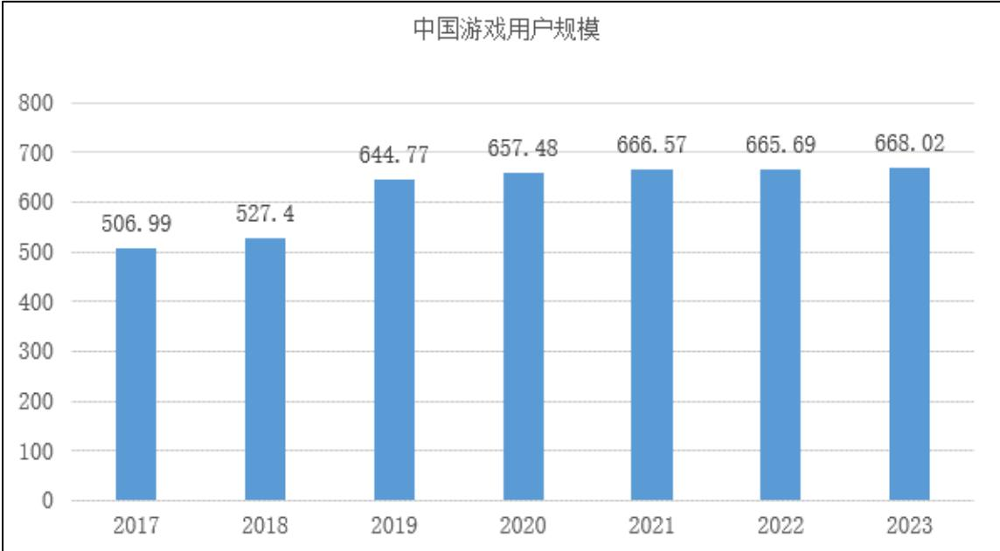
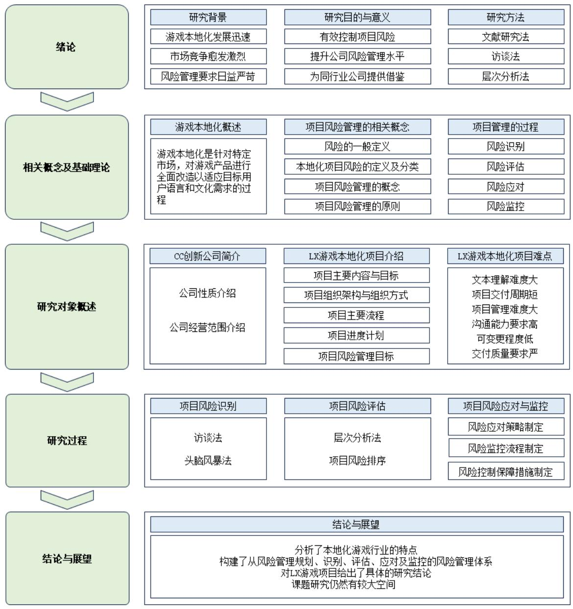

# 第 1 章 绪论

# 1.1 研究背景

# 1.1.1 游戏本地化行业的发展历程与现状

游戏本地化行业的发展历程可以追溯到20世纪80年代。当时，许多国际企业开始涉足全球市场，但是由于不同国家和地区之间的文化、商业习惯等存在巨大差异，许多产品在本国以外的市场难以取得成功。为了解决这一问题，一些企业开始寻求本地化的解决方案，本地化行业由此诞生[1]。

20 世纪 80 年代至 90 年代，随着计算机技术的不断进步，家用游戏机和个人电脑逐渐普及，电子游戏诞生并初步发展，为游戏本地化行业埋下了伏笔。随着电子游戏在全球范围内的普及，为了满足不同地区的玩家的需求，游戏公司开始意识到游戏本地化的重要性。最初的游戏本地化工作主要由一些小型翻译公司或独立翻译人员完成，这些人员通过手工翻译游戏文本和界面，实现游戏的本地化。但是，由于当时的技术和流程不够成熟，本地化的效率和准确性都有很大的提升空间[2]。

到了 21 世纪初，互联网和移动设备进一步普及，游戏产业进入快速发展阶段，玩家群体更加多元化。同时，游戏内容日益丰富，涉及更多文化和语言背景，游戏本地化需求开始迅速增长。许多大型游戏公司为了将其产品推向全球市场，开始将游戏本地化作为一个重要的业务领域，投入大量人力物力来开发本地化工具和技术，使得游戏本地化的效率和质量得到了显著提高，同时也降低了成本[3]。

近年来，随着全球游戏市场的不断扩大，特别是移动游戏市场的快速增长，游戏本地化的需求也呈现出爆发式增长。为了抢占市场份额，游戏公司纷纷将游戏本地化作为重要的市场策略之一。随着游戏本地化需求的增长，一些专业的游戏本地化公司开始涌现。这些公司不仅提供游戏文本的本地化翻译服务，还涉及游戏音效、视频、UI/UX设计等多个方面的本地化工作。专业化的发展使得游戏本地化服务更加全面和细致。同时，随着机器翻译技术的不断进步，游戏本地化行业也开始向自动化和智能化方向发展。例如，谷歌公司推出的翻译应用可以自动翻译不同语言之间的文本或语音，而且翻译的准确度和流畅度也越来越高[4]。

随着全球化和我国“一带一路”策略的深入发展，游戏本地化需求将持续增长，根据市场研究机构的数据，全球游戏本地化市场规模已经超过了400亿美元[5]。与此同时，机器翻译、云翻译和敏捷翻译等翻译技术与范式日新月异。在大数据和移动互联网的推动下，市场和用户对多语种、专业化、持续交付、同步发布的要求不断增加，促进了翻译与本地化服务管理方式的变革，逐渐从传统的个人或小作坊式的手工翻译转向规模化、流程化、协作化、敏捷化模式，同时，翻译与本地化项目向现代工业模式的转变促使其对项目管理的需求更加迫切[6]。

# 1.1.2 游戏本地化的必要性

电子游戏是指针对玩家提供娱乐、休闲和竞技的虚拟环境。近年来，电子游戏逐渐成为现代人的生活“必需品”，游戏行业得以迅猛发展，市场规模不断扩大。根据相关统计数据，全球电子游戏市场规模已经超过 1500 亿美元，并且正在以每年约 $10 \%$ 的速度增长[7]。随着经济的发展，中国逐渐成为全球最大的电子游戏市场，根据《2023年1-6月中国游戏产业报告》显示，中国的游戏用户规模为6.68亿，市场份额占据整体市场的近三分之一，如图1.1所示。与此同时，印度、巴西等新兴市场也出现了快速增长的势头[8]。

  
图1.1 中国游戏用户规模  
Fig.1.1 Game player size in China

技术的不断进步和市场竞争的加剧推动着电子游戏在内容和形式上的发展与创新。一方面，虚拟现实（VR）和增强现实（AR）技术的应用使得电子游戏玩家能够身临其境地感受游戏世界，为玩家带来了全新的游戏体验。另一方面，人工智能（AI）的广泛应用使得游戏角色拥有更加逼真的行为和更加智能的决策能力，增强了游戏的互动性和可玩性。此外，电子游戏的形式也在不断丰富，从移动游戏、网页游戏到电脑游戏、主机游戏等[9]。电子游戏的丰富表现形式吸引了广泛的用户群体，涵盖了各个年龄段和消费层次。其中，年轻用户是电子游戏的主要用户群体，他们不仅是消费的主力军，还逐渐开始掌握更多的社会话语权，这使得电子游戏产业得到了更多的社会认同和支持。2013年，《英雄联盟》成为欧盟运动会的正式比赛项目。2023年，国际奥委会公布2023年奥林匹克电子竞技系列赛首批九个比赛项目，分别为舞蹈、射箭、棒球、国际象棋、自行车、赛车运动、帆船、网球和跆拳道，比赛的模式仿照东京奥运会前的奥林匹克虚拟系列赛，具体的参赛游戏为《舞力全开 2022》、《Tic Tac Bow》、《eBASEBALL实况力量棒球》、《http://Chess.com》、《Zwift》、《跑车浪漫旅 7》、《VirtualRegatta》、《Tennis Clash》和《Virtual Taekwondo》。

电子游戏发展到一定阶段，市场规模不断扩大，许多游戏公司不再满足于本土市场，游戏出海开始成为其重要战略方向[10]。游戏出海是指由本土游戏公司研发的电子游戏在海外游戏市场发行的现象，游戏特点、元素等内容可能有所不同，但核心玩法大多一致。在游戏出海的过程中，游戏本地化是其最重要的环节之一[11]。游戏本地化是一种将游戏产品适应不同地区市场的过程，包括文字翻译、音频本地化、图形和艺术作品本地化、文化适应和技术调整等多个方面，旨在使游戏产品更加符合当地玩家的语言、文化和技术需求。在进行本地化工作的过程中，游戏公司可以更好地了解目标市场的特点，并根据当地玩家的喜好对产品进行相应的调整，使电子游戏更符合当地玩家的口味，以便提高游戏的吸引力和接受度，提升游戏体验，顺利实现游戏出海[12]。

通过电子游戏高度本地化完成游戏出海，可以让本国游戏进入更广阔的海外市场。首先，海外市场通常具有更高的付费能力和更广泛的地域分布，可以为游戏公司带来更多的收入和利润，扩大用户基础，增加企业的市场份额；其次，还可以帮助游戏公司拓展多元化的收入来源，除了游戏内购买和广告收益外，还有更多的商业模式和合作机会，如虚拟物品销售、赞助、版权授权等，这些多元化的收入来源可以帮助游戏公司实现更稳定和长期的收益增长[13]；另外，游戏出海可以帮助游戏公司适应不同市场的需求和规律，以便后续更好地研发和运营游戏，提高游戏的受欢迎程度和用户黏性；此外，通过在海外市场发行游戏，可以吸引更多海外玩家的关注和认可，提升品牌的国际知名度和影响力，为游戏公司带来更多的品牌曝光，赢得更多的市场机会和竞争优势，为未来的合作和拓展提供更多的机会和资源。因此，对于想要在全球化市场中取得成功的游戏公司来说，游戏出海是必然的战略选择，而本地化作为其必不可少的环节，具有非常重要的战略性意义。

# 1.2 研究目的与研究意义

# 1.2.1 研究目的

CC 创新公司 LX 游戏本地化项目具有独特的复杂性和不确定性，涉及多方参与和紧密的合作关系，在该项目中，语言障碍、文化差异、技术限制、供应链紧张、人员管理困难、沟通不便等风险因素均有可能对项目的进展和成果产生不利影响。因此，深入研究和理解这些风险因素对 LX游戏本地化项目的成功至关重要。

本论文旨在对该项目的风险进行深入研究，具体探讨其风险管理的重要性、现状及存在的问题，并利用科学的风险识别、评估工具，对该项目的风险进行有效梳理。通过风险评估结果，项目管理团队可以更加清晰地了解项目中的潜在风险，更准确地识别和处理高风险问题。同时，为了解决这些问题，本论文将归纳和总结CC公司LX游戏本地化项目的实际情况，从项目的组织结构、工作流程、资源分配等方面出发，结合 MBA 所学的风险管理理论知识，探索出一套相对合理、科学、适用性广的风险管理方法，包括制定风险管理计划、建立风险管理机制、实施风险控制措施等，以帮助项目管理团队更好地规避、转移和减轻可能出现的各种风险，确保 LX游戏本地化项目的顺利进行，并规范CC 公司的本地化项目风险管理，提高公司的风险管理水平。

# 1.2.2 研究意义

首先，对 LX 游戏本地化项目进行风险管理研究有助于该项目的顺利进行。LX游戏本地化项目是 A游戏开发公司和CC 创新公司的战略性项目，在推动游戏市场发展和文化交流方面具有重要意义。然而，由于该项目面临多种风险，如果不能进行有效的风险管理，将会对项目产生负面影响。通过对 LX 游戏本地化项目进行风险管理研究，可以为该项目提出科学、合理的风险管理方法，帮助项目管理团队更好地控制和应对可能出现的各种风险，提高项目的成功率。

其次，对 LX游戏本地化项目进行风险管理研究有助于提高CC 创新公司的企业竞争力。在当今激烈的市场竞争中，风险管理已经成为企业核心竞争力的重要组成部分。通过对 LX游戏本地化项目执行全过程的风险管理进行研究，结合CC 公司当前的风险管理理念、体系和方法，可以在理论层面对 CC 公司的本地化项目风险管理流程以及方法提供参考意义；同时，以此总结出一套适用性强的通用管理模式，有助于CC 公司不断完善企业自身的风险管理机制和方法，提高应对风险的能力，最终提高 CC 公司在本地化项目执行过程中的风险管理水平，提升企业在国际化舞台上的竞争力。

此外，对 LX游戏本地化项目进行风险管理研究，将为游戏本地化行业提供一个具体的风险管理案例，为其他类似项目提供参考。由于不同游戏项目之间往往存在很多共性和特点，通过 LX游戏本地化项目的风险管理研究，可以总结出一套通用的风险管理方法，为其他类似项目的风险管理提供借鉴。论文最终提出的本地化项目风险管理实践经验、管理模式和方法，也可以在实践层面对其他本地化服务企业的风险管理体系的建立和优化提供帮助。这不仅可以提高游戏本地化行业整体的风险管理水平，还可以推动整个行业的健康和可持续发展。

# 1.3 研究内容、研究方法与技术路线

# 1.3.1 研究内容

论文将结合本人的实际工作情况，围绕CC 公司 LX游戏本地化项目风险管理展开研究，根据项目特点及 CC 公司的管理现状，对 LX 游戏本地化项目的风险管理进行分析，将过程分解为风险识别、风险评估、风险应对以及风险监控四个环节，深入探讨各个环节采用的风险管理理论及方法，总结出适合本地化服务企业的普适性风险管理流程及方案，保证项目目标的达成，并为同行业企业提供借鉴和参考。

本论文共分为六个部分，第一章为绪论，主要阐述论文研究的主要背景、目的、意义及采用的研究方法；第二章为游戏本地化以及风险管理相关的理论介绍，为论文的研究提供充分的理论支撑；第三章主要介绍了 LX 游戏本地化项目的基本情况，为项目风险管理的必要性提供了现实基础；第四章详细阐述了 LX游戏本地化项目的风险识别、评估的过程及结论，为下一章项目风险的应对与监控提供明确的方向；第五章为 LX游戏本地化项目的风险应对与监控，具体说明了针对不同的风险因素所采取的有效应对与监控措施；第六章为结论与展望，描述了论文研究的成果以及展望，同时对游戏本地化项目风险管理的不足之处提出了改进方案。

# 1.3.2 研究方法

本论文旨在针对游戏本地化项目的多变性、复杂性等特点，以实现项目最终质量、成本以及进度目标，提升公司服务能力为目的，在项目执行过程中，通过系统的理论和方法，研究如何提升项目风险管理能力，通过风险识别、评估以及应对、监控，最终实现风险可控，并及时、有效地交付项目，满足甚至超出客户预期。论文将通过以下方法进行详细研究：

（1）文献研究法

利用图书馆、超星发现、中国知网等数据库搜集并整理本地化项目风险管理相关文献，通过对文献的研读，充分吸纳国内外专家学者对游戏本地化项目风险管理的研究成果，为CC 创新公司 LX游戏本地化项目的风险管理提供有效、扎实的理论依据。

# （2）访谈法

在论文的研究过程中，通过访谈搜集项目相关方认识到的风险类型及风险因素，并以此作为头脑风暴活动的主题数据。访谈过程中，问题以开放式为主，需要访谈人员与被访谈人员深入沟通和充分互动，结合CC 公司以及LX游戏本地化项目的实际情况，对该项目的风险类型及风险因素进行研究分析。

# （3）层次分析法

通过层次分析法，将复杂的决策问题划分为多个相互关联的子问题，将每个子问题独立地进行分析，从而得到 LX 游戏本地化项目风险评估的结论，并根据评估结论对项目风险因素进行有效排序，然后根据评估及排序结果制定有针对性的风险管理预案，实现对项目风险更加有效的管理。

# 1.3.3 技术路线

本论文先对 LX游戏本地化项目的背景、目的与意义、内容与方法进行了梳理，然后阐述了风险管理相关的概念与方法，再对 LX 游戏本地化项目概况进行了分析，而后对该项目进行了风险识别、评估并提出了合理的应对与监控措施，最后对论文的研究进行了总结。具体的技术路线如图1.2：

  
图 1.2 技术路线图  
Fig. 1.2 Research Technical Roadmap

# 第 2 章 相关概念与基础理论

# 2.1 游戏本地化项目的概述

游戏本地化是一个将游戏产品根据特定国家、地区或语言市场的需求进行改造的过程，旨在适应目标市场用户的语言和文化特定需求，提高游戏在目标市场内的接受度和受欢迎程度。这个过程不仅包括文本翻译，还有音频、图片和艺术作品的本地化，以及针对目标市场的文化和技术环境的调整[14]。其中，翻译是本地化过程中的一个重要环节，它包括将游戏中的文本、菜单、对话、字幕等翻译成目标语言；音频本地化则包括将游戏中的画外音和音频对话翻译成目标语言并进行配音；图形和艺术作品本地化涉及调整游戏中的图形、道具和其他视觉元素，以适应目标市场的文化偏好和期望；文化适应是为了更好地适应当地市场的文化背景和价值观，进行相应的文化调整和改变；技术调整则是为了使游戏产品在目标市场上更具有可玩性和愉悦性，进行相应的技术修改和优化。

游戏本地化的本质与传统的翻译活动有所不同。传统翻译活动主要关注将源语言文本准确转化为目标语言文本，而游戏本地化则需要在翻译的基础上，根据目标市场的文化和习惯对游戏进行相应的调整，包括对游戏角色、道具、场景等进行适应性的修改，以及对游戏界面和交互方式进行优化[15]。

游戏本地化项目团队通常包括游戏策划、本地化中台、项目经理、项目助理、工程人员、语言专家等，游戏玩家也会作为共同创作者参与进来。与其他媒介的读者或观众不同，游戏玩家能够更直接有效地与游戏研发组对话，同时还能创作自己的爱好者内容，或者通过直播等方式参与到游戏社区的营建之中。因此，游戏本地化的过程不是传统非电子游戏媒介中译文在创作者、译者与受众之间的单向流动，而是一个边创作、边翻译、边游玩的过程，研发组与本地化团队可以结合时下流行的文化现象与话语开发游戏，而这些现象与话语往往都是从玩家社区中流行起来的[16]。早期的爱好者社区在游戏开发和本地化的过程中缺乏正规的管理，经常未经原作者或开发公司授权就对作品进行翻译和传播。然而，随着游戏版权制度与法律的不断完善，本地化的众包模式逐渐兴起，成为游戏本地化走向规范的标志之一[17]。

# 2.2 项目风险管理的相关概念

# 2.2.1 项目风险的概念与分类

一般而言，风险被定义为损失的不确定性，然而这一认识在各个领域中尚未达成一致公认的定义[18]。致力于研究风险问题的美国学者 A.H.威雷特认为，风险是关于不愿发生的事件发生的不确定性的客观体现[19]。美国经济学家 F.H.奈特则认为，风险是可测定的不确定性[20]。玛丽·道格拉斯和维尔达沃斯基等人类学者、文化学者则把风险定义为群体对危险的认知，是社会结构本身具有的功能，作用是辨别群体所处环境的危险性[21]。比较经典的风险定义是美国人韦氏给出的：风险是遭受损失的一种可能性[22]。在一个项目中，损失可能有各种不同的后果形式，如质量的降低、费用的增加或项目进度的推迟等[23]。

因此，风险大致具备三个特点：首先，风险存在不确定因素，即使可以通过统计概率或相关理论得到测量，其结果也存在一定的偏差；其次，风险导致的往往是某种损失，或某种不良后果；最后，这两者存在某种因果关系，即由于不确定性而导致损失[24]。

对于本地化项目的风险，可以从不同的角度进行分类：根据本地化项目所包含的具体任务，风险可以分为本地化翻译风险（包括语言风险、文化风险等）、本地化桌面排版风险、本地化工程风险、本地化测试风险等；也可以从项目管理要素方面对风险进行分类，如项目进度风险、项目成本风险、项目质量风险、项目交流风险、项目资源风险、项目范围风险等；另外，根据项目生命周期的各个阶段进行风险分类也是可行的，例如启动阶段的风险、计划阶段的风险、实施阶段的风险、收尾阶段的风险[25]；此外，还可以根据项目实施主体引起的风险，将风险分为客户方引起的风险、服务方引起的风险、外包合作伙伴引起的风险等。例如，靳成将本地化翻译的任务风险分为质量风险、时间风险、成本风险，指出翻译的“质量风险”是由于所提供的翻译作品的质量无法满足客户需求，从而引发纠纷、造成损失的可能性；“时间风险”是指翻译团队无法按约定时间交付翻译作品，从而引发纠纷、带来损失的可能性；“成本风险”是指翻译收费无法弥补项目实际成本而带来损失的可能性[26]，这些分类方法为我们深入研究本地化项目的风险管理提供了有益的视角。

# 2.2.2 项目风险管理的概念与原则

（1）项目风险管理的概念

项目风险管理是指通过风险识别、风险分析和风险评价去认识项目的风险，并以此为基础合理地使用各种风险应对措施、管理方法、技术和手段，对项目的风险实行有效的控制，妥善地处理风险事件造成的不利后果，以最少的成本保证项目总体目标实现的管理工作[27]。

在风险管理的实践中，首要环节是风险识别与评估：通过严谨的方法论，识别项目中可能存在的风险因素，并运用定性与定量相结合的分析手段，对风险的影响程度和可能性进行评估，通过风险的识别与评估，可以为风险管理的后续步骤提供依据，也为项目团队提供关于潜在风险的全面认识[28]；其次，应该聚焦于风险应对与控制[29]：风险管理策略强调针对性和灵活性，根据项目的实际情况和风险的特性，制定具体的风险应对策略，如风险规避、风险接受等，降低风险事件发生的概率和潜在损失的程度，以最大限度地减少或消除风险对项目的影响[30]；还需要持续监控与再评估：在项目执行过程中，需要建立有效的风险监控机制，对风险状态进行实时监控，并根据项目进展和外部环境的变化，不断对风险管理策略进行调整和优化；同时，建立反馈机制，确保项目团队成员能够及时了解风险管理策略和行动计划，并能迅速报告新的风险情况或风险应对效果[31]。

从更宏观的角度来看，项目风险管理不仅是一个技术性的过程，更是一个涉及组织文化、战略决策以及团队协作的综合过程。它要求项目团队具备高度的专业素养和敬业精神，同时需要企业高层对风险管理给予充分的重视和支持。通过构建积极的风险管理文化，加强团队成员的风险意识和风险管理能力，为企业创造更加稳定、可持续的发展环境。

（2）项目风险管理的原则项目风险管理一般要遵循如下原则：

可行、适用、有效性原则：管理方案应针对已识别的风险源，制定具有可操作性的管理措施，适用且有效的管理措施能大大提高风险管理的效率和效果[32]。

经济、合理、先进性原则：管理方案涉及的多项工作和措施应力求管理成本节约、管理信息流畅、方式简捷、手段先进，才能显示出高超的风险管理水平[33]。

主动、及时、全过程原则：对于风险管理，应遵循主动控制、事先控制的管理思想，根据不断发展变化的环境条件和不断出现的新情况、新问题，及时采取应对措施，调整管理方案，并将这一原则贯彻到项目全过程，才能充分体现风险管理的特点和优势[34]。

综合、系统、全方位原则：风险产生的原因复杂、后果影响面广，所需处理措施综合性强。因此，要全面彻底地降低乃至消除风险因素的影响，必须采取综合治理原则，动员各方力量，科学分配风险责任，建立风险利益的共同体和项目全方位风险管理体系，才能将风险管理的工作落到实处[35]。

满意原则：在项目风险管理过程中，不能要求完全的确定性，要允许一定的不确定性存在，即达到满意的程度即可。

偏执性原则：看待项目的观念要偏执，即对项目的各个方面保持警觉和关注，不放过任何可能影响项目的因素。

适当原则：风险管理的水平、类型和可见性应该与风险级别以及项目对组织的重要性相一致。应对风险的成本不应大于风险事件可能带来的损失。

社会性原则：在制定项目风险管理计划和实施项目风险管理措施时，必须考虑周围的环境与项目相关的一切单位、个人等对项目风险的要求[36]。

# 2.2.3 项目风险管理的过程

（1）风险识别

风险识别是指在项目的全生命周期（包括项目启动、计划、实施和收尾）中，通过一定的方法和工具，系统地识别出可能对项目产生负面影响的风险因素，并以文档的形式进行记录。这些风险因素可能包括技术风险、市场风险、人员风险、流程风险、合同风险、法律风险等，也可能包括这些风险的组合[37]。

风险识别的主要参与者包括项目经理、项目团队成员、客户、项目团队之外的行业专家、最终用户和风险管理专家等。风险识别的过程是一个反复进行的过程，随着项目的进展，新的风险随时可能产生或为人所知。因此，应该不断地进行风险识别，以便及时应对现有风险、发现和处理新的风险[38]。一般情况下，根据组织结构、项目特征和团队技能的不同，可以采用不同的风险识别方法，常用的风险识别方法包括：

访谈法：通过对项目相关人员进行访谈，收集有关风险的信息，识别出可能存在的风险因素。访谈法作为一种深入探究被访者心理与行为特征的研究方法，通过访谈者与被访者之间的面对面交流，旨在捕捉被访者的真实想法和体验。在风险识别的过程中，访谈法发挥着至关重要的作用[39]。因此，在对 LX游戏本地化项目风险识别的研究中，拟采用访谈法。访谈法的执行方式通常是：在访谈前，我们根据研究目的和项目特点，制定详细的访谈提纲，提纲涵盖项目执行过程中的各个环节，确保能够全面捕捉潜在的风险点；为确保访谈结果的多样性和代表性，选择 LX游戏本地化项目的团队成员作为访谈的主要对象，同时邀请行业内的专家参与访谈；在访谈过程中，注重营造轻松、自然的氛围，使被访者能够放松心情，真实地表达自己的想法；通过与团队成员的深入交流，详细了解项目执行过程中各环节的风险点及其细节，同时，通过与行业专家的沟通，掌握行业内风险点的变迁趋势和最新的风险防控措施；随后，对访谈结果进行严格的筛选和整理，确保所得数据的真实性和可靠性。

头脑风暴法：通过集思广益，激发团队成员思考，识别出可能的风险因素。在对游戏本地化项目风险进行识别的过程中，头脑风险法的使用最普遍、可操作性较高。因此，在对 LX 游戏本地化项目风险识别的研究中，将采用头脑风暴法。头脑风暴法通常是以自由会议的形式展开，召集游戏项目研发人员、管理人员及行业专家等各方人员参加，所有人从自身需求、专业经验等方面着手，表达各自的想法，提出项目执行过程中可能出现的风险，达到互相启发、互相完善的目的。头脑风暴法更注重的是得到想法和方案的数量，而不是质量，这样做是为了使团队拥有尽可能多的想法和内容，鼓励成员有新奇或突破常规的想法或方案。头脑风暴法的执行方式是：当讨论某个问题时，由一个协助的记录人员在翻动的记录卡或黑板前做记录。首先，从某个成员开始，提出一个想法或方案，接着依次发言，如果轮到某位成员时他没有想法，就说一声“过”。有些人会根据前面其他人的思路提出想法方案，这包括把几个方案合并成一个或改进其他人的方案。这个过程循环进行，直到想出各种方案或限定时间已到。由记录员对每个人的发言内容进行记录总结，罗列出所有的风险，形成清单，然后对清单内容继续再梳理、再分析、再汇总，形成项目风险因素清单，实现项目风险识别的目的[40]。

其他的风险识别方法还包括：

文档评审：通过审查项目相关的文档和记录，如合同、计划书、预算等，发现可能存在的风险因素[41]。

图解技术：如因果图（鱼骨图）、流程图、影响图等，通过分析可能出现问题的原因和影响，识别出潜在的风险因素[42]。

SWOT 分析：通过分析项目的优势（Strength）、劣势（Weakness）、机会（Opportunity）和威胁（Threat），识别出可能对项目产生影响的风险因素[43]。

专家咨询（德尔菲法）：通过向行业专家或顾问寻求意见和建议，识别出可能的风险因素[44]。

除此之外，还有独立评估、风险模板、经验教训、风险研讨会、风险分类（或检查表）、以往的项目经验或历史数据、本原因分析等方法[45]。

在识别风险时，应该采用统一的格式描述风险，确保对每个风险都有明确和清晰的理解。这有助于在团队内部和外部进行有效的沟通和协作，以便更好地应对和管理风险。

LX 游戏本地化项目在国内尚无充分的研究先例，因此论文采用的主要风险识别方法为访谈法以及头脑风暴法，通过充分借助行业专家以及从业者的经验对项目的风险进行全面的识别。

# （2）风险评估

风险评估，也称为风险分析，是指在风险事件发生之后，对于风险事件给项目各个方面造成的影响和损失进行定性定量评估的过程。这个过程不仅包括对风险本身的界定，即对风险发生的概率（可能性）、影响（严重程度）、风险持续时间、风险发生的区域以及关键风险点的评估，还包括对风险作用方式和风险后果的界定[46]。

风险评估的主要任务包括：评估风险概率和可能带来的负面影响、确定组织承受风险的能力、确定风险消减和控制的优先等级、推荐风险消减对策。

在风险评估过程中，可以采用多种操作方法，包括基于知识（Knowledge-based）的分析方法、基于模型（Model-based）的分析方法、定性（Qualitative）分析和定量（Quantitative）分析。同时，对系统项目中的风险进行评估的具体方法有很多，包括层次分析法、因子分析法、秩和比法、嫡权法、解释结构模型法、结构方程模型法以及模糊评价法等[47]。结合 LX 游戏本地化项目的自身特点，本论文将采用层次分析法对各阶段的风险进行评价分析。

层次分析法（AHP）是由美国匹兹堡大学教授 Thomas L. Saaty 于 1971 年提出的，主要应用在不确定情况下及具有多个评估准则的决策问题上。通过层次分析，可以把复杂的问题进行有机地组织和划分，从多个角度进行深入探究，通过定量计算，形成一个完整、有机的网络，从而进行全面评价[48]。这种方法不仅可以涵盖有形的、无形的、精确的、模糊的、可计算的、可理解的等各种子问题，还能够更好地帮助决策者做出选择。当层级结构建立完成后，决策专家将根据每一部分的相对重要性，给出权重数值，并将其转换为对比矩阵，从而得到特征向量及其值，以此来反映每一层级中各部分的优先级，为决策者提供全面的信息，并制定合理的评价标准、权重和分析，从而降低决策失误的可能性。

在运用层次分析法对项目风险进行定量评估时，主要包括五个步骤：

建立层次结构模型：建立目标、准则、方案这样的层次结构模型，判断模型之间的关系；

建立判断矩阵：建立各方案之间的关系正互反矩阵；

层次单排序：计算各个准则对应目标的排序和权重；

层次总排序：计算各个方案对应各准则的排序，并统一计算总排序；

一致性检验：为了检验评估指标是否有效，需要进行一致性检验，检验结果用一致性指标CI来衡量。

（3）风险应对

风险应对是项目风险管理过程中的关键环节。根据风险评估的结果，组织需要选择相应的风险应对策略，并把风险应对所需的资源和活动加入项目的预算、进度计划和项目管理计划中，以降低风险对项目目标的影响。通常情况下，组织会根据风险发生概率和对项目总体目标的影响，选择不同的策略来规避、转移、减轻或接受可能给项目目标带来消极影响的风险[49]。

风险规避是指在可能的情况下，通过采取措施消除风险源，将风险发生的可能性降低为零，从而避免风险的发生。例如，在本地化项目中，使用指定的统计软件和参数设置可以确保双方统计出来的字数相同，以此避免因工作量统计不一致而产生的成本或交期方面的风险。当某些风险无法完全规避时，需要采取替代方案或改变项目计划等措施以降低风险的影响[50]。

风险转移是指通过采取措施将风险转移至其他实体，降低组织自身承担的风险。例如，在本地化项目中，当某个语言对的翻译资源不足时，可以外包给合适的本地化翻译供应商。这样可以将资源不足的风险转移给供应商，同时减轻了组织自身的压力。需要注意的是，在转移风险的同时，也需要注意与外包公司沟通交流的风险以及进度延迟等新风险的产生[51]。

风险减轻是指通过降低风险发生的可能性或减轻风险的影响，降低风险级别。在本地化项目中，可以采取措施减轻的风险有：在项目初期进行严格的评审活动，尽早发现和修正本地化文件集合中的缺陷，降低质量风险和进度风险；在项目前期对本地化对象的产品知识和所在行业的领域知识、标准和技能进行培训，提高团队的专业水平和风险管理能力；分批提交需要客户审校的文件，避免一次性提交太多文件造成审校压力过大，以此降低进度风险[52]。

风险接受是指在风险无法规避、转移或减轻的情况下，或者在识别到的风险经过分析和评估之后，风险级别在可以接受的范围内（例如，在组织定义的风险阈值之内），组织选择接受并应对风险，根据风险计划列出风险应对策略，进行针对性处理。例如，在项目执行过程中如果发生关键人员离职的情况，项目经理需要启动应急计划，迅速安排替补人员，做好交接工作，接替离职人员的工作，确保项目的顺利进行[53]。

风险规避和风险减轻策略通常适用于高影响的严重风险，而风险转移和风险接受策略则更适用于低影响且不太严重的威胁。在本地化项目过程中，需要分析和评估风险管理的具体策略（规避、转移、减轻、接受）可能带来的收益和机会，以及对应的成本和可能造成的额外风险。风险管理策略的选择需要在收益、成本和可能产生的新风险之间进行平衡[54]。

（4）风险监控

由于风险是随着内外部环境的变化而随时变化的，它们在项目的推进过程中可能会增大或者衰退乃至消失，也可能由于环境的变化而产生新的风险，因此，风险监控是项目风险管理过程中必不可少的环节。风险监控就是指在项目的进行过程中，对风险的发展与变化情况进行全程监督，并根据需要进行应对策略的调整，确保风险管理能达到预期目标的过程。

风险监控的主要方法有：

风险日志：这是风险监控的基础工具，用于记录风险的识别、评估、应对和监控情况。日志应包括风险的详细描述、可能的影响、当前的状况、应对策略以及任何其他相关的信息。

风险评估和审查：定期进行风险评估和审查，以便团队了解哪些风险正在增加，哪些正在减少，以及是否需要调整策略。

关键绩效指标（KPI）：设定并监控关键绩效指标，了解项目进展以及可能的风险。

风险仪表板或风险管理报告：这些工具可以提供关于总体风险状况的概述，包括当前的风险级别、正在发生的风险事件、以及任何可能的新风险。

敏感性分析：通过敏感性分析，可以确定哪些风险对项目最具影响力，从而为决策者提供更有针对性的建议。

假设和约束分析：在项目执行过程中，可能会出现一些未预见到的假设或约束。通过定期审查和分析，可以及时发现并处理可能的风险。

变更管理：当项目的环境发生变化时，可能会出现新的风险。变更管理是风险监控的重要部分，它允许组织在环境变化时调整策略。

风险监控过程中应该遵循的原则包括：

持续识别：建立一个有效的风险识别流程，包括定期的风险审查和敏感度分析，持续地识别项目中的潜在风险。

风险分级：对识别出的风险进行分级，帮助组织更好地理解和处理不同风险的优先级。

预防性控制：针对已知的风险制定预防性控制措施，例如制定应急计划或培训员工以应对可能的风险事件。

纠正性控制：当风险事件发生时，迅速采取行动以减轻其影响。

反馈、学习和适应：从风险事件中吸取教训，更新风险管理策略以适应变化的环境。

跨部门沟通：确保所有涉及的部门（如项目管理部门、执行部门、人力资源部门等）都了解并遵循相同的风险管理策略。

利用专家意见：当存在复杂或专业性的风险时，寻求专家的意见和指导可以帮助组织更好地理解和处理这些风险。

保持透明度和文档记录：对风险管理活动的记录和报告应该是清晰和准确的，同时在整个组织中保持透明度，以确保所有相关人员都了解当前的风险状况。

定期审计：对风险管理活动进行定期的审计，帮助组织验证其风险管理策略的有效性，并在需要时进行调整。

建立应急预案：对于可能产生严重后果的风险事件，组织应该制定应急预案，明确在风险事件发生时应如何快速响应。

根据以上方法和策略，项目团队可以从实际情况出发，设计对应的风险监控方案，在项目执行过程中有效地监控和管理风险，从而确保项目的顺利执行[55]。

# 第 3 章 LX 游戏本地化项目概况

# 3.1 CC 创新公司简介

CC 创新公司自成立以来一直致力于消除跨国企业在国际沟通过程中的语言障碍，并助力技术传播。作为一家以技术为推动力的语言服务提供商，该公司由650 多名全职员工和全球 5000 多名认证语言专家和行业专家组成，通过优化本地化技术持续为客户提供高品质的本地化解决方案。经过 26 年的发展，CC 创新公司已成为业内发展最快的多语言服务供应商之一。

CC 创新公司能够为客户的语言要求提供全方位解决方案，包括笔译、口译、文化咨询、ISEO/ISEM、营销创翻、软件本地化、网站本地化、多媒体本地化（包括配音和字幕）、功能和语言测试等。公司对质量有着极高的承诺，采用经ISO9001:2015 和 ISO17100:2016 认证的质量管理系统，并规定所有语言专家必须拥有行业广泛承认的专业资质。

CC 创新公司时刻关注最新的行业趋势，包括机器翻译、众包和多媒体等领域，致力于持续满足客户不断变化的质量需求和预算。公司为每位客户定制适合他们的最佳解决方案，进而帮助其实现提高品牌知名度和增加市场份额的目标。

CC 创新公司的生产团队由语言专家、本地化工程师、项目经理和桌面排版人员组成，每位成员在其负责的领域都拥有专业知识以及行业相关的实战经验。公司为以下行业领域提供专业的本地化解决方案：生命科学、工业制造业、游戏娱乐、IT及软件业、汽车制造业、电子及通信业、在线教学、多媒体、金融业、旅游和酒店业、法律行业等。

大多数本地化服务供应商都以销量为驱动，以收入为导向，承诺以最低的价格提供完美的服务，而全然不考虑质量的真正成本。然而，CC 创新公司采用的是另一种行事方法：销售团队直接向运营部门汇报，而运营人员则从第一天起就参与到销售周期中来。公司采用公平透明的合作模式，费率也综合了价格和质量两个因素，可以为每一位选择CC 创新公司服务的客户交付高品质的翻译。这种理念帮助CC 创新公司在业内建立起无与伦比的质量声誉。

CC 创新公司如今已在全球范围内设立了17个战略分支机构，为全球260个国家和地区提供140多种语言的本地化服务。公司仍在不断将自己打造成为以客户为中心、质量为本和技术创新的企业，致力于为客户的本地化项目带来更多附加价值。

# $3 . 2 \mathrm { L X }$ 游戏本地化项目介绍

# 3.2.1 项目主要内容和目标

LX 游戏是由 A 游戏开发公司开发的 MOBA 类国产战斗型移动端游戏，于2018 年 11 月 26 日在 Android、iOS 平台上正式公测，计划于 2024 年 12 月 30 日在全球发布。LX 游戏的世界观基于中国古代历史和神话故事，为玩家呈现了一个激烈的战斗场景。在游戏中，玩家可以选择自己喜欢的人物角色，每个角色都有独特的技能和故事背景。游戏的核心目标是击败敌人、摧毁敌方建筑和抢夺地图上的资源，获得经验和金币，提升自己的能力和装备，在对手基地中摧毁对方的核心建筑，同时保护自己的核心建筑不被摧毁。除了基本的战斗玩法，LX 游戏还为玩家提供了多种 PVP 对战模式，包括 1V1、3V3 和 5V5 等。此外，玩家满足一定条件后还可以参加排位赛以及PVE的闯关模式，挑战更高难度的敌人。

作为一款MOBA游戏，LX游戏的人物设计、角色服饰以及整体的音乐风格都充满了浓郁的东方韵味。根据A游戏开发公司的市场发展战略，决定将 LX游戏出海，为了让海外玩家更好地理解游戏内容，A 游戏开发公司最终选定由 CC创新公司对 LX游戏进行本地化翻译处理。

项目内容包括本地化翻译游戏故事主线、主要情景等剧情文本，以及技能道具、通用商城等功能配置文本；此外，还需要将英雄角色的名称、古诗词念白等本地化翻译成目标语言，同时保留中国古代的文化元素。项目流程主要为翻译、校对、润色、排版以及质检。工作流程复杂，需要严谨的规划和精细的管理，以确保不同语言版本的文本能够准确、流畅地传达游戏内容，并且符合当地的语言习惯和文化背景。

根据 A 游戏开发公司的国际市场开发战略，LX 游戏的首批公测将于 2024年 8 月在美国正式开启，并陆续在欧洲、南美等地进行公测。项目预计于 2024年1月启动，交付时间节点定在2024年7月1日。公测版项目字数为50万中文字，需求语言为 8 种，分别为美式英语、日语、韩语、德语、法语、意大利语、拉丁西语、巴西葡语，需要多个语种同时启动并推进。

该项目是 A 游戏开发公司的年度重点项目，也是 CC 创新公司的战略性项目。为了确保项目的顺利进行和交付，CC 创新公司需要协助A游戏开发公司制定详细的本地化计划。由于涉及目标语言种类多且复杂，因此项目执行具有一定的挑战性。

在风险管理方面，CC 创新公司需要制定相应的风险应对措施，包括时间管理、人员配备、沟通协调等方面的工作。同时，加强对项目的监控和评估，及时发现和解决问题，确保项目的质量和交付效果。

# 3.2.2 项目组织架构与组织方式

根据 CC 创新公司的项目管理流程及相关文件要求，LX 游戏本地化项目的组织架构主要由项目经理总负责，向上对接甲方项目中台以及研发代表，向下负责项目翻译、项目审校、项目润色、项目质检等多个角色的沟通管理，同时内部协调项目助理、工程人员等辅助部门的工作，确保项目质量、进度、成本目标的达成。

其中，项目中台的主要责任为沟通甲方内部需求，同时将需求与进度等项目信息反馈至游戏开发及推广团队，确保游戏上线整体目标的达成；项目研发代表的主要责任为在 LX游戏的本地化进程中，解答由本地化团队提出的各项疑惑并给予专业指导；项目助理的主要责任为协助项目经理进行项目沟通管理，协调项目资源，跟进项目进度等辅助类项目管理工作；项目翻译全权负责对应语种的项目文件翻译，确保翻译文本质量，包括游戏语言风格、流畅度、地道性、准确度等，同时对游戏文本中可能存在的文化冲突、法律风险进行把关，需要具备源语言与目标语言的双重知识储备；项目审校负责对应语种翻译后的项目文件质量以及译后文本与甲方需求之间匹配程度的检验，同时对游戏文本中可能存在的文化冲突、法律风险进行二次把关，保证项目质量目标顺利达成；项目润色主要负责审校后文本的流畅度、逻辑性以及文学性，以满足项目的美学需求；项目质检为LX 游戏本地化项目的最后一道质量把关，需要对排版后的交付物进行综合评估与质检，使其达到交付标准。

  
图 3.1 项目组织架构  
Fig.3.1 Organization Structure

# 3.2.3 项目工作流程

游戏本地化项目一般分为接收、实施、交付三个重要流程，但每个流程都包含丰富的细节工作需要说明，如图 3.2 所示，为 CC 创新公司 LX 游戏本地化项目的一般流程：

  
图 3.2项目工作流程  
Fig.3.2 Workflow of LX Game Localization Project

通过上述流程图可知，LX游戏本地化项目起始于游戏开发公司的项目需求，将游戏基础语言传送至本地化执行团队进行文件需求确认、报价、排期、文件处理、分发、翻译、校对、润色、质检、排版、交付等一系列项目活动，最终完成游戏本地化翻译。

该流程中涉及诸多项目相关方之间的配合，对于项目经理的管理水平以及公司的管理流程具有一定的挑战性。同时，项目执行过程中的每一个环节均有可能发生预期之外的变化，因此，风险管理的重要性得以凸显，加强项目执行过程中的风险管理对保证项目顺利实施有着举足轻重的作用。

# 3.2.4 项目进度计划

项目整体分十二个步骤，从 2024 年 1 月 4 日起至 6 月 30 日交付为止，具体进度计划如图3.2所示：

<table><tr><td rowspan=1 colspan=7>LX游戏本地化项目进度计划</td></tr><tr><td rowspan=1 colspan=2>公司名称：</td><td rowspan=1 colspan=1>CC创新公司</td><td rowspan=1 colspan=1></td><td rowspan=1 colspan=1></td><td rowspan=1 colspan=1></td><td rowspan=1 colspan=1></td></tr><tr><td rowspan=1 colspan=2>项目经理：</td><td rowspan=1 colspan=1>ZXY</td><td rowspan=1 colspan=1></td><td rowspan=1 colspan=1></td><td rowspan=1 colspan=1></td><td rowspan=1 colspan=1></td></tr><tr><td rowspan=1 colspan=2>项目开始日期：</td><td rowspan=1 colspan=1>2024/1/4</td><td rowspan=1 colspan=1></td><td rowspan=1 colspan=1></td><td rowspan=1 colspan=1></td><td rowspan=1 colspan=1></td></tr><tr><td rowspan=1 colspan=2>跟踪频率（周）：</td><td rowspan=1 colspan=1>1</td><td rowspan=1 colspan=1></td><td rowspan=1 colspan=1></td><td rowspan=1 colspan=1></td><td rowspan=1 colspan=1></td></tr><tr><td rowspan=1 colspan=1>序号</td><td rowspan=1 colspan=1>任务</td><td rowspan=1 colspan=1>责任人</td><td rowspan=1 colspan=1>开始日期</td><td rowspan=1 colspan=1>天数</td><td rowspan=1 colspan=1>结束日期</td><td rowspan=1 colspan=1>进度</td></tr><tr><td rowspan=1 colspan=1>1</td><td rowspan=1 colspan=1>接收项目文件</td><td rowspan=1 colspan=1>PM</td><td rowspan=1 colspan=1>1/4/24</td><td rowspan=1 colspan=1>1</td><td rowspan=1 colspan=1>1/4/24</td><td rowspan=1 colspan=1>100%</td></tr><tr><td rowspan=1 colspan=1>2</td><td rowspan=1 colspan=1>分析项目文件</td><td rowspan=1 colspan=1>PM</td><td rowspan=1 colspan=1>1/4/24</td><td rowspan=1 colspan=1>2</td><td rowspan=1 colspan=1>1/5/24</td><td rowspan=1 colspan=1>100%</td></tr><tr><td rowspan=1 colspan=1>3</td><td rowspan=1 colspan=1>制定项目方案</td><td rowspan=1 colspan=1>PM</td><td rowspan=1 colspan=1>1/5/24</td><td rowspan=1 colspan=1>2</td><td rowspan=1 colspan=1>1/6/24</td><td rowspan=1 colspan=1>100%</td></tr><tr><td rowspan=1 colspan=1>4</td><td rowspan=1 colspan=1>组织架构搭建</td><td rowspan=1 colspan=1>PM</td><td rowspan=1 colspan=1>1/7/24</td><td rowspan=1 colspan=1>3</td><td rowspan=1 colspan=1>1/9/24</td><td rowspan=1 colspan=1>100%</td></tr><tr><td rowspan=1 colspan=1>5</td><td rowspan=1 colspan=1>准备参考资料</td><td rowspan=1 colspan=1>PM</td><td rowspan=1 colspan=1>1/9/24</td><td rowspan=1 colspan=1>2</td><td rowspan=1 colspan=1>1/10/24</td><td rowspan=1 colspan=1>100%</td></tr><tr><td rowspan=1 colspan=1>6</td><td rowspan=1 colspan=1>组织项目启动会</td><td rowspan=1 colspan=1>PM</td><td rowspan=1 colspan=1>1/10/24</td><td rowspan=1 colspan=1>1</td><td rowspan=1 colspan=1>1/10/24</td><td rowspan=1 colspan=1>100%</td></tr><tr><td rowspan=1 colspan=1>7</td><td rowspan=1 colspan=1>项目文件工程处理</td><td rowspan=1 colspan=1>APM</td><td rowspan=1 colspan=1>1/10/24</td><td rowspan=1 colspan=1>2</td><td rowspan=1 colspan=1>1/11/24</td><td rowspan=1 colspan=1>100%</td></tr><tr><td rowspan=1 colspan=1>8</td><td rowspan=1 colspan=1>分发项目文件</td><td rowspan=1 colspan=1>APM</td><td rowspan=1 colspan=1>1/11/24</td><td rowspan=1 colspan=1>1</td><td rowspan=1 colspan=1>1/11/24</td><td rowspan=1 colspan=1>100%</td></tr><tr><td rowspan=1 colspan=1>9</td><td rowspan=1 colspan=1>文件翻译</td><td rowspan=1 colspan=1>翻译</td><td rowspan=1 colspan=1>1/11/24</td><td rowspan=1 colspan=1>143</td><td rowspan=1 colspan=1>6/1/24</td><td rowspan=1 colspan=1>100%</td></tr><tr><td rowspan=1 colspan=1>10</td><td rowspan=1 colspan=1>校对及润色</td><td rowspan=1 colspan=1>校对</td><td rowspan=1 colspan=1>4/1/24</td><td rowspan=1 colspan=1>81</td><td rowspan=1 colspan=1>6/20/24</td><td rowspan=1 colspan=1>90%</td></tr><tr><td rowspan=1 colspan=1>11</td><td rowspan=1 colspan=1>质量控制及确认</td><td rowspan=1 colspan=1>质检</td><td rowspan=1 colspan=1>6/20/24</td><td rowspan=1 colspan=1>10</td><td rowspan=1 colspan=1>6/29/24</td><td rowspan=1 colspan=1>0%</td></tr><tr><td rowspan=1 colspan=1>12</td><td rowspan=1 colspan=1>项目交付</td><td rowspan=1 colspan=1>PM</td><td rowspan=1 colspan=1>6/29/24</td><td rowspan=1 colspan=1>2</td><td rowspan=1 colspan=1>6/30/24</td><td rowspan=1 colspan=1>0%</td></tr></table>

# 3.2.5 项目风险管理目标

作为A游戏开发公司的重点项目，LX游戏本地化项目的成功与否对CC 创新公司与A游戏开发公司的后续合作有着相当大的影响。因此，CC 创新公司对该项目给予了高度重视，并为该项目制定了总体方针，即质量与进度优先于成本，务必确保项目顺利进行。

为了实现对 LX游戏本地化项目目标达成的有效管控，公司根据项目合同结合各项考评原则为该项目制定了合理的风险管理目标，具体如下：

（1）风险事件损失项目进度不超过10个自然日：此目标旨在确保项目进度不会因风险事件而受到严重影响。在竞争激烈、节奏快速多变的游戏行业，时间是一个关键因素。通过实施有效的风险管理措施，期望在发生风险事件时，能够迅速应对并减少其对项目进度的影响，确保项目按时完成；

（2）风险事件降低项目质量评分不超过 3 个百分点：此目标旨在确保项目的质量不受风险事件的影响。游戏本地化的质量会直接影响到玩家的体验和评价。通过实施有效的风险管理策略，期望将风险事件对项目质量的影响控制在3个百分点以内，以确保项目保质保量地交付；

（3）风险事件造成的经济损失不超过项目总金额的 $3 \%$ ：此目标旨在将风险损失控制在可接受的范围内。风险损失可能来自于各种原因，如翻译错误导致的游戏平衡性失调、文化差异引起的玩家不满、甲方要求反复横跳导致的返工等。通过实施有效的风险管理策略，期望将风险损失控制在项目总金额的 $3 \%$ 以内，以避免因风险事件导致的重大经济损失；

（4）风险事件不得引起甲方投诉：此目标旨在确保项目满足客户期望，提升客户满意度。客户反馈是衡量一个项目成功与否的重要标准。通过实施有效的风险管理，期望在发生风险事件时能够迅速应对并减少对客户的影响，确保客户对项目的满意度。

根据上述风险管理目标，结合 LX游戏本地化项目进度计划表可以看出，在项目进行中实施有效的进度跟踪和质量管理至关重要。在 LX游戏本地化项目的进展过程中，最难控制的应为文件翻译、校对及润色环节，该环节占据了整个项目 $90 \%$ 以上的时间，因此项目经理应该加强翻校润阶段的管理，通过制定详细的排期计划、建立有效的监控机制、加强内外部沟通协调、积极应对突发情况、激发团队积极性和持续优化项目流程等措施，有效地进行项目风险管理，推动项目的顺利进行。

# $3 . 3 \mathrm { L X }$ 游戏本地化项目难点

# 3.3.1 文本理解难度大

首先，LX 游戏的故事主线和背景题材蕴含丰富的中国传统文化元素。对于母语译员而言，尤其是那些对中国传统文化缺乏深入了解的译员，准确理解并传达这些元素尤为困难。举例来说，游戏中融入的“糖瓜粘”、“扫房子”、“磨豆腐”等传统习俗和食品，不仅需要译员深入解读其文化内涵，还需寻找恰当的翻译策略，以确保译文在传达文化精髓的同时保持准确性与灵活性。以“糖瓜粘”为例，作为春节期间的传统食品，若直接翻译为“sugar stick”可能无法准确传达其文化意义和特色，因为英文中并不存在与之相对应的传统食品概念。因此，这要求译员具备对中国食品文化的深刻理解和丰富的语言知识，以找到既能体现其文化特色又易于目标语言读者理解的翻译方式。由此细节可见，LX 游戏所承载的深厚历史和文化背景对本地化团队构成了巨大挑战。为了确保游戏文本的可理解性和文化准确性，译员必须拥有相当高的文学素养，能够妥善处理游戏中所有的文化元素，从而确保本地化工作的成功实施。

其次，LX 游戏中还融入了一系列幽默、讽刺、双关等修辞手法，这些手法的翻译不仅需要保持原文的韵味，还需充分考虑到目标语言的文化和语言习惯。这对于译员而言，是一项极具挑战性的任务。以游戏中的一句台词为例：“此‘局’全输矣！于此失却‘局’，奇哉！”，这里的“局”字在字面上指的是“棋局”，但实际上却暗指“天下大局”。这种含蓄而富有深意的修辞手法，可能涉及特定的文化参照或历史典故，对译员的文化背景和知识储备提出了更高要求。为了准确传达这些修辞手法的含义和韵味，译员需要深入了解游戏背后的文化背景，并灵活运用翻译技巧，如意译、加注等，以确保译文既能忠实于原文，又能被目标语言读者所理解和接受。

此外，LX 游戏的源文本存在大量术语不一致或前后逻辑不通的问题。由于LX 游戏体量较大，游戏文本由十余个策划共同打磨完成，这种多方共同作业的方式虽然提高了效率，但也存在明显的缺点，容易导致文本内容不一致或前后逻辑不通。每个策划都有自己独特的语言习惯，如果多方沟通不顺畅，就可能出现同一个词语有多种说法的情况，这无疑加大了文本理解的难度，对本地化翻译工作造成了巨大的挑战。例如，文本中出现的“怒涛之城”和“怒潮之城”实际上指的是同一个地点，“水晶凝萃”和“水晶凝练”指的是同一个技能。面对这种情况，译员需要投入更多精力去理解和梳理游戏文本，并与策划进行多次有效的沟通和修订，才能在译文中尽力修正原文中的一致性和逻辑性问题。

同时，项目组提供的参考文件和术语清单并不完整，文本中代码混杂且数量众多，缺少 Key 值，文本类型分类混乱，剧情、系统、技能等内容混杂在一起。这些因素都会增加文本理解的难度，给项目执行带来巨大困难。在这种情况下，译员需要充分利用有限的参考资料和术语清单，对游戏文本进行深入的分析和研究，以了解游戏的具体内容和机制，并在本地化翻译过程中与项目组成员进行多次沟通和提问。此外，也需要项目经理对游戏文本、代码和文件梳理上具备足够的能力，在准备阶段对文本类型进行适当分类，并对游戏文本中的代码进行充分处理，以降低译员翻译过程中文本理解的难度和错误率。

# 3.3.2 项目交付周期短

LX 游戏本地化项目的交付周期较短，从项目发起到项目交付的时间只有不到 7 个月。在这段时间内，需要完成包括 8 个语种的 50 万字的翻译、审校、润色、质检等工作。按照一位译员的平均翻译效率为3000字/天计算，在除去项目前期准备及收尾工作所需时间后，项目执行的实际可用时间约为 6 个月，即 180天。在这 180 天中，还需要考虑到节假日等非工作日近 60 天，真正可用于项目的时间约为120天。这意味着该项目需要各环节成员协作，在短短不到120天内完成所有的翻译、审校、润色、质检等工作，由于涉及多个语种和大量文本，需要协调不同语种之间的翻译进度，确保所有文本都能按时完成。同时，还需要与美术、音效等其他部门密切合作，确保游戏内容的协调性。这是一个非常庞大的任务，不仅涉及翻译工作本身的复杂性，还要考虑到多个语种、大量文本的并行处理以及一系列项目管理环节所需的时间。

可以看出，该项目无论在交付周期还是在项目管理上都面临着很大的考验，可能导致团队在应对突发情况时缺乏足够的缓冲时间，增加项目遇到风险的可能性，比如资源不足、技术难题、需求变更等，使得项目更难以管理；还可能导致员工长时间加班、工作强度增大、影响工作效率、增加出错率、创新受限、测试与验证不足，进而导致质量下降、成本增加、团队协作受阻，客户满意度下降，损害企业声誉。为了项目的顺利交付，项目团队需要制定详细的交付计划和时间表，明确每个阶段的任务和时间节点；同时建立高效的协作机制和沟通渠道，确保团队成员之间的信息共享和及时沟通；另外，也要充分利用先进的翻译工具和技术，以提高翻译效率和准确性，避免返工影响交期的情况发生。

# 3.3.3 项目管理难度大

其一，体现在成员管理难度大。首先，按照常规翻译人员的平均产出 3000 字/天为计算基准，为了满足交付节点，每一个语言对需要 3 到 4 位译员协作；同时，为了尽可能确保译文风格的前后一致性，每一位译员要在此项目坚守接近半年且每天维持高质高量的产出。如何确保每个译员都能按照预定的计划和标准进行语言工作，并在多人协作的前提下，保持项目内译文风格、句式、术语的一致性，是一个非常困难的问题。其次，该项目需要在同一时间节点完成 8 个语种的本地化翻译，相当于同时管理8个单一语种需求的项目，这意味着该项目单从语言人员的数量上便会涉及 30 余人，其人员数量与成分非常复杂，直接升级了项目成员管理的难度。在实践中，同时管理多个项目需要非常高的协调能力和管理能力。如何确保每个项目都能够按照预定的计划和标准进行，保持各个项目之间的协调一致性，同时确保各个项目流程的人员各司其职，是一个非常具有挑战性的问题。此外，由于项目各个语言对的成员来自不同的国家和地区，时区、文化背景和语言习惯等方面存在很大的差异，这需要项目经理具备跨文化沟通和管理的能力，在项目执行过程中充分考虑到这些差异，并采取相应的措施来解决问题。

其二，体现在目标语地区的政策、文化、风俗本地化管理难度大。政策、文化、风俗本地化是一个极为复杂且充满挑战的难点。首先，不同国家和地区在游戏内容、审查标准、乃至语言使用上都可能存在严格的法规限制，本地化翻译团队需要深入研究和理解目标市场的政策环境，确保本地化内容符合当地法律法规，避免因违反政策而导致的市场准入障碍或法律纠纷；其次，游戏作为文化产品，其内容和表达方式往往深受源语言文化的影响，在本地化翻译过程中，如何准确传达游戏的文化内涵，同时又能符合目标语地区的文化习惯，是一项极具挑战性的任务，本地化翻译团队需要具备深厚的跨文化沟通能力，能够灵活处理文化差异带来的翻译难题；最后，不同地区的风俗习惯和表达方式千差万别，如何在本地化翻译中准确体现这些差异，同时又能保持游戏的整体风格和用户体验，是本地化翻译团队需要解决的关键问题，这需要语言人员具备丰富的目标语地区知识，能够准确把握当地的风俗习惯，并将其巧妙地融入游戏本地化内容中。

其三，体现在流程管理难度大。在项目的执行过程中，需求方在前期的准备工作上存在明显不足，未能充分履行其职责，反而将本应自身承担的文件分类、整理代码和 Key 值等重要任务推脱给本地化团队，不仅增加了团队的工作负担，也对项目的整体进度和质量造成了不利影响。同时，由于需求方在项目初期未能及时提供必要的参考文件，导致本地化团队在缺乏充分信息的情况下进行盲翻，增加了项目的不确定性。此外，需求方在项目进行中未能及时响应并解答项目团队的问题，导致团队在面临困难时无法及时得到支持。更为严重的是，项目中缺乏完善的答疑、质检、反馈流程，这意味着在翻校过程中语言人员遇到的文本方面的疑问无法得到及时有效的反馈，导致项目的质量和进度均无法得到保障。

其四，体现在管理制度不健全。CC 创新公司在管理制度方面存在明显的不足，亟待完善。目前，公司尚未建立起一套健全有效的委任制度和奖惩制度，这导致项目经理在寻求工作支持时常常面临响应不及时的问题。由于缺乏明确的职责划分和权力授予机制，项目经理在协调资源和解决问题时也常遭遇阻碍，这不仅影响项目的推进效率，也会削弱团队的凝聚力。此外，奖惩制度的缺失也对员工的工作积极性和职业态度造成了负面影响。在缺乏有效激励的情况下，优秀员工因为无法得到应有的奖励而逐渐失去工作热情，创造力和贡献度因此下降；而对于表现不佳的员工，由于缺乏相应的惩罚机制，他们会更加肆无忌惮地犯错或推卸责任，损害团队的整体利益，破坏公司文化的健康发展。

# 3.3.4 沟通能力要求高

项目经理的沟通能力在维护与需求方的合作关系中起着至关重要的作用。在LX 游戏本地化项目中，策划和中台对于游戏的风格方向和质量评判具有较大的话语权，因此，项目经理需要与需求方（包括策划和中台人员）进行频繁而密切的沟通。通过深入的交流，才能更好地理解游戏设计、功能和剧情等方面的内容，同时也能更准确地把握甲方的需求和期望。

项目经理还要与团队内部的项目助理、工程人员进行有效沟通，包括对项目文本处理、人员筛选、进度计划、质量等方面的协商和安排。LX 游戏本地化项目文本处理难度大、交期紧张、涉及语言人员数量较多，各个环节的工作都需要团队内部的紧密配合，因为不同环节的工作内容和目标存在差异，所以需要项目经理具备高度的沟通协调能力和解决问题的能力，才能确保团队内部的紧密合作，推动项目的顺利进行。

此外，与语言人员的沟通更是至关重要，因为语言人员是把控整个项目的进度与质量的关键。翻译、审校、润色和质检环节的成员来自不同的地区，拥有不同的文化背景和工作习惯。因此，项目经理需要具备跨文化沟通能力，才能与语言人员建立良好的沟通，向他们传达翻译质量、风格、术语等方面的指导和建议，并为他们提供必要的培训和支持，帮助他们更好地理解项目要求和目标。而且，由于该项目涉及环节多、目标语言多，项目经理需要建立一个有效的沟通渠道，一旦需求方有任何规则、内容等方面的变更，可以快速同步给多方，确保信息准确传递，项目及时应对变更。

# 3.3.5 项目可变更程度低

首先，对于一个已经在国内运行多年并广受玩家喜爱的游戏，其研发团队在项目需求交底阶段就明确了项目语言风格、形式等尽量不做修改，这种明确的要求在一定程度上限制了项目的灵活性。例如，游戏中的角色形象、服装设计、武器造型等元素，作为游戏文化的一部分，是玩家识别和喜爱游戏的重要因素。在本地化过程中，由于涉及到不同地区和文化背景的玩家审美和接受度，往往需要在译文上进行一定的调整和创造。但是，由于 LX游戏的特殊限制要求，即游戏风格和形式的可变更程度低，本地化团队会因此在项目执行过程中变得束手束脚。

其次，项目的交付节点已经确定，无法更改。考虑到项目交付周期的紧迫，项目如果出现任何形式的变更必定会增加额外的时间，而任一时间节点发生变更都会牵一发而动全身，涉及到的工作计划、人力资源分配以及与其他部门的协调沟通都需要重新安排，这不仅需要花费更多的时间和精力，还可能会导致项目进度和质量受到影响，其可控程度不能得到保证。

此外，该项目涉及的语言人员非常多，一旦需求发生变更，小到一个术语、一个代码，大到整个文件的替换或交付节点的调整等，项目经理都需要逐一与成员进行沟通和同步，过程既繁琐又耗时，也可能会因为沟通不畅或者信息遗漏等原因，导致部分问题得不到及时解决或者出现误解的情况。

与此同时，项目上任何形式的变更都会对项目造成额外的成本支出。由于该项目为八个语言对并行，每一次变更都会涉及各个支线的修改，即八倍的成本支出，进而导致项目成本超出预算，给项目团队带来更多的压力和挑战，甚至会影响到项目的整体效益。

# 3.3.6 交付质量要求严苛

LX游戏作为 A游戏开发公司的年度重点项目，由成熟的中国模式向海外辐射，通过国内成熟的运营经验，经过严苛的细节打磨，游戏的整体效果及质量具有非常完整的评估体系与计分标准。这意味着，该项目对翻译的准确性、表达的自然度以及与游戏的契合度要求非常高，对于项目执行人员来说，需要在翻译、审校、润色、质检等各个环节中都严格按照既定的标准和要求操作，不能有丝毫的松懈。这需要项目团队建立完善的本地化流程和质量控制体系，对语言人员进行专业培训和指导，同时需要项目执行人员具备非常高的语言能力和文化敏感度，加上多次的审校和润色等流程工作的叠加，以确保翻译的整体效果能够达到甲方的要求。

# 第 4 章 项目风险的识别与评估

# 4.1 LX 游戏本地化项目风险识别

# 4.1.1 访谈的设计与实施

通过访谈搜集 LX游戏本地化项目相关方认识到的风险类型与风险因素，并以此作为头脑风暴活动的主题数据，在头脑风暴中，结合访谈结果，验证或排除最初的假设。

访谈过程中，问题以开放式为主，需要访谈人员与被访谈人员深入沟通和充分互动，灵活应变。

访谈的三个步骤如下：

选择访谈对象：访谈对象的选择与调研目的和要解决的问题性质直接相关，即不同的调研目的和要解决的问题性质，对应着不同的访谈对象。本次调研目的是要了解游戏本地化翻译项目执行过程中，各利益相关方认识到的项目风险，访谈对象则需要涉及：第一部分是企业内部人员，包括项目经理、项目助理、内部翻译、内部校对等角色。第二部分是客户人员，包括项目中台、项目研发、项目运营以及项目二审人员。第三部分是行业专家，包括行业协会专家。第四部分是外部合作方，包括外委译员以及校对等。

由于游戏本地化项目的发展年限较短，目前还无法做出相对科学的样本数量要求，因此，暂拟选择各方资深代表人员 1 至 3 名进行深入访谈。

拟定访谈提纲：本次调研的主要目的是为了全面掌握游戏本地化翻译项目执行过程中的风险类型及其风险因素，同时，调研过程应该科学、合理、公开，因此，本次访谈本着“大胆假设、小心求证”的原则，进行半结果化访谈，拟出如下访谈提纲：

（1）被访者身份：职位、从业年限、与项目所属关系  
（2）项目执行过程中遇到的挑战及困难  
（3）项目挑战及困难形成的原因  
（4）该挑战及困难是否属于项目风险因素之一  
（5）能否提前识别该风险因素  
（6）该风险因素归属项目管理风险理论的哪一类别  
（7）如何避免此类挑战及困难再次发生

根据被访者的回答深入探讨风险成因及可行的预防策略等话题，以便获得更为准确和详细的一手信息。

实施访谈：共发出15份访谈邀请，得到13份回复，其中确认参与访谈的共9人。访谈形式为半结构化，具体流程如下：

首先确定被访者身份信息，并告知被访谈者自己的身份、职位、调研目的和相关承诺，说明将匿名统计访谈结果，并只用作研究用途，访谈内容依据被访者反馈的实际感受记录等；

根据访谈提纲与被访者进行话题探讨，并做好详细记录；

访谈结束后，与被访者确认访谈信息记录的完整、准确性，以确保数据的真实性，然后统计、整理访谈内容，对于交流中未能充分理解的内容，需要再次与被访者进行确认，保证访谈内容的有效性。

通过对访谈结果的初步整理与分析，对 LX游戏本地化项目全生命周期中存在的风险因素罗列如下：文本题材小众、文本专业性高、文本逻辑矛盾、文本语意模糊、文本一致性弱、参考资料不足、文本代码杂乱、文本分类混乱无序、缺少 Key 值、职责分工不明确，互相推诿、组织架构不完善、领导力不强、内外部语言人员资源紧张、CAT 工具架构不完善、QA 工具体系不健全、辅助翻译技术不成熟、网络不稳定、政策法律/市场环境/行业等变动、领导层支持力度不够、工作环境不理想、企业与员工理念不合、不可抗力事件、管理制度不完善、需求方配合程度较低、未建立良好的内外部沟通机制、管理资源紧张、业务流程缺失、员工履历不匹配、中标价格过低、成本分配不均衡、外部语言人员价格过高、需求不够全面明确、需求变更频繁、需求交付计划不合理。

对 LX游戏本地化项目的风险因素进行再梳理、再分析，最终将其合并为六大类风险因素，并形成初步风险清单如下：

表4.1初步风险清单  
Tab.4.1 Preliminary Risk List   

<table><tr><td colspan="2">风险名称 风险因素</td></tr><tr><td>文本风险</td><td>文本题材小众、文本专业性高、文本逻辑矛盾、文本语意模糊、文本一 致性弱、参考资料不足、文本代码杂乱、文本分类混乱无序、缺少 Key 值</td></tr><tr><td>人力风险</td><td>职责分工不明确、互相推诿、组织架构不完善、领导力不强、内外部语 言人员资源紧张</td></tr><tr><td>技术风险</td><td>CAT工具架构不完善、QA工具体系不健全、辅助翻译技术不成熟、 网络不稳定</td></tr><tr><td>管理风险</td><td>管理制度不完善、需求方配合程度较低、未建立良好的内外部沟通机 制、管理资源紧张、业务流程缺失、员工履历不匹配、领导层支持力度 不够、工作环境不理想、企业与员工理念不合</td></tr><tr><td>经济风险</td><td>中标价格过低、成本分配不均衡、外部语言人员价格过高</td></tr><tr><td>需求风险</td><td>需求不够全面明确、需求变更频繁、需求交付计划不合理、不可抗力 事件</td></tr></table>

# 4.1.2 头脑风暴的组织与实施

头脑风暴法主要是通过召开风险因素识别专题会议的形式来展开，具体步骤如下：

由项目经理指定专人整理项目相关资料，包括项目计划书、项目说明书、游戏文本、参考资料等内部资料，从中提取关键信息。由本人查阅历史项目档案、相关方整理的与项目有关的外部信息，包括近期的行业政策、游戏资源信息等。

征得项目方同意，召集项目决策人、游戏策划、本地化中台、行业专家、项目经理、技术人员、语言人员等不同环节的工作人员共 13 人召开讨论会议。另外，还设置主持人一名，记录员一名。

在讨论会议正式开始前，将前期整理的初步风险清单发放到与会人员手中，会议开始后，由主持人强调会议的内容与最终目标，明确使用头脑风暴法展开集中讨论，对 LX 游戏本地化项目进行全面的风险识别，不受限于初步风险清单。

风险因素识别专题会议坚持平等的原则，每一名参会人员在会上都有平等发表个人想法的权利，与参与人员的职位、在项目中的角色毫无关系。会上，所有参会人员要充分发挥自己的主观能动性，挖掘的风险因素越多越好，发表的观点没有对与错之分，也不需要对其他人的观点进行评判。记录员对每名与会者提出的风险因素进行详细记录，对相同观点归类汇总。

再次召集所有与会者，简要公布汇总结果和每个人的意见，再次进行讨论，互相说明缘由，再次汇总观点，归总风险类型及风险因素，在初步风险清单的基础上进行汇总增减，形成最终风险清单，其中包括 21 项风险因素：

# 表 4.2 最终风险清单

Tab.4.2 Final Risk List   

<table><tr><td>风险名称</td><td>风险因素</td><td>风险成因</td></tr><tr><td>文本风险文本专业性高</td><td></td><td>游戏题材较为小众，专业性较高，具体表现在涉及中国古 代历史与神话内容较多，且有大量文言文、古诗词、双关 语、修辞手法等</td></tr><tr><td>文本风险</td><td>文本逻辑矛盾/语意模 糊</td><td>游戏文本由多个策划合作而成，不同的策划有不同的逻 辑习惯与语言特点，加上缺乏沟通，导致文本语意模糊， 前后逻辑矛盾</td></tr><tr><td>文本风险文本一致性弱</td><td></td><td>游戏文本由多个策划合作而成，不同的策划有不同的逻 辑习惯与语言特点，加上缺乏沟通，导致多个术语前后不 一致</td></tr><tr><td></td><td>文本风险参考资料不足</td><td>参考文件和术语清单不完整，项目组未提供游戏Demo供 试玩</td></tr><tr><td>文本风险文本代码杂乱</td><td></td><td>文本中代码混杂且数量众多，各代码指代含义不清晰</td></tr><tr><td></td><td>文本风险　文本分类混乱无序</td><td>文本类型分类混乱，剧情、系统、技能等内容混杂</td></tr><tr><td></td><td>人力风险职责分工不明确</td><td>需求方准备工作不完善，将文件分类、整理参考等工作推 脱给乙方；团队内部、本地化翻译各流程人员之间也存在 互相推卸责任的情况，导致工作重叠、任务遗漏或相互干 扰</td></tr><tr><td></td><td>人力风险组织架构不完善</td><td>管理资源紧张，缺少专业的项目助理、技术人员</td></tr><tr><td></td><td>人力风险语言人员资源紧张</td><td>在语言能力、文学素养、对目标语地区政策与风俗的熟悉 度上足够胜任本项目且工作排期合适的翻译、审校、润色 资源紧张，不足以应对LX游戏紧张的排期</td></tr><tr><td>人力风险领导力不强</td><td></td><td>领导层支持力度不够，直接上级领导力不强</td></tr><tr><td></td><td>管理风险管理制度不完善</td><td>公司管理制度有待完善，暂没有完善的委任制度、奖惩制 度等，导致项目经理需要工作支持时无法得到及时响应， 优者因无法得到奖励而降低积极性，劣者即便犯错也不 会受到惩罚而更加嚣张</td></tr><tr><td></td><td>管理风险需求方配合程度较低</td><td>需求方响应较慢，在项目初期未提供参考文件；在项目进 行中不及时答疑；将分内工作推脱给本地化团队</td></tr><tr><td>管理风险</td><td>未建立良好的內外部 沟通机制</td><td>内部人员之间、项目经理与外委语言人员之间、项目经理 与需求方之间的沟通都存在一定程度的问题</td></tr><tr><td></td><td>管理风险业务流程缺失</td><td>缺乏完善的答疑、质检、反馈流程</td></tr><tr><td></td><td>经济风险中标价格过低</td><td>公司处于业务开拓、抢占市场阶段，投标阶段报价较低</td></tr><tr><td></td><td>经济风险成本分配不均衡</td><td>外部语言人员成本占项目总成本比例过高</td></tr><tr><td></td><td>需求风险需求不够全面明确</td><td>项目初期需求方提供的资料、规则等不够全面，在项目进 行中不断增减更改；存在文本逻辑不通、语意模糊的情 况，导致翻译文本整体不明确；在项目进行中需求方对于 答疑的重视程度不够</td></tr><tr><td></td><td>需求风险需求变更频繁</td><td>项目执行过程中频繁出现内容、规则、文件变更的情况</td></tr><tr><td></td><td>需求风险需求交付计划不合理项目体量大、语言对多、交期紧张</td><td></td></tr><tr><td></td><td>技术风险工具体系搭建不健全</td><td>QA工具体系不健全、辅助翻译技术不完善</td></tr><tr><td>技术风险</td><td>工具/网络不稳定或功 能缺失</td><td>CAT工具不稳定、功能缺失、网络不稳定</td></tr></table>

# $4 . 2 \mathrm { L X }$ 游戏本地化项目风险评估

# 4.2.1 项目风险评估过程

LX 游戏本地化项目将采用层次分析法对项目各风险因素进行量化评估，并对各个风险因素按照评估结果进行排序，最终依据评估结果提出针对性强的风险应对策略，为项目目标的顺利达成保驾护航。

使用层次分析法进行风险评估的步骤如下：

（1）构建层次评价模型：根据上一节中的 LX 游戏本地化项目风险识别结果，将文本风险、人力风险、管理风险、经济风险、需求风险、技术风险确定为一级风险评估指标，将文本专业性高、文本逻辑矛盾/语意模糊、文本一致性弱、参考资料不足、文本代码杂乱、文本分类混乱无序、职责分工不明确、组织架构不完善、语言人员资源紧张、领导力不强、管理制度不完善、需求方配合程度较低、未建立良好的内外部沟通机制、业务流程缺失、中标价格过低、成本分配不均衡、需求不够全面明确、需求变更频繁、需求交付计划不合理、工具体系搭建不健全、工具/网络不稳定或功能缺失确定为二级风险评估指标，具体指标如表4.3 所示：

# 表4.3项目风险评估指标

Tab.4.3 Risk assessment indicators   

<table><tr><td>目标层</td><td>一级指标</td><td>二级指标</td></tr><tr><td rowspan="9"></td><td></td><td>文本专业性高U11</td></tr><tr><td rowspan="3">文本风险U1</td><td>文本逻辑矛盾/语意模糊U12</td></tr><tr><td>文本一致性弱U13</td></tr><tr><td>参考资料不足U14 文本代码杂乱U15</td></tr><tr><td rowspan="3">人力风险U2</td><td>文本分类混乱无序U16</td></tr><tr><td>职责分工不明确U21</td></tr><tr><td>组织架构不完善U22</td></tr><tr><td rowspan="3">LX游戏本地化 项目风险评估 管理风险U3</td><td>语言人员资源紧张U23 领导力不强U24</td></tr><tr><td>管理制度不完善 U31</td></tr><tr><td>需求方配合程度较低U32 未建立良好的内外部沟通机制U33</td></tr><tr><td rowspan="5"></td><td></td><td>业务流程缺失U34</td></tr><tr><td>经济风险U4</td><td>中标价格过低U41</td></tr><tr><td></td><td>成本分配不均衡 U42</td></tr><tr><td rowspan="2">需求风险U5</td><td>需求不够全面明确U51</td></tr><tr><td>需求变更频繁U52</td></tr><tr><td rowspan="2"></td><td>技术风险U6</td><td>需求交付计划不合理U53 工具体系搭建不健全U61</td></tr><tr><td></td><td>工具/网络不稳定或功能缺失U62</td></tr></table>

（2）构建判断矩阵、计算各准则对应目标的权重并进行一致性检验：构建判断矩阵是为了计算各级风险评估指标的权重大小。权重越大，代表风险等级越高，风险发生的可能性越大，风险发生后造成的不利后果越严重，影响范围越广，越需要重点防范应对。

在构建判断矩阵的过程中，为了确定各级评价指标权重，需要采用问卷调查的形式，将不同级别的风险评估指标分别进行层级内两两比较打分，按照各层级指标之间的相对风险性赋予其相应的分数，包括1、3、5、7、9，为了能够更好的体现出两个指标的对标结果，又在上述分数之间再加四个分数，为 2、4、6、8，共九个分数赋值，从而得到判断矩阵。

各分数所代表的意义如表 4.4 所示：

表4.4 评估标度衡量赋值表  
Tab.4.4 Evaluation table of each scale   

<table><tr><td>标度</td><td>含义</td></tr><tr><td>1</td><td>表示两个元素相比，具有相同的重要性</td></tr><tr><td>3</td><td>表示两个元素相比，前者比后者稍微重要</td></tr><tr><td>5</td><td>表示两个元素相比，前者比后者明显重要</td></tr><tr><td>7</td><td>表示两个元素相比，前者比后者极其重要</td></tr><tr><td>9</td><td>表示两个元素相比，前者比后者绝对重要</td></tr><tr><td>2,4,6,8</td><td>表示上述相邻判断的中间值</td></tr><tr><td>1-9的倒数</td><td>表示相应两因素交换次序比较的重要性</td></tr></table>

在本次研究中，选择了十位专家参与问卷调查。这十位专家从业时间长、业务能力强，基本涵盖了游戏本地化项目策划、中台、项目经理、语言专家、行业专家等全部业务领域。具体打分以及结果汇总过程如下：

（1） 下发问卷给10位专家；  
（2） 专家组根据实践经验和专业知识对同层次各指标的重要性进行比较赋值，构建两两比较判断矩阵，但不汇总各位专家具体赋值数据；  
（3） 专家组自行组织座谈会，通过逐项讨论并做出最终判断决策，如遇分歧通过分歧专家自述然后投票的方式做成最终判断决策。

LX游戏本地化项目风险评估一级指标的打分结果如表4.5所示：

表4.5 风险评估一级指标打分表  
Tab 4.5 First level index scoring table   

<table><tr><td></td><td>文本风险 U1</td><td>人力风险 U2</td><td>管理风险 U3</td><td>经济风险 U4</td><td>需求风险 U5</td><td>技术风险 U6</td></tr><tr><td>文本风险U1</td><td>1</td><td>1/2</td><td>2</td><td>3</td><td>1</td><td>4</td></tr><tr><td>人力风险U2</td><td>2</td><td>1</td><td>1/2</td><td>3</td><td>1/3</td><td>6</td></tr><tr><td>管理风险U3</td><td>1/2</td><td>2</td><td>1</td><td>3</td><td>1/2</td><td>5</td></tr><tr><td>经济风险U4</td><td>1/3</td><td>1/3</td><td>1/3</td><td>1</td><td>1/4</td><td>1/2</td></tr><tr><td>需求风险U5</td><td>1</td><td>3</td><td>2</td><td>4</td><td>1</td><td>6</td></tr><tr><td>技术风险U6</td><td>1/4</td><td>1/6</td><td>1/5</td><td>2</td><td>1/6</td><td>1</td></tr></table>

打分说明：对表 4.5 中的行和列中的风险指标进行两两比较，根据两者之间的严重程度赋予相应的分值。例如，b21表示人力风险与文本风险严重程度进行比较，根据表4.4中罗列的九种重要性衡量值，认为人力风险严重程度比文本风险严重程度稍微重要，则 b21为2，同时可以确定b12为1/2。其中，表4.5中对角线位置表示与自身进行重要性比较，故直接赋分值为 1，即 b11、b22、b33、b44、b55、b66 的数值均为 1。

由表 4.5 可以构建 LX 游戏本地化项目风险评估一级指标的判断矩阵 A 为：

通过判断矩阵 A 计算指标权重：进行归一化处理，将一级指标的值替换为当前列总和的比例值，并将其计算出来，最后将对应行进行处理，求出平均值，作为该指标的权重 W，如表 4.6 所示：

表 4.6 一级指标权重  
Tab.4.6 First level index weight   

<table><tr><td></td><td>文本风险 U1</td><td>人力风 险U2</td><td>管理风 险U3</td><td>经济风 险U4</td><td>需求风 险U5</td><td>技术风 险U6</td><td>权重值 W</td></tr><tr><td>文本风险U1</td><td>0.206</td><td>0.092</td><td>0.382</td><td>0.167</td><td>0.312</td><td>0.205</td><td>0.206</td></tr><tr><td>人力风险U2</td><td>0.413</td><td>0.184</td><td>0.095</td><td>0.167</td><td>0.104</td><td>0.307</td><td>0.184</td></tr><tr><td>管理风险U3</td><td>0.103</td><td>0.368</td><td>0.191</td><td>0.167</td><td>0.156</td><td>0.256</td><td>0.191</td></tr><tr><td>经济风险U4</td><td>0.069</td><td>0.061</td><td>0.064</td><td>0.056</td><td>0.078</td><td>0.026</td><td>0.056</td></tr><tr><td>需求风险U5</td><td>0.206</td><td>0.551</td><td>0.382</td><td>0.223</td><td>0.312</td><td>0.307</td><td>0.312</td></tr><tr><td>技术风险U6</td><td>0.052</td><td>0.031</td><td>0.038</td><td>0.111</td><td>0.052</td><td>0.051</td><td>0.051</td></tr></table>

一致性检验：对一级指标权重进行一致性检验，如下：

$$
\mathrm { A W } = { \left[ \begin{array} { l l l l l l } { 1 } & { 1 / 2 } & { 2 } & { 3 } & { 1 } & { 4 } \\ { 2 } & { 1 } & { 1 / 2 } & { 3 } & { 1 / 3 } & { 6 } \\ { 1 / 2 } & { 2 } & { 1 } & { 3 } & { 1 / 2 } & { 5 } \\ { 1 / 3 } & { 1 / 3 } & { 1 / 3 } & { 1 } & { 1 / 4 } & { 1 / 2 } \\ { 1 } & { 3 } & { 2 } & { 4 } & { 1 } & { 6 } \\ { 1 / 4 } & { 1 / 6 } & { 1 / 5 } & { 2 } & { 1 / 6 } & { 1 } \end{array} \right] } { \left[ \begin{array} { l } { 0 . 2 0 6 } \\ { 0 . 1 8 4 } \\ { 0 . 1 9 1 } \\ { 0 . 0 5 6 } \\ { 0 . 3 1 2 } \\ { 0 . 0 5 1 } \end{array} \right] } = { \left[ \begin{array} { l } { 1 . 3 6 4 } \\ { 1 . 2 7 0 } \\ { 1 . 2 4 0 } \\ { 0 . 3 5 3 } \\ { 1 . 9 8 1 } \\ { 0 . 3 3 5 } \end{array} \right] }
$$

$\lambda { \mathrm { m a x } } = 1 / 6 \times ( 1 . 3 6 4 / 0 . 4 3 7 + 1 . 2 7 0 / 0 . 1 8 4 + 1 . 2 4 0 / 0 . 1 9 1 + 0 . 3 5 3 / 0 . 0 5 6 + $ $1 . 9 8 1 / 0 . 3 1 2 + 0 . 3 3 5 / 0 . 0 5 1 ) = 6 . 5 4 2$ （4.3）

$$
\mathrm { { C . I . } = ( \lambda m a x - n ) / ( n - 1 ) = 0 . 1 0 8 }
$$

根据表 4.7 可知，R.I.值 $= 1 . 2 4$ ，

表 4.7 一致性检验 R.I.值  
Tab.4.7 Consistency check R.I.   

<table><tr><td>矩阵 阶数n</td><td>1 2</td><td>3</td><td>4</td><td>5</td><td>6</td><td>7</td><td>8</td><td>9</td><td>10</td><td>11</td><td>12</td><td>13</td></tr><tr><td>R.I.</td><td>00</td><td>0.58</td><td>0.9</td><td>1.12</td><td></td><td>1.24 1.32</td><td>1.41</td><td>1.45</td><td>1.49</td><td>1.51</td><td>1.54</td><td>1.56</td></tr></table>

$$
\mathrm { C . R . } = \mathrm { C . I . } / \mathrm { R . I . } = 0 . 0 8 7 < 0 . 1
$$

所以，一级指标权重值满足一致性要求。

同理，可以计算得到各二级指标的权重值，如表 4.8、表 4.9、表 4.10、表

4.11、表 4.12、表 4.13 所示：

表 4.8 文本风险指标权重  

<table><tr><td colspan="8">Tab.4.8 Text Risk index weight</td></tr><tr><td></td><td>文本专业 性高U11</td><td>文本逻辑 矛盾/语 意模糊 U12</td><td></td><td>文本一致参考资料文本代码 性弱U13不足U14杂乱U15</td><td></td><td>文本分类 混乱无序 U16</td><td>权重值 W</td></tr><tr><td>文本专业 性高U11 文本逻辑</td><td>1</td><td>1/3</td><td>1/3</td><td>1/4</td><td>2</td><td>3</td><td>0.098</td></tr><tr><td>矛盾/语 意模糊 U12</td><td>3</td><td>1</td><td>1</td><td>1/2</td><td>3</td><td>4</td><td>0.214</td></tr><tr><td>文本一致 性弱U13</td><td>3</td><td>1</td><td>1</td><td>1/2</td><td>3</td><td>4</td><td>0.214</td></tr></table>

续表 4.8  

<table><tr><td>参考资料 不足U14</td><td>4</td><td>2</td><td>2</td><td>1</td><td>5</td><td>5</td><td>0.358</td></tr><tr><td>文本代码 杂乱U15</td><td>1/2</td><td>1/3</td><td>1/3</td><td>1/5</td><td>1</td><td>2</td><td>0.070</td></tr><tr><td>文本分类 混乱无序 U16</td><td>1/3</td><td>1/4</td><td>1/4</td><td>1/5</td><td>1/2</td><td>1</td><td>0.047</td></tr></table>

λmax=6.140， $\mathrm { C . I . } { = } 0 . 0 2 8$ ， $\mathrm { C . R . } { = } 0 . 0 2 3 { < } 0 . 1$ ，指标权重值满足一致性要求。

表 4.9 人力风险指标权重  
Tab.4.9 Personnel Risk index weight   

<table><tr><td></td><td>职责分工不 明确U21</td><td>组织架构不 完善U22</td><td>语言人员资 源紧张U23</td><td>领导力不强 U24</td><td>权重值W</td></tr><tr><td>职责分工不 明确U21</td><td>1</td><td>1</td><td>1/3</td><td>3</td><td>0.206</td></tr><tr><td>组织架构不 完善U22</td><td>1</td><td>1</td><td>1/3</td><td>3</td><td>0.206</td></tr><tr><td>语言人员资 源紧张 U23</td><td>3</td><td>3</td><td>1</td><td>4</td><td>0.504</td></tr><tr><td>领导力不强 U24</td><td>1/3</td><td>1/3</td><td>1/4</td><td>1</td><td>0.084</td></tr></table>

λmax=4.083， $\mathrm { C . I . } { = } 0 . 0 2 8$ ， $\mathrm { C . R . } { = } 0 . 0 3 1 { < } 0 . 1$ ，指标权重值满足一致性要求。

表4.10 管理风险指标权重  
Tab.4.10 Management Risk index weight   

<table><tr><td></td><td>管理制度不 完善U31</td><td>需求方配合 程度较低 U32</td><td>未建立良好 的内外部沟 通机制U33</td><td>业务流程缺 失U34</td><td>权重值 W</td></tr><tr><td>管理制度不 完善U31</td><td>1</td><td>1/4</td><td>1/3</td><td>1/2</td><td>0.095</td></tr><tr><td>需求方配合 程度较低 U32</td><td>4</td><td>1</td><td>2</td><td>3</td><td>0.467</td></tr><tr><td>未建立良好 的内外部沟 通机制U33</td><td>3</td><td>1/2</td><td>1</td><td>2</td><td>0.278</td></tr><tr><td>业务流程缺 失U34</td><td>2</td><td>1/3</td><td>1/2</td><td>1</td><td>0.160</td></tr></table>

λmax=4.031， $\mathrm { C . I . } { = } 0 . 0 1 0$ ， $\mathrm { C . R . } { = } 0 . 0 1 1 { < } 0 . 1$ ，指标权重值满足一致性要求。

# 表 4.11 经济风险指标权重

Tab.4.11 Economic Risk index weight   

<table><tr><td></td><td>中标价格过低U41</td><td>成本分配不均衡 U42</td><td>权重值w</td></tr><tr><td>中标价格过低U41</td><td>1</td><td>3</td><td>0.750</td></tr><tr><td>成本分配不均衡 U42</td><td>1/3</td><td>1</td><td>0.250</td></tr></table>

λmax $^ { - 2 }$ ， $\mathrm { { C . I . } = 0 }$ ， ${ \mathrm { C . R . { = } } } 0 { \ < } 0 . 1$ ，指标权重值满足一致性要求。

表4.12 需求风险指标权重  
Tab.4.12 Demand Risk index weight   

<table><tr><td></td><td>需求不够全面 明确U51</td><td>需求变更频繁 U52</td><td>需求交付计划 不合理U53</td><td>权重值W</td></tr><tr><td>需求不够全面 明确U51</td><td>1</td><td>1/3</td><td>1/5</td><td>0.101</td></tr><tr><td>需求变更频繁 U52</td><td>3</td><td>1</td><td>1/4</td><td>0.226</td></tr><tr><td>需求交付计划 不合理U53</td><td>5</td><td>4</td><td>1</td><td>0.674</td></tr></table>

λmax=3.086， $\mathrm { C . I . } { = } 0 . 0 4 3$ ， $\mathrm { C . R . } { = } 0 . 0 7 4 { < } 0 . 1$ ，指标权重值满足一致性要求。

表 4.13 技术风险指标权重  
Tab.4.13 Technology Risk index weight   

<table><tr><td></td><td>工具体系搭建不健 全U61</td><td>工具/网络不稳定或 功能缺失U62</td><td>权重值W</td></tr><tr><td>工具体系搭建不健 全U61</td><td>1</td><td>2</td><td>0.667</td></tr><tr><td>工具/网络不稳定或 功能缺失U62</td><td>1/2</td><td>1</td><td>0.333</td></tr></table>

λmax $^ { = 2 }$ ， $\mathrm { { C . I . } = 0 }$ ， ${ \mathrm { C . R . { = } } } 0 { \ < } 0 . 1$ ，指标权重值满足一致性要求。

（3）计算风险因素综合权重值并排序：通过层次分析法对 LX 游戏本地化项目的风险因素一级指标和二级指标的风险权重进行量化计算赋值，将一级风险指标的权重值与其直属的各项二级风险指标的权重值分别相乘，即可得到各项二级风险指标相对于整个项目的综合权重。依据 CC 创新公司 LX游戏本地化项目各项风险指标的综合权重值进行风险统计排序，结果如表4.14所示：

表 4.14 风险因素综合权重排序表  
Tab.4.14 Risk factor comprehensive weight ranking table   

<table><tr><td></td><td></td><td></td><td>二级风险</td><td></td><td></td></tr><tr><td>一级风险指 标</td><td>一级风 险指标 权重值</td><td>二级风险指标</td><td>指标权重 值</td><td>综合权 重值</td><td>风险 排序</td></tr><tr><td>文本风险U1</td><td>0.206</td><td>文本专业性高U11</td><td>0.098</td><td>0.0202</td><td>15</td></tr><tr><td>文本风险U1</td><td>0.206</td><td>文本逻辑矛盾/语意模糊 U12</td><td>0.214</td><td>0.0441</td><td>7</td></tr><tr><td>文本风险U1</td><td>0.206</td><td>文本一致性弱U13</td><td>0.214</td><td>0.0441</td><td>8</td></tr><tr><td>文本风险U1</td><td>0.206</td><td>参考资料不足U14</td><td>0.358</td><td>0.0739</td><td>4</td></tr><tr><td>文本风险U1</td><td>0.206</td><td>文本代码杂乱U15</td><td>0.070</td><td>0.0144</td><td>19</td></tr><tr><td>文本风险U1</td><td>0.206</td><td>文本分类混乱无序U16</td><td>0.047</td><td>0.0097</td><td>21</td></tr><tr><td>人力风险U2</td><td>0.184</td><td>职责分工不明确U21</td><td>0.206</td><td>0.0378</td><td>10</td></tr><tr><td>人力风险U2</td><td>0.184</td><td>组织架构不完善 U22</td><td>0.206</td><td>0.0378</td><td>11</td></tr><tr><td>人力风险U2</td><td>0.184</td><td>语言人员资源紧张U23</td><td>0.504</td><td>0.0927</td><td>2</td></tr><tr><td>人力风险U2</td><td>0.184</td><td>领导力不强U24</td><td>0.084</td><td>0.0154</td><td>18</td></tr><tr><td>管理风险U3</td><td>0.191</td><td>管理制度不完善 U31</td><td>0.095</td><td>0.0182</td><td>16</td></tr><tr><td>管理风险U3</td><td>0.191</td><td>需求方配合程度较低 U32</td><td>0.467</td><td>0.0891</td><td>3</td></tr><tr><td>管理风险U3</td><td>0.191</td><td>未建立良好的內外部沟通机制U33</td><td>0.278</td><td>0.0530</td><td>6</td></tr><tr><td>管理风险U3</td><td>0.191</td><td>业务流程缺失U34</td><td>0.160</td><td>0.0306</td><td>14</td></tr><tr><td>经济风险U4</td><td>0.056</td><td>中标价格过低 U41</td><td>0.750</td><td>0.0418</td><td>9</td></tr><tr><td>经济风险U4</td><td>0.056</td><td>成本分配不均衡 U42</td><td>0.250</td><td>0.0139</td><td>20</td></tr><tr><td>需求风险U5</td><td>0.312</td><td>需求不够全面明确 U51</td><td>0.101</td><td>0.0314</td><td>13</td></tr><tr><td>需求风险U5</td><td>0.312</td><td>需求变更频繁U52</td><td>0.226</td><td>0.0704</td><td>5</td></tr><tr><td>需求风险U5</td><td>0.312</td><td>需求交付计划不合理U53</td><td>0.674</td><td>0.2104</td><td>1</td></tr><tr><td>技术风险 U6</td><td>0.051</td><td>工具体系搭建不健全U61</td><td>0.667</td><td>0.0341</td><td>12</td></tr><tr><td>技术风险U6</td><td>0.051</td><td>工具/网络不稳定或功能缺失U62</td><td>0.333</td><td>0.0170</td><td>17</td></tr></table>

根据各个指标的综合权重值结果，一级指标中，需求风险U5（0.312）、文本风险 U1（0.206）、管理风险 U3（0.191）、人力风险 U2（0.184）的综合权重值较大，表示有较高的风险；经济风险 U4（0.056）、技术风险 U6（0.051）的综合权重值较小，表示有较低的风险。

二级指标中，需求交付计划不合理U53（0.2104）、语言人员资源紧张U23（0.0927）、需求方配合程度较低 U32（0.0891）、参考资料不足 U14（0.0739）、需求变更频繁 U52（0.0704）、未建立良好的内外部沟通机制 U33（0.0530）的综合权重值较大，表示有较高的风险；工具/网络不稳定或功能缺失U62（0.0170）、领导力不强U24（0.0154）、文本代码杂乱U15（0.0144）、成本分配不均衡U42（0.0139）、文本分类混乱无序 U16（0.0097）的综合权重值较小，表示有较低的风险。

# 4.2.2 项目风险评估结果

在得出各个风险因素最终的风险值相对大小的权重后，项目组组织了LX游戏本地化项目风险因素等级评定的专题会议，召集章节 4.2中专家组的专家（项目策划、中台、项目经理、语言专家、行业专家）进行会议讨论，共同制定 LX游戏本地化项目风险等级标准，将风险等级的标准分为高、较高、中等、较低、低五个等级，具体综合评定值区间详见表4.15：

表 4.15 风险等级表  
Tab.4.15 Risk Level   

<table><tr><td>风险标准</td><td>风险因素综合评定值区间</td></tr><tr><td>高</td><td>&gt;0.1</td></tr><tr><td>较高</td><td>&gt;0.05 且&lt;=0.1</td></tr><tr><td>中等</td><td>&gt;0.03 且&lt;=0.05</td></tr><tr><td>较低</td><td>&gt;0.01 且&lt;=0.03</td></tr><tr><td>低</td><td>&lt;=0.01</td></tr></table>

根据上述综合评定值区间，最终得出 LX游戏本地化项目风险因素的风险等级表，见表 4.16：

表 4.16 LX 游戏本地化项目风险因素等级表  
Tab.4.16 LX Game Localization Project Risk Factor Level   

<table><tr><td>风险类型</td><td>风险因素</td><td>综合权重值</td><td>风险等级</td></tr><tr><td>文本风险U1</td><td>文本专业性高U11</td><td>0.0202</td><td>较低</td></tr><tr><td>文本风险U1</td><td>文本逻辑矛盾/语意模糊 U12</td><td>0.0441</td><td>中等</td></tr><tr><td>文本风险U1</td><td>文本一致性弱U13</td><td>0.0441</td><td>中等</td></tr><tr><td>文本风险U1</td><td>参考资料不足U14</td><td>0.0739</td><td>较高</td></tr></table>

续表 4.16  

<table><tr><td>文本风险U1</td><td>文本代码杂乱 U15</td><td>0.0144</td><td>较低</td></tr><tr><td>文本风险U1</td><td>文本分类混乱无序U16</td><td>0.0097</td><td>低</td></tr><tr><td>人力风险U2</td><td>职责分工不明确U21</td><td>0.0378</td><td>中等</td></tr><tr><td>人力风险U2</td><td>组织架构不完善 U22</td><td>0.0378</td><td>中等</td></tr><tr><td>人力风险U2</td><td>语言人员资源紧张U23</td><td>0.0927</td><td>较高</td></tr><tr><td>人力风险U2</td><td>领导力不强U24</td><td>0.0154</td><td>较低</td></tr><tr><td>管理风险U3</td><td>管理制度不完善 U31</td><td>0.0182</td><td>较低</td></tr><tr><td>管理风险U3</td><td>需求方配合程度较低 U32</td><td>0.0891</td><td>较高</td></tr><tr><td>管理风险U3</td><td>未建立良好的內外部沟通机制 U33</td><td>0.0530</td><td>较高</td></tr><tr><td>管理风险U3</td><td>业务流程缺失U34</td><td>0.0306</td><td>中等</td></tr><tr><td>经济风险U4</td><td>中标价格过低U41</td><td>0.0418</td><td>中等</td></tr><tr><td>经济风险U4</td><td>成本分配不均衡 U42</td><td>0.0139</td><td>较低</td></tr><tr><td>需求风险U5</td><td>需求不够全面明确U51</td><td>0.0314</td><td>中等</td></tr><tr><td>需求风险U5</td><td>需求变更频繁 U52</td><td>0.0704</td><td>较高</td></tr><tr><td>需求风险U5</td><td>需求交付计划不合理 U53</td><td>0.2104</td><td>高</td></tr><tr><td>技术风险U6</td><td>工具体系搭建不健全 U61</td><td>0.0341</td><td>中等</td></tr><tr><td>技术风险U6</td><td>工具/网络不稳定或功能缺失 U62</td><td>0.0170</td><td>较低</td></tr></table>

综上所述，本章通过访谈法结合头脑风暴法对 LX游戏本地化项目进行了系统的风险识别，然后使用层次分析法对该项目的风险进行了定量评估，在风险识别得出的最终风险清单的基础上构建了二级层次评价模型，然后分别构建正互反判断矩阵，计算各准则对应目标的权重并进行一致性检验，最后计算出各个风险因素的综合权重值，将风险因素量化，为项目的风险应对与监控提供依据。在根据风险评估结果进行风险等级排序后得出，需求交付计划不合理、语言人员资源紧张、需求方配合程度较低、参考资料不足、需求变更频繁、未建立良好的内外部沟通机制的风险等级较高，均需要高度重视、重点应对。

# 第 5 章 项目风险的应对与监控

# 5.1 LX 游戏本地化项目风险应对

# 5.1.1 项目风险应对的基本原则

基于CC 创新公司 LX 游戏本地化项目的风险识别和风险评估结果，提出相应的风险应对策略，包含风险减轻、风险预防、风险规避、风险转移、风险接受，并在对应的风险应对策略下提出了具体的应对措施。

章节4.2将已识别的风险因素按照风险等级划分成了五大类。对于其中的高风险、较高风险和中等风险，应该采用积极的风险应对策略，主要为风险减轻，从风险的发生概率和损害程度两个维度去减轻风险；当遇到无法减轻的风险时，则可以采取风险规避和风险转移的策略，或组合运用以上三种策略。对于其中的低风险和较低风险，基于成本效益原则，即不需要付出较高成本就能获得较高收益时，可以采用风险减轻、风险预防、风险转移和风险接受的风险策略。

# 5.1.2 项目文本风险应对策略

通过对 LX 游戏本地化项目的风险评估可以看出，在项目文本风险中共有 6个风险因素，其中风险等级为较高的风险因素有 1 个、中等的风险因素有 2 个、较低的风险因素有 2 个、低的风险因素有 1 个，分别为参考资料不足、文本逻辑矛盾/语意模糊、文本一致性弱、文本专业性高、文本代码杂乱、文本分类混乱无序，对应的风险应对策略见下表5.1：

表 5.1 文本风险应对策略  
Tab.5.1 Text Risk Coping Strategy   

<table><tr><td>风险因素</td><td>风险 等级</td><td>风险 应对</td><td>具体措施</td></tr><tr><td>文本专业 性高U11</td><td>较低</td><td>风险 减轻 」</td><td>组建具备相关领域专业知识的翻译团队，如电子游戏、中 国历史、神话、俚语等，确保文本的准确性和专业性； ◼ 邀请行业专家进行专业培训和指导，提高翻译团队的业务 素养； 建立和维护专用术语库，统一专业术语的翻译标准，定期 更新以适应行业发展和新词汇的出现，避免术语的不一致 和误解； 定期与客户召开项目专题会议，鼓励客户提出问题和建议， 并提供必要的支持； 创建在线答疑平台，设定专门的答疑流程，方便客户能够</td></tr></table>

<table><tr><td rowspan="2">文本逻辑 矛盾/语意 模糊 U12</td><td rowspan="2">中等</td><td rowspan="2">风险 减轻 和风 险转 移</td><td rowspan="2">糊。</td><td rowspan="2">◼ 建立多重审核机制，引入翻译、审校、润色多个环节进行 审核，确保文本的语意准确性和逻辑连贯性； ，加强与客户的沟通，做到有疑必问，有问必答，将文本的 语意风险降低或转移给客户； 在客户已知的前提下，根据目标市场的文化和语言习惯，</td></tr><tr><td>适当进行本地化调整，确保语意清晰、易于理解； ◼ 使用地道的表达方式和语法结构，避免直译导致的语意模</td></tr><tr><td rowspan="4">文本一致 性弱U13</td><td rowspan="4">中等</td><td rowspan="4"></td><td>风险</td><td>◼ 制定详细的翻译风格指南，提供翻译样本和参考案例，包 括用词、句式、语气等，确保项目的一致性； 提供完整的术语库，做好术语更新记录，供翻译团队参考</td></tr><tr><td>减轻</td><td>和遵循；</td></tr><tr><td>和风 险转</td><td>持续监督与反馈，设立专门的文本审核团队，对翻译后的 文本进行统一审核和修改；</td></tr><tr><td>移</td><td>定期召开项目会议，讨论翻译风格和一致性问题，及时调 整和改进； ◼ 创建在线答疑平台，设定专门的答疑流程，方便客户能够</td></tr><tr><td rowspan="3">参考资料 不足U14</td><td rowspan="2">较高</td><td rowspan="2">减轻 和风 险转 移</td><td></td><td>风险 广泛收集LX游戏与目标市场的相关资料，包括文化背景、 语言习惯、行业报告等，整理归类并形成一个易于查阅的</td></tr><tr><td>参考库； 讨论本地化问题。</td><td>◼ 与目标市场的玩家社区或行业专家建立联系，定期咨询和</td></tr><tr><td rowspan="2">文本代码 杂乱U15</td><td rowspan="2">较低</td><td rowspan="2">风险 减轻 和风 险转 移</td><td>◼ 将代码与文本分离，明确规定分离原则，避免二者混杂一 起； 使用专门的文本处理工具，如文本编辑器、代码解析器等，</td></tr><tr><td>对文本进行统一管理和编辑； 专 制定清晰的代码规范和文档编写标准，确保代码的可读性 和可维护性；</td></tr><tr><td>文本分类 混乱无序 U16</td><td>低</td><td>风险 减轻 和风 险转 移</td><td>进行分类； 度跟踪等功能。</td><td>◼ 提供代码注释和文档说明，方便其他团队成员理解和使用。 ◼ 制定明确的文本分类体系，根据文本类型、用途、来源等 ◼ 为每个分类提供清晰的标签和描述，方便查找和识别； 使用专业的文档管理工具，对文本进行分类管理； ◼ 通过项目管理工具，实现文本的版本控制、任务管理、进</td></tr></table>

# 5.1.3 项目人力风险应对策略

通过对 LX 游戏本地化项目的风险评估可以看出，在项目人力风险中共有 4个风险因素，其中风险等级为较高的风险因素有 1 个、中等的风险因素有 2 个、

较低的风险因素有1个，分别为语言人员资源紧张、职责分工不明确、组织架构不完善、领导力不强，对应的风险应对策略见下表5.2：

表 5.2 人力风险应对策略  
Tab.5.2 Personnel Risk Coping Strategy   

<table><tr><td>风险因素</td><td>风险 等级</td><td>风险 应对</td><td>具体措施</td></tr><tr><td>职责分工 不明确 U21</td><td>中等</td><td>减轻</td><td>为每个团队成员制定详细的任务清单，明确列出各项任务、 责任人和完成时间； 风险 定期召开进度会议，让团队成员相互了解工作进展，避免 任务重叠或遗漏； ◼ 根据项目进展和团队变化，及时调整职责分工，确保团队 高效运作。</td></tr><tr><td>组织架构 不完善 U22</td><td>中等</td><td>减轻</td><td>◼ 建立跨部门协作机制，促进不同部门之间的信息共享和协 同工作； 风险· 项目决策过程透明化，让团队成员了解决策背景和理由， 提高决策接受度； ◼ 通过定期的组织架构评估，发现并解决潜在问题，确保组</td></tr><tr><td>语言人员 资源紧张 U23</td><td>较高</td><td>风险 预防 和风 险减 轻</td><td>织架构适应项目需求。 ◼ 根据项目需求提前招聘本地化专家，并提供专业培训，确 保库内资源具备足够的专业技能； ◼ 与多个翻译机构或自由译者建立长期合作关系，以便在人 力资源紧张时能够快速补充； 利用机器翻译、自动化工具等技术手段提高翻译效率和质 量。</td></tr><tr><td>领导力不 强U24</td><td>较低</td><td>风险</td><td>◼ 选择能力与职位相匹配的成员担任关键职务，确保其有效 引领团队； 减轻 为领导者提供领导力培训，包括沟通、决策、团队建设等 方面的技能提升。</td></tr></table>

# 5.1.4 项目管理风险应对策略

通过对 LX 游戏本地化项目的风险评估可以看出，在项目管理风险中共有 4个风险因素，其中风险等级为较高的风险因素有 2 个、中等的风险因素有 1 个、较低的风险因素有 1 个，分别为需求方配合程度较低、未建立良好的内外部沟通机制、业务流程缺失、管理制度不完善，对应的风险应对策略见下表 5.3：

# 表5.3 管理风险应对策略

Tab.5.3 Management Risk Coping Strategy   

<table><tr><td>风险因素</td><td>风险 等级</td><td>风险 应对</td><td>具体措施</td></tr><tr><td>管理制度 不完善 U31</td><td>较低</td><td>减轻员的积极性和创造力；</td><td>◼ 制定详细的项目管理手册，明确项目流程、职责分工、决 策机制等，确保团队成员遵循统一标准； 风险· 建立明确的奖惩机制，做到有功奖、有过罚，激发团队成 ◼ 根据项目进展和市场环境的变化，定期审查管理制度，并 随时根据需要进行更新和调整。</td></tr><tr><td>需求方配 合程度较 低U32</td><td>较高</td><td>风险 减轻 和风 险转 移</td><td>◼ 加强与需求方在工作和日常中的定期沟通，与需求方建立 良好合作关系，提升需求方配合程度； 建立有效的需求收集机制，明确项目需求、约束条件和答 疑流程，确保双方对项目目标达成共识； 根据需求方的特点和需求，提供针对性的解决方案，增加 其满意度和配合度。</td></tr><tr><td>未建立良 好的内外 部沟通机 制U33</td><td>较高</td><td>风险 减轻 和风 险转 移</td><td>设立专职沟通人员负责内外部沟通，确保信息准确、及时 地传递； 组织定期的项目进展会议、团队内部会议等，促进内外部 信息共享和问题解决； 充分利用电子邮件、即时通讯工具、项目管理软件等现代 沟通工具，提高沟通效率。</td></tr><tr><td>业务流程 缺失U34</td><td>中等</td><td>风险 减轻</td><td>◼ 绘制详细的业务流程图，明确各环节的任务、责任人和时 间节点； 对团队成员进行业务流程培训，确保其熟悉并遵循流程规 范； ■对业务流程进行持续监控，及时发现并解决潜在问题，并 根据项目进展和市场变化进行优化调整。</td></tr></table>

# 5.1.5 项目经济风险应对策略

通过对 LX 游戏本地化项目的风险评估可以看出，在项目经济风险中共有 2个风险因素，其中风险等级为中等的风险因素有 1 个、较低的风险因素有 1 个，分别为中标价格过低、成本分配不均衡，对应的风险应对策略见下表 5.4：

# 表 5.4 经济风险应对策略

Tab.5.4 Economic Risk Coping Strategy   

<table><tr><td>风险因素</td><td>风险 等级</td><td>风险 应对</td><td>具体措施</td></tr><tr><td>中标价格 过低U41</td><td>中等</td><td>风险 减轻</td><td>◼ 全面评估项目的各项成本，包括人力成本、技术成本、测 试成本等，合理利用中标价格，确保中标价格能够覆盖所 有成本并有一定的利润空间； 针对可能出现的经济风险，提前制定应对策略，如寻找替 代供应商等，以降低风险对项目的影响； 充分考虑可能的经济风险因素，如汇率波动、通货膨胀等， 为可能出现的风险预留一定的资金储备； 通过优化项目管理流程、提高团队协作效率等方式，降低</td></tr><tr><td>成本分配 不均衡 U42</td><td>较低</td><td>风险 减轻</td><td>项目管理成本，增加项目的利润空间。 ◼ 在项目初期详细规划各项成本，并根据项目的实际需求和 优先级进行合理分配，确保每个环节都能得到足够的资金 支持； 在项目执行过程中，密切关注项目进展和成本变化情况， 根据实际情况动态调整成本分配，确保资源的有效利用； 定期对项目进展和成本情况进行监控和分析，及时发现并 解决可能出现的经济风险。</td></tr></table>

# 5.1.6 项目需求风险应对策略

通过对 LX 游戏本地化项目的风险评估可以看出，在项目需求风险中共有 3个风险因素，其中风险等级为高的风险因素有1个、较高的风险因素有 1个、中等的风险因素有1个，分别为需求交付计划不合理、需求变更频繁、需求不够全面明确，对应的风险应对策略见下表5.5：

表 5.5 需求风险应对策略  
Tab.5.5 Demand Risk Coping Strategy   

<table><tr><td>风险因素</td><td>风险 等级</td><td>风险 应对</td><td>具体措施</td></tr><tr><td>需求不够</td><td></td><td>风险 减轻</td><td>建立需求收集与确认机制，在项目初期，通过问卷、访谈 等方式全面收集需求； ◼ 加强沟通，与需求方进行多次确认，确保需求的完整性和</td></tr><tr><td>全面明确 U51</td><td>中等</td><td>和风 险转</td><td>准确性； ◼ 编写详细的需求文档，包括功能需求、非功能需求、用户</td></tr><tr><td></td><td></td><td>移</td><td>场景等，以供项目团队参考； ◼ 与需求方同步项目风险，确保双方达成一致。</td></tr></table>

<table><tr><td rowspan="2">需求变更 频繁U52</td><td rowspan="2">较高</td><td rowspan="2">风险 减轻 和风 险转 移</td><td rowspan="2"></td><td rowspan="2">◼ 建立明确的需求变更管理流程，包括变更申请、评估、批 定期进行需求评审，及时发现和处理潜在的需求变更，减</td></tr><tr><td>准、实施等环节，确保变更得到有效控制； 少变更对项目的影响； 维护变更档案，详细记录项目过程中的所有变更； 与客户保持密切沟通，了解其需求和期望的变化，以便及</td></tr><tr><td rowspan="2">需求交付 计划不合</td><td>高</td><td>风险 减轻 和风</td><td></td><td>时调整项目计划和资源分配。 ◼ 根据项目的实际情况和资源状况，制定合理的需求交付计 划，确保资源分配均衡、合理； 在项目执行过程中，密切关注进度和资源消耗情况，根据 实际情况动态调整需求交付计划；</td></tr><tr><td>理U53</td><td>险转 移</td><td></td><td>建立项目监控与预警机制，及时发现和处理可能影响需求 交付计划的因素，确保项目按计划推进； ■ 定期与需求方召开项目进展专题会议，随时沟通项目进展； ◼ 与需求方同步项目风险，确保双方达成一致。</td></tr></table>

# 5.1.7 项目技术风险应对策略

通过对 LX 游戏本地化项目的风险评估可以看出，在项目技术风险中共有 2个风险因素，其中风险等级为中等的风险因素有 1 个、较低的风险因素有 1 个，分别为工具体系搭建不健全、工具/网络不稳定或功能缺失，对应的风险应对策略见下表 5.6：

表 5.6 技术风险应对策略  
Tab.5.6 Technology Risk Coping Strategy   

<table><tr><td>风险因素</td><td>风险 等级</td><td>风险 应对</td><td>具体措施</td></tr><tr><td>工具体系 搭建不健 全U61</td><td>中等</td><td>风险 减轻</td><td>◼ 在项目初期评估并选择市场上成熟、稳定的本地化工具， 确保工具能够满足项目需求； ◼根据项目的特殊需求，开发定制化的本地化工具，提高工 作效率和翻译质量； 在项目执行过程中，定期评估工具体系的性能和效果，根 □ 据实际需求进行更新和优化。</td></tr><tr><td>工具/网络 不稳定或 功能缺失 U62</td><td>较低</td><td>风险 减轻</td><td>◼ 建立数据备份与恢复体系，定期备份项目数据，以防数据 丢失，同时，确保能够在工具或网络出现问题时迅速恢复 工作； 准备备选工具和方案，以防主工具或方案出现问题时能够 及时切换； 与工具提供商建立紧密的技术支持合作关系，确保在工具 出现问题时能够及时获得帮助和解决方案； ◼ 为团队成员提供工具使用的培训和指导，确保团队成员熟 练使用工具，避免因操作不当导致的问题。</td></tr></table>

# $5 . 2 \mathrm { L X }$ 游戏本地化项目风险监控

风险监控是指在项目或组织运作过程中，持续识别、评估和跟踪风险的活动。它是风险管理中的一个关键环节，旨在确保及时发现和处理潜在的风险，以最小化对项目目标的影响。

风险监控的主要目标是提供实时的风险信息和数据，使管理团队能够做出明智的决策，并采取适当的措施来应对和管理风险。

# 5.2.1 项目风险监控流程

LX 游戏本地化项目风险监控流程大致如图 5.1 所示，根据风险识别以及评估结果，结合历史数据参考，标定风险触发的阈值，再结合项目运行状态，编制项目风险监控清单，如若在项目执行过程中，有任何风险因素触发，按照流程进行判别，直至最终得出忽略风险或应对风险的结论为止。

  
图 5.1 风险监控流程  
Fig. 5.1 Risk monitoring process

# 5.2.2 项目风险预警及应急预案

通过项目风险监控，可以达到风险预警的目的。对触发阈值的风险因素进行判断后，若其结果判定为风险应对，则应立刻启动具体的风险应急预案，针对不同的风险因素实施不同的风险处理方案，例如文本不一致，则需要立刻与甲方进行深入沟通，澄清问题；再比如执行人员能力欠缺，其交付产品质量无法满足需求，则需要立刻调换对应岗位的执行人员，减少项目损失并降低风险带来的影响。

通过有效的风险监控，可以帮助项目团队识别新的风险：包括出现在项目执行过程中的新风险和先前未被发现的风险。通过及时识别新的风险，可以采取相应的措施来降低风险对项目的影响；跟踪现有风险：持续跟踪已经识别的风险，了解它们的状态和进展情况，包括监测风险的发生概率和影响程度是否发生变化，以及对已采取的风险应对措施的有效性进行评估；分析风险趋势：持续监控风险，识别和分析风险的趋势和模式，预测将来可能出现的风险，并为管理团队提供制定相应策略的依据；及时采取措施：实时监控风险，并及时采取适当的措施来应对风险，包括重新评估风险的优先级和紧急程度，以及制定和执行相应的风险应对计划；提供决策支持：通过准确的风险监控报告，管理人员可以了解项目或组织的整体风险状况，以及每个风险的概率、影响和优先级，为管理者做出决策提供支持。

风险监控是一个动态的过程，持续地关注和评估风险，并根据需要采取相应的措施，才能帮助组织更好地管理风险，确保项目在不确定性和变化中取得成功。

# $5 . 3 \mathrm { L X }$ 游戏本地化项目风险控制的保障措施

针对 LX游戏本地化项目，其风险控制过程中涉及到的风险因素及应对策略在经过评估后已经形成较为清晰的列表，对应列表中的风险因素，在执行该项目过程中仍需加强警惕。本章节在章节 5.1 的基础上，主要对 CC 创新公司 LX 游戏本地化项目提出风险控制的额外保障措施，从而在整体架构、系统层面上进行风险控制，具体如下：

（1）项目执行流程及制度完善

对 LX 游戏本地化项目进一步细化并整理，以更加清晰、明确的流程指导项目的具体执行，尤其是需要突出项目阶段，以符合项目执行人员常规的项目过程逻辑，也更加有利于项目过程的监控与管理。该项目可以分为项目准备阶段、执行阶段、交付阶段三个重要节点，同时根据项目语言对需求的多样性以及项目进度要求的紧迫性，采用分批次交付的方式具体执行。

（2）项目组织架构及组织方式优化

在项目的组织架构以及组织方式搭建的过程中，更加细分项目流程中的任务，设定不同层级的时间节点与质量指标，更加清晰地表明项目需求以及人员资质要求，从而加快人员筛选的进度，提高被筛选人员的质量，如此可以对项目全生命周期的落实起到较好的保障作用。

（3）项目外协人员资源保障

在完善工作流程、优化组织架构及方式后，根据风险转移的策略，在质量与进度方面，确保外委协作人员成为项目质量与进度保证的重要因素。那么，项目前期准备阶段需要准备充足的、高质量的外协人员队伍，以应对在项目执行过程中因项目执行者能力、沟通等因素引发的项目风险。

（4）翻译工具及硬件技术保障

工欲善其事必先利其器，在全面监控项目进度、质量、成本、沟通等目标的需求下，项目团队需要一个稳定的、响应迅速的项目实施平台，比如MemoQ等CAT 工具，来保障 LX 游戏本地化项目多语种、多人员同时执行的需求。此外，稳定、强大的操作平台可以节省项目经理大量的数据跟踪、汇总等时间，有利于项目经理在管理项目的过程中，更精准地发现问题，更及时地解决问题。

# 第 6 章 结论与展望

# 6.1 研究结论

论文以CC 创新公司 LX游戏本地化项目风险管理为研究对象，对游戏本地化项目风险管理理论及游戏行业的特点进行了分析，构建了风险管理规划、风险识别、风险评估、风险应对、风险监控的风险管理体系，对 CC 创新公司 LX游戏本地化项目风险管理现状及存在的问题进行了剖析，运用访谈法和头脑风暴法进行了风险识别，通过层次分析法进行了风险评估，并针对风险评估结果提出了风险应对策略和风险监控措施。

本论文的主要研究结论如下：

第一，通过对CC 创新公司 LX游戏本地化项目风险管理现状进行分析，发现项目存在风险管理能力不强、风险监管机制缺乏、需求不明确、资源短缺、风险动态管理和沟通不足等问题。

第二，通过访谈法和头脑风暴法，对CC 创新公司 LX游戏本地化项目风险进行识别，共归纳出六大风险类型：文本风险、人力风险、管理风险、经济风险、需求风险和技术风险；二十一个风险因素：文本专业性高、文本逻辑矛盾/语意模糊、文本一致性弱、参考资料不足、文本代码杂乱、文本分类混乱无序、职责分工不明确、组织架构不完善、语言人员资源紧张、领导力不强、管理制度不完善、需求方配合程度较低、未建立良好的内外部沟通机制、业务流程缺失、中标价格过低、成本分配不均衡、需求不够全面明确、需求变更频繁、需求交付计划不合理、工具体系搭建不健全、工具/网络不稳定或功能缺失。

第三，通过层次分析法，对 LX 游戏本地化项目风险进行了定性定量评估，构建二级层次评价模型，将风险类型作为项目风险一级指标，将风险因素作为项目风险二级指标，构建判断矩阵、计算各准则对应目标的权重并进行一致性检验，并通过风险评估的结果将风险因素进行等级排序。

第四，根据风险评估的结果，从文本风险、人力风险、管理风险、经济风险、需求风险和技术风险六个方面制定了相对应的风险应对措施，并从制定项目风险处置方案、制定项目风险预警及应急预案、完善项目风险管理制度体系、强化交流沟通机制、提升项目风险管理水平和意识等方面加以强化。

# 6.2 研究展望

游戏本地化项目的内容与形式正在发生翻天覆地的变革，与此同时，新兴的游戏势力正以奋进的势头冲击传统游戏市场。因此，面临敏捷、多变的游戏市场，未来的游戏本地化项目定将面临更多、更新的挑战。本论文虽然对 LX游戏本地化项目的风险管理进行了较为全面的分析，但受限于时间、资源以及研究深度，仍有许多值得进一步探索的领域。

在后续的研究学习中，将着重在以下几个方面展开深入的探索：

首先，运用层次分析法对CC创新公司LX游戏本地化项目风险进行评估时，问卷调查的参与人员数量较少，存在一定的主观性和随机性。在今后的工作中，可以大范围收集反馈意见，并对数据进行科学分析，减小随机性对项目评估结果的影响。

其次，受研究时间的制约，CC 创新公司 LX 游戏本地化项目的部分风险应对措施仍停留在理论层面，实际效果有待验证。在今后的工作中，可以对风险应对措施的有效性进行进一步的论证。

再次，进一步扩大研究样本，纳入更多不同类型的游戏本地化项目，以便更全面地揭示风险管理的普遍规律和特殊问题。

此外，还可以结合最新的风险管理理论和实践，探索更为有效的风险管理策略和措施，为游戏本地化项目的顺利实施提供更有力的支持。

同时，关注游戏行业和技术发展的最新动态，及时将新的风险因素和挑战纳入研究范畴。例如，随着虚拟现实、增强现实等技术的不断发展，游戏本地化项目定将面临更为复杂的技术挑战和市场需求变化，这需要我们在未来的研究中不断跟进和调整研究重点。

总之，游戏本地化项目的风险管理是一个复杂而重要的研究领域，具有广阔的研究前景和实践价值。通过不断深入研究和实践探索，有望为游戏本地化行业的健康发展做出更大的贡献。
