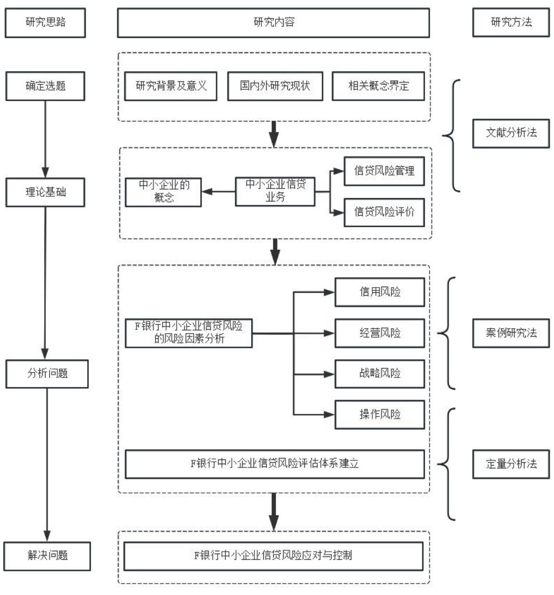

# 第 1章 绪论

# 1.1 研究背景和研究意义

# 1.1.1 研究背景

近年来，在我国经济发展的过程中，中小企业发挥了越来越大的作用。根据中国统计局发布的数据显示，在包括广州、上海等在内的大型城市当中，中小企业对于地区经济生产总值的贡献已经超过一半以上，在有些地区甚至接近于$70 \%$ ，由此可以看出，中小企业对于我国经济发展的贡献越来越大。但与此同时，在我国的金融市场当中，中小企业很难在常规途径获得融资与信贷，为了解决资金需求，许多中小企业只能通过私人贷款获得民间拆借等形式筹集资金，这种做法不但会迫使中小企业必须支付高额的贷款利率，甚至还会使中小企业面临一定的风险，从长期来看，这种做法势必会影响到中小企业的长期发展。为了解决中小企业融资难、融资贵的问题，自 2019 年以来，国务院及相关部委连续出台多项文件号召银行等金融机构支持中小企业融资，并且在扶持数量和发放的贷款金额方面也提出了具体的要求，要求进一步扩大中小企业信贷的发放比例，帮助更多的中小企业解决资金困境，在促进中小企业发展的同时助力地方经济发展。

2018年，中国银监会开始对于开展中小企业信贷风险融资做出要求，银监会也在同一时间指出，F银行自2009年成立，作为城市商业银行服务于地区经济发展的金融机构，应当明确中小企业当前在城市、社会、经济发展中做出了突出的贡献，应对其发展提供足够的支持，从而为扶持我国制造业、农林经济行业、新型科技企业等提供便利。但在实际运行过程中，虽然在政府部门的支持下，中小企业的贷款难和贷款贵的困境得到了解决，但是由于中小企业的竞争门槛较低，因此市场竞争非常激烈，其中部分中小企业缺乏必要管理能力和危机意识，这些中小企业在获得贷款后并没有提升企业的竞争能力，所以很容易出现不良贷款。

# 1.1.2 研究意义

在政府持续要求放宽贷款审核的形式下，商业银行必须要更深入地针对中小企业进行研究，掌握这些企业的经营状况，了解他们的还款能力，在此基础上建立完善的信贷风险评价指标体系，从而实现对不良贷款率的有效控制，这是当前必须高度重视的问题。本文正是基于此背景展开了相关的调研，希望在研究过程中，能够有效识别 F银行在信贷风险管理方面存在的问题，并提出相应的对策与建议。

当前，在国家陆续出台多项政策支持中小企业发展，为中小企业提供必要的信贷服务的背景下，怎样确保商业银行中小企业信贷资金的安全性，是摆在商业银行等金融机构面前的重要问题。因此，F 银行一方面，为了满足国家政策要求，应对中小企业放宽贷款条件；另一方面，F银行还应构建合理的风险防控评价指标，建立相应的预警机制，从而使不良贷款率得到降低，实现自身的长远发展。

针对中小企业进行信贷风险管理研究，使其可以更充分地进行对中小企业的评价，确保中小企业可以在信贷申请及发放中得到公平地对待。对于信贷风险评估体系的健全与优化，还可以使银行对中小企业引起重视，利用风险控制管理制度、措施等，在尽可能降低风险的前提下在贷款方面为其提供更大的支持，这对于当前我国经济的发展及社会的建设有着重要意义。

# 1.2 国内外主要研究现状

# 1.2.1国外研究现状

Stiglitz和 Weiss（1981）早在二十世纪末就在研究中明确了指出，由于中小企业经济体量的问题，导致商业银行和中小企业之间存在着信息不对称，银行中的金融管理制度表现出了一定的滞后性，在这样的情况下，中小企业就很难得到充足的贷款，而金融机构为了占据更稳定的市场份额通常会采取降低利润率的方式[1]。

Strahan P（1998）在基于大量数据分析的基础上，得出商业银行为了降低风险，确保稳定性通常会将贷款发放给具有一定规模的企业，提出了 “规模匹配理论”，基于这一理论，那些规模较小、实力较弱的中小企业则很难通过商业银行获得正常的贷款。在当时的社会与经济背景下，银行的经营模式较为单一，利润来源也有一定的局限，因此，有限的利润率和资金规模导致其抗风险的能力较弱，在这一背景下，绝大部分银行为了降低风险，在发放贷款时通常会选择与自身规模相匹配的企业，这类企业通常具有一定的实力，出现不良贷款的机率较小[2]。

对商业银行而言，如果中小企业并没有履行合同约定如期还款，就会导致信用风险。从企业的角度来看，企业无法如期偿还债务，就意味着企业发生了财务风险，如果财务风险扩大到一定的规模，就会影响到企业的正常运行，缺乏必要的经营资金，甚至会面临破产的风险。

Beave Altman（2007）通过实证研究发现，企业的信用风险和财务风险呈正相关的关系，信用风险越大，越可能引发财务风险。因此，银行等金融机构为了有效避免发生信贷风险，就必须建立有效的财务分析模型，对企业的财务状况进行真实的评价[3]。

Altman（2015）通过神经网络理论体系对财务指标和信用风险之间的关系进行了研究，得出二者之间是正相关的结论。在他看来，如果企业的缺乏必要的财务能力，对其进行信贷风险评价的结果就会较差，因此，也就无法从商业银行获得信贷资金[4]。

Benedikt Wahler（2019）在基于商业银行特征的基础上，将银行贷款业务流程纳入其中，构建了风险管控制度体系，能够对企业进行有效评价，进而有助于识别商业银行信贷业务当中的风险[5]。

# 1.2.2国内研究现状

马建峰（2015）专门研究了商业银行针对中小企业信贷风险的评价指标体系，通过研究发现，一方面，由于市场环境本身的竞争非常激烈；另一方面，由于中小企业自身体量的限制，中小企业抗风险的能力较弱，很难保持长期稳定的发展。因此，银行信贷管理部门为了有效降低信贷风险的发生率，在构建风险评价指标时应结合中小企业的实际情况和银行自身的特点，进而确保评价体系的有效性[6]。

王军（2016）认为，近年来，为了促进中小企业的发展，充分发挥中小企业在推动地方经济和带动就业方面的作用，国家陆续出台了多项政策号召金融机构和银行进行扶持，但对于金融机构和银行来说，中小企业的风险状况仍然是无法避免的，因此，银行等金融机构在向中小企业发放贷款之前，应利用包括流动比率、资产负债率以及成本利率在内的各类指标，构架科学的评估指标，从而更加科学地评估中小企业的实际经营状况，做出科学性的决策[7]。

毛雅琛，周晓萌（2015）基于大数据工具，对中小企业信贷进行了评估分析通过对样本企业进行测算，基于大数据工具的评估标准可以更充分的实现对中小企业经营与财务状况的评价。主要的优势就是可以提高工作人员收集并处理数据的效率，从而使商业银行的信贷管理人员可以在审核与决策上投入更多的时间与精力，确保中小企业在资金上的需求能够更好的满足[8]。

王萍萍（2015）认为，中小企业在经营发展的过程中，因为缺乏获取信息的渠道，在经营过程中常常出现无法应对的风险，这就提高了商业银行的坏账比例，而坏账金额较大必然会影响到商业银行的可持续性发展，因此，建立科学且有效的风险管理措施对于商业银行的发展是十分必要的。除此之外，为了有效降低坏账风险，商业银行还应采取动态评估的方式确保评估结果的可靠性，建立与之匹配的监督和责任机制，细化风险管理的具体内容，确保将信贷风险管理落到实处[9]。

刘小溪（2015）以科技型中小企业为样本，采取了主成分提取法其风险防控进行了研究，在基于实证分析和对比分析的基础上，制定了系统且全面的评价方案，此次研究对于建立中小企业风险防控的指标体系等具有一定的参考价值[10]。

李沐敉（2019）采用了 FAHP法针对中小企业的财务风险模型展开了研究，通过构建的中小企业的财务评价模式对样本企业进行了评估，在依据数据分析的基础上，制定了有针对性信贷风险防控措施[11]。

白涌如（2019）在研究中指出了中小企业在经济发展中所发挥的重要作用，同时还进一步研究了中小企业在信贷风险管理业务中的主要问题，并在此基础上提出相应的风险控制措施，以此来推动银行与金融机构的长远发展[12]。

强博（2020）在研究中分析了中小企业在信贷方面出现风险的主要原因，其认为，企业自身经营和市场经营环境是造成中小企业信贷风险的主要原因。为了降低信贷风险，一方面，应建立有效的风险防控指标对市场经营环境进行随时监控；另一方面，应建立完善的动态风险评估体系对中小企业进行评估，从而在减小机构信贷风险的同时，为中小企业的进一步发展提供良好条件[13]。

俞文婷（2019）基于经济新常态的背景，针对中小企业信贷风险的各个方面展开了研究，明确了造成信贷风险的具体原因，并提出了有效的管理优化措施[14]。

周放生（2006）通过案例分析的方式说明了商业银行针对中小企业信贷控制的主要原因，同时也阐述了在当前社会经济环境下，商业银行所采取的控制风险、识别风险的管理措施，通过上述研究成果帮助中小企业完善自身的管理职能，进而有助于获得资金支持，促进企业稳定长期发展[15]。

刘宇杰（2019）以海尔为例，分析了海尔在供应链金融的层面上的信贷评估、风险预警及相应的监督机制等一系列针对中小企业信贷业务的管理机制。该机制对于各金融机构、银行等有一定的参考价值，同时还在研究中提出了金融机构应当采取的防控措施[16]。

赵海荣（2019）以发达国家中小企业信贷风险控制为例开展了相关研究，通过对比我国的实际情况，提出了基于市场发展、信息披露及评估的中小企业信贷风险管理思维。基于此管理思维，构建的中小企业信贷风险评价体系将具有更强的科学性和使用性，有助于提升对中小企业的风险管理效果，具有一定的现实意义[17]。

# 1.2.3 研究评述

综上所述，国内外学者均对商业银行如何防范中小企业信贷风险，中小企业如何有效获得金融机构的资金支持开展了大量了研究，并且取得了丰硕的研究成果，但依旧存在进一步的提升空间。

（1）国外针对信贷风险管控的研究要早于国内，并形成了较为丰富的研究成果，但是其成果大多是基于国外金融环境和市场环境而得出的，很多成果对于我国金融市场并不具有适用性，因此，需要根据我国的实际情况来进一步进行实证分析，进而得出具有针对性的研究结论。

（2）我国在信贷风险控制方面的研究起步较晚，研究成果大多集中于银行信贷理论、实践研究体系等方面。很少有专门针对中小企业金融风险评估、评价体系科学性的研究，并且大部分研究成果的地区适应性较差，并没有结合地方特征设定具有可靠性的信贷风险评估体系，解决方案也缺乏针对性。

# 1.3研究内容与研究方法

# 1.3.1 研究内容

首先通过 F银行中小企业信贷业务规模和业务现状对 F银行信贷业务经营情况进行简要介绍，同时通过 F银行的风险管理架构和信贷流程及风险管理问题分析，介绍了 F 银行中小企业风险管理现状。其次运用风险管理知识对 F银行中小企业信贷风险管理水平展开风险识别，包括风险识别的思路、识别过程及识别结果等，主要运用头脑风暴法建立了风险因素清单。然后根据建立的风险因素清单，基于层次分析法对 F银行中小企业信贷风险管理进行评价，包括评价指标的选取、设定、评价层次模型构建、计算权重向量及一致性检验等，进而通过模糊层次综合评价法对信贷风险管理水平评价，并对评价结果进行分析。最后给出 F银行中小企业信贷风险的应对策略，应对措施及相关信贷风险监控措施等。

# 1.3.2 研究方法

（1）文献分析法

在本次研究中，通过图书馆、网络数据库等的各种渠道搜集整理了和银行信用贷款、风险评价以及指标体系等有关的文献资料，了解了当下国内外在此方面的研究成果。在进行研究的过程中，通过对各种途径收集和整理相关数据，分析当前中国的市场环境，尤其是对金融市场的发展现状进行了深入了研究，在此基础上，通过对F银行相关数据资料的分析，形成了对F银行信贷业务的系统的认识，并据此构建了F 银行信贷业务的风险评价指标体系。

（2）案例研究法

本文以F银行作为研究对象，针对F银行在中小企业信贷管理方面的问题展开了研究，为了确保研究的可靠性，本文收集了F银行有关的数据、资料、周边金融环境等信息，将此作为本次研究的主要依据，在此基础上对F银行现行的信贷风险管理手段和方式进行评估，找出其中有待于改进的部分，进而构建出具有科学性和针对性的信贷风险评估和信贷风险防控体系。

（3）层次分析法

为进一步客观了解和分析 F银行中小企业信贷业务风险的影响因素及相应的影响程度，本文引入层次分析法构建回归模型的方式，搭建了银行中小企业信贷风险预警系统，实现了 F银行企业信贷风险的系统化管理和量化分析。

# 1.3.3论文的技术路线

本文的技术路线可见图 1.1。首先是确定选题，主要包括了研究的背景及意义、研究现状等；之后界定有关的理论基础，主要包括了与中小企业信贷业务相关的信贷风险管理、信贷风险评价等；然后是对当前存在的主要问题进行分析，

细化F银行中小企业信贷风险的风险因素；最后在此基础上提出了针对 F银行中小企业信贷风险和控制的相关措施。

  
图 1.1本文的技术路线图  
Fig1.1 The technical road map of this article
