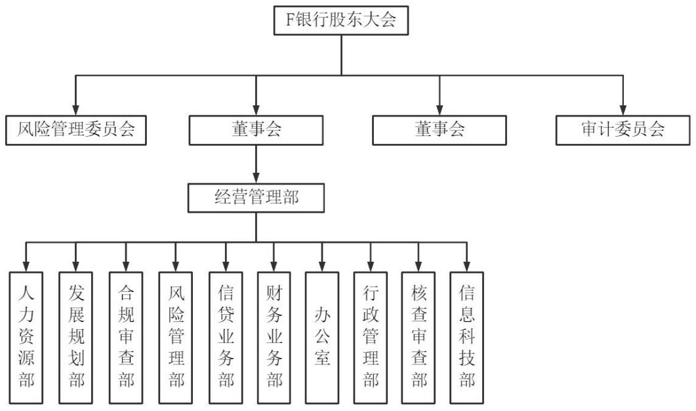
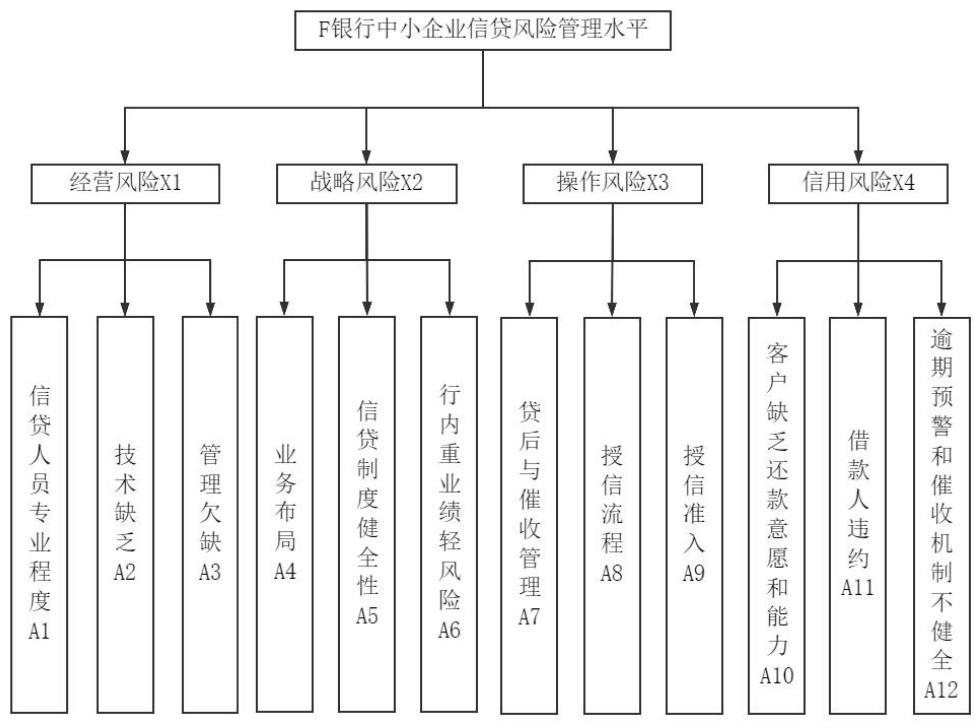
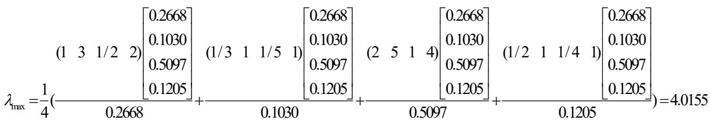

# 第 1章 绪论

# 1.1 研究背景和研究意义

# 1.1.1 研究背景

近年来，在我国经济发展的过程中，中小企业发挥了越来越大的作用。根据中国统计局发布的数据显示，在包括广州、上海等在内的大型城市当中，中小企业对于地区经济生产总值的贡献已经超过一半以上，在有些地区甚至接近于$70 \%$ ，由此可以看出，中小企业对于我国经济发展的贡献越来越大。但与此同时，在我国的金融市场当中，中小企业很难在常规途径获得融资与信贷，为了解决资金需求，许多中小企业只能通过私人贷款获得民间拆借等形式筹集资金，这种做法不但会迫使中小企业必须支付高额的贷款利率，甚至还会使中小企业面临一定的风险，从长期来看，这种做法势必会影响到中小企业的长期发展。为了解决中小企业融资难、融资贵的问题，自 2019 年以来，国务院及相关部委连续出台多项文件号召银行等金融机构支持中小企业融资，并且在扶持数量和发放的贷款金额方面也提出了具体的要求，要求进一步扩大中小企业信贷的发放比例，帮助更多的中小企业解决资金困境，在促进中小企业发展的同时助力地方经济发展。

2018年，中国银监会开始对于开展中小企业信贷风险融资做出要求，银监会也在同一时间指出，F银行自2009年成立，作为城市商业银行服务于地区经济发展的金融机构，应当明确中小企业当前在城市、社会、经济发展中做出了突出的贡献，应对其发展提供足够的支持，从而为扶持我国制造业、农林经济行业、新型科技企业等提供便利。但在实际运行过程中，虽然在政府部门的支持下，中小企业的贷款难和贷款贵的困境得到了解决，但是由于中小企业的竞争门槛较低，因此市场竞争非常激烈，其中部分中小企业缺乏必要管理能力和危机意识，这些中小企业在获得贷款后并没有提升企业的竞争能力，所以很容易出现不良贷款。

# 1.1.2 研究意义

在政府持续要求放宽贷款审核的形式下，商业银行必须要更深入地针对中小企业进行研究，掌握这些企业的经营状况，了解他们的还款能力，在此基础上建立完善的信贷风险评价指标体系，从而实现对不良贷款率的有效控制，这是当前必须高度重视的问题。本文正是基于此背景展开了相关的调研，希望在研究过程中，能够有效识别 F银行在信贷风险管理方面存在的问题，并提出相应的对策与建议。

当前，在国家陆续出台多项政策支持中小企业发展，为中小企业提供必要的信贷服务的背景下，怎样确保商业银行中小企业信贷资金的安全性，是摆在商业银行等金融机构面前的重要问题。因此，F 银行一方面，为了满足国家政策要求，应对中小企业放宽贷款条件；另一方面，F银行还应构建合理的风险防控评价指标，建立相应的预警机制，从而使不良贷款率得到降低，实现自身的长远发展。

针对中小企业进行信贷风险管理研究，使其可以更充分地进行对中小企业的评价，确保中小企业可以在信贷申请及发放中得到公平地对待。对于信贷风险评估体系的健全与优化，还可以使银行对中小企业引起重视，利用风险控制管理制度、措施等，在尽可能降低风险的前提下在贷款方面为其提供更大的支持，这对于当前我国经济的发展及社会的建设有着重要意义。

# 1.2 国内外主要研究现状

# 1.2.1国外研究现状

Stiglitz和 Weiss（1981）早在二十世纪末就在研究中明确了指出，由于中小企业经济体量的问题，导致商业银行和中小企业之间存在着信息不对称，银行中的金融管理制度表现出了一定的滞后性，在这样的情况下，中小企业就很难得到充足的贷款，而金融机构为了占据更稳定的市场份额通常会采取降低利润率的方式[1]。

Strahan P（1998）在基于大量数据分析的基础上，得出商业银行为了降低风险，确保稳定性通常会将贷款发放给具有一定规模的企业，提出了 “规模匹配理论”，基于这一理论，那些规模较小、实力较弱的中小企业则很难通过商业银行获得正常的贷款。在当时的社会与经济背景下，银行的经营模式较为单一，利润来源也有一定的局限，因此，有限的利润率和资金规模导致其抗风险的能力较弱，在这一背景下，绝大部分银行为了降低风险，在发放贷款时通常会选择与自身规模相匹配的企业，这类企业通常具有一定的实力，出现不良贷款的机率较小[2]。

对商业银行而言，如果中小企业并没有履行合同约定如期还款，就会导致信用风险。从企业的角度来看，企业无法如期偿还债务，就意味着企业发生了财务风险，如果财务风险扩大到一定的规模，就会影响到企业的正常运行，缺乏必要的经营资金，甚至会面临破产的风险。

Beave Altman（2007）通过实证研究发现，企业的信用风险和财务风险呈正相关的关系，信用风险越大，越可能引发财务风险。因此，银行等金融机构为了有效避免发生信贷风险，就必须建立有效的财务分析模型，对企业的财务状况进行真实的评价[3]。

Altman（2015）通过神经网络理论体系对财务指标和信用风险之间的关系进行了研究，得出二者之间是正相关的结论。在他看来，如果企业的缺乏必要的财务能力，对其进行信贷风险评价的结果就会较差，因此，也就无法从商业银行获得信贷资金[4]。

Benedikt Wahler（2019）在基于商业银行特征的基础上，将银行贷款业务流程纳入其中，构建了风险管控制度体系，能够对企业进行有效评价，进而有助于识别商业银行信贷业务当中的风险[5]。

# 1.2.2国内研究现状

马建峰（2015）专门研究了商业银行针对中小企业信贷风险的评价指标体系，通过研究发现，一方面，由于市场环境本身的竞争非常激烈；另一方面，由于中小企业自身体量的限制，中小企业抗风险的能力较弱，很难保持长期稳定的发展。因此，银行信贷管理部门为了有效降低信贷风险的发生率，在构建风险评价指标时应结合中小企业的实际情况和银行自身的特点，进而确保评价体系的有效性[6]。

王军（2016）认为，近年来，为了促进中小企业的发展，充分发挥中小企业在推动地方经济和带动就业方面的作用，国家陆续出台了多项政策号召金融机构和银行进行扶持，但对于金融机构和银行来说，中小企业的风险状况仍然是无法避免的，因此，银行等金融机构在向中小企业发放贷款之前，应利用包括流动比率、资产负债率以及成本利率在内的各类指标，构架科学的评估指标，从而更加科学地评估中小企业的实际经营状况，做出科学性的决策[7]。

毛雅琛，周晓萌（2015）基于大数据工具，对中小企业信贷进行了评估分析通过对样本企业进行测算，基于大数据工具的评估标准可以更充分的实现对中小企业经营与财务状况的评价。主要的优势就是可以提高工作人员收集并处理数据的效率，从而使商业银行的信贷管理人员可以在审核与决策上投入更多的时间与精力，确保中小企业在资金上的需求能够更好的满足[8]。

王萍萍（2015）认为，中小企业在经营发展的过程中，因为缺乏获取信息的渠道，在经营过程中常常出现无法应对的风险，这就提高了商业银行的坏账比例，而坏账金额较大必然会影响到商业银行的可持续性发展，因此，建立科学且有效的风险管理措施对于商业银行的发展是十分必要的。除此之外，为了有效降低坏账风险，商业银行还应采取动态评估的方式确保评估结果的可靠性，建立与之匹配的监督和责任机制，细化风险管理的具体内容，确保将信贷风险管理落到实处[9]。

刘小溪（2015）以科技型中小企业为样本，采取了主成分提取法其风险防控进行了研究，在基于实证分析和对比分析的基础上，制定了系统且全面的评价方案，此次研究对于建立中小企业风险防控的指标体系等具有一定的参考价值[10]。

李沐敉（2019）采用了 FAHP法针对中小企业的财务风险模型展开了研究，通过构建的中小企业的财务评价模式对样本企业进行了评估，在依据数据分析的基础上，制定了有针对性信贷风险防控措施[11]。

白涌如（2019）在研究中指出了中小企业在经济发展中所发挥的重要作用，同时还进一步研究了中小企业在信贷风险管理业务中的主要问题，并在此基础上提出相应的风险控制措施，以此来推动银行与金融机构的长远发展[12]。

强博（2020）在研究中分析了中小企业在信贷方面出现风险的主要原因，其认为，企业自身经营和市场经营环境是造成中小企业信贷风险的主要原因。为了降低信贷风险，一方面，应建立有效的风险防控指标对市场经营环境进行随时监控；另一方面，应建立完善的动态风险评估体系对中小企业进行评估，从而在减小机构信贷风险的同时，为中小企业的进一步发展提供良好条件[13]。

俞文婷（2019）基于经济新常态的背景，针对中小企业信贷风险的各个方面展开了研究，明确了造成信贷风险的具体原因，并提出了有效的管理优化措施[14]。

周放生（2006）通过案例分析的方式说明了商业银行针对中小企业信贷控制的主要原因，同时也阐述了在当前社会经济环境下，商业银行所采取的控制风险、识别风险的管理措施，通过上述研究成果帮助中小企业完善自身的管理职能，进而有助于获得资金支持，促进企业稳定长期发展[15]。

刘宇杰（2019）以海尔为例，分析了海尔在供应链金融的层面上的信贷评估、风险预警及相应的监督机制等一系列针对中小企业信贷业务的管理机制。该机制对于各金融机构、银行等有一定的参考价值，同时还在研究中提出了金融机构应当采取的防控措施[16]。

赵海荣（2019）以发达国家中小企业信贷风险控制为例开展了相关研究，通过对比我国的实际情况，提出了基于市场发展、信息披露及评估的中小企业信贷风险管理思维。基于此管理思维，构建的中小企业信贷风险评价体系将具有更强的科学性和使用性，有助于提升对中小企业的风险管理效果，具有一定的现实意义[17]。

# 1.2.3 研究评述

综上所述，国内外学者均对商业银行如何防范中小企业信贷风险，中小企业如何有效获得金融机构的资金支持开展了大量了研究，并且取得了丰硕的研究成果，但依旧存在进一步的提升空间。

（1）国外针对信贷风险管控的研究要早于国内，并形成了较为丰富的研究成果，但是其成果大多是基于国外金融环境和市场环境而得出的，很多成果对于我国金融市场并不具有适用性，因此，需要根据我国的实际情况来进一步进行实证分析，进而得出具有针对性的研究结论。

（2）我国在信贷风险控制方面的研究起步较晚，研究成果大多集中于银行信贷理论、实践研究体系等方面。很少有专门针对中小企业金融风险评估、评价体系科学性的研究，并且大部分研究成果的地区适应性较差，并没有结合地方特征设定具有可靠性的信贷风险评估体系，解决方案也缺乏针对性。

# 1.3研究内容与研究方法

# 1.3.1 研究内容

首先通过 F银行中小企业信贷业务规模和业务现状对 F银行信贷业务经营情况进行简要介绍，同时通过 F银行的风险管理架构和信贷流程及风险管理问题分析，介绍了 F 银行中小企业风险管理现状。其次运用风险管理知识对 F银行中小企业信贷风险管理水平展开风险识别，包括风险识别的思路、识别过程及识别结果等，主要运用头脑风暴法建立了风险因素清单。然后根据建立的风险因素清单，基于层次分析法对 F银行中小企业信贷风险管理进行评价，包括评价指标的选取、设定、评价层次模型构建、计算权重向量及一致性检验等，进而通过模糊层次综合评价法对信贷风险管理水平评价，并对评价结果进行分析。最后给出 F银行中小企业信贷风险的应对策略，应对措施及相关信贷风险监控措施等。

# 1.3.2 研究方法

（1）文献分析法

在本次研究中，通过图书馆、网络数据库等的各种渠道搜集整理了和银行信用贷款、风险评价以及指标体系等有关的文献资料，了解了当下国内外在此方面的研究成果。在进行研究的过程中，通过对各种途径收集和整理相关数据，分析当前中国的市场环境，尤其是对金融市场的发展现状进行了深入了研究，在此基础上，通过对F银行相关数据资料的分析，形成了对F银行信贷业务的系统的认识，并据此构建了F 银行信贷业务的风险评价指标体系。

（2）案例研究法

本文以F银行作为研究对象，针对F银行在中小企业信贷管理方面的问题展开了研究，为了确保研究的可靠性，本文收集了F银行有关的数据、资料、周边金融环境等信息，将此作为本次研究的主要依据，在此基础上对F银行现行的信贷风险管理手段和方式进行评估，找出其中有待于改进的部分，进而构建出具有科学性和针对性的信贷风险评估和信贷风险防控体系。

（3）层次分析法

为进一步客观了解和分析 F银行中小企业信贷业务风险的影响因素及相应的影响程度，本文引入层次分析法构建回归模型的方式，搭建了银行中小企业信贷风险预警系统，实现了 F银行企业信贷风险的系统化管理和量化分析。

# 1.3.3论文的技术路线

本文的技术路线可见图 1.1。首先是确定选题，主要包括了研究的背景及意义、研究现状等；之后界定有关的理论基础，主要包括了与中小企业信贷业务相关的信贷风险管理、信贷风险评价等；然后是对当前存在的主要问题进行分析，

细化F银行中小企业信贷风险的风险因素；最后在此基础上提出了针对 F银行中小企业信贷风险和控制的相关措施。

  
图 1.1本文的技术路线图  
Fig1.1 The technical road map of this article

# 第 2 章 相关概念及理论基础

# 2.1 中小企业信贷风险相关概念

# 2.1.1中小企业的概念

中小企业指的是是在规模、经济体量以及人员等方面规模较小的组织或单位。由于不同国家之间的政治环境、经济发展水平和经济体量方面的差异，中小企业的划分标准也不尽相同，很难形成对中小企业的标准的统一界定。此外，中小企业本身的发展目标之一就是推动自身规模的持续性扩大，获得长期稳定的发展，所以，当社会经济环境和经济体量发生变化时，中小企业的界定也会随之进行变化[18]。当下，我国主要依据所属行业、员工数量、实际资产以及经营收入等指标对中小企业进行界定，从整体来看，上述指标可以分成两大类，其中一类指标包括企业总体产值、规模及人数；另一种指标则包括所属行业、资产规模及组织形式，通常通过量化的方式予以界定。

# 2.1.2信贷风险的概念

（1）信贷风险

信贷风险指的是包括银行等在内的各类金融机构依据与借款人事先签订的借贷合同后，借款人并没有遵守合同约定按期偿还债务的情况，而这部分资金由于无法收回，就会导致包括银行在内的金额机构蒙受经济损失，产生坏账。由于借贷人违约，对银行等金融机构造成的损失分为两部分：一是贷款本金，银行的信贷资产因此缩水；二是贷款收益，由于借款人无力承担债务，势必会导致无法支付相应的贷款利息。因此，银行等商业机构为了有效降低信贷风险的发生概率，也建立必要的信贷风险控制体系进行有效管控[19]。

（2）信贷风险管理

针对信贷风险管理，目前学术界并没有给出统一的界定。威廉姆斯将风险管理界定为：风险管理是针对风险的识别、评价和控制，通过上述措施尽可能识别导致风险的因素，降低风险的出现概率，避免由于信贷风险造成的相关影响等。由此可以看出，风险管理的主要目标就是通过科学、合理规划资源，有效控制各类可能导致风险的因素，进而降低由于风险而导致的损失，促进企业长期稳定发展。所以，信贷风险管理所指的就是信贷风险的识别、评估以及控制过程，上述过程构成了风险管理的理论体系，将风险管理的理论体系应用到具体的实践过程当中，能够有效降低信贷风险对于银行的影响，使信贷风险处于可控范围之内[20]。

（3）信贷风险特征

$\textcircled{1}$ 客观性。信贷风险是客观存在的，是信贷活动的必然产物，并不会由于人的主观意识而消失，因此，也可以说，只要发生信贷活动就必然会存在信贷风险。

$\textcircled{2}$ 隐蔽性。信贷风险本身具有隐蔽性。信贷本身的不确定性损失很可能由于信用自身的特点而隐藏起来，并不在表现呈现。信贷风险可能存在不同的信贷项目中，由于缺乏一些触发因素，在具体实施过程中风险没有表现出来，但这不代表没有风险。所以，包括银行等在内的金融机构为了识别潜在的信贷风险，应合理利用相应的风险评估工具，在审核贷款业务时结合管理机制，使信贷风险发生的可能性降到最低。

$\textcircled{3}$ 可控性。信贷风险的可控性指的是包括银行等在内的金融机构，在实际操作过程中，可以通过理论与实践相结合的方式，对风险进行事前识别、预测，事中防范和事后化解等手段，找出风险出现的规律，监控潜在的风险，预判可能导致的结果，进而采取有针对性的措施进行管控，确保风险损失最小化。将风险管理落到实处。

$\textcircled{4}$ 不确定性。市场中的信贷风险与市场经济环境直接相关，而市场是实时变化的，存在许多不确定的因素，在不同条件下，很难准确的预判风险，也没有办法对风险发生的可能性及造成的影响进行事先察觉，这就要求包括商业银行在内的金融机构针对风险的不确定性建立良好的机制管理体系，通过构建的科学管控模型进行时时监控，确保风险管理的有效性。

$\textcircled{5}$ 复杂性。商业银行的信贷业务，除了与银行和企业息息相关之外，也会对整个社会的经济系统造成影响。如果信贷风险积聚到一定的规模，不仅会给银行等金融机构造成无法挽回的经济损失，甚至波及到银行储蓄资金的安全性，进而引发整个国家的金融体系的动荡，因此，信贷风险不只关系到银行和企业，也会关系到整个社会经济系统，具有复杂性。

# 2.2 中小企业信贷风险相关理论

# 2.2.1交易费用理论

交易费用理论最初是由罗纳德·科斯在《企业的性质》中首次提出，该理论指的是在市场经济中基于产权基础，在进行一系列的系统优化之后，形成相关的研究成果。具体来说，信息的获取和整理、业务洽谈、订立合同等过程均需要花费相关的资金，这部分资金统称为交易费用。

针对银行等在内的金融机构中小企业贷款业务，由于中小企业申请贷款的数量较多，贷款需求量较大，但是贷款金额普遍不高，就会导致银行等金额机构从中获取的利润率有限。但在这个过程中，银行等金融机构为了能够识别出其中的优质企业，需要花费较高的信息搜集成本，银行等金融机构的盈利空间被进一步压缩，同时，在识别优质企业之后，为了降低信贷风险还必须进行相应的资产审核、信息管理流程，对资金流向进行监控，上述各个环节都会发生相应的交易成本，因此，对于银行等在内的金融机构来说，承接中小企业贷款业务需要支付高德信息管理成本。

# 2.2.2信息不对称理论

信息不对称理论首先由阿芙洛克（1970）在《柠檬市场研究》中提出，该理论表示的是在市场经营活动当中，不同交易主体之间掌握的信息并不是相同的。在市场竞争环境当中，哪一方掌握的信息越全面就越具有优势，在交易过程中，掌握较多信息的一方可以充分利用手中的数据和信息占据主动，从而在此基础上得出更有利于自己的决定。另外一方由于自身掌握的信息有限，很难在交易过程中做出具有科学性的决策，进而导致其所面临的经营决策风险增加。因此，为了尽可能降低经营决策风险的发生概率，企业在经营与发展的过程中，要尽可能全面地收集相关行业的政策和信息，尽可能地降低由于信息不对称而带来的负面影响[22]。

# 2.2.3风险管理理论

“风险管理”的概念是由沃顿商学院的施耐德教授在1955年提出的，随后，经济全球化的发展趋势开始显现，风险管理的重要性也随时提升。当前，由于企业面临的外部环境存在不确定性以及内部环境的有限性，都会引发相应的风险，因此，风险除了具有主观性之外，还具有客观性，主客观之间具有一定的关联。当前，国内外学术界和企业均未给出风险的明确界定，从风险的实际来看，风险的存在是有一定条件的，且发生时间和造成的结果均具有不确定性，同时，风险的发生可能会带来消极的影响，也可能会带来积极的影响，其所造成的结果存在两面性[23]。

不确定性所指的是企业很难掌握与控制未来事物的发展及变化，不能预判未来事件的发生状态，因此，也就很难预判最终会给企业造成哪些影响。一方面，风险导致的结果可能会是负面的，破坏企业的正常的发展趋势；另一方面，风险也可能会带来积极的影响，推动企业向新的方向发展。通过采取相应的测量工具能够有效得出风险的发生概率，造成风险结果出现的可能性具有一定的波动，可能性越大就说明出现风险的系数越大，反之风险的系数则越小。通过风险的能够实现量化市场风险的目的，进而帮助企业得到更多的盈利机会，有效防范风险。所以要想把握更多的机会，就要做好对风险的管理[24]。

# 2.3 信贷风险评价概述

# 2.3.1 信贷风险评价基本原理

信贷风险评价还被叫做资信评价，主要是针对借款方或企业信用情况的考察，在此基础上得到相应的评价结果，从而判断借款方能否具备信贷资格，同时通过评价结果来确定具体的信贷发放金额、时间等。信贷风险评价就是运用风险管理的理论，结合银行信贷业务发展而形成的风险管理内容，通常在进行信贷评价以后将会通过简单的等级来反映出企业的信用状况，将此作为管理过程中的参考，使管理人员和信贷人员的管理效率变得更高。[27]与此同时，信贷评级还可以展示出评价对象的财务状况、发展状况以及信用状况的，从而在此基础上了解企业当下的发展趋势，实现更加全面的评价。

站在经济学的角度上，信息不对称和博弈理论是信贷评级的主要依据。对银行和银行信贷服务的对象中小企业而言，在信贷业务经营的过程当中双方掌握的信息必然会存在不对称的情况。银行缺乏对企业信息的了解，而企业不知道银行是否会发放信贷，并且也缺乏对银行信贷政策、审核政策等的了解，这些都将会导致信息不对称情况的出现。对银行而言，为了尽可能的减少信贷风险，往往要获取中小企业的信息并使用相应的信贷评价体系，从而合理发放银行信贷、避免银行信贷坏账、增加银行信贷业务营收，而这就是银行进行信贷风险评价主要目的[28]。

# 2.3.2 中小企业信贷风险评价体系

中小企业信贷风险评价主要是银行为了评估中小企业信用状况、评级而进行的评价。在进行信贷业务时，不是所有的风险评价体系都可以准确评价并减小风险的，必须要运用相关的理论并结合银行的实际情况综合进行设计，才可以真正准确的评估中小企业的经营情况。所以，现在风险评价体系所表示的是可以实现对中小企业有效的综合评价，并涉及了企业财务指标、企业规划等众多层面的指标体系，利用这样的评价体系可以得到更加准确的评价结果，从而将此作为依据减小银行信贷风险[29]。

现阶段，在我国商业银行针对中小企业信贷风险评价体系的评价指标体系中，主要涉及的对盈利能力、营运能力以及偿债能力等的分析，当前的商业银行更加重视对财务指标的分析，缺乏对非财务指标的重视。对本次所研究的中小企业而言，其规模相对较小，缺乏足够完善的财务指标，在传统商业银行重视财务指标的评价体系当中，很难顺利得到银行或金融机构在信贷方面的支持，这对于中小企业的发展是不利的[30]。所以对商业银行而言，必须要建立起专门针对中小企业的信贷风险评价体系，从而提高针对中小企业信贷评价体系的可行性与有效性，这对于中小企业及商业银行的发展而言都是有利的，并且还有助于当下我国经济的进一步发展[31]。

# 2.3.3信贷风险评价方法

（1）专家打分法

专家打分法主要就是由行业相关的专家学者、高级管理人员、资深行业从业者等所建立的专家团，针对根据文献综述或调查研究所得的评价要素打分，同时依据提前所设计的评分集来进行评定，对相关要素的评分等级进行确定，在此基础上合理确定研究对象影响较大的要素，且根据重要性排序确认权重系数，从而实现评价指标体系的设计。

（2）财务比率综合分析法

财务比例研究法则是利用所得到的中小企业财务指标，这些指标通常包括经营性财务指标与偿债能力，这些都是用来对企业财务及营收情况进行评价的关键指标，可以通过这些指标来了解企业偿还信贷的能力以及是否有充足的流动资产支付本金利息等。与此同时，在评价中小企业的财务指标当中，还将会关注其资产结构，针对固定资产和长期负债的比值进行分析，同时还将了解企业固定资本保值率等的情况，这些都是能够直接反映企业财务情况的重要指标，但实际上，因为中小企业的经营行业繁多且情况比较复杂，大部分都缺乏足够的财务水平，基于这样的情况把财务指标作为银行发放信贷的主要依据是不合理的，将会对中小企业的发展造成负面影响。

（3）层次分析法

层次分析法（Analytic Hierarchy Process，AHP）最初是在 20 世纪 70 年代，由美国萨蒂等最先提出的，这是利用定量分析来处理定性问题的多准则决策方法。该方法全面分析了研究对象的本质特征、相关影响因素和深层次的内在关系，在基于系统分析的基础上，构建具有层次结构的模型，采取对不同层级之间信息的定量分析，运用人类的思维规律，用数学的方式来解决决策问题，最终得实证分析结果。

层次分析法适用于解决那些难以通过定量描述且可以分解成若干层级的问题。运用层次分析法解决决策问题的具体流程为：第一步，将整个决策问题分为从上至下，从整体到部分的层级分解，即建立层次结构模型；第二步，建立相应的判断矩阵并对其赋值，通过特征方程的方式求解矩阵，得出各层级间元素的优先权重，即依据变量的重要性进行分配，进而实现对层级的排序。在此所说的“优先权重”主要是反映变量重要性的相对度量，通过优先权重能够更合理地实现对层次的排序。

概念是在人们对事物感知的基础上，得出对客观事物本质特征的一种认识。模糊概念指的是人们会将所感知到的事物所具有的公有属性抽象化，进而对其总结概括。只要是和模糊概念有关的现象都被叫做模糊现象。模糊集合理论（Fuzzy sets）最初是在 1955 年，由美国学者扎德提出的，他将模糊的概念转化为精确的数学方法，从而有助于评价各种实际的问题，这一方法也称为模糊综合评判法。模糊评判发和其他方法相比显著优势在于结果非常清晰，使那些量化或是模糊的问题得到有效解决。

利用层次分析法解决问题，能够使原本定性的问题通过定量的方式表现出现，因此，得出的结果具有较高的系统性且更加合理，通过层次分析法得出的结果有助于决策者在众多的复杂因素当中，寻找到其中的有用因素，使决策者的判断更具有科学性，进而做出正确的决策。在层次分析法当中，定性分析的占比较大，而定量分析的信息较少，通过对模糊综合评判法和层次分析法的结合，能够得到模糊层次分析法，进而利用模糊综合评判法来得出各层级的评判结果，使得出的评价更贴合于实际。在模糊层次分析法中，能够实现对于相关风险因素的分层，从而提升风险评估的可信度，进而有助于降低商业银行针对中小企业贷款业务方面的随意性，同时能够使使风险分析的系统性与科学性得到加强。

# 第 3 章 F 银行中小企业信贷风险管理现状

# 3.1 F 银行简介

F银行是一家在 2009年成立的商业银行，其注册资金为 3.2亿元，共有 300多名股东。从成立至今，F银行共设立包括了营业部和支行等在内的总计 37个经营网点。依据 F 银行的内部数据，截止到 2022 年底，F 银行存款余额总计 165.32亿元，贷款余额为 94.79 亿元，各项年收入总计达到了 10 亿元，税收贡献约 1.6亿元，在 A 市银行业当中业绩名列前茅。近年来，F 银行除了关注自身业绩发展之外，始终将国家政策、地方法律法规作为开展各项工作和业务的指导性准则；重视助力于地方经济发展，持续加大对中小企业发展的支持力度，积极开展信贷业务。

经过近 15年来的市场深耕，目前，F银行的主营业务除了一般的存款、抵押贷款之外，中小企业的信贷业务也占有较大比重。F银行组织结构情况见图3.1：

  
图 3.1F银行组织情况  
Fig.3.1 F organization of banks   
资料来源：F银行内部组织架构资料

目前 F 银行的员工数量共有 403名，超过 $52 \%$ 的员工都是专科以下学历。信贷部门共有 60名员工，在所有员工中的占比约为 $20 \%$ 。F银行当下的人员结构情况可见表3.1：

# 表3.1 F银行信贷人员结构图

Table3.1 F bank credit personnel structure chart   

<table><tr><td>人力资源指标</td><td>具体项目</td><td>频数N</td><td>比例%</td></tr><tr><td rowspan="2">性别</td><td>男</td><td>258</td><td>0.56</td></tr><tr><td>女</td><td>145</td><td>0.44</td></tr><tr><td rowspan="4">年龄层次</td><td>19-29</td><td>123</td><td>0.22</td></tr><tr><td>30-39</td><td>125</td><td>0.24</td></tr><tr><td>&gt;39</td><td>155</td><td>0.53</td></tr><tr><td>1-3</td><td>121</td><td>0.20</td></tr><tr><td rowspan="4">工作经验</td><td>3-8</td><td>119</td><td>0.18</td></tr><tr><td>8-15</td><td>163</td><td>0.61</td></tr><tr><td>高中以下</td><td>116</td><td>0.16</td></tr><tr><td>专科</td><td>138</td><td>0.37</td></tr><tr><td rowspan="4">职称</td><td>本科及以上</td><td>149</td><td>0.48</td></tr><tr><td>无职称</td><td>137</td><td>0.36</td></tr><tr><td>初级</td><td>147</td><td>0.46</td></tr><tr><td>高级</td><td>119</td><td>0.18</td></tr><tr><td>总计</td><td></td><td>403</td><td></td></tr></table>

资料来源：F银行内部统计资料

通过上表能够得知，F银行当下的男女比例是比较平衡的，男性员工与女性员工的占比分别为 $56 \%$ 、 $44 \%$ 。在年龄方面，F银行中的大部分员工的年龄都超过 39 岁，占比为 $53 \%$ ，其次就是 30\~39 岁与 19\~29 岁的员工，占比分别为$24 \%$ 、 $22 \%$ 。在工作经验上，在 F 银行中占比最多的是工作经验 8\~15年的员工，占比达到了 $61 \%$ ，其次是工作经验 $1 { \sim } 3$ 年与 3\~8 年的员工，占比分别为 $20 \%$ 、$1 8 \%$ 。在学历方面，在 F 银行中占比最多的是专科学历的员工，占比超过了$50 \%$ ，本科及以上学历的员工在所有员工中的占比为 $4 8 \%$ ，由此可见 F银行具有一定的人力资源基础。在职称方面，具有高级职称的员工在 F银行中的占比最低，仅达到了 $1 8 \%$ ，而初级职称和无职称员工的占比则分别为 $4 6 \%$ 、 $3 6 \%$ 。

# $3 . 2 \mathrm { F }$ 银行中小企业信贷业务经营情况

# 3.2.1 F 银行中小企业信贷业务规模

成立至今，F银行始终把国家政策及地方法律法规当作自身发展的指导性文件，在信贷业务方面已逐渐在 A市位居首位。现阶段，F银行针对信贷业务采取的是较为开放的政策，并没有为了降低信贷风险而采取缩减信贷的措施。但是由于在信贷策略上依旧比较放开，并未对中小企业采取缩减信贷的措施，但因为信贷风险评价指标体系的不断上调，F银行的信贷余额持续扩大，中小企业信贷业务的实际放款额减少。截至 2022 年末，F 银行中小企业信贷余额较年初增长了9.92亿元，剩余金额接近 100亿元，为 94.79亿元。表 3.2为F银行各网点的总余额和同比变化情况。

表3.2 F银行各网点贷款余额（单位：万元）  
Table3.2 Loan balance of each branch of the F bank   

<table><tr><td rowspan="2">经营单位</td><td colspan="2">中小企业合计</td></tr><tr><td>总余额</td><td>同比</td></tr><tr><td>AJ</td><td>6658.45</td><td>-4808.02</td></tr><tr><td>AX</td><td>35507.18</td><td>-3517.75</td></tr><tr><td>AB</td><td>10017.53</td><td>-1133.22</td></tr><tr><td>ED</td><td>47899.94</td><td>323.20</td></tr><tr><td>FD</td><td>37859.14</td><td>-6688.78</td></tr><tr><td>FF</td><td>17685.94</td><td>-4975.37</td></tr><tr><td>FH</td><td>19225.89</td><td>391.95</td></tr><tr><td>KL</td><td>20645.32</td><td>-201.27</td></tr><tr><td>PO</td><td>41938.74</td><td>-6413.46</td></tr><tr><td>LM</td><td>24488.24</td><td>-4357.84</td></tr><tr><td>10</td><td>28336.93</td><td>-6841.88</td></tr><tr><td>DF</td><td>27907.99</td><td>973.71</td></tr><tr><td>FF</td><td>81542.46</td><td>-20955.54</td></tr></table>

# 续表3.2 F银行各网点贷款余额（单位：万元）

Table3.2 Loan balance of each branch of the F bank（Continued）  

<table><tr><td rowspan="2">经营单位</td><td colspan="2">中小企业合计</td></tr><tr><td>总余额</td><td>同比</td></tr><tr><td>SF</td><td>18617.37</td><td>-3589.60</td></tr><tr><td>FF</td><td>14536.33</td><td>-2549.79</td></tr><tr><td>RT</td><td>46816.97</td><td>16636.30</td></tr><tr><td>ER</td><td>138690.43</td><td>46309.85</td></tr><tr><td>EB</td><td>17077.52</td><td>4252.22</td></tr><tr><td>TT</td><td>15957.20</td><td>14254.31</td></tr><tr><td>UI</td><td>11043.73</td><td>5212.77</td></tr><tr><td>IJ</td><td>21304.71</td><td>11164.66</td></tr><tr><td>KO</td><td>8853.11</td><td>-3978.43</td></tr><tr><td>DF</td><td>12745.44</td><td>1808.08</td></tr><tr><td>FI</td><td>3106.69</td><td>1277.54</td></tr><tr><td>DO</td><td>381.37</td><td>-352.94</td></tr><tr><td>TR</td><td>12591.14</td><td>6098.71</td></tr><tr><td>HJ</td><td>1373.81</td><td>301.78</td></tr><tr><td>AO</td><td>4110.99</td><td>3309.06</td></tr><tr><td>QOI</td><td>2048.98</td><td>1400.93</td></tr><tr><td>FH</td><td>26908.24</td><td>1791.08</td></tr><tr><td>KL</td><td>32750.91</td><td>9349.90</td></tr><tr><td>JI</td><td>54668.29</td><td>49976.96</td></tr><tr><td>LO</td><td>28741.35</td><td>-4096.03</td></tr><tr><td>LE</td><td>12940.26</td><td>-578.47</td></tr></table>

# 续表3.2 F银行各网点贷款余额（单位：万元）

Table3.2 Loan balance of each branch of the F bank（Continued）  

<table><tr><td rowspan="2">经营单位</td><td colspan="2">中小企业合计</td></tr><tr><td>总余额</td><td>同比</td></tr><tr><td>RX</td><td>3044.95</td><td>-295.13</td></tr><tr><td>BM</td><td>39769.62</td><td>-676.47</td></tr><tr><td>BNT</td><td>7407.89</td><td>3593.69</td></tr><tr><td>BFC</td><td>10508.85</td><td>-2782.38</td></tr><tr><td>XF</td><td>695.47</td><td>545.56</td></tr><tr><td>TS</td><td>918.37</td><td>-873.37</td></tr><tr><td>合计</td><td>947323.72</td><td>198613.03</td></tr></table>

F银行共设置了 37个网点，针对中小企业的信贷余额达到了 94.73亿元，在总体信贷规模中的占比为 $3 1 . 6 5 \%$ ，同比增长 $1 2 . 3 8 \%$ 。由此可见，F银行落实了国家对放开中小企业信贷的要求，在近些年的信贷业务中加大了对于中小企业的支持力度。

从表 3.2中可知，在 37家分支机构当中，ER支行的信贷规模最大，月达到了 13.84亿元，其次为 FF网点，在 37家分支机构中排在第二位，贷款余额也达到了 8.15亿元，由此可以看出，F银行针对中小企业贷款业务仍有较大的发展空间。

# 3.2.2 F 银行中小企业信贷业务现状

近年来，F 银行为了推动地区中小企业的发展，在针对中小企业贷款业务方面设置的额度越来越高，但与此同时，不良贷款率也随之增加。依据 F银行的数据，在 2019 年，F 银行的不良贷款额度为 2840 万元；到了 2022年，F银行的不良贷款额度增长了 3 倍多，达到了 9502 万元。除了不良贷款额度之外，在 2019-2022年鉴，F银行的不良贷款率也由 $1 . 7 \%$ 迅速增长到了 $5 . 6 2 \%$ ，增长率达到了$3 2 8 . 6 \%$ 。F 银行中小企业贷款的具体情况可见表 3.3。

表3.3 F银行中小企业贷款情况（单位：万元）  
Table3.3 F bank SME loans   

<table><tr><td>年度</td><td>余额</td><td></td><td></td><td>企业数量贷款余额中小企业占比</td><td>不良贷款</td><td>不良贷款率</td></tr><tr><td>2019</td><td>693929</td><td>98</td><td>166101</td><td>23.94%</td><td>2840</td><td>1.71%</td></tr><tr><td>2020</td><td>784019</td><td>106</td><td>172594</td><td>22.01%</td><td>4005</td><td>2.32%</td></tr><tr><td>2021</td><td>789507</td><td>111</td><td>169192</td><td>21.43%</td><td>7918</td><td>4.68%</td></tr><tr><td>2022</td><td>947408</td><td>133</td><td>203030</td><td>25.71%</td><td>9502</td><td>5.62%</td></tr></table>

资料来源：F银行内部信贷数据资料

通过表 3.3 能够得知，从 2019 年到 2022 年，F 银行对中小企业贷款的余额增长速度相对较慢，面向的中小企业整体数量增长较少，且中小银行在银行信贷中的占比一直处在 $2 5 \%$ 左右，由此可以发现 F 银行在中小企业信贷业务上的发展并没有太快的速度；但不良贷款的总额、不良贷款发生率却迅速增长，2019年，F银行的总体不良贷款额度与不良贷款率分别是 2840万元、 $1 . 7 1 \%$ ，到 2022 年分别增长到了 9502万元、 $5 . 6 2 \%$ 。而实际上，在这期间，对外政策并没有较大的调整，主要是由于 F 银行自身对中小企业信贷风险的评价体系存在一定的弊端，风险管理制度缺乏有效性而导致的 F银行中小企业信贷风险的持续性增大，而这对于 F银行的发展是不利的。所以，要想实现 F银行的长远发展，就必须要建立起更完善的中小银行企业信贷风险评价指标体系，健全有关的风险管理制度。现阶段，F 银行应进一步改善自身的风险评价指标体系，通过科学的风险评价指标体系来掌握中小企业实际的发展情况。虽然，银行对于中小企业信贷业务的总体不良贷款额度及不良贷款率都尚处在能够控制的范围，但如果不及时采取有效的措施对管理现状进行改进，就会导致信贷风险持续扩大，最终导致失控，进而影响到F 银行的长期稳定性发展。

为了使本文针对 F银行在中小企业信贷业务中的不良贷款问题的研究更具有针对性，对 F银行的不良贷款情况依据所属行业进行了分类，具体的行业分类情况如表3.4所示：

表3.4 2022年行业不良贷款分布情况（单位：万元）  
Table3.4 Distribution of non-performing loans in the industry in 2022   

<table><tr><td>行业</td><td>业务余额</td><td>不良贷款余额</td></tr><tr><td>农林牧渔业</td><td>1676</td><td>52</td></tr><tr><td>工业</td><td>2667</td><td>59</td></tr><tr><td>批发业</td><td>65827</td><td>883</td></tr><tr><td>交通运输业</td><td>3030</td><td>97</td></tr><tr><td>零售业</td><td>88470</td><td>2386</td></tr><tr><td>制造业</td><td>164890</td><td>11808</td></tr><tr><td>合计</td><td>326559</td><td>15283</td></tr></table>

资料来源：F银行内部数据整理

由表 3.4 可以看出， 在 F 银行 2022 年行业不良贷款分布当中，制造业排在六大行业的首位，总额度达到了 11808万元；零售业排在第二位，余额为 883 万元。近年来，随着社会经济环境的快速变化，国际贸易行业受政策影响较大，以电商直播等新媒体行业的快速发展，带动了物流等相关产业规模的持续扩大，而流行性疾病的传播也为企业所在的产业链造成了直接影响，包括制造业、零售业和批发业在内的不良贷款持续增长。

# 3.3 F 银行中小企业信贷风险管理现状

# 3.3.1 F银行中小企业信贷业务风险管理架构

F 银行采取了一种由上到下，层层独立的模式来进行对中小企业贷款的风险控制，确保可以严格遵守总行的规章制度，与此同时，总分行、各级支行，都具有较强的风险控制能力。在 F银行中，由其下属的一个风险控制委员会来制订整个中小企业信用风险控制策略并实施监督，同时指导和评估策略的贯彻落实。此外，总行还成立了普惠金融部、保全部、风险管理部、合规审计部、授信审批部等职能部门，对总行层面上的具体的工作进行了分工。对 F银行经营和发展中存在的风险加以控制，同时对下属分行重大信用交易进行风险审核；分行设立与总行相匹配的职能部门，来对接总行下发的风险管理相关工作，同时负责下属支行经营范围之内的信用风险审核工作。

# 3.3.2 F银行中小企业信贷流程及风险管理问题分析

（1）贷前管理流程及风险管理问题分析

首先，F银行与潜在客户进行信息沟通，了解到该客户的贷款需求，客户需向银行提出正式的信贷申请，申请方式包括书面申请或其他有效方式，申请书除了应涵盖企业的自然情况之外，还要明确贷款的具体用途，申请的信贷品种、信贷额度和期限、是否有抵押物，担保方式以及相关的还款能力证明材料等。为了有效降低信贷风险，信贷管理部门在客户资质审核阶段应加大审核力度，除了要求客户提供：法人身份证原件、合法合规的营业执照、公司的章程、证明股权文件、纳税证明材料之外，还应要求申请贷款的中小企业提供由董事会或股东会出具的同意申请信用业务的决议、文件、近三年财务报表包括资产负债表、现金流量表以及利润表、保证人信息、抵质押担保材料等有利于证明贷款人资质和能力的其他材料。

其次，F银行会衡量该客户是否满足中小企业准入条件。F银行的准入条件包括：针对企业控制和法人方面，要求其具有良好的信用记录，不存在由于主观意愿而造成不良信用记录，当前不存在未还清的不良信用贷款；针对企业方面，企业应符合信贷管理的基本条件、信用评级达到 BBB级及以上、信贷分类为支持类。

再次，F 银行对该客户履行贷前尽职调查。贷前尽职调查的方法指的是主要通过实地调查的方式对企业提供信息的真实性和可靠性进行判定，同时采取间接调查的方式予以补充，从而制定出信贷业务的可行性方案。F银行主要调查方法分为实地调查和撰写调查报告。实地调查主要是通过核实企业账务、实地走访和面谈等方式来综合分析企业的经营情况，通过实地调查来分析该企业是否符合银行的准入条件，信贷风险管理应开始于贷前调查阶段。调查报告是客户经理在实地调查基础上根据中小企业实际情况和企业提供的相关书面材料来撰写的，主要包括授信申请方案概况、客户在我行授信及综合收益情况、现场调查情况、公司股权架构及所属集团情况、主体评级、客户资信及社会融资情况、经营情况分析、行业地位及主要竞争对手、财务状况分析、项目分析、还款来源总结分析、风险因素及缓释措施分析以及授信申请方案。

最后，F银行对该客户进行信用风险评级与分类。F银行对通过统一的评级方法，根据客户的评级资料进行初评和复评，客观审慎评价中小企业近一年违约的概率，最终得到评级结果。F银行根据评级结果对中小企业分别采取有针对性的信贷策略，从而强化信贷风险管理。

  
图 3.2F银行评级流程图Fig.3.2 F bank rating flow chart

（2）贷中审查审批流程及风险管理问题分析

F银行对于贷中审查审批流程主要是指信贷的审查和信贷业务的审批。F银行对于中小企业信贷业务的审查是指F银行信贷管理部门在公司部提交基本资料后，对本次信贷业务是否符合法律法规、是否安全以及其效益性好坏进行审查，审查将结合相关法律法规、行业政策、银行信贷政策等。为了给信贷审议和审批流程提供参考性建议，在审查过程中风险需要被尽可能揭示，切实可行的风险管控措施需要被提出，在审查结束后，根据审查情况形成审查报告，为相关部门和贷款企业提供最终的审查意见。审查报告由以下七个方面构成：第一方面，除了应包括贷款企业名称、成立时间、发展历程等贷款企业的基本信息之外，还应涵盖企业的注册资本、企业投资人和出资情况、企业的经营范围等信息。第二方面是通过调查研究后得出的企业客户的基本经营情况，包含所处行业的发展态势，企业在行业内处于何种地位，近年来的实际经营状况及真实的财务报表数据。第三方面是客户信用情况，包含客户在银行开户的数量，账户资金情况，企业的公开信用记录、担保方式以及征信等。第四部分是信贷业务申请的说明，包括申请的贷款额度、贷款具体用途、申请的还款期限和方式以及担保和抵押等。五是风险评估与防范对策，通过对客户进行的内部调研和外部调研，对可能的经营风险、市场风险、财务风险、行业风险、政策法律风险等进行预判，根据企业实际情况判断客户企业对上述风险的控制能力，判定 F 银行的风险管理策略对客户企业是否具有适用性。六是业务的效益性评价，判定F银行承接该信贷业务能否获得合理的收益。七是审查结论、限制性条款以及管理要求，分为审查意见、授信批复的业务品类、金额、期限、利率、担保方式等。通过上述七个方面的流程，F 银行能够对客户企业的相关资料进再次审议，并据此做出科学、合理的决策。根据贷款客户的级别和贷款金额，F银行设置了差异化的审批层级、权限以及范围。由公司部调查、信贷管理部门审查、贷审会审议、授信管理部负责审批、风险管理部负责放款。信贷审批的流程图如图 3.10所示。

  
图 3.3 F银行的信贷审批流程图  
Fig.3.3 Flow chart of credit approval of bank F

（3）贷后管理流程及风险管理问题分析

F 银行贷后管理是信贷业务开始直至结束的全过程管理。首先是制定贷后管理方案，在充分掌握客户基本情况的基础上，建立完善的贷后管理组织架构；为了使制定的贷后管理制度能够有效落实，明确具体的责任人，识别在贷后管理阶段可能存在的风险点，制定有效的风险防范措施和突发状况处置机制，在发生风险后及时进行反馈等是 F 银行贷后管理方案的主要内容；其次是对日常资金账户进行监测，监测贷款资金是否存在被挪用的情况，资金结算量与企业规模是否相匹配、按期还款率是否合理、客户账户金额是否能够足额偿还贷款本息等；再次是对贷款企业的日常监督跟踪和现场调查，客户经理需按期到企业经营场所完成现场实地走访，了解员工工作状态，与管理人员面谈，掌握企业真实的生产经营情况，检查企业相关合同、发票、水费、电费单据等材料是否合规，以便及时发现风险；最后是撰写贷后管理分析报告，F 银行对公客户经理要定期按季度撰写贷后管理分析报告。F 银行的贷后管理分析报告的表头主要列举客户基本信息，如客户名称、风险分类、担保方式、主办客户经理、经营银行主要负责人等情况。贷后管理分析报告的正文主要包括客户基本信息变动情况、客户生产经营情况、客户主要财务指标变动情况、客户融资及对外担保情况检查、保证人及抵质押物检查、重大风险事项、贷后管理结论等七项内容。F银行的贷后管理流程如图 3.4所示。

  
图 3.4 F银行的贷后管理流程图  
Fig.3.4 Flow chart of post-loan management of bank F

通过前文 F银行人员基本情况介绍和 F银行中小企业信贷业务状况分析，包括近年来中小企业不良贷款率不断攀高以及中小企业不良贷款行业分布的特点以及 F银行的风险管理架构和贷前、贷中、贷后风险管理流程可以看出，F银行应提升对中小企业信贷风险的管理力度，包括经营风险、市场风险、信用风险、战略风险、操作风险、法律政策风险在内的风险均会造成负面影响。为了 F银行今后更好的发展有必要对中小企业信贷风险管理开展研究，接下来将对 F银行中小企业信贷风险进行识别和量化为后续风险评价和风险应对打下基础。

# 第 4 章 F 银行中小企业信贷风险识别

# 4.1 F 银行中小企业信贷风险的识别思路

# 4.1.1风险识别原则

F银行中小企业信贷风险的识别是按照 5个基本原则来完成的。即从总体上考虑，慎重排除，适时回馈，节约性原则，计量科学性原则。

（1）从总体上考虑

对 F 银行信贷业务中出现的一些问题进行了深入的研究。我们在对项目的风险进行分析时，必须从整体上进行考虑，而不能对风险进行简单而片面的评价与测量。

# （2）慎重排除

当我们得到了一个初步的风险列表之后，在进行风险分析时，这一准则能够使我们规避误差和偏差，从而作出更加高效、理性的判断与决策。在面对无法排除或无法确定的危险时，应当将其视为确定性危险。

# （3）适时回馈

在 F 银行信贷业务每个阶段都会出现不同的风险。风险管理者应该对风险措施的实施效果进行实时监测，从而对新的风险进行辨识，并将监测的结果及时的向有关人员进行反馈，以防止因为不能得到及时的反馈而导致新的风险。

# （4）节约性原则

风险具有不同的类型，有些风险所造成的效果，并不一定比去解决该风险所花费的费用更大。从经济效益的角度出发，可以对这一类风险进行全面评价，并对其进行分析。

（5）计量科学性原则

对风险评价要做到客观性、科学性和定量分析，并据此作出判断。采用科学的定量方法，可以使工程项目的风险控制更加科学有效。本文运用 AHP与 Fuzzy相结合的方法，对 F银行中小企业信贷风险管理水平进行了科学的评价，以期得到更加科学合理的评价结论。

# 4.1.2风险识别方法

为对 F 银行中小企业授信业务风险进行识别，对其风险识别的方法主要包括两个部分，一是通过文献研究法归纳分析国内外相关风险专家的研究后对中小企业信贷风险进行研究综述，根据前人研究结论的基础上对 F银行中小企业信贷风险进行识别。二是运用了目前使用较频繁的头脑风暴法，结合 F银行中小企业信贷风险管理的实际情况和运行操作的具体要求，对其中小企业信贷风险进行识别。所谓头脑风暴，就是利用不同的大脑，在最短的时间里，提出各种新的点子。在项目管理的进程中，头脑风暴法能够有效发挥项目团队成员的集体智慧，通过团队成员之间充分的探讨，能够有效辨识出项目中存在的各类可能的风险事件，最终得到一张较为全面、完备的项目风险事件清单，进而为未来的风险定、性和定量分析奠定基础，同时还可以为制定相应的风险对策奠定基础。这种方式要求整个项目团队都要参加进来，在一名协调员，可以在项目经理的指导下，每一个人都可以通过自己的工作经历、亲身体会，甚至是直觉，针对项目风险情况将个人的想法与其他项目成员进行分享，由协调员或专业的记录员负责将所有成员的看法记录在一块黑板或一张纸上，让所有人都可以参加讨论和审查，之后再按照风险事件的种类将其归类，最终得出项目风险事件的列表。

因为头脑风暴法是一个公开的环境当中进行的，并不对项目成员的背景和角色进行限定，在讨论过程中，每个人都可以自由地发表个人看法，不用考虑其他人是否具有权威性，也没有任何的是非对错之分，而是集中了很多不同的观点，所以，这种风险识别的方式通常更加准确、客观和全面。

# 4.1.3风险识别步骤

（1）F 银行召开中小企业信贷风险小组会议，对行内中小企业信贷业务现状，信贷业务贷前、贷中、贷后各业务环节和风险管理的现状执行情况等进行说明，使参加会议的小组成员对项目有一个较为完整的了解，并确定项目中的全部风险是小组的任务。

（2）指派会议主持人及会议记录者，阐明头脑风暴法的原则及要领，让每个人都可以自由表达自己的意见，提倡创新思维、超越思维、逆向思维，进而产生新思路，并尽量做到全面、客观、准确地辨识出有关项目的全部风险因素。

（3）请大家依次或者随机地说出自己认为是项目的风险因素，然后将他们的观点写在白板上或者桌子上，无论他们的观点是对是错。尤其需要指出的是，主持人或其他人不能对成员表达出来的看法进行否定和打压，否则一方面会使其他人在表达自己想法时产生一定的顾虑，另一方面，也会对成员参与的积极性造成影响，进而扼杀了他们独到的和特别的想法。

（4）在所有人都给出了自己的看法之后，主持人会将自己的看法与大家进行对比和讨论，以确定是否有遗漏或者表达不准确的地方，以保证风险辨识的结果是全面的、客观的、准确的、彻底的。

（5）通过举手投票或不记名投票，让所有成员对风险事件进行思考和分析，判断风险的存在与否，排除哪些被否决，添加哪些被忽略或没有被正确表述的风险。若必要，则应反复执行第三、四和第五步骤，直到完成并取得效果为止。

（6）对风险因素进行综合分析，得出风险因素列表。

（7）对 F银行中小企业信贷风险的辨识，并不是一朝一夕的事情，当项目进行到一定程度的时候，原本有可能成为风险的事情，就会发生变化，而原本没有成为风险的事情，也有可能成为风险，所以，在进行阶段评估的时候，我们应该把所有的人都集中起来，对这些事情进行一次全面的辨识，排除掉一些不属于风险的事情，然后通过“头脑风暴”的方式，得出在新的阶段或者新的环境下，有可能出现的新的危险，这样才能保证对这些危险因素进行有效的控制。最后将专家筛选出的主要信贷风险点进行汇总建立信贷风险清单，结束风险识别。

# 4.2 F 银行中小企业信贷风险识别过程

由于中小企业信贷风险管理流程较为复杂，风险分类较多，且风险具有多种多样、隐藏较深、不易发现的特点。为了能够全面地识别中小企业信贷风险，采用文献研究法，得到初级风险清单。接下来，考虑 F 银行经营管理实际情况，对初级风险清单进行修正。最后，采用头脑风暴法，对修正后的风险清单，进行头脑风暴会议。会后，通过对头脑风暴的内容进行整理、分析，最终形成风险因素清单，成为中小企业信贷风险管理的有利依据。下面具体介绍风险识别的过程：

# （1）文献研究

通过研读《商业银行风险管理与控制》、《商业银行风险管理》、《金融机构管理》等文献均系统地介绍了商业银行风险管理的理论方法和实践，内容涵盖了以下几类风险，分别是法律政策风险、经营风险、市场风险、战略风险、信用风险和操作风险在本书中，还具体说明了这些风险类别中的风险因素。通过对 F银行信贷风险内控制度、作业文件、客户档案合同等资料中，总结出了 F银行中小企业信贷管理中存在的风险。具体包括法律政策风险、经营风险、市场风险、战略风险、信用风险和操作风险。并在研究过程中，认真地梳理了风险类别中的风险因素。最终经过整理和分析得出初级风险清单，如表 4.1所示。

表 4.1 初级风险清单表  
Table4.1 List of primary risks   

<table><tr><td>序号</td><td>风险类别</td><td>风险因素</td></tr><tr><td>1</td><td rowspan="4">法律与政策风险</td><td>法律风险</td></tr><tr><td>2</td><td>政策风险</td></tr><tr><td>3</td><td>贷款资料存在问题</td></tr><tr><td>4</td><td>抵质押担保审查不严格</td></tr><tr><td>5</td><td rowspan="3">经营风险</td><td>信贷人员专业程度低</td></tr><tr><td>6</td><td>技术缺失</td></tr><tr><td>7</td><td>管理欠缺</td></tr><tr><td>8</td><td rowspan="5">市场风险</td><td>宏观经济</td></tr><tr><td>9</td><td>利率调整</td></tr><tr><td>10</td><td>房价波动</td></tr><tr><td>11</td><td>客户经营情况</td></tr><tr><td></td><td></td></tr><tr><td>12</td><td rowspan="5">战略风险</td><td>监管及行业政策 业务布局</td></tr><tr><td>13 14</td><td>产品风险</td></tr><tr><td>15</td><td>制度流程不严密</td></tr><tr><td>16</td><td></td></tr><tr><td></td><td>行内重业绩请指标</td></tr><tr><td>17</td><td rowspan="5">信用风险</td><td>贷款规模</td></tr><tr><td>18</td><td>借款人违约 提前还款</td></tr><tr><td>19</td><td>假按揭</td></tr><tr><td>20 21</td><td>客户缺乏还款意愿能力</td></tr><tr><td></td><td></td></tr><tr><td>23</td><td rowspan="4"></td><td>逾期预警和催收机制不健全</td></tr><tr><td>24</td><td>信贷资金违规使用</td></tr><tr><td>25</td><td>贷前调查</td></tr><tr><td>26</td><td>信贷人员操作不当或道德风险</td></tr><tr><td>27</td><td rowspan="2">操作风险</td><td>业务系统不完善或出现故障</td></tr><tr><td>28</td><td>贷款资料存在问题</td></tr></table>

# （2）修正初级风险清单

从 F银行经营管理实际情况出发，法律政策风险及市场风险是较难控制的，因此暂时不考虑这两种风险，最后得到修正后的风险清单，如表4.2所示。

表 4.2 修正风险清单表  
Table4.2 Revised risk list   

<table><tr><td>序号</td><td>风险类别 风险因素</td></tr><tr><td>1</td><td>信贷人员专业程度低 经营风险</td></tr><tr><td>2</td><td>技术缺失 管理欠缺</td></tr><tr><td>3 4</td><td rowspan="4">业务布局</td></tr><tr><td>5</td></tr><tr><td>产品风险 战略风险 制度流程不严密</td></tr><tr><td>行内重业绩请指标</td></tr><tr><td>7</td><td></td></tr><tr><td>8</td><td>贷款规模 借款人违约</td></tr><tr><td>9</td><td rowspan="4">提前还款</td></tr><tr><td>10</td></tr><tr><td>信用风险 假按揭</td></tr><tr><td>客户缺乏还款意愿能力</td></tr><tr><td>11 12</td><td></td></tr><tr><td>13</td><td>逾期预警和催收机制不健全</td></tr><tr><td></td><td>信贷资金违规使用</td></tr><tr><td>14</td><td>贷前调查</td></tr><tr><td>15</td><td rowspan="4"></td></tr><tr><td>16 操作风险</td><td>信贷人员操作不当或道德风险</td></tr><tr><td>17</td><td>业务系统不完善或出现故障</td></tr><tr><td>18</td><td>贷款资料存在问题</td></tr></table>

（3）头脑风暴会议

首先确定会议人员，风险管理部组织召开 F银行中小企业信贷风险识别讨论会。为了能够全面、精准地识别出项目风险，会议拟定参与人员主要有 F银行中层管理者、各业务部门经理、技术骨干等人员，具体包括风险管理部 2人、授信审批部 2 人、公司业务部 2 人、运营管理部 1 人、资产保全部 2人、合规审计部2 人，共计 15 人。会议由非小组相关人员负责主持和控制会议，并做好会议记录。会议中，不能打断参会人员的发言，且不对其做出评价。

其次召开头脑风暴会议，头脑风暴会议前，由专人发布通知。具体内容包括会议的时间、地点、人员、会议目的、内容、以及会议所需要的材料，会议规则等内容，并以邮件的形式发送给每一位参会人员。会议于 2022年 2月 23 日召开，地点位于 F 银行会议室，人员包括小组的 15 名成员，会议中，风险管理部总经理根据个人的工作能力和经验，从 F 银行经营管理实际情况出发发表看法，与此同时其他组员也发散思维，畅所欲言，紧扣会议主题。同时，指派专人对会议进行记录和录音。会后，与每位发言人核实发言主要内容，形成会议纪要，通过后续整理分析，信贷人员专业程度低、技术缺失、管理欠缺、业务布局制度流程不严密、行内重业绩请指标、借款人违约、客户缺乏还款意愿能力、逾期预警和催收机制不健全等风险因素是与会成员超过 $50 \%$ 以上赞同的，经讨论还增加了授信流程和授信准入两个风险因素。

表 4.3 F 银行中小企业信贷风险清单  
Table4.1 Credit risk list of SMEs in bank F   

<table><tr><td>风险类别</td><td>主要风险点</td></tr><tr><td>经营风险</td><td>信贷人员专业程度</td></tr><tr><td></td><td>技术缺失</td></tr><tr><td></td><td>管理欠缺</td></tr><tr><td>战略风险</td><td>业务布局</td></tr><tr><td></td><td>信贷制度健全性</td></tr><tr><td></td><td>行内重业绩轻风险</td></tr><tr><td>操作风险</td><td>贷后与催收管理</td></tr><tr><td></td><td>授信流程</td></tr><tr><td></td><td>授信准入</td></tr><tr><td>信用风险</td><td>客户缺乏还款意愿和能力</td></tr><tr><td></td><td>借款人违约</td></tr><tr><td></td><td>逾期预警和催收机制不健全</td></tr></table>

最后对会议中记录的内容进行整理、分析。最后总结出四大类，十二项风险因素，以及表4.3F银行中小企业信贷风险因素清单。

# 4.3 F 银行中小企业信贷风险识别结果

# （1）信用风险

F银行中的信用风险管理主要有如下表现：

第一，缺乏完善的信用风险的组织管理体系。通过信贷风险识别可知，当前F 银行构建信用风险管理体系缺乏完善性，尤其是通过和其他大型商业银行相比可以看出，F 银行存在部门与岗位间的职责管理交叉的情况，这就会造成风险管理不彻底，出现互相推脱和推卸责任的情况。同时，F银行使用的信用风险管理工具和技术也有待于更新。和大型商业银行相比，F银行仍采取较为传统的风险管理的数据采集、数据加工工具，导致风险管理结果出现偏差，进而使 F银行很难准确识别和控制信用风险。

第二，因为 F银行的信贷业务发展时间较短，且小额贷款的占比较大，所以F银行的信息不对称和逆向风险选择问题较为显著。当前，F银行并没有采取有效的手段深入了解申请贷款企业经营状况及信用情况，通过调查掌握的信息可能缺乏真实性，同时，由于风险从业人员的资历和工作经验有限，难以实现对企业虚假信息的准确识别与判断。此外，F银行在对贷款进行办理的过程中并未邀请专门的信用评估机构来针对企业的信用进行评级，而仅凭自身进行的贷前调查，可能会导致数据的统计不具有真实性。

第三，通过对 F银行的信贷业务情况进行分析后发现，F银行并未和顾客建立长期的合作关系。F银行由于自身规模和资金量限制，在发放贷款后，通常会催促客户企业尽快偿还贷款，进而降低发生信贷风险的机率，而长期以往，贷款企业就会认为 F银行对其缺乏信任感，进而影响到双方的合作关系。所以企业在贷款的过程中往往会意识到和银行间的合作并不只有一次，因此会希望通过长期合作的方式来提升彼此之间的信任并减小贷款率。但 F 银行缺乏对贷款企业经营状况的监测，当贷款企业出现信用风险时并不能及时识别，从而导致双方的合作关系逐渐破裂。

（2）经营风险

经营风险指的是由于企业决策者缺乏必要的风险防范意识，在进行决策时出现失误而使企业遭受到经济损失，从而使投资者预期收益下降的风险。另外，经营风险业包括由于市场当中汇率的波动，引发的企业相关成本提升或收益下降的风险。因此，企业面临的经营风险并不是在短时间内造成的，需要对其进行长期的观察与分析进而得出科学性的判断。通过分析可知，F银行存在以下两方面的问题可能会引发经营风险：一是缺乏必要的技术支持。在金融市场当中包含各种外汇、有价证券等，想要确保风险管理的有效性，就必须系统的掌握相关的模型，能够熟练使用各类系统。除此之外，商业银行在经营过程中，还要求能够准确识别出利率风险、汇率风险、商品价格风险等经营风险，同时能够对上述风险进行有效监测和控制。掌握上述技术支持，需要 F 银行投入大量的人力和财力。其二是缺乏专业性的人才。经营风险所涉及的业务、产品及风险管理方法等专业性非常强，要求从业及管理人员具有丰富的知识背景和实践经验，而目前 F银行这类专业性人才非常匮乏。其三是欠缺相关的管理经验。和其他大型商业银行相比，F银行成立时间较短，整体的风险管理体系建设还有待于在实践当中进一步完善，在风险管理政策及程序方面还有待于补充，且对于经营风险的识别、计量以及控制等都还有一定的不足。

（3）战略风险

F银行战略风险的主要表现为风险管理和监督体系不健全，缺乏科学的风险管理组织机构。对中小企业信贷业务流程的全面评价和控制，风险评估机制不完善，不能及时有效地识别和化解风险。缺乏有效的激励约束机制，不能保证银行战略目标的实现。信息系统建设落后，没有形成有效的信息沟通渠道，风险管理缺乏基础。风险管理与经营脱节，对业务发展的贡献不大。风险管理文化滞后于业务发展，不能适应业务发展的需要专业人才匮乏，风险管理能力有限，难以适应国际金融市场和业务发展的需要。

# （4）操作风险

就目前而言，F 银行中小企业信贷风险的操作风险包括如下几点：

其一，现有的操作风险管理架构缺乏全面性，操作风险的管理职能分散，并没有设置专门的部门负责，对于不同部门职责的划分比较模糊。

其二，F 银行操作风险管理的信息化有待于提升与更新。F银行当下所采用的业务系统主要是业务操作与处理系统，上述系统仅能对部分操作风险进行识别，并不能实现对潜在的操作风险的控制，和其他大型商业银行相比，当前操作系统并没有覆盖到全行业务，有效性有待于提升与更新。另外，F银行当前并未建立操作风险损失数据库，缺乏对操作风险的量化管理，降低了对于操作风险管理的有效性。

其三，缺乏足够的操作风险管理人才。操作风险本身具有一定的特殊性，形成的原因要明显复杂于信用风险等其他风险，因此其管理难度相对较高，需要具备充足的高素质人才才能实现对操作风险的有效管理，一方面，要求这类人才具有完整的知识结构储备，确保具有专业化的能力；另一方面，这类人才还应具备丰富的业务经验，能够充分掌握当下操作风险管理的发展趋势。和大型商业银行相比，F银行的从事信贷业务人员的专业知识背景不足，从事信贷业务的时间有限，素质相对较低也没有建立其相应的风险识别意识，在贷前阶段，调查工作不到位，致使客户信用评级和实际存在偏差；贷款审查人员没有严格的进行审查，不了解各方面存在的风险点，无法为贷款做出正确决策；贷款过于形式化，没有根据谨慎性的原则来做好对贷款的审批工作；没有针对贷款合同的签订进行审核；重视经营而忽视管理，在贷后缺乏严格管理。

# 4.4本章小结

本章内容通过文献研究法确立了初级风险清单，根据 F银行经营实际情况确定了修正清单，再通过多轮头脑风暴会议展开激烈讨论确立了最终风险因素清单，包括经营风险、信用风险、战略风险、操作风险，同时还对各风险因素进行逐一细致分析并找到其产生问题的关键因素，为后续风险因素的量化打下基础。

# 第 5 章 F 银行中小企业信贷风险管理评价

# 5.1 基于层次分析法的信贷风险管理评价

# 5.1.1 指标的选取原则及设定

（1）全面性原则。即针对中小企业的信贷风险管理评估需要全面评估其风险，避免由于个别指标表现较好而忽略了对风险管理全面的观察。如针对部分管理流程不仅仅需要考察当前的效益情况，还需要结合市场环境、行业的发展趋势，对业未来的发展有一定的预测。此外，还需要考虑政策、政治、当地经营环境等对于具体的 F 银行发展战略和管理水平的影响，能够更为全面的评估管理的相关风险。

（2）定量与定性分析相结合的原则。不仅需要有定性的分析方法，还需要有定量的评估分析，通过定量评估能够尽可能的减少人为主观因素的影响，最终能够获得较为客观的评估结果。

（3）科学性原则。在实际的评估之中要做到科学、客观、真实，所提取的指标要能够全面的反应信贷风险管理的特点，并能够作为信贷评估的依据。

（4）可操作性原则。因此，针对中小企业信贷风险管理所选择的评价指标要结合其实际特点，要能够采集、分析，同时还能够确保其针对中小企业信贷风险评估的有效性。

通过征求专家们的意见，将专家们的意见进行分类汇总，选取得分较高的评价指标，同时与专家签订协议保证了数据的真实可靠。以此作为此调查结果即F银行中小企业信贷风险管理评价指标，具体调查问卷见附录。之后本文运用层次分析法构建层次结构模型，将评价指标分解成若干层次，最上层为F银行中小企业信贷风险管理评价，即评价指标体系的目标层；中间是准则层，对应信经营风险、战略风险、操作风险和信用风险四个指标；最下层是方案层，对应信贷人员专业程度、技术缺乏、管理缺乏、业务布局等十二个指标，具体评价指标如图5.1 所示。

  
图5.1 F银行中小企业信贷风险管理评级指标  
Fig.5.1 Bank F credit risk management rating indicators for SMEs

# 5.1.2 评价层次模型构建过程

（1）构造判断矩阵。

$$
A = { \left[ \begin{array} { l l l l } { a _ { 1 1 } } & { a _ { 1 2 } } & { \dots } & { a _ { 1 j } } \\ { a _ { 2 1 } } & { a _ { 2 2 } } & { \dots } & { a _ { 2 j } } \\ { \dots } & { \dots } & { \dots } & { \dots } \\ { a _ { i 1 } } & { a _ { 1 2 } } & { \dots } & { a _ { 1 j } } \end{array} \right] }
$$

在层析分析法中引入李克特九级量表，判断矩阵的格式如下表5.1所示：

表5.1 AHP评估标度  
Table5.1 AHP assessment scale   

<table><tr><td>Bij取值</td><td>含义</td></tr><tr><td>1</td><td>元素ai和 aj比较，同等重要</td></tr><tr><td>3</td><td>元素ai和aj比较，bi略重要</td></tr><tr><td>5</td><td>元素ai和aj比较，bi重要</td></tr><tr><td>7</td><td>元素ai和aj比较，bi重要得多</td></tr><tr><td>9</td><td>元素ai和aj比较，bi极其重要</td></tr><tr><td>2,4,6,8</td><td>介于两者之间的比较值</td></tr><tr><td>以上取值的倒数</td><td>反过来比较，aij=1/aij</td></tr></table>

（2）计算判断矩阵每一行元素乘积

$$
\mathbf { M } _ { i } = \prod _ { j = 1 } ^ { n } a _ { i j }
$$

（3）计算Mi的n次方根得到权重 nWi  Mi

（4）将权重归一化得到归一化权重 $\mathrm { M i }$ ，即每个指标占上一级指标的百分比

$$
W _ { i } = \frac { \overline { { { W _ { i } } } } } { \displaystyle \sum _ { i = 0 } ^ { n } \overline { { { W _ { i } } } } } ( i = 1 , 2 , \cdots , n )
$$

（5）计算最大特征值

$$
\lambda _ { \mathrm { m a x } } = \frac { 1 } { n } \sum _ { i = 1 } ^ { n } \frac { ( A W ) _ { i } } { W _ { i } }
$$

其中（AW） $i$ 表示向量 $A W$ 的第 $\dot { \mathbf { \eta } } _ { \mathrm { i } }$ 个分量。

（6）一致性检验

为确保其合理性，要对判断矩阵进行一致性检验。一致性检验别式为：

$$
C I = \frac { \lambda _ { \operatorname* { m a x } } - n } { n - 1 }
$$

导入平均随机一致性指标 $R I$ ，可计算出随机一致性比率CR值，其中1-8阶数的判断矩阵 $R I$ 值见下表5.2所示。

表5.2 平均随机一致性系数RI的取值  
Table5.2 Values of average random consistency coefficient RI   

<table><tr><td>阶数n</td><td>1</td><td>2</td><td>3</td><td>4</td><td>5</td><td>6</td><td>7</td><td>8</td><td>9</td></tr><tr><td>RI</td><td>0</td><td>0</td><td>0.58</td><td>0.90</td><td>1.12</td><td>1.24</td><td>1.32</td><td>1.41</td><td>1.54</td></tr></table>

随着 $\mathbf { n }$ 的增加判断误差就会增加，因此应将 $\mathbf { n }$ 的影响一并考虑在判断一致性时应予以考虑，因此，随机性一致性比值为：

$$
C R = \frac { C I } { R I }
$$

其中RI为平均随机一致性指标，当CR值小于0.1时，说明所构建的评价矩阵通过了内部一致性的判定，否则需要重新构建判别矩阵。

按照图5.1的层次模型，根据专家判断矩阵调查问卷结果，分别形成准则层和方案层的比较表。准则层的对比矩阵结果如表5.3所示。方案层对比矩阵如表5.4-5.7 所示。

表5.3准则层成对比较  
Table5.3 Standard layer pair comparison   

<table><tr><td>准则层指标</td><td>战略风险</td><td>操作风险</td><td>经营风险</td><td>信用风险</td></tr><tr><td>战略风险</td><td>1</td><td>3</td><td>1/2</td><td>2</td></tr><tr><td>操作风险</td><td>1/3</td><td>1</td><td>1/5</td><td>1</td></tr><tr><td>经营风险</td><td>2</td><td>5</td><td>1</td><td>4</td></tr><tr><td>信用风险</td><td>1/2</td><td>1</td><td>1/4</td><td>1</td></tr></table>

表5.4经营风险对比矩阵

Table5.4 Business risk comparison matrix   
表5.5战略风险对比矩阵  

<table><tr><td>准则层指标</td><td>信贷人员专业程度</td><td>技术缺失</td><td>管理缺乏</td></tr><tr><td>信贷人员专业程度</td><td>1</td><td>3</td><td>2</td></tr><tr><td>技术缺失</td><td>1/3</td><td>1</td><td>1</td></tr><tr><td>管理缺乏</td><td>1/2</td><td>1</td><td>1</td></tr></table>

Table5.5 Moral hazard comparison matrix   
表5.6操作风险对比矩阵  

<table><tr><td>准则层指标</td><td>信贷制度健全性</td><td>行内重业绩轻风险</td><td>业务布局</td></tr><tr><td>信贷制度健全性</td><td>1</td><td>2</td><td>3</td></tr><tr><td>行内重业绩轻风险</td><td>1/2</td><td>1</td><td>2</td></tr><tr><td>业务布局</td><td>1/3</td><td>1/2</td><td>1</td></tr></table>

Table5.6 Operational risk comparison matrix   

<table><tr><td>准则层指标</td><td>贷后与催收管理</td><td>授信准入</td><td>授信流程</td></tr><tr><td>贷后与催收管理</td><td>1</td><td>3</td><td>5</td></tr><tr><td>授信准入</td><td>1/3</td><td>1</td><td>2</td></tr><tr><td>授信流程</td><td>1/5</td><td>1/2</td><td>1</td></tr></table>

# 表5.7 信用风险管理对比矩阵

Table5.7 Credit risk management comparison matrix   

<table><tr><td>准则层指标</td><td>客户缺乏还款意愿 和能力</td><td>借款人违约</td><td>逾期预警与催收机 制不健全</td></tr><tr><td>客户缺乏还款意愿和能力</td><td>1</td><td>3</td><td>1/2</td></tr><tr><td>借款人违约</td><td>1/3</td><td>1</td><td>1/5</td></tr><tr><td>逾期预警与催收机制不健全</td><td>2</td><td>5</td><td>1</td></tr></table>

# 5.1.3 计算权重向量及一致性检验

本文在对判断矩阵的最大特征根及所对应的特征向量进行计算时采用的是和积法，计算判断矩阵的一致性指标，进行一致性检验。具体来说，分为以下四个步骤：一是将判断矩阵中每列数字求和；二是判断矩阵归一化处理过程，即用判断矩阵中每列数值除以第一步骤求得的和；三是计算权重向量，具体方法为对归一化后的判断矩阵同一行的各值求和后计算平均值；最后计算最大根值、一般一致性指标及随机一致性比率，查询平均随机一致性指标，进行一致性检验，如随机一致性比率小于 0.1，判断矩阵通过一致性检验。

（1）准则层权重向量及一致性检验

由公式方法计算得出准则层对比较表5.3 准则层中的经营风险、战略风险、操作风险、信用风险权重向量分别为 0.2668、0.1030、0.5097、0.1205，详见表5.8（下表）；最大特征根 $\lambda _ { \operatorname* { m a x } } { = } 4 . 0 1 5 5$ ；一般一致性指标 $C I { = } 0 . 0 5 2$ ，一致性指标比率 $C R { = } 0 . 0 0 5 7$ ，该指标小于 0.1 达到了满意一致性指标，故该判断矩阵验证通过。具体步骤如下：

表5.8权重向量  
Table5.8 Weight vector   

<table><tr><td>准则层指标</td><td>权重向量</td></tr><tr><td>经营风险</td><td>0.2668</td></tr><tr><td>战略风险</td><td>0.1030</td></tr><tr><td>操作风险</td><td>0.5097</td></tr><tr><td>信用风险</td><td>0.1205</td></tr></table>

根据公式，求该矩阵最大特征根：

根据公式5.3，该判断矩阵的一般一致性指标为：

$$
C I { = } \ ( \lambda { \bf m a x { - } } { \bf n } ) \ / \ ( { \bf n } { - } 1 ) = \ ( 4 . 0 1 5 5 { - } 3 ) \ / \ ( 4 { - } 1 ) \ = 0 . 0 0 5 2
$$

由表5.4可差得 $\mathrm { n } { = } 3$ 时，随机一致性指标 $R I { = } 0 . 5 2$ ，进而求得随机一致性比率为： $C R { = } C I / R I { = } 0 . 0 0 5 2 / 0 . 9 0 { = } 0 . 0 0 5 7 , C R { \le } 0 . 1$ 时，判断矩阵通过一致性检验，证明得到的权重结果是可以使用的。

（2）经营风险权重向量及一致性检验

利用上述步骤，计算出经营风险权重各指标的权重向量，如表5.9所示，最大特征根为 3.0183；一般一致性指标CI 为0.0091，随机一致性比率CR为0.0158，小于 0.1，达到了满意一致性指标，该判断矩阵一致性检验通过。

表5.9经营风险权重结果  
Table5.9 Results of operating risk weights   

<table><tr><td>方案层指标</td><td>权重结果</td></tr><tr><td>信贷人员专业程度</td><td>0.5499</td></tr><tr><td>技术缺乏</td><td>0.2098</td></tr><tr><td>管理缺乏</td><td>0.2402</td></tr></table>

（3）战略风险权重向量及一致性检验

利用上述步骤，计算出战略风险各指标的权重向量，如表5.10所示，判断矩阵的最大特征根为 3.0092；一般一致性指标CI为0.0046，随机一致性比率CR为0.0079，小于0.1，达到了满意一致性指标，该判断矩阵一致性检验通过。

表5.10战略风险权重结果  
Table5.10 Moral hazard weighting results   

<table><tr><td>方案层指标</td><td>权重结果</td></tr><tr><td>制度健全性</td><td>0.5396</td></tr><tr><td>行内重业绩轻风险</td><td>0.2970</td></tr><tr><td>业务布局</td><td>0.1634</td></tr></table>

（4）操作风险权重向量及一致性检验

利用上述步骤，计算出操作风险各指标的权重向量，如表5.11所示，判断矩阵的最大特征根为 3.0037；一般一致性指标CI为0.0018，随机一致性比率CR为0.0032，小于0.1，达到了满意一致性指标，该判断矩阵一致性检验通过。

表5.11操作风险权重结果  
Table5.11 Operational risk weight results   

<table><tr><td>方案层指标</td><td>权重结果</td></tr><tr><td>贷后与催收管理</td><td>0.6483</td></tr><tr><td>授信准入</td><td>0.2297</td></tr><tr><td>授信流程</td><td>0.1220</td></tr></table>

（5）信用风险权重向量

利用上述步骤，计算出信用风险各指标的权重向量，如表 5.12所示，判断矩阵的最大特征根为 3.0037；一般一致性指标CI 为0.0018，随机一致性比率CR为0.0032，小于 0.1，达到了满意一致性指标，该判断矩阵一致性检验通过。

表5.12信用风险权重结果  
Table5.12 Credit risk weight results   

<table><tr><td>方案层指标</td><td>权重结果</td></tr><tr><td>客户缺乏还款意愿和能力</td><td>0.3090</td></tr><tr><td>借款人违约</td><td>0.1095</td></tr><tr><td>逾期预警和催收机制不健全</td><td>0.5816</td></tr></table>

# （6）一致性检验

根据层次分析结果，综合各层级指标权重，得出F银行中小企业信贷风险因素各方案层按准则层依次分类指标权重如表5.13所示。

从表5.13可以看出准则层排在首位的是操作风险，操作风险中贷后催收与管理是最大的影响因素，权重为 0.6483；排在第二位是经营风险，经营风险中逾期预警与催收不健全是最大影响因素，权重为0.5499；排在第三位的是信用风险，其中逾期预警和催收制度不健全是最重要的影响因素，权重为0.5816。

# 表5.13 F银行中小企业信贷风险管理评价模型

Table5.13 Assessment model of credit risk management for SMEs of bank F   

<table><tr><td>准则层指标</td><td>权重</td><td>方案层指标</td><td>权重</td><td>综合权重</td></tr><tr><td rowspan="3">经营风险</td><td rowspan="3">0.2668</td><td>信贷人员专业程度</td><td>0.5499</td><td>0.1467</td></tr><tr><td>技术缺乏</td><td>0.2098</td><td>0.0560</td></tr><tr><td>管理缺乏</td><td>0.2402</td><td>0.0641</td></tr><tr><td rowspan="3">战略风险</td><td rowspan="3">0.1030</td><td>制度健全性</td><td>0.5396</td><td>0.0556</td></tr><tr><td>行内重业绩轻风险</td><td>0.2970</td><td>0.0306</td></tr><tr><td>业务布局</td><td>0.1634</td><td>0.0168</td></tr><tr><td rowspan="3">操作风险</td><td></td><td>贷后与催收管理</td><td>0.6483</td><td>0.3304</td></tr><tr><td>0.5097</td><td>授信准入</td><td>0.2297</td><td>0.1171</td></tr><tr><td></td><td>授信流程</td><td>0.1220</td><td>0.0622</td></tr><tr><td rowspan="3">信用风险</td><td></td><td>客户缺乏还款意愿和能力</td><td>0.3090</td><td>0.0372</td></tr><tr><td>0.1205</td><td>借款人违约</td><td>0.1095</td><td>0.0132</td></tr><tr><td></td><td>逾期预警和催收机制不健全</td><td>0.5816</td><td>0.0701</td></tr></table>

# 5.1.4 模糊综合评价法评估信贷风险

（1）将每个指标的风险等级设置评语。V=[V1， V2， V3， V4， $V 5 ] { = } [$ 风险高，风险较高，风险中等，风险较低，风险低]，赋值为V=[100，80，60，40，20]。

表5.14 F银行中小企业信贷风险管理风险评价指标评价集  
Table5.14 Assessment set of risk assessment indicators for credit risk management by bank F   

<table><tr><td>准则层指标</td><td>方案层指标</td><td>高</td><td>较高</td><td>中等</td><td>较低</td><td>低</td></tr><tr><td rowspan="3">经营风险</td><td>信贷人员专业程度</td><td>5</td><td>8</td><td>4</td><td>2</td><td>1</td></tr><tr><td>技术缺乏</td><td>3</td><td>6</td><td>7</td><td>3</td><td>1</td></tr><tr><td>管理缺乏</td><td>4</td><td>5</td><td>3</td><td>4</td><td>4</td></tr><tr><td rowspan="3">战略风险</td><td>制度健全性</td><td>5</td><td>2</td><td>3</td><td>5</td><td>5</td></tr><tr><td>行内重业绩轻风险</td><td>3</td><td>3</td><td>3</td><td>3</td><td>8</td></tr><tr><td>业务布局</td><td>3</td><td>3</td><td>4</td><td>6</td><td>4</td></tr><tr><td rowspan="3">操作风险</td><td>贷后与催收管理</td><td>2</td><td>4</td><td>3</td><td>4</td><td>7</td></tr><tr><td>授信准入</td><td>4</td><td>3</td><td>4</td><td>6</td><td>3</td></tr><tr><td>授信流程</td><td>3</td><td>4</td><td>2</td><td>4</td><td>7</td></tr><tr><td rowspan="3">信用风险</td><td>客户缺乏还款意愿和能力</td><td>2</td><td>4</td><td>5</td><td>5</td><td>4</td></tr><tr><td>借款人违约</td><td>4</td><td>3</td><td>3</td><td>6</td><td>4</td></tr><tr><td>逾期预警和催收机制不健全</td><td>5</td><td>2</td><td>4</td><td>7</td><td>2</td></tr></table>

（2）确定评价因素得分。根据F银行中小企业信贷业务风险评价指标模型以及评语等级，设计 F银行中小企业信贷业务风险评价调查表（详见附录），每个风险指标共分为风险高、较高、中等、较低、低5个档位，分别对应100分、80分、60 分、40 分、20 分。调查对象 F 银员工、风险管理岗位员工，调查表共计发放 20 份通过对有效调查表进行数据统计整合，得到F银行中小企业信贷业务风险评价指标评价集表5.14和表5.15隶属度矩阵。

表5.15 F银行中小企业信贷风险管理风险评价指标隶属度矩阵  
Table5.15 Membership matrix of risk assessment indicators of credit risk management for small land Medium-sized Enterprises   

<table><tr><td>准则层指标</td><td>方案层指标</td><td>高</td><td>较高</td><td>中等</td><td>较低</td><td>低</td></tr><tr><td rowspan="3">经营风险</td><td>信贷人员专业程度</td><td>0.25</td><td>0.4</td><td>0.2</td><td>0.1</td><td>0.05</td></tr><tr><td>技术缺乏</td><td>0.15</td><td>0.3</td><td>0.35</td><td>0.15</td><td>0.05</td></tr><tr><td>管理缺乏</td><td>0.2</td><td>0.25</td><td>0.15</td><td>0.2</td><td>0.2</td></tr><tr><td rowspan="3">战略风险</td><td>制度健全性</td><td>0.25</td><td>0.1</td><td>0.15</td><td>0.25</td><td>0.25</td></tr><tr><td>行内重业绩轻风险</td><td>0.15</td><td>0.15</td><td>0.15</td><td>0.15</td><td>0.4</td></tr><tr><td>业务布局</td><td>0.15</td><td>0.15</td><td>0.2</td><td>0.3</td><td>0.2</td></tr><tr><td rowspan="3">操作风险</td><td>贷后与催收管理</td><td>0.1</td><td>0.2</td><td>0.15</td><td>0.2</td><td>0.35</td></tr><tr><td>授信准入</td><td>0.2</td><td>0.15</td><td>0.2</td><td>0.3</td><td>0.15</td></tr><tr><td>授信流程</td><td>0.15</td><td>0.2</td><td>0.1</td><td>0.2</td><td>0.35</td></tr><tr><td rowspan="3">信用风险</td><td>客户缺乏还款意愿和能力</td><td>0.1</td><td>0.2</td><td>0.25</td><td>0.25</td><td>0.2</td></tr><tr><td>借款人违约</td><td>0.2</td><td>0.15</td><td>0.15</td><td>0.3</td><td>0.2</td></tr><tr><td>逾期预警和催收机制不健全</td><td>0.25</td><td>0.1</td><td>0.2</td><td>0.35</td><td>0.1</td></tr></table>

（3）建立模糊关系矩阵与确定评价因素的权向量，得到各个方案层指标的模糊矩阵如下：

$$
R _ { 1 } = \left[ \begin{array} { r r r r r } { 0 . 2 5 } & { 0 . 4 } & { 0 . 2 } & { 0 . 1 } & { 0 . 0 5 } \\ { 0 . 1 5 } & { 0 . 3 } & { 0 . 3 5 } & { 0 . 1 5 } & { 0 . 0 5 } \\ { 0 . 2 } & { 0 . 2 5 } & { 0 . 1 5 } & { 0 . 2 } & { 0 . 2 } \end{array} \right]
$$

$$
R _ { 2 } = \left[ \begin{array} { r r r r r } { 0 . 2 5 } & { 0 . 1 } & { 0 . 1 5 } & { 0 . 2 5 } & { 0 . 2 5 } \\ { 0 . 1 5 } & { 0 . 1 5 } & { 0 . 1 5 } & { 0 . 1 5 } & { 0 . 4 } \\ { 0 . 1 5 } & { 0 . 1 5 } & { 0 . 2 } & { 0 . 3 } & { 0 . 2 } \end{array} \right]
$$

$$
R _ { 3 } = \left[ \begin{array} { r r r r r } { 0 . 1 } & { 0 . 2 } & { 0 . 1 5 } & { 0 . 2 } & { 0 . 3 5 } \\ { 0 . 2 } & { 0 . 1 5 } & { 0 . 2 } & { 0 . 3 } & { 0 . 1 5 } \\ { 0 . 1 5 } & { 0 . 2 } & { 0 . 1 } & { 0 . 2 } & { 0 . 3 5 } \end{array} \right]
$$

$$
R _ { 4 } = \left[ \begin{array} { r r r r r } { 0 . 1 } & { 0 . 2 } & { 0 . 2 5 } & { 0 . 2 5 } & { 0 . 2 } \\ { 0 . 2 } & { 0 . 1 5 } & { 0 . 1 5 } & { 0 . 3 } & { 0 . 2 } \\ { 0 . 2 5 } & { 0 . 1 } & { 0 . 2 } & { 0 . 3 5 } & { 0 . 1 } \end{array} \right]
$$

（4）建立模糊关系矩阵与确定评价因素的权向量，得到各个准则层指标的模糊矩阵如下：

$$
M = [ 0 . 5 4 9 9 0 . 2 0 9 8 0 . 2 4 0 2 ] { \left[ \begin{array} { l l l l l } { 0 . 2 5 } & { 0 . 4 } & { 0 . 2 } & { 0 . 1 } & { 0 . 0 5 } \\ { 0 . 1 5 } & { 0 . 3 } & { 0 . 3 5 } & { 0 . 1 5 } & { 0 . 0 5 } \\ { 0 . 2 } & { 0 . 2 5 } & { 0 . 1 5 } & { 0 . 2 } & { 0 . 2 } \end{array} \right] } = { \left[ \begin{array} { l l l l l } { 0 . 2 1 7 0 } & { 0 . 3 4 3 0 } & { 0 . 2 1 9 4 } & { 0 . 1 3 4 5 } & { 0 . 0 8 6 0 } \\ { 0 . 2 1 7 0 } & { 0 . 3 4 3 0 } & { 0 . 2 1 9 4 } & { 0 . 1 3 4 5 } & { 0 . 0 8 6 0 } \end{array} \right] }
$$

$$
\iota 2 = [ 0 . 5 3 9 6 0 . 2 9 7 0 . 1 6 3 4 ] \left[ \begin{array} { l l l l l l } { 0 . 2 5 } & { 0 . 1 } & { 0 . 1 5 } & { 0 . 2 5 } & { 0 . 2 5 } \\ { 0 . 1 5 } & { 0 . 1 5 } & { 0 . 1 5 } & { 0 . 1 5 } & { 0 . 4 } \\ { 0 . 1 5 } & { 0 . 1 5 } & { 0 . 2 } & { 0 . 3 } & { 0 . 2 } \end{array} \right] = \left[ 0 . 2 0 \ 4 0 \quad 0 . 1 2 3 0 \quad 0 . 1 5 8 2 \quad 0 . 2 2 8 5 \quad 0 . 2 8 6 4 \right]
$$

$$
B 3 = [ 0 . 6 4 8 3 0 . 2 2 9 7 0 . 1 2 2 ] \left[ \begin{array} { l l l l l l } { 0 . 1 } & { 0 . 2 } & { 0 . 1 5 } & { 0 . 2 } & { 0 . 3 5 } \\ { 0 . 2 } & { 0 . 1 5 } & { 0 . 2 } & { 0 . 3 } & { 0 . 1 5 } \\ { 0 . 1 5 } & { 0 . 2 } & { 0 . 1 } & { 0 . 2 } & { 0 . 3 5 } \end{array} \right] = \left[ 0 . 1 2 9 1  & { 0 . 1 8 8 5 } & { 0 . 1 5 5 4 } & { 0 . 2 2 3 0 } & { 0 . 3 0 4 } \right]
$$

$$
B 4 = [ 0 . 3 0 9 0 . 1 0 9 5 0 . 5 8 1 6 ] { \left[ \begin{array} { l l l l l } { 0 . 1 } & { 0 . 2 } & { 0 . 2 5 } & { 0 . 2 5 } & { 0 . 2 } \\ { 0 . 2 } & { 0 . 1 5 } & { 0 . 1 5 } & { 0 . 3 } & { 0 . 2 } \\ { 0 . 2 5 } & { 0 . 1 } & { 0 . 2 } & { 0 . 3 5 } & { 0 . 1 } \end{array} \right] } = { \left[ \begin{array} { l l l l l } { 0 . 1 9 8 2 } & { 0 . 1 3 6 4 } & { 0 . 2 1 0 0 } & { 0 . 3 1 3 7 } & { 0 . 1 4 1 9 } \end{array} \right] }
$$

（5）合成模糊综合评价结果向量

将之前设置的风险等级评语 $V { = } [$ [风险高，风险较高，风险中等，风险较低风险低]=[100，80，60，40，20]，与评价因素的权向量合成模糊综合评价结果向量整体评价分值。

同理可计算出准则层指标、方案层指标评分值，进行整理之后，具体的风险评价得分明细如表 5.16所示。

表5.16 F银行风险评级指标得分  
Table5.16 F risk rating indicator scores of banks   

<table><tr><td>准则层指标</td><td>得分</td><td>方案层指标</td><td>得分</td></tr><tr><td rowspan="3">经营风险</td><td rowspan="3">69.40</td><td>信贷人员专业程度</td><td>74.25</td></tr><tr><td>技术缺乏</td><td>67.36</td></tr><tr><td>管理缺乏</td><td>61.02</td></tr><tr><td rowspan="3">战略风险</td><td rowspan="3">54.59</td><td>制度健全性</td><td>57.11</td></tr><tr><td>行内重业绩轻风险</td><td>50.01</td></tr><tr><td>业务布局</td><td>55.09</td></tr><tr><td rowspan="3">操作风险</td><td rowspan="3">52.31</td><td>贷后与催收管理</td><td>50.67</td></tr><tr><td>授信准入</td><td>59.22</td></tr><tr><td>授信流程</td><td>52.14</td></tr><tr><td rowspan="3">信用风险</td><td></td><td>客户缺乏还款意愿和能力</td><td>55.98</td></tr><tr><td>58.71</td><td>借款人违约</td><td>57.76</td></tr><tr><td></td><td>逾期预警和催收机制不健全</td><td>61.24</td></tr></table>

# 5.2 F 银行中小企业信贷评价结果分析

# 5.2.1 经营风险评价结果分析

经营风险评价得分为 69.4，从信贷人员专业程度方面来看，F银行要求客户经理对每笔信贷业务进行贷后管理，然而没有制定相应贷后管理的具体方式方法以及实施步骤，没有形成贷后管理的硬性指标，也就是说 F银行没有对贷后管理引起足够关注和重视。因此，F银行即使口头强调贷后管理的重要性，但并没有建立相应的考核机制或者有考核机制但未真正落实，加上客户经理普遍存在指标压力大、业务指标多等客观现象，导致客户经理对于中小企业的贷后检查仍不加以重视，只是流于形式地做到表面功夫，并未真正执行，特别是在对长期合作的客户，疏于查验企业的真实状况，造成对银行风险的形成。

# 5.2.2 信用风险评价结果分析

信用风险评级得分为 58.71，其方案层指标客户缺乏还款意愿和能力借款人违约逾期预警和催收机制不健全等都存在一些问题具体来说存在以下几方面原因：

（1）信用风险评价机制缺乏针对性

当前，F 银行采用是将大企业模式的比例进行调整后，用于对中小企业进行信用评价，因此，并不具有较强的适应性，没有将中小企业的特点纳入信用评价机制当中，同时也忽视了中小企业发展的实际情况。除此之外，F银行在对中小企业的评价结束且与其建立合作关系后，并没有开展相关的贷后的动态跟踪工作，因此，也就没有办法提前识别潜在的风险因素，进行预警，很多风险处置都是在风险发生后才进行，由于处理的不及时通常都提升了风险的处置难度，造成了较大范围的影响。另外，现行的信用风险评价机制缺乏针对性，并没有与企业贷款的目的相结合，不了解企业在之后是否可以按时还款，没有做好对各方面的分析工作，对中小企业信息掌握的不全面，很难有效预判后续潜在的风险。

（2）信用级别较少，评定权限的设置不明确

现阶段，F 银行采取的是中小企业5 级评价制度，倘若中小企业在经过评价以后被划分成后三个等级，F 银行就不会和他们进行合作，在此情况下企业是不能够在银行中得到资金的。但就实际来看，部分企业虽然在经过评价以后被认定为不符合要求的级别，但实际上，这些企业通常都具有较强的偿债能力，银行机构与他们进行合作的安全性较高，是可以进行合作的。所以，在当前使用的评级标准下，许多虽然有良好偿债能力的中小企业依旧不能够在银行中得到资金。与此同时，F银行当前所制定的评定权限不够明确，部分评价人员能够根据自己的主观来对有关的指标进行调整，在实际工作中存在着一些人员不考虑实际情况而随意调整的现象，这就极大的提高了风险发生的可能性。

（3）未建立完善的中小企业的信用数据库，贷前调查存在较多问题

贷前阶段的企业信用情况调查的是非常重要的，同时还需要展开更加深入的分析，在此基础上由银行确定是否要进行放款。就目前来看，F银行在调查信息时所出现的问题主要表现为如下几点：第一，人民银行所建立的征信系统依旧存在缺陷，该系统中的一些内容已不符合当今时代的发展要求，其中的很多数据并没有及时更新，相关数据很难起到应有的作用；第二，F银行并没有与工商和税务等部门实现信息共享，也就很难及时发现中小企业经营状态的变化，所评价的信息缺乏全面性；第三，并没有对所获取的数据进行加工，内部信息的有效性较差，数据的使用效率有待于进一步提升。虽然 F银行会通过自身的优势来收集中小企业有关的数据，但收集的数据大多数属于企业的基本信息，或者是第三方机构出具的财务审计报告，在具有滞后性的同时可靠性也有待于考证，通过这些数据发挥的作用有限；另外，由于 F银行缺乏专门的数据库，也没有对收集到的数据及时进行汇总和分析，并没有达到风险预警和识别的效果。

F银行在现阶段对于自身信用情况的分析，是以定性分析法来实现的，在此过程中，并没有运用到破产预警评估模型、违约风险模型等定量分析模型，针对信用风险所进行的评估较为落后，没有使用AI等先进技术对企业客户的信用进行测量，针对企业信用评价所进行的评定，基本都是F 银行信贷管理人员根据自己的主观进行判断。同时，F银行的电子化发展不够成熟，没有建立起针对企业的信息数据库，也没有建立完善的风险评估专家系统。

# 5.2.3 操作风险评价结果分析

操作风险评价结果得分为 52.31分，说明在信贷制度健全性、授信准入、授信流程都有较严重问题。在 F 银行中，主要由信贷员来负责进行对于中小企业的信贷准入评估。具体来看，F银行针对中小企业的信贷业务主要包含了三个环节，包括第一个环节为信贷员核对录入客户资料；第二个环节为客户经理进行实地走访调查；第三步为分管行长审核确认信贷材料。由此可以看出，当前F银行仍采用主观评价的方式对客户资质进行审核，并没有借助于大数据的评估系统，而人为评价的方式具有较大的主观性，在资质评定的环节，存在明显的人为定性的可操作性，以信贷员核对录入客户资料的环节为例，由于信贷员在这一阶段与企业的工作人员接触较多，在工作中容易建立起互助和彼此信任等感性，此时就容易趋于感性，被借款人的资金需求打动，进而做出非理性的行为。除此之外，在贷后管理阶段，F银行信贷员采用的是针对大企业的风险控制措施，而中小企业与大企业的区别除了体现在规模和资金等方面之外，最为明显的就是经营经验不足，抗风险能力较差，所以进行的判断缺乏全面性，这也是信贷员当前应当重点加强的工作。结合 F银行内控体系来说存在以下方面原因：

（1）组织体系不健全。针对中小企业的信贷业务，F银行并没有建立完善的风险评估框架，现行的管理制度也存在遗漏，风险评估的内容有待于进一步细化。另外，目前 F 银行针对中小企业信贷业务，存在职责不明确的问题，也没有明确说明相关人员在风险管理方面具有的权力和义务，发生风险时互相推卸责任，因此，在中小企业信贷管理过程中出现了诸多问题。

（2）规定未有效落实。针对于内部控制环节，F银行规定了特定的时间点进行审查，并且设定了专门的风控经理，制定了相关的审查要求，但是在实际工作中，风险经理及内部控制的相关配套制度并没有落实到实处，F银行总行人员对支行内控检查的重视程度也较低，通常只是在支行中分配几个人例行检查，检查流于形式，很难发现其中潜在的问题。

（3）小额信贷部门的风险意识不足。目前，F银行的中小企业信贷业务由小额信贷部门专门负责，但是在针对该部门的绩效考核当中，贷款业务所占的比重较大，风险控制所占的比重过小，这就无论是部门领导还是普通员工都将部门的工作重点放在贷款业务方面，当两个业务之间出现冲突时，通常会选择都选择贷款业务，弱化了对风险的管控，缺乏对此方面正确的认识。除此之外，对于客户经理的绩效考核缺乏合理性，当前客户经理的考核重点为传统业务和开户数量，并没有将业务质量纳入到考核范围之内，这就会致使客户经理为了达到目标并提高效益而忽视业务质量，从而引发更大的风险。

（4）中小企业的信贷流程不完善。F 银行在制度改革以后，针对中小企业的合作流程仍然沿用以往的做法，并没有在合作流程当中，考虑到客户的实际需求和发展趋势，因此会在合作过程中出现的问题较多，因为以往传统的模式所针对的是大型企业，而中小企业在许多方面都和大型企业存在明显差异。把大型企业的流程运用到中小企业，那么相关的要求就太过严格，这也将会造成风险的出现。

（5）审计部门执行力较差。当前，F 银行审计部门员工普遍工作的时间较短，仅有 1位是 985高校审计专业的毕业生，其他 4位员工均为经济、管理等相关专业，致使 F银行审计部门缺乏对于风险的深入理解，由于缺乏实际工作经验的积累在认知上有一定的偏差，在工作中，容易受到其他部门的影响，从而导致审计部门所做出的判断与决策表现出偏差。

# 5.2.4 战略风险评价结果分析

F银行的战略风险评分为 54.59分，其中影响较大的为中小企业的贷款业务布局。为了操作方面的便利性，F 银行相关部门在选择合作对象时，通常会选择业务熟悉的中小企业，尤其是在金融资产流向管理方面，由于历史因素，较为熟悉的领域获得资金支持的可能性更大。但是，这种做法在实际中面临的风险较大，倘若某行业在宏观层面上发生问题，那么整个行业中的企业都会受到或大或小的影响，进而也就提升了信贷风险的发生概率，影响到 F银行的经营业绩。另外，从当前 F 银行中小企业信贷业务的行业构成来看，F银行对包括生物医疗和AI 等产业的支持力度明显不足，行业领域大多居中于传统优势行业，难以有效减小由于经济转型等而引发的系统性信贷风险。

# 5.3本章小结

通过风险识别后要进一步对其量化才能对 F银行风险管理水平进行评价。因此运用层次分析法计算出风险管理指标的权重并通过一致性检验，特别要说明的的是参与打分的专家对数据真实性进行承诺，进而运用模糊曾次分析法计算出各风险评级指标得分，通过各指标得分结果来看，F银行的风险管理水平还是存在一定问题，需要进一步给出相应的对策和保障措施。

# 第 6 章 F 银行中小企业信贷风险应对与控制

# 6.1 F银行中小企业信贷风险应对策略

在风险应对之中一般有风险规避、风险转移、风险补偿，以及风险保留（承担风险，降低风险影响）等具体措施。而对于本文研究的 F银行中小企业信贷业务来说，风险转移是较难实现的，因为银行针对中小企业的信贷金额一般相比个人信贷金额要高，而 F 银行目前并未针对中小企业的信贷进行风险转让的管理制度与流程的设计，并没有将风险信贷转移到其他金融担保公司，或者保险公司的具体流程。因此，本文在针对 F 银行信贷风险应对策略的选择之中从风险的规避、风险的补偿（接受低风险）、风险规避等方面提出相应的措施。根据对F银行中小企业信贷风险识别与评估的结果，对最终的评价结果可以按照过程评估中总分的差别应用风险的规避，或者降低风险、风险转移等具体措施。如在放贷后对信贷风险管理中得分在60分以下指标实施上述三个方面的风险应对措施；而对于得分在60-80左右的可以试试风险的规避、风险的降低措施等等。

针对F银行来说，如果在后续的信贷过程管理之信贷风险评估分有所下降，但仍然高于60分的话，可以使用风险降低策略。风险降低策略是指通过对F银行自身对中小企业信贷的管理和组织模式、降低风险发生的概率，或者降低风险可能会对F银行信贷资金造成的损失。在降低风险之中，其风险发生的概率小、对F银行可能造成的损失也比较小，因此可以通过对管理措施的严格执行来降低风险。如果在后续的信贷过程管理之中企业的信贷风险评估分有所下降，且分数低于60分的话就可能会出现较为严重的风险。应立即采取相对应的风险管理应对措施。

# 6.2 F银行中小企业信贷风险管理的应对措施

# 6.2.1 建立和完善风险控制机制

（1）健全信用评价体制，强化信用风险管理意识

一方面，要健全信用评价体系。上世纪90年代末我国建立了企业信用担保体系，以此来应对当下企业担保难的现状，同时也参考了国际上的主流做法。但就实际来看，由于当前我国市场经济仍处于持续发展过程中，受到我国传统思想的影响，中小企业对信用观念与信用体系的重视程度不足。在这样的情况下，一些中小企业经常会出现各种不诚实守信的行为，如假冒伪劣、延期还贷等等。对此，银行在对中小企业开展信贷业务时，必须要建立完善的信用评级体质，加强这些企业的信用观念意识，确保他们能够充分意识到信用评定的重要性。具体从以下两个方面入手：一是要做好对中小企业会计信息的管理，要求客户企业定期向F银行提供真实的会计信息，确保贷款企业的会计信息具有较高的透明度，便于F银行通过会计信息情况监控贷款企业的实际运营；二是要参考并借鉴国外银行中小企业信贷中的成熟经验，引入风险预测及判断的量化模型对贷款企业的信用风险进行判断和跟踪。同时，依据中国市场经济发展现状以及中小企业规模、实际发展状况等因素对风险量化评定模型进行修正，保证风险量化模型能够最大化地实现评价目标。

另一方面，要强化信用风险管理意识。F银行应建立完善的信用风险管理体系，对与管理体系相配套的各项制度进行补充，进而在银行内部构建完善的信用风险管理文化内核，通过上述措施，助力 F银行针对中小企业信贷业务的风险管理落到实处。在日常管理当中，F银行还应通过有效措施建立现代银行经营思想、信用风险管理理念以及信用风险管理行为的综合性的文化，建立全员风险管理意识，使所有员工都能够意识到风险管理必要性，具备完善的风险防范及管理的意识，在个人工作当中时刻关注潜在的风险因素。除此之外，F银行还应将风险管理落实到中小企业贷前审查、贷中监督、贷后管理的全流程当中，保证每一个人都能够受到风险文化的积极影响，从而确保信贷风险管理的作用得到充分发挥。

（2）提升风险控制管理情况评价

充分结合对F银行风险管理政策的总体引导，加强业务风险管理情况评价及风险管理理念，引入国外先进的技术与方法，借鉴国外的成熟管理经验科学计划并合理规划风险管理。建立符合中国市场经济和中小企业实际情况的风险控制体系，提升F银行的风险管理控制能力，具体从以下三个方面进行推进。

首先，要健全运行管理体系，完善相关的管理制度，避免由于缺乏相关制度而影响到具体管理行为的实施。根据F 银行中小企业信贷业务的实际情况，分别在贷前、贷中和贷后阶段完善相关的制度设置，确保具体工作有据可依，有章可循。除此之外，明确划分F银行风险管理的岗位及工作职责，说明不同岗位间的职责差异及操作权限，避免出现职责交叉或互相推诿。

其次要明确风险管理的操作标准，建立完善的业务工作体系，明确业务细分、工作流程及岗位职责，在此过程中，最大程度的发挥出监督机构的作用，将整个风险管理过程进行合理分解，实现各工作岗位的充分协同。细化有关权限，建立权限复核控制体系，实现对风险的有效管理。

最后要建立专家团队，充分利用专家团队的专业背景和实践经验来实现对风险的良好评估。专家小组应涉及到多个部门，由专家小组来针对实际的风险情况管理进行分析，在风险预防机制建立方面充分借鉴于专家意见，从整体上提升风险控制的效果，全面分析所需要预防的风险部分。

（3）提升现有风险控制体系建设水平

F银行要想提神自身的风险控制体系建设的水平，就需要对以下方面引起重视：

其一，优化银行治理体系，注重内部控制的重要作用，避免F银行内部出现风险问题。

其二，集中管理各业务信息，及时掌握各业务信息，将自身的业务数据与总行间数据的对比，合理划分自身业务办理的范围，做到不越权，确保营业网点交易核算模式的规范性。

其三，设置完善的风险防范机制，对于F银行来说，风险和业务的发展是相互促进的，通过完善的风险防范机制，一方面，能够有效提升F银行的业务处置能力，提升风险管理水平；另一方面，能够确保F 银行的各项业务符合银行各条例及政府法律法规。

其四，通过委派稽核员和实施岗位轮换机制降低风险。在内部结构方面，通过委派稽核员的方式能够实现有效的监督作用；而实施岗位轮换，则能够有效降低滥用职权，，重视对银行风险的防范。

# 6.2.2建立和完善银行内部控制

（1）加强银行内部贷款行为规范

F银行针对自身的贷款业务，除了要遵守国家及行业的相关规定之外，还应该本着提升F银行中小企业信贷业务管理水平的目标，进一步编制中小企业信贷业务的行为规则，用于指导F银行中小企业信贷业务具体的管理过程，进而有助于推动实现F银行的战略目标。针对F银行中小企业信贷业务风险的管理，应立足于全局，制定全面的经营计划及有关战略，最大程度的降低贷款风险。

F 银行应依据国家有关政策法规制定中小企业信贷业务的相关政策，以此来指导 F银行相关的业务操作，助推货币经济长远发展的规划的实现。具体来说，包括以下几个方面：一是通过相关的法律法规约束 F银行中小企业信贷业务的具体行为；二是在通过对政策导向、自身资本情况及业务优势进行细致分析的基础上，制定业务规则；三是合理约束 F 银行自身的资本，在规划流动性资本之后，合理控制贷款规模和数量，由于资本额不足影响 F 银行的风险承担能力。当前，银行业的市场竞争日趋非常激烈，在有限的资本约束中，很多地方性银行开始参与到中小企业信贷业务的竞争当中，F银行的市场份额被进一步压缩，在这种情况下，F银行应避免为了提升业绩而盲目扩展贷款规模的，影响 F银行自身的健康可持续性发展。银行对企业提供贷款的主要目的职位为满足企业在社会生产方面的资金要求，在一定时间内，社会再生产资金需求的程度决定了银行贷款的投入规模。 F银行本身的成立的时间较短，和其他大型银行相比，在开展中小企业信贷业务时，面临着一定的风险。各业务资产之间可能会产生连锁反应，的效应也被称之为“传染效应”，这一效应会威胁到 F 银行整体资金的安全，提升贷款风险。因此，F银行合理设置规模，避免“传染效应”对自身的资金安全造成影响。

# （2）完善银行风险防范体系

利用完善的贷款风险预警体系能够有效识别 F银行中小企业贷款业务潜在的风险。通过风险预警体系能够有效提示客户企业的负面消息、经营状况以及资金的变化情况，F银行如果能够及时掌握上述信息，可以第一时间了解公司内所存在的问题，进而实现对逾期还款或坏账的及时预警，在此基础上采取措施来处理问题，从而最大程度的减小损失。

应当采取的措施包括：在业务规划阶段就将营销部门纳入到风险管理的工作安排当中，风险管理人员与营销人员共同制定明确风险管理的具体内容和操作程度；在达成贷款意向之后，制定包括贷款的管理策略、风险监督对象等在内的贷后管理方案中，贷款审批负责人需严格审核贷后管理方案，要求贷后管理方案中的风险防控措施具体且具有可操作性。在贷后管理阶段，相关部门应随时跟踪客户企业信贷业务风险出现的初始状态，根据变化情况及时采取必要的措施避免遭受损失，避免损失扩大化。

所以在贷后管理阶段，F银行应建立完善的各工作环节的具体职能，阐述职责要求，通过风险预警模式及时识别信贷业务风险，通过明确、完善的机制选择适合的风险措施，合理处置风险，直至最终的信贷业务清收。避免由于信息不对称而引发的贷后风险管理问题。最后，需要进一步优化并改进 F银行中小企业信贷业务的客户贷后审查及评估方法。在客户引入阶段，就做好相关的分析和调研工作，在风险管理工作评估当中纳入风险防范预警、不良资产产生及退出等过程，使F银行的风险防范治理体系更加完善且具有可行性。

# 6.2.3 建立健全风险转化与保障机制

（1）建立信贷风险分散机制

对于不能够防范的风险，F银行在投资与贷款配置资金的过程中，避免过于集中，需要使用分散搭配的方法，降低风险间的联动影响。因此，F银行在这选择证券及贷款时，应将相关系数纳入到考虑的范围内，最大程度的减小资产组合的整体风险。目前，包括银行在内的金融机构普遍采用多样化的投资方式来分散并降低风险。针对于 F 银行的具体情况，可以将贷款份额进一步分散、设置差异化的贷款期限以及选择尽可能多的行业客户。

具体来说，如果客户企业的申请的贷款额度较高，F银行可以采取银团贷款的方式予以操作，即在明确自身的份额之后，将其他份额转让给其他银行，实现份额分散，防止风险过于集中。期限分散分为两种，一是时间分散，即合理搭配长期、中期及短期贷款，拉开贷款到期日之间的差距；二是区域分散，即按照一定的比例，把贷款向不同区县的不同贷款内分散。行业分散指的是扩大行业范围，重视限制类行业，尤其是应向新兴行业进行适当倾斜。

（2）建立信贷风险转移机制

采取风险转移的方式能够有效降低F银行所遭受的损失情况。在风险还未发生时，F银行应采取保险、担保和资产证券化等法律法规所许可的业务措施及交易方式，及时处置相关质押品和抵押物，将潜在风险的责任转移给他人，进而降低可能遭受的损失，保全银行信贷资产。

具体来说，可以采取以下三种方式：其一，通过担保人或信贷企业转移风险，采取将贷款变更给担保人或是信贷企业的方式，避免损失银行资产；其二，通过保险公司转移风险，如银行、借款企业和担保企业各自向保险公司办理资金与财产保险，在发生风险时，可以履行保险条款，由保险公司负责承接相应的风险；其三，如果项目性质为地方城府承诺，当发生违约时，可以将风险转移到地方政府，由地方政府偿还相关的贷款。

# （3）建立信贷风险补偿机制

针对于破产企业，通常会进行债务重组，确定原有银行债务的继承人、数额以及偿还方式等。F银行针对破产的企业客户，应进行及时的沟通与跟踪，明确偿还方案，并指派专人负责督促企业从销售收入当中提取相应的资金，用于偿还贷款债务，尽量降低 F银行的资产损失。

# 6.3 F银行中小企业信贷风险监控措施

# 6.3.1建立风险管理机构

F银行需要在内部建立风险管理机构，针对内部管理方法、管理流程等实施严格监控，针对中小企业信贷在管理流程、管理方法、事后监督、绩效管理体系等方面的问题进行分析，风险管理机构需要在此基础上提出相应针对管理的优化措施。还应当根据风险评估管理指标体系提出新的指标，例如在后疫情时代下中小企业经营的环境有了很大的变化，所以需要通过新的指标来针对可能出现的风险进行分析，利用更加完善的风险管理机构来在之后的经营管理中对有关的内容进行持续优化，从而使 F银行相关制度的适应性能够得到加强。

F银行在建立风险管理机构以后，还需要组织银行内的专家来针对信贷管理状况实施动态监督，合理评价实施的效果，全面分析中小企业信贷的运行情况、发放规模以及坏账率等，并在此基础上根据银行信贷业务的发展情况，提出完善并优化信贷风险评估指标体系的措施。

# 6.3.2 密切关注信贷客户动态

F银行应基于银监会提出《商业银行集团客户授信业务风险管理指引》中的相关要求，对当前社会经济环境下的信用风险管理特征进行分析，据此建立起健全的信贷管理机制，进而在满足客户需求的同时保障F 银行自身的权益。另外，客户对于F银行的长期发展至关重要，F银行一方面要开发足够的客户资源；另一方面，要争取与客户间建立长效合作机制。在与客户建立长效合作机制，应采取必要的调研手段充分掌握客户各方面的信息，结合预先设定的各类管理授信控制额度，实现能够有效监测和预警客户潜在的风险。具体来说，合作前期，应与客户之间进行充分的交流，根据企业实际情况构建风险形成机制，使风险管控工作能够落实到实处。合理分析集团内部的客户价格，充分掌握客户内部关联、运作模式以及资金现状等，同时综合分析上述信息之间的合理性和可靠性，避免发生风险。与此同时，还应当合理界定售后管理，对集团客户的实际运营情况进行监督，做好对于授信的管理和监控工作，根据客户的资金和业务情况，对客户偿债能力进行动态性分析，进而提升F 银行的风险管理水平，确保信贷资产的安全性。

建立到期贷款台账，跟踪监测贷款回收状况。具体包括日监测、月监测等，总行信贷管理部负责每日进行系统在线监测，随时预警潜在的风险；同时在每月初负责对各支行及信贷员进行提醒，在银行范围内公布回收情况。进而对各支行级信贷员起到应尽的督促职责，尽可能的收回到期贷款。

（1）完善风险预警机制，加强风险防范。风险预警制度在实际工作中具有指导性的作用，因此，各支行应对自身的风险预警制度进行完善和补充，在制度中明确规定应定期及非定期监督客户的财务情况和偿还能力等，出现任何情况都需要进行预警与登记，进而有助于及时采取相关措施予以解决；总行信贷管理部负责重点企业客户和大额客户的贷后管理工作，应随时关注国家相关政策及行业政策变化，高度重视各类政策与重点客户的相关性，预判其偿债能力的变化，适当提出指导意见，减少信贷风险。

（2）建立激励约束机制，严格进行考核。将到期贷款收回率作为员工考核的重点，提高所占比重；同时，在日常工作中，强调及时清收到期贷款的重要性，注重提升员工的风险意识，同时将贷款回收率作为各支行考核的重要指标，建立贷款回收率与各支行贷款额度的联动机制，据此来调整各支行贷款权限。

# 6.3.3 加强对不良贷款率的管控

要想有效管理不良贷款率，应充分发挥员工的工作积极性，一方面，要求员工在日常工作中具备良好工作理念和意识，在日常工作中，认真遵守各项规章制度，不违规操作。一方面，要通过良好的工作氛围，加强员工之间的协同与合作，从而提高风险控制的有效性。同时，客户经理的管理和引导对于有效控制不良贷款率也具有重要作用，依据分行授信管理办法的有关要求，客户经理帮助工作人员结合自身工作情况来明确应承担的工作职责，帮助其提升工作效率，确保企业可以和客户建立起长效的合作机制。

另一方面，客户经理作为中小企业信贷业务的直接管理者，在推动日常工作的同时，还应关注工作人员的工作状态和变动因素，充分利用信贷监控机制系统对预警信息进行必要的核实，进而能够及时发现工作人员的违约行为，进行及时的纠正和处理。同时在以后的工作中，将这类员工作为重点审查对象，如仍然出现违规操作则应当要求将其调离岗位。为了降低不良贷款率，F银行还应不定期抽查企业客户的贷后管理情况，倘若在抽查时发现问题，应在第一时间予以曝光，进行严格的惩处与追责，进而起到相应的警戒作用。同时，对相关业务的管理规章制度进行必要的修订和完善，避免同类事情再次发生，从而达到提高风险管理能力及效率的目的。

# 第 7章 结论与展望

# 7.1 研究结论

本文采用了“发现问题——分析问题——解决问题”的总体思路，阐述了研究对象及其相关理论依据，并总结了相关的研究成果，为我国商业银行信贷风险的管理提供了理论上的参考。在进行研究时，首先介绍了本文的研究背景、意义、国内外现状以及相关概念及理论，在此基础上确定了本次研究的具体框架。之后对F银行的现状进行了分析，提出了中小企业信贷风险的识别方法以及风险评估模型等，通过对该模型的使用，能够帮助F银行更好的控制风险。同时，本文还提出了 F 银行应对风险的有关措施，主要包括了风险应对流程、应对策略等等，并且还在风险监管方面提出了建议，如建立风险管理机制、重视不良贷款率管理等。

在本次研究中充分结合了 F银行的特点，针对F银行当前的客户对象进行了分析，同时对他们的数据实施了综合分析。而对于F银行中小企业信贷业务来说，风险转移是较难实现的，因为银行针对中小企业的信贷金额一般相比个人信贷金额要高，而 F银行日前并未针对中小企业的信贷进行风险转让的管理制度与流程的设计，并没有将风险信贷转移到其他金融担保公司，或者保险公司的具体流程。因此，要针对 F银行信贷风险应对策略的选择之中从风险的规避、风险的补偿（接受低风险）、风险规避等方面提出相应的措施。对银行而言，必须要结合地方的具体情况，建立起完善的信贷风险识别和防控综合管理制度。要针对企业的各方面情况展开全面分析，因此在建立银行信贷风险评估体系的过程中，除了要结合实际情况以外，还需要考虑到地方行业的特征及中小企业的发展状况。必须要做到有针对性的分析，F银行才可以真正做好对于中小企业信贷风险的控制。

# 7.2 研究展望

在我国经济发展的过程中，中小企业具有非常重要的地位，通过对信贷风险评估指标体系所进行的研究，可以挖掘出更多优秀的中小企业，扩大对于中小企业的信贷业务规模，以此来为中小企业在今后的发展提供良好条件。希望在未来能够结合中小企业的特点展开更加深入的研究，通过某行业结合产业链的形式，针对基于产业链的新融资模式进行探究，在确保银行资产安全性的同时，推动我国中小企业的进一步发展。

在许多地方经济发展的过程中，中小企业发挥了越来越大的作用，因此对中小企业信贷业务进行的研究有着重要的现实意义。在下一步的研究中应当引入大数据技术，在此基础上获取目标企业的守信记录，包括企业缴纳电费、物业管理费的情况、企业内部人员变动、工资发放情况等，这些都能够通过大数据技术来有效检测。在大数据技术的帮助下，银行信贷人员的工作效率将大大提高，从而把更多的时间与精力放到对风险的识别、评估以及管理工作中，这就可以使银行中小企业信贷业务的风险得到更好的控制。

在下一步的研究中，可以把怎样应对中小企业贷款难的问题当中研究重点。通过上述评价体系，来针对中小企业进行信贷风险评估，在此基础上进行相关的研究来实现对评价体系的进一步丰富，在不断的优化与改进下，使其可以更充分的进行对中小企业的评价，确保中小企业可以在信贷申请及发放中得到公平的对待。对于信贷风险评估体系的健全与优化，还可以使银行对中小企业的引起重视，利用风险控制管理制度、措施等，在尽可能降低风险的前提下在贷款方面为其提供更大的支持，这对于当前我国经济的发展及社会的建设有着重要的积极作用。
