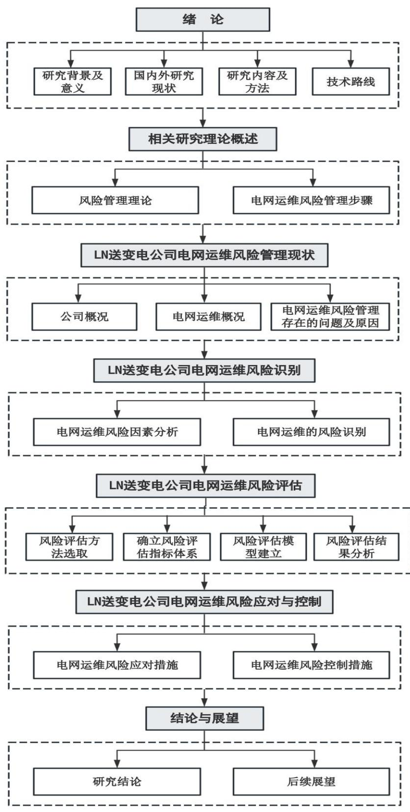

# 第1章 绪 论

# 1.1 研究背景与研究意义

# 1.1.1 研究背景

随着国民经济的高速发展，电力能源作为国民经济的重要基础设施，在国计民生中的地位日益凸显。LN送变电公司作为辽宁电网的骨干企业，肩负着全省大部分高压输电线路和变电站的运行维护重任。近年来，随着电网建设规模的不断扩大，LN送变电公司电网运维工作面临的不确定因素也在增多，各类风险交织叠加，给电网安全稳定运行带来严峻考验。

电网运维风险具有因素多样、关联复杂、动态演变等特点。LN送变电公司电网设备种类繁多、地域跨度大，运维涉及环节众多，既面临设备故障、自然灾害等传统风险，又面临外包管理、信息安全等新兴风险；各类风险因素相互关联、相互影响，单一风险的发生往往会诱发连锁反应；随着内外部形势的变化，风险因素也呈现出动态演进态势。这些特点给LN送变电公司电网运维风险管理带来诸多挑战。

当前，LN送变电公司虽已初步建立电网运维风险管理体系，但在风险辨识、风险评估、风险应对等环节还存在不足。风险管理的主动性、系统性、科学性有待进一步增强。同时，极端天气事件频发、外包队伍管控难度加大等新情况新问题不断涌现，电网运维压力持续加大，风险管控形势更加严峻。因此，如何全面辨识电网运维风险，科学评估风险等级，并制定行之有效的风险管控对策，已成为摆在LN送变电公司面前的紧迫课题。这不仅事关LN送变电公司自身的高质量发展，更关乎辽宁乃至东北区域经济社会发展大局。

# 1.1.2 研究意义

（1）理论意义

电网运维风险管理作为电力企业管理的重要内容，其相关理论研究已取得长足进展，但仍存在一些不足之处，如研究视角相对单一、定性分析偏多、定量模型有待深化等。本研究以LN送变电公司为案例，系统梳理电网运维风险的内涵、特点、类型，丰富了电网运维风险管理的基础理论。在此基础上，从技术、管理、环境、人身、设备等多维度构建风险评估指标体系，采用层次分析法和模糊综合评价法相结合的方法开展实证研究，有助于拓展电网运维风险定量评估模型与方法。最后，针对风险评估结果，从技术风险、管理风险、环境风险、人身风险、设备风险等方面系统提出风险应对策略，进一步丰富完善电网运维风险监控的理论体系。

# （2）实践意义

我国正处于电网升级改造的关键时期，各电网企业都面临着运维风险管控的严峻挑战。本研究以LN送变电公司为例，深入剖析其在电网运维风险管理中存在的突出问题和深层次原因，这些问题在一定程度上也反映了其他电网企业面临的共性难题，研究结论对于指导电网企业加强运维风险管控、提升本质安全水平具有一定的借鉴价值。同时，构建的风险评估指标体系操作性强，评估方法科学实用，为电网企业开展运维风险评估提供可资借鉴的分析框架和实践路径。此外，本研究提出的风险管控对策建议，如加强全过程管控、建立风险预警体系、开展风险管理培训等，可为LN送变电公司乃至其他电网企业进一步完善运维风险防控体系、健全风险管理长效机制提供决策参考。

# 1.2 国内外研究现状

# 1.2.1 国外研究现状

（1）关于输电网络运行风险因素识别的研究

国外学界在实际研究中对输电线路运行风险识别相关内容进行较为深入的探究，并取得较为显著的成果。DavariMM等（2022）在研究中提出针对输电线路重构影响因素进行识别的关键因素辨识模型。在综合考虑气象条件、设备老化和随机失效等多种因素的基础上，通过反复求解获得最终数值，将优化目标限制在关键线路上[1]。KhannaJ等（2021）提出一种电网风险识别方法，利用ARMA特征评估模型，对运行过程中风险数据进行评价和预测[2]。KodyA 等（2022）采用F检验法，对影响线路运营风险的主要因素进行分析，并在此基础上构建定量递归图，从而达到对线路运营风险进行预测[3]。AlhazmiM（2021）在研究中，基于马尔科夫模型与风险传递网络相结合的方法，提出智能变电站RPS风险评价方法。在风险辨识基础上，将风险划分为三个等级，并结合历史资料，对各等级变电站进行风险评价，为变电站的状态维修和风险损失评价提供理论支持[4]。

（2）关于输电网络运行风险因素评估的研究

国外学界在研究中同样对输电线路运行风险评估内容进行深入探究。YuS等人（2023）利用软件开发，对变电站雷击风险展开评估，其所提出风险评估主要是基于主观认知，没有明确风险特征、计量、防范方式等。其研究中虽然分析风险的实质，但没有提出有针对性的对策[5]。UmunnakweA等（2022）针对目前输电线路风险评估中以人的主观感觉为基础而产生的偏差，采用FCM聚类与Elcat算法相结合方式，建立输电线路灾害风险评估方法，并结合历史数据与抗灾能力等因素对其进行改进，挖掘其中规律与内在关系，从而有效地提升输电线路灾变风险评估准确性[6]。ReikoT等（2023）通过同时考虑电网侧输电线路的雷击跳闸风险和灾害侧实时雷电活动所带来的风险，建立了雷暴云移动轨迹预测模型，以雷暴云连续四个时段的四个质心的定位数据为依据，提出了一种预测通道中出现雷击引发故障风险的方式。该方法有效提高了雷击预警的效率，并减少虚警和漏报事件的发生，具有一定的工程实践价值，可以辅助电网进行调控决策[7]。LangeroudiASG等（2021）以输电线中的树竹放电因素为研究对象，对 SMOTE 和Stacking 两种方法改进方向进行探究，实现对输电线通道中树竹放电风险进行智能评估，并提高模型的可解释性和先进性，该方法可以有效地处理数据样本中出现的异常现象，并可为其他线路的风险评价提供依据[8]。

# （3）关于输电网络运行风险因素应对的研究

国外学者针对电网运行风险因素的应对策略开展了广泛研究。Shaltout O 等（2022）提出了一种基于分类树和灰色关联分析的电网人因风险评估与控制方法，通过对人的不安全行为进行分类、量化和评估，识别关键风险因子并制定针对性的管控措施，为降低人因风险、确保电网安全运行提供了新思路[9]。UmunnakweA等（2022）针对野火灾害对电网运行的影响，构建了基于数据驱动的时空分析模型，可以动态评估野火蔓延对输电线路的影响，并据此优化电网调度和应急资源配置，对提高电网抵御野火等自然灾害的能力具有重要参考价值[10]。

在电网雷电灾害风险防范方面，ReikoT等（2023）提出一种雷暴移动轨迹预警模型，通过对雷暴云演进过程的连续监测和趋势外推，可以预判未来可能出现的雷击风险，为输电线路的防雷设计和雷害预防提供更加精准的气象数据支持[11]。LangeroudiASG 等（2021）针对输电线路树障风险，提出了一种基于SMOTE和Stacking集成学习的风险智能识别方法，可大幅提高树障缺陷的识别准确率，减少漏报和误报，从而为精准制定树障清理计划、降低树障风险提供支持[12]。

此外，国外学者还就电网运行的网络安全风险开展了卓有成效的研究。DavariM

M等（2022）分析了电力系统和天然气系统耦合运行条件下的网络安全问题，构建了一种考虑需求侧响应的联合调度模型，通过优化本地应急响应策略，可有效降低网络攻击导致的负面影响，保障电网运行安全[13]。AlhazmiM（2021）则聚焦智能变电站的网络安全防护，提出了一种基于马尔可夫博弈论的智能变电站可信度评估与防御策略优化方法，可用于指导变电站的主动免疫防御系统设计，提高抵御网络安全威胁的能力[14]。

# 1.2.2 国内研究现状

（1）关于输电网络运行风险因素识别的研究

随着我国电网建设规模不断提升，电力供应稳定性所受重视程度也随之增长，为此我国学者针对输电线路风险因素识别进行较为深入的探索。在传统方法中，结合对电网的历史运行信息进行特征提取，采用基于Wolf一步预测方法，对电网在运行中风险进行实时判断。宋耐超等（2021）提出一种基于水波算法-因子分析-长短时记忆的输电通道风险识别与预测方法，通过对传统长短时记忆法进行改进，并考虑各种致灾因素、环境、载体之间关系建立模型，通过该模型进行风险的预测可以提高风险识别准确性、降低误差，可以用于线路通道风险准确评估与预测[15]。吴晔（2021）通过对电网风险数据的分析，提出纵横两维度数据分析方法，运用线路对不同因素灵敏度差异，区分不同风险重要程度，结合时序与聚类思想确定线路运行维护的优先顺序与时段，通过状态运维思想，提高有限的资源利用效率与综合效益[16]。周毅等（2021）运用最小二乘向量与主成分分析法建立输电线路环境风险识别模型，通过对线路历史故障情况进行分析，得到输电线路环境风险因素，并提取出表征风险特征量，再通过将特征向量进行降维，得到关键特征量并建立模型，提出在考虑故障率随时间不断变化情况下的线路巡视方式[17]。

（2）关于输电网络运行风险因素评估的研究

何思阳（2022）提出基于气象因素的污闪概率和绝缘子表面附着盐浓度评价方法，基于气象信息所构建盐密预测模型，通过计算得出线路污闪概率，从而判断输电线路运行风险等级[18]。曾凡涛（2021）在考虑垂直风、降雨量、相对湿度的基础上，采用改进的模糊AHP方法，建立输电线路舞动的早期预警模型。通过对温度、导线张力等多个因子的模糊综合评价，给出相应预警信号，便于操作人员对线路风险程度进行判断，并做好相应预防措施[19]。暴经纬（2021）提出针对交直流混杂的输电系统风险评估方法，该方法是在构建交直流设备整体运行风险状态转移模型，以及运行风险评估结构模型和评估体系的基础上，对主要风险因素进行辨识，并在此基础上根据模糊推理来确定其权重。运用模糊云模型对运营风险进行评估，可以提高风险发展预测的正确性和合理性，提高风险评估精度[20]。刘金玺（2021）采用修正AHP方法，构建输电线灾害权重模型，定量地分析输电线自然风险，并对影响输电线的风险因素进行分析，对各种灾害条件下的线路运行风险危害程度进行综合评价[21]。莫兵兵等（2021）提出了一种在考虑微地形因素影响情况下的输电线路通道评估方法，通过建立良态风环境与漩涡气流环境曲线，运用串联系统可靠性公式评估台风环境下的电力系统状态[22]。

（3）关于输电网络运行风险因素应对的研究

输变电线路因长期处在野外，受多种极端气候和外部因素的影响，引起设备故障是不可避免的。已有风险应对方法多集中于研究整体安全、可靠和稳定。汤智谦（2022）归纳出“三道防线”，以应对大规模断电事故，在紧急情况下采取纠偏措施，在需要时牺牲部分，以保证整体安全[23]。任昭宇（2021）提出基于监测电网运行状况、及时发现安全隐患、提升风险管控能力的综合防护体系[24]。宋双成（2021）在电力系统中建立应对重大事故的应急指挥平台，其可以对电力系统进行监测和预报，并对其进行动态处理，从而对电力系统进行有效管理[25]。文屹（2023）将气象、地质等非电气信息纳入系统中，扩展自然灾害应急控制子系统功能，实现对极端天气条件下复杂线路故障的有效应对[26]。遆宝中（2022）提出一种面向突发事件电力应急指挥平台，可在突发事件发生时进行信息互动，并将其集成到系统中[27]。翟兵等（2022）从数据采集、分析预测和控制对策三个层次，构建出针对外部环境适应性的协同防护体系[28]。王身丽等人（2023）从灾害的预防控制、应急控制、恢复控制等方面对事故发生前、过程中、发生后电力系统需要的安全应对进行了梳理，并提出未来自然灾害下电网的应对趋势为融合大数据、防御范围由输电转向配电、电力通信系统纳入整体防御系统、抢修与风险评估的结合等[29]。曾华荣等人（2022）采用Pareto最优演绎法构建了应对电网高风险的闭环管理体系，从而规避降低事故风险[30]。徐文宝等（2021）通过有限元模拟法对输电线路导地线及光缆爆破除冰的动态特性进行了计算，得到了不同位置下导线跳跃幅值的变化趋势，通过在适当条件下进行爆破除冰，可以控制输电线的脱冰量，避免由于不可控地诱发脱冰造成事故[31]。蔡伟斌等人（2021）通过对输电线路外力破坏故障规律的研究，得出外破施工的共有源头点，并提出采用远程监控、群众弧线、设立警示、加高杆塔等方式，结合稳定的信息源使得对隐患进行管控[32]。

# 1.2.3 国内外研究现状评述

通过梳理和评述国内外电网运维风险管理相关研究现状可以看出，近年来，学术界对该问题的关注度不断提升，研究视角日益多元，研究内容更加丰富，研究结论对指导电网运维风险管理实践的针对性和有效性不断增强。国外的研究起步较早，研究基础扎实，理论体系相对成熟完备。一方面，国外学者较早将风险管理的一般理论引入电网运维领域，诸如故障树分析、马尔可夫链、贝叶斯网络等方法被广泛运用，极大拓展了电网运维风险管理研究的理论视野。另一方面，国外学者紧密结合电网运行的实际需求，围绕自然灾害、设备故障、人为破坏等风险因素展开了深入系统的研究，在风险识别、评估、预警、应对等方面形成了一批有理论深度和实践价值的研究成果。这些研究成果对于我国电网企业开展运维风险管理具有重要的启示和借鉴意义。

相比而言，国内学者对电网运维风险管理的关注起步较晚，但近年来研究也取得了长足进展。一方面，国内学者积极借鉴吸收国外风险管理理论研究的最新成果，从不同视角切入，以我国电网企业为研究对象，拓展了相关理论研究的深度和广度。另一方面，国内学者高度关注我国电网运维实践中的现实需求和特殊问题，如复杂地形、极端天气、外部施工扰动等，开展了大量卓有成效的实证研究，通过数据采集、现场调研等方式深入一线，了解电网运维风险的实际状况，总结提炼风险管理的经验教训，在此基础上提出了完善风险管控体系、创新管理模式、优化技术手段等切实可行的对策建议。当前，随着我国能源电力体制改革的不断深化，电网运维风险管理研究方兴未艾，未来仍大有可为，需要学术界与电力行业携手努力，在问题导向和目标引领下，深化产学研用合作，加强成果转化，推动形成良性互动的创新局面。

# 1.3 研究内容及研究方法

# 1.3.1 研究内容

立足LN送变电公司实际，运用多种定性定量分析方法，系统分析公司电网运维风险管理现状，提出有针对性的优化措施，对提升电网运维风险管理水平具有重要的理论和实践意义，主要包括七个部分：

第一章为绪论，简要阐述了电网运维风险管理的研究背景和意义，系统梳理了国内外相关研究成果，提出了研究思路、内容和方法，并对全文结构进行了简要介

绍。

第二章介绍相关理论基础，界定了风险管理的核心概念，阐述了风险管理的特点和原则，重点解析了电网运维风险管理的步骤，包括风险识别、评估、应对和控制等环节，为后续研究构建了必要的理论分析框架。

第三章分析LN送变电公司电网运维风险管理现状及问题。在简要介绍公司基本情况的基础上，系统梳理了其电网运维概况，运用案例分析、问卷调查等方法，重点考察了公司在风险管理制度、组织架构、管理流程、数字化应用等方面存在的突出问题，并深入剖析了问题产生的原因。

第四章针对LN送变电公司开展电网运维风险识别。采用头脑风暴法和流程图分析法，从技术、管理、环境、人身、设备五个方面识别出20项主要风险因素，构建了包含目标层、准则层、因素层的风险评估指标体系。

第五章进行LN送变电公司电网运维风险评估。运用层次分析法确定指标权重，采用模糊综合评价法开展风险评判，得出公司电网运维风险总体处于“较低”到“中等”水平的结论，并揭示了各类风险因素的轻重缓急。

第六章提出LN送变电公司风险应对与控制措施。风险应对上，要从技术风险、管理风险、环境风险、人身风险、设备风险五个方面提出针对性的应对措施，包括完善设备选型、优化设计评审、规范技术改造、创新管理机制、加强外部环境监测等。风险控制措施上。应从强化责任落实、优化规划设计流程、动态开展风险辨识、打造智能化运维体系、强化应急管理等方面入手，提出具体可行的风险控制路径和方法，以确保风险应对措施的有效落地。

第七章为结论与展望，系统梳理和凝练了研究的主要结论，客观评析了研究的不足之处，并提出了未来进一步深化和拓展研究的思路与方向。

# 1.3.2 研究方法

（1）文献分析法

文献分析法指的是通过对书籍、文献或历史资料等展开研究和分析，从而得出研究对象性质，并从中引申出自己观点的方法。文献来源较多，本文主要是通过查询知网以及其他中英文数据库等，对电网运维风险研究和风险管理有关文献进行检索和分析，并与LN送变电公司电网运维历史数据相结合，从中对电网运维风险因素展开筛选和判断。

（2）专家调查法

以专家作为索取信息的对象，依靠专家的知识和经验，由专家通过调查研究对问题作出判断、评估和预测的一种方法。同时，通过匿名方式征询有关专家的意见，对专家意见进行统计、处理、分析和归纳，客观地综合多数专家经验与主观判断，对大量难以采用技术方法进行定量分析的因素做出合理估算。专家调查法应用广泛，多年来信息研究机构采用专家个人调查法和会议调查完成了许多信息研究报告，为政府部门和企业经营单位决策提供了重要依据。应用本方法了解LN送变电公司输电线路运行中常规与非常规的风险问题，以专家的经验作为主要参考依据。

（3）问卷调查法

问卷调查法是国内外社会调查中较为广泛使用的一种方法。问卷是指为统计和调查所用的、以设问的方式表述问题的表格。问卷法就是研究者用这种控制式的测量对所研究的问题进行度量，从而搜集到可靠的资料的一种方法。问卷法大多用邮寄、个别分送或集体分发等多种方式发送问卷。由调查者按照表格所问来填写答案。一般来讲，问卷较之访谈表要更详细、完整和易于控制。问卷法的主要优点在于标准化和成本低。因为问卷法是以设计好的问卷工具进行调查，问卷的设计要求规范化并可计量。

（4）定量分析法

层次分析法是指将一个复杂的多目标决策问题作为一个系统，将目标分解为多个目标或准则，进而分解为多指标、准则、约束的若干层次，通过定性指标模糊量化方法算出层次单排序（权数）和总排序，以作为目标（多指标）、多方案优化决策的系统方法。本文研究中首先对LN送变电公司电网运维的各种风险因素进行辨识、分析，得出各风险因素相对权值，为后续模糊综合评判奠定基础。该方法适用于一些难以用量化方法表达的问题。模糊综合评判不仅可以降低评判中存在的主观因素影响，而且还可以有效地解决评判中出现的模糊现象。

# 1.4 技术路线

本次研究中首先确定研究对象、研究思路、研究内容，结合LN送变电公司实际情况阐述开展本次研究，技术路线图如图1.1所示：

  
图1.1 技术路线  
Figure 1.1 Technical roadmap
