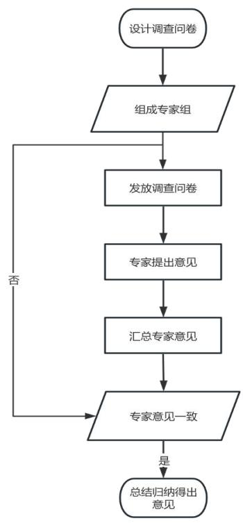
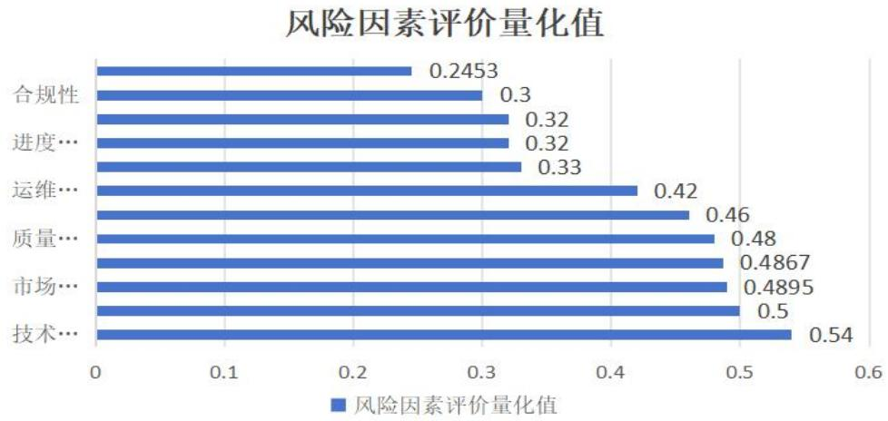

# 3.3 初步风险识别

光伏项目的风险识别是项目风险管理的基础环节，旨在系统性地识别项目全生命周期中可能出现的潜在风险。通过风险识别，项目团队能够尽早发现并应对可能影响项目进度、成本和质量的不确定因素[18]。光伏项目的风险来源广泛，涉及技术、管理、政策、环境等多个方面。因此，基于光伏项目的特点，本文采用基于国标规范、技术服务合同和历史资料的风险识别方法，结合光伏项目的实际情况，初步识别出项目可能面临的主要风险。

# 3.3.1 基于国标规范的风险识别

光伏项目的实施必须严格遵循国家相关法律法规和技术标准。以下国家标准为光伏项目的风险识别提供了关键依据：

（1）《光伏发电站设计规范》（GB 50797-2012）：该规范详细规定了光伏发电站的设计要求，包括光伏组件的选型、逆变器的配置、电气系统的设计等。设计规范的执行情况直接影响项目的技术可行性和经济性。（2）《光伏发电站施工规范》（GB 50794-2012）：该规范明确了光伏发电站施工的技术要求，包括土建工程、设备安装、电气接线等。施工过程中的不规范操作可能导致项目质量不达标或安全事故。

（3）《光伏发电站接入电力系统技术规定》（GB/T 19964-2012）：本规范详尽阐

述了光伏电站接入电网的技术标准与要求，包括电压、频率、功率因数等参数的调整。  
并网技术的不达标可能导致电网接入困难或发电效率低下。

（4）《光伏发电站运行维护规范》（GB/T 31365-2015）：该规范规定了光伏发电站的运行维护要求，包括设备巡检、故障处理、数据记录等。运行维护不当可能导致设备故障率增加，影响发电效率。

基于上述国标规范，结合光伏项目的实际情况，形成初步风险描述如表 3.1 所示。

表 3.1 基于国标规范初次风险识别  
Table 3.1 Risk Identification Based on National Standards for the First Time   

<table><tr><td>序号</td><td>风险描述</td><td>风险释义</td></tr><tr><td>1</td><td>设计不符合规范</td><td>设计过程中未严格按照国标规范执行，可能导致项目技术方案不合 理，影响发电效率。</td></tr><tr><td>2</td><td>施工质量不达标</td><td>施工过程中未按规范操作，可能导致设备安装不当、电气接线错误 等，影响项目质量。</td></tr><tr><td>3</td><td>并网技术不达标</td><td>并网技术参数不符合电网要求，可能导致发电站无法顺利接入电网 或发电效率低下。</td></tr><tr><td></td><td></td><td>运行维护过程中未按规范执行，可能导致设备故障率增加，影响发</td></tr><tr><td>4</td><td>运行维护不规范</td><td>电站的长期运行。</td></tr></table>

# 3.3.2 基于技术服务合同的风险识别

技术服务合同是光伏项目管理的重要法律文件，明确了项目各方的权利和义务。详细阐述了检测项目方案、双方的职责分工、项目目标、范围界定、时间规划、进度安排以及费用预算[19]。此外，该合同还体现了业主及其他利益相关方对项目的期望值，为项目的早期风险识别提供了清晰的方向和坚实的依据。通过技术服务合同，所有参与方能够更好地理解项目的整体框架和各自的责任，为风险识别提供依据。根据对此次项目技术服务合同识别，形成初步风险描述如表3.2所示。

表 3.2 基于技术服务合同初步风险识别  
Table 3.2 Preliminary Risk Identification Based on Technical Service Contracts   

<table><tr><td>序号</td><td>风险描述</td><td>风险释义</td></tr><tr><td>1</td><td>预算估计错误</td><td>缺乏详细的成本分析，未能考虑到所有潜在的成本因素，如材料价格 波动、人工成本等。过于乐观的估计，忽略了风险和不确定性，缺乏 有效的成本控制和预算管理流程。</td></tr><tr><td>2</td><td>合同条款不明确</td><td>合同审查不充分，未能识别所有关键条款，法律语言复杂，难以理解。 未能与法律顾问充分沟通，以确保条款的明确性。对合同条款的解释</td></tr></table>

<table><tr><td colspan="2">存在歧义。</td></tr><tr><td colspan="2"></td></tr><tr><td>3</td><td>财务规划不充分，不能确保资金的及时到位，项目预算与实际需求不 进度款落实不到位符，导致资金短缺。合同条款中对进度款的规定不明确，导致支付延</td></tr><tr><td></td><td>迟。内部审批流程繁琐，影响资金的及时划拨。</td></tr><tr><td>4 需求变更风险</td><td>项目实施过程中，业主方可能提出额外的需求变更，导致项目范围扩</td></tr></table>

# 3.3.3 基于历史资料的风险识别

历史资料同样是前期的风险识别重要依据，可以帮助了解过去类似项目的经验和教训，从而为当前项目提供有益的参考。这些历史资料可以是多元的，但主要可以归结为两个方面：一是公司自身历史台账资料，如类似项目和类似客户的档案记录、项目总结；二是通过公共信息渠道获得的他人经历关于类似项目的历史文档，如案例分析、项目报告、总体项目评估报告、项目总结材料等[20]。充分的参考类似项目资料对于本项目的实施具有不可估量的价值，通过分析类似项目资料，可以发现行业内的最佳实践和创新方法。不仅有助于该项目快速定位风险因素、减少不必要的得试错成本，而且还能再一定程度上规避风险。可对项目风险早期识别提供有力依据。对历史资料进行归纳对比此次项目情况，形成初步风险描述如表 3.3所示。

表 3.3 基于历史资料初步风险识别  
Table 3.3 Preliminary Risk Identification Based on Historical Data   

<table><tr><td>序号</td><td>风险描述</td><td>风险释义</td></tr><tr><td>1</td><td>政策变动风险</td><td>光伏补贴政策、并网政策等可能发生变化，影响项目的经济性和可行 性。</td></tr><tr><td>2</td><td>极端天气风险</td><td>极端天气（如台风、冰雹等）可能对光伏组件和设备造成损坏，影响 发电效率。</td></tr><tr><td>3</td><td>设备供应商风险</td><td>设备供应商的延期交付或提供的设备存在质量问题，可能会导致项目 进展受阻并引发额外成本支出。</td></tr><tr><td>4</td><td>电网消纳能力不足</td><td>电网消纳能力不足可能导致光伏发电站无法全额上网，影响项目的经 济效益。</td></tr></table>

# 3.4.4 初次风险识别结果

某些因素在本质上可能具有相似性，所以可以被归类并整合。通过语言上的精炼和概念上的统一，能够构建一个更为精简和高效的风险因素清单。通过整合不仅简化了统计分析的过程，而且为构建一个全面的风险评估框架提供了基础。优化后的清单将使项目团队能够更精确地评估和管理潜在风险，从而提高风险管理的整体效率和效果。

此外，参照工程项目的前期准备阶段、中期施工阶段以及后期竣工验收阶段，结合光伏发电项目自身流程特点进行了适当细分，将前期准备阶段划分为项目准备阶段和设计阶段，中期阶段为施工阶段，后期竣工阶段划分为运行维护阶段和并网阶段。根据初次风险识别的 12 项风险描述进行归纳，对于西北地区油气田企业可能出现的风险因素归纳出的5 个阶段以及12 条风险因素。具体见表3.4所示。

表 3.4 风险因素初始识别清单  
Table 3.4 Initial Risk Factor Identification Checklist   

<table><tr><td>风险区间 序号</td><td></td><td>风险描述</td><td>风险因素</td></tr><tr><td></td><td>B11</td><td>政策变动风险</td><td>政策风险</td></tr><tr><td>项目准备阶段</td><td>B12</td><td>预算估计错误</td><td>成本风险</td></tr><tr><td>（B1)</td><td>B13</td><td>合同条款不明确</td><td>合同风险</td></tr><tr><td>设计阶段</td><td>B21</td><td>设计不符合规范</td><td>技术风险</td></tr><tr><td>（B2)</td><td>B22</td><td>设备选型不当</td><td>方案变更风险</td></tr><tr><td></td><td>B31</td><td>施工质量不达标</td><td>质量风险</td></tr><tr><td>施工阶段</td><td>B32</td><td>进度款落实不到位</td><td>资金风险</td></tr><tr><td>（B3）</td><td>B33</td><td>被监测设施不符合采样规范 数据记录错误</td><td>合规性风险</td></tr><tr><td>运行维护阶段</td><td>B41</td><td>运行维护不规范</td><td>运维风险</td></tr><tr><td>（B4）</td><td>B42</td><td>设备故障率高</td><td>设备风险</td></tr><tr><td>并网阶段</td><td></td><td>并网技术不达标</td><td></td></tr><tr><td>（B5)</td><td>B51 B52</td><td>电网消纳能力不足</td><td>技术风险 电网风险</td></tr></table>

# 3.4 基于德尔菲法的风险二次识别

在 L 公司的日常运营中，尚未组织专业人员对所承担的项目进行有效风险识别。考虑到光伏发电项目的专业性和复杂性，基于L公司提供的技术服务合同、国家标准规范以及历史资料，初步总结了风险因素。有必要召集相关领域的专家进行二次风险识别。为了更科学合理地识别项目风险，建议召集项目实施单位的技术人员以及业主主管监测项目的部门领导，综合他们的专业意见作为风险识别的依据。最终决定采用德尔菲法进

行二次风险识别，通过整合专家的意见和专业知识，识别和筛选出最关键的风险因素。  
相关流程图详见图 3.1。

  
图 3.1德尔菲法流程图  
Fig3.3 Delphi Method Flowchart

# 3.4.1 组建专业评估团队

为了确保调研的广泛性和公正性，所选专家需满足如下条件：具备扎实的理论根基，拥有不少于十年的实际工作经验，并且参与过太阳能电站项目的科研实施。本项调查邀请了十位专家及学者共同参与，他们的详细信息请参照表3.5。

表 3.5 德尔菲法专家信息汇总表  
Table 3.5 Delphi Method Expert Information Form   

<table><tr><td>序号</td><td>专家单位</td><td>职称(职务)</td><td>从事相关工作年限</td></tr><tr><td>A</td><td>能源局电力处</td><td>主任</td><td>20年以上</td></tr><tr><td>B</td><td>电网公司市场营销部</td><td>高级工程师</td><td>30年以上</td></tr><tr><td>C</td><td>电网公司市场营销部</td><td>高级经济师</td><td>20年以上</td></tr><tr><td>D</td><td>综合能源服务公司</td><td>高级工程师</td><td>20年以上</td></tr><tr><td>E</td><td>综合能源服务公司</td><td>工程师</td><td>20年以上</td></tr><tr><td>F</td><td>新能源研究所</td><td>研究员</td><td>20年以上</td></tr><tr><td>G</td><td>光伏认证机构</td><td>工程师</td><td>10年以上</td></tr><tr><td>H</td><td>光伏监理机构</td><td>工程师</td><td>10年以上</td></tr><tr><td>I</td><td>光伏施工单位</td><td>项目经理</td><td>10年以上</td></tr><tr><td>J</td><td>光伏施工单位</td><td>技术主管</td><td>10年以上</td></tr></table>

# 3.4.2 设计并开展调研问卷

为了保证调查问卷的精确性，采取了“匿名”形式征询专家意见，专家们无需面对面交流，仅通过信函方式进行沟通。初次进行问卷调查时，不仅采用了开放式问题的德尔菲法作为主要调查工具，同时还将项目的相关信息以及当前研究进展通过电子邮件等电子渠道一并发送给各位专家，请其提供宝贵的反馈和建议。首轮共发出 10 份德尔菲问卷，全部收到回复，回收率为 $100 \%$ 。

调查问卷采取匿名方式，邀请了多位经验丰富并与该项目密切相关的专家参与，结合文献研究法的初步风险识别因素，基于专家们的职业经历以及对西北地区油气田企业温室气体排放项目可能面临的风险深刻理解，参照初次基于合同合规和历史案例识别法识别出的风险因素进行对比分析，更加准确地把握项目的风险管理重点。利用5点李克特量表（1-5 分）用来评估每个风险因素存在于该项目的可能性进行打分，其中 1 分为“不可能”，发生的概率极低，几乎可以忽略不计。2 分为“不太可能 ”发生的概率低，但偶尔可能会发生。3 分为“有可能”发生的概率中等，有一定的机会发生。4分为“可能”发生的概率较高，比平均水平更可能发生。5分为“很可能”发生的概率非常高，几乎可以肯定会发生。对每个风险因素结果进行量化评估，计算所有专家评分的平均值，并进行平均后的风险因素统计数据按平均得分排序，在L单位光伏发电项目中，在首次风险评估阶段，共有 16 个及以上指标分数超过3 分，而20 个则低于3分。专家们对这一阶段的风险指数判断提供了以下几点见解：（1）基于具体情况，专家ABC 判定，在政治风险评估中，战争与内乱的发生几率较低，故无需纳入考量。此外，我国本土法律政策的变动及政府权威性措施，出现频率不高，且影响微弱，因此提议去除这一评价维度。（2）专家 DEF 凭借多年的工作积累，综合考量了项目所处的地理环境与气候条件后，判断不可抗力事件及自然灾害发生的频率较低，因此它们对项目的影响微乎其微，可不予考虑。（3）专家指出，L 公司的光伏电站建设项目中，施工风险与技术风险存在交集，因此建议将二者合并为一项技术风险。在风险分类体系中保留技术风险这一大类，并去除单独的施工风险类别[21]。

基于德尔菲法首轮专家建议的整合，将初次调研中评分低于3分的 12个非核心风险要素剔除。此举后，形成了 L 企业光伏项目的第一份风险要素清单，详细内容请参阅表 3.6。

# 表 3.6 L 公司光伏发电项目第一版风险因素表

Table 3.6 The First Edition Risk Factor Table of L Unit Photovoltaic Power Generation Project   

<table><tr><td>序号</td><td>风险类型</td><td>风险因素</td></tr><tr><td>1</td><td rowspan="6">筹建筹备阶段风险</td><td>法律法规变更</td></tr><tr><td>2</td><td>不可抗力与自然灾害风险</td></tr><tr><td>3</td><td>补贴等激励政策分析</td></tr><tr><td>4</td><td>电价政策风险</td></tr><tr><td>5</td><td>技术标准约束</td></tr><tr><td>6</td><td>施工安全风险</td></tr><tr><td>7</td><td>施工技术风险</td></tr><tr><td>8</td><td>施工组织风险</td></tr><tr><td>9</td><td>建设阶段风险 进度延误风险</td></tr><tr><td>10</td><td>资金周转风险</td></tr><tr><td>11</td><td>设备维护风险</td></tr><tr><td>12</td><td>质量控制风险</td></tr><tr><td>13</td><td>运维技术风险</td></tr><tr><td>14</td><td>验收阶段风险 电量需求风险</td></tr><tr><td>15</td><td>发电量不稳定风险</td></tr><tr><td>16</td><td>合规性风险</td></tr></table>

# 3.4.3 二次风险识别结果

重新评估风险因素能够深化对于风险的认知与理解，避免疏漏和误解，为风险管理与决策构筑坚实可靠的基石。风险识别是一个持续迭代的工序，其目标是持续精进和优化风险评估过程，以提升项目成功率并增强其抗风险能力。基于专家会商，本文汇集了全体专家的见解，焦点主要落在以下两点：

针对财务风险的考量，特别是“项目资金链断裂”这一议题，根据先前的论述，L公司的光伏发电项目由国资委监管的大型国企负责建设。鉴于该国企的稳定性和财政实力，资金链断裂的风险极低，因此建议剔除此评估项。至于“运营规划不当导致项目亏损”的风险，它更多出现在项目运营期，特别是在电力基建领域，此类项目的主要目标是提供电力供应以满足公众利益和社会需求，通常是由政府或相关管理机构主导，并非以营利为目的[22]。基于以上分析，同样建议移除这一风险指标。

其二，在施工安全风险范畴内，尤其是涉及到可能发生的地震、山洪这类重大自然灾害时，据项目文件显示，L公司的光伏发电工程项目全程位于平原地带，不存在靠近河岸、湖边、山岭或山谷边缘等特殊地形，因此这类风险事件的实际发生概率非常低。

鉴于该风险点被归类于“施工安全风险”项下，提议将其与其他相关风险合并考量。

基于第二轮风险评估的结论，本文遵照专家意见，从财务风险部分去除了“项目资金链中断”及“运营计划不周引发的项目亏损”两项风险因素。同时，将自然环境风险类别中涉及“施工区域内发生地震、山洪等严重自然灾害”与“施工安全风险”的相关考量合并为一项。通过这样的调整，即删减或优化某些指标，保持其他指标状态不变，得出了L 公司光伏发电项目的最终风险识别报告。

# 3.4.4 构建正式风险因素识别清单

经过筛选，本研究保留了评分超过3分的16个风险因素，剔除了评分不足3分的12项指标，以此为基础编制了第二轮问卷调查表（参见附录2）。之后，该问卷被发送至 10 位专家，旨在收集他们对指标选择的反馈。基于专家的建议，非关键指标被剔除。修订问卷后，进行了第三轮调查。回收第三轮问卷后，分析了各风险因素的得分情况，结果显示所有因素的平均得分均超过了3分，这表明专家普遍认同当前的风险因素列表。鉴于此，所有专家一致同意，认为无需再次开展问卷调查。依据专家团队对风险指标的评分，提炼并整合了专业的综合评估意见。专家团认定，法律风险范畴内的"合同违约"与"违约风险"并非核心风险点，理由是在项目的建设和运营过程中，通过有效的组织与管理制度、合同管理，并定期执行风险自查，能有效地预防相关法律问题的发生。此外，市场风险部分的"市场竞争风险"与"电量需求风险"可合并为"市场需求风险"。通过三次问卷调研，本研究收集与分析数据，全面汇集了专家的意见和建议，最终辨识出L公司光伏发电项目的关键风险因子，并整理归纳为一个包含 20 项要素的风险因素表，这主要包括环境、政策、市场、经济、管理、技术六大类风险。详细的风险因素列表请参见附录中的表3.7。

表 $3 . 7 \mathrm { L }$ 公司光伏发电项目最终风险因素表  
Table 3.7 Final Risk Factor Table for L Unit Photovoltaic Power Generation Project   

<table><tr><td>序号</td><td>风险类型</td><td>风险因素</td></tr><tr><td>1</td><td rowspan="4">筹建筹备阶段风险</td><td>政策风险</td></tr><tr><td>2</td><td>财务风险</td></tr><tr><td>3</td><td>法律风险</td></tr><tr><td>4</td><td>技术选型风险</td></tr><tr><td>5</td><td rowspan="3">建设阶段风险</td><td>施工安全风险</td></tr><tr><td>6</td><td>成本风险</td></tr><tr><td>7</td><td>质量控制风险</td></tr><tr><td>8</td><td>进度延误风险</td></tr><tr><td>9</td><td>资金运筹风险</td></tr><tr><td>10</td><td>运维风险</td></tr><tr><td>11</td><td>验收阶段风险 市场风险</td></tr><tr><td>12</td><td>合规性风险</td></tr></table>

# 第四章 L 公司光伏发电项目风险评估

# 4.1 基于层次分析法确定权重

层次分析法将项目整体风险视为体系，全面分析项目内与决定性因素相联系的所有因素，既进行定性的考量也包含定量的评估。此方法实施中，各元素的权重分配是至关重要的一步。风险指标的权重反映了工程评估的关键性，故其准确评估对于项目风险评估至关重要。在当前国内风险权重研究领域，层次分析法（AHP）应用最为广泛，因其系统全面、操作简便的优点，非常适合本论文的研究需求[23]。因此，本文选用 AHP 法来确定各个风险因素的权重。

鉴于层次分析法需要处理大量的数据，为提升计算效率并保证准确性，本文引入了Yaahp 软件。借助该软件，能显著提高运算速度，确保计算结果的精确性和清晰度。项目风险评估的具体步骤通过应用层次分析法执行如下：

# 4.1.1构建层次结构模型

为了实现决策的有效执行，需先依据决策的目标、决策准则与决策对象间的关联性，明确界定决策体系的顶层、中层与基层，进而构建决策结构框架。参考第三章所总结的全面风险辨识矩阵，以L 公司光伏项目整体风险为终级目标，设立一级目标层，划分三个策略层级，并规划十二项方案层级。据此设计的L公司光伏项目层级架构图如图4-1所示。

# 4.1.2 构建风险因素评估矩阵

在确立L 公司太阳能发电项目的风险评价层级分析框架之后，为了深入量化各个风险要素的影响力，本研究特别征询了资深配电工程风险管控专家的意见。通过详析各个层级的评估标准，专家们据此评估了不同层级的风险态势，并构建了 A-B 与 B-C 层级间的判断矩阵。实践中，通常以比较权重 aj 作为衡量风险因素相对重要性的指标，用1 至 9的量级来标注指标的显著性，其中，1 象征两因素同等重要，而 9 则表示某指标极为关键。判定矩阵的具体操作流程及量级界定规则详列于表4.1中。

# 表 4.1 判断矩阵 a 标度方法表

Table 4.1 Scale method table for judgment matrix a   

<table><tr><td>重要性标度a</td><td>i指标与j指标比较</td><td>表示方法</td></tr><tr><td></td><td></td><td></td></tr></table>

<table><tr><td>1</td><td>两个指标同样重要 a=aj</td></tr><tr><td>3</td><td>i指标比j指标稍微重要 a,=3aj</td></tr><tr><td>5</td><td>i指标比j指标比较重要 a=5aj</td></tr><tr><td>7</td><td>i指标比j指标十分重要 a1 =7a</td></tr><tr><td>9</td><td>i指标比j指标绝对重要 a=9aj</td></tr><tr><td>2,4,6,8</td><td>i指标比i指标重要性处于上述情况中间值</td></tr><tr><td>aj=1/aj</td><td>i指标与i指标重要性结果互为倒数</td></tr></table>

本文特邀十位分布式光伏系统与风险管理领域的专家，对其各自关注的风险因子影响力进行量化评分。这些专家阵容涵盖了政府机构、电力网络运营方、综合能源服务企业以及工程承包单位，其专业见解可为研究提供精确且公正的评估基准。参与者的详细信息，包括姓名和职位等，列于表 4.2中。

表 4.2专家信息情况表  
Table 4.2 Expert Information Table   

<table><tr><td>专家</td><td>工作单位</td><td>职称</td><td>从事相关工作年限</td></tr><tr><td>A</td><td>能源局电力处</td><td>主任</td><td>20年以上</td></tr><tr><td>B</td><td>电网公司市场营销部</td><td>高级工程师</td><td>30年以上</td></tr><tr><td>C</td><td>电网公司市场营销部</td><td>高级经济师</td><td>20年以上</td></tr><tr><td>D</td><td>综合能源服务公司</td><td>高级工程师</td><td>20年以上</td></tr><tr><td>E</td><td>综合能源服务公司</td><td>工程师</td><td>20年以上</td></tr><tr><td>F</td><td>新能源研究所</td><td>研究员</td><td>20年以上</td></tr><tr><td>G</td><td>光伏认证机构</td><td>工程师</td><td>10年以上</td></tr><tr><td>H</td><td>光伏监理机构</td><td>工程师</td><td>10年以上</td></tr><tr><td>i</td><td>光伏施工单位</td><td>项目经理</td><td>10年以上</td></tr><tr><td>J</td><td>光伏施工单位</td><td>技术主管</td><td>10年以上</td></tr></table>

首先，风险评估表格由会议提供给所有专家。接着，基于专业人士的权重评估，筛选出每项评估中的最高分和最低分，并计算剩余分数的平均值。随后，将此初步结论提交给专家团队，进行深入讨论，目标是在一个合理范围内做出决策。经过多轮讨论，专家们就风险评估达成一致意见。最终，建立起了适用于L公司光伏发电项目的风险权重评价模型。作为阐述层次分析法应用的示例，以目标层与准则层的判断矩阵为例，例如表4.3所示的内容。

# 表 4.3目标层 A-B 判断矩阵

Table 4.3 Target layer A-B judgment matrix   

<table><tr><td>A</td><td>B1 B2 B3</td></tr></table>

<table><tr><td>B1</td><td>1</td><td>6</td><td>3</td></tr><tr><td>B2$</td><td>1/6</td><td>1</td><td>2</td></tr><tr><td>B{$</td><td>1/3</td><td>1/2</td><td>1</td></tr></table>

# 4.1.3 计算层次权重及一致性检验

基于此，从表 4-3 提取了目标层与准则层（A-B）的权重矩阵A，进而得出结果：

$$
\mathsf { A } = \left[ \begin{array} { c c c } { 1 } & { 6 } & { 3 } \\ { 1 / 6 } & { 1 } & { 2 } \\ { 1 / 3 } & { 1 / 2 } & { 1 } \end{array} \right]
$$

为了获得目标层与准则层判断矩阵的权重向量WA，采用标准化列平均法对矩阵A进行处理。接着，将经过归一化处理的矩阵 A 的每一行进行求和，随后再对所得结果执行归一化计算。这一系列操作最终能够得出权重向量。

鉴于矩阵运算往往涉及复杂的数学操作，本文推荐使用Yaahp 软件进行模型构建与计算。借助Yaahp，操作流程得以直观化、简便化，同时保证数据处理的精度，从而呈现更清晰的结果。

利用 Yaahp 软件计算后，获得了权重向量 $\mathrm { W A } { = } [ 0 . 3 0 2 8 , 0 . 4 6 3 5 , 0 . 2 3 3 7 ] \mathrm { T } ,$ 。接着，通过将权重矩阵 A 与权重向量 WA 相乘的操作，得到了矩阵 A 的最大特征值 $\lambda$ $\operatorname* { m a x } { = } 6 . 2 4 5 9$ 。随后，对该结果的一致性指标进行了评估。

$$
C I = \frac { \lambda _ { m a x } - \mathrm { n } } { n - 1 } = \frac { 6 . 2 4 5 9 - 6 } { 5 } = 0 . 0 4 9 2
$$

一致性指标 CI 达到 0.0492。若 CI 数值为 0，则意味着矩阵具有完全一致性；CI值越靠近0，表明一致性水平越高；而CI数值越大，则反映不一致性越显著。

然后，根据公式 $\begin{array} { r } { \mathrm { C R } = \frac { \mathrm { C I } } { \mathrm { R I } } } \end{array}$ ； 能计算出矩阵的一致性比率 CR。

RI，即矩阵的平均随机一致性指标，是通过执行多次（超过500次）随机判断矩阵特征根的计算，并取算术平均值得到的结果。对于 8 阶及以下的矩阵，其相应的 RI数值列于表4.4中。

表 4.4 RI 数值表  
Table 4.4 RI Value Table   

<table><tr><td>阶数</td><td>1</td><td>2</td><td>3</td><td>4</td><td>5</td><td>6</td><td>7</td></tr><tr><td>RI</td><td>0</td><td>0</td><td>0.52</td><td>0.89</td><td>1.12</td><td>1.26</td><td>1.36</td></tr></table>

基于表格所示的数据，能够计算出目标层与准则层（A 至B）形成的三阶权重矩

阵的均值随机一致性指数 RI等于1.26。据此，可以评估判断矩阵的一致性比例如下：

$$
\mathrm { C R } = { \frac { \mathrm { C I } } { \mathrm { R I } } } = { \frac { 0 . 0 4 9 2 } { 0 . 5 2 } } = 0 . 0 9 4 { < } 0 . 1
$$

研究结果显示，权重矩阵展现出了高度一致的可靠性，完全满足 AHP 方法的操作要求，并且专家所提供的数据合理可信。通过归纳判断矩阵A-B 的结果，能提炼出目标层级的风险权重值。专家指出，施工安全、工程质量及资金投入是决定项目设计与施工状态的关键因素，据此判断，建设阶段的风险权重最高，达到0.4635，在整个项目风险评估体系中占比最大。与此形成对比的是，专家评估验收阶段的风险权重相对较低，仅为 0.2337。具体数据和分析结果详载于表4.5中。

表 4.5 目标层 A-B 判断矩阵权重  
Table 4.5 Weight of target layer A-B judgment matrix   

<table><tr><td>A</td><td>环境风险B1</td><td>政策风险B2</td><td>市场风险B3</td><td>Wi</td></tr><tr><td>筹建筹备阶段风险B1</td><td>1</td><td>4</td><td>5</td><td>0.3028</td></tr><tr><td>建设阶段风险B2</td><td>0.25</td><td>1</td><td>2</td><td>0.4635</td></tr><tr><td>验收阶段风险B3</td><td>0.2</td><td>0.5</td><td>1</td><td>0.2337</td></tr></table>

针对准则层与方案层的矩阵 B-C 执行计算操作后，得到各方案层指标于对应准则层的权重值，并整理结果如表 4-6至表4-11。具体分析如下：

B1 矩阵的主特征值为 3.0649，其致性比率是 0.0390，低于阈值 0.1；

B2 矩阵的主特征值为 2.0000，致性比率为0.0000，同样显著低于0.1；

B3 矩阵的主特征值为 3.0037，致性比率为 0.0036，亦低于 0.1 标准；

B4 矩阵的主特征值为 4.1702，致性比率为0.0637，虽然接近但仍在0.1以内；

B5 矩阵的主特征值为 4.1258，致性比率为0.0471，同样符合要求；

B6 矩阵的主特征值为 4.1776，致性比率为0.0553，也保持在允许范围之内。

所有结果显示，一致性检验已通过，意味着这些数据满足层次分析法的应用条件，从而证明了分析过程的有效性。

Table 4.6 Weight and consistency test results of target layer B1-C judgment matrix

表 4.6目标层 B1-C 判断矩阵权重及一致性检验结果  

<table><tr><td>筹建筹备阶段风</td><td>政策风险C11财务风险C12</td><td>法律风险C13技术选型风险C14</td><td></td><td>Wi</td></tr><tr><td>险B1</td><td></td><td></td><td></td><td></td></tr><tr><td>政策风险C11</td><td></td><td></td><td></td><td></td></tr></table>

<table><tr><td></td><td>1</td><td>0.2</td><td>0.25</td><td>3</td><td>0.1146</td></tr><tr><td>财务风险C12</td><td></td><td></td><td></td><td></td><td></td></tr><tr><td></td><td>5</td><td>1</td><td>2</td><td>5</td><td>0.4885</td></tr><tr><td>法律风险C13</td><td>4</td><td></td><td></td><td>6</td><td>0.3363</td></tr><tr><td></td><td></td><td>0.5</td><td>1</td><td></td><td></td></tr><tr><td>技术选型风险</td><td></td><td></td><td></td><td></td><td></td></tr><tr><td></td><td></td><td></td><td></td><td></td><td></td></tr><tr><td>C14</td><td></td><td>0.2</td><td>0.1667</td><td></td><td>0.0606</td></tr><tr><td></td><td></td><td></td><td></td><td></td><td></td></tr><tr><td></td><td>0.3333</td><td></td><td></td><td>1</td><td></td></tr></table>

表 4.7 目标层 B2-C 判断矩阵权重及一致性检验结果

Table 4.7 Target layer B2-C judgment matrix weights and consistency test results   

<table><tr><td colspan="2">建设阶段风险B施工安全风险</td><td rowspan="2">成本风险C22</td><td rowspan="2"></td><td colspan="2">质量控制风险进度延误风险资金运筹风险</td><td rowspan="2">Wi</td></tr><tr><td>2</td><td>C21</td><td>C23 C24</td><td>C25</td></tr><tr><td>施工安全风险 C21</td><td>1</td><td>4</td><td>5</td><td>7</td><td>3</td><td>0.1548</td></tr><tr><td>成本风险 C22</td><td>0.25</td><td>1</td><td>2</td><td>4</td><td>0.5</td><td>0.2736</td></tr><tr><td>质量控制风险 C23</td><td>0.2</td><td>0.5</td><td>1</td><td>4</td><td>0.5</td><td>0.1962</td></tr><tr><td>进度延误风险 C24</td><td>0.1429</td><td>0.25</td><td>0.25</td><td>1</td><td>0.2</td><td>0.2179</td></tr><tr><td>资金运筹风险 C25</td><td>0.3333</td><td>2</td><td>2</td><td>5</td><td>1</td><td>0.1575</td></tr></table>

表 4.8 目标层 B3-C 判断矩阵权重及一致性检验结果

Table 4.8 Weight and consistency test results of target layer B3-C judgment matrix   

<table><tr><td>验收阶段风险B1</td><td>运维风险C11</td><td>市场风险C12</td><td>合规性风险C13</td><td>Wi</td></tr><tr><td>运维风险C1</td><td>1</td><td>5</td><td>7</td><td>0.7306</td></tr><tr><td>市场风险C12</td><td>0.2</td><td>1</td><td>3</td><td>0.1884</td></tr><tr><td>合规性风险C₁3</td><td>0.1429</td><td>0.3333</td><td>1</td><td>0.081</td></tr></table>

# 4.1.4 层次加权得出综合权重

基于专家权重数据的评估，在此研究中构建了目标层、准则层与方案层的判断矩阵。通过计算，成功确定了准则层对于目标层的三项关键指标和方案层对于准则层十二项指标的重要性权重。进一步地，将二级指标的权重应用于相应的三级指标上，以此来计算并得到方案层针对目标层的十二项指标的权重分配。最终，经过整合分析，形成了专用于 L 公司光伏发电项目的风险指标权重表，其详细内容见表4.9。

表 $4 . 9 \mathrm { L }$ 公司光伏发电项目风险指标权重表  
Table 4.9 Weight Table of Risk Indicators for L Unit Photovoltaic Power Generation Projectsi   

<table><tr><td rowspan="2">目标层A</td><td rowspan="2">B对A的指标 准则层B 权重</td><td rowspan="2">方案层C</td><td colspan="2">C对A的指标C对B的指标</td><td rowspan="2">排名</td></tr><tr><td>权重</td><td>权重</td></tr><tr><td rowspan="7">筹建筹备阶段 风险</td><td rowspan="7">0.3028</td><td>政策风险</td><td>0.0347</td><td>0.1146</td><td>10</td></tr><tr><td>财务风险</td><td>0.1479</td><td>0.4885</td><td>2</td></tr><tr><td>法律风险</td><td>0.1018</td><td>0.3363</td><td>3</td></tr><tr><td>技术选型风险</td><td>0.0183</td><td>0.0606</td><td>12</td></tr><tr><td>施工安全风险</td><td>0.0718</td><td>0.1548</td><td>9</td></tr><tr><td>成本风险</td><td>0.1269</td><td>0.2736</td><td>4</td></tr><tr><td>质量控制风险</td><td>0.0910</td><td>0.1962</td><td>6</td></tr><tr><td rowspan="6">验收阶段风险</td><td></td><td>进度延误风险 资金运筹风险</td><td>0.1010</td><td>0.2179</td><td>5</td></tr><tr><td></td><td></td><td>0.0730</td><td>0.1575</td><td>8</td></tr><tr><td>0.2337</td><td>运维风险</td><td>0.1708</td><td>0.7306</td><td>1</td></tr><tr><td></td><td>市场风险</td><td>0.0442</td><td>0.1884</td><td>7</td></tr><tr><td></td><td>合规性风险</td><td>0.0190</td><td>0.0811</td><td>11</td></tr></table>

通过上部分分析所得数据揭示，在 L 公司的光伏电站整体风险框架下，最为关键的风险因子为“建设阶段风险”,占比 $4 6 . 3 5 \%$ 。其次是筹建筹备阶段风险和验收阶段风险，分别占 $3 0 . 2 8 \%$ 比和 $2 3 . 3 7 \%$ 。这三个阶段的风险构成了项目风险的主要部分。特别是建设阶段，其重要性不言而喻，其中成本风险以0.1269的权重成为该阶段最需关注的风险点。

深入方案层风险，可以看到在筹建筹备阶段，财务风险、法律风险和技术选型风险分别占据了该阶段风险的前三位，权重分别为0.4885、0.3363和0.0606。这表明在项目筹备过程中，资金的筹集、使用及回笼，合同的签订及履行，以及技术路线的选择都是至关重要的。而在建设阶段，施工安全风险、成本风险和质量控制风险则是该阶段的主要风险，需要项目团队密切关注。到了验收阶段，运维风险以0.7306的权重成为该阶段最突出的风险，市场风险和合规性风险也不容忽视。

通过评估各项风险因素的权重，可以确定，在准则层面上，L公司的光伏发电项目最为核心的风险点在于筹建筹备阶段，而在方案层中，运维风险、财务风险、法律风险、成本风险及施工安全风险等是项目需要特别关注的风险因素。这些风险因素将直接影响项目的顺利实施和运营成效，因此项目团队需要制定针对性的应对措施和管理策略，以确保项目的成功进行。同时，对于权重相对较低但仍需关注的风险因素，如技术选型风险、市场风险等，也应保持警惕，及时应对可能出现的风险事件。

# 4.2 基于模糊综合评价的L 公司光伏发电项目风险评估模型

先前一章通过层次分析法对项目的风险因素进行了定量与定性的评估，成功识别并赋予了 L 公司光伏电站项目各项风险因素相应的权重。然而，此阶段的成果虽奠定了基础，但要实现全面且精确的风险管理还需进一步行动。具体而言，接下来的工作需集中于细化各层级风险因素的潜在危害程度，进行量化分析及综合评价，从而生成更加精准的项目风险等级评定[24]。

评价作为一种基础性的认知活动，在人类社会的日常交往与决策过程中始终扮演着重要角色。随着现代社会经济的高速发展，传统评估方法已无法有效应对日益复杂的多维度、多层次评估需求。模糊综合评价法在 20 世纪 70 年代前发展相对缓慢，但自 80年代以来取得了显著进展并得到广泛应用。典型应用案例包括：1983年，张定琪运用模糊评判技术对长江中下游棉区最佳播种期进行了系统研究；1985 年，李一军采用模糊综合评价法对印染企业生产流程优化进行了深入分析。基于这一方法的发展历程与实践经验，本研究拟运用模糊综合评价法，对 L 公司光伏发电项目的多层次、多因素风险进行系统性评估。

# 4.2.1 模糊要素

通过整理第三章中识别出的风险因素，得到了用于模糊综合评价的评价因素集合。基于上一节中的层次分析法构建的风险模型，也整理出了适用于模糊综合评价的风险因素权重集合。

据此，针对 L 公司的光伏发电项目，构建了如下与其相应的评价因素集：

$\scriptstyle \mathbf { A } = \left\{ \mathbf { B } 1 , \mathbf { B } 2 , \mathbf { B } 3 \right\}$   
$= \{$ {筹建筹备阶段风险，建设阶段风险，验收阶段风险};  
$ { \mathrm { B } } 1 { = } \{ { \mathrm { C } } 1 1 { , } { \mathrm { C } } 1 2 { , } { \mathrm { C } } 1 3 { , } { \mathrm { C } } 1 4 \} $   
$=$ {政策风险，财务风险，法律风险，技术选型};  
B2={C21,C22，C23，C24，C25}  
$= \{$ {施工安全风险，成本风险，质量控制风险，进度延误风险，资金运筹风险};$_ { \mathrm { B 3 = \{ C 3 1 , C 3 2 , C 3 3 \} } }$   
$= \{$ {运维风险，市场风险，合规性风险};

评估指标旨在衡量项目潜在风险事件发生概率，为专业人员评定项目风险提供评分依据。基于我国项目管理学领域的研究，当前的评估准则划分为“极低风险、低风险、中等风险、较高风险、极高风险”五个层级。因此，本文亦采纳此种五级评价体系，以V 表示项目风险评价集合。

$V { = } \{ \mathrm { V } 1 , \mathrm { V } 2 , \mathrm { V } 3 , \mathrm { V } 4 , \mathrm { V } 5 \}$

$=$ {非常高，高，中，低，非常低 $\} = \{ 0 . 9 , 0 . 7 , 0 . 5 , 0 . 3 , 0 . 1 \}$

为了对LY屋顶的 $1 0 \ : \mathrm { M W p }$ 分布式太阳能电站项目进行模糊评估，需广泛征集各专业领域的专家意见，构建一个基于此模型的模糊关联度模型。为此，采用了问卷调研的方法，面向十位行业资深人士发放了问卷，旨在请他们对潜在风险因素进行等级划分，最终收到了十份有效反馈表。根据这些专家的评价结果，对该项目的各个风险要素进行了初步的量化分析，详细的风险评估数值已归纳整理于表4.10中。

表 $4 . 1 0 \mathrm { L }$ 公司光伏发电项目风险等级评价  
Table 4.10 Risk level evaluation of L unit photovoltaic power generation projecti   

<table><tr><td rowspan="2">准则层</td><td rowspan="2">方案层</td><td colspan="5">风险等级评价</td><td rowspan="2">风险评价量 化值</td></tr><tr><td>极低风险</td><td>低风险</td><td>中等风险</td><td>较高风险</td><td>极高风险</td></tr><tr><td rowspan="5">筹建筹备阶段 风险</td><td>政策风险</td><td>0.4</td><td>0.5</td><td>0.1</td><td>0</td><td>0</td><td>0.24</td></tr><tr><td>财务风险</td><td>0.2</td><td>0.3</td><td>0.3</td><td>0.1</td><td>0.1</td><td>0.33</td></tr><tr><td>法律风险</td><td>0.3</td><td>0.3</td><td>0.2</td><td>0.1</td><td>0.1</td><td>0.29</td></tr><tr><td>技术选型风 险</td><td>0.1</td><td>0.1</td><td>0.4</td><td>0.3</td><td>0.1</td><td>0.54</td></tr><tr><td>施工安全风</td><td>0.1</td><td>0.2</td><td>0.5</td><td>0.2</td><td>0</td><td>0.46</td></tr><tr><td rowspan="8">建设阶段风险</td><td>险 成本风险</td><td>0.1</td><td>0.3</td><td>0.2</td><td>0.3</td><td>0.1</td><td>0.5</td></tr><tr><td>质量控制风</td><td>0.1</td><td>0.3</td><td>0.3</td><td>0.2</td><td>0.1</td><td>0.48</td></tr><tr><td>险 进度延误风</td><td>0.3</td><td>0.4</td><td>0.2</td><td>0.1</td><td>0</td><td>0.32</td></tr><tr><td>险 资金运筹风</td><td>0.4</td><td>0.2</td><td></td><td></td><td></td><td></td></tr><tr><td>险</td><td></td><td></td><td>0.3</td><td>0.1</td><td>0</td><td>0.32</td></tr><tr><td>运维风险 验收阶段风险</td><td>0.2</td><td>0.3</td><td>0.3</td><td>0.1</td><td>0.1</td><td>0.42</td></tr><tr><td>市场风险</td><td>0.2</td><td>0.4</td><td>0.2</td><td>0.2</td><td>0</td><td>0.38</td></tr><tr><td>合规性风险</td><td>0.3</td><td>0.5</td><td>0.1</td><td>0.1</td><td>0</td><td>0.3</td></tr></table>

根据表 4-10 中专家对项目各风险的评价情况，本文整理得到准则层各风险因素的模糊评价矩阵R, 具体如下：

# 4.2.2多级模糊综合评判

在实施 L 公司光伏电站项目的模糊综合评估过程中，通过将风险要素的权重与模糊判断矩阵相乘，以生成初始的模糊综合评估结果。接下来，本文将选取准则层风险项“环境风险”作为案例，深入解析模糊综合评价方法的具体运算流程。假定拥有一个一阶模糊综合评估矩阵 L：

0.4 0.5 0.1 0 0   
LB $1 { = } \mathrm { B } 1 \times$ RBI=(0.1146，0.4885，0.3363，0.0606)× 0.2 0.3 0.3 0.1 0.1   
0.1 0.1 0.4 0.3 0.1

=(0.45422，0.3919，0.12694，0.02694，0)

0.1 0.2 0.5 0.2 00.1   
0.1 0.3 0.2 0.3   
LB2=B2 $\times$ RB2=(0.1548，0.2736，0.1962，0.2179，0.1575)× 0.1 0.3 0.3 0.2 0.1   
0.3 0.4 0.2 0.1 0   
0.4 0.2 0.3 0.1 0   
0.2 0.3 0.3 0.1 0.1   
LB3=B3×RB3=(0.7306，0.1884，0.081)× 0.2 0.4 0.2 0.2 0   
0.3 0.5 0.1 0.1 0

=(0.70001，0.08908，0.06377，0.05818，0.08906)

根据整理后得到的数据，项目的一级模糊综合评估结果得以呈现，具体详情见表4.11。

表 4.11 L 公司光伏发电项目一级模糊综合评价表  
Table 4.11 Level 1 Fuzzy Comprehensive Evaluation Table for L Unit Photovoltaic Power Generation   

<table><tr><td colspan="6">Project</td></tr><tr><td rowspan="2">准则层</td><td colspan="6">风险等级评价</td></tr><tr><td>极低风险</td><td>低风险</td><td>中等风险</td><td>较高风险</td><td>极高风险</td></tr><tr><td>环境风险</td><td>0.45422</td><td>0.3919</td><td>0.12694</td><td>0.02694</td><td>0</td></tr><tr><td>政策风险</td><td>0.1566</td><td>0.1566</td><td>0.33334</td><td>0.23334</td><td>0.1</td></tr><tr><td>市场风险</td><td>0.70001</td><td>0.08908</td><td>0.06377</td><td>0.05818</td><td>0.08906</td></tr></table>

为提升结论的精确度与可理解性，拟对项目的一级模糊综合评估结果实施单一数值化处理。举例而言，通过将“筹建准备阶段风险”的评估集合向量与一级模糊综合评估

结果的向量进行相乘运算，即可得到筹建准备阶段风险要素的风险辨识等级。计算流程详述如下：

$$
L B i ^ { ' } = ( 0 . 4 5 4 2 2 , 0 . 3 9 1 9 , 0 . 1 2 6 9 4 , 0 . 0 2 6 9 4 , 0 ) \times \left[ 0 . 5 \right] = 0 . 2 4 5 3 2
$$

由此推知，其他准则层面的风险因素评估结果如下：

$\mathrm { L B } 2 ^ { \prime } { = } 0 . 4 8 6 6 7 2$ LB3'=0.48949

# 4.2.3 确定评估对象的风险水平

基于一级模糊综合评估得出的结果，构建评价矩阵L。随后，采用层次分析法所获得的准则层风险权重向量 A 与一级模糊综合评价矩阵 L 进行乘法运算，以此来获取单位光伏发电项目在二级模糊评价阶段的评估结果Z。其计算流程详述如下：

${ \cal Z } { = } \mathrm { A } { \times } \mathrm { L }$

0.45422 0.3919 0.12694 0.02694 0 =(0.3028，0.4635，0.2337) $\times$ 0.1566 0.1566 0.33334 0.23334 0 0.70001 0.08908 0.06377 0.05818 0.08906

=(0.317661471，0.33900246，0.195078736，0.118731534，0.029531329)

保留小数点后四位精度，整理并呈现二级模糊综合评价的结果，请参见表4.12。

表 $4 . 1 2 \mathrm { L }$ 公司光伏发电项目二级模糊综合评价表  
Table 4.12 Level 2 Fuzzy Comprehensive Evaluation Table for L Unit Photovoltaic Power Generation   
Project   

<table><tr><td rowspan="2">L公司光伏发电项目</td><td colspan="5">风险等级评价</td></tr><tr><td>极低风险</td><td>低风险</td><td>中等风险</td><td>较高风险</td><td>极高风险</td></tr><tr><td></td><td>0.3177</td><td>0.339</td><td>0.1951</td><td>0.1187</td><td>0.0295</td></tr></table>

为了更有效地总结 L 公司光伏发电项目的风险评价结果，本文针对该工程的次级模糊综合评价结论进行了单一数值化的转换，其计算流程概述如下：

$$
Z ^ { ' } = ( 0 . 3 1 7 7 , \ 0 . 3 3 9 , \ 0 . 1 9 5 1 , \ 0 . 1 1 8 7 , \ 0 . 0 2 9 5 ) \times \left[ 0 . 5 \right] = 0 . 3 4 0 6 6
$$

整理了项目一级与二级模糊评价的结果，并将最终数值精确到小数点后四位，从而得出L公司的光伏发电项目风险评价的具体数值，详情请参阅表4.13。

表 $4 . 1 3 \mathrm { L }$ 公司光伏发电项目模糊综合评价表

Table 4.12 Fuzzy Comprehensive Evaluation Table for L Unit Photovoltaic Power Generation Project

<table><tr><td>目标层</td><td>风险评价量化值</td><td>准则层</td><td>风险评价量化值</td></tr><tr><td rowspan="3">光伏发电项目</td><td rowspan="3">0.3407</td><td>环境风险</td><td>0.2453</td></tr><tr><td>政策风险</td><td>0.4867</td></tr><tr><td>市场风险</td><td>0.4895</td></tr></table>

# 4.3 风险评价结果分析

按照层次分析法，依据项目全周期风险因素综合权重值由低到高排序。如图4.1所示。

  
图 $4 . 1 \ : \mathrm { L }$ 公司光伏项目全周期风险因素排序  
Figure $4 . 1 \mathrm { L }$ full cycle risk factors for unit PV projects

据此可见，整体而言，项目风险水平较低，但实施阶段面临政策及市场风险较高，故在施工与运营期间，须着重防范相关政策与市场风险。

# 第 5 章 L 公司光伏发电项目风险应对

根据本文第四章关于 L 公司光伏项目的风险评估，按项目实施的不同阶段划分为中风险与中高风险两类。利用层次分析法，能明确各项风险因素的值及其重要程度排序。项目风险应对包括风险回避、转移、缓释、自留以及上述策略的综合运用。在实际操作过程中，应遵循风险应对策略的使用原则，既可以单独采用某种策略，亦可结合多种策略以有效地管理风险[25]。

# 5.1 中高风险阶段应对措施

# 5.1.1 筹建筹备阶段风险应对

筹建筹备阶段是光伏项目的首要阶段，该阶段的失利会导致项目无法顺利启动，进而影响后续阶段的执行。筹建筹备阶段的风险包括政策风险、财务风险、法律风险和技术选型风险。

表 5.1 筹建筹备阶段风险应对策略  
Table 5. 1 Risk response strategies during the preparation phase of construction   

<table><tr><td>风险度量标准</td><td>应对策略</td></tr><tr><td>政策风险</td><td>风险规避；风险缓解</td></tr><tr><td>财务风险</td><td>风险规避；风险转移</td></tr><tr><td>法律风险</td><td>风险规避；风险缓解</td></tr><tr><td>技术选型风险</td><td>风险规避；风险自留</td></tr></table>

# 5.1.1.1 针对政策风险应对措施

（1）政策跟踪与解读

建立专门的政策研究团队，定期跟踪国家和地方政府的政策变化，尤其是与光伏项目相关的补贴政策、税收优惠、土地使用政策等。确保项目方案符合最新的政策要求。

# （2）政策风险预案

制定政策风险应对预案，确保在政策发生重大变化时能够及时调整项目方案，避免因政策变动导致项目停滞或取消。

# 5.1.1.2 针对财务风险应对措施

（1）多元化融资渠道

在传统融资模式中，银行贷款作为主要资金来源，其优势在于资金规模大、流程相对成熟，但受限于较高的融资成本、严格的抵押要求以及较短的贷款期限，单一依赖银行贷款可能加剧项目的财务压力。因此，拓展多元化融资渠道成为光伏发电项目可持续发展的必然选择。通过引入战略合作伙伴、产业投资基金或是发行绿色债券，股权融资不仅能够为项目持续提供充足且稳定的资金来源，还能有效调整和优化资本配置结构，降低资产负债率[26]。此外，政府补贴和政策性资金在项目初期具有重要的扶持作用，通过申请国家及地方的光伏发电补贴、可再生能源发展基金等，可以有效缓解项目的资金压力。与此同时，创新融资工具如融资租赁、资产证券化等，为项目提供了更为灵活的融资方式，通过将设备资产或未来收益作为融资标的，进一步拓宽了资金来源。

# （2）资金使用计划

资金使用计划以项目的全生命周期为基础，结合建设期、运营期等不同阶段的资金需求特点，确保资金的高效配置与风险可控。在项目建设初期，资金主要用于设备采购、土地租赁及工程施工等环节，此时应优先使用成本较低的融资资金，如政府补贴、政策性贷款等，以降低初期资金压力。进入运营阶段后，资金使用重点转向设备维护、运营成本及贷款本息偿还，此时需确保稳定的现金流以覆盖日常支出，并通过合理的收益分配机制预留部分资金用于应对潜在的运营风险。此外，资金使用计划应注重灵活性，根据市场电价波动、政策调整等外部因素及时调整资金配置策略，例如在电价下行期优先偿还高成本债务，以降低财务费用。同时，建立资金储备机制，通过留存部分收益或设立专项风险基金，以应对突发事件或市场变化带来的财务冲击。

# 5.1.1.3 针对法律风险应对措施

（1）法律顾问支持

法律顾问应在项目全生命周期中提供全面的法律服务，包括项目前期尽职调查、合同条款审查、政策法规解读以及纠纷解决等。在项目筹备阶段，法律顾问需对土地权属、环境评估、行政许可等事项进行合法性审查，确保项目合规性；在合同签订阶段，法律顾问应协助拟定和审核各类协议，明确各方权利义务，规避潜在法律漏洞；在项目运营阶段，法律顾问需持续跟踪政策变化，提供风险预警及应对建议，并在发生纠纷时协助制定解决方案[27]。

（2）合同条款明确

在合同签订阶段对关键条款进行清晰界定，包括但不限于电价结算机制、补贴政策适用性、土地租赁期限及权属、设备质量保证、违约责任等，以避免因条款模糊引发的法律纠纷。特别是在电价结算方面，合同应明确电价计算方式、调整机制及支付周期，确保项目收益的稳定性；在政策适用性方面，需详细约定补贴政策的执行细则及可能的变动处理方式，以规避政策调整带来的法律风险。此外，合同条款应充分考虑不可抗力因素，明确各方在极端情况下的责任分担及合同解除条件，以降低项目运营中的不确定性。

# 5.1.1.4 针对技术选型风险应对措施

（1）技术评估与选型

组建专业的技术团队，结合项目所在地的资源条件、气候特点及电网接入要求，对光伏组件、逆变器、支架系统等关键设备进行全面的技术评估。评估内容包括设备效率、可靠性、耐久性及运维成本等，同时需充分考虑技术供应商的市场声誉、售后服务及技术更新能力。在选型过程中，应优先选择经过市场验证的成熟技术，并适度引入创新技术以提升项目竞争力[28]。

# （2）技术备份方案

技术备份方案应涵盖关键设备、系统架构及运维策略等多个层面，针对光伏组件、逆变器等核心设备，需预先选定备用供应商或替代型号，确保在技术故障或供应链中断时能够及时切换，减少停机损失。同时，系统设计应具备一定的冗余度和兼容性，以支持不同技术方案的灵活替换。此外，项目方需建立快速响应的运维团队，制定详细的应急预案，定期开展技术演练，确保在突发情况下能够迅速实施备份方案。

# 5.1.2 建设阶段风险应对

建设阶段是光伏项目从规划到实际运行的关键环节，这一阶段的风险直接关系到项目的成败。施工安全风险是首要问题，光伏项目建设涉及高空作业、重型机械操作和电气设备安装，稍有不慎可能引发坠落、触电、火灾等事故，造成人员伤亡、设备损坏甚至项目停工，带来经济和声誉损失。成本风险同样不可忽视，材料价格波动、设计变更、施工难度增加等因素可能导致成本超支，而管理不善可能进一步加剧资源浪费，影响项目经济效益。质量控制风险贯穿建设全过程，施工工艺不达标、设备安装不规范等问题可能导致组件损坏、系统效率低下，增加后期维护成本并影响长期收益。进度延误风险则可能由恶劣天气、供应链中断、审批延迟等因素引发，导致工期拖延，增加直接成本并错过并网发电的最佳时机。资金运筹风险也是关键，资金筹措不及时或使用不当可能导致项目停工，增加财务成本并压缩利润空间。其应对策略如表 5.2 所示。

表 5.2 建设阶段风险应对策略  
Table 5.2 Risk response strategies during the construction phase   

<table><tr><td>风险指标 风险应对略</td></tr></table>

<table><tr><td>施工安全风险</td><td>风险规避；风险缓解</td></tr><tr><td>成本风险</td><td>风险规避；风险缓解</td></tr><tr><td>质量控制风险</td><td>风险规避；风险自留</td></tr><tr><td>进度延误风险</td><td>风险规避；风险转移</td></tr><tr><td>资金运筹风险</td><td>风险规避；风险转移</td></tr></table>

# 5.1.2.1 针对施工安全风险应对措施

（1）安全培训与教育

建立健全的安全培训体系，为满足各岗位与工种的独特需求，精心设计了个性化的培训方案，内容涉及安全操作规范与紧急应对策略、设备使用规范及个人防护要求等。培训形式应多样化，包括理论讲解、实操演练、案例分析及考核评估，确保施工人员全面掌握安全知识并具备实际操作能力[29]。同时，需定期开展安全教育活动，强化安全文化建设，提高全员安全防范意识。

# （2）安全设备配备

根据施工现场的具体环境和作业需求，配备全面达标并符合国家规范的安全防护装备，涵盖安全帽、安全带以及防护手套、绝缘鞋等个人防护装备，以及灭火器、安全网、警示标志等现场安全设施。同时，针对高空作业、电气安装等高风险环节，需配置专业的安全设备如防坠落装置、绝缘梯具及漏电保护装置等，并确保设备性能可靠、定期检验。此外，应建立安全设备管理制度，明确使用规范和维护责任，确保设备始终处于良好状态。

# 5.1.2.2 针对成本风险应对措施

（1）成本控制机制

在项目全生命周期内实施动态成本管理，从设计、采购、施工到运营各阶段制定详细的成本预算，并设立成本控制目标。通过引入精细化管理系统，实时监控各项成本支出，识别偏差并及时调整。在采购环节，采用集中采购或竞争性谈判方式，降低设备及材料成本；在施工环节，优化施工方案，提高资源利用效率，减少浪费；在运营环节，注重设备维护与技术创新，降低运维成本[30]。同时，建立成本考核机制，将成本控制责任落实到具体部门与人员，确保成本控制目标的实现。

（2）供应商管理

建立完善的供应商评估体系，从技术能力、产品质量、供货周期、售后服务及价格水平等多维度对供应商进行综合考评，优先选择信誉良好、性价比高的合作伙伴。通过集中采购、长期合作协议等方式，与核心供应商建立战略合作关系，降低采购成本并确保供应链稳定性。同时，实施供应商动态管理机制，定期开展绩效评估，对不合格供应商及时调整或替换。此外，需加强合同管理，明确质量要求、交货期限及违约责任，防范供应风险。

# 5.1.2.3 针对质量控制风险应对措施

（1）质量管理体系

依据国际标准及行业规范，制定涵盖设计、采购、施工、验收各环节的质量管理制度，明确质量标准与控制流程。通过设立专门的质量管理部门，严格执行全周期的质量监督与检验，以确保设备与材料选用、施工技术和竣工验收均满足设计方案的要求。此外，应定期组织质量培训并进行考核，提升全员质量意识，形成全员参与的质量文化。

（2）质量检查与验收

制定详细的质量检查计划，对设备材料、施工工艺及工程节点进行全过程监督与检测，确保符合设计规范与技术标准。在关键工序及隐蔽工程中，实施专项检查与旁站监督，及时发现并整改质量问题。项目竣工后，需组织多方参与的验收工作，根据评估准则彻底检验，以确保险工程质量符合设计规格。

# 5.1.2.4 针对进度延误风险应对措施

（1）进度管理计划

根据项目规模及复杂性，编制详细的进度计划，明确各阶段的关键节点、工期目标及资源配置，并采用项目管理软件进行动态监控与调整。通过定期召开进度协调会议，及时发现潜在延误因素并采取纠偏措施，确保施工进度按计划推进。同时，建立进度考核机制，将进度目标与责任落实到具体部门与人员，确保项目按期高质量完成。

# （2）进度监控与调整

利用项目管理工具实时跟踪施工进度，对比计划与实际进展，识别偏差并分析原因。针对关键路径上的任务，需加强资源调配与协调，优先保障其按时完成；对于已发生的延误，应及时调整后续工序或增加资源投入，采取赶工措施弥补工期损失。同时，建立进度预警机制，提前识别潜在风险并制定应对预案，确保项目整体进度可控。

# 5.1.2.5 针对资金运筹风险应对措施

（1）资金使用监控

建立资金使用管理制度，明确资金流向、审批权限及使用规范，确保资金专款专用。通过引入信息化管理工具，实时监控资金支出情况，对比预算与实际支出，识别偏差并分析原因。定期编制资金使用报告，评估资金使用效率，及时调整资金配置策略。同时，设立内部审计机制，防范资金挪用与浪费，确保资金使用合规高效。

# （2）资金储备

根据项目规模及资金需求，预留一定比例的资金作为应急储备，以应对市场价格波

动、政策调整或突发事件带来的资金压力。资金储备可通过留存部分收益、设立专项风险基金或与金融机构签订备用信贷协议等方式实现。同时，需制定资金储备使用规范，明确使用条件及审批流程，确保资金储备的合理调用。

# 5.2 中风险阶段应对策略与措施

在 L 公司光伏项目验收阶段，风险应对主要集中在运维、市场和合规三个方面。运维风险主要涉及设备运行稳定性、维护人员技术水平以及后期运维成本控制，需通过严格的质量检测、完善的运维体系建设和专业团队培养来降低风险。市场风险包括电价波动、补贴政策变化和市场竞争加剧等因素，要求项目方密切关注政策动态，建立灵活的市场应对机制，并通过多元化收益模式增强抗风险能力。合规风险则涉及项目审批手续完备性、环保要求达标情况以及并网验收规范等，需要确保项目从立项到验收各环节都符合相关法律法规和行业标准，建立完整的合规档案，及时跟进政策变化并调整应对策略。为有效应对这些风险，项目方应建立健全风险管理体系，制定详细的应急预案，加强各参与方的沟通协调，确保项目顺利通过验收并实现预期收益。应对策略如表 5.3所示。

表 5.3 验收阶段风险应对策略  
Table 5.3 Risk response strategies during the acceptance stage   

<table><tr><td>风险指标</td><td>风险应对策略</td></tr><tr><td>运维风险</td><td>风险规避；风险缓解</td></tr><tr><td>市场风险</td><td>风险规避；风险转移</td></tr><tr><td>合规性风险</td><td>风险规避；风险缓解</td></tr></table>

# 5.2.1 针对运维风险应对措施

（1）运维团队建设

组建具备光伏技术、电气工程及设备维护经验的复合型运维团队，通过系统化培训提升团队成员的技术水平与应急处理能力。同时，制定详细的运维操作规程与绩效考核机制，明确岗位职责与工作标准，确保运维工作规范化、标准化。此外，为了确保项目能持续稳定运行，必须构建一套高效的人才激励体系，以吸引和保留高水准的运维专家，从而为其提供稳固的技术支持与保障。

（2）运维计划制定

根据设备特性、运行环境及历史数据，编制详细的运维计划，涵盖日常巡检、预防性维护、故障处理及设备更新等内容。通过明确运维周期、任务分工及资源配置，确保运维工作有序开展。同时，建立运维数据分析系统，实时监测设备运行状态，动态调整运维策略，提升运维效率。

# 5.2.2 针对市场风险应对措施

（1）市场调研与分析

系统收集电价政策、市场需求、竞争态势及技术发展趋势等关键信息，分析其对项目收益的潜在影响。通过构建市场监控体系，实现对政策调整和市场趋势的即时追踪，以评估潜在风险并据此制定应对措施。同时，利用数据分析工具预测市场走势，为项目运营策略调整提供支持。

（2）市场风险预案

针对电价波动、政策调整及市场需求变化等潜在风险，制定详细的应对预案，明确风险触发条件、响应流程及具体措施。通过建立风险预警机制，实时监测市场动态，提前识别风险并启动预案。同时，定期开展预案演练与评估，确保预案的可操作性与有效性。

# （3）市场竞争风险

光伏发电行业的市场竞争风险日益凸显，主要表现为行业参与者数量激增、产品同质化严重以及价格战频发。随着国家"双碳"目标的推进，大量资本涌入光伏市场，不仅传统能源企业加速转型，许多跨界企业也纷纷布局光伏领域，导致市场竞争格局日趋复杂。在项目招标过程中，部分大型央企和国企凭借其资金优势频频压低报价，使得行业整体利润率持续下滑。同时，由于光伏组件技术趋于标准化，各企业提供的解决方案差异性有限，进一步加剧了同质化竞争。这种激烈的市场竞争环境使得中小企业面临巨大的生存压力，即便是头部企业也不得不通过持续降本增效来维持竞争优势。此外，部分地区出现的产能过剩现象也导致市场供需失衡，部分企业为消化库存不得不采取低价策略，扰乱了正常的市场秩序。在光伏行业面临激烈市场竞争的背景下，企业需构建多维度的风险应对体系。从行业竞争态势来看，近年来全球光伏产能持续扩张，根据行业数据，2023 年中国光伏组件产能已突破600GW，远超全球需求，导致产品价格持续走低，$1 8 2 \mathrm { m m }$ 单晶硅片年内跌幅超过 $40 \%$ 。同时 TOPCon、HJT 等新技术加速迭代，转换效率每提升 $0 . 5 \%$ 即可能重塑市场格局。针对产能过剩风险，企业应实施差异化产能布局，通过智能制造改造将生产成本控制在行业前 $10 \%$ 分位，并建立动态产能调节机制。面对价格战压力，打造"技术溢价 $+$ 服务增值"双轮驱动模式，依托 N 型电池等先进技术形成产品代际差，配套提供电站全生命周期服务以提升客户黏性。面对这些挑战，光伏企业需要从战略层面重新审视自身的市场定位，通过技术创新和服务升级来构建差异化竞争优势，同时加强供应链管理以提升成本控制能力，方能在激烈的市场竞争中保持可持续发展。

# 5.2.3 针对合规性风险应对措施

（1）合规性审查

依据国家法律法规、行业标准及地方政策，对项目立项、土地审批、环境评估、施工许可及并网手续等环节进行系统审查，确保各环节符合相关要求。通过引入专业法律顾问及第三方评估机构，提升审查的专业性与权威性。同时，建立合规性档案，定期更新审查内容，确保项目全生命周期合规。

（2）合规性培训

针对国家法律法规、行业标准及企业内部制度，制定差异化的培训内容，涵盖项目开发、建设、运营各环节的合规要求。通过定期组织培训课程、案例分析及考核评估，确保员工熟练掌握合规知识并应用于实际工作。同时，建立合规文化，强化全员合规意识，形成主动遵守规章制度的良好氛围。

