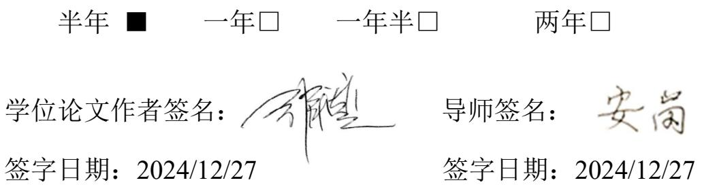

# 学 位 论 文

# MH 公司国际供应链风险管理研究

作 者 姓 名 ： 刘承远

作 者 学 号 ： 2280418

指 导 教 师 ： 安岗 副教授

东北大学工商管理学院

申请学位级别： 硕士 学科类别：管理学

学科专业名称： 工商管理（专业学位）

论文提交日期： 2024 年 11 月 28 日论文答辩日期： 2024 年 12 月 8 日

学位授予日期： 2025 年 1 月 答辩委员会主席：綦勇 教授

评 阅 人 ： 綦勇 教授 孙琦 教授级高级工程师

# 东 北 大 学

2024 年 12 月

# A Thesis for Degree of Master in Business Administration

# Risk Management Research of MH’s International Supply Chain

By Liu Chengyuan

Supervisor: Associate Professor An Gang

# Northeastern University December 2024

# 独创性声明

本人声明，所呈交的学位论文是在导师的指导下完成的。论文中取得的研究成果除加以标注和致谢的地方外，不包含其他人已经发表或撰写过的研究成果，也不包括本人为获得其他学位而使用过的材料。与我一同工作的同志对本研究所做的任何贡献均已在论文中作了明确的说明并表示谢意。

学位论文作者签名日 期：2024/12/27

# 学位论文版权使用授权书

本学位论文作者和指导教师完全了解东北大学有关保留、使用学位论文的规定：即学校有权保留并向国家有关部门或机构送交论文的复印件和磁盘，允许论文被查阅和借阅。本人同意东北大学可以将学位论文的全部或部分内容编入有关数据库进行检索、交流。

作者和导师同意网上交流的时间为作者获得学位后：

# 摘 要

MH公司位于辽宁省沈阳市，主要为B客户供应汽车外饰件总成。外饰件总成所包含的电子元件是由客户指定的供应商供货的，他们通常位于欧洲和北美。为保证按时向客户交货，国际供应链风险管理对MH公司至关重要。本文对MH公司国际供应链风险管理进行了系统研究，包括风险识别、风险评估、风险应对与风险监控。

在风险识别部分，本文识别出 26 项具体风险，其可划归六个风险大类：客户拉动类（含需求增加、需求减少、产能确认时限、开发节点同步等风险）、供应商类（含供应商研发技术、供应商产能、次级组件供货、供应商信用、供应商突发事件等风险）、国际物流类（含延期承运、战争和骚乱、自然灾害、海关政策、海关查验等风险）、质量类（含产品质量、分析改进配合、货损、漏装/溢装、拒赔等风险）、财务类（含资金周转、汇率波动、外汇收支政策、零件税则归类等风险）和信息安全类（含邮件信息泄露、EDI信息丢失、诈骗等风险）。

在风险评估部分，本文得到了各具体风险的权重排序，将所有风险分为高、中、低三种级别。其中高风险4项，包括战争与骚乱、延期承运、产能确认时限和供应商产能配合风险。中风险为资金周转、客户需求增加等9项风险。低风险为诈骗等13项风险。

在风险应对部分，本文提出措施 53 条。对于高风险中的战争和骚乱风险，应对策略包括延长订货提前期、改用其它运输方式、请求客户共同承担风险等。对于延期承运，应对策略包括使用可预见性强的承运人、旺季提前提货、改用高优先级运输服务等。对于产能确认时限风险，应对策略包括向客户申明此事超出MH公司业务范围、要求客户放宽时限、不书面向客户确认接受等。对于供应商产能配合风险，应对策略包括要求 B客户主导处理、接受临时高频产能分配等。对于各中、低风险，本文也分别制定了应对策略。

在风险监控部分，风险监测指引明确了需要监测的风险点、风险等级、指标、预警阈值、预警人和预警发送层级。风险控制行动包括了执行应对措施、建立控制效果报告制度、有序进行升级处置、坚持PDCA 循环改进等内容。监控信息透明化部分提出了分两阶段实施的方案，第一阶段立足于运用云服务+Power BI，第二阶段则计划将监控平台整合到 ERP 系统。

关键词：供应链；风险识别；风险评估；风险应对；风险监控

# Abstract

MH Company is located in Shenyang, Liaoning Province, mainly supplying automotive exterior parts assemblies to B customers. The electronic components included in the exterior assembly are supplied by the supplier designated by the customer, usually located in Europe and North America. International supply chain risk management is crucial for MH Company to ensure timely delivery to customers. This article systematically studies the international supply chain risk management of MH Company, including risk identification, risk assessment, risk response, and risk monitoring.

In the risk identification section, this article identifies 26 specific risks, which can be classified into six major risk categories: customer pull (including risks such as increased demand, decreased demand, capacity confirmation time limit, and synchronized development nodes), supplier (including risks such as supplier R&D technology, supplier capacity, secondary component supply, supplier credit, and supplier emergencies), international logistics (including risks such as delayed transportation, war and riots, natural disasters, customs policies, and customs inspections), quality (including risks such as product quality, analysis and improvement cooperation, cargo damage, leakage/overflow, and refusal to compensate), finance (including risks such as capital turnover, exchange rate fluctuations, foreign exchange policies, and parts tax classification), and information security (including risks such as email information leakage). Risks such as EDI information loss and fraud.

In the risk assessment section, this article obtained the weight ranking of each specific risk, dividing all risks into three levels: high, medium, and low. Among them, there are four highrisk items, including war and riots, delayed transportation, capacity confirmation deadlines, and supplier capacity coordination risks. The medium risk includes 9 risks such as capital turnover and increased customer demand. Low risk includes 13 risks such as fraud.

In the risk response section, this article proposes 53 measures. For high-risk war and riot risks, response strategies include extending lead times for ordering, switching to other modes of transportation, and requesting customers to share the risks. For delayed transportation, coping strategies include using carriers with strong predictability, early pick-up during peak seasons, and switching to high priority transportation services. For the risk of capacity confirmation deadline, response strategies include declaring to customers that this matter exceeds MH Company's business scope, requesting customers to relax the deadline, and not confirming acceptance with customers in writing. For the risk of supplier capacity coordination, response strategies include requiring B customers to take the lead in handling and accepting temporary high-frequency capacity allocation. For each medium and low risk, this article has also developed corresponding strategies.

In the risk monitoring section, the risk monitoring guidelines specify the risk points that need to be monitored, risk levels, indicators, warning thresholds, warning personnel, and warning sending levels. Risk control actions include implementing response measures, establishing a control effectiveness reporting system, orderly upgrading and disposal, and adhering to the PDCA cycle for improvement. The transparency of monitoring information has proposed a two-stage implementation plan. The first stage is based on the use of cloud services and Power BI, while the second stage plans to integrate the monitoring platform into the ERP system.

Key words: supply chain; risk identification; risk assessment; risk response; risk monitoring