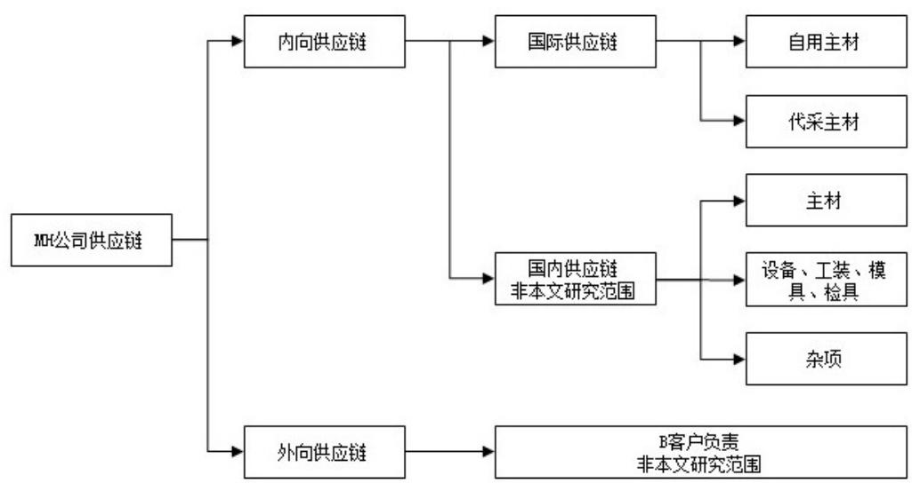

# 第 3 章 MH 公司概况及其国际供应链风险识别

# 3.1 MH 公司及其供应链概况

# 3.1.1 MSKJ 集团与 MH 公司概况

MH 公司隶属于 MSKJ 集团。MSKJ 集团成立于 1988 年，1997 年在深圳证券交易所上市，注册资本 8.3 亿元，主营业务为汽车饰件系统的研发、制造和技术服务，2023年营收 87.2 亿元，净利润约 4.5 亿元，净资产收益率 $1 3 . 1 \% ^ { [ 1 ] }$ 。集团致力于成为世界一流汽车饰件系统供应商，目前在国内为华晨宝马、北京奔驰、特斯拉、上汽通用、上汽大众、奇瑞捷豹路虎、沃尔沃、比亚迪、蔚来、理想、小鹏、问界、小米等众多主机厂供货，同时，集团在德国设有工程技术中心和物流中心，以便与欧洲重点客户进行产品同步开发。在墨西哥设有工厂，以便就近支持宝马和特斯拉的北美业务。

MH公司位于辽宁省沈阳市，分铁西、大东两个厂区，主要为B客户提供前后保险杠、扰流板、门槛等外饰件的开发和制造服务，满足 JIS（Just in sequence，准时制 $^ +$ 排序）供货要求。因上述外饰件集成了SRR（短距离雷达）、PDC（倒车雷达）、V2X（车联网数据传输模块）、FBD（遥控信号接收器）、SMO（后备箱智能开启控制器）、高位刹车灯、迎宾灯等诸多电子元件，而这些原件供应商普遍由B客户指定，称为DB件供应商（德语 Direktbezug 缩写）。DB 件的供应商几乎全部位于欧洲和北美，因此供应链管理工作涉及国际贸易、国际物流、国际支付等环节。根据 MH 公司流程，国际供应链进口环节相关工作主要由采购部负责，物流部、财务部、MT 公司（同属 MSKJ 集团的关联公司，作为国际采购的名义买方向境外支付货款）、第三方货代公司提供支持。

# 3.1.2 MH 公司供应链的分类

制造业企业的供应链通常包含内向交货和外向交货两种，其中内向交货是从供应商到制造企业的供应链，外向交货是从制造企业到客户的供应链。因MH公司外向交货供应链由B客户直接介入拉动和物流环节，所以该部分不属于本文研究的范围。MH公司的内向交货供应链可分为国际供应链和国内供应链，国际供应链负责将欧洲和北美供应商的主材零件输送到国内，其中一部分供MH 公司生产使用，另一部分系代理MSKJ 集团另一子公司BQMS采购（代采购部分本研究亦不讨论）；国内供应链既包括主材供应，也包括设备、工装、模具、检具、杂项物资的供应（见图3.1）。它们各自有着各自的特

点，本文研究的是其中的国际供应链部分。

  
图 $3 . 1 \mathrm { M H }$ 公司供应链的分类  
Figure 3.1 Categories of MH’s Supply Chain

# 3.1.3 MH 公司国际供应链独特性分析

MH公司国际供应链的独特性可以从两方面分析，一是该公司国际供应链与其国内供应链相比的独特性，二是MH公司国际供应链与典型国际供应链相比的独特性。

（1）MH公司国际供应链相对其国内供应链的独特性

第一，贸易条款不同。MH公司与国内供应商签订的贸易条款都是DDP MH铁西工厂或大东工厂，即供应商负责送货上门，MH不负责物流环节，也不承担物流环节的各种风险。相反，MH 公司与外国供应商签订的贸易条款都是 FCA/EXW，即 MH 到供应商工厂提货，负责全程物流，承担与物流相关的各项风险，例如货损、延迟、海关责任等，风险更高。

第二，货物所有人不同。MH 公司国内供应商采购的一切物资，无论主材还是辅材，都是供MH公司自用的。而国际供应链方面，按照集团的要求，MH公司除了自用物资的采购，还要负责 MSKJ 另一子公司 BQMS 进口零件的采购。此类代理采购的零件，由于涉及多方，无论在提货环节、物流环节、交付环节还是结算环节都容易发生扯皮，给MH公司造成诸多困扰。

第三，物资类型不同。MH公司国内供应链物资种类繁多，仅主材就分为原料（塑料粒子和油漆）、外协件（MH出具图纸，按准JIT模式供货）和外购件（MH采购成品，按备货模式供货）等多种，进口供应链物资种类则仅为外购件一种，操作压力稍减。

另外，订货提前期长、沟通难度大、商流物流环节多、政策法规复杂、索赔问题处理耗时长、外汇支付受法规制约等一般特性都是不言而喻的。

（2）MH公司国际供应链相对典型国际供应链的独特性

MH公司国际供应链的主要独特性体现在这是一种“客户指定供应商”模式下的供应链，即 MH 公司位于海外的二级供应商(Tier-2)不是自己选择的，而是 B 客户的母公司（AG）直接指定的，称为DB（德语Direktbezug缩写）供应商。这类DB供应商显著不同于自开发供应商，给MH公司国际供应链带来了独特的风险特征，体现在：

第一，供应商信用风险较低但产能配合度风险较高。因DB供应商都是由B客户母公司指定的，客户已经对供应商的资质、信用、设施等进行了考察，并且MH公司与这类供应商签署的付款条款均为“提货后XX天（介于30-90之间）电汇”，付款发生在提货之后，所以信用风险普遍较小。但也正是因为DB供应商是客户直接指定的，所以即使供应商明示不能分配足够产能，MH公司也无权开发替代供应商，只能被动向B客户反馈。B客户对海外供应商的影响力也很有限，往往数月无法解决问题，导致MH公司疲于居间协调、安排紧急运输，耗费大量人力物力，且供货始终处于风险中。

第二，供应商产品研发技术风险较低但进度同步风险较高。DB供应商由客户指定，往往都是具有悠久历史的欧美企业，是各自领域的专家，研发基本不存在技术风险。但是，DB 供应商是 B 客户的母公司指定的，开发任务也是 B 客户母公司下达的，这里面涉及 DB 供应商、MH 公司、B 客户和 B 客户母公司四方，任何两方之间的开发进度信息或版本信息都可能不同步。尤其对于MH公司采购的零件，有很多都是带有嵌入式软件的，而零件的软件版本（i-step）必须与整车的软件版本相一致。B 客户一个新车型的开发涉及到诸多阶段，仅项目移交中国 PVL 后，外购件方面就包括 VS0.1-0.3, 1.1-1.2,2.1-2.3, PZS, AP, SOP 等诸多阶段，每个阶段还涉及诸多版本号。加之中欧、中美距离遥远，样件运输依赖 FedEx 和 UPS 快递，因此不能按时交付的情况屡有发生。

第三，供应商质量风险较低但拒绝索赔风险较高。DB 件供应商通常是国际知名企业，加之电子件质检标准严格，因此发生质量问题的风险较低。但问题一旦发生，无论MH 公司向供应商进行索赔，还是要求其进行质量分析、改进、出具 8D 报告均比较困难。MH 公司与 DB 供应商远隔千山万水，无论办公时间、语言还是处理问题的工作习惯、服务意识都存在差异。DB 供应商通常比较傲慢，不但不把 MH 公司放在眼里，往往也不十分很看重B客户及其母公司，他们往往更愿意坚持自己的判断和节奏。欧洲公共假期、员工年假又多又长，许多员工属于终身雇佣，往往也不十分在意及时处理问题。而B客户是一家本土化十分明显的公司，质量水平在其集团已处于头部位置，要求多且

严格，国内供应商鉴于行业内卷现状目前还是愿意配合，但国外供应商往往不以为然。  
于是MH公司夹在当中，拒赔风险突出。

（3）上述独特性给MH公司国际供应链风险管理研究带来的影响

MH 公司国际供应链涉及的流程冗长、利益相关方众多、政策法律环境不确定大，因而其外部风险远高于国内供应链。但从内部来看，MH公司国际供应链是在“客户指定供应商”条件下的供应链，物资种类单一、价格透明、合作方式有章可循，因而MH公司内部人员可操作空间相对有限，内部代理风险和流程风险相对国内供应链为小。

综上，MH 公司国际供应链的独特性对风险管理的影响主要体现在外部风险较大而内部风险较小。因此，本研究主要着眼于对MH公司国际供应链外部风险（即链上风险）管理的研究。
