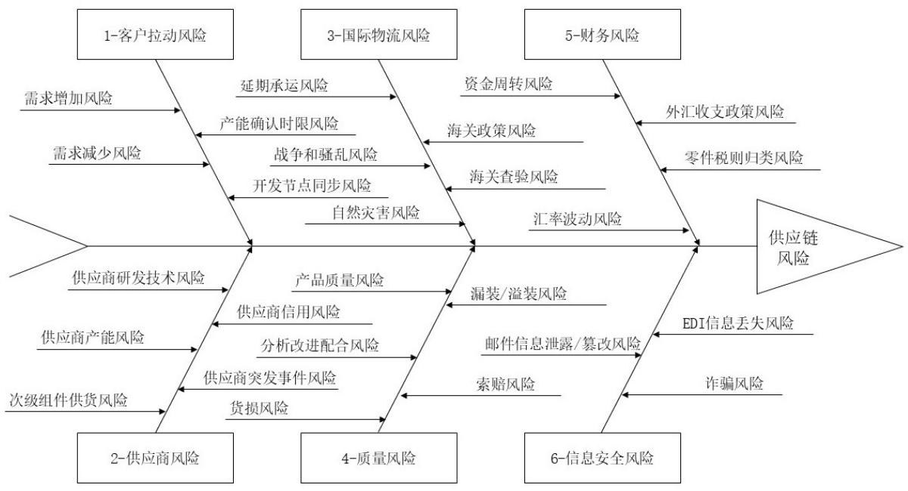
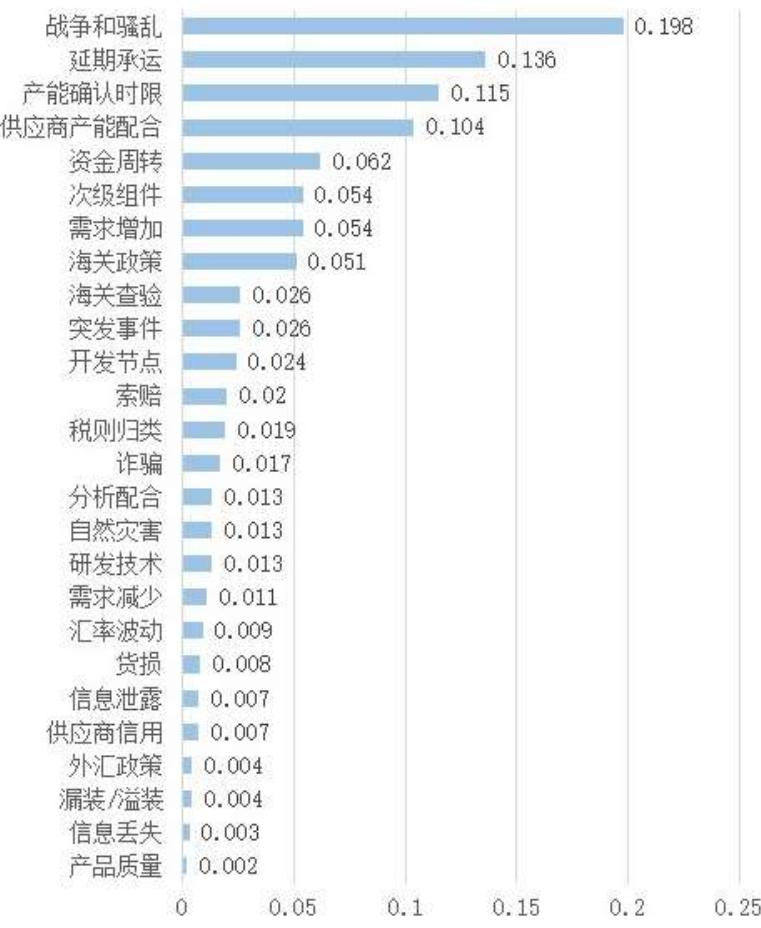
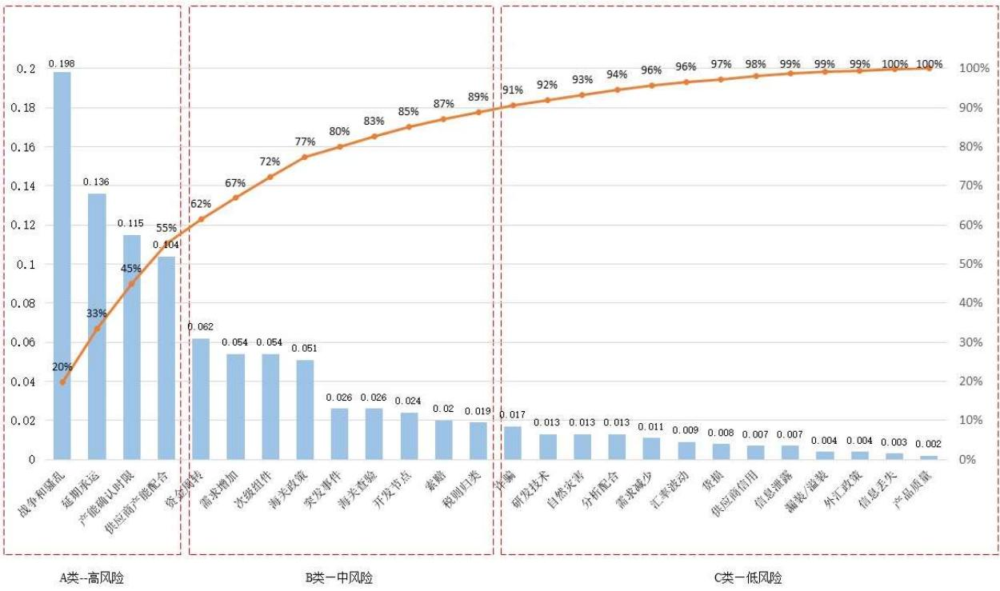
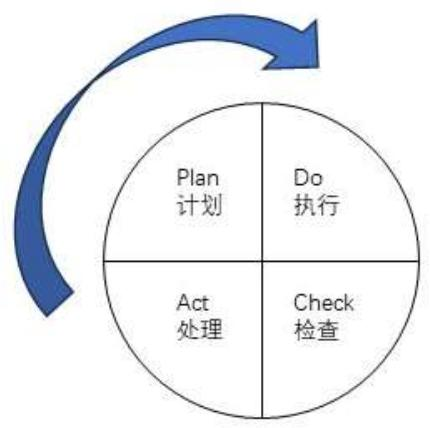
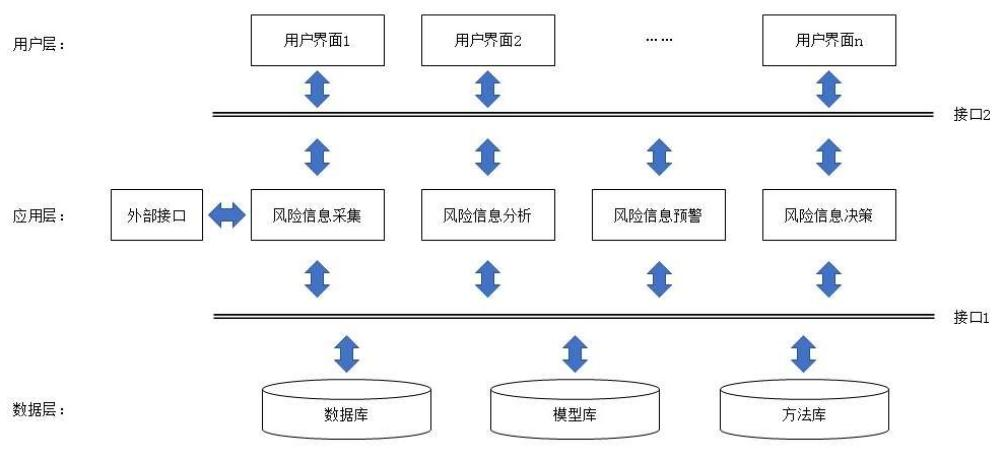

# 3.2 MH 公司国际供应链风险识别的技术与工具

# 3.2.1 风险识别方法的选择

经查阅相关文献，常用的风险识别方法包括头脑风暴法、德尔菲法、检查表法、SWOT 分析法、情景分析法、故障树法（FTA）、过程图法、敏感性分析法等[47]。

本研究拟采取头脑风暴法开展风险识别。因 MH 公司国际供应链风险分布于公司内外不同部门，不为单一部门同事所完全知晓，因此有必要召开跨部门风险识别会议，请大家各抒己见，如此方可充分识别风险。首先请相关业务同事对自己的以及与自己有关的工作环节进行流程分析，然后由作者组织实施头脑风暴，最后将头脑风暴得到的风险点划分类别，绘制鱼骨图。

# 3.2.2 风险识别的过程

风险识别小组拟由MH公司采购部主材组、SQM（供应商质量管理）组、物流部计划组、财务部、MT 公司进出口部、财务部、货代公司相关同事组成，其中MH公司同事将现场参会，MT 公司同事使用Teams 线上参会。因MH公司不同货代之间存在竞争关系，所以不宜安排她们同时参会，而是请其以邮件形式，将各种风险罗列给作者。具体参与人员名单如表3.1所示。

表 3.1 风险识别小组人员名单  
Table 3.1 List of Risk Identification Team Members   

<table><tr><td>序号</td><td>公司</td><td>部门</td><td>岗位</td><td>人数</td><td>参与方式</td></tr><tr><td>1</td><td>MH</td><td>采购部</td><td>主材主管</td><td>1</td><td>现场</td></tr><tr><td>2</td><td>MH</td><td>采购部</td><td>主材采购员</td><td>3</td><td>现场</td></tr><tr><td>3</td><td>MH</td><td>采购部</td><td>SQM主管</td><td>1</td><td>现场</td></tr><tr><td>4</td><td>MH</td><td>采购部</td><td>SQM 工程师</td><td>1</td><td>现场</td></tr><tr><td>5</td><td>MH</td><td>物流部</td><td>计划主管</td><td>1</td><td>现场</td></tr><tr><td>6</td><td>MH</td><td>物流部</td><td>计划员</td><td>1</td><td>现场</td></tr><tr><td>7</td><td>MH</td><td>财务部</td><td>会计</td><td>1</td><td>现场</td></tr><tr><td>8</td><td>MT</td><td>进出口部</td><td>操作员</td><td>2</td><td>线上会议</td></tr><tr><td>9</td><td>MT</td><td>财务部</td><td>会计</td><td>1</td><td>线上会议</td></tr><tr><td>10</td><td>各货代公司</td><td>-</td><td>-</td><td>5</td><td>邮件</td></tr><tr><td>总计</td><td>-</td><td>-</td><td>-</td><td>17</td><td>-</td></tr></table>

本研究向以上人员提出两个问题：（1）在您的日常工作中有哪些和国际供应链相关的风险？（2）其它部门有何与国际供应链相关的风险会影响到您？各参会人员畅所欲言，本文作者进行记录，头脑风暴环节安排时长2小时。

收集到各项风险后，作者将对其进行分类，并绘制鱼骨图。

# 3.3 MH 公司国际供应链风险识别的结果

# 3.3.1 风险识别结果汇总

根据各位参会同事的发言，本研究对其进行整理，得到风险识别结果，如表3.2。

表 $3 . 2 \mathrm { M H }$ 公司国际供应链风险点汇总  
Table 3.2 Risk Summary of MH’s International Supply Chain   

<table><tr><td>序号</td><td>风险因素</td><td>序号</td><td>风险因素</td></tr><tr><td>1</td><td>需求增加风险</td><td>6</td><td>次级组件供货风险</td></tr><tr><td>2</td><td>需求减少风险</td><td>7</td><td>战争和骚乱风险</td></tr><tr><td>3</td><td>供应商研发技术风险</td><td>8</td><td>拒赔风险</td></tr><tr><td>4</td><td>海关查验风险</td><td>9</td><td>外汇收支政策风险</td></tr><tr><td>5</td><td>产品质量风险</td><td>10</td><td>诈骗风险</td></tr><tr><td>11</td><td>资金周转风险</td><td>19</td><td>开发节点同步风险</td></tr><tr><td>12</td><td>邮件信息泄露、篡改风险</td><td>20</td><td>供应商信用风险</td></tr><tr><td>13</td><td>供应商产能风险</td><td>21</td><td>海关政策风险</td></tr><tr><td>14</td><td>延期承运风险</td><td>22</td><td>货损风险</td></tr><tr><td>15</td><td>分析改进配合风险</td><td>23</td><td>零件税则归类风险</td></tr><tr><td>16</td><td>汇率波动风险</td><td>24</td><td>供应商突发事件风险</td></tr><tr><td>17</td><td>EDI信息丢失风险</td><td>25</td><td>自然灾害风险</td></tr><tr><td>18</td><td>产能确认时限风险</td><td>26</td><td>漏装/溢装风险</td></tr></table>

观察上表，MH公司国际供应链风险因素较多，不利于直接比较其发生概率和后果严重性。按照层次分析法（AHP）的操作指引，本研究首先对其进行归类。归类以本文2.2.3 节所述各国专家对国际供应链风险种类的研究为基础，充分结合 MH 公司自身特点并会同专业人士共同评估，认为其可分为客户拉动风险、供应商风险、国际物流风险、财务风险、质量风险、信息安全风险六大类。具体分类见表 3.3。

# 表 3.3 风险分类清单

Table 3.3 Risk Classification List   

<table><tr><td colspan="1" rowspan="1">风险类别</td><td colspan="1" rowspan="1">风险因素</td></tr><tr><td colspan="1" rowspan="1">客户拉动风险</td><td colspan="1" rowspan="1">需求增加风险需求减少风险产能确认时限风险开发节点同步风险</td></tr><tr><td colspan="1" rowspan="1">供应商风险</td><td colspan="1" rowspan="1">供应商研发技术风险供应商产能风险次级组件供货风险供应商信用风险供应商突发事件风险</td></tr><tr><td colspan="1" rowspan="1">国际物流风险</td><td colspan="1" rowspan="1">延期承运风险战争和骚乱风险自然灾害风险海关政策风险</td></tr><tr><td>国际物流风险</td><td>海关查验风险</td></tr><tr><td rowspan="4">质量风险</td><td>产品质量风险</td></tr><tr><td colspan="1">分析改进配合风险</td></tr><tr><td colspan="1">货损风险</td></tr><tr><td colspan="1">漏装/溢装风险</td></tr><tr><td rowspan="4">财务风险</td><td>拒赔风险 资金周转风险</td></tr><tr><td colspan="1">汇率波动风险</td></tr><tr><td colspan="1">外汇收支政策风险</td></tr><tr><td colspan="1">零件税则归类风险</td></tr><tr><td rowspan="2">信息安全风险</td><td>邮件信息泄露、篡改风险</td></tr><tr><td colspan="1">EDI信息丢失风险</td></tr></table>

为 MH 公司国际供应链风险绘制鱼骨图，如图 3.2 所示。

  
图 $3 . 2 \mathrm { M H }$ 公司国际供应链风险鱼骨图  
Figure 3.2 Risk Fishbone of MH’s International Supply Chain

# 3.3.2 风险识别结果分析

# 3.3.2.1 客户拉动风险

客户拉动风险是客户原因造成的风险。客户可能在过于临近生产的日期增加或减少需求，也可能故意压缩产能确认的时限以使MH公司无法及时做出反应，或者客户无法协调好各级供应商的开发时间节点。

（1）需求增加风险：MH公司进口件订货提前期根据供应商要求不同、运输方式不同而有所差异。通常而言，临近零件上线使用 20 周以内的客户需求变化会对 MH 公司构成风险。若客户增加需求，MH 公司的供应商可能来不及组织生产，从而造成风险。

（2）需求减少风险：客户需求减少会导致 MH 公司违背之前向供应商下达的预测，短于提货前特定周数（例如 8 周、4 周等，视双方合同而定）的订单缩减可能会导致供应商索赔。

（3）产能确认时限的风险：在供应商定点时，B 客户都要同 MH 公司签订《产能调查表》，以确认 MH 公司需要为 B 客户预留的产能。B 客户未来的需求必须保持在预留产能的± $1 5 \%$ 以内，若超出范围MH公司有权要求B客户额外支付产能损失或增添产能的费用。MH公司也是如此同二级供应商约定的。但B客户确认产能变化，往往只给MH 公司 1 天时间，若无回复则默认为无新增费用。中国和欧洲、北美有时差，MH 公司根本不可能完成调查，若后续二级供应商真的索要费用，则 MH 公司面临只能自行承担的风险。

（4）开发节点同步风险：MH 公司在海外的二级供应商都是 B 客户的母公司指定的，称为DB供应商。这些供应商的新零件开发任务是B客户母公司直接下达的，所以开发进度协调涉及DB 供应商、MH公司、B客户和B客户母公司四方，任何两方之间的开发进度信息或版本信息都可能不同步，从而造成风险。

# 3.3.2.2 供应商风险

供应商风险是指供应商在产品开发、量产阶段不能及时提供约定的交付物的风险。通常原因包括供应商不能按时开发出新产品、供应商分配给 MH 公司的产能不足、供应商的下级供应商供货出现问题、供应商本身存在不按合同履约等信用风险、供应商内部突发事件导致供货受限等。

（1）供应商研发技术风险：新产品的开发涉及很多技术参数要求，包括硬件功能、能耗、嵌入式软件、材料性能、外观等。DB 供应商存在无法满足技术要求的可能性。

（2）供应商产能风险：虽然本文讨论的 DB 供应商是由 B 客户母公司直接指定的，但他们不只有 B 客户这一个客户。当产能不足时，如何分配给不同的客户就存在博弈。

原则上，DB 供应商倾向于将产能优先分配给利润率高、交易条款优越、地理位置临近的客户，B 客户和 MH 公司远离欧洲和北美，存在产能分配不足的可能性。而这时，MH公司又未被授予开发备用供应商的权限，因此导致供货风险。

（3）次级组件供货风险：MH是一级供应商，DB供应商是二级供应商，二级供应商的供应商是三级供应商，次级组件供货风险是由三级供应商导致的风险。近年来，汽车电动化、智能化趋势明显，半导体原件供货相当吃紧。MH公司已有若干电子件供应商无法采购到足够的半导体原件，从而导致供货风险。

（4）供应商信用风险：在个别情况下，供应商可能存在投机行为，故意不按合同规定履约。如果供应商违约，则会给 MH 公司造成风险。

（5）供应商突发事件风险：一些突发事件可能导致供货中断，如自然灾害、能源供应不足、生产事故、员工罢工等。

# 3.3.2.3 国际物流风险

国际物流风险是发生在国际运输和海关通关过程中的风险。因MH公司与海外供应商签署的贸易条款均为FCA/EXW （货交承运人/在卖方工厂交货），所以国际物流环节都是MH公司负责的。其风险主要包括延期承运风险、战争和骚乱风险、自然灾害风险、海关政策风险和海关查验风险。

（1）延期承运风险：无论是海运、中欧班列、空运还是国际快递，承运人都有权延期。海运可能因船舶未能按时到港或港口拥堵而延期装船；铁路可能因为货量不足而取消原定在某一日期发车的班列（例如沈-满-欧线路）；空运变数更多，航班本身就有取消的可能性，即使航班正常，航司也会优先承运支付了高运价（如汉莎的TD-Flash，国航的B2B等）的货物，而支付低运价（如Consol）的货物，即使已经装上了飞机，也有再被卸下来的可能；快递类似于空运，FedEx 的 Priority 价格高但速度快，Economic 则会在不同的空港之间调来调去，等候有空位的折扣航班。

（2）战争和骚乱风险：2022 年俄乌战争爆发后，欧美货代公司不再承揽经中欧班列运输的货物，但好在承运人（即铁路局）正常经营，我国货代仍承揽途径此线路的联运业务。2023 年以色列进攻加沙，导致也门胡赛武装开始攻击途径红海的船只，全球各大航运公司纷纷绕行好望角，不仅运费飙升，而且导致 MH 公司在途货物延期，后续货物不得不延长订货提前期。

（3）自然灾害风险：国际物流途遇自然灾害会产生一系列风险，例如海运遭遇飓风可能造成海损，暴雨冲毁桥梁可能造成班列停运，2023年厄尔尼诺现象肆虐导致的旱灾致使巴拿马运河通行受限，直至2024年4月才有所缓解。根据《GB/T 28921-2012自然灾害分类与代码》，疫病灾害也属于自然灾害的一种，2020-2022年疫情期间各国的封控政策也曾给 MH 公司国际供应链带来了巨大的风险。

（4）海关政策风险：各国海关可能出于政治考虑调整其出口或过境政策。例如2023年9月，波兰马拉海关未经事先告知，突然截停所有中欧班列进行检查。事件发生并经交涉后，波兰海关才发布通知，因班列过境后会途经白俄罗斯和俄罗斯，波兰政府怀疑班列上的“军民两用物资”会被“侵略国政府”利用。而后续发布的“军民两用物资”清单范围极大。MH 公司被划入的零件不仅包括为 B 客户采购的 SMO（后备箱智能开启装置，由两个传感器和一个控制器组成，或许还说得通），甚至还包括 MH 代兄弟公司 BQMS 采购的奔驰车标（波方认为车标的材料经重新注塑后可以制造防爆盾牌），给MH公司国际供应链物流环节造成了很大的干扰。

（5）海关查验风险：此风险分为两方面，一是查验本身会消耗 1-2 个工作日时间，在极端情况下会对导致 MH 公司生产中断；二是个别物料 MH 可能存在编码归类错误，若正确的编码需要申请出口/进口许可证、涉及反倾销税，或两个编码关税税率不同，则MH公司存在被海关处罚和信用等级降级的风险。

# 3.3.2.4 质量风险

质量风险包括零件质量和物流质量两类。零件质量是指MH公司收到的货物存在质量问题，或供应商拒绝分析、承认和改进质量问题等；物流质量是指物流过程造成零件损坏，或包装中出现漏装、溢装零件等现象。包括产品质量风险、分析改进的配合风险、货损风险、漏装/溢装风险和拒赔风险。

（1）产品质量风险：供应商的产品存在不符合技术要求的质量问题。有些质量问题是外观问题，或MH具备检验手段的电性问题；另一些质量问题是MH无法检验的电性问题或软件问题。后一种质量问题只有发给B 客户装车后才能发现，对MH而言风险更大。

（2）分析改进配合风险：MH 出货给 B 客户的产品，无论是外饰件本身的质量问题，还是其上集成的二级供应商电子件的质量问题，B客户都会要求MH进行质量分析。质量分析的过程要符合 GS95004，结果要形成 8D 报告。对于外购件来说，MH 只能要求二级供应商进行分析。然而，二级供应商存在推诿、不承认质量问题，同时也不按标准进行分析、出具报告、进行改进的风险。

（3）货损风险：MH 公司国际物流采取多式联运的方式，环节涉及多个承运人，有时出现货损无法找到责任方；有时明知责任方，但对方按惯例不承担货损责任。此类情况一方面会造成财产损失，另一方面更重要的是会导致MH公司库存不足，影响向B客

户出货。

（4）漏装/溢装风险：供应商可能在包装时少装或多装零件，这对MH公司来说都构成风险。若是少装，MH只有零件上线时才会发现，往往距离到货已过去数周，与供应商协商数量问题缺乏证据，很难说清零件是在哪个环节短少的；若是多装，一旦遇到海关查验，则会对MH公司造成不利影响。

（5）拒赔风险：MH公司国际供应链涉及环节众多，而且无论是供应商、承运人、港口/机场都比较强势。无论是发生质量问题，还是运输货损，亦或是零件短少，索赔均比较复杂，而且对方拒赔风险较大。即使在运输环节已经投保，保险公司赔付的时候也有诸多限制条件。

# 3.3.2.5 财务风险

财务风险是指供应链环节财务费用超支的风险。主要包括资金周转风险、汇率波动风险、外汇收支政策风险和零件税则归类风险。

（1）资金周转风险：MH公司从供应商采购零部件有30-90天的账期，而生产好的产品销售给B客户也有一定的账期，两者相抵之后MH公司仍需要垫资，正常情况下的垫资MH公司已经计算到产品成本中了。B客户信用良好，基本可以按时支付。但随着近年来国内新能源车销售崛起、汽车市场整体竞争加剧，尤其是受 2023 年年初以来的降价潮冲击，即使定位于豪华车市场的B客户也不能独善其身，有付款逐渐变得不及时的倾向。一旦客户延期付款，将导致 MH 公司资金周转期延长，产生额外财务成本的风险上升。

（2）汇率波动风险：欧元和美元相对人民币的升值会导致 MH 公司采购支出的增加，好在B客户向MH 公司结算时针对DB件也是按外币计价。但是，从MH向供应商付款到 B 客户向 MH 付款，中间仍有一个时间差。时间差内汇率的进一步波动，也会对MH造成财务风险。

（3）外汇收支政策风险：MH 公司采购 DB 件的价格是 B 客户母公司与 DB 供应商直接商定的，定价时间往往不够及时。最典型的是一款由Kessebohmer供货的排气管装饰罩，价格根据不锈钢和镍的年度均价调整，次年一季度末才能确认上一年的最终结算价。如果 MH 去年已付价格偏高还好，可以直接从供应商扣款；但若 MH 去年已付价格偏低，需要向供应商补款，则很难付汇。因为我国是实行外汇管制的国家，去年的货物已经完成付汇，现在再补没有依据。此类问题的处理耗费 MH 公司大量精力，而且实质上处于灰色地带，构成明显风险。

（4）零件税则归类风险：MH 公司经常有一些新进口零件，需要对它们进行海关编码归类。归类工作是由货代来做的，但他们给出的编码仅作为参考，还需MH公司最终确认。MH公司有时会确认失误，使用了错误的建议。通常情况下，这些编码的大类一致，不会造成明显的问题。但个别情况下，错误的编码和正确的编码之间可能存在关税税率差异，甚至正确的编码会需要申请进口许可证或缴纳反倾销税。在这种情况下，MH公司将面临被海关处罚、产生额外成本的风险。

# 3.3.2.6 信息安全风险

信息安全风险是由信息存在安全问题导致的风险。MH公司国际供应链面临的信息安全风险主要包括邮件信息泄露/篡改风险，EDI 信息丢失风险和诈骗风险。

（1）邮件信息泄露/篡改风险：MH 公司使用 MSKJ 集团统一的电子邮件系统，该系统安全性堪忧，时常有外部人员冒用员工邮箱群发邮件。这显然说明邮件系统已被入侵，但集团 IT 部门对此应对乏术，MH 的邮件信息存在泄露和被篡改的风险。

（2）EDI 信息丢失风险：EDI 即电子信息交换，是 MH 与国外供应商传递预测、订单、发货信息的主要渠道，典型的 EDI 是通过接口连接双方 ERP 系统的。供应商的的 ERP 系统品牌众多，例如 SAP、Oracle e-business、Baan 等，而且版本也各不相同，存在接口发生故障的可能性。加之MH端服务器也有发生错误的可能性、国际互联网信息传输丢包概率较国内更大等，所以有EDI信息丢失的风险。

（3）诈骗风险：采购部对外支付频率高、金额大，历来是诈骗犯罪主要针对的对象之一。尤其是国际支付，对方银行位于境外，一旦付汇极难追回。正常情况下，MH 公司与海外供应商为长期合作关系，彼此了解，不易被骗。但MH公司邮件系统安全性不足，一旦诈骗分子截获双方往来邮件，就能了解订单、出货、付款、银行账号等敏感信息，进而冒充对方，删除对方邮件，使用自己的诈骗邮件替代。因诈骗分子掌握了敏感信息，冒充供应商或 MH 时可以做到天衣无缝，令人防不胜防。

# 第 4 章 MH 公司国际供应链风险评估

# 4.1 MH 公司国际供应链风险评估方法选择及指标体系构建

# 4.1.1 风险评估方法的选择

本章将对上一章识别出的MH公司国际供应链风险进行评估，其目的在于将风险按危害的大小分成不同的等级，明确轻重缓急，进而为其制定不同的应对策略，分配不同规模的应对资源。既要防止忽视风险，给公司造成损失；又要防止防范过度，投入不必要的过多资源。

风险评估有多种方法可供选择，主要包括主观评分法、决策树法、模糊综合评价法、故障树分析法、随机模拟法、概率树法、风险影响度分析法、GERT、PERT 以及层次分析法（AHP）。

MH公司国际供应链风险因素较多，难以直接打分或排序确定其危害程度。考虑到这些风险因素具备可分类的特点，所以本研究决定选用层次分析法（AHP）进行风险评估。

# 4.1.2 风险评估指标体系的构架

层次分析法（Analytical Hierarchy Process, AHP）由美国匹兹堡大学教授 T. L. Saaty首次提出，它是一种定性定量相结合的系统化分析方法，体现了决策思维的基本特征，即分解、判断、综合。AHP把复杂问题分解为若干组成因素，再将这些因素按支配关系分组，形成有序的层次结构。对于同一层次的各项因素，AHP通过两两比较的方式确定其重要性，结果称为“权重向量”。需要指出的是，在风险类别层，比较的是风险大类对公司供应链运营的重要程度；在具体风险层，比较的是各具体风险的危害性，即风险发生概率与后果严重性的乘积。其后，再将各具体风险在其风险大类中的权重与大类本身的权重相乘，得到这个具体风险在全部风险中的权重。

为使用AHP对MH公司国际供应链各层次风险进行评估，我们必须首先按照3.3节的识别结果建立一个分层的架构体系，如表4.1所示。

# 表 $4 . 1 \mathrm { M H }$ 公司国际供应链风险评估指标体系

Table 4.1 Risk Assessment Indicators for MH’s International Supply Chain   

<table><tr><td rowspan=1 colspan=1>目标层</td><td rowspan=1 colspan=1>第一层（风险类别）</td><td rowspan=1 colspan=1>第二层（具体风险）</td></tr><tr><td rowspan=6 colspan=1>MH公司国际供应链风险管理（A）</td><td rowspan=1 colspan=1>客户拉动风险（A1)</td><td rowspan=1 colspan=1>需求增加风险（A11）需求减少风险（A12）产能确认时限风险（A13）开发节点同步风险（A14）</td></tr><tr><td rowspan=1 colspan=1>供应商风险（A2）</td><td rowspan=1 colspan=1>供应商研发技术风险（A21）供应商产能风险（A22）次级组件供货风险（A23）供应商信用风险（A24）供应商突发事件风险（A25）</td></tr><tr><td rowspan=1 colspan=1>国际物流风险（A3）</td><td rowspan=1 colspan=1>延期承运风险（A31）战争和骚乱风险（A32）自然灾害风险（A33）海关政策风险（A34）海关查验风险（A35）</td></tr><tr><td rowspan=1 colspan=1>质量风险（A4）</td><td rowspan=1 colspan=1>产品质量风险（A41）分析改进配合风险（A42）货损风险（A43）漏装/溢装风险（A44)拒赔风险（A45）</td></tr><tr><td rowspan=1 colspan=1>财务风险（A5）</td><td rowspan=1 colspan=1>资金周转风险（A51）汇率波动风险（A52）外汇收支政策风险（A53）零件税则归类风险（A54）</td></tr><tr><td rowspan=1 colspan=1>信息安全风险（A6)</td><td rowspan=1 colspan=1>邮件信息泄露、篡改风险（A61）EDI信息丢失风险（A62）诈骗风险（A63）</td></tr></table>

本研究在此基础上构建两层次风险矩阵。除目标层外，第一层为类别层，由六个风险大类组成，作者通过德尔菲法获取其对公司供应链运营的重要性权重；第二层为具体

风险层，同样使用德尔菲法，获取各具体风险在其风险大类中的危害性权重。如上文论述，所谓危害性是由风险发生的概率与风险后果严重性相乘得到的。

# 4.2 MH 公司国际供应链风险评估的过程

# 4.2.1 AHP 的计算方法

# 4.2.1.1 确定风险评估准则

请相关同事对各层各风险的危害性进行两两比较，衡量危害性的原则是 $\scriptstyle { \mathrm { R = f } } ( { \mathrm { P } } , { \mathrm { E } } )$ ，即危害性等于风险发生概率P 和该风险一旦发生带来后果的严重程度E的乘积。两两比较打分的准则见表4.2。

表4.2 评估准则  
Table 4.2 Evaluation Criteria   

<table><tr><td>分值</td><td>含义</td></tr><tr><td>1</td><td>i风险的危害程度与j风险相同</td></tr><tr><td>3</td><td>i风险危害性比j风险稍高</td></tr><tr><td>5</td><td>i风险危害性明显比j风险高</td></tr><tr><td>7</td><td>i风险危害性比j风险高得多</td></tr><tr><td>9</td><td>i风险危害性极高，j风险无法与之相比</td></tr><tr><td>2、4、6、8</td><td>i风险与j风险的危害性比较结果介于上述分数之间</td></tr><tr><td>倒数</td><td>j与i的危害性对于和i与j的危害性对比呈倒数关系</td></tr></table>

# 4.2.1.2 德尔菲法统计结果

作者根据4.1节构建的MH公司国际供应链风险评估指标体系编制了《风险评估调查表》。因第一层风险类别重要性对比涉及 MH 公司较为宏观的管理层面，所以请相关部门经理经理进行对比评分。人员构成见表 4.3，向其收集意见，持续反馈调查结果给调查对象并请其重新思考，再次收集意见以最终达成共识。第二层具体风险在各自类别内的危害性对比属于微观的操作层面问题，所以请负责具体业务的同事进行对比打分，人员构成见表 4.4。向其收集意见，持续反馈调查结果给调查对象并请其重新思考，再次收集意见以最终达成共识。作者将德尔菲法得出的一致结果填入判断矩阵。

表 4.3 第一层（风险类别）重要性评估小组人员名单  
Table 4.3 List of Level-1 (Category) Importance Comparison Team Members   

<table><tr><td>序号</td><td>公司</td><td>部门</td><td>岗位</td><td>人数</td><td>参与方式</td></tr><tr><td>1</td><td>MH</td><td>-</td><td>副总经理</td><td>1</td><td>问卷</td></tr><tr><td>2</td><td>MH</td><td>商务部</td><td>商务部经理</td><td>1</td><td>问卷</td></tr><tr><td>3</td><td>MH</td><td>采购部</td><td>采购部经理</td><td>1</td><td>问卷</td></tr><tr><td>4</td><td>MH</td><td>物流部</td><td>物流部经理</td><td>1</td><td>问卷</td></tr></table>

表 4.4 第二层（具体风险）危害性评估小组人员名单

Table 4.4 List of Level-2 (Specific) Risk Evaluation Team Members   

<table><tr><td>序号</td><td>公司</td><td>部门</td><td>岗位</td><td>人数</td><td>参与方式</td></tr><tr><td>1</td><td>MH</td><td>采购部</td><td>采购员</td><td>3</td><td>问卷</td></tr><tr><td>2</td><td>MH</td><td>物流部</td><td>计划员</td><td>2</td><td>问卷</td></tr><tr><td>3</td><td>MH</td><td>物流部</td><td>库管班长</td><td>2</td><td>问卷</td></tr><tr><td>4</td><td>MH</td><td>财务部</td><td>会计</td><td>1</td><td>问卷</td></tr><tr><td>5</td><td>MT</td><td>对口部门</td><td>代表</td><td>2</td><td>问卷</td></tr></table>

# 4.2.1.3 构建判断矩阵

第一层（类别层）构建风险矩阵如下：

$$
A = ( a _ { i j } ) _ { n * n } = { \left[ \begin{array} { l l l l } { a _ { 1 1 } } & { a _ { 1 2 } } & { \ldots } & { a _ { 1 n } } \\ { a _ { 2 1 } } & { a _ { 2 2 } } & { \ldots } & { a _ { 2 n } } \\ { \ldots } & { \ldots } & { \ldots } & { \ldots } \\ { a _ { n 1 } } & { a _ { n 2 } } & { \ldots } & { a _ { n n } } \end{array} \right] }
$$

$\textstyle \frac { 1 } { 9 } \leq \mathrm { a } _ { \mathrm { i j } } \leq 9 , \ : \ : \mathrm { a } _ { \mathrm { i j } } = \frac { 1 } { \mathrm { a } _ { \mathrm { j i } } } \ : \ : , \ : \ : \mathrm { a } _ { \mathrm { i i } } = 1 \ : _ { \circ }$

第二层（具体风险层）各类别的风险矩阵构建与第一层相同：

$$
B = ( b _ { i j } ) _ { n * n } = { \left[ \begin{array} { l l l l } { b _ { 1 1 } } & { b _ { 1 2 } } & { \ldots } & { b _ { 1 n } } \\ { b _ { 2 1 } } & { b _ { 2 2 } } & { \ldots } & { b _ { 2 n } } \\ { \ldots } & { \ldots } & { \ldots } & { \ldots } \\ { b _ { n 1 } } & { b _ { n 2 } } & { \ldots } & { b _ { n n } } \end{array} \right] }
$$

${ \textstyle \frac { 1 } { 9 } } \leq \mathsf { b } _ { \mathrm { i j } } \leq 9 , \mathsf { b } _ { \mathrm { i j } } = { \frac { 1 } { \mathsf { b } _ { \mathrm { j i } } } } , \mathsf { b } _ { \mathrm { i i } } = 1 _ { \circ }$

# 4.2.1.4 计算层次单排序向量

（1）按行元素求积，再开 $\mathbf { n }$ 次方：

$$
\begin{array} { r l } { \overline { { W _ { l } } } = { \sqrt [ n ] { \prod _ { j = 1 } ^ { n } a _ { i j } } } } & { { } ( i \mathrm { = } l , 2 , \ . . . , n ) } \end{array}
$$

（2）将??పതതത归一化：使向量中各元素之和等于 1，即

$$
W _ { i } = \frac { \overline { { W _ { \imath } } } } { \sum _ { i = 1 } ^ { n } \overline { { W _ { \imath } } } }
$$

（3）得到权重向量 $\mathrm { W }$ ，即为层次单排序向量：

$$
W { = } ( W _ { l } , W _ { 2 \ldots } , W _ { n } ) ^ { T }
$$

# 4.2.1.5 判断矩阵一致性检验

（1）求判断矩阵的最大特征根：

$$
\lambda _ { m a x } = \frac { 1 } { n } { \sum } ^ { n } \frac { ( A W ) _ { i } } { W _ { i } }
$$

（2）计算一致性指标 CI：

$$
C I = \frac { \lambda _ { m a x } - n } { n - 1 }
$$

$\mathrm { C I } { = } 0$ 代表判断矩阵完全一致，CI 越大代表判断矩阵不一致的程度越严重。

（3）根据CI、RI值求解CR，判断一致性是否通过：

$$
C R = \frac { C I } { R I }
$$

其中，RI 为平均随机一致性指标。RI 值对照表如 4.5。

表 4.5 RI 值对照表  
Table 4.5 RI Value Comparison   

<table><tr><td>矩阵</td><td></td><td></td><td>3</td><td>4</td><td>5</td><td>6</td><td>7</td><td>8</td><td>9</td><td></td></tr><tr><td>阶数</td><td>1</td><td>2</td><td></td><td></td><td></td><td></td><td></td><td></td><td></td><td>10</td></tr><tr><td>RI</td><td>0</td><td>0</td><td>0.58</td><td>0.90</td><td>1.12</td><td>1.24</td><td>1.32</td><td>1.41</td><td>1.45</td><td>1.49</td></tr></table>

当 $\mathrm { C R } { < } 0 . 1$ 时，判断矩阵 A 的一致性程度在允许的范围之内，一致性检验通过；当

$\mathrm { C R } { \geq } 0 . 1$ 时，一致性检验不通过，判断矩阵 A 应当进行修正。

# 4.2.1.6 层次总排序

计算某一层次所有因素对于目标层相对重要性的权值称为层次总排序，该过程是从目标层向要计算的层次依次进行的。在本研究中，目标层由第一层的6个风险类别决定，但为普通起见，假设风险类别有 $\mathbf { m }$ 种，其权重系数分别为 a1, a2, …, $\mathrm { a _ { m } }$ ; 第二层由 $\mathbf { n }$ 种具体风险构成，其层次单排序权重系数分别为 b11, …, $\boldsymbol { \mathrm { b } } _ { \mathrm { n m } }$ 。则第二层各具体风险的综合权重为： $\textstyle b _ { i } = \sum _ { j = 1 } ^ { m } a _ { j } b _ { i j }$ , $\mathrm { i } { = } 1 , 2 , . . . , \mathtt { n }$ ，如下表所示：

表 4.6 第二层各具体风险的综合权重计算表  
Table 4.6 Total Weight Calculation for Level-2 Risks   

<table><tr><td>第一层</td><td>A1</td><td>A2</td><td></td><td>Am</td><td rowspan="2">第二层各具体风险 综合权重</td></tr><tr><td>第二层</td><td>$a1</td><td>$a2$</td><td>…</td><td>$am</td></tr><tr><td>B1</td><td>b11</td><td>b12</td><td></td><td>b1m</td><td>m aj1j = b1</td></tr><tr><td>B2</td><td>b21</td><td>b22</td><td></td><td>b2m</td><td>aj2j = b2</td></tr><tr><td></td><td></td><td></td><td></td><td></td><td></td></tr><tr><td>Bn</td><td>bn1</td><td>bn2</td><td></td><td>bnm</td><td>m ajbnj = n j=1</td></tr></table>

最后，按照综合权重降序排列，即为第二层各具体风险的层次总排序。

# 4.2.2 基于 AHP 的风险类别评估过程

该部分评估的是各风险类别对公司供应链运营的重要性，每个类别发生风险的概率是由其下各具体风险发生概率组成的。因具体风险的发生概率会在 4.2.3 进行评估，所以本层并不需要重复进行概率评估，仅对重要性进行评估即可。本研究面向表 4.3 划定的相关部门经理开展德尔菲法调查，共进行三轮，最终达成一致意见。对结果进行一致性检验后确认其符合规范，于是得到类别层风险矩阵计算结果，如表 4.7。

# 表 4.7 第一层 风险类别矩阵指标计算结果

Table 4.7 Indicator Calculation Result of Level-1 Risk Category Matrix   

<table><tr><td rowspan=1 colspan=1>A</td><td rowspan=1 colspan=1>客户拉动风险A1</td><td rowspan=1 colspan=1>供应商风险A2</td><td rowspan=1 colspan=1>国际物流风险A3</td><td rowspan=1 colspan=1>质量风险A4</td><td rowspan=1 colspan=1>成本风险A5</td><td rowspan=1 colspan=1>信息安全风险A6</td><td rowspan=1 colspan=1>权重Wi</td></tr><tr><td rowspan=1 colspan=1>客户拉动风险A1</td><td rowspan=1 colspan=1>1</td><td rowspan=1 colspan=1>1</td><td rowspan=1 colspan=1>1/3</td><td rowspan=1 colspan=1>5</td><td rowspan=1 colspan=1>3</td><td rowspan=1 colspan=1>7</td><td rowspan=1 colspan=1>0.204</td></tr><tr><td rowspan=1 colspan=1>供应商风险A2</td><td rowspan=1 colspan=1>1</td><td rowspan=1 colspan=1>1</td><td rowspan=1 colspan=1>1/3</td><td rowspan=1 colspan=1>5</td><td rowspan=1 colspan=1>3</td><td rowspan=1 colspan=1>7</td><td rowspan=1 colspan=1>0.204</td></tr><tr><td rowspan=1 colspan=1>国际物流风险A3</td><td rowspan=1 colspan=1>3</td><td rowspan=1 colspan=1>3</td><td rowspan=1 colspan=1>1</td><td rowspan=1 colspan=1>7</td><td rowspan=1 colspan=1>5</td><td rowspan=1 colspan=1>9</td><td rowspan=1 colspan=1>0.424</td></tr><tr><td rowspan=1 colspan=1>质量风险A4</td><td rowspan=1 colspan=1>1/5</td><td rowspan=1 colspan=1>1/5</td><td rowspan=1 colspan=1>1/7</td><td rowspan=1 colspan=1>1</td><td rowspan=1 colspan=1>1/3</td><td rowspan=1 colspan=1>3</td><td rowspan=1 colspan=1>0.048</td></tr><tr><td rowspan=1 colspan=1>成本风险A5</td><td rowspan=1 colspan=1>1/3</td><td rowspan=1 colspan=1>1/3</td><td rowspan=1 colspan=1>1/5</td><td rowspan=1 colspan=1>3</td><td rowspan=1 colspan=1>1</td><td rowspan=1 colspan=1>5</td><td rowspan=1 colspan=1>0.094</td></tr><tr><td rowspan=1 colspan=1>信息安全风险A6</td><td rowspan=1 colspan=1>1/7</td><td rowspan=1 colspan=1>1/7</td><td rowspan=1 colspan=1>1/9</td><td rowspan=1 colspan=1>1/3</td><td rowspan=1 colspan=1>1/5</td><td rowspan=1 colspan=1>1</td><td rowspan=1 colspan=1>0.026</td></tr><tr><td rowspan=1 colspan=1>一致性检验</td><td rowspan=1 colspan=7>λ max=6.254, n=6, CI=0.051, CR=0.041&lt;0.1，一致性检验通过</td></tr></table>

具体计算过程如下：

（1）构建判断矩阵：

$$
A = ( a _ { i j } ) _ { 6 * 6 } = { \left[ \begin{array} { l l l l l l } { 1 } & { 1 } & { 1 / 3 } & { 5 } & { 3 } & { 7 } \\ { 1 } & { 1 } & { 1 / 3 } & { 5 } & { 3 } & { 7 } \\ { 3 } & { 3 } & { 1 } & { 7 } & { 5 } & { 9 } \\ { 1 / 5 } & { 1 / 5 } & { 1 / 7 } & { 1 } & { 1 / 3 } & { 3 } \\ { 1 / 3 } & { 1 / 3 } & { 1 / 5 } & { 3 } & { 1 } & { 5 } \\ { 1 / 7 } & { 1 / 7 } & { 1 / 9 } & { 1 / 3 } & { 1 / 5 } & { 1 } \end{array} \right] }
$$

（2）按行元素求积，再开 $\mathbf { n }$ 次方：

$$
\begin{array} { r l } { \overline { { W _ { l } } } = { \sqrt [ n ] { \prod _ { j = 1 } ^ { n } a _ { i j } } } } & { { } ( i \mathrm { = } l , 2 , \ . . . , n ) } \end{array}
$$

$$
\begin{array} { r } { \overline { { W _ { 1 } } } = \sqrt [ 6 ] { \prod _ { j = 1 } ^ { 6 } a _ { 1 j } } = \sqrt [ 6 ] { 1 * 1 * \frac { 1 } { 3 } * 5 * 3 * 7 } = 1 . 8 0 9 } \end{array}
$$

$$
\begin{array} { r } { \overline { { W _ { 2 } } } = \sqrt [ 6 ] { \prod _ { j = 1 } ^ { 6 } a _ { 2 j } } = \sqrt [ 6 ] { 1 * 1 * \frac { 1 } { 3 } * 5 * 3 * 7 } = 1 . 8 0 9 } \end{array}
$$

$$
\overline { { W _ { 3 } } } = \sqrt [ 6 ] { \prod _ { j = 1 } ^ { 6 } a _ { 3 j } } = \sqrt [ 6 ] { 3 * 3 * 1 * 7 * 5 * 9 } = 3 . 7 6 2
$$

$$
\overline { { W _ { 4 } } } = \sqrt [ 6 ] { \prod _ { j = 1 } ^ { 6 } a _ { 4 j } } = \sqrt [ 6 ] { \frac { 1 } { 5 } * \frac { 1 } { 5 } * \frac { 1 } { 7 } * 1 * \frac { 1 } { 3 } * 3 } = 0 . 4 2 3
$$

$$
\begin{array} { r } { \overline { { W _ { 5 } } } = \sqrt [ 6 ] { \prod _ { j = 1 } ^ { 6 } a _ { 5 j } } = \sqrt [ 6 ] { \frac { 1 } { 3 } * \frac { 1 } { 3 } * \frac { 1 } { 5 } * 3 * 1 * 5 } = 0 . 8 3 3 } \end{array}
$$

$$
\overline { { W _ { 6 } } } = \sqrt [ 6 ] { \prod _ { j = 1 } ^ { 6 } a _ { 6 j } } = \sqrt [ 6 ] { \frac { 1 } { 7 } * \frac { 1 } { 7 } * \frac { 1 } { 9 } * \frac { 1 } { 3 } * \frac { 1 } { 5 } * 1 } = 0 . 2 3 1
$$

（3）将??పതതത归一化：

$$
W _ { i } = \frac { \overline { { W _ { \imath } } } } { \sum _ { i = 1 } ^ { n } \overline { { W _ { \imath } } } }
$$

$$
W _ { 1 } = \frac { \cdots \times 0 . 0 9 } { 1 . 8 0 9 + 1 . 8 0 9 + 3 . 7 6 2 + 0 . 4 2 3 + 0 . 8 3 3 + 0 . 2 3 1 } = 0 . 2 0 4
$$

$$
W _ { 2 } = \frac { \cdots \times 2 0 0 } { 1 . 8 0 9 + 1 . 8 0 9 + 3 . 7 6 2 + 0 . 4 2 3 + 0 . 8 3 3 + 0 . 2 3 1 } = 0 . 2 0 4
$$

（4）得到权重向量 $\mathrm { W }$ ，即为层次单排序向量（将结果填入表4.14）：

$$
W = ( 0 . 2 0 4 , 0 . 2 0 4 , 0 . 4 2 4 , 0 . 0 4 8 , 0 . 0 9 4 , 0 . 0 2 6 ) ^ { T }
$$

（5）求判断矩阵的最大特征根：

$$
\lambda _ { m a x } = \frac { 1 } { n } { \sum } ^ { n } \frac { ( A W ) _ { i } } { W _ { i } }
$$

其中：

$$
A W = A * W = \left[ \begin{array} { c c c c } { a _ { 1 1 } } & { a _ { 1 2 } } & { . . . } & { a _ { 1 n } } \\ { a _ { 2 1 } } & { a _ { 2 2 } } & { . . . } & { a _ { 2 n } } \\ { . . . } & { . . . } & { . . . } & { . . . } \\ { a _ { n 1 } } & { a _ { n 2 } } & { . . . } & { a _ { n n } } \end{array} \right] * \left[ \begin{array} { c } { W _ { 1 } } \\ { W _ { 2 } } \\ { . . . } \\ { W _ { n } } \end{array} \right]
$$

$$
A W _ { i } = a _ { i 1 } * W _ { 1 } + a _ { i 2 } * W _ { 2 } + \cdots + a _ { i n } * W _ { n }
$$

$$
A W _ { 1 } = 1 * 0 . 2 0 4 + 1 * 0 . 2 0 4 + \frac { 1 } { 3 } * 0 . 4 2 4 + 5 * 0 . 0 4 8 + 3 * 0 . 0 9 4 + 7 * 0 . 0 2 6 = 1 . 2 3 * 0 . 0 9 2 + 1 . 0 2 8
$$

$$
A W _ { 2 } = 1 * 0 . 2 0 4 + 1 * 0 . 2 0 4 + \frac { 1 } { 3 } * 0 . 4 2 4 + 5 * 0 . 0 4 8 + 3 * 0 . 0 9 4 + 7 * 0 . 0 2 6 = 1 . 2 5 * 0 . 0 9 2 + 1 . 0 2 8
$$

$$
A W _ { 3 } = 3 * 0 . 2 0 4 + 3 * 0 . 2 0 4 + 1 * 0 . 4 2 4 + 7 * 0 . 0 4 8 + 5 * 0 . 0 9 4 + 9 * 0 . 0 2 6 = 2 . 6 0 8 + 3 . 0 2 4 + 1 * 0 . 0 2 4 + 1 * 0 . 0 2 8
$$

$$
A W _ { 4 } = { \frac { 1 } { 5 } } * 0 . 2 0 4 + { \frac { 1 } { 5 } } * 0 . 2 0 4 + { \frac { 1 } { 7 } } * 0 . 4 2 4 + 1 * 0 . 0 4 8 + { \frac { 1 } { 3 } } * 0 . 0 9 4 + 3 * 0 . 0 2 6 = 0 . 3 0 2 2 + 1 * 0 . 0 9 8 + { \frac { 1 } { 5 } } * 0 . 0 9 4 + 1 * 0 . 1 2 0 = 0 . 3 0 2 5 + 0 . 1 1 * 0 8
$$

$$
A W _ { 5 } = { \frac { 1 } { 3 } } * 0 . 2 0 4 + { \frac { 1 } { 3 } } * 0 . 2 0 4 + { \frac { 1 } { 5 } } * 0 . 4 2 4 + 3 * 0 . 0 4 8 + 1 * 0 . 0 9 4 + 5 * 0 . 0 2 6 = 0 . 5 9 2 2 * 0 8
$$

$$
A W _ { 6 } = { \frac { 1 } { 7 } } * 0 . 2 0 4 + { \frac { 1 } { 7 } } * 0 . 2 0 4 + { \frac { 1 } { 9 } } * 0 . 4 2 4 + { \frac { 1 } { 3 } } * 0 . 0 4 8 + { \frac { 1 } { 5 } } * 0 . 0 9 4 + 1 * 0 . 0 2 6 = 0 . 1 6
$$

$$
\lambda _ { m a x } = { \frac { 1 } { 6 } } { \Big ( } { \frac { 1 . 2 5 3 } { 0 . 2 0 4 } } + { \frac { 1 . 2 5 3 } { 0 . 2 0 4 } } + { \frac { 2 . 6 8 8 } { 0 . 4 2 4 } } + { \frac { 0 . 3 0 0 } { 0 . 0 4 8 } } + { \frac { 0 . 5 8 9 } { 0 . 0 9 4 } } + { \frac { 0 . 1 6 6 } { 0 . 0 2 6 } } { \Big ) } = 6 . 2 5 9
$$

（6）计算一致性指标 CI：

$$
C I = \frac { \lambda _ { m a x } - n } { n - 1 } = \frac { 6 . 2 5 9 - 6 } { 6 - 1 } = 0 . 0 5 2
$$

（7）根据 CI、RI 值求解 CR，判断一致性是否通过。查表 4.12， $\mathrm { n } { = } 6$ 时 $\mathrm { R I } { = } 1 . 2 4$ ，此时有：

$$
C R = \frac { C I } { R I } = \frac { 0 . 0 5 2 } { 1 . 2 4 } = 0 . 0 4 2 < 0 . 1
$$

据此，一致性判断通过。

# 4.2.3 基于 AHP 的具体风险评估过程

如前文所述，第二层两两比较的是各具体风险的危害性，它等于该风险的发生概率乘以风险后果在其类别中的严重性。因此，若要科学地对比风险危害性，必须首先将所有受访者对于概率和严重性的评估意见求平均值，以此作为后续德尔菲法讨论两两比较的初始依据。考虑到对风险发生概率和后果严重性的分析其实是一种较为模糊的预估，请相关同事直接给出百分比过于强人所难，既缺乏科学依据，也没有现实意义。因此，本研究对风险概率采取“较小可能发生”（评 1 分）、“一般”（评 2 分）、“很可能发生”（评3分）三等级评估，对后果严重性采取“较不严重”（评1分）、“一般”（评2分）、“严重”（评 3 分）三个等级评估，两者相乘得到的危害性分数介于 1-9 分之间。

必须指出的是，该均值体现的危害性数值主观性极大，仅能作为德尔菲法讨论排序的一种初始依据，而不能直接用作各具体风险在其风险大类中的权重。以客户拉动类各具体风险的初步评估为例，其均值如表 4.8。

表 4.8 客户拉动类风险初步评估均值表  
Table 4.8 Preliminary Assessment Mean Table of Customer Pull Risks   

<table><tr><td>具体风险</td><td>发生概率评分（1）</td><td>后果严重性评分（2）</td><td>危害性（1）*（2)</td></tr><tr><td>需求增加A11</td><td>1.7</td><td>3.0</td><td>5.3</td></tr><tr><td>需求减少A12</td><td>1.1</td><td>1.0</td><td>1.1</td></tr><tr><td>产能确认时限A13</td><td>3.4</td><td>2.1</td><td>7.1</td></tr><tr><td>开发节点同步A14</td><td>1.3</td><td>2.5</td><td>3.3</td></tr></table>

该表仅能初步说明危害性排序为： $\mathrm { A } 1 3 { > } \mathrm { A } 1 1 { > } \mathrm { A } 1 4 { > } \mathrm { A } 1 2$ ，最终的两两比较结果仍需通过德尔菲法取得受访人员的一致意见。

与上述过程相同，MH 公司其余五个风险类别的初步评估均值表如 4.9-4.13。

表 4.9 供应商类风险初步评估均值表  
Table 4.9 Preliminary Assessment Mean Table of Supplier Risks   

<table><tr><td>具体风险</td><td>发生概率评分（1）</td><td>后果严重性评分（2） 危害性（1）*（2)</td></tr><tr><td>研发技术A21</td><td>1.0</td><td>2.5 2.5</td></tr><tr><td>产能配合A22</td><td>1.8</td><td>3.0 5.4</td></tr><tr><td>次级组件供货A23</td><td>1.7</td><td>3.0 5.1</td></tr><tr><td>信用风险A24</td><td>1.0</td><td>1.0 1.0</td></tr><tr><td>突发事件A25</td><td>1.8</td><td>2.8 4.9</td></tr></table>

风险危害性排序： $_ { A 2 2 > A 2 3 > A 2 5 > A 2 1 > A 2 4 }$ 风险危害性排序： $_ { \mathrm { A } 6 3 > \mathrm { A } 6 1 > \mathrm { A } 6 2 }$

表 4.10 国际物流类类风险初步评估均值表  
Table 4.10 Preliminary Assessment Mean Table of International Logistics Risks   

<table><tr><td>具体风险</td><td>发生概率评分（1）</td><td>后果严重性评分（2)</td><td>危害性（1）*（2)</td></tr><tr><td>延期承运A31</td><td>2.2</td><td>3.0</td><td>6.5</td></tr><tr><td>战争和骚乱 A32</td><td>1.6</td><td>3.0</td><td>4.8</td></tr><tr><td>自然灾害 A33</td><td>1.0</td><td>1.3</td><td>1.3</td></tr><tr><td>海关政策 A34</td><td>1.4</td><td>2.8</td><td>4.0</td></tr><tr><td>海关查验A35</td><td>2.3</td><td>1.2</td><td>2.8</td></tr></table>

风险危害性排序： $\mathrm { A } 3 2 { > } \mathrm { A } 3 1 { > } \mathrm { A } 3 4 { > } \mathrm { A } 3 5 { > } \mathrm { A } 3 3$

表 4.11 质量类风险初步评估均值表  
Table 4.11 Preliminary Assessment Mean Table of Quality Risks   

<table><tr><td>具体风险</td><td>发生概率评分（1）</td><td>后果严重性评分（2）</td><td>危害性（1）*（2)</td></tr><tr><td>产品质量A41</td><td>1.1</td><td>1.0</td><td>1.1</td></tr><tr><td>分析改进配合A42</td><td>2.2</td><td>2.5</td><td>5.5</td></tr><tr><td>货损A43</td><td>2.8</td><td>1.7</td><td>4.8</td></tr><tr><td>漏装/溢装 A44</td><td>1.4</td><td>1.6</td><td>2.2</td></tr><tr><td>拒绝索赔 A45</td><td>2.1</td><td>2.8</td><td>5.8</td></tr></table>

风险危害性排序： $\mathrm { A } 4 5 { > } \mathrm { A } 4 2 { > } \mathrm { A } 4 3 { > } \mathrm { A } 4 4 { > } \mathrm { A } 4 1$

表 4.12 财务类风险初步评估均值表  
Table 4.12 Preliminary Assessment Mean Table of Financial Risks   

<table><tr><td>具体风险</td><td>发生概率评分（1）</td><td>后果严重性评分（2) 危害性（1）*（2)</td></tr><tr><td>资金周转A51</td><td>2.4</td><td>3.0 7.1</td></tr><tr><td>汇率波动A52</td><td>2.5</td><td>1.2 3.0</td></tr><tr><td>外汇收支政策 A53</td><td>1.2</td><td>1.7 2.1</td></tr><tr><td>零件税则归类A54</td><td>2.4</td><td>2.2 5.2</td></tr></table>

风险危害性排序： $\mathrm { A } 5 1 { > } \mathrm { A } 5 4 { > } \mathrm { A } 5 2 { > } \mathrm { A } 5 3$

表 4.13 信息安全类风险初步评估均值表  
Table 4.13 Preliminary Assessment Mean Table of IT Security Risks   

<table><tr><td>具体风险</td><td>发生概率评分（1)</td><td>后果严重性评分（2）</td><td>危害性（1）*（2)</td></tr><tr><td>信息泄露/篡改 A61</td><td>1.2</td><td>2.7</td><td>3.3</td></tr><tr><td>EDI信息丢失A62</td><td>1.0</td><td>1.5</td><td>1.5</td></tr></table>

本研究以表4.8-4.13初步评估均值为初始参考开展德尔菲法调查，共进行四轮，最终达成一致意见。对结果进行一致性检验后确认其符合规范，于是得到类别层风险矩阵计算结果，如表 4.14-4.19。

客户拉动类风险矩阵的指标计算结果：

表4.14 客户拉动类风险矩阵指标计算结果  
Table 4.14 Indicator Calculation Result of Customer Pulling Risk   

<table><tr><td rowspan=1 colspan=1>A1</td><td rowspan=1 colspan=1>需求增加风险A11</td><td rowspan=1 colspan=1>需求减少风险A12</td><td rowspan=1 colspan=1>产能确认时限风险A13</td><td rowspan=1 colspan=1>开发节点同步风险A14</td><td rowspan=1 colspan=1>权重Wi</td></tr><tr><td rowspan=1 colspan=1>需求增加风险A11</td><td rowspan=1 colspan=1>1</td><td rowspan=1 colspan=1>5</td><td rowspan=1 colspan=1>1/3</td><td rowspan=1 colspan=1>3</td><td rowspan=1 colspan=1>0.263</td></tr><tr><td rowspan=1 colspan=1>需求减少风险A12</td><td rowspan=1 colspan=1>1/5</td><td rowspan=1 colspan=1>1</td><td rowspan=1 colspan=1>1/7</td><td rowspan=1 colspan=1>1/3</td><td rowspan=1 colspan=1>0.055</td></tr><tr><td rowspan=1 colspan=1>产能确认时限风险A13</td><td rowspan=1 colspan=1>3</td><td rowspan=1 colspan=1>7</td><td rowspan=1 colspan=1>1</td><td rowspan=1 colspan=1>5</td><td rowspan=1 colspan=1>0.564</td></tr><tr><td rowspan=1 colspan=1>开发节点同步风险A14</td><td rowspan=1 colspan=1>1/3</td><td rowspan=1 colspan=1>3</td><td rowspan=1 colspan=1>1/5</td><td rowspan=1 colspan=1>1</td><td rowspan=1 colspan=1>0.118</td></tr><tr><td rowspan=1 colspan=1>一致性检验</td><td rowspan=1 colspan=5>λ max=4.117, n=4, CI=0.039, CR=0.043&lt;0.1，一致性检验通过</td></tr></table>

供应商类风险矩阵的指标计算结果：

表 4.15 供应商类风险矩阵指标计算结果  
Table 4.15 Indicator Calculation Result of Supplier Risk   

<table><tr><td colspan="1" rowspan="1">A2</td><td colspan="1" rowspan="1">研发技术风险A21</td><td colspan="1" rowspan="1">产能风险A22</td><td colspan="1" rowspan="1">次级组件供货风险A23</td><td colspan="1" rowspan="1">信用风险A24</td><td colspan="1" rowspan="1">突发事件风险A25</td><td colspan="1" rowspan="1">权重Wi</td></tr><tr><td colspan="1" rowspan="1">研发技术风险A21</td><td colspan="1" rowspan="1">1</td><td colspan="1" rowspan="1">1/7</td><td colspan="1" rowspan="1">1/5</td><td colspan="1" rowspan="1">3</td><td colspan="1" rowspan="1">1/3</td><td colspan="1" rowspan="1">0.064</td></tr><tr><td colspan="1" rowspan="1">产能风险A22</td><td colspan="1" rowspan="1">7</td><td colspan="1" rowspan="1">1</td><td colspan="1" rowspan="1">3</td><td colspan="1" rowspan="1">9</td><td colspan="1" rowspan="1">5</td><td colspan="1" rowspan="1">0.510</td></tr><tr><td colspan="1" rowspan="1">次级组件供货风险A23</td><td colspan="1" rowspan="1">5</td><td colspan="1" rowspan="1">1/3</td><td colspan="1" rowspan="1">1</td><td colspan="1" rowspan="1">7</td><td colspan="1" rowspan="1">3</td><td colspan="1" rowspan="1">0.264</td></tr><tr><td colspan="1" rowspan="1">信用风险A24</td><td colspan="1" rowspan="1">1/3</td><td colspan="1" rowspan="1">1/9</td><td colspan="1" rowspan="1">1/7</td><td colspan="1" rowspan="1">1</td><td colspan="1" rowspan="1">1/5</td><td colspan="1" rowspan="1">0.033</td></tr><tr><td colspan="1" rowspan="1">突发事件风险A25</td><td colspan="1" rowspan="1">3</td><td colspan="1" rowspan="1">1/5</td><td colspan="1" rowspan="1">1/3</td><td colspan="1" rowspan="1">5</td><td colspan="1" rowspan="1">1</td><td colspan="1" rowspan="1">0.130</td></tr><tr><td colspan="1" rowspan="1">一致性检验</td><td colspan="6" rowspan="1">λ max=5.250, n=5, CI=0.062, CR=0.056&lt;0.1，一致性检验通过</td></tr></table>

国际物流类风险矩阵的指标计算结果：

表 4.16 国际物流类风险矩阵指标计算结果  
Table 4.16 Indicator Calculation Result of International Logistics Risk   

<table><tr><td rowspan=1 colspan=1>A3</td><td rowspan=1 colspan=1>延期承运风险A31</td><td rowspan=1 colspan=1>战争和骚乱风险A32</td><td rowspan=1 colspan=1>自然灾害风险A33</td><td rowspan=1 colspan=1>海关政策风险A34</td><td rowspan=1 colspan=1>海关查验风险A35</td><td rowspan=1 colspan=1>权重Wi</td></tr><tr><td rowspan=1 colspan=1>延期承运风险A31</td><td rowspan=1 colspan=1>1</td><td rowspan=1 colspan=1>1/2</td><td rowspan=1 colspan=1>8</td><td rowspan=1 colspan=1>4</td><td rowspan=1 colspan=1>6</td><td rowspan=1 colspan=1>0.320</td></tr><tr><td rowspan=1 colspan=1>战争和骚乱风险A32</td><td rowspan=1 colspan=1>2</td><td rowspan=1 colspan=1>1</td><td rowspan=1 colspan=1>9</td><td rowspan=1 colspan=1>5</td><td rowspan=1 colspan=1>7</td><td rowspan=1 colspan=1>0.466</td></tr><tr><td rowspan=1 colspan=1>自然灾害风险A33</td><td rowspan=1 colspan=1>1/8</td><td rowspan=1 colspan=1>1/9</td><td rowspan=1 colspan=1>1</td><td rowspan=1 colspan=1>1/5</td><td rowspan=1 colspan=1>1/3</td><td rowspan=1 colspan=1>0.032</td></tr><tr><td rowspan=1 colspan=1>海关政策风险A34</td><td rowspan=1 colspan=1>1/4</td><td rowspan=1 colspan=1>1/5</td><td rowspan=1 colspan=1>5</td><td rowspan=1 colspan=1>1</td><td rowspan=1 colspan=1>3</td><td rowspan=1 colspan=1>0.121</td></tr><tr><td rowspan=1 colspan=1>海关查验风险A35</td><td rowspan=1 colspan=1>1/6</td><td rowspan=1 colspan=1>1/7</td><td rowspan=1 colspan=1>3</td><td rowspan=1 colspan=1>1/3</td><td rowspan=1 colspan=1>1</td><td rowspan=1 colspan=1>0.061</td></tr><tr><td rowspan=1 colspan=1>一致性检验</td><td rowspan=1 colspan=6>λ max=5.232, n=5, CI=0.058, CR=0.052&lt;0.1，一致性检验通过</td></tr></table>

质量类风险矩阵的指标计算结果：

表 4.17 质量类风险矩阵指标计算结果  
Table 4.17 Indicator Calculation Result of Quality Risk   

<table><tr><td rowspan=1 colspan=1>A4</td><td rowspan=1 colspan=1>产品质量风险A41</td><td rowspan=1 colspan=1>分析改进配合风险A42</td><td rowspan=1 colspan=1>货损风险A43</td><td rowspan=1 colspan=1>漏装/溢装风险A44</td><td rowspan=1 colspan=1>索赔风险A45</td><td rowspan=1 colspan=1>权重Wi</td></tr><tr><td rowspan=1 colspan=1>产品质量风险A41</td><td rowspan=1 colspan=1>1</td><td rowspan=1 colspan=1>1/6</td><td rowspan=1 colspan=1>1/5</td><td rowspan=1 colspan=1>1/3</td><td rowspan=1 colspan=1>1/7</td><td rowspan=1 colspan=1>0.040</td></tr><tr><td rowspan=1 colspan=1>分析改进配合风险A42</td><td rowspan=1 colspan=1>6</td><td rowspan=1 colspan=1>1</td><td rowspan=1 colspan=1>2</td><td rowspan=1 colspan=1>4</td><td rowspan=1 colspan=1>1/2</td><td rowspan=1 colspan=1>0.277</td></tr><tr><td rowspan=1 colspan=1>货损风险A43</td><td rowspan=1 colspan=1>5</td><td rowspan=1 colspan=1>1/2</td><td rowspan=1 colspan=1>1</td><td rowspan=1 colspan=1>3</td><td rowspan=1 colspan=1>1/3</td><td rowspan=1 colspan=1>0.176</td></tr><tr><td rowspan=1 colspan=1>漏装/溢装风险A44</td><td rowspan=1 colspan=1>3</td><td rowspan=1 colspan=1>1/4</td><td rowspan=1 colspan=1>1/3</td><td rowspan=1 colspan=1>1</td><td rowspan=1 colspan=1>1/5</td><td rowspan=1 colspan=1>0.080</td></tr><tr><td rowspan=1 colspan=1>索赔风险A45</td><td rowspan=1 colspan=1>7</td><td rowspan=1 colspan=1>2</td><td rowspan=1 colspan=1>3</td><td rowspan=1 colspan=1>5</td><td rowspan=1 colspan=1>1</td><td rowspan=1 colspan=1>0.427</td></tr><tr><td rowspan=1 colspan=1>一致性检验</td><td rowspan=1 colspan=6>λ max=5.123, n=5, CI=0.031, CR=0.028&lt;0.1，一致性检验通过</td></tr></table>

财务类风险矩阵的指标计算结果：

表 4.18 财务类风险矩阵指标计算结果  
Table 4.18 Indicator Calculation Result of Financial Risk   

<table><tr><td rowspan=1 colspan=1>A5</td><td rowspan=1 colspan=1>资金周转风险A51</td><td rowspan=1 colspan=1>汇率波动风险A52</td><td rowspan=1 colspan=1>外汇收支政策风险A53</td><td rowspan=1 colspan=1>零件税则归类风险A54</td><td rowspan=1 colspan=1>权重Wi</td></tr><tr><td rowspan=1 colspan=1>资金周转风险A51</td><td rowspan=1 colspan=1>1</td><td rowspan=1 colspan=1>7</td><td rowspan=1 colspan=1>9</td><td rowspan=1 colspan=1>5</td><td rowspan=1 colspan=1>0.654</td></tr><tr><td rowspan=1 colspan=1>汇率波动风险A52</td><td rowspan=1 colspan=1>1/7</td><td rowspan=1 colspan=1>1</td><td rowspan=1 colspan=1>3</td><td rowspan=1 colspan=1>1/3</td><td rowspan=1 colspan=1>0.096</td></tr><tr><td rowspan=1 colspan=1>外汇收支政策风险A53</td><td rowspan=1 colspan=1>1/9</td><td rowspan=1 colspan=1>1/3</td><td rowspan=1 colspan=1>1</td><td rowspan=1 colspan=1>1/5</td><td rowspan=1 colspan=1>0.046</td></tr><tr><td rowspan=1 colspan=1>零件税则归类风险A54</td><td rowspan=1 colspan=1>1/5</td><td rowspan=1 colspan=1>3</td><td rowspan=1 colspan=1>5</td><td rowspan=1 colspan=1>1</td><td rowspan=1 colspan=1>0.204</td></tr><tr><td rowspan=1 colspan=1>一致性检验</td><td rowspan=1 colspan=5>λ max=4.182, n=4, CI=0.061,CR=0.068&lt;0.1，一致性检验通过</td></tr></table>

信息安全类风险矩阵的指标计算结果：

表 4.19 信息安全类风险矩阵指标计算结果  
Table 4.19 Indicator Calculation Result of Information Security Risk   

<table><tr><td rowspan=1 colspan=1>A6</td><td rowspan=1 colspan=1>邮件信息泄露/篡改风险A61</td><td rowspan=1 colspan=1>EDI信息丢失风险A62</td><td rowspan=1 colspan=1>诈骗风险A63</td><td rowspan=1 colspan=1>权重Wi</td></tr><tr><td rowspan=1 colspan=1>邮件信息泄露/篡改风险A61</td><td rowspan=1 colspan=1>1</td><td rowspan=1 colspan=1>3</td><td rowspan=1 colspan=1>1/3</td><td rowspan=1 colspan=1>0.258</td></tr><tr><td rowspan=1 colspan=1>EDI信息丢失风险A62</td><td rowspan=1 colspan=1>1/3</td><td rowspan=1 colspan=1>1</td><td rowspan=1 colspan=1>1/5</td><td rowspan=1 colspan=1>0.105</td></tr><tr><td rowspan=1 colspan=1>诈骗风险A63</td><td rowspan=1 colspan=1>3</td><td rowspan=1 colspan=1>5</td><td rowspan=1 colspan=1>1</td><td rowspan=1 colspan=1>0.637</td></tr><tr><td rowspan=1 colspan=1>一致性检验</td><td rowspan=1 colspan=4>λ max=3.040, n=3,CI=0.020, CR=0.035&lt;0.1，一致性检验通过</td></tr></table>

表 4.14-4.19 具体计算过程均与第一层一致，因此予以省略。

# $4 . 3 \mathrm { M H }$ 公司国际供应链风险评估的结果

# 4.3.1 风险评估结果汇总

根据第一层（类别层）和第二层（具体风险层）各风险矩阵指标计算结果，汇总计算 MH 公司国际供应链各项具体风险的综合权重，如下表：

表 $4 . 2 0 \mathrm { M H }$ 公司各具体风险的综合权重计算结果  
Table 4.20 Total Weight Calculation Result for MH’s Specific Risks   

<table><tr><td colspan="8">Table 4.20 Total Weight Calculation Result for MH&#x27;s Specific Risks</td></tr><tr><td>类别</td><td>客户拉动</td><td>供应商</td><td>国际物流</td><td>质量</td><td>成本</td><td>信息安全</td><td>具体风险</td></tr><tr><td>具体风险</td><td>0.204</td><td>0.204</td><td>0.424</td><td>0.048</td><td>0.094</td><td>0.026</td><td>综合权重</td></tr><tr><td>需求增加</td><td>0.263</td><td></td><td></td><td></td><td></td><td></td><td>0.054</td></tr><tr><td>需求减少</td><td>0.055</td><td></td><td></td><td></td><td></td><td></td><td>0.011</td></tr><tr><td>产能确认</td><td>0.564</td><td></td><td></td><td></td><td></td><td></td><td>0.115</td></tr><tr><td>开发节点</td><td>0.118</td><td></td><td></td><td></td><td></td><td></td><td>0.024</td></tr><tr><td>研发技术</td><td></td><td>0.064</td><td></td><td></td><td></td><td></td><td>0.013</td></tr><tr><td>供应商产能</td><td></td><td>0.510</td><td></td><td></td><td></td><td></td><td>0.104</td></tr><tr><td>次级组件</td><td></td><td>0.264</td><td></td><td></td><td></td><td></td><td>0.054</td></tr><tr><td>供应商信用</td><td></td><td>0.033</td><td></td><td></td><td></td><td></td><td>0.007</td></tr><tr><td>突发事件</td><td></td><td>0.130</td><td></td><td></td><td></td><td></td><td>0.026</td></tr><tr><td>延期承运</td><td></td><td></td><td>0.320</td><td></td><td></td><td></td><td>0.136</td></tr><tr><td>战争和骚乱</td><td></td><td></td><td>0.466</td><td></td><td></td><td></td><td>0.198</td></tr><tr><td>自然灾害</td><td></td><td></td><td>0.032</td><td></td><td></td><td></td><td>0.013</td></tr><tr><td>海关政策</td><td></td><td></td><td>0.121</td><td></td><td></td><td></td><td>0.051</td></tr><tr><td>海关查验</td><td></td><td></td><td>0.061</td><td></td><td></td><td></td><td>0.026</td></tr><tr><td>产品质量</td><td></td><td></td><td></td><td>0.040</td><td></td><td></td><td>0.002</td></tr><tr><td>分析配合</td><td></td><td></td><td></td><td>0.277</td><td></td><td></td><td>0.013</td></tr><tr><td>货损</td><td></td><td></td><td></td><td>0.176</td><td></td><td></td><td>0.008</td></tr><tr><td>漏装/溢装</td><td></td><td></td><td></td><td>0.080</td><td></td><td></td><td>0.004</td></tr><tr><td>索赔</td><td></td><td></td><td></td><td>0.427</td><td></td><td></td><td>0.020</td></tr><tr><td>资金周转</td><td></td><td></td><td></td><td></td><td>0.654</td><td></td><td>0.062</td></tr><tr><td>汇率波动</td><td></td><td></td><td></td><td></td><td>0.096</td><td></td><td>0.009</td></tr><tr><td>外汇政策</td><td></td><td></td><td></td><td></td><td>0.046</td><td></td><td>0.004</td></tr><tr><td>税则归类</td><td></td><td></td><td></td><td></td><td>0.204</td><td></td><td>0.019</td></tr><tr><td>信息篡改</td><td></td><td></td><td></td><td></td><td></td><td>0.258 0.105</td><td>0.007</td></tr><tr><td>信息丢失</td><td></td><td></td><td></td><td></td><td></td><td></td><td>0.003</td></tr><tr><td>诈骗</td><td></td><td></td><td></td><td></td><td></td><td>0.637</td><td>0.017</td></tr></table>

将综合权重按降序排列，得到各具体风险的层次总排序，如下图：

  
图4.1 各具体风险的层次总排序  
Figure 4.1 Hierarchical Total Ranking for Specific Risks

# 4.3.2 风险评估结果分析

根据上述评估，我们已经得到了MH公司国际供应链各具体风险的层次总排序。显然，不同的具体风险对公司有着不同的危害程度。对高风险应对不足，可能导致公司蒙受重大损失；对低风险防范过度，也会导致公司支出不必要的成本。针对不同等级的风险，制定差异化的应对措施才是本研究的题中应有之义。

为达成上述目标，本研究引入 ABC 分类法对风险评估结果进行分析。首先绘制帕累托图，如图4.2。观察发现，风险权重明显分为三个梯度：第一梯度 ${ > } 0 . 1 0 0$ ，第二梯度介于 0.050-0.100 之间，第三梯度 ${ < } 0 . 0 5 0$ 。然而，若以此划定高、中、低风险，则高风险$^ +$ 中风险累计权重占比仅 $7 7 \%$ ，覆盖面似乎不足。经与相关业务领导、同事研讨，大家一致认为中风险以划至累计权重 $90 \%$ 处为宜。

  
图4.2 具体风险的帕累托分析  
Figure 4.2 Pareto Analysis for Specific Risks

由此，最后的 MH 公司国际供应链风险 ABC 分类如下：

（1）A类—高风险：战争和骚乱带来的风险、承运人延期承运的风险、客户要求的产能确认时限太短的风险、供应商产能配合不足的风险。

（2）B类—中风险：资金周转速度延缓的风险、客户需求突然增加的风险、供应商次级组件供给不足的风险、途经地海关政策的风险、客户与供应商新产品开发节点不匹配的风险、供应商拒绝 MH 公司索赔的风险、零件税则归类错误的风险。

（3）C 类—低风险：遭遇诈骗的风险、供应商新产品研发技术方面的风险、遭遇自然灾害的风险、供应商在出现质量问题时拒绝配合MH公司分析与改进的风险、客户需求突然减少的风险、外汇汇率波动的风险、运输货损的风险、供应商信用的风险、信息在传递过程中泄露的风险、零件漏装或溢装的风险、外汇管制政策的风险、信息在传递过程中丢失的风险、供应商产品质量的风险。

表 4.21 风险等级分布情况  
Table 4.21 Distribution of Risk Levels   

<table><tr><td>风险等级</td><td>数量</td><td>数量占比</td><td>权重占比</td></tr><tr><td>A类—高风险</td><td>4</td><td>15%</td><td>55%</td></tr><tr><td>B类—中风险</td><td>9</td><td>35%</td><td>34%</td></tr><tr><td>C类—低风险</td><td>13</td><td>50%</td><td>11%</td></tr></table>

# 第 5 章 MH 公司国际供应链风险应对与监控

# 5.1 MH 公司国际供应链风险应对

# 5.1.1 MH公司国际供应链风险应对策略总览

本研究认为，应当对MH公司国际供应链风险按照高、中、低三个级别给予不同应对，风险等级越高，应对人员的层级就越高、应对策略的准备就越详细。其总览见表5.1：

# 表 5.1 风险应对策略总览

Table 5.1 Brief of Risk Response   

<table><tr><td colspan="1" rowspan="2">风险等级</td><td colspan="1" rowspan="2">风险名称</td><td colspan="3" rowspan="1">应对层级</td><td colspan="1" rowspan="2">应对策略（减少/回避/转移/接受）</td></tr><tr><td colspan="1" rowspan="1">经理</td><td colspan="1" rowspan="1">主管</td><td colspan="1" rowspan="1">员工</td></tr><tr><td colspan="1" rowspan="4">高</td><td colspan="1" rowspan="1">战争和骚乱</td><td colspan="1" rowspan="1">√</td><td colspan="1" rowspan="1">√</td><td colspan="1" rowspan="1">√</td><td colspan="1" rowspan="1">延长订货提前期（减少）改用其它运输方式（减少）请求客户共同承担（转移）</td></tr><tr><td colspan="1" rowspan="1">延期承运</td><td colspan="1" rowspan="1">√</td><td colspan="1" rowspan="1">√</td><td colspan="1" rowspan="1">√</td><td colspan="1" rowspan="1">使用可预见性强的承运人（减少）旺季提前提货（减少）改用高优先级运输（减少）</td></tr><tr><td colspan="1" rowspan="1">产能确认时限</td><td colspan="1" rowspan="1">√</td><td colspan="1" rowspan="1">√</td><td colspan="1" rowspan="1">√</td><td colspan="1" rowspan="1">申明此事超出业务范围（回避）要求放宽时限（减少）不书面向客户确认接受（减少）</td></tr><tr><td colspan="1" rowspan="1">供应商产能配合</td><td colspan="1" rowspan="1">√</td><td colspan="1" rowspan="1">√</td><td colspan="1" rowspan="1">√</td><td colspan="1" rowspan="1">申明此事超出业务范围（回避）要求B客户主导处理（减少）接受临时高频产能分配（接受）</td></tr><tr><td colspan="1" rowspan="2">中</td><td colspan="1" rowspan="1">资金周转</td><td colspan="1" rowspan="1"></td><td colspan="1" rowspan="1">√</td><td colspan="1" rowspan="1">√</td><td colspan="1" rowspan="1">商务部积极跟进收款（减少）财务部短期融资（接受）采购部延迟供应商付款（接受）</td></tr><tr><td colspan="1" rowspan="1">需求临时增加</td><td colspan="1" rowspan="1"></td><td colspan="1" rowspan="1">√</td><td colspan="1" rowspan="1">√</td><td colspan="1" rowspan="1">使用安全库存（减少）联系供应商协助（减少）及时通知客户（转移）</td></tr><tr><td colspan="1" rowspan="2">风险等级</td><td colspan="1" rowspan="2">风险名称</td><td colspan="3" rowspan="1">应对层级</td><td colspan="1" rowspan="2">应对策略</td></tr><tr><td colspan="1" rowspan="1">经理</td><td colspan="1" rowspan="1">主管</td><td colspan="1" rowspan="1">员工</td></tr><tr><td colspan="1" rowspan="7">中</td><td colspan="1" rowspan="1">次级组件不足</td><td colspan="1" rowspan="1"></td><td colspan="1" rowspan="1">√</td><td colspan="1" rowspan="1">√</td><td colspan="1" rowspan="1">请客户与自己指定的供应商自行解决（回避）请客户母公司开发新供应商（回避）</td></tr><tr><td colspan="1" rowspan="1">海关政策变化</td><td colspan="1" rowspan="1"></td><td colspan="1" rowspan="1">√</td><td colspan="1" rowspan="1">√</td><td colspan="1" rowspan="1">按海关要求执行（接受）专人监控风险地区海关政策（减少）</td></tr><tr><td colspan="1" rowspan="1">供应商突发事件</td><td colspan="1" rowspan="1"></td><td colspan="1" rowspan="1">√</td><td colspan="1" rowspan="1">√</td><td colspan="1" rowspan="1">非不可抗力由供应商承担（回避）不可抗力共同承担（接受）</td></tr><tr><td colspan="1" rowspan="1">海关查验</td><td colspan="1" rowspan="1"></td><td colspan="1" rowspan="1">√</td><td colspan="1" rowspan="1">√</td><td colspan="1" rowspan="1">国际运输预留时间通常足够 （接受）</td></tr><tr><td colspan="1" rowspan="1">开发节点不同步</td><td colspan="1" rowspan="1"></td><td colspan="1" rowspan="1">√</td><td colspan="1" rowspan="1">√</td><td colspan="1" rowspan="1">及时分享时间节点给供应商（减少）向B客户反馈，要求确认（减少）</td></tr><tr><td colspan="1" rowspan="1">拒绝索赔</td><td colspan="1" rowspan="1"></td><td colspan="1" rowspan="1">√</td><td colspan="1" rowspan="1">√</td><td colspan="1" rowspan="1">要求指派三方公司现场检查（减少）金额很小时MH也可自担（接受）</td></tr><tr><td colspan="1" rowspan="1">零件税则归类</td><td colspan="1" rowspan="1"></td><td colspan="1" rowspan="1">√</td><td colspan="1" rowspan="1">√</td><td colspan="1" rowspan="1">尽量搞清零件原理、用途（减少）要求货代与报关行建议（转移）MH和MT公司复核（减少）</td></tr><tr><td colspan="1" rowspan="7">低</td><td colspan="1" rowspan="1">诈骗</td><td colspan="1" rowspan="1"></td><td colspan="1" rowspan="1"></td><td colspan="1" rowspan="1">√</td><td colspan="1" rowspan="1">普及反诈要点 （减少）改进邮箱系统（减少）</td></tr><tr><td colspan="1" rowspan="1">供应商研发技术</td><td colspan="1" rowspan="1"></td><td colspan="1" rowspan="1"></td><td colspan="1" rowspan="1">√</td><td colspan="1" rowspan="1">明确这不属于MH公司的管理范围（回避）</td></tr><tr><td colspan="1" rowspan="1">沿途自然灾害</td><td colspan="1" rowspan="1"></td><td colspan="1" rowspan="1"></td><td colspan="1" rowspan="1">√</td><td colspan="1" rowspan="1">调整运输线路 （减少）</td></tr><tr><td colspan="1" rowspan="1">分析改进配合</td><td colspan="1" rowspan="1"></td><td colspan="1" rowspan="1"></td><td colspan="1" rowspan="1">√</td><td colspan="1" rowspan="1">按合同处理（减少）无合同的转交B客户处理（转移）</td></tr><tr><td colspan="1" rowspan="1">需求减少</td><td colspan="1" rowspan="1"></td><td colspan="1" rowspan="1"></td><td colspan="1" rowspan="1">√</td><td colspan="1" rowspan="1">研究将零件用于其它车型（减少）请客户付款报废（转移）</td></tr><tr><td colspan="1" rowspan="1">汇率波动</td><td colspan="1" rowspan="1"></td><td colspan="1" rowspan="1"></td><td colspan="1" rowspan="1">√</td><td colspan="1" rowspan="1">通常情况盈亏可以相抵 （接受）长期单边行情时重新谈判（转移）</td></tr><tr><td colspan="1" rowspan="1">运输货损</td><td colspan="1" rowspan="1"></td><td colspan="1" rowspan="1"></td><td colspan="1" rowspan="1">√</td><td colspan="1" rowspan="1">购买保险（转移）要求货代补齐保险免赔部分（转移）</td></tr><tr><td colspan="1" rowspan="6">低</td><td colspan="1" rowspan="1">供应商信用</td><td colspan="1" rowspan="1"></td><td colspan="1" rowspan="1"></td><td colspan="1" rowspan="1">√</td><td colspan="1" rowspan="1">按B客户定点文件核对（减少）</td></tr><tr><td colspan="1" rowspan="1">信息泄露/篡改</td><td colspan="1" rowspan="1"></td><td colspan="1" rowspan="1"></td><td colspan="1" rowspan="1">√</td><td colspan="1" rowspan="1">请求集团IT部门改进（减少）重视密码设置与更新（减少）</td></tr><tr><td colspan="1" rowspan="1">漏装/溢装</td><td colspan="1" rowspan="1"></td><td colspan="1" rowspan="1"></td><td colspan="1" rowspan="1">√</td><td colspan="1" rowspan="1">增进关系、互相体谅（减少）设置能保留证据的点数区（减少）</td></tr><tr><td colspan="1" rowspan="1">外汇支付政策</td><td colspan="1" rowspan="1"></td><td colspan="1" rowspan="1"></td><td colspan="1" rowspan="1">√</td><td colspan="1" rowspan="1">避免介入有争议的付汇（回避）</td></tr><tr><td colspan="1" rowspan="1">信息丢失</td><td colspan="1" rowspan="1"></td><td colspan="1" rowspan="1"></td><td colspan="1" rowspan="1">√</td><td colspan="1" rowspan="1">多渠道复核确认（减少）长期IT系统改进（减少）</td></tr><tr><td colspan="1" rowspan="1">产品质量</td><td colspan="1" rowspan="1"></td><td colspan="1" rowspan="1"></td><td colspan="1" rowspan="1">√</td><td colspan="1" rowspan="1">低频事件，及时处理并关注其衍生风险即可（接受）</td></tr></table>

# $5 . 1 . 2 \mathrm { M H }$ 公司国际供应链风险应对的具体策略

# 5.2.1.1 高风险应对策略

高风险事件对MH公司国际供应链影响最大，因此公司各部门经理和具体负责同事都需要高度重视，必要时向生产副总和总经理汇报。应为其制定尽可能多的应对策略，以便风险真正发生时有充足的备选方案，可以结合当时的实际情况选择最合适的应对策略。

（1）战争和骚乱风险

此风险对 MH 公司影响极大，包括中欧班列货运代理的经营意愿（2022 年一季度至今）、铁路过境波兰口岸的通行条件（2023年9月至今）、欧洲所有海运进口件的运输时效（曼德海峡2023年10月至今）都受到了很大的影响。MH公司内部及与B客户间已进行多次讨论，本研究认为应综合采取多种策略予以应对。

第一，延长订货提前期以减少风险。战争和地区骚乱若发生在MH公司所需零件的运输路径上，则国际物流时间势必延长。MH 公司应将订货提前期延长 1-2 周，从而：$\textcircled{1}$ 在铁路运输方面为波兰马拉口岸额外增加的查验、滞留留出时间余量（包括因其它拼箱货主托运货物导致的查验、滞留时间）； $\textcircled{2}$ 在海运方面，为班轮绕行好望角留出时间余量（该时间通常为7-15天）。

第二，改用其它运输方式以减少风险。指定专人关注波兰和中欧班列途径其它欧洲国家的海关公告，对于已知的军民两用物资和新定义的军民两用物资一律不再通过铁路运输。分情况改为海运或空运，从而在根本上回避在波兰或其它反俄国家被扣留的风险。

第三，部分转移风险给 B 客户。因战争和骚乱属于不可抗力，其风险不应完全由MH公司承担。商务部应在合同允许的范围内，要求B客户与MH公司共同承担。包括提供时间更长的需求预测、分担额外运输费用、存货费用、财务费用等。

# （2）承运人延期承运风险

此风险源自国际承运人的特权，无论是海运、中欧班列、空运还是国际快递，承运人都有权延期。其中有些延期是港口拥堵、班列货量不足造成的，有些是承运人挑选高运价货物优先运输造成的。无论哪种原因，这种无法事先知晓的延期承运都给 MH 公司国际供应链准时到货带来了重大风险。

第一，MH 公司应使用可预见性强的承运人以减少风险。在货代选择承运人时，要求他们首先挑选熟悉的承运人。因为熟悉，所以我们对其延期承运的可能性与延期的时间长度都会有更为准确的预期（例如：圣诞节前 4 周汉莎航空 Consol 甩货概率 $10 \%$ ，通常延期3天；圣诞节前1周Consol 甩货概率 $30 \%$ ，通常延期到圣诞节后，但TD-Flash基本不会甩货等）。

第二，在运输旺季提前提货以减少延期承运风险，宁可多支付仓储费也要尽快锁定运力资源。

第三，换用高优先级的运输方式以减少风险。一旦发生超出预期的延期承运，则立即为后续批次安排更快的运输方式。例如空运由运价较低的 Consol 服务改为优先承运的 Must Go 或 B2B 服务，北美线海运改用不停靠日韩港口的快船，FedEx 快递的样件由International Economic 改为 International Priority 等。

（3）B 客户产能确认时限过短的风险

由于市场形势不断变化，B 客户经常对某个车型的产能需求进行调整，并询问供应商是否可以满足产能、是否需要额外费用。这里面的问题是，B 客户给 MH 公司的调查时间往往只有一天，MH公司自身和国内供应商的产能/费用情况尚可勉强按期确认，而国外供应商基本不可能按时答复。一旦国外供应商无法满足产能需求，或需要额外费用扩大产能时，这个费用就有需要 MH 公司负担的巨大风险。

第一，商务部必须首先争取回避这项风险。国外二级供应商都是B客户指定的，要求它们调整产能超出了MH公司的业务范围，从根本上说该工作应由 B客户自行完成。

第二，若无法回避，则应设法减少风险。明确告知B客户一天时间无法完成国外供应商的产能调查，要求延期以减少MH公司自身风险。

第三，客户确实有地位优势，若商务部确实无法争取到延期，则至少应做到不书面回复“产能增加无问题，无需费用”等。即使后续发生争议，MH 公司也可提出没有书面确认，从而减少自身的风险。

（4）供应商产能配合度的风险

并非所有供应商都愿意配合B客户的产能调整，也并非所有供应商都有能力配合B客户的产能调整。存在供应商明确回复产能无法达成需求的情况，例如 G18 车型的Kessebohmer（德国供应商）和 G68 车型的 Hella SK（斯洛伐克供应商）都曾发生过这样的问题。一旦B客户推脱协商责任，要求MH公司自行与二级供应商解决，则MH公司所面临的风险就极大。

第一，与上一条风险一样，商务部必须首先争取回避这项风险。国外二级供应商都是 B 客户指定的，产能协商应当在 B 客户与二级供应商之间直接进行，这不应是 MH公司的业务范围。

第二，出于长期合作的考虑，可能无法做到完全回避。只要B客户明确自己已经知悉二级供应商产能存在缺口这一事实，愿意主导解决，则 MH 公司也应积极介入协商，为二级供应商和 B 客户牵线搭桥，谋求尽可能找到解决方案，从而减少风险。

第三，如果产能问题短期无法解决，MH公司也可以适当接受部分风险。例如接受以周为单位的产能分配，安排小批次、高频率空运，并自己承担部分额外费用。毕竟，为客户排忧解难也是维护长期商业关系必不可少的一部分。

# 5.1.2.2 中风险应对策略

中风险事件对MH公司国际供应链影响较大，各部门对口主管及具体负责同事应对其给予重视。应尽量为其制定两个或更多的应对方案，以便相关人员做好充分准备。

（1）资金周转风险

第一，商务部同事应加强与B客户的关系，经常联络感情以利于客户及时付款。当付款不及时时，应及时跟进，督促客户履约，以减少 MH 公司的风险。

第二，财务部可考虑是否有灵活、短期、低息的贷款方式，例如供应链金融产品等，以便临时缓解资金紧张。此时风险由 MH 公司承担，属于积极接受风险。

第三，采购部可考虑将资金压力临时转移给供应商，即延期向供应商付款。当然，这是不得已的应对方式，属于消极接受。

（2）客户需求临时增加的风险

第一，物流部应立即调用安全库存为客户供货，从而在一定限度内减少风险。

第二，采购部应立即联系供应商提供支持，研究是否能够增加产量以满足 B 客户的

需求。必要时为货物安排紧急运输以较少风险。

第三，若确实无法满足，应立即通知客户，使其意识到临时增加需求引发的风险应 当由其承担后果，从而实现风险转移。

（3）供应商次级组件供应不足的风险

第一，这超出了 MH 公司所能处理的范围，应明确告知 B 客户和二级供应商。MH公司愿意配合问题解决，但主要还是得由 B 客户指定的二级供应商自行解决。

第二，若二级供应商短缺的组件也是 B 客户指定供应商（即三级供应商）生产的，则B客户应当主导问题的解决。请B客户考虑上报其集团，开发新的三级供应商（例如SMO 芯片不足时曾新开发英飞凌，与德州仪器共同供货）。

（4）海关政策变化的风险

第一，若政策变化完全是突发的，则MH公司只能暂时接受风险，按相关国家海关的指引提交补充材料、退运或者改运。

第二，有了突发变更的经验之后，应指派专人对类似变化风险进行监控，请货代协助了解政策动向，争取下次能够提早预防。

（5）供应商突发事件风险

第一，若突发事件不属于不可抗力，则此风险应由供应商承担。

第二，若突发事件属于不可抗力，则尽量由供应商、MH 公司、B 客户共同协商，寻找较好的解决办法，多方各自接受部分风险。

（6）海关查验风险

海关查验带来的主要风险是到货延期的风险。查验虽然经常发生，但通常只需要两个工作日，正常预留的供货缓冲时间完全可以覆盖。本研究认为这个风险之所以被评定为中风险，仅是因为其发生概率高，后果并不严重，可以选择直接接受此风险。

（7）开发节点不同步的风险

第一，采购部应加强同供应商的沟通，将 MH 公司所掌握的新产品开发时间节点及时分享给供应商，双方做到节点对齐。

第二，当供应商反馈其得到的开发节点与MH公司所掌握的不一致时，MH公司新产品项目组应及时向 B 客户反馈，以确认按哪个时间表为准。

（8）供应商拒绝索赔的风险

第一，采购部应设法弄清供应商拒赔的原因，可要求供应商指派三方公司到现场检查（sorting），已明确问题零件的数量和后续所应采取的应对步骤。

第二，若金额很小，则可考虑暂由MH公司自己承担。

（9）零件海关税则归类风险

第一，采购部应搞清零件的工作原理和用途，无法确认时联系研发部门，并在必要时咨询B客户。应确保将零件的准确信息提供给货代和报关行。

第二，要求货代与报关行加强协调，从专业经验出发给出代码建议。

第三，得到代码建议后，采购部相关同事自己也应当翻阅 HS 编码目录，必要时请MT 公司同事一同复核。

# 5.1.2.3 低风险应对策略

低风险事件对 MH 公司国际供应链影响水平一般，平时主要由具体负责同事监控并应对即可。应对的关键在于及时处理，问题突然增多时应当及时升级、汇报给部门经理，防止其影响扩大、进而转化为中、高风险问题。

# （1）诈骗风险

公司应开展培训，提高员工的反诈意识，是其了解反诈要点。例如：伪装成供应商的邮件地址与供应商真实的邮箱地址会有细微差别，诸如用数字“1”替代字母“l”，若不特别注意则很难发觉。采购员和财务人员应注意，涉及对方账号变更、要求改变付款路径的邮件，不可直接点击“回复”，而应自己重新录入邮件地址。邮箱系统应备案常用发件方域名，当域名存在差异时，红字提醒收件人等。

（2）供应商研发技术风险

此风险应由供应商和B 客户承担。一旦发现此状况，MH公司应当及时向B客户反馈，明确这不属于MH公司的管理范围。

# （3）沿途自然灾害风险

随着运输技术的进步，此类风险对国际运输的影响正变得越来越小。除非长期性的灾害（例如2023年四季度开始的巴拿马干旱，影响美东航线），否则不会对MH公司国际供应链造成太大影响。若遇长期灾害，调整运输路线减少风险即可。

（4）供应商质量出现问题后配合分析、改进的风险

加强供应商沟通，向其明确质量问题给MH公司和客户造成的损失，重申配合质量改进是其义务，若有合同条款支撑则更好。若其仍不愿配合，则及时反馈给 B 客户处置。

（5）客户需求突然减少的风险

查询 BOM，研究能否将多余物料用于其它车型。若不能，则立即提请 B 客户研究消耗方案，例如能否将物料转运至其它供应商使用等。若实在无法消耗，数量多时尝试请客户付款报废。

# （6）汇率波动风险

此风险确实存在，但从长期来看，汇率呈双向波动。因此，基本采取消极接受即可。若汇率长期单边变化，则应考虑同B客户进行进一步的谈判，加强产品定价与汇率波动的联系，从而将风险转移出去。

（7）运输货损风险

第一，购买保险，将主要风险转移给保险公司。

第二，在货代竞价招标中明确，保险公司免赔部分由货代补齐。

第三，若有实在无法转移的部分，由 MH 公司接受。

（8）供应商信用风险

MH公司采取先货后款的采购模式，此风险相对较小。只需在项目初期，采购部负责同事核实好供应商名称和B客户定点文件中的供应商名称、各职能联系人、收款账号等即可。采购初期以小批量进行，后逐渐增大批量，双方增进沟通，做到彼此熟悉。

（9）信息泄露/篡改风险

主要的信息泄露/篡改风险源是电子邮件系统，MH公司的电子邮件系统由MSKJ 集团统一管理。因此，此风险的应对只能依靠加强与集团 IT 部门的沟通，提供被攻击的记录，设法敦促其改进安全性。同时，MH公司员工定期修改密码，设置复杂密码，以防账号被盗。

（10）零件漏装/溢装风险

短期来说，采购部加强与供应商的沟通，增进双方关系，以便有数量问题时双方能够互相体谅，妥善解决；长期来说，应由物流部门规划、设置专用的来料开箱区，将开箱清点置于摄像头下，保留证据。同时，注意拍照记录外箱各种条码，以便有问题时能够进行追溯。

（11）外汇支付政策风险

此风险之所以存在，是因为B客户母公司的一些结算方式并不适用我国外汇监管实际情况。有争议的操作应由B客户自行筹划，MH公司避免介入。

# （12）信息丢失风险

此风险为 IT系统风险，短期内MH公司采购部可以在传送重要信息（如订单信息）时做EDI/ERP/邮件信息的多重确认，长期来看则应由MSKJ集团信息部提出解决方案。

（13）产品质量风险

MH公司国际供应链是客户指定供应商条件下的供应链。B客户指定给MH公司的供应商一般生产电子件，且均为国际大厂，产品质量稳定可靠，此风险发生概率很小。

倒是风险发生后，衍生出来的拒绝索赔风险、质量分析改进配合风险对MH公司影响更大一些，应对的策略如前文相应部分所述。

# 5.2 MH 公司国际供应链风险监控

# 5.2.1 风险监测指引

本研究已识别到 MH 公司国际供应链存在 26 项具体风险，按照供应链运作流程的先后顺序，可将其监测点插入其中，并分配具体的风险指标、预警阈值、预警人和预警信息接收人。需要注意的是：（1）有些风险会在不同的供应链流程阶段重复出现，而其风险预警人可能会因人员分工的不同而有所不同。（2）预警信息发送层级原则上是根据风险等级高低制定的，此项内容与表 5.1 风险应对策略总览中的“应对层级”基本保持一致，但涉及信息安全、供应商信用、研发与质量分析、汇率长期单边波动的除外（报告给经理或主管知悉）。编订的风险监测指引见表 5.2。

表 5.2 风险监测指引  
Table 5.2 Guide of Risk Monitoring   

<table><tr><td>阶段</td><td>风险点</td><td>风险等级</td><td>指标</td><td>预警阈值</td><td>预警人</td><td>发送层级</td></tr><tr><td>接收</td><td>需求增加</td><td>中</td><td>数量差异</td><td>≥20%</td><td>计划专员</td><td>主管</td></tr><tr><td>客户订单</td><td>需求减少</td><td>低</td><td>数量差异</td><td>≥20%</td><td>计划专员</td><td>员工</td></tr><tr><td>向供应商</td><td>信息篡改</td><td></td><td>反馈不一致</td><td></td><td>采购专员</td><td>经理</td></tr><tr><td>下单</td><td>信息丢失</td><td>-</td><td>供应商未确认</td><td>≥3日</td><td>采购专员</td><td>经理</td></tr><tr><td rowspan="4">供应商 发货</td><td>次级件缺货</td><td>中</td><td>延迟发货</td><td>≥1周</td><td>采购专员</td><td>主管</td></tr><tr><td>信用风险</td><td>-</td><td>延迟发货</td><td>≥1周</td><td>采购专员</td><td>经理</td></tr><tr><td>突发事件</td><td>中</td><td>延迟发货</td><td>≥1周</td><td>采购专员</td><td>主管</td></tr><tr><td>信息篡改</td><td>-</td><td>反馈不一致</td><td>-</td><td>采购专员</td><td>经理</td></tr><tr><td>货代提货</td><td>延期承运</td><td>高</td><td>无法安排货物 上机/船/车</td><td>≥3日</td><td>货代</td><td>经理</td></tr><tr><td rowspan="5">国际运输</td><td>战争和骚乱</td><td>高</td><td>运输受阻</td><td>一旦发生</td><td>采购专员</td><td>经理</td></tr><tr><td>自然灾害</td><td></td><td>长期影响运输</td><td>≥1周</td><td>采购专员</td><td></td></tr><tr><td>海关政策</td><td>低</td><td>运输受阻</td><td>一旦发生</td><td>货代</td><td>员工</td></tr><tr><td>海关查验</td><td>中 中</td><td>货物滞留</td><td>≥3日</td><td>货代</td><td>主管</td></tr><tr><td>税则归类</td><td>中</td><td>货物被扣</td><td>一旦发生</td><td>采购专员</td><td>主管 主管</td></tr><tr><td>阶段</td><td>风险点 风险等级</td><td>指标</td><td>预警阈值</td><td>预警人</td><td>发送层级</td></tr><tr><td>国际运输</td><td>运输货损 低</td><td>货物受损</td><td>一旦发生</td><td>货代</td><td>员工</td></tr><tr><td>货到MH</td><td>漏装/溢装 低 运输货损 低 产品质量 低</td><td>数量差异 货物受损 不合格品</td><td>一旦发生 一旦发生 一旦发生</td><td>保管员 保管员 质检员</td><td>员工 员工 员工</td></tr><tr><td>索赔处置</td><td>拒绝索赔 分析改进</td><td>中 未提交报告 -</td><td>供应商拒赔 一旦发生 超期≥2周</td><td>采购专员 SQE</td><td>主管 主管</td></tr><tr><td>货款支付</td><td>汇率波动 外汇支付 诈骗风险</td><td>- 低 异常迹象</td><td>汇兑损失 长期≥3% 政策合规 应拒绝的 一旦发生</td><td>会计 会计 会计</td><td>经理 员工 经理</td></tr><tr><td></td><td>供应商产能 确认时限 供应商 供应商</td><td>高</td><td>按时完成</td><td>无法做到</td><td>采购专员 经理 采购专员</td></tr><tr><td>无法归入 供应链流程</td><td>高 产能配合 中</td><td>低于需求 满足样件供货超期≥2周</td><td>≥5%</td><td>采购专员</td><td>经理 主管</td></tr><tr><td></td><td>开发同步 供应商</td><td></td><td></td><td></td><td></td></tr><tr><td></td><td>研发技术</td><td>新零件研发</td><td>无法完成</td><td>项目经理</td><td>经理</td></tr><tr><td></td><td>资金周转</td><td>中</td><td>客户付款 超期≥2周</td><td>会计</td><td>主管</td></tr></table>

# 5.2.2 风险控制行动

首先，风险控制行动应执行本研究业已制定的风险应对策略。MH公司各级工作人员，包括部门经理、主管、具体负责员工等应以本文表5.1《风险应对策略概要》中规定的应对层级为依据，负责自己业务范围内的风险控制工作。因MH公司国际供应链运营是一项长期业务，涉及到的国家地区、合作伙伴众多，业务流程复杂，形势多变，因此必须时刻关注风险因素的变化情况。可能的变化主要包括：风险发生的概率变化、影响程度的变化、风险形成过程中主要次要关系、可控不可控因素转化等。对于高风险事件，具体业务负责同事一旦发现风险预兆，应立即汇报给部门主管和经理，由经理决定应采取的应对策略。若该策略已列入本研究 5.2 节，则按预案执行。对于中风险事件，由具体业务负责同事向部门主管汇报，并共同商议所应采取的应对策略。对于低风险事件，由具体业务负责同事按应对策略预案及时处置，避免风险扩大、进而上升为中高风险事件。另外，对于中等以上风险的控制，除按计划进行应对外，亦应建立定期总结、报告制度，以便为后续经验总结、应对策略优化等做好第一手资料储备。本研究建议由采购部牵头汇总，在公司运营月会上进行报告。报告模版如表5.3。

表5.3 风险控制月度报告模版  
Table 5.3 Report Template of Monthly Risk Controlling   

<table><tr><td>序号</td><td>风险事项</td><td>风险等级</td><td>应对措施</td><td>措施效果</td><td>目前状态</td><td>情况/建议</td></tr><tr><td>1</td><td></td><td></td><td></td><td></td><td></td><td></td></tr><tr><td>2</td><td></td><td></td><td></td><td></td><td></td><td></td></tr><tr><td>…</td><td></td><td></td><td></td><td></td><td></td><td></td></tr><tr><td>n</td><td></td><td></td><td></td><td></td><td></td><td></td></tr></table>

其次，对于现有应对策略不足以控制风险，MH 公司面临损失扩大或完全失控时，应对责任人应当及时升级汇报给更高管理层，并召集供应商管理团队开会，必要时向B客户汇报，以便其做好充分准备。为规范升级控制行动，本研究将其分为三步：（1）进口物料发货延迟超过两周的情况在半年内发生三次以上者，通知供应商商务经理和物流经理，召开视频会议，要求对方分析事件原因并提出解决方案。（2）发货延迟或质量问题影响到MH公司产线生产的（意味着零件安全库存完全耗尽，通常为延迟4周以上），采购部向MH公司总经理汇报，召开视频会议，要求对方总经理出席，分析事件原因并提出解决方案，执行采购合同约定的赔偿条款。（3）发货延迟或质量问题将影响 MH 公司向 B 客户供货的，除执行（2）的升级控制手段外，亦要立即向 B 客户采购和物流部门汇报。

第三，为有效控制残余风险和新增风险，现有的应对计划必须坚持采用 PDCA 循环的方法开展持续改进。PDCA 循环是美国质量管理专家沃特·阿曼德·休哈特（WalterA. Shewhart）首先提出的，由戴明采纳、宣传，获得普及，所以又称戴明环。PDCA 循环的含义是将质量管理分为四个阶段，即 Plan（计划）、Do（执行）、Check（检查）和Act（处理）[48]。具体到 MH 公司国际供应链风险应对策略的 PDCA 循环来说，我们首先已拥有了对各相关风险的应对计划（Plan），即本研究的5.1节和 5.2节。下一步就是在管理实践中予以执行（Do），即 5.3 节阐述的监测和控制。执行的过程中会监控到许多新的问题，因此需要进行进一步的检查（Check），包括临机的升级汇报和运营月会上的定期报告等，亦如本节所述。改进方案就是对新问题的总结处理（Act）。在问题被总结处理后，我们就拥有了升级版的应对计划（Plan）。由此，一个新的 PDCA 循环就再次开始了。如此循环往复，可使MH公司国际供应链风险应对水平得到持续改进，如图5.1所示。

  
图 5.1 PDCA 循环  
Figure 5.1 Cycle of PDCA

# 5.2.3 风险监控信息的透明化

MH公司国际供应链风险复杂多变，许多风险需要跨部门、跨公司合作解决，因此协同配合及反应时效十分重要。若要增进协同配合、加快反应时效，风险监控信息的透明化就必不可少。本研究认为，应尽快建立风险监控信息共享平台，使MH公司各部门及外部合作伙伴均能第一时间分享和查看风险信息。

根据经典理论，计算机辅助风险监控信息共享平台应当包括三个层次，分别为放置数据库、风险模型和方法库的数据层，进行风险采集、分析、预警和辅助决策的应用层和提供人机交互界面的用户层。见图 5.2。

  
图5.2 风险监控信息共享平台的构成  
Figure 5.2 Platform Structure of Risk Monitor Information Sharing

对于目前阶段，本研究建议 MH 公司建立基于云服务和 Power BI 的简易平台。其优点在于操作简便，业务人员经简单学习即可自主搭建，无需外部软件公司参与系统开发，无需添置昂贵的服务器设备，没有云的外部合作伙伴甚至可以直接使用腾讯网盘等免费服务。首先，不同部门和外部合作伙伴均将自己的物料跟踪表建在云上，可以是数据库形式，也可以是excel 表格式。然后，以请购单号 $^ +$ 零件号作为键值，运用Power BI将分布在不同位置的数据源通过基于键值的“关系”整合到一起，在经由设定好的度量值、算法、图形界面展示出来。最后，分配权限让不同的人员看到不同部分的数据即可。因Power BI支持定时自动刷新，因此在设定的刷新间隔时间很短的情况下，可以认为其上展示的风险监控信息是实时的，只要有人修改了自己的跟踪表，整体的监控图就会立即发生变化，使各方人员都能及时发现风险，并给予恰当的应对。

待未来时机成熟时，该平台应被集成于 MH 公司的 ERP 平台上，可直接调用 MH公司计划、采购、财务数据，再打通与B客户端JIS5300、供应商端EDI和MH公司仓库端WMS 的数据交换功能，实现全流程、全要素的自动化预警。
