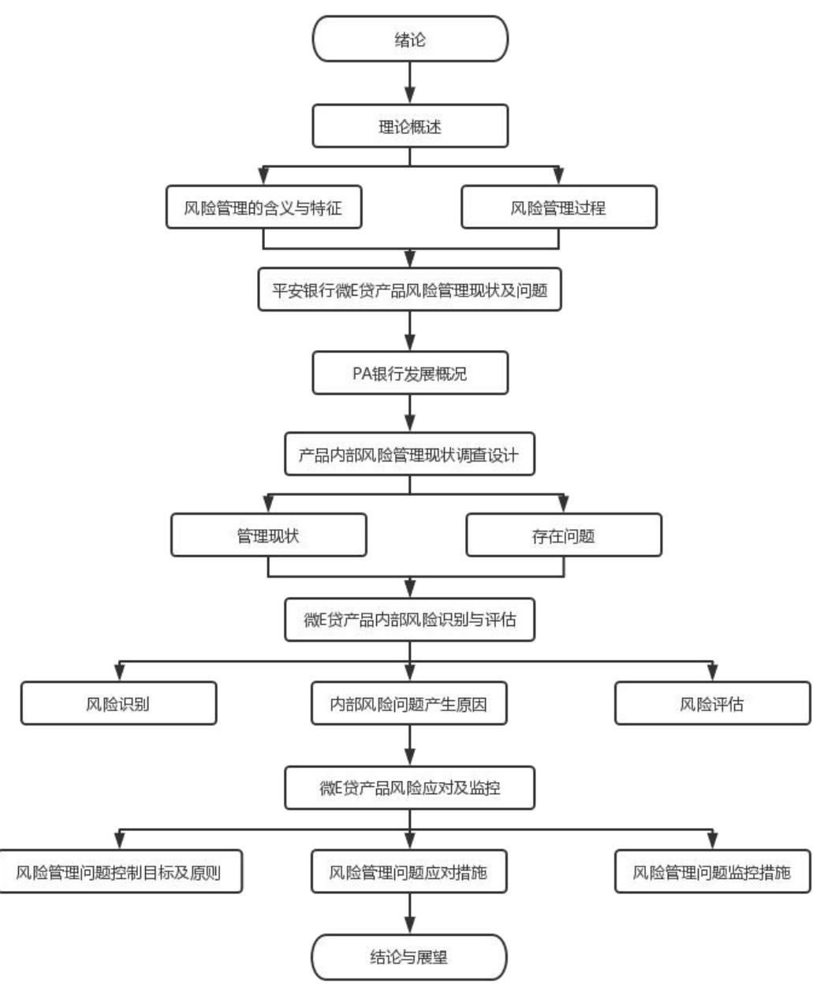

# 第 1章 绪 论

# 1.1 研究背景及意义

# 1.1.1 研究背景

随着全球经济发展，商业银行所起到的关键作用被越来越多的国家、组织、个人密切关注。合理利用杠杆可以快速发展一个行业，一个地区乃至一个国家的经济。与此同时商业银行作为一家企业，其开设目的着重于盈利，手握巨量资金却无法对所有行业有足够深入了解，从最初建立就伴随着巨大风险。因此对于商业银行而言，风险控制是重中之重，商业银行手中的资产质量极其重要，这与其盈利方面能力、整理体系的稳定性关联密切。一旦信贷资产的风险防范在商业银行中得不到重视，呆账甚至坏账形成，银行的资本金会很快被吞噬，风险抵抗能力快速减退，银行就会面临破产、倒闭的命运。因此过去商业银行以抵押贷款作为自己的“压舱石”，信用贷款的发放更青睐行业头部、高利润企业。

近些年移动互联网的发展、大数据的应用，让我们的生活产生翻天覆的变化，同时让一大批互联网公司进入到了信贷行业。这些公司也把互联网思维、互联网技术带给了商业银行，也间接带动了金融产品的创新，大数据的应用让部分中小微企业获得了融资，越来越多的商业银行推出了基于数学模型的线上化审批产品，通过客户流水、纳税、POS 机、二维码收款、资产等相关信息直接线上进行审批。但部分优质中小微企业因政策不纳税、仍然未积累出用以抵押的资产、因行业历史原因（比如个体养殖、种植等）业务不规范无法采集到有用的数据信息而无法得到贷款额度。这部分企业仍有融资需求却只能通过民间借贷、小贷公司融资，存在着融资困难，融资成本高的问题，进而限制了企业发展。而金融产品的蓬勃发展导致了金融监管与业务发展的不匹配，出现了大量的金融风险。通过银保监会公布的数据，截至 2022年3 季度，商业银行关注类贷款与不良贷款的余额共计 70087 亿，控制风险并让优质企业拿到信用融资依然商业银行们头痛的问题。

PA银行在这样的大背景下推出微 E贷产品，希望通过线上大数据核准加线下实地考察调研，辅以从商圈、产业链、协会等组织侧面了解的模式，剔除数据造假、仅大数据模型好看的企业，纳入因行业等原因无法通过大数据核准的优质企业，达到控制风险、扩大业务、精准资金支持的目的。但经过产品的运行、客户的反馈，整个产品依然有管理组织部门不健全、管理制度不完善、管理流程不科学、资金用途监管不闭环等问题。本文就微 E 贷产品存在的上述问题加以研究，横向上与其他金融机构产品进行优劣对比，进而深入研究其在产品运用、风险管理、队伍建设、考核机制方面存在的综合性问题，并结合内外部原因分析，最终给出相关的建议。

# 1.1.2 研究意义

根据央视网发文：2022 年 8 月 31 日国家统计局发布的 2021 年我国经济发展新动能指数。数据显示，2021年全国新登记注册市场主体数量为 2887.2万户，增长 $1 5 . 4 \%$ ，增幅比上年提高 10.2个百分点；新登记的企业平均每日2.5万户，市场主体总数在年末达1.5亿户。经济观察报显示：从2012年到2021年的9年间，全国税收总额增长了 $7 0 . 4 \%$ ，年均增长 $6 . 1 \%$ 。其中，国有控股企业的税收年均增长 $3 . 6 \%$ ，在全国税收的占比，2012 年是 $3 0 . 7 \%$ ，2021 年为 $2 4 . 7 \%$ ，占比减少近6 个百分点；涉外企业税收每年平均增长 $3 . 5 \%$ ，在全国税收的占比，2012年是 $1 9 . 6 \%$ ，2021 年为 $1 5 . 7 \%$ ，占比下降约4个百分点；民营企业税收年均增长$8 . 3 \%$ ，占全国税收的比重 ，2012年 为 $4 8 \%$ ，2021 年 为 $5 9 . 6 \%$ ，占比提高11个多百分点。民营企业已经成为国家税收来源的最大主体，2012—2021 年按企业控股类型分税收数据见表1.1所示。

表 1.1 2012—2021 年按企业控股类型分税收数据  
Tab. 1.1 Elements of the physical environment   

<table><tr><td rowspan="2">年份</td><td>全国税收收入</td><td>国有及国有控股</td><td colspan="2">涉外企业</td><td colspan="2">民营企业</td></tr><tr><td>收入额</td><td>收入额</td><td>占比</td><td>收入额</td><td>占比 收入额</td><td>占比</td></tr><tr><td>2012</td><td>110740</td><td>33997</td><td>30.7 21753</td><td>19.6</td><td>54990</td><td>49.7</td></tr><tr><td>2013</td><td>119943</td><td>36445</td><td>30.4 22992</td><td>19.2</td><td>60506</td><td>50.5</td></tr><tr><td>2014</td><td>129541</td><td>39835</td><td>30.8 24925</td><td>19.2</td><td>64782</td><td>50</td></tr><tr><td>2015</td><td>136021</td><td>43186</td><td>31.7 24763</td><td>18.2</td><td>68073</td><td>50.1</td></tr><tr><td>2016</td><td>140499</td><td>43052</td><td>30.6</td><td>25613 18.2</td><td>71834</td><td>51.1</td></tr><tr><td>2017</td><td>155735</td><td>44472</td><td>28.6</td><td>29201</td><td>18.8 82062</td><td>52.7</td></tr><tr><td>2018</td><td>169957</td><td>43163</td><td>25.4</td><td>30328 17.8</td><td>96466</td><td>56.8</td></tr><tr><td>2019</td><td>172102</td><td>42639</td><td>24.8</td><td>28596 16.6</td><td>100868</td><td>58.6</td></tr><tr><td>2020</td><td>166000</td><td>40327</td><td>24.3</td><td>26625 16</td><td>99047</td><td>58.9</td></tr><tr><td>2021</td><td>188737</td><td>46586</td><td>24.7</td><td>29704</td><td>15.7 112447</td><td>59.6</td></tr></table>

数据来源：央视网

民营企业仍然是我国经济的重要参与者，而中小微企业是民营企业的主要构成单位和前身，通过对PA银行微 E贷产品的研究，并类比到其他信贷产品，在将信用风险管理和综合风险控制理论融入风险防范实践，会有效提高商业银行信用风险控制的有效性，增加商业银行中小微信贷业务规模的同时，有利于商业银行建立更科学有效的风险内部控制机制，使其能够更准确地识别潜在风险。同时可以让更多优质的中小微企业获得便捷、便宜的信用贷款，助力更多中小微企业成长为大型企业，践行银行社会使命。

# 1.2 研究方法

# 1.2.1 文献研究法

文献研究法是一种古老的研究方法，其科学有效，是指搜集、整理和鉴别文献的整个过程，在这个过程中，形成科学的认识方法[1]。文献研究法的一般步骤是：先需要提出所要研究课题和假设；然后制定研究计划；并选择收集资料和对应的文献及工具、渠道并挖掘来源；制定检索方式方法；寻找、研读、收集、记录所需要的文献；最后甄别收集到的大量资料并进行分类和加工整理，深刻研究得到最终课题观点或结论。本文通过大量查询并阅读不同银行、信贷产品的相关参考文献和资料，并从互联网查询、整理和收集详细资料和数据，随后归纳这些收集的资料和数据并进行统计分析，结合工作实践做理论总结。

# 1.2.2 深度访谈法

深度访谈法指依照要研究的主题，研究人员有效地结合例如访谈情况表等直接工具和例如录音笔、手机及电子邮件等辅助工具，严格地遵循原定研究计划对行业专家、资深学者等被访谈者进行口头提问，并且在当场讯速地记录下被访谈者对问题的回答内容，以此来了解到有关该研究主题的市场中实际情况的整个过程[2]。这个方法中研究人员负责来把控现场问答过程的节奏并且被访谈者由研究人员引导来回答相关问题，研究人员可以深入详细地追问其感兴趣的问题，通过对不同学历、工作和需求的被访谈者的提问和回答中去了解有关于研究主题的有价值的信息和资料。深度访谈法除了具备一定的灵活性之外，还具有可操作性强的特点，并且其单向引导性和目的性同普通的日常谈话相比要更强一些，另外还有很强的灵活性[3]。在双向互动性和双向传导性方面，深度访谈法比问卷调研法更为显著，具有更强的可操作性。本文通过对专业银行风险从业人员、企业信贷客户经理、中小微企业主的访谈，进一步了解了整个信贷行业现状，为之后的论文编写提供最为真实的原始资料[4]。

# 1.2.3 问卷调查法

问卷调查法是指研究人员通过现场访谈、提问调查等方法，收集和了解事物的详细信息和数据，并进行分析的方法。这种方法通常用于了解反馈信息，如市场满意度、认可度和产品促销。问卷调查法和抽样调查法的一般步骤是相似的，通常是在个人的基础上进行研究和研究[5]。文章通过制定对应的量化调研目标，深入一线等方式对中小微企业主融资需求、企业状况、难点痛点展开调研工作，了解中小微企业主实际经营中的困难类型、行业特征、用款习惯。充分了解中小微企业的特征，以完善微E 贷产品风险管理。

# 1.3 研究内容与技术路线

# 1.3.1 研究内容

本论文综合运用了文献研究法、问卷调查法和深度访谈法这三种方法，对PA银行微E 贷产品风险管理进行分析，把沈阳中小企业主作为调研对象，通过调研问卷的设计、发放与回收， 进一步对调研结果进行信效度分析，找出企业融资难点，结合对银行风险从业岗、信贷客户经理的深度访谈，类比同业其他信贷产品，对现有的微E 贷产品风险管理问题提出解决方案。

第1章 绪论。本章从商业银行信贷行业背景、产品发展趋势、中小微企业面临主要困难入手，阐述了目前商业银行信贷产品的现状、现阶段存在的问题。围绕以上内容具体说明作为PA银行创新代表性信贷产品微E贷风险管理研究的方向，论述本文所对其采用的文献研究法、问卷调查法和深度访谈法，三种研究方法的模式方向及优点。

第2章 理论概述。本章介绍了风险管理所使用的理论基础，主要内容有两个部分，第一部分介绍风险理论框架中所对应的风险管理特征和含义，从风险的定义入手，引出风险管理的概念，再得出风险管理的目的，并列举了风险管理具备的特征。第二部分论述了风险管理的过程，包括风险识别、风险评估、风险应对以及风险监控这四个部分。

第3章 PA银行微E 贷产品风险管理的现状及问题。在本章中，首先介绍了PA 银行的整体发展概况。其次通过对第 2 章理论值知识的学习与理解，设计了深度访谈与调研问卷的设计内容，指明收集产品风险问题方向。再次研究了产品内部风险管理现状，主要以管理组织部门现状、管理制度现状、管理流程现状、管理基础建设现状这四个方面来具体体现。最后归纳并总结出PA银行微E贷产品其内部风险管理中所存有的问题：管理组织部门不健全、管理制度不完善、管理流程不科学、资金用途监管不闭环。

第4章 微E 贷产品内部风险识别与评估。本章分为三个部分，第一部分为产品内部风险识别，通过对其风险方面识别的方法中选择及其流程的设计、风险识别实施与结果分析来回顾现有的产品内部风险识别系统。第二部分通过对前面的分析得出微 E 贷产内部风险管理问题及其产生原因，主要以内部风险管理文化缺失、内部风险管理基础建设相对薄弱、内部风险管理的人才缺乏三个方面加以说明。第三部分对PA银行微E贷产品进行内部风险评估，得出评估方法的选择原因及整个实施过程，最终得出风险评估结果，对其结果加以分析。

第5章 微E 贷产品风险应对及监控。首先本章开头介绍了微E贷内部风险控制目标和原则。其次针对产品的内部风险给出了应对方法，从产品内部风险管理组织结构的重塑、产品内部风险管理制度的完善、产品内部风险管理流程的优化、改进内部风险管理基础设施、加强内部风险管理文化建设、提高内部风险管理人力资源配置六个方面逐一解决之前发现的内部风险。最后又得出了微 E 贷产品风险监控的目标，提出产品风险监控相关的组织部门及流程设计。

第6章 研究结论与展望。作为文章的最后章节，本章对本论文研究的内容做了总结，对PA银行微E 贷内部风险管理情况目前所展现的问题进行系统性归纳，总结了产品在风险管理中的有效性和可行性，为整个产品后续风险管理提供了解决思路与方向，类比到商业银行信贷内部风险管理及其他信贷产品，为后续制度的建设提供了理论及实践基础。同时对本论文的调研过程中存有的问题，做出了反思和阐述。对未来微 E 贷产品发展、信贷行业的发展提出了展望。

# 1.3.2 技术路线

本文对PA银行微E 贷产品的相关风险管理进行深度研究，以德尔菲法、风险核对表、SWOT 分析法为理论基础，通过调查问卷发放回收、深度调研及文献研究作为数据来源，希望可以归纳并总结出该产品内部风险管理相关有的或潜在的问题，并提出相应的解决方案[6]。类比至其他信用贷款，解决优质中小微企业主资金需求问题，为日后的其他银行及其信贷类型产品的内部风险管理提供了理论基础，具体技术路线如图 1.1所示。

  
图 1.1 技术路线图  
Fig.1.1 Technical roadmap
