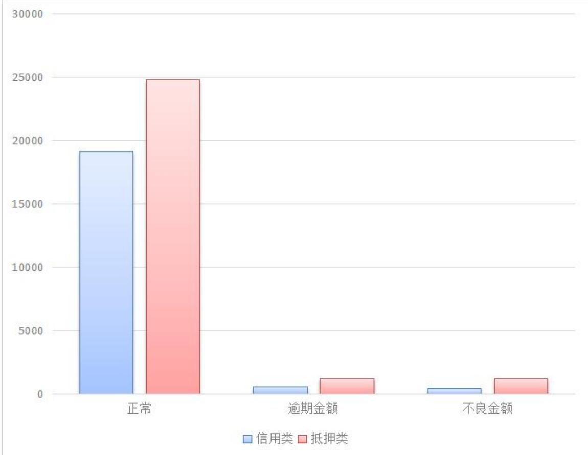
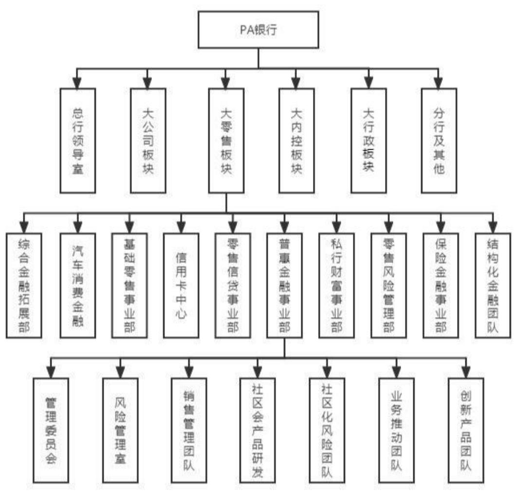
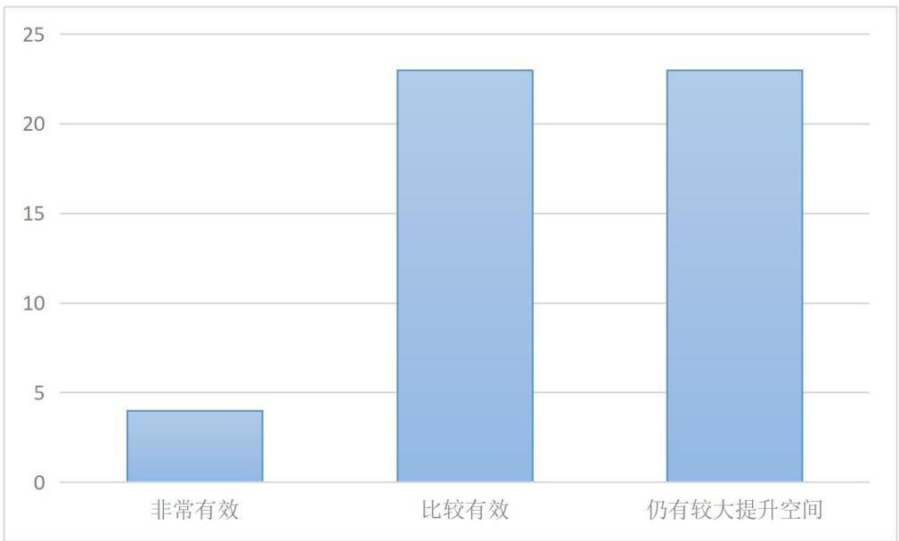

# 第3 章 PA 银行微E贷产品风险管理现状及问题

# 3.1PA银行发展概况

PA 银行是一家中国大陆的股份制商业银行，成立于1997年。它是PA集团旗下的金融机构之一，总部位置在深圳市的福田区。PA银行以零售银行为主要发展方向，重点发展小微企业金融、个人贷款、个人理财、信用卡、存款等业务。截至 2021 年末，PA 银行拥有近 1400 家网点和逾 2 万名员工，总资产超过 2.5万亿元，总存款规模超过 1.5 万亿元。在过去的几年中，PA银行不断推进业务创新和科技创新在智能化银行建设、数字化转型等方面取得了显著成果。PA银行一直以来都非常注重风险管理和合规经营，秉持着稳健经营的理念，不断提升风险控制能力，获得了行业内良好的口碑和声誉。除了零售银行业务，PA银行还注重发展企业银行业务，为中小微企业提供全方位的金融服务，包括企业贷款、融资租赁、保理、票据贴现等。此外，PA银行还致力于推进绿色金融和社会责任发展，积极参加社会公益事业，推动金融业可持续发展。作为PA集团重要的金融板块之一，PA 银行将继续发挥集团资源优势和业务协同效应，深化与其他金融子公司的合作，推动集团整体战略的实现。同时，PA银行将积极响应监管政策，加强风险管理和合规经营，努力为客户、股东和社会创造更大的价值。为了进一步提升服务质量，PA 银行还积极推进数字化转型和智能化银行建设，加快业务流程的优化和升级，提升风险控制的精准度与效率，向客户提供更具智能化、便捷化以及个性化的金融服务。同时，PA 银行还深耕金融科技领域，通过与 PA 科技等集团内部科技公司合作，积极探索金融科技的应用场景和创新模式，推动金融业整体的数字化转型与创新升级。近三年，PA银行沈阳分行普惠金融类贷款板块，信用类业务累计放款金额5 亿元，共计户数850户，截至2023年1月，信用类业务余额 2亿元，逾期500万，不良350万。近三年抵押类业务合计发放金额 5.8 亿元，截至 2023 年 1 月末，抵押业务余额2.5亿，逾期1200万，不良 1200 万，传统业务整体风险控制较好，数据情况如图3.1所示。

  
图 3.1 普金贷款数据图  
Fig.3.1 Enterprise loan data chart

# 3.2 产品内部风险管理现状调查设计

# 3.2.1访谈内容设计

针对微 E 贷产品访谈人员的涉及，主要面向的人员为我行领导班子成员、风险部门人员、一线信贷经理、了解产品风险控制的其他银行人员。结合目前PA银行微E 贷产品的目前状况，对访谈内容的设计主要围绕以下的几个方面进行。 $\textcircled{1}$ 了解我行微E 贷产品的内部风险管理制度。询问访谈对象，了解我行微E贷产品的内部风险管理制度，包括信用评估流程、贷前审查流程、贷后管理流程等，以及相关的风险控制措施。 $\textcircled{2}$ 了解我行微E 贷风险管理的信息化建设情况。了解银行信用贷款风险管理信息化建设的情况，包括风险管理信息系统的建设、数据管理、信息共享等方面。 $\textcircled{3}$ 探讨我行微E 贷产品内部风险管理存有的问题。与访谈对象深入交流，探讨银行信用贷款产品内部风险管理存在的问题，包括风险管理制度不完善、风险识别能力不足、风险管理信息系统滞后等。 $\textcircled{4}$ 了解我行微 E 贷产品内部风险管理的案例。通过实际案例，了解银行信用贷款产品内部风险管理的效果和局限性，在其中发现经验总结教训，成为后续风险管理的案例。$\textcircled{5}$ 探讨我行微 E 贷产品内部风险管理的未来发展方向。与访谈对象交流，探讨银行信用贷款产品内部风险管理的未来发展方向，包括加强风险识别和预警、加强内部风险管理的信息化建设、加强人员培训等方面。具体访谈问题详见附录1。

# 3.2.2调研问卷设计

这次调查问卷采取匿名方式进行，调查内容只用于本研究，保密调查对象提供的内容。为了节省受访者的时间，本次调查完全采取选择题方式。问卷设计总共包括9个选择题，有针对性地进行相关问卷，最终得出关于PA银行微E贷产品风险上存在的问题，具体的调研问题详见附录1。为确保参与者的代表性，作者一共花费 12 个工作日，先后邀请总行、分行及业务管理部、支行及其他银行同业人员进行填写。本次调研的主要受访对象为与 PA银行微E贷产品直接接触或从事类似产品的同业从业人员。在受访对象的选择上，主要侧重于从事信贷及信贷相关专业的人员。共有50名从业人员参与了本次调研，成功回收了50份问卷，所有问卷均有效。作者对收回的调研问卷做了整理和总结。按照受访人员的整体结构进行了汇总，其结果如下：总行15人，支行25人，分行及业务管理部10人；工作岗位统计：客户经理35人，风险经理5人，不良资产处置中心2人，其他共计8人，具体情况见表3.1所示。

表 3.1 问卷对象职务单位统计表  
Fig.3.1 Statistical table of survey objects   

<table><tr><td>类别</td><td>客户经理</td><td>风险经理</td><td>不良资产处置中心</td><td>其他</td><td>小计</td></tr><tr><td>总行</td><td>10</td><td>2</td><td>0</td><td>3</td><td>15</td></tr><tr><td>分行及业务管理部</td><td>0</td><td>3</td><td>2</td><td>5</td><td>10</td></tr><tr><td>支行</td><td>25</td><td>0</td><td>0</td><td>0</td><td>25</td></tr><tr><td>小计</td><td>35</td><td>5</td><td>2</td><td>8</td><td>50</td></tr></table>

对收回的填写问卷汇总基本信息，其中统计结果为：工作年限：1年及以下五人，1—3 年三十人，3—5 年十人，5 年以上五人，受到教育程度：高中及以下三人，大专二十六人，本科十七人，硕士及以上四人。在整个统计中，PA银行的人员工作年限 1—3 年占大多数，整体员工工作时间并没有特别长，学历方面大专生是主力军，这与PA 银行本身成立年限较短有关具体情况见表3.2所示。

# 表 3.2 问卷对象学历工作年限统计表

Fig.3.2 Statistical table of survey objects   

<table><tr><td>类别</td><td>1年及以下</td><td>1—3年</td><td>3—5年</td><td>5年以上</td><td>小计</td></tr><tr><td>高中及以下</td><td>0</td><td>0</td><td>0</td><td>3</td><td>3</td></tr><tr><td>专科</td><td>0</td><td>19</td><td>6</td><td>1</td><td>26</td></tr><tr><td>本科</td><td>5</td><td>8</td><td>3</td><td>1</td><td>17</td></tr><tr><td>硕士及以上</td><td>0</td><td>3</td><td>1</td><td>0</td><td>4</td></tr><tr><td>小计</td><td>5</td><td>30</td><td>10</td><td>5</td><td>50</td></tr></table>

# 3.3 产品内部风险管理现状

# 3.3.1管理组织部门现状

PA银行沈阳分行普惠金融部风险组织部门架构及风险从业人员均由原来的小企业部门演变过来，自 2021 年 PA银行提出大零售战略转型的规划，小企业部就由原非零条线划归至零售条线，并正式更改名称为普惠金融部。随着部门的转化，考核办法、风险方向都有了对应的变化，从原来的利润考核、主攻大且优质客户、低利率低坏账的方向转变为更适合零售的打法— 规模考核、小而分散的客户、高利率覆盖不良的打法。按照目前的打法，贷款中的贷前调查环节、其每 90 天的的贷中审查环节及贷后检查环节是微E 贷产品的主要关注点。PA银行基于自己各个分公司收集到的客户信息及较强的科技能力，把客户基本的条件筛选放置于线上，辅以自己设计的风控模型，用以筛选自己的目标客户。再通过定性的、流水线式的审核，把材料初审权阶段的工作给到了经验较少但认真的应届生。所以整体 PA 银行在管理组织部门上结构较为简单。普惠金融事业管理部风险管理室、普惠金融事业部社区化风险控制团队为普惠金融信贷内部风险控制的守门员，也是第一道防线，是承担微 E 贷产品内部风险控制的第一责任人。普惠金融事业部营销管理团队、普惠金融事业部社区化业务推动与营销团队是PA银行普惠金融部门的营销部门，对全国的分支行普惠金融部指导。分行的特殊资产管理事业部为最终的风险资产的处置部门，具体的部门结构图如图 3.2所示。

  
图 3.2 组织架构图  
Fig.3.2 Organization Chart

# 3.3.2管理制度现状

PA 银行在整体的产品信贷内部风险管理制度上建立了《PA银行普惠金融事业部反洗钱和反恐怖融资》《PA 银行普惠金融授信业务贷前调查工作指引》《PA银行小企业授信业务评审工作操作规程》《PA银行普惠金融授信业务续授信作业指引》《PA 银行普惠金融授信业务贷前调查工作指引》《PA银行普惠金融授信业务风险管理办法》《PA 银行“新微贷——小微经营贷款”贷款风险管理细则》《PA 银行普惠金融授信业务评审工作操作规程》《PA银行“新微贷——小微经营贷款”贷款风险管理细则》《PA 银行“新微贷——数据贷”产品风险政策指引》《PA银行普惠金融授信业务评审人员资格认证管理办法》《PA银行普惠金融授信业务评审监督管理办法》《PA 银行新微贷业务贷前调查工作指引》《PA银行小企业授信业务评审人员资格认证管理办法》《PA银行小企业授信业务评审监督管理办法》《PA银行房易贷业务人员虚假按键处理及停牌管理办法》14项管理制度。这 14 项管理制度都有国家信贷和管理的相关规定指导，微 E 贷是 PA银行普惠金融部针对小微企业的新型产品，针对微E贷产品，PA银行出台了《PA银行“新微贷——小微经营贷款”贷款风险管理细则》，但PA银行并没有针对这款产品对小微企业贷款现有制度进行有针对性地完善。

《PA银行普惠金融授信业务贷前调查工作指引》目的是为了强化信贷管理，规范信贷业务的操作，预防信贷风险，优化信贷组合，提升贷款资产的质量。它依据中华人民共和国商业银行法、中华人民共和国担保法等相关法律法规制定而成。这一管理办法采用了审贷分离制度，把信贷业务处理环节中的调查、审查和批准等环节的职责分派给不一样的经营层次与部门，来达成互相监督与协作。为了能够全面地评估信贷资产的质量，增强贷后管理的针对性，提高信贷资产质量整体的管理水平，PA银行参考了中国人民银行的《贷款风险分类指导原则》和中国银保监会的《农村合作金融机构信贷资产风险分类指引》等规定。根据相关分类标准，结合客户的违约风险与特定交易风险，把贷款资产分类成正常、关注、次级、可疑以及损失等不同类别，并规定了贷款分类的标准与认定程序。《PA银行“新微贷——小微经营贷款”贷款风险管理细则》为客户经理具体作业参考手册，用以实现责任划分。《PA 银行“新微贷——小微经营贷款”贷款风险管理细则》则具体规定了微E 贷产品整个从贷前到不良资产的处置规则。

# 3.3.3管理流程现状

PA银行微 E 贷产品的风险管理流程是参考 PA银行传统信用贷款的贷款管理流程来制定的，从贷前客户筛选、贷中客户资金流向检查、贷后风险管理三个大块来进行风险筛查作业。当前，PA 银行微E 贷风险管理流程主要有如下六大环节：贷前调查环节：在这个阶段，一至两名客户经理、团队长或风险经理组成贷前调查小组，收集贷款客户的信息，包括个人信息、企业信息、担保信息、关联方信息、资产负债情况以及可能的不良信用记录。这有助于了解客户的经营状况和还款能力。客户信息被录到信贷管理系统用于评级，同时进行信用记录查询。贷款审查环节：总行初审岗（通常由应届毕业生组成）检查报告和文件格式，核对文件是否齐全，验证借款用途是否符合政策法规，确保没有违规行为，如涉及禁入行业等。贷款审批环节：由总分行的风险经理和具备贷款审批权限的各级领导进行审批，主要审批贷款是否符合内部的放款政策。资金出账环节：主办客户经理对贷款客户、企业主体、担保人、配偶以及交易对手方及其企业进行工商法院信息查询，并由出账岗进行核对。贷后管理环节：由贷前调查环节的主办客户经理承担，根据贷款金额和不同时间段进行客户偿还能力的调研。此外，监督确认贷款资金能够合理使用，确保能够专款专用。不良资产处置环节：特殊资产管理部门负责指导和执行不良资产的处置。PA银行采取不同办法处理不良资产，包括现金清收、重组转化、以物抵债、司法诉讼与协助公安等，并根据国家相关规定申报呆账核销。这一流程旨在确保微 E 贷产品的风险可以得到充分管理，其中包括贷前、贷中和贷后阶段的不同措施，以便监测和管理潜在的风险并采取适当的措施来降低损失。

# 3.3.4管理基础建设现状

PA银行建立了信贷业务的综合管理系统。主要在以下8个方面。客户管理：该系统能够对借款客户、担保客户以及与他们相关的人员（如配偶）进行综合管理。这能够助力银行更加了解客户的关系和信用状况。电子授权：客户、担保人以及其他相关方可以通过扫描二维码进行授权，以便系统获取他们的信息。这缩减了繁杂的文件处理过程，提升了效率。评级模块：系统内置了评级模块，能够对客户信用进行评级，这有助于银行了解客户的信用风险。电子审查和风险筛选：系统能够进行电子审查和风险筛选，以便更快地确定借款申请是否符合银行的风险标准。审批放款：一旦审查和风险筛选完成，系统支持快速的贷款审批和放款流程，提高了借款客户的融资效率。数据共享：系统允许不同部门和子公司之间共享客户数据，以实现更好的协同工作和客户服务。征信管理系统：PA银行根据中国人民银行所要求的建立了个人及企业征信管理系统。这意味着银行能够与中国人民银行和其他金融机构进行联网操作，获取客户的信用记录和征信信息。信用记录查询：在发放贷款之前，PA 银行会在得到借款人的授权委托后，使用征信管理系统查询借款人的信用记录。这有助于银行做出更明智的贷款授信决策，确保贷款的风险可控。

# 3.4 产品内部风险管理存在的问题

PA 银行微 E 贷目前的内部风险管理较为混乱，多个方面仍有较大的提升空间。 通过把已经回收的 PA 银行微 E 贷内部风险管理现状调查问卷进行整理并分析，能够得出 PA 银行微 E 贷内部风险管理总体有效的评价，作者通过统计附件中的调研问卷第 6 题后得出，调研对象中有 23 人给出了仍有较大提升空间的评价，占整体比重可达 $4 6 \%$ ，具体评价结果如图 3.3 所示。

  
图 3.3 产品内部风险管理评价  
Fig.3.3 Organization Chart

通过图3.3 的评价结果可得出 PA银行微 E贷内部风险管理工作在目前还处于较为起步阶段，对于之前并未涉足的领域及目前并没有特别熟悉的数据例如税务、财报等，其信贷内部风险的发生并不能提前预知，同时因产品目前是初始阶段，也是摸索过河，可改进的方面也很多，PA银行微 E 贷内部风险管理存在的问题主要有以下四个方面。

# 3.4.1管理组织部门不健全

PA银行风险管理组织结构整体存在两方面的问题：首先是该产品的内部风险管理中组织的建设理念对比实际有偏差。PA银行信贷内部在微 E 贷产品表现出的风险管理组织结构的建设并不完善，整体微 E 贷款审批及相关商户整合主要由普惠金融管理部，普惠金融风险部两个部门把关。微E贷款是PA银行推出的非标准化产品，所有放款客户均需通过普惠金融管理部进行相关认证从而准入行业、准入集群。而后续进入的客户审批主要是由普惠金融风险部进行审批，非常多已经准入的行业客户普惠金融风险部并不认可其行业，导致营销人员进行不必要营销，两个部门对产品面对人群的意见不统一，导致风险识别、风险评估、风险应对及风险监控中每个部分不能完全的产生作用。

其次是 PA银行信贷部门之间存在着大量的职能交叉的问题。PA银行沈阳分行自 2021年把普惠业务部从大对公条线划归零售条线，但原非零风险（即目前的普惠金融风险部）与现在个贷风险部（消费金融风险）并未实现统一，整体普惠金融产品与消费金融产品也没有统一，双方人员均存在对对方的产品并不完全了解的情况。在PA大零售转型阶段，消费金融部门面对自雇客户及小微企业主推出了较为便捷的经营性贷款，这就导致了目前普惠金融产品与消费金融产品有大量的重叠客群及相似条件的客户，但细分上又有部分不同。因PA科技导向全力赋能大零售版块，因此普惠金融产品微 E 贷目前所使用系统被划归了消金版块，而整个微 E 贷产品的主要审核链为客户经理 初审录入岗 非现场审查岗 现场审查岗 团队长审核 普惠金融总经理 总行普惠金融风险经理 总行普惠金融风险总。因初审录入岗、非现场审查岗均为总行人员审核，这部分人员时而是总行普金审核，时而是总行消金审核。而其他消金产品也有类似情况，导致了分工不清晰，出现问题互相推诿的现象。直接影响到PA银行微E贷风险人员的作用发挥，并且阻碍了风险管理部工作的有效开展，使得对PA银行对微E贷产品内部风险管理效果不尽如人意。非常容易便造成贷前调查不实，方向、尺度不清晰，贷款审批的不专业，对贷后材料的收集及保管有推诿现象，从而直接影响到PA银行微E 贷产品资产的质量。

# 3.4.2管理制度不完善

PA银行普惠金融部风险层面目前在用的制度管理分别为《PA银行普惠金融事业部反洗钱和反恐怖融资》《PA银行普惠金融授信业务贷前调查工作指引》《PA银行小企业授信业务评审工作操作规程》《PA银行普惠金融授信业务续授信作业指引》《PA银行普惠金融授信业务贷前调查工作指引》《PA银行普惠金融授信业务风险管理办法》《PA银行小微企业授信尽职免责管理办法》《PA银行普惠金融授信业务评审工作操作规程》《PA 银行“新微贷——小微经营贷款”贷款风险管理细则》《PA银行“新微贷——数据贷”产品风险政策指引》《PA银行普惠金融授信业务评审人员资格认证管理办法》《PA银行普惠金融授信业务评审监督管理办法》《PA银行新微贷业务贷前调查工作指引》《PA银行小企业授信业务评审人员资格认证管理办法》《PA银行小企业授信业务评审监督管理办法》《PA银行房易贷业务人员虚假按键处理及停牌管理办法》共计14项制度。因PA银行普惠金融部由原来的非零条线小企业部门调整至零售条线普惠金融部，整体产品整合、剔除、交叉都会比较多，因此导致风险制度整体数量较多。但从内容上来说，对客户的把控，风险的控制，尤其是对于相对来说较新的产品微E贷，管理制度依然不完善。具体来说： $\textcircled { 1 } \mathrm { P A }$ 银行对客户的评级仅参考客户目前的征信信息。计算客户负债得出客户评分，对于一些实际经营的，涉猎公司、行业较广的客户评分反而较低，没有针对信贷风险特点结合自身实际情况对客户进行有效区别，导致对客户信用评级相关情况等评价维度较少，对一些未上征信数据的客户较为容易出现过大误差； $\textcircled { 2 } \mathrm { P A }$ 银行到目前还没能组建统一的授信评分管理的体系。无法通过客户信用分等级、在我行财产总值、净资产方面作为基础指标来核定客户在短期内所需求的贷款，净资产的核算逻辑不能自洽，对有非常所能提供的保证等活动来断定最大信用额度，缺少多维度数据定位导致银行的不良贷款比例也继而升高； $\textcircled { 3 } \mathrm { P A }$ 银行敏感度不够，对国家宏观产业政策及相关信贷的政策缺少实时的整体部署。不能与时俱进更新管理制度，特别是信贷投放原则未能及时修复调整，造成整体的信贷产品尤其微 E 贷产品投放仅仅存在于集中的一些行业，不顾行业周期反而提高了信贷风险的危机； $\textcircled{4}$ PA银行沈阳分行目前微E 贷产品准入行业均集中在已经成型的圈链会小团体中。

# 3.4.3管理流程不科学

PA 银行微E 贷管理流程不科学反映在如下三个方面： $\textcircled{1}$ 流程设计部分沿用了普惠金融部原有的制度。传统的、经过时间检验的风险管理流程是从信贷内部方向进行风险管理流程行制定，体现在风险识别、风险评估、风险应对与风险监控四个具体的环节。PA银行在微E贷的审批流程是与传统银行的贷款业务操作流程相通，其中包括了贷前客户经理调查环节、上级贷款审查环节、风险贷款审批环节、出纳资金出账环节、不良资产管理部门贷后管理环节及不良资产处置环节。PA 银行微 E 贷因产品的特殊性，使其在信贷内部风险管理流缺乏系统性的风险管理理念，不能做倒科学的认知信贷管理风险，简单的线上化流程，同样也无法达到其信贷内部风险中的管理及实际要求。 $\textcircled{2}$ 微 E 贷产品对信贷内部风险的识别和整体的产品评估方式较为落后。微 E 贷产品的主要放款条件集中在三个指标上，客户的年流水、资产负债率及收入偿债比。目前PA银行微E贷产品对客户资产的认定方式广泛又艰难，应收账款上传合同即可认定，厂房、设备却缺乏对应价值认定手段。优质资产认定难，反倒是部分客户弄虚作假却很容易，整个体系建立仍然有较大问题。 $\textcircled{3}$ 信贷内部风险预警体系无实质性作用。每个月系统都会提示客户有相关风险，客户的部分风险缘由调查报告已经在第一次发生时进行提交，但之后每个月依然会进行提示。反倒是影响客户实际经营的销售额、税务等实际信息无及时提醒。
