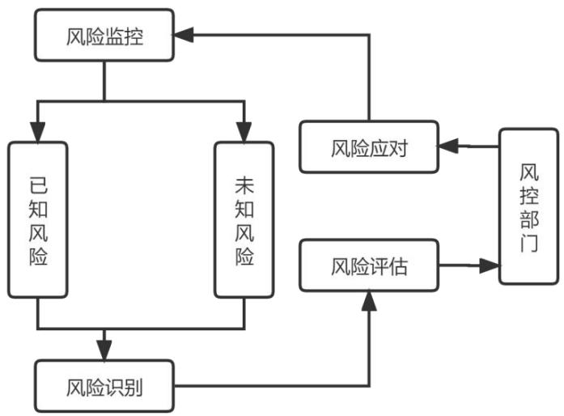

# 第4 章 PA 银行微E贷产品内部风险识别与评估

# 4.1 产品内部风险识别

# 4.1.1 风险识别方法选择及流程设计

信贷风险作为银行业面临的主要风险，内部风险防范体系的建立和完善十分重要，也是近年来银行风险防范的主要内容，PA银行的微E 贷产品是小微企业贷款新推出的重点产品，现在正处于起步阶段，也是风险暴露时期，因此对于这款产品的内部风险防范及管理更为重要。精准识别微 E 贷产品内部风险是此产品内部风险管理的基础，想要有效地进行风险控制也是要先进行风险识别[23]。

（1）风险识别的方法选择

微 E 贷产品的内部风险管理中风险识别是基础，是这款产品内部风险管理建立及完善的第一步，风险识别的准确与否直接影响到后续的内部风险评估和整个风险管理体系的改进。风险识别的方法有很多，各个方法的优缺点也不尽相同，本文使用的方法主要包括德尔菲法和核对表识别法。两种方式相结合能够系统全面地感知风险、分析风险及制定控制策略。各个方法的优缺点见表4.1。

表 4.1 风险识别方法对比表  
Tab.4.1 Comparison of risk identification methods   

<table><tr><td>方法</td><td>优点</td><td>缺点</td></tr><tr><td>德尔菲法</td><td>专业、准确性高</td><td>过于依赖个人经验</td></tr><tr><td>核对表识别法</td><td>结构简单</td><td>没有揭示风险来源</td></tr><tr><td>头脑风暴法</td><td>可充分发散和参与</td><td>结果质量不可控</td></tr><tr><td>流程图分析法</td><td>易于操作</td><td>依赖专业人员的水平</td></tr><tr><td>访谈法</td><td>广泛化思维</td><td>耗时</td></tr></table>

# （2）风险识别的流程设计

对于微 E 贷产品内部风险识别的流程是首先通过德尔菲法来发现微 E 贷产品的内部风险因素，具体做法是首先组成专家组，专家均来源于此行业专家，经过专家组对微 E 贷产品内部风险因素的多轮反馈得出一致的主要项目，并确定微 E 贷产品可能产生风险的各个要素。设计评分表来对各要素进行评分，评分者是随机选取的 PA 银行总分行内小微企业贷款从业人员及其他相关人员，回收评分表并整理各项目得分，为了确定各要素评分是准确的，需要再运用核对表识别法来进行再次确认，最后确定出微E贷产品的内部风险名录。

# 4.1.2 风险识别实施与结果分析

（1）风险识别的实施

微 E 贷风险识别的第一步是通过德尔菲法来确定产品内部风险因素，专家组的构建是关键步骤，首先要制定专家组成员选择的标准，专家组成员不仅要有熟悉本产品业务的学术权威，还要有来自一线从事具体工作有实践经验的专家。第一，一般情况专家组 10 至 20 人为宜，根据实际情况最终确定专家组人数为16人。第二，专家组中4人是熟悉此类产品的学术专家，3人是风险及内控相关工作从业者，6 人是来自一线从事过具体工作的专家，可以从不同角度对于微E贷产品的内部风险问题进行分析，较为全面[24]。第三，专家组中13人来自系统内部，3 人为行外专家，专家组成员具备不同职业背景和经历，可以从不同方面发现产品内部风险因素。依据以上标准选定 16 位专家成员组成专家组。作者通过对周边同事及相关行业的从业人员进行筛选、排查及走访，初步确定了 16 位专家，专家的选择主要从PA银行沈阳分行相关条线的的相关领导和同事开始，找到与PA银行微E 贷产品有关联的人员，再从中筛选比较有实战经验的人[25]。这部分人员有些参与产品的制作流程讨论，其中有参与风险控制人员，有实际通过微E贷产品实际经营作业人员，还有之前是PA银行沈阳分行员工，目前已经去同业工作，比较了解微 E 贷产品，部分银行有与微 E 贷对标的产品相关工作人员，这部分人员可通过其他银行的产品风险控制逻辑及目前采用的风险控制方法，结合目前自己银行逾期客户画像与PA银行逾期客户画像进行重叠，了解实际容易逾期客户，针对这部分客户出台对应的风险管理措施，对比目前微 E 贷产品现有的风险措施，即可完善微 E 贷产品风控漏洞，从而帮助微 E 贷产品把风险控制在最前端，结合现有的问题，也可以优化整个微E贷产品的作业流程，更好地服务客户。具体的专家组成员名单见表4.2所示。

表 4.2 专家组成员  
Tab.4.2 List of members of expert group   

<table><tr><td>序号</td><td>姓名</td><td>工作单位</td><td>职务</td></tr><tr><td>1</td><td>程**</td><td>PA 银行沈阳分行</td><td>零售行长</td></tr><tr><td>2</td><td>那**</td><td>PA 银行沈阳分行</td><td>普惠金融部总经理</td></tr><tr><td>3</td><td>张**</td><td>PA 银行沈阳分行</td><td>零售风险部总经理</td></tr><tr><td>4</td><td>刘**</td><td>PA 银行沈阳分行</td><td>零售贷款部总经理</td></tr><tr><td>5</td><td>代**</td><td>PA 银行沈阳分行</td><td>综合金融拓展部总经理</td></tr><tr><td>6</td><td>高**</td><td>PA 银行沈阳分行</td><td>运营管理部总经理</td></tr><tr><td>7</td><td>刘**</td><td>PA 银行沈阳分行</td><td>普惠风险室负责人</td></tr><tr><td>8</td><td>刘**</td><td>PA 银行沈阳分行</td><td>普惠风险经理</td></tr><tr><td>9</td><td>田**</td><td>PA 银行沈阳分行</td><td>普惠金融一部总经理</td></tr><tr><td>10</td><td>刘**</td><td>PA 银行沈阳分行</td><td>普惠客户经理</td></tr><tr><td>11</td><td>张**</td><td>PA 银行沈阳分行</td><td>普惠客户经理</td></tr><tr><td>12</td><td>宋**</td><td>PA 银行沈阳分行</td><td>普惠客户经理</td></tr><tr><td>13</td><td>付**</td><td>PA 银行沈阳分行</td><td>普惠客户经理</td></tr><tr><td>14</td><td>银**</td><td>PF银行沈阳分行</td><td>普惠客户经理</td></tr><tr><td>15</td><td>李**</td><td>HLD 银行沈阳分行</td><td>普惠风险经理</td></tr><tr><td>16</td><td>张**</td><td>DL银行沈阳分行</td><td>普惠金融部总经理</td></tr></table>

基于微 E 贷产品内部风险管理的调研，调研人员将汇总的调查问卷的内容在专家组成员间进行传递，并邀请各位专家给出意见，再将这 16位专家成员的具体意见进行整理和汇总后返回到各专家，如此征集意见再反馈再征集意见反馈，共进行 3 轮，得出专家组对于微 E 贷产品内部风险因素的一致性看法。之后专家组成员就微 E 贷产品的内部风险识别进行了研讨，结合对包含内部环境、风险评估、控制活动、信息与沟通、内部监督的内控五要素的分析和调研，确定了五要素包含的具体项目，设计了微 E 贷产品内部风险管理要素的重要性的评分表。评分表主要包含内部环境、风险评估、控制活动、信息与沟通和内部监督这五个要素，每个要素又包含多个具体项目，五个要素共计包含 16个具体项目，这 16 个具体项目设定用以明确评价的具体内容，评价表具体内容见表4.3所示。

# 表 4.3 评价内容

Tab.4.3 Evaluation content   

<table><tr><td>要素</td><td>项目</td><td>评分</td></tr><tr><td rowspan="3">内部环境</td><td>内部风险管理意识及重视程度</td><td></td></tr><tr><td>组织架构设计合理性</td><td></td></tr><tr><td>具有良好的内控文化</td><td></td></tr><tr><td rowspan="3">风险评估</td><td>微E贷客户经理素质 微E贷产品客户经理风险识别能力</td><td></td></tr><tr><td>微E贷产品风险度量方法科学性</td><td></td></tr><tr><td>系统风险测评有效性</td><td></td></tr><tr><td rowspan="3">控制活动</td><td>授权审批制度完善程度及人员尽职程度</td><td></td></tr><tr><td>绩效审核体系完善程度</td><td></td></tr><tr><td>贷款“三查”制度落实</td><td></td></tr><tr><td rowspan="3">信息与沟通</td><td>信息收集及时性与准确性</td><td></td></tr><tr><td>信息沟通顺畅性与及时性</td><td></td></tr><tr><td>信息系统安全性与完善性</td><td></td></tr><tr><td rowspan="3">内部监督</td><td>内部监督机制健全性、职责明确</td><td></td></tr><tr><td>内部监督工作标准</td><td></td></tr><tr><td>内部监督评价体系合理性</td><td></td></tr></table>

专家组设定完评价表的具体内容之后，由调查人员在PA银行系统中选取普惠金融相关人员及其他相关人员若干，进行发放评价表，进行调研，被调查者收到评价表之后结合自己的专业知识、相关工作经验及实际情况对评价表中所列出的要素和具体项目进行打分，打分标准是1—5 分，不同的分数代表不同的含义，基于最终的打分高低即可非常直观的了解到一线同事及相关工作人员对微 E 贷这款产品的直接评价，通过对评价的分析，可非常明确的了解到这部分直接对接产品的相关人员对于微 E 贷产品风险管理的主观感受，可一定程度反映微 E 贷产品内部风险存在的问题，具体的评价标准见表4.4所示。

表 4.4 评价表中各要素评分标准  
Tab.4.4 Scoring criteria for each element in the evaluation form   

<table><tr><td>分值</td><td>评价标准</td></tr><tr><td>1</td><td>微E贷产品内部风险管理方面存在严重问题</td></tr><tr><td>2</td><td>微E贷产品内部风险管理方面存在明显问题</td></tr><tr><td>3</td><td>微E贷产品内部风险管理方面尚可</td></tr><tr><td>4</td><td>微E贷产品内部风险管理方面做得比较完善</td></tr><tr><td>5</td><td>微E贷产品内部风险管理方面做得很完善</td></tr></table>

（2）风险识别的结果分析

本次关于微 E 贷产品内部风险的识别是在以中国银保监会制定的《理财公司内部控制管理办法》为指导思想的基础上，通过德尔菲法由专家多轮反馈而得出对微 E 贷产品内部风险因素具体项目的一致性看法，后制成包含五大要素和16 个项目的评分表，再通过评分表发放调研，以评分的形式来识别微 E 贷产品的内部风险，通过评分表返回的信息及经专家组讨论识别种种微 E 贷产品内部风险因素，并推测其形成的结果，从而建立微 E 贷产品内部风险名录。在本次调查中，本次风险识别的目的是识别微 E 贷产品的内部风险具体项目，风险名录包含五大要素，含3至4个具体项目，涵盖了内部环境要素中分别是内部环境、风险评估、控制活动、信息与沟通和内部监督，每个要素又包的风险管理意识、组织架构、内控文化和人力资源项目；风险评估要素中的风险识别、风险度量方法和系统风险测评具体项目；控制活动要素中授权审批、绩效审核和贷款“三查”项目；信息与沟通要素中信息收集、信息沟通和信息系统三个项目；最后是内部监督要素中监督机制、工作标准和评价体系三个项目。针对评价表中列举的具体项目的评分结果，在经过汇总筛选出的 90 份有效评分表后总结得出，具体评分结果见表4.5所示。

表 4.5 微 E 贷产品内部风险识别结果  
Tab.4.5 Micro-E loans product’s Internal risk identification results   

<table><tr><td>要素</td><td>项目</td><td>评分</td></tr><tr><td rowspan="4">内部环境</td><td>内部风险管理意识及重视程度</td><td>4</td></tr><tr><td>组织架构设计合理性</td><td>2</td></tr><tr><td>内控文化</td><td>3</td></tr><tr><td>微E贷客户经理素质</td><td>2</td></tr><tr><td rowspan="2">风险评估</td><td>微E贷产品客户经理风险识别能力</td><td>2</td></tr><tr><td>微E贷产品风险度量方法科学性</td><td>2</td></tr><tr><td rowspan="4">控制活动</td><td>系统风险测评有效性</td><td>3</td></tr><tr><td>授权审批制度完善程度及人员尽职程度</td><td>3</td></tr><tr><td>绩效审核体系完善程度</td><td>2</td></tr><tr><td>贷款“三查”制度落实</td><td>2</td></tr><tr><td rowspan="3">信息与沟通</td><td>信息收集及时性与准确性</td><td>3</td></tr><tr><td>信息沟通顺畅性与及时性</td><td>2</td></tr><tr><td>信息系统安全性与完善性</td><td>3</td></tr><tr><td rowspan="4">内部监督</td><td>内部监督机制健全性、职责明确</td><td>3</td></tr><tr><td>内部监督工作标准</td><td>2</td></tr><tr><td>内部监督评价体系合理性</td><td>3</td></tr><tr><td></td><td></td></tr></table>

通过对有效调查问卷评分的整理，得出各个具体项目的最终得分，其中没有项目得到 5分；1个项目得到 4分，是内部环境下设的内部风险管理意识；6个项目得到 3 分，分别是内部环境下设的内控文化，风险评估下设的系统风险测评有效性，控制活动下设的授权审批制度，信息与沟通下面的信息收集和信息系统，内部监督下面的内部监督机制与内部监督评价体系；8 个项目得到2分，分别是组织架构、客户经理素质、客户经理风险识别能力、风险度量方法科学性、绩效审核体系、贷款“三查”、信息沟通、内部监督工作标准。16 个具体项目平均得分为 2.56 分。按照五个要素进行排序，得分排在第一位的是内部环境，总得分为11分，平均分为 2.75分；排在第二位的是信息与沟通和内部监督，总分是8分，平均得分为2.67分；位列第四位的要素是风险评估和控制活动，总得分是7分，平均得分为 2.33 分；从被调查人的评分反馈中可以看出，PA银行微E贷产品的内部风险管理方面做得还是不太完善，16 项指标综合平均得分仅有2.56分，存在的风险点还有很多。根据风险识别的结果，被调查人认为微 E 贷产品的内部风险管理在管理意识和重视程度上是比较完善的；在内部环境下设的内控文化，风险评估下设的系统风险测评有效性，控制活动下设的授权审批制度，信息与沟通下设的信息收集和信息系统，内部监督下设的内部监督机制和内部监督评价体系做的尚可；而在组织架构、客户经理素质、客户经理风险识别能力、风险度量方法科学性、绩效审核体系、贷款“三查”、信息沟通、内部监督工作标准上存有明显问题。由此可见，PA 银行在微 E 贷这款新产品上还是要继续不断的完善内部风险管理体系，进一步加强内部风险管理，尤其是对存在明显风险的项目上严格把控，进行完善。

# 4.2 内部风险问题产生的原因

# 4.2.1 内部风险管理文化缺失

微E 贷产品作为PA银行在小微企业信贷产品中的创新型产品，上市时间较短，属于风险暴露时期，并且由于实践经验不足，PA银行在微 E 贷这款产品的内部风险管理方面存在着很多的不足之处，尚有较多的风险点，反映在了产品内部风险管理环境中，虽然管理层对于内部风险管理较为重视，但是内部风险管理的组织架构、风险管理文化以及从业人员的职业素养均有所欠缺。尤其是在风险管理文化中，在各岗位和各层级中的认识程度不能得到一致，甚至产生分歧，主要体现在业务部门和风险管理部门对于微 E 贷业务的审批上意见的不一致上。身在业务前线的微 E 贷客户经理立足于新产品的市场拓展开发和宣传推广，通常也受业绩考核的压力，对于微 E 贷业务的风险管理认识不到位，有的客户经理认为一些制式化的审批流程与规则对于其业务的开展形成了阻碍。微 E 贷产品作为新型信贷产品，也依托于系统模型的风险测评，经过系统测评之后进行初步的筛选，在初步筛选之后主要还是由普惠金融总分行的风险管理人员对于该业务进行评估来决定是否进行贷款的发放，客户经理认为在审批的过程中有信息不对称的风险存在，通常因为一些条条框框而错失了优质客户，部分优质且参股企业较多的客户刨根问底，风险经理反复调查客户背景、反复索要资料，导致客户失去耐心，优质客户不缺乏融资渠道，最后选择同业，造成银行利益以及个人利益的损失，以及对于微E 贷产品发展形成阻碍，甚至有出现立场问题的可能。

其实在银行内部的信贷板块风险管理的体系中，需要多个环节共同良好运作才能完成对风险的真正防范，不是仅仅是风险管理部门的事情，仅凭借风险管理的部门去进行防范还是不够的，作为信贷客户经理，同样是风险识别的重要一环，只有各层级和各环节涉及的所有员工有树立起风险防范意识，担负起防备风险的责任，才能真正做好风险管理。虽然因为工作的职责不同，看问题的角度和立场不同，从而发生分歧，但如果大家树立正确清晰的内部风险管理文化，将业务发展和风险防范作为相辅相成的体系去看待，把风险防范作为业务顺利推进、产品发展和扩大经营的保证来看，就可以认识到风险防范的重要意义，只有良好风险管理的文化建立和完善风险管理的体系建立，严格把控产品风险，才能有效降低经营风险，保证业务的顺利推进，促进利润增长，有利于银行业务和个人的发展。因此PA银行要树立良好清晰的内部风险管理文化，尤其是在微E贷这款新产品上。

# 4.2.2 内部风险管理基础建设薄弱

PA银行的微 E 贷产品刚刚投入市场，其内部风险管理的基础建设大多还是在其他小微企业的信贷产品体系基础上建立的，但其实每款产品都有其特有特点，而微 E 贷产品与其他原有的小微企业信贷产品有本质上的不同，属于非标准化产品，是需要客户经理到企业来评估业务是否可以开展，这就使得现有的内部风险管理系统出现滞后的情况，更多地依赖于前端客户经理的风险识别以及风险管理部门的审批，受主观判断的影响较大，风险预警系统缺失，风险评估不够客观。从信息与沟通方面，PA 银行在信息的收集和信息系统的完善上做得尚可，但是在信息内容的沟通上存在问题，不够及时和准确，很大一部分信息靠人工采集，这些信息因是通过客户经理在贷款调查环节所采集，所以在一定程度上存片面性，所以也许会因为客户经理的主观故意行为在业务审核过程中造成审批误差。虽然这只是基础建设诸多环节中的一个漏洞，但这个漏洞也很有可能被加以利用，所以这也是导致 PA 银行微E 贷内部风险管理中的一个风险点。

# 4.2.3 内部风险管理人才缺乏

由于 PA 银行的小微企业信贷业务并不发达，市场占有份额也较少，所以从前端的客户经理，以及后端的风险管理部门都缺乏专业的人才，相应的组织架构也并不完善。对于信贷业务尤其是涉及不同产业和行业特征的小微企业信贷业务来说，由于风险识别的过程是有相当一部分是由从业人员去判断的，所以很要求各环节从业人员的专业性和经验的积累。而从现在的人力资源情况来看，PA银行信贷业务人员的流动频繁，尤其是微 E 贷产品的客户经理，大多是转岗和新人，风险管理部门的从业人员也基本都是经验尚浅，所以从人员配置来看，缺乏具备专业素养和丰富经验的人才。PA银行拥有超过 4万的员工，这些员工的学历硕士、本科和大专不等，其中参与本次调研问卷活动的人合计有 50 位工作人员，其中包含着学历在本科及本科以上的相关人员有 21 人，占比仅有 $42 \%$ 。PA 银行的在岗员工虽均已通过了上岗相关考试，但是其专业能力和经验值还远不能达到专业要求。所以当下情况是在信贷板块，PA银行还存在着员工专业素质较差、专业技能和知识不完备和两极分化明显等特点。

# 4.3 产品内部风险评估

# 4.3.1风险评估方法选择

目前常用的风险评估的方式包含敏感度分析法、模糊数学法、层次分析法以及专家调查法等，其中层次分析法是依据目标层、准则层和方案层将有关于决策的各个元素进行分解，并基于此做定性的和定量的分析的决策方法，并且大量研究表明，在银行内部控制分析研究中层次分析法所得出的结论相对可靠。模糊综合评价法通过模糊数学隶属度理论，这个综合评价法可将定性得评价转为定量的，也可以说是对某个对象或者接受多种因素影响的事物应用模糊数学来进行总体评价，它的特别点是有很强的系统性并且结果清晰。因此本文选择层次分析法和模糊综合评价法进行风险评估。其中各个评估方法优缺点见表4.6所示。

表 4.6 风险评估方法对比表  
Tab. 4.6 Comparison of risk assessment methods   

<table><tr><td>方法</td><td>优点</td><td>缺点</td><td>定性/定量</td></tr><tr><td>专家调查法</td><td>使用简单</td><td>主观性强</td><td>定性</td></tr><tr><td>层次分析法</td><td>层析结构清晰</td><td>指标多容易人为偏差</td><td>定性</td></tr><tr><td>模糊综合评价法</td><td>将定性指标定量化</td><td>计算复杂</td><td>定量</td></tr><tr><td>敏感性分析法</td><td>风险重要程度排序</td><td>变量依赖模型</td><td>定量</td></tr><tr><td>决策树分析法</td><td>直观和逻辑性好</td><td>不适合较复杂分析</td><td>定量</td></tr><tr><td>概率分析法</td><td>简单易用</td><td>容易忽视其他因素</td><td>定量</td></tr></table>

# 4.3.2 风险评估实施及结果分析

本文通过发放评价表给被调查者对微 E 贷产品内部风险因素进行评分，调查者对评分表进行了数据处理和汇总，为了风险评估结果的准确性，不能够简单对于评分加和来进行风险评估，而是需要利用更加有效的方法，进行定性、定量相互结合的方式来做风险评估，本文通过层次分析法来确定各个要素之间的权重关系，通过矩阵建立和相应计算最终确认各指标的权重。

（1）建立层次结构模型

针对微 E 贷产品的内部风险评价的目标构建出包含三个由高到低层次的结构模型。第一层是目标层，也就是微E贷产品内部风险识别；第二层是准则层，准则层包含内部环境、风险评估、控制活动、信息与沟通和内部监督五大要素；第三层则是指标层，在指标层中则包含了 16个具体的项目，以此来进行具体衡量。具体的层次结构模型构建见表4.7所示。

表 4.7 层次结构表  
Tab.4.7 Hierarchical table   

<table><tr><td>目标层</td><td>准则层</td><td>指标层</td></tr><tr><td></td><td>内部环境（A1）</td><td>内部风险管理意识及重视程度（A11）</td></tr><tr><td></td><td></td><td>组织架构设计合理性（A12）</td></tr><tr><td></td><td></td><td>具有良好的内控文化（A13）</td></tr><tr><td></td><td></td><td>微E贷客户经理素质（A14）</td></tr><tr><td></td><td>风险评估（A2）</td><td>微E贷产品客户经理风险识别能力（A21）</td></tr><tr><td>微E贷产品内部风险识别（A）</td><td></td><td>微E贷产品风险度量方法科学性（A22）</td></tr><tr><td></td><td></td><td>系统风险测评有效性（A23）</td></tr><tr><td></td><td>控制活动（A3）</td><td>授权审批制度完善程度及人员尽职程度（A31）</td></tr><tr><td></td><td></td><td>绩效审核体系完善程度（A32）</td></tr><tr><td></td><td></td><td>贷款“三查”制度落实（A33)</td></tr><tr><td></td><td>信息与沟通（A4)</td><td>信息收集及时性与准确性（A41）</td></tr><tr><td></td><td></td><td></td></tr><tr><td></td><td></td><td>信息沟通顺畅性与及时性（A42）</td></tr><tr><td></td><td></td><td>信息系统安全性与完善性（A43）</td></tr><tr><td></td><td>内部监督（A5)</td><td>内部监督机制健全性、职责明确（A51）</td></tr><tr><td></td><td></td><td>内部监督工作标准（A52）</td></tr><tr><td></td><td></td><td>内部监督评价体系合理性（A53）</td></tr></table>

# （2）构造判断矩阵

假如仅是通过定性方法来确认这三层次各个指标之间的权重，是不够客观和被认同的，所以提出一致矩阵法，即不把全部因素摆在一起比较，是采取两两对照的方法，并采用的是相对尺度，能够在减少各种不同类型因素互相比较的难度的同时提高准确性。本文把目标层设为 A，将准则层设为 $\mathrm { A } _ { \mathrm { i } } ( \mathrm { i } { = } 1$ ，2，3，…，n)，指标层则设为 $\mathrm { A _ { i j } ( i , ~ j = 1 , ~ } 2 , ~ 3 \ldots , ~ \mathrm { n } )$ ， $\mathrm { U _ { i j } }$ 表示各指标间的相对重要性， $\mathrm { U _ { i j } }$ 的标度方法见表 4.8所示，构造的判断矩阵 A，见式（4.1）所示。

$$
\mathsf { W } = \left[ \begin{array} { c c c c } { \mathsf { U } _ { 1 1 } } & { \mathsf { U } _ { 1 2 } } & { \cdots } & { \mathsf { U } _ { 1 \mathrm { n } } } \\ { \mathsf { U } _ { 2 1 } } & { \mathsf { U } _ { 2 2 } } & { \cdots } & { \mathsf { U } _ { 2 \mathrm { n } } } \\ { \vdots } & { \vdots } & { \mathsf { U } _ { \mathrm { i j } } } & { \mathsf { U } _ { 3 \mathrm { n } } } \\ { \mathsf { U } _ { \mathrm { n 1 } } } & { \mathsf { U } _ { \mathrm { n 2 } } } & { \cdots } & { \mathsf { U } _ { \mathrm { n } } } \end{array} \right]
$$

表 4.8 相对重要性标度  
Tab.4.8 Relative importance scale   

<table><tr><td>因素i比因素j</td><td>量化值</td></tr><tr><td>因素i比因素j同等重要</td><td>1</td></tr><tr><td>因素i比因素j稍微重要</td><td>3</td></tr><tr><td>因素i比因素j较强重要</td><td>5</td></tr><tr><td>因素i比因素j强烈重要</td><td>7</td></tr><tr><td>因素i比因素j极端重要</td><td>9</td></tr><tr><td>介于两种相邻标度之间</td><td>2、4、6、8</td></tr><tr><td>因素i与因素j相比得到 aj，因素j与i相比 aj=1/aij</td><td>倒数</td></tr></table>

（3）计算权向量并做一致性检验

首先算出各指标权重，把每组成对的比较阵算出其最大特征根与特征向量，再进行一致性检验，如果通过，也就是说此特征向量是权向量。具体计算流程如下：首先将矩阵做列向量归一化处理，见式（4.2）所示[26]。

$$
\begin{array} { r } { \overline { { U } } _ { i j } = \frac { U _ { i j } } { \sum _ { j = 1 } ^ { n } U _ { i j } } } \end{array}
$$

之后对矩阵进行求行和归一化，见式（4.3）所示。

$$
\begin{array} { r } { \omega _ { \mathrm { i } } = \frac { \sum _ { \mathrm { j = 1 } } ^ { \mathrm { n } } \overline { { \mathrm { U _ { \mathrm { i j } } } } } } { \mathrm { n } } } \end{array}
$$

通过计算得出权重，见式（4.4）所示。

$$
{ \boldsymbol { \omega } } = \left( \omega _ { 1 } , \ \omega _ { 2 } , \ \omega _ { 3 } , \ \omega _ { 4 } , \ \omega _ { 5 } \right)
$$

接下来对权重结果做一致性检验，也就是说要确认W 的不一致的允许范围。其中 $\mathbf { n }$ 是 $\mathbf { n }$ 阶一致阵的唯一一个非零特征根；矩阵 A 也就是 $\mathbf { n }$ 阶正互反阵的最大特征根 $\lambda { \ge } \mathbf { n }$ ，当且仅当 $\lambda { = } \mathbf { n }$ 时，A 是一致矩阵。因 $\lambda$ 依托于 $U _ { i j }$ ，所以λ大于 $\mathbf { n }$ 的越多，W 的不一致性就越为强，CI可以计算一致性指标，CI越小，说明一致性越大。用最大特征值所对应特征向量来作为被比较的因素对上层的某个因素影响程度的权向量，其不一致的程度越大，判断误差就越大。故可用 $\lambda { - } \mathbf { n }$ 的数值大小来对 W 不一致程度进行衡量。定义一致性指标见式（4.5）所示。

$$
\begin{array} { r } { \mathtt { C I } = \frac { \lambda - \mathtt { n } } { \mathtt { n } - 1 } } \end{array}
$$

其中 $\mathrm { C I } { = } 0$ ，所以具备完全一致性；CI 接近于0，则具备满意的一致性；CI 如越大，其不一致就越严重。为了衡量CI大小，随机一致性的指标RI被引入，其对应关系表见表4.9所示。

表 4.9 随机一致性指标 RI  
Tab.4.9 Stochastic consistency indicator RI   

<table><tr><td rowspan=1 colspan=1>n                                                        RI</td></tr><tr><td rowspan=1 colspan=1>1                                                        0</td></tr><tr><td rowspan=1 colspan=1>2                                                        0</td></tr><tr><td rowspan=1 colspan=1>3                                                      0.58</td></tr><tr><td rowspan=1 colspan=1>4                                                       0.9</td></tr><tr><td rowspan=1 colspan=1>5                                                      1.12</td></tr><tr><td rowspan=1 colspan=1>6                                                      1.24</td></tr><tr><td rowspan=1 colspan=1>7                                                      1.32</td></tr><tr><td rowspan=1 colspan=1>8                                                      1.41</td></tr><tr><td rowspan=1 colspan=1>9                                                      1.45</td></tr><tr><td rowspan=1 colspan=1>10                                                      1.49</td></tr></table>

通过 n 值能够计算出 RI ，而考虑到随机因素也许会导致一致性的偏离，因而在对矩阵是不是具备满意的一致性的检验和判断时，还需要用随机一致性指标RI和CI做比较，来得到检验系数CR，如 CR 小于 0.1，就意味着矩阵通过了一致性检验，矩阵才有解释意义。见式（4.6）所示。

$$
\begin{array} { r } { \mathrm { C R } = \frac { \mathrm { C I } } { \mathrm { R I } } } \end{array}
$$

（4）结果分析

为了确定各要素的权重，邀请专家组成员对要素重要性进行评分，并对回收结果进行整理再反馈给各个专家进行再次评分，经过多轮反馈，专家组成员对于各要素重要性达成一致性意见，综合评定出各个指标之间的权重。通过计算$\lambda { = } 5 . 0 3$ ， $\mathrm { C I } { = } 0 . 0 0 7 5$ ，通过查询 $\mathrm { R I } { = } 1 . 1 2$ ，故 $\mathrm { C R } { = } 0 . 0 0 6 7 { < } 0 . 1$ ，通过一致性检验，其中内部环境存在的风险占比非常大。具体计算结果见表4.10所示。

表 4.10 准则层计算结果  
  

<table><tr><td colspan="7">Tab.4.10 Criteria layer calculation results</td></tr><tr><td>准则层</td><td>内部 环境A1</td><td>风险 评估A2</td><td>控制 活动A3</td><td>信息与 沟通A4</td><td>内部 监督A5</td><td>权重ω</td></tr><tr><td>内部环境 A1</td><td>1</td><td>2</td><td>2</td><td>5</td><td>5</td><td>0.413</td></tr><tr><td>风险评估A2</td><td>1/2</td><td>1</td><td>2</td><td>3</td><td>3</td><td>0.256</td></tr><tr><td>控制活动A3</td><td>1/2</td><td>1/2</td><td>1</td><td>2</td><td>2</td><td>0.166</td></tr><tr><td>信息与沟通A4</td><td>1/5</td><td>1/3</td><td>1/2</td><td>1</td><td>1</td><td>0.082</td></tr><tr><td>内部监督 A5</td><td>1/5</td><td>1/3</td><td>1/2</td><td>1</td><td>1</td><td>0.082</td></tr></table>

微 E 贷产品内部风险管理各个准则层的判断矩阵以及计算结果，具体见表4.11 至表 4.15 所示。

表 4.11 内部环境指标层计算结果  
Tab.4.11 Calculation results of internal environmental index layer   

<table><tr><td>指标层</td><td>A11</td><td>A12</td><td>A13</td><td>A14</td><td>权重</td></tr><tr><td>A11</td><td>1</td><td>3</td><td>5</td><td>5</td><td>0.572</td></tr><tr><td>A12</td><td>1/3</td><td>1</td><td>2</td><td>2</td><td>0.209</td></tr><tr><td>A13</td><td>1/5</td><td>1/2</td><td>1</td><td>1</td><td>0.109</td></tr><tr><td>A14</td><td>1/5</td><td>1/2</td><td>1</td><td>1</td><td>0.109</td></tr></table>

根据计算 $\lambda { = } 4 . 0 0 3 7 5$ ， $_ { \mathrm { C I = 0 . 0 0 1 2 5 } }$ ，通过查询 $\mathrm { { R I } } { = } 0 . 9 0$ ，所以 $\mathrm { C R = } 0 . 0 0 1 4 { < } 0 . 1$ ，通过一致性检验。内部环境下设的四个指标层权重依次是 0.572、0.209、0.109、0.109。

表 4.12 风险评估指标层计算结果  
Tab.4.12 Risk assessment indicator layer calculation results   

<table><tr><td>指标层</td><td>A21</td><td>A22</td><td>A23</td><td>权重</td></tr><tr><td>A21</td><td>1</td><td>2</td><td>5</td><td>0.595</td></tr><tr><td>A22</td><td>1/2</td><td>1</td><td>2</td><td>0.277</td></tr><tr><td>A23</td><td>1/5</td><td>1/2</td><td>1</td><td>0.129</td></tr></table>

通过计算 $\lambda { = } 3 . 0 0 7$ ， $_ { \mathrm { C I = 0 . 0 0 3 5 } }$ ，通过查询 $\mathrm { R I } { = } 0 . 5 8$ ，故 $\mathrm { C R } { = } 0 . 0 0 6 { < } 0 . 1$ ，通过一致性检验。风险评估下设的三个指标层权重依次是 0.595、0.277、0.129。

表 4.13 控制活动指标层计算结果  
Tab.4.13 Control activity indicator layer calculation results   

<table><tr><td>指标层</td><td>A31</td><td>A32</td><td>A33</td><td>权重</td></tr><tr><td>A31</td><td>1</td><td>3</td><td>3</td><td>0.6</td></tr><tr><td>A32</td><td>1/3</td><td>1</td><td>1</td><td>0.2</td></tr><tr><td>A33</td><td>1/3</td><td>1</td><td>1</td><td>0.2</td></tr></table>

通过计算 $\lambda { = } 3$ ， $\mathrm { C I } { = } 0$ ，通过一致性检验。控制活动下设的三个指标层权重依次是 0.6、0.2、0.2。

表 4.14 信息与沟通指标层计算结果  
Tab.4.14 Information and communication indicator layer calculation results   

<table><tr><td>指标层</td><td>A41</td><td>A42</td><td>A43</td><td>权重</td></tr><tr><td>A41</td><td>1</td><td>1</td><td>3</td><td>0.43</td></tr><tr><td>A42</td><td>1</td><td>1</td><td>3</td><td>0.43</td></tr><tr><td>A43</td><td>1/3</td><td>1/3</td><td>1</td><td>0.14</td></tr></table>

通过计算 $\lambda { = } 3 . 0 0 4$ ， $\mathrm { C I } { = } 0 . 0 0 0 2$ ，通过查询 $\mathrm { R I } { = } 0 . 5 8$ ，故 $\mathrm { C R } { = } 0 . 0 0 0 3 { < } 0 . 1$ ，通过一致性检验。信息与沟通下设的三个指标层权重依次是 0.43、0.43、0.14。

表 4.15 内部监督指标层计算结果  
Tab.4.15 Internal supervision index layer calculation results   

<table><tr><td>指标层</td><td>A51</td><td>A52</td><td>A53</td><td>权重</td></tr><tr><td>A51</td><td>1</td><td>1</td><td>3</td><td>0.43</td></tr><tr><td>A52</td><td>1</td><td>1</td><td>3</td><td>0.43</td></tr><tr><td>A53</td><td>1/3</td><td>1/3</td><td>1</td><td>0.14</td></tr></table>

通过计算 $\lambda { = } 3 . 0 0 4$ ， $\mathrm { C I } { = } 0 . 0 0 0 2$ ，通过查询 $\mathrm { R I } { = } 0 . 5 8$ ，故 $\mathrm { C R } { = } 0 . 0 0 0 3 { < } 0 . 1$ ，通过一致性检验。内部监督下设的三个指标层权重依次是 0.43、0.43、0.14。在确定了 PA 银行微 E 贷产品各要素的权重，也全都通过了一次性校验后，需要确认各个要素的风险评估值，也就是要量化各个要素指标的评价标准。在之前的风险识别的过程中，通过分析并整理专家组评分的分数时已经得出各个要素的评分值，接下来只需将风险评估值和评分值建立起关联即可，具体的风险评估值和评分值对应关系见表4.16所示。

表 4.16 微 E 贷产品内部风险评估取值  
Tab.4.16 Internal risk assessment value of Micro-E loans products   

<table><tr><td>评分值</td><td>风险度</td><td>定义</td><td>评估值</td></tr><tr><td>5</td><td>无风险</td><td>发生的可能性极低，损失极小</td><td>0</td></tr><tr><td>4</td><td>低风险</td><td>发生的可能性较低，损失较小</td><td>25</td></tr><tr><td>3</td><td>中等风险</td><td>发生的可能性一般，损失一般</td><td>50</td></tr><tr><td>2</td><td>较高风险</td><td>发生的可能性较高，损失较大</td><td>75</td></tr><tr><td>1</td><td>高风险</td><td>发生的可能性高，损失大</td><td>100</td></tr></table>

通过每项因素其综合权重还有风险评估值得出 16项因素各自加权评估值。通过计算各指标加权评估值，PA银行微E贷产品内部风险评估的总得分是56.32分，按照风险评估值的对照来看，56.32的得分处于中等风险区间，发生的可能性一般，损失一般，在此产品的内部风险管理中还存在一些不足之处，有一些风险点存在。根据各指标层的风险评估值，排在第一位的是微 E 贷产品客户经理的分析识别能力，得分高达 11.424 分，排在第二位的是组织架构设计合理性，分数为 6.474 分，PA银行在这款产品推动上的人员配置确实有很大不足之处，客户经理普遍欠缺专业性和相关经验，这与之前的调研结果也是相符的，所以要尽快完善组织架构并提高队伍的专业能力。另外内部风险管理意识及重视程度、产品风险度量方法和授权审批制度三方面得分也较高，需要关注和进一步完善，所以针对微 E贷这款新产品，PA银行的内部风险管理还有不完善之处，需要进一步加强管理。具体数据详见表4.17所示。

表 4.17 微 E 贷产品内部风险评价表  
Tab.4.17 Internal risk evaluation table of Micro-E loans products   

<table><tr><td rowspan="2">准则层</td><td rowspan="2">指标层</td><td rowspan="2">综合总 权重</td><td rowspan="2">风险评</td><td rowspan="2">加权评 估值</td></tr><tr><td>估值</td></tr><tr><td rowspan="4">内部环境</td><td>内部风险管理意识及重视程度</td><td>0.23624</td><td>25</td><td>5.906</td></tr><tr><td>组织架构设计合理性</td><td>0.08632</td><td>75</td><td>6.474</td></tr><tr><td>内控文化</td><td>0.04502</td><td>50</td><td>2.251</td></tr><tr><td>微E贷客户经理素质</td><td>0.04502</td><td>75</td><td>3.3765</td></tr><tr><td rowspan="3">风险评估</td><td>微E贷产品客户经理风险识别能力</td><td>0.15232</td><td>75</td><td>11.424</td></tr><tr><td>微E贷产品风险度量方法科学性</td><td>0.07091</td><td>75</td><td>5.31825</td></tr><tr><td>系统风险测评有效性</td><td>0.03302</td><td>50</td><td>1.651</td></tr><tr><td rowspan="3">控制活动</td><td>授权审批制度完善程度及人员尽职程度</td><td>0.0996</td><td>50</td><td>4.98</td></tr><tr><td>绩效审核体系完善程度</td><td>0.0332</td><td>75</td><td>2.49</td></tr><tr><td>贷款“三查”制度落实</td><td>0.0332</td><td>75</td><td>2.49</td></tr><tr><td rowspan="4">信息与沟通</td><td>信息收集及时性与准确性</td><td>0.03526</td><td>50</td><td>1.763</td></tr><tr><td>信息沟通顺畅性与及时性</td><td>0.03526</td><td>75</td><td>2.6445</td></tr><tr><td>信息系统安全性与完善性</td><td>0.01148</td><td>50</td><td>0.574</td></tr><tr><td>内部监督机制健全性、职责明确</td><td>0.03526</td><td>50</td><td>1.763</td></tr><tr><td rowspan="2">内部监督</td><td>内部监督工作标准</td><td>0.03526</td><td>75</td><td>2.6445</td></tr><tr><td>内部监督评价体系合理性</td><td>0.01148</td><td>50</td><td>0.574</td></tr></table>

# 第 5 章 PA 银行微E贷产品内部风险应对及监控

# 5.1 产品内部风险控制目标及原则

# 5.1.1内部风险控制目标

PA银行成立之初，小微企业主要的信贷放款手段基本通过大数据和线上模型，基于微E 贷与PA银行的传统信贷产品的不同，针对该产品的风险控制目标在传统信贷产品的基础上也需要做略微的变更，具体目标主要有以下几个方面：$\textcircled{1}$ 信用风险控制目标：保证贷款项目符合设计产品、项目得政策，确保贷款的回收率，降低信用风险，规避老赖及诈骗客户。客户经理需要对客户的信用记录、还款能力等进行评估，并制定相应的授信方案，对贷款项目进行风险分析与评估，确保贷款项目的合理性以及风险可控。 $\textcircled{2}$ 流动性风险控制目标：保证银行在发放贷款的同时，能够及时偿付存款，在给客户选择贷款期限的过程中，应结合客户实际经营产品的回款周期、用款时间设计客户的贷款期限，避免出现流动性问题。银行需要根据贷款期限、还款计划等因素，合理安排资金使用和还款安排，确保银行具备足够的流动性储备。 $\textcircled{3}$ 利率风险控制目标：确保银行在贷款的发放流程中，可以合理应对市场利率波动带来的风险。客户经理针对客户的行业、资质主动为客户进行风险定价，及时调整贷款利率和还款计划，确保贷款项目的收益和风险之间的平衡。 $\textcircled{4}$ 操作风险控制目标：保证银行在贷款发放过程中，能够有效管理风险，避免出现操作失误、内部欺诈等问题。微 E 贷产品的灵活性需要建立健全的内部控制制度和风险管理机制，对员工进行培训和管理，确保贷款业务的合规性和规范性[27]。

# 5.1.2内部风险控制原则

# （1）分散化原则

微 E 贷需要采用分散风险的方式降低贷款业务的风险。银行应该将贷款业务分散到不同的行业、地区和客户，以减少单一贷款项目或某个行业或地区的风险对银行整体风险的影响。银行应该根据风险评估结果，合理分配贷款投资的比例，避免过度集中投资，同时保证贷款资产的流动性和可变现性。分散化原则还要求银行应该建立有效的内部控制机制，确保分散风险的有效性和可行性，同时减少因分散而带来的额外管理成本。此外，还应该根据风险状况和市场环境的变化，不断调整和优化贷款业务的分散化策略，确保贷款业务的长期稳健发展[28]。

# （2）合规性原则

在PA银行微E 贷产品中，合规性原则是指银行应该合法合规经营，严格遵守法律法规和内部规定，确保贷款业务的合规性和规范性。银行应该建立健全的内部合规制度和监测机制，确保贷款业务符合法律法规和银行的内部规定。银行应该对客户的身份、背景和交易行为进行风险识别和客户身份验证，确保贷款业务的合法性和合规性。银行还应该对涉及特殊行业、特殊产品和特殊客户的贷款业务进行风险评估和审查，加强对敏感业务的管理和监督。

合规性原则还要求银行建立完善的内部合规培训和教育机制，提高员工的合规意识和素养，加强对合规风险的预防和控制。同时，银行应该定期开展内部合规自查和外部审计，发现和解决合规问题，及时纠正违规行为和存在的风险隐患。银行应该建立健全的违规处罚和风险警示机制，对违规行为和存在的风险隐患采取有效的惩戒措施，并及时向监管机构和社会公众披露相关信息。

# （3）独立性原则

微 E 贷产品应该建立独立的风险管理体系，确保贷款业务的独立性和自主性。应该根据风险评估结果，建立独立的风险管理机构和内部审查机构，对贷款业务的风险进行独立的评估、监测和控制。这样可以确保风险管理体系的独立性和专业性，避免风险管理中出现利益冲突和不当行为，保证贷款业务的合规性和规范性。此外，PA银行需要建立健全的内部控制机制，确保贷款业务的独立性与自主性。银行应该建立完善的内部审查和审批流程，对贷款业务进行独立审查和审批，避免风险管理中出现利益冲突和不当行为[29]。同时，另应该建成有效的内部监测及反馈机制，及时发现并且要纠正风险管理中的漏洞。独立性原则还要求微 E 贷产品应该加强对外部风险的独立评估和监测，避免受到外部风险的干扰和影响。PA银行应该完善现有的风险管理信息系统，及时获取和分析市场和行业信息，进行独立风险评估和预警，保证内部风险管理的准确性有所提高。

（4）适度性原则

在贷款业务中要遵循适度原则，确保贷款业务的风险控制不过度也不不足。微E贷产品应该根据不同的贷款对象、贷款用途、还款来源等因素，进行科学、客观、全面的风险评估，制定合理的贷款额度和还款计划，避免过度放贷或过度收紧。同时，还应该根据贷款业务的实际情况，不断调整和完善风险控制措施，确保贷款业务的风险控制适度、科学、有效。应建立完备的风险管理机制，加强对贷款业务全程的管理和监测。应该建立科学、完善的风险管理信息系统，及时获取和分析市场和行业信息，进行全面风险评估和预警，发现和控制潜在风险。同时，还应该建立有效的内部监测和反馈机制，及时发现和纠正风险管理中的问题和漏洞，保证贷款业务的长期稳健发展。

# （5）审慎性原则

首先，审慎性原则要求在进行贷款业务时，应该严格遵守法律法规和银行内部规章制度，遵循商业道德及职业道德，确保贷款业务的合法性、合规性和道德性。其次，要求在做微 E 贷业务时，应该严格遵守风险控制的基本原则，包括了解客户、了解业务、了解风险、分散风险、合理定价和有效监测等。银行应该全面了解贷款对象的信用状况、还款能力和还款意愿等情况，审慎评估贷款业务的风险，确定合理的贷款额度和贷款利率，并采取合理的风险管理措施，确保贷款业务的安全与稳健[30]。

（6）监测性原则

首先，监测性原则要求银行建立完善的风险监测和管理机制，全程监测贷款业务的风险情况。微 E 贷产品应该建立科学、完善的风险管理信息系统，及时获取和分析市场和行业信息，进行全面风险评估和预警，发现和控制潜在风险。同时，还应该建立有效的内部监测和反馈机制，及时发现和纠正风险管理中的问题和漏洞，保证贷款业务的长期稳健发展。

其次，监测性原则要求微E贷产品对贷款业务的风险情况进行定期监测和评估，确保风险控制措施的有效性。应该对不同类型的贷款进行不同的监测和评估，包括银行下方贷款客户的信用情况、还款能力及意愿等情况，以及贷款利率、贷款期限和贷款担保等方面的情况。更应该根据监测和评估的结果，及时采取相应的风险管理措施，确保贷款业务的风险控制措施适度、科学、有效[31]。

最后，监测性原则要求微 E 贷产品建立有效的风险报告和风险管理信息披露制度，及时向内部和外部披露贷款业务的风险情况和风险控制措施。在整个微E贷产品运行的过程中，微E 贷产品部门应该向监管部门等相关方提供全面、准确的风险报告和风险管理信息，加强对贷款业务的公开透明度，提高外界对贷款业务的认识和信任度。

# 5.2 产品内部风险应对措施

# 5.2.1 重塑产品内部风险管理组织结构

建立风险识别考核导向机制构建基于风险识别的考核、鼓励体制，目前PA银行微 E 贷产品的内部风险管理组织是单独的，由专人审批，专人承办，但目前对风险组织的考核更多的时效性及违约率，需要对风险组织考核进行业务相关挂钩，通过由业务部门的团队人员到风险团队进行轮岗或充分交流意见，把风险团队整体团队组织架构内嵌入业务人员架构中，可更高效、深入的了解客户情况，对独立的产品线团队及全新的圈、链、会结构客户，可以做到专人专项，以更高的专业风险知识来识别潜在的风险[32]。

# 5.2.2 完善产品内部风险管理制度

PA银行应根据微E 贷产品的发展进一步改善授信审批的制度，加强授权审批的效率，保证其授权审批的规范性有所提高。整体的微 E 贷制度改变过于频繁，关于审批额度方面，终审在分行还是在总行已有多次更改，总行与分行的审批权限归属是授权审批制度的重中之重，微 E 贷产品应该合理的划分授权审批的权限。目前，微 E 贷总行把控整体审批，审批链条过长，业务权限都集中到总行，审批一笔 10 万元贷款的流程与 300 万贷款流程基本相同，所需要材料也相差无几，使得微 E 贷业务的处理效率过于低下。且目前对于审批岗位的业绩考核并不规范，应设定加减分参数，风险人员审批权限过大，且不是第一责任人，业绩考察规范当中，未落实谁举例、谁审批、谁进件，谁负责制度[33]。

# 5.2.3 优化产品内部风险管理流程

根据PA银行微E 贷业务现有情况，通过在信贷风险管理理论并结合内部控制理论优化产品内部风险管理流程，根据小微金融服务产品的优秀经验，结合过往的已经验证过的成功的信贷流程，需要进行要在客户经理贷前环节、上级审查环节、风险经理审批环节、客户经理贷后及不良资产部资产处置环节的基础落实上，加强贷后管理；完善中间整体的审查审批环节；建立对应的专属风险预警系统；并且从优秀的先前案例，建立整体微E贷产品的风险控制制度[34]。

# 5.2.4 改进内部风险管理基础设施

PA银行以科技、大数据见长，但整体协同上仍然有改进空间。做到既要借助大数据力量，又要剔除传统银行的数据偏见。从多方向进行信贷风险预警系统的建设。微E贷风险预警系统需要 PA银行以往风险数据产品的数据支持，利用传统的信贷风险数据，增加考虑到之前一些不规范的行业数据，减轻对小额贷款及网贷的金额、数据限制，充分发挥微 E 贷实地调研、侧面打听的绝对产品优势。信贷风险预警系统内包括指标模块、判断模块和预测模块[35]。指标模块用于建立预警指标值，判断模块对指标进行对应判断和计算风险指数，预测模块用于划分风险等级并发出预警信号。在整体的、全方位的模块的协同工作中，可以有效的帮助金融机构监测和管理信贷风险，以防止不良贷款和损失，同时提醒业务人员采取适当措施降低风险。

# 5.2.5 加强内部风险管理文化建设

良好的信贷内部风险管理文化是微 E 贷产品业务内部风险管理制度能够有效的实施的大前提。良好、向上的信贷内部风险管理文化建立，可以帮助从事微E 贷产品的客户经理及审批等与微 E 贷产品的的工作人员拥有良好、一致、向上、积极的价值观。对PA银行尤其是微E贷这个产品而言，设计产品的内部风险管理制度主要希望可以预防风险的发生。而建立起良好的微 E 贷产品内部风险管理文化，可以积极的提升审核人员的风险防控意识，进而进一步防范微 E 贷产品内部风险的大面积发生。通过合规、清廉文化活动的开展，可以强化培养相关从事人员职业道德和价值观。对产品内部风控与相关从业人员职业道德和价值观塑造，能够使他们在信贷工作从业时增加对自己本身的约束，将第一位重心放在信贷内部风险管理上。增强整个产品的链条上工作人员的产品内部风险管理信念，让他们真正的意识到信贷内部风险管理绝非只是不起眼的规章制度，更是一整套科学、系统且相互关联并互相掣肘的动态管理系统。

# 5.2.6 提高内部风险管理人力资源配置

PA 银行沈阳分行关于微 E 贷产品的风险管理人员只有一人，整体的风险尺度受个人情绪影响较大，各个分行的业务增长及产品风控指标与风险人员的谨慎程度挂钩非常严重。要想提升整个产品相关工作人员的整体素质和专业水平，人才的吸收是根本。通过对 PA 银行微E 贷产品从业人员现状分析可以看出PA银行沈阳分行非常缺乏专业的风险管理人才。因此，PA 银行沈阳分行需通过引进信贷风险管理专业人才、加强信贷风险管理专业培训、建立持证上岗制度三个方面来保证 PA 银行沈阳分行整体及对于微 E 贷产品的信贷人员人才保证。为了确保信贷内部风险管理制度可以被全面贯彻与落实，PA银行沈阳分行可自行增加上岗考试制度，规定每个信贷从业人员都要通过相关考试上岗。需要在不同部门，尤其一线客户经理岗位需要进行轮岗，以了解作业模式和习惯。风险管理不光是在产品上管理者自己进行风险管理，更不是几条制度可以实现全面风险管理的。

# 5.3 产品内部风险监控措施

# 5.3.1 明确产品内部风险监控的目的

微 E 贷产品内部风险监控目的主要分为以下五个方面： $\textcircled{1}$ 确保贷款质量。贷款的质量是决定银行的信誉和稳定经营关键要素之一。通过对微 E 贷产品的风险监控，PA 银行可以及时发现和纠正贷款业务中存在的问题和风险，确保贷款质量符合银行的要求与标准，避免不良贷款的发生。同时，也能够及时发现和解决借款人的还款困难，避免贷款违约，降低银行的不良贷款率和损失。 $\textcircled{2}$ 提高贷款收益。通过对微 E 贷产品的风险监控，银行可以更准确地评估贷款对象的信用状况和还款能力，制定更为科学的利率和还款方式，提高贷款收益和盈利水平。银行需要根据不同的贷款对象和行业特点，对贷款利率进行个性化调整，使得贷款收益与风险相匹配，提高经营效益和资产质量[36]。 $\textcircled{3}$ 降低信用风险。信用风险是微 E 贷产品业务中一种常见的风险，也就是借款人不能按照规定的时间和金额还款的风险。通过对微E贷产品的风险监控，PA银行可以及时发现和纠正贷款业务中存在的信用风险，降低信用风险对银行的影响和损失。例如，银行可以通过提高风险准备金的比例来减少信用风险。 $\textcircled{4}$ 控制市场风险。微 E 贷业务与市场环境密切相关，市场波动会直接影响到银行贷款业务的风险和收益。通过对贷款业务的风险监控，PA 银行可以及时了解市场状况和行业发展趋势，调整贷款政策和策略，控制市场风险。例如，在经济下行时，银行可以采取降低风险水平、提高贷款利率等方式，减轻市场风险对银行的影响。 $\textcircled{5}$ 防范操作风险：微 E 贷业务的操作流程繁琐，需要各个环节的协同配合，容易发生操作风险。通过对微 E 贷业务的风险监控，银行可以及时发现和纠正操作风险，避免损失的发生。例如，PA银行可以建立完善的内部控制机制，加强对贷款业务的审核和监督，确保贷款业务的合规性和规范性，防范操作风险的产生。

# 5.3.2 设计产品内部风险监控组织部门及流程

产品的内部风险部门及工作需要与业务拓展部门及整个风险的产品管理部门完全区分，部门的设置务必要确保风险部门可以即不受其他因素影响，又可以不过度保守导致优质客户流失。信贷内部风险监察组重要监控内容是对已知风险和未知风险的监控。已知风险中主要分如下三个方面。 $\textcircled{1}$ 风险分类和评估[37]。银行会进行风险分类，如信用风险、市场风险、操作风险等，并对每种类风险进行定量或定性评估。风险评估方法包括历史数据分析、风险模型和风险评级等。 $\textcircled{2}$ 风险指标监控。银行设定关键风险指标，如违约率、流动性指标、市场风险敞口等，并通过监控系统跟踪和记录这些指标的变化。如果指标超出预设阈值，就会触发预警和相应的风险管理措施。 $\textcircled{3}$ 内部控制和合规监测。风险监控部门负责监测内部控制和合规方面的风险，确保银行按照法规要求和内部政策执行操作，并能够防范和减轻操作失误、欺诈和违规行为带来的风险。未知风险中主要分为如下三个方面。 $\textcircled{1}$ 情报收集和研究。风险监控部门跟踪金融行业、经济、政策变化等领域的情报信息，进行研究和分析，以发现新的风险趋势和潜在的未知风险。$\textcircled{2}$ 市场动态监测：通过对市场动态的监测，包括行业发展、竞争情况、技术创新等方面的变化，来识别新的风险和机遇[38]。 $\textcircled{3}$ 专业机构和同行交流：与专业机构、监管机构以及同行进行交流和合作，分享行业风险信息和最佳实践。具体监控流程设计如图5.1所示。

  
图 5.1 监控流程图  
Fig.5.1 Monitoring flow chart

