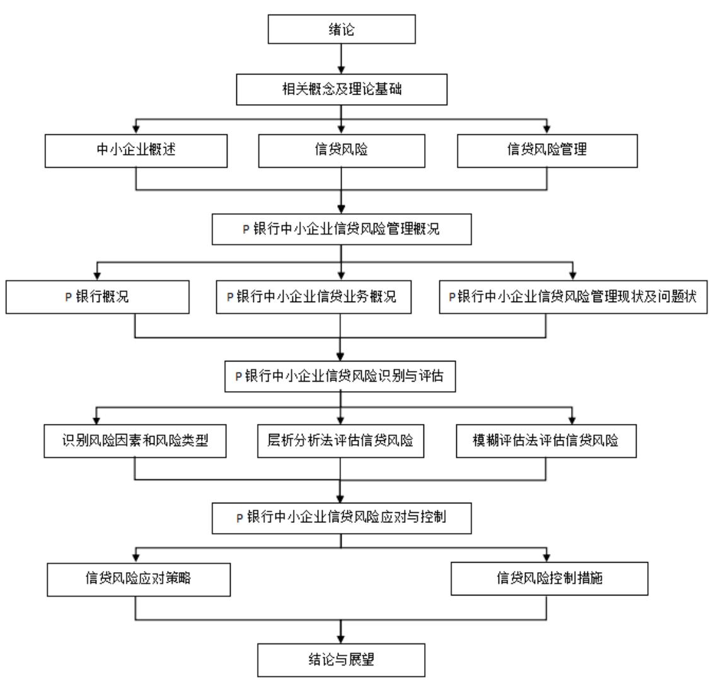
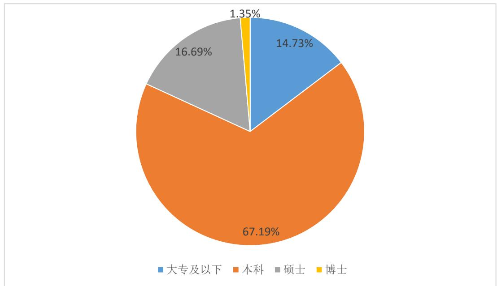
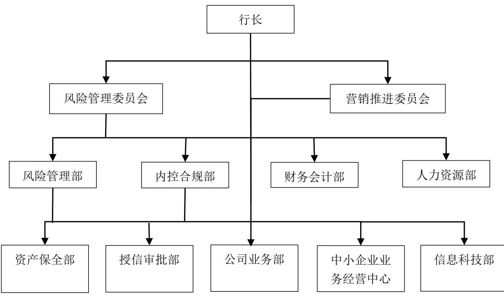
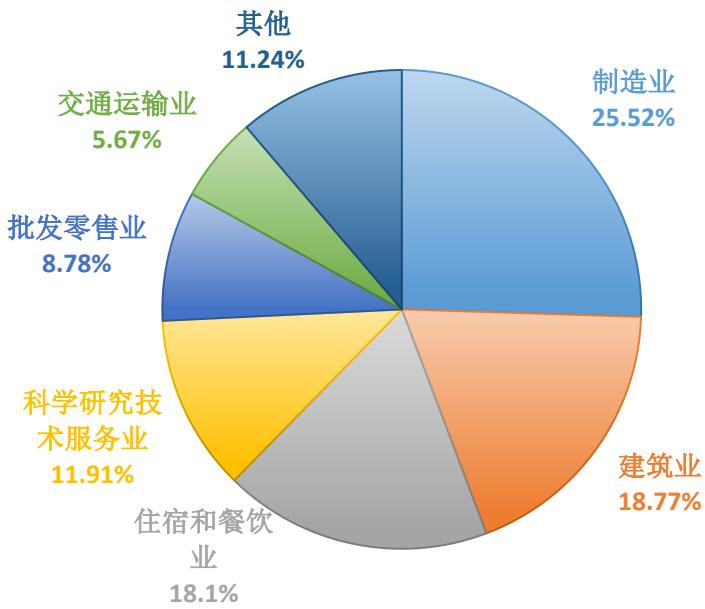
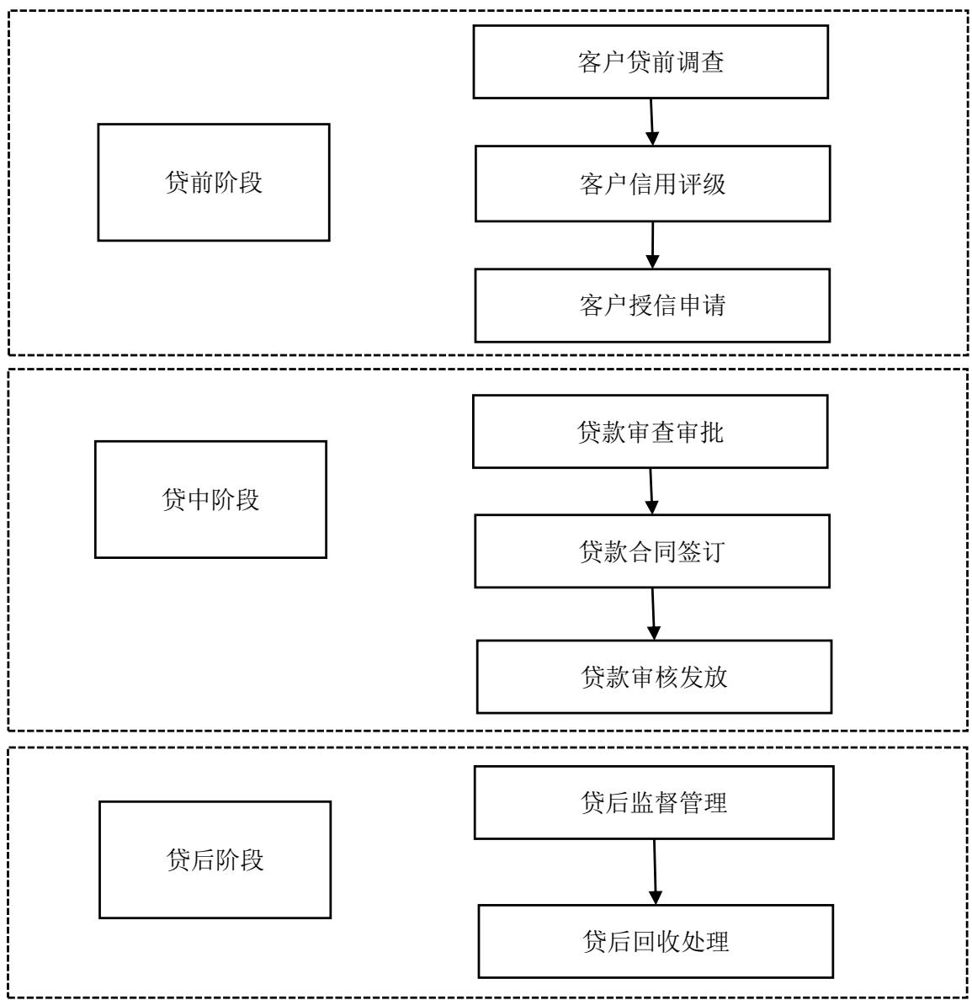

# 第 1 章 绪论

# 1.1 研究背景、目的与意义

# 1.1.1 研究背景

2023 年10月召开的中央金融工作会议，明确提出“坚持把金融服务实体经济作为根本宗旨”作为中国特色社会主义发展之路的重要内容。面对复杂深刻的国内外经济形势，金融业如何更好地服务实体经济，促进企业繁荣发展，成为当前研究的热点。改革开放 40 多年来，我国中小企业不断发展壮大，贡献了 $50 \%$ 以上的税收， $60 \%$ 以上的GDP， $70 \%$ 以上的技术创新， $80 \%$ 以上的城镇就业人口，$9 9 \%$ 的企业数量分布在生产、流通、消费等各个领域，开始崭露头角，成为国民经济和社会发展的关键力量，是增加就业机会、改善民众生活、推动创新创业的主力军。

近年来，为了促进中小企业发展，中国人民银行、银保监会、工信部等多个部委相继出台诸多相关法规和政策，鼓励支持中小企业融资，缓解中小企业融资难的问题。然而，中小企业由于自身特点导致抗风险能力较弱，盈利能力易受外部环境影响。受疫情、经济形势下行等影响，商业银行在积极响应国家号召为中小企业提供贷款过程中，信贷业务出现坏账的情况频发，信贷风险较大，银行利润受到影响。因此，商业银行如何更好地开展中小企业信贷业务，降低信贷风险，成为亟须解决的问题。

P 银行作为一家服务范围涉及金融咨询、商业投资、信用贷款等的综合性金融机构，不断适应我国市场经济和金融环境的发展，业务规模持续扩大，逐步向现代化商业服务转型。然而，业务扩展的同时，P 银行不良贷款率也向上攀升。数据显示，P 银行累计转让核销不良贷款数额达 60亿元，不良贷款增长超 20亿元。尽管 P 银行自 2019 年陆续在上海、武汉、深圳和广州等地的分支机构推出并试运营线上企业信息互联网核查服务，但经过三年的时间，其信贷资产质量并未有显著改善，这显示出以 P 银行为代表的商业银行等金融机构，正面临着日益加剧的信贷风险，迫切需要采取措施来完善和优化信贷风险管理机制。

鉴于此，以 P 银行为研究对象，通过调研和走访获得其中小企业信贷业务的实际情况，并进行全面的风险识别和评估，明确潜在风险类别及风险因素，以解决 P 银行在中小企业信贷风险管理和控制方面的问题。为不同的风险点设计相应的风险对策。通过对风险的深入分析和应对措施的制定，有助于提升 P 银行在中小企业信贷业务中的风险管理水平，确保其业务稳健发展。通过本研究，有望为 P 银行提供更加有效的风险管理建议，为其在中小企业信贷领域取得更好的业务表现打下坚实的基础。

# 1.1.2 研究目的与意义

（1）研究目的

本研究旨在深入探讨 P 银行中小企业信贷风险的现状和问题，识别与评估该银行在中小企业信贷业务中所面临的各类风险因素，以全面了解风险来源和影响。针对识别和评估出的风险评估 P 银行当前的风险管理策略和控制的有效性，探讨其在风险管理方面的优势和不足之处，探讨如何优化中小企业信贷风险管理，提出针对性的建议和改进建议。

# （2）研究意义

以 P 银行的中小企业信贷业务为对象，通过实际情况的分析，运用德尔菲法、层次分析法和模糊评估法对该银行的信贷风险进行全面识别和评估，同时给出定性和定量评估，再结合研究结果为风险管理提供优化策略。对于P 银行向好发展，具有如下现实意义：

第一，优化风险管理，提高资产质量。对 P 银行中小企业信贷风险管理现状进行梳理与分析，有利于发现其劣势。深入探讨其潜在原因，并围绕该行中小企业信贷风险管理存在的问题提出针对性的改进策略，有助于 P 银行更好地对信贷风险进行及时甄别与预防，降低不良贷款率，提高资产质量。

第二，增强客户信任度，提高市场竞争力。通过有效管理中小企业信贷风险，P 银行可以提升自身的品牌形象和声誉，增强客户信任度，吸引更多中小企业客户，实现可持续发展，了解该银行在中小企业信贷中的风险情况也可以为银行提供指导，帮助 P 银行设计更符合中小企业需求的金融产品，实现个性化定制，提升市场竞争力。

# 1.2 国内外研究现状

# 1.2.1 国外研究现状

从信贷风险管理理论上看，研究者们对中小企业的生命周期以及企业的资金流动性、速动比率、注册资本、现金流量等因素进行了深入探讨，并揭示了这些因素与企业破产、贷款风险、系统风险等关联。Lezgovko（2017）的研究发现，商业银行贷款风险与银行收益密切相关，高风险贷款项目可能为银行带来更高的收益，但也带来更大的潜在风险，因此银行必须有效管理信贷风险以保证盈利[1]。而 Rusmanto（2020）则通过研究亚洲地区上市银行样本发现，银行资本量与系统风险呈负相关，资本量越大，系统风险越低，并建议通过促进私人信贷机构发展来增强银行间竞争，以降低系统风险[2]。此外，Nguyen Dat T 和 Le Tu（2023）的研究则探讨了银行风险与市场纪律的关系，结果显示二者相互影响，市场约束对银行风险有抑制作用，而银行风险又对市场约束产生正向影响[3]。

从信贷风险管理实践上看，Kurzmeyer（2015）发现，商业银行可以利用飞速发展的大数据信息技术手段有效应对面临的信用风险，具体可以采用优化风险控制模型、建立企业信息数据库和共享分析机制的方法[4]。Aguals 和 Forest（2016）的研究发现，企业的资金流动性和速动比率与企业破产存在关联[1]，而Altman 等人（2017）指出可以通过注册资本和现金流量这两个关键指标识别商业银行贷款风险[6]。Wong（2019）在信贷风险识别和评估领域应用了一种加权随机算法，提高了精确度并成功识别出关键特征，从而为信贷风险分析带来重要的价值[7]。Abbasi 等人（2019）利用向量机和 Logistic 回归方法，建立模型用来评估主体和债务信用风险，并收集样本数据进一步验证了该模型的可靠性[8]。而 Fonseca 的研究团队（2020）运用模糊逻辑和神经网络两种方法对巴西商业银行进行风险评估，认为使用基于大数据的信用评分模型可以更有效地识别和评估信贷风险[9]。Caruso等人（2020）的研究发现，首先商业银行在中小企业信贷业务中面临的重要挑战之一是信用风险，其次他们发现贷款申请企业的数量和质量特征之间存在一定的关联，最后发现通过聚类分析的方法可以有效评估信用风险[9]。此外，Palazzo Berardino 和 Yamarthy Ram（2022）的研究表明，公司层面的信用风险对货币政策反应具有重要影响，在信贷市场和股票市场中的影响力不会被其他风险因素削弱[11]。

# 1.2.2 国内研究现状

从信贷风险管理理论上看，邹小红（2017）研究强调商业银行的管理意识的提升有利于商业银行预防和控制信贷业务风险[11]。刘明昊（2017）指出，对于中国商业银行，提高信贷风险管理效率关键在于把握正确的市场定位，开发新的金融产品，完善业务的规章制度，并应用先进的信息技术[13]。对于地区内商业银行对中小企业的信贷业务，李凯凯（2017）研究了资产质量和利率等因素，并指出中小企业信贷风险管理的主要问题包括企业对信贷风险的忽视、经营决策不当以及银行内部管理能力有限[14]。许宪国（2018）在研究中国银行信贷风险管理时发现，商业银行面临的主要问题是风险控制手段和管理工具方法存在滞后，使得商业银行在风险防范方面存在缺失[15]。李修恺（2018）则分析了江西省商业银行的中小企业信贷风险，发现外部和内部风险都存在，外部风险主要在于贫困的广度和深度问题，内部风险则主要体现在环境和制度的不足，因此，银行的风险控制应考虑信用、市场、操作和声誉等多个维度[16]。杨彦彬（2019）的研究结果表明，信用评级是商业银行抵御信贷风险，提高资产质量的有效手段，因此在审批信贷企业时，应使用信用评级作为评估工具[17]。朱彦群等人（2023）通过对常德市 23家商业银行的调查发现，信贷风险管理已经从传统的“高利率”模式转变为“定性 $^ +$ 定量”的科学管理模式，对系统的稳定性和数据的安全性要求也日益增加[18]。

从信贷风险管理实践上看，龙正清（2015）的研究指出，商业银行在中小企业信贷业务中面临的信贷风险主要包括信用、流动性、市场和法律方面的风险。这些问题的根源在于贷前调查的不实和操作流程的不规范，以及审批权限的过度集中[19]。郭矜（2016）提出，在构建中小企业的信用评级体系时既要包括定性也要涵盖定量指标，而在确定贷款企业的信用等级时更适合采用赋值法[20]。赵介箴（2016）认为，在构建信贷评价体系时，商业银行应全面考虑企业规模、偿债能力、盈利能力和运营能力等四个方面的指标，并采用层次分析法、模型分析法和因素分析法进行风险评估[20]。田旭和赵清华（2017）利用模糊综合评价模型识别和评估商业银行信贷风险，并强调了使用适当的民营企业信用评价指标体系的重要性[21]。Wang 等人（2020）的研究通过分析中国上市公司的财务数据发现集成模型是处理信用风险评估的不均衡性的有效工具之一[23]。樊淑娟（2021）指出，在中小企业融资需求增长的背景下，互联网金融公司已在资金支持方面取得领先地位，商业银行为了保持竞争优势，需要在贷款业务的风险分析、识别、监督和防控方面加强努力，以提高贷款业务的风险管理水平[24]。

# 1.3 研究内容与方法

# 1.3.1 研究内容

以 P 银行为研究对象，以 P 银行中小企业客户信贷风险管理为基础，结合中小企业信贷风险管理相关理论、实际调研及专业人员问卷调查结果，进一步分析P 银行中小企业信贷风险管理存在的问题，并提出针对性的改进措施。希望通过本论文研究完善 P 银行的中小企业信贷风险管理体系，提高其风险管理水平，促进P 银行持续向好发展。共分为七个章节进行深入探讨，具体布局如下：

第 1章为绪论，研究的背景、目标、意义，并概述了研究所采用的方法和内容。

第 2章为相关概念与理论基础，围绕相关概念和理论框架展开，明确中小企业、信贷风险及信贷风险管理的定义，探讨中小企业的界定及其特性，信贷风险的类别和特点，以及信贷风险管理过程。

第 3 章为 P 银行中小企业信贷风险管理概况，简要介绍 P 银行概况，全面分析了其针对中小企业的信贷业务流程，同时对 P 银行中小企业信贷风险管理现状以及存在的问题进行深入研究。

第 4 章为 P 银行中小企业信贷风险识别，具体识别 P 银行中小企业信贷风险类型，探讨了P 银行在信贷风险管理中可能遭遇的风险因素，并结合问卷调查结果进行深入研究，最终得出风险识别的结果。

第 5 章为 P 银行中小企业信贷风险评估，对识别出的 P 银行中小企业信贷风险进行评估，运用层次分析法和模糊评估法构建评估模型，通过构建判断矩阵、计算权重向量、进行一致性检验以及模糊评估的方法，最终得出评估结果并进行分析。

第 6章为P 银行中小企业信贷风险管理应对与控制，基于评估结果，提出针对 P 银行中小企业信贷风险的应对策略与控制措施，提出具体的对策和解决方案。

第 7章为结论与未来展望，总结本研究的发现，并对未来中小企业信贷风险管理的研究方向进行了预测和展望。

# 1.3.2 研究方法

本研究采用了以下几种研究方法：

（1）文献研究法：通过查阅和分析国内外相关文献，掌握信贷风险管理的最新发展，整理研究脉络，并吸收借鉴已有的研究成果。

（2）实地考察法：对 P 银行中小企业的信贷业务进行现场调查，以收集必

要的实证数据。

（3）问卷调查法：基于 P 银行中小企业信贷业务相关人员的基本情况，从不同角度评估他们对中小企业信贷业务的了解程度，同时分析中小企业信贷业务的主要风险和影响因素，以确保研究结论的准确性和实用性，并采用简便高效的方法进行操作。

（4）定量分析法：结合定量分析，选取关键指标，深入探讨影响 P 银行中小企业信贷风险管理的关键因素。

# 1.4 技术路线

  
图 1.1 技术路线图  
Fig. 1.1 Technical Roadmap

# 第 2 章 相关概念及理论基础

# 2.1 中小企业概述

# 2.1.1 中小企业界定

中小企业是指相对于大型企业而言规模较小、资金相对较少、雇员数量较少的企业[25]，由于法律规定、产业结构等的不同，不同的国家或地区对中小企业的界定标准可能也会有所不同[26]。

依据《中华人民共和国中小企业促进法》以及《国务院关于进一步促进中小企业发展的若干意见》的规定，中国的发展改革委员会、工业和信息化部、财政部和国家统计局将中小企业分为中型和小型两种类型，并规定了各行业对中小企业的划分标准，具体如表 2.1。

表 2.1 中小企业划型标准  
Tab. 2.1 The standard of SMEs   

<table><tr><td rowspan=3 colspan=1>行业</td><td rowspan=1 colspan=3>从业专家组成员（人）</td><td rowspan=1 colspan=3>营业收入（万元）</td><td rowspan=1 colspan=3>资产总额（万元）</td></tr><tr><td rowspan=2 colspan=1>中型企业</td><td rowspan=1 colspan=2>细分</td><td rowspan=2 colspan=1>中型企业</td><td rowspan=1 colspan=2>细分</td><td rowspan=2 colspan=1>中型企业</td><td rowspan=1 colspan=2>细分</td></tr><tr><td rowspan=1 colspan=1>中型</td><td rowspan=1 colspan=1>小型</td><td rowspan=1 colspan=1>中型</td><td rowspan=1 colspan=1>小型</td><td rowspan=1 colspan=1>中型</td><td rowspan=1 colspan=1>小型</td></tr><tr><td rowspan=1 colspan=1>农林牧渔</td><td rowspan=1 colspan=1></td><td rowspan=1 colspan=1></td><td rowspan=1 colspan=1></td><td rowspan=1 colspan=1>&gt;20000</td><td rowspan=1 colspan=1>≥500</td><td rowspan=1 colspan=1>≥50</td><td rowspan=1 colspan=1></td><td rowspan=1 colspan=1></td><td rowspan=1 colspan=1></td></tr><tr><td rowspan=1 colspan=1>工业</td><td rowspan=1 colspan=1>&lt;1000</td><td rowspan=1 colspan=1>≥300</td><td rowspan=1 colspan=1>≥20</td><td rowspan=1 colspan=1>&lt;40000</td><td rowspan=1 colspan=1>≥2000</td><td rowspan=1 colspan=1></td><td rowspan=1 colspan=1></td><td rowspan=1 colspan=1></td><td rowspan=1 colspan=1></td></tr><tr><td rowspan=1 colspan=1>建筑业</td><td rowspan=1 colspan=1></td><td rowspan=1 colspan=1></td><td rowspan=1 colspan=1></td><td rowspan=1 colspan=1>&lt;80000</td><td rowspan=1 colspan=1>≥6000</td><td rowspan=1 colspan=1>≥300</td><td rowspan=1 colspan=1>&lt;80000</td><td rowspan=1 colspan=1>≥5000</td><td rowspan=1 colspan=1>≥300</td></tr><tr><td rowspan=1 colspan=1>批发业</td><td rowspan=1 colspan=1>&lt;200</td><td rowspan=1 colspan=1>≥20</td><td rowspan=1 colspan=1>≥5</td><td rowspan=1 colspan=1>&lt;40000</td><td rowspan=1 colspan=1>≥5000</td><td rowspan=1 colspan=1>≥1000</td><td rowspan=1 colspan=1></td><td rowspan=1 colspan=1></td><td rowspan=1 colspan=1></td></tr><tr><td rowspan=1 colspan=1>交通运输业</td><td rowspan=1 colspan=1>&lt;200</td><td rowspan=1 colspan=1>≥300</td><td rowspan=1 colspan=1>≥20</td><td rowspan=1 colspan=1>&lt;30000</td><td rowspan=1 colspan=1>≥3000</td><td rowspan=1 colspan=1>≥200</td><td rowspan=1 colspan=1></td><td rowspan=1 colspan=1></td><td rowspan=1 colspan=1></td></tr><tr><td rowspan=1 colspan=1>零售业</td><td rowspan=1 colspan=1>&lt;200</td><td rowspan=1 colspan=1>≥50</td><td rowspan=1 colspan=1>≥10</td><td rowspan=1 colspan=1>&lt;20000</td><td rowspan=1 colspan=1>≥500</td><td rowspan=1 colspan=1>≥100</td><td rowspan=1 colspan=1></td><td rowspan=1 colspan=1></td><td rowspan=1 colspan=1></td></tr><tr><td rowspan=1 colspan=1>住宿和餐饮业</td><td rowspan=1 colspan=1>&lt;200</td><td rowspan=1 colspan=1>≥100</td><td rowspan=1 colspan=1>≥10</td><td rowspan=1 colspan=1>&lt;10000</td><td rowspan=1 colspan=1>≥2000</td><td rowspan=1 colspan=1>≥100</td><td rowspan=1 colspan=1></td><td rowspan=1 colspan=1></td><td rowspan=1 colspan=1></td></tr><tr><td rowspan=1 colspan=1>信息传输业</td><td rowspan=1 colspan=1>&lt;200</td><td rowspan=1 colspan=1>≥100</td><td rowspan=1 colspan=1>≥10</td><td rowspan=1 colspan=1>&lt;10000</td><td rowspan=1 colspan=1>≥1000</td><td rowspan=1 colspan=1>≥100</td><td rowspan=1 colspan=1></td><td rowspan=1 colspan=1></td><td rowspan=1 colspan=1></td></tr><tr><td rowspan=1 colspan=1>软件和信息技术</td><td rowspan=1 colspan=1>&lt;200</td><td rowspan=1 colspan=1>≥100</td><td rowspan=1 colspan=1>≥10</td><td rowspan=1 colspan=1>&lt;10000</td><td rowspan=1 colspan=1>≥1000</td><td rowspan=1 colspan=1>≥50</td><td rowspan=1 colspan=1></td><td rowspan=1 colspan=1></td><td rowspan=1 colspan=1></td></tr><tr><td rowspan=1 colspan=1>服务业</td><td rowspan=1 colspan=1>&lt;200</td><td rowspan=1 colspan=1>≥100</td><td rowspan=1 colspan=1>≥10</td><td rowspan=1 colspan=1>&lt;10000</td><td rowspan=1 colspan=1>1000</td><td rowspan=1 colspan=1>≥100</td><td rowspan=1 colspan=1></td><td rowspan=1 colspan=1></td><td rowspan=1 colspan=1></td></tr><tr><td rowspan=1 colspan=1>仓储业</td><td rowspan=1 colspan=1>&lt;200</td><td rowspan=1 colspan=1>≥100</td><td rowspan=1 colspan=1>≥20</td><td rowspan=1 colspan=1>&lt;30000</td><td rowspan=1 colspan=1>≥1000</td><td rowspan=1 colspan=1>≥100</td><td rowspan=1 colspan=1></td><td rowspan=1 colspan=1></td><td rowspan=1 colspan=1></td></tr><tr><td rowspan=1 colspan=1>邮政业</td><td rowspan=1 colspan=1>&lt;1000</td><td rowspan=1 colspan=1>≥300</td><td rowspan=1 colspan=1>≥20</td><td rowspan=1 colspan=1>&lt;30000</td><td rowspan=1 colspan=1>≥2000</td><td rowspan=1 colspan=1>≥100</td><td rowspan=1 colspan=1></td><td rowspan=1 colspan=1></td><td rowspan=1 colspan=1></td></tr><tr><td rowspan=1 colspan=1>地产开发经营</td><td rowspan=1 colspan=1></td><td rowspan=1 colspan=1></td><td rowspan=1 colspan=1></td><td rowspan=1 colspan=1>&lt;200000</td><td rowspan=1 colspan=1>≥1000</td><td rowspan=1 colspan=1>≥100</td><td rowspan=1 colspan=1>&lt;1000</td><td rowspan=1 colspan=1>≥5000</td><td rowspan=1 colspan=1>≥2000</td></tr></table>

# 2.1.2 中小企业特点

相较于大型企业，综合来看，中小型企业有着资源有限、灵活性高、创新意识强、抗风险能力差等显著特点。

（1）资源有限：在资金、人才、技术资源方面，中小企业相对匮乏。企业常常面对资金不足的问题，这使得他们在扩大规模、拓展市场等方面受到限制，同时由于规模和资源的限制，中小企业在吸引优秀人才方面常处于劣势方面。考虑到中小企业规模相对较小，可用于担保的资产相对有限，这导致在外部环境变化时，资产贬值的风险会大幅增加，并且有些企业可能会提供虚假财务信息或私自改变贷款目的以便更容易地获取贷款，对银行信贷资产质量构成潜在风险。

（2）灵活性高：中小企业具有经营灵活，适应市场变化能力强的特点。企业多数为自主经营模式，经营者掌握着公司的经营治理权及实施权，决策权高度集中，其决策链短，反应迅速，能更快适应市场变化和顾客需求的转变。中小企业凭借其灵活的经营方式和快速的决策能力，能够更加敏锐地发现市场需求、迅速调整策略，加速产品创新，推动社会快速发展。

（3）抗风险能力差：鉴于中小企业的规模相对较小且经济实力相对较差，当他们遭遇市场风险和外部冲击时，一旦遇到经济波动或市场变化，中小企业可能更容易受到影响，甚至面临生存危机。此外，众多中小型企业的生产模式相对简单，其产品和服务的标准化水平并不高，对于消费者的差异化需求缺乏足够的识别和调整能力，这导致了它们的经营稳定性较差，并容易受到经济波动的冲击。

（4）信用意识淡薄：许多中小企业在信用意识方面存在问题，可能由于企业所有权结构不清晰、管理者个人色彩浓厚等原因，导致企业在面临困难时逃避债务、不履行还款义务，给银行等金融机构带来信用风险。

（5）经营管理水平低：中小企业缺乏完备健全的内部控制、财务制度等，管理方式偏向经验主义，决策可能缺乏系统性和规范性，导致经营管理问题，如重视短期利益、缺乏长期发展战略等。

# 2.2 信贷风险

# 2.2.1 信贷风险定义

商业银行信贷风险是指商业银行在进行信贷业务中，受外界不确定因素影响，如错误决策、外界环境变化、借贷双方存在信息差等，导致贷款的回收受到不良影响。这种不良影响可能使商业银行自身发展受阻，预期收益降低，甚至产生坏账，从而遭受损失的可能性。

商业银行信贷风险具有客观性、不确定性、隐蔽性、扩散性和相对可控性的五大特点[28]：

第一，客观性。客观性是指信贷风险的存在和程度是客观的，并不会随人们的主观意愿发生变化。因此，一旦信贷业务发生，信贷风险也会随之产生，并不存在完全没有信贷风险的信贷业务。

第二，不确定性。不确定性意味着商业银行的信贷风险会受到多重因素的影响，因此，在面临危机之前，准确评估这些风险的严重性是相当困难的。此外，银行信贷服务的客户群来自各种不同的经济背景，他们的信用状况、业务活动以及其他相关因素都会对银行信贷资产的盈利产生直接影响。

第三，隐蔽性。隐蔽性是指商业银行的信贷风险受到客户评级和经济环境等多种因素的影响，因此这些风险通常不会被暴露出来，而是隐藏在信贷业务中，不易被轻易察觉。因此，商业银行常常容易忽视信贷风险，往往在其真正爆发时才会发现。

第四，扩散性。信贷风险并不仅仅局限于单一的客户群体。在市场经济环境下，由于企业间经常有紧密的资金交流和联系，上下游企业之间的资金流动也相当频繁。因此，一旦一个企业面临信贷风险，这通常会对其周边或与之关联的企业产生不良影响，从而导致信贷风险的快速扩散。

第五，相对可控性。虽然商业银行面临着信贷风险的客观存在和不确定性，但银行有能力通过多种策略和系统来提前识别和预防这些风险，从而在一定程度上控制和减少这些风险。

# 2.2.2 信贷风险成因

（1）中小企业层面成因

第一，企业自身的运营特性在某种程度上提高了其违约风险。我国拥有众多的中小型企业，这些企业往往规模较小、产值有限，并且在资本和技术上的集中度相对较低。虽然中小型企业在市场经济体系中起到了关键作用，但由于它们缺少核心的竞争优势，因此其盈利潜力受到了限制。这种类型的企业在其成长轨迹中，经常面临各式各样的内部和外部风险。经过对市场中众多中小型企业的深入研究和分析，发现该类企业普遍存在技术水平较低、生产方法落后以及对市场动态的反应不够迅速的问题。这些企业在其经营和管理过程中受到了多种不稳定因素的影响，这些因素共同加剧了中小企业在信贷业务方面的风险。

第二，企业缺乏经营管理标准化机制。许多中小企业在长期发展过程中采用家族式的管理策略，由家族成员担任企业领导者，并拥有过大的职权，缺乏适当的权力约束，内部缺乏有效的监督机制。这些领导者对企业的战略和经营方向拥有决策权，一旦出现决策失误，可能会对企业造成灾难性的影响。由于缺乏规范的经营管理机制，这些中小企业在经营管理方面容易表现出较大的随意性，缺少对业务稳定性和风险管理的认识。

第三，财务管理制度不规范，财务报表失真。当商业银行为中小企业提供信贷服务时，企业的财务报告成为至关重要的参照资料。为了最大限度地利用财务报表的潜在价值，企业内部有必要构建一个健全的财务管理体系，以确保财务报表中数据的完整真实。然而，在我国众多的中小型企业里，由于受到发展观念的束缚，其财务管理体系仍显不足。很多企业都没有意识到财务内控对财务报表质量的重要意义。在公司的财务管理活动中，由于缺少明确的制度指引和限制，经常会出现管理上的不规范，这进一步导致了财务报告数据的不够精确。

# （2）商业银行层面成因

第一，信贷风险意识薄弱。目前，我国商业银行拥有大量信贷人员，但他们素质参差不齐，不能满足不同层次的贷款客户要求。尤其是在国有银行工作的员工年龄偏大，学习能力相对较弱，对新产品和市场趋势的了解也不够深入，在当前金融竞争日益白热化的阶段，业务服务水平和质量仍有提升空间。在普通信贷的需求方面，由于缺少专业人员来进行特定的管理，这导致了在管理层面上存在明显的空缺。部分借款者对银行对其个人资金的管理持保留态度，没有明确告知资金的具体流向。由于银行之间的竞争异常激烈，为了获得更多的业务机会，他们可能会对资金的管理过于宽松，这无疑增加了银行面临的信用风险。

第二，缺乏科学的信用风险评价体系。缺乏科学的信用风险评价体系会限制商业银行开展中小企业信贷业务。在各家银行的信贷风险管理中，信用评价是至关重要的一环。然而，银行人员在进行信用风险评估时会出现过于依赖个人主观判断，缺乏系统性和客观性的问题，这可能导致评估结果的不一致性和不准确性。银行在进行信用风险评估时可能缺乏充足的数据支持。缺乏准确、完整、及时的借款人信息和财务数据会影响评估的准确性和可靠性。此外，有些银行可能采用过于简单的评估方法，缺乏对借款人全面风险的考量。这样的评估方法可能无法充分反映借款人的真实信用状况和偿债能力。

第三，信贷风险管理内部控制不健全。首先，信贷审批流程可能存在不规范的情况，例如审批权限不清晰、审批程序不严密等，容易导致信贷风险的忽视和风险暴露。其次，商业银行内部控制制度可能存在缺陷，例如内部控制流程不畅、内部审计不到位、风险管理职责不清晰等，导致信贷风险管理工作无法有效开展。此外，信息系统可能存在薄弱之处，包括数据管理不规范、信息安全风险较高等问题，使得银行难以及时准确地获取和处理风险相关信息。最后，商业银行在信贷风险管理中可能存在监管合规问题，未能严格遵守监管规定和内部政策，导致信贷业务存在违规操作的风险。

# 2.3 信贷风险管理

# 2.3.1 信贷风险管理定义

信贷风险管理，就是商业银行为降低信贷风险，降低不良率而采用一系列科学的方法，对可能导致信贷损失的各种主观因素进行识别、评估、应对和控制的方式。Hafsa（2017）指出，商业银行应完善信贷风险管理机制，对信贷流程各阶段可能出现的风险进行区分识别、监控和量化，着重于对借款人的严格信贷标准与有效评级方法，从而提升银行信贷风险管理效率，减少由信贷风险造成的损失[29]。Bonin（2018）认为，商业银行在实施信贷风险管理过程中，应关注信贷组织的层级化管理，优化信贷管理组织结构，明确不同层级员工的职责分工，确保业务和管理部门各尽其责，实现差异化管理与统一协作，有效进行信贷风险管理[30]。Mariassunta（2018）强调，除了宏观经济形势和国家政策，信贷风险还受个体变量影响，如商业银行信贷风险管理体系的完善程度等[31]。Abhiman（2017）通过对印度银行首席风险的决定因素进行实证分析，得出商业银行信贷风险的主要源头在于其自身[32]。例如，在商业银行迅速扩张阶段，信贷规模的不当增长可能导致资产质量下降，增加信贷风险。Madura（2018）提出，商业银行资产质量通常受内部和外部因素影响，如宏观经济环境和风险管理机制等，但银行及借款人可以采取一些措施来监控资金使用状况和资产质量[33]。Klimenko（2017）指出，商业银行通常难以完全掌握信贷客户的真实资金需求信息，若贷款银行未能充分了解借款人的负面信息，可能会引发信贷风险[34]。

# 2.3.2 信贷风险管理过程

信贷风险管理构成了一个连续的过程，涉及识别信贷风险点、评估风险，以及最终的应对和控制措施。商业银行是信贷活动的承担者，也是信贷风险的直接传播者。通过健全的信贷风险管理流程，商业银行有能力对信贷风险进行准确的预测、深入的分析、精确的测量以及有效地控制。商业银行应该系统加强自身的风险管理能力。当信贷风险被降至最低水平时，商业银行有可能实现利润的最大化。

（1）信贷风险识别

商业银行信贷风险通常不易被察觉，因此必须识别经济主体所面临的金融风险是否属于信贷风险，并确定其主要成因，以便于进行有效的度量和控制[35]。现阶段，针对信贷风险的识别三种主要方法是：首先，信息分析。即通过对信贷对象的特征及相关因素的分析，来判断信贷对象的信用风险大小。金融机构会对借款者的基础信息进行全面评估，特别关注客户种类、财务健康、信用历史、所处行业的背景以及社会资源等方面。在此基础上，再运用定性分析法或定量分析法对贷款企业进行全面考察，从而得出信贷资产质量状况。其次，财务分析。金融机构通过财务分析发现潜在的问题并提出相应的对策建议。金融机构会定期检查其财务状态，以确认近期的财务表现，审查的数据通常包括财务报表、现金流量、坏账比率和可疑资金比率等。最后，其他因素分析。如公司治理结构情况、内部控制制度建设情况、盈利能力水平、资产质量和资本充足率等。金融机构除了需要提供基础数据和进行财务分析外，还应该定期进行自我评估，这涵盖了管理团队的状态、行业趋势、业务表现、经济状况以及对社会的影响等多个维度[36]。

相较于大型企业，中小企业因其内在的复杂性、多变性和高度的不确定性，面对着更为复杂和多样的挑战。在进行贷款前的调查、贷款的发放以及贷款的管理阶段，商业银行都需要进行风险管理，因为中小企业都会面临非常大的潜在风险。中小企业规模较小，成立时间较短，未来发展情况不稳定，注册资金较少，资金链易断裂，导致其相较其他大型企业来说，抵抗风险的能力不足。对于商业银行来说，能否在初始阶段进行有效的风险识别，对风险管理的成功与否具有至关重要的影响。

# （2）信贷风险评估

信贷风险评估是信贷风险管理最重要的步骤之一。商业银行需要采用特定的数理统计方法或数学模型，从过往的数据中将信贷风险通过定量的方式显现出来，并据此预测可能的损失。

在中国，信贷风险评估的基础工具是信用报告，但这些报告在时效性和信用评分的均衡性方面存在缺陷[37]。因此，仅依赖银行出具的信用报告已不足以满足信贷产品评估的实际需求。大数据的集成和智能化元素的引入，能够在某些方面为信贷风险评估提供新的解决途径。然而，大数据也面临着信息波动和不均衡的挑战。因此，强化和改进大数据的整合，能够辅助商业银行对贷款客户进行更全面、细致地评估与分析[38]。

（3）信贷风险应对与控制

商业银行需定期对信贷风险管理各个环节进行评估和分析，以便及时识别存在的问题，并迅速调整管理策略，目的是不断优化管理机制并提升管理品质。可以从企业文化、管理体系内外调控机制、贷款流程优化、风险管理技术水平和创新能力等多个维度，对实际问题进行深入分析和整理。基于一定的认知，对银行贷款风险的主要问题进行详细阐述和分析，并提出相应的解决策略和优化方案[39]。通过理解风险管理文化、内部激励管理流程以及技术和创新能力等方面，进行全面的设计和总结，并基于优化方案，探讨银行信贷管理风险保障措施的可能性和可行性。

信贷风险的控制涉及商业银行根据识别和评估结果，针对信贷风险的级别和潜在损失的大小，选择并执行适当的管理决策和措施[40]。近年来，国内大数据的应用和管理已达到国际先进水平，新技术和创新方法的应用在一定程度上满足了中小企业在信用贷款方面的资金需求[41]。然而，由于中小企业间的差异以及信用评级的不同，对提高风险管理水平的需求也在增加。银行业在信贷管理中采用了关联性分析法，并涉及大数据等与互联网产业相关的模型和体系的构建。信息技术的融合与商业环境及模式的交叉，催生了适合银行发展水平和需求的风险控制管理系统。这些系统基于大数据，从贷前管理到流程占比、推进以及贷后审查阶段，都进行了全面的规划和审核[42]。信息技术的使用能有效降低信息不对称带来的风险，因此，运用大数据支持银行信贷系统的审核、贷款发放及稽查手段，可以有效地控制风险的发生[43]。

在中小企业的信贷风险管理中，风险管理人员需要运用各种金融手段，实施多样化的策略以分散和转移潜在风险，并对已经出现的风险事件进行高效管理。不恰当的信贷风险控制的信贷风险管理可能会触发风险事件，进一步妨碍银行与中小型企业的协同成长。通过参考国际的经验并反思我国商业银行因风险管理不当导致的企业遭受的严重负面影响，得出的结论是，商业银行应该采取有效的风险控制措施，而不是仅仅为了追求高利润而承受巨大的风险，或者在管理过程中出现偏差。商业银行需要对涉及多个行业的中小企业信贷业务加强人员管理并进行有效控制。因此，商业银行需要进行前期的识别、中期的评估以及后期的风险应对与控制，确保各个环节紧密相连，缺一不可。

# 第 3 章 P 银行中小企业信贷风险管理概况

# 3.1 P 银行概况

# 3.1.1 P 银行简介

P 银行自 1982 年成立，获得中国人民银行批准，开展全面性的商业银行业务，并迅速成长为一个遍布全国的金融机构。该行坚持“诚信为本，追求卓越”的企业宗旨，致力于为社会提供优质服务，推动金融创新，其资产与经营实力稳步增长。至2021 年年末，P 银行的总资产达到了 8.14万亿元，构建了包含 41家主要分行和近 1700 家支行的广泛网络，这一网络遍及中国所有省级行政区，并在香港、新加坡和伦敦设有分行。该行员工数量达到 5.9万人，确立了其全国性和国际化商业银行的地位。

在2023年，P银行集团的资产总额增至8.14万亿元，比前一年增长了 $2 . 3 5 \%$ ；贷款总额增至 4.79 万亿元，年增长率为 $5 . 5 6 \%$ ；负债总额增至 7.46 万亿元，年增长率为 $2 . 1 1 \%$ ；存款总额增至 4.40万亿元，年增长率达到 $8 . 0 1 \%$ 。

关于资产质量，截至 2023 年年末， $\mathrm { P }$ 银行的不良贷款余额为 768.29 亿元，较上一年年末减少了 16.32亿元。不良贷款率为 $1 . 6 1 \%$ ，较上一年年末降低了 0.12个百分点。拨备覆盖率为 $1 4 3 . 9 6 \%$ ，较上一年年末下降了 8.81个百分点。

详细数据请参阅表 3.1。

表 3.12019—2023年P 银行主要经营业绩指标（部分）  
Tab. 3.1 Key operating performance indicators of P bank, 2019-2023 (Part)   

<table><tr><td rowspan=1 colspan=1></td><td rowspan=1 colspan=1>2023</td><td rowspan=1 colspan=1>2022</td><td rowspan=1 colspan=1>2021</td><td rowspan=1 colspan=1>2020</td><td rowspan=1 colspan=1>2019</td></tr><tr><td rowspan=1 colspan=1>基本每股收益（元）</td><td rowspan=1 colspan=1>1.62</td><td rowspan=1 colspan=1>1.88</td><td rowspan=1 colspan=1>1.95</td><td rowspan=1 colspan=1>1.85</td><td rowspan=1 colspan=1>1.84</td></tr><tr><td rowspan=1 colspan=1>每股净资产（元）</td><td rowspan=1 colspan=1>19.08</td><td rowspan=1 colspan=1>18</td><td rowspan=1 colspan=1>16.83</td><td rowspan=1 colspan=1>15.05</td><td rowspan=1 colspan=1>13.47</td></tr><tr><td rowspan=1 colspan=1>主营业务收入（万元）</td><td rowspan=1 colspan=1>19,098,200</td><td rowspan=1 colspan=1>19,638,400</td><td rowspan=1 colspan=1>19,068,800</td><td rowspan=1 colspan=1>17,154,200</td><td rowspan=1 colspan=1>16,861,900</td></tr><tr><td rowspan=1 colspan=1>主营业务利润（万元）</td><td rowspan=1 colspan=1>5,920,500</td><td rowspan=1 colspan=1>6,673,600</td><td rowspan=1 colspan=1>6,986,400</td><td rowspan=1 colspan=1>6,534,300</td><td rowspan=1 colspan=1>7,027,500</td></tr><tr><td rowspan=1 colspan=1>营业利润（万元）</td><td rowspan=1 colspan=1>5,920,500</td><td rowspan=1 colspan=1>6,673,600</td><td rowspan=1 colspan=1>6,986,400</td><td rowspan=1 colspan=1>6,534,300</td><td rowspan=1 colspan=1>7,027,500</td></tr><tr><td rowspan=1 colspan=1>投资收益（万元）</td><td rowspan=1 colspan=1>1,729,700</td><td rowspan=1 colspan=1>1,898,000</td><td rowspan=1 colspan=1>1,357,100</td><td rowspan=1 colspan=1>1,476,500</td><td rowspan=1 colspan=1>1,358,500</td></tr><tr><td rowspan=1 colspan=1>营业外收支净额（万元）</td><td rowspan=1 colspan=1>-13,400</td><td rowspan=1 colspan=1>-5,400</td><td rowspan=1 colspan=1>-4,700</td><td rowspan=1 colspan=1>-5,900</td><td rowspan=1 colspan=1>-44,700</td></tr><tr><td rowspan=1 colspan=1>利润总额（万元）</td><td rowspan=1 colspan=1>5,907,100</td><td rowspan=1 colspan=1>6,668,200</td><td rowspan=1 colspan=1>6,981,700</td><td rowspan=1 colspan=1>6,528,400</td><td rowspan=1 colspan=1>6,982,800</td></tr><tr><td rowspan=1 colspan=1>净利润（万元）</td><td rowspan=1 colspan=1>5,300,300</td><td rowspan=1 colspan=1>5,832,500</td><td rowspan=1 colspan=1>5,891,100</td><td rowspan=1 colspan=1>5,591,400</td><td rowspan=1 colspan=1>5,425,800</td></tr><tr><td rowspan=1 colspan=1>总资产（万元）</td><td rowspan=1 colspan=1>813,675,700</td><td rowspan=1 colspan=1>795,021,800</td><td rowspan=1 colspan=1>700,592,900</td><td rowspan=1 colspan=1>628,960,600</td><td rowspan=1 colspan=1>613,724,000</td></tr></table>

（续表3.1）(Continuation of Tab.3.1)  

<table><tr><td rowspan=1 colspan=1>流动资产（万元）</td><td rowspan=1 colspan=1>--</td><td rowspan=1 colspan=1>--</td><td rowspan=1 colspan=1>--</td><td rowspan=1 colspan=1>--</td><td rowspan=1 colspan=1>--</td></tr><tr><td rowspan=1 colspan=1>总负债（万元）</td><td rowspan=1 colspan=1>745,853,900</td><td rowspan=1 colspan=1>730,440,100</td><td rowspan=1 colspan=1>644,487,800</td><td rowspan=1 colspan=1>581,122,600</td><td rowspan=1 colspan=1>570,625,500</td></tr><tr><td rowspan=1 colspan=1>流动负债（万元）</td><td rowspan=1 colspan=1>--</td><td rowspan=1 colspan=1>--</td><td rowspan=1 colspan=1>--</td><td rowspan=1 colspan=1>--</td><td rowspan=1 colspan=1>--</td></tr><tr><td rowspan=1 colspan=1>净资产收益率加权（%)</td><td rowspan=1 colspan=1>8.75</td><td rowspan=1 colspan=1>10.81</td><td rowspan=1 colspan=1>12.29</td><td rowspan=1 colspan=1>13.14</td><td rowspan=1 colspan=1>14.45</td></tr></table>

# 3.1.2 组织架构

到 2023 年年底，P 银行在职员工总数达到 665 名，其中男性员工 353 名，女性员工 312 名，男女人数之比大约为 1.1:1。与 2018 年的 525 名员工相比，2023 年的员工数量增长了 140 名，这一显著增长反映出银行业务的快速发展和对人才需求的增加。从学历构成来看，硕士学历员工占 $1 6 . 6 9 \%$ ，计 111名；大专及以下学历员工占 $1 4 . 7 3 \%$ ，计98名；博士学历员工占 $1 . 3 5 \%$ ，仅有 9名；而本科学历员工最多，有 447名，占比高达 $6 7 . 2 2 \%$ 。如图 3.1所示，P 银行的员工学历结构较为理想，显示出员工整体素质较高.

  
图3.1 P 银行员工学历构成  
Fig. 3.1 Employee educational structure of P bank

目前，P 银行的核心业务涵盖了公司业务、个人业务和资金业务三大领域。在公司业务方面，作为银行的重要业务支柱，P 银行服务的贷款客户总数达到5742户，其中贷款额度小于一千万的客户有 4407户，一千万至五千万之间的客户有 945 户，而超过五千万的客户则有 390 户。个人业务方面，P 银行提供包括中间业务、理财产品、银行卡服务以及个人储蓄和贷款服务，服务网络覆盖武汉全市，目前个人储蓄客户已超过 16.58 万户，个人贷款客户数量达到 2.24 万户。资金业务作为 P 银行盈利的重要来源，包括投行业务、同业业务和投资交易等，经过长期的发展和优化，P 银行在资金业务领域已在金融市场中建立了良好的声誉。

  
P 银行公司业务的组织结构示意图请参见图 3.2。  
图 $3 . 2 \mathrm { P }$ 银行组织结构图  
Fig. 3.2 Organizational structure chart of P bank

# 3.2 P 银行中小企业信贷业务概况

在我国经济与社会持续进步的背景下，中小企业数量和规模持续增长，这导致了这些企业对资金的需求日益增长。因此，开发和优化针对中小企业的信贷服务已成为商业银行维持其高质量持续发展的关键。为了实现自身成长并满足中小企业的资金需求，P 银行在近年来不断强化中小企业信贷业务的流程和管理，从而使得中小企业信贷总额稳步上升，这不仅提升了银行的盈利能力，也为中小企业的发展提供了有力的支持。

# 3.2.1 中小企业信贷业务规模

近年来，P 银行积极响应国家政策，极度重视为中小企业提供金融服务，并将支持本地中小企业发展定位为银行战略转变的核心。截至 2023 年年底，P 银行针对中小企业的贷款余额已增至 453亿元，占全行贷款总额的 $9 . 2 5 \%$ ，年增长率达 $34 \%$ 。同时，贷款客户数达到 5671 户，年增长率为 $3 6 \%$ 。这些数据表明，P 银行在中小企业贷款余额和客户数量方面均实现了快速增长。

进一步分析 2023年P 银行中小企业信贷数据，可以看出 $\mathrm { P }$ 银行的中小企业贷款广泛分布于多个行业，主要包括制造业、批发零售业、建筑业、交通运输业、住宿和餐饮业以及科学研究技术服务业。其中，制造业的贷款余额最高，达到115.6 亿元，占比 $2 5 . 5 2 \%$ ；建筑业和住宿和餐饮业的贷款余额分别为 85 亿元和82亿元，占比分别为 $1 8 . 7 7 \%$ 和 $1 8 . 1 \%$ ；科学研究技术服务业的贷款余额为 53.95亿元，占比 $1 1 . 9 1 \%$ ；批发零售业的贷款余额为 39.77亿元，占比 $8 . 7 8 \%$ ；交通运输业的贷款余额为 25.69亿元，占比 $5 . 6 7 \%$ 。详细数据如图3.3 所示。

  
图 $3 . 3 \mathrm { ~ P ~ }$ 银行中小企业信贷业务行业分布Fig $3 . 3 \mathrm { ~ P ~ }$ bank SME industry distribution

# 3.2.2 中小企业信贷业务流程

在处理中小企业信贷业务时，P 银行遵循总行规定，并融合信贷风险管理机制，按照“评级先行、随后授信、最终用信”的原则为每一家中小企业客户执行信贷服务。按时间顺序可将信贷业务流程划分为贷前阶段、贷中阶段和贷后阶段，每一阶段具体流程如图 3.4。

  
图 $3 . 4 \mathrm { P }$ 银行信贷业务办理流程  
Fig. 3.4 Credit business handling process of P Bank

（1）贷前阶段：

借款人向 P 银行提出贷款申请，填写《借款申请书》并提供银行需要的各项资料，银行受理后，即进入贷前阶段，该阶段主要涉及客户贷前调查、客户信用评级、客户授信申请三个流程。

客户贷前调查：在信贷业务办理之前，P 银行需要对贷款企业的各种情况进行调查。通过实地验点、公共平台查询及查阅企业相关报表等方式对企业进行综合评估，形成尽职调查报告。具体而言，对于在申请和受理过程中满足条件的客户，银行会派遣两位客户经理前往客户提供的公司地址进行实地考察，结合贷款企业的经营管理情况及还款来源，综合判断其是否存在逾期风险。验证流程主要依赖于国家企业信用信息公示系统、全国法院被执行人信息查询系统等多种公共资源，对贷款企业以及其实际控制人进行多方面的评估分析。在对企业调查过程中，需要结合企业非财务方面指标以及财务报告、偿还债务的能力等财务指标。若涉及质押，还要根据相关法律规定及质押合同约定进行风险判断。如果信贷业务与担保有关，还需要对担保方的财务稳健性和信用认证进行全面评价；如果涉及到抵押物的问题，就有必要对抵押物的真实性和价值进行详细的核查和评价。

客户信用评级：P 银行基于对企业客户的财务状况、经营成果和信用稳定性的深入了解，会对企业的核心素质、市场竞争能力、经济实力、偿还债务的能力、经济回报以及未来的发展趋势进行量化、定性和动态的综合评估，以确定其履行经济合同的可能性。同时，根据客户的资信状况和发展潜力，对客户实施有针对性地管理服务。P 银行通常每年对企业的信用等级进行一次评估，有效期限为一年。当企业经历改组、改制、高层管理人员更迭或出现经济纠纷等重大情况时，银行会重新进行信用等级的评定。

客户授信申请：根据调查结果，P 银行结合授信对象风险承受能力、业务能力、参照对应标准进行客制化的授信额度制定，针对该企业确定愿意并能够承受的最高融资限额，客户即可在该额度内申请贷款。

（2）贷中阶段：

贷款审查审批：P 银行会指派相应的审查人员，根据信贷业务授信审批的相关条款，对信贷部门提交的借款人的申请资料、信用评级、授信额度的计算等相关文件进行审批，并根据审批结果给出审批意见。

贷款合同签订：当信贷业务经过审查并得到上级授信的批准后，经办客户经理将立即开始起草和签署借款合同，并对所有相关的文件进行公证处理。在签订和公正合同的过程中，双方当事人都必须亲自参与。

贷款审核发放：此环节主要目的是核实信贷业务所需的基础条件是否得到了充分满足，以及贷款的具体用途是否准确无误。贷款审核根据业务的不同级别，分为分行的审核和总行的审核。借款人首先需要填写借款凭证，如果涉及抵押，还需要准备不动产登记证明或质押物。根据贷款支付合同和贷款支付申请的提交情况，P 银行会通过柜台向借款人或借款单位发放贷款。

# （3）贷后阶段

贷后监督管理：P 银行对每笔信贷业务实施贷后首次检查和定期检查。在贷款后，首次的检查通常会在 15 个工作日之内完成，目的是确认贷款资金是否完全用于预定的目的，以及资金的流向是否合适；定期抽查一般是每月一次，主要目的在于了解借款人的信用记录和还款能力。定期的检查主要集中在一些可能影响借款人还款能力的信息，包括但不限于借款公司的运营状态、财务健康、股东及管理层变动以及质押物品的状况等。贷后复查一般安排在借款人逾期贷款到期前一个月或以上时间内开展。检查的内容通常涵盖了对现场的观察和对远程环境的评估。

贷款回收与处理：在每一笔贷款到期前的 1-2个月内，P 银行的信贷部门将会提醒借款人设定还款的具体日期。借款人在接到通知后，应及时向 P 银行反映情况。如果出现逾期未还的情况，将会启动包含“电话催收、上门催收、法律诉讼”在内的催收程序。那些最后无法收回的贷款，会根据 P 银行的相关规定来执行坏账的核销程序。

# 3.3 P 银行中小企业信贷风险管理现状及问题

# 3.3.1 信贷风险管理现状

目前，P 银行主要通过对中小企业产生的信贷风险进行识别、评估、监督、防控而进行管理，具体内容如下：

（1）中小企业信贷风险识别方面

在客户准入环节，P 银行从行业状况、经营状况、管理水平等多个维度进行详细分析，全面识别客户风险。贷款质量分类在中小企业信贷风险管理中占据重要地位，它是P 银行管理和控制信贷风险的有效手段。P 银行针对不同信贷资产的风险特性进行审查，并依据审查结果将其归类为不同的贷款质量类别。不同贷款级别的命名、分类及评价的详细情况如表 3.2所示。

表3.2P 银行贷款分类关系  
Tab. 3.2 Loan classification relationship of P bank   

<table><tr><td>级别</td><td>分类</td><td>评价</td></tr><tr><td>亏损</td><td>亏损</td><td rowspan="4">不良</td></tr><tr><td>可疑</td><td>可疑</td></tr><tr><td>次级1</td><td rowspan="2">次级</td></tr><tr><td>次级2</td></tr><tr><td>关注1</td><td rowspan="2">关注</td><td rowspan="6">正常</td></tr><tr><td>关注2</td></tr><tr><td>关注3</td><td></td></tr><tr><td>正常1</td><td rowspan="3">正常</td></tr><tr><td>正常2</td></tr><tr><td>正常3</td></tr></table>

例如，当企业的日业务流水超过五百万时，P 银行的系统便需根据表 3.3 的数据进行分类，并在十五至三十天内重新评估该贷款人的信用评级和授信资格。此外，P 银行在每个季度最后一个月也会进行定期复审。如果借款人的风险状况发生重大变化，可能会对贷款资金安全造成影响，监督团队应将此情况上报给审批部门，并由总行风险管理部门进行相应的分类管理。

表 $3 . 3 \mathrm { ~ P ~ }$ 银行大额信贷资产风险分类  
Tab. 3.3 Risk classification of large credit assets for P bank   

<table><tr><td>担保方式</td><td>分类</td></tr><tr><td>质押</td><td>正常1</td></tr><tr><td>抵押</td><td>正常2</td></tr><tr><td>保证</td><td>正常2</td></tr><tr><td>信用</td><td>正常3</td></tr></table>

当企业的日交易额在五百万以下的小额业务内时，P 银行将采用定期批量动态调整的策略来进行风险评估。该贷款人的风险等级将在每月 25 日通过系统自动进行调整。在此过程中，如果贷款人的资金状况发生显著变化，监督部门同样需要将相关情况上报给审批部门，并由总行进行相应的调整。

（2）中小企业信贷风险评估方面

信用评级是信贷风险评估的最根本核心环节。客户经理通过了解贷款企业的基本情况，结合企业外部评级情况，对贷款企业的信用情况进行评估。具体流程为发起、复核、审查、审定。将贷款客户的信用等级划分为 AAA 级至D级共14个信用等级（详见表 3.4）。在授信期间，贷款企业的信用评级结果需每年更新一次，且这个评估的信用等级的有效期限是一年。当企业经历改组、改制、高层管理人员更迭或出现经济纠纷等重大情况时，P 银行会重新进行信用等级的评定。

表3.4P 银行信用等级划分  
Tab.3.4 P Bank Credit Rating Classification   

<table><tr><td>信用等级</td><td>核心定义描述</td><td>特征</td></tr><tr><td>AAA</td><td>具备较强的偿债能力，几乎不受经济环境的影响，违约风 险极低</td><td>极佳</td></tr><tr><td>AA+</td><td rowspan="3">略低于AAA信用等级，客户偿还债务的能力很强，受不 利环境影响不大，违约风险很低</td><td>优秀</td></tr><tr><td>AA</td><td>优良</td></tr><tr><td>AA-</td><td>优</td></tr><tr><td>A+</td><td rowspan="3">企业具备良好的偿债能力，但相对于更高的信用等级，其 偿债能力易受外在环境及经济状况变动的不利因素影响</td><td>良好</td></tr><tr><td>A</td><td>良</td></tr><tr><td>A-</td><td>较好</td></tr><tr><td rowspan="2">BBB</td><td>企业有足够的偿债能力，但若在恶劣的经济条件和外在环</td><td></td></tr><tr><td>境下，其偿债能力可能会被削弱</td><td>好</td></tr></table>

（续表3.4）(Continuation of Tab.3.4)  

<table><tr><td>BB</td><td>企业有一定的偿债能力，但持续的重大不稳定情况或恶劣 的商业、金融或经济条件，可能使其没有足够能力偿还债 务。</td><td>一般</td></tr><tr><td>B</td><td>企业目前仍有能力偿还债务，但已处于安全的边缘，恶劣 的商业、金融或经济情况可能削弱客户偿债能力和意愿</td><td>接受</td></tr><tr><td>CCC</td><td rowspan="3">企业目前违约风险较高，需依赖良好的商业、金融或经济</td><td>关注</td></tr><tr><td>CC</td><td>条件才有能力偿还债务。如果商业、金融、经济条件恶 较差</td></tr><tr><td>C 化，则无法偿还债务</td><td>预警</td></tr></table>

定量指标：系统风险指标、杠杆率指标、流动性指标、营运能力指标、盈利性指标、增长类指标等；

定性指标：宏观政策环境、股权结构、市场风险、竞争优势、行业地位、融资结构、运营管理和财务管理能力。

（3）中小企业信贷风险监督方面

P 银行采用的风险监控手段主要分为实地考察和非实地考察两大类。在强化中小企业的信贷风险管理过程中，这两种策略均发挥了至关重要的作用。实地考察主要集中在机构管理、内部控制、人员管理等方面，以及业务操作方面的检查，例如“风险要点”“管理模式”和“过程控制”，常用的检查方法包括查阅资料和系统操作。非实地考察则是通过信贷风险管理后端的监控系统和监管人员的日常工作来进行的。一旦系统或监管人员发现存在风险隐患，他们会立即向下级部门发出整改通知，以确保及时采取措施预防风险的发生。

（4）中小企业信贷风险防控方面

P 银行通过构建风险监督机构的重大事项报告机制对中小企业进行适时防控。该机制可以更好地应对各种风险，最大程度地降低信贷风险的负面影响，并确保风险在可接受的范围内，该体系由“风险管理委员会”负责具体落实，包括风险识别与评估机制、决策执行及监控机制、信息交流及沟通机制、监督检查机制等四大模块。这一制度的关键规定是：当各级信贷风险管理机构遭遇可能损害P 银行声誉或安全的重大事件（例如信贷风险事件、争议等）时，他们必须立刻通过书面或口头的形式，按照规定的流程，向其上级管理机构报告这些风险事件，并按照“先应急，再事后处理”的原则，迅速启动相应预案。接下来，根据上层部门的意见和建议，对可能导致风险的因素进行详尽的研究，并有针对性地制定相应的策略和纠正措施，以最大限度地减少风险的负面影响。在风险事件得到适当的处理之后，还应该对这些事件进行详细地记录和分析，以避免未来再次出现

类似的风险情况。

# 3.3.2 信贷风险管理存在的问题

总体而言，P 银行对中小企业信贷业务的发展给予了越来越多的关注，但近年来中小企业信贷的不良贷款率持续上升，这表明 P 银行在中小企业信贷风险管理方面仍面临挑战，结合前文对于 P 银行目前的中小企业信贷业务流程及风险管理现状的介绍，可以发现这两方面均存在一定的不足。

（1）根据信贷业务流程发生的时间顺序，可将 P 银行信贷业务划分为贷前、贷中、贷后三个阶段，结合实地调研和走访记录，企业过往案例，发现各阶段存在不同的问题。

贷前调查维度不全面。在进行贷前调查时，P 银行的公司客户经理通常首先考虑绩效，倾向于只要能贷款就贷款，而未深入细致地调查贷款企业的现场经营情况。他们对贸易购销合同和经营流水的真实性未进行专业准确的核验，对财务报表数据的有效性审查不够严格。此外，P 银行对中小企业的评价维度不够完善，只关注某些财务指标（如成本收益率、存贷周转率等），简单粗暴地淘汰那些相对行业均值较低的公司，因此错误地错过了潜在的优质客户，导致高质量贷款客户的流失。此外，在风险评估指标的选择上，缺乏针对大、中、小、微型企业特点的定制化评级，采用统一的评价标准，有时导致贷款风险评估结论的片面性。

贷中审查审批效率较低，员工素质不高。P 银行部分信贷业务条线员工缺乏行业研究、市场识别、财务分析方面的能力，这就造成贷款审查人员无法在较短时间内对贷款资料完成科学审核并出具降低、控制风险的合理审查意见。贷款审查人员除了贷款审查职责外，会被委派其他工作任务，也严重影响了贷款审查的质量和效率。

贷后管理及资金流向监管不严格。贷后管理的核心任务在于实时监测企业贷款的实际使用情况和现金流，若贷后管理不善，一旦发生企业非法转移资产、擅自挪用资金等问题，就会导致业务风险失控，最终只能承担资产风险的后果。中小企业的特殊性使其信贷风险更高、不良贷款余额增长更快。P 银行在发放贷款后难以及时获取企业信息，许多贷后检查仅仅是形式上的，缺乏实地走访，过于依赖“收报表”来“出报告”，未能核实数据的完整性和真实性。对于已逾期的高风险企业关注不足，仅通过电话沟通，未全面了解企业的实际经营状况，影响了银行资产的回收情况。

（2）根据 P 银行风险管理现状来看，目前的方法策略在信贷风险识别、评估、监督和防控中仍面临较多问题及挑战，具体如下：

风险点识别不足。在进行贷款审批的过程中，市场环境、行业政策和监管政策的考虑显得不够充分，导致审查报告常常呈现出模板化和制式化的特点，没有被视为一个需要重点关注的因素。在贷款审批的过程中，放款审核人员通常只对贷款企业提供的采购合同进行形式上的审核，而没有对贸易的真实性进行严格地控制。在进行贷后管理的过程中，P 银行公司的客户经理在执行贷后管理措施时表现得不够到位。他们过分依赖二手房交易网站来检查抵押物，并且通常会在前往经营地点进行现场贷后检查之前与企业进行沟通，这直接影响了贷后工作的有效性。

评估模式存在不足。P 银行所采用的信用评估方式相对较为简单和落后，它主要是基于之前的数据评分模型来进行的。在对贷款客户进行信用评估时，通常采用定性或定量分析相结合的方法来确定信用等级。在应对信贷环境的复杂和不断变化时，这一方法可能不能给出既客观又精确的答案。另外，目前的信用评级系统大多基于个人特征进行分析，忽略了对客户的整体状况和业务特点进行评估，导致客户评级结果不可靠。在进行评级调查的过程中，客户经理常常需要输入大量的主观评价，并做出主观的选择判断，这导致评级结果受到较大的人为因素的影响。因此，在客户评级过程中，存在着一定程度上的主观性问题，导致客户评级的客观性不强。另外，在客户评级模型里，信用风险的评估占据了相当大的比重，而对于操作风险、市场风险以及其他各种风险类型的考量则显得不够充分，从而导致评价体系缺乏全面性。

风险防控措施不完善。P 银行的风险管理主要取决于各个环节的责任人如何主动采取控制措施，而风险控制的效果则与相关责任人对管理方法和操作指南的遵循程度有关。尚未建立起高效的内部控制机制，如监督管理、岗位平衡和后续评估机制等。例如，在 2017 年，P 银行的一个中型企业的贷款客户遭遇了本金逾期的问题，这导致 P银行出现不良，并造成了超过 4000万元的实际经济损失。导致该情况产生的原因是，为了完成业绩考核指标，该业务的授权发起机构未能充分调查企业的风险和风险缓释措施。同时，由于该企业在当地的规模较大，存在一定影响力，导致在贷款审批和放款环节受到上级领导的主观影响，进而降低了准入标准，而未能形成独立审慎公允的审批机制，产生了巨大的信贷风险。另外，该授信发起机构未按照相关规定将企业的抵押资产进行有效管理。由于抵押物不能得到妥善处理，导致了相当大的经济损失。此外，授信发起机构在贷款发放过程中没有及时履行信息披露义务，导致其自身利益受到损害。在这个案例里，该笔不良贷款为支行和个人带来了两到三年的业绩。然而，与所产生的业绩相比，其后续的问责和处罚措施并没有对相关责任人产生足够的震慑和惩罚效果。从资产管理角度来看，贷款逾期率较高，资产质量差等情况均与该公司内部控制薄弱有关。显然，P 银行的内控体系存在明显的缺陷，其风险管理手段并不健全。

# 第 4 章 P 银行中小企业信贷风险识别

# 4.1 风险因素分析

# 4.1.1 风险因素的产生

P 银行在处理中小企业信贷业务时，面临着多种风险。首先，信贷业务的核心目的是为社会提供服务并实现资本增值。实现资本增值的前提是资本的安全性和流动性。资本安全性取决于中小企业的还款能力和意愿，市场变动和企业的经济状况及决策可能会增加其不按约定偿还贷款的风险。

此外，P 银行在发放贷款时，常常难以获取企业全面真实的信息，如企业的财务状况、经营能力、还款意愿等。企业可能会隐瞒对其不利的负面信息，或者提供不真实的数据，这可能导致 P 银行对企业的信贷风险评估不准确。

另外，中小企业可能因管理不善、市场变化、技术落后、产品竞争力下降等因素而陷入经营困难，进而影响其偿还贷款的能力。

宏观经济的波动也可能导致风险因素的产生。宏观经济的不稳定性，如经济增长放缓、通货膨胀、汇率波动、政策调整等，都可能影响企业的经营状况和财务状况，从而增加了 P 银行的信贷风险。

# 4.1.2 风险分类

通过查阅相关文献，借鉴其他学者对信贷风险管理领域的研究进行了综合分析，结合 P 银行信贷风险管理实践，将 P 银行中小企业信贷风险划分为以下几类。

（1）信用风险

在 P 银行中小企业信贷业务中，信用风险主要体现在以下几个方面。

在担保方式上，P 银行主要依赖于抵押担保，其信用风险主要源于抵押物的价格波动和变现困难。

在财务状况上，首先，大多数中小企业的财务制度不够完善，内部控制和预算管理存在问题；其次，某些财务报表项目可能揭示出客户挪用贷款资金、关联企业资金流动性差等风险，如中小企业往往存在其他应收款占流动资产比例较高、其他应付款占流动负债比例较高、银行存款余额长期维持较高水平、存款增量与会计期间收入不成正比等问题。P 银行容易被企业账面现金流所迷惑，影响对企业实际债务承受能力的判断。

在还款来源上，中小企业的经营管理模式往往较为松散，缺乏长期规划，如预期主营业务成本和收入、资本周转情况、固定资产支出等，存在还款来源不足的风险。

在客户资信上，当前 P 银行对中小企业客户资信的审核调查往往不够全面。正常情况下，客户经理需要调查客户的银行贷款、未到期债权、民间融资等情况。但由于一些民间融资机构尚未接入人行征信系统，拖欠职工薪酬、生活缴费、房租等行为也尚未被定义为失信行为纳入该系统，因此查询结果往往具有局限性。

在贷款用途上，中小企业信贷的合规性、必要性和合理性有待加强，对于多头借贷且贷款规模已超过实际需求的企业要给予高度重视，其贸易背景的真实性存疑，授信资金可能被挪用；在后续监控中，P 银行应及时对客户提供资金流向的证明材料进行交叉验证，包括但不限于交易合同、发票、银行流水等。

# （2）市场风险

P 银行中小企业信贷业务面临的市场风险主要包括以下几个方面。

在宏观经济政策上，由于中小企业规模较小、市场占有率低、技术能力薄弱，其抵御风险的能力较弱。因此，国家宏观经济政策的任何变动都可能首先对中小企业造成冲击。例如，在经济衰退期间，中小企业的优势可能迅速转变为劣势，甚至面临破产的风险。

在市场竞争力上，中小企业普遍面临市场竞争力不足的问题。在经济形势不佳、物价上涨、人力资源成本增加的情况下，中小企业的运营成本持续上升，市场风险也随之增加。

# （3）操作风险

P 银行中小企业信贷业务中的操作风险主要体现在以下几个方面。

在管理制度和流程上，P 银行容易产生不协调、冲突、设计不完善、不明确、难以执行、冗余、更新不及时等问题。

其次，在员工上，P 银行容易存在人员配置不合理、技能不足的情况。同时，管理不善、员工主观恶意行为引起的风险也不容忽视。

再次，在科技信息系统上，P 银行可能存在系统安全漏洞、软硬件故障、系统功能缺失、系统资源配置不足等问题。

最后，在外部事件上，由于竞争者及合作方的活动、供应商不可靠或客户欺

诈等原因，操作风险时有发生。

（4）运营风险

在 P 银行中小企业的信贷业务操作流程中，不可避免地会遇到各类运营风险，包括但不限于战略规划失误、法规遵循疏漏和技术应用不足等方面。因此，P 银行需健全内控机制，提升技术能力，强化风险防范意识，以预防运营过程中的风险事件。

（5）法律风险

市场环境的持续演变带来了信贷纠纷的复杂化。P 银行信贷相关条文在某些方面存在不明确或遗漏的情况，使得条文在实际应用中可能面临不适用或难以操作的问题，进而导致法律规范的衔接出现空缺。法规细节的不明确性可能会引发法律风险，尤其是当业务操作流程没有得到严格执行，如在签章过程中责任人混淆等情形。

# （6）流动性风险

在 P 银行中小企业信贷业务中，流动性风险尤为显著，主要表现在几个关键点上。

首先，中小企业资金链较为薄弱，容易受到外部环境因素或其他因素影响，导致资金链断裂，影响其正常运营，从而导致企业的产能和利润的减少。但企业的固定成本，如工资、租金、银行利息等却未能减少，而产生风险。

其次，中小企业的资金流动性一般较弱，资金多以库存商品、应收账款、固定资产的形式存在，短时间内难以转化为现金，最终导致企业面临巨大的资金缺口，对 P 银行造成风险。

# （7）声誉风险

信贷声誉风险涉及中小企业因债务行为而面临的信用评价下降的可能性。有效管理此类风险能够阻止 P 银行进行无谓的高风险业务，降低贷款损失，从而保障 P 银行的稳定运营、确保资产质量稳定，提升银行信誉，确保业务顺利进行。

# （8）战略风险

在中小企业信贷业务中，战略风险的识别应当基于对 P 银行的内部和外部业务环境变化及其相关风险因素的全面评估。在业务开展的前期和持续阶段，需对 P 银行的内部和外部因素进行审慎分析，利用技术和专业方法持续进行风险与机会的评估，以便对潜在的战略风险作出准确的判断。

（9）资产证券化风险

信贷资产证券化是指以信贷资产为基础的证券化过程，即 P 银行将具有稳定现金流的资产整理成资产池，并以此发行证券。信贷资产证券化的风险，即是以信贷资产为基础资产所承担的风险。

# （10）估值风险

P 银行在对中小企业进行价值评估时，可能会因人为或技术等不确定因素导致对目标企业价值的过高估计，这可能会在信贷业务中给银行带来潜在的损失。

# （11）期限风险

中小企业贷款期限的设定应基于企业的实际运营状况进行评估和确定。贷款方案的制定应符合 P 银行对期限风险的管理要求。对于贷款期限较长的企业，应通过担保等方式分散风险；对于贷款期限较短的企业，则应加强对其经营状况的监控和风险管理。

# 4.2 识别方法选择与识别过程

# 4.2.1 识别方法选择

风险识别是风险管理流程中的关键环节。在社会进步和经济发展中，各种风险以不同的形态呈现，因此需要采用有效和统一的方法来识别这些风险。接下来将简要概述几种风险识别技术。

德尔菲法。这是一种汇集专家对特定主题共识的方法。在项目风险管理中，专家以匿名方式参与，通过问卷来征求他们对重要项目风险的看法。问卷答案收集和汇总后，会在专家间传阅，以便他们提供进一步的意见。经过几轮这样的过程，便能够形成对主要项目风险的共识。

流程图分析法。此方法也称为“物流系统分析法”，它涉及对流程各阶段和环节的逐一调查和分析，以识别潜在风险。流程图法使用常用符号和工具来描述工作过程中的细节和环节，并对生产、经营过程中的步骤、环节、顺序和阶段进行模块化分类，从而形成一个清晰的图表。

SWOT分析法。该方法通过系统化地表述研究对象的优势、劣势、机会和威胁，并将这些信息以矩阵形式展示。然后，结合这些数据指标和风险识别的方法与理念，对各个因素进行分析，最终得出结论。

本研究采用德尔菲法对 P 银行中小企业信贷风险管理进行识别。首先该方法可以集合各专家的优势，通过组建不同文化背景以及行内行外不同职业背景的专家团队，来收集各方面的意见。其次，经过专家组团队反复地讨论和分析，可以最终得到影响 P 银行中小企业信贷风险因素的一致的结果，避免产生分歧。第三，德尔菲法能够充分表达专家组所有成员的意见，避免个别因素对最终识别出的风险因素产生不当影响。

# 4.2.2 识别过程

本研究采用的风险识别过程具体如下：

组织了一支由经验丰富的专家构成的风险识别团队。为了进行初步的探索性研究，向这些专家分发了一份旨在识别相关问题和需求的问卷。在这个阶段，专家们依据访谈的内容来回答问题，还可以提供对研究有帮助的其他信息与资料。团队成员会依据对 P 银行中小企业信贷业务有影响的风险类别进行重要性评分。

在第一阶段调查任务完成后，对所搜集的信息进行了整理。随后，基于这些信息，设计了第二阶段的调查问卷。在这一阶段，为了确保专家们能够自由地表达观点，采取了匿名意见收集的措施。将这些意见整理汇总后分发给专家，以便他们进行第二轮的意见修改，从而形成了风险因素初选表。

最后，专家们对风险因素初选表中的风险因素进行了重新评分，并将其与之前评风险分类重要性进行了匹配，最终形成了影响 P 银行中小企业信贷风险识别清单。

（1）组建专家组

为了能够更好地对 P 银行信贷⻛险进⾏识别，组建专家组前⾸先确定下列标准：

首先，设定专家组的规模为 15 人，专家组成员有不同的文化背景和职业背景，这样的多样性有助于从多个角度和层面识别研究问题。

其次，为了确保分析的全面性，专家组成员由 P 银行内部员工占 $80 \%$ ，外部专家占 $20 \%$ ，他们将从各自的专业背景出发，对中小企业的信贷风险进行深入分析，并从行业及社会两个视角对 P 银行中小企业信贷风险进行识别。

第三，专家组成员为行业内管理人员或资深客户经理，专业领域涵盖授信审查、合规管理以及风险管理等方面。

第四，入选专家小组成员必须在当前工作岗位上至少拥有五年的工作经验，以确保他们具备丰富的行业知识和经验。

入选专家组需符合上述四个条件，具体的专家组名单详见附件表 4.1。

表 4.1 专家组成员名单  
Tab 4.1 List of panelist   

<table><tr><td>序号</td><td>姓名</td><td>工作单位及职务</td><td>从业年限</td></tr><tr><td>1</td><td>王*</td><td>P银行副行长</td><td>十五年以上</td></tr><tr><td>2</td><td>刘*</td><td>P银行副行长</td><td>十五年以上</td></tr><tr><td>3</td><td>王*</td><td>P银行公司业务部总经理</td><td>十年以上</td></tr><tr><td>4</td><td>李*</td><td>P银行授信审批部总经理</td><td>十五年以上</td></tr><tr><td>5</td><td>杨*</td><td>P银行风险管理部副总经理</td><td>十年以上</td></tr><tr><td>6</td><td>张*</td><td>P银行授信审批部副总经理</td><td>十年以上</td></tr><tr><td>7</td><td>陈*</td><td>P银行支行行长</td><td>十年以上</td></tr><tr><td>8</td><td>王*</td><td>P银行支行行长</td><td>十年以上</td></tr><tr><td>9</td><td>郑*</td><td>P银行支行副行长</td><td>十年以上</td></tr><tr><td>10</td><td>李*</td><td>P银行支行副行长</td><td>十年以上</td></tr><tr><td>11</td><td>胡*</td><td>P银行公金客户经理</td><td>九年</td></tr><tr><td>12</td><td>刘*</td><td>P银行公金客户经理</td><td>七年</td></tr><tr><td>13</td><td>周*</td><td>省担保公司副总经理</td><td>十五年以上</td></tr><tr><td>14</td><td>李*</td><td>省担保公司副总经理</td><td>十五年以上</td></tr><tr><td>15</td><td>吴*</td><td>Z会计师事务所注册会计师</td><td>十五年以上</td></tr></table>

（2）确定风险分类及风险因素初选表

首先，在选定了合适的专家组成员之后，应对整个专家团队开展首轮开放式调查。初始阶段，应向专家们分发一份访谈问卷（见附录 1）。这些专家需先回答问卷上的问题，并根据问卷提供额外的信息与资料。问卷以匿名形式进行收集，以得到更加公允的结果。其次，专家组成员将其认为影响 P 银行中小企业信贷业务的风险分类按照重要程度进行打分。

表 4.2 风险分类重要程度打分表  
Tab 4.2 Risk type importance rating table   

<table><tr><td>分值</td><td>特別重要</td><td>重要</td><td>一般重要</td><td>不太重要</td><td>不重要</td><td>平均分</td></tr><tr><td>信用风险</td><td>12</td><td>2</td><td>1</td><td>0</td><td>0</td><td>4.73</td></tr><tr><td>市场风险</td><td>12</td><td>1</td><td>2</td><td>0</td><td>0</td><td>4.67</td></tr><tr><td>操作风险</td><td>11</td><td>2</td><td>2</td><td>0</td><td>0</td><td>4.60</td></tr><tr><td>运营风险</td><td>8</td><td>3</td><td>3</td><td>1</td><td>0</td><td>4.20</td></tr><tr><td>法律风险</td><td>8</td><td>2</td><td>3</td><td>2</td><td>0</td><td>4.07</td></tr><tr><td>流动性风险</td><td>5</td><td>3</td><td>4</td><td>2</td><td>1</td><td>3.60</td></tr><tr><td>声誉风险</td><td>5</td><td>4</td><td>3</td><td>3</td><td>0</td><td>3.73</td></tr><tr><td>战略风险</td><td>0</td><td>4</td><td>4</td><td>5</td><td>2</td><td>2.67</td></tr><tr><td>资产证券化风险</td><td>1</td><td>6</td><td>4</td><td>3</td><td>1</td><td>3.20</td></tr><tr><td>估值风险</td><td>0</td><td>4</td><td>6</td><td>2</td><td>3</td><td>2.73</td></tr><tr><td>期限风险</td><td>0</td><td>2</td><td>5</td><td>6</td><td>2</td><td>2.47</td></tr></table>

在分值设置上，由高至低设为 5—1 分，代表重要程度的高低。在得到第⼀轮访谈的结果后，对收集信息进⾏整理，计算了每个风险分类的重要程度的平均得分，以量化其对 P 银行中小企业信贷风险管理的影响。根据表 4.2的数据整理结果，专家组成员普遍认为，信用风险、操作风险和市场风险是信贷风险管理中的主要风险类型。

通过第一轮访谈问卷的结果，还整理出来部分影响中小企业信贷风险的因素。得到第二轮的调查问卷（见附录2）内容，然后进行第二阶段的问卷调查。调查问卷中将每个风险因素都设定了 5个等级的评分标准，其中“1 分”代表“不重要”，即影响程度最低；“2 分、3 分、4 分”分别表示影响程度逐级增强；而“5分”则表示“非常重要”，即影响程度最高。专家组成员需要根据这些标准对每个因素进行评分和选择，如有不同意见或补充意见也可填写在问卷中。该问卷全程以匿名方式发放及收集，最终问卷结果得到表 4.3所示风险因素第一轮专家评分表。

表 4.3 信贷风险因素第一轮专家评分表  
Table 4.3 Credit risk Factors first round expert rating scale   

<table><tr><td>因素</td><td>特別重要</td><td>重要</td><td>一般重要</td><td>不太重要</td><td>不重要</td><td>平均分</td></tr><tr><td>内控制度</td><td>14</td><td>1</td><td>0</td><td>0</td><td>0</td><td>4.93</td></tr><tr><td>风险偏好</td><td>13</td><td>1</td><td>1</td><td>0</td><td>0</td><td>4.80</td></tr><tr><td>信贷政策</td><td>13</td><td>2</td><td>0</td><td>0</td><td>0</td><td>4.87</td></tr><tr><td>担保方式</td><td>12</td><td>1</td><td>2</td><td>0</td><td>0</td><td>4.67</td></tr><tr><td>操作风险认知程度</td><td>11</td><td>2</td><td>2</td><td>0</td><td>0</td><td>4.60</td></tr><tr><td>风险限额</td><td>10</td><td>2</td><td>1</td><td>2</td><td>0</td><td>4.33</td></tr><tr><td>企业现金流情况</td><td>10</td><td>3</td><td>2</td><td>0</td><td>0</td><td>4.53</td></tr><tr><td>贷款企业经营年限</td><td>9</td><td>2</td><td>1</td><td>2</td><td>1</td><td>4.07</td></tr><tr><td>贷款企业市场占有率</td><td>8</td><td>3</td><td>3</td><td>0</td><td>1</td><td>4.13</td></tr><tr><td>贷款企业缴税情况</td><td>8</td><td>2</td><td>3</td><td>1</td><td>1</td><td>4.00</td></tr><tr><td>贷款企业特殊资源</td><td>6</td><td>4</td><td>3</td><td>1</td><td>1</td><td>3.87</td></tr><tr><td>合同效力</td><td>5</td><td>3</td><td>3</td><td>3</td><td>1</td><td>3.53</td></tr><tr><td>贷款企业注册资本</td><td>6</td><td>4</td><td>3</td><td>1</td><td>1</td><td>3.87</td></tr><tr><td>融资能力</td><td>6</td><td>2</td><td>3</td><td>3</td><td>1</td><td>3.60</td></tr><tr><td>控制人征信</td><td>5</td><td>5</td><td>3</td><td>2</td><td>0</td><td>3.87</td></tr><tr><td>经济周期</td><td>4</td><td>5</td><td>3</td><td>2</td><td>1</td><td>3.60</td></tr><tr><td>利率</td><td>4</td><td>3</td><td>3</td><td>3</td><td>2</td><td>3.27</td></tr><tr><td>汇率</td><td>3</td><td>5</td><td>2</td><td>4</td><td>1</td><td>3.33</td></tr><tr><td>技术故障</td><td>2</td><td>6</td><td>4</td><td>2</td><td>1</td><td>3.40</td></tr><tr><td>外部事件</td><td>1</td><td>2</td><td>3</td><td>5</td><td>4</td><td>2.40</td></tr><tr><td>历史沿革</td><td>1</td><td>1</td><td>4</td><td>3</td><td>6</td><td>2.20</td></tr></table>

通过第一轮专家评分表可知，部分风险因素平均得分低于 2.5 分，表明该因素选择的人员过少，可能存在主观性，对整个问卷的结果并不具备普适性，因此对此项风险因素及专家组给出的意见进行再次整理，并发放第二轮的问卷调查

（见附录3），得到风险因素第二轮专家评分表，见表 4.4。综合本次收集到的意见，将平均得分低于2.5分的风险因素再次进行调整，最终确定风险因素初选表，见表 4.5。

表 4.4 信贷风险因素第二轮专家评分表  
Table 4.4 Credit risk Factors second round expert rating scale   

<table><tr><td>因素</td><td>特別重要</td><td>重要</td><td>一般重要</td><td>不太重要</td><td>不重要</td><td>平均分</td></tr><tr><td>内控制度</td><td>13</td><td>1</td><td>1</td><td>0</td><td>0</td><td>4.80</td></tr><tr><td>风险偏好</td><td>12</td><td>2</td><td>1</td><td>0</td><td>0</td><td>4.73</td></tr><tr><td>信贷政策</td><td>12</td><td>1</td><td>2</td><td>0</td><td>0</td><td>4.67</td></tr><tr><td>担保方式</td><td>12</td><td>1</td><td>1</td><td>0</td><td>0</td><td>4.47</td></tr><tr><td>操作风险认知程度</td><td>10</td><td>3</td><td>2</td><td>0</td><td>0</td><td>4.53</td></tr><tr><td>风险限额</td><td>10</td><td>1</td><td>3</td><td>1</td><td>0</td><td>4.33</td></tr><tr><td>企业现金流情况</td><td>9</td><td>3</td><td>3</td><td>0</td><td>0</td><td>4.40</td></tr><tr><td>贷款企业经营年限</td><td>9</td><td>3</td><td>1</td><td>1</td><td>1</td><td>4.20</td></tr><tr><td>贷款企业市场占有率</td><td>8</td><td>3</td><td>2</td><td>1</td><td>1</td><td>4.07</td></tr><tr><td>贷款企业缴税情况</td><td>8</td><td>2</td><td>3</td><td>1</td><td>1</td><td>4.00</td></tr><tr><td>贷款企业特殊资源</td><td>7</td><td>2</td><td>3</td><td>2</td><td>1</td><td>3.80</td></tr><tr><td>合同效力</td><td>5</td><td>3</td><td>3</td><td>2</td><td>2</td><td>3.47</td></tr><tr><td>贷款企业注册资本</td><td>6</td><td>3</td><td>3</td><td>2</td><td>1</td><td>3.73</td></tr><tr><td>融资能力</td><td>5</td><td>2</td><td>4</td><td>3</td><td>1</td><td>3.47</td></tr><tr><td>控制人征信</td><td>5</td><td>5</td><td>4</td><td>1</td><td>0</td><td>3.93</td></tr><tr><td>经济周期</td><td>4</td><td>5</td><td>2</td><td>3</td><td>1</td><td>3.53</td></tr><tr><td>利率</td><td>4</td><td>3</td><td>4</td><td>2</td><td>2</td><td>3.33</td></tr><tr><td>汇率</td><td>3</td><td>5</td><td>3</td><td>3</td><td>1</td><td>3.40</td></tr><tr><td>技术故障</td><td>3</td><td>4</td><td>4</td><td>3</td><td>1</td><td>3.33</td></tr><tr><td>贷款用途</td><td>5</td><td>3</td><td>2</td><td>2</td><td>3</td><td>3.33</td></tr><tr><td>员工素质</td><td>4</td><td>3</td><td>4</td><td>2</td><td>2</td><td>3.33</td></tr><tr><td>市场环境</td><td>5</td><td>4</td><td>3</td><td>1</td><td>2</td><td>3.60</td></tr><tr><td>信誉状况</td><td>6</td><td>4</td><td>2</td><td>2</td><td>1</td><td>3.80</td></tr><tr><td>员工流动率</td><td>3</td><td>4</td><td>1</td><td>4</td><td>3</td><td>3.00</td></tr><tr><td>产品品牌</td><td>2</td><td>1</td><td>3</td><td>5</td><td>4</td><td>2.47</td></tr><tr><td>贷款企业技术水平</td><td>1</td><td>2</td><td>3</td><td>5</td><td>4</td><td>2.40</td></tr></table>

表 4.5 P 银行中小企业信贷风险因素初选表

Table 4.5 SME credit risk factors primary table of P Bank   

<table><tr><td>因素</td><td>含义</td></tr><tr><td>内控制度</td><td>未对信贷业务和管理活动采取有效控制内部控制措施产生的风险。</td></tr><tr><td>风险偏好</td><td>基于当地经济发展水平和自身中小企业信贷业务的发展状况，所能 接受的风险类型和水平而产生的风险。</td></tr><tr><td>信贷政策</td><td>他行信贷政策对P银行产生的风险。</td></tr><tr><td>担保方式</td><td>担保公司在评估抵押物时出现人为的高估或低估其价值而产生的风 险。</td></tr><tr><td>操作风险认知程度</td><td>信贷人员在执行业务过程中存在操作错误产生的风险。</td></tr><tr><td>风险限额</td><td>在对客户的风险和财务状况进行全面评估的基础上，确定自身愿意</td></tr><tr><td></td><td>并能够承担的总体风险水平。</td></tr><tr><td>企业现金流情况 贷款企业经营年限</td><td>企业流水的真实来源和去向未能得到进一步验证而产生的风险</td></tr><tr><td></td><td>企业经营时间过短产生的风险。</td></tr><tr><td>贷款用途</td><td>贷款用途不真实产生的风险。</td></tr><tr><td>员工素质 贷款企业市场占有率</td><td>企业员工专业能力和职业素养不同产生的风险。</td></tr><tr><td></td><td>企业未能占有大部分市场产生的风险。</td></tr><tr><td>贷款企业缴税情况</td><td>企业未能完全按照国家规定缴税产生的风险。</td></tr><tr><td>市场环境 信誉状况</td><td>市场政策调整影响企业经营产生的风险。</td></tr><tr><td>贷款企业特殊资源</td><td>企业与社会各方面经济往来活动中产生的信誉风险。</td></tr><tr><td>合同效力</td><td>企业拥有的特殊资源在特定条件下会受到影响而产生的风险。</td></tr><tr><td>贷款企业注册资本</td><td>企业能否公平合理地遵循信贷合同而产生的风险。</td></tr><tr><td>融资能力</td><td>注册资本与实际经营风险不匹配而产生的风险。</td></tr><tr><td>控制人征信</td><td>企业外部环境变化使得贷款企业产生融资能力风险。</td></tr><tr><td>员工流动率</td><td>实际控制人有不良信贷记录或法律纠纷产生的风险。</td></tr><tr><td>经济周期</td><td>员工流动导致企业各方面评估状态不准确而产生的风险。</td></tr><tr><td>利率</td><td>经济周期导致企业发展态势变化产生的风险。</td></tr><tr><td></td><td>利率变化导致企业投资成本和贷款成本等产生的风险。</td></tr><tr><td>汇率 技术故障</td><td>汇率变化导致企业降低出口贸易竞争力而产生的风险。</td></tr></table>

将筛选出的风险因素初选表分发给专家组团队，并给他们再次发放一份调查问卷（见附录 4）。调查问卷中将每个风险因素都设定了 5 个等级的评分标准，其中“1 分”到“5 分”分别表示影响程度逐级增强。参与调查的人员需要根据这些标准对每个因素进行评分和选择，最终得到表 4.6 所示风险因素专家评分表。根据调查结果，在影响 P 银行中小企业信贷风险的因素中，排名前五的因素分别是：内控制度（平均分 4.87）风险偏好（平均分 4.80）信贷政策（平均分 4.53）担保方式（平均分 4.47）以及员工对操作风险的认识水平（平均分 4.20）。这些因素在信贷风险管理中占据了尤为重要的地位。

表 4.6 初选风险因素专家评分表  
Table 4.6 Expert rating sheet on primary risk factors   

<table><tr><td>因素</td><td>特別重要</td><td>重要</td><td>一般重要</td><td>不太重要</td><td>不重要</td><td>平均分</td></tr><tr><td>内控制度</td><td>14</td><td>0</td><td>1</td><td>0</td><td>0</td><td>4.87</td></tr><tr><td>风险偏好</td><td>13</td><td>1</td><td>1</td><td>0</td><td>0</td><td>4.80</td></tr><tr><td>信贷政策</td><td>12</td><td>1</td><td>1</td><td>0</td><td>1</td><td>4.53</td></tr><tr><td>担保方式</td><td>11</td><td>1</td><td>2</td><td>1</td><td>0</td><td>4.47</td></tr><tr><td>操作风险认知程度</td><td>10</td><td>2</td><td>1</td><td>0</td><td>2</td><td>4.20</td></tr><tr><td>风险限额</td><td>10</td><td>1</td><td>2</td><td>1</td><td>1</td><td>4.20</td></tr><tr><td>企业现金流情况</td><td>9</td><td>2</td><td>2</td><td>1</td><td>1</td><td>4.13</td></tr></table>

<table><tr><td colspan="6">（跌衣40）</td></tr><tr><td>贷款企业经营年限</td><td>7</td><td>2</td><td>3</td><td>0</td><td>(Continuation of Tab.4.6) 3 3.67</td></tr><tr><td>贷款用途</td><td>8</td><td>3</td><td>2</td><td>1</td><td>1 4.07</td></tr><tr><td>员工素质</td><td>8</td><td>2</td><td>3 0</td><td>2</td><td>3.93</td></tr><tr><td>贷款企业市场占有率</td><td>7</td><td>1</td><td>4</td><td>2 1</td><td>3.73</td></tr><tr><td>贷款企业缴税情况</td><td>6</td><td>3</td><td>2</td><td>1 3</td><td>3.53</td></tr><tr><td>市场环境</td><td>5</td><td>3</td><td>4</td><td>2 1</td><td>3.60</td></tr><tr><td>信誉状况</td><td>5</td><td>4</td><td>2</td><td>1 3</td><td>3.47</td></tr><tr><td>贷款企业特殊资源</td><td>4</td><td>3</td><td>3</td><td>4 1</td><td>3.33</td></tr><tr><td>合同效力</td><td>4</td><td>4</td><td>2</td><td>2</td><td>3 3.27</td></tr><tr><td>贷款企业注册资本</td><td>5</td><td>3</td><td>4</td><td>2</td><td>1 3.60</td></tr><tr><td>融资能力</td><td>4</td><td>5</td><td>2</td><td>2</td><td>2 3.47</td></tr><tr><td>控制人征信</td><td>4</td><td>3</td><td>5</td><td>2 1</td><td>3.47</td></tr><tr><td>员工流动率</td><td>3</td><td>2</td><td>6</td><td>2</td><td>2 3.13</td></tr><tr><td>经济周期</td><td>3</td><td>4</td><td>3</td><td>2</td><td>3 3.13</td></tr><tr><td>利率</td><td>2</td><td>5</td><td>5</td><td>2</td><td>1 3.33</td></tr><tr><td>汇率</td><td>2</td><td>4</td><td>3</td><td>2</td><td>4 2.87</td></tr><tr><td>技术故障</td><td>2</td><td>4</td><td>5</td><td>2</td><td>2 3.13</td></tr></table>

# （3）得到风险识别清单

结合问卷中关于“风险类型重要性”的调查数据，对 P 银行中小企业信贷风险的影响因素进行了分类，涵盖了信用风险、操作风险和市场风险这三个主要方面。在每一类别中，剔除了得分较低的次要因素，最终确定了影响 P 银行中小企业信贷业务的风险识别清单，具体见表 4.7。

表 4.7 P 银行中小企业信贷风险识别清单  
Table 4.7 SME credit risk factors classification of P Bank   

<table><tr><td>风险类别</td><td>风险因素</td></tr><tr><td>信用风险</td><td>企业现金流情况 贷款用途</td></tr><tr><td rowspan="4">操作风险</td><td></td></tr><tr><td>担保方式</td></tr><tr><td>内控制度</td></tr><tr><td>员工对操作风险认知程度</td></tr><tr><td rowspan="4">市场风险</td><td>员工素质</td></tr><tr><td>信贷政策</td></tr><tr><td>风险偏好</td></tr><tr><td>风险限额</td></tr></table>

# 4.3 识别结果

# 4.3.1 信用风险

在本次问卷调查中，P 银行面临的几个主要信用风险包括企业现金流情况、贷款用途的真实性以及担保方式的有效性。

（1）企业现金流情况：尽管客户经理在审核中小企业及其控制人的银行流水时确保其满足银行的准入标准，但某些情况下，银行流水的真实来源和去向未能得到进一步验证。这导致在贷款后期出现不良情况时，才发现企业的实际现金流不足以支撑还款，从而影响了企业的偿还能力。

（2）贷款用途：有时贷款企业并未将资金用于申请时所声明的目的，而是用于投资或清偿其他未披露的债务。这种情况主要由于客户经理对贷款资金的使用追踪不充分，以及对贷款用途的审查不够严格，使得信贷资金被用于不当目的。

（3）担保方式：P 银行在评估中小企业贷款时，很大程度上依赖于担保公司的评估结果。然而，担保公司在评估抵押物时可能会出现人为的高估或低估其价值。一旦发生风险，抵押物的市场价值或变现价值可能与评估价值相差较大，导致其变现能力减弱，最终可能因为资产或担保的价值不足而造成损失。

# 4.3.2 操作风险

在本次问卷调查中，P 银行面临的几个主要操作风险包括内控制度、员工对操作风险认知程度以及员工素质。

（1）内控制度：在中小企业信贷业务办理过程中，客户经理可能会遇到内部流程缺陷、信贷产品存在一定缺陷或服务客户时的不当操作等因素引起的损失，进而产生信贷风险。

（2）员工对操作风险认知程度：P 银行的信贷人员在理解和执行操作风险相关的管理措施和规章制度时，存在着各种解读偏差和核心概念的认知错误，这无形中增加了操作风险的发生概率。

（3）员工素质：鉴于 P 银行员工在不同职位上的文化背景、专业能力和经验素质存在差异，部分负责信贷工作的员工可能会在信贷业务办理过程中产生或主动或被动的失误，或是因为存在利益纠纷导致的欺诈行为，甚至故意破坏业务办理流程等不当行为，进而导致损失，引发潜在的风险。

# 4.3.3 市场风险

在本次问卷调查中，P 银行面临的几个主要市场风险包括信贷政策、风险偏好以及风险限额。

（1）信贷政策：随着各银行对中小企业信贷政策的调整，特别是对部分中小企业的信贷额度进行削减，这些企业可能面临无法偿还被减少的贷款额度的困境。为了解决资金需求，这些企业可能会寻求高利率的贷款，这会导致企业长期承受高额利息负担，最终可能因资不抵债而丧失还款能力。

（2）风险偏好：在全面风险管理框架中，风险偏好是指 P 银行基于当地经济发展水平和自身中小企业信贷业务的发展状况，所能接受的风险类型和水平，即银行的风险承受底线。在实际操作中，P 银行的中小企业信贷风险不仅受自身影响，还可能与当地其他银行的风险管理策略相关。

（3）风险限额：风险限额分为集中度限额、VaR 限额和止损限额三种类型，它表示银行在对客户的风险和财务状况进行全面评估的基础上，确定自身愿意并能够承担的总体风险水平。P 银行在设定风险限额时，主要考虑因素包括所有者权益、信用评级以及贷款企业所在的行业现状和发展前景等。

# 第 5 章 P 银行中小企业信贷风险评估

# 5.1 评估方法选择

通过构建一个既科学又合理的评估框架，可以有效地识别和评估 P 银行在提供中小企业信贷业务时所遇到的各类风险。为了确保评估结果的精确和有效，选择合适的定量分析方法进行评估至关重要，以下为几种常用的评估方法。

文献计量法：用数学和统计学的方法定量地分析知识载体的交叉科学，主要对研究主题相关文献进行分析。

计量经济学法：通过构建计量经济学模型，并将数学和统计学方法结合计算机技术，对具有随机性质的经济变量之间的关系进行定量分析。

层次分析法（AHP）：通过将问题分解为不同因素组合，构建多层次的支配关系结构，并两两对比确定各因素的重要性进行定量分析。

模糊评估法（FEM）：利用模糊数学原理，通过隶属度理论，将定性评估转换为定量评估。

将以上几种方法进行对比，见表 5.1

# 表5.1 常用评估方法

Tab. 5.1 Common evaluation methods   

<table><tr><td rowspan="2">层次分析法</td><td rowspan="2">优点</td><td>1、系统性：提供系统的框架来处理复杂的决策问题，确保了所有相 关因素都被考虑在内。 2、透明性：决策过程是透明的，因为每一步的权重分配和比较都有</td></tr><tr><td>明确的依据和记录。 3、易于理解：直观易懂，非专业人员也能理解模型的构成。 1、主观性：依赖于决策者的主观判断进行成对比较，这可能导致结</td></tr><tr><td rowspan="2"></td><td>缺点</td><td>果受到个人偏见的影响。 2、缺乏动态性：AHP主要适用于静态环境下的决策分析，对于动 态变化的环境可能不太适用。</td></tr><tr><td></td><td>1、有效性:有效地处理决策中的不确定性和模糊性，使得决策更加 符合实际情况。</td></tr><tr><td rowspan="3">模糊评估法</td><td>优点</td><td>2、综合性：可以同时考虑多个标准和因素，通过模糊集的运算综合 各因素的影响。</td></tr><tr><td></td><td>3、适应性：适用于各种决策问题，特别是在信息不完整或不精确的 情况下。</td></tr><tr><td>缺点</td><td>1、复杂性：实际运算相对复杂，特别是在处理大量因素和多层评估 结构时。 2、缺乏精确性：由于使用模糊概念，评估结果可能缺乏精确数值的</td></tr><tr><td rowspan="2">文献计量法</td><td>优点</td><td>1、可视性：利用可视化工具软件，绘制不同层面和研究热点等知识 图谱，更直观呈现相关主题内容和研究资料来源等情况的演变过程。 2、预测性：能够揭示科学发展和技术创新的趋势，为科研管理和决 策提供依据。</td></tr><tr><td>缺点</td><td colspan="1">1、质量与数量的偏差：文献计量法侧重于数量分析，可能忽视了文 献的质量和内容深度。 2、数据源局限性：分析的质量很大程度上依赖于数据库的质量和完 整性，可能遗漏某些文献。 3、时效性问题：数据库更新可能有延迟，影响分析的时效性。</td></tr><tr><td rowspan="2">计量经济学 法</td><td>优点</td><td>1、准确性：提供了一种量化的方法来分析经济问题，使得研究结果 更加精确和可操作。 2、预测性：通过历史数据分析，能够预测未来的经济走势，为政策 制定和商业决策提供依据。</td></tr><tr><td>缺点</td><td colspan="1">1、模型假设：计量经济学模型通常基于一系列假设，如线性关系、 随机误差等，这些假设可能并不完全符合实际情况。 2、数据偏差：计量经济学分析的结果受数据质量的影响很大，数据 的不准确或缺失可能导致分析结果的偏差。</td></tr></table>

通过以上几种方法的比较，最终采用层次分析法和模糊评估法这两种互补的方法，对P 银行中小企业信贷风险进行全方位的评估。

首先，利用层次分析法来分配影响 P 银行中小企业信贷风险的各种因素的权重，以便更准确地反映这些风险因素在信贷风险形成中的影响。它可以将风险因素分解为多个层级，并采用成对比较的技术来确定不同因素的相对重要性。层次分析法有助于明确 P 银行中小企业信贷业务中各风险因素的关系，使整个风险评估过程层层递进，更具备可操作性。

其次，利用模糊评估法对 P 银行中小企业信贷风险进行评估，以增强评估结果的可信度和有效性。通过模糊集合和隶属度函数，将原本定性的信贷风险转化为可以量化的形式，从而更直观的对 P 银行中小企业信贷风险进行量化评估。

# 5.2 评估流程

# 5.2.1 层次分析法确定权重

（1）构建评估模型

在风险评估的第一步中，需要对复杂问题进行细致地剖析，包括识别导致问题产生的各种因素及其相互作用。这些因素或要素被划分为不同的类别，并根据它们的属性被进一步细分为多个层次。在层次结构中，顶部一般被称作准则层，通常包括一个主要因素，而底部则是方案层。准则层和方案层之间存在一个或多个中间层次，称为指标层或子准则层。每个较低层次的因素都是上一层次的子集，或者对上一层次因素有影响，并且该层次也会影响或控制下一层次的因素。如果准则层包含超过 9个因素，则需要进一步将其细分为子指标层或子准则层。

本文针对信用风险、操作风险和市场风险这三个关键层面，共设计了 9个风险指标。其中，准则层包括信用风险、操作风险以及市场风险这三个风险分类组成，指标层包由风险识别清单中的九个风险因素构成，形成了如下的层次结构模型，见表5.2。

表 5.2 中小企业信用风险评估指标层次结构模型  
Tab. 5.2 Hierarchical structure model of SME credit risk evaluation indicators   

<table><tr><td>目标层</td><td>准则层</td><td>指标层</td></tr><tr><td></td><td>信用风险A</td><td>企业现金流情况A1 贷款用途A2</td></tr><tr><td></td><td></td><td>担保方式A3</td></tr><tr><td>P银行中小</td><td>操作风险B</td><td>内控制度B1</td></tr><tr><td>企业信贷风 险评估</td><td></td><td>操作风险认知程度B2</td></tr><tr><td></td><td></td><td>员工素质B3</td></tr><tr><td></td><td></td><td>信贷政策C1</td></tr><tr><td></td><td>市场风险C</td><td>风险偏好C2</td></tr><tr><td></td><td></td><td>风险限C3</td></tr></table>

# （2）建立判断矩阵

从准则层开始，进行两两比较，以确定各元素的重要性。在每个层次水平上，对所有要素进行成对比较，并参考一定的标度，将参与者的主观意见转化为数值，将数值内容建立判断矩阵。然后，将矩阵进行偏好分析。通常使用 1-9及其倒数作为标度，以公式 5.1 的形式表示矩阵的对角线为 1。

$$
x = { \left[ \begin{array} { l l l } { x _ { 1 1 } } & { \cdots } & { x _ { 1 n } } \\ { x _ { 2 1 } } & { \ldots } & { x _ { 2 n } } \\ { \vdots } & { \ddots } & { \vdots } \\ { x _ { n 1 } } & { \cdots } & { x _ { n n } } \end{array} \right] }
$$

通过比较两个元素相对重要性，构建判断矩阵以明确各元素间的重要性关系，这些关系的含义如表 5.3 中所示。对于矩阵中的第 i 个元素与第 j 个元素进行比较时，其相对重要性的估计值记为 aij。

表 5.3 相对重要性标度含义  
Tab. 5.3 Meaning of the relative importance scale   

<table><tr><td>标度</td><td>含义</td></tr><tr><td>1</td><td>重要性相等</td></tr><tr><td>3</td><td>两个因素中前者较后者略显重要</td></tr><tr><td>5</td><td>两个因素中前者较后者较为重要</td></tr><tr><td>7</td><td>两个因素中前者较后者极为重要</td></tr><tr><td>9</td><td>两个因素中前者较后者绝对重要</td></tr><tr><td>2、4、6、8</td><td>相邻判断中间值</td></tr><tr><td>倒数</td><td>aij=i/j，1/aij=j/i</td></tr></table>

为了建立判断矩阵，本研究向 P 银行的基层信贷业务客户经理等风险从业专家共发放了 50 份问卷（见附录 5），并成功回收了 46 份。该问卷的设计结合层次分析法，考虑到问题的复杂性，为了减少主观判断的影响，首先对两个因素进行对比并评估它们的相对重要性，然后引入适当的标度，并用数值来表示这些评估结果，最终形成了正反的判断矩阵。其中，准则层的判断矩阵如表 5.4 所示。

表5.4 准则层指标判断矩阵  
Tab. 5.4 Criterion level index judgment matrix   

<table><tr><td></td><td>信用风险</td><td>操作风险</td><td>市场风险</td></tr><tr><td>信用风险</td><td>1</td><td>3</td><td>2</td></tr><tr><td>操作风险</td><td>1/3</td><td>1</td><td>1/2</td></tr><tr><td>市场风险</td><td>1/2</td><td>3</td><td>1</td></tr></table>

通过重复上述计算步骤，二级矩阵得出了相应的结果，如表 5.5。

表 5.5 指标层判断矩阵  
Tab. 5.5 Index layer judgment matrix   

<table><tr><td></td><td>企业现金流情况</td><td>贷款用途</td><td>担保方式</td></tr><tr><td>企业现金流情况</td><td>1</td><td>4</td><td>6</td></tr><tr><td>贷款用途</td><td>1/4</td><td>1</td><td>1/4</td></tr><tr><td>担保方式</td><td>1/6</td><td>3</td><td>1</td></tr><tr><td></td><td>内控制度</td><td>操作风险认知程度</td><td>员工素质</td></tr><tr><td>内控制度</td><td>1</td><td>3</td><td>2</td></tr><tr><td>操作风险认知程度</td><td>1/3</td><td>1</td><td>1/2</td></tr><tr><td>员工素质</td><td>1/2</td><td>3</td><td>1</td></tr><tr><td></td><td>信贷政策</td><td>风险偏好</td><td>风险限额</td></tr><tr><td>信贷政策</td><td>1</td><td>5</td><td>3</td></tr></table>

（续表5.5）(Continuation of Tab.5.5)  

<table><tr><td>风险偏好</td><td>1/3</td><td>1</td><td>1/3</td></tr><tr><td>风险限额</td><td>1/5</td><td>1/3</td><td>1</td></tr></table>

（3）一致性检验

通过计算最大特征向量分量，并将其作为相关系数，来确定各个指标的权重。首先，将各行的指标数据相乘，可以得到每行的乘积。接下来，对每行的乘积进行n次方根运算，以便计算特征向量，进一步得出权重值。权重值的计算公式见式（5.2）：

$$
\mathsf { W } _ { \mathrm { i } } = \mathrm { M } _ { \mathrm { i } } / \sum _ { \mathrm { i } = 1 } ^ { \mathrm { n } } \mathrm { M } _ { \mathrm { i } }
$$

在确定权重时，可以通过 Matlab 软件来计算判断矩阵的最大特征根 $\lambda _ { \textrm { \tiny m a x } }$ ，这一步骤有助于检验判断矩阵的合理性。最大特征根 $\lambda _ { \textrm { \tiny m a x } }$ 可以直接使用公式进行计算：

$$
\lambda _ { \operatorname* { m a x } } = \sum _ { \mathrm { i } = 1 } ^ { \mathrm { n } } ( \mathrm { a W ) i / n W _ { i } }
$$

在完成判断矩阵的归一化处理后，需要计算一致性指标 CI，并对矩阵进行一致性检验。当一致性检验的结果 CI 的值接近 0 时，表示矩阵具有较好的一致性；反之，如果 CI的值越大，则矩阵的不一致性程度也越高。

$$
\begin{array} { r } { \mathsf { C I } = \frac { \lambda _ { \operatorname* { m a x } } - \mathsf { n } } { \mathsf { n } - 1 } } \end{array}
$$

一致性偏差可能是由随机因素引起的，为了减少判断矩阵一致性评估的误差，引入了随机一致性比率 CR。当CR 小于 0.1时，判断矩阵通过一致性检验，表明矩阵中各元素的权重分配是合理的，层次分析的权系数分配较为恰当。反之，如果 CR 大于 0.1，则矩阵的一致性存在问题，需要重新进行判断。随机一致性比率的计算公式如下：

$$
\begin{array} { r } { \mathrm { C R } = \frac { \mathrm { C I } } { \mathrm { R I } } } \end{array}
$$

在上述公式中，RI 代表平均随机一致性指标，其标准值见表 5.6。

表5.6 随机一致性指标标准  
Table 5.6 Criteria for random consistency indicators   

<table><tr><td>n</td><td>1</td><td>2</td><td>3</td><td>4</td><td>5</td><td>6</td><td>7</td><td>8</td><td>10</td><td>11</td><td>12</td><td>13</td><td>14</td><td>15</td></tr><tr><td>RI</td><td>0</td><td>0</td><td>0.58</td><td>0.9</td><td>1.12</td><td>1.24</td><td>1.32</td><td>1.41</td><td>1.49</td><td>1.51</td><td>1.54</td><td>1.56</td><td>1.58</td><td>1.59</td></tr></table>

在进行一致性检验时，一般规则是：若 CR 值为 0，则该矩阵可称为完全一致性矩阵；若 CR 值小于 0.1，则该矩阵可称为满意一致性矩阵；若 CR 值超过

0.1，则该矩阵一致性不足，必须重新建立判断矩阵。

对于 P 银行中小企业信贷风险评估的一致性检验过程，首先使用式（5.2）计算准则层在表 5.4 中的权重向量，结果分别为 0.4937、0.2869、0.2194，这些权重向量代表信贷风险指标的权重，具体详情见表 5.7。

表 5.7 信贷风险因素权重向量  
Table 5.7 Weight vector of credit risk factor   

<table><tr><td>准则层</td><td>权重向量</td></tr><tr><td>信用风险</td><td>0.4937</td></tr><tr><td>操作风险</td><td>0.2869</td></tr><tr><td>市场风险</td><td>0.2194</td></tr></table>

根据公式（5.3），计算得出该判断矩阵的最大特征根 $\lambda _ { \mathrm { \ m a x } } { = } 3 . 0 4 8 3$ 。

根据公式（5.4），判断矩阵的一致性指标为：

$$
\mathrm { C I } = ( \lambda _ { \mathrm { m a x } } { - } \mathrm { n } ) / \left( \mathrm { n } { - } 1 \right) = ( 3 . 0 4 8 3 { - } 3 ) / ( 3 { - } 1 ) = 0 . 0 2 4 1
$$

根据表 5.5 的数据，当 $\mathrm { n } { = } 3$ 时，可以看到随机一致性指标 RI 的值是 0.58。利用这个数值，可以计算出平均随机一致性指标的结果。

$$
\mathrm { C R } { = } \mathrm { C I } / \mathrm { R I } { = } 0 . 0 2 4 1 / 0 . 5 8 { = } 0 . 0 3 6 9
$$

鉴于该指标值低于 0.1 的阈值，表明判断矩阵满足令人满意的一致性标准，因此可以认定该矩阵是适宜的。

在识别了 P 银行中小企业信贷管理中准则层的风险因素之后，接下来将按照先前描述的计算步骤，依次确定各指标层的权重向量，见表5.8。

表 5.8 指标层权重向量  
Table 5.8 Weight vector of index layer   

<table><tr><td>指标层</td><td>权重向量</td></tr><tr><td>企业现金流情况 A1</td><td>0.4852</td></tr><tr><td>贷款用途A2</td><td>0.1325</td></tr><tr><td>担保方式A3</td><td>0.0158</td></tr><tr><td>内控制度B1</td><td>0.4598</td></tr><tr><td>操作风险认知程度B2</td><td>0.2592</td></tr><tr><td>员工素质B3</td><td>0.1315</td></tr><tr><td>信贷政策C1</td><td>0.3952</td></tr><tr><td>风险偏好C2</td><td>0.1025</td></tr><tr><td>风险限额C3</td><td>0.3512</td></tr></table>

具体而言，信用风险子因素的权重向量对应的最大特征根为 3.0495，计算得出的一致性指标为 0.0427，这一数值低于 0.1，达到满意一致性标准，从而验证了判断矩阵的有效性。操作风险子因素的权重向量最大特征值为 3.0684，计算得到的一致性指标为 0.0590。由于这一指标值低于 0.1，达到满意一致性标准，因此可以确认，对应的判断矩阵满足合格标准市场风险下的子因素权重向量，相应的最大特征值测定为 3.0533，而一致性指标计算结果为 0.0459。由于该指标值低于 0.1，达到满意一致性指标，因此可以认定所构建的判断矩阵是适宜的。

# 5.2.2 模糊评估法进行评估

通过层次分析法得到 P 银行中小企业信贷业务风险各影响因素的权重后，还需要运用模糊综合评估法对各影响因素的风险评估值进行确定。

（1）确定评估准则

首先，需要明确评估的对象因素和评估集合。设 $\mathrm { F = \left\{ F _ { 1 } , F _ { 2 } , F _ { 3 } , . . . , F _ { n } \right\} }$ ，其中，F 代表由判断组成的评估集合，本次风险因素评估集为 $\mathrm { F } { = } \cdot$ 风险高，风险较高，风险中等，风险较低，风险低｝，各等级对应的分数分别为：5，4，3，2，1。

# （2）确定模糊综合矩阵

为了确定评估指标的隶属度，继续采用专家评分的方法，邀请了 20 名与 P银行信贷业务相关的人员参与，并向他们发放了调查问卷（见附录 6）。最终构建了 P 银行中小企业信贷风险指标评估集合，见表 5.9。

表 $5 . 9 \mathrm { P }$ 银行信贷业务风险指标评估集  
Table 5.9 Credit business risk index evaluation set of P bank   

<table><tr><td>准则层</td><td>风险因素</td><td>很高</td><td>较高</td><td>一般</td><td>较低</td><td>很低</td></tr><tr><td rowspan="3">信用风险A</td><td>企业现金流情况A1</td><td>2</td><td>9</td><td>7</td><td>1</td><td>1</td></tr><tr><td>贷款用途A2</td><td>3</td><td>7</td><td>8</td><td>2</td><td>0</td></tr><tr><td>担保方式A3</td><td>3</td><td>7</td><td>6</td><td>3</td><td>1</td></tr><tr><td rowspan="3">操作风险B</td><td>内控制度B1</td><td>4</td><td>8</td><td>4</td><td>3</td><td>1</td></tr><tr><td>操作风险认知程度B2</td><td>3</td><td>6</td><td>7</td><td>4</td><td>0</td></tr><tr><td>员工素质B3</td><td>2</td><td>4</td><td>6</td><td>8</td><td>0</td></tr><tr><td rowspan="3">市场风险C</td><td>信贷政策C1</td><td>4</td><td>10</td><td>3</td><td>2</td><td>1</td></tr><tr><td>风险偏好C2</td><td>2</td><td>5</td><td>6</td><td>7</td><td>0</td></tr><tr><td>风险限额C3</td><td>3</td><td>4</td><td>7</td><td>4</td><td>2</td></tr></table>

依据表 5.9 中的评分数据，构建了三个不同的指标矩阵，其中 R1 代表信用风险指标矩阵，R2 代表操作风险指标矩阵，R3代表市场风险指标矩阵。根据表5.8，得到各风险分类的权重向量集，即 F1 代表信用风险因素的权重，F2代表操作风险因素的权重，F3代表市场风险因素的权重。

$$
\begin{array} { r } { \mathrm { R } _ { 1 } = \left[ \begin{array} { c c c c c } { 0 . 1 } & { 0 . 4 5 } & { 0 . 3 5 } & { 0 . 0 5 } & { 0 . 0 5 } \\ { 0 . 1 5 } & { 0 . 3 5 } & { 0 . 4 } & { 0 . 1 } & { 0 } \\ { 0 . 1 5 } & { 0 . 3 5 } & { 0 . 3 } & { 0 . 1 5 } & { 0 . 0 5 } \end{array} \right] } \end{array}
$$

$$
\mathbf { R } _ { 2 } = \left[ \begin{array} { c c c c c } { 0 . 2 } & { 0 . 4 } & { 0 . 2 } & { 0 . 0 5 } & { 0 . 0 5 } \\ { 0 . 1 5 } & { 0 . 3 } & { 0 . 3 5 } & { 0 . 2 } & { 0 } \\ { 0 . 1 } & { 0 . 2 } & { 0 . 3 } & { 0 . 4 } & { 0 } \end{array} \right]
$$

$$
\stackrel { \mathrm { R 3 = } } { \left[ \begin{array} { c c c c c } { 0 . 2 } & { 0 . 5 } & { 0 . 1 5 } & { 0 . 1 } & { 0 . 0 5 } \\ { 0 . 1 } & { 0 . 2 5 } & { 0 . 3 } & { 0 . 3 5 } & { 0 } \\ { 0 . 1 5 } & { 0 . 2 } & { 0 . 3 5 } & { 0 . 2 } & { 0 . 1 } \end{array} \right] }
$$

进行模糊综合评估，将各自的权重 $\mathrm { F } _ { 1 }$ 、 $\mathrm { F } _ { 2 }$ 、 $\mathrm { F } _ { 3 }$ 与 $\mathrm { R } _ { 1 }$ 、 $\mathsf { R } _ { 2 }$ 、 $\mathrm { R } _ { 3 }$ 结合后可得到准则层各因素的评估向量分别是 $\mathrm { P } _ { 1 } , ~ \mathrm { P } _ { 2 } , ~ \mathrm { P } _ { 3 }$ ，如下所示：

<table><tr><td rowspan="2">P1=F1*R1=(0.4852 0.1325 0.0158)</td><td rowspan="2">[ 0.1 0.15 0.15</td><td rowspan="2">0.45 0.35 0.35</td><td rowspan="2">0.35</td><td rowspan="2">0.05 0.1 0.15</td><td rowspan="2">0.05] 0 0.05</td></tr><tr><td>0.4 0.3</td></tr><tr><td>=(0.070765 0.270245 0.227560.03988 0.02505)</td><td></td><td></td><td></td><td></td><td></td></tr><tr><td>P2=F2*R2=(0.4598 0.2592 0.1315)</td><td>[0.2 0.15 0.1</td><td>0.4 0.3</td><td>0.2 0.35</td><td>0.05 0.2</td><td>0.051 0</td></tr><tr><td></td><td></td><td>0.2</td><td>0.3</td><td>0.4</td><td>0</td></tr><tr><td>=(0.142155 0.28431 0.216625 0.12009 0.02299)</td><td></td><td></td><td></td><td></td><td></td></tr><tr><td>P3=F3*R3=(0.3952 0.1025 0.3512)</td><td>[ci:0.2d: 0.1 L0.15</td><td>0.5 0.25 0.2</td><td>0.15 0.3 0.35</td><td>0.1 0.35 0.2</td><td>0.051 0 0.1]</td></tr><tr><td>=(0.14197 0 0.2934650.212950.1456350.05488)</td><td></td><td></td><td></td><td></td><td></td></tr></table>

在得到各评估因素的评估向量后，进一步进行各因素的评估值计算，其中信用风险评估值为：

$$
\mathrm { V } _ { 1 } = 5 ^ { * } 0 . 0 7 7 6 5 + 4 ^ { * } 0 . 2 7 0 2 4 5 + 3 ^ { * } 0 . 2 2 7 5 6 + 2 ^ { * } 0 . 0 3 9 8 8 + 1 ^ { * } 0 . 0 2 5 0 5 = 2 . 2 5 6 7 2 2 6 8 8 8 .
$$

操作风险评估值为：

$\mathrm { V } _ { 2 } = 5 ^ { * } 0 . 1 4 2 1 5 5 + 4 ^ { * } 0 . 2 8 4 3 1 + 3 ^ { * } 0 . 2 1 6 6 2 5 + 2 ^ { * } 0 . 1 2 0 0 9 + 1 ^ { * } 0 . 0 2 2 9 9 = 2 . 7 6 1 0 6 2 2 5 0 . 5 7 7 6 2 6 2 2 5 + 2 ^ { * } 0 . 1 7 7 7 7 7 6 2 0 8 0 . 5 7 2 5 + 2 ^ { * } 0 . 1 7 7 7 7 7 7 7 7 7 7 7 7 8 . 5 7 2 8$

市场风险评估值为：

$\mathrm { V 3 } = 5 ^ { * } 0 . 1 4 1 9 7 + 4 ^ { * } 0 . 2 9 3 4 6 5 + 3 ^ { * } 0 . 2 1 2 9 5 + 2 ^ { * } 0 . 1 4 5 6 3 5 + 1 ^ { * } 0 . 0 5 4 8 8 = 2 . 8 6 8 7 1$

P 银行信贷业务总体评估值为：

${ \mathrm { P } } { = } { \mathrm { F } } ^ { * } { \mathrm { R } } { = }$

0.07077 0.27025 0.22756 0.03988 0.02505 (0.4937 0.2869 0.2194) [0.142155 0.28431 0.21663 0.12009 0.02299] 0.14197 0.293465 0.21295 0.145635 0.05488 $=$ (0.10687 0.27937 0.22122 0.08609 0.03100)

因此，可以得出，P 银行中小企业信贷风险总体评估为$\mathrm { V } = 5 ^ { * } 0 . 1 0 6 8 7 + 4 ^ { * } 0 . 2 7 9 3 7 + 3 ^ { * } 0 . 2 2 1 2 2 + 2 ^ { * } 0 . 0 8 6 0 9 + 1 ^ { * } 0 . 0 3 1 0 0 = 2 . 5 1 8 6 7$

# 5.3 评估结果及分析

# 5.3.1 评估结果

本研究的主要目标在于确定各因素对 P 银行中小企业信贷风险的相对影响程度。为了达到这一目标，需对表 5.8 所展示的层次指标进行成对比较，进一步得出指标层相对于准则层的综合权重。将综合权重进行排序，以便清晰地识别指标层中各个因素对信贷风险管理的影响程度。具体结果详见表 5.10。

表 5.10 指标层综合权重排序  
Table 5.10 Comprehensive weight sort of index layer   

<table><tr><td>指标层要素</td><td>权重向量</td></tr><tr><td>企业现金流情况</td><td>0.2395</td></tr><tr><td>内控制度</td><td>0.1319</td></tr><tr><td>信贷政策</td><td>0.0867</td></tr><tr><td>风险限额</td><td>0.0771</td></tr><tr><td>操作风险认知程度</td><td>0.0744</td></tr><tr><td>贷款用途</td><td>0.0654</td></tr><tr><td>员工素质</td><td>0.0377</td></tr></table>

（续表 5.10）(Continuation of Tab.5.10)  

<table><tr><td>风险偏好</td><td>0.0225</td></tr><tr><td>担保方式</td><td>0.0078</td></tr></table>

根据表 5.9中指标层各指标对准则层的综合权重排序，可以观察到，在 P 银行中小企业信贷风险管理中，企业的现金流状况对信贷风险的影响最为显著，其指标权重向量高达 0.2395。紧随其后的是企业的内部控制制度，其权重向量为0.1319。第三是信贷政策相关的风险，其权重向量为 0.0867。

根据前文识别出的信贷风险类别，对上述评估结果进行了分类整理汇总，从而更清晰地呈现各类信贷风险的评估情况。分类评估结果见表 5.11。

表 5.11 信贷风险评价结果  
Table 5.11 Credit risk evaluation results   

<table><tr><td>准则层（权重)</td><td>指标层 (权重)</td></tr><tr><td>信用风险（0.4937）</td><td>企业现金流情况（0.2395）</td></tr><tr><td rowspan="3"></td><td>贷款用途（0.0654）</td></tr><tr><td>担保方式（0.0078）</td></tr><tr><td>内控制度（0.1319) 操作风险认知程度（0.0744）</td></tr><tr><td rowspan="3"></td><td></td></tr><tr><td>员工素质（0.0377） 信贷政策（0.0867）</td></tr><tr><td>风险偏好（0.0225）</td></tr><tr><td>市场风险（0.2194）</td><td>风险限额（0.0771）</td></tr></table>

根据表 5.11 的分析结果，可以得出结论，在 P 银行中小企业信贷管理的信用风险范畴内，企业的现金流状况是对其信用风险有较大影响。在操作风险方面，银行内部的控制制度有较大影响。在市场风险方面，其他银行的信贷政策对 P 银行有较大影响。

# 5.3.2 评估结果分析

综合上述评估结果，可以发现对于 P 银行中小企业信贷业务而言，最为关键的信用风险影响因素是企业现金流状况。在商业银行的信贷业务中，评估企业偿还贷款的能力时，必须综合考虑其盈利水平和现金流状况。偿还贷款所依赖的是企业手中的现金，而非账面上的盈利。P 银行在中小企业信贷业务中常见的情况是，即使某些企业账面利润丰厚，也可能因现金流不足而无法按时偿还贷款，而另一些账面无利润但现金流稳健的企业则能顺利还款，维持正常运营。这一现象强调了在评估企业偿债能力时，仅凭盈利能力是不充分的。尽管利润是偿还贷款资金的来源之一，但最终用于还款的是企业持有的现金。

对于 P 银行中小企业信贷业务而言，最大的操作风险来源于内控制度的不足。这些问题通常是由于管理制度的不完善，管理人员的职责交叉，以及工作执行不力，缺乏有效的问责机制所致。P 银行虽有责任追究制度，但在实际执行中，这些制度往往缺乏足够的约束力，导致信贷风险发生时，惩罚措施不足以起到警示作用。这造成银行客户经理在风险管理的关键环节，如审批、放款、贷后管理和风险预警等方面，未能形成有效的风险意识，审查过程形式化或不够严格。

对于 P 银行中小企业信贷业务而言，最大的市场风险影响因素是其他银行的信贷政策变动。在未来的业务开展中，P 银行需要密切关注同行业的信贷政策变化，特别是针对中小企业信贷业务额度的调整或退出政策。这些变化可能会迫使P 银行的中小企业客户转向高利率贷款，以弥补被压缩或取消的信贷额度，而中小企业往往难以承受长期的高额利息负担，最终可能因负债过重而失去还款能力。因此，P 银行信贷人员需要提升根据他行信贷政策调整本行政策的能力。

总结以上分析，当前 P 银行在中小企业信贷管理中面临的主要风险包括贷款企业的现金流状况、内控制度的不完善，以及他行信贷政策的变化。鉴于此，P 银行在信用风险、操作风险和市场风险这三个方面都亟须进行持续的改进和加强。

# 第 6 章 P 银行中小企业信贷风险应对与控制

# 6.1 信贷风险应对策略

根据前文对 P 银行中小企业信贷风险识别和评估可知，P 银行当前在信贷领域面临的主要风险包括信用风险、操作风险以及市场风险。鉴于这三种风险的成因各有差异，P 银行必须根据各种风险的特点制定和实施相应的风险应对策略，以此达到全面的风险防范，并进一步提升信贷业务的质量。

# 6.1.1 信用风险应对策略

为了有效应对信用风险，P 银行应当对中小企业信用进行更为细致的评价，并定期更新信用评级。建议信用评价分级，参照信用额度系数表确定不同细分等级信用的额度系数。具体而言，信用评价得分在 90 分以上的企业应被评为最高等级，即 AAAAA 级，对应信用额度系数控制在 $70 \%$ 及以下；得分在 81至90分的企业，被评为 AAAA 级，信用额度系数应控制在 $6 5 \%$ 及以下；71 至 80 分的企业被评为 AAA 级，信用额度系数应控制在 $6 0 \%$ 及以下；61 至 70 分的企业被评为AA级，信用额度系数应控制在 $5 5 \%$ 及以下；而得分在60分及以下的企业，则不应予以授信。在此基础上，P 银行应确定对企业的最高授信限额。

此外，P 银行不仅需要在前期根据指标体系对企业进行评估，还应每季度对中小企业进行复评，并根据实际情况对评估指标进行必要的调整和优化，以确保对企业信用状况的实时准确评估。这样，银行可以通过实施严格的信用评级，在支持区域经济和企业发展的同时，也能够确保自身的信贷风险得到有效控制，保障信贷资产质量，提升抗风险能力。

# 6.1.2 操作风险应对策略

为了应对操作风险，P 银行必须对业务流程进行简化和优化、提升员工的技能与专业素质并规范信贷业务工作流程。

当前，P 银行的业务流程较为繁琐，数据处理过程中频繁出现问题，导致操作风险显著增加。因此，简化并优化业务流程是降低操作风险的关键措施。P 银行应指派不同领域的专业人员负责数据操作的各个阶段，包括采集、分类、处理和审核，以提升数据处理效率和及时识别问题。P 银行应建立由专家组成的小组，对数据进行精确的分析和审核，确保数据的准确性和一致性。

为有效预防操作风险，P 银行需持续提升员工的专业素养，并规范业务操作流程。P 银行应增加投资，积极引进人才，强化员工企业信贷培训，明确内部操作流程要求，提高银行运营效率。

此外，P 银行通过增强规章制度的执行力度，加强各环节的规范管理，如在贷款受理阶段，应明确申请材料和审核标准，确保申请流程的顺畅进行；调查阶段要充分了解企业经营状况和信用状况，进行详尽的信用评估；贷后检查阶段要定期对贷款使用情况进行跟踪，及时发现并解决问题；贷款催收阶段需制定合理的催收策略，同时要确保资产保全措施得到有效执行，避免资产损失。确保银行在开展中小企业信贷业务过程中能够有效降低内部操作风险，提高业务质量。

# 6.1.3 市场风险应对策略

针对市场风险，P 银行必须提高对政策环境和客户所在行业的监测能力。

首先，在政策环境方面，P 银行需要关注国家宏观政策、金融监管政策以及相关法律法规的变化。例如，央行货币政策、信贷政策的调整，以及政府对特定行业的扶持或限制政策，都可能对银行的信贷业务产生影响。P 银行应设立专门的政策研究部门，对这些政策变化进行深入研究，以便及时调整信贷策略。

其次，在客户所在行业方面，P 银行需要加强对行业发展趋势、市场需求、竞争格局等方面的监测。不同行业的市场风险特征各异，如房地产业、制造业、互联网行业等，各自面临的市场风险因素和程度都有所不同。P 银行应针对不同行业的特点，制定相应的信贷政策和风险管理措施。同时，通过加强对行业基本面的研究，P 银行可以更好地识别优质客户，降低信贷风险。

此外，P 银行还可以借助现代金融科技手段，如大数据、人工智能等，提高对政策环境和行业发展的监测效率。通过对海量数据的挖掘和分析，P 银行可以更准确地预测市场风险，为信贷决策提供有力支持。

# 6.2 信贷风险控制措施

针对前文识别出的风险因素，P 银行应实行相对应的应对措施。此外，为避免以上风险因素的产生，建议 P 银行需全面提高对中小企业信贷风险管理的控制水平，包括：全面性贷前调查，加强风险预防；多元化授信方案，做好风险规

避；合理化贷中监测，强化风险防控；动态化贷后管理，降低风险损失。

# 6.2.1 全面性贷前调查

（1）建立适合中小企业授信调查的科学管理模式

P 银行需要充分考虑中小企业与大型企业之间在资产规模和抗风险能力上的显著差异，以及中小企业授信业务不良率普遍高于大型企业的事实。因此，在中小企业信贷风险的管理过程中，P 银行应当深入分析与评价中小企业的独特特征。为了更准确地把握中小企业的实际经营状况，从而设定更为精确的授信额度，并降低信贷风险，P 银行需要在以下三个主要方面进行全面的调研分析：

$\textcircled{1}$ P 银行需对国家宏观经济发展趋势、中小企业所在行业的政策环境以及行业发展趋势进行综合评估和判断。P 银行可以定期组织信贷人员定期开展市场和行业调查，确定企业的发展前景和贷款风险程度，全面了解国家的经济发展动态和中小企业所在行业的政策与发展状况。

$\textcircled{2}$ P 银行需对中小企业所在行业的生命周期和业务特性进行深入分析。P银行可以定期收集行业报告和研究，了解特定行业的发展趋势、生命周期阶段和关键业务特性。这样的分析可以帮助银行更好地理解行业的整体情况。P 银行也可以积极与相关行业协会和专业组织建立合作关系，可以获取行业内部的最新信息和洞察，更好地了解行业的发展趋势和特点。

$\textcircled{3}$ P 银行还需对本地区的金融生态环境进行评估。P 银行可以借助本地金融监管政策、法规和政府政策，了解监管环境的变化和趋势，也可以进行市场调研，了解当地金融市场的规模、增长趋势、竞争格局以及主要参与者。

通过这三个方面的全面调研分析，P 银行可以更有效地管理中小企业信贷风险，并合理确定授信额度，以促进中小企业的健康发展。

（2）重视中小企业信贷客户的非财务信息

中小企业通常属于私有企业，其信息透明度不高，使得银行在获取其完整且真实的信息时面临较大挑战。这类企业的生存与发展，很大程度上取决于经营主个人或管理层的决策水平与执行能力。为了减少在中小企业信贷上的风险，P 银行需从多个维度对企业进行全面、深入的了解，不仅包括这些企业的财务信息，如财务报表、盈利能力、偿债能力等，还应当尽可能地搜集非财务信息，例如经营者的社会信誉、行业口碑、家庭背景和个人资料，以及企业所在行业的发展前景，以便更全面地评估中小企业的经营状况和偿债能力，从而为信贷决策提供有

力支持。

在信息收集方面，可以从以下几个角度入手：

$\textcircled{1}$ 中小企业的员工人数和薪酬支付情况。

$\textcircled{2}$ 中小企业过去一年的设备运行状况和与供应商的交易频次。

$\textcircled{3}$ 中小企业所有者或主要股东的信用状况。

$\textcircled{4}$ 中小企业成品和半成品的库存水平。

$\textcircled{5}$ 中小企业过去一年的银行对账单记录。

$\textcircled{6}$ 中小企业过去一年的水电费用实际支付情况。

$\textcircled{7}$ 中小企业所有者的家庭资产和投资情况。

$\textcircled{8}$ 企业所有者或主要股东的信用记录，包括但不限于股东在信贷登记咨询系统和个人征信系统中的信用评级和信用历史记录。此外，工商、税务、海关等政府部门的信用记录也是评估其信用状况的重要指标。

（3）完善对中小企业客户贷前调查的重点

在关注中小企业时，应当更加深入研究其组织结构、资本构成以及财务信息的真实性等信息。首先，在组织结构方面，需要关注企业的管理机制、股东及管理层人员构成以及治理结构等，还应关注其决策过程、内部沟通机制以及人力资源配置。还需要多方面掌握该企业与其主要关联方的业务往来，以分析其主营业务发展情况，同时，理清企业内部的法律关系，以评估其是否存在潜在的法律风险。

其次，在资本构成方面，需准确核实贷款企业的注册资金和股权分布的真实情况，防止存在股东虚假出资或资本运作不规范等潜在风险。经核实后存在虚假出资、空壳经营等问题的企业，应杜绝与其建立信贷关系，以防止信贷风险的产生。对于已核实出存在问题的企业，应尽快与其出资单位或母公司落实连带责任，以确保在风险发生时能够及时追责。

再者，在财务信息真实性方面，企业客户的合并报表和承贷主体的财务报表应由具备资质的注册会计师事务所进行审计，以确保财务信息的真实性和公正性。客户经理需准确核实贷款企业及子公司（若有）的真实资产、负债、利润等财务状况，并根据核实后的财务情况来确定是否授信以及授信额度。对于未能按时提供财务报表、提供存在争议性财务报表或账务混乱、重复记账、虚增资产的中小企业，应拒绝或停止与其业务合作，以防止风险的产生。

不断完善对中小企业客户贷前调查的重点，深入到其内部，以更好地评估其潜在风险，确保信贷业务的稳健运行。

# 6.2.2 多元化授信方案

（1）丰富中小企业授信业务抵质押担保手段

担保公司是 P 银行开展业务的重要支持机构之一。在政府积极支持中小企业的环境中，中小企业的数量持续增长。各地方性商业银行也在陆续建立，有效地缓解了中小企业快速增长带来的压力，并扩大了担保公司的融资市场，单一的担保方式已经逐渐不能满足日益发展的业务需要。随着中小企业担保体系的逐步完善，P 银行应当更加重视与担保公司的合作关系。

加大对中小企业的政策支持力度，完善相关法律法规，确保抵质押担保行为的合法性和有效性，提高金融机构的积极性。2007 年，全国人民代表大会的第十届全国第五次会议在物权领域进一步完善立法，通过了《中华人民共和国物权法》，并于同年 10 月 1 日开始正式实施。该部法律的实施对于中小企业信贷抵押物渠道的拓展和P 银行抵押品种的增多起到了积极的促进作用。在此之前，房地产一直是各家商业银行首选的抵押品，因为房产的价值易于评估、价格相对稳定、具有较强的变现能力和可流转性，以及市场上其他抵押品种类匮乏。据统计，在 P银行的中小企业信贷业务中，有超 $80 \%$ 以上的抵押物是房产。然而，中小企业在我国的经济体系中，通常处于创业初期，规模较小，固定资产投入有限。这就意味着，能够拥有房产可供抵押的中小企业数量并不多。因此，许多中小企业因缺乏合适的抵质押物而无法获得 P 银行的信贷支持，这一定程度上限制了中小企业的发展空间，也制约了 P 银行对中小企业信贷业务的开展。丰富抵质押担保手段既为更多的中小企业提供了获得信贷的机会，也为 P 银行提供了更多的抵押品种类选择，有利于缓解中小企业的融资难题。

（2）为信贷风险构建科学的管理体系

在构建动态化的信贷风险管理体系时，应遵循以下原则：首先，必须对信贷风险实施有效的控制；其次，应提升工作效率。P 银行可以借鉴美国银行的经验，不断完善和提升自身的信贷风险管理体系，实施差异化的授权管理。P 银行的各个分支机构应根据实际情况、经济发展状况和内部控制机制的建设情况，进行权限的调整，体现区别授权的原则。同时，可以根据分支机构的绩效表现，进行权限的动态调整，确保中小企业信贷管理工作的有效进行。在贷款审批阶段，应详细核实中小企业的行业发展趋势、财务状况、经营情况及相关资料，尤其是企业的现金流量情况。在贷后管理过程中，应建立完善的预警机制和风险控制措施，以保护银行资产的安全。

此外，P 银行内部治理结构的完善也是提高中小企业信贷风险管理效果的关键。P 银行应建立独立垂直的组织架构，实现管理职能与审贷风险的分离。在中小企业信贷业务中心设立风险管理部门，负责日常风险监控和管理，并对省级专家组成员及其他相关专家的工作成果进行监督，该部门直接向行长汇报。还可以建立相互独立、相互制衡的组织机构，对信贷制度制定、贷款发放和风险贷款处置等环节的信贷业务操作风险进行有效控制和预防，以应对市场环境变化带来的挑战。

# 6.2.3 合理化贷中监测

（1）完善风险管理部门架构

为了对合规风险管理部门的结构进行优化，P 银行需要从高层设计着手，构建一个包含三个层级的合规风险管理部门架构，从而形成一个从上至下相互协作的信贷合规管理责任体系。在这种由上至下的架构中，最基层的是直接与中小企业信贷客户打交道的一线信贷业务人员，这一层级也是最需要重点关注的部分，因为这里存在着较高的合规风险。同时，在建立这一层级的合规风险管理架构时，还应注意确保合规风险相关信息的高效性和信息传递的连贯性，以便在业务流程中，各级合规管理专家能够对信贷合规风险进行准确的判断和评估，从而将合规风险消灭在萌芽状态。在建立了全面的合规风险组织架构之后，还应当遵循“三道防线，四道门槛”的原则。这里所说的“三道防线”指的是银行客户经理、风险管理部门和审计部门；而“四道门槛”则是指银行客户经理、各级风险管理组专家成员、合规监察专家组成员和审计专家组成员。在实际操作中，客户经理和业务部门的合规操作应在驻派风险经理的监督下进行，始终秉持对合规风险管理工作的质疑态度，同时合规、风险管理部门还需发挥其指导作用，对合规风险的识别和评估进行动态化和量化管理。

（2）保证合规部门专家组成员的相对独立性

信贷合规部门的独立性体现在其合规管理与其他业务线的分离，构成一个相对自主的信贷合规风险管理体系，这个体系是银行整体合规风险管理体系中一个相对独立的分支。这意味着采用以集中管理为主、条线管理为辅、矩阵式路径为补充的报告机制。为信贷业务量身定制的合规风险管理不仅提升了 P 银行信贷业务的效益和价值，还规范了其内部管理，这符合建立现代流程银行的要求。信贷业务合规性的提升在很大程度上依赖于信贷合规专家组成员的作用，包括客户经理的监督、检查、评估、考核以及风险防控等管理职能的发挥。

# 6.2.4 动态化贷后管理

（1）建立制度，对中小型企业信贷违约信息及时通报

鉴于中小企业信息的不透明性，银行与这些企业之间往往存在显著的信息不对称问题。因此，P 银行必须要求贷款申请企业提供相关资料，以便对其进行全面的评估。这一过程需要 P 银行对贷款申请企业进行持续的跟踪调查，以验证其提供的信息的真实性。此外，P 银行还需在贷后继续对中小企业进行监控，了解其交易往来、客户品质和业务运营状况，以便及时发现任何异常行为。这些信息的收集不仅依赖于银行的实地调查，还可能需要工商、税务等政府部门的协助。可建立一个中小型企业信贷违约信息通报机制，通过将各相关部门和机构的信息进行整合，P 银行能够更准确地掌握中小企业的最新动态，这对于贷后管理至关重要。

中小企业信贷违约信息通报机制的建立，能够让 P 银行更准确地掌握贷款申请企业的历史信用记录和不良行为，从而显著减少银企之间的信息不对称。一旦银行发现贷款申请企业存在不良记录，便可以采取相应的措施。同时，中小企业在这种机制下也会更加重视自身的信用管理，遵循合规经营，以获得银行更低的融资成本。

（2）注重对中小型企业贷后管理过程的动态化

在放贷后，P 银行需要持续关注贷款企业的经营行为，并对任何异常情况展开深入调查，以防止潜在风险的发生。若发现贷款企业发生重大变动，P 银行应立即采取相应措施。在评估企业未来发展情况时，应重点关注中小型企业以下几个方面：

$\textcircled{1}$ 是否故意隐瞒关键信息或提供虚假信息，例如，企业可能会故意低估负债，夸大资产价值，以此来获得更多的贷款或提高自身的信用评级。

$\textcircled{2}$ 是否正在面临严重的财务问题，如无合理理由突然变更会计政策、核算方式、折旧和存货计价方法等。

$\textcircled{3}$ 是否试图逃避法律责任，试图规避监管，如无正当理由撤回或推迟提供与财务、业务、税务或抵押担保相关的信息或要求的其他文件，这可能表明企业，

无法提供这些文件。

$\textcircled{4}$ 媒体上的负面报道，以及企业竞争对手、供应商或其他客户对企业的负面评价。这些负面信息可能对企业的声誉造成严重影响，从而影响企业的经营状况。

$\textcircled{5}$ 是否改变主要授信银行，向多家银行借款或频繁在这些银行之间进行借新还旧。这可能表明企业资金链断裂，无法从单一银行获得足够的贷款，需要从多家银行借款来维持运营。

$\textcircled{6}$ 是否频繁更换会计或主要管理专家组成员。这可能表明企业内部存在严重的问题，导致管理人员频繁更迭，或者企业试图通过更换管理人员来逃避法律责任。

$\textcircled{7}$ 是否存在法律诉讼。法律诉讼可能耗费企业大量的资金和精力，严重影响企业的持续经营。

$\textcircled{8}$ 是否具有欺诈行为。例如，企业可能会通过虚假交易、虚构收入等方式来虚增利润，以此来欺骗投资者和贷款机构。这些行为一旦被发现，可能会对企业的发展造成严重的影响。

以上这些情况都预示着企业的经营状况可能发生了重大变化，这些变化可能对P 银行的贷款债权履行产生重大影响。因此，P 银行应立即采取行动，尽快收回贷款，以降低自身的风险。

# 第 7 章 结论与展望

# 7.1 结论

在深入研究 P 银行的信贷业务后，发现其在中小企业信贷风险管理方面已取得一定成效。然而，由于市场内外环境等因素的影响，中小企业信贷管理仍面临一些挑战，导致 P 银行中小企业不良信贷记录的比例较高。

利用德尔菲法进行风险识别分析显示，P 银行中小企业信贷在信用风险、操作风险、市场风险方面均存在问题。其中，信用风险包括企业现金流情况、贷款用途的真实性以及担保方式的有效性，操作风险包括内控制度、员工对操作风险认知程度以及员工素质，市场风险包括信贷政策、风险偏好以及风险限额。

利用层次分析法和模糊评估法进行风险评估结果表明，在 P 银行中小企业信贷管理的信用风险范畴内，企业的现金流状况是对其信用风险有较大影响。在操作风险方面，银行内部的控制制度有较大影响。在市场风险方面，其他银行的信贷政策对P 银行有较大影响。

针对风险识别与评估出的问题，P 银行积极探索应对策略与控制措施，针对信用风险、操作风险及市场风险的特点制定和实施相应的风险应对策略。为避免以上风险因素的产生，P 银行需全面提高对中小企业信贷风险管理的控制措施，包括：全面性贷前调查，加强风险预防，建立适合中小企业授信的科学管理模式，并重视中小企业信贷客户的非财务信息；多元化授信方案，做好风险规避，丰富中小企业授信业务的抵质押担保手段，建立科学的风险管理体系；合理化贷中监测，强化风险防控，完善合规风险管理部门架构，确保合规部门专家组成员的相对独立性；动态化贷后管理，降低风险损失，及时通报中小型企业信贷违约信息，注重对中小型企业贷后管理过程的动态化。

# 7.2 展望

在我国中小企业不断成长的背景下，预计未来它们将成为推动地方经济进步的关键力量，并成为各银行主要的贷款客户，成为信贷业务增长的新动力。然而，由于银行内部数据通常保密，在撰写过程中未能充分使用相关数据进行论证，特别是研究主要集中在 P 银行的信贷风险管理，而未从企业角度进行深入分析。因此，下一步的研究应从两个方面加强：一方面，需继续优化 P 银行内部的信贷风险管理，特别是信贷管理机制、程序、评价体系等关键环节，这些都是 P 银行完善中小企业信贷风险管理的核心步骤；另一方面，需加强对中小企业经营管理特性的研究。针对中小企业的信贷风险管理，需要更多地结合实际情况，制定相应的管理措施和评级系统，以便更准确地了解和掌握中小企业的信用状况。

总的来说，中小企业的信贷风险管理是一个复杂的问题，它涉及企业、监管机构、银行自身等多个方面。因此，对中小企业的信贷管理不能急于求成，而是需要通过其自身的完善和中小企业信用水平及实力的提升，降低商业银行的信贷风险，为我国银行业和国民经济的稳定发展创造有利条件。
