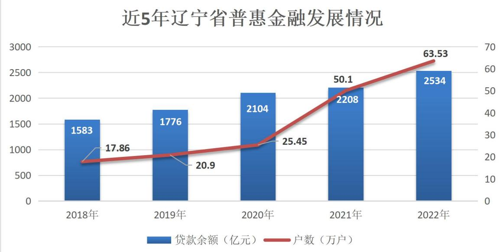
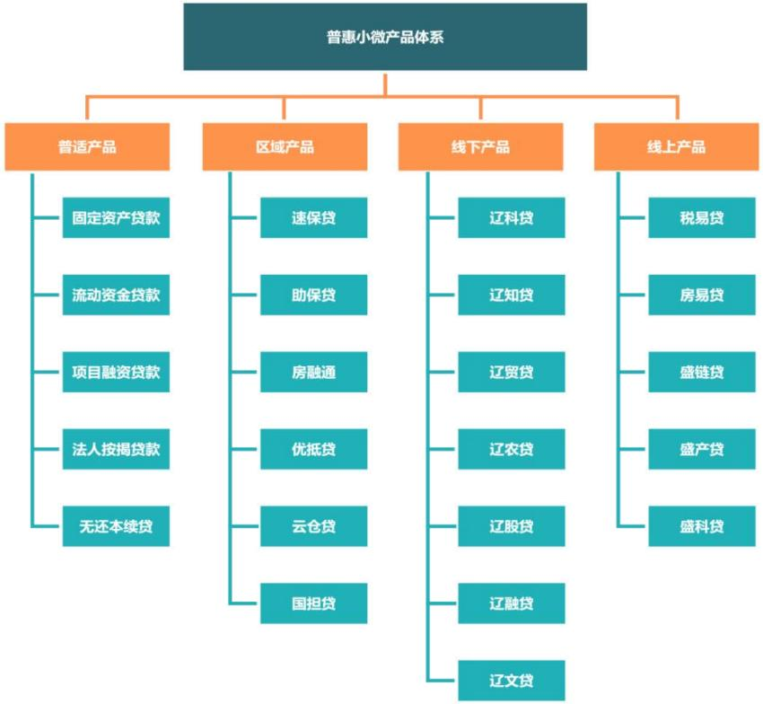
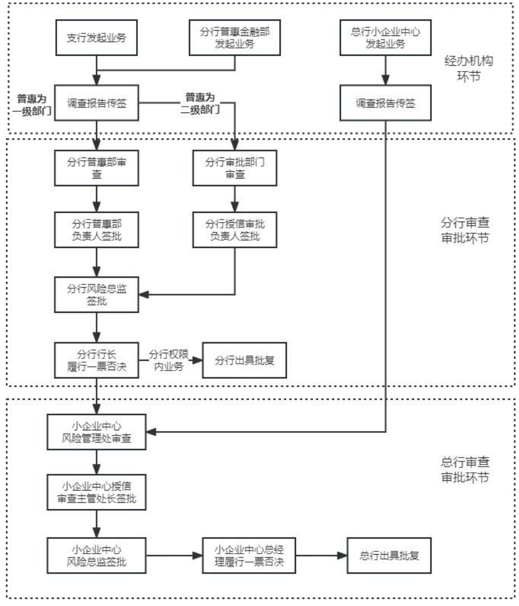
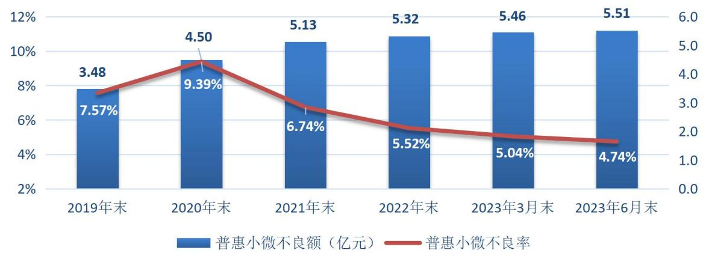
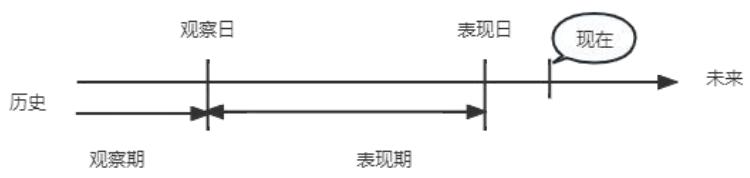
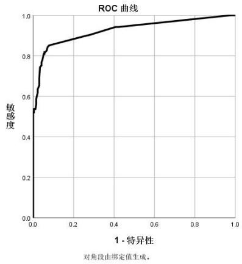

# 第 1章 绪 论

# 1.1研究背景及研究意义

# 1.1.1 研究背景

# 1.1.1.1 普惠金融对经济发展的重要性

普惠金融是我国国民经济和社会发展的重要力量，促进普惠金融发展，是保持国民经济平稳较快发展的重要基础，是关系民生和社会稳定的重大战略任务。加大普惠金融的推广，可以实现更加公平和可持续的经济增长，让更多企业从经济发展成果中受益。近年来，党中央、国务院高度重视发展普惠金融。党的十八届三中全会明确提出发展普惠金融。2015 年和2016 年《政府工作报告》提出，要大力发展普惠金融，提高金融服务的覆盖率、可得性和满意度，增强市场主体对金融服务的获得感。2019 年普惠发展战略日渐清晰，围绕小微、三农、扶贫等普惠金融服务重点，通过监管引领、指标考核、督导检查、差异化监管措施等多种方式引导银行保险机构多措并举，持续加大信贷投放、扩大服务覆盖面、提升服务质效。2020 年普惠小微企业金融服务“增量扩面、提质降本”取得了较好成效，聚焦薄弱领域，加大信贷投放、降低融资成本、增强服务小微企业的能力。2022 年《政府工作报告》要求：“推动普惠型小微贷款明显增长、信用贷款和首贷户比重继续提升。”《中国银保监会办公厅关于2022 年进一步强化金融支持小微企业发展工作的通知》（银保监办发〔2022〕37 号）还提出：“银行业金融机构总体继续实现单户授信 1000 万元以下（含）的普惠型小微企业贷款“两增”目标，即此类贷款增速不低于各项贷款增速、有贷款余额的户数不低于年初水平。”

经过多年大力发展普惠金融的努力，目前已实现了规模和户数“双增长”目标。2022年，我国普惠金融交出了一份靓丽的成绩单，2023年3月中旬发布的《2022年中国银行业服务报告》显示，截至2022年末，中国银行业金融机构用于单户授信总额1000万元及以下的小微企业（以下简称普惠型小微企业）贷款余额为23.60万亿元，同比增速 $2 3 . 6 0 \%$ 。其中，辽宁省普惠型小微企业贷款余额 0.25万亿元，同比增速 $1 4 . 7 4 \%$ ，户数63.53万户，比年初增加 13.43万户，同比增速 $2 6 . 8 1 \%$ 。近五年，辽宁省普惠型小微企业贷款高速发展，2022年普惠金融贷款余额较五年前增速 $60 \%$ ，户数较五年前增速 $2 5 6 \%$ 。详见图1.1。

  
图 1.1 近 5年辽宁省普惠金融发展情况

普惠金融对经济发展的重要性体现在多个方面：

首先，普惠金融可以促进金融包容性增长，使更多的小微企业能够获得金融服务。在许多发展中国家，很多小微企业仍然没有接触到传统银行提供的服务，普惠金融的推广可以填补这一服务缺口，让更多小微企业能够享受到金融服务的便利。

其次，普惠金融对于小微企业的发展至关重要。小微企业在国家经济中占据重要地位，它们是就业的主要来源，也是创新和经济增长的重要推动力。然而，由于缺乏资金和金融支持，许多小微企业难以获得发展所需的资金和融资渠道。普惠金融的推广可以为小微企业提供更多的融资机会和金融服务，帮助它们实现可持续发展。

此外，普惠金融还可以促进贫困地区的经济发展。贫困地区的小微企业往往面临着金融服务的缺乏和不可及性，这限制了他们的经济活动和发展机会。普惠金融的推广可以为贫困地区提供更多的金融服务，帮助其脱贫致富，推动地区经济的发展。

# 1.1.1.2 银行发展普惠型小微企业信贷业务的必要性

普惠金融是一种金融服务理念和模式，旨在通过提供包容性金融服务，使更多的个人和企业能够享受到金融服务，促进经济的可持续发展。它强调金融服务的普及性、可及性、可负担性和适应性，以满足不同人群的金融需求。在促进经济增长、创造就业机会、减少贫困和不平等现象、提高金融包容性和社会稳定、促进可持续发展目标的实现等方面均发挥了积极作用。大力发展普惠金融业务，既是国家政策导向的要求，也是银行自身发展的需要。做好、做强、做优普惠型小微企业贷款业务，银行可以“名利”双收。银行大力发展普惠金融的必要性主要体现在以下方面：

（1）监管政策方面：扶持政策众多，监管导向突出。多年来，尤其是新冠疫情期间，国家持续加大对普惠型小微企业的金融支持力度，针对银行开展普惠型小微企业贷款业务出台税收减免、政策工具、监管考核等多项鼓励政策及考核评价引导措施，引导银行大力发展普惠型小微企业信贷业务，力度之大，前所未有。

（2）市场环境方面：市场环境改善，条件日趋成熟。银企信息不对称是银行开展普惠型小微企业信贷业务，尤其是非抵押类业务的最大桎梏。近年来，监管部门大力完善普惠金融基础设施，信用环境、担保体系等不断完善，为银行拓宽普惠金融服务覆盖面提供了有利条件。

（3）银行发展方面：一是助力自身转型，优化业务结构。和中大型企业相比，普惠型小微企业数量庞大、更加灵活创新，发展普惠金融业务不仅有利于银行培养新客群、优化业务结构，而且有助于分散经营风险，所以银行纷纷将其作为战略业务大力发展。二是践行社会责任，支持实体经济。小微企业对税收贡献率超$50 \%$ ，民间投资占比超 $60 \%$ ，发明专利占比超 $70 \%$ ，就业存量占比近 $80 \%$ ，量大面广的普惠金融业务是稳经济的重要基础、稳就业的主力支撑。做好“六稳六保”，支持普惠型小微企业纾困恢复已成为银行必须也应该承担的政治任务，是银行坚持与落实金融“政治性、人民性”的具体体现之一。三是金融脱媒加速，利率改革加快。2005年至2022年10月，全国直接融资占融资总量的比重从 $1 9 . 1 \%$ 大幅提升至 $2 9 . 7 \%$ 。普惠型小微企业较大中型企业贷款有一定的利率溢价，且大多数银行的普惠型小微业务处于同一起跑线，在普惠市场化加快推进过程中，进一步下沉客户市场、服务普惠型小微企业客户是各家银行面临的必然选择。

# 1.1.1.3 普惠型小微企业信用风险管理的必要性

在普惠金融“高速”发展的同时，银行也越来越意识到“高质量可持续发展”的重要性。银行发展普惠金融业务，真正服务好普惠型小微企业，不能过于短视，应避免过度激励、费用补贴等短期行为，而要尊重市场规律、进行风险定价，最终实现可持续发展。要实现普惠金融高质量可持续发展，风险管理是关键，普惠型小微企业贷款业务是传统银行信贷业务之一，其面临的最主要风险就是信用风险损失风险。由于普惠型小微企业抗风险能力弱，规模较小，经营年限较短，缺乏充足的抵押品和担保品，以及财务状况不稳定等因素，违约率居高不下，所以如何精准识别、评估普惠金融信用风险，防范和有效管控风险，是银行普惠金融业务从业者必须面对的主要能力问题，也是银行信用风险管理的重要挑战。进行信用风险管理的必要性主要体现在以下几个方面：

风险识别和评估：信用风险管理帮助银行识别和评估借款人的信用风险。通过分析借款人的信用历史、财务状况、行为模式等因素，可以预测借款人是否有能力按时偿还债务。这有助于银行避免与高风险借款人交易，减少违约风险。

风险监控和控制：信用风险管理提供了一套监控和控制措施，以确保借款人在借款期间按时偿还债务。这包括定期审查借款人的财务状况、监测借款人的还款能力、设置适当的还款计划等。通过及时发现和处理潜在的违约风险，银行可以减少损失并保护自身利益。

资本保障和风险分散：信用风险管理有助于银行合理配置资本，以应对潜在的信用风险。通过评估借款人的信用质量和风险水平，银行可以决定是否提供贷款、贷款额度和利率等。此外，通过将风险分散到不同的借款人和行业，银行可以降低整体风险水平。

支持经济发展：信用风险管理对于经济的稳定和发展至关重要。它促使银行更加审慎地进行贷款业务，减少了金融危机和系统性风险的可能性。同时，它也为企业和个人提供了更多的融资机会，促进了经济活动和增长。

# 1.1.2 研究意义

随着我国经济的不断发展和金融市场的不断完善，普惠型小微企业作为国家经济发展的重要组成部分，其融资需求日益增长。然而，普惠型小微企业作为一个客户群体，其风险特征复杂多样，对银行的风险管控能力和服务能力提出了更高的要求。在普惠型小微企业融资过程中，客户的信用评级是银行保证业务安全、控制信用风险的重要手段。信用评级为银行提供客户的信用质量评估，用于银行的风险管理和信贷决策，以确保合规性、风险控制和资本分配的有效性。因此，本文以信用评级为研究领域，研究构建普惠型小微企业信用评级模型，旨在为银行提供更加有效的信用风险控制手段，提高对普惠型小微企业的服务水平。

首先，客户信用评级可以帮助银行更准确地评估和控制普惠型小微企业的信用风险。通过建立更完善的信用评估模型和风险管理流程，银行可以更全面地了解普惠型小微企业的经营状况、财务状况和信用状况，准确评估其信用风险水平。这有助于银行避免对高风险客户的过度暴露，降低违约风险，保护自身的资金安

全。

其次，客户信用评级可以提高银行的竞争力和可持续发展能力。通过建立良好的信用风险管理体系，银行可以树立良好的信誉和品牌形象，吸引更多普惠型小微企业选择其作为合作伙伴。同时，优化企业信用评级策略还可以降低银行的不良资产率，提高资产质量，增强银行的盈利能力和稳定性。

最后，客户信用评级还可以促进普惠型小微企业发展。通过建立信用评价机制，激励普惠型小微企业提升自身的信用状况和经营管理水平。拥有良好的信用记录和信用评级的普惠型小微企业，可以获得更高的信用评级，从而有更多的资金支持来扩大业务规模、增加生产能力、改善经营条件，进一步推动企业的发展。

# 1.2 国内外研究现状及研究趋势

# 1.2.1国外研究现状

在商业银行信用风险管理方面，Aduda 和Gitonga （2011）通过对引发信用风险产生的原因进行分析，发现可以通过商业银行增加资产的方式，控制对银行的风险，减少损失[1]。Brealey 等（2012）指出银行贷款是企业获得低成本的最好融资渠道[2]。Kurzmeyer（2015）发现银行通过建立信息共享机制，不断完善风险控制模型，从而有效管理控制信用风险[3]。Lezgovko（2017）发现商业银行信贷风险和收益具有强相关性关系，风险越高，收益就越高，因此在保持合适收益的同时，商业银行必须加强信贷风险管理[4]。Rusmanto（2020）研究发现银行资本量和系统风险具有负相关关系，资本量越大，系统风险就越小，为了降低银行机构的系统风险，可以采取促进私人信贷机构的发展来增强银行机构之间的竞争[5]。

在信用风险识别和控制方面，Anderson 和Fraser（2000）指出量化后的信用风险可以有效地预测和分析信用风险，相关的信用风险指标也应该被分析和监控[6]。Valenzuela（2002）指出控制风险的主要方法是控制信用风险[7]。Gordy Heitfield（2002）提出了多因素模型下的资产相关性估计方法，利用蒙特卡罗模拟检验了观测次数对估计误差的影响，运用标准普（Standard&Poor'S）和穆迪（Moody'S）的数据证明了 MLE（Maximum like Estimator）方法给出了可靠的系数估计[8]。Hamerle、Liebieg 和 Rosh（2003）也将 MLE 方法用于单因素模型。他们估计了不同商业部门和国家的资产相关性[9]。Konovalova 等（2016）通过分析了债务人的风险因素，实现控制和改善银行信贷风险管理水平的目标[10]。

# 1.2.2国内研究现状

在商业银行信用风险管理方面，于杰（2017）认为商业银行要完善现有的组织机构，创建优良的管理文化氛围，建立科学的风险管理信息系统[11]。周倩（2019）认为商业银行要形成正确的信用风险管理理念，完善信用风险评估体系，国家相关部门应该创造良好的外部条件，加快金融业发展的步伐[12]。王向华（2019）发现商业银行信用风险基本要素，即客户授信风险、信用风险平衡和统一授信管理，对商业银行风险管理的目标具有非常重要的作用[13]。王梓宁（2020）认为商业银行要不断健全相关法律法规、完善信用体系，加强管理，促进商业银行信贷业务能够可持续发展[14]。王湘湘（2020）认为小微企业贷款的风险管理机制建设将成为商业银行的核心要务，唯有科学完善风险管理机制，方能保证商业银行利于不败之地[15]。马千驹和向娟（2020）发现将大数据与中小微企业信贷风险管理有机地结合起来,构建中小微企业贷款动态、智能的风控系统，对中小微企业健康发展至关重要[16]。周雪雁（2020）认为针对小微企业信用风险频发的难点,亟需在战略、技术层面实施灵活机动的主动退出策略,以疏通潜在风险客户的退出渠道,高效运转存量资产,有效调整小微企业信贷结构[17]。

在信用风险识别和控制方面，朱艳敏（2014）结合Logistic回归构建了小微企业贷款的信用评分模型，并开发了简易可操作性强的信用评分卡[18]。杨雁雁（2017）提出通过定性分析与定量分析对公司信贷信用风险进行度量，建立有效预警[19]。徐雨珊（2018）发现虽然 Credit Risk $^ +$ 模型在我国应用中有局限性，但可以优化出适合自身发展的得力模型[20]。赵晓娟（2019）发现BP 神经网络模型可以在银行的风险管理过程中被用来进行预测和评估[21]。

# 1.3 研究内容和研究方法

# 1.3.1 研究内容

本文以S银行普惠型小微企业法人客户作为研究对象，以信用评级为研究重点，通过对大量历史数据进行分析，将普惠型小微企业的各种特征与其信用风险进行关联，基于 Logistic 回归对单一客户普惠型小微企业信用评级模型进行构建，利用信用评级结果给出信用评分卡，从而预测借款人的信用等级或违约概率，达到控制其信用风险的目的。

本文研究内容主要分为七个部分：

第一章为绪论。阐述了本文的研究背景与研究意义，梳理国内和国外研究现状，详细介绍了本文的研究内容和研究方法。

第二章为基础理论方法。首先，阐述普惠型小微企业定义和信用风险相关的概念及理论；然后，梳理信用风险的管理过程，包括风险识别、风险评估、风险监测、风险控制及其运作机制；最后，介绍信息价值统计量的计算步骤和 Logistic回归基本原理、参数估计和构建模型的步骤；

第三章为S银行普惠型小微企业授信业务信用风险管理现状分析。首先，介绍S 银行概况；然后，分析该行普惠型小微企业信贷规模、产品体系和授信业务信用风险管理的现状；最后，提出该行普惠型小微企业授信业务信用管理方面存在的问题。

第四章为S银行普惠型小微企业授信业务信用风险识别。首先，结合“5C”分析法设计问卷调查，并完成问卷调查的发放与回收；其次，结合问卷调查结果，分析影响小微企业授信业务信用风险的因素；最后，通过计算信息价值统计量识别出影响普惠型小微企业授信业务信用风险的重要因素。

第五章为S银行普惠型小微企业授信业务信用风险评估。通过上一章识别出的影响普惠型小微企业信用风险的主要因素，构建普惠型小微企业 Logistic回归信用评级模型，并对其进行信用风险评估。

第六章为S银行控制普惠型小微企业授信业务信用风险应对措施。结合风险评估结果和银行自身经营存在的问题，从行业趋势分析、银企信息对称、企业经营管理、实际控制人资信等八个方面提出控制信用风险的应对措施。

第七章为结论及展望。总结全文结论，并指出下一步研究方向。论文逻辑结构见图 1.2所示。

  
图 1.2 论文逻辑结构图

# 1.3.2 研究方法

本文对普惠型小微企业授信业务信用风险管理研究的方法包括以下几个方面：

文献研究法：通过查阅相关的学术文献、研究报告和行业资料，了解信用风险管理的理论基础、方法和实践经验。建立对该领域的整体认识，并了解前人的研究成果和观点。

调查问卷法：通过实地调研、访谈、问卷调查等方式了解银行在普惠型小微企业信用风险管理方面的经验和教训，分析普惠金融从业人员在实际授信业务中重点关注的信用风险因素，通过信用价值统计量识别影响普惠型小微企业信用风险的重要因素，为普惠型小微企业信用评级模型的研究提供实践参考和借鉴。

定量分析法：通过收集近几年历史信贷业务数据，对信用评级管理进行定量化分析研究。对历史借款人的信用状况、偿债能力、营运能力、成长能力等数据进行统计分析，通过构建 Logistic回归信用评级模型来评估信用风险，并对其进行评价和验证，以保证其评估结果有效性和适用性。

# 第 2 章 理论基础

# 2.1相关概念

# 2.1.1普惠型小微企业定义

普惠型小微企业：指的是单户授信1000 万元（含）以下小微企业。

（1）单户授信：指对单一客户表内外统一授信的总额度，按照原银保监会《银行集团客户授信业务风险管理指引》规定，授信包括但不限于：贷款、贸易融资、票据承兑和贴现、透支、保理、担保、贷款承诺、开立信用证等表内外业务。

（2）小微企业：按照《关于印发普惠型小微企业划型标准规定的通知》（工信部联企业〔2011〕300 号）有关小型微型企业法人的标准划定，企业划型适用行业按企业从事的主要经济活动确定。企业具体划型标准如下：

表 2.1 企业划型标准表  
Table 2.1 Enterprise Classification Standard Table   

<table><tr><td rowspan=1 colspan=1>行业名称</td><td rowspan=1 colspan=1>指标名称</td><td rowspan=1 colspan=1>计量单位</td><td rowspan=1 colspan=1>大型</td><td rowspan=1 colspan=1>中型</td><td rowspan=1 colspan=1>小型</td><td rowspan=1 colspan=1>微型</td></tr><tr><td rowspan=1 colspan=1>农、林、牧、渔业</td><td rowspan=1 colspan=1>营业收入(Y)</td><td rowspan=1 colspan=1>万元</td><td rowspan=1 colspan=1>Y≥20000</td><td rowspan=1 colspan=1>500≤Y&lt;20000</td><td rowspan=1 colspan=1>50≤Y&lt;500</td><td rowspan=1 colspan=1>Y&lt;50</td></tr><tr><td rowspan=2 colspan=1>工业*</td><td rowspan=1 colspan=1>从业人员(X)</td><td rowspan=1 colspan=1>人</td><td rowspan=1 colspan=1>X≥1000</td><td rowspan=1 colspan=1>300≤X&lt;1000</td><td rowspan=1 colspan=1>20≤X&lt;300</td><td rowspan=1 colspan=1>X&lt;20</td></tr><tr><td rowspan=1 colspan=1>营业收入(Y)</td><td rowspan=1 colspan=1>万元</td><td rowspan=1 colspan=1>Y≥40000</td><td rowspan=1 colspan=1>2000≤Y&lt;40000</td><td rowspan=1 colspan=1>300≤Y&lt;2000</td><td rowspan=1 colspan=1>Y&lt;300</td></tr><tr><td rowspan=2 colspan=1>建筑业</td><td rowspan=1 colspan=1>营业收入(Y)</td><td rowspan=1 colspan=1>万元</td><td rowspan=1 colspan=1>Y≥80000</td><td rowspan=1 colspan=1>6000≤Y&lt;80000</td><td rowspan=1 colspan=1>300≤Y&lt;6000</td><td rowspan=1 colspan=1>Y&lt;300</td></tr><tr><td rowspan=1 colspan=1>资产总额(Z)</td><td rowspan=1 colspan=1>万元</td><td rowspan=1 colspan=1>Z≥80000</td><td rowspan=1 colspan=1>5000≤Z&lt;80000</td><td rowspan=1 colspan=1>300≤Z&lt;5000</td><td rowspan=1 colspan=1>Z&lt;300</td></tr><tr><td rowspan=2 colspan=1>批发业</td><td rowspan=1 colspan=1>从业人员(X)</td><td rowspan=1 colspan=1>人</td><td rowspan=1 colspan=1>X≥200</td><td rowspan=1 colspan=1>20≤X&lt;200</td><td rowspan=1 colspan=1>5≤X&lt;20</td><td rowspan=1 colspan=1>X&lt;5</td></tr><tr><td rowspan=1 colspan=1>营业收入(Y)</td><td rowspan=1 colspan=1>万元</td><td rowspan=1 colspan=1>Y≥40000</td><td rowspan=1 colspan=1>5000≤Y&lt;40000</td><td rowspan=1 colspan=1>1000≤Y&lt;5000</td><td rowspan=1 colspan=1>Y&lt;1000</td></tr><tr><td rowspan=2 colspan=1>零售业</td><td rowspan=1 colspan=1>从业人员(X）</td><td rowspan=1 colspan=1>人</td><td rowspan=1 colspan=1>X≥300</td><td rowspan=1 colspan=1>50≤X&lt;300</td><td rowspan=1 colspan=1>10≤X&lt;50</td><td rowspan=1 colspan=1>X&lt;10</td></tr><tr><td rowspan=1 colspan=1>营业收入(Y)</td><td rowspan=1 colspan=1>万元</td><td rowspan=1 colspan=1>Y≥20000</td><td rowspan=1 colspan=1>500≤Y&lt;20000</td><td rowspan=1 colspan=1>100≤Y&lt;500</td><td rowspan=1 colspan=1>Y&lt;100</td></tr><tr><td rowspan=2 colspan=1>交通运输业*</td><td rowspan=1 colspan=1>从业人员(X)</td><td rowspan=1 colspan=1>人</td><td rowspan=1 colspan=1>X≥1000</td><td rowspan=1 colspan=1>300≤X&lt;1000</td><td rowspan=1 colspan=1>20≤X&lt;300</td><td rowspan=1 colspan=1>X&lt;20</td></tr><tr><td rowspan=1 colspan=1>营业收入(Y)</td><td rowspan=1 colspan=1>万元</td><td rowspan=1 colspan=1>Y≥30000</td><td rowspan=1 colspan=1>3000≤Y&lt;30000</td><td rowspan=1 colspan=1>200≤Y&lt;3000</td><td rowspan=1 colspan=1>Y&lt;200</td></tr><tr><td rowspan=2 colspan=1>仓储业*</td><td rowspan=1 colspan=1>从业人员(X)</td><td rowspan=1 colspan=1>人</td><td rowspan=1 colspan=1>X≥200</td><td rowspan=1 colspan=1>100≤X&lt;200</td><td rowspan=1 colspan=1>20≤X&lt;100</td><td rowspan=1 colspan=1>X&lt;20</td></tr><tr><td rowspan=1 colspan=1>营业收入(Y)</td><td rowspan=1 colspan=1>万元</td><td rowspan=1 colspan=1>Y≥30000</td><td rowspan=1 colspan=1>1000≤Y&lt;30000</td><td rowspan=1 colspan=1>100≤Y&lt;1000</td><td rowspan=1 colspan=1>Y&lt;100</td></tr><tr><td rowspan=2 colspan=1>邮政业</td><td rowspan=1 colspan=1>从业人员(X)</td><td rowspan=1 colspan=1>人</td><td rowspan=1 colspan=1>X≥1000</td><td rowspan=1 colspan=1>300≤X&lt;1000</td><td rowspan=1 colspan=1>20≤X&lt;300</td><td rowspan=1 colspan=1>X&lt;20</td></tr><tr><td rowspan=1 colspan=1>营业收入(Y)</td><td rowspan=1 colspan=1>万元</td><td rowspan=1 colspan=1>Y≥30000</td><td rowspan=1 colspan=1>2000≤Y&lt;30000</td><td rowspan=1 colspan=1>100≤Y&lt;2000</td><td rowspan=1 colspan=1>Y&lt;100</td></tr><tr><td rowspan=2 colspan=1>住宿业</td><td rowspan=1 colspan=1>从业人员(X)</td><td rowspan=1 colspan=1>人</td><td rowspan=1 colspan=1>X≥300</td><td rowspan=1 colspan=1>100≤X&lt;300</td><td rowspan=1 colspan=1>10≤X&lt;100</td><td rowspan=1 colspan=1>X&lt;10</td></tr><tr><td rowspan=1 colspan=1>营业收入(Y)</td><td rowspan=1 colspan=1>万元</td><td rowspan=1 colspan=1>Y≥10000</td><td rowspan=1 colspan=1>2000≤Y&lt;10000</td><td rowspan=1 colspan=1>100≤Y&lt;2000</td><td rowspan=1 colspan=1>Y&lt;100</td></tr><tr><td rowspan=2 colspan=1>餐饮业</td><td rowspan=1 colspan=1>从业人员(X)</td><td rowspan=1 colspan=1>人</td><td rowspan=1 colspan=1>X≥300</td><td rowspan=1 colspan=1>100≤X&lt;300</td><td rowspan=1 colspan=1>10≤X&lt;100</td><td rowspan=1 colspan=1>X&lt;10</td></tr><tr><td rowspan=1 colspan=1>营业收入(Y)</td><td rowspan=1 colspan=1>万元</td><td rowspan=1 colspan=1>Y≥10000</td><td rowspan=1 colspan=1>2000≤Y&lt;10000</td><td rowspan=1 colspan=1>100≤Y&lt;2000</td><td rowspan=1 colspan=1>Y&lt;100</td></tr><tr><td rowspan=2 colspan=1>信息传输业*</td><td rowspan=1 colspan=1>从业人员(X)</td><td rowspan=1 colspan=1>人</td><td rowspan=1 colspan=1>X≥2000</td><td rowspan=1 colspan=1>100≤X&lt;2000</td><td rowspan=1 colspan=1>10≤X&lt;100</td><td rowspan=1 colspan=1>X&lt;10</td></tr><tr><td rowspan=1 colspan=1>营业收入(Y)</td><td rowspan=1 colspan=1>万元</td><td rowspan=1 colspan=1>Y≥100000</td><td rowspan=1 colspan=1>1000≤Y&lt;100000</td><td rowspan=1 colspan=1>100≤Y&lt;1000</td><td rowspan=1 colspan=1>Y&lt;100</td></tr><tr><td rowspan=2 colspan=1>软件和信息技术服务业</td><td rowspan=1 colspan=1>从业人员(X)</td><td rowspan=1 colspan=1>人</td><td rowspan=1 colspan=1>X≥300</td><td rowspan=1 colspan=1>100≤X&lt;300</td><td rowspan=1 colspan=1>10≤X&lt;100</td><td rowspan=1 colspan=1>X&lt;10</td></tr><tr><td rowspan=1 colspan=1>营业收入(Y)</td><td rowspan=1 colspan=1>万元</td><td rowspan=1 colspan=1>Y≥10000</td><td rowspan=1 colspan=1>1000≤Y&lt;10000</td><td rowspan=1 colspan=1>50≤Y&lt;1000</td><td rowspan=1 colspan=1>Y&lt;50</td></tr><tr><td rowspan=2 colspan=1>房地产开发经营</td><td rowspan=1 colspan=1>营业收入(Y)</td><td rowspan=1 colspan=1>万元</td><td rowspan=1 colspan=1>Y≥200000</td><td rowspan=1 colspan=1>1000≤Y&lt;200000</td><td rowspan=1 colspan=1>100≤Y&lt;1000</td><td rowspan=1 colspan=1>Y&lt;100</td></tr><tr><td rowspan=1 colspan=1>资产总额(Z)</td><td rowspan=1 colspan=1>万元</td><td rowspan=1 colspan=1>Z≥10000</td><td rowspan=1 colspan=1>5000≤Z&lt;10000</td><td rowspan=1 colspan=1>2000≤Z&lt;5000</td><td rowspan=1 colspan=1>Z&lt;2000</td></tr><tr><td rowspan=2 colspan=1>物业管理</td><td rowspan=1 colspan=1>从业人员(X)</td><td rowspan=1 colspan=1>人</td><td rowspan=1 colspan=1>X≥1000</td><td rowspan=1 colspan=1>300≤X&lt;1000</td><td rowspan=1 colspan=1>100≤X&lt;300</td><td rowspan=1 colspan=1>X&lt;100</td></tr><tr><td rowspan=1 colspan=1>营业收入(Y)</td><td rowspan=1 colspan=1>万元</td><td rowspan=1 colspan=1>Y≥5000</td><td rowspan=1 colspan=1>1000≤Y&lt;5000</td><td rowspan=1 colspan=1>500≤Y&lt;1000</td><td rowspan=1 colspan=1>Y&lt;500</td></tr><tr><td rowspan=2 colspan=1>租赁和商务服务业</td><td rowspan=1 colspan=1>从业人员(X)</td><td rowspan=1 colspan=1>人</td><td rowspan=1 colspan=1>X≥300</td><td rowspan=1 colspan=1>100≤X&lt;300</td><td rowspan=1 colspan=1>10≤X&lt;100</td><td rowspan=1 colspan=1>X&lt;10</td></tr><tr><td rowspan=1 colspan=1>资产总额(Z)</td><td rowspan=1 colspan=1>万元</td><td rowspan=1 colspan=1>Z≥120000</td><td rowspan=1 colspan=1>8000≤Z&lt;120000</td><td rowspan=1 colspan=1>100≤Z&lt;8000</td><td rowspan=1 colspan=1>Z&lt;100</td></tr><tr><td rowspan=1 colspan=1>其他未列明行业*</td><td rowspan=1 colspan=1>从业人员(X）</td><td rowspan=1 colspan=1>人</td><td rowspan=1 colspan=1>X≥300</td><td rowspan=1 colspan=1>100≤X&lt;300</td><td rowspan=1 colspan=1>10≤X&lt;100</td><td rowspan=1 colspan=1>X&lt;10</td></tr></table>

# 2.1.2信用风险相关概念

银行本质上是经营风险，以经营风险为其盈利为根本手段。银行作为金融机构，承担和管理风险是其基本职能之一，也是银行业务不断创新发展的原动力。风险管理作为银行实施经营战略的重要手段，极大地改变了银行的经营管理模式。传统上，银行往往追求扩大规模和增加利润，但这种粗放经营模式存在一定的风险。而风险管理的引入，使银行能够更加精细地管理风险与收益的匹配，从而实现更稳健和可持续的经营。风险管理理论主要研究如何识别、评估、控制和应对各种风险，包括信用风险、市场风险、操作风险等。

# 2.1.2.1 信用风险理论

信用风险理论是研究借款人或债务人的信用状况、还款能力、担保品价值等因素对信用风险的影响，以及如何通过识别、评估、监控、控制和转移信用风险来降低银行或企业的信用风险暴露。常见的信用风险理论包括Merton 模型、结构化信用风险模型、违约概率模型、Logistic回归模型等。

# 2.1.2.2 信用风险定义

信用风险是指借款人或债务人无法按时偿还贷款或债务的风险。信用风险通常涵盖两方面的内容，一方面是借款人违约风险，借款人可能由于各种原因无法按时偿还贷款或债务，如财务困难、经营不善、市场变化等；另一方面是违约损失，当借款人违约时，银行可能会遭受损失，这包括未偿还的贷款本金、利息以及可能的违约罚金和诉讼费用等，违约损失可能对银行的盈利能力和资本充足性产生负面影响。

以传统观念角度而言，信用风险只有在银行的债务人或交易对手出现违约后而产生的一种风险，这种风险可称之为“违约风险”。然而，仅以这种观念来阐明信用风险，显然认识并不全面。以贷款为例，其内在价值由未来现金流折现而来，而折现率要考虑贷款人的风险程度。在贷款人不按约定偿还债务的情况下，固然会形成一定程度或全部损失。但在贷款人信用等级和履约能力降低时，贷款风险上升使得折现率相应提高，贷款的内在经济价值也会发生贬损。

# 2.1.2.3 信用风险的特点

信用风险作为银行风险中最重要的一部分，除了具备其他类型风险相同的一般特点外，如不确定性、突发性、隐蔽性和传递性等，信用风险也有其独特的特点：肥尾性、不良贷款集中爆发性、难量化和数据获取困难。

（1）肥尾性：由于信用风险的特殊性，所以当交易的一方承受信用风险时，其预期的风险和收益是非对称的，风险是未知的、不可测的，而收益是相对固定的、有上限的，因此往往信用风险损益的分布是负偏的。

（2）不良贷款集中爆发性：在现实生活中，银行很难做到分散经营，所以生活中的不良贷款常常集中于某一地区或者某一行业。以城市银行为例，信贷集中的现象十分明显，城市银行的房地产业务一般会聚集在该城市，然而楼市的动荡不安会造成银行不良贷款率的升高。

（3）难量化和数据获取困难：信息的不对称、交易对手的履约意愿等因素，使得大多数银行不能够准确的量化银行信用风险的大小，也不能够及时的进行识别和评估，这一现象在中小银行尤为明显。同时，金融市场缺乏一定的交换信息平台、信贷资产流动性较差、信贷持续时间较长等因素也影响了数据的获取。

# 2.1.3信用评级相关概念

信用等级作为银行对企业综合性的衡量，对银行资源调配提供指导，并有效降低银行的风险，保障其有效运行。在综合评估企业信用风险、资源调配指导、风险管理工具和信用市场的发展等方面，信用等级都发挥着重要的作用。

# 2.1.3.1 信用评级的定义

信用评级是一种对借款人、发行人或债务工具进行信用质量评估的过程。它是金融市场中常用的一种工具，用于评估借款人或发行人偿还债务的能力和意愿。信用评级的目的是为投资者提供有关债务工具风险水平的信息，帮助他们做出投资决策。在银行层面上，信用评级是一种经营管理行为，它是通过对客户的了解、调研和考核，运用定性、定量、数理统计和标准化的操作流程来评估其履行有关经济义务的能力和发生违约的可能性，并据此决定信贷额度和资产的组合的行为。具体来说，信用等级是银行对客户信用状况进行综合评估的一种方法，它运用规范、统一的评价方法，对客户在一定经营时期内的偿债能力和意愿进行定量和定性分析，通过这种评估，银行可以对客户的信用状况做出客观公正的综合评判，并用简单的评级符号表示信用风险的大小。客户信用评级通常采用字母或数字等符号来表示，常见的评级体系包括 AAA、AA、A、BBB、BB、B、CCC等。其中，AAA 表示最高信用等级，表示借款人或债务人具有极低的信用风险；而CCC表示最低信用等级，表示借款人或债务人具有极高的信用风险。

# 2.1.3.2 信用评级的作用

巴塞尔资本协议是一项国际规范，旨在规范银行的风险管理和资本监管。在2004 年出台的新资本协议中，倡导使用内部评级法，鼓励有条件的银行建立自己的内部评级模型，以准确计量风险关键指标。内部评级法是一种以银行内部风险评级为基础的资本充足率计算和资本监管方法。可以说，巴塞尔新资本协议对风险管理和资本监管的要求都是建立在银行科学的内部评级基础上的，内部评级在银行风险管理中具有核心的基础地位。

内部评级法在银行风险管理中扮演着重要的角色。根据巴塞尔委员会对十国集团的调查显示，内部评级已经被广泛应用于授信审批、贷款定价、限额管理、风险预警、信贷政策、分配经济资本等方面，这表明内部评级在银行经营管理中发挥着重要作用[25]。具体来说，内部评级法允许银行根据其自身的风险管理能力和数据分析能力，建立自己的风险评级模型，银行可以更准确地评估客户的信用风险，这有助于银行更好地理解和管理风险，从而制定更有效的风险管理策略。内部评级法还可以帮助银行更准确地确定资本充足率，根据内部评级的结果，银行可以根据不同风险类别的资本要求，分配适当的资本，这有助于银行更好地管理资本，确保其在面对风险时具备足够的资本储备。

# 2.2信用风险管理过程

信用风险是银行面临的最常见和最重要的风险之一，信用风险管理是银行为了降低信用风险而采取的一系列措施和方法，是通过识别、评估、监测、控制信用风险，建立完善的管理体系，以降低银行面临的违约风险，并保护其资产安全和经营稳定。

信用风险贯穿于银行开展的各项经营活动中，所以必须引起银行各方面的高度重视，采取科学化的方式来对信用风险进行有效的监管与控制，要注重宏观经济出现的变动，熟知市场变动情况，通过获取各项有效的信息，为制定行之有效的风险管理方式提供重要依据。

# 2.2.1 风险识别

风险识别是指在风险管理过程中，识别和确定可能对组织、项目或个人产生负面影响的潜在风险的过程。它是风险管理的第一步，旨在识别和理解可能发生的风险事件，以便能够采取相应的措施来降低或避免这些风险。通过收集信息、分析数据和评估环境，确定可能对组织或个人产生不利影响的风险，可以通过风险评估、SWOT 分析、市场研究等方法来完成。通常包括以下几个方面：

（1）风险源识别：识别可能导致风险的源头或原因。这可以通过分析组织的内部和外部环境，审查相关文件和数据，以及与相关利益相关者进行讨论和交流来实现。风险源识别的目标是确定可能导致风险的因素，以便进一步分析和评估。

（2）风险事件识别：识别可能发生的风险事件或情景。这可以通过头脑风暴、场景分析、历史数据分析等方法来实现。风险事件识别的目标是确定可能发生的风险事件，以便能够对其进行进一步的分析和评估。

（3）风险影响识别：识别风险事件发生后可能对组织、项目或个人造成的影响。这可以包括财务损失、声誉损害、法律责任、安全风险等方面的影响。风险影响识别的目标是确定风险事件发生后可能对组织、项目或个人造成的潜在影响，以便能够为决策者提供风险管理的依据。

（4）风险登记：将识别到的风险记录在风险登记表或风险数据库中。风险登记的目标是将识别到的风险进行整理和归档，以便能够对其进行进一步的分析、评估和管理。

# 2.2.2 风险评估

风险评估是指对已识别的风险进行定量或定性的评估，以确定其可能性和影响程度的过程，它是风险管理中的关键步骤，旨在为决策者提供有关风险的信息，以便他们能够优先处理高优先级的风险，并制定相应的风险应对策略。风险评估的重要性在于为决策者提供有关风险的信息，帮助他们了解风险的严重程度和优先级，以便采取适当的风险管理措施。通过风险评估，组织或个人可以更好地了解风险的潜在影响，制定相应的风险管理策略，减少潜在损失，并提高业务的可持续性和抵御风险的能力。通常包括以下几个方面：

（1）风险概率评估：评估风险事件发生的概率或可能性。这可以通过历史数据、专家判断、统计分析等方法来实现。概率评估的目标是确定风险事件发生的可能性大小，以便为决策者提供风险的量化信息。

（2）风险影响评估：评估风险事件发生后可能对组织或个人造成的影响程度。这可以包括财务损失、声誉损害、法律责任、安全风险等方面的影响。影响评估的目标是确定风险事件发生后可能对组织或个人造成的潜在影响，以便为决策者提供风险的定性信息。

（3）风险优先级评估：根据风险概率和影响的评估结果，确定风险的优先级。这可以通过风险矩阵、风险评分等方法来实现。优先级评估的目标是确定哪些风险是高优先级的，需要优先处理和管理。

（4）风险评估报告：根据风险评估的结果，生成风险评估报告，向相关利益相关者提供风险情况的信息。风险评估报告应该包括风险的概率、影响、优先级评估结果，以及建议的风险应对措施。评估报告的目标是为决策者提供决策支持，帮助他们制定风险管理策略和措施。

# 2.2.3 风险监测

风险监测是指在风险管理过程中，对已识别的风险进行实时或定期的跟踪和监控的过程。它旨在确保组织或个人能够及时了解风险的发展和变化情况，以便采取适当的措施来应对和管理这些风险。风险监测的重要性在于帮助组织或个人及时了解风险的发展和变化情况，以便能够采取适当的措施来应对和管理这些风险。通过风险监测，组织或个人可以及时发现风险的变化趋势，预测可能的风险事件，从而能够采取相应的措施来降低风险的影响，并保护自身的利益和业务的可持续性。通常包括以下几个方面：

（1）数据收集：收集与已识别风险相关的数据和信息。这可以包括内部数据（如业务运营数据、财务数据）和外部数据（如市场数据、竞争对手数据、行业趋势数据等）。数据收集的目标是获取全面、准确的信息，以便能够对风险进行有效的监测和分析。

（2）监测指标定义：确定用于监测风险的关键指标和度量标准。这些指标可以是定量的（如财务指标、市场份额）或定性的（如声誉指标、客户满意度）。监测指标的定义的目标是建立一个可衡量和可比较的指标体系，以便能够对风险的发展和变化进行有效的监测和评估。

（3）监测方法和工具：选择和应用适当的监测方法和工具来跟踪风险的发展和变化。这可以包括定期报告、数据分析、市场调研、舆情监测、风险评估等方法和工具。监测方法和工具的选择的目标是确保能够及时、准确地获取风险信息，并能够对其进行分析和评估。

（4）监测结果分析：对监测到的风险信息进行分析和评估。这包括对风险的趋势、变化和影响进行分析，以及对风险事件的可能性和严重性进行评估。监测结果分析的目标是帮助组织或个人理解风险的发展和变化趋势，为决策者提供风险管理的依据。

（5）监测报告和沟通：根据监测结果，编制监测报告，并与相关利益相关者进行沟通和交流。监测报告的目标是向决策者和利益相关者提供风险的实时或定期更新，以便能够采取适当的措施来管理和应对风险。

# 2.2.4 风险控制

风险控制是指通过采取一系列措施和策略，以减少或控制潜在风险对组织或个人的负面影响的过程。它是风险管理的核心环节，旨在保护组织或个人的利益，确保其能够实现预定的目标。主要包括以下几个方面：

（1）风险避免：通过避免参与可能带来高风险的活动或决策，来降低风险的发生概率。这可以通过放弃某些业务、项目或投资机会来实现，以避免潜在的风险。

（2）风险转移：将风险转移给其他方，以减轻自身承担风险的压力。这可以通过购买保险、签订合同、外包服务等方式来实现。通过风险转移，组织或个人可以将一部分风险责任转移到其他方，减少自身的风险暴露。

（3）风险减轻：通过采取措施来减少风险的发生概率或降低风险的影响程度。这可以包括加强安全措施、改进流程、提高员工培训等。通过风险减轻，可以降低风险的严重性和可能性。

（4）风险接受：对某些风险进行接受，并做好应对准备。这通常发生在风险的发生概率较低或风险的影响较小的情况下。在接受风险的同时，组织或个人需要制定相应的应急预案和应对措施，以应对可能的风险事件。

（5）风险监测和调整：持续监测已实施的风险控制措施的有效性，并根据风险情况进行调整和改进。这包括定期审查风险管理计划、监测关键风险指标、进行风险演练等。通过风险监测和调整，可以及时发现和应对新的风险，确保风险控制策略的有效性。

# 2.3信用评级模型

信用评级模型是信贷管理中的先进的技术手段，是银行最核心的管理技术之一，在市场营销、信贷审批、风险管理、客户关系管理等方面都发挥十分重要的作用。银行信用评级定量模型是基于大量历史数据，包括借款人的财务数据、交易数据、违约历史等，运用统计分析和数据挖掘技术来发现数据中的规律和模式。常用的技术包括回归分析、决策树、神经网络、支持向量机等，这些技术能够准确计算概率违约率（Probability of Default，PD）、损失给定违约（Loss Given Default，LGD）、预期损失（Expected Loss，EL）和不确定损失（Unexpected Loss，UL）等关键指标，并通过模型来预测违约概率和损失水平。

客户评级模型是基于数据和科学方法构建的，它可以提供客观的风险评估结果。然而，不能忽视专家经验判断的重要性，将其作为调整变量设置在内部评级模型之外，可以确保评级的客观性、一致性和系统性。专家们凭借多年的经验和专业知识，能够对特定情况进行综合分析和判断，提供宝贵的信息和洞察力，对模型的结果进行调整和修正，以更准确地反映实际情况。通过将专家判断与内部评级模型相结合，可以充分发挥经验判断的优势，这种有机融合使得风险评级不仅具备科学性，还能充分考虑到专家的主观判断和经验，提高评级的准确性和可靠性。

# 2.3.1 信用评级模型指标筛选

信息价值（InformationValue，IV）统计量常用于建模的指标筛选，用于衡量自变量（特征）对因变量（目标变量）的预测能力。IV 值可以帮助我们筛选和选择最具有预测能力的特征。IV 值的计算基于信息熵的概念，它衡量了自变量对目标变量的信息增益。一般来说，IV 值越高，表示自变量对目标变量的预测能力越强。

计算IV 值的公式：

$$
\begin{array} { l l } { { I V _ { i } = \displaystyle { \left( \frac { B a d _ { i } } { B a d _ { T } } - \frac { G o o d _ { i } } { G o o d _ { T } } \right) ^ { * } W O E _ { i } } } } \\ { { { } } } \\ { { \displaystyle { = \left( \frac { B a d _ { i } } { B a d _ { T } } - \frac { G o o d _ { i } } { G o o d _ { T } } \right) ^ { * } \mathrm { l n } \left( \frac { B a d _ { i } } { B a d _ { T } } / \frac { G o o d _ { i } } { G o o d _ { T } } \right) } } } \\ { { { } } } \\ { { \displaystyle I V = \sum _ { i = 1 } ^ { n } I V _ { i } } } \end{array}
$$

具体计算的步骤：

（1）将自变量按照取值情况，将其不同取值进行分组。按具有相同或相似行为方式或对因变量有相近影响的取值合并为一组，使组间差异达到最大化，以提高模型的预测效力的行为。

（2）对于每个分组，计算该分组中目标变量的两个概率：正例概率 $P ( y = 1 | x )$ 和负例概率 $P ( y = 0 | x )$ 。

（3）计算每个分组的 WOE（Weight of Evidence）值，即自变量取值的对数比值的差异。WOE 值可以用来衡量自变量取值对目标变量的预测能力。

（4）计算每个分组的 IV 值，即将WOE 值乘以自变量取值的正例概率和负例概率的差异。IV 值越高，表示该分组的预测能力越强。

（5）将所有分组的 IV 值相加，得到自变量的总IV 值。

通过计算IV 值，可以评估出自变量的重要性，并选择具有较高IV 值的特征用于建模和预测。要注意的是，IV 值的计算是基于离散型变量的，对于连续型变量，需要进行分箱处理后再计算IV 值。

# 2.3.2信用评级模型实现

Logistic 回归是一种常用的统计模型，它基于逻辑函数（也称为sigmoid 函数）将线性组合的结果转换为 0 到 1 之间的概率值，用于预测二元变量（如是/否、成功/失败等）的概率。Logistic 回归是一种简单而直观的分类算法，易于理解和实现。它的计算效率高，适用于处理大规模数据集，具有可解释性强、对复杂数据模式适应性强、受异常值影响较小等优点，可以预测事件发生的概率。在实际应用中，Logistic 回归是信用评级最常用的模型，其稳定性、精确性和适用性等方面都较为理想，在制作信用评分卡时 Logistic 模型更有效。本文拟采用这一方法，所以对其原理、参数估计以及构建回归模型的步骤做重点介绍。

# 2.3.2.1 Logistic 回归的基本原理

当面对一个二元分类问题时，Logistic回归是一种常用的统计模型，用于预测和解释因变量的概率。它基于线性回归模型，并通过将线性输出转换为概率来进行分类。Logistic回归基于借款人的特征和历史数据，通过计算概率来评估借款人的信用风险，从而预测借款人未来是否违约的可能性。

实际上，Logistic 回归模型是一个广义线性模型。它本身是一个非线性回归模型，通过logit 转换（连接函数）将响应变量 Y与线性自变量相关联，从而得到一个线性的形式（如公式 2.1 所示）。通过使用线性回归模型对参数进行估计，可以拟合Logistic 回归模型。具体来说，Logistic 回归模型的目标是预测二分类或多分类问题中的概率。它通过将线性组合的结果通过连接函数（logit 函数）进行转换，将其限制在 0 到 1 之间，表示概率。这个连接函数将线性组合的结果转化为概率的对数几率（log-odds），即 $\log ( { \mathsf { p } } / ( 1 { \cdot } { \mathsf { p } } ) )$ ，其中 $\mathsf { p }$ 是事件发生的概率。

下面介绍下Logistic 回归模型。考虑具有 $\mathbf { n }$ 个独立变量的向量 ${ \mathfrak { x } } = \left( x _ { 1 } , x _ { 2 } , . . . , x _ { n } \right)$ ，设条件概率 $P ( y = 1 | x ) = p$ 为根据观测量相对于某事件 $\mathbf { X }$ 发生的概率。那么Logistic回归模型可以表示为：

$$
P ( y = 1 \mid x ) = \frac { 1 } { 1 + e ^ { - g ( x ) } }
$$

这里 $f ( x ) = { \frac { 1 } { 1 + e ^ { - g ( x ) } } }$ 成为 Logistic 函数。其中 $g ( x ) = \omega _ { 0 } + \omega _ { 1 } x _ { 1 } + \omega _ { 2 } x _ { 2 } + . . . . . . + \omega _ { n } x _ { n }$ ，那么在 $\mathbf { X }$ 条件下y不发生的概率为：

$$
P ( y = 0 \mid x ) = 1 - P ( y = 1 \mid x ) = 1 - { \frac { 1 } { 1 + e ^ { - g ( x ) } } } = { \frac { 1 } { 1 + e ^ { g ( x ) } } }
$$

$P$ $\frac { \prime } { 1 - P }$ 的比值称为事件的发生比（the odds of experiencing an event），简记为odds。对 odds 取对数得到：

$$
\ln \left( { \frac { P } { 1 - P } } \right) = g ( x ) = \omega _ { 0 } + \omega _ { 1 } x _ { 1 } + \omega _ { 2 } x _ { 2 } + . . . + \omega _ { n } x _ { n }
$$

(公式 2.1)

# 2.3.2.2 Logistic 回归方程的参数估计

Logistic 回归使用最大似然估计来估计模型的参数。最大似然估计的目标是找到一组参数，使得给定观测数据的条件下，模型预测的概率最大化。具体来说，Logistic回归方程的参数如下：

权重参数（θ）：权重参数表示自变量（特征）对因变量（分类结果）的影响程度。对于一个具有 $\mathbf { n }$ 个特征的Logistic 回归模型，我们需要估计 $\mathbf { n }$ 个权重参数。每个特征都有一个对应的权重参数，用于衡量该特征对预测概率的贡献。权重参数可以正负，表示特征对概率的正向或负向影响。

偏置项（ $\boldsymbol { \theta } _ { \mathbf { \theta } }$ ：偏置项是Logistic回归模型中的常数项，用于调整模型的截距。它表示当所有特征的取值为 0 时，预测的概率值。偏置项可以理解为模型在没有任何特征输入时的基准概率。

在训练 Logistic 回归模型时，我们使用优化算法（如梯度下降）来最小化损失函数，并估计出最优的权重参数和偏置项。通过迭代优化过程，模型逐渐调整参数，使得预测的概率值与实际标签尽可能接近。需要注意的是，参数的具体值取决于数据集和模型训练的过程。每个特定的数据集和训练过程都可能得到不同的参数估计结果。

# 2.3.2.3 构建 Logistic 回归模型的步骤

传统的贷款决策往往依赖于主观判断和经验，容易受到人为因素的影响，导致决策结果不准确或不公平。而 Logistic 回归具有灵活性、解释性、可调性、预测能力和数据驱动等优点，这些优点使得Logistic 回归信用评级模型成为一种有效的工具，用于评估普惠型小微企业的信用风险。通过分析大量的历史数据和风险因素，量化借款人的信用风险，提高决策的客观性和准确性。

基于 Logistic 逻辑回归的决策模型通常包括以下几个步骤：

（1）数据收集和预处理：收集借款人的相关信息，如个人资料、财务状况、信用记录等，并对数据进行预处理，如数据清洗、缺失值处理等。

（2）特征选择和构建：根据借款人的特征和历史数据，选择合适的特征，并构建特征项量，用于描述借款人的信用状况和风险水平。

（3）模型训练和评估：使用历史数据训练Logistic 逻辑回归模型，通过模型评估指标（如准确率、精确率等）评估模型的性能。

（4）模型应用和决策：根据训练好的模型，实现对新的借款人进行信用评估和风险预测能力。

# 第 3 章 S 银行普惠型小微企业授信业务信用风险管理现状分析

# 3.1 S 银行简介

S银行是一家成立时间较早且规模较大的地方性法人银行之一。作为地方性法人银行，S 银行在地方经济发展中发挥着重要的作用。S 银行在成立以来，一直致力于为客户提供全面的金融服务。截止2022年末，S银行总资产10824.13亿元，发放贷款和垫款总额6133.62 亿元，吸收存款总额7715.66亿元，实现营业收入161.53亿元，实现净利润 10.19亿元。在北京、上海、天津、长春等 4个中心城市及辽宁省内 14 个城市设立了18 家分行，成立了资金运营中心、信用卡中心、小企业金融服务中心 3 家专营机构，设立了消费金融有限公司和6家村镇银行，共有经营机构 200 余家，实现了京津冀、长三角和东北地区的有限覆盖，能够全方位满足企业、机构、个人客户的综合金融服务需求。

S银行作为地方性法人银行，积极参与地方经济建设和社会发展，与当地政府、企事业单位建立了紧密的合作关系，积极履行社会责任，为地方经济提供金融支持和服务。S 银行始终围绕“做一家好银行”的战略愿景，立足“服务地方经济、服务普惠型小微企业、服务城乡居民”市场定位，秉承“市民银行、服务小微、服务市民”的经营宗旨，建立特色化、差异化的普惠业务模式和灵活高效的普惠专营模式，以小微企业、个体工商户、小微企业主、农户的金融需求为出发点，以服务和产品创新为立足点、以科技赋能和风险防控为两翼，确保普惠业务持续发展，不断增强服务实体经济能力。

# 3.2 普惠型小微企业信贷业务基本情况

为了促进金融包容和支持经济社会可持续发展，S 银行于2015年成立了小企业金融服务中心。该中心专门为普惠型小微企业、个体工商户和小微企业主提供信贷服务，并担负着管理和推动普惠金融业务的重要职责。小企业金融服务中心的成立旨在解决普惠型小微企业在融资方面面临的困难，促进其可持续发展。通过提供定制化的金融产品和服务，满足普惠型小微企业的融资需求，这些金融产品包括贷款、信用额度、担保服务等，帮助其解决资金短缺的问题。

S银行实行“总-分-支”三级管理架构，总行小企业金融中心是 S银行普惠业务条线的最高层级，负责制定整体战略、政策和规划，制定和推动普惠业务的创新和数字化转型战略，提高普惠服务质量和效率；分行在总行的指导下，根据当地市场情况和需求，制定相应的业务计划和策略，以实现分行的普惠业绩目标；支行是银行与客户之间的重要纽带，通过提供个性化的普惠金融服务，满足客户的需求，为普惠业务的增长做出贡献。通过“总-分-支”三级架构管理可以明确各层级的职责和功能，能够更好地适应不同地区的市场需求，加快普惠业务的发展，实现银行的有效管理和运营。

为了更好地支持和发展普惠金融业务，S银行给予普惠金融业务“全行规模不限，利率水平降低”的政策支持，小企业金融服务中心不断创新金融产品，推出“辽系列”、“盛系列”、“税易贷”、“房易贷”等多款普惠金融专项产品。2021年，全行营业网点设立了“普惠金融专柜”“小微企业开户绿色通道”，实施专业化、精准化、标准化、持续化、品牌化的普惠金融一站式服务，构建多层次、广覆盖的普惠金融服务体系，完善普惠金融服务配套机制，提高普惠金融服务可得性。2022 年初，S 银行加速推进产品数字化转型，大力发展普惠金融线上产品体系建设，构建“线上标准化、线下场景化 $^ +$ 区域特色化”的产品布局。结合普惠型小微企业信贷业务本身所具有的小额化、标准化特点，S银行计划打造以互联网金融和“信贷工厂”为基础的专业化经营模式，具体来说，S银行将借助官方网站、APP 和其他网络平台和媒介发布普惠型小微企业信贷产品的宣传介绍，以提高产品的可见性和知名度。同时，S 银行将高效利用银行流水和纳税记录等数据信息，将其转化为信用的评价媒介，用于评估小微企业的信用状况，通过集中、批量处理普惠型小微企业信贷业务，缩短贷款审批时间，综合管理贷前、贷中和贷后整个信贷流程，从而节省人力成本和提高工作效率，实现对普惠型小微企业信贷业务的专业化和高效管理。

# 3.2.1 普惠型小微企业信贷业务规模

近年来，S银行高度重视普惠金融服务工作，不断强化对普惠型小微企业的信贷支持，通过加大信贷投放、减费让利、优化流程、创新产品和服务等手段，着力缓解小微企业融资难、融资贵的问题，为促进小微企业健康发展发挥了积极作用，从而实现高质量服务普惠型小微企业的战略转型。截至 2023年6月末，S银行普惠型小微企业贷款余额达到了116.22亿元，贷款增速 $20 \%$ ；户数 1.09 万户。从数据可以看出，S 银行正在大力发展普惠金融业务，普惠型小微企业贷款增速较快。

2022 年 10 月，S 银行普惠型小微企业线上产品“税易贷”成功上线，标志着普惠业务的发展进入了“新赛道”。三个月后，线上“房易贷”产品投产，两款线上产品解决了普惠型小微企业随借随还、灵活用款的需求。截至 2023年6月末，S 银行普惠型小微企业线上产品贷款余额6.64亿元，956户。

# 3.2.2 普惠型小微企业信贷产品体系

近年来，S银行关注普惠群体的诉求，围绕“数字、平台、生态、赋能”的发展理念，依托金融科技和大数据应用，创新探索形成了普惠金融新机制、新模式、新生态的产品体系机构，更好地满足企业灵活用款、随借随还的用款需求。S 银行以“线上标准化、线下场景化 $^ +$ 区域特色化”作为产品战略布局（如图3.1所示），通过普适性普惠产品满足客户基础融资需求，“辽系列”实现服务重点领域客户融资需求，“盛系列”“税易贷”“房易贷”响应客户快速融资需求，“地区特色产品”满足当地客群个性化融资需求。以多样化的产品服务体系为普惠型小微企业提供更便捷、高效的金融服务。截至目前，S银行已有两款线上产品，分别是“税易贷”“房易贷”。“税易贷”是以普惠型小微企业及企业主的金融资产、税务数据为依据，为普惠型小微企业提供在线自助循环贷款的信贷产品；“房易贷”是以优质房产抵押作为主要担保方式，对符合条件的普惠型小微企业办理的在线抵押贷款产品；“盛产贷”“盛链贷”“盛科贷”正在开发中，预计2023年末前投产上线。

  
图 3.1 普惠小微产品体系

S 银行普惠型小微企业特色信贷产品具体情况，详见表 3.1。

表 3.1 S 银行普惠型小微企业特色信贷产品  
Table 3.1 Inclusive small and micro enterprise characteristic credit products in S Bank   

<table><tr><td>产品种类</td><td>贷款额度</td><td>贷款期限</td><td>服务对象</td><td>担保方式</td></tr><tr><td>税易贷</td><td>≤200万元</td><td>≤1年</td><td>纳税信用好的企业</td><td>信用</td></tr><tr><td>房易贷</td><td>≤1000万元</td><td>≤3年</td><td>优质房产、纳税信用好的企业</td><td>抵押、信用</td></tr><tr><td>辽科贷</td><td>≤1000万元</td><td>≤3年</td><td>高新技术产品或服务的科技型企业</td><td>信用、担保</td></tr><tr><td>辽知贷</td><td>≤1000万元</td><td>≤3年</td><td>拥有知识产权的企业</td><td>质押</td></tr><tr><td>辽贸贷</td><td>≤1000万元</td><td>≤1年</td><td>外贸出口的贸易型企业</td><td>担保</td></tr><tr><td>辽农贷</td><td>≤300万元</td><td>≤3年</td><td>从事农业生产经营的企业、农户</td><td>抵质押、保证、</td></tr><tr><td>辽股贷</td><td>≤1000万元</td><td>≤10年</td><td>在辽宁股交中心挂牌或者拟挂牌，尚未引入风投或战抵质押、保证、</td><td>信用</td></tr><tr><td></td><td></td><td></td><td>略投资股东企业</td><td>信用</td></tr><tr><td>辽融贷</td><td>≤1000万元</td><td>≤5年</td><td>军民融合企业</td><td>信用、担保</td></tr><tr><td>辽文贷</td><td></td><td></td><td>文化企业</td><td></td></tr><tr><td>速保贷</td><td>≤500万元</td><td>5年</td><td></td><td>担保</td></tr><tr><td>助保贷</td><td>≤1000万元</td><td>≤3年</td><td>北京、上海、长春担保公司推荐企业</td><td>保证</td></tr><tr><td>房融通</td><td>≤1000万元</td><td>≤2年</td><td>沈阳符合使用政府风险补偿资金企业</td><td>抵押</td></tr><tr><td></td><td>≤1000万元</td><td>≤3年</td><td>北京拥有优质房产的个体工商户、普惠型小微企业主</td><td>抵押</td></tr><tr><td>优抵贷</td><td>≤1000万元</td><td>≤3年</td><td>上海拥有住宅房产的优质企业和小微企业主</td><td>抵质押、保证</td></tr><tr><td>云仓贷</td><td>≤1000万元</td><td>≤1年</td><td>上海以“货权”为核心的大宗商品行业产业链的企业</td><td>抵质押、保证</td></tr><tr><td>国担贷</td><td>≤1000万元</td><td>≤3年</td><td>天津央国企直接或间接控股和控制的优质企业</td><td>抵质押、保证</td></tr></table>

# 3.3 普惠型小微企业授信业务信用风险管理现状

# 3.3.1 授信业务管理组织建设情况

S银行在普惠授信业务管理方面建立了专门的组织架构——小企业金融服务中心下设“风险管理处”，负责全行普惠授信业务管理工作，包括制定和执行授信业务管理策略、制度和流程，协调各相关部门的合作与配合，提高授信业务的管理效率和风险控制能力，确保授信业务的安全和稳健运行。

为了有效防范和控制普惠小微授信业务信用风险，2022年S 银行形成了普惠小微业务从尽职调查、审查审批到授信后管理的全生命周期风险管控模式，根据《巴塞尔协议Ⅱ》中对信用风险管理要求，S银行构建了针对普惠型小微企业的授信业务管理框架，如图 3.2所示。图中明确了“总-分-支”三级机构从业务发起到生产审批流程中的工作职责，区分了“普惠一级部门”、“普惠二级部门”

审批流，增设了平行作业工作流程，以现场平行作业与非现场平行作业相结合的模式确定普惠型小微企业授信业务的综合服务方案。

  
图 3.2 授信业务管理组织建设情况

# 3.3.2 普惠型小微企业信贷业务质量现状

在国家政策支持和监管引导下，大力发展普惠金融业务已成为 S 银行战略发展的重要组成部分。S银行在推动普惠金融发展时，过于追求规模扩张，将规模作为衡量成功的主要指标，忽视了风险管理，导致不良贷款逐年增加。

S银行认识到目前普惠业务风险管理存在不完善的问题，从2021年开始，将风险防控作为重要管控指标，加大清收不良贷款化解力度，强化普惠型小微企业全流程风险管理，护航普惠型小微业务高质量发展。首先，建立风险管控常态化监测及报告机制，每月监测普惠型小微企业资产状况，对逾期及不良客户逐户分析，指导辖内经营行严把客户准入关，守牢风险底线；其次，每半年对分行开展一次尽职监督检查工作，重点针对信贷业务管户责任落实、贷后现场检查情况逐户摸排，对发现的问题查找原因、深入分析，同时要求分行立即整改；最后，S银行高度重视已实施期限管理客户的风险情况，对延期还本付息客户做好后续跟踪管理工作，最大限度地控制展期客户风险隐患。

虽然采取了上述一系列清收化解措施，S 银行的不良率有所下降（如图3.3所示），但实际不良贷款规模仍未有减少，反而稍有增长趋势。不良率下降、不良额范围增加的原因主要有：一是普惠金融信贷规模增长迅速，不良贷款的增长速度远远小于其增长速度，从而不良额被稀释，不良率下降；二是随着不良清收化解力度加大，不良额收回效果明显，但回收金额小于新增的不良贷款金额，从而不良额增加。

  
S银近5年普惠微不良分布情况  
图 3.3 近 5年不良率分布情况

银行在发展普惠金融业务时一般会经历三个阶段：“重规模、轻风险”“轻规模、重风险”——“规模增长、风险可控”三个阶段。目前S 银行实现了规模快速增长的目标，但不良仍未得到有效控制。近5 年来S 银行虽然采取了一系列清收化解方案，但普惠型小微企业贷款不良额仍呈上涨趋势。为了提高普惠贷款质量，银行在提供普惠业务的过程中，不能等到出现风险才采取风险控制措施，而是应该采取积极的风险管理措施来预防和控制潜在的风险，将风险防控机制纳入事前有效评估的范畴，从而降低普惠型小微企业的信用风险，保证信贷资金安全。

由于不良的贷款清收难度大且处置成本高，S 银行认识到事前对普惠型小微企业贷款信用风险进行有效评估与控制的重要性，目前正积极推进数字化风控模型建设，填补数字科技智能化风险管理空白，实现风险分散，保证业务的可持续发展。

# 3.3.3企业信用评级现状

信用评级能够提供关键指标来评估银行信贷业务的风险和预期损失，不仅在授信审批、贷款定价、限额管理、风险预警等基础信贷管理中发挥决策支持作用，而且也是制定信贷政策、计提准备金、分配经济资本以及 RAROC考核等组合管理的重要基础。

S银行的企业信用评级是用于评估借款企业信用健康和稳定性的内部评级系统，其主要目的是量化受评对象的信用风险水平。S银行的企业信用评级模型是基于客户的财务情况、信用情况等因素进行评定的。初始评级结果由定量指标得分和定性指标得分的总和得出，而推翻条件是根据S 银行内部制度规定进行的评级结果调整，其影响是阶跃性的。这种评级模型可以帮助S 银行准确评估借款企业的信用风险，从而更好地决策是否给予贷款。

授信业务的起点是审批环节，同时也是风险管理的第一道防线。在这个环节中，内部评级可以发挥作用，为授信决策提供技术支持。在授信审批环节使用企业信用评级，银行能够更好地控制风险，减少违约风险，提高贷款的成功率，同时，这也有助于提高审批效率，减少人力成本，使银行能够更快速地响应客户的信贷需求。

S银行的法人客户风险等级共分为十六级（详见表3.2），由优质到劣质分别为 AAA、 $\mathbf { A } \mathbf { A } +$ 、AA、AA-、 $\mathbf { A } ^ { + }$ 、A、A-、BBB $^ +$ 、BBB、BBB-、BB、B、CCC、CC、C、D。授信审批准入标准与内部评级紧密挂钩，原则上评级结果为 $\mathrm { ^ { \prime } B B B + \prime }$ ”级（含）以上为 S 银行公司法人客户授信准入条件，当评级低于BBB $^ +$ 级时，该客户被定义为非授信客户，其授信申请将遭到拒绝。

# 表 3.2 客户评级释义表

Table 3.2 Customer Rating Interpretation Table   

<table><tr><td></td><td>信用 定义</td><td>等级标准</td></tr><tr><td>等级</td><td>信用</td><td>信程度优异，信风险极，借款经营状况佳，盈利能强，市场竞争很强</td></tr><tr><td>AAA</td><td>极好</td><td>或处于市场垄断地，发展前景阔，具有优秀信记录，违约概率极低，偿债能 极强，不确定因素对其经营与发展的影响极。</td></tr><tr><td>AA+</td><td>信用</td><td>信程度常，信风险常，借款经营状况好，盈利能，各项业务和 财务指标处于业优秀平，发展前景较为阔，偿债能常强，历史上没有违</td></tr><tr><td></td><td>优秀</td><td>约记录，违约概率常低，不确定因素对其经营与发展的影响常。 信程度很，信风险很，借款经营状况好，盈利能，各项业务和财务</td></tr><tr><td>AA</td><td>信用 优良</td><td>指标处于业优良平，发展前景较为阔，偿债能很强，历史上没有违约记录， 违约概率很低，不确定因素对其经营与发展的影响很。</td></tr><tr><td>AA-</td><td>信用</td><td>信程度，信风险，借款经营状况较好，各项业务和财务指标处于业良 好平或处于细分业的优秀平，发展前景良好，偿债能强，历史上没有违约</td></tr><tr><td></td><td>良好</td><td>记录，违约概率低，不确定因素对其经营与发展的影响较。</td></tr><tr><td>A+</td><td>信用</td><td>信程度较，信风险较，借款经营状况较好，各项业务和财务指标处于细 分业的优良平，偿债能较强，没有违约记录，违约概率较低，不确定因素对</td></tr><tr><td></td><td>较好</td><td>其经营与发展有定影响，但任何重风险。</td></tr><tr><td></td><td>信用</td><td>信程度致良好，借款经营状况稳定，各项业务和财务指标处于细分业的优</td></tr><tr><td>A</td><td>中上</td><td>良平，偿债能在可接受平，可提供充分偿债保障。近三年内没有违约记录，</td></tr><tr><td></td><td></td><td>违约概率较低，但其经营与发展易受不确定因素影响。</td></tr><tr><td></td><td></td><td>信程度般，借款经营和财务状况处于细分业平均平，偿债能较弱，可</td></tr><tr><td>A-</td><td>信用</td><td></td></tr><tr><td></td><td>中等</td><td>提供够的偿债保障。近三年内没有违约记录，但当前因临业风险或其综合竞</td></tr><tr><td></td><td></td><td>争较弱存在定的违约风险，暂重风险。</td></tr><tr><td></td><td></td><td></td></tr><tr><td></td><td>信用</td><td>信程度较低，借款经营状况般，尚有能还本付息，预期不确定性因素对其</td></tr><tr><td>BBB+</td><td></td><td>经营与发展可能产负影响。近三年内没有违约记录，但当前因临较业风</td></tr><tr><td></td><td>中下</td><td></td></tr><tr><td></td><td></td><td>险或其综合竞争较弱存在定的违约风险，暂重风险。</td></tr><tr><td></td><td>信用</td><td>信程度欠佳，借款经营状况欠佳，财务状况较弱，偿债能不稳定，违约</td></tr><tr><td>BBB</td><td>欠佳</td><td>概率较或我已发出风险提，不确定性因素对其经营与发展的影响可随时导致</td></tr><tr><td></td><td></td><td>信违约，可改善业务与前景的因素主要依赖外部条件。</td></tr><tr><td></td><td>信用</td><td>信程度较低，借款经营状况较差，财务状况弱，缺乏偿债能或我发</td></tr><tr><td>BBB-</td><td>较低</td><td>出风险提，仍有可改善业务与前景的因素，但过分依赖外部条件。</td></tr><tr><td></td><td>信用</td><td></td></tr><tr><td>BB</td><td>很低</td><td>信程度较低，借款经营不稳定，财务状况很弱，严重缺乏偿债能或被我 预警，难以证实存在改善业务与前景的因素。</td></tr><tr><td>B</td><td>信用</td><td></td></tr><tr><td></td><td>较差</td><td>企业的信程度差，偿债能较弱。</td></tr><tr><td>ccc</td><td>信用 很差</td><td>企业信很差，乎没有偿债能。</td></tr><tr><td>Cc</td><td>信用 极差</td><td>企业信极差，没有偿债能。</td></tr><tr><td>c</td><td>没有</td><td></td></tr><tr><td></td><td>信用</td><td>企业无信用。</td></tr><tr><td></td><td>没有</td><td></td></tr><tr><td>D</td><td>信用</td><td>企业濒临破产。</td></tr></table>

从近3年普惠型小微企业贷款数据来看，不良额一直在增加，现有的信用评级模型未能有效地对普惠型小微企业进行全面评价，其评价标准显然不适用于普惠业务的发展。主要原因是：

一是缺少对宏观经济和市场风险的考量。在信用评级过程中，除了要分析企业财务情况、风险承受能力等自身指标，还要将宏观经济因素和市场风险纳入到企业信用评级中。尤其在三年疫情之后，整体经济复苏较为缓慢，可能会改变人们的消费和投资行为，一些消费者会更加谨慎、减少消费，一些企业也会推迟或减少投资决策，这些表现都会影响相关企业的信用风险表现。

二是缺少定期优化机制，导致评级策略相对滞后，无法真实反映企业整体信用状况。信用评级应该是动态的，会随着不同时期企业的信用情况、风险承受能力的变化而变化，实时反映出企业的信用情况。评价结果的有效性、稳定性、灵敏性直接影响了银行信贷业务的健康发展，所以定期优化，确保信用评价模型有效、稳定是十分重要的。

三是未考虑到普惠型小微企业信用评级的特殊性。普惠性小微企业在规模、所有权和管理、资金和融资、市场竞争、风险和稳定性、合规性等方面均有较大差距，现有评价体系是针对一般企业的情况进行设计的，未对普惠型小微企业的特点进行优化，所以现有评价体系很难真正衡量出其真实的信用风险水平。

# 3.4 普惠型小微企业授信业务信用风险管理存在的问题

# 3.4.1 信用评级体系尚未健全

# 3.4.1.1信用评级指标欠缺科学性

目前S银行普惠型小微企业信用评价体系仍然是以传统大中型企业的评价技术而来的，大中型企业资产规模较大，全面性更高，财务数据可供参考的项目较多，而普惠型小微企业正好与之相反。对普惠型小微企业进行信用评价时，使用现行的评级制度，信用评级结果会存在失真的情况。所以S 银行应积极探索，对普惠型小微企业信用风险进行审慎评估，从根源上解决普惠型小微企业评级模型的科学性问题。例如，选择哪些评级指标，赋予各项评级指标多少权重；评级指标是否经过测试和模拟，能否充分反映客户风险程度；对于评分，建模所依据的历史数据特别是坏客户数量是否充分，相关数据信息是否真是、全面、详细，是否可以进行结构化分析，历史业务是否契合当前业务定位等。

# 3.4.1.2 信用基础数据质量不高

信用基础数据质量的提高对于有效的信用评估和风险管理至关重要，信用基础数据的完整性、准确性对信用风险度量模型会产生直接影响，直接影响到模型分析结果的有效性和科学性，从而导致银行对企业信用风险判断的失真。由于 S银行之前未重视普惠型小微企业数据质量问题、从而导致现有数据存在缺失、不真实、不一致、更新不及时等现象，基于此信用基础数据来分析评估企业信用风险，客观性无法得到有效保障，信用风险评价效果不理想。

# 3.4.1.3信用评价缺乏动态观测和调整问题

信用评级应该是不断审查企业相关情况的动态观测，是一个不断追踪的过程。但在实际风险管理中信用评级变成了一个时间点的静态评级，缺乏及时更新或者调整，这使得评级结果缺乏有效性。因此对普惠型小微企业进行评级时，S银行要持续关注行业变化、环境变化等信息，不断观察信用评价指标的适用性，及时进行迭代、优化，保持评级指标与时俱进。

# 3.4.2 信用风险管理制度仍欠完善

为了确保普惠授信过程中能够全面、科学地评估和管理风险，S银行建立了相关的规章制度和流程，来降低信用风险。近几年，S 银行普惠型小微企业信贷业务发展迅速，信用风险暴露逐渐增多，虽然在实际授信过程中加以重视，但是在信用风险管理制度上仍欠完善，特别是数字化信用风险管理制度仍是空白。在信用风险评估方法、风险管理流程、风险管理人员素质以及风险管理制度灵活性等方面，都需进一步完善。

# 3.4.3 普惠队伍信用风险管理能力仍需提升

随着普惠型小微企业规模大幅增加，其信贷队伍的信用风险管控能力较弱的问题逐渐凸显，尤其要重视数字化风险管理能力的培养。近年来S 银行普惠型小微企业信贷队伍不断壮大，资产业务主要集中在分支行，营业网点的资产业务一直处于空白化的阶段。为了更好的营销、扩展普惠型小微企业信贷业务，填补营业网点普惠业务的空白，S银行提出了普惠资产业务下沉到营业网点的“五化两沉”（“五化”：集约化、电子化、综合化、标准化、特色化；“两沉”：普惠金融、零售信贷下沉）工作思路。为了落实普惠金融下沉到营业网点的工作思路，急需营业网点组建小微企业信贷团队，壮大普惠金融信贷队伍。

对普惠队伍信用风险管理能力提升主要提现在两个方面：一是针对新加入的营业网点普惠营销人员，由于对普惠业务知识、风险识别、数字化风险管控的渠道和工具的使用了解较少，缺乏应对潜在的风险的经验，因此要加强培训，提高专业技能和知识水平，更好地规划和执行营销和风险管理策略。二是普惠业务接下来的工作重点在数字化转型，针对总分支行普惠队伍人员，在数字化渠道建设、数据分析和风险管理的能力、创新思维和数字化思维的培养、创新潜力和适应能力等方面都要下功夫，使其风险管理能力进一步提升。

# 第4 章 S银行普惠型小微企业授信业务信用风险识别

信用风险识别是银行风险管理的重要环节，通过准确识别和评估信用风险，银行可以及时采取措施来降低违约风险，保护自身利益，并确保贷款组合的质量和稳定性。在银行长期经营管理与贷款业务操作实践中，逐步总结出来的最广泛使用的信用分析原则是“5C”分析法。这里的“5C”指的是借款人的品格（Character）、能力（Capacity）、资本（Capital）、担保品（Collateral）、经营环境（Conditionof Business）。

首先，品格（Character）是指借款人的信用记录和信用历史。银行会评估借款人的还款记录、信用评级、违约历史等，以判断其是否有良好的信用品质和还款意愿。

其次，能力（Capacity）是指借款人的还款能力。银行会评估借款人的收入、现金流、负债情况等，以确定其是否有足够的能力按时偿还贷款本息。

第三，资本（Capital）是指借款人的资产和净值。银行会评估借款人的资产状况、净值情况等，以确定其是否有足够的资本作为贷款的保障。

第四，担保品（Collateral）是指借款人提供的用于担保贷款的资产或财产。银行会评估担保品的价值和可变现性，以确定其是否能够提供足够的担保来保障贷款的安全性。

最后，经营环境（Condition ofBusiness）是指借款人所处的行业环境和经营状况。银行会评估借款人所在行业的竞争情况、市场前景等，以确定其经营环境是否有利于贷款的偿还。

通过综合考虑这五个方面的因素，银行可以更全面地评估借款人的信用状况和贷款风险，从而做出更准确的授信决策。这种“5C”分析法在银行业中得到广泛应用，帮助银行有效管理风险，确保贷款的安全性和可持续性。

# 4.1 S 银行授信业务信用风险问卷调查

# 4.1.1问卷调查的设计与收集

为了识别影响S 银行普惠型小微企业授信业务信用风险的重要因素，本文结合“5C”分析法设计问卷调查。问卷的主要内容包括S 银行普惠型小微企业信贷业务面临的主要信用风险和相关风险引发要素，由被调研人员进行选择或填列。

其中，普惠型小微企业指的是工信部联企业（〔2011〕300号）定义的小微企业且单户授信 $\leqslant 1 0 0 0$ 万元。

（1）调查样本的选择。为了提高调查数据的可信度和全面性，确保问卷调查的可行性，本次问卷调查的样本为S 银行办理普惠型小微企业贷款的相关从业人员，包括客户经理、产品经理、风险经理、业务主管等。被调研人员应具备丰富的普惠型小微企业信贷业务从业经验，如具备普惠型小微企业贷款业务操作经验更佳。

（2）调查样本的数量。为了保证样本的代表性，本次问卷调查将纳入 100名目标调研人员作为样本。

（3）调查问卷填写。为了确保调查结果的客观性和准确性，本次被调研人员独立自主进行答题，需结合自身工作经验针对普惠型小微企业贷款潜在的信用风险重要性来填写调查问卷。在调查过程中，调研人员不要对被调研人员进行引导性干预，保证问卷调查的有效性。

（4）调查样本的发放和回收。为了提高被调研人员的配合度，收集问卷的方便性，本次采用第三方软件系统“问卷星”将调研内容发送给被调研人员，通过线上填写并提交的方式来完成问卷调查，提高问卷的回收和统计效率。

# 4.1.2 授信业务信用风险调研结果

本次问卷调查周期为 2023 年 6 月 1 日-2023 年 6 月 10 日，经统计，“问卷星”共回收调查问卷100份，问卷完成率达到 $100 \%$ ，问卷有效反馈率 $9 5 \%$ 。具体调研结果分布详见表 4.1。

表 4.1 信用风险调研结果（占比： $\%$ ）  
Table 4.1 Credit risk research results（Proportion： $\%$ ）  

<table><tr><td>序号</td><td>风险因素</td><td>特别重要</td><td>重要</td><td>一般重要</td><td>不太重要</td><td>不重要</td></tr><tr><td>1</td><td>实际控制人资信</td><td>77.9</td><td>20.0</td><td>2.1</td><td>0.0</td><td>0.0</td></tr><tr><td>2</td><td>企业现金流情况</td><td>75.8</td><td>15.8</td><td>8.4</td><td>0.0</td><td>0.0</td></tr><tr><td>3</td><td>财务状况</td><td>72.6</td><td>14.7</td><td>7.4</td><td>5.3</td><td>0.0</td></tr><tr><td>4</td><td>企业信用情况</td><td>65.3</td><td>20.0</td><td>10.5</td><td>3.2</td><td>1.0</td></tr><tr><td>5</td><td>企业基本情况</td><td>62.1</td><td>34.7</td><td>3.2</td><td>0.0</td><td>0.0</td></tr><tr><td>6</td><td>所属行业</td><td>57.9</td><td>37.9</td><td>4.2</td><td>0.0</td><td>0.0</td></tr><tr><td>7</td><td>实际控制人的从业年限</td><td>56.8</td><td>16.0</td><td>12.6</td><td>10.5</td><td>4.1</td></tr><tr><td>8</td><td>经营持续性与稳定性</td><td>55.8</td><td>40.0</td><td>4.2</td><td>0.0</td><td>0.0</td></tr></table>

# 续表 4.1

<table><tr><td>9</td><td>经营规模和经济实力</td><td>52.7</td><td>36.8</td><td>8.4</td><td>2.1</td><td>0.0</td></tr><tr><td>10</td><td>授信额度</td><td>52.6</td><td>35.8</td><td>10.5</td><td>1.1</td><td>0.0</td></tr><tr><td>11</td><td>行业政策</td><td>49.5</td><td>26.3</td><td>24.2</td><td>0.0</td><td>0.0</td></tr><tr><td>12</td><td>担保方式</td><td>45.3</td><td>44.2</td><td>10.5</td><td>0.0</td><td>0.0</td></tr><tr><td>13</td><td>经济周期</td><td>29.5</td><td>42.1</td><td>27.4</td><td>1.0</td><td>0.0</td></tr><tr><td>14</td><td>产业地位/产品品牌</td><td>27.4</td><td>35.8</td><td>22.1</td><td>10.5</td><td>4.2</td></tr><tr><td>15</td><td>核心管理层稳定性</td><td>24.2</td><td>22.1</td><td>49.5</td><td>3.2</td><td>1.0</td></tr><tr><td>16</td><td>贷款用途</td><td>20.0</td><td>52.6</td><td>21.1</td><td>4.2</td><td>2.1</td></tr><tr><td>17</td><td>风险偏好</td><td>18.9</td><td>40.0</td><td>29.5</td><td>8.4</td><td>3.2</td></tr><tr><td>18</td><td>股东投资</td><td>17.0</td><td>53.7</td><td>18.9</td><td>8.4</td><td>2.0</td></tr></table>

以流程图分析法识别的风险为基础，通过问卷调查形式对其信用风险背后的影响因素进行细化，然后进行归纳分类，并找出影响因素对应的信用风险类别，进一步识别影响 S银行普惠型小微企业信用风险的重要因素。

从问卷调查结果可以看出，在列出的S 银行普惠型小微企业授信业务信用风险的因素中，认为“实际控制人资信”极端重要的人数占比 $7 7 . 9 \%$ ；认为“企业现金流情况”“财务状况”极端重要的人数占比分别为 $7 5 . 8 \%$ 、 $7 2 . 6 \%$ 。

# 4.1.3基于问卷调查分析影响授信业务信用风险的重要因素

在本次问卷调查中，我们对列出的风险因素进行了打分评价，每个因素都被分配了特定的权重和评分，以反映其在审查审批过程中的相对重要性，客观地评估每个因素对普惠型小微企业贷款业务的风险影响程度。这种打分评价方法可以帮助我们识别普惠型小微企业信用风险影响因素，为后期信用风险评估提供方向。

通过上述问卷调查结果可以看出，影响普惠型小微企业授信业务的信用风险因素具有广泛性和分散性，这意味着很难仅从某个环节或局部对其进行把控，因此，银行应该建立综合性的信用风险防控制度，以全面监控风险。根据问卷调查结果和对S银行近3年不良贷款的违约原因的分析，发现影响S 银行普惠型小微企业信用风险的因素主要分为宏观和微观两个方面。

# 4.1.3.1宏观方面影响授信业务信用风险的重要因素

银行是金融性质的经营主体，其信用风险大小必然会受到经济周期等宏观因素的影响，从而出现波动变化的现象。在不同经济周期下，企业融资方式和条件的变化会对银行信用风险产生影响。以下是一些常见情况：

经济繁荣期：在经济繁荣期，企业的盈利能力和信用状况通常较好，这会降低银行的信用风险。企业能够更容易地获得贷款，并且银行可能会放宽贷款条件，提供更多的融资机会。此时，银行的贷款损失率可能较低，因为企业有更好的还款能力。

经济衰退期：在经济衰退期，企业的盈利能力和信用状况可能受到影响，这会增加银行的信用风险。企业的还款能力可能下降，导致银行面临更高的违约风险。为了降低风险，银行可能会收紧贷款条件，提高利率和要求更多的担保措施。此时，银行的贷款损失率可能上升，因为企业的违约风险增加。

经济复苏期：在经济复苏期，企业的盈利能力和信用状况可能有所改善，这会对银行的信用风险产生积极影响。企业的还款能力可能提高，降低了银行面临的违约风险。银行可能会放宽贷款条件，提供更多的融资机会。此时，银行的贷款损失率可能有所下降。

调查问卷结果中“所属行业”“行业政策”“产业地位/产品品牌”“经济周期”为宏观信用风险的筛查项，其中 $5 7 . 9 \%$ 的被调研人员认为企业所属行业对银行信用风险有着重要的影响。在实际授信业务上，审查审批人员也会综合考虑行业景气度、行业风险特征、行业监管和政策环境、行业竞争格局以及企业地位和规模等整体情况，作为衡量企业信用风险的重要指标。例如：景气度较高的行业通常意味着企业的盈利能力和偿债能力较强，相反，景气度较低的行业可能面临市场竞争激烈、盈利能力下降的风险，从而无法按时偿还贷款。

如表4.1可以看出，被调研人员认为普惠型小微企业授信业务准入、审查审批重点与经济周期因素关系相对较弱，主要的原因是：一是由于经济周期的变化是由多种因素共同作用引起的，较难衡量；二是经济周期持续间很长，在S 银行普惠型小微企业信贷业务发展的十年里，经济周期变动很小，所以本文暂不对经济周期进行研究。

# 4.1.3.2 微观方面影响授信业务信用风险的重要因素

（1）普惠型小微企业方面

问卷调查结果显示，“实际控制人资信”“企业信用情况”的特别重要程度分别位于第一和第四，可以看出信用状况是S 银行普惠型小微企业授信过程中重要关注的指标，它直接影响客户未来的违约情况。通过对调研人员进行访谈，了解到 S 银行在与普惠型小微企业客户进行业务交往过程中面临一系列问题，包括诚信问题、信息不对称问题、贷款决策权限上移问题以及缺乏真实信息展示和沟

通等问题。

首先，普惠型小微企业客户通常存在一些诚信方面的问题，如拖欠货款、违反合约规定、专利侵权、质量欺诈、披露虚假信息等失信和违法行为。这些行为给银行带来了信用风险，因为它们可能导致企业无法按时偿还贷款或无法履行合约义务。

其次，S银行与普惠型小微企业客户之间存在严重的信息不对称问题。部分普惠型小微企业可能故意隐瞒真实经营情况和篡改财务数据，导致银行无法准确评估其信用状况和还款能力。这种信息不对称使得银行在决策过程中处于劣势地位，增加了信用风险。

第三，S 银行的贷款决策权限下放，这意味着决策权由总行或其他高层管理层向分支机构转移。这种情况下，分支机构可能缺乏对普惠型小微企业客户的全面了解，导致信息不平衡和风险增加，进一步加大了银行信用风险。

最后，部分普惠型小微企业客户无法充分展示和沟通自身的强项和能力，仅仅通过美化财务报表来增加获得贷款的通过率，这种基于虚假信息建立的信贷关系缺乏基本的信任度，可能导致银行无法准确评估企业的真实盈利能力和项目的可行性。同时，财务报表过度美化也可能导致银行拒绝企业具有盈利能力的优势项目的贷款申请，从而阻碍了企业的发展。

# （2）S银行自身方面

问卷调查的完成是基于 S 银行普惠型小微企业信贷从业人员的经验判断，其本身就存在隐形的风险因素。所以，在关注普惠型小微企业信用风险因素的同时，不能忽略S银行自身经营过程中潜在的风险点，主要涉及以下两方面：

一是S 银行缺乏对风险管理人才队伍的培养，导致风险管理人员风险意识薄弱。首先，S 银行从业人员过于看重金融理论，而忽视了实操意义的信用防控模型，导致从业人员在实践过程中能力没有明显提升；其次，S银行对于内部各部门的职能没有做到协调统一，忽视了风险管理部门的重要地位，导致银行重发展、轻管理的局面出现，这使得银行风险管理部门的工作人员能力较弱，无法开展有效的风险防控工作；最后，当前风险管理部门的从业人员普遍年龄偏大，导致他们更新风险管理知识、技能和水平的速度较慢，无法较快地为银行提升风险防控水平。

二是 S 银行在风险量化技术方面存在一些薄弱之处。尽管S 银行正在逐步开展风险识别、管理技术和量化工具等方面的建设工作，但与其他股份制银行的信用评级水平和行业管理标准相比，仍存在一定的差距。首先，S银行的风险量化技术在IT 系统建设方面相对薄弱，存在数据整合不够全面、客户信用数据质量较差等问题，这会导致风险评估的准确性和全面性受到一定的影响；其次，S银行在风险数据整合方面还有改进的空间，风险数据的完整性、准确性和及时性对于风险量化的有效性至关重要。因此，S银行需要加强数据整合的能力，确保风险数据的质量和可靠性；最后，S银行在信用风险技术和工具的应用方面还有提升的空间。目前，信用风险监控体系尚未完善，风险管理技术和风险计量体系等应用还处于起步阶段，S银行可以加强对风险技术和工具的研究和应用，提高风险管理的效率和准确性。

# 4.2 S 银行普惠型小微企业授信业务信用风险识别

当进行信用风险识别时，IV（InformationValue）信息价值统计量是一种常用的工具，用于评估变量对于目标变量（例如违约行为）的预测能力。IV 信息价值统计量可以帮助银行从业人员确定哪些变量对于信用风险的预测是最有用的。

IV 信息价值统计量的计算基于变量的分布和目标变量的分布之间的关系，通过建立企业的观察期特征变量与表现期贷款偿还表现之间的联系，可以将企业划分为两类：按时还款的“好”客户和违约的“坏”客户，这可以被看作是一种分类问题。为了建立信用评级模型和提供数据支持，可以根据历史上每个类别（按时还款和违约）的样本，找出违约和非违约客户的特征，为后期建立信用评级模型提供数据基础。

  
图 4.1 信用评分模型的数据基础

通常情况下，根据在表现期内客户拖欠的次数和拖欠时间的长度来区分好客户和坏客户。例如，如果客户在 12 个月内不超过两次拖欠30天，则被视为好客户；如果客户拖欠 60 天或60 天以上，或者违约，则被视为坏客户。但是，如果客户拖欠 30 天以上但不超过 60 天，则无法确定其是否为好客户或坏客户，因此被归类为“无法确定客户”

在开发信用评分模型时，可以只使用好客户和坏客户样本，而将无法确定客户样本剔除。这是因为无法确定客户的样本数量相对较少，而且这些客户的信用风险不确定，可能会对模型的准确性产生负面影响。因此，为了提高模型的准确性和稳定性，通常会将这些样本剔除。

# 4.2.1 选取样本

本文采用随机抽样法选取 S银行2019-2021 年普惠型小微企业贷款数据，将已成为不良贷款或逾期天数 ${ \tt > } 9 0 $ 天的客户定义为“坏客户”（Bad）；未形成不良贷款且30天 $<$ 逾期天数 $\leqslant 9 0$ 天的客户定义为“不能确定客户”；正常贷款或逾期天数 $\leqslant 3 0$ 天的客户为“好客户”（Good）。根据上述定义，剔除“不能确定客户”后，共选取样本 389 个客户：其中268 个好客户，121个坏客户。

表 4.2 样本分布情况  
Table 4.2 Sample distribution   

<table><tr><td></td><td>总样本</td><td>好客户样本</td><td>坏客户样本</td></tr><tr><td>样本数</td><td>389</td><td>268</td><td>121</td></tr></table>

# 4.2.2 选取信用风险特征变量

结合问卷调查对普惠型小微企业信用风险的识别结果，如表 4.1所示，影响普惠型小微企业信用风险的 18 个风险因素中，特别重要占比 $50 \%$ 以上的信用风险因素共有10个。根据小企业会计准则，小企业不需要编制现金流量表所以本文暂不研究小企业现金流情况；授信额度是银行向客户授予的信用额度，不是企业自身信用风险情况所以暂不进行研究。剔除这两个风险因素后，本章研究的信用风险重要因素共有 8个，为实际控制人资信、财务状况、企业信用情况、企业基本情况、所属行业、实际控制人的从业年限、经营持续性与稳定性、经营规模和经济实力。

结合这8个重要风险因素性质，将其分为三大类，具体为企业情况（企业基本情况、所属行业、企业信用情况）、财务情况（财务状况、经营持续性与稳定性、经营规模和经济实力）和实际控制人情况（实际控制人资信、实际控制人的从业年限）。同时结合实际业务情况和数据的可获得性，增加了部分信用风险因素（详见表 4.3）。基于 S 银行近 3 年来普惠型小微企业信贷历史数据，使用定性和定量指标相结合的方式，从企业特征、企业财务状况和实际控制人特征三个方面，共选取27个特征变量作为初选变量，具体为7个企业特征变量、17个企业财务状况和3 个实际控制人特征变量。

# 表 4.3 企业初选特征变量

Table 4.3 Preliminary selection of characteristic variables for enterprises   

<table><tr><td>变量类型</td><td>变量名称</td><td>变量含义或特征项</td></tr><tr><td></td><td>所属行业</td><td>根据《国民经济行业分类》分类，划分为：农林牧</td></tr><tr><td rowspan="8">企业特征 变量</td><td></td><td>渔业、建筑业、批发零售业、制造业、其他行业（除 上述列出的行业）</td></tr><tr><td>员工人数</td><td>企业员工总数</td></tr><tr><td>经营年限</td><td>企业的经营年限</td></tr><tr><td>还款意愿</td><td>取决于企业利润增长率与企业债务增长率之和的</td></tr><tr><td></td><td>大小（两者之和越小，则还款意愿越好）</td></tr><tr><td>公司属性</td><td>划分为集体控股企业、私人控股企业、其他企业（包</td></tr><tr><td>有借贷关系的银行数目</td><td>含国有、港澳台和外资企业等）</td></tr><tr><td>企业信用状况</td><td>与企业有借贷关系的银行数目</td></tr><tr><td></td><td></td><td>参见表4.4 流动资产/流动负债*100%</td></tr><tr><td rowspan="4">财务状况 （偿债能力）</td><td>流动比率</td><td></td></tr><tr><td>资产负债比率</td><td>负债总额/资产总额*100%</td></tr><tr><td>有形净值债务率 营业收入总借款比</td><td>负债总额/(股东权益-无形资产净值)*100%</td></tr><tr><td></td><td>营业务收入/[(短期借款+一年内到期的长期负债+ 长期借款+应付债券+上年短期借款+上年一年内到</td></tr><tr><td rowspan="2"></td><td>利润总额与总债务比</td><td>期的长期负债+上年长期借款+上年应付债券)/2] 利润总额/总债务（含：短期借款+一年内到期的非</td></tr><tr><td></td><td>流动负债+长期借款）</td></tr><tr><td rowspan="6">财务状况</td><td>主营业务比率</td><td>（营业收入-营业成本)/利润总额</td></tr><tr><td>总资产报酬率</td><td>(利润总额+利息支出)/平均资产总额*100%</td></tr><tr><td>总资产净利润率</td><td>净利润/平均资产总额*100%</td></tr><tr><td>（盈利能力）净资产收益率</td><td>税后利润/[(期初净资产+期末净资产)/2]*100%</td></tr><tr><td>销售毛利率</td><td>(销售净收入-产品成本)/销售净收入*100%</td></tr><tr><td>营业利润率</td><td>营业利润/营业总收入*100%</td></tr><tr><td rowspan="2">财务状况</td><td>应收账款周转率</td><td>销售净额/应收账款平均余额</td></tr><tr><td>流动资产周转率</td><td>销售净额/流动资产平均余额</td></tr><tr><td>（营运能力）</td><td>总资产周转率</td><td>销售净额/总资产平均值</td></tr><tr><td rowspan="2">财务状况</td><td>营业收入增长率</td><td>(本期营业收入-上期营业收入)/上期营业收入</td></tr><tr><td>营业利润增长率</td><td>*100% (本期营业利润-上期营业利润)/上期营业利润</td></tr><tr><td colspan="2">利润总额增长率</td><td>续表4.3 (本期税后利润-上期税后利润)/上期税后利润</td></tr><tr><td></td><td></td><td>*100%</td></tr><tr><td>实际控制人</td><td>实际控制人实力和合作意愿</td><td>参见表4.4</td></tr><tr><td>特征变量</td><td>从业经验年限</td><td>参见表4.4</td></tr><tr><td></td><td>实际控制人征信逾期次数</td><td>参见表4.4</td></tr></table>

# 4.2.3 筛选信用风险特征变量

# 4.2.3.1 特征变量的分组

特征变量的分组是指将一组数据中的特征变量按照某种规则或标准进行分类，以便更好地理解和分析数据。分组可以帮助我们更好地理解数据的分布情况，发现数据中的规律和趋势，从而更好地进行数据分析和决策。通过对变量分组，计算出各分组的信息价值统计量（IV 值），为后面构建的Logistic回归模型提供数据基础。具体分组方法是：

（1）定性特征变量（离散型）：首先，根据该特征变量的取值设定相应的特征项，例如“公司属性”的取值类型有集体控股企业、私人控股企业、其他企业三种情况，则设定三个特征项，然后，分别计算每个特征项组别中好客户和坏客户的数量，并计算好坏比。

（2）定量特征变量（连续型）：首先，按照聚类分组法将特征变量分为若干个特征项，例如“员工人数”分为3 组（特征项），第一组为员工人数 $\leqslant 3 0$ 的企业，第二组员工人数介于 $3 1 { \sim } 6 0$ 之间的企业，第三组员工人数 $> 6 0$ 的企业；然后，根据特征变量的实际意义及取值情况确定分组，分别计算每个特征项组别中好客户和坏客户的数量，并计算好坏比；最后，将好坏比接近的相近特征项进行合并，以缩小分组数目，提高模型的稳健性。

按照上述方法，本文对全部样本进行了特征变量的分组。为了更好地构建和解释模型，先对部分特征变量的特征项进行分类并添加释义，见表 4.4。

表 4.4 特征变量释义表  
Table 4.4 Explanatory table of characteristic vaeiables   

<table><tr><td>特征变量</td><td>分类</td><td>分类释义</td></tr><tr><td rowspan="3">经营年限</td><td>A</td><td>公司经营了10年或以上</td></tr><tr><td>B</td><td>公司经营了6（含）至10年</td></tr><tr><td>C</td><td>公司经营了3（含）至6年</td></tr></table>

续表 4.4

<table><tr><td rowspan="2">D</td><td colspan="2">公司经营了不足3年</td></tr><tr><td>A</td><td>有1家贷款银行，或无贷款需求</td></tr><tr><td>有借贷关系 的银行数目</td><td>B</td><td>有2家贷款银行</td></tr><tr><td rowspan="2"></td><td>C</td><td>超过2家贷款银行</td></tr><tr><td>A</td><td>借款人无征信记录或在最近2年，信用情况正常，从未出现</td></tr><tr><td rowspan="4">企业信用状 况</td><td></td><td>逾期、垫款等情况； 在最近2年，出现欠息次数不超过6次，或出现有逾期情况</td></tr><tr><td>B</td><td>但不超过3天；</td></tr><tr><td>c</td><td>在最近2年，出现欠息次数超过6次情况，或出现有逾期情 况但不超过15天</td></tr><tr><td>D</td><td>在最近2年，出现有逾期情况且超过15天</td></tr><tr><td rowspan="5">实际控制人 实力和合作 意愿</td><td>A</td><td>最终实际控制人不属于自然人</td></tr><tr><td>B</td><td>实际控制人实力强、乐意提供个人大部份财产的资料，实际 控制人对公司债务承担完全连带责任</td></tr><tr><td></td><td>实际控制人实力一般、乐意提供个人部份财产的资料，对公</td></tr><tr><td>C</td><td>司债务只承担有限责任</td></tr><tr><td>D</td><td>实际控制人实力较差、只愿意提供个人小部分财产的资料或</td></tr><tr><td rowspan="5">从业经验年 限</td><td>A</td><td>所提供的资料不尽不实，对公司债务不承担有限责任 实际控制人有10年或以上本行业从业经验</td></tr><tr><td>B</td><td>实际控制人有7（含）至10年本行业从业经验</td></tr><tr><td>C</td><td>实际控制人有3（含）至7年本行业从业经验</td></tr><tr><td>D</td><td>实际控制人有低于3年的本行业从业经验</td></tr><tr><td></td><td>从无逾期</td></tr><tr><td rowspan="4">实际控制人 征信逾期次 数</td><td>A</td><td></td></tr><tr><td>B</td><td>逾期一次</td></tr><tr><td>C</td><td>逾期二次</td></tr><tr><td>D E</td><td>逾期三次 逾期三次以上</td></tr></table>

根据上述各特征变量的分组情况，分别计算特征变量分组对应的 IV 值，详见表 4.5。

# 表 4.5 特征变量分组结果及 IV 值

Table 4.5 Characteristic variable grouping results and IV values   

<table><tr><td colspan="4">企业特征变量</td></tr><tr><td>所属行业</td><td>IV值</td><td>员工人数</td><td>IV值</td></tr><tr><td>制造业</td><td>0.0663</td><td>30人及以下</td><td>0.0079</td></tr><tr><td>住宿和餐饮业</td><td>0.0416</td><td>(30，60]</td><td>0.0058</td></tr><tr><td>批发和零售业</td><td>0.0257</td><td>60人以上</td><td>0.0028</td></tr><tr><td>其他行业</td><td>0.0026</td><td>合计</td><td>0.0165</td></tr><tr><td>合计</td><td>0.1363</td><td></td><td></td></tr><tr><td>经营年限</td><td>IV值</td><td>还款意愿</td><td>IⅣ值</td></tr><tr><td>A</td><td>0.0003</td><td>同正</td><td>0.0013</td></tr><tr><td>B</td><td>0.0000</td><td>同负</td><td>0.0039</td></tr><tr><td>C</td><td>0.0028</td><td>利润为负、债务为正</td><td>0.0003</td></tr><tr><td>D</td><td>0.0288</td><td>利润为正、债务为负</td><td>0.0028</td></tr><tr><td>合计</td><td>0.0319</td><td>均为零</td><td>0.0002</td></tr><tr><td></td><td></td><td>合计</td><td>0.0084</td></tr><tr><td>公司属性</td><td>IV值</td><td>有借贷关系的银行数目</td><td>IV值</td></tr><tr><td>集体控股企业</td><td>0.1483</td><td>A</td><td>0.0218</td></tr><tr><td>私人控股企业</td><td>0.0035</td><td>B</td><td>0.0325</td></tr><tr><td>其他企业</td><td>0.0003</td><td>C</td><td>0.0100</td></tr><tr><td>合计</td><td>0.1522</td><td>合计</td><td>0.0642</td></tr><tr><td>企业信用状况</td><td>IV值</td><td></td><td></td></tr><tr><td>A</td><td>1.2173</td><td></td><td></td></tr><tr><td>B</td><td>0.1924</td><td></td><td></td></tr><tr><td>C</td><td>0.2784</td><td></td><td></td></tr><tr><td>D</td><td>1.8085</td><td></td><td></td></tr><tr><td>合计</td><td>3.4966</td><td></td><td></td></tr><tr><td colspan="2">财务状况（偿债能力）</td><td></td><td></td></tr><tr><td>流动比率</td><td>IV值</td><td>资产负债比率</td><td>IV值</td></tr><tr><td>1.0及以下</td><td>0.0003</td><td>30%及以下</td><td>0.0101</td></tr><tr><td>(1.0,2.0]</td><td>0.0090</td><td>(30%，50%]</td><td>0.0073</td></tr><tr><td>2.0以上</td><td>0.0087</td><td>(50%，70%]</td><td>0.0402</td></tr></table>

续表 4.5  

<table><tr><td>合计</td><td>0.0180</td><td>70%以上</td><td>续表4.5</td></tr><tr><td></td><td></td><td>合计</td><td>0.0028 0.0603</td></tr><tr><td>有形净值债务率</td><td>IV值</td><td>营业收入总借款比</td><td>IV值</td></tr><tr><td>0及以下</td><td>0.0037</td><td>1.0及以下</td><td>0.0482</td></tr><tr><td>(0,1.0]</td><td>0.0257</td><td>(1.0, 2.0]</td><td>0.0013</td></tr><tr><td>(1.0，1.5]</td><td>0.0120</td><td>(2.0, 3.0]</td><td>0.0840</td></tr><tr><td>(1.5,3.5]</td><td>0.0892</td><td>3.0以上</td><td>0.0075</td></tr><tr><td>(3.5, 5.0]</td><td>0.0018</td><td>合计</td><td>0.1409</td></tr><tr><td>5.0以上</td><td>0.0001</td><td></td><td></td></tr><tr><td>合计</td><td>0.1325</td><td></td><td></td></tr><tr><td>利润总额与总债务比</td><td>IⅣ值</td><td></td><td></td></tr><tr><td>0及以下</td><td>0.0906</td><td></td><td></td></tr><tr><td>(0,1.0]</td><td>0.0713</td><td></td><td></td></tr><tr><td>(1.0,3.0]</td><td>0.0363</td><td></td><td></td></tr><tr><td>3.0以上</td><td>0.0180</td><td></td><td></td></tr><tr><td>合计</td><td>0.2162</td><td></td><td></td></tr><tr><td colspan="4"></td></tr><tr><td>主营业务比率</td><td>财务状况（盈利能力）</td><td>总资产报酬率</td><td></td></tr><tr><td>1.0及以下</td><td>IV值 0.0382</td><td>0及以下</td><td>IV值</td></tr><tr><td>(1.0,2.0]</td><td></td><td>(0,10%]</td><td>0.0406</td></tr><tr><td>2.0以上</td><td>0.0032</td><td>(10%，15%]</td><td>0.0307</td></tr><tr><td>合计</td><td>0.0302</td><td></td><td>0.0002</td></tr><tr><td></td><td>0.0716</td><td>(15%，20%] 20%以上</td><td>0.0131</td></tr><tr><td></td><td></td><td>合计</td><td>0.0049</td></tr><tr><td>总资产净利润率</td><td>IV值</td><td>净资产收益率</td><td>0.0895 IV值</td></tr><tr><td>0及以下</td><td>0.0201</td><td>0及以下</td><td>0.0129</td></tr><tr><td>(0,5%]</td><td>0.0081</td><td>(0,10%]</td><td>0.0004</td></tr><tr><td>(5%，15%]</td><td>0.0029</td><td>(10%，30%]</td><td>0.0342</td></tr><tr><td>15%以上</td><td>0.0065</td><td>30%以上</td><td>0.0382</td></tr><tr><td>合计</td><td>0.0375</td><td>合计</td><td>0.0856</td></tr><tr><td>销售毛利率</td><td>IV值</td><td>营业利润率</td><td>IV值</td></tr></table>

<table><tr><td colspan="3"></td><td>续表4.5</td></tr><tr><td>0及以下</td><td>0.0000</td><td>0及以下</td><td>0.0169</td></tr><tr><td>(0，10%]</td><td>0.0049</td><td>(0，10%]</td><td>0.0046</td></tr><tr><td>(10%，20%]</td><td>0.0099</td><td>(10%，20%]</td><td>0.0000</td></tr><tr><td>(20%，30%]</td><td>0.0203</td><td>(20%，30%]</td><td>0.0325</td></tr><tr><td>(30%，50%]</td><td>0.0007</td><td>(30%，40%]</td><td>0.0116</td></tr><tr><td>50%以上</td><td>0.0200</td><td>40%以上</td><td>0.0120</td></tr><tr><td>合计</td><td>0.0558</td><td>合计</td><td>0.0777</td></tr></table>

<table><tr><td>(20%，30%]</td><td>0.0203</td><td>(20%，30%]</td><td>0.0325</td></tr><tr><td>(30%，50%]</td><td>0.0007</td><td>(30%，40%]</td><td>0.0116</td></tr><tr><td>50%以上</td><td>0.0200</td><td>40%以上</td><td>0.0120</td></tr><tr><td>合计</td><td>0.0558</td><td>合计</td><td>0.0777</td></tr><tr><td></td><td>财务状况（营运能力）</td><td></td><td></td></tr><tr><td>应收账款周转率</td><td>IV值</td><td>流动资产周转率</td><td>IV值</td></tr><tr><td>0及以下</td><td>0.0128</td><td>0及以下</td><td>0.0000</td></tr><tr><td>(0,1.0]</td><td>0.0257</td><td>(0,0.5]</td><td>0.0077</td></tr><tr><td>(1.0, 3.0]</td><td>0.0124</td><td>(0.5,1.0]</td><td>0.0363</td></tr><tr><td>3.0以上</td><td>0.0102</td><td>1.0以上</td><td>0.0121</td></tr><tr><td>合计</td><td>0.0612</td><td>合计</td><td>0.0560</td></tr><tr><td>总资产周转率</td><td>IV值</td><td></td><td></td></tr><tr><td>0及以下</td><td>0.0000</td><td></td><td></td></tr><tr><td>(0,0.5]</td><td>0.0000</td><td></td><td></td></tr><tr><td>(0.5, 0.8]</td><td>0.0002</td><td></td><td></td></tr><tr><td>0.8以上</td><td>0.0039</td><td></td><td></td></tr><tr><td>合计</td><td>0.0042</td><td></td><td></td></tr><tr><td></td><td>财务状况（成长能力）</td><td></td><td></td></tr><tr><td>营业收入增长率</td><td>IV值</td><td>营业利润增长率</td><td>IV值</td></tr><tr><td>0及以下</td><td>0.0009</td><td>0及以下</td><td>0.0016</td></tr><tr><td>(0，5%]</td><td>0.0189</td><td>(0，50%]</td><td>0.0072</td></tr><tr><td>(5%，10%]</td><td>0.0044</td><td>(50%，100%]</td><td>0.0043</td></tr><tr><td>(10%，20%]</td><td>0.0021</td><td>(100%，200%]</td><td>0.0079</td></tr><tr><td>20%以上</td><td>0.0097</td><td>200%以上</td><td>0.0214</td></tr><tr><td>合计</td><td>0.0360</td><td>合计</td><td>0.0424</td></tr><tr><td>利润总额增长率</td><td>IV值</td><td></td><td></td></tr><tr><td>0及以下</td><td>0.0001</td><td></td><td></td></tr><tr><td>(0，50%]</td><td>0.0072</td><td></td><td></td></tr></table>

<table><tr><td>(50%，100%]</td><td>0.0037</td><td></td></tr><tr><td>(100%，200%]</td><td>0.0018</td><td></td></tr><tr><td>200%以上</td><td>0.0182</td><td></td></tr><tr><td>合计</td><td>0.0310</td><td></td></tr></table>

实际控制人特征变量  

<table><tr><td>实际控制人实力和合作意愿</td><td>IV值</td><td>从业经验年限</td><td>IV值</td></tr><tr><td>A</td><td>0.0360</td><td>A</td><td>0.0629</td></tr><tr><td>B</td><td>0.3608</td><td>B</td><td>0.0000</td></tr><tr><td>C</td><td>0.0000</td><td>C</td><td>0.0608</td></tr><tr><td>D</td><td>0.4569</td><td>D</td><td>0.0651</td></tr><tr><td>合计</td><td>0.8538</td><td>合计</td><td>0.1888</td></tr><tr><td>实际控制人征信逾期次数</td><td>IV值</td><td></td><td></td></tr><tr><td>A</td><td>0.4850</td><td></td><td></td></tr><tr><td>B</td><td>0.0624</td><td></td><td></td></tr><tr><td>C</td><td>0.0955</td><td></td><td></td></tr><tr><td>D</td><td>0.0001</td><td></td><td></td></tr><tr><td>E</td><td>1.1868</td><td></td><td></td></tr><tr><td>合计</td><td>1.8298</td><td></td><td></td></tr></table>

注：经营年限、有借贷关系的银行数目、企业信用状况、实际控制人实力和合作意愿、从业经验年限、实际控制人征信逾期次数，特征项的释义详见表 4.4。

经过多次粗分组尝试，最终形成如表4.5 所示的特征变量分组结果，并从中选取的 IV 值最大的分组方法。IV 值是用来衡量特征变量预测能力的，IV 值越大，说明各特征项的差异程度越大，该特征变量对好坏客户的区分度就越大，预测能力也越强。一般选择 IV 值大于0.02 的特征变量进入模型，详见表4.6。

表 4.6 IV 值评估变量预测能力  
Table 4.6 IV value evaluation variable prediction ability   

<table><tr><td>IV范围</td><td>预测效果</td><td>英文描述</td></tr><tr><td>小于0.02</td><td>几乎没有</td><td>Useless for prediction</td></tr><tr><td>0.02~0.1</td><td>弱</td><td>Weak predictor</td></tr><tr><td>0.1~0.3</td><td>中等</td><td>Medium predictor</td></tr><tr><td>0.3~0.5</td><td>强</td><td>Strong predictor</td></tr><tr><td>大于0.5</td><td>超强</td><td>Super Strong predictor</td></tr></table>

# 4.2.3.2 特征变量的筛选

表 4.7 筛选特征变量及值  
Table 4.7 Filter feature variables and values   

<table><tr><td>变量分类</td><td>0iCT./11c1 1C 特征变量</td><td>变量标签</td><td>IV值</td><td>是否入模</td></tr><tr><td rowspan="7">企业 特征变量</td><td>所属行业</td><td>Indu</td><td>0.1363</td><td>是</td></tr><tr><td>员工人数</td><td>Emp_Cnt</td><td>0.0165</td><td>否</td></tr><tr><td>经营年限</td><td>Year</td><td>0.0319</td><td>是</td></tr><tr><td>还款意愿</td><td>RepayWill</td><td>0.0084</td><td>否</td></tr><tr><td>公司属性</td><td>Prop</td><td>0.1522</td><td>是</td></tr><tr><td>有借贷关系的银行数目</td><td>Bank_Cnt</td><td>0.0642</td><td>是</td></tr><tr><td>企业信用状况</td><td>Credit</td><td>3.4966</td><td>是</td></tr><tr><td rowspan="5">财务状况 （偿债能力）</td><td>流动比率</td><td>LR</td><td>0.0180</td><td>否</td></tr><tr><td>资产负债比率</td><td>Dar</td><td>0.0603</td><td>是</td></tr><tr><td>有形净值债务率</td><td>Dtar</td><td>0.1325</td><td>是</td></tr><tr><td>营业收入总借款比</td><td>Binr</td><td>0.1409</td><td>是</td></tr><tr><td>利润总额与总债务比</td><td>Pder</td><td>0.2162</td><td>是</td></tr><tr><td rowspan="6">财务状况 （盈利能力）</td><td>主营业务比率</td><td>Pbur</td><td>0.0716</td><td>是</td></tr><tr><td>总资产报酬率</td><td>ROA1</td><td>0.0895</td><td>是</td></tr><tr><td>总资产净利润率</td><td>ROA2</td><td>0.0375</td><td>是</td></tr><tr><td>净资产收益率</td><td>ROE</td><td>0.0856</td><td>是</td></tr><tr><td>销售毛利率</td><td>Gpm</td><td>0.0558</td><td>是</td></tr><tr><td>营业利润率</td><td>Opr</td><td>0.0777</td><td>是</td></tr><tr><td rowspan="3">财务状况 （营运能力）</td><td>应收账款周转率</td><td>Ritt</td><td>0.0612</td><td>是</td></tr><tr><td>流动资产周转率</td><td>Cato</td><td>0.0560</td><td>是</td></tr><tr><td>总资产周转率</td><td>Toat</td><td>0.0042</td><td>否</td></tr><tr><td rowspan="3">财务状况 （成长能力）</td><td>营业收入增长率</td><td>Sarg</td><td>0.0360</td><td>是</td></tr><tr><td>营业利润增长率</td><td>Oppg</td><td>0.0424</td><td>是</td></tr><tr><td>利润总额增长率</td><td>Prog</td><td>0.0310</td><td>是</td></tr><tr><td rowspan="3">实际控制人 特征变量</td><td>实际控制人实力和合作意愿</td><td>CoWill</td><td>0.8538</td><td>是</td></tr><tr><td>从业经验年限</td><td>Work_Year</td><td>0.1888</td><td>是</td></tr><tr><td>实际控制人征信逾期次数</td><td>Od_Cnt</td><td>1.8298</td><td>是</td></tr></table>

本文采用信息价值统计量（IV 值）剔除法来筛选特征变量，根据特征变量分组结果，将 $\mathrm { I V } { < } 0 . 0 2$ 的4个特征变量剔除，其余的23个特征变量进行保留，作为自变量进入后期 Logistic回归风险评估模型中。

# 4.3 S 银行普惠型小微企业授信业务信用风险识别结果

从特征变量筛选结果可以看出，影响普惠型小微企业授信业务信用风险因素分为6个小类，共计23个特征变量（详见表4.8），各小类按照其风险预测效果强弱的顺序来看，具体为：

（1）企业特征特征变量 5 个：企业信用状况、公司属性、所属行业、有借贷关系的银行数目、经营年限；（2）财务状况（偿债能力）4 个：利润总额与总债务比、营业收入总借款比、有形净值债务率、资产负债比率；（3）财务状况（盈利能力）6 个：总资产报酬率、净资产收益率、营业利润率、主营业务比率、销售毛利率、总资产净利润率；（4）财务状况（营运能力）2个：应收账款周转率、流动资产周转率；（5）财务状况（成长能力）3个：营业利润增长率、营业收入增长率、利润总额增长率；（6）实际控制人特征变量 3 个：实际控制人征信逾期次数、实际控制人实力和合作意愿、从业经验年限。

从23个特征变量的风险预测效果来看（详见表4.8），有3个特征变量对普惠型小微企业授信业务信用风险有“超强”影响，分别为“企业信用状况”、“实际控制人实力和合作意愿”和“实际控制人征信逾期次数”；有6个特征变量对普惠型小微企业授信业务信用风险有“中等”影响，分别为“实际控制人从业经验年限”、“公司属性”、“利润总额与总债务比”、“所属行业”、“营业收入总借款比”和“有形净值债务率”。

# 表 4.8 特征变量预测风险效果表

Table 4.8 Risk Effect Table for Predicting Characteristic Variables   

<table><tr><td>风险预测效果</td><td>变量分类</td><td>特征变量</td><td>变量标签</td><td>IV值</td></tr><tr><td rowspan="3">超强</td><td>企业特征变量</td><td>企业信用状况</td><td>Credit</td><td>3.4966</td></tr><tr><td>实际控制人特征变量</td><td>实际控制人实力和合作意愿</td><td>CoWill</td><td>0.8538</td></tr><tr><td></td><td>实际控制人征信逾期次数</td><td>Od_Cnt</td><td>1.8298</td></tr><tr><td rowspan="6">中等</td><td>企业特征变量</td><td>所属行业</td><td>Indu</td><td>0.1363</td></tr><tr><td></td><td>公司属性</td><td>Prop</td><td>0.1522</td></tr><tr><td rowspan="3">财务状况（偿债能力）</td><td>有形净值债务率</td><td>Dtar</td><td>0.1325</td></tr><tr><td>营业收入总借款比</td><td>Binr</td><td>0.1409</td></tr><tr><td>利润总额与总债务比</td><td>Pder</td><td>0.2162</td></tr><tr><td>实际控制人特征变量</td><td>从业经验年限</td><td>Work_Year</td><td>0.1888</td></tr><tr><td rowspan="10">弱</td><td>企业特征变量</td><td>经营年限</td><td>Year</td><td>0.0319</td></tr><tr><td></td><td>有借贷关系的银行数目</td><td>Bank_Cnt</td><td>0.0642</td></tr><tr><td>财务状况（偿债能力）</td><td>资产负债比率</td><td>Dar</td><td>0.0603</td></tr><tr><td></td><td>主营业务比率</td><td>Pbur</td><td>0.0716</td></tr><tr><td rowspan="5">财务状况（盈利能力）</td><td>总资产报酬率</td><td>ROA1</td><td>0.0895</td></tr><tr><td>总资产净利润率</td><td>ROA2</td><td>0.0375</td></tr><tr><td>净资产收益率</td><td>ROE</td><td>0.0856</td></tr><tr><td>销售毛利率</td><td>Gpm</td><td>0.0558</td></tr><tr><td>营业利润率</td><td>Opr</td><td>0.0777</td></tr><tr><td rowspan="3">财务状况（营运能力）</td><td>应收账款周转率</td><td>Rtt</td><td>0.0612</td></tr><tr><td>流动资产周转率</td><td>Cato</td><td>0.056</td></tr><tr><td>营业收入增长率</td><td>Sarg</td><td>0.036</td></tr><tr><td rowspan="3">财务状况（成长能力）</td><td>营业利润增长率</td><td>Oppg</td><td>0.0424</td></tr><tr><td></td><td></td><td></td></tr><tr><td>利润总额增长率</td><td>Prog</td><td>0.031</td></tr></table>

综上所述，以上23个风险因素作为影响普惠型小微企业信用风险的重要指标，为后期构建 Logistic 回归信用评级模型提供了数据基础。

# 第 5 章 S 银行普惠型小微企业授信业务信用风险评估

# 5.1 基于 Logistic 回归构建普惠型小微企业信用评级模型

信用用评级模型是一种用于评估企业或个人信用风险的工具。它基于对借款人的客户状况、信用历史记录、交易记录等大量数据进行系统的分析，通过数学和统计方法来量化借款人的信用质量，捕捉历史信息和未来信用表现之间的关系，发展出预测性的模型，以一个信用评分总和来评估借款人未来的某种信用表现。信用评级模型的目的是帮助银行评估借款人的还款能力和违约风险，通过使用信用评级模型，银行可以更好地决定是否批准贷款申请、设定贷款利率、核定授信额度等。

本章采用 Logistic 逻辑回归分析方法对S 银行普惠型小微企业授信业务信用风险进行评估，在建立信用评级模型时，根据历史上的好客户和坏客户样本，找出与客户信用风险相关的特征，这些特征可以包括客户的财务状况、行业信息、经营状况等。然后，使用这些特征建立Logistic回归预测模型，为每个客户生成一个信用评分，根据客户的评分分布，将客户划分为不同的信用等级，从而评估出普惠型小微企业的信用风险，从而帮助银行做出更准确的贷款决策和风险管理策略。

# 5.1.1特征变量统计分析

如表 4.7 所示，影响普惠型小微企业授信业务信用风险的特征变量共计23个。其中，定量特征变量 15 个，定性特征变量8个。

# 5.1.1.1 定量特征变量描述性统计

对于定量（连续型）特征变量，分别计算好客户、坏客户以及总体样本的均值、 标准差，了解数据分布情况，如表5.1所示。

表 5.1 描述性统计结果  
Table 5.1 Descriptive statistical results   

<table><tr><td rowspan="2">变量分类</td><td rowspan="2">变量名称</td><td rowspan="2">标签</td><td colspan="2">好客户</td><td colspan="2">坏客户</td><td colspan="2">总体</td></tr><tr><td>均值</td><td>标准差</td><td>均值</td><td>标准差</td><td>均值</td><td>标准差</td></tr><tr><td>财务状况</td><td>资产负债比率</td><td>Dar</td><td>0.44</td><td>0.26</td><td>0.43</td><td>0.33</td><td>0.42</td><td>0.23</td></tr><tr><td>（偿债能力）</td><td>有形净值债务率</td><td>Dtar</td><td>4.74</td><td>39.40</td><td>1.12</td><td>7.43</td><td>5.16</td><td>38.54</td></tr></table>

续表 5.1  

<table><tr><td></td><td>营业收入总借款比</td><td>Binr</td><td>18.44</td><td>105.19</td><td>5.52</td><td>9.30</td><td>17.87</td><td>104.35</td></tr><tr><td rowspan="6">财务状况 （盈利能力）</td><td>利润总额与总债务比</td><td>Pder</td><td>0.62</td><td>4.71</td><td>0.48</td><td>1.57</td><td>0.69</td><td>4.79</td></tr><tr><td>主营业务比率</td><td>Pbur</td><td>6.86</td><td>47.27</td><td>2.15</td><td>3.03</td><td>6.22</td><td>46.63</td></tr><tr><td>总资产报酬率</td><td>ROA1</td><td>0.10</td><td>0.17</td><td>0.11</td><td>0.15</td><td>0.10</td><td>0.16</td></tr><tr><td>总资产净利润率</td><td>ROA2</td><td>0.09</td><td>0.16</td><td>0.10</td><td>0.15</td><td>0.09</td><td>0.16</td></tr><tr><td>净资产收益率</td><td>ROE</td><td>0.13</td><td>0.35</td><td>0.17</td><td>0.30</td><td>0.14</td><td>0.37</td></tr><tr><td>销售毛利率 营业利润率</td><td>Gpm</td><td>0.19 0.08</td><td>0.27</td><td>0.19</td><td>0.32</td><td>0.19</td><td>0.31</td></tr><tr><td>财务状况</td><td>应收账款周转率</td><td>Opr Rtt</td><td>1.23</td><td>0.28 5.70</td><td>-0.23</td><td>4.23</td><td>0.10</td><td>0.62</td></tr><tr><td>（营运能力）</td><td>流动资产周转率</td><td>Cato</td><td>0.29</td><td>0.84</td><td>1.29 0.22</td><td>4.22 0.35</td><td>1.27</td><td>5.96</td></tr><tr><td>财务状况</td><td>营业收入增长率</td><td>Sarg</td><td>0.14</td><td>0.22</td><td>0.13</td><td>0.15</td><td>0.26 0.13</td><td>0.82 0.17</td></tr><tr><td rowspan="2">（成长能力）</td><td>营业利润增长率</td><td>Oppg</td><td>6.13</td><td>66.78</td><td>178.74</td><td>1371.71</td><td>5.99</td><td>66.79</td></tr><tr><td>利润总额增长率</td><td>Prog</td><td>2.89</td><td>21.99</td><td>4.60</td><td>16.10</td><td>3.62</td><td>21.30</td></tr></table>

总体来看，389家普惠型小微企业有很强的成长能力，营业收入、营业利润和利润总额的年平均增长率分别达到 $1 3 \%$ 、 $5 9 9 \%$ 和 $3 6 2 \%$ ，但是整体财务状况不是很好，良莠不齐现象较为明显；虽然平均资产负债率为 $42 \%$ ，但是平均利润总额与总债务比达到 $69 \%$ ，接近风险线（ $70 \%$ ）；营业利润增长率标准差较大，所以坏客户差异很大，反映出普惠型小微企业经营业绩的稳定性不强，信用风险存在较大的差异，需要谨慎的进行信用甄别。

通过好客户与坏客户各项指标的比较可以发现，好客户的成长性稳定，在偿债能力平均水平明显高于坏客户，综合指标平稳向好。坏客户具有很高地成长性，但在盈利能力不突出和偿债能力较弱的情况下，其信用风险就凸显出来了。

# 5.1.1.2 定性特征变量描述性统计

对于定性（离散型）特征变量，分别计算好客户、坏客户以及总体样本的在每个特征项下的频数和百分比，见表5.2。

表 5.2 频数表（百分比， $\%$ ）  
Table 5.2 Frequency table（percentage%）  

<table><tr><td rowspan="2">变量名称</td><td rowspan="2">标签</td><td rowspan="2">特征项</td><td colspan="2">好客户</td><td colspan="2">坏客户</td><td colspan="2">总体</td></tr><tr><td>频数</td><td>百分比</td><td>频数</td><td>百分比</td><td>频数</td><td>百分比</td></tr><tr><td>所属行业</td><td>Indu</td><td>制造业</td><td>119</td><td>44</td><td>35</td><td>29</td><td>154</td><td>40</td></tr></table>

续表 5.2  

<table><tr><td colspan="3">住宿和餐饮业</td><td>4</td><td>1</td><td>6</td><td>5</td><td>10 3</td></tr><tr><td colspan="3">批发和零售业</td><td>81</td><td>30</td><td>48 40</td><td>129</td><td>33</td></tr><tr><td colspan="3">其他行业</td><td>64</td><td>24 32</td><td>26</td><td>96</td><td>25</td></tr><tr><td colspan="3">合计 A</td><td>268</td><td>100 121</td><td>100</td><td>389</td><td>100</td></tr><tr><td colspan="3"></td><td>145</td><td>54 64</td><td>53</td><td>209</td><td>54</td></tr><tr><td colspan="3">经营年限</td><td>60</td><td>22 27</td><td>22</td><td>87</td><td>22</td></tr><tr><td colspan="3">Year</td><td>55</td><td>21 22</td><td>18</td><td>77</td><td>20</td></tr><tr><td colspan="3">D</td><td>8</td><td>3 8</td><td>7</td><td>16</td><td>4</td></tr><tr><td colspan="3">合计</td><td>268</td><td>100</td><td>121 100</td><td>389</td><td>100</td></tr><tr><td colspan="3">集体控股企业</td><td>1</td><td>0</td><td>7 6</td><td>8</td><td>2</td></tr><tr><td rowspan="4">公司属性 Prop</td><td>私人控股企业</td><td>259</td><td>97</td><td>110</td><td>91</td><td>369</td><td>95</td></tr><tr><td>其他企业</td><td>8</td><td>3</td><td>4</td><td>3</td><td>12</td><td>3</td></tr><tr><td>合计</td><td>268</td><td>100</td><td>121</td><td>100</td><td>389</td><td>100</td></tr><tr><td>A</td><td>189</td><td>71</td><td>71</td><td>59</td><td>260</td><td></td></tr><tr><td rowspan="4">有借贷关 系的银行 数目</td><td>Bank_C</td><td>B</td><td>41</td><td></td><td></td><td></td><td>67</td></tr><tr><td>nt C</td><td></td><td>15</td><td>28 22</td><td>23</td><td>69</td><td>18</td></tr><tr><td>合计</td><td>38</td><td>14</td><td></td><td>18</td><td>60</td><td>15</td></tr><tr><td>A</td><td>268 254</td><td>100 95</td><td>121 23</td><td>100 19</td><td>389</td><td>100</td></tr><tr><td rowspan="5">企业信用 状况</td><td>Credit</td><td>B</td><td>7</td><td></td><td></td><td>277</td><td>71</td></tr><tr><td></td><td></td><td>3</td><td>17</td><td>14</td><td>24</td><td>6</td></tr><tr><td>C</td><td>1</td><td>0</td><td>11</td><td>9</td><td>12</td><td>3</td></tr><tr><td>D</td><td>6</td><td>2</td><td>70</td><td>58</td><td>76</td><td>20</td></tr><tr><td>合计</td><td>268</td><td>100</td><td>121</td><td>100</td><td>389</td><td>100</td></tr><tr><td>实际控制</td><td></td><td>A B</td><td>10</td><td>4</td><td>10 8</td><td>20</td><td>5</td></tr><tr><td>人实力和</td><td>CoWill</td><td>C</td><td>144</td><td>54 23</td><td>19</td><td>167</td><td>43</td></tr><tr><td>合作意愿</td><td></td><td>91</td><td>34</td><td>41</td><td>34</td><td>132</td><td>34</td></tr><tr><td></td><td>D</td><td>23</td><td>9</td><td>47</td><td>39</td><td>70</td><td>18</td></tr><tr><td></td><td>合计</td><td>268</td><td>100</td><td>121</td><td>100</td><td>389</td><td>100</td></tr><tr><td>从业经验</td><td>Work_Y</td><td>A</td><td>166</td><td>62</td><td>53 44</td><td>219</td><td>56</td></tr><tr><td>年限</td><td>ear</td><td>B</td><td>42</td><td>16</td><td>19 16</td><td>61</td><td>16</td></tr><tr><td></td><td></td><td>C</td><td>53</td><td>20</td><td>39 32</td><td>92</td><td>24</td></tr></table>

续表 5.2  

<table><tr><td></td><td>D 合计</td><td>7 268</td><td>3 100</td><td>10 121</td><td>8</td><td>17</td><td>4</td></tr><tr><td rowspan="5">实际控制 人征信逾 Od_Cnt</td><td>A</td><td>248</td><td>93</td><td>46</td><td>100 38</td><td>389 294</td><td>100 76</td></tr><tr><td>B</td><td>6</td><td>2</td><td>9</td><td>7</td><td>15</td><td>4</td></tr><tr><td>C</td><td>4</td><td>1</td><td>9</td><td>7</td><td>13</td><td>3</td></tr><tr><td>D</td><td>2</td><td>1</td><td>1</td><td>1</td><td>3</td><td>1</td></tr><tr><td>E</td><td>8</td><td>3</td><td>56</td><td>46</td><td>64</td><td>16</td></tr><tr><td>期次数</td><td>合计</td><td>268</td><td>100</td><td>121</td><td>100</td><td>389</td><td>100</td></tr></table>

注：经营年限、有借贷关系的银行数目、企业信用状况、实际控制人实力和合作意愿、从业经验年限、实际控制人征信逾期次数，特征项的释义详见表 4.4。

总体来看， $73 \%$ 的样本企业为制造业和批发和零售业企业，其中，制造业占比 $44 \%$ ； $9 5 \%$ 的样本企业为私人控股企业，这和普惠型小微企业大部分为民营企业一致； $43 \%$ 的样本实际控制人实力和合作意愿强烈，这部分样本有 $8 6 \%$ 都是好客户； $24 \%$ 的样本实际控制人征信逾期次数 $\geqslant 1$ 次， $7 9 \%$ 的样本为坏客户。

与好客户相比，坏客户样本属于批发和零售业的比例较高；现任实际控制人的实力和合作意愿直接影响未来信贷业务的违约率，实力和合作意愿越强，违约率越低；私人控股企业（民营企业）样本中有近1/3 是坏客户，说明民营企业的经营风险更高，且实际控制人从业经验越短，会直接影响经营的稳定性，信用风险较高。

# 5.1.2信用评级模型的构建

# 5.1.2.1因变量取值的设定

Logistic回归模型因变量是一个典型的二分类变量，是一个介于0和1之间的概率值，表示某个样本属于坏客户的概率。本文选择 defaul $\mathrm { \ t } = 1$ 表示坏客户，defaul $\scriptstyle { \mathrm { t } } = 0$ 表示好客户，这样Logistic回归的输出结果 $\ln ( P / ( 1 - P ) )$ 表示贷款客户为坏客户与好客户的概率比，经过适当的转换后即可变换为信用得分，从而概率比与信用得分成正比。

# 5.1.2.2 Logistic 回归的结果

经过对特征变量的初步筛选和预处理，将389个有效样本数据、23个特征变量输入 SPSS 系统进行回归，采用 Backward Stepwise 方法向后逐步筛选策略进行变量剔除和回归，根据回归结果确定的解释变量，分析结果并确定最终的模型。

（1）变量逐步筛选策略

经过 17 次迭代，共有 7 个变量被包含在方程中，表5.3列示最终引入模型的变量及常数项的系数值（B）、标准误差、瓦尔德卡方值、显著性（P 值）、Exp(B)以及 EXP(B)的 $9 5 \%$ 置信区间。

表 5.3 包含在方程中的变量  
Table 5.3 Variables included in the equation   

<table><tr><td rowspan="2">序 号</td><td rowspan="2">变量</td><td rowspan="2">B</td><td rowspan="2">标准误 差</td><td rowspan="2">瓦尔德 卡方值</td><td rowspan="2">自由 度</td><td rowspan="2">显著性</td><td rowspan="2">Exp(B)</td><td colspan="2">EXP(B)的 95% 置信区间</td></tr><tr><td>下限</td><td>上限</td></tr><tr><td>1</td><td>Indu</td><td>-0.353</td><td>0.155</td><td>5.205</td><td>1</td><td>0.023</td><td>0.703</td><td>0.519</td><td>0.952</td></tr><tr><td>2</td><td>Credit</td><td>1.59</td><td>0.21</td><td>57.487</td><td>1</td><td>0.000</td><td>4.905</td><td>3.252</td><td>7.4</td></tr><tr><td>3</td><td>Sarg</td><td>0.001</td><td>0.001</td><td>1.663</td><td>1</td><td>0.197</td><td>1.001</td><td>1.000</td><td>1.002</td></tr><tr><td>4</td><td>Oppg</td><td>-0.041</td><td>0.036</td><td>1.299</td><td>1</td><td>0.254</td><td>0.96</td><td>0.895</td><td>1.03</td></tr><tr><td>5</td><td>Prog</td><td>0.061</td><td>0.044</td><td>1.926</td><td>1</td><td>0.165</td><td>1.063</td><td>0.975</td><td>1.16</td></tr><tr><td>6</td><td>Work_Year</td><td>-0.393</td><td>0.192</td><td>4.175</td><td>1</td><td>0.041</td><td>0.675</td><td>0.463</td><td>0.984</td></tr><tr><td>7</td><td>0d_Cnt</td><td>0.448</td><td>0.142</td><td>10.004</td><td>1</td><td>0.002</td><td>1.566</td><td>1.186</td><td>2.067</td></tr></table>

（2）进入回归策略参数检验值如下表所示。

表 5.4 模型参数检验值  
Table 5.4 Model parameter verification value   

<table><tr><td></td><td>卡方</td><td>自由度</td><td>显著性</td></tr><tr><td>步骤1 步骤</td><td>264.236</td><td>7</td><td>0.000</td></tr><tr><td>块</td><td>264.236</td><td>7</td><td>0.000</td></tr><tr><td>模型</td><td>264.236</td><td>7</td><td>0.000</td></tr></table>

表 5.4 显示的是模型参数检验值，为似然比检验。该结果共给出三项检验：“步骤”统计量为每一步与前一步相比的似然比检验结果；“块”统计量是指若将“块1”与“块2”相比的似然比检验结果；而“模型”统计量则是上一个模型与现在方程中变量有变化后模型的似然比检验结果。 $\chi ^ { 2 } = 2 6 4 . 2 3 6$ ， $\mathrm { P { = } } 0 . 0 0 0$ ，按0.05 的显著性水平可拒绝无效假设，即该模型是有效的。

表 5.5 回归方程的显著性及拟合优度检验  
Table 5.5 Significance and goodness of fit test of regression equations   

<table><tr><td>步骤</td><td>-2对数似然</td><td>考克斯-斯奈尔R2</td><td>内戈尔科R2</td></tr><tr><td>1</td><td>218.078</td><td>0.813</td><td>0.874</td></tr></table>

如表 5.5 显示回归方程的对数似然值为218.078，对数似然值越大，说明衡量数据真实性也越好；内戈尔科 $\mathrm { R } ^ { 2 }$ 值为0.874，说明方程的显著性水平和拟合优度较高，模型的拟合优度较好。

最终，企业所属行业、信用状况、营业收入增长率、营业利润增长率、利润总额增长率、从业经验年限、实际控制人征信逾期次数，共七个特征变量进入模型（如表5.3所示），各变量的回归系数与变量描述性统计的结果基本一致。回归系数越高，说明该变量分类对应的企业对好坏客户判定的影响更高，例如Credit（企业信用状况）回归系数是 1.59，高于其他特征变量的回归系数，表示企业信用状况对应的企业对好坏客户判定的影响最高。

将各变量及回归系数代入公式5.1 可得Logistic回归模型

$$
L o g i t { \cal P } = \ln \left( \frac { \cal P } { 1 - \cal P } \right)
$$

$$
= - 0 . 3 5 3 * \mathrm { { I n d u } } + 1 . 5 9 * \mathrm { { C r e d i t } } \ + 0 . 0 0 1 * \mathrm { { S a r g } }
$$

(公式 5.1)

$$
- 0 . 0 4 1 \ ^ { * } \mathrm { O p p g } \ + 0 . 0 6 1 \ ^ { * } \mathrm { P r o g } \ - 0 . 3 9 3 \ ^ { * } \mathrm { W o r k \_ Y e } z
$$

# 5.1.2.3 信用评分的转换

为了提高模型的实用性，有必要建立一个信用评分模型，将好坏比的概率值转换为信用评分。我们将客户违约的概率表示为P，则正常的概率为1-P。

由逻辑回归的基本原理可得： $P = \frac { 1 } { 1 + e ^ { - \theta ^ { T } x } }$ (公式 5.2)

整理公式5.2可得 $\ln \left( \frac { P } { 1 - P } \right) = \theta ^ { T } x$

定义比率来表示维护违约的相对概率： $\ln ( \mathrm { o d d s } ) = \theta ^ { \mathrm { T } } x$ 评分卡的分支可以定义为比率对数的线性表达，即：

$$
\mathrm { S } c o r e = A - B \times \ln ( o d d s )
$$

其中A与 $\mathrm { B }$ 是常数，通常情况下，即高分值代表低风险，低分值代表高风险。

A、B 的值可以通过将两个已知或假设的分支带入计算得到。通常情况下，需要设定两个假设：

（1）某个特定的违约率下的预期评分，即比率odds为 $\theta _ { 0 }$ 时分数为 $\mathrm { P } _ { 0 }$ ；

（2）该违约概率翻倍的评分（PDO）。

根据以上的分析，则odds 为 $2 \theta _ { 0 }$ 时的分数为 $P _ { 0 } - P D O$ ，代入以上线性表达式，可得： $P _ { 0 } = A - B \times \ln ( \theta _ { 0 } )$ ， $P _ { 0 } \cdot \mathrm { P D O } = A - B \times \ln \left( 2 \theta _ { 0 } \right)$ 解该方程组，可得 $B = P D O / \ln \left( 2 \right)$ ， $\mathbf { A } = P _ { 0 } + B ^ { * } \mathrm { l n } ( \theta _ { 0 } )$

将计算结果整理成信用评分卡，如表5.6所示。

表 5.6 信用评分卡  
Table 5.6 Credit rating card   
财务状况（成长能力）  

<table><tr><td colspan="3">企业特征变量</td></tr><tr><td>所属行业 分值</td><td>企业信用状况</td><td>分值</td></tr><tr><td>制造业</td><td>-4.36</td><td>A 73.70</td></tr><tr><td>住宿和餐饮业</td><td>12.23</td><td>B -77.18</td></tr><tr><td>批发和零售业</td><td>2.77</td><td>C -146.47</td></tr><tr><td>其他行业</td><td>1.04</td><td>D -149.17</td></tr></table>

实际控制人特征变量  

<table><tr><td>营业收入增长率</td><td>分值</td><td>营业利润增长率</td><td>分值</td></tr><tr><td>0及以下</td><td>0.00</td><td>0及以下</td><td>0.21</td></tr><tr><td>(0，5%]</td><td>-0.01</td><td>(0，50%]</td><td>0.94</td></tr><tr><td>(5%，10%]</td><td>0.01</td><td>(50%，100%]</td><td>-0.09</td></tr><tr><td>(10%，20%]</td><td>-0.01</td><td>(100%，200%]</td><td>-0.70</td></tr><tr><td>20%以上</td><td>0.00</td><td>200%以上</td><td>0.48</td></tr><tr><td>利润总额增长率</td><td>分值</td><td></td><td></td></tr><tr><td>0及以下</td><td>-0.06</td><td></td><td></td></tr><tr><td>(0，50%]</td><td>-1.40</td><td></td><td></td></tr><tr><td>(50%，100%]</td><td>0.12</td><td></td><td></td></tr><tr><td>(100%，200%]</td><td>0.53</td><td></td><td></td></tr><tr><td>200%以上</td><td>-0.66</td><td></td><td></td></tr></table>

<table><tr><td>从业经验年限</td><td>分值</td><td>实际控制人征信逾期次数</td><td>分值</td></tr><tr><td>A</td><td>-3.93</td><td>A</td><td>11.50</td></tr></table>

<table><tr><td colspan="3">续表5.6</td></tr><tr><td>B</td><td>0.02</td><td>B -15.52</td></tr><tr><td>C</td><td>5.54</td><td>c -20.76</td></tr><tr><td>D</td><td>13.06</td><td>-21.32</td></tr><tr><td></td><td>D E</td><td>-35.43</td></tr></table>

该信用评分卡包含了 2个企业特征变量，3个财务状况特征变量和2个实际控制人特征变量。它是一种简单易操作的评分系统，通过将客户的情况与相应特征变量进行匹配，将对应变量的信用得分相加，从而得出总的信用评分。根据评分的高低，可以判断客户的信用水平，并做出是否批准贷款申请的决策，这种评分卡能够显著提高审批效率。

# 5.1.2.4样本信用分数分布表

为了更加清楚的评估信用评分模型的有效性，将样本客户信用得分按照由低到高排序，信用评分整体分布在300分 $\mathord { \sim } 7 0 0$ 分之间，将其划分为四个分数段以便观察好坏客户分布情况。从表 5.7 可以看出，好客户的得分主要集中在“(600，700]”分数段，好客户占区间总样本比例高达 $9 2 \%$ 。说明该模型比较有效地反映了客户的信用风险特征，通过得分高低能够区分客户的信用状况，对建立普惠型小微企业贷款自动审批系统具有较强的借鉴意义。

表 5.7 总样本信用分数分布表  
Table 5.7 Distribution table of total sample credit scores   

<table><tr><td>评分分段</td><td>上限下限</td><td></td><td>好客 户数</td><td>户数</td><td>坏客总数</td><td>好客户累 积百分比 (%)</td><td>坏客户累 积百分比</td><td>好坏比 (%)</td></tr><tr><td>(300，400]</td><td>399</td><td>374</td><td>2</td><td>53</td><td>55</td><td>0.7</td><td>(%) 43.8</td><td>3.8</td></tr><tr><td>(400，500]</td><td>499</td><td>402</td><td>11</td><td>37</td><td>48</td><td>4.1</td><td>30.6</td><td>29.7</td></tr><tr><td>(500，600]</td><td>597</td><td>503</td><td>2</td><td>9</td><td>11</td><td>0.7</td><td>7.4</td><td>22.2</td></tr><tr><td>(600，700]</td><td>668</td><td>601</td><td>253</td><td>22</td><td>275</td><td>94.4</td><td>18.2</td><td>1150.0</td></tr><tr><td>合计</td><td></td><td></td><td>268</td><td>121</td><td>389</td><td>100.0</td><td>100.0</td><td>221.5</td></tr></table>

# 5.2 普惠型小微企业信用评级模型的评价

# 5.2.1 ROC 曲线

如图 5.1 所示，ROC 曲线较为接近左上角的折线，离对角线的距离较远，说明该信用评分模型对好坏客户的区分度较大。同时AUC(AreaUnder theCurve)为

0.926，接近于1，也说明该信用评分模型辨识好坏客户的能力较强。

  
图 5.1 ROC 曲线

系统默认的截断值是 0.5，即模型预测值如果大于0.5，则判断为坏客户；否则判断为好客户。但是由于标准较低，容易导致将违约客户判断为坏客户的概率(即第I 类错误)较高，面临的可能是部分乃至全部本金的损失，这远比把不会违约的公司误认为会违约的公司(即第 II 类错误)带来的损失要大。系统输出的预测准确率见表5.8，模型整体的准确率却高达 $8 8 . 9 \%$ ，实际使用中其经济效益将会较好。

表5.8 分类预测表a  
Table 5.8 Forecast Classification Table   

<table><tr><td colspan="2"></td><td colspan="2">预测 正确</td></tr><tr><td colspan="2">实测</td><td colspan="2">坏客户</td></tr><tr><td colspan="2"></td><td>否 是</td><td>百分比</td></tr><tr><td colspan="2">坏客户 步骤1</td><td>258</td><td>96.3</td></tr><tr><td colspan="2">是</td><td>33 88</td><td>72.7</td></tr><tr><td colspan="2">总体百分比</td><td></td><td>88.9</td></tr></table>

α.分界值为 0.500

# 5.3 普惠型小微企业信用评级模型的验证

# 5.3.1 选取样本

采用随机抽样法选取 S银行2022年发放的普惠型小微企业贷款数据，“好客户”（Good）、“坏客户”（Bad）、“不能确定客户”的客户划分标准如上文。剔除“不能确定客户”后，验证样本共计92 个客户：其中87个好客户，5个坏客户。

# 5.3.2 验证结果

将验证样本的客户信息带入 Logistic 回归信用评级给出的信用评分卡中，其结果的准确率达 $9 5 . 6 \%$ （如表5.9），说明本文构建的信用评级模型对 S 银行普惠型小微企业未来违约情况的预测是有效的。

表5.9 验证样本分类预测表a  
Table 5.9 Forecast Classification Table Of Validation Sample   

<table><tr><td rowspan="2">实测</td><td colspan="3">预测</td></tr><tr><td></td><td>坏客户</td><td>正确</td></tr><tr><td rowspan="3">坏客户 步骤1</td><td></td><td>香 是 2</td><td>百分比</td></tr><tr><td>否</td><td>85</td><td>97.7</td></tr><tr><td>是</td><td>2 3</td><td>0.6</td></tr><tr><td colspan="2">总体百分比</td><td></td><td>95.6</td></tr></table>

α.分界值为 0.500

# 第 6 章 S 银行控制普惠型小微企业授信业务信用风险应对措施

信用风险控制措施的综合应用可以帮助银行降低信用风险，提高信贷业务的质量和可持续性。上文已通过构建 Logistic 回归信用评级模型来评估借款人的信用风险水平，最终识别出企业的所属行业、信用状况、营业收入增长率、营业利润增长率、利润总额增长率、实际控制人从业经验年限、实际控制人征信逾期次数七个方面直接影响未来普惠型小微企业信用风险表现。结合风险评估结果和银行自身风险管理存在的问题，下面采取相关应对措施来降低普惠型小微企业违约风险。具体的风险应对措施有：

# 6.1 基于信用评级结果控制授信业务信用风险的应对措施

# 6.1.1 加强行业趋势前景分析，夯实客户准入管理

企业行业情况对银行信贷业务的影响主要体现在贷款需求和风险水平、利润和还款能力、行业监管和政策支持以及行业前景和市场竞争等方面，S银行要根据不同行业的特点和风险水平，制定相应的普惠型小微企业授信政策和风险管理措施，以确保贷款和业务交易的安全性和合规性。还要密切关注企业所处行业的发展趋势和前景，关注企业在所处行业中的竞争力和市场地位，了解企业所处行业的风险和挑战，了解企业所处行业的相关法规和规定，以确保企业在经营过程中符合法律要求等信息，这些对企业的经营和偿债能力产生直接影响，因此银行需要评估企业在面对这些风险时的应对能力。 同时S 银行要针对不同行业可能存在特殊的风险，制定相应的风险应对管理策略和措施，尤其是处于经济衰退期的行业，要进一步夯实客户准入管理，如近期房地产行业的市场波动风险等。通过对企业行业情况的详细了解和评估，银行可以更准确地评估企业的风险和信用状况，从而做出更明智的贷款决策和风险控制措施。

# 6.1.2 拓宽企业信用收集渠道，减少银企信息不对称

企业信用状况是影响S银行普惠型小微企业授信业务信用风险的最要因素之一，在获取普惠型小微企业信用情况数据时，应确保信息的准确性和可靠性。此外，要拓宽银行获取企业信用信息渠道，除了从中国人民银行征信中心、国家企业信用信息公示系统等信用报告机构获取企业的信用报告外，还要结合中国企业信用信息网、天眼查等商业信息服务机构信息，考虑与专业的律师、会计师等专业人士合作，建立更加有效的信息共享机制，获取更全面和准确的企业信用数据，减少银行和企业间的信息不对称性问题。同时，S银行积极鼓励普惠型小微企业客户提供真实的信用状况信息，建立基于信任的信贷关系。

# 6.1.3 注重企业经营管理情况，保证还款来源稳定性

确保企业还款来源的稳定性是银行在贷款审批过程中非常重要的考虑因素之一。营业收入、营业利润和利润总额增长率可以评估企业的经营状况、盈利能力和偿债能力，帮助银行判断企业的还款能力和信用风险，从而做出合适的授信决策。较高的营业收入增长率表明企业销售额的增长速度较快，意味着企业具有良好的市场份额、产品竞争力和市场需求；较高的营业利润增长率表明企业在经营活动中能够有效地控制成本、提高利润水平；较高的利润总额增长率表明企业在经营活动中能够实现良好的盈利水平。拥有稳定的营业收入、营业利润、利润总额增长趋势可以保证企业稳定持续经营，从而获得持续性的收入用于偿还银行贷款。同时要关注企业的收入来源多样化程度，如果企业依赖于单一客户或单一产品，一旦出现问题，企业的还款能力可能会受到严重影响。因此，S银行要重点关注企业拥有多个稳定的客户和产品的情况，保证收入持续增长以降低客户违约风险，有助于控制普惠型小微企业的信用风险并保护 S银行的利益。

# 6.1.4 关注实际控制人资信情况，降低客户违约风险

实际控制人个人素质高低是决定银行信贷资金是否安全的主要因素。实际控制人一般指通过投资关系、协议或其它安排，能够实际支配公司行为的自然人、法人或其他经济组织。目前普惠型小微企业的实际控制人一般是自然人，对企业发展有绝对影响力，完全能够通过个人行为影响企业行为，存在较大的主观性和灵活性，所以识别和控制实际控制人信用风险对银行风险管理上显得尤为重要。对普惠型小微企业客户授信审查过程中，不仅要调查、了解企业自身的信用及生产经营管理情况，更要高度重视对企业实际控制人从业经验、资信状况的充分了解，加强对普惠型小微企业客户的尽职调查，确保客户的诚信和信用状况具有真实性。对于实际控制人资信情况不好的客户，S银行要严把客户准入关，保证信贷资金的安全。

# 6.2 基于自身管理问题控制授信业务信用风险的应对措施6.2.1 加强数字化信用风险管理手段，制定相应的管理制度

目前S银行认识到数字化发展的薄弱已经影响到普惠业务的发展，开发数字化产品是 S 银行普惠业务数字化转型的第一步，在未来的信用风险管理方面，会以数据为根本，以业务为导向，通过对内部数据和外部大数据的集中、整合、挖掘，实现对历史海量数据的快速处理及价值挖掘，完善信用风险防范体系，基于可视化分析有效防控信用风险的传导。

管理制度在数字化管理中起着至关重要的作用，它可以规范业务流程、明确责任和权限、推动创新和变革、进行风险管理、优化资源配置、塑造组织文化、监督和评估等。通过建立和完善管理制度，银行可以更好地实现数字化转型的目标和效果。目前S 银行普惠金融数字化风控管理方面还有很长的路要走，仍处于探索阶段，相关管理制度可以给予数字化转型工作规范和指导，从而使数字化信用风险管理落到实处。

# 6.2.2 加强信贷人员培训，培养专业数字化普惠金融队伍

随着普惠金融数字化转型的推进，对S 银行普惠金融队伍人员的专业素质提出了更高的要求。S 银行可以依据分支行的具体情况建立普惠金融团队的轮训班，利用碎片化时间加大对普惠金融团队内训师的培训，兼顾对整个普惠队伍群体进行有计划、有目的培训活动。 除了培训业务和产品，还要有目标有规划的进行信息技术、数据分析、人工智能等方面的学习培训，提升员工数字化素养和数据意识，逐步形成一个专业强、素质高的普惠金融数字化队伍。

专业普惠金融队伍包括但不限于客户经理、风险经理、审查人员、有权审批人以及贷后管理人员，通过加强培训，提升队伍的数字化技术应用能力；推动数字化渠道和工具的普及和使用，提高队伍的数字化操作能力；加强数据分析和风险管理的培养，提升队伍的数据分析和风险管理能力；鼓励创新思维和数字化思维的培养，激发队伍的创新潜力和适应能力。通过这些措施，提升普惠金融队伍的数字化专业技能，提高普惠金融服务的质量和效率，从而实现整体提升风险控制能力。

# 6.2.3 加强基础数据质量治理，保证信用评级模型有效性

数据是信用评级和决策的基础，高质量的数据提供了信用评级模型所需的输入，从而保证信用评级模型结果的有效性和准确性，降低普惠型小微企业客户的违约风险，维护银行的健康运营和可持续发展。为了提高基础数据的质量，可以采取以下措施：一是建立完善的数据采集和录入机制，确保数据的完整性和准确性；二是加强数据清洗和校验，及时发现和纠正数据错误和不一致性；三是建立数据更新和维护机制，确保数据的时效性和及时反映借款人的最新信用状况；四是强化数据安全管理，采取措施保护数据的机密性、完整性和可用性；五是加强数据共享和合作，确保数据的一致性和准确性。

# 6.2.4 加强动态观测客户信用管理，建立有效量化监测机制

信用评级是一个动态的过程，银行应该定期观察和更新评级结果，以反映普惠型小微企业实时信用状况的变化，有助于银行及时了解和评估风险，做出相应的决策。为了实现有效量化客户信用状况监测管理机制，可以采取的措施有：一是定期对借款人进行评估，以了解其最新的财务状况、经营状况和市场前景等，通常包括对财务报表的分析、行业研究和与借款人或发行人的沟通等；二是根据特定事件或情况对信用评级进行调整，例如，借款人的财务状况恶化、重大合同违约、行业变化或宏观经济环境变化等都可能触发银行对借款人信用评级进行调整；三是收集和分析大量的公开信息，如财务报表、行业报告和新闻报道等，以深入了解借款人的情况，作为进行评估和更新评级结果的重要依据；四是对信用评级进行调整和评级展望，评级调整可能包括上调、下调或维持评级不变，评级展望即对未来评级可能的变化进行预测。通过采取以上措施，真正实现对普惠业务信用风险的有效量化管理，达到降低普惠金融业务信用风险的目的，促使其在现有的竞争环境中处于良性发展状态。

# 第 7 章 研究结论与展望

# 7.1 研究结论

本文以信用风险管理研究为基础，旨在通过定量与定性分析对 S银行普惠型小微企业信用风险进行度量，以提高信用风险管理的准确性和效率。本文以S 银行普惠型小微企业客户为研究对象，介绍了S 银行普惠型小微企业信贷业务发展现状；分析了S银行在普惠型小微企业信用风险管理存在的问题；利用访谈法、问卷调研法和信息价值统计量识别出影响S 银行普惠型小微企业授信业务信用风险的重要因素；运用 Logistic 回归对 S 银行普惠型小微企业信用风险进行定量化评估，基于近三年企业历史数据构建适用于普惠型小微企业信用评级模型，制定出具有针对性的普惠型小微企业信用风险管理的应对措施和授信策略，从而促进普惠型小微企业信贷业务的健康发展。论文得出的研究结论如下：

第一，普惠型小微企业信用评级管理研究，对S银行信用风险管理是十分必要的。一是有效的普惠型小微企业信用评级可以快速提供独立、客观的评估结果，并满足企业快速融资的需求。在实际授信过程中，由于普惠型小微企业量大面广，传统的信用评级方法会面临人力成本高、评估周期长的问题，而普惠型小微企业信用评级可以自动化综合评估各项指标，提高对企业评价的效率和准确性，其结果更具有透明度和可解释性；二是有效的普惠型小微企业信用评级，可以减少对专家经验的过度依赖。传统的企业信用评级通常依赖于专家的经验和判断，这种方法存在着主观性强、评估结果不稳定等问题，而有效的普惠型小微企业信用评级可以通过利用大量历史数据来减少对专家经验的过度依赖，从而提高评估结果的客观性和稳定性；三是普惠型小微企业信用评级可以建立实时监测和更新机制，及时跟踪企业的信用状况和风险变化。通过实时获取最新的企业数据，对普惠型小微企业进行评估和更新，这样评级结果可以及时反映企业的最新情况。

第二，基于 Logistic 回归构建的信用评级模型，可以提高银行对普惠型小微企业信用风险管理的准确性。Logistic 回归的信用评级模型可以更全面地考虑借款人的特征变量，通过计算借款人属于好坏客户的概率，捕捉特征与信用风险之间的关系，依据设定阈值进行分类，提高信用评级的准确性和稳定性。这种模型可以帮助银行更准确地评估借款人的信用风险，制定合理的授信策略，降低风险并提高业务效益。相比传统的评级方法，Logistic 回归信用评级模型通过使用大量历史数据进行训练，其评级结果更适用于普惠型小微企业，从而更准确地评估

其信用风险。

第三，数字化信用等级评定是银行信用风险管理的关键环节。通过科学的评估和管理，在授信过程中银行可以更快更好地识别、评估和控制借款人的信用风险，降低违约风险，减少不良贷款的发生，从而达到风险可控、收益最大、资本优化、业务发展和增强声誉的目标，最终实现银行健康可持续发展。

# 7.2研究展望

为了更好地识别和评估普惠型小微企业的信用风险，本文重点研究了S 银行普惠型小微企业授信业务信用评级模型，以期提升S 银行的信用风险管理能力，促进其普惠型小微企业授信业务的健康发展。然而，普惠型小微企业信用风险管理是一个系统的工作，按照现代银行信贷管理的基本要求，授信业务程序是“信用评级——授信额度管理——用信”，授信额度管理也是授信流程中不可缺少的重要环节，和信用评级是紧密相关的，两者相辅相成，均在银行和金融机构的风险管理中起着重要的作用。信用评级是基础和前提，为授信额度提供依据，授信额度管理是基于信用评级的风险控制，在实际信贷业务中，银行必须坚持先评级，后授信额度管理，实际上信用评级和授信额度管理均属于信用风险体系的范畴。

在今后的研究中，随着S 银行普惠型小微企业信贷业务的不断转型升级和发展，对信用风险管理研究将会进一步增加授信额度管理因素，扩展在普惠型小微企业授信业务全流程中对于信用风险管理有效的应对经验，建立数字化信用风险管理控制体系，进一步完善S 银行普惠型小微企业授信业务信用风险管理的研究内容。
