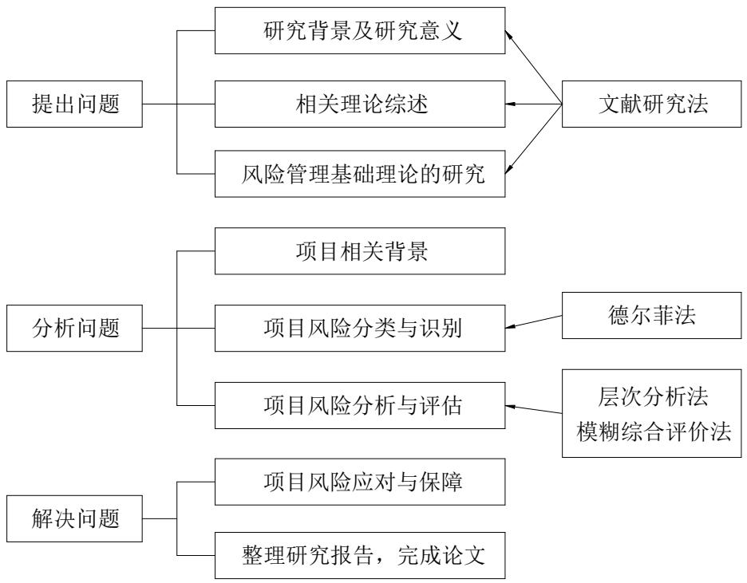

# 第 1章 绪论

# 1.1 研究背景

中国经济已成为世界经济增长的重要引擎和有力支撑。连续多年的稳健经济增长态势带动了各行业蓬勃发展。石油化工产品遍及生活、生产各个领域，其需求来自经济活动的方方面面，随着我国石油化工产业的快速发展，我国石油储运企业规模不断扩大，建设的大型罐区数量越来越多。汽油、航空煤油等成品油是消费属性突出的石油化工产品，预计 2023 年中国成品油消费量将达到 3.60 亿吨[1]。国内成品油库库容保持快速增长态势，截止2020年12月，全国已建、在建和规划中的原油和成品油库超过3000座，油库库容已超过 8000万立方米。

成品油通过原油的加工生产过程制得，其分类涵盖石油燃料、石油溶剂与化学原料、润滑剂、石蜡、石油沥青及石油焦六大类。在这些类别中，石油燃料的产量最为显著，占据了总产量的大约 $90 \%$ 。具体而言，石油燃料可进一步细分为汽油、煤油、柴油等多种类型。此类油品多具有挥发性。油品挥发会产生油气不仅增加了火灾和爆炸的危险性，同时因不同组分挥发速率不同而使油品组成产生变化，导致油品质量降低。因此在油品储运各个环节，应重视油品挥发产生的危害和损失。

储罐作为成品油罐区的核心储存设备，通常采用内浮顶的结构避免油品挥发。内浮顶可简单理解为漂浮在罐内油面上的大圆盘，圆盘边缘与罐壁间有空隙，并使用特殊的材料和结构保持与罐壁的密封。内浮顶始终与油面保持贴合，可随液位变化而自由升降，并严格控制浮顶与油面间的气相空间以减少油品的挥发。

根据结构和材料的不同，内浮顶可分为浮筒式（铝制、不锈钢制）、单/双盘浮顶（碳钢制）、全接液浮顶（箱型、蜂巢粘接型、全焊接型、玻璃钢）等[2]。浮筒式浮顶有安装方便、快速、造价低等优点，是目前仓储企业应用最广的一种浮顶形式。但由于结构的特殊性导致在运行过程中，浮顶与油面间存在油气空间，已不满足现行规定和标准，需逐步淘汰更换。碳钢制单、双盘浮顶技术成熟度较高，其结构稳固，但缺点是安装涉及受限空间动火、改造项目需对罐壁开洞，且浮顶易腐蚀，检修维护困难，不利于设备长周期运行。全接液浮顶是一种新型高效浮顶，特点是由连续覆盖在液面上的多个浮力单元组成，浮顶下不存在油气空间，已成为现行技术发展趋势。但其早起发展出的产品如箱式、蜂巢式全接液浮顶由于其强度低、寿命短、耐火性不足，发生了多起事故，已被市场否定。因此目前全焊接和玻璃钢制全接液浮顶是内浮顶储罐的主要优选浮顶型式。

2018 年 12 月住房和城乡建设部发布国家标准《石油化工企业设计防火标准》（GB50160-2008）局部修订的公告，在修订条文中，明确提出了储存甲 B、乙 A 类的液体应选用金属浮舱式的浮顶或内浮顶罐。并要求单罐容积大于 $5 0 0 0 \mathrm { m } 3 $ 的内浮顶储罐应采用钢制单盘或双盘式浮顶；单罐容积大于或等于 $5 0 0 0 0 { \mathrm { m } } 3 { \mathrm { ~ } }$ 的浮顶储罐应采用钢制双盘式浮顶[3]。2020 年住房和城乡建设部办公厅发布国家标准《石油库设计规范（局部修订征求意见稿）》，明确提出了明确提出了抗爆耐火浮顶的概念，即符合GB50341—2014有关规定的钢制单盘式或双盘式浮顶，以及其他经抗爆和耐火试验合格的全液面接触式浮顶。应急管理部印发的《“十四五”危险化学品安全生产规划方案》中提出，推动对已投运的大型原油、成品油、LNG 等油气储存基地实施设备设施、控制系统升级改造。

标准规范条款的变化体现出了对罐区安全、环保要求越来越严格的趋势，近年来国内新建罐区均按新标准要求执行，对已建成的不满足新标准要求的储罐也陆续开展了内浮顶改造工程。

油罐浮顶的改造工程涉及大量的起重作业、焊接作业、高空作业、受限空间作业，同时罐区贮存着大量危险介质，也存在着石化装置建设过程中的各种安全风险。油罐改造期间，不仅要关注施工阶段的安全风险，也要避免因施工质量不合格造成的油罐后期运行中的风险。如何通过项目风险管理来控制油罐改造过程中的各种风险因素，是油罐改造项目能否达到既定目标的关键。

# 1.2 研究目的与意义

# 1.2.1 研究目的

本文依托 X 储运公司 $3 0 0 0 0 { \mathrm { m } } 3 $ 汽油储罐浮顶改造项目，对项目全过程展开风险管理研究，以求达到以下目的：

（1）借助风险管理相关知识，根据储罐浮顶改造的项目特点，对项目全过程的风险因素进行研究。

（2）对储罐浮顶改造项目的风险因素进行分类，并通过德尔菲法、层次分析法等方法对这些因素进行分析，确定风险管理的重点。

（3）针对不同风险制定出应对和监控措施。

# 1.2.2 研究意义

（1）理论意义

$\textcircled{1}$ 储罐内浮顶改造项目涉及到工程技术、安全管理、项目管理等多个领域。对其进行风险管理研究，可以拓展风险管理理论在特定工程项目领域的应用范畴，为风险管理理论提供新的研究方向和实践案例。

$\textcircled{2}$ 本项目需要综合运用工程学、管理学、安全科学等多学科知识。研究过程中，可以促进不同学科之间的交流与融合，深化多学科融合理论在工程项目中的应用。

$\textcircled{3}$ 内浮顶改造项目直接关系到罐区的安全运行。通过对项目风险的管理研究，可以进一步完善罐区安全管理理论，提高罐区运行的安全性和可靠性。

（2）实际应用价值

$\textcircled{1}$ 风险管理可以帮助项目团队识别、评估和应对各种风险，提高项目的成功率。同时，通过有效的风险控制措施，可以降低项目成本，提高项目的经济效益。

$\textcircled{2}$ 内浮顶改造项目的目的是提高储罐的安全性、环保性。通过风险管理，可以确保改造过程中不出现安全事故，保障储罐的安全运行。

$\textcircled{3}$ 储罐内浮顶改造项目在石油、化工等行业中具有广泛的应用。本项目的风险管理研究成果可以为相关行业提供借鉴和参考，促进整个行业的安全管理水平和技术水平的提高。

# 1.3 国内外研究概况

# 1.3.1 国内研究现状

我国关于项目风险管理的研究与国外相比起步较晚。改革开放以后，随着社会主义市场经济的快速发展，国内的项目管理人员逐渐开始引进国外的先进管理技术，提高了项目管理水平。在此背景下，风险管理理念逐渐进入了人们的视野。1987年，清华大学郭仲伟教授主编的《风险分析与决策》系统的论述了风险分析的思路和方法，并对经济风险、环境风险、勘探风险、外汇兑换风险及农业风险等分别进行了讨论[4]。此书的出版，标志着我国风险管理研究的开始。2006 年，国家发改委、建设部发布《项目建设经济评价方法与参数》，提出基于案例的项目风险管理方法和理论，为项目实现预期收益、规避经营风险提供了指导。2012 年 12 月 17 日，国资委印发《关于 2013 年中央企业开展全面风险管理工作有关事项的通知》，要求中央企业必须推行全面风险管理措施，并主动向国资委呈交全面风险管理年度报告的做法，标志着我国在企业全面风险管理体系建设方面迈出了实质性的步伐，实现了正式落地[5]。在风险管理理论的实践应用中，我国成功地将该理论应用于三峡工程、黄河小浪底工程以及大亚湾核电站等多个重大项目，取得了显著的经济效益[6-8]。

近年来随着全球经济的发展和各类项目的复杂性增加，项目风险管理成为项目成功实施的关键因素。不同领域的项目面临着各种各样的风险，如何有效地识别、评估和应对这些风险是学术界和实践界共同关注的焦点。

杨琳（2021）以厦门市地下综合管廊项目为例，通过对风险网络的整体和局部参数分析，确定了组织协调风险、政策风险等起始节点和施工质量风险、运营成本超支风险等传导节点。基于此，提出从起始因素和关键传导因素两方面进行风险防范的建议，如设立信息公开平台、制定合同制约等措施，为复杂工程项目的风险管理提供了具体的方向[9]。

李辉煌（2021）介绍了详细阐述了大型国际工程项目的外汇风险、税务风险、资金管理风险、成本控制风险、财务能力风险以及政治局势和宗教文化差异风险等六类常见风险。这种分类方式清晰地呈现了国际工程项目财务风险的多样性和复杂性。针对不同风险类别，提出了规避风险、降低风险、分担风险和自留风险四种管控方法，并以科威特新炼厂工程项目为例，详细说明了如何在实际项目中运用这些方法对各类财务风险进行管控[10]。

刘小峰等（2021）基于期望差异理论和演化理论，通过分析公众与环评专家的认知差异，确定存在认知差异的建设项目存在邻避风险，并进一步探讨了期望差异导致邻避风险的机制以及基于 “自组织” 机制的风险演化过程。这种从理论层面深入剖析邻避风险的方法，为理解邻避风险的产生和发展提供了基础[11]。

谭泽涛（2021）阐述了风险管理及进度风险管理的核心工作和实践路线，强调了风险识别、估计、评价和监控在进度风险管理中的重要性。在此基础上，详细介绍了基于网络计划技术的进度风险管理方法，构建了一个较为完整的进度风险管理体系。以 LNG储罐 EPC 项目为例，展示了如何在实际项目中运用上述进度风险管理体系。通过对项目各阶段风险的分析和管理，以及对进度风险模型建立和监控过程的详细描述，如定位进度风险、动态管理作业关键指数等，总结了在 LNG 储罐项目进度风险管理中的实践经验，为类似项目提供了参考[12]。

王腾飞（2022）探讨了国际 EPC 项目中伙伴关系对风险管理和项目绩效的影响。基于伙伴关系理论构建包含接口管理、组织能力和合同管理等要素的风险管理理论模型，并提出相关假设。通过问卷调研收集数据，运用偏最小平方法结构方程模型（PLS - SEM）进行分析，包括信度与效度检验、共线性检验以及预测准确性与相关性分析等。验证了伙伴关系对接口管理、组织能力和合同管理的正向促进作用，进而影响风险管理和项目绩效。揭示了伙伴关系影响项目风险管理的三条路径，以及各测量维度与风险管理成熟度的关系等[13]。

张旭（2023）构建了考虑项目间依赖关系和决策者心理账户的项目风险应对策略选择模型。将项目间依赖关系分类，利用设计结构矩阵（DSM）方法度量其对项目风险的影响程度。以决策者效用最大化为目标，考虑心理账户理论构建风险应对策略选择优化模型，确定风险应对策略对各心理账户的隶属度。通过算例计算和分析，得出项目间依赖关系对项目风险应对策略选择有重要影响，以及考虑心理账户可提高应对预算利用效果等结论[14]。

李琼（2024）从利益相关者分析框架研究城市工程建设项目风险及治理路径。将利益相关者分为核心、潜在和边缘三类，通过实地调研等方式分析其诉求和面临的风险，包括社会发展与民众安居乐业之间的利益失衡等核心风险，不同利益主体之间的经济利益博弈等潜在风险，以及从政策认知到执行推进的主体利益协调等边缘风险。针对不同风险提出政府和业主协力共筑、商户和租户多方利益协商、加强数据保护和平台机制建设等治理路径[15]。

娄长圣（2024）从数字化和伙伴关系双元视角研究清洁能源项目风险管理。建立了包含项目数字化水平、伙伴关系、知识管理、参建企业能力和项目风险管理等要素的风险管理影响机理模型。采用问卷调研结合专家访谈与案例分析的方式收集数据，运用多种分析方法和软件进行数据分析，包括对风险管理方法应用情况、项目数字化水平、知识管理等现状分析。揭示了项目数字化水平和伙伴关系对项目风险管理的积极影响，以及对项目绩效的作用路径，明确风险管理重点关注因素并提出相应建议[16]。

田晓敏（2024）构建基于故障树 - 模糊贝叶斯网络的装配式建筑施工质量风险分析模型。基于专家咨询等，从装配式建筑施工多个阶段识别风险因素，构建故障树模型，并转化为贝叶斯网络，确定节点状态和映射规则。引入模糊集理论和改进的相似聚合方法确定贝叶斯网络概率参数。通过案例分析验证模型在风险评估、预测和致因分析方面的有效性[17]。

# 1.3.2 国外研究现状

目前学界普遍认为是德国是风险管理的起源。一战之后，战败国德国发生了严重的经济问题，因此围绕企业经营提出了包括风险管理在内的一系列管理问题。而风险管理的快速发展则普遍认为在美国。1929年，美国卷入了严重的经济危机，企业面临着难以估计的风险，成为制约公司发展的障碍，迫使管理者开始采取措施来消除、控制、处置风险。1953 年 8 月 12 日，一场灾难性的火灾袭击了通用汽车公司的一家汽车变速箱工厂，导致总计近亿美元的巨额损失，这一事件不仅震惊了企业界与学术界，更在风险管理理论的发展史上留下了深刻的烙印，促使欧美各国对风险管理给予了前所未有的重视。在此后的数十年里，风险管理领域迎来了蓬勃发展的时期。进入二十世纪六七十年代，美国众多顶尖的工商管理学院纷纷将风险管理纳入课程体系，而众多学者也积极投身于风险管理的各项研究之中，为该领域的深入发展贡献了自己的力量。

国外的风险管理研究起初是围绕着风险分析中的定量分析技术展开的，其主要研究方向是风险的管理和技术范畴，如合同招投标、成本估算和施工进度等。随着国际政治环境巨变，经济模式的转变，金融市场的震荡、ISO9000体系的推广以及全球性疾病的威胁相继出现，人们又逐渐围绕政治、经济、金融、质量保证和职业健康安全等方面的风险管理展开了研究。

1956 年，Snider 首次提出了风险管理的概念，并且这一创新理念赢得了美国管理协会（AMA）以及美国保险管理学会（ASIM）的认可与支持[18]。

1962 年，美国管理协会（AMA）通过发布其首本专著《风险管理之崛起》，为风险管理领域的发展注入了强劲动力[19]。

1963年，美国权威刊物《保险手册》上发表了赫奇斯与梅尔共同撰写的《企业的风险管理》一文；紧接着，在1964年，威廉姆斯与汉斯的著作《风险管理与保险》面世，这两部作品均在欧美各国引起了广泛的关注。自此以后，风险管理的研究逐渐走向系统化和专业化，最终确立了它在企业管理中作为一门独立且专业的学科地位[20]。

1986 年，Hayes 等人全面地提出了一个针对建设工程的风险管理框架，该框架涵盖了风险识别、深入的风险分析以及有效的风险应对措施[21]。1989年，Kangari 认为传统的风险管理模型没有纳入经验知识，基于数学模型开发的系统中的大多数都忽略了风险管理所涉及的创造性成分，提出了在风险管理的分析过程中使用了专家打分法[22]。

1995 年Ward 认为项目管理过程中的缺陷可能是项目风险的主要来源，并在其文章中提出了项目全生命周期风险管理的概念[23]。1995 年，澳大利亚与新西兰共同制定的标准《技术系统风险分析》（AS/NZS 3931:1995）正式纳入了风险矩阵分析的相关准则。次年，美国项目管理协会（PMI）在其出版的《项目管理知识体系指南》（PMBOK）中，将风险管理划分为风险识别、风险估计、风险应对计划及风险控制这四个阶段。随后，在2000 年的版本中，PMI 对风险管理流程进行了更为详尽的划分，具体包括风险管理规划、风险识别、风险定性分析、风险定量分析、风险应对规划以及风险监测与控制这六个环节[24]。二十世纪 90 年代后，国际学术界围绕这风险管理的看法逐渐统一，认为风险管理是一个系统工程，包括风险的识别、分析、评价和控制等内容。

近些年来，国外依然有较多围绕工程项目风险的研究。2013 年，Sharma和SatyendraKumar将层次分析法（AHP）与风险图法相结合，构建出风险管理模型，并通过实例展示了这种方法能够更有效的帮助项目管理人员识别出风险因素并控制风险[25]。在 2015年，Anca Ungureanu 与 Cezar Braicu 等人对工程项目风险决策方法进行了全面梳理，指出效用值决策法和损益值决策法是两大核心的风险决策手段[26]。而到了2016年，AbroonQazi 等人在管理大型建设项目时，创新性地融合了贝叶斯理论与期望效用理论，以此精准识别复杂风险并有效控制关键风险因素[27]。2017 年，Oduoza CF等将风险管理软件应用到中小施工单位风险识别和评价过程中，提出风险应对建议，降低了工程成本，促进了工程预期目标的实现[28]。2019年，BiswasTK 和Zaman K将模糊数学理论引入到风险评价中，提出了认知不确定条件下的建设项目风险评价方法，并在项目中验证了其有效性[29]。

# 1.3.3 国内外研究现状评述

我国大型工程项目的投资主体多为政府机构或国有企业，资金主要源自政府拨款或国家财政支持。这种投资模式符合国家的发展规划与宏观战略，但同时也对工程项目的风险管理提出了特殊要求。

尽管我国在风险管理实践上已有显著进步，但与西方发达国家相比，在工程项目风险管理方面的认知深度和执行力仍有待加强。在风险的识别、评估、应对及监控等环节，缺乏一套完整的风险管理框架和高效工具。

当前，我国的风险管理研究与实践往往局限于特定项目或行业内部，这种局限性的存在限制了风险管理知识的广泛传播与深入应用。由于不同行业和项目之间的风险管理实践缺乏沟通和共享，一些成功的经验和教训无法被及时总结和提炼，从而无法为其他

行业或项目提供有益的借鉴和参考。

# 1.4 研究思路与方法

# 1.4.1 研究思路

本文将以项目风险管理相关理论研究为依据，以 KL 公司承接的 X 储运公司$3 0 0 0 0 { \mathrm { m } } 3 $ 汽油储罐浮顶改造项目为研究对象。针对该项目的风险因素，进行风险识别、分析、应对与监控。同时总结项目风险管理过程中的经验教训，以求能够运用到其他项目中。

本文的主要研究思路如下：

首先，对项目风险管理方面国内外相关研究进行概述，并对项目风险管理方面的相关理论进行阐述。

其次，通过阅读文献和现场调查，结合自身工作经验，运用头脑风暴法、德尔菲法或检查表法等对项目的各阶段风险进行识别。并综合运用风险管理理论中的层次分析法结合模糊综合评价法，对项目中的风险因素进行定性和定量分析，进而提出风险应对措施。

最后，通过风险监控来评估风险应对方法的有效性，检查风险应对方法和措施的实际效果是否与预计相同，并改善和细化风险应对措施，使其更符合项目实际。

# 1.4.2 研究方法

（1）文献研究法。利用中国知网、万方、东大图书馆等途径阅读了大量文献，了解相关理论知识，为本论文的研究打好理论基础。

（2）德尔菲法。该法在国内外风险分析研究中有大量使用。德尔菲法能够克服专家会议易受心理因素影响的缺点，通过匿名的方法对专家进行函询征求意见。将意见进行多轮的汇总、反馈、分发后，得出新的论证，最终使专家的意见趋于一致。本文拟采用德尔菲法对识别出的风险因素进行定性分析。

（3）层次分析法。层次分析法是一种系统化方法，它首先将复杂问题拆解成多个构成因素，随后根据这些因素的相互支配关系，将它们组织成一个有序的、分层的结构体系。在这一结构中，通过两两对比评估每一层级内因素的相对重要性，逐步累积并确定所有因素相对于总体目标的重要性排序，从而得出决策因素对于目标而言的最终优先级顺序。本文拟采用层次分析法，对风险因素进行定量分析，确定各评价因子的权重。

（4）模糊综合评价法。

模糊综合评价法是一种将定性评价转化为定量研究的一种方法，对于风险管理来说，基于模糊数学的方法将层次分析法确定的风险权重做出一个总体评价，结果清晰，对于项目风险的评估具有直观的效果。

  
图 1.1研究思路和方法  
Figure 1.1 Thinking train and research method
