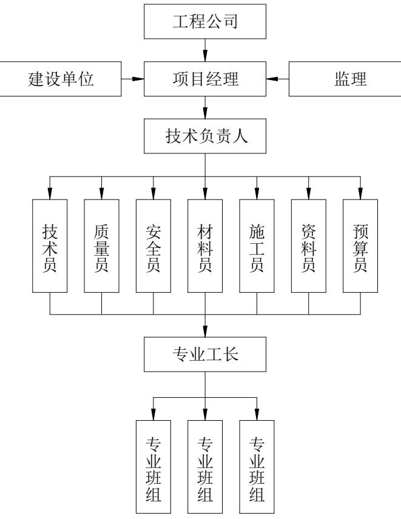

# 第 3 章 X 储运公司储罐内浮顶改造项目概况

# 3.1 X 储运公司储罐内从浮顶改造项目背景

X 储运公司汽油储罐（T-01）为该储罐1994 年开工建设，采用浮筒式铝制内浮盘。由于结构落后和使用年限久，该浮盘存在以下问题：1.密封性不良、油气挥发量大；2.浮盘与液面存在密封空间，有火灾爆炸隐患；3.浮筒式浮盘结构强度较差，浮盘在工作期间易受外力作用导致形变发生损坏、沉盘等事故。因此该厂在 2017 年 VOCs 综合治理项目中对其内浮盘进行更新改造，改造后采用蜂巢式全接液内浮顶结构。

蜂巢式内浮盘最早于 2012年引入中国并得到推广，是一种新型浮盘结构。相较于浮筒式内浮盘，其最大的特点是采用了蜂巢板最为浮力单元，其具有重量轻、结构强度大、平整度高等优点，可以实现全盘与液面安全接触，能够大幅降低油品挥发量和油气受限空间[34]。但是因其发展时间较短，其设计、制造、安装均未形成行业标准。国内多个地区的实际使用情况也表明，蜂巢式浮盘的浮力元件间的连接结构较弱，容易受浮盘在上下浮动过程中因罐体、导波管等垂直元件老化变形产生的外部作用，及浮盘设计质量、制造质量、安装质量不佳而产生的内部作用下，产生浮动原件变形、泄露甚至产生浮盘溃塌、沉盘等严重事故[35-36]。

2018 年 12 月住房和城乡建设部发布国家标准《石油化工企业设计防火标准》（GB50160-2008）局部修订的公告，在修订条文中，明确提出了储存甲 B、乙 A 类的液体应选用金属浮舱式的浮顶或内浮顶罐。并要求单罐容积大于 $5 0 0 0 \mathrm { m } 3 $ 的内浮顶储罐应采用钢制单盘或双盘式浮顶；单罐容积大于或等于 $5 0 0 0 0 0 { \mathrm { m } } 3 $ 的浮顶储罐应采用钢制双盘式浮顶。2020年住房和城乡建设部办公厅发布国家标准《石油库设计规范（局部修订征求意见稿）》，明确提出了明确提出了抗爆耐火浮顶的概念，即符合GB 50341—2014 有关规定的钢制单盘式或双盘式浮顶，以及其他经抗爆和耐火试验合格的全液面接触式浮顶。应急管理部印发的《“十四五”危险化学品安全生产规划方案》中提出，推动对已投运的大型原油、成品油、LNG等油气储存基地实施设备设施、控制系统升级改造。

因此在国家标准要求和储罐运行安全的要求下，X 储运公司决定对汽油储罐（T-01）进行浮盘更新改造，改造后采用钢制单盘浮顶。具体改造工作包括：储罐吹扫、通风，原内浮顶、导向柱拆除、外运，储罐清理，罐体开洞，新浮盘浮舱预制、安装，罐内导向柱安装，单盘安装，防腐作业，密封结构安装，封闭罐体，上水试浮等。

# 3.2 项目总体情况

# 3.2.1 主要参数

（1）被改造罐主要参数名称：汽油储罐；设备位号：T-01；容积： $3 0 0 0 0 { \mathrm { m } } 3 { \mathrm { ~ } }$ ；内直径： $4 4 0 0 0 \mathrm { m m }$ ；罐壁高度： $1 9 5 9 8 \mathrm { m m }$ ；最高设计液位： $1 7 8 5 0 \mathrm { m m }$ ；主体材质：16Mn

（2）内浮顶主要参数

内浮顶形式：钢制单盘内浮顶；材质：Q235B；单盘板厚度： $5 \mathrm { m m }$ ；边缘密封形式：弹性密封；边缘密封间隙： $2 0 0 \mathrm { m m }$ ；导向柱直径： $2 0 0 \mathrm { m m }$ ；浮舱数量：36 个；浮舱宽度： $1 5 0 0 \mathrm { m m }$ ；总重量：110t

# 3.2.2 危险特性

项目所处库区主要工艺是成品油的储存、倒运、输送等。油品品种包括汽油（92#）、汽油（95#）、柴油（0#）等。

（1）介质名称：汽油

介质特性：无色至淡黄色的易流动液体（对于不同等级的汽油，数据变化较大），沸点（馏程）为 $3 0 { \sim } 2 2 0 ^ { \circ } \mathrm { C }$ ，熔点 ${ < } { - } 6 0 ^ { \circ } \mathrm { C }$ ,密度 $7 0 0 { \sim } 7 8 0 \mathrm { k g } / \mathrm { m } ^ { 3 }$ ，闪点 ${ \bf - } 4 3 ^ { \circ } \mathrm { C }$ ，自燃温度$2 5 5 { \sim } 3 9 0 ^ { \circ } \mathrm { C }$ ，爆炸极限 $1 . 4 { \sim } 7 . 6 \mathrm { V } \%$ ,不溶于水，易溶于苯、二硫化碳、醇，可溶于脂肪，属于低闪点易燃液体，火灾危险性甲 B 类。

（2）介质名称：柴油

介质特性：柴油是一种淡黄色至棕色的液体。其沸点（馏程）为 $1 8 0 { \sim } 3 7 0 ^ { \circ } \mathrm { C }$ ，熔点- $\cdot 1 8 ^ { \circ } \mathrm { C } - 3 0 ^ { \circ } \mathrm { C }$ ，密度 $8 2 0 { \sim } 8 6 0 \mathrm { k g } / \mathrm { m } ^ { 3 }$ 。闪点 $5 5 ^ { \circ } \mathrm { C } - 7 5 ^ { \circ } \mathrm { C }$ ，自燃温度 $2 5 0 { \sim } 3 5 0 ^ { \circ } \mathrm { C }$ 。它不溶于水，能较好地溶解于苯、四氯化碳等有机溶剂，在脂肪中也有一定溶解性。柴油属于高闪点易燃液体，火灾危险性乙 B 类。

# 3.2.3 周边环境

本项目所属X 储运公司，紧靠渤海海岸，地理位置得天独厚，贯穿南北的沈大高速公路在此通过，使拟建的储运设施独具优越的水路、铁路、公路运输条件。库址西、南两侧与开发区主要道路相衔接，产品运输方便、交通顺畅。库址距开发区消防大队约$2 2 0 0 \mathrm { m }$ ，距沈大高速公路出口大约 $5 \mathrm { k m }$ 。

改造罐所处库区于 1995 年 10 月建成投产。库区共分为柴油罐区、汽油1#罐区和汽油 2#罐区共三个罐区。柴油罐区储罐共 6 座（其中 $2 \times 1 0 4 \mathrm { m } 3$ 拱顶罐 4 座、 $1 \times 1 0 ^ { 4 } \mathrm { m } ^ { 3 }$ 内浮顶罐2座），柴油总罐容 $1 0 \times 1 0 ^ { 4 } \mathrm { m } ^ { 3 }$ ；汽油1#罐区储罐4座，均为内浮顶罐（其中3$\times 1 0 ^ { 4 } \mathrm { m } ^ { 3 }$ 罐2 座、 $2 \times 1 0 ^ { 4 } \mathrm { m } ^ { 3 }$ 罐2 座）；汽油 2#罐区储罐 2座，均为 $3 \times 1 0 ^ { 4 } \mathrm { m } ^ { 3 }$ 内浮顶罐。汽油总罐容 $1 6 \times 1 0 ^ { 4 } \mathrm { m } ^ { 3 }$ 。

# 3.2.4 自然条件

（1）气温年平均气温： $9 . 8 \mathrm { { ^ \circ C } }$ ；  
极端最高气温： $3 4 . 4 \mathrm { { } ^ { \circ } C }$ ；  
极端最低气温： $- 2 2 . 4 ^ { \circ } \mathrm { C }$ ；  
最热月最高平均气温： $2 8 . 3 \mathrm { { ^ \circ C } }$ ；  
最冷月最低平均气温： $- 1 5 . 0 \mathrm { { \bar { C } } }$ ；  
最热月平均气温（7月）： $2 3 . 2 \mathrm { ^ \circ C }$ ；  
最冷月平均气温（1月）： $- 1 1 . 3 ^ { \circ } \mathrm { C }$ 。（2）大气压力  
年平均气压： $1 0 0 2 . 3 \mathrm { m b }$ ；  
最高绝对大气压： $1 0 3 1 . 1 \mathrm { m b }$ ；  
最低绝对大气压： $9 7 0 . 5 \mathrm { m b }$ ；  
月平均最高气压（1月）： $1 0 1 2 . 5 \mathrm { m b }$ ；月平均最低气压（7月）： $9 9 1 . 0 \mathrm { m b }$ （3）湿度  
年平均相对湿度： $6 8 \%$ ；  
月平均最高相对湿度（8月）： $8 2 \%$ ；月平均最低相对湿度（4月）： $5 6 \%$ 。

（4）降雨量年平均降雨量： $5 4 9 . 9 \mathrm { m m }$ ；月最大降雨量：398.5mm；

日最大降雨量：204.7mm；  
一次暴雨最大降量： $3 3 3 . 0 \mathrm { m m }$ ；  
最大积雪深度：260.0mm；  
历年平均降雨日数：100天；  
冻土最大深度： $1 . 0 4 \mathrm { m }$ 。（5）风夏季主导风向和频率：WNW；  
冬季主导风向和频率：NE；  
全年主风向：SSE；  
瞬间最大风速： $2 9 . 0 \mathrm { m / s }$ ；  
最大月平均风速： $2 6 . 0 \mathrm { m / s }$ ；  
夏季平均风速： $7 . 2 \mathrm { m / s }$ ；  
基本风压值： $0 . 4 5 \mathrm { k N } / \mathrm { m } ^ { 2 }$ 。

（6）场地工程地质、地震烈度

该区所处地貌类型为滨海相沉积地貌，地基土由上而下分为，一层为杂填土，主要以粘土混碎石为主，个别地段碎石含量较多，钻进困难，为回填大块石或砼坝基。厂区普遍分布厚约 $0 . 3 \mathrm { m } { \sim } 1 1 . 4 \mathrm { m }$ ，承载力为 $1 2 0 \mathrm { k P a }$ ；二层为吹填中粗砂厚约 $1 . 7 0 \mathrm { m } { \sim } 1 1 . 6 0 \mathrm { m }$ ，承载力为 $1 3 0 \mathrm { { k P a } }$ ；三层为淤泥质粉质粘土厚约 $0 . 2 0 \mathrm { m } { \sim } 9 . 8 0 \mathrm { m }$ ，承载力为 $4 0 \mathrm { k P a }$ ；四层粉质粘土为厚约 $0 . 5 \mathrm { m } { \sim } 1 2 . 0 \mathrm { m }$ ，承载力为 $1 6 0 \mathrm { k P a }$ ；八层为粉质粘土厚约 $0 . 5 0 \mathrm { m } { \sim } 4 . 4 0 \mathrm { m }$ ，承载力为 $1 7 0 \mathrm { { k P a } }$ ；九层为强风化花岗岩厚约 $0 . 4 0 \mathrm { m } { \sim } 1 0 . 4 0 \mathrm { m }$ ，承载力为 $4 0 0 \mathrm { k P a }$ ；十层为中等风化花岗岩，承载力为 $6 0 0 \mathrm { { k P a } }$ ，局部有夹层；场地范围内见地下水，地下水的类型为潜水，初见水位埋深在 $2 . 1 0 \mathrm { m } { \sim } 7 . 6 0 \mathrm { m }$ 之间。地震烈度:场地地震基本烈度为7度。

# 3.3 X 储运公司储罐内浮顶改造项目目标与组织

# 3.3.1 项目目标

（1）工期目标

根据建设方需要，该项目计划在 2025 年6 月30 日完成内浮顶及附件的安装，完成储罐施工龙门封堵工作，在 2025年8月 15日完成上水试验。

# （2）质量目标

内浮顶能够顺利上浮至设计高度，无卡阻、无异常响声，密封性能达到设计要求。项目一次性验收合格

（3）安全目标

储罐内浮顶改造项目期间无重大安全事故。

# 3.3.2 项目组织机构

根据储罐内浮顶改造项目的特点，结合公司的管理体系，成立了项目经理部。项目经理部对工程施工进行协调、管理和控制，确保项目目标完成。项目管理部组织机构见技质安图 3.1。

  
图 3.1 项目管理部组织机构图  
Figure 3.1 Organizational Chart of the Project Management Department

# 3.4 X 储运公司储罐内浮顶改造项目难点

与新建储罐项目不同，X 储运公司储罐内浮顶改造项目是在原有储罐内部进行内浮顶更换改造的项目。在项目执行过程中，存在很多不确定性、特殊性和难点，因此需要加以重视。

（1）厂区内防火防爆

X 储运公司的主营业务是汽油、柴油等成品油的储存，厂区内遍布盛有易燃易爆油品的储罐及管道，项目改造的 T-01 罐本身即是一台 3 万立汽油储罐，且与T-02 汽油储罐仅一墙之隔，施工现场周围易燃易爆介质较多。此外，本次改造的蜂巢式内浮盘，其部分浮力元件可能出现泄露，导致汽油渗入其中，容易产生油气挥发，成为火灾爆炸危险源。在储罐清理、拆除、安装作业过程中，极易出现火灾、爆炸等事故，一旦发生火灾爆炸事故，极易触发多米诺效应，造成惨重的后果[37]。

（2）施工场地限制较大

X 储运公司罐区于 1994 年建设，用地紧凑。储罐周围按标准规范要求设有围堰、护坡等土建结构，以及连接储罐的多条输油管线。可供施工用材堆放、大型施工机械站位、零部件预组装的场地较少。此外该罐区位于山地地形，厂区道路距离围堰有一定距离，运输车辆无法靠近储罐。因此施工场地因素对施工工序规划、材料进出场时间、导向柱吊装、材料搬运等都带来不少挑战。

（3）受限空间作业

本项目更新改造的钢制单盘内浮顶，其主体材质为 Q235B 钢板，该浮顶采用全焊接结构，焊接作业量非常大。由于内浮顶尺寸庞大，浮舱、单盘只能在罐内进行拼装、组对，涉及到大量受限空间焊接作业，且项目施工阶段正值夏季，天气炎热，少风少雨。罐内容易出现通风不畅导致中毒、窒息，照明不佳导致机械伤害、坠落、烫伤等事故风险[38]。

（4）施工用水量大

本项目改造储罐为公称容积 3万立的大型储罐，吹扫、清理过程会产生大量的含油污水，按照相关环保规定不能直接外排，因此需经过水处理设备处理后才能排放。另外浮顶组装完毕后的上水试验要求达到设计液位，需要大量水，因此需要提前规划好供水和水资源回收方案，避免因水源不足、流量不够导致的工期延误，或试水后水资源浪费造成的经济损失。

# 3.5 X 储运公司储罐内浮顶改造项目风险管理要求

（1）实施全面风险识别。

运用文献研究、德尔菲法等项目风险识别手段，找出项目潜在的风险点以及影响因素。在项目推进过程中，持续对项目风险影响因素加以识别，实时更新。

（2）进行科学的风险评估。

采用模糊层次分析法对识别出的项目风险开展定性、定量相结合的评估，以明确影响项目的风险重要程度与风险管理重点。

（3）拟定合理的风险应对策略。

依据项目风险评估结果，采用与之相适应的风险应对策略，制定具体的风险应对措施。

（4）构建有效的风险监控体系。

建立项目风险监控体系，对项目风险实施监督与控制，完善项目风险监控管理措施，确保项目按时顺利完成。
