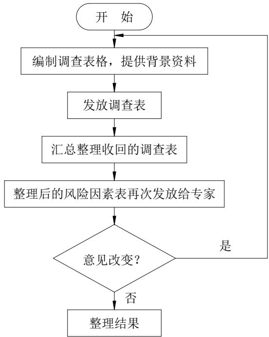
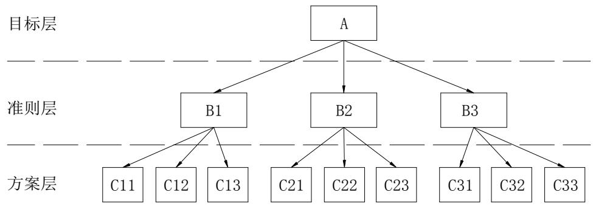
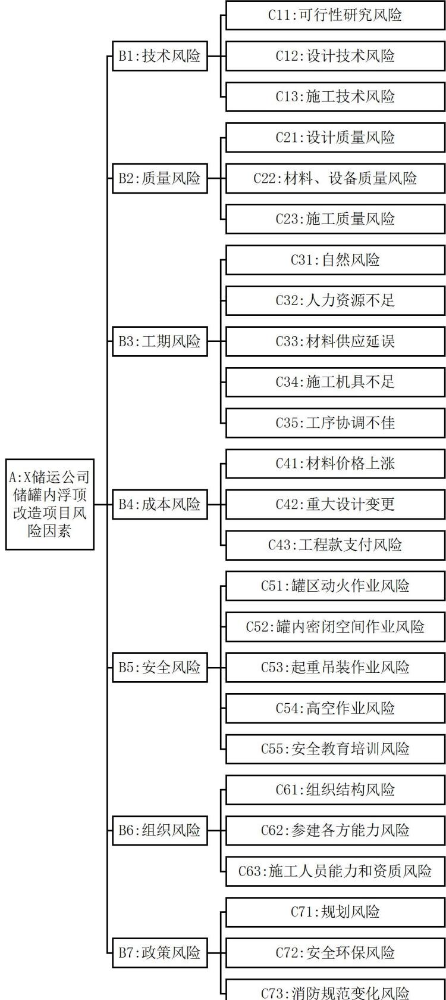

# 第 4 章 X 储运公司储罐内浮顶改造项目风险识别

风险识别是风险管理流程中的第一步，它为后续的风险评估、风险应对及监控提供了方向。在 X 储运公司储罐内浮顶改造项目中不仅涵盖了设计规划、材料采购、施工建设、安全监管、质量控制等多个专业领域的工作，还涉及与环境保护、法律法规遵守以及人员培训和管理等非技术性领域的工作。每个领域都潜藏着不同类型的风险因素，这些风险可能源于技术实施的不确定性、市场环境的变化、政策法规的调整、自然灾害的不可预测性，或是人为操作的失误等多个方面。

全面深入地识别出这些散布于各个角落的风险因素，是本文开展风险管理研究的基础。通过文献调研、咨询、问卷调查等多种方法和工具的综合运用，确保所有可能影响项目的方面的风险因素都被充分的识别出来，为后续的风险量化、优先级排序及制定针对性的风险管理策略提供可靠的依据。

# 4.1 X 储运公司储罐内浮顶改造项目风险识别程序

# 4.1.1 项目风险识别原则

（1）全面性原则

风险识别需要涵盖项目或业务的各个方面。不应遗漏任何可能导致风险的因素，无论是宏观政策层面还是微观技术层面的因素都要考虑在内。这有助于形成对风险的整体认识，避免因遗漏关键风险而造成损失。

# （2）系统性原则

将风险识别视为一个系统工程，要考虑风险因素之间的相互关联和相互作用。许多风险并不是孤立存在的，一个风险事件可能引发一系列其他风险。从系统的角度出发，可以更准确地把握风险的传播路径和影响范围，从而制定出更为有效的风险应对策略。

# （3）动态性原则

风险是随时间和环境变化而变化的，风险识别也是一个动态的过程。在项目务的不同阶段，风险的类型和程度也会有所不同。风险识别要贯穿项目或业务的整个生命周期，根据阶段特点和变化情况及时调整识别重点。

# （4）成本效益原则

风险识别本身也需要投入一定的资源，包括人力、物力、财力和时间等。在风险识别过程中，需要权衡识别成本与潜在收益之间的关系。如果识别成本过高，而所识别出的风险发生的可能性很小或者即使发生损失也很小，那么这种识别活动可能是不经济的。

要根据实际情况，选择合适的风险识别方法和工具，以确保在合理的成本范围内实现有效的风险识别。

（5）重要性原则

重点关注那些对目标实现有重大影响的风险。在众多潜在风险因素中，有些风险一旦发生，可能会对项目或业务造成毁灭性的打击，而有些风险的影响则相对较小。通过对风险进行重要性排序，可以合理分配风险管理资源，优先处理那些高重要性的风险，提高风险管理的效率和效果。

# 4.1.2 项目风险识别步骤

本项目风险识别分以下三个步骤：

（1）项目风险因素收集

广泛查阅相关文献，为项目风险识别提供参考框架。按不同维度对项目风险因素进行分解，整理出初步风险因素清单。之后选择建设单位、项目管理人员和施工人员等走访对象。通过访谈等方式收集其他风险因素，汇总整理并详细描述收集到的项目风险因素。

（2）组建风险识别专家团队

根据项目需求，组建各领域专业人士构成的专家团队，职责是全面识别和评估项目风险。

（3）运用德尔菲法对风险因素打分

制定打分表，邀请专家结合经验分析打分。遵循多轮匿名反馈流程，整合专家意见。统计分析结果，确定风险因素识别表。

# 4.2 项目风险因素识别

# 4.2.1 项目风险因素收集

查阅与储罐内浮顶改造项目相关的学术文献、行业报告、类似项目案例分析等资料，将项目按照分解为技术风险、质量风险、工期风险、成本风险、安全风险、组织风险以及政策风险7个类别。随后深入走访X 储运公司管理及技术人员、KL工程有限公司项目管理部、设计部、采购部、技术部、HSE 管理部工作人员，以及施工单位技术人员，收集补充其他可能存在的项目风险因素，见表 4.1。并对各风险因素进行分析。

表 4.1 项目风险因素  
Table 4.1 The Risk Factors Of The Project   

<table><tr><td>风险类型</td><td>风险因素</td></tr><tr><td>技术风险</td><td>可行性研究风险、设计技术风险、施工技术风险</td></tr><tr><td>质量风险</td><td>设计质量风险、材料设备质量风险、施工质量风险、验收质量风险</td></tr><tr><td>工期风险</td><td>自然风险、进度计划不合理、人力资源不足、材料供应延误、施工机具不足、工序</td></tr><tr><td>成本风险</td><td>协调不佳 预算不准确、材料价格波动、重大设计变更、工程款支付风险</td></tr><tr><td></td><td>罐区动火作业风险、罐内密闭空间作业风险、起重吊装作业风险、高空作业风险、</td></tr><tr><td>安全风险</td><td>现场用电风险、材料堆放隐患、安全教育培训风险</td></tr><tr><td>组织风险</td><td>组织结构风险、参建各方能力风险、施工人员能力和资质风险</td></tr><tr><td></td><td>政策风险审批延迟风险、规划风险、安全环保风险、消防规范变化风险、环保政策变化风险</td></tr></table>

（1）技术风险$\textcircled{1}$ 可行性研究风险

在可行性研究阶段，对项目进行调整所需成本最低，故而这一环节也被视为风险管理中的重要阶段[39]。可研阶段的风险包括：没有充分考虑储罐的尺寸、形状和操作条件（如温度、压力变化范围）对内浮顶性能的要求，可能导致内浮顶运行出现故障的风险；对现有储罐的结构和状况评估不足，没有发现储罐罐壁的局部腐蚀或变形，在改造时可能导致新内浮顶与罐壁的连接不紧密，影响密封效果的风险；盲目引入未经实践检验的内浮顶技术或材料，可能在实际使用中出现性能不稳定、与现有设备不兼容的风险等。

$\textcircled{2}$ 设计技术风险

设计技术方案对工程项目的影响是深远的，它不仅直接关系到项目的成功与否，还对整个项目的成本、工期、质量、安全性和后续运营等方面产生显著影响[40]。设计技术风险包括：内浮顶的浮力计算不准确，浮力不足可能导致内浮顶无法正常漂浮在介质表面，而浮力过大则可能使内浮顶在上升过程中与罐顶发生碰撞的风险；密封结构设计不佳会导致介质挥发损失增加的风险；密封材料的选择没有考虑介质的腐蚀性和温度变化，或者密封形式（如机械密封、弹性密封等）不能有效适应储罐内液位的波动，造成密封

失效的风险。

$\textcircled{3}$ 施工技术风险

施工技术风险是指在工程施工过程中，由于技术层面涉及的风险因素，如技术装备不足、技术方案不合理、施工方法不当、新工艺或新材料使用风险等，可能对项目目标和实施产生不利影响的不确定性因素。施工技术风险包括：在储罐清洗之前，如果没有利用氮气等安全气体充分置换罐内的挥发油气，在后续作业中产生的静电、碰撞火花等可能造成爆炸事故风险[41]；在编制罐体开洞方案之前，没有充分考虑场地空间条件，可能造成开洞方位不合理导致材料吊运困难的风险。

（2） 质量风险$\textcircled{1}$ 设计质量风险

设计质量是工程项目质量的核心，设计质量的好坏最终会影响储罐内浮顶改造项目的成败。设计工作通常有设计输入、结构尺寸与强度计算、绘制施工图、编制技术要求资料等内容。储罐内浮顶的设计包括浮舱结构设计、浮盘结构设计、导向机构设计、密封机构设计、支撑结构设计等。

设计不合理的内浮顶可能导致在安装过程中遇到各种困难，如部件不匹配、安装精度难以保证等。浮盘的支架、浮筒等部件如果设计不当，可能导致安装时无法准确定位或固定。也可能导致施工过程中的质量控制变得困难，如连接紧固件安装不牢固、螺丝松动等。这些问题可能降低内浮顶的使用寿命，增加后期维护成本。

设计不合理的内浮顶可能导致浮顶在运行阶段出现问题，如浮盘失衡与沉船、密封效果差、操作出现卡阻、油品泄露等安全隐患[42]。

$\textcircled{2}$ 材料质量风险

材料质量是工程项目质量的基础。内浮顶改造项目所需材料包括：组成钢制内浮顶本体所需的钢板、钢管、锻件；组成内浮顶附件如人孔、法兰、导向机构、密封机构、支撑机构的各种金属、非金属材料；施工中需要的各种材料如焊接材料、支撑材料、防腐材料、人员防护材料等。材料质量问题包括力学性能不足、化学成分不达标、焊接性能差、尺寸超差、耐热、阻燃、绝缘性能、防腐性能不足等。材料质量问题相对而言比较隐蔽，在项目执行过程中不容易被发现，但其确实内浮顶改造项目不可不重视的风险因素之一。内浮顶所用材料质量可能导致内浮顶及其附件产生焊接缺陷、过度变形、应力集中，进一步导致浮顶出现裂纹、泄露、卡阻或倾覆。施工过程中所用各种辅材不达标还可能会造成产品质量缺陷或机械损伤、坍塌、火灾爆炸等各种安全事故。

$\textcircled{3}$ 施工质量风险

施工质量直接影响到储罐内浮顶改造项目质量。导致施工质量的行为包括：不按图施工、偷工减料、蛮干、在恶劣气候中施工、对材料和成品保护不当、检验检测不到位等。体现在储罐内浮顶本身的施工质量问题包括：结构错误、缺项、尺寸不达标、变形过大、焊接缺陷、表面处理不足、防腐缺陷、结构中存在较大的内应力等。储罐内浮顶涉及到大量的焊接作业，施工过程未严格控制焊接方向和速度，未合理布置焊工的位置，未必要的固定加强措施，将导致过量的焊接变形进而影响到浮顶结构稳定。储罐内浮顶涉及大量材料吊运，在罐内运输中，如果没有做好支撑和保护措施，将出现碰撞跌落等事故，造成罐壁、罐底的损伤。施工出现质量问题可能导致返工，严重的质量问题会直接影响到内浮顶使用性能和寿命，因此应当重视施工质量风险。

（3）工期风险$\textcircled{1}$ 自然条件风险

自然条件包括温度、湿度、风、雨、雪等条件。在不符合要求的自然条件下施工可能导致诸多问题，如：在极端天气条件下施工会对施工现场的安全产生威胁，可能导致人员伤亡、设备损坏等事故；在湿度过大环境下焊接作业可能导致焊条含水量过大进而造成焊接缺陷[43]；在干燥、炎热的气候下工作，人员可能出现中暑、脱水风险，还可能引发火灾或粉尘爆炸的等风险；在低温的环境中焊接作业可能会出现较大的焊接内应力和变形。因此储罐内浮顶改造的施工应在适宜的自然条件下进行，不佳的自然条件会影响到施工人员的工作效率，当出现极端天气条件时还需停工等待。由此可能造成施工时间不足，工期延误风险。

$\textcircled{2}$ 材料采购风险

储罐内浮顶改造项目需要大量的材料，但与新建项目相比，其施工场地存在诸多限制，项目实施过程中充满了众多不确定性，物资采购也因此面临着诸多变动。一旦工程项目发生设计变更，施工进度将随之调整，这就要求项目所需的材料、设备等物资采购计划必须迅速且相应地做出重新规划与调整[44]。例如：储罐内浮顶的浮舱和浮盘需要大量尺寸各异的钢板，对于现场加工制造的部分，如果没有考虑场地的限制，采购了大板幅的钢板，将导致现场加工、吊运困难，影响施工效率。对于加强圈等异形部件，如果没有考虑到现场机具加工能力，采购了普通型材，将导致现场无法加工而出现等料窝工的状况，影响项目工期。此外如果出现了材料采购错误，未考虑现场运输条件等，也将导致材料重新采购、重新装车等影响材料到场时间的问题。因此材料采购风险也是影响

工期的风险之一。

$\textcircled{3}$ 施工机具风险

储罐内浮顶改造项目需要各种施工机具，包括：切割设备，如气割机、砂轮切割机等；焊接设备，如电焊机、气体保护焊机、不同角度和位置的立焊机、横焊机、气刨机等；表面处理设备，如喷砂机、角磨机等；吊装设备，如汽车吊、卷扬机、滑轮、电葫芦、人力吊车等；测量工具，卷尺、盘尺、水平仪等，以及各种手动工具。例如：储罐清洗过程中，如果清洗设备或水处理设备能力不足，将导致清洗效率低，增加清洗工期，影响后续施工进度；如因施工场地限制，无法布置大吨位的汽车吊，将出现因臂长不足，材料无法到达上料位置，需要二次搬运的情况，增加工序和工期；内浮顶充水上浮试验中，如机泵扬程不足，流量不够，可能导致上水速度慢，或无法上升至预定高度的情况，增加试验工期。此外，不足或不当现场施工机具还将导致合格率低，进而出现返工情况，延误项目工期。因此，施工机具不足风险也是影响工期的风险之一。

$\textcircled{4}$ 工序协调不佳

储罐内浮顶的制作安装涉及多道工序，包括：临时支撑结构搭建、板材切割加工、浮舱安装、浮盘安装、导向柱起竖、密封结构安装、防腐作业、上水试验等。各工序间紧密衔接且有重叠，如果没有协调好人员、材料、机械、场地，将可能出现场地冲突、等料窝工、人员不足等状况，影响项目进度。例如：在上水试验中，将浮盘上升至设计位置将需要数万吨水，如未提前规划好水源，未搭设临时供水管线和相关机泵，将导致上水试验延后。

（4）成本风险$\textcircled{1}$ 材料价格波动

储罐内浮顶需要使用大量的主材和辅材，材料市场价格波动可能会导致项目材料成本上涨。

$\textcircled{2}$ 重大设计变更

在施工过程中可能会出现设计变更，如结构形式的变化、尺寸的变化、材料变化、设计缺项等。当设计变更范围较大或提出时间较晚，可能会导致返工、赶工进而导致各种施工成本增加。

$\textcircled{3}$ 工程款支付风险

在项目实际执行中，在项目验收完毕后，因为各种原因甲方不能及时的完成工程款项的结算和支付工作时有发生。甲方未按照合同约定的节点履行工程款支付的原因如：

项目未按照约定日期完工；工程交付物质量未达到甲方期望；甲方财务状况不佳；甲方恶意拖欠尾款、扣除工程质量保证金。此时对于工程承包方而言，将承担很大的财务成本风险。

（5）安全风险$\textcircled{1}$ 储罐内浮顶拆除作业风险

储罐清洗和内浮顶拆除作业的主要安全事故类型为闪爆、人员窒息、中毒等。在拆除作业前，如未做好储罐蒸洗等工序，可能会导致内浮顶的浮筒、橡胶密封等处残存的物料挥发，使可燃气体达到爆炸极限，在储罐内形成爆炸性气体环境，遇到施工器具使用中产生的火花或电器老化破损、静电等点火源，则会出现闪爆事故[45]。如果通风置换不到位，可能会造成储罐内氧气浓度不足，导致罐内人员窒息或中毒风险。

$\textcircled{2}$ 罐区动火作业风险

本项目所在地为成品油罐区，周围充斥着大量盛装易燃易爆油品的储罐和输油管线，施工场地局促。在施工期间，罐区仍在正常运转状态，不定时出现油品装车、油品输送作业，会提高罐区周围的易爆气体浓度，导致出现火灾、爆炸的风险。

$\textcircled{3}$ 罐内受限空间作业风险

储罐内浮顶改造项目涉及大量的罐内受限空间作业，虽然储罐罐体上设有通风孔、人孔、施工龙门等换气通道，但大量的罐内焊接作业产生的烟尘容易使罐内有毒气体浓度上升、温度升高、氧气浓度下降、能见度降低，导致人员绊倒、跌落、机械损伤、烫伤、窒息等安全事故。照明不足也是罐内受限空间作业的风险源之一。本项目储罐直径大，施工龙门处射入的光线非常有限，且罐体材料和内表面的锈迹、污渍等使得罐体内部几乎没有光线漫反射，罐内照明设备覆盖范围外的区域非常黑暗。在黑暗的环境会导致人员视力下降，也可能造成施工作业过程中的各种安全事故。

$\textcircled{4}$ 起重吊装作业风险

储罐内浮顶改造项目需要将大量材料从储罐围堰外吊运至围堰内部，由于项目所在罐区位于山坡之上，能够供大型吊车站车的平整场地非常有限，且由于罐区建设较早，罐区内场地硬化面积较少，地面老化破损严重，因此吊装作业期间应合理规划吊车位置，做好地面平整和加固措施，避免出现吊车倾覆事故。另外，由于储罐施工龙门高度有限，在围堰内预加工的材料还需通过临时搭建的斜台利用扬机拖入罐内，因此应合理设计、搭建斜台，避免角度方位不合理导致材料吊运困难或易对罐体造成冲击破坏，合理布置卷扬机和滑轮，如将其固定在罐体上，应核算罐体的局部应力状况，避免因吊运材料期间受力较大导致罐体产生永久变形或垮塌事故[46]。

$\textcircled{5}$ 高空作业风险

储罐内浮顶改造项目涉及高空作业。大型储罐的内浮顶浮舱顶高度超过两米，且结构复杂，人员在其上施工有绊倒、跌落可能，在施工作业中，应加强临时防护栏杆设置，及时清运现场杂物，避免人员跌落风险。储罐导向柱从罐底直通罐顶，在导向柱顶部施工作业中，高空作业人员可能有跌落风险，工具掉落砸伤人员的风险。人员在罐顶作业时，如遇突发大风、降雨可能有身体失去平衡，跌落的风险。因此罐内、罐顶施工过程中都应采取措施，规避高空作业带来的风险。

$\textcircled{6}$ 安全教育培训风险

安全教育培训不足可能导致人员安全意识降低，造成违规操作、危险操作等行为，进而出现施工安全事故。

（6） 组织风险$\textcircled{1}$ 组织结构风险

施工各方完善的组织结构是储罐内浮顶改造项目施工顺利开展的重要前提，施工组织结构不足可能导致施工现场管理缺乏，作业面不合理交叉，施工人员和机具布置混乱，材料和物资损坏丢失，施工记录、施工资料整理不及时，安全监督和质量控制力量不足等问题。

$\textcircled{2}$ 参建各方能力风险

储罐内浮顶改造项目兼具石油化工类建设项目和改造类项目的特点，各方能力不足可能会导致施工中出现各种技术、管理、沟通、质量问题，导致项目目标难以实现。

$\textcircled{3}$ 施工人员能力和资质风险

施工人员能力不足可能导致储罐内浮顶改造项目出现一系列问题。施工人员技术不足或管理不当将导致工作效率低下，延误施工进度，造成项目工期目标难以实现或额外的成本损失；施工人员技能不足可能导致施工质量不达标，包括不按图施工、暴力蛮干、存在安全隐患等问题；施工人员对材料、设备的使用不当或管理不善可能导致资源浪费，包括材料的过度消耗、设备的损坏或闲置等问题，增加了项目的成本；施工人员之间缺乏有效的沟通和协作可能导致团队协作不畅，影响工作效率，增加沟通成本，甚至可能导致施工过程中的误解和冲突。

（7）政策风险$\textcircled{1}$ 规划风险

项目执行过程中应充分考虑规划风险。政策变动可能导致法律法规的修订或出台新的规定，从而影响项目的合规性和合法性，项目可能因不符合新的法律法规要求而面临罚款、停工整改等风险，甚至可能导致项目被迫终止；相关部门可能调整行业准入规定、监管政策或补贴政策，这些变化可能影响项目的市场竞争力、运营成本以及盈利模式。对于需要特定资质或许可的项目，政策变化可能导致项目无法获得必要的资质或许可，进而影响项目的实施和运营。政策变化可能导致项目需要调整规划、设计方案等，增加项目的复杂性和不确定性。

$\textcircled{2}$ 环保风险

储罐内浮顶改造项目应充分考虑环保风险，一方面储罐的清罐、试水需要排放大量的含油污水，如果水处理不达标可能导致项目面临监管机构的处罚。处理大量含油污水可能导致项目成本增加，在项目中应充分考虑水处理和水排放方案以降低项目的环保风险。改造后内浮顶的密封性能不足将导致VOCs 排放超标，可能导致项目难以通过验收或造成变更、返工处理。

$\textcircled{3}$ 消防风险

储罐内浮顶改造项目的主要内容是内浮顶的改造，但是改造后的消防验收是针对储罐整体而开展的，因此在确定内浮顶结构时，应综合考虑消防标准规范对罐体和内浮顶的要求，合理确定是否需要对储罐的消防系统一并进行改造，避免因选型不当而造成消防验收难以通过。此外在施工过程中，也需要配备完善的消防设施，开展消防安全培训教育，开展消防演练并做好记录。

# 4.2.2 确定风险识别专家组

选择专家是项目风险识别的重要一环。在遴选专家时应遵循以下几个原则

（1）专业性原则

专家组中有一部分是熟悉储罐设计、内浮顶技术、材料工程、化工工艺等专业知识的专家。这些专家能够凭借他们的专业背景准确识别和分析技术风险因素。

# （2）经验性原则

部分专家具备丰富的实践经验，参与过类似的储罐改造项目或者在相关的工程实践中有良好的业绩。

# （3）多领域原则

专家团队涵盖内浮顶储罐改造项目所涉及的多个领域，包括工程技术、安全管理、

经济评估、环境影响评价等。可以从不同角度对项目风险进行识别和评估。

# （4）多方原则

专家组包括业主方、承包方、供应商等多方面人员，从项目不同的利益角度提供有价值的信息。

（5）人数合理原则

专家人数应该适中，人数过少可能导致个别专家的意见对结果产生过大的影响。人数过多，在多轮的意见反馈和沟通环节中，可能会导致信息传递混乱、反馈周期过长等问题。

本项目的风险识别专家组名单如表4.2所示。

表 4.2 项目风险识别专家表  
Table 4.2 Project risk identification expert list   

<table><tr><td>序号</td><td>工作单位</td><td>职务</td><td>姓名</td></tr><tr><td>1</td><td>X储运公司末站</td><td>副站长（分管工程）</td><td>苏**</td></tr><tr><td>2</td><td>X储运公司末站</td><td>副站长（分管设备）</td><td>曹**</td></tr><tr><td>3</td><td>X储运公司末站</td><td>安全监督员</td><td>李**</td></tr><tr><td>4</td><td>X储运公司末站</td><td>调度员</td><td>肖**</td></tr><tr><td>5</td><td>KL工程公司</td><td>副总工程师（工艺、自控、系统）</td><td>郭**</td></tr><tr><td>6</td><td>KL工程公司</td><td>副总工程师（结构、设备、管道）</td><td>李**</td></tr><tr><td>7</td><td>KL工程公司</td><td>主管（项目管理部）</td><td>谢**</td></tr><tr><td>8</td><td>KL工程公司</td><td>主任工程师（技术经济部）</td><td>王**</td></tr><tr><td>9</td><td>KL工程公司</td><td>主任工程师（机械设备设计部）</td><td>陶**</td></tr><tr><td>10</td><td>KL工程公司</td><td>高级工程师（采购部）</td><td>张**</td></tr><tr><td>11</td><td>KL工程公司</td><td>主管（安全环保部）</td><td>佟**</td></tr><tr><td>12</td><td>KL工程公司</td><td>项目经理</td><td>毛**</td></tr><tr><td>13</td><td>KL工程公司</td><td>技术负责人</td><td>李**</td></tr><tr><td>14</td><td>KL工程公司</td><td>安全员</td><td>王**</td></tr><tr><td>15</td><td>KL工程公司</td><td>质量员</td><td>王**</td></tr><tr><td>16</td><td>BD制造厂</td><td>高级工程师</td><td>吴**</td></tr><tr><td>17</td><td>主管部门（消防）</td><td>科长</td><td>周**</td></tr><tr><td>18</td><td>主管部门（环保）</td><td>科长</td><td>赵**</td></tr></table>

# 4.2.3 项目风险因素筛选

在初步分析了项目的风险因素后，采用德尔菲法对内浮顶改造项目进行风险因素识别。风险识别流程见图 4.2。

  
图 4.2 风险识别流程图  
Figure 4.2 Risk identification flowchart

针对加油站改造项目，在前期已进行收集、整理与汇总的基础上，进一步组织并邀请了专家组成员亲临现场进行实地考察。在实地探访的过程中，详尽地向专家们介绍了项目的背景信息、周边环境概况、相关政策导向、具体的改造内容、工程项目的规划蓝图、前期的各项准备情况、预计的工期安排、相关工程材料的供应状态、施工企业的基本情况以及后续运营的具体需求等。让每位专家都能对项目改造工程形成一个更为直观且全面的认识，从而能够深入地掌握项目的细节，为提出更加科学合理、切实可行的意见与建议奠定基础。

整理收集的风险因素，制定项目风险因素调查表，如表 4.3所示。将调查表发放给专家组成员，邀请他们各自依托不同的专业视角参与到了该项目风险的识别流程中，结合X 储运公司储罐内浮顶改造项目实际情况，项目的风险因素出现的可能性进行评判。

表 4.3 项目风险因素调查表  
Table 4.3 Survey form for project risk factors   

<table><tr><td>风险类型</td><td>风险因素</td><td></td><td>风险因素出现的可能性</td><td></td><td></td></tr><tr><td rowspan="4">技术风险</td><td>可行性研究风险</td><td>□很可能</td><td>□可能</td><td>□较可能</td><td>□一般 □不可能</td></tr><tr><td>设计技术风险</td><td>□很可能</td><td>□可能</td><td>□较可能</td><td>□一般 □不可能</td></tr><tr><td>施工技术风险</td><td>□很可能</td><td>□可能</td><td>□较可能</td><td>□一般 □不可能</td></tr><tr><td>设计质量风险</td><td>□很可能</td><td>□可能</td><td>□较可能</td><td>□一般 □不可能</td></tr><tr><td rowspan="4">质量风险</td><td>材料设备质量风险</td><td>□很可能</td><td>□可能</td><td>□较可能</td><td>□一般 □不可能</td></tr><tr><td>施工质量风险</td><td>□很可能</td><td>□可能</td><td>□较可能</td><td>□一般 □不可能</td></tr><tr><td>验收质量风险</td><td>□很可能</td><td>□可能</td><td>□较可能</td><td>□一般 □不可能</td></tr><tr><td>自然风险</td><td>□很可能</td><td>□可能</td><td>□较可能</td><td>□一般 □不可能</td></tr><tr><td rowspan="5">工期风险</td><td>进度计划不合理</td><td>□很可能</td><td>□可能</td><td></td><td>□一般</td></tr><tr><td>人力资源不足</td><td>□很可能</td><td>□可能</td><td>□较可能 □较可能 □一般</td><td>□不可能 □不可能</td></tr><tr><td>料供应延误</td><td>□很可能</td><td>□可能</td><td>□较可能 □</td><td>一般 □不可能</td></tr><tr><td>施工机具不足</td><td>□很可能</td><td>□可能</td><td>□较可能</td><td>□一般 □不可能</td></tr><tr><td>工序协调不佳</td><td>□很可能</td><td>□可能</td><td>□较可能</td><td>□一般 □不可能</td></tr><tr><td rowspan="4">成本风险</td><td>预算不准确</td><td>□很可能</td><td>□可能</td><td>□较可能</td><td>□一般 □不可能</td></tr><tr><td>材料价格波动</td><td>□很可能</td><td>□可能</td><td>□较可能 □一般</td><td>□不可能</td></tr><tr><td>重大设计变更</td><td>□很可能</td><td>□可能</td><td>□较可能</td><td>□一般 □不可能</td></tr><tr><td>工程款支付风险</td><td>□很可能</td><td>□可能</td><td>□较可能 □一般</td><td>□不可能</td></tr><tr><td rowspan="6">安全风险</td><td>罐区动火作业风险</td><td>□很可能</td><td>□可能</td><td>□较可能 □一般</td><td>□不可能</td></tr><tr><td>罐内密闭空间作业风险</td><td>□很可能</td><td>□可能</td><td>□较可能 □一般</td><td>□不可能</td></tr><tr><td>起重吊装作业风险</td><td>□很可能</td><td>□可能</td><td>□较可能 □一般</td><td>□不可能</td></tr><tr><td>高空作业风险</td><td>□很可能</td><td>□可能</td><td>□较可能</td><td>□一般 □不可能</td></tr><tr><td>现场用电风险</td><td>□很可能</td><td>□可能</td><td>□较可能</td><td>□一般 □不可能</td></tr><tr><td>材料堆放隐患</td><td>□很可能</td><td>□可能</td><td>□较可能</td><td>□一般 □不可能</td></tr><tr><td rowspan="4">组织风险</td><td>安全教育培训风险</td><td>□很可能</td><td>□可能</td><td>□较可能</td><td>□一般 □不可能</td></tr><tr><td>组织结构风险</td><td>□很可能</td><td>□可能</td><td>□较可能 □一般</td><td>□不可能</td></tr><tr><td>参建各方能力风险</td><td>□很可能</td><td>□可能</td><td>□较可能 □一般</td><td>□不可能</td></tr><tr><td>施工人员能力和资质风险</td><td>□很可能</td><td>□可能</td><td>□较可能</td><td>□一般 □不可能</td></tr></table>

# 续表 4.3 项目风险因素调查表

Table 4.3 Survey form for project risk factors   

<table><tr><td>风险类型</td><td>风险因素</td><td>风险因素出现的可能性</td></tr><tr><td rowspan="5">政策风险</td><td>审批延迟风险</td><td>□很可能□可能□较可能□一般□不可能</td><td></td><td></td></tr><tr><td>规划风险</td><td>□很可能</td><td>老□可能□较可能□一般□不可能</td><td></td></tr><tr><td>安全环保风险</td><td>□很可能</td><td></td><td>□可能□较可能□一般□不可能</td></tr><tr><td>消防规范变化风险</td><td>□很可能□可能□较可能□一般□不可能</td><td></td><td></td></tr><tr><td>环保政策变化风险</td><td></td><td>□很可能□可能□较可能□一般□不可能</td><td></td></tr></table>

收集专家的问卷，根据反馈意见对项目风险因素进行调整，并再次分发给专家进行评判，重复2次后得到本项目风险因素的最终统一意见，归纳出了该项目所面临的风险因素。

# 4.3 X 储运公司储罐内浮顶改造项目风险识别结果

根据德尔菲法汇总得到的专家意见，制定了X储运公司储罐内浮顶改造项目的风险要素识别表。如表 4.4所示。

表 4.4 项目风险因素识别表  
Table 4.4 Project risk factor identification table术   
续表 4.4 项目风险因素识别表  
Table 4.4 Project risk factor identification table   

<table><tr><td colspan="2">风险因素</td><td>风险解释</td></tr><tr><td rowspan="7"></td><td>可行性研究风险</td><td>可研工作不充分使项目在后续执行过程中的出现方案重大变化 的风险。</td></tr><tr><td rowspan="2">设计技术风险 施工技术风险</td><td>由于设计构思或考虑的不全面性，导致技术存在先天缺陷而引发 的各种风险，</td></tr><tr><td>施工技术层面如技术装备不足、技术方案不合理、施工方法不当、</td></tr><tr><td rowspan="3">四 设计质量风险 材料、设备质量风险</td><td>新工艺或新材料使用风险等</td></tr><tr><td>设计质量出现问题的风险</td></tr><tr><td>施工材料、设备质量不达标的风险。 施工质量达不到设计或标准规范要求的风险</td></tr><tr><td rowspan="5">下</td><td>施工质量风险 自然风险</td><td>自然原因影响工期的风险</td></tr><tr><td>人力资源不足</td><td>人力资源不足影响工期的风险</td></tr><tr><td>材料供应延误</td><td>施工用材料供应延误影响工期的风险</td></tr><tr><td>施工机具不足</td><td>因施工机具不足影响工期的风险</td></tr><tr><td>工序协调不佳</td><td>因工序协调不佳影响工期的风险</td></tr></table>

<table><tr><td colspan="2">风险因素</td><td>风险解释</td></tr><tr><td rowspan="3">本</td><td>材料价格波动</td><td>施工用材料价格波动影响成本的风险</td></tr><tr><td>重大设计变更</td><td>因出现重大设计变更导致成本上升的风险</td></tr><tr><td>工程款支付风险</td><td>工程款支付问题导致项目成本上升的风险</td></tr><tr><td rowspan="7">安</td><td>罐区动火作业风险</td><td>罐区内动火作业导致火灾、爆炸的风险</td></tr><tr><td></td><td>罐内密闭空间作业罐内密闭空间作业导致绊倒、跌落、机械损伤、烫伤、室息等安</td></tr><tr><td>风险</td><td>全事故的风险</td></tr><tr><td>起重吊装作业风险</td><td>吊装过程中出现起重事故的风险</td></tr><tr><td>高空作业风险</td><td>高空作业中出现人员跌落、物体坠落打击等事故的风险</td></tr><tr><td>安全教育培训风险</td><td>人员缺乏安全培训出现违规操作、危险作业的风险</td></tr><tr><td>组织结构风险</td><td>组织结构不完善、管理缺乏、职责不清等风险</td></tr><tr><td>组织风险</td><td>参建各方能力风险</td><td>监理方、业主方、承包方能力不足的风险</td></tr><tr><td rowspan="5">以</td><td>施工人员能力和资</td><td>施工人员能力和资质不足的风险</td></tr><tr><td>质风险</td><td></td></tr><tr><td>规划风险</td><td>政策变化影响项目的合规性和合法性的风险</td></tr><tr><td>环保风险</td><td>项目对环境造成污染的风险</td></tr><tr><td>消防规范变化风险</td><td>消防政策变化导致项目难以通过审查的风险</td></tr></table>

# 第 5 章 X 储运公司储罐内浮顶改造项目风险评估

前述章节X 储运公司储罐内浮顶改造项目风险因素进行了识别。本章将结合改造项目实际情况，工程项目风险分析相关的理论和方法，对X储运公司储罐内浮顶改造项目的风险因素进行分析。以此来确定项目的主要风险因素。

# 5.1 项目风险评估方法的选择

层次分析法（AHP），是由美国匹兹堡大学的T.L Saaty 教授于20世纪70年代初提出的一种多目标决策分析工具。该方法在系统工程领域内，为处理非定量事件提供了一种定量分析的便捷途径，同时也能够有效地将人们的主观判断转化为客观描述[47]。具体而言，AHP 方法首先将复杂问题拆解为多个构成因素，并按照它们之间的支配关系，将这些因素组织成一个有序的、层次分明的结构。接着，通过因素间的两两比较，确定每一层次中各因素的相对重要性。最终，综合多个人的判断，确定所有决策因素在整体中的相对重要性排序。

模糊性指的是某些事物或概念在其界限上的不明确性，这种界限的模糊并非源于人类主观认知的局限未能准确反映客观现实，而是事物本身所固有的一种客观特性，它源自事物间差异存在的连续过渡过程[48]。例如本项目中风险的等级即是一种模糊概念。模糊集合通过引入隶属函数作为转换工具，将原本的不确定性在形式上转化为明确的数学表达，实现了对模糊性的量化处理[49]。

为了评估项目的风险程度，利用层次分析所得的项目风险管理清单作为模糊综合评估的考量因素，建立起一个风险程度评估集合。接着，通过执行模糊综合计算的方法，对每个单一风险因素进行评估。最终，基于这些评估结果，将确定项目的整体风险等级。

# 5.2 项目风险的层次分析评估

# 5.2.1 建立层次结构模型

其中第一层（A）是目标层，第二层（B）是准则层，第三层（C）为方案层。图5.1 是一个基本的层次结构示意图，本项目层次结构模型如图 5.2所示。

  
图 5.1 层次结构示意图  
Figure 5.1 Illustration of hierarchical structure diagram

# 5.2.2 构建比较矩阵

在层次结构模型建立后，建立判断矩阵。邀请在相关项目风险管理领域经验较丰富的专家和项目成员研究讨论，分别对各准则层和方案层的风险因素进行两两比较并打分，之后按照汇总的项目风险评估分值建立各准则层和次一级准则层的风险判断矩阵。项目风险评估打分表如表 5.1所示：

表 5.1 项目风险评估打分表  
Table 5.1 Project risk assessment score table   

<table><tr><td>分值（i，j因素)</td><td>定义（i因素与j因素之间比较)</td></tr><tr><td>1</td><td>i因素与j因素同等重要</td></tr><tr><td>3</td><td>i因素比j因素略微重要</td></tr><tr><td>5</td><td>i因素比j因素略要</td></tr><tr><td>7</td><td>i因素比j因素重要很多</td></tr><tr><td>9</td><td>i因素比j因素绝对重要</td></tr><tr><td>2,4,6,8</td><td>i因素与j因素的重要性比较结果在两个相邻奇数分值之间</td></tr></table>

常规的风险判断矩阵形式如表5.2所示，其中分值aij应满足如下三个基本条件：

（1）aii=1 （2）aij=1/aji （3）aij= aik/ajk

  
图 $5 . 2 \mathrm { X }$ 储运公司储罐内浮顶改造项目风险层次结构模型 Figure 5.2 Hierarchical structure of internal floating roof renovation project risk in $\mathrm { X }$ storage and transportation Co.

表 5.2常规的风险判断矩阵形式  
Table 5.2 The general form of the risk judgment matrix   

<table><tr><td>项目风险水平T</td><td>R1</td><td>R2</td><td>Rn</td></tr><tr><td>R1</td><td>al1 al2</td><td></td><td>aln</td></tr><tr><td>R2</td><td>a21</td><td>a22</td><td>a2n</td></tr><tr><td>…</td><td>… …</td><td></td><td>…</td></tr><tr><td>Rn</td><td>anl</td><td>an2 …</td><td>ann</td></tr></table>

对准则层中的七个风险类别进行两两判断比较，确定准则层中技术风险、质量风险、工期风险、成本风险、安全风险、组织风险以及政策风险两两之间的相对重要程度，得到X储运公司储罐内浮顶改造项目主要风险类型的判断矩阵，如表 5.3所示。

表 $5 . 3 \mathrm { X }$ 储运公司储罐内浮顶改造项目风险判断矩阵  
Table 5.3 Risk judgment matrix of internal floating roof renovation project risk in X storage and transportation Co.   

<table><tr><td>A:X储运公司储罐内浮顶 改造项目风险因素</td><td>B1:技 术风险</td><td>B2:质 量风险</td><td>B3:工 期风险</td><td>B4:成 本风险</td><td>B5:安 全风险</td><td>B6:组 织风险</td><td>B7:政</td></tr><tr><td>B1:技术风险</td><td>1</td><td>1/2</td><td>3</td><td>5</td><td>1/3</td><td>3</td><td>策风险 4</td></tr><tr><td>B2:质量风险</td><td>2</td><td>1</td><td>6</td><td>8</td><td>1/2</td><td>6</td><td>8</td></tr><tr><td>B3:工期风险</td><td>1/3</td><td>1/6</td><td>1</td><td>2</td><td>1/7</td><td>1</td><td>2</td></tr><tr><td>B4:成本风险</td><td>1/5</td><td>1/8</td><td>1/2</td><td>1</td><td>1/8</td><td>1/2</td><td>2</td></tr><tr><td>B5:安全风险</td><td>3</td><td>2</td><td>7</td><td>8</td><td>1</td><td>4</td><td>8</td></tr><tr><td>B6:组织风险</td><td>1/3</td><td>1/6</td><td>1</td><td>2</td><td>1/4</td><td>1</td><td>2</td></tr><tr><td>B7:政策风险</td><td>1/4</td><td>1/8</td><td>1/2</td><td>1/2</td><td>1/8</td><td>1/2</td><td>1</td></tr></table>

在对所有的风险因素进行权重判断后，以X储运公司储罐内浮顶改造项目技术风险为参照，邀请专家对可行性研究风险、设计技术风险、施工技术风险三个技术风险因素进行两两比较，得到技术风险因素风险判断矩阵，如表 5.4所示。

表 5.4 技术风险因素风险判断矩阵  
Table 5.4 Technical risk factor judgment matrix   

<table><tr><td></td><td>C11:可行性研究风险</td><td>C12:设计技术风险</td><td>C13:施工技术风险</td></tr><tr><td>C11:可行性研究风险</td><td>1</td><td>1/2</td><td>1/5</td></tr><tr><td>C12:设计技术风险</td><td>2</td><td>1</td><td>1/2</td></tr><tr><td>C13:施工技术风险</td><td>5</td><td>2</td><td>1</td></tr></table>

以X储运公司储罐内浮顶改造项目质量风险为参照，邀请专家对设计质量风险、材料、设备质量风险、施工质量风险三个质量风险因素进行两两比较，得到质量风险因素风险判断矩阵，如表 5.5所示。

表 5.5 质量风险因素风险判断矩阵  
Table 5.5 Quality risk factor judgment matrix   

<table><tr><td></td><td>C21:设计质量风险</td><td>C22:材料质量风险</td><td>C23:施工质量风险</td></tr><tr><td>C21:设计质量风险</td><td>1</td><td>5</td><td>2</td></tr><tr><td>C22:材料、设备质量风险</td><td>1/5</td><td>1</td><td>1/2</td></tr><tr><td>C23:施工质量风险</td><td>1/2</td><td>2</td><td>1</td></tr></table>

以 X 储运公司储罐内浮顶改造项目工期风险为参照，邀请专家对自然风险、人力资源不足、材料供应延误、施工机具不足、工序协调不佳五个工期风险因素进行两两比较，得到工期风险因素风险判断矩阵，如表 5.6所示。

表 5.6工期风险因素风险判断矩阵  
Table 5.6 Schedule risk factor judgment matrix   

<table><tr><td></td><td>C31:自然</td><td>C32:人力资源</td><td>C33:材料供应</td><td>C34:施工机具</td><td>C35:工序协调</td></tr><tr><td>C31:自然风险</td><td>风险</td><td>不足</td><td>延误</td><td>不足</td><td>不佳</td></tr><tr><td>C32:人力资源</td><td>1</td><td>1/5</td><td>1/3</td><td>1/2</td><td>1/4</td></tr><tr><td>不足 C33:材料供应</td><td>5</td><td>1</td><td>2</td><td>2</td><td>1</td></tr><tr><td>延误</td><td>3</td><td>1/2</td><td>1</td><td>1</td><td>1/2</td></tr><tr><td>C34:施工机具 不足</td><td>2</td><td>1/2</td><td>1</td><td>1</td><td>1/2</td></tr><tr><td>C35:工序协调 不佳</td><td>4</td><td>1</td><td>2</td><td>2</td><td>1</td></tr></table>

以X 储运公司储罐内浮顶改造项目成本风险为参照，邀请专家对材料价格波动、重大设计变更、工程款支付风险三个成本风险因素进行两两比较，得到成本风险因素风险判断矩阵，如表 5.7所示。

表 5.7 成本风险因素风险判断矩阵  
Table 5.7 Cost risk factor judgment matrix   

<table><tr><td></td><td>C41:材料价格波动</td><td>C42:重大设计变更</td><td>C43:工程款支付风险</td></tr><tr><td>C41:材料价格波动</td><td>1</td><td>2</td><td>3</td></tr></table>

续表 5.7 成本风险因素风险判断矩阵  
Table 5.7 Cost risk factor judgment matrix   

<table><tr><td></td><td>C41:材料价格波动</td><td>C42:重大设计变更</td><td>C43:工程款支付风险</td></tr><tr><td>C42:重大设计变更</td><td>1/2</td><td>1</td><td>2</td></tr><tr><td>C43:工程款支付风险</td><td>1/3</td><td>1/2</td><td>1</td></tr></table>

以X储运公司储罐内浮顶改造项目安全风险为参照，邀请专家对罐区动火作业风险、罐内受限空间作业风险、起重吊装作业风险、高空作业风险、安全教育培训风险五个安全风险因素进行两两比较，得到安全风险因素风险判断矩阵，如表 5.8所示。

表 5.8 安全风险因素风险判断矩阵  
Table 5.8 Safety risk factor judgment matrix   

<table><tr><td></td><td>C51:罐区动火 作业风险</td><td>C52:罐內受限空 间作业风险</td><td>C53:起重吊装 作业风险</td><td>C54:高空 作业风险</td><td>C55:安全教育 培训风险</td></tr><tr><td>C51:罐区动火作 业风险</td><td>1</td><td>2</td><td>4</td><td>2</td><td>7</td></tr><tr><td>C52:罐內受限空 间作业风险</td><td>1/2</td><td>1</td><td>2</td><td>1</td><td>4</td></tr><tr><td>C53:起重吊装作 业风险</td><td>1/4</td><td>1/2</td><td>1</td><td>1/2</td><td>2</td></tr><tr><td>C54:高空作业风 险</td><td>1/2</td><td>1</td><td>2</td><td>1</td><td>3</td></tr><tr><td>C55:安全教育培 训风险</td><td>1/7</td><td>1/4</td><td>1/2</td><td>1/3</td><td>1</td></tr></table>

以X储运公司储罐内浮顶改造项目组织风险为参照，邀请专家对组织结构风险、参建各方能力风险、施工人员能力和资质风险三个组织风险因素进行两两比较，得到组织风险因素风险判断矩阵，如表 5.9所示。

表 5.9 组织风险因素风险判断矩阵  
Table 5.9 Organization risk factor judgment matrix   

<table><tr><td colspan="2">C61:组织结构风险</td><td></td><td>C62:参建各方能力C63:施工人员能力</td></tr><tr><td>C61:组织结构风险</td><td>1</td><td>风险</td><td>和资质风险</td></tr><tr><td>C62:参建各方能力风险</td><td>1/5</td><td>5 1</td><td>3 2</td></tr></table>

# 续表 5.9 组织风险因素风险判断矩阵

Table 5.9 Organization risk factor judgment matrix   

<table><tr><td></td><td>C62:参建各方能力 C61:组织结构风险 风险</td><td>C63:施工人员能力 和资质风险</td></tr><tr><td>C63:施工人员能力和资质风险 1/3</td><td>1/2</td><td>1</td></tr></table>

以 X 储运公司储罐内浮顶改造项目政策风险为参照，邀请专家对规划风险、环保风险、消防规范变化风险三个政策风险因素进行两两比较，得到政策风险因素风险判断矩阵，如表5.10所示。

表 5.10 政策风险因素风险判断矩阵  
Table 5.10 Politic risk factor judgment matrix   

<table><tr><td></td><td>C71:规划风险</td><td>C72:环保风险</td><td>C73:消防规范变化风险</td></tr><tr><td>C71:规划风险</td><td>1</td><td>3</td><td>4</td></tr><tr><td>C72:环保风险</td><td>1/3</td><td>1</td><td>1/2</td></tr><tr><td>C73:消防规范变化风险</td><td>1/4</td><td>2</td><td>1</td></tr></table>

# 5.2.3 准则层风险权重计算

在完成对风险因素的判断后，对各风险矩阵进行归一化处理和一致性检验。首先进行准则层的归一化处理和一致性检验。对表5.3中的各因素进行求和，得到表 5.11

表 5.11风险判断矩阵求和  
Table 5.11 Summation of risk judgment matrix   

<table><tr><td>A</td><td>B1</td><td>B2</td><td>B3</td><td>B4</td><td>B5</td><td>B6</td><td>B7</td></tr><tr><td>B1</td><td>1</td><td>1/2</td><td>3</td><td>5</td><td>1/3</td><td>3</td><td>4</td></tr><tr><td>B2</td><td>2</td><td>1</td><td>6</td><td>8</td><td>1/2</td><td>6</td><td>8</td></tr><tr><td>B3</td><td>1/3</td><td>1/6</td><td>1</td><td>2</td><td>1/7</td><td>1</td><td>2</td></tr><tr><td>B4</td><td>1/5</td><td>1/8</td><td>1/2</td><td>1</td><td>1/8</td><td>1/2</td><td>2</td></tr><tr><td>B5</td><td>3</td><td>2</td><td>7</td><td>8</td><td>1</td><td>4</td><td>8</td></tr><tr><td>B6</td><td>1/3</td><td>1/6</td><td>1</td><td>2</td><td>1/4</td><td>1</td><td>2</td></tr><tr><td>B7</td><td>1/4</td><td>1/8</td><td>1/2</td><td>1/2</td><td>1/8</td><td>1/2</td><td>1</td></tr><tr><td>SUM(B1, B2, ….. n)</td><td>71/9</td><td>4</td><td>19</td><td>261/2</td><td>21/2</td><td>16</td><td>27</td></tr></table>

（1）归一化处理

根据公式：

$$
\begin{array} { r } { \dot { \mathbf { a } _ { \mathrm { i j } } } = \frac { a _ { i j } } { \sum _ { i = 1 } ^ { n } a _ { i j } } ( \mathrm { i } , \ \mathrm { j } = 1 , \ 2 , \ \dots , \ \mathrm { n } ) } \end{array}
$$

对表5.11 的结果进行归一化处理，可得表 5.12

表 5.12 风险判断矩阵归一化处理结果  
Table 5.12 Results of risk judgment matrix   

<table><tr><td>A</td><td>B1</td><td>B2</td><td>B3</td><td>B4</td><td>B5</td><td>B6</td><td>B7</td></tr><tr><td>B1</td><td>0.1405</td><td>0.1224</td><td>0.1579</td><td>0.1887</td><td>0.1346</td><td>0.1875</td><td>0.1481</td></tr><tr><td>B2</td><td>0.2810</td><td>0.2449</td><td>0.3158</td><td>0.3019</td><td>0.2019</td><td>0.3750</td><td>0.2963</td></tr><tr><td>B3</td><td>0.0468</td><td>0.0408</td><td>0.0526</td><td>0.0755</td><td>0.0577</td><td>0.0625</td><td>0.0741</td></tr><tr><td>B4</td><td>0.0281</td><td>0.0306</td><td>0.0263</td><td>0.0377</td><td>0.0505</td><td>0.0313</td><td>0.0741</td></tr><tr><td>B5</td><td>0.4215</td><td>0.4898</td><td>0.3684</td><td>0.3019</td><td>0.4038</td><td>0.2500</td><td>0.2963</td></tr><tr><td>B6</td><td>0.0468</td><td>0.0408</td><td>0.0526</td><td>0.0755</td><td>0.1010</td><td>0.0625</td><td>0.0741</td></tr><tr><td>B7</td><td>0.0351</td><td>0.0306</td><td>0.0263</td><td>0.0189</td><td>0.0505</td><td>0.0313</td><td>0.0370</td></tr></table>

（2）几何平均数

按公式：

$$
\begin{array} { r } { \overline { { u _ { i } } } = \sqrt [ 7 ] { \prod _ { j = 1 } ^ { 7 } a _ { \mathrm { i } j } } } \end{array}
$$

求得上表中各行结果的几何平均数： $\overline { { u _ { 1 } } } = 0 . 1 5 2 5 , \quad \overline { { u _ { 2 } } } = 0 . 2 8 3 5 , \quad \overline { { u _ { 3 } } } = 0 . 0 5 7 3 ,$ ，$\overline { { u _ { 4 } } } = 0 . 0 3 7 3 , \quad \overline { { u _ { 5 } } } = 0 . 3 5 3 3 , \quad \overline { { u _ { 6 } } } = 0 . 0 6 2 1 , \quad \overline { { u _ { 7 } } } = 0 . 0 3 1 6 \mathrm { _ { o } }$

（3）计算矩阵的权重向量

按公式

$$
\begin{array} { r } { W _ { i } = \frac { \overline { { u _ { i } } } } { \sum _ { 1 } ^ { 7 } \overline { { u _ { i } } } } } \end{array}
$$

求得矩阵的权重向量 $W _ { 1 } = 0 . 1 5 6 0$ ， $W _ { 2 } = 0 . 2 9 0 0$ ， $W _ { 3 } = 0 . 0 5 8 6$ ， $W _ { 4 } = 0 . 0 3 8 1$ ，$W _ { 5 } = 0 . 3 6 1 4$ ， $W _ { 6 } = 0 . 0 6 3 5 , W _ { 7 } = 0 . 0 3 2 3$

（4）一致性检验

按公式：

$$
\begin{array} { r } { \lambda _ { m a x } = \sum _ { \mathrm { i = 1 } } ^ { \mathrm { n } } \frac { [ A W ] _ { \mathrm { i } } } { \mathrm { n } W _ { \mathrm { i } } } } \end{array}
$$

求判断矩阵A 的最大特征根。

$$
[ A W ] = { \left( \begin{array} { r r r r r r r } { 1 } & { 1 / 2 } & { 3 } & { 5 } & { 1 / 3 } & { 3 } & { 4 } \\ { 2 } & { 1 } & { 6 } & { 8 } & { 1 / 2 } & { 6 } & { 8 } \\ { 1 / 3 } & { 1 / 6 } & { 1 } & { 2 } & { 1 / 7 } & { 1 } & { 2 } \\ { 1 / 5 } & { 1 / 8 } & { 1 / 2 } & { 1 } & { 1 / 8 } & { 1 / 2 } & { 2 } \\ { 3 } & { 2 } & { 7 } & { 8 } & { 1 } & { 4 } & { 8 } \\ { 1 / 3 } & { 1 / 6 } & { 1 } & { 2 } & { 1 / 4 } & { 1 } & { 2 } \\ { 1 / 4 } & { 1 / 8 } & { 1 / 2 } & { 1 / 2 } & { 1 / 8 } & { 1 / 2 } & { 1 } \end{array} \right) } \cdot { \left( \begin{array} { r r r r r r } { 0 . 1 5 6 0 } \\ { 0 . 2 9 0 0 } \\ { 0 . 0 5 8 6 } \\ { 0 . 0 3 8 1 } \\ { 0 . 3 6 3 1 } \\ { 0 . 0 6 3 5 } \\ { 0 . 0 3 2 3 } \end{array} \right) } = { \left( \begin{array} { l } { 0 . 1 3 9 2 } \\ { 0 . 2 5 1 3 } \\ { 0 . 0 5 2 3 } \\ { 0 . 0 3 8 9 } \\ { 0 . 4 1 2 3 } \\ { 0 . 0 6 8 0 } \\ { 0 . 0 3 3 0 } \end{array} \right) }
$$

计算一致性指标 CI：

$$
\begin{array} { r } { \mathrm { C . I . } \ = \frac { \lambda _ { m a x } - \mathrm { n } } { \mathrm { n } - 1 } = 0 . 0 1 0 } \end{array}
$$

查表得7阶随机性指标 $\mathrm { R I } { = } 1 . 3 6$ ，计算一致性指标CR

$$
\begin{array} { r } { C R = \frac { C . I . } { R I } = \frac { 0 . 0 1 0 } { 1 . 3 6 } = 0 . 0 0 7 3 6 } \end{array}
$$

因为 $C \mathrm { R } { = } { < } 0 . 1$ ，所以符合一致性要求。

上述计算可得X储运公司储罐内浮顶改造项目中的7个风险权重按照由大到小排序分别为安全风险、质量风险、技术风险、组织风险、工期风险、政策风险。

# 5.2.4 方案层风险权重计算

（1）技术风险（B1）风险权重计算

对表 5.4 进行归一化处理，并计算权重向量，见表5.13

表 5.13 技术风险因素评估表  
Table 5.13 Technical risk factor assessment   

<table><tr><td>B1:技术风险</td><td>C11:可行性研究风险</td><td>C12:设计技术风险</td><td>C13:施工技术风险</td><td>Wi</td></tr><tr><td>C11:可行性研究风险</td><td>0.1250</td><td>0.1429</td><td>0.1176</td><td>0.1282</td></tr><tr><td>C12:设计技术风险</td><td>0.2500</td><td>0.2857</td><td>0.2941</td><td>0.2763</td></tr><tr><td>C13:施工技术风险</td><td>0.6250</td><td>0.5714</td><td>0.5882</td><td>0.5953</td></tr></table>

求判断矩阵A的最大特征根

$$
[ A W ] = { \left( \begin{array} { l l l } { 1 } & { 1 / 2 } & { 1 / 5 } \\ { 2 } & { 1 } & { 1 / 2 } \\ { 5 } & { 2 } & { 1 } \end{array} \right) } \cdot { \left( \begin{array} { l } { 0 . 1 2 8 2 } \\ { 0 . 2 7 6 3 } \\ { 0 . 5 9 5 3 } \end{array} \right) } = { \left( \begin{array} { l } { 0 . 1 2 5 5 } \\ { 0 . 2 8 6 1 } \\ { 0 . 5 8 8 3 } \end{array} \right) }
$$

$$
\begin{array} { r } { \lambda _ { m a x } = \sum _ { \mathrm { i = 1 } } ^ { 3 } \frac { [ A W ] _ { \mathrm { i } } } { 3 W _ { \mathrm { i } } } = 3 . 0 0 2 } \end{array}
$$

计算一致性指标：

$$
\begin{array} { r l } { \mathrm { ~ C . ~ I . ~ } } & { { } = \frac { \lambda _ { m a x } - \mathrm { n } } { \mathrm { n } - 1 } = 0 . 0 0 1 1 8 9 } \end{array}
$$

查表得3阶随机性指标 $\mathrm { R I } { = } 0 . 5 2$ ，计算一致性指标CR

$$
\begin{array} { r } { C R = { \frac { C . I . } { R I } } = { \frac { 0 . 0 0 1 1 8 9 } { 0 . 5 2 } } = 0 . 0 0 2 2 8 7 } \end{array}
$$

因为 $\mathrm { C R } { < } 0 . 1$ ，所以符合一致性要求。

（2）质量风险（B2）风险权重计算

对表5.5进行归一化处理，并计算权重向量，见表 5.14

表 5.14 质量风险因素评估表  
Table 5.14 Quality risk factor assessment   

<table><tr><td></td><td></td><td>C21:设计质量风险C22:材料质量风险C23:施工质量风险</td><td></td><td>Wi</td></tr><tr><td>C21:设计质量风险</td><td>1</td><td>5</td><td>2</td><td>0.5953</td></tr><tr><td>C22:材料质量风险</td><td>1/5</td><td>1</td><td>1/2</td><td>0.1282</td></tr><tr><td>C23:施工质量风险</td><td>1/2</td><td>2</td><td>1</td><td>0.2763</td></tr></table>

求判断矩阵A 的最大特征根

$$
\begin{array}{c} [ A W ] = { \binom { 1 } { 1 / 5 } } \quad 5 \quad 2 \\ { 1 / 2 \quad 2 \quad 1 / 2 } \end{array} ) \cdot { \binom { 0 . 5 9 5 3 } { 0 . 1 2 8 2 } } = { \binom { 0 . 5 8 8 3 } { 0 . 1 2 5 6 } }
$$

$$
\begin{array} { r } { \lambda _ { m a x } = \sum _ { \mathrm { i = 1 } } ^ { 3 } \frac { [ A W ] _ { \mathrm { i } } } { 3 W _ { \mathrm { i } } } = 3 . 0 0 2 } \end{array}
$$

计算一致性指标：

$$
\begin{array} { r l } { \mathrm { ~ C . ~ I . ~ } } & { { } = \frac { \lambda _ { m a x } - \mathrm { n } } { \mathrm { n } - 1 } = 0 . 0 0 1 1 8 9 } \end{array}
$$

查表得3阶随机性指标 $\mathrm { R I } { = } 0 . 5 2$ ，计算一致性指标CR

$$
\begin{array} { r } { C R = { \frac { C . I . } { R I } } = { \frac { 0 . 0 0 1 1 8 9 } { 0 . 5 2 } } = 0 . 0 0 2 2 8 7 } \end{array}
$$

因为 $\mathrm { C R } { < } 0 . 1$ ，所以符合一致性要求。

（3）工期风险（B3）风险权重计算

对表 5.6 进行归一化处理，并计算权重向量，见表 5.15

表 5.15 工期风险因素评估表  
Table 5.15 Schedule risk factor assessment   

<table><tr><td></td><td>C31:自然风 险</td><td>C32:人力资 源不足</td><td>C33:材料供 应延误</td><td>C34:施工机 具不足</td><td>C35:工序协 调不佳</td><td>Wi</td></tr><tr><td>C31:自然风 险</td><td>0.0667</td><td>0.0625</td><td>0.0526</td><td>0.0769</td><td>0.0769</td><td>0.0667</td></tr><tr><td>C32:人力资 源不足</td><td>0.3333</td><td>0.3125</td><td>0.3158</td><td>0.3077</td><td>0.3077</td><td>0.3160</td></tr><tr><td>C33:材料供 应延误</td><td>0.2000</td><td>0.1563</td><td>0.1579</td><td>0.1538</td><td>0.1538</td><td>0.1639</td></tr></table>

续表 5.15 工期风险因素评估表  
Table 5.15 Schedule risk factor assessment   

<table><tr><td></td><td>险</td><td>C31:自然风C32:人力资 源不足</td><td>C33:材料供 应延误</td><td>C34:施工机 具不足</td><td>C35:工序协 调不佳</td><td>Wi</td></tr><tr><td>C34:施工机 具不足</td><td>0.1333</td><td>0.1563</td><td>0.1579</td><td>0.1538</td><td>0.1538</td><td>0.1511</td></tr><tr><td>C35:工序协 调不佳</td><td>0.2667</td><td>0.3125</td><td>0.3158</td><td>0.3077</td><td>0.3077</td><td>0.3022</td></tr></table>

求判断矩阵A的最大特征根：

$$
[ A W ] = \left( { \begin{array} { c c c c c } { 1 } & { 1 / 5 } & { 1 / 3 } & { 1 / 2 } & { 1 / 4 } \\ { 5 } & { 1 } & { 2 } & { 2 } & { 1 } \\ { 3 } & { 1 / 2 } & { 1 } & { 1 } & { 1 / 2 } \\ { 2 } & { 1 / 2 } & { 1 } & { 1 } & { 1 / 2 } \\ { 4 } & { 1 } & { 2 } & { 2 } & { 1 } \end{array} } \right) \cdot \left( { \begin{array} { c } { 0 . 0 6 6 7 } \\ { 0 . 3 1 6 0 } \\ { 0 . 1 6 3 9 } \\ { 0 . 1 5 1 1 } \\ { 0 . 3 0 2 2 } \end{array} } \right) = \left( { \begin{array} { c } { 0 . 0 6 7 7 } \\ { 0 . 3 1 2 2 } \\ { 0 . 1 5 8 3 } \\ { 0 . 1 5 3 9 } \\ { 0 . 3 0 7 8 } \end{array} } \right)
$$

计算一致性指标：

$$
\begin{array} { r l } { C . \ I . } & { { } = { \frac { \lambda _ { m a x } - \mathrm { n } } { \mathrm { n } - 1 } } = 0 . 0 0 1 6 5 1 } \end{array}
$$

查表得5阶随机性指标 $\mathrm { R I } { = } 1 . 1 2$ ，计算一致性指标CR

$$
\begin{array} { r } { C R = \frac { C . I . } { R I } = \frac { 0 . 0 0 1 6 5 1 } { 1 . 1 2 } = 0 . 0 0 1 4 7 4 } \end{array}
$$

因为 $\mathrm { C R } { < } 0 . 1$ ，所以符合一致性要求。

（4）成本风险（B4）风险权重计算

对表 5.7 进行归一化处理，并计算权重向量，见表5.16

表 5.16 成本风险因素评估表 Table 5.16 Cost risk factor assessment   

<table><tr><td></td><td></td><td>C41:材料价格波动C42:重大设计变更C43:工程款支付风险</td><td></td><td>Wi</td></tr><tr><td>C41:材料价格波动</td><td>0.5455</td><td>0.5714</td><td>0.5000</td><td>0.5396</td></tr><tr><td>C42:重大设计变更</td><td>0.2727</td><td>0.2857</td><td>0.3333</td><td>0.2969</td></tr><tr><td>C43:工程款支付风险</td><td>0.1818</td><td>0.1429</td><td>0.1667</td><td>0.1634</td></tr></table>

求判断矩阵A的最大特征根

$$
[ A W ] = { \left( \begin{array} { l l l } { 1 } & { 2 } & { 3 } \\ { 1 / 2 } & { 1 } & { 2 } \\ { 1 / 3 } & { 1 / 2 } & { 1 } \end{array} \right) } \cdot { \left( \begin{array} { l } { 0 . 5 3 9 6 } \\ { 0 . 2 9 7 0 } \\ { 0 . 1 6 3 4 } \end{array} \right) } = { \left( \begin{array} { l } { 0 . 5 4 5 7 } \\ { 0 . 2 8 6 5 } \\ { 0 . 1 6 7 8 } \end{array} \right) }
$$

$$
\begin{array} { r } { \lambda _ { m a x } = \sum _ { \mathrm { i = 1 } } ^ { 3 } \frac { [ A W ] _ { \mathrm { i } } } { 3 W _ { \mathrm { i } } } = 3 . 0 0 3 } \end{array}
$$

计算一致性指标：

$$
\begin{array} { r l } { \mathrm { ~ C . ~ I . ~ } } & { { } = \frac { \lambda _ { m a x } - \mathrm { n } } { \mathrm { n } - 1 } = 0 . 0 0 1 3 4 5 } \end{array}
$$

查表得3阶随机性指标 $\mathrm { R I } { = } 0 . 5 2$ ，计算一致性指标CR

$$
\begin{array} { r } { C R = \frac { C . I . } { R I } = \frac { 0 . 0 0 1 3 4 5 } { 0 . 5 2 } = 0 . 0 0 2 5 8 6 } \end{array}
$$

因为 $\mathrm { C R } { < } 0 . 1$ ，所以符合一致性要求。

（5）安全风险（B5）风险权重计算

对表5.8 进行归一化处理，并计算权重向量，见表 5.17

表 5.17 安全风险因素评估表  
Table 5.17 Safety risk factor assessment   

<table><tr><td></td><td>C51:罐区 动火作业 风险</td><td>C52:罐內 受限空间 作业风险</td><td>C53:起重 吊装作业 风险</td><td>C54:高空 作业风险</td><td>C55:安全 教育培训 风险</td><td>Wi</td></tr><tr><td>C51:罐区动火 作业风险</td><td>0.4179</td><td>0.4211</td><td>0.4211</td><td>0.4138</td><td>0.4118</td><td>0.4176</td></tr><tr><td>C52:罐內受限 空间作业风险</td><td>0.2090</td><td>0.2105</td><td>0.2105</td><td>0.2069</td><td>0.2353</td><td>0.2144</td></tr><tr><td>C53:起重吊装 作业风险</td><td>0.1045</td><td>0.1053</td><td>0.1053</td><td>0.1034</td><td>0.1176</td><td>0.1072</td></tr><tr><td>C54:高空作业 风险</td><td>0.2090</td><td>0.2105</td><td>0.2105</td><td>0.2069</td><td>0.1765</td><td>0.2024</td></tr><tr><td>C55:安全教育 培训风险</td><td>0.0597</td><td>0.0526</td><td>0.0526</td><td>0.0690</td><td>0.0588</td><td>0.0583</td></tr></table>

求判断矩阵A 的最大特征根：

$$
[ A W ] = { \left( \begin{array} { l l l l l } { 1 } & { 2 } & { 4 } & { 2 } & { 7 } \\ { 1 / 2 } & { 1 } & { 2 } & { 1 } & { 4 } \\ { 1 / 4 } & { 1 / 2 } & { 1 } & { 1 / 2 } & { 2 } \\ { 1 / 2 } & { 1 } & { 2 } & { 1 } & { 3 } \\ { 1 / 7 } & { 1 / 4 } & { 1 / 2 } & { 1 / 3 } & { 1 } \end{array} \right) } \cdot { \left( \begin{array} { l } { 0 . 4 1 7 6 } \\ { 0 . 2 1 4 4 } \\ { 0 . 1 0 7 2 } \\ { 0 . 2 0 2 4 } \\ { 0 . 0 5 8 3 } \end{array} \right) } = { \left( \begin{array} { l } { 0 . 4 1 7 7 } \\ { 0 . 2 1 0 6 } \\ { 0 . 1 0 5 3 } \\ { 0 . 2 0 7 1 } \\ { 0 . 0 5 9 3 } \end{array} \right) }
$$

$$
\begin{array} { r } { \lambda _ { m a x } = \sum _ { \mathrm { i = 1 } } ^ { 5 } \frac { [ A W ] _ { \mathrm { i } } } { 5 W _ { \mathrm { i } } } = 5 . 0 0 4 } \end{array}
$$

计算一致性指标：

$$
\begin{array} { r l } { \mathrm { ~ C . ~ I . ~ } } & { { } = \frac { \lambda _ { m a x } - \mathrm { n } } { \mathrm { n } - 1 } = 0 . 0 0 0 8 9 1 } \end{array}
$$

查表得5阶随机性指标 $\mathrm { R I } { = } 1 . 1 2$ ，计算一致性指标CR

$$
\begin{array} { r } { C R = \frac { C . I . } { R I } = \frac { 0 . 0 0 0 8 9 1 } { 1 . 1 2 } = 0 . 0 0 0 7 9 5 } \end{array}
$$

因为 $\mathrm { C R } { < } 0 . 1$ ，所以符合一致性要求。

（6）组织风险（B6）风险权重计算

对表 5.9 进行归一化处理，并计算权重向量，见表 5.18

表 5.18 安全风险因素评估表  
Table 5.18 Organization risk factor assessment   

<table><tr><td></td><td>C61:组织结构 风险</td><td>C62:参建各方 能力风险</td><td>C63:施工人员能力 和资质风险</td><td>Wi</td></tr><tr><td>C61:组织结构风险</td><td>0.5455</td><td>1.4286</td><td>0.5000</td><td>0.6799</td></tr><tr><td>C62:参建各方能力风险</td><td>0.1091</td><td>0.2857</td><td>0.3333</td><td>0.1634</td></tr><tr><td>C63:施工人员能力和资</td><td>0.1818</td><td>0.1429</td><td>0.1667</td><td>0.2357</td></tr><tr><td>质风险</td><td></td><td></td><td></td><td></td></tr></table>

求判断矩阵A的最大特征根

$$
[ A W ] = { \left( \begin{array} { l l l } { 1 } & { 5 } & { 3 } \\ { 1 / 5 } & { 1 } & { 2 } \\ { 1 / 3 } & { 1 / 2 } & { 1 } \end{array} \right) } \cdot { \left( \begin{array} { l } { 0 . 6 7 9 7 } \\ { 0 . 1 6 3 4 } \\ { 0 . 2 3 5 7 } \end{array} \right) } = { \left( \begin{array} { l } { 0 . 8 0 0 3 } \\ { 0 . 1 9 8 2 } \\ { 0 . 1 6 7 8 } \end{array} \right) }
$$

$$
\begin{array} { r } { \lambda _ { m a x } = \sum _ { \mathrm { i = 1 } } ^ { 3 } \frac { [ A W ] _ { \mathrm { i } } } { 3 W _ { \mathrm { i } } } = 3 . 0 0 2 5 } \end{array}
$$

计算一致性指标：

$$
\begin{array} { r l } { \mathrm { ~ C . ~ I . ~ } } & { { } = \frac { \lambda _ { m a x } - \mathrm { n } } { \mathrm { n } - 1 } = 0 . 0 1 2 5 5 6 } \end{array}
$$

查表得3阶随机性指标 $\mathrm { R I } { = } 0 . 5 2$ ，计算一致性指标CR

$$
\begin{array} { r } { C R = \frac { C . I . } { R I } = \frac { 0 . 0 1 2 5 5 6 } { 0 . 5 2 } = 0 . 0 2 4 1 4 6 } \end{array}
$$

因为 $\mathrm { C R } { < } 0 . 1$ ，所以符合一致性要求。

（7）政策风险（B7）风险权重计算

对表 5.10 进行归一化处理，并计算权重向量，见表5.19

表 5.19 政策风险因素评估表  
Table 5.19 Politics risk factor assessment   

<table><tr><td colspan="2">C61:组织结构</td><td></td><td>C62:参建各方能力C63:施工人员能力和</td><td rowspan="2">Wi</td></tr><tr><td></td><td>风险</td><td>风险</td><td>资质风险</td></tr><tr><td>C61:组织结构风险</td><td>0.5455</td><td>1.4286</td><td>0.5000</td><td>0.6799</td></tr><tr><td>C62:参建各方能力风险</td><td>0.1091</td><td>0.2857</td><td>0.3333</td><td>0.1634</td></tr><tr><td>C63:施工人员能力和资 质风险</td><td>0.1818</td><td>0.1429</td><td>0.1667</td><td>0.2357</td></tr></table>

求判断矩阵A的最大特征根

$$
[ A W ] = { \left( \begin{array} { l l l } { 1 } & { 5 } & { 3 } \\ { 1 / 5 } & { 1 } & { 2 } \\ { 1 / 3 } & { 1 / 2 } & { 1 } \end{array} \right) } \cdot { \left( \begin{array} { l } { 0 . 6 7 9 7 } \\ { 0 . 1 6 3 4 } \\ { 0 . 2 3 5 7 } \end{array} \right) } = { \left( \begin{array} { l } { 0 . 8 0 0 3 } \\ { 0 . 1 9 8 2 } \\ { 0 . 1 6 7 8 } \end{array} \right) }
$$

$$
\begin{array} { r } { \lambda _ { m a x } = \sum _ { \mathrm { i = 1 } } ^ { 3 } \frac { [ A W ] _ { \mathrm { i } } } { 3 W _ { \mathrm { i } } } = 3 . 0 0 2 5 } \end{array}
$$

计算一致性指标：

$$
\begin{array} { r l } { \mathrm { ~ C . ~ I . ~ } } & { { } = \frac { \lambda _ { m a x } - \mathrm { n } } { \mathrm { n } - 1 } = 0 . 0 1 2 5 5 6 } \end{array}
$$

查表得3阶随机性指标 $\mathrm { R I } { = } 0 . 5 2$ ，计算一致性指标CR

$$
\begin{array} { r } { C R = \frac { C . I . } { R I } = \frac { 0 . 0 1 2 5 5 6 } { 0 . 5 2 } = 0 . 0 2 4 1 4 6 } \end{array}
$$

因为 $\mathrm { C R } { < } 0 . 1$ ，所以符合一致性要求。

# 5.2.5 总层次排序及一致性检验

（1）总层次排序

在计算出准则层相对于目标层的权重和子准则层的权重相对于准则层的权重的基础上，通过层次总排序的方法将方案层的风险元素集合进行总的排序，层次总排序见表5.20：

表 5.20 各风险因素评估表 Table 5.20 All risk factor assessment   

<table><tr><td rowspan="2"></td><td rowspan="2">B1:技 术风 险 0.156</td><td rowspan="2">B2:质 B3:工 量风 期风 险 险 0.290 0.0586</td><td rowspan="2">B4:成 本风 全风 险</td><td rowspan="2">B5:安</td><td rowspan="2">险</td><td rowspan="2">B7:政 策风 险 0.0635 0.0323</td><td rowspan="2">C层 权重 W排 序</td></tr><tr><td>B6:组 织风 险</td></tr><tr><td>C21:设计质量风险</td><td>0</td><td>0 0.595 4</td><td></td><td></td><td></td><td></td><td></td><td>0.1727</td></tr><tr><td>C51:罐区动火作业风险</td><td></td><td></td><td></td><td></td><td>0.4176</td><td></td><td></td><td>0.1509</td></tr><tr><td>C13:施工技术风险</td><td>0.595 4</td><td></td><td></td><td></td><td></td><td></td><td></td><td>0.0929</td></tr><tr><td>C23:施工质量风险</td><td></td><td>0.276 4</td><td></td><td></td><td></td><td></td><td></td><td>0.0802</td></tr><tr><td>C52:罐内受限空间作业风</td><td></td><td></td><td></td><td></td><td>0.2144</td><td></td><td></td><td>0.0775</td></tr><tr><td>险 C54:高空作业风险</td><td></td><td></td><td></td><td></td><td>0.2024</td><td></td><td></td><td>0.0732</td></tr><tr><td>C61:组织结构风险</td><td></td><td></td><td></td><td></td><td></td><td>0.7324</td><td></td><td>0.0465</td></tr><tr><td>C12:设计技术风险</td><td>0.276 4</td><td></td><td></td><td></td><td></td><td></td><td></td><td>0.0431</td></tr><tr><td>C53:起重吊装作业风险</td><td></td><td></td><td></td><td></td><td>0.1072</td><td></td><td></td><td>0.0388</td></tr><tr><td>C22:材料、设备质量风险</td><td></td><td>0.128 3</td><td></td><td></td><td></td><td></td><td></td><td>0.0372</td></tr><tr><td>C71:规划风险</td><td></td><td></td><td></td><td></td><td></td><td></td><td>0.6799</td><td>0.0220</td></tr><tr><td>C55:安全教育培训风险</td><td></td><td></td><td></td><td></td><td>0.0583</td><td></td><td></td><td>0.0211</td></tr><tr><td>C41:材料价格波动</td><td></td><td></td><td></td><td>0.5396</td><td></td><td></td><td></td><td>0.0206</td></tr><tr><td></td><td>0.128</td><td></td><td></td><td></td><td></td><td></td><td></td><td></td></tr><tr><td>C11:可行性研究风险</td><td>3</td><td></td><td></td><td></td><td></td><td></td><td></td><td>0.0200</td></tr></table>

续表 5.20 各风险因素评估表 Table 5.20 All risk factor assessment   

<table><tr><td></td><td>1aoie J.z0 Hi 1isk 1acto1 asscssiicit B1:技 B2:质 术风 量风 险 险 0.156 0.290 0.058</td><td>B3:工 期风 险</td><td>B4:成B5:安 本风 险 0.038</td><td>全风 险 0.361</td><td>B6:组 织风 险</td><td>B7:政 策风 险 0.032</td><td>C层 权重 W排 序</td></tr><tr><td>C32:人力资源不足</td><td>0</td><td>0</td><td>6 0.316 1</td><td>1</td><td>4</td><td>5</td><td>3</td><td>0.018 5</td></tr><tr><td>C35:工序协调不佳</td><td></td><td></td><td>0.302 3</td><td></td><td></td><td></td><td></td><td>0.017 7</td></tr><tr><td>C62:参建各方能力风险</td><td></td><td></td><td></td><td></td><td></td><td>0.218 8</td><td></td><td>0.013 9</td></tr><tr><td>C42:重大设计变更</td><td></td><td></td><td></td><td>0.297</td><td></td><td></td><td></td><td>0.011</td></tr><tr><td>C63:施工人员能力和资质风</td><td></td><td></td><td></td><td>0</td><td></td><td>0.163</td><td></td><td>3 0.010</td></tr><tr><td>险 C33:材料供应延误</td><td></td><td></td><td>0.163</td><td></td><td></td><td>4</td><td></td><td>4 0.009</td></tr><tr><td>C34:施工机具不足</td><td></td><td></td><td>9 0.151</td><td></td><td></td><td></td><td></td><td>6 0.008</td></tr><tr><td>C73:消防规范变化风险</td><td></td><td></td><td>1</td><td></td><td></td><td></td><td>0.235</td><td>9 0.007</td></tr><tr><td>C43:工程款支付风险</td><td></td><td></td><td></td><td>0.163</td><td></td><td></td><td>7</td><td>6 0.006</td></tr><tr><td></td><td></td><td></td><td></td><td>4</td><td></td><td></td><td>0.163</td><td>2</td></tr><tr><td>C72:环保风险</td><td></td><td></td><td></td><td></td><td></td><td></td><td>4</td><td>0.005</td></tr><tr><td>C31:自然风险</td><td></td><td></td><td>0.066 6</td><td></td><td></td><td></td><td></td><td>3 0.003 9</td></tr></table>

（2）层次总排序一致性检验

按式

$$
\begin{array} { r } { C R = \frac { \sum _ { j = 1 } ^ { m } w _ { j } \times C I _ { j } } { \sum _ { j = 1 } ^ { m } w _ { j } \times R I _ { j } } } \end{array}
$$

$= ( 0 . 1 5 6 0 \times 0 . 0 0 1 1 8 9 + 0 . 2 9 0 0 \times 0 . 0 0 1 1 8 9 + 0 . 0 5 8 6 \times 0 . 0 0 1 6 5 1 + 0 . 0 3 8 1 \times 0 . 0 0 1 3 4 5 + 0 . 2 0 0 1 4 5 1 . 5 0 )$ 614× $0 . 0 0 0 8 9 1 + 0 . 0 6 3 5 \times 0 . 0 1 2 5 5 6 + 0 . 0 3 2 3 \times 0 . 1 5 9 0 7 ) / ( 0 . 1 5 6 0 \times 0 . 5 2 + 0 . 2 9 0 0 \times 0 . 5 2 + 0 . 0 9 5 5 )$ 586 × $1 . 1 2 + 0 . 0 3 8 1 \times 0 . 5 2 + 0 . 3 6 1 4 \times 1 . 1 2 + 0 . 0 6 3 5 \times 0 . 5 2 + 0 . 0 3 2 3 \times 0 . 5 2 ) = 0 . 0 0 8 9 8$

因为 $\mathrm { C R } { < } 0 . 1$ ，所以符合一致性要求。

# 5.3 项目风险模糊综合评估

# 5.3.1 建立项目风险模糊评估矩阵

根据项目管理风险评估需求和工程项目特点，将项目管理风险程度划分为低、中低、中、中高和高五个风险等级。构造风险程度划分等级集V， $\mathrm { V } =$ （低风险，中低风险，中风险，中高风险，高风险）。

# 5.3.2 方案层风险模糊评估

（1）方案层风险等级调查

邀请在相关项目风险管理领域经验较丰富的专家或项目成员完成调查问卷，对项目方案层风险评估，对收集到的调查问卷进行整理。本次共发出专家调查问卷 30 份，收回的有效问卷25 份。调查问卷结果统计如表 5.21所示：

表 5.21 问卷调查结果统计表  
Table 5.21 Statistical table of questionnaire survey results   

<table><tr><td>序号</td><td>风险因素</td><td>低风险 $v1</td><td>中低风险 $\2}$</td><td>中风险 $v3}$</td><td>中高风险 $v4$</td><td>高风险 $v5$</td><td>合计</td></tr><tr><td>1</td><td>C11:可行 性研究风 险</td><td>1</td><td>16</td><td>5</td><td>3</td><td>0</td><td>25</td></tr><tr><td>2</td><td>C12:设计 技术风险</td><td>5</td><td>1</td><td>0</td><td>18</td><td>1</td><td>25</td></tr><tr><td>3</td><td>C13:施工 技术风险</td><td>0</td><td>3</td><td>1</td><td>16</td><td>5</td><td>25</td></tr><tr><td>4</td><td>C21:设计 质量风险</td><td>3</td><td>5</td><td>14</td><td>2</td><td>0</td><td>25</td></tr><tr><td>5</td><td>C22:材 料、设备 质量风险</td><td>12</td><td>6</td><td>4</td><td>3</td><td>0</td><td>25</td></tr><tr><td>6</td><td>C23:施工 质量风险</td><td>0</td><td>2</td><td>15</td><td>5</td><td>3</td><td>25</td></tr><tr><td>7</td><td>C31:自然 风险</td><td>17</td><td>4</td><td>1</td><td>3</td><td>0</td><td>25</td></tr><tr><td>8</td><td>C32:人力 资源不足</td><td>5</td><td>16</td><td>2</td><td>2</td><td>0</td><td>25</td></tr><tr><td>9</td><td>C33:材料 供应延误</td><td>20</td><td>1</td><td>1</td><td>3</td><td>0</td><td>25</td></tr><tr><td>10</td><td>C34:施工 机具不足</td><td>17</td><td>3</td><td>0</td><td>5</td><td>0</td><td>25</td></tr></table>

续表 5.21 问卷调查结果统计表  
Table 5.21 Statistical table of questionnaire survey results   

<table><tr><td>序号</td><td>风险因素</td><td>低风险 $v1</td><td>中低风险 $\2}$</td><td>中风险 $v3$</td><td>中高风险 $v4</td><td>高风险 $v5</td><td>合计</td></tr><tr><td>11</td><td>C35:工序 协调不佳</td><td>8</td><td>13</td><td>4</td><td>0</td><td>0</td><td>25</td></tr><tr><td>12</td><td>C41:材料 价格波动</td><td>15</td><td>3</td><td>4</td><td>3</td><td>0</td><td>25</td></tr><tr><td>13</td><td>C42:重大 设计变更 C43:工程</td><td>3</td><td>17</td><td>5</td><td>0</td><td>0</td><td>25</td></tr><tr><td>14</td><td>款支付风 险 C51:罐区</td><td>16</td><td>7</td><td>2</td><td>0</td><td>0</td><td>25</td></tr><tr><td>15</td><td>动火作业 风险 C52:罐內</td><td>0</td><td>1</td><td>1</td><td>2</td><td>21</td><td>25</td></tr><tr><td>16</td><td>受限空间 作业风险 C53:起重</td><td>0</td><td>3</td><td>2</td><td>18</td><td>2</td><td>25</td></tr><tr><td>17</td><td>吊装作业 风险</td><td>0</td><td>4</td><td>1</td><td>19</td><td>0</td><td>25</td></tr><tr><td>18</td><td>C54:高空 作业风险 C55:安全</td><td>0</td><td>14</td><td>5</td><td>6</td><td>0</td><td>25</td></tr><tr><td>19</td><td>教育培训 风险</td><td>6</td><td>16</td><td>3</td><td>0</td><td>0</td><td>25</td></tr><tr><td>20</td><td>C61:组织 结构风险 C62:参建</td><td>3</td><td>17</td><td>5</td><td>0</td><td>0</td><td>25</td></tr><tr><td>21</td><td>各方能力 风险 C63:施工</td><td>4</td><td>4</td><td>14</td><td>3</td><td>0</td><td>25</td></tr><tr><td>22</td><td>人员能力 和资质风 险</td><td>2</td><td>14</td><td>5</td><td>3</td><td>1</td><td>25</td></tr><tr><td>23</td><td>C71:规划 风险 C72:环保</td><td>7</td><td>9</td><td>5</td><td>4</td><td>0</td><td>25</td></tr><tr><td>24</td><td>风险 C73:消防</td><td>2</td><td>8</td><td>14</td><td>1</td><td>0</td><td>25</td></tr><tr><td>25</td><td>规范变化 风险</td><td>16</td><td>5</td><td>4</td><td>0</td><td>0</td><td>25</td></tr></table>

（2）方案层风险评估计算

对于某一风险因素，通过将其隶属于某个风险等级内调查者认同的数量与总调查数

量相比，可以得到风险等级隶属度表。见表 5.22

表 5.22 风险等级隶属度表  
Table 5.22 Risk level membership table   

<table><tr><td rowspan="2">序号</td><td rowspan="2">风险因素</td><td rowspan="2">低风险 v1</td><td rowspan="2">中低风险 $v2}$</td><td rowspan="2">中风险 $v3$</td><td rowspan="2">中高风险 v4</td><td rowspan="2">高风险 v5$</td><td rowspan="2">风险等级</td></tr><tr><td></td></tr><tr><td>1</td><td>C11:可行 性研究风 险</td><td>0.04</td><td>0.64</td><td>0.2</td><td>0.12</td><td>0</td><td>中低</td></tr><tr><td>2</td><td>C12:设计 技术风险</td><td>0.2</td><td>0.04</td><td>0</td><td>0.72</td><td>0.04</td><td>中高</td></tr><tr><td>3</td><td>C13:施工 技术风险 C21:设计</td><td>0</td><td>0.12</td><td>0.04</td><td>0.64</td><td>0.2</td><td>中高</td></tr><tr><td>4</td><td>质量风险 C22:材</td><td>0.12</td><td>0.2</td><td>0.56</td><td>0.08</td><td>0</td><td>中</td></tr><tr><td>5</td><td>料、设备 质量风险</td><td>0.48</td><td>0.24</td><td>0.16</td><td>0.12</td><td>0</td><td>低</td></tr><tr><td>6</td><td>C23:施工 质量风险 C31:自然</td><td>0</td><td>0.08</td><td>0.6</td><td>0.2</td><td>0.12</td><td>中</td></tr><tr><td>7</td><td>风险 C32:人力</td><td>0.68</td><td>0.16</td><td>0.04</td><td>0.12</td><td>0</td><td>低</td></tr><tr><td>8</td><td>资源不足 C33:材料</td><td>0.2</td><td>0.64</td><td>0.08</td><td>0.08</td><td>0</td><td>中低</td></tr><tr><td>9</td><td>供应延误 C34:施工</td><td>0.8</td><td>0.04</td><td>0.04</td><td>0.12</td><td>0</td><td>低</td></tr><tr><td>10</td><td>机具不足 C35:工序</td><td>0.68</td><td>0.12</td><td>0</td><td>0.2</td><td>0</td><td>低</td></tr><tr><td>11</td><td>协调不佳 C41:材料</td><td>0.32</td><td>0.52</td><td>0.16</td><td>0</td><td>0</td><td>中低</td></tr><tr><td>12</td><td>价格波动 C42:重大</td><td>0.6</td><td>0.12</td><td>0.16</td><td>0.12</td><td>0</td><td>低</td></tr><tr><td>13</td><td>设计变更 C43:工程</td><td>0.12</td><td>0.68</td><td>0.2</td><td>0</td><td>0</td><td>中低</td></tr><tr><td>14</td><td>款支付风 险 C51:罐区</td><td>0.64</td><td>0.28</td><td>0.08</td><td>0</td><td>0</td><td>低</td></tr><tr><td>15</td><td>动火作业 风险 C52:罐內</td><td>0</td><td>0.04</td><td>0.04</td><td>0.08</td><td>0.84</td><td>高</td></tr><tr><td>16</td><td>受限空间 作业风险 C53:起重</td><td>0</td><td>0.12</td><td>0.08</td><td>0.72</td><td>0.08</td><td>中高</td></tr><tr><td>17</td><td>吊装作业 风险</td><td>0</td><td>0.16</td><td>0.04</td><td>0.76</td><td>0</td><td>中高</td></tr></table>

续表 5.22 风险等级隶属度表  
Table 5.22 Risk level membership table   

<table><tr><td>序号</td><td>风险因素</td><td>低风险 v1</td><td>中低风险 $\2}$</td><td>中风险 $v3$</td><td>中高风险 $v4$</td><td>高风险 $v5$</td><td>风险等级</td></tr><tr><td>18</td><td>C54:高空 作业风险 C55:安全</td><td>0</td><td>0.56</td><td>0.2</td><td>0.24</td><td>0</td><td>中低</td></tr><tr><td>19</td><td>教育培训 风险</td><td>0.24</td><td>0.64</td><td>0.12</td><td>0</td><td>0</td><td>中低</td></tr><tr><td>20</td><td>C61:组织 结构风险 C62:参建</td><td>0.12</td><td>0.68</td><td>0.2</td><td>0</td><td>0</td><td>中低</td></tr><tr><td>21</td><td>各方能力 风险</td><td>0.16</td><td>0.16</td><td>0.56</td><td>0.12</td><td>0</td><td>中</td></tr><tr><td>22</td><td>C63:施工 人员能力 和资质风 险</td><td>0.08</td><td>0.56</td><td>0.2</td><td>0.12</td><td>0.04</td><td>中低</td></tr><tr><td>23</td><td>C71:规划 风险</td><td>0.28</td><td>0.36</td><td>0.2</td><td>0.16</td><td>0</td><td>中低</td></tr><tr><td>24</td><td>C72:环保 风险</td><td>0.08</td><td>0.32</td><td>0.56</td><td>0.04</td><td>0</td><td>中</td></tr><tr><td>25</td><td>C73:消防 规范变化 风险</td><td>0.64</td><td>0.2</td><td>0.16</td><td>0</td><td>0</td><td>低</td></tr></table>

# 5.3.3 准则层风险模糊评估

根据以上方案层矩阵和上节层次分析法所得到的因素权重，可以计算风险因素评估向量，进而确定各准则层风险等级。

# （1）技术风险

技术风险模糊评估矩阵为

$$
M _ { 1 } = \left( \begin{array} { c c c c c } { { 0 . 0 4 } } & { { 0 . 6 4 } } & { { 0 . 2 } } & { { 0 . 1 2 } } & { { 0 } } \\ { { 0 . 2 } } & { { 0 . 0 4 } } & { { 0 } } & { { 0 . 7 2 } } & { { 0 . 0 4 } } \\ { { 0 } } & { { 0 . 1 2 } } & { { 0 . 0 4 } } & { { 0 . 6 4 } } & { { 0 . 2 } } \end{array} \right)
$$

技术风险模糊综合评估向量为：

$$
Q _ { 1 } = W _ { 1 } \cdot M _ { 1 }
$$

$$
= ( 0 . 1 2 8 3 \quad 0 . 2 7 6 4 \quad 0 . 5 9 5 4 ) \cdot { \left( \begin{array} { l l l l l l } { 0 . 0 4 } & { 0 . 6 4 } & { 0 . 2 } & { 0 . 1 2 } & { 0 } \\ { 0 . 2 } & { 0 . 0 4 } & { 0 } & { 0 . 7 2 } & { 0 . 0 4 } \\ { 0 } & { 0 . 1 2 } & { 0 . 0 4 } & { 0 . 6 4 } & { 0 . 2 } \end{array} \right) }
$$

$$
= ( 0 . 0 6 0 4 \quad 0 . 1 6 4 6 \quad 0 . 0 4 9 5 \quad 0 . 5 9 5 4 \quad 0 . 1 3 0 1 )
$$

隶属于中高风险的数值 0.5954 最大，判定技术风险为中高风险。

（2）质量风险

质量风险模糊评估矩阵为

$$
M _ { 2 } = \left( \begin{array} { c c c c c } { { 0 . 1 2 } } & { { 0 . 2 } } & { { 0 . 5 6 } } & { { 0 . 0 8 } } & { { 0 } } \\ { { 0 . 4 8 } } & { { 0 . 2 4 } } & { { 0 . 1 6 } } & { { 0 . 1 2 } } & { { 0 } } \\ { { 0 } } & { { 0 . 0 8 } } & { { 0 . 6 } } & { { 0 . 2 } } & { { 0 . 1 2 } } \end{array} \right)
$$

质量风险模糊综合评估向量为：

$$
Q _ { 2 } = W _ { 2 } \cdot M _ { 2 }
$$

$$
= ( 0 . 5 9 5 4 \quad 0 . 1 2 8 3 \quad 0 . 2 7 6 4 ) \cdot { \left( \begin{array} { l l l l l } { 0 . 1 2 } & { 0 . 2 } & { 0 . 5 6 } & { 0 . 0 8 } & { 0 } \\ { 0 . 4 8 } & { 0 . 2 4 } & { 0 . 1 6 } & { 0 . 1 2 } & { 0 } \\ { 0 } & { 0 . 0 8 } & { 0 . 6 } & { 0 . 2 } & { 0 . 1 2 } \end{array} \right) }
$$

$$
= ( 0 . 1 3 3 0 \quad 0 . 1 7 2 0 \quad 0 . 5 1 9 7 \quad 0 . 1 1 8 3 \quad 0 . 0 3 3 2 )
$$

隶属于中风险的数值 0.5197 最大，判定质量风险为中风险。

（3）工期风险

工期风险模糊评估矩阵为

$$
M _ { 3 } = \left( \begin{array} { c c c c c c } { { 0 . 6 8 } } & { { 0 . 1 6 } } & { { 0 . 0 4 } } & { { 0 . 1 2 } } & { { 0 } } \\ { { 0 . 2 } } & { { 0 . 6 4 } } & { { 0 . 0 8 } } & { { 0 . 0 8 } } & { { 0 } } \\ { { 0 . 8 } } & { { 0 . 0 4 } } & { { 0 . 0 4 } } & { { 0 . 1 2 } } & { { 0 } } \\ { { 0 . 6 8 } } & { { 0 . 1 2 } } & { { 0 } } & { { 0 . 2 } } & { { 0 } } \\ { { 0 . 3 2 } } & { { 0 . 5 2 } } & { { 0 . 1 6 } } & { { 0 } } & { { 0 } } \end{array} \right)
$$

工期风险模糊综合评估向量为：

$$
Q _ { 3 } = W _ { 3 } \cdot M _ { 3 }
$$

$$
= ( 0 . 4 3 9 1 0 . 3 9 4 8 0 . 0 8 2 9 0 . 0 8 3 2 0 )
$$

隶属于低风险的数值 0.4391 最大，判定工期风险为低风险。

# （4）成本风险

成本风险模糊评估矩阵为

$$
M _ { 4 } = \left( \begin{array} { c c c c c } { { 0 . 6 } } & { { 0 . 1 2 } } & { { 0 . 1 6 } } & { { 0 . 1 2 } } & { { 0 } } \\ { { 0 . 1 2 } } & { { 0 . 6 8 } } & { { 0 . 2 } } & { { 0 } } & { { 0 } } \\ { { 0 . 6 4 } } & { { 0 . 2 8 } } & { { 0 . 0 8 } } & { { 0 } } & { { 0 } } \end{array} \right)
$$

成本风险模糊综合评估向量为：

$$
Q _ { 4 } = W _ { 4 } \cdot M _ { 4 }
$$

$$
= ( 0 . 5 3 9 6 \quad 0 . 2 9 7 0 \quad 0 . 1 6 3 4 ) \cdot { \left( \begin{array} { l l l l l l } { 0 . 6 } & { 0 . 1 2 } & { 0 . 1 6 } & { 0 . 1 2 } & { 0 } \\ { 0 . 1 2 } & { 0 . 6 8 } & { 0 . 2 } & { 0 } & { 0 } \\ { 0 . 6 4 } & { 0 . 2 8 } & { 0 . 0 8 } & { 0 } & { 0 } \end{array} \right) }
$$

隶属于低风险的数值 0.4640 最大，判定成本风险为低风险。

（5）安全风险

安全风险模糊评估矩阵为

$$
M _ { 5 } = \left( \begin{array} { c c c c c } { { 0 } } & { { 0 . 0 4 } } & { { 0 . 0 4 } } & { { 0 . 0 8 } } & { { 0 . 8 4 } } \\ { { 0 } } & { { 0 . 1 2 } } & { { 0 . 0 8 } } & { { 0 . 7 2 } } & { { 0 . 0 8 } } \\ { { 0 } } & { { 0 . 1 6 } } & { { 0 . 0 4 } } & { { 0 . 7 6 } } & { { 0 } } \\ { { 0 } } & { { 0 . 5 6 } } & { { 0 . 2 } } & { { 0 . 2 4 } } & { { 0 } } \\ { { 0 . 2 4 } } & { { 0 . 6 4 } } & { { 0 . 1 2 } } & { { 0 } } & { { 0 } } \end{array} \right)
$$

安全风险模糊综合评估向量为：

$$
Q _ { 5 } = W _ { 5 } \cdot M _ { 5 }
$$

$$
\cdot \left( \begin{array} { c c c c c } { { 0 } } & { { 0 . 0 4 } } & { { 0 . 0 4 } } & { { 0 . 0 8 } } & { { 0 . 8 4 } } \\ { { 0 } } & { { 0 . 1 2 } } & { { 0 . 0 8 } } & { { 0 . 7 2 } } & { { 0 . 0 8 } } \\ { { 0 } } & { { 0 . 1 6 } } & { { 0 . 0 4 } } & { { 0 . 7 6 } } & { { 0 } } \\ { { 0 } } & { { 0 . 5 6 } } & { { 0 . 2 } } & { { 0 . 2 4 } } & { { 0 } } \\ { { 0 . 2 4 } } & { { 0 . 6 4 } } & { { 0 . 1 2 } } & { { 0 } } & { { 0 } } \end{array} \right)
$$

= 0.0140 0.2103 0.0856 0.317