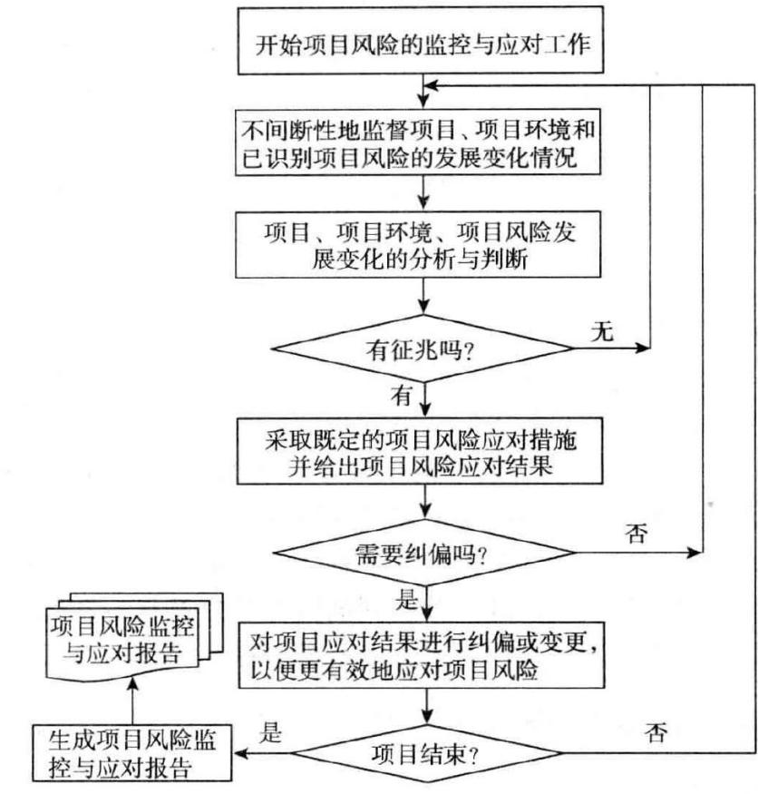

# 第 1章 绪论

# 1.1 研究背景

中国经济已成为世界经济增长的重要引擎和有力支撑。连续多年的稳健经济增长态势带动了各行业蓬勃发展。石油化工产品遍及生活、生产各个领域，其需求来自经济活动的方方面面，随着我国石油化工产业的快速发展，我国石油储运企业规模不断扩大，建设的大型罐区数量越来越多。汽油、航空煤油等成品油是消费属性突出的石油化工产品，预计 2023 年中国成品油消费量将达到 3.60 亿吨[1]。国内成品油库库容保持快速增长态势，截止2020年12月，全国已建、在建和规划中的原油和成品油库超过3000座，油库库容已超过 8000万立方米。

成品油通过原油的加工生产过程制得，其分类涵盖石油燃料、石油溶剂与化学原料、润滑剂、石蜡、石油沥青及石油焦六大类。在这些类别中，石油燃料的产量最为显著，占据了总产量的大约 $90 \%$ 。具体而言，石油燃料可进一步细分为汽油、煤油、柴油等多种类型。此类油品多具有挥发性。油品挥发会产生油气不仅增加了火灾和爆炸的危险性，同时因不同组分挥发速率不同而使油品组成产生变化，导致油品质量降低。因此在油品储运各个环节，应重视油品挥发产生的危害和损失。

储罐作为成品油罐区的核心储存设备，通常采用内浮顶的结构避免油品挥发。内浮顶可简单理解为漂浮在罐内油面上的大圆盘，圆盘边缘与罐壁间有空隙，并使用特殊的材料和结构保持与罐壁的密封。内浮顶始终与油面保持贴合，可随液位变化而自由升降，并严格控制浮顶与油面间的气相空间以减少油品的挥发。

根据结构和材料的不同，内浮顶可分为浮筒式（铝制、不锈钢制）、单/双盘浮顶（碳钢制）、全接液浮顶（箱型、蜂巢粘接型、全焊接型、玻璃钢）等[2]。浮筒式浮顶有安装方便、快速、造价低等优点，是目前仓储企业应用最广的一种浮顶形式。但由于结构的特殊性导致在运行过程中，浮顶与油面间存在油气空间，已不满足现行规定和标准，需逐步淘汰更换。碳钢制单、双盘浮顶技术成熟度较高，其结构稳固，但缺点是安装涉及受限空间动火、改造项目需对罐壁开洞，且浮顶易腐蚀，检修维护困难，不利于设备长周期运行。全接液浮顶是一种新型高效浮顶，特点是由连续覆盖在液面上的多个浮力单元组成，浮顶下不存在油气空间，已成为现行技术发展趋势。但其早起发展出的产品如箱式、蜂巢式全接液浮顶由于其强度低、寿命短、耐火性不足，发生了多起事故，已被市场否定。因此目前全焊接和玻璃钢制全接液浮顶是内浮顶储罐的主要优选浮顶型式。

2018 年 12 月住房和城乡建设部发布国家标准《石油化工企业设计防火标准》（GB50160-2008）局部修订的公告，在修订条文中，明确提出了储存甲 B、乙 A 类的液体应选用金属浮舱式的浮顶或内浮顶罐。并要求单罐容积大于 $5 0 0 0 \mathrm { m } 3 $ 的内浮顶储罐应采用钢制单盘或双盘式浮顶；单罐容积大于或等于 $5 0 0 0 0 { \mathrm { m } } 3 { \mathrm { ~ } }$ 的浮顶储罐应采用钢制双盘式浮顶[3]。2020 年住房和城乡建设部办公厅发布国家标准《石油库设计规范（局部修订征求意见稿）》，明确提出了明确提出了抗爆耐火浮顶的概念，即符合GB50341—2014有关规定的钢制单盘式或双盘式浮顶，以及其他经抗爆和耐火试验合格的全液面接触式浮顶。应急管理部印发的《“十四五”危险化学品安全生产规划方案》中提出，推动对已投运的大型原油、成品油、LNG 等油气储存基地实施设备设施、控制系统升级改造。

标准规范条款的变化体现出了对罐区安全、环保要求越来越严格的趋势，近年来国内新建罐区均按新标准要求执行，对已建成的不满足新标准要求的储罐也陆续开展了内浮顶改造工程。

油罐浮顶的改造工程涉及大量的起重作业、焊接作业、高空作业、受限空间作业，同时罐区贮存着大量危险介质，也存在着石化装置建设过程中的各种安全风险。油罐改造期间，不仅要关注施工阶段的安全风险，也要避免因施工质量不合格造成的油罐后期运行中的风险。如何通过项目风险管理来控制油罐改造过程中的各种风险因素，是油罐改造项目能否达到既定目标的关键。

# 1.2 研究目的与意义

# 1.2.1 研究目的

本文依托 X 储运公司 $3 0 0 0 0 { \mathrm { m } } 3 $ 汽油储罐浮顶改造项目，对项目全过程展开风险管理研究，以求达到以下目的：

（1）借助风险管理相关知识，根据储罐浮顶改造的项目特点，对项目全过程的风险因素进行研究。

（2）对储罐浮顶改造项目的风险因素进行分类，并通过德尔菲法、层次分析法等方法对这些因素进行分析，确定风险管理的重点。

（3）针对不同风险制定出应对和监控措施。

# 1.2.2 研究意义

（1）理论意义

$\textcircled{1}$ 储罐内浮顶改造项目涉及到工程技术、安全管理、项目管理等多个领域。对其进行风险管理研究，可以拓展风险管理理论在特定工程项目领域的应用范畴，为风险管理理论提供新的研究方向和实践案例。

$\textcircled{2}$ 本项目需要综合运用工程学、管理学、安全科学等多学科知识。研究过程中，可以促进不同学科之间的交流与融合，深化多学科融合理论在工程项目中的应用。

$\textcircled{3}$ 内浮顶改造项目直接关系到罐区的安全运行。通过对项目风险的管理研究，可以进一步完善罐区安全管理理论，提高罐区运行的安全性和可靠性。

（2）实际应用价值

$\textcircled{1}$ 风险管理可以帮助项目团队识别、评估和应对各种风险，提高项目的成功率。同时，通过有效的风险控制措施，可以降低项目成本，提高项目的经济效益。

$\textcircled{2}$ 内浮顶改造项目的目的是提高储罐的安全性、环保性。通过风险管理，可以确保改造过程中不出现安全事故，保障储罐的安全运行。

$\textcircled{3}$ 储罐内浮顶改造项目在石油、化工等行业中具有广泛的应用。本项目的风险管理研究成果可以为相关行业提供借鉴和参考，促进整个行业的安全管理水平和技术水平的提高。

# 1.3 国内外研究概况

# 1.3.1 国内研究现状

我国关于项目风险管理的研究与国外相比起步较晚。改革开放以后，随着社会主义市场经济的快速发展，国内的项目管理人员逐渐开始引进国外的先进管理技术，提高了项目管理水平。在此背景下，风险管理理念逐渐进入了人们的视野。1987年，清华大学郭仲伟教授主编的《风险分析与决策》系统的论述了风险分析的思路和方法，并对经济风险、环境风险、勘探风险、外汇兑换风险及农业风险等分别进行了讨论[4]。此书的出版，标志着我国风险管理研究的开始。2006 年，国家发改委、建设部发布《项目建设经济评价方法与参数》，提出基于案例的项目风险管理方法和理论，为项目实现预期收益、规避经营风险提供了指导。2012 年 12 月 17 日，国资委印发《关于 2013 年中央企业开展全面风险管理工作有关事项的通知》，要求中央企业必须推行全面风险管理措施，并主动向国资委呈交全面风险管理年度报告的做法，标志着我国在企业全面风险管理体系建设方面迈出了实质性的步伐，实现了正式落地[5]。在风险管理理论的实践应用中，我国成功地将该理论应用于三峡工程、黄河小浪底工程以及大亚湾核电站等多个重大项目，取得了显著的经济效益[6-8]。

近年来随着全球经济的发展和各类项目的复杂性增加，项目风险管理成为项目成功实施的关键因素。不同领域的项目面临着各种各样的风险，如何有效地识别、评估和应对这些风险是学术界和实践界共同关注的焦点。

杨琳（2021）以厦门市地下综合管廊项目为例，通过对风险网络的整体和局部参数分析，确定了组织协调风险、政策风险等起始节点和施工质量风险、运营成本超支风险等传导节点。基于此，提出从起始因素和关键传导因素两方面进行风险防范的建议，如设立信息公开平台、制定合同制约等措施，为复杂工程项目的风险管理提供了具体的方向[9]。

李辉煌（2021）介绍了详细阐述了大型国际工程项目的外汇风险、税务风险、资金管理风险、成本控制风险、财务能力风险以及政治局势和宗教文化差异风险等六类常见风险。这种分类方式清晰地呈现了国际工程项目财务风险的多样性和复杂性。针对不同风险类别，提出了规避风险、降低风险、分担风险和自留风险四种管控方法，并以科威特新炼厂工程项目为例，详细说明了如何在实际项目中运用这些方法对各类财务风险进行管控[10]。

刘小峰等（2021）基于期望差异理论和演化理论，通过分析公众与环评专家的认知差异，确定存在认知差异的建设项目存在邻避风险，并进一步探讨了期望差异导致邻避风险的机制以及基于 “自组织” 机制的风险演化过程。这种从理论层面深入剖析邻避风险的方法，为理解邻避风险的产生和发展提供了基础[11]。

谭泽涛（2021）阐述了风险管理及进度风险管理的核心工作和实践路线，强调了风险识别、估计、评价和监控在进度风险管理中的重要性。在此基础上，详细介绍了基于网络计划技术的进度风险管理方法，构建了一个较为完整的进度风险管理体系。以 LNG储罐 EPC 项目为例，展示了如何在实际项目中运用上述进度风险管理体系。通过对项目各阶段风险的分析和管理，以及对进度风险模型建立和监控过程的详细描述，如定位进度风险、动态管理作业关键指数等，总结了在 LNG 储罐项目进度风险管理中的实践经验，为类似项目提供了参考[12]。

王腾飞（2022）探讨了国际 EPC 项目中伙伴关系对风险管理和项目绩效的影响。基于伙伴关系理论构建包含接口管理、组织能力和合同管理等要素的风险管理理论模型，并提出相关假设。通过问卷调研收集数据，运用偏最小平方法结构方程模型（PLS - SEM）进行分析，包括信度与效度检验、共线性检验以及预测准确性与相关性分析等。验证了伙伴关系对接口管理、组织能力和合同管理的正向促进作用，进而影响风险管理和项目绩效。揭示了伙伴关系影响项目风险管理的三条路径，以及各测量维度与风险管理成熟度的关系等[13]。

张旭（2023）构建了考虑项目间依赖关系和决策者心理账户的项目风险应对策略选择模型。将项目间依赖关系分类，利用设计结构矩阵（DSM）方法度量其对项目风险的影响程度。以决策者效用最大化为目标，考虑心理账户理论构建风险应对策略选择优化模型，确定风险应对策略对各心理账户的隶属度。通过算例计算和分析，得出项目间依赖关系对项目风险应对策略选择有重要影响，以及考虑心理账户可提高应对预算利用效果等结论[14]。

李琼（2024）从利益相关者分析框架研究城市工程建设项目风险及治理路径。将利益相关者分为核心、潜在和边缘三类，通过实地调研等方式分析其诉求和面临的风险，包括社会发展与民众安居乐业之间的利益失衡等核心风险，不同利益主体之间的经济利益博弈等潜在风险，以及从政策认知到执行推进的主体利益协调等边缘风险。针对不同风险提出政府和业主协力共筑、商户和租户多方利益协商、加强数据保护和平台机制建设等治理路径[15]。

娄长圣（2024）从数字化和伙伴关系双元视角研究清洁能源项目风险管理。建立了包含项目数字化水平、伙伴关系、知识管理、参建企业能力和项目风险管理等要素的风险管理影响机理模型。采用问卷调研结合专家访谈与案例分析的方式收集数据，运用多种分析方法和软件进行数据分析，包括对风险管理方法应用情况、项目数字化水平、知识管理等现状分析。揭示了项目数字化水平和伙伴关系对项目风险管理的积极影响，以及对项目绩效的作用路径，明确风险管理重点关注因素并提出相应建议[16]。

田晓敏（2024）构建基于故障树 - 模糊贝叶斯网络的装配式建筑施工质量风险分析模型。基于专家咨询等，从装配式建筑施工多个阶段识别风险因素，构建故障树模型，并转化为贝叶斯网络，确定节点状态和映射规则。引入模糊集理论和改进的相似聚合方法确定贝叶斯网络概率参数。通过案例分析验证模型在风险评估、预测和致因分析方面的有效性[17]。

# 1.3.2 国外研究现状

目前学界普遍认为是德国是风险管理的起源。一战之后，战败国德国发生了严重的经济问题，因此围绕企业经营提出了包括风险管理在内的一系列管理问题。而风险管理的快速发展则普遍认为在美国。1929年，美国卷入了严重的经济危机，企业面临着难以估计的风险，成为制约公司发展的障碍，迫使管理者开始采取措施来消除、控制、处置风险。1953 年 8 月 12 日，一场灾难性的火灾袭击了通用汽车公司的一家汽车变速箱工厂，导致总计近亿美元的巨额损失，这一事件不仅震惊了企业界与学术界，更在风险管理理论的发展史上留下了深刻的烙印，促使欧美各国对风险管理给予了前所未有的重视。在此后的数十年里，风险管理领域迎来了蓬勃发展的时期。进入二十世纪六七十年代，美国众多顶尖的工商管理学院纷纷将风险管理纳入课程体系，而众多学者也积极投身于风险管理的各项研究之中，为该领域的深入发展贡献了自己的力量。

国外的风险管理研究起初是围绕着风险分析中的定量分析技术展开的，其主要研究方向是风险的管理和技术范畴，如合同招投标、成本估算和施工进度等。随着国际政治环境巨变，经济模式的转变，金融市场的震荡、ISO9000体系的推广以及全球性疾病的威胁相继出现，人们又逐渐围绕政治、经济、金融、质量保证和职业健康安全等方面的风险管理展开了研究。

1956 年，Snider 首次提出了风险管理的概念，并且这一创新理念赢得了美国管理协会（AMA）以及美国保险管理学会（ASIM）的认可与支持[18]。

1962 年，美国管理协会（AMA）通过发布其首本专著《风险管理之崛起》，为风险管理领域的发展注入了强劲动力[19]。

1963年，美国权威刊物《保险手册》上发表了赫奇斯与梅尔共同撰写的《企业的风险管理》一文；紧接着，在1964年，威廉姆斯与汉斯的著作《风险管理与保险》面世，这两部作品均在欧美各国引起了广泛的关注。自此以后，风险管理的研究逐渐走向系统化和专业化，最终确立了它在企业管理中作为一门独立且专业的学科地位[20]。

1986 年，Hayes 等人全面地提出了一个针对建设工程的风险管理框架，该框架涵盖了风险识别、深入的风险分析以及有效的风险应对措施[21]。1989年，Kangari 认为传统的风险管理模型没有纳入经验知识，基于数学模型开发的系统中的大多数都忽略了风险管理所涉及的创造性成分，提出了在风险管理的分析过程中使用了专家打分法[22]。

1995 年Ward 认为项目管理过程中的缺陷可能是项目风险的主要来源，并在其文章中提出了项目全生命周期风险管理的概念[23]。1995 年，澳大利亚与新西兰共同制定的标准《技术系统风险分析》（AS/NZS 3931:1995）正式纳入了风险矩阵分析的相关准则。次年，美国项目管理协会（PMI）在其出版的《项目管理知识体系指南》（PMBOK）中，将风险管理划分为风险识别、风险估计、风险应对计划及风险控制这四个阶段。随后，在2000 年的版本中，PMI 对风险管理流程进行了更为详尽的划分，具体包括风险管理规划、风险识别、风险定性分析、风险定量分析、风险应对规划以及风险监测与控制这六个环节[24]。二十世纪 90 年代后，国际学术界围绕这风险管理的看法逐渐统一，认为风险管理是一个系统工程，包括风险的识别、分析、评价和控制等内容。

近些年来，国外依然有较多围绕工程项目风险的研究。2013 年，Sharma和SatyendraKumar将层次分析法（AHP）与风险图法相结合，构建出风险管理模型，并通过实例展示了这种方法能够更有效的帮助项目管理人员识别出风险因素并控制风险[25]。在 2015年，Anca Ungureanu 与 Cezar Braicu 等人对工程项目风险决策方法进行了全面梳理，指出效用值决策法和损益值决策法是两大核心的风险决策手段[26]。而到了2016年，AbroonQazi 等人在管理大型建设项目时，创新性地融合了贝叶斯理论与期望效用理论，以此精准识别复杂风险并有效控制关键风险因素[27]。2017 年，Oduoza CF等将风险管理软件应用到中小施工单位风险识别和评价过程中，提出风险应对建议，降低了工程成本，促进了工程预期目标的实现[28]。2019年，BiswasTK 和Zaman K将模糊数学理论引入到风险评价中，提出了认知不确定条件下的建设项目风险评价方法，并在项目中验证了其有效性[29]。

# 1.3.3 国内外研究现状评述

我国大型工程项目的投资主体多为政府机构或国有企业，资金主要源自政府拨款或国家财政支持。这种投资模式符合国家的发展规划与宏观战略，但同时也对工程项目的风险管理提出了特殊要求。

尽管我国在风险管理实践上已有显著进步，但与西方发达国家相比，在工程项目风险管理方面的认知深度和执行力仍有待加强。在风险的识别、评估、应对及监控等环节，缺乏一套完整的风险管理框架和高效工具。

当前，我国的风险管理研究与实践往往局限于特定项目或行业内部，这种局限性的存在限制了风险管理知识的广泛传播与深入应用。由于不同行业和项目之间的风险管理实践缺乏沟通和共享，一些成功的经验和教训无法被及时总结和提炼，从而无法为其他

行业或项目提供有益的借鉴和参考。

# 1.4 研究思路与方法

# 1.4.1 研究思路

本文将以项目风险管理相关理论研究为依据，以 KL 公司承接的 X 储运公司$3 0 0 0 0 { \mathrm { m } } 3 $ 汽油储罐浮顶改造项目为研究对象。针对该项目的风险因素，进行风险识别、分析、应对与监控。同时总结项目风险管理过程中的经验教训，以求能够运用到其他项目中。

本文的主要研究思路如下：

首先，对项目风险管理方面国内外相关研究进行概述，并对项目风险管理方面的相关理论进行阐述。

其次，通过阅读文献和现场调查，结合自身工作经验，运用头脑风暴法、德尔菲法或检查表法等对项目的各阶段风险进行识别。并综合运用风险管理理论中的层次分析法结合模糊综合评价法，对项目中的风险因素进行定性和定量分析，进而提出风险应对措施。

最后，通过风险监控来评估风险应对方法的有效性，检查风险应对方法和措施的实际效果是否与预计相同，并改善和细化风险应对措施，使其更符合项目实际。

# 1.4.2 研究方法

（1）文献研究法。利用中国知网、万方、东大图书馆等途径阅读了大量文献，了解相关理论知识，为本论文的研究打好理论基础。

（2）德尔菲法。该法在国内外风险分析研究中有大量使用。德尔菲法能够克服专家会议易受心理因素影响的缺点，通过匿名的方法对专家进行函询征求意见。将意见进行多轮的汇总、反馈、分发后，得出新的论证，最终使专家的意见趋于一致。本文拟采用德尔菲法对识别出的风险因素进行定性分析。

（3）层次分析法。层次分析法是一种系统化方法，它首先将复杂问题拆解成多个构成因素，随后根据这些因素的相互支配关系，将它们组织成一个有序的、分层的结构体系。在这一结构中，通过两两对比评估每一层级内因素的相对重要性，逐步累积并确定所有因素相对于总体目标的重要性排序，从而得出决策因素对于目标而言的最终优先级顺序。本文拟采用层次分析法，对风险因素进行定量分析，确定各评价因子的权重。

（4）模糊综合评价法。

模糊综合评价法是一种将定性评价转化为定量研究的一种方法，对于风险管理来说，基于模糊数学的方法将层次分析法确定的风险权重做出一个总体评价，结果清晰，对于项目风险的评估具有直观的效果。

  
图 1.1研究思路和方法  
Figure 1.1 Thinking train and research method

# 第 2章 相关理论概述

# 2.1 风险及项目风险

# 2.1.1 风险的定义及特点

关于风险这一复杂的概念，学术界与实践领域至今仍未给出一个普遍接受且精确无误的定义。风险常被宽泛地解释为某种损失或不利事件发生的不确定性和可能性。这种不确定性既涵盖了事件是否会发生的不确定性，也包括了如果发生，其影响范围和严重程度的不可预知性。当谈论风险时，实际上是在讨论那些可能让遭遇不利后果的事件或情况的发生概率。

为了更深入地理解风险，可以从认知学的角度进行剖析。在此视角下，风险的本质不仅仅是一个客观的、外在的威胁，它还深深植根于人类的主观认知与客观现实之间的复杂互动之中。具体而言，风险所带来的潜在损害是否会真正发生，以及一旦发生后其具体的损害程度，往往取决于人们对风险的认知判断与实际状况之间存在的差异。这种差异可能源于信息的不对称、评估方法的局限性，或是个人经验和价值观的不同。

从这一更深层次的理解出发，风险可以被进一步定义为：在特定的环境条件和时间框架内，人们对于某一事件或一系列事件预期结果与实际结果之间可能出现的偏差或差异的程度。这种差异不仅反映了现实世界的复杂多变，也揭示了人类认知能力的局限性和不确定性管理的挑战。

风险作为一种普遍存在的现象，渗透在生活的方方面面，其特性可以从以下几个方面进行深入理解：

（1）客观性

风险的存在是客观的，它并不依赖于的主观意愿或情感判断。无论是否愿意面对，风险始终在那里，静静地影响着的生活。这是因为决定风险出现的各种因素，如自然环境、经济条件、技术发展水平等，都是独立于人的意志之外的客观存在。这些因素的相互作用，导致了风险的产生和变化。

# （2）不确定性

风险之所以让人难以捉摸，很大程度上是因为其不确定性。这种不确定性体现在风险的多个方面：它可能随时发生、它的发生方式可能多种多样、它带来的后果，可能是正面或负面的，其大小和范围也往往是未知的。正是这种不确定性，使得风险管理成为了一个不可忽视的挑战。

（3）可预测性

尽管风险具有不确定性，但仍可以对其进行预测和防范。当大量的类似风险事件发生时，往往会呈现出一定的规律性。这种规律性，虽然可能并不明显，但可以通过统计分析和概率论原理，对风险进行一定程度的预测。通过对历史数据的挖掘和分析，可以发现风险发生的某些趋势，从而为制定风险防范策略提供支持。

# 2.1.2 项目风险的定义及特点

项目风险指的是那些可能引发项目损失的不确定因素。美国著名的项目管理专家马克思·怀德曼将其阐释为：某一事件若发生，将会对项目的既定目标产生负面效应的可能性[30]。而美国项目管理协会（PMI）则对项目风险给出了这样的界定：它是一种不确定的事件或条件，该事件或条件的出现，至少会对项目的一个目标造成一定的影响。鉴于项目的独特性质，项目风险与其他类型的风险有所不同。除了共享风险的一般特性之外，项目风险还展现出其独有的特征。

（1）相对性

同样的项目风险对于不同的项目和项目管理团队而言，其产生的影响是截然不同的。不同项目所掌控的资源量及其配置效率的不同，以及不同项目团队在组织结构、专业技能、管理经验、沟通协调能力等方面的综合能力差异都会导致风险的影响不同[31]。

# （2）客观性

项目风险是客观存在的，它是项目管理和执行过程中无法回避的一部分。这种风险的客观性源于项目所处的复杂多变的环境，这些环境因素包括自然环境和社会环境，它们共同构成了项目运作的外部条件，并直接或间接地影响着项目的进展和结果[32]。

自然环境方面，项目可能面临的气候变化、地质灾害、生态影响等因素，都是不可忽视的风险源。社会环境方面，项目所处的政治、经济、法律、文化等背景也会带来各种风险。

# （3）普遍性

风险是普遍存在于工程项目的各个层面。无论是项目的高层决策者、中层管理者还是基层执行者，都需要时刻保持对风险的警觉，因为风险不仅可能源于外部环境的突变，

如政策调整、市场波动、自然灾害等，还可能源自于项目内部的运作和管理，如技术难题、资金短缺、团队协作问题等。这些风险因素可能以不同的形式和强度影响项目的进展和成果。

风险不可避免，这是由未来的不确定性和人类认知的局限性所决定的。尽管人们可以通过先进的技术手段和管理方法来预测和控制风险，但风险的存在是客观的，无法被完全消除。

# （4）偶然性

项目风险是客观存在的，这一事实构成了项目管理中不可忽视的一环。然而，风险的发生却是偶然的，这一特性赋予了风险以随机性和不确定性。人们无法像预测日升月落那样，精确预知风险何时会悄然降临，也无法事先精确描绘出风险一旦发生可能带来的具体后果。

这种偶然性源于多种因素的综合作用，包括但不限于外部环境的变化、内部管理的疏漏、技术实现的难度以及人为操作的失误等。每一个因素都可能成为触发风险的导火索，而它们之间的相互作用更是错综复杂，难以用简单的数学模型或经验法则来准确预测。

（5）可变性

项目的风险特征呈现出一种持续且动态的演变态势。项目所处的外部环境因素的变动，诸如宏观经济环境的起伏、政策导向的变迁、市场需求结构的调整，以及技术革新所带来的冲击，均可能对项目风险产生直接或间接的影响，进而促使风险特征发生显著变化。这些外部环境的不确定性因素显著增加了项目管理的复杂性和挑战性，要求项目团队保持高度的敏感性和灵活性，以应对可能出现的各种风险变化。

项目内部的决策过程及其执行中的调整亦可成为推动风险变化的关键因素。项目初期规划的不合理性、资源配置的失衡、进度安排的偏差，以及项目执行过程中目标、策略或技术方案的频繁变动，均可能导致项目风险状态发生偏移，甚至诱发新的风险源。项目团队成员的专业素养、沟通协调能力以及决策质量，也在很大程度上对项目风险的动态演变起着决定性作用。

# 2.2 项目风险管理理论概述

# 2.2.1 项目风险管理过程

根据美国项目管理协会（PMI）的阐述，项目风险管理涵盖了一系列关键活动，具体为制定项目风险管理计划、进行风险识别、执行定性及定量风险分析、规划风险应对策略，以及实施风险监督与控制。在实际操作流程中，这一系列复杂的管理活动可以概括为四个核心阶段：风险识别，风险评估（融合了定性与定量分析的环节），风险应对的规划与执行，最终是风险控制的过程[33]。这四个步骤呈现出一个逻辑上循序渐进、相互依赖的关系，共同构成了项目风险管理的完整框架。项目风险管理的目标可以被认为是使潜在机会或回报最大化、使潜在风险最小化[34]。

# 2.2.2 项目风险识别

项目风险识别是一个动态过程，其核心在于识别出可能对项目目标产生负面影响的各类因素。随着项目进展，这些影响因素也会相应地发生变化。不同的项目阶段，所面临的风险因素往往各异，因此，风险识别需要持续进行，以适应项目环境的变化。项目风险识别的内容主要包括三大方面：风险识别的依据，它基于项目管理计划、风险管理计划、项目范围说明书、历史数据、风险分类以及环境因素等；风险识别的工具和技术，这些工具和技术帮助识别潜在风险；风险识别的成果，即识别出的具体风险及其特性。特别是在建设工程项目中，风险识别的依据尤为重要，它依赖于上述多方面的资料和信息，以确保风险识别的准确性和全面性。

项目风险识别的目的在于将项目面临的不确定因素转化为易于理解的风险表述，此识别流程一般包含五个步骤：

（1）确定风险识别范围

项目风险识别的第一步是明确风险识别的目标和边界。在确定风险识别范围时，需要考虑项目的规模、复杂度、时间限制、资源分配等因素，以及项目所处的行业、市场环境、政策法规等外部因素。这些因素都可能对项目产生潜在风险，因此在风险识别过程中需要予以充分考虑。

（2）收集项目资料

收集项目资料是风险识别的基础工作。项目资料包括项目计划、合同文件、技术文档、历史数据等，这些资料提供了项目的全面信息，有助于识别潜在风险。

在收集项目资料时，需要确保资料的准确性、完整性和及时性。同时，还需要对项目资料进行分类和整理，以便后续的风险识别和分析工作。

（3）风险识别方法选择

根据项目特点和风险识别需求，选择合适的风险识别方法至关重要。常用的风险识别方法包括头脑风暴、德尔菲法、检查表法、流程图法等。

# （4）识别潜在风险

运用所选的风险识别方法，对项目的各个方面进行深入分析，识别出可能对项目产生负面影响的不确定因素，即潜在风险。

在识别潜在风险时，需要关注项目的全生命周期，包括项目启动、规划、执行、监控和收尾等各个阶段。同时，还需要关注项目的各个维度，包括时间、成本、质量、范围、人力资源、沟通、风险、采购等方面。

# （5）风险分类与整理

将识别出的潜在风险进行分类和整理，形成风险清单。在风险分类时，可以根据风险的来源、性质、影响范围等因素进行分类。例如，可以将风险分为技术风险、市场风险、管理风险、财务风险等类别。在整理风险清单时，需要确保信息的准确性和完整性，还需要对风险清单进行动态管理，随着项目的进展和外部环境的变化，及时更新风险清单中的信息。

# 2.2.3 项目风险评估

风险评估工作建立在已识别的工程项目风险因素之上，为制定有效的风险应对策略与措施提供基于实践经验的深入信息和精确分析。在工程项目的风险分析中，应该全面且深入地探究引发风险事件的各种原因、评估这些风险事件发生的可能性，并衡量它们可能带来的后果。风险评估是一个综合运用多种方法的复杂过程，旨在确保工程项目在面对各种潜在风险时能够做出明智的决策，从而有效管理和降低风险。

通常而言，风险评估涵盖了两大类方法：定性分析与定量分析。定性分析手段多样，包括但不限于德尔菲法、头脑风暴法、风险核对表、SWOT 分析以及等风险图法等。这些方法侧重于对风险进行主观或相对的评估，帮助项目团队理解风险的性质和重要性。

定量分析则更加注重数据驱动和精确计算，其方法包括敏感性分析法、事故树分析法（FTA）、进度计划评审技术（PERT）等。这些方法通过数学模型和统计工具来量化风险的可能性和影响，为决策提供更为客观的依据。

模糊层次分析法（FAHP）在某些情况下也被视为一种半定量分析方法。它结合了定性与定量的元素，通过模糊数学理论来处理不确定性，为风险评估提供了一种更为精细和全面的视角。

# 2.2.4 项目风险应对和监控

# 一、项目风险应对

项目风险应对涉及根据风险评估的结果，策划并执行一系列行动，旨在降低或消除潜在风险对项目造成的负面影响。

（1）策划应对措施

基于风险评估的详细结果，项目团队会制定一系列具体的风险应对策略，如规避、减轻、转移或接受风险。这些策略旨在减少风险发生的可能性，降低其潜在影响，或在风险发生时确保项目能够迅速恢复。

（2）实施风险应对计划

一旦确定了应对措施，项目团队将制定详细的实施计划，并分配必要的资源以确保这些措施得到有效执行。

（3）持续监控与调整

在实施风险应对计划的过程中，项目团队会密切关注风险的变化情况，并根据实际情况对应对措施进行必要的调整。

# 二、项目风险监控

项目风险监控则是指在整个项目周期内，对项目风险的发展情况进行持续的观察和评估，以便在必要时采取适当的行动。

（1）持续监控风险发展

项目团队会密切关注风险的发展趋势，包括风险发生的概率、潜在影响以及新出现的风险。

# （2）识别风险预警信号

通过持续的监控，项目团队能够及时发现风险即将发生的预警信号，从而提前采取措施进行干预。

# （3）采取预防措施

根据风险监控的结果，项目团队会制定并执行预防措施，以降低风险发生的可能性

或减轻其影响。

（4）应对风险事件

一旦风险事件发生，项目团队会迅速启动应急预案，确保项目能够尽快恢复正常运行。

# （5）更新风险管理策略

在监控过程中，项目团队会根据风险的变化情况不断更新风险管理策略，以确保其准确性和有效性。

# 2.3 项目风险管理工具与技术

# 2.3.1 项目风险识别工具与技术

项目风险识别是项目管理中的关键环节，旨在提前发现可能影响项目成功的潜在风险。常用的项目风险识别的工具有风险登记表、风险检查表。常用的风险识别技术有头脑风暴法、德尔菲法、根本原因分析、SWOT 分析、敏感性分析、图解技术等。

（1）头脑风暴法

头脑风暴法是一种高效的集体讨论方法，旨在激发创新思维并催生出丰富的想法集合。它着重于引导团队成员跳出传统思维模式，勇于提出多样化的创意和解决方案，从而为项目或难题探索多元化的解决途径。该方法的核心观念在于，想法的数量是通往高质量创意的桥梁——数量越多，就越有可能筛选出极具价值的创意。一旦收集到足够数量的想法，接下来便是对这些想法进行综合考量与改进，以期提炼出既可行又富有创新性的解决方案。

实施头脑风暴法时，首要步骤是明确讨论的主题和期望达成的目标。随后，组建一个由拥有不同背景和专业技能的个体构成的多元化团队。在正式讨论拉开帷幕前，通过一系列简单的游戏或活动进行热身，旨在缓解团队成员的紧张情绪，消除彼此间的陌生感。同时，明确头脑风暴的基本原则与规则，确保每位团队成员对讨论流程有清晰而全面的认识。

进入讨论环节，团队成员被鼓励积极表达个人观点，提出创意想法。此时，主持人的角色至关重要，需引导讨论的方向，确保话题始终紧扣主题，避免偏离主线。讨论过程中，应秉持开放与非评判性的态度，不对任何想法进行即时的评价或批评。同时，安排一名专人负责详尽记录讨论中涌现的所有想法与观点，确保记录内容清晰、条理分明，

为后续的分析与改进奠定坚实基础。

讨论结束后，对记录下来的想法进行系统的分析与评估。通过筛选与提炼，找出最具可行性和创新潜力的解决方案，并在此基础上进行进一步的完善与优化。这一过程不仅是对想法的升华，更是对团队创新能力的深度挖掘与提升。

（2）德尔菲（Delphi）法

德尔菲法，是以古希腊太阳神阿波罗预见未来能力为灵感的预测方法，最初在 20世纪 40 年代由美国兰德公司提出，并于 1946 年付诸实践。随着时间的推移，该方法经历了不断的改进和优化，现已广泛渗透至商业、军事、教育及卫生保健等多个行业领域。德尔菲法遵循一套系统化的流程，采用匿名方式收集专家意见，确保专家间无直接交流，仅与调查人员保持联系。通过多轮问卷调查，反复征求、整理及修订专家观点，最终凝聚成共识性的预测结果。

实施德尔菲法的首要步骤是明确调查主题，这包括制定调查框架、准备相关资料，如预测目标、时间范围、问卷模板及填写指南等。接着，根据研究领域的专业知识需求，组建一个专家小组，成员数量依据课题规模及复杂度而定，通常不超过 20人。

在首轮调查中，向所有专家详细介绍预测问题及其背景资料，并要求他们提交书面预测意见，同时阐述其预测依据。随后，收集并汇总专家的初步意见，以图表形式进行对比分析，再将汇总结果反馈给每位专家。通过这一过程，专家能够审视并调整自己的预测，以更好地反映集体智慧。

此反馈与修订环节需重复进行，通常历经三至四轮，直至专家们的意见趋于一致，不再有显著变化。最终，综合处理所有专家的意见，提炼出预测结果或决策建议，为决策者提供科学依据。

（3）核查表（CheckList）分析法

核查表分析法是一种通过表格形式详细列出待检查或评估的各项要素及项目，并进行逐条核对与记录的方法。它能够系统地搜集并分析数据，从而确保评估工作的全面性和精确性。此法在项目管理、质量控制、环境评价等多个领域均有广泛应用，旨在辅助决策过程并促进流程改进。核查表分析法以其直观易用、便于理解及操作的特点，适用于各种规模和复杂度的项目，同时可根据具体需求灵活定制，以满足不同的评估目标与要求。通过表格展示，数据能够清晰呈现，便于后续的对比与分析。

在实施核查表分析法时，首要步骤是明确评估对象、目的及范围。接着，根据评估目标设计包含所有关键要素的表格，并设定各要素的评估基准。随后，利用核查表进行现场检查或调研，以获取相关数据和信息。收集到的数据需经过分析与比较，以评估各要素的达标情况或识别潜在问题。基于分析结果，应制定具体的改进措施或建议，旨在优化流程、提升质量或降低成本。

在核查表的设计过程中，必须确保涵盖所有评估要素，并清晰界定各要素的评估标准。在数据收集与分析阶段，需确保数据的客观性与准确性，避免主观偏见或误导。最后，根据分析结果迅速制定并实施改进措施，同时跟踪其效果，以持续优化流程并提升质量。

# 2.3.2 项目风险分析工具与技术

项目风险分析是项目管理中的一个关键环节，它涉及一系列工具和技术，用于分析、评估项目存在的风险。定性分析的工具与技术包括：SWOT 分析、团队头脑风暴会议、德尔菲法、风险概率和影响矩阵、风险登记册等。定量分析的工具与技术包括：敏感性分析、决策树分析、蒙特卡罗模拟、模糊层次分析等。本文采用了模糊层次分析法进行项目风险因素分析。

模糊层次分析法（FAHP）融合了模糊数学与层次分析法（AHP）的原理，形成了一种多标准决策工具。它利用模糊数来捕捉并表达决策者判断的模糊性，从而增强了决策的精确度和合理性，特别擅长应对那些因判断不确定和模糊而产生的决策难题。

FAHP 的根基在于两大理论支柱：首先是层次分析法（AHP），由托马斯·萨提（Thomas L. Saaty）创立。AHP 通过构建多层次的框架，将复杂的决策挑战拆解为若干个子问题，并借助成对比较的手段来明确各因素间的相对重要性。这一方法的核心环节是构建判断矩阵，用以量化各因素间的相对权重。其次，模糊数学则专注于研究模糊现象，利用模糊集合理论来描绘和处理具有模糊特征的对象。在FAHP中，模糊数学被巧妙地用于处理决策者的模糊判断，使得决策流程更加符合实际情况。

在进行模糊层次分析时，首先需要明确决策问题的性质和总目标，然后按照问题的层次和因素进行分解，构建一个由下而上的梯级层次结构。这个结构通常包括目标层、准则层和方案层。在层次结构模型的基础上，对同一层次的要素以上一级的要素为准则进行两两比较，并根据评定尺度确定其相对重要程度。然后，根据这些比较结果建立模糊判断矩阵。通过一定的计算方法（如模糊数运算、模糊聚类分析等），确定各要素的相对重要度（即权重）。同时，需要进行一致性检验，以确保判断矩阵的合理性和可靠性。 最后根据计算出的权重，对所有的替代方案进行综合评价和排序，从而为决策人

选择最优方案提供科学的决策依据。

模糊层次分析方法的优点在于它能够处理具有模糊性和不确定性的决策问题，提高了决策的准确性和合理性。同时，它还能够将复杂的决策问题分解为多个子问题，使得决策过程更加清晰和易于理解。然而，该方法也存在一些局限性，如计算过程相对复杂、需要一定的专业知识和经验等。

模糊层次分析方法适用于那些需要综合考虑多个因素、且这些因素之间存在模糊性和不确定性的决策问题。在项目管理、投资决策、风险评估等领域中，该方法具有广泛的应用前景和实用价值。

# 2.3.3 项目风险应对工具与技术

一般而言，项目风险管理的策略包括：风险承担、风险减轻、风险回避以及风险转移。在选择具体的风险应对策略时，需要依据每个项目的特定情境以及风险等级的高低来进行权衡与决策。

（1）风险接受

风险接受，亦称风险自留，是指企业或项目主体主动承担因风险事件可能引发的损失。此策略通常适用于那些概率低但潜在影响大的风险，或当转移和降低风险的成本过高时。风险接受并不意味着放任自流，而是基于财务能力和风险承受度的考量，可能通过预留预算、制定应急计划等方式来应对。若风险事件的影响能在既定的预算范围内通过应变措施解决，则可视为一种合理的风险接受。

# （2）风险缓解

风险缓解，旨在通过一系列措施降低风险发生的可能性或减轻其影响。这包括技术革新、管理优化、内部控制加强、灾害恢复计划的制定、员工培训与教育提升等多个层面。通过这些手段，可以系统地减少风险对项目或企业运营的不确定性，确保业务目标的顺利实现。

（3）风险规避

风险规避，是通过调整计划或活动来避免风险的发生，从而保护目标免受风险侵害。这包括完全放弃某项可能带来风险的活动，或是通过控制风险发生的条件来减少损失的概率和程度。尽管规避策略可能意味着放弃某些潜在收益，但它在保护企业资产、维护稳定运营方面发挥着重要作用。

# （4）风险转移

风险转移，是将风险责任及其潜在损失通过合同或非合同形式转移给其他实体。这通常涉及保险购买、再保险安排、合作联盟或合资等方式。保险作为最常用的风险转移工具，能够为企业提供风险事件发生后的经济补偿；而再保险则是保险公司为分散自身风险而采取的措施；合作与合资则是通过资源共享、风险共担来探索新市场或新产品，实现共赢。

# 2.3.4 项目风险监控工具与技术

工程项目风险监控是确保项目顺利进行、减少损失并达成预期目标的关键环节。以下是一些常用的工程项目风险监控方法：

（1）风险跟踪与监控

通过风险登记册和跟踪矩阵记录并跟踪风险状态，定期召开风险审查会议以评估风险并调整策略。

# （2）风险预警系统

设定预警指标和阈值，利用信息技术实时监控并触发报警，以便及时应对风险。

（3）应对措施执行与调整

针对已识别风险制定应对措施，确保其有效执行并持续监督效果，必要时调整策略。

（4）风险监控报告与沟通

定期编制风险监控报告，向项目团队和相关利益方汇报风险状况，促进信息共享和决策制定。

（5）持续改进与学习

项目结束后总结经验教训，持续改进风险监控方法和流程，提高风险管理能力，并通过知识共享和培训提升团队风险意识。

# 第 3 章 X 储运公司储罐内浮顶改造项目概况

# 3.1 X 储运公司储罐内从浮顶改造项目背景

X 储运公司汽油储罐（T-01）为该储罐1994 年开工建设，采用浮筒式铝制内浮盘。由于结构落后和使用年限久，该浮盘存在以下问题：1.密封性不良、油气挥发量大；2.浮盘与液面存在密封空间，有火灾爆炸隐患；3.浮筒式浮盘结构强度较差，浮盘在工作期间易受外力作用导致形变发生损坏、沉盘等事故。因此该厂在 2017 年 VOCs 综合治理项目中对其内浮盘进行更新改造，改造后采用蜂巢式全接液内浮顶结构。

蜂巢式内浮盘最早于 2012年引入中国并得到推广，是一种新型浮盘结构。相较于浮筒式内浮盘，其最大的特点是采用了蜂巢板最为浮力单元，其具有重量轻、结构强度大、平整度高等优点，可以实现全盘与液面安全接触，能够大幅降低油品挥发量和油气受限空间[34]。但是因其发展时间较短，其设计、制造、安装均未形成行业标准。国内多个地区的实际使用情况也表明，蜂巢式浮盘的浮力元件间的连接结构较弱，容易受浮盘在上下浮动过程中因罐体、导波管等垂直元件老化变形产生的外部作用，及浮盘设计质量、制造质量、安装质量不佳而产生的内部作用下，产生浮动原件变形、泄露甚至产生浮盘溃塌、沉盘等严重事故[35-36]。

2018 年 12 月住房和城乡建设部发布国家标准《石油化工企业设计防火标准》（GB50160-2008）局部修订的公告，在修订条文中，明确提出了储存甲 B、乙 A 类的液体应选用金属浮舱式的浮顶或内浮顶罐。并要求单罐容积大于 $5 0 0 0 \mathrm { m } 3 $ 的内浮顶储罐应采用钢制单盘或双盘式浮顶；单罐容积大于或等于 $5 0 0 0 0 0 { \mathrm { m } } 3 $ 的浮顶储罐应采用钢制双盘式浮顶。2020年住房和城乡建设部办公厅发布国家标准《石油库设计规范（局部修订征求意见稿）》，明确提出了明确提出了抗爆耐火浮顶的概念，即符合GB 50341—2014 有关规定的钢制单盘式或双盘式浮顶，以及其他经抗爆和耐火试验合格的全液面接触式浮顶。应急管理部印发的《“十四五”危险化学品安全生产规划方案》中提出，推动对已投运的大型原油、成品油、LNG等油气储存基地实施设备设施、控制系统升级改造。

因此在国家标准要求和储罐运行安全的要求下，X 储运公司决定对汽油储罐（T-01）进行浮盘更新改造，改造后采用钢制单盘浮顶。具体改造工作包括：储罐吹扫、通风，原内浮顶、导向柱拆除、外运，储罐清理，罐体开洞，新浮盘浮舱预制、安装，罐内导向柱安装，单盘安装，防腐作业，密封结构安装，封闭罐体，上水试浮等。

# 3.2 项目总体情况

# 3.2.1 主要参数

（1）被改造罐主要参数名称：汽油储罐；设备位号：T-01；容积： $3 0 0 0 0 { \mathrm { m } } 3 { \mathrm { ~ } }$ ；内直径： $4 4 0 0 0 \mathrm { m m }$ ；罐壁高度： $1 9 5 9 8 \mathrm { m m }$ ；最高设计液位： $1 7 8 5 0 \mathrm { m m }$ ；主体材质：16Mn

（2）内浮顶主要参数

内浮顶形式：钢制单盘内浮顶；材质：Q235B；单盘板厚度： $5 \mathrm { m m }$ ；边缘密封形式：弹性密封；边缘密封间隙： $2 0 0 \mathrm { m m }$ ；导向柱直径： $2 0 0 \mathrm { m m }$ ；浮舱数量：36 个；浮舱宽度： $1 5 0 0 \mathrm { m m }$ ；总重量：110t

# 3.2.2 危险特性

项目所处库区主要工艺是成品油的储存、倒运、输送等。油品品种包括汽油（92#）、汽油（95#）、柴油（0#）等。

（1）介质名称：汽油

介质特性：无色至淡黄色的易流动液体（对于不同等级的汽油，数据变化较大），沸点（馏程）为 $3 0 { \sim } 2 2 0 ^ { \circ } \mathrm { C }$ ，熔点 ${ < } { - } 6 0 ^ { \circ } \mathrm { C }$ ,密度 $7 0 0 { \sim } 7 8 0 \mathrm { k g } / \mathrm { m } ^ { 3 }$ ，闪点 ${ \bf - } 4 3 ^ { \circ } \mathrm { C }$ ，自燃温度$2 5 5 { \sim } 3 9 0 ^ { \circ } \mathrm { C }$ ，爆炸极限 $1 . 4 { \sim } 7 . 6 \mathrm { V } \%$ ,不溶于水，易溶于苯、二硫化碳、醇，可溶于脂肪，属于低闪点易燃液体，火灾危险性甲 B 类。

（2）介质名称：柴油

介质特性：柴油是一种淡黄色至棕色的液体。其沸点（馏程）为 $1 8 0 { \sim } 3 7 0 ^ { \circ } \mathrm { C }$ ，熔点- $\cdot 1 8 ^ { \circ } \mathrm { C } - 3 0 ^ { \circ } \mathrm { C }$ ，密度 $8 2 0 { \sim } 8 6 0 \mathrm { k g } / \mathrm { m } ^ { 3 }$ 。闪点 $5 5 ^ { \circ } \mathrm { C } - 7 5 ^ { \circ } \mathrm { C }$ ，自燃温度 $2 5 0 { \sim } 3 5 0 ^ { \circ } \mathrm { C }$ 。它不溶于水，能较好地溶解于苯、四氯化碳等有机溶剂，在脂肪中也有一定溶解性。柴油属于高闪点易燃液体，火灾危险性乙 B 类。

# 3.2.3 周边环境

本项目所属X 储运公司，紧靠渤海海岸，地理位置得天独厚，贯穿南北的沈大高速公路在此通过，使拟建的储运设施独具优越的水路、铁路、公路运输条件。库址西、南两侧与开发区主要道路相衔接，产品运输方便、交通顺畅。库址距开发区消防大队约$2 2 0 0 \mathrm { m }$ ，距沈大高速公路出口大约 $5 \mathrm { k m }$ 。

改造罐所处库区于 1995 年 10 月建成投产。库区共分为柴油罐区、汽油1#罐区和汽油 2#罐区共三个罐区。柴油罐区储罐共 6 座（其中 $2 \times 1 0 4 \mathrm { m } 3$ 拱顶罐 4 座、 $1 \times 1 0 ^ { 4 } \mathrm { m } ^ { 3 }$ 内浮顶罐2座），柴油总罐容 $1 0 \times 1 0 ^ { 4 } \mathrm { m } ^ { 3 }$ ；汽油1#罐区储罐4座，均为内浮顶罐（其中3$\times 1 0 ^ { 4 } \mathrm { m } ^ { 3 }$ 罐2 座、 $2 \times 1 0 ^ { 4 } \mathrm { m } ^ { 3 }$ 罐2 座）；汽油 2#罐区储罐 2座，均为 $3 \times 1 0 ^ { 4 } \mathrm { m } ^ { 3 }$ 内浮顶罐。汽油总罐容 $1 6 \times 1 0 ^ { 4 } \mathrm { m } ^ { 3 }$ 。

# 3.2.4 自然条件

（1）气温年平均气温： $9 . 8 \mathrm { { ^ \circ C } }$ ；  
极端最高气温： $3 4 . 4 \mathrm { { } ^ { \circ } C }$ ；  
极端最低气温： $- 2 2 . 4 ^ { \circ } \mathrm { C }$ ；  
最热月最高平均气温： $2 8 . 3 \mathrm { { ^ \circ C } }$ ；  
最冷月最低平均气温： $- 1 5 . 0 \mathrm { { \bar { C } } }$ ；  
最热月平均气温（7月）： $2 3 . 2 \mathrm { ^ \circ C }$ ；  
最冷月平均气温（1月）： $- 1 1 . 3 ^ { \circ } \mathrm { C }$ 。（2）大气压力  
年平均气压： $1 0 0 2 . 3 \mathrm { m b }$ ；  
最高绝对大气压： $1 0 3 1 . 1 \mathrm { m b }$ ；  
最低绝对大气压： $9 7 0 . 5 \mathrm { m b }$ ；  
月平均最高气压（1月）： $1 0 1 2 . 5 \mathrm { m b }$ ；月平均最低气压（7月）： $9 9 1 . 0 \mathrm { m b }$ （3）湿度  
年平均相对湿度： $6 8 \%$ ；  
月平均最高相对湿度（8月）： $8 2 \%$ ；月平均最低相对湿度（4月）： $5 6 \%$ 。

（4）降雨量年平均降雨量： $5 4 9 . 9 \mathrm { m m }$ ；月最大降雨量：398.5mm；

日最大降雨量：204.7mm；  
一次暴雨最大降量： $3 3 3 . 0 \mathrm { m m }$ ；  
最大积雪深度：260.0mm；  
历年平均降雨日数：100天；  
冻土最大深度： $1 . 0 4 \mathrm { m }$ 。（5）风夏季主导风向和频率：WNW；  
冬季主导风向和频率：NE；  
全年主风向：SSE；  
瞬间最大风速： $2 9 . 0 \mathrm { m / s }$ ；  
最大月平均风速： $2 6 . 0 \mathrm { m / s }$ ；  
夏季平均风速： $7 . 2 \mathrm { m / s }$ ；  
基本风压值： $0 . 4 5 \mathrm { k N } / \mathrm { m } ^ { 2 }$ 。

（6）场地工程地质、地震烈度

该区所处地貌类型为滨海相沉积地貌，地基土由上而下分为，一层为杂填土，主要以粘土混碎石为主，个别地段碎石含量较多，钻进困难，为回填大块石或砼坝基。厂区普遍分布厚约 $0 . 3 \mathrm { m } { \sim } 1 1 . 4 \mathrm { m }$ ，承载力为 $1 2 0 \mathrm { k P a }$ ；二层为吹填中粗砂厚约 $1 . 7 0 \mathrm { m } { \sim } 1 1 . 6 0 \mathrm { m }$ ，承载力为 $1 3 0 \mathrm { { k P a } }$ ；三层为淤泥质粉质粘土厚约 $0 . 2 0 \mathrm { m } { \sim } 9 . 8 0 \mathrm { m }$ ，承载力为 $4 0 \mathrm { k P a }$ ；四层粉质粘土为厚约 $0 . 5 \mathrm { m } { \sim } 1 2 . 0 \mathrm { m }$ ，承载力为 $1 6 0 \mathrm { k P a }$ ；八层为粉质粘土厚约 $0 . 5 0 \mathrm { m } { \sim } 4 . 4 0 \mathrm { m }$ ，承载力为 $1 7 0 \mathrm { { k P a } }$ ；九层为强风化花岗岩厚约 $0 . 4 0 \mathrm { m } { \sim } 1 0 . 4 0 \mathrm { m }$ ，承载力为 $4 0 0 \mathrm { k P a }$ ；十层为中等风化花岗岩，承载力为 $6 0 0 \mathrm { { k P a } }$ ，局部有夹层；场地范围内见地下水，地下水的类型为潜水，初见水位埋深在 $2 . 1 0 \mathrm { m } { \sim } 7 . 6 0 \mathrm { m }$ 之间。地震烈度:场地地震基本烈度为7度。

# 3.3 X 储运公司储罐内浮顶改造项目目标与组织

# 3.3.1 项目目标

（1）工期目标

根据建设方需要，该项目计划在 2025 年6 月30 日完成内浮顶及附件的安装，完成储罐施工龙门封堵工作，在 2025年8月 15日完成上水试验。

# （2）质量目标

内浮顶能够顺利上浮至设计高度，无卡阻、无异常响声，密封性能达到设计要求。项目一次性验收合格

（3）安全目标

储罐内浮顶改造项目期间无重大安全事故。

# 3.3.2 项目组织机构

根据储罐内浮顶改造项目的特点，结合公司的管理体系，成立了项目经理部。项目经理部对工程施工进行协调、管理和控制，确保项目目标完成。项目管理部组织机构见技质安图 3.1。

  
图 3.1 项目管理部组织机构图  
Figure 3.1 Organizational Chart of the Project Management Department

# 3.4 X 储运公司储罐内浮顶改造项目难点

与新建储罐项目不同，X 储运公司储罐内浮顶改造项目是在原有储罐内部进行内浮顶更换改造的项目。在项目执行过程中，存在很多不确定性、特殊性和难点，因此需要加以重视。

（1）厂区内防火防爆

X 储运公司的主营业务是汽油、柴油等成品油的储存，厂区内遍布盛有易燃易爆油品的储罐及管道，项目改造的 T-01 罐本身即是一台 3 万立汽油储罐，且与T-02 汽油储罐仅一墙之隔，施工现场周围易燃易爆介质较多。此外，本次改造的蜂巢式内浮盘，其部分浮力元件可能出现泄露，导致汽油渗入其中，容易产生油气挥发，成为火灾爆炸危险源。在储罐清理、拆除、安装作业过程中，极易出现火灾、爆炸等事故，一旦发生火灾爆炸事故，极易触发多米诺效应，造成惨重的后果[37]。

（2）施工场地限制较大

X 储运公司罐区于 1994 年建设，用地紧凑。储罐周围按标准规范要求设有围堰、护坡等土建结构，以及连接储罐的多条输油管线。可供施工用材堆放、大型施工机械站位、零部件预组装的场地较少。此外该罐区位于山地地形，厂区道路距离围堰有一定距离，运输车辆无法靠近储罐。因此施工场地因素对施工工序规划、材料进出场时间、导向柱吊装、材料搬运等都带来不少挑战。

（3）受限空间作业

本项目更新改造的钢制单盘内浮顶，其主体材质为 Q235B 钢板，该浮顶采用全焊接结构，焊接作业量非常大。由于内浮顶尺寸庞大，浮舱、单盘只能在罐内进行拼装、组对，涉及到大量受限空间焊接作业，且项目施工阶段正值夏季，天气炎热，少风少雨。罐内容易出现通风不畅导致中毒、窒息，照明不佳导致机械伤害、坠落、烫伤等事故风险[38]。

（4）施工用水量大

本项目改造储罐为公称容积 3万立的大型储罐，吹扫、清理过程会产生大量的含油污水，按照相关环保规定不能直接外排，因此需经过水处理设备处理后才能排放。另外浮顶组装完毕后的上水试验要求达到设计液位，需要大量水，因此需要提前规划好供水和水资源回收方案，避免因水源不足、流量不够导致的工期延误，或试水后水资源浪费造成的经济损失。

# 3.5 X 储运公司储罐内浮顶改造项目风险管理要求

（1）实施全面风险识别。

运用文献研究、德尔菲法等项目风险识别手段，找出项目潜在的风险点以及影响因素。在项目推进过程中，持续对项目风险影响因素加以识别，实时更新。

（2）进行科学的风险评估。

采用模糊层次分析法对识别出的项目风险开展定性、定量相结合的评估，以明确影响项目的风险重要程度与风险管理重点。

（3）拟定合理的风险应对策略。

依据项目风险评估结果，采用与之相适应的风险应对策略，制定具体的风险应对措施。

（4）构建有效的风险监控体系。

建立项目风险监控体系，对项目风险实施监督与控制，完善项目风险监控管理措施，确保项目按时顺利完成。

# 第 4 章 X 储运公司储罐内浮顶改造项目风险识别

风险识别是风险管理流程中的第一步，它为后续的风险评估、风险应对及监控提供了方向。在 X 储运公司储罐内浮顶改造项目中不仅涵盖了设计规划、材料采购、施工建设、安全监管、质量控制等多个专业领域的工作，还涉及与环境保护、法律法规遵守以及人员培训和管理等非技术性领域的工作。每个领域都潜藏着不同类型的风险因素，这些风险可能源于技术实施的不确定性、市场环境的变化、政策法规的调整、自然灾害的不可预测性，或是人为操作的失误等多个方面。

全面深入地识别出这些散布于各个角落的风险因素，是本文开展风险管理研究的基础。通过文献调研、咨询、问卷调查等多种方法和工具的综合运用，确保所有可能影响项目的方面的风险因素都被充分的识别出来，为后续的风险量化、优先级排序及制定针对性的风险管理策略提供可靠的依据。

# 4.1 X 储运公司储罐内浮顶改造项目风险识别程序

# 4.1.1 项目风险识别原则

（1）全面性原则

风险识别需要涵盖项目或业务的各个方面。不应遗漏任何可能导致风险的因素，无论是宏观政策层面还是微观技术层面的因素都要考虑在内。这有助于形成对风险的整体认识，避免因遗漏关键风险而造成损失。

# （2）系统性原则

将风险识别视为一个系统工程，要考虑风险因素之间的相互关联和相互作用。许多风险并不是孤立存在的，一个风险事件可能引发一系列其他风险。从系统的角度出发，可以更准确地把握风险的传播路径和影响范围，从而制定出更为有效的风险应对策略。

# （3）动态性原则

风险是随时间和环境变化而变化的，风险识别也是一个动态的过程。在项目务的不同阶段，风险的类型和程度也会有所不同。风险识别要贯穿项目或业务的整个生命周期，根据阶段特点和变化情况及时调整识别重点。

# （4）成本效益原则

风险识别本身也需要投入一定的资源，包括人力、物力、财力和时间等。在风险识别过程中，需要权衡识别成本与潜在收益之间的关系。如果识别成本过高，而所识别出的风险发生的可能性很小或者即使发生损失也很小，那么这种识别活动可能是不经济的。

要根据实际情况，选择合适的风险识别方法和工具，以确保在合理的成本范围内实现有效的风险识别。

（5）重要性原则

重点关注那些对目标实现有重大影响的风险。在众多潜在风险因素中，有些风险一旦发生，可能会对项目或业务造成毁灭性的打击，而有些风险的影响则相对较小。通过对风险进行重要性排序，可以合理分配风险管理资源，优先处理那些高重要性的风险，提高风险管理的效率和效果。

# 4.1.2 项目风险识别步骤

本项目风险识别分以下三个步骤：

（1）项目风险因素收集

广泛查阅相关文献，为项目风险识别提供参考框架。按不同维度对项目风险因素进行分解，整理出初步风险因素清单。之后选择建设单位、项目管理人员和施工人员等走访对象。通过访谈等方式收集其他风险因素，汇总整理并详细描述收集到的项目风险因素。

（2）组建风险识别专家团队

根据项目需求，组建各领域专业人士构成的专家团队，职责是全面识别和评估项目风险。

（3）运用德尔菲法对风险因素打分

制定打分表，邀请专家结合经验分析打分。遵循多轮匿名反馈流程，整合专家意见。统计分析结果，确定风险因素识别表。

# 4.2 项目风险因素识别

# 4.2.1 项目风险因素收集

查阅与储罐内浮顶改造项目相关的学术文献、行业报告、类似项目案例分析等资料，将项目按照分解为技术风险、质量风险、工期风险、成本风险、安全风险、组织风险以及政策风险7个类别。随后深入走访X 储运公司管理及技术人员、KL工程有限公司项目管理部、设计部、采购部、技术部、HSE 管理部工作人员，以及施工单位技术人员，收集补充其他可能存在的项目风险因素，见表 4.1。并对各风险因素进行分析。

表 4.1 项目风险因素  
Table 4.1 The Risk Factors Of The Project   

<table><tr><td>风险类型</td><td>风险因素</td></tr><tr><td>技术风险</td><td>可行性研究风险、设计技术风险、施工技术风险</td></tr><tr><td>质量风险</td><td>设计质量风险、材料设备质量风险、施工质量风险、验收质量风险</td></tr><tr><td>工期风险</td><td>自然风险、进度计划不合理、人力资源不足、材料供应延误、施工机具不足、工序</td></tr><tr><td>成本风险</td><td>协调不佳 预算不准确、材料价格波动、重大设计变更、工程款支付风险</td></tr><tr><td></td><td>罐区动火作业风险、罐内密闭空间作业风险、起重吊装作业风险、高空作业风险、</td></tr><tr><td>安全风险</td><td>现场用电风险、材料堆放隐患、安全教育培训风险</td></tr><tr><td>组织风险</td><td>组织结构风险、参建各方能力风险、施工人员能力和资质风险</td></tr><tr><td></td><td>政策风险审批延迟风险、规划风险、安全环保风险、消防规范变化风险、环保政策变化风险</td></tr></table>

（1）技术风险$\textcircled{1}$ 可行性研究风险

在可行性研究阶段，对项目进行调整所需成本最低，故而这一环节也被视为风险管理中的重要阶段[39]。可研阶段的风险包括：没有充分考虑储罐的尺寸、形状和操作条件（如温度、压力变化范围）对内浮顶性能的要求，可能导致内浮顶运行出现故障的风险；对现有储罐的结构和状况评估不足，没有发现储罐罐壁的局部腐蚀或变形，在改造时可能导致新内浮顶与罐壁的连接不紧密，影响密封效果的风险；盲目引入未经实践检验的内浮顶技术或材料，可能在实际使用中出现性能不稳定、与现有设备不兼容的风险等。

$\textcircled{2}$ 设计技术风险

设计技术方案对工程项目的影响是深远的，它不仅直接关系到项目的成功与否，还对整个项目的成本、工期、质量、安全性和后续运营等方面产生显著影响[40]。设计技术风险包括：内浮顶的浮力计算不准确，浮力不足可能导致内浮顶无法正常漂浮在介质表面，而浮力过大则可能使内浮顶在上升过程中与罐顶发生碰撞的风险；密封结构设计不佳会导致介质挥发损失增加的风险；密封材料的选择没有考虑介质的腐蚀性和温度变化，或者密封形式（如机械密封、弹性密封等）不能有效适应储罐内液位的波动，造成密封

失效的风险。

$\textcircled{3}$ 施工技术风险

施工技术风险是指在工程施工过程中，由于技术层面涉及的风险因素，如技术装备不足、技术方案不合理、施工方法不当、新工艺或新材料使用风险等，可能对项目目标和实施产生不利影响的不确定性因素。施工技术风险包括：在储罐清洗之前，如果没有利用氮气等安全气体充分置换罐内的挥发油气，在后续作业中产生的静电、碰撞火花等可能造成爆炸事故风险[41]；在编制罐体开洞方案之前，没有充分考虑场地空间条件，可能造成开洞方位不合理导致材料吊运困难的风险。

（2） 质量风险$\textcircled{1}$ 设计质量风险

设计质量是工程项目质量的核心，设计质量的好坏最终会影响储罐内浮顶改造项目的成败。设计工作通常有设计输入、结构尺寸与强度计算、绘制施工图、编制技术要求资料等内容。储罐内浮顶的设计包括浮舱结构设计、浮盘结构设计、导向机构设计、密封机构设计、支撑结构设计等。

设计不合理的内浮顶可能导致在安装过程中遇到各种困难，如部件不匹配、安装精度难以保证等。浮盘的支架、浮筒等部件如果设计不当，可能导致安装时无法准确定位或固定。也可能导致施工过程中的质量控制变得困难，如连接紧固件安装不牢固、螺丝松动等。这些问题可能降低内浮顶的使用寿命，增加后期维护成本。

设计不合理的内浮顶可能导致浮顶在运行阶段出现问题，如浮盘失衡与沉船、密封效果差、操作出现卡阻、油品泄露等安全隐患[42]。

$\textcircled{2}$ 材料质量风险

材料质量是工程项目质量的基础。内浮顶改造项目所需材料包括：组成钢制内浮顶本体所需的钢板、钢管、锻件；组成内浮顶附件如人孔、法兰、导向机构、密封机构、支撑机构的各种金属、非金属材料；施工中需要的各种材料如焊接材料、支撑材料、防腐材料、人员防护材料等。材料质量问题包括力学性能不足、化学成分不达标、焊接性能差、尺寸超差、耐热、阻燃、绝缘性能、防腐性能不足等。材料质量问题相对而言比较隐蔽，在项目执行过程中不容易被发现，但其确实内浮顶改造项目不可不重视的风险因素之一。内浮顶所用材料质量可能导致内浮顶及其附件产生焊接缺陷、过度变形、应力集中，进一步导致浮顶出现裂纹、泄露、卡阻或倾覆。施工过程中所用各种辅材不达标还可能会造成产品质量缺陷或机械损伤、坍塌、火灾爆炸等各种安全事故。

$\textcircled{3}$ 施工质量风险

施工质量直接影响到储罐内浮顶改造项目质量。导致施工质量的行为包括：不按图施工、偷工减料、蛮干、在恶劣气候中施工、对材料和成品保护不当、检验检测不到位等。体现在储罐内浮顶本身的施工质量问题包括：结构错误、缺项、尺寸不达标、变形过大、焊接缺陷、表面处理不足、防腐缺陷、结构中存在较大的内应力等。储罐内浮顶涉及到大量的焊接作业，施工过程未严格控制焊接方向和速度，未合理布置焊工的位置，未必要的固定加强措施，将导致过量的焊接变形进而影响到浮顶结构稳定。储罐内浮顶涉及大量材料吊运，在罐内运输中，如果没有做好支撑和保护措施，将出现碰撞跌落等事故，造成罐壁、罐底的损伤。施工出现质量问题可能导致返工，严重的质量问题会直接影响到内浮顶使用性能和寿命，因此应当重视施工质量风险。

（3）工期风险$\textcircled{1}$ 自然条件风险

自然条件包括温度、湿度、风、雨、雪等条件。在不符合要求的自然条件下施工可能导致诸多问题，如：在极端天气条件下施工会对施工现场的安全产生威胁，可能导致人员伤亡、设备损坏等事故；在湿度过大环境下焊接作业可能导致焊条含水量过大进而造成焊接缺陷[43]；在干燥、炎热的气候下工作，人员可能出现中暑、脱水风险，还可能引发火灾或粉尘爆炸的等风险；在低温的环境中焊接作业可能会出现较大的焊接内应力和变形。因此储罐内浮顶改造的施工应在适宜的自然条件下进行，不佳的自然条件会影响到施工人员的工作效率，当出现极端天气条件时还需停工等待。由此可能造成施工时间不足，工期延误风险。

$\textcircled{2}$ 材料采购风险

储罐内浮顶改造项目需要大量的材料，但与新建项目相比，其施工场地存在诸多限制，项目实施过程中充满了众多不确定性，物资采购也因此面临着诸多变动。一旦工程项目发生设计变更，施工进度将随之调整，这就要求项目所需的材料、设备等物资采购计划必须迅速且相应地做出重新规划与调整[44]。例如：储罐内浮顶的浮舱和浮盘需要大量尺寸各异的钢板，对于现场加工制造的部分，如果没有考虑场地的限制，采购了大板幅的钢板，将导致现场加工、吊运困难，影响施工效率。对于加强圈等异形部件，如果没有考虑到现场机具加工能力，采购了普通型材，将导致现场无法加工而出现等料窝工的状况，影响项目工期。此外如果出现了材料采购错误，未考虑现场运输条件等，也将导致材料重新采购、重新装车等影响材料到场时间的问题。因此材料采购风险也是影响

工期的风险之一。

$\textcircled{3}$ 施工机具风险

储罐内浮顶改造项目需要各种施工机具，包括：切割设备，如气割机、砂轮切割机等；焊接设备，如电焊机、气体保护焊机、不同角度和位置的立焊机、横焊机、气刨机等；表面处理设备，如喷砂机、角磨机等；吊装设备，如汽车吊、卷扬机、滑轮、电葫芦、人力吊车等；测量工具，卷尺、盘尺、水平仪等，以及各种手动工具。例如：储罐清洗过程中，如果清洗设备或水处理设备能力不足，将导致清洗效率低，增加清洗工期，影响后续施工进度；如因施工场地限制，无法布置大吨位的汽车吊，将出现因臂长不足，材料无法到达上料位置，需要二次搬运的情况，增加工序和工期；内浮顶充水上浮试验中，如机泵扬程不足，流量不够，可能导致上水速度慢，或无法上升至预定高度的情况，增加试验工期。此外，不足或不当现场施工机具还将导致合格率低，进而出现返工情况，延误项目工期。因此，施工机具不足风险也是影响工期的风险之一。

$\textcircled{4}$ 工序协调不佳

储罐内浮顶的制作安装涉及多道工序，包括：临时支撑结构搭建、板材切割加工、浮舱安装、浮盘安装、导向柱起竖、密封结构安装、防腐作业、上水试验等。各工序间紧密衔接且有重叠，如果没有协调好人员、材料、机械、场地，将可能出现场地冲突、等料窝工、人员不足等状况，影响项目进度。例如：在上水试验中，将浮盘上升至设计位置将需要数万吨水，如未提前规划好水源，未搭设临时供水管线和相关机泵，将导致上水试验延后。

（4）成本风险$\textcircled{1}$ 材料价格波动

储罐内浮顶需要使用大量的主材和辅材，材料市场价格波动可能会导致项目材料成本上涨。

$\textcircled{2}$ 重大设计变更

在施工过程中可能会出现设计变更，如结构形式的变化、尺寸的变化、材料变化、设计缺项等。当设计变更范围较大或提出时间较晚，可能会导致返工、赶工进而导致各种施工成本增加。

$\textcircled{3}$ 工程款支付风险

在项目实际执行中，在项目验收完毕后，因为各种原因甲方不能及时的完成工程款项的结算和支付工作时有发生。甲方未按照合同约定的节点履行工程款支付的原因如：

项目未按照约定日期完工；工程交付物质量未达到甲方期望；甲方财务状况不佳；甲方恶意拖欠尾款、扣除工程质量保证金。此时对于工程承包方而言，将承担很大的财务成本风险。

（5）安全风险$\textcircled{1}$ 储罐内浮顶拆除作业风险

储罐清洗和内浮顶拆除作业的主要安全事故类型为闪爆、人员窒息、中毒等。在拆除作业前，如未做好储罐蒸洗等工序，可能会导致内浮顶的浮筒、橡胶密封等处残存的物料挥发，使可燃气体达到爆炸极限，在储罐内形成爆炸性气体环境，遇到施工器具使用中产生的火花或电器老化破损、静电等点火源，则会出现闪爆事故[45]。如果通风置换不到位，可能会造成储罐内氧气浓度不足，导致罐内人员窒息或中毒风险。

$\textcircled{2}$ 罐区动火作业风险

本项目所在地为成品油罐区，周围充斥着大量盛装易燃易爆油品的储罐和输油管线，施工场地局促。在施工期间，罐区仍在正常运转状态，不定时出现油品装车、油品输送作业，会提高罐区周围的易爆气体浓度，导致出现火灾、爆炸的风险。

$\textcircled{3}$ 罐内受限空间作业风险

储罐内浮顶改造项目涉及大量的罐内受限空间作业，虽然储罐罐体上设有通风孔、人孔、施工龙门等换气通道，但大量的罐内焊接作业产生的烟尘容易使罐内有毒气体浓度上升、温度升高、氧气浓度下降、能见度降低，导致人员绊倒、跌落、机械损伤、烫伤、窒息等安全事故。照明不足也是罐内受限空间作业的风险源之一。本项目储罐直径大，施工龙门处射入的光线非常有限，且罐体材料和内表面的锈迹、污渍等使得罐体内部几乎没有光线漫反射，罐内照明设备覆盖范围外的区域非常黑暗。在黑暗的环境会导致人员视力下降，也可能造成施工作业过程中的各种安全事故。

$\textcircled{4}$ 起重吊装作业风险

储罐内浮顶改造项目需要将大量材料从储罐围堰外吊运至围堰内部，由于项目所在罐区位于山坡之上，能够供大型吊车站车的平整场地非常有限，且由于罐区建设较早，罐区内场地硬化面积较少，地面老化破损严重，因此吊装作业期间应合理规划吊车位置，做好地面平整和加固措施，避免出现吊车倾覆事故。另外，由于储罐施工龙门高度有限，在围堰内预加工的材料还需通过临时搭建的斜台利用扬机拖入罐内，因此应合理设计、搭建斜台，避免角度方位不合理导致材料吊运困难或易对罐体造成冲击破坏，合理布置卷扬机和滑轮，如将其固定在罐体上，应核算罐体的局部应力状况，避免因吊运材料期间受力较大导致罐体产生永久变形或垮塌事故[46]。

$\textcircled{5}$ 高空作业风险

储罐内浮顶改造项目涉及高空作业。大型储罐的内浮顶浮舱顶高度超过两米，且结构复杂，人员在其上施工有绊倒、跌落可能，在施工作业中，应加强临时防护栏杆设置，及时清运现场杂物，避免人员跌落风险。储罐导向柱从罐底直通罐顶，在导向柱顶部施工作业中，高空作业人员可能有跌落风险，工具掉落砸伤人员的风险。人员在罐顶作业时，如遇突发大风、降雨可能有身体失去平衡，跌落的风险。因此罐内、罐顶施工过程中都应采取措施，规避高空作业带来的风险。

$\textcircled{6}$ 安全教育培训风险

安全教育培训不足可能导致人员安全意识降低，造成违规操作、危险操作等行为，进而出现施工安全事故。

（6） 组织风险$\textcircled{1}$ 组织结构风险

施工各方完善的组织结构是储罐内浮顶改造项目施工顺利开展的重要前提，施工组织结构不足可能导致施工现场管理缺乏，作业面不合理交叉，施工人员和机具布置混乱，材料和物资损坏丢失，施工记录、施工资料整理不及时，安全监督和质量控制力量不足等问题。

$\textcircled{2}$ 参建各方能力风险

储罐内浮顶改造项目兼具石油化工类建设项目和改造类项目的特点，各方能力不足可能会导致施工中出现各种技术、管理、沟通、质量问题，导致项目目标难以实现。

$\textcircled{3}$ 施工人员能力和资质风险

施工人员能力不足可能导致储罐内浮顶改造项目出现一系列问题。施工人员技术不足或管理不当将导致工作效率低下，延误施工进度，造成项目工期目标难以实现或额外的成本损失；施工人员技能不足可能导致施工质量不达标，包括不按图施工、暴力蛮干、存在安全隐患等问题；施工人员对材料、设备的使用不当或管理不善可能导致资源浪费，包括材料的过度消耗、设备的损坏或闲置等问题，增加了项目的成本；施工人员之间缺乏有效的沟通和协作可能导致团队协作不畅，影响工作效率，增加沟通成本，甚至可能导致施工过程中的误解和冲突。

（7）政策风险$\textcircled{1}$ 规划风险

项目执行过程中应充分考虑规划风险。政策变动可能导致法律法规的修订或出台新的规定，从而影响项目的合规性和合法性，项目可能因不符合新的法律法规要求而面临罚款、停工整改等风险，甚至可能导致项目被迫终止；相关部门可能调整行业准入规定、监管政策或补贴政策，这些变化可能影响项目的市场竞争力、运营成本以及盈利模式。对于需要特定资质或许可的项目，政策变化可能导致项目无法获得必要的资质或许可，进而影响项目的实施和运营。政策变化可能导致项目需要调整规划、设计方案等，增加项目的复杂性和不确定性。

$\textcircled{2}$ 环保风险

储罐内浮顶改造项目应充分考虑环保风险，一方面储罐的清罐、试水需要排放大量的含油污水，如果水处理不达标可能导致项目面临监管机构的处罚。处理大量含油污水可能导致项目成本增加，在项目中应充分考虑水处理和水排放方案以降低项目的环保风险。改造后内浮顶的密封性能不足将导致VOCs 排放超标，可能导致项目难以通过验收或造成变更、返工处理。

$\textcircled{3}$ 消防风险

储罐内浮顶改造项目的主要内容是内浮顶的改造，但是改造后的消防验收是针对储罐整体而开展的，因此在确定内浮顶结构时，应综合考虑消防标准规范对罐体和内浮顶的要求，合理确定是否需要对储罐的消防系统一并进行改造，避免因选型不当而造成消防验收难以通过。此外在施工过程中，也需要配备完善的消防设施，开展消防安全培训教育，开展消防演练并做好记录。

# 4.2.2 确定风险识别专家组

选择专家是项目风险识别的重要一环。在遴选专家时应遵循以下几个原则

（1）专业性原则

专家组中有一部分是熟悉储罐设计、内浮顶技术、材料工程、化工工艺等专业知识的专家。这些专家能够凭借他们的专业背景准确识别和分析技术风险因素。

# （2）经验性原则

部分专家具备丰富的实践经验，参与过类似的储罐改造项目或者在相关的工程实践中有良好的业绩。

# （3）多领域原则

专家团队涵盖内浮顶储罐改造项目所涉及的多个领域，包括工程技术、安全管理、

经济评估、环境影响评价等。可以从不同角度对项目风险进行识别和评估。

# （4）多方原则

专家组包括业主方、承包方、供应商等多方面人员，从项目不同的利益角度提供有价值的信息。

（5）人数合理原则

专家人数应该适中，人数过少可能导致个别专家的意见对结果产生过大的影响。人数过多，在多轮的意见反馈和沟通环节中，可能会导致信息传递混乱、反馈周期过长等问题。

本项目的风险识别专家组名单如表4.2所示。

表 4.2 项目风险识别专家表  
Table 4.2 Project risk identification expert list   

<table><tr><td>序号</td><td>工作单位</td><td>职务</td><td>姓名</td></tr><tr><td>1</td><td>X储运公司末站</td><td>副站长（分管工程）</td><td>苏**</td></tr><tr><td>2</td><td>X储运公司末站</td><td>副站长（分管设备）</td><td>曹**</td></tr><tr><td>3</td><td>X储运公司末站</td><td>安全监督员</td><td>李**</td></tr><tr><td>4</td><td>X储运公司末站</td><td>调度员</td><td>肖**</td></tr><tr><td>5</td><td>KL工程公司</td><td>副总工程师（工艺、自控、系统）</td><td>郭**</td></tr><tr><td>6</td><td>KL工程公司</td><td>副总工程师（结构、设备、管道）</td><td>李**</td></tr><tr><td>7</td><td>KL工程公司</td><td>主管（项目管理部）</td><td>谢**</td></tr><tr><td>8</td><td>KL工程公司</td><td>主任工程师（技术经济部）</td><td>王**</td></tr><tr><td>9</td><td>KL工程公司</td><td>主任工程师（机械设备设计部）</td><td>陶**</td></tr><tr><td>10</td><td>KL工程公司</td><td>高级工程师（采购部）</td><td>张**</td></tr><tr><td>11</td><td>KL工程公司</td><td>主管（安全环保部）</td><td>佟**</td></tr><tr><td>12</td><td>KL工程公司</td><td>项目经理</td><td>毛**</td></tr><tr><td>13</td><td>KL工程公司</td><td>技术负责人</td><td>李**</td></tr><tr><td>14</td><td>KL工程公司</td><td>安全员</td><td>王**</td></tr><tr><td>15</td><td>KL工程公司</td><td>质量员</td><td>王**</td></tr><tr><td>16</td><td>BD制造厂</td><td>高级工程师</td><td>吴**</td></tr><tr><td>17</td><td>主管部门（消防）</td><td>科长</td><td>周**</td></tr><tr><td>18</td><td>主管部门（环保）</td><td>科长</td><td>赵**</td></tr></table>

# 4.2.3 项目风险因素筛选

在初步分析了项目的风险因素后，采用德尔菲法对内浮顶改造项目进行风险因素识别。风险识别流程见图 4.2。

  
图 4.2 风险识别流程图  
Figure 4.2 Risk identification flowchart

针对加油站改造项目，在前期已进行收集、整理与汇总的基础上，进一步组织并邀请了专家组成员亲临现场进行实地考察。在实地探访的过程中，详尽地向专家们介绍了项目的背景信息、周边环境概况、相关政策导向、具体的改造内容、工程项目的规划蓝图、前期的各项准备情况、预计的工期安排、相关工程材料的供应状态、施工企业的基本情况以及后续运营的具体需求等。让每位专家都能对项目改造工程形成一个更为直观且全面的认识，从而能够深入地掌握项目的细节，为提出更加科学合理、切实可行的意见与建议奠定基础。

整理收集的风险因素，制定项目风险因素调查表，如表 4.3所示。将调查表发放给专家组成员，邀请他们各自依托不同的专业视角参与到了该项目风险的识别流程中，结合X 储运公司储罐内浮顶改造项目实际情况，项目的风险因素出现的可能性进行评判。

表 4.3 项目风险因素调查表  
Table 4.3 Survey form for project risk factors   

<table><tr><td>风险类型</td><td>风险因素</td><td></td><td>风险因素出现的可能性</td><td></td><td></td></tr><tr><td rowspan="4">技术风险</td><td>可行性研究风险</td><td>□很可能</td><td>□可能</td><td>□较可能</td><td>□一般 □不可能</td></tr><tr><td>设计技术风险</td><td>□很可能</td><td>□可能</td><td>□较可能</td><td>□一般 □不可能</td></tr><tr><td>施工技术风险</td><td>□很可能</td><td>□可能</td><td>□较可能</td><td>□一般 □不可能</td></tr><tr><td>设计质量风险</td><td>□很可能</td><td>□可能</td><td>□较可能</td><td>□一般 □不可能</td></tr><tr><td rowspan="4">质量风险</td><td>材料设备质量风险</td><td>□很可能</td><td>□可能</td><td>□较可能</td><td>□一般 □不可能</td></tr><tr><td>施工质量风险</td><td>□很可能</td><td>□可能</td><td>□较可能</td><td>□一般 □不可能</td></tr><tr><td>验收质量风险</td><td>□很可能</td><td>□可能</td><td>□较可能</td><td>□一般 □不可能</td></tr><tr><td>自然风险</td><td>□很可能</td><td>□可能</td><td>□较可能</td><td>□一般 □不可能</td></tr><tr><td rowspan="5">工期风险</td><td>进度计划不合理</td><td>□很可能</td><td>□可能</td><td></td><td>□一般</td></tr><tr><td>人力资源不足</td><td>□很可能</td><td>□可能</td><td>□较可能 □较可能 □一般</td><td>□不可能 □不可能</td></tr><tr><td>料供应延误</td><td>□很可能</td><td>□可能</td><td>□较可能 □</td><td>一般 □不可能</td></tr><tr><td>施工机具不足</td><td>□很可能</td><td>□可能</td><td>□较可能</td><td>□一般 □不可能</td></tr><tr><td>工序协调不佳</td><td>□很可能</td><td>□可能</td><td>□较可能</td><td>□一般 □不可能</td></tr><tr><td rowspan="4">成本风险</td><td>预算不准确</td><td>□很可能</td><td>□可能</td><td>□较可能</td><td>□一般 □不可能</td></tr><tr><td>材料价格波动</td><td>□很可能</td><td>□可能</td><td>□较可能 □一般</td><td>□不可能</td></tr><tr><td>重大设计变更</td><td>□很可能</td><td>□可能</td><td>□较可能</td><td>□一般 □不可能</td></tr><tr><td>工程款支付风险</td><td>□很可能</td><td>□可能</td><td>□较可能 □一般</td><td>□不可能</td></tr><tr><td rowspan="6">安全风险</td><td>罐区动火作业风险</td><td>□很可能</td><td>□可能</td><td>□较可能 □一般</td><td>□不可能</td></tr><tr><td>罐内密闭空间作业风险</td><td>□很可能</td><td>□可能</td><td>□较可能 □一般</td><td>□不可能</td></tr><tr><td>起重吊装作业风险</td><td>□很可能</td><td>□可能</td><td>□较可能 □一般</td><td>□不可能</td></tr><tr><td>高空作业风险</td><td>□很可能</td><td>□可能</td><td>□较可能</td><td>□一般 □不可能</td></tr><tr><td>现场用电风险</td><td>□很可能</td><td>□可能</td><td>□较可能</td><td>□一般 □不可能</td></tr><tr><td>材料堆放隐患</td><td>□很可能</td><td>□可能</td><td>□较可能</td><td>□一般 □不可能</td></tr><tr><td rowspan="4">组织风险</td><td>安全教育培训风险</td><td>□很可能</td><td>□可能</td><td>□较可能</td><td>□一般 □不可能</td></tr><tr><td>组织结构风险</td><td>□很可能</td><td>□可能</td><td>□较可能 □一般</td><td>□不可能</td></tr><tr><td>参建各方能力风险</td><td>□很可能</td><td>□可能</td><td>□较可能 □一般</td><td>□不可能</td></tr><tr><td>施工人员能力和资质风险</td><td>□很可能</td><td>□可能</td><td>□较可能</td><td>□一般 □不可能</td></tr></table>

# 续表 4.3 项目风险因素调查表

Table 4.3 Survey form for project risk factors   

<table><tr><td>风险类型</td><td>风险因素</td><td>风险因素出现的可能性</td></tr><tr><td rowspan="5">政策风险</td><td>审批延迟风险</td><td>□很可能□可能□较可能□一般□不可能</td><td></td><td></td></tr><tr><td>规划风险</td><td>□很可能</td><td>老□可能□较可能□一般□不可能</td><td></td></tr><tr><td>安全环保风险</td><td>□很可能</td><td></td><td>□可能□较可能□一般□不可能</td></tr><tr><td>消防规范变化风险</td><td>□很可能□可能□较可能□一般□不可能</td><td></td><td></td></tr><tr><td>环保政策变化风险</td><td></td><td>□很可能□可能□较可能□一般□不可能</td><td></td></tr></table>

收集专家的问卷，根据反馈意见对项目风险因素进行调整，并再次分发给专家进行评判，重复2次后得到本项目风险因素的最终统一意见，归纳出了该项目所面临的风险因素。

# 4.3 X 储运公司储罐内浮顶改造项目风险识别结果

根据德尔菲法汇总得到的专家意见，制定了X储运公司储罐内浮顶改造项目的风险要素识别表。如表 4.4所示。

表 4.4 项目风险因素识别表  
Table 4.4 Project risk factor identification table术   
续表 4.4 项目风险因素识别表  
Table 4.4 Project risk factor identification table   

<table><tr><td colspan="2">风险因素</td><td>风险解释</td></tr><tr><td rowspan="7"></td><td>可行性研究风险</td><td>可研工作不充分使项目在后续执行过程中的出现方案重大变化 的风险。</td></tr><tr><td rowspan="2">设计技术风险 施工技术风险</td><td>由于设计构思或考虑的不全面性，导致技术存在先天缺陷而引发 的各种风险，</td></tr><tr><td>施工技术层面如技术装备不足、技术方案不合理、施工方法不当、</td></tr><tr><td rowspan="3">四 设计质量风险 材料、设备质量风险</td><td>新工艺或新材料使用风险等</td></tr><tr><td>设计质量出现问题的风险</td></tr><tr><td>施工材料、设备质量不达标的风险。 施工质量达不到设计或标准规范要求的风险</td></tr><tr><td rowspan="5">下</td><td>施工质量风险 自然风险</td><td>自然原因影响工期的风险</td></tr><tr><td>人力资源不足</td><td>人力资源不足影响工期的风险</td></tr><tr><td>材料供应延误</td><td>施工用材料供应延误影响工期的风险</td></tr><tr><td>施工机具不足</td><td>因施工机具不足影响工期的风险</td></tr><tr><td>工序协调不佳</td><td>因工序协调不佳影响工期的风险</td></tr></table>

<table><tr><td colspan="2">风险因素</td><td>风险解释</td></tr><tr><td rowspan="3">本</td><td>材料价格波动</td><td>施工用材料价格波动影响成本的风险</td></tr><tr><td>重大设计变更</td><td>因出现重大设计变更导致成本上升的风险</td></tr><tr><td>工程款支付风险</td><td>工程款支付问题导致项目成本上升的风险</td></tr><tr><td rowspan="7">安</td><td>罐区动火作业风险</td><td>罐区内动火作业导致火灾、爆炸的风险</td></tr><tr><td></td><td>罐内密闭空间作业罐内密闭空间作业导致绊倒、跌落、机械损伤、烫伤、室息等安</td></tr><tr><td>风险</td><td>全事故的风险</td></tr><tr><td>起重吊装作业风险</td><td>吊装过程中出现起重事故的风险</td></tr><tr><td>高空作业风险</td><td>高空作业中出现人员跌落、物体坠落打击等事故的风险</td></tr><tr><td>安全教育培训风险</td><td>人员缺乏安全培训出现违规操作、危险作业的风险</td></tr><tr><td>组织结构风险</td><td>组织结构不完善、管理缺乏、职责不清等风险</td></tr><tr><td>组织风险</td><td>参建各方能力风险</td><td>监理方、业主方、承包方能力不足的风险</td></tr><tr><td rowspan="5">以</td><td>施工人员能力和资</td><td>施工人员能力和资质不足的风险</td></tr><tr><td>质风险</td><td></td></tr><tr><td>规划风险</td><td>政策变化影响项目的合规性和合法性的风险</td></tr><tr><td>环保风险</td><td>项目对环境造成污染的风险</td></tr><tr><td>消防规范变化风险</td><td>消防政策变化导致项目难以通过审查的风险</td></tr></table>

# 第 5 章 X 储运公司储罐内浮顶改造项目风险评估

前述章节X 储运公司储罐内浮顶改造项目风险因素进行了识别。本章将结合改造项目实际情况，工程项目风险分析相关的理论和方法，对X储运公司储罐内浮顶改造项目的风险因素进行分析。以此来确定项目的主要风险因素。

# 5.1 项目风险评估方法的选择

层次分析法（AHP），是由美国匹兹堡大学的T.L Saaty 教授于20世纪70年代初提出的一种多目标决策分析工具。该方法在系统工程领域内，为处理非定量事件提供了一种定量分析的便捷途径，同时也能够有效地将人们的主观判断转化为客观描述[47]。具体而言，AHP 方法首先将复杂问题拆解为多个构成因素，并按照它们之间的支配关系，将这些因素组织成一个有序的、层次分明的结构。接着，通过因素间的两两比较，确定每一层次中各因素的相对重要性。最终，综合多个人的判断，确定所有决策因素在整体中的相对重要性排序。

模糊性指的是某些事物或概念在其界限上的不明确性，这种界限的模糊并非源于人类主观认知的局限未能准确反映客观现实，而是事物本身所固有的一种客观特性，它源自事物间差异存在的连续过渡过程[48]。例如本项目中风险的等级即是一种模糊概念。模糊集合通过引入隶属函数作为转换工具，将原本的不确定性在形式上转化为明确的数学表达，实现了对模糊性的量化处理[49]。

为了评估项目的风险程度，利用层次分析所得的项目风险管理清单作为模糊综合评估的考量因素，建立起一个风险程度评估集合。接着，通过执行模糊综合计算的方法，对每个单一风险因素进行评估。最终，基于这些评估结果，将确定项目的整体风险等级。

# 5.2 项目风险的层次分析评估

# 5.2.1 建立层次结构模型

其中第一层（A）是目标层，第二层（B）是准则层，第三层（C）为方案层。图5.1 是一个基本的层次结构示意图，本项目层次结构模型如图 5.2所示。

  
图 5.1 层次结构示意图  
Figure 5.1 Illustration of hierarchical structure diagram

# 5.2.2 构建比较矩阵

在层次结构模型建立后，建立判断矩阵。邀请在相关项目风险管理领域经验较丰富的专家和项目成员研究讨论，分别对各准则层和方案层的风险因素进行两两比较并打分，之后按照汇总的项目风险评估分值建立各准则层和次一级准则层的风险判断矩阵。项目风险评估打分表如表 5.1所示：

表 5.1 项目风险评估打分表  
Table 5.1 Project risk assessment score table   

<table><tr><td>分值（i，j因素)</td><td>定义（i因素与j因素之间比较)</td></tr><tr><td>1</td><td>i因素与j因素同等重要</td></tr><tr><td>3</td><td>i因素比j因素略微重要</td></tr><tr><td>5</td><td>i因素比j因素略要</td></tr><tr><td>7</td><td>i因素比j因素重要很多</td></tr><tr><td>9</td><td>i因素比j因素绝对重要</td></tr><tr><td>2,4,6,8</td><td>i因素与j因素的重要性比较结果在两个相邻奇数分值之间</td></tr></table>

常规的风险判断矩阵形式如表5.2所示，其中分值aij应满足如下三个基本条件：

（1）aii=1 （2）aij=1/aji （3）aij= aik/ajk

  
图 $5 . 2 \mathrm { X }$ 储运公司储罐内浮顶改造项目风险层次结构模型 Figure 5.2 Hierarchical structure of internal floating roof renovation project risk in $\mathrm { X }$ storage and transportation Co.

表 5.2常规的风险判断矩阵形式  
Table 5.2 The general form of the risk judgment matrix   

<table><tr><td>项目风险水平T</td><td>R1</td><td>R2</td><td>Rn</td></tr><tr><td>R1</td><td>al1 al2</td><td></td><td>aln</td></tr><tr><td>R2</td><td>a21</td><td>a22</td><td>a2n</td></tr><tr><td>…</td><td>… …</td><td></td><td>…</td></tr><tr><td>Rn</td><td>anl</td><td>an2 …</td><td>ann</td></tr></table>

对准则层中的七个风险类别进行两两判断比较，确定准则层中技术风险、质量风险、工期风险、成本风险、安全风险、组织风险以及政策风险两两之间的相对重要程度，得到X储运公司储罐内浮顶改造项目主要风险类型的判断矩阵，如表 5.3所示。

表 $5 . 3 \mathrm { X }$ 储运公司储罐内浮顶改造项目风险判断矩阵  
Table 5.3 Risk judgment matrix of internal floating roof renovation project risk in X storage and transportation Co.   

<table><tr><td>A:X储运公司储罐内浮顶 改造项目风险因素</td><td>B1:技 术风险</td><td>B2:质 量风险</td><td>B3:工 期风险</td><td>B4:成 本风险</td><td>B5:安 全风险</td><td>B6:组 织风险</td><td>B7:政</td></tr><tr><td>B1:技术风险</td><td>1</td><td>1/2</td><td>3</td><td>5</td><td>1/3</td><td>3</td><td>策风险 4</td></tr><tr><td>B2:质量风险</td><td>2</td><td>1</td><td>6</td><td>8</td><td>1/2</td><td>6</td><td>8</td></tr><tr><td>B3:工期风险</td><td>1/3</td><td>1/6</td><td>1</td><td>2</td><td>1/7</td><td>1</td><td>2</td></tr><tr><td>B4:成本风险</td><td>1/5</td><td>1/8</td><td>1/2</td><td>1</td><td>1/8</td><td>1/2</td><td>2</td></tr><tr><td>B5:安全风险</td><td>3</td><td>2</td><td>7</td><td>8</td><td>1</td><td>4</td><td>8</td></tr><tr><td>B6:组织风险</td><td>1/3</td><td>1/6</td><td>1</td><td>2</td><td>1/4</td><td>1</td><td>2</td></tr><tr><td>B7:政策风险</td><td>1/4</td><td>1/8</td><td>1/2</td><td>1/2</td><td>1/8</td><td>1/2</td><td>1</td></tr></table>

在对所有的风险因素进行权重判断后，以X储运公司储罐内浮顶改造项目技术风险为参照，邀请专家对可行性研究风险、设计技术风险、施工技术风险三个技术风险因素进行两两比较，得到技术风险因素风险判断矩阵，如表 5.4所示。

表 5.4 技术风险因素风险判断矩阵  
Table 5.4 Technical risk factor judgment matrix   

<table><tr><td></td><td>C11:可行性研究风险</td><td>C12:设计技术风险</td><td>C13:施工技术风险</td></tr><tr><td>C11:可行性研究风险</td><td>1</td><td>1/2</td><td>1/5</td></tr><tr><td>C12:设计技术风险</td><td>2</td><td>1</td><td>1/2</td></tr><tr><td>C13:施工技术风险</td><td>5</td><td>2</td><td>1</td></tr></table>

以X储运公司储罐内浮顶改造项目质量风险为参照，邀请专家对设计质量风险、材料、设备质量风险、施工质量风险三个质量风险因素进行两两比较，得到质量风险因素风险判断矩阵，如表 5.5所示。

表 5.5 质量风险因素风险判断矩阵  
Table 5.5 Quality risk factor judgment matrix   

<table><tr><td></td><td>C21:设计质量风险</td><td>C22:材料质量风险</td><td>C23:施工质量风险</td></tr><tr><td>C21:设计质量风险</td><td>1</td><td>5</td><td>2</td></tr><tr><td>C22:材料、设备质量风险</td><td>1/5</td><td>1</td><td>1/2</td></tr><tr><td>C23:施工质量风险</td><td>1/2</td><td>2</td><td>1</td></tr></table>

以 X 储运公司储罐内浮顶改造项目工期风险为参照，邀请专家对自然风险、人力资源不足、材料供应延误、施工机具不足、工序协调不佳五个工期风险因素进行两两比较，得到工期风险因素风险判断矩阵，如表 5.6所示。

表 5.6工期风险因素风险判断矩阵  
Table 5.6 Schedule risk factor judgment matrix   

<table><tr><td></td><td>C31:自然</td><td>C32:人力资源</td><td>C33:材料供应</td><td>C34:施工机具</td><td>C35:工序协调</td></tr><tr><td>C31:自然风险</td><td>风险</td><td>不足</td><td>延误</td><td>不足</td><td>不佳</td></tr><tr><td>C32:人力资源</td><td>1</td><td>1/5</td><td>1/3</td><td>1/2</td><td>1/4</td></tr><tr><td>不足 C33:材料供应</td><td>5</td><td>1</td><td>2</td><td>2</td><td>1</td></tr><tr><td>延误</td><td>3</td><td>1/2</td><td>1</td><td>1</td><td>1/2</td></tr><tr><td>C34:施工机具 不足</td><td>2</td><td>1/2</td><td>1</td><td>1</td><td>1/2</td></tr><tr><td>C35:工序协调 不佳</td><td>4</td><td>1</td><td>2</td><td>2</td><td>1</td></tr></table>

以X 储运公司储罐内浮顶改造项目成本风险为参照，邀请专家对材料价格波动、重大设计变更、工程款支付风险三个成本风险因素进行两两比较，得到成本风险因素风险判断矩阵，如表 5.7所示。

表 5.7 成本风险因素风险判断矩阵  
Table 5.7 Cost risk factor judgment matrix   

<table><tr><td></td><td>C41:材料价格波动</td><td>C42:重大设计变更</td><td>C43:工程款支付风险</td></tr><tr><td>C41:材料价格波动</td><td>1</td><td>2</td><td>3</td></tr></table>

续表 5.7 成本风险因素风险判断矩阵  
Table 5.7 Cost risk factor judgment matrix   

<table><tr><td></td><td>C41:材料价格波动</td><td>C42:重大设计变更</td><td>C43:工程款支付风险</td></tr><tr><td>C42:重大设计变更</td><td>1/2</td><td>1</td><td>2</td></tr><tr><td>C43:工程款支付风险</td><td>1/3</td><td>1/2</td><td>1</td></tr></table>

以X储运公司储罐内浮顶改造项目安全风险为参照，邀请专家对罐区动火作业风险、罐内受限空间作业风险、起重吊装作业风险、高空作业风险、安全教育培训风险五个安全风险因素进行两两比较，得到安全风险因素风险判断矩阵，如表 5.8所示。

表 5.8 安全风险因素风险判断矩阵  
Table 5.8 Safety risk factor judgment matrix   

<table><tr><td></td><td>C51:罐区动火 作业风险</td><td>C52:罐內受限空 间作业风险</td><td>C53:起重吊装 作业风险</td><td>C54:高空 作业风险</td><td>C55:安全教育 培训风险</td></tr><tr><td>C51:罐区动火作 业风险</td><td>1</td><td>2</td><td>4</td><td>2</td><td>7</td></tr><tr><td>C52:罐內受限空 间作业风险</td><td>1/2</td><td>1</td><td>2</td><td>1</td><td>4</td></tr><tr><td>C53:起重吊装作 业风险</td><td>1/4</td><td>1/2</td><td>1</td><td>1/2</td><td>2</td></tr><tr><td>C54:高空作业风 险</td><td>1/2</td><td>1</td><td>2</td><td>1</td><td>3</td></tr><tr><td>C55:安全教育培 训风险</td><td>1/7</td><td>1/4</td><td>1/2</td><td>1/3</td><td>1</td></tr></table>

以X储运公司储罐内浮顶改造项目组织风险为参照，邀请专家对组织结构风险、参建各方能力风险、施工人员能力和资质风险三个组织风险因素进行两两比较，得到组织风险因素风险判断矩阵，如表 5.9所示。

表 5.9 组织风险因素风险判断矩阵  
Table 5.9 Organization risk factor judgment matrix   

<table><tr><td colspan="2">C61:组织结构风险</td><td></td><td>C62:参建各方能力C63:施工人员能力</td></tr><tr><td>C61:组织结构风险</td><td>1</td><td>风险</td><td>和资质风险</td></tr><tr><td>C62:参建各方能力风险</td><td>1/5</td><td>5 1</td><td>3 2</td></tr></table>

# 续表 5.9 组织风险因素风险判断矩阵

Table 5.9 Organization risk factor judgment matrix   

<table><tr><td></td><td>C62:参建各方能力 C61:组织结构风险 风险</td><td>C63:施工人员能力 和资质风险</td></tr><tr><td>C63:施工人员能力和资质风险 1/3</td><td>1/2</td><td>1</td></tr></table>

以 X 储运公司储罐内浮顶改造项目政策风险为参照，邀请专家对规划风险、环保风险、消防规范变化风险三个政策风险因素进行两两比较，得到政策风险因素风险判断矩阵，如表5.10所示。

表 5.10 政策风险因素风险判断矩阵  
Table 5.10 Politic risk factor judgment matrix   

<table><tr><td></td><td>C71:规划风险</td><td>C72:环保风险</td><td>C73:消防规范变化风险</td></tr><tr><td>C71:规划风险</td><td>1</td><td>3</td><td>4</td></tr><tr><td>C72:环保风险</td><td>1/3</td><td>1</td><td>1/2</td></tr><tr><td>C73:消防规范变化风险</td><td>1/4</td><td>2</td><td>1</td></tr></table>

# 5.2.3 准则层风险权重计算

在完成对风险因素的判断后，对各风险矩阵进行归一化处理和一致性检验。首先进行准则层的归一化处理和一致性检验。对表5.3中的各因素进行求和，得到表 5.11

表 5.11风险判断矩阵求和  
Table 5.11 Summation of risk judgment matrix   

<table><tr><td>A</td><td>B1</td><td>B2</td><td>B3</td><td>B4</td><td>B5</td><td>B6</td><td>B7</td></tr><tr><td>B1</td><td>1</td><td>1/2</td><td>3</td><td>5</td><td>1/3</td><td>3</td><td>4</td></tr><tr><td>B2</td><td>2</td><td>1</td><td>6</td><td>8</td><td>1/2</td><td>6</td><td>8</td></tr><tr><td>B3</td><td>1/3</td><td>1/6</td><td>1</td><td>2</td><td>1/7</td><td>1</td><td>2</td></tr><tr><td>B4</td><td>1/5</td><td>1/8</td><td>1/2</td><td>1</td><td>1/8</td><td>1/2</td><td>2</td></tr><tr><td>B5</td><td>3</td><td>2</td><td>7</td><td>8</td><td>1</td><td>4</td><td>8</td></tr><tr><td>B6</td><td>1/3</td><td>1/6</td><td>1</td><td>2</td><td>1/4</td><td>1</td><td>2</td></tr><tr><td>B7</td><td>1/4</td><td>1/8</td><td>1/2</td><td>1/2</td><td>1/8</td><td>1/2</td><td>1</td></tr><tr><td>SUM(B1, B2, ….. n)</td><td>71/9</td><td>4</td><td>19</td><td>261/2</td><td>21/2</td><td>16</td><td>27</td></tr></table>

（1）归一化处理

根据公式：

$$
\begin{array} { r } { \dot { \mathbf { a } _ { \mathrm { i j } } } = \frac { a _ { i j } } { \sum _ { i = 1 } ^ { n } a _ { i j } } ( \mathrm { i } , \ \mathrm { j } = 1 , \ 2 , \ \dots , \ \mathrm { n } ) } \end{array}
$$

对表5.11 的结果进行归一化处理，可得表 5.12

表 5.12 风险判断矩阵归一化处理结果  
Table 5.12 Results of risk judgment matrix   

<table><tr><td>A</td><td>B1</td><td>B2</td><td>B3</td><td>B4</td><td>B5</td><td>B6</td><td>B7</td></tr><tr><td>B1</td><td>0.1405</td><td>0.1224</td><td>0.1579</td><td>0.1887</td><td>0.1346</td><td>0.1875</td><td>0.1481</td></tr><tr><td>B2</td><td>0.2810</td><td>0.2449</td><td>0.3158</td><td>0.3019</td><td>0.2019</td><td>0.3750</td><td>0.2963</td></tr><tr><td>B3</td><td>0.0468</td><td>0.0408</td><td>0.0526</td><td>0.0755</td><td>0.0577</td><td>0.0625</td><td>0.0741</td></tr><tr><td>B4</td><td>0.0281</td><td>0.0306</td><td>0.0263</td><td>0.0377</td><td>0.0505</td><td>0.0313</td><td>0.0741</td></tr><tr><td>B5</td><td>0.4215</td><td>0.4898</td><td>0.3684</td><td>0.3019</td><td>0.4038</td><td>0.2500</td><td>0.2963</td></tr><tr><td>B6</td><td>0.0468</td><td>0.0408</td><td>0.0526</td><td>0.0755</td><td>0.1010</td><td>0.0625</td><td>0.0741</td></tr><tr><td>B7</td><td>0.0351</td><td>0.0306</td><td>0.0263</td><td>0.0189</td><td>0.0505</td><td>0.0313</td><td>0.0370</td></tr></table>

（2）几何平均数

按公式：

$$
\begin{array} { r } { \overline { { u _ { i } } } = \sqrt [ 7 ] { \prod _ { j = 1 } ^ { 7 } a _ { \mathrm { i } j } } } \end{array}
$$

求得上表中各行结果的几何平均数： $\overline { { u _ { 1 } } } = 0 . 1 5 2 5 , \quad \overline { { u _ { 2 } } } = 0 . 2 8 3 5 , \quad \overline { { u _ { 3 } } } = 0 . 0 5 7 3 ,$ ，$\overline { { u _ { 4 } } } = 0 . 0 3 7 3 , \quad \overline { { u _ { 5 } } } = 0 . 3 5 3 3 , \quad \overline { { u _ { 6 } } } = 0 . 0 6 2 1 , \quad \overline { { u _ { 7 } } } = 0 . 0 3 1 6 \mathrm { _ { o } }$

（3）计算矩阵的权重向量

按公式

$$
\begin{array} { r } { W _ { i } = \frac { \overline { { u _ { i } } } } { \sum _ { 1 } ^ { 7 } \overline { { u _ { i } } } } } \end{array}
$$

求得矩阵的权重向量 $W _ { 1 } = 0 . 1 5 6 0$ ， $W _ { 2 } = 0 . 2 9 0 0$ ， $W _ { 3 } = 0 . 0 5 8 6$ ， $W _ { 4 } = 0 . 0 3 8 1$ ，$W _ { 5 } = 0 . 3 6 1 4$ ， $W _ { 6 } = 0 . 0 6 3 5 , W _ { 7 } = 0 . 0 3 2 3$

（4）一致性检验

按公式：

$$
\begin{array} { r } { \lambda _ { m a x } = \sum _ { \mathrm { i = 1 } } ^ { \mathrm { n } } \frac { [ A W ] _ { \mathrm { i } } } { \mathrm { n } W _ { \mathrm { i } } } } \end{array}
$$

求判断矩阵A 的最大特征根。

$$
[ A W ] = { \left( \begin{array} { r r r r r r r } { 1 } & { 1 / 2 } & { 3 } & { 5 } & { 1 / 3 } & { 3 } & { 4 } \\ { 2 } & { 1 } & { 6 } & { 8 } & { 1 / 2 } & { 6 } & { 8 } \\ { 1 / 3 } & { 1 / 6 } & { 1 } & { 2 } & { 1 / 7 } & { 1 } & { 2 } \\ { 1 / 5 } & { 1 / 8 } & { 1 / 2 } & { 1 } & { 1 / 8 } & { 1 / 2 } & { 2 } \\ { 3 } & { 2 } & { 7 } & { 8 } & { 1 } & { 4 } & { 8 } \\ { 1 / 3 } & { 1 / 6 } & { 1 } & { 2 } & { 1 / 4 } & { 1 } & { 2 } \\ { 1 / 4 } & { 1 / 8 } & { 1 / 2 } & { 1 / 2 } & { 1 / 8 } & { 1 / 2 } & { 1 } \end{array} \right) } \cdot { \left( \begin{array} { r r r r r r } { 0 . 1 5 6 0 } \\ { 0 . 2 9 0 0 } \\ { 0 . 0 5 8 6 } \\ { 0 . 0 3 8 1 } \\ { 0 . 3 6 3 1 } \\ { 0 . 0 6 3 5 } \\ { 0 . 0 3 2 3 } \end{array} \right) } = { \left( \begin{array} { l } { 0 . 1 3 9 2 } \\ { 0 . 2 5 1 3 } \\ { 0 . 0 5 2 3 } \\ { 0 . 0 3 8 9 } \\ { 0 . 4 1 2 3 } \\ { 0 . 0 6 8 0 } \\ { 0 . 0 3 3 0 } \end{array} \right) }
$$

计算一致性指标 CI：

$$
\begin{array} { r } { \mathrm { C . I . } \ = \frac { \lambda _ { m a x } - \mathrm { n } } { \mathrm { n } - 1 } = 0 . 0 1 0 } \end{array}
$$

查表得7阶随机性指标 $\mathrm { R I } { = } 1 . 3 6$ ，计算一致性指标CR

$$
\begin{array} { r } { C R = \frac { C . I . } { R I } = \frac { 0 . 0 1 0 } { 1 . 3 6 } = 0 . 0 0 7 3 6 } \end{array}
$$

因为 $C \mathrm { R } { = } { < } 0 . 1$ ，所以符合一致性要求。

上述计算可得X储运公司储罐内浮顶改造项目中的7个风险权重按照由大到小排序分别为安全风险、质量风险、技术风险、组织风险、工期风险、政策风险。

# 5.2.4 方案层风险权重计算

（1）技术风险（B1）风险权重计算

对表 5.4 进行归一化处理，并计算权重向量，见表5.13

表 5.13 技术风险因素评估表  
Table 5.13 Technical risk factor assessment   

<table><tr><td>B1:技术风险</td><td>C11:可行性研究风险</td><td>C12:设计技术风险</td><td>C13:施工技术风险</td><td>Wi</td></tr><tr><td>C11:可行性研究风险</td><td>0.1250</td><td>0.1429</td><td>0.1176</td><td>0.1282</td></tr><tr><td>C12:设计技术风险</td><td>0.2500</td><td>0.2857</td><td>0.2941</td><td>0.2763</td></tr><tr><td>C13:施工技术风险</td><td>0.6250</td><td>0.5714</td><td>0.5882</td><td>0.5953</td></tr></table>

求判断矩阵A的最大特征根

$$
[ A W ] = { \left( \begin{array} { l l l } { 1 } & { 1 / 2 } & { 1 / 5 } \\ { 2 } & { 1 } & { 1 / 2 } \\ { 5 } & { 2 } & { 1 } \end{array} \right) } \cdot { \left( \begin{array} { l } { 0 . 1 2 8 2 } \\ { 0 . 2 7 6 3 } \\ { 0 . 5 9 5 3 } \end{array} \right) } = { \left( \begin{array} { l } { 0 . 1 2 5 5 } \\ { 0 . 2 8 6 1 } \\ { 0 . 5 8 8 3 } \end{array} \right) }
$$

$$
\begin{array} { r } { \lambda _ { m a x } = \sum _ { \mathrm { i = 1 } } ^ { 3 } \frac { [ A W ] _ { \mathrm { i } } } { 3 W _ { \mathrm { i } } } = 3 . 0 0 2 } \end{array}
$$

计算一致性指标：

$$
\begin{array} { r l } { \mathrm { ~ C . ~ I . ~ } } & { { } = \frac { \lambda _ { m a x } - \mathrm { n } } { \mathrm { n } - 1 } = 0 . 0 0 1 1 8 9 } \end{array}
$$

查表得3阶随机性指标 $\mathrm { R I } { = } 0 . 5 2$ ，计算一致性指标CR

$$
\begin{array} { r } { C R = { \frac { C . I . } { R I } } = { \frac { 0 . 0 0 1 1 8 9 } { 0 . 5 2 } } = 0 . 0 0 2 2 8 7 } \end{array}
$$

因为 $\mathrm { C R } { < } 0 . 1$ ，所以符合一致性要求。

（2）质量风险（B2）风险权重计算

对表5.5进行归一化处理，并计算权重向量，见表 5.14

表 5.14 质量风险因素评估表  
Table 5.14 Quality risk factor assessment   

<table><tr><td></td><td></td><td>C21:设计质量风险C22:材料质量风险C23:施工质量风险</td><td></td><td>Wi</td></tr><tr><td>C21:设计质量风险</td><td>1</td><td>5</td><td>2</td><td>0.5953</td></tr><tr><td>C22:材料质量风险</td><td>1/5</td><td>1</td><td>1/2</td><td>0.1282</td></tr><tr><td>C23:施工质量风险</td><td>1/2</td><td>2</td><td>1</td><td>0.2763</td></tr></table>

求判断矩阵A 的最大特征根

$$
\begin{array}{c} [ A W ] = { \binom { 1 } { 1 / 5 } } \quad 5 \quad 2 \\ { 1 / 2 \quad 2 \quad 1 / 2 } \end{array} ) \cdot { \binom { 0 . 5 9 5 3 } { 0 . 1 2 8 2 } } = { \binom { 0 . 5 8 8 3 } { 0 . 1 2 5 6 } }
$$

$$
\begin{array} { r } { \lambda _ { m a x } = \sum _ { \mathrm { i = 1 } } ^ { 3 } \frac { [ A W ] _ { \mathrm { i } } } { 3 W _ { \mathrm { i } } } = 3 . 0 0 2 } \end{array}
$$

计算一致性指标：

$$
\begin{array} { r l } { \mathrm { ~ C . ~ I . ~ } } & { { } = \frac { \lambda _ { m a x } - \mathrm { n } } { \mathrm { n } - 1 } = 0 . 0 0 1 1 8 9 } \end{array}
$$

查表得3阶随机性指标 $\mathrm { R I } { = } 0 . 5 2$ ，计算一致性指标CR

$$
\begin{array} { r } { C R = { \frac { C . I . } { R I } } = { \frac { 0 . 0 0 1 1 8 9 } { 0 . 5 2 } } = 0 . 0 0 2 2 8 7 } \end{array}
$$

因为 $\mathrm { C R } { < } 0 . 1$ ，所以符合一致性要求。

（3）工期风险（B3）风险权重计算

对表 5.6 进行归一化处理，并计算权重向量，见表 5.15

表 5.15 工期风险因素评估表  
Table 5.15 Schedule risk factor assessment   

<table><tr><td></td><td>C31:自然风 险</td><td>C32:人力资 源不足</td><td>C33:材料供 应延误</td><td>C34:施工机 具不足</td><td>C35:工序协 调不佳</td><td>Wi</td></tr><tr><td>C31:自然风 险</td><td>0.0667</td><td>0.0625</td><td>0.0526</td><td>0.0769</td><td>0.0769</td><td>0.0667</td></tr><tr><td>C32:人力资 源不足</td><td>0.3333</td><td>0.3125</td><td>0.3158</td><td>0.3077</td><td>0.3077</td><td>0.3160</td></tr><tr><td>C33:材料供 应延误</td><td>0.2000</td><td>0.1563</td><td>0.1579</td><td>0.1538</td><td>0.1538</td><td>0.1639</td></tr></table>

续表 5.15 工期风险因素评估表  
Table 5.15 Schedule risk factor assessment   

<table><tr><td></td><td>险</td><td>C31:自然风C32:人力资 源不足</td><td>C33:材料供 应延误</td><td>C34:施工机 具不足</td><td>C35:工序协 调不佳</td><td>Wi</td></tr><tr><td>C34:施工机 具不足</td><td>0.1333</td><td>0.1563</td><td>0.1579</td><td>0.1538</td><td>0.1538</td><td>0.1511</td></tr><tr><td>C35:工序协 调不佳</td><td>0.2667</td><td>0.3125</td><td>0.3158</td><td>0.3077</td><td>0.3077</td><td>0.3022</td></tr></table>

求判断矩阵A的最大特征根：

$$
[ A W ] = \left( { \begin{array} { c c c c c } { 1 } & { 1 / 5 } & { 1 / 3 } & { 1 / 2 } & { 1 / 4 } \\ { 5 } & { 1 } & { 2 } & { 2 } & { 1 } \\ { 3 } & { 1 / 2 } & { 1 } & { 1 } & { 1 / 2 } \\ { 2 } & { 1 / 2 } & { 1 } & { 1 } & { 1 / 2 } \\ { 4 } & { 1 } & { 2 } & { 2 } & { 1 } \end{array} } \right) \cdot \left( { \begin{array} { c } { 0 . 0 6 6 7 } \\ { 0 . 3 1 6 0 } \\ { 0 . 1 6 3 9 } \\ { 0 . 1 5 1 1 } \\ { 0 . 3 0 2 2 } \end{array} } \right) = \left( { \begin{array} { c } { 0 . 0 6 7 7 } \\ { 0 . 3 1 2 2 } \\ { 0 . 1 5 8 3 } \\ { 0 . 1 5 3 9 } \\ { 0 . 3 0 7 8 } \end{array} } \right)
$$

计算一致性指标：

$$
\begin{array} { r l } { C . \ I . } & { { } = { \frac { \lambda _ { m a x } - \mathrm { n } } { \mathrm { n } - 1 } } = 0 . 0 0 1 6 5 1 } \end{array}
$$

查表得5阶随机性指标 $\mathrm { R I } { = } 1 . 1 2$ ，计算一致性指标CR

$$
\begin{array} { r } { C R = \frac { C . I . } { R I } = \frac { 0 . 0 0 1 6 5 1 } { 1 . 1 2 } = 0 . 0 0 1 4 7 4 } \end{array}
$$

因为 $\mathrm { C R } { < } 0 . 1$ ，所以符合一致性要求。

（4）成本风险（B4）风险权重计算

对表 5.7 进行归一化处理，并计算权重向量，见表5.16

表 5.16 成本风险因素评估表 Table 5.16 Cost risk factor assessment   

<table><tr><td></td><td></td><td>C41:材料价格波动C42:重大设计变更C43:工程款支付风险</td><td></td><td>Wi</td></tr><tr><td>C41:材料价格波动</td><td>0.5455</td><td>0.5714</td><td>0.5000</td><td>0.5396</td></tr><tr><td>C42:重大设计变更</td><td>0.2727</td><td>0.2857</td><td>0.3333</td><td>0.2969</td></tr><tr><td>C43:工程款支付风险</td><td>0.1818</td><td>0.1429</td><td>0.1667</td><td>0.1634</td></tr></table>

求判断矩阵A的最大特征根

$$
[ A W ] = { \left( \begin{array} { l l l } { 1 } & { 2 } & { 3 } \\ { 1 / 2 } & { 1 } & { 2 } \\ { 1 / 3 } & { 1 / 2 } & { 1 } \end{array} \right) } \cdot { \left( \begin{array} { l } { 0 . 5 3 9 6 } \\ { 0 . 2 9 7 0 } \\ { 0 . 1 6 3 4 } \end{array} \right) } = { \left( \begin{array} { l } { 0 . 5 4 5 7 } \\ { 0 . 2 8 6 5 } \\ { 0 . 1 6 7 8 } \end{array} \right) }
$$

$$
\begin{array} { r } { \lambda _ { m a x } = \sum _ { \mathrm { i = 1 } } ^ { 3 } \frac { [ A W ] _ { \mathrm { i } } } { 3 W _ { \mathrm { i } } } = 3 . 0 0 3 } \end{array}
$$

计算一致性指标：

$$
\begin{array} { r l } { \mathrm { ~ C . ~ I . ~ } } & { { } = \frac { \lambda _ { m a x } - \mathrm { n } } { \mathrm { n } - 1 } = 0 . 0 0 1 3 4 5 } \end{array}
$$

查表得3阶随机性指标 $\mathrm { R I } { = } 0 . 5 2$ ，计算一致性指标CR

$$
\begin{array} { r } { C R = \frac { C . I . } { R I } = \frac { 0 . 0 0 1 3 4 5 } { 0 . 5 2 } = 0 . 0 0 2 5 8 6 } \end{array}
$$

因为 $\mathrm { C R } { < } 0 . 1$ ，所以符合一致性要求。

（5）安全风险（B5）风险权重计算

对表5.8 进行归一化处理，并计算权重向量，见表 5.17

表 5.17 安全风险因素评估表  
Table 5.17 Safety risk factor assessment   

<table><tr><td></td><td>C51:罐区 动火作业 风险</td><td>C52:罐內 受限空间 作业风险</td><td>C53:起重 吊装作业 风险</td><td>C54:高空 作业风险</td><td>C55:安全 教育培训 风险</td><td>Wi</td></tr><tr><td>C51:罐区动火 作业风险</td><td>0.4179</td><td>0.4211</td><td>0.4211</td><td>0.4138</td><td>0.4118</td><td>0.4176</td></tr><tr><td>C52:罐內受限 空间作业风险</td><td>0.2090</td><td>0.2105</td><td>0.2105</td><td>0.2069</td><td>0.2353</td><td>0.2144</td></tr><tr><td>C53:起重吊装 作业风险</td><td>0.1045</td><td>0.1053</td><td>0.1053</td><td>0.1034</td><td>0.1176</td><td>0.1072</td></tr><tr><td>C54:高空作业 风险</td><td>0.2090</td><td>0.2105</td><td>0.2105</td><td>0.2069</td><td>0.1765</td><td>0.2024</td></tr><tr><td>C55:安全教育 培训风险</td><td>0.0597</td><td>0.0526</td><td>0.0526</td><td>0.0690</td><td>0.0588</td><td>0.0583</td></tr></table>

求判断矩阵A 的最大特征根：

$$
[ A W ] = { \left( \begin{array} { l l l l l } { 1 } & { 2 } & { 4 } & { 2 } & { 7 } \\ { 1 / 2 } & { 1 } & { 2 } & { 1 } & { 4 } \\ { 1 / 4 } & { 1 / 2 } & { 1 } & { 1 / 2 } & { 2 } \\ { 1 / 2 } & { 1 } & { 2 } & { 1 } & { 3 } \\ { 1 / 7 } & { 1 / 4 } & { 1 / 2 } & { 1 / 3 } & { 1 } \end{array} \right) } \cdot { \left( \begin{array} { l } { 0 . 4 1 7 6 } \\ { 0 . 2 1 4 4 } \\ { 0 . 1 0 7 2 } \\ { 0 . 2 0 2 4 } \\ { 0 . 0 5 8 3 } \end{array} \right) } = { \left( \begin{array} { l } { 0 . 4 1 7 7 } \\ { 0 . 2 1 0 6 } \\ { 0 . 1 0 5 3 } \\ { 0 . 2 0 7 1 } \\ { 0 . 0 5 9 3 } \end{array} \right) }
$$

$$
\begin{array} { r } { \lambda _ { m a x } = \sum _ { \mathrm { i = 1 } } ^ { 5 } \frac { [ A W ] _ { \mathrm { i } } } { 5 W _ { \mathrm { i } } } = 5 . 0 0 4 } \end{array}
$$

计算一致性指标：

$$
\begin{array} { r l } { \mathrm { ~ C . ~ I . ~ } } & { { } = \frac { \lambda _ { m a x } - \mathrm { n } } { \mathrm { n } - 1 } = 0 . 0 0 0 8 9 1 } \end{array}
$$

查表得5阶随机性指标 $\mathrm { R I } { = } 1 . 1 2$ ，计算一致性指标CR

$$
\begin{array} { r } { C R = \frac { C . I . } { R I } = \frac { 0 . 0 0 0 8 9 1 } { 1 . 1 2 } = 0 . 0 0 0 7 9 5 } \end{array}
$$

因为 $\mathrm { C R } { < } 0 . 1$ ，所以符合一致性要求。

（6）组织风险（B6）风险权重计算

对表 5.9 进行归一化处理，并计算权重向量，见表 5.18

表 5.18 安全风险因素评估表  
Table 5.18 Organization risk factor assessment   

<table><tr><td></td><td>C61:组织结构 风险</td><td>C62:参建各方 能力风险</td><td>C63:施工人员能力 和资质风险</td><td>Wi</td></tr><tr><td>C61:组织结构风险</td><td>0.5455</td><td>1.4286</td><td>0.5000</td><td>0.6799</td></tr><tr><td>C62:参建各方能力风险</td><td>0.1091</td><td>0.2857</td><td>0.3333</td><td>0.1634</td></tr><tr><td>C63:施工人员能力和资</td><td>0.1818</td><td>0.1429</td><td>0.1667</td><td>0.2357</td></tr><tr><td>质风险</td><td></td><td></td><td></td><td></td></tr></table>

求判断矩阵A的最大特征根

$$
[ A W ] = { \left( \begin{array} { l l l } { 1 } & { 5 } & { 3 } \\ { 1 / 5 } & { 1 } & { 2 } \\ { 1 / 3 } & { 1 / 2 } & { 1 } \end{array} \right) } \cdot { \left( \begin{array} { l } { 0 . 6 7 9 7 } \\ { 0 . 1 6 3 4 } \\ { 0 . 2 3 5 7 } \end{array} \right) } = { \left( \begin{array} { l } { 0 . 8 0 0 3 } \\ { 0 . 1 9 8 2 } \\ { 0 . 1 6 7 8 } \end{array} \right) }
$$

$$
\begin{array} { r } { \lambda _ { m a x } = \sum _ { \mathrm { i = 1 } } ^ { 3 } \frac { [ A W ] _ { \mathrm { i } } } { 3 W _ { \mathrm { i } } } = 3 . 0 0 2 5 } \end{array}
$$

计算一致性指标：

$$
\begin{array} { r l } { \mathrm { ~ C . ~ I . ~ } } & { { } = \frac { \lambda _ { m a x } - \mathrm { n } } { \mathrm { n } - 1 } = 0 . 0 1 2 5 5 6 } \end{array}
$$

查表得3阶随机性指标 $\mathrm { R I } { = } 0 . 5 2$ ，计算一致性指标CR

$$
\begin{array} { r } { C R = \frac { C . I . } { R I } = \frac { 0 . 0 1 2 5 5 6 } { 0 . 5 2 } = 0 . 0 2 4 1 4 6 } \end{array}
$$

因为 $\mathrm { C R } { < } 0 . 1$ ，所以符合一致性要求。

（7）政策风险（B7）风险权重计算

对表 5.10 进行归一化处理，并计算权重向量，见表5.19

表 5.19 政策风险因素评估表  
Table 5.19 Politics risk factor assessment   

<table><tr><td colspan="2">C61:组织结构</td><td></td><td>C62:参建各方能力C63:施工人员能力和</td><td rowspan="2">Wi</td></tr><tr><td></td><td>风险</td><td>风险</td><td>资质风险</td></tr><tr><td>C61:组织结构风险</td><td>0.5455</td><td>1.4286</td><td>0.5000</td><td>0.6799</td></tr><tr><td>C62:参建各方能力风险</td><td>0.1091</td><td>0.2857</td><td>0.3333</td><td>0.1634</td></tr><tr><td>C63:施工人员能力和资 质风险</td><td>0.1818</td><td>0.1429</td><td>0.1667</td><td>0.2357</td></tr></table>

求判断矩阵A的最大特征根

$$
[ A W ] = { \left( \begin{array} { l l l } { 1 } & { 5 } & { 3 } \\ { 1 / 5 } & { 1 } & { 2 } \\ { 1 / 3 } & { 1 / 2 } & { 1 } \end{array} \right) } \cdot { \left( \begin{array} { l } { 0 . 6 7 9 7 } \\ { 0 . 1 6 3 4 } \\ { 0 . 2 3 5 7 } \end{array} \right) } = { \left( \begin{array} { l } { 0 . 8 0 0 3 } \\ { 0 . 1 9 8 2 } \\ { 0 . 1 6 7 8 } \end{array} \right) }
$$

$$
\begin{array} { r } { \lambda _ { m a x } = \sum _ { \mathrm { i = 1 } } ^ { 3 } \frac { [ A W ] _ { \mathrm { i } } } { 3 W _ { \mathrm { i } } } = 3 . 0 0 2 5 } \end{array}
$$

计算一致性指标：

$$
\begin{array} { r l } { \mathrm { ~ C . ~ I . ~ } } & { { } = \frac { \lambda _ { m a x } - \mathrm { n } } { \mathrm { n } - 1 } = 0 . 0 1 2 5 5 6 } \end{array}
$$

查表得3阶随机性指标 $\mathrm { R I } { = } 0 . 5 2$ ，计算一致性指标CR

$$
\begin{array} { r } { C R = \frac { C . I . } { R I } = \frac { 0 . 0 1 2 5 5 6 } { 0 . 5 2 } = 0 . 0 2 4 1 4 6 } \end{array}
$$

因为 $\mathrm { C R } { < } 0 . 1$ ，所以符合一致性要求。

# 5.2.5 总层次排序及一致性检验

（1）总层次排序

在计算出准则层相对于目标层的权重和子准则层的权重相对于准则层的权重的基础上，通过层次总排序的方法将方案层的风险元素集合进行总的排序，层次总排序见表5.20：

表 5.20 各风险因素评估表 Table 5.20 All risk factor assessment   

<table><tr><td rowspan="2"></td><td rowspan="2">B1:技 术风 险 0.156</td><td rowspan="2">B2:质 B3:工 量风 期风 险 险 0.290 0.0586</td><td rowspan="2">B4:成 本风 全风 险</td><td rowspan="2">B5:安</td><td rowspan="2">险</td><td rowspan="2">B7:政 策风 险 0.0635 0.0323</td><td rowspan="2">C层 权重 W排 序</td></tr><tr><td>B6:组 织风 险</td></tr><tr><td>C21:设计质量风险</td><td>0</td><td>0 0.595 4</td><td></td><td></td><td></td><td></td><td></td><td>0.1727</td></tr><tr><td>C51:罐区动火作业风险</td><td></td><td></td><td></td><td></td><td>0.4176</td><td></td><td></td><td>0.1509</td></tr><tr><td>C13:施工技术风险</td><td>0.595 4</td><td></td><td></td><td></td><td></td><td></td><td></td><td>0.0929</td></tr><tr><td>C23:施工质量风险</td><td></td><td>0.276 4</td><td></td><td></td><td></td><td></td><td></td><td>0.0802</td></tr><tr><td>C52:罐内受限空间作业风</td><td></td><td></td><td></td><td></td><td>0.2144</td><td></td><td></td><td>0.0775</td></tr><tr><td>险 C54:高空作业风险</td><td></td><td></td><td></td><td></td><td>0.2024</td><td></td><td></td><td>0.0732</td></tr><tr><td>C61:组织结构风险</td><td></td><td></td><td></td><td></td><td></td><td>0.7324</td><td></td><td>0.0465</td></tr><tr><td>C12:设计技术风险</td><td>0.276 4</td><td></td><td></td><td></td><td></td><td></td><td></td><td>0.0431</td></tr><tr><td>C53:起重吊装作业风险</td><td></td><td></td><td></td><td></td><td>0.1072</td><td></td><td></td><td>0.0388</td></tr><tr><td>C22:材料、设备质量风险</td><td></td><td>0.128 3</td><td></td><td></td><td></td><td></td><td></td><td>0.0372</td></tr><tr><td>C71:规划风险</td><td></td><td></td><td></td><td></td><td></td><td></td><td>0.6799</td><td>0.0220</td></tr><tr><td>C55:安全教育培训风险</td><td></td><td></td><td></td><td></td><td>0.0583</td><td></td><td></td><td>0.0211</td></tr><tr><td>C41:材料价格波动</td><td></td><td></td><td></td><td>0.5396</td><td></td><td></td><td></td><td>0.0206</td></tr><tr><td></td><td>0.128</td><td></td><td></td><td></td><td></td><td></td><td></td><td></td></tr><tr><td>C11:可行性研究风险</td><td>3</td><td></td><td></td><td></td><td></td><td></td><td></td><td>0.0200</td></tr></table>

续表 5.20 各风险因素评估表 Table 5.20 All risk factor assessment   

<table><tr><td></td><td>1aoie J.z0 Hi 1isk 1acto1 asscssiicit B1:技 B2:质 术风 量风 险 险 0.156 0.290 0.058</td><td>B3:工 期风 险</td><td>B4:成B5:安 本风 险 0.038</td><td>全风 险 0.361</td><td>B6:组 织风 险</td><td>B7:政 策风 险 0.032</td><td>C层 权重 W排 序</td></tr><tr><td>C32:人力资源不足</td><td>0</td><td>0</td><td>6 0.316 1</td><td>1</td><td>4</td><td>5</td><td>3</td><td>0.018 5</td></tr><tr><td>C35:工序协调不佳</td><td></td><td></td><td>0.302 3</td><td></td><td></td><td></td><td></td><td>0.017 7</td></tr><tr><td>C62:参建各方能力风险</td><td></td><td></td><td></td><td></td><td></td><td>0.218 8</td><td></td><td>0.013 9</td></tr><tr><td>C42:重大设计变更</td><td></td><td></td><td></td><td>0.297</td><td></td><td></td><td></td><td>0.011</td></tr><tr><td>C63:施工人员能力和资质风</td><td></td><td></td><td></td><td>0</td><td></td><td>0.163</td><td></td><td>3 0.010</td></tr><tr><td>险 C33:材料供应延误</td><td></td><td></td><td>0.163</td><td></td><td></td><td>4</td><td></td><td>4 0.009</td></tr><tr><td>C34:施工机具不足</td><td></td><td></td><td>9 0.151</td><td></td><td></td><td></td><td></td><td>6 0.008</td></tr><tr><td>C73:消防规范变化风险</td><td></td><td></td><td>1</td><td></td><td></td><td></td><td>0.235</td><td>9 0.007</td></tr><tr><td>C43:工程款支付风险</td><td></td><td></td><td></td><td>0.163</td><td></td><td></td><td>7</td><td>6 0.006</td></tr><tr><td></td><td></td><td></td><td></td><td>4</td><td></td><td></td><td>0.163</td><td>2</td></tr><tr><td>C72:环保风险</td><td></td><td></td><td></td><td></td><td></td><td></td><td>4</td><td>0.005</td></tr><tr><td>C31:自然风险</td><td></td><td></td><td>0.066 6</td><td></td><td></td><td></td><td></td><td>3 0.003 9</td></tr></table>

（2）层次总排序一致性检验

按式

$$
\begin{array} { r } { C R = \frac { \sum _ { j = 1 } ^ { m } w _ { j } \times C I _ { j } } { \sum _ { j = 1 } ^ { m } w _ { j } \times R I _ { j } } } \end{array}
$$

$= ( 0 . 1 5 6 0 \times 0 . 0 0 1 1 8 9 + 0 . 2 9 0 0 \times 0 . 0 0 1 1 8 9 + 0 . 0 5 8 6 \times 0 . 0 0 1 6 5 1 + 0 . 0 3 8 1 \times 0 . 0 0 1 3 4 5 + 0 . 2 0 0 1 4 5 1 . 5 0 )$ 614× $0 . 0 0 0 8 9 1 + 0 . 0 6 3 5 \times 0 . 0 1 2 5 5 6 + 0 . 0 3 2 3 \times 0 . 1 5 9 0 7 ) / ( 0 . 1 5 6 0 \times 0 . 5 2 + 0 . 2 9 0 0 \times 0 . 5 2 + 0 . 0 9 5 5 )$ 586 × $1 . 1 2 + 0 . 0 3 8 1 \times 0 . 5 2 + 0 . 3 6 1 4 \times 1 . 1 2 + 0 . 0 6 3 5 \times 0 . 5 2 + 0 . 0 3 2 3 \times 0 . 5 2 ) = 0 . 0 0 8 9 8$

因为 $\mathrm { C R } { < } 0 . 1$ ，所以符合一致性要求。

# 5.3 项目风险模糊综合评估

# 5.3.1 建立项目风险模糊评估矩阵

根据项目管理风险评估需求和工程项目特点，将项目管理风险程度划分为低、中低、中、中高和高五个风险等级。构造风险程度划分等级集V， $\mathrm { V } =$ （低风险，中低风险，中风险，中高风险，高风险）。

# 5.3.2 方案层风险模糊评估

（1）方案层风险等级调查

邀请在相关项目风险管理领域经验较丰富的专家或项目成员完成调查问卷，对项目方案层风险评估，对收集到的调查问卷进行整理。本次共发出专家调查问卷 30 份，收回的有效问卷25 份。调查问卷结果统计如表 5.21所示：

表 5.21 问卷调查结果统计表  
Table 5.21 Statistical table of questionnaire survey results   

<table><tr><td>序号</td><td>风险因素</td><td>低风险 $v1</td><td>中低风险 $\2}$</td><td>中风险 $v3}$</td><td>中高风险 $v4$</td><td>高风险 $v5$</td><td>合计</td></tr><tr><td>1</td><td>C11:可行 性研究风 险</td><td>1</td><td>16</td><td>5</td><td>3</td><td>0</td><td>25</td></tr><tr><td>2</td><td>C12:设计 技术风险</td><td>5</td><td>1</td><td>0</td><td>18</td><td>1</td><td>25</td></tr><tr><td>3</td><td>C13:施工 技术风险</td><td>0</td><td>3</td><td>1</td><td>16</td><td>5</td><td>25</td></tr><tr><td>4</td><td>C21:设计 质量风险</td><td>3</td><td>5</td><td>14</td><td>2</td><td>0</td><td>25</td></tr><tr><td>5</td><td>C22:材 料、设备 质量风险</td><td>12</td><td>6</td><td>4</td><td>3</td><td>0</td><td>25</td></tr><tr><td>6</td><td>C23:施工 质量风险</td><td>0</td><td>2</td><td>15</td><td>5</td><td>3</td><td>25</td></tr><tr><td>7</td><td>C31:自然 风险</td><td>17</td><td>4</td><td>1</td><td>3</td><td>0</td><td>25</td></tr><tr><td>8</td><td>C32:人力 资源不足</td><td>5</td><td>16</td><td>2</td><td>2</td><td>0</td><td>25</td></tr><tr><td>9</td><td>C33:材料 供应延误</td><td>20</td><td>1</td><td>1</td><td>3</td><td>0</td><td>25</td></tr><tr><td>10</td><td>C34:施工 机具不足</td><td>17</td><td>3</td><td>0</td><td>5</td><td>0</td><td>25</td></tr></table>

续表 5.21 问卷调查结果统计表  
Table 5.21 Statistical table of questionnaire survey results   

<table><tr><td>序号</td><td>风险因素</td><td>低风险 $v1</td><td>中低风险 $\2}$</td><td>中风险 $v3$</td><td>中高风险 $v4</td><td>高风险 $v5</td><td>合计</td></tr><tr><td>11</td><td>C35:工序 协调不佳</td><td>8</td><td>13</td><td>4</td><td>0</td><td>0</td><td>25</td></tr><tr><td>12</td><td>C41:材料 价格波动</td><td>15</td><td>3</td><td>4</td><td>3</td><td>0</td><td>25</td></tr><tr><td>13</td><td>C42:重大 设计变更 C43:工程</td><td>3</td><td>17</td><td>5</td><td>0</td><td>0</td><td>25</td></tr><tr><td>14</td><td>款支付风 险 C51:罐区</td><td>16</td><td>7</td><td>2</td><td>0</td><td>0</td><td>25</td></tr><tr><td>15</td><td>动火作业 风险 C52:罐內</td><td>0</td><td>1</td><td>1</td><td>2</td><td>21</td><td>25</td></tr><tr><td>16</td><td>受限空间 作业风险 C53:起重</td><td>0</td><td>3</td><td>2</td><td>18</td><td>2</td><td>25</td></tr><tr><td>17</td><td>吊装作业 风险</td><td>0</td><td>4</td><td>1</td><td>19</td><td>0</td><td>25</td></tr><tr><td>18</td><td>C54:高空 作业风险 C55:安全</td><td>0</td><td>14</td><td>5</td><td>6</td><td>0</td><td>25</td></tr><tr><td>19</td><td>教育培训 风险</td><td>6</td><td>16</td><td>3</td><td>0</td><td>0</td><td>25</td></tr><tr><td>20</td><td>C61:组织 结构风险 C62:参建</td><td>3</td><td>17</td><td>5</td><td>0</td><td>0</td><td>25</td></tr><tr><td>21</td><td>各方能力 风险 C63:施工</td><td>4</td><td>4</td><td>14</td><td>3</td><td>0</td><td>25</td></tr><tr><td>22</td><td>人员能力 和资质风 险</td><td>2</td><td>14</td><td>5</td><td>3</td><td>1</td><td>25</td></tr><tr><td>23</td><td>C71:规划 风险 C72:环保</td><td>7</td><td>9</td><td>5</td><td>4</td><td>0</td><td>25</td></tr><tr><td>24</td><td>风险 C73:消防</td><td>2</td><td>8</td><td>14</td><td>1</td><td>0</td><td>25</td></tr><tr><td>25</td><td>规范变化 风险</td><td>16</td><td>5</td><td>4</td><td>0</td><td>0</td><td>25</td></tr></table>

（2）方案层风险评估计算

对于某一风险因素，通过将其隶属于某个风险等级内调查者认同的数量与总调查数

量相比，可以得到风险等级隶属度表。见表 5.22

表 5.22 风险等级隶属度表  
Table 5.22 Risk level membership table   

<table><tr><td rowspan="2">序号</td><td rowspan="2">风险因素</td><td rowspan="2">低风险 v1</td><td rowspan="2">中低风险 $v2}$</td><td rowspan="2">中风险 $v3$</td><td rowspan="2">中高风险 v4</td><td rowspan="2">高风险 v5$</td><td rowspan="2">风险等级</td></tr><tr><td></td></tr><tr><td>1</td><td>C11:可行 性研究风 险</td><td>0.04</td><td>0.64</td><td>0.2</td><td>0.12</td><td>0</td><td>中低</td></tr><tr><td>2</td><td>C12:设计 技术风险</td><td>0.2</td><td>0.04</td><td>0</td><td>0.72</td><td>0.04</td><td>中高</td></tr><tr><td>3</td><td>C13:施工 技术风险 C21:设计</td><td>0</td><td>0.12</td><td>0.04</td><td>0.64</td><td>0.2</td><td>中高</td></tr><tr><td>4</td><td>质量风险 C22:材</td><td>0.12</td><td>0.2</td><td>0.56</td><td>0.08</td><td>0</td><td>中</td></tr><tr><td>5</td><td>料、设备 质量风险</td><td>0.48</td><td>0.24</td><td>0.16</td><td>0.12</td><td>0</td><td>低</td></tr><tr><td>6</td><td>C23:施工 质量风险 C31:自然</td><td>0</td><td>0.08</td><td>0.6</td><td>0.2</td><td>0.12</td><td>中</td></tr><tr><td>7</td><td>风险 C32:人力</td><td>0.68</td><td>0.16</td><td>0.04</td><td>0.12</td><td>0</td><td>低</td></tr><tr><td>8</td><td>资源不足 C33:材料</td><td>0.2</td><td>0.64</td><td>0.08</td><td>0.08</td><td>0</td><td>中低</td></tr><tr><td>9</td><td>供应延误 C34:施工</td><td>0.8</td><td>0.04</td><td>0.04</td><td>0.12</td><td>0</td><td>低</td></tr><tr><td>10</td><td>机具不足 C35:工序</td><td>0.68</td><td>0.12</td><td>0</td><td>0.2</td><td>0</td><td>低</td></tr><tr><td>11</td><td>协调不佳 C41:材料</td><td>0.32</td><td>0.52</td><td>0.16</td><td>0</td><td>0</td><td>中低</td></tr><tr><td>12</td><td>价格波动 C42:重大</td><td>0.6</td><td>0.12</td><td>0.16</td><td>0.12</td><td>0</td><td>低</td></tr><tr><td>13</td><td>设计变更 C43:工程</td><td>0.12</td><td>0.68</td><td>0.2</td><td>0</td><td>0</td><td>中低</td></tr><tr><td>14</td><td>款支付风 险 C51:罐区</td><td>0.64</td><td>0.28</td><td>0.08</td><td>0</td><td>0</td><td>低</td></tr><tr><td>15</td><td>动火作业 风险 C52:罐內</td><td>0</td><td>0.04</td><td>0.04</td><td>0.08</td><td>0.84</td><td>高</td></tr><tr><td>16</td><td>受限空间 作业风险 C53:起重</td><td>0</td><td>0.12</td><td>0.08</td><td>0.72</td><td>0.08</td><td>中高</td></tr><tr><td>17</td><td>吊装作业 风险</td><td>0</td><td>0.16</td><td>0.04</td><td>0.76</td><td>0</td><td>中高</td></tr></table>

续表 5.22 风险等级隶属度表  
Table 5.22 Risk level membership table   

<table><tr><td>序号</td><td>风险因素</td><td>低风险 v1</td><td>中低风险 $\2}$</td><td>中风险 $v3$</td><td>中高风险 $v4$</td><td>高风险 $v5$</td><td>风险等级</td></tr><tr><td>18</td><td>C54:高空 作业风险 C55:安全</td><td>0</td><td>0.56</td><td>0.2</td><td>0.24</td><td>0</td><td>中低</td></tr><tr><td>19</td><td>教育培训 风险</td><td>0.24</td><td>0.64</td><td>0.12</td><td>0</td><td>0</td><td>中低</td></tr><tr><td>20</td><td>C61:组织 结构风险 C62:参建</td><td>0.12</td><td>0.68</td><td>0.2</td><td>0</td><td>0</td><td>中低</td></tr><tr><td>21</td><td>各方能力 风险</td><td>0.16</td><td>0.16</td><td>0.56</td><td>0.12</td><td>0</td><td>中</td></tr><tr><td>22</td><td>C63:施工 人员能力 和资质风 险</td><td>0.08</td><td>0.56</td><td>0.2</td><td>0.12</td><td>0.04</td><td>中低</td></tr><tr><td>23</td><td>C71:规划 风险</td><td>0.28</td><td>0.36</td><td>0.2</td><td>0.16</td><td>0</td><td>中低</td></tr><tr><td>24</td><td>C72:环保 风险</td><td>0.08</td><td>0.32</td><td>0.56</td><td>0.04</td><td>0</td><td>中</td></tr><tr><td>25</td><td>C73:消防 规范变化 风险</td><td>0.64</td><td>0.2</td><td>0.16</td><td>0</td><td>0</td><td>低</td></tr></table>

# 5.3.3 准则层风险模糊评估

根据以上方案层矩阵和上节层次分析法所得到的因素权重，可以计算风险因素评估向量，进而确定各准则层风险等级。

# （1）技术风险

技术风险模糊评估矩阵为

$$
M _ { 1 } = \left( \begin{array} { c c c c c } { { 0 . 0 4 } } & { { 0 . 6 4 } } & { { 0 . 2 } } & { { 0 . 1 2 } } & { { 0 } } \\ { { 0 . 2 } } & { { 0 . 0 4 } } & { { 0 } } & { { 0 . 7 2 } } & { { 0 . 0 4 } } \\ { { 0 } } & { { 0 . 1 2 } } & { { 0 . 0 4 } } & { { 0 . 6 4 } } & { { 0 . 2 } } \end{array} \right)
$$

技术风险模糊综合评估向量为：

$$
Q _ { 1 } = W _ { 1 } \cdot M _ { 1 }
$$

$$
= ( 0 . 1 2 8 3 \quad 0 . 2 7 6 4 \quad 0 . 5 9 5 4 ) \cdot { \left( \begin{array} { l l l l l l } { 0 . 0 4 } & { 0 . 6 4 } & { 0 . 2 } & { 0 . 1 2 } & { 0 } \\ { 0 . 2 } & { 0 . 0 4 } & { 0 } & { 0 . 7 2 } & { 0 . 0 4 } \\ { 0 } & { 0 . 1 2 } & { 0 . 0 4 } & { 0 . 6 4 } & { 0 . 2 } \end{array} \right) }
$$

$$
= ( 0 . 0 6 0 4 \quad 0 . 1 6 4 6 \quad 0 . 0 4 9 5 \quad 0 . 5 9 5 4 \quad 0 . 1 3 0 1 )
$$

隶属于中高风险的数值 0.5954 最大，判定技术风险为中高风险。

（2）质量风险

质量风险模糊评估矩阵为

$$
M _ { 2 } = \left( \begin{array} { c c c c c } { { 0 . 1 2 } } & { { 0 . 2 } } & { { 0 . 5 6 } } & { { 0 . 0 8 } } & { { 0 } } \\ { { 0 . 4 8 } } & { { 0 . 2 4 } } & { { 0 . 1 6 } } & { { 0 . 1 2 } } & { { 0 } } \\ { { 0 } } & { { 0 . 0 8 } } & { { 0 . 6 } } & { { 0 . 2 } } & { { 0 . 1 2 } } \end{array} \right)
$$

质量风险模糊综合评估向量为：

$$
Q _ { 2 } = W _ { 2 } \cdot M _ { 2 }
$$

$$
= ( 0 . 5 9 5 4 \quad 0 . 1 2 8 3 \quad 0 . 2 7 6 4 ) \cdot { \left( \begin{array} { l l l l l } { 0 . 1 2 } & { 0 . 2 } & { 0 . 5 6 } & { 0 . 0 8 } & { 0 } \\ { 0 . 4 8 } & { 0 . 2 4 } & { 0 . 1 6 } & { 0 . 1 2 } & { 0 } \\ { 0 } & { 0 . 0 8 } & { 0 . 6 } & { 0 . 2 } & { 0 . 1 2 } \end{array} \right) }
$$

$$
= ( 0 . 1 3 3 0 \quad 0 . 1 7 2 0 \quad 0 . 5 1 9 7 \quad 0 . 1 1 8 3 \quad 0 . 0 3 3 2 )
$$

隶属于中风险的数值 0.5197 最大，判定质量风险为中风险。

（3）工期风险

工期风险模糊评估矩阵为

$$
M _ { 3 } = \left( \begin{array} { c c c c c c } { { 0 . 6 8 } } & { { 0 . 1 6 } } & { { 0 . 0 4 } } & { { 0 . 1 2 } } & { { 0 } } \\ { { 0 . 2 } } & { { 0 . 6 4 } } & { { 0 . 0 8 } } & { { 0 . 0 8 } } & { { 0 } } \\ { { 0 . 8 } } & { { 0 . 0 4 } } & { { 0 . 0 4 } } & { { 0 . 1 2 } } & { { 0 } } \\ { { 0 . 6 8 } } & { { 0 . 1 2 } } & { { 0 } } & { { 0 . 2 } } & { { 0 } } \\ { { 0 . 3 2 } } & { { 0 . 5 2 } } & { { 0 . 1 6 } } & { { 0 } } & { { 0 } } \end{array} \right)
$$

工期风险模糊综合评估向量为：

$$
Q _ { 3 } = W _ { 3 } \cdot M _ { 3 }
$$

$$
= ( 0 . 4 3 9 1 0 . 3 9 4 8 0 . 0 8 2 9 0 . 0 8 3 2 0 )
$$

隶属于低风险的数值 0.4391 最大，判定工期风险为低风险。

# （4）成本风险

成本风险模糊评估矩阵为

$$
M _ { 4 } = \left( \begin{array} { c c c c c } { { 0 . 6 } } & { { 0 . 1 2 } } & { { 0 . 1 6 } } & { { 0 . 1 2 } } & { { 0 } } \\ { { 0 . 1 2 } } & { { 0 . 6 8 } } & { { 0 . 2 } } & { { 0 } } & { { 0 } } \\ { { 0 . 6 4 } } & { { 0 . 2 8 } } & { { 0 . 0 8 } } & { { 0 } } & { { 0 } } \end{array} \right)
$$

成本风险模糊综合评估向量为：

$$
Q _ { 4 } = W _ { 4 } \cdot M _ { 4 }
$$

$$
= ( 0 . 5 3 9 6 \quad 0 . 2 9 7 0 \quad 0 . 1 6 3 4 ) \cdot { \left( \begin{array} { l l l l l l } { 0 . 6 } & { 0 . 1 2 } & { 0 . 1 6 } & { 0 . 1 2 } & { 0 } \\ { 0 . 1 2 } & { 0 . 6 8 } & { 0 . 2 } & { 0 } & { 0 } \\ { 0 . 6 4 } & { 0 . 2 8 } & { 0 . 0 8 } & { 0 } & { 0 } \end{array} \right) }
$$

隶属于低风险的数值 0.4640 最大，判定成本风险为低风险。

（5）安全风险

安全风险模糊评估矩阵为

$$
M _ { 5 } = \left( \begin{array} { c c c c c } { { 0 } } & { { 0 . 0 4 } } & { { 0 . 0 4 } } & { { 0 . 0 8 } } & { { 0 . 8 4 } } \\ { { 0 } } & { { 0 . 1 2 } } & { { 0 . 0 8 } } & { { 0 . 7 2 } } & { { 0 . 0 8 } } \\ { { 0 } } & { { 0 . 1 6 } } & { { 0 . 0 4 } } & { { 0 . 7 6 } } & { { 0 } } \\ { { 0 } } & { { 0 . 5 6 } } & { { 0 . 2 } } & { { 0 . 2 4 } } & { { 0 } } \\ { { 0 . 2 4 } } & { { 0 . 6 4 } } & { { 0 . 1 2 } } & { { 0 } } & { { 0 } } \end{array} \right)
$$

安全风险模糊综合评估向量为：

$$
Q _ { 5 } = W _ { 5 } \cdot M _ { 5 }
$$

$$
\cdot \left( \begin{array} { c c c c c } { { 0 } } & { { 0 . 0 4 } } & { { 0 . 0 4 } } & { { 0 . 0 8 } } & { { 0 . 8 4 } } \\ { { 0 } } & { { 0 . 1 2 } } & { { 0 . 0 8 } } & { { 0 . 7 2 } } & { { 0 . 0 8 } } \\ { { 0 } } & { { 0 . 1 6 } } & { { 0 . 0 4 } } & { { 0 . 7 6 } } & { { 0 } } \\ { { 0 } } & { { 0 . 5 6 } } & { { 0 . 2 } } & { { 0 . 2 4 } } & { { 0 } } \\ { { 0 . 2 4 } } & { { 0 . 6 4 } } & { { 0 . 1 2 } } & { { 0 } } & { { 0 } } \end{array} \right)
$$

= 0.0140 0.2103 0.0856 0.317 0.367

隶属于高风险的数值 0.3679 最大，判定安全风险为高风险。

（6）组织风险

组织风险模糊评估矩阵为

$$
M _ { 6 } = \left( \begin{array} { c c c c c } { { 0 . 1 2 } } & { { 0 . 6 8 } } & { { 0 . 2 } } & { { 0 } } & { { 0 } } \\ { { 0 . 1 6 } } & { { 0 . 1 6 } } & { { 0 . 5 6 } } & { { 0 . 1 2 } } & { { 0 } } \\ { { 0 . 0 8 } } & { { 0 . 5 6 } } & { { 0 . 2 } } & { { 0 . 1 2 } } & { { 0 . 0 4 } } \end{array} \right)
$$

组织风险模糊综合评估向量为：

$$
Q _ { 6 } = W _ { 6 } \cdot M _ { 6 }
$$

$$
= ( 0 . 7 3 2 4 \quad 0 . 2 1 8 8 \quad 0 . 1 6 3 4 ) \cdot { \left( \begin{array} { l l l l l } { 0 . 1 2 } & { 0 . 6 8 } & { 0 . 2 } & { 0 } & { 0 } \\ { 0 . 1 6 } & { 0 . 1 6 } & { 0 . 5 6 } & { 0 . 1 2 } & { 0 } \\ { 0 . 0 8 } & { 0 . 5 6 } & { 0 . 2 } & { 0 . 1 2 } & { 0 . 0 4 } \end{array} \right) }
$$

$$
= ( 0 . 1 3 6 0 \quad 0 . 6 2 4 5 \quad 0 . 3 0 1 7 \quad 0 . 0 4 5 9 \quad 0 . 0 0 6 5 )
$$

隶属于中低风险的数值 0.6245 最大，判定组织风险为中低风险。

# （7）政策风险

政策风险模糊评估矩阵为

$$
M _ { 7 } = \left( { \begin{array} { c c c c c } { 0 . 1 2 } & { 0 . 6 8 } & { 0 . 2 } & { 0 } & { 0 } \\ { 0 . 1 6 } & { 0 . 1 6 } & { 0 . 5 6 } & { 0 . 1 2 } & { 0 } \\ { 0 . 0 8 } & { 0 . 5 6 } & { 0 . 2 } & { 0 . 1 2 } & { 0 . 0 4 } \end{array} } \right)
$$

政策风险模糊综合评估向量为：

$$
Q _ { 7 } = W _ { 7 } \cdot M _ { 7 }
$$

$$
= ( 0 . 6 7 9 9 \quad 0 . 1 6 3 4 \quad 0 . 2 3 5 7 ) \cdot { \left( \begin{array} { l l l l l } { 0 . 2 8 } & { 0 . 3 6 } & { 0 . 2 } & { 0 . 1 6 } & { 0 } \\ { 0 . 0 8 } & { 0 . 3 2 } & { 0 . 5 6 } & { 0 . 0 4 } & { 0 } \\ { 0 . 6 4 } & { 0 . 2 } & { 0 . 1 6 } & { 0 } & { 0 } \end{array} \right) }
$$

$$
= ( 0 . 3 5 4 3 0 . 3 4 4 2 0 . 2 6 5 2 0 . 1 1 5 3 0 )
$$

隶属于低风险的数值 0.3543 最大，判定政策风险为低风险。

# 5.4 项目风险评估结果分析

将上节模糊风险评估计算求得的风险评估等级汇总，得到本项目准则层风险因素评估结果表，见表 5.23

表 5.23 项目准则层风险因素评估结果表  
Table 5.23 Table of risk factor evaluation results for project criteria layer   

<table><tr><td>序号</td><td>风险因素</td><td>低风险</td><td>中低风险</td><td>中风险</td><td>中高风险</td><td>高风险</td><td>风险等级</td></tr><tr><td>1</td><td>技术风险</td><td>0.0604</td><td>0.1646</td><td>0.0495</td><td>0.5954</td><td>0.1301</td><td>中高风险</td></tr><tr><td>2</td><td>质量风险</td><td>0.1330</td><td>0.1720</td><td>0.5197</td><td>0.1183</td><td>0.0332</td><td>中风险</td></tr><tr><td>3</td><td>工期风险</td><td>0.4391</td><td>0.3948</td><td>0.0829</td><td>0.0832</td><td>0.0000</td><td>低风险</td></tr><tr><td>4</td><td>成本风险</td><td>0.4640</td><td>0.3124</td><td>0.1588</td><td>0.0648</td><td>0.0000</td><td>低风险</td></tr><tr><td>5</td><td>安全风险</td><td>0.0140</td><td>0.2103</td><td>0.0856</td><td>0.3179</td><td>0.3679</td><td>高风险</td></tr><tr><td>6</td><td>组织风险</td><td>0.1360</td><td>0.6245</td><td>0.3017</td><td>0.0459</td><td>0.0065</td><td>中低风险</td></tr><tr><td>7</td><td>政策风险</td><td>0.3543</td><td>0.3442</td><td>0.2652</td><td>0.1153</td><td>0.0000</td><td>低风险</td></tr></table>

由上表可知，本项目安全风险等级为高，技术风险等级为中高，质量风险等级为中，组织风险等级为中低，工期风险、成本风险、政策风险等级为低。项目管理团队必须采取适当措施，加强项目风险管理。

将根据最大隶属度原则确定的项目方案层风险因素等级与层次分析法确定的各因素综合权重排序表汇总，可得到项目方案层风险评估结果表，见表 5.24

表 5.24 项目准则层风险因素评估结果表  
Table 5.24 Table of risk assessment results at the project proposal level   

<table><tr><td>排序序号</td><td>风险因素</td><td>风险等级</td><td>风险权重</td></tr><tr><td>1</td><td>C21:设计质量风险</td><td>中风险</td><td>0.1727</td></tr><tr><td>2</td><td>C51:罐区动火作业风险</td><td>高风险</td><td>0.1509</td></tr><tr><td>3</td><td>C13:施工技术风险</td><td>中高风险</td><td>0.0929</td></tr><tr><td>4</td><td>C23:施工质量风险</td><td>中风险</td><td>0.0802</td></tr><tr><td>5</td><td>C52:罐内受限空间作业风险</td><td>中高风险</td><td>0.0775</td></tr></table>

续表 5.24 项目准则层风险因素评估结果表  
Table 5.24 Table of risk assessment results at the project proposal level   

<table><tr><td>排序序号</td><td>风险因素</td><td>风险等级</td><td>风险权重</td></tr><tr><td>6</td><td>C54:高空作业风险</td><td>中低风险</td><td>0.0732</td></tr><tr><td>7</td><td>C61:组织结构风险</td><td>中低风险</td><td>0.0465</td></tr><tr><td>8</td><td>C12:设计技术风险</td><td>中高风险</td><td>0.0431</td></tr><tr><td>9</td><td>C53:起重吊装作业风险</td><td>中高风险</td><td>0.0388</td></tr><tr><td>10</td><td>C22:材料质量风险</td><td>低风险</td><td>0.0372</td></tr><tr><td>11</td><td>C71:规划风险</td><td>中低风险</td><td>0.0220</td></tr><tr><td>12</td><td>C55:安全教育培训风险</td><td>中低风险</td><td>0.0211</td></tr><tr><td>13</td><td>C41:材料价格波动</td><td>低风险</td><td>0.0206</td></tr><tr><td>14</td><td>C11:可行性研究风险</td><td>中低风险</td><td>0.0200</td></tr><tr><td>15</td><td>C32:人力资源不足</td><td>中低风险</td><td>0.0185</td></tr><tr><td>16</td><td>C35:工序协调不佳</td><td>中低风险</td><td>0.0177</td></tr><tr><td>17</td><td>C62:参建各方能力风险</td><td>中风险</td><td>0.0139</td></tr><tr><td>18</td><td>C42:重大设计变更</td><td>中低风险</td><td>0.0113</td></tr><tr><td>19</td><td>C63:施工人员能力和资质风险</td><td>中低风险</td><td>0.0104</td></tr><tr><td>20</td><td>C33:材料供应延误</td><td>低风险</td><td>0.0096</td></tr><tr><td>21</td><td>C34:施工机具不足</td><td>低风险</td><td>0.0089</td></tr><tr><td>22</td><td>C73:消防规范变化风险</td><td>低风险</td><td>0.0076</td></tr><tr><td>23</td><td>C43:工程款支付风险</td><td>低风险</td><td>0.0062</td></tr><tr><td>24</td><td>C72:环保风险</td><td>中风险</td><td>0.0053</td></tr><tr><td>25</td><td>C31:自然风险</td><td>低风险</td><td>0.0039</td></tr></table>

从表5.24 可知，本项目1 个高风险因素为：罐区动火作业。4个中高风险因素为：施工技术风险、罐内受限空间作业风险、设计技术风险、起重吊装作业风险。4中风险因素为：设计质量风险、施工质量风险、参建各方能力风险、环保风险。9个风险因素为中低风险因素为：高空作业风险、组织结构风险、规划风险等。7个低风险因素为：材料质量风险、材料价格波动等。

对于风险等级为中高及以上的风险因素，以及权重排序位于前 $70 \%$ 的中低等级风险因素，应当被视为重点防范对象。针对这些风险因素，必须制定详尽具体的应对措施，以确保能够对其进行有效的预防和控制。而对于综合权重排序位于后 $30 \%$ 内的中低等级风险因素，虽然其风险程度相对较低，但仍需在项目执行过程中予以关注。对于这些风险因素，可以通过加强过程管理的方式，来降低其可能带来的风险影响，确保项目的顺利进行。

# 第 6 章 X 储运公司储罐内浮顶改造项目风险应对与监控

本章对前文识别与分析出的X储运公司储罐内浮顶改造项目中的风险因素，采取合适的应对措施，来有效控制项目风险。

风险应对一般分为风险规避、风险缓解、风险转移和风险自留四种措施，应对不同性质的风险因素，应灵活采取不同的应对措施。对于本项目识别出的风险因素，所采取的应对措施，详见下表：

表 6.1 项目风险应对措施表  
Table 6.1 Table of project risk response measures   

<table><tr><td>序号</td><td>风险因素</td><td>风险等级</td><td colspan="4">风险处理方法</td></tr><tr><td></td><td>C21:设计质量风险</td><td>中风险</td><td>规避</td><td>缓解</td><td>转移</td><td>自留</td></tr><tr><td>1</td><td></td><td></td><td></td><td>0</td><td></td><td></td></tr><tr><td>2</td><td>C51:罐区动火作业风险</td><td>高风险</td><td>O</td><td></td><td></td><td></td></tr><tr><td>3</td><td>C13:施工技术风险</td><td>中高风险</td><td></td><td>0</td><td></td><td></td></tr><tr><td>4</td><td>C23:施工质量风险 C52:罐内受限空间作业风险</td><td>中风险 中高风险</td><td></td><td>0</td><td></td><td></td></tr><tr><td>5</td><td>C54:高空作业风险</td><td>中低风险</td><td>0</td><td></td><td></td><td></td></tr><tr><td>6</td><td>C61:组织结构风险</td><td>中低风险</td><td>O</td><td></td><td></td><td></td></tr><tr><td>7</td><td>C12:设计技术风险</td><td>中高风险</td><td></td><td>0</td><td></td><td></td></tr><tr><td>8 9</td><td>C53:起重吊装作业风险</td><td>中高风险</td><td>O</td><td>0</td><td></td><td></td></tr></table>

罐区动火作业风险、罐内受限空间作业风险、起重吊装作业风险，因其风险出现后果难以承受，对其应采取风险规避策略，消除风险或风险出现的环境，保证工程项目不受风险干扰。设计质量风险、施工技术风险、施工质量风险、组织结构风险、设计技术风险，是项目进行过程中必然存在的风险，难以整体消除，可采取风险缓解的措施，降低风险出现的概率或风险导致的损失。

# 6.1 X 储运公司储罐内浮顶改造项目风险应对措施

# 6.1.1 项目风险的规避

风险规避措施通过消除风险出现的环境和条件，整体消除风险。对于X储运公司储罐内浮顶改造项目的罐区动火作业、罐内受限空间作业风险因素，需采用具体的风险规避措施，以完全避免施工中出现风险。见表 6.2

表 6.2 项目风险规避措施表  
Table 6.2 Table of project risk avoidance measures   

<table><tr><td>序号</td><td>风险因素</td><td>风险规避措施</td></tr><tr><td rowspan="3">1</td><td rowspan="3">罐区动火作业风险</td><td>①设置气体检测与监控 ②规划施工场地</td></tr><tr><td>③做好人员安全管理</td></tr><tr><td>④设备与工具管理</td></tr><tr><td></td><td rowspan="3">罐内受限空间作业风险</td><td>①设置通风措施</td></tr><tr><td rowspan="2">2</td><td>②加强焊接作业管理</td></tr><tr><td>③设置照明措施</td></tr><tr><td>3</td><td>高空作业风险</td><td>④安全培训与管理 ①设立临时防护栏杆 ②设立安全可靠的操作面</td></tr><tr><td>4</td><td>起重吊装作业风险</td><td>③避免恶劣天气作业 ①做好吊装规划 ②搭设辅助运输平台 ③核算罐体局部強度</td></tr></table>

# （1）罐区动火作业风险

储罐内浮顶改造项目，在内浮顶的零部件加工、安装以及罐体开洞、封堵等过程中，不可避免的要在罐区内进行焊接、气割等动火作业。石化储罐区因其主要存放易燃易爆物质，故面临较高的火灾风险。加之罐区内储存的物质种类繁多，各自的物理和化学特性各不相同，这无疑进一步加剧了罐区火灾防控的复杂性和挑战性[50]。对于罐区动火作业风险，可采取以下措施加以规避。

$\textcircled{1}$ 设置气体检测与监控

安装先进的可燃气体检测系统，在施工区域及周边科学布局检测点，实时监测可燃气体浓度。

设定合理的报警阈值，当浓度达到一定值时自动发出警报，提醒人员采取措施。

安排专人负责监控气体检测系统，做好记录，确保系统稳定运行。

$\textcircled{2}$ 规划施工场地

对施工场地进行合理分区，明确材料堆放区、设备停放区、施工操作区等，避免混乱。

规划足够宽度的安全通道，设置明显指示标识，保证人员疏散和消防车辆通行。

利用防火防爆围挡将施工场地与罐区有效隔离，防止风险扩散。

$\textcircled{3}$ 做好人员安全管理

对所有进入施工场地的人员进行严格的安全培训，包括成品油特性、风险危害和应急知识等。

为人员配备符合要求的个人防护用品，如防静电工作服、安全帽等。

制定严格的行为准则，禁止吸烟、使用明火和非防爆通讯设备等危险行为。

$\textcircled{4}$ 设备与工具管理

对进入施工场地的设备和工具进行防爆检查和认证，确保符合安全要求。

定期对设备和工具进行维护保养，确保其防爆性能完好。

严格控制易产生火花的工具使用范围和时间，并做好防护措施。

$\textcircled{5}$ 与罐区运营协调

建立施工方与罐区运营方的紧密沟通机制，提前通报各自计划，避免冲突。

罐区进行高危作业时，施工方暂停可能产生危险因素的施工活动。

$\textcircled{6}$ 配备消防应急措施

配备充足的消防器材，如灭火器、灭火沙、消防水带等，并合理分布。

制定完善的火灾爆炸应急预案，定期组织演练，提高应急反应能力。

（2）罐内受限空间作业风险

内浮顶的安装作业广泛涉及罐体内的受限空间操作，受限空间导致通风条件不佳，阻碍了气体的有效扩散。此外，该空间内的照明和通信设施不完善，给日常作业及紧急情况下的救援行动带来了极大的挑战[51]。这类操作环境极易引发人员窒息、火灾及爆炸等多种安全隐患。这些隐患一旦演变为事故，将产生严重后果，对项目进展构成重大威胁，且事故后的处理难度极大。对于罐内受限空间作业风险，采取下列措施加以规避：

$\textcircled{1}$ 设置通风措施

在施工前确保储罐罐体上的通风孔、人孔、施工龙门等换气通道畅通无阻。安排专人定期检查和清理这些通道，防止被杂物堵塞。

安装大功率的强制通风设备，持续向罐内送入新鲜空气，同时排出烟尘和有害气体。通风设备的数量和功率应根据储罐的体积和施工规模确定。

对罐内空气进行实时监测，当有毒气体浓度接近危险值时，立即停止作业并加强通风，直到空气指标恢复安全范围。

$\textcircled{2}$ 加强焊接作业管理

采用低烟尘的焊接工艺和材料，减少烟尘产生。使用环保型焊条和先进的焊接设备。

为焊接作业人员配备专用的防护面具和呼吸器，防止吸入有毒气体和烟尘。

在焊接区域设置局部排风装置，及时抽走焊接产生的烟尘。

严格控制焊接作业时间，避免长时间连续作业导致罐内温度过高和氧气浓度下降。

$\textcircled{3}$ 设置照明措施

在施工龙门处安装高强度的照明灯具，增加罐内的光照强度。灯具的数量和位置应根据储罐直径和内部结构进行合理布置。

在罐内设置多个可移动的照明设备，确保照明覆盖到每个作业区域。作业人员可根据需要随时调整照明位置。

对罐体内部进行清洁处理，去除锈迹和污渍，提高罐体的光线反射能力。

为作业人员配备便携式照明工具，作为备用照明，以防突发停电或照明设备故障。

$\textcircled{4}$ 安全培训与管理

对所有参与项目的人员进行严格的安全培训，包括受限空间作业的风险、安全操作规程、应急逃生方法等。

建立安全巡检制度，定期对罐内作业环境进行检查，及时发现和排除安全隐患。

在罐内设置明显的安全标识和警示标志，提醒作业人员注意安全。

为作业人员配备必要的安全防护装备，如安全带、防滑鞋、防护手套等，防止绊倒、跌落和机械损伤。

（3）高空作业风险

储罐内浮顶改造项目，涉及部分高空作业。为了确保项目顺利进行并保护施工人员安全，须采取应对措施来减轻潜在风险发生的概率及其可能带来的损失。

$\textcircled{1}$ 设立临时防护栏杆

针对高空作业中人员可能绊倒或跌落的风险，项目管理团队需严格执行安全规范，加强现场安全管理。在关键作业区域增设临时防护栏杆，以防人员意外坠落。定期组织清理施工现场的杂物和废弃物，保持作业区域的整洁，减少因地面不平或杂物堆积导致的绊倒事故。

$\textcircled{2}$ 设立安全可靠的操作面

储罐导向柱作为连接罐底至罐顶的重要结构，在其顶部进行施工时，高空作业人员面临跌落风险，且存在工具不慎掉落砸伤下方人员的隐患。为此，应采取更为严格的防护措施，如在罐内搭建符合安全标准的脚手架，确保脚手架结构稳定，能够承受作业人员及所需材料的重量。对于部分难以通过脚手架施工的区域，可考虑使用专业设计的吊篮作为作业平台，吊篮需配备安全锁和防坠装置，确保在突发情况下能够迅速制动，保护作业人员安全。

$\textcircled{3}$ 避免恶劣天气作业

应考虑到天气因素对高空作业安全的影响，特别是在罐顶作业时，如遇突发大风、雷电、降雨等恶劣天气条件，施工人员在空旷的罐顶有受雷击的可能，还容易因视线受阻、地面湿滑或风力过大而失去平衡，进而发生跌落事故。因此，施工前必须密切关注天气预报，避免在雷雨天施工，制定应急预案，确保在恶劣天气来临前能够撤离至安全地带。同时，施工现场应配备足够的防雨、防风设施，如临时遮蔽棚、防滑垫等，以减轻恶劣天气对施工安全的影响。

储罐内浮顶改造项目中的高空作业风险，须从人员培训、现场管理、安全防护设施、应急预案等多个方面入手，形成一套完整的安全管理体系。通过持续的风险评估和措施优化，确保整个改造过程安全有序，有效降低高空作业带来的风险，保障项目成功实施及人员生命财产安全。

（4）起重吊装作业风险

储罐内浮顶改造项目在实施过程中，面临着材料吊运这一挑战，特别是在项目所处环境特殊的情况下。该项目需要将种类繁多、数量庞大的材料从储罐围堰外部安全、高效地吊运至围堰内部。由于项目所在的罐区坐落在崎岖的山坡之上，可供大型吊车站立和操作的平整场地很有限，增加了吊装作业的难度和复杂度。加之罐区建设年代较早，区域内场地硬化面积相对匮乏，且地面因年久失修而老化破损严重，给吊装作业的安全性带来了更大的隐患。

$\textcircled{1}$ 做好吊装规划

为了确保吊装作业的安全顺利进行，须事先进行周密的规划和准备。包括合理选择吊车的位置，以最大化利用有限的平整场地，同时避免吊车因地面不稳定而发生倾覆的风险。针对地面条件不佳的问题，需采取地面平整和加固措施，如铺设钢板、填充碎石或使用专业的地面硬化材料等，以提高地面的承载能力和稳定性，确保吊车作业期间的安全。

$\textcircled{2}$ 搭设辅助运输平台

由于储罐施工龙门的高度限制，那些已在围堰内预加工的材料无法直接通过龙门吊运至罐内，而需要通过临时搭建的斜台，并利用卷扬机和滑轮系统将其拖入罐内。斜台的设计需考虑材料的重量、尺寸及吊运路径，确保其角度和方位合理，既能避免材料在吊运过程中因角度不当而导致吊运困难，又能有效防止材料对罐体造成意外的冲击破坏。

$\textcircled{3}$ 核算罐体局部强度

卷扬机和滑轮系统的布置也需精心规划。若需将其固定在罐体上，则需对罐体的局部应力状况进行仔细核算，确保在吊运材料期间，罐体能够承受由此产生的额外负荷，避免因受力过大而导致罐体产生永久变形甚至垮塌的严重事故。这一过程中，还需充分考虑材料的吊运顺序、速度及安全距离等因素，确保整个吊运过程既高效又安全。

# 6.1.2 项目风险的缓解

对于难以完全消除的风险因素，可通过采取风险缓解措施，降低项目风险出现的概率或减少风险出现后的损失。对本项目中的施工技术风险、设计技术风险和起重吊装作业风险采用以下应对措施来缓解风险。

表 6.3 项目风险缓解措施表  
Table 6.3 Table of project risk alleviate measures   

<table><tr><td>序号</td><td>风险因素</td><td>风险缓解措施</td></tr><tr><td rowspan="3">1</td><td rowspan="3">设计质量风险</td><td>①严格按照标准规范开展设计</td></tr><tr><td>②组织设计与施工人员交流</td></tr><tr><td></td></tr></table>

# 续表 6.3 项目风险缓解措施表

Table 6.3 Table of project risk alleviate measures   

<table><tr><td>序号</td><td>风险因素</td><td>风险缓解措施</td></tr><tr><td>2</td><td>施工技术风险</td><td>①做好设计交底和施工图会审 ②做好施工技术方案编制 ③做好施工技术控制</td></tr><tr><td>3</td><td>施工质量风险</td><td>①做好施工准备与规划 ②做好施工质量控制</td></tr><tr><td>4</td><td>组织结构风险</td><td>①完善施工各方的组织结构 ②确每个岗位的具体职责和工作内容</td></tr><tr><td>5</td><td>设计技术风险</td><td>①明确设计输入 ②做好选材工作 ③加强成本控制</td></tr></table>

（1）设计质量风险

设计质量是工程项目质量的核心，它对工程项目的投资规模、质量标准和实施进度具有决定性的影响力。设计质量的高低直接关系到工程项目能否顺畅推进，并且长远地影响着项目投产后所能产生的经济效益与社会效益[52-53]。应采取积极有效的措施来减少设计质量问题的发生概率。在设计启动之初，须首先明确并细化设计输入内容。项目团队需要充分收集与被改造储罐相关的设计资料、自然条件数据、现状评估报告、历史改造记录以及厂区标准规范等资料，确保这些资料的准确性和完整性。设计人员应对收到的设计输入资料进行严格的复核与校验，必要时亲自前往储罐现场进行实地考察，直观了解储罐的结构特点、潜在问题点及周边环境，以便在设计时做出更加准确的判断与决策。

$\textcircled{1}$ 严格按照标准规范开展设计

设计过程中，应遵循现行标准规范、法律法规。应按照设计部门内部质量控制机制，包括设计审查、校对、审核等多级审核流程，确保设计文件的准确性和合规性。此外，还可以邀请行业内的专家进行设计评审，利用他们的专业知识和丰富经验，从不同角度审视设计方案，提前识别并规避潜在的设计风险，将问题消灭在萌芽状态。

$\textcircled{2}$ 组织设计与施工人员交流

为了更好地实现设计与施工的无缝对接，设计人员还可与内浮顶施工队伍开展交流。

通过提前沟通，双方可以就施工方法、技术要求、现场条件等进行深入讨论，明确各自的职责与需求，从而在设计阶段就充分考虑施工的可操作性和经济性，避免因设计过于理想化或脱离实际而导致的后期设计变更和返工。

（2）施工技术风险

施工技术风险，作为工程项目实施过程中不可忽视的重要因素，涵盖了施工工艺的选择、施工方法的适用性、技术标准的遵循以及新技术的应用等多个方面，这些风险如果不加以有效管理，可能会导致工期延误、成本超支、质量不达标甚至安全事故等严重后果。通过加强施工技术管理，可以显著缓解这些风险。高效、规范、标准的施工技术管理可以确保施工技术方案正确合理，施工方法经济高效，施工工艺精细准确。

$\textcircled{1}$ 做好设计交底和施工图会审

组织设计人员向施工单位进行设计交底，对内浮顶技术特点和对工程提出的特殊要求做出说明，明确施工验收应采用的规范、标准和技术规定，对特殊结构、新材料和所需的施工工艺、方法做详细交底，保证施工单位人员准确掌握设计要求。

要做好施工图会审工作，全面审查施工图设计的合理性、准确性，对设计方案和图纸做可施工性分析，审查施工图设计内容是否符合现场场地条件、施工技术装备条件，如需采用特殊技术措施时，技术上有无困难，能否安全施工。

$\textcircled{2}$ 做好施工技术方案编制

施工技术方案内容应完整、语言应精练，数字单位要准确，措施应经济可行。重大施工技术方案应根据其特点进行专项论证。在作业前应组织施工单位技术管理人员向作业人员进行技术交底。施工过程中要严格依照批准的施工技术方案进行，杜绝违反工艺纪律的施工行为。

$\textcircled{3}$ 做好施工技术控制

项目技术负责人应组织对关键、特殊部位或影响全局的技术对象进行复核，以避免影响项目的进度、质量和投资。施工专业工程师应进行施工现场技术的检查监督，发现问题及时纠正、解决。施工单位负责管辖范围内的技术工作自检、自查及核定工作，制定实施专项重点、难点施工方案，经内部论证后报施工经理批准。隐蔽工程验收应按规定进行并保持相应隐蔽工程验收记录。

（3）施工质量风险

在施工过程中，施工质量不达标会导致内浮顶在试验或运行中出现泄露、卡阻甚至倾覆沉盘事故，导致项目的失败。在施工中各阶段应采取措施，减少出现施工质量问题

的概率，降低施工质量风险。

$\textcircled{1}$ 做好施工准备与规划

在施工前应做好准备与规划，保证施工现场条件、施工技术条件、施工材料符合要求。在施工前应做好场地勘察与评估，对储罐及其内浮顶系统进行全面的现场勘查，了解其结构特点、运行状况及存在的问题，评估改造项目的难度、风险及所需资源，为制定施工方案提供依据。根据勘查评估结果，制定详细的施工方案，包括施工目标、方法、步骤、所需材料和技术等。在制定施工方案时，还应明确施工过程中的质量控制点、安全注意事项和应急处理措施。做好材料准备与检验工作，确保所有施工材料的质量符合设计要求，并具有相应的合格证明文件。对关键材料进行抽检或全检，以确保其性能满足改造需求。

$\textcircled{2}$ 做好施工质量控制

加强在施工过程中的质量控制，确保内浮顶的安装符合设计要求。做好罐内临时平台的搭设，保证支撑强度，控制其顶部平整度和水平度。对罐底和罐壁采取保护措施，避免施工行为对罐体造成损伤。在组装过程中，做好焊接顺序规划，注意控制焊工位置和焊接速度，避免过大的焊接变形导致浮顶尺寸超差。完成各扇浮舱后，做密闭性测试，做好泄露点的修补。改造完成后，进行严格的测试和验收。测试包括密封性能测试、结构强度测试、上水试验等，确保改造后的浮盘能够满足使用需求。验收由相关人员进行现场检查，确认改造效果是否达到预期。

（4）组织结构风险$\textcircled{1}$ 完善施工各方的组织结构

在储罐内浮顶改造项目中，完善施工各方的组织结构是项目顺利开展的重要前提。组织结构不当将造成各方职责不明，资源分配不合理，施工程序混乱，材料物资损坏丢失、施工资料不完整等诸多问题，给项目带来风险，应采取措施加以应对。

$\textcircled{2}$ 确每个岗位的具体职责和工作内容

在组织结构中，应明确每个岗位的具体职责和工作内容，确保每个岗位的人员都清楚自己的工作任务和责任范围，从而更加高效地开展工作。配备足够的技术和管理人员以确保施工过程的顺利进行。技术管理人员应具备丰富的专业知识和经验，还应具备良好的组织协调能力和沟通能力。在组织结构中，还应建立有效的沟通机制，包括定期召开会议、建立信息共享平台等。通过这些沟通机制，可以确保各方之间的信息畅通无阻，从而更加高效地协同工作。

# （5）设计技术风险

对于储罐内浮顶改造项目，旨在优化储罐性能，提高安全性和运营效率。在开展设计工作前，首先要进行项目需求分析，它要求设计者深入了解储罐的现有状况、使用目的、存储容量、介质特性、操作压力与温度范围等关键参数，同时考虑未来可能的扩展需求或法规变更。

$\textcircled{1}$ 明确设计输入

制定设计目标时，需明确改造后的内浮顶应达到的功能性指标、安全性标准以及长期运行的经济性目标。确定内浮顶结构是核心环节，这涉及到浮顶的类型选择（如单盘式、双盘式、浮筒式等），需根据储罐尺寸、介质特性及成本预算综合考量。

$\textcircled{2}$ 做好选材工作

选择材料时需考虑材料的耐腐蚀性、强度、重量、成本以及加工性能，包括不锈钢、铝合金、非金属复合材料等。随后进行内浮顶结构及其相关附件（如导向装置、支腿、密封带）的设计计算，确保结构稳定性、浮力平衡及密封效果满足设计要求。

$\textcircled{3}$ 加强成本控制

在设计过程中，做好成本控制工作，需通过优化设计、材料替代、标准化部件使用等手段，有效管理成本，避免成本超概算。同时，注重环保与节能设计，比如采用低能耗材料、优化浮顶设计以减少蒸发损失等，符合可持续发展理念。

设计还需充分考虑改造施工现场的实际情况，包括空间限制、作业环境、物流运输等因素，确保设计方案的可实施性。最终，形成完整准确的设计图纸资料，包括但不限于三维模型、施工图纸、材料清单、技术规范书等，为后续的采购、施工、验收提供坚实基础。

# 6.2 X 储运公司储罐内浮顶改造项目风险监控

为了实现有效的风险监控，本文计划通过建立完善的项目风险管理流程和制定科学合理的风险应急预案来应对可能出现的风险。这些流程和预案将涵盖项目风险管理的各个方面，包括风险识别、评估、应对和监控等环节，以确保项目能够顺利推进并达成预期目标。

# 6.2.1 建立项目风险监控体系

（1）明确项目风险管理职责

项目部负责组织实施项目设计、采购、施工及预试车、开车全过程中所有管理活动、作业活动中的风险因素的识别、风险评价和风险控制工作。各岗位风险管理人员职责见表 6.1。

表 6.2 各岗位风险管理职责表  
Table 6.2 Risk management responsibilities table   

<table><tr><td>岗位</td><td>职责</td></tr><tr><td>项目经理</td><td>项目实施过程中风险因素的识别、风险评价与风险控制的领导工作；组织风 险管理策划工作；开展风险识别活动；落实风险控制资源；执行、控制风险</td></tr><tr><td>设计经理</td><td>削减工作 项目设计过程及设计产品中的危害因素的识别、风险评价和风险控制工作。</td></tr><tr><td>采购经理</td><td>组织项目采购过程及产品中的危害因素的识别、风险、评价和风险控制工作。</td></tr><tr><td>现场经理</td><td>组织项目现场的管理活动、施工活动、产品和服务等过程中的危害因素的识</td></tr><tr><td></td><td>别、风险评价和风险控制工作。</td></tr><tr><td>施工经理</td><td>组织项目施工、试车等过程中的危害因素的识别、风险评价和风险控制工作。</td></tr><tr><td rowspan="3">现场HSE经理</td><td>组织编制现场HSE风险控制计划；组织现场除施工工序活动外其它HSE风险的</td></tr><tr><td>识别活动；负责建立现场风险管理台帐；监督风险降低措施的落实；为其它</td></tr><tr><td>直线部门提供风险识别、评价及控制工作的开展提供技术支持、培训和指导。</td></tr><tr><td rowspan="2"></td><td>项目各设计、采购、施工、开车等专业负责人负责按照“损失预防”原则安</td></tr><tr><td></td></tr><tr><td>专业负责人</td><td>全可靠地做好本专业范围内各项工作；负责各专业工作范围内的危害因素的</td></tr></table>

（2）明确项目风险管理要求

$\textcircled{1}$ 风险因素识别和风险评价应覆盖项目所有活动中可控制或可施加影响的风险因素。

$\textcircled{2}$ 项目组每名员工都对项目的风险因素识别和风险评价负有责任，都应主动做好本职工作范围内风险的识别、评价和控制，并按要求积极参与相关的风险管理活动。

$\textcircled{3}$ 风险因素识别和风险评价的主要人员应接受过体系标准和风险分析、评价方法等专业知识培训，经能力评价合格。

$\textcircled{4}$ 风险因素识别、风险评价和控制必须严格实行记录管理，并始终保持可追溯。

$\textcircled{5}$ 风险因素识别应考虑所有进入作业现场内的人员及作业场所内所有的设备、设施，并应考虑物理、化学、生物、心理生理、行为及其它原因造成的风险。

$\textcircled{6}$ 环境风险因素识别时还必须考虑三种时态（过去、现在、将来），三种状态（正常、异常、紧急），和九个方面（即向水体排放、向大气排放、向土地排放、废弃物和副产品管理、能量释放（热、辐射、噪声、震动），原材料和自然资源使用、能源使用、购计物理属性（大小、形状、颜色外观等）、当地社区和周边环境影响等。还应当考虑可能理理施加影响的环境因素。

（3）构建风险管理组织结构本项目的风险管理组织结构图如图 6.1所示。

  
图 6.1风险管理组织结构图  
Figure 6.1 Risk monitoring and response flowchart

# 6.2.2 建立项目风险管理流程

  
图 6.2 风险监控与应对流程图  
Figure 6.2 Risk monitoring and response flowchart

项目一旦启动，便需立即着手开展项目风险的监控与应对工作，这是确保项目顺利推进、减少不确定性影响的关键步骤。该阶段涉及建立风险监控机制，明确监控指标，以及制定初步的风险应对策略，为后续的风险管理活动奠定坚实基础。

为确保对项目风险的有效管理，需不间断地监督项目本身、项目所处的外部环境以及已识别的项目风险的发展变化情况。这一环节要求密切关注项目的实施进度、成本支出、质量状况等关键要素，同时分析外部环境如政策法规、市场需求、技术进步等对项目可能产生的直接或间接影响。此外，还需对已识别的风险进行持续跟踪，观察其是否出现新的变化或发展趋势，以便及时调整风险管理策略。

基于持续监督所收集的信息，对项目、项目环境以及项目风险的发展变化进行深入的分析与判断。这一过程旨在识别是否存在风险即将发生的征兆或迹象，如成本超支、进度延误、质量不达标等。通过综合分析，可以及时发现潜在问题，为采取应对措施赢

得宝贵时间。

一旦发现有风险征兆，应立即启动既定的项目风险应对措施。这些措施可能包括风险规避、减轻、转移或接受等策略，旨在将风险影响降到最低。实施应对措施后，需对结果进行客观评估，确认措施的有效性，并记录风险应对的实际效果。

此后，需进一步判断是否需要对项目应对结果进行纠偏或变更。若应对效果未达到预期，或项目环境、风险状况发生重大变化，则需及时调整风险管理计划，对项目应对结果进行必要的纠偏或变更，以确保风险管理措施更加精准有效，更好地应对项目风险。

在整个项目风险监控与应对过程中，应持续生成项目风险监控与应对报告。该报告应详细记录风险识别、分析、应对及效果评估的全过程，包括监控数据、分析结果、应对措施、应对效果及调整建议等，为项目决策层提供全面、准确的风险管理信息支持。

最后，当项目达到预定目标，或所有风险得到有效管理且项目无法继续产生显著价值时，需综合评估项目状态，判断项目是否结束。这一决策应基于项目实际完成情况、风险状况、成本效益分析等多方面因素的综合考量，确保项目能够适时、有序地收尾，为组织创造最大价值。

# 6.2.3 制定应对风险的应急计划

风险监控的目的是为确保项目能够严格遵循既定的规划稳步推进，避免任何形式的重大偏离、意外变动或是对项目目标产生不利影响的损失。然而，项目所处的环境及其相关因素往往呈现出高度的复杂性与多变性，这种特性使得项目风险变得难以捉摸、易于变化，给风险监控工作的有效实施带来了挑战与困难。

为了实现以尽可能低的成本顺利达成项目既定目标，须对那些可能对项目造成不利影响的潜在风险预先制定出一套详尽周密的应急响应方案。制定风险应急计划，能够进一步巩固并优化风险监控的功能与效用，确保在项目风险一旦发生之时，项目组能够迅速、准确地做出反应，从而有效控制风险、减轻损失。

项目风险应急计划如下：

（1）项目基本信息项目名称：

项目地点：

项目负责人：

应急计划制定日期：

# （2）潜在风险及应对措施（见表6.1）

表 6.1 潜在风险及应对措施表  
Table 5.1 Potential Risks and Countermeasures Table   

<table><tr><td>序 号</td><td>险 类</td><td>风险描述</td><td>风 险 等</td><td>预防措施</td><td>应急措施</td></tr><tr><td>1</td><td>四</td><td>施工人员在高空作业 时可能因操作不当或高 设备故障而坠落</td><td>培训 网完好</td><td>②确保安全带和防护</td><td>②通知医疗急救部 ③调查事故原因，进</td></tr><tr><td>2</td><td>火 炸</td><td>施工现场可能存在易 燃易爆物质，引发火灾高 或爆炸</td><td></td><td>②定期检查电气设备， 防止短路</td><td>急预案②使用消防 器材进行灭火③疏 ③配备足够的消防器散人员，确保安全</td></tr><tr><td>3</td><td></td><td>施工机械可能因操作 不当或故障而对人员中 造成伤害</td><td></td><td>培训 ②定期检查和维护机 械设备 ③设立警示标识</td><td>②对受伤人员进行 急救 ③ 调查事故原因，进 行整改</td></tr><tr><td>4</td><td></td><td>储罐基础或支撐结构 可能因设计或施工不高 当而坍塌</td><td></td><td>施工 ②对基础结构进行定 期监测 ③设立警示标识</td><td>②评估坍塌情况，制 定救援方案 ③ 调查事故原因，进 行整改</td></tr><tr><td>5</td><td></td><td>废水、废气、废渣等污中 染物，对环境造成影响</td><td>等</td><td>如设置沉淀池、隔音罩 ③定期检查环保设施</td><td>采取措施消除污 ③报告环保部门，接 受调查和处理</td></tr></table>

（3）应急响应流程

发现风险：施工人员或现场管理人员发现潜在风险或事故。

报告风险：立即向项目负责人或应急小组报告风险情况。

启动预案：项目负责人或应急小组根据风险类型和等级，启动相应的应急预案。

实施救援：按照应急预案的要求，进行人员疏散、灭火、急救等救援措施。

调查整改：事故调查组对事故原因进行调查，制定整改措施，并督促落实。

# （4）应急资源

急救箱、担架等急救设备消防器材（灭火器、消防栓等）通讯设备（对讲机、手机等）应急车辆（救护车、消防车等）

（5）培训与演练

定期对施工人员进行安全培训，提高安全意识。  
定期组织应急演练，熟悉应急预案和应急流程。

# 第 7章 结论与展望

# 7.1 结论

本文依托项目风险管理理论框架，针对储罐内浮顶改造项目可能存在的风险因素，进行了系统的识别、深入分析、有效应对及持续监控。归纳出了储罐内浮顶改造项目中普遍存在的风险因素，并据此提出了一系列具有参考价值的应对措施。这些成果旨在为同类改造项目在降低风险方面提供有益的借鉴与指导。本文的主要结论概括如下：

（1）内浮顶储罐改造项目兼具石油化工工程建设项目和改造类项目的风险特点。除了涵盖传统建设工程所面临的各种风险，还因其涉及危险化学品的储存、加工及运输等特定环节而引入了一系列特殊风险因素。相较于新建项目，改造项目往往展现出更高的复杂性，其全过程充斥着更多的不确定性和制约因素。特别是在包含大量危险化学品储罐的区域进行改造，对项目风险管理提出了更为严峻的挑战。

（2）运用项目风险管理理论能够有效的识别和评估出内浮顶储罐改造项目的风险因素，通过利用定性定量相结合的方法从众多项目风险因素中抓出重点加以应对。

（3）本项目罐区动火作业风险、罐内受限空间作业风险、起重吊装作业风险等涉及施工安全的风险因素尤为突出，需采取措施加以规避。与内浮顶顺利运行有关的设计、施工质量风险也可能影响项目目标完成，需加以重视。

# 7.2 展望

尽管本文试图全面剖析该项目中可能遇到的各种风险及其应对策略，但由于储罐改造项目的特殊性，本文的研究结果不可避免地存在一定的局限性。具体来说，不同罐区由于地理位置、气候条件、原有设备状况、运行环境以及维护历史等多种因素的影响，其面临的风险类型和程度往往大相径庭。因此，尽管对本项目进行了详尽的风险识别、评估、应对与监控，但这些研究成果可能并不完全适用于其他罐区或储罐的改造项目。为了更广泛地推广和应用本文的研究成果，未来需要进一步开展针对不同罐区和储罐特性的风险管理研究，以形成更具普遍性和适用性的风险管理框架和方法。

在本项目的风险识别和评价过程中，采用了专家打分法作为主要的评估手段。尽管邀请了具有丰富经验和专业知识的专家参与评估，但不可否认的是，这种方法在一定程度上依赖于专家的主观判断和经验积累。因此，在风险识别和评价的准确性方面，存在一定的主观性影响。这种主观性可能导致评估结果在不同专家之间存在一定的差异，甚至可能影响到最终风险管理策略的制定和实施。为了降低这种主观性对评估结果的影响，未来在采用专家打分法时，可以考虑增加专家数量，提高评估的多样性和全面性；同时，也可以结合其他更为客观的风险评估方法，以形成更为准确、可靠的风险评估结果。
