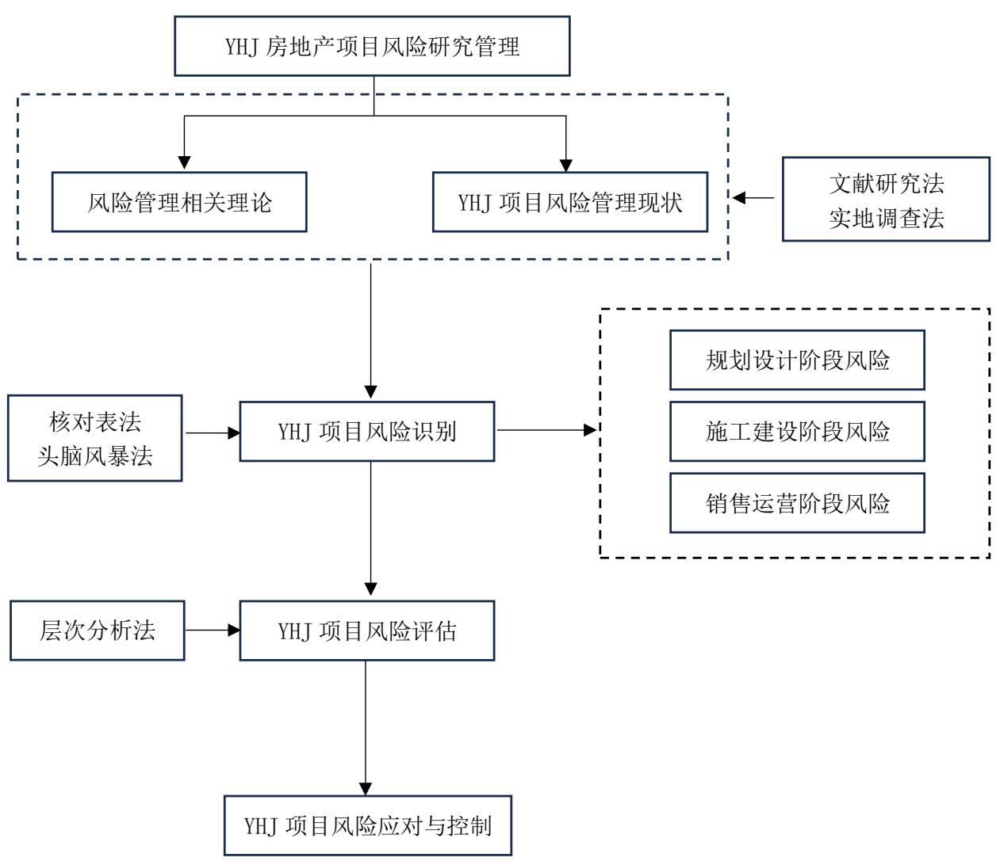

# 第 1 章 绪 论

# 1.1 研究背景及意义

# 1.1.1 研究背景

在房地产市场的巅峰时期，房地产企业只需要储备土地资源就能因土地价格的飞速上升获得高额利润，随着国内国外的经济影响加剧，房地产项目的开发风险进一步加大，项目经营管理不到位容易引发开发商资金链断裂甚至破产。由于如今房企拿地越来越审慎,更偏向于“小而精”的土地,需要进一步关注热门地段以及热点城市,以减少未来销售风险。由于政府环境收紧,房企风险控制提高,管理工作也在日益走向细致,通过提升对项目风险管理研究的重视程度,可以保证计划的成功执行和期望利润的达成，有助于企业在当前房地产市场中保持持续稳定的发展。

YHJ 项目作为沈阳市辉山板块重点项目，一直以来受到政府层面重点关注。近年来不少房地产项目因现金流问题及管理不当出现“烂尾”、“质量不过关”等负面消息，自2022 年 7 月底中央政治局会议首次提出“保交楼”、“稳民生”以来，沈阳市政府推行一系列政策全力支持房地产项目施工建设及证照办理，对项目进度及质量安全等风险问题尤为重视。而YHJ项目本身风险管理体系健全程度不够，缺少制度规范化管理，同时项目人员对于风险管理重视程度不够，存在风险管理事前预警不够、风险管理过程有缺失、风险应对响应不及时的情况，迫切需要进行风险管理研究。

# 1.1.2 研究意义

本研究通过了解 YHJ 项目风险管理现状，识别及分析其在开发过程中遇到的风险问题及成因，并制定相应的风险应对措施，有助于提高房地产开发企业对于项目风险管理的重视，增强企业对YHJ项目风险识别及风险评估的能力，并对项目后续顺利开发及风险防范提供借鉴经验，使项目具有穿越周期发展的能力，度过行业“寒冬”。

# 1.2 国内外研究现状

# 1.2.1 国外研究现状

国外针对项目风险管理的研究最早起源于二十世纪，真正将风险管理这一概念在西方发达国家中得到大范围的推广及重视，是在1963年美国学者发表的《企业风险管理》一文，由此风险管理作为一门新兴的学科得到迅速发展，成为企业经营和管理中必不可少的重要组成部分。1983 年美国出台的 “101 条风险管理准则”标志着风险管理研究达到新的高度。进入 21 世纪以来，随着全球化经济发展，各国对于各行业的风险管理研究已达到较高水平。2002 年《萨班斯一奥克斯利法案》，促使企业进入全面风险管理的浪潮。2004 年美国 COSO 提出的《企业风险管理——整合框架》，将风险管理引入更宽泛的企业全面风险管理领域，并随之成为被世界诸多国家及众多企业所承认的标准规范。

近十年来国外对于风险管理的研究更加精细化及全面化，在一些具体研究方面也提出了一些新思想。Nicola Paltrinieri[1] 等人，在2015年运用动态风险评估的方法对非典型场景进行风险管理降低事故发生的可能性。Jianwu Lin[2]，在 2017 年将人工智能与传统的量化风险管理模式相结合，以更有效地利用二级市场中的金融大数据的新研究领域。Sax Johanna[3]，在2019年利用来自丹麦260家最大公司的调查数据，发现企业风险管理与更高的盈利能力和更低的财务杠杆相关，而战略规划可以实现这些有利的结果，提出将企业风险管理与战略规划相结合。Kodey S.Crandall[4]，2020 年提出一种改进标准风险评估模型的新方法，将原始的风险评估计算方法，用 DeLone 和 Mclean 的 IS 成功模型进行分析。

风险管理理论研究至今，出现了传统风险管理理论、金融风险管理理论、内部控制理论、企业风险管理论、全面风险管理理论几个阶段性研究成果，日后也将对之前的风险管理方法不断更新改进，逐渐形成更适合当下国际形势的发展新方向。

# 1.2.2 国内研究现状

风险管理作为现代管理一门独立的学科，引入中国的时间相对较晚，研究的深度和广度不够，较西方国家仍有一定的差距。国内学者在二十世纪七十年代末八十年代初首次评价引进了项目管理的基本理论及方法，但由于当时中国的经济发展水平相对较低，并且仍然处于计划经济体制范围，群众的风险意识普遍较差，甚至大部分企业尚未认识到风险管理的重要性，缺乏抵御风险的能力，风险管理的大环境尚未形成，因此未能同时引进风险管理理论及方法。在八十年代中期，随着我国经济的持续发展，引进了国外各种风险管理的理论和著作，并广泛应用于项目管理领域，特别是有些大规模建设工程。

1987年，郭仲伟教授创作了名为《风险分析与决策》的著作，这本书标志着中国风险管理研究的开端。

对于风险管理的研究，虽然我国相较于西方发达国家滞后了五十年，但近年来确得到了飞速发展。根据万方数据库统计，自1979 年开始到2011年，国内各类学术期刊上有关风险管理研究文献达到22万篇，到 2022 年上半年相关研究文献已近80万篇，其中针对房地产项目风险研究已多达2万篇。

针对房地产项目风险管理方面。近年国内的研究逐渐由点状式的投资风险研究，转变为全周期、多维度的全面研究，逐渐形成带有我国经济体制特色下的房地产风险研究。高利军[6]等学者在 2011 年我国建筑学会工程管理研究学术年会上指出当前国内对房地产项目的风险管理研究主要集中在项目投资决策阶段，远不能涵盖项目管理的全过程，并提出应当对房地产项目进行全生命期风险管理，对其组织结构及其风险因素进行说明。万亚明[7]在 2017 年基于预测性分析、描述性分析及规则性分析三种数据分析技术对商业银行运营风险进行分析，相较于传统风险分析能够更加精装准确把握商业银行运营风险状况，精准锁定风险问题。陈小亮、李诚浩[8]2022年针对防范房价泡沫化风险提出了“疏通”实体经济面临的发展障碍“堵住”资金违规流向房地产的通道，“疏堵结合”的新思路。

根据宋婷，宇德明[9]在 2022 年对我国工程项目研究热点统计分析得知近二十年来的研究热点主要是围绕成本管理、安全风险管理、风险分析、风险识别、风险对策等方面，并根据分析推断未来研究会朝着全过程的风险管理、风险管理体系建设,以及风险管理现代化等三个方面发展。

# 1.3 研究内容与方法

# 1.3.1 研究内容

本文的研究内容如下：

第一，了解 YHJ 项目概况及风险管理现状。分析目前开发企业及 YHJ 项目在风险管理制度设置及执行方面存在的主要问题。

第二，对 YHJ 项目进行风险识别与评估。通过核对表法及头脑风暴法对 YHJ 项目风险进行初步及遴选识别，并对识别出的风险因素采用层次分析法进行评价，先构建风险指标体系及判断矩阵，然后进行风险等级排序。

第三，对YHJ项目进行风险应对与监控。根据风险评价得出的结果，针对不同的风险种类，采取适合的应对措施，包括风险减轻、风险规避、风险接受、风险转移等应对措施。建立项目内部风险监控体系，培养全员风险管理文化意识，对YHJ项目实行动态监控。

# 1.3.2 研究方法

本文主要采用以下3种研究方法。

（1）文献研究法

根据所选课题，查阅大量有关房地产项目风险管理的书籍及文献等资料，了解国内外风险管理现状，对房地场开发全链条各环节的风险问题进行总结归纳，运用科学的理论及方法进行课题研究。

（2）实地调查法

以 YHJ 房地产开发项目为实地调研对象，借助项目管理优势，全面掌握项目基本概况及风险管理现状。并对企业及项目关键管理人员进行访谈，为后续相关问题的发现及解决提供现实依据。

（3）定量分析法

运用层次分析法，有效结合定量分析及定性分析，对识别出的风险因素进行评估，确定出各风险因素相对目标的影响程度，从而对项目风险实施有效的控制。

# 1.4 研究技术路线

本文通过分析中国房地产行业发展情况及针对风险管理国内外的研究现状，引出在现今房企暴雷、黑天鹅事件频频发生的情况下，对于房地产项目开发过程中的风险管理研究势在必行。选取YX 地产开发的 YHJ 项目作为研究对象，首先根据风险管理相关理论知识，选取了适合项目本身的研究方法，结合项目实际，对风险问题进行了识别及分析，针对梳理出的风险问题，进行了风险评估，最终制定出符合当前发展态势的风险应对措施，期望对后续项目开发及其他房企有借鉴意义。研究技术路线如图 1.1所示。

  
图 1.1 研究技术路线图  
Fig. 1.1 Research Technology Roadma
