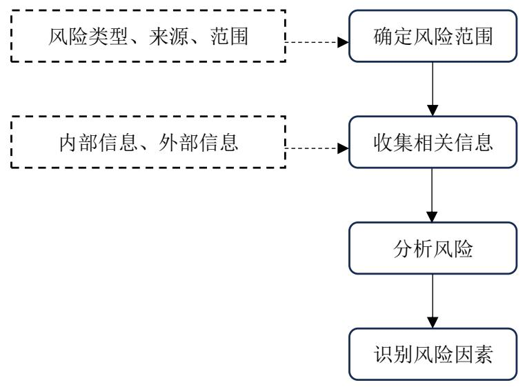

# 第 2 章 相关概念及理论基础

# 2.1 项目风险的含义及分类

# 2.1.1 项目风险的含义

国资委 2006 年发布的《中央企业全面风险管理指引》将企业风险定义为“未来的不确定性对企业实现其经营目标的影响” 。2009 年 ISO 技术委员会对风险管理中的常见术语进行了定义说明，其中将风险解释为：“不确定性对目标的影响”。综上，风险是一个概率，一种可能性，而且一定是将来的，对于已经发生的事件，不能称之为风险[10]。

项目风险是指在项目执行过程中，由于不确定性事件或情况的存在，导致项目的目标、进度、成本、质量等方面受到影响的可能性，严重者甚至可能会导致项目失败。任何项目都存在一定风险，一旦发生会对项目预期目标的达成产生积极影响或消极影响，积极的影响属于正面影响是一种机会，而消极的影响属于负面影响则是一种威胁。

# 2.1.2 项目风险的分类

对于项目风险的划分，结合不同的分析角度，分类方式也有所不同。

（1）按照风险产生的原因划分

将不同的风险按照其产生的原因进行划分，可以分为外部风险和内部风险。这种方法可以帮助我们有效识别并了解风险的来源，从而采取更有针对性的措施来减轻或消除它们的影响。

外部风险是指那些来自外界环境的威胁或不确定性，这些因素并不受我们的控制，例如自然灾害、经济衰退和政治动荡。内部风险则是指那些源于我们自身行为、决策或管理不善所带来的风险，例如员工犯错、内部盗窃和领导层失职。这两种风险都可能对个人和组织造成不利的影响，因此我们需要时刻保持警惕，采取适当的措施来管理和降低这些风险的发生概率。

（2）按照风险产生的结果划分

纯粹的风险指的是那些我们无法掌控的，并可能导致负面结果的风险，比如自然灾害、疾病等。投机风险则是指根据自主意识决策去承担的风险，可能获得高回报，但也有可能造成巨大损失的机会，如投资股市、购买彩票等。

# （3）按照风险作用的对象划分

根据不同的对象来确定风险的影响范围。这样可以更具体地定位风险并采取相应的措施。可以分为责任风险、财产风险、人身风险及信用风险。

# 2.2 项目风险管理概述

# 2.2.1 项目风险管理的意义

项目风险管理[11]属于对项目全周期范围内的风险进行识别、分析、应对的一种综合性的管理活动。

风险管理作为项目管理过程中非常重要的一个领域，贯穿全过程并随着项目建设工作的推进而不断变化，但往往容易被忽略，很多项目最终失败或是不断的修改计划都是由于最开始没有充分识别项目的风险造成的[12]。

# 2.2.2 项目风险管理的作用

项目风险管理是一个不断调整和改善的过程，因此在项目推进的过程中，当风险出现时，可以通过有效的方法或步骤来纠正和跟踪风险对项目运行的影响，帮助制定正确的决策和实施计划，从而预防项目失败，提高项目成功率。

项目风险管理可以通过风险识别防患于未然，及时预警和解决风险，通过风险分散降低风险，通过风险转移事后规避，避免试错成本，以降低项目成本、保证项目质量，从而实现项目收益目标，提高项目运行的效益与效率[13]。

# 2.2.3 项目风险管理的特点

（1）全周期性。项目风险管理需要贯穿项目开发的各个阶段，包括启动、规划、执行及收尾阶段。在项目发展的每个阶段都需要对其进行风险识别及分析、风险预警及监控，另外通过适当的风险管理工具和方法对项目实施过程中的风险进行应对并进行事后总结及改进风险管理方案。

（2）动态性。项目风险具有多变性的属性，因此对其的管理也相应具有动态性，在项目风险管理方案实施过程中，需要根据风险的变化及时调整方案，更好的应对风险。

（3）关联性。由于项目管理中成本、质量、安全、工期等目标间相互制约、相互关联，某一个目标实现过程中受到风险的影响均会对其他目标产生影响，不及时处理，甚至会蔓延风险至其他环节。

# 2.3 项目风险管理的过程

项目风险管理主要包括以下四个步骤：

  
图 2.1 风险管理流程  
Fig. 2.1 Process of Risk Management

# 2.3.1 风险识别

项目风险管理的首要任务是风险识别，也是其前端步骤。风险识别是指在风险发生之前，通过分析、总结和整理各类信息资料，系统全方位地了解风险事件并进行适当的分类。它涵盖确定风险的类别、如何解决这些风险以及可能产生的后果，并定义和推断这些风险，意识和理解并参照结合经验做出判断。 [14] [15]。

  
图 2.2 风险识别过程  
Fig. 2.2 Risk Identification Steps

常用的风险识别方法主要有如下四种：

（1）头脑风暴法

指针对需要解决的问题，通过组成具备相关科研能力和知识素养的小组，在轻松的环境中进行集体讨论，相互启发和激励，促使产生创造性的想法。该方法的目的是尽可能多地激发创意思想，并客观连续的对设想方案逐一进行的分析，以找到最佳的可行方案。

（2）德尔菲法

又称专家调查方法，是一种主观、定性的方法。用于获取专家群体的意见和预测，以辅助决策制定和问题解决，通过多轮匿名调查和反馈循环，旨在达成一致或接近一致的意见。

# （3）SWOT 分析法

S-优势，W-劣势，O-机会，T-威胁。该种方式主要是基于研究对象所处的竞争环境，主要用来对其进行内部优势及劣势分析、外部机会及威胁分析的方法。通过系统分析出的因素进行列举调查并按照矩阵形式进行相互匹配，最终得出相应的结论。这些结论通常对决策具有一定的指导作用。

# （4）核对表法

运用过往项目经验等，将可能发生的风险列举到在一张表格内，识别人员根据此表针对项目实际进行一一复核，主要是用来判断项目是否存在上述表中风险。

# 2.3.2 风险评估

风险评估作为项目风险管理过程中的第二个环节，是指对风险发生的不确定性及可能带来的损失进行评估的过程。风险评估的方法分主要为定量分析、定性分析及两者相结合的方法 [16] [17]。

定性分析，主要依据评估者个人的学识、经验等对风险做出主观的判断，一般建立在风险识别的阶段性成果之上，用于初步的风险评估，重点关注风险带来的损失程度，多用低、中、高等程度值来判断，而非具体量化的数值。其优势在于快捷高效，可以让管理者更加清晰的认识项目风险的状态，以便更有针对性地进行下一阶段的定量分析。定性分析主要方法有德尔菲法、头脑风暴法、流程图分析法、历史比较法等。

定量分析，主要运用数学算法对识别出的风险因素进行计算、分析，进而得出可以量化的客观结论数据。相较定性分析能够更深入、精准地剖析风险，重点关注风险发生的概率和影响，提供更加直观的数值。其优势在于减少了对风险评估的主观性，减少人为因素干扰，能够更加客观的，可信度大大增加。定量分析主要方法有层次分析法、蒙特卡洛模拟法、敏感性分析法等。

上述两种分析方式都有其各自的优缺点，在进行具体风险评估时，可以将定性分

析与定量分析有机结合，提高其适用性。

# 2.3.3 风险应对与监控

风险应对，是指在已经基本明确项目风险，并得出风险概率及影响程度的论断基础上，采取系列措施（接受、缓解、规避或转移风险等）处理风险的过程。风险应对主要包括以下内容：根据当前项目阶段已识别的风险量化清单，制定风险应对措施。当风险可能发生或者已经发生时，项目管理者执行制定好的风险应对措施执行，并评估风险应对的效果。对于尚未发生的风险是否规避或减小了其发生的可能性，对于已经发生的风险是否削弱缓解了其造成的影响。如发现风险应对为达到预期效果，要及时开展进一步的风险应对[18]。风险应对措施主要有以下4种：

# (1) 风险接受

当项目主体确定风险造成的损失在自身可承受范围内，可选择接受风险。其意义在于减少风险的变化，避免其影响程度加剧或影响范围扩大。

# (2) 风险降低

通过方法或工具将风险降低到可接受的水平。风险的降低分为两方面，一是降低风险事件的发生概率，二是减少风险事件发生后可能造成的损失。

# (3) 风险规避

通过避免促发风险发生因素等手段来达到消除风险。一般来说仅在面对重大风险时使用，因为完全规避风险常常意味着完全放弃项目可能带来的收益，是一种消极的应对策略。

# (4) 风险转移

风险的影响对象不仅限于项目主体，还可以进行转移。通过向非项目相关人许诺一部分收益，以此达成发生风险时由多方共同承担损失的协议，从而降低风险对项目主体造成的损失

风险监控，是指在风险识别、评估、应对的基础上，对项目全过程的监视和控制，根据风险变化情况及时更新应对措施，从而保证项目风险管理处于在轨状态，形成良性闭环[19]。
