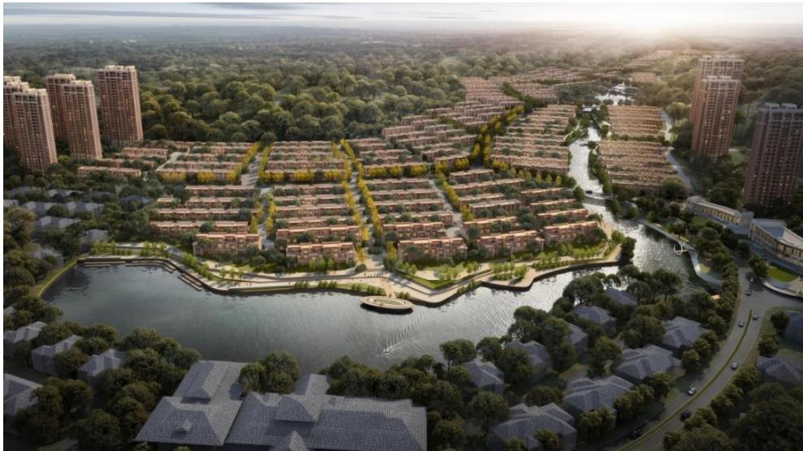
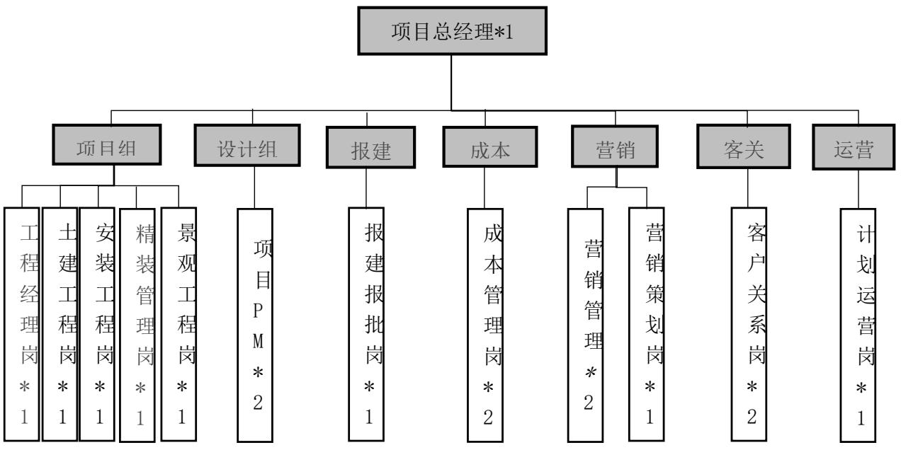

# 第 3 章 YHJ 房地产项目介绍及风险管理概况

# 3.1 开发企业概况

YX 地产创立于 1983 年，后于 1992 年在香港上市。作为中国最早成立的综合性房地产开发企业之一，YX 地产也是中国商品房的开创者之一。在长达 40 年的发展过程中，始终坚持“实现美好生活”的品牌使命，秉承“商住并举”的发展战略，并充分发挥“开发 $^ +$ 运营 $+$ 金融”的独特商业模式优势，深入布局中国最具活力的经济带，以粤港澳大湾区为核心，公司战略布局全国范围，并主要以华东、中西部、北方为主要支撑。目前已经进驻了全国 30 余个一线和强二线城市，并开发了超过 300 个大型住宅项目，服务对象超过100万位业主。此外，YX地产还拥有50多个大型商业综合体，其中包括广州地标建筑物广州国际金融中心。截至 2022 年底，资产总值超过 3400 亿元，土地储备总额超过 2800 万平方米。近年来，YX 地产响应国家政策号召，顺应市场发展，主动布局包括康养、长租公寓、城市更新、教育等多种房地产 $^ +$ 新兴业务领域，并与广州地铁作开展合作，共同开发“轨道交通 $^ +$ 物业”TOD发展模式，全方位、全方位满足人民群众对美好生活的多样化需求。

自“三道红线”出台以来，部分冒进的房企都苦于控杠杆、降负债，而这恰恰给长期稳健的 YX 地产，留出了弯道超车的机会。YX 地产坚持“规模与质量平衡发展”的经营策略，始终保持稳中有进的态势、夯实企业底盘，坚定做“长期主义者”。“地产 $+ .$ 基金”模式 $^ +$ 强强合作，令其在保持三道红线“绿档”的条件下，能以较低成本快速拓展。而近年来逆势实现业绩高增长，除了依靠企业本身的广州国资背景，还得益于对于在企业发展及辖下项目开发过程中对于风险的预判及把控。

# 3.2 项目概况

# 3.2.1 项目背景

YHJ 项目占地 25 万㎡，计容建面 36 万㎡，地处沈阳市沈北新区辉山板块，三环外，项目北侧依棋盘山、大洋山、辉山，南侧紧邻沈阳第二条母亲河——蒲河，拥有山、湖、林、溪、河、谷等内部原生态大自然资源。项目教育资源配套齐全，一河之隔就是东北育才双语学校、拥有沈阳二中、文艺二校，沈阳七中分校等全年龄段资源。项目周边路况较好，南临景观廊道沈棋路，以及沈哈高速公路、102 国道等，驱车到达市内繁华区域仅需 30 分钟。

  
图3.1 项目规划效果图  
Fig. 3.1 Project Planning Renderings

# 3.2.2 项目开发计划及技术指标

YHJ 项目目前处于前期开发阶段，已于 2023 年 2 月启动产品研发，9 月开始现场土方动工，施工初期采用未批先建，计划2024 年年初取得正式规划审批，首批产品2024年10月开盘销售，2026年进行产品交付。

表 3.1 YHJ 面积指标表  
Table 3.1 Area Index Table of YHJ   

<table><tr><td rowspan=1 colspan=1>名称</td><td rowspan=1 colspan=1>面积</td></tr><tr><td rowspan=1 colspan=1>占地面积（m）</td><td rowspan=1 colspan=1>248,371</td></tr><tr><td rowspan=1 colspan=1>别墅（m)</td><td rowspan=1 colspan=1>78,578</td></tr><tr><td rowspan=1 colspan=1>高层（m）</td><td rowspan=1 colspan=1>277,020</td></tr><tr><td rowspan=1 colspan=1>地上车库（m）</td><td rowspan=1 colspan=1>1,656</td></tr><tr><td rowspan=1 colspan=1>商业（m)</td><td rowspan=1 colspan=1>3,000</td></tr><tr><td rowspan=1 colspan=1>公建配套（m）</td><td rowspan=1 colspan=1>4,837</td></tr><tr><td rowspan=1 colspan=1>地上建筑面积（m）</td><td rowspan=1 colspan=1>365,091</td></tr><tr><td rowspan=1 colspan=1>可售车位（个）</td><td rowspan=1 colspan=1>2,634</td></tr><tr><td rowspan=1 colspan=1>地下建筑面积（m）</td><td rowspan=1 colspan=1>119,179</td></tr><tr><td rowspan=1 colspan=1>总建筑面积（m)</td><td rowspan=1 colspan=1>484,270</td></tr></table>

# 3.2.3 项目主要管理目标

（1）投资收益要求

地块含税销售收入不低于 56 亿元；房产口成本不高于 34.9 亿元；销售费用（包括代理费、宣传费、售楼部及样板间水电费、制作物料费及其他销售费用）不高于销售收入的 $4 . 6 \%$ ；管理费用不高于房产口成本的 $2 . 5 \%$ ；项目毛利率不低于 $5 . 8 4 \%$ ，税后利润不低于-6.98 亿元（其中包括 7.75 亿元股东借款利息），内部投资收益率（IRR）不低于$0 . 5 1 \%$ 。

（2）质量及交付管理要求

第三方质量过程综合评估不低于 86 分，交付质量评定不低于 83 分；交付户均问题数不超过 1 条，百户渗漏率不超过 $5 \%$ ，房屋质量满意度（磨 1）不低于 90 分；坚决遏制质量事故、客户群诉及因质量问题引发的社会舆情事件的发生。

# 表 3.2 交付管理目标

Table 3.2 Delivery Management Objectives   

<table><tr><td rowspan=1 colspan=1>评价指标</td><td rowspan=1 colspan=1>具体维度</td><td rowspan=1 colspan=1>目标值</td></tr><tr><td rowspan=3 colspan=1>内部</td><td rowspan=1 colspan=1>交付质量评定（交付前7天）</td><td rowspan=1 colspan=1>83</td></tr><tr><td rowspan=1 colspan=1>交付前开放+内验销户率（交付结束后30天）</td><td rowspan=1 colspan=1>98</td></tr><tr><td rowspan=1 colspan=1>交付率（交付后30天，系统登记为主）</td><td rowspan=1 colspan=1>95%</td></tr><tr><td rowspan=1 colspan=1>外部户均缺陷率</td><td rowspan=1 colspan=1>户均问题条数（毛坯，交付结束后30天）</td><td rowspan=1 colspan=1>1</td></tr><tr><td rowspan=4 colspan=1>外部满意度</td><td rowspan=1 colspan=1>产品质量（交付及交付后30天总样本磨1）</td><td rowspan=1 colspan=1>85</td></tr><tr><td rowspan=1 colspan=1>交付服务（交付及交付后30天总样本磨1）</td><td rowspan=1 colspan=1>85</td></tr><tr><td rowspan=1 colspan=1>维修服务（交付及交付后30天总样本磨1）</td><td rowspan=1 colspan=1>98</td></tr><tr><td rowspan=1 colspan=1>磨合期1的满意度</td><td rowspan=1 colspan=1>90</td></tr><tr><td rowspan=1 colspan=1>否决项</td><td rowspan=1 colspan=1>交付后6个月渗漏率</td><td rowspan=1 colspan=1>5%</td></tr></table>

# 3.3 企业及项目风险管理概况

（1）企业及项目风险管理组织

从企业角度来看。YX 地产董事会作为公司风险管理工作的领导机构，对公司整体的风险管理体系建设及有效运行负有最终责任。公司内部将风控职能设置于审计与风险管理部，负责对公司开发的各房地产项目风险管理职责的履行及风险管理工作的开展进行监督。对于 YX 地产来说，风险管理仍处于发展阶段，距离成熟阶段仍有很长的路要走，其对于房地产开发各阶段的风险研究以内部审计角度为出发点呈现散点式、局部式，没有呈现体系化、整体化管控。风险管理范围也多针对工程、销售、财务、法务等合规性风控，近两年着重开展大数据风控平台搭建。虽然YX地产的风险体系对经营指标实施了全面有效监控，权责体系和信息系统能在较大程度上防控管理风险，但针对项目开发操作过程的内控管理，存在流程不完备、基础数据管理效果不佳、预判管控力度弱等不足之处。

从项目角度来看。在YHJ项目内部成立了风险管理小组，由项目总经理作为风险管理小组组长对YHJ项目风险管理工作全面负责，组员涵盖工程、成本、营销、设计、运营、客关等职能，详见图 3.2。风险管理小组主要工作职责为对项目已经发生及潜在的风险事项进行识别、评估、控制，从目前项目风险管理工作实际开展情况来开，主要风险管理动作集中在施工建设及销售运营阶段，对于启动前期及交付后期的风险管理相对薄弱。

  
图 $3 . 2 \mathrm { Y H J }$ 项目风险管理架构  
Fig. 3.2 Risk Management Architecture of YHJ Project

（2）企业及项目风险管理制度

目前 YHJ 项目执行的风险管理制度主要依托于 YX 地产集团公司层面的《全面全面风险管理办法》，用于指导项目风险管理工作开展。相较于 YX 地产层面，YHJ 项目并未将风险管理与组织绩效挂钩，并且缺乏针对项目本身及地域性质的规范化的风险管理操作指引，风险管理体系健全程度不够。
