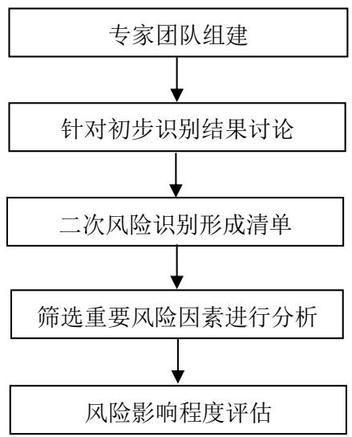
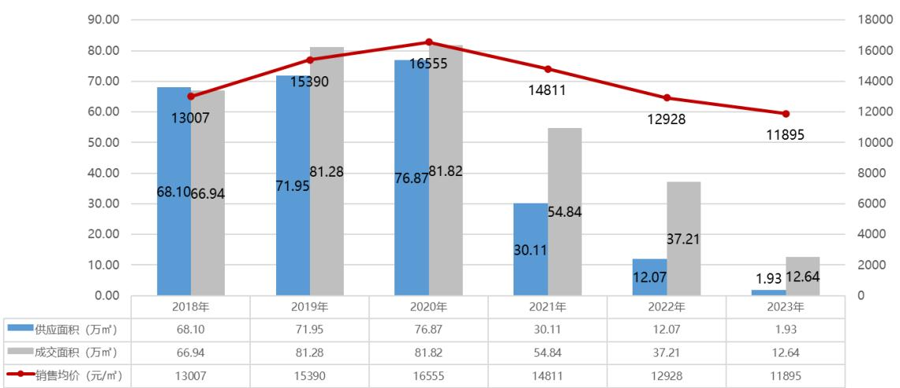
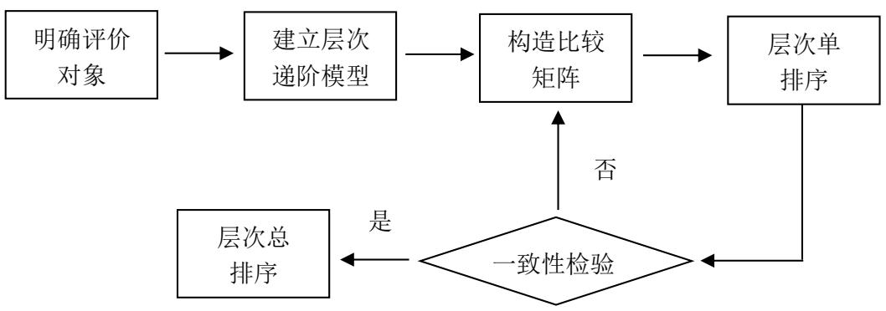
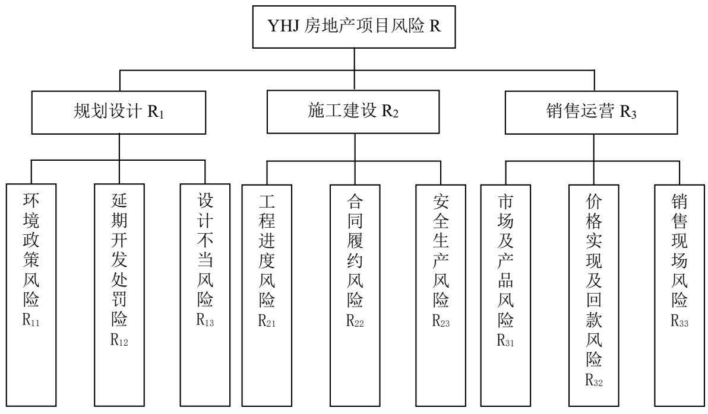
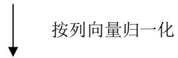
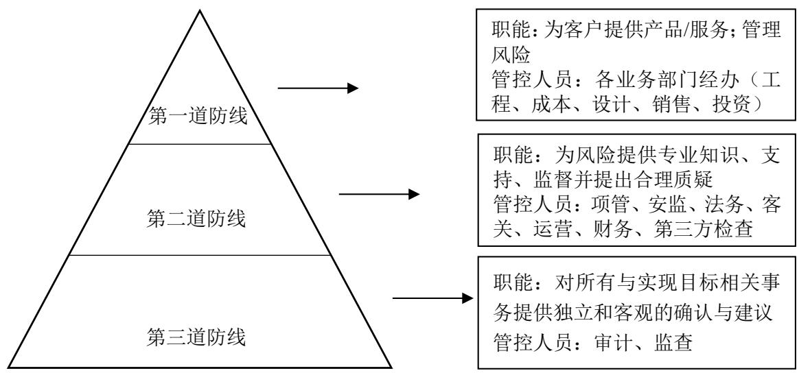

# 第 4 章 YHJ 房地产项目风险识别

# 4.1 YHJ 项目风险识别原则及方法

# 4.1.1 YHJ 项目风险识别原则

（1）全面性原则

全面了解 YHJ 项目各类风险事件可能发生的概率及可能导致后果的详细状况，包括风险因素产生的原因，影响的范围，导致损失的程度等。只有全面的识别了项目风险，才能更好的开展科学有效的风险管理，降低风险损失。

# （2）常态化原则

对于YHJ项目的风险识别，是一个持续化动态化的过程，必须长期坚持形成常态化风险识别，才能取得良好的效果。

# （3）系统性原则

在风险识别过程中，应当从整个系统的角度出发，将风险要素与风险事件结合起来进行分析，充分考虑其之间的影响及关系。

# （4）透明性原则

风险识别应当秉承公开、透明的原则，确保全部相关方能够获取项目相关信息，并且让组织成员充分了解风险的性质、影响程度等情况。

# 4.1.2 YHJ 项目风险识别方法

房地产开发过程周期长且复杂，上下游各环节较多，往往受到外部自然环境、经济条件、市场变动等影响较大。考虑到 YHJ 项目在前期开发过程中已有相关风险管理经验，并且房地产项目开发过中常见的风险因素相对清晰，因此本文首先运用核对表法，编制风险一览表，并针对项目实际情况进行逐项核对。然后采用头脑风暴法，成员彼此间进行充分的交流讨论，尽可能全面的识别项目风险考得到遴选清单，并为后续的风险评估工作做好准备。

# 4.2 YHJ 项目风险识别过程

通过 YHJ 项目现场实地走访调查，主要整理了以下资料：土地合同、项目可行性研

究报告、项目建设任务书、启动会材料、项目总控计划及专项计划、项目定价预售文件、客诉风险应对报告、项目销售合同范本、红线内外不利因素等，根据上述资料信息开展风险识别工作。

# 4.2.1 YHJ 项目风险初步识别

基于 YX 地产风险指标库，及前期对 YHJ 项目相关资料收集及与项目管理人员交谈，结合YX地产已开发项目常见风险问题，从投资决策、规划设计、施工建设、销售运营、竣备交付5个开发阶段，运用核对表法，对YHJ项目风险进行了第一轮识别，识别出24种风险因素，详见表4.1。

表 4.1 初步风险识别结果  
Table 4.1 Preliminary Risk Identification Results   

<table><tr><td rowspan=1 colspan=1>目标层</td><td rowspan=1 colspan=1>风险来源</td><td rowspan=1 colspan=1>风险因素</td></tr><tr><td rowspan=4 colspan=1>YHJ项目风险</td><td rowspan=1 colspan=1>投资决策</td><td rowspan=1 colspan=1>决策失误风险市场定位及需求预测不准确风险项目盈利未及预期风险</td></tr><tr><td rowspan=1 colspan=1>规划设计</td><td rowspan=1 colspan=1>项目审批无法通过风险政府违约风险环境政策风险（红线问题等）延期开发处罚风险设计不当风险</td></tr><tr><td rowspan=1 colspan=1>施工建设</td><td rowspan=1 colspan=1>质量不达标风险成本失控风险项目资金断裂风险工程进度风险安全生产风险合同履约风险</td></tr><tr><td rowspan=1 colspan=1>销售运营</td><td rowspan=1 colspan=1>宣传推广法律风险市场及产品风险销售时机风险销售税收风险销售现场风险价格实现及回款风险</td></tr></table>

# 续表 4.1 初步风险识别结果

Table 4.1 Preliminary Risk Identification Results   

<table><tr><td></td><td>竣备交付</td><td>延期交付风险 实际与宣传不符导致的客诉风险 面积误差风险</td></tr></table>

# 4.2.2 YHJ 项目风险遴选识别

根据核对表法初步识别出的 24 种风险因素，组织头脑风暴会议对风险因素发生的可能性、影响程度进行讨论，并对风险因素引发原因进行分析，形成遴选清单，会议主要流程如图4.1所示。

  
图 4.1 头脑风暴法流程  
Fig. 4.1 Brainstorming Process

（1）会前准备阶段

为保证会议质量有效，组织 YX 地产、YHJ 项目组、施工单位、咨询公司共计 10 位拥有丰富从业经验的行业专家，参与头脑风暴讨论，专业范围涵盖工程、成本核算、财务、营销策划、设计报规等。满足与会人员参与过至少三个及以上房地产项目全过程开发、与会人员专业分布不同、与会人员包括开发企业内部及外部三个原则，专家情况如表 4.2。

# 表 4.2 专家基本概况

Table 4.2 Basic Overview of Experts   

<table><tr><td rowspan=1 colspan=1>科目</td><td rowspan=1 colspan=1>类别</td><td rowspan=1 colspan=1>数量（例）</td><td rowspan=1 colspan=1>占比(%)</td></tr><tr><td rowspan=7 colspan=1>职能</td><td rowspan=1 colspan=1>营销</td><td rowspan=1 colspan=1>1</td><td rowspan=1 colspan=1>10.00%</td></tr><tr><td rowspan=1 colspan=1>财务</td><td rowspan=1 colspan=1>1</td><td rowspan=1 colspan=1>10.00%</td></tr><tr><td rowspan=1 colspan=1>报建</td><td rowspan=1 colspan=1>1</td><td rowspan=1 colspan=1>10.00%</td></tr><tr><td rowspan=1 colspan=1>工程</td><td rowspan=1 colspan=1>3</td><td rowspan=1 colspan=1>30.00%</td></tr><tr><td rowspan=1 colspan=1>成本招采</td><td rowspan=1 colspan=1>2</td><td rowspan=1 colspan=1>20.00%</td></tr><tr><td rowspan=1 colspan=1>运营</td><td rowspan=1 colspan=1>1</td><td rowspan=1 colspan=1>10.00%</td></tr><tr><td rowspan=1 colspan=1>设计</td><td rowspan=1 colspan=1>1</td><td rowspan=1 colspan=1>10.00%</td></tr><tr><td rowspan=3 colspan=1>职级</td><td rowspan=1 colspan=1>基层员工</td><td rowspan=1 colspan=1>2</td><td rowspan=1 colspan=1>20.00%</td></tr><tr><td rowspan=1 colspan=1>中层员工或部门负责人</td><td rowspan=1 colspan=1>5</td><td rowspan=1 colspan=1>50.00%</td></tr><tr><td rowspan=1 colspan=1>高层管理人员</td><td rowspan=1 colspan=1>3</td><td rowspan=1 colspan=1>30.00%</td></tr><tr><td rowspan=2 colspan=1>学历</td><td rowspan=1 colspan=1>本科</td><td rowspan=1 colspan=1>6</td><td rowspan=1 colspan=1>60.00%</td></tr><tr><td rowspan=1 colspan=1>硕士及以上</td><td rowspan=1 colspan=1>4</td><td rowspan=1 colspan=1>40.00%</td></tr><tr><td rowspan=3 colspan=1>工龄</td><td rowspan=1 colspan=1>3-5年</td><td rowspan=1 colspan=1>3</td><td rowspan=1 colspan=1>30.00%</td></tr><tr><td rowspan=1 colspan=1>5-10年</td><td rowspan=1 colspan=1>3</td><td rowspan=1 colspan=1>30.00%</td></tr><tr><td rowspan=1 colspan=1>10年以上</td><td rowspan=1 colspan=1>4</td><td rowspan=1 colspan=1>40.00%</td></tr><tr><td rowspan=2 colspan=1>项目经验</td><td rowspan=1 colspan=1>3-5个</td><td rowspan=1 colspan=1>6</td><td rowspan=1 colspan=1>60.00%</td></tr><tr><td rowspan=1 colspan=1>5个及以上</td><td rowspan=1 colspan=1>4</td><td rowspan=1 colspan=1>40.00%</td></tr><tr><td rowspan=2 colspan=1>所属单位</td><td rowspan=1 colspan=1>系统内部单位</td><td rowspan=1 colspan=1>7</td><td rowspan=1 colspan=1>70.00%</td></tr><tr><td rowspan=1 colspan=1>系统外部单位</td><td rowspan=1 colspan=1>3</td><td rowspan=1 colspan=1>30.00%</td></tr></table>

将前期收集到的项目相关资料及会议目的、会议内容等，以邮件方式提前发予参会人员知悉，确保会议开始前与会人员能够充分了解项目情况及会议流程，确保会议可以在相对开放、自由的环境下进行讨论。

# （2）会议讨论阶段

本次会议由 YHJ 项目经理主持，会议首先介绍与会专家个人信息，同时为保证会议效率已提前将项目信息发送给参会人员，因此会上只对项目管理目标，项目目前开发现状等关键信息进行简要说明，对于前期资料中与会人员存在疑问需要进一步确认的地方，由YHJ项目经理进行解释说明，待全体人员基本清晰后正式开始会议讨论环节。

第一轮讨论：根据核对表初步识别出的风险清单，由与会专家进行逐条讨论，每名专家选出其认为对 YHJ 项目影响程度较大且易发生的 5 种风险因素并阐述原因，根据表 4.3 所示，投资决策阶段及竣备交付阶段获得专家票数较少，第一轮讨论结果风险主要集中在规划设计、施工建设及销售运营三个阶段。

# 表 4.3 专家意见情况

Table 4.3 P Expert Opinions   

<table><tr><td rowspan=1 colspan=1>目标层</td><td rowspan=1 colspan=1>风险来源</td><td rowspan=1 colspan=1>风险因素</td><td rowspan=1 colspan=1>选择人数</td></tr><tr><td rowspan=24 colspan=1>YHJ项目风险</td><td rowspan=3 colspan=1>投资决策</td><td rowspan=1 colspan=1>决策失误风险</td><td rowspan=1 colspan=1>1</td></tr><tr><td rowspan=1 colspan=1>市场定位及需求预测不准确风险</td><td rowspan=1 colspan=1>1</td></tr><tr><td rowspan=1 colspan=1>项目盈利未及预期风险</td><td rowspan=1 colspan=1>2</td></tr><tr><td rowspan=5 colspan=1>规划设计</td><td rowspan=1 colspan=1>项目审批无法通过风险</td><td rowspan=1 colspan=1>1</td></tr><tr><td rowspan=1 colspan=1>政府违约风险</td><td rowspan=1 colspan=1>1</td></tr><tr><td rowspan=1 colspan=1>环境政策风险（红线问题等）</td><td rowspan=1 colspan=1>6</td></tr><tr><td rowspan=1 colspan=1>延期开发处罚风险</td><td rowspan=1 colspan=1>4</td></tr><tr><td rowspan=1 colspan=1>设计不当风险</td><td rowspan=1 colspan=1>3</td></tr><tr><td rowspan=6 colspan=1>施工建设</td><td rowspan=1 colspan=1>质量不达标风险</td><td rowspan=1 colspan=1>2</td></tr><tr><td rowspan=1 colspan=1>成本失控风险</td><td rowspan=1 colspan=1>1</td></tr><tr><td rowspan=1 colspan=1>项目资金断裂风险</td><td rowspan=1 colspan=1>0</td></tr><tr><td rowspan=1 colspan=1>工程进度风险</td><td rowspan=1 colspan=1>5</td></tr><tr><td rowspan=1 colspan=1>安全生产风险</td><td rowspan=1 colspan=1>3</td></tr><tr><td rowspan=1 colspan=1>合同履约风险</td><td rowspan=1 colspan=1>2</td></tr><tr><td rowspan=6 colspan=1>销售运营</td><td rowspan=1 colspan=1>宣传推广法律风险</td><td rowspan=1 colspan=1>2</td></tr><tr><td rowspan=1 colspan=1>市场及产品风险</td><td rowspan=1 colspan=1>4</td></tr><tr><td rowspan=1 colspan=1>销售时机风险</td><td rowspan=1 colspan=1>1</td></tr><tr><td rowspan=1 colspan=1>销售税收风险</td><td rowspan=1 colspan=1>1</td></tr><tr><td rowspan=1 colspan=1>销售现场风险</td><td rowspan=1 colspan=1>4</td></tr><tr><td rowspan=1 colspan=1>价格实现及回款风险</td><td rowspan=1 colspan=1>3</td></tr><tr><td rowspan=4 colspan=1>竣备交付</td><td rowspan=1 colspan=1>延期交付风险</td><td rowspan=1 colspan=1>1</td></tr><tr><td rowspan=1 colspan=1>实际与宣传不符导致的客诉风险</td><td rowspan=1 colspan=1>1i</td></tr><tr><td rowspan=1 colspan=1>面积误差风险</td><td rowspan=1 colspan=1>1</td></tr><tr><td rowspan=1 colspan=1>产权证逾期办理</td><td rowspan=1 colspan=1>0</td></tr></table>

第二轮讨论：对上述讨论环节中，得票 3 票以上的 8 种风险因素，与会人员每人发表意见，并对存在质疑的风险进行答疑探讨，形成统一意见。并且在讨论过程中，考虑YHJ 项目开发周期较长，将合同履约风险一并纳入最终遴选清单，具体详见表 4.4。

（3）头脑风暴识别结果

根据头脑风暴法识别得出，在规划设计、施工建设、销售运营阶段发生的 9种风险为项目易发生且影响程度大的风险因素。

表4.4 风险识别遴选清单  
Table 4.4 Risk Identification Selection Checklist   

<table><tr><td rowspan=1 colspan=1>目标层</td><td rowspan=1 colspan=1>风险来源</td><td rowspan=1 colspan=1>风险因素</td><td rowspan=1 colspan=1>风险解释</td></tr><tr><td rowspan=9 colspan=1>YHJ项目风险</td><td rowspan=3 colspan=1>规划设计阶段</td><td rowspan=1 colspan=1>环境政策风险</td><td rowspan=1 colspan=1>主要指生态红线、风景红线问题对规划审批效率的影响</td></tr><tr><td rowspan=1 colspan=1>延期开发处罚风险</td><td rowspan=1 colspan=1>根据土地合同相关要求项目存在延期开发风险</td></tr><tr><td rowspan=1 colspan=1>设计不当风险</td><td rowspan=1 colspan=1>设计不当带来额外成本增加等影响</td></tr><tr><td rowspan=3 colspan=1>施工建设阶段</td><td rowspan=1 colspan=1>工程进度风险</td><td rowspan=1 colspan=1>工期铺排不当、施工单位不配合等主客观多种因素导致风险发生</td></tr><tr><td rowspan=1 colspan=1>安全生产风险</td><td rowspan=1 colspan=1>受到YHJ 地貌特质等因素带来的施工过程中的安全生产风险</td></tr><tr><td rowspan=1 colspan=1>合同履约风险</td><td rowspan=1 colspan=1>长周期合同履约过程中带来的进度、质量及商务层面风险</td></tr><tr><td rowspan=3 colspan=1>销售运营阶段</td><td rowspan=1 colspan=1>市场及产品风险</td><td rowspan=1 colspan=1>市场变化及产品不能得到客户认可带来的销售风险</td></tr><tr><td rowspan=1 colspan=1>销售现场风险</td><td rowspan=1 colspan=1>集中在销售案场及销售过中的违规操作风险</td></tr><tr><td rowspan=1 colspan=1>价格实现及回款风险</td><td rowspan=1 colspan=1>对比周边竞品价格优势不明显及银行政策对回款周期的影响</td></tr></table>

# 4.3 YHJ 项目风险因素分析

本节主要根据头脑风暴会议中行业专家研究得出的风险因素及过程对各类风险因素的分析内容，会后进行了整理说明，为后续风险评估工作打下基础。

# 4.3.1 规划设计阶段风险

（1）环境政策风险

由于YHJ项目地理位置环境资源优越，在2016年沈阳市将项目部分建设用地范围划入生态红线及风景保护红线范围。参照《风景名胜区条例》中第二十一条规定，未经风景名胜区规划批准的，禁止在风景名胜区内开展任何建设活动。《生态保护红线管理办法》中第三章第八条内容规定，在生态保护红线范围内，自然保护地核心保护区原则上杜绝任何人为活动，其他区域明令禁止开发性、生产性建设活动。随国家政策上对环保生态问题的越发重视，地方政府对涉及红线项目的审批验收工作慎之又慎，考虑生态红线及风景红线前辉山板块已有多宗地块出让，在 2020 年沈阳市政府已经申请调整红线范围，目前仍在审批中，据沈阳自然资源局了解，预计在 2024 年二季度左右可完成正式批复。

对 YHJ 项目来说，红线划定日期晚于 YHJ 项目土地出让时间，因此具有一定谈判优势。按照现阶段开发计划，若沈阳市政府于上述时间完成红线调整审批，会对 YHJ项目时间在2024年开盘，产生极大风险。

（2）延期开发处罚风险

YHJ项目土地出让合同中未约定具体开工以及竣备时间，但规定取得《建筑工程规划许可证》后6个月内开工，申请延期不得超过一年。对于超过一年的项目按照其土地出让金 $20 \%$ 收取土地闲置费，对于超过两年的情况，政府可以无偿收回该地块土地使用权，但若存在因外界不可抗力或政府有关部门责任行为造成项目延迟开发建设的情况可豁免。由于YHJ项目为收购项目，原公司获取建筑工程规划许可证获取时间为2006年，按照出让合同中的条款约定存在处罚风险，但因项目部分用地处于沈北新区生态红线和风景保护红线范围内，导致项目开发受阻，按照土地合同条款表述来看，属于存在受到不可抗力影响的土地闲置风险。

根据近 10 年沈阳国土局对于土地闲置未能及时开发情况处理结果，未有房地产开发企业受到实质性处罚，但在广州等地近两年加重了对土地闲置行为的处罚力度。另外YX 地产开发的另一个项目也存在延期开发及竣备的问题，在办理该项目最后一批次产品竣工备案时，沈阳国土局就其存在的问题进行追责处理，后来以保交楼、保民生、保稳定的角度为切入口，方才推进解决。随着政府政策导向变化，YHJ项目的延期开发问题仍存在不确定性及一定处罚风险。

（3）设计不当风险

一是房屋建筑、基础结构、设计装修、给排水工程、电气等专业设计方案依据及方案选择不充分，从而设计不能满足适用性、经济性、美观性、安全性、可靠性的要求，同时也无法满足工程施工要求。建筑设计中平面布局和单元类型的不合理导致项目无法获得市场客户的认可和满意度，导致YHJ项目租赁和销售困难，甚至积压问题致使公司陷入财务危机，将预期利润转化为实际损失 [22]。

二是设计阶段未充分考虑成本，或设计的功能过剩，导致资金浪费、项目成本过高、影响公司经济效益。设计工作处于整个项目开发的前期，对设计人员前瞻性、预判性提出了较高要求，一旦选择了错误的方案，可能导致项目后期工作难以为继，大幅增加成本并影响工期。

三是由于市场变化较快，YX 地产未对 YHJ 项目制定评判设计功能不足或过剩的标准，目前主要依靠设计人员自身能力和责任心去避免设计功能不足或过剩。另外，YX地产实行限额设计，而在限额设计的条件下，无法排除设计院一味追求降低成本而忽视项目品质的保证和价值的提升的可能性。根据 YX 地产过往开发项目中存在的一些缺陷和不足，在 YHJ 项目开发过程中存在再次发生的风险，同时在开发过程中，设计变更频繁，造成项目后期的实际执行与最初通过审批定稿的规划设计之间出现较大的差异，并未对所发生设计变更情况进行统计和分析，不利于公司发现和掌握设计过程中存在的普遍性问题及其根源，也不利于公司更合理地对设计变更进行管理。

这些设计过程存在的问题都会对 YHJ 项目开发造成风险及损失。

# 4.3.2 施工建设阶段风险

（1）工程进度风险

YHJ项目具有施工周期长、地理环境复杂的特点，因此在进度控制方面“不确定性”向来很突出，也容易受到外界不可抗力的影响。由于YHJ项目尚未取得规划许可，属于未批先建的无证施工情况，考虑处罚程序及办理时间相对不可控，极易造成现场停工。尽管从 2023 年开始疫情管控政策放宽，受到疫情之类不可抗力影响导致工期滞后的风险极大程度降低，但项目本身开发过程中主观及客观的风险因素仍存在，借由本次 YHJ项目风险管理研究课题，在项目总经理的大力支持下，安排项目人员梳理出影响工期进度的风险因素，详见表 4.5。

表4.5 工期进度影响风险因素  
Table 4.5 Risk Factors Affecting Project Schedule   

<table><tr><td rowspan=1 colspan=1>分类</td><td rowspan=1 colspan=1>风险产生主体</td><td rowspan=1 colspan=1>具体内容</td></tr><tr><td rowspan=1 colspan=1>主观因素</td><td rowspan=1 colspan=1>施工单位</td><td rowspan=1 colspan=1>1、由于施工人员不足或劳动力配置不合理所造成施工进度无法满足2、施工人员缺乏经验，水平较低，无法准确理解图纸和规范，造成施工偏离正轨3、工程的技术难度高、实施困难，而且施工前技术交底不足，施工后的自检和互检也不受重视，导致施工出现质量问题且无法及时解决4、施工组织设计不合理，施工进度安排不完整，施工计划采用不当，实际施工中各专业、各部门、各工序协调交接存在问题5、施工工艺错误或采用不成熟的施工技术，技术要求控制不好，造成返工6、材料未及时进场或无法满足施工需求，导致停工等待材料、相关作业中断7、总包备案形式不明确，施工总包和监理单位证明人员不足或单位所在地与项目所在地不同，导致前期报建手续延误，从而导致施工可行许可证办理延期无法开始工作（如：YX地产国有企业背景需公开招投标）</td></tr><tr><td rowspan=1 colspan=1>主观因素</td><td rowspan=1 colspan=1>开发商</td><td rowspan=1 colspan=1>1、图纸提供不及时、不配套；设计资料提供不准确，与实际情况相差较大，特别是地质资料错误或疏漏，给施工带来障碍；施工要求或技术方案的临时改变不恰当，导致设计变更；2、施工场地交接延迟，施工场地条件未能按时提供或未能满足正常施工需求3、施工单位资金拨付不及时，导致资金供应不足、进度拖延；</td></tr></table>

# 续表4.5 工期进度影响风险因素

Table 4.5 Risk Factors Affecting Project Schedule   

<table><tr><td rowspan=3 colspan=1>主观因素</td><td rowspan=1 colspan=1>开发商</td><td rowspan=1 colspan=1>4、业主方的组织、管理和协调能力不足，无法有效地组织和协调各个施工方的配合施工5、无证施工导致施工中途停工，由于处罚程序不可控，办理时间无法确定。6、业主方管理人员的流动或岗位调整，会导致项目中相关工作无人负责或不熟悉，从而对问题的解决产生影响。</td></tr><tr><td rowspan=1 colspan=1>材料设备单位</td><td rowspan=1 colspan=1>1、材料、构配件、设备等供应不及时，品种、质量、数量、供货时间等不能满足工程的需要；2、施工设备维护、现场配套服务跟进不到位；3、到货的材料或设备的质量、数量、型号、参数不符合标准，或与样品不符、与合同不符。材料设备包装、存储、运输过程中方法不当造成的破损、丢失</td></tr><tr><td rowspan=1 colspan=1>政府相关部门</td><td rowspan=1 colspan=1>1、政府职能部门机构调整、管理职责调整、人员调整。2、政府部门办事流程繁琐，做事存在拖延现象。3、政府部门各种手续办理程序改变，向有关行业主管部门提出各种申请审批、审核手续的延误</td></tr><tr><td rowspan=3 colspan=1>客观因素</td><td rowspan=1 colspan=1>自然环境</td><td rowspan=1 colspan=1>1、自然灾害，如雨季、高温等恶劣天气等，一旦发生，施工肯定会出现延误。2、场地条件不足（YHJ项目多为山地、坡地）3、地质条件不良（YHJ项目范围内含有两处天然湖泊）</td></tr><tr><td rowspan=1 colspan=1>社会环境</td><td rowspan=1 colspan=1>1、供水、供电系统故障，临时停水、停电；2、市容整顿、道路交通管制，导致材料、物资供应中断；3、施工期间有政府重大活动，影响的时间和程度不明确（如每年中考、高考期间停工）；4、工程施工现场附近居民、住户的投诉，使施工受限。</td></tr><tr><td rowspan=1 colspan=1>突发事件</td><td rowspan=1 colspan=1>1、工程意外事故的发生（比如火灾、坍塌、爆炸等）；2、施工标准突然发生变化，致使后续施工安排需要调整；3、施工中发现地下埋藏文物、古化石、遗迹或弹药等危险品。</td></tr></table>

（2）安全生产风险

山林防火、山顶塌方风险。YHJ 项目北侧为原始山林，存着极大消防及安全隐患，目前正在开发的地块东西两侧开挖后，距离红线附近山体存在滑落风险，为较大安全重点管控项。

汛期排水风险。根据沈阳气象局对沈阳市 2020-2022 年 6-9 月汛期降水量统计，过去 3 年在汛期的降水量较往年偏多，且降水分布不均，出现了不同程度的汛情。2020 年汛期出现了历史罕见的台风三连击；2021 年出现了秋汛；2022 年汛期降水特多，降水量达674.5毫米，比往年多六成。YHJ项目南侧毗邻湖水，存在不可预见较大降水的风险。

脚手架搭设、拆卸风险。YHJ项目为别墅项目，联排别墅楼层均为3层，存在楼栋较多，场地狭窄，高空作业较多，采用传统支撑体系，现场存在悬挑脚手架、吊篮施工，高空隐患较多。

基坑及支护风险。YHJ 项目场地属于山麓斜坡地貌，主要由人工填土、坡积成因的黏性土和风化花岗岩组成，土层分布不均匀，变化较大。回填土上预埋排水、给水、供暖等管线，下沉也会带来较大安全隐患。

# （3）合同履约风险

YHJ项目合同履约过程漫长，一般在3年左右，在实际履行过程中，可能会受到国家政策变化、市场行情变化、一方经营状况严重恶化等情况影响产生履约风险，进而引发进度风险、质量风险、商务风险[24]，如表 4.6。

表4.6 合同履约风险清单  
Table 4.6 Contract Performance Risk List   

<table><tr><td rowspan=1 colspan=1>风险类别</td><td rowspan=1 colspan=1>风险点描述</td><td rowspan=1 colspan=1>风险情况说明</td></tr><tr><td rowspan=2 colspan=1>进度风险</td><td rowspan=2 colspan=1>项目实际建设计划与合同中约定工期出现偏差</td><td rowspan=1 colspan=1>由于生态红线及风景红线问题影响，YHJ5期三批次规证及施工证无法正常办理，按照合同约定须于2022年进场，目前已延后一年，仍存在继续延后风险，极大可能出现总包索赔风险。</td></tr><tr><td rowspan=1 colspan=1>YHJ项目在前期产策会及启动会阶段，对于设计方案没有完全确定，导致出现施工图滞后、图纸版本更换、设计变更发放不及时的情况。</td></tr><tr><td rowspan=1 colspan=1>进度风险</td><td rowspan=1 colspan=1>项目实际施工条件与合同约定出现偏差</td><td rowspan=1 colspan=1>YHJ7期在土方及桩基招标阶段提供的现场施工条件与实施阶段出现偏差（主要是场地标高问题）导致项目无法按原定施工组织方案实施。</td></tr><tr><td rowspan=1 colspan=1>进度风险</td><td rowspan=1 colspan=1>供应商单位因内部管理、资金问题导致进场后进度偏差</td><td rowspan=1 colspan=1>YHJ项目合作的中建X局，在其承建YX地产其他项目时，经常由于资金支付不及时出现讨薪现象，导致现场停工，因此在YHJ项目建设过程中不能忽略该风险继续出现。</td></tr></table>

# 续表4.6 合同履约风险清单

Table 4.6 Contract Performance Risk List   

<table><tr><td rowspan=1 colspan=1>质量风险</td><td rowspan=1 colspan=1>施工过程中未按图纸或工程验收规范施工、偷工减料导致质量不满足要求</td><td rowspan=1 colspan=1>供应商原因，未按图施工或未按工程验收规范施工</td></tr><tr><td rowspan=1 colspan=1>质量风险</td><td rowspan=1 colspan=1>施工过程中更换限定材料品牌、档次或材料质量差导致不满足质量要求</td><td rowspan=1 colspan=1>未按合同要求进行厂家、品牌、规格档次配置；自行改变材料标准</td></tr><tr><td rowspan=1 colspan=1>商务风险</td><td rowspan=1 colspan=1>重大设计变更或者现场整改，导致供应商提出索赔</td><td rowspan=1 colspan=1>设计方案变更、整体效果达不到预期、施工组织方案发生较大变化、规划验收不通过等原因</td></tr><tr><td rowspan=1 colspan=1>商务风险</td><td rowspan=1 colspan=1>总价包干合同，取消部分施工工作内容，导致商务争议</td><td rowspan=1 colspan=1>YX地产在各项目均实行设计及成本优化，YHJ项目采用施工图招标的总价包干形式，部分工艺工法改变或取消一定构造做法，会引起一定成本释放，产生商务争议风险。</td></tr><tr><td rowspan=1 colspan=1>商务风险</td><td rowspan=1 colspan=1>政策等原因的调整导致主材费用出现偏差</td><td rowspan=1 colspan=1>2018年材料、人工及机械等价格大幅上涨，近两年受到新冠疫情影响，市场波动较大，易产生风险。</td></tr><tr><td rowspan=1 colspan=1>商务风险</td><td rowspan=1 colspan=1>招标策划不足，清标不足，产生的商务争议风险增大</td><td rowspan=1 colspan=1>不平衡报价清标不足，招标策划不足（如方案变化、分期过大）等原因</td></tr><tr><td rowspan=1 colspan=1>商务风险</td><td rowspan=1 colspan=1>存在工程款挪用、分包工程款支付滞后、民工讨薪、其他风险事件</td><td rowspan=1 colspan=1>项目工程款存在挪用其他项目使用情况或低价中标，导致项目材料进场滞后，工人工资无法及时支付，存在讨薪情况、影响项目进度及公司品牌形象</td></tr></table>

# 4.3.3 销售运营阶段风险

（1）市场及产品风险

沈阳别墅市场于2020年达量价峰值，成交面积 81.82万 ${ \mathfrak { m } } ^ { 2 }$ 、成交均价16555元 $' \boldsymbol { \mathfrak { m } } ^ { 2 }$ ，2020-2022年3年期间量价持续下滑，目前价格已跌破2018年水平。根据近 3年市场数据显示，YHJ 项目周边竞品自 2021 年下半年开始大幅降价，其中龙湖艳澜山项目价格下滑 $1 5 \%$ ，目前已售罄，富力星月湾项目价格下滑 $51 \%$ ，目前仅剩余库存老品缓慢去化中，恒大汇鑫山庄项目因品牌暴雷已于 2020 年即停销售，预计近 1 年项目所在的辉山板块无新品别墅供应。

沈阳另外的主力别墅板块为棋盘山板块，其库存量相对较高，其中新希望锦麟河院项目新品经过近1年蓄客方才推售开盘。碧桂园锦绣江山同样处于尾盘清货中，持续推

出工抵特价房。

  
2018-2023年沈阳市别墅供销量价走势  
图4.2 沈阳别墅市场情况  
Fig. 4.2 Shenyang Villa Market Situation

# 表 4.7 竞品库存信息

Table 4.7 Competitive Inventory Information   

<table><tr><td rowspan=1 colspan=1>板块</td><td rowspan=1 colspan=2>项目名称</td><td rowspan=1 colspan=1>总建面（万m）</td><td rowspan=1 colspan=1>户型面积</td><td rowspan=1 colspan=1>开盘时间</td><td rowspan=1 colspan=1>库存（套）</td></tr><tr><td rowspan=3 colspan=1>辉山板块</td><td rowspan=1 colspan=1>1</td><td rowspan=1 colspan=1>YHJ项目</td><td rowspan=1 colspan=1>25</td><td rowspan=1 colspan=1>联排100-163m</td><td rowspan=1 colspan=1>2024.10</td><td rowspan=1 colspan=1>首批148</td></tr><tr><td rowspan=1 colspan=1>2</td><td rowspan=1 colspan=1>龙湖艳澜山</td><td rowspan=1 colspan=1>33</td><td rowspan=1 colspan=1>联排132-149 m²</td><td rowspan=1 colspan=1>2019.9</td><td rowspan=1 colspan=1>售罄</td></tr><tr><td rowspan=1 colspan=1>3</td><td rowspan=1 colspan=1>富力星月湾</td><td rowspan=1 colspan=1>50</td><td rowspan=1 colspan=1>联排393-397m</td><td rowspan=1 colspan=1>2011.6</td><td rowspan=1 colspan=1>79</td></tr><tr><td rowspan=3 colspan=1>棋盘山板块</td><td rowspan=1 colspan=1>4</td><td rowspan=1 colspan=1>碧桂园锦绣江山</td><td rowspan=1 colspan=1>7.39</td><td rowspan=1 colspan=1>联排170-270m</td><td rowspan=1 colspan=1>2021.10</td><td rowspan=1 colspan=1>51</td></tr><tr><td rowspan=1 colspan=1>5</td><td rowspan=1 colspan=1>汇置山湖</td><td rowspan=1 colspan=1>63</td><td rowspan=1 colspan=1>联排100-190m</td><td rowspan=1 colspan=1>2020.9</td><td rowspan=1 colspan=1>124</td></tr><tr><td rowspan=1 colspan=1>6</td><td rowspan=1 colspan=1>新希望锦麟河院</td><td rowspan=1 colspan=1>10.35</td><td rowspan=1 colspan=1>联排137-192m²</td><td rowspan=1 colspan=1>2020.10</td><td rowspan=1 colspan=1>9</td></tr></table>

当前房地产市场，从 2021 年底开始，政策转向“稳经济”，到 2022 年政策以“防风险”为主，对于稳定房价、地价及市场预期的要求十分迫切。而 2023 年上半年房地产市场整体表现先扬后抑，年初在积压需求集中释放以及前期政策效果显现等因素带动下，市场活跃度提升，一些热点城市出现“小阳春”行情，但随着前期积压需求基本释放完毕，购房者置业情绪快速下滑，房地产政策力度不及预期，市场未能延续回暖态势。当前房地产市场尚未走出困境，风险尚未解除，YHJ 项目在此种态势下，想要实现高质量开盘及去化，需要更加贴合市场需求的产品定位及价格优势。

而目前对于别墅项目调控政策日趋严谨，沈阳市对于限墅令的政策更是从严执行，经了解在 2020-2021 年期间沈阳市规划局仍允许 2 层联排产品规划审批，而在 2023 年YHJ项目启动开发时，同规划局沟通过程中了解到，目前规划方案只能审批 3层联排产品。在此背景下，YHJ 项目产品规划建设为 3 层联排别墅，但通过 YX 地产对于沈阳市别墅产品潜在客户的客研表示，客户对于 2 层产品的认可度明显高于 3 层产品。因此在面对客户需求及别墅政策趋严的双重打击下，项目在日后销售去化及价格实现的风险相对较大。

# （2）销售现场风险

房地产在销售过程中存在着复杂的不确定因素，除了上文中提到的外部环境风险（市场风险），还有内部控制层面风险，主要为销售现场风险，其风险问题往往在前端发生，过程中未能发现整改，后端方才暴露，不及时处理容易引发群诉风险。根据 YX 地产统计，2022 年全年共收到 994 条服务类投诉，其中销售服务类 434 条，占比 $44 \%$ ，根据YHJ项目别墅项目的特点，常见销售现场风险梳理情况详见表4.8。

表 4.8 风险事件调查清单  
Table 4.8 Risk Event Investigation Checklist   

<table><tr><td rowspan=1 colspan=1>风险事件</td><td rowspan=1 colspan=1>风险事件描述</td></tr><tr><td rowspan=2 colspan=1>广告宣传的学区及商业等配套投入状态与实际不符</td><td rowspan=1 colspan=1>由于YHJ项目配建的中学，教育局尚未施工完成，就入学时间等问题存在宣传输出风险。</td></tr><tr><td rowspan=1 colspan=1>YHJ项目使用前期已建成会所作为售楼处使用，会对部分业主权益造成影响。</td></tr><tr><td rowspan=3 colspan=1>前端销售与实际不匹配</td><td rowspan=1 colspan=1>展示样板房与实际交付样板房不一致的风险。</td></tr><tr><td rowspan=1 colspan=1>销售现场沙盘、模型与房屋交付不一致的风险。</td></tr><tr><td rowspan=1 colspan=1>开盘前销售方案、销售承诺及相关资料不严谨，销售合同材料不完善、合同附图与实际情况不一致等，导致后期客户投诉和客户赔偿等法律风险</td></tr><tr><td rowspan=3 colspan=1>现场销售人员人为风险因素</td><td rowspan=1 colspan=1>为业绩成交进行保价承诺、赠送承诺、活动承诺、销售说辞承诺等违规行为造成客诉及法律风险。</td></tr><tr><td rowspan=1 colspan=1>擅自代客户填写材料或签字确认造成合同失效</td></tr><tr><td rowspan=1 colspan=1>差异户型、红线内外不利因素等文件签署存在漏签或风险提示不到位。</td></tr></table>

# （3）价格实现及回款风险

根据对沈阳市别墅产品及辉山板块周边竞品的调研发现，辉山板块竞品库存项目仅2 个，且配套素质不高，城市界面较破旧，销售体验不佳。棋盘山板块配套及交通相对更佳且在售项目较多具备区域聚集力，为沈阳别墅客户置业首选区域，原棋盘山板块价格约高于辉山板块 0.3 万 $' \boldsymbol { \mathfrak { m } } ^ { 2 }$ ，随市场下行竞品多采取降价措施，部分项目价格与 YHJ 项目在启动会阶段设定的均价基本持平，YHJ 项目在区域位置及价格上相对竞品不具备优势。

表 4.9 竞品价格信息  
Table 4.9 Competitor Price Information   

<table><tr><td rowspan=1 colspan=1>板块</td><td rowspan=1 colspan=2>项目名称</td><td rowspan=1 colspan=1>卖点</td><td rowspan=1 colspan=1>成交价（元/m²)</td><td rowspan=1 colspan=1>去化流速</td></tr><tr><td rowspan=3 colspan=1>辉山板块</td><td rowspan=1 colspan=1>1</td><td rowspan=1 colspan=1>YHJ项目</td><td rowspan=1 colspan=1>湖景/小面积/低总价</td><td rowspan=1 colspan=1>预估10500</td><td rowspan=1 colspan=1>预估10套/月</td></tr><tr><td rowspan=1 colspan=1>2</td><td rowspan=1 colspan=1>龙湖艳澜山</td><td rowspan=1 colspan=1>龙湖品牌/现房/90万起</td><td rowspan=1 colspan=1>6818</td><td rowspan=1 colspan=1>7.33套/月</td></tr><tr><td rowspan=1 colspan=1>3</td><td rowspan=1 colspan=1>富力星月湾</td><td rowspan=1 colspan=1>价格/现房</td><td rowspan=1 colspan=1>3500</td><td rowspan=1 colspan=1>0.67套/月</td></tr><tr><td rowspan=3 colspan=1>棋盘山板块</td><td rowspan=1 colspan=1>4</td><td rowspan=1 colspan=1>碧桂园锦绣江山</td><td rowspan=1 colspan=1>总价低/小面积</td><td rowspan=1 colspan=1>7000</td><td rowspan=1 colspan=1>9套/月</td></tr><tr><td rowspan=1 colspan=1>5</td><td rowspan=1 colspan=1>汇置山湖</td><td rowspan=1 colspan=1>棋盘山/配套/大赠送/强展示</td><td rowspan=1 colspan=1>9935</td><td rowspan=1 colspan=1>1.67套/月</td></tr><tr><td rowspan=1 colspan=1>6</td><td rowspan=1 colspan=1>新希望锦麟河院</td><td rowspan=1 colspan=1>地段/河景/品质</td><td rowspan=1 colspan=1>11929</td><td rowspan=1 colspan=1>7.33套/月</td></tr></table>

另外根据竞品项目开盘以来价格走势的情况，龙湖艳澜山项目 2019 年首次开盘均价为 10227 元 $' \boldsymbol { \mathfrak { m } } ^ { 2 }$ ，2022 年成交均价不足 7000 元 $' \boldsymbol { \mathfrak { m } } ^ { 2 }$ ，富力星月湾项目同样为收购项目封盘后以 3500 元 $\mathsf { m } ^ { 2 }$ 的价格打破市场，碧桂园锦绣江山 2021 年首开以 7500 元/ $\mathsf { m } ^ { 2 }$ 入市，现均价也下降至约7000元 $' \mathrm { { m } } ^ { 2 }$ ，汇置山湖项目近16000元 $' \boldsymbol { \mathfrak { m } } ^ { 2 }$ 价格高位，目前同样进行了价格调整。可以看出随着房地产市场下行，大多房企使用“以价换量”的销售政策，YHJ不排除随行就市，价格下降的风险。

当前房地产市场疲软，销售回款困难，银行担心风险不愿意提供信贷资金，施工企业和材料供应商要求房企必须先付款后施工和发货，政府层面还有资金监管要求，房地产开发企业经营状况整体困难。销售回款在房地产企业中扮演着至关重要的角色，它不仅是现金流转的核心保障，也是企业平衡偿债和规避风险的基石。随着监管政策日益严格，尤其是“三道红线”政策和集中供地政策的实施，房地产企业对资金的需求不断增加，现金流成为公司运转的生命线。此外，银行的“两道红线”政策也直接影响着企业的融资和销售回款。对于YHJ项目来说，回款风险主要来源于客户质量及资金监管账户盘活。

# 第 5 章 YHJ 房地产项目风险评估

# 5.1 项目风险评估方法选择

考虑 YHJ 项目占地面积大且开发周期长，风险因素相对复杂，决定采用定性分析与定量分析有效结合的层次分析法进行风险评估 [25] [26]。该方法的主要步骤如图5.1。

  
图5.1 层次分析法步骤  
Fig. 5.1 Analytic Hierarchy Process Steps

# 5.2 基于层次分析法的风险评估

# 5.2.1 构建层级结构模型

根据表4.2中识别出的风险因素，构建出YHJ 项目层次结构模型，并将模型分为目标层、准则层、方案层，具体如下。

目标层 R（决策要实现的风险目标，YHJ 房地产项目风险）。

准则层 $\mathrm { R _ { i } }$ （影响YHJ项目风险的开发各阶段，分为规划设计阶段、施工建设阶段、销售运营阶段）。

方案层 $\mathrm { R _ { i j } }$ （各阶段开发过程中可能遭遇的风险因素，包括环境政策风险、延期开发处罚风险、设计不当风险、工程进度风险、合同履约风险、安全生产风险、市场及产品风险、价格实现及回款风险、销售现场风险）。

  
图 5.2 层级结构模型  
Fig. 5.2 Hierarchy Model

根据上述层级划分确定风险集为：

$$
\begin{array} { r l } & { { \mathrm { R } } { = } \{ { \mathrm { R } } _ { 1 } , { \mathrm { R } } _ { 2 } , { \mathrm { R } } _ { 3 } \} } \\ & { { \mathrm { R } } _ { 1 } { = } \{ { \mathrm { R } } _ { 1 1 } , { \mathrm { R } } _ { 1 2 } , { \mathrm { R } } _ { 1 3 } \} } \\ & { { \mathrm { R } } _ { 2 } { = } \{ { \mathrm { R } } _ { 2 1 } , { \mathrm { R } } _ { 2 2 } , { \mathrm { R } } _ { 2 3 } \} } \\ & { { \mathrm { R } } _ { 3 } { = } \{ { \mathrm { R } } _ { 3 1 } , { \mathrm { R } } _ { 3 2 } , { \mathrm { R } } _ { 3 3 } \} } \end{array}
$$

# 5.2.2 构造判断矩阵及层次单排序

在上一章使用头脑风暴法进行风险识别的过程中，组织参与讨论的 10 位专家，对已识别出的风险因素进行风险等级打分，打分方法选用1-9标度法，如表5.1所示。

表 5.1 1-9 标度法  
Table 5.1 1-9 scale method   

<table><tr><td rowspan=1 colspan=1>Ri与Ri相比</td><td rowspan=1 colspan=1>同样重要</td><td rowspan=1 colspan=1>稍微重要</td><td rowspan=1 colspan=1>明显重要</td><td rowspan=1 colspan=1>强烈重要</td><td rowspan=1 colspan=1>绝对重要</td><td rowspan=1 colspan=1>稍微不重要</td><td rowspan=1 colspan=1>明显不重要</td><td rowspan=1 colspan=1>强烈不重要</td><td rowspan=1 colspan=1>绝对不重要</td></tr><tr><td rowspan=1 colspan=1>Ri评价值</td><td rowspan=1 colspan=1>1</td><td rowspan=1 colspan=1>3</td><td rowspan=1 colspan=1>5</td><td rowspan=1 colspan=1>7</td><td rowspan=1 colspan=1>9</td><td rowspan=1 colspan=1>1/3</td><td rowspan=1 colspan=1>1/5</td><td rowspan=1 colspan=1>1/7</td><td rowspan=1 colspan=1>1/9</td></tr><tr><td rowspan=1 colspan=1>Ri与R相比</td><td rowspan=1 colspan=9>Ri比Rj的影响在上述相邻两级之间，例如2介于同样重要和稍微重要之间</td></tr><tr><td rowspan=1 colspan=1>Ri评价值</td><td rowspan=1 colspan=9>2, 4, 6, 8, 1/2, 1/4, 1/6, 1/8</td></tr></table>

运用几何平均法进行对 10 位专家的打分情况进行汇总处理，得出结果如表 5.2-5.9所示。

（1）YHJ 项目开发阶段风险判断矩阵

表 5.2 判断矩阵  
Table 5.2 Judgment matrix   

<table><tr><td rowspan=1 colspan=1>R</td><td rowspan=1 colspan=1>R1（规划设计）</td><td rowspan=1 colspan=1>R₂（施工建设）</td><td rowspan=1 colspan=1>R3（销售运营）</td></tr><tr><td rowspan=1 colspan=1>R1（规划设计）</td><td rowspan=1 colspan=1>1.00</td><td rowspan=1 colspan=1>1.37</td><td rowspan=1 colspan=1>1.97</td></tr><tr><td rowspan=1 colspan=1>R2（施工建设）</td><td rowspan=1 colspan=1>0.73</td><td rowspan=1 colspan=1>1.00</td><td rowspan=1 colspan=1>2.33</td></tr><tr><td rowspan=1 colspan=1>R3（销售运营）</td><td rowspan=1 colspan=1>0.51</td><td rowspan=1 colspan=1>0.43</td><td rowspan=1 colspan=1>1.00</td></tr><tr><td rowspan=1 colspan=4>按列向量归一化√</td></tr></table>

表 5.3 层次单排序

Table 5.3 Hierarchical Single Sort   

<table><tr><td rowspan=1 colspan=1>R</td><td rowspan=1 colspan=1>R1（规划设计）</td><td rowspan=1 colspan=1>R2（施工建设）</td><td rowspan=1 colspan=1>R3（销售运营）</td><td rowspan=1 colspan=1>ω</td></tr><tr><td rowspan=1 colspan=1>R1（规划设计）</td><td rowspan=1 colspan=1>0.45</td><td rowspan=1 colspan=1>0.49</td><td rowspan=1 colspan=1>0.37</td><td rowspan=1 colspan=1>0.44</td></tr><tr><td rowspan=1 colspan=1>R₂（施工建设）</td><td rowspan=1 colspan=1>0.33</td><td rowspan=1 colspan=1>0.36</td><td rowspan=1 colspan=1>0.44</td><td rowspan=1 colspan=1>0.37</td></tr><tr><td rowspan=1 colspan=1>R3（销售运营）</td><td rowspan=1 colspan=1>0.23</td><td rowspan=1 colspan=1>0.15</td><td rowspan=1 colspan=1>0.19</td><td rowspan=1 colspan=1>0.19</td></tr></table>

一致性判断：

最大特征值 $\lambda \operatorname* { m a x } { = } 3 . 0 2 6$ ，一致性指标 $_ { \mathrm { C I = 0 . 0 1 2 8 } }$ ，通过查表可知三阶矩阵随机一致性指标 $\mathrm { R I } { = } 0 . 5 2$ 。

通过计算 $\mathrm { C R } { } = 0 . 0 2 4 7 { } < 0 . 1$ ，判断该矩阵一致性可接受。

根据上述计算得知，在 YHJ 项目开发过程中，风险影响排序为规划设计阶段风险（0.44） $>$ 施工建设阶段（0.37） $>$ 销售运营阶段（0.19），应着重对项目开发前端进行重点风险防控。

（2）规划设计阶段风险判断矩阵

# 表 5.4 判断矩阵

Table 5.4 Judgment matrix   

<table><tr><td rowspan=1 colspan=1>R1（规划设计）</td><td rowspan=1 colspan=1>Rl1（环境政策）</td><td rowspan=1 colspan=1>R12（延期开发处罚）</td><td rowspan=1 colspan=1>R13（设计不当）</td></tr><tr><td rowspan=1 colspan=1>R11（环境政策）</td><td rowspan=1 colspan=1>1.00</td><td rowspan=1 colspan=1>2.42</td><td rowspan=1 colspan=1>3.00</td></tr><tr><td rowspan=1 colspan=1>R12（延期开发处罚）</td><td rowspan=1 colspan=1>0.41</td><td rowspan=1 colspan=1>1.00</td><td rowspan=1 colspan=1>1.72</td></tr><tr><td rowspan=1 colspan=1>R13（设计不当）</td><td rowspan=1 colspan=1>0.33</td><td rowspan=1 colspan=1>0.58</td><td rowspan=1 colspan=1>1.00</td></tr></table>

  
表 5.5 层次单排序

Table 5.5 Hierarchical Single Sort   

<table><tr><td rowspan=1 colspan=1>R1（规划设计）</td><td rowspan=1 colspan=1>R11（环境政策）</td><td rowspan=1 colspan=1>R12（延期开发处罚）</td><td rowspan=1 colspan=1>R13（设计不当）</td><td rowspan=1 colspan=1>ω</td></tr><tr><td rowspan=1 colspan=1>Rl1（环境政策）</td><td rowspan=1 colspan=1>0.57</td><td rowspan=1 colspan=1>0.60</td><td rowspan=1 colspan=1>0.52</td><td rowspan=1 colspan=1>0.57</td></tr><tr><td rowspan=1 colspan=1>R12（延期开发处罚）</td><td rowspan=1 colspan=1>0.24</td><td rowspan=1 colspan=1>0.25</td><td rowspan=1 colspan=1>0.30</td><td rowspan=1 colspan=1>0.26</td></tr><tr><td rowspan=1 colspan=1>R13（设计不当）</td><td rowspan=1 colspan=1>0.19</td><td rowspan=1 colspan=1>0.15</td><td rowspan=1 colspan=1>0.17</td><td rowspan=1 colspan=1>0.17</td></tr></table>

一致性判断：

最大特征值 $\lambda \operatorname* { m a x } { = } 3 . 0 1 2$ ，一致性指标 $\mathrm { C I } { = } 0 . 0 0 5 8$ ，通过查表可知三阶矩阵随机一致性指标 $\mathrm { R I } { = } 0 . 5 2$ 。

通过计算 $\mathrm { C R } { } = 0 . 0 1 1 2 3 { < } 0 . 1$ ，判断该矩阵一致性可接受。

根据上述计算得知，在规划设计阶段，专家评估得出 $\mathrm { R } _ { 1 1 }$ 环境政策风险指标权重为0.57，超过 $50 \%$ ，需重点关注， $\mathrm { R } _ { 1 2 }$ 延期开发处罚风险及 $\mathrm { R } _ { 1 3 }$ 设计不当风险相对权重较小。

# （3）施工建设阶段风险判断矩阵

表 5.6 判断矩阵  
Table 5.6 Judgment matrix   

<table><tr><td rowspan=1 colspan=1>R2（施工建设）</td><td rowspan=1 colspan=1>R₂1（工程进度）</td><td rowspan=1 colspan=1>R22（合同履约）</td><td rowspan=1 colspan=1>R23（安全生产）</td></tr><tr><td rowspan=1 colspan=1>R₂1（工程进度）</td><td rowspan=1 colspan=1>1.00</td><td rowspan=1 colspan=1>2.42</td><td rowspan=1 colspan=1>3.00</td></tr><tr><td rowspan=1 colspan=1>R22（合同履约）</td><td rowspan=1 colspan=1>0.41</td><td rowspan=1 colspan=1>1.00</td><td rowspan=1 colspan=1>1.72</td></tr><tr><td rowspan=1 colspan=1>R23（安全生产）</td><td rowspan=1 colspan=1>0.33</td><td rowspan=1 colspan=1>0.58</td><td rowspan=1 colspan=1>1.00</td></tr></table>

按列向量归一化

# 表 5.7 层次单排序

Table 5.7 Hierarchical Single Sort   

<table><tr><td rowspan=1 colspan=1>R2（施工建设）</td><td rowspan=1 colspan=1>R21（工程进度）</td><td rowspan=1 colspan=1>R22（合同履约）</td><td rowspan=1 colspan=1>R23（安全生产）</td><td rowspan=1 colspan=1>ω</td></tr><tr><td rowspan=1 colspan=1>R21（工程进度）</td><td rowspan=1 colspan=1>0.38</td><td rowspan=1 colspan=1>0.39</td><td rowspan=1 colspan=1>0.38</td><td rowspan=1 colspan=1>0.38</td></tr><tr><td rowspan=1 colspan=1>R22（合同履约）</td><td rowspan=1 colspan=1>0.21</td><td rowspan=1 colspan=1>0.22</td><td rowspan=1 colspan=1>0.22</td><td rowspan=1 colspan=1>0.22</td></tr><tr><td rowspan=1 colspan=1>R23（安全生产）</td><td rowspan=1 colspan=1>0.41</td><td rowspan=1 colspan=1>0.40</td><td rowspan=1 colspan=1>0.40</td><td rowspan=1 colspan=1>0.40</td></tr></table>

一致性判断：

最大特征值 $\lambda \operatorname* { m a x } { = } 3 . 0 0 0 2 4 5$ ，一致性指标 $\mathrm { C I } { = } 0 . 0 0 0 1 2 3$ ，通过查表可知三阶矩阵随机一致性指标 $\mathrm { R I } { = } 0 . 5 2$ 。

通过计算 $\mathrm { C R } { } = 0 . 0 0 0 2 3 6 { } { < } 0 . 1$ ，判断该矩阵一致性可接受。

根据上述计算得知，在施工建设阶段， $\mathrm { R } _ { 2 3 }$ 安全生产风险和 $\mathrm { R } _ { 2 1 }$ 工程进度风险指标权重分别为0.40及0.38，需大力防范。

（4）销售运营阶段风险判断矩阵

# 表 5.8 判断矩阵

Table 5.8 Judgment matrix   

<table><tr><td rowspan=1 colspan=1>R3（销售运营）</td><td rowspan=1 colspan=1>R31（市场及产品）</td><td rowspan=1 colspan=1>R32（价格实现及回款）</td><td rowspan=1 colspan=1>R33（销售现场）</td></tr><tr><td rowspan=1 colspan=1>R31（市场及产品）</td><td rowspan=1 colspan=1>1.00</td><td rowspan=1 colspan=1>2.42</td><td rowspan=1 colspan=1>4.49</td></tr><tr><td rowspan=1 colspan=1>R32（价格实现及回款）</td><td rowspan=1 colspan=1>0.41</td><td rowspan=1 colspan=1>1.00</td><td rowspan=1 colspan=1>2.61</td></tr><tr><td rowspan=1 colspan=1>R33（销售现场）</td><td rowspan=1 colspan=1>0.22</td><td rowspan=1 colspan=1>0.38</td><td rowspan=1 colspan=1>1.00</td></tr><tr><td rowspan=1 colspan=4>按列向量归一化</td></tr></table>

表 5.9 层次单排序

Table 5.9 Hierarchical Single Sort   

<table><tr><td rowspan=1 colspan=1>R3（销售运营）</td><td rowspan=1 colspan=1>R31（市场及产品）</td><td rowspan=1 colspan=1>R32（价格实现及回款）</td><td rowspan=1 colspan=1>R33（销售现场）</td><td rowspan=1 colspan=1>0</td></tr><tr><td rowspan=1 colspan=1>R31（市场及产品）</td><td rowspan=1 colspan=1>0.61</td><td rowspan=1 colspan=1>0.64</td><td rowspan=1 colspan=1>0.55</td><td rowspan=1 colspan=1>0.60</td></tr><tr><td rowspan=1 colspan=1>R32（价格实现及回款）</td><td rowspan=1 colspan=1>0.25</td><td rowspan=1 colspan=1>0.26</td><td rowspan=1 colspan=1>0.32</td><td rowspan=1 colspan=1>0.28</td></tr><tr><td rowspan=1 colspan=1>R33（销售现场）</td><td rowspan=1 colspan=1>0.14</td><td rowspan=1 colspan=1>0.10</td><td rowspan=1 colspan=1>0.12</td><td rowspan=1 colspan=1>0.12</td></tr></table>

一致性判断：

最大特征值 $\lambda \operatorname* { m a x } { = } 3 . 0 1 3$ ，一致性指标 $C 1 { = } 0 . 0 0 6$ ，通过查表可知三阶矩阵随机一致性指标 $\mathrm { R I } { = } 0 . 5 2$ 。

通过计算 $\mathrm { C R } { } = 0 . 0 1 2 3 { < } 0 . 1$ ，判断该矩阵一致性可接受。

根据上述计算得知，在销售运营阶段主要风险为 $\mathrm { R } _ { 3 1 }$ 市场及产品风险，权重高达 0.6，需大力防范，次要风险为 $\mathrm { R } _ { 3 2 }$ 价格实现及回款风险及 $\mathrm { R } _ { 3 3 }$ 销售现场风险，指标权重分别为 0.28 及 0.12。

# 5.2.3 层次总排序

对 YHJ 项目各风险综合权重排序结果，如表 5.10。

# 表 5.10 YHJ 项目风险总排序

Table 5.10 YHJ Project Risk Overall Ranking   

<table><tr><td rowspan=2 colspan=1></td><td rowspan=1 colspan=1>R1规划设计阶段风险</td><td rowspan=1 colspan=1>R₂施工建设阶段风险</td><td rowspan=1 colspan=1>R3销售运营阶段风险</td><td rowspan=2 colspan=1>综合权重</td><td rowspan=2 colspan=1>层次总排序</td></tr><tr><td rowspan=1 colspan=1>0.4355</td><td rowspan=1 colspan=1>0.3749</td><td rowspan=1 colspan=1>0.1897</td></tr><tr><td rowspan=1 colspan=1>R₁1环境政策风险</td><td rowspan=1 colspan=1>0.5671</td><td rowspan=1 colspan=1></td><td rowspan=1 colspan=1></td><td rowspan=1 colspan=1>0.2470</td><td rowspan=1 colspan=1>1</td></tr><tr><td rowspan=1 colspan=1>R₁2延期开发处罚风险</td><td rowspan=1 colspan=1>0.2625</td><td rowspan=1 colspan=1></td><td rowspan=1 colspan=1></td><td rowspan=1 colspan=1>0.1143</td><td rowspan=1 colspan=1>4</td></tr><tr><td rowspan=1 colspan=1>R13设计不当风险</td><td rowspan=1 colspan=1>0.1703</td><td rowspan=1 colspan=1></td><td rowspan=1 colspan=1></td><td rowspan=1 colspan=1>0.0742</td><td rowspan=1 colspan=1>7</td></tr><tr><td rowspan=1 colspan=1>R₂1工程进度风险</td><td rowspan=1 colspan=1></td><td rowspan=1 colspan=1>0.3810</td><td rowspan=1 colspan=1></td><td rowspan=1 colspan=1>0.1428</td><td rowspan=1 colspan=1>3</td></tr><tr><td rowspan=1 colspan=1>R22合同履约风险</td><td rowspan=1 colspan=1></td><td rowspan=1 colspan=1>0.2171</td><td rowspan=1 colspan=1></td><td rowspan=1 colspan=1>0.0814</td><td rowspan=1 colspan=1>6</td></tr><tr><td rowspan=1 colspan=1>R23安全生产风险</td><td rowspan=1 colspan=1></td><td rowspan=1 colspan=1>0.4020</td><td rowspan=1 colspan=1></td><td rowspan=1 colspan=1>0.1507</td><td rowspan=1 colspan=1>2</td></tr><tr><td rowspan=1 colspan=1>R31市场及产品风险</td><td rowspan=1 colspan=1></td><td rowspan=1 colspan=1></td><td rowspan=1 colspan=1>0.6003</td><td rowspan=1 colspan=1>0.1139</td><td rowspan=1 colspan=1>5</td></tr><tr><td rowspan=1 colspan=1>R32价格实现及回款风险</td><td rowspan=1 colspan=1></td><td rowspan=1 colspan=1></td><td rowspan=1 colspan=1>0.2795</td><td rowspan=1 colspan=1>0.0530</td><td rowspan=1 colspan=1>8</td></tr><tr><td rowspan=1 colspan=1>R33销售现场风险</td><td rowspan=1 colspan=1></td><td rowspan=1 colspan=1></td><td rowspan=1 colspan=1>0.1202</td><td rowspan=1 colspan=1>0.0228</td><td rowspan=1 colspan=1>9</td></tr></table>

一致性判断：

$$
\mathrm { C R } = \frac { \sum _ { i = 1 } ^ { m } w _ { i } C I _ { i } } { \sum _ { i = 1 } ^ { m } w _ { i } R I _ { i } } \ = \ \frac { ( 0 . 4 3 5 5 * 0 . 0 0 5 8 + 0 . 3 7 4 9 * 0 . 0 0 0 1 2 3 + 0 . 1 8 9 7 * 0 . 0 0 6 ) } { ( 0 . 4 3 5 5 * 0 . 5 2 + 0 . 3 7 4 9 * 0 . 5 2 + 0 . 1 8 9 7 * 0 . 5 2 }
$$

$= 0 . 0 0 7 3 { < } 0 . 1$ ，判断该矩阵一致性可接受。

# 5.3 风险等级评估结果分析

根据美国管理学家约瑟夫·朱兰总结提出关键少数法则[27]，仅有 $20 \%$ 的因素影响 $80 \%$ 的结果，在风险管理中可以认为这类少数风险将会产生重大的影响，需要重点防范。通过上述层次总排序结果可以看出，YHJ 项目共计识别出 9 种风险因素，按照综合权重排名 $20 \%$ 计算，共有 2 种风险属于关键少数风险，为环境政策风险及安全生产风险。据此，对于 YHJ 项目风险因素具体综合权重情况进行风险等级划分，具体划分情况如下：

（1）综合权重/影响程度 $\geq 1 5 \%$ 的风险为重大风险（2） $1 5 \% >$ 综合权重/影响程度 $\geq 1 0 \%$ 的风险为较大风险（3） $1 0 \% >$ 综合权重/影响程度 $\geq 5 \%$ 的风险为一般风险（4）综合权重/影响程度 $< 5 \%$ 的风险为低风险综上，YHJ 项目风险因素等级划分情况如表 5.11 所示。

表 5.11 YHJ 项目风险等级划分  
Table 5.11 YHJ Project Risk Level Classification   

<table><tr><td rowspan=1 colspan=1>风险因素</td><td rowspan=1 colspan=1>综合权重</td><td rowspan=1 colspan=1>层次总排序</td><td rowspan=1 colspan=1>风险等级</td></tr><tr><td rowspan=1 colspan=1>R₁1环境政策风险</td><td rowspan=1 colspan=1>24.70%</td><td rowspan=1 colspan=1>1</td><td rowspan=2 colspan=1>重大风险</td></tr><tr><td rowspan=1 colspan=1>R23安全生产风险</td><td rowspan=1 colspan=1>15.07%</td><td rowspan=1 colspan=1>2</td></tr><tr><td rowspan=1 colspan=1>R21工程进度风险</td><td rowspan=1 colspan=1>14.28%</td><td rowspan=1 colspan=1>3</td><td rowspan=3 colspan=1>较大风险</td></tr><tr><td rowspan=1 colspan=1>R12延期开发处罚风险</td><td rowspan=1 colspan=1>11.43%</td><td rowspan=1 colspan=1>4</td></tr><tr><td rowspan=1 colspan=1>R31市场及产品风险</td><td rowspan=1 colspan=1>11.39%</td><td rowspan=1 colspan=1>5</td></tr><tr><td rowspan=1 colspan=1>R22合同履约风险</td><td rowspan=1 colspan=1>8.14%</td><td rowspan=1 colspan=1>6</td><td rowspan=3 colspan=1>一般风险</td></tr><tr><td rowspan=1 colspan=1>R13设计不当风险</td><td rowspan=1 colspan=1>7.42%</td><td rowspan=1 colspan=1>7</td></tr><tr><td rowspan=1 colspan=1>R32价格实现及回款风险</td><td rowspan=1 colspan=1>5.30%</td><td rowspan=1 colspan=1>8</td></tr><tr><td rowspan=1 colspan=1>R33销售现场风险</td><td rowspan=1 colspan=1>2.28%</td><td rowspan=1 colspan=1>9</td><td rowspan=1 colspan=1>低风险</td></tr></table>

根据上述风险等级排序结果，环境政策风险、安全生产风险权重值超过 $1 5 \%$ ，属于重大风险。工程进度风险、延期开发处罚风险、市场及产品风险权重值在 $1 0 \% - 1 5 \%$ 之间，属于较大风险。合同履约风险、设计不当风险权重值在 $5 \% - 1 0 \%$ 之间，属于一般风险。销售现场风险权重值小于 $5 \%$ ，属于低风险。

# 第 6 章 YHJ 房地产项目风险应对与控制

# 6.1 项目风险应对

# 6.1.1 规划设计阶段风险应对

（1）环境政策风险应对措施

通过对 YHJ 项目风险评估的结论可以得出，项目面临的环境政策风险属于重大风险，关乎项目能否顺利及是否需要进行规划方案调整，需要重点关注及防范。在房地产开发面临的众多风险中，政策调整风险是属于系统风险，不仅不可避免，而且对房地产开发企业产生巨大影响，应当采取的风险应对措施为风险降低[27]。

一是建立政策快速响应机制，公司在建立政策和市场信息收集、分析、共享等机制的基础上，应充分发挥信息收集、分析和共享平台的作用，建立对政策调整和市场波动的快速决策响应机制，适时调整公司的经营策略。

二是加大投入，积极拓宽政府关系渠道，定期与政府部门经办人员接触、沟通，及时掌握政策变化动向，加快审批时限。项目报建人员应随时掌握政府政策动态,并反馈到方案设计中。

三是实时跟进自然资源局将生态红线及风景红线调出 YHJ 项目范围内的最新进展，若在 2024 年仍未能解决，需同沈阳政府研究土地置换及代建项目置换可能性进行风险规避，解决公司可持续发展风险问题。

（2）延期开发处罚风险应对措施

延期开发处罚风险评估为较大风险，考虑到 YHJ 项目延期开发问题由来已久已成既定事实，不能规避，因此只能选用风险接受的方式处理风险，尽可能风险减少带来的损失。

加强与沈北国土局等部门的沟通联系，充分研究土地闲置政策，依据《闲置土地处置办法》第八条的规定，如果因政府或政府相关部门原因或不可抗力造成土地闲置，则依据《闲置土地处置办法》规定，开发企业可以开发商可以采取多种方式解决土地闲置问题，如延长开发期限、延长开发期限、调整规划用地性质和规划设计所需条件、政府安排临时使用、有偿收回等。避免土地被政府认定为闲置土地后对开发商造成的损失。

YHJ 项目可利用开发过程中因受到生态红线及风景红线影响的开发受阻并且沈北区政府拒绝进行土地退还的情况，充分降低处罚风险，但需做好包括政府会议纪要、土地现场的视频、照片等充分的证据留存。除此之外，在举证证明延迟开发土地是因政府或政府相关部门原因或不可抗力造成的后，还应当积极的与政府沟通延迟开发的原因，拟订闲置土地延期开发处置方案，报政府审批，争取政府的支持和帮助。

（3）设计不当风险应对措施

设计不当风险评估为一般风险，对于一般风险要尽可能采取合理手段进行干预，可以考虑从企业及项目内部设计管理流程完善进行风险规避，主要措施如下。

（a）建立产品涉及缺陷反馈、总结、分析和规避机制

一是建立设计例会制度，作为有益的尝试继续完善并用以指导日后的设计管理工作；同时要求设计单位提交项目设计月报，从设计的进度、质量、合同、进度款支付及设计变更等方面进行全方位的管理和统筹。

二是编制“YHJ 项目建设项目设计通病汇编”。将近年各项目在施工过程中遇到的设计质量问题进行汇总和整理，对其加以总结归纳和原因分析，为 YHJ项目提供借鉴，尽量减少因设计通病问题或设计修改导致的报建换图风险。

（b）及时更新和完善公司设计管理和设计变更管理的相关制度和流程文件。

一是完善 YHJ 项目设计方案及各类专业图纸的内部审核流程，从而建立健全相关管理办法和流程，提高设计管理和操作全过程的计划性和有效性。

二是针对存在问题并结合项目操作实际，在项目设计合同中增加限额设计、施工图预算、设计修改费用的认定以及现场服务标准等相关条款，避免在项目建设各个环节产生不必要的设计费用，通过做实做细前期工作，努力使合同模板规范、具体、可操作。

（c）对设计改动进行统计分析。

一是将经常影响报建进度的设计问题梳理出来，并组织与设计院进行沟通交流，避免后续工作出现同样错误，提高设计质量。

二是要求在 YHJ 项目后续建设时对首版施工图纸进行设计优化和校核工作。减少设计中各专业间的错、碰、漏、差等图纸问题，力求图纸的详尽、准确，为后续施工提供较高质量的施工图纸，尽量减少施工过程中设计变更和工程签证。

三是制定报建图指标核对、竣工图与报建图指标核对制度。一方面要求 YHJ项目在规划阶段办理报建图用章及竣工阶段办理建筑专业竣工图用章呈批时，必须由工程、设计、报建三方对图纸相关指标进行复核，并填写“指标复核表”作为呈批附件。

# 6.1.2 施工建设阶段风险应对

（1）工程进度风险应对措施

工程进度风险评估为较大风险，主要采取风险降低方式进行应对。在项目实施过程中，各种因素都可能对工程项目的进度产生影响。进度管控包括规划、实施、检查和调整各建设阶段的工作程序和持续时间，以确保项目的顺利进行，需要编制计划，确保能够合理安排 YHJ 项目开发各环节的工作内容、施工程序及周期。计划不仅仅是形式上的，而是对施工起到有效指导作用。同时，需要分析计划偏差产生的原因，并采取针对性处理措施，或者根据实际情况原有计划进行调整、修改，以确保项目能够如期施工完成并交付使用。对于工程进度的风险应对主要可以从组织应对、内部管理、技术提升和经济激励四个方面来进行应对。

# （a）组织应对措施

构建进度控制的组织体系，进行进度控制有所关联的组织设计。一是责任落实到人，各级进度控制人员要明确任务、管理职责、职责分工。编制进度控制责任分工表和并明确各项管理职能，对相关人员负责的相应的岗位一一明确，分级进度控制工作。二是构建进度控制目标体系。参照结合YHJ项目总体进度计划，根据合同责任落实各级施工单位进度控制目标，对其各阶段的施工内容、进度目标等进行细分拆解，确保总体目标的实现。三是构建项目进展报告制度及信息化网络，规范进度计划管理各项制度。四是将总体建设计划进度按照时间分解为月、季、年等进度计划管理，编制开业、竣工、交付等关键节点控制专项方案。五是以重点线路为主线索，对节点进行分级管控。根据不同施工阶段关注点的不同，确定其对应的关键控制对象，着重把控施工细节。

表6.1 计划节点分级管控表  
Table 6.1 Plan node hierarchical control table   

<table><tr><td rowspan=1 colspan=1>节点等级</td><td rowspan=1 colspan=1>节点名称</td><td rowspan=1 colspan=1>管控范围</td></tr><tr><td rowspan=1 colspan=1>里程碑节点</td><td rowspan=1 colspan=1>启动会、施工许可证、开工、展示区开放、开盘、竣工备案、交付、</td><td rowspan=1 colspan=1>YX地产+YHJ项目部</td></tr><tr><td rowspan=1 colspan=1>一级节点</td><td rowspan=1 colspan=1>规划报建、主体结构封顶、外立面完工、大货交付样板评审等</td><td rowspan=1 colspan=1>YX地产+YHJ项目部</td></tr><tr><td rowspan=1 colspan=1>二级节点</td><td rowspan=1 colspan=1>总包确定、消防验收、规划验收、业主开放日等</td><td rowspan=1 colspan=1>YHJ项目部</td></tr><tr><td rowspan=1 colspan=1>三级节点</td><td rowspan=1 colspan=1>穿插施工启动等具体施工节点</td><td rowspan=1 colspan=1>YHJ项目部</td></tr><tr><td rowspan=1 colspan=1>专项计划节点</td><td rowspan=1 colspan=1>开盘、竣备、交付</td><td rowspan=1 colspan=1>计划负责人</td></tr></table>

# （b）管理应对措施

通过内部管理的措施提升 YHJ 项目的进度控制水平，减少不利因素对工程进度的风险。该过程可以分为计划、实施和总结三个阶段。

计划阶段：编制项目整体施工进度计划，并根据项目现场实际施工条件，对其可操作性进行评估。有YHJ项目作为甲方主体同项目施工单位签署责任状，对项目总工期进行明确，并根据总合同工期要求制定下属各施工单位的分项工程工期。

实施阶段：任务主要有两个方面。首先，需要对周、月、季、年等各级进度计划的执行情况进行过程监督，检查其是否存在工期延误的情况，并帮助解决阻碍工程推进的问题。其次，充分沟通协调施工单位及监理单位，快速解决施工现场出现的技术难点、设计变更、验收手续以及质量问题等。

总结阶段: 对各施工单位的阶段性施工成果进行验收，奖励那些能够按照工期要求、保质保量完成施工任务的单位。对未能按照约定工期完成目标的予以一定惩罚。在总结经验教训的基础上，制定新的施工计划。

# （c）技术应对措施

选用科学有效设计技术和施工技术。YHJ 项目属于别墅项目，施工作业面大、楼栋多，通过穿插施工可以压缩工期、规范秩序、提升效率、减少人力、降低成本、提搞质量的有效措施。穿插提效不仅体现现场施工穿插，还需策划、设计、招采、报建、验收等各专业线协同配合、工作前置。工程施工穿插不仅是单体竖向穿插（室内、外），还有水平穿插(地下室、市政配套、园建绿化等）。SSCS 建造体系是穿插施工的技术保障。

# （d）经济应对措施

为建设进度计划实施过程中所需资金予以需求保障，并采取相应的经济发展激励和奖惩制度。一是对限期前完成工作的单位给予额外奖励。二是对延误工期的单位给予最严厉的处罚，并赔偿因延误造成的损失。情况比较严重的，依据合同有效期如何配合。第三，如果出现暂时的紧急情况，监管单位将获得相对合理（甚至慷慨）的加速工作所需的费用。四是简化办理相关手续。建设工程履约保证金和工程建设进度款的缴纳应当需要什么手续？五是保障资金、设备、材料、劳动力等长期供应。项目建设所必需的。六是增强和完善施工期赔偿索赔和反索赔的信息管理。

（2）安全生产风险应对措施

安全生产风险评估为重大风险，主要考虑到 YX 地产对于安全管理实施“一票否决制”，一旦发生安全风险，对项目负责人及相关人员进行追责，必须尽可能降低风险发生可能性。针对 YHJ 项目面临的安全风险，主要通过以下措施进行应对，具体如表 6.2。

表 6.2 安全生产应对措施  
Table 6.2 Safety Production Response Measures   

<table><tr><td rowspan=1 colspan=1>风险项</td><td rowspan=1 colspan=1>应对措施</td></tr><tr><td rowspan=1 colspan=1>山林防火风险</td><td rowspan=1 colspan=1>①签订安全防火责任状，健全火灾应急预案，分工明确，责任到人；②禁止施工人员进入后山区域，做好施工区域的封闭；③ 做好现场易燃易爆材料，设备、动火作业的管控，做到专人保管、专业人员按操作规程正确使用，坚持执行持证上岗制度；④加强巡查，做好定时定人专项巡查，做到不留死角，不留盲点；5 开展安全防火宣传，普及消防知识，并组建一支高效精干应急扑救队伍，由项目部主要负责人挂帅指挥，保证在险情出现的第一时间，投入抢险救援工作中。</td></tr><tr><td rowspan=1 colspan=1>山顶塌方及山体滑落风险</td><td rowspan=1 colspan=1>① 由专业单位对两侧山体进行设计并组织专家论证，对山体进行防护处理采用格构梁式边坡防护。临时道路与五期围墙外侧交界处，设置临时截水沟，引流山体上方下来的雨水至湖内。</td></tr><tr><td rowspan=1 colspan=1>汛期排水风险</td><td rowspan=1 colspan=1>① 场地内分成三段两边向中间做排水沟，将水排入泄洪沟内，同时确保泄洪沟通畅。通过场地内泄洪沟流入下游月湖通过泄洪闸再排入蒲河。② 施工期间安排专人进行检查，并通过招标及合同约束中标单位投入适当人力物力，确保汛期安全可靠。③ 现场配备应急抽水泵，用于机械排水。</td></tr><tr><td rowspan=1 colspan=1>脚手架搭设、拆卸风险</td><td rowspan=1 colspan=1>① 施工期间组织专人定期对脚手架进行巡回检查，加强维护工作，及时发现隐患，消除不安全因素，确保脚手架在使用过程中的安全。② 拆模过程重点管控，确保此区域施工安全。</td></tr><tr><td rowspan=1 colspan=1>基坑及支护风险</td><td rowspan=1 colspan=1>①对项目场地水文地质、道路及周边的各类建筑物，给排水、排污、燃气热力、输油管、地铁等线路进行实地调查，并取得相应点位（线位）图。② 图纸交底确保现场施工一致性，回顾基坑重难点，管控基坑周边水源和其它基坑隐性风险，基坑施工和土方开挖严格遵守设计和工况要求，基坑监测实时监控基坑安全，根据现场监测情况制定下一步施工计划。③ 严格按施工方案对土方分层分区开挖，土方开挖后2天内完成垫层浇筑，对各区块间的开挖做好工程计划铺排规划，控制坑底暴露时间过长导致基坑风险。</td></tr></table>

（3）合同履约风险应对措施（a）进度风险应对措施

合同履约风险评估为一般风险，对此风险主要从制度流程层面上进行风险降低。针对项目履约基础条件不具备或现场施工组织等原因导致供应商未能按照合同约定时间进场施工或施工阶段暂停施工的情况。若在项目开工前，可按已签订合同或招标文件中约定及时予以材料价格调差、施工措施补偿并顺延工期，同时决策是否需要赶工以满足相关节点要求，若产生赶工费用，对赶工单位按照合同约定予以赶工费补偿；若双方多次协商未达成一致，辖下子公司应权衡谈判时间成本与项目目标达成风险，决策继续谈判或终止合同，若终止合同，则需签订解除合同协议并重新启动招采工作。

针对招标阶段提供的现场施工条件与实施阶段出现重大偏差导致项目无法按原定施工组织方案实施的情况。应组织供应商进行谈判，按照合同约定予以材料价格调差、施工措施补偿或工期调整，按权责规定进行审批，并签订补充协议。如协商不成则按照合同约定终止合同后按权责重新启动招采工作。

# （b）质量风险应对措施

针对因供应商施工过程中未按图纸或工程验收规范施工、偷工减料，导致工程质量不满足要求的情况，项目需要求供应商必须按照合同进行整改，如供应商拒绝整改或整改不到位，可选择启动第三方施工或终止合同，并按照合同约定对责任单位进行处罚。

针对供应商未按合同要求进行限定材料的厂家、品牌、规格或档次更换，自行改变材料标准，导致实际交付品牌及样式与交付标准样板间展示不一致或质量不满足交付要求的情况。由项目制定解决方案，要求供应商按照合同约定进行整改，并按合同约定承担相应违约责任。涉及销售合同交付标准变更的，需调整后续销售单元的销售合同内容及营销对外说辞。如供应商拒不整改，工程施工类按照制度启动第三方代工，甲供材材料设备类则按照公司制度进行战略单位更换。

# （c）商务风险应对措施

针对因设计方案变更、整体效果达不到预期、施工组织方案发生较大变化、规划验收不通过等原因产生的重大设计变更或现场整改，导致供应商提出费用及工期索赔的情况。按照公司权责进行方案及费用确定，达到合同约定金额需签订补充协议。若协商达不成一致，则按照合同约定另行委托，并对该供应商按照合同进行处罚。

针对因成本优化、报建方案变更等原因，总价包干合同取消部分工作内容的情况。需分阶段进行过程资料确认，及时办理签证或变更，达到合同金额约定需按照合同约定签订补充协议。

由于地方政策等原因造成主材费用发生偏移,必须按照项目的实际状况,及时根据重新签订合同时的有关条款作出调整。如果因合作协议履行时无法预料且不构成商业风险的重要变更,致使执行阶段约定的基本条款出现明显的不平等情形,遭受不良影响的当事人可与对方进行磋商或签署补充协议。如在合理的时期内无法取得一致,可按照协议的条款向人民法院或仲裁组织提出变更或解除合同。

针对因供应商存在项目工程款挪用到其他项目使用或低价中标，导致民工讨薪、分包工程款支付滞后及其他风险事件的情况。先由项目进行履约协调，明确项目工程款为专款专用，项目工人工资、材料支付凭证为供应商申请进度款相关依据，过程中需加强监管及审核，如未改善，则应及时评估供应商是否存在系统性资金风险，及时采取风险管理预案，必要时上报地产总部招采管理部门。

# 6.1.3 销售运营阶段风险应对

（1）市场及产品风险应对措施

市场及产品风险评估为较大风险，考虑到风险受到外部因素影响较大，因此采取风险降低的方式。当前房地产行业的变化程度不容忽视。一方面，房地产企业总体面临的压力并未得到根本缓解，这种情况不能仅仅依靠企业自身来解决。在市场机制精简和金融政策改善方面，需要政策的支持。特别是一些领先的房地产企业所暴露的风险可能对“交楼”信心和行业发展产生一定影响，必须采取预防措施。另一方面，房地产行业风险的化解也依赖于整个社会外部条件的支持。当前，在社会就业、收入预期和人口发展的新变化下，房地产行业也面临消费方面的负面压力。因此，要有效化解房地产行业的风险，既要针对行业特定问题采取有针对性的措施，又要在宏观层面提供更加系统的支持[28]。

2023 年 7 月 24 日，中共中央政治局会议上提出对于房地产市场的风险有效防范化解主要还是仰仗政府“防风险、保发展”的基调。会上表明对于重点领域风险要切实防范化解，适应我国房地产市场供求关系发生重大变化的新形势，适时调整优化房地产政策，因城施策使用政策工具箱，更好支撑我国人民对于刚改性住房的合理需求，力求促

进房地产市场平稳健康发展。

除了上述主要由政府层面主导的风险化解，作为YHJ项目本身，在产品层数受限的情况下，应当以小面积、低总价及YHJ湖景资源优势作为卖点进行突破，同时依托YX地产其国企背景，在如今诸多房企“暴雷”的情况下，“绿档”房企这一关键词对 YHJ项目是一大品牌助力。

（2）销售现场风险应对措施

销售现场风险评估为低风险，虽然影响较小但需注意处理及时性，避免长期搁置质变为重大风险，主要采取风险降低的应对措施。针对销售现场风险。一是确保宣传物料准确，与实际相符，不得出现误导及夸大宣传。二是对现场置业顾问销售说辞进行统一培训，严禁私自承诺未经公司层面输出的信息（如：尚未确定或尚在洽谈中的办学机构及入学条件等）。三是确保现场资料公式齐全，包括五证、营业执照、销售代理委托书、签约文件、口头承诺风险现场公示、红线内外不利因素、差异户型、附赠空间输出口径、法律法规公示、推广及备案名称公示、一房一价公示、关于警惕购房过程中欺诈行为的重要提示等。四是做好交付标准与样板房核、沙盘与户型模型核对。

在YHJ项目开盘前，由营销部及客户关系部牵头对6.4表中的销售现场风险检查项进行逐一检查及问题整改。并且对于展示区及案场，由YX地产层面的客户关系部、营销管理部进行月检，YHJ 项目案场营销、项目部进行不定时自检，双重保障降低销售现场风险。

# 表6.3 销售现场风险检查表

Table 6.3 Sales Site Risk Checklist   

<table><tr><td rowspan=1 colspan=1>类别</td><td rowspan=1 colspan=1>具体检查项</td></tr><tr><td rowspan=2 colspan=1>宣传物料、用语</td><td rowspan=1 colspan=1>免责提示、销售禁语、注意事项等宣传用语。</td></tr><tr><td rowspan=1 colspan=1>公示该项目阳光宣言内容及政府要求公示文件等、宣传物料及用语应按照广告法律指引。</td></tr><tr><td rowspan=1 colspan=1>区位、项目沙盘</td><td rowspan=1 colspan=1>比例、项目红线、指北针、红线内外不利因素、楼栋模型外立面、与规划报建的一致性及免责提示等。</td></tr><tr><td rowspan=1 colspan=1>单体户型模型</td><td rowspan=1 colspan=1>户内铺装、格局（景观园林、室内朝向、楼体颜色等)、有关户型模型注意事项等。</td></tr><tr><td rowspan=2 colspan=1>示范区、售楼部</td><td rowspan=1 colspan=1>景观非交付标准提示、景观向导牌、景观相关部品品质维护、安全性温馨提示。</td></tr><tr><td rowspan=1 colspan=1>配套、车位、不利因素等输出需符合规划报建要求、宣传物料、沙盘模型等的拍照及摄像取证等。</td></tr></table>

# 续表6.3 销售现场风险检查表

Table 6.3 Sales Site Risk Checklist   

<table><tr><td rowspan=1 colspan=1>样板间</td><td rowspan=1 colspan=1>对公区、大堂入口、室内装修等非交付标准提示、功能区内设计的合理性、是否为交标样板房等。</td></tr><tr><td rowspan=1 colspan=1>建筑及户型效果图、施工现场</td><td rowspan=1 colspan=1>建筑外立面、户型效果图、合同附图一致性核对等；施工围挡、脚手架等设施安全检查、高空防护措施等。</td></tr><tr><td rowspan=1 colspan=1>销售文件</td><td rowspan=1 colspan=1>认筹、认购方案审批、开盘风险检查整改与会签、销售代理合同签订等。</td></tr></table>

（3）价格实现及回款风险应对措施

价格实现及回款风险评估为一般风险，容易受到内外部多重因素影响，一般采用风险降低的应对措施。

# （a）价格实现方面

辉山板块在售项目较少，且随着龙湖艳澜山项目进入封盘，板块热度将进一步降低，而棋盘山板块在售项目较多，具备板块聚集力，板块去化明显高于辉山板块且区域位置较近，为提升项目去化容量需最大限度抢夺棋盘山板块客户。对标辉山板块成交均价实现YHJ项目价格拔升。重点关注辉山、棋盘山两个板块联排及叠拼别墅产品的量价走势情况及现场销售政策，及时预判YHJ项目价格波动情况，并根据价格的波动情况及时对项目进行投资收益的测算，为价格及时调整提供决策依据。制定规范细化的流程、权限及监管措施，避免造成一线私自调价风险，并对销售管理各层级掌控优惠折扣及释放进行标准化管理。

# （b）回款实收方面

在内部管控上。一是签约前，要做好客户的购房资格调查的前置工作，避免因限购无法签约放款，YHJ 项目目标客户为高端改善客户，基本均名下多套房产，并且根据以往板块别墅产品成交客户付款情况统计， $42 \%$ 客户选择一次性付款， $2 6 \%$ 客户选择分期全款， $30 \%$ 客户选择商贷，仅有 $2 \%$ 客户选择公积金贷款。设置资格优先级，付款方式，全款 $>$ 高首付 ${ \bf > }$ 低首付，通过验资手续排除付款能力较差的客群，通过先验证资信记录和贷款情况，可以确保能快速放款。另外在进行客户资信调查之前，还需要进行一些前期准备工作。这包括提前了解所合作按揭贷款银行和公积金中心的贷款发放政策条件，并对客户征信进行查询。二是在签约过程中，还需核对客户的相关贷款资料和证明文件的真实性和完整性。对于多个购房人的情况，需要确保所有人都到场签字。收到客户首付款和贷款资料后立即签订合约。三是签约后应及时协助客户向银行提交办理按揭手续所需文件。面对材料缺失需要补充的情况，应及时通知客户按照要求进行准备，并跟进催款函、催办函和律师函的发送。

在外部合作方面，积极与银行进行沟通和合作，以加快放款速度。2020 年底，由央行和银保监会共同发布了银行业的“两道红线”，对银行房地产贷款和个人住房贷款占比上限进行了明确。一方面，严格的监管政策致使银行审批更加严格，从而可能削弱放款速度。另一方面，受到贷款额度的限制，一些银行在放款方面更加谨慎，进而可能导致放款的进程变缓。在新规下，YHJ 项目在按揭办理过程中需要更多合作银行的个贷政策支持，提前银行摸底放款速度及年度放款额度，并与 YX 地产平台下属其他项目进行多盘联动，与合作银行意向签框架合作协议，要求其配合给予资源倾斜。有了银行方面的配合，放款节奏加快，能有效帮助YX地产及YHJ项目快速回笼资金。

# 6.2 项目风险控制

# 6.2.1 建立风险预警体系

考虑 YHJ 项目具有长期性、容易受到外部市场环境影响的特点，风险预警作为 YHJ项目风险控制工作中重要的一环，主要是指结合项目环境及项目进展等参数变化的情况，将控制动作贯穿在风险管理的全过程，主要包括以下两方面。

（1）建立项目内部风险预警体系

根据国际内部注册会计师协会推出的“三道防线模型” [29]，在 YHJ 项目内部成立风险预警小组。由项目总作为第一负责人对项目风险管理工作负有主要责任，各部门负责人为次要责任人。

第一道防线是由项目一线部门组成，作为风险识别、风险控制的主体，负责各自业务范围的具体风险管理工作。第二道防线由拥有相对独立监督和执行职能的部门对 YHJ项目风险进行预警及监控。第三道防线是由 YX 地产审计、监察人员组成，负责风险管理的统筹、指导和检查工作并对风险管理第一道防线、第二道防线的工作开展独立审计评价。

  
图 6.1 YHJ 项目三道防线  
Fig. 6.1 YHJ Project's Three Lines of Defense

（2）定期开展风险状态跟踪

以月度、季度为单位定期追踪已经识别的风险的状态、监督残余风险的情况，并发现新的风险，同时监测风险的不同状态，并形成项目风险状态跟踪报告，示例详见表 6.4。

表 6.4 风险状态跟踪报告示例  
Table 6.4 Example of Risk Status Tracking Report   

<table><tr><td rowspan=1 colspan=1>风险因素</td><td rowspan=1 colspan=1>风险状态</td><td rowspan=1 colspan=1>变化说明</td></tr><tr><td rowspan=1 colspan=1>环境政策风险</td><td rowspan=1 colspan=1>风险得到缓解，转为较大风险</td><td rowspan=1 colspan=1>风景红线调整辽宁省内批复已完成，国家批复有望提前完成</td></tr><tr><td rowspan=1 colspan=1>延期开发处罚风险</td><td rowspan=1 colspan=1>无变化</td><td rowspan=1 colspan=1></td></tr><tr><td rowspan=1 colspan=1>设计不当风险</td><td rowspan=1 colspan=1>无变化</td><td rowspan=1 colspan=1></td></tr><tr><td rowspan=1 colspan=1>工程进度风险</td><td rowspan=1 colspan=1>无变化</td><td rowspan=1 colspan=1></td></tr><tr><td rowspan=1 colspan=1>安全生产风险</td><td rowspan=1 colspan=1>无变化</td><td rowspan=1 colspan=1></td></tr><tr><td rowspan=1 colspan=1>合同履约风险</td><td rowspan=1 colspan=1>无变化</td><td rowspan=1 colspan=1></td></tr><tr><td rowspan=1 colspan=1>市场及产品风险</td><td rowspan=1 colspan=1>风险加重，转为重大风险</td><td rowspan=1 colspan=1>最新市场数据显示，别墅市场价格及销量大幅跳水</td></tr><tr><td rowspan=1 colspan=1>销售现场风险</td><td rowspan=1 colspan=1>无变化</td><td rowspan=1 colspan=1></td></tr><tr><td rowspan=1 colspan=1>价格实现及回款风险</td><td rowspan=1 colspan=1>无变化</td><td rowspan=1 colspan=1></td></tr><tr><td rowspan=1 colspan=1>xx风险</td><td rowspan=1 colspan=1>新增风险</td><td rowspan=1 colspan=1></td></tr></table>

# 6.2.2 提升项目人员风险控制水平

（1）培养全员风险管理文化意识

YHJ项目负责人在员工风险管理文化中发挥带头作用，项目各级管理人员和操作人员需牢记风险无所不在、无时不有，并且认识到岗位风险管理责任的重要性。将风险管理理念融入到企业文化和价值观中，使所有员工都认识到风险管理的重要性，积极参与风险管理工作，形成全员风险管理的合力。

（2）强化风险管理培训

邀请外部专家开展风险管理培训学习，提升员工风险识别及评估能力，有效响应及应对各类风险，更好的提升对于潜在风险的敏感度。与风险管理工作开展优秀的项目标杆搭建交流学习平台，强化风险管理意识，为不易察觉的风险点提供更多应对及控制思路。

# （3）搭配科学有效的问责机制

将问责机制建立在绩效评估工作基础上，定期对项目人员进行风险控制能力评估，并将考评结果应用至个人晋升、薪酬待遇等方面，调动其对于风险管理工作的主动性，并根据风险工作开展实际需要进行绩效资源及人力资源的合理配置。对于管辖范围内一旦发生重大风险，处以“红牌”罚下进行人员汰换，发生较大风险的处以“黄牌”警告，积攒两次“黄牌”的升级为“红牌”。

# 6.2.3 设置风险断面控制机制

在 YHJ 项目开发操作阶段的风险高发时点设置风险断面，以透视在该时点各条线工作进展情况，剖析断面上的潜在风险，着重对该断面进行风险监控。以断面为单位，编制风险销项清单，建立检查制度，旨在快速全面完成风险销项，最大化程度降低风险。同时，在风险事件重要程度高、影响结果重大、结果不可逆的风险断面，升级为风险停止点。在风险止点上，对所有风险事件进行一一消除后，才能继续推进项目，达到分阶段分化风险的目标。

# 表6.5 风险控制销项清单

Table 6.5 Risk control output list   

<table><tr><td rowspan=1 colspan=1>风险断面</td><td rowspan=1 colspan=1>风险事件</td><td rowspan=1 colspan=1>是否升级停止点</td><td rowspan=1 colspan=1>是否销项</td><td rowspan=1 colspan=1>风险暴露阶段</td><td rowspan=1 colspan=1>主责部门</td></tr><tr><td rowspan=1 colspan=1>总图确认</td><td rowspan=1 colspan=1>设计不当</td><td rowspan=1 colspan=1>□是□否</td><td rowspan=1 colspan=1>□是□否</td><td rowspan=1 colspan=1>规划设计阶段</td><td rowspan=1 colspan=1>设计</td></tr><tr><td rowspan=1 colspan=1>首次开盘</td><td rowspan=1 colspan=1>价格实现</td><td rowspan=1 colspan=1>□是□否</td><td rowspan=1 colspan=1>□是□否</td><td rowspan=1 colspan=1>销售运营阶段</td><td rowspan=1 colspan=1>营销</td></tr><tr><td rowspan=1 colspan=1>主体开工</td><td rowspan=1 colspan=1>工程进度</td><td rowspan=1 colspan=1>□是□否</td><td rowspan=1 colspan=1>□是□否</td><td rowspan=1 colspan=1>施工建设阶段</td><td rowspan=1 colspan=1>营销</td></tr><tr><td rowspan=1 colspan=1>……</td><td rowspan=1 colspan=1></td><td rowspan=1 colspan=1></td><td rowspan=1 colspan=1></td><td rowspan=1 colspan=1></td><td rowspan=1 colspan=1></td></tr><tr><td rowspan=1 colspan=1>……</td><td rowspan=1 colspan=1></td><td rowspan=1 colspan=1></td><td rowspan=1 colspan=1></td><td rowspan=1 colspan=1></td><td rowspan=1 colspan=1></td></tr></table>

