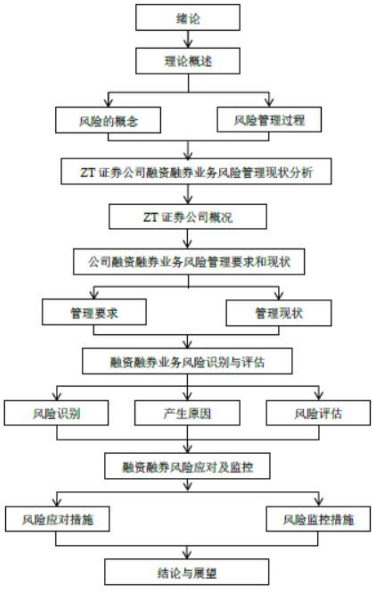
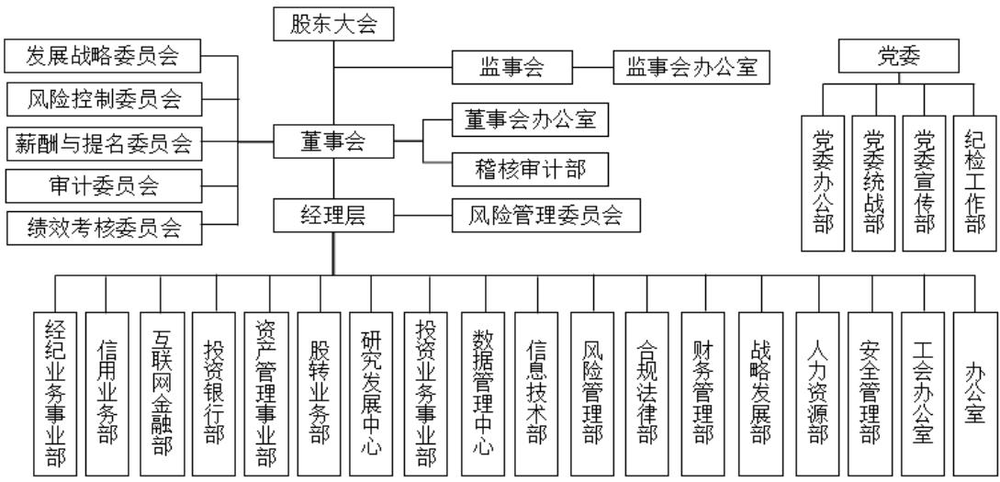
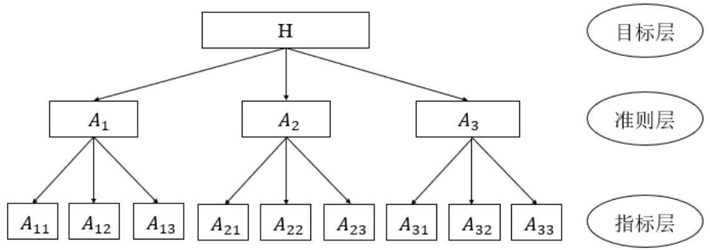

# 第 1 章 绪 论

# 1.1 研究背景及意义

# 1.1.1 研究背景

在国际市场上，美国是最早推出融资融券业务的国家，其融资融券业务已经发展了近一个世纪。融资融券制度在美国的起源可以追溯到 19 世纪，当时美国的经纪人开始向客户提供信用贷款，以便客户可以进行更多的股票交易。在 20世纪初，这种交易制度逐渐规范化，并被纳入到了《1933年证券法》中。在中国融资融券业务试点初期，融资融券业务并没有得到很大的发展。这是因为一些限制性措施，如单一券源不得超过其净资产的 $50 \%$ ，以及不得开展信用交易等，限制了融资融券业务的发展。直到 2008 年，国务院正式出台《证券公司监督管理条例》和《证券公司风险处置条例》，为金融创新铺路，才为融资融券业务的快速发展奠定了基础。融资融券业务从 2010 年发展至今，在维护证券市场稳定、提高市场活跃度、缓解市场资金压力、增加交易量及证券公司息费收入等方面都发挥了重要作用。截止 2022 年 9 月 30 日，“中国证券业协会对中国证券公司2022 年前三季度经营数据进行统计，140 家证券公司 2022 年前三季度实现营业收入 3,042.42 亿元，净利润 1,167.63 亿元，115 家证券公司实现盈利。140 家证券公司总资产 10.88 万亿元，净资产 2.76 万亿元，净资本 2.11 万亿元，客户交易结算资金余额（含信用交易资金）2.13万亿元，受托资产总净值10.99万亿元。”

2008 年10月证监会正式开展融资融券试点工作，2010年底经国务院正式许可的取得开展融资融券业务试点资格的证券公司共有 25 家公司，直至 2022 年11月底，已获得融资融券业务开展资格的证券公司已扩展至 95家，融资融券标的股票数量扩容至两千多只。根据证券金融公司数据，“融资融券余额 1.56万亿元，融资余额 1.47 万亿，融券余额 0.99 万亿，两融余额占 A 股流通市值比重是$2 . 3 3 \%$ 。证券公司开展融资融券业务的营业部数量为 11737 家，个人投资者数量640.8万名，机构投资者数量 46499家。”

经过十多年的不断发展，中国的融资融券交易体系尚未成熟，我国的融资融券交易业务，仍处于起步阶段，融资融券交易有其特殊性。这种交易系统在西方国家有着悠久的历史，起源于美国，并在发达国家盛行。2010年，中国正式进入市场运营阶段，自正式推出以来，融资融券业务在中国发展迅速，上海和深圳这两个城市的融资融券余额增长迅速，国家多次扩大和补充融资融券的基础股票，越来越多的经纪人有资格开展融资融券业务。融资融券业务是指投资者向证券公司提交担保物，借入资金买入标的证券或者借入标的证券卖出的交易方式。举例来说，客户在向证券公司支付保证金后，投资者将投资 50 万美元以 30 美元/股的价格购买股票。两个月后，股票上涨至 60 元，投资者出售了标的股票，总价值为 100 万元。在偿还了一家证券公司的 50 万美元贷款后，投资者赚了 50 万美元，扣除一定比例的利息，经计算约为 7167 元，占融资利息的 $8 . 6 \%$ ，经过最后计算，投资者的收益额为 49.28万元，所以债券融资为证券公司带来了巨大的经济效益，证券公司可以通过规模调整来产生业务收入。随着业务的增长，证券公司面临着各种风险，尽管证监会等监管机构出台了适当的管理措施，并要求对融资融券的录取设定严格的限额，但证券公司为获利而进行非法融资融券交易的案例还是频繁发生，或者由于证券公司无法准确评估其风险防范能力而发生一系列风险事件[7]。融资融券业务的特点决定了其在证券市场起到的作用，融资融券业务对我过资本市场的发展有着深远的意义。

# 1.1.2 研究意义

ZT 证券公司已有 20 多年的历史，其主要收入来源仍然是经纪佣金。但随着近年来大型经纪商努力降低经纪商的佣金率，融资融券业务便成为了 ZT证券公司另一主要的收入来源，但对于融资融券这种高杠杆、高风险的投资活动时，中小投资者无法充分了解风险特性，当股市在经历了一段时间的暴涨之后，许多投资者，包括许多专业的机构投资者，都陷入了对市场的盲目乐观情绪中。在这个背景下，融资融券业务成为了他们追求高收益的主要工具。投资者通过向证券公司或银行等机构借入资金或证券，以增加投资杠杆效应，进一步推高了股市的泡沫。然而，当市场情绪逆转，股市开始下跌时，融资融券交易的杠杆效应就成为了放大亏损的“双刃剑”[8]。由于许多投资者都是用融资买入股票，当股市下跌时，他们的亏损会被放大，而融券卖空的行为也会因为市场下跌而带来巨大的损失。因此，融资融券业务风险管理显得尤为重要。此篇论文通过运用模糊综合评价法和层次分析，以 ZT 证券公司融资融券业务为风险管理研究对象，其风险进行评估。为研究证券公司融资融券业务风险管理提供了理论指导。

本调研对 ZT证券公司融资融券业务的风险管理现状展开研究，评估其风险管理水平，探讨了ZT 证券公司融资融券业务潜在的风险和脆弱性，并提出了具体建议。本文立足于风险管理理论，阅读大量书籍，通过对国内外信用风险管理研究成果的借鉴和比较，力求完善 ZT证券公司的风险管理体系，保护投资者的利益。同时，也为其他证券公司在融资融券业务中的风险管理策略，在融资融券业务范畴上提供了参考，具有一定的现实意义。

# 1.2 研究方法

# 1.2.1 文献研究法

文献研究法，主要是指从相关理论出发，查阅相关文献后，对现有理论研究进行汇编和总结的研究方法[9]。这种方法可以对研究问题进行全面而清晰的理解，并总结出一般规律。在现有研究的基础上，本文将阅读大量有关融资融券风险管理的书籍和期刊文章，对融资融券业务进行深入分析，以确定融资融券风险管理理论的发展历程和重点，进而总结最终的结论。通过不断的阅读、分析总结文献，同时对相关的信息进行学习，客观分析 ZT证券公司融资融券业务风险管理存在问题的原因。利用互联网，进行搜索电子学术期刊，查阅相关著作，阅读 50 多篇融资融券风险管理学术论文，收集外部相关信息，阅读和总结大量相关书籍和文章，充分了解融资融券风险管理研究的现状和未来发展趋势，寻找 ZT证券公司融资融券风险监测的对策和措施。

# 1.2.2 访谈法

访谈法是受访者与被受访者通过当面交流的方式调研相关信息，受访者对被受访者进行提问引导，通过提问与被提问的方式不断验证推敲确认，从而使被受访者回答调研主题相关问题进而使得受访者得到有效、准确以及更精准的调研数据，为之后的深入研究打下坚实的基础[10]。访谈，即对性关系的研究，以面对面交谈的形式进行，是一种在谈话过程中总结客观公正的事实的方式，基于受访者的谈话内容，准确地解释样本所代表的整体。通过研究人员和受访者之间的直接和面对面访谈收集信息是高度灵活和适应性的，并且是灵活和适应性的[11]。访谈方法应用广泛，可以简单描述性地收集各种工作分析数据，特别是在研究 ZT 证券公司融资融券业务风险管理时，有必要了解不同职位的人，收集不同的意见。通过灵活和多样化的访谈，将深入挖掘 ZT 证券公司融资融券业务风险管理存在的不同问题，访谈方法是本文，进行研究过程的主要方法之一。

# 1.3 研究内容与技术路线

# 1.3.1 研究内容

本文采用文献研究法和访谈法的两种研究方法，研究 ZT证券公司融资融券业务的风险管理，找出问题的根源。通过回顾国内外有关问题的研究文献，结合ZT 证券公司融资融券业务的具体情况，借鉴其他融资融券业务风险管理公司的经验，找出符合ZT公司融资融券业务情况的优化方案，最后提出相关保障方案，以确保方案得以实施。

第 1章，绪论。本章从证券行业背景和融资融券业务发展趋势入手，阐述了证券公司融资融券业务的现状和现阶段存在的问题，围绕以上内容具体说明风险管理对融资融券业务的开展和证券公司的健康经营都起到非常重要作用，对 ZT证券公司融资融券业务进行风险管理非常必要，同时论述本文所采用的文献研究法和访谈法，两种研究方法的模式及优缺点。

第 2章，理论概述。本章介绍风险管理所使用的基础理论，主要分为两个部分，第一部分介绍风险的概念，从风险的定义入手，引出风险管理的概念，进而列举出风险的特征，最后阐述风险的分类。第二部分介绍风险管理的过程，包括风险识别、风险评估、风险应对、风险监控四个部分。以上理论的应用为本论文的研究奠定了坚实的理论基础。

第 3 章，ZT 证券公司概述和融资融券风险管理的现状。首先，对公司的经营范围和组织架构展开详细阐述。然后对公司融资融券业务经营现状展开描述，通过对融资融券业务发展的不断探索了解到对于ZT证券公司的业务板块中融资融券业务占到了举足轻重的比例，接下来，对公司融资融券业务风险管理体系、风险管理目标以及风险原则详细描述，深入分析公司在风险控制过程中存在的问题以及相关原因分析。最后，对 ZT证券公司融资融券业务的现有风险管理系统进行了审查，以便为下一章的风险识别和评估铺平道路。

第 4 章，ZT 证券公司融资融券业务风险识别与评估。本章分为三个部分，第一部分为融资融券业务风险识别，通过对风险识别方法选择及流程设计、风险识别实施与结果分析来回顾现有的产品内部风险识别系统。第二部分，通过以上分析，推导出融资融券业务风险管理问题的原因。第三部分，阐述了 ZT 证券公司融资融券业务的风险评估，描述了评估方法的选择和评估的实施过程，得到了风险评估的结果。

第 5 章，ZT 证券公司融资融券业务风险应对及监控。本章首先就之前提出的业务风险提出了应对措施，从市场风险应对、信用风险应对、操作风险应对以及流动风险应对四个方面逐一解决之前发现的业务风险。同时提出针对 ZT证券公司融资融券业务风险监控措施，从健全融资融券业务风险体系、定期开展风险监控工作、加强风险审计工作、强化融资融券业务风险管理意识以及完善融资融券业务人员队伍建设五个方面加强保障。

第 6章，研究结论与展望。本章对本文的研究内容进行了总结，系统地总结了以往研究中确定的ZT证券融资融券业务，强调了风险管理的有效性和可行性，为整个业务的后续风险管理提供了解决方案和方向，并为您未来的制度建设提供了理论和实践支持。同时对本论文的调研过程中存在的一些问题，做出了反思和阐述，并对未来融资融券业务发展、证券行业发展提出展望。

# 1.3.2 技术路线

本文对通过对ZT证券公司现有组织结构以及融资融券业务风险管理体系现状的分析，了解公司风险管理的相关准则。并通过对德尔菲法的专家们和相关工作人员的深入访谈法探索融资融券业务风险管理存在的问题和相关原因分析，对公司所面的风险进行分类和总结，通过层次分析法和综合模糊评价两种方法对风险管理总体水平进行定性和定量相结合的评估，得出公司风险控制处于中等风险水平的结论，虽然ZT证券公司对风险管理采取一系列控制手段，但仍有待提升。

针对发现的问题，提供了适合 ZT 证券公司融资融券业务发展的优化方案。在防范信用风险方面，提出了提高科研队伍实力和建立风险事件数据库等具体的优化措施，以及定量信用评级措施和客户保留率实时监控等优化措施，在防范操作风险方面，提出了集中化管理业务流程和建立科技操作系统的优化措施，在防范流动性风险方面，提出了提升员工应对能力和根据公司流动比率和准备金占比动态调整等优化措施。最后提出了健全两融风险管理体系、定期开展风险监控工作、加强风险审计工作、强化融资融券业务风险管理意识和完善融资融券业务人员队伍建设的保障措施。具体技术路线，如图 1.1 所示。

  
图1.1技术路线  
Fig. 1.1 Technical road map

# 第 2 章 理论概述

# 2.1 风险的概念

# 2.1.1 风险的定义

对于风险定义的理解有一个学术界的比较统一的概念，人对于周围环境的感知能力是有限的，尤其是环境中存在多种不可控的复杂因素，当处在不熟悉以及无法把握的环境中，人们没办法准确预估发生危险的可能性，这种对于危险把握的不确定性被称为风险[12]。在现代风险管理理论中对于风险的描述更加的细致，将风险带给人们不确定性的影响分为积极和负面两种，积极影响被认定为是机会，而负面影响则是代表风险。将不确定性的带来的影响更加系统的区分开，对于风险概念的理解也更加的形象。

通过判断这种不确定性是否能带来获利机会将风险划分为纯风险和机会风险。纯风险指的是不能带来获利的可能性，反之机会风险指的是不确定性既能带来损失也能带来获利[13]。因为在现代风险管理理论中风险的正面影响和负面影响会带来不同的效果，对于企业发展的过程中，企业面临的风险一般是不确定性，导致生产和运营过程中出现额外的损失或收益。如果风险表现出不确定性，这意味着风险的结果可能导致损失，利润或没有损失，在金融行业企业中一般面临的风险成为金融风险，这一类风险就是典型的机会风险，它不仅给企业和投资者带来损失的可能性同时还有获益的可能性，一般来说损失的可能性越大、收益的程度就越大，所以对于风险承受能力比较强的投资者来说，为了得到更高的收益更愿意选择更加有风险的投资项目，而对于风险承受能力比较弱的投资者来说，为保护自己的本金并不愿意冒更大的风险[14]。在经济学中，不同风险对应收益的不同程度，是普遍存在的、是客观规律也是没办法准确预估出来的。

# 2.1.2 风险的特征

风险的特征分为客观性、普遍性、不确定性、可测量性以及可变性。对于企业来说风险长期并且普遍存在于业务发展的每个环节中并因为人的感知能力有限没办法精准避开每个风险带来的损失[15]。除此之外，企业将会面临的损失程度也没有办法预估出来，这些不确定性使得风险无法被完全去除，只能被有有效规避。风险主要有以下几点特征：第一，风险的客观性，风险是客观的不受人的意志支配。即使随着科技的不断发展，人们用自己的智慧设计出智能的风险管理体系去规避风险的发生以及降低风险的损失，但是却无法将风险扼杀在摇篮之中，使风险不再发生。第二，风险的普遍性。风险长期且普遍存在于人们生活的点点滴滴，威胁着人们的生命财产安全。当人们对美好生活的向往逐渐加强，简单的温饱满足不了生活需求的时候，人们更愿意冒更大的风险去得到更多的收益。人们面对风险的种类会增多、风险程度会增加。第三，风险损失发生的不确定性。风险是无处不在并且带来损害的可能性是客观存在的，但风险带来损害程度是受限于人们的感知能力不能被精准估计出来，这样就使得风险带来的损害程度有可能是人们或者企业无法承受的，当没有办法应对风险损害，对企业和个人来说将会面临无法挽回的后果[16]。第四，风险的可测量性。当同一类风险事件反复发生的时候，通过数学相关模型可以找出风险发生情况的相关规律，量化风险事件对预测和规避风险的发生起到了非常重要的作用。虽然对于个体损失程度没办法精准预测但是对于风险事件的发生概率还是有规律可循的。第五，风险的可变性。风险的变化，数量的增加或减少，质量的变化，一种风险消失但另一种风险又产生。社会经济的不断发展、科技的不断进步、政治结构的变化已经经济制度的不断完善都会造成风险的不断变化。

# 2.1.3 风险的分类

企业在发展业务时面临着一系列风险。主要风险类型包括：系统性和非系统性风险，国内和国际风险，内部和外部风险。ZT 证券公司在财务整合过程中面临各种金融风险。金融风险是普遍存在的，通常与社会的不同参与者有关，从个人到整个社会经济系统。融资融券业务的主要风险分为四种，分别是市场风险、信用风险、操作性风险、流动性风险[17]。

（1）市场风险。这种风险可以定义为由于系统因素(宏观经济，政治环境，行业政策，法律法规等)的变化而导致证券潜在损失的可能性的。(在市场上。由于上述因素的变化，市场波动很大，导致担保证券的市场价值下降，达到保值门槛。在极端情况下，无法关闭强制性头寸并收回借入的资金和债券，从而导致损失。市场风险是证券行业面临的最常见风险之一，主要有三个原因。标的证券价格继续下跌；其次，当市场不合理地上涨或下跌时，融资融券的杠杆效应和后续效应往往会增加市场波动的风险。第三，由于证券市场仍然以中小型零售商为主，他们对投资风险不重视，风险承受能力不足，因此往往处于满仓状态。当市场波动，维护保证率降低，警报达到时，投资者面临空头头寸的巨大风险。如果上述三点导致门槛收盘，经纪商将强制仓位收盘，市场恐慌将蔓延成恶性循环，市场风险将更加突出。

（2）信用风险。这种风险的损失可能在违约之前形成，特别是指投资者因未能履行融资融券的合同承诺而对证券公司造成损害的可能性。有两种具体情况。第一，当信用账户担保比例低于要求时，不加担保；其次，合同到期，未按合同约定支付债务和利息。在这两种情况下，证券公司都可以根据合同强制关闭头寸，有时在强制关闭头寸后无法清偿所有债务，支付利息，从而导致证券公司的损失。

（3）操作风险。巴塞尔银行监管委员会根据运营风险的产生来描述运营风险的概念：由系统缺陷或遗漏，内部程序，人员或外部原因造成的损失。融资融券业务的大多数操作风险是信息技术漏洞和业务管理失败。例如，由于内部因素造成的损失，例如不熟悉的人员业务，操作不当，内部漏洞信息系统，适用不适当的员工法律法规，不完善的法律和监管制度以及不充分的合规执法。

（4）流动性风险。这种风险通常是公司自有资金无法支持业务的拓展，导致资金链的断裂以及客户的需求无法满足时，就会产生流动性风险问题。流动性风险会给公司带来资金链断裂甚至无法偿还，其在合法融资平台借入资金无法偿还的违约问题，对于公司的影响极其恶劣。缺乏流动性管理机制是证券公司存在流动性风险隐患最大的原因。

# 2.2 风险管理的过程

风险管理是一种过程管理，通过识别风险，使用适当的方法和手段来评估和评估已识别的风险，以便识别风险的潜在问题，分析原因，实施解决和应对风险的策略或措施，并监控实体实际业务流程中的风险变化，然后对其进行识别和评估，以便动态调整对策[18]。风险管理过程由四个主要部分组成：风险识别、风险评估、风险响应和风险监控[19]。

# 2.2.1 风险识别

如果风险识别一旦出现偏差，那么风险评估的结果对于事件本身没有任何意义。所以想要做好风险管理首要的是做好风险识别，非常重要的第一步。现代风险管理理论体系中阐明风险识别要做好感知和分析两步走，首先感知风险的意思是在事件中对于风险存在和可能发生的点要有敏感的认知，搜索每个环节所面临的可能风险，并将所有风险系统的罗列出来，其次，分析风险主要是通过各种科学的方法将面临的风险所包含的内外影响因素挖掘以及剖析出来是风险目录更加有层析详细。常用的风险识别方法有两种：德尔菲法和核对表识别法。

（1）德尔菲法。这种方法也称为专家研究。是通过将专家们的成员们聚集到一起，面对面探讨分析，经过不断的反复推敲得到统一答案的过程，研究人员征求了受访者关于管理重大融资融券业务风险的建议，研究人员编制了答案并在小组成员中分发，要求进一步评论小组成员的转换。经过多次咨询和反馈，对融资融券业务的主要风险项目达成了共识。德尔菲法具有广泛的代表性和可靠性。

（2）核对表识别法。此方法主要是将事件的各个环节可能面对的风险罗列出来，化整为零，对每一个可能出现的风险敞口进行讨论，对于可能的风险类型进行分类将其列为测试的要素点，将测试项目罗列出来形成测试表，并使用该表进行测试决策。表中规定的控制参数符合相应的法规、指南和法律规定，控制通道主要依据专业人员的经验和方法。将此业务可能存在的潜在风险均列于表中，以便工作人员核对某个业务是否存在表中所列出或者是相似的风险，此方法进行风险识别的优势是简便快捷，因表中所列出风险均是历史业务所总结而来，所以缺点则是受到相关业务可比性的限制。

# 2.2.2 风险评估

风险评估是将某事件发生风险可能造成的损害程度通过概率统计和数理分析的方式量化评估，因为风险的不确定性特征，纯量化风险评估的难度非常大，采取定量和定性将结合的方式能更准确的判断风险发生的概率和可能发生损害的程度。为接下来的风险应对和监控优化方案提供有效的数据支撑。所以在客户融资或者融券的过程中，也就是运用在融资融券业务经营过程中，证券公司在风险识别时需要全面地识别企业可能存在的各种风险因素，并对这些风险因素进行综合性的评估，而判断风险发生的可能和程度，进行后续的应对措施选择，并随着企业的日常运营进行动态调整，及时了解企业的风险因素变化。风险评估常用三种方法：专家调查法、层次分析法和模糊综合评价法。

（1）专家调查法。1946 年由美国兰德公司创始实行，指一组熟悉业务流程各部分并了解业务风险环节的专家，对业务发展中的风险和损失目标进行科学的分析和评估，并根据严重程度和破坏程度逐一对风险进行分类。此方法有助于减轻数据的偏倚，防止任何个人对结果产生不恰当的影响。专家调查法虽然是完全的定性评估，但却普遍适用于各类调研课题。

（2）层次分析法。此方法是指通过将复杂的问题分解为多个层次，在单一层次中分别进行定性和定量分析的一种决策方法。层次分析法的中心思想是先分解再综合，将决策相关的元素进行分解，在这个情况下进行分析，得到一个相对于最高层的相对重要程度权值或相对优劣次序。将复杂问题有层次的分解，化整为零有助于准确找到问题的答案，本方法普遍适用于各种复杂问题的探索，对于需要经验判断，主观信息分辨的研究课题来说，配合此方法将定量和定性相结合得到更加科学的研究结论。层次分析法通常包括建立风险因素集、构建判断矩阵、层次单排序及一致性检验和层次总排序及一致性检验四个步骤。

（3）模糊综合评价法。该方法以模糊数学理论为标准，根据模糊数学的隶属关系理论，将定性评价转化为定量评价。作为一个矢量，评价结果所包含的内容十分多样化，也能够精准的刻画评价象，也可用作进一步加工。模糊综合评价法主要的特点是将原本定性的评价以定量的形式进行展现。对于某些难以量化并且其属性不确定的问题，使用模糊综合评价法来解决可以让结果更加真实，拥有较强的系统性。模糊综合评价法通常包含构建评价指标体系、构建权重向量、构建评价矩阵和合成结果向量四个步骤。

# 2.2.3 风险应对

风险应对是指确定决策者经营活动中存在的风险，运用定量分析的方法分析风险的可能性及其影响程度，根据风险的性质和决策者的风险承受能力，评估风险造成损失的概率以及造成损害程度，依据风险评估结果制定出适合本事件降低风险损害程度和风险发生概率的优化方案，帮助个人和企业更好的应对风险。应对的主要方式是规避风险，降低风险，分担风险并接受风险。

（1）规避风险。对风险的规避是通过停止进行有可能发生风险的事件来应对风险。当察觉到某特定事件有发生风险的可能性，最彻底的方式就是让此事件不发生[20]。这样做的优点是可以精准有效的规避某种风险，停止其对企业和个人带来的损害，但是其方法有个致命的缺点，过于简单粗暴，在公司经营发展的过程中不能为了规避风险而放弃追逐收益。所以一般采取遇到无法更好处理的风险应对的方案，必须选择规避风险时，公司会通过调整战略目标和发展目标的方式，重新分配公司所有资源，结合风险和收益的走势，避免高风险低收益和财产损失等交易行为。或者通过放弃某种产品的竞争，调整产品的总体定位，更加符合公司发展的方式来规避风险。

（2）降低风险。跟规避风险不同的是降低风险不是完全的避开可能发生风险的某事件而是通过一系列可控操作将风险发生概率和损害程度降到可接受的范围之内。随着科技不断创新，风险管理体系的不断完善，有越来越多的科技手段可以帮助感知能力有限的人们更好的风险应对，通过风险控制环节的不断完善，每个环节不断降低风险，将高危害风险控制为低危害风险，将低危害风险控制为无危害风险。通过为计划提供支持性文档并授权正确的人员做出决策，必须处理事件。如有必要，可以在验证实施情况的同时定期检查计划。

（3）分担风险。是指以一定的代价，把风险的消极后果和风险应对责任转移到第三方。通常情况下，该第三方拥有更好的能力和资源去应对风险。比如企业中常见的保险、外包等都属于典型的风险转移手段。分担成本需要进行成本分析。转移的成本小于应对风险的成本，可以进行转移。如果转移的成本大于应对成本，那就可以自留风险并制定应对措施。

（4）接受风险。是指损失的可能和程度在可控制的范围内，即使发生风险，按照既有的应对方法应对，所能造成的最大损失对承担风险方影响不大或有其他对冲手段可在该事件发生的同时为承担风险方获取足够利益，用以抵消风险发生的损失。通常情况下，随时观察内外环境各要素对可能造成风险事情的影响，控制现有风险损害程度不恶化，通过不断设计、组合风险控制步骤来达到有效的风险应对的效果。

# 2.2.4 风险监控

风险监控是指对关键业务流程中风险的演变进行全面而系统的监控，经过风险识别、评估、应对，到了风险控制环节的最后一步风险监控。即使对风险识别的完整、评估的准确、应对的有效，没有系统而全面的风险监控，那么长期以往按照旧优化方式对风险控制的有效性也会不断降低，最后完全失效。因为风险会根据内外环境的变化而产生根本性的变化，有可能会导致风险损害程度的增加也有可能倒是风险损害程度的减少，对于损害程度的减少的风险公司，可以减少对其人力物力的投入而对于损害程度增加的风险，公司需要加大对其关注，防止其产生的损害对公司致命的影响。所以风险监控在风险管理中起到非常重要的作用，有效的风险监控设计会帮助整个风险控制体系良性循环，不断完成识别、评估、应对、监控风险的各环节，在不断循环消除未知风险可能产生的损害，是项目实施的重要组成部分。

# 第 3 章 ZT 证券公司概况及融资融券风险管理现状

# 3.1ZT 证券公司基本概况

# 3.1.1 公司概况

ZT证券股份有限公司是经辽宁省政府批准，于 2004年7月经重组设立的综合类证券公司，是辽宁省属唯一一家国有金融类证券经营机构，总部设在沈阳。公司注册资本22.25 亿元，现有六家股东均属于国有单位和企业。公司正式营运分支机构共计 62 家，其中分公司 2 家，证券营业部 60 家。营业部遍布全国各地，以辽宁省内和经济发展比较快的地区居多。

ZT证券公司坚持以投资者的利益为核心，以创造国有资产保值增值为目标，用心打造健全完善的金融服务体系，致力于推动辽宁省以及全国金融行业健康发展贡献一份力量。经过十多年公司人的不断努力，ZT 证券公司已经成长为十个业务领域的丰富业态，包括经纪业务、证券投资、固定收益、资产管理业务、票据业务、投资银行业务、信用业务、量化投资业务、新三板做市业务、期货以及私募基金等。业务范围广泛并且都处于良好的发展态势。

# 3.1.2公司组织架构

ZT 证券公司遵循《公司法》和《证券法》等法律法规以及《证券公司监督管理条例》等中国证监会有关规定，严格遵守公司章程，构建科学完善的法人治理结构，建立符合公司发展需要的组织架构和运行机制。科学的组织结构可以为公司的健康发展打下良好的基础，随着社会经济的不断发展，越来越多的投资者进入到金融行业，作为证券公司稳定且长期的成长对投资者来说非常重要。

股东大会是公司最高权力机构、董事会是决策机构、监事会是监督机构。董事会设有五个专门委员会：发展战略委员会、风险控制委员会、薪酬和提名委员会、审计委员会和绩效评估委员会。各委员会对董事会负责。公司总部设立 26个职能部门。公司控股子公司 2 家，包括 ZT 期货有限责任公司、ZT 辽创投资管理有限公司。ZT 证券公司部门组织架构，如图 3.1所示。

  
图 3.1 ZT 证券公司部门组织架构图  
Fig. 3.1 Organizational structure of ZT Securities Corporation

# 3.1.3 公司经营状况

2022 年公司集团口径实现营业收入 4.2 亿元，净利润 2289 万元，年末资产总额115.66亿元，较年初增加 5.67 亿元，负债总额 74.9亿元，较年初增加 6.94亿元。母公司实现营业收入 3.52 亿元，净利润 1140 万元，在巨大经营压力下，实现了连续四年盈利，保证了国有资产的保值增值。2022 年证券经纪业务净收入 0.31 亿元，总收入占比 $4 0 . 9 5 \%$ ，信用业务占比 $2 2 . 3 8 \%$ ，自营业务 $1 3 . 5 7 \%$ 。ZT 证券公司经纪业务收入占比最高，达到总收入的四成以上，其次是信用业务连续两年收入占比超过两成。公司除经纪业务和信用业务外，其他业务的毛利率均呈现负值但母公司保持盈利，说明公司经济业务和信用业务的经济贡献对公司是非常重要。ZT证券公司各业务板块收入与成本的情况，如表 3.1所示。

表 3.1 ZT 证券公司各业务板块收入与成本情况  
Tab.3.1 Revenue and costs of ZT Securities' business segments   

<table><tr><td colspan="7">2022年 2021年</td></tr><tr><td>业务板块 收入</td><td>成本</td><td>毛利率</td><td></td><td>收入占比 收入</td><td>成本</td><td>毛利率</td><td>收入占比</td></tr><tr><td>经纪业务</td><td>1.72</td><td>1.41</td><td>18.02%</td><td>40.95%</td><td>2.08</td><td>1.60</td><td>23.08% 32.76%</td></tr><tr><td>信用业务</td><td>0.94</td><td>0.13</td><td>86.17%</td><td>22.38%</td><td>1.33</td><td>0.16 87.97%</td><td>20.94%</td></tr><tr><td>自营业务</td><td>0.57</td><td>0.61</td><td>-7.02%</td><td>13.57%</td><td>2.39 0.70</td><td>70.71%</td><td>37.64%</td></tr><tr><td>投行业务</td><td>0.16</td><td>0.20</td><td>-25.00%</td><td>3.81%</td><td>0.06</td><td>0.13 116.67%</td><td>0.94%</td></tr><tr><td>其他业务</td><td>0.81</td><td>1.48</td><td>-82.72%</td><td>19.29%</td><td>0.86</td><td>1.38 181.63%</td><td>7.72%</td></tr><tr><td>合计</td><td>4.20</td><td>3.83</td><td>-10.54%</td><td>100%</td><td>6.72</td><td>3.97 116.54%</td><td>100%</td></tr></table>

# 3.2ZT 证券公司融资融券业务发展现状

# 3.2.1 融资融券业务概况

放眼金融市场近十年发展，经历了 2015 年市场暴涨随后暴跌使无数投资者本金迅速萎缩，随后 2016年国家迅速推出自动停牌机制来应对 2015 年的股灾事件，当股指波动幅度到达一定的熔断点时，交易所为控制风险才去暂停交易的措施。虽然控制了市场暴涨暴跌对投资者的风险，但是也使得证券市场在长时间中处在低迷状态，市场投资者不活跃，对金融市场没有信心。当市场出现大幅波动的时候，投资者都表现的惊慌不已，对于融资持有证券来说，常常出现平仓现象，伴随着各种信用风险和法律风险此起彼伏。2018 年上半年，基于宏观经济下的去杠杆化压力，使得风险控制更加严峻。

针对低迷且动荡的金融市场造成的负面影响，ZT 证券公司加强了资产储备和客户开发，丰富了客户服务的各个方面，逐步提升了客户服务体验，强化了公司的品牌效应，实施了准确的风险控制，完善了信贷业务管理，加强了风险定价研究，强化了融资融券的风险控制能力。面对 2022 年全球经济疫后复苏一波三折，市场环境错综复杂，上证指数运行呈现区间震荡态势，同时市场结构分化严重，给证券投资业务带来极大挑战[21]。信用业务部有序压缩融资融券业务规模，有效平衡业务资金需求和头寸错配，保证流动性管理安全。公司融资融券业务基本情况统计，如表3.2所示。

表3.2 融资融券业务基本情况统计表  
Tab.3.2 Statistical table of basic information of margin trading   

<table><tr><td>序号</td><td>日期</td><td>2022年</td><td>2021年</td><td>变动</td></tr><tr><td>1</td><td>融资余额（万元）</td><td>112,433</td><td>177,450</td><td>-65,017</td></tr><tr><td>2</td><td>公司客户数（户数）</td><td>9,992</td><td>9,985</td><td>7</td></tr><tr><td>3</td><td>有融资余额客户（户数）</td><td>1,641</td><td>1,795</td><td>-154</td></tr><tr><td>4</td><td>公司授信额度（万元）</td><td>734,099</td><td>808,902</td><td>-74,803</td></tr><tr><td>5</td><td>融资金额占授信比例</td><td>15%</td><td>22%</td><td>-7%</td></tr><tr><td>6</td><td>人均融资余额（万元）</td><td>11</td><td>18</td><td>-7</td></tr><tr><td>7</td><td>人均授信金额（万元）</td><td>73</td><td>81</td><td>-8</td></tr><tr><td>8</td><td>融资利息（万元）</td><td>10,019</td><td>14,231</td><td>-4,212</td></tr></table>

2022 年末信用业务资金总规模约 12.24 亿元，较年初的 19.55 亿下降约$3 7 . 3 9 \%$ 。其中融资融券业务规模约11.24亿元，较年初的17.75亿下降约 $3 6 . 6 7 \%$ 。

2022年收入合计 1.01亿元，较去年的 1.42亿元下降约 $2 9 . 5 8 \%$ 。信用客户数量为9992 户，较年初的 9985 户增加 7 户，其中有融资余额的活跃客户数量为 1641户，较年初的1795 户下降约 $8 . 5 8 \%$ 。

# 3.2.2 融资融券业务特征

在成熟的金融市场中，融资融券已成为基本的交易形式，融资融券制度是完善证券市场交易机制的基础性制度，特别是融券业务把做空机制引入股票市场，改变了市场定价机制和交易行为，无论是对各参与主体还是股票市场都产生了深远的影响。信用交易方式与现货交易结合可以增加证券的供求弹性，有助于稳定证券价格，同时信用交易中的卖空机制可以为投资者提供新的盈利模式，也提供了规避风险的渠道。证券普通交易与两融交易的对比，如表 3.3 所示。

表3.3普通交易与两融交易对比表  
Tab.3.3 Comparison table of ordinary transactions and two-margin transactions   

<table><tr><td>差异项</td><td>证券普通交易</td><td>证券两融交易</td></tr><tr><td>保证金要求</td><td>全额</td><td>一定比例</td></tr><tr><td>杠杆效应</td><td>无杠杆</td><td>有杠杆</td></tr><tr><td>交易范围</td><td>所有上市证券</td><td>标的池范围内</td></tr><tr><td>交易期限</td><td>无限制</td><td>合约期限不超过6个月</td></tr><tr><td>交易风险</td><td>本金损失</td><td>损失杠杆放大和强制平仓等风险</td></tr></table>

（1）保证金要求。投资者进行证券经济业务股票交易时，需要在证券公司开立账户中存一定量的资金，并且对想要购入的股票使用资金进行等价购买。但对于融资融券业务来说，只需要投资者在账户当中存入一定量的保证金，按照保证金的比例授权给投资者做股票交易。当客户想要购入一只股票，但是账户实际金额不足，想要使用融资融券的方式购买股票时，如果判断股票将会下跌，可以先向证券公司申请借入股票，存入自己的账户，在股票价格下跌的时候卖出股票，从而赚取差价，证券公司收取一定费率的手续费。当判断股票的价格会持续上涨时，那投资者可以向证券公司借一部分资金去购买其股票。当股票价格上涨时再卖出股票，从而挣取差价，融资融券业务是以保证金为基数乘以一定的比例授权给投资者进行股票交易。

（2）杠杆效应。由于融资融券业务交易模式的特殊性，杠杆效应会放大金融市场的影响，助涨和助跌股票市场的变化。股票市场的价格不合理的上涨或下跌，当投资者未能及时的反应市场不规则大幅度波动，则会使客户账户产生平仓的风险，使投资者蒙受不可估量的损失。由于无法估量其变化何时发生，当投资者到期无法将资金或证券还给证券公司，证券公司将会面对资金链断裂的问题甚至会影响其他业务。

（3）风险承担和交易权利。融资融券业务股票交易与一般证券经济业务股票交易不同的是，证券经济业务允许投资者购买证券交易所发行的任何上市公司股票，投资者自行承担股票下跌的全部风险，但融资融券由于其业务属性的特殊性，在保证金一定比例的规模资金授权在客户的融资融券账户中给客户进行交易。所以，投资者只允许在证券公司规定的标的证券范围之内进行买入股票和融入证券进行卖出的交易行为。证券公司为避免由于客户判断失误导致的强制平仓为公司带来流动性风险隐患，一般会将相对风险较小的证券划分为公司的标的证券，允许投资者进行融资融券业务的股票交易。除此之外，客户还要承担由于股票上涨或下跌所带来强制平仓对公司资金亏损的带来的损失。每一个客户由于信用等级不同，风险承受能力不同的保证金比例也会有所不同。只有对保证金比例控制得当，根据客户的真实投资能力确定合适的比例而不是单纯为了业务规模盲目扩大而虚高保证金比例，证券公司才能有效的规避流动性风险，减少客户强制平仓给公司带来的风险隐患。

（4）交易风险。投资者从事普通证券交易，买入证券时，必须事先有足额资金，卖出证券时，必须有足额证券；从事融资融券交易，投资者预测证券价格将要上涨而手头没有足够的资金时，可以向证券公司借入资金买入证券，预测证券价格将要下跌而手头没有证券时，可以向证券公司借入证券卖出。投资者从事普通证券交易时，风险完全由其自行承担，可以买卖所有在证券交易所上市交易的证券；从事融资融券交易时，如不能按时、足额偿还资金或证券，还会给证券公司带来风险，所以投资者只能在与证券公司约定的范围内买卖证券。

# 3.2.3 融资融券业务目标

融资融券基本上是一种信用担保。投资者还允许上市公司在证券市场进行交易。融资融券业务为投资者带来新的盈利模式。在市场持续走强的时候，投资者可以融入资金购买股票，从而放大获利倍数；在市场持续走弱的时候，投资者可以融入股票卖出再于低位补回。融资融券这种双向机制的引入可以使投资者在任何时候都有盈利的机会，对证券公司的发展起到积极影响[22]。

（1）增加公司的收入和利润。融资融券业务交易可以在一定程度上放大资金和证券供求，增加市场交易量，从而活跃证券交易，增强市场的流动性。此外，融资融券可以为投资者提供融资，这会给证券市场带来新的资金力量，对证券市场产生基金的推动作用，存量资金的增加有利于活跃证券市场。证券公司通过客户不断的进行证券和资金的借贷中收取手续费，增加了公司的收入来源，丰富了公司业务结构，提升公司利润。

（2）提高资金使用效率。在证券公司获准进行融资融券业务之前，融资渠道还比较有限，回购市场融资规模比较小，也不能满足证券公司的融资需求，而股票质押贷款、短期融资融券、发行债券等融资方式都很难开展起来，使得股权融资仍然是证券公司主要考虑的融资方式。这种融资结构对于金融企业来说显得并不合理。融资融券推出以后，特别是证券金融公司成立以后，可以为证券公司提供一种新的合规融资渠道，提高了证券公司资金的使用效率。

（3）促进顾客资源的最佳配置。杠杆性趋势投资途径风险偏好较高的客户的风险承受能力不同，其还款信誉不同，对股票市场的判断能力不同。面对风险承受能力强，愿意更多危险操作，冒风险博收益的客户，将顾客的资源发挥到最大，对于风险承受能力弱，比较谨慎投资的客户，小规模的投资也会让其有超过本金之外的杠杆收益，有效的提高了顾客的资金使用效率。

（4）规避证券市场风险。普通经纪业务只是依靠市场中股票上涨使得投资者获得利益，方式相当单调，一味追求股票上涨会助长社会经济通货膨胀。但融资融券业务不同的是投资者可以从股票的上涨和下跌都有可能获得收益，当判断证券及其衍生品上涨时，投资者可以向证券公司融入资金购买产品，当上涨后卖出证券，当判断证券及其衍生品下跌时，投资者可以向证券公司融入证券卖空，当下跌时再将证券购买回来归还给证券公司，融资融券业务丰富了交易类型和途径，使得投资者有更多操作和交易行为可以抵御市场风险带来的损失隐患。融资融券业务交易模式优化了证券市场的业务结构，使投资者有更多的方式得到更多的利益，无论证券价格是涨是跌，只要投资者预测的准确，操作的合理，客户的平仓风险可以充分规避，大大降低了整个金融市场的风险，帮助金融行业健康发展，进而促进了社会经济平衡稳定。

# 3.3 公司融资融券业务风险管理现状

# 3.3.1 公司风险管理要求

ZT 证券股份有限公司全面的风险管理体系包括运营管理体系、健全的组织结构、可靠的信息技术系统、定量风险指标、专业人员、有效的风险应对机制和良好的风险管理文化。公司将所有子公司以及比照子公司管理的各类孙公司纳入全面风险管理体系，强化分支机构风险管理，实现风险管理全覆盖。同时，在全公司推广健全的风险文化，形成适合企业的风险管理理念、价值标准和职业道德，建立培训、沟通和监督机制。公司全面风险管理工作遵循以下三个原则。

（1）全面性原则。公司的风险管理体系约束的不仅仅只是总公司一个整体，各分支机构、各营业部、各部门甚至各业务管理小组，要化整为零，风险管理无小事，要渗透到每一个环节，业务开展的每一个细节中[23]。除此之外，必须全面、系统和持续地收集和分析可能影响实现业务目标的内部和外部信息，确定公司面临的风险，其来源、特征和潜在影响，并按业务、行业和风险类型进行分类。

（2）制衡性原则。各部门在融资融券风险控制条线，根据自己部门负责的审批点位进行专业审批，审计人员可以授权查询各操作时点的权限对时刻审计。各部门对于融资融券业务风险管理的工作配合默契，协调工作更加系统。相互配合的同时相互制衡，动态环境下完成风险管理监测，依靠审计部、风险管理部、合规法律部等不同部门工作的协调配合，才能将风险监控发挥极致。

（3）针对性原则。公司对各类风险进行等级划分，对不同等级风险采取不同的资源投入和风险应对措施。重点加强对高等级风险、内控薄弱环节和新业务风险的识别、监测和管控[24]。建立流动性危机、交易系统事故等重大风险和突发事件的风险应急机制，明确应急触发条件、组织制度、风险管理措施、方法和程序，通过压力测试和应急演习不断改进[25]。

# 3.3.2 融资融券业务风险管理原则

ZT 证券公司对融资融券业务实行“依法执法，集中管理，独立经营，审慎推广”的管理原则。从公司治理的角度，风险管理、内部控制、合规管理都是公司治理体系中制度体系的一部分，保障公司战略的顺利实施。是以风险为导向，以风险管理为核心、以内部控制为基础、以合规管理为重点，简单概括管控目标就是“防风险、强内控、促合规”，信用交易部负责公司融资融券业务的具体管理和运营。风险管理部，合规法律部，经纪业务部，财务管理部，信息技术部，研发中心和证券投资部。根据《ZT 证券股份公司融资融券业务管理办法》承担各自的融资融券业务职能：融资融券业务流程主要包括：投资者充足性管理， 信贷调查和信用评级，信贷管理和合同签订，开立和管理账户，发送担保，融资融券交易和撤销担保，日常标签，担保跟踪和强制关闭，存款申请管理，通知和交付，权利处理。

信用业务部在公司总部统一管理下，按照规定开展融资融券业务。业务部总经理是业务部融资融券业务的主要负责人，负责客户信用信息的初步分析，投资者教育和客户服务管理。客户经理负责协助投资者教育，收集和验证客户的信用信息以及客户服务；信用管理职能部门负责接收客户融资融券的业务申请、审查客户的开户资格、审查客户的信用数据、解释业务流程和合同内容、披露风险、签订合同和提交担保；根据反洗钱要求，账户管理职位负责客户识别，开立信用账户，更改信息，注销账户和组织账户信息；风险管理职能部门负责管理保证金客户的风险，帮助信贷交易部门向客户通报跟踪和强制关闭头寸等问题。金融机构的业务人员必须接受特殊培训，并在进入工作岗位之前通过考试。经营融资融券业务时，业务部门应严格遵守本程序规定的实时处理、审核和批准程序。

# 3.3.3 融资融券业务风险管理体系

（1）公司风险管理组织架构。ZT证券公司风险管理组织架构由四个层次构成，分别为：公司董事会及其风险控制委员会；管理层，风险总监，合规总监和监事会；承担风险管理职能的部门，包括风险管理部门、法律合规部门、审计部门、信息技术部门、财务管理部门和董事会办公室；各业务部门及内设的专兼职风险管理岗位。各层次相互衔接、有效制衡。

董事会对整体风险管理负有最终责任。履行以下职责： 促进风险文化；建立与风险经理的直接沟通机制；章程规定的其他风险管理职责。由董事会授权的风险控制委员会履行其在整体风险管理方面的部分职责。与此同时，在董事会内成立了风险管理团队。由董事长担任组长，在公司各项规章制度的构建和完善中起决定性作用，该组也会不定期审核公司的各项风险指标是否符合各类要求。

公司经理管理层对全面风险管理承担主要责任。履行以下职责：负责主持全面风险管理的日常工作，对全面风险管理工作的有效性向董事会负责。公司设立各业务管理委员会、领导小组及内核委员会等非常设机构，根据公司授权履行在各自的业务管理、决策范围内的风险管理职责和义务。定期召开合规会议，听取各部门及分支机构关于近期融资融券风险管理的最新进展与遗留问题的解决。

公司风险管理部履行风险管理职责。在首席风险官的领导下在公司业务部门和相关内控部门的配合下，负责反洗钱和反恐怖融资风险管理工作。财务管理部在风险管理部、合规法律部等部门协助下负责公司及子公司流动性风险管理工作。信息技术部是公司信息技术系统的管理部门，负责公司信息技术风险管理工作，信息技术部本身的监督评估工作由稽核审计部或聘请外部机构予以完成。董事会办公室是公司信息披露、投资者关系、对外沟通等事务的管理部门，负责公共关系有关声誉风险管理工作。人力资源部等其他管理部门，在各自职责范围内履行相应的风险管理职能。

各业务部门设立风险管理岗位，承担管理职能的业务部门配备专职风险管理人员，在首席风险官与风险管理部门的指导下，负责公司各项业务管理和风险管理制度的落实，监督执行各项业务操作流程，与风险管理职能部门建立直接、有效的沟通，对业务操作过程中发现的内部控制缺陷及风险点及时反馈，提出整改或完善的意见或建议，有效识别和管理本单位业务经营中面临的各种风险，履行一线风险控制职能。风险管理人员不得兼任与风险管理职责相冲突的职务。

（2）融资融券业务流程环节的风险管理措施。对于客户请求和信用评估，ZT 证券公司必须在与客户签订融资融券合同之前适当收集和分析客户信息。这包括但不限于您的财务倾向，可接受的损失水平，证券交易经验和信用记录，然后根据收集的信息对其进行评估，以评估客户的信用评级。向有资格获得融资融券的客户披露风险，进行信用调查，收集和了解客户的基本信息，财务状况，证券投资，诚信和对业务规则和风险的看法，指导客户填写相关表格。客户经理负责客户信用信息的真实性。如果发现信用数据无效或缺失，过时的数据将返回到信用管理功能，业务部门将与客户联系以补充数据并重新提交。如果发现信用信息是虚假的，请返回信息，并在适当的情况下将客户列入公司的信用黑名单，或在融资融券管理系统中记录其不良信用记录。如发现客户申报信息不完整或不准确，退回其材料，由营业部联系客户补充申报后重新提交并酌情在融资融券业务管理系统中记载其不良信用记录。

在融资融券交易过程中，ZT证券公司的信贷交易部门、代理风险控制部门、交易业务部门和市场部门实时参与市场交易过程，包括保持比例、合同期限等变动。员工需要向投资者解释操作规则，严格按照公司法规集成数据和合同，并及时将其存储并加载到系统中。开立信贷账户的程序应得到主管业务部门和相关工作人员的充分协助。融资融券交易规则需要开立两个账户，一个账户公司为其执行客户指定买卖证券，另外一个账户为客户的个人账户，为客户提供保证金存取以及担保证券存取的功能。

对于早期账户警报和强制关闭，信贷部将向在同一天(T 日)关闭头寸后触发警告线的账户发送风险警报，并通知信用业务部融资融券业务风险管理服务，以便及时与客户沟通其保险复苏或头寸减少。如果信用账户经常在短时间内达到警戒线，而客户未能及时收回高于收盘线的保险，则应至少每十个交易日发出一次录音电话通知。在当天(T 日)，信贷部将向触发关闭线的账户发出取消通知，并敦促业务部风险管理部门及时与客户沟通，以了解取消或减少头寸的情况。保修恢复通知将明确告知客户保修维护低于收盘价，并采取措施将保修维护恢复到不低于 $_ { \mathrm { T } + 2 }$ 日收盘价(证书传输交易之前)的收盘价。在 $_ { \mathrm { T } + 2 }$ 日关闭后，如果客户的担保百分比保持在关闭线以下，公司将在 $\mathrm { T } { + } 3$ 日强制关闭。根据客户的信用账户比例，将信用客户分为安全、预警和高风险三种状态，并采取不同的控制措施。ZT证券公司融资融券业务基本参数，如表 3.4所示。

表 3.4 ZT 证券公司融资融券业务基本参数  
Tab.3.4 Basic parameters of margin trading of ZT Securities Company   

<table><tr><td>参数</td><td>数值</td><td>措施</td></tr><tr><td>平仓线</td><td>130%</td><td>客户维持担保比例收盘低于130%，客户处于高风险状态， 若两个工作日不追保到150%，系统会强制平仓直至150%</td></tr><tr><td>预警线</td><td>150%</td><td>客户保证金比例低于150%时，应及时通知客户关注相应风 险，并及时追加保证金，以免触及130%被强制平仓</td></tr><tr><td>取保线</td><td>300%</td><td>客户可将维持担保比例超过300%的部分转出，转出后维持 担保比例不得低于300%</td></tr></table>

对于合同的延长，是指客户请求合同延期，是因为中国规定单笔合同不超过180 天，当快要到期时有 180 天的时间来请求延期。如果合约到期日是交易日，那么这一天就是偿还债务的时期， $\mathrm { T } { + } 1$ 日的未偿还债务将被强制关闭。客户融资融券账户中若存在将要退市或者已经处于危险行业的上市公司股票那么证券公司是不会跟其客户续约，客户必须处理账户中不健康的股票在证券公司标的证券中购入证券才能延续其合约有效性。有资格续约的投资者可以通过 ZT证券公司的在线交易客户端或其应用软件申请续约，每次最多 180天。

特殊项目可能要求客户提供除证券以外的其他抵押品，例如不动产作为补充抵押品。非市场保修模块的补充保修，包括特殊项目。在风险市场的情况下，对于拥有大量资金的客户，在极端情况下，客户可以选择使用市场外的最佳抵押品，以避免其股票被强制关闭。如果发生接近开盘价的情况，信贷较高的客户可以采

取场外补充抵押担保。

# 3.4 公司融资融券业务风险管理存在的问题及原因分析

# 3.4.1 ZT 证券公司融资融券业务风险管理存在的问题

（1）市场风险问题。当越来越多的客户参与到融资融券业务当中，将会增加富有杠杆属性的资金规模，这样客户一旦出现资金链断裂或者融资融券无法偿还，那么公司将会受到严重的资金缺口。虽然小规模投资者每个个体投资数量较少，加总起来资金规模也是不可小觑的，而且由于其分散更加容易被市场的波动所迷惑，容易产生助涨和助跌的交易行为，给公司带来无法估量的风险。目前 ZT证券公司采取固定维持担保比率和固定可充抵保证金折价率，这种“一刀切”式的固定比率不具有高效性和灵活性，当市场剧烈波动，预先固定的保证金比率不能覆盖流动性风险、客户信用风险和金融市场风险。

（2）信用风险问题。当投资者受到股票市场价格波动的影响，并且无法及时的调整自己的投资战略，产生无法到期偿还债务和证券的情况，那么会直接影响客户的信用等级，投资者的信用风险瞬间增大，证券公司会强制执行客户账户中的资金和股票清仓来偿还债务，不足偿还债务的部分由客户在规定时间内补足金额，否则就会进入黑名单。虽然 ZT 证券公司拥有系统全面的对客户信用审批以及信用监测的操作设计。但在执行过程中，有个别经营单位为了提高融资融券的业务规模，没有严格执行客户信用等级划分以及对客户的风险承受能力准确评估，使客户的信用风险增大，对公司的损害风险增加。当证券公司没有按照客户的真实偿债能力进行设定的话，那么非常容易出现账户爆仓等客户不可控的情况发生，其信用风险对公司造成的损失是非常大的，这些信贷不足的客户可能无法偿还其融资义务。即使ZT证券公司被迫关闭，也可能给投资者和企业造成损失。

（3）操作风险问题。ZT 证券公司在 2019 年为某客户在融资融券业务完成时进行资金交收时，并没有及时和严格的按照交收环节的操作流程和计算方法进行资金的划转，导致客户的资金账户在五个交易日出现缺口，累计金额 8360 万元，ZT 证券公司被辽宁证监局出具警示函。监管机构警告的上述案例表明，ZT证券公司可能开展具有运营风险的融资融券业务。对于融资融券业务，证券交易所有严格的约定和制度，公司工作人员有一些操作上的失误，使得客户蒙受损失。同时也给公司带来了不可估量的负面影响。所以操作风险不可忽视，一旦操作错误给客户资金账户带来短缺，公司在社会上的信誉危机以及消极影响会给公司带来很大的财务损失，甚至会对此业务的后续开展产生很大的困难，包括最终被迫关闭头寸。在整个融资融券业务中，对操作风险的关注尤为重要。

（4）流动性风险问题。随着融资融券业务的不断发展，客户数量的不断增加，对于资金需求以及证券需求也会不断变多。证券公司为融资融券业务客户提供的资金和证券，有很多是从其他合法渠道接入的，如果说都使用自有资金和自有证券，这样成本会很高。所以，在客户有大量资金需求的时候，证券公司都会从其他借款平台去借入此笔资金或证券，那当客户出现自身判断失误问题，无法到期偿还资金或证券。证券公司将会面临用自有资金为客户垫付的情况，一旦公司的自有资金存量不足，无法垫付客户无法偿还的金额。未将其借入的证券和借入的资金偿还，那么公司的信誉将会受损，对于公司来说是无法承受的损失，也使公司在社会造成不良影响。当资金释放时，它们由客户使用，其中大部分由 ZT证券公司“借出”。如果客户无法按时偿还资金，公司将面临流动性风险。所以。对流动性风险要及时进行压力评估测试，并时刻观察客户的偿还能力，降低流动性风险。由于 ZT 证券公司自由资金和对融资融券业务资源配置情况不合理，随着融资融券业务的规模增大，客户出现平仓可能性也会增多，很容易因为业务大规模扩张而引发比较严重的流动性风险问题。

# 3.4.2 ZT 证券公司融资融券业务风险管理问题的原因分析

（1）风险管理体系不完善。目前，ZT证券的风险管理是动态和静态管理的结合，主要关注资格预审的静态管理。没有创建一个动态的，完整的业务风险预警系统，无法实时监控每一个客户账户里保证金比例及金额甚至风险较大时候操作更改账户内证券情况。但这些是解决融资券业务风险问题的关键要素。如果说公司无法及时监控其相关重要数据，公司对于客户的信息无法及时掌握，无法及时制定风险应对方案。从近十年金融市场波动来看，大幅度的上涨和下跌都会对投资者个体产生非常大的影响。客户融资融券账户内的信息无法被证券公司所及时捕捉，那么有可能给公司带来很大的经济损失，各种风险问题此起彼伏，公司风险监控部门应接不暇。从 ZT 证券公司近五年的融资融券业务规模变化可以看出，其业务的增长能力还是非常迅速的。但是公司对于融资融券风险管理还处在一个静态监测的状态，只是在某些时点对客户的相关信息进行监控。并没有是对每个客户每一次操作，进行实时把关，这样暴露很大的风险问题。因为人的感知能力是有限的，只依靠人工定点核查，必然有所遗漏，但公司或者投资者个人都无法承受任何一次无法估量的损失，所以要依据科技手段建立起完善的风险预警体系。从前期预警到中期监控以及到后期处置，形成一个完善的闭环，这样会大大的降低融资融券业务存在的各种风险发生的可能性，降低风险损害程度，减少给投资者个人以及公司带来的损失。

（2）风险监控不严格。融资融券风险监控环节不是只一个部门就能独立完成，需要由信用业务部门牵头，联系审计部、风险管理部、合规法律部以及财务管理部共同协作配合，才能达到有效的风险监控效果。实际工作中 ZT证券公司各部门协作并不紧密，沟通并不流畅，很多风险监控工作都由各部门划分自己的部门独自完成，缺少配合性和系统性。风险控制从员工、总助、副总、总经理、分管领导错综复杂，风险监控环节并不独立。风险问题一旦出现，层层上报之后各部门再协商沟通应对方案再层层审批，时效性非常低，无法高效迅速的解决风险出现带来的隐患，大大的增加了公司财务损失的可能性。除此之外其他各部门的风险监控环节都有各自的问题，管控要求并不严格，稽查力度并不强悍。尤其是合规法律部，工作仅限于规章制度及合同的拟定、法律纠纷事件的处理等，并未真正参与到风险管理流程中来。

（3）风险审计工作未有效落实。ZT证券公司的融资融券业务的风险预防主要合规法律部和风险管理部相关工作人员进行配合，并且更多的依赖人工审核。由于人的感知能力有限，其判断具有主观色彩。所以风险防控的压力都放到了审计部的后期审计上，但审计相对业务开展来说相对滞后，当客户交易行为已经发生，风险问题已经面对时，已经为时已晚。部分职能部门在实际工作中以各自部门职责为边界审查风险，对风险的管理工作并未相互融合，互通有无，基本处于前期的风险控制和后期的风险处理两个独立阶段。

（4）员工风险管理意识薄弱。导致 ZT 证券公司融资融券业务风险控制问题，还有一个非常重要的因素就是，公司全员对于风险管理的意识并不强烈、风险管理知识不系统。很多从事融资融业务工作多年的同事，对于其风险控制整体流程并没有总体的把握，只停留在自己工作的环节那部分，一个链条的各部门沟通协作衔接不完善。如果公司在管理风险方面不从意识上得到重视，那么全面风险管理的目标就很难实现。只有将全面风险管理的原则和意识深深的植入到相关工作人员的工作思维中，他们才能在工作环节中更全面的考虑风险出现的各种隐患。融资融券业务风险并不是凭空出现的。会因为任何一个环节出现纰漏而产生，甚至会受到其他业务的影响。只有将员工的风险管理意识提升上来，建立全面的风险管理体系，培养员工全面风险控制知识，更重视风险管理的各环节才能够更好的消除现存以及潜在的风险危害。

（5）员工专业素养与业务操作能力不强。ZT证券公司融资融券业务相关工作人员，不仅从事相关工作多年、有着非常丰富经验的老同事，还有刚从校园招聘进来的新员工，在员工入职培训并没有对风险控制是实际操作环节进行着重培养，也没有强调前期、中期以及后期风险管理对业务的重要性，使员工没有意识到风险控制对融资融券业务发展的重要性。只是在老员工带新员工的熟悉操作流程的环节中机械了解工作步骤，这样比较大的隐患就是新员工对公众的业务风险管理的意识普遍减弱。对于操作流程并不熟悉，对于风险认识并不全面，就已经开始为融资融券业务相关客户进行服务。由于融资融券业务交易的复杂性，对于其业务操作的培养应该是全面、系统而丰富的。但是 ZT证券公司在员工入职仅有一个月的熟悉公司各业务条线的工作内容，并没有着重的对其深入的探索学习。只是从自己部门粗浅了解相关知识，边学习业务边进行操作。其中不乏很多新员工，为了能迅速的达到业绩要求，忽视掉前期部门对客户风险评定的严格性，对于客户的评定资格很宽松为后期留下极大的隐患。除此之外，工作多年的老同事并没有更多的学习机会。对金融市场内外部环境变化产生的风险隐患并不了解，在工作过程中就无法迅速捕捉到新风险带给公司的隐患，同时在业务办理过程当中对公司新发行的制度没有系统的学习培养，按照老方法、约定俗成的判断。员工操作不熟练、专业素养不强，是一个非常需要重视的问题。对员工的培训仅仅停留在公司的历史以及公司文化、团队建设方面，并没有实际的为员工提供有效而系统的专业知识，不能帮助他们提升业务能力。所以业务操作人员专业素养、合规意识不强、操作失误都会给公司带来非常大的风险隐患。

# 第 4 章 ZT 证券公司融资融券业务风险识别与评估

# 4.1ZT 证券公司融资融券业务风险识别

# 4.1.1 识别方法选择

融资融券业务风险识别是融资融券业务风险管理的基础，对风险的错误识别或对融资融券业务的内部风险因素的认识不足，可能导致融资融券业务风险评估的错误或偏差[26]。风险识别的方法众多，各有其优缺点，根据不同的情况选择合适的方法进行风险识别是至关重要的。其中头脑风暴法常用于科研项目的风险识别，流程图分析法和核对表识别法常用于工程项目风险的识别与分析。结合融资融券业务的风险特征，本文采用的风险识别方法是德尔菲法和访谈法。风险识别方法对比，如表4.1 所示。

表4.1 风险识别方法对比表  
Tab.4.1 Comparison of risk identification methods   

<table><tr><td>方法</td><td>优点</td><td>缺点</td></tr><tr><td>德尔菲法</td><td>专家经验</td><td>依赖专家经验并关注技术风险</td></tr><tr><td>核对表识别法</td><td>利用经验和结构简单</td><td>没有揭示风险来源</td></tr><tr><td>头脑风暴法</td><td>可充分发散和参与</td><td>结果质量不可控</td></tr><tr><td>流程图分析法</td><td>易于操作</td><td>依赖专业人员的水平</td></tr><tr><td>访谈法</td><td>广泛化思维</td><td>耗时</td></tr></table>

# 4.1.2 识别步骤

融资融券业务交易模式的复杂性导致对其风险识别需要全方位的监控以及分析，才能对其所有风险要素展开全方位的陈列，是非常有难度的。但如果没有全面挖掘出融资融券业务所有风险要素，那么风险识别则是不全面的，对风险管理过程中之后的风险评估、风险应对、风险监控产生非常负面的影响，因为风险识别是重要的第一步也是其后续步骤的基础。对于业务发生的各个环节都要严密观察，金融市场的环境变化以及公司内部对融资融券业务风险管理的基本准则和目标，都会是某一风险要素，所以识别风险要素要严格遵守以下三个步骤。

第一步，收集所有与融资融券业务相关的数据和信息。将所有信息正确且齐全的收集到调研项目中非常重要。如果数据稍有偏差或者因为人为原因滞后，直接影响调研结果的准确性，所以前期数据收集一定要全面系统，为之后的判断和识别打好基础；第二步，对可能的风险要素进行分类和评估。当所有可能的风险要素呈现在面前，要根据本公司的实际情况对不同的要素进行分类，因为风险无处不在并且风险无法预测性，导致风险要素一定是细碎且繁乱的，根据公司融资融券业务的实际操作和风险管理目标，对其总结和分类是尤为重要。第三步，邀请同行业经验丰富的专家对公司风险管理过程进行讨论，用他们的经验分析出公司业务潜在的风险要素，丰富最终的风险列表，并尽可能地识别和保护它们免受现存风险问题的侵害。

# 4.1.3 风险列表

（1）实施风险识别。为了更好地识别 ZT 证券公司融资融券业务的风险，专责小组在成立前确定一下四点要求：第一，专家们需要有不同专业、不同工作经验的但在金融行业多年从业经验能从不同角度对融资融券业务进行分析，得出自己的观点和结论，第二，除本公司专家外，至少邀请一名非本公司专家从其他角度对本公司融资融券风险管理要素进行识别和判断。第三，小组成员是融资融券业务的线路经理。第四，专家组成员任职五年以上。经过慎重思考和层层筛选，邀请以下九位专家成立专家组，专家组成员名录，如表 4.2 所示。

表 4.2专家组成员名录  
Tab.4.2 List of members of expert group   

<table><tr><td>序号</td><td>姓名</td><td>工作单位及职务</td></tr><tr><td>1</td><td>马**</td><td>ZT证券公司董事长</td></tr><tr><td>2</td><td>田*</td><td>ZT证券公司首席风险官</td></tr><tr><td>3</td><td>李*</td><td>ZT证券公司信用交易部总经理</td></tr><tr><td>4</td><td>张*</td><td>ZT证券公司稽核审计部总经理</td></tr><tr><td>5</td><td>董**</td><td>ZT证券公司信息技术部副总经理</td></tr><tr><td>6</td><td>高**</td><td>ZT证券公司风险管理部副总经理</td></tr><tr><td>7</td><td>孙*</td><td>ZT证券公司十三纬路营业部副总经理</td></tr><tr><td>8</td><td>白**</td><td>ZT证券公司信用交易部两融专员</td></tr><tr><td>9</td><td>杨**</td><td>GT证券公司信用交易部总经理</td></tr></table>

对专家成员们的访谈于 2023年2月6日至 12日进行，通过将专家发表的意见进行汇总整理，将深度访谈法得出的风险因素形成调查表，发放给专家组的成员。随后让专家们根据不同风险因素对融资融券业务的影响程度给予评分，整理得出各风险因素的平均值后公布第一轮评分的结果。部分风险因素存在不同的评估分数，随后专家用公布的首轮评分结果作为参照，重新评估后进行第二轮打分，再汇总得出平均值，公示评分结果，最终保证每一位专家组成员均认可最后的分值结果，形成风险识别报告单。每个元素列出了特定的项目，并在四个元素中列出了十个特定的项目。可转换保证金利率风险、可扣除保证金证券的保证金风险、公司信用评级、客户账户维持担保百分比、人员操纵风险、信息技术风险、内部流程管理风险、公司现金流风险、融资成本持续上升风险和监管评级降级风险。基于ZT证券公司的证券风险信息收集，将访谈结果汇总整理来识别各种融资融券业务风险要素，建立 ZT 证券公司融资融券业务风险名录。ZT 证券公司融资融券业务风险识别单，如表 4.3所示。

表 $4 . 3 \ : Z \mathrm { T }$ 证券公司融资融券业务风险识别单  
Tab.4.3 Margin financing business risk survey list of ZT Securities   

<table><tr><td>研究内容</td><td>风险名称</td><td>风险影响因素</td></tr><tr><td rowspan="2"></td><td>市场风险</td><td>可折算保证金利率风险</td></tr><tr><td></td><td>可抵用保证金证券边界风险 公司信用评级</td></tr><tr><td>ZT证券公司</td><td>信用风险</td><td>客户账户的维持担保比例</td></tr><tr><td>融资融券业</td><td></td><td>人员错误操作风险</td></tr><tr><td>务风险</td><td>操作风险</td><td>信息技术风险</td></tr><tr><td rowspan="3"></td><td></td><td>内部流程管理风险</td></tr><tr><td></td><td>公司现金流风险</td></tr><tr><td>流动性风险</td><td>融资成本持续增长风险</td></tr></table>

为使判断更具代表性，本调研除 9名专家评估小组外，邀请同样在融资融券领域工作多年的 20 名员工对其打分，凭借丰富的实操经验和基层员工可以更加清晰地了解公司对融资融券业务风险管理环节存在的风险疏漏，分别选择信用业务部以及风险管理部门和各经营机构的优秀员工，除此之外还从数据管理中心和信息技术部抽取相关业务技术人员参与到调研的评估中。两融业务风险各要素评分标准，如表4.4所示。

# 表4.4两融业务风险各要素评分标准表

Tab.4.4 Scoring standard table for each element of financial risk   

<table><tr><td>分值</td><td>表示内容</td></tr><tr><td>5</td><td>被调查人员认为在风险控制方面做的不完善</td></tr><tr><td>4</td><td>被调查人员认为在风险控制方面做的不太完善</td></tr><tr><td>3</td><td>被调查人员认为在风险控制方面做的完善</td></tr><tr><td>2</td><td>被调查人员认为在风险控制方面做的比较完善</td></tr><tr><td>1</td><td>被调查人员认为在风险控制方面做的非常完善</td></tr></table>

（2）风险识别的结果。本次调研通过对 29份访谈结果的汇总与分析，在 10个指标级别中识别特定的分数结果，并根据标准分类的四个部分对结果进行排名。标准层由四个部分组成：市场风险、信用风险、运营风险和流动性风险。在 10项指标中，0 项得分为 1，1 项得分为 2，其余 9 项得分为 3 或更高，10 项得分平均仅为 3.3。市场风险评级为 7 分，平均为 3.5 分；信用风险评分得分为 7 分，平均得分为 3.5 分，其中两点排名第一。运营风险标准评分为 10 分，平均得分为3.3分，排名第二；流动性风险标准水平为 9分，平均为3分。得分排在第三。ZT证券公司融资融券业务风险识别结果，如表 4.5所示。

表 4.5 ZT 证券公司融资融券业务风险识别结果  
Tab.4.5 Risk identification results of margin trading of ZT Securities Company   

<table><tr><td>目标层</td><td>准则层</td><td>指标层</td><td>得分</td><td>评分标准</td></tr><tr><td rowspan="4">ZT证券</td><td>市场风险</td><td>可折算保证金利率风险</td><td>3</td><td>完善</td></tr><tr><td rowspan="2">信用风险</td><td>可抵用保证金证券边界风险</td><td>4</td><td>不太完善</td></tr><tr><td>证券公司信用评级</td><td>3</td><td>完善</td></tr><tr><td rowspan="3"></td><td>客户账户的维持担保比例</td><td>4</td><td>不太完善</td></tr><tr><td>公司融资</td><td>人员错误操作风险</td><td>4</td><td>不太完善</td></tr><tr><td>融券业务 操作风险</td><td>信息技术风险</td><td>3</td><td>完善</td></tr><tr><td rowspan="4">风险</td><td rowspan="4">流动性风险</td><td>内部流程管理风险</td><td>3</td><td>完善</td></tr><tr><td>公司现金流风险</td><td>4</td><td>不太完善</td></tr><tr><td>融资成本持续增长风险</td><td>2</td><td>比较完善</td></tr><tr><td>监管评级下调风险</td><td>3</td><td>完善</td></tr></table>

ZT 证券公司在融资成本持续增长风险控制上被调查者认为做的还是比较完善，可折算保证金利率风险、证券公司信用评级、信息技术风险、内部流程管理风险以及监管评级下调风险方面被调查者认为做的完善，可抵用保证金证券边界风险、客户账户的维持担保比例、人为操作不当的风险和公司的现金流风险是不太完善的。总体而言，ZT 证券公司融资融券业务的风险管理处于不太完善的水平，需要进一步加强。

# 4.2 融资融券业务风险评估过程

# 4.2.1 评估方法选择

风险评估过程有不同的评估方法可以选择，所以应该根据不同风险类型评估特征选择适合其评估的方法。对于评估方法的选择，同样受行业类型的影响，即使同一个行业不用发展阶段的公司适用不同的评估方法，所以风险评估方法的选择尤为重要，选择适合本调研的评估方法是重要的第一步。风险评估的主要方法包括定量和定性分析。定量分析包括综合模糊评估，敏感性分析，决策树分析和概率分析，定性分析的规则包括专业研究方法和层次分析方法。风险评估方法对比，如表4.6所示。

表 4.6 风险评估方法对比表  
Tab. 4.6Comparison of risk assessment methods   

<table><tr><td>方法</td><td>优点</td><td>缺点</td><td>定性/定量</td></tr><tr><td>专家调查法</td><td>使用简单</td><td>主观性强</td><td>定性</td></tr><tr><td>层次分析法</td><td>层析结构清晰</td><td>指标多容易人为偏差</td><td>定性</td></tr><tr><td>模糊综合评价法</td><td>将定性指标定量化</td><td>计算复杂</td><td>定量</td></tr><tr><td>敏感性分析法</td><td>风险重要程度排序</td><td>变量依赖模型</td><td>定量</td></tr><tr><td>决策树分析法</td><td>直观和逻辑性好</td><td>不适合较复杂分析</td><td>定量</td></tr><tr><td>概率分析法</td><td>简单易用</td><td>容易忽视其他因素</td><td>定量</td></tr></table>

对于 ZT 证券公司融资融券业务风险管理来说，其风险评估难度十分之大，为了科学地解决这个问题，有必要使用复杂的概率计算方法和高精度模型，理想的方法是定性和定量分析的结合。在定性分析法中专家调查法常用于评价政策和预测经济等活动。定量分析法中敏感性分析法常用于投资项目的经济评估，决策树分析法常用于客观数据丰富的中小型项目的评估，概率分析法常用于大中型重要若干项目的评估和决策[27]。结合本次调研企业的行业类型与发展阶段，经过反复斟酌，确定采用定量与定性结合的评估方法。

（1）层次分析法。此方法法的中心思想是融资融券业务风险要素先分解再综合，将决策相关的元素进行分解，在这个情况下进行分析，得到一个相对于最高层的相对重要程度权值或相对优劣次序。将复杂问题有层次的分解，化整为零有助于准确找到问题的答案，通过建立风险因素集、构建判断矩阵、层次单排序及一致性检验和层次总排序及一致性检验四个步骤达到此目的。在此基础上，层次分析用于确定影响因素和权重，从而准确评估公司融资融券业务的风险。

（2）模糊综合评价法。该方法最大的功能是将定性评价转化为定量评价。作为一个矢量，评价结果所包含的内容十分多样化，也能够精准的刻画评价象，也可用作进一步加工。ZT 证券公融资融券业务风险评估存在很多定性评价，模糊综合评价法能将原本定性的评价以定量的形式进行展现。对于某些难以量化并且其属性不确定的问题，使用模糊综合评价法来解决可以让结果更加真实，拥有较强的系统性。融资融业务风险评估过程很难量化，但通过构建评价指标体系、构建权重向量、构建评价矩阵和合成结果向量四个步骤达到其目的。

# 4.2.2 融资融券业务风险指标体系

（1）建立层次分析模型。层次分析通常分为目标层次、标准层次和指标层次。在构建ZT证券公司融资融券业务风险评估体系时，模型设计分为三个层次。设计方案的第一层是目标层，实现 ZT证券公司融资融券业务风险评估的总体目标；第二层是标准层，将风险要素更细碎的划分；第三层是指标层，专门对应于风险。指标层共有 10 个指标，分别是可转换保证金利率风险、可抵用保证金证券利率风险、证券公司的信用评级、客户账户维持担保比例、人员操纵风险、信息技术风险、内部流程管理风险、公司现金流风险、融资成本持续上升风险和监管评级降级风险。层次分析结构，如图 4.1 所示。

  
图 4.1 层次分析结构图  
Fig. 4.1 Hierarchy diagram

（2）建立判断矩阵。在层次结构的应用中，当对数据的重要性进行比较时，目标层设置为 H，条件层设置为 $\mathrm { A } _ { i }$ $( \mathrm { i } { = } 1 , 2 , 3 , \cdots , \mathrm { n } )$ ,索引层是 $\mathrm { A } _ { i j }$ $( \mathrm { i } , \mathrm { j } = 1 , 2 , 3 , \cdots , \mathrm { n } )$ ,$\mathsf { W } _ { i j }$ 表示每个指标的相对重要性。为了使各要素之间两两比较得到量化的判断矩阵，取值引入 1/9-9 标度法，以此得到量化的比较标度。可得出判断矩阵 A，见式（4.1）所示。

$$
\mathbf { A } = { \left[ \begin{array} { l l l l } { a _ { 1 1 } } & { a _ { 1 2 } } & { \cdots } & { a _ { 1 n } } \\ { a _ { 2 1 } } & { a _ { 2 2 } } & { \cdots } & { a _ { 2 n } } \\ { \cdots } & { \cdots } & { a _ { i j } } & { \cdots } \\ { a _ { n 1 } } & { a _ { n 2 } } & { \cdots } & { a _ { n n } } \end{array} \right] }
$$

两两相对重要性进行定量描述通过对同一层的指标的某一因素对其他因素相对重要性两两对比打分之后形成，引用数字 1-9及其倒数作为标度，得到相对重要程度的比较标度，如表 4.7所示。

表 4.7 相对重要性比例标度  
Tab. 4.7Relative importance scale   

<table><tr><td>标度aij</td><td>定义</td></tr><tr><td>1</td><td>两因素相比较，具有相同重要程度</td></tr><tr><td>3</td><td>两因素相比较，一个因素比另一个因素稍微重要</td></tr><tr><td>5</td><td>两因素相比较，一个因素比另一个因素明显重要</td></tr><tr><td>7</td><td>两因素相比较，一个因素比另一个因素强烈重要</td></tr><tr><td>9</td><td>两因素相比较，一个因素比另一个因素非常重要</td></tr><tr><td>2468</td><td>介于相邻两标度之间的情况</td></tr><tr><td>倒数</td><td>若i因素与j因素重要性之比为aij，那么j因素与i因素重要性</td></tr><tr><td></td><td>之比为 1/aij</td></tr></table>

计算权重后，有必要检查判断矩阵的一致性。矢量积分计算方法的基本流程如下：首先，判断矩阵规范化，应用(4.2)实现，即：

$$
{ \bar { a } _ { i j } } = \frac { a _ { i j } } { \sum _ { j = 1 } ^ { n } a _ { i j } } ( i , j = 1 , 2 , \cdots , n )
$$

之后，对矩阵中的元素进行求和，通过式（4.3）实现，即：

$$
\overline { { w } } _ { i } = \sum _ { j = 1 } ^ { n } \bar { a } _ { i j } \left( i , j = 1 , 2 , \cdots , n \right)
$$

再对 $\overline { { w } } _ { i }$ 进行正规化处理，通过式（4.4）实现，即：

$$
w _ { i } = \frac { w _ { i } } { \sum _ { j = 1 } ^ { n } \overline { { w } } _ { j } } ( i , j = 1 , 2 , \cdots , n )
$$

矩阵向量可以根据等式(4.5)获得，其中 $\mathbf { w } _ { 1 }$ 和 $\mathbf { W } _ { 2 }$ 表示每个级别的权重。不同的矩阵向量代表不同的层次结构，最后用加权和的方法算出各层对总目标的最终权重。权重越高，代表其要素越重要，反之，权重越低，代表其要素越不重要。

$$
w = ( w _ { 1 } , w _ { 2 } , w _ { 3 } , w _ { 4 } , w _ { 5 } )
$$

由于数组的数量庞大，构建一个满足一致性的数组可能非常困难。确定矩阵是否可验证是一个考虑判断矩阵偏差程度的指标，并成为一致性检验的内涵。一致性检验检查先前计算的矩阵向量的特征值的一致性。如果检验通过，矩阵就建立了，并且具有解释意义。如果一致性检验没通过，说明数据不成立。共识度量需要计算 CI，如下面的公式 (4.6) 所示。

$$
C I = \frac { \lambda - n } { n - 1 }
$$

随机一致性指数是相同顺序的大量随机逆矩阵一致性指数的平均值，RI 的值与判断矩阵的程度有关，一般来说，矩阵的等级越高，一致性随机偏差的可能性就越大。在实际运用中， $\mathbf { n }$ 很少超过 7，如果指标的个数大于 10，则可考虑建立二级指标体系或者使用模糊综合评价模型。本文的 $\mathbf { n }$ 值小于7，根据 $\mathbf { n }$ 值可以计算出RI值，随机一致性指标 RI，如表4.8 所示。

表 4.8 随机一致性指标 RI  
Tab.4.8 Random consistency index RI   

<table><tr><td>N</td><td>1</td><td>2</td><td>3</td><td>4</td><td>5</td><td>6</td><td>7</td></tr><tr><td>RI</td><td>0</td><td>0</td><td>0.52</td><td>0.89</td><td>1.12</td><td>1.24</td><td>1.36</td></tr></table>

CI 获得的值越小，一致性就越高。考虑到一致性偏差可能是由随机原因引起的，在测试矩阵是否具有令人满意的一致性时，应将 CI与随机一致性指数 RI进行比较，以获得测试系数 CR，计算公式(4.7)中所示[28]。如果 CR 小于 0.1，则表明矩阵通过一致性测试，表明权重确定方法合理，无需修改判断矩阵，说明此矩阵具有解释性。

$$
C R = \frac { C I } { R I }
$$

（3）确定每个级别的重量。在全面评估过程中，29名研究人员被要求进行评估，将研究人员的意见收集到一份文件中，然后将其提交给专家们进行新一轮的评估。经过几个周期，专家们最终就每个指标的权重达成了相对普遍的共识。

每个级别的权重由 29 名研究人员确定，他们评估每个指标的排名，是定性和定量指标的组合。

# 4.2.3 融资融券风险指标因素权重

根据 9名行业专家组的讨论和 29名调查者对各个要素的比较打分，得出 ZT证券公司融资融券业务风险管理准则层的模糊判断矩阵。CR值为0.017小于0.1，证明矩阵通过一次性检验，说明该权重确定方法的合理性，无需要对判断矩阵进行修改，矩阵具有解释意义，市场环境的风险比重非常大，防范市场风险是重中之重。准则层计算结果，如表 4.9所示。

表 4.9准则层计算结果  
Tab.4.9 Standard layer calculation results   

<table><tr><td>准则层</td><td>市场风险A1</td><td>信用风险Az</td><td>操作风险A₃</td><td>流动性风险A4</td><td>权重</td></tr><tr><td>市场风险A1</td><td>1</td><td>2</td><td>3</td><td>3</td><td>0.46</td></tr><tr><td>信用风险A2</td><td>1/2</td><td>1</td><td>1</td><td>2</td><td>0.23</td></tr><tr><td>操作风险A₃</td><td>1/3</td><td>1</td><td>1</td><td>1</td><td>0.17</td></tr><tr><td>流动性风险A4</td><td>1/3</td><td>1/2</td><td>1</td><td>1</td><td>0.14</td></tr><tr><td colspan="8">λ=4.0458, CI=0.0153, RI=0.9, CR=0.017</td></tr></table>

准则层的每部分下设指标层，分别为：市场风险标准层由两层指标组成：可转换保证金利率风险和可补偿保证金限额风险；信用风险标准层由证券公司的两个信用评级指数和客户账户维持担保比例组成；操作风险准则级别由三个层次的指标组成：人员操作错误风险、信息技术风险和内部过程管理风险；流动性风险准则层下设公司现金流风险、融资成本持续增长风险和监管评级下调风险三个指标层。在计算得出准则层后，同时邀请 29 名调查者根据自身的工作经验和专业知识对各准则层下列指标层各要素的产生概率以及影响程度展开判定，确保各个要素指标的客观性和合理性，用数字代表各个要素影响程度。

由于二阶矩阵的 CI值为0同时RI值也为 0，证明矩阵通过一次性检验，说明该权重确定方法的合理性，无需要对判断矩阵进行修改，该矩阵具有解释意义。不同的权重代表重要程度的不同，权重越高，代表其要素越重要。市场风险准则层下设两个指标层可折算保证金利率风险评级、可抵用保证金证券边界风险的权重0.75、0.25。市场风险指标层计算结果，如表 4.10所示。

表 4.10 市场风险指标层计算结果  
Tab.4.10 Market risk indicator layer calculation results   

<table><tr><td rowspan="2">指标层</td><td colspan="2">可折算保证金利率风可抵用保证金证券边界</td><td rowspan="2">权重</td></tr><tr><td>险A11</td><td>风险A12</td></tr><tr><td>可折算保证金利率风险A11</td><td>1</td><td>3</td><td>0.75</td></tr><tr><td>可抵用保证金证券边界风险A12</td><td>1/3</td><td>1</td><td>0.25</td></tr></table>

由于二阶矩阵的 CI值为0同时RI值也为 0，证明矩阵通过一次性检验，说明该权重确定方法的合理性，无需要对判断矩阵进行修改，该矩阵具有解释意义。不同的权重代表重要程度的不同，权重越高，代表其要素越重要。信用风险准则层下设两个指标层公司信用评级和客户账户的维持担保比例的权重 0.83、0.17。信用风险指标层计算结果，如表 4.11 所示。

表4.11信用风险指标层计算结果  
Tab.4.11 Credit risk indicator layer calculation results   

<table><tr><td>指标层</td><td>公司信用评级A21</td><td>账户的维持担保比例A22</td><td>权重</td></tr><tr><td>公司信用评级A21</td><td>1</td><td>5</td><td>0.83</td></tr><tr><td>账户的维持担保比例A22</td><td>1/5</td><td>1</td><td>0.17</td></tr></table>

0.0372 为 CR 值小于 0.1，证明矩阵通过了单次测试，表明权重确定方法合理，无需修改判断矩阵，这是有解释的。不同的权重代表重要程度的不同，权重越高，代表其要素越重要。操作风险准则层下设三个指标层人员错误操作风险、信息技术风险、内部流程管理风险的权重 0.63、0.26、0.11。操作风险指标层计算结果，如表4.12所示。

表4.12操作风险指标层计算结果  
Tab.4.12 Operational risk indicator layer calculation results   

<table><tr><td>指标层</td><td>人员错误操作风 险A31</td><td>信息技术风险A32</td><td>内部流程管理风 险A33</td><td>权重</td></tr><tr><td>人员错误操作风险A31</td><td>1</td><td>3</td><td>5</td><td>0.63</td></tr><tr><td>信息技术风险A32</td><td>1/3</td><td>1</td><td>3</td><td>0.26</td></tr><tr><td>内部流程管理风险A33</td><td>1/5</td><td>1/3</td><td>1</td><td>0.11</td></tr><tr><td colspan="3">λ=3.0387，CI=0.0194，RI=0.52，CR=0.0372</td><td></td><td></td></tr></table>

0.0002 为 CR 的值且小于 0.1，以证明矩阵通过了单次测试，表明权重确定方法合理，矩阵具有解释性。不同的权重代表不同程度的重要性，权重越大，其元素就越重要。流动性风险标准下有三个指标：人员企业现金流风险、融资成本持续增长风险和监管降级管理风险。权重分别为 0.43、0.43和0.14。流动性风险

指标层计算结果，如表 4.13 所示。

表 4.13 流动性风险指标层计算结果  
Tab.4.13 Liquidity risk indicator layer calculation results   

<table><tr><td>指标层</td><td>公司现金流风 险A41</td><td>融资成本持续增 长风险A42</td><td>监管评级下调 风险A43</td><td>权重</td></tr><tr><td>公司现金流风险A41</td><td>1</td><td>1</td><td>3</td><td>0.43</td></tr><tr><td>融资成本持续增长风险A42</td><td>1</td><td>1</td><td>3</td><td>0.43</td></tr><tr><td>监管评级下调风险A43</td><td>1/3</td><td>1/3</td><td>1</td><td>0.14</td></tr><tr><td colspan="3">λ=3.0001，CI=0.0001，RI=0.52，CR=0.0002</td><td></td><td></td></tr></table>

# 4.3 融资融券业务风险评估结果

# 4.3.1 融资融券业务整体风险评估

结合 ZT证券公司融资融券业务风险控制情况，将风险度分为五个等级，分别为“无风险、低风险、中等风险、高风险、较高风险”。不同风险等级代表不同的风险影响程度和发生可能性。为了更好的对各要素进行量化评价，对不同评语设置具体的分值。风险评分值是 1代表无风险，表示风险发生的概率性极低和造成的损失可能性极小，评估值代表是 0。往下推算，风险评分值是 5代表较高风险，表示风险发生的概率性极高和造成的损失可能性极大，对应的评估值是100。ZT 证券公司融资融券风险评估取值，如表 4.14 所示。

表 4.14 ZT 证券公司融资融券风险评估取值  
Tab.4.14 ZT Securities Company's margin trading risk assessment value   

<table><tr><td>评分值</td><td>风险度</td><td>定义</td><td>评估值</td></tr><tr><td>1</td><td>无风险</td><td>发生的可能性极低，损失极小</td><td>0</td></tr><tr><td>2</td><td>低风险</td><td>发生的可能性较低，损失较小</td><td>25</td></tr><tr><td>3</td><td>中等风险</td><td>发生的可能性一般，损失一般</td><td>50</td></tr><tr><td>4</td><td>高风险</td><td>发生的可能性高，损失大</td><td>75</td></tr><tr><td>5</td><td>较高风险</td><td>发生的可能性极高，损失极大</td><td>100</td></tr></table>

根据收集到 29 位调研者的风险管理打分数据，包括十项风险要素的风险发生概率以及一旦发生的风险损害程度，根据其工作管理经验综合评定打分得到其风险评估值，将各项风险因素值相加在一起就得到 ZT 证券公司融资融券业务风险管理的总风险数据。它代表公司融资融券业务综合风险管理水平是由各项风险要素的加权评估值。ZT 证券公司融资融券风险评价结果，如表 4.15 所示。

表4.15 ZT 证券公司融资融券风险评价表  
Tab.4.15 ZT Securities Company's risk assessment form   

<table><tr><td>准则层</td><td>指标层</td><td>综合总权重</td><td>风险评估值 </td><td>加权评估值</td></tr><tr><td rowspan="2">市场风险</td><td>可折算保证金利率风险</td><td>0.34</td><td>50</td><td>17.20</td></tr><tr><td>可抵用保证金证券边界风险</td><td>0.12</td><td>75</td><td>8.60</td></tr><tr><td rowspan="2">信用风险</td><td>公司信用评级</td><td>0.19</td><td>50</td><td>9.43</td></tr><tr><td>客户账户的维持担保比例</td><td>0.04</td><td>75</td><td>2.83</td></tr><tr><td rowspan="2">操作风险</td><td>人员错误操作风险</td><td>0.08</td><td>75</td><td>6.32</td></tr><tr><td>信息技术风险</td><td>0.03</td><td>50</td><td>1.67</td></tr><tr><td rowspan="5">流动性风险</td><td>内部流程管理风险</td><td>0.01</td><td>50</td><td>0.68</td></tr><tr><td>公司现金流风险</td><td>0.10</td><td>75</td><td>7.62</td></tr><tr><td>融资成本持续增长风险</td><td>0.07</td><td>25</td><td>1.53</td></tr><tr><td>监管评级下调风险</td><td>0.02</td><td>50</td><td>1.02</td></tr><tr><td>风险评估值</td><td></td><td>56.91</td><td></td></tr><tr><td>风险整体评价</td><td></td><td></td><td>中等风险水平</td><td></td></tr></table>

# 4.3.2 融资融券业务风险值排序

ZT证券公司融资融券业务风险评估总分为 56.91，对照风险评估值来看，属于中等风险，这表明 ZT证券公司虽然在融资融券风险管理方面采取了一系列的控制风险措施，但是总体管理效果不佳。排在第一位的是市场风险，加权评估值为25.82，排在第二位的是信用风险，加权评估值为 12.26，排在第三位的是流动性风险，加权评估值为 10.18，排在第四位的是操作风险，加权评估值为 8.67。ZT证券公司融资融券的风险管理能力提升，重点解决市场变化带来的风险隐患。

从 ZT证券公司融资融券业务风险指标层来看，排在第一位的是可折算保证金利率风险，加权评估值为 17.20，这说明了 ZT 证券公司在可折算保证金利率上出现了很大的风险隐患，在完善各项制度建设的前提下，时时观察市场变化对担保证券的影响，调整其折算率。排在第二位的是证券公司的信用评级风险，加权评估值为9.43，这说明 ZT证券公司在信用评级环节风险管理有待加强，完善征信环节客户信用评估系统，并持续跟踪以便做动态调整。排在最后一名的是内部流程管理风险，加权评估值仅有 0.68，虽然在访谈环节中，被调查者认为做的不太完善，但因其风险所占权重较小，仅为 0.01，所以对公司整体融资融券业务风险管理起到的风险影响还是较小。

# 第 5 章 ZT 证券公司融资融券业务风险应对及监控

# 5.1 融资融券业务风险应对措施

# 5.1.1 市场风险应对

ZT 证券公司应在融资融券业务流程中，合理确定保证证券的保证金比例和范围，以应对市场风险。除资金可以作为保证金的类型，更多的客户选择将拥有的证券作为担保证券，但是并不是数量乘以股价就作为保证金的规模，其证券属于ZT证券公司所要求的标的证券范围之内，才可以作为保证金范围，并且根据证券的上市公司的实际情况确定个折算率。股票的真实市值乘以折算率才是其真实的保证金金额。因为股票的股价很容易受到外界环境的影响造成贬值，没有资金的风险低。所当股票市场受内外部环境及全球经济危机影响产生大幅度波动，给证券公司带来严重的市场风险，确定好每一只标的证券折算率就可以应对其市场风险尤为重要。

ZT 证券公司需要建立保证金及担保证券监测系统，实时监控客户账户中作为担保证券的股票最新消息，如果其上市公司出现严重债务事件或者影响其未来股价的事件发生可能会影响股票波动，那么要及时调整其折算率，避免股价的迅速降低造成客户账户保证金额度不足，为公司带来隐患。ZT 证券公司应该全面开发主动管理系统，避免人工操作。因为金融市场有成千上万只股票很难人工很难能观察到每一个信息。但是自动管理监测系统就可以及时且迅速的发出危险预警，使风险管理人员迅速捕捉其风险可能性。帮助公司避免市场风险造来造成的严重后果。例如，ZT 证券公司可能会在适当的时候提高贴现率，以增加熊市期间的市场活动和证券交易量，或者当预测未来趋势的风险很高时；在高点或高点期间，ZT 证券公司可以降低保证金贴现率，以避免大规模风险。ZT 证券公司可以制定以下对策，以减少市场风险的影响。

（1）充分利用投资顾问系统对市场行情进行前端性预判。ZT证券公司每周、每月会通过各大媒体发出市场研判报告，该报告是对过去一段时间市场行情的回顾和对未来一段时间市场行情的预判。ZT 证券公司可充分利用自身优势，通过投资顾问团队对市场进行前端性预测。实时监测 A 股市场融资融券余额、证券的折算率以及单一客户的持股集中度等指标。同时，对于所形成的研判以研究报告的形式提交公司风险管理部门，风险管理部门根据所收集到的数据定期进行压力测试，将结果以周报的形式发送至基层员工，让基层员工时刻保持对股票市场的敏感度。由此提升员工在市场风险来临时的应对速度和效率。

（2）加强人才储备提升市场风险应对能力。ZT证券公司以各分公司为单位，定期组织培训员工市场风险应对能力。各分公司定期组织模拟炒股、模拟衍生品投资、融资融券知识竞赛等活动，对成绩优异的员工及其团队进行表彰。同时，以比赛中成绩优异员工为组长设立市场风险应对小组，小组定期对分支结构下设营业部员工进行培训，加强员工市场风险应对能力。

ZT 证券公司可以根据客户的信用状况和风险水平将融资交易的保证金分成不同的级别。建立一个综合客户风险评估体系，其中包含风险承受能力。还款信誉、危险操作等等一系列的要素，采用不同的权重将对其其评分。得出一个总体评估结果，根据评估结果的高低对客户进行分类。评估分数越高的，其百分比越高，评估分数越低，其百分之百分比越低。实时动态的客户监测系统可以帮助ZT 证券公司更快的了解客户情况，使其调整对应的保证金比例，及时的应对市场风险给公司带来的财务隐患。

# 5.1.2 信用风险应对

面对信用风险产生的问题，ZT 证券公司最需要解决的是对客户的偿债能力准确评估，避免其产生到期无法偿还的情况。影响客户偿债能力的关键因素包括客户融资融券业务账户中保证金的比例和担保证券的集中度。如果客户融资融券业务账户中股票相对集中，那么当这支股票受到市场环境因素影响，波动比较异常时，就会影响客户的整体偿债能力。但如果融资融业务客户的账户存在多支股票均匀分布在账户中，即使市场环境影响对单只股票产生比较大影响，但是其他股票依旧有坚挺的实质。ZT 证券公司应建立实时的客户信用评估系统。通过对客户信用等级带来不同影响要素对公司可能带来的影响，划分不同的权重，客户信用评估风险可以使相关工作人员对其账户内所有股票的真实分布情况有实时的把握。当客户账户中担保证券过于集中、担保金比例过于低，则要求客户对其调整，增加保证金比例，并且调换账户内的股票分布，从而降低信用风险带给公司的损害。对于 ZT 证券公司来说，严格执行监管要求，设定信用限额，规范信用账户开立流程，将有效降低 ZT证券公司金融服务的信用风险。

（1）ZT证券公司必须严格遵守监管要求。证监会对普通个人投资者开立账户有明确要求，即需要在开立账户的六个月内和开立账户前 20 个工作日内满足两项条件，平均头寸不低于 50 万。与普通证券账户相比，开立融资融券信贷账户需要更多的市场判断和投资者股票投资经验。一方面是保护中小投资者免受杠杆投资造成的损失，另一方面可以有效控制合并业务的信用风险。

（2）ZT证券需要建立信用调查措施。对客户风险等级评估影响要素要尽可能全面系统地陈列出来形成客户开户和评估时需要填写的表格，并应用大数定律与数理分析将其准确量化。当客户各方面信息被定性转化成定量，对其信用等级评定更加准确有效。从客户开户开始，进行适当性投资培训使其重视信用风险危害，在填写个人信息时，不同的信息对应不同的信用评估等级影响要素，根据填写的结果对应分数录取到系统中，形成客户信用档案，包括但不限于客户的学历背景，家庭成员，年家庭收入，从事投资行为年限等等一系列都可以量化成信用评估影响要素。不同影响要素对应不同权重，最终加重其一个总体的信用评定分数。信用等级越高，风险承受能力越强，对应其客户的投资能力越强。信用授权额度就会越高，所以建立起完善的风险信用等级评估系统。ZT 证券公司应鼓励数据管理中心的技术人才以及信息技术部技术人才进行配合。利用大数据背景下的金融科技，将客户信用评定等级智能化、全面化以及系统化，降低信用风险对公司带来的危害。

（3）ZT 证券需要规范开立信贷账户的过程。ZT 证券公司必须首先严格审查客户的数据，以确定他们是否有资格开设信贷账户，并严格核实所提供的信息；其次，ZT 证券公司应对客户的信用信息进行调查，信用信息应详细真实，信息应输入系统并保存。最后，ZT 证券公司必须组织合规人员对客户提供的信息进行审计。审核完成后，员工和客户必须签署确认书，并保存数据。

# 5.1.3 操作风险应对

ZT 证券公司的业务管理模式现在可以通过财务信息技术和技术培训来提高业务人员的效率。ZT 证券公司拥有自己的官方移动和计算机应用程序，所有这些应用程序尚未通过在线融资交易和证券借贷实施。手续主要在柜台进行，批准主要是通过手动批准完成的，如果您完全依赖人工批准，则很容易出错。如果业务经营者故意隐瞒客户的不良信息以完成业绩，审计师无法掌握所有风险点，如果仅仅依靠人工判定和分类，并不能排除业务人员为提升自己业绩，故意允许不良客户的开户申请，但却给证券公司带来极大的安全隐患。ZT 证券公司应使用信息技术人才对开发智能化客户信息操作系统。将客户个人信息录取进去，系统可以直接算出客户等级划分，在一些关键审批时点上采用信息化的手段去操作。这样就可以减少因个人主观色彩而评定不准确的现象发生。当智能化信息审批系统建立完成，在重要的审批点位应增设审批权限，使更高级别的审批人员可以随时查询基层工作人员审批结果。信息系统一旦建立完成，不仅可以节约人工审批耗费的时间、物力成本，同时还可以通过智能化的方式使审批结果更加的准确，有效地降低操作风险给公司带来的危害。对于审批人员是更好的协助手段。对于审计工作来说，有更多的审批依据，可以责任到人，落实每一步的审批责任。一旦发现有任何问题，都可以最快的找到审批人员了解当时的情况，更快的找到风险应对方案。可以最大限度地发现许多潜在的风险，大大提高业务效率。

融资融券业务操作流程复杂完全依赖信息技术系统，会察觉不到很多需要判断的细节，面对客户个性化选择和判断时，完全依靠系统量化是不现实的，并且也无法做到精准转化。所以即使依靠信息技术，系统也不能完全放松对业务的风险把握。只有人工和信息技术相结合，才能将客户风险管理做到最系统和全面。首先，当收到客户开户申请或者想要开展融资融券业务需求时，业务人员应收集投资者的开户资质，跟客户讲清楚业务的风险隐患，谨慎投资，当客户了解这些并且将其信息录入到系统中时，业务系统中形成客户档案，为客户接下来的融资融券业务的开展奠定一个基础。对客户融资融券业务的风险揭示是非常重要的环节，从意识上让客户更加了解其潜在风险。其次，当客户准备正式开展业务时，应将其填写的资料和相关风险测试进行系统评估。根据公司业务规模去合理分配给客户授权额度。依据客户账户中的保证金额以及担保证券的折算市值来确定相应的比例授权客户的交易额度。最后，当客户正式开始交易时，ZT 证券公司实时监控客户账户中的担保证券变化情况以及其融入资金买入的证券和融入证券的市场波动情况，实时监控预警。风险监控客户账户到期偿还的能力提供风险警告。当一旦发生危险的情况，业务管理人员要及时提醒客户进行交易操作，如果客户执意不变更，那么将其承担所有后果。面对有可能无法到期偿还的客户资金，公司流动性预警要启动，提前准备好客户资金亏损对公司的影响。避免损害公司的信誉以及其他业务的正常开展。融资融券业务流程系统虽依靠信用技术平台，但同时依靠人工。双重保险大大的提高了业务流程的操作的准确性，也降低了操作风险发生的可能性。

# 5.1.4 流动性风险应对

ZT 证券公司要在证监局监管要求以及证券交易所相关融资融券业务发展原则的基础之上，根据公司自有资金情况进行业务拓展，单纯盲目的增加融资融券业务客户数量以及业务规模，虽然会在短期内给公司带来很多收益，但长期来看的流动性风险是非常大的。所以公司要建立流动性风险监控系统，实时对公司流动性进行压力测试。当极端情况下，公司的自有资金或者融资渠道，是否能抵抗住企业资金流出压力。除此之外，要及时监控客户交易行为，从源头上减少客户无法到期偿还资金情况的发生，在某种程度会减轻公司流动性风险的压力。ZT证券公司应严格禁止业务人员为达到自身业务绩效的要求去盲目扩大业务规模。一旦发现客户在开户期间即使存有不良记录仍为其开户，要严肃处理。使全公司对于其风险控制的意识提到最高。同时，对于客户的资金使用能力要有一个合理评估，最大效率的利用资金才是流动性管理的最好方案，对资金的搁置或者不足都会使公司受到不同程度的损害。

（1）重点关注公司流动比率。流动比率是流动资产与流动负债的比值。ZT证券公司可根据自身流动比率建立灵活的资产负债管理方法。利用历史数据，梳理在重大风险来临时 ZT证券公司流动比率情况，以此数据对当时的资产和负债的做出有效评估。在日常业务开展过程中，保持资产和负债的合理动态比例关系，定期测算流动资产与流动负债的阈值，并进行压力测试，以此找到流动性风险发生的规律并降低其发生的频率。

（2）根据准备金占比动态调整资产与负债。ZT证券公司可针对保证金比例实时进行资产与负债的调整，制定融资准备金与融券准备金的不足时应对预案。同时，对公司的流动性资产做详细核查，提前预留超额流动性储备资金。在市场极端情况下出现资产和负债流动性不匹配情况，第一时间做出反应以减少流动性风险造成的损失。

（3）提升员工应对能力。针对 ZT 证券公司面临市场极端情况发生时制定应对预案，并随时进行调整。同时，做好员工培训工作，使每一位前台及后台员工都可以在市场突发事件来临时拥有一套完备的应急措施。其中前台人员主要针对于投资者教育的培训以及客户心理疏导等进行学习。后台人员则主要针对数据的核准，流程的申报以及信息的收集等进行培训。在投资者进行融资融券交易过程中，实时监控客户账户信息，若客户出现保证金不足，及时对客户进行“短信提醒”“微信提醒”“电话提醒”等。在为客户办理“展期”业务时，应严格遵照公司规章制度，严谨为客户进行“违规展期”。ZT 证券公司前台客户经理对客户日常的服务也不容忽视，培养对客户的市场敏感度，提升客户对融资融券交易的风险意识。

# 5.2 融资融券业务风险监控措施

# 5.2.1 健全融资融券业务风险管理体系

ZT 证券公司应明确风险管理各环节的优先顺序，把握优先顺序，巩固各项风险管理流程、具体要求、应对策略等。系统地量化能量。此外，ZT 证券的融资融券业务风险管理体系，仅仅静态的，在某一时点对客户的风险进行识别、评估、应对和监控是单纯不够的。要通过金融科技手段形成动态循环，在监测中发现风险，对识别的风险进行准确的评估。评估之后针对性的风险应对，同时在实时监控形成一个健康的风险管理体系。可以帮助 ZT证券公司的融资融券业务始终保持在科学稳定的风险水平下，实现健康稳定长期的发展。

ZT 证券公司想要达到融资融券业务风险管理的最佳效果，就必须选择对风险管理体系不断健全、更新和完善。面对市场环境变化多样、经济发展迅速的外部环境以及很多客户对投资知识的方方面面摄入更加愿意投入到高风险高收益的投资项目的内部环境，都会对融资融券业务产生新的风险隐患。如果业务风险管理体系不能跟上时代的变化。那么必将会出让公司猝不及防的风险隐患。健全风险管理体系不仅需要。数据管理方面的人才，同时还需要信息技术的高手。只有公司高层对风险管理的意识达到一定高度，才会对其风险管理体系投入比较大的资金。只有将风险管理体系建设良好。才能更好的达到公司风险管理的目标。省下这一笔建设投入，未来可能会产生更大的风险隐患甚至经济损失。融资融券业务交易过程并不像普通证券交易一样，是客户发出指令委托证券公司代为买卖。当客户再次发出指令卖出证券时，其返回资金先偿还客户账户中的融资负债，剩下的金额再打到客户的账户中成为客户的收益。投资者可以在自己的信贷账户中购买目标债券，并在完成债券业务需求后将其返还给 ZT证券。只有不断根据内外部环境变化完善风险管理体系，公司业务的风险管理才能被有效控制。在整个行业占到一席之地，为整个金融行业的健康发展贡献一份力量。

# 5.2.2 定期开展风险监控工作

ZT 证券融资融券业务的风险管理目标也必须通过建立相应的风险监控和管理系统来确保。融资融券业务风险监控的主要任务在于对客户的担保证券和保证金比例是否受外部环境影响产生较大波动，从而使得客户到期无法偿还债务。客户现有资金健康情况成是否能承担到期偿还的融资负债。由于融资融券的业务属性，使得客户在看好某支股票，即使没有流动资金也能进行投资交易并获得收益的。这一特性使得融资融券业务客户的数量非常多，投资行为非常密集，这也增加了风险监控工作的难度。除人工监测外，ZT 证券公司还需要配合依靠信息技术体系形成双重动态智能监控。当风险预警一旦启动，便要强制对客户的投资操作进行干预，防止更严重的风险损失事件发生的可能性。不仅动态监测客户的投资交易指令，而且要对客户的现有资金状况和客户资金进行检测。除此之外，客户为证券公司提供信息的准确性及真实性需要不断验证。如果客户的偿债能力远超过其操作投资资金规模，那么客户将无法为投资判断失误的情况下偿还其相关债务，对公司造成了非常大量的资金损失。

# 5.2.3 加强风险审计工作

ZT 证券公司风险稽核审查工作时常在市场行情高涨过后进行，这样将导致合规分析发现的滞后性。ZT 证券公司业务部门应时刻关注各级分支机构融资融券客户开通情况，并及时进行稽核审查。定期审计的优点是能够发现开展融资融券商业活动的相关部门的不足之处，识别潜在风险，从而激励相关人员改进不足之处，最大限度地减少风险的负面影响，审计证券融资的风险可以分为三个维度。

首先，加强对合规部门的稽核审查，在合规问题上，ZT 证券公司有固定的合规部门，对于融资融券业务的开展，合规部门应加强对员工展业的合规性培训。定期筛查员工在融资融券业务展业中是否出现不合规的现象，一经发现要及时进行上报处理，并进行公示以防止其他员工再次发生类似现象。出现问题及时的督促相关负责人作出调整，以免问题严重，风险扩大化。

其次，加强对后台部门的稽核审查。重点加强对后台资料的稽核审查，融资融券业务开通过程中，客户将与证券公司签订一系列的合同资料，这些材料可以反映该项业务是否涉及合规风险、操作风险等问题。公司稽核人员应可对资料进行抽查，降低风险事件发生的频次，有效对风险控制方法进行保障，最大化降低风险发生的可能性。

最后，加强对营业部的稽核审查。ZT 证券公司员工中，营业部是公司核心组成部分，证券公司的融资融券业务均来自于营业部。公司领导需重点关注客户经理日常对融资融券业务的宣传。严格控制客户经理向不具备融资融券交易资格的客户和具备融资融券交易资格但投资盈利能力弱且风险承受能力差的投资者宣传融资融券业务。

综上所述，ZT 证券公司审计部将对融资融券业务进行定期和偶尔的审查，并将收集到的信息组成一份完整的报告。在分析业务时，审计部门专注于业务风险，系统监管和运营合理性。审计通常通过观察、调查和抽样进行，以确保结果完整准确，清晰显示融资融券业务的实际发展。审计部在开发融资融券管理系统的早期阶段提供了指导。这包括担保，客户开户和业务合规性。根据 ZT证券企业金融一体化项目的发展和企业风险管理体系的构建，定期审计机构将决策，执行，审计反馈和纠正相结合，以闭环形式出现在公众视野中。

# 5.2.4 强化融资融券业务风险管理意识

ZT 证券公司提升员工风险管理意识的途径可以从以下几方面入手，第一，定期展开风险管理的培训。各业务条线的风险管理人员轮流当主讲人，对最新的风险管理技术手段进行交流分析，并且对近期工作发现的风险与同事们分享学习。在培训员工可以了解最新的风险资讯并且能分享交流最新学习的风险知识，也能让员工们看到公司对风险管理的重视程度，愿意投入大量的人力、物力和财力，进而提升员工的风险管理意识。第二，从事风险管理业务岗的人员，除日常业务工作外，每天对风险监控形成报告。不仅要汇报给其主管领导同时也要将其所有业务的风险情况汇总给合规风险总监，经领导审核通过将其报告发布在办公网上，供大家学习了解风险知识。第三，确定风险管理结果奖惩机制，对于风险管理良好的员工，既能及时的发现风险隐患，并且准确的评估风险发生概率和损失程度以及制定出适合应对风险的方案，并实时进行监控，进行金额奖励加入到工资中。对于未能及时发现风险或者是忽视风险，只为其个人利益的员工。根据其行为的完成损失严重性和恶劣程度，公开批评、酌情进行处分甚至开除。风险控制管理工作不仅仅是一个人、一个部门，甚至是一种岗位的责任，更是全体员工都要守护的底线，只有从上到下，从内到外，从部门到全公司整体提升风险管理意识，ZT 证券公司的融资融券业务风险管理体系的建设逐步完善。

对于新员工和各级管理人员在开始培训之前，在强制性培训课程中列入金融服务风险，不能仅仅停留在纸面学习上，尤其是对于风险管理的岗位的员工来说，对于新入职员工刚从校园走到工作岗位。并不了解工作中如果风险没有及时处理对公司的损害。所以公司员工培训必须深入落实到业务流程操作的第一线工作上，因为风险管理问题非常重要，对于其操作人员培养不容忽视。所以对于此类员工在有必要的情况下延长其学习时间，等其完全掌握风险管理知识再为融资融券业务客户进行服务。从事风险管理员工可以对以前发生过的风险事件进行学习研讨，每一个员工发表其观点。由风险管理相关工作经验的资深员工进行带领讨论，在其过程当中深入学习交流，帮助员工更快掌握风险控制识。在上岗之前要进行考核，确定完全掌握。风险管理体系以及操作流程才可上岗，对于不适合的员工要采取末位淘汰，保证员工培训为上岗员工提供真正的专业支撑。在日常合规培训中，风险管理被视为培训的永久组成部分，可供所有员工使用，并涵盖所有参与融资融券交易的人员。

# 5.2.5 完善融资融券业务⼈员队伍建设

信息技术在证券公司的业务发展中发挥着越来越重要的作用。近年来，ZT证券也提高了信息技术人才的地位，不仅仅把信息技术部定位在修电脑以及后台支持的这样一个位置上。对于 ZT 证券公司可以成立信息技术人才开发中心，不断努力为公司的风险管理体系地很好而努力，加大研发投入，成立学习小组对于最新的金融科技手段从领先的企业当中学习并引进到 ZT 证券公司的风险管理流程。定期开展技术和专业比赛，对表现优异的员工给予奖励啊，从经济上激励员工提升自己的专业能力，为公司做出更大贡献。

随着社会发展的不断进步和信息技术的逐渐重要，综合性人才是证券公司更需要的人才。所以ZT 证券公司应鼓励员工成为综合性人才，对于既掌握数据管理能力，又掌握信息技术，同时掌握专业知识的员工给予重用，鼓励业务人员学习信息技术和数据管理的知识，鼓励技术人员学习专业知识，为综合性人才提供快速上升通道，提高待遇，鼓励大家及早成为综合人才团队的一份子。在这公司只有不断加大人才培养的投入，才能建立起一个素质过硬、能力更强的人才梯队。员工的能力越强，公司越可以降低不必要的人工成本，帮助企业业务水平的提升，在同行业树立良好的形象。如果员工有非专业的行为被客户口口相传，会非常影响公司的形象，所以重视员工综合人才素质的培养才能提高客户交易效率，降低风险发生可能性，帮助企业融资融券业务的健康发展。

# 第 6 章 研究结论与展望

# 6.1 研究结论

随着市场的不断发展和完善，相信融资融券制度将会发挥更加重要的作用，为投资者提供更多元化的投资选择和更多的投资机会。融资融券业务可以提供杠杆效应，放大投资收益。同时，也可以为投资者提供多样化的投资策略，如买入看涨期权、卖出看跌期权等。此外，融资融券业务稳定了股市，增加市场的流动性。对于ZT证券来说，融资融券业务提高了公司的收入水平。但融资融券业务存在一些风险也使得公司增加很多经营风险。首先，投资者需要承担更高的风险，因为杠杆效应的存在可能会放大损失。其次，市场的波动性可能会加剧，因为融资融券交易可能会对市场产生影响。最后，一些不透明的交易行为可能会存在，例如内幕交易、市场操纵等，这些行为可能会对市场的造成不良影响。虽然 ZT证券对融资融券业务有一定风险管理的操作，但是其效果还有待提升，通过定性与定量分析其风险程度处于中等风险水平。本论文的主要研究结论有以下四点。

第一，通过深度访谈法，运用德尔菲法的专家调查法，识别出 ZT证券公司融资融券业务风险管理面临的十项风险因素，主要包括：可折算保证金利率风险和可抵用保证金证券边界风险两项市场风险，证券公司信用评级和客户账户的维持担保比例两项信用风险，有三种类型的操作风险分别为人为错误风险，信息技术风险和内部流程管理风险，以及三种类型的流动性风险分别为企业现金流风险，融资成本持续上升风险和监管评级降级风险。

第二，对 ZT证券公司融资融券业务风险进行识别和评估，建立融资融券业务的风险评估指标体系，完成对公司融资融券业务风险的整体评价。本文采用层次分析法和模糊综合评价法来分析 ZT证券公司融资融券业务所面临的风险，采用定量和定性相结合的方法来确定风险水平，获得影响 ZT 证券公司融资融券业务的风险因素权重，分析每种风险发生的可能性，进行风险评估。从而得出结论，ZT证券公司融资融券业务的总体风险为中等风险水平。

第三，根据风险评估指标的结果，可以知道 ZT证券公司融资融券业务的风险程度，风险水平从高到低是融资融券业务的市场风险，信用风险，操作风险和流动性风险。本文对 ZT证券公司融资融券业务的风险因素进行了分类，并根据风险自上而下提出了相应的对策。在防范市场风险方面，提出了加强研究团队力量和建立风险事件数据库的优化措施。在防范信用风险方面，提出了量化信用评级指标和实时监控客户的维保比例等优化措施；在防范操作风险方面，提出了集中化管理业务流程和建立科技操作系统的优化措施；在防范流动性风险方面，提出了提升员工应对能力和根据公司流动比率和准备金占比动态调整等优化措施。

第四，ZT 证券公司融资融券业务风险监控有待加强，为了防范各类风险的发生，根据ZT证券公司融资融券业务的现实特征，要通过健全融资融券业务风险管理体系、定期开展风险监控工作、加强风险审计工作、强化融资融券业务风险管理意识，完善融资融券业务劳动力建设监控措施，优化自身风险控制水平，确保融资融券业务持续稳定发展。

# 6.2 研究展望

本文借鉴了国内外证券融资业务风险管理的实践经验，结合 ZT 证券公司业务发展中存在的实际风险，提出了相应的优化措施。本文主要采用模糊综合评估方法，对 ZT 证券公司融资融券业务的风险管理水平进行定量和定性相结合的分析。主要采用深入访谈和专家分析的方法。原因是选取的研究对象都是业务的直接相关的办理人员和审批人员，对业务开展流程更加熟悉，掌握着该业务客户的第一手资料，对风险的评估更加准确贴合公司业务具体实际。这种指标的选择方法不免受到专家们个人工作、成长经历的主观影响，有可能对指标结果的有效性。希望在未来对证券公司融资融券业务的研究中能够采用多种方法反复论证得出更加精准的结果，能够尽可能的采用专业的风险分析方法，依据实际数据进行量化分析，以此获得更加客观、准确的结果。

随着国家对金融市场的不断重视，市场秩序的不断维护，融资融券业务提供制度保障。为公司两融业务的发展带来了更多的机会，随着越来越多证券公司获得开展该业务的许可，业务规模扩张迅速，融资融券业务规模和营收在证券公司所占比例不断增加，因此，融资融券业务对证券公司来说变得越来越重要，对该业务的风险管理既关乎证券公司的风险问题，也关乎整个金融市场的稳定和健康发展，因此证券公司应该加强对该业务的风险防范和风险管理，抓住资本市场改革机遇，不断推动企业高质量发展。
