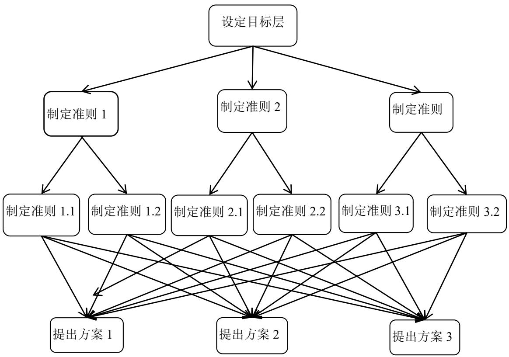

# 第 2 章 基本概念与理论基础

本章首先将详细阐述商业银行跨境汇款的定义、特点和意义；然后，对个人跨境汇款业务可能面临的各种风险相关理论进行阐述，为后续风险评估提供理论基础；最后，详细介绍本文所运用的风险评估方法：层次分析法和模糊综合评价法，说明其在研究中的合理性和适用性。

# 2.1 跨境汇款业务内涵

# 2.1.1 跨境汇款业务的定义

张东阳（2016）指出跨境汇款业务是指将资金从一个国家或地区转移到另一个国家或地区的金融行为。这种业务通常由个人、企业或金融机构发起，以满足各种跨国贸易、个人汇款、投资和其他跨境金融活动的需求。跨境汇款业务的核心是资本、资金和金融服务在国家之间的流动[29]。这种业务通常涉及不同国家的货币转换和跨国银行或金融机构之间的资金传递。在跨境汇款过程中，通常会涉及到国际支付系统、汇款服务提供商以及外汇兑换等多个环节。在跨境汇款业务中，资金通常以本地货币的形式从一个国家的银行账户、金融机构或汇款服务提供商发送到另一个国家的相应账户。这种跨国资金转移可能涉及不同货币的兑换、国际支付网络的参与以及符合两国或多国相关法规的要求。

跨境汇款业务为全球经济带来了很多机会，但同时也带来了风险，包括外汇风险、国家风险、法律和监管风险等。因此，进行这类业务的金融机构通常会有一套完善的风险管理策略和机制[30]。

个人跨境汇款在我国主要为个人境内外收汇款，是指个人客户委托 Z 商业银行境内机构，将一定金额的款项支付给境内外指定收款人的结算方式（不含同一客户号下的本外币活期转定期和定期转活期、客户账转BGL、BGL 转客户账、本人本行贷款和信用卡还款、结售汇及外币兑换业务）[31]。当事各方定义如下：

（1）汇款人：指汇款资金的来源者。发起跨境汇款的个人或企业，他们希望将资金转移到另一个国家或地区。

（2）申请人：指申请办理个人境内汇款的人员。在汇款人本人办理业务的情况下，申请人即为汇款人；在他人代理汇款人办理业务的情况下，申请人为代

理人。

（3）收款人：指汇款资金的接收者。接收跨境汇款的个人或企业，他们是资金的最终收款人。

（4）汇款行：指汇出款项的境内银行。

（5）收款行：指接收汇款的境内银行。

跨境汇款业务在推动全球经济发展和国际贸易中扮演着重要的角色。然而，由于涉及不同国家的法规、税收政策和监管体系等差异，跨境汇款业务也面临着各种风险和复杂性。在进行跨境汇款业务时，个人或机构需要了解相关国家的法律法规，确保合规操作，并谨慎评估和管理风险。

# 2.1.2 跨境汇款业务的相关特点

唐嘉靖（2022）指出跨境汇款业务的特点使得个人和机构能够在全球范围内进行金融活动，促进了国际贸易、投资和经济发展[32]。然而，涂开均（2018）提到也需要注意风险管理和合规操作，以确保跨境汇款交易的安全性和可持续性[33]。

（1）汇款和资金流动

个人跨境汇款业务通常涉及资金的跨国转移，例如个人在不同国家之间进行汇款或资金投资，这种资金流动涉及货币兑换、跨境支付和汇率风险管理等方面。

# （2）投资多样性和风险

个人跨境投资能够提供投资多样化的机会。个人可以选择在不同国家或地区的金融市场投资，包括股票、债券、基金、房地产等[34]。然而，同时也需要考虑各国经济和政治环境的风险，以及外汇风险等。

（3）财富管理和税收

个人跨境汇款业务可能需要管理跨国境的财富，包括管控和规划海外资产[35]。此外，由于不同国家的税收政策的差异，个人需要了解和遵守相关的税收法规，以确保合规和权益保护。

（4）法律合规和监管要求

个人跨境汇款业务需要遵守不同国家或地区的法律法规和监管要求，可能涉及身份认证、合规审查、资金来源调查等方面。

# （5）金融科技的应用

个人跨境汇款业务受益于金融科技的发展。例如，数字支付工具、电子身份认证、区块链等技术创新提供了更便捷、安全和高效的跨境汇款服务[36]。

（6）风险管理和信息安全

个人在进行跨境汇款业务时需要注意风险管理和信息安全。保护个人隐私和防范网络安全风险是非常重要的。

个人跨境汇款业务的特点使个人能够在全球范围内获取投资机会和管理财富。然而，个人需要了解不同国家之间的差异，合规操作，并仔细评估和管理风险，以确保个人的财务安全和合法权益。

# 2.1.3 跨境汇款业务的相关意义

张爱玲（2022）提出跨境汇款业务具有广泛的相关意义，对全球经济和金融市场发挥着重要作用，个人跨境汇款业务为个人提供了更多的金融选择、投资机会和财务管理灵活性。通过参与跨境汇款业务，个人可以更好地实现资本增值、风险管理和实现个人财务目标，具有以下意义[37]：

（1）促进国际贸易与投资

跨境汇款业务为国际贸易和投资提供了必要的金融支持。它促进了货物和服务的国际交流，并促进了资本在不同国家之间的流动，有助于加深全球经济一体化程度[38]。

# （2）扩大市场和机会

跨境汇款业务为企业和个人提供了更广阔的市场和投资机会。它使得用户可以在全球范围内获取金融产品和服务，从而增加了选择的多样性和灵活性[39]。

# （3）风险管理和多元化

跨境汇款业务为企业和个人提供了风险管理和多元化投资的机会[40]。通过跨国投资和利用不同国家的金融市场，投资者可以分散风险、降低投资组合的波动性，并提高整体回报。

# （4）资金流动与金融稳定

跨境汇款业务有助于促进资金的自由流动，提高资本市场的效率和流动性[41]。它还可以平衡不同地区之间的资金供求关系，并促进金融市场的稳定与发展。

# （5）利益和技术交流

跨境汇款业务为不同国家和地区的金融机构提供了合作与交流的机会。通过合作，金融机构可以共享经验和知识，提高业务能力和创新能力，同时促进国际金融标准和最佳实践的推广[42]。

# （6）经济增长和发展

跨境汇款业务有利于促进经济增长和发展。它为企业提供了获得资金和扩大业务的机会，为个人提供了投资和财富管理的途径，同时也为国家和地区提供了税收和就业机会[43]。

跨境汇款业务推动了全球化、国际化市场的发展，扩大了市场和机会，提供了风险管理和多元化投资的途径，促进了经济增长和发展。然而，跨境汇款业务也面临一些挑战，如监管合规、风险管理和信息安全等方面的问题，因此需要在合适的框架下进行有效监管和风险控制[44]。

# 2.1.4 跨境汇款业务的主要风险

（1）汇率风险

陈娉婷（2023）提到跨境汇款交易可能涉及不同货币之间的兑换，由于汇率的波动，个人在进行兑换时可能面临汇率亏损的风险[45]。汇率变动可能使得外汇资产的价值发生波动，影响个人的投资收益。

$\textcircled{1}$ 影响投资回报率：汇率的波动可能对个人的投资回报产生直接影响。如果个人持有外国资产，汇率的变化可能导致资产价值的波动，影响投资组合的整体表现。

$\textcircled{2}$ 影响购买力：汇率波动可能会影响个人在国际市场上的购买力。当本国货币贬值时，购买外国商品和服务的成本可能会增加，反之则会减少。

$\textcircled{3}$ 影响企业和贸易：汇率波动对企业的进出口业务和国际贸易也具有重要影响。企业在进行国际贸易时需要考虑汇率波动，以避免对财务状况造成不利影响。

$\textcircled{4}$ 影响汇款和国际支付：个人进行汇款或进行国际支付时，汇率波动可能会影响到转账金额，使接收方收到的款项不同于预期[46]。

$\textcircled{5}$ 有效管理汇率风险对于个人和企业至关重要，可能包括使用金融工具如远期合同、期权和利率互换来对冲汇率波动，或者定期监控汇率并采取适时的行动以降低风险。同时，了解宏观经济因素和政治动态对汇率的影响也是必要的。

# （2）政治和经济风险

马园（2022）提及不同国家或地区的政治和经济环境存在不确定性，政策调整、政治动荡、经济衰退等因素会对跨境汇款业务产生风险影响。

$\textcircled{1}$ 政策调整：不同国家或地区可能会调整其金融政策、法规和监管框架，以适应新的经济和政治情况，这些调整可能会对跨境汇款业务造成直接或间接的影响。例如，某国政府可能会实施新的货币政策，引入新的汇率调控措施，或调整

对外资的准入规定。

$\textcircled{2}$ 政治动荡：政治动荡、社会不稳定或战乱可能导致经济环境剧烈变动，对跨境汇款业务产生负面影响，可能导致投资环境的不确定性增加，商业活动受到干扰，引发资本外流和汇率剧烈波动。

$\textcircled{3}$ 经济衰退：经济衰退可能对跨境汇款业务产生影响，降低市场的活力和增长潜力。在经济不景气时期，企业可能缩减投资计划、减少进口和出口活动，个人可能减少消费和投资，这可能导致市场的不确定性和风险增加。

$\textcircled{4}$ 市场表现：已开放的跨境汇款市场受到全球经济变化和涉及国家的政治事件的影响。政治和经济环境不稳定性可能导致股市、债券市场和外汇市场等的价格波动。投资者和参与者需要密切关注市场情况，并采取相应措施来管理风险[47]。

（3）法律和合规风险

马宁（2020）提及跨境汇款业务需要遵守不同国家或地区的法律和监管规定。个人在进行跨境交易时需要了解和遵守相关的法律法规，否则可能会面临罚款、处罚甚至法律诉讼的风险[48]。

$\textcircled{1}$ 法律多样性：不同国家和地区拥有不同的法律体系和法律框架，这包括金融监管、合同法、知识产权法、税法等。因此，参与跨境汇款业务的个人需要了解并遵守相关的国内和国际法律法规，以确保他们的交易和活动是合法的[49]。

$\textcircled{2}$ 监管要求：跨境汇款业务通常受到金融监管机构的监管。个人需要了解并遵守这些监管要求，包括开立银行账户、合规报告、反洗钱（AML）和反恐怖融资（CFT）要求等。违反监管规定可能会导致罚款、处罚或其他法律后果。

$\textcircled{3}$ 合同和协议：跨境汇款交易通常涉及合同和协议，个人需要确保这些文件在法律上有效且完全遵守。不合规的合同可能会导致争端，甚至法律诉讼。

$\textcircled{4}$ 税务合规：税务规定因国家而异，个人需要了解如何申报和支付相关税款。未正确遵守税法可能会导致罚款和法律纠纷。

$\textcircled{5}$ 国际制裁和禁运：一些国家和国际组织实施了国际制裁和禁运措施，限制了与某些国家或实体的金融交易。个人需要确保他们的交易不违反这些制裁措施，否则可能会面临法律后果。

$\textcircled{6}$ 合规审查：在某些情况下，金融机构可能需要进行客户合规审查，以确保客户的身份和活动合法合规。不提供所需的信息或不参与审查可能会阻碍交易或导致账户被冻结。

为了降低法律和合规风险，谢斐（2021）表示个人应该谨慎遵守适用法律法

规，遵循合同和协议，定期更新自己的知识以应对法律和监管的变化，寻求专业法律建议，以及与金融机构合作以确保合规[50]。此外，建立强大的合规文化和流程对于确保跨境汇款业务的合法性和合规性非常重要。

# （4）信用风险

王熙晶（2020）提及个人在进行跨境汇款业务时与其他个人或机构进行资金往来，存在信用风险。对方可能违约不履行合同义务，导致个人遭受经济损失[51]。

$\textcircled{1}$ 违约风险：信用风险的核心是违约风险，即对方可能无法按照合同条件履行其义务[52]。这可能包括无法按时偿还贷款、支付应付款项、提供承诺的产品或服务等。违约可能是因为对方的财务困难、经营问题、法律问题或其他因素导致的。

$\textcircled{2}$ 对手方信用评级：在跨境汇款交易中，个人可以使用对手方的信用评级来评估其信用风险。信用评级机构对企业和机构进行评级，以反映其偿债能力和信用可靠性。个人可以借助这些评级来判断是否与某一方进行交易[53]。

$\textcircled{3}$ 多元化投资组合风险：为降低信用风险，个人可以通过分散投资来减轻可能的损失。将资金分散到不同领域、不同资产类别或不同国家的投资中。

对于个人来说，了解信用风险并采取相应的风险管理措施非常关键。与专业金融顾问或法律顾问合作，以评估信用风险并制定适当的战略是明智的做法，可以帮助降低风险并保护个人的财务稳定性[54]。

# （5）流动风险

郑棣（2014）提及跨境汇款交易可能面临资金流动性的限制和延迟[55]。例如，跨境汇款可能受到转账延迟或限制，跨境交易的清算和结算时间可能较长，个人可能需要在资金到账前面临等待的时间。

$\textcircled{1}$ 汇款延迟和限制：跨境汇款可能会受到多种因素的影响，如银行处理时间、国际支付系统的运行情况、外汇管制等，可能导致汇款的延迟或受到一定金额的限制。

$\textcircled{2}$ 清算和结算时间：跨境交易的清算和结算可能需要较长的时间，特别是涉及不同国家或地区的法定结算周期以及国际交易系统的运作。在此期间，资金可能被锁定，无法用于其他投资或支出。

$\textcircled{3}$ 汇率波动：汇率的波动可能会影响资金的实际价值。如果资金需要在一段时间内保持在外币账户中，汇率的变化可能会导致其相对于本国货币的价值发生变化。

$\textcircled{4}$ 资金转移受限：一些国家可能会实施外汇管制措施，限制个人将资金转移到境外的数量和频率，可能会对跨境汇款业务产生直接影响。

$\textcircled{5}$ 资金的紧迫性需求：在某些情况下，个人可能需要在短时间内获得资金，但由于跨境交易的限制或延迟，可能无法满足紧急资金需求。

总的来说，了解并有效管理流动风险对于参与跨境汇款业务的个人非常重要。通过采取相应的策略和措施，个人可以降低流动风险并保护自己的财务稳定性。

# （6）监管风险

孙雅婷（2021）提及个人参与跨境汇款业务必须遵守各国的监管要求和法律法规。如果未能遵守规定，个人可能面临法律风险和监管处罚[56]。

$\textcircled{1}$ 法律遵守风险：个人需要了解和遵守各国相关的法律法规。不同国家和地区可能有不同的法律框架，尤其是涉及金融业务的法律。未能遵守法律要求可能会导致法律风险，可能面临罚款、处罚或法律诉讼等后果。

$\textcircled{2}$ 监管合规风险：跨境汇款业务受到监管机构的监管。个人必须了解并遵守相关的监管要求和合规要求，如反洗钱（AML）规定、反恐怖融资（CFT）法规、客户身份验证和 KYC（了解你的客户）等，未能满足监管合规要求可能会导致监管处罚和金融机构的限制[57]。

$\textcircled{3}$ 国际合规标准：除了个别国家的监管要求外，国际组织和标准制定机构也制定了涉及跨境汇款业务的全球合规标准。例如，国际货币基金组织（IMF）和金融行动特别工作组（FATF）发布的合规标准。个人需要关注这些标准，并确保他们的跨境汇款业务符合国际合规标准[58]。

$\textcircled{4}$ 客户合规审查：在一些情况下，金融机构可能要求进行客户合规审查，以确保个人的身份和资金来源合规合法。不提供所需信息或无法通过合规审查可能会阻碍交易或导致账户被冻结。

$\textcircled{5}$ 监管变化和新规定：监管环境可能会发生变化，监管机构可能会引入新的规定和要求。个人需要积极关注监管动态，了解新规定并相应调整其业务流程和操作以符合最新的监管要求。

最终，个人在进行跨境汇款业务时，确保符合法律法规和监管要求是至关重要的。遵守合规标准可以降低法律风险和监管风险，并维护个人的声誉和财务稳定性。

# （7）信息安全和隐私风险

陶蔚（2018）研究表明个人在进行跨境汇款业务时应当认识到信息安全和隐私风险，并采取相应的风险管理措施，以降低风险并确保个人财务安全。此外，获取专业咨询和了解目标市场的法律法规是非常重要的[59]。提到在跨境汇款交易中，个人的信息和资金往来可能面临信息泄露、网络攻击、诈骗等风险。个人需要注意信息安全和隐私保护，选择安全可靠的金融机构和交易平台进行跨境汇款业务。

$\textcircled{1}$ 信息泄露风险：个人在跨境汇款业务中提供的敏感信息，如个人身份信息、银行账户信息等可能面临信息泄露的风险[60]。这可能是因为网络攻击、数据泄露、内部失职等原因导致的。

$\textcircled{2}$ 网络攻击风险：金融机构和跨境汇款交易平台都面临网络攻击的风险。黑客可能尝试获取个人的敏感信息，如用户名、密码、交易记录等，以用于非法目的。

$\textcircled{3}$ 诈骗风险：跨境汇款交易中存在诈骗风险，个人可能接收到虚假的电子邮件、短信或电话，引诱他们提供个人信息或进行欺诈性交易。

$\textcircled{4}$ 弱密码和安全措施：个人在使用跨境汇款服务时如果使用简单和易猜测的密码，或者未采取适当的安全措施（如双重身份验证），可能会增加信息安全风险。

$\textcircled{5}$ 第三方数据共享和合作：在某些情况下，金融机构可能与第三方合作伙伴共享个人信息，如金融科技公司或支付服务提供商[61]。在此过程中，个人的信息可能会面临隐私风险。

总之，对于金融机构来说，保障客户信息安全和隐私的责任也非常重要。应该采取必要措施来保护个人信息，并遵守相关的隐私保护法律和法规，个人在参与跨境汇款业务时，应当高度关注信息安全和隐私保护，通过选择可靠的金融机构、强化个人安全意识和采取适当的保护措施，可以降低信息安全和隐私风险，并确保个人的资金和信息得到妥善保护。

# 2.2 风险管理相关理论

# 2.2.1 风险管理相关概念及理论

风险管理的演变有着相对连续的历史脉络，50年代末和60年代初“风险管理”一词起初由 Russell B. Gallagher 提及，开始将这一概念应用于保险领域[62]。不过，风险管理的理念在那个时期并未被广泛采用。

风险管理模式是一种系统性的方法论，用于识别、评估、应对和监控风险，以降低不确定性对组织或项目的影响。以下是常见的风险管理概念及理论：

（1）传统风险管理模式

传统的风险管理模式通常包括风险识别、风险评估、风险控制和风险监控等步骤。这种模式侧重于在项目或活动的各个阶段识别和评估风险，并采取措施控制和监控风险。

# （2）整体风险管理模式

整体风险管理模式强调将风险管理整合到组织的战略和运营中。这种模式考虑了各种类型的风险，包括战略风险、运营风险、合规风险等，以确保风险管理与组织目标的一致性。

（3）ERM（Enterprise Risk Management）框架

企业风险管理框架是一种综合性的风险管理模式，涵盖了组织范围内的所有风险。ERM 框架强调将风险管理整合到组织的战略、决策和业务流程中，以实现风险管理的全面性和连续性。

（4）ISO 31000 风险管理标准

ISO 31000是国际标准化组织发布的风险管理标准，提供了一种通用的风险管理框架，包括风险管理的原则、过程和步骤。该标准强调风险管理的整体性、持续性和系统性。

（5）金融风险管理模型

金融领域的风险管理模型主要用于评估金融投资组合的风险和收益。常见的模型包括价值-at-风险（VaR）、蒙特卡洛模拟等方法。

（6）项目风险管理模型

项目风险管理模型是针对特定项目实施的风险管理方法，通常包括风险识别、风险分析、风险应对和风险监控等阶段。常见的模型包括 PMI（ProjectManagement Institute）发布的项目管理体系和 PRINCE2（Projects IN ControlledEnvironments）项目管理方法等[63]。

风险管理的范围和方法都在不断演进，从最初的风险转移和保险概念，扩展到更加综合的风险识别、评估、控制和监控。同时，全球化的趋势也促进了风险管理理念的传播和应用，使得企业在不同国家和地区都开始重视和实践风险管理。

风险管理是一种综合性的方法和过程，用于识别、评估、监控和应对潜在的风险，以降低风险对组织或个人造成的损失和负面影响。风险是指不确定性带来的潜在损失或不利影响，它可能来源于内部或外部的因素，包括经济、金融、技术、法律、环境等方面，通过识别、评估、监控和控制风险，以最大限度地实现组织或个人的目标，它涉及制定策略、程序和措施，以减少或控制风险，并提供应对风险的准备和减轻损失的措施[64]。风险评估是对潜在风险进行系统性、综合性的分析和评估，以确定其可能性和影响程度，是指对潜在风险进行系统化的分析和评估，以确定其可能性、影响程度和优先级[65]。风险识别是通过收集信息、开展研究和分析，确定与组织或个人目标相关的潜在风险，涉及对内外部环境进行全面的审查和分析，以确定可能出现的风险事件。风险分析是对已识别的风险进行详细的分析，以了解其发生的概率、可能的影响和相关因素，可以通过统计数据、历史信息、专家意见等进行定量或定性分析。风险控制是通过采取相应的措施和策略来减少或控制风险的发生和对组织或个人产生的负面影响，包括风险避免、风险转移、风险减轻和风险接受等策略。风险监控是对已实施的风险管理措施进行定期和持续的跟踪和监测，以评估其有效性和适应性，旨在确保风险管理措施与风险情况的演变相匹配，并及时采取调整和改进措施[66]。

综上，全面风险管理包括确定企业风险管理总体目标、系统性识别和评估各类风险、制定风险控制方案以及监管措施的实施[67]。

# 2.2.2 风险管理模式

风险管理模式是指组织或个人在面对潜在风险时，所采取的一系列系统化、结构化的管理策略和方法。这些策略和方法旨在识别、评估、控制、转移或规避风险，以减少风险对组织或个人带来的不利影响，并确保其稳健运营和持续发展。具体来说，风险管理模式包括以下几个关键步骤：

# （1）风险识别

这是风险管理的第一步，涉及对潜在风险进行系统的识别和分类。通过识别潜在风险，组织或个人可以更好地了解自身面临的风险状况。

# （2）风险评估

在识别出潜在风险后，需要对其可能性和影响程度进行评估。这有助于确定哪些风险是主要的、需要优先考虑的，以及哪些风险是次要的、可以相对忽视的。

# （3）风险控制

根据风险评估的结果，制定相应的风险控制策略。这些策略可能包括采取预防措施来降低风险发生的可能性，或者制定应对措施来减轻风险带来的损失。

# （4）风险转移

在某些情况下，组织或个人可能无法完全控制或避免某些风险。此时，可以通过购买保险、签订合同或与其他实体共享风险等方式来转移风险。

# （5）风险监控

在风险控制措施实施后，需要持续监控风险的变化情况。这有助于及时发现新的风险或风险的变化趋势，并采取相应的应对措施。

# （6）风险报告

定期向组织或个人的管理层报告风险状况和管理情况。这有助于管理层了解风险管理的效果，并作出相应的决策。

不同的组织或个人可能会采用不同的风险管理模式，以适应其特定的风险状况和管理需求。然而，无论采用何种模式，风险管理都应该是一个持续不断的过程，需要不断地识别、评估、控制和监控风险，以确保组织或个人的稳健运营和持续发展。

# 2.3 风险评价方法

# 2.3.1 层次分析法

# （1）概念

层次分析法（Analytic Hierarchy Process，AHP）是一种多标准决策分析方法，最初由美国数学家托马斯·萨蒂（Thomas L. Saaty）在 1970 年代提出并发展[69]。AHP 广泛应用于多个领域，包括工程、经济、管理、环境、医疗和政策制定等，用于帮助决策者在面对复杂问题时做出合理的决策。

郭金玉（2008）在研究与应用中提及 AHP 的核心概念是将一个复杂的决策问题层次化，将其分解成多个层次，从总体到细节逐级展开，以更容易处理和分析。AHP 的主要组成部分包括：

$\textcircled{1}$ 目标层（Goal Level）：这是决策问题的最高级别，通常代表整个决策问题的总体目标。在目标层下可以有若干个准则层。

$\textcircled{2}$ 准则层（Criterion Level）：在准则层下，将问题分解为若干个关键准则或因素，这些准则对于实现目标具有重要性。准则层下可以进一步细分为子准则层，以更好地描述问题。

$\textcircled{3}$ 方案层（AlternativeLevel）：在方案层，列出了用于实现目标的不同决策选项或方案，这些方案可以是不同的项目、政策、产品或策略。

$\textcircled{4}$ 比较和评估：在AHP 中，决策者需要对不同层次的因素和方案进行两两比较，以确定它们之间的相对重要性，通常通过创建成对比较矩阵来完成，其中每个元素表示一个因素或方案与另一个因素或方案的比较结果。

$\textcircled{5}$ 一致性检验：为了确保比较矩阵的一致性，AHP 引入了一致性检验，以评估决策者的比较是否合理和可信。如果比较矩阵不一致，决策者需要重新考虑比较，直到达到一致性要求。

$\textcircled{6}$ 计算权重和优选方案：通过对比较矩阵进行数学计算，AHP 可以计算出每个因素和方案的权重，然后使用这些权重来确定最优的决策选项。通常，最大特征值法和一致性指标法用于计算权重[70]。

层次分析法的优势在于它提供了一种结构化的方法来处理复杂的多标准决策问题，允许决策者考虑多个因素和不同层次的目标。然而，它也需要精心设计比较矩阵和进行一致性检验，以确保评估结果的可信度和有效性。

# （2）特征

层次分析法以其能够将问题分解、层次化处理、比较矩阵构建和数学计算等特征，成为一种强大的多因素决策分析工具。具体总结有以下特征[71]：

$\textcircled{1}$ 层次结构：AHP 使用层次结构来组织和描述决策问题的不同层次和因素，问题被分解为层次，包括目标、准则、子准则和备选方案等，这有助于更系统地理解和处理复杂的决策。

$\textcircled{2}$ 比较矩阵：AHP 基于构建比较矩阵来评估不同因素之间的相对重要性，通过矩阵中元素的两两比较，确定因素之间的权重或优先级，使得这些比较能够量化和计算。

$\textcircled{3}$ 一致性检验：AHP 包含一致性检验，以确保矩阵的合理性和可靠性，这种检验有助于确定所做的两两比较是否存在不一致性，如果存在，可能需要重新审视判断矩阵或者调整评价。

$\textcircled{4}$ 权重和优先级计算：基于比较矩阵的数据，AHP 使用特定的数学模型来计算每个因素的权重和优先级，这些权重用于最终的决策结果，能够帮助决策者更明智地做出选择。

$\textcircled{5}$ 一致性指数和一致性比率：AHP 通过一致性指数和一致性比率来评估和量化判断矩阵的一致性程度，这有助于确定决策者的判断是否具有逻辑一致性，有助于提高决策过程的可信度。

$\textcircled{6}$ 灵活性和适应性：AHP 可适用于各种决策问题，不受特定领域或行业的限制，其方法和理念可以灵活应用于不同领域，从战略规划到资源分配等各种决策场景。

$\textcircled{7}$ 专家参与和主观性处理：AHP 允许多个决策者或专家参与，并处理他们的主观评价，它能够将不同意见和偏好融合在一起，提供一个综合的决策依据。

（3）步骤$\textcircled{1}$ 构建层次结构

首先，定义决策问题的总体目标。这是整个分析的起点，涉及确定决策的最终目标。其次，将目标细化为一组具体的准则，准则是影响决策的因素，它们应该是相对独立且可度量的。最后，将目标和准则按照它们之间的层次关系排列，形成一个层次结构。通常，层次结构呈树状，从目标到准则再到子准则，直到最底层的决策方案[69]。结构模型图如图2.1所示。

  
图 2.1 层次分析法结构模型  
Figure 2.1 Analytic hierarchy process structure model

$\textcircled{2}$ 制定比较矩阵

对每一对层次结构中的元素进行两两比较，确定它们之间的相对重要性。比较矩阵的元素值反映了一个元素相对于另一个元素的重要性程度，这些值通常由

专家主观给定。

在AHP 中，通常规定对角线元素 $a _ { i j }$ 为1，因为每个元素相对于自身的重要性是相等的。此外， $n$ 个元素进行比较，那么用 $A = ~ ( a _ { i j } ) ~ n ^ { * } n$ 来表示成对比较矩阵，由于 $a _ { i j }$ 的倒数与 $a _ { i j }$ 的关系相同，所以 $a _ { i j } { = } 1 / \mathbf { X } _ { i j }$ ，其中 $\mathbf { X } _ { i j }$ 是对应的 $a _ { i j }$ 的值。

表 2.1 层次分析法比例标度表  
Table 2.1 Scale table of Analytic hierarchy process   

<table><tr><td>aij的赋值</td><td>i与j相比较，i对上层元素</td></tr><tr><td>1</td><td>具有同样的重要性</td></tr><tr><td>3</td><td>略重要</td></tr><tr><td>5</td><td>重要</td></tr><tr><td>7</td><td>重要得多</td></tr><tr><td>9</td><td>极其重要</td></tr><tr><td>aij=2n (n=1,2,3,4)</td><td>重要性在 aij=2n-1 与 aij=2n+1 之间</td></tr></table>

$\textcircled{3}$ 层次单排序及其一致性检验

对每个成对比较矩阵计算其最大特征值以及对应的特征向量。特征向量经过归一化处理，得到权重向量，表示相对重要性。对每个成对比较矩阵进行一致性检验，计算一致性指标CI和一致性比率 $C R$ ， 确保专家判断的一致性。

$\textcircled{4}$ 算出组合向量同时进行一致性的检验

将每层的目标按其权重组合，形成总权重向量，表示每个方案对总目标的相对重要性。对总权重向量进行一致性检验，确保整个层次结构的一致性。

首先计算出一个度量成对比较矩阵 $A$ 不一致水平的指标来表示一致性指标λ A - n  max（ ） CI=0，有完全的一致性；CI 接近于 0，有满意的一致性；CI越大，不一致越严重。

再根据下表2.2 找出相应的随机一致性指标 $R I$ ，计算出一致性指标 $C R { = } C I / R I _ { \circ }$

表 2.2 层次分析法比例标度表  
Table 2.2 Average random consistency index $R I$ standard value   

<table><tr><td>矩阵阶数</td><td>1</td><td>2</td><td>3</td><td>4</td><td>5</td><td>6</td><td>7</td><td>8</td><td>9</td><td>10</td></tr><tr><td>RI</td><td>0</td><td>0</td><td>0.58</td><td>0.90</td><td>1.12</td><td>1.24</td><td>1.32</td><td>1.41</td><td>1.45</td><td>1.49</td></tr></table>

如果 $C R { < } 0 . 1$ ，则认为该判断矩阵通过一致性检验，否则就不具有满意一致性[71]。

# 2.3.2 模糊综合评价法

# （1）概念

模糊综合评价法是一种基于模糊数学理论的综合评价方法，这个方法的提出主要与美国自动控制专家查德（L.A. Zadeh）的模糊数学理论相关。韩利（2004）表示模糊综合评价法的核心思想是将模糊的数据和知识转化为可量化的评价结果。与传统的二值逻辑不同，模糊逻辑允许在评价过程中使用模糊概念，如可能性、可信度或模糊变量。模糊综合评价法的优势在于它能够处理模糊和不确定性的信息，并提供一种灵活的决策框架。它适用于许多领域，如风险评估、投资决策、绩效评估、环境评价等。然而，模糊综合评价法也需要合理的指标选择、权重设定和模糊集构建，以确保评价结果的准确性和可信度[72]。

（2）特征

$\textcircled{1}$ 互相比较：构建模糊比较矩阵，用于表达不同因素之间的相对重要性或影响程度。

$\textcircled{2}$ 隶属度函数：用于量化评价值与评价因素之间的关系，通常通过专家判断、F统计方法、F 分布等方式确定。

$\textcircled{3}$ 处理不确定性和模糊性：传统的评价方法通常假设数据和关系是明确和确定的，而模糊综合评价法通过引入模糊概念和模糊集，能够更好地处理不完全和模糊的信息。

$\textcircled{4}$ 灵活性和可扩展性：模糊综合评价法具有灵活性和可扩展性，可以适应各种不同类型的评价问题。它可以与其他模型、方法和技术结合使用，以满足具体问题的需求。

$\textcircled{5}$ 知识与经验的利用：模糊综合评价法允许利用专家知识和经验。通过专家的主观判断和定量化的方式，将模糊的知识和经验转化为可量化的评价结果。

$\textcircled{6}$ 多指标综合：模糊综合评价法可以同时综合多个评价指标，考虑多个因素对决策结果的影响，使得决策可以综合考虑多个方面的要素，更全面地评估和选择。

$\textcircled{7}$ 适应不同权重：模糊综合评价法允许为评价指标设定不同的权重，反映其在决策中的相对重要性，可以根据实际需求和决策目标，灵活地权衡和调整不同因素的重要性[70]。

需要注意的是，模糊综合评价法也有其局限性。首先，它依赖于准确的指标和权重设定，对数据的收集和处理有一定的要求。其次，结果的解释和实际情况的关联需要综合考虑，以确保评价结果的有效性和可靠性。因此，在应用模糊综合评价法时，需要结合具体问题和环境条件，进行合理的数据处理和分析，以及权衡其优缺点。

（3）步骤

$\textcircled{1}$ 确定评价集合：首先，确定模糊综合评价的相关指标，形成评价系统的集合表示 $U { = } \{ U _ { I }$ ， $U _ { 2 }$ ， $U _ { 3 }$ ，…， $U _ { M }$ ﹜， $U _ { 1 }$ 是指影响评价目标的第i 个元素，这些元素的特征是具有一定的模糊属性。

$\textcircled{2}$ 层次分析法构建权重向量：结合层次分析法，对评价指标进行层次化组织，然后通过专家判断或其他方法构建权重向量，反映各因素在整体评价中的相对重要性 $V _ { o } \subset V = \{ \ V _ { I } , \ V _ { 2 } , \ \cdots , \ V _ { \bf n } \ \}$ ，其中 $V _ { 1 }$ 表示第i 种评价结果。

$\textcircled{3}$ 建立模糊关系评价矩阵：利用上一步得到的权重向量，建立模糊关系评价矩阵。将 $U$ 集合中第 $h$ 个元素对 $V$ 集合中第一个元素隶属度设置为 $R h _ { I }$ ，则对第$h$ 个元素单因素评价的结果可以表示为： $R h { = } ~ ( R h _ { I }$ ， $R h _ { 2 }$ ，…，Rhn）（ $h { = } 1$ ，2，$3 { \cdots } n \textgreater$ ）， $m$ 个单因素评价集 $R _ { I }$ ， $R _ { 2 }$ ， $R _ { 3 } \cdots$ ， $R \mathrm { m }$ 为行形成矩阵 $R \mathrm { m } { * } \mathrm { n }$ ，该矩阵反映了不同因素之间的相对影响程度，通常通过专家意见或其他方法进行构建。

$\textcircled{4}$ 评估单一因素的隶属度：对于单一因素的隶属度计算，可以采用模糊统计方法。涉及模糊集合的概念，以及对于每个评价对象对某个因素的隶属度的计算，可通过专家意见或其他方法得到。

$\textcircled{5}$ 合成评价矩阵和权重：将单一因素的隶属度与模糊关系评价矩阵和权重进行合成，得到综合的评价结果向量，可以通过模糊加权平均等方法来实现。

$\textcircled{6}$ 解释结果向量：最后，解释评价结果向量，以支持对评价集合中各评价对象对其的隶属度的分析。将 $U$ 上的模糊向量 $A$ 变为 $V$ 上的模糊向量 $B$ 。 $B { = } A ^ { * } R$ ，即可获得相应得分。

$$
R = { \left[ \begin{array} { l l l l } { r _ { I I } } & { r _ { I 2 } } & { \dots } & { r _ { I n } } \\ { r _ { 2 I } } & { \dots } & { \dots } & { r _ { 2 n } } \\ { \dots } & { \dots } & { \dots } & { \dots } \\ { r _ { m I } } & { r _ { m 2 } } & { \dots } & { r _ { m n } } \end{array} \right] }
$$

最终，用模糊关系矩阵 $R$ 乘以评价对象权重 $A$ 的结果来表示被评价对象的模糊综合评价 $B$ ：

$$
A * R = ( a l , \ a 2 _ { r } . . . , \ a i ) \ R = { \left[ \begin{array} { l l l l } { r 1 I } & { r 1 2 } & { \dots } & { r l n } \\ { r 2 I } & { r 2 2 } & { \dots } & { r 2 n } \\ { \dots } & { \dots } & { \dots } & { \dots } \\ { m n I } & { m 2 } & { \dots } & { m n } \end{array} \right] } = ( b l , \ b 2 _ { \cdot } . . . , b m ) = B
$$
