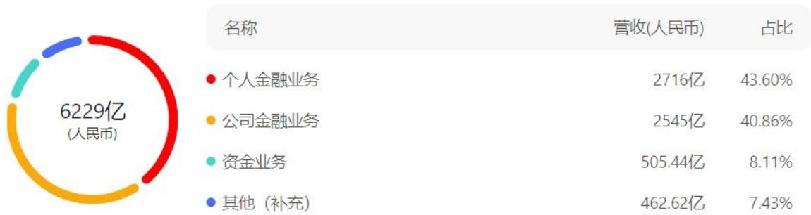
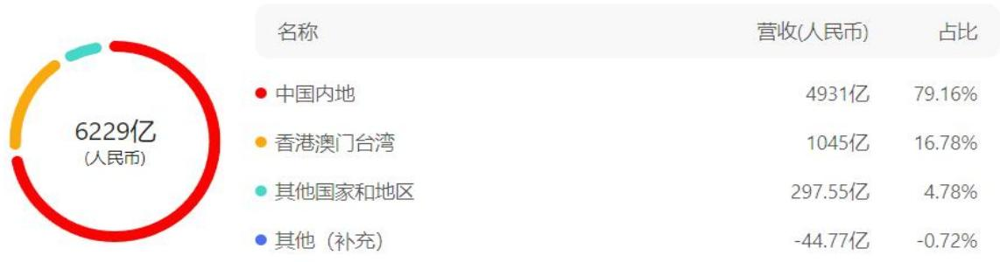
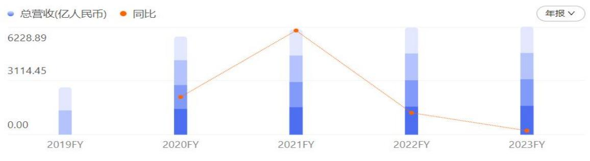
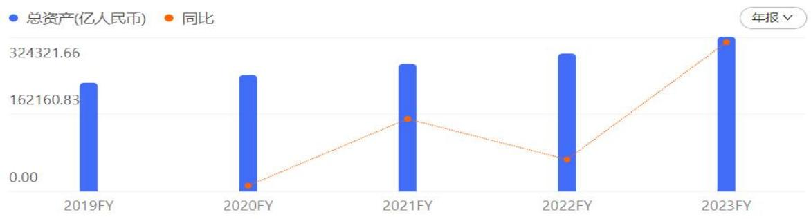
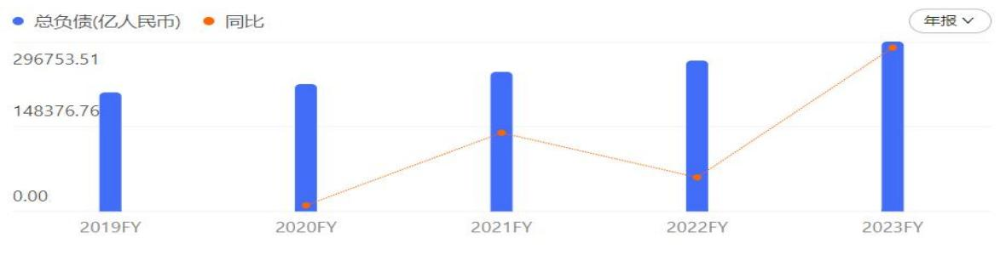
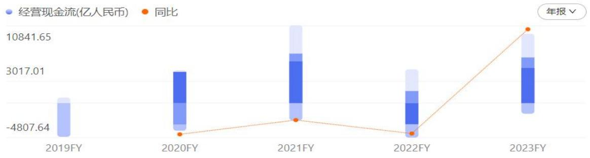
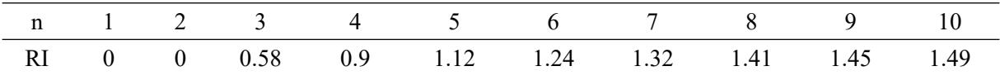

# 第 1 章 绪论

# 1.1 研究背景

党的二十大报告指出，要加强和完善现代金融监管，依法将各类金融活动全部纳入监管，推进高水平对外开放，增强国内国际两个市场两种资源联动效应，稳步扩大规则、规制、管理、标准等制度型开放。跨境交付类金融服务的开放与监管是我国推进高水平对外开放、完善现代金融监管的一个重要方面，所谓个人跨境金融服务，主要包括出境旅游、出国留学、对外劳务合作、个体工商户对外贸易等场景个人跨境业务需求。然而，由于对监管要求缺乏认知，个人常常面临跨境业务的混淆问题，有些情况下还会出现违规。本文以 Z 商业银行境内风险即个人境内汇出汇款、境外风险即个人境外汇入汇款为研究对象，表面上看，客户和服务提供者似乎都未跨境，但实际上实现了金融产品或服务的跨境交易。数字环境模糊了国界，跨境交付模式下的金融服务涉及金融牌照的国界问题，涉及金融主权问题，开放度在不断提高，但前提是监管要能跟得上[1]。

因此，我们需要加大金融监管的力度，确保所有金融活动都纳入监管范围，同时也要加强跨境交付类金融服务的监管，确保其符合国家利益和法律规定。现阶段，我们已经建立相对健全的跨境交付类金融服务监管制度，能够主要明确监管原则、标准和程序，全力确保监管到位。但跨境交付类金融服务涉及多个国家和地区，需要加强国际合作，需共同制定监管规则和标准，同时，跨境交付类金融服务存在一定的风险，如市场风险、信用风险等，需要加强风险防范，建立风险评估和预警机制，及时采取措施防范风险。

在此情形的全球化推动下，各国经济紧密相连，为商业银行的跨境金融业务提供了肥沃的土壤，跨境金融业务也逐渐成为商业银行的核心业务之一，而个人跨境汇款业务作为跨境金融业务的重要组成部分，也在商业银行的运营中扮演着越来越重要的角色。但随着业务的国际化拓展，风险因素也随之增加，如何有效管理和控制个人跨境汇款业务风险，成为商业银行亟待解决的重大问题。

综上所述，从商业银行角度出发，商业银行个人跨境汇款业务研究具有重要的现实意义和长远价值。通过深入研究和有效管理个人跨境汇款业务风险，银行可以为个人客户提供更优质的金融服务，维护金融市场稳定和国家经济安全，推动中国金融业的国际化发展[2]。

# 1.2 研究目的与研究意义

# 1.2.1 研究目的

商业银行个人跨境汇款业务研究，是为了识别潜在的市场机会，了解跨境汇款业务的需求和趋势，帮助银行识别哪些市场具有增长潜力，哪些产品或服务可能受到客户欢迎。但跨境汇款交易通常涉及复杂的风险，包括汇率风险、法律和监管风险等[3]，通过研究个人跨境汇款交易及其风险，银行可以更好地了解客户行为和需求，有助于改进客户关系管理和提供更好的服务，有助于银行提出有效的风险管理策略来应对不同的风险。因此，本研究可以帮助银行改进其风险管理实践，更好地理解和应对这个复杂而竞争激烈的领域，以实现业务增长、风险管理和客户满意度等方面的目标。

本研究采用风险管理理论作为主要研究框架，有助于全面理解和处理个人跨境汇款业务中的各类风险。通过阅读文献材料，结合国内外研究成果及实践结果，为研究提供了理论基础和背景。针对 Z 商业银行个人跨境汇款业务的问题，进行了风险识别，包括业务运作中可能涉及的各种风险，如市场风险、信用风险、合规风险等。采用层次分析法和模糊综合评价法对风险进行了评估，这两种方法能够提供对风险的定量分析，有助于识别关键的风险因素。根据评估结果，提出了具体的风险控制措施，包括制定新的政策、优化业务流程、加强监管等方面的措施，以降低风险发生的可能性和影响。最后，要有与风险控制相配套的保障策略，这是确保风险管理措施有效实施的关键[4]。

本研究的目的是提升 Z 商业银行个人跨境汇款业务风险管理水平，这有助于提高银行对风险的应对能力，完善风险管理体系，不仅能够应对当前的风险挑战，还能增强 Z 商业银行个人跨境汇款业务的可持续发展性，以科学的方法和系统性的分析，为 Z 商业银行在个人跨境汇款业务领域的风险管理提供有力的理论支持和实践指导。

# 1.2.2 研究意义

Z商业银行是一家有着国际业务背景、资金实力雄厚的国有银行，为审查其国际汇款业务制度，保证其与法规和行业标准的一致性，Z商业银行也会根据国际结算业务的发展趋势和法规要求不断完善制度。作为经营有风险业务的银行，以合规经营为底线，严格把握风险，但仍面临巨大挑战。本文将风险管理理论与

Z商业银行个人跨境汇款业务相结合，既具备理论意义，又有实际应用的重要性。

理论意义方面：

（1）风险评价模型的运用

通过使用风险评价模型对Z商业银行个人跨境汇款业务进行理论分析，有助于深入了解该业务的风险特征和暴露情况，为理论研究提供了具体的数据支持，使得研究结论更为准确和可信。

（2）科学有效的理论支撑

将风险管理理论与具体的业务实践相结合，可以为Z商业银行提供科学有效的理论支撑，这意味着风险管理决策可以更加系统和有针对性，使得银行在处理风险时更加明智和高效。

（3）对金融业务的理论贡献

通过对Z 商业银行个人跨境汇款业务的风险管理进行理论研究，有助于拓展风险管理理论在金融领域的应用范围，这对于学术界在理论构建和发展方面具有积极意义。

应用价值方面：

（1）风险点的具体分析

研究通过对Z 商业银行个人跨境汇款业务的风险点进行详尽分析，有助于准确定位业务中的风险因素，为制定应对策略提供了基础，使得管理层能够有针对性地应对潜在的风险。

（2）控制方案与对策的提出

针对风险点，本文提出了具体的控制方案和对策，为 Z商业银行提供了实际可行的操作指导，使其能够在实践中更好地应对和管理个人跨境汇款业务的风险。

# （3）推动风险管理改革

研究结果的应用有助于推动 Z商业银行进行风险管理改革。银行可以根据研究建议，调整其风险管理策略、流程和工具，从而更好地适应复杂多变的跨境金融市场。

# （4）促进可持续发展

通过有效的风险管理，Z 商业银行能够提高个人跨境汇款业务的可持续性，对于长期稳健的经营和在竞争激烈的市场中保持竞争力至关重要。

综合来看，将风险管理理论与实际业务相结合，不仅能够在理论层面上为金

融风险管理提供新的视角和方法，同时也为实际业务的决策提供了切实可行的方案，推动了理论与实践的有机结合。

# 1.3 国内外研究现状

# 1.3.1 国外相关研究

跨境汇款是指跨越国界进行的金融活动，包含不同领域及内容，拥有复杂性和多样性的特点。结合国外学者研究，对个人跨境汇款业务研究、商业银行个人跨境汇款业务所面临风险的来源、商业银行个人跨境汇款业务风险管理方法三方面内容进行阐述。具体内容如下：

（1）个人跨境汇款业务研究

Ke（2014）提到在全球经济和金融一体化进程中，中国与世界其他地区之间的跨境业务流动日益增多。在一系列金融改革之后，中国市场发挥更重要的作用，应该做好境内外资金的联动，其中包括银行、保险公司和其他金融服务[5]。Ai（2020）表示随着跨境业务的快速发展，各国政府积极制定各种扶持政策。商业银行和金融机构承担着跨境服务的角色，需要创新思路和优化商业模式，以更好地适应跨境业务的发展。同时，提出了不同模式的状况和存在的问题，并提出了相应的对策，确保金融安全[6]。Cheng（2022）指出，跨境汇款作为一种新型的交易方式，正在全球范围内迅速扩张，具有研究意义，为全球经济发展创造了巨大的机遇。跨境业务的迅速扩张反映了全球经济不断趋向一体化和全球化的趋势，这种全球化带来了更广泛的市场，使企业与个人能够跨越国界，更灵活地开展业务[7]。

# （2）商业银行个人跨境汇款业务风险来源

Hang（2018）指出个人出境是近年来的潮流，也促进了和各国家合作的空间结构，国际化金融将会成为全球的潮流。但是跨境金融作为一种风险投资，风险态度影响风险大小，因此相应的风险管控尤为重要[8]。Yao（2019）表明在市场经济全球化的历史背景下，跨境汇款已经扩大到全球国家，外币业务已逐渐形成一种新型的供应链市场。因此，分析跨境汇款风险管理是有必要的，目的是构建一个科学合理的风险管理模式[9]。Li and Zhai（2020）描述了中国资本市场的发展与发达国家相比存在着很大的差距，这造成了许多问题：投资者无法获得有效的决策信息；必须以不同的形式向不同的监管机构报告信息；机构之间的角色混淆可能会导致金融市场风险。有效解决上述问题有赖于机构间的跨界信息共享，关联数据是完善资本市场监管的关键因素[10]。

（3）商业银行个人跨境汇款业务风险管理方法

Fornito（2012）提出跨境资金的流动是经济金融领域的重要指标，是影响全球金融稳定的关键因素。研究跨境业务对把握经济形势具有重要意义，基于跨境业务的概念和历史规律，我们要关注资金流向问题，建议建立预警机制，规避风险[11]。Westermeier（2018）提出了一种在全球金融网络背景下衡量风险的新方法，从系统风险评估的角度探讨了其性质。对时变全球银行网络的现状提出了风险度量的有效性方法，随后提出了更严格监管要求[12]。Rao（2022）提出我国跨境支付领域以第三方支付和数字货币为代表的新型支付模式的出现，冲击了现行监管方式，导致实践中呈现出监管主体不明确、监管方式不到位、监管依据不健全的特点。为此，应通过明确现行跨境监管机构之间的责任和权力，逐步提高监管文件的立法层次，构建有效的顶层监管法律法规设计[13]。

# 1.3.2 国内相关研究

目前我国跨境汇款制度相对不够完善，这可能给商业银行的风险管理带来一定的挑战，缺乏健全的法规和制度可能导致银行在处理个人跨境汇款业务时面临更多的不确定性[14]。我国个人跨境汇款业务在发展和风险管理方面需要更多的关注和支持，有针对性地改进制度、加强风险认识，以及增加信息透明度都将有助于推动我国跨境汇款业务更健康、稳健地发展。具体从以下三大内容阐述：

（1）个人跨境汇款业务研究

王新玉（2016）指出经济全球一体化趋势意味着不同国家和地区的经济更加紧密相连，跨境业务成为重要的发展方向。这对国有商业银行提出了更高的要求，需要适应全球化的业务环境，同时应对国际竞争[15]。沈剑岚（2020）提到跨境业务的发展为我国金融市场对外开放提供技术，而金融市场对外开放的扩大，则成为跨境业务增长的引擎。跨境业务与金融市场对外开放，都是我国金融开放的重要内容，两者相辅相成，相互促进，关系十分密切。尤其是最近几年，我国金融市场对外开放步伐的加快，已成为跨境业务发展的重要引擎[16]。杨鑫茹（2022）提出个人跨境汇款业务是商业银行业务体系的重要组成部分，特别是随着个人跨境金融需求的不断扩大，要求商业银行要拥有更强大的业务体系，努力提升整体发展水平，并重点分析了个人跨境发展趋势是现阶段必然要求[17]。孙天琦（2023）

指出，根据世界贸易组织（WTO）的《服务贸易总协定》（GATS），服务贸易被划分为四种模式：跨境交付和境外消费、商业存在和自然人流动，这四种模式共同构成了服务贸易的多样性和全球化，为人们提供了更加便捷、多样的选择[18]。许予朋（2023）报道当前支持经济增长的政策效果进一步显现，这可能包括货币政策、财政政策等一系列政策措施，旨在促进经济活动的增长。跨境资金流动保持稳定的基础更加坚实，表明我国在全球经济中的定位相对稳定，吸引了稳定的跨境资金流入。我国金融市场开放持续推进，这表明政府在逐步放开金融市场，吸引外资进入，提高市场竞争力，从而推动金融体系的更好运作[19]。

（2）商业银行个人跨境汇款业务风险来源

冯毅（2012）表示商业银行跨境业务创新主要涉及各类跨境经营活动领域。从业务发起的动机来看，更多的业务是以利用汇率利率差异进行合理套利为出发点进行操作。应明确跨境业务的发展方向，提升跨境人民币业务创新的资产负债管理水平和风险管理水平，加快跨境业务系统建设，加强跨境人民币业务创新的人才储备[20]。王诏惠（2015）阐明了市场及汇率等原因对跨境资金流动的影响，包括国内外的政策、汇率、利率水平等因素，这些因素对投资者的决策和跨境资金流动起着关键作用。并分析和建议为决策者提供了在管理跨境资金流动方面的有用信息，有助于制定更为精准和有效的政策，以适应动态的经济和金融环境[21]。刁凤圣（2022）针对传统跨境汇款业务体系现状进行了阐述，近年来，在“以国内大循环为主体，国内国际双循环相互促进的新发展格局”下，我国跨境汇款交易量不断攀新高，客户对商业银行个人跨境汇款服务的能力提出了更高的要求。传统跨境汇款业务一直存在业务流程长、成本高等问题，为有效应对，各商业银行持续优化完善个人跨境汇款业务体系，但仍局限于部分业务流程模式的局部创新，未能“由点及面”[22]。尤依婷（2023）表示个人金融数据是个人数据在金融场域下的应用，不仅具有重大金融价值，还拥有高度敏感性和可迁移性的特征。从个人金融数据跨境流动的现实需求和潜在风险两个视角审视，一方面，随着金融市场国际化与金融业务数据化，有序推动个人金融数据跨境流动成为中国金融业数字化转型的重要引擎，另一方面，对个人金融数据跨境流动进行规制是预防数据泄露、维护国家安全和个人利益所必需[23]。

# （3）商业银行个人跨境汇款业务风险管理方法

楼昳江（2005）指出基于金融全球化的大环境，我国商业银行必须改革过去旧式经营模式。从理论与现实出发分析我国银行实施这项战略的重要意义，并指出在实施时扬长避短应采取的策略[24]。廖岷（2009）指出商业银行因流动风险等问题无法提供足额资金来应付资产增加需求。针对全球性支付平台来看，商业银行在使用支付系统、跨境业务系统、更多数理模型系统中，将会面临新挑战，应加强对商业银行对各类风险的监控，营造良好的外部环境[25]。张思与侯合心（2022）首先系统归纳、比较了国际上具有代表性的四种以“风险为本”的反洗钱监管模式，随后介绍了我国反洗钱监管模式的建立与发展，分析了其各自的建构基础和执行机制，并阐述了金融监管部门在其中应发挥的作用和承担的责任，最后提出了对我国的借鉴意义[26]。李昊与庄艳晓（2022）提出要进一步金融改革开放创新，在推动个人业务建设中，促进个人跨境汇款业务发展是必不可少的，但是随着市场及各国政策的变化，商业银行面临着不同的风险和挑战[27]。

# 1.4 研究思路与研究方法

# 1.4.1 研究思路

本文主要研究目的是结合 Z 商业银行个人跨境汇款业务所面临的问题与风险管理相关理论，有效提高 Z 商业银行个人跨境汇款业务的风险管理水平，提升 Z 商业银行个人跨境汇款业务的抗风险能力，增强其可持续发展性。

本文的思维逻辑为五个部分：

# （1）背景介绍

通过绪论进行背景介绍，研究跨境汇款及跨境汇款风险的目的和思路，对相关跨境汇款进行解释，根据研究的意义与目标，从而对预计应用到的方法及相关概念进行简要介绍。

# （2）提出问题

针对商业银行整体情况及目前的个人跨境汇款业务发展情况进行简述，抛出现存在的问题，透过现象看本质进行提出。

# （3）分析问题

针对现存的问题，查阅相关材料、文献内容进行剖析，找到问题、识别问题、分析问题出现的原因。

# （4）解决问题

通过现存问题，利用风险分析模型与方法进行解决，找到相应问题根源，对风险分类进行高、中、低三类风险的分类，匹配相应的主要特征及解决方案，以

达到风险控制的目的。

（5）总结问题

通过综上所述的过程，分析出来的个人跨境汇款风险的相关结论及未来的研究发展方向。

# 1.4.2 研究方法

本文主要采用的研究方法包括：

（1）文献分析法

从阅读文献中了解现状及意义，并结合国内外的风险管理模式来解决 Z 商业银行个人跨境汇款业务面临的问题。

# （2）问卷调查法

通过对行内专家调查分析，达到收集Z商业银行个人跨境汇款业务的数据，获取相应的信息，向被调查者提出一系列问题，以收集其观点、看法等信息，归纳出本次研究的内容。

# （3）专家打分法

通过邀请 Z 商业银行个人跨境汇款业务具有相关领域专业知识和从业经验的专家，对研究对象进行评估和打分，以获取专业见解。优势在于充分利用了Z商业银行个人跨境汇款业务专家的经验和知识，提高了研究的可信度和实用性。

# （4）层次分析法

通过层次分析法可以更清晰地了解 Z 商业银行个人跨境汇款业务所面临风险指标之间的相对重要性，为业务决策提供有力支持。在过程中确保透明度，并根据需要进行一致性检验，以增强决策的科学性和可信度。

# （5）模糊综合评价法

模糊综合评价法是一种将模糊数学理论与综合评价方法相结合的方法，适用于处理评价问题中存在的不确定性和模糊性。运用模糊综合评价法结合层次分析法得到的权重，对 Z 商业银行个人跨境汇款业务所面临的风险进行定量评价，得到高、中、低不同等级风险并作出相应的控制方案[28]。

# 1.5 研究内容

本文着重关注 Z 商业银行个人跨境汇款业务面临的问题，并旨在提高其风险管理水平，以增强业务在银行主营业务中的稳定性，提供更全面的视角，有助于为Z商业银行的个人跨境汇款业务提供切实可行的改进和发展建议。

本文研究内容主要包含绪论、Z商业银行个人跨境汇款业务相关概念和理论、Z商业银行个人跨境汇款业务情况阐述、Z商业银行个人跨境汇款业务风险识别、Z 商业银行个人跨境汇款业务风险评估、Z 商业银行个人跨境汇款业务风险控制以及相应结论。具体内容如下：

第1章：绪论。首先，简述本文随着全球金融市场的日益一体化，个人跨境汇款业务在金融体系中的份额逐渐增大，存在一系列复杂风险因素的研究背景；其次，阐述国内外对个人跨境汇款业务及相关风险研究现状，得知风险管理研究还存在一些不足，拥有研究意义；然后，简述本文的研究思路和将应用的研究方法；最后，概括本文的研究内容。

第2章：基本概念与理论基础。首先，本章将详细阐述商业银行跨境汇款的定义、特点和意义；然后，对个人跨境汇款业务可能面临的各种风险相关理论进行阐述，为后续风险评估提供理论基础；最后，详细介绍本文所运用的风险评估方法：层次分析法和模糊综合评价法，说明其在研究中的合理性和适用性。

第3章：Z 商业银行个人跨境汇款业务风险管理现状分析。首先，概述Z商业银行的基本情况，特别是其个人跨境汇款业务的业务发展状况；然后，追溯Z商业银行个人跨境汇款业务的发展历程，分析其现有的风险管理现状；最后，针对 Z 商业银行采用问卷调查和专家咨询的方式，深入研究 Z 商业银行个人跨境汇款业务风险管理存在的成因，并进行归类总结。

第4章：Z商业银行个人跨境汇款业务风险识别。首先，将详细描述对问卷调查设计的识别过程；其次，将进行风险类别的识别与分析，明确涉及的风险类别，将问卷调查的结果与实际情况相结合，探讨 Z 商业银行个人跨境汇款业务所面临的具体风险点；最后，对 Z 商业银行个人跨境汇款业务面临的风险进行汇总，形成一份详细的风险清单，为后续的风险评估和控制提供基础。

第5章：Z商业银行个人跨境汇款业务风险评估。首先，将阐述制定风险评估指标的原则和依据；其次，结合上一章节内容，利用层次分析法，明确个人跨境汇款业务中需要评估的风险指标构建，并对模型进行检验，以确保其科学性和有效性；然后，使用所建立的模型对 Z 商业银行个人跨境汇款业务所面临的风险进行计量与评估，为后续的风险控制和管理提供数据支持；最后得出 Z 商业银行个人跨境汇款业务的风险评估结果。

第 6 章：Z 商业银行个人跨境汇款业务风险控制。基于第5章的评估结果，综合分析 Z 商业银行个人跨境汇款业务面临的主要风险，考虑到不同风险的特性和影响程度，从而提出差异化的风险控制方案，明确风险管理实施的具体保障措施，以达到有效的风险管理，确保风险控制的有效执行。

第7章：结论与展望。首先，对本篇论文进行全面的总结；然后，回顾研究的目的、方法和主要结果，强调论文的结论；最后，对未来商业银行个人跨境汇款业务风险管理领域的研究进行展望，提出可能的研究方向和拓展点，为学术界和业界提供启示。

# 第 2 章 基本概念与理论基础

本章首先将详细阐述商业银行跨境汇款的定义、特点和意义；然后，对个人跨境汇款业务可能面临的各种风险相关理论进行阐述，为后续风险评估提供理论基础；最后，详细介绍本文所运用的风险评估方法：层次分析法和模糊综合评价法，说明其在研究中的合理性和适用性。

# 2.1 跨境汇款业务内涵

# 2.1.1 跨境汇款业务的定义

张东阳（2016）指出跨境汇款业务是指将资金从一个国家或地区转移到另一个国家或地区的金融行为。这种业务通常由个人、企业或金融机构发起，以满足各种跨国贸易、个人汇款、投资和其他跨境金融活动的需求。跨境汇款业务的核心是资本、资金和金融服务在国家之间的流动[29]。这种业务通常涉及不同国家的货币转换和跨国银行或金融机构之间的资金传递。在跨境汇款过程中，通常会涉及到国际支付系统、汇款服务提供商以及外汇兑换等多个环节。在跨境汇款业务中，资金通常以本地货币的形式从一个国家的银行账户、金融机构或汇款服务提供商发送到另一个国家的相应账户。这种跨国资金转移可能涉及不同货币的兑换、国际支付网络的参与以及符合两国或多国相关法规的要求。

跨境汇款业务为全球经济带来了很多机会，但同时也带来了风险，包括外汇风险、国家风险、法律和监管风险等。因此，进行这类业务的金融机构通常会有一套完善的风险管理策略和机制[30]。

个人跨境汇款在我国主要为个人境内外收汇款，是指个人客户委托 Z 商业银行境内机构，将一定金额的款项支付给境内外指定收款人的结算方式（不含同一客户号下的本外币活期转定期和定期转活期、客户账转BGL、BGL 转客户账、本人本行贷款和信用卡还款、结售汇及外币兑换业务）[31]。当事各方定义如下：

（1）汇款人：指汇款资金的来源者。发起跨境汇款的个人或企业，他们希望将资金转移到另一个国家或地区。

（2）申请人：指申请办理个人境内汇款的人员。在汇款人本人办理业务的情况下，申请人即为汇款人；在他人代理汇款人办理业务的情况下，申请人为代

理人。

（3）收款人：指汇款资金的接收者。接收跨境汇款的个人或企业，他们是资金的最终收款人。

（4）汇款行：指汇出款项的境内银行。

（5）收款行：指接收汇款的境内银行。

跨境汇款业务在推动全球经济发展和国际贸易中扮演着重要的角色。然而，由于涉及不同国家的法规、税收政策和监管体系等差异，跨境汇款业务也面临着各种风险和复杂性。在进行跨境汇款业务时，个人或机构需要了解相关国家的法律法规，确保合规操作，并谨慎评估和管理风险。

# 2.1.2 跨境汇款业务的相关特点

唐嘉靖（2022）指出跨境汇款业务的特点使得个人和机构能够在全球范围内进行金融活动，促进了国际贸易、投资和经济发展[32]。然而，涂开均（2018）提到也需要注意风险管理和合规操作，以确保跨境汇款交易的安全性和可持续性[33]。

（1）汇款和资金流动

个人跨境汇款业务通常涉及资金的跨国转移，例如个人在不同国家之间进行汇款或资金投资，这种资金流动涉及货币兑换、跨境支付和汇率风险管理等方面。

# （2）投资多样性和风险

个人跨境投资能够提供投资多样化的机会。个人可以选择在不同国家或地区的金融市场投资，包括股票、债券、基金、房地产等[34]。然而，同时也需要考虑各国经济和政治环境的风险，以及外汇风险等。

（3）财富管理和税收

个人跨境汇款业务可能需要管理跨国境的财富，包括管控和规划海外资产[35]。此外，由于不同国家的税收政策的差异，个人需要了解和遵守相关的税收法规，以确保合规和权益保护。

（4）法律合规和监管要求

个人跨境汇款业务需要遵守不同国家或地区的法律法规和监管要求，可能涉及身份认证、合规审查、资金来源调查等方面。

# （5）金融科技的应用

个人跨境汇款业务受益于金融科技的发展。例如，数字支付工具、电子身份认证、区块链等技术创新提供了更便捷、安全和高效的跨境汇款服务[36]。

（6）风险管理和信息安全

个人在进行跨境汇款业务时需要注意风险管理和信息安全。保护个人隐私和防范网络安全风险是非常重要的。

个人跨境汇款业务的特点使个人能够在全球范围内获取投资机会和管理财富。然而，个人需要了解不同国家之间的差异，合规操作，并仔细评估和管理风险，以确保个人的财务安全和合法权益。

# 2.1.3 跨境汇款业务的相关意义

张爱玲（2022）提出跨境汇款业务具有广泛的相关意义，对全球经济和金融市场发挥着重要作用，个人跨境汇款业务为个人提供了更多的金融选择、投资机会和财务管理灵活性。通过参与跨境汇款业务，个人可以更好地实现资本增值、风险管理和实现个人财务目标，具有以下意义[37]：

（1）促进国际贸易与投资

跨境汇款业务为国际贸易和投资提供了必要的金融支持。它促进了货物和服务的国际交流，并促进了资本在不同国家之间的流动，有助于加深全球经济一体化程度[38]。

# （2）扩大市场和机会

跨境汇款业务为企业和个人提供了更广阔的市场和投资机会。它使得用户可以在全球范围内获取金融产品和服务，从而增加了选择的多样性和灵活性[39]。

# （3）风险管理和多元化

跨境汇款业务为企业和个人提供了风险管理和多元化投资的机会[40]。通过跨国投资和利用不同国家的金融市场，投资者可以分散风险、降低投资组合的波动性，并提高整体回报。

# （4）资金流动与金融稳定

跨境汇款业务有助于促进资金的自由流动，提高资本市场的效率和流动性[41]。它还可以平衡不同地区之间的资金供求关系，并促进金融市场的稳定与发展。

# （5）利益和技术交流

跨境汇款业务为不同国家和地区的金融机构提供了合作与交流的机会。通过合作，金融机构可以共享经验和知识，提高业务能力和创新能力，同时促进国际金融标准和最佳实践的推广[42]。

# （6）经济增长和发展

跨境汇款业务有利于促进经济增长和发展。它为企业提供了获得资金和扩大业务的机会，为个人提供了投资和财富管理的途径，同时也为国家和地区提供了税收和就业机会[43]。

跨境汇款业务推动了全球化、国际化市场的发展，扩大了市场和机会，提供了风险管理和多元化投资的途径，促进了经济增长和发展。然而，跨境汇款业务也面临一些挑战，如监管合规、风险管理和信息安全等方面的问题，因此需要在合适的框架下进行有效监管和风险控制[44]。

# 2.1.4 跨境汇款业务的主要风险

（1）汇率风险

陈娉婷（2023）提到跨境汇款交易可能涉及不同货币之间的兑换，由于汇率的波动，个人在进行兑换时可能面临汇率亏损的风险[45]。汇率变动可能使得外汇资产的价值发生波动，影响个人的投资收益。

$\textcircled{1}$ 影响投资回报率：汇率的波动可能对个人的投资回报产生直接影响。如果个人持有外国资产，汇率的变化可能导致资产价值的波动，影响投资组合的整体表现。

$\textcircled{2}$ 影响购买力：汇率波动可能会影响个人在国际市场上的购买力。当本国货币贬值时，购买外国商品和服务的成本可能会增加，反之则会减少。

$\textcircled{3}$ 影响企业和贸易：汇率波动对企业的进出口业务和国际贸易也具有重要影响。企业在进行国际贸易时需要考虑汇率波动，以避免对财务状况造成不利影响。

$\textcircled{4}$ 影响汇款和国际支付：个人进行汇款或进行国际支付时，汇率波动可能会影响到转账金额，使接收方收到的款项不同于预期[46]。

$\textcircled{5}$ 有效管理汇率风险对于个人和企业至关重要，可能包括使用金融工具如远期合同、期权和利率互换来对冲汇率波动，或者定期监控汇率并采取适时的行动以降低风险。同时，了解宏观经济因素和政治动态对汇率的影响也是必要的。

# （2）政治和经济风险

马园（2022）提及不同国家或地区的政治和经济环境存在不确定性，政策调整、政治动荡、经济衰退等因素会对跨境汇款业务产生风险影响。

$\textcircled{1}$ 政策调整：不同国家或地区可能会调整其金融政策、法规和监管框架，以适应新的经济和政治情况，这些调整可能会对跨境汇款业务造成直接或间接的影响。例如，某国政府可能会实施新的货币政策，引入新的汇率调控措施，或调整

对外资的准入规定。

$\textcircled{2}$ 政治动荡：政治动荡、社会不稳定或战乱可能导致经济环境剧烈变动，对跨境汇款业务产生负面影响，可能导致投资环境的不确定性增加，商业活动受到干扰，引发资本外流和汇率剧烈波动。

$\textcircled{3}$ 经济衰退：经济衰退可能对跨境汇款业务产生影响，降低市场的活力和增长潜力。在经济不景气时期，企业可能缩减投资计划、减少进口和出口活动，个人可能减少消费和投资，这可能导致市场的不确定性和风险增加。

$\textcircled{4}$ 市场表现：已开放的跨境汇款市场受到全球经济变化和涉及国家的政治事件的影响。政治和经济环境不稳定性可能导致股市、债券市场和外汇市场等的价格波动。投资者和参与者需要密切关注市场情况，并采取相应措施来管理风险[47]。

（3）法律和合规风险

马宁（2020）提及跨境汇款业务需要遵守不同国家或地区的法律和监管规定。个人在进行跨境交易时需要了解和遵守相关的法律法规，否则可能会面临罚款、处罚甚至法律诉讼的风险[48]。

$\textcircled{1}$ 法律多样性：不同国家和地区拥有不同的法律体系和法律框架，这包括金融监管、合同法、知识产权法、税法等。因此，参与跨境汇款业务的个人需要了解并遵守相关的国内和国际法律法规，以确保他们的交易和活动是合法的[49]。

$\textcircled{2}$ 监管要求：跨境汇款业务通常受到金融监管机构的监管。个人需要了解并遵守这些监管要求，包括开立银行账户、合规报告、反洗钱（AML）和反恐怖融资（CFT）要求等。违反监管规定可能会导致罚款、处罚或其他法律后果。

$\textcircled{3}$ 合同和协议：跨境汇款交易通常涉及合同和协议，个人需要确保这些文件在法律上有效且完全遵守。不合规的合同可能会导致争端，甚至法律诉讼。

$\textcircled{4}$ 税务合规：税务规定因国家而异，个人需要了解如何申报和支付相关税款。未正确遵守税法可能会导致罚款和法律纠纷。

$\textcircled{5}$ 国际制裁和禁运：一些国家和国际组织实施了国际制裁和禁运措施，限制了与某些国家或实体的金融交易。个人需要确保他们的交易不违反这些制裁措施，否则可能会面临法律后果。

$\textcircled{6}$ 合规审查：在某些情况下，金融机构可能需要进行客户合规审查，以确保客户的身份和活动合法合规。不提供所需的信息或不参与审查可能会阻碍交易或导致账户被冻结。

为了降低法律和合规风险，谢斐（2021）表示个人应该谨慎遵守适用法律法

规，遵循合同和协议，定期更新自己的知识以应对法律和监管的变化，寻求专业法律建议，以及与金融机构合作以确保合规[50]。此外，建立强大的合规文化和流程对于确保跨境汇款业务的合法性和合规性非常重要。

# （4）信用风险

王熙晶（2020）提及个人在进行跨境汇款业务时与其他个人或机构进行资金往来，存在信用风险。对方可能违约不履行合同义务，导致个人遭受经济损失[51]。

$\textcircled{1}$ 违约风险：信用风险的核心是违约风险，即对方可能无法按照合同条件履行其义务[52]。这可能包括无法按时偿还贷款、支付应付款项、提供承诺的产品或服务等。违约可能是因为对方的财务困难、经营问题、法律问题或其他因素导致的。

$\textcircled{2}$ 对手方信用评级：在跨境汇款交易中，个人可以使用对手方的信用评级来评估其信用风险。信用评级机构对企业和机构进行评级，以反映其偿债能力和信用可靠性。个人可以借助这些评级来判断是否与某一方进行交易[53]。

$\textcircled{3}$ 多元化投资组合风险：为降低信用风险，个人可以通过分散投资来减轻可能的损失。将资金分散到不同领域、不同资产类别或不同国家的投资中。

对于个人来说，了解信用风险并采取相应的风险管理措施非常关键。与专业金融顾问或法律顾问合作，以评估信用风险并制定适当的战略是明智的做法，可以帮助降低风险并保护个人的财务稳定性[54]。

# （5）流动风险

郑棣（2014）提及跨境汇款交易可能面临资金流动性的限制和延迟[55]。例如，跨境汇款可能受到转账延迟或限制，跨境交易的清算和结算时间可能较长，个人可能需要在资金到账前面临等待的时间。

$\textcircled{1}$ 汇款延迟和限制：跨境汇款可能会受到多种因素的影响，如银行处理时间、国际支付系统的运行情况、外汇管制等，可能导致汇款的延迟或受到一定金额的限制。

$\textcircled{2}$ 清算和结算时间：跨境交易的清算和结算可能需要较长的时间，特别是涉及不同国家或地区的法定结算周期以及国际交易系统的运作。在此期间，资金可能被锁定，无法用于其他投资或支出。

$\textcircled{3}$ 汇率波动：汇率的波动可能会影响资金的实际价值。如果资金需要在一段时间内保持在外币账户中，汇率的变化可能会导致其相对于本国货币的价值发生变化。

$\textcircled{4}$ 资金转移受限：一些国家可能会实施外汇管制措施，限制个人将资金转移到境外的数量和频率，可能会对跨境汇款业务产生直接影响。

$\textcircled{5}$ 资金的紧迫性需求：在某些情况下，个人可能需要在短时间内获得资金，但由于跨境交易的限制或延迟，可能无法满足紧急资金需求。

总的来说，了解并有效管理流动风险对于参与跨境汇款业务的个人非常重要。通过采取相应的策略和措施，个人可以降低流动风险并保护自己的财务稳定性。

# （6）监管风险

孙雅婷（2021）提及个人参与跨境汇款业务必须遵守各国的监管要求和法律法规。如果未能遵守规定，个人可能面临法律风险和监管处罚[56]。

$\textcircled{1}$ 法律遵守风险：个人需要了解和遵守各国相关的法律法规。不同国家和地区可能有不同的法律框架，尤其是涉及金融业务的法律。未能遵守法律要求可能会导致法律风险，可能面临罚款、处罚或法律诉讼等后果。

$\textcircled{2}$ 监管合规风险：跨境汇款业务受到监管机构的监管。个人必须了解并遵守相关的监管要求和合规要求，如反洗钱（AML）规定、反恐怖融资（CFT）法规、客户身份验证和 KYC（了解你的客户）等，未能满足监管合规要求可能会导致监管处罚和金融机构的限制[57]。

$\textcircled{3}$ 国际合规标准：除了个别国家的监管要求外，国际组织和标准制定机构也制定了涉及跨境汇款业务的全球合规标准。例如，国际货币基金组织（IMF）和金融行动特别工作组（FATF）发布的合规标准。个人需要关注这些标准，并确保他们的跨境汇款业务符合国际合规标准[58]。

$\textcircled{4}$ 客户合规审查：在一些情况下，金融机构可能要求进行客户合规审查，以确保个人的身份和资金来源合规合法。不提供所需信息或无法通过合规审查可能会阻碍交易或导致账户被冻结。

$\textcircled{5}$ 监管变化和新规定：监管环境可能会发生变化，监管机构可能会引入新的规定和要求。个人需要积极关注监管动态，了解新规定并相应调整其业务流程和操作以符合最新的监管要求。

最终，个人在进行跨境汇款业务时，确保符合法律法规和监管要求是至关重要的。遵守合规标准可以降低法律风险和监管风险，并维护个人的声誉和财务稳定性。

# （7）信息安全和隐私风险

陶蔚（2018）研究表明个人在进行跨境汇款业务时应当认识到信息安全和隐私风险，并采取相应的风险管理措施，以降低风险并确保个人财务安全。此外，获取专业咨询和了解目标市场的法律法规是非常重要的[59]。提到在跨境汇款交易中，个人的信息和资金往来可能面临信息泄露、网络攻击、诈骗等风险。个人需要注意信息安全和隐私保护，选择安全可靠的金融机构和交易平台进行跨境汇款业务。

$\textcircled{1}$ 信息泄露风险：个人在跨境汇款业务中提供的敏感信息，如个人身份信息、银行账户信息等可能面临信息泄露的风险[60]。这可能是因为网络攻击、数据泄露、内部失职等原因导致的。

$\textcircled{2}$ 网络攻击风险：金融机构和跨境汇款交易平台都面临网络攻击的风险。黑客可能尝试获取个人的敏感信息，如用户名、密码、交易记录等，以用于非法目的。

$\textcircled{3}$ 诈骗风险：跨境汇款交易中存在诈骗风险，个人可能接收到虚假的电子邮件、短信或电话，引诱他们提供个人信息或进行欺诈性交易。

$\textcircled{4}$ 弱密码和安全措施：个人在使用跨境汇款服务时如果使用简单和易猜测的密码，或者未采取适当的安全措施（如双重身份验证），可能会增加信息安全风险。

$\textcircled{5}$ 第三方数据共享和合作：在某些情况下，金融机构可能与第三方合作伙伴共享个人信息，如金融科技公司或支付服务提供商[61]。在此过程中，个人的信息可能会面临隐私风险。

总之，对于金融机构来说，保障客户信息安全和隐私的责任也非常重要。应该采取必要措施来保护个人信息，并遵守相关的隐私保护法律和法规，个人在参与跨境汇款业务时，应当高度关注信息安全和隐私保护，通过选择可靠的金融机构、强化个人安全意识和采取适当的保护措施，可以降低信息安全和隐私风险，并确保个人的资金和信息得到妥善保护。

# 2.2 风险管理相关理论

# 2.2.1 风险管理相关概念及理论

风险管理的演变有着相对连续的历史脉络，50年代末和60年代初“风险管理”一词起初由 Russell B. Gallagher 提及，开始将这一概念应用于保险领域[62]。不过，风险管理的理念在那个时期并未被广泛采用。

风险管理模式是一种系统性的方法论，用于识别、评估、应对和监控风险，以降低不确定性对组织或项目的影响。以下是常见的风险管理概念及理论：

（1）传统风险管理模式

传统的风险管理模式通常包括风险识别、风险评估、风险控制和风险监控等步骤。这种模式侧重于在项目或活动的各个阶段识别和评估风险，并采取措施控制和监控风险。

# （2）整体风险管理模式

整体风险管理模式强调将风险管理整合到组织的战略和运营中。这种模式考虑了各种类型的风险，包括战略风险、运营风险、合规风险等，以确保风险管理与组织目标的一致性。

（3）ERM（Enterprise Risk Management）框架

企业风险管理框架是一种综合性的风险管理模式，涵盖了组织范围内的所有风险。ERM 框架强调将风险管理整合到组织的战略、决策和业务流程中，以实现风险管理的全面性和连续性。

（4）ISO 31000 风险管理标准

ISO 31000是国际标准化组织发布的风险管理标准，提供了一种通用的风险管理框架，包括风险管理的原则、过程和步骤。该标准强调风险管理的整体性、持续性和系统性。

（5）金融风险管理模型

金融领域的风险管理模型主要用于评估金融投资组合的风险和收益。常见的模型包括价值-at-风险（VaR）、蒙特卡洛模拟等方法。

（6）项目风险管理模型

项目风险管理模型是针对特定项目实施的风险管理方法，通常包括风险识别、风险分析、风险应对和风险监控等阶段。常见的模型包括 PMI（ProjectManagement Institute）发布的项目管理体系和 PRINCE2（Projects IN ControlledEnvironments）项目管理方法等[63]。

风险管理的范围和方法都在不断演进，从最初的风险转移和保险概念，扩展到更加综合的风险识别、评估、控制和监控。同时，全球化的趋势也促进了风险管理理念的传播和应用，使得企业在不同国家和地区都开始重视和实践风险管理。

风险管理是一种综合性的方法和过程，用于识别、评估、监控和应对潜在的风险，以降低风险对组织或个人造成的损失和负面影响。风险是指不确定性带来的潜在损失或不利影响，它可能来源于内部或外部的因素，包括经济、金融、技术、法律、环境等方面，通过识别、评估、监控和控制风险，以最大限度地实现组织或个人的目标，它涉及制定策略、程序和措施，以减少或控制风险，并提供应对风险的准备和减轻损失的措施[64]。风险评估是对潜在风险进行系统性、综合性的分析和评估，以确定其可能性和影响程度，是指对潜在风险进行系统化的分析和评估，以确定其可能性、影响程度和优先级[65]。风险识别是通过收集信息、开展研究和分析，确定与组织或个人目标相关的潜在风险，涉及对内外部环境进行全面的审查和分析，以确定可能出现的风险事件。风险分析是对已识别的风险进行详细的分析，以了解其发生的概率、可能的影响和相关因素，可以通过统计数据、历史信息、专家意见等进行定量或定性分析。风险控制是通过采取相应的措施和策略来减少或控制风险的发生和对组织或个人产生的负面影响，包括风险避免、风险转移、风险减轻和风险接受等策略。风险监控是对已实施的风险管理措施进行定期和持续的跟踪和监测，以评估其有效性和适应性，旨在确保风险管理措施与风险情况的演变相匹配，并及时采取调整和改进措施[66]。

综上，全面风险管理包括确定企业风险管理总体目标、系统性识别和评估各类风险、制定风险控制方案以及监管措施的实施[67]。

# 2.2.2 风险管理模式

风险管理模式是指组织或个人在面对潜在风险时，所采取的一系列系统化、结构化的管理策略和方法。这些策略和方法旨在识别、评估、控制、转移或规避风险，以减少风险对组织或个人带来的不利影响，并确保其稳健运营和持续发展。具体来说，风险管理模式包括以下几个关键步骤：

# （1）风险识别

这是风险管理的第一步，涉及对潜在风险进行系统的识别和分类。通过识别潜在风险，组织或个人可以更好地了解自身面临的风险状况。

# （2）风险评估

在识别出潜在风险后，需要对其可能性和影响程度进行评估。这有助于确定哪些风险是主要的、需要优先考虑的，以及哪些风险是次要的、可以相对忽视的。

# （3）风险控制

根据风险评估的结果，制定相应的风险控制策略。这些策略可能包括采取预防措施来降低风险发生的可能性，或者制定应对措施来减轻风险带来的损失。

# （4）风险转移

在某些情况下，组织或个人可能无法完全控制或避免某些风险。此时，可以通过购买保险、签订合同或与其他实体共享风险等方式来转移风险。

# （5）风险监控

在风险控制措施实施后，需要持续监控风险的变化情况。这有助于及时发现新的风险或风险的变化趋势，并采取相应的应对措施。

# （6）风险报告

定期向组织或个人的管理层报告风险状况和管理情况。这有助于管理层了解风险管理的效果，并作出相应的决策。

不同的组织或个人可能会采用不同的风险管理模式，以适应其特定的风险状况和管理需求。然而，无论采用何种模式，风险管理都应该是一个持续不断的过程，需要不断地识别、评估、控制和监控风险，以确保组织或个人的稳健运营和持续发展。

# 2.3 风险评价方法

# 2.3.1 层次分析法

# （1）概念

层次分析法（Analytic Hierarchy Process，AHP）是一种多标准决策分析方法，最初由美国数学家托马斯·萨蒂（Thomas L. Saaty）在 1970 年代提出并发展[69]。AHP 广泛应用于多个领域，包括工程、经济、管理、环境、医疗和政策制定等，用于帮助决策者在面对复杂问题时做出合理的决策。

郭金玉（2008）在研究与应用中提及 AHP 的核心概念是将一个复杂的决策问题层次化，将其分解成多个层次，从总体到细节逐级展开，以更容易处理和分析。AHP 的主要组成部分包括：

$\textcircled{1}$ 目标层（Goal Level）：这是决策问题的最高级别，通常代表整个决策问题的总体目标。在目标层下可以有若干个准则层。

$\textcircled{2}$ 准则层（Criterion Level）：在准则层下，将问题分解为若干个关键准则或因素，这些准则对于实现目标具有重要性。准则层下可以进一步细分为子准则层，以更好地描述问题。

$\textcircled{3}$ 方案层（AlternativeLevel）：在方案层，列出了用于实现目标的不同决策选项或方案，这些方案可以是不同的项目、政策、产品或策略。

$\textcircled{4}$ 比较和评估：在AHP 中，决策者需要对不同层次的因素和方案进行两两比较，以确定它们之间的相对重要性，通常通过创建成对比较矩阵来完成，其中每个元素表示一个因素或方案与另一个因素或方案的比较结果。

$\textcircled{5}$ 一致性检验：为了确保比较矩阵的一致性，AHP 引入了一致性检验，以评估决策者的比较是否合理和可信。如果比较矩阵不一致，决策者需要重新考虑比较，直到达到一致性要求。

$\textcircled{6}$ 计算权重和优选方案：通过对比较矩阵进行数学计算，AHP 可以计算出每个因素和方案的权重，然后使用这些权重来确定最优的决策选项。通常，最大特征值法和一致性指标法用于计算权重[70]。

层次分析法的优势在于它提供了一种结构化的方法来处理复杂的多标准决策问题，允许决策者考虑多个因素和不同层次的目标。然而，它也需要精心设计比较矩阵和进行一致性检验，以确保评估结果的可信度和有效性。

# （2）特征

层次分析法以其能够将问题分解、层次化处理、比较矩阵构建和数学计算等特征，成为一种强大的多因素决策分析工具。具体总结有以下特征[71]：

$\textcircled{1}$ 层次结构：AHP 使用层次结构来组织和描述决策问题的不同层次和因素，问题被分解为层次，包括目标、准则、子准则和备选方案等，这有助于更系统地理解和处理复杂的决策。

$\textcircled{2}$ 比较矩阵：AHP 基于构建比较矩阵来评估不同因素之间的相对重要性，通过矩阵中元素的两两比较，确定因素之间的权重或优先级，使得这些比较能够量化和计算。

$\textcircled{3}$ 一致性检验：AHP 包含一致性检验，以确保矩阵的合理性和可靠性，这种检验有助于确定所做的两两比较是否存在不一致性，如果存在，可能需要重新审视判断矩阵或者调整评价。

$\textcircled{4}$ 权重和优先级计算：基于比较矩阵的数据，AHP 使用特定的数学模型来计算每个因素的权重和优先级，这些权重用于最终的决策结果，能够帮助决策者更明智地做出选择。

$\textcircled{5}$ 一致性指数和一致性比率：AHP 通过一致性指数和一致性比率来评估和量化判断矩阵的一致性程度，这有助于确定决策者的判断是否具有逻辑一致性，有助于提高决策过程的可信度。

$\textcircled{6}$ 灵活性和适应性：AHP 可适用于各种决策问题，不受特定领域或行业的限制，其方法和理念可以灵活应用于不同领域，从战略规划到资源分配等各种决策场景。

$\textcircled{7}$ 专家参与和主观性处理：AHP 允许多个决策者或专家参与，并处理他们的主观评价，它能够将不同意见和偏好融合在一起，提供一个综合的决策依据。

（3）步骤$\textcircled{1}$ 构建层次结构

首先，定义决策问题的总体目标。这是整个分析的起点，涉及确定决策的最终目标。其次，将目标细化为一组具体的准则，准则是影响决策的因素，它们应该是相对独立且可度量的。最后，将目标和准则按照它们之间的层次关系排列，形成一个层次结构。通常，层次结构呈树状，从目标到准则再到子准则，直到最底层的决策方案[69]。结构模型图如图2.1所示。

  
图 2.1 层次分析法结构模型  
Figure 2.1 Analytic hierarchy process structure model

$\textcircled{2}$ 制定比较矩阵

对每一对层次结构中的元素进行两两比较，确定它们之间的相对重要性。比较矩阵的元素值反映了一个元素相对于另一个元素的重要性程度，这些值通常由

专家主观给定。

在AHP 中，通常规定对角线元素 $a _ { i j }$ 为1，因为每个元素相对于自身的重要性是相等的。此外， $n$ 个元素进行比较，那么用 $A = ~ ( a _ { i j } ) ~ n ^ { * } n$ 来表示成对比较矩阵，由于 $a _ { i j }$ 的倒数与 $a _ { i j }$ 的关系相同，所以 $a _ { i j } { = } 1 / \mathbf { X } _ { i j }$ ，其中 $\mathbf { X } _ { i j }$ 是对应的 $a _ { i j }$ 的值。

表 2.1 层次分析法比例标度表  
Table 2.1 Scale table of Analytic hierarchy process   

<table><tr><td>aij的赋值</td><td>i与j相比较，i对上层元素</td></tr><tr><td>1</td><td>具有同样的重要性</td></tr><tr><td>3</td><td>略重要</td></tr><tr><td>5</td><td>重要</td></tr><tr><td>7</td><td>重要得多</td></tr><tr><td>9</td><td>极其重要</td></tr><tr><td>aij=2n (n=1,2,3,4)</td><td>重要性在 aij=2n-1 与 aij=2n+1 之间</td></tr></table>

$\textcircled{3}$ 层次单排序及其一致性检验

对每个成对比较矩阵计算其最大特征值以及对应的特征向量。特征向量经过归一化处理，得到权重向量，表示相对重要性。对每个成对比较矩阵进行一致性检验，计算一致性指标CI和一致性比率 $C R$ ， 确保专家判断的一致性。

$\textcircled{4}$ 算出组合向量同时进行一致性的检验

将每层的目标按其权重组合，形成总权重向量，表示每个方案对总目标的相对重要性。对总权重向量进行一致性检验，确保整个层次结构的一致性。

首先计算出一个度量成对比较矩阵 $A$ 不一致水平的指标来表示一致性指标λ A - n  max（ ） CI=0，有完全的一致性；CI 接近于 0，有满意的一致性；CI越大，不一致越严重。

再根据下表2.2 找出相应的随机一致性指标 $R I$ ，计算出一致性指标 $C R { = } C I / R I _ { \circ }$

表 2.2 层次分析法比例标度表  
Table 2.2 Average random consistency index $R I$ standard value   

<table><tr><td>矩阵阶数</td><td>1</td><td>2</td><td>3</td><td>4</td><td>5</td><td>6</td><td>7</td><td>8</td><td>9</td><td>10</td></tr><tr><td>RI</td><td>0</td><td>0</td><td>0.58</td><td>0.90</td><td>1.12</td><td>1.24</td><td>1.32</td><td>1.41</td><td>1.45</td><td>1.49</td></tr></table>

如果 $C R { < } 0 . 1$ ，则认为该判断矩阵通过一致性检验，否则就不具有满意一致性[71]。

# 2.3.2 模糊综合评价法

# （1）概念

模糊综合评价法是一种基于模糊数学理论的综合评价方法，这个方法的提出主要与美国自动控制专家查德（L.A. Zadeh）的模糊数学理论相关。韩利（2004）表示模糊综合评价法的核心思想是将模糊的数据和知识转化为可量化的评价结果。与传统的二值逻辑不同，模糊逻辑允许在评价过程中使用模糊概念，如可能性、可信度或模糊变量。模糊综合评价法的优势在于它能够处理模糊和不确定性的信息，并提供一种灵活的决策框架。它适用于许多领域，如风险评估、投资决策、绩效评估、环境评价等。然而，模糊综合评价法也需要合理的指标选择、权重设定和模糊集构建，以确保评价结果的准确性和可信度[72]。

（2）特征

$\textcircled{1}$ 互相比较：构建模糊比较矩阵，用于表达不同因素之间的相对重要性或影响程度。

$\textcircled{2}$ 隶属度函数：用于量化评价值与评价因素之间的关系，通常通过专家判断、F统计方法、F 分布等方式确定。

$\textcircled{3}$ 处理不确定性和模糊性：传统的评价方法通常假设数据和关系是明确和确定的，而模糊综合评价法通过引入模糊概念和模糊集，能够更好地处理不完全和模糊的信息。

$\textcircled{4}$ 灵活性和可扩展性：模糊综合评价法具有灵活性和可扩展性，可以适应各种不同类型的评价问题。它可以与其他模型、方法和技术结合使用，以满足具体问题的需求。

$\textcircled{5}$ 知识与经验的利用：模糊综合评价法允许利用专家知识和经验。通过专家的主观判断和定量化的方式，将模糊的知识和经验转化为可量化的评价结果。

$\textcircled{6}$ 多指标综合：模糊综合评价法可以同时综合多个评价指标，考虑多个因素对决策结果的影响，使得决策可以综合考虑多个方面的要素，更全面地评估和选择。

$\textcircled{7}$ 适应不同权重：模糊综合评价法允许为评价指标设定不同的权重，反映其在决策中的相对重要性，可以根据实际需求和决策目标，灵活地权衡和调整不同因素的重要性[70]。

需要注意的是，模糊综合评价法也有其局限性。首先，它依赖于准确的指标和权重设定，对数据的收集和处理有一定的要求。其次，结果的解释和实际情况的关联需要综合考虑，以确保评价结果的有效性和可靠性。因此，在应用模糊综合评价法时，需要结合具体问题和环境条件，进行合理的数据处理和分析，以及权衡其优缺点。

（3）步骤

$\textcircled{1}$ 确定评价集合：首先，确定模糊综合评价的相关指标，形成评价系统的集合表示 $U { = } \{ U _ { I }$ ， $U _ { 2 }$ ， $U _ { 3 }$ ，…， $U _ { M }$ ﹜， $U _ { 1 }$ 是指影响评价目标的第i 个元素，这些元素的特征是具有一定的模糊属性。

$\textcircled{2}$ 层次分析法构建权重向量：结合层次分析法，对评价指标进行层次化组织，然后通过专家判断或其他方法构建权重向量，反映各因素在整体评价中的相对重要性 $V _ { o } \subset V = \{ \ V _ { I } , \ V _ { 2 } , \ \cdots , \ V _ { \bf n } \ \}$ ，其中 $V _ { 1 }$ 表示第i 种评价结果。

$\textcircled{3}$ 建立模糊关系评价矩阵：利用上一步得到的权重向量，建立模糊关系评价矩阵。将 $U$ 集合中第 $h$ 个元素对 $V$ 集合中第一个元素隶属度设置为 $R h _ { I }$ ，则对第$h$ 个元素单因素评价的结果可以表示为： $R h { = } ~ ( R h _ { I }$ ， $R h _ { 2 }$ ，…，Rhn）（ $h { = } 1$ ，2，$3 { \cdots } n \textgreater$ ）， $m$ 个单因素评价集 $R _ { I }$ ， $R _ { 2 }$ ， $R _ { 3 } \cdots$ ， $R \mathrm { m }$ 为行形成矩阵 $R \mathrm { m } { * } \mathrm { n }$ ，该矩阵反映了不同因素之间的相对影响程度，通常通过专家意见或其他方法进行构建。

$\textcircled{4}$ 评估单一因素的隶属度：对于单一因素的隶属度计算，可以采用模糊统计方法。涉及模糊集合的概念，以及对于每个评价对象对某个因素的隶属度的计算，可通过专家意见或其他方法得到。

$\textcircled{5}$ 合成评价矩阵和权重：将单一因素的隶属度与模糊关系评价矩阵和权重进行合成，得到综合的评价结果向量，可以通过模糊加权平均等方法来实现。

$\textcircled{6}$ 解释结果向量：最后，解释评价结果向量，以支持对评价集合中各评价对象对其的隶属度的分析。将 $U$ 上的模糊向量 $A$ 变为 $V$ 上的模糊向量 $B$ 。 $B { = } A ^ { * } R$ ，即可获得相应得分。

$$
R = { \left[ \begin{array} { l l l l } { r _ { I I } } & { r _ { I 2 } } & { \dots } & { r _ { I n } } \\ { r _ { 2 I } } & { \dots } & { \dots } & { r _ { 2 n } } \\ { \dots } & { \dots } & { \dots } & { \dots } \\ { r _ { m I } } & { r _ { m 2 } } & { \dots } & { r _ { m n } } \end{array} \right] }
$$

最终，用模糊关系矩阵 $R$ 乘以评价对象权重 $A$ 的结果来表示被评价对象的模糊综合评价 $B$ ：

$$
A * R = ( a l , \ a 2 _ { r } . . . , \ a i ) \ R = { \left[ \begin{array} { l l l l } { r 1 I } & { r 1 2 } & { \dots } & { r l n } \\ { r 2 I } & { r 2 2 } & { \dots } & { r 2 n } \\ { \dots } & { \dots } & { \dots } & { \dots } \\ { m n I } & { m 2 } & { \dots } & { m n } \end{array} \right] } = ( b l , \ b 2 _ { \cdot } . . . , b m ) = B
$$

# 第 3 章 Z 商业银行个人跨境汇款业务

# 风险管理现状分析

本章首先概述 Z 商业银行的基本情况，特别是其个人跨境汇款业务的业务发展状况；然后，追溯 Z 商业银行个人跨境汇款业务的发展历程，分析其现有的风险管理现状；最后，针对 Z 商业银行采用问卷调查和专家咨询的方式，深入研究Z 商业银行个人跨境汇款业务风险管理存在的成因，并进行归类总结。

# 3.1 Z商业银行经营概况

# 3.1.1 Z 商业银行整体概况

Z 商业银行成立于 1912 年 2 月，是中国持续经营时间最久的银行之一。从成立开始，Z商业银行先后行使了中央银行、国际汇兑银行和国际贸易专业银行等职能。在 1949年后，成为国家外汇外贸专业银行，负责统一经营管理国家外汇，开展国际贸易结算、侨汇和其他非贸易外汇业务。在 1994 年，Z 商业银行进行了改制，转为国有独资商业银行，开始全面提供各类金融服务，成为业务品种齐全、实力雄厚的大型商业银行。在 2006 年，Z 商业银行率先成功在香港联交所和上海证券交易所挂牌上市，成为国内首家“ $\mathrm { A } { + } \mathrm { H } ^ { \prime \prime }$ 上市银行。其国际地位和竞争能力使其成为2008年北京夏季奥运会和2022年北京冬季奥运会的唯一官方银行合作伙伴，也是中国唯一的“双奥银行”[73]。

Z 商业银行在中国内地及境外 62 个国家和地区设有机构，中银香港、澳门分行担任当地的发钞行，这使得它成为中国全球化和综合化程度最高的银行之一。Z 商业银行拥有比较完善的全球服务网络，主要业务包括公司金融、个人金融和金融市场，涵盖了投资银行、直接投资、证券、保险、基金、飞机租赁、资产管理、金融科技、金融租赁等多个领域，形成了综合服务平台。在 2021 年，Z 商业银行编制了集团“十四五”规划，着眼于国内大循环和国内国际双循环，重点发展科技金融、绿色金融、普惠金融、跨境金融、消费金融、财富金融、供应链金融、县域金融等八大金融领域，加快建设全球一流现代银行集团。Z商业银行在中国银行业的发展中扮演着重要的角色，通过全球化战略和多元化的业务布局，不仅在国内市场具备雄厚的实力，还在国际舞台上取得了显著的成就。

Z商业银行是拥有崇高使命感和责任感的银行。纵观111年来的发展历程，Z商业银行始终心系民族、奉献国家，为国家富强、民族复兴持续奋斗、百年不渝；始终根植人民、卓越服务，履行金融为民、富民、惠民、便民之责任；始终胸怀天下、开放包容，调动境内境外两种资源，服务中国与世界的双向互动；始终遵循规律、稳健创造，诚信立行、创新兴行。在全面建设社会主义现代化国家的新征程上，Z商业银行作为国有控股大型商业银行，将坚持以习近平新时代中国特色社会主义思想为指导，发扬“百年老店”追求卓越的优良传统，服务构建新发展格局，助力中国式现代化建设，推动经济社会高质量发展，为全面推进中华民族伟大复兴作出新的更大贡献[74]。相关经营数据如图3.1-3.6 所示。

  
图 3.1Z 商业银行 2023年主营构成数据

  
Figure 3.1 Main business composition data of Z commercial bank in 2023   
图 3.2 Z 商业银行 2023 年主营构成数据（地域划分）  
Figure 3.2 Main business composition data of Z commercial bank in 2023 (geographical division)

  
图 $3 . 3 Z$ 商业银行 2023年财务数据（总营收）

  
Figure $3 . 3 Z$ Financial data of Z commercial bank in 2023 (total revenue)   
图 $3 . 4 Z$ 商业银行 2023年财务数据（总资产）

  
Figure 3.4 Financial data of Z commercial bank in 2023 (total assets)   
图 $3 . 5 Z$ 商业银行 2023年财务数据（总负债）

  
Figure 3.5 Financial data of Z commercial bank in 2023 (total liabilities)   
图 $3 . 6 Z$ 商业银行 2023 年财务数据（经营现金流）

Figure 3.6 Financial data of Z commercial bank in 2023 (operating cash flow)

# 3.1.2 Z 商业银行个人跨境汇款业务概况

Z商业银行作为中国的主要商业银行，在个人跨境金融业务方面提供广泛的产品和服务。Z 商业银行个人跨境金融业务的概况：

Z商业银行个人跨境金融业务涵盖外汇业务、跨境汇款、海外投资、银行卡和支付服务等多个领域。通过这些业务，个人可以方便地进行国际交易、境外投资和资产管理，以满足个人的跨境汇款需求。同时，个人在进行跨境汇款业务时应注意遵守相关法规和规定，并了解各种风险和费用。Z商业银行为个人提供跨境汇款服务，使个人可以方便地进行国际汇款和收款。个人可以通过 Z 商业银行的跨境汇款渠道向海外汇款或接收海外汇款，以满足个人国际贸易、留学、旅游等需求。

总行个人数字金融部负责全辖个人跨境汇款业务管理制度的拟定以及个人跨境汇款业务的管理、指导、监督及协调工作，负责个人跨境汇款产品的市场营销、客户服务管理和新产品设计、推广工作，负责消费者权益保护及投诉管理工作，以及全渠道个人跨境汇款业务需求的统筹。依据“谁的客户谁负责”和“谁的业务谁负责”的原则，总行个人数字金融部负责管理和指导个人跨境汇款业务相关的反洗钱工作。

一级分行个人数字金融部负责辖内各分支机构（包括一级分行营业部门）及运营中心个人跨境汇款业务的管理、个人跨境汇款产品的市场营销和客户服务工作，负责辖内消费者权益保护及投诉管理工作，协调、配合跨境汇款业务相关职能部门，加强对营业机构跨境汇款业务的管理和指导。依据“谁的客户谁负责”和“谁的业务谁负责”的原则，一级分行个人数字金融部负责管理和指导辖内个人跨境汇款业务相关的反洗钱工作。各级个人数字金融部门要加强对营业机构跨境汇款尽职调查和处理情况的指导、检查和监督。

各级营业机构应严格按照跨境汇款业务现有规定，依法合规经营个人跨境汇款业务，并对尽职调查结论的真实性、准确性、合规性、及时性负责。

总行个人数字金融部负责网上银行、手机银行等电子渠道的个人跨境汇款业务相关功能的系统需求及管理。总行渠道与运营管理部负责智能柜台的个人跨境汇款业务相关功能的系统需求及渠道管理，根据监管政策的要求及总行个人数字金融部提出的需求，配合完善相关系统功能。

支付清算部门负责管理个人跨境汇出汇款后台报文信息处理、清算路径选择、报文监控、个人跨境汇入汇款报文划转、查询查复、退汇。运营中心负责个人跨境汇款集中处理，包括汇出汇款报文信息处理、清算路径选择、报文监控、汇入汇款报文划转、查询查复、退汇、电子渠道汇出汇款合规性审核、汇入汇款集中解付、汇出汇款国际收支申报等[41]。四大行跨境收入市场份额数据如表 3.1所示：

表 3.1 Z 商业银行 2023 年辽宁省收入市场份额  
Table 3.1 Market share of Z Commercial Bank's foreign exchange settlement and sales volume in Liaoning Province in 2023   

<table><tr><td>辽宁省内城市</td><td>[ 收入（万元人民币）</td><td>四大行占比</td></tr><tr><td>沈阳</td><td>2370</td><td>73%</td></tr><tr><td>鞍山</td><td>440</td><td>83%</td></tr><tr><td>抚顺</td><td>442</td><td>77%</td></tr><tr><td>本溪</td><td>178</td><td>83%</td></tr><tr><td>丹东</td><td>263</td><td>83%</td></tr><tr><td>锦州</td><td>270</td><td>89%</td></tr><tr><td>营 口</td><td>276</td><td>89%</td></tr><tr><td>阜新</td><td>129</td><td>78%</td></tr><tr><td>辽 阳</td><td>251</td><td>86%</td></tr><tr><td>铁岭</td><td>226</td><td>69%</td></tr><tr><td>朝阳</td><td>106</td><td></td></tr><tr><td>盘锦</td><td>205</td><td>82%</td></tr><tr><td>葫芦岛</td><td>150</td><td>79%</td></tr><tr><td>合计</td><td>5307</td><td>82% 77%</td></tr></table>

Z商业银行个人跨境业务种类多、服务优，包含多种多样得跨境产品以满足客户的需求：

（1）外币现钞兑换

外币现钞备钞充足，面额齐全。更推出外币零钱包、在线外币现钞预约等人性化服务，可通过手机银行、微银行预约外币现钞，指定网点快速提取，并特别配备一定比例零钞，满足境外小额消费需求。

# （2）结售汇

提供多达24种外币的兑换服务，5万美元以内免审材料，超过5万美元提供用途材料。留学热门国家货币在我行柜台、手机银行等自助渠道均可实现兑换，手机银行、网上银行每天7-22 点超长服务时间，客户可轻松兑换。截至2022年末，辽宁省 Z 商业银行与四大银行相应得数据如下表3.2所示：

表 $3 . 2 Z$ 商业银行 2023 年辽宁省结售汇业务量市场份额  
Table 3.2 Market share of Z Commercial Bank's foreign exchange settlement and sales volume in   

<table><tr><td colspan="3">Liaoning Province in 2023</td></tr><tr><td>辽宁省内城市</td><td>Z商业银行结售汇量（万美元）</td><td>结售汇四大行占比</td></tr><tr><td>沈阳</td><td>103628</td><td>71%</td></tr><tr><td>鞍山</td><td>22516</td><td>83%</td></tr><tr><td>抚顺</td><td>21139</td><td>79%</td></tr><tr><td>本溪</td><td>6885</td><td>81%</td></tr><tr><td>丹东</td><td>13814</td><td>83%</td></tr><tr><td>锦州</td><td>11645</td><td>88%</td></tr><tr><td>营口</td><td>11841</td><td>88%</td></tr><tr><td>阜新</td><td>4991</td><td>76%</td></tr><tr><td>辽阳</td><td>9473</td><td>85%</td></tr><tr><td>铁岭</td><td>11495</td><td>79%</td></tr><tr><td>朝阳</td><td>5032</td><td>83%</td></tr><tr><td>盘锦</td><td>8190</td><td>78%</td></tr><tr><td>葫芦岛</td><td>6552</td><td>82%</td></tr><tr><td>合计</td><td></td><td></td></tr><tr><td></td><td>237197</td><td>77%</td></tr></table>

（2）境外汇款

在境内的外币资金通过Z 商业银行汇往世界各地。Z商业银行与全球179个国家和地区的1600余家机构建立代理行关系，汇款路径最优的汇款全球畅通无阻。汇款渠道：柜台、手机银行、网上银行、智能柜台等渠道均可提供汇出境外汇款服务，通过柜台、网银或自助终端渠道办理过汇款业务并保存为常用模板，在任一渠道再次汇款时可直接调用，无需重复填单。另外，还有速汇金、西联汇款等汇款业务。汇款币种：美元、英镑、欧元、港币、新加坡元、日元、加拿大元、澳大利亚元等货币均可通过上述渠道办理汇款服务。

# （4）外币携带证

根据外汇管理局的有关规定，境内居民和非居民个人携带外币现钞出境，携带总金额在等值 5,000 美元以上且 10,000 美元(含10,000 美元)以下的，可到银行开具《外币携带证》。

（5）代理见证开户

境内代理海外开户见证服务是Z商业银行借助广泛的海内外分支机构网络，由境内分行与海外机构密切合作，为将要远赴海外的境内客户，预先开立海外账户的金融服务。如即将前往英国、美国、加拿大、澳大利亚、新加坡等留学热门国家，办理Z 商业银行代理开户见证服务即可在离境前预先开立海外账户，更加安全、方便、省心地打理您的资金，并专享Z商业银行提供的全球化优质服务。

# （6）银行存款证明

因自费留学、申请国外移民、探亲、境外旅游等事由需开具存款证明。可持到Z商业银行联网网点办理或在手机银行线上办理。

（7）长城跨境通国际借记卡

为商旅出境以及留学人员量身定制的专属多币种国际借记卡，支持 VISA、万事达品牌，符合EMV 标准，是具有接触、非接触功能的磁条芯片复合卡。EMV借记卡采用多币种支付，在境外 VISA、万事达网络 ATM 取现或消费可使用美元、欧元、日元、港币、英镑、加拿大元、澳大利亚元、瑞士克朗、新加坡元、澳门元、韩国元等 19 种外币存款进行支付，无需进行货币转换，有效降低境外交易汇率转换成本，来柜台申请后可当场领卡，无需审批等待。

# 3.2 Z 商业银行个人跨境汇款业务风险管理现状

Z 商业银行在个人跨境汇款业务中重视风险管理，以下是Z商业银行个人跨境汇款业务风险管理的一些现状：

# （1）合规监管

Z商业银行遵循相关法律法规和金融监管要求，特别是涉及跨境资金流动和外汇交易的监管规定。银行通过合规部门和团队，确保业务操作符合监管要求，并严格执行反洗钱和反恐怖融资措施。Z商业银行目前很多分拆结售汇等数据模型均为人工筛选排查，仍需要进一步提升识别能力。

# （2）风险评估和尽调

Z 商业银行对个人进行风险评估和尽调，以了解其财务状况、背景信息和风险承受能力，识别潜在风险和防范可能的违规行为。目前 Z 商业银行风险评估仅为员工通过与客户沟通后的结果，少部分为材料的佐证，很少有数据上的支持。

# （3）身份验证和KYC（了解您的客户）

Z商业银行要求个人客户进行身份验证，并收集必要的 KYC 信息。这包括个人身份证明、居住地址证明和与跨境交易相关的资金来源等，有助于确保合法

性和可追溯性，并减少洗钱和欺诈风险。但目前 Z 商业银行的风险评估和尽职调查主要辨别的方式为与客户沟通，主动识别、辨别客户风险点，由员工判断。

（4）交易监测和报告

Z商业银行采用先进的交易监测系统，对个人跨境汇款业务进行实时监测和分析，如果发现异常或可疑交易，银行会及时采取措施，并报告相关监管机构。但是Z商业银行的监测机制较为单一，报告较为书面化。

# （5）内部控制和审查

Z商业银行建立内部控制体系，并进行定期的内部审查和风险评估，有助于发现和纠正业务中的潜在风险和漏洞，并提高业务运作的安全性和合规性。目前Z商业银行的内控和审查成效滞后，未能做到实时控制及预防。

（6）员工培训和意识提升

Z商业银行在跨境汇款业务领域的合规意识和风险意识可再提升，银行提供培训课程，确保员工了解相关法规和内部政策，并能够有效应对潜在的风险和问题，但是Z 商业银行目前员工培训效果不佳，未能从上至下穿透。

尽管 Z 商业银行采取了多项措施来管理个人跨境汇款业务的风险，但仍然存在一定的风险。个人在进行跨境汇款业务时，也需要自行了解和评估相关风险，并遵守银行的规定和指引，以确保自身的利益和安全。

# 3.3 Z 商业银行个人跨境汇款业务风险管理现存问题

Z商业银行作为唯一持续经营超过百年的银行，也是中国国际化和多元化程度最高的银行，伴随着近年来业务快速发展，其个人跨境汇款业务风险也有所暴露，尽管风险管理体系在不断完善，但仍然存在一些问题。

本研究以问卷调查的方式，形成“Z商业银行个人跨境汇款业务风险管理调查问卷”详见附录 1，对 Z 商业银行个人跨境汇款业务在境内汇出汇款、境外汇入汇款所面临的风险管理现存问题进行调研和汇总。本调查问卷共计发放问卷62 份，实际回收59 份，有效 58份。有效回收率 $9 3 . 5 5 \%$ 。为了提高识别度，本次问卷调查的主要对象为同行业内专家、Z商业银行各业务部门的领导及员工，这份问卷调查是对 Z 商业银行个人跨境汇款业务进行了广泛而深入的研究，将问卷调查的结果进行汇总，如表3.3所示。通过整理问卷调查内容，结合实际陈述，总结出Z 商业银行个人跨境汇款业务现存问题。

表 $3 . 3 Z$ 商业银行个人跨境汇款业务风险管理调查问卷  
Table 3.3 Questionnaire on personal cross-border remittance risk management of   

<table><tr><td colspan="2">Z commercial bank</td></tr><tr><td>跨境汇款类别</td><td>风险管理现存问题</td></tr><tr><td rowspan="9">境內汇出汇款</td><td>对外汇市场不熟悉</td></tr><tr><td>费用不透明与高额手续费</td></tr><tr><td>不熟悉其他国家的法律法规</td></tr><tr><td>汇款服务提供商可能不够稳固</td></tr><tr><td>信息安全和欺诈风险</td></tr><tr><td>操作复杂与用户教育不足</td></tr><tr><td>交易延迟与效率低下</td></tr><tr><td>境外无严格的监管</td></tr><tr><td>外汇管制和法规不熟悉</td></tr><tr><td rowspan="6">境外汇入汇款</td><td></td></tr><tr><td>传输过程中可能被冻结或误操作</td></tr><tr><td>信息泄露或信息保存不安全</td></tr><tr><td>操作等时效导致汇率波动</td></tr><tr><td>处理时间可能较长</td></tr><tr><td>相关费用不透明</td></tr><tr><td></td><td>缺乏有效的客服支持 监管制度了解不清楚不透明</td></tr></table>

# 3.3.1 境内汇出汇款现存问题

个人境内汇出汇款，即个人从境内向另一个国家发送资金，是全球化日益增长的重要组成部分。这种服务虽然为个人提供了巨大的便利，但在实践中也确实存在一些风险和管理问题。以下为本次调查问卷个人境内汇出汇款所面临的风险及现存的管理问题：

（1）汇率风险了解不足

由于对外汇市场不了解导致的汇率风险，而没有充分认识到汇率波动的风险。缺乏透明的汇率信息，使得个人很难准确了解汇款实际的成本。

# （2）费用不透明与高额手续费

一些汇款机构或银行的手续费用结构复杂，不易理解。有些境外银行没有明

确和透明的费用披露，使得用户很难比较不同服务提供者的成本。

（3）合规和法规内容不清

个人可能不熟悉目标国家的法律法规，导致违规操作的风险。没有有效的合规教育和信息传递，导致用户在不知情的情况下可能违反规定。

# （4）资金安全存在隐患

某些汇款服务提供商可能不够稳固，导致资金安全风险。例如某汇金、某联等服务平台，用户可能缺乏足够的知识和资源来评估和选择一个安全可靠的服务提供商。

# （5）信息安全和反诈意识淡薄

用户个人信息和资金可能面临网络攻击和欺诈的风险。缺乏有效的用户教育和安全提示，使得用户可能轻易地暴露自己的敏感信息。

（6）操作复杂与用户教育不足

国际汇款操作流程可能复杂，很多用户可能会感到困惑。缺乏针对性的用户教育，使得用户可能因操作错误而遭受损失。

# （7）交易延迟与效率低下

国际汇款可能需要较长的处理时间，这对于急需资金的个体可能造成问题。服务提供商之间缺乏有效的协调和合作，导致汇款效率低下。

# （8）监管不足

在一些地区，国际汇款市场可能缺乏严格的监管，资金可能在境内可以发起发送报文，但是到境外后需要材料提供，是需要进行资金来源审核的，这可能增加了市场的整体风险。

为有效应对和管理这些风险和问题，政府和相关监管机构需要加强对汇款服务提供商的监管，并推动行业的透明度和责任。与此同时，用户自身也需要提高警惕，了解风险，并慎重选择服务提供商。

# 3.3.2 境外汇入汇款现存问题

个人境外汇入汇款指的是个人从境外接收到的资金。与汇出汇款类似，个人境外汇入汇款也存在一些风险和管理问题：

（1）外汇管制和法规不熟

我国有严格的外汇管制和法规，个人可能不熟悉这些法律规定，从而导致合规问题。未报告大额汇款可能会触及反洗钱和税务法规，导致法律问题。

# （2）资金安全保护不当

资金在传输过程中可能被冻结或误操作，需要选择信誉良好的金融机构或汇款服务提供商。诈骗团伙可能利用假冒身份进行欺诈，需要对汇款来源进行核实。

# （3）信息泄露问题

个人信息可能会在汇款过程中被泄露，可能会出现人为非恶意信息泄露，导致隐私和安全风险。

（4）汇率风险管理不足

汇率波动可能会影响汇入资金的实际价值，由于未能及时提供材料、未能进行汇款通道最优选择，导致个人可能因为缺乏相关知识而未能管理此风险。

（5）交易延迟与效率问题

国际汇款可能涉及多个中间机构，尤其是非本国货币的汇款，处理时间可能较长，对于急需资金的情况可能造成不便，银行和汇款服务提供商之间的协调不足可能会导致处理效率降低。

# （6）费用问题

接收汇款可能涉及一些隐性费用，例如银行收取的手续费等，可能导致实际接收金额低于预期。费用结构不透明可能使个人难以了解实际成本。

（7）客户服务和解决问题的能力不足

当出现问题时，缺乏有效的工作人员或者客服及时、有效的进行沟通，在解决问题时可能会使问题变得困难和耗时。

（8）监管不足和透明度不足

缺乏有效的监管可能增加整体市场风险，客户可能资金在境外行发起的转账汇款，但是由于我国相关监管，资金无法自动入账需要人工审批，则会有相关人为操作行为，导致不良商业行为的增加。

要解决这些问题和风险，不仅需要金融机构和汇款服务提供商的努力，还需要监管机构加强监管和推动透明度。虽然个人国际汇款带来了便利，但同时也伴随着一系列的风险，需要用户和银行共同努力，确保汇款的安全和高效。

# 3.4 Z 商业银行个人跨境汇款业务风险管理问题成因分析

根据表 3.3 的“Z 商业银行个人跨境汇款业务风险管理调查问卷”及问题概述，将问题进行提炼、归纳总结了境内汇出汇款的三个主要问题及境外汇入汇款的三个主要问题。

# 3.4.1 境内汇出汇款方面

Z 商业银行个人跨境汇款业务风险管理问题的境内汇出汇款方面原因可以包括以下几个方面：

（1）资金安全、信息安全等安全性问题

对于每一笔境内汇出汇款业务，Z商业银行都需要了解汇款人的身份、汇款原因、资金来源等重要信息，但是居多为人工审核，通过这些信息，银行可以判断出汇款人是否存在欺诈行为或其他潜在风险，Z商业银行应制定严格的信息使用规定，确保员工的操作行为符合规范。不仅如此，很多信息 Z 商业银行工作人员出于工作便捷很容易得到手，所以容易造成客户信息的不经意泄漏情况。

（2）交易费用、信息安全等操作问题

Z商业银行的跨境汇款业务境内汇出汇款费用不透明，且存在高额手续费。这些费用可能会让客户觉得不透明，而且对于一些客户来说，这些高额的手续费可能会导致他们的成本增加，不仅是在于国际汇款双向收费的制度，还在于国外收款费用并不透明。同时，如果银行的数据保护措施不足，可能会导致客户信息被泄露，包括个人身份信息、交易信息、资产信息等。这可能会对客户的隐私造成损害，也会影响银行的声誉和经营安全。

（3）境内外沟通、时差价差等外汇问题

个人跨境汇款业务需要与合作伙伴、监管机构和客户进行沟通和协调，但是Z商业银行在沟通和协调方面存在一定问题，例如语言障碍、文化差异或沟通渠道不畅等，将影响信息传递和风险管理的有效性。同时由于时差，跨境汇款可能需要较长时间才能到达目的地，这可能会影响客户的资金使用计划。如果沟通不顺畅，入账超期限，很多客户汇入汇款后进行结售汇，会导致汇率变化或手续费等原因，汇款金额可能不符合客户的预期。

# 3.4.2 境外汇入汇款方面

Z 商业银行个人跨境汇款业务风险管理问题的境外汇入汇款方面原因可以包括以下几个方面：

（1）资金的交易及时性等流动问题

Z 商业银行的跨境汇款业务跨境资金的交易及时性通常受到多种因素的影响，包括但不限于交易对手的信用状况、交易的复杂性，以及涉及的货币和监管规定等。因此，客户认为是有一定的风险所在，顺接会认为 Z 商业银行资金安全是有问题的。针对及时性来看，最主要的原因应该为收款信息的不正确或者为法规和监管环境的干预，Z 商业银行个人跨境汇款业务面对不同国家和地区的法规和监管要求，如果不同国家之间的法规存在差异或变动频繁，或监管要求不明确，将增加资金的到账速度，增加了风险管理的复杂性和不确定性。

（2）风险合规、资金入账的制度合规问题

Z 商业银行个人跨境汇款业务的风险管理问题可能与内部控制体系不完善有关，包含内部控制涉及审批程序、风险评估、查证流程等方面。如果内部控制措施缺失或执行不到位，就容易导致风险管理的漏洞出现。Z商业银行个人跨境汇款业务需要依赖信息技术系统和人工调整进行操作和管理，Z商业银行如果在信息技术安全方面存在漏洞，例如入账受到反洗钱等模型系统拦截，需要人工审核等资金入账延迟、入账人工干预、入账时效减缓等问题。

（3）规章制度、监管要求等反洗钱问题

Z 商业银行在处理跨境汇款业务时，必须对相关的规章制度有深入的理解，包括国家和地区的跨境货币流动规定、外汇管制政策、税收政策以及相关的法律义务。如果 Z 商业银行对这些规定理解不全面或存在误解，可能会导致风险管理的疏漏，就会对 Z 商业银行个人跨境汇款业务的风险管理带来一定的挑战。在跨国金融交易中，信息不对称是一个常见的问题，Z商业银行可能无法获取或准确评估客户或交易对手的全部信息，这可能导致风险管理的失效。随着全球经济的发展，跨境汇款业务的形式和复杂性也在不断变化，如果银行的监管制度不能及时更新和改进，可能无法有效地识别和应对新的风险。同时，跨境汇款业务缺少具备丰富专业知识和经验的人才来支持，也会在风险识别和管理上出现失误。

# 第 4 章 Z 商业银行个人跨境汇款业务

# 风险识别

本章首先将详细描述对问卷调查设计的识别过程；其次，将进行风险类别的识别与分析，明确涉及的风险类别，将问卷调查的结果与实际情况相结合，探讨Z商业银行个人跨境汇款业务所面临的具体风险点；最后，对Z商业银行个人跨境汇款业务面临的风险进行汇总，形成一份详细的风险清单，为后续的风险评估和控制提供基础。

# 4.1 Z 商业银行个人跨境汇款业务识别过程

# 4.1.1 问卷设计

为了涵盖个人金融业务的各个方面，确保问题具体明确，以便受访者准确理解并提供有用的信息，以第三章的“风险管理问题调查问卷”为参考，特设计“Z商业银行个人跨境汇款业务风险识别调查表”。本调查问卷保证调查的匿名性和保密性，以鼓励受访者提供真实的回答，尤其是在涉及一些可能敏感的问题时。在发放问卷之前，提供清晰的说明，解释研究的目的、意义，以及如何填写问卷，确保受访者理解并正确回答问题，确保数据的及时收集和整理，详见下表4.1。

表 4.1 Z 商业银行个人跨境汇款业务风险识别调查表  
Table 4.1 Personal cross-border remittance business risk identification questionnaire o commercial bank   

<table><tr><td>姓名：</td><td></td><td>部门：</td><td></td><td>调查时间：</td><td></td></tr><tr><td>类别</td><td></td><td>风险因素执行情况</td><td>未执行原因</td><td>制度缺失</td><td>权重</td></tr><tr><td>个人境内汇出汇款期间</td><td></td><td></td><td></td><td></td><td></td></tr><tr><td>个人境外汇入汇款期间</td><td></td><td></td><td></td><td></td><td></td></tr><tr><td>您认为有哪些其他风险点?</td><td></td><td></td><td></td><td></td><td></td></tr><tr><td>您认为风险识别得重点和难点还有哪些?</td><td></td><td></td><td></td><td></td><td></td></tr></table>

# 4.1.2 样本描述

本次问卷调查共计118人，3个工作日内完成收集，最终回收111份，整理出有效样本 110 份，有效回收率达 $9 3 . 2 2 \%$ 。经与 Z 商业银行风险控制部门负责

人进行讨论，并结合国内外参考文献及全面风险管理理论，最终统计出 Z 商业银行个人跨境汇款业务所面临的风险，详见表4.2。

表 4.2 Z 商业银行个人跨境汇款业务风险识别情况调查统计表  
Table $4 . 2 Z$ commercial bank personal cross-border remittance business risk identification survey statistical tableny   

<table><tr><td colspan="3">statistical tableny</td></tr><tr><td>分类</td><td>风险因素 专家投票人次</td><td>所占比例</td></tr><tr><td rowspan="8">个人跨境汇出 汇款期间</td><td>1.员工系统操作不当</td><td>15 14%</td></tr><tr><td>2.银行制度不全面</td><td>12%</td></tr><tr><td>3.收款信息存在纰漏</td><td>13 17 15%</td></tr><tr><td>4.外汇买卖制度不清楚</td><td>22 20%</td></tr><tr><td>5.办公流程存在纰漏</td><td>14 13%</td></tr><tr><td>6.员工操作错误</td><td>18%</td></tr><tr><td>7.结售汇额度相关政策不清</td><td>20 22 20%</td></tr><tr><td>8.监管政策解读不到位</td><td>22 20%</td></tr><tr><td rowspan="8">个人跨境汇入 汇款期间</td><td></td><td></td></tr><tr><td>9.银行间清算不及时</td><td>17 15%</td></tr><tr><td>10.银行制度要求不清楚</td><td>18 16%</td></tr><tr><td>11.收款者尽职调查不到位</td><td>20 18%</td></tr><tr><td>12.反洗钱规定动作不清</td><td>22 20%</td></tr><tr><td>13.入账时效性限制</td><td>15 14%</td></tr><tr><td>14.收款者尽职调查不到位</td><td>18 16%</td></tr></table>

# （1）信度检验

信度是指在相同或类似条件下，测量工具的稳定性和一致性，信度分析是确保调查问卷可靠性的重要步骤，而Cronbach'sAlpha是常用的信度检验系数，用于度量一个测量工具内各项指标之间的内部一致性。

通常来说，Cronbach'sAlpha的值越高，表示问卷各项问题之间的一致性越强，内部稳定性越好。0.9以上的α值被认为是非常理想的，但在很多情况下，0.8以上的值已经具有较好的信度。0.5以上则表明问卷有待提高，若低于0.5则表明问卷不可信。

通过对参与问卷调查的110名问卷调查人员的反馈结果，对其进行统计和赋值制分析，经由 Cronbach's Alpha 带入 SPSS 软件分析统计，最终得到 Cronbach'sAlpha $= 0 . 8 5 5 { > } 0 . 8$ ，由此可以表明此次问卷调查的信度较高。

（2）效度检验

效度分析是确保调查问卷测量的内容与实际情况相符的关键步骤。在进行效度分析之前，明确定义效度假设，即问卷中测量的内容应该与实际情况相符合。本文选择了10名专家进行效度分析，建立明确的评价标准，以便他们能够对问卷中的每个问题或指标的真实性进行评价，可以更全面地了解问卷在测量方面的效度，从而提高调查的质量和可信度，确保能够准确地反映实际情况，从而使得研究结果更具有说服力。分析统计后得出相关指标情况见表 4.3。

表 4.3 各指标相关性个数基本情况（ $\scriptstyle { \mathrm { \mathtt { n } } } = 1 0$ ）  
Table 4.3 Basic information of correlation numbers between all the indexes（ $\mathrm { { n } = 1 0 }$ ）   

<table><tr><td></td><td>专家非常相关（个数）相关（个数）</td><td></td><td></td><td>不相关（个数）非常不相关（个数）得分（％）</td><td></td></tr><tr><td>1</td><td>77</td><td>25</td><td>7</td><td>1</td><td>93%</td></tr><tr><td>2</td><td>69</td><td>34</td><td>6</td><td>1</td><td>94%</td></tr><tr><td>3</td><td>57</td><td>39</td><td>12</td><td>2</td><td>87%</td></tr><tr><td>4</td><td>78</td><td>25</td><td>6</td><td>1</td><td>94%</td></tr><tr><td>5</td><td>72</td><td>24</td><td>13</td><td>1</td><td>87%</td></tr><tr><td>6</td><td>70</td><td>34</td><td>5</td><td>1</td><td>95%</td></tr><tr><td>7</td><td>66</td><td>32</td><td>12</td><td>0</td><td>89%</td></tr><tr><td>8</td><td>71</td><td>27</td><td>9</td><td>3</td><td>89%</td></tr><tr><td>9</td><td>70</td><td>33</td><td>5</td><td>2</td><td>94%</td></tr><tr><td>10</td><td>69</td><td>30</td><td>8</td><td>3</td><td>90%</td></tr></table>

注：根据上述数据，对问卷调查进行效度检验。将数据导入SPSS 软件进行分析，最终得到 $\mathrm { C V I } { = } 0 . 8 8 7 { > } 0 . 7 5$ ，由此说明研究效度良好。

# 4.2 Z 商业银行个人跨境汇款业务境内汇出汇款风险识别

根据上述调查结果，经过行业内专家讨论，梳理出 Z 商业银行个人跨境汇款业务所面临的各项风险。通常情况下，个人跨境汇款业务境内风险的识别主要来源于境内资金汇出汇款的情况，本节对 Z 商业银行个人跨境汇款业务境内风险所面临风险进行分析，具体包括汇率风险、延迟和不确定性风险、手续费和成本风险、身份验证和合规风险等。

# 4.2.1 汇率风险

汇率波动可能导致汇款金额在转移过程中发生变化，从而影响到实际收款金额，如果汇款人的本地货币贬值，可能会导致接收方收到的金额减少。

（1）汇率变动

当从一个国家向另一个国家汇款时，涉及的货币需要进行兑换。汇率即表示一国货币兑换成另一国货币的比率，如果汇款人的本地货币在汇款过程中贬值，那么相同数量的本地货币将能兑换得到更少的外币。

# （2）汇款时间

汇款过程不是瞬时的，可能需要几个小时到几天的时间。在这段时间内，汇率可能发生变化，因此，汇款的时效性也影响最终的收款金额。

因此，在做国际汇款业务时，要做好汇率风险的提示，以免对汇款资金带来影响，造成不必要差错。

# 4.2.2 延迟和不确定性风险

跨境汇款可能会面临转账延迟或不确定性的风险，特别是在处理复杂的跨国支付流程时，可能会出现审批、清算或其他技术问题，导致资金不能及时到达目的地。

（1）银行及清算体系不同

不同国家的银行体系和清算体系差异可能导致转账过程缓慢。例如，一些国家的银行可能需要通过中间银行进行转账，这样不仅增加了处理时间，还可能增加费用。

# （2）合规审查

为了防止洗钱和资助恐怖主义等非法活动，国际汇款通常需要经过严格的合规审查。这可能包括核实汇款人和收款人的身份、检查交易背景等，这一过程有时可能需要较长时间。

（3）节假日和工作时间等时长问题

国际汇款还受到不同国家工作日和节假日安排的影响，如果汇款时间恰逢节假日，那么处理时间将会延长。在某些情况下，涉及较为少见的货币对的汇款可能需要更多时间进行兑换和处理。

不仅如此，Z商业银行个人跨境汇款业务在操作的时候，还会发生交易处理错误，例如错入账、遗漏支付或转账指令、错误核对客户身份等问题，这可能导致客户资金损失、不准确的记录以及声誉风险。Z商业银行个人也由于复核人员操作等问题，对交易操作处理容易出现问题耽误时间，所以跨境汇款业务需要有效的内部控制措施来防止延迟和不确定性相关风险。

# 4.2.3 手续费和成本风险

跨境汇款通常涉及一定的手续费和成本，包括汇款费、汇率差价、银行手续费等。这些费用可能会降低汇款人实际收到的金额，尤其是对于小额汇款而言。

# （1）汇款费

汇款机构或银行通常会收取固定的服务费用来处理跨境转账。这些费用可能根据汇款金额、服务类型（如标准汇款或加急汇款）以及选择的支付和接收方式有所不同。

# （2）中间银行费用

在某些情况下，跨境汇款需要通过一个或多个中间银行来处理，这些银行可能会收取额外的手续费。这种费用很难在汇款前预测，通常取决于中间银行的费用结构。

# （3）接收银行手续费

有些接收银行也可能对入账的国际汇款收取费用，这通常取决于银行的政策和所在国家的金融规定。

# 4.2.4 身份验证和合规审核风险

跨境汇款需要进行身份验证和遵守相关的合规要求，以确保资金的来源合法、汇款目的合规。如果汇款人未能提供所需的身份证明或资料，或者汇款涉及到可疑交易，可能会导致汇款被拒绝或延迟，跨境汇款过程中，严格的身份验证和合规要求是防止洗钱、恐怖融资及其他非法活动的重要手段。

（1）身份验证

身份验证是跨境汇款的重要步骤，其目的是确保资金来源合法，汇款目的合规。做好客户身份验证（KYC）：要求汇款人提供有效的身份证明文件，如护照、身份证或驾驶执照。也可地址验证：需要提供住址证明文件，如水电费账单或银行对账单，以确认汇款人的居住地址。同时经济背景核查：通过银行记录、税务记录等方式，了解汇款人的经济背景和资金来源。

# （2）合规审核

银行必须遵守国际和国内的反洗钱（AML）和反恐融资（CFT）法规要求。进行交易监控：监控所有跨境交易，特别是大额或频繁的小额交易，识别和报告可疑活动。筛查制裁名单：检查汇款对象是否在国际或国内制裁名单上，以避免违反制裁规定，在高风险交易中进行增强的尽职调查（EDD），包括深入调查汇款人和收款人的背景、交易目的等。

如果汇款人未能提供所需的身份证明或资料，或者汇款涉及到可疑交易，可能会导致以下后果：一是汇款被拒绝：银行有权拒绝处理无法验证身份或目的不明的汇款请求。二是汇款延迟：在进行额外的尽职调查或等待汇款人提供所需资料期间，汇款处理时间可能会延长。三是账户冻结：在极端情况下，如果交易被认为高度可疑，银行可能会暂时冻结相关账户，并报告给相关监管机构进行进一步调查。

# 4.2.5 诈骗和安全风险

在进行跨境汇款时，汇款人可能面临诈骗和安全风险。例如，虚假的汇款服务提供商、欺诈性的汇款请求、网络钓鱼等都可能导致资金损失或个人信息泄露。

（1）虚假的汇款服务提供商

诈骗者可能会设立假冒的汇款网站或服务，如账号位数不对，收款银行无国际业务，这些看似提供低费用和快速的汇款服务，但实际上是为了窃取金钱和个人信息。

# （2）欺诈性的汇款请求

诈骗者可能冒充亲友或官方机构，通过电子邮件或社交媒体请求紧急汇款，声称处于危机中或需要紧急资金支援。通过发送看似合法的电子邮件，诱导受害者点击链接并登录仿冒的银行或支付平台，从而窃取登录凭证和其他敏感信息。当汇款人使用不安全的网络进行交易时，攻击者可以截取数据，如账户信息和支付细节，从而进行欺诈活动。

Z 商业银行个人跨境汇款业务在实际操作过程中，银行需要传输和处理大量的客户和业务数据。这些数据可能面临数据泄露、黑客攻击或内部员工不当使用的风险。如果客户的个人身份信息、财务数据或敏感业务信息遭到泄露，可能导致身份盗窃、欺诈和其他严重后果，Z商业银行个人跨境汇款业务的系统和网络可能成为黑客攻击的目标，恶意软件、病毒、勒索软件和网络钓鱼等攻击手段可能导致银行系统遭到破坏、数据被篡改或服务中断，对银行和客户的安全和声誉造成威胁。

# 4.2.6 汇款限制和监管风险

不同国家和地区的监管法规可能会对跨境汇款设置限制或要求，包括汇款金额的上限、资金用途的限制、申报要求等。汇款人需要遵守相关的监管规定，否则可能会面临罚款或其他法律责任，对于跨境汇款，不同国家和地区的确设有一系列监管法规，以防止洗钱、资助恐怖主义和维护金融稳定，汇款人需了解并遵守这些法规以避免潜在的法律责任。

（1）汇款金额上限

许多国家对单笔或每日汇款金额设有限制，超过特定金额可能需提供更多的身份验证或资金来源证明。例如我国服务项下五万美金及等值外币进行国际汇款，可利用便利化额度汇款，超过五万美金及等值外币则需要相应得尽职调查。

# （2）资金用途限制

汇款目的必须合法且清晰，我国目前居多的国际汇款为服务项目类型，一些国家对资金用途进行限制，禁止将资金用于某些活动，如赌博、非法交易等。

# （3）申报要求

大额汇款可能需要向相关金融监管机构申报，未申报或申报不实可能导致罚款或其他法律后果。汇款服务提供商需进行客户身份验证，确保客户身份的真实性，并监控异常交易行为。汇款可能涉及税务问题，如源税和其他国家的税收要求，汇款人需了解并遵守相关税务法规。

# 4.3 Z 商业银行个人跨境汇款业务境外汇入汇款风险识别

根据上述调查结果，经过行业内专家咨询梳理出 Z 商业银行个人跨境汇款业务所面临的各项风险。通常情况下，个人跨境汇款业务境外风险的识别主要来源于境外资金汇入汇款的情况，本节对 Z 商业银行个人跨境汇款业务境外风险所面临风险进行分析，具体包括合规与法律风险、欺诈风险、操作风险、技术与安全风险等。

# 4.3.1 合规与法律风险

合规与法律风险是跨境汇款过程中非常重要的考量因素，尤其对于银行和金

融机构来说，必须非常留意这些风险，以免触犯相关法律并承担严重的后果。

（1）法律和监管差异

因为各国的法律和监管体系不同，银行需要对其服务的每一个国家的特定法律要求有充分了解。例如，某些国家对汇款金额有限制，或对汇款目的有特别规定。

# （2）反洗钱（AML）和反恐融资法规

银行必须遵守所在国家及国际上关于反洗钱和反恐融资的法规，这通常涉及对客户进行彻底的背景审查，确保其资金来源的合法性，以及交易的合法目的，违反这些规定可能导致重罚，包括高额罚款、业务许可的撤销，甚至刑事起诉。

（3）国际制裁和贸易限制

国际制裁通常旨在通过限制或禁止与特定国家或实体的经济交易来施加政治或经济压力，银行必须确保它们的交易不违反这些制裁，否则可能面临法律责任和重大声誉损失。贸易限制可能包括禁止或限制某些商品、技术或服务的出口，以及对特定国家或地区的金融交易进行限制。

# 4.3.2 欺诈风险

国际汇款过程中可能遇到假冒身份、虚假交易或其他诈骗手段，是金融机构在处理跨境汇款时必须面对的主要风险之一，这种风险不仅损害银行的声誉，还可能导致经济损失和法律责任。

# （1）假冒身份

欺诈者可能会使用假身份或盗用他人的个人信息来开设账户或发起交易。为了防止这种情况，银行需要实施严格的客户识别程序（KYC），包括验证客户的身份证件、地址证明和其他相关文件。

# （2）虚假交易

欺诈者可能会通过伪造交易单据或创建虚假账户来进行虚假交易，银行应该使用先进的监控系统来检测异常交易模式，并定期审查账户活动。其他诈骗手段：包括但不限于网络钓鱼、社会工程攻击等，这些攻击可能导致敏感信息泄露，使银行和客户面临财务风险，银行需要通过持续的客户教育和员工培训来提高对这些欺诈手段的警觉性。

# （3）洗钱活动

洗钱是指通过银行系统将非法所得转化为看似合法的资金，银行需要遵守反

洗钱法规，并实施有效的交易监控和可疑活动报告机制，通过这些措施，银行可以识别并阻止可能的洗钱活动。

# 4.3.3 操作风险

操作风险是金融机构在处理交易过程中面临的一种主要风险，主要源于内部流程、人员、系统或外部事件的失败。对于跨境汇款而言，操作风险可能导致交易执行错误、资金损失、客户服务中断等问题。

Z商业银行在开展个人跨境汇款业务时，对于电脑的使用不是很熟练的工作人员很容易造成操作上的失误。比如，误将汇入与汇出的收款方和付款方混淆，Z商业银行将不得不花费人力、物力、财力和各相关方联系将错误更正。因此，银行需要建立健全的操作控制措施，并进行操作风险评估和监控。

（1）交易操作的处理错误

Z商业银行个人跨境汇款业务在操作的时候，其操作风险包括可能发生的交易处理错误，例如错入账、遗漏支付或转账指令、错误核对客户身份等，这可能导致客户资金损失、不准确的记录以及声誉风险。Z 商业银行个人也由于复核人员操作等问题，对交易操作处理容易出现问题，所以跨境汇款业务需要有效的内部控制措施来防止错误操作和失误操作。

（2）银行流程导致交易操作延误

由于各国的法律法规、银行监管要求等不同，个人跨境汇款交易面临审批、验资等环节的延误，会导致交易无法及时完成，给个人带来不便和损失。Z商业银行需要加强对员工的培训和监督，确保他们了解并遵守内部操作政策和程序，以减少内部控制不足带来的风险。例如汇款、外汇交易等，需要根据个人的风险承受能力和投资目标进行合理的风险管理，如果个人没有充分了解风险特性或缺乏适当的风险管理策略，可能导致损失。

# 4.3.4 技术与安全风险

随着技术的快速发展，Z 商业银行个人跨境汇款业务面临着越来越多的信息安全风险，包括客户个人信息的泄露、数据丢失、数据被盗问题，包括员工对信息保护意识淡薄、缺乏完整的信息保护体系等。网络安全问题，如数据泄露、黑客攻击或服务被拒绝攻击（DDoS 攻击），技术系统的不稳定或漏洞可能导致个人信息和交易详情的泄露。

# （1）数据泄露和隐私问题

Z商业银行个人跨境汇款业务在实际操作过程中，银行需要传输和处理大量的客户和业务数据，这些数据可能面临数据泄露、黑客攻击或内部员工不当使用的风险，如果客户的个人身份信息、财务数据或敏感业务信息遭到泄露，可能导致身份盗窃、欺诈和其他严重后果。Z 商业银行个人跨境汇款业务的系统和网络可能成为黑客攻击的目标，恶意软件、病毒、勒索软件和网络钓鱼等攻击手段可能导致银行系统遭到破坏、数据被篡改或服务中断，对银行和客户的安全和声誉造成威胁。

（2）员工安全意识淡薄导致的信息安全问题

Z商业银行个人跨境汇款业务在汇出汇款时，个人信息和财务数据需要在不同的边境进行传输和处理。这些数据可能面临被黑客攻击或内部员工泄露的风险，加上员工对信息保护的意识单薄，很容易造成泄露个人身份信息，也容易泄露银行账户数据，导致身份盗窃和财务损失等问题。Z商业银行必须遵守相关的隐私保护法律法规，确保客户的个人信息和交易数据的安全，这包括合规处理、存储和传输客户数据的要求，以及应对数据泄露或安全漏洞的风险。

# 4.3.5 声誉风险

服务质量不佳可能影响银行的声誉和客户满意度，例如处理速度慢、客户服务不周到等情况，在自媒体如此发达的现状下，声誉风险确实是一个重要问题，具体风险包括但不限于：

（1）服务质量风险

处理速度慢，如果银行处理跨境汇款的速度慢，可能导致客户不满意，特别是在紧急汇款的情况下。这种不满意可能转化为负面评论和低评级，影响银行的市场竞争力。

# （2）客户服务不周到

在汇款过程中，客户可能会遇到各种问题和疑问，如果银行的客服回应不及时或解决问题的能力不足，服务态度恶劣等问题，这都会损害银行的声誉。

# 4.4 Z 商业银行个人跨境汇款业务风险清单

将 Z 商业银行个人跨境汇款业务所面临的各项风险进行汇总，最终制成 Z商业银行个人跨境汇款业务风险清单，如表4.4所示。

表 4.4 Z 商业银行个人跨境汇款业务风险清单  
Table 4.4 List of personal cross-border remittance business risk of Z commercial bank   

<table><tr><td>研究内容</td><td>风险分类</td><td>风险名称</td><td>风险内容</td></tr><tr><td rowspan="7"></td><td rowspan="7">Z商业银行个 人跨境汇款</td><td>汇率风险</td><td>汇率变动 汇款时间</td></tr><tr><td></td><td>银行及清算体系不同</td></tr><tr><td>延迟和不确定性风险</td><td>合规审查 时长问题</td></tr><tr><td rowspan="3">手续费和成本风险</td><td>汇款费</td></tr><tr><td>中间银行费用</td></tr><tr><td>接收银行手续费</td></tr><tr><td>业务境内汇 出汇款风险 身份验证和合规审核风险</td><td>身份验证</td></tr><tr><td></td><td>诈骗和安全风险</td><td>合规审核 虚假的汇款服务提供商</td></tr><tr><td>Z商业银行个人</td><td></td><td>网络钓鱼攻击</td></tr><tr><td>跨境汇款业务所 面临风险</td><td>监管风险</td><td>汇款金额上限</td></tr><tr><td rowspan="7"></td><td rowspan="3"></td><td></td></tr><tr><td>资金用途限制</td></tr><tr><td>申报要求 法律和监管差异</td></tr><tr><td rowspan="3">欺诈风险 Z商业银行个</td><td>合规与法律风险 反洗钱和反恐融资法规</td></tr><tr><td>国际制裁和贸易限制</td></tr><tr><td>假冒身份</td></tr><tr><td rowspan="3">人跨境汇款 业务境外汇</td><td rowspan="3"></td><td>虚假交易</td></tr><tr><td>洗钱活动</td></tr><tr><td>交易操作的处理错误</td></tr><tr><td>入汇款风险</td><td>操作风险</td><td>银行流程导致交易操作延 误</td></tr><tr><td rowspan="2"></td><td rowspan="2">技术与安全风险</td><td>数据泄露和隐私问题</td></tr><tr><td>信息安全问题</td></tr><tr><td rowspan="2"></td><td rowspan="2">声誉风险</td><td></td></tr><tr><td>服务质量风险 客户服务不周到</td></tr></table>

# 第 5 章 Z 商业银行个人跨境汇款业务

# 风险评估

本章首先将阐述制定风险评估指标的原则和依据；其次，结合上一章节内容，利用层次分析法，明确个人跨境汇款业务中需要评估的风险指标构建，并对模型进行检验，以确保其科学性和有效性；然后，使用所建立的模型对 Z 商业银行个人跨境汇款业务所面临的风险进行计量与评估，为后续的风险控制和管理提供数据支持；最后，得出Z 商业银行个人跨境汇款业务的风险评估结果。

# 5.1 Z 商业银行个人跨境汇款业务风险指标选取原则及依据

# 5.1.1 指标选取原则

Z商业银行个人跨境汇款业务在选择风险指标时，确保既可行又能够真实反映Z商业银行个人跨境汇款业务的风险情况是至关重要的。

（1）可行性原则

Z商业银行个人跨境汇款业务选择可获取和可以用来比较的指标，确保所选指标是 Z 商业银行个人跨境汇款业务已披露的信息和数据，以保证数据的完整性和可靠性。

# （2）系统性原则

Z 商业银行个人跨境汇款业务采用系统性的方法来选择一系列相互关联和全面反映风险状况的指标，考虑涵盖各个方面的风险，例如汇率风险、延迟和不确定性风险、手续费和成本风险、身份验证和合规风险、诈骗和安全风险、监管风险等，确保所选指标能够综合反映 Z 商业银行个人跨境汇款业务的整体风险情况。

（3）定性与定量相结合原则

Z商业银行个人跨境汇款业务结合定性和定量指标，以全面理解风险，不仅关注可量化的指标，还要考虑定性的因素。

# （4）数据完整性

Z商业银行个人跨境汇款业务选择能够提供足够数据完整性的指标，确保所

选指标有足够的覆盖范围，以便进行可靠的趋势分析和风险评估。

# （5）比较性

Z 商业银行个人跨境汇款业务选择可以与同行业或同类机构进行比较的指标，确保所选指标是业界通用的，以便进行与同行业的比较，这有助于评估 Z商业银行在业务上的相对风险水平。

# 5.1.2 指标选取依据

通过结合前文 Z 商业银行个人跨境汇款业务目前所面临问题，确定风险评估指标。第 4 章揭示了 Z 商业银行个人跨境汇款业务风险包括个人跨境汇款业务境内汇出汇款风险识别和个人跨境汇款业务境外汇入汇款风险识别。其中，个人跨境汇款业务境内汇出汇款风险识别包括汇率风险、延迟和不确定性风险、手续费和成本风险、身份验证和合规风险、诈骗和安全风险、监管风险；个人跨境汇款业务境外汇入汇款风险识别包括合规与法律风险、欺诈风险、操作风险、技术与安全风险、声誉风险。

对这些风险的指标选取时的理论依据如下：关于汇率风险指标选择可以参考廖岷（2009）的研究，主要从汇率变动和汇款时间进行分析[25]；延迟和不确定性风险可以参考尤依婷（2023）的研究，主要从银行及清算体系不同及合规审查等方面进行分析[23]；手续费和成本风险可根据袁伟（2009）在汇款费及银行间相关问题分析[3]；身份验证和合规风险、诈骗和安全风险、合规与法律风险、欺诈风险可根据孙雅婷（2021）和张思（2022）在其对我国商业银行风险及其防控管理研究提出的定义和特点出发，从员工的风险防范意识与反诈骗能力素养、商业银行管理水平与内部监督检查机制方面、资金用途和申报核实等方面，对风险的形成原因进行分析总结[57][26]；操作风险可根据马宁（2020）的研究，主要从交易操作的处理及交易流程注意事项两大方面进行分析[48]；技术与安全风险及监管风险的指标选择参照孙世重（2007）和涂开均（2018）基于国际银行业金融风险管理的经验与政策，选取我国城市商业银行发展存在的针对监管机构及银行两大方面的不足作为风险指标[58]；声誉风险的指标选择可以参考林志强（2011）的研究，主要从服务质量和服务周到两方面进行分析[67]。

# 5.2 Z 商业银行个人跨境汇款业务风险指标体系的构建

本节应用层次分析法对 Z 商业银行个人跨境汇款业务所面临的风险进行模

型构建，并根据调查问卷及实际情况进行归纳总结了 4个层级，具体指标体系内容详见表5.1所示。

表 5.1 Z 商业银行个人跨境汇款业务风险评估指标体系  
Table 5.1 Risk assessment index system of personal cross-border remittance business of   

<table><tr><td colspan="4">Z commercial bank</td></tr><tr><td>总目标</td><td>一级指标</td><td>二级指标</td><td>三级指标</td></tr><tr><td rowspan="12"></td><td rowspan="8">人跨境汇款</td><td>汇率风险A1</td><td>汇率变动 A11</td></tr><tr><td></td><td>汇款时间A12</td></tr><tr><td>延迟和不确定性</td><td>银行及清算体系不同A21</td></tr><tr><td>风险A2</td><td>合规审查A22</td></tr><tr><td></td><td>时长问题A23</td></tr><tr><td></td><td>汇款费A31</td></tr><tr><td>Z商业银行个手续费和成本风</td><td>中间银行费用A32</td></tr><tr><td>险A3</td><td>接收银行手续费 A33</td></tr><tr><td>业务境内汇 出汇款风险A</td><td>身份验证和合规</td><td></td></tr><tr><td></td><td>审核风险A4</td><td>身份验证A41</td></tr><tr><td></td><td>诈骗和安全风险</td><td>合规审核A42</td></tr><tr><td></td><td>A5</td><td>虚假的汇款服务提供商 A51</td></tr><tr><td>Z商业银行个人</td><td></td><td>网络钓鱼攻击As2 汇款金额上限A61</td></tr><tr><td>跨境汇款业务总 风险M</td><td></td><td></td></tr><tr><td rowspan="9"></td><td></td><td>监管风险A6</td><td>资金用途限制A62</td></tr><tr><td></td><td></td><td>申报要求A63</td></tr><tr><td>合规与法律风险</td><td></td><td>法律和监管差异B11</td></tr><tr><td></td><td>B1</td><td>反洗钱和反恐融资法规B12</td></tr><tr><td></td><td></td><td>国际制裁和贸易限制 B13</td></tr><tr><td>Z商业银行个</td><td>欺诈风险B2</td><td>假冒身份B21</td></tr><tr><td>人跨境汇款</td><td></td><td>虚假交易B22</td></tr><tr><td>业务境外汇</td><td></td><td>洗钱活动B23</td></tr><tr><td>入汇款风险B</td><td>操作风险B3</td><td>交易操作的处理错误B31</td></tr><tr><td></td><td></td><td></td><td>银行流程导致交易操作延误B32</td></tr><tr><td></td><td></td><td>技术与安全风险</td><td>数据泄露和隐私问题 B41</td></tr><tr><td></td><td></td><td>B4</td><td>信息安全问题 B42</td></tr><tr><td></td><td></td><td></td><td></td></tr><tr><td></td><td></td><td></td><td>服务质量风险B51</td></tr><tr><td></td><td></td><td>声誉风险B5</td><td>客户服务不周到B52</td></tr></table>

第1层目标层，Z 商业银行个人跨境汇款业务总风险M 的总目标；

第 2 层准则层，Z 商业银行个人跨境汇款业务境内汇出汇款风险 A 和 Z 商业银行个人跨境汇款业务境外汇入汇款风险B 两个一级指标；

第3层准则层，汇率风险、延迟和不确定性风险、手续费和成本风险、身份验证和合规审核风险、诈骗和安全风险、监管风险；合规与法律风险、欺诈风险、操作风险、技术与安全风险、声誉风险11个二级指标；

第 4 层对象层，27 项风险元素三级指标，反映上一层次目标的相对重要性。

通过对这些权重进行综合，得到对不同风险的相对优先级，有助于指导风险管理策略的制定。将决策问题分解为易于处理的层次，同时允许对不同级别的因素进行权衡和比较。

# 5.3 Z 商业银行个人跨境汇款业务风险评价

# 5.3.1 评价方法的选取

本节将运用层次分析法和模糊综合评价法对 Z 商业银行个人跨境汇款业务风险进行综合性计量与评估，这两种方式是处理复杂性、多变量和不确定性问题时常用的方法。层次分析法可用于确定对 Z 商业银行个人跨境汇款业务不同风险因素在整体目标中的相对重要性，通过对每个层次的因素进行两两比较，得出权重，形成权重集合。模糊综合评价法可用于处理对 Z 商业银行个人跨境汇款业务风险评估中的不确定性，将不同风险因素的影响以模糊数的形式表示，然后通过模糊综合运算得出最终评价。

# 5.3.2 评价模型的构建

本节将对Z 商业银行个人跨境汇款业务进行构造判断矩阵。以 $M$ 表示目标，$a _ { i } \circ \textit { a } _ { j } ( i , \ j { = } 1 , \ 2 , \ . . . , \ n )$ 作为因素。 $a _ { i j }$ 表示 $a _ { i }$ 对 $a _ { j }$ 的相对重要程度的取值。并由 $a _ { i j }$ 组成 $\mathrm { P } { \bf - a }$ 判断矩阵 $M$ ， 如下公式5.1所示。

$$
M = \left[ \begin{array} { l l l l } { a 1 1 } & { a 1 2 } & { \dots } & { a 1 n } \\ { a 2 1 } & { a 2 2 } & { \dots } & { a 2 n } \\ { \dots } & { \dots } & { \dots } & { \dots } \\ { a n 1 } & { a n 2 } & { \dots } & { a n n } \end{array} \right]
$$

运用相同的方式，根据下一级指标对上一级指标的关键程度进行取值，结合专家咨询与讨论进行打分，从而构建相应的模型，用1-9 及它们的倒数来表示 $a _ { i j }$ 的具体值。若 $a _ { i j }$ 表示元素 $i$ 与元素 $j$ 的重要性，则元素 $j$ 与元素 $i$ 的重要性可表示为 $1 / a _ { i j }$ 。具体内容如下表5.2所示。

表 5.2 层次分析法比例标度表  
Table 5.2 Scale table of Analytic hierarchy process   

<table><tr><td>ai的赋值</td><td>i与j相比较，i对上层元素</td></tr><tr><td>1</td><td>具有同样的重要性</td></tr><tr><td>3</td><td>略重要</td></tr><tr><td>5</td><td>重要</td></tr><tr><td>7</td><td>重要得多</td></tr><tr><td>9</td><td>极其重要</td></tr><tr><td>aij=2n (n=1, 2,3,4)</td><td>重要性在 aij=2n-1 与 aij=2n+1 之间</td></tr></table>

根据以上信息将目标层 $M$ 与一级指标A、 $B$ ， 二级指标 $A _ { i }$ 、 $B _ { i }$ （ $i { = } 1$ ，2，3）三级指标 $A _ { i j }$ 、 $B _ { i j }$ ，（ $\scriptstyle { i = 1 }$ ，2，3， $j { = } 1$ ，2，3）进行两两对比，得到判断矩阵。依次准则层中的 $A \ : , \ : \ : B \ : , \ : \ : A _ { i } \ : , \ : \ : B _ { i } , \ : A _ { i j } \ : , \ : \ : B _ { i j }$ 分别与它们对应的上一层指标进行比较得到相应判断矩阵。得到 $Z$ 商业银行个人跨境汇款业务风险评价模型，如下图5.1所示。

最后，利用专家咨询表来收集专家意见，特设计“Z商业银行个人跨境汇款业务风险评价专家咨询表”，共计发放包括Z商业银行在内的四家国有银行个人跨境汇款业务相关工作人员共计41人，均是拥有10年以上银行个人跨境汇款相关业务的从业经验的专家们。“Z商业银行个人跨境汇款业务风险评价专家咨询表”确保了问题清晰、具体，以便专家们能够理解并提供准确的意见，为后期层次分析法中的两两比较明确指标重要程度。问卷内容详见下表5.3-5.17。

  
图 5.1 Z 商业银行个人跨境汇款业务风险评价模型  
Figure 5.1 Risk assessment model of personal cross-border remittance business of Z commercial bank

# 表 5.3 Z 商业银行个人跨境汇款业务风险评价专家咨询表

所在部门：

所属岗位：

填写时间：

Table 5.3 Personal cross-border remittance business risk assessment expert consultation form commercial bank   
表 $5 . 4 Z$ 商业银行个人跨境汇款业务总风险评价专家咨询表  
Table 5.4 Expert consultation form of total risk assessment of personal cross-border remittance business of Z commercial bank   
表 5.5 Z 商业银行个人跨境汇款业务境内风险识别风险评价专家咨询表  

<table><tr><td>总风险M</td><td>Z商业银行个人跨境汇款业务Z商业银行个人跨境汇款业Z商业银行个人跨境汇款业 务境内汇出汇款风险识别A务境外汇入汇款风险识别B</td></tr><tr><td>Z商业银行个人跨境汇款业务 境内汇出汇款风险识别A</td><td>1</td></tr><tr><td></td><td></td></tr><tr><td>Z商业银行个人跨境汇款业务 境外汇入汇款风险识别B</td><td>1</td></tr></table>

若 $a _ { i j }$ 表示元素 i 与元素 j 的重要性，则元素j 与元素i 的重要性可表示为 $1 / a _ { i j } .$ 。

Table 5.5 Expert consultation form of domestic risk identification and risk assessment for personal   

<table><tr><td colspan="7">cross-border remittance business of Z commercial bank</td></tr><tr><td>Z商业银行个人跨境汇款业 务境内汇出汇款风险识别A</td><td>信息安 全风险</td><td>确定性风成本风险合规审核风</td><td>延迟和不手续费和身份验证和</td><td></td><td>诈骗和 安全风</td><td>监管风 险A6</td></tr><tr><td></td><td>A1</td><td>险A2$</td><td>A3</td><td>险A4</td><td>险A5</td><td></td></tr><tr><td>汇率风险A1</td><td>1</td><td></td><td></td><td></td><td></td><td></td></tr><tr><td>延迟和不确定性风险A2</td><td></td><td>1</td><td>1</td><td></td><td></td><td></td></tr><tr><td>手续费和成本风险A3</td><td></td><td></td><td></td><td></td><td></td><td></td></tr><tr><td>身份验证和合规审核风险A4</td><td></td><td></td><td></td><td></td><td></td><td></td></tr><tr><td>诈骗和安全风险A5</td><td></td><td></td><td></td><td></td><td>1</td><td></td></tr><tr><td>监管风险A6</td><td></td><td></td><td></td><td></td><td></td><td></td></tr></table>

表 $5 . 6 Z$ 商业银行个人跨境汇款业务境外风险识别风险评价专家咨询表  
Table 5.6 Expert consultation form of overseas risk identification and risk assessment of personal cross-border remittance business of Z commercial bank   
表 5.7 汇率风险评价专家咨询表  

<table><tr><td>Z商业银行个人跨境汇款业务 境外汇入汇款风险B</td><td>合规与法 律风险B1</td><td>欺诈风</td><td>操作风 险B3</td><td>技术与安</td><td>声誉风险</td></tr><tr><td>合规与法律风险B1</td><td>1</td><td>险B2</td><td></td><td>全风险B4</td><td>B5$</td></tr><tr><td>欺诈风险B2</td><td></td><td>1</td><td></td><td></td><td></td></tr><tr><td>操作风险B3</td><td></td><td></td><td>1</td><td></td><td></td></tr><tr><td>技术与安全风险B4</td><td></td><td></td><td></td><td>1</td><td></td></tr><tr><td>声誉风险B5</td><td></td><td></td><td></td><td></td><td>1</td></tr></table>

Table 5.7 Expert consultation form for exchange rate risk evaluation   
表 5.8 延迟和不确定性风险评价专家咨询表  

<table><tr><td>汇率风险A1</td><td>汇率变动 A11</td><td>汇款时间A12</td></tr><tr><td>汇率变动 A11</td><td>1</td><td></td></tr><tr><td>汇款时间A12</td><td></td><td>1</td></tr></table>

Table 5.8 Delay and uncertainty risk evaluation expert consultation form   
表 5.9 手续费和成本风险评价专家咨询表  

<table><tr><td>延迟和不确定性风险A2</td><td>银行及清算体系不同A21</td><td>合规审查A22</td><td>时长问题A23</td></tr><tr><td>银行及清算体系不同A21</td><td>1</td><td></td><td></td></tr><tr><td>合规审查A22</td><td></td><td>1</td><td></td></tr><tr><td>时长问题A23</td><td></td><td></td><td>1</td></tr></table>

Table 5.9 Expert consultation form for handling fee and cost risk evaluation   
表 5.10 身份验证和合规审核风险评价专家咨询表  

<table><tr><td>手续费和成本风险A3</td><td>汇款费A31</td><td>中间银行费用A32</td><td>接收银行手续费A33</td></tr><tr><td>汇款费A31</td><td>1</td><td></td><td></td></tr><tr><td>中间银行费用A32</td><td></td><td>1</td><td></td></tr><tr><td>接收银行手续费A33</td><td></td><td></td><td>1</td></tr></table>

Table 5.10 Authentication and compliance audit risk evaluation expert consultation fo   

<table><tr><td>身份验证和合规审核风险A4</td><td>身份验证A41</td><td>合规审核A42</td></tr><tr><td>身份验证A41</td><td>1</td><td></td></tr><tr><td>合规审核A42</td><td></td><td>1</td></tr></table>

表 5.11 诈骗和安全风险评价专家咨询表  
Table 5.11 Fraud and security risk evaluation expert consultation form   

<table><tr><td>诈骗和安全风险A5</td><td>虚假的汇款服务提供商A51</td><td>网络钓鱼攻击A52</td></tr><tr><td>虚假的汇款服务提供商 As1</td><td>1</td><td></td></tr><tr><td>网络钓鱼攻击A52</td><td></td><td>1</td></tr></table>

表 5.12 监管风险评价专家咨询表  
Table 5.12 Expert consultation form for regulatory risk assessment   

<table><tr><td>监管风险A6</td><td>汇款金额上限A61</td><td>资金用途限制A62</td><td>申报要求A63</td></tr><tr><td>汇款金额上限A61</td><td>1</td><td></td><td></td></tr><tr><td>资金用途限制A62</td><td></td><td>1</td><td></td></tr><tr><td>申报要求A63</td><td></td><td></td><td>1</td></tr></table>

表 5.13 合规与法律风险评价专家咨询表  
Table 5.13 Compliance and Legal Risk Evaluation Expert Consultation Form   

<table><tr><td>合规与法律风险B1</td><td>法律和监管差 异B11</td><td>法规B12</td><td>反洗钱和反恐融资国际制裁和贸易限 制B13</td></tr><tr><td>法律和监管差异B11</td><td>1</td><td></td><td></td></tr><tr><td>反洗钱和反恐融资法规B12</td><td></td><td>1</td><td></td></tr><tr><td>国际制裁和贸易限制B13</td><td></td><td></td><td>1</td></tr></table>

表 5.14 欺诈风险评价专家咨询表  
Table 5.14 Expert consultation form for fraud risk evaluation   

<table><tr><td>欺诈风险B2</td><td>假冒身份B21</td><td>虚假交易B22</td><td>洗钱活动B23</td></tr><tr><td>假冒身份 B21</td><td>1</td><td></td><td></td></tr><tr><td>虚假交易B22</td><td></td><td>1</td><td></td></tr><tr><td>洗钱活动B23</td><td></td><td></td><td>1</td></tr></table>

表 5.15 操作风险评价专家咨询表  
Table 5.15 Expert consultation form for operational risk evaluation   

<table><tr><td>操作风险B3</td><td>交易操作的处理错误B31银行流程导致交易操作延误B32</td></tr><tr><td>交易操作的处理错误B31 1</td><td></td></tr><tr><td>银行流程导致交易操作延误B32</td><td>1</td></tr></table>

# 表 5.16 技术与安全风险评价专家咨询表

Table 5.16 Expert consultation form for technical and safety risk evaluation   

<table><tr><td>技术与安全风险B4</td><td>数据泄露和隐私问题B41</td><td>信息安全问题B42</td></tr><tr><td>数据泄露和隐私问题B41</td><td>1</td><td></td></tr><tr><td>信息安全问题B42</td><td></td><td>1</td></tr></table>

表 5.17 声誉风险评价专家咨询表  
Table 5.17 Reputation risk evaluation expert consultation form   

<table><tr><td>声誉风险B5</td><td>服务质量风险B51</td><td>客户服务不周到B52</td></tr><tr><td>服务质量风险B51</td><td>1</td><td></td></tr><tr><td>客户服务不周到B52</td><td></td><td>1</td></tr></table>

# 5.3.3 评价权重的确定

依据前期的咨询问卷内容进行归纳总结，分别对各指标重要程度进行综合打分，针对每个指标，组织讨论并进行解释和理解，得到两两判别矩阵如下：

表 5.18Z 商业银行个人跨境汇款业务总风险评估结果  
Table 5.18 Total risk assessment results of personal cross-border remittance business of Z   

<table><tr><td colspan="3">commercial bank</td></tr><tr><td>务总风险M</td><td>Z商业银行个人跨境汇款业Z商业银行个人跨境汇款业Z商业银行个人跨境汇款业 务境内汇出汇款风险A</td><td>务境外汇入汇款风险B</td></tr><tr><td>Z商业银行个人跨境汇款业 务境内汇出汇款风险A</td><td>1</td><td>2</td></tr><tr><td>Z商业银行个人跨境汇款业 务境外汇入汇款风险B</td><td>1/2</td><td>1</td></tr></table>

通过计算可得判断矩阵的最大特征值 $\lambda _ { \ / { M A X } } = 2$ 。再进行一致性检验。

先计算一致性指标 $C I$ ：

$$
C I = \frac { \lambda _ { \operatorname* { m a x } } - \mathbf { n } } { \mathbf { n } - 1 } = \frac { 2 - 2 } { 2 - 1 } = 0
$$

根据平均随机一致性指标 $R I { = } 0$ ，计算随机一致性比率 $C R { = } 0$ 。

由于CR低于0.1，由此可以说明判断矩阵的构造具备合理性，随即可以对指标的权重进行计算，详见下表。

# 表 $5 . 1 9 Z$ 商业银行个人跨境汇款业务总风险评估权重矩阵

Table 5.19 The weight matrix of the total risk assessment of the personal cross-border remittance business of Z commercial bank

表 $5 . 2 0 Z$ 商业银行个人跨境汇款业务境内风险识别  

<table><tr><td>Z商业银行个人跨境汇款业务总风险M</td><td>权重</td></tr><tr><td>Z商业银行个人跨境汇款业务境内汇出汇款风险A</td><td>0.667</td></tr><tr><td>Z商业银行个人跨境汇款业务境外汇入汇款风险B</td><td>0.333</td></tr></table>

同理列出二级指标权重矩阵并进行各项指标权重的计算。

Table 5.20 Domestic risk identification of personal cross-border remittance business of   
  
表 $5 . 2 1 ~ Z$ 商业银行个人跨境汇款业务境内风险评估权重矩阵  

<table><tr><td colspan="7">commercial bank</td></tr><tr><td>Z商业银行个人跨境汇款业 务境内汇出汇款风险识别A</td><td>汇率安 全风险 A1}$</td><td>延迟和不 确定性风 险A2</td><td>手续费 和成本 风险A3</td><td>身份验证 和合规审 核风险A4</td><td>诈骗和 安全风 险A5$</td><td>监管 风险 A6</td></tr><tr><td>汇率风险A1</td><td>1</td><td>2</td><td>3</td><td>2</td><td>3</td><td>2</td></tr><tr><td>延迟和不确定性风险A2</td><td>1/2</td><td>1</td><td>2</td><td>1/2</td><td>1/2</td><td>1/3</td></tr><tr><td>手续费和成本风险A3</td><td>1/3</td><td>1/2</td><td>1</td><td>1/2</td><td>1/2</td><td>1/3</td></tr><tr><td>身份验证和合规审核风险A4</td><td>1/2</td><td>2</td><td>2</td><td>1</td><td>2</td><td>1/2</td></tr><tr><td>诈骗和安全风险A5</td><td>1/3</td><td>2</td><td>2</td><td>1/2</td><td>1</td><td>1/2</td></tr><tr><td>监管风险A6</td><td>1/2</td><td>3</td><td>3</td><td>2</td><td>2</td><td>1</td></tr></table>

Table 5.21 The domestic risk assessment weight matrix of the personal cross-border remittance business of Z commercial bank   

<table><tr><td>Z商业银行个人跨境汇款业务境内汇出汇款风险识别A</td><td>权重</td></tr><tr><td>汇率风险A1</td><td>0.316</td></tr><tr><td>延迟和不确定性风险A2</td><td>0.158</td></tr><tr><td>手续费和成本风险A3</td><td>0.105</td></tr><tr><td>身份验证和合规审核风险A4</td><td>0.158</td></tr><tr><td>诈骗和安全风险A5</td><td>0.105</td></tr><tr><td>监管风险A6</td><td>0.158</td></tr></table>

表 $5 . 2 2 Z$ 商业银行个人跨境汇款业务境外风险识别  
Table 5.22 Overseas risk identification of personal cross-border remittance   
表 $5 . 2 3 Z$ 商业银行个人跨境汇款业务境内风险评估权重矩阵  

<table><tr><td colspan="5">business of Z commercial bank</td></tr><tr><td>Z商业银行个人跨 境汇款业务境外汇 入汇款风险B</td><td>合规与法律 风险B1</td><td>欺诈风险B2操作风险B3</td><td>技术与安全 风险B4</td><td>声誉风险B5</td></tr><tr><td>合规与法律风险B1</td><td>1</td><td>2 2</td><td>3</td><td>2</td></tr><tr><td>欺诈风险B2</td><td>1/2</td><td>1 1</td><td>2</td><td>1</td></tr><tr><td>操作风险B3</td><td>1/2</td><td>1 1</td><td>1/2</td><td>1</td></tr><tr><td>技术与安全风险B4</td><td>1/3</td><td>1/2 2</td><td>1</td><td>1</td></tr><tr><td>声誉风险B5</td><td>1/2</td><td>1 1</td><td>1</td><td>1</td></tr></table>

Table 5.23 The domestic risk assessment weight matrix of the personal cross-border remittance business of Z commercial bank   
表 5.24 汇率风险评估结果  

<table><tr><td>Z商业银行个人跨境汇款业务境外汇入汇款风险B</td><td>权重</td></tr><tr><td>合规与法律风险B1</td><td>0.353</td></tr><tr><td>欺诈风险B2</td><td>0.176</td></tr><tr><td>操作风险B3</td><td>0.176</td></tr><tr><td>技术与安全风险B4</td><td>0.118</td></tr><tr><td>声誉风险B5</td><td>0.176</td></tr></table>

Table 5.24 Exchange rate risk assessment results   
表 5.25 汇率风险评估权重矩阵  

<table><tr><td>汇率风险A1</td><td>汇率变动A11</td><td>汇款时间A12</td></tr><tr><td>汇率变动 A11</td><td>1</td><td>2</td></tr><tr><td>汇款时间A12</td><td>1/2</td><td>1</td></tr></table>

Table 5.25 Exchange rate risk assessment weight matrix   
表 5.26 延迟和不确定性风险评估结果  

<table><tr><td>汇率风险A1</td><td>权重</td></tr><tr><td>汇率变动 A11</td><td>0.750</td></tr><tr><td>汇款时间A12</td><td>0.250</td></tr></table>

Table 5.26 Delay and uncertainty risk assessment results   

<table><tr><td>延迟和不确定性风险 A2</td><td>银行及清算体系不同A₂1合规审查A22</td><td></td><td>时长问题A23</td></tr><tr><td>银行及清算体系不同A21</td><td>1</td><td>1/2</td><td>2</td></tr><tr><td>合规审查A22</td><td>2</td><td>1</td><td>1</td></tr><tr><td>时长问题A23</td><td>1/2</td><td>1</td><td>1</td></tr></table>

表 5.27 延迟和不确定性风险评估权重矩阵  
Table 5.27 Delay and uncertainty risk assessment weight matrix   

<table><tr><td>延迟和不确定性风险A2</td><td>权重</td></tr><tr><td>银行及清算体系不同A21</td><td>0.286</td></tr><tr><td>合规审查A22</td><td>0.571</td></tr><tr><td>时长问题A23</td><td>0.143</td></tr></table>

# 表 5.28 手续费和成本风险评估结果

Table 5.28 Fee and cost risk assessment results   
表 5.29 手续费和成本风险评估权重矩阵  

<table><tr><td>手续费和成本风险A3</td><td>汇款费A31</td><td></td><td>中间银行费用A32接收银行手续费A33</td></tr><tr><td>汇款费A31</td><td>1</td><td>3</td><td>3</td></tr><tr><td>中间银行费用A32</td><td>1/3</td><td>1</td><td>1</td></tr><tr><td>接收银行手续费A33</td><td>1/3</td><td>1</td><td>1</td></tr></table>

Table 5.29 Fee and cost risk assessment weight matrix   
表 5.30 身份验证和合规审核风险评估结果  

<table><tr><td>手续费和成本风险A3</td><td>权重</td></tr><tr><td>汇款费A31</td><td>0.600</td></tr><tr><td>中间银行费用A32</td><td>0.200</td></tr><tr><td>接收银行手续费A33</td><td>0.200</td></tr></table>

Table 5.30 Results of the authentication and compliance verification risk assessment   
表 5.31 身份验证和合规审核风险评估权重矩阵  

<table><tr><td>身份验证和合规审核风险A4</td><td>身份验证A41</td><td>合规审核A42</td></tr><tr><td>身份验证A41</td><td>1</td><td>2</td></tr><tr><td>合规审核A42</td><td>1/2</td><td>1</td></tr></table>

Table 5.31 Authentication and compliance audit risk assessment weight matr   
表 5.32 诈骗和安全风险评估结果  

<table><tr><td>身份验证和合规审核风险A4</td><td>权重</td></tr><tr><td>身份验证A41</td><td>0.333</td></tr><tr><td>合规审核A42</td><td>0.667</td></tr></table>

Table 5.32 Results of the fraud and security risk assessment   

<table><tr><td>诈骗和安全风险A5</td><td>虚假的汇款服务提供商A51</td><td>网络钓鱼攻击A52</td></tr><tr><td>虚假的汇款服务提供商A51</td><td>1</td><td>1</td></tr><tr><td>网络钓鱼攻击A52</td><td>1</td><td>1</td></tr></table>

表 5.33 诈骗和安全风险评估权重矩阵  
Table 5.33 Fraud and security risk assessment weight matrix   

<table><tr><td>诈骗和安全风险A5</td><td>权重</td></tr><tr><td>虚假的汇款服务提供商A51</td><td>0.500</td></tr><tr><td>网络钓鱼攻击A52</td><td>0.500</td></tr></table>

表 5.34 监管风险评估结果  
Table 5.34 Regulatory risk assessment results   

<table><tr><td>监管风险A6</td><td>汇款金额上限 A61</td><td>资金用途限制A62</td><td>申报要求A63</td></tr><tr><td>汇款金额上限 A61</td><td>1</td><td>1</td><td>2</td></tr><tr><td>资金用途限制A62</td><td>1</td><td>1</td><td>2</td></tr><tr><td>申报要求A63</td><td>1/2</td><td>1/2</td><td>1</td></tr></table>

表 5.35 监管风险评估权重矩阵  
Table 5.35 Regulatory risk assessment weight matrix   

<table><tr><td>监管风险A6</td><td>权重</td></tr><tr><td>汇款金额上限 A61</td><td>0.400</td></tr><tr><td>资金用途限制A62</td><td>0.400</td></tr><tr><td>申报要求A63</td><td>0.200</td></tr></table>

表 5.36 合规与法律风险评估结果  
Table 5.36 Results of the compliance and legal risk assessment   

<table><tr><td>合规与法律风险B1</td><td>法律和监管 差异B11</td><td>反洗钱和反恐融资 法规B12</td><td>国际制裁和贸易限 制B13</td></tr><tr><td>法律和监管差异B11</td><td>1</td><td>2</td><td>3</td></tr><tr><td>反洗钱和反恐融资法规B12</td><td>1/2</td><td>1</td><td>2</td></tr><tr><td>国际制裁和贸易限制B13</td><td>1/3</td><td>1/2</td><td>1</td></tr></table>

表 5.37 合规与法律风险评估权重矩阵  
Table 5.37 Compliance and legal risk assessment weight matrix   

<table><tr><td>合规与法律风险B1</td><td>权重</td></tr><tr><td>法律和监管差异B11</td><td>0.500</td></tr><tr><td>反洗钱和反恐融资法规B12</td><td>0.333</td></tr><tr><td>国际制裁和贸易限制B13</td><td>0.167</td></tr></table>

# 表 5.38 欺诈风险评估结果

Table 5.38 Fraud risk assessment results   
表 5.39 欺诈风险评估权重矩阵  

<table><tr><td>欺诈风险B2</td><td>假冒身份B21</td><td>虚假交易B22</td><td>洗钱活动B23</td></tr><tr><td>假冒身份B21</td><td>1</td><td>3</td><td>3</td></tr><tr><td>虚假交易B22</td><td>1/3</td><td>1</td><td>1</td></tr><tr><td>洗钱活动B23</td><td>1/3</td><td>1</td><td>1</td></tr></table>

Table 5.39 Fraud risk assessment weight matrix   
表 5.40 操作风险评估结果  

<table><tr><td>欺诈风险B2$</td><td>权重</td></tr><tr><td>假冒身份B21</td><td>0.600</td></tr><tr><td>虚假交易B22</td><td>0.200</td></tr><tr><td>洗钱活动B23</td><td>0.200</td></tr></table>

Table 5.40 Operational risk assessment results   
表 5.41 操作风险评估权重矩阵  

<table><tr><td>操作风险B3</td><td></td><td>交易操作的处理错误B31银行流程导致交易操作延误B32</td></tr><tr><td>交易操作的处理错误B31</td><td>1</td><td>1</td></tr><tr><td>银行流程导致交易操作延误B32</td><td>1</td><td>1</td></tr></table>

Table 5.41 Operational risk assessment weight matrix   
表 5.42 技术与安全风险评估结果  

<table><tr><td>操作风险B3</td><td>权重</td></tr><tr><td>交易操作的处理错误B31</td><td>0.500</td></tr><tr><td>银行流程导致交易操作延误B32</td><td>0.500</td></tr></table>

Table 5.42 Technical and safety risk assessment results   
表 5.43 技术与安全风险评估权重矩阵  

<table><tr><td>技术与安全风险B4</td><td>数据泄露和隐私问题B41</td><td>信息安全问题B42</td></tr><tr><td>数据泄露和隐私问题B41</td><td>1</td><td>1</td></tr><tr><td>信息安全问题B42</td><td>1</td><td>1</td></tr></table>

Table 5.43 Technology and security risk assessment weight matrix   

<table><tr><td>技术与安全风险B4</td><td>权重</td></tr><tr><td>数据泄露和隐私问题B41</td><td>0.500</td></tr><tr><td>信息安全问题B42</td><td>0.500</td></tr></table>

# 表 5.44 声誉风险评估结果

Table 5.44 Results of the reputation risk assessment   
表 5.45 声誉风险评估权重矩阵  

<table><tr><td>声誉风险B5</td><td>服务质量风险B51</td><td>客户服务不周到B52</td></tr><tr><td>服务质量风险B51</td><td>1</td><td>3</td></tr><tr><td>客户服务不周到B52</td><td>1/3</td><td>1</td></tr></table>

Table 5.45 Reputation risk assessment weight matrix   

<table><tr><td>声誉风险B5</td><td>权重</td></tr><tr><td>服务质量风险B51</td><td>0.750</td></tr><tr><td>客户服务不周到B52</td><td>0.250</td></tr></table>

# 5.3.4 风险评估模型检验

若 $A$ 为完全一致的判断矩阵，则有：

$$
a _ { i j } * a _ { j m } = a _ { i m , l } \leq i , j \leq m
$$

对成对比较矩阵的一致性做出检验，步骤如下：

第一步算出一个用以衡量成对比较矩阵 $A$ 不一致水平的指标 $C I ,$ ， 用 $C I$ 来表示一致性：

$$
C I { = } \frac { \lambda m a x \left( A \right) - n } { n - l }
$$

根据下图5.2 找出相对应的一致性指标RI：

  
图 5.2 RI 对应值表  
Figure 5.2 Corresponding values of RI

随后根据 $C R { = } C I / R I$ 计算出一致性指标。

如果CR小于0.1，那么认为比较矩阵具有比较充分的一致性，专家判断可接受。如果CR 大于等于0.1，说明存在一定程度的不一致性，需要进一步处理。

根据上述原理对所获得的矩阵结果进行一致性验证，其结果如表5.46所示。

表 5.46 一致性检验结果汇总表  
Table 5.46 Summary table of consistency test results   

<table><tr><td>矩阵</td><td>权重向量</td><td>λ</td><td>$C_=-n$ n-1</td><td>RI</td><td>C1 CR= R1</td></tr><tr><td>总风险M</td><td>[0.667,0.333]</td><td>2.000</td><td>0.000</td><td>0.000</td><td>0.000</td></tr><tr><td>境内汇出风险识别A</td><td>[0.316,0.158,0.105, 0.158,0.105,0.158]</td><td>6.477</td><td>0.095</td><td>1.240</td><td>0.077</td></tr><tr><td>境外汇入风险识别B</td><td>[0.353,0.176,0.176, 0.118,0.176]</td><td>5.180</td><td>0.045</td><td>1.120</td><td>0.040</td></tr><tr><td>汇率风险A1</td><td>[0.750,0.250]</td><td>2.000</td><td>0.000</td><td>0.000</td><td>0.000</td></tr><tr><td>延迟和不确定性风险A2</td><td>[0.286,0.571,0.143]</td><td>3.018</td><td>0.109</td><td>0.580</td><td>0.015</td></tr><tr><td>手续费和成本风险A3</td><td>[0.600,0.200,0.200]</td><td>3.000</td><td>0.000</td><td>0.580</td><td>0.000</td></tr><tr><td>身份验证和合规审核风 险A4</td><td>[0.333,0.667]</td><td>2.000</td><td>0.000</td><td>0.000</td><td>0.000</td></tr><tr><td>诈骗和安全风险As</td><td>[0.500,0.500]</td><td>2.000</td><td>0.000</td><td>0.000</td><td>0.000</td></tr><tr><td>监管风险A6</td><td>[0.400,0.400,0.200]</td><td>3.000</td><td>0.000</td><td>0.580</td><td>0.000</td></tr><tr><td>合规与法律风险B1</td><td>[0.500,0.333,0.167]</td><td>3.009</td><td>0.005</td><td>0.580</td><td>0.008</td></tr><tr><td>欺诈风险B2</td><td>[0.600,0.200,0.200]</td><td>3.000</td><td>0.000</td><td>0.580</td><td>0.000</td></tr><tr><td>操作风险B3</td><td>[0.500,0.500]</td><td>2.000</td><td>0.000</td><td>0.000</td><td>0.000</td></tr><tr><td>技术与安全风险B4</td><td>[0.500,0.500]</td><td>2.000</td><td>0.000</td><td>0.000</td><td>0.000</td></tr><tr><td>声誉风险B5</td><td>[0.750,0.250]</td><td>2.000</td><td>0.000</td><td>0.000</td><td>0.000</td></tr></table>

以上验证所有指标的一致性检验结果小于0.1说明专家提供的两两比较结果是相对一致的，说明权重信息的可信度。可以根据专家提供的比较矩阵和相应的权重计算，得出Z 商业银行个人跨境汇款业务各项风险评价指标的权重，这些权重将反映不同指标在整个风险评价体系中的相对重要性，如表5.47示。

表 $5 . 4 7 Z$ 商业银行个人跨境汇款业务风险评价指标权重汇总表  
Table 5.47 Summary table of the weight of the risk evaluation indicators of the personal cross-border remittance business of Z commercial bank   

<table><tr><td rowspan="2">一级 指标</td><td rowspan="2">权重</td><td rowspan="2">二级指标</td><td rowspan="2">权重</td><td rowspan="2"></td><td rowspan="2">权重</td><td rowspan="2">综合 权重</td></tr><tr><td>三级指标</td></tr><tr><td rowspan="9">Z商业 银行个 人跨境 汇款业 务境内 汇出汇 款风险 A</td><td rowspan="9">0.667</td><td>汇率风险A1</td><td>0.316</td><td>汇率变动 A1</td><td>0.750</td><td>0.158</td></tr><tr><td rowspan="3">延迟和不确定 性风险A2</td><td rowspan="3">0.158</td><td>汇款时间A12</td><td>0.250</td><td>0.053</td></tr><tr><td>银行及清算体系不同A21</td><td>0.286</td><td>0.030</td></tr><tr><td>合规审查A22 时长问题 A23</td><td>0.571</td><td>0.060</td></tr><tr><td rowspan="3">手续费和成本</td><td></td><td>汇款费A31</td><td>0.143 0.600</td><td>0.015 0.042</td></tr><tr><td>0.105 风险A3</td><td>中间银行费用A32</td><td>0.200</td><td>0.014</td></tr><tr><td></td><td>接收银行手续费 A33</td><td>0.200</td><td>0.014</td></tr><tr><td>身份验证和合 规审核风险A4</td><td rowspan="2">0.158</td><td>身份验证A41 合规审核A42</td><td>0.333 0.667</td><td>0.035 0.070</td></tr><tr><td>诈骗和安全风</td><td>虚假的汇款服务提供商 As1</td><td>0.500</td><td>0.035</td></tr><tr><td>险A5</td><td rowspan="2">0.105</td><td>网络钓鱼攻击 As2</td><td>0.500</td><td>0.035</td></tr><tr><td rowspan="3">监管风险A6</td><td rowspan="3">0.158</td><td>汇款金额上限 A61</td><td>0.400 0.400</td><td>0.042 0.042</td></tr><tr><td>资金用途限制A62</td><td></td><td></td></tr><tr><td>申报要求A63</td><td>0.200</td><td>0.021</td></tr><tr><td rowspan="7">Z商业 银行个 人跨境 汇款业 0.333 务境外 汇入汇 款风险 B</td><td rowspan="3">合规与法律风 险B1</td><td rowspan="3">0.353</td><td>法律和监管差异B1</td><td>0.500</td><td>0.059</td></tr><tr><td>反洗钱和反恐融资法规 B12</td><td>0.333</td><td>0.039</td></tr><tr><td>国际制裁和贸易限制 B13</td><td>0.167</td><td>0.020</td></tr><tr><td rowspan="3">欺诈风险B2</td><td rowspan="3">0.176</td><td>假冒身份B21</td><td>0.600</td><td>0.035</td></tr><tr><td>虚假交易B22</td><td>0.200</td><td>0.012</td></tr><tr><td>洗钱活动 B23</td><td>0.200</td><td>0.012</td></tr><tr><td>操作风险B3</td><td>0.176</td><td>交易操作的处理错误 B31 银行流程导致交易操作延误B32</td><td>0.500 0.500</td><td>0.029 0.029</td></tr><tr><td rowspan="3">技术与安全风 险B4</td><td rowspan="3"></td><td rowspan="3">0.118</td><td>数据泄露和隐私问题B41</td><td>0.500</td><td>0.020</td></tr><tr><td>信息安全问题 B42</td><td>0.500</td><td>0.020</td></tr><tr><td>服务质量风险B51</td><td>0.750</td><td>0.044</td></tr><tr><td rowspan="2">声誉风险B5</td><td rowspan="2"></td><td rowspan="2">0.176</td><td></td><td></td><td></td></tr><tr><td>客户服务不周到 B52</td><td>0.250</td><td>0.015</td></tr></table>

# 5.3.5 Z 商业银行个人跨境汇款业务风险评价过程

上述内容运用层次分析法得出了各风险评价指标对总目标的权重，韩利（2004）提到的模糊综合评价法可以与层次分析法结合使用[72]，用于确定各项风险评价指标对于 Z 商业银行个人跨境汇款业务的综合评估。确定每个被评价对象从 $U$ 到 $V$ 的模糊关系 $R$ ：

$$
R = { \left[ \begin{array} { l l l l } { \mathbf { r } _ { 1 1 } } & { \mathbf { r } _ { 1 2 } } & { \dots } & { \mathbf { r } _ { \mathrm { l m } } } \\ { \mathbf { r } _ { 2 1 } } & { \mathbf { r } _ { 2 2 } } & { \dots } & { \mathbf { r } _ { 2 \mathrm { m } } } \\ { \dots } & { \dots } & { \dots } & { \dots } \\ { \mathbf { r } _ { \mathrm { n 1 } } } & { \mathbf { r } _ { \mathrm { n 2 } } } & { \dots } & { \mathbf { r } _ { \mathrm { n m } } } \end{array} \right] } , 0 \leq \mathbf { r } _ { \mathrm { i j } } \leq 1
$$

其中， $r _ { i j }$ 表示第 $i$ 个因素 $u _ { \mathrm { i } }$ 在第 $j$ 个评语 $\nu _ { j }$ 上的频率分布，即 $U$ 中元素 $u _ { \mathrm { i } }$ 对于 $V$ 中等级 $\nu _ { j }$ 的隶属关系，通常使之满足 $\sum \mathrm { r _ { i j } } { = } 1$ 。结合指标权重值 $W$ 及模糊关系矩阵 $R$ ，确定指标的总体评判向量。

$$
B { = } W { * } R { = } ( \mathbf { W } 1 , \ \mathbf { { W } } 2 , { \cdot } { \cdot } { \cdot } { \cdot } \mathbf { W } \mathrm { n } ) { * } { \left[ \begin{array} { l l l l } { \mathbf { r } 1 1 } & { \mathbf { r } 1 2 } & { \cdots } & { \mathbf { r } \mathrm { l m } } \\ { \mathbf { r } 2 1 } & { \mathbf { r } 2 2 } & { \cdots } & { \mathbf { r } 2 \mathrm { m } } \\ { \cdots } & { \cdots } & { \cdots } & { \cdots } \\ { \mathbf { r } \mathrm { n } 1 } & { \mathbf { r } n 2 } & { \cdots } & { \mathbf { r } \mathrm { m } } \end{array} \right] }
$$

首先确定了评价等级：“V1”对应“高风险”，“V2”对应“较高风险”，“V3”对应“中等风险”，“V4”对应“较低风险”，“V5”对应“低风险”。同时，给每个等级赋予了数值：V=[9，7，5，3，1]，其中“高风险”对应9，“较高风险”对应7，“中等风险”对应5，“较低风险”对应3，“低风险”对应1。

然后，Z 商业银行个人跨境汇款业务120位专家及跨境相关工作的员工对指标价值体系进行独立评估。每位专家及跨境相关工作的员工对指标层的每个指标进行等级打分，详见附录2。

最后，对于每个指标，结合每位专家及跨境相关工作的员工打分次数，计算该指标的隶属度。根据计算得到的隶属度，建立单因素模糊综合评判矩阵，以反映每个指标在不同风险等级上的隶属度分布。

本次调查表共计发放 120 张，收回 112张，回收率 $9 3 . 3 3 \%$ 。进行整理后，得到 Z 商业银行个人跨境汇款业务风险评价指标得分表，如表5.48所示。

# 表 $5 . 4 8 Z$ 商业银行个人跨境汇款业务风险指标评价等级域

Table 5.48 Evaluation level of risk index of personal cross-border remittance business of Z   

<table><tr><td>总目</td><td></td><td></td><td>cornmnercial bank</td><td>高风</td><td>中高</td><td>中等</td><td>较低</td><td>低风</td></tr><tr><td></td><td>一级</td><td>二级指标</td><td>三级指标</td><td></td><td></td><td></td><td></td><td></td></tr><tr><td>标</td><td>指标</td><td></td><td></td><td>险</td><td>风险</td><td>风险</td><td>风险</td><td>险</td></tr><tr><td></td><td></td><td>汇率风险</td><td>汇率变动 A11</td><td>55</td><td>42</td><td>10</td><td>1</td><td>4</td></tr><tr><td></td><td></td><td>A1 延迟和不</td><td>汇款时间 A12</td><td>45</td><td>53</td><td>11</td><td>2</td><td>1</td></tr><tr><td></td><td></td><td>确定性风</td><td>银行及清算体系不同A21 合规审查A22</td><td>10</td><td>34</td><td>47</td><td>15</td><td>6</td></tr><tr><td></td><td>Z商业</td><td>险A2</td><td>时长问题A23</td><td>5</td><td>32</td><td>46</td><td>24</td><td>5</td></tr><tr><td></td><td>银行 个人</td><td>手续费和</td><td>汇款费A31</td><td>2</td><td>42</td><td>47</td><td>18</td><td>3</td></tr><tr><td></td><td>跨境</td><td>成本风险</td><td></td><td>6</td><td>16</td><td>3</td><td>39</td><td>48</td></tr><tr><td></td><td>汇款</td><td>A3</td><td>中间银行费用A32</td><td>3</td><td>36</td><td>43</td><td>26</td><td>4</td></tr><tr><td></td><td>业务</td><td>身份验证</td><td>接收银行手续费A33 身份验证A41</td><td>7</td><td>5</td><td>25</td><td>30</td><td>45</td></tr><tr><td>Z商</td><td>境内</td><td>和合规审</td><td></td><td>10</td><td>33</td><td>25</td><td>28</td><td>16</td></tr><tr><td>业银</td><td>汇出</td><td>核风险A4</td><td>合规审核A42</td><td>2</td><td>22</td><td>37</td><td>39</td><td>12</td></tr><tr><td>行个</td><td>汇款</td><td>诈骗和安</td><td>虚假的汇款服务提供商 As1</td><td>8</td><td>16</td><td>22</td><td>39</td><td>27</td></tr><tr><td>人跨</td><td>风险A</td><td>全风险A5</td><td>网络钓鱼攻击As2</td><td>6</td><td>16</td><td>28</td><td>31</td><td>31</td></tr><tr><td>境汇</td><td></td><td>监管风险</td><td>汇款金额上限 A61</td><td>9</td><td>11</td><td>48</td><td>35</td><td>9</td></tr><tr><td>款业</td><td></td><td>A6</td><td>资金用途限制 A62</td><td>55</td><td>40</td><td>10</td><td>3</td><td>4</td></tr><tr><td>务所</td><td></td><td></td><td>申报要求A63</td><td>50</td><td>46</td><td>8</td><td>5</td><td>3</td></tr><tr><td>面临</td><td></td><td></td><td>法律和监管差异 B1</td><td>7</td><td>22</td><td>51</td><td>22</td><td>10</td></tr><tr><td>风险</td><td></td><td>合规与法</td><td>反洗钱和反恐融资法规 B12</td><td>18</td><td>16</td><td>46</td><td>15</td><td>17</td></tr><tr><td>M</td><td>Z商业</td><td>律风险B1</td><td>国际制裁和贸易限制 B13</td><td>4</td><td>29</td><td>43</td><td>23</td><td>13</td></tr><tr><td></td><td>银行</td><td></td><td>假冒身份B21</td><td>6</td><td>24</td><td>36</td><td>30</td><td>16</td></tr><tr><td></td><td>个人</td><td>欺诈风险</td><td>虚假交易B22</td><td>3</td><td>8</td><td>43</td><td>38</td><td>20</td></tr><tr><td></td><td>跨境</td><td>B2$</td><td>洗钱活动B23</td><td>10</td><td>26</td><td>40</td><td>24</td><td>12</td></tr><tr><td></td><td>汇款</td><td>操作风险</td><td>交易操作的处理错误 B31</td><td>6</td><td>9</td><td>14</td><td>39</td><td>44</td></tr><tr><td></td><td>业务 境外</td><td>B3$</td><td>银行流程导致交易操作延</td><td>41</td><td>37</td><td>12</td><td>18</td><td>4</td></tr><tr><td></td><td>汇入</td><td></td><td>误B32</td><td></td><td></td><td></td><td></td><td></td></tr><tr><td></td><td>汇款</td><td>技术与安</td><td>数据泄露和隐私问题 B41</td><td>20</td><td>16 35</td><td>41 22</td><td>27 36</td><td>8 10</td></tr><tr><td></td><td>风险B</td><td>全风险B4</td><td>信息安全问题 B42</td><td>9</td><td></td><td></td><td></td><td></td></tr><tr><td></td><td></td><td>声誉风险</td><td>服务质量风险B51</td><td>15</td><td>36</td><td>28</td><td>30</td><td>3</td></tr><tr><td></td><td></td><td>B5</td><td>客户服务不周到 Bs2</td><td>12</td><td>28</td><td>38</td><td>27</td><td>7</td></tr></table>

利用信度与效度分析，将问卷的结果对信度进行测算，结果如表5.49所示：

# 表 5.49 风险评价信度

Table 5.49 Reliability of risk assessment   

<table><tr><td colspan="2">可靠性统计量</td></tr><tr><td>Cronbach&#x27;s Alpha</td><td>项数</td></tr><tr><td>0.829</td><td>27</td></tr></table>

如表显示，调查问卷的Cronbach's Alpha 系数值为0.829，由此可以说明该问卷的信度良好。再利用调查统计人数除以总人数算出隶属度如下：

表 5.50 Z 商业银行个人跨境汇款业务风险评价隶属度  
Table 5.50 Risk evaluation of personal cross-border remittance business of Z commercial bank   

<table><tr><td>三级指标</td><td>高风险</td><td>较高风险</td><td>中等风险</td><td>较低风险</td><td>低风险</td></tr><tr><td>汇率变动 A11</td><td>0.491</td><td>0.375</td><td>0.089</td><td>0.009</td><td>0.036</td></tr><tr><td>汇款时间A12</td><td>0.402</td><td>0.473</td><td>0.098</td><td>0.018</td><td>0.009</td></tr><tr><td>银行及清算体系不同A21</td><td>0.089</td><td>0.304</td><td>0.420</td><td>0.134</td><td>0.054</td></tr><tr><td>合规审查A22</td><td>0.045</td><td>0.286</td><td>0.411</td><td>0.214</td><td>0.045</td></tr><tr><td>时长问题A23</td><td>0.018</td><td>0.375</td><td>0.420</td><td>0.161</td><td>0.027</td></tr><tr><td>汇款费A31</td><td>0.054</td><td>0.143</td><td>0.027</td><td>0.348</td><td>0.429</td></tr><tr><td>中间银行费用A32</td><td>0.027</td><td>0.321</td><td>0.384</td><td>0.232</td><td>0.036</td></tr><tr><td>接收银行手续费A33</td><td>0.063</td><td>0.045</td><td>0.223</td><td>0.268</td><td>0.402</td></tr><tr><td>身份验证A41</td><td>0.089</td><td>0.295</td><td>0.223</td><td>0.250</td><td>0.143</td></tr><tr><td>合规审核A42</td><td>0.018</td><td>0.196</td><td>0.330</td><td>0.348</td><td>0.107</td></tr><tr><td>虚假的汇款服务提供商 As1</td><td>0.071</td><td>0.143</td><td>0.196</td><td>0.348</td><td>0.241</td></tr><tr><td>网络钓鱼攻击A52</td><td>0.054</td><td>0.143</td><td>0.250</td><td>0.277</td><td>0.277</td></tr><tr><td>汇款金额上限 A61</td><td>0.080</td><td>0.098</td><td>0.429</td><td>0.313</td><td>0.080</td></tr><tr><td>资金用途限制A62</td><td>0.491</td><td>0.357</td><td>0.089</td><td>0.027</td><td>0.036</td></tr><tr><td>申报要求A63</td><td>0.446</td><td>0.411</td><td>0.071</td><td>0.045</td><td>0.027</td></tr><tr><td>法律和监管差异B11</td><td>0.063</td><td>0.196</td><td>0.455</td><td>0.196</td><td>0.089</td></tr><tr><td>反洗钱和反恐融资法规B12</td><td>0.161</td><td>0.143</td><td>0.411</td><td>0.134</td><td>0.152</td></tr><tr><td>国际制裁和贸易限制B13</td><td>0.036</td><td>0.259</td><td>0.384</td><td>0.205</td><td>0.116</td></tr><tr><td>假冒身份B21</td><td>0.054</td><td>0.214</td><td>0.321</td><td>0.268</td><td>0.143</td></tr><tr><td>虚假交易B22</td><td>0.027</td><td>0.071</td><td>0.384</td><td>0.339</td><td>0.179</td></tr><tr><td>洗钱活动B23</td><td>0.089</td><td>0.232</td><td>0.357</td><td>0.214</td><td>0.107</td></tr><tr><td>交易操作的处理错误B31</td><td>0.054</td><td>0.080</td><td>0.125</td><td>0.348</td><td>0.393</td></tr><tr><td>银行流程导致交易操作延误B32</td><td>0.366</td><td>0.330</td><td>0.107</td><td>0.161</td><td>0.036</td></tr><tr><td>数据泄露和隐私问题B41</td><td>0.179</td><td>0.143</td><td>0.366</td><td>0.241</td><td>0.071</td></tr><tr><td>信息安全问题 B42</td><td>0.080</td><td>0.313</td><td>0.196</td><td>0.321</td><td>0.089</td></tr><tr><td>服务质量风险B51</td><td>0.134</td><td>0.321</td><td>0.250</td><td>0.268</td><td>0.027</td></tr><tr><td>客户服务不周到B52</td><td>0.107</td><td>0.205</td><td>0.339</td><td>0.241</td><td>0.063</td></tr></table>

随后，运用上述所得数据对第二层进行模糊综合评价，汇率风险 $A _ { 1 }$ 对应模糊关系矩阵：

$$
R 1 1 = \left[ { 0 . 4 9 1 0 . 3 7 5 0 . 0 8 9 0 . 0 0 9 0 . 0 3 6 } _ { } \right]
$$

汇率风险 $A _ { 1 }$ 指标对应的权重： $W _ { 1 1 } { = } [ 0 . 7 5 , 0 . 2 5 ]$

汇率风险 $A _ { 1 }$ 的评价向量： $E _ { 1 1 } { = } W _ { 1 1 } { ^ * } R _ { 1 1 }$

$$
\begin{array} { l } { { E 1 1 = ( 0 . 7 5 0 , 0 . 2 5 0 ) * \left[ \begin{array} { l l l l } { { 0 . 4 9 1 } } & { { 0 . 3 7 5 } } & { { 0 . 0 8 9 } } & { { 0 . 0 0 9 } } & { { 0 . 0 3 6 } } \\ { { 0 . 4 0 2 } } & { { 0 . 4 7 3 } } & { { 0 . 0 9 8 } } & { { 0 . 0 1 8 } } & { { 0 . 0 0 9 } } \end{array} \right] } } \\ { { = ( \ 0 . 4 6 9 \ 0 . 4 0 0 \ 0 . 0 9 1 \ 0 . 0 1 1 \ 0 . 0 2 9 \ ) } } \end{array}
$$

同理可得，延迟和不确定性风险 $A _ { 2 }$ 的评价向量：

0.089 0.304 0.420 0.134 0.054 （ ， ， ）0.286 0.571 0.143E12  0.045 0.286 0.411 0.214 0.045 0.018 0.375 0.420 0.161 0.027 （ ）0.054 0.304 0.415 0.183 0.045

手续费和成本风险 $A _ { 3 }$ 的评价向量：

$$
\begin{array} { r l } & { E _ { I 3 } = ( \begin{array} { l } { 0 . 6 0 0 , 0 . 2 0 0 , 0 . 2 0 0 } \end{array} ) * \left[ \begin{array} { l } { 0 . 0 1 8 \ 0 . 3 7 5 \ 0 . 4 2 0 \ 0 . 1 6 1 \ 0 . 0 2 7 } \\ { 0 . 0 2 7 \ 0 . 3 2 1 \ 0 . 3 8 4 \ 0 . 2 3 2 \ 0 . 0 3 6 } \\ { 0 . 0 6 3 \ 0 . 0 4 5 \ 0 . 2 2 3 \ 0 . 2 6 8 \ 0 . 4 0 2 } \end{array} \right] } \\ &  = ( \begin{array} { l } { 0 . 0 5 0 \ 0 . 1 5 9 \ 0 . 1 3 8 \ 0 . 3 0 9 \ 0 . 3 4 5 ) } \end{array} \end{array}
$$

身份验证和合规审核风险 $A _ { 4 }$ 的评价向量：

$$
\begin{array} { r l } & { E I q = ( \begin{array} { l l l } { 0 . 3 3 3 } \end{array} , \ 0 . 6 6 7 \ ) * \left[ \begin{array} { l l l } { 0 . 0 8 9 } & { 0 . 2 9 5 } & { 0 . 2 2 3 } & { 0 . 2 5 0 } & { 0 . 1 4 3 } \\ { 0 . 0 1 8 } & { 0 . 1 9 6 } & { 0 . 3 3 0 } & { 0 . 3 4 8 } & { 0 . 1 0 7 } \end{array} \right] } \\ & { = ( 0 . 0 4 2 \ \mathrm { ~ 0 . 2 2 9 } \ \mathrm { ~ 0 . 2 9 4 } \ \mathrm { ~ 0 . 3 1 5 } \ \mathrm { ~ 0 . 1 1 9 } ) } \end{array}
$$

诈骗和安全风险 $A { \mathrm { 5 } }$ 的评价向量：

$$
\begin{array} { r l } & { E I s = ( \ 0 . 5 0 0 , \ 0 . 5 0 0 ) * \left[ \begin{array} { l l l l } { 0 . 0 7 1 } & { 0 . 1 4 3 } & { 0 . 1 9 6 } & { 0 . 3 4 8 } & { 0 . 2 4 1 } \\ { 0 . 0 5 4 } & { 0 . 1 4 3 } & { 0 . 2 5 0 } & { 0 . 2 7 7 } & { 0 . 2 7 7 } \end{array} \right] } \\ & { = \left( \begin{array} { l l l l } { 0 . 0 6 2 } & { 0 . 1 4 3 } & { 0 . 2 2 3 } & { 0 . 3 1 3 } & { 0 . 2 5 9 } \end{array} \right) } \end{array}
$$

监管风险 $A _ { 6 }$ 的评价向量：

0.080 0.098 0.429 0.313 0.080 0.491 0.3570.400, 0.400, 0.200E16（ ） 0.089 0.027 0.036 0.446 0.411 0.071 0.045 0.027  0.318 0.264 0.221 0.145 0.052

合规与法律风险 $B _ { 1 }$ 的评价向量：

0.063 0.196 0.455 0.196 0.089 （ ， ， ）21 0.500 0.333 0.167E   0.161 0.143 0.411 0.134 0.152 0.036 0.259 0.384 0.205 0.116 （ ）0.091 0.189 0.429 0.177 0.115

欺诈风险 $B _ { 2 }$ 的评价向量：

0.054 0.214 0.321 0.268 0.143 （ ， ， ）22 0.600 0.200 0.200E   0.027 0.071 0.384 0.339 0.179 0.089 0.232 0.357 0.214 0.107  （ ）0.056 0.189 0.341 0.271 0.143

操作风险 $B _ { 3 }$ 的评价向量：

$$
\begin{array} { r l } & { { E _ { 2 3 } } = \left( \begin{array} { l } { 0 . 5 0 0 , 0 . 5 0 0 } \end{array} \right) * \left[ \begin{array} { l } { 0 . 0 5 4 \ 0 . 0 8 0 \ 0 . 1 2 5 \ 0 . 3 4 8 \ 0 . 3 9 3 } \\ { 0 . 3 6 6 \ 0 . 3 3 0 \ 0 . 1 0 7 \ 0 . 1 6 1 \ 0 . 0 3 6 } \end{array} \right] } \\ & { = \left( \begin{array} { l } { 0 . 2 1 0 \ 0 . 2 0 5 \ 0 . 1 1 6 \ 0 . 2 5 5 \ 0 . 2 1 5 \ } \end{array} \right) } \end{array}
$$

技术与安全风险 $B _ { 4 }$ 的评价向量：

$$
\begin{array} { r l } & { E _ { 2 4 } = \left( \begin{array} { c } { 0 . 5 0 0 } \end{array} , \ 0 . 5 0 0 \ \right) * \left[ \begin{array} { c } { 0 . 1 7 9 \ 0 . 1 4 3 \ 0 . 3 6 6 \ 0 . 2 4 1 \ 0 . 0 7 1 } \\ { 0 . 0 8 0 \ 0 . 3 1 3 \ 0 . 1 9 6 \ 0 . 3 2 1 \ 0 . 0 8 9 } \end{array} \right] } \\ & { = \left( 0 . 1 3 0 \ 0 . 2 2 8 \ 0 . 2 8 1 \ 0 . 2 8 1 \ 0 . 0 8 0 \right) } \end{array}
$$

声誉风险 $B { 5 }$ 的评价向量：

0.134 0.321 0.250 0.268 0.027 （ ， ）25 0.750 0.250 E   0.107 0.205 0.339 0.241 0.063   （ ）0.127 0.303 0.272 0.261 0.036

最终，根据上述结果计算境内汇出汇款风险识别评价向量 $E _ { \mathrm { { A } } }$ ：

0.469 0.400 0.091 0.011 0.026  
0.054 0.304 0.415 0.183 0.045  
0.050 0.159 0.138 0.306 0.345  
0.316 0.158 0.105 0.158 0.105 0.158（ ， ， ， ， ， ）E  
0.042 0.229 0.294 0.315 0.119  
0.062 0.143 0.223 0.313 0.259  
0.318 0.264 0.221 0.145 0.052 

0.225 0.284 0.214 0.170 0.106 根据上述结果计算境外汇入汇款风险识别评价向量 $E _ { \mathrm { B } }$ ：

0.091 0.189 0.429 0.177 0.115   
0.056 0.189 0.341 0.271 0.143   
$E _ { B } = ( 0 . 3 5 3$ 0.176 0.176 0.118 0.176， ， ， ， ） 0.210 0.205 0.116 0.255 0.215   
0.130 0.228 0.281 0.281 0.080   
0.127 0.303 0.272 0.261 0.036

 0.117 0.216 0.313 0.234 0.119 最终，根据上述结果计算整体评价向量M：

$E =$ 0.667 0.333（ ， 0.225 0.284 0.214 0.170 0.106  0.117 0.216 0.313 0.234 0.119 ( 0.189 0.261 0.247 0.192 0.110 )

根据最初的赋值，可以计算出每个二级指标的评分值：

汇率风险 $A _ { 1 }$

$$
F = V B ^ { T } = \left[ 9 , 7 , 5 , 3 , 1 \right] * \left[ { 0 . 4 6 9 \atop 0 . 4 0 0 } \right] = 7 . 5 3 8
$$

延迟和不确定性风险 $A _ { 2 }$

$$
F = V B ^ { T } = \left[ 9 , 7 , 5 , 3 , 1 \right] \ast \left[ \begin{array} { l } { 0 . 0 5 4 } \\ { 0 . 3 0 4 } \\ { 0 . 4 1 5 } \\ { 0 . 1 8 3 } \\ { 0 . 0 4 5 } \end{array} \right] = 5 . 2 8 3
$$

手续费和成本风险 $A _ { 3 }$

$$
F = V B ^ { T } = \left[ 9 , 7 , 5 , 3 , 1 \right] * \left[ \begin{array} { l } { 0 . 0 5 0 } \\ { 0 . 1 5 9 } \\ { 0 . 1 3 8 } \\ { 0 . 3 0 9 } \\ { 0 . 3 4 5 } \end{array} \right] = 3 . 5 2 5
$$

身份验证和合规审核风险 $A _ { 4 }$

$$
F = V B ^ { T } = \left[ 9 , 7 , 5 , 3 , 1 \right] \ast \left[ \begin{array} { l } { 0 . 0 4 2 } \\ { 0 . 2 2 9 } \\ { 0 . 2 9 4 } \\ { 0 . 3 1 5 } \\ { 0 . 1 1 9 } \end{array} \right] = 4 . 5 1 5
$$

诈骗和安全风险 $A 5$

$$
F = V B ^ { T } = \left[ 9 , 7 , 5 , 3 , 1 \right] \ast \left[ \begin{array} { l } { 0 . 0 6 2 } \\ { 0 . 1 4 3 } \\ { 0 . 2 2 3 } \\ { 0 . 3 1 3 } \\ { 0 . 2 5 9 } \end{array} \right] = 3 . 8 7 2
$$

监管风险 $A _ { 6 }$

$$
F = V B ^ { T } = \left[ 9 , 7 , 5 , 3 , 1 \right] \ast \left[ \begin{array} { l } { 0 . 3 1 8 } \\ { 0 . 2 6 4 } \\ { 0 . 2 2 1 } \\ { 0 . 1 4 5 } \\ { 0 . 0 5 2 } \end{array} \right] = 6 . 3 0 2
$$

合规与法律风险 $B _ { 1 }$

$$
F = V B ^ { T } = \left[ 9 , 7 , 5 , 3 , 1 \right] \ast \left[ \begin{array} { l } { 0 . 0 9 1 } \\ { 0 . 1 8 9 } \\ { 0 . 4 2 9 } \\ { 0 . 1 7 7 } \\ { 0 . 1 1 5 } \end{array} \right] = 4 . 9 3 3
$$

欺诈风险 $B _ { 2 }$

$$
F = V B ^ { T } = \left[ 9 , 7 , 5 , 3 , 1 \right] \ast \left[ \begin{array} { l } { 0 . 0 5 6 } \\ { 0 . 1 8 9 } \\ { 0 . 3 4 1 } \\ { 0 . 2 7 1 } \\ { 0 . 1 4 3 } \end{array} \right] = 4 . 4 8 8
$$

操作风险 $B _ { 3 }$

$$
F = V B ^ { T } = \left[ 9 , 7 , 5 , 3 , 1 \right] * \left[ \begin{array} { l } { 0 . 2 1 0 } \\ { 0 . 2 0 5 } \\ { 0 . 1 1 6 } \\ { 0 . 2 5 5 } \\ { 0 . 2 1 5 } \end{array} \right] = 4 . 8 8 5
$$

技术与安全风险 $B _ { 4 }$

$$
F = V B ^ { T } = \left[ 9 , 7 , 5 , 3 , 1 \right] \ast \left[ \begin{array} { l } { 0 . 1 3 0 } \\ { 0 . 2 2 8 } \\ { 0 . 2 8 1 } \\ { 0 . 2 8 1 } \\ { 0 . 0 8 0 } \end{array} \right] = 5 . 0 9 4
$$

声誉风险 $B 5$

$$
F = V B ^ { T } = \left[ 9 , 7 , 5 , 3 , 1 \right] * \left[ \begin{array} { l } { 0 . 1 2 7 } \\ { 0 . 3 0 3 } \\ { 0 . 2 7 2 } \\ { 0 . 2 6 1 } \\ { 0 . 0 3 6 } \end{array} \right] = 5 . 4 4 3
$$

一级指标境内汇出汇款风险识别风险 $A$ 的评分值

$$
F = V B ^ { T } = \left[ 9 , 7 , 5 , 3 , 1 \right] \ast \left[ \begin{array} { l } { 0 . 2 2 5 } \\ { 0 . 2 8 4 } \\ { 0 . 2 1 4 } \\ { 0 . 1 7 0 } \\ { 0 . 1 0 6 } \end{array} \right] = 5 . 6 9 9
$$

一级指标境外汇入汇款风险识别 $B$ 的评分值

$$
F = V B ^ { T } = \left[ 9 , 7 , 5 , 3 , 1 \right] * \left[ \begin{array} { l } { 0 . 1 1 7 } \\ { 0 . 2 1 6 } \\ { 0 . 3 1 3 } \\ { 0 . 2 3 4 } \\ { 0 . 1 1 9 } \end{array} \right] = 4 . 9 5 1
$$

总目标Z商业银行个人跨境汇款业务风险M评分值为：

$$
F = V B ^ { T } = \left[ 9 , 7 , 5 , 3 , 1 \right] * \left[ \begin{array} { l } { 0 . 1 8 9 } \\ { 0 . 2 6 1 } \\ { 0 . 2 4 7 } \\ { 0 . 1 9 2 } \\ { 0 . 1 1 0 } \end{array} \right] = 5 . 4 4 9
$$

通过整理上述各类风险评价值，得到各指标的得分情况，如表5.51所示。

表 5.51 Z 商业银行个人跨境汇款业务风险评价得分情况  
Table 5.51 Risk evaluation score of individual cross-border remittance business of Z   

<table><tr><td colspan="4">commercial bank</td></tr><tr><td rowspan="2">总目标 总目标 分数</td><td rowspan="2">一级指 一级指标 标分数</td><td rowspan="2">二级指标</td><td>二级指标</td></tr><tr><td>分数</td></tr><tr><td></td><td></td><td rowspan="4">汇率风险A1</td><td>7.538</td></tr><tr><td>Z商业银行</td><td>延迟和不确定性风险A2</td><td>5.283</td></tr><tr><td>个人跨境汇</td><td>手续费和成本风险A3</td><td rowspan="2">3.525</td></tr><tr><td>款业务境内</td><td>5.699</td></tr><tr><td>Z商业</td><td>汇出汇款风</td><td></td><td>身份验证和合规审核风险A4 4.515</td></tr><tr><td>银行个 人跨境</td><td>险A</td><td>诈骗和安全风险A5</td><td>3.872</td></tr><tr><td>5.449 汇款业</td><td></td><td>监管风险A6</td><td>6.302</td></tr><tr><td>务风险 M</td><td>Z商业银行</td><td>合规与法律风险B1</td><td>4.933</td></tr><tr><td></td><td>个人跨境汇</td><td>欺诈风险B2</td><td>4.488</td></tr><tr><td></td><td>款业务境外</td><td>操作风险B3 4.951</td><td>4.885</td></tr><tr><td></td><td>汇入汇款风</td><td>技术与安全风险B4</td><td>5.094</td></tr><tr><td></td><td>险B</td><td>声誉风险B5</td><td>5.443</td></tr></table>

# 5.4 Z 商业银行个人跨境汇款业务风险评价结果分析

本章主要从 Z 商业银行个人跨境汇款业务的两个维度，结合评级模型结果进行分析。主要风险评价因素包括：汇率风险、延迟和不确定性风险、手续费和成本风险、身份验证和合规审核风险、诈骗和安全风险、监管风险、操作风险等。以跨境汇款业务境内汇出汇款、境外汇入汇款两个方向作为基础，结合史北辰（2021）提及的风险等级的界定规则，主要依据风险评价指标的得分划分，低风险的得分区间为 1.0-4.5，中风险的得分区间为 4.5-5.5，高风险的得分区间为$5 . 5 – 9 . 0 ^ { [ 4 ] }$ ，结合风险评价指标得分情况，最终得出以下结论：

Z 商业银行个人跨境汇款业务整体风险指标的分数为 5.449，处于中风险。说明 Z 商业银行有必要采取相应措施对其个人跨境汇款业务所面临的各项风险进行调整与控制。接下来将按个人跨境汇款业务境内汇出汇款、境外汇入汇款两方面对其包含的风险由高到低具体分析。

Z商业银行个人跨境汇款业务境内汇出汇款风险识别得分为5.699分，属于高风险范畴，不可对其忽视，其中的汇率风险得分7.538分，属于高风险范畴，针对汇出汇款时一定要做好汇率变动及汇款时间时效的的风险把控。监管风险得分6.302分，属于高风险范畴，因此一定要关注汇款客户的资金用途及超金额现象，避免相关的监管风险。延迟和不确定性风险得分5.283分，属于中风险范畴，在国际汇款过程中考虑银行清算的同时，做好相关业务的合规审查相关内容。身份验证和合规审核风险得分 4.515分，属于中风险范畴，强化身份验证技术和流程，确保准确无误地确认客户身份，严格执行 AML、CFT 和 KYC 等相关法规的合规程序。诈骗和安全风险得分 3.872 分，属于低风险范畴，定期对员工和客户进行安全教育和防骗训练，提升对各种诈骗手法的认知和防范能力。手续费和成本风险得分3.525分，属于低风险，强化内部控制，确保敏感操作双人审核，定期进行内部审计检查。

Z商业银行个人跨境汇款业务境外汇入汇款风险识别得分为4.951分，属于中风险范畴。其中声誉风险得分5.443分，属于中等风险水平，Z商业银行应该定期进行声誉风险评估，监测社交媒体和新闻媒体，以早期发现潜在的负面事件。通过积极的市场活动和社会责任项目，构建和维护良好的品牌形象。技术与安全风险得分5.094分，在信息技术和网络安全领域，随着企业对技术的依赖日益增加，从数据管理到设备和网络的运维，各种技术问题和安全威胁都可能导致重大的财务损失和声誉损害。合规与法律风险得分4.933分，属于中等风险水平，推广和维护高标准的企业道德和合规文化，确保从高层到基层员工的合规意识。定期进行合规和法律风险评估，了解和预测可能的风险点。操作风险得分4.885分，属于中风险水品，着重做好定期审查和更新内部控制流程，确保其有效性和合理性。欺诈风险得分4.488分，属于低风险水品，尤其注意因为个人或团体的欺诈行为，比如故意伪造、隐瞒信息、误导或其他不诚实行为，导致财务损失或声誉受损的可能性。

# 第 6 章 Z 商业银行个人跨境汇款业务

# 风险控制

本章基于上一章的评估结果，综合分析 Z 商业银行个人跨境汇款业务面临的主要风险，考虑到不同风险的特性和影响程度，从而提出差异化的风险控制方案，明确风险管理实施的具体保障措施，以达到有效的风险管理，确保风险控制的有效执行。

# 6.1 Z 商业银行个人跨境汇款业务风险控制策略分析

本节研究主要聚焦在 Z 商业银行个人跨境汇款业务的风险管理方面。在这一节中，提出了有针对性的风险控制对策，以提升整体风险管理的能力和水平。同时，根据模糊综合评价法的赋值，依据史北辰（2021）提及的风险等级的界定规则[4]，主要依据风险评价指标的得分划分，低风险的得分区间为 1-4.5，中风险的得分区间为4.5-5.5，高风险的得分区间为5.5-9。

第 2 章所述风险管理模式，结合 Z 商业银行个人跨境汇款业务所面临各项风险的得分情况，将风险水平划分为三个等级，即高风险、中风险和低风险。分别对应风险预防、风险自留、风险规避和风险转移四种风险管理措施。

风险预防指的是通过采取措施来降低发生风险的可能性或降低风险事件带来的损失。这通常涉及到对流程、技术和人员的投入，以增强系统的安全性和稳健性。

风险自留是指企业或个人选择自行承担某些风险，而不是将其转嫁给其他方。这通常是因为风险频率低、影响有限或成本考虑。

风险规避是指完全避免那些可能导致损失的活动。这是最直接的风险管理方式，但有时可能会使组织错失机会。

风险转移是通过将潜在的风险转移给第三方来管理风险，常见的方式包括保险和合同条款。制定Z 商业银行个人跨境汇款业务风险控制措施，详见表6.1。

表 6.1 Z 商业银行个人跨境汇款业务风险控制措施  
Table 6.1 Risk control measures for personal cross-border remittance business of Z commercial   

<table><tr><td colspan="3"></td><td colspan="5">bank</td></tr><tr><td>总目标</td><td>风险评 价指标 得分</td><td>跨境汇 款类别</td><td>风险评 价指标 得分</td><td>风险类别</td><td>风险评价指 标得分</td><td>风险等级</td><td>风险措施</td></tr><tr><td rowspan="5">Z商业 银行个 人跨境 汇款业 务风险 M</td><td rowspan="5">5.449</td><td>出汇款 风险A</td><td></td><td>汇率风险A1 延迟和不确定性</td><td>7.538 5.283</td><td>高风险 中风险</td><td>风险预防、 风险自留 风险自留、</td></tr><tr><td rowspan="4">Z商业银 行个人 跨境汇 款业务 境内汇</td><td rowspan="4">5.699</td><td>风险A2</td><td></td><td></td><td>风险规避 风险规避、</td></tr><tr><td>手续费和成本风 险A3$</td><td>3.525</td><td>低风险</td><td>风险转移 风险自留、</td></tr><tr><td>身份验证和合规 审核风险A4</td><td>4.515</td><td>中风险</td><td>风险规避 风险规避、</td></tr><tr><td>诈骗和安全风险 A5</td><td>3.872</td><td>低风险</td><td>风险转移 风险预防、</td></tr><tr><td rowspan="5"></td><td rowspan="5">Z商业银 行个人 跨境汇 款业务 境外汇 入汇款 风险B</td><td rowspan="5">4.951</td><td>监管风险A6 合规与法律风险</td><td>6.302</td><td>高风险</td><td>风险自留 风险自留、</td></tr><tr><td>B1</td><td>4.933</td><td>中风险</td><td>风险规避 风险规避、</td></tr><tr><td>欺诈风险B2</td><td>4.488</td><td>低风险</td><td>风险转移 风险自留、</td></tr><tr><td>操作风险B3 技术与安全风险</td><td>4.885</td><td>中风险</td><td>风险规避 风险自留、</td></tr><tr><td>B4 声誉风险B5</td><td>5.094 5.443</td><td>中风险 中风险</td><td>风险规避 风险自留、 风险规避</td></tr></table>

# 6.2 Z 商业银行个人跨境汇款业务高风险控制措施

# 6.2.1 汇率风险

根据研究，外汇风险在Z 商业银行个人跨境汇款业务风险等级为7.538分的高风险，应当采用风险预防、风险自留的方法进行控制。为了降低外汇风险，Z商业银行可以采取以下措施：

（1）货币兑换风险方面

在跨境资金转移过程中，Z商业银行个人跨境汇款业务涉及货币兑换操作，汇率波动对资金转移的金额和价值产生影响。Z商业银行需要关注客户在兑换货币时的交易规模和频率，以及兑换货币的目的和动机，从而评估和管理由汇率波动引起的风险，在辅助客户进行外汇买卖的过程中，注意结售汇额度的剩余以及买、卖外汇方向的操作。因此在做货币兑换要进行客户尽职调查，做好事中模型的监测和查询工作，登录结售汇系统做好查询和登记，每日做好日结等工作。

（2）汇率风险管理方面

Z商业银行个人跨境汇款业务需要制定有效的汇率风险管理策略，包括向客户提供外汇风险管理产品和服务，例如外汇远期合约或期权合约等，通过这些工具，客户可以锁定特定的汇率，以降低由汇率波动导致的风险。外汇市场的汇率波动可能对个人跨境交易产生影响，如果客户在资金转移过程中需要进行货币兑换，汇率的波动将直接影响到资金的价值和成本，Z商业银行需要密切关注汇率市场的变化，以及客户的外汇需求，为客户提供合适的外汇产品和服务。在做风险控制方面，也是建议客户以定投的方式平摊客户风险。

（3）客户教育和风险揭示方面

Z 商业银行应向客户提供相关的外汇风险教育和信息，包括汇率波动对资金价值的影响以及如何管理外汇风险。此外，对于涉及较高外汇风险的客户，应进行适当的风险揭示，确保客户充分了解并能够承担相应的风险。Z商业银行个人跨境汇款业务应建立有效的交易监测机制，及时识别和报告与外汇风险相关的异常交易，这包括对大额或频繁的跨境资金转移进行审查，以及对客户的交易行为和模式进行分析，以发现可能存在的外汇风险行为。

总的来说，个人跨境汇款业务中的外汇风险是一个需要 Z 商业银行关注和管理的重要方面。通过制定有效的风险管理策略，并提供相关的教育和信息，持续监测汇率市场、遵守相关的资金流动限制规定、建立合规的交易监测机制，并提供全面的客户风险揭示和投资建议，可以降低外汇风险，提供安全和合规的个人跨境汇款服务。

# 6.2.2 监管风险

根据研究，监管风险在 Z 商业银行个人跨境汇款业务风险等级为6.302分的高风险，应当采用风险预防、风险自留的方法进行控制。为了降低监管风险，Z商业银行可以采取以下措施：

（1）客户尽职调查方面

Z商业银行个人跨境汇款业务要进行全面的客户尽职调查，以确保与客户建立的业务关系符合法规要求。确保KYC 程序的严格执行，确保了解客户的身份、业务性质和资金来源，并最大限度地降低潜在的风险。做好客户身份验证、业务性质了解、资金来源确认、交易记录分析并定期复查。建立内部监督和审计机制，对客户尽职调查程序进行监督和审计，以确保其合规性和有效性。

（2）跨境资金流动监测方面

Z商业银行个人跨境汇款业务需要实施有效的监测机制，以识别任何不寻常或可疑的跨境资金流动性，包括大额现金存款、频繁的跨境资金转移以及与高风险地区的交易等。同时，Z 商业银行应加强对客户之间的关联交易的监测，以避免通过关联公司或账户进行洗钱活动，包括对转账、存款和交易等进行审查，确保交易的真实性和合规性。

（3）风险国别和高风险客户方面

Z 商业银行个人跨境汇款业务应对来自高风险国家或地区的个人客户进行特别关注，这些地区可能存在洗钱风险较高的情况。此外，有关政治公职人员、高净值个人和慈善组织等高风险客户也需要受到更加严格的监控，结合监控和报告，Z商业银行需要建立有效的交易监控和报告机制，及时识别和报告任何可疑交易，包括建立内部系统，监测交易活动，并确保与监管机构之间的合规报告。

总体而言，Z 商业银行在个人跨境汇款业务中需要密切关注客户身份验证、跨境资金流动监测、关联交易监测、风险国别和高风险客户、监控和报告以及员工培训等方面的监管风险。通过建立有效的内部控制和合规机制，降低相应监管风险，确保合规经营。

# 6.3 Z 商业银行个人跨境汇款业务中风险控制措施

# 6.3.1 声誉风险

根据研究，声誉风险在Z 商业银行个人跨境汇款业务中风险等级为中风险5.443分，应当采用风险自留、风险规避的方法进行控制，以下是一些措施来控制这些风险：

（1）透明和公平的服务

银行应确保向客户提供透明和公平的服务，清晰地说明费用、汇率和交易条件，避免隐藏性收费或提供不清晰的信息，以防止引发客户的投诉或不满。

# （2）及时的沟通和解决问题

对于任何出现的问题或投诉，银行应该及时响应并解决，以维护客户满意度和声誉，建立有效的客户服务团队，处理客户的查询和投诉。

# （3）强化安全保障措施

加强汇款系统和网络安全措施，防止客户数据泄露或遭受网络攻击，这不仅有助于保护客户资金和信息安全，也有助于避免因安全漏洞而造成的声誉损失。

# （4）客户教育和沟通

向客户提供关于汇款流程、风险和注意事项的教育和信息。通过定期的沟通和客户教育活动，帮助客户了解银行的服务和承诺，增强客户对银行的信任和满意度。

通过这些措施，Z 商业银行可以有效地管理和控制个人跨境汇款业务中的声誉风险，保护银行的声誉和市场地位

# 6.3.2 延迟和不确定性风险

根据研究，延迟和不确定性风险在 Z 商业银行个人跨境汇款业务风险等级为 5.283 分的中风险，应当采用风险自留、风险规避的方法进行控制。为了降低法律合规风险，Z 商业银行可以采取以下措施：

（1）有效的沟通和透明度

向客户清楚地说明汇款的过程、可能的延迟和不确定性，并提供准确的预期时间，这可以减少客户的焦虑并增加对银行的信任。

# （2）实时跟踪服务

提供实时的汇款跟踪服务，让客户能够随时了解其汇款的状态和位置，通过我行前台系统、智能柜台、手机银行、短信通知等多渠道为客户提供查询方式，这可以减少客户的不确定性，并提高客户对服务的满意度。

（3）提前准备

鼓励客户提前准备好所有必要的文件和信息，以避免因为信息不全或不准确而导致的延迟，银行可以提供清单或指导客户如何准备，例如提供国际汇款必备要素：银行组织代码、银行名称、银行地址、收款人账号、收款人姓名、收款人电话、收款人地址，美国需要 ABA 或 Routing NO. ，加拿大需要 BSB NO.，日本需要番号等等要素。

# （4）合规审查

严格遵守相关的反洗钱（AML）和反恐怖主义融资（CFT）法规，确保客户

提供的身份和资金来源信息真实可靠，这可以减少因为合规审查而导致的延迟。不断更新和维护汇款系统，确保其能够快速、准确地处理汇款请求，这可以减少因为技术问题而导致的延迟。

通过以上措施，Z 商业银行可以有效地控制个人跨境汇款业务中的延迟和不确定性风险，提高服务质量和客户满意度。

# 6.3.3 技术与安全风险

根据研究，技术与安全风险在 Z 商业银行个人跨境汇款业务风险等级为5.094分的中风险，应当采用风险自留和风险规避的方法进行控制。为了降低技术与安全风险，Z 商业银行可以采取以下措施：

（1）数据安全风险

数据泄露、盗窃或未经授权的访问会导致客户信息泄露和财务损失，为应对此类风险，银行应采取加密技术、访问控制和数据备份等措施来保护客户数据的安全，员工在操作相关业务也要做好数据安全工作，严禁相关内容的泄露。

# （2）网络安全风险

网络攻击、恶意软件和网络钓鱼等活动可能会对银行的网络基础设施和在线服务造成威胁。为了应对网络安全风险，银行应实施防火墙、入侵检测系统（IDS）、入侵防御系统（IPS）等技术来保护网络安全，严禁将自己的手机、电脑等电子设备连接到银行内部系统当中。

# （3）支付安全风险

在个人跨境汇款业务中，支付安全风险是一个重要问题，包括支付卡欺诈、虚假交易等，银行应采取欺诈检测系统、多因素身份验证等措施来减少支付安全风险。

# （4）员工安全意识培训

员工可能成为安全漏洞的来源，因此必须接受定期的安全意识培训，了解安全最佳实践，并学习如何识别和应对安全威胁，技术和安全措施必须符合监管要求和法律法规，否则银行可能面临罚款、声誉损失等风险。因此，银行应密切关注监管变化，并确保技术和安全措施的合规性。

通过采取这些措施，Z商业银行可以有效地管理和降低技术与安全风险，保护客户资产和数据安全，维护银行的声誉和可靠性。

# 6.3.4 合规与法律风险

根据研究，合规与法律风险在 Z 商业银行个人跨境汇款业务风险等级为4.933分的中风险，应当采用风险自留和风险规避的方法进行控制。为了降低合规与法律风险，Z 商业银行可以采取以下措施：

（1）团队建设方面

Z商业银行个人跨境汇款业务需要设立专属的合规风险管理部门，设立专门的合规风险管理部门是确保合规性的关键一步。这个部门负责监督和管理与法规和内部规定相关的事务，他们制定合规政策和程序，确保员工了解并遵守这些规定，同时能够制定 Z 商业银行专属的个人合规政策和程序，这对于确保一切业务活动都符合法律法规非常重要，从而处理不同类型的交易和风险，以确保合规性。对于一线而言，经办柜员在做完业务，如进入到事中模型系统，复核人员一定要做好相应复核，确保业务的合规操作。

（2）员工培训方面

Z商业银行个人跨境汇款业务需要加强专业的内部培训和意识教育，如提供员工定期的培训和教育，帮助他们了解法律合规要求，并确保他们能够正确理解和履行法律合规职责，有助于增强员工的合规意识。同时，员工需要加强客户身份识别，确保客户的身份信息真实、准确、完整，防止虚假身份或洗钱等违法行为，规范与客户的合同和协议，确保合同和协议内容合法、合规，明确双方的权利和义务，减少因合同或协议漏洞而引发的法律风险。常规业务若超过五万美元及等值外币的个人项下汇款，如欧美国家的留学生活费、海外就医等，在合规前提下留存好相应的辅助材料。

（3）沟通协作方面

Z商业银行个人跨境汇款业务的员工要加强与监管机构的沟通与合作，与监管机构保持紧密合作是非常关键的，及时了解最新的监管要求和指导意见，以确保银行的操作始终符合法规。Z 商业银行个人跨境汇款业务设立专属的外部法律咨询，与外部法律顾问合作是确保个人跨境汇款业务合规性的一种方式，外部法律顾问可以提供专业法律意见，确保银行的个人跨境汇款业务符合当地法律法规的要求，对于不确定的业务，尤其在合规边缘的汇款，做好相应沟通并留存好材料及沟通记录。

通过以上措施，Z 商业银行在个人跨境汇款业务中需要重视法律合规风险，并采取相应措施来确保业务的合法性、合规性和安全性。

# 6.3.5 操作风险

根据研究，操作风险在 Z 商业银行个人跨境汇款业务风险等级为4.885分的中风险，应当采用风险自留和风险规避的方法进行控制。为了降低操作风险，Z商业银行可以采取以下措施：

（1）流程优化方面

Z 商业银行个人跨境汇款业务需要流程优化，定期审查和优化业务流程，以降低操作复杂性和错误发生的可能性，引入自动化系统和技术，减少人为干预，从而降低潜在的操作风险。Z 商业银行个人跨境汇款业务确保有适当的内部审计和控制机制，制定明确的内部控制政策和程序，确保工作职责和权限得到妥善分配，防范潜在的内部错误和不当行为。在日常工作中，如个人的留学生活费汇款、探亲费用、旅游费用、咨询费用，建议客户在智能柜台进行操作，减少人工干预以减少错误的发生。

（2）员工培训方面

Z 商业银行个人跨境汇款业务提供全面的培训，使员工了解操作风险的本质以及如何识别和管理这些风险，强调员工在业务流程中的角色和责任，加强对合规性和风险管理政策的理解，结合有效的风险管理框架，制定并执行完善的风险管理政策，确保对操作风险的评估、监测和控制，同时设立专门的风险管理团队，负责监督和管理。对于特殊业务的汇款，每周进行周例会分析，强调注意事项及易错点，避免再次发生。

（3）技术投资和信息安全方面

Z商业银行个人跨境汇款业务需要不断升级和改进信息技术系统，以确保安全性和稳定性，采用先进的身份验证和数据加密技术，以保护客户信息和银行交易免受潜在威胁。并且制定紧急应对计划，以便在发生操作风险事件时能够迅速而有效地应对，减少损失，进行模拟演练，确保员工熟悉应对程序，建立有效的监测系统，实时跟踪业务操作，及时发现潜在的风险，实施及时、准确地风险报告机制，确保高层管理层能够及时了解和应对潜在的操作风险。在日常工作中，以明察暗访的形式，对员工进行模拟演练，提升员工的安全意识。

因此，Z商业银行需要建立健全的内部控制框架，培训和管理员工并加强内部监督，加密和保护客户数据，与合作伙伴建立稳固关系并监督其操作，以及制定有效的业务连续性计划。这样可以提高操作风险的识别和管理能力，并保护银行和客户免受潜在的风险和损失。

# 6.3.6 身份验证和合规审核风险

根据研究，身份验证和合规审核风险在Z商业银行个人跨境汇款业务中风险等级为中风险4.515分，身份验证和合规审核风险是必须重视的方面，应当采用风险自留和风险规避的方法进行控制。以下是一些措施来控制这些风险：

（1）严格的身份验证程序

银行应当实施严格的身份验证程序，确保客户提供的身份信息是真实可靠的。这可能包括要求客户提供身份证件的扫描件或照片，并对这些信息进行验证。Z商业银行应当进行客户尽职调查，了解客户的背景、资金来源以及交易目的，这可以帮助银行识别任何可疑或高风险的交易，并采取相应的措施。

# （2）合规审查

银行必须严格遵守相关的反洗钱（AML）和反恐怖主义融资（CFT）法规，对客户进行合规审查，这可能包括监控客户的交易行为，以及报告任何可疑活动给监管机构，银行可以利用技术来加强身份验证和合规审核。例如，使用反洗钱系统相关技术来分析客户的交易模式，并识别任何异常行为。对进入到反洗钱交易系统中的数据，逐笔进行原因分析，复核员做好记录及检查，每月进行汇款总结，提示所有员工注意事项。

（3）员工培训

银行应当对员工进行定期的合规培训，以确保他们了解最新的法规要求，并知道如何正确地执行身份验证和合规审核程序，银行应当定期评估客户的风险水平，并相应地调整其身份验证和合规审核程序。对于高风险客户，可能需要采取更严格的措施来确保其交易的合规性。

通过以上措施，Z 商业银行可以有效地控制个人跨境汇款业务中的身份验证和合规审核风险，保护银行和客户免受潜在的欺诈和洗钱活动的影响。

# 6.4 Z 商业银行个人跨境汇款业务低风险控制措施

# 6.4.1 欺诈和安全风险

根据研究，汇出汇款的诈骗和安全风险为3.872 分与汇入汇款的欺诈风险为

4.488分属于低风险，应当采用风险规避和风险转移进行控制，Z 商业银行可以采取以下措施：

（1）保障机制建设

Z商业银行可以购买保险来转移汇款欺诈和安全风险，这样即使发生欺诈事件或安全漏洞，银行也可以获得一定程度的赔偿，减少损失，同时加强技术安全措施，包括使用最新的加密技术、安全认证和访问控制等，以保护客户数据和资金免受安全威胁。

（2）严格审核

通过建立严格的身份验证和合规审核程序，银行可以尽量避免欺诈和安全风险，例如，要求客户提供身份证明文件，并对汇款目的进行审查，以确保交易合规性，建立有效的监控和审计机制，定期审查和评估汇款业务的安全性和合规性，及时发现和处理潜在的风险。

（3）教育和意识提升

向客户提供关于欺诈和安全风险的教育和信息，帮助他们识别潜在的诈骗行为，并采取适当的防范措施。这有助于减少欺诈事件的发生。对境外发送的邮件，要识别真伪验证，查看邮件是否为授权邮件，并且尽量使用内部系统进行沟通，以减少欺诈风险。

通过以上措施，Z 商业银行可以有效地管理和控制汇出汇款诈骗的安全风险和汇入汇款的欺诈风险，确保汇款业务的安全和合规性。

# 6.4.2 手续费和成本风险

根据研究，手续费和成本风险得分3.525分属于低风险，应当采用风险规避和风险转移进行控制，针对手续费和成本风险Z商业银行可以采取以下措施：

（1）合理定价策略

确保手续费和成本的定价是合理的、透明的，并且符合市场标准。银行可以通过市场调研和竞争分析来确定合适的定价策略，以降低客户的成本压力。.加强客户教育和透明度，向客户提供关于手续费和成本的清晰信息和说明，帮助他们了解汇款过程中的费用构成，增强客户满意度和信任度。

（2）优化业务流程

不断优化汇款业务流程，降低运营成本和人力成本，通过引入自动化技术和流程改进来提高效率，从而降低手续费和成本。对于境外中转行方面，建议选择在境外有分支机构的银行，这样可以减少相应的中转费用成本。

# （3）监控成本变化

建立成本监控机制，定期审查和评估汇款业务的成本结构，及时发现和应对成本变化，以保持竞争优势。开发和推广其他金融产品和服务，增加收入来源，降低对汇款手续费的依赖，从而减轻成本风险。

通过这些措施，Z 商业银行可以有效地管理和控制手续费和成本风险，确保汇款业务的盈利能力和竞争优势。

# 第 7 章 结论与展望

本章首先对本篇论文进行全面的总结；然后，回顾研究的目的、方法和主要结果，强调论文的结论；最后，对未来商业银行个人跨境汇款业务风险管理领域的研究进行展望，提出可能的研究方向和拓展点，为学术界和业界提供启示。

# 7.1 主要研究结论

（1）风险识别

通过整理境内外跨境汇款业务风险管理文献，梳理出适用于本文的研究思路。运用问卷调查和专家访谈等方法收集关于 Z 商业银行个人跨境汇款业务相关数据信息，通过问卷调查及专家访谈对 Z 商业银行个人跨境汇款业务所面临问题进行深入调查，具体包括：

$\textcircled{1} Z$ 商业银行个人跨境汇款业务境内汇出汇款风险识别

员工系统操作不当、银行制度不全面、收款信息存在纰漏、外汇买卖制度不清楚、办公流程存在纰漏、员工操作错误、结售汇额度相关政策不清。

$\textcircled{2} Z$ 商业银行个人跨境汇款业务境外汇入汇款风险识别

监管政策解读不到位、银行间清算不及时、银行制度要求不清楚、收款者尽 职调查不到位、反洗钱规定动作不清、入账时效性限制、收款者尽职调查不到位。

将问卷结果与行业内专家进行沟通研究，并结合全面风险管理理论及国内外相应参考文献，最终得出 Z 商业银行跨境汇款业务面临风险管理问题主要包括以下风险：境内汇出汇款风险包括汇率风险、延迟和不确定性风险、手续费和成本风险、身份验证和合规审核风险、诈骗和安全风险、监管风险；境外汇入汇款风险包括合规与法律风险、欺诈风险、操作风险、技术与安全风险、声誉风险。

（2）风险评估

运用层次分析法及模糊综合评价法对 Z 商业银行个人跨境汇款业务所面临风险进行计量，采用定量与定性相结合的方法确认各项风险等级，得出影响 Z商业银行个人跨境汇款业务风险因素的权重，分析各风险发生概率，从而进行风险评估。最终得出以下结论：

$\textcircled{1} Z$ 商业银行个人跨境汇款业务整体风险居中，高于低等风险水平，同时低于高风险水平。

$\textcircled{2}$ 根据风险评价指标结果可知 Z 商业银行个人跨境汇款业务汇入汇款与汇出汇款的风险程度，Z 商业银行个人跨境汇款业务汇出汇款的风险程度小于汇入汇款的风险程度。

$\textcircled{3}$ 针对 Z 商业银行个人跨境汇款业务风险因素等级进行划分，按照风险由高到低依次提出风险控制方案。

# （3）风险控制

依据风险评估结果，将 Z 商业银行个人跨境汇款业务所面临风险进行等级划分，依照高风险、中等风险、低风险的顺序依次提出风险控制方案，具体内容如下：

$\textcircled{1}$ 高风险控制方案主要针对汇率风险和监管风险，主要应对策略为风险预防和风险自留的方法进行控制。汇率风险：在货币兑换风险方面，要进行客户尽职调查，做好事中模型的监测和查询工作，登录结售汇系统做好查询和登记，每日做好日结等工作。Z商业银行需要密切关注汇率市场的变化，以及客户的外汇需求，为客户提供合适的外汇产品和服务。对于涉及较高外汇风险的客户，应进行适当的风险揭示，确保客户充分了解并能够承担相应的风险。监管风险：Z商业银行个人跨境汇款业务要进行全面的客户尽职调查，以确保与客户建立的业务关系符合法规要求。跨境资金流动监测方面，识别任何不寻常或可疑的跨境资金流动性，包括大额现金存款、频繁的跨境资金转移以及与高风险地区的交易等。风险国别和高风险客户方面，要及时识别和报告任何可疑交易。

$\textcircled{2}$ 中风险控制方案主要针对声誉风险、延迟和不确定性风险、技术与安全风险、合规与法律风险、操作风险、身份验证和合规审核风险，主要应对策略为风险自留和风险规避。声誉风险：要做到透明和公平的服务，并且及时沟通和解决问题，对内要强化安全保障措施，让员工交流中做好客户教育和沟通。延迟和不确定性风险：首先要与客户进行有效的沟通，提供实时的汇款跟踪服务，让客户能够随时了解其汇款的状态和位置，鼓励客户提前准备好所有必要的文件和信息，以避免因为信息不全或不准确而导致的延迟。技术与安全风险：员工在操作国际汇款相关业务要做好数据安全工作，严禁相关内容的泄露。针对网络安全风险方面，严禁将自己的手机、电脑等电子设备连接到银行内部系统当中，同时，员工要学习如何识别和应对安全威胁。合规与法律风险：Z商业银行个人跨境汇款业务需要设立专属的合规风险管理部门，设立专门的合规风险管理部门是确保合规性的关键一步，复核人员一定要做好相应复核，确保业务的合规操作。Z商业银行个人跨境汇款业务需要加强专业的内部培训和意识教育，并且员工要与监管机构保持紧密合作，对于不确定的业务，做好相应沟通并留存好材料及沟通记录。操作风险：Z商业银行定期审查和优化业务流程，建议客户在智能柜台进行操作，减少人工干预以减少错误的发生。对于特殊业务的汇款，每周进行周例会分析，强调注意事项及易错点，避免再次发生。在日常工作中，以明察暗访的形式，对员工进行模拟演练，提升员工的安全意识。身份验证和合规审核风险：严格的身份验证程序，商业银行应当进行客户尽职调查，了解客户的背景、资金来源以及交易目的，这可以帮助银行识别任何可疑或高风险的交易，并采取相应的措施。合规审查方面，对进入到反洗钱交易系统中的数据，逐笔进行原因分析，复核员做好记录及检查，做好培训，每月进行汇款总结，提示所有员工注意事项。

$\textcircled{3}$ 低风险控制方案主要针对手续费和成本风险、诈骗和安全风险，主要应对策略为风险转移和风险回避。欺诈和安全风险：Z商业银行可以购买保险来转移汇款欺诈和安全风险，也可以获得一定程度的赔偿以减少损失。审核方面，要通过建立严格的身份验证和合规审核程序，如要求客户提供身份证明文件，并对汇款目的进行审查，以确保交易合规性。同时，对员工要进行教育和意识提升，尽量使用内部系统进行沟通，以减少欺诈风险。手续费和成本风险：确保手续费和成本的定价是合理的、透明的，并且符合市场标准，不断优化汇款业务流程，降低运营成本和人力成本，通过引入自动化技术和流程改进来提高效率，从而降低手续费和成本。

# 7.2 研究展望

本文在研究 Z 商业银行跨境汇款业务风险的问题上，主要依赖于境内外跨境汇款数据信息，所提及问题不足以反映全面现象，仍需更多学者加以指正，具体内容如下：

（1）技术创新和数字化转型：随着科技的不断进步和数字化转型的推进，商业银行将继续探索和采用新的技术，以改善个人跨境汇款业务的效率和用户体验。例如，区块链技术、人工智能和大数据分析等技术将被应用于跨境支付、外汇交易和客户服务等领域。

（2）跨境金融合作与政策：商业银行可以研究不同国家和地区之间的跨境金融合作机制和政策，以促进跨境金融便利化和互联互通。这可能包括促进国际支付标准的制定、推动金融监管和合规的协调，以及搭建跨境金融基础设施。

（3）金融包容和普惠金融：在个人跨境汇款业务中，研究可以探索如何增加金融包容和普惠金融的机会，以确保更多人能够受益于跨境金融服务。这可能包括推动金融科技创新，以降低成本和提高可访问性，以及设计适合低收入人群和小微企业的金融产品和服务。

本人研究能力有限，研究存在需完善之处。在今后的工作和学习中，这些研究方向将有助于商业银行进一步理解和应对个人跨境汇款业务面临的挑战和机遇，推动业务的创新和发展，并为客户提供更好的跨境金融服务。
