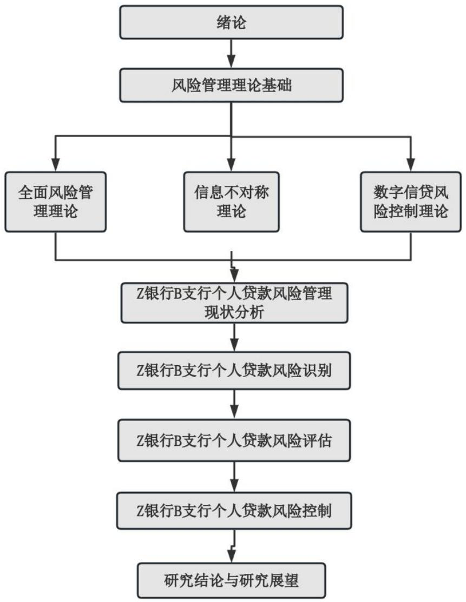
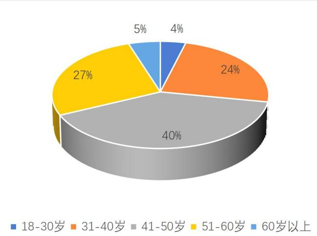
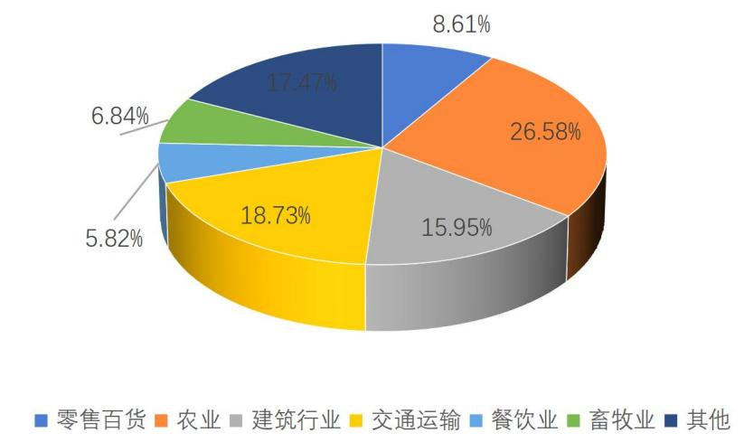

# 第 1章 绪 论

# 1.1 研究背景与意义

# 1.1.1 研究背景

随着社会主义市场经济的推进和国有企业改革的深入，伴随着相关国家政策的制定，逐渐构建了有利于私营经济健康发展的环境，个体和私营经济对融资的需求日益增长。在这一大背景下，个人经营贷款迎来了发展机遇，这个商业银行传统个人业务板块，受到了我国商业银行更多的关注。个人经营贷款的余额不断攀升，呈现出迅猛的增长态势。而金融产品的蓬勃发展导致了金融监管与业务发展的不匹配，出现了大量的金融风险。根据银保监会公布数据，截至 2022 年 3季度，商业银行关注类贷款与不良贷款余额共计 70087 亿元，控制风险并让优质企业拿到信用融资依然商业银行们头痛的问题。

个人经营贷款是一种专门针对符合信贷要求的自然人的贷款方式，旨在支持企业的生产经营，助力"三商一户"群体的发展。借款人及公司主体在申请此类贷款时需要具备相应的资质和经营能力，以确保贷款资金能够被合理运用，从而实现经济效益的最大化。这种贷款具有批量化、标准化和风险分散的特点，通常采用抵押担保方式来降低风险。借款人在获得贷款后需要承诺资金仅用于公司的经营活动，以确保资金的合规使用。个人经营贷款的推广和应用不仅促进了企业的发展，还帮助个体经营者实现其经济目标和梦想。通过这种方式，贷款不仅是为了个人经营者的利益，也是为了整个经济体系的繁荣和发展。因此，个人经营贷款在当前经济环境下扮演着至关重要的角色，为个体经营者和企业提供了必要的资金支持，推动了经济的稳步增长和社会的进步。

比较个人经营贷款和企业法人贷款可见，个人经营贷款通常涉及较小金额，风险分散，但相对而言，违约率较高。相反，企业法人贷款涉及较大金额，风险相对较低。在当前时代背景下，个人经营贷款的重要性日益凸显。全球经济普遍下行，新冠疫情更是加剧了金融风险的隐患。银行信贷风险问题日益突出，导致盈利能力受到负面影响。与此同时，小微企业的融资需求受到限制，进而影响了它们的经营稳定和发展。然而，个人经营贷款也面临着诸多挑战，需要相应的解决措施。银行和监管机构迫切需要加强风险管理和控制措施，以确保金融体系的稳定和可持续发展。这些措施可能包括加强贷款审查流程，提高贷款利率以抵御风险，以及加强对借款人的监督。总体目标是平衡风险与回报，以确保金融体系的稳定性和可持续性发展。通过这些措施，个人经营贷款的发展将更加稳健，为经济的持续增长提供更强有力的支持。

Z 银行 B 支行以其在个人经营贷款领域完善的风险防控体系而闻名于业内。然而，最近的数据显示不良率持续增长，暴露出风险管理存在问题的迹象，尤其是在经济下行环境下。这表明个人经营贷款的风险管理变得比以往任何时候都更为紧迫和关键。

为了有效因应潜在的风险挑战，银行需要加强研究工作，以不断提升风险管理的水平。这包括提高贷款审核的准确性，确保只有符合条件的借款人才能获得贷款；建立有效的风险预警机制，及时发现潜在风险并采取相应措施加以化解；以及加强贷后管理，确保借款人按时还款，减少不良贷款的风险。进一步探讨和深化这些方面的工作对于银行业务的稳健发展至关重要。只有通过不断完善风险管理体系，银行才能更好地抵御外部风险的冲击，确保业务的可持续发展和稳定运营。因此，银行在当前复杂多变的金融环境中，应当把风险管理作为优先考虑的重点，不断加强自身的风险管理和控制能力，以应对各种可能出现的风险挑战。

# 1.1.2 研究意义

目前，我国银行业面临的主要风险管理问题。要想使我国的个人经营贷款业务得到较大的发展，必须有一个健全的银行内部风险控制系统。本论文以 Z 银行 B 支行的个人经营贷款为例，对其业务的内部风险管理状况进行了调研，并对其中存在的问题进行了剖析，根据发现的问题给出了相应的对策。本论文根据一套完整的风险管理理论，查阅了大量的文献资料，并结合国内外先进的研究结果以及调查的方法，对个人经营贷款产品的风险管理系统进行了改进，探索出了一套更加科学、高效的风险控制制度，帮助更多的小微企业得到高效的资金支持，促进其发展壮大，从而实现对银行的内部风险管理，促进其健康稳定的发展。

以往，信用管理人员对客户进行的风险辨识，主要是根据信用产品的授信策略，再加上信用管理人员的个人经验，对某个客户的风险水平进行评估。因为授信政策要同时考虑到风险控制和业务发展，因此，在授信政策中只控制着风险底线，而依靠信用管理人员的判断来确定客户的信用情况和全面的信息，这就为识别客户提供了很大的不确定性。在对 Z 银行 B 支行的个人经营贷款产品进行的风险管理存在问题及成因分析的基础上，结合一线高级信用经理的工作经历，寻找一种有效的顾客辨识方式，缩小这一区间的模糊范围，不仅可以防止出现错误，而且可以促进产品的扩展，有利于扩大贷款的规模。特别是，将 B 区域的区域客户特点和现行的政策执行情况相融合，给新入职的客户管理人员，建立一套有效、可信的、能够进行客户风险辨识的评估方式，同时，也为高级客户管理人员在控制不良资产方面，提供了一种新的操作方式。此外，强化对银行的风险辨识研究，能够帮助银行基层支行对借款人进行更为精准的甄别，在某种意义上规避了银行“应贷未贷”的情况，促进了银行的普惠金融发展。

在对Z银行的个人经营贷款进行研究的基础上，借鉴其他信贷产品的经验，把信用风险管理、风险识别理论与风险预防的实际工作相结合，从而提高了商业银行的信贷风险控制效果。扩大中小微贷款的规模，有利于建立更为科学、高效的风险控制体系，使其能够对可能存在的风险进行更为精准的辨识。与此同时，更多的高质量的中小微企业也能得到方便便宜的信用贷款，帮助更多的中小微企业成为大企业，履行银行的社会责任。

# 1.2 相关研究文献

# 1.2.1 个人经营贷款风险识别研究现状

在19 世纪的英国，个人金融市场的萌芽来源于银行与金融机构开始提供个人经营贷款服务 [1]。时间进入20 世纪50年代随着美国的金融体系的不断发展壮大，银行与金融机构所能提供的个人经营贷款种类也在不断增加，业务规模也迅速扩张，为个人提供了更多融资选择[2,3]。2007 年次贷危机的爆发彻底改变了金融界的格局，全球金融体系遭受重创，银行不得不开始重新审视其风险管理体系。从最初简单管理贷款现金流，到后来发展到注重资产管理，再到关注资产与负债平衡，银行的风险管理理念经历了翻天覆地的变化[4]。随着时间的推移，20世纪90 年代以后，风险管理理论逐渐完善，更加注重资产与负债的平衡。银行开始意识到单纯依靠管理现金流是不够的，资产负债平衡才是确保金融机构稳健运营的关键。这一转变不仅提高了银行的风险管理水平，也为整个金融体系的稳定性和可持续发展奠定了更加坚实的基础[5]。

Safiullah 的研究指出，缺乏监管体系可能导致博弈行为增加贷款的信用风险，从而对整个市场产生负面影响。这种情况下，金融机构可能会过度放松贷款标准，为了追求短期利润而忽视风险管理，导致贷款资金被用于高风险投资或者无法收回的项目，进而增加了信用风险。[6]。VanGreuning 的研究揭示了英国银行个人经营贷款市场中存在的盲目行为问题，特别是贷款方和借款方之间的资源错配现象。这种资源错配可能导致贷款方过度扩大业务规模，将不合理的资源投放给并不需要这些贷款的借款人，进而引发各类信用风险[7]。Kazbekova 的研究强调了市场结构和利率对个人经营贷款业务的信用风险的重要影响。市场结构的不同会影响贷款市场的运作方式和风险水平。利率水平的变化也会直接影响到个人经营贷款业务的信用风险情况。因此，在制定相关政策和管理措施时，需要充分考虑市场结构和利率的影响。通过对市场结构和利率的深入分析，可以更好地识别和评估个人经营贷款业务中的信用风险[8]。

中国的个人经营贷款业务相较于其他国家发展较晚直到上个世纪80 年代中国开始改革开放个人经营贷款业务才得以迅猛发展 [9]。中国经济的迅猛发展也催生出了多样的个人经营贷款产品选择也更加多样，这种多元化的发展趋势使得个人经营贷款市场形成了房贷、车贷、经营贷款等多种不同品种，满足了不同人群的融资需求。随着市场的不断扩大和创新，个人经营贷款业务在中国的发展前景变得更加广阔，为个人和家庭提供了更多的金融支持和发展机会[10,11]。

王湘湘强调信息不对称和道德风险对银行构成潜在危害，因此需要有效监管。信息不对称可能导致信用风险增加，道德风险可能导致欺骗，银行需建立完善监管机制应对风险[12]。龙煦的研究表明银行信用风险难以完全避免，蒙特卡洛方法可模拟风险，帮助识别风险范围，提高决策效率[13]。吕剑强调担保品风险重要性，其价格波动和回收机制直接影响信用风险损失，银行需重视担保品选择和管理[14]。孙琳指出个人抵押贷款信用风险受多种因素影响，如房屋价值、借款人收入，银行需综合考虑这些因素评估信用风险[15]。何成忠强调评估个人信用行为的重要性，帮助银行降低信用风险，制定风险管理策略[16]。刘小丹指出科层制可能降低风险控制效率，影响信用风险管理，银行需优化组织结构提高管理效率[17]。曾理提出互联网技术影响个人信用评估，银行需创新评估方法结合互联网技术，降低信用风险[18]。袁秀行研究指出农业个人经营贷款受多因素影响，银行需考虑这些因素建立风险管理机制，以应对潜在信用风险挑战[19]。

# 1.2.2 个人经营贷款风险评价研究现状

根据 Irani 的研究结果，目前能够影响巴基斯坦银行个人经营贷款的风险类型主要是信用风险受该地区借款人的收入以及所受到的教育水平的影响。为了有效管理这一风险，建议在风险管理中建立一个全面的信用评价机制，以便更准确地评估借款人的信用风险水平。这样的评价机制可以帮助银行更好地了解借款人的信用状况，从而在贷款决策中做出更明智的选择[20]。Murodovich 对美国 100家中小银行违约贷款数据的分析，研究结果强调了个人经营贷款的信用风险评估在银行业中的重要性。通过分析贷款人的特征与违约概率之间的相关性，可以帮助银行更好地了解借款人的信用状况，从而有效降低风险。引入数据模型是一种有效的方法，可以通过对大量数据进行建模和分析，更准确地评估借款人的信用风险[21]。Taiwo 认为加强信用风险管理的核心在于有效评估借款人的偿债能力。通过对借款人的偿债能力进行全面而准确的评估，银行可以更好地了解借款人的还款能力，从而有效降低信用风险。这种有效的评估可以帮助银行制定更合理的贷款条件，并及时采取措施应对潜在的信用风险，从而保护银行的资产和利益[22]。

国内个人经营贷款风险评价研究相对较晚开始，这一领域的研究方向主要聚焦在小微企业风险预警体系和疫情期间普惠金融业务风险管理策略上。当前的研究更倾向于宏观层面和银行风险识别方面。在这一领域的研究中，学者们着重探讨如何建立有效的风险评价预警机制，以及在面对突发疫情等外部冲击时如何制定应对策略，以确保金融体系的稳健运行[23-25]。

王晓雪提出了一种新的贷款价值比估计评价方法，引入了期权定价机制，帮助银行更准确地评估贷款的价值和风险，降低银行风险水平[26]。王泽君以 H 农商银行个人经营贷款风险管理为例，强调了落实贷后检查及风险分类制度的重要性，可以有效提高银行对个人经营贷款的风险评估水平[27]。王秋慧强调了提高员工职业道德水平的重要性，建议建立完善的内控机制，有效降低操作风险，提高风险评价的准确性。[28]。杨坚旭强调了商业银行资产负债管理优化变革、突围转型的重要性[29]。王珏强调了加大个人信息采集的重要性，建议建立内部监督机制来降低操作风险[30]。黄玉秋提出了优化 Y 银行风险管理流程的措施，从组织架构、信息系统等方面提出完善信用风险评价的建议[31]。迟国泰等学者在其研究中分析了个人信用卡信用评价的现状和不足，提出了建立个人信用指标体系的原则和方法。他们构建了一个包括个人还贷能力和还贷意愿在内的 15个指标的个人信用卡信用风险评价指标体系，并添加了负债情况等 3项具有双向影响作用的指标。通过运用隶属度原理和层次分析法确定了各指标的评分函数和权重，建立了个人信用卡信用风险评价模型。在模型中确定了划分信用等级的两个阈值，从而解决了以往信用分级缺乏依据的问题。这项研究为个人信用评价提供了有力的理论支持，能够帮助金融机构更准确地评估个人信用卡风险，进一步提高风险管理水平[32]。

# 1.2.3 个人经营贷款风险控制研究现状

通过梳理现有研究可以看出，国内外学者围绕个人经营贷款风险控制展开了深入的研究，总结了在风险控制过程中面对的困难，并提出了相应的解决办法。EsteS研究表明对于个人经营贷款的风险控制而言，在此过程中，最常见的问题就是信贷双方的信息不对称问题，同时面临着不断变化的市场环境，很难准确的对借款人的信用情况进行评价。基于此，就需要银行树立正确的风险意识，借助先进的信息技术，并将其应用到风险评估的过程中，从而提升评估的精确性。此外，该学者还指出对于银行来说，还应在现有内部控制力度的基础上进一步强化，针对现行的流程加以优化和完善，建立健全相应的内部控制制度，避免由于人为因素而造成操作风险的发生[32]。黄梅研究中指出，阻碍银行个人经营贷款风险控制的因素主要包括：借款人不具备强大的还款能力，抵押物存在不保值的情况，现有的法律法规仍然不健全。为此，银行应结合自身的实际情况，加快构建风险预警机制，确保在第一时间内发现潜在的风险。与此同时，尝试与其他金融机构达成合作共识，建立合作关系，实现风险的有效分散，在一定程度上可以帮助其减少风险的不利影响[34]。黄利娜在研究中围绕个人经营贷款的风险分散问题展开了详细的阐述，该学者认为很大一部分银行现有的贷款产品较为单一，这就导致其面临风险集中度过高的挑战。因此需要银行在贷款产品方面加以创新，从而更好地为借款人提供个性化的贷款产品。在与其他金融机构合作的过程中，逐渐形成风险共担的局面[35]。李琬琰研究中主要探讨了个人经营贷款风险控制的内部控制有关问题，该学者认为对于银行来说，风险事件频繁发生，主要是因为不具备有效的内部控制机制。为此就需要银行结合自身的实际情况以及需求，构建适用的内部控制机制，确保对于各个环节有效的风险管理，进而帮助银行预测风险，将风险扼杀在源头[36]。杜铜方以法律的视角出发，针对个人经营贷款风险管理所面临的挑战进行了归纳，该学者认为在金融市场飞速发展的今天，现有的法律法规与之已逐渐不相匹配，赵明教授认为银行在其经营发展的过程中，应提高与监管机构的合作力度，加快建立健全相关的法律法规，进而为银行业务的开展提供法律保障[37]。

对于银行来说，还需明确在个人经营贷款风险控制过程中所面对的挑战，并积极制定解决方案，在已有理论基础以及银行实践案例的基础上，加快建立健全风险控制体系，全面提高银行的风险控制能力，为银行个人经营贷款业务的开展奠定基础。

# 1.3 研究内容及思路

# 1.3.1 研究内容

本文的研究内容主要包括：

第一章介绍了本文的研究背景和意义，综述了国内外相关文献，并介绍了本文的研究内容和方法。对 Z银行在 Y 区域开展个人经营贷款业务过程中的风险管理研究进行了阐述。

第二章对个人经营贷款风险内涵、个人经营贷款风险类型进行概述，理清全面风险管理理论、信息不对称理论、数字信贷风险控制理论等相关理论，为本研究奠定理论基础。

第三章阐述 Z 银行 B 支行当前在个人经营贷款风险管理方面的具体表现。介绍Z银行 B 支行情况及个人经营贷款以及 Z银行B 支行个人经营贷款的风险管理现状，从中挖掘存在于 Z 银行 B 支行个人经营贷款风险管理方面的不足之处，并进一步探究其背后的成因。

第四章为 Z 银行 B 支行个人经营贷款风险识别。采用文献回顾法、德尔菲法等方法识别 Z 银行 B 支行的个人经营贷款风险从财务和非财务维度剖析该行信用风险。

第五章选择 Z 银行 B 支行个人经营贷款风险评价模型，识别Z 银行 B 支行个人经营贷款风险评价模型指标层，进而建立 Z 银行 B 支行个人经营贷款风险评价模型，并选取案例进行应用分析。

第六章Z银行B支行个人经营贷款风险控制。针对存在的问题提出Z银行B支行个人经营贷款风险控制措施，并从制度、人员、文化等三方面分析阐述。

第七章是本文的总结和未来的研究方向。

# 1.3.2 研究思路

本文将 Z 银行 B 支行个人经营贷款风险管理作为研究课题，根据全面风险管理理论从风险识别到风险控制的各个环节设置研究框架。首先，剖析Z银行B支行的风险管理的现状，从 Z 银行 B 支行的管理现状、风险识别、风险评价的角度探讨其风险管理体系建设情况，最后给出相应风险控制对策。研究思路见图1.1。

  
图 1.1 研究思路图  
Fig. 1.1 Technology Roadmap

# 1.4 研究方法

（1）文献研究法

通过系统收集和深入研读国内外相关领域的既有文献资料，首先对该领域的理论框架进行了全面梳理，涵盖了风险识别、评估、监控和控制等多个环节。同时，研究还详尽分析了业内的实践案例和经验教训，以揭示适用于 Z 银行 B 支行的个人经营贷款风险管理策略。此外，本文还密切关注金融法规和监管政策的解读，明确其对风险管理的影响，以便为银行提供合规性指导。最后，通过对文献资料的综合分析和问题提炼，本文指出了当前 Z 银行 B 支行在个人经营贷款风险管理中可能存在的问题，并基于文献研究成果提出了针对性的改进措施和策略建议。

# （2）层次分析法

层次分析法是一种决策方法，其核心在于将复杂的决策问题分解成目标、准则、方案等层次，使得问题变得更具可操作性。在这一方法中，研究目标被视为系统进行分解和比较，从而帮助决策者更清晰地理解问题的本质和关联性。采用综合思维方式进行评估，不分割具体指标对结果的影响，这有助于全面考量各个因素的重要性，避免片面或偏颇的判断。每个层次中项目的影响通过权重量化，评价具有系统性，这样可以有效地量化各个因素的重要性，为决策提供更有力的支持。层次分析法结合了定性和定量分析，强调定性分析和主观判断的重要性。这种方法不仅考虑了客观的数据和指标，还充分重视决策者的主观看法和经验。通过逼近决策过程的思维方式，追求主观判断和系统性评价，层次分析法能够帮助决策者更全面地考虑问题，从而做出更加准确和有效的决策。因此，这种方法在实际决策中具有重要的意义，能够帮助决策者更好地应对复杂多变的决策环境，提高决策的科学性和准确性。

# （3）模糊综合评价法

模糊综合评价法是一种基于模糊数学的隶属度理论的评价方法。它通过将定性评价转化为定量评价的方式，可以对受多种因素制约的事物进行总体评价。这种方法具有结果清晰、系统性强的特点，能够有效解决模糊、难以量化的问题，特别适合处理非确定性问题。在使用模糊综合评价法时，首先需要设定评价因素，并确定评价细则，然后邀请专家组进行评价。通过对评价因素间相互比较，以最优因素为基准给出其他因素的评价值。虽然这种方法并不能完全准确地量化统计潜在风险，但可以预估风险的性质和可能结果，为决策提供重要参考。通过模糊综合评价法，我们能够更全面地考量各种因素的影响，从而做出更准确和可靠的评价和决策。

# 第 2 章 个人经营贷款风险及风险管理概述

# 2.1 个人经营贷款风险概述

# 2.1.1 个人经营贷款风险类型

巴塞尔委员会对商业银行的风险进行了细致分类，包括信用、市场、操作、流动性等八大类型。信用风险主要涉及债务人无力按时偿还贷款所带来的潜在风险，而市场风险则源自资产价值下跌因市场波动带来的不确定性。另外，操作风险则牵涉到内部流程和员工行为可能导致的风险，而法律风险则是由法律因素引发的潜在风险。这些风险与个人信贷息息相关，因此综合管理对于银行业的稳健运营至关重要。为确保业务持续稳健发展，商业银行必须采取有效措施来管理和规避这些风险。只有通过严谨的风险管理和有效的规避策略，银行才能确保其业务在竞争激烈的金融市场中持续稳健地发展。因此，银行在面对各种风险时需要保持警惕，并采取相应的措施来应对挑战，以确保其长期的可持续性和稳健性。

（1）信用风险。信用风险主要是指当借款人出现违约情况没有按时归还借款使得银行或者其他金融机构出现损失而面对的风险称为信用风险。在金融市场中，信用风险是一种不可避免的风险，因为借款人可能由于各种原因无法按时支付借款，或者故意违约，从而给银行带来财务损失。个人经营贷款信用风险的体现主要在于借款人可能由于经营不善、经济困难或其他原因无法按时偿还贷款，或者故意选择不履行还款义务，从而使银行陷入损失。银行在进行贷款业务时需要对借款人进行严格的信用评估和风险控制，以降低个人经营贷款信用风险带来的不利影响。因此，有效的风险管理措施和监测机制对于降低信用风险至关重要，银行需要建立完善的信用评估体系和风险管理制度，以确保贷款资金的安全性和稳健性。

（2）市场风险。市场风险是指银行面对内外业务不利变动的时候出现能够能够为银行带来损失的可能性，映射在个人经营贷款这项业务中时便是市场银行之间竞争加剧，信贷行业的集中度过高从而诱发的风险。

（3）操作风险。操作风险主要是指金融机构在正常交易时出现的风险，例如因内部程序不稳而出现的漏洞以及人员变动带来的不安定因素等都被称为操作风险。在商业银行处理个人经营贷款业务时，这种操作风险变得尤为显著，因为银行需要面对多样化的潜在风险。除了外部因素带来的挑战外，银行内部因素也是操作风险的主要来源。这些内部因素包括制度不健全、流程不完善、员工道德问题以及内控不足。因此，加强内部制度建设、优化流程管理、加强员工培训和完善内部控制机制是商业银行应对操作风险的关键措施。通过有效管理和监控这些内部因素，银行可以降低操作风险对业务运营的影响，提高整体风险管理水平，确保金融体系的稳定和安全运行。

（4）法律风险。法律风险是指商业银行在进行经营后动时，由于难以满足合同的各项章程或者违背了相关的法律法规从而导致的后续出现投诉诉讼等各种问题，也会给银行带来一定的风险[37]。

而在个人经营贷款中，信用风险是一个非常重要的风险因素。个人经营贷款通常由个人申请，而非企业主体。个人的信用状况对于贷款机构来说是评估其偿还能力的主要依据。个人经营贷款往往规模较小，缺乏抵押担保，贷款机构更加依赖个人的信用状况来评估贷款风险，信用风险的重要性因此凸显。个人经营贷款的偿还往往依赖于个人经营的业务收入，偿还来源相对不稳定。个人经营贷款中的信用风险因素是一个非常重要的风险因素，其重要程度高于其他贷款风险种类。在进行个人经营贷款时，贷款机构需要特别关注借款人的信用状况，以降低贷款违约的风险[38]。

# 2.1.2 个人经营贷款风险特点

正确认识个人经营贷款风险的特点，加深对个人经营贷款风险的了解，能够帮助商 业银行提升对人住房贷款风险的识别、评价与控制水平，全面提升风险管理能力。根据客户类型的不同，贷款通常被划分为公司贷款和个人经营贷款两大类。其中，个人经营贷款作为个人经营贷款的一个分支，主要用于支持个人的生产经营资金需求。其主要客户群体为小微企业所有者和工商商户。

首先，比较个人经营贷款和企业法人贷款可见，个人经营贷款通常涉及较小金额，风险分散，但相对而言，违约率较高。相反，企业法人贷款涉及较大金额，风险相对较低。

其次与公司贷款相比，个人经营贷款的授信主体是个人和家庭，客户群体的数量多、范 围广、准入条件相对宽松。借款人年龄层次、受教育程度、职业类型较为分散，其征信 情况、收入水平及家庭状况也各不相同，因此个人经营贷款的风险也呈分散性特点。

再者，由于商业银行与借款人之间存在着信息的不对称，以及个人经营贷款业务操作中普 遍存在“重放轻管”的错误经营管理理念，导致个人经营贷款风险在形成初期不易被商业银行发现，因而具有隐蔽性的特点。

最后，我国的商业银行一般按行政区域设立分支机构，并在其分支机构的服务辐射范围内 受理和发放个人经营贷款。不同区域的国家政策、金融管理规定不尽相同，经济发展水平、居民收入水平、居民综合素质也存在差异，因而个人经营贷款风险也具有区域性特点。

# 2.2 个人经营贷款风险管理概述

# 2.2.1 风险管理概念

风险管理是现代社会中至关重要的决策过程，旨在降低与各种不利结果相关的可能性，包括但不限于财务损失、人身伤害或资产损害。风险管理涉及多个关键步骤，包括风险的识别、估计和评估，涵盖了对潜在风险的全面了解和量化。风险管理的主体可以是各种组织和个人，无论规模大小。为了有效管理风险，必须在风险识别的基础上进行风险估计和评估，以便采取相应的技术选择和有效评估措施。风险管理的最终目标是在最小成本的前提下获得最大程度的安全保障，这意味着在风险管理过程中需要平衡安全性和成本效益。通过不断改进风险管理策略和实践，组织和个人可以更好地应对不确定性和潜在威胁，从而提高业务的稳定性和可持续性。

随着风险管理的重要性日益凸显，它已经发展成为一个独立的管理系统和新兴学科。从传统的企业风险管理到更广泛的社会风险管理，风险管理的范围不断扩大，涵盖了更多领域和层面。通过不断的研究和实践，风险管理将继续为各个领域的决策者提供支持和指导，以应对不断变化的风险和挑战。

# 2.2.2 全面风险管理理论

从整体风险角度出发，提出了一种基于整体风险视角的综合风险管理方法。首先，在信贷投放前防范，即在信贷投放前，要对借款人的有关资料进行严密审查，以减少其产生的可能性。其次，要对出现的风险进行适时的监控，在信贷业务的发展中，要采取一定的措施，对风险进行适时的管理，以预防和减少银行的损失。最后，对于已经产生了一些损失的风险要进行补救，避免风险产生更大的影响，将在企业执行期间产生的损失降到最低，并对发生的风险进行适时的处置。

风险的度量、辨识、评价与管控是一个完整的风险管理系统。风险辨识是指在银行的信贷业务中，从原来的业务风险管理经验和技术手段上，在进行信贷活动前，要对全部的信贷业务进行风险辨识。在确定了潜在的风险以后，接下来要做的就是对其进行风险度量，通常采用数学统计等方法，从银行所开展的业务中尽量搜集到更多的资料，通过对这些资料的分析等，对信贷业务中出现风险的可能性进行预估。接着，对商业银行信贷业务中存在的各种风险进行了归纳，并提出了应对的对策。根据商业银行在运营中可能产生的各种风险，采取相应的对策，减少其信贷风险，使其有能力承受其所带来的各种风险。同时，要对建立的风险控制体系进行科学、可行的评价，以保证其在实践中发挥作用。

# 第 3 章 Z 银行 B 支行个人经营贷款风险管理现状分析

伴随着金融业的飞速发展，出现了个人经营贷款这一新兴业务类型，需要银行针对该业务类型进行风险管理，逐渐引起了众多商业银行的重视。本文研究以Z银行B支行为例，针对其当前在个人经营贷款风险管理各个环节的基本情况进行阐述，并从中挖掘现存的不足之处，分析造成这些不足的成因。

# 3.1 Z银行 B 支行简介

Z 银行 B 支行（全称 Z 银行股份有限公司B 支行）于1981年在辽宁省营口市成立，是中国银行下辖的二级分支机构。

营口位于中国东北部，作为全国首批沿海开放城市之一，拥有年吞吐量高达4亿吨的营口港，是全国第9大港口。这座城市在“一带一路”战略中扮演着重要角色，成为东北地区的交通枢纽。营口不仅资源丰富，还在轻纺、冶金、石化、汽保、印刷、水果等多个行业中处于领先地位。同时也被誉为传统轻纺工业基地和新兴冶金石化装备制造工业基地，营口的民营经济发展十分繁荣。规模以上工业企业达到 1004 户，其中民营企业高达980 户。2022 年，全市实现地区生产总值1431.6 亿元，同比增加28.4 亿元。这一数字展示了营口市经济发展的巨大潜力和活力。这种经济结构的多样化和民营经济的强劲增长为营口奠定了可持续发展的坚实基础。城市的繁荣发展不仅使其在区域内具有重要地位，同时也为更广泛的国家发展做出了积极贡献。Z银行B 支行自始至终坚守着促进财富增值和地方经济繁荣的历史使命。其发展策略包括审慎经营、科学发展以及紧抓机遇，旨在实现以“服务地方发展，打造最好银行”为目标。这一使命和策略的指引下，Z 银行 B 支行取得了显著的经营成果。其净利润翻了三番，本外币存款增长了100亿，增幅达到了 $20 \%$ ，本外币贷款增长了125亿，增幅更是高达 $21 \%$ 。在市场地位方面，Z 银行B 支行的表现也十分抢眼，市场份额分别为 $5 . 5 \%$ 和 $9 . 6 \%$ ，分列四大国有银行中的第二和第一位。这些成就不仅展示了该支行在金融领域的卓越表现，更彰显了其在服务客户、推动经济增长方面的重要作用。Z银行B 支行因此跻身业内佼佼者，成为为客户和地方经济繁荣作出重要贡献的典范。其不懈努力和卓越表现为整个行业树立了典范，同时也为未来的发展指明了前进的方向。在未来的道路上，Z 银行 B 支行将继续以稳健的经营、科学的发展和敏锐的洞察力，不断追求卓越，为客户、员工和整个社会创造更大的价值和财富。

Z银行 B支行旗下拥有庞大的网络体系，包括 6家管辖支行和 17 家经营性支行，共计 23 家机构网点，覆盖广泛地区，为客户提供便捷的金融服务。Z 银行B支行庞大的员工团队达到了700人，分布在13个不同的部门中，形成了高效完备的服务网络，确保客户得到全面周到的关怀和支持。Z银行B 支行的业务范围广泛且多元化，涵盖本外币存贷款、结算服务、债券代理、外币结售汇服务等多个领域，满足客户多样化的金融需求。除了传统金融服务外，Z银行B 支行还代理销售保险、基金和贵金属，为客户提供一站式、全方位的金融服务和个性化的解决方案，助力客户实现财务目标。Z银行B 支行具备强大的竞争力和综合服务能力，在金融领域涵盖多个方面，为客户提供全方位、高质量的金融服务，赢得了市场和客户的信任与好评。

Z银行B支行主要经营业务有存款业务、贷款业务、理财业务、外汇业务等。贷款业务有着非常重要的地位，他是 Z 银行 B 支行主要的盈利来源之一，通过向客户提供各类贷款产品，银行可以收取利息等费用，从而获得财务收益。个人经营贷款业务是贷款业务中的一个重要组成部分，个人经营贷款是指银行向个体经营者或小微企业提供的贷款服务，以支持他们的经营发展。个人经营贷款可以帮助个体经营者扩大经营规模，购买设备，补充流动资金等，从而促进当地经济的发展和就业的增加。同时，个人经营贷款也有助于银行建立良好的客户关系，从而提升Z银行B支行的市场份额和声誉。

# 3.2 Z 银行 B 支行个人经营贷款逾期客户现状

首先，先介绍关于银行2019-2021年个人经营贷款逾期客户的个人基本情况，包括性别、年龄和所从事的行业，统计情况如图3.1、3.2和3.3所示：

  
图 $3 . 1 Z$ 银行 B 支行 2019-2021 经贷逾期客户性别结构

Fig. 3.1 Gender Structure of ZB Bank's Overdue Loan Customers from 2019 to 2021

  
图 3.2 Z 银行 B 支行 2019-2021经贷逾期客户年龄结构

  
Fig. 3.2 Age Structure of ZB Bank's Overdue Loan Customers from 2019 to 2021   
图 $3 . 3 Z$ 银行 B 支行 2019-2021 经贷逾期客户就业行业结构  
Fig. 3.3 ZB Bank 2019-2021 Employment Industry Structure of Overdue Loan Customers

从图 3.1、3.2 和 3.3 可以看出，Z 银行B 支行的个人经营贷款业务所面对的风险种类非常丰富。Z 银行 B 支行 2019-2021 年的546 件不良贷款被采集到了其中，其中的用户资料数量接近 1000 条，其中以借款人的年龄、经营的行业、性别等为重点。其中涉及的贷款资料有6057条，内容更为详细，包括了贷款期限、期限、利率、抵押担保、还款方式等。其中，B 支行共有 1102 份过期资料，对过期原因及到期日进行了详尽记录。样本中的男、女顾客人数均较多，但以男子为主，占到逾期未还顾客总数的 $8 6 \%$ ， $14 \%$ 为妇女。从年龄上来看，以31-60 岁为主的消费者为主，这一人群的 $90 \%$ 以上，41-50 岁年龄段的消费者所占比例为$3 9 . 8 7 \%$ 。就产业结构类型而言，绝大多数为建筑行业以及交通运输行业，分别占据总体比重的 $1 5 . 9 5 \%$ 、 $1 8 . 7 3 \%$ 。通过梳理 546 件企业商业贷款逾期事件进一步发现，在2019-2021 年间，Z 银行 B 支行总体的商业金融资产不良余额已超过7126万元。逾期率是指借款人未能按时偿还贷款的比例。当逾期率达到 $1 . 5 \%$ 时，通常被视为风险预警线，表示借款人的偿还能力可能出现问题，需要密切关注和监控。而当逾期率达到 $3 \%$ 时，被视为风险叫停线，意味着借款人的偿还能力已经出现严重问题，可能需要采取紧急措施来减少风险。Z银行B 支行的逾期率虽还没有达到风险叫停线，但仍需注意。

在当前形势下，Z 银行B 支行的贷前风险评估方法存在一定局限性。它仅依赖人工判断来确定风险大小，这种评估方式具有较强的主观性，容易导致评估结果的偏差。虽然也引入了信用评分系统来对客户进行打分，但得分仍依赖审查人员的经验和主观判断，这也增加了评估的不确定性。且将客户质量分为等级的做法，虽然考虑了客户的还款意愿和还款能力，但这两个因素本身比较抽象，难以量化，导致划分方式带有较大的主观色彩。综合来看，Z银行B 支行的个人经营贷款风险评估更偏向于重定性分析而非定量分析，这种主观性较强的判断方法容易在风险控制上产生偏差。因此，本文后续提出采用层次分析和模糊综合评价法进行定量分析具有重要的参考意义。通过引入这些定量分析方法，可以更客观、科学地评估客户的风险状况，从而提高风险控制的准确性和有效性。

# 3.3 Z 银行 B 支行个人经营贷款业务风险管理数字化改革目标

一是打牢基础建设，深挖数据延伸。不断优化技术尽快实现“业务数据化”和“数据业务化”的目标，达到降本增效的效果。同时，我们还需要贯彻优化算力基础设施布局，进一步深化人工智能等新技术的应用。加快技术架构转型和人才培养发展也是至关重要的。除此之外，科技体系的组织架构和管理流程也需要进行改革，以提高科技产出效能。通过这些举措，可以更好地适应快速发展的科技环境，实现持续创新和发展。

二是利用总行省行平台着力构建数字化运营和管理体系。进一步加快个人经营贷款审批效率、智能风控、反欺诈等系统建设，践行金融工作的政治性和人民性。

三是推进业务经营数字化转型，夯实数字金融在系统升级中的基础作用，使得科技金融、普惠金融能够更好服务群众。积极服务产业数字化和公共服务数字化，做深、做透各种客户群体的应用场景，构建开放金融生态。

# 第 4 章 Z 银行 B 支行个人经营贷款风险识别

在上一章节中，本文针对 Z 银行 B 支行在个人经营贷款风险管理方面的表现进行了深入的挖掘，掌握了其存在于此过程中的不足之处，并了解了背后的成因。在此基础上，本章节将围绕 Z 银行 B 支行建立健全风险识别体系、筛选科学合理的风险识别指标、搭建适用于自身的风险评估模型而展开研究，从而帮助Z 银行 B 支行在其运作的过程中有效识别潜在的风险，继而用以后续评估风险的重要性，确保其信贷决策制定的准确性。

# 4.1 风险识别方法

（1）文献回顾法

通过文献回顾法对个人经营贷款风险相关文献进行搜索是研究中不可或缺的一环。在这个过程中，我们可以分析现有研究中关于贷款风险评价指标体系的构建，以便更好地了解这一领域的研究现状。通过对现有研究的总结和分析，我们可以找出适合本研究的风险因素，并将它们归纳整理，形成适用于 Z 银行 B支行个人经营贷款风险的初始清单。这一过程不仅可以帮助我们更深入地理解个人经营贷款风险的本质，还能为我们后续的研究工作奠定坚实的基础。具体分析步骤如下。

第一，在国际学术期刊数据库中，研究人员通过搜索关键词“Loan Risk”、“Personal Business Loan”、“Personal Business Loan Risk”等，展开了广泛的文献检索工作。他们主要利用了“Web of Science”、“Emerald 全文期刊库（管理学）”、“Elsevier ScienceDirect”、“ProQuest 学位论文全文数据库”、“SpringerLink”等多个数据库，以期找到与个人经营贷款风险相关的核心期刊文献。这一系列检索的目的在于为建立 Z 银行 B 支行个人经营贷款风险初始清单提供参考依据，以便更深入地研究和分析这一领域的问题。通过系统性的文献检索和筛选，研究人员希望能够全面了解个人经营贷款风险的各个方面，为未来的研究工作奠定坚实的基础。这一过程不仅有助于增加对该领域知识的掌握，也为学术界和实践者提供了有益的参考资料，促进了对个人经营贷款风险管理的深入思考和讨论。

第二，国内文献搜集。在CSSCI和CNKI数据库中，对关键词“贷款风险”、“个人经营贷款”和“个人经营贷款风险”进行了广泛的文献搜集。通过系统检索和筛选，找到了大量相关研究，涵盖了不同角度和观点，为深入探讨这一领域提供了坚实的基础。其中最新发表在核心和权威期刊上的研究成果为我们提供了丰富的参考价值。这些研究从不同的角度出发，对个人经营贷款风险进行了深入分析，提出了许多新颖而有启发性的观点。通过对这些研究的梳理和总结，我们可以更好地把握当前研究的热点和趋势，为我们的研究提供重要的启示。在国内研究支持中，通过对大量文献的分析和归纳，我们得出了支持 Z 银行 B 支行个人经营贷款风险初始清单的重要结论。这些研究为我们提供了全面而深入的理解，揭示了个人经营贷款风险管理的关键问题和挑战。这些结论不仅丰富了我们对该领域的认识，也为未来的研究和实践提供了重要的参考依据。

# （2）德尔菲法

德尔菲法结合问卷调查法在辨识个人经营贷款风险因素方面是一种高效的方法。德尔菲法作为一种专家咨询方法，通过专家组确定和问题提出，逐轮收集意见和反馈信息，经过多轮循环直至得出一致意见的过程，能够精确预测事件结果。在这个过程中，专家组的意见被综合处理，形成最终风险清单。这个专家组一般由不超过 20 人组成，他们的集体智慧和专业知识能够为最终结论的形成提供重要支持。最终的风险清单将成为构建风险评价指标体系的重要参考依据。通过德尔菲法结合问卷调查法得出的这份清单将为进一步的风险评估工作奠定基础。专家们的经验和见解在整个过程中得到充分的发挥，他们的共识将为未来的风险管理决策提供有力支持。因此，这种方法不仅能够帮助识别个人经营贷款风险因素，还能为金融机构提供有效的风险管理参考。

# （3）历史数据法

历史数据法是指历史上类似项目曾发生过的风险，供识别人员进行检查核对。其特点是按照以前经验进行总结，参考和对照，可以节省大量的时间和成本，适用于风险识别的全阶段。Z银行 B支行个人经营贷款拥有大量的以往贷款资料，有成熟的数据可以借鉴。

# 4.2 风险识别原则

本文主要依靠以下四个方面的原则来构建 Z 银行 B 支行个人经营贷款风险指标体系。

（1）科学性原则。构建风险指标体系，其中的数据必须足够的科学合理，其中的科学性主要体现在指标和数据的选择以及各种联合的计算都能够共同运用。

（2）可操作性原则。构建个人经营贷款风险评级指标体系的时候，所选择的各项数据必须非常便捷，不要过于繁杂独立，尽量考虑将数据量化从而保证数据收集的难度以及操作的难度都不会过高。

（3）预见性原则。建立个人经营贷款风险指标体系，主要是为了能够反映公司潜在的危险从而进行预防降低公司的风险指数，保障公司的平稳运行。

（4）量化原则。为了避免风险评价的过程当中出现太多的主观臆断，所以在构建风险评估的过程当中应该引入专家的专业知识并且做出一定的定量规范。

# 4.3 风险识别过程

Z 银行B 支行所面临的信贷风险主要包括财务风险和非财务风险。财务风险主要涉及个人经营贷款对象的财务数据的真实性和可靠性，而非财务风险则包括个人经营贷款对象的经营模式透明度、还款能力、信用记录等方面的风险。有效识别并评估这些风险将有助于提高个人经营贷款的风险控制水平，以保障贷款方和借款方的利益。

（1）准则层风险识别过程

个人经营贷款在贷款金额较小、客户群体较大的特点下，当地政府的高效抵押办理为 Z 银行 B 支行提供了快速投放个人经营贷款的机会，仅需三天即可完成。然而，这种贷款类别需要简易高效的评级方法，而传统公司贷款评价体系并不适用。小微企业和个体工商户的财务制度不健全，经营模式缺乏透明度，给评级带来了挑战。为了有效评估个人经营贷款的风险，客户经理需要积极采集经营数据和财务数据，并编制客观的财务报表进行调查。这些举措有助于确保个人经营贷款的风险可控，为贷款方及借款方提供更可靠的保障。

在Z银行B支行现实情况基础上，再结合前文介绍的文献回顾法查询结果，目前较多学者对于银行贷款风险评价指标的划分多从贷款对象出发，分析贷款对象的财务与非财务指标，再聚焦到个人经营贷款风险层面，例如学者李玲（2021）在针对商业银行个体经营户小额信贷风险评估中分析个体经营户风险评估影响因素就划分了财务指标与非财务指标两个维度等。因此本次针对 Z 银行 B 支行个人经营贷款风险准则层风险在 Z 银行 B 支行现实情况基础以及文献回顾的结果上最终定为财务风险以及非财务风险两大维度。

（2）指标层风险识别过程

通过文献回顾法确定准则层风险指标是一项重要的研究方法，它有助于建立起一个系统完备的风险评估体系。在确定财务风险和非财务风险两大维度下的具体风险指标时，德尔菲法的运用则体现了专家智慧的集体力量。这种综合性的方法不仅考虑了财务层面的风险，还充分考虑了非财务因素对风险的影响，为风险管理提供了更为全面的视角。专家组成员的构成十分关键，他们来自于Z银行B支行个人信贷部、公司信贷部、风险管理部的部门负责人、支行行长等职位，同时还包括专家委员、信贷风险管理部法人审查组的组长和独立审批人。这样的团队构成保证了专业性和权威性，他们共同拥有超过8 年的相关工作经验，这意味着他们在金融风险管理领域拥有丰富的实践经验和深刻的理论造诣。他们的参与将确保研究结果的科学性和实用性，为风险管理提供可靠的决策支持。20 位专家组具体信息详见表4.1。

表 4.1 专家组成员  
Table 4.1 Members of the Expert Group   

<table><tr><td>序号</td><td>姓名</td><td>工作单位</td><td>职务</td></tr><tr><td>1</td><td>张**</td><td>Z银行B支行</td><td>个人经营信贷业务部经理</td></tr><tr><td>2</td><td>苏**</td><td>Z银行B支行</td><td>公司与投行业务部经理</td></tr><tr><td>3</td><td>乔**</td><td>Z银行B支行</td><td>信贷风险管理部经理</td></tr><tr><td>4</td><td>张**</td><td>Z银行B支行下属X支行</td><td>支行行长</td></tr><tr><td>5</td><td>杜**</td><td>Z银行B支行下属Y支行</td><td>支行行长</td></tr><tr><td>6</td><td>王**</td><td>Z银行B支行下属Z支行</td><td>支行行长</td></tr><tr><td>7</td><td>曹**</td><td>Z银行B支行下属Y支行</td><td>普惠金融风控专员</td></tr><tr><td>8</td><td>尉**</td><td>Z银行B支行</td><td>普惠金融风控经理</td></tr><tr><td>9</td><td>赵**</td><td>Z银行B支行</td><td>个人信贷业务经理</td></tr><tr><td>10</td><td>姚**</td><td>Z银行B支行</td><td>个人信贷业务经理</td></tr><tr><td>11</td><td>穆**</td><td>Z银行B支行</td><td>个人信贷业务经理</td></tr><tr><td>12</td><td>杨**</td><td>Z银行B支行下属X支行</td><td>个人信贷业务经理</td></tr><tr><td>13</td><td>樊**</td><td>Z银行B支行下属Y支行</td><td>个人信贷业务经理</td></tr><tr><td>14</td><td>刘**</td><td>Z银行B支行下属Z支行</td><td>个人信贷业务经理</td></tr><tr><td>15</td><td>孙**</td><td>Z银行B支行</td><td>风险管理部法人审查组长</td></tr><tr><td>16</td><td>常**</td><td>Z银行B支行</td><td>风险管理部法人审查组长</td></tr><tr><td>17</td><td>史**</td><td>Z银行B支行分管行长</td><td>独立审批人</td></tr><tr><td>18</td><td>陈**</td><td>Z银行B支行</td><td>独立审批人</td></tr><tr><td>19</td><td>龚**</td><td>Z银行B支行</td><td>独立审批人</td></tr><tr><td>20</td><td>魏**</td><td>Z银行B支行</td><td>独立审批人</td></tr></table>

经过对 20名工作人员成立的专家组进行德尔菲法调查的讨论，本文成功识别出了一系列重要的风险指标，专家组的共同努力和专业知识的结合为识别关键风险提供了坚实的基础。最后得到的具体的德尔菲法识别出的风险指标如下表4.2 所示。

表 4.2 德尔菲法识别风险  
Table 4.2 Delphi Method for Identifying Risks   

<table><tr><td colspan="2">贷款风险评价</td></tr><tr><td>风险类别 指标</td><td>专家组讨论结果</td></tr><tr><td rowspan="6">财务风险</td><td>盈利能力</td><td>反映借款人经营效益的重要指标，体现着借款人 所经营行业的发展前景</td></tr><tr><td>营运能力</td><td>衡量借款人资金运转能力的指标，能够反映出借</td></tr><tr><td></td><td>款人资金的使用效率，还贷时的压力大小 反映了借款人当前的经营情况是否具备贷款到</td></tr><tr><td>偿债能力</td><td>期后的偿还能力及其本身抵抗风险的能力</td></tr><tr><td>经营增长状况</td><td>可以分析出借款人未来一段时间的发展前景，是 判断借款人未来能否偿还债务的一项重要指标</td></tr><tr><td>经营能力</td><td>借款人自身的经营历史，客户结构及稳定性等方 面</td></tr><tr><td rowspan="5">非财务风险</td><td></td><td>从借款人自身的综合素质进行判断，在个人经营</td></tr><tr><td>管理能力</td><td>贷款中，借款人的经营管理情况很大部分是由其 自身的素质所决定</td></tr><tr><td></td><td>提供抵押物作为担保方式的借款人往往被认为</td></tr><tr><td>担保能力</td><td>第二还款来源最充足，但其他的担保措施有时候</td></tr><tr><td></td><td></td></tr><tr><td rowspan="2"></td><td></td><td></td></tr><tr><td></td><td>并不比抵押逊色</td></tr><tr><td rowspan="2"></td><td></td><td></td></tr><tr><td>况</td><td>行业及区域情一般由一些不确定因素所导致，往往难以进行精 确的把控但又无法忽视</td></tr></table>

Z银行 B支行在个人经营贷款领域的历史数据显示，近五年来共计 13个个人经营贷款违约项目。通过对这些案例的分析，可以总结出导致贷款违约的各种原因，对这些风险因素的归类和分析，银行可以更好地识别潜在的风险，采取相应措施降低贷款违约的发生率。从中找出贷款违约的形成风险，将这些风险进行归类得到的风险如图4.3所示。

# 表 4.3 历史数据风险识别表

Table 4.3 Historical Data Risk Identification Table

<table><tr><td>借款人违约情况描述</td><td>风险类别</td><td>累计发生次数</td></tr><tr><td>借款人盈利能力与偿债能力短时间内变差</td><td>财务风险</td><td>11</td></tr><tr><td>借款人运营能力逐步降低</td><td>财务风险</td><td>9</td></tr><tr><td>借款人经营与管理能力弱</td><td>非财务风险</td><td>7</td></tr><tr><td>借款人担保能力降低</td><td>非财务风险</td><td>4</td></tr><tr><td>借款人经营业务所处行业不景气</td><td>非财务风险</td><td>4</td></tr><tr><td>借款人经营增长状况不理想</td><td>财务风险</td><td>5</td></tr></table>

最终的风险识别结果，财务风险有借款人盈利能力与偿债能力短时间内变差、借款人运营能力逐步降低和借款人经营增长状况不理想，非财务风险有借款人运营能力逐步降低、借款人经营与管理能力弱和借款人担保能力降低。

# 4.4 风险识别结果

通过上面小节的文献回顾法、德尔菲法以及历史数据法等风险识别方法的应用，Z银行B支行个人经营贷款风险整体识别结果整理如下。

盈利能力是反映借款人经营效益的重要指标，体现着借款人所经营行业的发展前景，其在个人经营贷款中涉及的具体指标如表4.4所示：

表 4.4盈利能力指标  
Table 4.4 Profitability Indicators   

<table><tr><td>准则层</td><td>指标层</td><td>含义</td></tr><tr><td rowspan="5">盈利能力</td><td>销售利润率</td><td>倘若该数值较大，表明借款人拥有较高的利润水平，企业具</td></tr><tr><td></td><td>备强大的发展潜力</td></tr><tr><td></td><td>倘若该数值较大，表明借款人在获取利润的过程中无需支付</td></tr><tr><td></td><td>成本费用利润率高额的成本，说明其利润空间相对较大，具有较强的盈利能</td></tr><tr><td></td><td>力</td></tr></table>

营运能力是衡量借款人资金运转能力的指标，能够反映出借款人资金的使用效率，还贷时的压力大小，其在个人经营贷款中涉及的具体指标如表4.5所示：

表 4.5营运能力指标  
Table 4.5 Operational Capacity Indicators   

<table><tr><td>准则层</td><td>指标层</td><td>含义</td></tr><tr><td>营运能力</td><td>流动资产周转率</td><td>倘若该数值较大，表明借款人的流动资产拥有较强的周转</td></tr><tr><td></td><td></td><td>能力，因此也可以更加有效地抵御风险</td></tr><tr><td></td><td></td><td></td></tr></table>

# 续表 4.5营运能力指标

# Continuation Table 4.5 Operational Capacity Indicators

<table><tr><td>准则层</td><td>指标层</td><td>含义</td></tr><tr><td></td><td>总资产周转率</td><td>倘若该数值较大，表明借款人拥有较强的生产力，对于资 金的利率效率较高</td></tr><tr><td></td><td></td><td>倘若该数值较大，表明借款人可以在较短的时间内回收资</td></tr><tr><td></td><td>存货周转率</td><td>金，对于资金的使用效率相对较高</td></tr><tr><td></td><td></td><td>倘若该数值较大，表明借款人可以在较短的时间内完成出</td></tr><tr><td></td><td>存货周转率</td><td>货，具备较强的销售能力</td></tr></table>

偿债能力是评估借款人在贷款到期后是否有足够资金偿还债务并抵御风险的重要指标之一。偿债能力反映了借款人当前的经营情况是否具备贷款到期后的偿还能力及其本身抵抗风险的能力，其在个人经营贷款中涉及的具体指标如表4.6 所示：

表 4.6偿债能力指标  
Table 4.6 Debt paying ability indicators   

<table><tr><td>准则层</td><td>指标层</td><td>含义</td></tr><tr><td rowspan="4">偿债能力</td><td>资产负债率</td><td>倘若该数值较小，表明借款人拥有丰富的可用资金，具备较强 的偿债能力</td></tr><tr><td>速动比率</td><td>倘若该数值较大，表明借款人可以在极短的时间内完成对其资 产的变现，获得充足的流动资金，具有较强的偿债能力</td></tr><tr><td>对外担保</td><td>倘若该数值较小，表明借款人具备较强的代付代偿能力，几乎</td></tr><tr><td></td><td>不会影响到其本人的贷款</td></tr></table>

经营增长状况可以分析出借款人未来一段时间的发展前景，是判断借款人未来能否偿还债务的一项重要的指标，其在个人经营贷款中涉及的具体指标如表4.7 所示：

表 4.7经营增长状况指标  
Table 4.7 Indicators of Business Growth Status   
续表 4.7经营增长状况指标  

<table><tr><td>准则层</td><td>指标层</td><td>含义</td></tr><tr><td></td><td></td><td>该指标是借款人经营能力的一种体现，可以用来判断借款人是否</td></tr><tr><td>经营</td><td>销售增长率</td><td>具备较强的市场开发能力，并且可以占据较大的市场份额，该数</td></tr><tr><td>增长</td><td></td><td>值越高，则表明其能力越强</td></tr><tr><td>状况</td><td>利润增长率</td><td>该指标是借款人持续经营发展能力的一种体现，可以用来判断借</td></tr><tr><td></td><td></td><td>款人是否具备强大的发展潜力，该数值越高，表明其能力越强</td></tr></table>

Continuation Table 4.7 Indicators of Business Growth Status

<table><tr><td>准则层</td><td>指标层 含义</td></tr><tr><td>总资产增长率</td><td>该指标可以用来判断借款人在资本积累方面的表现以及经营规模</td></tr><tr><td></td><td>的扩张程度，数值越高，表明其具备越强大的持续发展能力</td></tr></table>

经营能力主要从借款人自身的经营的历史，客户结构及稳定性等方面进行这些判断，这些指标的综合评估可以帮助银行更全面地了解借款人的经营能力，从而决定是否批准其个人经营贷款申请。其在个人经营贷款中涉及的具体指标如下表4.8所示：

表 4.8经营能力指标Table 4.8 Operational Capability Indicators  

<table><tr><td>准则层指标层</td><td></td><td>评分标准</td><td>划分明细</td></tr><tr><td rowspan="3"></td><td rowspan="3">经营历史</td><td></td><td>包括：5年以上、3</td></tr><tr><td>以其主营业务的存续时间作为判断 依据，时间越长，表明该能力更强</td><td>-5年、1</td></tr><tr><td></td><td>-3年、1年以下</td></tr><tr><td rowspan="6"></td><td rowspan="3">经营场地</td><td>以其经营场地的性质作</td><td>包括：自有、剩余租期</td></tr><tr><td>为判断依据，场地越稳</td><td>超过3年、剩余租期超</td></tr><tr><td>定，意味着该能力更强</td><td>过1年、无固定场所</td></tr><tr><td rowspan="3">设备水平</td><td>以借款人拥有生产设备的使用年限</td><td>包括：行业主流设备且使用</td></tr><tr><td>作为判断依据，使用年限越短，</td><td>年限低于2年、低于3年、</td></tr><tr><td>意味着该能力更强</td><td>低于5年、高于5年</td></tr><tr><td>经营</td><td>以借款人在最近三年水电方面的费</td><td></td><td>包括：明显增长、稳定、</td></tr><tr><td>能力</td><td>生产</td><td>用支出作为判断依据，倘若费用支</td><td>不稳定、明显下降</td></tr><tr><td rowspan="6"></td><td>稳定性</td><td>出处于上升的状态，意味着</td><td></td></tr><tr><td></td><td>该能力更强</td><td>包括：拥有议价能力、大部</td></tr><tr><td></td><td>以客户在其所处行业中占据的市场地</td><td>分时候具有议价能力、偶尔</td></tr><tr><td>议价能力</td><td>位作为判断依据，市场地位更高，</td><td>具有议价能力、不具备议价</td></tr><tr><td></td><td>意味着该能力更强</td><td></td></tr><tr><td></td><td></td><td>能力</td></tr><tr><td></td><td></td><td></td><td></td></tr><tr><td rowspan="3">稳定性</td><td></td><td>以三年以上客户销售额</td><td>包括：70%以上、50%</td></tr><tr><td>客户</td><td></td><td>-70%、30%</td></tr><tr><td></td><td>占比作为判断依据客户 越稳定意味着这能力更强</td><td>-50%、30%以下</td></tr></table>

管理能力主要从借款人自身的综合素质进行判断，在个人经营贷款中，借款

人的经营管理情况很大部分是由其自身的素质所决定，具体指标如表4.9所示：

表 4.9管理能力指标Table 4.9 Management Capability Indicators  

<table><tr><td>准则层</td><td>指标层</td><td>评分标准</td><td>划分明细</td></tr><tr><td rowspan="5"></td><td rowspan="5">征信记录</td><td></td><td>参考其过往的贷款记录以借款人及其配偶存在借款但不存在不</td></tr><tr><td>及信用卡还款情况，越</td><td>良记录、借款人及其配偶不存在借款</td></tr><tr><td>少的逾期记录，也意味</td><td>记录、3年内3次以下（含）逾期记</td></tr><tr><td>着其这一能力更强</td><td>录、3年内3次以上逾期记录</td></tr><tr><td>参考借款人的受教育程</td><td>大学本科及以上（或中级职称）、大</td></tr><tr><td rowspan="5"></td><td>借款人文化 程度</td><td>度以及当前的职称，倘</td><td>专（或初级职称）、中专或高中、</td></tr><tr><td></td><td>若其拥有较高的学历水</td><td>初中及以下</td></tr><tr><td></td><td>平和职称，意味着其这</td><td></td></tr><tr><td>一能力更强</td><td></td><td></td></tr><tr><td></td><td>参考借款人及其配偶名下有本地自购（建）房、两套以上住宅、</td><td></td></tr><tr><td>管理 能力</td><td>居住稳定性</td><td>是否拥有住房资产，倘</td><td>一套住宅、无住宅</td></tr><tr><td rowspan="6"></td><td rowspan="6"></td><td></td><td></td></tr><tr><td>若拥有本地房产，则表</td><td></td></tr><tr><td>明其该能力较强</td><td></td></tr><tr><td>参考借款人的家庭成员、</td><td>已婚有子女、已婚、未婚、离异</td></tr><tr><td>家庭构成，稳定的家庭</td><td></td></tr><tr><td>构成，也意味着其该能 力更强</td><td></td></tr><tr><td rowspan="5"></td><td></td><td></td><td></td></tr><tr><td rowspan="4">个人品行</td><td>调查借款人是否存在黃</td><td>有、无</td></tr><tr><td></td><td></td></tr><tr><td>赌毒以及其他违规违法</td><td></td></tr><tr><td>行为，了解其在业内的</td><td></td></tr><tr><td></td><td></td><td>形象、口碑以及声誉</td><td></td></tr></table>

在 Z 银行 B 支行的信贷审查审批过程中，担保能力一直是一个极为重要的考量因素。借款人提供抵押物作为担保方式时，通常被视为具有充足的第二还款来源。然而，并非是所有的担保措施都逊色于抵押物，具体指标如下表 4.10 所示：

# 表 4.10担保能力指标

<table><tr><td>准则层</td><td>指标层</td><td>评分标准</td><td>划分明细</td></tr><tr><td></td><td>担保方式</td><td>参考借款人选择的担保 方式</td><td>质押、抵押、保证、信用</td></tr><tr><td></td><td></td><td></td><td>抵、质押物具有足够的价值，并且可以 在短时间内转变为现金流，或保证人具</td></tr><tr><td>担保</td><td></td><td></td><td>有较强的担保能力；抵、质押物具有足</td></tr><tr><td>能力</td><td></td><td>参考借款人的担保强度</td><td></td></tr><tr><td></td><td>变现能力</td><td></td><td>够的价值，无法很快完成对于抵、质</td></tr><tr><td></td><td></td><td></td><td>押物的变现，或保证人的担保能力较</td></tr><tr><td></td><td></td><td></td><td>为一般；抵、质押物不具备足够的价</td></tr><tr><td></td><td></td><td></td><td>值，且保证人不具备担保能力；无</td></tr></table>

行业及区域情况一般由一些不确定因素所导致，往往难以进行精确的把控，仅能通过表4.11中的几个指标进行未来的推测：

表 4.11行业及区域情况指标 Table 4.11 Industry and Regional Situation Indicators   

<table><tr><td>准则层</td><td>指标层</td><td>评分标准</td><td>划分明细</td></tr><tr><td rowspan="3"></td><td rowspan="3">行业政策</td><td>通常情况下源于国家和政鼓励行业、无明确政策行业、限制行业</td><td></td><td rowspan="6"></td></tr><tr><td>府，在提供贷款时应尽可</td></tr><tr><td>能的以国家支持的行业作</td></tr><tr><td>行业</td><td></td><td>为首选的贷款扶持对象</td></tr><tr><td>区域</td><td rowspan="3">行业生命周期</td><td>需要对企业所处的外部宏创始期、发展期、饱和期、衰败期</td></tr><tr><td>及情</td><td>观环境进行全面的考察，</td></tr><tr><td></td><td>处于成长期的企业为最</td></tr><tr><td>况</td><td rowspan="3"></td><td>优选择</td><td></td></tr><tr><td></td><td>需要对企业所处的城市</td><td>发达、较发达、一般、贫穷</td></tr><tr><td></td><td>区域经济情况和地区进行分析，判断</td><td></td></tr><tr><td></td><td></td><td></td><td></td></tr><tr><td></td><td></td><td>当地的经济水平</td><td></td></tr></table>

# 第 5 章 Z 银行 B 支行个人经营贷款风险评估

# 5.1 Z 银行 B 支行个人经营贷款风险评估模型构建

# 5.1.1 确定评价方法

AHP（层次分析法）是由著名运筹学家扎迪（Saaty）提出的一种多准则分析方法，旨在帮助决策者处理复杂的决策问题。AHP 通过将问题分解为多个层级，从总体目标逐步细化为具体的准则和方案，使决策者能够逐步深入地分析问题，并做出全面的决策。在 AHP 中，决策者需要构建判断矩阵，通过两两比较各个指标的重要性，确定它们之间的权重关系，从而为最终决策提供可靠的依据。通过 AHP 的层层分解和权重确定过程，决策者可以更加科学地进行决策，提高决策的准确性和可靠性。这一数学化决策思维过程可以帮助决策者更清晰地理解问题的复杂性，从而使各项指标之间的关系井然有序，为决策提供科学依据。AHP 方法的独特之处在于它不仅考虑了定量数据，还允许决策者主观地评估不同指标之间的重要性，从而更全面地进行决策分析。通过 AHP 方法，决策者可以系统地比较和排序各种选择，确保最终的决策是经过深思熟虑的，并且能够充分满足各项指标的需求。

层次分析法在银行个人经营贷款风险管理研究中，是一种有效且结构化的决策支持工具，主要用于解决复杂、多目标、多准则的决策问题。在贷款风险管理场景中，研究者首先构建一个多级层次结构模型，将贷款风险分解为若干个相互关联的子目标和评价指标，如借款人的信用等级、经营稳定性、行业风险、担保品价值、宏观经济状况等因素。

具体应用步骤包括：（1）构建层次结构：顶层为目标层（例如“最优贷款决策”），中间层为准则层（如“信用风险”、“市场风险”等），底层为方案层（即具体贷款申请案例）。（2）构建判断矩阵：专家通过两两比较各个评价指标的重要性，并赋予相应的相对权重，形成判断矩阵。（3）计算权重：运用层次分析法计算准则层各项指标对目标层的相对权重，以及方案层各案例对准则层各项指标的相对优劣程度。（4）整合决策：综合各级别权重计算，得出各个贷款申请案例的总风险评分，以此为依据，银行可进行风险排序和贷款决策，有效降低不良贷款的发生率，提高风险管理效率和贷款资产质量。

通过这种方式，层次分析法帮助银行在处理个人经营贷款风险时，兼顾了定性与定量分析，确保了风险管理决策的科学性与合理性。

模糊综合评价法是一种基于模糊数学的综合评价方法，该综合评价法根据模糊数学的隶属度理论把定性评价转化为定量评价，即用模糊数学对受到多种因素制约的事物或对象做出一个总体的评价。它具有结果清晰，系统性强的特点，能较好地解决模糊的、难以量化的问题，适合各种非确定性问题的解决。该方法的具体步骤首先是设定各级评价因素，然后是确定评价细则，就是确定评估价值与评价因素值之间的对应关系，对应关系。邀请专家组进行评价给出评价值的方式，通过评价因素间的相互比较，以最优的评价因素为比较基准来对其他各个评价因素给出相应的评价值。虽不能完全准确量化统计潜在风险，但是可以通过对模糊综合评价法的结合对风险的性质和可能产生的结果进行预估。

本文采用层次分析法和模糊综合评价法。综合应用这两种方法可以在一定程度上弥补各自方法的局限性，提高分析的全面性和准确性，为研究提供更为可靠的决策支持和评价依据。

# 5.1.2 构建信贷风险评估层次分析模型

本文建立的 Z 银行 B 支行信贷风险评估体系共划分为一个目标层、三个指标层。层次结构模型如表5.1所示：

表 5.1层次结构指标体系Table 5.1 Hierarchical Structure Indicator System  

<table><tr><td>目标层</td><td>一级准则层</td><td>二级准则层</td><td>指标层</td></tr><tr><td colspan="3"></td><td>销售利润率A111</td></tr><tr><td rowspan="7">信贷风险A财务指标A1</td><td rowspan="7"></td><td>成本费用利润率A112</td><td></td></tr><tr><td>营运能力A12</td><td>流动资产周转率A121</td></tr><tr><td></td><td>总资产周转率A122</td></tr><tr><td></td><td>应收账款周转率A123</td></tr><tr><td></td><td>存货周转率A124</td></tr><tr><td>偿债能力A13</td><td>资产负债率A131</td></tr><tr><td></td><td>速动比率 A132</td></tr><tr><td rowspan="4"></td><td></td><td>对外担保A133</td><td></td></tr><tr><td>经营增长状况A14</td><td>销售增长率A141</td><td></td></tr><tr><td></td><td></td><td></td></tr><tr><td></td><td>利润增长率A142</td><td></td></tr></table>

续表 5.1层次结构指标体系Continuation table 5.1 Hierarchical Structure Indicator System  

<table><tr><td>目标层 一级准则层</td><td>二级准则层</td><td>指标层</td></tr><tr><td></td><td></td><td>总资产增长率A143</td></tr><tr><td></td><td>经营能力A21</td><td>经营历史A211</td></tr><tr><td></td><td></td><td>经营场地A212</td></tr><tr><td></td><td></td><td>设备水平A213</td></tr><tr><td></td><td></td><td>生产稳定性 A214</td></tr><tr><td></td><td></td><td>议价能力A215</td></tr><tr><td></td><td></td><td>客户稳定性A216</td></tr><tr><td></td><td>管理能力A22</td><td>征信记录A221</td></tr><tr><td>非财务指标A2</td><td></td><td>借款人文化程度A222</td></tr><tr><td></td><td></td><td>居住稳定性 A223</td></tr><tr><td></td><td></td><td>家庭状况A224</td></tr><tr><td></td><td></td><td></td></tr><tr><td></td><td>担保能力A23</td><td>个人品行A225</td></tr><tr><td></td><td></td><td>担保方式A231</td></tr><tr><td></td><td></td><td>变现能力A232</td></tr><tr><td></td><td>行业及区域情况A24</td><td>行业政策A241</td></tr><tr><td></td><td></td><td>行业生命周期 A242</td></tr><tr><td></td><td></td><td>区域经济情况A243</td></tr></table>

# 5.1.3 构造判断矩阵

（1）建立层次结构模型

影响因子根据其关联性被细分为不同的层级。在这些层级中，同一层次的因素可以对位于上层的因素产生影响，同时也对位于下层的因素进行控制，但受到下层因素的制约。最高层级被称为目标层，其次是协定层。此外，系统中可以存在多个标准层次，每个层次都在不同程度上影响系统的运行和发展。这种分层结构有助于理解系统内部因素之间的相互作用和影响关系，从而更好地管理和优化系统的运作。

# （2）构造判断矩阵

在进行第 2 级分层结构的要素对比时，研究者通常会采用一致性矩阵方法。这一方法主要是通过将各个要素两两配对对比，并根据特定准则对它们的重要程度进行排序。在这个过程中，结合了 i 和j 的重要度对比，最终形成了一个判定矩阵，其中包含了两对对比。这种方法能够帮助确定出在不同要素之间的相对重要性，为决策提供了有力的支持和依据。通过这种分析方法，研究者可以更清晰地了解各个要素之间的关系，有助于制定出更为科学合理的决策方案。在表格5.2中显示了确定该矩阵要素的尺度方式：

表 5.2 矩阵元素 $a _ { i j }$ 的标度方法表  
Table 5.2 Scaling Methods for Matrix Elements ija   

<table><tr><td>因素i比因素j</td><td>量化值</td></tr><tr><td>一样重要</td><td>1</td></tr><tr><td>稍为重要</td><td>3</td></tr><tr><td>较为重要</td><td>5</td></tr><tr><td>強烈重要</td><td>7</td></tr><tr><td>极端重要</td><td>9</td></tr><tr><td>两相邻判断的中间值</td><td>2,4,6，8</td></tr></table>

# 5.1.4 计算权重与一致性检验

与判定矩阵最大特征根相对应的矢量，经过标准化（将矢量中所有要素的总和为1），后面用 W表示，W 的要素是同一层级因子与前一要素间的相关权重。

当 $\mathrm { A } { > } \mathrm { B } { > } \mathrm { C }$ 时， $\mathbf { B } { > } \mathbf { C }$ ，则 $\mathrm { A } { > } \mathrm { C }$ 。为了防止基于不一致的判别矩阵所产生的属性矢量会造成不准确的结论，进行一致性测试。采用 $\mathrm { C R } { = } \mathrm { C I } / \mathrm { R I }$ 的一致性指数对该模型进行了验证。比如：

$$
C I = ( \lambda _ { m a x } - n ) / ( n - 1 )
$$

如果 CR小于 0.1，可以认为该模型符合要求，合格。RI是在表格 5.3中显示出随机一致指数：

表 取值表Table 5.3 RI Value Table  

<table><tr><td>n</td><td>1</td><td>2</td><td>3</td><td>4</td><td>5</td><td>6</td><td>7</td><td>8</td><td>9</td></tr><tr><td>RI</td><td>0</td><td>0</td><td>0.57</td><td>0.91</td><td>1.11</td><td>1.23</td><td>1.33</td><td>1.42</td><td>1.46</td></tr></table>

运用EXCEL 对各指标层的计算结果如下：

表 5.4 信贷风险 A 判断矩阵  
Table 5.4 Credit Risk Assessment Matrix A   

<table><tr><td>A</td><td>A1</td><td>A2</td><td>权重值</td></tr><tr><td>A1</td><td>1</td><td>2</td><td>0.667</td></tr><tr><td>A2</td><td>1/2</td><td>1</td><td>0.333</td></tr></table>

$\mathrm { R . I . } { = } 0$ ， $\mathrm { C . R . } { < } 0 . 1 $ 时，矩阵通过一致性检。

表 5.5 财务指标 A1 判断矩阵  
Table 5.5 Financial Indicator Assessment Matrix A1   

<table><tr><td>A1</td><td>A11</td><td>A12</td><td>A13</td><td>A14</td><td>权重值</td></tr><tr><td>A11</td><td>1</td><td>1</td><td>1</td><td>1</td><td>0.243</td></tr><tr><td>A12</td><td>1</td><td>1</td><td>1/2</td><td>2</td><td>0.243</td></tr><tr><td>A13</td><td>1</td><td>2</td><td>1</td><td>2</td><td>0.343</td></tr><tr><td>A14</td><td>1</td><td>1/2</td><td>1/2</td><td>1</td><td>0.171</td></tr></table>

根据表5.5计算得到 $\mathrm { C I } { = } 0 . 0 4 1 0$ ， $\mathrm { C . R . } { = } 0 . 0 4 5 { < } 0 . 1$ ，矩阵通过一致性检。

表 5.6 非财务指标 A2判断矩阵  
Table 5.6 Non-Financial Indicator Assessment Matrix A2   

<table><tr><td>A2</td><td>A21</td><td>A22</td><td>A23</td><td>A24</td><td>权重值</td></tr><tr><td>A21</td><td>1</td><td>3</td><td>2</td><td>2</td><td>0.420</td></tr><tr><td>A22</td><td>1/3</td><td>2</td><td>1/2</td><td>1/2</td><td>0.121</td></tr><tr><td>A23</td><td>1/2</td><td>2</td><td>1</td><td>2</td><td>0.269</td></tr><tr><td>A24</td><td>1/2</td><td>2</td><td>1/2</td><td>1</td><td>0.190</td></tr></table>

根据表5.6计算得到 $_ { \mathrm { C I } = 0 . 0 2 3 7 }$ ， $\mathrm { C . R . } { = } 0 . 0 2 6 { < } 0 . 1$ ，矩阵通过一致性检。

表 5.7 盈利能力 A11判断矩阵  
Table 5.7 Profitability Assessment Matrix A11   

<table><tr><td>A11</td><td>A111 A112</td><td>权重值</td></tr><tr><td>A111</td><td>1 1</td><td>0.5</td></tr><tr><td>A112</td><td>1</td><td>1 0.5</td></tr></table>

$\mathrm { R . I . } { = } 0$ ，C.R. $\mathord { \lesssim } 0 . 1$ ，矩阵通过一致性检。

表 5.8 营运能力 A12判断矩阵  
Table 5.8 Operating Capability Assessment Matrix A12   

<table><tr><td>A12</td><td>A121</td><td>A122</td><td>A123</td><td>A124</td><td>权重值</td></tr><tr><td>A121</td><td>1</td><td>1</td><td>1/2</td><td>1/2</td><td>0.165</td></tr><tr><td>A122</td><td>1</td><td>1</td><td>1/2</td><td>1/2</td><td>0.165</td></tr><tr><td>A123</td><td>2</td><td>2</td><td>1</td><td>2</td><td>0.392</td></tr><tr><td>A124</td><td>2</td><td>2</td><td>1/2</td><td>1</td><td>0.278</td></tr></table>

根据表5.8计算得到 $\mathrm { C I } { = } 0 . 0 2 0 0$ ， $\mathrm { C . R . } { = } 0 . 0 2 2 { < } 0 . 1$ ，矩阵通过一致性检。

表 5.9 偿债能力 A13判断矩阵  
Table 5.9 Debt Repayment Ability Assessment Matrix A13   

<table><tr><td>A13</td><td>A131</td><td>A132</td><td>A133</td><td>权重值</td></tr><tr><td>A131</td><td>1</td><td>1</td><td>3</td><td>0.387</td></tr><tr><td>A132</td><td>1</td><td>1</td><td>3</td><td>0.444</td></tr><tr><td>A133</td><td>1/3</td><td>1/3</td><td>1</td><td>0.169</td></tr></table>

根据表 5.9 计算可以得出 $\mathrm { C I } { = } 0 . 0 0 9 7 0$ ， $\mathrm { C . R . { = } 0 . 0 1 7 { < } 0 . 1 }$ ，表示矩阵通过了一致性检。

表 5.10 经营增长状况 A14 判断矩阵  
Table 5.10 Business Growth Status Assessment Matrix A14   

<table><tr><td>A14</td><td>A141</td><td>A142</td><td>A143</td><td>权重值</td></tr><tr><td>A141</td><td>1</td><td>2</td><td>2</td><td>0.493</td></tr><tr><td>A142</td><td>1/2</td><td>1</td><td>1/2</td><td>0.196</td></tr><tr><td>A143</td><td>1/2</td><td>2</td><td>1</td><td>0.311</td></tr></table>

根据表 5.10 计算可以得到 $\mathrm { C I } { = } 0 . 0 2 6 2$ ， $\mathrm { C . R . } { = } 0 . 0 4 6 { < } 0 . 1$ ，矩阵通过了一致性检。

表 5.11 经营能力 A21判断矩阵  
Table 5.11 Operational Capability Assessment Matrix A21   

<table><tr><td>A21</td><td>A211</td><td>A212</td><td>A213</td><td>A214</td><td>A215</td><td>A216</td><td>权重值</td></tr><tr><td>A211</td><td>1</td><td>2</td><td>2</td><td>1</td><td>2</td><td>2</td><td>0.245</td></tr><tr><td>A212</td><td>1/2</td><td>1</td><td>1</td><td>1/3</td><td>1/2</td><td>1/3</td><td>0.085</td></tr><tr><td>A213</td><td>1/2</td><td>1</td><td>1</td><td>1/2</td><td>1</td><td>1/3</td><td>0.102</td></tr><tr><td>A214</td><td>1</td><td>3</td><td>2</td><td>1</td><td>1</td><td>1</td><td>0.208</td></tr><tr><td>A215</td><td>1/2</td><td>2</td><td>1</td><td>1</td><td>1</td><td>1/2</td><td>0.137</td></tr><tr><td>A216</td><td>1/2</td><td>3</td><td>3</td><td>1</td><td>2</td><td>1</td><td>0.223</td></tr></table>

根据表 5.11 的数据进行计算得到 $\mathrm { C I } { = } 0 . 0 3 6 9$ ， $\mathrm { C . R . } { = } 0 . 0 3 0 { < } 0 . 1$ ，矩阵通过一致性检。

表 5.12 管理能力 A22判断矩阵  
Table 5.12 Management Ability Assessment Matrix A22   

<table><tr><td>A22</td><td>A221</td><td>A222</td><td>A223</td><td>A224</td><td>A225</td><td>权重值</td></tr><tr><td>A221</td><td>1</td><td>2</td><td>2</td><td>3</td><td>1</td><td>0.290</td></tr><tr><td>A222</td><td>1/2</td><td>1</td><td>1/2</td><td>1</td><td>1/3</td><td>0.107</td></tr><tr><td>A223</td><td>1/2</td><td>2</td><td>1</td><td>2</td><td>1/3</td><td>0.163</td></tr><tr><td>A224</td><td>1/3</td><td>1</td><td>1/2</td><td>1</td><td>1/3</td><td>0.099</td></tr><tr><td>A225</td><td>1</td><td>3</td><td>3</td><td>3</td><td>1</td><td>0.341</td></tr></table>

根据表 5.12 数据计算得到 $\mathrm { C I } { = } 0 . 0 2 0 0$ ， $\mathrm { C . R . } { = } 0 . 0 1 8 { < } 0 . 1$ ，表示矩阵通过一致性检。

表 5.13 担保能力 A23判断矩阵  
Table 5.13 Guarantee Capacity Assessment Matrix A23   

<table><tr><td>A</td><td>A231</td><td>A232</td><td>权重值</td></tr><tr><td>A231</td><td>1</td><td>2</td><td>0.667</td></tr><tr><td>A232</td><td>1/2</td><td>1</td><td>0.333</td></tr></table>

当 $\mathrm { R . I . } { = } 0$ ， $\mathrm { C . R . } { < } 0 . 1 $ 时，矩阵通过一致性检。

表 5.14 行业及区域情况 A24 判断矩阵  
Table 5.14 Industry and Regional Conditions Assessment Matrix A24   

<table><tr><td>A24</td><td>A241</td><td>A242</td><td>A243</td><td>权重值</td></tr><tr><td>A241</td><td>1</td><td>1/2</td><td>2</td><td>0.311</td></tr><tr><td>A242</td><td>2</td><td>1</td><td>2</td><td>0.493</td></tr><tr><td>A243</td><td>1/2</td><td>1/2</td><td>1</td><td>0.196</td></tr></table>

根据表 5.14计算可以得到 $_ { \mathrm { C I = 0 . 0 1 7 1 } }$ ， $\mathrm { C . R . } { = } 0 . 0 3 0 { < } 0 . 1$ 时，此矩阵通过一致性检。

最后进行汇总所得出指标权重如表5.15所示：

表 评价指标权重表  
  

<table><tr><td colspan="6">Table 5.15 Weighting Table for Evaluation Indicators</td></tr><tr><td>-级准则 层</td><td>权重</td><td>二级准则 层</td><td>权重</td><td>指标层</td><td>权重</td></tr><tr><td rowspan="8">A1</td><td rowspan="8">A12 0.667 A13</td><td rowspan="8">A11</td><td rowspan="8">0.243</td><td>A111</td><td>0.5</td></tr><tr><td>A112</td><td>0.5</td></tr><tr><td>A121</td><td>0.165</td></tr><tr><td>A122</td><td>0.165</td></tr><tr><td>A123</td><td>0.392</td></tr><tr><td>A124</td><td>0.278</td></tr><tr><td>A131</td><td>0.387</td></tr><tr><td>A132</td><td>0.444</td></tr><tr><td rowspan="8"></td><td rowspan="8">A14</td><td rowspan="8"></td><td>0.343</td><td>A133</td><td>0.169</td></tr><tr><td></td><td>A141</td><td>0.493</td></tr><tr><td>0.171</td><td>A142</td><td>0.196</td></tr><tr><td></td><td>A142</td><td>0.311</td></tr><tr><td>A211</td><td></td><td>0.245</td></tr><tr><td></td><td>A212</td><td>0.085</td></tr><tr><td></td><td>A213</td><td>0.102</td></tr><tr><td>0.420</td><td>A214</td><td>0.208</td></tr><tr><td rowspan="6">A2 0.333</td><td></td><td></td><td>A215</td><td>0.137</td></tr><tr><td></td><td></td><td>A216</td><td>0.223</td></tr><tr><td></td><td></td><td>A221</td><td>0.290</td></tr><tr><td>A22</td><td>0.121</td><td>A222</td><td>0.107</td></tr><tr><td></td><td></td><td></td><td></td></tr><tr><td></td><td></td><td></td><td>A223</td><td>0.163</td></tr></table>

续表 5.15评价指标权重表 Continuation Table 5.15 Weighting Table for Evaluation Indicators   

<table><tr><td>一级准则 层</td><td>权重</td><td>二级准则 层</td><td>权重</td><td>指标层</td><td>权重</td></tr><tr><td></td><td></td><td></td><td></td><td>A224</td><td>0.099</td></tr><tr><td></td><td></td><td></td><td></td><td>A225</td><td>0.341</td></tr><tr><td></td><td></td><td>A23</td><td>0.269</td><td>A231</td><td>0.667</td></tr><tr><td></td><td></td><td></td><td></td><td>A232</td><td>0.333</td></tr><tr><td></td><td></td><td></td><td></td><td>A241</td><td>0.311</td></tr><tr><td></td><td></td><td>A24</td><td>0.190</td><td>A242</td><td>0.493</td></tr><tr><td></td><td></td><td></td><td></td><td>A243</td><td>0.196</td></tr></table>

# 5.2 模糊综合评价

# 5.2.1 构建评价矩阵

1）评价集：评价集的目的就是根据评价结果来确定评价的级别。本研究将Z银行B支行个人经营贷款风险的评价级别分为四个级别，即极高、较高、一般、较低。不同的评价级别对应不同的分值，分值越大风险越高反之就较低。详见表5.16。

表 5.16 Z 银行 B 支行个人经营贷款风险评级表  
Table 5.16 Personal Loan Risk Rating Table for Branch B of Bank Z   

<table><tr><td>级别</td><td>极高(A)</td><td>较高(B)</td><td>般(C)</td><td>较低(D)</td></tr><tr><td>分值</td><td>90以上</td><td>90≤Y≤80</td><td>80≤Y≤70</td><td>70以下</td></tr><tr><td>中数</td><td>95</td><td>85</td><td>75</td><td>35</td></tr></table>

最终得到的评语集为：

$\mathrm { V } { = } \{ \mathrm { V } 1$ ，V2，V3，V4} $, =$ {A，B，C，D} $=$ {95，85，75，35}

2）隶属度

为了更好地了解对于 Z 银行 B 支行个人经营贷款风险评估情况，这里以客户赵某为例，赵某是一位拥有丰富山羊养殖经验的企业家，经营山羊养殖业务十年，2014 年创立合作社承包土地拓展业务。最新财务数据显示，固定资产 285万，存货价值 228万，总资产573万，同比增长50万；负债43万，销售额500万，销售成本 450 万。赵某本人出生于 1975 年，初中学历，与多家银行有良好信贷记录，无征信记录，配偶经营便利店稳定收入，计划申请100万元抵押贷款用于养殖业，以邻省房产作抵押，这一举措将有助于扩大业务规模提升生产效率，增加家庭经济收益。

通过收集到的客户数据信息编制简易财务报表，结果如表5.17所示。

表 5.17简易财务报表  
Table 5.17 Simplified Financial Statements   

<table><tr><td>项目</td><td>2022年</td><td>项目</td><td>2022年</td></tr><tr><td>固定资产</td><td>285</td><td>银行贷款</td><td>43</td></tr><tr><td>存货</td><td>228</td><td>其他贷款</td><td>0</td></tr><tr><td>应收账款</td><td>40</td><td>应付账款</td><td>0</td></tr><tr><td>预付账款</td><td>20</td><td>其他负债</td><td>0</td></tr><tr><td>其他资产</td><td>0</td><td>总负债</td><td>43</td></tr><tr><td>总资产</td><td>573</td><td>对外担保</td><td>0</td></tr><tr><td>净资产</td><td>530</td><td>资产负债率</td><td>7.5%</td></tr><tr><td>经营收入</td><td>500</td><td>经营成本</td><td>450</td></tr><tr><td>经营利润</td><td>50</td><td>净利润率</td><td>10%</td></tr></table>

通过问卷形式向临时小组即10个Z银行B支行个人经营贷款一线工作人员发放问卷（详见附录：模糊综合评价中的问卷调查）。得到的结果如下表 5.18所示。

表 5.18 调查结果  
Table 5.18 Survey Results Table   

<table><tr><td rowspan="2">二级准则层指标</td><td rowspan="2">指标层指标</td><td colspan="4">项目风险评价</td></tr><tr><td>A</td><td>B</td><td>C</td><td>D</td></tr><tr><td rowspan="2">盈利能力A11</td><td>销售利润率 A111</td><td>2</td><td>2</td><td>2</td><td>4</td></tr><tr><td>成本费用利润率A112</td><td>2</td><td>3</td><td>1</td><td>4</td></tr><tr><td rowspan="4">营运能力A12</td><td>流动资产周转率 A121</td><td>2</td><td>4</td><td>1</td><td>3</td></tr><tr><td>总资产周转率A122</td><td>2</td><td>4</td><td>2</td><td>2</td></tr><tr><td>应收账款周转率A123</td><td>1</td><td>2</td><td>3</td><td>4</td></tr><tr><td>存货周转率A124</td><td>2</td><td>2</td><td>3</td><td>3</td></tr><tr><td rowspan="4">偿债能力A13</td><td>资产负债率A131</td><td>2</td><td>1</td><td>3</td><td>4</td></tr><tr><td>速动比率A132</td><td>1</td><td>2</td><td>2</td><td>5</td></tr><tr><td>对外担保A133</td><td>1</td><td>4</td><td>3</td><td>2</td></tr><tr><td>销售增长率A141</td><td>1</td><td>2</td><td>2</td><td>5</td></tr><tr><td>经营增长状况A14</td><td>利润增长率A142</td><td>3</td><td>2</td><td>3</td><td>2</td></tr></table>

续表 5.18 调查结果Continuation table 5.18 Survey Results Table  

<table><tr><td rowspan="2">二级准则层指标</td><td rowspan="2">指标层指标</td><td colspan="4">项目风险评价</td></tr><tr><td>A</td><td>B</td><td>C</td><td>D</td></tr><tr><td rowspan="9">经营能力A21</td><td>总资产增长率A143</td><td>2</td><td>1</td><td>.4</td><td>3</td></tr><tr><td>经营历史A211</td><td>1</td><td>4</td><td>2</td><td>3</td></tr><tr><td>经营场地A212</td><td>2</td><td>2</td><td>3</td><td>3</td></tr><tr><td>设备水平A213</td><td>2</td><td>3</td><td>4</td><td>1</td></tr><tr><td>生产稳定性 A214</td><td>1</td><td>5</td><td>2</td><td>2</td></tr><tr><td>议价能力A215</td><td>3</td><td>4</td><td>1</td><td>2</td></tr><tr><td>客户稳定性 A216</td><td>2</td><td>4</td><td>2</td><td>2</td></tr><tr><td>征信记录A221</td><td>2</td><td>3</td><td>2</td><td>3</td></tr><tr><td>借款人文化程度 A222</td><td>3</td><td>4</td><td>2</td><td>1</td></tr><tr><td>管理能力A22</td><td>居住稳定性A223</td><td>2</td><td>4</td><td>2</td><td>2</td></tr><tr><td></td><td>家庭状况A224</td><td>3</td><td>5</td><td>1</td><td>1</td></tr><tr><td rowspan="3">担保能力A23</td><td>个人品行A225</td><td>1</td><td>2</td><td>3</td><td>4</td></tr><tr><td>担保方式A231</td><td>1</td><td>1</td><td>1</td><td>7</td></tr><tr><td>变现能力A232</td><td>1</td><td>2</td><td>3</td><td>4</td></tr><tr><td rowspan="3">行业及区域情况A24</td><td>行业政策A241</td><td>2</td><td>1</td><td>4</td><td>3</td></tr><tr><td>行业生命周期 A242</td><td>1</td><td>2</td><td>2</td><td>5</td></tr><tr><td>区域经济情况A243</td><td>2</td><td>4</td><td>2</td><td>2</td></tr></table>

根据调查结果进行计算确定其隶属度，其隶属度见表5.19所示。

表 5.19 隶属度Table 5.19 Membership Degree  

<table><tr><td rowspan="2">二级准则层指标</td><td rowspan="2">指标层指标</td><td colspan="4">项目风险评价</td></tr><tr><td>A</td><td>B</td><td>C</td><td>D</td></tr><tr><td rowspan="3">盈利能力A11</td><td>销售利润率A111</td><td>0.2</td><td>0.2</td><td>0.2</td><td>0.4</td></tr><tr><td>成本费用利润率A112</td><td>0.2</td><td>0.3</td><td>0.1</td><td>0.4</td></tr><tr><td>流动资产周转率A121</td><td>0.2</td><td>0.4</td><td>0.1</td><td>0.3</td></tr><tr><td rowspan="3">营运能力A12</td><td>总资产周转率A122</td><td>0.2</td><td>0.4</td><td>0.2</td><td>0.2</td></tr><tr><td>应收账款周转率A123</td><td>0.1</td><td>0.2</td><td>0.3</td><td>0.4</td></tr><tr><td>存货周转率A124</td><td>0.2</td><td>0.2</td><td>0.3</td><td>0.3</td></tr></table>

续表 5.19 隶属度 Continuation table 5.19 Membership Degree   

<table><tr><td colspan="5"></td></tr><tr><td rowspan="2">二级准则层指标</td><td rowspan="2">指标层指标</td><td colspan="4">项目风险评价</td></tr><tr><td>A</td><td>B</td><td>C</td><td>D</td></tr><tr><td rowspan="2">偿债能力A13</td><td>资产负债率A131</td><td>0.2</td><td>0.1</td><td>0.3</td><td>0.4</td></tr><tr><td>速动比率A132</td><td>0.1</td><td>0.2</td><td>0.2</td><td>0.5</td></tr><tr><td rowspan="4">经营增长状况A14</td><td>对外担保A133</td><td>0.1</td><td>0.4</td><td>0.3</td><td>0.2</td></tr><tr><td>销售增长率A141</td><td>0.1</td><td>0.2</td><td>0.2</td><td>0.5</td></tr><tr><td>利润增长率A142</td><td>0.3</td><td>0.2</td><td>0.3</td><td>0.2</td></tr><tr><td>总资产增长率A143</td><td>0.2</td><td>0.1</td><td>0.4</td><td>0.3</td></tr><tr><td rowspan="6">经营能力A21</td><td>经营历史A211</td><td>0.1</td><td>0.4</td><td>0.2</td><td>0.3</td></tr><tr><td>经营场地A212</td><td>0.2</td><td>0.2</td><td>0.3</td><td>0.3</td></tr><tr><td>设备水平A213</td><td>0.2</td><td>0.3</td><td>0.4</td><td>0.1</td></tr><tr><td>生产稳定性A214</td><td>0.1</td><td>0.5</td><td>0.2</td><td>0.2</td></tr><tr><td>议价能力A215</td><td>0.3</td><td>0.4</td><td>0.1</td><td>0.2</td></tr><tr><td>客户稳定性A216</td><td>0.2</td><td>0.4</td><td>0.2</td><td>0.2</td></tr><tr><td rowspan="6">管理能力A22</td><td>征信记录A221</td><td>0.2</td><td>0.3</td><td>0.2</td><td>0.3</td></tr><tr><td>借款人文化程度 A222</td><td>0.3</td><td>0.4</td><td>0.2</td><td>0.1</td></tr><tr><td>居住稳定性 A223</td><td>0.2</td><td>0.4</td><td>0.2</td><td>0.2</td></tr><tr><td>家庭状况A224</td><td>0.3</td><td>0.5</td><td>0.1</td><td>0.1</td></tr><tr><td>个人品行A225</td><td>0.1</td><td>0.2</td><td>0.3</td><td>0.4</td></tr><tr><td>担保方式A231</td><td>0.1</td><td>0.1</td><td>0.1</td><td>0.7</td></tr><tr><td rowspan="4">行业及区域情况A24</td><td>变现能力A232</td><td>0.1</td><td>0.2</td><td>0.3</td><td>0.4</td></tr><tr><td>行业政策A241</td><td>0.2</td><td>0.1</td><td>0.4</td><td>0.3</td></tr><tr><td>行业生命周期A242</td><td>0.1</td><td>0.2</td><td>0.2</td><td>0.5</td></tr><tr><td>区域经济情况 A243</td><td>0.2</td><td>0.4</td><td>0.2</td><td>0.2</td></tr></table>

# 5.2.2 建立模糊综合评价矩阵

根据表 5.19 调查统计结果来建立二级准则层指标对应指标层指标的模糊评价矩阵：

$$
R _ { _ { A 1 1 } } = \left[ \begin{array} { l l l l } { { 0 . 2 } } & { { 0 . 2 } } & { { 0 . 2 } } & { { 0 . 4 } } \\ { { 0 . 2 } } & { { 0 . 3 } } & { { 0 . 1 } } & { { 0 . 4 } } \end{array} \right]
$$

$$
\begin{array} { r } { R _ { A 1 2 } = \left[ \begin{array} { l l l l l } { 0 . 2 } & { 0 . 4 } & { 0 . 1 } & { 0 . 3 } \\ { 0 . 2 } & { 0 . 4 } & { 0 . 2 } & { 0 . 2 } \\ { 0 . 1 } & { 0 . 2 } & { 0 . 3 } & { 0 . 4 } \\ { 0 . 2 } & { 0 . 2 } & { 0 . 3 } & { 0 . 4 } \end{array} \right] } \\ { R _ { A 1 3 } = \left[ \begin{array} { l l l l l } { 0 . 2 } & { 0 . 1 } & { 0 . 3 } & { 0 . 4 } \\ { 0 . 1 } & { 0 . 2 } & { 0 . 3 } & { 0 . 4 } \\ { 0 . 1 } & { 0 . 2 } & { 0 . 2 } & { 0 . 5 } \\ { 0 . 1 } & { 0 . 2 } & { 0 . 2 } & { 0 . 5 } \end{array} \right] } \end{array}
$$

根据判断矩阵来建立指标层指标对应的权重集，并与上述模糊评价矩阵进行相乘，计算结果如下：

（1）建立评价集

在对 Z 银行 B 支行个人经营贷款风险进行评价之前，先要建立因素集、权重集和评价集。

1）因素集：根据Z银行B 支行个人经营贷款风险评价指标体系来构建因素集。

$\mathbf { A } { = } \{ \mathbf { A } 1 1$ ，A12，A13，A14，A21，A22，A23，A24}；   
A11={A111，A112}；   
$\mathbf { A } 1 2 { = } \{ \mathbf { A } 1 2 1$ ，A122，A123，A124}； A13={A131，A132，A133}；   
$_ { \mathrm { A l } 4 = \{ \mathrm { A l } 4 \} }$ ，A142，A143}；   
$\mathbf { A } 2 1 = \{ \mathbf { A } 2 1 1$ ，A212，A213，A214，A215，A216}；   
$\mathbf { A } 2 2 { = } \{ \mathbf { A } 2 2 1$ ，A222，A223，A224，A225}；   
$\mathbf { A } 2 3 { = } \{ \mathbf { A } 2 3 1$ ，A232}；   
A24={A241，A242，A243}。

2）权重集：根据前面应用层次分析法计算出的各个指标权重值，然后建立权重集。具体如下：${ \mathrm { W } } { = } \{ 0 . 2 4 3 $ ，0.243，0.343，0.171，0.420，0.121，0.269，0.190}；WA11={0.5，0.5}；WA12={0.165，0.165，0.392，0.278}；WA13 $=$ {0.387，0.444，0.169}；WA14={0.493，0.196，0.311}；WA21={0.245，0.285，0.102，0.208，0.137，0.223}；$\mathrm { W A } 2 2 { = } \{ 0 . 2 9 0$ ，0.107，0.163，0.099，0.341}；$\mathrm { W A } 2 3 { = } \{ 0 . 6 6 7 , 0 . 3 3 3 \}$ ；$\mathrm { W A } 2 4 { = } \{ 0 . 3 1 1$ ，0.493，0.196}。

3）计算结果

$$
\begin{array} { r l } & { G _ { 4 1 1 } = \mathcal { H } _ { A 1 1 } \ast { \mathcal { R } } _ { A 1 1 } = ( 0 . 2 0 0 , 2 5 0 , 1 5 , 0 . 1 0 ) } \\ & { G _ { 4 1 2 } = \mathcal { H } _ { A 2 1 } \ast { \mathcal { R } } _ { A 2 2 } = ( 0 . 1 6 0 8 , 0 . 2 6 6 6 , 0 . 2 5 0 5 , 0 . 3 5 0 5 ) } \\ & { G _ { 4 1 3 } = \mathcal { H } _ { A 1 3 } \ast { \mathcal { R } } _ { A 3 3 } = ( 0 . 1 3 8 7 , 0 . 1 6 1 3 , 0 . 2 8 3 1 , 0 . 4 1 6 9 ) } \\ & { G _ { 4 1 4 } = \mathcal { H } _ { A 4 3 } \ast { \mathcal { R } } _ { A 4 4 } = ( 0 . 1 7 0 3 , 0 . 1 6 8 9 , 0 . 2 5 0 7 , 0 . 3 4 7 9 ) } \\ & { G _ { 4 2 1 } = \mathcal { H } _ { A 2 1 } + { \mathcal { R } } _ { A 2 1 } = ( 0 . 2 0 8 4 , 0 . 3 9 2 5 , 0 . 2 7 5 2 , 0 . 2 8 2 8 ) } \\ & { G _ { 4 2 2 } = { \mathcal { W } } _ { A 2 2 } \ast { \mathcal { R } } _ { A 2 2 } = ( 0 . 1 8 6 5 , 0 . 3 1 2 7 , 0 . 2 2 4 2 , 0 . 2 7 6 6 ) } \\ & { G _ { 4 3 3 } = { \mathcal { W } } _ { A 2 3 } \ast { \mathcal { R } } _ { A 2 3 } = ( 0 . 1 , 0 . 1 3 3 3 , 0 . 1 6 6 6 , 0 . 6 0 0 1 ) } \\ & { G _ { 4 2 3 } = { \mathcal { W } } _ { A 3 4 } \ast { \mathcal { R } } _ { A 4 3 } = ( 0 . 1 5 0 7 , 0 . 2 0 8 1 , 0 . 2 6 2 2 , 0 . 3 7 9 ) } \end{array}
$$

# 5.2.3 模糊综合评价

基于各指标层指标权重值与模糊评价矩阵相乘的结果，计算出准则层指标的权重值，具体如下：

 0.2000 0.2500 0.1500 0.400   
0.1608 0.266 0.2505 0.3505   
0.1387 0.1613 0.2831 0.4169   
0.1703 0.1689 0.2507 0.3479   
R   
0.2084 0.3925 0.2752 0.2828   
0.1865 0.3127 0.2242 0.2766   
0.1000 0.1333 0.1666 0.6001   
 0.1507 0.2081 0.2622 0.3790

已知 ${ \mathrm { W } } { = } \{ 0 . 2 4 3 $ ，0.243，0.343，0.171，0.420，0.121，0.269，0.190}；所以综合评价集为：  
$G = W * R = ( 0 . 3 2 8 7 8 7 3 , 0 . 4 8 7 6 7 9 2 , 0 . 4 7 4 6 4 0 1 , 0 . 7 7 0 5 4 0 6 )$   
然后就可以计算出一级准则层指标的最终评价得分：  
$E = G * V ^ { T } = 1 3 5 . 2 5 4 4 5 4$   
接着，计算出二级准则层指标的分值。  
“盈利能力A11”的评价得分为：  
$E _ { _ { A 1 1 } } = G _ { _ { A 1 1 } } * V ^ { T } = 6 5 . 5$   
“运营能力A12”的评价得分为：  
$E _ { _ { A 1 2 } } = G _ { _ { A 1 2 } } * V ^ { T } = 6 8 . 9 4 1$   
“偿债能力 $\mathbf { A } 1 3 ^ { \prime \prime }$ 的评价得分为：  
$E _ { _ { A 1 3 } } = G _ { _ { A 1 3 } } * V ^ { T } = 6 2 . 7 1 1$   
“经营增长状况A14”的评价得分为：  
$E _ { _ { A 1 4 } } = G _ { _ { A 1 4 } } * V ^ { T } = 6 1 . 5 1 4$   
“经营能力A21”的评价得分为：  
$E _ { _ { A 2 1 } } = G _ { _ { A 2 1 } } * V ^ { T } = 8 3 . 6 9 8 5$   
“管理能力 $\mathrm { A } 2 2 ^ { \prime \prime }$ 的评价得分为：  
$E _ { _ { A 2 2 } } = G _ { _ { A 2 2 } } * V ^ { T } = 7 0 . 7 9 3$   
“担保能力 $\mathbf { A } 2 3 ^ { \prime \prime }$ 的评价得分为：  
$E _ { _ { A 2 3 } } = G _ { _ { A 2 3 } } * V ^ { T } = 5 4 . 3 2 9$   
“行业及区域情况 $\mathrm { A } 2 4 ^ { \prime \prime }$ 的评价得分为：  
$E _ { _ { A 2 4 } } = G _ { _ { A 2 4 } } * V ^ { T } = 6 4 . 9 3 5$

# 5.2.4 结果分析

根据表 5.16 可知，Z 银行 B 支行个人经营贷款风险的评价分为四个级别，具体是：A，B，C，D，按照这个标准能够分析得出Z银行B 支行个人经营贷款风险等级极高。其中经营能力 A21 的评价得分最高，为83.6985，对应的风险评级为“较高”。管理能力A22 的评价得分为 70.793，对应的风险评级为“一般”。

其他的二级准则层指标均低于 70分，对应的风险评级为“较低”。由此可见，Z银行B支行个人经营贷款过程中，判断客户风险时应着重看其经营能力。同时，客户的管理能力也不容忽视。

# 5.3 Z 银行 B 支行个人经营贷款风险评估模型应用

财务风险目前是根据最新版的《企业绩效评价标准值》来进行综合判定，通过对借款人实际经营行业的各项评估并于调查搜集而来的数据进行对比和评估得出五个判定结果分别为优秀值、良好值等各种等级，具体的划分值如图 5.20所示：

表5.20 财务风险分值表 Table 5.20 Financial Risk Score Table   

<table><tr><td>大于 优秀 值</td><td>良好- 优秀</td><td>值</td><td>良好平均-平均较低-较低较差-较差 良好</td><td>值</td><td>平均</td><td>值</td><td>较低</td><td>值</td><td>低于 较差</td></tr><tr><td>100</td><td>90</td><td>80</td><td>70-</td><td>60</td><td>50</td><td>40</td><td>30</td><td>20</td><td>10</td></tr></table>

非财务风险通过表 4.1 中提及的 20 名行内专家的探讨，将指标层数据划定表5.21的分数线：

表 5.21 非财务风险分值表  
Table 5.21 Non-Financial Risk Score Table   

<table><tr><td rowspan="2">评价指标</td><td colspan="4">评价标准</td></tr><tr><td>100分</td><td>80分</td><td>60分</td><td>40分</td></tr><tr><td>A211</td><td>5年以上</td><td>3-5年</td><td>1-3年</td><td>1年以下</td></tr><tr><td>A21 A212</td><td>自有</td><td>以上</td><td>剩余租期3年剩余租期1年以 上</td><td>无固定场所</td></tr><tr><td>A213 A214</td><td>已使用低于2年</td><td>已使用低于3年</td><td>已使用低于5年</td><td>已使用高于5年</td></tr><tr><td></td><td>明显增长</td><td>稳定</td><td>不稳定</td><td>明显下降</td></tr><tr><td>A215</td><td>具有议价能力</td><td>多数情况具有</td><td>偶尔具有议价能</td><td>完全没有议价</td></tr><tr><td>A216 A221</td><td>70%以上</td><td>议价能力 50%-70%</td><td>力</td><td>能力70%</td></tr><tr><td rowspan="7">A22</td><td>借款人及配偶</td><td></td><td>30%-50%</td><td>30%以下</td></tr><tr><td>有借款且无不</td><td>借款人及配偶</td><td>3年内3次以下</td><td>3年内3次以</td></tr><tr><td>良记录</td><td>无借款记录</td><td>（含）逾期记录</td><td>上逾期记录</td></tr><tr><td>A222 A223</td><td>本科及以上</td><td>大专 中专或高中</td><td>初中及以下</td></tr><tr><td>有本地自购（建）</td><td>两套以上住宅</td><td>一套住宅（不含</td><td>无住宅</td></tr><tr><td>房 A224</td><td>（不含本地）</td><td>本地）</td><td></td></tr><tr><td>已婚有子女</td><td>已婚</td><td>未婚</td><td>离异</td></tr><tr><td></td><td>A225</td><td>无涉黄、赌、毒 历史</td><td>-</td><td>-</td><td>有涉黄、赌、毒</td></tr><tr><td>A23</td><td>A231</td><td>抵、质押</td><td>保证</td><td>信用</td><td>历史 -</td></tr></table>

# 续表 5.21 非财务风险分值表

Continuation Table 5.21 Non-Financial Risk Score Table   

<table><tr><td colspan="2">评价指标</td><td colspan="3">评价标准</td><td rowspan="2">40分</td></tr><tr><td></td><td></td><td>100分 抵、质押物足值</td><td>80分 抵、质押物足</td><td>60分 抵、质押物不足</td></tr><tr><td></td><td>A232</td><td>易变现或保证人 保证能力强</td><td>值，变现能力一 般或保证人保 证能力一般</td><td>值或保证人保证 能力弱</td><td>无抵、质押物</td></tr><tr><td rowspan="3">A24</td><td>A241</td><td>鼓励行业</td><td>-</td><td>无明确政策行业</td><td>限制行业</td></tr><tr><td>A242</td><td>发展期</td><td>饱和期</td><td>创始期</td><td>衰败期</td></tr><tr><td>A243</td><td>发达</td><td>较发达</td><td>一般</td><td>贫穷</td></tr></table>

将借款人的实际情况与上述模型进行对比，选择对应分值，乘以其相应的权重系数后相加，得到累计的评分，通过科学的评分，可以直观反映出每一笔贷款的风险水平，通过对当前 Z 银行 B 支行多笔存量贷款的随机抽取，进行分值计算，结合这些贷款的当前风险状况与专家意见，划分出表 5.22 的风险等级表，该表分值越高则表明借款人风险越小。如此，能够有效帮助 Z 银行 B 支行识别每一笔个人经营贷款的风险水平。

表5.22风险等级表  
Table 5.22 Risk Level Table   

<table><tr><td>客户评分</td><td>客户风险等级</td><td>备注</td></tr><tr><td>90分-100分</td><td>A</td><td>低风险客户</td></tr><tr><td>80分-89分</td><td>B</td><td>中低风险客户</td></tr><tr><td>70分-79分</td><td>C</td><td>中风险客户，谨慎介入</td></tr><tr><td>低于70分</td><td>D</td><td>高风险客户，轻易不准入</td></tr></table>

为了更好地了解对于 Z 银行 B 支行个人经营贷款风险评估情况，这里仍以客户赵某为例。

（1）计算该客户财务风险指标层数据、打分、计算权重

通过将客户指标层 D 层的数据与计算公式相结合，结合《企业绩效评价标准值》畜牧业标准以及上文的计算结果对给定的财务风险分值表进行评估，与评价指标权重一道进行加权测算，从而得出结果如表5.23所示：

表 5.23财务风险指标层加权得分表  
Table 5.23 Weighted Scores of Financial Risk Indicators   

<table><tr><td>指标层</td><td>计算结果 评分</td><td>加权得分</td></tr><tr><td>销售利润率 A111</td><td>0.100</td><td>50 25</td></tr><tr><td>成本费用利润率A112</td><td>0.111</td><td>90 45</td></tr><tr><td>流动资产周转率 A121</td><td>0.1869</td><td>50 8.25</td></tr><tr><td>总资产周转率A122</td><td>0.912</td><td>70 11.55</td></tr><tr><td>应收账款周转率A123</td><td>13.33</td><td>90 35.28</td></tr><tr><td>存货周转率 A124</td><td>2.128</td><td>30 8.34</td></tr></table>

续表 5.23财务风险指标层加权得分表 Continuation Table 5.23 Weighted Scores of Financial Risk Indicators

<table><tr><td>指标层</td><td>计算结果</td><td>评分</td><td>加权得分</td></tr><tr><td>资产负债率A131</td><td>0.075</td><td>100</td><td>38.7</td></tr><tr><td>速动比率A132</td><td>1.395</td><td>90</td><td>39.96</td></tr><tr><td>对外担保A133</td><td>0</td><td>100</td><td>16.9</td></tr><tr><td>销售增长率A141</td><td>0.111</td><td>70</td><td>34.51</td></tr><tr><td>利润增长率A142</td><td>0.25</td><td>100</td><td>19.6</td></tr><tr><td>总资产增长率A142</td><td>0.096</td><td>90</td><td>27.99</td></tr></table>

（2）对客户非财务风险指标层数据打分并计算权重

将客户指标层与非财务风险分值表进行比较，将结果利用评价指标体系进行加权测算，结果如表5.24所示。

表 5.24非财务风险分值表  
Table 5.24 Non − Financial Risk Score Table   

<table><tr><td>指标层</td><td>评分 加权得分</td></tr><tr><td>经营历史A211</td><td>100 24.5</td></tr><tr><td>经营场地A212</td><td>100 8.5</td></tr><tr><td>设备水平A213</td><td>60 6.12</td></tr><tr><td>生产稳定性A214</td><td>80 16.64</td></tr><tr><td>议价能力A215</td><td>60 8.22</td></tr><tr><td>客户稳定性 A216</td><td>80 17.84</td></tr><tr><td>征信记录A221</td><td>100 29</td></tr><tr><td>借款人文化程度A222</td><td>40 4.28</td></tr><tr><td>居住稳定性A223</td><td>100 16.3</td></tr><tr><td>家庭状况A224</td><td>100 9.9</td></tr><tr><td>个人品行A225</td><td>100 34.1</td></tr><tr><td>担保方式A231</td><td>100 66.7</td></tr><tr><td>变现能力A232</td><td>100 34.1</td></tr><tr><td>行业政策A241</td><td>100 31.1</td></tr><tr><td>行业生命周期A242</td><td>80 39.44</td></tr><tr><td>区域经济情况A243</td><td>80 15.68</td></tr></table>

（3）计算客户综合得分

结合评价指标权重表进行加权测算，汇总统计客户最终的综合得分，最终结果如表5.25所示。

表 5.25综合评分表Table 5.25 Composite Score Table  

<table><tr><td>二级准则层</td><td>加权得分</td><td>一级准则层</td><td>加权得分</td><td>目标层</td><td>加权得分</td></tr><tr><td>盈利能力A11</td><td>17.01</td><td></td><td></td><td></td><td></td></tr><tr><td>营运能力A12</td><td>15.41</td><td>财务指标A1</td><td>52.85</td><td>信贷风险 A</td><td>82.48</td></tr><tr><td>偿债能力A13</td><td>32.78</td><td></td><td></td><td></td><td></td></tr></table>

续表 5.25综合评分表Continuation Table 5.25 Composite Score Table

<table><tr><td>二级准则层</td><td>加权得分</td><td>一级准则层</td><td>加权得分</td><td>目标层</td><td>加权得分</td></tr><tr><td>经营增长状况A14</td><td>14.04</td><td></td><td></td><td></td><td></td></tr><tr><td>经营能力A21</td><td>34.36</td><td></td><td></td><td></td><td></td></tr><tr><td>管理能力A22</td><td>11.32</td><td>非财务指标A2</td><td>29.63</td><td></td><td></td></tr><tr><td>担保能力A23</td><td>26.9</td><td></td><td></td><td></td><td></td></tr><tr><td>行业及区域情况A24</td><td>16.38</td><td></td><td></td><td></td><td></td></tr></table>

赵某最终评分为82.48分，被认定为B 级中低风险客户。在实际操作中，赵某在 Z 银行 B 支行的贷款到期后已正常办理了续贷，期间利息按时偿还且无需提醒，在贷款到期前主动联系客户经理并提前办理了转贷手续，客户表现良好。

# 第 6 章 Z 银行 B 支行个人经营贷款风险控制

在上文中围绕Z银行B支行个人经营贷款风险管理现状进行了详细的阐述，同时也了解了存在于这一过程中的不足之处以及背后的成因，基于此，加之对其风险识别以及评估结果的应用，为ZB 银行在后续针对个人经营贷款进行风险管控时，提出有效地实施方案，建立起适用于 Z 银行 B 支行的风险控制体系，该体系的构建涵盖了 Z 银行 B 支行经营管理的各个方面以及多个环节，目的在于实现 Z 银行 B 支行个人经营贷款业务的进一步拓展，推动银行可持续发展目标的实现。

# 6.1 Z 银行 B 支行个人经营贷款风险控制体系

# 6.1.1 建立以风险管理为核心的组织架构

银行的经营本质在于盈利，这一点毋庸置疑，但同样重要的是，银行也必须高度重视风险管理。在金融市场的不确定性和波动性中，有效的风险管理是银行稳健经营和可持续发展的基石。银行中的风险管理与信贷业务并不是简单的对立关系，而是相互促进的。良好的风险管理可以有效降低信贷风险，提高信贷业务的质量和效率，从而促进银行业务的稳健发展。与此同时银行也应将信贷风险纳入经营管理范畴，并不断加强风险管理水平。只有通过科学的风险管理措施，银行才能有效规避潜在的信贷风险，保障资产质量和稳健经营。因此鉴于风险管理的重要性，Z 银行 B 支行有必要调整组织架构，使风险管理职能得到更好的突出和支持。通过优化组织结构，Z 银行 B 支行能够更好地整合风险管理资源，提高应对风险挑战的能力。目前存在的金字塔形管理体系可能会导致客户营销与风险防控之间的冲突。因此，银行需要审视管理体系，确保客户利益和风险控制之间的平衡，避免二者之间的冲突影响业务发展。尽管风险部门与业务部门虽然在功能上相互独立，但在实际运作中却存在一定的重合，这可能导致矛盾和操作风险的产生。因此，银行需要重新审视部门之间的职责分工，以减少潜在的矛盾和风险。 为了更好地突出风险管理的重要性，银行应当调整组织架构，让零售信贷部门专注于风险管理工作，并独立进行业务风险的判断和控制。这样可以提高风险管理的效率和专业水平。给予审批人员独立性和否决权是非常重要的步骤之一，这可以突出支行风险管理部门的权威和决策效力。通过赋予审批人员更多的权力和责任，银行可以更好地确保风险管理措施的有效实施。另外风险管理部门应当加强监督角色，确保风险管理政策和流程得到有效执行。只有通过严格的监督和检查，银行才能及时发现和解决潜在的风险问题，确保风险管理工作的有效性和可持续性。

# 6.1.2 优化考评制度和薪酬制度

薪酬制度在企业运营中扮演着重要的角色，它不仅是企业经营方向和理念的指导，更像是一支指挥棒，引领着员工朝着特定目标前进。Z银行B 支行采用的混合工资薪酬制度以“业绩优先”为核心理念，着重于激励员工促进业务发展，然而，这种做法也伴随着一定的风险隐患，需要谨慎对待和管理。为了能够更好地激励员工，Z 银行B支行需要优化考评制度，制定绩效工资与贷款体量、质量等关键指标挂钩，这样一来，不仅可以强调风险防控的重要性，也能促进业务的持续发展。在新的制度下，风险管理与业务发展将被同等重视，为公司的可持续发展奠定坚实基础。在关于客户经理的考核中，除了传统的业绩指标外，还应该包括逾期笔数、不良贷款等质量指标，这样可以更全面地评估员工的工作表现。员工也需要意识到，除了业绩数量之外，业绩质量同样重要，只有两者兼顾，才能实现长期稳定的业务增长。为了更加精细化地管理风险，支行管理部门应当细化风险控制考核指标，定期评估员工的风险管理能力，并将评价结果反馈至考核主管机关。这些评价结果将直接影响员工的职位晋升与薪酬调整，推动员工不断提升风险管理能力，保障公司整体风险控制水平。通过优化后的绩效薪酬制度，Z银行B支行构建了符合激励相容理论的激励机制，在这一机制下，激励与约束并存，引导员工明确努力方向，培育出积极的风险管理文化。这样的制度不仅可以激发员工的工作热情，还能提升整体风险管理水平，为公司的可持续发展打下坚实基础。

# 6.1.3 建设完备且综合素质强的人员队伍

风险管理在银行业中的重要性不言而喻，而人员的素质和数量则是决定风险管理效果的关键因素之一。就Z银行而言，他们面临着人手不足和信贷人员素质不高的难题。为了有效地解决这些问题，Z银行迫切需要建立一个强大而完善的风险管理团队。这个团队应当由经验丰富、优秀的人员组成，他们不仅能够有效地识别和管理风险，还能够为银行业务的发展提供有力支持。招聘合适的人才是第一步，但仅仅招聘并不足以解决问题。Z 银行还需要加强对员工的培训，提升他们的综合素质和专业技能。只有这样，银行才能建立起一个高效的团队，有效地降低风险的产生，推动业务的发展。在这个过程中，Z银行需要制定完善的人才培养方案。这个方案应当包括从招聘、培训到晋升的一整套流程，确保优秀人才的持续涌现和发展。特别是对于信贷业务人员来说，他们是风险管理的第一责任人，需要具备深厚的专业知识和高尚的职业道德素养。因此，Z银行应当建立起针对信贷业务人员的专门培训机制，确保他们能够胜任复杂的风险管理工作，保障银行业务的稳健发展。通过这些举措，Z银行将能够建立起一支强大的风险管理团队，为银行的可持续发展奠定坚实基础。具体有以下两方面：

（1）建立业务和专业学习的综合培训体系

个人信贷业务人员在银行业务发展中扮演着至关重要的角色。为了提升他们的综合能力，构建完善的长期培训体系是至关重要的举措。这一体系应该包括选择资深老师和行业内专业人士作为授课人员，他们能够传授丰富的经验和知识，帮助业务人员在专业领域不断成长。实现差别化、专业化和人性化的信贷服务是提升个人信贷业务人员综合能力的重要一环。通过建立长期友好的客户关系，业务人员可以增加实践经验交流，从而更好地理解客户需求，提供更贴心的服务。同时，加强风险防控理解，提高综合素养和合规意识，有助于降低信贷业务中的风险，保障银行的资产安全。为了提升个人信贷业务人员的综合素质和专业水平，必须不断完善培训体系，强化业务人员的能力和素质。只有适应市场变化，提升服务质量，并实现长远发展目标，银行的个人信贷业务才能持续健康发展。因此，持续投资于人才培训和发展是银行业务成功的关键之一。

（2）建立针对个人信贷业务人员的专业素质的长期考察制度

信贷业务人员考察的重要性在于需要建立一个综合评价体系，其中既包括专业能力的考量，也必须考虑到道德素质的因素。这个评价体系不仅仅是为了评定员工的绩效水平，更重要的是为了激励员工不断学习，提升专业水平，从而更好地解决业务和风险问题。为了提高管理水平和实战能力，可以通过资格评审、上岗和能力授权等方式来进行。此外，结合培训、管理、激励和约束等措施，可以有效地提升团队的整体素质，更好地控制风险。在建立贷款业务风险防范机制方面，必须确保业务的稳健运行。因此，全面考察和管理信贷人员显得至关重要，这有助于提升团队的整体绩效水平，更好地控制风险。通过以上这些措施的有机结合，可以有效地提高信贷业务人员的整体素质，确保业务的稳健运行，同时也有助于提升团队的绩效和风险控制能力。

# 6.1.4 建立和完善贷后风险预警机制

在个人经营贷款领域，贷款期限通常为5 年，而贷后管理机制则被认为至关重要。专家强调，贷后管理应以组合监控为主，并建立有效的风险预警机制。然而，据了解，Z 银行 B 支行的贷后管理系统相对简单，监控层面狭窄，监测和预警功能存在不足之处。为此，专家们建议加强对各种风险因素的实时监测和深入数据分析。在快节奏的经济环境中，实时监测和分析风险因素显得尤为重要。因此，专家们敦促 Z 银行 B 支行加强对多种风险因素的实时监测，以实现更准确的风险预警。他们建议采取长期的组合管控方式，以识别风险特征和趋势，从而确保个人经营贷款业务的稳健运行。持续的风险管理不仅有助于提高业务的可持续性，还能建立更健康的贷款组合。通过加强监测机制和数据分析，Z银行B 支行可以更好地预防潜在风险，并确保贷款业务的稳健发展，从而为客户和银行双方带来长期的利益和保障。具体如下：

（1）对预警系统进行完善，将多项风险指标纳入考量

个人经营贷款风险多元化是一个复杂而重要的问题。传统的评估指标已经不能完全满足对借款人信誉和还款能力的准确评估需求。除了传统指标外，诸如诉讼记录、失信记录、税收记录、水电账单以及经营流水等更全面的指标也需要被纳入考量范围。这种综合考量可以更准确地反映借款人的信誉状况和还款能力，同时也能更好地体现企业的经营状况。通过综合考量这些因素，银行可以更好地判断借款人的持续还款能力和业务风险概率。这种精准的风险评估有助于银行更好地把握借款人的信用情况，实现精准的风险预警和管理，从而有效降低不良贷款的风险。综合分析这些多元化的风险指标，可以帮助银行更好地保护自身利益，同时也为借款人提供更合适的贷款方案，促进金融市场的稳定发展。

（2）建立行业维度的个人经营贷款风险预警叫停机制

Z银行B支行在对个人经营贷款行业进行分类时，会结合行业特点和风险特征进行综合考量。通过分析预警和贷后管理系统数据，他们可以更准确地评估潜在风险。在评估过程中，他们会考虑诸如违约发生率、逾期概率、不良率以及损失类贷款比率等多种风险指标，这些指标的综合分析有助于全面把握风险情况。通过估算每个行业的风险发生概率，Z银行B 支行能够更加精准地制定风险管理策略，从而有效降低可能的风险暴露，保障贷款业务的稳健运行。为了确保风险可控，银行应当及时调整风险管理政策，对新业务准入更为慎重，只有在确保风险可控的情况下才会授信。此外，对于续做业务的客户，Z银行B 支行也应严格控制风险状况，以确保贷款条件始终在可控范围内。这些策略调整的目的在于保障资产质量，确保银行业务能够持续健康发展。通过这些措施，Z银行B 支行将能够有效管理个人经营贷款行业的风险，确保业务的稳健运营。

# 6.2 Z 银行 B 支行个人经营贷款风险控制流程

# 6.2.1 全面深入进行贷前调查工作

在 Z 银行 B 支行的贷前调查工作中，各部门的职责分工明确，确保了整个流程的顺畅运作。市行零售贷款部不仅制定了个人经营贷款业务贷前调查指引，还负责管理工作规划，为整个流程提供了方向和框架。与此同时，支行零售贷款部则承担起制定本地贷前调查工作细则的重任，他们组织培训并指导营销人员的操作，保证了地方层面的贷前调查工作高效有序进行。在贷前调查中市场风险管理部发挥着重要作用，不仅需要对贷前的调查工作进行监督和管理，同时还需要实时跟进各个分支的日常工作及时处理突发情况。他们的存在确保了整个流程的合规性和风险控制的有效性。另一方面，支行风险管理部则致力于加强资产质量分析，总结高风险客户的特征，完善工作细则，并组织自查与抽查工作，为贷前调查工作提供了更加全面和深入的风险管理保障。这种明确的职责分工不仅提高了各部门的工作效率，也保证了贷前调查工作的质量和可靠性。通过各部门间的紧密协作和有效配合，Z 银行B 支行的贷前调查工作得以高效运转，为风险控制和资产质量保障提供了坚实的基础。关于贷前调查工作的内容涵盖了多个关键方面。首先，制定贷前调查指引与细则是至关重要的，这有助于确保整个流程的规范化和标准化。其次，对营销人员进行培训和指导也是必不可少的，他们是直接执行贷前调查工作的人员，他们的专业素养和操作技能直接影响到工作的效果。同时，风险管理部门的监督与检查工作是保障贷前调查工作质量的重要环节，通过及时的监督和检查，可以发现问题并及时纠正。此外，定期进行资产质量分析并总结客户特征，有助于及时发现高风险客户并加强针对性的管理措施。最后，自查与抽查贷前调查工作则是确保工作质量的关键举措，通过自查和抽查，可以发现问题并及时改进，提升整体工作水平。

除此之外，Z银行B 支行行需要细化个人经营贷款的各项内容并且重点关注借款申请人的家庭情况以及企业经营情况等，还需要关注贷款的用途以及抵押物的情况从而保障贷款资金的安全。

从微观上看，信贷业务的营销人员在进行贷前调查时，需要选择合适的调查方式，如面谈、电话沟通或实地调查等，以全面获取客户信息。客户经理在评估客户是否优质时，需考虑客户的文化水平、工作情况、收支状况和征信记录等多个方面。对客户提供的资料要进行真实性和完整性的核查，以全面分析客户的信用状况。在核实客户提供的收入证明时，需要多方确认，确保了解客户对贷款利息、还款方式和逾期处理方法的了解。针对个人经营贷款，需要深入了解借款人所在企业的经营和盈利情况，并审查还款来源。对于高风险贷款客户，必须实地调查，关注经营状况和贷款情况。对房产抵押物的核实包括存在性、产权清晰性和完好性，并严格审核贷款资金用途的合规性。购销合同真实性审查至关重要，以杜绝虚假交易，确保资金用途的合理性和合规性。在贷前调查中，要主动揭示借款人可能存在的风险，并出具客观公正的调查结论，确保客户资质符合准入条件。最后，与借款人沟通时，建议购买意外保险，以降低不良风险，减轻还款压力，提高贷款的安全性和可持续性。

从宏观上看，关于各地区特色与产业结构相融合的研究除了调整信贷策略以便于更好的适应当地的经济模式还可以深入研究各地区的产业特点，促进产业结构的优化升级。这样的举措不仅可以帮助银行更好地理解不同地区的经济特点，还能为各地区的产业发展提供更有针对性的支持。通过加强对产业链的研究，银行可以更好地把握整个产业生态系统的运行情况，从而更有效地降低与产业相关的信贷风险。为了规避行业风险集中爆发对个人经营贷款的影响，银行可以采取策略传导的方式，通过在不同行业之间进行风险分散来降低整体风险。同时，银行在加强对核心企业的关注时，不仅需要处理核心企业的数据信息，还需对其所在的产业链企业进行全面的数据分析和监测。这种全面性的风险评估是评估借款人风险的重要依据之一。通过这种方式，银行能够帮助自身准确判断借款人的信用状况，从而降低因信息不透明而带来的风险。这些措施不仅有助于避免单个借款人带来的风险，更能够帮助银行避免系统性风险的发生，进而提高整体信贷业务的质量和效率。通过对核心企业和其所在产业链企业的数据信息进行综合分析，银行可以更好地把握整个产业链上的风险情况，从而做出更明智的信贷决策，确保资金的安全性和流动性。

# 6.2.2 推进贷后管理工作落到实处

市行风险管理部的职责包括多个方面。首先，他们负责制定和完善个人经营贷款贷后管理制度，这一制度的建立对于确保贷款资产的安全和质量至关重要。其次，他们需要统筹全行的贷后检查工作，以确保各项风险得到及时的监测和控制。此外，他们还需要建设和维护贷后管理信息系统，通过信息系统的支持来提高工作效率和管理水平。监测和分析全行个人经营贷款资产的质量也是他们的职责之一，这有助于及时发现和解决潜在的风险问题。另外，市行风险管理部还需要履行贷款催收管理职责，确保资产能够及时回笼。设计不良资产处置管理制度同样是他们的责任范围，以有效应对不良资产的处理。最后，他们还需要督促、检查和指导分支机构的贷后管理工作，确保各项管理制度得到有效执行。与市行风险管理部不同，支行风险管理部门的职责主要集中在当地的贷款管理工作上。他们需要组织各类贷后检查工作，以确保支行的风险得到有效控制。监测和分析当地贷款资产的质量也是他们的职责之一，这有助于及时发现并解决潜在的风险。此外，他们还需要进行个人经营贷款的评级分类管理，以便对不同风险的资产进行区分管理。贯彻市行逾期及不良贷款的催收和清收策略同样是他们的工作内容，确保不良资产得到妥善处理。零售贷款部只要负责收集相关的凭证并将其整理归档，并在后期的工作中配合风险管理部门为其提供相关的凭证。以支持贷后管理工作的进行。此外，他们还需要协助完成逾期及不良贷款的催收和清收工作，确保不良资产得到有效处理，保障银行的资产质量和风险控制工作的顺利进行。通过这些职责的履行，零售贷款部门在整个贷后管理过程中发挥着重要的作用。

Z银行B支行可以通过结合内部预警与监控平台进行实地核查调研，可以有效确保信息的准确性和可靠性。这种方法不仅可以帮助机构及时发现潜在风险，还能够提前采取必要的措施来应对可能的问题。在贷后管理方面，可以进一步细化管理措施，例如增加担保措施，如机器设备和应收账款，以提高贷款的安全性和可靠性。此外，强化资金流向管理也是至关重要的，审查贷款资金的使用情况，通过账户流水分析和现场查验来确保资金的合理使用。另外，加强对供应链金融的研究，将个人经营贷款整合到企业资金闭环中，可以提高风险控制水平，降低潜在风险。

为了提升金融机构的贷后管理水平，一种有效的做法是建立指定专门部门，并组建专业团队来负责贷后管理工作。这个专门部门可以探索并实施差异化的贷后管理模式，以应对不同类型的贷款产品和客户群体。在贷后管理过程中，引入更多的风险控制措施可以帮助机构更好地监测和应对风险，提高管理水平和效率。通过高效稳定的贷后管理工作，金融机构可以有效提升风险防范能力，促进其稳健发展。这种做法不仅有助于金融机构提升整体运营效率，也为金融体系的稳定健康发展做出了积极贡献。因此，建立专门贷后管理部门并实施差异化管理模式，引入更多风险控制措施，是一项务实而有效的举措，有助于金融机构在竞争激烈的市场环境中脱颖而出，为整个金融体系的发展注入活力。

为了加强抵押物管理能力和执行管理制度要求，需要建立一个系统化的抵押物管理体系。这包括确保贷款信息与抵押物信息定期匹配，尤其要重点关注那些未办理权证的贷款情况。为了实施整改工作，需要进行针对性的贷后检查。同时，加强抵押物价值监控也是至关重要的。这可以通过定期更新各城市房价指数、及时发出押品重估提示函、密切关注本地房地产市场动向以及与评估机构和中介机构合作加强监测来实现。重新评估抵押物并采取贷后管理措施是确保抵押物价值与贷款金额匹配的关键步骤。为了更好地管理抵押物，需要配备专职押品管理人员，并加强兼职人员的培训与指导。优化管理流程可以有效防范管理风险，提高抵押物管理效率和质量，以更好地应对业务量增加和抵押物数量扩大的挑战。通过这些措施的实施，可以确保抵押物管理工作更加高效、精准，从而保障金融机构的稳健经营和风险控制能力。

加强信贷额度动态管理的关键性在于确保金融机构能够有效控制贷款风险，提高信贷业务的质量和效率。征信查询和抵押物查档频率的明确规定是为了规范金融机构的操作，防止滥用征信查询和抵押物查档的情况发生。征信查询频率限制在6个月内，并要求查询记录定期归档备查，这有助于监督金融机构的征信查询行为，保护客户的个人信息安全。针对提款间隔较长客户的重新查询征信和抵押物查档是为了及时了解客户的财务状况和抵押物价值变化情况，确保贷款风险可控。一旦发现抵押物被查封或冻结，金融机构应立即停止放款，以避免进一步风险。贷后检查中对借款人财务状况、抵押物价值、违约次数等情况的持续跟进调查，有助于及时发现潜在风险并采取相应措施。额度到期重新检查时，金融机构应根据征信记录、抵押物价值、偿债能力等因素重新核定额度，以确保贷款额度与客户风险匹配。这些措施的实施能够更好地管理信贷额度，提高金融机构的风险控制能力，保障金融市场的稳定运行。

客户经理在管理贷款资产时，需特别关注那些首次还款出现逾期的风险客户，需要排除操作失误可能原因，以便及早识别潜在风险，确保贷款资产的安全和稳定。为了有效应对违约客户，除了查阅征信报告和核实抵押权情况外，也需要进行现场走访和调查借款人的财务状况，以便迅速发现潜在风险，保护金融机构的利益和资产安全。对于个人经营贷款质量较差的支行，考虑进行内部人员岗位调整，成立清收团队，更新清收进度，并制定推动清收工作方案，以更有效地处理贷款违约情况，减少损失。为了加强贷后管理工作，建议建立贷后例会制度，定期讨论和分析贷款资产质量以及风险防范措施，以规范和制度化贷后管理工作，及时发现问题并采取措施，确保贷款业务的正常运转和风险可控性。同时，建立贷后检查与整改反香机制，对下辖行的个人经营贷款业务进行不定期检查，关注审慎性和合规性，发现问题后提出明确的整改要求，并跟踪指导整改进度，要求提供整改证明，问责责任人，以确保风险能够及时排除并有效解决。这些举措将有助于提高贷款资产管理的效率和风险管控能力。

# 6.2.3 提升不良贷款处置能力

风险管理部门对个人经营贷款的资产质量进行分析，这一举措是为了有效预防潜在的风险。资产质量分析的重点主要集中在三个方面：资产分类、逾期不良情况以及新贷款违约情况。通过对资产分类的详细分析，可以更好地了解不同类型资产的风险特征，从而有针对性地制定风险管理策略。逾期不良情况的分析能够帮助风险管理部门及时识别出存在逾期风险的贷款，采取相应措施加以控制。此外，对新贷款违约情况的监测和分析也是至关重要的，可以帮助银行及时调整风险定价策略，降低潜在的信用风险。综合来看，通过对个人经营贷款资产质量的深入分析，风险管理部门可以更有效地预防潜在风险，保障银行资产的安全和稳健运营。通过对这些关键指标的监测和分析，可以及时发现潜在的风险点，采取相应的措施加以应对。此外，个人经营贷款资产质量分析还需要结合违约时间和经营单位的分布情况来深入分析违约的原因，进而预测未来的违约趋势。通过对违约情况进行细致的时间序列分析和地域分布分析，可以更好地把握违约行为的规律性和趋势性，为风险管理部门提供更为准确的预测和决策依据。为了更够更加有效对付贷款违约风险，风险管理部门需要采取一系列有效的措施。这些措施可以包括加强贷款审查审核制度、优化风险管理流程、建立健全的风险预警机制等。通过这些措施的有机结合和有效实施，可以最大程度地降低个人经营贷款的违约风险，保障金融机构的资产质量和稳健经营。

为加强存量客户风险排查，针对违约贷款客户，应该进行详细的分级管理和分析，确保专人负责贷款清收，并且定期与相关方沟通并汇报工作进展。这样的举措可以有效地提高风险管控的效率和准确性，从而最大程度地降低不良贷款带来的损失。 除了关注借款人财务恶化的情况外，还应该将纳入失信名单、抵押物问题、违规使用贷款资金等六种风险情况纳入监控范围。这样可以全面了解借款人的风险状况，及时采取相应措施，避免不良贷款的进一步恶化。在 处置不良贷款时，需要快速降低不良率，制定科学的处置方案，例如减免利息、抵押物处置等方式来缩小风险敞口，减少债权损失。这些措施可以有效地减轻银行的压力，从而保护资产的安全性和稳定性。针对不良率较高的贷款，应该派驻专业资产保全队伍进行处置，采取电话、短信催收以及上门催收等措施，与保证人、抵押人等关联方联系，制定有效的催收措施。这样可以加快不良贷款的清收速度，降低银行的不良率。 针对贷款条件较低、客户资质较差的情况，应该实施强制执行公证放款条件，提升合同履约率，避免争议解决成本，节约时间。这样可以有效地降低风险，提高贷款的执行效率。 为了能够小微企业的发展，可以通过新增信贷投入等方式来盘活上迁不良贷款，促进企业的发展，创造社会综合效益。这样的举措可以促进经济的稳定增长，提升金融机构的社会责任感。在处置不良贷款中，要严肃追究违规行为责任，与资产管理公司合作加强专业化水平，推动建立合理的核销机制，快速推进核销流程，降低不良率。这样可以提高整个金融体系的透明度和规范性，有效地减少不良资产对经济的影响。

# 6.2.4 提高内部风险管理人力资源配置

在 Z 银行 B 支行，个人经营贷款风险管理人员仅有一位，这导致整体风险容易受个人情绪影响，而各分行的业务增长和风险控制指标严重依赖于这位风险管理人员的谨慎程度。研究表明，为了提升企业的素质和专业水平，人才建设至关重要，但却发现缺乏专业的信贷内部风险管理人才。为了解决这一问题，一种可行的解决方案是引进更多专业人才，加强培训，并建立持证上岗制度，以确保整体和个人经营贷款信贷人员的专业水平。实施持证上岗制度意味着要求所有信贷从业人员都必须持有相关资格证书，以全面贯彻风险管理制度。另外，部门间的轮岗也是一项有效的措施，特别是对一线客户经理来说，通过轮岗可以更好地了解不同部门的作业模式和习惯，实现多方合作，从而实现全面的风险管理。通过这些举措，Z 银行 B 支行可以有效提升其风险管理的水平，降低个人情绪对整体风险的影响，确保业务的稳健发展。

# 第 7 章 研究结论与研究展望

# 7.1 研究结论

随着个人经营贷款在中小企业企业融资过程中重要性逐渐加强，商业银行对其的风险管理也显得格外重要。社会进步的脚步逐渐变快，个人经营贷款的种类也逐渐多样，对商业银行的这项业务来说也是一个不小的挑战。Z银行B 支行在个人经营贷款风险管理方面面临着一系列挑战和机遇。通过对其现状的分析和探讨，可以得出以下结论：

在风险管理方面，Z银行B 支行需要重视建立以风险管理为核心的组织架构。风险管理在银行业中的重要性不言而喻，有效的风险管理是银行稳健经营和可持续发展的基石。Z 银行B支行应该优化组织结构，整合风险管理资源，提高应对风险挑战的能力。建立明确的风险管理流程和责任分工，确保风险管理工作有序进行。

在人才队伍建设方面，Z银行B 支行需要加强对风险管理人员的培训和素质提升。人员的素质和专业能力是决定风险管理效果的关键因素之一。通过引进专业人才、加强培训和建立持证上岗制度，可以提高团队的整体素质和专业水平，为风险管理提供更有力的支持。

在贷前调查工作方面，Z 银行B 支行应全面深入进行贷前调查，确保对借款人的信用情况和还款能力进行全面评估。通过选择合适的调查方式、关注借款人的家庭和企业情况，并核查资料真实性和完整性，可以更准确地评估客户的信用状况，降低贷款风险。

在贷后管理方面，Z 银行B 支行需要推进贷后管理工作落实到位。通过监督和检查贷后管理工作、加强不良贷款处置能力、优化额度动态管理等措施，可以有效提高资产质量和风险控制水平。建立完善的贷后管理制度和信息系统，加强对存量客户风险排查和不良贷款处置，保障银行资产质量和稳健经营。

总的来说 Z 银行 B 支行在个人经营贷款风险管理方面需要综合考虑组织架构优化、人才队伍建设、贷前调查工作加强、贷后管理工作落实等多个方面的问题。通过有效的措施和持续努力，Z银行B 支行可以提升风险管理水平，确保资产质量和稳健经营，实现银行业务的可持续发展。只有在不断优化风险管理体系、加强人才队伍建设、强化贷前调查和贷后管理工作的基础上，Z银行B 支行才能更好地面对风险挑战，实现业务的稳健发展和可持续增长。

# 7.2 研究展望

本研究专注于 Z 银行 B 支行个人经营贷款风险管理，提供的风险管理思路可供其他同类银行参考。通过问卷调查法，研究旨在了解 Z 银行 B 支行个人经营贷款风险管理的现状。尽管问卷设计相对简单，但需要进一步完善以支持未来扩大的调查范围。在优化 Z 银行 B 支行风险管理制度方面，由于个人专业知识水平和研究时间的限制，相关制度和措施必须在实践中得到验证和完善。只有通过实践检验，才能确保制度的有效性和可靠性。研究成果将被积极应用，根据Z银行 B 支行个人经营贷款业务的实际情况，为改进银行风险管理机制提供建议和策略。这些建议和策略将有助于提高银行的风险管理水平，确保其业务的稳健发展和可持续性。
