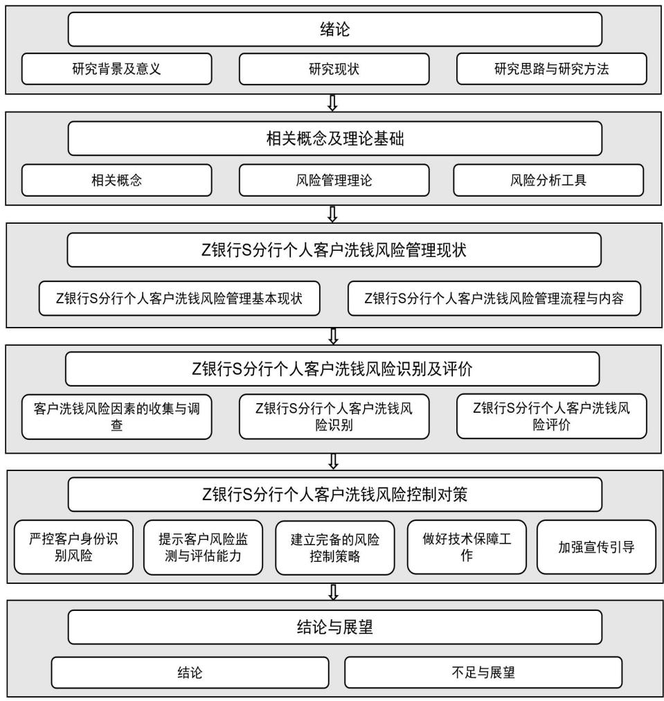

# 第 1 章 绪论

# 1.1 研究背景与意义

# 1.1.1 研究背景

长期以来，洗钱犯罪一直是世界各国重点打击的对象，反洗钱作为国际通行要求，标准愈发严格，监管形势逐渐严峻，反洗钱履职的义务主体不断扩大，非金融业逐渐进入反洗钱履职义务主体范畴，但这并没有影响金融业在反洗钱义务主体中的重要位置。洗钱犯罪对经济和社会的影响是巨大的。洗钱犯罪首先会破坏金融管理秩序，危害金融部门的健康发展，其次，洗钱犯罪往往会影响经济稳定性并对税收带来损失，最后，洗钱犯罪还会影响国家或地区的制裁风险及声誉风险，甚至影响社会成本。

洗钱是将非法所得合法化的过程，因此，其往往关联着其他犯罪活动，严厉打击洗钱犯罪，不只是打击洗钱犯罪这一金融犯罪本身，还要打击其背后掩盖、隐藏的其他性质更为恶劣的犯罪。很多人都会觉得洗钱犯罪与人们的日常生活有着遥远的距离，似乎遥不可及，但洗钱犯罪其实一直在我们身边发生。举个最简单的例子，“刷单返利”就是一种非常常见的洗钱方式，“刷单”洗钱犯罪组织者建立或购买部分虚拟店铺用于刷单；组织者以某种形式将违法所得转移至“刷单”实施者；由实施者在指定虚拟店铺拍下商品并按商品标注金额付款；虚拟店铺物流向实施者发送“空包裹或其他物品”伪造完整交易流程；组织者向实施者以某种途径支付佣金。由于“刷单”的操作门槛低、盈利噱头大，普通民众往往会被其吸引，而误入洗钱漩涡。

2020 年，突如其来的疫情打乱了生活原本的平静，人们在处理个人金融业务时往往会优先选择线上渠道完成，互联网金融在这一背景的推动下得到进一步发展。各家金融机构纷纷推出新版手机银行、网上银行，抓住时机，大力拓展业务，让自身在金融市场中所占比重进一步加大。互联网金融给人们的生活带来的是极大的便利， $7 { \times } 2 4$ 的金融服务可以让客户享受到便捷的资金周转，但在不法分子眼里，便捷的资金周转可让其在更加隐蔽的时间段完成其对非法资金的合法化。在互联网金融快速发展的大背景下，洗钱犯罪蓬勃发展，切断资金链的手段更加丰富，资金周转的途径更加多元，洗钱犯罪变得更加隐蔽，不易发现。以诈骗犯罪为例，在疫情的背景下，犯罪分子会在合理背景和条件下精心布局，使交易变得更加可信，金融机构对交易异常信号的识别、可疑交易监测的难度进一步加大。

因此，要想打击洗钱犯罪，不仅要金融机构不断提升自身的反洗钱能力，还需要国家从立法层面给予支持。2015 年提出的帮助信息网络犯罪活动罪的适用性增强，《刑法修正案》（十一）在 2021年正式实施，“自洗钱”正式入刑，这都体现了国家对于打击洗钱犯罪的关注与决心。中国人民银行作为我国的监管部门，在打击洗钱的犯罪一直保持着高度的警惕性，紧跟国际反洗钱形势，优化反洗钱监管框架，并保持高度的执法检查力度，确保义务机构能够切实履行反洗钱义务。

人民银行官网并无2022年及2023年的反洗钱工作报告，但在对2022及2023年人民银行总行及各分支机构官网公布的数据进行归纳后发现，2022 年全年反洗钱处罚共 893 笔，涉及 32 个省市的 350 家义务机构及相关责任人，罚单总金额约5.89亿元，其中机构处罚金额约5.68亿元，个人处罚金额约0.21亿元。到了2023年，全年人民银行发出的罚单共 1032笔，涉及 32 个省市的 389家义务机构及相关负责人，罚单总金额约52.24亿元，其中机构处罚金额约52.05亿元，个人处罚金额约 0.19亿元。2023年，人行针对财付通支付科技有限公司和支付宝（中国）网络技术有限公司分别开出了24.27亿元和22.31亿元的超大额罚单，即使剔除这两笔超大额罚单的影响，2023 年的罚单总金额仍高达 5.66 亿元，充分说明人行在做好洗钱风险管理的决心。

表 1.1 人民银行执法检查情况表  
Table 1.1 Enforcement checklist for the People's Bank of China (PBOC)   

<table><tr><td></td><td>罚单数量</td><td>违规机构及 个人数量</td><td>罚单总金额 （亿元）</td><td>机构罚款金额 （亿元）</td><td>个人罚款金额 （亿元）</td></tr><tr><td>2022年</td><td>893</td><td>350</td><td>5.89</td><td>5.68</td><td>0.21</td></tr><tr><td>2023年</td><td>1032</td><td>389</td><td>52.24</td><td>52.05</td><td>0.19</td></tr></table>

Z 银行在反洗钱方面起步相对较晚，2006 年才开始按照《反洗钱法》的有关要求处理反洗钱有关业务。在初期，并没有反洗钱相关的完备的内部制度，仅制定了《Z 银行反洗钱工作制度及实施办法》，但由于并没有具备反洗钱知识的专业人员，大家对于反洗钱的认识仅仅停留在写报告、准备材料上。但随着业务种类的不断丰富以及人民银行出台的一系列法规不断实施，Z银行在反洗钱方面的相关内部制度也不断完善，2020 年，各省逐步落实反洗钱工作集中上收，力图打造一支专业素质过强的反洗钱专业团队，但基层营业机构也因为反洗钱工作集中上收对本属于基层机构的反洗钱履职工作重视程度有所降低，加之近些年新型犯罪的不断涌现，经公安机关立案的电信诈骗、赌博、传销、非法集资等犯罪行为中，不法分子利用银行账户进行过渡资金、洗钱等犯罪行为的趋势愈演愈烈，银行反洗钱履职能力受到严峻考验。

# 1.1.2 研究意义

洗钱犯罪已经演变成为我国经济社会发展的最大障碍，打击洗钱犯罪，有助于建立良好的金融秩序，助力营商环境改善，让经济社会发展再向前迈进一大步。打击洗钱犯罪，抑制金融风险，银行业金融机构承担着重要责任，肩负重要使命。银行业金融机构要做好客户洗钱风险管理，就要从根本上做好洗钱风险的防范，无论是客户关系建立环节，还是客户关系持续环节，都应充分履行反洗钱义务，做好客户尽职调查及持续尽职调查，不断提升自身的洗钱风险识别与评估能力，并对客户采取针对性的管控措施，事前、事中、事后全流程做好客户尽职调查，做好客户洗钱风险管理。

Z 银行 S 分行是 Z 银行辖属二级分行，坐落于辽宁省沈阳市，沈阳市作为辽宁省的省会，因其具有诸多的优惠政策而吸引了大量外来人员就业，2017 年，中国（辽宁）自由贸易试验区沈阳片区正式挂牌成立，越来越多的外来人员选择在沈创业。这样的背景让 S 分行具有业务种类繁杂、客户群体庞大、客户特征多样等诸多特征，让其在客户风险识别上具有预警的作用。

本文以 Z 银行 S 分行个人客户为研究对象，探究反洗钱视角下的个人客户洗钱风险管理，原因有二，一是沈阳市作为东北老工业基地之一，目前的企业客户往往以传统行业为主，虽然不乏信息咨询、科技公司等新兴行业公司，但公司往往规模较小，再加上“断卡行动”以来要求对客户账户交易限额以客户实际需求及客户身份综合设定，企业网银等电子渠道操作相较于个人较为复杂，导致账户的出租出售难度相对较大，让企业客户的洗钱风险相对较低；二是根据行内2023年度报送可疑交易报告的客户类型进行分析，发现个人客户占比超过 $9 8 \%$ ，这说明目前S分行的企业客户整体洗钱风险偏低，而个人客户的洗钱风险管理仍需加强。

本文的研究意义及价值主要体现在如下几个方面：

首先，可以帮助 Z 银行 S 分行建立更加完备的风险控制策略，有效抑制客户洗钱风险的发生。对于 Z 银行 S 分行自身而言，可以帮助其对客户的尽职调查及持续尽职调查的标准予以规范，对客户的风险监测与评估模型予以更新和细化，让基层员工更容易识别到客户所存在的风险，采取针对性的控制措施，在未来营销目标制定时能够更好的平衡合规与发展之间的关系，促进 Z 银行 S 分行合规经营，稳健行远。除此之外，由于 Z 银行 S 分行因其具有业务种类繁杂、客户群体庞大、客户特征多样等诸多特征，在客户风险识别上具有预警的作用，对本省的洗钱风险管理具有一定的指导意义，可以协助省内其他地区做好客户洗钱风险的防范，从根本上减少洗钱风险的发生。

其次，可以使得 Z 银行 S 分行对客户洗钱风险的评定及风险控制措施的确定更加规范。对于存在不同风险因素的客户，可以制定与之相对应的风险控制策略，客户风险因素一旦出现，就可以及时根据客户风险因素对应的风险等级调整客户洗钱风险等级，实现客户风险等级的动态调整。

最后，有助于对 Z 银行 S 分行的客户尽职调查及持续尽职调查流程和标准予以规范，可以让基层的银行工作人员意识到，客户尽职调查贯穿与客户的全流程，无论是客户关系建立时还是客户关系持续期间，直至客户退出客户关系。同时可以提示基层的银行工作人员做好客户的相关风险提示，让客户知晓洗钱犯罪的危害，从根本层面上减少洗钱风险的出现。

通过对以上三个方面的研究意义的阐述，相信本文可以为 Z 银行 S 分行个人客户的洗钱风险管理提供帮助，提升客户洗钱风险管理的水平和质量，同时，本次的研究结果也可以为本地区的其他同业给予参考和借鉴，帮助其确定本地区客户的洗钱风险特征，制定针对性的风险控制策略，对提升本地区的客户洗钱风险管理质量具有重要意义。

# 1.2 研究现状

# 1.2.1 国外研究现状

国外学者对洗钱风险管理的研究相对较早、也比较全面系统。通常来讲，典型的洗钱可以分为三个阶段，即处置阶段、离析阶段和融合阶段。在实际操作过程中，三个阶段有时明显，有时发生重叠、交叉，或者集合在一起，难以截然分开。理查德·普拉特曾在《反洗钱与反恐融资指南》中收集了十七名深谙反洗钱监管业务的专家和学者的论文，书中对洗钱的过程进行了深入的剖析，提出金融机构在进行洗钱风险管理时要做好客户的身份识别与资金流向监控，为各国在进

行反洗钱监管及履职提供了丰富经验。

Bello&Harvey(2017)认为如果对客户根据地理风险、产品或服务风险等变量进行风险评级，就会忽视客户异常交易特征所带来的洗钱风险，是存在问题的，对客户的洗钱风险评估要进行综合评判。

Ernesto Ugo Savona 和 Michele Riccardi(2019)认为风险为本已成为全球反洗钱工作的焦点。政府、执法机关、公共部门、银行和专业人员等涉及洗钱活动的所有机构都必须改变其工作方式，不再以规则为基础，而是以风险为基础，把洗钱风险管理的资源用于洗钱风险较大的领域。

Kishore Singh(2019)的研究显示，商业银行所面临的经营风险相对较高，其中，洗钱风险是一个比较突出的风险因素。现有的风险管理理论成果可以为商业银行的洗钱风险预防和控制工作提供科学的指导，有助于银行构建和完善反洗钱工作机制，达到较好的风险管理控制效果，保障银行的健康发展。

在反洗钱工作中，最重要的工作就是对客户进行身份识别。而在客户身份识别领域，Kathleen Donnelly Gowin(2020)等人认为，在客户身份识别过程中，现代信息技术可以作为一种可靠的识别工具，其中最为代表的就是虹膜识别技术，其能够极大提高客户身份识别的准确性。

Chitimira Howard and Munedzi Sharon(2022)分析了国际上关于客户尽职调查和相关反洗钱措施的最佳实践案例，认为各国应依托反洗钱最佳实践建立符合自身国情的针对性控制措施，以实现洗钱风险管控。

Alexandre Claudio Reginaldo(2023)认为应建立一种融合机器学习和风险组件的多智能体系统的特征来识别和标记可疑的银行客户，从而实现对客户洗钱风险的控制。

# 1.2.2 国内研究现状

我国对洗钱风险管理的研究起步较晚，近些年来，我国学者对于洗钱风险管理进行了广泛而深入的研究，旨在探讨客户洗钱风险管理的现状、挑战及应对策略。

郑芙蓉、亓鲁（2020）指出义务机构在进行洗钱风险评估时，要重点从客户、业务、产品及渠道四个维度来进行评估，并根据评估结果优化当前的客户风险管理策略，完善风险识别机制，强化洗钱风险控制措施。

韩文科（2020）以第三方支付为研究对象，对其风险因素进行了系统的分析和探讨。他指出，以用户身份识别为代表的技术性问题，将会是第三方支付业务面临的最大风险。在目前的技术环境及防控机制下，第三方支付无法对用户进行准确有效的身份识别，从而带来较大的风险。

拓扬、王珞、潘善宝（2020）认为，在整个金融机构的风险管理中，洗钱风险是一个非常重要的组成部分，它可以有效地发挥其防范功能。相对于传统的保留交易记录和报告可疑交易报告的事后预防手段，洗钱风险管理更注重对金融机构进行事前和事中的控制。从国际上反洗钱的实践经验来看，要提高一国的反洗钱制度的效能，必须充分发挥金融机构的作用，而洗钱风险管理措施就是一个关键环节。

冯怡（2021）认为，对客户进行洗钱风险评估要以客户为中心，全面分析其行为及金融交易，才能防范洗钱案件发生。

唐光立、李昂（2021）提出在当前环境下，是一个国际经济交流日益频繁、全球资金即时互通的新时期，进一步防范金融机构风险，提高我国反洗钱治理系统的整体效能，已经成为一种必要的措施。随着各级监管部门的关注，反洗钱风险管理已成为目前金融机构进行全面风险管理的一个重要组成部分，同时也是提高整个金融机构风险控制能力的一个重要途径。

王娅，王小丽，陈森森（2022）提出，要强化各部门内部各层级、各业务条线之间的联动与协作，将“以客户为中心”的客户洗钱风险管理理念贯彻到底。在进行了系统的综合评价、预警或者是直接分级之后，要加强对高风险客户的手动筛选和加强监控，深入对高风险客户进行连续、动态的追踪，积极地扩展风险辨识的管理途径，使风险控制措施与其实际风险状况相匹配，提高客户的洗钱风险管理效果。

张胜男、张伟齐、李宁（2022）认为，商业银行应当采纳或实施一个以风险为导向的程序。这个程序的核心是要对客户进行持续的尽职调查，涵盖了从初步识别到长期监测的各个阶段。具体来说，这包括在客户交易发生之前，银行必须彻底了解并核实客户的身份信息；在业务操作过程中，银行需要对每一笔交易进行严格的审查，确保所有的操作都符合银行的政策和法规要求；而在业务完成之后，银行则需要持续地监控可能出现的风险，并及时采取措施来应对这些风险。

张剑（2023）从近几年监管做出行政处罚的处罚点入手，对 2023 年上半年配合行政执法检查接受处罚情况进行分析，提出了坚持风险为本需要处理三对关系，即正确且同心处理与金融监管关系、正确且耐心处理与业务部门关系、正确且专心处理与科技系统关系，不断提升自身的客户洗钱风险管理能力。文章还指出，金融机构要做好客户洗钱风险管理，要牢牢把握客户尽职调查这道防线，做到及时准确的客户尽职调查，防止“病从口入”。

# 1.2.3 文献综评

通过深入剖析国内外众多学者的学术研究成果，可以清晰地看到一个共同的趋势：无论是在国际舞台上还是在国内研究领域，专家们都普遍认同洗钱风险管理应遵循“风险为本”的原则。他们认为，只有以风险作为管理的出发点和落脚点，才能更有效、更精准地制定和执行相应的风险控制措施。另外，当银行将客户作为其洗钱风险管理策略的核心时，能够极大地促进风险管理的有效实施。银行可以更加精准地识别潜在的风险点，制定出更为周密的防控措施。因此，从客户角度出发进行风险管理，不仅是银行合规管理的重要组成部分，也是构建和谐金融环境的关键所在。

在做好以“风险为本”的客户洗钱风险管理过程中，做好对客户的持续尽职调查是其中的关键环节。在对客户持续尽职调查的过程中，最为重要的就是客户身份的识别，客户身份识别的准确性与及时性是客户尽职调查结果准确性的重要影响因素。商业银行在其发展过程中，要不断提升自身的客户身份识别手段，不断提升自身的技术能力，做好客户身份识别的及时性与准确性，有效防范洗钱风险的发生。

# 1.3 研究思路与研究方法

# 1.3.1 研究思路

论文通过德尔菲法、层次分析法以及模糊综合评价法等研究方法，对 Z 银行 S 分行的个人客户洗钱风险进行识别、评价，找出个人客户洗钱风险管理过程中存在的薄弱环节，提出针对性的风险控制对策，最终实现 Z 银行 S 分行对个人客户洗钱风险管理的提升。

论文首先对国内外相关文献进行梳理，从多方面对客户的洗钱风险管理情况进行梳理，了解国内外研究现状，确定研究所需的理论基础。

其次，依托理论基础，结合 Z 银行 S 分行的实际情况，介绍了其目前的基本情况，总结其个人客户的洗钱风险管理概况，梳理其个人客户洗钱风险管理的

流程与内容，为后续研究奠定基础。

再次，完成 Z 银行 S 分行个人客户洗钱风险识别及评价。运用文献研究、数据分析完成风险因素的初步识别，运用德尔菲法完成个人客户洗钱风险因素识别。将定性分析与定量分析相结合，分别运用层次分析法及模糊综合评价法完成风险评价，构建层次结构、计算风险因素所占权重、对风险因素进行层次总排序并对Z银行 S 分行个人客户洗钱风险整体情况进行评价。

最后，根据风险评估结果，提出针对性的风险控制对策，各控制对策协同作用，共同实现 Z 银行 S 分行个人客户洗钱风险管理。在此基础上得出本文的研究结论。

# 1.3.2 研究内容

第一部分为绪论部分，阐述本文的研究背景并在文献综述的指导下，提出研究意义、内容和方法，绘制出研究技术路线图，梳理了整篇文章结构思路；

第二部分阐述相关概念界定，以及使用的理论基础，具体解释了洗钱和反洗钱的相关概念具体定义，介绍风险管理理论的产生与发展、概念、流程与策略，介绍了风险识别与风险评价过程中常用的分析工具，作为理论基础为后续研究提供理论指导；

第三部分对 Z 银行 S 分行目前个人客户洗钱风险管理现状进行分析，首先总结 Z银行 S 分行基本情况及目前的风险管理情况，并对 Z 银行 S 分行目前的个人客户洗钱风险管理流程与内容进行梳理，为后续研究奠定基础；

第四部分为 Z 银行 S 分行个人客户洗钱风险识别及风险评价，运用德尔菲法，从客户身份信息、资金交易、行为三方面对目前 Z 银行 S 分行个人客户的风险因素进行识别，通过层次分析法对识别出的风险因素计算综合权重，进行层次总排序，通过模糊综合评价法计算出 Z 银行S 分行个人客户洗钱风险评价值，并对两种分析方法得出的结果进行分析；

第五部分为针对性的风险控制措施对策，从严控客户身份识别风险、提升客户风险监测与评估能力、建立完备的客户风险控制策略、做好技术保障工作、加强宣传引导等五个维度提出针对性风险控制对策；

第六部分为总结与展望，总结全文研究的结论，找出不足，并根据本次研究内容提出下一步研究的重点和方向的展望。

论文整体脉络详见图1.1研究技术路线图。

  
图 1.1 研究技术路线图  
Fig 1.1 Research Technology Roadmap

# 1.3.3 研究方法

本文主要采用了文献研究法、德尔菲法、层次分析法、模糊综合评价法四种研究方法。具体情况如下：

文献研究法：文献研究法，作为一种深度的学术探究手段，其核心在于广泛搜集与研究问题相关的文献资料。通过这种方法，研究者能够深入了解研究主题的基础知识，掌握目前该领域内的研究进展和学术动态。它不仅仅是一种收集资料的手段，更是一个理解和把握问题全貌的过程。通过对现有文献的梳理和分析，研究者可以构建起坚实的研究基础，为自己的研究工作奠定稳固的基石。本文通过收集和筛选相关文献，对现有的相关研究进行系统梳理并进行总结评述，对洗钱与反洗钱、风险管理相关研究形成科学认识，为后续研究奠定理论支撑。本文通过对文献进行收集整理，概况总结了对于客户洗钱风险管理的国内外研究现状，确定了研究的理论基础，对理论进行归纳总结后将理论应用于后续的研究中。

德尔菲法：又称专家调查法，本质上是一种反馈匿名函询法。其大致流程是：在对所要预测的问题征得专家的意见之后，进行整理、归纳、统计，再匿名反馈给各专家，再次征求意见，再集中，再反馈，直至得到一致的意见。本文以 Z银行S分行的个人客户为具体研究对象，采取匿名、背对背发送问卷调查的方式，对前期梳理出的 Z 银行 S 分行个人客户洗钱风险因素进行筛选、识别，以便后续进行风险评价，得出风险控制对策。

层次分析法：层次分析法，简称 AHP，是指将与决策总是有关的元素分解成目标、准则、方案等层次，在此基础之上进行定性和定量分析的决策方法。本文在研究过程中基于前期识别到风险因素及风险层次结构，采用1-9 标度法来对比分析不同因素之间的相对重要性，从而构建出评价矩阵，计算最大特征根的值并分析一致性，得出每项风险因素的权重。

模糊综合评价法：模糊综合评价法是一种基于模糊数学的综合评价方法，它使用模糊数学的综合评价模型来处理模糊性或不确定性、定性指标难以定量化的问题。本文在风险评价环节使用了模糊综合评价法，确定风险因素的隶属度，将不同风险因素的影响程度由模糊的“高风险、中高风险、中风险、中低风险、低风险”转变为数值，构建评价向量，最终计算出各风险因素以及总体风险的评价值，并对评价结果进行分析。
