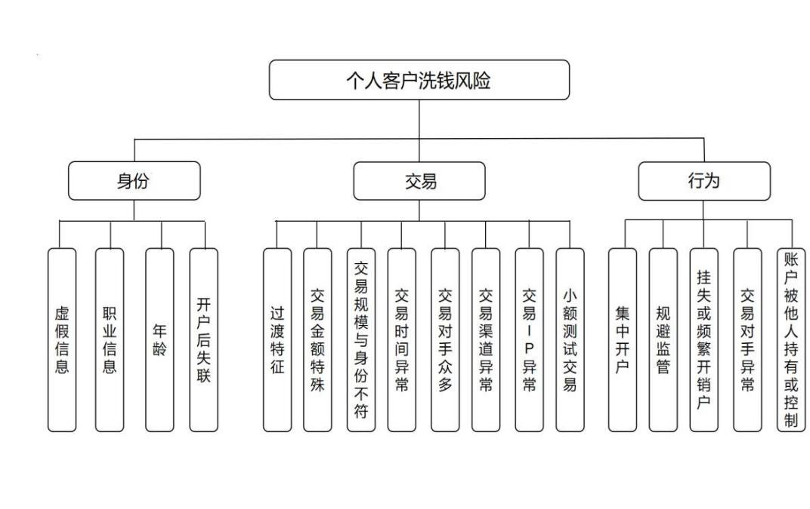

# 第 4 章 Z 银行 S 分行个人客户洗钱风险识别与评价

# 4.1 客户洗钱风险因素初步识别

# 4.1.1 识别方法的选择

常见风险识别方法主要包括头脑风暴法、文献研究法以及德尔菲法。本文在进行风险识别过程中将文献研究法做为风险因素初步识别的主要方式，将德尔菲法作为识别的主要方式。选择原因主要包括以下几个方面：一是在风险因素收集阶段，为尽可能多的对风险因素进行初步识别，并确保风险因素的质量，依赖于每个人的主观意见和偏见的头脑风暴法就显得不再适用，防止得出的观点和结论存在偏差，而文献研究法则可以很好的弥补这一缺陷，且本次所采用的文献专业度处于国际领先水平，具有权威性。二是德尔菲法在进行风险因素识别时，能够很好的考虑 Z 银行 S 分行的实际情况，专家们的意见可以很好的与 Z 银行 S 分行的实际情况进行适配，从而后续可以得出更加完备的风险控制对策。

本文主要运用德尔菲法来对个人客户的洗钱风险因素进行识别，对Z银行S分行个人客户洗钱风险进行评价，在专家的选择上，专家均来自 Z 银行，并在不同的层级从事反洗钱工作。本文选取了20位专家进行调查，专家组成员包括2名Z银行一级分行研究客户可疑特征甄别的专家，4名S 分行负责反洗钱工作的内控法规中心管理人员，6 名负责反洗钱与监测分析的支行反洗钱管理员，4名营业机构运营内控经理及 4名网点柜员。

在客户洗钱风险识别阶段，对前期初步识别到的客户风险因素发放匿名调查问卷，各专家自行判断各风险因素是否为 Z 银行 S 分行个人客户洗钱风险。在经过多轮专家调查后形成一致意见，最终筛选出符合 Z 银行 S 分行实际情况的个人客户洗钱风险因素。

# 4.1.2 风险因素的初步识别

对于客户的洗钱风险因素，国际公认反洗钱师协会认为应该从客户身份、客户地域以及客户使用的产品及服务来进行划分。而在商业银行的实际工作中，客户使用的产品和服务又可以衍生为客户交易和行为两个方面，客户的地域特征则体现在客户身份中，即客户是否为异地开户，开户时客户的地址信息或工作单位信息是否与开户地相一致或相邻。

因此，对于客户的洗钱风险因素将从客户身份信息、客户的资金交易、客户的行为三个维度进行初步识别。在对客户的洗钱风险因素进行初步识别的过程中，本文首先提取了国际公认反洗钱师协会在其培训教材中提及的客户风险因素，并从客户身份信息、客户资金交易、客户行为三个维度进行分类归纳，并对 Z 银行 S 分行 2023 年度的被报送可疑交易报告客户的风险因素进行归纳整理，提取出那些仅在 Z 银行 S 分行存在的风险因素，最终确认出可供专家进行筛选的洗钱风险因素。

（1）客户身份风险。

客户在银行开户环节提供虚假信息。客户在开户环节不愿提供真实身份信息，而是提供虚假的工作单位，职业等信息。

客户从事的职业或行业为现金密集型行业。随着国家对于创新创业的鼓励，越来越多的人不在选择就业，而是选择自己创业，成为私营业主。大部分人选择的主要行业为餐饮、批发零售、便利店等行业，而这些行业都有着共同的特点，就是客户主要以现金支付为主要途径来购买其产品或服务。密集的现金交易更容易让洗钱者将非法资金与其合法所得融为一体，不易被追查发现。

客户为外国自然人。客户利用其主证件为外国护照、证件号码在更换后可能完全不同的特征去建立多个客户号，以此来分拆交易，规避监管。

客户年龄。分析Z 银行S 分行2023年度的被报送可疑交易报告客户的年龄特征，可以发现发生可疑交易客户的年龄集中在两个年龄段，一是20-30岁，二是 50 岁以上人群。这两个年龄段都很容易去相信别人，对于各种洗钱手段的了解较少，更容易发生出租出售账户或者为不法分子转移资金的行为。

客户预留地址信息为开户地以外的其他地区。客户在进行开户时，无法提供在开户地的常住地址，而是利用身份证上的证件地址作为预留地址，当询问其工作单位地址时，客户多称由于刚到开户地，还没有找到工作。这与常理存在一定出入，现阶段银行卡早已不在受地域限制而出现异地的费用，一般人在开立账户时往往出于工作或者生活需要，如开立工资卡、办理住房贷款等需求，这种情况下客户的常住地址或工作单位地址一定会与开户地相符，客户也可以将相关地址作为其开户的预留地址。

客户失联。当客户可疑交易发生后银行电话联系客户时，客户预留电话长期关机或已为空号，银行无法通过其预留电话联系到客户。

（2）客户交易风险。

客户频繁发生现金交易。现阶段的电子支付技术已经非常成熟，跨行转账也可实现立即到账，但客户仍然通过取现和存现的方式进行资金的划转，甚至为了规避银行的大额可疑交易报告的起点以及大额现金交易登记资金来源及用途等相关制度，进行分拆存取现金。

客户交易呈现过渡特征。在调取客户交易流水进行分析发现，客户的账户资金往往呈现出快进快出的特征，账户在每日最后一笔交易完成后不留余额或仅有小额资金留存在账户中，且资金往往呈现出分散转入集中转出或集中转入分散转出的特征，疑似进行资金归集或将资金进行分散以规避监管。

交易金额异常。客户的交易金额为百元的整数倍或以元角分的方式进行进位，以此来对交易进行打标。

客户交易规模明显与其身份不符。客户账户如果一旦参与洗钱犯罪，不法分子为切断交易链，往往会采取在不同账户间进行资金划转的方式，这样无论是客户的交易笔数或交易金额，都会与客户实际身份发生偏离，导致交易规模明显与其身份不符。

交易时间异常。客户交易时间发生在夜间的主要原因有多种，但主要体现在以下两个方面，一是部分客户认为夜间发生的交易不会受到银行的监管，而故意将非法或不合规交易安排在夜间及凌晨发生；二是很多赌博等非法网站，特别是IP 地址在境外的非法网站都会在夜间进行非法活动，如客户本人或其账户参与到此类非法活动中，就会呈现出夜间交易的特征。

交易对手众多。对于普通客户的交易通常呈现一种规律性的特征，交易对手相对固定，但交易异常客户的交易对手往往是普通客户的十倍甚至百倍，而且交易对手多为一次性交易对手，且多为跨行交易对手。

交易渠道异常。发生可疑交易客户一般会选择非柜面的交易渠道，因为非柜面交易渠道发生交易会更加便捷，交易时间更加灵活，虽然普通客户也会因为非柜面渠道的便捷而选择将交易通过非柜面渠道发生，但对于发生可疑交易的客户，非柜面交易可以更好地掩盖其交易的非法性，比如部分可疑交易客户会选择通过ATM 渠道夜间频繁跨行存取现金，这样既可以切断资金链条又可以让银行工作人员无法对其交易进行实时监控。

交易 IP 异常。在银行的日常工作中能接触到可疑交易客户中，一部分是将自己的银行账户、电话卡、网银出租出售，另一部分则是客户本人操作去协助不法分子过渡或转移资金。前者就有可能导致客户账户交易的发生地与客户的常住地等地址存在很大的出入。而不法分子在利用账户过渡非法资金时往往为规避监管，都会采用多人同时操作的模式，在不同地区的不法分子会登录同一网银发生交易，导致账户交易 IP 在短时间内多次发生变换，甚至会利用伪基站产生虚拟的境外IP 地址，以规避银行监管。

小额测试交易。交易异常客户在发生异常交易前或在异常交易发生的过程中多会采取小额测试交易的方式去检测账户是否可以正常使用，是否被银行或有权机关采取管控或交易限制措施。小额测试交易一般为微信提现、话费、电费充值等，这样更不容易引起注意。

交易附言异常。可疑交易客户为标记交易，可采取的标记方式有两种，一种是金额标记，另一种就是交易附言标记，会在交易附言中录入特定的字符，以此来作为该笔交易的暗号。

（3）客户行为风险。

客户在开户过程中行为举止异常或过于紧张。客户在开户过程中对工作人员的尽职调查表现出极度不适和紧张，对于银行工作人员核实其身份信息的行为保持高度警惕，在核实其工作及月收入等相关情况时不配合银行的调查。应断卡行动的有关要求，银行在对客户开立银行账户时都会核实账户的用途，对客户账户配置相匹配的账户限额，但客户对账户有限额限制这一约束条件极其敏感，表示自己要开立能够进行大额网上转账的账户，不得进行限额控制。

客户关系建立渠道为非营业机构。客户利用自助渠道建立客户关系可以规避银行对其身份信息真实性达到审查，从而规避银行监管。

挂失、频繁开销户。部分客户为防止非法交易被银行及有权机关发现，就会采用挂失或销户的方式规避监管，然后再补办新卡，导致可疑交易的追踪难度加大。

交易对手异常。客户的交易对手已经因洗钱等相关案件被有权机关查询、冻结，或交易对手使用的账户已经被公安通报为电信诈骗涉案账户。

账户被他人持有或控制。对于低龄或高龄客户，或者账户交易 IP 明显异常的客户，其账户往往并未在客户本人手中，而是由他人代为保管或已经出租出售。

客户规避银行监管。客户规避银行监管的主要特征就爱体现在客户不配合银行调查。当客户可疑交易发生后，银行一般会通过电话联系客户核实其交易情况，以确定其是否存在洗钱风险，但在尽职调查过程中，客户往往表现出不配合，拒接或者隐瞒其真实交易背景，甚至对银行工作人员恶语相向。

# 4.2 Z 银行 S 分行个人客户洗钱风险识别

在本轮对 Z 银行 S 分行个人客户洗钱风险进行识别的过程中，按照客户身份、资金交易、行为三个维度进行识别，每个维度下设多个风险因素识别要点，为确保本轮专家调查的有效性，共对相关专家发放了三次调查问卷，问卷采用邮件方式进行发放，并在一周内对问卷进行回收。为保证专家意见的一致性，在对第一次的打分结果进行整理后，将相关的结果反馈给各位专家，再请各位专家完成第二次问卷调查，完成第二次打分，直至形成一致性意见。本轮调查的主要目的为由专家对前期初步识别到的客户洗钱风险因素是否符合 Z 银行 S 分行的实际情况进行筛选。本轮三次调查均累计发放问卷 20份，回收问卷20份，问卷回收率 $100 \%$ 。

# 4.2.1 身份信息风险识别

前期初步识别到的客户身份信息风险因素共包含虚假信息、职业信息、客户为外国自然人、年龄、客户开户后失联、异地开户等六大风险因素。在三次问卷调查中，专家对于这六项风险因素识别要点的打分情况如表4.1、4.2所示。

表 4.1 客户身份信息风险识别打分情况（第一次）  
Table 4.1 Customer Identity Information Risk Identification Scoring (first time)   

<table><tr><td>风险类型</td><td>风险因素识别要点</td><td>是</td><td>否</td><td>总计</td></tr><tr><td rowspan="6">身份风险</td><td>虚假信息</td><td>16</td><td>4</td><td>20</td></tr><tr><td>职业信息</td><td>12</td><td>8</td><td>20</td></tr><tr><td>客户为外国自然人</td><td>7</td><td>13</td><td>20</td></tr><tr><td>年龄</td><td>14</td><td>6</td><td>20</td></tr><tr><td>客户开户后失联</td><td>16</td><td>4</td><td>20</td></tr><tr><td>异地开户</td><td>9</td><td>11</td><td>20</td></tr></table>

表 4.2 客户身份信息风险识别打分情况（第二、三次）

Table 4.2 Customer Identity Information Risk Identification Scoring (second and third time)   

<table><tr><td>风险类型</td><td>风险因素识别要点</td><td>是</td><td>否</td><td>总计</td></tr><tr><td>身份风险</td><td>虚假信息</td><td>16</td><td>4</td><td>20</td></tr></table>

续表 4.2  

<table><tr><td>风险类型</td><td>风险因素识别要点</td><td>是</td><td>否</td><td>总计</td></tr><tr><td rowspan="5">身份风险</td><td>职业信息</td><td>12</td><td>8</td><td>20</td></tr><tr><td>客户为外国自然人</td><td>6</td><td>14</td><td>20</td></tr><tr><td>年龄</td><td>14</td><td>6</td><td>20</td></tr><tr><td>客户开户后失联</td><td>15</td><td>5</td><td>20</td></tr><tr><td>异地开户</td><td>9</td><td>11</td><td>20</td></tr></table>

在三次对专家进行问卷调查的过程中，对于客户为外国自然人、异地开户这两个风险因素识别要点，均有过半数的专家认为该风险因素识别要点不为 Z 银行 S 分行的个人客户的风险因素。因此在后续进行客户风险评价过程中，对该风险因素予以排除。而对于其他四项风险因素，客户提供虚假信息、客户开户后失联则需要进行重点关注，可作为身份层面判断客户风险的主要影响因素，客户职业、年龄情况则可作为客户身份信息方面辅助判断其洗钱风险的判断依据。

# 4.2.2 资金交易风险识别

前期初步识别到的客户交易风险因素共包含过渡特征、交易金额特殊、交易规模与身份不符、交易时间异常、交易对手众多、交易渠道异常、交易IP 异常、小额测试交易、现金交易、交易附言等十大因素。在三次问卷调查中，专家对于这十项风险因素识别要点的打分情况如表4.3、4.4所示。

表 4.3 客户资金交易风险识别打分情况（第一次）  
Table 4.3 Client Money Transaction Risk Identification Score (first time)   

<table><tr><td>风险类型</td><td>风险因素识别要点</td><td>是</td><td>否</td><td>总计</td></tr><tr><td rowspan="9">交易风险</td><td>过渡特征</td><td>20</td><td>0</td><td>20</td></tr><tr><td>交易金额特殊</td><td>17</td><td>3</td><td>20</td></tr><tr><td>交易规模与身份不符</td><td>20</td><td>0</td><td>20</td></tr><tr><td>交易时间异常</td><td>17</td><td>3</td><td>20</td></tr><tr><td>交易对手众多</td><td>19</td><td>1</td><td>20</td></tr><tr><td>交易渠道异常</td><td>18</td><td>2</td><td>20</td></tr><tr><td>交易IP异常</td><td>13</td><td>7</td><td>20</td></tr><tr><td>小额测试交易</td><td>16</td><td>4</td><td>20</td></tr><tr><td>现金交易</td><td>9</td><td>11</td><td>20</td></tr><tr><td>交易附言</td><td></td><td>9</td><td>11</td><td>20</td></tr></table>

表 4.4 客户资金交易风险识别打分情况（第二、三次）  
Table 4.4 Client Money Transaction Risk Identification Score (second and third time)   

<table><tr><td>类型</td><td>风险因素识别要点</td><td>是</td><td>否</td><td>总计</td></tr><tr><td></td><td>过渡特征</td><td>20</td><td>0</td><td>20</td></tr><tr><td>交易金额特殊</td><td></td><td>17</td><td>3</td><td>20</td></tr><tr><td></td><td>交易规模与身份不符</td><td>20</td><td>0</td><td>20</td></tr><tr><td></td><td>交易时间异常</td><td>17</td><td>3</td><td>20</td></tr><tr><td>交易风险</td><td>交易对手众多</td><td>19</td><td>1</td><td>20</td></tr><tr><td></td><td>交易渠道异常</td><td>18</td><td>2</td><td>20</td></tr><tr><td></td><td>交易IP异常</td><td>13</td><td>7</td><td>20</td></tr><tr><td></td><td>小额测试交易</td><td>16</td><td>4</td><td>20</td></tr><tr><td></td><td>现金交易</td><td>8</td><td>12</td><td>20</td></tr><tr><td>交易附言</td><td></td><td>7</td><td>13</td><td>20</td></tr></table>

在三次对专家进行问卷调查的过程中，对于交易附言、现金交易这两个风险因素识别要点，均有过半数的专家认为该风险因素识别要点不为 Z 银行 S 分行的个人客户的风险因素。因此在后续进行客户风险评价过程中，对该风险因素予以排除。

对于其他八项风险因素，过渡特征、交易规模与客户身份不符两大因素得到了专家的一致认可，一旦发现客户交易存在这两项风险因素，就要对客户进行重点关注。交易时间异常、交易对手众多、交易渠道异常、小额测试交易四项也均得到了专家的普遍认可，认为在不法分子进行交易的过程中，往往会采取夜间交易的方式试图规避银行的监管，往往采用众多账户进行交易，对交易金额进行分拆，规避银行大额交易报告的报送，降低银行对其交易的关注度，不法分子为方便其进行交易，在交易渠道的选择上会选择不容易被银行监管到的非柜面或自助渠道进行交易，这些交易因为没有银行工作人员为其进行操作，因此对于其交易合规性、合理性的判断往往处于滞后状态，不容易被发现，小额测试交易则是不法分子为防止账户被银行或有权机关采取管控措施而专门采取的测试行为，现阶段的小额测试交易更加隐蔽，交易不再为单纯的转账交易，而是通过话费缴费、电费缴费等民生缴费交易来掩盖其测试账户情况的真实背景，以上四个风险因素均可作为判断客户风险的有力依据。交易 IP 异常这一因素通常出现在客户账户被出租出售至异地或不法分子利用虚拟IP 进行交易的情况下会产生的可疑要点，通常需要结合客户的尽调核实情况来进行综合判断，可作为客户洗钱风险判断的

辅助依据。

# 4.2.3 客户行为风险识别

前期收集到的客户行为风险共包含集中开户、客户关系建立渠道为非营业机构、挂失、频繁开销户、交易对手异常、客户被有权机关调查、客户不配合银行调查、账户被他人持有或控制等七大风险因素。

在三次问卷调查中，专家对于这七项风险因素识别要点的打分情况如表4.5、4.6 所示。

表 4.5 客户行为风险识别打分情况（第一次）  
Table 4.5 Client Behavioral Risk Profile Identification Scoring (first time)   
表 4.6 客户行为风险识别打分情况（第二、三次）  

<table><tr><td>风险类型</td><td>风险因素识别要点</td><td>是</td><td>否</td><td>总计</td></tr><tr><td rowspan="7">行为风险</td><td>集中开户</td><td>12</td><td>8</td><td>20</td></tr><tr><td>客户关系建立渠道为 非营业机构</td><td>8</td><td>12</td><td>20</td></tr><tr><td>挂失、频繁开销户</td><td>14</td><td>6</td><td>20</td></tr><tr><td>交易对手异常</td><td>14</td><td>6</td><td>20</td></tr><tr><td>客户被有权机关调查</td><td>9</td><td>11</td><td>20</td></tr><tr><td>规避监管</td><td>12</td><td>8</td><td>20</td></tr><tr><td>账户被他人持有或控 制</td><td>17</td><td>3</td><td>20</td></tr></table>

Table 4.6 Client Behavioral Risk Profile Identification Scoring (second and third time)   

<table><tr><td>风险类型</td><td>风险因素识别要点</td><td>是</td><td>否</td><td>总计</td></tr><tr><td rowspan="7">行为风险</td><td>集中开户</td><td>12</td><td>8</td><td>20</td></tr><tr><td>客户关系建立渠道为 非营业机构</td><td>8</td><td>12</td><td>20</td></tr><tr><td>挂失、频繁开销户</td><td>14</td><td>6</td><td>20</td></tr><tr><td>交易对手异常</td><td>14</td><td>6</td><td>20</td></tr><tr><td>客户被有权机关调查</td><td>9</td><td>11</td><td>20</td></tr><tr><td>规避监管</td><td>12</td><td>8</td><td>20</td></tr><tr><td>账户被他人持有或控 制</td><td>17</td><td>3</td><td>20</td></tr></table>

在三次对专家进行问卷调查的过程中，对于客户关系建立渠道为非营业机构、客户被有权机关调查这两个风险因素识别要点，均有过半数的专家认为该风险因素不为 Z 银行 S 分行的个人客户的风险因素，分析这两个因素，可以发现客户关系建立渠道为非营业机构仅表明客户善于使用非柜面渠道，无法仅依据这一因素判断客户存在实际风险，客户被有权机关调查则是因为有权机关往往通过普查的方式对大量客户开展调查，对客户洗钱风险的影响程度不高。因此在后续进行客户风险评价过程中，对该风险因素予以排除。

对于其他五项风险因素，账户被他人持有或控制得到的专家的普遍认可，出现该风险因素的客户往往存在一定的洗钱风险，集中开户、挂失或频繁开销户、交易对手异常、客户不配合银行进行尽职调查四项风险因素则在对涉案客户进行倒查环节有着明显的体现，客户作为客户涉嫌犯罪的佐证特征，但如果单一风险调整出现在客户交易中，无法直接判断客户存在异常情况。

# 4.3 Z 银行 S 分行个人客户洗钱风险评价

# 4.3.1 评价方法的选择

在本文的风险评估研究中，采用了层次分析法和模糊综合评价法这两种重要的方法来对 Z 银行 S 分行的个人客户洗钱风险进行全面评估。之所以选择这两种方法，主要基于以下几个核心原因：

首先是层次分析法的应用。该方法在层次的构建上与前期的风险识别过程高度契合，使得风险因素的归类与权重分配紧密相连。通过这种方式，能够清晰地展示各风险因素对于整个风险管理框架的影响，以及它们在不同评估维度中的相对重要性。这一点对于理解风险的全貌至关重要，它不仅可以帮助识别出哪些因素可能成为未来风险管理的重点，还能提供一个量化的参考框架，从而能够更直观地感受到每个风险因素在整体风险中所扮演的角色。

其次是模糊综合评价法的运用。在本研究中，将这种方法用于对 Z 银行 S分行个人客户潜在洗钱风险的评价。通过这种方法，可以将众多因素进行综合分析，形成一个关于风险状况的综合评价。更为关键的是，这种评价结果以数值形式呈现，便于直观地把握整体的风险水平。借助这种量化的表达方式，能够更加精确地指出哪些风险因素需要特别关注，为后续制定针对性的风险控制对策提供科学依据。

综上所述，通过综合运用层次分析法和模糊综合评价法进行风险评估，不仅能够更准确、更全面地掌握 Z 银行 S 分行洗钱风险的真实情况，而且还能够根据评估结果提出有效的控制措施，有效地弥补了风险因素分析法结论具有不确定性的特征，确保了控制措施的有效性。

# 4.3.2 基于层次分析法的各因素风险评价

（1）构建层次结构模型

前期在进行风险识别的过程中，由于本次研究的目标为 Z 银行 S 分行个人可以洗钱风险，可以轻易地确认目标层为 Z 银行 S 分行个人客户洗钱风险，准则层则为风险识别过程中采用的三个识别维度，即客户身份、客户交易、客户行为，各指标层则分别为各准则层中由专家最终识别出的风险因素。基于前期风险识别结果确立具体的层次结构如下图所示：

  
图 4.1 客户洗钱风险层次结构图  
Fig 4.1 Customer Money Laundering Risk Hierarchy

（2）构建判断矩阵

针对准则层及指标层分别构建风险因素判断矩阵。对于准则层的风险矩阵，在构建过程中围绕目标层个人客户洗钱风险来进行构建，在指标层风险矩阵构建的过程中，根据准则层的要素分为客户身份、客户交易、客户行为三个维度分别构建风险因素判断矩阵。

在本阶段，依旧沿用前期进行风险识别过程中邀请到的 20位专家，请专家对判断矩阵中的因素两两比较进行打分，调查通过电子邮件的方式进行，每轮调查完成后，将专家意见进行梳理，将调查结果反馈给各位专家，并再次对专家发送问卷，经多次调查及反馈，直至形成一致性意见，构建出准则层及指标层的风险矩阵。具体调查问卷见附录。

最终形成一致性意见后的判断矩阵如下：

$\textcircled{1}$ 准则层因素判断矩阵

对于准则层因素，主要因素包括3 个，即客户身份风险、客户交易风险、客户行为风险。

对于这三项准则层因素，在经过对专家的多次的调查与反馈后，最终所得出的形成一致性意见后的准则层风险因素判断矩阵如下表 4.7所示：

表 4.7 准则层风险因素判断矩阵  
Table 4.7 Guideline-level Risk Factor Judgment Matrix   

<table><tr><td></td><td>客户身份风险</td><td>客户交易风险</td><td>客户行为风险</td></tr><tr><td>客户身份风险</td><td>1</td><td>1/8</td><td>1/2</td></tr><tr><td>客户交易风险</td><td>8</td><td>1</td><td>6</td></tr><tr><td>客户行为风险</td><td>2</td><td>1/6</td><td>1</td></tr></table>

$\textcircled{2}$ 指标层因素判断矩阵

指标层因素中，对于客户身份层面的因素共 4个，包括虚假信息、职业信息、年龄以及开户后失联。

对于客户身份信息层面的这四项指标层因素，在经过对专家的多次的调查与反馈后，最终所得出的形成一致性意见后的身份层面风险因素判断矩阵如下表4.8 所示：

表 4.8 身份层面风险因素判断矩阵  
Table 4.8 Identity-level Risk Factor Judgment Matrix   

<table><tr><td></td><td>虚假信息</td><td>职业信息</td><td>年龄</td><td>客户开户后失联</td></tr><tr><td>虚假信息</td><td>1</td><td>1</td><td>3</td><td>1/2</td></tr><tr><td>职业信息</td><td>1</td><td>1</td><td>3</td><td>1/2</td></tr><tr><td>年龄</td><td>1/3</td><td>1/3</td><td>1</td><td>1/4</td></tr><tr><td>客户开户后失联</td><td>2</td><td>2</td><td>4</td><td>1</td></tr></table>

指标层因素中，对于客户交易层面的因素共 8个，包括过渡特征、交易金额特殊、交易规模与身份不符、交易时间异常、交易对手众多、交易渠道异常、交易IP 异常以及小额测试交易。

对于客户交易层面的这八项指标层因素，在经过对专家的多次的调查与反馈后，最终所得出的形成一致性意见后的交易层面风险因素判断矩阵如下表4.9所示：

表 4.9 交易层面风险因素判断矩阵  
Table 4.9 Transaction Level Risk Factor Judgment Matrix   

<table><tr><td></td><td>过渡特 征</td><td>交易金 额特殊</td><td>交易规 模与身 份不符</td><td>交易时 间异常</td><td></td><td>交易对交易渠交易IP小额测 手众多道异常</td><td>异常</td><td>试交易</td></tr><tr><td>过渡特征</td><td>1</td><td>3</td><td>1</td><td>1</td><td>1</td><td>1</td><td>2</td><td>3</td></tr><tr><td>交易金额特殊</td><td>1/3</td><td>1</td><td>1/3</td><td>1/3</td><td>1/3</td><td>1/3</td><td>1/2</td><td>1</td></tr><tr><td>交易规模与身 份不符</td><td>1</td><td>3</td><td>1</td><td>1</td><td>1</td><td>1</td><td>2</td><td>3</td></tr><tr><td>交易时间异常</td><td>1</td><td>3</td><td>1</td><td>1</td><td>1</td><td>1</td><td>2</td><td>3</td></tr><tr><td>交易对手众多</td><td>1</td><td>3</td><td>1</td><td>1</td><td>1</td><td>1</td><td>2</td><td>3</td></tr><tr><td>交易渠道异常</td><td>1</td><td>3</td><td>1</td><td>1</td><td>1</td><td>1</td><td>2</td><td>3</td></tr><tr><td>交易IP异常</td><td>1/2</td><td>2</td><td>1/2</td><td>1/2</td><td>1/2</td><td>1/2</td><td>1</td><td>2</td></tr><tr><td>小额测试交易</td><td>1/3</td><td>1</td><td>1/3</td><td>1/3</td><td>1/3</td><td>1/3</td><td>1/2</td><td>1</td></tr></table>

指标层因素中，对于客户行为层面的因素共 5个，包括集中开户、规避监管、挂失或频繁开销户、交易对手异常以及账户被他人持有或控制。

对于客户行为层面的这四项指标层因素，在经过对专家的多次的调查与反馈后，最终所得出的形成一致性意见后的行为层面风险因素判断矩阵如下表 4.10所示：

表 4.10 行为层面风险因素判断矩阵  
Table 4.10 Behavioral Level Risk Factor Judgment Matrix   

<table><tr><td></td><td>集中开户</td><td>规避监管</td><td>挂失、频繁 开销户</td><td>交易对手异常</td><td>账户被他人持 有或控制</td></tr><tr><td>集中开户</td><td>1</td><td>1/4</td><td>1</td><td>1/2</td><td>1/4</td></tr><tr><td>规避监管</td><td>4</td><td>1</td><td>4</td><td>3</td><td>1</td></tr><tr><td>挂失、频繁开 销户</td><td>1</td><td>1/4</td><td>1</td><td>1/2</td><td>1/4</td></tr><tr><td>交易对手异常</td><td>2</td><td>1/3</td><td>2</td><td>1</td><td>1/3</td></tr><tr><td>账户被他人持 有或控制</td><td>4</td><td>1</td><td>4</td><td>3</td><td>1</td></tr></table>

（3）权重计算及一致性检验

从准则层及指标层分别出发，按照式2.2至式2.5的方法，分别计算权重W的值以及最大特征根 $\lambda _ { \mathrm { m a x } }$ 的值，将求出的权重W以及最大特征根 $\lambda _ { \mathrm { m a x } }$ 代入到式2.6，计算出准则层及三个指标层分别的 CI 值，根据准则层及三个指标层分别的因素数量，在表 2.2 中选择对于的 RI 标准值，最终得出准则层及三个指标层分别的CR值，若准则层及三个指标层最终的CR值均小于0.1，则说明该矩阵通过了一

致性检验，具备最终的解释意义。

对于准则层的判断矩阵进行计算，可以得出如下表 4.11所示的结果，最终的CR值为0.0159，小于0.1，因此该矩阵通过了一致性检验，具备解释意义。

表 4.11 准则层风险因素判断矩阵计算结果  
Table 4.11 Guideline-level Risk Factor Judgment Matrix Calculations   

<table><tr><td></td><td>权重 W</td><td>AW</td><td>最大特征 根λmax</td><td>CI</td><td>CR</td></tr><tr><td>客户身份风险</td><td>0.0848</td><td>0.2547</td><td></td><td></td><td></td></tr><tr><td>客户交易风险</td><td>0.7672</td><td>2.3338</td><td>3.0184</td><td>0.0092</td><td>0.0159</td></tr><tr><td>客户行为风险</td><td>0.1481</td><td>0.4455</td><td></td><td></td><td></td></tr></table>

对于指标层进行判断矩阵计算，则从准则层的三个维度分别进行计算。

对于客户身份层面的判断矩阵进行计算，可以得出如表 4.12 所示的结果，CR值为0.0076，小于0.1，因此矩阵通过一致性检验，具备解释意义。

表 4.12 身份层面风险因素判断矩阵计算结果  
Table 4.12 Identity-level Risk Factor Judgment Matrix Calculations   

<table><tr><td rowspan="2"></td><td rowspan="2">权重W</td><td colspan="3">最大特征</td><td rowspan="2">CR</td></tr><tr><td>AW</td><td>根λmax$</td><td>CI</td></tr><tr><td>虚假信息</td><td>0.2391</td><td>0.9615</td><td></td><td></td><td></td></tr><tr><td>职业信息</td><td>0.2391</td><td>0.9615</td><td>4.0206</td><td>0.0069</td><td>0.0076</td></tr><tr><td>年龄</td><td>0.0890</td><td>0.3566</td><td></td><td></td><td></td></tr><tr><td>客户开户后失联</td><td>0.4328</td><td>1.7451</td><td></td><td></td><td></td></tr></table>

对于客户交易层面的判断矩阵进行计算，可以得出如表 4.13 所示的结果，CR值为0.0076，小于0.1，因此矩阵通过一致性检验，具备解释意义。

表 4.13 交易层面风险因素判断矩阵计算结果  
Table 4.13 Transaction Level Risk Factor Judgment Matrix Calculations   

<table><tr><td rowspan="2"></td><td colspan="5"></td></tr><tr><td>权重W</td><td>AW</td><td>最大特征 根λmax</td><td>CI</td><td>CR</td></tr><tr><td>过渡特征</td><td>0.1617</td><td>1.2960</td><td></td><td></td><td></td></tr><tr><td>交易金额特殊</td><td>0.0522</td><td>0.4174</td><td></td><td></td><td></td></tr><tr><td>交易规模与身份不符</td><td>0.1617</td><td>1.2960</td><td></td><td></td><td></td></tr><tr><td>交易时间异常</td><td>0.1617</td><td>1.2960</td><td>8.0130</td><td>0.0019</td><td>0.0013</td></tr><tr><td>交易对手众多</td><td>0.1617</td><td>1.2960</td><td></td><td></td><td></td></tr><tr><td>交易渠道异常</td><td>0.1617</td><td>1.2960</td><td></td><td></td><td></td></tr><tr><td>交易IP异常</td><td>0.0874</td><td>0.7002</td><td></td><td></td><td></td></tr><tr><td>小额测试交易</td><td>0.0522</td><td>0.4174</td><td></td><td></td><td></td></tr></table>

对于客户行为层面的判断矩阵进行计算，可以得出如下表4.14所示的结果，CR值为0.0059，小于0.1，因此矩阵通过一致性检验，具备解释意义。

表 4.14 行为层面风险因素判断矩阵  
Table 4.14 Behavioral Level Risk Factor Judgment Matrix Calculations   

<table><tr><td rowspan="2"></td><td rowspan="2">权重W</td><td rowspan="2">AW</td><td rowspan="2">最大特征</td><td rowspan="2">CI</td><td rowspan="2">CR</td></tr><tr><td>根λmax</td></tr><tr><td>集中开户</td><td>0.0811</td><td>0.4064</td><td></td><td></td><td></td></tr><tr><td>规避监管</td><td>0.3495</td><td>1.7642</td><td></td><td></td><td></td></tr><tr><td>挂失、频繁开销户</td><td>0.0811</td><td>0.4064</td><td>5.0265</td><td>0.0066</td><td>0.0059</td></tr><tr><td>交易对手异常</td><td>0.1387</td><td>0.6962</td><td></td><td></td><td></td></tr><tr><td>账户被他人持有或控制</td><td>0.3495</td><td>1.7642</td><td></td><td></td><td></td></tr></table>

# （4）层次总排序

对上表进行汇总，将指标层权重与对应准则层风险因素相乘，得到各因素对于目标层的综合权重，如下表 4.15所示。

# 表 4.15Z 银行 S 分行个人客户洗钱风险影响因素评价结果

Table 4.15 Evaluation Results of Factors Affecting Money Laundering Risk of Individual   

<table><tr><td colspan="6">Customers of Bank Z, Branch S</td></tr><tr><td>目标层</td><td>准则层</td><td>权重</td><td>指标层</td><td>权重</td><td>综合权重</td></tr><tr><td rowspan="8"></td><td rowspan="5">客户身份 风险</td><td rowspan="5">0.0848</td><td>虚假信息</td><td>0.2391</td><td>0.0191</td></tr><tr><td>职业信息</td><td>0.2391</td><td>0.0191</td></tr><tr><td>年龄</td><td>0.0890</td><td>0.0071</td></tr><tr><td>客户开户后失联</td><td>0.4328</td><td>0.0346</td></tr><tr><td>过渡特征</td><td>0.1617</td><td>0.1245</td></tr><tr><td rowspan="5">客户交易 0.7672 风险</td><td>交易金额特殊</td><td>0.0522</td><td>0.0402</td></tr><tr><td>交易规模与身份不符</td><td>0.1617</td><td>0.1245</td></tr><tr><td>交易时间异常</td><td>0.1617</td><td>0.1245</td></tr><tr><td>交易对手众多</td><td>0.1617</td><td>0.1245</td></tr><tr><td>交易渠道异常</td><td>0.1617</td><td>0.1245</td></tr><tr><td rowspan="8">客户行为 风险</td><td></td><td>交易IP异常</td><td>0.0874</td><td>0.0673</td></tr><tr><td></td><td>小额测试交易</td><td>0.0522</td><td>0.0402</td></tr><tr><td></td><td>集中开户</td><td>0.0811</td><td>0.0122</td></tr><tr><td></td><td>规避监管</td><td>0.3495</td><td>0.0524</td></tr><tr><td>0.1481</td><td>挂失、频繁开销户</td><td>0.0811</td><td>0.0122</td></tr><tr><td></td><td>交易对手异常</td><td>0.1387</td><td>0.0208</td></tr><tr><td></td><td>账户被他人持有或控制</td><td>0.3495</td><td>0.0524</td></tr><tr><td></td><td></td><td></td><td></td></tr></table>

对于上表的数据进行简单分析，可以得到如下结论：

对于准则层面，客户交易风险对 Z 银行 S 分行的个人客户洗钱风险影响最大，当客户出现对应风险因素时，客户更容易出现洗钱风险；

对于指标层面，身份风险中影响程度更大的是客户开户后失联，交易风险层面中过渡特征、交易规模与身份不符、交易时间异常、交易对手众多、交易渠道异常影响程度最大，行为风险中规避监管、账户被他人持有或控制为该层面中影响程度最大的因素，需在甄别客户行为时予以重点关注；

从整体上对 Z 银行 S 分行客户洗钱风险要素的影响程度进行分析，交易的异常特征更容易产生洗钱风险，且过渡特征、交易规模与身份不符、交易时间异常、交易对手众多、交易渠道异常几大因素影响程度相当，需要引起重视，做好相关风险的控制。

# 4.3.3 基于模糊综合评价法的总体风险评价

（1）确定风险评价等级。

对于影响 Z 银行 S 分行个人客户洗钱风险的要素设定五个评价等级，并对各等级进行赋值，以方便后续计算。具体如下表：

表 4.16 风险影响程度与得分对照表  
Table 4.16 Risk Impact Level Against Score   

<table><tr><td>风险程度</td><td>得分</td></tr><tr><td>低</td><td>0.1</td></tr><tr><td>中低</td><td>0.3</td></tr><tr><td>中</td><td>0.5</td></tr><tr><td>中高</td><td>0.7</td></tr><tr><td>高</td><td>0.9</td></tr></table>

（2）确定风险因素的隶属度，构建评价向量，计算评价值。

本次调查依旧选取前期参与风险识别的 20位专家，向各位专家发放调查问卷，以确定各风险因素的隶属度，构建评价向量。本次调查问卷全部收回。

由于本次参与调查的专家均具有丰富的客户洗钱风险管理经验，因此，受调查者对于每一项风险因素的认知能力差异很难进行区分。在确认隶属度的过程中，选择运用简单平均法来对风险因素的隶属度进行确认，即对于某一项风险要素，用其获得的各项评价数量占总评价数量的比重作为该风险要素处于各评价值的隶属度。

# 具体调查结果如下表：

表 4.17 风险评价指标等级  
Table 4.17 Risk Evaluation Indicator Rating   

<table><tr><td>目标层</td><td>准则层</td><td>指标层</td><td>高</td><td>中高</td><td>中</td><td>中低</td><td>低</td></tr><tr><td rowspan="7">个人客</td><td></td><td>虚假信息</td><td>1</td><td>3</td><td>10</td><td>5</td><td>1</td></tr><tr><td>客户身</td><td>职业信息</td><td>2</td><td>4</td><td>9</td><td>3</td><td>2</td></tr><tr><td>份风险</td><td>年龄</td><td>0</td><td>0</td><td>7</td><td>10</td><td>3</td></tr><tr><td></td><td>客户开户后失联</td><td>3</td><td>11</td><td>3</td><td>2</td><td>1</td></tr><tr><td></td><td>过渡特征</td><td>8</td><td>10</td><td>2</td><td>0</td><td>0</td></tr><tr><td>交易金额特殊</td><td></td><td>6</td><td>7</td><td>4</td><td>2</td><td>1</td></tr><tr><td>交易规模与身份不符</td><td></td><td>8</td><td>11</td><td>1</td><td>0</td><td>0</td></tr><tr><td>户洗钱 易风险 风险评</td><td>客户交</td><td>交易时间异常</td><td>8</td><td>9</td><td>2</td><td>1</td><td>0</td></tr><tr><td>价</td><td></td><td>交易对手众多</td><td>8</td><td>8</td><td>3</td><td>1</td><td>0</td></tr><tr><td rowspan="8"></td><td>交易渠道异常</td><td></td><td>7</td><td>8</td><td>3</td><td>2</td><td>0</td></tr><tr><td>交易IP异常</td><td></td><td>7</td><td>7</td><td>4</td><td>2</td><td>0</td></tr><tr><td></td><td>小额测试交易</td><td>6</td><td>7</td><td>5</td><td>1</td><td>1</td></tr><tr><td></td><td>集中开户</td><td>0</td><td>2</td><td>6</td><td>5</td><td>7</td></tr><tr><td></td><td>规避监管</td><td>5</td><td>7</td><td>5</td><td>3</td><td>0</td></tr><tr><td>客户行 为风险</td><td>挂失、频繁开销户</td><td>0</td><td>3</td><td>5</td><td>5</td><td>7</td></tr><tr><td>交易对手异常</td><td></td><td>0</td><td>2</td><td>9</td><td>6</td><td>3</td></tr><tr><td>账户被他人持有或控制</td><td></td><td>5</td><td>6</td><td>5</td><td>3</td><td>1</td></tr></table>

评价向量的计算。在计算过程中，为简化表达，将目标层用字母 A 表示，准则层分别用 $\mathbf { A } _ { 1 }$ 、 ${ \bf A } _ { 2 }$ 、 ${ \bf A } _ { 3 }$ 表示，指标层则根据其所在的准则层，用 $\mathbf { A } _ { 1 1 }$ 、 $\mathbf { A } _ { 1 2 }$ 、$\mathbf { A } _ { 1 3 }$ 、 $\mathbf { A } _ { 1 4 }$ 来表示身份风险中的四个指标，用 ${ \bf A } _ { 2 1 }$ 、 $\mathbf { A } _ { 2 2 }$ 、 $\mathbf { A } _ { 2 3 }$ 、 ${ \bf A } _ { 2 4 }$ 、A25、 $\mathbf { A } _ { 2 6 }$ 、A27、$\mathbf { A } _ { 2 8 }$ 来表示交易风险中的八个指标，用 $\mathbf { A } _ { 3 1 }$ 、 $\mathbf { A } _ { 3 2 }$ 、A33、 ${ \bf A } _ { 3 4 }$ 、 $\mathbf { A } _ { 3 5 }$ 来表示行为风险中的五个指标。结合表4.15的权重值以及表4.17的风险评价指标等级，用字母B 表示该因素的评价向量可以计算出各指标层的评价向量，准则层 $\mathbf { A } _ { 1 }$ 、 ${ \bf A } _ { 2 }$ 、 ${ \bf A } _ { 3 }$ 的评价向量 $\mathrm { \bf B } _ { 1 }$ 、 ${ \bf B } _ { 2 }$ 、 $\mathrm { B } _ { 3 }$ ，以及A的评价向量B。

$\mathrm { B _ { l } = ( 0 . 1 0 0 8 , ~ 0 . 3 2 1 7 , ~ 0 . 3 2 3 2 , ~ 0 . 1 8 3 4 , ~ 0 . 0 7 0 9 ) }$ $\mathrm { B } _ { 2 } \mathrm { = } \ ( 0 . 3 7 7 2$ ，0.4390，0.1299，0.0489，0.0052）$\mathrm { B } _ { 3 } \mathrm { = } \ ( 0 . 1 7 4 8$ ，0.2613，0.2818，0.1870，0.0950）B=（0.3238，0.4028，0.1688，0.0808，0.0241）

用字母 $\mathrm { V }$ 表示评价值，结合表 4.18，计算风险因素的评价值。 $\mathbf { A } _ { 1 }$ 、 ${ \bf A } _ { 2 }$ 、A3的评价值分别为 $\mathrm { V } _ { 1 }$ 、 $\mathrm { V } _ { 2 }$ 、 $\mathrm { V } _ { 3 }$ ，A的评价值为V。

$\mathrm { V } _ { 1 } = 0 . 1 0 0 8 \times 0 . 9 + 0 . 3 2 1 7 \times 0 . 7 + 0 . 3 2 3 2 \times 0 . 5 + 0 . 1 8 3 4 \times 0 . 3 + 0 . 0 7 0 9 \times 0 . 1 = 0 . 5 3 9 6$ $\mathrm { V } _ { 2 } = 0 . 3 7 7 2 \times 0 . 9 + 0 . 4 3 9 0 \times 0 . 7 + 0 . 1 2 9 9 \times 0 . 5 + 0 . 0 4 8 9 \times 0 . 3 + 0 . 0 0 5 2 \times 0 . 1 = 0 . 7 2 7 0$ $\mathrm { V } _ { 3 } = 0 . 1 7 4 8 \times 0 . 9 + 0 . 2 6 1 3 \times 0 . 7 + 0 . 2 8 1 8 \times 0 . 5 + 0 . 1 8 7 0 \times 0 . 3 + 0 . 0 9 5 0 \times 0 . 1 = 0 . 5 4 6 7 \times 0 . 2 2 6 \times 0 . 2 2 = 0 . 2 2 6 1 8 \times 0 . 2 2 6 \times 0 . 2 2 = 0 . 2 2 6 1 8 \times 0 . 2 2 2 \times 0 . 2 2 2 6 \times 0 . 2 2 2 . 2 6 \times 0 . 2 2 2 = 0 . 2 2 8 1 8 \times 0 . 2 2 2 6 \times 0 . 2 2 2 6 \times 0 . 2 2 2 6 \times 0 . 2 2 2 6 \times 0 . 2 2 2 6 \times 0 . 2 2 2 6 \times 0 . 2 2 2 6 \times 0 . 2 2 2 6 \times 0 . 2 2 2 6 \times 0 . 2 2 2 6 \times 0 . 2 2 2 6 \times 0 . 2 2 2 6 \times 0 . 2 2 2 6 \times 0 . 2 2 2 6 \times 0 . 2 2 2 6 \times 0 . 2 2 2 6 \times 0 . 2 2 2 6 \times 0 . 2 2 2 6 \times 0 . 2 2 4$ $\mathrm { V } = 0 . 3 2 3 8 \times 0 . 9 + 0 . 4 0 2 8 \times 0 . 7 + 0 . 1 6 8 8 \times 0 . 5 + 0 . 0 8 0 8 \times 0 . 3 + 0 . 0 2 4 1 \times 0 . 1 = 0 . 6 8 4 5$ 对于目标层及准则层的要素，其评价向量及评价值见下表：

表 4.18 准则层风险要素评价向量及评价值  
Table 4.18 Evaluation Vectors and Values for Risk Elements at the Target and Guideline Levels   

<table><tr><td>风险因素</td><td>评价向量</td><td>评价值</td></tr><tr><td>A1</td><td>（0.1008，0.3217，0.3232，0.1834，0.0709)</td><td>0.5396</td></tr><tr><td>A2</td><td>（0.3772，0.4390，0.1299，0.0489，0.0052)</td><td>0.7270</td></tr><tr><td>A3</td><td>（0.1748，0.2613，0.2818，0.1870，0.0950)</td><td>0.5467</td></tr><tr><td>A</td><td>（0.3238，0.4028，0.1688，0.0808，0.0241)</td><td>0.6845</td></tr></table>

指标层风险要素的评价向量及评价值见下表。

表 4.19 准则层风险要素评价向量及评价值  
Table 4.19 Evaluation Vectors and Values for Risk Elements at the Indicator Level   

<table><tr><td>风险因素</td><td>评价向量</td><td>评价值</td></tr><tr><td>A11</td><td>(0.05，0.15，0.5，0.25，0.05)</td><td>0.48</td></tr><tr><td>A12</td><td>(0.1,0.2,0.45,0.15,0.1)</td><td>0.51</td></tr><tr><td>A13</td><td>(0，0，0.35，0.5，0.15)</td><td>0.34</td></tr><tr><td>A14</td><td>(0.15,0.55,0.15,0.1,0.05)</td><td>0.63</td></tr><tr><td>A21</td><td>(0.4,0.5,0.1,0,0)</td><td>0.76</td></tr><tr><td>A22</td><td>(0.3，0.35，0.2,0.1,0.05)</td><td>0.65</td></tr><tr><td>A23</td><td>(0.4,0.55,0.05，0,0)</td><td>0.77</td></tr><tr><td>A24</td><td>(0.4，0.45，0.1,0.05,0)</td><td>0.74</td></tr><tr><td>A25</td><td>(0.4,0.4,0.15,0.05, 0)</td><td>0.73</td></tr><tr><td>A26</td><td>(0.35，0.4,0.15，0.1,0)</td><td>0.7</td></tr><tr><td>A27</td><td>(0.35，0.35，0.2，0.1，0)</td><td>0.69</td></tr><tr><td>A28</td><td>(0.3，0.35,0.25,0.05，0.05)</td><td>0.66</td></tr><tr><td>A31</td><td>(0，0.1，0.3，0.25,0.35)</td><td>0.33</td></tr><tr><td>A32</td><td>(0.25，0.35，0.25，0.15,0)</td><td>0.64</td></tr><tr><td>A33</td><td>(0，0.15，0.25，0.25，0.35)</td><td>0.34</td></tr><tr><td>A34</td><td>(0，0.1,0.45，0.3，0.15)</td><td>0.4</td></tr><tr><td>A35</td><td>(0.25，0.3,0.25，0.15,0.05)</td><td>0.61</td></tr></table>

将上述数据进行汇总，可以得出 Z 银行 S 分行个人客户洗钱风险影响因素评价值，如表4.20所示。

表 $4 . 2 0 Z$ 银行 S 分行个人客户洗钱风险影响因素评价值  
Table 4.20 Evaluation of Factors Affecting Money Laundering Risk of Personal Customers in   

<table><tr><td colspan="5">Bank Z, Branch S</td></tr><tr><td>目标层</td><td>评价值 准则层</td><td>评价值</td><td>指标层</td><td>评价值</td></tr><tr><td></td><td></td><td rowspan="6"></td><td>虚假信息</td><td>0.48</td></tr><tr><td>客户身</td><td>职业信息</td><td>0.51</td></tr><tr><td>0.5396 份风险</td><td>年龄</td><td>0.34</td></tr><tr><td></td><td>客户开户后失联</td><td>0.63</td></tr><tr><td></td><td>过渡特征</td><td>0.76</td></tr><tr><td></td><td>交易金额特殊</td><td>0.65</td></tr><tr><td>个人客</td><td rowspan="6">客户交</td><td></td><td>交易规模与身份不符</td><td>0.77</td></tr><tr><td></td><td></td><td>交易时间异常</td><td>0.74</td></tr><tr><td>户洗钱</td><td>0.7270 易风险</td><td>交易对手众多</td><td>0.73</td></tr><tr><td>0.6845 风险评</td><td></td><td>交易渠道异常</td><td>0.70</td></tr><tr><td>价</td><td></td><td>交易IP异常</td><td>0.69</td></tr><tr><td></td><td></td><td>小额测试交易</td><td>0.66</td></tr><tr><td></td><td></td><td></td><td>集中开户</td><td></td></tr><tr><td></td><td></td><td></td><td></td><td>0.33</td></tr><tr><td></td><td>客户行</td><td></td><td>规避监管</td><td>0.64</td></tr><tr><td></td><td>为风险</td><td>0.5467</td><td>挂失、频繁开销户</td><td>0.34</td></tr><tr><td></td><td></td><td></td><td>交易对手异常</td><td>0.40</td></tr><tr><td></td><td></td><td></td><td>账户被他人持有或控制</td><td>0.61</td></tr></table>

从表 4.20 中，可以看出，目标层的评价值为 0.6845，其风险状况属于中等偏高，这说明对于个人客户的洗钱风险管理，Z银行S 分行还要采取控制对策，对个人客户的洗钱风险加以控制。

准则层因素中，客户交易风险的评价值最高，为0.7270，这说明当客户出现交易异常风险时，客户极易产生洗钱风险，要对客户加以关注，适当的时候及时采取管控措施；客户身份风险及行为风险的评价值维持在0.5以上的水平，但并未超过0.6，说明这两方面的因素也要纳入对客户洗钱风险评判的考量范围内。

指标层因素中，过渡特征、交易规模与身份不符、交易时间异常、交易对手众多、交易渠道异常的得分均超过0.7，其余两项也非常接近0.7，这说明出现交易异常的客户在一定程度上极易出现洗钱风险，客户洗钱风险的控制要从交易层

面入手。

# 4.3.4 风险评价结果分析

（1）Z 银行S 分行个人客户洗钱风险评级结果分析

从模糊综合评价法得出的风险评价值结果来看，对于客户身份风险，影响最大的因素为客户开户后失联，影响相对较大的因素为虚假信息和职业信息。这说明在客户身份层面，Z 银行 S 分行还要对此进行一定的提升，应该做好客户的尽职调查及持续尽职调查，及时核实客户的相关信息，做好客户的身份识别工作，尽最大可能防止因客户身份信息导致出现洗钱风险。

对于客户交易风险，过渡特征、交易规模与身份不符、交易时间异常、交易对手众多、交易渠道异常的得分均超过 0.7，其余两项也非常接近0.7，这说明客户的交易交易风险对客户洗钱风险的影响程度相当，如果想要对个人客户的洗钱风险进行管理，交易层面是很好的切入点，从做好客户的交易监测模型的维度来进行风险控制是最佳途径之一。而交易层面的风险因素得分相当又恰恰说明 Z银行S分行在客户交易风险的控制层面做得还不到位，需要在风险控制中提升。

对于客户行为风险，规避监管、账户被他人持有或控制的得分较高，这说明目前对于 Z 银行 S 分行的个人客户，这两项风险属于影响较大的因素，需要提升对这两项风险因素的管理手段，进行风险控制。在进行控制的过程中，可以采用的方法首先是提升 Z 银行 S 分行的技术手段，通过技术手段来控制账户的出借风险，防止规避监管的情况的发生，另外，还可以通过加强宣传引导的方式展开，可以让更多客户了解到账户是不可以进行出借的，或者说了解到出借账户所产生的后果，都能在一定程度上对相关风险进行控制。

对于目标层来说，身份、交易、行为三大风险中，交易风险最终的得分最高，在对客户进行洗钱风险管理的过程中，做好对交易风险的控制就可以在很大程度上对个人客户的洗钱风险进行规避和缓释。该项的高得分也说明 Z 银行 S 分行在对客户交易风险的管理上还存在一定的不足之处，需要在后续的风险控制过程中予以提升。

（2）客户洗钱风险因素分级

依据表 4.15 Z 银行 S 分行个人客户洗钱风险影响因素评价结果中的综合权重结果，对影响客户洗钱风险的因素进行综合排序，排序按照综合权重由大到小倒序进行，最终的排序结果如下表4.21所示：

# 表 4.21 Z 银行 S 分行个人客户洗钱风险影响因素评价结果排序

Table 4.21 Ranking of the Evaluation Results of Factors Affecting Money Laundering Risk of   
Individual Customers of Bank Z, Branch S   
表 4.22 风险因素评级及对应因素  

<table><tr><td>指标层</td><td>综合权重</td></tr><tr><td>过渡特征</td><td>0.1245</td></tr><tr><td>交易规模与身份不符</td><td>0.1245</td></tr><tr><td>交易时间异常</td><td>0.1245</td></tr><tr><td>交易对手众多</td><td>0.1245</td></tr><tr><td>交易渠道异常</td><td>0.1245</td></tr><tr><td>交易IP异常</td><td>0.0673</td></tr><tr><td>规避监管</td><td>0.0524</td></tr><tr><td>账户被他人持有或控制</td><td>0.0524</td></tr><tr><td>交易金额特殊</td><td>0.0402</td></tr><tr><td>小额测试交易</td><td>0.0402</td></tr><tr><td>客户开户后失联</td><td>0.0346</td></tr><tr><td>交易对手异常</td><td>0.0208</td></tr><tr><td>虚假信息</td><td>0.0191</td></tr><tr><td>职业信息</td><td>0.0191</td></tr><tr><td>集中开户</td><td>0.0122</td></tr><tr><td>挂失、频繁开销户</td><td>0.0122</td></tr><tr><td>年龄</td><td>0.0071</td></tr></table>

Table 4.22 Risk Factors Ratings and Corresponding Factors   

<table><tr><td>综合权重(W)</td><td>风险因素</td></tr><tr><td>W&gt;0.1</td><td>过渡特征、交易规模与身份不符、交易对手众多、交易时间异常、交易渠 道异常</td></tr><tr><td>0.03&lt;W&lt;0.1</td><td>交易IP异常、规避监管、小额测试交易、交易金额特殊、账户被他人持 有或控制、客户开户后失联</td></tr><tr><td></td><td>0.015&lt;W&lt;0.03职业信息、虚假信息、交易对手异常</td></tr><tr><td>W&lt;0.015</td><td>集中开户、年龄、挂失、频繁开销户</td></tr></table>

从表4.20 洗钱风险影响因素评价值以及表 4.21 洗钱风险影响因素评价结果排序中，根据层次分析法计算出的综合权重，再辅助客户洗钱风险影响因素评价值，再结合Z银行S 分行在对个人客户洗钱风险管理中的实际经验，可将17个风险因素分为4个层级，即极高风险因素、高风险因素、中风险因素、低风险因素。极高风险因素为综合权重大于0.1的风险因素，高风险因素为综合权重介于

0.03至0.1之间的风险因素，中风险因素为综合权重介于0.03至0.015之间的风险因素，低风险因素为综合权重小于0.015的风险因素。每个层级对应的客户风险因素 如上表4.22所示。

极高风险因素。属于该类型的风险因素共计5 个，分别为过渡特征、交易规模与身份不符、交易对手众多、交易时间异常、交易渠道异常。这5大因素在层次分析法得出的综合权重以及风险影响因素评价值中都处于最高水平，说明这5项风险要素在判断客户是否存在洗钱风险时具有重要意义，一旦某个或某几个风险因素出现，就有理由怀疑客户存在高度的洗钱风险，需要对客户报送可疑交易线索，采取相应的控制措施。

高风险因素。统计结果显示，属于此类型的风险因素共计6个，分别为交易IP 异常、规避监管、小额测试交易、交易金额特殊、账户被他人持有或控制、开户后失联。这6大风险因素相对来说在层次分析法得出的综合权重以及风险影响因素评价值中都处于比较高的水平，说明这6项因素在评估客户洗钱风险时具有一定的意义，一旦客户呈现某个或某几个因素，就需要对客户给予一定程度的关注，对客户交易进行核实，进行进一步的尽职调查，了解其身份、交易及行为的变化情况，一旦存疑立即报送可疑交易线索并采取控制措施。

中风险因素。中风险因素累计3个，分别为职业信息、虚假信息、交易对手异常。这三项风险因素存在一个共同的特点，即无法通过单独一个因素即将客户判断为存在洗钱风险。但在实际操作中，如已经怀疑客户存在洗钱风险，则这3项风险因素则可称为辅助要素，如客户同时存在这3项风险因素中的一项或是多项，则可辅助说明客户存在洗钱风险。

低风险因素。低风险因素对应的是综合权重小于0.015的风险要素，包括集中开户、年龄、挂失或频繁开销户。对于这三项风险因素，集中开户可能会出现在某单位因为员工办理工资卡而选择要求银行进行批量开户或要求员工在几天之内到就近网点进行开户，但无法说明当这一因素出现时客户就可能存在洗钱风险；低龄或高龄客户确实会使得客户更容易受到不法分子蛊惑，引起客户账户被他人持有或控制这一高风险特征，但无法因客户存在低龄或高龄这一因素而直接判断客户存在洗钱风险；频繁开销户确实会让银行觉得客户在行为层面存在一定异常，但引起客户频繁开销户的原因是多样的，挂失也属于银行的正常业务，因此这一风险因素单独出现时，无法作为客户存在洗钱风险的依据。

# 第 5 章 Z 银行 S 分行个人客户洗钱风险控制对策

# 5.1 严控客户身份识别风险

# 5.1.1 提升银行业务人员风险识别能力

严控客户身份识别风险是防范客户洗钱风险的前提。而银行业务人员的风险识别能力则是确保严控客户身份识别风险的重要保障。虽然存在洗钱风险的客户在交易及行为方面存在一定的差异，但在客户身份识别过程中则存在着极大的相似性。培训是提升员工能力的主要方式，这在风险识别领域同样适用。培训的途径可以是多样的，现场培训更便于进行交流，非现场培训则更注重信息的及时性，二者相结合，既可以实现对风险信息的及时传递，也可以做好经验分享。在对新入行员工的培训中，无论是业务条线还是反洗钱条线，都应该进行针对性的专项培训，要结合实际案例进行讲解，不要仅停留在对于风险点的文字描述上，要让新员工对在客户身份识别阶段的风险点有所理解，并学会应用，切实提升其对相关风险点的敏感性。老员工则在工作中更要发挥自身优势，对于可能存在的风险特征做到及时发现，及时汇报，实现对客户洗钱风险的防范。

另外，培训要从全员角度来进行，全体员工都要参与培训，培训内容可以分为两部分，分别是全员都应知晓的公共知识培训和结合员工岗位实际需要的针对性培训，这样可以确保员工掌握的反洗钱知识与工作内容相适应。在培训过程中，对于处于营销岗位的员工，除需要求其参加基础知识学习外，还应对其开展洗钱风险案例的专题培训，展示近几年行内及同业中因在营销过程中不重视合规操作而导致客户发生洗钱风险的案例，提示营销人员在拓展业务的过程中更要注重合规性，防止因忽视合规性而引起客户产生洗钱风险。

# 5.1.2 提高洗钱违法成本

现阶段，洗钱犯罪成本低廉也是洗钱犯罪频发的重要因素之一。

在开户环节，由于银行工作人员对客户资料审核手段单一导致客户账户最终出现涉及洗钱犯罪的情况屡见不鲜。例如，在对因涉赌涉诈被报送可疑交易报告的客户进行筛选后发现，客户在开户时称账户用于工资收入占比达 $80 \%$ ，虽然在开户时银行已经要求其提供相关证明材料并设置了合适的交易限额，但由于银行仅能核查其工作单位在企查查中是否存在即目前的经营状态，无法对其与企业关系的真实性进行审核，最终账户正常开立，出现洗钱风险。

在客户关系存续期间，对于交易异常客户，则要及时做好客户身份识别，核实其身份信息变化情况，竭尽各种手段去确认客户提供信息的真实性，对于客户信息真实性存疑或存在明显矛盾的客户，及时采取相应的管控措施。另外，对于最终被有权机关确认涉及洗钱犯罪的客户，则可以将相关信息在同业内进行通报，做好相关风险提示，将客户纳入重点关注客户，并将相关信息纳入客户的征信信息中，切实提高客户涉及洗钱犯罪的违法成本。

# 5.1.3 严肃责任追究

目前 Z 银行 S 分行对于客户涉及洗钱风险的问责机制主要停留在客户被报送可疑交易报告后未及时采取有效的管控措施，造成客户可疑情形持续发生的情况，而对于因营业机构营销需要而造成客户存在洗钱风险的情况，并未对相关责任人进行问责，这就导致无法做到“谁的业务谁负责、谁的客户谁负责”的管理原则无法实现。因此，要从以下几个方面入手，对客户涉及洗钱风险的相关责任人的问责机制进行进一步完善。

一是对于因客户身份识别不到位导致客户涉及洗钱风险，则要追究客户开户的经办、复核人员的直接责任，网点负责人的管理责任。二是对于因追求开户数量、电子银行开户业绩考核，营销人员要求业务经办、复核人员降低业务标准最终导致客户涉及洗钱风险的情况，则要将营销人员作为造成客户洗钱风险的第一责任人。要划清责任界限，明确造成风险的原因，切记对责任划分“一刀切”，助力银行的合规发展。

# 5.2 提升客户风险监测与评估能力

# 5.2.1 完善客户风险评估模型

客户的风险评估模型是银行实现对客户洗钱风险进行管理的有效手段。人民银行发布的《金融机构洗钱和恐怖融资风险评估及客户分类管理指引》中提出要从客户特性、地域、业务、行业四个维度用权重的方式以定性分析与定量分析相结合的方式来计量风险、评估等级。

Z 银行在对客户进行风险管理时能够严格落实人民银行的相关法律法规要求，对客户的风险进行评估，但在实践过程中，由于客户的风险特征的在全国各个地区所对应的风险程度存在一定的出入，统一的权重无法直接代表客户的实际风险情况。因此，在对本行客户进行风险评估时，在利用统一的系统测算评分的基础上，还要结合本行客户的实际风险特征情况，对得分进行修改，以使得可以得到最符合客户实际风险特征的得分。例如，客户年龄得分，S 分行由于与多家高校签订合作协议，为高校学生开立校园卡用于学生正常生活使用，低龄客户相对较多，所有这类客户在年龄这一评估要素的得分均为 5分，但从前期专家调查的结果来看，年龄特征这一风险要素在 S 分行属于低风险因素，因此需要在最终评估客户风险得分时，要对该权重予以适当程度降低，这样才能更加符合客户的实际风险情况。

因此，结合前期专家调查的结果，再与总行层面对客户风险因素打分的风险评估模型，对以下几个风险因素的评分加以修改：提高交易时间、交易渠道的权重，降低客户年龄、开户渠道为批量渠道的权重。这样的客户风险评估模型可以更加符合Z 银行S 分行的实际情况，更有利于评估客户的洗钱风险。

# 5.2.2 完善客户异常交易监测模型

客户异常交易监测模型是发现客户交易存在异常的主要渠道，是帮助银行识别客户风险的主要途径。现阶段 Z 银行 S 分行的异常交易监测模型主要是在客户可疑交易持续发生一周以上才会进行提取，提示客户可能存在异常交易，需要对客户交易进行甄别。但在实际的应用过程中，会发现部分被有权机关调查客户确实存在一定的异常交易，但由于其异常交易的时间相对较短，一般不超过 4天，而无法被系统提出，导致已出现涉案风险的客户并未被采取相关的控制措施，一旦客户账户已被出租出售，当不法分子重新启用账户时，账户会重新产生非法交易，产生风险敞口。

因此要结合前期专家调查的结果，对客户的异常交易监测模型予以完善。

首先是要缩短可疑交易案例触发的交易时限，将原来的可疑交易持续发生一周才产生监测案例变成3天，这样更多的可疑交易就可以被系统提取，更大程度上防止洗钱风险发生。

其次，要交易对手众多的风险要素纳入到监测模型中来，现阶段可疑交易检测模型中的对于交易对手的关注点主要在于异地交易及跨行交易，而没有关注到交易对手个数情况，忽视了交易对手众多导致的客户账户可能已经与不法分子发生交易的情况。

另外，对于小额测试交易的监测模型也要进行更新，不再将小额测试交易作为判断客户交易异常的辅助特征，而是将其纳入客户风险预警模型中，作为一项单独的风险因素出现，一旦客户发生小额测试交易，就要对客户加以关注，这样便于对可能存在可疑交易的客户的范围予以明确，提高客户异常交易筛选的速度，更容易发现异常交易客户。

最后，客户的异常交易监测模型需要根据最新的客户洗钱风险因素进行不断的更新，要紧跟最新的洗钱形式，不断完善监测模型，防止因模型更新不及时导致未对客户交易达到有效甄别，影响甄别质量。

# 5.3 建立完备的客户风险控制策略

# 5.3.1 具备极高风险因素客户的风险控制策略

极高风险因素包括过渡特征、交易规模与身份不符、交易对手众多、交易时间异常、交易渠道异常。当客户交易出现一旦出现这5 个风险因素中的一个或多个时，要及时对客户采取如下的风险控制策略：

一是限制其非柜面渠道的交易。自助渠道及电子银行渠道作为非银行工作人员进行操作的渠道，为洗钱犯罪分子提供了不与银行工作人员碰面的绝佳途径。不法分子手中会掌握大量账户，以便进行资金的周转从而规避对资金链的追踪，不法分子为保证其资金划转的便利性，通常除了会购买银行账户外还会购买客户的手机卡、口令牌等验证工具，以确保资金过渡时不会有所阻碍。因此，对于出现频繁非柜面交易且当客户资金快进快出账户不留余额时，要第一时间限制客户的非柜面交易，限制其自助渠道及电子银行渠道交易。

二是要形成可疑交易线索。各因 Z 银行在省行层面具有独立的监测分析中心，负责对可疑交易报告进行撰写及报送，因此在分行层面，对于发现此类风险因素的客户，要及时撰写可以交易线索，报送至分行反洗钱团队，并由反洗钱团队报送至省行监测分析中心对线索进行审核、报送。因不法分子在对资金进行归集与分散时往往以团伙方式进行，团伙中甚至对账户具有明确的分工，因此在对可疑客户进行排查的过程中，不仅要对发生风险的账户进行排查，还要排查其行内交易对手，力争还原资金流向，找出全量可疑账户。

三是要调高客户风险等级。对于存在极高风险因素的客户，要及时对客户开展触发式重检，调整客户的风险等级。客户的风险等级在银行的实际工作中起到重要的作用，一旦客户风险等级涉及高风险，则客户在柜面渠道的业务办理过程中，银行工作人员就会收到相关的提示，从而进一步对客户办理的业务的合规性进行审核，防止洗钱风险的再次发生。

# 5.3.2 具备高风险因素客户的风险控制策略

高风险因素包括交易 IP 异常、规避监管、小额测试交易、交易金额特殊、账户被他人持有或控制、客户失联。这类风险因素可以组合出现，也可以作为极高风险因素的辅助风险因素出现，因此当客户具有此类风险因素时要采取如下的控制措施：

一是及时对客户交易进行分析排查。当客户出现高风险因素时，首先需要甄别的就是客户交易流水的合理性，分析交易背后是否具有排除异常的原因。在对客户交易进行分析时，首先要调取客户的基本信息，包括职业、工作单位、月收入、常住地址、年龄等，如客户预留的这些信息无法对其交易异常特征进行解释，则要进一步核实客户目前的身份信息，防止客户信息未及时变更对客户的交易合规性造成误判。

二是限制客户账户的非柜面交易。无论是出于对客户的保护还是防范不法分子利用账户进行非法交易，都应对其非柜面交易加以限制。这样不法分子就无法利用银行账户对非法资金进行周转，切断资金流动链条，如客户确实存在合理理由，则需提供相关证明材料临柜办理业务，对交易进行说明，银行在核实其交易合理性后再判断是否对客户解除限制非柜面交易的管控措施。

# 5.3.3 具备中风险因素客户的风险控制策略

中风险因素包括职业信息、虚假信息、交易对手异常。这类风险因素很可能也发生在普通客户身上。客户的职业信息也只能反应客户任职就业情况，只能说对于务农人员或学生由于其对社会的认知相对较少而轻易去相信别人，没有防备心，而在不法分子的引诱下出租出售账户，虚假信息导致的情况也是多种多样的，部分客户因为担心银行会泄露客户信息而不向银行提供真实信息，交易对手异常则可能客户曾被电信诈骗而与不法分子发生交易等。对于存在中风险因素的客户，要从以下几个方面入手去做好客户的风险控制：

一是做好客户的持续关注。可以设置客户关注度名单，将存在中风险因素的客户加入关注客户名单中，对客户做好持续关注，定期对客户进行回访，确认客户的身份情况，核实其交易的真实背景，如果客户一旦出现高风险或极高风险的风险因素，则要第一时间限制其非柜面交易，冻结账户等措施，防范客户参与洗钱犯罪。

二是对客户账户的交易限额加以限制。限制客户的交易限额可以在一定程度上防止客户出现与其身份不符的交易，当客户确有大额交易用途时，要临柜办理交易，这样银行工作人员就可以核实其交易背景的真实性，又不影响客户日常的交易需要，可以正常使用账户。

# 5.3.4 具备低风险因素客户的风险控制策略

低风险因素主要包括三个，分别是集中开户、年龄、挂失或频繁开销户。对于存在低风险因素的客户，则要从做好客户的风险提示以及客户的定期回访两个方面来进行风险控制。

做好客户的风险提示是要在客户开户时需要完成的环节，集中开户的客户要做好客户的身份核实，对批量开户的客户则要在发卡时对客户做一次整体的风险提示，确保每名被发卡客户都对账户使用安全的相关知识知晓并牢记，对于低龄或高龄客户则要根据其理解能力的实际情况进行通俗易懂的提示，这样他们会对相关风险有着更深刻的理解，更容易掌握，对于挂失或销户后再开户的客户则要核实其真实的账户使用情况，确保其交易为客户本人操作，核实其挂失、销户后又开户的原因，提示其账户如果一旦成为涉案账户所带来的法律风险以及账户使用的限制，防范客户洗钱风险。

客户的定期回访则可以针对三个风险因素分别制定方案，对于集中开户客户，因工作需要开立账户的客户则可在3年后对客户的工作单位情况进行核实，确认其职业变化情况，因读书而开立账户的客户则根据其学制来制定回访周期，在客户学制完成后的第一年对客户是继续深造还是就业的情况进行核实，提示其更新工作单位或就读学校信息。对于低龄或高龄客户，则每两年对其身份信息及交易情况进行核实，确认其交易均为本人操作以及身份信息是否发生变化情况。对于挂失或销户后立即开立新账户的客户，则在客户办理业务一周后 和半年后核实客户交易情况，之后每两年核实一次，确认客户交易均为本人操作，账户本人持有。

# 5.4 做好技术保障工作

# 5.4.1 提升系统抵御账户出借风险

从2023年度被报送可疑交易报告客户的可疑特征来看，账户出借已经成为了目前客户涉嫌洗钱犯罪的主要因素之一，在前期的专家调查的结论也显示，账户被他人持有或控制属于高风险因素，对商业银行的客户洗钱风险控制产生重要影响。因此，抵御账户出借风险则对于商业银行做好客户洗钱风险管理至关重要。要提升系统以抵御账户出借风险，则要从以下几个方面入手：

一是提升对客户交易IP 的获取能力。客户交易IP 往往代表其交易发生的真实地点，对于非柜面渠道的交易，如能够获得其真实的交易 IP，则更容易去发现交易地与客户常住地不一致的情形，从而甄别账户出借情况。另外，对于交易IP 属于洗钱高风险国家或地区的交易，要着重对客户进行核实，可要求客户协助提供其行程信息的证明材料，以确保客户交易为本人操作。

二是提升电子交易渠道身份验证能力。不法分子在购买或租用他人账户时，为方便其日后使用账户，能够获得账户的实际控制，往往会将手机号、银行卡、电子银行打包购买或租用，这就导致账户的实际控制人完全控制了账户交易的主动权，而账户的归属人则失去了对账户的全部控制。因为不法分子为规避银行以及监管部门对其交易的监管，交易通常通过非柜面渠道进行，因此，如果在手机银行等电子渠道登陆和进行交易时，增加客户的生物信息识别环节，就会大大增加不法分子利用被出租出售的账户进行交易的难度，在一定程度上降低账户出借风险。

# 5.4.2 构建多元化的风险管控系统

强大的技术支持是银行实现合规发展的前提。在对客户进行洗钱风险管理的过程中，系统支持也同样重要。要做好客户洗钱风险的管理，除在识别过程中能够通过系统及时识别风险外，还要在后续控制过程中实现针对化的控制，让风险情形不再发生。

因此要对风险管控系统进行升级，对客户的风险控制不再仅仅局限于限制非柜面交易这一项风险控制措施上，而是要优化系统，从客户交易的规模、频率、渠道等维度形成针对化的风险控制措施。比如，当客户交易出现交易时间异常的风险因素时，可以从客户交易时间段上实现系统的自动控制，如客户确实存在合理的需求，可以联系银行提供证明材料进行解除。这样曾因只能通过对客户整体交易限额及交易渠道进行管控的情况就可以得到缓解，管控措施也更加具有针对性。

# 5.5 加强宣传引导

防范客户的洗钱风险，不止要提升银行自身的风险识别能力，更要做好对客户的宣传引导，让客户对反洗钱拥有足够的认识，才能从根源上防止客户参与洗钱犯罪。银行的营业网点是银行与客户建立客户关系的主要阵地，因此首先要对临柜客户做好相关的宣传引导工作。可以采用多种方式开展对客户的宣传工作，一是制作反洗钱的相关宣传视频，运用生动形象的案例向客户介绍洗钱与反洗钱的相关知识，认识洗钱的危害；二是做好客户的风险提示工作，在客户开立账户时，要告知其出租出售账户、利用账户过渡非法资金的危害以及相关法律后果，让客户具备远离洗钱犯罪的意识；三是在对于老年人开户等情况，要注意是否存在陪同开户、客户本人对开户的相关需求无法清晰表达等异常情况，要对其进行重点宣导，对于相关内容进行单独讲解，帮助其了解洗钱风险，明确开户意愿。

除了银行厅堂内的传统宣传引导方式外，针对性的宣传教育效果会更好。由于银行账户存在洗钱风险往往因出租出借账户导致，因此对容易出租出借账户的重点人群进行针对性宣讲更有利于银行降低其洗钱风险发生的可能性。从统计数据来看，出租出借账户涉及的人群主要为三类，分别是务农人员、中老年人、大学生。对于务农人员、中老年人，则根据 Z 银行 S 分行所在地理位置的实际情况来进行考量，县域营业机构的主要客群为务农人员，地处比较偏远的营业机构的主要客群则为中老年人，这两种营业机构要组织人员进社区、进村镇，开展针对性宣讲，宣传内容不再以法律法规及相关概念为主要内容，而是在他们身边切实发生的案例，通过案例生动形象地展示因出租出借账户导致卷入洗钱犯罪带来的法律后果，引起中老年人、务农人员对此事的重视。对于大学生，由于刚刚经历高考的洗礼，第一次拥有属于自己的银行账户，很多人对出租出借账户或帮助他人过渡非法资金的危害知之甚少，则要与高校进行合作，将防范洗钱风险作为大学入学的第一课，要对洗钱及反洗钱的相关知识进行讲解，再结合工作中遇到的大学生因为帮助他人过渡非法资金而影响自身前程的故事，生动形象地展现直接或间接参与洗钱犯罪所带来的危害，向同学们普及金融知识，为他们未来走入社会打下一定的基础。
