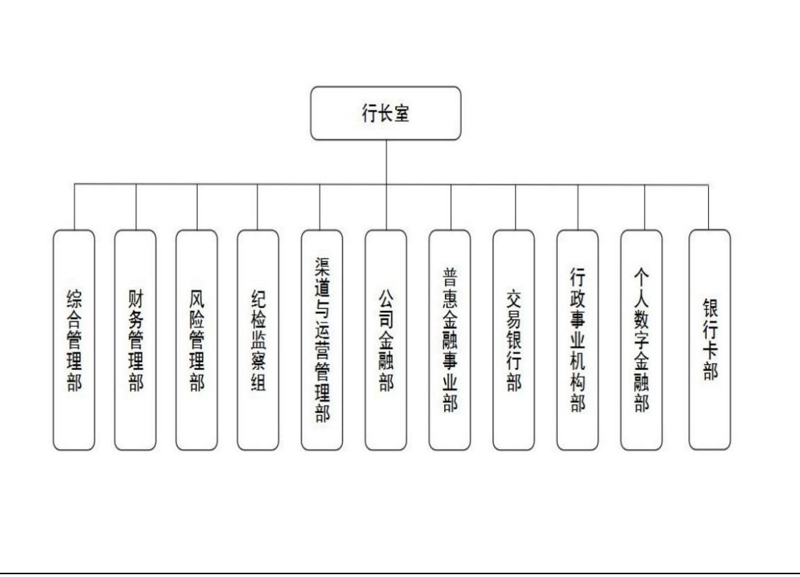

# 第 1 章 绪论

# 1.1 研究背景与意义

# 1.1.1 研究背景

长期以来，洗钱犯罪一直是世界各国重点打击的对象，反洗钱作为国际通行要求，标准愈发严格，监管形势逐渐严峻，反洗钱履职的义务主体不断扩大，非金融业逐渐进入反洗钱履职义务主体范畴，但这并没有影响金融业在反洗钱义务主体中的重要位置。洗钱犯罪对经济和社会的影响是巨大的。洗钱犯罪首先会破坏金融管理秩序，危害金融部门的健康发展，其次，洗钱犯罪往往会影响经济稳定性并对税收带来损失，最后，洗钱犯罪还会影响国家或地区的制裁风险及声誉风险，甚至影响社会成本。

洗钱是将非法所得合法化的过程，因此，其往往关联着其他犯罪活动，严厉打击洗钱犯罪，不只是打击洗钱犯罪这一金融犯罪本身，还要打击其背后掩盖、隐藏的其他性质更为恶劣的犯罪。很多人都会觉得洗钱犯罪与人们的日常生活有着遥远的距离，似乎遥不可及，但洗钱犯罪其实一直在我们身边发生。举个最简单的例子，“刷单返利”就是一种非常常见的洗钱方式，“刷单”洗钱犯罪组织者建立或购买部分虚拟店铺用于刷单；组织者以某种形式将违法所得转移至“刷单”实施者；由实施者在指定虚拟店铺拍下商品并按商品标注金额付款；虚拟店铺物流向实施者发送“空包裹或其他物品”伪造完整交易流程；组织者向实施者以某种途径支付佣金。由于“刷单”的操作门槛低、盈利噱头大，普通民众往往会被其吸引，而误入洗钱漩涡。

2020 年，突如其来的疫情打乱了生活原本的平静，人们在处理个人金融业务时往往会优先选择线上渠道完成，互联网金融在这一背景的推动下得到进一步发展。各家金融机构纷纷推出新版手机银行、网上银行，抓住时机，大力拓展业务，让自身在金融市场中所占比重进一步加大。互联网金融给人们的生活带来的是极大的便利， $7 { \times } 2 4$ 的金融服务可以让客户享受到便捷的资金周转，但在不法分子眼里，便捷的资金周转可让其在更加隐蔽的时间段完成其对非法资金的合法化。在互联网金融快速发展的大背景下，洗钱犯罪蓬勃发展，切断资金链的手段更加丰富，资金周转的途径更加多元，洗钱犯罪变得更加隐蔽，不易发现。以诈骗犯罪为例，在疫情的背景下，犯罪分子会在合理背景和条件下精心布局，使交易变得更加可信，金融机构对交易异常信号的识别、可疑交易监测的难度进一步加大。

因此，要想打击洗钱犯罪，不仅要金融机构不断提升自身的反洗钱能力，还需要国家从立法层面给予支持。2015 年提出的帮助信息网络犯罪活动罪的适用性增强，《刑法修正案》（十一）在 2021年正式实施，“自洗钱”正式入刑，这都体现了国家对于打击洗钱犯罪的关注与决心。中国人民银行作为我国的监管部门，在打击洗钱的犯罪一直保持着高度的警惕性，紧跟国际反洗钱形势，优化反洗钱监管框架，并保持高度的执法检查力度，确保义务机构能够切实履行反洗钱义务。

人民银行官网并无2022年及2023年的反洗钱工作报告，但在对2022及2023年人民银行总行及各分支机构官网公布的数据进行归纳后发现，2022 年全年反洗钱处罚共 893 笔，涉及 32 个省市的 350 家义务机构及相关责任人，罚单总金额约5.89亿元，其中机构处罚金额约5.68亿元，个人处罚金额约0.21亿元。到了2023年，全年人民银行发出的罚单共 1032笔，涉及 32 个省市的 389家义务机构及相关负责人，罚单总金额约52.24亿元，其中机构处罚金额约52.05亿元，个人处罚金额约 0.19亿元。2023年，人行针对财付通支付科技有限公司和支付宝（中国）网络技术有限公司分别开出了24.27亿元和22.31亿元的超大额罚单，即使剔除这两笔超大额罚单的影响，2023 年的罚单总金额仍高达 5.66 亿元，充分说明人行在做好洗钱风险管理的决心。

表 1.1 人民银行执法检查情况表  
Table 1.1 Enforcement checklist for the People's Bank of China (PBOC)   

<table><tr><td></td><td>罚单数量</td><td>违规机构及 个人数量</td><td>罚单总金额 （亿元）</td><td>机构罚款金额 （亿元）</td><td>个人罚款金额 （亿元）</td></tr><tr><td>2022年</td><td>893</td><td>350</td><td>5.89</td><td>5.68</td><td>0.21</td></tr><tr><td>2023年</td><td>1032</td><td>389</td><td>52.24</td><td>52.05</td><td>0.19</td></tr></table>

Z 银行在反洗钱方面起步相对较晚，2006 年才开始按照《反洗钱法》的有关要求处理反洗钱有关业务。在初期，并没有反洗钱相关的完备的内部制度，仅制定了《Z 银行反洗钱工作制度及实施办法》，但由于并没有具备反洗钱知识的专业人员，大家对于反洗钱的认识仅仅停留在写报告、准备材料上。但随着业务种类的不断丰富以及人民银行出台的一系列法规不断实施，Z银行在反洗钱方面的相关内部制度也不断完善，2020 年，各省逐步落实反洗钱工作集中上收，力图打造一支专业素质过强的反洗钱专业团队，但基层营业机构也因为反洗钱工作集中上收对本属于基层机构的反洗钱履职工作重视程度有所降低，加之近些年新型犯罪的不断涌现，经公安机关立案的电信诈骗、赌博、传销、非法集资等犯罪行为中，不法分子利用银行账户进行过渡资金、洗钱等犯罪行为的趋势愈演愈烈，银行反洗钱履职能力受到严峻考验。

# 1.1.2 研究意义

洗钱犯罪已经演变成为我国经济社会发展的最大障碍，打击洗钱犯罪，有助于建立良好的金融秩序，助力营商环境改善，让经济社会发展再向前迈进一大步。打击洗钱犯罪，抑制金融风险，银行业金融机构承担着重要责任，肩负重要使命。银行业金融机构要做好客户洗钱风险管理，就要从根本上做好洗钱风险的防范，无论是客户关系建立环节，还是客户关系持续环节，都应充分履行反洗钱义务，做好客户尽职调查及持续尽职调查，不断提升自身的洗钱风险识别与评估能力，并对客户采取针对性的管控措施，事前、事中、事后全流程做好客户尽职调查，做好客户洗钱风险管理。

Z 银行 S 分行是 Z 银行辖属二级分行，坐落于辽宁省沈阳市，沈阳市作为辽宁省的省会，因其具有诸多的优惠政策而吸引了大量外来人员就业，2017 年，中国（辽宁）自由贸易试验区沈阳片区正式挂牌成立，越来越多的外来人员选择在沈创业。这样的背景让 S 分行具有业务种类繁杂、客户群体庞大、客户特征多样等诸多特征，让其在客户风险识别上具有预警的作用。

本文以 Z 银行 S 分行个人客户为研究对象，探究反洗钱视角下的个人客户洗钱风险管理，原因有二，一是沈阳市作为东北老工业基地之一，目前的企业客户往往以传统行业为主，虽然不乏信息咨询、科技公司等新兴行业公司，但公司往往规模较小，再加上“断卡行动”以来要求对客户账户交易限额以客户实际需求及客户身份综合设定，企业网银等电子渠道操作相较于个人较为复杂，导致账户的出租出售难度相对较大，让企业客户的洗钱风险相对较低；二是根据行内2023年度报送可疑交易报告的客户类型进行分析，发现个人客户占比超过 $9 8 \%$ ，这说明目前S分行的企业客户整体洗钱风险偏低，而个人客户的洗钱风险管理仍需加强。

本文的研究意义及价值主要体现在如下几个方面：

首先，可以帮助 Z 银行 S 分行建立更加完备的风险控制策略，有效抑制客户洗钱风险的发生。对于 Z 银行 S 分行自身而言，可以帮助其对客户的尽职调查及持续尽职调查的标准予以规范，对客户的风险监测与评估模型予以更新和细化，让基层员工更容易识别到客户所存在的风险，采取针对性的控制措施，在未来营销目标制定时能够更好的平衡合规与发展之间的关系，促进 Z 银行 S 分行合规经营，稳健行远。除此之外，由于 Z 银行 S 分行因其具有业务种类繁杂、客户群体庞大、客户特征多样等诸多特征，在客户风险识别上具有预警的作用，对本省的洗钱风险管理具有一定的指导意义，可以协助省内其他地区做好客户洗钱风险的防范，从根本上减少洗钱风险的发生。

其次，可以使得 Z 银行 S 分行对客户洗钱风险的评定及风险控制措施的确定更加规范。对于存在不同风险因素的客户，可以制定与之相对应的风险控制策略，客户风险因素一旦出现，就可以及时根据客户风险因素对应的风险等级调整客户洗钱风险等级，实现客户风险等级的动态调整。

最后，有助于对 Z 银行 S 分行的客户尽职调查及持续尽职调查流程和标准予以规范，可以让基层的银行工作人员意识到，客户尽职调查贯穿与客户的全流程，无论是客户关系建立时还是客户关系持续期间，直至客户退出客户关系。同时可以提示基层的银行工作人员做好客户的相关风险提示，让客户知晓洗钱犯罪的危害，从根本层面上减少洗钱风险的出现。

通过对以上三个方面的研究意义的阐述，相信本文可以为 Z 银行 S 分行个人客户的洗钱风险管理提供帮助，提升客户洗钱风险管理的水平和质量，同时，本次的研究结果也可以为本地区的其他同业给予参考和借鉴，帮助其确定本地区客户的洗钱风险特征，制定针对性的风险控制策略，对提升本地区的客户洗钱风险管理质量具有重要意义。

# 1.2 研究现状

# 1.2.1 国外研究现状

国外学者对洗钱风险管理的研究相对较早、也比较全面系统。通常来讲，典型的洗钱可以分为三个阶段，即处置阶段、离析阶段和融合阶段。在实际操作过程中，三个阶段有时明显，有时发生重叠、交叉，或者集合在一起，难以截然分开。理查德·普拉特曾在《反洗钱与反恐融资指南》中收集了十七名深谙反洗钱监管业务的专家和学者的论文，书中对洗钱的过程进行了深入的剖析，提出金融机构在进行洗钱风险管理时要做好客户的身份识别与资金流向监控，为各国在进

行反洗钱监管及履职提供了丰富经验。

Bello&Harvey(2017)认为如果对客户根据地理风险、产品或服务风险等变量进行风险评级，就会忽视客户异常交易特征所带来的洗钱风险，是存在问题的，对客户的洗钱风险评估要进行综合评判。

Ernesto Ugo Savona 和 Michele Riccardi(2019)认为风险为本已成为全球反洗钱工作的焦点。政府、执法机关、公共部门、银行和专业人员等涉及洗钱活动的所有机构都必须改变其工作方式，不再以规则为基础，而是以风险为基础，把洗钱风险管理的资源用于洗钱风险较大的领域。

Kishore Singh(2019)的研究显示，商业银行所面临的经营风险相对较高，其中，洗钱风险是一个比较突出的风险因素。现有的风险管理理论成果可以为商业银行的洗钱风险预防和控制工作提供科学的指导，有助于银行构建和完善反洗钱工作机制，达到较好的风险管理控制效果，保障银行的健康发展。

在反洗钱工作中，最重要的工作就是对客户进行身份识别。而在客户身份识别领域，Kathleen Donnelly Gowin(2020)等人认为，在客户身份识别过程中，现代信息技术可以作为一种可靠的识别工具，其中最为代表的就是虹膜识别技术，其能够极大提高客户身份识别的准确性。

Chitimira Howard and Munedzi Sharon(2022)分析了国际上关于客户尽职调查和相关反洗钱措施的最佳实践案例，认为各国应依托反洗钱最佳实践建立符合自身国情的针对性控制措施，以实现洗钱风险管控。

Alexandre Claudio Reginaldo(2023)认为应建立一种融合机器学习和风险组件的多智能体系统的特征来识别和标记可疑的银行客户，从而实现对客户洗钱风险的控制。

# 1.2.2 国内研究现状

我国对洗钱风险管理的研究起步较晚，近些年来，我国学者对于洗钱风险管理进行了广泛而深入的研究，旨在探讨客户洗钱风险管理的现状、挑战及应对策略。

郑芙蓉、亓鲁（2020）指出义务机构在进行洗钱风险评估时，要重点从客户、业务、产品及渠道四个维度来进行评估，并根据评估结果优化当前的客户风险管理策略，完善风险识别机制，强化洗钱风险控制措施。

韩文科（2020）以第三方支付为研究对象，对其风险因素进行了系统的分析和探讨。他指出，以用户身份识别为代表的技术性问题，将会是第三方支付业务面临的最大风险。在目前的技术环境及防控机制下，第三方支付无法对用户进行准确有效的身份识别，从而带来较大的风险。

拓扬、王珞、潘善宝（2020）认为，在整个金融机构的风险管理中，洗钱风险是一个非常重要的组成部分，它可以有效地发挥其防范功能。相对于传统的保留交易记录和报告可疑交易报告的事后预防手段，洗钱风险管理更注重对金融机构进行事前和事中的控制。从国际上反洗钱的实践经验来看，要提高一国的反洗钱制度的效能，必须充分发挥金融机构的作用，而洗钱风险管理措施就是一个关键环节。

冯怡（2021）认为，对客户进行洗钱风险评估要以客户为中心，全面分析其行为及金融交易，才能防范洗钱案件发生。

唐光立、李昂（2021）提出在当前环境下，是一个国际经济交流日益频繁、全球资金即时互通的新时期，进一步防范金融机构风险，提高我国反洗钱治理系统的整体效能，已经成为一种必要的措施。随着各级监管部门的关注，反洗钱风险管理已成为目前金融机构进行全面风险管理的一个重要组成部分，同时也是提高整个金融机构风险控制能力的一个重要途径。

王娅，王小丽，陈森森（2022）提出，要强化各部门内部各层级、各业务条线之间的联动与协作，将“以客户为中心”的客户洗钱风险管理理念贯彻到底。在进行了系统的综合评价、预警或者是直接分级之后，要加强对高风险客户的手动筛选和加强监控，深入对高风险客户进行连续、动态的追踪，积极地扩展风险辨识的管理途径，使风险控制措施与其实际风险状况相匹配，提高客户的洗钱风险管理效果。

张胜男、张伟齐、李宁（2022）认为，商业银行应当采纳或实施一个以风险为导向的程序。这个程序的核心是要对客户进行持续的尽职调查，涵盖了从初步识别到长期监测的各个阶段。具体来说，这包括在客户交易发生之前，银行必须彻底了解并核实客户的身份信息；在业务操作过程中，银行需要对每一笔交易进行严格的审查，确保所有的操作都符合银行的政策和法规要求；而在业务完成之后，银行则需要持续地监控可能出现的风险，并及时采取措施来应对这些风险。

张剑（2023）从近几年监管做出行政处罚的处罚点入手，对 2023 年上半年配合行政执法检查接受处罚情况进行分析，提出了坚持风险为本需要处理三对关系，即正确且同心处理与金融监管关系、正确且耐心处理与业务部门关系、正确且专心处理与科技系统关系，不断提升自身的客户洗钱风险管理能力。文章还指出，金融机构要做好客户洗钱风险管理，要牢牢把握客户尽职调查这道防线，做到及时准确的客户尽职调查，防止“病从口入”。

# 1.2.3 文献综评

通过深入剖析国内外众多学者的学术研究成果，可以清晰地看到一个共同的趋势：无论是在国际舞台上还是在国内研究领域，专家们都普遍认同洗钱风险管理应遵循“风险为本”的原则。他们认为，只有以风险作为管理的出发点和落脚点，才能更有效、更精准地制定和执行相应的风险控制措施。另外，当银行将客户作为其洗钱风险管理策略的核心时，能够极大地促进风险管理的有效实施。银行可以更加精准地识别潜在的风险点，制定出更为周密的防控措施。因此，从客户角度出发进行风险管理，不仅是银行合规管理的重要组成部分，也是构建和谐金融环境的关键所在。

在做好以“风险为本”的客户洗钱风险管理过程中，做好对客户的持续尽职调查是其中的关键环节。在对客户持续尽职调查的过程中，最为重要的就是客户身份的识别，客户身份识别的准确性与及时性是客户尽职调查结果准确性的重要影响因素。商业银行在其发展过程中，要不断提升自身的客户身份识别手段，不断提升自身的技术能力，做好客户身份识别的及时性与准确性，有效防范洗钱风险的发生。

# 1.3 研究思路与研究方法

# 1.3.1 研究思路

论文通过德尔菲法、层次分析法以及模糊综合评价法等研究方法，对 Z 银行 S 分行的个人客户洗钱风险进行识别、评价，找出个人客户洗钱风险管理过程中存在的薄弱环节，提出针对性的风险控制对策，最终实现 Z 银行 S 分行对个人客户洗钱风险管理的提升。

论文首先对国内外相关文献进行梳理，从多方面对客户的洗钱风险管理情况进行梳理，了解国内外研究现状，确定研究所需的理论基础。

其次，依托理论基础，结合 Z 银行 S 分行的实际情况，介绍了其目前的基本情况，总结其个人客户的洗钱风险管理概况，梳理其个人客户洗钱风险管理的

流程与内容，为后续研究奠定基础。

再次，完成 Z 银行 S 分行个人客户洗钱风险识别及评价。运用文献研究、数据分析完成风险因素的初步识别，运用德尔菲法完成个人客户洗钱风险因素识别。将定性分析与定量分析相结合，分别运用层次分析法及模糊综合评价法完成风险评价，构建层次结构、计算风险因素所占权重、对风险因素进行层次总排序并对Z银行 S 分行个人客户洗钱风险整体情况进行评价。

最后，根据风险评估结果，提出针对性的风险控制对策，各控制对策协同作用，共同实现 Z 银行 S 分行个人客户洗钱风险管理。在此基础上得出本文的研究结论。

# 1.3.2 研究内容

第一部分为绪论部分，阐述本文的研究背景并在文献综述的指导下，提出研究意义、内容和方法，绘制出研究技术路线图，梳理了整篇文章结构思路；

第二部分阐述相关概念界定，以及使用的理论基础，具体解释了洗钱和反洗钱的相关概念具体定义，介绍风险管理理论的产生与发展、概念、流程与策略，介绍了风险识别与风险评价过程中常用的分析工具，作为理论基础为后续研究提供理论指导；

第三部分对 Z 银行 S 分行目前个人客户洗钱风险管理现状进行分析，首先总结 Z银行 S 分行基本情况及目前的风险管理情况，并对 Z 银行 S 分行目前的个人客户洗钱风险管理流程与内容进行梳理，为后续研究奠定基础；

第四部分为 Z 银行 S 分行个人客户洗钱风险识别及风险评价，运用德尔菲法，从客户身份信息、资金交易、行为三方面对目前 Z 银行 S 分行个人客户的风险因素进行识别，通过层次分析法对识别出的风险因素计算综合权重，进行层次总排序，通过模糊综合评价法计算出 Z 银行S 分行个人客户洗钱风险评价值，并对两种分析方法得出的结果进行分析；

第五部分为针对性的风险控制措施对策，从严控客户身份识别风险、提升客户风险监测与评估能力、建立完备的客户风险控制策略、做好技术保障工作、加强宣传引导等五个维度提出针对性风险控制对策；

第六部分为总结与展望，总结全文研究的结论，找出不足，并根据本次研究内容提出下一步研究的重点和方向的展望。

论文整体脉络详见图1.1研究技术路线图。

  
图 1.1 研究技术路线图  
Fig 1.1 Research Technology Roadmap

# 1.3.3 研究方法

本文主要采用了文献研究法、德尔菲法、层次分析法、模糊综合评价法四种研究方法。具体情况如下：

文献研究法：文献研究法，作为一种深度的学术探究手段，其核心在于广泛搜集与研究问题相关的文献资料。通过这种方法，研究者能够深入了解研究主题的基础知识，掌握目前该领域内的研究进展和学术动态。它不仅仅是一种收集资料的手段，更是一个理解和把握问题全貌的过程。通过对现有文献的梳理和分析，研究者可以构建起坚实的研究基础，为自己的研究工作奠定稳固的基石。本文通过收集和筛选相关文献，对现有的相关研究进行系统梳理并进行总结评述，对洗钱与反洗钱、风险管理相关研究形成科学认识，为后续研究奠定理论支撑。本文通过对文献进行收集整理，概况总结了对于客户洗钱风险管理的国内外研究现状，确定了研究的理论基础，对理论进行归纳总结后将理论应用于后续的研究中。

德尔菲法：又称专家调查法，本质上是一种反馈匿名函询法。其大致流程是：在对所要预测的问题征得专家的意见之后，进行整理、归纳、统计，再匿名反馈给各专家，再次征求意见，再集中，再反馈，直至得到一致的意见。本文以 Z银行S分行的个人客户为具体研究对象，采取匿名、背对背发送问卷调查的方式，对前期梳理出的 Z 银行 S 分行个人客户洗钱风险因素进行筛选、识别，以便后续进行风险评价，得出风险控制对策。

层次分析法：层次分析法，简称 AHP，是指将与决策总是有关的元素分解成目标、准则、方案等层次，在此基础之上进行定性和定量分析的决策方法。本文在研究过程中基于前期识别到风险因素及风险层次结构，采用1-9 标度法来对比分析不同因素之间的相对重要性，从而构建出评价矩阵，计算最大特征根的值并分析一致性，得出每项风险因素的权重。

模糊综合评价法：模糊综合评价法是一种基于模糊数学的综合评价方法，它使用模糊数学的综合评价模型来处理模糊性或不确定性、定性指标难以定量化的问题。本文在风险评价环节使用了模糊综合评价法，确定风险因素的隶属度，将不同风险因素的影响程度由模糊的“高风险、中高风险、中风险、中低风险、低风险”转变为数值，构建评价向量，最终计算出各风险因素以及总体风险的评价值，并对评价结果进行分析。

# 第 2 章 相关概念及理论基础

# 2.1 相关概念

# 2.1.1 洗钱

洗钱是指对犯罪所得进行处理并掩饰其非法来源，以期将犯罪所得用于合法或非法活动。简而言之，洗钱就是将非法所得合法化的过程。纵观国际，世界各国为打击洗钱犯罪成立了多家国内或国际间组织，以FATF为例，作为世界上最具影响力的国际间反洗钱和反恐怖融资领域最具权威性的国际组织之一，金融行动特别工作组（FATF）是七国集团为促进反洗钱国际行动、树立标准，于1989年成立的跨政府间的一个国际组织，其首先纠正了洗钱仅限于现金交易这一错误观念。金融特别行动工作组针对洗钱“类型”的研究表明，洗钱活动可能经由任何中介、金融机构或商业机构进行。

《 联 合 国 打 击 跨 国 有 组 织 犯 罪 公 约 》 (Convention Against TransnationalOrganized Crime)(2000)又称《巴勒莫公约》(Palermo Convention)将洗钱定义为明知财产为犯罪所得，为隐瞒或掩饰财产的非法来源，或为协助任何参与实施上游犯罪者逃避其行为的法律后果而转换或转移财产；明知财产为犯罪所得而隐瞒或掩饰该财产的真实性质、来源、所在地、处置、转移、所有权或有关的权利；在得到财产时，明知其从犯罪行为或参与犯罪行为中所得而仍获取占有或使用。

在洗钱的定义中，“明知”是一项重要前提，上述三种表述中普遍应用了“明知”的广义含义。金融行动特别工作组反洗钱和反恐怖融资 40 项建议以及欧盟关于防止利用金融系统进行洗钱和恐怖融资活动的第四号指令（2015 年）均明确指出，构成洗钱犯罪要件的“故意”和“明知”包括从“客观实际情况”推定出的心理状态。

洗钱行为通常包含一组复杂而难以捉摸的交易模式，它们可能涉及多个隐蔽环节。这些环节主要划分为三个阶段，每一个阶段都是为了隐匿非法资金的真实来源和流向。一是处置阶段，该阶段洗钱分子将其所获得的资金转入金融体系，可以通过混合资本、外汇、现金拆分、货币走私、贷款等方式，将资金循环注入当地和世界各地的金融机构、赌场、店铺或合法企业。二是离析阶段，涉及把犯罪收益转化成其它形式，创造出一系列复杂的金融交易以掩盖资金的来源和所有权，从而将非法所得与其来源分开，并进行最大限度的分散。三是融合阶段，在这一阶段，洗白的资金被巧妙地应用于那些表面看来符合常规市场交易标准的活动之中，资金得以重新注入到经济循环中，让原本属于非法来源的财富看上去像是经过合法渠道获得的一样，从而维护了非法资金在社会经济体系中的可接受性。融合的过程通常很难发觉，它可能潜伏在表面之下，只有当个人或企业的合法雇工数量、经营范围或投资项目的规模与他们各自拥有的财富总额或所在公司的营收及资产之间的差距显著拉大时，才会逐渐显露出来。

# 2.1.2 反洗钱

反洗钱指的是预防通过各种方式掩饰、隐瞒毒品犯罪、黑社会性质的组织犯罪、恐怖活动犯罪、走私犯罪、贪污贿赂犯罪、破坏金融管理秩序犯罪等犯罪所得及其收益的来源和性质的洗钱活动的措施。反洗钱指的是政府利用立法、司法手段，动员相关的组织和商业机构，对可能的洗钱行为进行识别，对相关的款项进行处置，对相关的机构和人员进行处罚，从而实现阻止犯罪行为的一项系统工程。

反洗钱的制订与执行，对于中国经济与社会健康、有序地发展，有着十分重要的作用。它的作用在于：第一，它有助于洗钱行为可以得到及时的发现、有效地监督，对违法犯罪的追查与没收，对防止洗钱与其上游的犯罪起到一定的作用，对维护国家的经济安全与社会的稳定起到积极的作用；第二，对于洗钱活动对金融机构造成的潜在财务和法律风险，可以得到有效防范，维护金融市场的安全与稳定；三是有助于及时发现并截断经济犯罪活动中的资金来源与渠道，预防新的经济犯罪；四是有利于对上游犯罪受害者财产权利的保护，维护司法的威严与社会的公平正义；五是有利于我国在国际上进行反洗钱合作，维护国家在国际上的良好形象。

金融体系是现代社会流通资金的主要渠道，也是洗钱活动的高发区域。所以，反洗钱工作的开展，需要以金融机构为中心，对资金的异常流动进行监控和举报，从而达到对异常资金流动进行监控和控制的目的。然而，金融机构并非唯一的洗钱渠道，随着我国金融监管体系的日趋健全，洗钱活动也逐渐向非金融机构中渗透。

我国为了预防洗钱活动，维护金融秩序，遏制洗钱犯罪及相关犯罪，制定了《中华人民共和国反洗钱法》。反洗钱法第三条规定，在中华人民共和国境内设立的金融机构和按照规定应当履行反洗钱义务的特定非金融机构，应当依法采取预防、监控措施，建立健全客户身份识别制度、客户身份资料和交易记录保存制度、大额交易和可疑交易报告制度，履行反洗钱义务。第七条规定任何单位和个人发现洗钱活动，有权向反洗钱行政主管部门或者公安机关举报。接受举报的机关应当对举报人和举报内容保密。这充分说明了我国对打击洗钱犯罪的力度和决心。

# 2.2 风险管理理论

# 2.2.1 风险管理的产生与发展

风险管理是20世纪初期在西方工业化国家兴起的一门系统科学。德国人在20 世纪一战后首次世界大战之后首次提出了“风险管理”，这一概念最初是在德国兴起的。1931年起，美国管理协会开始倡导风险管理，此后的若干年中，风险管理多次被集中探讨和研究，且形式多样。至此，对于风险管理的问题，理论层面的深入探讨和实践层面初步验证同步展开。然而，风险管理并未在当时的美国引起足够的重视，直至20世纪50年代，美国的工商企业才对风险管理给于一定程度的关注并予以推广。

1963 年，轰动欧美的《企业风险管理》一书在美国出版，风险管理也随之成为了一门独立的学科，研究逐步趋向于系统化、专门化。西方发达国家纷纷建立了自己的风险管理研究机构，用于推广和普及风险管理的相关知识，企业也都形成了自己的风险管理部门以便处理风险管理工作。1986年10月，在新加坡召开的风险管理国际学术讨论表明，风险管理运动已经走向全球，成为全球范围的国际性运动。然而随着经济的不断发展，企业面临的风险越来越多，风险所带来的影响也越来越大。越来越多的企业因为自身的风险管理机制不够完善而产生巨大的经济损失，甚至导致企业破产倒闭，全面风险管理理论应运而生。

美 国 COSO （ Committee of Sponsoring Organizations of the TreadwayCommission）即Treadway委员会下属的发起组织委员会在2004年9月发布了《企业风险管理——整合框架》（ERM），该框架是在结合吸收各方在风险管理领域的研究成果以及广泛吸取世界各国公众意见后提出的，与之前的版本相比，此次框架的最大变化及显著特点就是引入了全面风险管理的思路，不再仅仅局限于内部控制。

美国 COSO于2017年颁布了《企业风险管理——战略与绩效整合》更新框架(Enterprise Risk Management—Integrating with Strategy and Performance)，通过对各管理要素间的联系进行梳理，明确了策略、风险和绩效的协同效应，为风险管理赋予了新的生命力。在此基础上，本框架还将为企业的风险管理提供一种新的视角，并将其应用到企业的经营活动中。

# 2.2.2 风险管理的概念

风险管理是研究风险发生规律和风险控制技术的一门新兴管理科学，是指风险管理单位通过风险识别、风险衡量、风险评估和风险决策管理等方式，对风险实施有效控制和妥善处理损失的过程。风险管理作为一门新兴学科，具有管理学的计划、组织、协调、指挥、控制等职能，同时又具有自身的独特功能。

风险管理的目标由两个部分组成：损失发生前的风险管理目标和损失发生后的风险管理目标，前者的目标是避免或减少风险事故形成的机会，包括节约经营成本、减少忧虑心理；后者的目标是努力使损失的标的恢复到损失前的状态，包括维持企业的继续生存、生产服务的持续、稳定的收入、生产的持续增长、社会责任。二者有效结合，构成完整而系统的风险管理目标。

# 2.2.3 风险管理的流程与策略

企业风险管理的流程应该包括如下几个方面：一是收集风险管理初始信息。广泛而持续不断地搜集与企业所面临风险及其管理息息相关的内部和外部信息是对企业进行风险管理的基础。这一过程不仅包括了对过去数据的梳理，还涉及到对未来趋势的预判与分析。通过这种方式，企业能够构建起一个全面、多维度的风险认知基础，从而为后续制定有效的风险管理策略打下坚实的信息基石。二是进行风险评估。企业应当对风险管理信息进行动态管理，对风险进行识别、分析与评价，从而对新的风险及原始风险进行再评价。三是制定风险管理策略。企业应该从自己的情况和外部环境出发，以公司发展战略为中心，确定风险偏好、风险承受度、风险管理有效性的准则，选择适当的风险承担、风险规避、风险转移、风险转化、风险对冲、风险补偿、风险控制等适宜的风险管理工具的整体战略，确定风险管理所需要的人力物力资源分配原则。四是提出和实施风险管理解决方案。一般来说，方案应该包含明确的风险化解目的，需要的组织领导，所需的管理和业务过程，所需要的条件和手段，风险事件发生之前、中和事后所采取的特定对策和风险管理手段。五是风险管理的监督与改进。企业应以重大风险、重大事件和重大决策、重要管理及业务流程为重点，对风险管理初始信息、风险评估、风险管理策略、关键控制活动及风险管理解决方案的实施情况进行监督，采用压力测试、返回测试、穿行测试以及风险控制自我评估等方法对风险管理的有效性进行检验，根据变化情况和存在的缺陷及时加以改进。

由于风险的结果可能威胁到企业的生存，因此企业必须采取适当的风险管理策略进行风险管理。（1）规避风险策略。任何一个经济体在处理风险时，其首要考虑就是规避风险。在任何情况下，由于风险而导致的损失无法被项目收益所抵销，规避风险是最简便、可行的办法。比如，不做任何一笔投资，就能规避这一投资的风险。但是规避风险的方式也存在着很大的限制，首先，规避风险只能在能够规避的时候有效；二是存在一些不能回避的风险；三是可以规避一些风险，但代价太大；四是被动的规避风险，将导致企业在安逸中发展，而不积极发展。（2）风险控制策略。当风险无法避免或者在进行某种经济活动不可避免地要面对一些风险的时候，一个经济主体就会考虑怎样对风险进行控制，降低风险的发生，或者减少风险发生之后的损失，这就是对风险的控制。风险的控制包括两个层面：第一，对风险因素进行控制，降低其产生；二是要对风险的发生次数进行控制，减少其损失。要想减少事故的发生率，必须对事故进行精确的预测，而要减少事故的损失，就必须采取有力的对策。风险的控制是受多种条件制约的，尽管人类的知识和科技已经得到了很大的发展，但仍然有许多难点没有被打破，因此不能实现对风险的彻底控制，并将损失降到最低。（3）风险分散和中和策略。分散风险，主要是企业采用多方经营，多方投资，多方筹资，外汇资产多元化，吸引多个供应商，争取多个客户来分散风险。中和风险，是指企业在进行外汇风险管理时，通过减少外汇头寸，期货套期保值、远期外汇业务等来中和风险。（4）承担风险的策略。当一个经济主体无法规避风险，也无法完全掌控风险或分散或中和风险时，就必须自行承担风险带来的损失。根据经济主体承担风险的不同形式，可将其划分为纯粹的无计划自保和有计划的自保两种。简单的无计划自有资本，主要是指对不可预见的危险所引起的损失进行承担；有备自保就是对未来可能发生的风险所带来的损失进行补偿，例如计提坏帐准备等。（5）风险转移策略。经济主体为使其在承担风险后不会给自身的经济活动带来危害，可以采取多种转移方法，例如采取保险或非保险的转移等。现代保险体系是一种最理想的风险转移机制。如果单位投保了人身、医疗等方面的保险，就可以将风险的损失转嫁到保险公司身上。另外，单位也可以根据合同的约定，将一些风险转嫁到另一方。

# 2.3 风险分析工具

# 2.3.1 风险识别的主要方法

风险识别是进行风险管理的首要环节，也是进行风险管理的基础。无论是企业还是商业银行，只有其能够正确识别自身所面临的风险，当风险出现时，才能够采取正确的做法去进行处理。风险识别对于预防和应对突发事件具有关键性的作用，能够最大限度的减少突发事件带来的损失。对于商业银行的洗钱风险管理，做好风险识别工作可以在很大程度上防止洗钱行为的发生，帮助商业银行合规经营，稳健行远。当前，常见的风险识别方法主要包括头脑风暴法、文献研究法以及德尔菲法。

（1）头脑风暴法，这一经典的风险识别策略，其核心在于鼓励团队中的每一个成员都积极参与到风险识别中来。在这种模式下，每个人都有机会提出自己的观点、见解以及可能的解决方案。通过这样的集体讨论，团队成员能够集思广议，从而更好地识别和理解潜在的风险点。这种方法强调了集体智慧的重要性，它不仅促进了思维的碰撞，而且帮助参与者跳出常规思维框架，探索那些通常不被考虑的可能性，特别是那些超出预期的、出乎意料的风险。然而，尽管头脑风暴法在风险识别方面具有诸多优势，它也存在一定的局限性。由于它依赖于每个人的主观意见和偏见，因此可能会受到个人经验和知识水平的影响，导致得出的观点和结论存在偏差。为了克服这些问题，专家们建议结合其他的风险评估方法和手段，如数据分析、专业咨询以及行业标准等，以增强结果的客观性和准确性。通过将多种方法融合使用，可以确保风险评估的全面性和深入性，从而为企业或组织提供更为准确和可靠的风险管理指导。

（2）文献研究法。文献研究法依赖于广泛搜集和研读历史资料、学术论文、行业报告以及其他相关出版物。通过这种方法，研究者可以深入了解现有的风险事件、案例研究以及专家意见等信息，从而为确定潜在的风险点提供坚实的背景支持。它在一定程度上消除了因缺乏背景信息而导致的风险识别的盲目性，帮助研究者建立起对特定风险领域的深刻理解。尽管如此，文献研究法的应用也存在明显的局限性。由于所涉及的文献和资料数量众多且质量参差不齐，研究者可能无法从中获得关于所有潜在风险情况的详尽信息。此外，文献中可能包含过时或不完整的数据，这会影响到风险识别的准确性。因此，在使用文献研究法时，必须采取谨慎的态度，进行全面细致的分析和评估工作。这包括但不限于对文献的质量进行评估，确保引用的资料是最新和最可靠的，同时还要考虑资料的全面性，以避免遗漏任何关键的风险。通过这种综合分析，才能有效地识别并量化这些风险，为后续的风险管理和控制措施提供科学依据。

（3）德尔菲法（Delphi Method），也称为专家调查法，是一种用于收集和处理专家意见的方法。该方法由美国兰德公司于 1946年创始实行，并在之后被广泛地应用于商业、军事、教育、卫生保健等领域。德尔菲法本质上是一种反馈匿名函询法，通过多轮次的匿名咨询和反馈，逐步使专家的意见趋于一致，从而得到可靠的预测结果。德尔菲法的优点在于可以充分发挥专业人士的作用，其分析结果具有极高的准确性，同时也避免了专家会议法的缺陷。另外，德尔菲法并不需要进行复杂的数学建模过程，而是通过数据对调查结果进行清晰、直观的展示，在研究中占据一定地位。

# 2.3.2 风险评估的主要方法

风险评估主要是基于前期风险识别的结果，风险因素可能产生的风险结果进行评估。在企业运作中，进行风险评价，既有助于企业发现潜在的威胁与机会，又能对风险的规模进行定量化、引导风险对策、改善决策质量、提升风险管理水平、满足合规需求、提升公司价值、引导资源配置等具有十分重要的意义。目前，常见的风险评估方法主要有层次分析法、模糊综合评价法、风险因素分析法。

（1）层次分析法，简称AHP，是指将与决策总是有关的元素分解成目标、准则、方案等层次，在此基础之上进行定性和定量分析的决策方法。该方法是美国运筹学家匹茨堡大学教授萨蒂于 20 世纪70 年代初，在为美国国防部研究“根据各个工业部门对国家福利的贡献大小而进行电力分配”课题时，应用网络系统理论和多目标综合评价方法，提出的一种层次权重决策分析方法。

层次分析法是将决策问题按总目标、各层子目标、评价准则直至具体的备投方案的顺序分解为不同的层次结构，然后用求解判断矩阵特征向量的办法，求得每一层次的各元素对上一层次某元素的优先权重，最后再加权和的方法递阶归并各备择方案对总目标的最终权重，此最终权重最大者即为最优方案。层次分析法比较适合于具有分层交错评价指标的目标系统，而且目标值又难于定量描述的决

策问题。

层次分析法的计算过程如下：

$\textcircled{1}$ 建立层次结构模型。

在深入分析实际问题的基础上，将有关的各个因素按照不同属性自上而下地分解成若干层次，同一层的诸因素从属于上一层的因素或对上层因素有影响，同时又支配下一层的因素或受到下层因素的作用。最上层为目标层，通常只有 1个因素，最下层通常为指标层，中间可以有一个或几个层次，通常为准则层。

$\textcircled{2}$ 构建判断矩阵。

对于准则层及指标层的各因素，选取同层次的影响因素进行两两对比，按照其影响重要程度评定等级。在两两对比的过程中，影响因素重要程度标准的确定如下表所示：

表 2.1 比例标度表  
Table 2.1 Scale of Proportions   

<table><tr><td>因素i比因素j</td><td>量化值</td></tr><tr><td>同等重要</td><td>1</td></tr><tr><td>稍微重要</td><td>3</td></tr><tr><td>较强重要</td><td>5</td></tr><tr><td>强烈重要</td><td>7</td></tr><tr><td>极端重要</td><td>9</td></tr><tr><td>两相邻判断的中间值</td><td>2,4,6,8</td></tr><tr><td>若因素i与因素j的重要性之比为aij，则因素j与因素i的 重要性之比aj=1/aij</td><td>倒数</td></tr></table>

构建判断矩阵，用 $\mathrm { a _ { i j } }$ 表示要素i 与要素j 之间重要程度的比较结果，最终形成两两比较构成的判断矩阵，即：

$$
\mathrm { A } = \begin{array} { r } { \left[ \begin{array} { l l l l } { a _ { 1 1 } } & { a _ { 1 2 } } & { \cdots } & { a _ { 1 n } } \\ { a _ { 2 1 } } & { a _ { 2 2 } } & { \cdots } & { a _ { 2 n } } \\ { \cdots } & { \cdots } & { a _ { i j } } & { \cdots } \\ { a _ { n 1 } } & { a _ { n 2 } } & { \cdots } & { a _ { n n } } \end{array} \right] } \end{array}
$$

在矩阵A中，若要素i 比要素j 重要，则 $\mathrm { a _ { i j } } { > } 1$ ，若要素 $\dot { \mathbf { \eta } } _ { \mathrm { i } }$ 与要素j 同等重要，则 $\mathrm { a _ { i j } = 1 }$ ，若要素i 重要程度低于要素j，则 $\mathsf { a } _ { \mathrm { i j } } { < } 1$ 。

$\textcircled{3}$ 判断矩阵权重计算

对判断矩阵做正规化处理，即：

$$
\overline { { a _ { i j } } } = \sum _ { i = 1 } ^ { a _ { i j } } a _ { i } ( \mathrm { i , j = 1 , 2 , . . . , n } )
$$

对矩阵里各元素求和，即：

$$
\overline { { \mathcal { W } _ { i } } } \quad = \quad \sum _ { i = 1 } ^ { n } \overline { { a _ { i j } } } \quad \mathrm { ~ ( i , j = 1 , 2 , . . . , n ) ~ }
$$

对? 做正规化处理，即：

$$
\begin{array} { l l l } { \displaystyle { \mathcal { W } _ { i } } } & { \displaystyle = \ \frac { \mathcal { W } _ { i } } { \sum _ { i = 1 } ^ { n } \overline { { \mathcal { W } _ { i } } } } } & { ( \mathrm { i = 1 , 2 , . . . , n } ) } \end{array}
$$

最后求出权重 $W$ 所对应的最大特征根，即：

$$
\lambda _ { \mathrm { m a x } } = \frac { 1 } { n } \sum _ { i = 1 } ^ { n } \frac { ( A W ) _ { i } } { w _ { i } } \quad ( \mathrm { i = 1 , 2 , \ldots , n } )
$$

$\textcircled{4}$ 进行一致性检验

针对求解到的矩阵向量进行一致性检验，若通过检验，则矩阵成立，具备解释意义。计算一致性指标 CI的值并引入随机一致性指标RI，判断矩阵是否有满意的一致性，一般来说，可以计算一致性比率CR，若 $\mathrm { C R } { < } 0 . 1$ ，则认为该判断矩阵通过一致性检验。RI数值对照表见下表，CI、CR 的计算方法见式（2.6）、式（2.7）。

$$
C I = \frac { \lambda _ { \operatorname* { m a x } } - n } { n - 1 }
$$

表 2.2RI 标准值对照表  
Table 2.2 RI Standard Values Comparison Table   

<table><tr><td>n</td><td>1</td><td>2</td><td>3</td><td>4</td><td>5</td><td>6</td><td>7</td><td>8</td><td>9</td><td>10</td></tr><tr><td>RI</td><td>0</td><td>0</td><td>0.58</td><td>0.90</td><td>1.12</td><td>1.24</td><td>1.32</td><td>1.41</td><td>1.45</td><td>1.49</td></tr></table>

# CR=CI/RI

（2）模糊综合评价法是一种基于模糊数学的综合评价方法，它使用模糊数学的综合评价模型来处理模糊性或不确定性、定性指标难以定量化的问题。模糊综合评价法利用隶属度理论来描述模糊界限，使得评价结果不仅是一个绝对的肯定或否定，而是一个模糊集合，更准确地反映事物本身的模糊状况。

模糊综合评价法的研究意义：基于模糊集合理论的模糊综合评判方法，利用模糊集合的概念，通过多个相关指标对被评价事物的隶属等级进行综合评估。它不仅考虑到了对象的层次性，还能够将评价中的模糊性或不确定性因素纳入考量范围内，从而使评估更加全面。同时，模糊综合评判允许主观经验与客观数据相结合，既尊重了人的判断，又确保了评价结果的客观性和实际性。通过建立模糊综合评判模型，我们可以将定性与定量因素有机结合，扩大信息的收集范围，提高评价的精确度。这种方法允许决策者从更为丰富的信息出发，做出更为明智的决策。而且，由于其考虑了评价过程中的模糊性，模糊综合评判能够产生更可靠的评价结论，为评估对象提供一个更加合理的定位，从而帮助决策者更好地理解事物的真实状况，作出最合适的决策。

（3）风险因素分析法就是通过对潜在的危险因素的评估和分析，来决定危险出现的可能性。其基本思路为：研究风险来源、辨识风险转化条件、判断转化条件是否满足、评估风险后果、风险评估。风险因素分析法的核心是评估各因子的风险水平，并估算出各因子的风险等级对最终内在风险的影响。各因子的危险度一般都可以用描述性的方法来表示，也就是用“高，中，低”或“好、较好，中，较差，差”等标准来表示。也可以使用打分法，即将各个因素的具体情况和标准水平进行对比，并按照它们之间的差别，将元素的风险度用一个绝对的分值来表示。但由于许多风险因素是很难量化的，这导致使用风险因素分析法得出的结果往往存在一定的不确定性，这种不确定性会对后续做出风险决策产生一定的影响，未知或难以量化的风险因素可能会导致风险决策存在失误或偏差，导致更大风险的发生。

# 第 3 章 Z 银行 S 分行个人客户洗钱风险管理现状

# 3.1 Z 银行 S分行整体概况

# 3.1.1 Z 银行 S 分行基本简介

Z 银行成立于 1912 年2 月，是中国持续经营时间最久的银行，先后行使中央银行、国际汇兑银行和国际贸易专业银行职能。Z银行S 分行的前身是始建于1913年的 Z银行奉天分号，1981 年从人民银行正式分设。近年来，S 分行紧紧围绕总、省行战略发展规划和工作目标，以创建同业一流的商业银行为发展方向，坚持以客户为中心、以市场为导向的经营理念，依托全球化的网络、成熟的产品和丰富的经验，充分发挥外汇业务的整体优势和 Z 银行自身的品牌优势，积极拓展市场，创新金融产品，提升服务水平，竭诚为客户提供全方位、高品质的金融服务。

  
图 $3 . 1 Z$ 银行 S 分行组织结构  
Fig 3.1 Organizational Structure of Bank Z Branch S

截止 2023 年 12 月，Z 银行 S 分行共有员工2000 余名，下设10家管辖支行，

3 家直管支行以及分行营业部本部，营业机构达 84 家，覆盖了辖内全部区县，并在分行层面设立了综合管理部、财务管理部、风险内控部、渠道与运营管理部、纪检监察组、公司金融部、普惠金融事业部、交易银行部、行政事业机构部、个人数字金融部、银行卡部等 11个部门。主营业务包括本外币存款、结算业务、理财业务、票据贴现、代理发行金融债券、代理发行、兑付、销售政府债券、代理收付款项及代理保险、外汇汇款、外币兑换等。与本地区的其他同业相比，Z银行 S 分行由于其外汇业务在很大程度上领先于同行，吸引了大量客户，让 Z银行S分行在本地具有一定的市场占有率。

# 3.1.2 Z 银行S 分行个人客户洗钱风险管理情况

（1）组织框架。

Z银行 S 分行在总、省行的领导下设置了S 分行反洗钱委员会，负责统筹管理本行的客户洗钱风险管理工作，将本行的内控副行长作为本行的首席风险官（CRO）。

个人数字金融部作为个人客户洗钱风险管理的第一责任人，负责执行洗钱风险管理政策、制度和程序，识别、评估、监控、缓释和报告条线洗钱风险。内控与法律合规中心是洗钱风险管理的第二道防线，负责建立健全洗钱风险管理政策、制度和程序，持续监督本行洗钱风险管理体系的运行情况。内部审计条线是洗钱风险管理的第三道防线，负责独立评价本行洗钱风险管理体系的有效性，及时报告审计发现的问题。

（2）制度建设。

在客户的洗钱风险管理方面，Z银行在总行层面即制定了以风险为本的客户尽职调查办法，大额和可疑交易报告制度、客户加强尽职调查与特别尽职调查、客户持续尽职调查等相关制度，确保反洗钱管理方面制度的完备性。在省行层面则根据本省客户的实际情况，基于总行的相关制度政策，制定了适合本省实际情况的相关制度，确保了制度在本地区的适用性。

S 分行在客户洗钱风险管理方面，将总省行文件与制度作为基准，并根据自身业务的实际情况，对相关制度要求予以细化，确保制度符合S 分行的实际情况。例如在对被报送大额和可疑交易报告客户的管控过程中，个人金融部发现对部分参与跨境转移资金客户采取控制措施后，客户的可疑情形仍未消除，部分客户仍通过行内其他产品规避通过被管控的产品进行交易，因此开展了专项排查，排查后发现对此类客户的管控仅局限于可疑交易发生的产品是不够的，因此根据本行的实际情况制定了新版的管控措施指引，将具有此类可疑特征客户的管控措施从单一的限制使用的产品变成了限制客户使用的产品并对账户的交易限额予以控制，防范了客户的洗钱风险。

外汇业务是 Z 银行 S 分行的特色业务，也是 Z 银行 S 分行在本地区的立足之本，为防范客户通过跨境外汇业务从事洗钱活动，Z 银行S分行特别制定了《跨境汇款透明度工作指引》、《退汇业务洗钱风险管控操作规程》等相关制度文件，确保跨境外汇业务不为洗钱犯罪所利用。

（3）人员配备。

在反洗钱人员配置方面，Z银行S 分行根据总省行要求，结合分行的实际情况，配备了一套完整的反洗钱人员体系。

作为直接接触客户的部门，各支行、基层经营机构以及各业务条线均履行了一道防线职责。各基层机构按照网点体量情况都配备了1-2 名反洗钱明白人，共计 163 名，负责处理基层机构的反洗钱相关业务，为兼职人员；各管辖支行以及直管支行则配备了反洗钱联络员，共计14 名，负责对反洗钱的相关工作进行上传下达，并组织反洗钱培训；各业务条线都配备了专职的反洗钱管理人员，累计15 人，负责结合本条线的实际情况开展培训，进行问题解答，履行相关的检查监督管理职能，做好一道防线客户洗钱风险管理工作。

内控法规中心则配备了3名专职的反洗钱管理人员，负责对各条线的反洗钱履职情况进行检查，履行反洗钱二道防线的职责，除反洗钱管理人员外，内控法规中心还从各支行抽调人手 15人，组成了反洗钱集中操作中心，负责对辖内各机构的反洗钱业务进行处理，确保反洗钱业务处理的准确性和合规性，同时做好对辖内机构反洗钱业务处理的指导工作，从另外一个层面确保营业机构在客户洗钱风险管理履职的有效性。

在三道防线方面，Z银行S 分行也配备了专门的审计团队，负责常规审计的相关工作，客户洗钱风险管理是审计中的一个重要环节，审计部门会根据业务的实际情况开展定期或不定期的审计工作，并对审计发现问题的整改情况进行验收，确保整改落实。

（4）履职情况。

《中华人民共和国反洗钱法》第三条规定，在中华人民共和国境内设立的金融机构和按照规定应当履行反洗钱义务的特定非金融机构，应当依法采取预防、监控措施，建立健全客户身份识别制度、客户身份资料和交易记录保存制度、大额交易和可疑交易报告制度，履行反洗钱义务。因此，Z银行S 分行在实际经营过程中积极履行了反洗钱义务。

$\textcircled{1}$ 客户尽职调查与交易监控。在开展客户尽职调查的过程中严格执行行内的制度规定，按照风险为本的方法做好客户的尽职调查及持续尽职调查，做好客户交易监控，在工作中一旦发现客户存在洗钱风险，就能够及时对客户交易进行甄别。

$\textcircled{2}$ 大额与可疑交易报告。由于 Z 银行大额和可疑交易报告的报送权限集中在省行层面，各二级分行仅需向省行监测分析中心报送可疑交易线索。全行各级员工均有义务报送可疑交易线索。在日常工作中，可疑交易线索的来源往往是多样的，包括但不限于：直接为客户办理业务的过程、报表分析等多种来源。一旦发现客户存在洗钱风险，及时撰写客户可疑交易线索报送至省行监测分析中心，由监测分析中心对案例进行再次审核，统一报送至人行及中国反洗钱监测分析中心。

$\textcircled{3}$ 客户资料和交易记录保存。在客户业务办理的过程中，严格执行行内政策要求，做好客户资料的保存及客户交易记录的保存，确保客户交易记录完整保存，且可查。

$\textcircled{4}$ 培训与宣传。在反洗钱培训方面，根据员工实际工作内容中可接触到的内容开展针对培训，对于客户洗钱风险管理的基础性知识则组织全员培训，在确保培训内容与工作内容相适应的同时，保证所有员工对反洗钱知识都有所了解并掌握。在宣传方面，Z 银行S 分行均会按照属地人民银行的要求，开展反洗钱宣传月活动，各机构各显神通，通过制作宣传海报、拍摄宣传视频等方式做好相关宣传工作。

$\textcircled{5}$ 自主管理与审计。Z 银行S 分行每年都会制定相应的洗钱风险管理检查计划，检查期一般为3个月，通过非现场检查与现场检查相结合的方式，对辖内机构的个人客户洗钱风险管理情况进行检查。除每年的计划内检查外，Z银行S 分行还会开展临时检查。将客户洗钱风险管理执行情况纳入绩效考核，各机构绩效考核不再仅仅依靠营销指标完成情况，且在绩效考核指标中，虽然该项考核的单项分值不算很高，但对机构最终的绩效结果仍具有很大程度的影响。绩效考核维度更加全面。分行层面的审计部门每年都会对个人客户洗钱风险管理情况进行现场或非现场审计，对于审计发现问题进行通报并组织针对性整改。

# 3.2 Z 银行 S 分行个人客户洗钱风险管理流程与内容

# 3.2.1 Z 银行S 分行个人客户洗钱风险管理流程

对于个人客户的洗钱风险管理，一般包括客户关系建立时和客户关系存续期间两个阶段。在每个阶段，都应该按照风险管理的相关流程去做好风险识别、风险评估与风险控制。

在客户关系建立时，首先要做的就是对客户的基础尽职调查。在这一阶段，银行会收集客户的基本信息，这是对客户的洗钱风险进行初次评定的重要依据。在客户关系存续期间，银行会对客户开展持续的尽职调查以评估客户的洗钱风险是否发生变化。一旦客户的洗钱风险发生变化，则需要对客户的风险等级进行调整，使其在银行的洗钱风险评级与其实际风险相匹配，另外，对于存在一定洗钱风险的客户，银行还会采取一定的控制措施，去实现对客户洗钱风险的管控，从而做好客户的洗钱风险管理。

# 3.2.2 Z 银行S 分行个人客户洗钱风险管理内容

（1）客户关系建立阶段。

在这一阶段，银行会收集客户的基本信息，包括但不限于姓名、性别、国籍信息、职业、住所地或工作单位地址、联系方式、身份证件或身份证明文件的种类、号码和有效期限。对于这些信息，一部分是银行可以通过客户提供的真实身份证明文件进行采集的，另外一部分则是需要客户自己进行提供的，比如客户的职业信息、联系方式等。除客户的基本信息之外，银行在实际工作过程中通常会额外要求客户提供一些信息，比如月收入、工作单位名称、行业类型等。这些信息虽然不属于客户基础信息，但在对客户后续的识别中，也会起到一定的作用，比如客户的行业类型本身涉及批发零售等现金密集型行业，那当客户频繁发生现金交易时，银行则没有理由直接认定客户的交易与客户身份信息存在明显的不符，对正确评估客户的洗钱风险提供了一定的依据。

（2）客户关系存续期间。

客户关系存续期间除对客户进行风险识别外，还要进行风险评估与风险控制。

客户的风险识别主要存在于两个维度，首先是客户信息发生变化，其次是客户的交易与行为发生变化。对于客户身份信息发生变化，主要是考量客户身份信息变化的情况是否影响了对其洗钱风险的判断，是否需要重新评估客户的洗钱风险评级。对于客户交易的变化，则主要是考察客户的交易及行为是否符合银行对客户的认识，是否会产生洗钱风险。一般来说，客户的交易模式、频率等在客户身份背景未出现重大变化前是不会发生明显变化的，如果客户的交易频率及模式等发生一定程度的变化，则需要考虑客户是否发生职业信息上的变化等，这时就需要及时与客户取得联系，核实其交易模式发生变化的原因，以便及时识别客户出现的洗钱风险。对于客户行为上的变化，与客户交易情况类似，如客户频繁开销户或挂失，则需要与客户核实做出该行为的原因，以重新评估客户的洗钱风险。

客户的风险评估在日常操作中主要评估的是客户交易及行为的变化是否会对客户的洗钱风险的判断产生影响，是否会影响客户洗钱风险的综合评定。在评估过程中，首先是建立异常交易监测模型，通过大数据去筛查可能存在洗钱风险的客户，这样可以大量减少需要进行风险评估的客户数量，从而减轻银行的工作负担。当客户命中相关异常交易监测模型时，要及时对客户开展针对性的尽职调查，核实客户异常交易的交易背景、交易原因，以此来判断客户的交易是否符合银行对客户的认识，从而正确评估客户的洗钱风险。另外，在对客户交易进行监测的同时，对于存在异常行为的客户，同样需要对其进行评估，异常行为一般包含客户被外部调查以及客户账户被频繁开销户或挂失等多种情况，客户被外部调查时，由于信息保密的特殊情况，银行无需再对其开展尽职调查，而对于客户账户被频繁开销户或挂失等情况时，还需要与客户核实行为背后的原因，最终完成客户的风险评估。

客户的风险控制主要针对交易或行为出现异常的客户来进行。对于交易或行为出现异常的客户，由于其前期在银行的尽职调查过程中未能配合，拒绝接听银行的尽职调查电话或者在尽调过程中对相关情况进行隐瞒，导致银行无法对其交易的合规性进行准确的判断，通常需要对其采取相应的控制措施来防止其洗钱风险的持续发生，控制措施往往是多样的，需要根据客户交易及行为的实际情况来确定，以此来实现对客户的洗钱风险控制。而当客户采取相应管控措施后，往往还需要对客户进行持续关注，防止前期的控制措施未能对其风险情况控制到位，从而导致风险情形的持续发生。

# 第 4 章 Z 银行 S 分行个人客户洗钱风险识别与评价

# 4.1 客户洗钱风险因素初步识别

# 4.1.1 识别方法的选择

常见风险识别方法主要包括头脑风暴法、文献研究法以及德尔菲法。本文在进行风险识别过程中将文献研究法做为风险因素初步识别的主要方式，将德尔菲法作为识别的主要方式。选择原因主要包括以下几个方面：一是在风险因素收集阶段，为尽可能多的对风险因素进行初步识别，并确保风险因素的质量，依赖于每个人的主观意见和偏见的头脑风暴法就显得不再适用，防止得出的观点和结论存在偏差，而文献研究法则可以很好的弥补这一缺陷，且本次所采用的文献专业度处于国际领先水平，具有权威性。二是德尔菲法在进行风险因素识别时，能够很好的考虑 Z 银行 S 分行的实际情况，专家们的意见可以很好的与 Z 银行 S 分行的实际情况进行适配，从而后续可以得出更加完备的风险控制对策。

本文主要运用德尔菲法来对个人客户的洗钱风险因素进行识别，对Z银行S分行个人客户洗钱风险进行评价，在专家的选择上，专家均来自 Z 银行，并在不同的层级从事反洗钱工作。本文选取了20位专家进行调查，专家组成员包括2名Z银行一级分行研究客户可疑特征甄别的专家，4名S 分行负责反洗钱工作的内控法规中心管理人员，6 名负责反洗钱与监测分析的支行反洗钱管理员，4名营业机构运营内控经理及 4名网点柜员。

在客户洗钱风险识别阶段，对前期初步识别到的客户风险因素发放匿名调查问卷，各专家自行判断各风险因素是否为 Z 银行 S 分行个人客户洗钱风险。在经过多轮专家调查后形成一致意见，最终筛选出符合 Z 银行 S 分行实际情况的个人客户洗钱风险因素。

# 4.1.2 风险因素的初步识别

对于客户的洗钱风险因素，国际公认反洗钱师协会认为应该从客户身份、客户地域以及客户使用的产品及服务来进行划分。而在商业银行的实际工作中，客户使用的产品和服务又可以衍生为客户交易和行为两个方面，客户的地域特征则体现在客户身份中，即客户是否为异地开户，开户时客户的地址信息或工作单位信息是否与开户地相一致或相邻。

因此，对于客户的洗钱风险因素将从客户身份信息、客户的资金交易、客户的行为三个维度进行初步识别。在对客户的洗钱风险因素进行初步识别的过程中，本文首先提取了国际公认反洗钱师协会在其培训教材中提及的客户风险因素，并从客户身份信息、客户资金交易、客户行为三个维度进行分类归纳，并对 Z 银行 S 分行 2023 年度的被报送可疑交易报告客户的风险因素进行归纳整理，提取出那些仅在 Z 银行 S 分行存在的风险因素，最终确认出可供专家进行筛选的洗钱风险因素。

（1）客户身份风险。

客户在银行开户环节提供虚假信息。客户在开户环节不愿提供真实身份信息，而是提供虚假的工作单位，职业等信息。

客户从事的职业或行业为现金密集型行业。随着国家对于创新创业的鼓励，越来越多的人不在选择就业，而是选择自己创业，成为私营业主。大部分人选择的主要行业为餐饮、批发零售、便利店等行业，而这些行业都有着共同的特点，就是客户主要以现金支付为主要途径来购买其产品或服务。密集的现金交易更容易让洗钱者将非法资金与其合法所得融为一体，不易被追查发现。

客户为外国自然人。客户利用其主证件为外国护照、证件号码在更换后可能完全不同的特征去建立多个客户号，以此来分拆交易，规避监管。

客户年龄。分析Z 银行S 分行2023年度的被报送可疑交易报告客户的年龄特征，可以发现发生可疑交易客户的年龄集中在两个年龄段，一是20-30岁，二是 50 岁以上人群。这两个年龄段都很容易去相信别人，对于各种洗钱手段的了解较少，更容易发生出租出售账户或者为不法分子转移资金的行为。

客户预留地址信息为开户地以外的其他地区。客户在进行开户时，无法提供在开户地的常住地址，而是利用身份证上的证件地址作为预留地址，当询问其工作单位地址时，客户多称由于刚到开户地，还没有找到工作。这与常理存在一定出入，现阶段银行卡早已不在受地域限制而出现异地的费用，一般人在开立账户时往往出于工作或者生活需要，如开立工资卡、办理住房贷款等需求，这种情况下客户的常住地址或工作单位地址一定会与开户地相符，客户也可以将相关地址作为其开户的预留地址。

客户失联。当客户可疑交易发生后银行电话联系客户时，客户预留电话长期关机或已为空号，银行无法通过其预留电话联系到客户。

（2）客户交易风险。

客户频繁发生现金交易。现阶段的电子支付技术已经非常成熟，跨行转账也可实现立即到账，但客户仍然通过取现和存现的方式进行资金的划转，甚至为了规避银行的大额可疑交易报告的起点以及大额现金交易登记资金来源及用途等相关制度，进行分拆存取现金。

客户交易呈现过渡特征。在调取客户交易流水进行分析发现，客户的账户资金往往呈现出快进快出的特征，账户在每日最后一笔交易完成后不留余额或仅有小额资金留存在账户中，且资金往往呈现出分散转入集中转出或集中转入分散转出的特征，疑似进行资金归集或将资金进行分散以规避监管。

交易金额异常。客户的交易金额为百元的整数倍或以元角分的方式进行进位，以此来对交易进行打标。

客户交易规模明显与其身份不符。客户账户如果一旦参与洗钱犯罪，不法分子为切断交易链，往往会采取在不同账户间进行资金划转的方式，这样无论是客户的交易笔数或交易金额，都会与客户实际身份发生偏离，导致交易规模明显与其身份不符。

交易时间异常。客户交易时间发生在夜间的主要原因有多种，但主要体现在以下两个方面，一是部分客户认为夜间发生的交易不会受到银行的监管，而故意将非法或不合规交易安排在夜间及凌晨发生；二是很多赌博等非法网站，特别是IP 地址在境外的非法网站都会在夜间进行非法活动，如客户本人或其账户参与到此类非法活动中，就会呈现出夜间交易的特征。

交易对手众多。对于普通客户的交易通常呈现一种规律性的特征，交易对手相对固定，但交易异常客户的交易对手往往是普通客户的十倍甚至百倍，而且交易对手多为一次性交易对手，且多为跨行交易对手。

交易渠道异常。发生可疑交易客户一般会选择非柜面的交易渠道，因为非柜面交易渠道发生交易会更加便捷，交易时间更加灵活，虽然普通客户也会因为非柜面渠道的便捷而选择将交易通过非柜面渠道发生，但对于发生可疑交易的客户，非柜面交易可以更好地掩盖其交易的非法性，比如部分可疑交易客户会选择通过ATM 渠道夜间频繁跨行存取现金，这样既可以切断资金链条又可以让银行工作人员无法对其交易进行实时监控。

交易 IP 异常。在银行的日常工作中能接触到可疑交易客户中，一部分是将自己的银行账户、电话卡、网银出租出售，另一部分则是客户本人操作去协助不法分子过渡或转移资金。前者就有可能导致客户账户交易的发生地与客户的常住地等地址存在很大的出入。而不法分子在利用账户过渡非法资金时往往为规避监管，都会采用多人同时操作的模式，在不同地区的不法分子会登录同一网银发生交易，导致账户交易 IP 在短时间内多次发生变换，甚至会利用伪基站产生虚拟的境外IP 地址，以规避银行监管。

小额测试交易。交易异常客户在发生异常交易前或在异常交易发生的过程中多会采取小额测试交易的方式去检测账户是否可以正常使用，是否被银行或有权机关采取管控或交易限制措施。小额测试交易一般为微信提现、话费、电费充值等，这样更不容易引起注意。

交易附言异常。可疑交易客户为标记交易，可采取的标记方式有两种，一种是金额标记，另一种就是交易附言标记，会在交易附言中录入特定的字符，以此来作为该笔交易的暗号。

（3）客户行为风险。

客户在开户过程中行为举止异常或过于紧张。客户在开户过程中对工作人员的尽职调查表现出极度不适和紧张，对于银行工作人员核实其身份信息的行为保持高度警惕，在核实其工作及月收入等相关情况时不配合银行的调查。应断卡行动的有关要求，银行在对客户开立银行账户时都会核实账户的用途，对客户账户配置相匹配的账户限额，但客户对账户有限额限制这一约束条件极其敏感，表示自己要开立能够进行大额网上转账的账户，不得进行限额控制。

客户关系建立渠道为非营业机构。客户利用自助渠道建立客户关系可以规避银行对其身份信息真实性达到审查，从而规避银行监管。

挂失、频繁开销户。部分客户为防止非法交易被银行及有权机关发现，就会采用挂失或销户的方式规避监管，然后再补办新卡，导致可疑交易的追踪难度加大。

交易对手异常。客户的交易对手已经因洗钱等相关案件被有权机关查询、冻结，或交易对手使用的账户已经被公安通报为电信诈骗涉案账户。

账户被他人持有或控制。对于低龄或高龄客户，或者账户交易 IP 明显异常的客户，其账户往往并未在客户本人手中，而是由他人代为保管或已经出租出售。

客户规避银行监管。客户规避银行监管的主要特征就爱体现在客户不配合银行调查。当客户可疑交易发生后，银行一般会通过电话联系客户核实其交易情况，以确定其是否存在洗钱风险，但在尽职调查过程中，客户往往表现出不配合，拒接或者隐瞒其真实交易背景，甚至对银行工作人员恶语相向。

# 4.2 Z 银行 S 分行个人客户洗钱风险识别

在本轮对 Z 银行 S 分行个人客户洗钱风险进行识别的过程中，按照客户身份、资金交易、行为三个维度进行识别，每个维度下设多个风险因素识别要点，为确保本轮专家调查的有效性，共对相关专家发放了三次调查问卷，问卷采用邮件方式进行发放，并在一周内对问卷进行回收。为保证专家意见的一致性，在对第一次的打分结果进行整理后，将相关的结果反馈给各位专家，再请各位专家完成第二次问卷调查，完成第二次打分，直至形成一致性意见。本轮调查的主要目的为由专家对前期初步识别到的客户洗钱风险因素是否符合 Z 银行 S 分行的实际情况进行筛选。本轮三次调查均累计发放问卷 20份，回收问卷20份，问卷回收率 $100 \%$ 。

# 4.2.1 身份信息风险识别

前期初步识别到的客户身份信息风险因素共包含虚假信息、职业信息、客户为外国自然人、年龄、客户开户后失联、异地开户等六大风险因素。在三次问卷调查中，专家对于这六项风险因素识别要点的打分情况如表4.1、4.2所示。

表 4.1 客户身份信息风险识别打分情况（第一次）  
Table 4.1 Customer Identity Information Risk Identification Scoring (first time)   

<table><tr><td>风险类型</td><td>风险因素识别要点</td><td>是</td><td>否</td><td>总计</td></tr><tr><td rowspan="6">身份风险</td><td>虚假信息</td><td>16</td><td>4</td><td>20</td></tr><tr><td>职业信息</td><td>12</td><td>8</td><td>20</td></tr><tr><td>客户为外国自然人</td><td>7</td><td>13</td><td>20</td></tr><tr><td>年龄</td><td>14</td><td>6</td><td>20</td></tr><tr><td>客户开户后失联</td><td>16</td><td>4</td><td>20</td></tr><tr><td>异地开户</td><td>9</td><td>11</td><td>20</td></tr></table>

表 4.2 客户身份信息风险识别打分情况（第二、三次）

Table 4.2 Customer Identity Information Risk Identification Scoring (second and third time)   

<table><tr><td>风险类型</td><td>风险因素识别要点</td><td>是</td><td>否</td><td>总计</td></tr><tr><td>身份风险</td><td>虚假信息</td><td>16</td><td>4</td><td>20</td></tr></table>

续表 4.2  

<table><tr><td>风险类型</td><td>风险因素识别要点</td><td>是</td><td>否</td><td>总计</td></tr><tr><td rowspan="5">身份风险</td><td>职业信息</td><td>12</td><td>8</td><td>20</td></tr><tr><td>客户为外国自然人</td><td>6</td><td>14</td><td>20</td></tr><tr><td>年龄</td><td>14</td><td>6</td><td>20</td></tr><tr><td>客户开户后失联</td><td>15</td><td>5</td><td>20</td></tr><tr><td>异地开户</td><td>9</td><td>11</td><td>20</td></tr></table>

在三次对专家进行问卷调查的过程中，对于客户为外国自然人、异地开户这两个风险因素识别要点，均有过半数的专家认为该风险因素识别要点不为 Z 银行 S 分行的个人客户的风险因素。因此在后续进行客户风险评价过程中，对该风险因素予以排除。而对于其他四项风险因素，客户提供虚假信息、客户开户后失联则需要进行重点关注，可作为身份层面判断客户风险的主要影响因素，客户职业、年龄情况则可作为客户身份信息方面辅助判断其洗钱风险的判断依据。

# 4.2.2 资金交易风险识别

前期初步识别到的客户交易风险因素共包含过渡特征、交易金额特殊、交易规模与身份不符、交易时间异常、交易对手众多、交易渠道异常、交易IP 异常、小额测试交易、现金交易、交易附言等十大因素。在三次问卷调查中，专家对于这十项风险因素识别要点的打分情况如表4.3、4.4所示。

表 4.3 客户资金交易风险识别打分情况（第一次）  
Table 4.3 Client Money Transaction Risk Identification Score (first time)   

<table><tr><td>风险类型</td><td>风险因素识别要点</td><td>是</td><td>否</td><td>总计</td></tr><tr><td rowspan="9">交易风险</td><td>过渡特征</td><td>20</td><td>0</td><td>20</td></tr><tr><td>交易金额特殊</td><td>17</td><td>3</td><td>20</td></tr><tr><td>交易规模与身份不符</td><td>20</td><td>0</td><td>20</td></tr><tr><td>交易时间异常</td><td>17</td><td>3</td><td>20</td></tr><tr><td>交易对手众多</td><td>19</td><td>1</td><td>20</td></tr><tr><td>交易渠道异常</td><td>18</td><td>2</td><td>20</td></tr><tr><td>交易IP异常</td><td>13</td><td>7</td><td>20</td></tr><tr><td>小额测试交易</td><td>16</td><td>4</td><td>20</td></tr><tr><td>现金交易</td><td>9</td><td>11</td><td>20</td></tr><tr><td>交易附言</td><td></td><td>9</td><td>11</td><td>20</td></tr></table>

表 4.4 客户资金交易风险识别打分情况（第二、三次）  
Table 4.4 Client Money Transaction Risk Identification Score (second and third time)   

<table><tr><td>类型</td><td>风险因素识别要点</td><td>是</td><td>否</td><td>总计</td></tr><tr><td></td><td>过渡特征</td><td>20</td><td>0</td><td>20</td></tr><tr><td>交易金额特殊</td><td></td><td>17</td><td>3</td><td>20</td></tr><tr><td></td><td>交易规模与身份不符</td><td>20</td><td>0</td><td>20</td></tr><tr><td></td><td>交易时间异常</td><td>17</td><td>3</td><td>20</td></tr><tr><td>交易风险</td><td>交易对手众多</td><td>19</td><td>1</td><td>20</td></tr><tr><td></td><td>交易渠道异常</td><td>18</td><td>2</td><td>20</td></tr><tr><td></td><td>交易IP异常</td><td>13</td><td>7</td><td>20</td></tr><tr><td></td><td>小额测试交易</td><td>16</td><td>4</td><td>20</td></tr><tr><td></td><td>现金交易</td><td>8</td><td>12</td><td>20</td></tr><tr><td>交易附言</td><td></td><td>7</td><td>13</td><td>20</td></tr></table>

在三次对专家进行问卷调查的过程中，对于交易附言、现金交易这两个风险因素识别要点，均有过半数的专家认为该风险因素识别要点不为 Z 银行 S 分行的个人客户的风险因素。因此在后续进行客户风险评价过程中，对该风险因素予以排除。

对于其他八项风险因素，过渡特征、交易规模与客户身份不符两大因素得到了专家的一致认可，一旦发现客户交易存在这两项风险因素，就要对客户进行重点关注。交易时间异常、交易对手众多、交易渠道异常、小额测试交易四项也均得到了专家的普遍认可，认为在不法分子进行交易的过程中，往往会采取夜间交易的方式试图规避银行的监管，往往采用众多账户进行交易，对交易金额进行分拆，规避银行大额交易报告的报送，降低银行对其交易的关注度，不法分子为方便其进行交易，在交易渠道的选择上会选择不容易被银行监管到的非柜面或自助渠道进行交易，这些交易因为没有银行工作人员为其进行操作，因此对于其交易合规性、合理性的判断往往处于滞后状态，不容易被发现，小额测试交易则是不法分子为防止账户被银行或有权机关采取管控措施而专门采取的测试行为，现阶段的小额测试交易更加隐蔽，交易不再为单纯的转账交易，而是通过话费缴费、电费缴费等民生缴费交易来掩盖其测试账户情况的真实背景，以上四个风险因素均可作为判断客户风险的有力依据。交易 IP 异常这一因素通常出现在客户账户被出租出售至异地或不法分子利用虚拟IP 进行交易的情况下会产生的可疑要点，通常需要结合客户的尽调核实情况来进行综合判断，可作为客户洗钱风险判断的

辅助依据。

# 4.2.3 客户行为风险识别

前期收集到的客户行为风险共包含集中开户、客户关系建立渠道为非营业机构、挂失、频繁开销户、交易对手异常、客户被有权机关调查、客户不配合银行调查、账户被他人持有或控制等七大风险因素。

在三次问卷调查中，专家对于这七项风险因素识别要点的打分情况如表4.5、4.6 所示。

表 4.5 客户行为风险识别打分情况（第一次）  
Table 4.5 Client Behavioral Risk Profile Identification Scoring (first time)   
表 4.6 客户行为风险识别打分情况（第二、三次）  

<table><tr><td>风险类型</td><td>风险因素识别要点</td><td>是</td><td>否</td><td>总计</td></tr><tr><td rowspan="7">行为风险</td><td>集中开户</td><td>12</td><td>8</td><td>20</td></tr><tr><td>客户关系建立渠道为 非营业机构</td><td>8</td><td>12</td><td>20</td></tr><tr><td>挂失、频繁开销户</td><td>14</td><td>6</td><td>20</td></tr><tr><td>交易对手异常</td><td>14</td><td>6</td><td>20</td></tr><tr><td>客户被有权机关调查</td><td>9</td><td>11</td><td>20</td></tr><tr><td>规避监管</td><td>12</td><td>8</td><td>20</td></tr><tr><td>账户被他人持有或控 制</td><td>17</td><td>3</td><td>20</td></tr></table>

Table 4.6 Client Behavioral Risk Profile Identification Scoring (second and third time)   

<table><tr><td>风险类型</td><td>风险因素识别要点</td><td>是</td><td>否</td><td>总计</td></tr><tr><td rowspan="7">行为风险</td><td>集中开户</td><td>12</td><td>8</td><td>20</td></tr><tr><td>客户关系建立渠道为 非营业机构</td><td>8</td><td>12</td><td>20</td></tr><tr><td>挂失、频繁开销户</td><td>14</td><td>6</td><td>20</td></tr><tr><td>交易对手异常</td><td>14</td><td>6</td><td>20</td></tr><tr><td>客户被有权机关调查</td><td>9</td><td>11</td><td>20</td></tr><tr><td>规避监管</td><td>12</td><td>8</td><td>20</td></tr><tr><td>账户被他人持有或控 制</td><td>17</td><td>3</td><td>20</td></tr></table>

在三次对专家进行问卷调查的过程中，对于客户关系建立渠道为非营业机构、客户被有权机关调查这两个风险因素识别要点，均有过半数的专家认为该风险因素不为 Z 银行 S 分行的个人客户的风险因素，分析这两个因素，可以发现客户关系建立渠道为非营业机构仅表明客户善于使用非柜面渠道，无法仅依据这一因素判断客户存在实际风险，客户被有权机关调查则是因为有权机关往往通过普查的方式对大量客户开展调查，对客户洗钱风险的影响程度不高。因此在后续进行客户风险评价过程中，对该风险因素予以排除。

对于其他五项风险因素，账户被他人持有或控制得到的专家的普遍认可，出现该风险因素的客户往往存在一定的洗钱风险，集中开户、挂失或频繁开销户、交易对手异常、客户不配合银行进行尽职调查四项风险因素则在对涉案客户进行倒查环节有着明显的体现，客户作为客户涉嫌犯罪的佐证特征，但如果单一风险调整出现在客户交易中，无法直接判断客户存在异常情况。

# 4.3 Z 银行 S 分行个人客户洗钱风险评价

# 4.3.1 评价方法的选择

在本文的风险评估研究中，采用了层次分析法和模糊综合评价法这两种重要的方法来对 Z 银行 S 分行的个人客户洗钱风险进行全面评估。之所以选择这两种方法，主要基于以下几个核心原因：

首先是层次分析法的应用。该方法在层次的构建上与前期的风险识别过程高度契合，使得风险因素的归类与权重分配紧密相连。通过这种方式，能够清晰地展示各风险因素对于整个风险管理框架的影响，以及它们在不同评估维度中的相对重要性。这一点对于理解风险的全貌至关重要，它不仅可以帮助识别出哪些因素可能成为未来风险管理的重点，还能提供一个量化的参考框架，从而能够更直观地感受到每个风险因素在整体风险中所扮演的角色。

其次是模糊综合评价法的运用。在本研究中，将这种方法用于对 Z 银行 S分行个人客户潜在洗钱风险的评价。通过这种方法，可以将众多因素进行综合分析，形成一个关于风险状况的综合评价。更为关键的是，这种评价结果以数值形式呈现，便于直观地把握整体的风险水平。借助这种量化的表达方式，能够更加精确地指出哪些风险因素需要特别关注，为后续制定针对性的风险控制对策提供科学依据。

综上所述，通过综合运用层次分析法和模糊综合评价法进行风险评估，不仅能够更准确、更全面地掌握 Z 银行 S 分行洗钱风险的真实情况，而且还能够根据评估结果提出有效的控制措施，有效地弥补了风险因素分析法结论具有不确定性的特征，确保了控制措施的有效性。

# 4.3.2 基于层次分析法的各因素风险评价

（1）构建层次结构模型

前期在进行风险识别的过程中，由于本次研究的目标为 Z 银行 S 分行个人可以洗钱风险，可以轻易地确认目标层为 Z 银行 S 分行个人客户洗钱风险，准则层则为风险识别过程中采用的三个识别维度，即客户身份、客户交易、客户行为，各指标层则分别为各准则层中由专家最终识别出的风险因素。基于前期风险识别结果确立具体的层次结构如下图所示：

  
图 4.1 客户洗钱风险层次结构图  
Fig 4.1 Customer Money Laundering Risk Hierarchy

（2）构建判断矩阵

针对准则层及指标层分别构建风险因素判断矩阵。对于准则层的风险矩阵，在构建过程中围绕目标层个人客户洗钱风险来进行构建，在指标层风险矩阵构建的过程中，根据准则层的要素分为客户身份、客户交易、客户行为三个维度分别构建风险因素判断矩阵。

在本阶段，依旧沿用前期进行风险识别过程中邀请到的 20位专家，请专家对判断矩阵中的因素两两比较进行打分，调查通过电子邮件的方式进行，每轮调查完成后，将专家意见进行梳理，将调查结果反馈给各位专家，并再次对专家发送问卷，经多次调查及反馈，直至形成一致性意见，构建出准则层及指标层的风险矩阵。具体调查问卷见附录。

最终形成一致性意见后的判断矩阵如下：

$\textcircled{1}$ 准则层因素判断矩阵

对于准则层因素，主要因素包括3 个，即客户身份风险、客户交易风险、客户行为风险。

对于这三项准则层因素，在经过对专家的多次的调查与反馈后，最终所得出的形成一致性意见后的准则层风险因素判断矩阵如下表 4.7所示：

表 4.7 准则层风险因素判断矩阵  
Table 4.7 Guideline-level Risk Factor Judgment Matrix   

<table><tr><td></td><td>客户身份风险</td><td>客户交易风险</td><td>客户行为风险</td></tr><tr><td>客户身份风险</td><td>1</td><td>1/8</td><td>1/2</td></tr><tr><td>客户交易风险</td><td>8</td><td>1</td><td>6</td></tr><tr><td>客户行为风险</td><td>2</td><td>1/6</td><td>1</td></tr></table>

$\textcircled{2}$ 指标层因素判断矩阵

指标层因素中，对于客户身份层面的因素共 4个，包括虚假信息、职业信息、年龄以及开户后失联。

对于客户身份信息层面的这四项指标层因素，在经过对专家的多次的调查与反馈后，最终所得出的形成一致性意见后的身份层面风险因素判断矩阵如下表4.8 所示：

表 4.8 身份层面风险因素判断矩阵  
Table 4.8 Identity-level Risk Factor Judgment Matrix   

<table><tr><td></td><td>虚假信息</td><td>职业信息</td><td>年龄</td><td>客户开户后失联</td></tr><tr><td>虚假信息</td><td>1</td><td>1</td><td>3</td><td>1/2</td></tr><tr><td>职业信息</td><td>1</td><td>1</td><td>3</td><td>1/2</td></tr><tr><td>年龄</td><td>1/3</td><td>1/3</td><td>1</td><td>1/4</td></tr><tr><td>客户开户后失联</td><td>2</td><td>2</td><td>4</td><td>1</td></tr></table>

指标层因素中，对于客户交易层面的因素共 8个，包括过渡特征、交易金额特殊、交易规模与身份不符、交易时间异常、交易对手众多、交易渠道异常、交易IP 异常以及小额测试交易。

对于客户交易层面的这八项指标层因素，在经过对专家的多次的调查与反馈后，最终所得出的形成一致性意见后的交易层面风险因素判断矩阵如下表4.9所示：

表 4.9 交易层面风险因素判断矩阵  
Table 4.9 Transaction Level Risk Factor Judgment Matrix   

<table><tr><td></td><td>过渡特 征</td><td>交易金 额特殊</td><td>交易规 模与身 份不符</td><td>交易时 间异常</td><td></td><td>交易对交易渠交易IP小额测 手众多道异常</td><td>异常</td><td>试交易</td></tr><tr><td>过渡特征</td><td>1</td><td>3</td><td>1</td><td>1</td><td>1</td><td>1</td><td>2</td><td>3</td></tr><tr><td>交易金额特殊</td><td>1/3</td><td>1</td><td>1/3</td><td>1/3</td><td>1/3</td><td>1/3</td><td>1/2</td><td>1</td></tr><tr><td>交易规模与身 份不符</td><td>1</td><td>3</td><td>1</td><td>1</td><td>1</td><td>1</td><td>2</td><td>3</td></tr><tr><td>交易时间异常</td><td>1</td><td>3</td><td>1</td><td>1</td><td>1</td><td>1</td><td>2</td><td>3</td></tr><tr><td>交易对手众多</td><td>1</td><td>3</td><td>1</td><td>1</td><td>1</td><td>1</td><td>2</td><td>3</td></tr><tr><td>交易渠道异常</td><td>1</td><td>3</td><td>1</td><td>1</td><td>1</td><td>1</td><td>2</td><td>3</td></tr><tr><td>交易IP异常</td><td>1/2</td><td>2</td><td>1/2</td><td>1/2</td><td>1/2</td><td>1/2</td><td>1</td><td>2</td></tr><tr><td>小额测试交易</td><td>1/3</td><td>1</td><td>1/3</td><td>1/3</td><td>1/3</td><td>1/3</td><td>1/2</td><td>1</td></tr></table>

指标层因素中，对于客户行为层面的因素共 5个，包括集中开户、规避监管、挂失或频繁开销户、交易对手异常以及账户被他人持有或控制。

对于客户行为层面的这四项指标层因素，在经过对专家的多次的调查与反馈后，最终所得出的形成一致性意见后的行为层面风险因素判断矩阵如下表 4.10所示：

表 4.10 行为层面风险因素判断矩阵  
Table 4.10 Behavioral Level Risk Factor Judgment Matrix   

<table><tr><td></td><td>集中开户</td><td>规避监管</td><td>挂失、频繁 开销户</td><td>交易对手异常</td><td>账户被他人持 有或控制</td></tr><tr><td>集中开户</td><td>1</td><td>1/4</td><td>1</td><td>1/2</td><td>1/4</td></tr><tr><td>规避监管</td><td>4</td><td>1</td><td>4</td><td>3</td><td>1</td></tr><tr><td>挂失、频繁开 销户</td><td>1</td><td>1/4</td><td>1</td><td>1/2</td><td>1/4</td></tr><tr><td>交易对手异常</td><td>2</td><td>1/3</td><td>2</td><td>1</td><td>1/3</td></tr><tr><td>账户被他人持 有或控制</td><td>4</td><td>1</td><td>4</td><td>3</td><td>1</td></tr></table>

（3）权重计算及一致性检验

从准则层及指标层分别出发，按照式2.2至式2.5的方法，分别计算权重W的值以及最大特征根 $\lambda _ { \mathrm { m a x } }$ 的值，将求出的权重W以及最大特征根 $\lambda _ { \mathrm { m a x } }$ 代入到式2.6，计算出准则层及三个指标层分别的 CI 值，根据准则层及三个指标层分别的因素数量，在表 2.2 中选择对于的 RI 标准值，最终得出准则层及三个指标层分别的CR值，若准则层及三个指标层最终的CR值均小于0.1，则说明该矩阵通过了一

致性检验，具备最终的解释意义。

对于准则层的判断矩阵进行计算，可以得出如下表 4.11所示的结果，最终的CR值为0.0159，小于0.1，因此该矩阵通过了一致性检验，具备解释意义。

表 4.11 准则层风险因素判断矩阵计算结果  
Table 4.11 Guideline-level Risk Factor Judgment Matrix Calculations   

<table><tr><td></td><td>权重 W</td><td>AW</td><td>最大特征 根λmax</td><td>CI</td><td>CR</td></tr><tr><td>客户身份风险</td><td>0.0848</td><td>0.2547</td><td></td><td></td><td></td></tr><tr><td>客户交易风险</td><td>0.7672</td><td>2.3338</td><td>3.0184</td><td>0.0092</td><td>0.0159</td></tr><tr><td>客户行为风险</td><td>0.1481</td><td>0.4455</td><td></td><td></td><td></td></tr></table>

对于指标层进行判断矩阵计算，则从准则层的三个维度分别进行计算。

对于客户身份层面的判断矩阵进行计算，可以得出如表 4.12 所示的结果，CR值为0.0076，小于0.1，因此矩阵通过一致性检验，具备解释意义。

表 4.12 身份层面风险因素判断矩阵计算结果  
Table 4.12 Identity-level Risk Factor Judgment Matrix Calculations   

<table><tr><td rowspan="2"></td><td rowspan="2">权重W</td><td colspan="3">最大特征</td><td rowspan="2">CR</td></tr><tr><td>AW</td><td>根λmax$</td><td>CI</td></tr><tr><td>虚假信息</td><td>0.2391</td><td>0.9615</td><td></td><td></td><td></td></tr><tr><td>职业信息</td><td>0.2391</td><td>0.9615</td><td>4.0206</td><td>0.0069</td><td>0.0076</td></tr><tr><td>年龄</td><td>0.0890</td><td>0.3566</td><td></td><td></td><td></td></tr><tr><td>客户开户后失联</td><td>0.4328</td><td>1.7451</td><td></td><td></td><td></td></tr></table>

对于客户交易层面的判断矩阵进行计算，可以得出如表 4.13 所示的结果，CR值为0.0076，小于0.1，因此矩阵通过一致性检验，具备解释意义。

表 4.13 交易层面风险因素判断矩阵计算结果  
Table 4.13 Transaction Level Risk Factor Judgment Matrix Calculations   

<table><tr><td rowspan="2"></td><td colspan="5"></td></tr><tr><td>权重W</td><td>AW</td><td>最大特征 根λmax</td><td>CI</td><td>CR</td></tr><tr><td>过渡特征</td><td>0.1617</td><td>1.2960</td><td></td><td></td><td></td></tr><tr><td>交易金额特殊</td><td>0.0522</td><td>0.4174</td><td></td><td></td><td></td></tr><tr><td>交易规模与身份不符</td><td>0.1617</td><td>1.2960</td><td></td><td></td><td></td></tr><tr><td>交易时间异常</td><td>0.1617</td><td>1.2960</td><td>8.0130</td><td>0.0019</td><td>0.0013</td></tr><tr><td>交易对手众多</td><td>0.1617</td><td>1.2960</td><td></td><td></td><td></td></tr><tr><td>交易渠道异常</td><td>0.1617</td><td>1.2960</td><td></td><td></td><td></td></tr><tr><td>交易IP异常</td><td>0.0874</td><td>0.7002</td><td></td><td></td><td></td></tr><tr><td>小额测试交易</td><td>0.0522</td><td>0.4174</td><td></td><td></td><td></td></tr></table>

对于客户行为层面的判断矩阵进行计算，可以得出如下表4.14所示的结果，CR值为0.0059，小于0.1，因此矩阵通过一致性检验，具备解释意义。

表 4.14 行为层面风险因素判断矩阵  
Table 4.14 Behavioral Level Risk Factor Judgment Matrix Calculations   

<table><tr><td rowspan="2"></td><td rowspan="2">权重W</td><td rowspan="2">AW</td><td rowspan="2">最大特征</td><td rowspan="2">CI</td><td rowspan="2">CR</td></tr><tr><td>根λmax</td></tr><tr><td>集中开户</td><td>0.0811</td><td>0.4064</td><td></td><td></td><td></td></tr><tr><td>规避监管</td><td>0.3495</td><td>1.7642</td><td></td><td></td><td></td></tr><tr><td>挂失、频繁开销户</td><td>0.0811</td><td>0.4064</td><td>5.0265</td><td>0.0066</td><td>0.0059</td></tr><tr><td>交易对手异常</td><td>0.1387</td><td>0.6962</td><td></td><td></td><td></td></tr><tr><td>账户被他人持有或控制</td><td>0.3495</td><td>1.7642</td><td></td><td></td><td></td></tr></table>

# （4）层次总排序

对上表进行汇总，将指标层权重与对应准则层风险因素相乘，得到各因素对于目标层的综合权重，如下表 4.15所示。

# 表 4.15Z 银行 S 分行个人客户洗钱风险影响因素评价结果

Table 4.15 Evaluation Results of Factors Affecting Money Laundering Risk of Individual   

<table><tr><td colspan="6">Customers of Bank Z, Branch S</td></tr><tr><td>目标层</td><td>准则层</td><td>权重</td><td>指标层</td><td>权重</td><td>综合权重</td></tr><tr><td rowspan="8"></td><td rowspan="5">客户身份 风险</td><td rowspan="5">0.0848</td><td>虚假信息</td><td>0.2391</td><td>0.0191</td></tr><tr><td>职业信息</td><td>0.2391</td><td>0.0191</td></tr><tr><td>年龄</td><td>0.0890</td><td>0.0071</td></tr><tr><td>客户开户后失联</td><td>0.4328</td><td>0.0346</td></tr><tr><td>过渡特征</td><td>0.1617</td><td>0.1245</td></tr><tr><td rowspan="5">客户交易 0.7672 风险</td><td>交易金额特殊</td><td>0.0522</td><td>0.0402</td></tr><tr><td>交易规模与身份不符</td><td>0.1617</td><td>0.1245</td></tr><tr><td>交易时间异常</td><td>0.1617</td><td>0.1245</td></tr><tr><td>交易对手众多</td><td>0.1617</td><td>0.1245</td></tr><tr><td>交易渠道异常</td><td>0.1617</td><td>0.1245</td></tr><tr><td rowspan="8">客户行为 风险</td><td></td><td>交易IP异常</td><td>0.0874</td><td>0.0673</td></tr><tr><td></td><td>小额测试交易</td><td>0.0522</td><td>0.0402</td></tr><tr><td></td><td>集中开户</td><td>0.0811</td><td>0.0122</td></tr><tr><td></td><td>规避监管</td><td>0.3495</td><td>0.0524</td></tr><tr><td>0.1481</td><td>挂失、频繁开销户</td><td>0.0811</td><td>0.0122</td></tr><tr><td></td><td>交易对手异常</td><td>0.1387</td><td>0.0208</td></tr><tr><td></td><td>账户被他人持有或控制</td><td>0.3495</td><td>0.0524</td></tr><tr><td></td><td></td><td></td><td></td></tr></table>

对于上表的数据进行简单分析，可以得到如下结论：

对于准则层面，客户交易风险对 Z 银行 S 分行的个人客户洗钱风险影响最大，当客户出现对应风险因素时，客户更容易出现洗钱风险；

对于指标层面，身份风险中影响程度更大的是客户开户后失联，交易风险层面中过渡特征、交易规模与身份不符、交易时间异常、交易对手众多、交易渠道异常影响程度最大，行为风险中规避监管、账户被他人持有或控制为该层面中影响程度最大的因素，需在甄别客户行为时予以重点关注；

从整体上对 Z 银行 S 分行客户洗钱风险要素的影响程度进行分析，交易的异常特征更容易产生洗钱风险，且过渡特征、交易规模与身份不符、交易时间异常、交易对手众多、交易渠道异常几大因素影响程度相当，需要引起重视，做好相关风险的控制。

# 4.3.3 基于模糊综合评价法的总体风险评价

（1）确定风险评价等级。

对于影响 Z 银行 S 分行个人客户洗钱风险的要素设定五个评价等级，并对各等级进行赋值，以方便后续计算。具体如下表：

表 4.16 风险影响程度与得分对照表  
Table 4.16 Risk Impact Level Against Score   

<table><tr><td>风险程度</td><td>得分</td></tr><tr><td>低</td><td>0.1</td></tr><tr><td>中低</td><td>0.3</td></tr><tr><td>中</td><td>0.5</td></tr><tr><td>中高</td><td>0.7</td></tr><tr><td>高</td><td>0.9</td></tr></table>

（2）确定风险因素的隶属度，构建评价向量，计算评价值。

本次调查依旧选取前期参与风险识别的 20位专家，向各位专家发放调查问卷，以确定各风险因素的隶属度，构建评价向量。本次调查问卷全部收回。

由于本次参与调查的专家均具有丰富的客户洗钱风险管理经验，因此，受调查者对于每一项风险因素的认知能力差异很难进行区分。在确认隶属度的过程中，选择运用简单平均法来对风险因素的隶属度进行确认，即对于某一项风险要素，用其获得的各项评价数量占总评价数量的比重作为该风险要素处于各评价值的隶属度。

# 具体调查结果如下表：

表 4.17 风险评价指标等级  
Table 4.17 Risk Evaluation Indicator Rating   

<table><tr><td>目标层</td><td>准则层</td><td>指标层</td><td>高</td><td>中高</td><td>中</td><td>中低</td><td>低</td></tr><tr><td rowspan="7">个人客</td><td></td><td>虚假信息</td><td>1</td><td>3</td><td>10</td><td>5</td><td>1</td></tr><tr><td>客户身</td><td>职业信息</td><td>2</td><td>4</td><td>9</td><td>3</td><td>2</td></tr><tr><td>份风险</td><td>年龄</td><td>0</td><td>0</td><td>7</td><td>10</td><td>3</td></tr><tr><td></td><td>客户开户后失联</td><td>3</td><td>11</td><td>3</td><td>2</td><td>1</td></tr><tr><td></td><td>过渡特征</td><td>8</td><td>10</td><td>2</td><td>0</td><td>0</td></tr><tr><td>交易金额特殊</td><td></td><td>6</td><td>7</td><td>4</td><td>2</td><td>1</td></tr><tr><td>交易规模与身份不符</td><td></td><td>8</td><td>11</td><td>1</td><td>0</td><td>0</td></tr><tr><td>户洗钱 易风险 风险评</td><td>客户交</td><td>交易时间异常</td><td>8</td><td>9</td><td>2</td><td>1</td><td>0</td></tr><tr><td>价</td><td></td><td>交易对手众多</td><td>8</td><td>8</td><td>3</td><td>1</td><td>0</td></tr><tr><td rowspan="8"></td><td>交易渠道异常</td><td></td><td>7</td><td>8</td><td>3</td><td>2</td><td>0</td></tr><tr><td>交易IP异常</td><td></td><td>7</td><td>7</td><td>4</td><td>2</td><td>0</td></tr><tr><td></td><td>小额测试交易</td><td>6</td><td>7</td><td>5</td><td>1</td><td>1</td></tr><tr><td></td><td>集中开户</td><td>0</td><td>2</td><td>6</td><td>5</td><td>7</td></tr><tr><td></td><td>规避监管</td><td>5</td><td>7</td><td>5</td><td>3</td><td>0</td></tr><tr><td>客户行 为风险</td><td>挂失、频繁开销户</td><td>0</td><td>3</td><td>5</td><td>5</td><td>7</td></tr><tr><td>交易对手异常</td><td></td><td>0</td><td>2</td><td>9</td><td>6</td><td>3</td></tr><tr><td>账户被他人持有或控制</td><td></td><td>5</td><td>6</td><td>5</td><td>3</td><td>1</td></tr></table>

评价向量的计算。在计算过程中，为简化表达，将目标层用字母 A 表示，准则层分别用 $\mathbf { A } _ { 1 }$ 、 ${ \bf A } _ { 2 }$ 、 ${ \bf A } _ { 3 }$ 表示，指标层则根据其所在的准则层，用 $\mathbf { A } _ { 1 1 }$ 、 $\mathbf { A } _ { 1 2 }$ 、$\mathbf { A } _ { 1 3 }$ 、 $\mathbf { A } _ { 1 4 }$ 来表示身份风险中的四个指标，用 ${ \bf A } _ { 2 1 }$ 、 $\mathbf { A } _ { 2 2 }$ 、 $\mathbf { A } _ { 2 3 }$ 、 ${ \bf A } _ { 2 4 }$ 、A25、 $\mathbf { A } _ { 2 6 }$ 、A27、$\mathbf { A } _ { 2 8 }$ 来表示交易风险中的八个指标，用 $\mathbf { A } _ { 3 1 }$ 、 $\mathbf { A } _ { 3 2 }$ 、A33、 ${ \bf A } _ { 3 4 }$ 、 $\mathbf { A } _ { 3 5 }$ 来表示行为风险中的五个指标。结合表4.15的权重值以及表4.17的风险评价指标等级，用字母B 表示该因素的评价向量可以计算出各指标层的评价向量，准则层 $\mathbf { A } _ { 1 }$ 、 ${ \bf A } _ { 2 }$ 、 ${ \bf A } _ { 3 }$ 的评价向量 $\mathrm { \bf B } _ { 1 }$ 、 ${ \bf B } _ { 2 }$ 、 $\mathrm { B } _ { 3 }$ ，以及A的评价向量B。

$\mathrm { B _ { l } = ( 0 . 1 0 0 8 , ~ 0 . 3 2 1 7 , ~ 0 . 3 2 3 2 , ~ 0 . 1 8 3 4 , ~ 0 . 0 7 0 9 ) }$ $\mathrm { B } _ { 2 } \mathrm { = } \ ( 0 . 3 7 7 2$ ，0.4390，0.1299，0.0489，0.0052）$\mathrm { B } _ { 3 } \mathrm { = } \ ( 0 . 1 7 4 8$ ，0.2613，0.2818，0.1870，0.0950）B=（0.3238，0.4028，0.1688，0.0808，0.0241）

用字母 $\mathrm { V }$ 表示评价值，结合表 4.18，计算风险因素的评价值。 $\mathbf { A } _ { 1 }$ 、 ${ \bf A } _ { 2 }$ 、A3的评价值分别为 $\mathrm { V } _ { 1 }$ 、 $\mathrm { V } _ { 2 }$ 、 $\mathrm { V } _ { 3 }$ ，A的评价值为V。

$\mathrm { V } _ { 1 } = 0 . 1 0 0 8 \times 0 . 9 + 0 . 3 2 1 7 \times 0 . 7 + 0 . 3 2 3 2 \times 0 . 5 + 0 . 1 8 3 4 \times 0 . 3 + 0 . 0 7 0 9 \times 0 . 1 = 0 . 5 3 9 6$ $\mathrm { V } _ { 2 } = 0 . 3 7 7 2 \times 0 . 9 + 0 . 4 3 9 0 \times 0 . 7 + 0 . 1 2 9 9 \times 0 . 5 + 0 . 0 4 8 9 \times 0 . 3 + 0 . 0 0 5 2 \times 0 . 1 = 0 . 7 2 7 0$ $\mathrm { V } _ { 3 } = 0 . 1 7 4 8 \times 0 . 9 + 0 . 2 6 1 3 \times 0 . 7 + 0 . 2 8 1 8 \times 0 . 5 + 0 . 1 8 7 0 \times 0 . 3 + 0 . 0 9 5 0 \times 0 . 1 = 0 . 5 4 6 7 \times 0 . 2 2 6 \times 0 . 2 2 = 0 . 2 2 6 1 8 \times 0 . 2 2 6 \times 0 . 2 2 = 0 . 2 2 6 1 8 \times 0 . 2 2 2 \times 0 . 2 2 2 6 \times 0 . 2 2 2 . 2 6 \times 0 . 2 2 2 = 0 . 2 2 8 1 8 \times 0 . 2 2 2 6 \times 0 . 2 2 2 6 \times 0 . 2 2 2 6 \times 0 . 2 2 2 6 \times 0 . 2 2 2 6 \times 0 . 2 2 2 6 \times 0 . 2 2 2 6 \times 0 . 2 2 2 6 \times 0 . 2 2 2 6 \times 0 . 2 2 2 6 \times 0 . 2 2 2 6 \times 0 . 2 2 2 6 \times 0 . 2 2 2 6 \times 0 . 2 2 2 6 \times 0 . 2 2 2 6 \times 0 . 2 2 2 6 \times 0 . 2 2 2 6 \times 0 . 2 2 2 6 \times 0 . 2 2 4$ $\mathrm { V } = 0 . 3 2 3 8 \times 0 . 9 + 0 . 4 0 2 8 \times 0 . 7 + 0 . 1 6 8 8 \times 0 . 5 + 0 . 0 8 0 8 \times 0 . 3 + 0 . 0 2 4 1 \times 0 . 1 = 0 . 6 8 4 5$ 对于目标层及准则层的要素，其评价向量及评价值见下表：

表 4.18 准则层风险要素评价向量及评价值  
Table 4.18 Evaluation Vectors and Values for Risk Elements at the Target and Guideline Levels   

<table><tr><td>风险因素</td><td>评价向量</td><td>评价值</td></tr><tr><td>A1</td><td>（0.1008，0.3217，0.3232，0.1834，0.0709)</td><td>0.5396</td></tr><tr><td>A2</td><td>（0.3772，0.4390，0.1299，0.0489，0.0052)</td><td>0.7270</td></tr><tr><td>A3</td><td>（0.1748，0.2613，0.2818，0.1870，0.0950)</td><td>0.5467</td></tr><tr><td>A</td><td>（0.3238，0.4028，0.1688，0.0808，0.0241)</td><td>0.6845</td></tr></table>

指标层风险要素的评价向量及评价值见下表。

表 4.19 准则层风险要素评价向量及评价值  
Table 4.19 Evaluation Vectors and Values for Risk Elements at the Indicator Level   

<table><tr><td>风险因素</td><td>评价向量</td><td>评价值</td></tr><tr><td>A11</td><td>(0.05，0.15，0.5，0.25，0.05)</td><td>0.48</td></tr><tr><td>A12</td><td>(0.1,0.2,0.45,0.15,0.1)</td><td>0.51</td></tr><tr><td>A13</td><td>(0，0，0.35，0.5，0.15)</td><td>0.34</td></tr><tr><td>A14</td><td>(0.15,0.55,0.15,0.1,0.05)</td><td>0.63</td></tr><tr><td>A21</td><td>(0.4,0.5,0.1,0,0)</td><td>0.76</td></tr><tr><td>A22</td><td>(0.3，0.35，0.2,0.1,0.05)</td><td>0.65</td></tr><tr><td>A23</td><td>(0.4,0.55,0.05，0,0)</td><td>0.77</td></tr><tr><td>A24</td><td>(0.4，0.45，0.1,0.05,0)</td><td>0.74</td></tr><tr><td>A25</td><td>(0.4,0.4,0.15,0.05, 0)</td><td>0.73</td></tr><tr><td>A26</td><td>(0.35，0.4,0.15，0.1,0)</td><td>0.7</td></tr><tr><td>A27</td><td>(0.35，0.35，0.2，0.1，0)</td><td>0.69</td></tr><tr><td>A28</td><td>(0.3，0.35,0.25,0.05，0.05)</td><td>0.66</td></tr><tr><td>A31</td><td>(0，0.1，0.3，0.25,0.35)</td><td>0.33</td></tr><tr><td>A32</td><td>(0.25，0.35，0.25，0.15,0)</td><td>0.64</td></tr><tr><td>A33</td><td>(0，0.15，0.25，0.25，0.35)</td><td>0.34</td></tr><tr><td>A34</td><td>(0，0.1,0.45，0.3，0.15)</td><td>0.4</td></tr><tr><td>A35</td><td>(0.25，0.3,0.25，0.15,0.05)</td><td>0.61</td></tr></table>

将上述数据进行汇总，可以得出 Z 银行 S 分行个人客户洗钱风险影响因素评价值，如表4.20所示。

表 $4 . 2 0 Z$ 银行 S 分行个人客户洗钱风险影响因素评价值  
Table 4.20 Evaluation of Factors Affecting Money Laundering Risk of Personal Customers in   

<table><tr><td colspan="5">Bank Z, Branch S</td></tr><tr><td>目标层</td><td>评价值 准则层</td><td>评价值</td><td>指标层</td><td>评价值</td></tr><tr><td></td><td></td><td rowspan="6"></td><td>虚假信息</td><td>0.48</td></tr><tr><td>客户身</td><td>职业信息</td><td>0.51</td></tr><tr><td>0.5396 份风险</td><td>年龄</td><td>0.34</td></tr><tr><td></td><td>客户开户后失联</td><td>0.63</td></tr><tr><td></td><td>过渡特征</td><td>0.76</td></tr><tr><td></td><td>交易金额特殊</td><td>0.65</td></tr><tr><td>个人客</td><td rowspan="6">客户交</td><td></td><td>交易规模与身份不符</td><td>0.77</td></tr><tr><td></td><td></td><td>交易时间异常</td><td>0.74</td></tr><tr><td>户洗钱</td><td>0.7270 易风险</td><td>交易对手众多</td><td>0.73</td></tr><tr><td>0.6845 风险评</td><td></td><td>交易渠道异常</td><td>0.70</td></tr><tr><td>价</td><td></td><td>交易IP异常</td><td>0.69</td></tr><tr><td></td><td></td><td>小额测试交易</td><td>0.66</td></tr><tr><td></td><td></td><td></td><td>集中开户</td><td></td></tr><tr><td></td><td></td><td></td><td></td><td>0.33</td></tr><tr><td></td><td>客户行</td><td></td><td>规避监管</td><td>0.64</td></tr><tr><td></td><td>为风险</td><td>0.5467</td><td>挂失、频繁开销户</td><td>0.34</td></tr><tr><td></td><td></td><td></td><td>交易对手异常</td><td>0.40</td></tr><tr><td></td><td></td><td></td><td>账户被他人持有或控制</td><td>0.61</td></tr></table>

从表 4.20 中，可以看出，目标层的评价值为 0.6845，其风险状况属于中等偏高，这说明对于个人客户的洗钱风险管理，Z银行S 分行还要采取控制对策，对个人客户的洗钱风险加以控制。

准则层因素中，客户交易风险的评价值最高，为0.7270，这说明当客户出现交易异常风险时，客户极易产生洗钱风险，要对客户加以关注，适当的时候及时采取管控措施；客户身份风险及行为风险的评价值维持在0.5以上的水平，但并未超过0.6，说明这两方面的因素也要纳入对客户洗钱风险评判的考量范围内。

指标层因素中，过渡特征、交易规模与身份不符、交易时间异常、交易对手众多、交易渠道异常的得分均超过0.7，其余两项也非常接近0.7，这说明出现交易异常的客户在一定程度上极易出现洗钱风险，客户洗钱风险的控制要从交易层

面入手。

# 4.3.4 风险评价结果分析

（1）Z 银行S 分行个人客户洗钱风险评级结果分析

从模糊综合评价法得出的风险评价值结果来看，对于客户身份风险，影响最大的因素为客户开户后失联，影响相对较大的因素为虚假信息和职业信息。这说明在客户身份层面，Z 银行 S 分行还要对此进行一定的提升，应该做好客户的尽职调查及持续尽职调查，及时核实客户的相关信息，做好客户的身份识别工作，尽最大可能防止因客户身份信息导致出现洗钱风险。

对于客户交易风险，过渡特征、交易规模与身份不符、交易时间异常、交易对手众多、交易渠道异常的得分均超过 0.7，其余两项也非常接近0.7，这说明客户的交易交易风险对客户洗钱风险的影响程度相当，如果想要对个人客户的洗钱风险进行管理，交易层面是很好的切入点，从做好客户的交易监测模型的维度来进行风险控制是最佳途径之一。而交易层面的风险因素得分相当又恰恰说明 Z银行S分行在客户交易风险的控制层面做得还不到位，需要在风险控制中提升。

对于客户行为风险，规避监管、账户被他人持有或控制的得分较高，这说明目前对于 Z 银行 S 分行的个人客户，这两项风险属于影响较大的因素，需要提升对这两项风险因素的管理手段，进行风险控制。在进行控制的过程中，可以采用的方法首先是提升 Z 银行 S 分行的技术手段，通过技术手段来控制账户的出借风险，防止规避监管的情况的发生，另外，还可以通过加强宣传引导的方式展开，可以让更多客户了解到账户是不可以进行出借的，或者说了解到出借账户所产生的后果，都能在一定程度上对相关风险进行控制。

对于目标层来说，身份、交易、行为三大风险中，交易风险最终的得分最高，在对客户进行洗钱风险管理的过程中，做好对交易风险的控制就可以在很大程度上对个人客户的洗钱风险进行规避和缓释。该项的高得分也说明 Z 银行 S 分行在对客户交易风险的管理上还存在一定的不足之处，需要在后续的风险控制过程中予以提升。

（2）客户洗钱风险因素分级

依据表 4.15 Z 银行 S 分行个人客户洗钱风险影响因素评价结果中的综合权重结果，对影响客户洗钱风险的因素进行综合排序，排序按照综合权重由大到小倒序进行，最终的排序结果如下表4.21所示：

# 表 4.21 Z 银行 S 分行个人客户洗钱风险影响因素评价结果排序

Table 4.21 Ranking of the Evaluation Results of Factors Affecting Money Laundering Risk of   
Individual Customers of Bank Z, Branch S   
表 4.22 风险因素评级及对应因素  

<table><tr><td>指标层</td><td>综合权重</td></tr><tr><td>过渡特征</td><td>0.1245</td></tr><tr><td>交易规模与身份不符</td><td>0.1245</td></tr><tr><td>交易时间异常</td><td>0.1245</td></tr><tr><td>交易对手众多</td><td>0.1245</td></tr><tr><td>交易渠道异常</td><td>0.1245</td></tr><tr><td>交易IP异常</td><td>0.0673</td></tr><tr><td>规避监管</td><td>0.0524</td></tr><tr><td>账户被他人持有或控制</td><td>0.0524</td></tr><tr><td>交易金额特殊</td><td>0.0402</td></tr><tr><td>小额测试交易</td><td>0.0402</td></tr><tr><td>客户开户后失联</td><td>0.0346</td></tr><tr><td>交易对手异常</td><td>0.0208</td></tr><tr><td>虚假信息</td><td>0.0191</td></tr><tr><td>职业信息</td><td>0.0191</td></tr><tr><td>集中开户</td><td>0.0122</td></tr><tr><td>挂失、频繁开销户</td><td>0.0122</td></tr><tr><td>年龄</td><td>0.0071</td></tr></table>

Table 4.22 Risk Factors Ratings and Corresponding Factors   

<table><tr><td>综合权重(W)</td><td>风险因素</td></tr><tr><td>W&gt;0.1</td><td>过渡特征、交易规模与身份不符、交易对手众多、交易时间异常、交易渠 道异常</td></tr><tr><td>0.03&lt;W&lt;0.1</td><td>交易IP异常、规避监管、小额测试交易、交易金额特殊、账户被他人持 有或控制、客户开户后失联</td></tr><tr><td></td><td>0.015&lt;W&lt;0.03职业信息、虚假信息、交易对手异常</td></tr><tr><td>W&lt;0.015</td><td>集中开户、年龄、挂失、频繁开销户</td></tr></table>

从表4.20 洗钱风险影响因素评价值以及表 4.21 洗钱风险影响因素评价结果排序中，根据层次分析法计算出的综合权重，再辅助客户洗钱风险影响因素评价值，再结合Z银行S 分行在对个人客户洗钱风险管理中的实际经验，可将17个风险因素分为4个层级，即极高风险因素、高风险因素、中风险因素、低风险因素。极高风险因素为综合权重大于0.1的风险因素，高风险因素为综合权重介于

0.03至0.1之间的风险因素，中风险因素为综合权重介于0.03至0.015之间的风险因素，低风险因素为综合权重小于0.015的风险因素。每个层级对应的客户风险因素 如上表4.22所示。

极高风险因素。属于该类型的风险因素共计5 个，分别为过渡特征、交易规模与身份不符、交易对手众多、交易时间异常、交易渠道异常。这5大因素在层次分析法得出的综合权重以及风险影响因素评价值中都处于最高水平，说明这5项风险要素在判断客户是否存在洗钱风险时具有重要意义，一旦某个或某几个风险因素出现，就有理由怀疑客户存在高度的洗钱风险，需要对客户报送可疑交易线索，采取相应的控制措施。

高风险因素。统计结果显示，属于此类型的风险因素共计6个，分别为交易IP 异常、规避监管、小额测试交易、交易金额特殊、账户被他人持有或控制、开户后失联。这6大风险因素相对来说在层次分析法得出的综合权重以及风险影响因素评价值中都处于比较高的水平，说明这6项因素在评估客户洗钱风险时具有一定的意义，一旦客户呈现某个或某几个因素，就需要对客户给予一定程度的关注，对客户交易进行核实，进行进一步的尽职调查，了解其身份、交易及行为的变化情况，一旦存疑立即报送可疑交易线索并采取控制措施。

中风险因素。中风险因素累计3个，分别为职业信息、虚假信息、交易对手异常。这三项风险因素存在一个共同的特点，即无法通过单独一个因素即将客户判断为存在洗钱风险。但在实际操作中，如已经怀疑客户存在洗钱风险，则这3项风险因素则可称为辅助要素，如客户同时存在这3项风险因素中的一项或是多项，则可辅助说明客户存在洗钱风险。

低风险因素。低风险因素对应的是综合权重小于0.015的风险要素，包括集中开户、年龄、挂失或频繁开销户。对于这三项风险因素，集中开户可能会出现在某单位因为员工办理工资卡而选择要求银行进行批量开户或要求员工在几天之内到就近网点进行开户，但无法说明当这一因素出现时客户就可能存在洗钱风险；低龄或高龄客户确实会使得客户更容易受到不法分子蛊惑，引起客户账户被他人持有或控制这一高风险特征，但无法因客户存在低龄或高龄这一因素而直接判断客户存在洗钱风险；频繁开销户确实会让银行觉得客户在行为层面存在一定异常，但引起客户频繁开销户的原因是多样的，挂失也属于银行的正常业务，因此这一风险因素单独出现时，无法作为客户存在洗钱风险的依据。

# 第 5 章 Z 银行 S 分行个人客户洗钱风险控制对策

# 5.1 严控客户身份识别风险

# 5.1.1 提升银行业务人员风险识别能力

严控客户身份识别风险是防范客户洗钱风险的前提。而银行业务人员的风险识别能力则是确保严控客户身份识别风险的重要保障。虽然存在洗钱风险的客户在交易及行为方面存在一定的差异，但在客户身份识别过程中则存在着极大的相似性。培训是提升员工能力的主要方式，这在风险识别领域同样适用。培训的途径可以是多样的，现场培训更便于进行交流，非现场培训则更注重信息的及时性，二者相结合，既可以实现对风险信息的及时传递，也可以做好经验分享。在对新入行员工的培训中，无论是业务条线还是反洗钱条线，都应该进行针对性的专项培训，要结合实际案例进行讲解，不要仅停留在对于风险点的文字描述上，要让新员工对在客户身份识别阶段的风险点有所理解，并学会应用，切实提升其对相关风险点的敏感性。老员工则在工作中更要发挥自身优势，对于可能存在的风险特征做到及时发现，及时汇报，实现对客户洗钱风险的防范。

另外，培训要从全员角度来进行，全体员工都要参与培训，培训内容可以分为两部分，分别是全员都应知晓的公共知识培训和结合员工岗位实际需要的针对性培训，这样可以确保员工掌握的反洗钱知识与工作内容相适应。在培训过程中，对于处于营销岗位的员工，除需要求其参加基础知识学习外，还应对其开展洗钱风险案例的专题培训，展示近几年行内及同业中因在营销过程中不重视合规操作而导致客户发生洗钱风险的案例，提示营销人员在拓展业务的过程中更要注重合规性，防止因忽视合规性而引起客户产生洗钱风险。

# 5.1.2 提高洗钱违法成本

现阶段，洗钱犯罪成本低廉也是洗钱犯罪频发的重要因素之一。

在开户环节，由于银行工作人员对客户资料审核手段单一导致客户账户最终出现涉及洗钱犯罪的情况屡见不鲜。例如，在对因涉赌涉诈被报送可疑交易报告的客户进行筛选后发现，客户在开户时称账户用于工资收入占比达 $80 \%$ ，虽然在开户时银行已经要求其提供相关证明材料并设置了合适的交易限额，但由于银行仅能核查其工作单位在企查查中是否存在即目前的经营状态，无法对其与企业关系的真实性进行审核，最终账户正常开立，出现洗钱风险。

在客户关系存续期间，对于交易异常客户，则要及时做好客户身份识别，核实其身份信息变化情况，竭尽各种手段去确认客户提供信息的真实性，对于客户信息真实性存疑或存在明显矛盾的客户，及时采取相应的管控措施。另外，对于最终被有权机关确认涉及洗钱犯罪的客户，则可以将相关信息在同业内进行通报，做好相关风险提示，将客户纳入重点关注客户，并将相关信息纳入客户的征信信息中，切实提高客户涉及洗钱犯罪的违法成本。

# 5.1.3 严肃责任追究

目前 Z 银行 S 分行对于客户涉及洗钱风险的问责机制主要停留在客户被报送可疑交易报告后未及时采取有效的管控措施，造成客户可疑情形持续发生的情况，而对于因营业机构营销需要而造成客户存在洗钱风险的情况，并未对相关责任人进行问责，这就导致无法做到“谁的业务谁负责、谁的客户谁负责”的管理原则无法实现。因此，要从以下几个方面入手，对客户涉及洗钱风险的相关责任人的问责机制进行进一步完善。

一是对于因客户身份识别不到位导致客户涉及洗钱风险，则要追究客户开户的经办、复核人员的直接责任，网点负责人的管理责任。二是对于因追求开户数量、电子银行开户业绩考核，营销人员要求业务经办、复核人员降低业务标准最终导致客户涉及洗钱风险的情况，则要将营销人员作为造成客户洗钱风险的第一责任人。要划清责任界限，明确造成风险的原因，切记对责任划分“一刀切”，助力银行的合规发展。

# 5.2 提升客户风险监测与评估能力

# 5.2.1 完善客户风险评估模型

客户的风险评估模型是银行实现对客户洗钱风险进行管理的有效手段。人民银行发布的《金融机构洗钱和恐怖融资风险评估及客户分类管理指引》中提出要从客户特性、地域、业务、行业四个维度用权重的方式以定性分析与定量分析相结合的方式来计量风险、评估等级。

Z 银行在对客户进行风险管理时能够严格落实人民银行的相关法律法规要求，对客户的风险进行评估，但在实践过程中，由于客户的风险特征的在全国各个地区所对应的风险程度存在一定的出入，统一的权重无法直接代表客户的实际风险情况。因此，在对本行客户进行风险评估时，在利用统一的系统测算评分的基础上，还要结合本行客户的实际风险特征情况，对得分进行修改，以使得可以得到最符合客户实际风险特征的得分。例如，客户年龄得分，S 分行由于与多家高校签订合作协议，为高校学生开立校园卡用于学生正常生活使用，低龄客户相对较多，所有这类客户在年龄这一评估要素的得分均为 5分，但从前期专家调查的结果来看，年龄特征这一风险要素在 S 分行属于低风险因素，因此需要在最终评估客户风险得分时，要对该权重予以适当程度降低，这样才能更加符合客户的实际风险情况。

因此，结合前期专家调查的结果，再与总行层面对客户风险因素打分的风险评估模型，对以下几个风险因素的评分加以修改：提高交易时间、交易渠道的权重，降低客户年龄、开户渠道为批量渠道的权重。这样的客户风险评估模型可以更加符合Z 银行S 分行的实际情况，更有利于评估客户的洗钱风险。

# 5.2.2 完善客户异常交易监测模型

客户异常交易监测模型是发现客户交易存在异常的主要渠道，是帮助银行识别客户风险的主要途径。现阶段 Z 银行 S 分行的异常交易监测模型主要是在客户可疑交易持续发生一周以上才会进行提取，提示客户可能存在异常交易，需要对客户交易进行甄别。但在实际的应用过程中，会发现部分被有权机关调查客户确实存在一定的异常交易，但由于其异常交易的时间相对较短，一般不超过 4天，而无法被系统提出，导致已出现涉案风险的客户并未被采取相关的控制措施，一旦客户账户已被出租出售，当不法分子重新启用账户时，账户会重新产生非法交易，产生风险敞口。

因此要结合前期专家调查的结果，对客户的异常交易监测模型予以完善。

首先是要缩短可疑交易案例触发的交易时限，将原来的可疑交易持续发生一周才产生监测案例变成3天，这样更多的可疑交易就可以被系统提取，更大程度上防止洗钱风险发生。

其次，要交易对手众多的风险要素纳入到监测模型中来，现阶段可疑交易检测模型中的对于交易对手的关注点主要在于异地交易及跨行交易，而没有关注到交易对手个数情况，忽视了交易对手众多导致的客户账户可能已经与不法分子发生交易的情况。

另外，对于小额测试交易的监测模型也要进行更新，不再将小额测试交易作为判断客户交易异常的辅助特征，而是将其纳入客户风险预警模型中，作为一项单独的风险因素出现，一旦客户发生小额测试交易，就要对客户加以关注，这样便于对可能存在可疑交易的客户的范围予以明确，提高客户异常交易筛选的速度，更容易发现异常交易客户。

最后，客户的异常交易监测模型需要根据最新的客户洗钱风险因素进行不断的更新，要紧跟最新的洗钱形式，不断完善监测模型，防止因模型更新不及时导致未对客户交易达到有效甄别，影响甄别质量。

# 5.3 建立完备的客户风险控制策略

# 5.3.1 具备极高风险因素客户的风险控制策略

极高风险因素包括过渡特征、交易规模与身份不符、交易对手众多、交易时间异常、交易渠道异常。当客户交易出现一旦出现这5 个风险因素中的一个或多个时，要及时对客户采取如下的风险控制策略：

一是限制其非柜面渠道的交易。自助渠道及电子银行渠道作为非银行工作人员进行操作的渠道，为洗钱犯罪分子提供了不与银行工作人员碰面的绝佳途径。不法分子手中会掌握大量账户，以便进行资金的周转从而规避对资金链的追踪，不法分子为保证其资金划转的便利性，通常除了会购买银行账户外还会购买客户的手机卡、口令牌等验证工具，以确保资金过渡时不会有所阻碍。因此，对于出现频繁非柜面交易且当客户资金快进快出账户不留余额时，要第一时间限制客户的非柜面交易，限制其自助渠道及电子银行渠道交易。

二是要形成可疑交易线索。各因 Z 银行在省行层面具有独立的监测分析中心，负责对可疑交易报告进行撰写及报送，因此在分行层面，对于发现此类风险因素的客户，要及时撰写可以交易线索，报送至分行反洗钱团队，并由反洗钱团队报送至省行监测分析中心对线索进行审核、报送。因不法分子在对资金进行归集与分散时往往以团伙方式进行，团伙中甚至对账户具有明确的分工，因此在对可疑客户进行排查的过程中，不仅要对发生风险的账户进行排查，还要排查其行内交易对手，力争还原资金流向，找出全量可疑账户。

三是要调高客户风险等级。对于存在极高风险因素的客户，要及时对客户开展触发式重检，调整客户的风险等级。客户的风险等级在银行的实际工作中起到重要的作用，一旦客户风险等级涉及高风险，则客户在柜面渠道的业务办理过程中，银行工作人员就会收到相关的提示，从而进一步对客户办理的业务的合规性进行审核，防止洗钱风险的再次发生。

# 5.3.2 具备高风险因素客户的风险控制策略

高风险因素包括交易 IP 异常、规避监管、小额测试交易、交易金额特殊、账户被他人持有或控制、客户失联。这类风险因素可以组合出现，也可以作为极高风险因素的辅助风险因素出现，因此当客户具有此类风险因素时要采取如下的控制措施：

一是及时对客户交易进行分析排查。当客户出现高风险因素时，首先需要甄别的就是客户交易流水的合理性，分析交易背后是否具有排除异常的原因。在对客户交易进行分析时，首先要调取客户的基本信息，包括职业、工作单位、月收入、常住地址、年龄等，如客户预留的这些信息无法对其交易异常特征进行解释，则要进一步核实客户目前的身份信息，防止客户信息未及时变更对客户的交易合规性造成误判。

二是限制客户账户的非柜面交易。无论是出于对客户的保护还是防范不法分子利用账户进行非法交易，都应对其非柜面交易加以限制。这样不法分子就无法利用银行账户对非法资金进行周转，切断资金流动链条，如客户确实存在合理理由，则需提供相关证明材料临柜办理业务，对交易进行说明，银行在核实其交易合理性后再判断是否对客户解除限制非柜面交易的管控措施。

# 5.3.3 具备中风险因素客户的风险控制策略

中风险因素包括职业信息、虚假信息、交易对手异常。这类风险因素很可能也发生在普通客户身上。客户的职业信息也只能反应客户任职就业情况，只能说对于务农人员或学生由于其对社会的认知相对较少而轻易去相信别人，没有防备心，而在不法分子的引诱下出租出售账户，虚假信息导致的情况也是多种多样的，部分客户因为担心银行会泄露客户信息而不向银行提供真实信息，交易对手异常则可能客户曾被电信诈骗而与不法分子发生交易等。对于存在中风险因素的客户，要从以下几个方面入手去做好客户的风险控制：

一是做好客户的持续关注。可以设置客户关注度名单，将存在中风险因素的客户加入关注客户名单中，对客户做好持续关注，定期对客户进行回访，确认客户的身份情况，核实其交易的真实背景，如果客户一旦出现高风险或极高风险的风险因素，则要第一时间限制其非柜面交易，冻结账户等措施，防范客户参与洗钱犯罪。

二是对客户账户的交易限额加以限制。限制客户的交易限额可以在一定程度上防止客户出现与其身份不符的交易，当客户确有大额交易用途时，要临柜办理交易，这样银行工作人员就可以核实其交易背景的真实性，又不影响客户日常的交易需要，可以正常使用账户。

# 5.3.4 具备低风险因素客户的风险控制策略

低风险因素主要包括三个，分别是集中开户、年龄、挂失或频繁开销户。对于存在低风险因素的客户，则要从做好客户的风险提示以及客户的定期回访两个方面来进行风险控制。

做好客户的风险提示是要在客户开户时需要完成的环节，集中开户的客户要做好客户的身份核实，对批量开户的客户则要在发卡时对客户做一次整体的风险提示，确保每名被发卡客户都对账户使用安全的相关知识知晓并牢记，对于低龄或高龄客户则要根据其理解能力的实际情况进行通俗易懂的提示，这样他们会对相关风险有着更深刻的理解，更容易掌握，对于挂失或销户后再开户的客户则要核实其真实的账户使用情况，确保其交易为客户本人操作，核实其挂失、销户后又开户的原因，提示其账户如果一旦成为涉案账户所带来的法律风险以及账户使用的限制，防范客户洗钱风险。

客户的定期回访则可以针对三个风险因素分别制定方案，对于集中开户客户，因工作需要开立账户的客户则可在3年后对客户的工作单位情况进行核实，确认其职业变化情况，因读书而开立账户的客户则根据其学制来制定回访周期，在客户学制完成后的第一年对客户是继续深造还是就业的情况进行核实，提示其更新工作单位或就读学校信息。对于低龄或高龄客户，则每两年对其身份信息及交易情况进行核实，确认其交易均为本人操作以及身份信息是否发生变化情况。对于挂失或销户后立即开立新账户的客户，则在客户办理业务一周后 和半年后核实客户交易情况，之后每两年核实一次，确认客户交易均为本人操作，账户本人持有。

# 5.4 做好技术保障工作

# 5.4.1 提升系统抵御账户出借风险

从2023年度被报送可疑交易报告客户的可疑特征来看，账户出借已经成为了目前客户涉嫌洗钱犯罪的主要因素之一，在前期的专家调查的结论也显示，账户被他人持有或控制属于高风险因素，对商业银行的客户洗钱风险控制产生重要影响。因此，抵御账户出借风险则对于商业银行做好客户洗钱风险管理至关重要。要提升系统以抵御账户出借风险，则要从以下几个方面入手：

一是提升对客户交易IP 的获取能力。客户交易IP 往往代表其交易发生的真实地点，对于非柜面渠道的交易，如能够获得其真实的交易 IP，则更容易去发现交易地与客户常住地不一致的情形，从而甄别账户出借情况。另外，对于交易IP 属于洗钱高风险国家或地区的交易，要着重对客户进行核实，可要求客户协助提供其行程信息的证明材料，以确保客户交易为本人操作。

二是提升电子交易渠道身份验证能力。不法分子在购买或租用他人账户时，为方便其日后使用账户，能够获得账户的实际控制，往往会将手机号、银行卡、电子银行打包购买或租用，这就导致账户的实际控制人完全控制了账户交易的主动权，而账户的归属人则失去了对账户的全部控制。因为不法分子为规避银行以及监管部门对其交易的监管，交易通常通过非柜面渠道进行，因此，如果在手机银行等电子渠道登陆和进行交易时，增加客户的生物信息识别环节，就会大大增加不法分子利用被出租出售的账户进行交易的难度，在一定程度上降低账户出借风险。

# 5.4.2 构建多元化的风险管控系统

强大的技术支持是银行实现合规发展的前提。在对客户进行洗钱风险管理的过程中，系统支持也同样重要。要做好客户洗钱风险的管理，除在识别过程中能够通过系统及时识别风险外，还要在后续控制过程中实现针对化的控制，让风险情形不再发生。

因此要对风险管控系统进行升级，对客户的风险控制不再仅仅局限于限制非柜面交易这一项风险控制措施上，而是要优化系统，从客户交易的规模、频率、渠道等维度形成针对化的风险控制措施。比如，当客户交易出现交易时间异常的风险因素时，可以从客户交易时间段上实现系统的自动控制，如客户确实存在合理的需求，可以联系银行提供证明材料进行解除。这样曾因只能通过对客户整体交易限额及交易渠道进行管控的情况就可以得到缓解，管控措施也更加具有针对性。

# 5.5 加强宣传引导

防范客户的洗钱风险，不止要提升银行自身的风险识别能力，更要做好对客户的宣传引导，让客户对反洗钱拥有足够的认识，才能从根源上防止客户参与洗钱犯罪。银行的营业网点是银行与客户建立客户关系的主要阵地，因此首先要对临柜客户做好相关的宣传引导工作。可以采用多种方式开展对客户的宣传工作，一是制作反洗钱的相关宣传视频，运用生动形象的案例向客户介绍洗钱与反洗钱的相关知识，认识洗钱的危害；二是做好客户的风险提示工作，在客户开立账户时，要告知其出租出售账户、利用账户过渡非法资金的危害以及相关法律后果，让客户具备远离洗钱犯罪的意识；三是在对于老年人开户等情况，要注意是否存在陪同开户、客户本人对开户的相关需求无法清晰表达等异常情况，要对其进行重点宣导，对于相关内容进行单独讲解，帮助其了解洗钱风险，明确开户意愿。

除了银行厅堂内的传统宣传引导方式外，针对性的宣传教育效果会更好。由于银行账户存在洗钱风险往往因出租出借账户导致，因此对容易出租出借账户的重点人群进行针对性宣讲更有利于银行降低其洗钱风险发生的可能性。从统计数据来看，出租出借账户涉及的人群主要为三类，分别是务农人员、中老年人、大学生。对于务农人员、中老年人，则根据 Z 银行 S 分行所在地理位置的实际情况来进行考量，县域营业机构的主要客群为务农人员，地处比较偏远的营业机构的主要客群则为中老年人，这两种营业机构要组织人员进社区、进村镇，开展针对性宣讲，宣传内容不再以法律法规及相关概念为主要内容，而是在他们身边切实发生的案例，通过案例生动形象地展示因出租出借账户导致卷入洗钱犯罪带来的法律后果，引起中老年人、务农人员对此事的重视。对于大学生，由于刚刚经历高考的洗礼，第一次拥有属于自己的银行账户，很多人对出租出借账户或帮助他人过渡非法资金的危害知之甚少，则要与高校进行合作，将防范洗钱风险作为大学入学的第一课，要对洗钱及反洗钱的相关知识进行讲解，再结合工作中遇到的大学生因为帮助他人过渡非法资金而影响自身前程的故事，生动形象地展现直接或间接参与洗钱犯罪所带来的危害，向同学们普及金融知识，为他们未来走入社会打下一定的基础。

# 第 6 章 结论与展望

# 6.1 结论

在经济快速发展、互联网高度发达的今天，人们生活的便利程度逐渐加大，洗钱犯罪也因互联网与经济的发展而变得更加隐蔽，商业银行在进行客户洗钱风险管理的过程中所面临的挑战逐渐加大，洗钱犯罪甚至不再仅限于银行层面，越来越多的第三方支付平台也逐渐成为洗钱犯罪分子可以利用的直接工具，而银行卡作为第三方支付渠道的载体，仍然处在洗钱犯罪的高发地带。这就导致银行所面临的客户洗钱风险管理逐渐加大，变得极为重要。本文结合 Z 银行 S 分行的实际情况，以个人客户为例，对 Z 银行S 分行个人客户洗钱风险管理进行研究，通过问卷调查的方式发现目前个人客户洗钱风险管理存在的问题，对 Z 银行 S分行的客户风险管理开展风险识别、风险评估，最终得出风险控制对策。通过分析得出以下结论：

（1）运用数据分析法，对 Z 银行 S 分行 2023 年度被报送可疑交易报告客户的风险因素进行提取和归纳，结合对文献的研究，提取出可供专家筛选的客户洗钱风险因素，并将风险因素按照身份信息、交易情况、行为三个维度进行分类。运用德尔菲法从身份信息、交易情况、行为对客户洗钱风险进行识别，最终得出Z 银行 S 分行的个人客户的洗钱风险因素包括过渡特征、交易规模与身份不符、交易对手众多、交易时间异常、交易渠道异常、交易 IP 异常、规避监管、小额测试交易、交易金额特殊、账户被他人持有或控制、客户开户后失联、职业信息、虚假信息、交易对手异常、集中开户、年龄、挂失、频繁开销户共计 17项风险因素，排除了客户为外国自然人、异地开户、交易附言、现金交易、客户关系建立渠道为非营业机构、客户被有权机关调查共 6 项不符合 Z 银行 S 分行的个人客户的风险因素。

（2）运用层次分析法，邀请专家对准则层及指标层的相关要素按照重要程度进行两两打分，计算出各因素在本层级内部所占的权重及相对于目标的综合权重，为提出风险控制对策奠定基础。运用模糊综合评价法计算出 Z 银行 S 分行目前个人客户的洗钱风险情况得分为0.6845，得分处在中等偏高的位置，这说明对于个人客户的洗钱风险管理，Z 银行S 分行还要采取控制对策，对个人客户的洗钱风险加以控制，为提出风险控制对策奠定基础。对17 项风险因素的得分进行排序，按照得分情况进行风险因素分级，得出极高风险因素5个（过渡特征、交易规模与身份不符、交易对手众多、交易时间异常、交易渠道异常）、高风险因素 6 个（交易 IP 异常、规避监管、小额测试交易、交易金额特殊、账户被他人持有或控制、客户开户后失联）、中风险因素3 个（职业信息、虚假信息、交易对手异常）、低风险因素 3 个（集中开户、年龄、挂失频繁开销户）。

（3）在深入分析风险识别和风险评价结果的基础上，制定了一系列严格而具体的风险控制措施。提出了严控客户身份识别风险、提升客户风险监测与评估能力、建立完备的客户风险控制策略、做好技术保障工作及加强宣传引导等针对性的风险控制措施。通过这些措施，构建一个更加稳固的风险防控体系，维护银行的稳定与发展。

因此，要想做好客户的洗钱风险管理，银行必须采取全面的视角，涵盖客户从初次接触到最终交易的整个生命周期。这意味着我们不仅要在客户首次开户时进行风险评估，还要在其日常业务活动中持续监控，并且在发生可疑活动或洗钱事件后进行深入调查和有效监督。为了实现这一目标，银行需要不断地完善自身的风险控制措施，确保每一个环节都能精准地识别并应对潜在的洗钱风险。更重要的是，银行应当培养员工对客户洗钱风险的敏感度，提高他们的专业能力和道德标准。只有当每位员工都意识到自己的责任，并致力于营造一个健康的客户洗钱风险管理生态环境时，银行才能真正提升其对客户的洗钱风险管理水平，有效预防和减少洗钱活动的发生。这样，银行不仅能够保护自身免受法律制裁，还能够维护社会经济秩序，保障客户的权益不受侵害。

# 6.2 不足与展望

尽管在论文撰写的过程中，已经尽力去调查 Z 银行 S 分行目前的客户洗钱风险管理存在的不足与问题，但在对各机构的人员进行调查时，不排除部分被调查人员从事银行工作时间相对较短，对反洗钱相关法律法规和行内制度了解不够完整，导致数据可能存在误差。反洗钱业务属于银行的涉密内容，部分数据无法完全展现，无法给人以直观的感受，客户的风险评估模型等相关内容无法完全展现，只能通过举例的形式对相应的风险控制对策加以说明，导致对策的描述相对宽泛，无法进行详细的描述。

尽管存在以上不足，但本次的研究结果符合 Z 银行 S 分行的实际情况，提取出了适合本行客户的洗钱风险因素，提出了针对性的洗钱风险管理对策，对于

Z银行S 分行未来对客户的洗钱风险管理具有很大意义。在未来的管理过程中，可以结合本研究的情况，对研究中发现的问题一一解决，客户的洗钱风险控制对策也更加多维度，更加具有针对性，Z银行S 分行未来对客户的洗钱风险管理也会更加完善，客户洗钱风险管理质量也会更上一层楼。

在展望银行业的未来发展时，可以看到客户洗钱风险管理在银行风险管理战略中占据着不可替代的关键位置。这一领域对于商业银行来说，不仅仅是一个合规问题，而是一项至关重要的业务决策。它将直接影响到银行的运营效率和市场地位，并在商业银行实现持续增长和扩张的过程中发挥着强大的推动作用。随着国际金融环境的不断变化，特别是疫情后各国逐步开放边界以及面对全球动荡经济形势的挑战，打击洗钱犯罪变得更加迫切。银行账户因其便利性而成为非法资金流转的重要渠道，因此，银行必须加强对此类风险的管理，以确保其合法经营，维护金融市场的稳定。在这样的背景下，商业银行需要建立起全面的风险管理体系，不仅要识别和监控潜在的洗钱风险，还要积极参与到国际合作之中，共同应对跨国洗钱活动。本文的研究结果不仅适用于 Z 银行 S 分行，对于 S 市的其他商业银行同样具有一定的借鉴意义，可以找到本行在客户洗钱风险管理方面的不足，并对研究结果加以运用，对提升本地区其他商业银行的客户洗钱风险管理同样具有指导意义。
