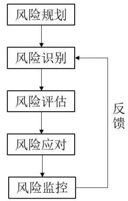
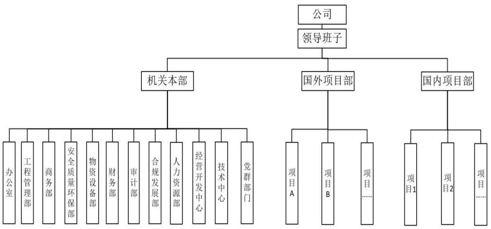
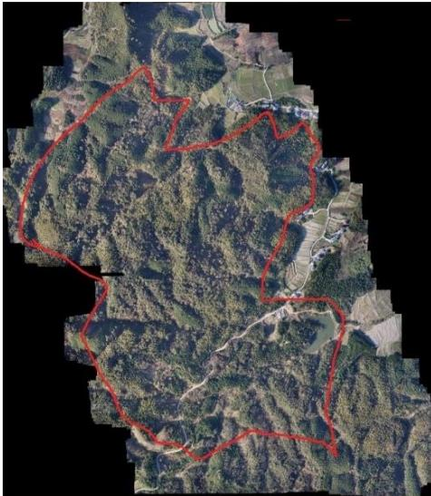
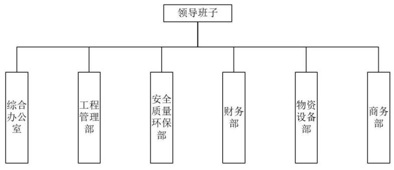
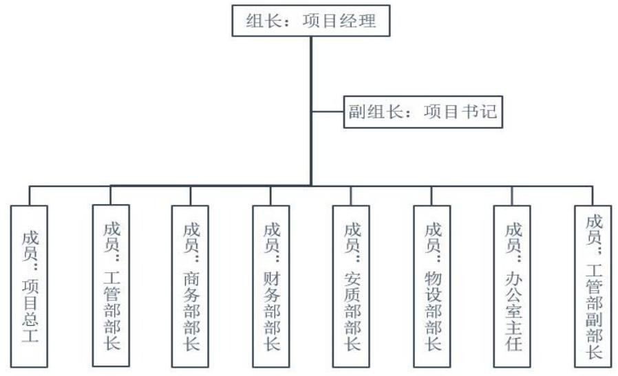
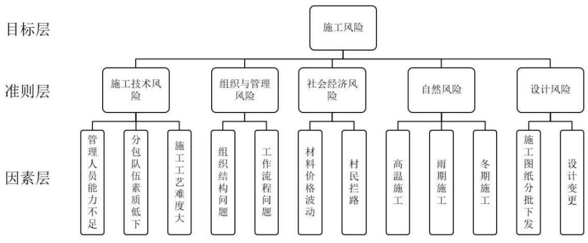
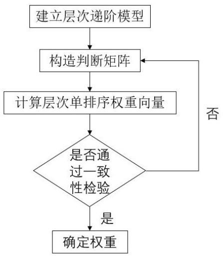
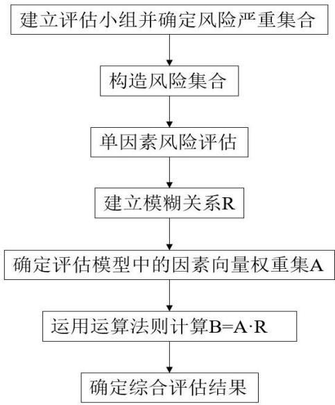
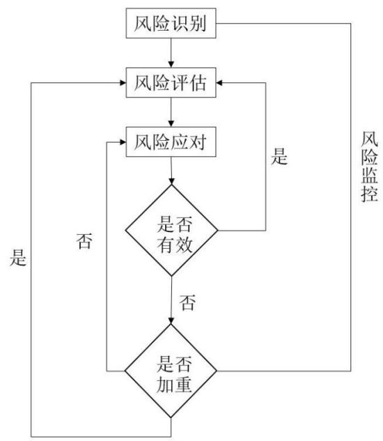

# 第 1 章 绪论

# 1.1 研究背景与意义

# 1.1.1 研究背景

中铁 J局DL分公司是一家从事建筑施工的企业，拥有国内特级资质，业务覆盖全面，包括公路、铁路等国家基础项目建设，工厂建设，学校建设，市政工程等。公司业务以海外建设项目为主，国内建设项目为辅。但是由于近几年国内传统建筑行业市场发展迅猛，大大小小的建筑企业也是蓬勃发展，面对传统建筑市场未来发展空间有限，行业内利润越来越低的情况，公司一直在思考未来的发展战略，如何在保证国外市场的正常发展甚至是扩张的情况下促进公司在国内市场的发展与扩张。

与此同时，近些年来人们对化石燃料的使用衰竭的担忧与其造成的环境污染所带来的各种负面影响，让人们不得不思考未来的发展方向将如何选择。很显然大部分人将目光锁定到了电池之上，期望其可以缓解化石燃料的紧缺与其带来的各种环境问题。在国家的大力支持与倡导下，新能源技术也进入了前所未有的高速发展阶段，但是受现阶段科技水平的限制，锂电池成功的登上了历史的舞台，而其所带来的高额的利润也让很多企业一跃成为了国内外家喻户晓的弄潮儿。这其中我们所知道国内的比较有权威的要数宁德时代与比亚迪了，其二者的装车量一度接近国产新能源汽车总装车量的 $80 \%$ 。而二者的对燃料电池的竞争也从单纯的市场竞争进一步扩大到了原材料的竞争上面，因为掌握了原材料的主动权就可以进一步的降低锂电池的生产成本提高利润，甚至可以一直控制市场上原材料的价格来对竞争对手进行施压。想要控制原材料就要有自己的采矿场，因此国内也掀起了一场锂矿的勘探与开采的热潮，而选矿厂的建设也同样的进入了各大锂电池生产企业的规划之中。但是这些生产企业又恰恰都不具备矿建能力。

一个需要采矿场来实现自己在原材料上的话语权但不具有建筑能力；一个拥有建筑能力并且需要新的市场来拓宽自己的建筑市场，并需借此来确立自己在国内矿建行业的地位，以此来站稳自己在国内矿建的脚跟并借此实现滚动发展。二者一拍即合，因此中铁 J 局 DL 分公司承接了奉新 SD 选矿厂业务。

# 1.1.2 研究意义

作为公司在国内正在准备开拓的新的领域，公司对选矿厂项目能否成功完成是十分重视的，而对于可能会对项目成败产生决定性影响的施工风险管理就变得十分重要了。因此公司决定针对选矿厂项目建立一套包括风险识别、风险应对、风险评估、风险监控等的管理系统。通过风险管理可以大大的减少施工风险对项目的影响从而提高项目的成功率。而本论文的结论也可以也可以给公司今后相关项目提供参考借鉴的经验：

# （1）理论意义

近年来随着国内对项目管理的重要性的认识程度越来越深，项目管理这一学科逐渐被大众所熟知，而其中的风险识别、风险评估、风险控制更是影响项目实现的关键性因素。建筑项目由于持续时间长，地理位置差异，更会随着时间的推移因社会、地理环境的变化而产生各种各样无法预料的变化，这些都是制约项目成功的风险因素。这其中有相当一部分的风险因素是因为没有合理的管理与控制造成的，当这些风险突然出现时，现场的施工工人或者是普通管理者大多时候是无法及时的对事故问题进行正确快速的解决的，从而让问题进一步扩大。目前国内项目管理发展还处在一个发展阶段，很多项目虽然一直在喊科学管理的口号，依然使用粗放的管理模式，这为项目的成功完成埋下了重大的隐患，造成利润的下降，产生安全和质量事故，工期延长等一系列问题，而有效的风险管理可以大大的降低上述隐患。

# （2）现实意义

选矿厂项目属于中铁 J局DL分公司在国内的首个与采矿行业相关的项目，如果可以通过对施工风险进行合理的管理让选矿厂项目获得成功，不仅可以让公司在国内矿建行业名利双收，也让公司在国内的矿建行业从此站稳了脚跟。此选矿厂项目无论是规模还是技术都已经跻身世界一流。规模上来看此选矿厂目前在亚洲范围内最大，世界范围上第四的选矿厂；从技术上来看此选矿厂运用了当前世界上最先进的锂云母半自磨浮选技术，在国内尚属首例，因此并无相似项目可以作为参考。这都为此项目的建设与管理带来了更多的困难。该项目的承建将填写中铁 J局DL分公司在国内采矿项目建设的空白，本论文的结论更可以为中铁 J 局 DL 分公司未来在矿建项目上的承建与开发提供大量的技术与管理经验。可以让公司在未来同类项目的投标竞争中有更大的机会，为公司创造更多的利润。

# 1.2 国内外研究现状

# 1.2.1 国外研究现状

国外对风险管理研究起步较早，最早可以追溯到 1931 年，而将风险管理应用到建筑行业则要到上世纪的六七十年代，目前西方的建设项目风险管理的研究方向主要有以下几个方面：

研究方法：研究方法方面，国外学者多采用系统分析、专家咨询、模型分析和仿真等定量和定性相结合的方法，以有效地评估和处理项目风险。

风险识别：在风险识别方面，国外学者通常将风险分为技术、市场、环境、政治等方面，利用各种工具和方法来收集信息、确定风险因素和评估风险概率和影响。

风险评估：在风险评估方面，国外学者广泛应用贝叶斯网络、蒙特卡洛模拟、灰色关联分析等方法，以准确评估风险的概率和影响，为决策提供可靠的数据支持。

风险控制：在风险控制方面，国外学者更加注重风险管理的主动性和整体性，引入风险转移、风险共担等新观念，通过制定风险管理计划和采取相应措施，有效地控制和减轻项目风险。

Farnad Nasirzadeh（2008）集成系统动力学和模糊逻辑建模进行施工风险管理，运用系统动态学 (SD) 方法应用于建设工程项目风险管理，包括风险分析和应对措施。

Amani Sulaiman Bu Qammaz（2018）信息和通信技术在建筑风险管理中的作用，探讨了信息和通信技术(ICT)在建筑业中的应用,并讨论了 ICT 如何促进建筑风险管理过程的成功。研究旨在揭示使用这些工具和技术的地方,以及如果适当应用的话,其预期的有效性。

Adekunle Qudus Adeleke（2019）施工风险管理中组织外部因素的实证分析，研究使用偏最小二乘结构方程模型方法来验证建筑风险管理(CRM)作为一种建模。通过对建筑公司进行大规模调查,发现技术、政治和经济因素在尼日利亚建筑公司中具有重要影响。

Amos Darko（2020）基于建筑信息模型（BIM）的模块化集成施工风险管理：关键调查和未来需求，利用 BIM 技术来对对模块化集成施工的建筑进行风险管理。

Hooman Sadeh（2021）施工风险管理的综合方法：成本影响，介绍了一种以成本影响为导向的新模型，利用模糊蒙特卡罗模拟方法进行首次评估和评估风险。

Dina Alfreahat（2023）标准项目风险管理流程的施工特定扩展，提出了风险分析验证和验证以及风险计划实验两个新的流程并得到了验证。研究显著提高了建筑工程的风险管理机制，强调了组织需要清晰地表达和沟通其风险偏好，以及为员工提供风险管理培训的必要性。确认了项目风险管理的标准化概念，并证明了提出的新阶段的必要性。

# 1.2.2 国内研究现状

国内对风险管理这一概念的引入时间相对较晚，而将这一理论应用到建设项目上的时间也同样要滞后于国外一些西方国家，国内的研究现状主要体现在以下几个方面：

研究方法：在方法方面，国内学者多采用问卷调查、案例分析、模型建立等方法，较少应用系统仿真、贝叶斯网络等先进方法。

风险识别：在风险识别方面，国内学者通常将风险分为技术、市场、环境、政策等方面，但对于复杂的交互影响关系尚未深入研究。

风险评估：在风险评估方面，国内学者主要应用层次分析法、模糊综合评价法等方法，但对于概率和影响的量化还没有达到国际上的水平。

风险控制：在风险控制方面，国内学者更注重传统的被动控制手段，如保险和担保，缺乏主动性和整体性，还需加强针对性和实效性。

唐文哲（2006）基于伙伴关系的项目风险管理研究，创建了基于伙伴关系模式的项目风险管理模型。伙伴关系模式能最大程度地整合资源，有助于相关组织的革新、学习和提高效率。该模型系统地描述了伙伴关系应如何组织风险管理体系，以及项目风险管理和评价与激励之间的紧密结合，使项目参与各组织通过资源最优化配置提升项目风险管理水平。

郭陕云(2011)对隧道及地下工程建设风险管理的认识, 指出关键在于工程建设风险管理的有效性，并提出提高隧道及地下工程建设风险管理有效性措施：一是必须实施动态化管理，二是正确坚持专家评审制度，三是走专业化的道路。

张国发（2020）浅议建筑工程管理中的风险管理， 指出强化深基坑工程施工安全风险管理的必要性，基于安全的视角就建筑施工管理中的风险管理对策进行分析。

易林（2022）供求关系失衡环境下如何规避项目风险转嫁，当前施工单位处在供求关系逐渐失衡的行业环境下,研究了如何规避自身以及发包单位转嫁而来的各种项目风险。

陆莹（2023）使用基于案例的推理在建筑行业中实现自动化安全风险管理，研究开发了案例检索机制，由于粗糙集和 KNN的结合，提供了先进而准确的相似性测量系统。开发了一种基于 CBR 的工具，集成了风险管理（RM）的所有步骤，以实现施工安全风险管理的自动化，从三个角度识别和分析影响施工安全的因素。

# 1.2.3 国内外研究评述

国外风险管理已经处于一个较完善的全面风险管理阶段，风险管理概念、内容、框架构成了现代全面风险管理理论的核心。建设项目风险管理历经 60 多年的研究于发展已经形成了一套较为完整的理论体系和时间方法，可以为我国假设项目风险管理的研究于应用提供借鉴和参考。

国内建设项目风险管理的研究仍需要进一步的加强，结合我国国情，创新方法，加强理论研究于实践探索，提高风险管理的科学性和有效性，以保障建设项目的可持续发展。

我国是人口大国，基础建设的推广将在很大程度上决定了广大群众的生活质量，而保证基础建设项目的顺利完成就需要风险管理的有效实施，因此大力发展建设项目的风险管理的研究是十分必要的。国内风险管理起步晚，虽然得到了广泛的认可但是仍然无法真正的应用的建设工程当中，很多项目上只是留于表面的走形式，还无法将风险管理落于实处。这其中有大环境的原因，更主要的还是人的原因，推动建设项目风险管理的研究于应用仍然会是我国以后一段时间需要大力落实的重点工作。

# 1.3 研究方法

# 1.3.1 文献研究法

查阅相关文献，对现有的相关理论与实践研究进行系统梳理并进行总结评述，对奉新SD陶瓷土（含锂）综合利用选矿厂项目进行项目风险管理研究，结合项目本身的实际情况与查阅的文献进行综合的分析考量，来对论文的拟写提供理论支撑。

# 1.3.2 定性分析法

定性分析法是依据预测者的主观判断分析能力来推断事物的性质和发展趋势的分析方法。这种方法可充分发挥管理人员的经验和判断能力，它一般是在项目缺乏完备、准确的资料的情况下使用。以奉新SD陶瓷土（含锂）综合利用选矿厂项目为研究对象，通过建立风险管理专家小组，采用匿名函询的方式收集专家意见，综合整理后再匿名反馈给各位专家，再次征询意见。如此反复多轮直至专家意见趋于一致，以此来确定可能将要发生的风险。

# 1.3.3 定量分析法

定量分析法一般是对社会现象的数量特征、数量关系与数量变化进行分析的方法。利用模糊评估法可以对奉新SD陶瓷土（含锂）综合利用选矿厂项目的风险进行相对较为合理的定量分析，帮助公司完成项目的风险管理。

# 1.4 研究内容与技术路线

# 1.4.1 研究内容

第一部分是绪论，阐述研究的背景、意义、研究现状，对国内外的研究进行了梳理与分析；

第二部分是项目施工风险管理理论概述，对本文将要使用的理论进行了简单概述；

第三部分是拟建选矿厂项目介绍，对奉新 SD陶瓷土（含锂）综合利用选矿厂项目进行简单的介绍，包括地理位置，气象水文情况，主要建筑概况，公司简介，风险规划；

第四部分是奉新 SD选矿厂项目施工风险识别与评估，针对奉新 SD陶瓷土（含锂）综合利用选矿厂项目运用项目风险管理的风险识别手段对项目将要发生的和可能将要发生的风险进行识别与记录，并利用风险评估方法对风险进行定性与定量分析；

第五部分是奉新 SD选矿厂项目施工风险应对与跟踪，针对之前识别出的风险通过评估后给出切实可行的应对方法，并对该风险分配专人进行跟踪反馈；

第六部分是结论与展望，总结论文的研究过程与对未来的展望。

  
图1.2研究技术路线  
Fig. 1.2 Research technical route

# 1.4.2 技术路线

具体研究路线如下：

第 1章以奉新 SD选矿厂项目的施工风险管理问题为研究主题，通过对研究的背景、意义、研究现状的阐述与说明，对国内外的研究进行梳理与分析，建立论文写作的基础。

第 2 章基础理论概述。对项目风险管理的相关研究理论进行了简要介绍。

第 3章奉新 SD选矿厂建设项目的概况。介绍奉新 SD选矿厂建设项目的基

本情况，描述了主要项目特点及施工风险管理规划。

第4章奉新SD选矿厂建设项目施工风险识别。通过文献研究、实地调研，并通过面谈法及专家调查法、分类并建立精确项目风险清单。

第5章奉新SD选矿厂建设项目施工风险评估。根据识别的风险采用层次分析法及模糊综合评价法，计算各个风险因素权重，并进行总体排序，得到风险评价结果。

第6章奉新SD选矿厂建设项目施工风险的应对与监控。基于项目的风险评价结果提出风险应对的策略，并制定风险监控的流程与方法。

第 7章结论与展望。对本文的主要研究成果进行总结，并就本文研究的局限性提出了下一步项目风险管理的研究工作。

论文的技术路线见图 1.2。

# 第 2 章 项目施工风险管理概述

# 2.1 项目风险概述

项目风险就是在项目的全生命周期内，由于某些不确定的因素从而可能引发项目偏离原定目标，造成项目损失甚至是失败的各种因素。项目风险一般具有：客观性、偶然性、规律性和多样性等特征。了解这些风险特性可以帮助项目团队制定合理的风险管理策略，降低风险对项目产生的不利影响。

# 2.1.1 风险的定义

风险在我们的平常生活中经常被提及，但是要从理论的角度对风险做科学的定义是有一定困难的。“风险”一词在字典中常常被解释为“损失或伤害的可性”，人们对风险的理解是“可能发生的问题”。一般而言，风险的基本含义是损失的不确定性，但是在这一基本的概念的理解上，在经济学家、统计学家、决策理论家与保险学者中却没有一个可以适用各个领域的、公认的对风险的定义。因此不同领域对于风险目前的定义也不尽相同，主要有以下几种：[1]

（1）风险是一些不确定性或者由其引起的可能偏离预定目标的不良后果的综合。它是不确定事件发生及其后果的概率函数，若用 R 表示风险，P 表示不确定事件发生的概率，E 表示不确定事件发生的后果，则风险可用数学公式表示为：

$$
\scriptstyle \mathbf { P } = f ( \mathbf { P } , \mathbf { \beta } \in )
$$

（2）风险是损失或者事故发生的可能性，这种可能性一般用概率来描述。

（3）由将来可能发生的一个事件而引发的可能产生的不良后果的一种状况。

[1]

# 2.1.2 风险的特点与种类

（1）风险的特点

风险具有不确定性，风险的不确定性主要表现在风险的发生与否以及发生之后所带来的结果的严重程度大多数时候是不可确定，人们只能运用以往的经验与知识对其进行推断、预测。

风险的后果具有现实性，现实性是指假如一个风险事件已经发生或者结束那么原有的风险便会随之消失。

风险具有可控性，有些情况下事件是否会发生风险是可以通过采取一些方法来进行控制的。在这种前提之，下我们可以运用以往的经验与知识来对风险是否可能发生进行合理的推断与预测，并根据风险发生后可能引发的后果的严重程度采用相应的方式来控制风险对于原事件的影响程度。这也是我们可以对风险进行管理的理论与现实依据。

# （2）风险的种类

为了便于对项目风险进行合理有效的管理，应该将这些风险进行分类。按照不同的分类标准和原理，我们可以对项目风险进行分类。按产生风险原因的不同通常可以把风险划分为经济风险、社会风险、技术风险、自然风险和管理风险等。

自然风险，是指由于自然环境的变化而引起的自然现象或者物理现象所产生的风险。这类风险在极端情况下表现为：暴风、火灾、洪水等恶劣气候所导致的项目损失甚至目标不能达成的情况；一般为：高温、严寒、短时暴雨、连续降雨等影响工程正常施工可能对项目造成损失的气象灾害。

社会风险，是由于政治局势的动荡不安，反常的个人行为、团体行为所引起的项目风险。例如，政权的非正常更迭、罢工、战争、玩忽职守等事件对项目的影响。对于一些大型工程项目还可能包括国际关系、国家政策、政治经济、科技、军事的发展战略对项目产生的风险。社会风险在我国一般表现为工程项目当地的老百姓对施工的不配合甚至阻挠。

经济风险，指由于经营管理能力不足、市场预期错误、价格波动、成本需求增加等引发项目经费超支或经济损失的风险，以及外汇波动和通货异常引发的风险。对于施工方来说经济风险主要表现为业主不能及时付款导致资金链断裂、或者原材料涨价造成成本大幅度上升等。

技术风险，一般是因为采用施工技术的不够成熟，或者要求的施工技术复杂，现场技术人员知识能力不足，施工人员掌握的施工技术程度低，施工图纸下发缓慢，无节制的各种变更等因素带来的技术方案、设计、施工、运行等方面的风险。

管理风险，多指项目管理人员的组织管理能力不够，领导与成员的个人素质无法满足当前项目的要求，计划与资源调度能力不足，某些流程设置不尽合理等原因引发的因项目管理水平不足影响项目目标完成的风险。

大型工程项目的主要风险有人力风险、费用风险、进度风险、质量风险、管理风险、技术风险、时间风险、安全风险等。按照项目的不同阶段可对项目风险进行阶段划分，如概念阶段的项目风险、开发阶段的项目风险、实施阶段的项目施工风险、收尾阶段的项目风险。因此风险并非全部贯穿于项目的全寿命期，某些风险只属于一个或者两个阶段。

# 2.2 项目施工风险管理概述

# 2.2.1 项目施工风险管理的概念

项目施工风险管理是指在项目的实施阶段中，施工单位在项目施工期间内对于可能遇到的风险或者风险因素进行预测、识别、分析、评估，在此基础上采取合理有效的应对策略于应对方法并对风险进行持续的跟踪监测、持续的改进，减少甚至消除风险的损失，从而达成项目目标的科学的管理方法。[1]

# 2.2.2项目施工风险管理的特点

项目的实施是一种人类进行经济活动的重要形式， 项目的一次性让其要比其他一些经济活动要多出许多不确定性，因而对项目风险的可预测性也就变差，而要支撑这样的活动就必然需要大量的经验与知识，就算是这样也难以保证预测到的风险会不会发生或者发生后可以得到及时的控制，这也就是为什么项目一旦出了问题，是很难进行补救的。从项目施工风险管理的方向来说就是如何能够在满足合同规定的条件下，保证工程的安全、质量、造价，使项目顺利的完成。如果因为某种或者某些原因致使项目无法达到上述要求，那么风险也就出现了。将建设工程项目作为研究的对象，建设工程项目的目标是一个十分繁复的系统，通常建设工程项目的施工被认为是一项风险十分巨大的活动，无论是工期的延长还是投资的超标都是普遍存在的现象，施工安全也一直是人们担心的主要方面。因此在考虑建设工程项目施工风险的时候，需要注意以下几点：

（1）没有完全一致的项目。虽然工程项目的施工过程有很多共同的活动和步骤，但是不同的时间，不同的地点让每一个项目在建造和安装上都是与众不同的，他们全都有属于自己的物理特性。受不同的地理位置、天气条件，不同时间的材料价格，不同的管理与技术水平等因素的影响，赋予了项目多样性的特点。

（2）各个主体各自的风险防范与应对措施不相同。项目的各个参建方有很多， 如建设方、设计方、监理方、总承包方、分包方、劳务方及供货方等。对于不同的参与方他们的责任不同、经济利益不同、立场与目标也不同，他们所需要承担的风险也自然会不同，因此不同的参建方对风险的理解、态度、承受能力也必然不同。

（3）越早、越主动采取措施越有利于施工风险的管理。建设工程项目的实施过程大多数都是较为的漫长，目标体系的构成也可能会随着时间的推移与工程施工的进展不断地发生变化。因此，在这个漫长的活动过程中，遇到的不确定性因素也就不会少，在项目不同的阶段，不确定性因素的出现频率和属性也会有所不用。对于建设工程项目来说，不确定性往往都出现在项目的早期阶段，一般情况下随着项目的进展，不确定性会逐渐的减少变弱。所以在初期阶段做出的决策往往对以后阶段和项目目标的实现影响最大。

（4） 施工中各部分之间的关系往往是互相制约、互相依赖。项目的工作内容和项目所处的环境一定是息息相关的关系，唯有认真地研究风险事件本身和环境以及两者之间的关系、相互的影响和相互的作用，才能正确的识别出所要面临的风险。例如，建设项目中的质量控制与安全控制，两者的出发点不同、要求的目标也不一致。但如果没有安全控制，再好的质量都变得毫无意义，质量不达标再如何安全也同样无法完成目标要求，而项目的质量、安全等因素在不同的环境当中，其要求的严格程度也是可能会发生重大变化的。

（5）前期的风险评估对于建设工程项目最为重要。建设工程项目一般涉及巨额的资金，若在早期未进行合理有效的风险评估，在项目进行中一旦出现风险因素造成了不良后果，可能带来巨大的损失。因此在项目施工前，进行全面、系统的风险评估是可以帮助项目施工方和各个利益相群体识别潜在风险的。通过详细的风险分析和评估，可以尽可能准确的识别各种可能导致项目失败的风险因素，比如技术难题、市场要求变化、资金链等。同时，通过对风险的概率和影响程度进行定量分析，可以优先处理高风险问题，制定合理的应对策略和应急处置方案。前期的风险评估对于建设工程项目的成功至关重要，它可以为项目团队提供及时、全面的风险认知，有助于降低项目风险，减少损失，并保障项目的顺利实施。

# 2.2.3 项目施工风险管理的过程

项目施工风险管理发展的一个重要的标志是建立了风险管理的系统过程，项目施工风险管理过程一般被划分成五个阶段：施工风险管理规划、施工风险识别、施工风险估计与评价、施工风险应对、施工风险跟踪与监控。因为风险是不确定的，一次的风险结束，标志着原风险的消亡，但是其也可能会引发其他的风险，又或者因为相应的风险应对方法而又引发了新的风险，因此风险管理不是单线的，它是一个不断循环完善的过程，它会随着项目的进程一直存在直到项目结束，如图 2.1所示。

  
图2.1风险管理过程  
Fig. 2.1 Risk management process

（1）施工风险管理规划。施工风险管理规划是施工风险管理的工作大纲，是针对整个项目的，是在项目实施阶段的早期制订的，用来指导和组织项目部的管理人员，主要是风险管理人员进行风险识别、风险分析与评估、风险应对、风险跟踪和控制的方法和文件。项目施工风险管理规划中包含了风险管理的方法，风险判断的依据，风险评价的基准，风险管理人员以及信息收集和沟通等方面的信息与内容。

（2）施工风险识别。施工风险识别是为了确定项目施工风险的来源，产生的条件，确定哪些施工风险有可能影响本项目的实施，并对这些风险进行描述。在项目的实施过程中，施工风险的识别是随着整个项目信息的逐渐明确变得越来越深入，结果越来越可信、可用。所以，施工风险识别并不是一次就可以完成的，它应该在项目的实施过程中持续不断地进行。常用的施工风险识别方法有：头脑风暴法、swot 法、网络图法、敏感性分析法、故障树分析法等。

（3）施工风险评估。施工风险评估是针对已经识别出来的施工风险进行定性与定量的分析，评估施工风险发生的概率和对项目施工的影响程度，常用的评估方法有：主观评分法、层次分析法、模糊综合评价等。

主管评分法，利用相关专家的经验等隐形的知识，单纯的以专家的主观看法对单一风险进行赋值，然后对风险进行加权，再与风险评价基准比较。缺点也很明显，受专家的知识经验等影响明显，容易出现偏差。

层次分析法，是将整体风险进行分层处理，建立层次关系，利用判断矩阵、特征向量等，求下一层的因素对上一层的某个因素的优先权重，最后加权求得总体的风险。

模糊分析法，是利用模糊数学中的隶属度原理将定性问题转化为定量问题。其优点是系统性强，结果清晰，可以较好的解决模糊的、难以量化的问题。

（4）施工风险应对。施工风险应对是根据风险评估的结果，为转移、减少甚至消除风险造成的不良后果而制订的合理的应对策略与具体的应对措施。施工风险的应对方案应该要考虑风险的严重程度、项目的目标和采取风险应对措施所花的费用，综合决策选择最佳的应对措施。也就是说我们选择的应对措施可能不是最好的但一定是当时情况下最适合的应对方法。常用的施工风险应对策略有：风险减轻、风险回避、风险转移、忽略或接受风险。

风险规避是通过变更工程项目计划的方式，来实现除消风险或者除消风险产生的条件，通常情况下主要从规避风险事件发生的概率与规避风险事件发生后可能产生的损失两个角度来实现。从理论上讲风险规避是一种彻底消除风险的影响的方法，而实际上风险是不可能被完全消除的，但是如果可以利用好上边讲到的两种方式，对于一些风险是可以在他们发生之前减小其发生的概率或者减少其对项目造成的损失的。

风险转移是设法将风险的结果连同应对风险的权利与责任一并转移给他方。这是一种将风险管理的责任转移给他方的方法，并不能消除风险，特点是使自身免受风险损失。风险转移并不意味着是将风险转移给他方，他方就一定会遭受风险损失，很多时候这种策略方式会让转移方与被转移方实现双赢。例如某总承包方承包的项目中的某一专项工程中需要的技术是自己不擅长的，就可以将此部分分包给具有相应的专业技术擅长此项工程的分包方。如此，总承包方避免了因自己不擅长的工作造成风险损失，分包方完全可以胜任工作还可以获得利润。

风险缓解也称风险减轻，是将工程项目风险的发生概率或者后果降低到一定程度，或者可以接受的程度。要采取风险减轻的策略，工程项目管理者首先要进行深入细致的调查研究，把握风险出现的可能性和可能引发的损失；其次，将风险减轻的程度具体化，即要确定风险缓解后的可接受水平。采取风险减轻的措施在项目的越早期进行，对项风险的控制越有利。

风险自留也就是我们常说的风险接受，是一种项目部自行承担风险后果的一种风险应对策略。一般采用这种策略的时候大多并不是因为项目的承担者无法找到合适的应对策略而采取的一种相对被动的应对策略，它是大多数管理者在综合考虑风险后果与采取相应措施的代价后采取的一种方式。

（5）施工风险跟踪与监控。施工风险跟踪与监控就是要在项目的实施过程中对已经识别的施工风险进行持续的关注。因为随着施工的不断进行，可能会出现各种各样的情况使得已经识别的施工风险发生不可预料的变化，实施有效的风险跟踪和风险监控可以根据项目执行情况对项目的施工风险管理计划进行优化调整，保障施工风险管理计划的顺利实施，并评估消减风险的效果。在对施工风险进行跟踪与监控的过程中要与项目各个利益相关方保持持续不断地交流，及时了解和通报施工风险信息。

# 第 3 章奉新 SD 选矿厂项目简介

# 3.1 公司简介

# 3.1.1 公司发展

中铁 J局 DL分公司隶属于中铁九局集团有限公司，原为中铁 J局下属主要负责海外业务的处级单位。因业务需要于 2003年 5月 8日正式挂牌成立并更名为中铁J局DL分公司，是世界 500强中国中铁股份有限公司下属三级公司。

主营范围为铁路工程、公路工程、市政公用工程、房屋建筑工程、铁路铺轧、架梁、钢结构、铁路电务工程、铁路电气化工程施工。公司定位为“主营海外”公司（海外占比三分之二、国内占比三分之一），产品以海外市场为主，国内市场为辅。

# 3.1.2 公司组织架构

目前公司一共有在职员工 1190 人。主要分为机关本部、国外项目部、国内项目部。具体组织架构图如图 3.1所示。

  
图 3.1 公司组织架构  
Fig. 3.1 Company organizational structure

（1） 机关本部

机关本部是公司的核心，包括了办公室、工程管理部、安全质量环保部、物资设备部、财务部、审计部、合规发展部、人力资源部、经营开发中心、技术中心、党群部门。这些部门的存在保证了公司整体的正常运转。

（2） 国外项目部

国外项目部，是公司设立于国外的负责组织生产运行的部门。主要分布于非洲、南美洲、中东欧、亚洲等地的国家，负责公司承接的海外工程的建设工作，涉及公路、市政、桥梁、工业与民用建筑、钢结构、石油基建、矿业采剥等工程领域。海外项目目前员工数量占公司总人数的百分之四十左右，但产值却超过了公司总产值的百分之六十。

（3） 国内项目部

国内项目部是公司设立于国内的负责国内工程建设的部门，国内工程项目分布在辽宁、吉林、四川、安徽、云南、广东、福建等省，先后参与了哈大、丹大、通新、沪昆、成昆等大中型铁路的改建、增建和新建工程；承建了昆明枢纽特大型铁路编组站工程；参建了云南龙瑞、玉溪至楚雄等高速公路工程；参建了大连、昆明、深圳、长春等大中型城市的地铁及轨道交通工程。各类工程验交合格率 $100 \%$ 。公司先后荣获化学工程（境外）优质工程 1项；境外鲁班奖 2 项；国家优质工程 1 项；詹天佑奖 1 项；省部级安全标准工地 3 项、优质工程6项；省部级安全管理先进单位1项；省部级企业文化建设示范点1项；市级安全标准工地1项、优质工程 2项；中国工程焊接协会优秀焊接工程 4项等。

# 3.2 项目简介

# 3.2.1 地理位置与地质条件

奉新SD选矿厂厂址位于宜春市奉新县上富镇镇区正南方约 4km的罗家里

  
图3.2选矿场地形图

Fig. 3.2 Shape diagram of the beneficiation site

村西部。选矿厂通过约 $2 . 5 \mathrm { k m }$ 的外部道路与 G354国道相连，通过 G354国道可从距离选矿厂约 $7 \mathrm { k m }$ 处的上富互通上至杭长高速，交通较为便利。地貌单元属低山丘陵，现场地面呈西高东低分布，地面标高在 $9 5 { \sim } 3 2 0 \mathrm { m }$ 之间，地势起伏较大，如图 3.2所示。

# 3.2.2 气象水文情况

(1)气象情况

奉新县位于江西省宜春市属中亚热带湿润气候，四季分明，气候温暖，雨量充沛，阳光充足，无霜期长。随着地形变化，气温从东到西递减，但降雨量却是由东到西逐增，东西干湿变化相对明显，南北温差较小，受复杂的地形影响，自然灾害比较频繁，旱涝、风雹时有发生。根据记录奉新县年平均气温为$1 7 . 6 ^ { \circ } \mathrm { C }$ 。其中，一月份气温最低，平均气温 $5 . 2 ^ { \circ } \mathrm { C }$ ，历史上记录的最低气温为零下 $1 5 . 8 ^ { \circ } \mathrm { C }$ ，七月份气温最高，平均气温 $2 9 . 0 ^ { \circ } \mathrm { C }$ ，历史上记录的最高气温是在2003年 8月 2日出现过的 $4 1 . 0 ^ { \circ } \mathrm { C }$ 。全年平均降雨量 1671.5毫米，最高的年份达2263.5 毫米，最低年份也有 1236.7 毫米，降雨量集中在 $4 { \sim } 6$ 月份，占全年的$47 \%$ ， ${ 7 } { \sim } 9$ 月雨量相对减少，不到全年的 $22 \%$ 。年平均相对湿度 $7 9 \%$ ，无霜期年为260天左右，年日照时数可达1784.9小时。

(2)水文情况

奉新县境内河流全部为修水水系，主要河流有南、北潦河。南潦河发源于铜鼓、宜丰、奉新三县交界的九岭山，流经奉新县境内长度为 $9 8 . 3 \mathrm { k m }$ ，有百丈水、甘坊水、港尾河、 溜头水、石溪水、金港水、澡溪河、白水、仰山河、兰田水、芭源水、竹溪水、村头水、东源水、仕源水、青树水、龙溪河、白马港、中保港、黄沙港、岗前水、胭脂水、赤田港等大大小小 60 多条支流，流域面积$1 5 3 1 \mathrm { k m } ^ { 2 }$ ，横贯全县；北潦河又称龙江水，发源于修水县的茅竹山寒婆坟，北潦河（奉新县段）从干洲镇的芒洲入境，途经该镇的张家、溪泮、枧下、北溪等村最后流入安义县境，在奉新县境内长度为 $1 0 \mathrm { k m }$ 。

(3)地表水：本场地地表水原主要分布于山底水沟及低洼地段中，现已基本干涸。

(4)地下水：本场地地下水主要有上层滞水及基岩裂隙水。

# 3.2.3 主要建筑概况

本工程位于宜春市奉新县上富镇，镇区正南方约 4km 的罗家里村西部。本

项目拟建建筑主要包括选矿工程和公辅设施。

# 表 3.1 选矿厂主要建筑统计

Tab. 3.1 Statistics of major buildings of concentrator plants   

<table><tr><td>序号</td><td>建筑名称</td><td>结构型式</td><td>基础型式</td><td>建筑面积 (m)</td><td>火灾危险类 别</td></tr><tr><td>1</td><td>顽石破碎</td><td>钢结构</td><td>钢筋砼独立基础</td><td>1900(平台面 积）</td><td>戊类</td></tr><tr><td>2</td><td>磨矿车间</td><td>钢结构</td><td>钢筋砼独立基础</td><td>1066(平台面 积）</td><td>丁类</td></tr><tr><td>3</td><td>精矿浓密机</td><td>钢结构</td><td>钢筋砼独立基础</td><td>3267(平台面 积）</td><td>丁类</td></tr><tr><td>4</td><td>浮选车间</td><td>钢结构</td><td>钢筋砼独立基础</td><td>690(平台面 积）</td><td>丁类</td></tr><tr><td>5</td><td>锂云母精矿 压滤车间</td><td>钢结构</td><td>钢筋砼独立基础</td><td>4316</td><td>戊类</td></tr><tr><td>6</td><td>锂云母精矿 库</td><td>钢结构</td><td>钢筋砼独立基础</td><td>13390</td><td>戊类</td></tr><tr><td>7</td><td>尾矿浓密机</td><td>钢结构</td><td>钢筋砼独立基础</td><td>6633</td><td>戊类</td></tr><tr><td>8</td><td>综合仓库</td><td>钢结构</td><td>钢筋砼独立基础</td><td>1440</td><td>丁类</td></tr><tr><td>9</td><td>机修车间</td><td>钢结构</td><td>钢筋砼独立基础</td><td>1440</td><td>丁类</td></tr><tr><td>10</td><td>药剂制备</td><td>钢筋砼结构</td><td>钢筋砼独立基础</td><td>3150</td><td>丙类</td></tr><tr><td>11</td><td>浮选10kV 配电室</td><td>钢筋砼结构</td><td>钢筋砼独立基础</td><td>140</td><td>丁类</td></tr><tr><td>12</td><td>尾矿输送泵 房</td><td>钢筋砼结构</td><td>钢筋砼独立基础</td><td>2160</td><td>丙类</td></tr><tr><td>13</td><td>尾矿浓密机 10kV配电 室</td><td>钢结构</td><td>钢筋砼独立基础</td><td>385</td><td>丙类</td></tr><tr><td>14</td><td>地磅房</td><td>钢筋砼结构</td><td>钢筋砼独立基础</td><td>218</td><td>丙类</td></tr></table>

选矿工程包括原矿堆场、顽石破碎、磨矿车间、浮选车间、精矿浓密机、锂云母精矿压滤车间、锂云母精矿库、锂云母精矿装车库、锂云母精矿浓密机、尾矿浓密机等。

公辅设施包括综合仓库、机修车间、综合管网、药剂制备、配电室、尾矿输送泵房、尾矿浓密区 10KV 变电所、循环水池、地磅房、锅炉房、新水池、浓密机溢流水收集池、雨水收集池、事故池、高位水池、道路等。具体的工程建筑统计见表 3.1。

本工程开工日期：2024年6月5日；土建竣工日期：2025年1月31日，总工期 240 天，具体日期以监理工程师开工报告发出日期为准。

由于目前受国家当前对新能源大力扶植政策的影响，锂电池行业也得到了空前的发展，而作为原材料的锂也成为了各大电池生产商首要竞争的资源。市面上的碳酸锂的价格也是每天都会有新变化，随着越来越多的新能源企业将资金投入到锂矿开采中来获得利润的降低，很显然在未来碳酸锂市场中价格也将变得扑朔迷离，尤其从 2022 年开始市场上碳酸锂的价格开始一路走低，因此选矿厂越早的投入生产，对业主来说就可以越早的获得高额的利润。很明显的要在不到一年的时间内完成采矿场从无到实现生产的巨大跨越会是一个多么大的挑战，这其中所要面对的挑战可不单单是时间上的，还有技术上的，社会上的，地理位置上的，环境上的一系列挑战。如何才能安全顺利的保质保量的将项目交付到业主手中就成为了摆在我们面前的一个亟待解决的问题了。这其中的风险不言而喻，因此有效的施工风险管理就成为了决定这个项目能否成功交付的一个决定性因素了。

# 3.3 项目组织

# 3.3.1 项目部组织结构

由于次项目是公司在国内承接的第一个矿建行业项目，对公司而言有着比较特殊的意义。公司组建了以项目经理、项目书记、项目总工程师等为领导班子的项目经理部，下设综合办公室、安全质量环保部、工程管理部、财务部、物资设备部、商务部共五部一室，对整个项目施工运作进行管理，全部管理人员共 54 人。项目管理部组织结构如图 3.3 所示。

  
图3.3项目部组织结构  
Fig. 3.3 Organizational structure of the project department

领导班子包括项目铁三角：项目经理、书记、项目总工程师，三名负责生产的副经理、一名商务副经理、一名安全总监。其他部门分别由一名部长、一名副部长、若干部员组成。

# 3.3.2施工风险管理小组

为了更好的对项目施工风险进行风险管理，项目部组建了施工风险管理小组。施工风险管理小组的工作主要是在项目的施工准备阶段中对项目的施工风险进行风险识别归类并对识别到的风险进行风险评估，然后在此基础上根据风险评估的结果建立施工风险应对方案；在施工的进程中对之前识别到的风险进行跟踪与监控，并根据风险是否发生或者发生后的严重程度判断是否需要采取更进一步的措施，比如风险未发生或者发生后未进一步扩大也没有产生其他的次生风险则不比采取进一步的措施；如果风险扩大或者产生了其他的风险则需要采取相应的措施。具体的施工风险管理小组成员名单如图3.4所示：

  
图 3.4 风险管理小组成员  
Fig. 3.4 Members of the Risk Management Team

施工风险管理小组的组长与副组长分别由项目经理与项目书记担任，小组成员主要由项目总工程师、各个部门部长、副部长组成。小组成员既有在各自部门负责管理的权威专家，也有现场负责施工技术的专家。整个施工风险管理小组在组成成员上不会出现因为缺乏相关专业人员导致风险识别出现缺漏或者管理上出现因经验不足导致管理出现问题。小组内部每位成员均有自己主要负责的至少一项需要跟踪监测的风险并且还有其他两位成员对其进行辅助，如表3.2 风险责任分工表所示。分工的原则是负责相关风险的人员都是在相关领域工作的人员或者有一定关联的人员，这样的分配方式既有利于风险的跟踪管理也可以避免因经验不足导致风险扩大。

# 表 3.2 风险责任分工表

Tab. 3.2 Division of Risk and Responsibility   

<table><tr><td></td><td>主要负责人</td><td>辅助负责人</td><td>辅助负责人</td></tr><tr><td>风险A</td><td>甲</td><td>乙</td><td>丙</td></tr><tr><td>风险B</td><td>乙</td><td>甲</td><td>丙</td></tr><tr><td>风险C</td><td>丙</td><td>甲</td><td>乙</td></tr></table>

# 3.3.3 风险管理档案

建立施工风险管理档案的目的是为了明确项目施工风险的管理方法，组织形式，人员安排，管理流程，具体方法，风险发生后的响应情况，是否采取相应的应对方式，是否得到有效控制，是否引发其他次生风险等。依托于信息电子技术的支撑，建立风险管理档案，对风险进行及时的跟踪监测并记录并更新档案，可以使施工风险的管理流程得到规范化与系统化的集成，避免了风险发生后各部门以及相关负责人之间的推诿扯皮，同时也留下了事后可以总结复盘的重要资料，为以后相似的工程留下宝贵的经验。

施工风险管理档案主要组成部分如下：

施工风险管理小组：内容包括了风险管理小组的组成成员，每个人的职务以及简单的工作背景等，主要方便为后期落实具体责任风险做准备。

施工风险台账：此部分记录了进行风险识别后目前项目存在的所有风险（随着项目的发展风险可能会增加与更新），并根据具体不同的风险种类进行分类记录。

施工风险分级管理制度：根据对风险进行评估得出不同风险对应了不同的风险等级，方便对不同严重等级的风险采取相应的程度的监控。例如，对于一般风险我们采取专人负责，定期对风险进行监控，观察风险的走向是否正常，后续风险等级是会降低还是可能会升高等；对于较大风险，除需要安排专人负责之外还需要制定专项管理方案，定期对风险进行检查、排查，看风险的发展情况，应对方案的落实情况，方案是否有效等；对于重大风险，除了专人负责与专项管理方案外还需要对风险进行实时监控或者实行 24 小时值班制度，严防死守，将风险直接扼杀在萌芽当中。

施工风险巡查记录：对于每次常规风险巡检或检查、每次特定风险的专项巡查或检查都要形成记录，并由相关责任人签字存档。

施工风险档案当中的内容并不是一成不变的，由于工程项目持续时间长，受周边各种各样的因素影响可能会产生意想不到的变化，因此我们的施工风险管理档案也应该是随着项目的进程在不断的更新，让项目施工风险管理不是一句留于形式的空话，而是实实在在的可以服务于我们项目管理，让项目的目标更容易实现的手段。

# 第 4 章 奉新 SD 选矿厂项目施工风险识别

施工风险识别是施工风险管理的基础，项目施工风险管理人员通过收集资料和调查研究， 运用适当的方法对潜在的可能发生的各种风险进行系统的归类和识别，其中最重要的是去了解并寻找项目可能遭受损失的来源，也就是引发项目施工风险的不确定性因素。一般认为项目的施工风险识别的目的包括三个方面： $\textcircled{1}$ 识别出可能对项目施工产生影响的风险因素、 性质以及风险产生的条件，并据此衡量风险的大小； $\textcircled{2}$ 记录具体施工风险的各方面特征，并提供最适当的风险管理对策； $\textcircled{3}$ 识别出的这些施工风险可能会引起的后果。[1]

# 4.1 项目施工风险识别方法选择

建设项目的施工周期较长，这也在客观上决定了项目在施工中将会遇到各种各样的风险因素，加上自身及其所处环境的复杂性，给管理者们全面、系统地识别施工风险因素带来了诸多困难。因此，建设项目的施工风险识别方法也和风险管理理论中所阐述的风险识别方法有所不同。目前比较常用的方法有：德 尔 菲 法 （Delphimethod）、 头 脑 风 暴 法 （Brainstorming）、 情 景 分 析 法（Scenariosanalysis）、核对表法（Checklists）和面谈法（Interviewing）等。

由于每个施工项目都不尽相同，因此每个项目将要面对的风险也必定不会完全相同，所处环境的微小变换就可能引发一连串的连锁反应，导致项目风险的不可控。奉新 SD选矿厂项目由于前期施工资料有限，施工图纸未全部完成而是随着项目的施工逐步下发，但是业主方又对工期有着严格的要求，工期十分的紧张，如果项目延期项目部将面临严重的罚款惩罚。面对有限的资料在施工前期我们无法对项目进行全面的分析解读，这就更要求我们对前期的风险识别进行慎重的对待。因此项目部选择的参与风险管理的风险小组的每一位成员都必须是有着丰富的项目工程施工与管理经验的专家才可以胜任。综合对比上述的各种风险识别方法之后，最终决定采用将面谈法与德尔菲法适当的结合作为本次风险识别的方法。

# 4.1.1 德尔菲法

德尔菲法又被称为专家调查法，目前此方法已经在经济、社会、工程技术等领域中被广泛应用。采用该方法，首先是由项目风险管理人员选定和该项目有关领域的专家，并与之建立直接的函询联系，通过函询进行调查，收集意见后加以整理、归纳、统计，然后将整理后的意见通过匿名的方式返回给专家再次征求意见，如此反复多次后，专家之间的意见将会逐渐趋于一致，可以作为最后预测和识别的依据。

# 4.1.2 面谈法

面谈法是风险管理人员通过和项目上的相关人员直接进行交流面谈，收集不同人员对项目风险的认识和建议，了解项目进行过程中的各项活动，这将帮助风险管理人员识别那些在常规计划可能被忽视的风险。进行访谈时的记录，往往是识别风险的重要资料。

# 4.2 项目施工风险识别流程

风险识别是项目施工风险管理中非常重要的环节，没有风险识别那么在它之后的一切步骤都无法继续进行。风险识别是利用头脑风暴、数理统计等方法，对项目以及资料进行全面的梳理，识别出项目中存在的施工风险事件，并对其进行整理归类划分等级层次的过程，还需对风险事件的后果做出定性的估计。因此，它是整个施工风险管理活动的基础。本次研究最终决定首先采用面谈法对风险进行初步收集，然后再利用德尔菲法对初步收集的风险进行最终的施工风险识别工作。

# 4.2.1 初步风险识别

利用面谈法进行初步风险识别，首先由风险管理小组成员通过和项目上的相关管理人员直接进行交流面谈，收集项目部内部不同的管理人员对当前项目可能存在的风险以及对风险的意见和建议，然后风险管理小组的人员将收集到的施工风险进行整理，形成初步风险清单。

初步风险清单是粗糙的清单，没有经过梳理的清单。初步风险清单中有的风险项目有一些项目可以进行合并，并且有一些项目的风险在本项目当中并不会产生影响甚至在本项目当中不存在。初步风险识别的意义是确定本项目风险的大致范围，并在此基础上对风险进行进一步的细致的识别做准备与铺垫。如表4.1所示的初步风险识别清单，初步风险识别清单是经过风险管理小组成员对项目部的管理人员进行面对面交流后得到的结果，在一定程度上反映了项目部管理人员对当前项目的风险与风险因素的认知。

# 表 4.1 初步风险识别清单

Tab. 4.1 Preliminary risk identification checklist   

<table><tr><td>序号</td><td>风险名称 风险因素</td><td>意见</td></tr><tr><td>1</td><td>安全风险</td><td>各种不安全因素</td></tr><tr><td>2</td><td>经济风险</td><td>涉及到资金的风险</td></tr><tr><td>3</td><td>市场风险</td><td>市场价格变动</td></tr><tr><td>4</td><td>设备风险</td><td>设备产生的不安全因素</td></tr><tr><td>5</td><td>组织风险</td><td>组织内部结构人员等</td></tr><tr><td>6</td><td>合同风险</td><td>合同存在争议的部分</td></tr><tr><td>7</td><td>自然风险</td><td>自然因素产生的风险</td></tr><tr><td>8</td><td>财务风险</td><td>项目部资金断裂</td></tr><tr><td>9</td><td>政治风险</td><td>政治不安定因素产生的风险</td></tr><tr><td>10</td><td>社会风险</td><td>于周边村民之间的风险因素</td></tr><tr><td>11</td><td>设计风险</td><td>设计变更</td></tr><tr><td>12</td><td>施工技术风险</td><td>人员、施工队伍、工艺</td></tr><tr><td>13</td><td>进度风险</td><td>进度不合理</td></tr><tr><td>14</td><td>质量风险</td><td>质量不达标</td></tr><tr><td>15</td><td>计划风险</td><td>业主资金到账缓慢影响计划落实</td></tr><tr><td>16</td><td>土地风险</td><td>前期征地遗留问题</td></tr></table>

# 4.2.2 确定最终风险

利用德尔菲法以匿名的形式将整理后的初步风险清单表4.1返回给风险管理小组成员征求意见，意见一栏中为专家的最终意见。如此反复多次后，小组成员之间的意见将会逐渐趋于一致，可以作为最后预测和识别的依据。注意在现场征集意见时要禁止小组成员之间进行交流影响本人的判断力，征集意见的时间也不宜过长，时间越长被征集者的判断力越会受到影响，准确性也就会随之下降。当选择某个风险因素的专家人数少于 3 人时，则取消该选项；选择人数在 3\~5 人之间，将该风险因素纳入下一轮意见征询；当选择某个风险因素的专家人数大于等于 5 人时，则将该风险因素列入风 险识别结果中。最终，形成了表 4.2 所示的风险识别清单结果表。

# 表4.2风险识别清单结果

Tab. 4.2 Results of the risk identification checklist   

<table><tr><td>序号</td><td>风险名称</td><td>风险因素</td><td>意见</td></tr><tr><td>1</td><td>安全风险</td><td>各种不安全因素</td><td>合并至组织与管理风险</td></tr><tr><td>2</td><td>经济风险</td><td>涉及到资金的风险</td><td>同意</td></tr><tr><td>3</td><td>市场风险</td><td>市场价格变动</td><td>合并至经济风险</td></tr><tr><td>4</td><td>设备风险</td><td>设备产生的不安全因素</td><td>合并至组织与管理风险</td></tr><tr><td>5</td><td>组织风险</td><td>组织内部结构人员等</td><td>合并至组织与管理风险</td></tr><tr><td>6</td><td>合同风险</td><td>合同存在争议的部分</td><td>合并至组织与管理风险</td></tr><tr><td>7</td><td>自然风险</td><td>自然因素产生的风险</td><td>同意</td></tr><tr><td>8</td><td>财务风险</td><td>项目部资金断裂</td><td>合并至经济风险</td></tr><tr><td>9</td><td>政治风险</td><td>政治不安定因素产生的风险</td><td>删除，不存在</td></tr><tr><td>10</td><td>社会风险</td><td>于周边村民之间的风险因素</td><td>同意</td></tr><tr><td>11</td><td>设计风险</td><td>图纸下发慢、设计变更</td><td>同意</td></tr><tr><td>12</td><td>施工技术风险</td><td>人员、施工队伍、工艺</td><td>同意</td></tr><tr><td>13</td><td>进度风险</td><td>进度不合理</td><td>合并至组织与管理风险</td></tr><tr><td>14</td><td>质量风险</td><td>质量不达标</td><td>合并至组织与管理风险</td></tr><tr><td>15</td><td>计划风险</td><td>业主资金到账缓慢影响计划落实</td><td>合并至组织与管理风险</td></tr><tr><td>16</td><td>土地风险</td><td>前期征地遗留问题</td><td>删除，不存在</td></tr></table>

表4.2的风险清单是未经整理的风险清单，从表中可以看出，其中的安全、设备、组织、合同、计划、进度、质量风险被统一合并至一项新的风险“组织与管理风险”，风险管理小组给出的理由是：管理风险与组织风险边界有时很模糊，并且涉及到安全、合同、计划、质量、进度、设备等风险大多数时候是因为管理不严谨导致的，合并至一项后有助于减少工作量、提高管理效率。将财务风险合并至经济风险，原因是采矿场工程的建设方在属于国内的电池龙头企业资金充足，并且考察了其在其它项目上的资信情况的时候发现其都有很好的付款习惯，不会出现刻意拖欠工程款的行为。不同于国外市场时常会出现不安定的政治动乱给工程带来不可预见的风险，国内一直处于稳定的状态，因此也必定不会存在政治风险。最后是被删除的土地风险，因为在工程开工之前建设方已经基本完成了拆迁征地工作，补偿款也已经完成支付，除个别因补偿款未与建设方达成协议的建设方已经放弃的村民外，其他的已经全部完成。

对表 4.2的数据进行进一步的整理得到表 4.3所示的最终的选矿厂施工风险清单，清单中对现有的已经识别到的风险进行了进一步的归纳整理，为了方便组织人员进行风险管理经过风险小组讨论决定增加内外部风险分类。从表4.1我们可以看到，将施工技术风险、组织与管理风险进一步归纳到内部风险中，顾名思义都是来自于项目部内部的风险，这部分风险一般上是可以通过有效的管理和预防来避免或者减轻的。

表 4.3 奉新 SD 选矿厂施工风险清单  
Tab. 4.3 List of SD concentrator construction risks   

<table><tr><td>风险类别</td><td>具体风险</td><td>风险因素</td></tr><tr><td rowspan="6">内部风险</td><td></td><td>1．管理人员能力不足</td></tr><tr><td>施工技术风险</td><td>2．分包队伍素质低下</td></tr><tr><td></td><td>3．施工艺难度大</td></tr><tr><td>组织与管理风险</td><td>1．组织结构问题</td></tr><tr><td></td><td>2.工作流程问题</td></tr><tr><td>经济风险</td><td>材料价格的波动</td></tr><tr><td rowspan="4">外部风险</td><td></td><td>1．高温施工</td></tr><tr><td>自然风险</td><td>2.下 雨期施工</td></tr><tr><td></td><td>3．冬期施工</td></tr><tr><td>社会风险</td><td>村民拦路</td></tr><tr><td rowspan="2">设计风险</td><td></td><td>1．施工图纸分批下发</td></tr><tr><td></td><td>2．设计变更</td></tr></table>

综合其他项目与本项目的差异性，最终确定了项目的施工技术风险主要来自以下三个方面：管理人员能力不足，分包队伍素质低下，施工艺难度大；组织与管理风险则表现为：组织结构问题，工作流程问题。

将经济风险、自然风险、社会风险以及设计风险归纳到外部风险，也就是风险源来自于项目部之外，或者风险主要由外部因素所决定，大多数情况下我们是可以对风险进行预测的，但是却无法在事前采取相应的应对方式来阻止风险的发生，只能采取提前做好预防与准备，留出一定的资金或者提前采取一定的应对方法，当风险发生后尽量的减少风险所造成的损失等被动的接受的应对措施。这部分风险的实际发生与否不会受到我们的主观意志的影响，也就是说这部分风险可能会发生，但也有可能不会发生，但是无论如何必要的应对措施

是必不可少的。

经济风险一般表现为业主延期付款，项目部资金链断裂、施工材料价格上涨等方面，在综合考虑了业主的资信与财务情况项目专家最终排除了业主可能出现的风险，因此项目部就几乎不会出现资金链上的问题，因此经济风险只剩下了施工材料价格的搏动了；自然风险排除不可预见的风险外主要有：高温施工、雨期施工、冬期施工；社会风险只有村民的拦路的情况可能发生，而且一旦发生如果处理不好很可能造成不良的社会舆论影响；设计风险只要有：设计图纸分批下发，设计变更。

# 第 5 章 奉新 SD 选矿厂项目施工风险评估

# 5.1 项目施工风险评估模型建立

# 5.1.1 风险评估的步骤

（1）建立指标体系

为了方便对风险进行定性的分析需要结合风险的特殊性建立指标体系。通过第 4 章风险识别的整理可以发现风险与影响风险发生的风险因素都是有层次关系的，都是上一层包含下一层的结构，这与层次分析法建立体系十分的契合，因此本文选择利用层次分析法建立层次分析模型。层次分析模型主要分为三层，最高层即为目标层，中间层为准则层，最下一层为方案层。

（2）权重的计算

在建立的风险体系的基础上利用层次分析法计算确定各个施工风险的权重。

层次分析法，是一种定性与定量相结合的、系统的、层次化的分析方法。利用少量的定量信息对过程进行数学计算，解决复杂、影响因素多、关系多的决策性问题。针对难以完全定量的复杂问题做出决策的模型和方法，从而解决多目标、多准则、无结构特性的复杂决策问题。

# （3）各因素风险评价

利用模糊综合分析法来建立模糊风险矩阵，通过计算来确定当前项目所处的风险状态与内外部风险所处的风险状态，进而针对不同的施工风险采取与之相对应的风险应对措施和具体方法可以有效的实现我们的项目施工风险管理的目标。

模糊评价法，是一种基于模糊数学的综合性评价方法。该评价法是根据模糊数学的隶属度理论，将定性评价转化为定量评价，利用模糊数学对受到多种因素制约的事物或者对象做出总体的评价。它具有结果清晰，系统性强的特点，能较好地解决模糊的难以量化的问题，适合各种非确定性问题的解决。模糊评价法可以解决的问题恰恰符合对奉新 SD 选矿厂的施工风险进行评估的情况。

# 5.1.2 指标体系和权重的确定

（1）建立奉新 SD 选矿厂项目施工风险层次递阶模型，对整个项目进行施工风险分析，结合第4章识别出的最终风险清单建立如图5.1所示的指标体系。

按照层次分析法的建模方法，项目的施工风险为目标层，当前项目存在的施工风险为准则层，因素层则为影响项目各个风险的风险因素。

  
图 5.1 奉新 SD 选矿厂项目施工风险层次递阶模型  
Fig.5.1 Fengxin SD concentrator project construction risk hierarchy model

（2）构造判断矩阵，判断矩阵是层次结构中的一层对上一层的相对重要性的判断，通过比较不同因素之间的关系，确定他们的相对重要性。令其中的目标层项目风险为 O；准则层的施工技术风险为 $\mathrm { C } _ { 1 }$ ，组织与管理风险为 $\mathrm { C } _ { 2 }$ ，社会经济风险 $C _ { 3 }$ ，自然风险 $\mathrm { C } _ { 4 }$ ，设计风险 $\mathrm { C } _ { 5 }$ ；因素层的管理人员能力不足为 $\mathrm { P } _ { 1 }$ ，分包队伍素质低下为 $\mathrm { P } _ { 2 }$ ，施工工艺为P3，组织与结构问题为P4，工作流程问题为P5，村民拦路为 $\mathrm { P } _ { 6 }$ ，材料价格波动为 $\mathrm { P } _ { 7 }$ ，高温施工为 $\mathrm { P } _ { 8 }$ ，雨期施工为 $\mathrm { P } _ { 9 }$ ，冬期施工为 $\mathrm { P } _ { 1 0 }$ ，施工图纸分批下发为 $\mathrm { P } _ { 1 1 }$ ，设计变更为 $\mathrm { P } _ { 1 2 }$ 。利用层次之间下一层对于上一层结构的关系与层次分析法的评判准则建立准则层对于目标层的相对

表 5.1 层次分析法的评判准则  
Tab. 5.1 Criteria for analytic hierarchy   

<table><tr><td>标度</td><td>含义</td></tr><tr><td>1</td><td>表示两个因素相比，具有同样重要性</td></tr><tr><td>3</td><td>表示两个因素相比，一个因素比另一个因素稍微重要</td></tr><tr><td>5</td><td>表示两个因素相比，一个因素比另一个因素明显重要</td></tr><tr><td>7</td><td>表示两个因素相比，一个因素比另一个因素强烈重要</td></tr><tr><td>9</td><td>表示两个因素相比，一个因素比另一个因素极端重要</td></tr><tr><td>2,4,6,8</td><td>介于以上两个相邻的判断的中值</td></tr><tr><td>倒数</td><td>指标Ci与Cj相比较得判断λij，则Cj与Ci相比较得λj=1/λij</td></tr></table>

重要程度判断矩阵[OC]。建立判断矩阵[OC]，用 1\~9 标度法判断各准则的相对

重要性，如表5.1所示，表中的标度表示了一个因素对于另一个因素的重要程度。  
通过两两比较方法， 建立判断矩阵[OC]。

（3）风险管理小组成员对相关风险因素进行标度打分，如表 5.2 为单个小组成员的打分表，将所有成员的打分表回收后对相应的风险或者风险因素结果进行加权平均计算得到最终的结果。以(1)(2)建立的模型为例，假设最终的结果如表 5.3 所示，则有矩阵[OC]。

表 5.2 相关风险因素标度打分表  
Tab. 5.2 Scales of relevant risk factors   
表 5.3 风险因素评判矩阵   

<table><tr><td>序号</td><td>相关风险因素</td><td>标度</td><td>备注</td></tr><tr><td>1</td><td>C_₁与C2$</td></tr><tr><td></td><td></td></tr><tr><td>2</td><td>C_₁与C3</td></tr><tr><td></td><td>3 C₁与C4</td></tr><tr><td>C2与C3</td><td></td></tr><tr><td>4 5</td><td></td></tr><tr><td>$C2与C4$</td><td></td></tr><tr><td>6 C₃与C4$</td><td></td></tr><tr><td>·</td><td></td></tr><tr><td>…</td><td></td></tr><tr><td>…</td><td></td></tr></table>

Tab. 5.3 Risk factor evaluation matrix   

<table><tr><td>0</td><td>C1</td><td>C2$</td><td>C3</td><td>C4</td><td>C5</td></tr><tr><td>C1</td><td>1</td><td>1</td><td>3</td><td>5</td><td>7</td></tr><tr><td>C2</td><td>1</td><td>1</td><td>3</td><td>5</td><td>5</td></tr><tr><td>C3</td><td>1/3</td><td>1/3</td><td>1</td><td>3</td><td>3</td></tr><tr><td>C4</td><td>1/5</td><td>1/5</td><td>1/3</td><td>1</td><td>3</td></tr><tr><td>C5</td><td>1/7</td><td>1/5</td><td>1/3</td><td>1/3</td><td>1</td></tr></table>

$$
[ \mathrm { O C } ] = \left[ \begin{array} { c c c c c } { 1 } & { 1 } & { 3 } & { 5 } & { 7 } \\ { 1 } & { 1 } & { 3 } & { 5 } & { 5 } \\ { 1 / 3 } & { 1 / 3 } & { 1 } & { 3 } & { 3 } \\ { 1 / 5 } & { 1 / 5 } & { 1 / 3 } & { 1 } & { 3 } \\ { 1 / 7 } & { 1 / 5 } & { 1 / 3 } & { 1 / 3 } & { 1 } \end{array} \right]
$$

（4）计算层次单排序权重向量，采用方根法计算特征根。计算 $M _ { i }$ ， $M _ { i }$ 是矩阵[OC]中横排数据相乘的结果，见公式 5.1。

$$
M _ { i } { = } \prod _ { j { = 1 } } ^ { n } b _ { i j } ~ ( i { = } 1 , ~ 2 , ~ 3 , ~ 4 , ~ 5 )
$$

计算 $\overline { { W } } _ { i }$ ， $\overline { { W } } _ { i }$ 是对上边求到的 $M _ { i }$ 开 $\mathbf { n }$ 次方的结果， $\mathbf { n }$ 为矩阵的阶次。

$$
W _ { i } = \sqrt [ n ] { M _ { i } }
$$

计算 $W _ { i }$ ， $W _ { i }$ 的值是对 $\overline { { W } } _ { i }$ 的值进行进一步的归一化处理的值。

$$
\begin{array} { r } { W _ { i } { = \begin{array} { r l } { \overline { { W } } _ { i } / \sum _ { i = 1 } ^ { n } } & { { } \overline { { W } } _ { i } } \end{array} } } \end{array}
$$

最终得到[OC]的特征向量 $\scriptstyle [ \mathbf { W } ] = [ W _ { 1 } , W _ { 2 } , W _ { 3 } , W _ { 4 } ]$ ，根据公式（5.4）可以得出矩阵[OC]的最大特征根 $\lambda _ { m a x }$ 的计算公式（5.5）如下。

$$
\lambda _ { m a x } \cdot W _ { i } = \left[ O C \right] \cdot \left[ W _ { i } \right]
$$

$$
\lambda _ { m a x } { = } { \sum } _ { i = 1 } ^ { n } { \frac { [ O C ] [ W ] _ { i } } { n \cdot W _ { i } } }
$$

（4）一致性检验, 由于评判矩阵的元素是两个元素之间进行相互比较的，是关于一对儿元素相对于某个指标的重要性程度的比值，这些比值通常情况下是由项目风险管理者直接提供或由相关专家打分得到，所以这些比值会受到相关专家的个人偏好或者知识水平的影响，由此得到的评判矩阵有的时候可能会偏离现实情况。此时我们需要对其进行一致性检验，将判断矩阵的一致性指标C.I.的值（5.6）与同阶平均随机一致性指标化 $R . I .$ 的值的比值称为随机一致性比率 C.R.（5.7），R.I.的值见表 5.4 所示。

$$
C . I . { = } \frac { \lambda _ { m a x } { - } n } { n { - } 1 }
$$

表 5.4 平均随机一致性指标 $R . I .$ .值  
Tab. 5.4 Average stochastic consistency indicator R.I. value   

<table><tr><td></td><td>1</td><td>2</td><td>3</td><td>4</td><td>5</td><td>6</td><td>7</td><td>8</td><td>9</td><td>10</td></tr><tr><td></td><td></td><td></td><td></td><td></td><td></td><td></td><td></td><td></td><td></td><td></td></tr><tr><td>R.I.</td><td>0.000</td><td>0.000</td><td>0.515</td><td>0.893</td><td>1.119</td><td>1.249</td><td>1.345</td><td>1.420</td><td>1.462</td><td>1.487</td></tr></table>

根据如下计算准则公式即可得出所求的一致性比率是否为合格：

$$
C . R . { = } \frac { C . I } { R . I } { < } 0 . 1 0
$$

即当 $C . R . { < } 0 . 1 0$ 时，我们认为评判矩阵的结果与现实情况是具有一致性的；相反的，如果 $C . R . { > } 0 . 1 0$ 时，我们就认定评判矩阵的结果与现实情况是不具有一致性的，因此不易采取最初的评判矩阵，则需要联系施工风险管理小组成员对最初的因素进行重新赋值，进一步完善，直到W判矩阵最终通过一致性检验。

(5)确定风险权重,将通过一致性检验的 W 值进行整理，得到最终的风险权重集合。

通过以上的举例总结我们可以得到图5.2所示的层次分析法确定权重的流程。根据图中所示的流程我们可以一步一步的求出求出[CP]层次的风险对应的权重。

  
图 5.2 层次分析法确定权重流程  
Fig. 5.2 Analytic hierarchy method to determine the weight process

# 5.1.3 项目模糊评价法步骤

（1）风险项目由资深的专业人士组成评估小组，一般由 10 人以上组成。为了方便管理与研究，本次研究则以施工风险管理小组成员来代替评估小组成员。一般情况下是由评估小组成员讨论划分评估等级。根据讨论最终决定将风险等级划分为：低、略低、中、略高、高五个等级。于是我们可以将风险严重程度定义为 $\mathrm { Y = \{ y _ { 1 } , ~ \ y _ { 2 } , ~ \ y _ { 3 } , ~ \ y _ { 4 } , ~ \ y _ { 5 } \} }$ ，集合 Y中的五个元素则对应了风险的五个评估等级， $_ { \textrm { y 1 } }$ 为低， $_ { \textrm { y 2 } }$ 为略低， $\mathrm { y } _ { 3 }$ 为中， $\mathrm { y } _ { 4 }$ 为略高，y5为高。

（2）确定项目施工风险的集合。即利用 5.1.2 中利用层次分析法构造的模型，得出施工风险的集合 ${ \mathrm { X = \{ x _ { 1 } , ~ \ x _ { 2 } , ~ \ x _ { 3 } , ~ \cdots , ~ \ x _ { n } \} ~ } } _ { \mathrm { ~ c ~ } }$ 。

（3）进行单因素评估，让施工风险管理小组成员就识别出的风险的在发生后的严重程度进行单因素打分，然后对小组成员的意见进行汇总得到如 $\mathbf { X } 1$ 的汇总表 5.5。通过对小组成员意见的汇总我们可以得到向量 $\mathrm { R } _ { 1 } =$ （r11，r12，r13，r14，r15）。

（4）建立评估模型中的模糊关系 R，例如我们根据 5.1.2 中建立的层次模型，则将4个单因素评估向量按行的顺序写成矩阵便得到 R如公式 5.8所示。

$$
\mathrm { R } { = } \left[ { \begin{array} { l } { R _ { 1 } } \\ { R _ { 2 } } \\ { R _ { 3 } } \\ { R _ { 4 } } \\ { R _ { 5 } } \end{array} } \right] = \left[ { \begin{array} { l l l l l } { \Gamma _ { 1 1 } } & { \Gamma _ { 1 2 } } & { \Gamma _ { 1 3 } } & { \Gamma _ { 1 4 } } & { \Gamma _ { 1 5 } } \\ { \Gamma _ { 2 1 } } & { \Gamma _ { 2 2 } } & { \Gamma _ { 2 3 } } & { \Gamma _ { 2 4 } } & { \Gamma _ { 2 5 } } \\ { \Gamma _ { 3 1 } } & { \Gamma _ { 3 2 } } & { \Gamma _ { 3 3 } } & { \Gamma _ { 3 4 } } & { \Gamma _ { 3 5 } } \\ { \Gamma _ { 4 1 } } & { \Gamma _ { 4 2 } } & { \Gamma _ { 4 3 } } & { \Gamma _ { 4 4 } } & { \Gamma _ { 4 5 } } \\ { \Gamma _ { 5 1 } } & { \Gamma _ { 5 2 } } & { \Gamma _ { 5 3 } } & { \Gamma _ { 5 4 } } & { \Gamma _ { 5 5 } } \end{array} } \right]
$$

# 表 5.5 单风险严重程度汇总表

Tab. 5.5 Summary Tab. of single risk severity   

<table><tr><td>评估人</td><td colspan="4">评估等级</td></tr><tr><td>员</td><td>yl</td><td>y2</td><td>y3</td><td>y4</td><td>y5</td></tr><tr><td>1</td><td>√</td><td></td><td></td><td></td><td></td></tr><tr><td>2</td><td></td><td>√</td><td></td><td></td><td></td></tr><tr><td>3</td><td>√</td><td></td><td></td><td></td><td></td></tr><tr><td>4</td><td></td><td></td><td>√</td><td></td><td></td></tr><tr><td>5</td><td></td><td></td><td></td><td>√</td><td></td></tr><tr><td>6</td><td>√</td><td></td><td></td><td></td><td></td></tr><tr><td>7</td><td></td><td></td><td></td><td></td><td>√</td></tr><tr><td>8</td><td>√</td><td></td><td></td><td></td><td></td></tr><tr><td>9</td><td></td><td></td><td>√</td><td></td><td></td></tr><tr><td>10</td><td></td><td>√</td><td></td><td></td><td></td></tr><tr><td>合计</td><td>40%</td><td>20%</td><td>20%</td><td>10%</td><td>10%</td></tr></table>

（5）确定评估模型中的因素向量的权重集 A, 由5.1.2中求出的对应施工风险的权重可得集合 A如公式5.9所示。

$$
{ \mathrm { A } } { = } { \mathrm { W } } { = } ~ ( { \mathrm { a } } _ { 1 1 } , ~ { \mathrm { a } } _ { 1 2 } , ~ { \mathrm { a } } _ { 1 3 } , ~ { \mathrm { a } } _ { 1 4 } , ~ { \mathrm { a } } _ { 1 5 } )
$$

（6）按照前述的评估模型，运用模糊矩阵乘法的运算法则，便可进行下列综合评估矩阵的模型，如公式 5.10 所示。

$$
\mathbf { B } { = } \mathbf { A } \ { \bullet } \ \mathrm { R } { = } \ ( \mathbf { a } _ { 1 1 } , \ \mathbf { a } _ { 1 2 } , \ \mathbf { a } _ { 1 3 } , \ \mathbf { a } _ { 1 4 } , \ \mathbf { a } _ { 1 5 } )  \left[ { \begin{array} { l l l l l } { \Gamma _ { 1 1 } } & { \Gamma _ { 1 2 } } & { \Gamma _ { 1 3 } } & { \Gamma _ { 1 4 } } & { \Gamma _ { 1 5 } } \\ { \Gamma _ { 2 1 } } & { \Gamma _ { 2 2 } } & { \Gamma _ { 2 3 } } & { \Gamma _ { 2 4 } } & { \Gamma _ { 2 5 } } \\ { \Gamma _ { 3 1 } } & { \Gamma _ { 3 2 } } & { \Gamma _ { 3 3 } } & { \Gamma _ { 3 4 } } & { \Gamma _ { 3 5 } } \\ { \Gamma _ { 4 1 } } & { \Gamma _ { 4 2 } } & { \Gamma _ { 4 3 } } & { \Gamma _ { 4 4 } } & { \Gamma _ { 4 5 } } \\ { \Gamma _ { 5 1 } } & { \Gamma _ { 5 2 } } & { \Gamma _ { 5 3 } } & { \Gamma _ { 5 4 } } & { \Gamma _ { 5 5 } } \end{array} } \right]
$$

按照模糊矩阵的计算法则我们可以得到 $\mathsf { b } _ { 1 1 } = \left( \mathsf { a } _ { 1 1 } \mathsf { n r } _ { 1 1 } \right) \cup \left( \mathsf { a } _ { 1 2 } \mathsf { n r } _ { 2 1 } \right) \cup \left( \mathsf { a } _ { 1 3 } \mathsf { n r } _ { 3 1 } \right) \cup$ $\left( \mathbf { a } _ { 1 4 } { \cap } \mathbf { r } _ { 4 1 } \right) \cup \left( \mathbf { a } _ { 1 5 } { \cap } \mathbf { r } _ { 1 5 } \right)$ ,同理我们可以得到 b12 、b13、 b14，b15按模糊运算规则对得到的数据进行复合运算可以得到 $\mathrm { B = ~ ( \ b _ { 1 1 } , ~ \ b _ { 1 2 } , ~ \ b _ { 1 3 } , ~ \ b _ { 1 4 } , ~ \ b _ { 1 5 } ) _ { \circ } }$ 。

（7）综合评估结果的确定,该风险有 5 种可能的结果，评估者认为当前风险为 “低”、“略低”、“中”、“略高”、“高”的百分比分别是 $6 \%$ 、 $612 \%$ 、$6 _ { 1 3 } \%$ 、 $61 \%$ ， $b _ { 1 5 } \%$ ，按照模糊评估模型中最大隶属度原则，我们应该取最大百分数所对应的数为当前施工风险因素进行评估的结果。

为了更好的对风险进行评估可以对风险进一步量化，确定在风险处理上的优先等级，通常我们可以采用对风险进行加权平的方法来求得具体的风险量值，具体的方法就是对各个风险等级进行赋值：低 $= 1$ ，略低 $^ { = 3 }$ ，中 $= 5$ ，略高 $^ { - 7 }$ ，高$^ { = 9 }$ ，得到集合 $\mathtt { M } = \ ( \ 1 , \ 3 , \ 5 , \ 7 , \ 9 )$ ），然后求B与M的加权平均值。则会有风险的最大量值为9，最小量值为1，风险量为：

$$
\mathrm { R = M \cdot B _ { 0 } = 1 \times b _ { 1 1 } \mathrm { \Omega } ^ { \% } + 3 \times b _ { 1 2 } \mathrm { \Omega } ^ { \% } + 5 \times b _ { 1 3 } \mathrm { \Omega } ^ { 0 } / \mathrm { \Omega } + 7 \times b _ { 1 4 } \mathrm { \Omega } ^ { \% } + 9 \times b _ { 1 5 } \mathrm { \Omega } ^ { 0 } / \mathrm { \Omega } _ { 0 } } 
$$

经过对上述流程进行整理我们可以得到如图5.3所示的模糊评估模型的流程图，按照图示的流程我们可以对项目不同的施工风险按照流程进行进一步的评估分析。

  
图 5.3 模糊评价流程图  
Fig. 5.3 Fuzzy evaluation flow chart

# 5.2 项目施工风险评估过程及结果

# 5.2.1 利用层次分析确定权重

（1）根据递阶模型的结构，利用层次之间下一层对于上一层结构的关系与层次分析法的评判准则建立准则层对于目标层的相对重要程度判断矩阵[OC]。按照层次分析法，计算层次单排序权重向量，并对其结果进行一致性检测，我们可以得到最终的矩阵[OC]，权重向量 W，[OC]的特征根 $\lambda _ { m a x }$ ，一致性指标C.I.，平均随机一致性指标 R.I.，随机一致性比率 C.R.，具体值见表 5.5。

通过计算我们得到了随机一致性比率 $C . R . { = } 0 . 0 0 5 { < } 0 . 1$ ，表明奉新奉新 SD 选矿厂项目的法施工风险的单排序的结果具有满意的一致性。因此选矿厂项目施工风险的严重程度的权重指标的单排序从高到低依次为设计风险，组织与管理风险，施工风险，经济风险/自然风险，社会风险。则可以得到集合 $\mathrm { W } =$ （0.21，

0.17，0.04，0.08， 0.50）。

表 5.5 奉新 SD 选矿厂项目施工风险指标评判矩阵及权重  
Tab. 5.5 Evaluation matrix and weight of SD concentrator project construction risk indicators   

<table><tr><td></td><td>C1</td><td>$C2$</td><td>$C3$</td><td>$C $</td><td>C5$</td><td>W</td><td rowspan="3"></td></tr><tr><td>0 C1</td><td>1</td><td>2</td><td>5</td><td>3</td><td>1/5</td><td>0.21</td></tr><tr><td>$C2$</td><td>1/2</td><td>1</td><td>5</td><td>3</td><td>1/3</td><td>0.17</td></tr><tr><td>C3</td><td>1/5</td><td>1/5</td><td>1</td><td>1/2</td><td>1/7</td><td>0.04</td></tr><tr><td>C4</td><td>1/3</td><td>1/3</td><td>2</td><td>1</td><td>1/5</td><td>0.08</td></tr><tr><td>C5$</td><td>5</td><td>3</td><td>7</td><td>5</td><td>1</td><td>C.R.0.005 0.50</td></tr></table>

（2）运用同样的方法我们可以得到因素层对于准则层的重要程度判断结果，见表 5.6-5.10，表中分别列出了因素层对于准则层的风险指标评判矩阵、权重向量 W，[OC]的特征根 $\lambda _ { m a x }$ ，一致性指标 C.I.，平均随机一致性指标 R.I.，随机一致性比率 C.R.。

表 $5 . 6 \mathrm { C } _ { 1 } { \cdot } \mathrm { P }$ 指标评判矩阵及权重  
Tab. $5 . 6 \mathrm { C } _ { 1 }$ -P indicator evaluation matrix and weight   
表 $5 . 7 \mathrm { C } _ { 2 } \mathrm { - P }$ 指标评判矩阵及权重  

<table><tr><td>C1</td><td>P1</td><td>$P_2}$</td><td>$P 3$</td><td>W</td><td>λmax=3.07</td></tr><tr><td>P1</td><td>1</td><td>1/3</td><td>1/5</td><td>0.09</td><td>C.I.=0.075</td></tr><tr><td>P_2}$</td><td>3</td><td>1</td><td>1/3</td><td>0.26</td><td>R.I.=0.515</td></tr><tr><td>P3}$</td><td>5</td><td>3</td><td>1</td><td>0.65</td><td>C.R.=0.068</td></tr></table>

Tab. $5 . 7 \mathrm { C } _ { 2 }$ -P indicator evaluation matrix and weight   

<table><tr><td>$C 2}$</td><td>P_4}$</td><td>P $</td><td>W</td></tr><tr><td>P4</td><td>1</td><td>1/3</td><td>0.25</td></tr><tr><td>P $</td><td>3</td><td>1</td><td>0.75</td></tr></table>

表中所示的矩阵中，当一致性矩阵的阶数 $\mathbf { n }$ 小于等于 2 时，我们认为矩阵必然满足一致性要求。因此对于组织与管理风险、社会经济风险、涉及风险不需要对其进行一致性监测。则可以得到因素层的风险因素对于准则层的风险的严重程度的权重指标的单排序分别为：施工技术风险中 $\mathrm { W } =$ （0.09，0.26，0.65）；组织与管理风险中 $\mathrm { W = ~ ( 0 } . 2 5 , ~ 0 . 7 5 )$ ）；社会经济风险中材料价格波动与村民拦路各占 $50 \%$ ，因此 $\mathrm { W } \mathrm { = } ~ \left( \mathrm { 0 } . 5 \mathrm { 0 } , ~ \mathrm { 0 } . 5 \mathrm { 0 } \right)$ ；自然风险中 $\mathrm { W } \mathrm { = ~ ( 0 . 2 0 , ~ 0 . 6 0 , ~ 0 . 2 0 ) }$ ；设

计风险中 $\mathrm { W } { = } ~ ( 0 . 3 3 , ~ 0 . 6 7 )$ 。

表 $5 . 8 \ : { \mathrm { C } } _ { 3 } { \mathrm { - P } }$ 指标评判矩阵及权重  
Tab. $5 . 8 \mathrm { C } _ { 3 }$ -P indicator evaluation matrix and weight   
表 $5 . 9 \mathrm { C } _ { 4 } – \mathrm { P }$ 指标评判矩阵及权重  

<table><tr><td>$C{3$</td><td>P6</td><td>P7</td><td>W</td></tr><tr><td>P6</td><td>1</td><td>0</td><td>0.5</td></tr><tr><td>P7</td><td>0</td><td>1</td><td>0.5</td></tr></table>

Tab. $5 . 9 \mathrm { C } _ { 4 }$ -P indicator evaluation matrix and weight   
表 $5 . 1 0 \mathrm { C } _ { 5 ^ { - } } \mathrm { P }$ 指标评判矩阵及权重  

<table><tr><td>C4$</td><td>P8</td><td>P9</td><td>P10</td><td>W</td><td>λmax=3</td></tr><tr><td>P </td><td>1</td><td>1/3</td><td>1</td><td>0.20</td><td>C.I.=0</td></tr><tr><td>P9</td><td>3</td><td>1</td><td>3</td><td>0.60</td><td>R.I.=0.515</td></tr><tr><td>P10</td><td>1</td><td>1/3</td><td>1</td><td>0.20</td><td>C.R.=0</td></tr></table>

Tab. $5 . 1 0 \mathrm { C } _ { 5 ^ { - } } \mathrm { P }$ indicator evaluation matrix and weight   

<table><tr><td>C5$</td><td>P6</td><td>P7</td><td>W</td></tr><tr><td>P11</td><td>1</td><td>1/2</td><td>0.33</td></tr><tr><td>P12</td><td>2</td><td>1</td><td>0.67</td></tr></table>

# 5.2.2 构建模糊评估矩阵

在确定权重的基础上进行因素层单因素评估，让施工风险管理小组成员利用表 5.5的单风险严重程度汇总表对因素层的风险因素的风险等级进行单因素打分，然后将小组成员对风险因素风险等级的意见进行汇总，便得到了表 5.11 的因素层单因素矩阵。

同理，我们利用表5.5的单风险风险等级汇总表对准则层的内外部风险进行单因素打分可以得到表 5.12 的准则层单因素矩阵。单风险因素矩阵反映了项目施工风险管理小组成员对当前项目识别出的单个施工风险的风险等级的态度，一定程度上可以反映出当前项目管理人员对项目的信心程度。

建立评估模型中的模糊关系 R，将因素层单因素评估向量按行的顺序写成矩阵便得到 $\mathtt { R c }$ ，将准则层单因素评估向量按行的顺序排列可以写成矩阵 RO。

表 5.11 因素层单因素矩阵汇总表  
Tab. 5.11 Factor layer univariate matrix summary table   
表 5.12 准则层单因素矩阵  

<table><tr><td>严重度</td><td>低</td><td>略低</td><td>中</td><td>略高</td><td>高</td></tr><tr><td>风险因素</td><td>r1</td><td>r2</td><td>r3</td><td>r </td><td>y5</td></tr><tr><td>管理人员能力不足</td><td>60%</td><td>20%</td><td>10%</td><td>10%</td><td>0%</td></tr><tr><td>分包队伍素质低下</td><td>30%</td><td>50%</td><td>10%</td><td>10%</td><td>0%</td></tr><tr><td>施工工艺难度大</td><td>20%</td><td>40%</td><td>20%</td><td>10%</td><td>10%</td></tr><tr><td>组织结构问题</td><td>50%</td><td>30%</td><td>10%</td><td>10%</td><td>0%</td></tr><tr><td>工作流程问题</td><td>30%</td><td>40%</td><td>20%</td><td>10%</td><td>0%</td></tr><tr><td>材料价格波动</td><td>80%</td><td>20%</td><td>0%</td><td>0%</td><td>0%</td></tr><tr><td>村民拦路</td><td>90%</td><td>10%</td><td>0%</td><td>0%</td><td>0%</td></tr><tr><td>高温施工</td><td>60%</td><td>20%</td><td>10%</td><td>10%</td><td>0%</td></tr><tr><td>雨期施工</td><td>10%</td><td>60%</td><td>20%</td><td>10%</td><td>0%</td></tr><tr><td>冬期施工</td><td>60%</td><td>20%</td><td>10%</td><td>10%</td><td>0%</td></tr><tr><td>施工图纸分批下发</td><td>0%</td><td>10%</td><td>20%</td><td>60%</td><td>10%</td></tr><tr><td>设计变更</td><td>20%</td><td>60%</td><td>10%</td><td>10%</td><td>0%</td></tr></table>

Tab. 5.12 Benchmark layer univariate matrix   

<table><tr><td rowspan="2">严重度 风险</td><td rowspan="2">低</td><td rowspan="2">较低</td><td rowspan="2">中</td><td rowspan="2">略高</td><td rowspan="2">高</td></tr><tr><td></td></tr><tr><td>施工技术风险</td><td>r1 10%</td><td>r2$ 20%</td><td>r3 50%</td><td>r4 10%</td><td>y5 10%</td></tr><tr><td>组织与管理风险</td><td>50%</td><td>30%</td><td>20%</td><td>0%</td><td>0%</td></tr><tr><td>社会经济风险</td><td>80%</td><td>20%</td><td>0%</td><td>0%</td><td>0%</td></tr><tr><td>自然风险</td><td>10%</td><td>40%</td><td>30%</td><td>10%</td><td>10%</td></tr><tr><td>设计风险</td><td>10%</td><td>0%</td><td>50%</td><td>10%</td><td>0%</td></tr></table>

# 5.2.3 二级模糊评估

由 4.3.1 中求出的对应施工风险的权重可得 $\scriptstyle \mathrm { A = W = }$ （a11,a12,a13,…， $\mathtt { a l n }$ ），则有准则层对应的风险权重如下：

$$
\begin{array} { r l } & { { \bf A } _ { \mathrm { C l } } = { \bf \Phi } ( 0 . 0 9 , { \bf \Phi } 0 . 2 6 , { \bf \Phi } 0 . 6 5 ) ; } \\ & { { \bf A } _ { \mathrm { C 2 } } = { \bf \Phi } ( 0 . 2 5 , { \bf \Phi } 0 . 7 5 ) ; } \\ & { { \bf A } _ { \mathrm { C 3 } } = { \bf \Phi } ( 0 . 5 0 , { \bf \Phi } 0 . 5 0 ) ; } \\ & { { \bf A } _ { \mathrm { C 4 } } = { \bf \Phi } ( 0 . 2 0 , { \bf \Phi } 0 . 6 0 , { \bf \Phi } 0 . 2 0 ) ; } \\ & { { \bf A } _ { \mathrm { C 5 } } = { \bf \Phi } ( 0 . 3 3 , { \bf \Phi } 0 . 6 7 ) ; } \end{array}
$$

按照前述的评估模型，运用模糊矩阵乘法的运算法则，便可进行施工技术风险综合评估运算：

0.6 0.2 0.1 0.1 0BC1= AC1·RC1=（0.09，0.26，0.65））× [0.3 0.5 0.1 0.1 00.2 0.4 0.2 0.1 0.1= [（0.09∩0.6）∪（0.26∩0.3）∪（0.65∩0.2），（0.09∩0.2）∪（0.26∩0.5）∪（0.65∩0.4），（0.09∩0.1）∪（0.26∩0.1）∪（0.65∩0.2），（0.09∩0.1）∪（0.26∩0.1）∪（0.65∩0.1），（0.09∩0）∪（0.26∩0）∪（0.65∩0.1）]= （0.26，0.4，0.2，0.1，0.1）

为了便于更直观的观察与总结，我们对最终结果进行归一化处理,即可以得到 $\mathrm { ~ \bf ~ B _ { C 1 } = ~ ( 0 . 2 5 , ~ 0 . 3 8 , ~ 0 . 1 9 , ~ 0 . 0 9 , ~ 0 . 0 9 ) } )$ ,于是我们可以得到最终的结果 $\mathrm { \Delta B _ { C l } = }$ （ $2 5 \%$ ， $3 8 \%$ ， $1 9 \%$ ， $9 \%$ ， $9 \%$ ） ， 具 体 的 风 险 量 值 为 $ { \mathrm { R } } { = }  { \mathrm { M } }$ $\times \mathrm { B _ { C l } } = 1 \times 2 5 \% + 3 \times 3 8 \% + 5 \times 1 9 \% + 7 \times 9 \% + 9 \times 9 \% = 3 . 7 8$ 。根据模糊评估模型中最大隶属度原则，我们应该取最大百分数 $3 8 \%$ 为当前施工风险因素进行评估的结果。

也就是说对于施工技术风险，风险管理小组人员认为发生略低风险的概率为$3 8 \%$ ，风险量为受控状态一般，在受控范围内，应该采取一定的措施，并且要保持监控，防止风险在无干预情况或者在发生后没有得到有效的处理后演变成更加严重的事故。

同理：

我们可以得出组织与管理风险的综合评估模型:

$$
\begin{array} { l } { { { \bf B } _ { \mathrm { C 2 } } { = } { \bf A } _ { \mathrm { C 2 } } { \cdot } { \bf R } _ { \mathrm { C 2 } } \ = \ ( 0 . 2 5 , \ 0 . 7 5 ) \ \times \left[ \mathrm { 0 . 5 } \quad 0 . 3 \quad 0 . 1 \quad 0 . 1 \quad 0 \right] \ } } \\ { { \mathrm { } } } \\ { { \mathrm { } = \ ( 0 . 3 , \ 0 . 4 , \ 0 . 2 , \ 0 . 1 , \ 0 ) \ ~ } } \end{array}
$$

同样为了便于观察，对结果进行归一化处理后我们可以得到最终的结果 $\mathrm { B C } 2$ $= \mathit { \Omega } ( 3 0 \%$ ， $40 \%$ ， $20 \%$ ， $10 \%$ ， $0 \%$ ） ， 具 体 的 风 险 量 值 为 $ { \mathrm { R } } { = }  { \mathrm { M } }$ $\times \mathrm { B _ { C 2 } } { = } 1 \times 3 0 ^ { 9 } \% + 3 \times 4 0 ^ { 9 } \% + 5 \times 2 0 ^ { 9 } \% + 7 \times 1 0 ^ { 9 } \% + 9 \times 0 ^ { 9 } \% { = } 4 . 1 $ 。根据模糊评估模型中最大隶属度原则，取最大百分数 $40 \%$ 为当前组织与管理风险的评估结果，说明对于组织与管理风险发生略低风险的概率是 $40 \%$ ，受控状态一般，在受控范围内，应该采取一定的措施，并且要保持监控，防止风险在无干预情况或者在发生后没有得到有效的处理后演变成更加严重的事故。

社会经济风险的综合评估模型：

$$
\mathrm { B _ { C 3 } = A _ { C 3 } \cdot R _ { C 3 } = \ ( 0 . 5 0 , ~ 0 . 5 0 ) \cdot \ \left[ 0 . 8 \quad 0 . 2 \quad 0 \quad 0 \quad 0 \right] = \ ( 0 . 5 0 , ~ 0 . 2 0 , ~ 0 , ~ 0 ) }
$$

对结果进行归一化处理得到 $\mathrm { B _ { C 3 } } \mathrm { = \ ( 7 1 \% , ~ 2 9 \% , ~ 0 , ~ 0 , ~ 0 ) }$ ，具体的风险量值为 $\mathrm { R = M \times B _ { C 3 } = 1 \times 7 1 ^ { 9 } } \% + 3 \times 2 9 ^ { 0 } \% + 5 \times 0 ^ { 9 } \% + 7 \times 0 ^ { 9 } \% + 9 \times 0 ^ { 9 } \% = 1 . 5 8 .$ 。根据最大隶属度原则，取最大百分数 $71 \%$ 为当前经济风险的评估结果，即发生低风险的概率为$71 \%$ ，受控状态良好，完全处于受控状态，应该继续保持。

自然风险的综合评估模型：

$$
\begin{array} { r l } { \mathbf { B } _ { \mathrm { C } 4 } \mathrm { = } \mathbf { A } _ { \mathrm { C } 4 } \mathrm { \cdot } \mathbf { R } _ { \mathrm { C } 4 } \mathrm { = ~ ( 0 . 2 0 , ~ 0 . 6 0 , ~ 0 . 2 0 ) ~ \times } \left[ \begin{array} { l l l l l } { 0 . 6 } & { 0 . 2 } & { 0 . 1 } & { 0 . 1 } & { 0 } \\ { 0 . 1 } & { 0 . 6 } & { 0 . 2 } & { 0 . 1 } & { 0 } \\ { 0 . 6 } & { 0 . 2 } & { 0 . 1 } & { 0 . 1 } & { 0 } \end{array} \right] } \\ { \mathrm { = ~ ( 0 . 2 , ~ 0 . 6 , ~ 0 . 2 , ~ 0 . 1 , ~ 0 . 2 ) ~ } } \end{array}
$$

对结果进行归一化处理得到 $B _ { C 4 } = \ ( 1 8 \%$ ， $5 5 \%$ ， $1 8 \%$ ， $9 \%$ ， $0 \%$ ），具体的风险量值为 $\mathrm { R = M \times B _ { C 4 } = 1 \times 1 8 ^ { 0 } / o + 3 \times 5 5 ^ { 0 } / o + 5 \times 1 8 ^ { 0 } / o + 7 \times 9 ^ { 0 } / o + 9 \times 0 ^ { 0 } / o = 3 . 3 6 }$ 。根据最大隶属度原则，取最大百分数 $5 5 \%$ 为当前自然风险的评估结果，即发生较低风险的概率为 $5 5 \%$ ，受控状态一般，在受控范围内，应该采取一定的措施并进行监控，防止风险在无干预情况或者在发生后没有得到有效的处理后演变成更加严重的事故。

设计风险的综合评估模型：

$$
\begin{array} { l } { { \mathrm { B _ { C 5 } = A c s { \cdot } R _ { C 5 } = \Phi ( 0 . 3 3 , \ 0 . 6 7 ) \ \times \Big [ \mathrm { 0 } } } _ { { 0 . 2 } } { \quad 0 . 1 \quad 0 . 2 \quad 0 . 6 \quad 0 . 1 \quad 0 . 1 \quad 0 . 1 \quad 0 . 1 } } \\ { { \mathrm { \phantom { 0 . 5 3 } } } } \\ { { \mathrm { \phantom { 0 . 5 3 } } = \mathrm { { \cdot } } ( 0 . 2 , \ 0 . 6 , \ 0 . 2 , \ 0 . 3 3 , \ 0 . 1 ) \ } } \end{array}
$$

对结果进行归一化处理得到 $B _ { { C } 5 } \mathrm { = \ ( 1 4 \% }$ ， $42 \%$ ， $14 \%$ ， $23 \%$ ， $7 \%$ ），具体的风险量值为 $\mathrm { R = M \times B _ { C 5 } = 1 \times 1 4 ^ { 0 } / o + 3 \times 4 2 ^ { 0 } / o + 5 \times 1 4 ^ { 0 } / o + 7 \times 2 3 ^ { 0 } / o + 9 \times 7 ^ { 0 } / o = 4 . 3 4 }$ 。根据最大隶属度原则，取最大百分数 $42 \%$ 为当前设计风险的评估结果，即发生较低风险的概率为 $42 \%$ ，受控状态一般，在受控范围内，但是应该采取一定的措施，保持监控，防止风险在无干预情况或者在发生后没有得到有效的处理后演变成更加严重的事故。

# 5.2.4 一级模糊评估

由 4.3.1 中求出的目标层对应的施工风险权重 $\mathbf { A } \mathbf { o } ^ { = }$ （0.21，0.17，0.04，0.08，0.50），则可以建立模糊运算 $\mathrm { B O } { = } \mathrm { A o } { \cdot } \mathrm { R } _ { 0 }$ 于是我们得到了如下运算：

$\mathbf { B } _ { 0 } \mathbf { - A } _ { 0 } \mathbf { \cdot R } _ { 0 } \ = \ ( 0 . 2 1 , \ 0 . 1 7 , \ 0 . 0 4 , \ 0 . 0 8 , \ 0 . 5 0 ) \ \bullet \left[ { \begin{array} { c c c c c } { 0 . 2 } & { 0 . 3 } & { 0 . 4 } & { 0 . 1 } & { 0 } \\ { 0 . 5 } & { 0 . 3 } & { 0 . 2 } & { 0 } & { 0 } \\ { 0 . 8 } & { 0 . 2 } & { 0 } & { 0 } & { 0 } \\ { 0 . 1 } & { 0 . 4 } & { 0 . 3 } & { 0 . 1 } & { 0 . 1 } \\ { 0 . 1 } & { 0 . 3 } & { 0 . 5 } & { 0 . 1 } & { 0 } \end{array} } \right]$ = (0.17，0.2，0.5，0.1，0.08)

对结果进行归一化处理得到 $B _ { \mathrm { o } } \mathrm { = \ ( 1 6 \% }$ ， $1 9 \%$ ， $4 8 \%$ ， $9 \%$ ， $8 \%$ ），根据模糊评估模型中最大隶属度原则，可以看出调查者认为奉新SD项目发生中等施工风险 的 概 率 为 $4 8 \%$ ， 具 体 的 风 险 量 值 为 $\mathrm { R } ^ { = }$ M$\times \mathrm { B } _ { \mathrm { o } } \mathrm { = } 1 \times 1 6 ^ { \circ } / \mathrm { o } + 3 \times 1 9 ^ { \circ } / \mathrm { o } + 5 \times 4 8 ^ { \circ } / \mathrm { o } + 7 \times 9 ^ { \circ } / \mathrm { o } + 9 \times 8 ^ { \circ } / \mathrm { o } = 4 . 4 8 $ 。受控状态不良，已经偏离受控范围内，应该立即采取一定的应对措施，同时还要保持监控，防止风险进一步扩大或者在发生后没有得到有效的处理后演变成更加严重的事故。

# 5.2.5 项目施工风险评价结果分析

通过对项目施工风险进行分解，划分层级，利用层次分析法与模糊综合评价法，对风险进行分层评估我们可以得出项目风险的当前的状态，通过对当前风险所处的状态进而采取适当的应对方法，就可以在很大程度上保证项目的风险时刻的处于受控的状态。

在 5.2.4 中我们通过计算求得为奉新 SD 项目发生中等施工风险的概率为$4 8 \%$ ,整体风险量级为 4.48。必须要采取一定的措施来改变现状，让风险等级降低成为低或者较低状态的风险甚至消除。这些风险主要来源于项目部自身的内部风险与不受项目部主观意识决定的外部风险。

（1）内部风险

施工技术风险目前处于较低风险状态并且发生的概率为 $3 8 \%$ ，风险量为3.78，存在一定的风险，尚且处于可接受范围之内，但是应该采取一定的措施，并保持对风险的监控。

组织与管理风险同样处于较低的风险状态并且发生的概率为 $40 \%$ ，风险量为 4.1，虽然还处于可控范围之内，但是仍然会给项目带来一定的损失，并且这部分的风险因素都是可以同过很小的代价就可以解决的问题，因此应该及时采取措施，并及时的监控与反馈。

在风险的处理上因为组织与管理风险的量值要大于施工技术风险，因此要相对优先处理组织与管理风险。

# （2）外部风险

社会经济风险的风险等级低风险状态并且发生的概率为 $50 \%$ ，风险量为1.58，受控状态良好，完全处于受控状态，但是也不能因为其处于受控状态就对其放任不管，因为任何微小的风险都可能引发无法挽回的损失。

自然风险与设计风险的风险状态都同样的处于较低风险状态，但是它们可能发生的概率却有所差异分别为 $67 \%$ 与 $42 \%$ ，风险量也分别为 3.36与 4.34，受控状态一般，虽然目前还处于可控状态，但是应该采取相应的措施，同时还要保持监控，防止风险在无干预情况或者在发生后没有得到有效的处理后演变成更加严重的事故。虽然两者处于相同的风险状态，但是两者的除了发生的概率不同外，自身的情况也各不同，自然风险完全不可预测，只能通过往年同时期的气象记录进行预测与预防；但是设计风险是来自于业主方所委托的设计单位，因此在一定的程度上我们可以通过与业主进行有效的沟通来解决。两者所采取的具体的风险应对措施也会有所不同。

在外部风险中社会与经济风险除了在量级上要比其它二者要低一个等级外，在它的具体量值也要低于其它二者。因此在风险的处理态度上我们应该要优先设计风险，然后是自然风险，最后为社会与经济风险。

世界上没有一模一样的项目，就算是所才有的设计图纸完全相同的项目，也会因为地理位置、时间、文化、经济等差异产生不同的风险，因此要面对的施工风险也必然是不相同的。针对不同的项目当然要采取适合当前项目的施工风险管理方法。施工风险管理也从来都不是一个部门可以来完成的，并不是说成立了施工风险管理小组，其他部门就对施工风险没有了责任，也不是说成立了施工风险管理小组就可以完全避免风险的发生，而是需要通过风险小组的组织与协调让整个项目部联合称为一体通力合作来实现风险的预防与管理。

# 第 6 章 奉新 SD 选矿厂项目施工风险应对与控制

# 6.1 风险应对策略

# 6.1.1 项目施工风险应对原则

项目施工风险应对原则就是人们应对风险是所遵循的理论与依据，一般认为，在项目进行施工前对项目可能遇到的风险进行全面的识别和评估；明确项目各个参与方的职责，本着谁的责任谁负责，谁负责最有效谁负责的原则，并按照此原则订立合同；建立好项目的应急响应预案与现场处置方案，防止事故发生后出现混乱的局面；建立畅通有效的沟通渠道，保持良好的沟通与协作；合理安排资金的投入，保证项目实施中足够的专项资金储备来应对突发情况或者额外的费用需求；建立监督与跟踪制度，对项目施工过程进行监督与评估，及时发现问题并解决潜在的风险。

# 6.1.2 项目施工风险应对策略分析

风险规避的方法一般有：终止法，通过终止、放弃项目或者项目划计的实施来规避风险的一种方法。工程法，是一种有形的规避风险的方法，其以工程技术为手段消除物质风险的威胁。程序法，程序法是无形的风险规避的方法，其要求用标准化、制度化、规范化的方式从事工程项目活动，以避免可能引发的风险或者不要的损失。教育法，对项目人员广泛开展教育，提高大家的风险意识。

常见的风险转移的方法有：保险，通过对风险提前进行投保的方式，将风险转移给保险公司的方式。成立联合体，通过联合体投标的方式将风险转移给一同投标的联合体各方。专业分包，通过将风险转移给分包单位来转移现有的风险。订立合同或者协议，通过订立合同或者签订协议的方式与业主方协商将风险转移给业主来承担。

风险减轻的主要方法包括：降低风险发生的可能性，主要是采取各种的预防措施来降低风险发生的可能性，比如招标的方式优选分包商，对工人加强安全教育等。控制风险损失，就是说在风险跟损失都无法避免的时候通过采取相应的措施来阻止风险进一步的扩大，最常见的就是在事故发生后的各种救援措施。风险分散，顾名思义就是通过增加风险承担者的方式来达到减轻总体风险的方法，比如联合体投标，无论是投标失败还是成功后要面对的各种风险问题都不要自己单独面对。

因为风险自留的这种特性，他要求当管理者决定采取这种方式的时候需要风险管理者对风险有着充分的了解，对风险发生后的损失有着充分的估计，在不采取任何措施的情况下其后果不会很严重，损失也不会超出采取措施的量。风险自留的通用解决方式是留存一定的资金应对风险发生后的处理，如果风险没有发生那么这部分资金就可以结余下来。

通常情况项目的管理者或者施工风险管理小组会选择其中一种或者几种组合在一起进行作为风险应对的略策。有的时候一种风险可能会有多种风险应对的方法，这就要求我们的管理者们具有可以优中选优的能力，选择最合适的方案来应对即将要发生的风险进行应对。这也就意味着，有些时候管理者们对待风险的态度会在很大程度上决定项目最终对待风险的态度，因此在对风险进行应对方案优选的时候就要求管理者们可以尽量的避免自己的主观意愿对最终决策的影响。

施工风险应对的策略不是一成不变的，它需要管理者们根据当前项目的具体情况来制定相对应的策略，有时候还要根据情况的变化来对原来的策略进行调整。选择的应对措施可能不是效果最好的，但一定是当前情况下对项目最有利的。

# 6.2 项目施工风险应对措施

风险应对措施是项目管理者们在对施工风险进行识别评估后采取的相应的措施。通过第 4 章中的风险识别与第 5 章的风险评估我们可以知道目前项目整体上的风险处于中等风险状态且发生风险的概率为 $4 8 \%$ ，整体风险量为 4.48，风险处于受控不良状态，需要对风险采取必要的措施并进行严格的控制与持续的监测，防止风险发生后给项目酿成不良的后果。而在影响项目的内外部施工风险中对项目的影响由大到小一次为：设计风险 4.34，组织与管理风险 4.1，技术风险 3.78，自然风险 3.36，社会与经济风险 1.58。因此需要对当前存在的不同风险采取不同的优先等级与恰当的风险应对方式来控制风险的发生或者是扩大，风险量越大越应该优先处理。

在项目的实际实施过程中我们的应对方式很少有单独采取一种方式进行应对的，大部分时候都需要两种或者两种以上的措施来对一项风险进行应对，如表 6.1 所示为选矿厂项目的风险应对策略与具体的应对措施。

表 6.1SD 选矿厂项目风险应对策略与措施  
Tab. 6.1 SD concentrator project risk response strategies and measures   

<table><tr><td></td><td>序号具体的风险</td><td></td><td>风险因素</td><td>风险应对策 略</td><td>风险应对措施</td></tr><tr><td rowspan="3">C1</td><td rowspan="3"></td><td>1．管理人员能力不足</td><td>风险转移</td><td>1．组织培训</td><td></td></tr><tr><td>技术风险 2.</td><td>分包队伍组织低下</td><td>风险规避</td><td>2. 优选分包</td></tr><tr><td>3.</td><td>施工工艺难度大</td><td>风险缓解 3.</td><td>做好施工组织设计</td></tr><tr><td rowspan="3">C2</td><td>组织与管理</td><td>1.</td><td>组织结构问题</td><td>风险缓解 1.</td><td>优化组织结构</td></tr><tr><td>风险</td><td>2.</td><td>工作流程问题</td><td>风险规避 2.</td><td>优化工作流程</td></tr><tr><td>社会经济风</td><td>1.</td><td>材料价格的波动</td><td>风险转移 1.</td><td>签订可变价格合同</td></tr><tr><td rowspan="3">C3</td><td rowspan="3">险</td><td>2.</td><td>村民拦路</td><td>风险自留</td><td>2.经济补偿</td></tr><tr><td></td><td></td><td>风险规避</td><td></td></tr><tr><td>1．高温施工</td><td></td><td>风险自留</td><td>1．编制施工组织设计与施工</td></tr><tr><td rowspan="3">C4</td><td rowspan="3">自然风险</td><td>2.</td><td>雨期施工</td><td>风险缓解</td><td>方案</td></tr><tr><td>3.</td><td>冬期施工</td><td></td><td>2.编制现场应急预案</td></tr><tr><td></td><td>1．施工图纸分批下发</td><td>风险转移</td><td>1．保持与业主的沟通联系</td></tr><tr><td rowspan="2">C5</td><td rowspan="2">设计风险2.设计变更</td><td></td><td></td><td>风险缓解</td><td></td></tr><tr><td></td><td></td><td></td><td>2．做好设计变更与资料的保 存工作</td></tr></table>

# 6.2.1 项目施工技术风险应对措施

项目的施工技术风险主要体现在项目上的现场技术人员的能力不足，或者是分包队伍的综合素质不达标，现场施工工艺要求严格等。针对这些风险项目部主要采取了风险转移、风险规避、风险缓解的应对措施

（1）人员技术能力的不足

人员能力不足是因为项当前目上的技术人员普遍年龄偏低（比如：工管部一共 10 人除了部长与副部长外只有 3 人是工作三年以上的技术人员，其他都是刚毕业的工作不足两年或者处于见习期的员工，其他部门的情况也大致相似），施工经验不足，缺乏选矿厂项目现场施工技术知识。这也是我们作为施工方比较常见的一种情况，针对这种情况，组织相关人员进行教育培训是当前解决此问题的一种比较有效的措施，此措施的好处在于不但可以弥补当前人员理论知识的不足，还可以让我们的技术人员在每天的工作中将理论与实践相结合，使技术人员对施工技术与理论理解的更加的深刻。教育培训是一种风险规避的风险应对措施。

（2）分包队伍的综合素质低

分包队伍的综合素质在很大程度上会影响项目的质量与成本等一系列问题，因此为了避免施工队伍的综合素质低下引发不可估量的风险，我们可以选择从源头出发，对此风险因素进行规避,具体的方法就是我们可以在项目施工之前采用公开招标的方式优选综合素质好的符合要求的劳务分包人员或者施工分包队伍，规避因为劳务人员或者施工队伍综合素质差导致风险的发生。

（4） 施工工艺难度大

工艺方面的风险是施工技术风险中最为难控制的部分，我们所面临的主要有两方面的问题，一个是主体球磨与半自磨基础的大体积混凝土浇筑，二是整体厂房钢结构与外护板施工。半自磨与球磨主体属于大体积异形结构，整体长度接近 20 米，宽度在 6-7 米之间，高度最高处可以达到 19.61 米，设计要求结构完全由 C30 混凝土一次浇筑成型，这样的工程量是很少见的，主要是因为在设计中明确要求无论是球磨主体结构还是半自磨主体结构都要求连续浇筑一次完成，这不但要求在混凝土的供应商要求高，而且对模板与支架搭设的要求极高。如此大量的混凝土在浇筑过程中很容易因为垂直方向上混凝土重量过大造成涨模或者跑模的情况，此外混凝土水化热引起结构开裂的问题更增加了施工的难度。

大体积混凝土施工一直是工程项目中需要重点关注的问题，除了模板支架的搭设、混凝土供应量的需要之外，如何保证在混凝土浇筑后不会因为水泥水化热引起结构开裂也一直是工程上面临的一项重要难题。如此大方量的混凝土浇筑无疑会使施工上的风险成倍的增加，因此在面对此项施工设计的时候，项目部向监理单位提出施工设计变更，提出了对原设计方案中“球磨基础与半自磨基础需要一次连续浇筑完成” 的设计要求进行适当的调整，可以将两个半自磨基础与两个球磨基础分别拆分成多次进行浇筑，这样的话每个基础可以经过多次浇筑完成。监理审核后提交给业主后，业主方同意变更，委托原设计方出具变更设计，监理方重新签发了变更令。最终决定将原设计中的一次浇筑完成变更为 2 次浇筑完成。这样变更后不但减轻了大体积混凝土本身浇筑与防止高温开裂的问题，更减轻了支架、模板搭设与混凝土浇筑上可能引发的安全问题。

面对厂房与钢结构这种不是项目部所擅长的工程，在综合对比自己独立施工与分包两种方式的时候发现，我们发现相比于分包，独立施工将要面对各种工艺上和安全上的风险问题，比如吊装作业与焊接作业等。而采用分包的模式进行施工项目部可以利用分包公司的人员、设备还有重要的施工经验与工艺技术，可以避免很多独立施工将要面对的问题。因此项目部果断决定选择将厂房与钢结构部分的工程对外分包，如此项目部可以将风险直接转移给善于进行钢结构施工的分包单位，分包单位也已利用自己的优势获得利润，实现了双赢。

# 6.2.2 项目组织与管理风险应对措施

组织与管理风险主要表现为现有的组织架构无法满足当前的施工项目的要求，效率低下等情况，管理人员的个人能力不足，流程不清晰甚至混乱等，项目部采取的措施是风险缓解与风险规避。

组织风险中组织架构这样的问题项目部可以采取优化组织的架构，针对问题组织进行整改，对于效率低下冗余的组织进行精简优化提高效率等风险缓解的措施。

管理风险则是主要来源于各个环节的审批验收流程上的问题，针对流程上的风险问题可以通过组织相关人员制定标准化流程或者优化现有的流程，并实行现场签证的措施对现场进行管理防止出现各种因不按照规程操作出现风险的问题进行风险规避。

# 6.2.3 项目社会经济风险应对措施

# （1）经济风险

通常情况下，项目上的经济风险主要来自于业主方的付款不及时导致施工方资金链断裂和当地市场材料价格上涨两个方面。考虑到本项目的业主方是电池产业的龙头企业资金充足，前期的一些付款都非常顺利，并没有出现拖延的情况，因此在不出现特殊情况的前提下只要我方的工程完成施工并经过检验合格之后应该是不会出现付款延迟的情况，所以我们所要面对的只有市场上原材料价格上涨引起的成本增加的问题了，因此项目部采取了风险转移的措施。

针对材料价格可能产生波动的问题我们可以从两个方向来寻求应对方式，一是对上从业主方寻找突破口，在签订合同的时候与业主方进行谈判，留存一部分的价差预备费来预防材料价格上涨的风险；二是向下对供应商进行优选的同时，在订立合同的时候订立相应的价格调整条款，比如当价格的浮动在 $10 \%$ 以内的时候不予调整价格，当价格的浮动超过 $10 \%$ 的时候给予一定的价格补偿。

不难看出二者都是从风险的源头出发，通过签订合同或者协议的方式让其他项目参与方来承担风险的后果，也就是我们所说的风险转移。在合理的范围内将这一部分的风险转移给业主或者供应商来避免自己可能会受到的损失。这也是目前建筑行业普遍采用的方法。

# （2）社会风险

社会风险一般指人的行为方式、社会结构的变化对项目施工产生的风险。通过走访与调查我们发现本项目所面对的社会风险主要来源于当地村民的不确定性，大致可以分为两方面：拆迁与堵路。拆迁在工程前期已经由业主方完成，对于负责施工的项目部来说，社会风险完全来自于当地村民的堵路行为，主要原因是施工前期由于工期紧张在临时便道还未完成便已经开始施工前期的准备工作了，因此运输材料的各种大型货车需要经由村子中的内部道路进出，这些大型货车本来就又很大的自重，再加上现在的超载显现普遍的存在，因此在货车进出施工现场的过程中会对道路产生很严重的负担，让道路的使用寿命大大的降低，并且在行驶的过程中会产生大量的扬尘给周边居民的生活带来困扰，这些问题引起了村民的极度不满。于是便出现了常常会有道路入口被封堵的情况，道路一旦被村民封堵，这些运输货车既无法将货物运进施工现场，也无法将车开出村子。不但影响现场的材料的正常的供应，造成工程延期，还影响运输司机的正常配货，给物资部门造成了很大的困扰。

由于临时便道就是以后的永久道路，期间必然会经历加铺改造的过程，这就意味着后期也经常会出现临时道路封闭情况，所以也必定会出现运输车辆需要经由村路进入施工现场的情况。因此为了避免在之后的施工过程中出现此类现象，项目部决定采取风险规避的措施。具体做法就是由项目书记出面与所在村子的村委会进行协调，最终，以项目部在灰尘大的时候对村路进行洒水降尘，并对附近村民进行一定的经济补偿，在施工结束后对道路进行重新加铺修理的条件达成和解协议。

# 6.2.4 项目环境风险应对措施

奉新SD选矿厂项目地处江西省的宜春市，当地气候条件为：夏季炎热多雨，温度常常可以达到 30 摄氏度以上，冬季最低根据往年记载也可以达到零下。因此项目施工不但要面对夏季的高温跟多雨，还有考虑冬季如何应对冬期低温施工的影响。除此之外选矿厂地处丘陵地区，为了满足选矿厂的工艺要求主体结构更是选建在了山顶，这也在无形之中增加了奉新 SD选矿厂项目的施工风险。

这部分的风险要么是气候这种人力无法控制的，要么是项目本身工艺所要求的，因此根本无法通过事前措施避免，只能采取被动的接受，提前预防，减轻风险发生后对项目的影响。

对于此部分人力无法控制的风险，无论风险的严重程度大还是小，发生还是不发生，项目部都只能采取提前做好预防，在风险发生后实行风险缓解的方式来预防风险的进一步发展，防止风险进一步扩大或者引发其他更大的风险。比如在夏季的高温期施工的时候项目部采取了提前关注气温变化，根据气温的变化调整施工时间措施，在中午气温最高的时间段暂停施工，适当提前早上的开始时间，延迟傍晚的结束时间，这样可以保证施工人员安全的前提下最大程度的保证工期，施工现场还要常备一些防暑降温的药品。为了防止混凝土浇筑后内外温差过高引起开裂的问题，可以采取将浇筑时间安排在夜间，在混凝土中添加缓凝剂延缓混凝土的凝结时间，并对混凝土进行保温覆盖养护等几种措施相结合的方式可以有效的保证混凝土的质量。

宜春为多雨地区，选矿厂主体结构由相当的一部分是由填土作为基础的，为了防止连续的降雨造成山体滑坡与泥石流这样严重的次生灾害，项目部采取了对全部坡面进行锚杆挂网喷射混凝土、浇筑框格梁，并通过将草籽混合在黄泥中对全部坡面进行喷射覆盖，还通过在现场留置排水沟渠的措施，防止短时的强降雨或者长时间的降雨造成地质灾害。

对于选矿厂这种需要大量浇筑混凝土的工程来说冬期施工无疑是即影响施工质量又影响工期的双重拦路虎，项目部采取了在混凝土中添加早强剂，将混凝泥土浇筑时间安排在一天中气温最高的时段，并对混凝土进行保温养护等一系列措施。

# 6.2.5 项目设计风险应对措施

通过上一张对项目风险评估与分析我们可以得知在诸多的外部风险中，设计风险是对奉新 SD选矿厂项目影响权重最大的一项风险。除了项目中可能存在的常规设计变更之外，选矿厂项目施工图纸没有完全完成，而是随着施工逐步下发，这些设计上的风险肯定会增加项目的困难程度。比如成本的增加，设计变更可能会导致原材料的增加，产生额外的成本支出。进度的延误，设计变更后施工团队需要等待设计修正后才能正式施工，另外图纸下发缓慢，势必会影响项目部编制施工组织设计与施工计划等前期工作，从而对整个项目的施工进度产生影响。质量上的问题，设计变更可能会导致施工过程中出现质量问题或施工不符合预期标准，这可能会导致项目的整体质量下降，增加后续维护和修复的成本。因此，无论项目在施工前是否会预料到存在设计风险，项目部都要预留足够的资金，做好一旦出现设计变更后的应急措施，留好变更资料对业主进行变更索赔，以求减轻设计风险对项目部造成的损失。

因为选矿厂项目的工期短图纸不全而是随着工程的进展逐步下发的特殊情况，所以设计风险成为了当前影响选矿厂项目外部风险权重最大的风险因素。除了需要采取风险自留这种被动接受的措施外，我们还可以制定设计变更流程，严格执行项目管理中要求的设计变更的流程，保存好设计变更的手续与资料，在要求的时限内向监理工程师提出索赔。采用风险转移的应对措施，将不是由我方原因引起的变更所造成的影响转移给业主方，不去承担因业主或者设计方原因造成的风险。

# 6.3 项目施工风险控制

风险控制，也被称为风险监控，在项目管理中起着关键作用。由于风险具有不确定性的特点，风险的发展方向也是不确定的，因此项目管理者需要时刻关注风险的演变。风险控制是项目管理流程中不可或缺的一步，它能够让项目管理者时刻了解施工过程中的风险状况。通过风险监控，项目管理者可以得知风险是否仍然存在，风险是否发生了变化，以及风险是否已经发生等。此外，还可以了解风险发生后是否得到有效控制，是否引发了其他次生风险等。及时进行风险监控能够让项目管理者在第一时间了解项目风险的情况，方便他们迅速采取相应的处理措施。通过及时的风险监控，项目管理者可以及早发现风险的出现，避免其对项目造成严重的影响。此外，及时的风险监控可为项目管理者提供必要的信息支持，使其能够做出明智的决策并采取适当的行动以应对风险。风险监控是项目管理的重要环节，它能够让项目管理者时刻了解项目的风险状态，并在风险发生时能够迅速有效地应对，实现项目风险的及时控制。

# 6.3.1 项目施工风险责任落实到人

为了更好的实行风险监控的方法，让风险监控能够更好的落到实际的工作当中，施工风险管理小组对具体风险责任进行了划分，将具体的施工风险责任落实到个人。具体的操作方法在第 3 章中已经提到过。即对施工风险管理小组的成员进行责任划分，即每一项风险都会有一名施工风险管理小组的成员对其负主要的责任，并由其他两名成员辅助其对此项风险进行监控与具体事务的处

理。具体的责任划分见表 6.1 所示。

表 6.1 风险责任人划分表  
Tab. 6.1 Tab. of division of persons responsible for risk   

<table><tr><td>责任人 风险</td><td>负责</td><td>辅助1</td><td>辅助2</td><td>备注</td></tr><tr><td>施工技术风险</td><td>工管部长</td><td>办公室主任</td><td>工管部副部长</td><td></td></tr><tr><td>组织与管理风险</td><td>项目经理</td><td>商务部长</td><td>安质部长</td><td></td></tr><tr><td>经济风险</td><td>商务部长</td><td>物设部长</td><td>财务部长</td><td></td></tr><tr><td>自然风险</td><td>安质部长</td><td>工管部长</td><td>商务部长</td><td></td></tr><tr><td>社会风险</td><td>项目书记</td><td>物设部长</td><td>财务部长</td><td></td></tr><tr><td>设计风险</td><td>总工</td><td>工管部长</td><td>工管部副部长</td><td></td></tr></table>

由工管部部长来对施工技术风险负主要责任，办公室主任与工管部副部长来协助工管部部长来进行具体的工作落实，比如工管部部长与副部长组织现场施工技术人员进行培训，而办公室主任则具体负责现场的实际落实情况。

组织与管理风险由项目经理负责，商务部部长与安质部部长则根据具体事务对辅助项目经理进行管理。

经济风险涉及到的合同问题比较多则交由商务部长来负责，鉴于经济风险中涉及到很多物资采购的问题与付款问题，则由物资部长与财务部长辅助商务部长对经济风险进行跟踪处理。

由于自然风险的特殊性，发生后基本都是安全问题，则将此部分交由安质部部长来负责，由商务部长与办公室主任辅助对安质部部长来进行风险的管理工作。

社会风险上的问题很容易产生一些不良的社会影响，因此由项目部书记负责联系当地政府，由政府相关工作人员出面协调双方的问题，具体负责对物资运输的相关事务有物资部长调节，赔偿事务则由财务部长负责。

设计风险则由项目总工负责，由项目总工负责联系业主协调图纸的下发，与一些索赔事务的上报，而工管部部长与办公室主任则负责图纸下发后的组织施工与一些索赔资料的收集工作来辅助项目总更完成工作。

从表中看一看出，每一个风险都有一名施工风险管理小组的成员对其付主要的管理责任。这样的分配并不是随便进行的而是根据相关人员在项目上原本负责的工作来对风险责任进行划分的。这样的前提下，每个施工风险的主要责任人与辅助责任人都对自己负责的相关风险有了解，不至于出现所有人都关注于全部风险，反而因为工作量过大造成疏漏，也避免了有的风险无人问津最后产生严重后果的局面。更保证了相关应对措施可以顺利的施行，不会留于表面形式的形式主义，只是走个过场的情况。

# 6.3.2 项目施工风险动态档案

项目施工风险档案是项目施工风险管理小组为了更好的对项目施工风险进行管理而编制的关于当前项目风险的具体信息的档案。它的内容包含了：项目风险管理小组的成员，项目的详细情况，当前识别出的风险，就风险采取的应对措施，每个具体风险的负责人员，采取应对措施需要的人员、物资、资金情况等。

项目的施工风险是一个动态的过程，随着时间的推移会发生变化。这种变化是不确定的，可能朝着积极的方向发展，也有可能转变为更加严重的风险。在风险发生后，它可能会消失，也可能会引发其他次生风险。在风险发生之前，一切都是未知的，只能通过项目管理者的知识和经验进行预测。因此，项目的施工风险档案必须是一个动态的、不断更新的过程。更新风险档案的具体责任落在每个风险的负责人和辅助人员身上，因为他们更加了解与自己相关的风险。这样可以避免因为对风险不了解而导致记录不完整的问题。通过随着项目进展的每一天进行更新，项目的风险档案会随着时间的推移而不断变化，形成一个动态的风险档案。具备动态风险管理档案的好处是，项目管理者可以及时了解项目的实时风险情况。这样就不会因为对项目变化引发的风险变化了解不足而导致无法及时应对，从而避免产生不可接受的后果。通过维护动态的风险档案，项目管理者可以更加全面地了解项目中潜在的风险，并能够根据实际情况做出相应的决策和应对措施。这种跟踪和管理风险的方法可以帮助确保项目的顺利进行，并最大程度地减少可能的风险对项目的影响。

# 6.3.3 形成动态反馈

大多数情况下，由于风险的特殊性，风险是不可能被完全消除的。对于相同的风险采取不同的应对措施可能导致不同的结果，包括没有效果、减轻、加重甚至引发次生风险等情况都是可能存在的。为了时刻保持对风险的了解，项目需要建立风险的动态反馈机制。这意味着在施工过程中，不仅需要定期评估当前的风险，还需要定期对项目进行风险识别与评估。此外，还需要对已经发生的事件进行风险评估，时刻关注各种可能影响项目目标实现的风险，以确保项目的顺利进行。图6.1中的风险监控与反馈示意图展示了风险反馈的机制和节点，它也反映了风险监控贯穿于整个风险管理流程中。通过这种风险监控与反馈机制，项目团队可以及时获得关于风险的信息，并根据情况采取必要的措施进行调整和应对。风险管理的过程是一个持续的循环，需要不断地进行风险识别、评估、控制和监控。通过建立动态的风险反馈机制，项目管理者可以更好地了解项目中的潜在风险，并及时采取相应的措施来应对风险，从而保证项目按计划顺利进行，并尽可能降低风险对项目的影响。

  
图6.1 风险监控与反馈图  
Fig. 6.1 Risk monitoring and feedback diagram

# 第 7 章 结论与展望

# 7.1 结论

奉新SD选矿厂项目是一个融合了传统采矿土建和设备安装以及新能源相关要素的项目，具有时代特点。该项目既要尽可能早的投入生产使用，又必须满足工程质量、安全和环保等方面的要求。这样特点的项目增加了施工过程中的不确定性，同时也增加了项目的施工风险。

因此，对奉新SD选矿厂项目的施工风险进行有效管理具有重要的现实意义。通过对风险的认知、分析和应对措施的制定，可以保证项目的顺利实施。项目管理团队需要制定风险管理计划，包括风险识别和评估、风险控制和监测等环节，以及相应的风险应对策略。

同时，加强对风险管理和安全控制方面的研究也对推动公司项目上的风险管理工作具有重要意义。通过深入研究和探索，可以不断改进风险管理的理论和技术，提供有利的科学支持。这包括利用先进的技术手段和方法，如风险评估工具和模型，以及充分利用过去类似项目的经验教训等，从而提高项目的风险管理水平和施工安全性。

本文针对奉新 SD选矿厂项目施工风险管理的研究和分析，可以得到以下结论:

（1）本文通过结合相关资料与实际选矿厂项目，针对项目的施工阶段，提出了包括风险识别、风险评估、风险应对、风险监控的风险管理过程，建立了施工风险模型，可以帮助选矿厂项目在施工阶段更好地应对风险，提高项目的顺利实施几率。

（2）在奉新 SD 选矿厂项目中，构建了一个施工风险的层次递阶模型。采用层次分析法对识别出的施工风险进行了权重赋值，以确定各个风险因素对项目的影响程度。这一步骤有助于将不同风险因素进行排序，从而更好地了解其重要性。基于权重赋值的结果，建立了项目的施工风险层次单排序。在此基础上，运用模糊分析法建立了奉新SD选矿厂项目施工风险的模糊风险评估矩阵。通过模糊风险评估矩阵，将不同风险因素的不确定性进行量化，帮助项目管理者更好的应对风险。

（3）针对当前识别到的施工风险提出了有针对性的风险应对措施，并在项目的进行中对项目进行连续的监控与反馈，根据监控的结果随时对施工风险的应对措施进行调整，可以最大程度地降低风险对项目的影响，并确保项目的顺利实施。

# 7.2 展望

风险管理的理念在国内已经有将近 50年的历史，它是一项复杂的系统工程，涉及多个目标和学科领域。本研究仅关注风险管理中的一个小部分，即施工风险管理。即使在这个小部分中，与整体施工风险管理相比，仍存在广度和深度上的差距。还需要进行大量的资料收集和实际工作来支持研究内容。风险管理是一个综合性的过程，旨在识别、评估和应对潜在的不确定性和风险，以最大程度地降低不良事件的可能性和影响。在施工项目中，风险管理涉及多个方面，本研究涉及的施工风险管理只是一个小部分。在广度和深度上仍然有很大的差距，很多内容仍然需要大量的资料与工作来支持：

（1）奉新 SD 选矿厂项目是公司为了拓宽国内市场进行的第一个与新能源项目有关的项目。由于经验不足在人员配备上存在着一定的短缺情况，造成了项目在风险管理中投入的人力有限，这对项目部进行施工风险管理与监控跟踪造成了一定的困难。对于新能源材料这种市场上比较紧俏的物资来说，选矿厂越早一天投入生产，公司就可以越早一天从中获得更高额的利润，因此项目工期一直是业主方反复强调与重点关注的事项，每个任务的完成节点都要求的特别严格，难免会因赶工造成现场的施工人员不足从而造成工作紧张产生管理疏忽等问题，适当的增加相关人员的数量可以让项目部对于施工风险的管理更加得心应手。

（2）项目风险管理在项目管理中扮演着不可或缺的角色。许多人长期以来将其视为一项应付检查的任务，导致在许多项目部门推行的进展十分缓慢。一些人认为项目风险管理可能会影响项目的正常进行，从而给项目进展带来阻碍。然而，他们忽略了一个重要的事实，即不合规可能会产生风险，并给项目带来更大的阻碍。风险管理应该被视为一种战略性的方法，用于识别、评估和应对项目中的各种风险。通过系统性地管理风险，项目团队可以预测和应对潜在问题，从而提升项目的成功概率。如何提升意识、整合管理流程和持续改进实践，逐步提高项目管理和风险管理的水平，从而提升项目成功的可能性仍然是我们所面临的一项问题。未来国内的项目管理与风险管理还有很长的一段路要走。

（3）此项目的对施工风险的管理经验对于以后公司在相关项目中的帮助将会是不可估量的，因此对于此项目的施工风险管理资料档案记录与留存也是一项十分重要的工作，无论是在以后相关项目的投标还是，中标后的实施阶段都会有起到是十分重要的作用。
