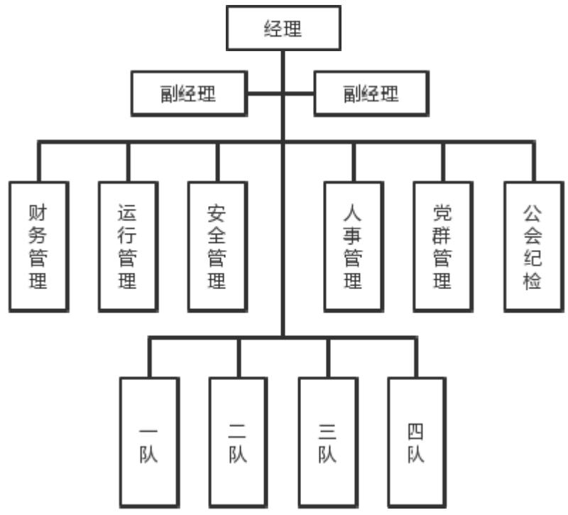

# 第 3 章 SG 油区后勤服务项目风险管理现状

# 及问题分析

# 3.1 SG 油区后勤服务项目概况

# 3.1.1 项目背景

ZX 公司位于盘锦市，为辽河油田下属的后勤服务保障企业。该企业于 1994年成立，2019年前一直从事民用物业服务以及部分公建服务业务。随着“三供一业”分离移交和剥离企业办社会职能工作的深入推进，按照“油公司”模式改革部署，2019 年先后完成“三供一业”及大市政业务分离移交、矿区系统业务重组、油田后勤业务接收、办公庭院业务整合等改革工作，形成了“公建服务、食堂餐饮、办公庭院、农产基地、外部市场、综合经营”六大板块业务协同发展的新格局，转型成为辽河油田公司后勤服务保障单位。

ZX 公司设立机关职能科室 10个，直属部门 4个，下设 21个科级生产经营单位，在册职工4156 人。主要负责 118 栋办公楼宇、23 栋职工公寓、8 个职工浴池、20个文体场馆、45个职工食堂和14个“站队小伙房”的后勤服务以及6个油田生产区办公庭院业务，为 29 家单位 12000 名职工提供食堂餐饮服务，年就餐人数达 450 万人次。

ZX 公司面临的内外部形势严峻复杂。外部环境不稳定不确定性因素不断增多，对我国经济带来深远影响；油气对外依存度居高不下，对传统石油行业带来较大沖击。内部环境看，ZX公司正处于高质量发展攻坚破局的机遇期、深化改革的过渡期、思想观念的转变期、走向市场的突破期，公司高质量发展面临新的机遇与挑战。公司的后勤服务业务仍属于劳动密集型产业，人员素质、人均劳效、业务创效水平、信息化水平仍落后于先进企业。目前，辽河油田公司提出“以专业化归核化为切入点，推进专项业务重组整合”，为 ZX 公司持续发挥专业化服务保障优势提供了有力支撑。

SG油区是辽河油田下属多个油区之一，SG 油区后勤服务项目主要负责采油单位二线生活及办公区域的后勤服务保障工作，由 ZX 公司下属的基层单位作为属地单位负责组织开展此项业务。SG 油区后勤服务项目是 ZX 公司负责的众多后勤服务项目之一，其项目主要内容是负责SG油区驻矿采油厂、工程技术处、车辆服务中心三家单位的后勤服务业务。

SG 油区后勤服务项目自 2021 年 1月1 日开始至 2025年 12月31 日结束，主要工作内容是在五年期间内向甲方单位提供后勤服务，具体包括：服务办公楼宇5座，总面积2万平方米；服务食堂3个，年就餐60万人次；服务职工公寓4 座，年住宿 20 万人次；服务体育场馆 3 个；油区主街路清扫保洁 10.66 万平方米。项目设领导班子 4人，机关管理岗 6 个，基层站队4 个。现有职工 58 人，劳务输出及社会化用工93人，项目组织结构见图3.1。

  
图 3.1 项目组织结构  
Figure 3.1 Project Organization Structure

# 3.1.2 项目特点

基于后勤服务项目的特殊性，结合甲方单位的业务需求以及项目的实际情况，SG油区后勤服务项目主要有以下几方面特点：

（1）劳动密集型业务

在SG油区后勤服务项目的各项成本中，人工成本相比于其他成本占比较大，项目日常运行的主要工作内容需要大量人工劳动来完成。相比于其他行业，后勤服务项目的技术含量较低，机械化程度较低，进入门槛较低。SG油区后勤服务项目的人员素质、人均劳效、业务创效能力、信息化水平仍落后于先进企业。项目的管理难点在于人员管理，劳动力短缺、人员心理波动等情况都会影响项目有序运行，影响服务质量，致使管理者需要在人员管理方面花费大量精力。加之后勤服务业务经历辽河油田公司的重组整合，人员来源于多个单位，人员情况复杂，队伍稳定性不足，使得人员管理问题突显。

（2）地理位置偏远

在SG油区后勤服务项目主要负责采油单位二线生活及办公区域的后勤服务保障工作。项目实施地点位于辽宁省盘锦市辽河下游绕阳河畔，距离市区约 30公里，交通不便利，周边配套设施不完善。该项目在相对独立的外部矿区向采油单位提供配套的后勤保障服务支持，项目的服务质量直接影响甲方单位人员的生产、生活质量，相比于其他项目来说任务更加艰巨、更加不可替代。

# （3）服务内容多元化

SG 油区后勤服务项目位于外围独立矿区，后勤服务业务为生产单位承担着一部分的社会职能，为了更好的服务甲方单位，要求项目提供的服务更加全面、业务类型更加复杂，业务类型涵盖餐饮服务、办公楼宇服务、公寓及浴池运行、设备维护、文体场馆运行以及市政道路清扫等。在此基础上向甲方提供定制化服务，根据甲方的特定需求进行服务定制，各种服务项目需要按照甲方的需求进行安排和调度。在项目运行过程中要保证快速的服务响应，保证服务内容的及时性和可靠性。

# 3.2 SG 油区后勤服务项目风险管理存在的问题及改善

# 3.2.1 SG 油区后勤服务项目风险管理存在的问题

尽管ZX公司为了保证项目顺利进行对项目进行了风险管理，但是项目在风险管理方面还是存在一些问题，主要包括以下几个方面：

（1）风险识别不完整：在项目运行过程中发现，SG 油区后勤服务项目的风险识别未能覆盖所有可能的风险，时常出现未被识别出来的风险，或者对某些风险的概率和影响程度估计不足，导致在项目实施过程中出现了未被预期的风险。项目的风险识别的方法不科学，风险识别的结果不够可靠。

（2）风险管理计划不够完善：部分风险没有制定完整的风险管理计划，或者风险管理计划过于简单且流于形式，缺乏可操作性。只有制定了详细的风险管理计划，才能有效地识别、评估并应对风险。如果风险管理计划不够完善，那么有可能无法及时发现和应对风险。

（3）治理体系不完善：SG 油区后勤服务项目的风险管理工作在项目组织架构、职责分工、决策机制等方面存在不足，导致项目风险管理体系不够完善。这可能导致风险管理工作中存在盲点，难以应对复杂的风险情况。项目风险管理需要耗费大量人力资源，并且需要长期跟踪并持续完善，仅凭项目现有的管理架构无法完成如此大量的工作。

（4）风险应对预案不充分：SG 油区后勤服务项目存在风险应对预案没有及时根据业务变化做出更新调整的问题。部分风险应对预案还在沿用若干年前的版本，应对预案与目前业务实际不符，不能起到很好的指导作用。预案是应对项目风险的最后一道防线，如果预案不充分，则可能造成严重的恶果。因此，制定详尽的应急预案，并进行演练和反馈非常重要。

# 3.2.2 SG 油区后勤服务项目风险管理问题成因

以上问题虽然发生在项目管理的不同方面，但分析深层原因则是因为公司在改革后各方面没能适应改革后的发展需要，导致公司项目运行出现各种问题。SG油区后勤服务项目部人员由采油厂后勤保障大队与矿区服务单位重组整合而来，员工队伍情况较为复杂。受“石油精神”熏陶的职工队伍具有较强的吃苦耐劳、攻坚克难精神，但对于服务行业来说，职工队伍缺乏服务意识的问题普遍存在。员工敢于吃苦，却羞于服务。如何在保障服务的基础上提高企业软实力是首要关注的问题。

后勤服务业务原本由各个采油属地单位自行管理，各单位根据自身不同的生产、人员情况以及地理位置自行组织，方式较为灵活，能适应实际需要。业务划转后，辽河油田全部后勤服务业务由 ZX公司管理，对多个项目进行统一必然会打破原有业务运行模式，这是一个具有挑战的系统性工作。业务重组整合使后勤服务项目的风险管理工作出现一些新的问题，而出现这些问题的根本原因可以追溯到以下几个方面：

（1）文化氛围和组织结构问题：项目所处的组织文化和结构对风险管理的重视程度会产生影响。组织中存在着不重视风险、追求短期目标、忽视项目绩效评价等文化氛围，导致项目风险管理不得力。

（2）缺乏风险意识和管理能力：项目团队成员缺乏对风险的充分认识和敏感性，不具备足够的风险管理能力，难以有效地进行风险识别、评估和应对，这是由于缺乏相关培训、经验不足等原因造成的。在风险管理过程中，往往只凭借工作经验来识别、应对风险，缺乏系统性的风险识别以及准确的量化风险评估。

（3）未建立风险管理机制：项目风险管理需要依靠科学有效的管理机制进行支持，如果项目团队没有掌握适用的风险管理机制，就会导致风险管理的质量和效果不佳。在 SG 油区后勤服务项目的组织机构方面，没有设立一个固定的风险管理机构来管理项目风险，缺乏风险管理人员，也没有制定风险管理职责。在流程制度方面，没有建立一个系统性的风险管理流程，缺乏一个行之有效的风险管理方法，只是在风险发生时疲于应付，使得项目实施过程中风险重重，影响项目运行。

# 3.2.3 SG 油区后勤服务项目风险管理改善

针对SG油区后勤服务项目风险管理存在的问题以及问题成因，我们在项目风险管理的过程中要吸收以往工作经验，并着重从不足之处入手补齐短板，从而达到提升项目整体风险管理水平的目的。具体改善措施包含以下几个方面，后文也将从以下方面进一步完善风险管理方法：

（1）建立项目风险管理机制

建立项目风险管理机制是风险管理的首要任务。设立风险管理机构来管理项目风险，培养风险管理人员并落实相关人员风险管理职责，是从组织机构方面对风险管理机制的建立。探索后勤服务项目的风险识别、评估、应对、监控的方法，确保风险管理过程科学有效。最终将风险管理过程流程化、日常化，是从流程制度方面对风险管理机制的建立。

# （2）全面进行项目风险识别

风险识别是项目风险管理的第一步，也是风险管理后续工作的基础，只有进行全面的风险识别，才能保证所有的风险被有效管控。为了保证识别出的风险不发生遗漏，我们在风险识别时要遵循全面性的原则并保持严谨的态度，使用科学的风险识别方法，确保识别结果全面可靠。

# （3）制定有效的风险应对措施

风险应对措施就是通过一系列方法，降低风险发生的概率或减轻风险发生后的影响，使风险可控。风险应对措施失效或者不具备可操作性，将导致风险发生时不能有序应对。及时根据业务调整更新各项风险的应对措施，完善风险应对方案，并组织项目管理人员进行演练，确保既定风险应对方案落到实处。
