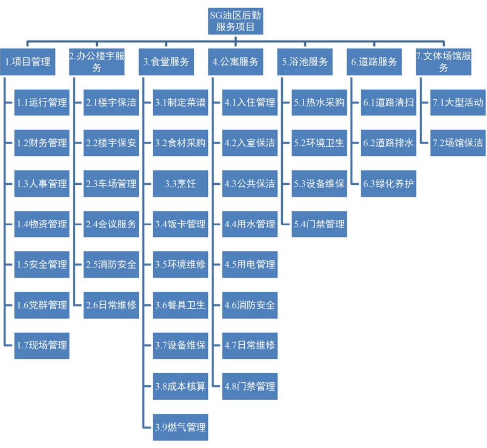
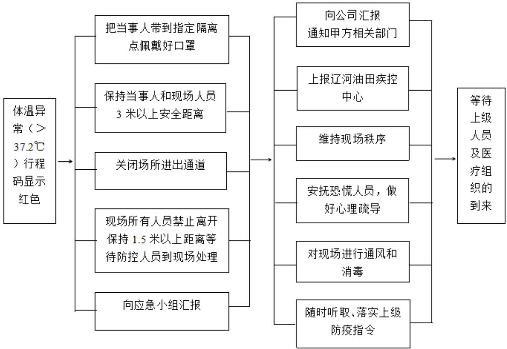
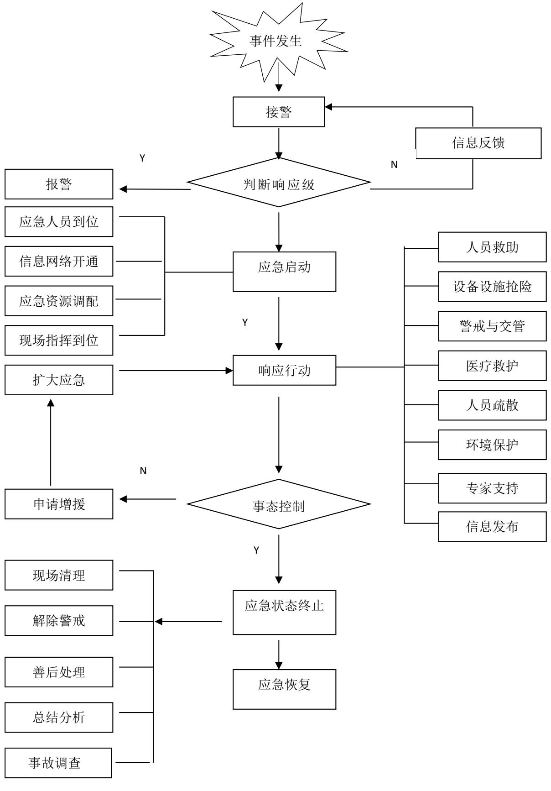

# 第 4 章 SG 油区后勤服务项目风险识别

# 4.1 项目风险识别的准备

# 4.1.1 明确风险识别目标

SG 油区后勤服务项目风险识别目标是整个风险识别过程的指导方向，它直接决定了风险识别的操作过程、风险识别的质量，并间接决定了风险识别的结果，将会识别出什么风险、是否能识别出项目存在的全部风险。风险识别目标对风险识别的整个过程具有重要意义。

# 4.1.2 数据来源

在SG油区后勤服务项目风险识别开始前，首先要确定风险识别标准的数据来源。数据来源主要包括辽河油田公司、ZX 公司下发的各类规章制度文件，ZX公司下发的工程项目计划、劳务服务计划、物资采购计划、财务指标、操作规程、质量要求及劳动定员标准，SG 公建服务公司的基本概况、财务经营数据、人员情况、会议纪要、结算资料以及相关合同。

# 4.2 基于头脑风暴法的初步风险识别

在确定完风险识别目标及数据来源后，就要开始对项目风险进行识别了。由于在本文之前SG油区后勤服务项目还没进行过全面、系统性的风险识别，所以为了保证识别结果全面，基于各种风险识别方法的优缺点[27]，本文选用头脑风暴法作为首轮风险识别方法。

# 4.2.1 前期准备

组建头脑风暴小组，根据项目涉及到的业务范围在ZX 公司内部选择小组成员，小组成员共 10 人。小组成员包括机关科室业务管理人员：财务管理 1 人、运行管理1人、物业管理1人、安全管理1人、合同管理1人；项目经理3人；公司业务主管领导2人。除此之外安排1人负责会议组织及会议记录。

# 4.2.2 头脑风暴会议

确定会议主题和会议规则是头脑风暴会议的前提，主题应当尽量单一且明确。首轮头脑风暴会议的主题为“你认为SG油区后勤服务项目存在的风险有哪些？”在讨论过程中要求各组员依据上节中收集到的资料，结合项目实际情况进行充分思考，组员之间可以相互启发，但不能相互评价。

由于头脑风暴小组成员来自各个领域的不同层级，为了减小较为富有权威的组员对其他组员思路的影响，同时减轻固有思维的限制，形成充分讨论的效果，要求小组成员按照一般管理人员、项目经理、业务主管领导的顺序逐个发言，发言时可以自由的表述自己的想法，成员之间互不干扰。

首先各组员结合自身的工作领域和经验，对其认为SG 油区后勤服务项目存在哪些风险展开讨论，通过记录会议讨论内容，各小组成员的观点可概况如下：

组员 A，公司机关财务资产科预算管理岗：SG 油区后勤服务项目作为 ZX公司的众多项目之一，基层项目管理目标之一是能否完成财务部门下达的利润指标。目前甲方单位成本压力逐渐增大，导致后勤服务项目的投资持续紧缩，如何在此情况下持续做好与甲方单位的沟通，顺利完成年度结算应当高度关注。基层财务人员对生产环节不熟悉，导致工作量发生后不与甲方结算，或者没有收入价格支持都会导致企业效益流失。在基层单位精细化管理方面，存在资金利用效率较低的情况，比如基层单位为了便于管理，一次性采购大量物资，长时间不使用，导致库存增大，占用公司资金。

组员 B，公司机关运行协调科运行管理岗：基层单位的服务质量直接影响甲方单位满意率，由于基层管理不到位可能导致一线员工操作执行不规范，服务质量不达标，包括服务现场卫生不达标、食堂菜品质量低、保安现场秩序维护不到位等。SG 油区后勤服务项目辖区范围内，存在多个工程项目正在施工，个别项目进度滞后，导致业主单位满意率下降。后勤服务单位的工作主要围绕服务业主单位展开，有时业主单位会提出临时性的工作要求我公司配合，比如临时会议、活动，新冠肺炎期间突发的人员隔离、交通管制等，以及洪灾抗洪期间大批支援人员的到来导致餐饮、住宿业务工作量激增等，这些因素对基层的运行管理都带来挑战。

组员C，公司机关党委组织部（人事科）劳资管理岗：我公司属于辽河油田公司业务板块整合改革的改革单位，上级为了缩减后勤板块用工数量，对新员工的引进基本处于关闭状态，员工老龄化的问题越来越严重，60后员工占比 $3 3 . 1 2 \%$ ，70 后员工占比 $4 0 . 8 6 \%$ ，80 后员工占比 $2 4 . 2 3 \%$ ，90 后员工占比 $1 . 7 9 \%$ ，平均年龄 45.13 岁。老员工思维相对固化缺乏创新，效率偏低，不能很好地适应新的管理思路，使基层管理难度增加。

组员D，公司机关安全环保科安全管理岗：食堂和公寓作为人员密集场所存在多种安全隐患，在历次安全检查中都是安全问题的高发场所，相关问题项数量占总体数量的 $6 8 \%$ ，是基层单位安全管理工作的重中之重。目前我公司食堂燃气采用灌装液化石油气，部分燃气管道过长且使用年限较长，存在燃气泄漏的风险。燃气泄漏若不能第一时间妥善处理，还将引发连锁的燃气中毒、火灾、爆炸等事故，危害极大。此外食堂食品安全工作也存在一定的风险，进入夏季食物容易发生腐败变质，食材供应商供货质量不达标都会导致食堂发生集体中毒事件，涉及职工生命健康，应当高度重视。

组员 E，公司机关企管法规科合同管理岗：由于我公司业务主要面向局内其他二级单位，并与甲方单位进行内行结算，导致公司内部存在不重视合同的氛围，在审计过程中，多次发现服务内容与合同约定范围不符的情况，导致公司合规管理水平下降。随着公司管理逐渐规范，业务的审批环节越来越多，从项目提出申请到项目实施要花费 3 个月的时间，期间包括可行性研究、资金申请、计划审批下达、市场程序、合同审批签订等等，部分基层单位为了保证生产运行，可能选择先让承包商开始工作，后补签合同的违规操作方式，使企业存在一定的违约风险。

组员 F，甲项目基层项目经理：SG 油区作为辽河油田的第一大采油生产单位，如何做好SG 油区的后勤服务，保障生产单位平稳有序运行对于ZX 公司来说尤为重要。SG 油区后勤服务项目与甲项目虽然均为后勤服务项目，但 SG 油区后勤服务项目涉及的服务类型较为全面，业务包含办公楼宇、食堂、公寓、市政道路、文体场馆等，在管理中遇到的问题也更加复杂多样。如何满足不断变化的甲方需求，提高服务质量，打造企业品牌形象是对于SG 油区后勤服务项目来说的首要问题。

组员G，乙项目基层项目经理：在后勤业务划转阶段，部分闲置资产伴随着后勤业务一同划转至我公司，在SG油区后勤服务项目辖区内同样存在此种情况，大量闲置资产无使用价值，但在账面形成折旧费用，导致项目成本增大，盈利困难。闲置房屋类资产长时间无人使用，设施设备老化严重存在一定的安全隐患。部分职工无法上岗，需外雇人员造成成本上升

组员 H，丙项目基层项目经理：公司对员工的思想工作落实不到位，导致员工对公司改革存在抵触情绪，对公司的决策可能不理解，在社交媒体发布损害公司形象的言论，存在一定的不稳定因素。基层单位对资金安全管理重视程度不足，可能存在公款私存和资金体外流转的情况，以个人账户处理公司业务，存在资金流失的风险。除此之外，还可能存在签认虚假的工作量套取公司利益的情况。

组员I，公司领导分管经营管理：随着公司的管理水平逐步提升，公司的管理思路向着更加精细化、扁平化的方向发展，不断压缩管理中间层，细分核算单元都要求基层单位的各现场负责人懂经营、会管理，但目前现场管理人员的经营管理能力有待提高，成本控制效果不理想，成本支出超出成本预算的情况时有发生。在财务核算方面，现场管理人员核算不准确导致账面收支情况与实际存在偏差，可能导致公司经营数据不准，引起决策失误。

组员 J，公司领导分管纪检：基层单位领导班子在管理中，可能存在管理方式、方法不得当的情况，比如在员工岗位调整过程中，没能充分考虑到员工的实际情况和其自身意愿，管理方式简单粗暴，导致员工对岗位调整不满，最终形成员工上访事件。部分员工不能按照规章制度严格要求自己，存在办公用房面积超标，公车私用，迟到早退的情况，使企业的社会认可度下降。

# 4.2.3 结果汇总整理

通过对会议内容分类、提炼，形成初步的风险描述：

财务风险：收支价格不匹配不能有效形成利润，导致企业亏损；收入不及时，影响企业资金流动性和利用效率；收入依据不足，已经发生的工作量没有价格支撑导致无法结算；无法完成利润指标；闲置资产过多造成资源浪费；部分职工无法上岗，需外雇人员造成成本上升；成本核算不准确。

运行风险：保洁质量不达标；菜品质量不达标；保安巡检不达标；绿化养护质量不达标；甲方需求变动，无法及时作出响应；甲方需求不清晰；项目进度安排不合理；物资供应不足导致服务质量下降。

安全风险：食物中毒；燃气爆炸；火灾；公共及人员密集场所防疫；安全隐患整改速度慢；交通安全。

人员风险：人员老龄化严重，缺乏青年人才，关键岗位老员工退休后无接替人员；员工工作效率低，工作缺乏创新，热情不足；项目人员与被服务人员发生冲突；团队成员间缺少协同合作；人员对岗位操作技能掌握不足。

合规风险：资金管理不规范形成帐外收入、支出，资金体外流转；为套取利益确认虚假工作量；甲方需求超出合同约定的承包范围；先发生服务行为，后签订合同的事后合同行为；支出项目审批流程长审批节点多，立项周期长；服务过程存在违纪违法行为。

舆论风险：在改革期间岗位调整、薪酬分配等引起员工产生对企业不满情绪；企业由于管理不善，导致企业的社会认可度下降。

为了使识别出的风险更加准确、有代表性，便于开展后续研究，经过专家组讨论，对初步的风险描述做如下调整：

（1）运行管理风险中，保洁质量不达标、菜品质量不达标、保安巡检不达标、绿化养护质量不达标等几项风险均属于运行风险中服务质量问题，将其合并统称为服务质量不达标。

（2）财务风险中，关于部分职工无法上岗，需外雇人员造成成本上升的问题，由于此类问题属于职工客观条件导致，从关怀职工维护社会稳定的角度出发，企业无法拿出更加妥善的解决方案，在本研究中不予以考虑，故将其剔除。

（3）人员风险中，项目人员与被服务人员发生冲突，以及团队成员间缺少协同合作两项问题，对于项目管理来说属于项目运行的中间过程，最终结果将以服务质量不合格以及工作效率低的结果体现，与其他风险因素重复，故将其剔除。

最终，将识别出的风险因素进行调整，形成出初步风险清单，详见表 4.1。

# 表 4.1 初步项目风险清单

Table 4.1 Preliminary Project Risk List   

<table><tr><td rowspan=1 colspan=1>分类</td><td rowspan=1 colspan=1>编号</td><td rowspan=1 colspan=1>风险描述</td></tr><tr><td rowspan=5 colspan=1>财务风险</td><td rowspan=1 colspan=1>CW1</td><td rowspan=1 colspan=1>收支价格不匹配</td></tr><tr><td rowspan=1 colspan=1>CW2</td><td rowspan=1 colspan=1>收入不及时</td></tr><tr><td rowspan=1 colspan=1>CW3</td><td rowspan=1 colspan=1>收入依据不足</td></tr><tr><td rowspan=1 colspan=1>CW4</td><td rowspan=1 colspan=1>闲置资产造成资源浪费</td></tr><tr><td rowspan=1 colspan=1>CW5</td><td rowspan=1 colspan=1>成本核算不准确</td></tr><tr><td rowspan=4 colspan=1>运行风险</td><td rowspan=1 colspan=1>YX1</td><td rowspan=1 colspan=1>服务质量不达标</td></tr><tr><td rowspan=1 colspan=1>YX2</td><td rowspan=1 colspan=1>甲方需求变动</td></tr><tr><td rowspan=1 colspan=1>YX3</td><td rowspan=1 colspan=1>甲方需求不清晰</td></tr><tr><td rowspan=1 colspan=1>YX4</td><td rowspan=1 colspan=1>项目进度安排不合理</td></tr><tr><td rowspan=6 colspan=1>安全风险</td><td rowspan=1 colspan=1>AQ1</td><td rowspan=1 colspan=1>食品安全</td></tr><tr><td rowspan=1 colspan=1>AQ2</td><td rowspan=1 colspan=1>燃气爆炸</td></tr><tr><td rowspan=1 colspan=1>AQ3</td><td rowspan=1 colspan=1>火灾隐患</td></tr><tr><td rowspan=1 colspan=1>AQ4</td><td rowspan=1 colspan=1>公共及人员密集场所防疫</td></tr><tr><td rowspan=1 colspan=1>AQ5</td><td rowspan=1 colspan=1>安全隐患整改速度慢</td></tr><tr><td rowspan=1 colspan=1>AQ6</td><td rowspan=1 colspan=1>交通安全</td></tr><tr><td rowspan=3 colspan=1>人员风险</td><td rowspan=1 colspan=1>RY1</td><td rowspan=1 colspan=1>人员老龄化</td></tr><tr><td rowspan=1 colspan=1>RY2</td><td rowspan=1 colspan=1>工作效率低</td></tr><tr><td rowspan=1 colspan=1>RY3</td><td rowspan=1 colspan=1>操作技能掌握不足</td></tr><tr><td rowspan=1 colspan=1>合规风险</td><td rowspan=1 colspan=1>HG1</td><td rowspan=1 colspan=1>资金账外流转</td></tr></table>

续表 4.1  

<table><tr><td rowspan=5 colspan=1>合规风险</td><td rowspan=1 colspan=1>HG2</td><td rowspan=1 colspan=1>虚假工作量</td></tr><tr><td rowspan=1 colspan=1>HG3</td><td rowspan=1 colspan=1>甲方需求超出约定范围</td></tr><tr><td rowspan=1 colspan=1>HG4</td><td rowspan=1 colspan=1>事后合同行为</td></tr><tr><td rowspan=1 colspan=1>HG5</td><td rowspan=1 colspan=1>立项周期长</td></tr><tr><td rowspan=1 colspan=1>HG6</td><td rowspan=1 colspan=1>服务过程存在违纪违法行为</td></tr><tr><td rowspan=2 colspan=1>舆论风险</td><td rowspan=1 colspan=1>YL1</td><td rowspan=1 colspan=1>岗位调整引起员工不满</td></tr><tr><td rowspan=1 colspan=1>YL2</td><td rowspan=1 colspan=1>企业的社会认可度下降</td></tr></table>

# 4.3 基于 WBS-RBS 矩阵法的最终风险识别

  
4.3.1 项目工作分解（WBS）  
图 4.1 SG 油区后勤服务项目工作分解结构  
Figure 4.1 Work Breakdown Structure of SG Oil Field Logistics Service Project

在使用WBS-RBS矩阵法前，先将项目工作进行分解。结合项目运行过程中的具体内容，将项目分为项目管理、办公楼宇服务、食堂服务、公寓服务、浴池服务、道路服务、文体场馆服务。在此基础上，进一步细分形成工作分解结构（WBS），如图4.1所示。

# 4.3.2 WBS-RBS 耦合矩阵风险识别

根据4.2节得到的初步风险清单，与工作分解结构（WBS）创建WBS-RBS耦合矩阵，WBS工作单元作为行，RBS初步识别出的风险作为列，形成一个 $2 6 \times 3 9$ 的 WBS-RBS 耦合矩阵。

邀请专家根据 WBS-RBS 耦合矩阵对头脑风暴识别出的初步风险清单进行深入分析，并与各工作单元进行一一对应。将所有专家的意见进行叠加得到风险最终识别结果，只要有一名专家认为在一个工作单元中存在风险，则此项风险成立。反之，如果所有专家认为某项风险不会出现在任何一个工作单元，或影响极小，则将该风险剔除。将调查结果汇总填入 WBS-RBS 耦合矩阵，形成表 4.2。

表 4.2 WBS-RBS 矩阵  
Table 4.2 WBS-RBS matrix   

<table><tr><td rowspan=1 colspan=1>风险分解</td><td rowspan=1 colspan=20>项目工作分解（WBS）</td></tr><tr><td rowspan=1 colspan=1>(RBS)</td><td rowspan=1 colspan=1>1.1</td><td rowspan=1 colspan=1>1.2</td><td rowspan=1 colspan=1>1.3</td><td rowspan=1 colspan=1>1.4</td><td rowspan=1 colspan=1>1.5</td><td rowspan=1 colspan=1>1.6</td><td rowspan=1 colspan=1>1.7</td><td rowspan=1 colspan=1>2.1</td><td rowspan=1 colspan=1>2.2</td><td rowspan=1 colspan=1>2.3</td><td rowspan=1 colspan=1>2.4</td><td rowspan=1 colspan=1>2.5</td><td rowspan=1 colspan=1>2.6</td><td rowspan=1 colspan=1>3.1</td><td rowspan=1 colspan=1>3.2</td><td rowspan=1 colspan=1>3.3</td><td rowspan=1 colspan=1>3.4</td><td rowspan=1 colspan=1>3.5</td><td rowspan=1 colspan=1>3.6</td><td rowspan=1 colspan=1>3.7</td></tr><tr><td rowspan=1 colspan=1>CW1</td><td rowspan=1 colspan=1></td><td rowspan=1 colspan=1>√</td><td rowspan=1 colspan=1></td><td rowspan=1 colspan=1></td><td rowspan=1 colspan=1></td><td rowspan=1 colspan=1></td><td rowspan=1 colspan=1></td><td rowspan=1 colspan=1></td><td rowspan=1 colspan=1></td><td rowspan=1 colspan=1></td><td rowspan=1 colspan=1></td><td rowspan=1 colspan=1></td><td rowspan=1 colspan=1></td><td rowspan=1 colspan=1></td><td rowspan=1 colspan=1></td><td rowspan=1 colspan=1></td><td rowspan=1 colspan=1></td><td rowspan=1 colspan=1></td><td rowspan=1 colspan=1></td><td rowspan=1 colspan=1></td></tr><tr><td rowspan=1 colspan=1>CW2</td><td rowspan=1 colspan=1></td><td rowspan=1 colspan=1>√</td><td rowspan=1 colspan=1></td><td rowspan=1 colspan=1></td><td rowspan=1 colspan=1></td><td rowspan=1 colspan=1></td><td rowspan=1 colspan=1></td><td rowspan=1 colspan=1></td><td rowspan=1 colspan=1></td><td rowspan=1 colspan=1></td><td rowspan=1 colspan=1></td><td rowspan=1 colspan=1></td><td rowspan=1 colspan=1></td><td rowspan=1 colspan=1></td><td rowspan=1 colspan=1></td><td rowspan=1 colspan=1></td><td rowspan=1 colspan=1></td><td rowspan=1 colspan=1></td><td rowspan=1 colspan=1></td><td rowspan=1 colspan=1></td></tr><tr><td rowspan=1 colspan=1>CW3</td><td rowspan=1 colspan=1></td><td rowspan=1 colspan=1>√</td><td rowspan=1 colspan=1></td><td rowspan=1 colspan=1></td><td rowspan=1 colspan=1></td><td rowspan=1 colspan=1></td><td rowspan=1 colspan=1></td><td rowspan=1 colspan=1></td><td rowspan=1 colspan=1></td><td rowspan=1 colspan=1></td><td rowspan=1 colspan=1></td><td rowspan=1 colspan=1></td><td rowspan=1 colspan=1></td><td rowspan=1 colspan=1></td><td rowspan=1 colspan=1></td><td rowspan=1 colspan=1></td><td rowspan=1 colspan=1></td><td rowspan=1 colspan=1></td><td rowspan=1 colspan=1></td><td rowspan=1 colspan=1></td></tr><tr><td rowspan=1 colspan=1>CW4</td><td rowspan=1 colspan=1></td><td rowspan=1 colspan=1></td><td rowspan=1 colspan=1></td><td rowspan=1 colspan=1></td><td rowspan=1 colspan=1></td><td rowspan=1 colspan=1></td><td rowspan=1 colspan=1></td><td rowspan=1 colspan=1></td><td rowspan=1 colspan=1></td><td rowspan=1 colspan=1></td><td rowspan=1 colspan=1></td><td rowspan=1 colspan=1></td><td rowspan=1 colspan=1></td><td rowspan=1 colspan=1></td><td rowspan=1 colspan=1></td><td rowspan=1 colspan=1></td><td rowspan=1 colspan=1></td><td rowspan=1 colspan=1></td><td rowspan=1 colspan=1></td><td rowspan=1 colspan=1></td></tr><tr><td rowspan=1 colspan=1>CW5</td><td rowspan=1 colspan=1></td><td rowspan=1 colspan=1></td><td rowspan=1 colspan=1></td><td rowspan=1 colspan=1></td><td rowspan=1 colspan=1></td><td rowspan=1 colspan=1></td><td rowspan=1 colspan=1></td><td rowspan=1 colspan=1></td><td rowspan=1 colspan=1></td><td rowspan=1 colspan=1></td><td rowspan=1 colspan=1></td><td rowspan=1 colspan=1></td><td rowspan=1 colspan=1></td><td rowspan=1 colspan=1></td><td rowspan=1 colspan=1></td><td rowspan=1 colspan=1></td><td rowspan=1 colspan=1></td><td rowspan=1 colspan=1></td><td rowspan=1 colspan=1></td><td rowspan=1 colspan=1></td></tr><tr><td rowspan=1 colspan=1>YX1</td><td rowspan=1 colspan=1>√</td><td rowspan=1 colspan=1></td><td rowspan=1 colspan=1></td><td rowspan=1 colspan=1></td><td rowspan=1 colspan=1></td><td rowspan=1 colspan=1></td><td rowspan=1 colspan=1></td><td rowspan=1 colspan=1></td><td rowspan=1 colspan=1></td><td rowspan=1 colspan=1></td><td rowspan=1 colspan=1></td><td rowspan=1 colspan=1></td><td rowspan=1 colspan=1></td><td rowspan=1 colspan=1></td><td rowspan=1 colspan=1></td><td rowspan=1 colspan=1></td><td rowspan=1 colspan=1></td><td rowspan=1 colspan=1></td><td rowspan=1 colspan=1></td><td rowspan=1 colspan=1></td></tr><tr><td rowspan=1 colspan=1>YX2</td><td rowspan=1 colspan=1>√</td><td rowspan=1 colspan=1></td><td rowspan=1 colspan=1></td><td rowspan=1 colspan=1></td><td rowspan=1 colspan=1></td><td rowspan=1 colspan=1></td><td rowspan=1 colspan=1>√</td><td rowspan=1 colspan=1></td><td rowspan=1 colspan=1></td><td rowspan=1 colspan=1></td><td rowspan=1 colspan=1></td><td rowspan=1 colspan=1></td><td rowspan=1 colspan=1></td><td rowspan=1 colspan=1>√</td><td rowspan=1 colspan=1></td><td rowspan=1 colspan=1></td><td rowspan=1 colspan=1></td><td rowspan=1 colspan=1></td><td rowspan=1 colspan=1></td><td rowspan=1 colspan=1></td></tr><tr><td rowspan=1 colspan=1>YX3</td><td rowspan=1 colspan=1></td><td rowspan=1 colspan=1></td><td rowspan=1 colspan=1></td><td rowspan=1 colspan=1></td><td rowspan=1 colspan=1></td><td rowspan=1 colspan=1></td><td rowspan=1 colspan=1></td><td rowspan=1 colspan=1></td><td rowspan=1 colspan=1></td><td rowspan=1 colspan=1></td><td rowspan=1 colspan=1></td><td rowspan=1 colspan=1></td><td rowspan=1 colspan=1></td><td rowspan=1 colspan=1></td><td rowspan=1 colspan=1></td><td rowspan=1 colspan=1></td><td rowspan=1 colspan=1></td><td rowspan=1 colspan=1></td><td rowspan=1 colspan=1></td><td rowspan=1 colspan=1></td></tr><tr><td rowspan=1 colspan=1>YX4</td><td rowspan=1 colspan=1></td><td rowspan=1 colspan=1></td><td rowspan=1 colspan=1></td><td rowspan=1 colspan=1></td><td rowspan=1 colspan=1></td><td rowspan=1 colspan=1></td><td rowspan=1 colspan=1></td><td rowspan=1 colspan=1></td><td rowspan=1 colspan=1></td><td rowspan=1 colspan=1></td><td rowspan=1 colspan=1></td><td rowspan=1 colspan=1></td><td rowspan=1 colspan=1></td><td rowspan=1 colspan=1></td><td rowspan=1 colspan=1></td><td rowspan=1 colspan=1></td><td rowspan=1 colspan=1></td><td rowspan=1 colspan=1></td><td rowspan=1 colspan=1></td><td rowspan=1 colspan=1></td></tr><tr><td rowspan=1 colspan=1>AQ1</td><td rowspan=1 colspan=1>√</td><td rowspan=1 colspan=1></td><td rowspan=1 colspan=1></td><td rowspan=1 colspan=1></td><td rowspan=1 colspan=1>√</td><td rowspan=1 colspan=1></td><td rowspan=1 colspan=1>√</td><td rowspan=1 colspan=1></td><td rowspan=1 colspan=1></td><td rowspan=1 colspan=1></td><td rowspan=1 colspan=1></td><td rowspan=1 colspan=1></td><td rowspan=1 colspan=1></td><td rowspan=1 colspan=1></td><td rowspan=1 colspan=1>√</td><td rowspan=1 colspan=1>√</td><td rowspan=1 colspan=1></td><td rowspan=1 colspan=1></td><td rowspan=1 colspan=1></td><td rowspan=1 colspan=1></td></tr><tr><td rowspan=1 colspan=1>AQ2</td><td rowspan=1 colspan=1>√</td><td rowspan=1 colspan=1></td><td rowspan=1 colspan=1></td><td rowspan=1 colspan=1></td><td rowspan=1 colspan=1>√</td><td rowspan=1 colspan=1></td><td rowspan=1 colspan=1>√</td><td rowspan=1 colspan=1></td><td rowspan=1 colspan=1></td><td rowspan=1 colspan=1></td><td rowspan=1 colspan=1></td><td rowspan=1 colspan=1></td><td rowspan=1 colspan=1></td><td rowspan=1 colspan=1></td><td rowspan=1 colspan=1></td><td rowspan=1 colspan=1>√</td><td rowspan=1 colspan=1></td><td rowspan=1 colspan=1></td><td rowspan=1 colspan=1></td><td rowspan=1 colspan=1>√</td></tr><tr><td rowspan=1 colspan=1>AQ3</td><td rowspan=1 colspan=1>√</td><td rowspan=1 colspan=1></td><td rowspan=1 colspan=1></td><td rowspan=1 colspan=1></td><td rowspan=1 colspan=1>√</td><td rowspan=1 colspan=1></td><td rowspan=1 colspan=1>√</td><td rowspan=1 colspan=1></td><td rowspan=1 colspan=1></td><td rowspan=1 colspan=1></td><td rowspan=1 colspan=1></td><td rowspan=1 colspan=1>√</td><td rowspan=1 colspan=1></td><td rowspan=1 colspan=1></td><td rowspan=1 colspan=1></td><td rowspan=1 colspan=1>√</td><td rowspan=1 colspan=1></td><td rowspan=1 colspan=1></td><td rowspan=1 colspan=1></td><td rowspan=1 colspan=1>√</td></tr><tr><td rowspan=1 colspan=1>AQ4</td><td rowspan=1 colspan=1>√</td><td rowspan=1 colspan=1></td><td rowspan=1 colspan=1></td><td rowspan=1 colspan=1></td><td rowspan=1 colspan=1>√</td><td rowspan=1 colspan=1></td><td rowspan=1 colspan=1></td><td rowspan=1 colspan=1>√√</td><td rowspan=1 colspan=1>√√</td><td rowspan=1 colspan=1></td><td rowspan=1 colspan=1>√</td><td rowspan=1 colspan=1></td><td rowspan=1 colspan=1></td><td rowspan=1 colspan=1></td><td rowspan=1 colspan=1></td><td rowspan=1 colspan=1></td><td rowspan=1 colspan=1></td><td rowspan=1 colspan=1></td><td rowspan=1 colspan=1></td><td rowspan=1 colspan=1></td></tr><tr><td rowspan=1 colspan=1>AQ5</td><td rowspan=1 colspan=1></td><td rowspan=1 colspan=1></td><td rowspan=1 colspan=1></td><td rowspan=1 colspan=1></td><td rowspan=1 colspan=1>√</td><td rowspan=1 colspan=1></td><td rowspan=1 colspan=1>√</td><td rowspan=1 colspan=1></td><td rowspan=1 colspan=1></td><td rowspan=1 colspan=1></td><td rowspan=1 colspan=1></td><td rowspan=1 colspan=1>√√</td><td rowspan=1 colspan=1>√√</td><td rowspan=1 colspan=1></td><td rowspan=1 colspan=1></td><td rowspan=1 colspan=1></td><td rowspan=1 colspan=1></td><td rowspan=1 colspan=1></td><td rowspan=1 colspan=1></td><td rowspan=1 colspan=1>√</td></tr><tr><td rowspan=1 colspan=1>AQ6</td><td rowspan=1 colspan=1></td><td rowspan=1 colspan=1></td><td rowspan=1 colspan=1></td><td rowspan=1 colspan=1></td><td rowspan=1 colspan=1></td><td rowspan=1 colspan=1></td><td rowspan=1 colspan=1></td><td rowspan=1 colspan=1></td><td rowspan=1 colspan=1></td><td rowspan=1 colspan=1></td><td rowspan=1 colspan=1></td><td rowspan=1 colspan=1></td><td rowspan=1 colspan=1></td><td rowspan=1 colspan=1></td><td rowspan=1 colspan=1></td><td rowspan=1 colspan=1></td><td rowspan=1 colspan=1></td><td rowspan=1 colspan=1></td><td rowspan=1 colspan=1></td><td rowspan=1 colspan=1></td></tr><tr><td rowspan=1 colspan=1>RY1</td><td rowspan=1 colspan=1></td><td rowspan=1 colspan=1></td><td rowspan=1 colspan=1>√</td><td rowspan=1 colspan=1></td><td rowspan=1 colspan=1></td><td rowspan=1 colspan=1></td><td rowspan=1 colspan=1></td><td rowspan=1 colspan=1></td><td rowspan=1 colspan=1></td><td rowspan=1 colspan=1></td><td rowspan=1 colspan=1></td><td rowspan=1 colspan=1></td><td rowspan=1 colspan=1></td><td rowspan=1 colspan=1></td><td rowspan=1 colspan=1></td><td rowspan=1 colspan=1></td><td rowspan=1 colspan=1></td><td rowspan=1 colspan=1></td><td rowspan=1 colspan=1></td><td rowspan=1 colspan=1></td></tr><tr><td rowspan=1 colspan=1>RY2</td><td rowspan=1 colspan=1></td><td rowspan=1 colspan=1></td><td rowspan=1 colspan=1></td><td rowspan=1 colspan=1></td><td rowspan=1 colspan=1>√</td><td rowspan=1 colspan=1></td><td rowspan=1 colspan=1></td><td rowspan=1 colspan=1></td><td rowspan=1 colspan=1></td><td rowspan=1 colspan=1></td><td rowspan=1 colspan=1></td><td rowspan=1 colspan=1></td><td rowspan=1 colspan=1></td><td rowspan=1 colspan=1></td><td rowspan=1 colspan=1></td><td rowspan=1 colspan=1></td><td rowspan=1 colspan=1></td><td rowspan=1 colspan=1></td><td rowspan=1 colspan=1></td><td rowspan=1 colspan=1></td></tr><tr><td rowspan=1 colspan=1>RY3</td><td rowspan=1 colspan=1></td><td rowspan=1 colspan=1></td><td rowspan=1 colspan=1></td><td rowspan=1 colspan=1></td><td rowspan=1 colspan=1></td><td rowspan=1 colspan=1></td><td rowspan=1 colspan=1></td><td rowspan=1 colspan=1></td><td rowspan=1 colspan=1></td><td rowspan=1 colspan=1></td><td rowspan=1 colspan=1></td><td rowspan=1 colspan=1></td><td rowspan=1 colspan=1></td><td rowspan=1 colspan=1></td><td rowspan=1 colspan=1></td><td rowspan=1 colspan=1></td><td rowspan=1 colspan=1></td><td rowspan=1 colspan=1></td><td rowspan=1 colspan=1></td><td rowspan=1 colspan=1></td></tr><tr><td rowspan=1 colspan=1>HG1</td><td rowspan=1 colspan=1></td><td rowspan=1 colspan=1>√</td><td rowspan=1 colspan=1></td><td rowspan=1 colspan=1></td><td rowspan=1 colspan=1></td><td rowspan=1 colspan=1></td><td rowspan=1 colspan=1></td><td rowspan=1 colspan=1></td><td rowspan=1 colspan=1></td><td rowspan=1 colspan=1></td><td rowspan=1 colspan=1></td><td rowspan=1 colspan=1></td><td rowspan=1 colspan=1>√</td><td rowspan=1 colspan=1></td><td rowspan=1 colspan=1>√</td><td rowspan=1 colspan=1></td><td rowspan=1 colspan=1>√</td><td rowspan=1 colspan=1></td><td rowspan=1 colspan=1></td><td rowspan=1 colspan=1>√</td></tr><tr><td rowspan=1 colspan=1>HG2</td><td rowspan=1 colspan=1>√√</td><td rowspan=1 colspan=1></td><td rowspan=1 colspan=1></td><td rowspan=1 colspan=1>√</td><td rowspan=1 colspan=1></td><td rowspan=1 colspan=1></td><td rowspan=1 colspan=1>√</td><td rowspan=1 colspan=1></td><td rowspan=1 colspan=1></td><td rowspan=1 colspan=1></td><td rowspan=1 colspan=1></td><td rowspan=1 colspan=1></td><td rowspan=1 colspan=1>√</td><td rowspan=1 colspan=1></td><td rowspan=1 colspan=1>√</td><td rowspan=1 colspan=1></td><td rowspan=1 colspan=1></td><td rowspan=1 colspan=1></td><td rowspan=1 colspan=1></td><td rowspan=1 colspan=1>√</td></tr><tr><td rowspan=1 colspan=1>HG3</td><td rowspan=1 colspan=1></td><td rowspan=1 colspan=1></td><td rowspan=1 colspan=1></td><td rowspan=1 colspan=1>√</td><td rowspan=1 colspan=1></td><td rowspan=1 colspan=1></td><td rowspan=1 colspan=1></td><td rowspan=1 colspan=1></td><td rowspan=1 colspan=1></td><td rowspan=1 colspan=1></td><td rowspan=1 colspan=1></td><td rowspan=1 colspan=1>√</td><td rowspan=1 colspan=1></td><td rowspan=1 colspan=1></td><td rowspan=1 colspan=1></td><td rowspan=1 colspan=1></td><td rowspan=1 colspan=1></td><td rowspan=1 colspan=1></td><td rowspan=1 colspan=1></td><td rowspan=1 colspan=1></td></tr></table>

续表 4.2  

<table><tr><td rowspan=1 colspan=1>HG4</td><td rowspan=1 colspan=1></td><td rowspan=1 colspan=1>√</td><td rowspan=1 colspan=1></td><td rowspan=1 colspan=1></td><td rowspan=1 colspan=1></td><td rowspan=1 colspan=1></td><td rowspan=1 colspan=1>√</td><td rowspan=1 colspan=1></td><td rowspan=1 colspan=1></td><td rowspan=1 colspan=1></td><td rowspan=1 colspan=1></td><td rowspan=1 colspan=1></td><td rowspan=1 colspan=1></td><td rowspan=1 colspan=1></td><td rowspan=1 colspan=1></td><td rowspan=1 colspan=1></td><td rowspan=1 colspan=1></td><td rowspan=1 colspan=1></td><td rowspan=1 colspan=1></td><td rowspan=1 colspan=1></td></tr><tr><td rowspan=1 colspan=1>HG5</td><td rowspan=1 colspan=1></td><td rowspan=1 colspan=1>√</td><td rowspan=1 colspan=1></td><td rowspan=1 colspan=1></td><td rowspan=1 colspan=1></td><td rowspan=1 colspan=1></td><td rowspan=1 colspan=1>√</td><td rowspan=1 colspan=1></td><td rowspan=1 colspan=1></td><td rowspan=1 colspan=1></td><td rowspan=1 colspan=1></td><td rowspan=1 colspan=1></td><td rowspan=1 colspan=1>√</td><td rowspan=1 colspan=1></td><td rowspan=1 colspan=1></td><td rowspan=1 colspan=1></td><td rowspan=1 colspan=1></td><td rowspan=1 colspan=1></td><td rowspan=1 colspan=1></td><td rowspan=1 colspan=1>√</td></tr><tr><td rowspan=1 colspan=1>HG6</td><td rowspan=1 colspan=1></td><td rowspan=1 colspan=1></td><td rowspan=1 colspan=1></td><td rowspan=1 colspan=1></td><td rowspan=1 colspan=1></td><td rowspan=1 colspan=1></td><td rowspan=1 colspan=1></td><td rowspan=1 colspan=1></td><td rowspan=1 colspan=1></td><td rowspan=1 colspan=1></td><td rowspan=1 colspan=1></td><td rowspan=1 colspan=1></td><td rowspan=1 colspan=1></td><td rowspan=1 colspan=1></td><td rowspan=1 colspan=1></td><td rowspan=1 colspan=1></td><td rowspan=1 colspan=1></td><td rowspan=1 colspan=1></td><td rowspan=1 colspan=1></td><td rowspan=1 colspan=1></td></tr><tr><td rowspan=1 colspan=1>YL1</td><td rowspan=1 colspan=1></td><td rowspan=1 colspan=1></td><td rowspan=1 colspan=1></td><td rowspan=1 colspan=1></td><td rowspan=1 colspan=1></td><td rowspan=1 colspan=1></td><td rowspan=1 colspan=1></td><td rowspan=1 colspan=1>√</td><td rowspan=1 colspan=1></td><td rowspan=1 colspan=1></td><td rowspan=1 colspan=1></td><td rowspan=1 colspan=1></td><td rowspan=1 colspan=1></td><td rowspan=1 colspan=1></td><td rowspan=1 colspan=1></td><td rowspan=1 colspan=1></td><td rowspan=1 colspan=1></td><td rowspan=1 colspan=1></td><td rowspan=1 colspan=1></td><td rowspan=1 colspan=1></td></tr><tr><td rowspan=1 colspan=1>YL2</td><td rowspan=1 colspan=1></td><td rowspan=1 colspan=1></td><td rowspan=1 colspan=1></td><td rowspan=1 colspan=1></td><td rowspan=1 colspan=1></td><td rowspan=1 colspan=1>√</td><td rowspan=1 colspan=1>√</td><td rowspan=1 colspan=1>√</td><td rowspan=1 colspan=1>√</td><td rowspan=1 colspan=1>√</td><td rowspan=1 colspan=1>√</td><td rowspan=1 colspan=1>√</td><td rowspan=1 colspan=1></td><td rowspan=1 colspan=1>√</td><td rowspan=1 colspan=1></td><td rowspan=1 colspan=1></td><td rowspan=1 colspan=1></td><td rowspan=1 colspan=1>√√</td><td rowspan=1 colspan=1></td><td rowspan=1 colspan=1></td></tr></table>

<table><tr><td rowspan=2 colspan=1>风险分解(RBS)</td><td rowspan=1 colspan=19>项目工作分解（WBS）</td></tr><tr><td rowspan=1 colspan=1>3.8</td><td rowspan=1 colspan=1>3.9</td><td rowspan=1 colspan=1>4.1</td><td rowspan=1 colspan=1>4.2</td><td rowspan=1 colspan=1>4.3</td><td rowspan=1 colspan=1>4.4</td><td rowspan=1 colspan=1>4.5</td><td rowspan=1 colspan=1>4.6</td><td rowspan=1 colspan=1>4.7</td><td rowspan=1 colspan=1>4.8</td><td rowspan=1 colspan=1>5.1</td><td rowspan=1 colspan=1>5.2</td><td rowspan=1 colspan=1>5.3</td><td rowspan=1 colspan=1>5.4</td><td rowspan=1 colspan=1>6.1</td><td rowspan=1 colspan=1>6.2</td><td rowspan=1 colspan=1>6.37.1</td><td rowspan=1 colspan=1>6.37.1</td><td rowspan=1 colspan=1>7.2</td></tr><tr><td rowspan=1 colspan=1>CW1</td><td rowspan=1 colspan=1></td><td rowspan=1 colspan=1></td><td rowspan=1 colspan=1></td><td rowspan=1 colspan=1></td><td rowspan=1 colspan=1></td><td rowspan=1 colspan=1></td><td rowspan=1 colspan=1></td><td rowspan=1 colspan=1></td><td rowspan=1 colspan=1></td><td rowspan=1 colspan=1></td><td rowspan=1 colspan=1></td><td rowspan=1 colspan=1></td><td rowspan=1 colspan=1></td><td rowspan=1 colspan=1></td><td rowspan=1 colspan=1></td><td rowspan=1 colspan=1></td><td rowspan=1 colspan=1></td><td rowspan=1 colspan=1></td><td rowspan=1 colspan=1></td></tr><tr><td rowspan=1 colspan=1>CW2</td><td rowspan=1 colspan=1></td><td rowspan=1 colspan=1></td><td rowspan=1 colspan=1></td><td rowspan=1 colspan=1></td><td rowspan=1 colspan=1></td><td rowspan=1 colspan=1></td><td rowspan=1 colspan=1></td><td rowspan=1 colspan=1></td><td rowspan=1 colspan=1></td><td rowspan=1 colspan=1></td><td rowspan=1 colspan=1></td><td rowspan=1 colspan=1></td><td rowspan=1 colspan=1></td><td rowspan=1 colspan=1></td><td rowspan=1 colspan=1></td><td rowspan=1 colspan=1></td><td rowspan=1 colspan=1></td><td rowspan=1 colspan=1></td><td rowspan=1 colspan=1></td></tr><tr><td rowspan=1 colspan=1>CW3</td><td rowspan=1 colspan=1></td><td rowspan=1 colspan=1></td><td rowspan=1 colspan=1></td><td rowspan=1 colspan=1></td><td rowspan=1 colspan=1></td><td rowspan=1 colspan=1></td><td rowspan=1 colspan=1></td><td rowspan=1 colspan=1></td><td rowspan=1 colspan=1></td><td rowspan=1 colspan=1></td><td rowspan=1 colspan=1></td><td rowspan=1 colspan=1></td><td rowspan=1 colspan=1></td><td rowspan=1 colspan=1></td><td rowspan=1 colspan=1></td><td rowspan=1 colspan=1></td><td rowspan=1 colspan=1></td><td rowspan=1 colspan=1></td><td rowspan=1 colspan=1></td></tr><tr><td rowspan=1 colspan=1>CW4</td><td rowspan=1 colspan=1></td><td rowspan=1 colspan=1></td><td rowspan=1 colspan=1></td><td rowspan=1 colspan=1></td><td rowspan=1 colspan=1></td><td rowspan=1 colspan=1></td><td rowspan=1 colspan=1></td><td rowspan=1 colspan=1></td><td rowspan=1 colspan=1></td><td rowspan=1 colspan=1></td><td rowspan=1 colspan=1></td><td rowspan=1 colspan=1></td><td rowspan=1 colspan=1></td><td rowspan=1 colspan=1></td><td rowspan=1 colspan=1></td><td rowspan=1 colspan=1></td><td rowspan=1 colspan=1></td><td rowspan=1 colspan=1></td><td rowspan=1 colspan=1></td></tr><tr><td rowspan=1 colspan=1>CW5</td><td rowspan=1 colspan=1></td><td rowspan=1 colspan=1></td><td rowspan=1 colspan=1></td><td rowspan=1 colspan=1></td><td rowspan=1 colspan=1></td><td rowspan=1 colspan=1></td><td rowspan=1 colspan=1></td><td rowspan=1 colspan=1></td><td rowspan=1 colspan=1></td><td rowspan=1 colspan=1></td><td rowspan=1 colspan=1></td><td rowspan=1 colspan=1></td><td rowspan=1 colspan=1></td><td rowspan=1 colspan=1></td><td rowspan=1 colspan=1></td><td rowspan=1 colspan=1></td><td rowspan=1 colspan=1></td><td rowspan=1 colspan=1></td><td rowspan=1 colspan=1></td></tr><tr><td rowspan=1 colspan=1>YX1</td><td rowspan=1 colspan=1></td><td rowspan=1 colspan=1></td><td rowspan=1 colspan=1></td><td rowspan=1 colspan=1></td><td rowspan=1 colspan=1></td><td rowspan=1 colspan=1></td><td rowspan=1 colspan=1></td><td rowspan=1 colspan=1></td><td rowspan=1 colspan=1></td><td rowspan=1 colspan=1></td><td rowspan=1 colspan=1></td><td rowspan=1 colspan=1>√</td><td rowspan=1 colspan=1></td><td rowspan=1 colspan=1></td><td rowspan=1 colspan=1></td><td rowspan=1 colspan=1></td><td rowspan=1 colspan=1></td><td rowspan=1 colspan=1></td><td rowspan=1 colspan=1>√</td></tr><tr><td rowspan=1 colspan=1>YX2</td><td rowspan=1 colspan=1></td><td rowspan=1 colspan=1></td><td rowspan=1 colspan=1></td><td rowspan=1 colspan=1></td><td rowspan=1 colspan=1></td><td rowspan=1 colspan=1></td><td rowspan=1 colspan=1></td><td rowspan=1 colspan=1></td><td rowspan=1 colspan=1></td><td rowspan=1 colspan=1></td><td rowspan=1 colspan=1></td><td rowspan=1 colspan=1></td><td rowspan=1 colspan=1></td><td rowspan=1 colspan=1></td><td rowspan=1 colspan=1></td><td rowspan=1 colspan=1></td><td rowspan=1 colspan=1></td><td rowspan=1 colspan=1>√</td><td rowspan=1 colspan=1></td></tr><tr><td rowspan=1 colspan=1>YX3</td><td rowspan=1 colspan=1></td><td rowspan=1 colspan=1></td><td rowspan=1 colspan=1></td><td rowspan=1 colspan=1></td><td rowspan=1 colspan=1></td><td rowspan=1 colspan=1></td><td rowspan=1 colspan=1></td><td rowspan=1 colspan=1></td><td rowspan=1 colspan=1></td><td rowspan=1 colspan=1></td><td rowspan=1 colspan=1></td><td rowspan=1 colspan=1></td><td rowspan=1 colspan=1></td><td rowspan=1 colspan=1></td><td rowspan=1 colspan=1></td><td rowspan=1 colspan=1></td><td rowspan=1 colspan=1></td><td rowspan=1 colspan=1></td><td rowspan=1 colspan=1></td></tr><tr><td rowspan=1 colspan=1>YX4</td><td rowspan=1 colspan=1></td><td rowspan=1 colspan=1></td><td rowspan=1 colspan=1></td><td rowspan=1 colspan=1></td><td rowspan=1 colspan=1></td><td rowspan=1 colspan=1></td><td rowspan=1 colspan=1></td><td rowspan=1 colspan=1></td><td rowspan=1 colspan=1></td><td rowspan=1 colspan=1></td><td rowspan=1 colspan=1></td><td rowspan=1 colspan=1></td><td rowspan=1 colspan=1></td><td rowspan=1 colspan=1></td><td rowspan=1 colspan=1></td><td rowspan=1 colspan=1></td><td rowspan=1 colspan=1></td><td rowspan=1 colspan=1></td><td rowspan=1 colspan=1></td></tr><tr><td rowspan=1 colspan=1>AQ1</td><td rowspan=1 colspan=1></td><td rowspan=1 colspan=1></td><td rowspan=1 colspan=1></td><td rowspan=1 colspan=1></td><td rowspan=1 colspan=1></td><td rowspan=1 colspan=1></td><td rowspan=1 colspan=1></td><td rowspan=1 colspan=1></td><td rowspan=1 colspan=1></td><td rowspan=1 colspan=1></td><td rowspan=1 colspan=1></td><td rowspan=1 colspan=1></td><td rowspan=1 colspan=1></td><td rowspan=1 colspan=1></td><td rowspan=1 colspan=1></td><td rowspan=1 colspan=1></td><td rowspan=1 colspan=1></td><td rowspan=1 colspan=1></td><td rowspan=1 colspan=1></td></tr><tr><td rowspan=1 colspan=1>AQ2</td><td rowspan=1 colspan=1></td><td rowspan=1 colspan=1>√</td><td rowspan=1 colspan=1></td><td rowspan=1 colspan=1></td><td rowspan=1 colspan=1></td><td rowspan=1 colspan=1></td><td rowspan=1 colspan=1></td><td rowspan=1 colspan=1></td><td rowspan=1 colspan=1></td><td rowspan=1 colspan=1></td><td rowspan=1 colspan=1></td><td rowspan=1 colspan=1></td><td rowspan=1 colspan=1></td><td rowspan=1 colspan=1></td><td rowspan=1 colspan=1></td><td rowspan=1 colspan=1></td><td rowspan=1 colspan=1></td><td rowspan=1 colspan=1></td><td rowspan=1 colspan=1></td></tr><tr><td rowspan=1 colspan=1>AQ3</td><td rowspan=1 colspan=1></td><td rowspan=1 colspan=1>√</td><td rowspan=1 colspan=1></td><td rowspan=1 colspan=1></td><td rowspan=1 colspan=1></td><td rowspan=1 colspan=1></td><td rowspan=1 colspan=1></td><td rowspan=1 colspan=1></td><td rowspan=1 colspan=1></td><td rowspan=1 colspan=1></td><td rowspan=1 colspan=1></td><td rowspan=1 colspan=1></td><td rowspan=1 colspan=1></td><td rowspan=1 colspan=1></td><td rowspan=1 colspan=1></td><td rowspan=1 colspan=1></td><td rowspan=1 colspan=1></td><td rowspan=1 colspan=1></td><td rowspan=1 colspan=1></td></tr><tr><td rowspan=1 colspan=1>AQ4</td><td rowspan=1 colspan=1></td><td rowspan=1 colspan=1></td><td rowspan=1 colspan=1></td><td rowspan=1 colspan=1></td><td rowspan=1 colspan=1></td><td rowspan=1 colspan=1></td><td rowspan=1 colspan=1></td><td rowspan=1 colspan=1></td><td rowspan=1 colspan=1></td><td rowspan=1 colspan=1>√</td><td rowspan=1 colspan=1></td><td rowspan=1 colspan=1>√</td><td rowspan=1 colspan=1></td><td rowspan=1 colspan=1>√</td><td rowspan=1 colspan=1></td><td rowspan=1 colspan=1></td><td rowspan=1 colspan=1></td><td rowspan=1 colspan=1></td><td rowspan=1 colspan=1>√√</td></tr><tr><td rowspan=1 colspan=1>AQ5</td><td rowspan=1 colspan=1></td><td rowspan=1 colspan=1></td><td rowspan=1 colspan=1></td><td rowspan=1 colspan=1></td><td rowspan=1 colspan=1></td><td rowspan=1 colspan=1></td><td rowspan=1 colspan=1></td><td rowspan=1 colspan=1></td><td rowspan=1 colspan=1></td><td rowspan=1 colspan=1></td><td rowspan=1 colspan=1></td><td rowspan=1 colspan=1></td><td rowspan=1 colspan=1>√</td><td rowspan=1 colspan=1></td><td rowspan=1 colspan=1></td><td rowspan=1 colspan=1></td><td rowspan=1 colspan=1></td><td rowspan=1 colspan=1></td><td rowspan=1 colspan=1></td></tr><tr><td rowspan=1 colspan=1>AQ6</td><td rowspan=1 colspan=1></td><td rowspan=1 colspan=1></td><td rowspan=1 colspan=1></td><td rowspan=1 colspan=1></td><td rowspan=1 colspan=1></td><td rowspan=1 colspan=1></td><td rowspan=1 colspan=1></td><td rowspan=1 colspan=1></td><td rowspan=1 colspan=1></td><td rowspan=1 colspan=1></td><td rowspan=1 colspan=1></td><td rowspan=1 colspan=1></td><td rowspan=1 colspan=1></td><td rowspan=1 colspan=1></td><td rowspan=1 colspan=1></td><td rowspan=1 colspan=1></td><td rowspan=1 colspan=1></td><td rowspan=1 colspan=1></td><td rowspan=1 colspan=1></td></tr><tr><td rowspan=1 colspan=1>RY1</td><td rowspan=1 colspan=1></td><td rowspan=1 colspan=1></td><td rowspan=1 colspan=1></td><td rowspan=1 colspan=1></td><td rowspan=1 colspan=1></td><td rowspan=1 colspan=1></td><td rowspan=1 colspan=1></td><td rowspan=1 colspan=1></td><td rowspan=1 colspan=1></td><td rowspan=1 colspan=1></td><td rowspan=1 colspan=1></td><td rowspan=1 colspan=1></td><td rowspan=1 colspan=1></td><td rowspan=1 colspan=1></td><td rowspan=1 colspan=1></td><td rowspan=1 colspan=1></td><td rowspan=1 colspan=1></td><td rowspan=1 colspan=1></td><td rowspan=1 colspan=1></td></tr><tr><td rowspan=1 colspan=1>RY2</td><td rowspan=1 colspan=1></td><td rowspan=1 colspan=1></td><td rowspan=1 colspan=1>√</td><td rowspan=1 colspan=1></td><td rowspan=1 colspan=1></td><td rowspan=1 colspan=1></td><td rowspan=1 colspan=1></td><td rowspan=1 colspan=1></td><td rowspan=1 colspan=1></td><td rowspan=1 colspan=1></td><td rowspan=1 colspan=1></td><td rowspan=1 colspan=1></td><td rowspan=1 colspan=1></td><td rowspan=1 colspan=1></td><td rowspan=1 colspan=1></td><td rowspan=1 colspan=1></td><td rowspan=1 colspan=1></td><td rowspan=1 colspan=1></td><td rowspan=1 colspan=1></td></tr><tr><td rowspan=1 colspan=1>RY3</td><td rowspan=1 colspan=1></td><td rowspan=1 colspan=1></td><td rowspan=1 colspan=1></td><td rowspan=1 colspan=1></td><td rowspan=1 colspan=1></td><td rowspan=1 colspan=1></td><td rowspan=1 colspan=1></td><td rowspan=1 colspan=1></td><td rowspan=1 colspan=1></td><td rowspan=1 colspan=1></td><td rowspan=1 colspan=1></td><td rowspan=1 colspan=1></td><td rowspan=1 colspan=1></td><td rowspan=1 colspan=1></td><td rowspan=1 colspan=1></td><td rowspan=1 colspan=1></td><td rowspan=1 colspan=1></td><td rowspan=1 colspan=1></td><td rowspan=1 colspan=1></td></tr><tr><td rowspan=1 colspan=1>HG1</td><td rowspan=1 colspan=1></td><td rowspan=1 colspan=1></td><td rowspan=1 colspan=1></td><td rowspan=1 colspan=1></td><td rowspan=1 colspan=1></td><td rowspan=1 colspan=1></td><td rowspan=1 colspan=1></td><td rowspan=1 colspan=1></td><td rowspan=1 colspan=1>\}$</td><td rowspan=1 colspan=1></td><td rowspan=1 colspan=1></td><td rowspan=1 colspan=1></td><td rowspan=1 colspan=1>√</td><td rowspan=1 colspan=1></td><td rowspan=1 colspan=1></td><td rowspan=1 colspan=1></td><td rowspan=1 colspan=1>\f}$</td><td rowspan=1 colspan=1></td><td rowspan=1 colspan=1></td></tr><tr><td rowspan=1 colspan=1>HG2</td><td rowspan=1 colspan=1></td><td rowspan=1 colspan=1></td><td rowspan=1 colspan=1></td><td rowspan=1 colspan=1></td><td rowspan=1 colspan=1></td><td rowspan=1 colspan=1></td><td rowspan=1 colspan=1></td><td rowspan=1 colspan=1></td><td rowspan=1 colspan=1>\}$</td><td rowspan=1 colspan=1></td><td rowspan=1 colspan=1>√</td><td rowspan=1 colspan=1></td><td rowspan=1 colspan=1>√</td><td rowspan=1 colspan=1></td><td rowspan=1 colspan=1></td><td rowspan=1 colspan=1></td><td rowspan=1 colspan=1>\f}$</td><td rowspan=1 colspan=1></td><td rowspan=1 colspan=1></td></tr><tr><td rowspan=1 colspan=1>HG3</td><td rowspan=1 colspan=1></td><td rowspan=1 colspan=1></td><td rowspan=1 colspan=1></td><td rowspan=1 colspan=1></td><td rowspan=1 colspan=1></td><td rowspan=1 colspan=1></td><td rowspan=1 colspan=1></td><td rowspan=1 colspan=1></td><td rowspan=1 colspan=1></td><td rowspan=1 colspan=1></td><td rowspan=1 colspan=1></td><td rowspan=1 colspan=1></td><td rowspan=1 colspan=1></td><td rowspan=1 colspan=1></td><td rowspan=1 colspan=1></td><td rowspan=1 colspan=1></td><td rowspan=1 colspan=1></td><td rowspan=1 colspan=1>√</td><td rowspan=1 colspan=1></td></tr><tr><td rowspan=1 colspan=1>HG4</td><td rowspan=1 colspan=1></td><td rowspan=1 colspan=1></td><td rowspan=1 colspan=1></td><td rowspan=1 colspan=1></td><td rowspan=1 colspan=1></td><td rowspan=1 colspan=1></td><td rowspan=1 colspan=1></td><td rowspan=1 colspan=1></td><td rowspan=1 colspan=1></td><td rowspan=1 colspan=1></td><td rowspan=1 colspan=1>√</td><td rowspan=1 colspan=1></td><td rowspan=1 colspan=1></td><td rowspan=1 colspan=1></td><td rowspan=1 colspan=1></td><td rowspan=1 colspan=1></td><td rowspan=1 colspan=1>√</td><td rowspan=1 colspan=1></td><td rowspan=1 colspan=1></td></tr><tr><td rowspan=1 colspan=1>HG5</td><td rowspan=1 colspan=1></td><td rowspan=1 colspan=1>√</td><td rowspan=1 colspan=1></td><td rowspan=1 colspan=1></td><td rowspan=1 colspan=1></td><td rowspan=1 colspan=1></td><td rowspan=1 colspan=1></td><td rowspan=1 colspan=1></td><td rowspan=1 colspan=1>√</td><td rowspan=1 colspan=1></td><td rowspan=1 colspan=1>√</td><td rowspan=1 colspan=1></td><td rowspan=1 colspan=1></td><td rowspan=1 colspan=1></td><td rowspan=1 colspan=1></td><td rowspan=1 colspan=1></td><td rowspan=1 colspan=1></td><td rowspan=1 colspan=1></td><td rowspan=1 colspan=1></td></tr><tr><td rowspan=1 colspan=1>HG6</td><td rowspan=1 colspan=1></td><td rowspan=1 colspan=1></td><td rowspan=1 colspan=1></td><td rowspan=1 colspan=1></td><td rowspan=1 colspan=1></td><td rowspan=1 colspan=1></td><td rowspan=1 colspan=1></td><td rowspan=1 colspan=1></td><td rowspan=1 colspan=1></td><td rowspan=1 colspan=1></td><td rowspan=1 colspan=1></td><td rowspan=1 colspan=1></td><td rowspan=1 colspan=1></td><td rowspan=1 colspan=1></td><td rowspan=1 colspan=1></td><td rowspan=1 colspan=1></td><td rowspan=1 colspan=1></td><td rowspan=1 colspan=1></td><td rowspan=1 colspan=1></td></tr><tr><td rowspan=1 colspan=1>YL1</td><td rowspan=1 colspan=1></td><td rowspan=1 colspan=1></td><td rowspan=1 colspan=1></td><td rowspan=1 colspan=1>√√</td><td rowspan=1 colspan=1></td><td rowspan=1 colspan=1></td><td rowspan=1 colspan=1></td><td rowspan=1 colspan=1></td><td rowspan=1 colspan=1></td><td rowspan=1 colspan=1></td><td rowspan=1 colspan=1></td><td rowspan=1 colspan=1></td><td rowspan=1 colspan=1></td><td rowspan=1 colspan=1></td><td rowspan=1 colspan=1>√</td><td rowspan=1 colspan=1></td><td rowspan=1 colspan=1></td><td rowspan=1 colspan=1>√</td><td rowspan=1 colspan=1></td></tr><tr><td rowspan=1 colspan=1>YL2</td><td rowspan=1 colspan=1></td><td rowspan=1 colspan=1></td><td rowspan=1 colspan=1></td><td rowspan=1 colspan=1></td><td rowspan=1 colspan=1></td><td rowspan=1 colspan=1></td><td rowspan=1 colspan=1></td><td rowspan=1 colspan=1></td><td rowspan=1 colspan=1></td><td rowspan=1 colspan=1></td><td rowspan=1 colspan=1></td><td rowspan=1 colspan=1>√</td><td rowspan=1 colspan=1></td><td rowspan=1 colspan=1></td><td rowspan=1 colspan=1></td><td rowspan=1 colspan=1></td><td rowspan=1 colspan=1></td><td rowspan=1 colspan=1></td><td rowspan=1 colspan=1>√</td></tr></table>

调查问卷的结果显示，在初步风险清单中，CW5（成本核算不准确）、YX3（甲方需求不清晰）、YX4（项目进度安排不合理）、AQ6（交通安全）、RY3（操作技能掌握不足）、HG6（服务过程存在违纪违法行为）六项风险在项目的各个环节均不会出现或影响极小，故将其从初步风险清单中剔除，形成最终的项目风险清单。

# 4.4 项目风险识别结果

在项目初步风险清单的基础上，剔除WBS-RBS 矩阵法识别出的不会出现或影响极小的风险，形成最终的项目风险清单，见表4.3.

表 4.3 项目风险清单  
Table 4.3 Project Risk List   

<table><tr><td>分类</td><td>编号 风险清单</td></tr><tr><td rowspan="4">财务风险</td><td>CW1 收支价格不匹配</td><td></td></tr><tr><td>CW2</td><td>收入不及时</td></tr><tr><td>CW3</td><td>收入依据不足</td></tr><tr><td>CW4</td><td>闲置资产造成资源浪费</td></tr><tr><td rowspan="3">运行风险</td><td>YX1</td><td>服务质量不达标</td></tr><tr><td>YX2</td><td>甲方需求变动</td></tr><tr><td>AQ1</td><td>食品安全</td></tr><tr><td rowspan="4">安全风险</td><td>AQ2</td><td>燃气爆炸</td></tr><tr><td>AQ3</td><td>火灾隐患</td></tr><tr><td>AQ4</td><td>公共及人员密集场所防疫</td></tr><tr><td>AQ5</td><td>安全隐患整改速度慢</td></tr><tr><td rowspan="3">人员风险</td><td>RY1</td><td>人员老龄化</td></tr><tr><td>RY2</td><td>工作效率低</td></tr><tr><td>HG1</td><td>资金账外流转</td></tr><tr><td rowspan="5">合规风险</td><td>HG2</td><td>虚假工作量</td></tr><tr><td>HG3</td><td>甲方需求超出约定范围</td></tr><tr><td>HG4</td><td>事后合同行为</td></tr><tr><td>HG5</td><td></td></tr><tr><td></td><td>立项周期长</td></tr><tr><td rowspan="2">舆论风险</td><td>YL1</td><td>岗位调整引起员工不满</td></tr><tr><td>YL2</td><td>企业的社会认可度下降</td></tr></table>

本章首先通过头脑风暴法，组建专家小组，对项目风险进行初步、全面的识别，共识别出初步风险 26 项，并对识别出的风险进行汇总整理归类，最终形成项目初步风险清单。在此基础上使用 WBS-RBS 矩阵法对项目风险进行识别确认，识别出6项风险在项目的各个环节均不会出现或影响极小，将其剔除后形成项目风险清单。为后续风险评估、风险应对奠定了基础。

# 第 5 章 SG 油区后勤服务项目风险评估

# 5.1 项目风险评估过程

SG 油区后勤服务项目为 ZX 公司所承揽的众多项目中较为重要的一个，涉及业务范围广，项目金额大，以此项目作为研究对象对其他项目有较好的参考意义。为保证项目风险评估结果的准确性，本文采用层次分析法和模糊综合评价法对项目风险进行评估。首先确定风险评估标准，随后采用层次分析法确定指标权重，再使用模糊综合评价法对项目风险进行评估排序，最后按照风险评估标准将风险划分成 5 个等级。

# 5.2 风险评估标准的确定

根据 Boehm 风险管理理论，通常会定义三个风险参数： $\textcircled{1}$ 风险影响的程度；$\textcircled{2}$ 风险发生的概率； $\textcircled{3}$ 由影响程度和发生概率得到的风险值。关系如下：

风险值 $\mathbf { \equiv } $ 影响程度\*发生概率

为了计算简便，易于理解，本文将风险值用R表示；影响程度赋予分值用 I表示；发生概率赋予分值用Q表示，定义以下关系公式：

风险值 $( \mathbb { R } ) { = }$ 影响程度赋值 $( \mathrm { I } ) ^ { * }$ 发生概率赋值(Q)

根据风险影响程度的取值与风险发生概率的取值计算风险值，风险值越高，代表风险发生的概率越大，或者所带来的影响越严重。经过专家讨论，我们将风险人为的划分成高风险、较高风险、中等风险、较低风险、低风险五个等级，并将风险值定义在1-9之间，并且按照 5个风险等级将风险值划分成5个跨度相等的取值区间，分别对应5 个风险等级，得到风险评估标准表5.1。

# 表 5.1 风险评估标准

Table 5.1 Risk assessment criteria   

<table><tr><td>风险等级</td><td>风险等级 赋值（R）</td></tr><tr><td>低风险</td><td>0≤R&lt;2 1</td></tr><tr><td>较低风险</td><td>2≤R&lt;4 3</td></tr><tr><td>中等风险 4≤R&lt;6</td><td>5</td></tr><tr><td>较高风险</td><td>6≤R&lt;8 7</td></tr><tr><td>高风险 8≤R≤10</td><td>9</td></tr></table>

# 5.3 基于层次分析法的各因素风险评估

层次分析法（AHP）是通过将问题分解为一系列层次结构，并对各个层次的因素进行比较和评价，从而得出最终的风险指标权重值。在SG 油区后勤服务项目风险的定量分析过程中，采用的分析方法为层次分析法，具体分析过程分为以下几个步骤：

# 5.3.1 构建风险层次分析模型

根据识别出的风险清单，将项目存在的风险划分为目标层、准则层和指标层三个层次，具体见表5.2

表5.2风险层次结构  
Table 5.2 Risk Hierarchy   

<table><tr><td>目标层</td><td>准则层</td><td>指标层</td></tr><tr><td></td><td>CW1</td><td>收支价格不匹配</td></tr><tr><td>财务风险</td><td>CW2</td><td>收入不及时</td></tr><tr><td>CW</td><td>CW3</td><td>收入依据不足</td></tr><tr><td></td><td>CW4</td><td>闲置资产造成资源浪费</td></tr><tr><td>运行风险</td><td>YX1</td><td>服务质量不达标</td></tr><tr><td>YX</td><td>YX2</td><td>甲方需求变动</td></tr><tr><td></td><td>AQ1</td><td>食品安全</td></tr><tr><td>安全风险</td><td>AQ2</td><td>燃气爆炸</td></tr><tr><td>AQ</td><td>AQ3</td><td>火灾隐患</td></tr><tr><td>项目总体</td><td>AQ4</td><td>公共及人员密集场所防疫</td></tr><tr><td>风险</td><td>AQ5</td><td>安全隐患整改速度慢</td></tr><tr><td>人员风险</td><td>RY1</td><td>人员老龄化</td></tr><tr><td>RY</td><td>RY2</td><td>工作效率低</td></tr><tr><td></td><td>HG1</td><td>资金账外流转</td></tr><tr><td>合规风险</td><td>HG2</td><td>虚假工作量</td></tr><tr><td>HG</td><td>HG3</td><td>甲方需求超出约定范围</td></tr><tr><td></td><td>HG4</td><td>事后合同行为</td></tr><tr><td></td><td>HG5</td><td>立项周期长</td></tr><tr><td>舆论风险</td><td>YL1</td><td>岗位调整引起员工不满</td></tr><tr><td>YL</td><td>YL2</td><td>企业的社会认可度下降</td></tr></table>

# 5.3.2 构建判断矩阵及权重计算

# 5.3.2.1 构建判断矩阵

以中间层（准则层）的 6 个因素为例，二级指标判断矩阵见表5.3。其余三级指标判断矩阵同理。

表5.3二级指标判断矩阵  
Table 5.3 Secondary Indicator Judgment Matrix   

<table><tr><td>判断矩阵 （总体风险）</td><td>CW</td><td>YX</td><td>AQ</td><td>RY</td><td>HG</td><td>YL</td></tr><tr><td>CW</td><td>a11</td><td>a12</td><td>a13</td><td>a14</td><td>a15</td><td>a16</td></tr><tr><td>YX</td><td>a21</td><td>a22</td><td>$a23</td><td>a24</td><td>a25</td><td>a26</td></tr><tr><td>AQ</td><td>$a31</td><td>$a32</td><td>$a33</td><td>a34</td><td>a35</td><td>a36</td></tr><tr><td>RY</td><td>a41</td><td>a42</td><td>a43</td><td>a44</td><td>a45</td><td>a46</td></tr><tr><td>HG</td><td>a51</td><td>a52</td><td>a53</td><td>a54</td><td>a55</td><td>a56</td></tr><tr><td>YL</td><td>a61</td><td>a62</td><td>a63</td><td>a64</td><td>a65</td><td>a66</td></tr></table>

本次组织专家进行问卷调查来产生判断矩阵所需数据，附录1为风险因素重要度比较调查问卷。结合指标对项目影响，在同一层级中的不同因素之间采取成对比较的方式，对指标两两重要程度比较打分，确定因素的相对重要度，并对量化打分标准作出规定，见表5.4。

表 5.4 量化打分标准  
Table 5.4 Quantitative Scoring Standards   

<table><tr><td>定义aij</td><td>量化值</td></tr><tr><td>因素i相比于因素j同等重要</td><td>1</td></tr><tr><td>因素i相比于因素j稍微重要</td><td>3</td></tr><tr><td>因素i相比于因素j较强重要</td><td>5</td></tr><tr><td>因素i相比于因素j强烈重要</td><td>7</td></tr><tr><td>因素i相比于因素j极端重要</td><td>9</td></tr><tr><td>两相邻判断的中间值</td><td>2、4、6、8</td></tr><tr><td>两因素相互比较时，打分结果互为倒数</td><td>aij=1/aji</td></tr></table>

共下发调查问卷 10 份，回收 10 份，回收率 $100 \%$ 。根据收集专家的打分数据，对打分进行算数平均计算，四舍五入保留整数，最终得到风险判断矩阵数据。

（1）二级风险指标判断矩阵专家平均打分结果见表 5.5

# 表 5.5 二级风险指标打分结果

Table 5.5 Scoring results of secondary risk indicators   

<table><tr><td>判断矩阵 （总体风险）</td><td>CW</td><td>YX</td><td>AQ</td><td>RY</td><td>HG</td><td>YL</td></tr><tr><td>CW</td><td>1</td><td>2</td><td>0.2</td><td>3</td><td>0.5</td><td>0.25</td></tr><tr><td>YX</td><td>0.5</td><td>1</td><td>0.2</td><td>2</td><td>0.33</td><td>0.2</td></tr><tr><td>AQ</td><td>5</td><td>5</td><td>1</td><td>7</td><td>3</td><td>2</td></tr><tr><td>RY</td><td>0.33</td><td>0.5</td><td>0.14</td><td>1</td><td>0.2</td><td>0.14</td></tr><tr><td>HG</td><td>2</td><td>3</td><td>0.33</td><td>5</td><td>1</td><td>0.5</td></tr><tr><td>YL</td><td>4</td><td>5</td><td>0.5</td><td>7</td><td>2</td><td>1</td></tr></table>

# （2）财务风险判断矩阵专家平均打分结果见表 5.6

表5.6财务风险指标判断矩阵   
Table 5.6 Financial Risk Indicator Judgment Matrix   

<table><tr><td>判断矩阵 （财务风险）</td><td>CW1</td><td>CW2</td><td>CW3</td><td>CW4</td></tr><tr><td>CW1</td><td>1.00</td><td>7.00</td><td>3.00</td><td>5.00</td></tr><tr><td>CW2</td><td>0.14</td><td>1.00</td><td>0.33</td><td>0.50</td></tr><tr><td>CW3</td><td>0.33</td><td>3.00</td><td>1.00</td><td>3.00</td></tr><tr><td>CW4</td><td>0.20</td><td>2.00</td><td>0.33</td><td>1.00</td></tr></table>

# （3）运行风险判断矩阵专家平均打分结果见表5.7

表5.7运行风险指标判断矩阵  
Table 5.7 Operational Risk Indicator Judgment Matrix   

<table><tr><td>判断矩阵 （运行风险）</td><td>YX1</td><td>YX2</td></tr><tr><td>YX1</td><td>1.00</td><td>6.00</td></tr><tr><td>YX2</td><td>0.17</td><td>1.00</td></tr></table>

# （4）安全风险判断矩阵专家平均打分结果见表5.8

表5.8安全风险指标判断矩阵  
Table 5.8 Safety Risk Indicator Judgment Matrix   

<table><tr><td>判断矩阵 （安全风险）</td><td>AQ1</td><td>AQ2</td><td>AQ3</td><td>AQ4</td><td>AQ5</td></tr><tr><td>AQ1</td><td>1.00</td><td>0.14</td><td>0.33</td><td>0.50</td><td>3.00</td></tr><tr><td>AQ2</td><td>7.00</td><td>1.00</td><td>3.00</td><td>4.00</td><td>9.00</td></tr><tr><td>AQ3</td><td>3.00</td><td>0.33</td><td>1.00</td><td>2.00</td><td>5.00</td></tr><tr><td>AQ4</td><td>2.00</td><td>0.25</td><td>0.50</td><td>1.00</td><td>3.00</td></tr><tr><td>AQ5</td><td>0.33</td><td>0.11</td><td>0.20</td><td>0.33</td><td>1.00</td></tr></table>

# （5）人员风险判断矩阵专家平均打分结果见表 5.9

表 5.9 人员风险指标判断矩阵  
Table 5.9 Personnel Risk Indicator Judgment Matrix   

<table><tr><td>判断矩阵 （人员风险）</td><td>RY1</td><td>RY2</td></tr><tr><td>RY1</td><td>1.00</td><td>5.00</td></tr><tr><td>RY2</td><td>0.20</td><td>1.00</td></tr></table>

# （6）合规风险判断矩阵专家平均打分结果见表 5.10

表 5.10 合规风险指标判断矩阵  
Table 5.10 Compliance Risk Indicator Judgment Matrix   

<table><tr><td>判断矩阵 （合规风险）</td><td>HG1</td><td>HG2</td><td>HG3</td><td>HG4</td><td>HG5</td></tr><tr><td>HG1</td><td>1.00</td><td>1.00</td><td>3.00</td><td>5.00</td><td>6.00</td></tr><tr><td>HG2</td><td>1.00</td><td>1.00</td><td>5.00</td><td>5.00</td><td>8.00</td></tr><tr><td>HG3</td><td>0.33</td><td>0.20</td><td>1.00</td><td>3.00</td><td>5.00</td></tr><tr><td>HG4</td><td>0.20</td><td>0.20</td><td>0.33</td><td>1.00</td><td>2.00</td></tr><tr><td>HG5</td><td>0.17</td><td>0.13</td><td>0.20</td><td>0.50</td><td>1.00</td></tr></table>

# （7）舆论风险判断矩阵专家平均打分结果见表5.11

表 5.11舆论风险指标判断矩阵  
Table 5.11 Social Risk Indicator Judgment Matrix   

<table><tr><td>判断矩阵 （舆论风险）</td><td>YL1</td><td>YL2</td></tr><tr><td>YL1</td><td>1.00</td><td>2.00</td></tr><tr><td>YL2</td><td>0.50</td><td>1.00</td></tr></table>

# 5.3.2.2 指标权重计算

本文采取算数平均法（即和积法）

（1）计算 j 列各因素的和，公式如下：

$$
\mathrm { S _ { j } = \sum _ { i = 1 } ^ { n } a _ { i j } }
$$

（2）对矩阵进行归一化处理，即分别求得各因素占各列总和的百分比，公式如下：

$$
Z _ { i j } = a _ { i j } / S _ { j }
$$

其中 $\mathrm { i } { = } 1$ ，2，3......，6；j=1，2，3......，6

（3）计算各因素的权重值，即求归一化处理后矩阵各行的算数平均值，公式如下：

$$
\omega _ { \mathrm { i } } = \sum _ { \mathrm { j } = 1 } ^ { \mathrm { n } } Z _ { i j } \left. \mathrm { n } \right.
$$

其中 $\mathrm { i } { = } 1$ ，2，3......，6

# 计算二级风险指标权重值，见表 5.12

表 5.12二级风险指标权重值  
Table 5.12 Weighted Values of Secondary Risk Indicators   

<table><tr><td>风险指标 指标权重</td></tr><tr><td>财务风险 0.09</td></tr><tr><td>运行风险 0.06</td></tr><tr><td>安全风险 0.38</td></tr><tr><td>人员风险 0.04</td></tr><tr><td>合规风险 0.16</td></tr><tr><td>舆论风险 0.27</td></tr></table>

计算财务风险指标权重值，见表5.13

表 5.13 财务风险指标权重值  
Table 5.13 Weighted Values of Financial Risk Indicators   

<table><tr><td>风险指标</td><td>指标权重</td></tr><tr><td>CW1</td><td>0.58</td></tr><tr><td>CW2</td><td>0.07</td></tr><tr><td>CW3</td><td>0.24</td></tr><tr><td>CW4</td><td>0.11</td></tr></table>

计算运行风险指标权重值，见表 5.14

表 5.14运行风险指标权重值  
Table 5.14 Weighted Values of Operational Risk Indicators   

<table><tr><td>风险指标</td><td>指标权重</td></tr><tr><td>YX1</td><td>0.86</td></tr><tr><td>YX2</td><td>0.14</td></tr></table>

计算安全风险指标权重值，见表5.15

# 表 5.15 安全风险指标权重值

Table 5.15 Weighted Values of Safety Risk Indicators   

<table><tr><td>风险指标</td><td>指标权重</td></tr><tr><td>AQ1</td><td>0.09</td></tr><tr><td>AQ2</td><td>0.52</td></tr><tr><td>AQ3</td><td>0.22</td></tr><tr><td>AQ4</td><td>0.13</td></tr><tr><td>AQ5</td><td>0.04</td></tr></table>

计算人员风险指标权重值，见表 5.16

表 5.16 人员风险指标权重值  
Table 5.16 Weighted Values of Personnel Risk Indicators   

<table><tr><td>风险指标</td><td>指标权重</td></tr><tr><td>RY1</td><td>0.83</td></tr><tr><td>RY2</td><td>0.17</td></tr></table>

计算合规风险指标权重值，见表 5.17

表 5.17 合规风险指标权重值  
Table 5.17 Weighted Values of Compliance Risk Indicators   

<table><tr><td>风险指标</td><td>指标权重</td></tr><tr><td>HG1</td><td>0.34</td></tr><tr><td>HG2</td><td>0.40</td></tr><tr><td>HG3</td><td>0.15</td></tr><tr><td>HG4</td><td>0.07</td></tr><tr><td>HG5</td><td>0.04</td></tr></table>

计算舆论风险指标权重值，见表5.18

表 5.18 舆论风险指标权重值  
Table 5.18 Weighted Values of Public Opinion Risk Indicators   

<table><tr><td>风险指标</td><td>指标权重</td></tr><tr><td>YL1</td><td>0.67</td></tr><tr><td>YL2</td><td>0.33</td></tr></table>

# 5.3.3 一致性检验

为了验证专家打分的合理性，需对判断矩阵进行一致性检验。对不能通过一致性检验的打分结果剔除，从而排除不合理打分的干扰因素。

计算矩阵的最大特征根，公式如下：

$$
\lambda _ { \mathrm { \ m a x } } = \sum _ { i = 1 } ^ { n } \frac { \mathit { \Omega } ( A \omega ) _ { \mathrm { ~ i ~ } } } { \mathit { n } \omega _ { i } }
$$

计算一致性判断指标CR，若 $\mathrm { C R } { < } 0 . 1$ ，则说明判断矩阵的一致性检验通过，公式如下：

$$
C R = C I / R I
$$

RI 值根据查表得出，见表 5.19

表 5.19 一致性检验 RI 值  
Table 5.19 Consistency Test RI Values   

<table><tr><td>阶数</td><td>1</td><td>2</td><td>3</td><td>4</td><td>5</td><td>6</td><td>7</td><td>8</td><td>9</td><td>10</td></tr><tr><td>RI值</td><td>0.00</td><td>0.00</td><td>0.52</td><td>0.89</td><td>1.12</td><td>1.26</td><td>1.36</td><td>1.41</td><td>1.46</td><td>0.49</td></tr></table>

（1）计算各级判断矩阵最大特征根，计算结果见表 5.20

表 5.20 各级判断矩阵最大特征根计算结果  
Table 5.20 Calculation Results of the Maximum Eigenroots of Judgment Matrices at All Levels   

<table><tr><td>风险层次</td><td>$λmax$</td></tr><tr><td>二级风险</td><td>6.1253</td></tr><tr><td>财务风险</td><td>4.0645</td></tr><tr><td>运行风险</td><td>2.0000</td></tr><tr><td>安全风险</td><td>5.0923</td></tr><tr><td>人员风险</td><td>2.0000</td></tr><tr><td>合规风险</td><td>5.1823</td></tr><tr><td>舆论风险</td><td>2.0000</td></tr></table>

（2）根据各判断矩阵阶数查表获取RI 值，根据 $\lambda _ { m a x }$ 计算CI 以及CR值。计算结果显示，二级风险、财务风险、安全风险、合规风险相应的判断矩阵CR 值均小于 0.1，说明判断矩阵数据可靠。运行风险、人员风险、舆论风险由于每项二级风险均只识别出两项三级风险，致使判断矩阵均为二阶，RI 值为0，无法计算对应的 CR值，视为一致性检验合格。计算结果见表5.21

表 5.21各级判断矩阵一致性判断矩阵  
Table 5.21 Consistency Judgment Matrix for Each Level of Judgment Matrix   

<table><tr><td>风险层次</td><td>CI</td><td>RI</td><td>CR</td></tr><tr><td>二级风险</td><td>0.0251</td><td>1.26</td><td>0.0199</td></tr><tr><td>财务风险</td><td>0.0215</td><td>0.89</td><td>0.0242</td></tr></table>

续表 5.21  

<table><tr><td>运行风险</td><td>0.0000 0</td><td></td></tr><tr><td>安全风险</td><td>0.0231 1.12</td><td>0.0206</td></tr><tr><td>人员风险</td><td>0.0000 0</td><td></td></tr><tr><td>合规风险</td><td>0.0456 1.12</td><td>0.0407</td></tr><tr><td>舆论风险</td><td>0.0000 0</td><td></td></tr></table>

# 5.3.4 计算综合指标权重及排序

分别计算各层级的相对权重 W 之后，将三级风险指标权重值与该风险所属的二级风险指标权重值相乘，得到该风险在项目中的综合指标权重值，见表5.22

表 5.22 项目风险指标权重（W）  
Table 5.22 Project Risk Indicator Weights（W）  

<table><tr><td>目标层</td><td colspan="2">准则层</td><td colspan="2">指标层</td><td>综合权重值</td><td>排序</td></tr><tr><td rowspan="9">运行风险 SG油区后 安全风险 勤服务项</td><td rowspan="5">财务风险</td><td rowspan="5">0.0893</td><td>CW1</td><td>0.5761</td><td>0.0514</td><td>8</td></tr><tr><td>CW2</td><td>0.0715</td><td>0.0064</td><td>19</td></tr><tr><td>CW3</td><td>0.2399</td><td>0.0214</td><td>13</td></tr><tr><td>CW4</td><td>0.1125</td><td>0.0100</td><td>16</td></tr><tr><td>YX1</td><td>0.8571</td><td>0.0514</td><td>7</td></tr><tr><td rowspan="5"></td><td></td><td>YX2</td><td>0.1429</td><td>0.0086</td><td>17</td></tr><tr><td></td><td>AQ1</td><td>0.0851</td><td>0.0328</td><td>10</td></tr><tr><td>0.3848</td><td>AQ2</td><td>0.5209</td><td>0.2004</td><td>1</td></tr><tr><td></td><td>AQ3</td><td>0.2197 0.1312</td><td>0.0845</td><td>4</td></tr><tr><td></td><td>AQ4</td><td></td><td>0.0505</td><td>9</td></tr><tr><td rowspan="8">目总体风 险</td><td rowspan="4">人员风险</td><td rowspan="2">0.0366</td><td>AQ5</td><td>0.0431</td><td>0.0166</td><td>14</td></tr><tr><td>RY1</td><td>0.8333</td><td>0.0305</td><td>11</td></tr><tr><td></td><td>RY2</td><td>0.1667</td><td>0.0061</td><td>20</td></tr><tr><td></td><td>HG1</td><td>0.3397</td><td>0.0534</td><td>6</td></tr><tr><td rowspan="3">合规风险 0.1570</td><td>HG2</td><td>0.3999</td><td>0.0628</td><td>5</td></tr><tr><td>HG3</td><td>0.1484</td><td>0.0233</td><td>12</td></tr><tr><td>HG4</td><td>0.0696</td><td>0.0109</td><td>15</td></tr><tr><td rowspan="3">舆论风险</td><td rowspan="3">0.2723</td><td>HG5</td><td>0.0424</td><td>0.0067</td><td>18</td></tr><tr><td>YL1</td><td>0.6667</td><td>0.1815</td><td>2</td></tr><tr><td>YL2</td><td>0.3333</td><td>0.0908</td><td>3</td></tr></table>

# 5.4 基于模糊综合评价法的综合风险评估

模糊综合评价是在决策或问题解决过程中处理模糊性和不确定性的一种方法。在进行风险评估过程中，我们常常面临一些无法精确量化或明确界定的因素或信息，比如低风险、中等风险、高风险等。在这种情况下，传统的定量评价方法无法完全适用，而模糊综合评价则提供了一种处理这种不确定性的方法。模糊综合评价法具体评价过程分为以下步骤：

# 5.4.1 构建风险指标评语与隶属度的确定

# 5.4.1.1构建风险指标评语集

首先确定需要进行模糊综合评价的风险指标，根据风险管理的总体思路以及上文识别出的风险清单，我们将风险指标确定为：财务风险、运行风险、安全风险、人员风险、合规风险、舆论风险6个。

再将影响SG油区后勤服务项目各风险程度构成的集合设为评语集C， $C = \left\{ \begin{array} { r l } \end{array} \right.$ {低风险，较低风险，中等风险，较高风险，高风险}。同时，为了便于划分风险等级，按照风险评估标准表（表 5.1）中的取值区间，人为规定低风险，较低风险、中等风险、较高风险、高风险分别对应值 1、3、5、7、9。

# 5.4.1.2 项目风险隶属度的确定

在SG油区后勤服务项目风险模糊综合评价过程中，通过邀请专家填写调查问卷的形式，收集评价数据，详见附录2。发放了调查问卷10份，回收10 份，回收率 $100 \%$ 。通过对 10名专家的评价数据进行汇总整理，分别计算专家组对每个风险评价等级的占比，形成风险隶属表。

以 CW1 风险为例：10 名专家中，将此项风险评为低风险、较低风险、中等风险、较高风险、高风险的人数分别为 2人、5人、3人、0人、0人，人数占比分别为 $20 \%$ 、 $50 \%$ 、 $30 \%$ 、 $0 \%$ 、 $0 \%$ ，所以此项风险的评价向量为（0.2，0.5，0.3，0，0）。以此类推，逐项计算每个风险因素的评价向量，得到项目风险隶属表，详见表 5.23。

表 5.23 项目风险隶属  
Table 5.23 Project Risk Subordination   

<table><tr><td rowspan="2">目标层</td><td rowspan="2">准则层</td><td rowspan="2">指标层</td><td colspan="5">评价集</td></tr><tr><td>低风险</td><td>较低风险</td><td>中等风险</td><td>较高风险</td><td>高风险</td></tr><tr><td>项目总</td><td>财务风险</td><td>CW1</td><td>0.2</td><td>0.5</td><td>0.3</td><td>0.0</td><td>0.0</td></tr><tr><td>体风险</td><td></td><td>CW2</td><td>0.5</td><td>0.4</td><td>0.1</td><td>0.0</td><td>0.0</td></tr></table>

续表 5.23  

<table><tr><td rowspan="5">运行风险</td><td>CW3</td><td>0.1</td><td>0.2</td><td>0.4</td><td>0.3</td><td>0.0</td></tr><tr><td>CW4</td><td>0.2</td><td>0.3</td><td>0.3</td><td>0.2</td><td>0.0</td></tr><tr><td>YX1</td><td>0.1</td><td>0.2</td><td>0.5</td><td>0.2</td><td>0.0</td></tr><tr><td>YX2</td><td>0.2</td><td>0.3</td><td>0.3</td><td>0.2</td><td>0.0</td></tr><tr><td>AQ1</td><td>0.0</td><td>0.0</td><td>0.0</td><td>0.2</td><td>0.8</td></tr><tr><td rowspan="3">安全风险</td><td>AQ2</td><td>0.0</td><td>0.0</td><td>0.0</td><td>0.0</td><td>1.0</td></tr><tr><td>AQ3</td><td>0.0</td><td>0.0</td><td>0.0</td><td>0.1</td><td>0.9</td></tr><tr><td>AQ4</td><td>0.0</td><td>0.0</td><td>0.0</td><td>0.1</td><td>0.9</td></tr><tr><td rowspan="4">项目总 体风险 人员风险</td><td>AQ5</td><td>0.0</td><td>0.0</td><td>0.5</td><td>0.4</td><td>0.1</td></tr><tr><td>RY1</td><td>0.2</td><td>0.3</td><td>0.3</td><td>0.2</td><td>0.0</td></tr><tr><td>RY2</td><td>0.2</td><td>0.5</td><td>0.3</td><td>0.0</td><td>0.0</td></tr><tr><td>HG1</td><td>0.0</td><td>0.0</td><td>0.2</td><td>0.6</td><td>0.2</td></tr><tr><td rowspan="4">合规风险</td><td>HG2</td><td>0.0</td><td>0.2</td><td>0.4</td><td>0.4</td><td>0.0</td></tr><tr><td>HG3</td><td>0.2</td><td>0.6</td><td>0.2</td><td>0.0</td><td>0.0</td></tr><tr><td>HG4</td><td>0.1</td><td>0.1</td><td>0.5</td><td>0.3</td><td>0.0</td></tr><tr><td>HG5</td><td>0.2</td><td>0.5</td><td>0.2</td><td>0.1</td><td>0.0</td></tr><tr><td rowspan="2">舆论风险</td><td>YL1</td><td>0.2</td><td>0.4</td><td>0.3</td><td>0.1</td><td>0.0</td></tr><tr><td>YL2</td><td>0.3</td><td>0.5</td><td>0.1</td><td>0.1</td><td>0.0</td></tr></table>

# 5.4.2 总体风险水平评估

# 5.4.2.1 计算模糊判断矩阵

根据项目风险隶属度分析结果，构建评价矩阵如下：

财务风险模糊判断矩阵 $\mathrm { R } _ { 1 }$ ：

$$
\mathrm { R _ { l } } \mathrm { = } \left[ \begin{array} { l l l l l l } { 0 . 2 } & { 0 . 5 } & { 0 . 3 } & { 0 } & { 0 } \\ { 0 . 5 } & { 0 . 4 } & { 0 . 1 } & { 0 . 0 } & { 0 } \\ { 0 . 1 } & { 0 . 2 } & { 0 . 4 } & { 0 . 3 } & { 0 } \\ { 0 . 2 } & { 0 . 3 } & { 0 . 3 } & { 0 . 2 } & { 0 } \end{array} \right]
$$

运行风险模糊判断矩阵 ${ \tt R } _ { 2 }$ ：

$$
\mathrm { R } _ { 2 } { = } \left[ \begin{array} { l l l l l } { 0 . 1 } & { 0 . 2 } & { 0 . 5 } & { 0 . 2 } & { 0 } \\ { 0 . 2 } & { 0 . 3 } & { 0 . 3 } & { 0 . 2 } & { 0 } \end{array} \right]
$$

安全风险模糊判断矩阵 ${ \mathrm { R } } _ { 3 }$ ：

$$
\scriptstyle \mathrm { R } _ { 3 } = { \left[ \begin{array} { l l l l l } { 0 } & { 0 } & { 0 } & { 0 . 2 } & { 0 . 8 } \\ { 0 } & { 0 } & { 0 } & { 0 } & { 1 } \\ { 0 } & { 0 } & { 0 } & { 0 . 1 } & { 0 . 9 } \\ { 0 } & { 0 } & { 0 } & { 0 . 1 } & { 0 . 9 } \\ { 0 } & { 0 } & { 0 . 5 } & { 0 . 4 } & { 0 . 1 } \end{array} \right] }
$$

人员风险模糊判断矩阵 $\mathrm { R } _ { 4 }$ ：

$$
\mathrm { R } _ { 4 } = \left[ \begin{array} { c c c c c c } { { 0 . 2 } } & { { 0 . 3 } } & { { 0 . 3 } } & { { 0 . 2 } } & { { 0 } } \\ { { 0 . 2 } } & { { 0 . 5 } } & { { 0 . 3 } } & { { 0 } } & { { 0 } } \end{array} \right]
$$

合规风险模糊判断矩阵 $\mathrm { R } _ { 5 }$ ：

$$
\mathrm { R } _ { 5 } { = } \left[ \begin{array} { c c c c c c } { { 0 } } & { { 0 } } & { { 0 . 2 } } & { { 0 . 6 } } & { { 0 . 2 } } \\ { { 0 } } & { { 0 . 2 } } & { { 0 . 4 } } & { { 0 . 4 } } & { { 0 } } \\ { { 0 . 2 } } & { { 0 . 6 } } & { { 0 . 2 } } & { { 0 } } & { { 0 } } \\ { { 0 . 1 } } & { { 0 . 1 } } & { { 0 . 5 } } & { { 0 . 3 } } & { { 0 } } \\ { { 0 . 2 } } & { { 0 . 5 } } & { { 0 . 2 } } & { { 0 . 1 } } & { { 0 } } \end{array} \right]
$$

舆论风险模糊判断矩阵 $\mathrm { R } _ { 6 }$ ：

$$
\mathrm { R } _ { 6 } { = } \left[ \begin{array} { l l l l l } { { 0 . 2 } } & { { 0 . 4 } } & { { 0 . 3 } } & { { 0 . 1 } } & { { 0 } } \\ { { 0 . 3 } } & { { 0 . 5 } } & { { 0 . 1 } } & { { 0 . 1 } } & { { 0 } } \end{array} \right]
$$

# 5.4.2.2 确定权重向量

运用层次分析法得出的权重向量为：

财务风险权重向量 $\mathrm { W _ { 1 } } \mathrm { = } \ ( 0 . 5 7 6 1$ ，0.0716，0.2399，0.1125）  
运行风险权重向量 ${ \mathrm { W } } _ { 2 } { = }$ （0.8571，0.1429）  
安全风险权重向量 $\mathrm { W } _ { 3 } \mathrm { = }$ （0.0851，0.5209，0.2197，0.1312，0.0431）  
人员风险权重向量 $\mathrm { W } _ { 4 } { = }$ （0.8333，0.1667）  
合规风险权重向量 $\mathrm { W } _ { 5 } { = } ~ ( 0 . 3 3 9 7 $ ，0.3999，0.1483，0.0696，0.0424）  
舆论风险权重向量 $\mathrm { W } _ { 6 } { = }$ （0.6667，0.3333）

根据公式：

分别计算模糊判断分析集：

B1=（0.1975，0.3984，0.3097，0.0944，0）

即财务风险 $1 9 . 7 5 \%$ 为低风险， $3 9 . 8 4 \%$ 为较低风险， $3 0 . 9 7 \%$ 为中等风险， $9 . 4 4 \%$ 为较高风险， $0 \%$ 为高风险，以下同理。

$$
\left[ 0 . 1 \begin{array} { l l l l l } { 0 . 1 } & { 0 . 2 } & { 0 . 5 } & { 0 . 2 } & { 0 } \\ { 0 . 2 } & { 0 . 3 } & { 0 . 3 } & { 0 . 2 } & { 0 } \end{array} \right]
$$

$\mathrm { B } _ { 2 } \mathrm { = }$ （0.1143，0.2143，0.4714，0.2，0）

B3=W3·R3=（0.0851，0.5209，0.2197，0.1312，0.0431） $\left[ { \begin{array} { r r r r r r } { 0 } & { 0 } & { 0 } & { 0 . 2 } & { 0 . 8 } \\ { 0 } & { 0 } & { 0 } & { 0 } & { 1 } \\ { 0 } & { 0 } & { 0 } & { 0 . 1 } & { 0 . 9 } \\ { 0 } & { 0 } & { 0 } & { 0 . 1 } & { 0 . 9 } \\ { 0 } & { 0 } & { 0 . 5 } & { 0 . 4 } & { 0 . 1 } \end{array} } \right]$

B3=（0，0，0.0216，0.0693，0.9091）

$$
\mathrm { B } _ { 4 } \mathrm { = W } _ { 4 } \bullet \mathrm { R } _ { 4 } \mathrm { = \Omega } ( 0 . 8 3 3 3 , \ 0 . 1 6 6 7 ) \left[ 0 . 2 \quad 0 . 3 \quad 0 . 3 \quad 0 . 2 \quad 0 . 7 \right]
$$

B4=（0.2，0.3333，0.3，0.1667，0）

$\mathrm { B } _ { 5 } { = } \mathrm { W } _ { 5 }$ ·R $5 ^ { = }$ （0.3397，0.3999，0.1483，0.0696，0.0424） $\left[ { \begin{array} { c c c c c c } { 0 } & { 0 } & { 0 . 2 } & { 0 . 6 } & { 0 . 2 } \\ { 0 } & { 0 . 2 } & { 0 . 4 } & { 0 . 4 } & { 0 } \\ { 0 . 2 } & { 0 . 6 } & { 0 . 2 } & { 0 } & { 0 } \\ { 0 . 1 } & { 0 . 1 } & { 0 . 5 } & { 0 . 3 } & { 0 } \\ { 0 . 2 } & { 0 . 5 } & { 0 . 2 } & { 0 . 1 } & { 0 } \end{array} } \right]$

B5=（0.0451，0.1972，0.3009，0.3889，0.0679）

$$
\mathrm { B } _ { 6 } \mathrm { = W } _ { 6 } \bullet \mathrm { R } _ { 6 } \mathrm { = \ ( 0 . 6 6 6 7 , ~ 0 . 3 3 3 3 ) ~ } \left[ 0 . 2 \quad 0 . 4 \quad 0 . 3 \quad 0 . 1 \quad 0 \right]
$$

B6=（0.2333，0.4333，0.2333，0.1001，0）

根据上述计算结果得到总评价矩阵：

B=W·R

0.1975 0.3984 0.3097 0.0944 0   
 0.1143 0.2143 0.4714 0.2000 0   
=（0.0893，0.0600，0.3848，0.0366，0.1570，0.2723）· 0 0 0.0216 0.0693 0.9091   
0.2000 0.3333 0.3000 0.1667 0   
 0.0451 0.1972 0.3009 0.3889 0.0679   
0.2333 0.4333 0.2333 0.1001 0

=（0.1024，0.2096，0.1860，0.1415，0.3605）

整个项目： $\mathrm { P = B } \cdot \mathrm { C }$

 31 $=$ （0.1024，0.2096，0.1860，0.1415，0.3605）·  5 =5.8962  97

财务风险： $\mathrm { P } _ { 1 } { = } \mathrm { B } _ { 1 }$ ·C

$=$ （0.1975，0.3984，0.3097，0.0944，0）·  531 =3.602   
 97

运行风险： ${ \bf P } _ { 2 } \mathrm { { = } } { \bf B } _ { 2 }$ ·C

 1  3 $=$ （0.1143，0.2143，0.4714，0.2，0）·  5 =4.5142  97

安全风险： $\mathrm { P } _ { 3 } { = } \mathrm { B } _ { 3 } \cdot \mathrm { C }$

 31   
=（0，0，0.0216，0.0693，0.9091）·  5  =8.775   
 97

人员风险： $\mathrm { P } _ { 4 } { = } \mathrm { B } _ { 4 } \cdot \mathrm { C }$

1  3 $=$ （0.2，0.3333，0.3，0.1667，0）·  5 =3.8668  7  9

合规风险： $\mathrm { P } _ { 5 } { = } \mathrm { B } _ { 5 } \cdot \mathrm { C }$

1  3 =（0.0451，0.1972，0.3009，0.3889，0.0679）·  5 =5.4746  7  9

舆论风险： $\scriptstyle \mathrm { P } _ { 6 } = \mathrm { B } _ { 6 }$ ·C

 31 $=$ （0.2333，0.4333，0.2333，0.1001，0）·  5 =3.4004  97

综上所述，SG 油区后勤服务项目的总体风险评估值，以及各业务板块的风险评估值见表 5.24。

表 5.24 项目风险汇总排序  
Table 5.24 Project Risk Summary Sorting   

<table><tr><td>风险分类</td><td>风险评估值 排序</td></tr><tr><td>总体风险</td><td>5.8962 /</td></tr><tr><td>财务风险</td><td>3.602 5</td></tr><tr><td>运行风险</td><td>4.5142 3</td></tr><tr><td>安全风险</td><td>8.775 1</td></tr><tr><td>人员风险</td><td>3.8668 4</td></tr><tr><td>合规风险</td><td>5.4746 2</td></tr><tr><td>舆论风险</td><td>3.4004 6</td></tr></table>

# 5.5 SG 油区后勤服务项目风险评估结果分析

SG 油区后勤服务项目总体风险评估值为5.8962，按照前文中制定的风险评估标准（表 5.1），该项目总体风险等级为中等风险，必须切实做好风险防控工作。其余中间层评估结果及分析如下：

（1）安全风险

安全风险的评估值为 8.775，按照风险评估标准属于高风险，在各业务板块中排在首位，务必给予高度重视。安全风险中燃气隐患、火灾、防疫等具体工作一旦防控不到位将会产生巨大的人身、财产损失以及极其不良的社会影响，但根据专家打分结果显示，安全风险的影响程度极高，但发生概率较低，这也是管理人员在工作中对安全风险的防控存在侥幸心理的主要原因。

# （2）合规风险

合规风险的评估值为 5.4746，按照风险评估标准属于中等风险，排名第 2位。随着国企改革的逐步深入，改革带来的“阵痛”逐步显现，各类管理流程、管理制度不能及时伴随着企业改革的同时进行完善，合规风险时常出现。各类流程审批环节过多，履行周期过长，使企业各种行为不够灵活。从另一方面看，臃肿的管理层对应着较高的管理成本，这也是国企与私企在成本控制方面存在先天不足的主要原因。

（3）运行风险

运行风险的评估值为 4.5142，按照风险评估标准属于中等风险，排名第 3位。项目的运行管理水平直接影响甲方的体验。虽然 ZX 公司是一家专业的后勤服务公司，但由于重组整合的时间较短，对新领域的各项业务仍需理顺，工作流程、操作规范还需要进一步细化。SG 油区后勤服务项目是公司承接的众多项目之一，ZX 公司还需积累经验来面对差异化的甲方需求。为了应对各类应急突发状况，应急响应预案同样需要进一步完善。所以务必要加强运行风险管理，使项目平稳有序运行。

（4）人员风险

人员风险的评估值为 3.8668，按照风险评估标准属于较低风险，排名第 4位。后勤服务是人员密集型行业，员工的工作质量将会对项目产生较大影响。员工的工作效率、工作态度直接影响甲方体验。员工的合理布局则影响着公司内部运行管理是否顺畅。所以要预防人员风险，使项目正常运行。

# （5）财务风险

财务风险的评估值为3.602，按照风险评估标准属于较低风险，排名第5位。ZX 公司所从事的后勤服务是国企改革的主要板块，SG 油区后勤服务项目需要应对的财务风险中，绝大多数是由于业务变化的原因产生的。企业的盈利能力是衡量企业实力的核心，财务风险直接影响着企业的盈利能力，所以面对财务风险应当制定积极有效的风险应对策略，使企业各类资源达到最优配置。

# （5）舆论风险

舆论风险的评估值为 3.4004，按照风险评估标准属于较低风险，排名第 6位。国有企业是体现社会意志的企业，这也是国企与私企主要的不同之处。模糊综合评价法得出的结果显示舆论风险排名仅次于财务风险。这说明国企在以营利为目的的前提下，仍需兼顾企业的社会责任与社会影响，保障企业发展的同时还需维护社会的稳定。在后勤服务领域管理者倾注在社会影响上的精力甚至需要比企业盈利能力上的更多。

# 第 6 章 SG 油区后勤服务项目风险应对

# 及控制

# 6.1 SG 油区后勤服务项目风险管理应对策略

根据四种风险应对策略的适用情况，制定每项风险的应对策略，见表 6.1。并制定了专项应对措施。

表 6.1 风险应对策略  
Table 6.1 Risk Response Strategies   

<table><tr><td>风险分类</td><td>风险评估值</td><td>风险等级</td><td>应对策略</td></tr><tr><td>财务风险</td><td>3.602</td><td>较低风险</td><td>减轻</td></tr><tr><td>运行风险</td><td>4.5142</td><td>中风险</td><td>减轻</td></tr><tr><td>安全风险</td><td>8.775</td><td>高风险</td><td>回避、转移、减轻</td></tr><tr><td>人员风险</td><td>3.8668</td><td>较低风险</td><td>减轻、接受</td></tr><tr><td>合规风险</td><td>5.4746</td><td>中风险</td><td>减轻</td></tr><tr><td>舆论风险</td><td>3.4004</td><td>较低风险</td><td>减轻、接受</td></tr></table>

# 6.2 SG 油区后勤服务项目风险管理应对措施

# 6.2.1 高风险应对措施

高风险可能导致重大损失、威胁人身安全或对整个项目、社会产生严重影响的风险，需要高度重视。根据项目风险评估结果，安全风险为高风险，在应对时首先选择风险回避或转移的应对策略，其次在无法实现风险回避或转移时则选用风险减轻的应对策略。

# 6.2.1.1 安全风险应对措施

（1）食堂燃气灶改电灶

食堂燃气管理为安全风险中的重要组成部分，燃气泄漏及泄漏后的衍生灾害后果非常严重。为了应对食堂燃气隐患，结合风险回避的应对策略，可在项目范围内取消燃气灶，转而使用电灶。电灶无明火，减少了火灾和气体泄漏的风险，从而提高了食堂的安全性。同时，电灶不会产生燃烧废气、烟尘和二氧化碳等排放物，相较于燃气灶更环保。这对于食堂来说，不但从根本上规避了燃气泄漏风险，还有助于减少对空气质量的影响，保护环境。

# （2）食材供应商管理

为了转移食材质量缺陷引起的食品卫生问题，通过合同签订将此类风险转移到食材供应商。规定合同中的监督和检查责任，包括供应商应配合食堂进行现场检查和监测，提供相关检测报告，并确保供应链的全程可追溯。要求供应商在发生食品安全问题时及时向食堂报告，并承担相应的追责和赔偿责任。合同中可以规定供应商应采取的食品安全控制措施，如正确的储存和运输条件，避免交叉污染等，确保供应的食材符合安全要求。除此之外，在供应商选择时，要求供应商提供相关食品安全认证或资质证书，如 HACCP 认证等，证明其具备符合标准的安全生产和供应能力。

（3）安全生产责任制

安全生产责任制是明确各级责任人员、职能部门及其工作人员、各岗位生产经营人员在各自职责范围内对安全生产的责任的制度。建立健全各级安全生产责任制，生产线上的每一位领导干部、每一位工人都有明确的安全生产责任，能够有效解决安全生产中遇到的问题，真正把事故控制在萌芽状态，防止事故发生。

以岗位安全生产职责为基础，对各业务的每一项安全生产职责进行细化分解，列出落实该项安全生产职责的具体工作任务，明确每一项工作任务的工作标准和可追湖的工作结果，分级分类编制岗位安全生产责任清单。各直线领导（管理）岗位负责对下一级岗位的安全生产责任清单的完整性和符合性审核把关，确保下一级岗位责任清单符合岗位职责要求，安全职责明确，工作任务完整，工作标准具体，工作结果可追湖。

（4）安全生产教育

安全生产教育是安全的一项基础性工作，强化安全教育，提高员工安全素质是保证企业生产安全运行，防止各类事故发生并减小事故损失的重要手段。提高全员的安全素质，知道怎样生产才能安全，认识到它的重要性和必要性，牢固树立“安全第一，预防为主、综合治理”的思想，防患于未然。从而自觉遵守各项规章制度，消除不安全因素，杜绝安全事故的发生。

# （5）安全履职能力考评

安全履职能力评估包括两个部分：安全履职考核和安全履职能力评估。评估员工在任职期间的安全责任履行情况，并将评估结果纳入绩效评估。评估员工是否具备其岗位所需的安全能力。领导人员的评价包括安全领导能力、风险控制能力、安全基本能力和应急指挥能力，同时也要关注个人做好安全环保工作的主观意愿。一般人员的评估内容包括安全表现、安全技能、业务技能和应急处置能力。

# 6.2.2 中风险应对措施

中风险可能带来中等程度损失或对项目产生一定影响的风险，在应对时需要适当关注。根据项目风险评估结果，运行风险、合规风险为中风险，在应对时减轻的应对策略。

# 6.2.2.1 运行风险应对措施

（1）统一服务标准

组织业务管理人员制定现场人员工作标准，并按照标准组织人员培训。统一操作流程，定期组织各级管理者对操作员工进行检查，将检查结果与绩效考核进行联动，确保标准化操作有效落实。坚持“五化”服务，即程序化、规范化、标准化、制度化、个性化，提高服务质量，让甲方得到最大的满足。

（2）加强与甲方单位沟通

沟通是解决运行风险的有效方式，定期邀请甲方单位召开业务座谈会，收集甲方的需求以及我方在服务过程中的不足，并及时组织优化整改。与甲方建立密切的应急协作机制，在甲方需求发生变动时第一时间做出响应，加强双方应急配合，推行双方联动的应急处置方案。与甲方单位共享应急资源，精简应急物资储备，提高应急效率，降低应急成本。

# 6.2.2.2 合规风险应对措施

（1）规范收支资金管理

建立资金管理制度，要求SG 油区后勤服务项目发生的各类收入资金应及时上交ZX公司，支付资金由 ZX 公司审批后付款。资金收入应形成闭环管理，各项收入必须纳入帐内核算，不得隐匿收入，不得截留、转移资金进行体外循环，不得坐支资金，私设“小金库”。

建立监管机制，上级财务部门负责项目资金管理情况的执行监督，每季度对收支情况进行检查，对检查中发现的问题进行通报，并由项目组织整改。对无法自行整改的，由上级财务部门协调业务管理单位（部门）商定解决措施。对违反管理要求的，将追究相关人员责任；造成不良影响或经济损失的，将相关问题线索移交纪委办公室处置；涉嫌违法犯罪的，由纪委办公室移交司法机关处理。

（2）规范合同签订及履行环节

按照每年的项目特点提前开展项目立项工作，将全年固定发生的连续性项目计划下达时间由每年的12 月份提前至每年10 月份，为市场手续的办理、合同的签订预留出充足的时间。确保在每年 1 月 1 日前，连续性项目合同签订完毕开始运行。从而有效回避时候合同的情况发生，并减轻项目审批流程过程所产生的管理风险。

# 6.2.3 较低风险应对措施

较低风险可能带来较小损失，或对项目影响较小。在应对时不需要过度关注和投入大量资源。根据项目风险评估结果，财务风险、人员风险和舆论风险为较低风险，在应对时首先选择风险减轻的应对策略，其次在无法实现风险减轻时，则选用风险接受的应对策略。同时，建立监测机制，及时识别较低风险的变化趋势，采取适当的措施对低风险有效控制。

# 6.2.3.1 财务风险应对措施

（1）建立收入价格体系

明确公司收入价格是从价格角度解决财务问题的首选方法，建立以工作量计价的收入价格体系，规范油田公司内部后勤服务市场价格。不仅能从根本上解决收入依据不足的问题，便于基层人员按价格收费，规避基层收费人员专业水平不足的问题，而且使收入不再以成本核销的方式体现，使公司具备合规盈利的能力。

值得说明的是，后勤服务属于劳动密集型行业，加之 ZX 公司人员成本高于社会平均水平，制定符合公司发展的收入价格必然会高于市场价格，使公司成本价格偏高的问题突显，并导致甲方单位缩减后勤服务支出，影响公司收入稳定性。而成本核销的收入方式更加符合现阶段的公司发展需要，相比于工作量计价，成本核销的收入方式，虽然不能产生较大利润，但能确保收入稳定。

为规范收入价格，可采取“两步走”的形式，现阶段，沿用目前成本核销的收入方式，在此基础上明确收入费用结构，并寻求制度支持。待人工成本进一步降低，综合单价降至与市场价格相当时，将收入由“成本核销”调整为“工作量计价”

# （2）优化外包项目履行方式

加强与甲方单位的沟通联动，优化公司内部程序。邀请价格相关方联合定价，不再进行多方审核、二次审核。以收定支，适当减缓支出项目结算审核进度、拉长结算周期，或采取预付进度款年底统一审核的方式，待收入确定后，再审核支出项目，从而规避支出大于收入的情况。

# （3）培养管理人员经营意识

加强基层管理人员能力水平，培养基层管理人员经营意识，使其具备基本的经营思想和理论知识，以效益引领基层服务行为。大力开展班组核算工作，提高基层各级管理人员的经营能力，寻求基层单位在企业效益与服务质量之间的最佳平衡点。

建立公司内部的信息交流平台，及时发布后勤服务相关政策文件和公司各类成本价格，讲解业务知识，分享甲方单位审核思路，便于基层编制更加专业、有效的造价文件。加强服务同一甲方的多个基层之间沟通交流，使基层单位更加科学地提供服务，并形成有效收入。减少由于信息不对称造成工作量超合同，或合同额剩余的情况发生。

（4）缩短收入项目结算周期

缩短收入项目结算周期，增加项目结算频次，加快资金回流速度。在收入项目合同签订时，将年底一次性审核付款的结算方式调整为按月度结算付款，使收入资金每月回流。加强对项目结算及时性的考核，在每月服务内容履行完毕后及时开展月度结算工作。

（5）闲置资产盘查及劳务输出

为了解决闲置资产、人员固定发生支出，但无法形成对应收入的问题，定期组织资产盘查工作，将闲置无利用价值的资产面向社会出租，充分挖掘资产价值。对无法出租的资产上交至上级资产管理部门，使其在更大范围调剂使用，从而减少闲置资产折旧及维修费用发生。

# 6.2.3.2 人员风险应对措施

（1）制定人才规划和继任计划

制定人才规划和继任计划，提前预测和规划老龄化对关键职位的影响，并培养和准备合适的人才来接替关键职位。提供培训和知识传承计划，确保老员工的知识和经验能够传承给新员工。培训可以包括技术培训、导师计划和交叉培训等形式，以提高新员工的能力和适应能力。注重员工的健康管理和福利，为他们提供适宜的工作环境、健康保障、健康促进措施等，以提高他们的工作满意度和保持工作能力。

# （2）建立奖励和激励机制

根据员工的绩效和贡献给予认可和奖励，激发他们的积极性和工作动力。定期评估员工的绩效和工作效率，及时发现问题并采取必要的调整措施。通过持续的监测和反馈，不断提升员工的工作效能。与员工进行定期沟通，了解他们在工作中遇到的问题和困难，并提供及时的反馈和指导。建立开放的沟通渠道，鼓励员工提出意见和建议。为员工设定明确的工作目标和期望，确保他们清楚知道应该做什么和如何评估自己的工作成果。目标的明确性有助于提高员工的工作动力和效率。

（3）开展“三定”及岗位竞聘工作

“三定”即定职能、定机构、定编制。根据业务实际情况重新划分管理岗位职能、班组设置以及人员配置。精简机关管理岗位，压缩冗余的管理岗位，全面杜绝机关向基层单位借调管理人员的情况。在班组设置方面，将原有按区域和服务对象划分的基层班组重新划分，调整为按业务划分，便于各班组进行专业化管理。根据“三定”工作确认的岗位设置开展竞争上岗工作，在公司内部挖掘有能力的员工，让其担任难度较大的工作。并及时发现不能胜任岗位或不积极工作的员工，将其调整至其他岗位。

# 6.2.3.3 舆论风险应对措施

（1）建立良好的社会形象

一旦企业在社会层面上出现负面舆论，应当不逃避、不隐瞒。派出专门人员或小组，查明事件真相，积极处理。加强网络舆情监测，以便随时掌握舆情发展情况，分析舆情演变趋势。及早发现问题，及时调整，防止重大危机的发生。制定危机管理和应急预案，明确相关部门和人员的职责和任务，确保在面临舆论风险时能够迅速、有效地应对和处理。培养企业员工的社会责任意识，使企业的每一位员工都能在日常行为中履行自己的社会责任。持续、定期发布企业社会责任报告，全面、真实地展示企业社会形象。

（2）建立开放的沟通渠道

与各利益相关方保持良好的沟通，建立开放、透明的沟通渠道，及时回应社会关切，解释企业的行动和决策，减轻负面影响。

# 6.3 ZX 公司项目风险控制保障措施

# 6.3.1 流程保障

建立完善的内部控制流程对于规范企业管理来说至关重要，辽河油田SG 油区后勤服务项目根据其可能存在的管理风险分别组织建立了企管法规、经营财务、组织人事、生产运行、质量安全等五个方面 40项具体业务流程，见表6.2。便于管理人员梳理工作思路、提高工作效率。同时，在进行岗位调整时，也最大限度的减小了新员工的学习成本。

# 表 6.2 业务流程清单

Table 6.2 Business Process List   

<table><tr><td>序</td><td>大类</td><td>执行流程名称</td><td>序号</td><td>大类</td><td>执行流程名称</td></tr><tr><td>1</td><td>企管</td><td>合同管理</td><td>21</td><td></td><td rowspan="4">突发事件应急管理</td></tr><tr><td>2</td><td>法规 管理</td><td>企业工商登记管理</td><td>22</td><td>应急预案管理 水电信管理</td></tr><tr><td>3 4 5 6</td><td>经营</td><td>重大事项法律审查管理 材料设备管理 劳务、技术服务管理 零星采购物资管理</td><td>23 24 25</td><td>防汛管理 基建工程建设管理 基建工程竣工验收管理</td></tr><tr><td>7 8 9</td><td>财务 管理</td><td>房屋租赁管理 差旅和会议费用管理 预算管理</td><td>26 27 28 29</td><td>生产 运行 管理</td><td>商品出入库管理 产品销售管理（零售） 产品销售管理</td></tr><tr><td>10 11 12</td><td></td><td>规范防暑降温管理 福利费管理</td><td>30 31</td><td></td><td>公建管理 食堂管理</td></tr><tr><td>13</td><td></td><td>设备管理</td><td>32</td><td></td><td>生产安全风险防控管理</td></tr><tr><td>14</td><td></td><td>人事档案工作管理 一般管理和操作服务人员</td><td>33 34</td><td></td><td>安全生产承包点管理</td></tr><tr><td>15</td><td>组织</td><td>员工培训管理</td><td>35</td><td>质量</td><td>职业病防治管理 事故隐患排查治理管理</td></tr><tr><td>16</td><td></td><td></td><td></td><td></td><td></td></tr><tr><td>17</td><td>人事</td><td>特殊岗位员工岗位轮换管</td><td>36</td><td>安全 管理</td><td>作业许可管理</td></tr><tr><td></td><td></td><td>人力资源调剂平台管理</td><td></td><td></td><td></td></tr><tr><td></td><td>管理</td><td></td><td>37</td><td></td><td></td></tr><tr><td></td><td></td><td></td><td></td><td></td><td>标准化管理</td></tr><tr><td>18 19</td><td></td><td>青年人才管理 员工考勤管理</td><td>38</td><td></td><td>质量事故管理 计量器具管理</td></tr></table>

应急管理流程是内控流程中重要的组成部分，为了确保项目的顺利进行，最大限度地减少灾害、事故或紧急事件对项目的影响。通过预防和应对措施，项目团队能够更好地应对紧急情况，保护项目利益、增强团队处理突发状况能力，针对项目特点，的应急管理工作进行分为公司级和班组级两级管控。

（1）公司突发事件应急综合预案

为保障项目能有效应对运行管理和安全管理方面可能会发生的风险，增强SG 油区后勤服务项目应对火灾爆炸、自然灾害、传染病疫情以及社会安全事件等突发事件的处理能力，在发生洪涝灾害、火灾等各类重大事故时，能够迅速、高效地进行应急救援工作，最大限度将人员伤亡和财产损失降低到最低，制定公司级应急综合预案。预案规定了公司应急组织机构和职责、专项应急方案等内容。由公司主管副经理审批，经公司经理审定签发，并报总公司应急办公室备案。

（2）班组应急处置方案及岗位应急处置卡

基层班组针对各类突发事件而制定岗位应急处置方案、应急处置卡与公司突发事件应急处置预案相对口衔接，按照分类管理、分级负责的原则分别制定。各基层班组的突发事件应急处置方案、措施经所在单位主管领导审定，基层班长签发，并报公司应急办公室备案。岗位应急处置卡通过岗位员工集体讨论通过，班组长审核，公司应急管理办公室确认，制作成简单便携的处置卡进行下发，应急处置卡样例见图 6.1。

  
图6.1岗位应急处置卡样例：新冠肺炎疫情防控应急处置卡 Figure 6.1 Example of post emergency disposal card: COVID-19 prevention and control emergency disposal card

（3）预案演练

公司及所属基层单位应急领导小组办公室负责制定各专项应急预案培训计划和应急演练计划，由各专项应急领导小组办公室负责具体实施；公司应急综合预案、班组应急处置方案和重点岗位应急处置卡的培训计划和演练计划由公司单位负责制定并具体实施，应急相应流程见图6.2。

应急演练围绕重要季节、重点时期、重大项目开工、重大活动进行开展。事故灾难类突发事件以现场实战演练形式为主，对于仿真度低、不易模拟的其他类突发事件以桌面模拟演练形式为主。

应急演练重点突出事故灾难类突发事件现场实战演练，公司每年对综合预案涉及的具体处置措施进行全覆盖演练，每季度至少开展一次应急演练（实战和桌面）相结合，年度桌面和实战演练比例至少达到 1:3；基层班组每年对应急处置方案涉及的处置措施进行全覆盖演练，每季度至少开展一次实战应急演练。

  
图 6.2 应急响应流程  
Figure 6.2 Emergency Response Process

# 6.3.2 组织保障

成立风险预防控制管理保障工作小组，由项目领导班子和各级管理人员担任组员，规定工作小组中的每个职工的工作职责，若在某环节出现风险时能迅速找到该风险对应的责任人：

（1）总负责人

辽河油田SG油区后勤服务项目的经理，全面负责公司公建服务工作业务，完成本单位签订的年度生产经营承包指标。主要负责解决各层级不能处理的事情，以及向上联络工作。

# （2）书记

负责本单位党风廉政建设及精神文明建设以及员工思想政治工作。负责综合治理及稳定工作。

（3）生产运行副经理

配合经理开展本单位物业服务管理工作，完成本单位签订的年度生产经营承包指标；分管本单位合同签订和结算、应急管理等工作；配合经理开展本单位绩效考核工作。

# （4）安全环保副经理

分管本单位安全环保管理、质量管理等工作；配合经理监督检查本单位各项制度的执行情况。

# （5）运行管理

负责日常生产组织、指挥和协调；负责协调日常生产运行工作中的问题和矛盾，协助公司生产副经理完成上级领导交办的各项工作；负责本单位突发公共事件、应急预案的编制、培训、演练工作；负责基建项目、零星维修质量的监督、检查工作；负责公建物业服务与管理标准的制定、监督、检查、考核工作。

# （6）安全管理

贯彻执行安全生产法律、法规及公司各项安全管理规章制度；制定本单位年度安全工作计划并组织实施；负责落实安全知识及日常安全教育和考核；负责本单位的安全生产管理及监督检查工作；负责建立健全本单位安全的各类台账、报表等资料；进行危害因素辨识和风险控制；负责本单位日常消防管理工作，定期对消防设施、器材进行检查。

# （7）人事管理

负责本单位员工薪酬管理、绩效考核以及保险管理；负责本单位员工专业技

术职称、技能等级鉴定的申报工作；负责全公司职工培训的监督、考核工作；负责员工人事信息管理与员工档案的维护及劳动合同管理；负责公司内部职工的劳动纪律管理工作及员工考勤、请销假等管理；负责协助办理在职职工的退休工作。

# （8）财务管理

执行上级的工作安排、部署和决定，严格遵守、执行国家财经法律法规和财务会计制度；对本单位的生产经营成本、收入进行核算分析；负责本单位的经营预算指标工作；负责对本单位结算资料审核工作；负责对本单位报销原始凭证进行审核，确保合法性、真实性、完整性；负责本单位会计资料的整理、装订、存档；负责资产修理计划及装备计划的编制。

# （9）党群管理

协助书记负责本单位党风廉政建设及精神文明建设工作；负责本单位工会工作；负责本单位的宣传报道等相关工作；负责本单位信访稳定工作。

# 6.3.3 信息系统保障

（1）项目信息及时共享

在项目内部进行有效的信息共享可以促进团队合作和项目的顺利进行。在日常工作中中，明确信息共享的目标和策略。确定哪些信息应该共享，谁负责共享以及如何共享。利用团队聊天工具工作群，每周公布项目运行数据，包括工作量统计、目前存在的问题、安全隐患整改进度、项目结算进度等，以便团队成员可以随时共享和访问项目相关信息。

（2）定期召开项目会议

安排定期的项目会议，给各岗位、各班组提供一个可以面对面交流的机会。在会议上分享项目进展、问题和解决方案，并回答团队成员提出的问题。项目会议提供了一个集中的平台，让团队成员可以分享项目进展、交流问题、提供更新和重要信息。这样可以确保各岗位之间的信息共享和沟通畅通，避免信息断层和误解。

# 6.3.4 人员保障

（1）开展企业员工心理测评

定期开展员工心理测评工作，通过发放调查问卷的方式了解员工心理情况。及时发现员工在工作中的问题点，在员工发生心理变化的初期适当调整工作方式，避免小问题演变成大麻烦。对测评结果存在问题的员工进行心理疏导，提高员工

队伍的心理健康水平。

（2）组织企业员工团体活动

通过组织员工的团体活动增强员工归属感，团队成员通力配合，共同完成某项任务的过程本身就是对员工队伍的锻炼，使员工感受到沟通交流的重要性。增强员工队伍的凝聚力，降低流动率和流失率。

# （3）组织岗位技能培训

培训的方式主要有集中式培训和分散式培训两种。集中培训是将岗位技能要求相同的员工同时组织起来进行脱产培训，分散式培训则是由技能熟练的老员工对新员工进行工作经验传授指导。以上两种方式相结合邀请上级机关工作人员对下级机关管理人员进行培训，讲解业务知识，梳理业务流程，查改业务问题，从而提高基层管理人员的业务水平。基层机关管理人员对现场操作人员进行岗位技能培训，规范工作标准、操作规程。从而提高人员管理能力和实际操作水平。
