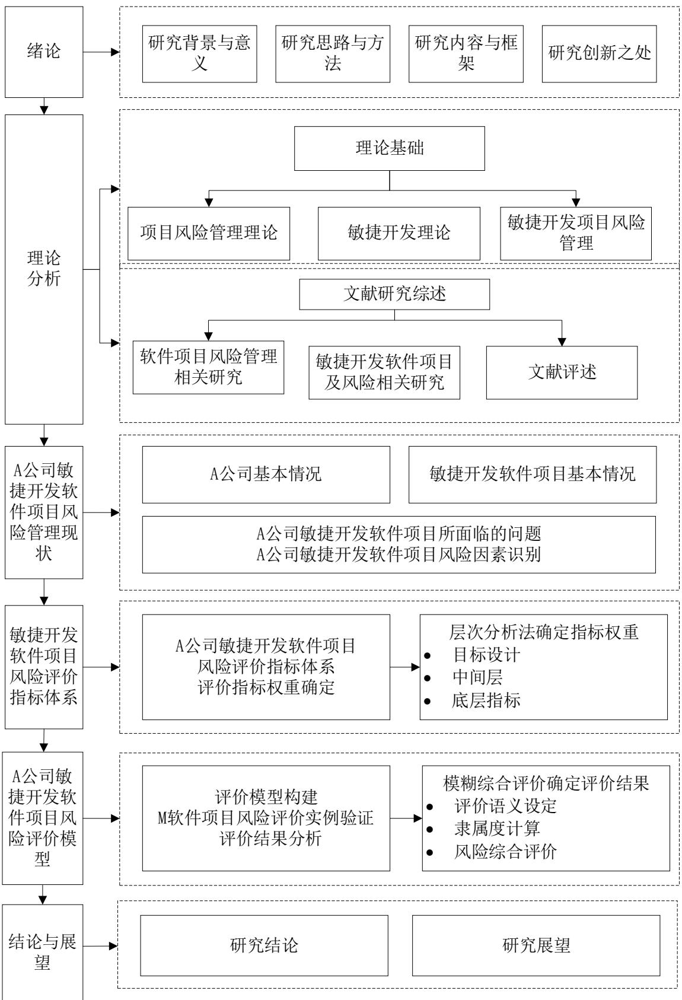

# 第一章 绪论

# 1.1 研究背景与意义

# 1.1.1研究背景

在当今信息化时代，软件项目的开发和管理已经成为企业和组织日常运营的重要组成部分。由于软件项目的复杂性和不确定性，项目管理者面临着各种风险和挑战。因此对软件项目的风险进行有效的管理和控制，已经成为保证项目成功的关键因素之一。软件项目的风险管理是通过识别、评估和控制项目中出现的风险，以降低风险对项目目标的影响，风险管理可以帮助项目管理者预测和应对潜在的问题，以确保项目按时、按质量和按预算完成。由于软件项目的特殊性，其风险管理存在一些独特的挑战和问题，需要深入的研究和探索。一是，软件项目的复杂性导致了风险的多样性和不确定性。软件项目涉及多项技术、人员和组织方面的因素，这些因素之间的相互作用和影响使得风险的产生和演化变得复杂而难以预测，技术风险包括软件开发工具的不稳定性和兼容性问题，人员风险包括团队成员的技术能力和沟通合作能力等；二是，软件项目的风险管理需要考虑到项目生命周期的各个阶段。软件项目从需求分析、设计、编码到测试和维护等不同阶段，每个阶段都面临不同的风险和挑战。在需求分析阶段，存在需求不明确或需求变更的风险，在编码和测试阶段，存在技术实现和质量控制的风险。因此软件项目的风险管理需要在项目的不同阶段进行综合考虑和分析，以制定相应的风险管理计划和措施；第三，软件项目的风险管理需要考虑到项目的组织和环境因素。不同的组织和环境对软件项目的风险管理存在不同的要求和限制，软件项目的风险管理需要根据具体的组织和环境因素进行个性化的处理；最后，随着软件项目规模和复杂度的不断增加，软件项目的风险管理也面临着新的挑战和机遇。如云计算、大数据和人工智能等新兴技术的应用，为软件项目的风险管理提供了新的手段和方法。同时，软件项目的全球化和跨组织合作也增加了风险管理的复杂性和难度，对软件项目的风险管理进行深入的研究和探索，对于提高软件项目的成功率和效益具有重要的意义。

敏捷开发是一种以迭代、增量的方式进行软件开发的方法论，它强调快速响应变化、持续交付高质量的软件产品。与传统的瀑布模型相比，敏捷开发更加灵活、适应变化并且能够更早地交付可用的软件。然而，敏捷开发也存在一些风险和挑战。由于其快速迭代的特点，项目需求会频繁变化，导致项目范围不断扩大，进而增加了项目的风险，敏捷开发需要高度的团队合作和沟通，如果团队成员之间的合作不够紧密或沟通不畅，会导致项目进展缓慢或质量下降。在敏捷开发的背景下，对项目风险进行有效的管理变得尤为重要。风险管理是通过识别、评估和控制项目中的风险，以最大程度地降低项目失败率。在敏捷开发中，风险管理是一个重要的环节，它需要与项目的迭代周期相结合，以便及时识别和处理潜在的风险，敏捷开发的核心理念是快速响应变化，因此风险管理也需要与迭代周期相结合。在每个迭代周期开始之前，团队应该进行风险评估，识别会影响项目进展的风险因素，这些风险因素可以包括技术难题、资源限制、需求变更等。通过及时识别这些风险，团队可以在项目开始之前制定相应的应对策略，以降低风险对项目进展的影响。每个成员的专业知识和项目视角都是宝贵的资源，可以帮助团队更全面地理解潜在风险，团队应该鼓励开放的沟通和协作，以确保所有的风险都被充分讨论和解决。本研究基于敏捷开发的A 公司软件项目的风险管理，可以帮助项目团队更好地理解和应对项目中的风险。通过对敏捷开发中常见的风险进行分析和研究，可以制定相应的风险管理策略和措施，提高项目的成功率和交付质量，本文对敏捷开发软件项目的风险进行研究，以期为A公司敏捷开发项目的风险管理提供参考和指导。

# 1.1.2研究意义

本文研究意义如下：

理论意义层面，敏捷开发要求风险管理方法具备与之相匹配的灵活性和适应性，传统风险管理方法在敏捷环境下的局限性促使我们开发新的评价指标和管理策略，以适应快速变化的需求。同时敏捷开发中人的因素如团队技能、经验和沟通对项目成败起着决定性作用，这些因素需要被量化并整合到风险管理框架中，以全面提升项目成功率。本文针对敏捷开发软件的需求变化频繁、开发周期短、团队协作紧密等特点，按照管理角色配置风险 S1、管理活动风险 S2、管理工作风险 S3、管理规则风险 S4 四个层次构建风险评价指标体系，拓展软件项目风险评价研究范围，同时本文选取A公司案例进行研究，丰富软件项目风险管理领域的研究。

应用意义层面，本研究有助于促进A公司敏捷开发软件项目风险管理水平提升，提升开发效率并降低管理成本，也为同类项目风险管理提供一个借鉴参考。

# 1.2研究思路与方法

# 1.2.1研究思路

本研究将对A公司敏捷开发软件项目的风险管理进行全面的评价和分析，为项目风险管理提供科学依据和决策支持。同时通过实证分析方法的应用提高评价结果的客观性和准确性，为项目风险管理的决策提供参考和指导，具体研究思路如下：一是针对敏捷开发软件项目风险评价指标体系的构建，本研究明确了指标选择依据及构建原则，从管理角色配置风险、管理活动风险、管理工作风险和管理规则风险四个层面确定了敏捷开发软件项目风险评价指标体系；二是本研究采用层次分析法（AHP）确定了评价指标的权重。通过AHP方法可以对各个评价指标的重要性进行量化，从而为风险评价提供权重参考，确保评价指标的相对重要性能够得到合理的权衡和排序为风险评价结果的准确性提供支持；三是本研究采用模糊综合判断（FCE）方法对A公司敏捷开发软件项目的风险进行评价。通过设定评价语义和选择隶属度函数将实证数据转化为模糊数并进行综合判断，通过对案例M项目的风险进行客观评价得出最终的评价结果。

# 1.2.2研究方法

（1）文献分析法。本文采用文献分析法，通过对已有文献的查阅和分析，来了解敏捷开发和软件项目风险管理的理论基础和方法。通过查阅相关文献可了解到敏捷开发的概念、原则和方法，包括 Scrum 等敏捷开发方法的具体实施步骤和技术工具，了解到软件项目风险管理的理论基础，包括风险的定义、分类和评估方法，为本文研究打下基础。

（2）风险评判法。本文通过层次分析法（AHP）对A公司敏捷开发软件项目风险评价指标确定各个指标的权重，采用模糊综合判断（FCE）方法对案例项目的风险进行评价，通过设定评价语义和选择隶属度函数可以将实证数据转化为模糊数并得到具体的风险评价结果。通过 AHP 确定的权重和 FCE 求解的评价结果，可以为项目风险管理提供科学依据和决策支持。

# 1.3研究内容

本文研究内容如下：

第1章绪论。本部分介绍研究的背景和意义、主要内容、思路与方法、创新点，为整个研究奠定基础。

第2 章 文献综述与理论基础。本部分回顾相关文献，介绍项目风险管理和敏捷开发的理论基础，为后续章节的研究提供理论支撑。

第3 章A公司敏捷开发软件项目风险管理现状。本部分介绍A公司及其敏捷开发软件项目的基本情况、具体问题及主要风险因素。

第4 章敏捷开发软件项目风险评价指标体系。本部分构建A公司敏捷开发软件项目风险评价指标体系，及确定评价指标的权重。

第5 章A公司敏捷开发软件项目风险评价模型。本部分构建基于模糊综合评价法的A公司敏捷开发软件项目风险评价模型，并通过M 软件项目的实例验证来测试模型的有效性。

第6 章A 公司敏捷开发软件项目风险应对。本部分是A 公司敏捷开发软件项目的风险应对措施，及应对保障，以确保风险应对措施的有效实施。

第7章 结论与展望。本部分将总结本研究的主要发现和结论，并对A公司敏捷开发软件项目风险管理的未来发展提出展望。

本文技术路线如下：

  
图1-1技术路线图

# 1.4研究创新之处

研究视角层面：本文聚焦敏捷开发软件项目风险管理，根据该类项目特征进行差异化风险指标设计，包括管理角色配置风险 S1、管理活动风险 S2、管理工作风险S3、管理规则风险S4方面；

研究方法层：本文将AHP-FCE模型引入敏捷开发软件项目风险评价，拓展了AHP-FCE 的应用范围，通过结合AHP-FCE 方法和敏捷开发模式的特点，可以更准确地识别和评估基于敏捷开发的A公司项目风险。
