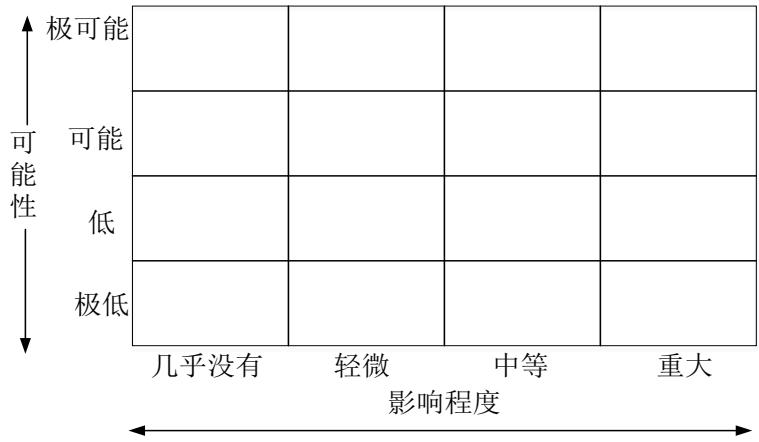

# 第一章 绪论

# 1.1 研究背景与意义

# 1.1.1研究背景

在当今信息化时代，软件项目的开发和管理已经成为企业和组织日常运营的重要组成部分。由于软件项目的复杂性和不确定性，项目管理者面临着各种风险和挑战。因此对软件项目的风险进行有效的管理和控制，已经成为保证项目成功的关键因素之一。软件项目的风险管理是通过识别、评估和控制项目中出现的风险，以降低风险对项目目标的影响，风险管理可以帮助项目管理者预测和应对潜在的问题，以确保项目按时、按质量和按预算完成。由于软件项目的特殊性，其风险管理存在一些独特的挑战和问题，需要深入的研究和探索。一是，软件项目的复杂性导致了风险的多样性和不确定性。软件项目涉及多项技术、人员和组织方面的因素，这些因素之间的相互作用和影响使得风险的产生和演化变得复杂而难以预测，技术风险包括软件开发工具的不稳定性和兼容性问题，人员风险包括团队成员的技术能力和沟通合作能力等；二是，软件项目的风险管理需要考虑到项目生命周期的各个阶段。软件项目从需求分析、设计、编码到测试和维护等不同阶段，每个阶段都面临不同的风险和挑战。在需求分析阶段，存在需求不明确或需求变更的风险，在编码和测试阶段，存在技术实现和质量控制的风险。因此软件项目的风险管理需要在项目的不同阶段进行综合考虑和分析，以制定相应的风险管理计划和措施；第三，软件项目的风险管理需要考虑到项目的组织和环境因素。不同的组织和环境对软件项目的风险管理存在不同的要求和限制，软件项目的风险管理需要根据具体的组织和环境因素进行个性化的处理；最后，随着软件项目规模和复杂度的不断增加，软件项目的风险管理也面临着新的挑战和机遇。如云计算、大数据和人工智能等新兴技术的应用，为软件项目的风险管理提供了新的手段和方法。同时，软件项目的全球化和跨组织合作也增加了风险管理的复杂性和难度，对软件项目的风险管理进行深入的研究和探索，对于提高软件项目的成功率和效益具有重要的意义。

敏捷开发是一种以迭代、增量的方式进行软件开发的方法论，它强调快速响应变化、持续交付高质量的软件产品。与传统的瀑布模型相比，敏捷开发更加灵活、适应变化并且能够更早地交付可用的软件。然而，敏捷开发也存在一些风险和挑战。由于其快速迭代的特点，项目需求会频繁变化，导致项目范围不断扩大，进而增加了项目的风险，敏捷开发需要高度的团队合作和沟通，如果团队成员之间的合作不够紧密或沟通不畅，会导致项目进展缓慢或质量下降。在敏捷开发的背景下，对项目风险进行有效的管理变得尤为重要。风险管理是通过识别、评估和控制项目中的风险，以最大程度地降低项目失败率。在敏捷开发中，风险管理是一个重要的环节，它需要与项目的迭代周期相结合，以便及时识别和处理潜在的风险，敏捷开发的核心理念是快速响应变化，因此风险管理也需要与迭代周期相结合。在每个迭代周期开始之前，团队应该进行风险评估，识别会影响项目进展的风险因素，这些风险因素可以包括技术难题、资源限制、需求变更等。通过及时识别这些风险，团队可以在项目开始之前制定相应的应对策略，以降低风险对项目进展的影响。每个成员的专业知识和项目视角都是宝贵的资源，可以帮助团队更全面地理解潜在风险，团队应该鼓励开放的沟通和协作，以确保所有的风险都被充分讨论和解决。本研究基于敏捷开发的A 公司软件项目的风险管理，可以帮助项目团队更好地理解和应对项目中的风险。通过对敏捷开发中常见的风险进行分析和研究，可以制定相应的风险管理策略和措施，提高项目的成功率和交付质量，本文对敏捷开发软件项目的风险进行研究，以期为A公司敏捷开发项目的风险管理提供参考和指导。

# 1.1.2研究意义

本文研究意义如下：

理论意义层面，敏捷开发要求风险管理方法具备与之相匹配的灵活性和适应性，传统风险管理方法在敏捷环境下的局限性促使我们开发新的评价指标和管理策略，以适应快速变化的需求。同时敏捷开发中人的因素如团队技能、经验和沟通对项目成败起着决定性作用，这些因素需要被量化并整合到风险管理框架中，以全面提升项目成功率。本文针对敏捷开发软件的需求变化频繁、开发周期短、团队协作紧密等特点，按照管理角色配置风险 S1、管理活动风险 S2、管理工作风险 S3、管理规则风险 S4 四个层次构建风险评价指标体系，拓展软件项目风险评价研究范围，同时本文选取A公司案例进行研究，丰富软件项目风险管理领域的研究。

应用意义层面，本研究有助于促进A公司敏捷开发软件项目风险管理水平提升，提升开发效率并降低管理成本，也为同类项目风险管理提供一个借鉴参考。

# 1.2研究思路与方法

# 1.2.1研究思路

本研究将对A公司敏捷开发软件项目的风险管理进行全面的评价和分析，为项目风险管理提供科学依据和决策支持。同时通过实证分析方法的应用提高评价结果的客观性和准确性，为项目风险管理的决策提供参考和指导，具体研究思路如下：一是针对敏捷开发软件项目风险评价指标体系的构建，本研究明确了指标选择依据及构建原则，从管理角色配置风险、管理活动风险、管理工作风险和管理规则风险四个层面确定了敏捷开发软件项目风险评价指标体系；二是本研究采用层次分析法（AHP）确定了评价指标的权重。通过AHP方法可以对各个评价指标的重要性进行量化，从而为风险评价提供权重参考，确保评价指标的相对重要性能够得到合理的权衡和排序为风险评价结果的准确性提供支持；三是本研究采用模糊综合判断（FCE）方法对A公司敏捷开发软件项目的风险进行评价。通过设定评价语义和选择隶属度函数将实证数据转化为模糊数并进行综合判断，通过对案例M项目的风险进行客观评价得出最终的评价结果。

# 1.2.2研究方法

（1）文献分析法。本文采用文献分析法，通过对已有文献的查阅和分析，来了解敏捷开发和软件项目风险管理的理论基础和方法。通过查阅相关文献可了解到敏捷开发的概念、原则和方法，包括 Scrum 等敏捷开发方法的具体实施步骤和技术工具，了解到软件项目风险管理的理论基础，包括风险的定义、分类和评估方法，为本文研究打下基础。

（2）风险评判法。本文通过层次分析法（AHP）对A公司敏捷开发软件项目风险评价指标确定各个指标的权重，采用模糊综合判断（FCE）方法对案例项目的风险进行评价，通过设定评价语义和选择隶属度函数可以将实证数据转化为模糊数并得到具体的风险评价结果。通过 AHP 确定的权重和 FCE 求解的评价结果，可以为项目风险管理提供科学依据和决策支持。

# 1.3研究内容

本文研究内容如下：

第1章绪论。本部分介绍研究的背景和意义、主要内容、思路与方法、创新点，为整个研究奠定基础。

第2 章 文献综述与理论基础。本部分回顾相关文献，介绍项目风险管理和敏捷开发的理论基础，为后续章节的研究提供理论支撑。

第3 章A公司敏捷开发软件项目风险管理现状。本部分介绍A公司及其敏捷开发软件项目的基本情况、具体问题及主要风险因素。

第4 章敏捷开发软件项目风险评价指标体系。本部分构建A公司敏捷开发软件项目风险评价指标体系，及确定评价指标的权重。

第5 章A公司敏捷开发软件项目风险评价模型。本部分构建基于模糊综合评价法的A公司敏捷开发软件项目风险评价模型，并通过M 软件项目的实例验证来测试模型的有效性。

第6 章A 公司敏捷开发软件项目风险应对。本部分是A 公司敏捷开发软件项目的风险应对措施，及应对保障，以确保风险应对措施的有效实施。

第7章 结论与展望。本部分将总结本研究的主要发现和结论，并对A公司敏捷开发软件项目风险管理的未来发展提出展望。

本文技术路线如下：

  
图1-1技术路线图

# 1.4研究创新之处

研究视角层面：本文聚焦敏捷开发软件项目风险管理，根据该类项目特征进行差异化风险指标设计，包括管理角色配置风险 S1、管理活动风险 S2、管理工作风险S3、管理规则风险S4方面；

研究方法层：本文将AHP-FCE模型引入敏捷开发软件项目风险评价，拓展了AHP-FCE 的应用范围，通过结合AHP-FCE 方法和敏捷开发模式的特点，可以更准确地识别和评估基于敏捷开发的A公司项目风险。

# 第二章 理论基础与文献综述

# 2.1理论基础

# 2.1.1项目风险管理理论

项目风险管理是项目管理中至关重要的一部分，旨在识别、评估和应对项目中的潜在风险，以最大程度地减少不确定性对项目目标的影响。项目风险管理理论提供了一系列方法和工具，帮助项目团队有效地管理风险，它是项目管理中不可或缺的一部分。风险管理是一种系统性的方法，用于识别、评估和应对项目中的风险，它包括风险识别、评估、应对和监控等步骤，具体内容如下：

表2-1项目风险管理步骤  

<table><tr><td>步骤</td><td>方法</td><td>目的</td><td>包括内容</td></tr><tr><td>风险识别</td><td>大脑风暴、德尔菲技术、 检查表、SWOT分析</td><td>识别出项目中遇到的 所有潜在风险</td><td>技术风险、组织风 险、市场风险、财务 风险、法律风险等</td></tr><tr><td>风险评估</td><td>风险矩阵、决策树分析、 蒙特卡洛模拟</td><td>对已识别风险的性质 和影响进行评估</td><td>定性分析和定量分析</td></tr><tr><td>风险应对 策略制定</td><td>根据风险评估结果</td><td>制定相应的风险应对避免、转移、减轻、 策略</td><td>接受</td></tr><tr><td>风险监控</td><td>跟踪已识别的风险、监控 剩余风险、识别新风险、 执行风险应对计划、评估 其有效性</td><td>管理风险并根据项目 进展和外部环境的变 化进行调整</td><td>持续的过程</td></tr><tr><td>风险沟通</td><td>双向过程，包括报告和收 集反馈</td><td>解</td><td>确保所有项目干系人帮助团队成员理解风 对项目风险有共同理险管理计划并采取行 动</td></tr><tr><td>风险记录</td><td>记录所有风险信息和风险 管理活动</td><td>提供项目执行过程中 的重要信息，为未来 项目提供经验和教训</td><td>风险登记册、风险评 估报告、风险应对计 划、风险监控记录</td></tr></table>

（1）PMBOK指南（项目管理知识体系指南）

PMBOK指南（项目管理知识体系指南）是由美国项目管理协会（ProjectManagement Institute, PMI）编制和发布的一套广泛认可的项目管理标准和实践准则。它被视为项目管理领域的权威指南，为项目经理和团队提供了一系列工具、技术和最佳实践，以帮助他们有效地管理项目。PMBOK指南的核心是将项目管理分为不同的知识领域和过程组，确保项目从启动到闭环的每一个阶段都能得到妥善管理。在PMBOK 指南中，项目风险管理是一个重要的知识领域，它关注的是识别、分析和应对项目过程中出现的不确定性和潜在问题。项目风险管理的目标是最大限度地减少或控制负面影响，并增加正面影响的性，以提高项目成功的概率。PMBOK 指南定义了项目风险管理的六个主要过程包括风险管理规划、风险识别、定性风险分析、定量风险分析、风险应对计划、风险监控，具体内容如表2-2。

PMBOK指南的项目风险管理过程不仅帮助项目团队识别和分析风险，而且还提供了一套系统的方法来规划和实施风险应对措施。PMBOK 指南的风险管理实践被广泛应用于各种类型和规模的项目中，是项目经理和团队在面对项目挑战时的重要资源。

表2-2PMBOK 指南风险管理要素  

<table><tr><td>序号</td><td>过程</td><td>目的</td><td>主要输出物</td></tr><tr><td rowspan="2">1</td><td>风险管理</td><td>定义如何进行项目风险管理，包括方 法、工具、角色和职责等。</td><td>风险管理计划</td></tr><tr><td>规划 风险识别</td><td>识别项目面临的所有潜在风险。</td><td>风险登记册</td></tr><tr><td>2 3</td><td>定性风险</td><td>评估和排序风险，基于它们对项目目标</td><td>风险优先级列表</td></tr><tr><td>4</td><td>分析 定量风险 分析</td><td>影响的性和严重性。 使用数值分析来评估风险对项目目标</td><td>数值风险分析结果</td></tr><tr><td>5</td><td>风险应对</td><td>（如成本和时间）的潜在影响。 开发策略和行动计划来应对风险，包括风险应对措施、更新的 避免、转移、减轻或接受负面风险，以项目管理计划和风险</td><td></td></tr><tr><td>6</td><td>计划 风险监控</td><td>及增强或利用正面风险。 跟踪已识别的风险，监控剩余风险，识定期更新的风险登记 别新风险，执行风险应对计划，并评估册、风险审计报告、变</td><td>登记册</td></tr></table>

# （2）风险评估矩阵

风险评估矩阵是项目管理和风险管理中的一个关键工具，它用于评估和优先排序项目风险，它通过考虑风险发生的性（或概率）和风险影响的严重性（或影响）来帮助项目团队理解和量化风险。风险评估矩阵的目的是为了使决策者能够快速识别需要关注的关键风险，并据此制定相应的风险应对策略。风险评估矩阵通常是一个二维表格，其中竖轴代表风险发生的概率，横轴代表风险的影响。概率和影响通常被分为几个等级，例如“低”、“中”、“高”，通过评估每个风险的概率和影响，可以将其定位在矩阵的相应位置上。构建风险评估矩阵的步骤包括：定义评估标准，首先需要定义概率和影响的等级，概率可以分为“很低”、“低”、“中”、“高”和“很高”；识别风险，使用风险识别的方法（如头脑风暴、德尔菲技术等）来列出所有潜在的风险；评估概率和影响，对每个风险进行评估，确定它们发生的概率和对项目目标的潜在影响；定位风险，根据评估的概率和影响，将每个风险放置在矩阵的相应位置，根据风险在矩阵中的位置，确定哪些风险需要立即关注，哪些可以监控但不需要立即行动；制定应对策略，对于矩阵中优先级较高的风险，制定相应的风险应对策略。

  
图2-1风险矩阵结构

# 2.1.2敏捷开发理论

20 世纪 90 年代互联网的迅速发展和普及推动了项目管理的改革，传统的瀑布流管理模型逐渐受到欢迎。瀑布模型以线性处理方式为特点，强调设计环节，但在实际项目中，最佳设计计划往往无法在项目初期确定。因此，使用瀑布模型增加项目风险并不能满足需求多次调整的要求。为了解决这个问题，敏捷开发应运而生。敏捷开发理论最早于2001年被正式提出，由相关领域的多位著名学者达成共识后提出，敏捷开发的根本目的是解决项目管理中无法及时调整的问题，推动软件行业管理的创新。敏捷开发通过迭代周期、产品 Backlog、Sprint Planning、Daily Stand-up、Sprint Review 和 Sprint Retrospective 等实践方法，帮助团队更好地管理项目，提高交付价值的速度和质量。敏捷开发是一种以迭代、增量和协作为核心的软件开发方法论。它是对传统瀑布模型的改进，旨在解决项目管理中的问题。尽管敏捷开发的具体内涵和定义存在争议，但它在实践中得到了广泛应用并不断优化和改良。敏捷开发通过强调团队合作、快速迭代和持续交付，能够更好地适应变化的需求和市场，提高项目的成功率和客户满意度。敏捷开发(Scrum)的核心概念包括个体和互动、工作的软件、客户合作和响应变化。敏捷开发遵循一系列原则，这些原则旨在指导团队在软件开发过程中的决策和行动。敏捷开发的核心原则包括：个体和互动胜过流程和工具，敏捷开发强调团队成员之间的沟通和合作，认为人与人之间的互动比过程和工具更重要。团队成员应该积极参与，相互支持和协作，以实现项目的成功；工作的软件胜过详尽的文档，敏捷开发重视实际可工作的软件，而不是过多的文档。通过快速迭代和持续交付，团队能够更早地获得反馈并及时调整开发方向；客户合作胜过合同谈判，敏捷开发鼓励与客户紧密合作，以理解和满足他们的需求。通过频繁的沟通和反馈，团队能够及时调整产品功能和优先级，以确保客户满意度，敏捷团队应该持续地评估和调整计划，以满足客户需求和市场变化。Scrum 主要是将敏捷开发中需求管理工作效率分为四个方面列出理论框架：管理角色配置、管理活动特征、管理工作、管理规则。

  
图2-2Scrum 敏捷开发框架

敏捷开发作为一种以人为核心、迭代、循序渐进的软件开发方法，它强调在整个开发周期中的适应性和灵活性，以便更好地应对需求变化。敏捷开发中包括管理角色配置、管理活动特征、管理工作和管理规则，其具体管理要素内容如下：

<table><tr><td>类别</td><td>描述</td><td>说明</td></tr><tr><td>管理角色 配置</td><td>-产品负责人（ProductOwner） －敏捷团队（Agile Team） -敏捷教练/Scrum Master</td><td>产品负责人负责定义产品愿景和 管理需求。敏捷团队负责实现需 求。敏捷教练帮助团队遵循敏捷 实践。</td></tr><tr><td>管理活动 特征</td><td>－迭代计划（Sprint Planning） -日常站立会议（Daily Stand-up） －迭代回顾（Sprint Review） －迭代评估（Sprint Retrospective）</td><td>迭代计划确定下一周期的工作。 日常站立会议用于同步进度。迭 代回顾和评估用于改进过程。</td></tr><tr><td>管理工作</td><td>-产品待办事项列表（Product Backlog） -迭代待办事项列表（Sprint Backlog） －增量产品（Increment） -定义完成（Definition of Done）</td><td>产品待办事项列表包含所有需 求。迭代待办事项列表是选定周 期的工作。增量产品是周期成 果。定义完成确保质量。</td></tr><tr><td>管理规则</td><td>－时间盒定时（Time-boxing） -自组织团队 -持续改进 －响应变化</td><td>时间盒定时限定活动时间。自组 织团队鼓励自我管理。持续改进 追求效率。响应变化适应需求变 更。</td></tr></table>

# 2.2文献综述

# 2.2.1软件项目风险管理相关研究

（1）软件项目风险识别与评价相关研究

软件项目风险识别是软件项目管理中的一个重要环节。在软件开发过程中，各种风险会导致项目进度延误、质量问题、成本超支等不良后果。邱继栋（2017)[1]指出及时准确地识别和评估软件项目风险，对于项目的成功实施至关重要。传统的软件项目风险识别方法主要依赖于专家经验和直觉，这些方法主要包括头脑风暴、专家访谈、问卷调查等。Alves（2019）[2]研究提出了基于头脑风暴和专家访谈的软件项目风险识别方法，通过组织专家会议，及头脑风暴的方式收集和整理项目风险并通过专家访谈的方式进行风险评估。随着数据挖掘和机器学习技术的发展，越来越多的研究开始探索将这些技术应用于软件项目风险识别中。Yaseen（2020）[3]提出一种数据驱动的风险预测模型，该模型通过分析历史软件项目数据，使用数据挖掘技术如分类、回归或聚类算法来识别项目成功的关键因素，从而对新项目进行风险评估。褚洪江（2020）[4]开发了一种基于机器学习的风险识别方法，通过收集和预处理软件项目数据，并应用如决策树、支持向量机等算法构建分类模型，实现对项目风险的自动识别和预测。付宇等（2021）[5]综合分析了数据挖掘和机器学习在软件项目风险管理中的应用，强调了这些技术在揭示项目成功关键因素和预测风险方面的有效性，为项目管理提供了量化的风险分析和决策支持。一些研究还探索了将模糊理论和神经网络等技术应用于软件项目风险识别中，幸莉仙（2012）[6]指出综合应用AHP 和FUZZY可以更全面地评估和管理软件开发项目中的风险。AHP 可以提供定量的权重和优先级，而FUZZY可以处理不确定性和模糊性，通过综合运用这两种方法，可以更准确地评估风险的严重程度并采取相应的风险管理措施，这样可以提高软件开发项目的成功率和效率，减少项目失败的风险。Gholami（2022）[7]提出基于模糊理论和神经网络的软件项目风险识别方法，通过收集和分析项目数据，使用模糊理论构建了一个软件项目风险评估模型，该模型可以根据项目的特征和模糊规则，评估项目的风险水平。另外，邵俊等（2022）[]提出了一种基于模糊理论和神经网络的软件项目风险分类方法，通过收集和分析项目数据，使用模糊理论和神经网络构建了一个软件项目风险分类器，该分类器可以根据项目的特征，将项目分为不同的风险等级。王蔚（2022）[9]指出基于熵权TOPSIS 的软件项目风险评估方法能够帮助开发团队全面了解项目风险，有针对性地采取措施，从而提高项目的成功率和开发效率，熵权 TOPSIS 方法的核心思想是将风险评估问题转化为决策问题，通过对各个评估指标的权重进行熵权处理，得到最终的评估结果。

# （2）软件项目风险防范相关研究

软件项目风险防范措施是为了确保软件项目能够按时、按质、按量地完成并且能够满足用户需求和项目目标。在软件项目开发过程中，存在着各种各样的风险，如技术风险、需求风险、进度风险等。为了降低软件项目风险，提高项目成功率，研究者们进行了大量的研究并提出了多类风险防范方法。Lyytinen（2018）[10]指出在软件项目开发过程中，应该进行项目监控和风险预警，项目监控是为了及时了解项目的进展情况和问题，以便及时采取相应的措施；风险预警是为了提前发现存在的风险并采取相应的措施来避免或减轻风险的影响。Geraldi（2020)[1]分析认为为了防范软件项目技术风险，应该进行技术评估和风险控制。技术评估是为了确定项目中存在的技术风险以及其潜在的影响。通过技术评估，可以选择合适的技术方案和工具，降低技术风险。Ropponen（2022）[12]强调了在软件项目启动之前制定详尽项目计划和风险管理计划的重要性。他分析认为，一个周密的项目计划应该明确项目的目标、定义项目的范围、制定实际可行的时间表，并进行合理的资源分配，这样的项目计划不仅为项目的执行提供了清晰的蓝图，而且有助于确保所有项目参与者对项目的各个方面有共同的理解和期望。

在项目开始之前，管理人员需与客户充分沟通，明确项目目标和需求，以制定合理的计划和进度安排。沟通是关键，项目管理人员需保持与客户、开发团队及其他相关方的良好沟通，确保信息畅通，避免误解。在制定开发计划时，需考虑潜在风险，通过任务分解、资源分配和进度安排来减少风险。向前（2020）[13]指出在软件项目开始之前，项目管理人员需要与客户充分沟通，确保对项目目标和需求有清晰的理解。只有明确了项目的目标和需求，才能制定出合理的项目计划和进度安排。齐爱朋（2021）[14]重点分析在软件项目中，沟通是非常重要的一环。项目管理人员需要与客户、开发团队和其他相关方保持良好的沟通。通过及时、准确地传递信息，可以避免因为信息不畅通而产生的误解和偏差。张东红（2021）[15]指出在制定软件开发计划和安排进度时，需要充分考虑到各种潜在的风险因素，如技术风险、资源风险等。通过合理的分解任务、合理的资源分配和合理的进度安排，可以最大程度地减少风险的发生。谢鹏昱（2021）[16]分析认为软件项目的质量是项目成功的重要保证。项目管理人员需要建立起完善的质量管理体系，包括制定质量目标、制定质量标准、建立质量检查机制等。在项目开发过程中，需要对每个阶段的工作进行严格的质量控制，及时发现和解决问题，确保项目交付的质量。

# 2.2.2敏捷开发软件项目及风险相关研究

（1）敏捷开发软件项目相关研究

敏捷开发是一种以自组织、跨职能团队为基础的软件开发方法，旨在通过迭代、增量的方式快速交付高质量的软件产品。敏捷开发的理论基础是敏捷宣言和敏捷原则，敏捷宣言是在 2001年由一群软件开发者共同制定的，宣言强调个体和互动、工作的软件、客户合作和响应变化。敏捷原则则是对敏捷宣言的具体解释和实践指南，包括迭代开发、团队合作、持续交付等。Sutherland（2017）[17]指出敏捷开发是一种迭代、增量的软件开发方法，注重快速响应变化和持续交付价值。Boehm（2019）[18]阐述了敏捷开发方法的核心特点和优势。敏捷开发是一种以人为核心、迭代和增量的软件开发方法，它强调适应性和灵活性，以快速响应需求变化，Boehm 指出敏捷开发通过将开发过程分割成多个短期迭代，每个迭代周期通常为几周时间，确保了每个迭代都有明确的目标和交付成果，这种分阶段的开发模式允许团队在每个迭代结束时评估项目进度，并根据反馈调整后续的开发计划。Rubin（2020）[19]认为敏捷开发强调团队合作和有效的沟通，重点研究团队成员之间的合作模式、沟通工具的使用以及如何解决团队中出现的冲突和问题等。敏捷开发不仅仅是一种技术或方法论，它更是一种文化和思维方式，强调团队合作和有效沟通。在敏捷团队中，成员之间的协作模式、沟通工具的选择和使用，以及解决团队内潜在冲突和问题的方法都是项目成功的关键因素。Rubin指出敏捷团队通常较小且跨功能，成员之间需要频繁地进行面对面的交流，以确保信息的快速流通和问题的即时解决。敏捷方法如 Scrum 和 Kanban 提供了框架和实践，如每日站会、迭代计划会议和回顾会议，这些都是为了促进团队成员之间的沟通和合作。Fitzgerald（2021）[20]认为敏捷开发方法强调持续交付高质量的软件，该研究致力于开发有效的质量保证方法和工具，这包括自动化测试、代码评审、持续集成等方面的研究，以提高软件项目的质量和稳定性。Liu（2022）[21]重点关注了敏捷开发方法注重客户参与和需求的快速变化，这包括需求获取、需求优先级排序、需求变更管理等方面的研究，以确保软件项目能够及时满足客户的需求。

在近年来的研究中，敏捷开发与传统软件开发方法的比较成为一个重要的关注点。敏捷开发注重快速响应变化、迭代开发和团队合作，通过小规模迭代快速交付有价值的软件，并根据客户反馈灵活调整。相比之下，CMMI 强调规范化和文档化的过程，以确保质量和可重复性。敏捷开发通过结合客户反馈和度量指标评估项目进展，而 CMMI提供了一套成熟的度量和评估方法。结合两者的方法，可以更全面地评估和改进软件开发过程的能力和效果。蔡泉（2020）[22]指出敏捷开发注重快速响应变化、迭代开发和团队合作。它强调根据客户需求和反馈进行灵活调整，通过小规模的迭代开发来快速交付有价值的软件，而CMMI 则是一个过程改进框架，旨在帮助组织提高其软件开发和管理过程的能力，它强调规范化和文档化的过程，以确保质量和可重复性。吴争荣（2020）[23]指出敏捷开发强调通过客户反馈和度量指标来评估项目进展和质量。而CMMI 则提供了一套成熟的度量和评估方法，可以帮助组织评估其软件开发过程的能力和效能，通过结合两者的方法，可以更全面地评估和改进软件开发过程的能力和效果。在执行团队中，团队成员具有多样化的技能，可以共同决策并快速响应变化，而 CMMI则更加强调过程的规范性和控制性，要求明确的角色和责任并强调文档和记录的重要性。陶然（2021）[24]认为与传统的瀑布模型相比，敏捷开发更加灵活、适应变化并强调与客户的紧密合作。敏捷开发软件项目是一种以迭代、增量和协作为特点的开发方法，旨在提高软件开发的灵活性和适应性。张抒等（2021）[25]归纳敏捷开发有许多具体的方法和技术，如 Scrum、极限编程（XP）、精益开发等。Scrum是一种迭代增量的开发方法，通过定义产品待办事项和迭代周期来组织开发过程。XP 则是一种注重编码实践和团队合作的方法，强调测试驱动开发、持续集成等。精益开发则是一种注重价值流和减少浪费的方法，强调持续改进和快速反馈。迟木子（2022）[26]分析敏捷开发可以提高开发效率和质量，减少项目失败的风险。而影响敏捷开发效果的因素包括团队成员的技术能力、团队的协作能力、客户的参与程度等。朱代富（2022）[27]认为敏捷开发特别适合那些需求变化频繁和风险较高的项目，因为敏捷方法的灵活性和迭代性能够快速适应需求变动，及时调整开发方向，从而有效地管理风险。对于规模庞大、结构复杂的项目，敏捷开发会遇到一系列挑战，这些挑战包括团队协作的难度增加、项目管理的复杂性提高以及维持持续交付的质量和速度。朱代富的研究提示，虽然敏捷开发在某些情况下具有明显优势，但在应用于大型项目时，需要对敏捷实践进行适当的调整和补充，以确保项目的顺利进行和成功交付。袁宜霞（2023）[28]归纳基于人工智能和机器学习的敏捷开发方法，用于自动化开发过程和决策支持，通过集成 AI 和ML 技术，敏捷开发团队可以减少重复性工作，更快地响应变化，并提高决策的质量。袁宜霞的研究强调了AI和ML 在提升敏捷开发过程中的潜在价值，展示了这些技术如何帮助团队更好地理解和适应用户需求，以及如何提高开发流程的自动化水平。

# （2）敏捷开发软件项目风险相关研究

敏捷开发是一种迭代、增量的软件开发方法，它强调团队合作、快速响应变化和持续交付。Conboy（2019）[29]认为敏捷开发的一个核心原则是快速响应变化的需求，需求的频繁变化导致项目的不稳定性，需求变更是敏捷开发项目失败的主要原因之一。Cockburn（2021）[30]指出敏捷开发强调团队合作和自组织，团队成员之间的协作存在一些风险，如团队成员之间的沟通不畅、技术能力不足等，团队协作风险导致项目延期、质量下降等问题。Dybå（2022）[31]指出敏捷开发过程中，新技术的不成熟导致项目延期和质量问题，而迭代开发导致项目进度的不确定性。高俊(2019)[3²2]分析认为敏捷开发的一个主要风险是需求变更的频繁性，由于敏捷开发的特点是快速响应变化，因此客户会频繁提出新的需求或修改既有的需求，这种频繁的需求变更导致项目进度延迟、资源浪费和团队动力下降。黄敏珍（2020）[33]总结敏捷开发的风险是团队成员的能力和经验差异，敏捷开发强调跨职能团队的合作和自组织，因此团队成员的能力和经验对项目的成功至关重要。郑元龙（2021）[34]分析发现敏捷开发团队成员之间的不平衡导致项目进度延迟、质量问题和团队冲突。孙德刚（2021）[35]分析认为敏捷开发通常使用自动化测试和持续集成等技术和工具来提高软件质量和开发效率，然而这些技术和工具的使用也引入新的风险，如测试覆盖率不足、集成问题和工具配置困难等。龚桂芬（2022）[36]探讨了敏捷开发实践对项目管理和组织结构的影响。她指出，敏捷开发的核心原则之一是鼓励自组织和跨职能团队的合作，这种方法在促进灵活性和响应速度方面非常有效。自组织团队的概念要求团队成员在没有传统管理层直接指导的情况下自我管理和决策，这导致项目管理的方式发生变化。在这种环境下，团队需要更多的协商和共识建立过程，这会影响项目的进度。同时，跨职能团队的合作要求成员跨越专业边界共同工作，这在一定程度上导致角色和责任的模糊，从而引发团队内部的冲突。由于团队成员来自不同的专业背景，有效的沟通变得尤为重要。沟通不畅会导致误解和信息传递的延迟，从而影响团队的整体协作和项目的顺利进行。

# 2.2.3文献评述

本文通过文献梳理发现：一是敏捷开发是一种灵活和适应性强的开发方法。在过去的几十年中，敏捷开发已经得到了广泛的应用和研究。未来的研究方向包括敏捷开发的效果和影响因素、敏捷开发的适用性和局限性，以及新的敏捷开发方法和技术的探索。现有研究多集中在敏捷开发的过程和实践上，对于敏捷开发的效果评价和影响因素分析相对较少；二是敏捷开发软件项目风险相关的研究主要集中在需求不稳定性、团队协作、技术、进度和质量等方面，但需要进一步的研究来深入理解和解决这些风险，以提高敏捷开发项目的成功率，敏捷开发软件项目风险相关的研究需要更深入的理解和解决方案，需求不稳定性、团队协作、技术、进度和质量等方面的风险一直是敏捷开发中的热点问题。未来的研究可以探索如何通过工具和技术来更好地管理这些风险。例如开发更加灵活的需求管理工具，以适应需求的快速变化；或者研究如何通过团队建设和培训提高团队协作效率，同时技术风险的管理也需要结合最新的技术进展；三是软件项目风险识别是软件项目管理中的一个重要环节。传统的软件项目风险识别方法主要依赖于专家经验和直觉，容易受到主观因素的影响。随着数据挖掘和机器学习技术的发展，越来越多的研究开始探索将这些技术应用于软件项目风险识别中，一些研究还探索了将模糊理论和神经网络等技术应用于软件项目风险识别中，传统的依赖专家经验和直觉的方法虽然有其价值，但也存在主观性强、可重复性差的问题。随着数据挖掘和机器学习技术的发展，未来的研究可以探索如何利用这些技术来提高风险识别的准确性和效率；四是软件项目风险防范措施是确保软件项目能够按时-按质、按量地完成的重要手段。通过制定详细的项目计划和风险管理计划、建立有效的沟通渠道和团队合作机制、进行风险评估和管理、进行技术评估和风险控制、进行项目监控和风险预警等措施，可以降低软件项目的开发风险，提高项目的成功率。

现有研究中，已经涉及了软件项目风险管理的多个方面，包括风险识别、评价、防范以及敏捷开发软件项目的特定风险。然而研究中仍存在一些不足之处，这些不足之处为未来的研究提供了方向，具体来说：一是敏捷开发框架下的风险管理研究仍然不够深入。敏捷开发的快速迭代和对变化的响应能力，使得传统的风险管理方法不再适用，因此需要针对敏捷开发的特点，设计新的风险评价指标和管理方法；二是现有研究中对于敏捷开发中人的因素考虑不足。敏捷开发强调团队合作和个体之间的互动，团队成员的技能、经验和沟通能力都成为项目成功的关键因素，因此如何量化这些软因素，并将它们纳入风险管理框架中，是一个值得探讨的问题；三是敏捷开发项目的风险评价方法需要进一步的创新。传统的风险评价方法需要结合敏捷开发的特性进行调整，如何在迭代过程中动态调整风险评价指标，以及如何快速收集和处理风险相关信息，都是需要解决的问题。基于以上分析，本文聚焦敏捷开发软件项目风险管理研究，按照敏捷开发框架设计相关风险评价指标，引入层次分析-模糊综合评判框架对案例项目进行风险评价。

# 第三章A 公司敏捷开发软件项目风险管理现状

# 3.1A公司基本情况

A公司于2000 年成立于北京市海淀区，注册资金3.308亿元人民币，2016年于深圳证券交易所挂牌上市，是国内先进的行业应用软件与IT服务供应商。A公司有员工3000 余人，目前，已形成以公司总部、13个分公司、2 个全资子公司、1个孙公司为依托，覆盖全国的服务网络。A公司主要面向金融行业、互联网行业及政企行业提供IT 解决方案及专业服务，业务范围涵盖IT 基础设施建设、软件解决方案及IT运维服务等。截至2023 年中，A公司服务的行业客户已超2000 家，涵盖六大国有商业银行、股份制商业银行、区域银行、政策性银行、保险、证券、大型互联网企业及政府机构等。A公司是国家高新技术企业，拥有2600 余名专业技术人员。近年来，A公司投入数亿元资金支持技术研发，在深厚的行业积淀基础上，打造了数据治理、数据中台、交易中台、金融产品工厂、统一调度、区块链可信存储、云数据中心服务等核心产品及解决方案，体现了敏锐的行业数字化洞察力和先进技术能力。

A公司致力于“产学研”深度融合，2018 年与北京大数据研究院合作，建立“金融大数据应用联合实验室”；2020年与中国信息通信研究院云计算与大数据所合作，共建“金融数字化转型创新实验室”，2021年与齐鲁银行、华为公司等合作成立“大数据创新联合实验室”。A公司业务线如下表：

表3-1A公司业务线  

<table><tr><td>产品线产品内容</td><td></td><td>代表性客户</td></tr><tr><td>IT基础 设施建 设</td><td>A公司的IT基础设施建设产品线专 注于为客户提供全面的硬件和网络 解决方案，这包括数据中心建设、云 计算平台搭建、网络架构设计以及安 全系统的集成。A公司利用最新的技 术和行业最佳实践，确保客户的IT基 础设施稳定、可靠且易于扩展。 此产品线涉及定制软件开发、企业资 源规划(ERP)系统、客户关系管理 (CRM)系统和供应链管理(SCM)解决</td><td>大型企业客户、政府机构和教育机构 等，这些客户需要稳定的IT基础设施 来支撑其日常运营和长期发展。 面向需要数字化解决方案以优化内部</td></tr><tr><td>决方案 及专业 服务 IT运行 维护服 务</td><td>方案。A公司提供从咨询、需求分析 到系统设计、实施和培训的一站式服 务。 A公司的IT运行维护服务旨在确保 客户的IT系统高效、无间断运行。服 务包括系统监控、故障排除、技术支 持、软件升级和安全管理。A公司还</td><td>流程和提升客户服务水平的企业，如零 售、制造和金融服务行业的客户。 针对各种规模的企业，特别是那些对 IT系统的稳定性和安全性有高要求的 客户，如在线服务提供商、电子商务平 提供定制的服务级别协议(SLA)，以台和大型数据库管理公司。</td></tr></table>

# 3.2 敏捷开发软件项目基本情况

A公司作为先进的IT 解决方案及专业服务提供商，长期以来一直在不断地寻求提高其软件开发流程的效率和效果。随着市场需求的快速变化和技术的不断进步，A公司采纳敏捷开发方法以更快速地响应客户需求，提高产品质量，并加速产品上市时间。

（1）敏捷开发的引入与实践。敏捷开发的引入与实践对于A公司来说是一项重要的战略决策，旨在提高软件开发的适应性、效率和质量。敏捷开发方法的核心在于其以人为中心的理念，迭代的进展方式，以及对变化的快速响应能力。在传统的瀑布模型中，项目的每个阶段都是线性和顺序的，这在需求变化频繁的现代市场环境中往往导致效率低下和响应迟缓。A公司通过采用敏捷开发，特别是 Scrum 框架，实现了更高的项目透明度和更快的交付周期。Scrum 框架的角色定义清晰，产品负责人负责定义产品愿景和管理产品待办列表，Scrum Master 则确保团队遵循敏捷实践并帮助移除阻碍团队进展的障碍，而开发团队则负责实现产品待办列表中的项目，通过实施 Scrum 事件，如 Sprint 计划会议、每日站会、

Sprint 回顾和 Sprint 复盘，A公司的团队能够定期同步进展，识别和解决问题，并持续改进工作方式。每日站会提供了一个快速同步的机会，而 Sprint 回顾和复盘则是团队反思和改进的关键时刻。

（2）持续集成与交付。为了提高软件开发的质量和效率，A公司实施了持续集成（CI）和持续交付（CD）的实践，通过自动化的构建和测试流程，开发团队可以频繁地集成代码变更，快速发现和修复缺陷，以及持续地向客户交付价值。敏捷开发强调客户的早期和持续参与，A 公司通过定期的 Sprint 演示会议和用户体验测试，邀请客户参与产品的开发过程，确保产品的方向和功能能够满足客户的实际需求，其具体策略如下表：

表3-2A公司持续集成与交付策略  

<table><tr><td>交付环 节</td><td>交付内容</td><td>交付策略</td><td>交付质量</td></tr><tr><td>持续集 成 （CI)</td><td>持续集成是指开发人 员频繁地将代码变更 集成到共享仓库中。 每次集成都通过自动 化构建和测试来验 证，以确保新代码的 加入不会破坏现有功 能。</td><td>A公司实施自动化构建和 测试流程，确保每次代码 提交后立即进行构建和测 试。使用版本控制系统和 自动化测试工具来支持 CI 流程，如 Jenkins、Git 和Selenium。</td><td>通过CI，A公司能够快 速发现和修复缺陷，提 高代码质量。自动化测 试确保了高覆盖率和测 试的一致性，从而提升 软件的可靠性。</td></tr><tr><td>持续交 付 （CD)</td><td>持续交付是在持续集 成的基础上，自动化 软件的发布过程，使 得软件在任何时候都 处于可发布状态。 敏捷开发强调客户的</td><td>A公司采用自动化部署流 程，使得经过测试的代码 可以自动部署到生产环 境，这包括配置管理、环 境监控和回滚机制。</td><td>持续交付确保了软件交 付的速度和频率，同时 通过自动化部署减少了 人为错误，保证了交付 的质量和稳定性。</td></tr><tr><td>客户参 与</td><td>早期和持续参与。A 公司通过定期的 Sprint 演示会议和用 户体验测试，邀请客 户参与产品的开发过 程。</td><td>定期组织Sprint 演示会 议，展示最新的产品进 展。进行用户体验测试， 收集客户的反馈和建议， 以便及时调整产品方向。</td><td>客户的参与有助于确保 产品的方向和功能能够 满足客户的实际需求， 提高产品的市场适应性 和用户满意度。</td></tr><tr><td>敏捷教 练和培 训</td><td>为了支持敏捷转型， A公司投资于敏捷教 练和培训项目，以帮 助团队理解和实施敏 捷实践。</td><td>提供敏捷教练服务，帮助 团队实施敏捷实践。组织 敏捷培训课程，提升员工 的敏捷相关知识和技能。</td><td>敏捷教练和培训有助于 提升团队的敏捷实践能 力，解决实施过程中的 问题，提高团队的协作 效率和软件开发的整体 质量。</td></tr></table>

（3）团队文化与自我管理。在A公司的敏捷转型过程中，团队文化和自我管理是实现敏捷方法论成功的关键因素。敏捷团队文化的核心在于赋予团队更大的自主权和责任，它鼓励团队成员积极参与到决策过程中，共同承担项目成功与否的责任。为了支持这种团队文化，A公司采取了一系列措施来培养团队成员的沟通和协作能力，这包括定期的团队建设活动、沟通技巧培训和冲突解决研讨会。而自我管理的团队文化要求团队成员具备高度的自我驱动和自我组织能力，A公司鼓励团队成员设定个人目标，与团队目标相结合并持续追求个人和团队的成长，鼓励提出自己的创新想法，探索新工作方法，并在团队中分享他们的知识和经验。A 公司通过培养团队文化和自我管理能力，创建了一个能够快速适应变化、持续改进和高效协作的工作环境，不仅提高了团队的生产力，还增强了团队成员的参与感和满意度，为公司的长期成功奠定了坚实的基础。

表3-3团队建设要素  

<table><tr><td>要素</td><td>描述</td><td>实施方法</td><td>度量指标</td></tr><tr><td>自主权</td><td>团队被赋予决策权，可 以自行管理任务和进 度。</td><td>通过授权团队做出项目相关的决团队满意度调查， 策，不必每次都寻求上级批准。</td><td>决策效率评估</td></tr><tr><td>责任感</td><td>每个团队成员都对团队 的成果负责。</td><td>明确角色和责任，确保团队成员 了解自己的贡献对项目的重要 性。</td><td>个人和团队绩效评 估</td></tr><tr><td>沟通与 协作能 力</td><td>沟通和协作的能力。</td><td>团队成员需要具备高效定期团队建设活动，提供沟通培团队协作评分，项 训和协作工具。</td><td>目交付成功率</td></tr><tr><td>透明度</td><td>团队工作和决策过程对 所有成员开放。</td><td>使用看板或类似工具来跟踪任务 进度，确保信息共享。</td><td>看板更新频率，信 息共享满意度调查</td></tr><tr><td>适应性</td><td>团队能够快速适应变 化，灵活调整工作方 式。</td><td>鼓励团队成员提出新想法，实验 新的工作方法。</td><td>新工作方法采纳 率，变更响应时间</td></tr><tr><td>信任</td><td>团队成员之间建立相互 信任的关系。</td><td>通过共同的成功和挑战来建立信 任，管理层对团队的信任也很重 要。</td><td>团队信任调查，冲 突解决效率</td></tr></table>

# 3.3 敏捷开发软件项目所面临的问题

# 3.3.1敏捷开发软件项目管理调研

（1）访谈提纲设计

访谈法是通过直接对话收集信息，了解受访者的观点、经验、态度和感受。基于敏捷开发 Scrum 框架，敏捷开发活动可以分类为管理角色配置、管理活动特征、管理工作、管理规则层次，这四个层次能够较为全面地体现敏捷开发 Scrum框架中的需求管理工作效率，涵盖了从角色配置到规则设计的整个敏捷管理流程，每个层次都是敏捷实践中不可或缺的组成部分。根据A公司敏捷开发软件项目风险管理调研需求，需要从管理角色配置到规则设计的每个层次都进行系统探讨，确保对敏捷实践的全方位理解。角色配置关注团队结构和沟通，活动特征关注敏捷仪式和日常操作，工作效率关注生产力和应对挑战的策略，规则设计关注流程的适应性和稳定性，这些方面是敏捷成功实施的核心组成部分。本次调研的访谈提纲通过这些维度的问题设计，旨在揭示A公司敏捷实践存在的问题和潜在改进空间，有助于收集关键信息，为进一步分析和评估提供基础。基于以上分析，本文设计访谈提纲如下：

表3-4访谈提纲  

<table><tr><td>层次</td><td>指标</td></tr><tr><td>管理角色配置</td><td>1.公司敏捷开发软件项目各管理角色的职责分配情况是如何的? 2.A公司敏捷开发软件项目如何确保角色之间的沟通和协作顺畅?</td></tr><tr><td>管理活动特征</td><td>1.A公司敏捷开发软件项目典型迭代周期的运作方式？ 2.A公司敏捷开发软件项目如何利用日常站立会议监控项目进度和 风险？</td></tr><tr><td>管理工作效率</td><td>1.A公司敏捷开发软件项目提高工作效率的措施有哪些? 2.A公司敏捷开发软件项目面对项目延期或资源短缺时的调整策 略？</td></tr><tr><td>管理规则设计</td><td>1.A公司敏捷开发软件项目管理规则设计中如何平衡标准化与灵活 性？ 2.A公司敏捷开发软件项目面对需求变更时管理规则的适应性?</td></tr></table>

# （2）访谈对象确定

在进行A公司敏捷开发软件项目的风险管理研究时，选择合适的访谈样本是必要的。样本应包括项目管理人员和资深员工，以确保研究结果的全面性和深

度，本次访谈样本信息如下：

表3-5访谈对象表  

<table><tr><td>样本人员编号</td><td>年龄</td><td>学历</td><td>岗位</td><td>工龄</td></tr><tr><td>A001</td><td>32</td><td>硕士</td><td>项目经理</td><td>8年</td></tr><tr><td>A002</td><td>29</td><td>本科</td><td>软件开发工程师</td><td>6年</td></tr><tr><td>A003</td><td>35</td><td>硕士</td><td>产品负责人</td><td>9年</td></tr><tr><td>A004</td><td>28</td><td>本科</td><td>测试工程师</td><td>5年</td></tr><tr><td>A005</td><td>40</td><td>硕士</td><td>高级架构师</td><td>15年</td></tr><tr><td>A006</td><td>30</td><td>本科</td><td>UI/UX设计师</td><td>7年</td></tr><tr><td>A007</td><td>32</td><td>硕士</td><td>软件架构师</td><td>6年</td></tr><tr><td>A008</td><td>26</td><td>本科</td><td>系统分析师</td><td>3年</td></tr><tr><td>A009</td><td>38</td><td>硕士</td><td>运维工程师</td><td>11年</td></tr><tr><td>A010</td><td>31</td><td>本科</td><td>数据库管理员</td><td>9年</td></tr></table>

# 3.3.2访谈结果及问题分析

（1）管理角色配置不科学

在A公司的敏捷开发项目中，角色配置的不科学表现在角色职责的模糊和重叠。项目经理A001指出：“我们的角色分配很混乱，经常有人不清楚自己的职责范围，这导致任务重叠和责任推诿。”软件开发工程师A002 指出：“我有时候感觉自己在做测试工作，而测试工程师 A004又在处理一些产品决策的事情，这不应该是我们的工作。”产品负责人A003 指出：“沟通和协作是我们的痛点，角色之间的界限不明确，决策过程经常因为缺乏明确的责任分配而变得缓慢。”测试工程师A004 指出：“我们的团队缺乏明确的领导和方向，每个人都在尝试填补空白，但这并不总是有效。”这些模拟回答揭示了几个关键问题：角色职责不明确，团队成员对自己的角色和职责感到困惑，这导致任务重叠和效率低下；决策过程缓慢，由于角色不明确，决策过程变得缓慢，影响了项目的进度和团队的响应能力；沟通不畅，角色之间的沟通存在障碍，缺乏有效的沟通机制来确保信息的流通和协作。

在敏捷软件开发中，角色配置的科学性对于项目的成功至关重要。A公司在管理角色配置上的不科学表现在角色职责不明确、人员技能与角色不匹配，以及角色之间的协作不顺畅，这导致项目团队成员之间的沟通效率低下，决策过程缓慢，以及项目目标与个人职责的脱节。首先，角色职责不明确，当团队成员不清楚自己的具体职责和预期成果时，他们会在项目中感到迷茫，不知应如何有效地贡献自己的力量，这种不确定性不仅会导致工作效率低下，还引起工作重叠或遗漏，从而影响整个项目的进度和质量；其次，人员技能与角色不匹配，如果团队成员担任与他们技能和经验不相符的角色，他们无法充分发挥自己的潜力，这不仅降低个人工作满意度，还影响团队的整体表现和项目的成功率；再次，如果角色之间的协作存在障碍，那团队的协同工作能力将受到影响，这会导致决策过程缓慢，项目目标与个人职责脱节。

# （2）管理活动管理执行不精准

管理活动的执行不精准通常体现在迭代周期的运作不规范和日常站立会议的效率低下。产品负责人A003 指出：“我们的迭代周期经常受到外部干扰，导致我们无法保持稳定的开发节奏。”软件开发工程师A002 指出：“站立会议应该是快速同步进度的，但经常变成了无目的的长时间会议。”测试工程师A004指出：“我们的进度监控似乎总是落后于实际情况，当我们发现问题时，往往已经晚了。”高级架构师A005指出：“风险管理不够前瞻性，我们更多是在应对已经出现的问题，而不是预防它们。”外部因素和内部管理不当导致迭代周期无法保持稳定，影响了项目的连贯性和预测性，站立会议未能达到预期的效果，变成了时间消耗大且效率低下的会议。风险管理更多是反应性的而非预防性的，导致团队在风险发生后才开始应对。

在敏捷开发中，管理活动的执行精准性是确保项目按时交付和质量达标的关键因素。A公司在管理活动执行上的不精准，包括任务分配不均、进度监控不到位以及反馈机制不及时，这些问题在敏捷开发中尤为突出，它会对项目的成功产生负面影响。首先，任务分配的不均衡导致团队成员之间的工作负担不一致，这不仅会影响团队的士气，还导致项目关键部分的延误，进而影响整个项目的交付时间表；其次，在敏捷开发中，项目进度需要被持续监控，以确保所有任务都按计划进行。如果进度监控不精确，会导致问题和风险的积累，而这些问题和风险不能及时发现和解决，会在项目后期造成更大的挑战；再次，反馈机制的不及时是影响管理活动执行精准性的另一个因素，敏捷开发依赖于快速和持续的反馈循环，如果反馈机制不及时，团队无法快速识别和解决问题，或者无法充分利用客户的反馈来改进产品，这种延迟的反馈导致团队在不完整或过时的信息基础上做出决策，从而影响产品的质量和市场适应性。

（3）管理工作流程集成化不足

工作流程的集成化是指不同工作流程之间的有效衔接和协同工作。在A公司，工作流程的孤立导致了多个问题，包括效率低下、资源配置不合理、项目延期和资源浪费。高级架构师A005 的观点反映了一个关键问题：“我们的工作流程之间缺乏有效的连接，每个环节都像是孤立的岛屿。”这表明团队成员在完成自己的任务时，没有考虑到整个项目流程的连贯性，开发团队在没有足够测试支持的情况下推进功能开发，导致测试团队在项目后期承担过重的负担，从而影响整体的交付时间。UIUX 设计师 A006 提到的资源分配问题：“资源分配不均，有时候我们手头上的工作太多，而其他团队却在闲着。”这表明A公司在资源管理上存在问题，没有实现跨团队的资源共享和调配，这种资源配置的不均衡不仅导致某些团队成员的过度工作和疲劳，还导致其他团队的技能和时间被浪费。

流程集成化是实现敏捷开发高效运作的基础，A公司在管理工作流程集成化方面的不足导致信息孤岛、资源浪费和工作重复。首先，信息孤岛是由于流程集成不足而产生的一个主要问题，由于A公司缺乏有效的信息共享机制，不同团队或部门之间的数据和知识交流受阻，导致每个团队只能依赖有限的信息来做决策和执行任务，这种局限不仅减慢了决策速度，还导致基于不完整信息做出的错误决策，从而影响项目的整体表现；其次，资源浪费是流程集成不足的另一个直接后果，A公司资源分配没有根据项目的实际需求来进行优化，导致某些团队或个人资源过剩，而其他团队则资源紧张，这种资源配置不均衡不仅降低了资源的使用效率，还导致项目成本的不必要增加；再次，工作重复是由于缺乏统一的工作流程和协调机制，导致A公司的团队成员在不知情的情况下进行重复工作，及不同阶段重复解决同样的问题，这不仅浪费了宝贵的时间和劳动力，还导致团队士气的下降。流程集成化的不足在A公司造成的这一系列问题，都在不同程度上阻碍了敏捷开发的高效运作。

（4）管理规则设计缺乏动态性

管理规则的设计缺乏动态性导致团队在面对变化时反应迟缓。软件架构师A007 指出：“我们的管理规则太死板，当市场或客户需求发生变化时，我们很难迅速适应。”这表明A公司的管理规则过于侧重于遵循既定的流程，而不是鼓励团队根据实际情况进行调整，这种缺乏适应性导致团队在面对市场变化或客户需求变更时反应迟缓，从而错失机会或导致项目失败。系统分析师A008 的评论：“规则设计中的标准化过多，限制了我们的创新和灵活性。”这进一步强调了管理规则需要平衡标准化和灵活性。过度的标准化抑制团队成员的创造力，阻碍他们寻找更有效的解决方案。

敏捷开发强调的是快速响应变化，而管理规则的设计如果缺乏动态性，将无法适应项目需求和市场的快速变化。当团队发现自己被固定的流程和过时的实践所束缚，无法迅速适应客户需求的变化或市场趋势的转变，它不仅减慢了项目的进度，还导致公司错失关键的商业机会。当规则过于严格时，创新尝试和新想法不被鼓励，甚至被视为违规行为，这种环境抑制了创造性思维，限制了团队探索新方法和解决方案的能力。在敏捷开发中，快速迭代和及时反馈是至关重要的。A 公司在管理规则设计上的僵化导致项目团队无法灵活应对变化，影响项目的创新能力和响应速度。

# 3.4A公司敏捷开发软件项目风险因素识别

A公司在敏捷开发软件项目中面临的风险因素多样，这些风险如果不被妥善管理，会导致项目目标的未达成、成本的增加和交付的延迟。通过对管理角色配置、管理活动特征、管理工作效率和管理规则设计的风险因素进行细致的辨识和管理，A公司可以提高项目成功率，确保敏捷开发的高效运作。

# 3.4.1管理角色风险因素

敏捷开发角色配置是确保项目顺利进行的关键，A公司需要确保其敏捷团队中的角色分配合理，每个成员的职责明确，敏捷团队包括产品负责人（ProductOwner）、敏捷教练（Scrum Master）和开发团队成员。A公司敏捷开发软件项目产品负责人需要有清晰的产品愿景并能够将这一愿景转化为优先级明确的产品待办事项列表。

产品负责人（PO）风险层面，在项目初期PO未能清晰地传达产品愿景，导致开发团队在设计支付系统的用户界面时缺乏方向，这导致了多次迭代，每次迭代平均耗时增加了 $1 5 \%$ ，并且在前三个Sprint 中只有 $60 \%$ 的用户达到了“完成”的定义。PO 在优先级设定上的失误导致团队过度关注边缘功能而忽视了核心支付处理功能的开发，这最终导致项目延期两个月，并且在市场上推出时缺乏竞争力；

敏捷教练（SM）风险层面，SM未能有效地促进团队协作和解决障碍，导致团队成员之间的沟通不畅，如开发人员和设计师之间的沟通不足导致了界面设计与系统功能不匹配，需要额外的两周时间来重新设计和开发。SM 在推广敏捷实践方面缺乏一致性，导致团队成员对敏捷仪式的参与度不高。在项目的前四个Sprint 中，每日站会的出勤率仅为 $32 \%$ ，影响了团队的凝聚力和项目的进度；

开发团队成员风险层面，开发团队成员在某些关键技能上的缺乏导致项目进展缓慢，如缺乏对最新支付网关API的了解导致集成工作比预期延迟了 $2 2 . 5 \%$ 。团队成员在自组织方面的能力不足，导致任务分配和执行效率低下，在项目的第二个 Sprint 中，由于任务分配不均，部分团队成员的工作量超过了他们的承载能力，而其他成员则处于闲置状态。

# 3.4.2管理活动风险因素

敏捷开发注重迭代和增量的开发方式，管理活动也应该体现这一特点。A公司的管理活动应当灵活、适应性强，并且能够快速响应变化，管理活动应该包括定期的团队会议，如每日站立会议、迭代计划会议、迭代回顾会议和迭代展示会议，这些会议能够帮助团队成员了解项目进度，识别和解决问题，并根据反馈调整下一步的工作计划。

表3-6A公司敏捷开发软件项目管理活动  

<table><tr><td>活动</td><td>特征</td><td>案例</td></tr><tr><td>每日站立会议</td><td>快速同步 问题识别</td><td>用户认证模块进度落后，通过会议快速分配资源解决</td></tr><tr><td>迭代计划会议</td><td>目标设定 任务分配</td><td>第三个迭代计划开发互动测试功能，明确目标和任务 分配</td></tr><tr><td>迭代回顾会议</td><td>性能评估 改进措施</td><td>揭示团队协作中的沟通不足，引入新沟通工具和会议 结构调整</td></tr><tr><td>迭代展示会议</td><td>客户反馈 产品调整</td><td>客户提出互动界面改进建议，团队在下一迭代中调整</td></tr></table>

A公司的敏捷团队要想确保项目的顺利进行，其管理活动风险与需要采取的缓解措施如下表：

表3-7A公司敏捷管理活动风险与缓解措施  

<table><tr><td>活动风险</td><td>风险描述</td><td>缓解措施</td></tr><tr><td>致疲劳</td><td>会议过多导过多的会议减少团队成员的工作时限制每日站立会议时间，明确迭代 间和效率</td><td>会议目标和议程</td></tr><tr><td>责任不清</td><td>决策分散和过度的自我管理导致团队内部决策强化角色职责，确保每个团队成员 分散，责任界限模糊</td><td>了解自己的责任和决策权限</td></tr><tr><td>沟通不足</td><td>团队成员之间沟通不足导致误解和定期组织团队建设活动和沟通技巧 冲突</td><td>培训，提高团队协作</td></tr><tr><td>及时</td><td>反馈整合不客户反馈未能及时整合到产品开发在迭代展示会议中收集客户反馈， 中导致产品方向偏离市场需求</td><td>并确保在下一迭代中进行调整</td></tr></table>

# 3.4.3管理工作风险因素

为了提高管理工作的效率，A公司应当采用适合敏捷开发的工具和技术，这些工具可以包括敏捷项目管理软件、持续集成和持续部署工具、自动化测试工具等，它们能够帮助团队更高效地管理任务，跟踪进度，并确保软件质量。管理工作效率还涉及团队成员的技能提升和知识共享，A公司应当鼓励团队成员进行持续学习和成长，以提高整个团队的工作效率。

表3-8A公司敏捷开发管理工作效率措施  

<table><tr><td>措施</td><td>描述</td><td>项目管理</td><td>风险</td><td>缓解措施</td></tr><tr><td>敏捷项目管 理软件</td><td>使用敏捷项目管理 软件来规划 Sprint、分配任务和 跟踪进度。</td><td>引入实时看板和 报告功能，提高 任务管理和进度 跟踪的透明度。</td><td>工具选择不当 导致效率低 下。</td><td>进行市场调 研，选择高评 价的工具，并 进行试点测 试。</td></tr><tr><td>持续集成和 部署 (CI/CD)</td><td>实施 CI/CD 流程， 频繁集成和测试代 码，快速发现和修 复缺陷。</td><td>引入CI/CD工 具，自动化代码 集成和部署流 程。</td><td>团队成员对新提供全面的培 工具的学习曲训和敏捷教练 线。</td><td>支持。</td></tr><tr><td>自动化测试 工具</td><td>采用自动化测试工 具减少手动测试工 作，提高测试频率 和覆盖率。</td><td>自动化重复性高 和耗时的测试任 务。</td><td>短期内影响工 作效率。</td><td>提供培训和逐 步引入自动化 测试。</td></tr><tr><td>技能提升和 知识共享</td><td>鼓励团队成员进行 持续学习和成长， 提高工作效率。</td><td>组织在线课程和 知识共享会议， 提升团队技能。</td><td>知识和经验的 孤岛。</td><td>建立内部知识 库，鼓励团队 成员贡献和查 阅文档。</td></tr></table>

# 3.4.4管理规则风险因素

敏捷开发需要一套清晰的规则来指导团队的工作，A公司在设计管理规则时应当确保规则简洁明了，易于理解和执行。管理规则应当包括工作流程、决策机制、质量标准和沟通协议等，这些规则应当能够支持敏捷原则，并具有一定的灵活性，以便在项目实施过程中根据实际情况进行调整。

表3-9A公司敏捷开发管理规则设计  

<table><tr><td>要素</td><td>描述</td><td>项目管理</td><td>风险</td><td>缓解措施</td></tr><tr><td>程</td><td>设计简洁明了的 工作流工作流程，确保 团队成员了解如 何高效地协作。</td><td>A公司制定了一个清 晰的 Sprint 工作流 程，包括任务分配、 开发、测试和回顾的 步骤。</td><td>过于复杂的 流程导致团 队混乱。</td><td>定期回顾工作流 程，根据团队反馈 进行简化和优化。</td></tr><tr><td>制</td><td>建立明确的决策 决策机机制，以便快速 响应变化并做出 有效决策。</td><td>A公司引入了“三个赞 成票&quot;规则，任何重 要決策需要至少三名 团队成员的支持。</td><td>决策过程缓 慢阻碍项目 进度。</td><td>提供决策培训，确 保团队成员了解如 何快速有效地做出 决策。</td></tr><tr><td>质量标 准</td><td>设定具体的质量 标准，以保证软 件产品的质量。</td><td>A公司为每个功能设 定了性能基准和安全 要求，确保每个 Sprint 的交付物都符 合这些标准。</td><td>质量标准不 一致导致产 品质量参差 不齐。</td><td>定期审查和更新质 量标准，确保团队 成员对标准有清晰 的理解。</td></tr><tr><td>议</td><td>制定沟通协议， 沟通协以促进团队成员 之间的有效沟 通。</td><td>A公司规定所有团队 成员必须18小时内 回复内部邮件，确保 信息流通。</td><td>沟通不畅导 致信息丢失 和误解。</td><td>提供沟通技巧培 训，鼓励开放和及 时的沟通。</td></tr></table>

在实施敏捷开发项目时，A公司需要不断地监控和评估这些风险因素，并采取相应的措施来应对。如对于管理角色配置，A公司可以定期进行角色和职责的评估和调整，确保每个成员都能够在其擅长的领域发挥最大的作用。对于管理活动特征，A公司可以通过定期的回顾会议来评估管理活动的有效性，并根据团队的反馈进行改进。对于管理工作效率，A公司可以通过培训和技术投资来提高团队的技能和工作效率。对于管理规则设计，A公司可以建立一套规则变更机制，以确保规则能够及时适应项目的变化。

# 第四章 敏捷开发软件项目风险评价指标体系

# 4.1A 公司敏捷开发软件项目风险评价指标体系

# 4.1.1评价指标体系构建原则

A公司在构建敏捷开发软件项目风险评价指标体系时，应当遵循适用性、可获得性、可比性、可操作性原则，这些原则相互关联，共同作用于评价指标体系的构建过程中，确保评价体系既能够反映实际风险，又能够为项目管理提供有力的支持。A公司通过这样的体系能够更有效地识别和管理敏捷开发过程中的风险，从而提高项目成功率，增强企业竞争力。

（1）适用性原则。适用性原则要求评价指标体系必须与A公司的具体情况相匹配，能够反映敏捷开发过程中的实际风险。如果A公司的敏捷团队主要面临技术实现的风险，则评价指标体系应重点关注技术创新性、技术复杂度等方面，适用性原则确保评价指标不是抽象和理论上的，而是能够真实反映项目的具体情况。

（2）可获得性原则。可获得性原则强调评价指标体系中的数据和信息应当是容易获取的。由此避免了在评价过程中因数据不可获得而导致的延误或不准确。指标的数据源应当是明确的，且收集过程应当是简单和成本效益高的，应当有明确的缺陷跟踪系统来提供数据，而不是依赖于难以获取或成本过高的数据源。

（3）可比性原则。可比性原则指出评价指标体系应当能够使不同项目之间或同一项目在不同时间点的风险水平具有可比性，这有助于A公司管理层对不同项目的风险状况进行横向比较，也可进行时间序列的纵向比较。

（4）可操作性原则。可操作性原则要求评价指标体系中的指标应当是可执行的，即能够被团队成员理解并用于实际操作，这表明指标应当具体、明确，且容易被量化。可操作性原则确保团队成员能够根据指标采取相应的风险管理措施，团队应该能够通过一定的流程来监控需求变更并据此调整项目计划。

# 4.1.2 评价指标体系初步设计

在A公司的敏捷开发软件项目中，指标体系的构建遵循了一系列系统化的过程，本文结合文献分析法和实践经验的研究，通过文献分析法深入研究了敏捷开发领域的现有文献，包括学术论文、行业标准、行业报告以及敏捷开发社区的标准资料，特别关注了孙德刚（2021）、龚桂芬（2022）、Gholami（2022）等人的研究成果，以及 Scrum 中文网提供的标准资料，这些资料提供了敏捷开发过程中风险管理的理论基础和实践案例，为指标的初选提供了丰富的参考。

本文根据敏捷开发的特点将指标体系分为四个主要维度：管理角色配置、管理活动特征、管理工作效率和管理规则设计，这种分类方法有助于全面覆盖项目管理的各个方面，并确保评价指标能够综合反映项目风险的多维度特性。在每个维度内，本文进一步细化并归纳出具体的评价指标，在管理角色配置维度中，指标包括敏捷开发团队的角色和职责、团队成员所需技能和经验、敏捷开发过程支持资源的充足性等，这些指标可以反映团队结构和资源配置对项目风险的影响。在归纳指标的过程中，本文不仅考虑了理论研究的结果，还结合了敏捷开发实践中的经验教训。通过分析敏捷开发团队在实际工作中遇到的挑战和问题，本文识别出了沟通和信息共享机制、团队目标和激励机制等关键指标。

为了确保指标体系的有效性和实用性，本文通过专家咨询和实地调研来验证和优化指标，专家咨询环节邀请了敏捷开发领域的专家和实践者，他们对指标的重要性和可操作性提供了宝贵的意见，实地调研则通过访问敏捷开发团队，收集一线开发人员和项目管理者的反馈，进一步调整和完善指标。最终构建了一个全面、均衡且具有针对性的风险评价指标体系，这个体系不仅基于理论研究，而且融入实际经验，为A公司的敏捷开发软件项目提供了一个可靠的风险评价工具。

根据以上分析，本文从管理角色配置、管理活动特征、管理工作效率、管理规则设计四个方面归纳指标体系如下：

表4-1评价指标初选  

<table><tr><td>维度</td><td>编码</td><td>指标初选</td><td>来源</td></tr><tr><td rowspan="9">管理角色 配置 A1</td><td>A11</td><td>敏捷开发团队的角色和职责</td><td></td></tr><tr><td>A12</td><td>团队成员所需技能和经验</td><td></td></tr><tr><td>A13</td><td>敏捷开发过程支持资源充足</td><td>幸莉仙（2012）</td></tr><tr><td>A14</td><td>角色交接和协作机制</td><td></td></tr><tr><td>A15</td><td>角色定期评估和调整</td><td>邱继栋（2017）</td></tr><tr><td>A16</td><td>决策制定和执行流程</td><td>孙德刚（2021）</td></tr><tr><td>A17</td><td>沟通和信息共享机制</td><td>付宇（2021）</td></tr><tr><td>A18</td><td>团队目标和激励机制</td><td>张东红（2021） 陶然（2021）</td></tr><tr><td>A21</td><td>项目进度和质量定期评估</td><td></td></tr><tr><td rowspan="6">管理活动 特征 A2</td><td>A22</td><td>需求管理和变更控制机制</td><td>龚桂芬（2022） Boehm（2019)</td></tr><tr><td>A23</td><td>项目风险管理和应对策略</td><td></td></tr><tr><td>A24</td><td>团队协作和沟通机制</td><td></td></tr><tr><td>A25</td><td>项目优先级和任务分配机制</td><td></td></tr><tr><td>A26</td><td>项目文档和知识管理机制</td><td></td></tr><tr><td>A27</td><td>项目反馈和改进机制</td><td></td></tr><tr><td rowspan="10">管理工作 效率 A3</td><td>A28</td><td>项目评审和验收机制</td><td></td></tr><tr><td>A31</td><td>敏捷开发工具和技术利益</td><td></td></tr><tr><td>A32</td><td>工作计划和时间管理机制</td><td>幸莉仙（2012）</td></tr><tr><td>A33</td><td>工作量和资源分配机制</td><td>邱继栋（2017）</td></tr><tr><td>A34</td><td>工作质量和效率评估机制</td><td>孙德刚（2021）</td></tr><tr><td>A35</td><td>工作冲突和问题解决机制</td><td>付宇（2021）</td></tr><tr><td>A36</td><td>工作成果和奖励机制</td><td>张东红（2021）</td></tr><tr><td>A37</td><td>工作培训和学习机制</td><td>陶然（2021）</td></tr><tr><td>A38</td><td>工作满意度和离职率评估机制</td><td>龚桂芬（2022）</td></tr><tr><td>A41</td><td>敏捷开发流程和规则</td><td>Boehm（2019）</td></tr><tr><td rowspan="8">管理规则 设计 A4</td><td></td><td></td><td>Cockburn （2021)</td></tr><tr><td>A42</td><td>敏捷开发方法和工具使用指南</td><td>Gholami（2022)</td></tr><tr><td>A43</td><td>敏捷开发团队的行为准则</td><td>Scrum中文网</td></tr><tr><td>A44 A45</td><td>项目交付标准</td><td></td></tr><tr><td></td><td>项目验收标准</td><td></td></tr><tr><td>A46</td><td>项目风险管理策略</td><td></td></tr><tr><td>A47</td><td>项目持续改进策略</td><td></td></tr><tr><td>A48</td><td>项目知识和经验分享机制</td><td></td></tr></table>

# 4.1.3评价指标体系筛选选择

在决策理论和模糊数学领域，Gau 和 Buehre（1993）提出的Vague 集理论是对传统模糊集的重要扩展。在传统模糊集中，每个元素属于某个集合的程度是通过一个隶属函数来描述的，这个隶属函数给出了一个从0到1的值，表示从完全不属于到完全属于的程度。然而，这种表示方法并不能充分表达决策者对于某个选项的支持度、反对度以及犹豫度，特别是在决策者对某个选项既不支持也不反对时。Vague 集通过引入两个隶属函数——一个表示支持度（即传统意义上的隶属度），另一个表示反对度（即非隶属度）——来解决这个问题，这两个函数的值加起来不一定等于1，它们之间的差值表示了犹豫度，即决策者对于某个选项既不支持也不反对的不确定性状态。Gau和Buehre使用“投票模型”来解释这三个隶属度的含义，其中支持度类似于投票支持某个选项，反对度类似于投票反对某个选项，犹豫度则类似于弃权票，表达了选民的不确定性。在实际应用中，Vague集的这种特点使其在处理现实世界信息的不确定性方面具有独特的优势，特别是在评价指标的选取过程中，由于涉及多个专家的主观判断，传统的方法无法充分表达专家对于某些指标的犹豫和不确定性。本文首先通过文献资料研究和问卷调查的初选方式，从多个角度识别出了一系列的评价指标。然而，由于问卷调查中的评级指标具有较强的主观性，仅依赖专家的主观评价会导致指标选取的片面性。为了弥补这一不足，本文通过 Vague 集理论的应用，能够更全面地评估每个指标的重要性和适用性，确保最终选定的指标体系能够有效地反映项目风险的多维度特性，并为项目风险管理提供坚实的决策支持。

依照 Vague 集关系，用 $[ t _ { A } ( x ) , 1 - f _ { A } ( x ) ]$ 表示每个指标，其中 $t _ { A } ( x )$ 表示认为第 $x _ { i }$ 个指标重要的专家人数的占比； $f _ { A } ( x )$ 则相反，表示第 $x$ 个指标不重要的专家人数占比； $\pi _ { A } ( x )$ 则表示该指标的不明确程度。由上述计算出来的 $t _ { A } ( x ) \cdot f _ { A } ( x )$ 值，依据排序函数 $S _ { A } ( x )$ 对Vague 值进行排序，其中：

$$
S _ { A } ( x ) = t _ { A } ( x ) - f _ { A } ( x ) + ( \alpha + \beta ) \pi _ { A } ( x )
$$

本文引入李克特五点量表法，检验选出的评价指标是否合理，其中分值范围为1-5分，即1分、2分、3分、4分、5分分别代表非常不合理、比较不合理、一般合理、比较合理、非常合理。此次调研共邀请了15 位来自高校、研究机构的专家学者、A 公司经验丰富的资深专家对评价初始指标进行分析评价并判断其重要性。按照 Vague 值计算方法，本文计算各指标计算数据如下：

表4-2评价指标筛选计算  

<table><tr><td>编码</td><td>指标初选</td><td>ta(x)</td><td>πA(x)$</td><td>fA(x)</td><td>SA(x)</td><td>结果</td></tr><tr><td>A11</td><td>敏捷开发团队的角色和职责</td><td>0.738</td><td>0.311</td><td>0.172</td><td>0.742</td><td></td></tr><tr><td>A12</td><td>团队成员所需技能和经验</td><td>0.733</td><td>0.288</td><td>0.184</td><td>0.707</td><td></td></tr><tr><td>A13</td><td>敏捷开发过程支持资源充足</td><td>0.337</td><td>0.372</td><td>0.268</td><td>0.095</td><td>×</td></tr><tr><td>A14</td><td>角色交接和协作机制</td><td>0.673</td><td>0.212</td><td>0.143</td><td>0.642</td><td></td></tr><tr><td>A15</td><td>角色定期评估和调整</td><td>0.742</td><td>0.372</td><td>0.256</td><td>0.667</td><td></td></tr><tr><td>A16</td><td>决策制定和执行流程</td><td>0.308</td><td>0.355</td><td>0.169</td><td>0.188</td><td>×</td></tr><tr><td>A17</td><td>沟通和信息共享机制</td><td>0.303</td><td>0.333</td><td>0.137</td><td>0.221</td><td>×</td></tr><tr><td>A18</td><td>团队目标和激励机制</td><td>0.670</td><td>0.305</td><td>0.176</td><td>0.645</td><td></td></tr><tr><td>A21</td><td>项目进度和质量定期评估</td><td>0.717</td><td>0.291</td><td>0.235</td><td>0.622</td><td></td></tr><tr><td>A22</td><td>需求管理和变更控制机制</td><td>0.716</td><td>0.216</td><td>0.111</td><td>0.736</td><td></td></tr><tr><td>A23</td><td>项目风险管理和应对策略</td><td>0.657</td><td>0.360</td><td>0.129</td><td>0.718</td><td></td></tr><tr><td>A24</td><td>团队协作和沟通机制</td><td>0.733</td><td>0.297</td><td>0.234</td><td>0.647</td><td></td></tr><tr><td>A25</td><td>项目优先级和任务分配机制</td><td>0.672</td><td>0.210</td><td>0.194</td><td>0.578</td><td></td></tr><tr><td>A26</td><td>项目文档和知识管理机制</td><td>0.317</td><td>0.368</td><td>0.233</td><td>0.115</td><td>×</td></tr><tr><td>A27</td><td>项目反馈和改进机制</td><td>0.337</td><td>0.325</td><td>0.126</td><td>0.280</td><td>×</td></tr><tr><td>A28</td><td>项目评审和验收机制</td><td>0.330</td><td>0.256</td><td>0.254</td><td>0.095</td><td>×</td></tr><tr><td>A31</td><td>敏捷开发工具和技术利益</td><td>0.799</td><td>0.303</td><td>0.276</td><td>0.681</td><td></td></tr><tr><td>A32</td><td>工作计划和时间管理机制</td><td>0.664</td><td>0.314</td><td>0.218</td><td>0.586</td><td></td></tr><tr><td>A33</td><td>工作量和资源分配机制</td><td>0.665</td><td>0.232</td><td>0.251</td><td>0.510</td><td></td></tr><tr><td>A34</td><td>工作质量和效率评估机制</td><td>0.790</td><td>0.297</td><td>0.225</td><td>0.733</td><td></td></tr><tr><td>A35</td><td>工作冲突和问题解决机制</td><td>0.750</td><td>0.245</td><td>0.276</td><td>0.590</td><td></td></tr><tr><td>A36</td><td>工作成果和奖励机制</td><td>0.309</td><td>0.253</td><td>0.119</td><td>0.238</td><td>×</td></tr><tr><td>A37</td><td>工作培训和学习机制</td><td>0.333</td><td>0.250</td><td>0.113</td><td>0.275</td><td>×</td></tr><tr><td>A38</td><td>工作满意度和离职率评估机制</td><td>0.350</td><td>0.325</td><td>0.135</td><td>0.285</td><td>×</td></tr><tr><td>A41</td><td>敏捷开发流程和规则</td><td>0.707</td><td>0.221</td><td>0.167</td><td>0.659</td><td></td></tr><tr><td>A42</td><td>敏捷开发方法和工具使用指南</td><td>0.336</td><td>0.250</td><td>0.172</td><td>0.205</td><td>×</td></tr><tr><td>A43</td><td>敏捷开发团队行为准则</td><td>0.688</td><td>0.368</td><td>0.251</td><td>0.598</td><td></td></tr><tr><td>A44</td><td>项目交付标准</td><td>0.714</td><td>0.240</td><td>0.253</td><td>0.572</td><td></td></tr><tr><td>A45</td><td>项目验收标准</td><td>0.322</td><td>0.231</td><td>0.259</td><td>0.078</td><td>×</td></tr><tr><td>A46</td><td>项目风险管理策略</td><td>0.711</td><td>0.246</td><td>0.188</td><td>0.652</td><td></td></tr><tr><td>A47</td><td>项目持续改进策略</td><td>0.345</td><td>0.298</td><td>0.252</td><td>0.121</td><td>×</td></tr><tr><td>A48</td><td>项目知识和经验分享机制</td><td>0.702</td><td>0.358</td><td>0.174</td><td>0.717</td><td></td></tr></table>

依据评价的实际情况以及专家建议，本文选取排序结果 $S _ { A } ( x ) > 0 . 5$ 为关键性指标，最终确定评价指标如下表：

表4-3评价指标体系  

<table><tr><td>维度</td><td>编码</td><td>指标确定</td><td>指标说明</td></tr><tr><td rowspan="5">管理角 色配置</td><td>S11</td><td>敏捷开发团队的角色和职 责</td><td>定义团队中每个成员的角色以及相应职 责，确保团队成员明确自己的工作内容和 期望。</td></tr><tr><td>S12</td><td>团队成员所需技能和经验</td><td>确定团队成员必须具备的技能和经验水 平，以便有效地完成项目任务。</td></tr><tr><td>S13</td><td>角色交接和协作机制</td><td>设计有效的机制以便在角色变动时顺利交 接，并促进团队成员间的协作。</td></tr><tr><td>S14</td><td>角色定期评估和调整</td><td>定期评估团队成员的角色表现，并根据项 目需求和个人发展进行角色调整。</td></tr><tr><td>S15</td><td>团队目标和激励机制</td><td>设定团队目标，并建立激励机制以鼓励团 队成员达成目标。</td></tr><tr><td rowspan="7">管理活 动特征</td><td>S21</td><td>项目进度和质量定期评估</td><td>定期检查项目进度和质量，确保项目按时 按质完成。</td></tr><tr><td>S22</td><td>需求管理和变更控制机制</td><td>建立有效的需求管理流程和变更控制机 制，以应对需求变化。</td></tr><tr><td>S23</td><td>项目风险管理和应对策略</td><td>识别项目风险，并制定相应的管理策略和 应对措施。</td></tr><tr><td>S24</td><td>团队协作和沟通机制</td><td>促进团队内部以及与其他相关方的协作和 沟通。</td></tr><tr><td>S25</td><td>项目优先级和任务分配机 制</td><td>确定项目任务的优先级，并合理分配任 务。</td></tr><tr><td>S31</td><td>敏捷开发工具和技术利益</td><td>选择适合敏捷开发的工具和技术，以提高 工作效率。</td></tr><tr><td>S32</td><td>工作计划和时间管理机制</td><td>制定工作计划，并管理时间以确保任务按</td></tr><tr><td rowspan="5">管理工 作效率</td><td></td><td></td><td>时完成。 评估工作量，并合理分配资源以满足项目</td></tr><tr><td>S33</td><td>工作量和资源分配机制 工作质量和效率评估机制</td><td>需求。 定期评估工作的质量和效率，以持续改</td></tr><tr><td>S34 S35</td><td>工作冲突和问题解决机制</td><td>进。 设立机制以快速识别和解决工作中的冲突</td></tr><tr><td>S41</td><td>敏捷开发流程和规则</td><td>和问题。 设计和实施适合敏捷开发的流程和规则。</td></tr><tr><td></td><td></td><td>制定团队行为准则，以指导团队成员的行</td></tr><tr><td rowspan="4">管理规 则设计</td><td>S42</td><td>敏捷开发团队行为准则</td><td>为和决策。</td></tr><tr><td>S43</td><td>项目交付标准</td><td>确定项目交付的质量标准和验收标准。 制定全面的项目风险管理策略，以降低潜</td></tr><tr><td>S44</td><td>项目风险管理策略</td><td>在风险的影响。</td></tr><tr><td>S45</td><td>项目知识和经验分享机制</td><td>建立机制以促进项目知识和经验的分享和 传播。</td></tr></table>

在敏捷开发环境中，有效的管理是确保开发项目成功的关键。评价指标体系提供了一个全面的框架，用于评估和优化敏捷团队的管理实践，该体系分为四个

主要维度：管理角色配置、管理活动特征、管理工作效率和管理规则设计。具体的评价指标及其评价要素见下表：

表4-4评价指标释义表  

<table><tr><td>维度</td><td>编码</td><td>指标</td><td>评价要素</td></tr><tr><td rowspan="5">管理角 色配置</td><td>S11</td><td>敏捷开发团队的角色和职责</td><td>确保角色明确，职责合理分配，适应快速变 化</td></tr><tr><td>S12</td><td>团队成员所需技能和经验</td><td>技能匹配度，经验丰富程度，持续学习能力</td></tr><tr><td>S13</td><td>角色交接和协作机制</td><td>交接流程清晰，协作机制有效，沟通质量高</td></tr><tr><td>S14</td><td>角色定期评估和调整</td><td>评估频率，调整及时性，调整措施适当性</td></tr><tr><td>S15</td><td>团队目标和激励机制</td><td>目标明确性，激励公平性，激励措施有效性</td></tr><tr><td rowspan="6">管理活 动特征</td><td>S21</td><td>项目进度和质量定期评估</td><td>评估频率，评估准确性，改进措施</td></tr><tr><td>S22</td><td>需求管理和变更控制机制</td><td>变更控制流程清晰，响应速度快，影响评估</td></tr><tr><td>S23</td><td>项目风险管理和应对策略</td><td>风险识别全面性，策略合理性，执行力</td></tr><tr><td>S24</td><td>团队协作和沟通机制</td><td>沟通频率，沟通质量，协作效率</td></tr><tr><td></td><td>S25项目优先级和任务分配机制</td><td>优先级设定合理性，任务分配公平性，执行 效率</td></tr><tr><td>S31</td><td>敏捷开发工具和技术利益</td><td>工具技术适用性，效率，支持程度</td></tr><tr><td rowspan="6">管理工 作效率</td><td>S32</td><td>工作计划和时间管理机制</td><td>计划合理性，时间管理严格性，准时性</td></tr><tr><td></td><td>工作量和资源分配机制</td><td>分配合理性，资源充分性，工作量可控性</td></tr><tr><td>S33</td><td>工作质量和效率评估机制</td><td>评估频率，评估准确性，改进措施</td></tr><tr><td>S34 S35</td><td>工作冲突和问题解决机制</td><td>解决机制及时性，有效性，解决结果</td></tr><tr><td>S41</td><td>敏捷开发流程和规则</td><td>流程规则清晰度，合理性，执行力</td></tr><tr><td>S42</td><td></td><td>准则合理性，覆盖面，遵守情况</td></tr><tr><td rowspan="4">管理规 则设计</td><td></td><td>敏捷开发团队行为准则</td><td></td></tr><tr><td>S43</td><td>项目交付标准</td><td>标准明确性，合理性，执行情况</td></tr><tr><td>S44</td><td>项目风险管理策略</td><td>策略全面性，合理性，执行力</td></tr><tr><td></td><td>S45项目知识和经验分享机制</td><td>分享机制有效性，参与度，应用情况</td></tr></table>

在原有的A公司软件项目风险评价体系中，风险主要被分为技术风险、项

目管理风险和外部风险三个方面，共计包含 12 个指标，该体系通过对技术层面的挑战、项目管理过程中的潜在问题以及外部环境变化对项目的影响进行评估，来识别和控制可能的风险。这些指标包括技术复杂度、需求变更、项目进度、资源可用性、团队沟通、供应商的可靠性等。虽然这种分类方法较为全面，能够覆盖大部分常见风险，但其缺乏针对敏捷开发特性的专门评估，无法充分反映敏捷开发环境中的动态变化和特定挑战。

本文设计的“A公司敏捷开发软件项目风险评价指标体系”在原有的基础上进行了优化和改进，按照敏捷开发的导向，划分为管理角色配置、管理活动特征、管理工作效率和管理规则设计四类。这种改进使得评价体系更具针对性，能够更好地适应敏捷开发环境的需求。例如，在管理角色配置方面，增加了对团队角色和职责的明确性、角色交接和协作机制的评估；在管理活动特征方面，新增了对项目进度和质量定期评估、需求管理和变更控制机制的关注；在管理工作效率方面，特别强调了敏捷开发工具的应用和时间管理机制；在管理规则设计方面，则强化了对敏捷开发流程和行为准则的规范化管理。

A公司敏捷开发软件项目风险评价体系具有多个显著优势。首先，它专门针对敏捷开发的特性进行设计，能够更精准地识别和评估敏捷开发中的潜在风险。其次，四个维度的划分使得评价更加系统和全面，覆盖了从团队角色配置到规则设计的各个方面，确保没有风险盲区。第三，这种体系强调持续改进和动态评估，能够在项目过程中及时发现和应对变化，有助于提高项目的适应性和灵活性。最后，通过明确的评价指标和细化的评价要素，能够为团队提供清晰的改进方向和具体的操作建议，从而提升项目管理的整体效率。

# 4.2 评价指标权重确定

# 4.2.1层次分析法的基本原理

层次分析法（Analytic Hierarchy Process，简称AHP）是一种用于多准则决策的定量分析方法，由美国学者托马斯·L·塞蒂（Thomas L.Saaty）于 20 世纪 70年代提出。AHP通过将复杂的决策问题分解为层次结构，对各层次的因素进行比较和权重分配，进而得出决策结果。AHP 的优点在于能够将主观因素纳入决策过程并提供了一种系统化的方法来处理复杂的决策问题。它能够帮助决策者更好地理解问题的本质，明确各个因素的重要性，从而做出更准确、合理的决策。AHP 的步骤如下：

表4-5AHP步骤  

<table><tr><td>步骤</td><td>描述</td></tr><tr><td>建立层次结构</td><td>将决策问题分解为多个层次，确定每个层次的因素。</td></tr><tr><td>两两比较</td><td>在每个层次中，使用1到9的尺度进行因素之间的两两比 较，其中1表示相同重要性，9表示一个因素比另一个因素重 要性高出很多。</td></tr><tr><td>构建判断矩阵</td><td>根据两两比较的结果，构建正互反矩阵，表示因素间的相对 重要性。</td></tr><tr><td>计算权重</td><td>通过特征向量分析判断矩阵，计算各因素权重。最大特征值 对应的特征向量表示权重。</td></tr><tr><td>一致性检验</td><td>使用CI（一致性指标）和CR（一致性比率）检验判断矩阵的 一致性。CI和CR值越小，一致性越好。</td></tr></table>

（1）在AHP中，设定明确、可衡量、一致、可行的顶层目标是决策过程的起点。决策者需要考虑目标的明确性、可衡量性、一致性和可行性，以确保目标能够清晰表达、量化分析、与价值观保持一致并且具备实现的能力和资源。借助专家意见、相关数据和经验知识，决策者可以进行判断和决策，为后续的分析和决策提供基础和方向。

（2）确定判断矩阵是AHP方法中的关键步骤。根据"A-B-C"体系，评价者按照赋值规则对因素的重要性进行评价，主要参考解释能力与效果并按照不同的分析路径逐步分解，这样可以建立起判断矩阵，用于比较和量化因素之间的相对重要性。本研究以A 表示评价目标， $u _ { i j } ( i , \ j = I , \ 2 , \ \cdots , \ n )$ 表示因素，以此表示$u _ { i }$ 对 $u _ { j }$ 的相对重要性，进而能以 $u _ { i j }$ 构成A-U判断矩阵 $\mathrm { P }$ 。

$$
P = \left[ { \begin{array} { c c c c } { u _ { 1 1 } } & { u _ { 1 2 } } & { \ldots } & { u _ { 1 n } } \\ { u _ { 2 1 } } & { u _ { 2 2 } } & { \ldots } & { u _ { 2 n } } \\ { \vdots } & { \vdots } & { \vdots } & { \vdots } \\ { u _ { n 1 } } & { u _ { n 2 } } & { \ldots } & { u _ { n n } } \end{array} } \right]
$$

在AHP 中，专家通过对每个层次因素进行两两比较来确定其相对重要性。比较的结果以判断矩阵的形式呈现，其中判断矩阵的每个元素表示两个因素之间的相对重要性比较结果。专家根据其主观判断，使用1到9 的尺度对每个因素进行比较，其中1表示两个因素完全相等，9表示一个因素比另一个因素极其重要。判断矩阵的对角线元素为1，因为一个因素与自身的比较结果必然为1。

根据专家的比较结果，可以计算出每个因素的权重，通过特征向量分析和归一化处理，得出各个因素的权重值，这些权重值反映了各个因素在整个层次结构中的相对重要性，为后续的决策提供了依据。通过AHP 的比较和权重计算，决策者可以更加客观地评估和比较各个因素，从而做出准确、合理的决策。

表 4-6层次分析法判断矩阵赋值参照表  

<table><tr><td>数值</td><td>代表的含义</td></tr><tr><td>1</td><td>两种因素的重要程度相同</td></tr><tr><td>3</td><td>前一种因素比后一种因素稍微重要</td></tr><tr><td>5</td><td>前一种因素比后一种因素更加重要</td></tr><tr><td>7</td><td>前一种因素比后一种因素强烈重要</td></tr><tr><td>9</td><td>前一种因素比后一种因素前者极其重要</td></tr><tr><td>2、4、6、8</td><td>两种因素的重要程度介于相邻数值之间</td></tr></table>

（3）根据评价分值建立指标权重向量，计算方法具体如下：

$$
\begin{array} { r } { w _ { i } = \frac { \left( \prod _ { j = 1 } ^ { n } a _ { i j } \right) ^ { \frac { 1 } { n } } } { \sum _ { k = 1 } ^ { n } \left( \prod _ { j = 1 } ^ { n } b _ { k j } \right) ^ { \frac { 1 } { n } } } } \end{array}
$$

权重向量为： $w = ( w _ { 1 } , \ w _ { 2 } , \ w _ { 3 } , \ \dots , \ w _ { n } ) ^ { T }$

（4）计算判断矩阵的最大特征根 $\lambda _ { \operatorname* { m a x } }$ ，计算方法具体如下：

$$
\begin{array} { r } { \lambda _ { m a x } = \frac { 1 } { n } \sum _ { j = 1 } ^ { n } \left( \frac { \sum _ { j = 1 } ^ { n } b _ { i j } w _ { j } } { w _ { i } } \right) _ { m a x } } \end{array}
$$

（5）AHP方法通过计算一致性指标来检验专家的比较结果是否一致。一致性指标反映了专家在比较过程中的一致性程度，数值越小表示一致性越高。在AHP 中，一致性指标通过计算判断矩阵的一致性比率（Consistency Ratio，简称CR）来得出。CR 的计算基于判断矩阵的特征值和随机一致性指标的比较。CR 计算方式具体如下：

$$
\begin{array} { r } { C I = \frac { \lambda _ { m a x } } { n - 1 } , C R = \frac { C I } { R I } } \end{array}
$$

如果一致性指标超过了某个预设的阈值，通常为 0.1，表示专家的比较结果不够一致，需要重新进行比较，这是因为一致性是AHP 方法的重要前提，只有在专家的比较结果具有一致性时，才能保证权重计算的准确性和可靠性。除了用于检验一致性，AHP 方法还可以通过计算各个方案相对于目标的一致性指标来确定最佳方案。一致性指标越小，表示方案相对于目标的一致性越高，该方案更符合决策者的目标。通过比较各个方案的一致性指标，决策者可以选择一致性最高的方案作为最佳方案。

# 4.2.2 基于层次分析法的指标权重计算

本文中风险评价指标层次权重对比数据是通过专家问卷获取，按照层次分析法操作步骤和要求进行数据获取，专家问卷见附录A。

（1）顶层目标确定

顶层目标应该是决策者所追求的最高层次的目标，可以是具体的结果或抽象的价值观。在AHP 方法中，顶层目标设定是重要的一步，为决策过程提供明确的方向和目标。本文根据所研究的问题，将顶层目标设置为：A公司敏捷开发软件项目风险管理评价。

# （2）中间层指标权重

中间层指标则用于衡量目标层指标和准则层指标之间的关系，在确定中间层指标时需要考虑目标层指标和准则层指标之间的关联性和重要性。本研究汇总中间层权重分配基础数据如下：

表4-7原始数据表  

<table><tr><td></td><td>管理角色配置 S1</td><td>管理活动特征 S2</td><td>管理工作效率 S3</td><td>管理规则设计 S4</td></tr><tr><td>管理角色配置 S1</td><td>1</td><td>0.875</td><td>1.125</td><td>1.2</td></tr><tr><td>管理活动特征 S2</td><td>1.1429</td><td>1</td><td>0.8</td><td>0.875</td></tr><tr><td>管理工作效率 S3</td><td>0.8889</td><td>1.25</td><td>1</td><td>1.1667</td></tr><tr><td>管理规则设计 S4</td><td>0.8333</td><td>1.1429</td><td>0.8571</td><td>1</td></tr></table>

基于AHP 框架，本文基于基础数据进行向量权重化处理，具体汇总得到下表：

表4-8指标向量值及权重值  

<table><tr><td></td><td>管理角色配 置S1</td><td>管理活动特 征S2</td><td>管理工作效 率S3</td><td>管理规则设 计S4</td><td>权重(wi)</td></tr><tr><td>管理角色配 置S1</td><td>0.2587</td><td>0.205</td><td>0.2975</td><td>0.2829</td><td>0.2603</td></tr><tr><td>管理活动特 征S2</td><td>0.2957</td><td>0.2343</td><td>0.2115</td><td>0.2063</td><td>0.2361</td></tr><tr><td>管理工作效 率S3</td><td>0.23</td><td>0.2929</td><td>0.2644</td><td>0.275</td><td>0.2664</td></tr><tr><td>管理规则设 计S4</td><td>0.2156</td><td>0.2678</td><td>0.2266</td><td>0.2358</td><td>0.2373</td></tr></table>

本文汇总S1、S2、S3、S4 权重分别为：0.2603、0.2361、0.2664、0.2373。根据AHP 框架进行数据一致性对比，计算CR 值如下：

$$
\lambda _ { m a x } = ( \Sigma ( A w / w ) ) / n = 4 . 0 2 7 5
$$

$$
R I = 0 . 8 9 , n = 4
$$

$$
C I = ( \lambda m a x - n ) / ( n - 1 ) = ( 4 . 0 2 7 5 - 4 ) / ( 4 - 1 ) = 0 . 0 0 9 2
$$

$$
C R = C I / R I = 0 . 0 0 9 2 / 0 . 8 9 = 0 . 0 1 0 3
$$

CR 值小于 0.1的参考标准，由此得到指标权重对比数据是有效的。

# （3）管理角色配置S1

本研究汇总指标权重分配基础数据如下：

表4-9原始数据表  

<table><tr><td></td><td>S11</td><td>S12</td><td>S13</td><td>S14</td><td>S15</td></tr><tr><td>S11</td><td>1</td><td>0.8889</td><td>1.1667</td><td>1.1429</td><td>1.125</td></tr><tr><td>S12</td><td>1.125</td><td>1</td><td>1.2</td><td>1.1429</td><td>0.8</td></tr><tr><td>S13</td><td>0.8571</td><td>0.8333</td><td>1</td><td>0.8571</td><td>1.1111</td></tr><tr><td>S14</td><td>0.875</td><td>0.875</td><td>1.1667</td><td>1</td><td>0.875</td></tr><tr><td>S15</td><td>0.8889</td><td>1.25</td><td>0.9</td><td>1.1429</td><td>1</td></tr></table>

基于AHP 框架，本文基于基础数据进行向量权重化处理，具体汇总得到下表：

表4-10指标向量值及权重值  

<table><tr><td></td><td>S11</td><td>S12</td><td>S13</td><td>S14</td><td>S15</td><td>权重(wi)</td></tr><tr><td>S11</td><td>0.2107</td><td>0.1834</td><td>0.2147</td><td>0.2162</td><td>0.2291</td><td>0.2115</td></tr><tr><td>S12</td><td>0.237</td><td>0.2063</td><td>0.2209</td><td>0.2162</td><td>0.1629</td><td>0.2083</td></tr><tr><td>S13</td><td>0.1806</td><td>0.1719</td><td>0.184</td><td>0.1622</td><td>0.2262</td><td>0.1849</td></tr><tr><td>S14</td><td>0.1844</td><td>0.1805</td><td>0.2147</td><td>0.1892</td><td>0.1782</td><td>0.1901</td></tr><tr><td>S15</td><td>0.1873</td><td>0.2579</td><td>0.1656</td><td>0.2162</td><td>0.2036</td><td>0.2051</td></tr></table>

本文汇总S11、S12、S13、S14、S15权重分别为0.2115、0.2083、0.1849、0.1901、0.2051。根据 AHP 框架进行数据一致性对比，本文计算 CR 值为0.0068，CR 值小于 0.1的参考标准，由此得到指标权重对比数据是有效的。

（4）管理活动特征S2

本研究汇总指标权重分配基础数据如下：

表4-11原始数据表  

<table><tr><td></td><td>S21</td><td>S22</td><td>S23</td><td>S24</td><td>S25</td></tr><tr><td>S21</td><td>1</td><td>1.1111</td><td>1.2</td><td>1.125</td><td>1.25</td></tr><tr><td>S22</td><td>0.9</td><td>1</td><td>1.1429</td><td>0.9091</td><td>0.9</td></tr><tr><td>S23</td><td>0.8333</td><td>0.875</td><td>1</td><td>1.125</td><td>1.1111</td></tr><tr><td>S24</td><td>0.8889</td><td>1.1</td><td>0.8889</td><td>1</td><td>1.1667</td></tr><tr><td>S25</td><td>0.8</td><td>1.1111</td><td>0.9</td><td>0.8571</td><td>1</td></tr></table>

基于AHP 框架，本文基于基础数据进行向量权重化处理，具体汇总得到下表：

表4-12指标向量值及权重值  

<table><tr><td></td><td>S21</td><td>S22</td><td>S23</td><td>S24</td><td>S25</td><td>权重(wi)</td></tr><tr><td>S21</td><td>0.2261</td><td>0.2138</td><td>0.2338</td><td>0.2243</td><td>0.2303</td><td>0.2263</td></tr><tr><td>S22</td><td>0.2035</td><td>0.1924</td><td>0.2227</td><td>0.1812</td><td>0.1658</td><td>0.1928</td></tr><tr><td>S23</td><td>0.1884</td><td>0.1684</td><td>0.1949</td><td>0.2243</td><td>0.2047</td><td>0.1959</td></tr><tr><td>S24</td><td>0.201</td><td>0.2117</td><td>0.1732</td><td>0.1994</td><td>0.2149</td><td>0.2001</td></tr><tr><td>S25</td><td>0.1809</td><td>0.2138</td><td>0.1754</td><td>0.1709</td><td>0.1842</td><td>0.185</td></tr></table>

本文汇总S21、S22、S23、S24、S25 权重分别为：0.2263、0.1928、0.1959、0.2001、0.185。根据 AHP 框架进行数据一致性对比，本文计算 CR 值为0.0032，CR 值小于 0.1 的参考标准，由此得到指标权重对比数据是有效的。

# （5）管理工作效率S3

本研究汇总指标权重分配基础数据如下：

表4-13原始数据表  

<table><tr><td></td><td>S31</td><td>S32</td><td>S33</td><td>S34</td><td>S35</td></tr><tr><td>S31</td><td>1</td><td>1.25</td><td>1.1667</td><td>1.2</td><td>1.1429</td></tr><tr><td>S32</td><td>0.8</td><td>1</td><td>1.2857</td><td>0.9091</td><td>0.8</td></tr><tr><td>S33</td><td>0.8571</td><td>0.7778</td><td>1</td><td>0.8333</td><td>1.1667</td></tr><tr><td>S34</td><td>0.8333</td><td>1.1</td><td>1.2</td><td>1</td><td>0.9</td></tr><tr><td>S35</td><td>0.875</td><td>1.25</td><td>0.8571</td><td>1.1111</td><td>1</td></tr></table>

基于AHP 框架，本文基于基础数据进行向量权重化处理，具体汇总得到下表：

表4-14指标向量值及权重值  

<table><tr><td></td><td>S31</td><td>S32</td><td>S33</td><td>S34</td><td>S35</td><td>权重(wi)</td></tr><tr><td>S31</td><td>0.2291</td><td>0.2324</td><td>0.2118</td><td>0.2375</td><td>0.2281</td><td>0.229</td></tr><tr><td>S32</td><td>0.1833</td><td>0.186</td><td>0.2334</td><td>0.1799</td><td>0.1597</td><td>0.1881</td></tr><tr><td>S33</td><td>0.1963</td><td>0.1446</td><td>0.1815</td><td>0.1649</td><td>0.2329</td><td>0.1828</td></tr><tr><td>S34</td><td>0.1909</td><td>0.2045</td><td>0.2178</td><td>0.1979</td><td>0.1797</td><td>0.199</td></tr><tr><td>S35</td><td>0.2004</td><td>0.2324</td><td>0.1556</td><td>0.2199</td><td>0.1996</td><td>0.201</td></tr></table>

本文汇总S31、S32、S33、S34、S35 权重分别为：0.229、0.1881、0.1828、0.199、0.201。根据 AHP 框架进行数据一致性对比，本文计算 CR 值为 0.0036，CR 值小于 0.1 的参考标准，由此得到指标权重对比数据是有效的。

# （6）管理规则设计S4

本研究汇总指标权重分配基础数据如下：

表4-15原始数据表  

<table><tr><td></td><td>S41</td><td>S42</td><td>S43</td><td>S44</td><td>S45</td></tr><tr><td>S41</td><td>1</td><td>1.1429</td><td>0.8571</td><td>1.1111</td><td>0.875</td></tr><tr><td>S42</td><td>0.875</td><td>1</td><td>0.8571</td><td>1.1111</td><td>0.8333</td></tr><tr><td>S43</td><td>1.1667</td><td>1.1667</td><td>1</td><td>1.1429</td><td>1.1429</td></tr><tr><td>S44</td><td>0.9</td><td>0.9</td><td>0.875</td><td>1</td><td>1.1111</td></tr><tr><td>S45</td><td>1.1429</td><td>1.2</td><td>0.875</td><td>0.9</td><td>1</td></tr></table>

基于AHP 框架，本文基于基础数据进行向量权重化处理，具体汇总得到下表：

表4-16指标向量值及权重值  

<table><tr><td></td><td>S41</td><td>S42</td><td>S43</td><td>S44</td><td>S45</td><td>权重(wi)</td></tr><tr><td>S41</td><td>0.1967</td><td>0.2113</td><td>0.192</td><td>0.211</td><td>0.1763</td><td>0.1976</td></tr><tr><td>S42</td><td>0.1721</td><td>0.1849</td><td>0.192</td><td>0.211</td><td>0.1679</td><td>0.1855</td></tr><tr><td>S43</td><td>0.2295</td><td>0.2157</td><td>0.224</td><td>0.2171</td><td>0.2303</td><td>0.2239</td></tr><tr><td>S44</td><td>0.177</td><td>0.1664</td><td>0.196</td><td>0.1899</td><td>0.2239</td><td>0.1903</td></tr><tr><td>S45</td><td>0.2248</td><td>0.2218</td><td>0.196</td><td>0.1709</td><td>0.2015</td><td>0.2027</td></tr></table>

本文汇总S41、S42、S43、S44、S45 权重分别为：0.1976、0.1855、0.2239、0.1903、0.2027。根据 AHP 框架进行数据一致性对比，本文计算 CR 值为0.0036，CR 值小于 0.1 的参考标准，由此得到指标权重对比数据是有效的。

# （7）全局指标权重

基于以上计算分析，评价指标权重结果如下表。

表4-17指标权重汇总  

<table><tr><td>编码</td><td>指标</td><td>指标权重</td><td>同级权重</td><td>上级</td></tr><tr><td>S11</td><td>敏捷开发团队的角色和职责</td><td>0.0551</td><td>0.2115</td><td></td></tr><tr><td>S12</td><td>团队成员所需技能和经验</td><td>0.0542</td><td>0.2083</td><td>管理角色</td></tr><tr><td>S13</td><td>角色交接和协作机制</td><td>0.0481</td><td>0.1849</td><td>配置S1</td></tr><tr><td>S14</td><td>角色定期评估和调整</td><td>0.0495</td><td>0.1901</td><td></td></tr><tr><td>S15</td><td>团队目标和激励机制</td><td>0.0534</td><td>0.2051</td><td></td></tr><tr><td>S21</td><td>项目进度和质量定期评估</td><td>0.0534</td><td>0.2263</td><td></td></tr><tr><td>S22</td><td>需求管理和变更控制机制</td><td>0.0455</td><td>0.1928</td><td>管理活动 特征S2</td></tr><tr><td>S23</td><td>项目风险管理和应对策略</td><td>0.0462</td><td>0.1959</td><td></td></tr><tr><td>S24</td><td>团队协作和沟通机制</td><td>0.0472</td><td>0.2001</td><td></td></tr><tr><td>S25</td><td>项目优先级和任务分配机制</td><td>0.0437</td><td>0.185</td><td></td></tr><tr><td>S31</td><td>敏捷开发工具和技术利益</td><td>0.061</td><td>0.229</td><td></td></tr><tr><td>S32</td><td>工作计划和时间管理机制</td><td>0.0501</td><td>0.1881</td><td>管理工作</td></tr><tr><td>S33</td><td>工作量和资源分配机制</td><td>0.0487</td><td>0.1828</td><td>效率 S3</td></tr><tr><td>S34</td><td>工作质量和效率评估机制</td><td>0.053</td><td>0.199</td><td></td></tr><tr><td>S35</td><td>工作冲突和问题解决机制</td><td>0.0535</td><td>0.201</td><td></td></tr><tr><td>S41</td><td>敏捷开发流程和规则</td><td>0.0469</td><td>0.1976</td><td></td></tr><tr><td>S42</td><td>敏捷开发团队行为准则</td><td>0.044</td><td>0.1855</td><td>管理规则</td></tr><tr><td>S43</td><td>项目交付标准</td><td>0.0531</td><td>0.2239</td><td>设计S4</td></tr><tr><td>S44</td><td>项目风险管理策略</td><td>0.0451</td><td>0.1903</td><td></td></tr><tr><td>S45</td><td>项目知识和经验分享机制</td><td>0.0481</td><td>0.2027</td><td></td></tr></table>

根据以上表格内容，敏捷开发工具和技术利益（S31）具有最高的指标权重，为0.061，敏捷开发团队的角色和职责（S11）和团队成员所需技能和经验（S12）也具有较高的指标权重，分别为0.0551和 0.0542；工作量和资源分配机制（S33）具有最低的指标权重，为0.0487，工作计划和时间管理机制（S32）和敏捷开发团队行为准则（S42）也具有较低的指标权重，分别为0.0501和 0.044。

工作量和资源分配机制（S33）的权重最低（0.0487），表明虽然这是项目管理的一个重要方面，但相对于其他因素，它对项目风险的影响较小。工作计划和时间管理机制（S32)以及敏捷开发团队行为准则（S42)的权重较低，分别为0.0501和 0.044，这表明虽然A公司这些因素对项目有一定的影响，但它们并不是决定项目成败的关键因素。在敏捷开发中，计划和时间管理需要适应项目的变化，而团队行为准则虽然对维持团队文化和协作至关重要，但它们与直接的项目交付成果相比影响相对较小。敏捷开发工具和技术的选择直接影响开发速度和产品质量，如果工具不适合项目需求或技术不够先进会导致项目延期或产品不符合市场需求。团队的角色和职责以及成员技能和经验的重要性反映了敏捷开发对人的依赖性，敏捷团队需要具备高度的自我组织能力和适应性，以便在面对不断变化的需求时能够快速调整方向；工作量和资源分配的较低权重是因为敏捷方法论强调的是适应性而非严格的计划性。在敏捷环境中，资源可以根据项目的实时需求进行调整；工作计划和时间管理以及团队行为准则的权重较低是因为敏捷开发更注重结果而非过程。

# 第五章A 公司敏捷开发软件项目风险评价模型

# 5.1评价模型构建

# 5.1.1模糊综合评价法的基本原理

模糊综合评价法（Fuzzy Comprehensive Evaluation Method）是一种基于模糊数学理论的评价方法，用于处理评价对象的多指标综合评价问题。它能够将模糊的、不确定的信息转化为具体的评价结果，帮助决策者作出准确的决策。它的优点在于能够处理评价对象的模糊性和不确定性，充分考虑了评价指标的权重和相互关系，它能够将主观评价和客观评价相结合，提供全面、准确的评价结果。它的基本步骤如下：

（1）确定评价指标，需要明确评价对象的各个方面，然后确定与这些方面相关的评价指标。（2）构建模糊评价矩阵，将评价指标与其对应的评价等级进行配对。评价等级可以用语言描述或数值表示，如“非常差、差、一般、好、非常好”或“0-1”的数值范围。（3）确定指标权重，根据评价指标的重要性来确定其权重。常用的方法有主观赋权法、客观赋权法和层次分析法等。（4）模糊化处理。模糊数由隶属度函数表示，反映了评价等级的模糊性，模糊综合评价利用模糊数的运算规则，对模糊评价矩阵进行模糊综合计算得到各个评价指标的综合评价值。

# 5.1.2 基于模糊综合评价法的评价模型构建

模糊综合判断方法的语义设定过程中，需要综合考虑精确性、可解释性、一致性和应用范围等要素，这些要素对于评价方法的有效性和可靠性具有重要意义，能够帮助决策者作出准确、可靠的决策。在实际应用中，评价语义设定过程应该注重与决策者的沟通和交流，确保评价结果能够满足决策者的需求并提供有价值的信息支持。本文设定如下评价语义：

表5-1评价语义集表  

<table><tr><td>备择集V</td><td>备择集VC</td></tr><tr><td>风险很大</td><td>1</td></tr><tr><td>风险较大</td><td>2</td></tr><tr><td>一般</td><td>3</td></tr><tr><td>风险较小</td><td>4</td></tr><tr><td>风险很小</td><td>5</td></tr></table>

（1）构建要素评估集。确定系统和有针对性的要素集，记为U：

$$
U = \{ u _ { 1 } , ~ u _ { 2 } , ~ u _ { 3 } , ~ \cdots , ~ u _ { n } \}
$$

其中 $u _ { i }$ 为要素集， $n$ 是描述 $U$ 层次上的要素数量。

（2）确定评语集。百分制赋值将评价结果划分为等距的区间，使得评价结果之间的差距能够明确地反映出不同要素的差异程度，这样可以确保评价结果的准确性和可比性，帮助决策者更好地理解和比较不同要素的评价结果，从而做出更准确的决策，记为 $V$ :

$$
V = \{ V _ { 1 } , ~ V _ { 2 } , ~ V _ { 3 } , ~ \cdots , ~ V _ { m } \}
$$

在确定指标权重时，需要考虑指标与评价结果的密切关联性，权重值集合记为 $A$ : $A = \{ a _ { 1 } , ~ a _ { 2 } , ~ a _ { 3 } , ~ \cdots , ~ a _ { n } \} ;$ d:

（3）通过将评价指标与其对应的评价等级进行配对并使用隶属度函数来描述评价等级的模糊性，形成模糊评价子集 $V$ ，这为后续的模糊综合计算提供了基础，帮助决策者将模糊的、不确定的信息转化为具体的评价结果， $R _ { i } = \{ r _ { i 1 } , ~ r _ { i 2 }$ ,$r _ { i 3 } , \ldots , r _ { i n } \} ;$ ;

（4）结果评价。通过将各个指标的评价值与其权重相结合，得到最终的评价结果，这样可以综合考虑各个指标的重要性，得到更准确的评价结果。通过运用 $R$ 集进行变換运算得到隶属度 $B { = } A { \times } R$ ，记为 $B = ( b _ { 1 } , \ b _ { 2 } , \ b _ { 3 } , \ \cdots , \ b _ { n } ) ,$ d

# 5.2M软件项目风险评价实例验证

# 5.2.1M软件项目基本情况

M软件项目为某商行微服务平台，该银行现有业务系统架构已不能满足其业务发展需求，经前期论证，拟建设全新架构的业务系统以解决当前各类业务系统存在的主要问题。M 软件项目的挑战主要集中在三个层面：一是ESB 集中化设计，系统存在单点故障风险；二是支付网关在架构将通讯适配接入和业务逻辑处理上作区分，但在物理上未区分；三是一代、二代前置为早期前置应用架构，即做转发、又做交易同时各个应用在同一套应用中运行，相互干扰严重。M软件项目提出的解决方案是以技术中心、业务元件和场景模型等维度对前置业务进行工厂化重构，技术上采用服务治理平台完成技术组装，管理上采用服务资产管理平台对相关成果进行统一的管理，平台由三大部分组成：行内系统适配器（实现行内系统接入微服务平台的适配）、微服务平台（实现业务的流程处理和持久化管理，提供监控及管理功能）、外联平台(实现行内系统与行外系统之间的通讯，屏蔽各个三方系统的通讯差异）。

表5-2M软件项目要素  

<table><tr><td>项目背景</td><td>某商行现有业务系统架构已不能满足其业务发展需求。</td></tr><tr><td>项目挑战</td><td>ESB集中化设计，系统存在单点故障风险。 支付网关在架构将通讯适配接入和业务逻辑处理上作区分，但在物 理上未区分。 3.一代、二代前置为早期前置应用架构，即做转发、又做交易同时 各个应用在同一套应用中运行，相互干扰严重。</td></tr><tr><td>项目解决方案</td><td>以技术中心、业务元件和场景模型等维度对前置业务进行工厂化重 构，技术上采用服务治理平台完成技术组装，管理上采用服务资产 管理平台对相关成果统一管理。</td></tr><tr><td>项目目标</td><td>解决当前各类业务系统存在的主要问题，满足商行的业务发展需 求。</td></tr><tr><td>项目范围</td><td>涵盖前置业务的工厂化重构、服务治理平台的建设、服务资产管理 平台的建设。</td></tr><tr><td>项目技术</td><td>微服务架构、服务治理平台、服务资产管理平台等技术。</td></tr><tr><td>项目实施计划</td><td>分阶段实施，逐步完成前置业务的重构和平台的建设。</td></tr><tr><td>项目预期收益</td><td>提高系统稳定性、降低系统维护成本、提升业务处理效率。</td></tr></table>

# 5.2.2问卷数据获取

（1）问卷发放与回收

本次问卷发放对象包括M软件项目参与人员和A公司管理人员，这部分人员长期在开发工作一线，对开发模式较为熟悉，开发经验丰富，同时也具有项目全局观，能够对问卷问题进行客观科学评价。

同时，本次调查问卷发放对象也包括项目业主用户，作为整体软件平台的具体验收使用方，对于软件平台开发项目的使用质量能够通过问卷问题进行客观评价。本文通过问卷星（www.wjx.cn）作为数据收集工具，设计电子问卷进行在线发放，共获取有效问卷92 份，此次问卷收集周期为2023 年11月-12月，具体问卷见附录B。

表5-3受访样本分布情况表  

<table><tr><td>信息</td><td>数量</td><td>占比</td></tr><tr><td>学历</td><td></td><td></td></tr><tr><td>本科</td><td>76</td><td>82.61%</td></tr><tr><td>硕士</td><td>16</td><td>17.39%</td></tr><tr><td>合计</td><td>92</td><td>100.00%</td></tr><tr><td>工龄</td><td></td><td></td></tr><tr><td>1-3年</td><td>51</td><td>55.43%</td></tr><tr><td>4-6年</td><td>29</td><td>31.52%</td></tr><tr><td>7年以上</td><td>12</td><td>13.04%</td></tr><tr><td>合计</td><td>92</td><td>100.00%</td></tr><tr><td>岗位</td><td></td><td></td></tr><tr><td>开发人员</td><td>45</td><td>48.91%</td></tr><tr><td>项目经理</td><td>22</td><td>23.91%</td></tr><tr><td>管理人员</td><td>15</td><td>16.30%</td></tr><tr><td>其他</td><td>10</td><td>10.87%</td></tr><tr><td>合计</td><td>92</td><td>100.00%</td></tr><tr><td>岗位性质</td><td></td><td></td></tr><tr><td>技术岗</td><td>65</td><td>70.65%</td></tr><tr><td>管理岗</td><td>27</td><td>29.35%</td></tr><tr><td>合计</td><td>92</td><td>100.00%</td></tr></table>

在学历方面，本科学历的员工占绝大多数，达到了 $8 2 . 6 1 \%$ ，A公司受访员工整体教育水平较高。硕士学历的员工也占有一定比例，为 $1 7 . 3 9 \%$ ，这种学历结构显示出公司对员工的学术背景有一定的要求，同时也反映出公司注重专业知识和技能的深度发展；从工龄来看，1-3年的员工占比最高，为 $5 5 . 4 3 \%$ ，A公司受访员工中有较多的新人或相对较少工作经验的员工。4-6年工龄的员工占$3 1 . 5 2 \%$ ，7 年以上工龄的员工占 $1 3 . 0 4 \%$ ，这种分布表明公司有较高的员工流动率；在岗位分布上，开发人员占了 $4 8 . 9 1 \%$ ，接近一半的比例，这反映出公司的主要业务与软件开发或技术服务有关。项目经理占 $2 3 . 9 1 \%$ ，管理人员占 $1 6 . 3 0 \%$ ,其他岗位占 $1 0 . 8 7 \%$ ；从岗位性质来看，技术岗位占 $7 0 . 6 5 \%$ ，管理岗位占 $2 9 . 3 5 \%$ ,技术岗位的高比例进一步证实了公司业务对技术依赖性强。

# （2）问卷信度与效度

信度（Reliability）是问卷测量结果的稳定性和一致性，如果一个问卷具有高信度，那么它在重复测量时应该能够得到相同或相近的结果。信度评估最常用的方法是计算 Cronbach's alpha 系数，它衡量问卷中各个条目之间的平均相关性，Cronbach's alpha值越接近1，说明问卷的内部一致性越好。本文运用SPSS 25 软件进行信度检验，具体结果如表：

表5-4α信度系数  

<table><tr><td>指标</td><td>项数</td><td>克隆巴赫 Alpha</td></tr><tr><td>管理角色配置S1</td><td>5</td><td>0.889</td></tr><tr><td>管理活动特征 S2</td><td>5</td><td>0.890</td></tr><tr><td>管理工作效率 S3</td><td>5</td><td>0.908</td></tr><tr><td>管理规则设计S4</td><td>5</td><td>0.878</td></tr></table>

效度（Validity）是问卷是否能够准确测量它设计要测量的构念，一个有效的问卷能夠精确地反映研究的目的和內容，內容效度是问卷內容是否全面覆盖了研究构念的所有方面。KMO和巴特利特检验是效度衡量的核心指标，利用SPSS25.0 进行效度分析，得到信息汇总如下表：

表5-5KMO和巴特利特检验  

<table><tr><td colspan="2">KMO 取样适切性量数</td><td>0.896</td></tr><tr><td rowspan="3">巴特利特球形度检验</td><td>近似卡方</td><td>1200.454</td></tr><tr><td>自由度</td><td>130</td></tr><tr><td>显著性</td><td>0.000</td></tr></table>

基于上表，检验结果P值为0,在 $9 9 \%$ 置信区间拒绝原假设，KMO 值为 0.896，处于效度较好区间内，问卷数据效度较好。

# 5.2.3项目风险评价

本文汇总A公司敏捷开发软件项目风险评价指标评价数据如下：

表5-6单因素指标统计  

<table><tr><td>指标</td><td>风险很大</td><td>风险较大</td><td>风险一般</td><td>风险较小</td><td>风险很小</td></tr><tr><td>S11</td><td>4</td><td>9</td><td>59</td><td>15</td><td>5</td></tr><tr><td>S12</td><td>3</td><td>9</td><td>57</td><td>14</td><td>9</td></tr><tr><td>S13</td><td>4</td><td>18</td><td>61</td><td>9</td><td>0</td></tr><tr><td>S14</td><td>4</td><td>18</td><td>53</td><td>12</td><td>5</td></tr><tr><td>S15</td><td>3</td><td>12</td><td>58</td><td>14</td><td>5</td></tr><tr><td>S21</td><td>7</td><td>13</td><td>49</td><td>17</td><td>6</td></tr><tr><td>S22</td><td>6</td><td>11</td><td>56</td><td>14</td><td>5</td></tr><tr><td>S23</td><td>6</td><td>10</td><td>58</td><td>13</td><td>5</td></tr><tr><td>S24</td><td>6</td><td>13</td><td>57</td><td>9</td><td>7</td></tr><tr><td>S25</td><td>3</td><td>11</td><td>61</td><td>16</td><td>1</td></tr><tr><td>S31</td><td>6</td><td>50</td><td>19</td><td>16</td><td>1</td></tr><tr><td>S32</td><td>2</td><td>61</td><td>19</td><td>9</td><td>1</td></tr><tr><td>S33</td><td>5</td><td>57</td><td>10</td><td>13</td><td>7</td></tr><tr><td>S34</td><td>6</td><td>57</td><td>10</td><td>14</td><td>5</td></tr><tr><td>S35</td><td>3</td><td>56</td><td>17</td><td>14</td><td>2</td></tr><tr><td>S41</td><td>5</td><td>14</td><td>15</td><td>56</td><td>2</td></tr><tr><td>S42</td><td>3</td><td>18</td><td>10</td><td>54</td><td>7</td></tr><tr><td>S43</td><td>7</td><td>10</td><td>18</td><td>57</td><td>0</td></tr><tr><td>S44</td><td>2</td><td>13</td><td>16</td><td>56</td><td>5</td></tr><tr><td>S45</td><td>4</td><td>14</td><td>12</td><td>59</td><td>3</td></tr></table>

基于基础数据进行隶属区间测算结果如下表：

表5-7单因素指标及隶属区间  

<table><tr><td>指标</td><td>风险很大</td><td>风险较大</td><td>风险一般</td><td>风险较小</td><td>风险很小</td></tr><tr><td>S11</td><td>0.0435</td><td>0.0978</td><td>0.6413</td><td>0.163</td><td>0.0543</td></tr><tr><td>S12</td><td>0.0326</td><td>0.0978</td><td>0.6196</td><td>0.1522</td><td>0.0978</td></tr><tr><td>S13</td><td>0.0435</td><td>0.1957</td><td>0.663</td><td>0.0978</td><td>0</td></tr><tr><td>S14</td><td>0.0435</td><td>0.1957</td><td>0.5761</td><td>0.1304</td><td>0.0543</td></tr><tr><td>S15</td><td>0.0326</td><td>0.1304</td><td>0.6304</td><td>0.1522</td><td>0.0543</td></tr><tr><td>S21</td><td>0.0761</td><td>0.1413</td><td>0.5326</td><td>0.1848</td><td>0.0652</td></tr><tr><td>S22</td><td>0.0652</td><td>0.1196</td><td>0.6087</td><td>0.1522</td><td>0.0543</td></tr><tr><td>S23</td><td>0.0652</td><td>0.1087</td><td>0.6304</td><td>0.1413</td><td>0.0543</td></tr><tr><td>S24</td><td>0.0652</td><td>0.1413</td><td>0.6196</td><td>0.0978</td><td>0.0761</td></tr><tr><td>S25</td><td>0.0326</td><td>0.1196</td><td>0.663</td><td>0.1739</td><td>0.0109</td></tr><tr><td>S31</td><td>0.0652</td><td>0.5435</td><td>0.2065</td><td>0.1739</td><td>0.0109</td></tr><tr><td>S32</td><td>0.0217</td><td>0.663</td><td>0.2065</td><td>0.0978</td><td>0.0109</td></tr><tr><td>S33</td><td>0.0543</td><td>0.6196</td><td>0.1087</td><td>0.1413</td><td>0.0761</td></tr><tr><td>S34</td><td>0.0652</td><td>0.6196</td><td>0.1087</td><td>0.1522</td><td>0.0543</td></tr><tr><td>S35</td><td>0.0326</td><td>0.6087</td><td>0.1848</td><td>0.1522</td><td>0.0217</td></tr><tr><td>S41</td><td>0.0543</td><td>0.1522</td><td>0.163</td><td>0.6087</td><td>0.0217</td></tr><tr><td>S42</td><td>0.0326</td><td>0.1957</td><td>0.1087</td><td>0.587</td><td>0.0761</td></tr><tr><td>S43</td><td>0.0761</td><td>0.1087</td><td>0.1957</td><td>0.6196</td><td>0</td></tr><tr><td>S44</td><td>0.0217</td><td>0.1413</td><td>0.1739</td><td>0.6087</td><td>0.0543</td></tr><tr><td>S45</td><td>0.0435</td><td>0.1522</td><td>0.1304</td><td>0.6413</td><td>0.0326</td></tr></table>

根据前文层次分析结构结果，评测指标权重向量W：

W=[0.0551 0.0542 0.0481 0.0495 0.0534 0.0534 0.0455 0.0462 0.0472 0.0437 0.061 0.0501 0.0487 0.053 0.0535 0.0469 0.044 0.0531 0.0451 0.0481]

为了得到项目整体的风险评价将权重向量W与隶属度矩阵R进行矩阵乘法，得到综合隶属度向量B，这个向量B反映了项目在各个风险等级下的综合隶属度：

B=W•R=[0.0487 0.2639 0.3874 0.2563 0.0438]根据隶属度计算结果，得到隶属度结果如下表。

表5-8隶属度矩阵B  

<table><tr><td>结论</td><td>隶属度</td></tr><tr><td>风险很大</td><td>0.0487</td></tr><tr><td>风险较大</td><td>0.2639</td></tr><tr><td>一般</td><td>0.3874</td></tr><tr><td>风险较小</td><td>0.2563</td></tr><tr><td>风险很小</td><td>0.0438</td></tr></table>

模糊综合得分v:  
$\mathrm { \Delta \ v = \mathrm { B ^ { * } V C T } }$   
$= 0 . 0 4 8 7 ^ { * } 1 + 0 . 2 6 3 9 ^ { * } 2 + 0 . 3 8 7 4 ^ { * } 3 + 0 . 2 5 6 3 ^ { * } 4 + 0 . 0 4 3 8 ^ { * } 5$   
$= 2 . 9 8 2 5$

在对A公司的敏捷开发软件项目进行风险评价时，模糊综合评价通过设定评价指标体系和相应的风险等级，结合专家的经验和判断对项目潜在风险进行量化分析。通过模糊综合评价的计算，得出A公司软件项目的风险得分为2.9825，接近于风险中等参考值3，这表明项目整体风险处于可控状态，但仍存在一定的不确定性和潜在问题。项目管理团队应关注该评分，采取相应的风险管理措施以确保项目能够顺利进行，降低潜在风险对项目成功的影响。

# 5.3 评价结果分析

# 5.3.1评价结果汇总

根据A公司敏捷开发软件项目总体风险评价步骤，本文对 S1-S4 指标进行评价，汇总结果如下：

表5-9评价结果汇总   

<table><tr><td></td><td>风险 很大</td><td>风险较 大</td><td>一般</td><td>风险较 小</td><td>风险很 小</td><td>得分</td><td>评价结果</td></tr><tr><td>管理角色配 置S1</td><td>0.039</td><td>0.1412</td><td>0.6262</td><td>0.1403</td><td>0.0534</td><td>3.0278</td><td>一般</td></tr><tr><td>管理活动特 征S2</td><td>0.0616</td><td>0.1267</td><td>0.608</td><td>0.1506</td><td>0.0531</td><td>3.0068</td><td>一般</td></tr><tr><td>管理工作效 率S3</td><td>0.0485</td><td>0.6081</td><td>0.1648</td><td>0.1449</td><td>0.0336</td><td>2.5071</td><td>较大</td></tr><tr><td>管理规则设 计S4</td><td>0.0468</td><td>0.1484</td><td>0.1557</td><td>0.6137</td><td>0.0354</td><td>3.4424</td><td>较小</td></tr><tr><td>整体评价</td><td>0.0487</td><td>0.2639</td><td>0.3874</td><td>0.2563</td><td>0.0438</td><td>2.9825</td><td>一般</td></tr></table>

根据评价结果汇总，可以看到在管理角色配置 S1、管理活动特征 S2 和整体评价方面，得分均在3 分左右，表明这些方面的管理表现处于一般水平，这表明虽然基本的管理职能得到了执行，但仍有改进的空间，需要进一步优化管理流程、提高角色配置的合理性以及活动的特征性以提升效能；管理工作效率 S3 的得分为2.5071，这是四个维度中得分最低的，属于较大问题，这个分数提示管理效率有显著的提升需求，是由于流程繁琐、任务分配不均、资源利用不充分或者沟通不畅导致的；管理规则设计 S4 得分为3.4424，属于较小问题，这表明管理规则在一定程度上是合理的，但仍有改善空间。

管理角色配置S1评分值为3.0278，这说明敏捷开发团队的角色和职责没有被清晰地定义和合理地分配。在敏捷开发模式中，角色的明确性和职责的合理分配是确保项目顺利进行的基石,角色的界定不仅关系到个体的工作效率，还涉及团队协作的流畅性和项目整体的适应性。敏捷开发要求团队能够快速响应变化，这需要每个团队成员都能够在自己的职责范围内迅速采取行动，如果角色不清晰，团队成员会在需要迅速变更方向或适应新需求时犹豫不决，从而延迟项目进度。在敏捷团队中，沟通是持续和透明的，这要求团队成员能够清楚地了解彼此的工作和责任。如果角色界定模糊，会导致信息传递不畅，团队成员之间的信任和协作精神也会受到影响。

管理活动特征 S2 评分值为 3.0068，这表明项目进度和质量的定期评估没有得到充分的执行，需求管理和变更控制机制不够清晰或响应速度不够快，具体来说：首先，项目进度和质量的定期评估是敏捷开发中的核心活动，它确保项目按照既定目标顺利推进，并且最终交付的产品符合质量标准。然而，“一般”的评价结果表明这些评估没有按照敏捷方法论中推荐的频率和深度进行，这导致项目团队无法及时发现和解决项目中出现的问题，从而影响项目的整体健康状况；其次，需求管理和变更控制机制的不足说明A公司在处理需求变更时面临挑战。敏捷开发鼓励对变化的响应，但这需要有一个清晰和高效的机制来管理这些变更。“一般”的评价结果反映了A公司在项目管理活动的规划和执行上存在的不足，这些不足会导致项目延期、超出预算或者无法满足客户的期望。为了提高项目成功率，A公司需要认真审视现有的管理活动特征，并采取措施来加强项目进度和质量的评估，优化需求管理和变更控制流程，以及加强风险管理和应对策略的实施。A公司可以通过这些措施提高其敏捷开发项目的适应性、透明度和可预测性，从而更好地满足客户需求并确保项目的成功交付。

管理工作效率 S3 评分值为 2.5071，这说明敏捷开发工具和技术的利用效率不高，工作计划和时间管理机制不够严格，工作量和资源分配不够合理，具体来说：首先，敏捷开发依赖于各种工具和技术来支持团队的协作、代码的集成、测试自动化、持续部署等。如果这些工具和技术没有得到有效的利用，会导致多个环节的效率低下，如果持续集成（CI）和持续部署（CD）的流程没有得到优化，每次代码提交的构建和测试会消耗大量时间，从而减慢开发速度和延迟反馈周期；其次，工作计划和时间管理机制的不严格会导致项目进度的不可控。如果团队没有遵循明确的迭代计划，或者没有有效地追踪和管理时间，就会出现任务延期和迭代目标未完成的情况，这种缺乏纪律性的工作方式会导致项目整体进度的混乱，使得团队难以按时交付高质量的产品；再者，工作量和资源分配的不合理是另一个影响工作效率的因素。如果团队成员之间的工作量分配不平衡不仅影响个别成员的工作效率，还导致团队内部的摩擦和冲突，进一步影响团队的整体表现。A公司团队没有充分利用敏捷工具和技术，也没有实施有效的工作计划和时间管理机制，工作量和资源的分配没有优化，导致资源浪费和工作效率下降，增加了项目进度的不确定性和项目延期的风险，使最终产品的质量无法达到预期标准。

管理规则设计S4 评分值为3.4424，这表明敏捷开发流程和规则不够清晰或合理，团队行为准则没有得到充分的遵守，项目交付标准不够明确，具体来说：首先，敏捷开发流程和规则的不清晰或不合理会导致团队成员在日常工作中感到迷茫。敏捷方法论强调流程的轻量级和灵活性，但这并不表明可以没有规则。相反，清晰的流程和规则对于指导团队成员的行为和决策至关重要；其次，团队行为准则的不充分遵守会破坏团队的协作精神和工作文化。敏捷开发依赖于团队成员之间的密切合作和相互信任。如果团队行为准则没有得到广泛的认可和遵守，会导致团队内部出现沟通障碍、冲突和不信任，这些都会对团队的协作和项目的成功产生负面影响；再者，项目交付标准的不明确会导致团队在交付过程中缺乏共同的目标和质量基准。在敏捷开发中，项目的交付标准应该是明确的，以便团队成员可以朝着同一个方向努力，并确保最终交付的产品满足客户的需求和期望；此外，如果管理规则设计存在问题，团队成员会在面对具体问题时缺乏解决问题的框架和指导，便会延迟问题的解决，还会导致他们做出不一致的决策。A公司团队没有明确的指导和规则来支持他们的日常工作和决策，这会导致团队成员在执行项目时感到不确定，影响他们的工作效率和动力，并导致项目的整体质量和交付效率受到影响。在敏捷开发中，清晰和合理的管理规则设计是确保团队成员能够有效协作、快速适应变化，并最终实现高质量交付的基础，因此管理规则设计的问题需要得到足够的关注，以确保团队能够在一个有序和高效的环境中工作，从而提高项目的成功率。

总体来看，A公司在敏捷开发软件项目的风险管理方面存在角色配置不明确、管理活动特征一般、工作效率有待提高和管理规则设计不够完善等问题。为了改进这些问题，A公司需要对敏捷开发团队的角色和职责进行重新定义和优化，确保每个团队成员都清楚自己的职责。同时，需要加强项目进度和质量的定期评估，提高需求管理和变更控制的响应速度，并完善项目风险管理和应对策略。A公司还需要提高敏捷开发工具和技术的利用效率，优化工作计划和时间管理机制，并确保工作量和资源的合理分配。A公司应该清晰地制定敏捷开发流程和规则，确保团队行为准则得到遵守并明确项目交付标准，以提高项目的成功率，A公司可以通过这些措施有效地提高其敏捷开发软件项目的风险管理能力，从而支持公司的长期发展和成功。

# 5.3.2评价效果分析

根据本文分析结果，A公司敏捷开发软件项目风险要素从弱到强依次是：管理规则设计S4（S4 得分=3.4424） $>$ 管理角色配置S1（S1得分 $= 3 . 0 2 7 8$ ):) $>$ 管理活动特征 S2（S2 得分=3.0068） $>$ 管理工作效率S3（S3得分 $= 2 . 5 0 7 1$ ），即管理规则设计 S4 风险最小，管理工作效率 S3 风险最大。在A公司的敏捷开发软件项目中，管理工作效率 S3 的风险最大，A公司敏捷开发软件项目确实存在任务分配不均、工作流程中的瓶颈、低效的沟通机制、技术债务的累积以及对变化的响应不够迅速等问题，这些因素导致项目延期、成本超支、产品质量下降，甚至影响团队士气。相对而言，管理规则设计 S4 的风险最小，目前A公司已经建立了一套有效的敏捷实践规则和流程，能够较好地适应项目需求的变化并保持项目管理的灵活性和适应性，包括清晰的决策路径、透明的任务追踪机制、及时的风险识别和应对措施，以及对变更管理的有效控制，这样的规则设计有助于确保项目按照既定目标稳步推进，同时也为团队提供了处理不确定性和复杂性的框架。

除了结合A公司敏捷开发项目的实际情况进行论述，本文采用德尔菲法对项目风险要素强弱次序合理性进行讨论调研。德尔菲法依赖于一组专家的意见来达成关于特定主题的共识这种方法的核心是一系列的问卷调查，专家们独立填写。在每一轮问卷后，汇总专家的回答，并提供匿名反馈，让参与者看到其他专家的意见，这样专家们可以在后续的问卷轮次中重新考虑自己的答案，这个过程会重复进行多轮，直到达成一定程度的共识或稳定的结果。根据德尔菲法，本研究邀请的专家组成员情况如下：

表5-10专家信息表  

<table><tr><td>序号</td><td>专家</td><td>性别</td><td>职称/职务</td><td>领域年限</td></tr><tr><td>1</td><td>郭*</td><td>男</td><td>质量管理部部长</td><td>13</td></tr><tr><td>2</td><td>章</td><td>男</td><td>政府项目业务总监</td><td>17</td></tr><tr><td>3</td><td>孙*</td><td>男</td><td>技术副总监</td><td>15</td></tr><tr><td>4</td><td>张*</td><td>男</td><td>金融项目业务总监</td><td>14</td></tr><tr><td>5</td><td>刘</td><td>男</td><td>副总经理</td><td>19</td></tr><tr><td>6</td><td>李</td><td>男</td><td>战略发展部资深员工</td><td>10</td></tr></table>

德尔菲法是一种广泛应用于专家意见汇总和预测的方法，通过多轮匿名打分和反馈，逐步趋近专家共识。在本文中，采用德尔菲法对A公司敏捷开发软件项目风险评价体系中的效果评价模块进行了验证，组织了专家小组对多个评价模块进行多轮打分，以确保评价体系的科学性和合理性。最终结果如表 5-11所示，展示了各模块在不同轮次中的评分变化情况以及最终得分和判断结果。

表5- 11德尔菲法结果  

<table><tr><td>序号</td><td>效果评价模块</td><td>评分标度</td><td>第1轮 打分</td><td>第2轮 打分</td><td>第3轮 打分</td><td>最终得 分</td><td>判断</td></tr><tr><td>1</td><td>项目风险因素识 别准确性</td><td>很好-5 较好-4 一般-3</td><td>3.920</td><td>4.067</td><td>4.396</td><td>4.128</td><td>较好</td></tr><tr><td>2</td><td>项目风险因素排 序合理性</td><td>较差-2 很差-1</td><td>4.374</td><td>3.976</td><td>4.208</td><td>4.186</td><td>较好</td></tr></table>

在项目风险因素识别准确性方面，第一轮打分为3.920，第二轮为4.067，第

三轮为4.396，最终得分为4.128。该模块得分在连续三轮中逐步提高，反映出专家们在反复讨论和调整后，对风险识别准确性的认可度增加，最终评价为“较好”。这一结果表明，本文设计的风险识别方法在专家们的眼中具有较高的准确性和可靠性，能够较为全面地识别出敏捷开发项目中潜在的风险因素；在项目风险因素排序合理性方面，第一轮打分为 4.374，第二轮为 3.976，第三轮为 4.208，最终得分为4.186。尽管第二轮打分有所下降，但在第三轮中得分回升，最终也达到了“较好”的评价。这说明专家们对风险因素的排序方法进行了深入讨论和调整，最终一致认为排序方法具有合理性和科学性，能够有效地帮助项目团队识别和优先处理关键风险。根据表 5-11 的德尔菲法结果，可以看出经过多轮专家打分和反馈，本文对A公司敏捷开发软件项目风险因素的识别和排序得到了专家小组的认可，最终得分分别为4.128 和4.186，对应的效果评价均为“较好”。这不仅表明评价体系在专家们的眼中具有较高的准确性和合理性，也进一步验证了体系设计的科学性和可靠性。专家们的反馈和评分过程，帮助优化了评价指标，使得整个体系更加贴合实际应用需求，提高了项目风险管理的有效性和实用性。

# 第六章A 公司敏捷开发软件项目风险应对

# 6.1A 公司敏捷开发软件项目风险应对措施

根据本文评价结果，管理角色配置S1有0.6262 的隶属度是“一般”，管理活动特征S2 有0.608 的隶属度是“一般”，管理工作效率S3 有0.6081的隶属度是“较大”，管理规则设计S4有0.6137 的隶属度是“较小”，整体评价有0.3874的隶属度是“一般”，A公司敏捷开发软件项目风险管理仍需改进，由此本文提出公司敏捷开发软件项目风险应对措施可以分为以下四个层次：一是科学配置管理角色，确保每个角色的职责明确；二是做好管理活动执行，定期评估项目进度和质量；三是管理工作流程优化，优化工作计划和时间管理机制，改进需求管理和变更控制机制，完善项目风险管理和应对策略，改进团队协作和沟通机制；最后，管理规则动态改进，持续改进敏捷开发流程和规则。这些措施可以帮助A公司提高团队的灵活性和应对突发事件的能力，确保项目按时交付且符合预期标准。

# 6.1.1科学配置管理角色

（1）构建多元化的管理角色体系

为了提升A公司敏捷开发软件项目开发的效率和质量，构建一个专业化、协作性强且具有灵活性的管理角色体系是非常必要的。

$\textcircled{1}$ 角色专业化与技能匹配。在A公司敏捷开发软件项目开发中，确保每个管理角色都由具备相应专业技能和丰富经验的人员担任。

$\textcircled{2}$ 角色间协作与交流。敏捷开发软件项目开发的成功依赖于管理角色之间的有效协作与交流。A公司通过建立定期的跨角色会议和工作小组，确保需求的可实施性与技术的可行性相结合，从而促进信息共享和问题解决。

$\textcircled{3}$ 角色的动态调整。A公司敏捷开发软件项目开发应通过定期的角色评估和调整，确保管理角色始终与项目的当前需求和挑战保持一致。

（2）强化角色决策制定和执行机制

在A公司敏捷开发软件项目开发中，明确决策权限与责任、记录与追踪决策过程以及定期评审决策，是确保项目透明、高效运行的关键步骤。

$\textcircled{2}$ 明确决策权限与责任。决策权限和责任清晰明确是至关重要的，它有助于开发中决策的效率，减少决策冲突，提升团队协作的流畅度。

$\textcircled{2}$ 决策过程的记录与追踪。建立一套完善的决策记录系统，使所有关键决策都得到适当的文档化，并且追踪每项决策的执行情况，为项目的持续改进和风险管理提供坚实的基础。

$\textcircled{3}$ 定期决策评审。设定定期的决策评审环节，及时调整或重定方向，使所有决策符合项目目标和市场需求的变化，增强其适应性和灵活性。

（3）优化角色沟通和信息共享管理

为了确保A公司敏捷开发软件项目开发的顺利进行，建立有效的沟通平台、定期组织团队会议以及培养信息共享文化是不可或缺的步骤。

$\textcircled{1}$ 建立统一的沟通平台。A公司敏捷开发软件项目开发团队应通过建立统一的沟通平台，如企业社交网络或即时通讯软件，来确保信息能够快速、准确地传递给所有相关人员，这样的平台不仅促进了A公司敏捷开发软件项目开发中的即时沟通，还有助于信息的归档和检索，避免了信息孤岛，提高了团队的协作效率。

$\textcircled{2}$ 定期的团队沟通会议。A公司敏捷开发软件项目开发的高效运作需要定期的团队沟通会议来支持，如每日站会可以帮助团队成员了解A公司敏捷开发软件项目开发的最新进展，而迭代计划会议则确保每个人都对即将到来的工作周期有清晰的认识，这些会议对于增强团队凝聚力和确保项目目标一致性至关重要。

$\textcircled{3}$ 信息共享的文化建设。A公司敏捷开发软件项目开发的成功不仅取决于技术和流程，还需要一种鼓励信息共享的企业文化。A公司应当通过表彰和奖励那些在A公司敏捷开发软件项目开发中积极分享信息、知识和最佳实践的团队和个人来建立这样的文化，这种文化的建设有助于提升整个组织的透明度和效率，促进知识的累积和创新。

# 6.1.2做好管理活动执行

A公司敏捷开发软件项目风险管理过程中，可以定期评估项目进度和质量可以确保项目按时交付且符合预期标准。有效的需求管理和变更控制机制可以确保项目适应需求变化，同时控制项目范围。完善的风险管理和应对策略可以帮助团队预防和减轻风险的影响，改进的团队协作和沟通机制可以提高团队效率和项目透明度，最后明确的项目优先级和任务分配机制可以确保团队成员专注于最重要的任务，从而提高项目成功。

（1）优化项目进度和质量定期评估

A公司敏捷开发软件项目开发的成功依赖于对项目进度和质量的持续评估与优化，确保项目目标的达成和产品质量的提升。

$\textcircled{1}$ 迭代回顾会议的实施。A公司敏捷开发软件项目开发团队应在每个迭代结束时举行迭代回顾会议，评估工作的质量和进度，并识别未完成的工作，确保A公司敏捷开发软件项目开发的顺利进行。

$\textcircled{2}$ 明确的优先级传达机制。通过产品待办事项列表和迭代计划会议，A公司敏捷开发软件项目开发团队成员可以了解最新的优先级和目标。自主式的任务领取机制提高了团队成员的参与感和责任感，确保任务由最合适的人完成，推动A公司敏捷开发软件项目开发向前发展。

$\textcircled{3}$ 项目表现的跟踪和度量。A公司敏捷开发软件项目开发可以采用敏捷仪表板等工具和技术来跟踪和度量项目表现。实时展示的关键指标，维护A公司敏捷开发软件项目开发的产品标准。同时，鼓励团队成员提出改进建议并实施，培养持续改进文化，提高A公司敏捷开发软件项目开发的效率和产品质量。

（2）做好需求管理和变更控制机制

在A公司敏捷开发软件项目开发中，确保需求的清晰性和可追溯性，以及建立有效的变更控制机制，是保障项目顺利进行的基石。A公司敏捷开发软件项目开发需通过明确需求、管理产品待办事项列表和执行变更控制流程，以及持续沟通和反馈，来确保项目的顺利进行和成功交付。

$\textcircled{1}$ 需求清晰化。在A公司敏捷开发软件项目开发中，需求的清晰化是确保项目成功的关键。需求应以用户故事的形式被清晰地描述，并包含详细的验收标准。A公司敏捷开发软件项目开发团队应使用动态的需求文档来反映需求的任何变更，并利用需求追踪工具来帮助团队成员理解需求的来源及其随时间的变化，这样的做法有助于确保A公司敏捷开发软件项目开发中的需求始终是最新的，且团队成员对需求变更有清晰的认识。

$\textcircled{2}$ 产品待办事项列表管理。A公司敏捷开发软件项目开发的产品待办事项列表是项目管理的核心，它包含所有已知的和预期的工作项。其产品所有者负责定期审查和更新这个列表，确保它反映了项目的当前状态和未来方向。优先级的设定应基于业务价值和紧急性，以确保A公司敏捷开发软件项目开发的资源被有效地分配到最关键的任务上。

$\textcircled{3}$ 变更控制流程。变更控制是A公司敏捷开发软件项目开发中管理需求变化的关键过程。A公司敏捷开发软件项目开发的变更请求应通过一个标准化的流程进行管理，包括提出、记录、评估、批准和实施，这个流程确保A公司敏捷开发软件项目开发中所有的变更都经过了适当的考虑，并且对项目的影响被明确地理解和记录。

$\textcircled{4}$ 持续沟通和反馈。与利益相关者的持续沟通可以确保所有利益相关者对项目的方向和进度有清晰的理解，并提供宝贵的反馈，这种反馈机制有助于A公司敏捷开发软件项目开发团队及时发现和解决问题，提高项目成功率。

（3）改进团队协作和沟通机制

A公司敏捷开发软件项目开发的效率和成功在很大程度上取决于团队成员之间的协作和沟通。通过实施有效的沟通机制和使用协作工具，可以提高透明度并减少误解，并促进团队协同工作。

$\textcircled{1}$ 日常站立会议。A公司敏捷开发软件项目开发团队应每日进行站立会议，这些会议应简短、有焦点，让每个团队成员都有机会分享更新和挑战。站立会议的频繁和定期性有助于保持团队成员之间的沟通流畅，确保信息的及时传递，从而维持项目的动态和适应性。

$\textcircled{2}$ 迭代计划会议。在A公司敏捷开发软件项目开发中，迭代计划会议是设定迭代目标和任务分配的重要环节，这些会议确保A公司敏捷开发软件项目开发团队成员对即将进行的工作有共同的理解，每个人都了解自己的责任和期望，从而促进团队成员之间的协作和责任感。

$\textcircled{3}$ 回顾会议。A公司敏捷开发软件项目开发的回顾会议是团队自我反思和持续改进的关键时刻。通过回顾过去迭代，团队可以识别成功的做法和改进的领域，这个过程鼓励团队成员之间的开放和诚实沟通，及相互支持和尊重，从而建立一个积极的团队文化和提高整体工作效率。

$\textcircled{4}$ 使用协作工具。A公司敏捷开发软件项目开发团队应使用协作工具，如看板和敏捷项目管理软件，这些工具的可视化特性有助于团队成员快速识别项目进度中的瓶颈和问题，促进更有效的沟通和协作，并确保每个成员都对项目的最新动态保持同步，从而提高团队的整体效率和响应能力。

# 6.1.3 管理工作流程优化

在敏捷开发环境中，A公司面临的风险包括技术不确定性、时间管理问题、资源分配不当、工作质量波动以及团队冲突等。为了有效应对这些风险，公司需要采取一系列管理活动执行措施，以下是详细的实施方案：

（1）保障敏捷开发工具和技术利益

A公司敏捷开发软件项目开发必须通过评估工具和技术、提供培训和支持以及持续探索新技术，来确保团队能够充分利用这些资源，从而提高项目效率和产品质量。

$\textcircled{1}$ 工具和技术评估。A公司敏捷开发软件项目开发团队需要对现有的工具和技术进行全面评估，以确保它们能够满足项目的当前和未来需求，这涉及对关键工具如版本控制系统、CI/CD 工具、自动化测试框架和项目管理软件的功能、性能和集成能力进行深入分析。A 公司敏捷开发软件项目开发的版本控制系统应支持分布式团队协作，CICD 工具应自动化构建和部署流程，自动化测试框架应提供广泛的测试覆盖率，项目管理软件应清晰跟踪项目进度和任务状态。

$\textcircled{2}$ 培训和知识共享。为确保A公司敏捷开发软件项目开发团队能够熟练使用这些工具，A公司应投资于培训和知识共享活动，这包括举办内部研讨会、在线课程、工作坊或提供一对一辅导，帮助团队成员掌握工具的高级功能和最佳实践；同时还应建立内部支持系统，如FAQ 文档、论坛或聊天群组，以便团队成员在遇到问题时能快速获得帮助。

$\textcircled{3}$ 探索新技术。A公司敏捷开发软件项目开发团队需要保持对新技术的关注，评估新工具是否能带来效率和质量的提升。引入新的代码质量分析工具有助于提前发现缺陷，而新的协作平台改善团队沟通。变更管理也是引入新工具时的重要考虑，确保团队成员对变更有充分认识，并有时间适应新的工作方式。

（2）工作计划和时间管理机制优化

A公司敏捷开发软件项目开发的工作计划和时间管理机制优化是提高团队效率和项目成功率的关键，通过迭代计划会议、使用敏捷工具和时间盒技术，团队可以更好地协作和适应变化，具体策略内容及实施如下：

表6-1工作计划和时间管理机制策略优化  

<table><tr><td>策略</td><td>策略内容</td><td>策略实施</td></tr><tr><td>迭代计划 会议</td><td>在迭代计划会议中，团队评估上 一迭代的工作，设定下一迭代的 目标，并规划任务。</td><td>定期举行迭代计划会议，确保所有 团队成员参与。会议中，回顾上一 迭代的成就和挑战，基于回顾结果 设定下一迭代的目标，并分配任 务。</td></tr><tr><td>工具</td><td>使用敏捷利用看板或 Scrum 板等敏捷工具 来跟踪任务进度和调整计划。</td><td>选择合适的敏捷工具并对团队成员 进行培训，确保每个人都能够有效 使用工具。利用工具提供的可视化 功能来监控任务进度，及时识别和 解决问题。</td></tr><tr><td>时间盒技 术</td><td>采用时间盒技术来限制会议和任 务的时间，提高会议效率和任务 执行的专注度。</td><td>对所有会议和任务实施时间盒技 术，明确开始和结束时间。使用计 时器来监控时间，确保会议和任务 在规定时间内完成。</td></tr></table>

# （3）工作量和资源分配机制改进

A公司敏捷开发软件项目开发的成功依赖于合理的工作量和资源分配，以及持续的工作质量和效率评估，以确保团队的高效运作和项目的顺利进行。

$\textcircled{1}$ 技能和资源匹配。通过评估每个团队成员的技能、经验和兴趣，A公司可以确保每个任务都由最合适的人来执行，从而提高工作效率和团队满意度。技能矩阵的使用可以帮助A公司敏捷开发软件项目开发团队管理和分配资源，同时考虑到工作量的可持续性，避免负荷。

$\textcircled{2}$ 自我组织的促进。在A公司敏捷开发软件项目开发中，鼓励团队成员自我组织是提高效率和适应性的关键。团队成员可以根据自己的判断选择任务，但必须在明确的项目目标和优先级的指导下进行。A公司可以通过建立明确的沟通渠道和决策框架，支持敏捷开发软件项目开发团队的自我组织，确保个人选择与团队目标一致。

$\textcircled{3}$ 工作质量的持续评估。A公司敏捷开发软件项目开发需要一个系统来持续评估工作质量，通过代码审查、测试覆盖率和用户反馈来监控，这样的系统可以帮助A公司敏捷开发软件项目开发团队及时发现问题，采取改进措施，保持高标准的产品质量。

$\textcircled{4}$ 效率的定量分析。A公司敏捷开发软件项目开发的效率评估机制应包括故事点完成率、迭代内完成的工作量和团队速度等指标。通过这些指标，A公司可以定量分析敏捷开发软件项目开发团队的工作效率，识别效率瓶颈，制定相应的优化策略，以确保项目按时交付。

（4）工作冲突和问题解决机制优化

A公司敏捷开发软件项目开发中的冲突和问题处理需要一个透明、公正的机制，以及积极的态度和结构化的方法，以促进团队合作和持续改进，主要包括透明的冲突解决流程、定期一对一会议、团队建设活动、敏捷教练的调节作用、问题解决框架的建立，具体策略内容及实施如下：

表6-2工作冲突和问题解决机制策略优化  

<table><tr><td>策略</td><td>策略内容</td><td>策略实施</td></tr><tr><td>解决流程</td><td>建立透明的冲突设立一个明确的流程，用于解 决团队内部的冲突和问题。</td><td>制定冲突解决政策和程序，确保所有 团队成员都了解如何报告问题和冲 突，以及解决流程的各个步骤。 安排定期的一对一会议，由敏捷教练</td></tr><tr><td></td><td>通过定期的一对一会议，为团 定期一对一会议队成员提供一个讨论问题和关 切的私密环境。</td><td>或项目经理与团队成员进行，这些会 议应该是非正式的，鼓励开放和诚实 的沟通。</td></tr><tr><td>团队建设活动</td><td>组织团队建设活动，以增强团 队成员之间的信任和合作。</td><td>定期举办团队建设活动，如团队外 出、工作坊或团队挑战活动。活动旨 在促进团队精神和改善人际关系。</td></tr><tr><td>敏捷教练的调解 作用</td><td>敏捷教练作为中立的调解者， 帮助团队成员解决冲突，并促 进团队合作。</td><td>敏捷教练应接受专业的冲突解决培 训，并在团队中扮演调解者的角色。 他们应该积极倾听、理解各方观点， 并帮助找到共同的解决方案。</td></tr><tr><td>问题解决框架</td><td>使用结构化的问题解决方法， 如五次为什么分析或鱼骨图分 析，来识别问题的根本原因。</td><td>在问题发生时，组织团队成员一起使 用问题解决框架。通过引导性的问题 和讨论，深入分析问题的原因，并共 同制定解决方案。</td></tr></table>

# 6.1.4 管理规则动态改进

在敏捷开发环境中，A公司面临的挑战包括流程不适应性、团队行为不规范、项目交付标准不明确、风险管理不充分以及知识共享不足。为了有效应对这些风险，公司需要设计和实施一系列管理规则。以下是详细的措施方案：

（1）持续改进敏捷开发流程和规则

为了确保A公司敏捷开发软件项目开发能够持续适应市场和技术的变化，同时提高团队的工作效率和产品质量，定期评估和调整敏捷实践是至关重要的，本文提出如下对策建议：

表6-3持续改进敏捷开发流程和规则措施  

<table><tr><td>策略</td><td>策略内容</td><td>策略实施</td></tr><tr><td>敏捷流程定期 审计</td><td>对现有的敏捷开发流 程进行定期审计，以 确保流程的有效性和 适应性。</td><td>定期（如每季度）组织跨部门的审计团队，对 敏捷流程进行全面审查。审计团队应包括敏捷 教练、项目经理、开发人员和QA专家。审计 结果应记录并公布，以便于跟踪改进措施的实 施情况。</td></tr><tr><td>敏捷实践培训</td><td>提供持续的敏捷实践 培训，确保团队成员 理解并能够有效实施 敏捷原则和实践。</td><td>设计一系列敏捷实践培训课程，包括基础知 识、高级技巧和最新趋势。培训应结合理论和 实践，鼓励团队成员参与角色扮演、工作坊和 实战演练。</td></tr><tr><td>持续集成和部 署</td><td>实施持续集成（CI) 和持续部署（CD）的 实践，以减少集成问 题和加快发布速度。</td><td>配置自动化的CI/CD 管道，确保代码提交后能 够自动运行测试并部署到相应环境。监控管道 的性能，定期评估和优化以提高效率和可靠 性。</td></tr><tr><td>反馈循环机制</td><td>建立一个有效的反馈 循环，确保团队能够 快速响应并适应变 化。</td><td>在敏捷迭代的每个阶段设置明确的反馈点，包 括日常站会、迭代评审和回顾会议。鼓励团队 成员、利益相关者和客户提供及时反馈，并确 保这些反馈被记录和考虑。</td></tr><tr><td>敏捷教练和导 师制</td><td>引入敏捷教练和导 师，以支持团队成员 在敏捷实践中的成长 和解决具体问题。</td><td>招聘或培养内部的敏捷教练，为团队提供一对 一或小组指导。教练应帮助团队识别问题、提 供解决方案并促进最佳实践的采纳。</td></tr></table>

（2）明确敏捷开发团队行为准则

A公司敏捷开发软件项目开发的成功不仅依赖于技术实力和管理策略，还需要建立在明确的行为准则和一致的交付标准之上，以促进团队合作和确保项目质量，具体策略内容及实施如下：

表6-4敏捷开发团队行为准则优化  

<table><tr><td>策略</td><td>策略内容</td><td>策略实施</td></tr><tr><td>制定行为准则</td><td>制定一套明确的行为准则， 涵盖尊重、开放性、透明度 和责任感等核心价值观。</td><td>制定行为准则文档，明确期望的行为和 禁止的行为。组织培训和研讨会，确保 每个团队成员都理解并同意遵守这些准 则。</td></tr><tr><td>促进积极沟通</td><td>鼓励团队成员提出问题、分 享想法和解决冲突。</td><td>定期举行团队会议和回顾会议，为团队 成员提供一个平台来表达意见和解决问 题。实施开放门户政策，鼓励团队成员 与管理层沟通。</td></tr><tr><td>团队建设和价 值观讨论</td><td>通过团队建设活动和价值观 讨论会议来强化团队的核心 价值观。</td><td>定期组织团队建设活动和价值观讨论会 议，帮助团队成员理解和内化公司的价 d 值观。</td></tr><tr><td>奖惩机制</td><td>设立适当的奖惩机制，以支 持行为准则的执行。</td><td>明确奖励那些展现出准则中期望行为的 团队成员，同时制定处理违反行为准则 情况的程序。</td></tr></table>

（3）完善项目知识和经验分享机制

对于A公司敏捷开发软件项目开发而言，通过激励知识共享、建立中央知识库、组织经验分享会议、提供培训和指导以及实施回顾和改进机制，不仅能够促进团队成员之间的知识交流，还能够提升整个团队的项目开发效率和质量，具

# 体策略内容及实施如下：

表6-5A公司项目知识和经验分享机制  

<table><tr><td>策略</td><td>策略内容</td><td>策略实施</td></tr><tr><td>知识共享平 台建设</td><td>建立一个内部知识共享平台，用 于存储和分享项目文档、最佳实 践、教训汇总等。</td><td>设计并部署一个易于使用的知识管理 系统，确保有适当的访问权限和搜索功 能。定期更新内容，并鼓励团队成员贡 献和利用平台资源。</td></tr><tr><td>经验分享会 议</td><td>定期举行经验分享会议，如复盘 会议、技术研讨会等，以促进知 识和经验的交流。</td><td>安排定期的会议时间，确保团队成员的 参与。会议可以是面对面的，也可以是 虚拟的，以适应不同的工作环境。记录 会议要点，并将其上传到知识共享平 台。</td></tr><tr><td>培训和指导</td><td>为团队成员提供定期的敏捷开发 相关培训，并建立导师制度，以 帮助新成员快速融入团队。</td><td>识别内部或外部的敏捷开发专家，组织 培训课程。同时，为新成员分配经验丰 富的导师，以提供个性化的指导和支 持。</td></tr><tr><td>回顾和改进 机制</td><td>在项目的每个阶段结束时，进行 回顾会议，识别可以改进的地方， 并将经验教训纳入未来的项目 中。</td><td>制定标准的回顾流程，确保每个项目阶 段后都有时间进行回顾。鼓励团队成员 提出建设性的反馈，并将其整理成可操 作的改进措施。</td></tr></table>

# 6.2A 公司敏捷开发软件项目风险应对保障

# 6.2.1组织保障

在敏捷开发中，组织保障是确保项目顺利进行和成功交付的关键因素。A公司通过高层的积极支持和领导、组建专业的敏捷团队、持续的教育与培训以及建立有效的沟通与协作机制，可以为敏捷开发项目提供坚实的组织保障，具体来说：

# （1）高层支持与领导

为了确保A公司敏捷开发软件项目开发能够在组织层面得到有效推进和实施，高层管理者的支持与领导至关重要。他们的行动和决策将直接影响到敏捷文化的建立和团队的敏捷实践。本文提出以下措施建议，以确保高层的有效支持和领导力在敏捷转型中发挥作用。

一是高层积极参与敏捷仪式。A公司敏捷开发软件项目开发的高层管理者应该定期参与敏捷团队的关键活动，如冲刺计划会议、评审会议和回顾会议，这不仅展示了他们对敏捷实践的承诺，还能够让他们直接了解团队的工作进展和面临的挑战。通过这种参与，A公司敏捷开发软件项目开发的高层可以提供即时的支持和决策，帮助解决阻碍进度的问题，并促进团队与组织其他部分的协同工作。

二是确保资源的有效分配。A公司敏捷开发软件项目开发需要高层管理者确保团队有足够的资源来支持敏捷实践，这包括资金、人力资源、时间和工具等。高层管理者应该理解敏捷开发的需求，并在预算和人员配置上作出相应的调整，如A公司敏捷开发软件项目开发需要投资于敏捷工具和平台，以促进团队协作和效率，或者需要额外的人力来支持敏捷团队的扩展。

三是推广敏捷文化。A公司敏捷开发软件项目开发的成功不仅取决于技术和流程，还取决于组织文化。高层管理者应该在整个组织中推广敏捷价值观和原则，如透明性、协作、客户至上和持续改进，这意味着改变传统的命令和控制式管理方式，转而采用更多的授权和信任。通过这种方式，A公司敏捷开发软件项目开发的高层可以帮助建立一个支持创新、快速响应变化并且能够适应不断变化市场需求的组织环境。

# （2）专业的敏捷团队

A公司应该努力组建由经验丰富的敏捷实践者组成的团队，他们不仅熟悉敏捷方法论，如 Scrum 或 Kanban，而且具备跨功能的技能，能够在项目的不同阶段提供所需的专业知识，这样的团队能够更快地适应变化，更有效地解决问题并且能够自我组织和自我管理，从而提高生产效率和工作质量。

一是构建跨功能的敏捷团队。A公司敏捷开发软件项目开发的成功在很大程度上依赖于跨功能团队的协作能力。为此，A公司需要构建由不同专业背景的成员组成的敏捷团队，确保团队内有足够的设计师、开发人员、测试工程师和产品经理等，这些团队成员不仅要熟悉敏捷方法论，如 Scrum 或Kanban，还要具备在项目不同阶段提供专业知识的能力。通过这种方式，A公司敏捷开发软件项目开发团队可以更快地适应变化，更有效地解决问题，并提高生产效率和工作质量。

二是持续的敏捷技能培训。为了保持A公司敏捷开发软件项目开发团队的专业性，A公司必须投资于持续的教育和培训，这包括定期的敏捷方法论培训，确保团队成员对Scrum、Kanban 等敏捷实践有深入的理解和实践能力。A公司还应该提供技术培训，如编程语言、软件架构设计、持续集成和持续部署等，以确保团队成员能够掌握并应用最新的技术解决方案。

# （3）持续的教育与培训

为了确保A公司敏捷开发软件项目开发团队的持续进步和适应市场变化的能力，本文提出如下建议：

一是定制化敏捷方法论培训。A公司敏捷开发软件项目开发团队需要定期接受敏捷方法论的培训，这种培训应该根据团队的具体需求和项目特点进行定制，包括Scrum、Kanban 或混合敏捷框架的应用，通过模拟真实项目情景的工作坊和案例研究，团队成员可以在实践中学习如何更有效地应用敏捷方法论，从而提高A公司敏捷开发软件项目开发的效率和质量。

二是技术技能提升计划。A公司敏捷开发软件项目开发的竞争力在很大程度上取决于团队对最新技术的掌握程度。因此，A公司应该投资于为团队成员提供最新技术的学习资源和培训机会，通过在线课程、技术研讨会或与技术供应商合作的培训项目，A公司敏捷开发软件项目开发团队可以持续更新其技术栈，保持在技术前沿的竞争力。

三是沟通与团队协作增强。A公司敏捷开发软件项目开发的成功不仅依赖于技术能力，还依赖于团队成员之间的沟通和协作。A公司应该组织专门的沟通和团队建设活动，以帮助团队成员理解彼此的工作风格，建立信任并学习如何更有效地协作，从而提升A公司敏捷开发软件项目开发过程中的团队动力和整体表现。

# 6.2.2 制度保障

为了确保敏捷实践的有效性和一致性，A公司需要在制度保障层面制定相关措施，具体来说：

（1）敏捷流程与实践标准化

为了确保A公司敏捷开发软件项目开发过程的高效性和适应性，同时保持项目质量和团队协作的连贯性，标准化的敏捷流程和实践是不可或缺的，这些流程和实践应当结合A公司的具体业务需求，以及项目团队的特点，灵活运用敏捷框架的不同元素，从而达到最佳的工作效率和产品质量。

一是制定适应性强的敏捷流程框架。A公司敏捷开发软件项目开发应该采用一个包含 Scrum 和 Kanban 等敏捷方法的混合框架，如对于需要快速响应变化的项目，A公司敏捷开发软件项目开发可以采用Scrum 框架进行固定周期的迭代开发；对于那些需要持续交付的项目，Kanban方法将更为适用，这种混合方法不仅提高了流程的灵活性，还确保了不同项目需求下的最优实践，从而提升A公司敏捷开发软件项目开发的整体效率和响应能力。

二是确保流程的连续性和一致性。A公司敏捷开发软件项目开发团队在成员变动时，应保持流程的连续性和一致性，这需要A公司敏捷开发软件项目开发制定一套标准化的文档和流程指南，确保每位团队成员都能快速理解和适应公司的敏捷实践。定期的培训和研讨会可以帮助新成员迅速融入A公司敏捷开发软件项目开发的文化，同时也促进了团队之间的知识共享和最佳实践的传播。

（2）项目质量保证措施

为了确保A公司敏捷开发软件项目开发的产品质量达到最高标准，同时满足客户的期望和市场的需求，必须实施一系列周密的质量保证措施，这些措施将帮助A公司敏捷开发软件项目开发团队在迭代快速的开发过程中，持续保持产品质量，减少缺陷，并提高最终产品的稳定性和用户满意度。

一是实施全面的自动化测试策略。A公司敏捷开发软件项目开发团队应该采用自动化测试来确保每次代码提交都不会引入新的缺陷。自动化测试包括单元测试、集成测试和系统测试等多个层面，能够覆盖软件的各个方面。通过自动化测试，A公司敏捷开发软件项目开发可以在开发早期发现问题，这样不仅可以减少修复成本，还可以加快发布周期。自动化测试的实施需要团队编写高质量的测试用例，并确保测试覆盖率持续提高。

二是定期进行代码审查。代码审查是提高A公司敏捷开发软件项目开发过程中代码质量的关键环节。通过同行评审，A公司敏捷开发软件项目开发团队成员可以相互检查代码，发现潜在的错误，分享最佳实践，并保持代码风格的一致性，这不仅有助于减少缺陷率，还能促进团队内部的知识共享和技能提升。为了确保代码审查的有效性，A公司敏捷开发软件项目开发应该制定明确的审查标准和流程并使用代码审查工具来支持这一过程。

三是采用持续集成和持续部署（CICD）。持续集成和持续部署是A公司敏捷开发软件项目开发中保证产品质量的重要实践。通过持续集成，A 公司敏捷开发软件项目开发团队可以确保代码的频繁集成和自动化构建，这样可以快速发现集成错误。而持续部署则确保了软件的快速迭代和部署，使得产品能够在短时间内交付给用户。CICD 的实施需要A公司敏捷开发软件项目开发团队建立起一套稳定的自动化构建和部署流程，并确保每次构建都能通过自动化测试。

（3）风险管理流程

在当今快速变化的市场环境中，A公司敏捷开发软件项目开发的成功不仅取决于技术的先进性和团队的技能，还取决于如何有效地管理和缓解项目过程中的各种风险。为了确保A公司敏捷开发软件项目开发能够顺利进行，同时提高项目的成功率和市场响应速度，本文提出以下保障措施：

一是建立动态风险识别机制。A公司敏捷开发软件项目开发团队应该实施一个动态的风险识别流程，这意味着在整个项目开发周期中，团队成员需要持续地识别新出现的风险以及变化中的风险，这可以通过定期的团队会议、利益相关者的沟通以及市场趋势的分析来实现。通过这种方式，A公司敏捷开发软件项目开发团队可以确保他们始终了解影响项目进度、成本和质量的因素，从而及时调整策略和计划。

二是实施风险优先级排序。对于A公司敏捷开发软件项目开发来说，识别风险仅是第一步，更重要的是要能够评估这些风险的严重性，并据此对它们进行优先级排序，这可以通过风险矩阵工具来实现，该工具考虑了风险的影响程度和发生概率。A公司敏捷开发软件项目开发团队应该专注于那些高概率且高影响的风险，制定相应的缓解措施。

三是制定灵活的风险应对策略。A公司敏捷开发软件项目开发的本质是快速响应变化，这也应该体现在风险管理中。对于每个已识别和排序的风险，A公司敏捷开发软件项目开发团队需要制定具体的应对策略，这些策略不仅要有效，还要足够灵活，以便在必要时可以快速调整。

# 6.2.3 其他保障

在敏捷开发项目中，A公司可以通过有效管理技术债务、保持资源配置的灵活性、积极地将客户纳入开发过程以及鼓励创新和实验文化，A公司可以为敏捷开发项目提供强有力的组织保障，具体来说：

（1）鼓励项目客户参与

在A公司敏捷开发软件项目开发过程中，客户的参与是确保产品最终成功的关键因素。通过将客户直接纳入开发过程，A 公司不仅能确保产品的方向和功能与市场需求保持一致，还能及时调整以满足用户的变化需求。

一是实施持续的用户故事收集和优化。在A公司敏捷开发软件项目开发过程中，应定期与客户会面，收集他们的需求和期望，将需求转化为用户故事。用户故事应根据客户反馈和市场变化进行持续的优化和调整，确保产品开发始终与用户需求保持一致。

二是定期进行原型测试和用户反馈会议。A公司敏捷开发软件项目开发团队应定期创建产品原型，并邀请客户参与测试，通过观察客户如何与产品原型互动，以及听取他们的意见和建议，更准确地理解客户的需求和期望，从而对产品进行必要的调整和改进，这种直接的客户参与有助于提高产品的市场接受度和用户满意度。

三是建立持续的客户反馈循环。在整个开发周期内，A公司应不断收集客户的反馈，包括在线调查、客户访谈、社交媒体监控等，同时，对此进行整理和分析。通过定期回顾这些反馈，并将其作为迭代计划的一部分，来确保产品不断地适应并满足用户的变化需求，提高其质量和市场竞争力。

（2）创新和实验文化

A公司应该鼓励团队成员进行创新和实验，这种文化可以激发团队成员的创造力，帮助他们找到解决复杂问题的新方法，并促进产品的持续改进。

一是实施定期的创新冲刺周期。A公司敏捷开发软件项目开发团队应该定期安排创新冲刺周期，这是一段专门用于探索新想法和技术的时间。在这个周期内，团队成员被鼓励将日常的项目开发工作暂时放在一边，专注于实验和创新。A公司可以为此提供必要的资源和工具，比如访问最新的开发平台、引入新的编程语言或框架等，这样的实践不仅能够激发A公司敏捷开发软件项目开发团队的创造力，还能够帮助团队发现对现有项目产生积极影响的新技术或流程。

二是建立创新奖励机制。为了鼓励A公司敏捷开发软件项目开发团队的成员积极参与创新活动，A公司可以建立一个创新奖励机制，这个机制可以包括认可和奖励那些提出有价值创新想法或成功实施新技术的团队或个人。奖励可以是财务奖励，也可以是职业发展机会，如参加国际会议或高级培训课程，这样的奖励机制能够显著提升团队成员对A公司敏捷开发软件项目开发中创新的投入和热情。

三是创建跨部门创新小组。A公司敏捷开发软件项目开发的复杂性往往需要跨学科的知识和技能。因此，A公司可以创建跨部门的创新小组，这些小组由来自不同背景的团队成员组成，比如软件开发、市场营销、产品设计等，这些多元化的小组可以在A公司敏捷开发软件项目开发中促进不同视角和专业知识的交流，从而产生更多创新的解决方案。跨部门创新小组的成立，不仅能够加速新想法的孵化和实施，还能够增强团队之间的协作和沟通。

# 第七章 结论与展望

# 7.1研究结论

本文聚焦A公司敏捷开发软件项目风险管理研究，构建风险评价指标体系，开发基于模糊综合评价法的风险评价模型，最后提出了针对性的风险应对策略，具体研究结论如下：

（1）本文通过构建A公司敏捷开发软件项目通过构建评价指标体系，可以帮助A公司全面而系统地识别和评估敏捷开发软件项目中的潜在风险。在构建评价指标体系过程需要遵循适用性、全面性、可比性、可操作性和可获得性等原则，确保评价指标体系能够准确地反映项目的风险情况，根据敏捷开发软件项目风险管理特征进行指标设计，包括管理角色配置风险 S1、管理活动风险 S2、管理工作风险S3、管理规则风险S4方面。

（2）本文通过层次分析法对不同指标进行比较和排序，从而确定它们在整体评价中的权重。具体分析得到敏捷开发工具和技术利益（S31）具有最高的指标权重，为0.061，敏捷开发团队的角色和职责（S11）和团队成员所需技能和经验（S12）也具有较高的指标权重，分别为0.0551和0.0542；工作量和资源分配机制（S33）具有最低的指标权重，为0.0487，工作计划和时间管理机制（S32）和敏捷开发团队行为准则(S42)也具有较低的指标权重，分别为0.0501 和0.044。通过实地调研、访谈分析等，得到该结果与A公司敏捷开发软件项目的实际情况相符。

（3）通过构建模糊综合评价模型（FCE）可以将各个评价指标综合起来，由此得出对项目风险的整体评估结果。选取B 项目数据进行风险评价，结果显示整体上项目处于一般风险水平，具体得分为2.9825。在不同的管理维度上，我们可以看到各有差异。管理角色配置（S1）和管理活动特征（S2）的得分分别为3.0278和 3.0068，这两项指标表明项目在角色配置和活动特征方面存在一定的风险，但风险等级为一般，表明这些方面的问题需要关注，但不是非常紧迫。管理工作效率（S3）的得分为2.5071，这是四个指标中最低的，表明这个维度的风险相对较大，需要优先考虑和改进。存在的问题包括工作流程的效率不高、任务分配不均或者沟通不畅等。管理规则设计（S4）的得分为3.4424，是四个指标中最高的，显示出较小的风险，这表明规则设计方面相对成熟和有效，但仍有进一步优化的空间。

（4）根据存在的问题，本文提出A公司敏捷开发软件项目风险应对策略和措施，具体措施包括：科学配置管理角色，确保团队成员的职责明确以避免职责重叠或遗漏；做好管理活动执行，通过评估项目进度和质量控制项目范围以预防和减轻风险的影响；管理工作流程优化，提高团队效率和项目透明度以适应需求变化和风险挑战；管理规则动态改进，持续改进敏捷开发流程和规则以提高项目的质量和效率。A公司敏捷开发软件项目风险应对保障层面，组织保障确保了敏捷实践得到高层的支持和资源投入，专业团队的构建和持续培训保持了团队的竞争力；制度保障通过标准化流程和质量控制措施，确保项目的顺利进行和产品的高质量；其他保障措施，确保A公司能够应对不断变化的市场和技术环境，客户参与和创新文化的推动，激发团队的创造力。

# 7.2研究展望

本研究在A公司的敏捷开发软件项目风险管理方面获得了一些结论，但也存在一些不足之处，需要在未来的研究中进一步拓展和完善，具体来说：一是案例研究的局限性。本研究以A公司为单一案例进行深入分析，虽然能够提供针对性的风险管理策略，但结论的普遍性和可推广性受限。未来研究可以考虑多案例分析，以增强研究结果的广泛适用性和代表性。同时可以探索不同行业、不同规模公司在敏捷开发中的风险管理实践，以验证本研究提出的模型和策略的普适性；二是专家评分的主观性：尽管本文采用了专家评分法来确定风险评价指标的权重，这一方法在一定程度上保证了评价的科学性，但仍不可避免地带有主观性。未来研究可以结合定量分析方法，如数据分析或机器学习技术，来减少主观判断的影响，并提高风险评价的精确度和客观性。
