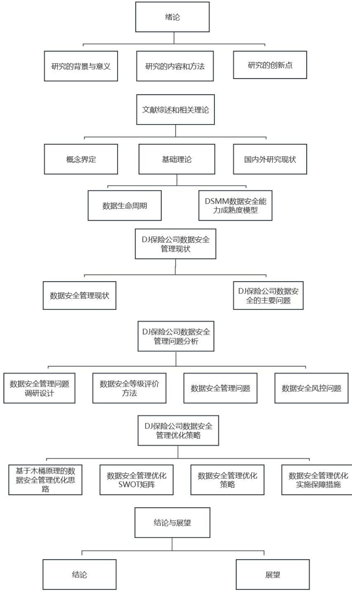

# 第1章绪论

# 1.1 研究背景与意义

# 1.1.1研究背景

近年来，网络安全问题频繁涌现，如“想哭”和“坏兔子”等事件，使得网络信息安全形势日益严峻。针对这一趋势，国务院于2014年2月成立了国家网络安全与信息化工作领导小组，凸显了我国对网络安全问题的高度重视和积极应对态度。2016 年11月，中华人民共和国网络安全法的颁布实施进一步明确了对网络安全、网络信息安全等方面的规范，为保障国家网络安全提供了更加有力的法律支持和保障。随着大数据和云存储等新兴技术的兴起，数据资源的重要性逐渐凸显。2017 年6 月，中共中央、国务院共同发布的《国家信息化发展战略纲要》为我国未来的信息化发展提出了明确的指导方针，强调了数据资产所有权的保护和信息安全问题的解决，为促进信息化建设和网络安全维护提供了全面而系统的指导。随着云计算、人工智能和物联网等领域技术的迅猛发展，人类社会已经从传统的“信息化”时代转向了“大数据”时代。这一转变不仅改变了人们的生活方式和工作模式，也深刻影响着各行各业的发展方向。在此背景下，“数据化管理、数据化运营、数据化决策”等管理理念逐渐深入人心，并成为了企业发展的重要战略。然而，随着企业采用大数据实现智能化的战略转变，数据安全问题逐渐凸显出来。特别是在保险行业，个人信息泄露、数据篡改、非法获取等问题屡见不鲜，给企业的信息化向数字化转型带来了挑战和障碍。如何有效解决这些问题，保障数据的安全性和完整性，成为了保险公司信息化转型过程中的关键环节和紧迫任务。当前，我国各保险公司在数据安全性方面已经做出了重大努力，并进行了深入的研究与实践，持续进行研究与创新，以应对不断增长的法规需求和多变的数据环境，不同公司在数据安全性方面仍存在着各自的提升空间。就DJ 保险公司而言，其信息化发展迅速，但在数据安全方面的管理却面临着组织、制度、技术和人员等多个层面上的问题，必须对数据安全管理状况进行科学而全面的分析，并制定有效的应对措施。只有这样，才能够尽快提高DJ保险公司的整体数据安全管理水平，确保客户和企业数据的安全性与完整性。

# 1.1.2 研究意义

本文的研究成果将为我国保险业的信息化建设提供一定的理论支撑和参考。通过对当前数据安全问题的深入剖析与评估，其他企业或机构可以更好地了解、评估和优化自身的数据安全管理系统。本文的研究成果将为提升我国企业信息化建设中的数据安全管理能力，并减少企业面临的风险提供重要的科学依据。另外，本文运用的数据安全能力成熟度评价模型（DSMM），可以科学客观地评价数据的安全性，帮助企业综合评价数据安全性并制定合理的资源分配方案。本文的研究成果将为增强企业在信息化环境下的数据安全性，提升企业的竞争能力提供新的思路和方法。此外，本文的研究结果对其他类似产业的企业在数据安全性控制方面也具有借鉴意义。随着信息技术的发展，企业对信息安全性的重视不断增强，通过研究该公司的典型案例，为其他产业和企业提供了宝贵的参考，帮助它们更好地应对数据安全性问题，提高信息系统的可靠性和稳定性。

# 1.2研究内容与方法

# 1.2.1研究内容

本文以DJ保险公司为例，对其进行了深入研究。第一章是论绪，主要介绍了本文研究的背景和意义，以确定本文的研究内容和方法。第二章介绍了数据生命周期的基本原理和数据安全能力成熟度模型（DSMM）的基本原理，以及国内外的研究现状。第三章详细介绍了DJ保险公司的数据安全现状。第四章对数据安全能力成熟度模型（DSMM）的评价过程进行了详细阐述，包括准备工作、实施过程和评价结果。基于此，从组织结构、流程制度、技术工具和人员能力等方面对 DJ 保险公司数据安全管理进行了全面分析。第五章通过数据安全能力成熟度模型（DSMM）的评价结果，对DJ保险公司数据安全管理提出优化及保障措施。第六章总结了本课题的研究成果，并探讨了未来的研究方向。

本文旨在分析DJ 保险公司的数据安全管理状况，并提出相关问题的改进建议和方法。通过这个评价过程，研究人员可以了解数据安全管理的重要性，并为未来的改进提供参考。本文的成果将加强 DJ保险公司数据的安全性，并对其他类似机构的数据安全管理工作提供借鉴。

# 1.2.2研究方法

（1）文献研究法

文献研究法指的是收集和查阅大量相关文献，并对其进行整理和研究，以获得科学方法和研究结论，并将其应用于自己的研究内容。然后通过归纳和规划，对相关内容进行系统梳理。本论文在参考了国外数据安全管理方面的研究

结果和经验后，对DJ保险公司信息系统的数据安全管理进行了系统研究，并剖析了存在的问题，提出了一种有效的解决方法。

# （2）案例分析法

本论文主要研究了DJ 保险公司数据安全管理，通过对该企业现有的数据安全管理状况进行深入剖析，发现了该企业在数据安全管理方面存在的不足之处。在此基础上，对数据安全性成熟度进行了评价，并根据评价结果提出了针对性的改进方案。

# （3）访谈法

通过访谈，直接与相关负责人、技术人员和管理人员进行沟通交流，了解他们对数据安全管理的认识、理解和实际应用情况，同时也能够收集到各方面的意见和建议。访谈对象包括DJ保险公司的信息技术部门负责人、数据安全专家、系统管理员等相关人员，以及企业的管理人员和业务部门负责人。提升数据安全管理水平，确保保险信息系统的安全稳定运行。

# 1.3 研究的创新点

数据安全能力成熟度模型（DSMM）作为一种标准的数据安全分析工具，能够提供动态的安全防护机制，有助于解决传统静态安全模型无法应对的问题。本论文的创新点在于运用 DSMM 模型，选取符合DJ 保险公司数据安全管理实际情况的过程域，来进行数据安全能力成熟度评价，实现数据安全管理的动态优化，并提供一个全面的风险管理框架。这些创新为数据安全管理的研究和实践提供了新的视角和方法，有助于DJ保险公司更有效地应对日益复杂的数据安全挑战。研究的创新点如下：

成熟度等级的量化分析。将DSMM 模型应用于数据安全管理中，创新地提出了一种量化分析数据安全成熟度的方法。通过选取适用评价指标体系和评分机制，能够对DJ保险公司的数据安全水平进行分级，并明确了成熟度等级与相应安全管理措施的对应关系，为组织提供了清晰的优化目标和实施步骤。

动态数据管理策略的制定与执行。研究中的另一创新点是利用 DSMM 模型来动态调整安全策略。与传统的静态安全模型不同，DSMM 模型可以根据数据安全成熟度的变化实时提出改进建议。

全面的风险识别与管理。将 DSMM 模型与风险管理体系相结合。模型不仅涵盖了技术层面的风险因素，还包括了人员、流程和政策等非技术层面的考量，为组织提供了一个立体的风险管理视角。

  
图1-1技术路线图
