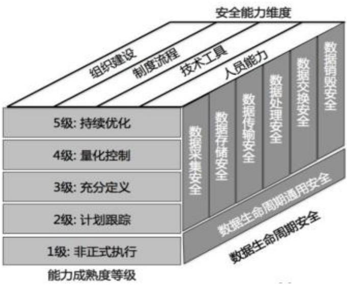
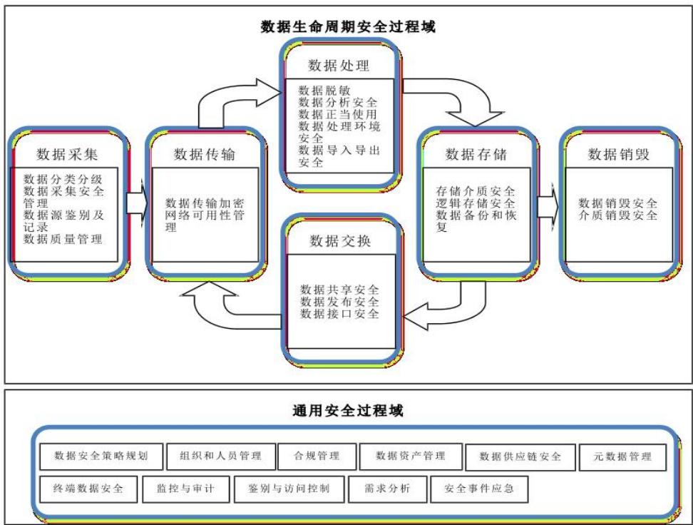
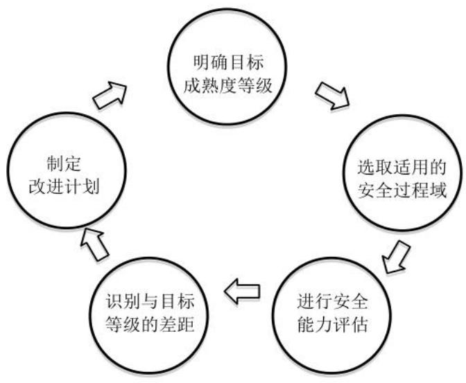

# 第2章 文献综述及基础理论

# 2.1概念界定

# 2.1.1保险信息系统

保险信息系统是一个用于保险业务经营和管理的电脑系统。通过该系统保险公司可有效管理信息和业务流程，以提高整体运营效率。

(1)保险产品管理：可以登记和管理保险公司拥有的产品种类、名称、承保责任、保费计算规则等。此外，根据客户需求和市场变化，软件还可以优化产品设计。

(2)保单管理：对保单信息进行有效管理，包括保单持有人基本信息、保单状态、被保险人信息、保费支付等。通过管理客户保单，可以追踪客户保单状态和更新情况，提升管理水平和精度。

通过建立和运用保险资讯系统，企业能更好地理解和把握市场需求，生产出有竞争力的产品和服务。建立和运营保险资讯系统需要企业与科技厂商密切合作，以确保系统稳定和安全，并加强人员培训和管理方法，提升使用技能。

# 2.1.2数据安全管理

数据的安全性涵盖了两个方面：第一，对数据本身的保护，包括保护数据的隐私性、可用性和完整性；第二，数据的备份和存储，定期进行备份，并采用磁盘阵列等技术来保障数据的安全。

与数据安全治理相比较，数据安全的管理侧重于数据安全的控制和实施，通常以标准和规范的方式来表达和实际执行。企业数据管理主要目标是确保良好的运营。在整个数据生命周期中，为数据的采集、传输、存储、使用、交换和销毁等环节设置适当的管理限制和保障确保数据的安全性，同时不降低企业的运营效率。

在此基础上，对数据安全性进行了详细划分，主要包括网络数据安全性、终端数据安全性、存储数据安全性和业务数据安全性等方面。在安全性方面，关联收集数据和可靠性分析、数据安全监测、数据加密和敏感数据隔离与交互等。从安全管理、流程标准、制度规范到技术工具和专业技术能力等方面都需要提供全面的保障，以建立的完善的数据安全标准和数据安全管理体系。

# 2.2基础理论

# 2.2.1 数据生命周期

所有的数据都有一定的寿命，阿里巴巴牵头建立的数据安全能力成熟度模型指出，完整的数据寿命包括从建立、获取、使用、传输、存储到销毁的整个过程。因此，要对数据的安全性进行分析，必须从数据的整个生命周期入手。由于企业的实际经营情况，各单位对其进行分类的方式不尽相同。根据 DSMM 模型的分类方式，以下对每个生命周期的不同阶段进行了界定：

（1）数据采集阶段：企业在获得数据时会经历一个流程。数据可以是企业自己产品相关的，也可以来自其他机构或个人。在这个阶段，主要任务是对新收集到的数据进行分类、分级管理、鉴别和记录等工作。(2）数据传输阶段：通过网络或硬件传输设备收集的数据，以确保数据传输的安全性和执行效率。(3）数据存储阶段：将数据以实体存储或云端存储的方式储存在各单位中，并采取流程化处理，以确保数据保存介质和数据保存逻辑的安全性。(4）数据处理阶段：在主体和内部组织中，对数据收集整合，进行合理计算分析以及流程化操作。同时，还需要对整个流程进行加密确保分析的可靠性。(5）数据交互阶段：在数据调用的过程中，与外部的组织或者单一的个体进行数据的交互动作的一个重要环节。(6）数据销毁阶段：意味着完全清除存储介质（如终端机和服务器）中的数据，使其无法通过任何方式进行恢复，并包括对存储介质进行破坏。

# 2.2.2 DSMM 数据安全能力成熟度模型

数据安全能力成熟度模型（Data Security Capability Maturity Mode，简称 DSMM）是阿里巴巴和中国电子技术标准化研究院在大量实践和研究的基础上，联合三十多家企事业单位共同研究制定的。基于此模型，国家标准委于 2019年8月30日正式发布了《信息安全技术数据安全能力成熟度模型》（GB/T37988–2019）。

DSMM评价以组织为单位，以数据为中心，围绕数据的生命周期对组织建设、制度流程、技术工具以及人员能力4个安全能力维度进行评价，如图2-1所示。DSMM 涵盖5 个成熟度级别、30 个数据安全能力过程域和 576 个基本实践。在此基础上，以安全能力、成熟度等级、数据生命周期安全3个维度进行整体的数据安全能力成熟度评价。

1）维度一：安全能力（4个关键能力）安全能力维度明确了组织在数据安全领域应具备的能力，包括：组织建设、制度流程、技术工具和人员能力。

2）维度二：能力成熟度等级（5级）共分为5级，具体包括：1级是非正式执行级，2 级是计划跟踪级，3 级是充分定义级，4 级是量化控制级，5 级是持续优化级。

3）维度三：数据安全过程（ $6 { + } 1$ ）具体包括：数据生命周期安全过程（数据采集安全、数据传输安全、数据存储安全、数据处理安全、数据交换安全、数据销毁安全）和通用安全过程。

  
图2-1DSMM 数据安全成熟度模型

DSMM 的标准适用范围非常广泛，没有行业的限制，对数据安全有需求、关注自身数据安全能力建设情况的组织均适合，包括但不限于数据运营组织、数据处理组织、数据服务提供组织等，通用的评价流程如下：

（1）数据生命周期：数据安全过程领域是一个动态系统，将数据的生命周期划分为采集、传输、存储、处理、交换和销毁六大环节。每个环节又可以进一步细分为若干流程领域和跨流程领域。总共有 30 个流程领域组成的数据安全流程领域系统，具体见图2-2所示。

（2）安全能力：在此基础上，提出了一种基于DSMM的数据安全性评价方法。

1）组织建设，主要是指企业根据自己的具体状况和具体需求，来设计并构建一个数据安全的组织结构。

2）制度流程，侧重于对企业内部的信息安全进行系统化的设计。

3）技术工具，通过各种技术方法和生产工具来实施安全性需求，自动化一些数据的安全管理工作。

4）人员能力，在评价数据安全性时，需要特别关注确保实施该系统的每个员工具备足够的安全知识和相关职业素质。

（3）能力成熟度等级：在此基础上，将不同的能力成熟度分为五个层次。

第一层：非正式的，即根据经验进行问题处理；第二层：规划追踪级别，对数据安全性管理进行了形式上的界定与管控，但并不完全；第三层：恰当界定级别，对数据安全性进行全面的管理与控制；第四层：定量管控，根据经营需要适时优化管理；第五层：安全人员根据最新的管理准则适时进行相应修改，随着业务发展水平的提高，保险的风险管理水平也相应提高，以提高企业的效益。

（4）使用流程：DSMM 建议将评价过程划分为5个步骤，构成一个完整的评价闭环。在应用该模式时，企业应根据其数据安全策略确定期望实现的目标成熟度水平。基于这个水平，通过6 个不同的数据生命周期阶段，分别评价各个层次的安全性。然后与 DSMM 规范进行比较，找出当前数据安全状况与指标的差异，并提出改进和实施方案。

  
图2-2DSMM模型数据生命周期及过程域划分

随着保险行业的发展，保险企业需要按期的追溯和确认数据安全目标成熟度水平，实时进行各方面的问题调整解决以实现目标。提升数据安全成熟度是一个持续不断的过程，上述几个能力的相互配合，构建了企业的数据安全能力，如下图2-3所示。

  
图2-3DSMM模型使用流程

# 2.3国内外研究现状

# 2.3.1关于数据安全管理的研究

近年来，国内外学者从各个角度进行了大量的研究，并在此基础上进行了大量的研究。目前的研究重点是数据加密技术，访问控制技术，脆弱性技术等。首先，对信息进行加密处理，以保证信息的安全性。如何设计出更有效、更安全的密码算法来保障信息的机密性是国内外研究的热点。El-Bayeh（2020）在无指导运算的情况下，给出了一种新的全同态加密方案。这种算法可以避开常规的自举运算，极大地提升了算法的计算效率。其次，为了保证数据的安全性，对权限管理进行了有效的管理。目前国内外的研究主要集中在对各种类型的用户进行数据存取的问题上["”。PascualJ(2021)，在此基础上设计了一种新的面向属性的访问控制算法，该算法使得管理者可以通过对不同类型的数据进行有效的动态调整。该方案克服了以身份为基础的权限管理方式所带来的局限性，增强了权限管理的可靠性和柔性。其中，脆弱性的研究一直是数据安全研究中的一个重要课题。国内外的研究主要集中于对数据安全体系的缺陷进行研究，以期对数据安全体系进行有效的修复和完善[²。SaraviVS（2021）在对操作系统脆弱性进行了深入研究的基础上，给出了一种新的针对操作系统脆弱性的新思路。该方法能够高效地检测并修复已存在的安全漏洞，并对其进行修复[³。AmiriZ(2022)指出，“糟糕的安全性不安全”概念不仅在于其技术手段，更在于对整体体系的安全进行综合考量。他相信，如果将安全植入到整个体系的设计与执行当中，就不可能保证真实的数据安全[。PopescuT（2021）从企业与政府两个层次研究了数据安全问题。他从经济学的视角出发，将安全决策看作是一种经济行为，必须对其进行成本和效益的平衡，以达到最佳的安全管理。他着重指出，为了保证数据的安全，必须把安全整合到机构的过程和策略之中[5]。目前，对于信息系统的安全性，国内外已有较多的探讨与分析。一方面，为了确保信息的机密性与完整性，研究者们必须对其进行了深入的研究。另外，他们还关心有关机构及数据安全性的相关制度。

目前，我国在数据安全方面的研究已经取得了一些成果。朱孟周（2021)对计算机信息的安全性进行了研究，提出了一种新的面向网络环境下的网络安全监测算法，能够自动分析网络流量并辨识可能存在的网络安全隐患[²。郑恒河和杨业平课题组（2021）致力于研究现实中的信息安全问题，设计了一种基于用户权限和角色的数据存取控制方法，以保障数据的安全[7-⁸]。陆莉（2019）利用差分隐私进行非标识化研究，既保证了用户信息的安全性，也确保了用户的合法性和高效性[。莫言池（2021）研究了数据存储和还原，计划利用云计算技术构建一套面向大规模网络的分布式存储系统，在保证网络安全和可靠性的前提下提升数据还原性能[°]。李超（2022）研究了信息安全在信息系统中的应用，提出了一种快速检测和拦截网络攻击的算法，保证数据安全。

我国学者在数据安全管理研究方面取得了一定成果，并从不同角度提出了自己的见解。这个项目的研究将为该领域的实际应用提供坚实的理论和技术支持。然而，目前仍面临数据隐私保护和网络安全等问题，需要未来进行更深入的研究[""。周轩（2020）提出，建立高效的数据安全保护机制是解决这一问题的关键，同时提出了一种基于密码学的信息保密方法，通过访问控制来保证信息的完整性和有效性[1²³。陈月华（2020）提出了强化信息保密保障体系下的信息安全问题，针对当前信息急剧增长的背景，提出了一种基于数据脱敏、匿名化和审核的方法，以确保用户的隐私不会泄露和滥用[1³。我国在这方面的研究具有一定的参考价值。希望通过这个项目的研究，能提出更高效、实用的方法来解决网络环境下的数据安全问题。

# 2.3.2 关于保险行业数据安全管理的研究

近年来，保险业在信息化方面取得了较高的进展，对信息的安全性要求也越来越高。国际上已经对这一问题进行了大量研究。KayserJ（2020）指出，保险业面临着信息安全和信息泄漏的最大挑战，以云计算为基础的安全管理策略可确保保单信息的隐私和有效性[14]。Bellgard M（2020）认为，现有的网络保险服务体系存在口令不够严密、隐私信息无法有效防护等问题。因此，申请人计划研究基于区块链的保险信息安全保障机制，通过分布式记账、智能合约等手段提高数据的透明度和安全性[15]。PascualJ（2021）提出，保险业需要建立完整的数据安全监管体系，并提出了基于数据分类、访问控制、加密、监视和审计的架构，以确保数据在传输、存储和处理过程中的安全性[¹]。InuzukaS（2021)指出，保险业应采取综合性的安全保障措施来确保信息的安全性，包括主机安全、网络安全、应用软件和数据库安全等方面，建议采用多层次的安全策略来降低内外部威胁[17]。AffiS（2021）提出，解决保险业中的数据安全问题需要从技术和政策层面进行研究。他强调采取技术手段，如加密和访问控制，以避免数据被盗或滥用，并建议制定明确的法律法规以保障个人数据的隐私权[¹⁸”。NazK（2021）研究了一种新的网络信息安全机制，认为通过共享数据，保险公司可以提高数据安全性并侦测欺诈行为[。总体而言，我国保险业在信息化建设中对数据安全进行了深入研究。学者们从不同角度出发，提出了各自的见解和对策，对未来的研究和实践具有借鉴意义。

目前，国内外研究主要集中在云计算技术、区块链技术和多层次安全机制等方面，通过构建完整的数据安全管理体系、提高数据透明度和安全性，以及完善的安全保障体系，为保险业的数据安全提供保障。本文的研究成果将为我国保险业在数据安全领域的应用提供有益的参考和启示。对于保险业来说，对网络中的数据进行安全性分析非常重要，因为这不仅会影响企业的正常运营，还会影响用户的信息安全。牛春华、王泽涌（2019）在他们的研究中发现，我国保险业的数据安全管理面临黑客攻击、员工内部犯罪和自然灾害等多重风险。为了保障消费者的隐私，必须建立健全的网络结构、安全的策略和监控系统[2°]。王艳军、汪火明、张鞠成（2022）认为，我国保险业应加大对相关业务的培训力度，提升员工的信息化知识与技术能力。在此基础上，他们提出，在信息化发展过程中，保险业应重点关注人工智能、区块链等新兴科技的发展，以提高对金融体系中数据安全性的管理能力[21-23。邱彬（2022）在此基础上进行了深入研究，建立了一套新的风险评估体系[²4]。研究结果显示，谭健（2023）利用深度学习方法能够发现并抵御网络攻击，增强信息安全[²]。江迎、杨舒、程兵（2021）对我国保险业信息安全监管中存在的问题进行了探讨。他们认为，在保障消费者隐私信息安全方面，应严格按照国家有关规定，制定一套完善的个人数据保障体系。张新文（2020）指出，保障用户信息安全与隐私是保险业发展必须面对的重大问题。他针对目前我国保险企业数据安全管理中出现的数据泄漏、信息安全风险评估缺失等问题，拟通过对我国保险业数据安全管理现状的深入剖析，并采取相应的治理措施进行改善[29]。赵沛、汪允敏（2020）提出了从技术层面、人力层面和制度层面对保险业中的信息安全性进行全面的研究。他们以我国保险业为背景，围绕我国保险业信息化体系结构与保障体系构建展开研究，构建面向我国保险业发展的大数据安全保障体系，并以实证研究为基础进行实证研究[30-3]。他们对我国保险业的数据安全管理体系建设、新兴技术应用、人才培养、入侵检测模式、风险评估以及相关的法规等多个层面进行了研究。这些研究对我国保险业的信息化建设有一定的借鉴意义。

# 2.3.3文献述评

通过对当前国际上数据安全管理研究情况的分析，可以看到随着信息技术的迅速发展，数据类型和数量都在迅速增加，也带来了数据安全的问题。虽然在海外对于数据安全的认识、研究和实践都比较早，但是我国也开始高度关注数据安全，并进行了相应的研究，法律法规也在逐步完善，并在实践中积极探讨。从一个更宽泛的信息安全理念转向更精确的数据安全管理，以实现更精细的管理。在国内外的研究进程中，国内外的研究存在一些区别。国外在建立完善的数据安全管理体系方面，注重数据分析、风险防范和系统优化，而我国则更关注制度建设、过程控制和风险管理。目前关于保险业数据安全管理和管控等方面的研究越来越多，但是对于我国股份制商业保险数据安全策略的研究和分析还不够全面、具体，缺乏针对性和目的性。对于保险行业而言，应从整体数据安全管理的角度出发，加强相关法律法规，提高数据安全保护能力。