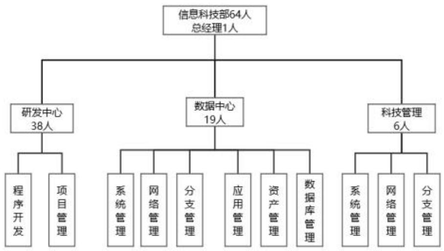
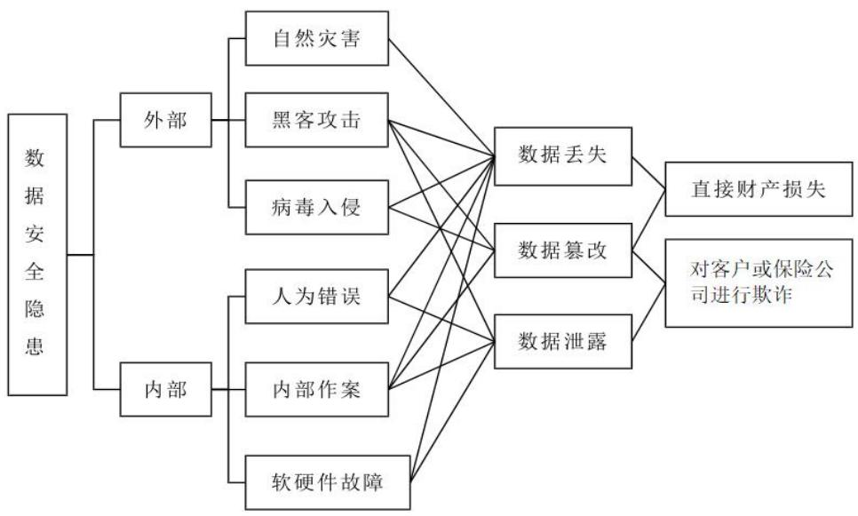
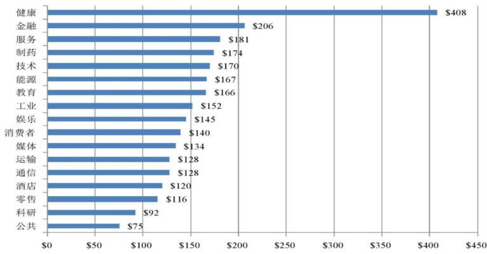

# 第3 章DJ保险公司数据安全管理现状

# 3.1DJ保险公司数据安全现状

# 3.1.1DJ保险公司基本情况

保险公司是我国第一个股份制商业保险公司，公司成立于1994 年，由企业出资组建。公司拥有1000 多个分支机构的大型保险公司，总资产超过200 亿元人民币，并入选中国 500 强。公司在国内各省设有分支机构，总部位于A省，其经营范围关联该省的人身险产品。随着企业规模的扩大，重要的业务数据和敏感的客户信息数据持续增长，导致整个数据安全管理变得愈加困难，因此建立一套完整的数据安全管理体系并对其数据安全管理进行提升尤为重要，以便对数据进行标准、规范、的安全管理。

# 3.1.2管理现状

（1）组织机构设置

目前，DJ保险公司的高级管理层尚未设立有关数据安全层面的组织机构，而是由已经成立的“信息化管理委员会”全面统筹规划DJ保险公司信息系统的数据安全管理工作。该委员会以三年为一个周期制定了信息安全发展规划，审议通过了各组织机构提交的信息安全评估报告，并根据监管要求和DJ保险信息安全管理工作的当前实际情况，制定了突发事件管理方案。此外，增设了一个科技管理岗来加强数据安全管理工作，组织结构如下图所示。

  
图3-1DJ保险公司信息科技部架构图

科技管理岗位的主要工作是对DJ保险公司整体的信息系统建设和运营管理进行架构设计，制定流程标准和制度规范，审核方案、管理监督部署实施工作，对资源的合理分配，进行质量管控，定期审查等工作。同时，对研发中心和数据中心的工作进行规范化管理，在上述的岗位职责中，安全管理工作有3名员工，对信息系统的数据安全进行监测、指导和管理。他们还需负责本部门负责的系统、网络和媒体的数据安全性工作，并且需要监督开发中心和数据中心各个岗位的工作。总公司各个部门和分公司都没有设立专门的数据安全管理职位，也没有兼职的数据安全管理工作。对于这些部门和分公司所管辖范围内的分支机构，或者是各个分支机构内部的数据安全日常管理任务都落在综合管理部的工作人员身上。

# （2）管理制度体系

DJ保险公司在设立之初就制定了一套管理程序，覆盖了内部控制、安全操作、网络管理、应用开发和业务连续性，旨在有效防范和解决信息安全问题。这些程序包括《DJ保险信息安全管理制度》、《DJ保险重要密码管理规定》、等 30 多项制度和标准。然而，这些措施和标准零散地分散在不同的管理办法和规范制度当中，没有形成完整的体系建设。近些年，保险行业有关的信息安全事故频发不断，国家监管部门加大了对保险公司的监督力度，频繁发布关于从信息安全管理转向数据安全管理的详细工作要求。同时，一些保险公司也在补充和完善数据安全管理相关制度规范，以提升数据安全管理水平。

# （3）安全保护措施

经过多年的建设和实践，DJ保险公司已经成功建立并实施了相关的信息安全保障措施。为了实现内部网络的接入控制，采用了基于内部网络的接入方式。这种方式利用中心交换机将内部网络区域分区并进行隔离，从而实现对区域间的访问控制。同时，实现了外部互联网、内部生产网、内部测试网、办公网的网络区域隔离和交互限制。在防病毒和入侵方面，建设了主机安全监测系统和补丁更新管理系统，以实时监测病毒和非法入侵行为，以及系统漏洞的发现，并且能够对网络内计算机统一下发安全补丁，实现了办公软件和数据中心服务器的管理的自动化，有效监测了恶意入侵事件，保证了公司系统的安全性。

# 3.1.3数据现状

DJ保险公司的数据大多来自于各保险业务所属信息系统运营过程中相互交互所产生的数据，一个完整的业务流程需要在财务系统、风控系统、数据库平台、数据存储平台中进行处理、流转和保存。根据所产生的数据，DJ保险公司的数据大致可以分为十个类别，通过对数据进行调研与统计，具体数量见表3-1。

表3-1DJ保险公司数据类别  

<table><tr><td>数据种类</td><td>数据内容</td><td>数据量</td></tr><tr><td>客户数据</td><td>个人基本信息、职业与收入信息、健康状况、财产（对于财产险 或车险）保险申请、政策信息、信用和金融信息、偏好与行为数、 社交媒体和网络行为、其他相关数据。</td><td>0.05TB</td></tr><tr><td>账户数据</td><td>账户基本信息、保单详情、客户联系信息、支付和交易记录、索 赔历史和记录、客户服务互动记录、续保和变更记录、认证和 安全信息。</td><td>0.03TB</td></tr><tr><td>交易数据</td><td>保单销售数据、客户付款信息、账户余额、续保和变更交易、索 赔处理数据、退款、内部对账和审核记录、外部接口和合作方交 易数据等。</td><td>4.4TB</td></tr><tr><td>决策分析数据</td><td>基于销售数据、客户行为和风险评估等数据生成指数以及分析数 据，该数据反映的是保险市场和销售情况为决策提供参考。</td><td>9.8TB</td></tr><tr><td>监管报送数据</td><td>根据监管要求汇总的保险公司整体经营的监管数据，按周期定期 报送监管部门。</td><td>2.5TB</td></tr><tr><td>日志数据</td><td>用户交互的业务数据用于历时事件回溯等情况。</td><td>9.2TB</td></tr><tr><td>图片数据</td><td>保险业务办理过程中客户基本信息、交易信息的图片。</td><td>55.6TB</td></tr><tr><td>音频\视频数据</td><td>客户服务留存数据、业务办理过程中的录音数据，理财保险业务 中进行的录音录像数据等。</td><td>13.2TB</td></tr><tr><td>办公文档</td><td>包括签报、表格、扫描件、邮件等</td><td>0.6TB</td></tr><tr><td>其他数据</td><td>其他数据产生等</td><td>5.2TB</td></tr></table>

数据来源于：保险数据档案汇总表

# 3.2 DJ 保险公司数据安全的主要风险

DJ保险公司的数据几乎覆盖了整个经营管理过程，包括从手机终端到办公室计算机，再到数据中心的计算机。这意味着在数据的创造者、用户和管理者之间存在各种安全风险，同时还面临外部网络入侵和攻击的威胁。数据安全事故可能由系统故障引起，员工的故意行为也可能导致数据泄漏和篡改，外部攻击导致数据泄漏、篡改和删除等问题。这些安全事件不仅会对DJ保险公司的品牌和信誉造成重大损害，还可能给客户和 DJ保险公司带来巨大的经济损失。

为了提高应对信息系统突发事件能力，最大程度地预防和减少因为信息系统突发事件使业务中断而造成的生产、经营和管理损失，保障DJ保险公司信息系统业务可持续运行，根据《中华人民共和国突发事件应对法》《中华人民共和国网络安全法》《国家突发公共事件总体应急预案》《突发事件应急预案管理办法》《银行业保险业突发事件信息报告办法》《信息系统技术信息安全事件分类分级指南》等法律法规、监管规定和公司制度。DJ保险公司对信息系统突发事件进行了分类，根据突发事件发生的原因、表现形式等，分为内部和外部两大类，外部包括：自然灾害、黑客入侵、病毒入侵；内部包括：人为错误、内部作案、软硬件故障，如图3-3所示。

  
图3-2数据安全事件造成损失的机理

为了更加全面了解当前DJ 保险公司数据安全管理现状，本文对DJ 保险公司信息科技部管理者及一线员工进行了关于数据安全管理现状访谈，访谈人数为5人，访谈周期为2023.12.5-12.10日，每次访谈时间为每人1小时。

表3-2受访者基本信息  

<table><tr><td>姓名</td><td>性别 岗位</td></tr><tr><td>张先生</td><td>男 技术员</td></tr><tr><td>李女士</td><td>女 经理</td></tr><tr><td>黃女士</td><td>女 技术员</td></tr><tr><td>赵先生</td><td>男 技术员</td></tr><tr><td>程先生</td><td>男 技术员</td></tr></table>

# 3.2.1数据丢失

由于恶意攻击、人为误操作、侵入病毒、设备或软件故障、不可抗力的灾难等原因造成数据丢失，如果没有有效的备份和恢复措施，将很难恢复丢失的数据。即使依靠昂贵的恢复公司，恢复效果也无法确定，这会给DJ 保险公司带来巨大的经济损失，并增加其经营管理费用。据德克萨斯州的一项调查显示，如果关键信息丢失，只有 $6 \%$ 的公司能够幸存下来， $5 1 \%$ 的公司可能会在两年内倒闭，而 $4 3 \%$ 的公司则会完全消失。从所有数据损失事件来看，只有 $2 1 \%$ 是由黑客和病毒攻击造成的，而 $7 9 \%$ 的损失是由于公司员工的错误操作、系统故障等原因引起的，这表明企业在管理数据安全方面非常必要。

经访谈了解到：当前公司面临的数据丢失风险主要源于多方面的因素。黑客攻击是导致数据丢失的重要原因之一，尤其是随着网络安全威胁的增加黑客不断改进攻击手段，每年的攻击姿势和攻击手段都不同，使得公司的信息系统更加容易受到威胁。人为操作失误也是一个不可忽视的因素，员工在日常操作中会出现误操作情况导致重要数据的丢失，这种情况几乎每年都会发生。另外，软硬件故障和自然灾害也可能导致数据丢失，尤其是如果没有有效的备份和恢复措施，将会增加数据丢失的风险。

经访谈了解到：公司在日常工作中面临的数据丢失风险确实令人担忧。受访者部门中，员工们时常需要处理大量的客户数据，而这些数据的安全性至关重要。然而，由于工作压力大和时间紧迫，有时候员工可能会在操作过程中疏忽大意，导致数据丢失的风险增加。

经访谈了解到：在最近一次安全事件中，发现公司遭受了一次严重的黑客攻击，导致大量客户数据泄露。黑客通过钓鱼邮件成功钓鱼入侵了系统，并在内部网络中安装了恶意软件。这些恶意软件导致了数据库的损坏和数据的篡改，最终使用停止服务断开网络措施来停止攻击，阻止攻击来源后再恢复受影响的系统。员工在日常操作中也存在疏忽大意的情况。最近，一名员工误将重要的客户数据保存在了错误的文件夹中，并在不知情的情况下将其删除，导致数据无法恢复。在另一次事件中，一台服务器由于硬件故障而突然宕机，导致存储在其中的数据丢失。这些事件都凸显了公司在数据安全方面面临的严峻挑战。

综上，DJ保险公司面临着来自黑客入侵、内部人员失误等多方面的数据丢失风险。这些风险可能导致DJ 保险公司的核心数据不完整，给公司和用户带来严重的经济损失和信任危机。因此，保护数据的安全性是DJ 保险公司数据安全管理的重要任务，必须采取有效措施来预防和应对数据泄露风险。

# 3.2.2 数据篡改

恶意攻击、入侵病毒和人为等因素都可能造成实际数据的丢失或破坏，损害数据的完整使用和安全可靠性。当完整的数据被恶意破坏时，企业将面临大量数据失效，导致巨大的经济损失。此外，由于用户对信息的信任度较低，访问错误数据可能会给他们带来经济上的直接损失。在某些情况下，数据篡改者甚至可以利用这些信息欺骗 DJ保险公司或用户，造成无法弥补的损失。不准确的数据也会直接导致DJ 保险公司做出错误决策，对经营产生不利后果。

经访谈了解到：恶意攻击、入侵病毒和人为等因素是最常见和频发的导致数据篡改原因之一。数据的完整使用和安全可靠性遭到破坏时会导致的生产安全故障，包括大量数据失效、经济损失以及用户信任度下降带来的直接损失。数据篡改被利用来欺骗 DJ保险公司或用户，造成无法弥补的损失。保护数据的完整性和可信性对于DJ保险公司至关重要，必须采取措施来防止数据篡改的发生。

经访谈了解到：黑客攻击、病毒攻击和人为伪造等因素可能导致数据的破坏，从而影响数据的完整性和可信性。企业面临的巨大经济损失和用户信任度下降的可能性，并指出数据篡改可能被利用来欺骗保险公司或用户，导致无法弥补的损失。加强对数据的监控和管理是预防数据篡改的关键，同时也需要提高员工的安全意识，加强数据安全防护措施的建设。

综上，DJ保险公司面临着来自黑客攻击、病毒攻击和人为伪造等多方面的数据篡改风险。这些风险可能导致数据的破坏，影响数据的完整性和可信性，进而给 DJ 保险公司带来巨大的经济损失和声誉风险。因此，保护数据的完整性和可信性是DJ 保险公司信息安全部门的重要任务，必须采取有效措施来预防数据篡改的发生。

# 3.2.3 数据泄露

黑客入侵或内部人员的失误可能导致数据被盗取，从而威胁到数据的隐私性。当关联到公司策略性信息的泄漏时，公司将失去竞争优势；一旦用户个人数据被泄漏，可能导致勒索或财产损失。根据美国波耐蒙研究院（BennemontInstitute）在2022 年进行的数据泄漏成本分析报告，超过一半的信息泄漏事件是由系统故障或人为失误引起的，其中包括金融领域在内的所有损失都排名第二，详细情况请参见图 3-4。与此同时，数据泄漏的方式多种多样，不仅存在于企业的计算机中，还可能存在于个人电脑、个人邮箱、笔记本电脑、移动办公设备等。数据泄露方面，无论是在编员工或外部服务人员，均可能存在有意或无意的行为。

  
图3-3工业部分列数据泄露的人均成本

数据来源于：2023年工信部网络安全信息与动态周报

经访谈了解到：黑客入侵或内部人员的失误可能导致数据被盗取，从而威胁到数据的隐私性。数据泄露可能带来的严重后果，包括公司失去竞争优势、用户个人数据被利用导致勒索或财产损失等。

经访谈了解到：数据泄露可能存在于多种场景中，不仅包括企业的计算机系统，还可能存在于个人电脑、笔记本电脑、移动办公设备等。无论是内部人员还是第三方外包人员，在信息泄漏方面都可能存在故意或无意的行为。加强对数据泄露风险的预防和控制的必要性，包括加强对数据访问权限的管理、加强对系统安全性的监控等措施。

综上，DJ保险公司面临着来自黑客入侵、内部人员泄露等多方面的数据泄露风险。这些风险可能导致公司的核心数据被盗取，从而影响到数据的隐私性和安全性，给公司和用户带来严重的经济损失和信任危机。因此，保护数据的隐私性和安全性是DJ保险公司数据安全管理的重要任务。

# 3.3本章小结

通过对DJ保险公司信息系统基本情况和数据安全管理现状的调研，发现数据丢失、数据篡改和数据泄露等主要风险威胁着该公司的数据安全。因此，DJ保险公司需要采取有效的措施来优化数据安全管理工作，包括改进组织架构、完善管理体系、加强技术防护、引进专业人才等措施，以确保信息系统的数据安全性和正常运转。
