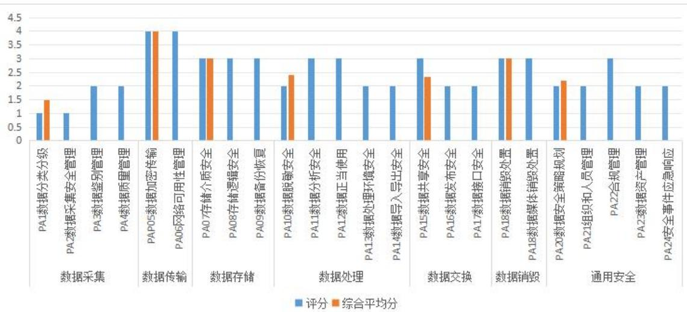
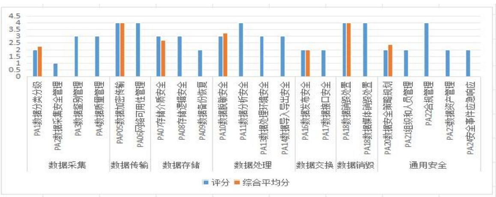
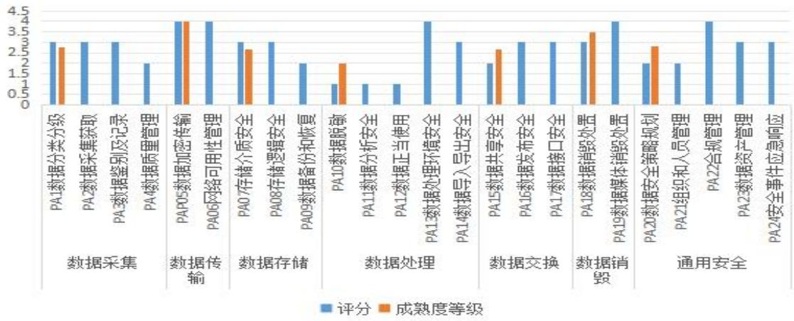
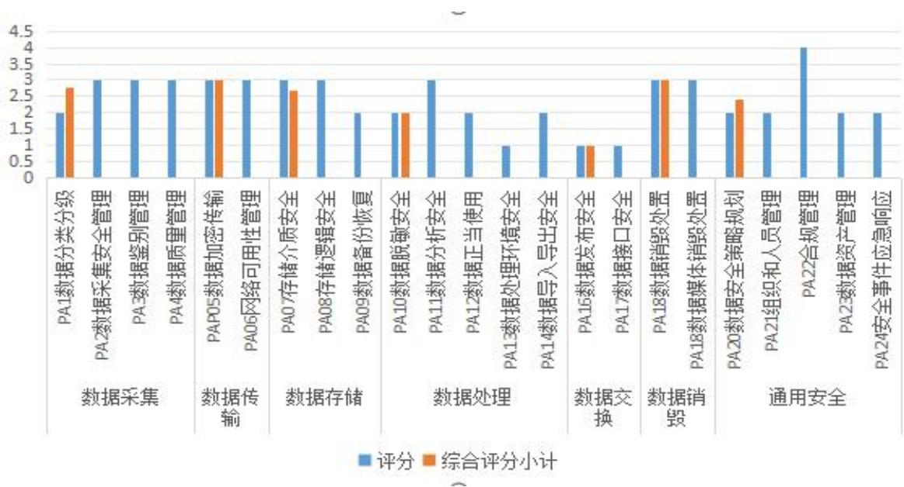
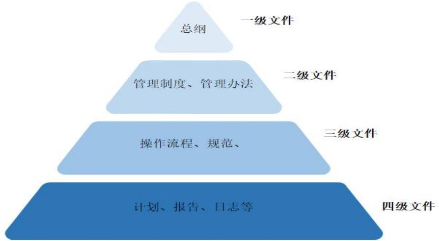
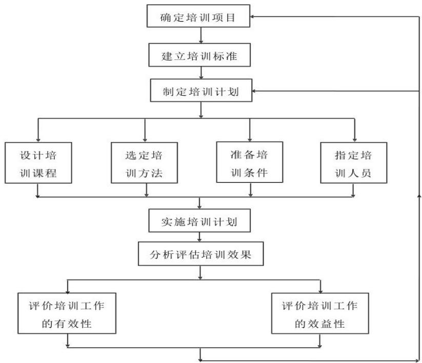

# 第1章绪论

# 1.1 研究背景与意义

# 1.1.1研究背景

近年来，网络安全问题频繁涌现，如“想哭”和“坏兔子”等事件，使得网络信息安全形势日益严峻。针对这一趋势，国务院于2014年2月成立了国家网络安全与信息化工作领导小组，凸显了我国对网络安全问题的高度重视和积极应对态度。2016 年11月，中华人民共和国网络安全法的颁布实施进一步明确了对网络安全、网络信息安全等方面的规范，为保障国家网络安全提供了更加有力的法律支持和保障。随着大数据和云存储等新兴技术的兴起，数据资源的重要性逐渐凸显。2017 年6 月，中共中央、国务院共同发布的《国家信息化发展战略纲要》为我国未来的信息化发展提出了明确的指导方针，强调了数据资产所有权的保护和信息安全问题的解决，为促进信息化建设和网络安全维护提供了全面而系统的指导。随着云计算、人工智能和物联网等领域技术的迅猛发展，人类社会已经从传统的“信息化”时代转向了“大数据”时代。这一转变不仅改变了人们的生活方式和工作模式，也深刻影响着各行各业的发展方向。在此背景下，“数据化管理、数据化运营、数据化决策”等管理理念逐渐深入人心，并成为了企业发展的重要战略。然而，随着企业采用大数据实现智能化的战略转变，数据安全问题逐渐凸显出来。特别是在保险行业，个人信息泄露、数据篡改、非法获取等问题屡见不鲜，给企业的信息化向数字化转型带来了挑战和障碍。如何有效解决这些问题，保障数据的安全性和完整性，成为了保险公司信息化转型过程中的关键环节和紧迫任务。当前，我国各保险公司在数据安全性方面已经做出了重大努力，并进行了深入的研究与实践，持续进行研究与创新，以应对不断增长的法规需求和多变的数据环境，不同公司在数据安全性方面仍存在着各自的提升空间。就DJ 保险公司而言，其信息化发展迅速，但在数据安全方面的管理却面临着组织、制度、技术和人员等多个层面上的问题，必须对数据安全管理状况进行科学而全面的分析，并制定有效的应对措施。只有这样，才能够尽快提高DJ保险公司的整体数据安全管理水平，确保客户和企业数据的安全性与完整性。

# 1.1.2 研究意义

本文的研究成果将为我国保险业的信息化建设提供一定的理论支撑和参考。通过对当前数据安全问题的深入剖析与评估，其他企业或机构可以更好地了解、评估和优化自身的数据安全管理系统。本文的研究成果将为提升我国企业信息化建设中的数据安全管理能力，并减少企业面临的风险提供重要的科学依据。另外，本文运用的数据安全能力成熟度评价模型（DSMM），可以科学客观地评价数据的安全性，帮助企业综合评价数据安全性并制定合理的资源分配方案。本文的研究成果将为增强企业在信息化环境下的数据安全性，提升企业的竞争能力提供新的思路和方法。此外，本文的研究结果对其他类似产业的企业在数据安全性控制方面也具有借鉴意义。随着信息技术的发展，企业对信息安全性的重视不断增强，通过研究该公司的典型案例，为其他产业和企业提供了宝贵的参考，帮助它们更好地应对数据安全性问题，提高信息系统的可靠性和稳定性。

# 1.2研究内容与方法

# 1.2.1研究内容

本文以DJ保险公司为例，对其进行了深入研究。第一章是论绪，主要介绍了本文研究的背景和意义，以确定本文的研究内容和方法。第二章介绍了数据生命周期的基本原理和数据安全能力成熟度模型（DSMM）的基本原理，以及国内外的研究现状。第三章详细介绍了DJ保险公司的数据安全现状。第四章对数据安全能力成熟度模型（DSMM）的评价过程进行了详细阐述，包括准备工作、实施过程和评价结果。基于此，从组织结构、流程制度、技术工具和人员能力等方面对 DJ 保险公司数据安全管理进行了全面分析。第五章通过数据安全能力成熟度模型（DSMM）的评价结果，对DJ保险公司数据安全管理提出优化及保障措施。第六章总结了本课题的研究成果，并探讨了未来的研究方向。

本文旨在分析DJ 保险公司的数据安全管理状况，并提出相关问题的改进建议和方法。通过这个评价过程，研究人员可以了解数据安全管理的重要性，并为未来的改进提供参考。本文的成果将加强 DJ保险公司数据的安全性，并对其他类似机构的数据安全管理工作提供借鉴。

# 1.2.2研究方法

（1）文献研究法

文献研究法指的是收集和查阅大量相关文献，并对其进行整理和研究，以获得科学方法和研究结论，并将其应用于自己的研究内容。然后通过归纳和规划，对相关内容进行系统梳理。本论文在参考了国外数据安全管理方面的研究

结果和经验后，对DJ保险公司信息系统的数据安全管理进行了系统研究，并剖析了存在的问题，提出了一种有效的解决方法。

# （2）案例分析法

本论文主要研究了DJ 保险公司数据安全管理，通过对该企业现有的数据安全管理状况进行深入剖析，发现了该企业在数据安全管理方面存在的不足之处。在此基础上，对数据安全性成熟度进行了评价，并根据评价结果提出了针对性的改进方案。

# （3）访谈法

通过访谈，直接与相关负责人、技术人员和管理人员进行沟通交流，了解他们对数据安全管理的认识、理解和实际应用情况，同时也能够收集到各方面的意见和建议。访谈对象包括DJ保险公司的信息技术部门负责人、数据安全专家、系统管理员等相关人员，以及企业的管理人员和业务部门负责人。提升数据安全管理水平，确保保险信息系统的安全稳定运行。

# 1.3 研究的创新点

数据安全能力成熟度模型（DSMM）作为一种标准的数据安全分析工具，能够提供动态的安全防护机制，有助于解决传统静态安全模型无法应对的问题。本论文的创新点在于运用 DSMM 模型，选取符合DJ 保险公司数据安全管理实际情况的过程域，来进行数据安全能力成熟度评价，实现数据安全管理的动态优化，并提供一个全面的风险管理框架。这些创新为数据安全管理的研究和实践提供了新的视角和方法，有助于DJ保险公司更有效地应对日益复杂的数据安全挑战。研究的创新点如下：

成熟度等级的量化分析。将DSMM 模型应用于数据安全管理中，创新地提出了一种量化分析数据安全成熟度的方法。通过选取适用评价指标体系和评分机制，能够对DJ保险公司的数据安全水平进行分级，并明确了成熟度等级与相应安全管理措施的对应关系，为组织提供了清晰的优化目标和实施步骤。

动态数据管理策略的制定与执行。研究中的另一创新点是利用 DSMM 模型来动态调整安全策略。与传统的静态安全模型不同，DSMM 模型可以根据数据安全成熟度的变化实时提出改进建议。

全面的风险识别与管理。将 DSMM 模型与风险管理体系相结合。模型不仅涵盖了技术层面的风险因素，还包括了人员、流程和政策等非技术层面的考量，为组织提供了一个立体的风险管理视角。

  
图1-1技术路线图

# 第2章 文献综述及基础理论

# 2.1概念界定

# 2.1.1保险信息系统

保险信息系统是一个用于保险业务经营和管理的电脑系统。通过该系统保险公司可有效管理信息和业务流程，以提高整体运营效率。

(1)保险产品管理：可以登记和管理保险公司拥有的产品种类、名称、承保责任、保费计算规则等。此外，根据客户需求和市场变化，软件还可以优化产品设计。

(2)保单管理：对保单信息进行有效管理，包括保单持有人基本信息、保单状态、被保险人信息、保费支付等。通过管理客户保单，可以追踪客户保单状态和更新情况，提升管理水平和精度。

通过建立和运用保险资讯系统，企业能更好地理解和把握市场需求，生产出有竞争力的产品和服务。建立和运营保险资讯系统需要企业与科技厂商密切合作，以确保系统稳定和安全，并加强人员培训和管理方法，提升使用技能。

# 2.1.2数据安全管理

数据的安全性涵盖了两个方面：第一，对数据本身的保护，包括保护数据的隐私性、可用性和完整性；第二，数据的备份和存储，定期进行备份，并采用磁盘阵列等技术来保障数据的安全。

与数据安全治理相比较，数据安全的管理侧重于数据安全的控制和实施，通常以标准和规范的方式来表达和实际执行。企业数据管理主要目标是确保良好的运营。在整个数据生命周期中，为数据的采集、传输、存储、使用、交换和销毁等环节设置适当的管理限制和保障确保数据的安全性，同时不降低企业的运营效率。

在此基础上，对数据安全性进行了详细划分，主要包括网络数据安全性、终端数据安全性、存储数据安全性和业务数据安全性等方面。在安全性方面，关联收集数据和可靠性分析、数据安全监测、数据加密和敏感数据隔离与交互等。从安全管理、流程标准、制度规范到技术工具和专业技术能力等方面都需要提供全面的保障，以建立的完善的数据安全标准和数据安全管理体系。

# 2.2基础理论

# 2.2.1 数据生命周期

所有的数据都有一定的寿命，阿里巴巴牵头建立的数据安全能力成熟度模型指出，完整的数据寿命包括从建立、获取、使用、传输、存储到销毁的整个过程。因此，要对数据的安全性进行分析，必须从数据的整个生命周期入手。由于企业的实际经营情况，各单位对其进行分类的方式不尽相同。根据 DSMM 模型的分类方式，以下对每个生命周期的不同阶段进行了界定：

（1）数据采集阶段：企业在获得数据时会经历一个流程。数据可以是企业自己产品相关的，也可以来自其他机构或个人。在这个阶段，主要任务是对新收集到的数据进行分类、分级管理、鉴别和记录等工作。(2）数据传输阶段：通过网络或硬件传输设备收集的数据，以确保数据传输的安全性和执行效率。(3）数据存储阶段：将数据以实体存储或云端存储的方式储存在各单位中，并采取流程化处理，以确保数据保存介质和数据保存逻辑的安全性。(4）数据处理阶段：在主体和内部组织中，对数据收集整合，进行合理计算分析以及流程化操作。同时，还需要对整个流程进行加密确保分析的可靠性。(5）数据交互阶段：在数据调用的过程中，与外部的组织或者单一的个体进行数据的交互动作的一个重要环节。(6）数据销毁阶段：意味着完全清除存储介质（如终端机和服务器）中的数据，使其无法通过任何方式进行恢复，并包括对存储介质进行破坏。

# 2.2.2 DSMM 数据安全能力成熟度模型

数据安全能力成熟度模型（Data Security Capability Maturity Mode，简称 DSMM）是阿里巴巴和中国电子技术标准化研究院在大量实践和研究的基础上，联合三十多家企事业单位共同研究制定的。基于此模型，国家标准委于 2019年8月30日正式发布了《信息安全技术数据安全能力成熟度模型》（GB/T37988–2019）。

DSMM评价以组织为单位，以数据为中心，围绕数据的生命周期对组织建设、制度流程、技术工具以及人员能力4个安全能力维度进行评价，如图2-1所示。DSMM 涵盖5 个成熟度级别、30 个数据安全能力过程域和 576 个基本实践。在此基础上，以安全能力、成熟度等级、数据生命周期安全3个维度进行整体的数据安全能力成熟度评价。

1）维度一：安全能力（4个关键能力）安全能力维度明确了组织在数据安全领域应具备的能力，包括：组织建设、制度流程、技术工具和人员能力。

2）维度二：能力成熟度等级（5级）共分为5级，具体包括：1级是非正式执行级，2 级是计划跟踪级，3 级是充分定义级，4 级是量化控制级，5 级是持续优化级。

3）维度三：数据安全过程（ $6 { + } 1$ ）具体包括：数据生命周期安全过程（数据采集安全、数据传输安全、数据存储安全、数据处理安全、数据交换安全、数据销毁安全）和通用安全过程。

  
图2-1DSMM 数据安全成熟度模型

DSMM 的标准适用范围非常广泛，没有行业的限制，对数据安全有需求、关注自身数据安全能力建设情况的组织均适合，包括但不限于数据运营组织、数据处理组织、数据服务提供组织等，通用的评价流程如下：

（1）数据生命周期：数据安全过程领域是一个动态系统，将数据的生命周期划分为采集、传输、存储、处理、交换和销毁六大环节。每个环节又可以进一步细分为若干流程领域和跨流程领域。总共有 30 个流程领域组成的数据安全流程领域系统，具体见图2-2所示。

（2）安全能力：在此基础上，提出了一种基于DSMM的数据安全性评价方法。

1）组织建设，主要是指企业根据自己的具体状况和具体需求，来设计并构建一个数据安全的组织结构。

2）制度流程，侧重于对企业内部的信息安全进行系统化的设计。

3）技术工具，通过各种技术方法和生产工具来实施安全性需求，自动化一些数据的安全管理工作。

4）人员能力，在评价数据安全性时，需要特别关注确保实施该系统的每个员工具备足够的安全知识和相关职业素质。

（3）能力成熟度等级：在此基础上，将不同的能力成熟度分为五个层次。

第一层：非正式的，即根据经验进行问题处理；第二层：规划追踪级别，对数据安全性管理进行了形式上的界定与管控，但并不完全；第三层：恰当界定级别，对数据安全性进行全面的管理与控制；第四层：定量管控，根据经营需要适时优化管理；第五层：安全人员根据最新的管理准则适时进行相应修改，随着业务发展水平的提高，保险的风险管理水平也相应提高，以提高企业的效益。

（4）使用流程：DSMM 建议将评价过程划分为5个步骤，构成一个完整的评价闭环。在应用该模式时，企业应根据其数据安全策略确定期望实现的目标成熟度水平。基于这个水平，通过6 个不同的数据生命周期阶段，分别评价各个层次的安全性。然后与 DSMM 规范进行比较，找出当前数据安全状况与指标的差异，并提出改进和实施方案。

  
图2-2DSMM模型数据生命周期及过程域划分

随着保险行业的发展，保险企业需要按期的追溯和确认数据安全目标成熟度水平，实时进行各方面的问题调整解决以实现目标。提升数据安全成熟度是一个持续不断的过程，上述几个能力的相互配合，构建了企业的数据安全能力，如下图2-3所示。

  
图2-3DSMM模型使用流程

# 2.3国内外研究现状

# 2.3.1关于数据安全管理的研究

近年来，国内外学者从各个角度进行了大量的研究，并在此基础上进行了大量的研究。目前的研究重点是数据加密技术，访问控制技术，脆弱性技术等。首先，对信息进行加密处理，以保证信息的安全性。如何设计出更有效、更安全的密码算法来保障信息的机密性是国内外研究的热点。El-Bayeh（2020）在无指导运算的情况下，给出了一种新的全同态加密方案。这种算法可以避开常规的自举运算，极大地提升了算法的计算效率。其次，为了保证数据的安全性，对权限管理进行了有效的管理。目前国内外的研究主要集中在对各种类型的用户进行数据存取的问题上["”。PascualJ(2021)，在此基础上设计了一种新的面向属性的访问控制算法，该算法使得管理者可以通过对不同类型的数据进行有效的动态调整。该方案克服了以身份为基础的权限管理方式所带来的局限性，增强了权限管理的可靠性和柔性。其中，脆弱性的研究一直是数据安全研究中的一个重要课题。国内外的研究主要集中于对数据安全体系的缺陷进行研究，以期对数据安全体系进行有效的修复和完善[²。SaraviVS（2021）在对操作系统脆弱性进行了深入研究的基础上，给出了一种新的针对操作系统脆弱性的新思路。该方法能够高效地检测并修复已存在的安全漏洞，并对其进行修复[³。AmiriZ(2022)指出，“糟糕的安全性不安全”概念不仅在于其技术手段，更在于对整体体系的安全进行综合考量。他相信，如果将安全植入到整个体系的设计与执行当中，就不可能保证真实的数据安全[。PopescuT（2021）从企业与政府两个层次研究了数据安全问题。他从经济学的视角出发，将安全决策看作是一种经济行为，必须对其进行成本和效益的平衡，以达到最佳的安全管理。他着重指出，为了保证数据的安全，必须把安全整合到机构的过程和策略之中[5]。目前，对于信息系统的安全性，国内外已有较多的探讨与分析。一方面，为了确保信息的机密性与完整性，研究者们必须对其进行了深入的研究。另外，他们还关心有关机构及数据安全性的相关制度。

目前，我国在数据安全方面的研究已经取得了一些成果。朱孟周（2021)对计算机信息的安全性进行了研究，提出了一种新的面向网络环境下的网络安全监测算法，能够自动分析网络流量并辨识可能存在的网络安全隐患[²。郑恒河和杨业平课题组（2021）致力于研究现实中的信息安全问题，设计了一种基于用户权限和角色的数据存取控制方法，以保障数据的安全[7-⁸]。陆莉（2019）利用差分隐私进行非标识化研究，既保证了用户信息的安全性，也确保了用户的合法性和高效性[。莫言池（2021）研究了数据存储和还原，计划利用云计算技术构建一套面向大规模网络的分布式存储系统，在保证网络安全和可靠性的前提下提升数据还原性能[°]。李超（2022）研究了信息安全在信息系统中的应用，提出了一种快速检测和拦截网络攻击的算法，保证数据安全。

我国学者在数据安全管理研究方面取得了一定成果，并从不同角度提出了自己的见解。这个项目的研究将为该领域的实际应用提供坚实的理论和技术支持。然而，目前仍面临数据隐私保护和网络安全等问题，需要未来进行更深入的研究[""。周轩（2020）提出，建立高效的数据安全保护机制是解决这一问题的关键，同时提出了一种基于密码学的信息保密方法，通过访问控制来保证信息的完整性和有效性[1²³。陈月华（2020）提出了强化信息保密保障体系下的信息安全问题，针对当前信息急剧增长的背景，提出了一种基于数据脱敏、匿名化和审核的方法，以确保用户的隐私不会泄露和滥用[1³。我国在这方面的研究具有一定的参考价值。希望通过这个项目的研究，能提出更高效、实用的方法来解决网络环境下的数据安全问题。

# 2.3.2 关于保险行业数据安全管理的研究

近年来，保险业在信息化方面取得了较高的进展，对信息的安全性要求也越来越高。国际上已经对这一问题进行了大量研究。KayserJ（2020）指出，保险业面临着信息安全和信息泄漏的最大挑战，以云计算为基础的安全管理策略可确保保单信息的隐私和有效性[14]。Bellgard M（2020）认为，现有的网络保险服务体系存在口令不够严密、隐私信息无法有效防护等问题。因此，申请人计划研究基于区块链的保险信息安全保障机制，通过分布式记账、智能合约等手段提高数据的透明度和安全性[15]。PascualJ（2021）提出，保险业需要建立完整的数据安全监管体系，并提出了基于数据分类、访问控制、加密、监视和审计的架构，以确保数据在传输、存储和处理过程中的安全性[¹]。InuzukaS（2021)指出，保险业应采取综合性的安全保障措施来确保信息的安全性，包括主机安全、网络安全、应用软件和数据库安全等方面，建议采用多层次的安全策略来降低内外部威胁[17]。AffiS（2021）提出，解决保险业中的数据安全问题需要从技术和政策层面进行研究。他强调采取技术手段，如加密和访问控制，以避免数据被盗或滥用，并建议制定明确的法律法规以保障个人数据的隐私权[¹⁸”。NazK（2021）研究了一种新的网络信息安全机制，认为通过共享数据，保险公司可以提高数据安全性并侦测欺诈行为[。总体而言，我国保险业在信息化建设中对数据安全进行了深入研究。学者们从不同角度出发，提出了各自的见解和对策，对未来的研究和实践具有借鉴意义。

目前，国内外研究主要集中在云计算技术、区块链技术和多层次安全机制等方面，通过构建完整的数据安全管理体系、提高数据透明度和安全性，以及完善的安全保障体系，为保险业的数据安全提供保障。本文的研究成果将为我国保险业在数据安全领域的应用提供有益的参考和启示。对于保险业来说，对网络中的数据进行安全性分析非常重要，因为这不仅会影响企业的正常运营，还会影响用户的信息安全。牛春华、王泽涌（2019）在他们的研究中发现，我国保险业的数据安全管理面临黑客攻击、员工内部犯罪和自然灾害等多重风险。为了保障消费者的隐私，必须建立健全的网络结构、安全的策略和监控系统[2°]。王艳军、汪火明、张鞠成（2022）认为，我国保险业应加大对相关业务的培训力度，提升员工的信息化知识与技术能力。在此基础上，他们提出，在信息化发展过程中，保险业应重点关注人工智能、区块链等新兴科技的发展，以提高对金融体系中数据安全性的管理能力[21-23。邱彬（2022）在此基础上进行了深入研究，建立了一套新的风险评估体系[²4]。研究结果显示，谭健（2023）利用深度学习方法能够发现并抵御网络攻击，增强信息安全[²]。江迎、杨舒、程兵（2021）对我国保险业信息安全监管中存在的问题进行了探讨。他们认为，在保障消费者隐私信息安全方面，应严格按照国家有关规定，制定一套完善的个人数据保障体系。张新文（2020）指出，保障用户信息安全与隐私是保险业发展必须面对的重大问题。他针对目前我国保险企业数据安全管理中出现的数据泄漏、信息安全风险评估缺失等问题，拟通过对我国保险业数据安全管理现状的深入剖析，并采取相应的治理措施进行改善[29]。赵沛、汪允敏（2020）提出了从技术层面、人力层面和制度层面对保险业中的信息安全性进行全面的研究。他们以我国保险业为背景，围绕我国保险业信息化体系结构与保障体系构建展开研究，构建面向我国保险业发展的大数据安全保障体系，并以实证研究为基础进行实证研究[30-3]。他们对我国保险业的数据安全管理体系建设、新兴技术应用、人才培养、入侵检测模式、风险评估以及相关的法规等多个层面进行了研究。这些研究对我国保险业的信息化建设有一定的借鉴意义。

# 2.3.3文献述评

通过对当前国际上数据安全管理研究情况的分析，可以看到随着信息技术的迅速发展，数据类型和数量都在迅速增加，也带来了数据安全的问题。虽然在海外对于数据安全的认识、研究和实践都比较早，但是我国也开始高度关注数据安全，并进行了相应的研究，法律法规也在逐步完善，并在实践中积极探讨。从一个更宽泛的信息安全理念转向更精确的数据安全管理，以实现更精细的管理。在国内外的研究进程中，国内外的研究存在一些区别。国外在建立完善的数据安全管理体系方面，注重数据分析、风险防范和系统优化，而我国则更关注制度建设、过程控制和风险管理。目前关于保险业数据安全管理和管控等方面的研究越来越多，但是对于我国股份制商业保险数据安全策略的研究和分析还不够全面、具体，缺乏针对性和目的性。对于保险行业而言，应从整体数据安全管理的角度出发，加强相关法律法规，提高数据安全保护能力。

# 第3 章DJ保险公司数据安全管理现状

# 3.1DJ保险公司数据安全现状

# 3.1.1DJ保险公司基本情况

保险公司是我国第一个股份制商业保险公司，公司成立于1994 年，由企业出资组建。公司拥有1000 多个分支机构的大型保险公司，总资产超过200 亿元人民币，并入选中国 500 强。公司在国内各省设有分支机构，总部位于A省，其经营范围关联该省的人身险产品。随着企业规模的扩大，重要的业务数据和敏感的客户信息数据持续增长，导致整个数据安全管理变得愈加困难，因此建立一套完整的数据安全管理体系并对其数据安全管理进行提升尤为重要，以便对数据进行标准、规范、的安全管理。

# 3.1.2管理现状

（1）组织机构设置

目前，DJ保险公司的高级管理层尚未设立有关数据安全层面的组织机构，而是由已经成立的“信息化管理委员会”全面统筹规划DJ保险公司信息系统的数据安全管理工作。该委员会以三年为一个周期制定了信息安全发展规划，审议通过了各组织机构提交的信息安全评估报告，并根据监管要求和DJ保险信息安全管理工作的当前实际情况，制定了突发事件管理方案。此外，增设了一个科技管理岗来加强数据安全管理工作，组织结构如下图所示。

  
图3-1DJ保险公司信息科技部架构图

科技管理岗位的主要工作是对DJ保险公司整体的信息系统建设和运营管理进行架构设计，制定流程标准和制度规范，审核方案、管理监督部署实施工作，对资源的合理分配，进行质量管控，定期审查等工作。同时，对研发中心和数据中心的工作进行规范化管理，在上述的岗位职责中，安全管理工作有3名员工，对信息系统的数据安全进行监测、指导和管理。他们还需负责本部门负责的系统、网络和媒体的数据安全性工作，并且需要监督开发中心和数据中心各个岗位的工作。总公司各个部门和分公司都没有设立专门的数据安全管理职位，也没有兼职的数据安全管理工作。对于这些部门和分公司所管辖范围内的分支机构，或者是各个分支机构内部的数据安全日常管理任务都落在综合管理部的工作人员身上。

# （2）管理制度体系

DJ保险公司在设立之初就制定了一套管理程序，覆盖了内部控制、安全操作、网络管理、应用开发和业务连续性，旨在有效防范和解决信息安全问题。这些程序包括《DJ保险信息安全管理制度》、《DJ保险重要密码管理规定》、等 30 多项制度和标准。然而，这些措施和标准零散地分散在不同的管理办法和规范制度当中，没有形成完整的体系建设。近些年，保险行业有关的信息安全事故频发不断，国家监管部门加大了对保险公司的监督力度，频繁发布关于从信息安全管理转向数据安全管理的详细工作要求。同时，一些保险公司也在补充和完善数据安全管理相关制度规范，以提升数据安全管理水平。

# （3）安全保护措施

经过多年的建设和实践，DJ保险公司已经成功建立并实施了相关的信息安全保障措施。为了实现内部网络的接入控制，采用了基于内部网络的接入方式。这种方式利用中心交换机将内部网络区域分区并进行隔离，从而实现对区域间的访问控制。同时，实现了外部互联网、内部生产网、内部测试网、办公网的网络区域隔离和交互限制。在防病毒和入侵方面，建设了主机安全监测系统和补丁更新管理系统，以实时监测病毒和非法入侵行为，以及系统漏洞的发现，并且能够对网络内计算机统一下发安全补丁，实现了办公软件和数据中心服务器的管理的自动化，有效监测了恶意入侵事件，保证了公司系统的安全性。

# 3.1.3数据现状

DJ保险公司的数据大多来自于各保险业务所属信息系统运营过程中相互交互所产生的数据，一个完整的业务流程需要在财务系统、风控系统、数据库平台、数据存储平台中进行处理、流转和保存。根据所产生的数据，DJ保险公司的数据大致可以分为十个类别，通过对数据进行调研与统计，具体数量见表3-1。

表3-1DJ保险公司数据类别  

<table><tr><td>数据种类</td><td>数据内容</td><td>数据量</td></tr><tr><td>客户数据</td><td>个人基本信息、职业与收入信息、健康状况、财产（对于财产险 或车险）保险申请、政策信息、信用和金融信息、偏好与行为数、 社交媒体和网络行为、其他相关数据。</td><td>0.05TB</td></tr><tr><td>账户数据</td><td>账户基本信息、保单详情、客户联系信息、支付和交易记录、索 赔历史和记录、客户服务互动记录、续保和变更记录、认证和 安全信息。</td><td>0.03TB</td></tr><tr><td>交易数据</td><td>保单销售数据、客户付款信息、账户余额、续保和变更交易、索 赔处理数据、退款、内部对账和审核记录、外部接口和合作方交 易数据等。</td><td>4.4TB</td></tr><tr><td>决策分析数据</td><td>基于销售数据、客户行为和风险评估等数据生成指数以及分析数 据，该数据反映的是保险市场和销售情况为决策提供参考。</td><td>9.8TB</td></tr><tr><td>监管报送数据</td><td>根据监管要求汇总的保险公司整体经营的监管数据，按周期定期 报送监管部门。</td><td>2.5TB</td></tr><tr><td>日志数据</td><td>用户交互的业务数据用于历时事件回溯等情况。</td><td>9.2TB</td></tr><tr><td>图片数据</td><td>保险业务办理过程中客户基本信息、交易信息的图片。</td><td>55.6TB</td></tr><tr><td>音频\视频数据</td><td>客户服务留存数据、业务办理过程中的录音数据，理财保险业务 中进行的录音录像数据等。</td><td>13.2TB</td></tr><tr><td>办公文档</td><td>包括签报、表格、扫描件、邮件等</td><td>0.6TB</td></tr><tr><td>其他数据</td><td>其他数据产生等</td><td>5.2TB</td></tr></table>

数据来源于：保险数据档案汇总表

# 3.2 DJ 保险公司数据安全的主要风险

DJ保险公司的数据几乎覆盖了整个经营管理过程，包括从手机终端到办公室计算机，再到数据中心的计算机。这意味着在数据的创造者、用户和管理者之间存在各种安全风险，同时还面临外部网络入侵和攻击的威胁。数据安全事故可能由系统故障引起，员工的故意行为也可能导致数据泄漏和篡改，外部攻击导致数据泄漏、篡改和删除等问题。这些安全事件不仅会对DJ保险公司的品牌和信誉造成重大损害，还可能给客户和 DJ保险公司带来巨大的经济损失。

为了提高应对信息系统突发事件能力，最大程度地预防和减少因为信息系统突发事件使业务中断而造成的生产、经营和管理损失，保障DJ保险公司信息系统业务可持续运行，根据《中华人民共和国突发事件应对法》《中华人民共和国网络安全法》《国家突发公共事件总体应急预案》《突发事件应急预案管理办法》《银行业保险业突发事件信息报告办法》《信息系统技术信息安全事件分类分级指南》等法律法规、监管规定和公司制度。DJ保险公司对信息系统突发事件进行了分类，根据突发事件发生的原因、表现形式等，分为内部和外部两大类，外部包括：自然灾害、黑客入侵、病毒入侵；内部包括：人为错误、内部作案、软硬件故障，如图3-3所示。

  
图3-2数据安全事件造成损失的机理

为了更加全面了解当前DJ 保险公司数据安全管理现状，本文对DJ 保险公司信息科技部管理者及一线员工进行了关于数据安全管理现状访谈，访谈人数为5人，访谈周期为2023.12.5-12.10日，每次访谈时间为每人1小时。

表3-2受访者基本信息  

<table><tr><td>姓名</td><td>性别 岗位</td></tr><tr><td>张先生</td><td>男 技术员</td></tr><tr><td>李女士</td><td>女 经理</td></tr><tr><td>黃女士</td><td>女 技术员</td></tr><tr><td>赵先生</td><td>男 技术员</td></tr><tr><td>程先生</td><td>男 技术员</td></tr></table>

# 3.2.1数据丢失

由于恶意攻击、人为误操作、侵入病毒、设备或软件故障、不可抗力的灾难等原因造成数据丢失，如果没有有效的备份和恢复措施，将很难恢复丢失的数据。即使依靠昂贵的恢复公司，恢复效果也无法确定，这会给DJ 保险公司带来巨大的经济损失，并增加其经营管理费用。据德克萨斯州的一项调查显示，如果关键信息丢失，只有 $6 \%$ 的公司能够幸存下来， $5 1 \%$ 的公司可能会在两年内倒闭，而 $4 3 \%$ 的公司则会完全消失。从所有数据损失事件来看，只有 $2 1 \%$ 是由黑客和病毒攻击造成的，而 $7 9 \%$ 的损失是由于公司员工的错误操作、系统故障等原因引起的，这表明企业在管理数据安全方面非常必要。

经访谈了解到：当前公司面临的数据丢失风险主要源于多方面的因素。黑客攻击是导致数据丢失的重要原因之一，尤其是随着网络安全威胁的增加黑客不断改进攻击手段，每年的攻击姿势和攻击手段都不同，使得公司的信息系统更加容易受到威胁。人为操作失误也是一个不可忽视的因素，员工在日常操作中会出现误操作情况导致重要数据的丢失，这种情况几乎每年都会发生。另外，软硬件故障和自然灾害也可能导致数据丢失，尤其是如果没有有效的备份和恢复措施，将会增加数据丢失的风险。

经访谈了解到：公司在日常工作中面临的数据丢失风险确实令人担忧。受访者部门中，员工们时常需要处理大量的客户数据，而这些数据的安全性至关重要。然而，由于工作压力大和时间紧迫，有时候员工可能会在操作过程中疏忽大意，导致数据丢失的风险增加。

经访谈了解到：在最近一次安全事件中，发现公司遭受了一次严重的黑客攻击，导致大量客户数据泄露。黑客通过钓鱼邮件成功钓鱼入侵了系统，并在内部网络中安装了恶意软件。这些恶意软件导致了数据库的损坏和数据的篡改，最终使用停止服务断开网络措施来停止攻击，阻止攻击来源后再恢复受影响的系统。员工在日常操作中也存在疏忽大意的情况。最近，一名员工误将重要的客户数据保存在了错误的文件夹中，并在不知情的情况下将其删除，导致数据无法恢复。在另一次事件中，一台服务器由于硬件故障而突然宕机，导致存储在其中的数据丢失。这些事件都凸显了公司在数据安全方面面临的严峻挑战。

综上，DJ保险公司面临着来自黑客入侵、内部人员失误等多方面的数据丢失风险。这些风险可能导致DJ 保险公司的核心数据不完整，给公司和用户带来严重的经济损失和信任危机。因此，保护数据的安全性是DJ 保险公司数据安全管理的重要任务，必须采取有效措施来预防和应对数据泄露风险。

# 3.2.2 数据篡改

恶意攻击、入侵病毒和人为等因素都可能造成实际数据的丢失或破坏，损害数据的完整使用和安全可靠性。当完整的数据被恶意破坏时，企业将面临大量数据失效，导致巨大的经济损失。此外，由于用户对信息的信任度较低，访问错误数据可能会给他们带来经济上的直接损失。在某些情况下，数据篡改者甚至可以利用这些信息欺骗 DJ保险公司或用户，造成无法弥补的损失。不准确的数据也会直接导致DJ 保险公司做出错误决策，对经营产生不利后果。

经访谈了解到：恶意攻击、入侵病毒和人为等因素是最常见和频发的导致数据篡改原因之一。数据的完整使用和安全可靠性遭到破坏时会导致的生产安全故障，包括大量数据失效、经济损失以及用户信任度下降带来的直接损失。数据篡改被利用来欺骗 DJ保险公司或用户，造成无法弥补的损失。保护数据的完整性和可信性对于DJ保险公司至关重要，必须采取措施来防止数据篡改的发生。

经访谈了解到：黑客攻击、病毒攻击和人为伪造等因素可能导致数据的破坏，从而影响数据的完整性和可信性。企业面临的巨大经济损失和用户信任度下降的可能性，并指出数据篡改可能被利用来欺骗保险公司或用户，导致无法弥补的损失。加强对数据的监控和管理是预防数据篡改的关键，同时也需要提高员工的安全意识，加强数据安全防护措施的建设。

综上，DJ保险公司面临着来自黑客攻击、病毒攻击和人为伪造等多方面的数据篡改风险。这些风险可能导致数据的破坏，影响数据的完整性和可信性，进而给 DJ 保险公司带来巨大的经济损失和声誉风险。因此，保护数据的完整性和可信性是DJ 保险公司信息安全部门的重要任务，必须采取有效措施来预防数据篡改的发生。

# 3.2.3 数据泄露

黑客入侵或内部人员的失误可能导致数据被盗取，从而威胁到数据的隐私性。当关联到公司策略性信息的泄漏时，公司将失去竞争优势；一旦用户个人数据被泄漏，可能导致勒索或财产损失。根据美国波耐蒙研究院（BennemontInstitute）在2022 年进行的数据泄漏成本分析报告，超过一半的信息泄漏事件是由系统故障或人为失误引起的，其中包括金融领域在内的所有损失都排名第二，详细情况请参见图 3-4。与此同时，数据泄漏的方式多种多样，不仅存在于企业的计算机中，还可能存在于个人电脑、个人邮箱、笔记本电脑、移动办公设备等。数据泄露方面，无论是在编员工或外部服务人员，均可能存在有意或无意的行为。

  
图3-3工业部分列数据泄露的人均成本

数据来源于：2023年工信部网络安全信息与动态周报

经访谈了解到：黑客入侵或内部人员的失误可能导致数据被盗取，从而威胁到数据的隐私性。数据泄露可能带来的严重后果，包括公司失去竞争优势、用户个人数据被利用导致勒索或财产损失等。

经访谈了解到：数据泄露可能存在于多种场景中，不仅包括企业的计算机系统，还可能存在于个人电脑、笔记本电脑、移动办公设备等。无论是内部人员还是第三方外包人员，在信息泄漏方面都可能存在故意或无意的行为。加强对数据泄露风险的预防和控制的必要性，包括加强对数据访问权限的管理、加强对系统安全性的监控等措施。

综上，DJ保险公司面临着来自黑客入侵、内部人员泄露等多方面的数据泄露风险。这些风险可能导致公司的核心数据被盗取，从而影响到数据的隐私性和安全性，给公司和用户带来严重的经济损失和信任危机。因此，保护数据的隐私性和安全性是DJ保险公司数据安全管理的重要任务。

# 3.3本章小结

通过对DJ保险公司信息系统基本情况和数据安全管理现状的调研，发现数据丢失、数据篡改和数据泄露等主要风险威胁着该公司的数据安全。因此，DJ保险公司需要采取有效的措施来优化数据安全管理工作，包括改进组织架构、完善管理体系、加强技术防护、引进专业人才等措施，以确保信息系统的数据安全性和正常运转。

# 第4章DJ保险公司数据安全管理问题分析

# 4.1 数据安全管理问题调研设计

# 4.1.1 确定分析对象

本文研究的重点将放在DJ保险公司保单数据和业务数据的安全性上。具体的评价对象为：单证系统、资金管理系统、智能化客服系统、数据交换中台、数据脱敏系统、数据容灾备份系统。上述系统均属于DJ保险公司信息化工作委员会统筹建设的关键公共服务核心系统，保险业务运营均需和这些系统进行交互，存有大量的重要敏感数据，常成为黑客攻击的目标，因此其数据安全性直接关系到公司声誉和客户信任，是数据安全防护的重点对象。

# 4.1.2调研问卷设计

数据安全评价调研问卷，是本文分析DJ 保险公司数据安全管理问题的一个有效工具。在数据安全管理的实际应用中也具备一定的价值，它可以帮助组织识别风险、提高员工的安全意识，并改善整体的数据安全状况。本文调研问卷设计的关键是要确保调研的执行和分析都得到妥善处理，以便从中获得有意义的见解。

为了更深入了解和发现DJ保险数据安全管理问题，调研问卷主要对象是DJ保险信息科技部各技术负责人、业务部门负责人、各项目经理和一线技术人员，总计发放了50份。问卷根据 DSMM 数据安全能力成熟度模型进行设计，选取了数据生命周期的 6 个安全过程和1个通用安全过程，24个基本实践点，以组织架构、流程制度、技术工具、人员能力4个维度进行安全评价。通过获取与DJ保险公司数据安全管理工作接触最多的人员评价，以期找出DJ保险公司数据安全管理方面的共性问题，调研问卷详见附录2。

# 4.2 数据安全等级评价方法

根据上述调研问卷内容，结合DSMM 模型的数据安全能力熟度等级指导，将调研问卷的安全过程评分对应数据安全能力成熟度等级设置了1到5分的分值。分数越高级别越高，进而反映出 DJ保险公司数据安全管理在该领域的实践和能力，如表4-1所示。

DJ保险公司可以通过评价每个领域的级别来识别改进短板领域，并制定计划以提高整体的数据安全能力成熟度等级。通过逐步提升各领域的成熟度等级，

DJ保险公司可以更好地保护其数据资产，减少安全风险，并提高对数据安全威胁的响应能力。

表4-1DJ保险公司数据安全等级定义  

<table><tr><td>数据安全能力 成熟度等级</td><td>共性特征</td><td>说明</td></tr><tr><td>等级1 非正式执行</td><td>执行BP;组织在数据安全过程中不能有效地执行相关工 作，仅在部分业务执行过程中根据临时的需求执行了相 关工作，未形成成熟的机制保证相关工作的持续有效进 行，执行相关工作的人员未达到相应能力。所执行的过 程称为&quot;非正式过程&quot; a）规划执行：对安全过程进行规划，提前分配资源和</td><td>随机、无序、被动 地执行安全过程， 依赖于个人经验， 无法复制。</td></tr><tr><td>等级2; 计划跟踪</td><td>责任。 b）规范执行：对安全过程进行控制，使用执行计划、执 行基于标准和程序的过程，对数据安全过程实施配置管 理。 c）验证执行：确认过程按预定的方式执行，验证过程 的执行与计划是一致的。 d）跟踪执行：控制数据安全过程执行的进展，通过可 测量的计划跟踪过程的执行，当过程实践与计划产生重</td><td>在业务系统级别 主动地实现了安 全过程的计划与 执行，但没有形 成体系化。</td></tr><tr><td>等级3 充分定义</td><td>大偏离时采取修正行动。 a）定义标准过程；组织对标准过程进行制度化，为组 织定义标准化的过程文档，为满足特定用途对标准过程 进行裁剪。 b）执行已定义的过程；充分定义的过程是可重复执行 的，并使用过程执行的结果数据，对有缺陷的过程结果 和安全实践进行核查。 c）协调安全实践：确定业务系统内、各业务系统之间、 组织外部活动的协调机制。</td><td>在组织级别实现 了安全过程的规 范执行。</td></tr><tr><td>等级4: 量化控制</td><td>a）建立可测的安全目标：为组织的数据安全建立可测量 目标。 b）客观地管理执行：确定过程能力的量化测量，使用 量化测量管理安全过程，并以量化测量作为修正行动的 基础</td><td>建立了量化目标， 安全过程可度量。</td></tr><tr><td>等级5 持续优化</td><td>a）改进组织能力；在整个组织范国内对规程的使用进 行比较，寻找改进规程的机会，并进行改进。 b）改进过程有效性：制定处于持续改进状态下的规程， 对规程的缺陷进行消除，并对规程进行持续改进。</td><td>根据组织的整体 目标，不断改进和 优化安全过程。</td></tr></table>

# 4.3DJ保险公司数据安全管理问题

本文通过调研问卷获取了DJ 保险公司数据安全过程的评价信息，并对其进行问题分析，旨在通过分析能够找出DJ保险公司在数据安全管理方面的问题，

并指出需要改进的领域，提供一套实用的建议，来提升其数据安全管理能力。

# 4.3.1 数据采集组织架构不健全

组织架构是一个企业运营的核心组成部分，它直接影响到企业的运作效率和战略实施能力。DJ保险公司数据安全管理的组织架构是其数据安全管理实施的重要工具，组织架构建设的完善程度，直接影响到DJ保险公司数据安全管理的能力是否满足业务运营和监管部门的相关要求。通过对 DJ 保险公司各数据安全过程应具备安全能力的量化，进而评价每项安全过程的实现能力，从承担数据安全工作的组织应具备的组织建设能力角度进行评价。

表4-2数据安全管理组织架构评价  

<table><tr><td>安全 能力 维度</td><td>安全 流程 域</td><td>基本实践点</td><td>描述</td><td></td><td>评平均 分分</td></tr><tr><td rowspan="6"></td><td rowspan="5">数据 采集</td><td>PA01数据分类分</td><td>无数据管理组织或指定人员进行分级管理。</td><td>1</td><td rowspan="5">1.5</td></tr><tr><td>级 PA02 数据采集安</td><td>无数据组织，无指定人员，进行数据采集管理。1</td><td></td></tr><tr><td>全 PA03 数据鉴别管</td><td>无数据管理组织，但有指定人员进行数据鉴别</td><td>2</td></tr><tr><td>理 PA04数据质量管</td><td>管理。 无数据管理组织，但有指定人员进行数据质量</td><td>2</td></tr><tr><td>理 PA05数据加密传 输</td><td>管理。 有组织架构和专职人员</td><td>4</td></tr><tr><td rowspan="4"></td><td>数据 传输</td><td>PA06网络可用性 管理</td><td>有组织架构和专职人员</td><td>4 4</td></tr><tr><td>全</td><td>PA07存储介质安</td><td>有组织架构，有专职人员维护存储设备。</td><td>3</td></tr><tr><td>数据 存储 全</td><td>PA08 存储逻辑安</td><td>有专职人员维护逻辑存储信息，对逻辑存储路 径进行规划、管理。</td><td>3</td></tr><tr><td>PA09 数据备份恢 复</td><td>有专门负责数据备份恢复人员。</td><td>3</td><td></td></tr><tr><td rowspan="5">组织 架构</td><td>全</td><td>PA10数据脱敏安</td><td>无组织，有专职人员脱敏数据。</td><td>2</td><td></td></tr><tr><td>全 数据</td><td>PA11数据分析安</td><td>有专职数据分析人员，有安全风险控制。</td><td>3</td><td></td></tr><tr><td>处理 用</td><td>PA12 数据正当使</td><td>有组织架构和专职人员。</td><td>3</td><td>2.4</td></tr><tr><td>境安全</td><td>PA13数据处理环</td><td>有职人员进行平台维护。</td><td>2</td><td></td></tr><tr><td>PA14数据导入导 出安全</td><td></td><td>有专职人员进行导入导出</td><td>2</td><td></td></tr></table>

续表4-2数据安全管理组织架构评价  

<table><tr><td>安全 能力 维度</td><td>安全 流程 域</td><td colspan="2">基本实践点</td><td></td><td>评平均 分分</td></tr><tr><td rowspan="6">组织 架构</td><td rowspan="3">数据 交换</td><td>PA15 数据共享安 全</td><td>有组织架构和专业人员。</td><td>3</td><td></td></tr><tr><td>PA16 数据发布安</td><td>无数据管理组织，有专职人员对数据公开发 布，无人员进行定期培训。</td><td>2</td><td>2.33</td></tr><tr><td>全 PA17数据接口安 全</td><td>无数据管理组织，数据接口有专职人员管理。2</td><td></td><td></td></tr><tr><td rowspan="3">数据 销毁</td><td>PA18数据销毁处 置</td><td>无组织，有专职人员销毁数据。</td><td>3</td><td>3</td></tr><tr><td>PA19 数据媒体销 毀处置</td><td>无组织，有专职人员销毁数据。</td><td>3</td><td></td></tr><tr><td>PA20 数据安全策 略规划</td><td>有组织架构，无专职人员进行数据安全规划。2</td><td></td><td></td></tr><tr><td rowspan="3">通用 安全</td><td>PA21组织和人员 管理</td><td>有组织架构，有兼职人员进行管理。</td><td>2</td><td></td></tr><tr><td>PA22合规管理 PA23 数据资产管</td><td>有组织架构进行风险控制。</td><td>3</td><td>2.2</td></tr><tr><td>理</td><td>无组织架构，有兼职人员进行资产管理</td><td>2</td><td></td></tr><tr><td rowspan="2"></td><td>PA24安全事件应 急响应</td><td>有组织架构，无专职人员进行应急事件处置。2</td><td></td><td></td></tr><tr><td></td><td>综合得分</td><td></td><td>2.63</td></tr></table>

数据来源于：调查问卷

  
图4-1数据安全管理组织架构评分统计  
数据来源于：调查问卷

通过分析发现，DJ 保险公司在组织架构方面存在一些关键的管理缺陷，特别是在数据采集安全过程领域，如表4-2 所示。

首先，DJ 保险公司并没有设立专门的数据管理组织或指定专职人员进行分级和采集管理，这可能导致数据分类不明确，采集过程中的数据安全难以保障。从IT 技术的角度分析，数据采集和分级分类管理没有专职或专业的组织管理，可能会造成生产数据和测试数据混用的情况，导致重大的生产事故，业务运营过程中产生的重要数据，如何提取，采用相应的技术对其进行加密和保存无法定义。另外，近年来互联网环境中黑客的攻击手段和攻击姿势频繁变化，在采集过程中识别数据安全风险至关重要，一旦黑客入侵成功，将对 DJ 保险公司造成难以估量的经济损失以及声誉损失。从保险业务的角度分析，如果没有专业数据采集和分级分类管理，高级管理者可能无法获取有效的数据进行经营分析和战略决策，严重的可能会影响到一个企业的经营状况。对于一线业务人员，没有准确的经营数据对其保险产品的售前、售中、售后均产生较大的影响，导致产品销售困难，业绩下滑等情况。总之，数据作为现代保险业务的核心资产，其安全性直接关系到公司的声誉和客户的信任。如果数据安全管理不当，可能会导致客户信息泄露，不仅会损害公司的信誉，还可能因违反相关法律法规而面临法律责任。

其次，由于缺乏有效的组织架构和专业人员，数据处理、交换、存储等关键环节的安全控制措施也显得不足，这些环节均和数据表现形式、流向以及安全性有关，对于DJ保险公司的业务运营至关重要。数据处理和交换缺少专业的管理组织增加了数据泄露或滥用的风险。另外，数据存储对数据的可靠性方面尤为重要，数据的保存策略是数据安全的最后一道防线，无论是对人为失误、恶意攻击、数据泄露均起到防御的作用。这些安全能力维度上的不足，尤其是在组织架构方面的缺陷，可能会对DJ保险公司的业务运营产生负面影响。

与之对比，如 TK 保险公司，在数据采集和管理方面表现出了更高的专业性和系统性。TK公司设立了专门的数据管理部门，并配备了专职人员负责各个环节的管理工作，包括数据采集、处理、交换和存储等。此外，他们还加强了通用安全措施，如数据安全策略规划、合规管理和安全事件应急响应等，以确保数据安全，降低风险，从而保障公司的稳定运营和良好声誉。

综上，在组织架构维度数据采集方面得分最低只有1.5 分，反映了DJ保险公司在数据分类等方面缺少安全保障。各安全过程域整体的综合得分为2.63分，反映出DJ保险公司在数据安全管理方面还有很大的提升空间。为了改善现状，DJ保险公司应借鉴优秀的同业公司经验，建立专门的数据管理组织，并指定专职人员负责各个环节的管理工作，包括数据采集、处理、交换、存储等。

此外，公司还需要加强通用安全措施，如数据安全策略规划、合规管理、安全事件应急响应等，以确保数据安全，降低风险，从而保障公司的稳定运营和良好声誉。

# 4.3.2 数据存储流程制度不完善

流程制度是保障企业保障高效、有序、规范运作的基石，企业通过流程制度能够确保每个环节都能够高效协同。DJ保险公司数据安全管理制度正在逐步完善，旨在通过精心设计管理流程制度，提升整体的运营效率和服务质量。本文调研从数据安全制度流程的建设以及执行情况角度进行了安全评价，如表4-3所示。

表4-3数据安全管理流程制度评价  

<table><tr><td>安全 能力 维度</td><td>安全 流程 域</td><td colspan="2">基本实践点</td><td></td><td>评成熟度 分等级</td></tr><tr><td rowspan="6">数据</td><td rowspan="5">数据 采集</td><td></td><td>PA01数据分类分级有分级制度和标准，但无执行的具体规范。2</td><td></td><td rowspan="6">2.25</td></tr><tr><td>PA02 数据采集安全</td><td>无制度和流程规范。</td><td>1</td></tr><tr><td>PA03 数据鉴别管理</td><td>有制度和操作规范，可以执行落地。</td><td>3</td></tr><tr><td></td><td>PAO4数据质量管理有可执行制度，有操作标准规范。</td><td>3</td></tr><tr><td>PA05数据加密传输</td><td>有制度和操作规范，可以执行落地。</td><td>3</td></tr><tr><td>传输 PA06网络可用性管 理</td><td>有制度和操作规范，可以执行落地。</td><td>4</td><td>3.50</td></tr><tr><td rowspan="5">数据 存储 流程 制度 数据 处理</td><td>PA07存储介质安全</td><td>有流程制度，但不完善。</td><td>2</td><td></td></tr><tr><td>PA08存储逻辑安全</td><td>围缺失。</td><td>对逻辑存储有管理规范和标准，但管理范</td><td>1 1.67</td></tr><tr><td>PA09数据备份恢复</td><td>有容灾和备份恢复制度，无操作手册和恢 复步骤话术脚本，制度缺少。</td><td>2</td><td></td></tr><tr><td>PA10 数据脱敏安全</td><td>有数据脱敏流程制度，能够按制度执行。3</td><td></td><td></td></tr><tr><td></td><td>PA11数据分析安全有具体审核流程，重要业务有人工审核。32.6</td><td></td><td></td></tr><tr><td></td><td>PA12数据正当使用</td><td>有具体审核流程。</td><td>2</td><td></td></tr></table>

续表4-3数据安全管理流程制度评价  

<table><tr><td>安全 能力 维度</td><td>安全 流程 域</td><td>基本实践点</td><td>描述</td><td></td><td>评成熟度 分等级</td></tr><tr><td rowspan="7">流程 制度</td><td></td><td>PA13数据处理环境 安全</td><td>有数据处理环境安全可执行规范，宣贯不 足。</td><td>2</td><td></td></tr><tr><td>安全</td><td>PA14数据导入导出</td><td>导入导出数据有标准流程指导执行。</td><td>3</td><td></td></tr><tr><td></td><td></td><td>PA15数据共享安全有数据发布制度，能够按制度执行。</td><td>3</td><td></td></tr><tr><td>数据 交换</td><td>PA16 数据发布安全</td><td>有数据发布制度，能够按制度执行。</td><td>3</td><td>2.67</td></tr><tr><td></td><td>PA17数据接口安全</td><td>有数据安全性的管理规范，但不完善。</td><td>2</td><td></td></tr><tr><td>数据 销毁</td><td>PA18数据销毁处置 PA19 数据媒体销毁</td><td>有可执行制度，有操作标准规范。</td><td>4</td><td>4.00</td></tr><tr><td>处置</td><td></td><td>有可执行制度，有操作标准规范。</td><td>4</td><td></td></tr><tr><td rowspan="5">通用 安全</td><td>PA20 数据安全策略 规划</td><td>有总体规划，制度不完善</td><td></td><td>2</td><td></td></tr><tr><td>PA21组织和人员管 理</td><td>有岗位责任划分，无具体制度</td><td></td><td>2</td><td></td></tr><tr><td>PA22合规管理</td><td>有管理规范和风控标准</td><td></td><td>4</td><td>2.40</td></tr><tr><td>PA23 数据资产管理</td><td>有规范和制度但不完善</td><td></td><td>2</td><td></td></tr><tr><td>PA24安全事件应急 响应</td><td>有规范制度无回看制度</td><td></td><td>2</td><td></td></tr></table>

数据来源于：调查问卷

  
图4-2数据安全管理流程制度评分统计  
数据来源于：调查问卷

如表 4-3 所示，通过DJ 保险公司在流程制度上对各安全过程的分析，发现了一些关键问题，尤其是数据存储方面。

首先，在数据存储方面，PA07 存储介质安全和PA08存储逻辑安全，都存在流程制度不完善的问题。在流程制度不完善的情况下，如果数据存储和处理的流程没有得到严格的规定和执行，可能会导致数据被非法访问、篡改或丢失。此外，如果没有明确的权限管理和审计机制，内部人员可能会滥用他们的权限，访问或修改敏感数据。例如，如果没有明确的数据访问权限管理制度，那么一名普通员工可能接触到他本不应该接触的敏感数据，如客户的个人信息、健康状况等。如果他滥用这些信息，或者将这些信息泄露出去，就会对客户和公司造成严重的损害。

其次，流程制度的不完善也可能影响到数据的安全性。例如，PA09 数据备份恢复，DJ保险公司虽然有容灾和备份恢复制度，但无操作手册和恢复步骤以及话术脚本。这意味着在实际执行数据备份和恢复时，会因为缺乏明确的操作指导而导致操作错误，甚至导致数据的永久丢失。保险行业涉及大量的敏感数据，包括个人信息、保单详情、理赔记录等。这些数据被非法访问、篡改或丢失的风险是相当高的。一方面，黑客可能通过网络攻击获取这些数据，用于不法活动，如身份盗窃、欺诈等。另一方面，内部人员也可能滥用他们的权限，访问或修改这些数据。此外，由于人为错误或技术故障，数据也可能丢失。这些风险不仅威胁到保险公司的业务运营，也可能对客户的隐私权和财产安全造成严重影响。因此，建立和完善数据存储的流程制度，不仅可以提高数据存储的效率和质量，还可以有效保障数据的安全性。

与同业对比，TP 保险公司在数据过程安全领域表现得更为突出。他们针对数据存储的各个方面都建立了完善的流程制度和操作手册。这使得员工在执行数据存储任务时能够按照规定的步骤和标准进行操作，降低了数据被非法访问、篡改或丢失的风险。同时，明确的操作指导也减少了操作错误的发生，提高了数据备份和恢复的效率和质量。

综上，DJ保险公司在数据存储方面为1.67 分，较低的分值评价反应了其流程制度不完善的问题，存在数据被非法访问、篡改或丢失的风险。各安全过程领域流程制度整体的综合评价分值为2.73 分，表明 DJ保险公司数据安全管理在流程制度方面仍有进一步改善的空间。建立和完善数据存储的流程制度，对于提高DJ保险公司运营效率和降低风险具有重要意义。

# 4.3.3数据处理技术应用待提高

技术工具是指辅助完成特定任务的应用程序、它们可以极大地提高工作和学习的效率。DJ保险公司通过云计算、虚拟化、大数据等技术构建了完整的业务系统，并保障其业务正常运营。此外，通过技术工具的辅助能够获取更准确经营状况从而做出更有效的战略决策，在数据安全管理过程中保障数据的每个生命周期都能顺利的流转和执行。

表4-4数据安全管理技术工具评价  

<table><tr><td>安全 能力 维度</td><td>安全 流程 域</td><td>基本实践点</td><td>描述</td><td></td><td>评平均 分分</td></tr><tr><td rowspan="11">采集</td><td rowspan="4">数据</td><td>PA01数据分类分级</td><td>部分业务系统能够执行数据分级。</td><td>3</td><td rowspan="4"></td></tr><tr><td>PA02 数据采集安全</td><td>部分系统，可以按合规要求操作。</td><td>3</td></tr><tr><td>PA03 数据鉴别管理</td><td>部分系统，能执行数据分级。</td><td>3</td></tr><tr><td></td><td>有工具进行质量管理，部分系统能够实现</td><td>2.50 2</td></tr><tr><td rowspan="4">数据 传输</td><td>PA04数据质量管理</td><td>质量管理。 具备数据传输加密技术</td><td>4</td></tr><tr><td>PAP05 数据加密传输 PA06网络可用性管</td><td></td><td>4.00 4</td></tr><tr><td>理 PA07存储介质安全</td><td>具备高可用网络技术</td><td>3</td></tr><tr><td>PA08存储逻辑安全</td><td>有技术工具对存储设备进行监控和维护。 部分关键业务进行了高可用部署，具备容</td><td></td></tr><tr><td>数据 存储</td><td>灾能力。 有数据备份管理系统，能够进行定期备份</td><td>3</td><td>2.67</td></tr><tr><td rowspan="6">数据 处理</td><td>PA09数据备份恢复</td><td>和恢复。</td><td>2</td><td></td></tr><tr><td>PA10数据脱敏安全</td><td>没有技术对敏感字段进行屏蔽</td><td>1</td><td></td></tr><tr><td>PA11数据分析安全</td><td>没有统一的分析工具，人员凭借习惯选择。</td><td>1</td><td></td></tr><tr><td>PA12数据正当使用</td><td>部分系统，能执行数据分级。</td><td>1</td><td>1.6</td></tr><tr><td>PA13 数据处理环境 安全</td><td>三网隔离</td><td>4</td><td></td></tr><tr><td>PA14数据导入导出 安全</td><td>仅有导入导出日志记录，无统一的导入导 出接口工具。</td><td>1</td><td></td></tr><tr><td rowspan="5">技术 工具 数据 交换 数据</td><td>PA15数据共享安全</td><td>部分系统，能执行数据分级共享。</td><td>1</td><td></td></tr><tr><td>PA16 数据发布安全</td><td>有业务发版流水线，能够在线审核</td><td>2</td><td>2.5</td></tr><tr><td>PA17数据接口安全</td><td>具备安全控制功能，可以实现安全的跨安 全域间的信息交换。</td><td>2</td><td></td></tr><tr><td>PA18 数据销毁处置</td><td>统一的数据销毁工具</td><td>3</td><td></td></tr><tr><td>PA19 数据媒体销毁 处置</td><td>统一的数据销毁工具</td><td>4</td><td>3.50</td></tr></table>

续表4-4数据安全管理技术工具评价  

<table><tr><td>安全 能力 维度</td><td>安全 流程 域</td><td>基本实践点</td><td>描述</td><td></td><td>评平均 分分</td></tr><tr><td rowspan="5">技术 工具</td><td rowspan="5">通用 安全</td><td>PA20 数据安全策略 规划</td><td>由信息化委员会统筹，无具体咨询。</td><td>2</td><td></td></tr><tr><td>PA21组织和人员管 理</td><td>由信息化委员会统筹</td><td>2</td><td></td></tr><tr><td>PA22合规管理</td><td>具备风控分析工具能够执行落地</td><td></td><td>42.80</td></tr><tr><td>PA23数据资产管理</td><td>具备数据资产管理系统。</td><td>3</td><td></td></tr><tr><td>PA24安全事件应急 响应</td><td>具备数据容灾备份系统</td><td>3</td><td></td></tr><tr><td></td><td></td><td></td><td>综合评分</td><td></td><td>2.79</td></tr></table>

数据来源于：调查问卷

  
图4-3数据安全管理技术工具评分统计  
数据来源于：调查问卷

通过分析发现，DJ保险公司数据安全管理在技术工具安全能力维度评估中，存在一些关键问题，尤其数据处理方面存在明显的缺陷。

首先，数据处理安全流程领域评价分值最低的实践点是数据脱敏（PA10）、数据分析安全（PA11）、数据正当使用（PA12）、数据导入导出（PA14）和数据共享（PA15），它们的评分均为1分，这些低评分反映出组织在敏感数据处理方面存在严重的问题。

数据脱敏（PA10），没有技术手段对敏感字段进行屏蔽，意味着个人隐私和机密信息可能被泄露，在保险业务流程中，客户的数据往往包含大量的敏感信息，如身份证号、联系方式、健康状况等。通过数据脱敏，可以在不泄露客户个人信息的情况下，对数据进行分析和处理，这对于保护客户的隐私权益至关重要。

数据分析安全（PA11），没有统一的分析工具，人员凭借习惯选择分析工具，可能会造成数据孤岛风险，不同部门或团队使用不同的分析工具可能导致数据孤岛现象，即数据之间难以整合和共享，影响公司对数据的全面理解和利用；此外，多个分析工具可能涉及不同的安全措施和漏洞，增加了数据泄露或被恶意攻击的风险。可能导致法律合规性问题，对公司的声誉和财务状况造成负面影响。

数据导入导出（PA14）无统一导入导出接口工具，可能导致企业在遇到数据导入导出问题时难以及时解决，增加了业务运行的不确定性。数据在导入导出过程中可能遭受截取、篡改或泄露，导致敏感信息暴露给未授权的第三方。另外，如果没有足够的校验和保护措施，数据可能会出现损坏或丢失，影响数据的完整性和准确性。这些问题对数据安全可靠性造成严重的影响和存在一定的数据安全隐患。

数据共享（PA15）仅部分系统能够进行数据的分级分共享，仍有部分重要的系统没有进行分级分类数据共享。在数据共享的不畅通的情况下可能导致关键数据的访问和恢复受阻，影响业务的连续性。不健全的共享机制也可能导致数据重复、错乱和过时，影响数据的准确性和可靠性。此外，在数据驱动的商业环境中，数据共享能力的不足可能导致企业无法充分利用内外部数据资源，难以获得竞争优势。

其次，在技术工具的评价中，数据处理维度综合评价分值为1.6 分，在整个维度的评价中分值最低。说明 DJ保险公司在数据处理方面技术措施和工具应用方面存在较大的不足。从技术工具的评价数据中分析，这些薄弱的技术点对数据安全风险几乎没有管理和防御手段。这将导致如：数据泄露、篡改、丢失、合规性及业务连续性等一系列风险，如不引起重视，最终将影响到DJ保险公司业务的运营和客户信任度降低，给DJ保险公司带来财务和声誉方面的重大损失。

与同业相比，DJ保险公司在某些方面的数据安全能力处于领先地位，如数据传输加密技术和网络可用性管理。然而，在数据处理安全方面，尤其是数据脱敏和分析安全等方面，DJ保险公司的表现落后于行业标准。相比之下，TK、TB公司等同业竞争对手已经实施了更先进的数据脱敏技术和统一的数据分析工具，从而更好地保护了数据的安全性和合规性。因此，DJ保险公司需要借鉴行业内的最佳实践，提升自身的数据安全能力，以保持竞争力并降低潜在的风险。

综上，在数据处理环节，特别是数据脱敏、分析安全、正当使用、数据共享方面存在显著短板。这些问题不仅增加了数据泄露的风险，也可能影响组织的合规性和业务连续性。技术工具维度整体的综合评价分值为2.72 分，表明其在技术工具方面存在核心技术落后的情况，仍有一定程度的提升空间。因此，该组织需要加强数据安全管理，特别是在数据处理环节，以确保数据的安全性和合规性。

# 4.3.4 数据交换人员能力不充分

人员能力是个人在工作中所展现的综合技能和知识，在DJ保险公司人员能力的实际应用中，需要根据自身的战略需求和文化特点，定制适合的能力素质模型，以实现人力资源管理的最优化。

表4-5数据安全管理人员能力评价  

<table><tr><td>安全 能力 维度</td><td>安全 流程 域</td><td>基本实践点</td><td>描述</td><td></td><td>评平均 分分</td></tr><tr><td rowspan="7"></td><td rowspan="7">数据 采集 数据 传输</td><td>PA01数据分类分级</td><td>无专业安全人员，人员操作依赖于个人 经验。</td><td>2</td><td></td></tr><tr><td>PA02数据采集安全管</td><td>人员具备数据管理能力。</td><td>3</td><td>2.75</td></tr><tr><td>理 PA03 数据鉴别管理</td><td>人员具备数据鉴别管理能力。</td><td>3</td><td></td></tr><tr><td>PA04数据质量管理</td><td>人员经过培训，具备管理能力。</td><td>3</td></tr><tr><td>PA05数据加密传输</td><td>人员经过培训，具备管理能力。</td><td>3</td></tr><tr><td>PA06网络可用性管理</td><td>人员经过培训，具备管理能力。</td><td>3.00 3</td></tr><tr><td>PA07存储介质安全</td><td>技术人员具备存储设备的维护能力。</td><td>3</td></tr><tr><td rowspan="7">数据 存储 数据 人员 处理 能力</td><td>PA08存储逻辑安全</td><td>人员有相关的资质，具备数据安全管理 能力。</td><td>3</td><td>2.67</td></tr><tr><td>PA09数据备份恢复</td><td>负责人熟悉数据备份和恢复技术。</td><td>2</td><td></td></tr><tr><td>PA10数据脱敏安全</td><td>数据脱敏人员了解脱敏常用技术，无培 训。</td><td>2</td><td></td></tr><tr><td>PA11数据分析安全</td><td>人员具备专业能力，能够完成工作任务。3</td><td></td><td></td></tr><tr><td>PA12数据正当使用</td><td>人员具备专业能力，人员经过培训</td><td></td><td>22.00</td></tr><tr><td>PA13数据处理环境安 全</td><td>人员能够按需求处理业务数据，无培训</td><td>1</td><td></td></tr><tr><td>PA14数据导入导出安 全</td><td>负责数据导入导出的人员具备数据管理 能力。</td><td>2</td><td></td></tr></table>

续表4-5数据安全管理人员能力评价  

<table><tr><td>安全 能力 维度</td><td>安全 流程 域</td><td>基本实践点</td><td>描述</td><td></td><td>评平均 分分</td></tr><tr><td rowspan="8">人员 能力</td><td></td><td>PA15数据共享安全</td><td>人员能力不足，对数据安全性认识不足。1</td><td></td><td></td></tr><tr><td>数据 交换</td><td>PA16数据发布安全</td><td>人员依赖文档进行流水线发布，技术能 力不足。</td><td>1</td><td>1</td></tr><tr><td></td><td>PA17数据接口安全</td><td>对数据库界面的安全性有认识，但经验 不足。</td><td>1</td><td></td></tr><tr><td>数据</td><td>PA18数据销毁处置</td><td>人员具专业知识具备操作能力</td><td>3</td><td>3.00</td></tr><tr><td>销毁 置</td><td>PA19数据媒体销毁处</td><td>人员具专业知识具备操作能力</td><td>3</td><td></td></tr><tr><td>划</td><td>PA20数据安全策略规</td><td>由信息化工作委员会统筹</td><td>2</td><td></td></tr><tr><td></td><td>PA21组织和人员管理</td><td>由信息化工作委员会统筹，制定部门管 理</td><td>2</td><td></td></tr><tr><td>通用 安全 PA22合规管理</td><td></td><td>具备风控及合规知识，具备合规管理能 力</td><td>4</td><td>2.40</td></tr><tr><td></td><td>PA23 数据资产管理</td><td></td><td>具备数据资产管理能力</td><td>2</td><td></td></tr><tr><td></td><td>应</td><td>PA24安全事件应急响</td><td>具备业务联系性保障的技术能力</td><td>2</td><td></td></tr><tr><td></td><td></td><td></td><td>综合评分</td><td></td><td>2.40</td></tr></table>

数据来源于：调查问卷

  
图4-4数据安全管理人员能力评分统计  
数据来源于：调查问卷

通过分析发现，DJ保险公司在数据安全管理的人员能力维度评价中，数据处理和数据交换方面存在人员能力不足的情况，尤其实在数据交换方面，综合评价分值1分，这可能导致数据在交换过程中出现错误或不当操作，增加了数据泄露、损坏或误用的风险，从而可能对企业的财务和声誉造成负面影响。

首先，DJ保险公司需要处理大量敏感的个人和财务数据。如果人员在数据处理环境安全方面的能力水平低，可能导致无法有效保护客户数据免受未授权访问和破坏。这可能带来数据泄露的风险，威胁客户隐私和企业声誉。例如，个人信息可能在内部网络中被非法获取或通过不安全的终端设备泄露。此外，缺乏有效的数据操作监控和审计，可能导致数据滥用或泄露事件难以追踪和及时响应。

其次，DJ保险在与合作伙伴、监管机构和其他第三方的数据共享至关重要。如果在数据共享安全方面人员能力不足，可能导致共享过程中的数据泄露或误用，违反合规要求，并损害业务关系。例如，合作医院或代理机构的敏感信息可能在共享过程中被拦截或错误地披露给未经授权的第三方。这不仅可能导致法律诉讼和罚款，还可能破坏客户信任和长期合作关系。

此外，DJ保险公司经常需要向公众发布数据，如理赔报告、保费率等。如果员工在数据发布安全方面能力不足，可能导致敏感信息在发布过程中被泄露。这可能包括通过公司网站、移动应用或其他公共渠道发布的数据。不当信息发布可能导致竞争对手获取敏感商业信息，或者让客户了解本应保密的数据细节。这样的安全漏洞不仅影响公司的市场地位，还可能使公司面临法律和监管的责任。

最后，DJ保险公司依赖各种系统和技术平台来处理和存储数据。如果人员在数据接口安全方面能力不足，可能导致API（应用程序编程接口）或其他数据接口受到攻击，从而使整个企业信息系统的安全受到威胁。这可能导致数据篡改、服务中断或恶意软件入侵。例如，某保险公司在线索赔系统被黑客通过不安全的API侵入，导致大量敏感索赔信息被篡改或泄露，从而对客户造成直接的财务损失和对DJ保险公司的信任危机。

同业对比，DJ保险公司在数据安全管理方面的表现并不理想。行业领先的RB 保险公司，对数据交换环节的安全给予更高的重视，进行更严格的人员培训和管理，以确保数据的安全。此外，RB 保险公司还会定期进行数据安全审计和风险评估，以及建立完善的数据安全应急响应机制，从而更好地防范和应对数据安全风险。

综上，DJ保险公司在数据交换存在一定的不足，人员能力维度整体评价分值为2.4分，反应了在人员能力方面提升空间较大，保险企业在人员能力维度的这些关键领域能力不足，将严重影响其数据安全姿态，增加数据泄露和滥用的可能性，从而对企业的运营效率、市场竞争力、客户满意度和整体可持续性产生深远影响。因此，提升员工在这些方面的能力和意识，投资于相关的培训和教育是至关重要的。

# 4.3.5问题小结

通过DSMM 模型对 DJ保险公司的数据安全能力等级进行评价发现，DJ保险公司数据安全能力成熟度等级整体评价尚可，基本接近3 级水平，但在组织架构、流程制度、技术工具和人员能力等关键领域仍存在诸多问题。

从整体评价来看，DJ保险公司在数据安全管理建设上，具备一定的基础，但仍存在组织架构、流程制度、技术工具、人员能力方面不完善、不充分的问题，进而降低整体的数据安全管理等级，导致数据安全管理风险。建议DJ保险公司加强数据安全管理，完善组织架构和流程制度，提高技术应用水平以及提升人员能力。包括：建立专门的数据管理组织，明确数据分类和采集管理责任；完善数据存储流程制度，确保数据安全；提高数据处理技术应用水平，采用有效的技术手段和统一的数据管理工具；加强数据安全策略规划、组织和人员管理、合规管理等方面的通用安全能力。确保数据安全，降低风险，提升公司的运营效率和声誉。

# 4.4DJ保险公司数据安全风控问题

为全面了解DJ 保险公司数据安全管理问题对风险控制的影响，本文采取了访谈的形式进行调研。通过访谈，直接与风控部门责人和业务部门负责人以及一线人员进行沟通交流，从而更准确地识别DJ 保险公司风控方面的问题，并提出针对性的改进建议。

# 4.4.1 决策效率低下

DJ保险公司的数据安全管理受组织架构的影响极大。一个健全的组织架构能够明确角色与责任，优化决策流程，增强内部控制和提高风险管理能力。相反，如果组织架构不健全，可能会对风险控制产生以下负面影响。

责任不明确：DJ保险公司数据安全管理组织架构不健全，数据安全责任分配模糊不清。缺乏明确的责任体系，导致管理层和员工在数据安全管理方面的职责不明确，无人负责监督和执行数据保护措施。这种缺乏责任感的文化可能使得数据保护政策和程序得不到有效实施，从而增加了数据泄露和滥用的风险。

决策效率低下：组织架构不健全通常伴随着决策层的层级过多或过于复杂，这可能导致决策过程缓慢，对数据安全事件的响应不够及时。在快节奏的保险行业中，迅速响应是控制风险的关键。例如，面对一次数据泄露事件，如果决策延迟，就可能导致问题恶化，增加客户数据被盗用的风险，以及企业声誉受损的可能性。

监管难度加大：组织架构不健全往往难以建立起有效的监管和内控机制。数据安全管理需要跨部门的合作和沟通，如果各部门间协调不一致或者存在信息孤岛，将导致监管漏洞。这些漏洞可能被黑客利用，从而对DJ保险公司的数据资产构成威胁。此外，内部审计和合规检查也可能因此受到影响，限制了DJ保险公司发现和修正潜在问题的能力。

员工培训与发展不足:在组织架构混乱的环境中，员工往往无法获得适当的培训和职业发展机会。数据安全管理需要专业的知识和技能，如果DJ 保险公司不能为员工提供持续的教育和培训，员工就可能缺乏处理数据安全的知识和技能。这不仅影响个人员工的表现，也降低了整个组织应对数据安全威胁的能力。

经过访谈了解到：组织架构不清晰，确实会导致决策效率低下。例如：业务管理人员需要做出一些关键决策时，由于不清楚哪些部门或个人负责哪些具体事务，确实遇到了延误。在推出一项新产品时，由于市场营销和产品开发之间的职责划分不明确，确定产品定位和市场策略时花费了额外的时间，导致了项目进度的推迟。

对比同业，YG 保险公司将决策流程细分并分配给特定的团队或个人，这样每个人都清楚自己的角色和职责，以及他们如何与其他部门或团队成员互动。还利用现代技术手段来支持决策流程，比如企业资源规划 ERP 系统、客户关系管理 CRM 系统和数据分析工具，以确保关键信息的快速传递和处理，也会定期审查和优化决策流程，以消除瓶颈和提高效率。在 YG 公司在组织架构和决策流程方面的专业性和系统性，使得 YG 能够迅速响应市场变化和内部需求，有效把握机会并及时应对挑战。DJ保险公司需要从行业内较为优秀的保险公司身上学习，对其组织架构进行优化，明确决策流程中每个层级和部门的责任和权限，以提高决策效率并增强竞争力。

综上，DJ保险公司面临着组织架构不健全的问题，这个关键的问题导致了决策流程的低效率，从而削弱了在激烈市场竞争中迅速采取行动的能力。这种组织结构上的缺陷不仅延缓了决策过程，还可能导致公司在面对市场机遇时失去先机，进而影响业务成果和客户满意度。因此，为了维持并增强竞争力，DJ保险公司亟需对现有的组织架构进行优化，确保其能够灵活适应市场变化，提升整体运营效率。

# 4.4.2 风险管理不当

流程制度不完善，将无法为风险管理提供一个坚实和可靠的基础，因为没有建立起有效的机制来持续监测和识别内外部的潜在威胁和弱点，将导致DJ保险公司在风险实际发生之前对其视而不见，从而错失了采取预防措施的机会。

首先，不完善的流程制度会削弱 DJ保险公司对风险进行评估的能力。没有明确的流程来分析风险的可能性和影响，DJ保险公司将无法准确地确定哪些风险需要优先关注，哪些可以采取缓解措施。这种情况下，DJ保险公司可能会错误地分配资源，忽视高优先级的风险，或者对低风险采取过于激进的应对策略。例如，没有明确规定数据访问权限，员工可以无限制地访问客户敏感信息；或者数据传输和存储不符合行业标准，容易被拦截或非法获取。这些漏洞增加了数据泄露和滥用的风险，可能导致客户个人隐私和交易细节等敏感信息被泄露，引发法律诉讼和信誉损失。

其次，应急响应能力不足，在数据安全事件发生时，完善的流程和制度是迅速和有效响应的关键。面对数据安全事件可能会反应迟缓，无法及时隔离威胁、限制损失或通知受影响的客户。这不仅放大了事件的负面影响，还可能导致客户信心丧失和市场地位受损。如果这些流程缺失或不明确，即使风险被识别和评估到，也可能因为缺乏适当的应对措施而导致风险实现。例如，没有明确的应急计划或风险缓解步骤，员工在面临风险时可能会不知所措，从而加剧问题而非解决问题。

经过访谈了解到：流程制度不完善增加了数据泄露的风险。由于缺乏清晰的报告和审批流程，一位员工在处理敏感数据时犯了一个错误，幸运的是在早期阶段就发现了这个问题并及时纠正了。因此DJ保险应该对现有的流程制度进行全面的审查，并针对发现的问题制定改进计划。此外，定期的员工培训和评估也会有助于提高大家对流程制度的遵守度。

对比同业，GS 保险作为行业领先的保险公司公司已经建立了一套全面而严密的风险管理流程和制度，为风险识别、评估和控制提供了坚实的基础。通过持续的监测机制有效识别潜在威胁，利用精细化的风险分析流程来确定风险的优先级，并实施了清晰的政策和程序来指导风险应对措施。DJ 保险公司需要从这些行业优秀实践中吸取经验，完善自身的流程制度，以强化其风险管理能力，确保公司稳健运营并维护客户的信任。

综上，流程制度不完善导致的数据安全管理问题会严重影响 DJ保险公司的风险管理能力，增加运营风险和法律风险，损害公司的财务稳定性和市场声誉。因此，保险公司必须不断审视和改进其数据管理流程和制度，以确保风险管理得当，保护客户数据安全，并支撑业务的可持续发展。

# 4.4.3核心技术落后

技术应用存在短板反映了DJ保险公司在其业务运营和核心竞争力方面会存在的技术缺陷，从而在多个关键领域处于劣势。

首先，数据保护能力弱，落后的技术意味着对现代安全威胁的保护不足。老旧的系统可能有已知的漏洞，无法抵御高级持续性威胁、勒索软件攻击或其他恶意软件。这些漏洞可能导致未授权的数据访问，使得敏感个人数据、保单信息和公司商业秘密处于风险之中。

其次，效率低下及成本增加，使用过时的技术可能导致数据处理过程效率低下，增加业务运作的时间和成本。例如，手动处理数据或依赖旧版数据库系统会减缓数据分析和报告生成，降低响应市场变化的能力。同时，为了维护旧系统运行，可能需要投入更多的资源用于技术支持和修复工作，从而增加了运营成本。

此外，在竞争激烈的保险市场中，先进的技术可以为DJ 保险公司提供了洞察客户行为、优化风险评估和开发新产品和服务的能力。核心技术落后可能导致DJ保险公司在这些领域无法与竞争对手抗衡，失去市场份额。客户也可能因为缺乏创新的服务体验而转向更现代化的保险提供商。

最后，随着数据保护法规的不断更新和加强，对保险公司的技术保障的合规性要求越来越高，使用落后的技术可能使保险公司难以满足这些法规的要求，从而面临法律风险，包括高额罚款和损害企业信誉的风险。

经过访谈了解到：DJ 保险公司的客户非常关注提供的服务是否采用了最先进的技术，当技术不如竞争对手时，客户的信任度和满意度会受到影响。此外技术的落后不仅影响客户服务质量，还可能导致客户流失，在关键领域，如数据分析、个性化服务等，需要领先或至少不落后于行业标准。

对比同业，在国内保险行业中，领先者已经将先进技术融入其业务运营的各个方面，以保障其在关键领域保持竞争优势。在数据分析上运用强大的处理工具和算法，深入挖掘客户数据，制定出精准的营销策略和业务决策；在客户服务方面，利用自动化和客户关系管理系统提供高效、个性化的客户体验，并通过使用最新技术来优化服务流程和提高服务质量。通过不断更新和提升技术应用，不仅增强了数据驱动的决策能力，也提高了客户满意度，并确保了公司的安全防范措施始终处于行业前沿。DJ保险公司亟需提升其技术应用水平，以保持在日益激烈的市场竞争中的竞争力。

综上，DJ保险公司如果依赖落后的核心技术进行数据安全管理，可能会遇到数据安全保护不力、运营效率低下、竞争力减弱以及合规性问题等多重风险。为了避免这些风险，DJ保险公司必须投资于先进技术的更新和升级，确保数据安全管理体系能够应对当前和未来的挑战。因此，技术应用的提高对于公司在数据驱动的决策、客户满意度和安全防范等方面保持竞争力是至关重要的。

# 4.4.4合规性风险高

保险行业被广泛认为是高度受监管的领域，其中合规性是企业持续运营的基础，数据安全管理的有效性高度依赖于其人员的能力和专业知识。人员能力不足可能导致合规性风险增高，具体表现在以下几个方面：

首先，误解法规要求，合规性管理要求精确理解和实施各种复杂的法律法规。如果员工对数据保护法规、行业标准和公司政策理解不足，可能导致无意中违反规定。例如，对于处理个人数据的规范不清晰，可能使公司未能恰当地通知客户或获得必要的同意，从而触发合规性问题。

其次，操作失误增加，当员工缺乏适当的数据安全培训和实践时，可能在日常工作中犯错误，如错误配置系统、不当处理敏感信息或未能遵循既定的数据管理流程。这些看似微不足道的操作失误可能导致数据泄露或滥用，引起监管机构的关注并引发合规性调查。

此外，保险公司经常面临严格的监管审查和监督。如果员工能力不足以应对审查中的质询，可能无法提供足够的证据来证明公司的合规性。这可能导致监管机构对公司采取更严格的检查，甚至施加罚款、业务限制或其他制裁措施。

最后，更新法规适应性弱，随着技术的快速发展和数据利用方式的变化，新的数据保护法规和合规要求也在不断出台。能力不足的员工可能难以及时理解和适应这些变化，导致公司在新法规面前反应迟缓，无法及时更新内部政策和程序来符合新的合规要求。

经过访谈了解到：人员的专业能力对于确保公司的合规性至关重要。如果员工在数据管理和风险评估方面的技能不足，确实会增加DJ保险公司合规性问题的风险。因为缺乏相应的培训和知识，部分员工在处理敏感数据时显得不够自信，这种情况会导致无意中的违规行为，从而增加合规风险。

综上所述，人员能力不足会严重影响DJ保险公司的数据安全管理和整体合规性姿态。为了降低这些风险，DJ保险公司需投资于员工的持续教育和专业发展，确保团队具备处理复杂数据环境和遵守不断变化的法规要求的能力。通过提升员工能力，保险公司能够更好地保护客户数据，减少法律风险，维护公司的声誉和市场地位。

# 4.5本章小结

通过上述的研究发现，一个组织的成功与否，取决于其能否有效地进行决策和管理风险。DJ保险公司在数据安全管理方面面临诸多挑战，其中包括组织架构不健全、流程制度不完善、核心技术落后以及人员能力不足等问题。这些问题相互交织，共同增加了DJ保险公司在合规性、数据保护、运营效率和市场竞争力方面的风险。组织架构的不健全可以导致责任不明确，决策效率低下，而流程制度的缺陷则使得数据处理和监管变得困难，增加违规的可能性。同时，依赖过时的技术会削弱对数据的保护并降低工作效率，使公司难以应对现代化的挑战。此外，员工能力的不足不仅影响了日常的数据安全操作，也阻碍了公司适应不断变化的法规要求。

综上，为了有效应对这些挑战，DJ保险公司必须采取综合性的措施来加强数据安全管理。这包括建立清晰的组织架构以确保责任分配明确，制定和优化数据管理流程以提高监管能力和决策效率，投资于先进技术更新以增强数据保护和提升运营效能，以及实施持续的员工培训和发展计划以提升团队的专业知识和技能。通过这些努力，DJ保险公司能够降低合规风险，保护客户数据免受威胁，维持良好的企业声誉，并在竞争激烈的市场中保持优势。

# 第5 章 DJ保险公司数据安全管理优化策略及保障措施

# 5.1基于木桶原理的数据安全管理优化原则

应用木桶原理来分析DJ保险公司的数据安全管理问题，我们可以将DJ保险公司的各项能力看作是木桶的不同木板。根据这一原理，DJ保险公司的整体性能（即能够保持的水的高度）取决于最薄弱的那一块木板。以下是对各个问题的具体分析:

决策效率低下：这是木桶中的一块短木板。如果组织架构不健全导致决策过程中责任和权限不明确，那么无论其他木板有多长，组织的整体响应速度和市场适应能力都会受到限制。为了加长这块木板，DJ 保险公司需要明确各级职责，优化决策流程，确保信息快速流通，从而加速决策过程。

风险管理不当：这是另一块可能的短木板。如果流程制度不完善导致风险识别、评估和控制方面存在缺陷，那么组织在面对潜在风险时可能会遭受损失，影响整体稳定性和可持续发展。因此，DJ公司需要建立和完善风险管理流程，确保从风险识别到应对措施的每一步都有序有效。

技术落后：这也是一块短木板。如果技术应用不足导致在数据分析、客户服务和安全保障等方面存在劣势，那么DJ保险公司的竞争力和市场地位可能会受到削弱。DJ保险公司应投资于新技术，提升数据处理能力和客户服务质量，同时加强网络和数据安全。

合规性问题：这是保险行业特别关注的一块短木板。由于行业受到严格的法规监管，组织架构、流程制度、核心技术、人员能力不完善或不足都可能导致合规性问题，从而面临重大的法律和监管风险。因此，公司必须加强对法规的遵守，定期进行合规性审查，并及时调整政策以符合最新的法律要求。

综上所述，DJ保险公司应该识别出这些潜在的“短木板”，并采取措施加以改进，以提升整体的性能和竞争力。这包括加强组织架构的设计，优化流程制度，提升技术应用水平，以及强化合规性管理。只有当所有的木板都相对均衡且没有明显的短板时，组织才能最大化其潜力，保持竞争优势，并实现长期的稳定发展。

# 5.2 数据安全管理优化 SWOT 矩阵

<table><tr><td></td><td></td><td colspan="2">表5-1数据安全管理优化SWOT矩阵</td></tr><tr><td>内部</td><td>1）D]保险体量较大，资金流充 足；</td><td>优势（S）</td><td>劣势（W) 1）组织架构不健全导致的决策</td></tr><tr><td>外部</td><td>3) 1）利用充足 资金进行 技术升</td><td>数据安全成熟度评估整体尚 可； 数据安全管理已有一定的基 础。</td><td>管理不当； 3) 核心技术落后导致的关键领 域处于劣势； 4）人员能力不足导致的合规性 风险。</td></tr><tr><td>会 （0） 3)</td><td>全的组织 架构和流 程制度； 人才引进 和培训。</td><td>业务和数据各节点进行联动。</td><td>行管理。采用先进的技术系统升级储备人才。从数据安全管理整体的 视角全面构建数据安全管理体系。</td></tr><tr><td></td><td></td><td></td><td></td></tr><tr><td></td><td>2)</td><td></td><td></td></tr><tr><td></td><td></td><td></td><td></td></tr><tr><td></td><td></td><td></td><td></td></tr><tr><td></td><td></td><td></td><td></td></tr><tr><td></td><td></td><td></td><td></td></tr><tr><td></td><td></td><td></td><td></td></tr><tr><td></td><td></td><td></td><td></td></tr><tr><td></td><td></td><td></td><td></td></tr><tr><td></td><td>1）技术发展</td><td></td><td></td></tr><tr><td></td><td></td><td></td><td></td></tr><tr><td></td><td></td><td></td><td></td></tr><tr><td></td><td>的快速变</td><td></td><td></td></tr><tr><td></td><td></td><td></td><td></td></tr><tr><td></td><td></td><td></td><td></td></tr><tr><td></td><td>化；</td><td>ST战略</td><td></td></tr><tr><td>威</td><td></td><td></td><td>WT战略</td></tr><tr><td></td><td></td><td></td><td></td></tr><tr><td>胁</td><td></td><td></td><td>日益增长基于现有条件进行数据安全管理明确组织架构、流程制度、技术工</td></tr><tr><td></td><td></td><td></td><td></td></tr><tr><td></td><td></td><td></td><td></td></tr><tr><td>（T）</td><td></td><td></td><td>的网络威体系建设，重内部选拔专人，成立具、人员能力等安全能力的短板，</td></tr><tr><td></td><td></td><td></td><td></td></tr><tr><td></td><td></td><td></td><td></td></tr><tr><td></td><td>胁；</td><td></td><td>数据安全信息化委员会。将现有数利用充足资金和已有基础进行优</td></tr><tr><td></td><td></td><td></td><td></td></tr><tr><td>3)</td><td></td><td></td><td></td></tr><tr><td></td><td></td><td>法规和合据安全管理系统和业务系统联动。化完善。</td><td></td></tr><tr><td></td><td></td><td></td><td></td></tr><tr><td></td><td></td><td></td><td></td></tr><tr><td></td><td></td><td></td><td></td></tr><tr><td></td><td></td><td></td><td></td></tr><tr><td></td><td></td><td></td><td></td></tr><tr><td></td><td></td><td></td><td></td></tr><tr><td></td><td>规要求的</td><td></td><td></td></tr><tr><td></td><td>变动。</td><td></td><td></td></tr><tr><td></td><td></td><td></td><td></td></tr><tr><td></td><td></td><td></td><td></td></tr><tr><td></td><td></td><td></td><td></td></tr><tr><td></td><td></td><td></td><td></td></tr><tr><td></td><td></td><td></td><td></td></tr><tr><td></td><td></td><td></td><td></td></tr><tr><td></td><td></td><td></td><td></td></tr><tr><td></td><td></td><td></td><td></td></tr><tr><td></td><td></td><td></td><td></td></tr><tr><td></td><td></td><td></td><td></td></tr><tr><td></td><td></td><td></td><td></td></tr><tr><td></td><td></td><td></td><td></td></tr><tr><td></td><td></td><td></td><td></td></tr><tr><td></td><td></td><td></td><td></td></tr><tr><td></td><td></td><td></td><td></td></tr><tr><td></td><td></td><td></td><td></td></tr><tr><td></td><td></td><td></td><td></td></tr><tr><td></td><td></td><td></td><td></td></tr><tr><td></td><td></td><td></td><td></td></tr><tr><td></td><td></td><td></td><td></td></tr><tr><td></td><td></td><td></td><td></td></tr><tr><td></td><td></td><td></td><td></td></tr><tr><td></td><td></td><td></td><td></td></tr><tr><td></td><td></td><td></td><td></td></tr><tr><td></td><td></td><td></td><td></td></tr><tr><td></td><td></td><td></td><td></td></tr><tr><td></td><td></td><td></td><td></td></tr><tr><td></td><td></td><td></td><td></td></tr><tr><td></td><td></td><td></td><td></td></tr><tr><td></td><td></td><td></td><td></td></tr><tr><td></td><td></td><td></td><td></td></tr><tr><td></td><td></td><td></td><td></td></tr><tr><td></td><td></td><td></td><td></td></tr><tr><td></td><td></td><td></td><td></td></tr><tr><td></td><td></td><td></td><td></td></tr><tr><td></td><td></td><td></td><td></td></tr><tr><td></td><td></td><td></td><td></td></tr><tr><td></td><td></td><td></td><td></td></tr><tr><td></td><td></td><td></td><td></td></tr><tr><td></td><td></td><td></td><td></td></tr><tr><td></td><td></td><td></td><td></td></tr><tr><td></td><td></td><td></td><td></td></tr><tr><td></td><td></td><td></td></table>

通过 SWOT模型对上述数据安全管理和风控问题问题进行了分析，JD 保险公司在数据安全管理方面拥有一系列优势和劣势，并面临不同的机会与威胁。

DJ保险公司的优势，包括资金流充足、数据安全成熟度评价整体尚可，以及已有一定的数据安全管理基础。这些优势为DJ保险公司数据安全管理提供了财务基础，同时也为技术工具和人员培训提供了投入保障，也为进一步提升数据安全管理水平奠定了基础。然而，公司也存在一些劣势。组织架构不健全导致决策效率低下，流程制度不完善导致风险管理不当，核心技术落后使公司在关键领域处于劣势，人员能力不足导致合规性风险。这些问题可能导致公司在数据安全管理和风险控制方面失去竞争力，增加法律、财务、声誉等风险。

在机会方面，DJ保险公司可以利用充足的资金进行技术升级，建立更健全的组织架构和流程制度，先进的核心技术、引进和培训人才，以提高DJ保险公司的数据保护能力和风险管理能力。通过优化组织结构和流程，提高决策效率和风险管理能力，投资于技术工具、员工的数据安全培训和发展计划，以提升整体的合规性和安全性。DJ保险公司也面临着一些威胁。技术发展的快速变化要求公司不断更新其数据安全措施，以避免落后。网络攻击和数据泄露事件的增加对公司的数据安全构成威胁，法规和合规要求的变动需要公司不断调整其合规策略。

综上，为了应对这些威胁，公司可以采取 ST战略，基于现有条件进行数据安全管理体系建设，重视内部选拔专人成立数据安全信息化委员会，将现有数据安全管理系统和业务系统联动。JD 保险公司可以通过充分发挥内部的优势，克服外在的威胁，不断提升数据安全管理水平，确保公司的核心竞争力和可持续发展。

# 5.3 DJ 保险公司数据安全管理优化策略

# 5.3.1构建数据安全组织架构

DJ保险公司加强数据安全管理工作的首要任务，在于构建一个全面、高效的数据安全组织结构，如表5-2 所示。该结构旨在统一规划、积极推进、全面落实并监督数据安全管理工作。为确保数据安全得到专业管理，DJ保险公司需设立专门的数据安全管理机构，并由决策层指定负责人直接监督。

在此基础上，决策层还需构建一个规划、建设、管理一体化的组织结构。参考DSMM 规范及行业内数据安全管理组织结构的最佳实践，DJ保险公司数据安全管理组织结构应划分为决策层、管理层、执行层及一线员工与第三方合作伙伴四个层次。各层次职能明确，以确保每位员工都能明确自身职责，从而有效控制数据安全性，提高数据安全管理效率。

同时，为确保数据安全管理工作的有效性，公司需设立监管层，负责对特定工作的实施情况进行检验与监控。通过这一机制，能够及时发现并解决潜在问题，不断完善数据安全管理体系，确保公司数据安全得到全面保障。

表5-2数据安全组织架构  

<table><tr><td>决策层（集团高管、信息科技分管领导）</td></tr><tr><td>管理层（数据安全管理委员会）</td></tr><tr><td>监督层 执行层（数据安全运营、技术团队）</td></tr><tr><td>（审计、风控)</td></tr><tr><td>员工、第三方工作</td></tr></table>

决策层的职责是为DJ保险公司制订数据安全的目标、下发相关政策，宣导目标和愿景，并对全公司的数据安全实施计划进行审议、审批、资源分配和管理监督，并建立定期的汇报与运行机制，研究监管要求的信息安全政策。在整个企业中，管理机构扮演着数据安全工作的关键角色，是企业内部数据安全工作的重要组成部分。根据决策层提出的战略，管理机构需要将数据安全管理规定传达给各个业务单位，并对这些单位和分支组织进行相应的数据安全管理工作。同时，还需要制定《DJ保险公司数据安全管理办法》，确保数据安全工作在企业内部得以有效执行，并且实现业务运营与数据安全之间的平衡，需要强化数据安全管理意识的传播力度，提高员工对数据安全重要性的认识。

管理层同行政紧密协作，共同承担起制定和推行数据安全管理制度的责任。这包括对日常的数据安全风险进行评估，确保数据授权、共享和下载等关键操作的安全性，并对任何数据安全事件进行有效追踪与处理。通过持续的培训、考核等手段，员工不仅能够增强个人对数据安全的理解，还能够及时上报相关问题，为管理团队提供实时反馈，从而不断提升DJ保险的数据安全防护能力。

监管层员工的职责是对除决策层以外的其他三个层级结构中各个岗位的员工进行监督，并向决策层汇报。监管层成员通常应由DJ保险公司的风险管理部门或审计机构组成，他们的职责是监督数据安全系统的实施情况，进行数据安全风险的监控和审计。数据安全管理工作关联到DJ保险公司的多个部门，为了确保管理工作的全面覆盖，需要在各个层次上设立适当的职位。因此，在组建组织时，为了确保整个组织在数据安全方面得到全面的保护，关键在于促进DJ保险公司所有部门的积极参与，共同制定与落实一套统一的数据安全管理方针、策略和规程。

DJ保险公司在管理层应设立一个数据安全管理委员会，该委员会是一个永久性的决策组织。在管理方面，应该建立一个专门的机构来处理数据的安全问题。根据数据安全管理需求，DJ保险公司成立保障数据安全的数据管理部门。数据安全是数据治理过程中重要的环节，因此数据管理部门也是一个非常重要的关键部门。每一个数据安全岗位都参照 DSMM 规范，在不同阶段的数据生命周期设置一个数据安全岗位，并由相关职位的员工分别负责不同的环节。

# 5.3.2完善数据安全体系建设

DJ保险公司所有的资产状况和经济行为都以数据的形式被创造、储存和交换。这些数据涵盖了从财务信息到客户交互的各个方面，构成了公司决策和业务执行的基础，这些数据的流转本质上是一种价值的传递。

因此，在保证金融机构的数据资产的安全性方面，数据的安全性和有效性非常重要。在第4 章中，作者对DJ保险公司的数据安全管理状况及存在的问题进行了研究，并发现DJ保险公司对其数据安全的体系尚未制定涵盖整个数据全过程的系统标准，因此完善数据安全体系建设至关重要。本文将该体系结构分为四个层次。首先是总体政策与大纲，其后各层次均依照上一层次的指引进行，具体可参考图5-1所示。

  
图5-1数据安全管理制度层级

一级文件：确保DJ保险公司数据资产得到恰当定义和保护。遵循数据安全的基本原理，如最小权限原则和加密技术应用，同时对数据的生命周期进行细致划分，制定相应的安全策略来应对各个阶段可能面临的风险。整个数据安全框架由合规性管理、数据资产管理和数据质量管理等多个互相关联的组成部分构成，这些部分贯穿于数据生命周期的每一个环节，以确保信息在不同阶段均受到恰当的保护和管理。

二级文件：针对数据生命周期各个阶段的操作流程、文档管理等。它是为各个生命周期阶段制定的操作流程，适合数据保护的不同时期。

三级文件：制定文档化的规格标准及相应的指导方针，不需要针对每个流程领域制定单独的流程和规格，但要确保整个流程的各个环节都能被完全涵盖。

四级文件：对应计划、表格、报告、检查记录、日志文件等文件，这些文件是由实施数据安全管理体系生成的。通过适当的技术手段，可以自动收集这些数据并生成定量的分析结果。

综上，根据上述体系来实施数据安全管理的需求，DJ保险公司需要根据不同层次来构建缺失的系统或对不完善的系统进行补充，以使公司的数据安全系统更加完备，因此本研究的重点是对欠缺和不完善的系统进行补充和改进。

# 5.3.3提高数据安全技术使用

管理是技术的引导，技术则是管理的具体体现。DJ保险公司应在数据安全技术缺乏和缺失的领域加强数据安全技术的使用。根据 DSMM 规范的指引，在已有的安全技术基础上重构现有系统，包括互联网、办公网、内网隔离、堡垒机、网络传输、防病毒管理、移动终端管理、文档加密和数据备份等。将新的安全技术应用于数据安全管理系统、态势感知系统和数据脱敏系统，在整个数据生命周期中融入安全措施。通过这样纵向深化、智能化和实时的数据安全保护系统，公司将能够对数据安全事故进行事前防范、事中管控和事后审计，从而提升数据安全风险的检测、防控和审计水平。

数据采集阶段：重构数据收集体系数，定义数据分类分级原则，通过多种函数和关键词的匹配、实现自动识别数字资产。对数据收集者进行了原始收集登记和认证，采用人脸识别、指纹认证等方法，避免假冒和伪造的数据收集。此外，在数据收集过程中对这些数据进行了加密处理。

数据存储阶段：配置有效的访问控制策略，严格控制用户访问权限。通过监控和日志对访问用户的行为进行监控和审核，监控其应用是否符合规范和合理。通过自动化巡检工具定期监控存储介质的可用性。建立容灾管理系统，根据监管要求进行数据复制，保障存储数据的安全和可靠性，并使用技术手段调整备份失效周期，避免错误地删除已有数据。

数据处理阶段：结合日志管理系统利用大数据收集和分析，主机、网络、数据库、中间件设备的实时运行情况，整体呈现出数据安全情况。实现自动化监控和分析，自动化运维和告警。

数据交换阶段：在DJ 保险公司内部进行数据输入和输出时，通过设置相应的控制权限来对用户进行认证，并确保数据的合法性。在使用数据后，自动清除输入和输出的数据，并记录作业日志。当与外部进行数据共享时，为了避免界面特定参数注入而引发的安全问题，为每个数据外发系统设计了一套严格的外发许可程序。此程序旨在确保所有数据分享活动都经过适当的授权和审核，从而减少未授权的数据访问和泄露风险。

# 5.3.4提升数据处理人员能力

总的来说，提高员工数据安全管理水平最有效的方法就是进行数据安全培训。通过培训，员工可以全面理解并掌握在数据安全工作中，所需要的各种知识和技巧，以便更好地执行改进方案。

首先，DJ保险公司应对员工，尤其是数据安管理岗位上的员工，进行数据安全技术和能力的培训，包括：数据管理能力、数据安全技术能力、数据安全运营能力、数据安全合规能力等。培训内容还应包括相关法律法规和安全技术标准，以确保能够制定出合理的安全制度规范，识别安全风险，排查安全隐患，应对安全事件。

其次，应督促各层级的数据安全管理人员进行培训，以确保所有工作人员都能得到相应的培训，从而提高整体数据安全管理水平。同时，对在职员工进行常规培训是保证企业数据安全管理的重要举措。

综上，DJ保险公司需要建立符合其数据安全管理的长期制度，明确培训目标，制定培训标准和计划，并对培训成果进行分析评估，以确定下一阶段的培训目标，如图5-2 所示。同时，还需建立系统性和连续性的教育体系，整合不同技术与能力，通过与专业教育机构合作开设相关课程，培养一批专业的数据安全管理人才。

  
图5-2长效培训机制循环图

# 5.4DJ 保险公司数据安全管理优化策略实施保障措施

# 5.4.1提升数据安全意识

安全问题一直是保险业关注的重要议题。为了提高每个层级员工对自己信息安全的认识，培养员工对数据安全管理的责任感，以真正有效地解决DJ保险公司的数据安全管理问题。数据安全管理文化是一种综合性体系，它融合了管理哲学、员工认知、安全原则、行为标准和技术规范等要素，在企业长期致力于数据安全管理的过程中逐渐塑造而成。这一文化的核心在于激发每位员工的数据安全责任感，促使他们在日常工作中主动维护数据安全，从而转变他们对数据保护工作的态度和行为。通过深化 DJ保险公司团队成员之间的协作，增强对数据安全管理的洞察，并让他们深刻理解到数据安全管理工作的紧迫性和重要性，有效降低人为操作带来的风险，确保公司数据资产的稳固防线。

首先，DJ保险公司高管应该加强对公司信息安全文化的意识，认识到数据安全管理其对企业运营的重要性。在建设数据安全管理体系时，应自上而下的进行顶层规划，并明确保护对象，对保护对象进行安全等级划分，安全策略需进行差异化设计。通过这样的方式，可以更好地构建组织结构，并划分岗位职责，采用自下而上的方法，对所有资源进行合理配置，使得全员能够参与到数据安全管理体系的建设中，实现期望的数据安全管理目标。

其次，数据安全管理倡导以DJ保险公司所有员工为目标，为了确保数据安全管理文化的根基坚实，DJ 保险公司对全体员工进行系统的数据安全教育。目标是使员工深刻理解数据安全的重要性和公司的数据安全管理目标，进而提升他们的安全意识和操作规范。为实现这一目标，DJ 保险公司应计划制定一份《数据安全认识指南》，该指南将全面提高员工对于以下方面的了解和认识：数据安全的重要性、数据安全在战略层面的意义、当前的数据安全形势、相关的法律法规要求、公司整体的数据安全规划布局以及违反数据安全规定可能带来的后果。

综上，通过上述普及教育，增强员工遵守数据安全管理的自觉性，从而在日常工作中主动遵循公司的安全制度，严格执行相关操作规程。这不仅有助于提升个人的安全操作技能，也将强化整个组织对数据安全制度的执行力度，共同构筑起坚不可摧的数据安全防线。

# 5.4.2 加强部门间协同与合作

DJ保险公司的数据安全管理人员应以数据安全为组织结构的核心，通过分析自身数据并充分利用信息，深入了解实际情况，建立与各部门的数据安全管理工作体系。每个部门都应承担在运营中面临的数据安全管理职责，明确各部门和各岗位之间的协作界面，通过此方式扩大各部门间的沟通渠道，加强交流，促进相互理解，并主动保障各类数据安全管理工作的顺利进行。

首先，数据安全管理在企业运营中扮演着至关重要的角色，它超越了单一部门的职责范围，需要跨部门的广泛合作。对于DJ保险公司而言，数据管理部门必须担起领导协调的重任，确保各部门之间能够高效协同工作，共同推动公司整体数据安全管理策略的实施和提升。由于水平协作的难度较大，据调研显示，企业中高达 $7 0 \%$ 的冲突源于部门间协作不畅，这往往与权责不明、工作重叠而缺乏积极合作有关。因此，在组织结构的顶层设计上，包括业务、法律合规、IT、人力资源、风险管理等部门都应参与到战略决策和关键事件的处理中。

其次，在数据安全管理的商业实践中，从基础设计到流程执行、安全工具部署、人员控制、合规性检查以及数据发布等环节，都需要这些部门的密切配合。例如，业务部门在扩张和发展时须考虑数据安全风险；人力资源部在员工管理的各个环节中需确保数据安全并处罚违规行为；IT 部门要实施与数据安全相关的管理任务；法律合规部门则需根据规定和企业实际情况制定内部管理条例；风险管理部门要对各类风险进行综合安全控制并与数据安全管理组织协调。

综上，为了有效促进这种跨部门合作，DJ保险公司的数据安全管理人员应以数据安全为核心，通过深入分析并利用企业数据，建立与各部门的数据安全管理工作体系，明确各自职责和协作界面。通过这种方式，可以扩大沟通渠道，增强交流，促进相互理解，并主动确保各项数据安全工作的顺利执行。

# 5.4.3 增加技术研发投入

DJ保险每年都会在其信息化建设上进行重大投资，其中相当一部分资金被用于业务系统的建设与更新。尽管如此，专门用于数据安全管理方面的预算却相对有限。因此，需要对计划中的数据安全管理体系进行深入分析，并通过公司的正式审批流程，将其纳入信息科技部门年度预算。对于那些迫切需要解决的数据安全问题，应当提出额外的资金申请，以便能够迅速确定项目方案，选择施工伙伴，并尽快填补数据安全管理领域的短板，从而提升数据安全性和管理效率。

# 5.4.4 强化培训与考核

培训方法主要包括以下几个方面：1）定期发布小册子或电子邮件进行安全教育；2）组织相关人员进行数据安全讲座；3）组织相关人员进行学习研讨；4)参加外部专业培训班或邀请数据安全专业组织内部培训。

此外，还可以通过互联网开设数据安全培训班，在公司内部建立数据安全知识库，举办培训班并有针对性地向员工传递相关信息。另外，还可以在手机终端上提供在线课程，方便员工随时随地进行学习，从而摆脱时间和空间的限制。在培训过程中，可以采用互动的方式，如案例分析和互动小游戏，以增强员工的积极性，避免形式主义。

在每一次集中培训或在线学习之后，都需要对培训的结果进行评估和反思，以提高培训成果的转化率，实现“增强风险预防意识与责任，增强风险辨识能力与水平”的培训目标。

（1)数据安全考核全覆盖

为了确保新入职员工具备必要的数据安全知识和技能，DJ保险应将数据安全管理纳入新员工的入职考试范畴。入职前需要接受一系列关于数据安全的理论与实践培训，并通过相应的测试，以验证其对数据保护原则和实践的理解及应用能力。

# (2）加强学习效果检验

通过集中考试、技能竞赛和定期考核等方式，对所学内容进行全面检查，以提高学习的效果。同时，要多次加强数据安全性，找出不足之处。因此，需要加强对工作人员的考评，让他们能够更好地提高自己在工作岗位上的数据安全知识和技能。

# （3）加大考核力度

为了提高培训转化效率，会对培训品质和成效进行量化评估。参加培训的人员会在线下或线上完成培训后，接受评估。评估结果会进行汇总，并计算年度评分，将其纳入业绩评估中，以激励员工更关注数据安全。评估过程中，也会了解每个人的培训时长。如果有员工长时间不主动学习或不参加培训，将会进行相应的培训。

# 5.5本章小结

本文通过对DJ 保险公司数据安全管理问题的分析，提出了强化其数据安全管理能力应采取的一系列优化策略和保障措施。

首先，对数据安全管理体系进行重构，旨在通过组织机构的建设，实现数据安全管理统一规划全面落实，确保数据安全得到专业管理。提升整体运营效率，确保其能够灵活适应市场变化。

其次，DJ保险公司流程制度的完善，需要根据不同层次来填补缺失的标准规范，对不完善或缺失的部分进行补充，以使DJ保险公司的数据安全处置风险应对方案更加完备。有效地防范和应对潜在的风险，避免因风险管理不当导致的的财务损失、业务中断和法律责任，降低损害公司的声誉和客户信任的风险。

此外，需要学习行业内优秀的保险企业，引入先进的技术手段进行数据自动识别，提高数据安全管理的效率和精确度，提升DJ 保险公司数据驱动的决策精准度。

最后，建立强大的数据安全管理文化，旨在提高全体员工对数据安全重要性的认识，并鼓励他们在日常操作中积极遵守数据安全管理规范。强调跨部门合作的必要性，确保数据安全管理工作的整体性和有效性。各部门如业务、法律、IT、人力资源和风险管理等都应参与到数据安全管理的各个环节，从设计到执行，共同构建了一个团结一致、相互支持的数据安全管理网络，为公司的长期稳定运营和客户数据保护提供了坚实的基础。

综上，本研究进一步建议 DJ保险公司在强化数据安全管理能力方面进行上述策略的改进。通过这些改进措施，DJ 保险公司能够进一步加强其数据安全管理框架，确保数据的安全性、完整性和可用性，同时提高客户对DJ保险公司处理敏感信息能力的信任。

# 第6章结论与展望

# 6.1结论

通过对DJ 保险公司数据安全管理的深入研究与综合评价发现，一个组织的成功与否取决于其能否有效地进行决策和严格遵守合规性要求。DJ保险公司在数据安全领域面临数据丢失、篡改和泄露等多重挑战。在评价DJ保险公司数据安全成熟度时，本文采用了数据安全成熟度评估模型（DSMM）。通过对数据采集、存储、处理、交换等关键流程领域，以及组织结构、制度流程、技术工具、人员能力等核心保障能力的深入检查，发现DJ 保险公司在数据安全管理方面仍存在诸多不足和瓶颈。因此，在提升数据安全性的过程中，需制定全面的战略和采取多种手段，以确保用户数据和商业数据的安全。

为提升企业的数据安全性，本文提出以下对策与方法：首先，构建数据安全组织架构，设立独立的数据安全管理委员会，明确各方职责与职能；其次，构建全面的数据安全管理体系，包括相关管理办法、流程制度的制定与持续改进，确保数据安全性和有效性；再次，建立完整的数据安全防护系统，涵盖数据加密、访问控制、备份与恢复等措施，保障数据的完整性和可恢复性；最后，重视对数据安全管理人员的培训与引进，提高员工对数据安全性的认识，加大科技研发投入，持续优化数据安全管理策略。通过这些措施的实施，将有助于提升DJ保险公司的数据安全性，保障用户数据和商业数据的安全可靠。

# 6.2展望

随着科技的不断发展，数据的安全性面临着越来越大的威胁。应进一步研究区块链和人工智能等创新的数据安全关键技术，以提高数据安全和隐私保护的能力。此外，还将研究基于网络环境的安全威胁分析方法。

在未来的数据管理发展研究过程中，要密切关注数据的安全性与保密性，并积极采用新的科技与方法，以提高数据的安全性。在此期间，DJ保险必须紧密跟进不断更新的监管规定，确保其数据的安全性与行业规范相符。在信息化和保险业持续发展的背景下，数据的安全性仍然是当前保险业面临的重要问题，因此，必须加深对数据安全性的认识，并持续改进和提高，以确保用户数据和商业数据的安全性。
