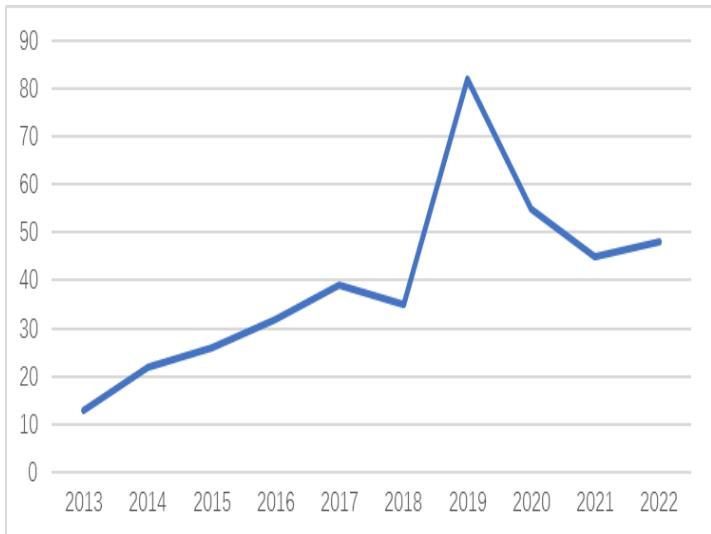
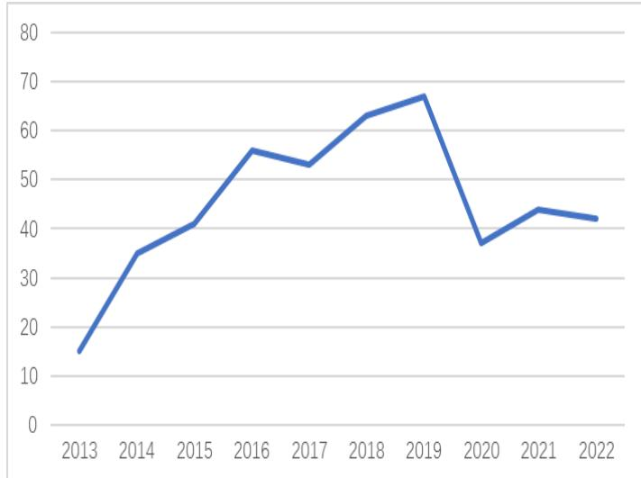
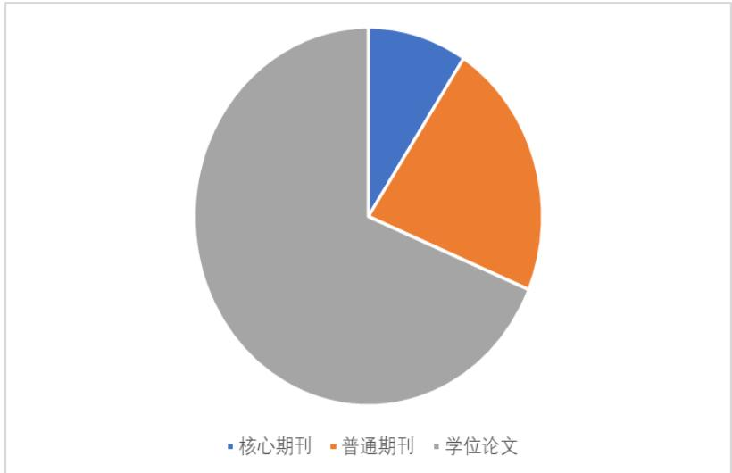
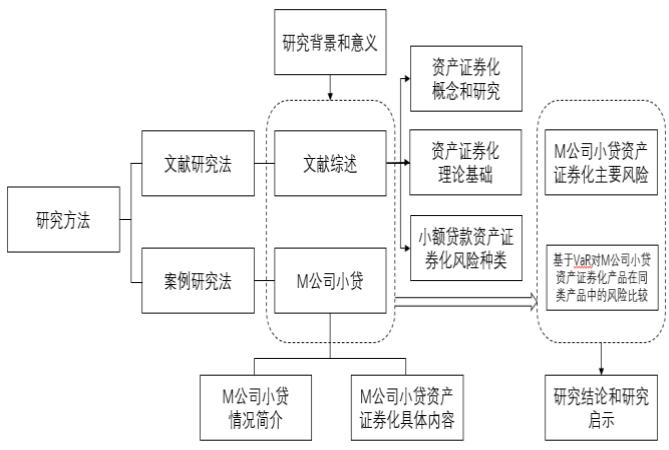

# 1绪论

# 1.1研究背景和研究意义

# 1.1.1研究背景

近年来，虽然国内的居民消费水平没有延续前些年的增长趋势，居民消费的意愿也不如往年，但促进居民消费一直是我国提升经济活力的重要手段，国家也一直在提出鼓励消费、刺激消费的相关政策。而在消费人群的划分中，年轻人作为消费的主力军，有着与老年人不同的风险偏好，即年轻人的消费理念更加偏向与超前消费，这既带来了过去几年间消费金融的长足发展，也让消费金融这一超前消费所产生的行业在促进消费从而助力我国经济的长期稳定发展的过程中显得十分重要。

个人消费贷款业务规模在近年来发展迅猛，发展至今已初具规模，个人消费贷款业务单笔额度小，笔数多，适合作为资产证券化的基础资产。商业银行和互联网金融机构可以运用资产证券化的方式，将其流动性较差的贷款业务转变为新的融资渠道，提高其资金流动性，优化其资产负债表结构。此外，国家刺激消费、鼓励消费的大环境也有利于个人消费信贷资产证券化的发展。在消费金融市场蒸蒸日上的同时，资产证券化（Asset Backed Securitization，ABS）也作为一种促进资金流通的手段逐渐被大幅运用。资产证券化可以为我国资本市场创造全新的金融产品，优化资本市场结构，还可以降低融资成本，丰富融资方式，促进我国贸易市场和资本市场的协同发展。2015年，国务院第九十二次常务会议表示，将投入5000 亿元的信贷 ABS 试点，促进金融体系全面转型，增加资金流动性，助力资本市场发展，推动实体经济蒸蒸日上，持续丰富相关法律法规。

# 1.1.2 研究意义

由于小贷资产证券化相关产品及业务在国内的起步时间与其他发达国家相比较晚，所以国内对于小贷资产证券化产品的相关制度和监管手段并不健全，无法进行提前的风险评估，也难以及时地对小贷资产证券化的风险进行相应的处理。比如前几年蚂蚁金服曾打算利用资产证券化实施风险极大、杠杆极高的贷款循环发放等违规金融手段，幸好相关部门叫停了该消费金融业务的小贷资产证券化的发行，否则其带来的系统性风险可能会导致极大的损失。为了避免此类事件的发生，需要对小贷资产证券化全流程的风险进行深入分析和研究。本文选取了小贷资产证券化二级市场上一支表现较好的较典型的产品进行了分析，探讨了产品及产品背后的原始权益人和发行机构在风险识别、风险评估、风险控制等三个风险管理步骤上的措施和应对情况，选取该产品在风险管理上能够为其他同类产品所借鉴的优点进行了讨论，从而希望能够为国内后续的同类型小贷资产证券化产品的设计和发行提供一些建议，为国内日渐成熟的消费金融行业带来帮助。

# 1.2文献综述

# 1.2.1文献计量分析

# 1.2.1.1统计来源与检索方法

本文主要以知网及百度学术、谷歌学术等其他文献检索网站为源展开文献检索工作，通过知网高级搜索和可视化分析等工具，对相关文献进行文献数量分布、文献增长规律、文献来源分析等文献计量分析，以此分析学界在近十年时间里的研究动态。

# 1.2.1.2文献数量分布与增长规律

# （1）以“资产证券化风险控制”为主题

以“资产证券化风险控制”为关键词，在知网上对国内外文献展开大规模检索，最终确定的文献一共有 506 篇，最近十年时间里的文献总数具体参见图 1-1。结合学界的研究动态可知，最近十年学界关于消费金融资产证券化的文献数量呈先上升后下降再回暖的趋势，2019 年研究文献数量达到 82 篇。

  
图1-1以“资产证券化风险控制”为主题的文献数量

（2）以“小贷资产证券化”为主题

在以“小贷资产证券化”为关键词，在知网上对国内外的文献展开大规模检索，最终检索所得的文献一共有 459 篇，最近十年时间里的文献综述具体参见图 1-2。结合学界的研究现状不难看出，2013 年基本可以看作小贷资产证券化的研究起点。总的来看，近十年研究小贷资产证券化的文献呈现出先上升后下降之后再平稳发展的总体走向，其中2019 年探讨该主题的文献综述最多，一共有 67 篇。

  
图1-2以“小贷资产证券化”为主题的文献数量

（3）相关文献增长规律

从文献增长规律的分析来看，图1-1与图1-2 的趋势较为接近，都是先增长后下降再平稳，都在 2019 年到达峰值。这意味着在资产证券化下的小贷资产证券化和风险控制这两个细分议题具有较强的相关性。

同时，从图1-1和图1-2 可以看出，文献数量分布与文献增长规律有可能与P2P的火热和暴雷事件相关。在 P2P 火热时，相关文献数量大幅增长，P2P 暴雷后，相关文献数量经历拐点转而下降。在利用中国知网进行详细搜索后发现，在 2015-2017 年间，大量相关期刊都在讨论互联网 P2P 消费金融的资产证券化问题，在2018 年后转为讨论大型互联网企业的小贷资产证券化，这较为符合文献增长的规律。

# 1.2.1.3文献来源分析

（1）以“资产证券化风险控制”为主题

在中国知网以“资产证券化风险控制”为主题进行中英文拓展文献搜索，将文献来源分为期刊和学位论文，并从期刊中细分出核心期刊，即刊登在北大核心、CSSCI、AMI 等数据库中的文献。近十年的文献来源如图1-3所示。

  
图1-3以“资产证券化风险控制”为主题的文献来源分析

（2）以“小贷资产证券化”为主题

以知网为源，按照“小贷资产证券化”这一关键词在全网范围内展开文献检索工作，根据检索所得结果可知，近十年来学界在该方面的文献研究总数达到了459 篇，具体情况参见图1-4。

  
图1-4以“小贷资产证券化”为主题的文献来源分析

（3）相关文献来源分析

从文献来源分析来看，图1-3 与图1-4的结果较为接近，这意味着在小贷资产证券化和资产证券化风险控制这两个细分议题具有较强的相关性，这符合本文的文献增长规律的结论。

从图1-3与图1-4，资产证券化相关的文献 $6 0 \%$ 左右都是学位论文，核心期刊占比在 $5 \%$ 左右，普通期刊占比在 $2 0 \%$ 左右。单从期刊的角度来看，核心期刊占总期刊数量的 $2 5 \%$ ，即与资产证券化相关的文献有相当一部分具有阅读参考的价值。学位论文占比较大，可以认为资产证券化在学校内部一直是一个较为热点的选题。

# 1.2.2 文献内容分析

# 1.2.2.1国外期刊文献内容分析

LewisS.Ranier（1977）首次专门就“Asset Securitization”展开概念界定，对其内涵展开说明。在此基础上，FrankJ.Fabbzzi 在其研究中说明，资产证券化这一概念从广义层面来看，指的是对特征相近的资产进行包装处理之后进行出售的工作，是带有市场化特征同时涉及利息证券交易的市场活动。这是从实践角度出发对资产证券化之内涵所作的阐释。

从资产证券化这一实践的目的来看，其主要是借助特定的形式将流动性较弱的资产置于市场上进行经济交易的活动。LeonT（1986）指出，当资产证券化的实践可以替代封闭的市场信贷，无论是存款还是借款都能够顺利实现一定程度或完全程度的匹配，在这一过程中流动性较弱的资产也随之改变，此为资产证券化交易的主要目的所在。

研究人员们就资产证券化展开的场所也展开了一系列的探讨，其通常指的是以银行为代表的金融机构。对此，Gardener（1991）在其研究中指出，资产证券化的活动无论对投资方还是对借款方来说都将带来相对开放的市场，并且其在运作的过程中渐趋取代了银行等各类传统意义上的金融机构。

就动因角度而言，Greenbaum（1987）在其研究中说明，商业银行可借助资产证券化的过程对金融资产进行操作，将其置于资产负债表的内容之外，且以符合规定的贷款为对象，对其进行资产证券化的专业操作。Agostino and Mazzuca（2008）则认为，资产证券化的关键在于提高资金的流动性。综合研究人员们的已有研究成果可知，资产证券化这一过程的动因具体体现为，其能够为银行争取更为丰富的融资渠道，从而提高资金本身的流动性。

从监管层面来看，Peicuti（2013）指出次贷危机的出现与资产证券化的监管这二者之间有着极为紧密的关联，对不良资产进行重复质押可能会导致投资人员因此承受一定的风险，所以监管部门才应当对资产证券化方面的已有法律规定进行适时更新。Beccalli（2015）在其研究中就美国的资产证券化模型展开深入剖析，指出资产证券化的过程中应当力求谨慎，同时限制由杠杆而产生的各类风险。

对于资产证券化的发行，Liuyong Yang(2020)认为非国有担保机构作为一种外部增信的形式，能够显著扩大发行利差，这与成熟证券化市场的情况相反，同时信誉良好的承销商可以帮助本产品在一级市场获得较低的收益率利差。Wenxuan Pan（2020)和CiweiDong（2021）都认为可以将区块链技术运用到资产证券化的产品上。

对于资产证券化的披露，JEDJ．NEILSON(2021)通过实证研究的方式发现资产水平的披露提高了资产证券化产品的初始收益率和信用评级，而大多数潜在的资产证券化产品的投资者在资产证券化产品发行前就下载了资产水平信息。Brent Schmidt（2022）认为SEC要求的资产证券化产品的贷款水平的披露可以让投资者获取更高的透明度，而提供此类披露的AAA级资产证券化产品的便利收益率下降了 $4 8 \%$ 至 $7 3 \%$ 。

# 1.2.2.2国内期刊文献内容分析

# （1）资产证券化的相关研究

就资产证券化这一概念的内涵来看，林华（2014）在其研究中指出，资产证券化指的是对之后预期的现金流资产进行筛选和处理，由此生成全新的交易结构，同时对产品展开信用增级处理，以此来控制信用风险水平，之后对其展开打包发售处理的整个活动过程。另外，何小峰（2001）指出，资产证券化指的是资产管理人对后续预期的现金流进行筛选处理之后使其形成特定的资产包，对其展开资产重组，生成相应的金融产品并展开交易活动的一种支持证券。

就可行性的角度来看，王开国（1999）在其研究中指出，资产证券化的过程可以控制银行机构的不良贷款率、改进经济结构、刺激金融的发展等，通过一系列的市场调节功能来调动市场的发展活力，推进经济实现平稳进步。吴琪（2005）指出借助资产证券化的过程，为流动性较弱的负债提供全新的发展活力，在这一过程中，商业银行在金融市场上的竞争力得以提升，这对中国金融领域实现更进一步的发展来说也颇有助益。叶茂（2016）则对中国资产证券化的实践持乐观态度，指出国内在资产证券化方面的发展有着极为广阔的空间，且政府机关遵循“盘活存量，用好增量”的原则来对资产证券化的活动进行管理，这为国内资产证券化的实践提供了有力的引导。

对于我国资产证券化实践中的基础资产来说，杨柳（2006）指出资产证券化的活动在中国尚且处于新兴阶段，所以在处理证券化流程中的基础资产时需要尽可能的谨慎，通过大型公司带来的稳定资产来实现风险的最小化。从流动性的角度来看，袁宏泉（2007）指出要打造统一的平台，方可以为资产证券化的过程提供必要的前提，使证券资产可以在平台上实现有序流动，为投资人员创设高度自由化的二级流动市场。

从我国资产证券化运作的实际效果来说，彭惠与李勇（2004）专门就资产证券化的过程可能对发起人产生的影响展开探讨，对相关数据展开定量形式的分析，以此证实资产证券化所带来的收益和融资成本之间呈现为负相关的关系，并且和初始损失准备之间呈现为正相关的关系。邱成梅与赵茹（2013）则通过实证分析的手段，围绕浦东建设资产证券化的实践展开探讨，最终结果显示，资产证券化的活动往往能够在当年为企业股东创造积极的财富效应。此外，庞小凤与邹震田（2017）专门就小额贷款展开研究，分析资产证券化的一般运作模式，指出资产证券化可以有效压缩小额贷款企业在各项融资活动中的成本，应对资金运作过程中期限错配的现实问题。安丛梅（2021）用实证方法发现，在实施利率市场化政策条件下，资产证券化将明显提升银行盈利能力。在资产证券化和融资约束的关系上，幸丽霞（2021）认为资金成本较低情形下资产证券化是扩大融资渠道、拓展经营规模的有效手段，但资金成本较高时会让企业资金链紧张，面临更大的财务融资约束，导致股价下跌和股东财富受损。而桂荷发（2021）认为对于中国企业来说，资产证券化的活动对公司的经营绩效之间存在明显的积极作用，其背后的影响机制具体表现为削弱融资活动的约束、带动研发创新活动以及提高战略柔性程度。

# （2）资产证券化风险的相关研究

在中国资产证券化的风险方面，彭惠和李勇（2004）认为资产证券化的过程可能会带来一系列新风险，所以发行人要积极采取行动，打造科学的风险管理体系作为保障。王保岳（2009）主要对国内资产证券化风险的具体表现形式展开研究，分别从制度以及监管这两个维度出发对资产证券化过程中的风险管理活动展开具体说明，突出了风险预警系统的重要意义。除此之外，李丛文（2015）主要围绕信贷资产展开研究，指出信贷资产在短时间里可以抑制银行运作过程中的系统性风险，然而从长远角度而言，资产证券化的过程也带来了全新的风险类型，所以从银行的角度来看，其需要应对的整体风险水平并没有实质性意义上的下降。王隽（2016）在其研究中强调，商业银行在从事资产管理活动的过程中，无论是对不良资产证券化产品所作的设计工作，还是风险自留事项等都应当被视为关键，据此展开相应的制度设计，以避免风险外溢的情形出现。张芬（2020）强调，中国要打造独具中国特色的一套本土化的监管模式，要从法律层面出发强化来自民法、公司法以及税法等相关法律制度的支持力度，此外还要不断健全信息披露制度，实现更高的信息披露水平，以此来控制信息不对称现象可能产生的风险。洪祥骏和宫蕾（2021）揭示了关联方增信可能存在的道德风险问题，同时集团风险集聚导致 ABS 的底层资产质量下降，进而提高了企业的融资成本。郭建鸾（2022）运用声誉模型，得出防范信贷资产证券化道德风险的重点在于控制发起人道德风险的结论。郭江山（2022）主要采用实证研究的手段展开分析，指出商业银行在运作的过程中，其在信贷资产上所面临的违约风险在一般情况下会对资产证券化风险自留比例存在一定程度的积极作用。由于商业银行不仅在盈利水平上比较有限，并且资本的充足率也较低，同时资产的流动性程度也相对偏弱，因而其在风险自留方面的比例明显更高。武英涛（2022）认为可以用区块链技术防范应收账款资产证券化的风险，引入区块链技术后的应收账款资产证券化加大了融资者的违约成本，提升了信息的透明度。安丛梅（2022）指出，资产证券化的活动使银行日常运行的稳定程度大受影响，其所面临的个体风险也随之提升，且道德风险以及银行推出的各类金融产品在互持过程中所显现的联合效应，可能会通过“系统性风险联动机制”的作用从间接层面对个体银行产生一定程度的影响。

（3）互联网小贷资产证券化的风险管理的相关研究

关于互联网小贷资产证券化方面的风险管理研究，现阶段国内在该方面的研究仍停留在新兴阶段，该方面的探讨尚且不成体系。冀婕（2018）在其研究中强调，要重视基础资产的管理、交易结构的优化、发行方式的选择和投资者类型的确定，从多重角度入手来进行创新活动。蒋坤良和宋加山（2018）强调，就之前的资产证券化活动过程来说，信息不对称的现象、信用机制的不健全、数据处理门槛高等问题普遍存在，对此可以区块链技术为手段来进行创新实践，带动消费金融朝着资产证券化的方向深入发展，但同时，由此而来的信用、道德以及操作风险都需要被引起充分的重视。吕彬彬（2019）聚焦于发起机构进行分析，深入研究资产证券化这一过程中潜在的各类风险，除了工具风险这一基本风险类型之外，投资人需要在不同程度上处理应对的信用风险、早偿风险、利率风险、法律风险等都需要引起注意。

# 1.2.2.3 相关图书文献内容分析

Meek（2000)认为跨境资产证券化不仅为那些结构化融资方案提供了更多的机会，也增加了风险。Kisser（2001）主要以欠发达国家为研究对象，对政策及法律设计的角度出发，分析在金融市场环境里积极推进资产证券化工作的过程中，在落实各项技术时可能存在的困境与风险。Michael（2010）指出金融机构在大力发展贷款证券化业务之际，对股权部分的权益进行一定程度的保留，并非总能够对借款人的提前筛选和确定起到促进作用。Lamia（2014）以资产证券化为例介绍了银行业的金融创新。宋强（2015）指出资产证券化的活动无论对于人民币国际化还是对于利率自由化的进程来说都存在极大的推动作用，可帮助银行机构对自身的资产负债表进行重新组合，进而助力于金融领域整体成长和经营效率的提高。贺正齐等（2022）探讨了长江大保护中重大水利工程PPP 项目进行资产证券化的必要性与可行性。

# 1.2.2.4 相关学位论文内容分析

艾菁（2014）在其研究中将以小额贷款为基础资产的资产证券化产品作为研究对象，结合学界已有研究成果对其展开分析，以此尽可能推进学界已有研究成果、证监会发布的最新的关于资产证券化过程的法律文件以及资产证券化的市场状况展开高度联合，阐发出市场适用性极高的专门面向小额贷款的资产证券化产品，以此来应对小额贷款领域的融资困境。刘洪泽（2015）主要以线下实体形式存在的小额信贷企业为研究对象，对其信贷资产特性、利率结构进行分析说明，探讨资产证券化的具体实施手段的同时，还就其背后的风险展开说明。辛逍（2015）结合学界已有的研究成果，阐述了国内小额贷款企业整体的运作现状，将阿里巴巴推出的小贷资产证券化项目作为主要研究对象，以此深入把握国内券商在资产证券化和小额贷款公司在资产证券化方面的突出特点以及困境所在，发现项目仍然存在流动性不足、存在动态资产池管理风险、未实现法律意义上的破产隔离等问题。并对项目背后的问题展开阐释，从健全法律体系、强化资产证券化产品在自由市场上的流动性以及鼓励小额贷款企业展开资产证券化工作的层面给出具体的意见。邵子倍（2016）运用了资产重组原理和现金流分析原理对基础资产以及循环池的交易结构进行分析，并运用信用增级原理对项目的信用增级机制进行分析，并分别针对线下小额贷款公司的一次性还本产品和分期偿还产品，从产品设计的角度提出具体化的融资方案。阙稚岚（2016）主要以浙江省的小额贷款企业为研究对象，对公司性质及其资产的特性展开说明，将小额信贷资产视为基础资产阐发出相应的资产证券化产品设计方案。乐云飞（2017）主要以蚂蚁微贷所展开的资产证券化工作为研究对象，对其融资背后的深层动因、证券产品的定价、经济效应以及基础资产的特征等展开研究，就小额贷款企业资产证券化的过程给出具体的改进措施。何玉婷（2018）主要通过案例分析的手段，就世联小额贷款企业在推进资产证券化工作时所采用的融资模式展开研究，阐发了其本次资产证券化融资的价值和经验，并分析其在融资模式上的突出特性以及风险所在，并阐发资产证券化所带来的融资效果以及相对于其他金融手段来说的比较优势，以此指出，世联小贷推出资产证券化产品的行为对应对其所处的资金困境来说有着重要的作用，且分别从企业本身以及政府政策这两重维度出发给出意见，并展开案例的宣传推广工作，以此为国内其他小额贷款企业丰富自身融资渠道的实践给出可行的参考。田强（2018）通过文献查阅、现场观察以及案例研究的手段，来专门就国内的小贷资产证券化活动展开研究，分析其所处的发展环境以及发展现状，对这一过程中的金融风险和信用增级形式展开专门的分类探讨，并就阿里公司推出的小贷资产证券化产品展开动态形式的探讨。分别从历史发行数据、发行过程和参与主体的层面出发，来分析此类资产可能存在的潜在风险，阐明其后续的管理走向，以此为小贷资产证券化的发展提供相应的借鉴。吕德鹏（2018）研究国内2 家小额贷款公司进行资产证券化的典型成功案例，并总结和借鉴其相关经验的基础上，针对H小额贷款公司的实际调研情况，重点分析了H公司实施资产证券化的必要性和可行性，并设计给出H公司资产证券化的方案。付继方（2018)以阿里推出的关于资产证券化的资产证券化产品为研究对象，分别从运行机制、交易结构、信用增级以及风险控制等维度出发阐明了其创新所在，分析该计划的推出对于小额贷款企业乃至整个中国资产证券化市场的长远发展所带来的经验。齐书山（2019）在其研究中专门就百度小贷这一资产证券化产品展开研究，分别从行业条件以及企业的维度出发阐明了重庆百度小贷通过资产证券化的手段展开融资活动的根本动因。之后就交易结构出发展开研究，对其中潜藏的五个核心要素展开专门探讨，分别从原始权益人、基础资产、风险隔离、增信措施以及现金流偿付机制这五重角度出发，阐明了项目运作的比较优势以及潜在的各类风险，据此给出相应的风险应对手段。寇雪娇（2019）主要以小额贷款企业为研究对象，通过SWOT分析法的手段来深入判断资产证券化这一融资手段对于此类企业来说的可操作性，同时对基础资产和资产池、信用增级形式、现金流管理、破产管理机制等这些比较重要的交易因素展开深入解读，放眼小额贷款企业目前在资产证券化方面的成功实践，即中金-蚂蚁这一资产证券化产品，分别从监管层面、企业层面和计划安排这三重维度出发给出相应的参考。田雪彦（2021）在其研究中对小微贷款资产证券化这一业务展开专门的特征研究，以市场上的相关案例为分析对象，阐明在各类产品分层设计模式下风险和报酬这二者的转移水平，结合现阶段的规制和条件为小微贷款证券化的发展给出可行的产品设计方面的意见，以此提高产品设计的科学性，助力于广大小微贷款公司对各类风险展开合理地转移，以此达成经济发展实质和会计结果这二者之间的高度契合。王滢芝（2023）主要就阿里公司所展开的资产证券化工作展开深入剖析，阐明该项目的比较优势、潜在风险以及弱势所在，并针对问题提出一些建议。

# 1.3研究方法与内容

# 1.3.1研究方法

本次研究以M公司推出的小额资产证券化产品为分析对象展开研究，其中涉及的研究方法主要有两种，其一是文献研究法，其二则是案例研究法。

# 1.3.2.1文献研究法

本次研究主要结合国内外现阶段已有的文献及理论成果，结合国内外研究人员对资产证券化这一概念所作的阐释，并说明资产证券化的活动在互联网领域的成长现状及其背后的动因。除此之外，还就小额贷款以及小额贷款企业方面的相关理论展开阐释，借此揭示M企业小贷为什么要展开资产证券化的过程，并对该企业推出的资产证券化的相关金融产品展开研究。

# 1.3.2.2案例研究法

对M公司所展开的小贷资产证券化的项目展开研究，并对其推出的相关金融产品进行深入分析，对该项目运行过程中的交易对手以及产品要素展开分析，将关键置于资产支持计划背后的风险识别、评估以及控制的研究上，把握本次项目运行的比较优势以及创新之处所在，对潜在风险展开说明，以期为互联网环境下的其他小额贷款企业的类似活动提供可行的经验参考。

# 1.3.2 研究内容

本次研究主要对新型的资产化标的，也即对互联网背景下的小额贷款企业所进行的小额借贷资产证券化的过程展开分析，将M小贷视为研究对象展开深入探索。

第一章是论文的绪论部分。该部分主要阐明了小贷资产证券化这一主题的研究背景及其意义所在，并结合国内外已有的文献，对资产证券化这一概念的内涵、意义以及推行效果展开说明，同时阐明本文的创新以及不足所在。

第二章则主要阐明了资产证券化以及小额贷款方面的已有理论成果，分别对资产证券化的概念界定、类型以及理论内容展开分析，同时阐明其特点以及典型风险所在。

第三章主要是案例阐述部分。主要以M小贷资产支持计划这一项目为案例，分别从产品要素、风险管理、信用增级等维度出发展开说明。

第四章主要是案例分析部分。分别从风险识别、风险评估、风险控制三个角度探究了M小贷资产支持计划可能包含的风险以及M小贷对这些风险的应对措施。

第五章，是关于对于M小贷资产证券化的研究结论、建议以及对后续的展望。

以下为本次案例研究的具体文章写作思路：

  
图1-5本文写作思路

# 1.4研究创新与不足

# 1.4.1研究创新

本次研究的创新之处具体表现为两点：其一，以互联网环境下的小贷资产证券化实践为研究对象，对其潜在的风险展开研究，选题具有一定的创新性。现阶段，国内外学界在互联网背景下小贷资产证券化领域所展开的探讨相对来说比较少见，并且大部分都是从模式以及动机等维度出发所作的探讨，对其背后风险所作的专门研究相对来说比较少见。其二，本次研究主要以案例分析的手段，以M小贷资产证券化为研究对象，根据详细的数据信息来对这一过程中的风险类型展开深入分析，在研究方法上具有一定的创新性。

# 1.4.2 研究不足

本文研究方式过于注重相关资料的使用，而忽略了实际项目经验对本文的帮助，因此本文可能存在一些未经实践验证的论述。
