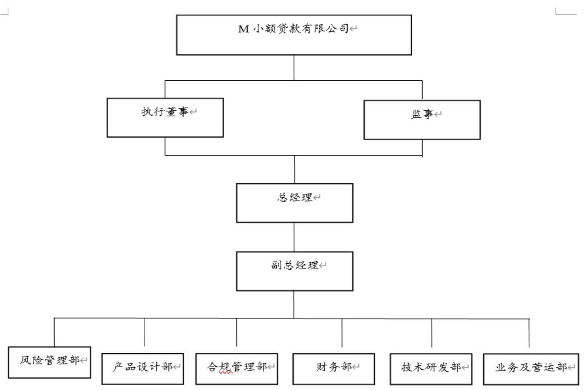
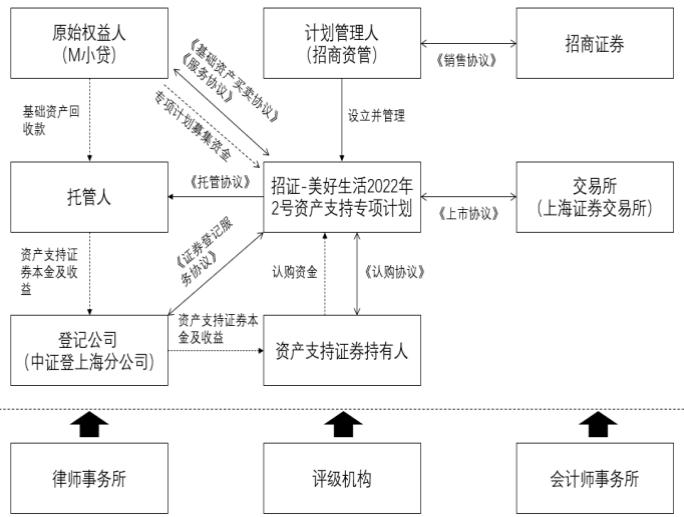

# 3 M公司小贷资产证券化案例介绍

# $3 . 1 \mathrm { { M } }$ 公司小贷基本情况简介

# 3.1.1 M公司小贷简介

M金服是M公司打造的“互联网 $+$ 金融”开放平台。依托M公司自身在资源方面的比较优势，M金服积极实现传统金融领域和互联网技术之间的有效融合，推出以智能支付、消费金融、保险以及彩票在内的一系列全新的业务类型，为6.87 亿用户以及超过930万的商家推出系统的金融服务。2016 年至今，M 金服已获得民营银行、第三方支付、保险经纪、互联网小贷、商业保理等牌照。

原始权益人M小贷是 M 公司旗下重要的组成部分。从 2016 年11 月正式展开运营工作，其发展定位为一家金融科技公司。M 小贷主要业务为面向B 端小微商户经营性贷款业务、面向C 端客户消费信贷业务。自从M小贷成立以来，各项业务模式快速发展，累计服务贷款客户数量超 12,500万户，累计发放贷款金额超过14,000亿元。

截至2022 年9月30日，M小贷根据近年来业务发展需求，设置了风险管理部、产品设计部、合规管理部、财务部、技术研发部、业务及营运部等职能和业务管理部门。M小贷的组织结构如下图所示：

  
图3-1M小贷组织结构图

# $3 . 1 . 2 \mathrm { M }$ 公司小贷底层资产简介

M小贷旗下共有三种类型的底层资产，分别是生意贷产品、生活费产品和月付产品。M小贷为这三种底层资产设计了不同的资产证券化产品，分别对应着美满、美好生活和美月。

表3-1M小贷产品发行规模   

<table><tr><td rowspan="2">项目</td><td colspan="3">2020年/2020年末</td><td colspan="3">2021年/2021年末</td><td colspan="3">2022年1-9月/2022年9月末</td></tr><tr><td>生意 贷</td><td>月付</td><td>生活费</td><td>生意贷</td><td>月付</td><td>生活费</td><td>生意贷</td><td>月付</td><td>生活费</td></tr><tr><td>新增发放贷款金额 （亿元）</td><td>339</td><td>327</td><td>2,417</td><td>594</td><td>675</td><td>3,415</td><td>551</td><td>623</td><td>3,145</td></tr><tr><td>新增授信客户 （万户）</td><td>335</td><td>4,270</td><td>2,455</td><td>251</td><td>2,920</td><td>999</td><td>198</td><td>2,040</td><td>1,006</td></tr><tr><td>未偿本金余额 （亿元）</td><td>147</td><td>55</td><td>692</td><td>290</td><td>70</td><td>1,032</td><td>369</td><td>75</td><td>1,335</td></tr><tr><td>累计发放贷款金额 （亿元）</td><td>693</td><td>352</td><td>4,131</td><td>1,288</td><td>1,027</td><td>7,547</td><td>1,839</td><td>1,651</td><td>10,692</td></tr><tr><td>累计服务贷款客户 （万户）</td><td>101</td><td>5,162</td><td>1,347</td><td>176</td><td>8,082</td><td>1,966</td><td>250</td><td>10,122</td><td>2,479</td></tr></table>

# 3.1.2.1生意贷产品

M公司生意贷业务为M公司推出的商户经营贷，M小贷为商户拓展店铺、购买设备、日常经营周转等经营行为提供贷款资金。M 公司生意贷产品最早是在 2016 年12 月正式上线，2019 年3月开始有规模的按互联网模式开展，初期主要为3-12 期的小额产品，2020 年开始在产品框架下针对特定客户提升额度。2022 年1-9 月末，M公司生意贷新增发放贷款金额为551.43亿元，新增授信客户为198.91万户。截至2022年 9 月末，生意贷产品未偿本金余额为 369.59 亿元，较 2021 年末增加 $2 7 . 3 7 \%$ ,

生意贷产品中，单户授信最高金额 100 万，贷款期限 3 至 36 期不等，还款方式为按月等额本息或组合还款，提前还款无手续费，基础年化利率 $1 8 \%$ 左右，按余额计息，担保方式为信用。生意贷依托于商户在合作网络平台长期交易留存的丰富数据，包括经营资质数据、交易数据、消费者评价数据等，同时借助M公司强大的互联网技术，业务规模快速发展。截至 2022 年9 月末，M 小贷小微商户经营性贷款业务累计放款约1，839.88 亿元，业务余额为369.59 亿元，累计贷款客户数约为 250.76万人。

生意贷目标客户群体仅限于M 公司平台内的客户，主要分为两类。第一类是与M公司平台发生关系的经营者，如外卖、到店餐饮、到店送货服务、酒旅等方面的经营者。囊括公司合作网络平台上约 930 万合作小微商户，涵盖吃住行游购娱等居民生活所需各个行业，其中以餐饮和酒店为主。第二类是M公司的客户，但同时个人又是其他行业或机构的经营者、股东或法人代表。

# 3.1.2.2生活费产品

M公司生活费业务为依托M公司线上消费场景推出基于个人客户的消费贷款，主打小额贷款，围绕M 公司吃喝玩乐的本地生活化场景，立足于为用户提供更好的多元化服务，能够帮助用户解决短期、小额资金需求，提升生活品质，不断为用户提供生活消费需求相关的金融服务方案。M 公司金融服务平台从 2017 年10 月开始进一步拓宽小额贷款产品种类，从B 端经营类贷款产品扩展到 C 端个人消费金融产品。M公司所运营的相关 APP 为消费金融的开展提供了大量的有效数据，从而帮助 M 公司推出了消费贷款、分期付款等产品。截至 2022 年 9 月末，生活费累计发放 10,692.17亿元，贷款余额为1，335.71 亿元，累计放款客户2,479.36万人

表格3-2生活费业务基本业务情况总览  

<table><tr><td>项目</td><td>2019年 /2019年末</td><td>2020年 /2020年末</td><td>2021年/2021 年末</td><td>2022年1-9月 /2022年9月末</td></tr><tr><td>新增发放贷款金额（亿元）</td><td>1,519.44</td><td>2,417.32</td><td>3,415.57</td><td>3,145.01</td></tr><tr><td>新增授信客户（万户）</td><td>600.65</td><td>2,455.37</td><td>999.07</td><td>1,006.36</td></tr><tr><td>累计发放贷款金额（亿元）</td><td>1,714.27</td><td>4,131.59</td><td>7,547.16</td><td>1, 0692.17</td></tr><tr><td>未偿本金余额（亿元）</td><td>523.98</td><td>692.10</td><td>1,032.95</td><td>1, 335.71</td></tr><tr><td>累计服务贷款客户（万户）</td><td>770.39</td><td>1,347.81</td><td>1,966.40</td><td>2,479.36</td></tr></table>

生活费贷款授信额度 500 元至20 万元之间，产品期限包括3 至 36 期，贷款基础利率为日息万分之五。从 2017 年 10月业务展开以来，生活费依托M 公司线上消费场景快速发展。生活费贷款的获客渠道主要依托 M 公司主要经营的一系列日常消费类APP 的流量优势，进行相关产品的信息推送，从而能够触达并给客户提供相应的贷款服务。

# 3.1.2.3月付产品简介

M 小贷月付于2018 年开始运营，是M 公司为用户提供的先享后付的授信付款服务，适用于M公司APP 内的消费，包括团购美食、点外卖、住酒店或者打车、骑车、买菜等。月付业务目前发展处于高增速发展期，截至 2022 年 9 月末，月付产品累计发放额达到 1，651.71 亿元，未偿本金余额为75.00 亿元，累计放款客户10,122.74万人。

月付产品授信额度区间通常为 $3 0 0 ^ { \sim } 1 5 , 0 0 0$ 元左右，约占 $9 5 \%$ 以上，在个别场景下，例如单车，授信额度会下降到 $5 0 ^ { \sim } 1 0 0$ 元。月付产品每月固定1号出账、8号还款，最长38 天免息期，免息期内按时还清不收费，逾期按同业标准 $0 . 0 5 \%$ 收费；支持支付少量费用延期还款，支付分期还款，可分3期、6 期、9 期和 12 期。客户通过账户余额和绑定银行账户自动还款。客户群体主要为Μ公司生态环境中的用户。

# $3 . 2 { } \mathrm { M }$ 公司小贷资产证券化的具体内容

# 3.2.1产品要素

M小贷资产证券化产品的完整名称是“招证-美好生活 2022 年2 号资产支持资产证券化产品”（以下简称“资产证券化产品”），该证券的基础资产为提供Μ小贷中生活费的信托受益权。这一项目在该年九月份正式于上海证券交易所完成上市，其存续期前后共计二十四个月，就整个存续期来说，前十八个月属于循环放贷阶段，该阶段主要以季度为单位进行付息；后面的六个月属于摊还期阶段，以月度为单位分别向资产证券化产品和投资人展开过手摊还，主要遵循优先级利息、优先级本金以及次级的顺序展开支付工作。

此次资产证券化产品推出的金额一共有 10 亿元，这笔资金分别被划分成优先A级、优先B 级以及次级这三级，且三级的面值都是100 元，各个级别的资产证券化产品的具体情况参见表3-3:

表 $3 ^ { - 3 } \textbf { M }$ 小贷资产证券化产品分级债券基本信息  

<table><tr><td>资产证券化产品</td><td>发行规模 莫（万元）</td><td>票面利率</td><td>证券占比（%）</td><td>信用等级</td></tr><tr><td>优先A级</td><td>81,100.00</td><td>2.90%</td><td>81.10</td><td>AAAsf</td></tr><tr><td>优先B级</td><td>6,000.00</td><td>3.08%</td><td>6.00</td><td>AA+sf</td></tr><tr><td>次级</td><td>12,900.00</td><td>不设预期收益率</td><td>12.90</td><td>NR</td></tr></table>

据上表信息可知，优先级资产证券化产品将被置于上海证券交易所展开公开交易；此外，次级资产证券化产品则将交由M小贷进行认购。

资产证券化产品的交易结构图如下所示：

  
图3-1交易结构图

# 3.2.2信用增级

本资产证券化产品主要采用优先A级/优先B 级/次级分层、超额利差、不合格基

础资产赎回、内部信用触发机制等信用增级手段，为优先级资产证券化产品持有人的本金及收益提供了较厚的安全垫。

# 3.2.2.1内部分层结构安排

资产证券化产品采用了优先级/次优先级/次级这样的分级形式，结合本期模拟资产池的具体状况，在展开资产分配时，按照优先级、次优先级、次级资产证券化产品这一顺序展开。具体来看，这三类证券所占的份额分别是 $8 1 . 1 0 \% : 6 . 0 0 \% : 1 2 . 9 0 \%$ (id)

表3-4资产证券化产品分层情况  

<table><tr><td>资产证券化产品</td><td>发行规模 莫（万元）</td><td>证券占比 (%）</td><td>信用等级</td></tr><tr><td>优先A级</td><td>81,100.00</td><td>81.10</td><td>AAAsf</td></tr><tr><td>优先B级</td><td>6,000.00</td><td>6.00</td><td>AA+sf</td></tr><tr><td>次级</td><td>12,900.00</td><td>12.90</td><td>NR</td></tr><tr><td>证券合计</td><td>50,000.00</td><td>100.00</td><td>-</td></tr></table>

# 3.2.2.2 超额利差

在本资产证券化产品的优先级中，平均票面利率与加权平均利率之间存在超额利差。与此同时，模拟资产池加权平均合同利率水平预计将要超出优先级资产证券化产品的加权平均收益率水平，这就给优先级资产证券化产品给出了一定的信用支持。

# 3.2.2.3不合格基础资产赎回

在资产证券化产品存续的时间范围内，无论是管理人还是资产服务机构一旦察觉未能满足合格标准的基础资产，要马上使管理人以及原始权益人知晓，原始权益人应按照规定向管理人赎回不合格基础资产。

# 3.2.2.4内部信用触发事件

资产证券化产品设置了不同等级的信用触发机制，包括：加速清偿事件、违约事件、提前终止事件等，当加速清偿事件触发时，改变分配顺序；当违约事件或提前终止事件触发时，将改变分配顺序，终止项目。
