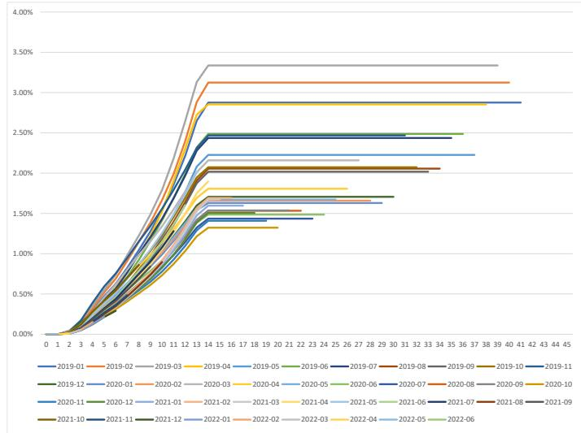
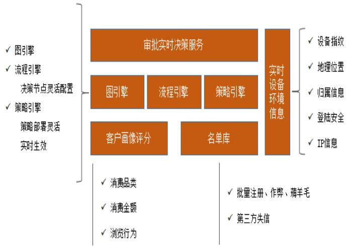

# 4 M 公司小贷资产证券化的风险管理分析

# $4 . 1 \mathrm { { M } }$ 小贷资产支持计划的风险识别

# 4.1.1基础资产相关风险的识别

# 4.1.1.1基础资产质量风险识别

现阶段，原始权益人在行业内的风控水平比较可观，然而债务人可能采取的欺诈手段也在不断走向复杂，在此情形下，原始权益人所对应的风控体系一旦有漏洞的存在，那么资产池内资产的综合质量都将受到波及。同时，借款人因发生疫情、汛情或国家政策等原因可以向原始权益人申请延长基础资产项下贷款期限或调整还款计划。若入池资产中大量客户申请展期，会造成本金延期回收，从而影响优先级证券的在一般情况下的如约兑付。

# 4.1.1.2现金流预测风险识别

对于M小贷资产证券化产品来说，在对其产品方案进行设计时，根据 M小贷提供的历史逾期数据，底层资产池无论在合同约定时间期限内的分布态势、起初贷款数额，还是在剩余期限上都和样本池存在一定差异；加之 Μ小贷本身的营业时间比较有限，样本数据量规模较小，在对其展开定量分析时所展开的假设或展开的参数估计数值难免和真实状况之间有某种程度的误差。现金流预测存在的偏差，可能会使得优先级资产证券化产品的只有这因此不得不面对相应的投资风险。

# 4.1.2原始权益人相关风险的识别

# 4.1.2.1原始权益人破产风险

M小贷的近一年及一期总资产收益率及净资产收益率较低，同时由于公司处于发展期，公司人工成本和市场推广活动增加，导致其营业成本快速增加，对原始权益人的持续经营能力构成挑战。

此外，2021 年 10月8日，国家市场监督管理总局依据《反垄断法》对M集团做出行政处罚决定（国市监处罚（2021）74号）。

处罚事由为：“M集团自2018 年以来，滥用其在中国境内网络餐饮外卖平台服务市场的支配地位，阻碍平台内经营者在其他竞争性平台开展经营，排除、限制了相关市场竞争，损害了平台内经营者的合法权益和消费者利益，妨碍了平台经济创新发展，且不具有正当理由，构成《反垄断法》第十七条第一款第（四）项禁止的没有正当理由，限定交易相对人只能与其进行交易”滥用市场支配地位行为。”

处罚内容包括：“（1）责令停止违法行为；（2）对当事人处以其2020年度中国境内销售额114,747,995,546元 $3 \%$ 的罚款，计3,442,439,866元。”

由于资产证券化产品拟入池资产为原始权益人依托M集团为用户提供的纯信用贷款的生活费贷款资产，该等处罚可能使M集团的财务与经营状况发生不利变化，进而可能影响M小贷的日常展业和经营。

# 4.1.2.2原始权益人其他相关风险

此类风险包含原始权益人/资产服务机构资金混同风险，擅自挪用风险等。

根据资产证券化产品文件的约定，基础资产产生的现金流由M小贷收款账户定期转付至资产证券化产品账户。由于M小贷收款账户并非资产证券化产品或计划管理人开立的银行账户，该账户内的资金未转付至资产证券化产品账户，即还未产生隔离时，可能产生如下风险：

（1）混同风险

基础资产回收款存放于M小贷收款账户的期间，存在原始权益人自有财产可能与基础资产回收款相互混同风险。

此外，就联合贷资产而言，M小贷与合作机构通过北京钱袋宝支付技术有限公司以及通联支付网络服务股份有限公司等第三方支付机构完成联合贷资产回收款的还款扣收及清分。对于资产证券化产品而言，存在 M小贷与合作机构的还款现金流相互混同的风险。

（2）擅自挪用风险

基础资产回收款存放于M小贷收款账户期间，如原始权益人擅自挪用本资产证券化产品的基础资产回收款，可能导致资产证券化产品遭受损失。

# 4.1.3资产证券化产品相关风险的识别

# 4.1.3.1产品流动性风险

本资产证券化产品在上海证券交易所批准上市，但由于资产证券化产品市场的参与者较少，本资产证券化产品的持有者可能存在无法及时出售或者无法及时获得公允价格进而使自身利益受损的风险。

# 4.1.3.2信用评级风险

由于评级机构为第三方机构，且其会定时根据本产品在运行过程中的收益和本金偿付是否及时而更新相关信用评级，如果未来评级机构选择撤销或降低本资产支持计划的评级，则会影响投资者对本计划的投资看法，同时对资产支持计划的价值产生不利影响。

# 4.1.4其他外部风险的识别

货币政策、财政政策、产业政策和证券市场监管政策等国家政策的变化会对证券市场产生相应的影响，使本资产证券化产品的价格产生可能的下降，令本资产证券化产品的持有人的权益遭受损失。2020 年 11月《网络小额贷款业务管理暂行办法（征求意见稿）》发布，原始权益人主体及相关业务存在不完全符合该办法相关规定的风险。

# $4 . 2 \ : \mathrm { M }$ 小贷资产支持计划的风险评估

# 4.2.1基础资产质量风险的评估

由于本资产支持计划的基础资产主要为M小贷的小额贷款收益，因此基础资产质量风险的评估需要综合分析M小贷贷款的质量和贷款中可能产生的逾期风险以及违约风险。

根据资产证券化产品说明书提供的数据，发行机构从M小贷的基础资产池中抽样部分数据进行分析。截至 2022 年 6 月末，从贷款利率分布来看，贷款笔数在 $( 2 0 \% , 2 4 \% ]$ 的利率区间里有235，016 笔，为所有区间内最高， $1 7 \%$ , $2 0 \% ]$ 的区间内有207，561笔贷款，也就是说，M小贷基础资产池中大部分贷款笔数都在 $1 7 \%$ , $2 4 \% ]$ 的利率区间内，共计占比达 $8 9 . 6 4 \%$ ；而未偿本金余额则在 $( 1 7 \% , 2 0 \% ]$ 的区间占比最高，占比达61. $6 5 \%$ 。总的来看，M小贷的贷款利率普遍远高于银行一年期贷款利率和其他网贷的平均利率，这使得Μ小贷的利率收益较高，但也相对增加了借款人逾期和违约的概率。

表4-1信托计划项下M小贷贷款利率分类  

<table><tr><td>利率</td><td>贷款笔数</td><td>占比</td><td>合同金额 （元）</td><td>占比</td><td>未偿本金余额（元）</td><td>占比</td></tr><tr><td>(10%, 15%]</td><td>44,122</td><td>8.94%</td><td>262,430, 310</td><td>21.73%</td><td>201, 890, 976</td><td>20.19%</td></tr><tr><td>(15%, 17%]</td><td>7,039</td><td>1.43%</td><td>19,527, 260</td><td>1.62%</td><td>13,946,958</td><td>1.39%</td></tr><tr><td>(17%, 20%]</td><td>207,561</td><td>42.04%</td><td>696, 303,380</td><td>57.65%</td><td>616, 537, 701</td><td>61.65%</td></tr><tr><td>(20%, 24%]</td><td>235,016</td><td>47.60%</td><td>229, 631, 387</td><td>19.01%</td><td>167,627, 251</td><td>16.76%</td></tr><tr><td>合计</td><td>493, 738</td><td>100.00%</td><td>1, 207, 892, 337</td><td>100.00%</td><td>1, 000, 002, 887</td><td>100.00%</td></tr></table>

截至 2022 年 6 月末，本资产支持计划的基础资产池中共有 493，738 笔贷款。如表4-2 所示，在未偿本金的分类中，5，000 元以下的贷款笔数最多，共计 $9 4 . 8 2 \%$ 。而从本金的未偿余额占比来看，则是相对大额的贷款如 10,000—100,000 元这个区间占比最多，达到了 $4 2 . 6 8 \%$ 。虽然M小贷的基础资产池里相对小额的贷款数量更多，但是M小贷资产支持计划基础资产池质量的还是主要取决于一万元以上的贷款。

表4-2信托计划项下M小贷贷款未偿本金分类  

<table><tr><td>未偿本金余额 （万元）</td><td>贷款数量</td><td>占比</td><td>合同金额（元）</td><td>占比</td><td>未偿本金余额（元）</td><td>占比</td></tr><tr><td>(0, 0.1]</td><td>343,683.00</td><td>69.61%</td><td>205,396,050.00</td><td>17.00%</td><td>130, 802,279.86</td><td>13.08%</td></tr><tr><td>(0.1, 0.5]</td><td>121,806.00</td><td>24.67%</td><td>325, 658,495.00</td><td>26.96%</td><td>248,197,280.51</td><td>24.82%</td></tr><tr><td>(0.5, 1]</td><td>13,274.00</td><td>2.69%</td><td>103,022, 920.00</td><td>8.53%</td><td>89,232,536.57</td><td>8.92%</td></tr><tr><td>(1,10]</td><td>14,261.00</td><td>2.89%</td><td>459,952,872.48</td><td>38.08%</td><td>426,788,214.38</td><td>42.68%</td></tr><tr><td>(10, 30]</td><td>714.00</td><td>0.14%</td><td>113,862, 000.00</td><td>9.43%</td><td>104,982, 576.28</td><td>10.50%</td></tr><tr><td>合计</td><td>493,738.00</td><td>100.00%</td><td>1,207,892, 337.48</td><td>100.00%</td><td>1, 000,002, 887.60</td><td>100.00%</td></tr></table>

如表4-3 所示，截至2022 年6 月末，M小贷借款人年龄分布比较平均。在未偿本金余额的分布中，25-45 岁年龄段的借款人占绝大多数比重，共计 $8 4 . 9 9 \%$ 。由于这个年龄段大多有稳定的收入来源，所以M小贷借款偿还率能得到一定保证。

表4-3信托计划项下M小贷贷款借款人年龄分类  

<table><tr><td>年龄</td><td>贷款数量</td><td>占比</td><td>合同金额（元）</td><td>占比</td><td>未偿本金余额（元）</td><td>占比</td></tr><tr><td>25以下</td><td>157,321.00</td><td>31.86%</td><td>153, 118, 520.00</td><td>12.68%</td><td>116, 023, 984.14</td><td>11.60%</td></tr><tr><td>(25，30]</td><td>146,657.00</td><td>29.70%</td><td>365,697, 050.00</td><td>30.28%</td><td>302, 733, 575.97</td><td>30.27%</td></tr><tr><td>(30，35]</td><td>107,473.00</td><td>21.77%</td><td>377, 577,367.48</td><td>31.26%</td><td>318, 714, 271.96</td><td>31.87%</td></tr><tr><td>(35,45]</td><td>68,812.00</td><td>13.94%</td><td>270,401, 875.00</td><td>22.39%</td><td>228,439, 654.01</td><td>22.84%</td></tr><tr><td>45以上</td><td>13,475.00</td><td>2.73%</td><td>41,097, 525.00</td><td>3.40%</td><td>34, 091,401.52</td><td>3.41%</td></tr><tr><td>合计</td><td>493,738.00</td><td>100.00%</td><td>1,207, 892, 337.48</td><td>100.00%</td><td>1, 000, 002, 887.60</td><td>100.00%</td></tr></table>

如表4-4 所示，截至2022 年6月，M小贷资产支持计划的基础资产池中， $9 6 . 6 1 \%$ 的借款人选择在一年内还清借款，然而其合同金额比重仅占全部合同金额的 $5 6 . 1 8 \%$ ,有 $3 9 . 5 8 \%$ 的合同金额需要分 36 期归还，这使得基础资产池存在一定的违约风险和逾期风险，但同时也意味着基础资产的利率收益较高。

表4-4信托计划项下M小贷贷款期数分类  

<table><tr><td>分期期数 （月）</td><td>贷款笔数</td><td>占比</td><td>合同金额（元）</td><td>占比</td><td>未偿本金余额（元）</td><td>占比</td></tr><tr><td>6</td><td>15,005.00</td><td>3.04%</td><td>16,164,535.00</td><td>1.34%</td><td>5,759,093.31</td><td>0.58%</td></tr><tr><td>12</td><td>461,971.00</td><td>93.57%</td><td>662,377,385.00</td><td>54.84%</td><td>494,353,026.15</td><td>49.44%</td></tr><tr><td>24</td><td>2,491.00</td><td>0.50%</td><td>51,321,747.48</td><td>4.25%</td><td>49,999,232.86</td><td>5.00%</td></tr><tr><td>36</td><td>14,271.00</td><td>2.89%</td><td>478,028,670.00</td><td>39.58%</td><td>449,891,535.28</td><td>44.99%</td></tr><tr><td>合计</td><td>493,738.00</td><td>100.00%</td><td>1,207,892,337.48</td><td>100.00%</td><td>1,000,002,887.60</td><td>100.00%</td></tr></table>

从表 4-5 可以看出，大部分借款人的贷款的剩余期限都在 360 天内，但剩余贷款期限为720 至1099天的贷款未偿本金余额占比较大，为 $4 5 . 8 6 \%$ ，其逾期风险和违约风险不可小视，M小贷需做好相应的贷后风险管理。

表4-5信托计划项下M小贷剩余贷款期限分类  

<table><tr><td>剩余期限 （天）</td><td>贷款笔数</td><td>占比</td><td>合同金额（元）</td><td>占比</td><td>未偿本金余额（元）</td><td>占比</td></tr><tr><td>(0,90]</td><td>42,822.00</td><td>8.67%</td><td>110,366,235.00</td><td>9.14%</td><td>18,969,767.83</td><td>1.90%</td></tr><tr><td>(90,180]</td><td>12,938.00</td><td>2.62%</td><td>43,117,410.00</td><td>3.57%</td><td>19,879,044.76</td><td>1.99%</td></tr><tr><td>(180,270]</td><td>137,703.00</td><td>27.89%</td><td>170,322,330.00</td><td>14.10%</td><td>124,582,620.84</td><td>12.46%</td></tr><tr><td>(270,360]</td><td>279,375.00</td><td>56.58%</td><td>350,232,255.00</td><td>29.00%</td><td>332,176,996.03</td><td>33.22%</td></tr><tr><td>(360,720]</td><td>6,184.00</td><td>1.25%</td><td>47,125,287.48</td><td>3.90%</td><td>45,802,772.86</td><td>4.58%</td></tr><tr><td>(720,1099]</td><td>14,716.00</td><td>2.98%</td><td>486,728,820.00</td><td>40.30%</td><td>458,591,685.28</td><td>45.86%</td></tr><tr><td>合计</td><td>493,738.00</td><td>100.00%</td><td>1,207,892,337.48</td><td>100.00%</td><td>1,000,002,887.60</td><td>100.00%</td></tr></table>

# 4.2.2 现金流预测风险的评估

# 4.2.2.1现金流预测基本假设

本资产证券化产品的现金流预测的基本假设如下：首先是关于资产证券化产品模拟基础资产池现金流的假设。a.模拟基础资产池的入池资产为生活费贷款，入池资产的贷款合同期限包括 6、

12、24、36个月，占比分别为 $0 , 5 8 \%$ 、49. $4 3 \%$ 、 $5 , 0 0 \%$ 、 $4 4 . 9 9 \%$ ;

b.入池资产的每期本金和利息现金流入，根据模拟基础资产池回收款的预计回收期间分布情况进行预计；

c.资产证券化产品设立日(现金流预测基准日)为 2022 年 06 月22日24:00，期限为36个月；

d．以全部基础资产的合同本金和利息现金流入为基础，根据假设的累计违约损失率 计算得出预计发生违约无法收回的贷款金额。以全部基础资产预计的每期未偿本金为基础，根据假设的月度早偿率及每期的期间天数计算早偿对整体现金流的影响。根据基础资产合同约定，早偿将不产生罚息。静态情景下，假设资产池的累计违约损失率及早偿率均为 $0 , 0 0 \%$ ;

e．资产证券化产品存续期内，以模拟基础资产产生的本息回收款为限，在依次支付资产证券化产品费用(资产证券化产品费用包括由模拟基础资产承担的税金、托管费、中介机构费用、管理费及推广机构的代理销售费、年度审计费以及清算审计费，以下简称“资产证券化产品费用”，未考虑其他零星费用），优先A级、优先B级资产证券化产品预期收益，优先A 级、优先B 级资产证券化产品本金，以及全部应付未付的资产服务机构的后端服务费，剩余资金全部支付给次级证券持有者。

f.模拟资产池的特征与未来实际资产池相似；

g.假设未发生加速清偿事件。

然后是关于关于资产证券化产品现金流支付的假设。

a.发行规模：发行资产证券化产品总规模为 10 亿元，其中，优先 A 级资产证券化产品比例为 $8 1 . 1 0 \%$ ，优先B 级资产证券化产品比例为 $6 , 0 0 \%$ ，次级资产证券化产品比例为 $1 2 . 9 0 \%$ ;

b.优先A 级资产证券化产品预期收益率为 $3 , 5 0 \%$ ；优先B级资产证券化产品预期收益率为 $4 , 0 0 \%$ ；次级资产证券化产品无预期收益率；

c.资产证券化产品兑付日：指每个自然月的第11日和第26日（(若该日为非“工作日”则顺延至该日后的第一个“工作日”），特别地，如两个“兑付日”之间间隔不足【8】个“工作日”的，则相应的第【11】日不兑付，其中首个“兑付日”为“资产证券化产品设立日”下月的第26日，模拟基础资产池第一个兑付日为2022 年7月26日，最后一个兑付日为2025年6月26日；

d.资产证券化产品费用支付：运营过程中产生的增值税由资产证券化产品承担，适用的增值税及附加按 $3 . 2 6 \%$ 预计，计算基础为模拟基础资产产生的收益，于每一兑付日进行支付；托管费费率为每年 $0 . 0 0 5 \%$ ，计算基础为资产证券化产品当期期初未偿本金余额，于每一兑付日进行支付；中介机构费用总计 38.90 万元，于第一个兑付日一次性支付；管理费及推广机构的代理销售费总计 200 万元，于第一个兑付日一次性支付；年度审计费预计1万元/年，于2023 年1月11日、2024年1月11日和2025年1月13日支付；清算审计费预计1万元，于最后一个兑付日一次性支付；

e.优先A 级、优先B 级资产证券化产品预期收益第一个兑付日为 2022 年7月26日。

# 4.2.2.2现金流预测压力测试

# 4.2.2.2.1基准参数的确定

根据M公司生活费的历史表现（2018年6月一2022年6月），模拟本交易未来现金流情况。首先计算了30 天以上的逾期率，累计逾期率表现如下：

  
图4.2静态池累计违约损失（逾期30天以上）

资料来源：原始权益人提供，联合资信整理

# （1）基准累计违约率

由于基础资产业务运营时间较短，在已有数据的基础上，根据同类业务的行业平均表现进行了外推，并结合资产池产品类型（合同期限 $3 / 6 / 1 2 / 2 4 / 3 6$ 期）加权计算得出模拟池考虑账龄后的预期累计违约率为 $3 . 9 2 \%$ ,

# （2）基准回收率

回收率，基于M小贷提供的 2019 年1月一2021 年 02 月投放产品的静态池历史数据，根据如下公式计算出每个静态池逾期资产的回收率。最终计算得出的基准回收率为 $1 1 . 8 1 \%$ 。

表4-4静态池回收率  

<table><tr><td>静态池</td><td>回收率</td><td>静态池</td><td>回收率</td></tr><tr><td>2019年1月</td><td>13.47%</td><td>2020年2月</td><td>10.26%</td></tr><tr><td>2019年2月</td><td>13.47%</td><td>2020年3月</td><td>10.71%</td></tr><tr><td>2019年3月</td><td>15.20%</td><td>2020年4月</td><td>10.47%</td></tr><tr><td>2019年4月</td><td>13.83%</td><td>2020年5月</td><td>10.36%</td></tr><tr><td>2019年5月</td><td>15.24%</td><td>2020年6月</td><td>10.16%</td></tr><tr><td>2019年6月</td><td>12.99%</td><td>2020年7月</td><td>9.41%</td></tr><tr><td>2019年7月</td><td>14.60%</td><td>2020年8月</td><td>9.53%</td></tr><tr><td>2019年8月</td><td>13.77%</td><td>2020年9月</td><td>9.62%</td></tr><tr><td>2019年9月</td><td>11.74%</td><td>2020年10月</td><td>9.86%</td></tr><tr><td>2019年10月</td><td>11.88%</td><td>2020年11月</td><td>10.74%</td></tr><tr><td>2019年11月</td><td>13.69%</td><td>2020年12月</td><td>11.18%</td></tr><tr><td>2019年12月</td><td>12.87%</td><td>2021年1月</td><td>10.62%</td></tr><tr><td>2020年1月</td><td>11.68%</td><td>2021年2月</td><td>9.60%</td></tr><tr><td colspan="2">平均值</td><td colspan="2">11.81%</td></tr></table>

（3）基准早偿率

根据 M小贷提供的产品基础资产的历史数据，可以计算出本模拟资产池的基准早偿率为 $4 5 . 8 4 \%$ ,

综上，压力测试中使用的基准参数如下表：

表4-5现金流模型基准参数  

<table><tr><td>参数名称</td><td>基准参数</td></tr><tr><td>累计违约率</td><td>3.92%</td></tr><tr><td>回收率</td><td>11.81%</td></tr><tr><td>早偿率</td><td>45.84%</td></tr></table>

# 4.2.2.2.2压力测试

上述基准参数主要用于预测一般情况下，资产池未来现金流的表现。但要使证券的信用等级能达到投资级以上，证券就必须具备相应的风险承受能力。通过现金流压力测试，模拟了资产池面临极端恶化的情景下，证券及时、足额偿付的能力。

2022 年，世界经济下行压力加大，国内经济继续下行。在此背景下，宏观经济系统性风险可能影响到资产池的整体信用表现。所以对入池资产建模时考虑了宏观经济及外部环境波动的影响。

（1）压力测试标准

$\textcircled{1}$ 现金流流入端压力标准

在现金流流入端，对累计违约率和回收率两个量化指标按照优先A 级证券和优先B 级证券目标评级 AAAsf 和 $\mathrm { A A ^ { + } s f }$ 的评级标准进行考量。目标评级 AAAsf 的过渡时间设置为4个月，目标评级 $\mathrm { A A ^ { + } s f }$ 的过渡时间设置为6个月。

由于资产证券化产品贷款资产可观察历史数据较为有限，且因缺少资产近期历史数据，无法参考资产近期表现，未来表现不确定性较大。因此取压力调整系数取值为

# 1.20，得到结果如下表所示：

表4-6目标评级压力情景下现金流流入端压力参数设置  

<table><tr><td>参数名称</td><td colspan="2">累计违约率</td><td colspan="2">回收率</td><td colspan="2">早偿率</td></tr><tr><td>目标等级</td><td>AAAsf</td><td>AAsf</td><td>AAAsf</td><td>AAsf</td><td>AAAsf</td><td>AAsf</td></tr><tr><td>基准参数（%)</td><td>3.92</td><td>3.92</td><td>3.92</td><td>11.81</td><td>45.84</td><td>45.84</td></tr><tr><td>目标评级下乘数/折损 系数</td><td>5.50</td><td>4.30</td><td>0.45</td><td>0.33</td><td></td><td></td></tr><tr><td>过渡时间（月）</td><td>4</td><td>6</td><td>0</td><td>0</td><td>-</td><td></td></tr><tr><td>压力调整系数</td><td>1.2</td><td>1.2</td><td>1.2</td><td>1.2</td><td>一-</td><td>--</td></tr><tr><td>加压后参数（%)</td><td>25.87</td><td>20.23</td><td>5.43</td><td>7.13</td><td>45.84</td><td>45.84</td></tr></table>

$\textcircled{2}$ 现金流流出端压力因子设置

根据管理人的预期发行利率，优先A 级证券与优先B 级证券的预期发行利率分别为 $3 , 0 0 \%$ $3 , 5 0 \%$ ，对该预期发行利率加压 50bps 处理。

根据同行业其他产品的税率，设本资产证券化产品各项其他费用合计为 $0 . 2 0 5 \%$ 。

表4-7现金流流出压力参数设置  

<table><tr><td>参数名称</td><td>压力参数设置</td></tr><tr><td>优先A级证券预期收益率</td><td>4.00%（3.50%+50bps）</td></tr><tr><td>优先B 级证券预期收益率</td><td>4.50% (4.00%+50bps）</td></tr><tr><td>费率合计</td><td>0.205%</td></tr></table>

资料来源：原始权益人提供，联合资信整理

# （2）压力测试结果

参考上述设置，可以得到M小贷基础资产在两个目标评级预设的压力测试情景下的结果：

表4-8AAAsf情景下压力测试结果（单位：万元）  

<table><tr><td>现金流入</td><td>金额</td><td>现金流出</td><td>应付金额</td><td>实付金额</td></tr><tr><td rowspan="4">回收款利息</td><td rowspan="4">9,130.51</td><td>税费</td><td>492.16</td><td>492.16</td></tr><tr><td>优先A级证券利息</td><td>1, 758.71</td><td>1, 758.71</td></tr><tr><td>优先B 级证券利息</td><td>618.86</td><td>618.86</td></tr><tr><td>次级证券收益</td><td>0.00</td><td>0.00</td></tr><tr><td rowspan="3">回收款本金</td><td rowspan="3">79,119.92</td><td>优先A级证券本金</td><td>84,500.00</td><td>84, 500.00</td></tr><tr><td>优先B 级证券本金</td><td>5,200.00</td><td>880.70</td></tr><tr><td>次级证券本金</td><td>10300.00</td><td>0.00</td></tr><tr><td>流入合计</td><td>88,250.43</td><td>流出合计</td><td>102, 869.72</td><td>88,250.43</td></tr><tr><td></td><td colspan="4">表4-9AA+sf情景下压力测试结果（单位：万元）</td></tr><tr><td>现金流入</td><td>金额</td><td>现金流出</td><td>应付金额</td><td>实付金额</td></tr><tr><td rowspan="4">回收款利息</td><td rowspan="4">9,696.91</td><td>税费</td><td>518.88</td><td>518.88</td></tr><tr><td>优先A级证券利息</td><td>1690.54</td><td>1690.54</td></tr><tr><td>优先B级证券利息</td><td>454.92</td><td>454.92</td></tr><tr><td>次级证券收益</td><td>--</td><td>--</td></tr><tr><td rowspan="4">回收款本金</td><td rowspan="4">84, 211.81</td><td>优先A 级证券本金</td><td>84500.00</td><td>84500.00</td></tr><tr><td>优先B 级证券本金</td><td>5200.00</td><td>5200.00</td></tr><tr><td>次级证券本金</td><td></td><td></td></tr><tr><td>流出合计</td><td>10300.00 102664.34</td><td>1544.39 93908.73</td></tr></table>

从这两个目标评级的预设情景下的压力测试结果可以看出，优先A 级证券可在AAAsf 的情境下在法定到期日偿还完所有本金及利息，对本金形成 $1 . 2 2 \%$ 的安全距离；而优先B级证券无法通过AAAsf的压力测试，但可在 $\mathrm { A A ^ { + } s f }$ 的情景压力测试中对本金形成 $1 . 7 2 \%$ 的安全距离。

综合考虑上述因素，本资产证券化产品中，优先A级证券和优先B 级证券的信用等级分别为 AAAsf 和 $\mathrm { A A ^ { + } s f }$ ,

总体来看，本资产证券化产品下的优先级证券风险较低，且通过了压力测试，现金流预测风险较小，但由于实际发行利率与预期设置的利率存在些许偏差，所以仍有极小的现金流预测风险存在。

# 4.2.3原始权益人破产风险的评估

2019-2021 年度，M小贷的营业收入有较大幅度增长，2021 年度 M 小贷的营业收入达47.41亿元，相较于2020年度增长 $6 9 . 5 6 \%$ 。2020年度达27.96亿元，相较于2019 年度增长 $6 1 . 5 6 \%$ 。增长主要由于个人消费贷款收入和企业小额贷款收入增加。但由于公司处于扩张期，公司人工成本和市场推广活动增加，导致其营业成本快速增加。2021 年营业支出、业务及管理费用分别为47.37亿元、45.56 亿元，占营业收入的比例分别为 $9 9 . 9 2 \%$ 和 $9 6 . 1 0 \%$ 。2021 年M小贷净利润为294.48 万元。2022 年1-9月，M 小贷的营业收入达468，585.77 万元，营业支出为459，703.24 万元，净利润达2,249.56 万元。近三年及一期公司总资产收益率与净资产收益率呈波动趋势。

表4-10原始权益人盈利能力指标  

<table><tr><td>盈利能力指标</td><td>2019年度/末</td><td>2020年度/末</td><td>2021年度/末</td><td>2022年1-9月 /2022年9月末</td></tr><tr><td>总资产收益率</td><td>0.02%</td><td>0.01%</td><td>0.02%</td><td>0.16%</td></tr><tr><td>净资产收益率</td><td>0.06%</td><td>0.02%</td><td>0.07%</td><td>0.43%</td></tr></table>

M小贷资产负债率一直维持在较低水平，2019 年-2021 年末和 2022 年9 月末，M 小贷的资产负债率为 $6 3 . 9 9 \%$ $7 0 . 4 9 \%$ 、 $6 1 . 4 9 \%$ 以及 $6 3 . 1 9 \%$ ，公司的长期偿债能力比较强。

短期偿债能力方面，M小贷的流动比率也一直维持在较高水平，2019年-2021年末和2022 年9 月末公司流动比率分别为4.20、4.75、1.79 以及2.83，公司没有存货，速动比率和流动比率一致，流动资产充足，短期偿债能力强。从公司层面来看，M小贷的财务风险较低，基本不存在公司破产的可能，因此本资产证券化产品的原始权益人破产风险极低。

表4-11原始权益人偿债能力指标  

<table><tr><td>偿债能力指标</td><td>2019年末</td><td>2020年末</td><td>2021年末</td><td>2022年9 月末</td></tr><tr><td>资产负债率</td><td>63.99%</td><td>70.49%</td><td>61.49%</td><td>63.19%</td></tr><tr><td>流动比率</td><td>4.20</td><td>4.75</td><td>1.79</td><td>2.83</td></tr><tr><td>速动比率</td><td>4.20</td><td>4.75</td><td>1.79</td><td>2.83</td></tr></table>

# 4.2.4信用评级风险的评估

如表4-12所示，M小贷目前仍存续和新发行的25只资产证券化产品中，所有资产证券化产品的优先A 最新评级均为AAA，优先 B 最新评级均为 $\mathrm { { A A ^ { + } } }$ 。这说明M小贷发行的所有的资产证券化产品都较为被评级机构所看好。因此，本资产证券化产品在基础资产质量较好及原始权益人破产风险极低的前提下的大概率不会产生信用评级下调的情况。

表4-12M小贷存续产品评级  

<table><tr><td rowspan="2">发行余额 产品名称</td><td colspan="5">表412M分页仔续）品计级</td></tr><tr><td>（万元）</td><td>存续期间</td><td>发行利率 优先A1：3.3%</td><td>评级</td><td>用途</td></tr><tr><td>招证-美满生意 第3 期资产支持 资产证券化产品 招商资管-美月</td><td>30,940</td><td>2021.12.17–2024.12.26</td><td>优先A2：3.5% 优先B：3.7% 次级：NA 优先A：3.08%</td><td>优先A：AAA 优先B：AA+ 次级无</td><td>经营 周转</td></tr><tr><td>第3 期资产支持 资产证券化产品</td><td>50,000</td><td>2022.2.24-2023.12.26</td><td>优先B：3.54% 次级：NA 优先A1:3.3%</td><td>优先A：AAA 优先B：AA+ 次级无</td><td>经营 周转</td></tr><tr><td>招证-美满生意 第4期资产支持 资产证券化产品</td><td>23,783</td><td>2022.2.25-2025.2.26</td><td>优先A2：3.5% 优先B：3.7% 次级：NA</td><td>优先A：AAA 优先B：AA+ 次级无</td><td>经营 周转</td></tr><tr><td>招证-美满生意 第5期资产支持 资产证券化产品</td><td>48,232</td><td>2022.3.8-2025.3.26</td><td>优先A1:3.04% 优先A2：3.24% 优先B：3.7% 次级：NA</td><td>优先A：AAA 优先B：AA+ 次级无</td><td>经营 周转</td></tr><tr><td>招证-美满生意 2022年1号资产 支持资产证券化 产品</td><td>100,000</td><td>2022.5.11-2024.5.27</td><td>优先A：3.03% 优先B：3.68% 次级：NA</td><td>优先A：AAA 优先B：AA+ 次级无</td><td>经营 周转</td></tr><tr><td>中金-美好生活 11号资产支持资 产证券化产品</td><td>100,000</td><td>2022.5.17–2024.5.27</td><td>优先A：3.09% 优先B：3.63% 次级：NA</td><td>优先A：AAA 优先B：AA+</td><td>经营 周转</td></tr><tr><td>招证-美满生意 2022 年2号资产 支持资产证券化</td><td>54,379</td><td>2022.5.27-2025.5.26</td><td>优先A1:3.00% 优先A2：3.19% 优先B：3.77%</td><td>次级无 优先A：AAA 优先B：AA+</td><td>经营 周转</td></tr><tr><td>产品 招商资管-美月4 期资产支持资产</td><td>100,000</td><td>2022.6.7-2024.4.24</td><td>次级：NA 优先A：2.85% 优先B：3.20%</td><td>次级无 优先A：AAA 优先B：AA+</td><td>经营</td></tr><tr><td>证券化产品 招证-美满生意</td><td>50,000</td><td>2022.6.17-2024.6.26</td><td>次级：NA 优先A：3.45%</td><td>次级无 优先A：AAA</td><td>周转 经营</td></tr></table>

<table><tr><td>产品名称</td><td>发行余额 （万元）</td><td>存续期间</td><td colspan="2">发行利率</td><td colspan="2">评级</td></tr><tr><td>2022年3号资产 支持资产证券化</td><td></td><td></td><td>优先B：3.60% 次级：NA</td><td></td><td>优先B：AA+ 次级无</td><td>周转</td></tr><tr><td>产品 招证-美满生意</td><td></td><td>2022.6.23-2025.6.26</td><td>优先A：3.00%</td><td></td><td>优先A：AAA</td><td>经营</td></tr><tr><td>2022 年4号资产 支持资产证券化 产品 平安-美好生活1</td><td>30,600</td><td></td><td>优先B：3.85% 次级：NA 优先A：4.30%</td><td></td><td>优先B：AA+ 次级无 优先A：AAA</td><td>周转</td></tr><tr><td>号资产支持计划 （第1期） 招商资管-美月5</td><td>70,000</td><td>2022.6.14-2025.3.14</td><td>优先B：4.50% 次级：NA 优先A：2.8%</td><td></td><td>优先B：AA+ 次级无 优先A：AAA</td><td>经营 周转</td></tr><tr><td>期资产支持资产 证券化产品 招商资管-美月6</td><td>50,000</td><td>2022.7.6-2024.4.24</td><td>优先B：3.18% 次级：NA 优先A：2.77%</td><td></td><td>优先B：AA+ 次级无 优先A：AAA</td><td>经营 周转</td></tr><tr><td>期资产支持资产 证券化产品 中金-美好生活</td><td>90,000</td><td>2022.7.12-2024.4.24</td><td>优先B：3.15% 次级：NA 优先A：3.08%</td><td></td><td>优先B：AA+ 次级无</td><td>经营 周转</td></tr><tr><td>2022 年1号资产 支持资产证券化 产品</td><td>100,000</td><td>2022.7.15-2024.7.26</td><td>优先B：3.45% 次级：NA</td><td></td><td>优先A：AAA 优先B：AA+ 次级无</td><td>经营 周转</td></tr><tr><td>中金-美好生活 2022 年2 号资产 支持资产证券化 产品 中金-美好生活</td><td>100,000</td><td>2022.7.21-2024.7.26</td><td>优先A：3.05% 优先B：3.4% 次级：NA</td><td></td><td>优先A：AAA 优先B：AA+ 次级无</td><td>经营 周转</td></tr><tr><td>2022年3 号资产 支持资产证券化 产品 招证-美满生意</td><td>50,000</td><td>2022.7.26-2024.7.26</td><td>优先A：3% 优先B：3.3% 次级：NA</td><td></td><td>优先A：AAA 优先B：AA+ 次级无</td><td>经营 周转</td></tr><tr><td>2022年2期1号 资产支持资产证 券化产品 招商资管-美月</td><td>50,000</td><td>2022.8.9-2024.8.26</td><td>优先A：3.03% 优先B：3.65% 次级：NA</td><td></td><td>优先A：AAA 优先B：AA+ 次级无</td><td>经营 周转</td></tr><tr><td>第7 期资产支持 资产证券化产品 中金-美好生活</td><td>100,000</td><td>2022.8.12-2024.6.24</td><td>优先A：2.59% 优先B：3.08% 次级：NA</td><td></td><td>优先A：AAA 优先B：AA+ 次级无</td><td>经营 周转</td></tr><tr><td>2022 年4号资产 支持资产证券化 产品</td><td>100,000</td><td>2022.8.26-2024.8.26</td><td>优先A：2.80% 优先B：3.10% 次级：NA</td><td></td><td>优先A：AAA 优先B：AA+ 次级无</td><td>经营 周转</td></tr><tr><td>中金-美好生活 2022年5号资产</td><td>50,000</td><td>2022.8.30-2024.8.26</td><td>优先A：2.78% 优先B：3.10%</td><td></td><td>优先A：AAA 优先B：AA+</td><td>经营 周转</td></tr></table>

<table><tr><td>产品名称</td><td>发行余额 （万元）</td><td>存续期间</td><td>发行利率</td><td>评级</td><td>用途</td></tr><tr><td>支持资产证券化 产品 中金美好生活 2022年6号资产 支持资产证券化</td><td>100,000</td><td>2022.9.1-2024.8.26</td><td>次级：NA 优先A：2.70% 优先B：3.08% 次级：NA</td><td>次级无 优先A：AAA 优先B：AA+ 次级无</td><td>经营 周转</td></tr><tr><td>产品 招证-美满生意 2022年2期2号 资产支持资产证 券化产品</td><td>100,000</td><td>2022.9.9-2025.9.26</td><td>优先A：2.98% 优先B：3.36% 次级：NA</td><td>优先A：AAA 优先B：AA+ 次级无</td><td>经营 周转</td></tr><tr><td>招证-美满生意 2022年2期3号 资产支持资产证 券化产品</td><td>50,000</td><td>2022.9.16-2025.9.26</td><td>优先A：2.90% 优先B：3.35% 次级：NA</td><td>优先A：AAA 优先B：AA+ 次级无</td><td>经营 周转</td></tr><tr><td>招证-美好生活 2022年1号资产 支持资产证券化 产品</td><td>100,000</td><td>2022.9.23-2024.9.26</td><td>优先A：2.79% 优先B：3.09% 次级：NA</td><td>优先A：AAA 优先B：AA+ 次级无</td><td>经营 周转</td></tr><tr><td>招证-美好生活 2022年2号资产 支持资产证券化 产品</td><td>100,000</td><td>2022.9.27–2024.9.26</td><td>优先A：2.90% 优先B：3.08% 次级：NA</td><td>优先A：AAA 优先B：AA+ 次级无</td><td>经营 周转</td></tr></table>

# 4.2.5产品流动性风险的评估

由于我国资产证券化市场存在着一些固有的问题，比如二级市场不够成熟，参与者较少，同时公允价格较难获得等，再加上M小贷的资产证券化产品都以私募的形式发行，所以M小贷资产证券化产品的二级市场流动性偏低是可以预见的，产品流动性风险也是难以避免的。

如表4-13 所示，截至2023 年 8 月底，M小贷资产支持计划在共计产生了14 笔交易，成交总金额约8.48亿元，平均成交价格为99.25元，最大成交金额15，880万元。资产支持计划的流动性虽然在资产证券化市场中已算偏高，但在证券市场中，其较低的交易次数还是带来了较大的流动性风险。

表4-13M小贷优先A 级资产证券化产品二级市场交易量  

<table><tr><td>时间</td><td>成交价格</td><td>成交量（万手）</td><td>成交金额（万</td></tr></table>

<table><tr><td>2022-11-04</td><td>100.00</td><td>8,000 8,000</td></tr><tr><td>2022-11-17</td><td>99.603</td><td>10,570 10,528</td></tr><tr><td>2022-11-29</td><td>99.701</td><td>7,570 7,547</td></tr><tr><td>2022-12-02</td><td>98.997</td><td>4,000 3,960</td></tr><tr><td>2022-12-15</td><td>98.593</td><td>1,300 1,282</td></tr><tr><td>2022-12-16</td><td>98.23</td><td>2,000 1,965</td></tr><tr><td>2022-12-28</td><td>98.663</td><td>14,330 14,138</td></tr><tr><td>2023-01-05</td><td>99.117</td><td>3,000 2,974</td></tr><tr><td>2023-01-19</td><td>98.823</td><td>3,000 2,965</td></tr><tr><td>2023-02-03</td><td>99.247</td><td>16,000 15,880</td></tr><tr><td>2023-04-10</td><td>99.48</td><td>1,400 1,393</td></tr><tr><td>2023-04-24</td><td>99.666</td><td>1,300 1,296</td></tr><tr><td>2023-04-27</td><td>99.691</td><td>2,870 2,861</td></tr><tr><td>2023-05-22</td><td>99.664</td><td>10,000 9,966</td></tr></table>

数据来源：Wind 数据库

# 4.2.6其他风险评估

除以上风险的评估外，还有行业政策风险、原始权益人其他相关风险等已识别出的风险。

行业政策风险难以进行有效评估，距离上一次对行业产生影响的政策的颁布也已经过去了三年时间，可以认为截至目前所公布的行业政策对资产支持计划的影响较小，而未来可能颁布的政策难以估计颁布时间和影响范围，所以不需对行业政策风险实施风险控制措施。

原始权益人其他相关风险包括混同风险、擅自挪用风险等，此类风险同样难以评估，且其风险控制措施与原始权益人破产风险的风险控制措施相同，一旦采取相关风险措施，混同风险和擅自挪用风险将会降到极低，因此不再单独进行评估和分析。

# $4 . 3 { \ : } \mathrm { M }$ 小贷资产支持计划的风险控制

经过风险评估分析和测试后，需要着重做出风险控制措施的风险包括基础资产质量风险、原始权益人破产风险和原始权益人其他相关风险、信用评级风险以及流动性风险。

# 4.3.1基础资产质量风险的风险控制

为了防止因小额贷款违约导致的现金流损失，从而使基础资产池的质量得到适当保证，M小贷对 M小贷产品建立了一整套风控体系。对于已经注册的平台存量用户，M公司会依据已积累用户不同的交易特征、客群属性、定位信息、行为偏好等行为数据进行相应的数据挖掘、分析、归类、建模，输出比较精准的用户画像，对全量用户定期进行预授信，筛选了解的优质用户，对优质用户优先开放。

在申请授信阶段必须通过输入个人真实信息及各种授权信息方可获得基础信用额度。在审批过程中，会设置基本准入条件，以符合监管合规的要求，除此之外，用户需通过黑名单、反欺诈的验证，同时会结合M公司内部的模型以及用户授权的外部征信，综合判断用户资质，予以准入。基于M公司本地生活大数据，融合人工智能、机器学习算法打造特有的M公司信用评价体系，全流程自动化。

M小贷的风控程序分为模型分析、预授信、线上审批、贷中管理、贷后管理五个流程。每笔小额贷款临近到期日时，通过大数据模型辨识可能出现逾期的客户，提供逾期前电话或短信提醒服务，避免客户逾期产生不必要的损失或影响客户贷款信用记录。对于已经逾期的客户主要通过电话、短信、邮件、信函等方式联系客户，提醒客户及时处理逾期账务。对于违约客户的处置，以违约是否超过 60 天为衡量标准，如果在 60 天以内，则由公司处理；如果超过60 天以上或该借款者贷款数量较大，将启动保全流程，如电话、上门、委外机构催收、诉讼等。

# 图4-1M小贷风控体系

与同类型产品相比，M小贷的风险控制体系较为全面，不仅包含了同类型产品同样拥有的预授信、线上审批、贷中管理、贷后管理四个流程，还依托大数据模型等手段额外在预授信流程前增加了模型分析流程，对申请贷款的客户实行更加全面的分析和预测，进一步降低了基础资产违约率和逾期率的相关风险，保证了M小贷资产支持计划中现金流的健康。

# 4.3.2 原始权益人的破产风险和混同风险控制

为了防范原始权益人的破产风险，M小贷资产证券化产品采取了破产隔离制度以从法律角度降低原始权益人的混同风险和破产风险，并依次制订了相关《借款合同》。

自专项计划设立日起，《借款合同》项下贷款债权归属于计划管理人，M小贷对《借款合同》项下贷款债权不再享有任何权利。

为了有效控制基础资金在转到资产证券化产品前的破产风险、混同风险和擅自挪用风险，经计划管理人和律师核查，根据资产证券化产品文件约定，资产证券化产品账户需要独立于M小贷收款账户、M小贷的自有资金账户和其他收款账户，从而保证了基础资产独立于原始权益人的其他资产。《标准条款》《服务协议》等资产证券化产品文件约定了资产证券化产品存续期内，M小贷定期将基础资产回收款扣除本期应交税款(如适用)后由M小贷收款账户归集至资产证券化产品账户，还款现金流的归集路径相对封闭、独立，可以实现与资产服务机构、原始权益人的破产隔离。

上述措施不违反法律及行政法规的规定，一经合法有效签署并生效后，即具有法律效力。该等措施有助降低资产证券化产品资产与资产服务机构、原始权益人的自身资产的混同风险、擅自挪用风险、账户冻结风险及机构破产风险。

# 4.3.3信用评级风险的风险控制

信用增级措施可以分为内部增级和外部增级两类。本资产支持计划主要采取的是内部增级措施，并未采取任何外部增级措施。

M小贷资产证券化产品采用了以下三种方法来内部增信：

其一，采用优先/次级分层，本产品将产品根据偿付先后的顺序了三个档次，优先A 级的投资者可以最先得到未来现金流的收益，优先B 级次之，而次级则由M小贷购买。因此，最后获得本利偿付的证券就向前一级的证券提供了信用增级。

其二，本资产证券化产品在设置基础资产池的分类时考虑到了客观利差，这使得产品的本利的收回得到了有效的保障。

其三，设置信用触发机制。当本资产证券化产品的基础资产的未来现金流出现意外情况导致收益无法收回时，信用触发机制会快速启动，将现金流优先偿付给优先A级资产证券化产品，如果还剩有结余现金流，则会将其偿付优先Β 级资产证券化产品。信用触发机制的设置让投资者的收益得到了保障。

不过与其他同类型产品相比，M小贷只采取了内部增信措施，并没有采取外部增信措施，这使得产品得信用评级风险并没有降至最低，同时一旦产品出现重大经营风险时，可能会导致外部投资者利益得到损失。

# 4.3.4产品流动性风险的风险控制

由于我国资产证券化二级市场的交易量偏低，M小贷针对产品流动性风险推出了相应的流动性风险的解决方案。该方案旨在搭建一个与二级交易市场对接的报价系统，通过系统的UI 设计、功能搭建以及大数据技术，让整个报价流程中的信息获取、信息交流、价格发布等步骤得到简化，从而使报价机构能够高效地将整合原本较为分散的报价渠道，进而使报价机构能够更好的触达到各个投资者，让M小贷的资产证券化产品的流动性得以提升。

与其他同类型产品相比，M小贷资产支持计划在流动性风险的风险控制方面较为突出。大部分同类型产品都没有对流动性风险采取相应的风险控制措施，而M小贷不仅建立了“ABS 流动性方案”，还将部分前沿技术融入其中，进一步降低了产品的流动性风险，值得其他同类型产品学习借鉴。

