# 第一章 绪论

## 1.1 研究背景及意义

### 1.1.1 研究背景

近年来，随着我国移动互联网的快速发展和正式进入5G时代，人们对移动互联网流量的需求日益增加。在此背景下，数字化转型已成为电信运营商的重要发展趋势，而电信运营商的核心竞争力已不再仅仅依赖于电信资源，而更多地取决于其信息化建设水平。为了降低成本、提高服务质量和效率，我国的电信运营商通常采取 IT 外包项目的方式，将部分服务流程承包给外包企业，以实现降本增效的目标。

风险管理在企业项目管理内扮演着至关重要的角色，影响着企业管理的每个环节。从冯·诺伊曼提出电子计算机概念以后，计算机行业已经经历了几十年的快速发展。软件技术与硬件设备不断更新换代，软件技术的运用范围不断扩展至更广泛的领域，深入到更加深远的层面。最近几年以来，随着以“智能制造”为核心的科技革命与产业结构变革的深入，中国经济结构正经历着重大调整和重塑。高科技公司面临着数字化、网络化与智能化融合发展的强大需求。当前，许多高科技软件企业不断涌现，这些公司各具特色，拥有独特的品牌形象、充裕的资金以及领先的技术。然而，对于一部分规模较小的软件企业或是新兴的软件开发企业而言，它们面临着艰难谋生的境况。通常，这些企业不得不寻求与大型企业合作，接受二次研发、促销与售后服务等业务，以维持生计。然而，这种合作模式可能会剥夺它们创新发展的动力。现阶段，许多企业在软件项目开发与运营方面仍面临相当大的挑战。它们在风险管理方面仍然偏弱，有时候高层甚至未认识到项目风险的严重性。

Y公司自创立之初就服务 5G时代电信运营商的信息化转型，在公司不断壮大的过程中，涉及的项目也越来越多。然而，在项目开发过程中，存在多种风险因素，包括但不限于项目交付时间固定、公司资源有限、软件质量要求高等。这些风险要素可能对项目的开发过程造成负面影响，甚至对公司的财务状况构成威胁，最后造成项目失败和企业遭受损失。所以，该企业亟需确立一个系统完备的项目风险管理体系，包括风险识别、风险评估、风险应对和风险监控等环节，以确保项目能够按时交付、符合质量要求，并最大限度地降低项目失败的风险。成功交付项目是Y公司生存和发展的必要条件。虽然项目风险的成功不能保证项目一定成功，但缺失项目风险管理，并且没有项目风险意识，势必会增加项目失败率。

在快速变化的电信行业中，软件项目管理的复杂性和不确定性日益增加，风险管理作为确保项目成功交付的关键环节，对于Y公司而言尤为关键。有效的风险管理不仅能够帮助公司识别和预防潜在的项目威胁，减少损失，还能够把握机遇，提升项目的整体表现和客户满意度。因此，深入研究Y公司电信运营商软件项目的风险管理，旨在探索和制定一套系统化的风险控制策略，以增强公司在面对市场和技术挑战时的适应性和竞争力，确保持续的业务增长和市场领导地位。

### 1.1.2 研究意义

（1）理论意义

本文在对Y公司电信运营商软件项目风险进行深入研究的前提下，提出一种综合性的风险模型。该模型采用AHP（层次分析法）和模糊分析法的综合评价方法。通过头脑风暴的方式由专家从个人专业角度对风险因素进行识别，在关注企业内部技术、质量、人力资源、管理等方面的风险的同时，充分考虑了需求沟通、项目计划以及外部环境等多元风险要素，体现了指标体系的完整性。其次，采用了层次分析法和模糊综合评价法，实现了定性与定量的有机结合，使项目风险评估更为客观全面。再者，为了处理风险，提出了针对不同风险类型的全面应对策略，加入了保障环节，提高了风险应对的实效性。以上研究，丰富了风险管理理论，具有较高的理论意义。

 （2）实践意义

通过深入研究项目风险管理，本文旨在帮助Y公司及其他电信运营商公司更好地理解和应对项目开发过程中的多种风险因素，从而提高项目成功率、优化资源配置、提升资源利用率，并降低开发与管理成本。本研究采用风险管理的视角，结合Y公司的具体情况，探讨了风险识别、评估与控制的最佳实践和创新策略。通过构建覆盖项目生命周期的风险管理模型，并利用层次分析法及模糊逻辑法精准模拟风险要素间的动态交互，本研究不仅深化了对风险相互作用的理解，还实现了风险评估与控制的精细化管理。为电信行业类似项目提供了宝贵的经验参考和解决方案，对于提升Y公司乃至整个行业在风险管理方面的能力具有重要意义，有助于企业更有效地应对项目风险，确保项目顺利进行，促进企业的持续发展和行业的健康进步。

## 1.2 国内外研究现状

### 1.2.1国内研究现状

我国在 80 年代初期开始主动学习国外风险管理相关著作并逐步开始对风险管理进行探索。90 年代我国在各个不同的领域对风险管理进行积极探索并开始发表风险管理的相关著作。近年来我国针对风险管理的研究发展较为迅速，针对不同行业以及不同问题的风险管理著作开始陆续出现，风险管理研究已深入到日常工作及生活的各个方面。

（1）关于风险管理的研究

展开科学有效的风险评价，第一步是要做好风险辨识工作。叶安东（2013）[]提出，在安全管理的各个方面内，准确识别风险并进行科学评估是极其重要的一方面。但随着科技不断进步和社会发展，风险评估和辨识机制依旧有待完善，迫切需要进行改进和完善。

在风险评价研究中，克热木·夏木西丁（2020）[2]在考察工程项目的实际情况时，结合了大量理论，提出三角模糊法，旨在评估风险级别、明晰风险管理要点，以便对项目展开全面评估。郑斯水（2020）[3]等综合运用灰色系统理论以及概率论，提出了一种名为灰色-随机风险率方法，用于对系统失效风险进行定量评估。该方法可以将灰色-随机风险率转化成常规的随机风险率，并利用改进的一阶二矩方法进行计算。胡业林（2020）[4]在研究工程项目时运用了故障树分析技术。他通过建立合理的故障树，确认了风险的种类，并对相关风险问题做了深入的剖析和准确的评估。他强调了明确安全要素的重要性，并指出精准的风险辨识是促进项目安全开展的基石。李聪（2020）[5]在其研究内采用了归纳方法来识别安全风险，这一方法能够根据具体需求，准确定位安全风险评估要素。莫非（2023）[6]指出建筑安装工程施工的安全风险评价与管理，目的是为了制定正确的建筑安全施工的措施与方法，使建筑企业明确安全管理责任，落实安全生产措施，做好安全生产工作。通过对建筑安全管理和评估风险的具体分析和实施，推动建筑工程施工项目和生产活动的开展，并且可以最大限度地避免不必要事故的发生，最大限度地减少建筑安装企业的人员和物资方面的损失。董华珊和侯学良（2023）[7]针对光伏发电项目施工风险评估问题，利用Leaky Noisy-or Gate 模型整合历史经验和专家知识来确定贝叶斯网络参数并建立光伏施工风险的贝叶斯网络模型，同时采用Netica仿真分析，对施工风险进行有效预测并诊断识别出关键性风险和敏感性风险，以便管理者精准施策管控风险。

 （2）关于软件项目风险管理的研究

我国的软件项目风险管理研究起步较晚，但发展迅速。在理论方面，21世纪初期通过借鉴国外先进的软件风险管理理论，普遍被视为将软件项目风险纳入管理信息系统和软件工程这两大科学学科范畴中。风险评估初步研究，风险识别、风险控制为主的研究以及风险评估与风险控制并举六个阶段，并逐步深入研究，形成符合中国软件特性的软件项目风险管理知识体系，并仍在不断发展和进步。

表1-1软件项目风险研究进程阶段表  

<table><tr><td>阶段</td><td>时间</td><td>进程</td><td>主要研究内容</td></tr><tr><td>项目管理主导研究2003年</td><td></td><td>起步</td><td>从项目管理角度出发，结合软件项目特性进行 诱导式风险研究，并探讨项目管理信息化对风 险管理的参考作用。</td></tr><tr><td>风险管理导向研究2004年初步探索</td><td></td><td></td><td>引入风险管理框架，进行初步的风险管理探 索。</td></tr><tr><td>项目管理与风险管 理融合研究</td><td>2005年</td><td>成型</td><td>理论基本项目风险管理理论已初具雏形，目前正开展软 件项目风险的初步评估研究。</td></tr><tr><td>风险评估初步研究</td><td>2006- 2007年</td><td>分步探索</td><td>重点在于对风险因素进行详细分析，并对风险 程度进行全面评估，风险评估因软件项目的不 确定性而具挑战性，开始深入研究风险识别与</td></tr><tr><td>风险识别、风险控</td><td>2008-</td><td>深入研究</td><td>分析。 引入定量评估方法，重视风险识别，开展风险</td></tr><tr><td>制为主的研究 风险评估与风险控</td><td>2013年</td><td></td><td>控制研究。</td></tr><tr><td>制并举阶段</td><td>2014- 2018年</td><td>趋于成熟</td><td>风险识别成熟，评估方法创新，深入风险控制 策略研究。</td></tr></table>

在软件项目风险管理模型的研究方面，方德英（2004）[8]认为风险管理的方法主要有三种，分别是Botehm 软件风险管理理论、Charette 的风险管理结构、SEI的软件风险管理框架。潘春光（2007）[9]认为风险管理的方法主要包括Boehm和 Charette 提出的风险管理框架、Hall提出的六学科模型等。这些方法被广泛应用于风险管理领域，并为项目开展提供了多种可供选择的途径。瞿英等人（2020）[10]对Boehm、Charette和 SEl等三种典型的软件工程项目风险管理体系进行了深入研究，并对软件项目风险分析中普遍运用的模型进行了概况。

在软件风险因素识别研究中，田中敏（2002）[1]提出了十大类型的风险，包括需求、计划、组织、客户、产品、过程等，这些理论对于实际项目中的风险管理具有重要意义。特别是在IΠ项目中，可以有效地规避风险并实现高效益。赵蔷等人（2007）[12]将软件项目风险大致分为三类，即项目风险、技术风险和产品质量风险，并提出相应的风险管理策略。褚洪江（2020）[13]的观点是，公司在实施 ERP 控制流程有可能遭遇来自外界、内部操作和决策风险的三大难题。此外，他也指出，企业执行控制流程的主要问题包括软件风险、执行过程中的风险管理和改动风险。

在分析软件项目风险评价法时，唐爱国等人（2017）[14]通过研究软件项目风险管理，提出了一种基于模糊理论的风险评估模型。该模型旨在利用模糊语言处理专家评估中的随机性因素，从而提高风险预估和处理水平，为减少风险形成可能性、增强软件研发成功可能性开辟了新途径。高旋（2018）[15]在对JX航空公司的航线经营分析系统项目展开研究的前提下，基于风险管理理论，运用APH模型对项目相关的风险因素进行科学评估。黄洋华（2020）[16]运用了灰色关联方法分析了项目成本、软件功能等变量对风险的影响，同时根据 TOPSIS法对风险要素进行了排序，并提出了相应的对策与意见。郭晶等人（2021）[17]以M公司为例，建立了一个适用于该公司的风险管理框架，并通过运用AHP对软件开发项目的风险做了细致的辨识与评价，旨在协助项目负责人与技术负责人高效地洞察和管理项目各个环节可能存在的风险，以保障项目的顺利开展。庞宏秋（2022）[18]通过应用德尔菲法、层次分析法和熵权法，为T公司构建了一个包含财务、技术、管理和外部风险四个一级指标及 20个二级指标的软件项目实施风险评价体系，有效提升了公司在软件项目实施中的风险管理能力，确保了项目的顺利进行。

在软件项目风险控制措施研究方面，李晅旻（2018）[19]以我国的生产型公司的软件工程项目管理为基础，对企业内部的管理进行了多维度的深度分析和重要性的认识，并在整个软件项目的实施中应用了这一管理模式，进而构建出一套完善的软件工程项目的内部管理和监督机制。孟凡桐（2019）[20]在分析中关注了建立项目风险预警指标以及监控表，主要针对国内软件工程开发项目所面临的各种风险进行了探讨。迟悦月（2020）[21]运用了BP神经网络法对各个样品做了分析。通过该研究，他们取得了良好的结果。

### 1.2.2 国外研究现状

潜在风险存在于各种不确定的要素中，并会随着情况的改变而不断演变。随着社会的发展，人们对风险管理有了更为深入的认识与分析，特别是在风险识别、评估以及应对措施等方面进行了深入研究。海外风险管理领域的分析始于较早的时期，主要集中在公司对有关人员与工程项目的管理活动上。通常情况下，公司高层在经历一定损失之后才会意识到风险管理的关键性。

（1）关于风险管理的研究

在风险评价模型构建领域，国外学者注重采用多种方法来评估风险水平，包括建模、定量评估与数学计算等。这些方法最终用于对项目工程风险进行两级定量分析以及运算。Sharma（2013）[22]研究了美国国家工程项目，探讨了项目风险的典型特征、相关因素、主要危害和防范措施。他运用了故障树分析模型，对项目建设的每个阶段进行了评价与研究。Carvalho（2015）[23]在他的研究中选择了西方建筑领域的原材料采购项目作为调查对象，对原材料供求市场现状、质量管理注意事项以及供货商评级标准等进行了深入研究。根据研究，建筑企业需要采用多种方法，包括微观分析与宏观判断，来搭建一个全面的供应商产品质量评估体系，以此构建了一个供应商选择评估模型，其中考虑了材料品质、生产周期等因素。Tomanek（2015）[24]在研究中创建了一个独特的风险模型用于解析具体的项目案例。在该研究中，专家们重点对潜在的质量与费用等潜在风险进行了全面评价，并成功识别了这些风险带来的影响。通过定性评估，他们提出了可行的风险识别基本技巧。此外，他们还制定了与项目建设实际情况相符的风险定量模型，以提高风险评估的准确性和可靠性。

海外学者在项目风险管理、有效风险应对与科学化管理等领域开展了诸多卓有成就的研究。Paquin（2016）[25]等人在其研究中针对油气建设的风险管理问题进行了深入探讨。研究结果表明，在油气建设的不同阶段会面临多样化的风险因素。在项目投资阶段以及方案制订阶段，管理风险是不能规避的；而在某一施工内，质量与进度等方面也具有各种不同的挑战。Khameneh（2016）[26]在研究中专注探讨了企业在进行风险评估时需要留意的事项。研究指出，风险评估过程应当着重采用科学可靠的方法，并运用科学评估体系和手段来开展风险评估。Ralph Schuhmann等学者（2017）[27]重新定义了“合同风险”一词。这表明，只有合同风险管理理论才能充分考虑合同的管理能力。建议采用合同风险管理流程，整合所有与合同相关的公司管理流程，并使其符合交易风险管理和企业风险管理的要求。Arab（2021）[28]等针对输变电工程的风险管理问题进行了深入的探讨，并撰写了一份详尽的报告。该报告强调，在输变电项目中，需要坚持科学的风险管理原则，以优化组织结构、建立完备的领导体系、明晰各自的职责划分为起点，合理地配置资源。在此过程中，需要重视事前的团队协作和逆向风险的评估，依照相关的安全法规和条例，按照各个因素、各种类型来进行评价，以便准确地计算各种风险指标。以这个为依据，需要进行周密的规划，采取科学的预防手段，严格把关风险，从而降低输变电工程的危害程度，增强其安全程度。Dzyuba（2019）[29]等人对于风险的属性进行了深入探讨，他们强调，工程项目应该和相关领域的风险管理实践紧密相连，根据项目的进度，增强风险的防护和处置能力。他们还指出，由于项目的大小、参与者的众多，可能会面临的风险种类繁多，而且很难预测，因此，管理者必须具备提前预警的觉悟，确保将风险控制在事件发生之前。

（2）关于软件项目风险管理的研究

目前国外学者认为软件项目风险管理模型有很多种，YanChangshun（2022）[30]认为风险管理方法主要有三种，分别是 Botehm 的软件管理模型、SEI 的CMMI管理模型、Hall的六学科风险管理模型。

因为项目周期的增加，导致项目风险以多种不同的途径逐渐涌现。Ahn 等（2018）[31]的研究指出，因为项目开发时间较久，以及项目管理环节的复杂性和多变性，软件项目管理过程中常常会遭遇各种问题，例如，项目的交付品质和经济损失，对相关机构产生了深远的影响。但是，运用风险管控措施在一定程度上能够有效遏制损失。Serpell等（2019）[32]强调，可以通过对项目在解决环境风险方面运用的手段进行评估来衡量项目风险管理的成效，并在项目完成以后对其影响展开衡量。Sundararajan等（2019）[33]在处理新兴项目风险方面取得了显著进展，其采取逐步的方法来解决潜在的风险，并促进了项目参与者对风险管理的认识和意识。这一过程有助于进一步优化项目的风险管理体系。Iulia等（2020）[34]通过相关研究表明，在项目管理中存在风险管理观念不足以及不够全面等管理方面的问题。这些问题对项目管理的正常进行造成了消极影响。近期，关于升级软件项目管理技术的研究中，Pholprasit（2018）[35]对项目管控和实施阶段进行了深入研究。研究得出，各个阶段的项目都表现出了更加复杂的特征。通过引进项目风险管理来提高项目管理能力，可以更有效地实现项目目标、避免风险，并增强项目成功的几率。Barghoth等（2020）[36]强调，现行的软件项目管理面临的问题包括项目的庞大、牵扯到众多的部门以及建设的时间压力。要想让软件系统的项目管理能够准时并且有效地达到预设的目标，就需要建立一个稳健的风险控制体系。Gomes 等（2019）[37]在研究中指出，软件项目的风险管理需要考虑公司策略、国家政策、行业动态以及软件系统复杂度等因素的影响。Iqbal 等（2021）[38]建立了风险指标和风险评价模型，并提出了一系列对策。

Mulero等人（2019）[39]的观点是，物联网、云计算等行业中，实施的即时变动的短期规划有效地降低了公司面临的风险检查和管理的负担。这项研究深入分析了敏捷软件开发阶段中与风险管理有关的难题，并提出了一项全新的风险管理结构。在这一结构下，已经有效应对了涉及云应用研发的潜在风险，并针对这些风险提出了应对方案，进一步确保了项目的正常进行。Tavares等人（2019）[40]通过进行研究得出了一种定性研究方法，用来衡量在实施迭代增量式软件开发过程中管理风险的方式。该方法与调研相似，通过评估受访人员与文件内风险的严重程度来进行判断在迭代和逐步增量式软件研发过程内，风险管理和传统方法存在差异。

### 1.2.3 文献述评

总结而言，项目管理以及风险管理的领域内，研究者对于项目风险的识别、评价以及处理的各个方面进行了深入的探索工作。特别是，随着对于企业软件项目风险的关注度提升，现有文献虽提供了丰富的研究成果，但对于特定企业或项目的具体研究成果较少，特别是现有研究尚不符合Y公司特定项目的需求。因此，研究针对Y公司电信运营商软件项目风险的识别、评价和预防等方面的精准实用策略，旨在为项目风险处置和预防提供实质帮助。结合前人的研究成果，以Y公司电信运营商软件项目作为实际样本，可以为当前研究工作提供具有价值的参考，同时也为其他公司风险管理提供参照性建议和方向。

## 1.3 研究内容与方法

### 1.3.1 研究内容

本论文立足于成熟的风险理论基础及可靠的风险分析工具，并且作者自该企业创立初就负责所有项目管理，能够随时与核心员工、管理层、相关专家进行沟通，从而有可靠的项目数据，具有可靠性和可行性。本文的技术路线图如图1-1所示。

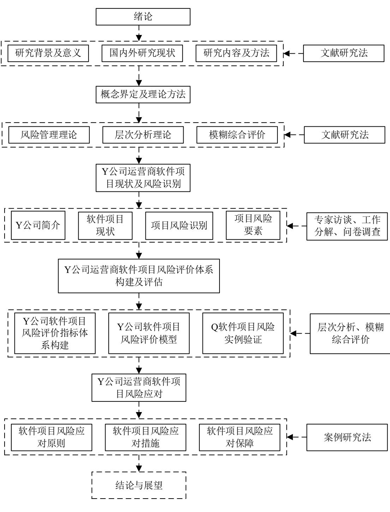  
图1-1技术路线图

### 1.3.2 研究方法

（1）文献研究法

本文通过对项目风险管理领域的文献进行研究，涵盖了期刊以及相关资料的查找与整理。通过这一过程，深入了解了软件项目与风险评估方面的发展情况与方法。

 （2）问卷调查法

为了更好地符合Y公司项目风险问题的真实情况，作者将通过发放问卷的方式向Y公司内部技术核心人员、项目管理人员、项目专家进行对现有风险问题进行基础数据收集，提升论文的真实性、可靠性。

 （3）层次分析法（AHP）

采用层次分析法（AHP）来确定各个风险因素的权重进行一致性检验，最后对这些因素对项目的影响进行排序，以确保权重的可靠性和有效性。

 （4）模糊综合评价法

对存在不确定性和模糊性的风险因素，用模糊综合评价法进行处理。首先，将不确定性因素转化为模糊集合，通过定义模糊隶属函数来描述其隶属度。然后，利用模糊逻辑和模糊推理方法对模糊集合进行分析和评估。以更好地处理风险因素的模糊性和不确定性，提高风险因素数据的准确性。

 1.4 研究创新点

第一，研究视角方面，本研究以Y公司运营商软件项目为例，从特定类型的软件服务项目出发，而不仅是一般性的风险研究，赋予研究更强的针对性和现实意义，也更吻合实际项目风险管理的需要。同时，本研究将项目风险、项目管理与风险管理三个领域的研究成果进行整合和创新，针对特定类型软件服务项目，构建出一个适应Y公司实际需求的软件项目风险评价体系。

第二，关于研究方法，本文结合层次分析法与模糊综合评价法来开展风险评估。这种方法相较于传统风险评估，能够以更加精确和科学的方式进行风险的评价及定量化分析，所以在研究方法论上有创新之处。具体而言，通过层次分析法使风险识别与量化过程更客观、科学，且该方法简便易懂；而模糊综合评价法的运用，有效应对了风险评估中存在的不确定性和模糊性问题，从而提高了评估的效果和精确度。

# 第二章 概念界定及理论方法

## 2.1基本概念

## 2.1.1项目管理

管理者应该恪尽职守，科学开展项目管理相关工作，并充分利用资源，有效运用各种风险应对策略与方法。为实现项目预期目标，从投资决策阶段到项目结项，应当从组织、指挥、调整、控制、评估进行全面管理。在传统的项目管理方式中，财务、市场和行政等部门通常也会参与到项目开发过程中，由于观点的不同，可能会带来冲突，进而提高项目成本，阻碍软件项目开发效率。

在软件项目管理中，不同职能部门的人员会组成项目组，项目经理作为整个项目的主管，负责快速高效地进行团队管理与协调，确保在计划内完成项目目标。项目经理必须参与需求确认、人员招聘、计划制定与项目结项等过程，需要全面掌控成本、进度、效率、软件交付质量、合同、资源采购和人员等全面的管理过程。在实际管理中，项目经理必须能够分析各种问题，提高问题处理的效率，并有效应对各种复杂的情况。项目管理涉及利用专业知识、技术工具和方法论，在资源有限的条件下实现或超越项目目标和期望。

# 2.1.2 软件项目风险管理

软件项目的目的在于开发独创性的产品或者提供独特服务；这需要在一系列相互关联的特殊任务下，进行有效的资源管理和利用，以达成预定目标。这类项目通常是在一定时间内，为实现一系列特定目标所进行的相关工作的统称。这类项目通常是在限定时间内，为实现这一系列特定目标而进行的相关工作的统称。软件项目的工作通常包括市场竞标、需求整理、软件开发、软件测试、产品发布以及后续运维等多个阶段的活动。

在开发软件系统的过程中，每个项目都会面临不同程度的不确定性风险。这主要是因为软件开发会涉及到一些新的未经验证的技术、产品或架构模式，这些都是之前没有充分了解的。此外，软件开发流程的复杂性以及所需技术的知识深奥也导致需要投入大量的人力、物力、资金等。这些“未知量”或“不确定因素”的出现，会增加软件项目开发的难度与风险，进而影响软件开发项目计划的结果。因此，对于软件项目中的风险，如何采用合理、科学且准确的风险应对措施显得极为关键。当今时代，科技的飞速发展成为新时代进步的象征，城市化与现代化水平不断提升，软件项目的开发已经不只是简单的开发过程，而是需要从项目启动到结束全程进行风险控制，以避免对软件项目开发造成不可挽回的影响和不必要的经济损失。更为关键的是，项目决策者和管理者在识别风险、选择和规划项目过程中的关注点变得日益重要。

对于公司而言，管理软件项目风险是一项至关重要的任务，它直接影响着软件开发项目成功与否。在资源受限且科技不断进步的现状下，管理者必须保持清醒的认识，并迅速提升其处理项目中不可预见问题的能力。研究软件项目的风险管理极为关键，它有助于有效地应对和控制不确定性因素。通过风险管理，可以发现、解决及消除风险，或尽可能降低由此带来的损失。这一流程旨在对软件项目流程及产品风险进行评估与管理，目的是保证项目能够顺利达成既定目标。从人们通常的理解来看，进行软件风险管理就是要判断那些影响项目目标实现的主要风险源，并评估这些风险发生的概率、潜在损害以及在紧急情况下的影响，制定相应的举措和行动方案来应对主要风险。

软件项目风险主要包括两部分内容：首先是针对预测风险的预防措施。即在风险转化为实际损失之前，采取积极措施以降低或消除风险，这就要求具备准确的风险预测能力。其次是对已经发生的风险所采取的补救措施。然而，在软件项目风险管理的实践过程中，其管理过程与目的大体相同，软件风险的识别、评价、监控过程是为了实现进度、成本、确保质量。

软件项目管理深受传统项目管理经验的影响，并且软件自身也是独一无二的。比如，软件是依靠人的智慧和劳动创造的，主要依赖人力资源。其独特之处在于软件的无形属性，这增加了项目风险。软件项目风险管理通过利用相关的知识、技术、工具、技巧，确保了项目的完整性，满足项目管理的要求。软件项目面临的风险多种多样，这些风险具有客观性、普遍性、随机性、不可避免性、不确定性、以及风险的多样性与层次多样性。这些特征使得软件项目风险管理变得尤为复杂和关键。

# 2.2风险管理理论

各种未知因素中存在着风险，随着情况的改变，这些风险也在不断演变。随着社会的不断发展，人们对风险管理的认识和分析日益加深。特别是在风险识别、评估以及应对等多个方面，进行了深入而全面的分析。海外对风险管理的分析始于较早时期，主要集中在公司对相关人员以及项目的管理活动上。通常情况下，公司高层了解到风险管理的关键性通常是在一定损失产生以后。

20 世纪初，德国首次提出了风险管理，这一概念是在一战后复苏中产生的。随后，这一领域在美国开始流行，并逐步演变为一门自主的学问。从 20世纪30年代至 60 年代，企业和学术界开始全新地认识风险管理，美国知名学府的工商管理学院均设立了风险管理课程。到了70 年代，该理论在加拿大、亚洲的一些地区得以快速推广，从而标志着风险管理从传统阶段进入现代风险管理阶段。进入21 世纪，随着COSO风险架构、项目管理知识体系（PMBOK）、以及国际标准化组织ISO发布的《质量管理体系项目质量管理指南》和《项目管理指南》，现代风险管理进一步发展至全面风险管理阶段。随着科技进步和社会生产力的发展，项目管理变得更加复杂，风险管理在其中扮演着至关重要的角色。RobertChapman（2019）[41]通过相关研究表明，风险管理的目的在于利用不同方法来鉴别风险要素，并采取控制方案以及对策措施，以减轻风险要素对费用、品质等多个方面的影响，确保项目顺利开展。Engemann（2021）[42]强调，风险管理的首要目的在于减少风险事件形成的概率，降低风险要素对项目造成的负面影响。有效的风险管理流程有助于识别并控制项目中存在的潜在风险，从而增强项目的可靠性。

通过规划、识别、评估、评价、应对和监控风险等活动，风险管理帮助企业降低风险带来的损失。特别是在电信行业，风险管理理论成为指导电信运营商软件项目中风险识别、评估和应对决策的理论基础，从风险的定义、分类到测量和控制等方面都有所涉及。风险管理理论的适用性在于其提供了一套全面而系统的方法去识别、评估和应对面临的潜在风险。在现代企业运营中，风险的出现是一种常态，而对风险的识别、评估和应对就成为了企业运营中的重要任务。风险管理理论应用主要体现在第三章Y公司运营商软件项目现状及风险识别中，运用了风险管理理论的思想，通过识别Y公司软件项目可能面临的各种风险，来找出所面临的风险点。然后，通过分析风险的影响因素，即风险要素，进一步剖析风险产生的原因。在第四章Y公司运营商软件项目风险评价体系构建及评估中，根据风险管理理论的理念，构建了一套完善的风险评价体系，以及评价模型，并以实际的软件项目为例，验证了风险评价体系的有效性。在第五章Y公司运营商软件项目风险应对中，又进一步地运用风险管理理论，对于识别和评估出来的风险，提出了应对措施，旨在减少风险的发生概率和影响程度。

# 2.3方法基础

# 2.3.1 层次分析法

（1）层次分析法简介

上世纪七十年代，一名运筹学家提出了层次分析法（AHP），这位教授来自匹兹堡大学，他将这种综合评价多目标、分层次赋予权重的决策方法运用于课题分析中。他进行了分析，探究了各个行业对国家利益的贡献程度，并为各个产业赋予了权重。随后，他利用这些权重值来分配国家的电力资源，这一研究方法即是该方法的雏形。

庞宏秋（2022）[43]表明这一方法的产生使得人们在实践内能够更好地应对那些在数学上较为复杂难解的问题，将这些抽象问题转化成相对简单的数学运算过程。当涉及复杂、级别多的问题时，能运用细分问题、逐层研究要素之间联系与影响大小的方法。通过这种途径，可以构建一种广泛接受的简明数学模型，利用数值运算直观地展现繁杂问题每个层次以及系统内部构建相互影响的关系。

层次分析方法融合了定性和定量的分析方式，其执行步骤是针对一个涉及多个元素与层级的问题，利用需要处理该问题的个体或是群体的经验，为每一个层级的元素赋予适当的权重，并根据权重的多少来评估该元素在整体上的重要程度以及和其他元素的联系。田彦章（2022）[44]表明，该方法的运用可以在某种程度上处理一部分无法精确测量的复杂且隐藏着层次联系的问题。

（2）层次分析法步骤$\textcircled{1}$ 构建风险指标体系

通过层次分析法对风险进行评价，首先要构建相应的风险指标体系，其主要包括三层，由上到下分别是：目标层、准则层、指标层。

$\textcircled{2}$ 构造风险因素的AHP 判断矩阵并赋值

判断矩阵是一种评估方法，通过对比同一层次下不同风险因素之间的优劣，得出相对优势矩阵，用于评估上层风险因素之间的关系。举例来说，在下层A1，A2，A3，A4与上层C之间存在着相互联系。有关于上层C的判断矩阵如2-1所示：

$$
A = \left( \begin{array} { l l l l } { a _ { 1 1 } } & { a _ { 1 2 } } & { a _ { 1 3 } } & { a _ { 1 4 } } \\ { a _ { 2 1 } } & { a _ { 2 2 } } & { a _ { 2 3 } } & { a _ { 2 4 } } \\ { a _ { 3 1 } } & { a _ { 3 2 } } & { a _ { 3 3 } } & { a _ { 3 4 } } \\ { a _ { 4 1 } } & { a _ { 4 2 } } & { a _ { 4 3 } } & { a _ { 4 4 } } \end{array} \right)
$$

在这种情况下， $a _ { i j }$ 表示对项目风险的评估，通过比较准则 $A _ { i }$ 和 $A _ { j }$ 的重要性，并根据标准确定它们之间的相对优势。专家们会对 $a _ { i j }$ 进行评分，从而确定其取值。AHP 通常采用 1-9 标度法，用于在定量层面比较元素之间的两两关系。具体标度取值可参照表2-1。

2、4、6、8

倒数

表2-1重要性标度及其含义  
上述两两相邻判断的中间值  
表2-2RI数值表  

<table><tr><td>n</td><td>1</td><td>2</td><td>3</td><td>4</td><td>5</td><td>6</td><td>7</td><td>8</td><td>9</td><td>10</td></tr><tr><td>R1</td><td>0</td><td>0</td><td>0.58</td><td>0.90</td><td>1.12</td><td>1.24</td><td>1.32</td><td>1.41</td><td>1.45</td><td>1.49</td></tr></table>

因素i与j比较的判断 $\underline { { a _ { i i } } }$ ，则因素j与i比较的判断 $\underline { { a _ { i i } = 1 / a _ { i i } } }$ (id:)

$\textcircled { 3 } \mathrm { A H P }$ 判断矩阵一致性检验

在对所得到的判断矩阵进行验证之前，必须首先进行一致性检验，这是一个非常关键的步骤。在进行一致性检验时，需要按照以下基本流程进行：

一是，求出一致性指标 $C I = \frac { \lambda _ { \operatorname* { m a x } } - n } { n - 1 }$ 二是，查阅表2-2 来确认平均随机一致性指标RI。

计算一致性比率：

$$
C R = \frac { C I } { R I }
$$

当一致性比值（CR）较小时，表明所得出的判断矩阵具有较好的一致性。一般而言，当一致性比例 CR 比 0.1 小时，表示判断矩阵的不一致程度处于可接受范围内，因此可以将特征向量用作指标的权重。反之，则需要重新对各项因素进行两两比较，直到评价矩阵的一致性满足规定要求。

$\textcircled{4}$ 根据 AHP 判断矩阵对相对权重进行计算首先对向量进行计算：

$$
\boldsymbol { W } ^ { * } = \left( \boldsymbol { w } _ { 1 } ^ { * } , \boldsymbol { w } _ { 2 } ^ { * } , \boldsymbol { w } _ { 3 } ^ { * } , \boldsymbol { w } _ { 4 } ^ { * } \right) ^ { T }
$$

$$
w _ { i } ^ { * } = \sum _ { j = 1 } ^ { n } \frac { a _ { i j } } { \displaystyle \sum _ { i = 1 } ^ { n } a _ { i j } } , i , j = 1 , 2 , 3 , 4
$$

然后归一化处理：

$$
W = \left( w _ { 1 } , w _ { 2 } , w _ { 3 } , w _ { 4 } \right) ^ { T } , \sharp \sharp \sharp , \quad w _ { i } = \frac { w _ { i } ^ { * } } { \sum _ { i = 1 } ^ { n } w _ { i } ^ { * } }
$$

# 2.3.2 模糊综合评价

模糊综合评价法最早源自模糊集合理论，这一方法是由Zadeh于 1965 年首次提出的。通过彻底研究和评价对象，运用模糊数学的理论来做出综合的描述和评定。李慧芳（2023）[45]指出模糊综合评价方法的目的在于消除界限模糊等问题。相较于其他模型，该种方法在处理难以量化的问题时具有显著的优越性。然而，潘李冬等（2023）[46]通过相关研究表明，该方法存在一些局限性。在该方法中，权重的确定需要依赖AHP，因为不同研究人员对指标的偏好存在明显不同，这导致主观想法的影响较强，同时使得运算过程更加复杂。

模糊综合评价的主要步骤为：

（1）评价元素集的组成

元素集 $U = ( U _ { 1 } , U _ { 2 } , \cdots , U _ { m } )$ 就是包括全部影响评价对象的因素在内的一系列要素的集合。这些元素的挑选方式十分多样，既有具体的，也有抽象的。

（2）结合评价目标要求划定等级，同时构建评价集

评价集是对特定内容或项目进行综合评价的研究成果，在表示上一般以$V$ 来表述，即 $V = ( V _ { 1 } , V _ { 2 } , \cdots , V _ { n } )$ 。每名专家的观点则用元素 $V _ { \scriptscriptstyle i } ( i = 1 , 2 , \cdots , n )$ 来标识。值得注意的是最终的评价结果会受到每个评价要素的影响，因此这些结论需要从评价集内提取相应的评估数值。

（3）建立各风险因素的权重集

权重代表了各个元素在上一层次目标中的重要性，通过设定合适的权重，可以揭示出各元素的重要性。一般来说，会根据不同的元素 $U _ { i } ( i = 1 , 2 , \cdots , m )$ 设定相应的权重 $a _ { i } ( i = 1 , 2 , \cdots , m )$ ，而权重集就是这些被设定的权重的总和。

一般来说， $A = ( a _ { 1 } , a _ { 2 } , \cdots , a _ { m } )$ 各个权数 $a _ { i } ( i = 1 , 2 , \cdots , m )$ 必须满足：$\begin{array} { r l } { \Sigma _ { i = 1 } ^ { m } a _ { i } = 1 } & { { } \ a _ { i } \mathcal { D } ( i = 1 , 2 , \cdots , m ) } \end{array}$ (cid:)

（4）采用风险因素的单独评价，建立模糊关系间的矩阵

经过对各个要素做模糊评价以后，能够构造出模糊关系 $R$ 。依照权威人士的评估，将为模糊关系矩阵 $R ( i j )$ 打分，这需要全面衡量每一要素的得分状

态。得出如下模糊关系矩阵为：

$$
R = { \left[ \begin{array} { l } { r _ { 1 1 } , r _ { 1 2 } , r _ { 1 3 } , \cdots r _ { 1 n } } \\ { r _ { 2 1 } , r _ { 2 2 } , r _ { 2 3 } , \cdots r _ { 2 n } } \\ { \cdots } \\ { r _ { m 1 } , r _ { m 2 } , r _ { m 3 } , \cdots r _ { m n } } \end{array} \right] }
$$

（5）采用模糊数学运算得出综合评价

当采用单因素模糊评估策略时，可以准确地识别出被评估对象受到单一因素作用的状态。综合各个方面的因素后，可以得出更明确和准确的评价。触及单因素模糊关联矩阵 $R$ 的结果来看，第 $i$ 个要素对于受评对象的影响可以在矩阵$R$ 的第 $i$ 行中清晰展现出来；而被所有要素影响的评估对象在第 $i$ 个评估要素的程度上，可以通过矩阵 $R$ 的第 $j$ 列来准确呈现。基于这一点，每个因素的综合影响也能够通过对每列因素与 $R _ { j } = m { \sum } r _ { i j } ( j = 1 , 2 , 3 , \cdots n )$ 的反映来揭示出来。

基于权重集B，可以用矩阵乘法来计算一行乘以 $m$ 列的模糊矩阵，表示如下：

$$
B = ( a _ { 1 } , a _ { 2 } , \mathbf { a } _ { 3 } , \cdots \mathbf { a } _ { \mathrm { m } } ) { \left[ \begin{array} { l } { r _ { 1 1 } , r _ { 1 2 } , r _ { 1 3 } , \cdots r _ { 1 n } } \\ { r _ { 2 1 } , r _ { 2 2 } , r _ { 2 3 } , \cdots r _ { 2 n } } \\ { \cdots \cdots } \\ { r _ { m 1 } , r _ { m 2 } , r _ { m 3 } , \cdots r _ { m n } } \end{array} \right] } = ( b _ { 1 } , b _ { 2 } , b _ { 3 } , \cdots b _ { n } )
$$

$b _ { j } ( j = 1 , 2 , \cdots , n )$ 为评价指标， $B$ 为综合评价集。对于评价对象，其对评价集中各个要素的隶属程度以及评价集 $V$ 上的模糊子集分別用 $b _ { j }$ 与模糊综合评价集 $B$ 表示。

层次分析和模糊综合评价方法为项目风险评价提供了一种新的思路和方法，它能克服传统风险评价方法的局限，大大提高项目风险评价的范围和效率。因此，构建基于AHP-模糊综合评价法的项目风险综合评价模型。

# 第三章Y公司运营商软件项目现状及风险识别

# 3.1Y公司基本情况介绍

# 3.1.1Y公司简介

Y公司成立于2019 年，专注于为电信运营商提供高质量外包服务，致力提升电信运营商行业的工作效率和服务水平。以为客户提供优质的解决方案为使命，以成为领先的服务提供商为愿景，坚持客户至上的理念，秉承为客户和合作伙伴创造更广阔的发展空间的核心价值观。

经过近五年的行业深耕，Y公司已形成以北京、河南为轴心，逐步向外扩展，截止至2023年底，该公司已覆盖电信运营商MBOE域全业务的产品支撑。并逐步形成互联网运营平台解决方案，该平台核心价值在于通过自身服务和第三方应用的互利互惠，提高用户对应用和平台的整体体验和粘度。通过打造核心运营生态链，在平台运营侧以标准接口形式提供各类第三方应用，实现互联互通。在数据运营侧通过数据建模、数据分析、精准匹配等，满足消费者个性化多样化的需求。

Y公司是一家专注移动互联网 $^ +$ 云计算的高科技企业，主要从事系统解决方案及软件服务开发的业务。包括提供系统集成、软件开发和技术服务。系统解决方案涵盖从需求分析、系统设计到最终实施的一站式服务。对于操作系统优化，嵌入式系统开发、云计算应用和大数据分析等进行有效整合，并发挥最大效益。软件开发包含了企业管理、移动应用、营销活动等多个领域，用以满足不同的用户业务需求。至于技术服务，它包括了前期咨询、系统规划、技术支持以及培训等服务，以实现用户的技术需求与期望。

其中权益运营中心和精准营销平台已经占据公司 $9 5 \%$ 以上的收入来源，权益运营中心通过 B2I2C 模式整合运营商及异业的权益资源，提供权益发放、核销、返销的全面能力。精准营销平台通过大数据获取用户特征、消费、位置、内容访问、终端等数据，利用人工智能，以用户、产品、触点、事件为核心，为客户构建实时、智能、场景化的精准营销能力，提供运营支撑服务。快速实现目标客户圈定、营销策略匹配、营销任务生成，通过多元化的线上线渠道将营销信息及时推送给目标客户，使客户能够便捷地参与产品订购，进而有效提升了营销的效率与价值。

作为一家科技公司，Y公司注重研发管理体系，并先后通过了CMMI3等级认证、ISO9001:2008 质量管理体系认证、ISO/IEC27001:2005 信息安全管理体系认证和通过ISO/IEC20000:2005 服务管理体系认证。此外，Y公司开始对运营商以外的项目进行尝试，包括能源、教育等行业。期望多元化的发展战略为Y公司带来更广阔的发展空间，从而降低市场风险，增加盈利机会，并为公司未来的发展奠定基础。

# 3.1.2 组织架构

Y公司形成以项目制组织架构为主的组织形式。公司的架构包括高层管理层、项目管理办公室（PMO）、项目团队、职能部门和创新合作部。其中高层管理层负责制定公司整体战略和资源分配，而PMO 负责管理和监督整体项目组合。项目团队是公司的核心，由项目经理、软件开发工程师、市场营销专家等专业人员组成，负责执行具体的项目任务。支持部门则为项目团队提供后勤和支持服务，确保项目顺利进行。创新合作部门致力于寻求新的业务机会和合作伙伴，拓展服务领域，为客户提供更多元化的解决方案。以便适应客户不同部门的需求能够高效灵活地应对，确保项目的质量和进度，为客户提供高质量、高效率的外包服务，具体如图3-1所示。

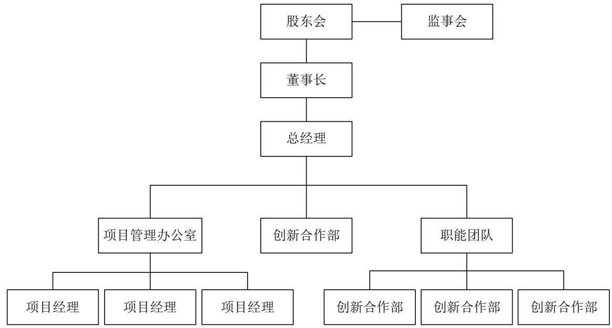  
图3-1Y公司组织架构图  
资料来源：Y公司人力资源部

# 3.1.3人力资源现状

（1）人员配置结构

随着Y公司规模的快速增长，截至 2023 年末Y公司在职总人数 43人，其中项目交付部 30人，占比达 $6 9 . 7 7 \%$ ，其次是职能部门6人、高层管理层3人、创新合作部2人、项目管理办公室（PMO）1人。Y公司现有人员配置结构如表3-1所示。

表3-1Y公司人员配置结构  

<table><tr><td>人员结构</td><td></td><td>】高层管理层项目管理办公室项目交付部职能部门</td><td></td><td></td><td>创新合作部</td><td>总计</td></tr><tr><td>人数</td><td>3</td><td>1</td><td>30</td><td>6</td><td>2</td><td>43</td></tr><tr><td>占比</td><td>6.98%</td><td>2.33%</td><td>69.77%</td><td>13.95%</td><td>4.65%</td><td>100%</td></tr></table>

数据来源：Y公司人力资源统计

Y公司人员年龄结构如图3-2所示。由年龄结构图可知，Y公司员工30-39岁的中青年居多，占到总人数比例的 $53 \%$ ，在软件开发行业背景下，目前Y公司的员工年龄分布相较标准分布偏大。由于软件开发行业的创新理念和技术快速迭代，对员工的活力和灵活性有一定的要求。

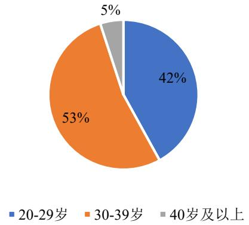  
图3-2Y公司人员年龄结构  
数据来源：Y公司人力资源统计

Y公司的文化程度不高，其中研究生及以上学历仅1人，专科学历20人，占比高达 $5 2 . 6 3 \%$ 。通过进一步分析，其中20-29 岁的专科占比高达 $62 \%$ ，本科仅占 $3 8 \%$ 。

表 $3 { - } 2 \mathrm { ~ Y ~ }$ 公司员工文化程度结构  

<table><tr><td></td><td>硕士及以上</td><td>本科</td><td>专科学历</td></tr><tr><td>人数</td><td>1</td><td>17</td><td>20</td></tr><tr><td>占比</td><td>2.63%</td><td>44.74%</td><td>52.63%</td></tr></table>

数据来源：Y公司人力资源统计

# 3.2Y公司软件项目风险管理现状

# 3.2.1 软件项目管理现状

Y公司软件开发项目作为该公司生存根本。根据现有软件项目实际情况，从软件项目的立项开始到项目交付作为一个项目的生命周期。Y公司项目管理办公室将项目分为六个阶段，分别为分析项目、规划项目、建立项目、实施项目、移交项目和关闭项目。在分析项目阶段包含项目调研、项目疑问、项目解答、制定可行性报告、可行性报告分析。在规划项目阶段包含服务交付方案设计、工作量与交付成本评审。在建立项目阶段包含项目立项、项目策划、交付方案定制、详细方案撰写与评审、预算评审。在实施项目阶段包含项目计划评审、项目变更评审、编译、调试和项目测试、项目变更成本评审、项目验收。在移交项目阶段包含项目验证、文档交接。在关闭项目阶段包含项目结项、项目决算评审、项目复盘。各阶段都有明确的目标和详细的工作内容，由项目经理与客户对接，协调项目整体资源。与公司内部六个阶段匹配的是外部执行阶段，分别为项目立项阶段，需求分析阶段，项目开发阶段，项目测试阶段，项目交付阶段，项目维护阶段。

Y公司软件项目现阶段全部来源于电信运营商合同项目，以项目制的管理形式进行组织管理，并根据不同的项目需求配备相应的项目组人员，并按照上文中提到的几个阶段进行管理。项目组人员一般包括：项目经理、需求经理、技术经理、测试经理、运维经理等。

项目自商机开始由项目经理进行跟进，项目管理活动一般包括六个阶段， 如图3-3所示。

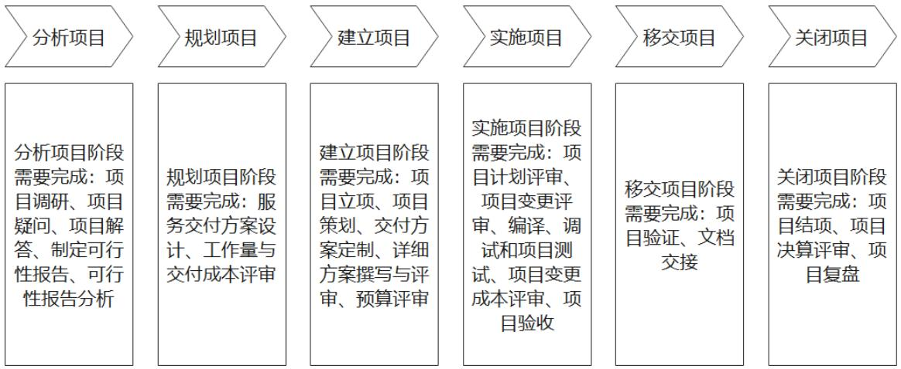  
图3-3项目管理活动  
来源：Y公司项目管理办公室

在项目立项后根据项目策划进行项目执行，执行阶段一般分为需求分析、产品设计、UI设计、程序设计、代码编写、软件测试、运行维护7个阶段。在需求分析阶段，根据客户要求进行需求收集，然后进行需求转译，需求转译后经过客户确认，由需求经理组织需求评审会，进行需求沟通和答疑。由产品经理对需求进行编译，输出产品原型和产品需求文档（PRD），将原型图交由UI进行设计，再由技术经理和测试经理根据产品需求文档进行设计文档和测试用例文档编写，文档编写完成后分别组织评审会，进行对应文档评审，确认是否与需求文档和产品需求文档有偏离，如无偏离再进行代码编写、软件测试、运行维护。期间由项目经理根据任务规划，结合客户时间要求、项目人员资源，在确定任务优先级后，估算每个阶段时间成本，编写项目进度，并与客户汇报进度。

项目采用甘特图形式将软件项目各阶段的任务、关键时间节点、任务状态和完成进度进行跟踪。由项目经理负责监管并向客户项目负责人、公司项目管理办公室、项目组成员进行定期汇报，如图3-4所示。

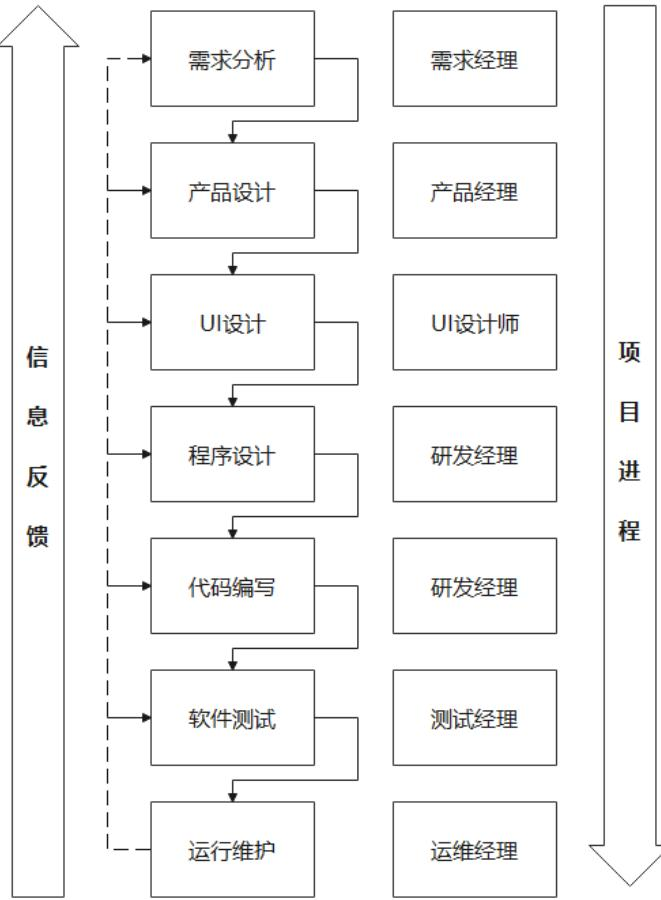  
图3-4甘特图项目管理法  
来源：Y公司项目管理办公室

在考察Y公司进行软件项目开发及管理的流程以及各项子任务的管理流程与内容时，可以发现Y公司拥有一整套在软件项目开发的各个环节中非常有效的系统管理体系。这一管理体系对于项目执行过程中的每一个里程碑节点以及各个子任务在人力、资料、时间、进度、质量等多个方面采取了严格的控制管理。

# 3.2.2 软件项目风险管理现状

正如先前提及的，Y公司对软件项目开发管理的质量高度重视，在软件开发的每一个阶段、节点以及功能模块都采取了严格的质量控制标准，将质量控制贯穿到每位参与人员、每台设备乃至每一项标准中。同时，还制定了各项管理制度，以确保软件项目的质量和进度。由于Y公司在软件项目的质量控制方面表现出色，重点管理了软件项目的进度与质量，从而有效降低了开发过程中的一些风险。因此，对于软件项目的风险管理，Y公司未能给予足够的重视。结果是，Y公司在软件项目风险管理方面的表现并不令人满意。尽管Y公司为软件项目建立了一套风险管理体系并进行了适当的规划，但在实际项目执行中，这套体系未能得到充分的实施和发挥。

# （1）风险管理体系

对其协同办公管理平台，Y公司基于软件项目的开发和管理流程，建立了一套适宜的风险管理体系。在项目启动之初，便创建针对软件项目的风险检查清单，从项目启动阶段起，项目涉及的所有参与者，包括项目总监、项目经理、各项目小组组长、团队成员、顾客等各利益相关者，都将依据该风险检查清单，对项目各环节可能遇到的风险要素进行辨识与描述，明确风险因素的来源及类别，并对风险发生可能性及其带来的影响进行评价打分。项目经理负责将各项信息进行汇总并对进行分类。随后，项目经理与项目总监共同对识别出来的风险进行深入分析、评价、排序，以此来明确风险因素的等级。针对不同级别的风险，选择最适宜的应对方案，并据此制订出详细的风险控制措施。此外，还将输出风险管理清单。对于清单中列出的所有风险因素，实施全面的监视和跟进，并启动风险应对机制，当达到应对处理的条件时，实施风险控制措施，并核实风险是否已消除并。如果应对条件不满足或实施控制措施后风险仍未关闭，则继续追踪和监控。在此过程中，风险管理清单会动态更新，直至所有风险被关闭，才算完成风险管理。尽管Y公司拥有关于风险管理体系的流程的相关资料，但缺乏针对风险管理实施细节的具体资料和支持文件。在与项目经理和团队成员的座谈过程中发现，这套软件项目风险管理体系流程图仅仅存在于技术标文档中，其主要目的是辅助项目竞标过程。因此，实际的项目执行过程中，并未对风险管理进行严格的应用和执行。

（2）Y公司的软件项目风险管理规划主要包括为风险管理流程中的人员、组织、设备、资源、任务、职责、利益相关者制定明确的分配与配置规定，旨在确保风险管理措施得到有效执行，并在问题发生时能够及时定位责任方，进行追责，明确责任归属，基于充分证据对涉事者进行合理惩处，，这样做有助于对风险管理流程进行规范和指导。

Y公司针对软件项目开展的风险管理规划是通过风险管理体系流程图，结合风险检查表来检视软件项目的实际状况，进而对风险进行发现、评价、应对、控制的策略制定，详细内容为：

第一，明确风险管理的角色与分工。即在风险管理流程的各个环节——包括识别风险、进行风险评估与分析、制定应对策略及执行风险控制——指派合适的人员及其相应职责。其中，项目总监承担着对风险的总体监控责任；项目经理负责识别、评价分析、应对及控制风险；项目组长的任务是发现风险、分类，并追溯其来源；项目成员则负责识别风险以及上报在执行任务过程中遇到的风险情况；而其他相关人员的职责是协助上述人员管理风险。

第二，识别软件项目中的各种风险因素。在风险管理的过程中，首要任务便是识别风险，这是基本的前置工作。具体到软件项目的风险识别，涉及的内容主要有：在软件项目的开发管理中，哪些风险因素较为显著，哪些属于潜在风险；这些风险各自在项目流程的何处阶段出现；它们对软件项目的哪些方面产生了或可能产生的具体影响以及大致的危害程度等。总之，识别软件项目中的风险要素，以及定性评估这些风险可能导致的后果，就是软件项目风险识别的任务。在进行风险管理识别的过程中，Y公司通常运用多种方法，其中包括德尔菲法、头脑风暴法、情境分析法。显然，依靠单一的方法进行风险识别可能不够周全。通常，选择使用单一方法还是结合多种方法采取行动，需根据项目具体情况灵活调整。

第三，对于软件项目而言，进行风险评估至关重要。风险的识别工作为评估风险提供了坚实的基石。而这种评估是为之后进行风险控制提供决策的依据。因此，风险评估在软件项目的风险管理中起着至关重要的作用。其成功与否不仅影响了风险识别的效果，同样还关系到风险控制的成效。在识别出软件项目各阶段的风险因素之后，接下来的步骤是挑选一个适宜的评估模型，并采用恰当的方法来对这些风险因素进行量化分析，以确定风险发生的可能性及其对项目的潜在影响。通过这种量化分析，可以明确不同风险因素的等级，进而根据等级高低，采取相应的应对措施。简言之，就是为风险决策提供有效的数据与支持，假如可以做到有效评价，就能保证软件项目的顺利完成。Y公司采用的项目风险评估与分析方法包括模拟法、主观概率法、模糊分析法等。

第四，软件项目风险应对与控制。风险识别是前提，评估是关键，而控制则体现了成效。在有效完成风险的识别与评估工作后，可以获得以下风险信息：风险因素、风险出现的可能性、对项目的影响大小、风险出现的时间及地点。综合分析以上信息后，可以确定在特定时间和阶段采用合适的方法来管理不同等级的风险，并评估这些措施的成效。换句话说，根据上述信息来制订应对和控制风险的详尽计划。Y公司在管理软件项目风险时通常采用四种策略：规避、减轻、转移、接受。在具体实施这些策略时，需要灵活、综合使用，避免机械式地应用。

在Y公司的技术标准模板里，虽然对风险管理规划的相关内容进行了描述，但在具体执行软件项目管理时，缺乏能体现这些规划的实际数据或文件记录。此外，风险管理的职责分配不明确，不够细化。可以明显看到，Y公司在风险管理规划方面处理得相当粗略。

# 3.3Y公司软件项目风险识别

# 3.3.1 选择风险识别方法

在针对Y公司电信运营商软件项目的风险管理研究中，风险识别作为风险管理的首要步骤，其科学性和全面性对后续风险评估与控制措施的有效性具有直接影响。在本研究中，综合考虑了项目复杂性、技术新颖性和多元文化背景下的不确定性，采用了专家意见法与知识库相结合的方法，实现对Y公司软件项目潜在风险点的全面捕捉。通过召集一组由行业专家和项目管理专家组成的专家小组并结合历年项目的风险知识库，运用德尔菲法对项目的每一个阶段进行系统地、多轮次的风险识别和审查。专家小组不仅囊括了不同层面的高级项目管理者，也包括了具有深度技术背景的资深工程师，确保从多角度覆盖项目可能面临的风险。在此基础之上，结合专家小组成员的经验判断和行业实践，通过定性和定量相结合的方式，识别和评价各类风险因子的严重程度、出现频率及侦测难度。

由15 名组员组成的风险管理识别团队，其中3名企业高管人员，2 名大学教授、2名财务管理人员，2名人力资源管理人员，2名项目管理人员，2名风险管理专家以及2名技术支撑人员，如表3-3所示。

表3-3风险管理识别团队  

<table><tr><td>类别</td><td>人数</td></tr><tr><td>企业高管人员</td><td>3</td></tr><tr><td>财务管理人员</td><td>2</td></tr><tr><td>人力资源管理人员</td><td>2</td></tr><tr><td>项目管理人员（包括PMO、项目经理）</td><td>2</td></tr><tr><td>技术支撑人员</td><td>2</td></tr><tr><td>大学教授</td><td>2</td></tr><tr><td>风险管理专家</td><td>2</td></tr></table>

# 3.3.2 风险识别过程

风险识别是项目风险管理的第一步，在进行风险识别前，项目管理办公室（PMO）要先建立风险识别小组，风险识别小组通常根据客户实际需求建立，由涉及项目需求的各个部门代表组成，包括项目经理、技术专家、业务领域专家、财务人员等。这些成员的专业知识和经验将有助于全面识别项目可能面临的各种风险。本研究风险识别小组如表3-3所示。

# （1）Y公司软件项目WBS分解

首先根据软件项目生命周期，与Y公司内外部项目管理活动相结合，通过头脑风暴的形式对Y公司软件项目进行WBS分解，如表3-4所示。

表3-4Y公司软件开发项目WBS 分解  

<table><tr><td>分解名称</td><td>一级</td><td>二级</td></tr><tr><td rowspan="5">Y公司软件项目 工作分解</td><td>启动阶段W1</td><td>可行性分析W11 需求调研W12 详细需求分析W21</td></tr><tr><td>规划阶段W2</td><td>制定执行计划W22 人力资源计划W23 成本估算和预算W24</td></tr><tr><td></td><td>制定沟通计划W25</td></tr><tr><td></td><td>系统设计W31</td></tr><tr><td>执行阶段W3</td><td>系统编码W32 系统测试W33</td></tr><tr><td>Y公司软件项目</td><td>执行阶段W3</td><td>项目监控和控制W36</td></tr><tr><td>工作分解</td><td>收尾阶段W4</td><td>验收及交付W41</td></tr><tr><td></td><td></td><td>维护和支持W42</td></tr></table>

（2）Y公司软件项目风险分解结构$\textcircled{1}$ 基于CMMI 风险检查表的风险识别

在Y公司软件项目经过工作分解结构（WBS）的分解后，下一步是进行风险分解结构的确定，对项目可能遇见的风险因素进行全面而深入的探知和分析，以便进一步对风险进行管理和控制。在确定风险评估小组成员后，由项目管理办公室（PMO）采用CMMI风险检查表为工具，对各种可能出现的风险因素进行分类和检查。检查的类别和项均来源于CMMI 风险检查表的内容。通过与风险小组成员的访谈，可以获取到更具实际情况的风险信息，进而完成风险检查表的填充。这样就形成了完整的风险分解结构，全面细致的涵盖了软件开发项目所有可能遇到的风险，这对接下来的风险管理和控制具有重要的指导意义。

基于检查表的风险类别根据检查项对Y公司风险小组成员进行访谈，最终形成的风险检查表如表3-5所示。

表3-5风险检查表分类  

<table><tr><td colspan="2">风险类别</td></tr><tr><td rowspan="2">商业风险</td><td>政治法律市场</td></tr><tr><td>客户 子承包商供应商</td></tr><tr><td rowspan="3">管理风险</td><td>项目计划</td></tr><tr><td>项目团队</td></tr><tr><td>上级领导行政部门合作部门</td></tr><tr><td rowspan="2">技术风险</td><td>需求开发、需求管理</td></tr><tr><td>综合技术开发能力（设计、编程、测试等）</td></tr></table>

$\textcircled{2}$ 基于PMO会议的初步项目风险

将访谈结果结合历史项目数据，使用风险识别矩阵，将整合后的风险类型进行分类和归纳。在矩阵中发现由于风险检查表里的风险类别颗粒度较粗，经与专家沟通后，结合Y公司实际情况将风险类别颗粒度进行细分，再由风险识别小组成员根据细分颗粒度一起填写可能的风险事件，并为每个风险事件分配一个相应的风险名称。针对整合后的风险类型及其可能的风险事件，由项目管理办公室（PMO）发起会议，并主持会议。

首先将进行头脑风暴，与风险评估小组成员一起深入讨论每种风险类型可能面临的具体风险事件，以确保所有潜在的风险都能够被识别出来。在头脑风暴的过程中，对每个风险事件进行深入分析，确定其可能的来源、对项目的影响以及可能的发生概率。再由会议主持人将会议上通过风险识别矩阵和头脑风暴识别出的整合后的风险类型及其名称记录在风险登记册中，包括详细的风险描述、可能的影响、发生概率、应对措施等信息。

结合文献研究，经过风险识别小组讨论后初步确定Y公司软件项目风险有9个，分别是技术风险、需求风险、人员风险、计划风险、沟通风险、质量风险、管理风险、商业风险和外部风险。项目风险分类表，如表3-6所示。

表3-6初步项目风险分类  

<table><tr><td>风险类别</td><td>描述</td><td>来源</td></tr><tr><td>技术风险</td><td>主要包括技术结构、接口、设计、安全等风险</td><td>刘承主（2022）[47]、胡世君 （2022）[48]</td></tr><tr><td>需求风险</td><td>主要包括需求的变更，需求的分析以及需求管 理等风险</td><td>胡世君（2022）、高超 （2023）[49]</td></tr><tr><td>人员风险</td><td>主要涉及到项目需求、产品、UI、开发、测刘承主（2022）[47]、胡世君 试、运维人员方面风险</td><td>（2022）[48]、</td></tr><tr><td>计划风险</td><td>主要包括工作分配、工作预估、任务分配合理</td><td>徐梓华（2022）[50]</td></tr><tr><td>沟通风险</td><td>性等风险 主要包括信息失真、信息过载、沟通不及时、</td><td>访谈</td></tr><tr><td>质量风险</td><td>成员之间的冲突、非正式沟通等方面风险 涉及开发工具，流程等方面的风险</td><td>胡世君（2022）[48]、</td></tr><tr><td>管理风险</td><td>主要包括内部团队控制、客户管理及企业管理刘承主（2022）[47]、胡世君</td><td></td></tr><tr><td></td><td>等层面的风险</td><td>（2022）[48]</td></tr><tr><td>商业风险</td><td>主要包括合同条款和条件、内部采购、供应 商、客户稳定性、分包等风险</td><td>访谈</td></tr><tr><td>外部风险</td><td>主要涉及法律风险、市场竞争风险、政策风 险、社会人口结构风险等风险</td><td>高超（2023）[49]</td></tr></table>

$\textcircled{3}$ 项目风险修正

由会议主持人将风险登记册反馈给指定的技术和业务专家后，经过征求和总结他们的意见。在考虑到风险之间关联性的情况下，将有关联的项目风险分类进行整合，并再次与风险项目小组进行沟通，确定Y公司软件项目风险有5个，分别是：项目执行风险，即在实际执行期间可能遇到的各种问题；资源与管理风险主要分为人力、物力、资金等资源分配不当或管理不善以及项目管理不足引起的风险；沟通和需求风险源自对项目需求的理解不充分或沟通障碍造成项目偏离预期目标；项目计划风险指项目进度管理与计划落实问题引起的风险。外部环境风险包含市场、法律等软硬环境对项目产生的影响，如表 3-7 所示。

表3-7项目风险分类  

<table><tr><td>风险类别</td><td>描述</td></tr><tr><td>技术和质量风险</td><td>将技术和质量风险进行整合，包括技术结构、接口、设计以及开发工 具、流程等方面的风险。</td></tr><tr><td>资源和管理风险</td><td>将人员和管理风险进行整合，包括内部团队控制、客户管理及企业管理 等层面的风险。</td></tr><tr><td>需求和沟通风险</td><td>将需求和沟通风险进行整合，包括需求的变更、需求的分析、需求管理 过程中的信息失真、信息过载、沟通不及时、成员之间的冲突、非正式 沟通等方面风险。</td></tr><tr><td>项目计划风险</td><td>将计划和商业风险进行整合，包括工作分配、工作预估、任务分配合理 性以及合同条款和条件、内部采购、供应商、客户稳定性、分包等</td></tr><tr><td>外部环境风险</td><td>主要涉及法律风险、市场竞争风险、政策风险、社会人口结构风险等</td></tr></table>

# 3.4Y公司软件项目风险要素

近年来，受科技发展影响，以及国家战略的提振和传统行业数字化进程的加快，产业数字化市场正在经历飞速的扩张。此时此刻，通信运营商作为数字经济基础之构建的主要力量，正在投身于机遇中，全力推进数量化的进化。伴随人工智能应用的广泛渗透，人与机器的对接合作也在迅猛发展，相应地，软件外包公司需要疾速适应外部环境的急剧变迁，同步应对更多的发展风险。期间，外部竞争的激增在推动企业内部改革、提高质量和管理的同时，也使得中小型软件外包公司承受了来自业界巨头市场下沉、业主要求降低成本与增效、标准的劲速提升及员工对于薪资待遇与个人成长空间的不满等方面的内外部压力。此外，随着科技的不断革新及业界的改良，新的技术的出现给中小型软件外包公司带来了更多的机会，然而，这也同时带来了更巨大的发展风险。因此，在保证企业持续发展的前提下，风险防控显得尤其重要，这无疑是对企业风险管理能力的重大挑战。软件外包公司需应对技术更新、行业升级等带来的新的挑战。面临行业内竞争压力加大，中小型软件外包公司必须寻求核心竞争力，通过技术创新、优化企业管理、提升服务质量等方式，在复杂的市场环境中赢得一席之地。此外，中小型软件外包公司也需注意防范各种风险，制定合理的营销和战略计划，加强企业内部的管理能力，从而有效地应对市场环境的变化，为企业的持续发展提供保障。基于表 3-6 的风险分类，在结合项目的具体情况后，对风险项进行了细分，整理出项目风险识别清单，如表3-8所示。

表3-8项目风险识别清单   

<table><tr><td colspan="3">风险类别 风险项</td><td>风险描述</td></tr><tr><td rowspan="9">技术和质 量风险</td><td colspan="3">技术人员安全由于技术团队缺乏对安全实践的认识和执</td></tr><tr><td></td><td>意识不足</td><td>行，导致安全漏洞和风险。</td></tr><tr><td></td><td></td><td>缺失技术负责项目缺少关键技术领导者，导致技术决策不</td></tr><tr><td>技术过程风</td><td>人</td><td>明确和技术团队指导不足。</td></tr><tr><td>险</td><td></td><td>进度监控机制项目管理缺乏实时监控和进度跟踪，导致问</td></tr><tr><td></td><td>不健全</td><td>题延迟发现和解决。</td></tr><tr><td></td><td></td><td>缺失代码审查缺乏代码审查过程导致代码质量问题和安全</td></tr><tr><td rowspan="3"></td><td>流程</td><td>隐患。</td></tr><tr><td></td><td>测试规划不准测试对困难度和复杂程度的错误评估导致人</td></tr><tr><td>确</td><td>员不足和时间延误。</td></tr><tr><td rowspan="9">资源和管 理风险</td><td>质量风险</td><td></td><td>技术文档和记技术文档和记录的不完整导致项目知识传递</td></tr><tr><td></td><td>录不完整</td><td>不畅和维护困难。</td></tr><tr><td>组织管理风</td><td></td><td>公司对项目的重视程度不够，使项目缺乏必</td></tr><tr><td>险</td><td>项目支撑不足</td><td>要的组织支持，导致项目目标无法实现。</td></tr><tr><td></td><td></td><td>项目管理风里程碑边界模项目里程碑边界定义模糊导致项目延期、验</td></tr><tr><td>险</td><td>糊</td><td>收困难和成本超支。</td></tr><tr><td></td><td></td><td>缺乏关键角色导致项目决策过程缓慢，与客 关键职位空缺户目标不一致，导致后期需投入大量资源进</td></tr><tr><td>人员管理风</td><td></td><td>行修正。</td></tr><tr><td>险</td><td>项目负责人管</td><td>项目负责人能力不足，无法有效组织团队，</td></tr><tr><td rowspan="2"></td><td>理能力不足</td><td>导致人员流失，造成人员稳定性风险，致使</td><td></td></tr><tr><td>团队稳定性低</td><td></td><td>客户不满。 团队成员的高流动性和身兼数职，导致团队</td></tr><tr><td colspan="3"></td><td>内部沟通障碍和项目进度缓慢。</td></tr><tr><td>风险类别</td><td>风险项</td><td></td><td>风险描述</td></tr><tr><td rowspan="10">需求和沟 通风险</td><td rowspan="10"></td><td></td><td>开发人员过度长时间的加班可能会导致开发人员疲劳，影</td></tr><tr><td>劳累</td><td colspan="1">响工作效率和代码质量。</td></tr><tr><td>需求理解偏差</td><td colspan="1">由于需求人员对需求的理解与客户不一致，</td></tr><tr><td>和变更频繁</td><td colspan="1">致使需求频繁变更，且需求变更频繁导致项</td></tr><tr><td></td><td colspan="1">目范围扩大和时间延误。</td></tr><tr><td></td><td colspan="1">技术可行性评项目因技术评估不充分而无法满足需求，导</td></tr><tr><td>估不足</td><td colspan="1">致实施困难。</td></tr><tr><td>需求文档不清</td><td colspan="1">项目需求文档不够清晰，致使产品经理误</td></tr><tr><td>晰</td><td colspan="1">解，导致实现偏差。</td></tr><tr><td>决策效率低</td><td colspan="1">由于相关干系人较多，导致项目决策时间延</td></tr><tr><td rowspan="10">计划风险</td><td></td><td colspan="1">长，从而压缩实际执行周期。</td></tr><tr><td></td><td colspan="1">信息与沟通管客户现场过多的信息注入和缺乏有效的沟通</td></tr><tr><td>理混乱</td><td colspan="1">导致项目团队混乱，影响决策和执行。</td></tr><tr><td></td><td colspan="1">工作量估算不工作量估算的不准确导致项目进度延误，影</td></tr><tr><td>准确</td><td colspan="1">响关键里程碑的实现。</td></tr><tr><td>工作分配风工作分配不均</td><td></td><td colspan="1">由于项目经理考虑不周，致使工作量分配不</td></tr><tr><td>险</td><td>衡</td><td colspan="1">均匀，导致团队成员之间的不满和冲突，影</td></tr><tr><td></td><td></td><td colspan="1">响项目团队的协作和效率。 依赖分包商交付关键部分导致项目延期，例</td></tr><tr><td></td><td>外部依赖风分包商交付不</td><td colspan="1">如分包商未能按时交付或交付质量不达标，</td></tr><tr><td>险</td><td>稳定</td><td colspan="1">造成成本和交付风险。</td></tr><tr><td rowspan="7"></td><td>商业风险</td><td>客户组织变更</td><td>客户方的组织架构变动导致项目验收、回</td></tr><tr><td rowspan="2"></td><td></td><td colspan="1"></td></tr><tr><td>影响项目 市场价格竞争</td><td colspan="1">款、关闭延误，从而增加企业经营风险。</td></tr><tr><td rowspan="2">竞争风险</td><td>压力</td><td colspan="1">由于商业环境的变化，项目面临激烈的价格 竞争，影响项目的盈利能力或市场份额。</td></tr><tr><td></td><td colspan="1">由于社会环境影响，人才供给和人力成本增</td></tr><tr><td rowspan="2">险</td><td>人才供给风人力资源成本</td><td colspan="1"></td></tr><tr><td>上涨</td><td colspan="1">加，导致人才短缺和人力成本上升，造成交</td></tr></table>

# 3.5Y公司软件项目风险分析

# 3.5.1 技术和质量风险

考虑到技术和质量的关联性，本文将技术风险和质量风险合并为一个风险类型，如果在项目中存在技术风险，比如新技术引入导致与原有平台冲突、接口兼容性问题、性能和稳定性问题等，这些问题可能会直接影响到项目的质量，导致功能不完整、性能不稳定、甚至安全漏洞。另一方面，质量问题也可以反过来揭示技术上的漏洞，比如功能测试不完整可能暴露出需求理解不清晰或者开发过程中的缺陷，进而反映出技术实现的困难和风险。

根据 Y公司外部执行的六个阶段与风险清单中的技术风险进行匹配，将技术风险可分为两类，分别是安全性风险和技术过程风险。

（1）安全性导致的质量风险

Y公司在安全风险中可以分为内部风险和外部风险，内部风险通常由于开发人员安全意识薄弱，在项目执行过程中开发人员未对用户输入的数据进行充分验证和过滤、未对用户输入的数据进行适当的过滤和转义、未使用加密手段来保护敏感数据的传输等造成的安全性风险。技术人员的疏忽会收到“天眼”系统的漏洞警告，而“天眼”系统未查出的漏洞会遭受不法分子的攻击，引发数据泄露或系统功能受损，严重时可能导致系统瘫痪，对项目质量造成无法挽回的影响。外部风险主要因为“护网行动”，导致运营商对承包方的安全要求越来越高，“护网行动”是国家应对网络安全问题所做的重要布局之一。由公安部牵头组织攻防两方，进攻方会对防守方（企事业单位）发动网络攻击，检测出防守方的安全漏洞，一旦发生安全性漏洞，Y公司将面临重大的经济罚款，这不仅给公司财务带来压力，还可能影响公司其它项目的顺利执行。

# （2）技术过程导致的质量风险

技术过程导致的质量风险则涵盖了Y公司在项目执行过程中存在的多个技术和管理层面的问题。当前Y公司承接运营商项目可分为三类，分别为业务优化项目、业务改造项目和新产品开发项目。不同目标类型项目在技术过程风险中所呈现的风险问题不一样。业务优化项目在原有平台上进行新的技术引进和流程改造，新技术的引入往往会导致与原有平台技术栈冲突、数据格式冲突、依赖冲突、接口兼容性问题、性能和稳定性问题等。业务改造项目在原有平台上对现有业务进行重组和改造，会导致兼容性、业务效率、数据一致性等问题。

根据以上三类项目的不同特性，经过项目管理办公室（PMO）对以往项目整理后，在整个项目生命周期中有 $40 \%$ 的项目，由于前期技术调研不准确，对技术难点调研评估不足，导致后续开发过程中导致技术实现困难。有 $60 \%$ 的项目，由于技术经理自身管理能力和意识的缺失，致使已设立的编码规范和开发标准无法执行，在不同项目上都有内部流程堵塞。其中 $80 \%$ 的项目，由于代码管理不善加剧了流程堵塞，导致权限分散、代码冲突频发，甚至出现代码版本覆盖问题。缺乏有效的代码审查机制，使得代码问题无法及时发现和修正，增加了测试人员的工作量并延长了测试周期。其中 $20 \%$ 因测试环节的不完整，未能覆盖所有可能的场景，导致在特定条件下功能失效，威胁项目完整性和验收标准。

平均每个项目有 30 次以上的BUG 紧急修复，由于缺失的技术文档和原开发人员的不在场，迫使新分配的开发人员在缺乏信息的情况下进行代码修改，这不仅打乱了原有的开发计划，问题无法迅速解决，导致同期所有开发项目都有交付延迟风险，只能通过加班来缓解交付压力。此外， $30 \%$ 的项目遇到因项目进度更新和监控体系的缺陷，使管理团队无法实时掌握进度，缺乏对延期风险的有效管理，导致成本增加，甚至引起合同惩罚和法律纠纷。

在交付困难的项目中，全部是因为不准确的技术调研，使得软件性能指标未能满足客户期望，例如响应时间、吞吐量、并发用户处理能力和资源利用效率等，导致项目交付不顺利。其中有 $60 \%$ 的项目因为项目文档的忽视加剧了信息传递的不清晰，增加了对需求的误解，进一步影响了项目质量。间接导致项目交付困难。

# 3.5.2人力资源和管理风险

在Y公司，人员和管理风险紧密相连，形成一个复杂的风险网络。根据Y公司人力资源部的数据，2023 年的关键岗位离职率高达 $30 \%$ ，这一数字远高于行业平均水平。优秀人才的流失不仅导致了项目执行和技术创新的人才断层，还加剧了现有员工的工作压力，进而形成了一个恶性循环，影响团队稳定性和项目交付效率。

# （1）关键岗位人才流失

由于公司在行业中的竞争力不足，尽管薪酬具有一定的竞争力，仍难以阻止优秀人才的流失，具Y公司人力资源部提供的数据，2023 年关键岗位离职率到达 $30 \%$ ，导致关键岗位人员稀缺。这种人才短缺在多个项目并行时尤为明显，关键人员无法集中精力投入到单一项目，导致关键人员和团队成员普遍感到过度劳累，直接导致高离职率。在人员招聘时，由于公司的市场吸引力不足，加之薪酬体系和人口结构的变化，即使在薪资上比行业稍高时，在关键人员招聘平均时长超过2 个月，而关键岗位的员工更换成本通常是其年薪的1.5 倍，迫使团队降低招聘标准，致使关键人员的技能和素质普遍低于项目要求，而随着项目的深入推进，这些问题愈发突出。

（2）项目经理缺乏有效的管理

技术经理的能力不足导致了技术任务分配和管理的混乱。技术团队成员在执行任务时界限模糊，成员对自己的职责不清晰，且往往只关注自己的一部分工作，而忽视了与其他模块的整合。这种分工的模糊性不仅降低了工作效率，也导致了项目进度的延误。加之新入职的项目经理在对技术经理分配的任务进行核查和验收方面缺乏有效的监督机制，使得对项目进度的认知存在偏差。这种状况在项目临近上线时尤为严重，往往在此时才发现许多交互模块功能未被分配和开发，迫使团队成员不得不加班加点，试图赶上上线时间，结果却因为急促而导致了更多的错误，致使项目仍然未能按时上线。

新入职的项目经理在理解和把握客户需求方面存在偏差，未能准确寻找到客户的决策人，导致项目目标不统一。在项目执行过程中，缺乏对团队成员的明确指导，导致后期工作需要更多的人力和物力进行修正。使得里程碑的边界定义模糊，功能缺失，在交付时导致客户不满意。从而与客户沟通时，为了自己的错误而进行不合理的妥协，导致需求蔓延等一系列问题产生。

公司在对某些金额不高的项目重视程度不足，未能给这些项目分配足够的资源和关注。缺少领导层的引导和明确的激励机制，使得项目团队的动力受损，成员们的积极性不足，致使项目推进缓慢。同时，缺乏给项目经理必要的权限，无法有效地推动团队建设和增进成员间的情感交流，导致团队合作和凝聚力未能得到充分发挥。团队成员之间也缺少建立深入沟通的契机，对于团队的长期稳定性和效能产生不利因素。

# 3.5.3 需求沟通风险

由于需求风险和沟通风险之间存在着密切的关系，两者相互影响并可能相互加剧。需求风险可能导致沟通风险的增加。如果项目需求不明确或变更频繁，团队成员之间的沟通可能会变得更加复杂和困难，因为他们需要不断地进行沟通和协调以应对需求变化，这可能会增加沟通误解和信息传递不准确的风险。需求风险可能导致沟通风险的增加。如果项目需求不明确或变更频繁，团队成员之间的沟通可能会变得更加复杂和困难，因为他们需要不断地进行沟通和协调以应对需求变化，这可能会增加沟通误解和信息传递不准确的风险。故本文将需求风险和沟通风险合并为一个风险类型。

软件项目管理规范流程图如图3-5所示。在Y公司的实际项目运作中，需求人员在项目立项后才会进入项目组，由于前期对项目背景不了解，外加部分客户表达需求不清晰，无法简单高效的理解客户实际需求，更不能帮助引导客户，导致需求变更频繁。根据Y公司软件项目管理规范流程，当客户需要对需求进行变更时，需要从需求调研开始，客户确认需求规格说明说后，由需求经理组织需求评审会，为项目成员进行需求讲解和答疑。产品、UI、研发、测试、运维人员都要做出调整及与客户进行各种文档及方案的确认。频繁的需求变更导致团队工作无限制的循环往复，使得项目在无形中消耗高额成本。

Y公司需求分析阶段往往因为需求人员缺乏技术背景而导致需求描述不清晰，接到客户需求后未意识到需要部分模块重构，不仅影响了产品原型制作，而开发人员也没有对需求进行合理技术评估，直接影响到了后续设计和开发的准确性。客户方面，由于通常会有多个干系人分别负责不同模块，且这些干系人还可能同时负责多个项目，当出现模块间的问题或需求变更时，与负责审批的干系人达成共识需要大量时间和沟通。

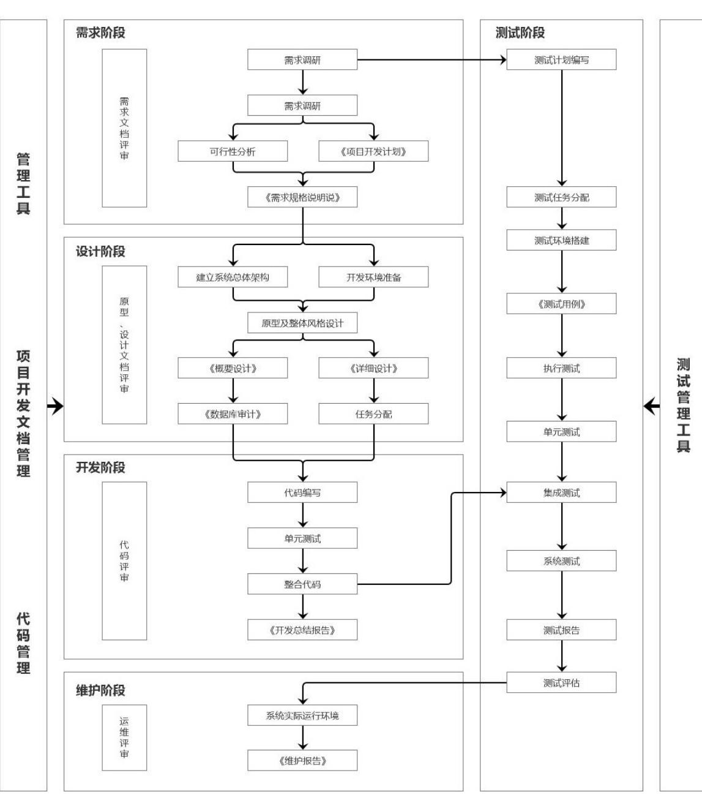  
图3-5软件项目管理规范流程图  
来源：Y公司项目管理办公室

此外，由于Y公司的项目团队成员常驻客户现场，项目成员需要同时应对多个客户和频繁参与会议，每天都面临大量的信息处理任务。这种工作模式不仅使得信息处理和吸收变得困难，而且由于沟通方式多样化，如临时在走廊中与客户的非正式对话，增加了信息的分散，使得项目经理追踪和管理信息变得越加复杂。非正式沟通缺乏记录，难以追溯，容易导致信息不一致、误解和冲突，甚至可能出现信息被隐瞒或扭曲的情况。

# 3.5.4 项目计划风险

当项目计划出现风险时，可能会导致项目延期、成本增加等问题，这将直接影响到企业的商业运营。如果项目无法按计划完成，可能会影响产品上市时间，增加开发成本，进而影响企业的市场竞争力和盈利能力，增加商业风险。而商业风险的增加也可能导致项目资源不足、资金紧张等问题，进而影响项目的进度和质量，增加项目计划风险。因此，项目计划风险和商业风险之间存在相互影响的关系，故本文将项目计划和商业风险合并为一个风险类型。

（1）项目执行预见性不足

由于缺少实际执行人员的参与，技术团队未能充分预见执行过程中可能出现的问题。这导致了在项目执行时，尽管任务的先决条件得到了满足，但仍有部分团队成员未能按时完成指派的任务。这种延误增加了关键里程碑推迟的风险，并可能引起项目整体交付时间的延长。同时，对工作量的估算不准确增加项目的研发时间和预算压力，对进度和成本控制造成了不利影响。

在项目的攻坚阶段，开发人员因长时间加班导致疲劳，这不仅影响了代码的质量，还导致更多的返工和修复工作，从而形成了效率低下的恶性循环。任务分配的不均衡导致工作量分配不均，这不仅降低了工作效率，而且在团队内部引发不满和冲突。另外，节假日前后员工请假的增加会导致项目工作效率的整体下降，这进一步影响了项目按计划的推进。

# （2）分包与客户稳定性欠缺

随着Y公司业务版图的不断扩大和市场需求的持续变化，商业风险亦随之增长。在这些风险中，分包风险和客户稳定性风险尤为突出。由于需求变更、需求挤压、技术难题等特殊情况所带来的分包风险。为了应对这些风险并保证交付时间节点不变，公司将部分业务分包。然而，由于分包商对项目情况和业务理解的不足，导致无法按时交付或交付的成果存在质量问题，进而影响了整个项目的交付进度。这种情况导致增加了成本，但没有达到应有的效果。此外在合同执行过程中，由于客户组织架构调整导致项目验收、回款、关闭进行延误，客户组织架构调整导致项目相关决策人员的变动，新的决策人员需要一定时间来熟悉业务后才能进行执行，进而增加了已执行项目的不确定性，导致项目计划需要进行变更。

# 3.5.5 外部环境风险

随着时代的快速变迁，Y公司正面临着日益增长的外部风险，这些风险主要源自市场竞争和社会人口结构的变化，它们对公司的市场竞争策略和人才战略构成了严峻挑战，进而影响项目的顺利进行和盈利能力。

# （1）竞争风险

随着VACU 时代的到来，急剧变化的商业环境使得经济下行明显，加之数字化转型浪潮来袭，技术的不断升级，企业加大降本增效等因素，作为中小型企业的Y公司将面临前所未有的竞争挑战，原本追求利润最大化的行业头部企业逐渐下沉市场增加营业能力，中小型企业为了生存主动放弃原本就薄弱的利润，使得之前竞争不激烈的中小型项目市场进入价格白刃战。本没有太大差异化的Y公司难以突出优势，导致市场竞争力不足，导致中标项目额急剧下降，影响项目盈利情况，甚至出现部分项目亏损的情况。

# （2）社会人口结构风险

随着科技的飞速发展，人工智能正在改变着企业的运营模式和人才需求。原本“一专多能”的传统优秀人才标准正转向“多专多能”的新组织优秀人才标准。在此背景下，由于Y公司的市场竞争力不足，导致原有组织形式一直无法转变为新趋势下的新组织形式。这使得企业在人才市场上难以招募到符合新标准的人才，为了找到合适的人才，只能被动地提高薪资待遇，从而进一步挤压企业的利润，对企业的生存构成威胁。

# 第四章Y公司运营商软件项目风险评价体系构建及评估

# 4.1Y 公司软件项目风险评价指标体系构建

# 4.1.1 项目风险评价指标体系构建原则

在Y公司电信运营商软件项目的风险管理研究中，项目风险评价指标体系的设计显得尤为关键。该体系旨在确保风险评估的科学性和全面性，通过精确地量化风险因素，为项目决策者提供坚实的参考。在构建体系时，首要任务是识别并分类可能面临的风险要素。Y公司项目的复杂性要求一个多维度、跨领域的分析，覆盖技术、市场、管理、运营等方面的潜在风险。因此，采用了WBS（工作分解结构）和RBS（风险分解结构）方法对风险要素进行细致划分和深度挖掘。此外，参考美国卡内基梅隆大学软件研究所（SEI）的软件风险三级分类体系，创建了Y公司电信运营商项目风险三级分类体系。在风险的分类上，遵循由浅入深的原则，将风险细分为初级风险、次级风险及核心风险。每一类风险都通过一组考虑了复合影响因素的指标来表示，包括但不限于项目时间延迟、成本超支、质量问题等，确保评价指标能全面覆盖项目管理的方方面面。对于核心风险的评估，采用了基于层次分析法和模糊评价法的混合模型，对风险因素的关联性和影响力进行了织网式的分析和量化，形成了一个多层次、高精度的风险评估模型。在确立了风险因素的量化模型后，对影响项目成败的风险因素进行加权排序，使风险评价的结果更为精准，为风险预防提供了有力的科学支撑。整个指标体系设计通过实例验证其有效性，实例结果表明该风险评价体系能够显著提高风险识别的准确性和风险预防的及时性，极大地提高了Y公司电信运营商软件项目的成功率。

# 4.1.2 项目风险指标体系确立

在构建Y公司运营商软件项目风险评价体系的过程中，项目风险指标体系的建立是关键一步，其目的是为了对项目潜在的风险进行量化评价，并提供有效的风险监控手段。本研究采用了基于层次分析法（AHP）和模糊综合评价法（FCE）的混合模型，通过对风险因素层次化分析，确保了风险评价的全面性和系统性。在第三章构建指标体系的原则上，综合考虑了Y公司运营商软件项目的特点，将项目风险的主要维度为技术和质量风险、资源和管理风险、需求和沟通风险、项目计划风险和外部环境风险。随后，设计了包含三个层次的风险指标体系：第一层为总目标层，即项目成功的综合风险水平；第二层为准则层，涵盖各个维度的风险类别；第三层为方案层，即具体风险因素。

具体而言，Y公司运营商软件项目风险评价体系不仅包括了技术和质量风险、资源和管理风险、需求和沟通风险、项目计划风险以及外部环境风险等主要维度，这些指标既涵盖了项目执行过程中的各个环节，也考虑了外部环境对项目可能产生的影响。本文的指标体系如表 4-1。

表4-1项目风险指标体系  

<table><tr><td>目标层</td><td>准则层</td><td>指标层</td></tr><tr><td></td><td></td><td>技术人员安全意识不足A11 缺失技术负责人A12</td></tr><tr><td></td><td>技术和质量风险</td><td>进度监控机制不健全A13</td></tr><tr><td></td><td>A1</td><td>缺失代码审查流程A14</td></tr><tr><td></td><td></td><td>测试规划不准确A15</td></tr><tr><td></td><td></td><td>技术文档和记录不完整A16</td></tr><tr><td></td><td></td><td>项目支撑不足A21</td></tr><tr><td></td><td></td><td>里程碑边界模糊A22</td></tr><tr><td></td><td>资源和管理风险</td><td></td></tr><tr><td></td><td></td><td>关键职位空缺A23</td></tr><tr><td>Y公司软件项目风</td><td>A2</td><td>项目负责人管理能力不足A24</td></tr><tr><td>险评价指标体系</td><td></td><td>团队稳定性低A25</td></tr><tr><td></td><td></td><td>开发人员过度劳累A26</td></tr><tr><td></td><td></td><td>需求理解偏差和变更频繁A31</td></tr><tr><td></td><td>需求和沟通风险</td><td>技术可行性评估不足A32</td></tr><tr><td></td><td>A3</td><td>需求文档不清晰A33</td></tr><tr><td></td><td></td><td>决策效率低A34</td></tr><tr><td></td><td></td><td>信息与沟通管理混乱A35</td></tr><tr><td></td><td></td><td>工作量估算不准确A41</td></tr><tr><td></td><td></td><td>工作分配不均衡A42</td></tr><tr><td></td><td>项目计划风险A4</td><td>分包商交付不稳定A43</td></tr><tr><td></td><td></td><td></td></tr><tr><td></td><td></td><td>客户组织变更影响项目A44</td></tr><tr><td></td><td>外部风险A5</td><td>市场价格竞争压力A51</td></tr><tr><td></td><td></td><td>人力资源成本上涨A52</td></tr></table>

# ${ \bf 4 . 2 Y }$ 公司软件项目风险评价模型

# 4.2.1 风险因素影响程度判断矩阵

公司组建了风险专家团队，运用层次分析法对项目风险进行定量分析，以明确不同阶段对项目的影响，并计算出项目总体风险的权重，从而进行整体评估。在准则层中，各指标因素在专家对总目标的考量中权重各异。分析过程中，需对同层次指标进行两两对比，根据相对重要程度划分等级并赋予量化值，通常分为九个等级，数值愈高代表指标越关键。然而，在使用AHP 时，专家对各指标的评价常带有模糊性，导致基于两两比较数据构建的判断矩阵计算出的权重结果无法精确反映因素间的相对重要性，只能依据经验进行模糊评估。因此，判断矩阵中的结果与真实值可能存在偏差，虽无法确保完全一致性，但总体偏差需控制在合理范围内，这就需要对判断矩阵进行一致性检验。

（1）确定判断矩阵。以目标层为判断标准，构建准则层判断矩阵见表4-2。

表4-2准则层判断矩阵  

<table><tr><td></td><td>A1</td><td>A2</td><td>A3</td><td>A4</td><td>A5</td><td>行乘积</td><td>开方</td><td>权重</td></tr><tr><td>A1</td><td>1.00</td><td>1.00</td><td>2.00</td><td>3.00</td><td>2.00</td><td>12.0000</td><td>1.6438</td><td>0.3052</td></tr><tr><td>A2</td><td>1.00</td><td>1.00</td><td>1.00</td><td>2.00</td><td>2.00</td><td>4.0000</td><td>1.3195</td><td>0.2450</td></tr><tr><td>A3</td><td>0.50</td><td>1.00</td><td>1.00</td><td>2.00</td><td>2.00</td><td>2.0000</td><td>1.1487</td><td>0.2133</td></tr><tr><td>A4</td><td>0.33</td><td>0.50</td><td>0.50</td><td>1.00</td><td>2.00</td><td>0.1667</td><td>0.6988</td><td>0.1298</td></tr><tr><td>A5</td><td>0.50</td><td>0.50</td><td>0.50</td><td>0.50</td><td>1.00</td><td>0.0625</td><td>0.5743</td><td>0.1067</td></tr></table>

经过一致性检验： $\mathrm { C I / R I } { = } 0 . 0 3 0 5 { < } 0 . 1$ ，满足一致性要求。

（2）以准则层A1、A2、A3、A4、A5为判断标准，构建A1、A2、A3、A4、A5指标层判断矩阵。见表4-3至表4-7。

表4-3A1准则层判断矩阵  

<table><tr><td></td><td>A11</td><td>A12</td><td>A13</td><td>A14</td><td>A15</td><td>A16</td><td>行乘积</td><td>开方</td><td>权重</td></tr><tr><td>A11</td><td>1.00</td><td>0.50</td><td>2.00</td><td>1.00</td><td>2.00</td><td>1.00</td><td>2.0000</td><td>1.1225</td><td>0.1701</td></tr><tr><td>A12</td><td>2.00</td><td>1.00</td><td>2.00</td><td>2.00</td><td>3.00</td><td>2.00</td><td>48.0000</td><td>1.9064</td><td>0.2889</td></tr><tr><td>A13</td><td>0.50</td><td>0.50</td><td>1.00</td><td>0.50</td><td>0.33</td><td>1.00</td><td>0.0417</td><td>0.5888</td><td>0.0892</td></tr><tr><td>A14</td><td>1.00</td><td>0.50</td><td>2.00</td><td>1.00</td><td>4.00</td><td>3.00</td><td>12.0000</td><td>1.5131</td><td>0.2293</td></tr><tr><td>A15</td><td>0.50</td><td>0.33</td><td>3.00</td><td>0.25</td><td>1.00</td><td>3.00</td><td>0.3750</td><td>0.8492</td><td>0.1287</td></tr><tr><td>A16</td><td>1.00</td><td>0.50</td><td>1.00</td><td>0.33</td><td>0.33</td><td>1.00</td><td>0.0556</td><td>0.6177</td><td>0.0936</td></tr></table>

经过一致性检验： $\mathrm { C I / R I } { = } 0 . 0 9 1 1 { < } 0 . 1$ ，满足一致性要求。

表4-4A2准则层判断矩阵   

<table><tr><td></td><td>A21</td><td>A22</td><td>A23</td><td>A24</td><td>A25</td><td>A26</td><td>行乘积</td><td>开方</td><td>权重</td></tr><tr><td>A21</td><td>1.00</td><td>0.50</td><td>0.50</td><td>1.00</td><td>0.50</td><td>0.50</td><td>0.0625</td><td>0.6300</td><td>0.0946</td></tr><tr><td>A22</td><td>2.00</td><td>1.00</td><td>2.00</td><td>2.00</td><td>2.00</td><td>2.00</td><td>32.0000</td><td>1.7818</td><td>0.2676</td></tr><tr><td>A23</td><td>2.00</td><td>0.50</td><td>1.00</td><td>3.00</td><td>4.00</td><td>3.00</td><td>36.0000</td><td>1.8171</td><td>0.2729</td></tr><tr><td>A24</td><td>1.00</td><td>0.50</td><td>0.33</td><td>1.00</td><td>0.50</td><td>2.00</td><td>0.1667</td><td>0.7418</td><td>0.1114</td></tr><tr><td>A25</td><td>2.00</td><td>0.50</td><td>0.25</td><td>2.00</td><td>1.00</td><td>3.00</td><td>1.5000</td><td>1.0699</td><td>0.1607</td></tr><tr><td>A26</td><td>2.00</td><td>0.50</td><td>0.33</td><td>0.50</td><td>0.33</td><td>1.00</td><td>0.0556</td><td>0.6177</td><td>0.0928</td></tr></table>

经过一致性检验： $\mathrm { C I / R I } { = } 0 . 0 8 2 7 { < } 0 . 1$ ，满足一致性要求。

表4-5A3准则层判断矩阵  

<table><tr><td></td><td>A31</td><td>A32</td><td>A33</td><td>A34</td><td>A35</td><td>行乘积</td><td>开方</td><td>权重</td></tr><tr><td>A31</td><td>1.00</td><td>0.50</td><td>2.00</td><td>1.00</td><td>0.50</td><td>0.5000</td><td>0.8706</td><td>0.1686</td></tr><tr><td>A32</td><td>2.00</td><td>1.00</td><td>1.00</td><td>2.00</td><td>2.00</td><td>8.0000</td><td>1.5157</td><td>0.2936</td></tr><tr><td>A33</td><td>0.50</td><td>1.00</td><td>1.00</td><td>2.00</td><td>0.50</td><td>0.5000</td><td>0.8706</td><td>0.1686</td></tr><tr><td>A34</td><td>1.00</td><td>0.50</td><td>0.50</td><td>1.00</td><td>1.00</td><td>0.2500</td><td>0.7579</td><td>0.1468</td></tr><tr><td>A35</td><td>2.00</td><td>0.50</td><td>2.00</td><td>1.00</td><td>1.00</td><td>2.0000</td><td>1.1487</td><td>0.2225</td></tr></table>

经过一致性检验： $\mathrm { C I / R I } { = } 0 . 0 8 3 5 { < } 0 . 1$ ，满足一致性要求。

表4-6A4准则层判断矩阵   

<table><tr><td></td><td>A41</td><td>A42</td><td>A43</td><td>A44</td><td>行乘积</td><td>开方</td><td>权重</td></tr><tr><td>A41</td><td>1.00</td><td>2.00</td><td>2.00</td><td>3.00</td><td>12.0000</td><td>1.8612</td><td>0.4167</td></tr><tr><td>A42</td><td>0.50</td><td>1.00</td><td>0.50</td><td>3.00</td><td>0.7500</td><td>0.9306</td><td>0.2084</td></tr><tr><td>A43</td><td>0.50</td><td>2.00</td><td>1.00</td><td>2.00</td><td>2.0000</td><td>1.1892</td><td>0.2662</td></tr><tr><td>A44</td><td>0.33</td><td>0.33</td><td>0.50</td><td>1.00</td><td>0.0556</td><td>0.4855</td><td>0.1087</td></tr></table>

经过一致性检验： $\mathrm { C I / R I } { = } 0 . 0 5 2 8 { < } 0 . 1$ ，满足一致性要求。

表4-7A5准则层判断矩阵   

<table><tr><td></td><td>A51</td><td>A52</td><td>行乘积</td><td>开方</td><td>权重</td></tr><tr><td>A51</td><td>1.00</td><td>4.00</td><td>4.0000</td><td>2.0000</td><td>0.8</td></tr><tr><td>A52</td><td>0.25</td><td>1.00</td><td>0.2500</td><td>0.5000</td><td>0.2</td></tr></table>

满足一致性要求。

（3）层次分析法整体指标权重

不同风险要素矩阵的计算出总层次排序表，风险要素权重和风险要素细项权重合并，层次总排序如表4-8所示。

表4-8层次分析法整体指标权重  

<table><tr><td colspan="2">目标层 准则层</td><td rowspan="2">指标层</td><td rowspan="2">指标层 权重</td><td rowspan="2">综合权 重</td><td rowspan="2">排序</td></tr><tr><td></td><td></td></tr><tr><td></td><td></td><td>技术人员安全意识不足A11</td><td>0.1701</td><td>0.0519</td><td>8</td></tr><tr><td></td><td>技术和质量风险</td><td>缺失技术负责人A12</td><td>0.2889</td><td>0.0882</td><td>1</td></tr><tr><td></td><td>A1</td><td>进度监控机制不健全A13 缺失代码审查流程 A14</td><td>0.0892</td><td>0.0272</td><td>17</td></tr><tr><td></td><td>（0.3052）</td><td>测试规划不准确A15</td><td>0.2293</td><td>0.0700</td><td>3</td></tr><tr><td rowspan="9">件项目风 险评价指</td><td></td><td></td><td>0.1287</td><td>0.0393</td><td>11</td></tr><tr><td></td><td>技术文档和记录不完整 A16</td><td>0.0936</td><td>0.0286</td><td>15</td></tr><tr><td></td><td>项目支撑不足A21</td><td>0.0946</td><td>0.0232</td><td>19</td></tr><tr><td></td><td>里程碑边界模糊 A22</td><td>0.2676</td><td>0.0656</td><td>5</td></tr><tr><td>资源和管理风险</td><td>关键职位空缺A23</td><td>0.2729</td><td>0.0669</td><td>4</td></tr><tr><td>A2 （0.2450）</td><td>项目负责人管理能力不足 A24</td><td>0.1114</td><td>0.0273</td><td>16</td></tr><tr><td>Y公司软</td><td>团队稳定性低A25</td><td>0.1607</td><td>0.0394</td><td>10</td></tr><tr><td></td><td>开发人员过度劳累A26</td><td>0.0928</td><td>0.0227</td><td>20</td></tr><tr><td></td><td>需求理解偏差和变更频繁</td><td>0.1686</td><td>0.0360</td><td>12</td></tr><tr><td>标体系</td><td>需求和沟通风险</td><td>A31</td><td></td><td></td><td></td></tr><tr><td></td><td>A3</td><td>技术可行性评估不足A32</td><td>0.2936</td><td>0.0626</td><td>6</td></tr><tr><td></td><td>（0.2133）</td><td>需求文档不清晰A33</td><td>0.1686</td><td>0.0360</td><td>12</td></tr><tr><td></td><td></td><td>决策效率低 A34</td><td>0.1468</td><td>0.0313</td><td>14</td></tr><tr><td></td><td></td><td>信息与沟通管理混乱 A35</td><td>0.2225</td><td>0.0475</td><td>9</td></tr><tr><td>项目计划风险A4</td><td></td><td>工作量估算不准确A41</td><td>0.4167</td><td>0.0541</td><td>7</td></tr><tr><td></td><td></td><td>工作分配不均衡A42</td><td>0.2084</td><td>0.0270</td><td>18</td></tr><tr><td></td><td>（0.1298）</td><td>分包商交付不稳定 A43</td><td>0.2662</td><td>0.0345</td><td>13</td></tr><tr><td></td><td></td><td>客户组织变更影响项目A44</td><td>0.1087</td><td>0.0141</td><td>22</td></tr><tr><td></td><td>外部风险A5</td><td>市场价格竞争压力A51</td><td>0.8</td><td>0.0853</td><td>2</td></tr><tr><td>（0.1067)</td><td></td><td>人力资源成本上涨A52</td><td>0.2</td><td>0.0213</td><td>21</td></tr></table>

上述指标按照层次分析法进行排列后，综合权重由高到低的排名如图4-1所示：

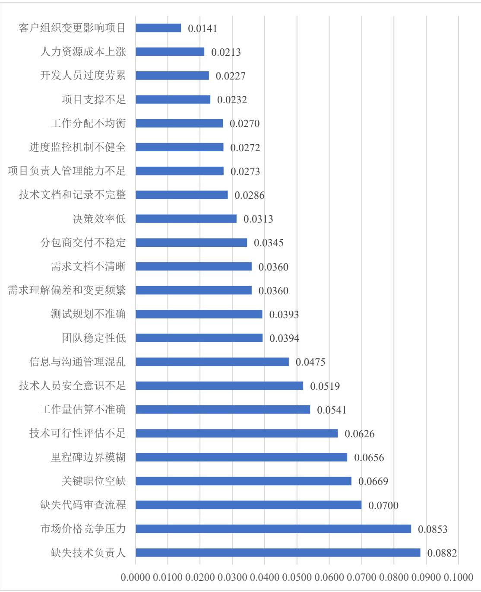  
图4-1指标层综合权重总排序

缺失技术负责人A12（0.0882）：技术负责人的存在是项目顺利进行的基础，相关责任人的缺失将严重影响项目的技术指导和决策，权重最高。如果项目缺失技术负责人，则可能无法确保项目的技术可行性，而且他们的缺失也可能对项目的决策过程产生影响，从而影响项目进度和结果。为此，技术负责人在项目中的地位非常关键。

市场价格竞争压力A51（0.0853）：市场价格竞争压力影响项目利润以及持续性，为外部风险中的主要责任，表现为高权重。一个项目无法在市场上以有竞争力的价格出售，则该项目可能无法实现预期的回报，甚至可能因此而被迫停止。相反，如果一个项目能够顺利应对市场价格竞争压力，并能以一个也高的价格销售产品，那么这个项目将有可能取得成功。

缺失代码审查流程A14（0.0700）：代码审查是保证代码质量的重要步骤，缺失审查流程可能导致软件出现严重质量问题。

关键职位空缺A23（0.0669）：关键职位的空缺会影响公司运营和决策效益：未能及时填补关键职位革可能引发一系列问题。

里程碑边界模糊A22（0.0656)：项目里程碑的设立关系到项目进展及成果验收，边界模糊则可能对项目进度产生影响。

技术可行性评估不足A32（0.0626）：技术可行性评估是项目初期的重要步骤，评估不足可能导致项目在后期遇到严重的技术问题。

工作量估算不准确A41（0.0541）：工作量估算直接关系到后续的人力、时间以及成本控制，估算不准确将对后期产生连锁反应。

技术人员安全意识不足A11（0.0519)：技术人员的安全意识关系到项目的安全方面的保证，安全意识不足则可能导致安全风险。

信息与沟通管理混乱A35（0.0475）：有效的信息和沟通管理是确保项目顺利进行的重要环节，管理混乱将直接影响项目进程。

团队稳定性低A25（0.0394）：团队稳定性对项目的执行有直接影响，团队稳定性低将影响项目持续性和团队执行能力。

# 4.2.2 基于模糊分析法的风险评价模型

对于软件项目的风险评价，周边环境、项目本身的特性、技术难度等因素都会影响风险的高低。在进行风险评估时，或许无法找到定量的风险指标，或需要进行定性的无量纲化处理，由于信息的不对称，部分技术指标可能不适合作为评价指标，同时，各种技术指标的选择标准各不相同，难以形成统一的衡量体系。软件项目的风险在很大程度上取决于项目团队的技术水平和管理能力，所以，基于人工判断的工程审查在很大程度上仍然是重要环节。虽然部分公司已经开始尝试使用评价模型来衡量软件项目的风险，但是，这依然需要通过实际的项目管理和技术人员的专业判断来验证。Y公司可能在软件开发方面有更多的经验，考虑到Y公司的组织特性和发展路径，其软件项目风险评价系统应选择几项与Y公司软件项目经办、审批人员日常面对项目相符的定性指标，这些指标可从项目的时间、成本、质量等多个维度进行合理的选取和权重确定。

鉴于以上因素，模糊综合评价法可以作为软件项目风险评价的适合选择，通过量化定量和定性指标，以此处理模糊、不确定的评价信息，从而得到较为可靠的结果。

模糊综合评价法作为一种基于模糊数学原理的量化方法，对于处理那些难以明确界定量化界限的评价指标具有显著优势，能有效实现非线性评价的量化。在软件项目风险评价中，模糊综合评价法展现出了独特的特点和应用价值。模糊综合评价法能够进行多层次、循环式的评价。这意味着在每一个评价阶段，其综合结果都可以作为后续评价过程的输入数据，从而形成一个持续优化的评价循环。这种特性使得模糊综合评价法能够更全面、深入地揭示软件项目风险的各个层面。权重系数向量在模糊综合评价法中扮演着至关重要的角色。与传统评价方法不同，模糊综合评价法的权重系数向量并非在评价过程中产生，而是一个预先设定的模糊向量。这一特点确保了评价过程中权重分配的客观性和合理性，避免了主观因素对评价结果的影响。模糊综合评价法的评价结果是一个向量集，而非单一的数值。这意味着对于每一个评价对象，模糊综合评价法都能给出一个包含多个可能性的结果集合，从而更全面地反映评价对象的实际情况。这种向量集形式的评价结果不仅丰富了评价信息的表达，还提高了评价的准确性和可靠性。

（1）设定指标评语集

评语集在模糊综合评价法中扮演着至关重要的角色，它作为评价结果的参照标准，对于确保评价的准确性和有效性具有决定性的影响。一个优秀的软件风险评价体系确实需要构建一个合理的评语集，以确保评价结果的准确性和可靠性。评语集应该是唯一的，这意味着无论评价模型的复杂程度如何，都应该使用相同的评语集来进行结果的比对和解释。如果层级数量过少，可能无法准确地区分不同的风险级别，导致评价结果失真；而如果层级数量过多，虽然能够更精细地刻画风险，但也会增加评价工作的复杂程度，降低评价效率。

从软件项目自身特点的角度出发，用五个层次表示风险评价，表达式为$V = ( V 1 , V 2 , V 3 , V 4 , V 5 ) = ($ （风险非常高，风险较高，一般，风险较低，风险非常低） O

# （2）计算指标赋值

在专家打分过程中，本研究采用了李克特量5级表作为评价标准，这是一种广泛应用的评价工具，能够全面、细致地反映评价对象的不同方面。按照5级评价标准，根据不同评价因素的内涵进行了对应，并进行了对应赋值。这种赋值方式不仅便于统计和计算，而且能够清晰地展现出评价对象在各个指标上的表现。具体来说，将各个指标的分值统一采取5 分制赋值，从优到劣的对应排序为：非常低（0-1分）、较低（1-2分）、一般（2-3分）、较高（3-4分）和非常高（4-5分）。软件项目风险等级评分标准及释义建表4-9。

表4-9软件项目风险等级评分标准及释义  

<table><tr><td>评分 风险等级</td></tr><tr><td>4-5 非常高</td></tr><tr><td>3-4 较高</td></tr><tr><td>2-3 一般</td></tr><tr><td>1-2 较低</td></tr><tr><td>0-1 非常低</td></tr></table>

（3）确定软件项目风险评价等级表

在本文的综合评价中，对于每一个指标设定五个级别评语，即$V = ( V 1 , V 2 , V 3 , V 4 , V 5 )$ ，并且赋值为 $V = ( 5 , 4 , 3 , 2 , 1 )$ 。多位经验丰富的专家对指标价值体系进行了全面评估，每位专家独立对指标层的各项指标进行了等级打分。鉴于指标的模糊特性，汇总了每位专家对同一指标的打分情况，计算了指标属于不同评语等级的隶属度，即以赞同该指标属于某一评语等级的专家比重作为该指标的隶属度。基于这些隶属度数据，构建了单因素模糊综合评判矩阵。单因素评价则是从单一因素出发，对评价对象进行独立评估，确定其在该因素上的隶属程度。在此基础上，建立了模糊综合单因素评价矩阵 $R$ 。

$$
R = { \left| \begin{array} { l l l l } { r _ { 1 1 } } & { r _ { 1 2 } } & { \dots } & { r _ { 1 n } } \\ { r _ { 2 1 } } & { r _ { 2 2 } } & { \dots } & { r _ { 2 n } } \\ { \dots } & { \dots } & { \dots } & { \dots } \\ { r _ { m 1 } } & { r _ { m 2 } } & { \dots } & { r _ { m n } } \end{array} \right| }
$$

对各因素进行模糊变换，得一级模糊综合评价，计算公式见下：

$$
\boldsymbol { B } = \boldsymbol { W } \times \boldsymbol { R } = \left[ b _ { s 1 } , b _ { s 2 } , . . . , b _ { s m } \right]
$$

经过相应的模糊加权计算过程，判定Y公司软件项目风险的评定等级。

# 4.3Q软件项目风险评价实例验证

# 4.3.1Q软件项目基本情况

Y公司作为国内电信运营商重要参与者之一，其运营商软件项目承载着巨大的客户数据流量，需要确保稳定和高效的服务质量。Q 软件项目作为Y公司的重点项目，集中了当前电信行业的先进技术，涉及了复杂的运营商业务流程。项目目标为建设一个全新的集成通信管理系统，覆盖用户信息管理、网络资源调度及业务处理等多个业务模块，满足日益增长的电信业务需求和市场竞争压力。项目启动初期，团队对软件项目的特殊性采取了一系列举措，对潜在的项目风险因素进行全面评估。通过建立项目风险因素数据库，对项目从启动到交付的整个生命周期进行跟踪分析，并动态模拟了风险因素之间的复杂相互作用，利用专家系统进行系统的风险识别及分析。考虑到软件项目的复杂性，项目团队注重从用户需求不明确、技术迭代快速以及上下游接口风险等多个方面识别关键风险点，对各个子系统的生产过程风险进行了定量评价，确保了评估的客观性和科学性。项目风险小组还细致研究了项目团队的人员配置，旨在降低由于人员素质和团队协作不当引起的项目延误和成本溢出风险。在风险评估的基础上，Q 软件项目的风险管理小组制定出一系列针对性的策略，如技术风险采取模块化的设计突破，为软件项目的灵活性和升级提供了保证；针对需求变更风险，建立了快速响应机制，确保及时调整项目规划与设计；在供应链和合作伙伴管理方面，通过构建全面的风险评估与控制机制，减少了因外部依赖度高导致的项目延期风险；数据安全方面，采用加密技术和隐私保护措施，以防外部攻击和隐私泄漏。这一系列风险管理措施的实施，大幅提高了Q软件项目的成功率，为Y公司电信运营商软件项目的风险管理提供了有力的案例支持，并为类似项目的风险管理工作提供了参考与借鉴。

# 4.3.2 评价数据获取

Q软件项目在风险评估阶段对数据的获取具有决定性作用，确保了整个风险评价过程的客观性和准确性。在风险评估阶段，数据的获取对于保障评价过程的客观性和准确性至关重要，而Q软件项目采用了综合的数据获取方法，包括专家访谈和调研问卷。这种方式可以确保所获取的数据充分包含了项目全生命周期的关键信息，例如项目启动、开发实施以及最终交付等阶段的数据。此外，专家团队的构成遵循跨领域知识覆盖原则，有助于避免单一视角带来的偏差，从而保证了数据来源的多样性和全面性。因此，Y公司Q软件项目构建了一个多维度、高质量的风险评价数据集，为后续的风险识别和评估工作提供了可靠的数据支持。

# 4.3.3 风险评价过程

（1）确定评语集

邀请 10 位软件项目的管理人员及相关人员对23个指标进行打分。参考李

克特五分量表法，评语分五个等级，“非常高、较高、一般、较低、非常低”即$V = ( V _ { 1 } , V _ { 2 } , V _ { 3 } , V _ { 4 } , V _ { 5 } ) = ($ （风险非常高,风险较高，一般,风险较低,风险非常低）$\underline { { \underline { { \mathbf { \delta \pi } } } } } ( 5 , 4 , 3 , 2 , 1 )$

# （2）确定隶属度与权重矩阵

专家打分情况如表4-10 所示。

表4-10专家打分表  

<table><tr><td>指标层</td><td>非常高</td><td>较高</td><td>一般</td><td>较低</td><td>非常低</td></tr><tr><td>技术人员安全意识不足A11</td><td>1</td><td>1</td><td>6</td><td>2</td><td>0</td></tr><tr><td>缺失技术负责人A12</td><td>2</td><td>4</td><td>3</td><td>1</td><td>0</td></tr><tr><td>进度监控机制不健全A13</td><td>0</td><td>2</td><td>5</td><td>3</td><td>0</td></tr><tr><td>缺失代码审查流程A14</td><td>1</td><td>4</td><td>4</td><td>1</td><td>0</td></tr><tr><td>测试规划不准确A15</td><td>0</td><td>2</td><td>4</td><td>3</td><td>1</td></tr><tr><td>技术文档和记录不完整A16</td><td>2</td><td>3</td><td>5</td><td>0</td><td>0</td></tr><tr><td>项目支撑不足A21</td><td>0</td><td>2</td><td>6</td><td>2</td><td>0</td></tr><tr><td>里程碑边界模糊A22</td><td>1</td><td>2</td><td>7</td><td>0</td><td>0</td></tr><tr><td>关键职位空缺A23</td><td>2</td><td>2</td><td>4</td><td>2</td><td>0</td></tr><tr><td>项目负责人管理能力不足A24</td><td>1</td><td>3</td><td>5</td><td>1</td><td>0</td></tr><tr><td>团队稳定性低A25</td><td>2</td><td>2</td><td>4</td><td>2</td><td>0</td></tr><tr><td>开发人员过度劳累A26</td><td>0</td><td>1</td><td>7</td><td>1</td><td>1</td></tr><tr><td>需求理解偏差和变更频繁A31</td><td>1</td><td>2</td><td>4</td><td>2</td><td>1</td></tr><tr><td>技术可行性评估不足A32</td><td>1</td><td>3</td><td>5</td><td>1</td><td>0</td></tr><tr><td>需求文档不清晰A33</td><td>2</td><td>4</td><td>3</td><td>1</td><td>0</td></tr><tr><td>决策效率低 A34</td><td>0</td><td>2</td><td>5</td><td>3</td><td>0</td></tr><tr><td>信息与沟通管理混乱A35</td><td>0</td><td>2</td><td>7</td><td>1</td><td>0</td></tr><tr><td>工作量估算不准确A41</td><td>0</td><td>2</td><td>4</td><td>3</td><td>1</td></tr><tr><td>工作分配不均衡A42</td><td>0</td><td>1</td><td>7</td><td>2</td><td>0</td></tr><tr><td>分包商交付不稳定A43</td><td>0</td><td>3</td><td>6</td><td>1</td><td>0</td></tr><tr><td>客户组织变更影响项目A44</td><td>0</td><td>1</td><td>6</td><td>3</td><td>0</td></tr><tr><td>市场价格竞争压力A51</td><td>2</td><td>1</td><td>5</td><td>2</td><td>0</td></tr><tr><td>人力资源成本上涨A52</td><td>0</td><td>1</td><td>8</td><td>1</td><td>0</td></tr></table>

将专家打分转化为隶属度表，如表4-11所示。

表4-11专家打分隶属度表  

<table><tr><td>指标层</td><td>非常高</td><td>较高</td><td>一般</td><td>较低</td><td>非常低</td></tr><tr><td>技术人员安全意识不足A11</td><td>0.1</td><td>0.1</td><td>0.6</td><td>0.2</td><td>0</td></tr><tr><td>缺失技术负责人A12</td><td>0.2</td><td>0.4</td><td>0.3</td><td>0.1</td><td>0</td></tr><tr><td>进度监控机制不健全A13</td><td>0</td><td>0.2</td><td>0.5</td><td>0.3</td><td>0</td></tr><tr><td>缺失代码审查流程A14</td><td>0.1</td><td>0.4</td><td>0.4</td><td>0.1</td><td>0</td></tr><tr><td>测试规划不准确A15</td><td>0</td><td>0.2</td><td>0.4</td><td>0.3</td><td>0.1</td></tr><tr><td>技术文档和记录不完整A16</td><td>0.2</td><td>0.3</td><td>0.5</td><td>0</td><td>0</td></tr><tr><td>项目支撑不足A21</td><td>0</td><td>0.2</td><td>0.6</td><td>0.2</td><td>0</td></tr><tr><td>里程碑边界模糊 A22</td><td>0.1</td><td>0.2</td><td>0.7</td><td>0</td><td>0</td></tr><tr><td>关键职位空缺A23</td><td>0.2</td><td>0.2</td><td>0.4</td><td>0.2</td><td>0</td></tr><tr><td>项目负责人管理能力不足A24</td><td>0.1</td><td>0.3</td><td>0.5</td><td>0.1</td><td>0</td></tr><tr><td>团队稳定性低A25</td><td>0.2</td><td>0.2</td><td>0.4</td><td>0.2</td><td>0</td></tr><tr><td>开发人员过度劳累A26</td><td>0</td><td>0.1</td><td>0.7</td><td>0.1</td><td>0.1</td></tr><tr><td>需求理解偏差和变更频繁A31</td><td>0.1</td><td>0.2</td><td>0.4</td><td>0.2</td><td>0.1</td></tr><tr><td>技术可行性评估不足A32</td><td>0.1</td><td>0.3</td><td>0.5</td><td>0.1</td><td>0</td></tr><tr><td>需求文档不清晰 A33</td><td>0.2</td><td>0.4</td><td>0.3</td><td>0.1</td><td>0</td></tr><tr><td>决策效率低 A34</td><td>0</td><td>0.2</td><td>0.5</td><td>0.3</td><td>0</td></tr><tr><td>信息与沟通管理混乱A35</td><td>0</td><td>0.2</td><td>0.7</td><td>0.1</td><td>0</td></tr><tr><td>工作量估算不准确A41</td><td>0</td><td>0.2</td><td>0.4</td><td>0.3</td><td>0.1</td></tr><tr><td>工作分配不均衡 A42</td><td>0</td><td>0.1</td><td>0.7</td><td>0.2</td><td>0</td></tr><tr><td>分包商交付不稳定A43</td><td>0</td><td>0.3</td><td>0.6</td><td>0.1</td><td>0</td></tr><tr><td>客户组织变更影响项目A44</td><td>0</td><td>0.1</td><td>0.6</td><td>0.3</td><td>0</td></tr><tr><td>市场价格竞争压力A51</td><td>0.2</td><td>0.1</td><td>0.5</td><td>0.2</td><td>0</td></tr><tr><td>人力资源成本上涨 A52</td><td>0</td><td>0.1</td><td>0.8</td><td>0.1</td><td>0</td></tr></table>

根据表4.10的计算结果可得出其综合评价值，具体计算为：  
A1评价结果：

$] \times \left| \begin{array} { l l l l l l } { { 0 . 1 } } & { { 0 . 1 } } & { { 0 . 6 } } & { { 0 . 2 } } & { { 0 } } \\ { { 0 . 2 } } & { { 0 . 4 } } & { { 0 . 3 } } & { { 0 . 1 } } & { { 0 } } \\ { { 0 } } & { { 0 . 2 } } & { { 0 . 5 } } & { { 0 . 3 } } & { { 0 } } \\ { { 0 . 1 } } & { { 0 . 4 } } & { { 0 . 4 } } & { { 0 . 1 } } & { { 0 } } \\ { { 0 } } & { { 0 . 2 } } & { { 0 . 4 } } & { { 0 . 3 } } & { { 0 . 1 } } \\ { { 0 . 2 } } & { { 0 . 3 } } & { { 0 . 5 } } & { { 0 } } & { { 0 } } \end{array} \right|$

=(0.1164,0.2960,0.4233,0.1512,0.0129)

依次计算得：

${ \bf A } \imath =$ （0.1246，0.2019，0.5382，0.1261，0.0093）${ \bf A } _ { 3 } { = }$ （0.0799，0.2631，0.4940，0.1462，0.0169)${ \bf A } \mathfrak { 4 } ^ { = }$ （0，0.1949，0.5375，0.2259，0.0417)${ \bf A } { \boldsymbol { \varsigma } } ^ { = }$ （0.1600，0.1000，0.5600，0.1800，0）由此，可知：${ \bf A } { = } { \bf W } ^ { * } { \bf R } { = }$ （0.1002，0.2319，0.4959，0.1568，0.0152)

# 4.3.4 评价结果分析

结合前文对项目风险评价评语集的赋值，计算出Q 软件项目风险和一级指标风险等级的评价结果，项目风险评价结果具体如表4-12所示。

表4-12Q软件项目风险评价结果  

<table><tr><td>风险评价指标</td><td>风险评价结果</td><td>风险等级</td></tr><tr><td>技术和质量风险</td><td>3.351</td><td>较高</td></tr><tr><td>人力资源和管理风险</td><td>3.306</td><td>较高</td></tr><tr><td>需求和沟通风险</td><td>3.243</td><td>较高</td></tr><tr><td>项目计划风险</td><td>2.886</td><td>一般</td></tr><tr><td>外部环境风险</td><td>3.240</td><td>较高</td></tr><tr><td>整体风险</td><td>3.245</td><td>较高</td></tr></table>

从表格中可以看出，Q软件项目的各项指标评价结果主要集中在“较高”风险等级，而项目计划风险相对较低，显示为“风险一般”等级。这说明在风险分析的时候要注重对于技术和质量风险、人力资源和管理风险、需求和沟通风险以及外部环境风险的控制和管理。同时，项目计划风险虽然相对较低，但也不能放松对其的控制和监察。整体风险的评价结果为 3.245，也被归类为“较高”等级，表示该项目的整体风险较为平稳，不过依然要正视和处理好各项风险，确保项目的顺利进行。由此，项目风险管理应构建一个对风险具有预见性的管理系统，并对可能的一般风险提前制定对策，以免项目执行过程中出现不可预见的延误和损失。

Q软件项目风险评价二级指标得分具体如表 4-13 所示。

表4-13Q软件项目风险评价二级指标得分  

<table><tr><td>指标层</td><td>得分</td><td>风险等级</td></tr><tr><td>技术人员安全意识不足A11</td><td>3.100</td><td>较高</td></tr><tr><td>缺失技术负责人A12</td><td>3.700</td><td>较高</td></tr><tr><td>进度监控机制不健全A13</td><td>2.900</td><td>一般</td></tr><tr><td>缺失代码审查流程A14</td><td>3.500</td><td>较高</td></tr><tr><td>测试规划不准确A15</td><td>2.700</td><td>一般</td></tr><tr><td>技术文档和记录不完整A16</td><td>3.700</td><td>较高</td></tr><tr><td>项目支撑不足A21</td><td>3.000</td><td>较高</td></tr><tr><td>里程碑边界模糊A22</td><td>3.400</td><td>较高</td></tr><tr><td>关键职位空缺A23</td><td>3.400</td><td>较高</td></tr><tr><td>项目负责人管理能力不足A24</td><td>3.400</td><td>较高</td></tr><tr><td>团队稳定性低 A25</td><td>3.400</td><td>较高</td></tr><tr><td>开发人员过度劳累A26</td><td>2.800</td><td>一般</td></tr><tr><td>需求理解偏差和变更频繁A31</td><td>3.000</td><td>较高</td></tr><tr><td>技术可行性评估不足A32</td><td>3.400</td><td>较高</td></tr><tr><td>需求文档不清晰 A33</td><td>3.700</td><td>较高</td></tr><tr><td>决策效率低 A34</td><td>2.900</td><td>一般</td></tr><tr><td>信息与沟通管理混乱A35</td><td>3.100</td><td>较高</td></tr><tr><td>工作量估算不准确A41</td><td>2.700</td><td>一般</td></tr><tr><td>工作分配不均衡 A42</td><td>2.900</td><td>一般</td></tr><tr><td>分包商交付不稳定A43</td><td>3.200</td><td>较高</td></tr><tr><td>客户组织变更影响项目A44</td><td>2.800</td><td>一般</td></tr><tr><td>市场价格竞争压力A51</td><td>3.300</td><td>较高</td></tr><tr><td>人力资源成本上涨 A52</td><td>3.000</td><td>较高</td></tr></table>

根据表4-13的数据，可以看出Q软件项目的风险评价二级指标中，有16个因素的风险等级为较高，这些因素包括技术人员安全意识不足A11，缺失技术负责人A12，缺失代码审查流程A14，技术文档和记录不完整A16，项目支撑不足A21，里程碑边界模糊A22，关键职位空缺A23，项目负责人管理能力不足A24，团队稳定性低A25，需求理解偏差和变更频繁A31，技术可行性评估不足A32，需求文档不清晰A33，信息与沟通管理混乱 A35，分包商交付不稳定A43，市场价格竞争压力A51，以及人力资源成本上涨A52。

此外，有7个因素的风险等级为一般，包括进度监控机制不健全A13，测试规划不准确A15，开发人员过度劳累A26，决策效率低A34，工作量估算不准确A41，工作分配不均衡A42，客户组织变更影响项目A44。

# 第五章Y公司运营商软件项目风险应对

# 5.1 软件项目风险应对原则

在Y公司电信运营商软件项目风险应对策略中，合理的应对原则是确保软件项目在各种潜在风险面前能够保持稳定运行并且最大程度地减少损失。鉴于项目实施过程中出现的风险具有难以预测和多变性的特点，应对原则不仅要涉及风险预防，还应包括实时监控、应急响应和后期恢复等多个维度。

积极应对原则：针对Y公司运营商软件项目存在的任何风险，必须认真对待，采取积极态度进行应对。通过提前设定计划和方案来主动掌握风险的发展动态，确保在面临风险时有充足的预备时间和足够的资源进行合理应对。这样可以有效避免风险对项目产生不可逆转的影响，提高项目的成功率，确保完成预定目标。

预防优于治疗原则：应在项目实施初期就引入风险管理，进行风险预警和预防。该过程中需通过更深入的研究分析，以发现可能存在的各类风险，并制定出针对性的预防措施，例如制定详细的应急计划，安排专人进行风险监控，确保一旦发生风险可立即采取应对措施，最大程度降低因风险带来的潜在损失。

全面响应原则：在风险应对的过程中，需要全面考虑与项目实施有关的各方面因素。例如，项目的实施环境、管理组织、参与人员、资源分配、技术难度等。应当对所有可能出现的风险进行全方位分析，并根据风险的大小、可能造成的影响等因素，制定出最合适的风险应对策略，避免局部处理导致的新的风险产生。

系统应对原则：应当结合整个项目的实际情况，构建完整的风险应对系统，以更为系统的方式进行风险的管理。包括风险的识别、评估、处理，以及风险处理结果的反馈修正等一系列环节，形成一个有效运作的闭环生态，能够对整个项目在遭遇风险时，以有序、系统的方式进行应对。

持续改进原则：在风险应对过程中，必须坚持不断学习，持续改进。一方面，Y公司应定期对项目风险管理效果进行评估，包括风险应对措施的有效性和具体执行情况等，依据评估结果对当前的风险应对策略进行优化，进而提高风险管理效能；另一方面，应随时关注相关领域的最新动态，吸纳最新的风险管理理念和方法，从而增强风险管理系统的科学性和持久性，使其得以持续发展和完善。

# 5.2 软件项目风险应对措施

在软件项目开发与管理的过程中，识别、评估和分析各类风险因素是至关重要的。这些风险因素经过细致的分析后，会依据其潜在影响的大小被划分为不同的风险等级。针对软件项目的不同风险等级，制定了一系列风险应对策略，旨在降低风险发生的概率或减少潜在损失。在处理风险时，优先关注风险等级较高的因素，通过实施策略来降低其发生可能性，减轻潜在损失，或同时实现这两点。这些风险应对策略并非固定不变，而是需根据软件项目的实际情况灵活调整。同时，在实施任何风险应对策略时，都必须确保不会因此增加其他风险因素。针对Y公司的风险状况和软件项目管理特点，提出了四种风险应对策略：风险接受、风险转移、风险规避和风险缓解。这四种策略各有其适用场景和效果，如表5-1所示。

表5-1风险应对策略表  

<table><tr><td colspan="2">应对策略类型 应对策略涵义</td></tr><tr><td>1.规避策略</td><td>在项目中，全面消除风险事件或将其造成的损失降低至可忽略甚至零的 程度是项目管理的核心目标之一。为了达到这一目标，可以采取一系列</td></tr><tr><td>2.转嫁策略</td><td>针对性的措施。 在项目管理中，通过签署合作协议、代理协议或外包协议，可以有效地 将特定风险转移给合作伙伴、代理商或承包商。这种风险转移策略旨在 减轻项目团队的风险负担，并确保项目能够顺利进行。下面将详细讨论</td></tr><tr><td>3.减轻策略</td><td>这种策略的应用和优势。 在项目管理中，当面临诸如客户需求不明确、沟通问题等风险时，可以 采取一系列有效的措施来降低风险发生的概率或减少风险造成的损失。</td></tr><tr><td>4.接受策略</td><td>风险接受策略是在对风险进行充分评估后，发现无法有效规避、减轻或 转嫁的情况下，项目团队选择主动接受并承担风险后果的一种策略。</td></tr></table>

在软件项目的风险管理中，对于不同的风险要素和危害程度，采取适宜的风险处理策略是极其重要的。常见的风险处理策略有风险转移、风险减轻、风险规避和风险接受，它们各自具备独特的特点和适用范围。对于Y公司软件项目的风险管理而言，减轻风险的方法是一个重要的选择，一般来说指的是公司倾向于采取积极的策略，通过一系列行动来降低风险发生的概率或减少其潜在影响。

# 5.2.1 技术和质量风险应对策略

技术和质量风险各指标得分如图5-1所示。技术风险在软件开发项目中确实是一个不可忽视的因素，它涉及到多个层面，从自身技术能力的不足到技术开发标准的不一致，再到测试技术能力的问题等，都可能对项目的进度、质量和成本产生重大影响。特别是在开发阶段，这一阶段不仅是企业投入资源最多且历时最长的阶段，也是技术风险最为集中的阶段。

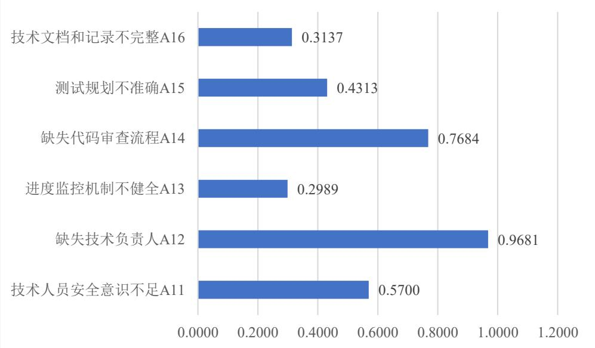  
图5-1技术和质量风险各指标得分

根据第四章针对Y公司软件项目风险的分析，技术风险被确认为最重要的风险，其风险等级最高。为了有效管理并减少对企业的不良影响，Y公司可以通过一系列措施来增强技术风险管理。

（1）建立统一的技术开发标准

在软件开发过程中，统一的技术标准能够确保项目的顺利进行和高质量完成。Y公司作为一家专注于移动互联网和云计算的高科技企业，其业务覆盖了电信运营商 MBOE 域全业务的产品支撑，并逐步形成了互联网运营平台解决方案。在这样的背景下，建立统一的技术开发标准对于提升公司的服务质量和效率具有重要意义。统一的技术标准能够帮助公司在提供系统解决方案及软件服务开发业务时，保持服务的一致性和高质量。无论是系统集成、软件开发还是技术服务，统一的技术标准都能够确保公司提供的服务满足客户的需求和期望。统一的技术标准还能够帮助公司在进行数据建模、数据分析和精准匹配等数据运营活动时，提高数据的准确性和可靠性。这不仅能够满足消费者个性化多样化的需求，还能够提升公司在市场中的竞争力。此外，统一的技术标准还能够帮助公司在进行权益运营和精准营销时，提高营销的效率和价值。通过统一的技术标准，公司能够快速实现目标客户圈定、营销策略匹配和营销任务生成，进而提高营销的成功率。最后，统一的技术标准还能够帮助公司在进行技术研发时，提高研发的效率和质量。

架构师在Y公司中扮演的角色至关重要，特别是在建立和维护统一的技术开发标准方面。架构师需要确保技术、架构、编码和文档的统一性，这是确保项目成功的关键。首先，架构师需要制定一套全面的开发规范，这些规范应涵盖数据库设计、代码编写、接口设计以及文档编写等多个方面。例如，在数据库设计方面，架构师需要制定明确的命名规范，包括数据库名称、表命名方式、字段名称等，以确保数据库结构的清晰性和可读性。这不仅有助于减少因命名不一致而导致的混淆和错误，还能提高开发效率。在代码编写方面，架构师需要制定统一的命名规则，包括类名称、变量名、工具名称等，以确保代码的可读性和可维护性。这有助于降低团队成员之间的沟通成本，提高团队协作效率。

此外，架构师还需要关注注释模板的制定。良好的注释是代码的重要组成部分，它能够帮助其他开发人员快速理解代码的功能和逻辑，提高团队协作效率。因此，架构师应制定详细的注释规范，并要求开发人员严格执行。这些规范应包括注释的格式、内容以及放置的位置等。在接口设计方面，统一的接口命名规则对于保持系统的稳定性和可扩展性至关重要。它有助于降低系统维护的难度，确保系统的长期健康发展。架构师需要与团队成员紧密合作，确保这些规范得到有效执行。在项目启动时，架构师应对开发人员和测试人员进行必要的培训，以确保整个团队能够遵循统一的开发规则。这不仅有助于提高团队的工作效率，还能确保项目的质量。通过这些措施，Y公司能够建立起一套有效的技术开发标准，为公司的长期发展奠定坚实的基础。

# （2）规范代码审查

作为一家专注于移动互联网和云计算的高科技企业，Y公司在提供系统解决方案、软件开发和技术服务的过程中，代码质量直接影响到产品的稳定性和可靠性。项目经理通过定期举行代码评审，特别是采用“盲审”的方式，能够公平地评估每个开发人员的工作，确保所有代码都符合公司制定的技术标准和开发规范。这种随机抽取代码进行评审的做法，不仅能够发现潜在的质量问题，还能够促进开发人员对代码质量的自我要求，因为他们知道任何时候自己的代码都可能被审查，从而避免标准不一致带来的风险增加。考虑到公司业务的特点和需求。由于Y公司服务于电信运营商，其产品往往要求高度的稳定性和安全性。因此，代码审查不仅要关注功能的实现，还要关注代码的健壮性、安全性和可维护性。公司可以针对不同业务领域的特点，制定相应的代码审查标准和流程。例如，在数据运营和精准营销平台的开发中，由于涉及到大量的数据处理和用户隐私，代码审查应特别关注数据安全和隐私保护的实现。同时，Y公司还应利用自动化工具辅助代码审查，提高审查的效率和准确性。

建立代码审查反馈机制。审查人员在审查过程中，应对审查结果进行记录，并以此作为反馈给代码编写人员，以便其及时改正错误和提高编程技能。此外，增加代码审查的频率。对于关键模块的代码，应进行每次提交后的即时审查；而对于非关键模块的代码，也应进行定期的审查。这样可以及时发现代码中的问题，防止错误的积累。同时，建立代码审查培训机制。定期对开发人员进行代码审查培训，让开发人员明白代码审查的重要性，学习和掌握代码审查的技能和方法。最后，加强代码审查的管理。对代码审查的工作进行及时的跟踪和管理，确保代码审查的质量和效果；对于审查工作做得好的人员，应予以表扬和奖励，以促进代码审查工作的积极性和主动性。此外，Y公司还应建立代码审查培训机制，定期对开发人员进行培训，强化他们对代码审查重要性的认识，提升他们的审查技能。最后，加强代码审查的管理，对审查工作进行跟踪和管理，确保审查的质量和效果。对于在代码审查中表现突出的人员，公司应予以表扬和奖励，以提高团队的积极性和主动性。

（3）选择合适的项目负责人

项目负责人不仅要具备出色的技术背景，更要有深刻的市场洞察力和项目管理能力。Y公司作为一家高科技企业，其项目往往涉及复杂的技术挑战和市场需求的快速变化。因此，项目负责人需要能够运用数据分析工具和方法，对市场需求、用户行为等进行深入研究，为项目的决策提供有力支持。这要求项目负责人不仅要对技术有深入的理解，还要对市场趋势有敏锐的洞察力，能够准确把握项目的方向和目标。

Y公司需要建立一套完善的项目负责人选拔机制。这包括对候选人的技术能力、市场理解、项目管理和团队协调能力进行全面评估。公司可以通过内部培训、外部招聘或跨部门调配等多种方式，选拔出最适合项目的负责人。Y公司项目负责人需要对电信行业的技术发展趋势和市场需求有深刻的理解。同时，Y公司也在积极探索移动互联网、云计算等领域的新业务机会。因此，项目负责人还需要具备跨领域的知识和技能，能够领导团队在新的业务领域取得突破。此外，Y公司注重技术研发和质量管理，项目负责人还需要具备相应的研发管理和质量控制能力，确保项目的技术质量和服务质量。通过这些措施，Y公司能够确保项目负责人不仅具备必要的技术能力，更能够准确把握项目的方向，有效管理团队，推动项目的成功实施。

# 5.2.2人力资源和管理风险应对策略

人力资源和管理风险各指标得分结果如图 5-2 所示。根据分析出来的Y公司软件项目的风险结果的情况来看，人力资源和管理风险评价结果为 3.306，具体到个指标层结果如下：

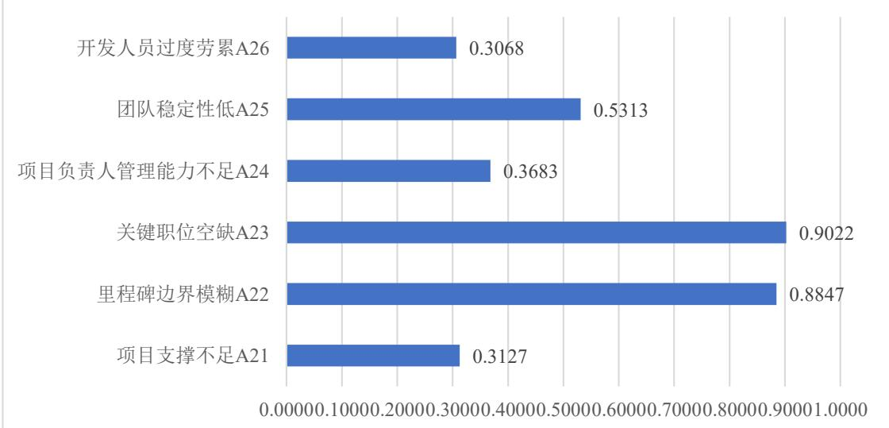  
图5-2人力资源和管理风险各指标得分

（1）人员方面

对于软件开发公司而言，员工风险在软件项目开发中是至关重要的。由于软件开发是一项严重依赖技术人员的智力劳动，人员的能力水平和沟通效率直接关系到软件质量和项目成败。因此，建立一个高效、协作的团队至关重要。对于Y公司软件项目中发现的人员风险，采用减轻的处理方式是一种有效的策略。具体而言，增加人员培训是一个重要的对策。通过培训，可以提升技术人员的专业水平和技能，使他们更好地适应项目需求和应对技术变化。同时，培训还可以增强员工的组织归属感和凝聚力，提高他们的工作积极性和热情。

针对构建企业知识机构和创造人才间的沟通机会，可以定期举办内部培训和技术分享会，让资深员工分享他们的技术心得和项目经验，促进新员工的快速成长。创建一个在线学习平台，供员工随时随地学习，并提供丰富的技术资源和课程。鼓励员工积极参加行业会议和研讨会，扩展眼界，获取最新的技术信息和发展趋势。建立跨部门沟通渠道，定期召开项目进展会议和团队建设活动，加强团队间的合作与协调。

确立共同的工作目标，由项目经理和研究小组成员共同参与制定，确保每个人都对项目目标有清晰的认识和共同的理解。这样做有助于形成统一的行动方向，减少内部冲突和误解，使团队成员能够齐心协力朝着共同的目标前进。满足项目组织成员的物质和精神需求是增强团队凝聚力的关键。物质需求包括合理的薪酬待遇、福利和奖励机制等，这些能够激发团队成员的积极性和工作热情。精神需求则包括认可、尊重、成就感等，项目经理应该关注团队成员的个人成长和职业发展，为他们提供学习和成长的机会，使他们能够在工作中实现自我价值。构建积极的信息沟通和合作氛围是提升团队凝聚力的另一个重要方面。通过增进团队之间的交流，可以消除误解和隔阂，促进团队成员之间的互信和合作。同时，加强软件开发团队与其他部门的沟通也至关重要，这有助于打破部门壁垒，形成跨部门协作的良好氛围，从而提高整个项目的执行效率和质量。

# （2）管理方面

在这个过程中，技术架构的重要性不可忽视。出色的架构不仅可以为软件开发带来明显的好处，还能帮助统一代码风格。尤其是架构师在代码组织和重构方面起着关键的作用，他们通过寻找和共享可重用的模块，有效地减少了重复的工作。还应经常进行代码审查，提取出可重用的代码片段，并以各种方式与团队成员分享，以便未来在类似的功能开发中能快速复用，从而提高开发效率。

提高技术能力水平对于Y公司软件项目的产品实力至关重要。专家们的专业意见能够帮助精准识别出系统架构和框架中存在的不足。随后，将聘请技术实力雄厚的专家团队，针对这些不足进行系统性的升级和优化工作，从而确保软件项目的基础稳固，为后续发展奠定坚实基础。提升开发效率和质量，将Y公司软件项目中的功能模块进行拆分和细化。这有助于团队成员更加专注于各自擅长的领域，实现精细化开发。同时，针对技术难度较大的功能模块，可以考虑采用外包方式或聘请具有丰富经验的技术专家来公司提供技术支持，以确保这些关键模块的开发质量和进度。此外，Y公司还应鼓励团队成员进行功能模块的拆分和细化，以实现精细化开发。对于技术难度较大的模块，公司可以考虑采用外包或聘请具有丰富经验的技术专家来提供技术支持。同时，定期邀请国内外专家对技术开发人员进行培训和考核，也是提升团队技术能力的重要手段。通过这些措施，Y公司能够不断提升团队的技术能力，提高软件开发的效率和质量。

# 5.2.3 需求和沟通风险应对策略

根据第四章分析出来的Y公司软件项目的风险结果的情况来看，需求和沟通风险评价结果为3.243，具体到个指标层结果如图 5-3所示。

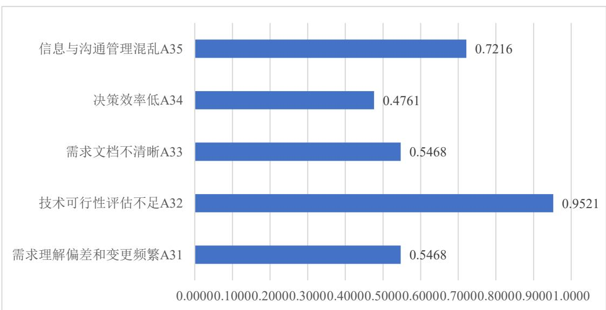  
图5-3需求和沟通风险各指标得分

（1）明确客户需求

强化与客户的沟通与互动是至关重要的一步。Y公司可以通过建立一个定期沟通机制，比如每周的进度汇报会议、每月的需求审视工作坊，以及关键里程碑的反馈环节，来确保开发团队与客户之间能够进行持续且有效的沟通。这种沟通不仅包括项目状态的更新，还应涵盖对客户需求的深入探讨和理解。此外，Y公司应着重培养业务分析师的专业能力，通过提供专业培训和职业发展机会，加强他们对市场趋势的洞察力以及对客户需求的敏感度。制定统一的标准模板来规范产品规格文档的编写，确保文档的清晰性和准确性，是项目顺利执行的基石。通过这种方式，Y公司能够确保每个开发任务都基于清晰明确的需求，从而减少误解和返工，提高开发效率。

Y公司需要建立一个细化和可执行的需求管理流程。这要求公司不仅要将客户的需求拆解成具体的开发任务，还要确保每项任务都能够在规定的时间内完成。通过敏捷开发模式，Y公司能够实现快速迭代和定期成果展示，这不仅有助于及时获取用户反馈，还能确保开发方向与客户需求保持一致。在需求管理方面，Y公司应采用先进的项目管理工具，如看板、敏捷管理软件等，来跟踪任务进度和优先级，确保项目的透明度和可预测性。此外，对于需求变更，公司应采取严格的控制策略，通过既定的变更流程和科学评估，有效管理需求变更，降低风险，确保项目按计划推进。这包括对变更请求的评估、影响分析、成本效益评估以及风险管理计划的制定。通过这种方式，Y公司能够确保需求变更得到合理控制，避免对项目进度和质量造成负面影响。

Y公司应考虑利用先进的数据分析工具来深入研究和分析客户需求，从而提供更加精准和个性化的解决方案。公司可以建立一个跨部门的数据分析团队，负责收集和分析来自市场调研、客户反馈、产品使用数据等多方面的信息。通过数据挖掘和机器学习技术，Y公司能够洞察客户行为模式，预测市场趋势，从而在产品开发和创新方面做出更加明智的决策。对于技术难度较大的功能模块，Y公司可以考虑采用外包或聘请经验丰富的技术专家来提供支持，确保关键模块的开发质量和进度。

# （2）加强人员沟通

为了加强人员沟通并提升开发效率，Y公司需采取一系列优化措施以强化敏捷开发模式下的沟通和协作。第一，公司应进一步细化敏捷开发流程，确保每次迭代都能紧密围绕用户需求展开。通过定期的迭代计划会议和回顾会议，开发团队可以及时调整开发方向，确保与用户需求保持一致。此外，Y公司应加强对开发团队的敏捷开发培训，确保每个成员都能理解敏捷开发的核心原则和实践方法，从而提高团队的协作效率和响应速度。在成果展示环节，Y公司可以采用更为互动的方式，如用户故事地图、原型演示等，帮助用户更直观地理解产品功能和进度，从而促进用户与开发团队之间的有效沟通。

第二，Y公司需要优化需求管理流程，确保需求的细化和任务的可操作性。公司可以引入更为先进的需求追踪工具，帮助团队成员清晰地了解每个需求的状态和优先级。通过这种方式，Y公司能够确保每个任务周期都控制在一周以内，从而提高开发效率并保证项目进度的稳步推进。同时，公司还应加强对业务分析师的培训，提高他们对需求理解和文档编写的能力。通过制定详细的标准模板，Y公司能够确保业务分析师编写的产品规范文档既明确又清晰，有助于团队成员准确理解需求，提升项目执行效率。此外，公司还可以建立一个跨部门的需求评审小组，定期对需求文档进行评审和优化，确保需求的准确性和完整性。

第三，Y公司需要建立一个严格的需求变更控制流程，以减少需求变更对项目进度和质量的影响。项目经理在这一过程中扮演着关键角色，需要严格执行变更流程，对任何变更请求进行细致的审核和评估。一旦发现需求变更，项目经理应立即组织团队进行总结和分析，深入探讨变更的原因及其对项目的影响。通过这种方式，Y公司不仅能够防止需求扩散，避免影响前期成果，还能为后续项目管理提供宝贵的经验教训。

# 5.2.4 项目计划风险应对策略

根据第四章分析出来的Y公司软件项目的风险结果的情况来看，项目计划

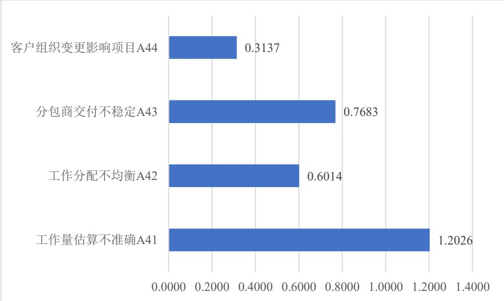  
风险评价结果为2.886，具体到个指标层结果如图 5-4所示。  
图5-4项目计划风险各指标得分

（1）制定完善的项目管理计划

Y公司应强化项目启动阶段的工作，确保项目经理能够制定一个详尽的项目管理计划。这个计划应包括项目目标、范围、时间线、预算、资源分配、风险管理以及沟通策略等关键要素。项目经理需要与项目干系人进行深入沟通，明确项目需求和期望，确保项目目标的可实现性。此外，项目经理还应利用项目管理软件工具来辅助计划的制定和跟踪，通过这些工具，项目经理可以更有效地监控项目进度，及时调整计划以应对变化。

Y公司需要在项目管理计划中加入更多的灵活性和适应性，以应对项目实施过程中可能出现的不确定性。项目经理应采用滚动波式规划，允许项目计划在项目生命周期内进行动态调整。这种方法允许项目经理根据项目的实际进展和反馈，对后续阶段的工作进行重新评估和规划。同时，Y公司还应加强项目团队的能力建设，通过定期培训和技能提升活动，提高团队成员的专业能力和项目管理技能。此外，项目经理应建立一个透明的沟通机制，确保所有团队成员和干系人都能及时获取项目信息，参与到项目决策中来。通过这种方式，Y公司能够确保项目管理计划的可实施性，提高项目成功率。

此外，Y公司应重视项目风险管理计划的制定，项目经理需要识别项目可能面临的风险，并制定相应的风险应对策略。这包括对风险进行分类、评估风险影响和发生概率，以及制定预防措施和应急计划。通过这种方式，Y公司能够提前发现潜在问题，减少风险对项目的影响。同时，项目经理还应定期审查风险管理计划，根据项目进展和外部环境的变化，更新风险列表和应对策略。

# （2）强化分包商管理

为了强化分包商管理，Y公司首先需要建立一个全面的分包商筛选和评估体系。这包括对潜在分包商的资质、历史业绩、信誉、技术能力、管理水平以及财务状况等进行细致的审查和评估。通过这些评估，Y公司能够筛选出最符合项目需求的分包商，从而降低合作风险。此外，Y公司还应制定一套详细的分包商管理计划，明确分包商的责任、任务目标、交付标准以及质量要求。通过与分包商签订明确的合同，Y公司能够确保分包商清楚地了解自身的任务和目标，以及项目合作的期望成果。

在分包商管理过程中，Y公司需要实施定期和不定期的监督和评估机制。这包括定期收集和分析分包商的工作进度报告，以及对其工作质量进行评估。Y公司可以建立一个在线项目管理平台，用于跟踪分包商的工作进度和提交的成果物。通过这个平台，项目经理和分包商能够实时交流，及时解决合作中出现的问题。同时，Y公司还应组织定期的现场检查或线上审计，确保分包商的工作符合项目要求和标准。通过这些措施，Y公司能够及时发现并纠正分包商工作中的问题，保证项目质量。Y公司应建立一个开放的沟通机制，鼓励分包商提出意见和建议。通过定期召开分包商会议，Y公司可以及时了解分包商在项目实施过程中遇到的困难和挑战，并提供必要的支持和帮助。这种沟通机制不仅有助于解决问题，还能够增强分包商的参与感和责任感。Y公司还应考虑建立一个激励机制，对表现优秀的分包商给予奖励，以此提高分包商的工作积极性和忠诚度。

此外，Y公司需要在项目管理计划中加入对分包商管理的持续改进措施。这包括定期回顾和更新分包商管理策略，以及根据项目经验和反馈进行调整。通过持续改进，Y公司能够不断提升分包商管理的效率和效果，确保项目合作的顺利进行。同时，Y公司还应考虑建立一个分包商数据库，记录分包商的历史表现和合作经验，为未来的项目合作提供参考。通过这些优化措施，Y公司能够建立起一个稳定可靠的分包商网络，为公司的长期发展提供支持。

# 5.2.5 外部环境风险应对策略

根据第四章分析出来的Y公司软件项目的风险结果的情况来看，外部环境风险评价结果为3.240，具体到个指标层结果如图5-5-所示。

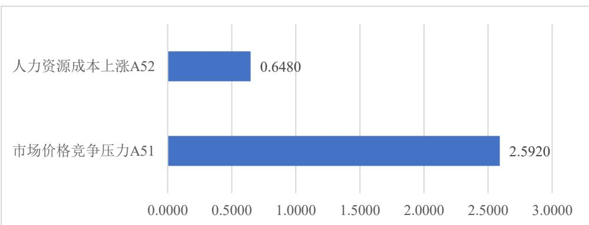  
图5-5外部环境风险各指标得分

（1）提高人员工作积极性

为了提高项目团队成员的工作积极性，Y公司需要建立一个明确的项目目标体系，并将这些目标与每个成员的个人发展目标相结合。通过这种方式，团队成员能够看到自己的工作是如何与项目成功紧密相连的，从而增强他们的归属感和责任感。Y公司可以通过定期的目标设定和回顾会议，确保每个成员都清楚自己的工作目标，并与项目的整体目标保持一致。

此外，Y公司还应建立一个公正透明的绩效评估和激励机制。这包括对团队成员的工作表现进行定期评估，并根据评估结果给予相应的奖励和认可。这种机制不仅能够激发团队成员的工作热情，还能鼓励他们不断提高自己的工作能力和效率。同时，公司还应提供持续的职业发展和培训机会，帮助团队成员提升自己的技能和知识，实现个人职业发展目标。通过这种方式，Y公司能够建立起一个积极向上、不断进步的团队文化。Y公司需要营造一个支持性和协作性的工作环境，鼓励团队成员之间的交流和合作。这可以通过建立跨职能团队、组织团队建设活动和提供共享工作空间等方式来实现。在这样的环境中，团队成员能够相互学习、相互支持，共同解决问题。此外，公司还应鼓励团队成员参与决策过程，让他们对项目的方向和策略有一定的发言权。这种参与感能够增强团队成员的责任感和使命感，提高他们的工作积极性。

同时，Y公司应重视团队成员的工作生活平衡，避免过度工作和疲劳。公司可以通过灵活的工作安排、足够的休息时间和假期等措施，确保团队成员能够在保持高效工作的同时，也能够有足够的时间休息和恢复。通过这些措施，Y公司能够建立起一个健康、积极、高效的工作环境，从而提高团队成员的工作积极性和项目整体的成功率。

# （2）拓展市场多元化发展

为了有效拓展市场并实现多元化发展，Y公司需要深化市场研究，准确把握目标客户群体的需求和偏好。公司可以建立一个专门的市场研究团队，运用市场调研、数据分析和消费者行为研究等方法，收集和分析市场信息。通过这些信息，Y公司能够洞察行业趋势，预测市场变化，并据此制定相应的产品开发和市场进入策略。此外，公司还应加强与现有客户的互动，通过定期的客户访谈、问卷调查和反馈收集，了解客户的深层需求和期望。基于这些信息，Y公司可以开发出具有独特价值的产品和服务，形成差异化的竞争优势，提高产品的市场竞争力。

构建一个系统的客户关系管理(CRM)体系，以维护和发展与客户的关系。Y公司可以利用 CRM 软件来跟踪客户的购买历史、偏好和反馈，从而提供更加个性化的服务。同时，Y公司应建立一个多渠道的客户沟通机制，包括客户服务热线、在线客服、社交媒体互动等，确保客户能够方便地与公司沟通。通过这些渠道，公司可以及时响应客户的咨询和问题，提高客户满意度。此外，公司还可以定期举办客户活动，如产品展示会、用户交流会和忠诚客户奖励计划等，增强客户的品牌忠诚度。在品牌建设方面，Y公司需要制定一个长期的品牌战略，通过一致的品牌信息和形象，提升公司的知名度和美誉度。公司可以通过公关活动、广告宣传、内容营销等手段，塑造和传播公司的品牌形象。此外，Y公司还应积极参与行业展会、论坛和研讨会等，提高公司在行业内的知名度和影响力。

此外，Y公司应积极探索新的市场机会，通过多元化发展来分散市场风险。公司可以考虑进入与现有业务相关的新领域，或者利用现有技术和资源开发新的产品线。同时，Y公司也可以探索国际市场，通过出口或者在海外设立分支机构，开拓新的市场空间。在多元化发展的过程中，Y公司需要进行细致的市场分析和风险评估，确保新的市场领域与公司的核心竞争力相匹配，避免盲目扩张带来的风险。通过这些优化措施，Y公司能够实现可持续的市场增长和业务发展。

# 5.3 软件项目风险应对保障

在软件项目开发管理过程中，风险因素的识别和控制是至关重要的。明确风险因素是在哪个阶段产生的，这需要项目团队在软件项目的不同阶段，通过风险检查表来记录和识别风险。这不仅有助于团队了解风险来源，还能为后续的风险控制提供有针对性的策略。风险并非一成不变的，它们可能会随着项目的进展而发生变化。因此，项目团队需要密切关注风险因素的变化趋势和幅度，以便及时调整风险应对策略。这包括评估风险的影响程度、更新风险应对策略以及记录风险处理结果等。通过这种方式，团队可以及时了解风险状况，确保项目按计划进行。为了降低或消除风险对项目进度、成本和质量等方面的不利影响，项目团队需要采取一系列应对措施。

软件项目风险监控是确保整个软件项目健康顺利进行的必要环节，主要包括风险状态动态全面跟踪以及风险影响适时管控两个重要过程。

风险状态动态全面跟踪在软件项目开发管理中具有极其重要的地位。通过动态跟踪，项目团队能够深入了解风险对软件项目的具体影响情况。这包括风险可能导致的进度延误、成本超支、质量下降等问题，以及这些问题可能对项目整体目标和利益造成的损害。有了这些信息，团队就能更有针对性地制定风险应对策略，确保项目的顺利进行。风险状态的跟踪记录对于项目管理者来说具有极大的参考价值。通过将风险状态及其影响结果详细记录到风险管理列表清单中，管理者可以清晰地了解风险的动态变化，包括风险的产生、发展、消亡等过程。这不仅有助于管理者全面把握项目的风险状况，还能为项目决策提供有力的支持。

风险影响的适时管控环节，确认项目进度并确定和应对可能出现的风险。这个环节需要深入挖掘软件项目的各个风险因素，并对其产生的后果变化进行细致的分析。通过对比分析法，将项目风险与项目的实际影响进行定量的比较，旨在精准评估计算出风险具体对项目造成的影响程度。

针对实际上可能出现的成本偏差、进度偏差、成本绩效指数和进度绩效指数，需要结合软件项目的实际情况对其进行深入的研究分析，并进行适度的调整分级。软件项目风险监控的重要性不能被忽视。只有充分认识到风险控制可能带来的操作决策问题，并且通过科学的风险管理手段，构建一个风险识别、评价、应对和监控的完整风险管理体系，才能更好地推进整个软件项目的健康进行，提升项目的成功率。

# 第六章 结论与展望

# 6.1 研究结论

在国内软件安全发展的背景下，国内的软件项目日益倾向于自主研发，软件项目的质量对我国在全球软件市场的地位有着重要影响。因此，对于软件项目的风险管理受到前所未有的重视。本文特别针对Y公司电信运营商软件项目的风险管理问题进行了深入研究，旨在结合软件行业的发展特点，为Y公司电信运营商提供全面的项目管理与风险控制指导。本研究主要得到的结论如下：

（1）通过风险识别阶段，Y公司电信运营商软件项目中存在多个潜在风险。这些风险主要包括技术和质量风险、人力资源和管理风险、需求和沟通风险、项目计划风险以及外部环境风险。这些风险因素的存在都可能对项目的顺利进行和最终成果产生不利影响。在技术和质量风险方面表现为缺乏技术负责人，缺乏代码审查流程，技术人员安全意识不足、测试规划不准确等；在人力资源和管理风险方面表现为里程碑边界模糊，关键职位空缺、团队稳定性差等；在需求和沟通风险方面表现为技术可行性评估不足、信息与沟通管理混乱等。

（2）综合考虑了Y公司运营商软件项目的特点，从技术和质量风险、资源和管理风险、需求和沟通风险、项目计划风险和外部环境风险等维度，构建了针对Y公司软件项目的风险评价体系和评价模型。

（3）运用层次分析和模糊综合评价分析得出目前Y公司电信运营商软件项目整体风险等级为较高，各个二级指标除了项目计划风险属于一般风险外，其余均属于较高风险。基于以上风险识别和评估程序，从提高技术能力水平，选择合适的项目负责人，提升组织建设水平，加强人员沟通，完善的项目管理计划，提高工作人员积极性等方面对Y公司电信运营商软件项目风险应对提出风险控制措施。

# 6.2 研究展望

在Y公司电信运营商软件项目风险管理的研究中，尽管已经建立了一套较为完善的风险评价指标体系，但仍存在一些不足之处，需要进一步深化和拓展。首先，现有的风险识别机制虽然能够覆盖多个风险维度，但仍然依赖于人工的判断和经验。在快速变化的市场和技术环境中，这种依赖人工的方式可能无法及时响应风险的变化。因此，未来的研究可以探索如何利用机器学习和大数据分析等前沿技术，开发智能化的风险预警系统。通过实时监控项目数据和自动预测潜在风险，这样的系统将极大地提高风险管理的效率和精准度，帮助Y公司更快地识别和响应风险。其次，项目风险管理中的数据采集和处理模式也需要进一步革新。随着电信运营商软件项目的复杂性增加，项目中产生的数据量也在迅速增长。现有的数据处理方式可能无法满足实时性和准确性的要求。因此，未来的研究可以探索引入云计算和分布式存储技术，以提升数据处理效率。通过构建一个强大的数据处理平台，Y公司将能够更有效地管理和分析大量项目数据，为决策提供更可靠的支持。另外，随着Y公司业务的全球化发展，多元文化背景和法规环境的互动也带来了新的风险挑战。未来的研究可以探索如何建立一个灵活调整的风险响应机制，以适应全球化市场的需求。通过深入研究不同文化和法规环境下的风险特点，Y公司可以制定更加有效的风险管理策略，以应对全球化市场中的多样化风险挑战。最后，针对跨项目风险聚合的影响和管理策略，未来的研究可以探讨如何在众多运营商软件项目中识别和管理共性风险。通过分析不同项目之间的风险关联性，Y公司可以更好地理解和管理这些共性风险，最大限度地发挥规模效应。这不仅有助于提高单个项目的风险管理效果，也将对整个公司的风险管理能力产生积极的影响。

综上所述，Y公司电信运营商软件项目风险管理的研究虽然已经取得了一定的成果，但仍有诸多方面需要进一步深化和拓展。通过改进风险识别机制的智能化，革新数据采集和处理模式，探索多元文化背景下的风险响应机制，以及研究跨项目风险聚合的影响，Y公司将能够建立起一个更加高效、精准和灵活的风险管理体系。这不仅将提高单个项目的风险管理效果，也将对公司的长期发展和市场竞争力产生积极的影响。未来的研究需要不断地探索和创新，以适应不断变化的市场和技术环境，为Y公司在激烈的市场竞争中保持领先地位提供坚实的支撑。
