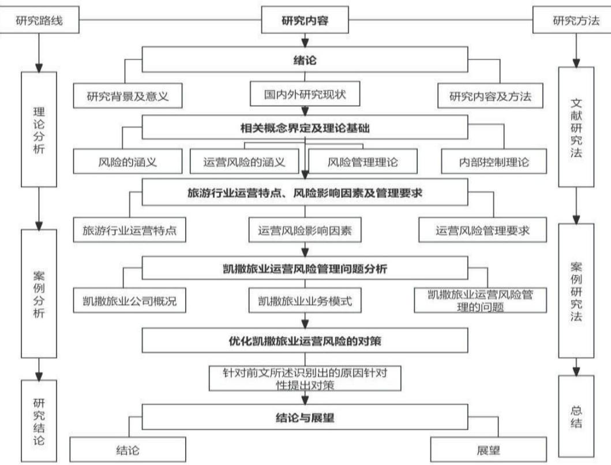
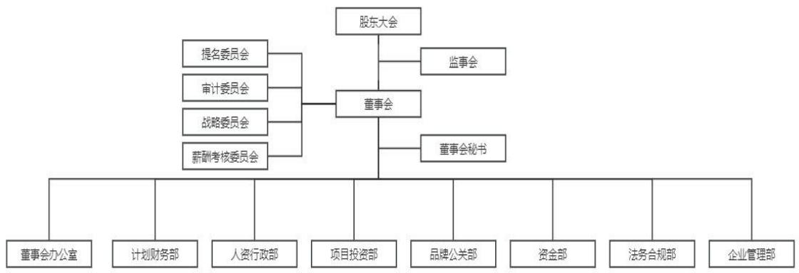
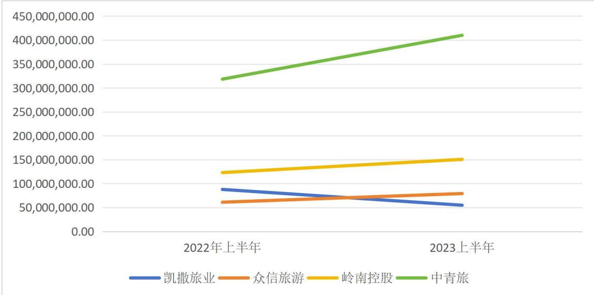
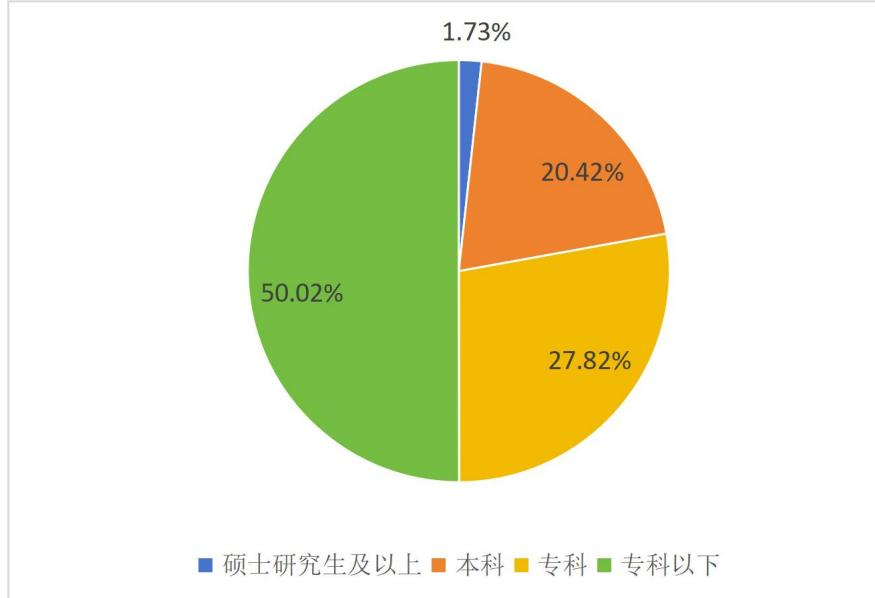
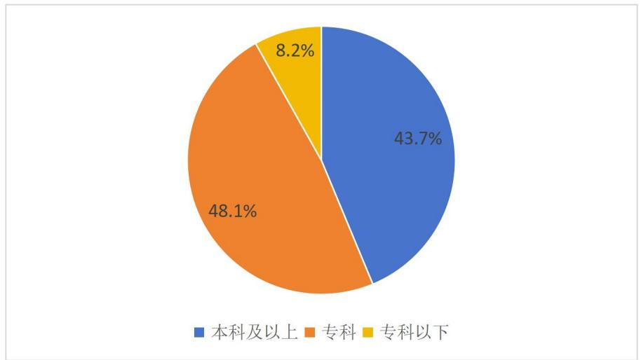
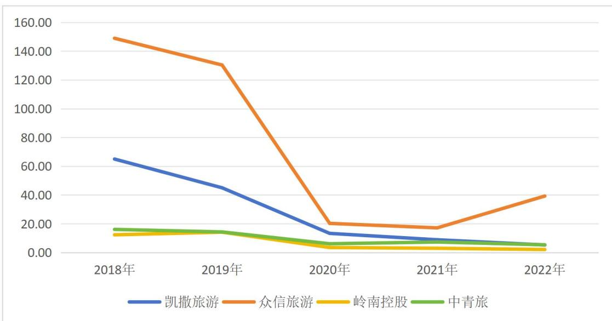
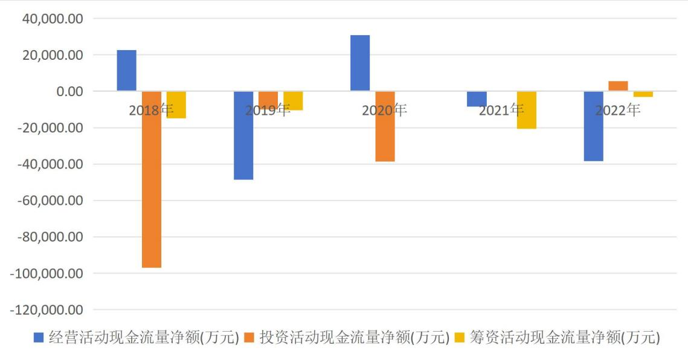
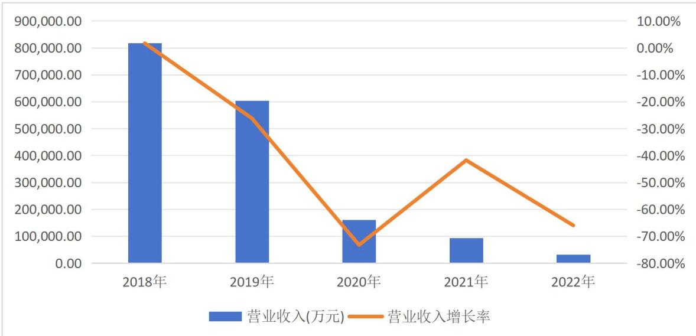
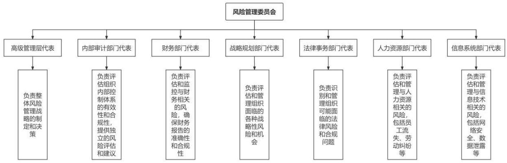
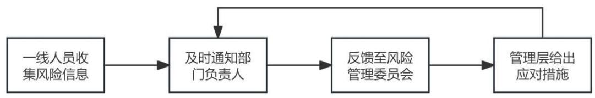

# 第一章 绪论

# 1.1研究背景及意义

# 1.1.1研究背景

旅游业是我国的支柱产业之一，也是新的经济增长点，“十二五”规划中将旅游业定位为国民经济的战略性支柱产业，根据中华人民共和国文化和旅游部的最新数据显示，我国旅游及相关产业增加值从 2014 年的 27524 亿元增长到 2022年的44672 亿元，年均增速 $6 . 2 4 \%$ ，旅游业作为国民经济战略性支柱产业的地位更加巩固。《“十四五”旅游业发展规划》中提出：稳步发展出境旅游，着力推动文化和旅游深度融合，着力完善现代旅游业体系，加快旅游强国建设，努力实现旅游业更高质量、更有效率、更加公平、更可持续、更为安全的发展。随着国家全面放开疫情防控，根据中华人民共和国文化和旅游部发布《2023 年国内旅游数据情况》，提到 2023 年，国内旅游总人次 48.91亿，比上年同期增加 23.61亿，同比增长 $9 3 . 3 \%$ ，居民国内出游总花费 4.91 万亿元，比上年增加 2.87 万亿元，同比增长 $1 4 0 . 3 \%$ ，旅游行业井喷式复苏，未来可期。

在宏观经济环境发生剧烈变化、旅游行业快速发展的大环境下，旅游业日益成为具有较高风险性的行业，由此将给旅游企业经营带来不确定性，在旅游行业敏感性高、旅游产品综合性强等特点下可能出现亏损。由于旅游企业天生对客源市场和服务市场的依赖性很强，因此在过去三年新冠肺炎疫情的冲击下，受外部环境和内部条件的冲击比一般企业更为明显，也更有可能面临风险。如今疫情防控全面放开，出游热情高涨，但也出现了不少意外，2023 年 10月27日一起因“雪域雄鹰”弹射过山车撞人的大型游乐设施撞山事故，导致 28人入院，发生在深圳市南山区沙河街道欢乐谷景区。其中重伤3人、轻伤7人、轻微伤11人、轻伤未愈7人，直接经济损失 397.50 万元。这一事故反映出运营单位缺乏对设备运行的风险管理，未能保证设备的正常运行，造成游客生命财产得不到保障。旅游行业的风险管理能够帮助企业防范风险的发生，使企业尽快从损失中减少风险的产生和恢复正常。

本研究案例凯撒旅业是国内旅游业行业的龙头企业，曾斩获“年度最具长期投资价值上市公司”“年度最佳文旅上市集团”荣誉称号，并且是国内第二家上市的民营旅行社，根据申万行业三级分类，旅游综合的上市公司现有四家，分别为凯撒旅业、众信旅游、岭南控股、中青旅，经过疫情三年，唯有凯撒旅业连续两年审计报告被出具否定意见，说明公司不仅仅是受新冠肺炎疫情影响，其公司整体的运营也存在着问题，在疫情未到来的 2019 年，公司营业收入就出现了下降，但同行业企业营业收入都在增长，这也说明凯撒旅业本身也存在着问题。

# 1.1.2 研究意义

# （1）理论意义

以往的运营风险管理研究中很少涉及旅游行业这类抵御风险较弱的企业。而本文通过总结归纳现有研究成果，总结旅游行业普遍的风险影响因素，同时通过案例分析旅游企业存在的运营风险的问题，并通过层次分析法，分析所涉及运营风险的重要性权重，补充旅游企业运营风险管理的理论观点，填补理论研究的不足。

# （2）实践意义

旅游企业抗风险能力较差，也存在着风险意识不强的问题。旅游行业快速发展的今天，旅游企业在风险管理表现上仍然相对滞后，这不仅使企业面临风险的可能性增大，而且往往缺乏应对的具体措施，给企业的运营带来沉重的打击。本文通过案例分析旅游综合企业凯撒旅业存在的运营风险的问题，并提出构建完善的风险管理体系的对策，可以在一定程度上为旅游企业解决共性的问题，对于旅游企业做好运营风险管理，促进旅游业的可持续发展有一定借鉴意义。

# 1.2文献综述

# 1.2.1风险管理相关理论

（1）风险管理的涵义

对于风险管理的涵义，国内外的主要文献：国外在风险管理的涵义上是由内部控制拓展和延伸而来的，国际公认的权威机构一一美国发起组织委员会（COSO）该机构自成立之日起，不断地参与并负责制订内部控制的规范，影响和塑造了内部控制领域的进步方向。

1992 年，COSO 提出了《内部控制———整合框架》[1，此标准，经过超过十年的广泛使用，已经获得行业内的广泛认同。2004 年9月，COSO 进一步推出了《企业风险管理——整合框架》[2]这个新的标准框架不仅建立在之前的《内部控制———整合框架》之上，而且还标志了内部控制领域的一个重要转变。它对内部控制的定义、目标设定和基本元素进行了全面的扩展和深化，特别是将原有的五个关键要素扩充至八个。通过这种扩展，该框架不仅加深了对内部控制概念的理解，而且还首次明确提出了全面风险管理的核心理念和整体框架。

2006 年6月6 日，国资委颁布了《中央企业全面风险管理指引》[3]，其中指引的第四条对全面风险管理进行了概念解释：企业围绕总体经营目标，通过在企业管理的各个环节和经营过程中执行风险管理的基本流程，培育良好的风险管理文化，建立健全全面风险管理体系。并将风险分为战略风险、财务风险、市场风险、运营风险、法律风险。2008 年各主要监管机构包括财政部、中国证券监督管理委员会、国家审计局、中国银行业监督管理委员会以及中国保险监督管理委员会在首都北京共同宣布实施了《企业内部控制基本规范》[4]，该规范的推出是我国完善企业监管框架，加强内部控制实践的重要一步。这将有效助力企业在内部管理上采取主动防控潜在的风险，同时促进其管理和运营质量的提升。2010年五部委又发布了《企业内部控制配套指引》[]，这一指引与先前推出的规范共同为中国的企业内控标准化体系奠定了基础。

在 2013 年，COSO 宣布推出了更新版《内部控制——整合框架》[6]，这一新版本在保留原框架核心元素的基础上，更新了一些概念并提供了更为详尽的业务指导。2017 年，COSO又对此框架作出了进一步修订，发布了《企业风险管理——战略和绩效的整合（2017）》[7，这个最新版不仅优化了2004年《企业风险管理——整合框架》的内容，而且淘汰了原有的“立方体八要素”架构，转而采用“五要素及二十项原则”的新模式。新定义的企业风险管理强调在创造、保护及实现价值的过程中完成风险管理，这不仅是一个战略的制定和执行的结果，还涉及组织的文化、能力和日常操作。

综上所述，国外关于风险管理的标准和政策指引要早于国内，并且2017年的时候又对其进行了更新完善，虽然国内的政策指引时间上落后于国外，但更加符合我国企业的实际情况，同时国内企业首先应遵守我国的政策制度，所以本研究以《中央企业全面风险管理指引》和《企业内部控制基本规范》中对于风险管理概念的定义和风险的分类为基础进行案例研究。

# （2）风险管理的程序和方法

风险管理是一个迭代的过程，马延柏（2020）[8]分析出大多数企业风险管理框架包含六大程序包括：制定战略和目标、识别风险、评估风险、应对风险、控制风险、沟通与监控，这六大程序形成了企业持续风险管理的基本流程。任志华（2021）[9]构建的PPP模式下城中村改造项目风险管理机制中将风险程序分为风险管理规划、风险识别确认、风险分析与评估、风险应对与管制、风险控制与监控。张传昌和王润斌（2022）[10]在应对大型体育赛事风险上，构建了风险识别、风险评估、风险应对、风险沟通的体系。

以公司为研究对象的学者普遍采用最核心的三个步骤。Błach（2010）[1]以100 家企业财务数据为依据，对企业的财务风险进行了识别、评估、应对。金鹏（2023）[12]构建的商业银行气候风险管理程序包括：风险识别、风险评估、风险应对，为商业银行提升气候风险管理能力提供参考与借鉴。杨有红（2022）[13]认为风险管理以内部控制为支撑，内部控制五要素中的风险评估细分为事项识别、风险评估和风险应对。韦谊成和刘小瑜（2022）[14]剖析了我国供应链金融信用风险管理中存在的主要问题，并围绕风险识别、分析、评估、应对维度，提出以全面风险管理防范供应链金融信用风险的建议。吴林、刘永峰和李鹏翼（2023）[15]在研究中国篮球协会运营风险时，运用风险识别、风险评价、风险应对三个步骤，确定中国篮球协会的运营风险，并提出相应的风险应对措施。

在风险管理方法上，主要以本研究的运营风险的评价方法相关文献为重点。

多数学者运用层次分析法对运营风险进行评价。银元（2023）[16]研究乡村旅游合作社运营风险时，经专家问卷筛选，构建6 项一级指标和 29 项二级指标，采用 AHP 层次分析法确定评价指标权重，对其风险进行评价。张同功和李娜（2020）[17]采用了WBS-RBS风险辨识矩阵联合层次分析的方法，针对科创板操作过程潜在的风险进行了系统的识别和评估。缪梦醒和孙滢悦（2019）[18]从风险特征分析、风险识别角度出发，以5个一级评价因子，18个二级评价因子，通过层次分析法构建评价指标体系与模型。金鑫和张丽琴（2011）[19]运用文献内容分析方法确定风险评价的指标及其关联权重，并结合层次分析法（AHP）对各指标的风险程度进行评价，根据评价结果可以有针对性地进行风险管理。

少数学者运用其他模型来评价运营风险管理。Raian、Siddiqua 和 Moktadir（2023）[20]通过对纺纱行业企业进行运营风险的分析，构建16个运营风险变量，运用模糊综合评价法确定每个风险因素和风险组合的概率和大小，以及总体风险。刘兵、李晓璐和张彭（2019）[21]通过对轨道交通线路过去的故障原因进行深入分析，成功建立了一个针对线路运营风险评估的指标系统。他们提出了一种基于熵权法和可拓物元理论的评估技术。通过应用数学统计方法来界定评估指标的标准范围，并结合熵权法来确定各指标的重要性，再运用可拓物元理论来综合评定风险水平及等级。张尚毅、周米娜和郑先勇（2022）[2]同样以城市轨道交通为研究对象，构建了一个覆盖经营、应急、乘客和公共安全管理等方面风险的评价体系。通过开发一个贝叶斯网络模型，该团队对 COVID-19 疫情期间重庆的城市轨道交通运行风险进行了全面分析，包括正向和逆向推理，以及风险节点间的互相关联度计算，从而对疫情影响下的运营风险给出了详细评估。

综上所述，从多位学者研究的共性来看，风险管理的程序主要包含了风险识别、风险评估以及风险应对三个主体部分，本研究的主要构成就是以风险管理三个主要部分，在运营风险管理评价方法上学者在层次分析法上结合熵值法或模糊综合评价法对运营风险进行评价，少数学者通过熵权可拓物元模型或建立贝叶斯网络模型进行研究，本研究将采用普遍性、适用性更强的层次分析法进行评价。

# 1.2.2 旅游行业特点及风险影响因素

（1）旅游行业特点研究

近年来，旅游产业正快速发展，旅游业界的特征越来越引起广泛关注。然而，尽管很多学者从多个角度进行了研究，但对于旅游企业行业特征的认识尚未达成一致。在此背景下，系统地回顾和梳理旅游企业行业特征的相关文献，以期为后续研究提供有价值的参考。

汪秀琼，梁肖梅和吴小节（2021）[23]在研究中国旅游上市公司多元化并购结合了旅游行业的特点，认为旅游业具有综合性、资源依赖性强、关联产业众多等特点。何建民（2019）[24]旅游活动与旅游业具有天然的跨地区、跨产业的性质。刘雨涵（2021）[25]把旅游业概括为三大特征：旅游业与GDP正相关、旅游行业季节性强、旅游行业敏感性强。同样LunEY（2022）[26]通过回归分析发现旅游发展与经济增长呈正相关。蒋晨丽（2020）[27]认为旅游业极容易受到外界不可控因素的影响，自然环境和社会环境的变化都会给区域旅游项目造成不可预测的风险，并总结出关联性、敏感性、投资的专用性和依托性、季节性、市场导向性的特点。

综上所述，根据多位学者的研究，可以总结出旅游业具有以下特点：季节性和敏感性：旅游业具有明显的季节性和敏感性，易受外界不可控因素（如天气、社会事件等）的影响，同时市场变化也会对旅游业产生重要影响。关联性和依托性：旅游业与其他产业和地区紧密相关，依托于其他产业的发展，同时旅游业自身也具有很强的关联性。投资专用性和市场导向性：旅游业需要针对具体旅游项目进行投资，具有投资专用性，同时也需要紧跟市场需求进行导向性投资。在了解这些特点的基础上，可以更好地把握旅游业的行业性质和发展规律，为相关研究提供有益的参考。

# （2）旅游行业运营风险影响因素研究

对于相关影响因素的研究中，Hakan 和 Deniz（2023）[28]依托社会交换理论验证了经济风险、社会风险和文化风险影响旅游的可持续发展。银元（2023）[16]结合乡村旅游合作社运营风险与其产业属性和组织特征，以及发展背景、发展环境、发展阶段的复杂性，并通过专家调查问卷筛选出外在环境风险、市场风险、产品风险、管理风险、财务风险、个体风险6 项可能影响运行风险的因素，并且6 项指标下还有29 项二级影响因素。楼鑫秀（2022）[29]以新冠肺炎疫情为研究背景，通过经营风险和财务风险两个方面对中青旅进行分析，从而得出供应端、生产端、销售端、投资风险、筹资风险、现金流风险存在较大风险。王琪延和高旺（2020）[30]研究发现，三个不同的不确定性因素对旅游行业企业造成的影响具有明显的时间相关性特征。研究指出，在三种因素中，景区依赖型企业最受经济政策波动的影响，其次地缘政治风险对于旅行代理业务产生了越来越严重的负面影响，最后，在不同时间尺度上，金融压力对整个旅游行业的打击都非常深远。张弦（2017）[31]通过PEST模型、五力模型和价值链模型分析法对互联网旅游企业经营风险进行了深刻的剖析，将风险划分为三个主要层次：宏观层面涉及政治、经济、社会和技术领域的影响因素；中观层次考虑了行业内的竞争状况、供需双方的谈判能力、新竞争者的威胁以及服务替代品的存在；微观层次则专注于公司的管理水平、产品市场竞争地位、市场推广效果以及财务盈利状况。仲建兰和袁晓灵（2023）[32]从自然因素和人为因素两个层面探索旅游危机的引致因素。自然因素主要包括自然灾害因素，如地震、洪水、特大台风等，以及雾霾、非典疫情和新冠肺炎疫情，人为因素包括经济因素、政治因素、社会环境因素和运营管理因素。李琦（2021）[33]将旅游企业经营影响因素分为外部的经济政策环境、行业环境、突发事件，内部影响因素有多元化、组织结构和管理水平。

综上所述，旅游企业运营风险影响因素涉及范围较广，大体上可以分为外部风险和内部风险，比如外部的经济政策环境风险、自然环境风险、突发事件风险、市场风险，内部的财务风险、人力资源风险、内部管理风险、产品风险。

# 1.2.3 旅游行业运营风险管理问题及优化

（1）旅游行业运营风险管理问题

在旅游行业风险管理问题研究方面，徐颖（2019）[34]从内部控制概念入手，分析了旅游企业存在组织架构不完善，对内部控制认识不足，内部控制机构设计不科学，人力资源管理缺乏，人才流失严重内控制度不完善，应对风险的能力不足等问题。王婷（2022)[35]在互联网经济背景下，旅游行业的成长面临若干挑战。这些包含低下的数字化旅游水平、不均衡的区域旅游数字化进展、一些地方的信息共享不力，以及落后的网络基建，这些因素都阻碍了行业创新。此外，缺乏完善的旅游管理制度，信息流通受阻，各管理机构协作困难，难以对市场动态做出迅速反应，导致行业整合不佳，进而负面影响旅游业的全方位发展。而且，面对当前旅游业发展模式，急需但又短缺的是具有复合技能的人才。旅游产品的选择过于单一化，产品同质化严重，缺少创新型产品开发，旅游者的体验不佳，忽略了融合不同类型产品创新的重要性，且过分依赖于传统的“门票经济”。

综上所述，疫情来临前学者认为旅游企业对于内部控制认识不足和应对风险的能力不足，随后疫情发生，印证了学者的观点，本研究案例凯撒旅业在疫情期间就因内部控制存在重大缺陷，被出具了否定意见。同时旅游业产品同质化严重，不是通过产品的创新吸引消费者，而是通过低价竞争，这也造成服务质量的下降，诱导消费者购物的负面新闻频出。

# （2）旅游行业运营风险管理优化

刘岩（2021）[36]认为旅游市场竞争加剧，运营过程中容易出现风险隐患，因此建议要构建风险管理独立组织、建立风险预警防范机制、建立风险补偿基金，此外也要全方位强化内部控制并且通过信息共享与反馈来加强各个部门之间的沟通，在内部控制领域，需要制定完善的监督机制、优化流程管理，规范职能设置。

黄上珍（2021）[37]认为旅游业在实际的运营过程中面临着诸多的风险，建议要重点加强采购的监督和管理，优化采购的申请、采购、入库、领用、报废等一系列流程，使采购流程规范化、科学化，从而完善企业内部控制制度；其次，实现采购全过程的有效监督是保障采购活动顺利进行的关键，包括采购前监督采购的必要性，采购中监督采购的合理性，采购后监督采购的使用性，确保采购活动的合法性和合规性。

刘涛和王栋梅（2016）[38]认为对于加强体育旅游领域中风险管理与防范的综合控制，政府部门的角色至关重要。这不仅包括完善法规和立法、设定明确的管理标准，而且要明确地划分各级政府和旅游业者的责任范围。此外，政府应提升监管体育旅游的强度，以保证其健康、有序地发展。对企业来说，增强技术支持在防范风险中的作用，提高风险管理的意识，积极开展技术人员的专业培训，确保旅游设施得到适当的维护，都是不可或缺的措施。此外，建立一套完善的风险预警和紧急响应机制，以及一个全面的体育旅游风险保险体系，对于促进体育旅游行业的健康发展也是非常重要的。

综上所述，以上学者提出了普适性强的优化方案，如建立完善的风险管理机制，增强对风险的防范管理意识，完善旅游企业的风险预警与应急处理机制，建立健全旅游风险保险制度。本研究是以具体案例为对象，会根据风险识别出的问题，针对性提出风险防控对策。

# 1.3研究内容及方法

# 1.3.1研究内容

以凯撒旅业为具体的研究对象，根据总结的运营风险影响因素并结合凯撒旅业实际情况，对凯撒旅业运营风险管理问题进行分析，基于发现的问题，对企业的风险管理提供具体的优化对策，其中针对缺少运营风险管理评估体系问题，通过运用层次分析法来确定构建指标体系的权重，来确定风险的重要程度，各章节主要研究框架内容如下图1-1：

  
图1-1研究框架图

# 1.3.2研究方法

（1）文献研究法。用关键词在相关学术网站检索前人研究成果，借阅相关书籍以及结合实时资讯，搭建理论基础，完成旅游业企业运营特点、风险影响因素及政策要求的梳理。

（2）层次分析法。结合旅游行业和凯撒旅业自身运营风险情况来构建风险评价体系，完善凯撒旅业在运营风险评估程序上的欠缺。通过德尔菲法对行业相关专家进行问卷调查确认权重，最后评价风险的大小。

（3）案例分析法。以凯撒旅业为案例背景，利用公司相关数据，对凯撒旅业运营风险管理流程和方法上存在的问题进行分析，并根据分析出的问题针对性地提出相应的对策，也为其他同类型的企业提供改进的思路。

# 1.4研究的创新点

本研究可能有的创新点，以往对运营风险的研究都是以项目或企业可能存在的风险以及风险的影响因素进行罗列分析，对于运营风险的范围也没有明确的依据，并且没有对运营风险管理的风险识别、风险评估、风险应对这三个基本流程程序和方法上进行深入的分析并提出建议，本文以凯撒旅业为案例，以国资委发布的企业风险分类参考示例以及注册会计师官方教材所界定的运营风险分类为导向，在此分类范围内对凯撒旅业运营风险管理中出现的程序上的问题和方法上的问题进行深入的探讨，并提出相应的对策，这样更有针对性，而且实用价值更强。

# 第二章 相关概念界定及理论基础

# 2.1概念界定

# 2.1.1风险的涵义

不同组织对于风险的概念有着不同的定义：2017 年，美国COSO 发布《企业风险管理一一与战略和绩效的整合》，更新了风险的内涵和外延，认为风险是事项发生并影响实现战略和经营目标的可能性。其中事项不仅是常规事务，而且包含更广泛的内容，如企业治理和运营架构、地缘政治、社会影响及合同谈判等。国务院国有资产监督管理委员会 2006 年发布的《中央企业全面风险管理指引》将企业风险定义为“未来的不确定性对企业实现其经营目标的影响”，并以能否为企业带来盈利等机会为标志，将风险分为纯粹风险（只有“带来损失”一种可能性）和机会风险（“带来损失”和“盈利”的可能性并存）。

基于上述定义，风险至少包括以下三个方面的内涵：

（1）企业风险与企业战略和绩效相关。风险是影响企业实现战略目标的各种因素和事项，企业经营中战略目标不同，企业面临的风险也就不同。（2）风险往往与机遇并存。基于风险事件的不确定性，风险的结果可以是正面的也可以是负面的。（3）风险是一系列可能发生的结果，而不能简单地理解为最有可能的结果。由于风险的可能结果不是单一的，而是一系列的，所以理解和评估风险时，“范围”这个概念对应了众多的不确定性。

# 2.1.2 运营风险的涵义

国务院国有资产监督管理委员会2006 年发布的《中央企业全面风险管理指引》，指出企业风险一般可分为战略风险、财务风险、市场风险、运营风险、法律风险等，国务院国有资产监督管理委员会办公厅曾发布一个文件，国资厅发改革〔2012）89号，提到企业风险分类参考示例，如表2-1。

运营风险是指企业在运营过程中，由于内外部环境的复杂性和变动性以及主体对环境的认知能力和适应能力的有限性，导致运营失败或使运营活动达不到预期目标的可能性及损失。

表2-1企业风险分类参考示例  

<table><tr><td>-级风险</td><td>二级风险 健康安全环保风险</td><td>级风险</td><td>二级风险</td></tr><tr><td>运营风险 法律风险</td><td>人力资源风险 一般项目管理风险 技术风险 产品风险 资源保障风险 保密风险 研发与开发风险 存货风险 信息系统风险 运行控制风险 稳定风险 执行力风险 采购风险 业务伙伴风险 业务模式风险 业务协同风险 操作风险 业务转型风险 生产管理风险 销售风险 供应链风险 物流管理风险 贸易风险 工程项目管理风险 资产管理风险 审计监察风险 新业务开发风险 突发事件管理风险 退市风险 合同管理风险 法律纠纷风险 合规管理风险 知识产权风险 重大决策法律风险</td><td>市场风险 财务风险 战略风险</td><td>竞争风险 价格风险 汇利率风险 市场供求风险 衍生品交易风险 市场营销风险 行业前景风险 市场分布风险 市场开发风险 证券市场风险 客户风险 品牌与声誉风险 现金流风险 资金管理风险 预算管理风险 会计与报告风险 成本费用风险 担保风险 税务管理风险 关联交易风险 资本运作风险 信托风险 盈利能力风险 投资风险 政策风险 国际化经营风险 战略管理风险 宏观经济风险 产业结构风险 改制风险 并购重组风险 公司治理风险 组织结构风险</td></tr></table>

数据来源：国资厅发改革（2012）89号文件

# 2.2理论基础

# 2.2.1风险管理理论

风险管理是控制潜在风险、降低组织成本维护组织利益的过程。指在一个风险确定的环境中把风险减至最低程度的管理过程；是具体的组织通过识别风险、分析风险、评价风险和进行风险决策管理等方式，对风险进行有效控制与妥善处理，把风险可能造成的不良影响降至最低的管理过程；是选择最有效的方式，主动地、有目的地、有计划地应对风险，通过战略制定和实施抓住机遇来保持和创造价值，通过最小成本获得最大可能的收益及安全保证的一种管理方案。因此，风险管理的本质就是通过有效的技术手段去控制风险事件所带来的不利影响，从而将组织可能蒙受的损失降到最低，并致力于为组织保持和创造更大的价值。

风险识别、风险评估、风险应对是风险管理最基本的三个流程。

进行运营风险识别时，普遍采用德尔菲法、流程图分析法、情景分析法、文献研究法、财务报表分析法等。德尔菲法是一种征集专家意见的方法，旨在匿名问卷收集一群有专业知识和经验的专家的观点，通过反复问卷来提炼出一个可靠的共识。流程图分析法是一种通过细致分析工作流程的每个阶段和环节的技术，目的在于发现风险点及其原因，以优化流程并减少风险。情景分析法是依据数据和想象构建场景蓝图，评估概率预测未来，帮助识别关键风险影响因素，制定应对策略，尤其有效的识别可能导致极端结果的情景。文献研究法是通过参考运营风险领域的已发表的文献、著作、政策文件等对于运营风险容易出现的风险影响因素进行总结归纳。财务状况分析法：通过对企业的财务报表进行分析，了解企业的盈利能力、偿债能力、运营效率等财务状况，从而发现潜在的风险点。

进行风险评估时，普遍采用定性与定量结合的方法，主要有事件树分析法、蒙托卡罗分析法、风险图评价法、层次分析法、模糊风险综合评价等。其中运用最为广泛的当属层次分析法。层次分析法（简称 AHP）是一种系统性的决策分析方法，特别适用于处理具有复杂结构和多个影响因素的运营风险问题。该方法通过将运营风险问题分解为多个组成因素，并按照这些因素之间的相互影响和隶属关系形成一个多层次的分析结构模型，进而通过定性和定量相结合的方式进行风险评估。

进行风险应对时，普遍采用风险规避、风险减轻、风险转移、风险对冲、风险自留等方法。风险规避通过改变运营策略、放弃业务活动等方式回避风险的发生；风险减轻通过一方面降低风险产生的几率，另一方面风险发生后相应的应急预案；风险转移通过购买保险、签订合同等方式，将风险转移给其他机构或个人承担。风险对冲通过多样化的业务或扩展业务市场等方式，降低单一风险对企业的影响。风险自留通过评估风险后认为风险的影响较小，可以由公司自身承担。

# 2.2.2内部控制理论

内部控制理论是指企业为了实现其经营目标，保护资产的安全完整，保证会计信息资料的正确可靠，确保经营方针的贯彻执行，保证经营活动的经济性、效率性和效果性而在企业内部采取的一系列措施。

内部控制理论包括控制环境、风险评估、控制活动、信息与沟通、监督五个要素。这些要素相互关联，贯穿于企业的整个业务过程。控制环境是内部控制的基础，包括管理者的态度、管理者的行为、组织结构、权责分配、人力资源政策等。风险评估是内部控制的重要环节，包括识别和分析影响企业目标实现的各种风险，以及评估这些风险可能对企业造成的影响。控制活动是内部控制的核心，包括不相容职务分离控制、授权审批控制、会计系统控制、财产保护控制、预算控制、运营分析控制和绩效考评控制等。信息与沟通是内部控制的重要条件，包括信息的收集、处理和传递，以及有效的沟通机制。监督是内部控制的保障，包括对内部控制的有效性进行评估，以及对内部控制的缺陷进行报告和改进。

在实施內部控制时，需要遵循全面性、重要性、制衡性、适应性和成本效益原则。同时，还需要根据企业的实际情况和业务需求，制定具体的内部控制措施和程序。总的来说内部控制理论是企业风险管理的重要手段，也就是说企业风险管理是目的，内部控制是手段。

本文以风险管理理论和内部控制理论为基础，通过分析案例在运营风险管理中的问题具体是属于哪一流程的问题，以及违背了哪个内部控制规定，并在对策中借助风险管理流程对应的常用方法和内部控制手段，对其提出优化建议。

# 第三章 旅游行业运营特点及风险管理要求

# 3.1 旅游行业运营特点

旅游业作为一个综合性的产业，涵盖了游览、餐饮、住宿、交通、购物、娱乐等多个方面。其具有许多独特的特征，具有关联性、季节性、敏感性、服务性、外向性，这些特征对旅游企业的运营风险产生了一定的影响。

# 3.1.1关联性

旅游作为一种深受广大人群喜爱的休闲方式，不仅仅是简单的从一个地点移动到另一个地点那么简单。实际上，它是一项集吃、住、行、购、娱等多方面需求于一体的综合性消费活动。这意味着旅游行业实际上是一个包含食宿、交通、观光、购物以及娱乐等多元服务的复合体。旅游业为了满足游客的这些多样化需求，便提出了一个一体化服务概念，旨在通过有效整合吃、住、行、游、购、娱等服务，为旅游者提供一个全方位、无缝对接的旅游体验。这种服务的实现，依赖于多个企业之间的紧密合作。这些企业虽然根据产业划分标准归属于不同的行业，比如餐饮业、住宿业、交通业、零售业和娱乐业等，但它们通过共同提供旅游产品和服务，形成了一种业务纽带，实现了横向联系。随着旅游活动的深入和拓展，从短途周末游到长途跨国旅游，从传统观光到特色体验游，旅游业的关联性特点将变得越发显著。

# 3.1.2季节性

旅游企业的经营特性中，季节性的影响尤为突出。这种季节性不仅对企业的经营战略有着直接的影响，而且也决定了企业如何在不同的时间段内调整自身的运营和服务来迎合市场的需求。自然因素如气候变化与社会因素例如法定节假日是造成旅游业季节性的两大主要原因。从自然因素来看，气候变化对旅游目的地的舒适度和观赏价值有着决定性的影响。例如，海南在冬季的温暖气候吸引着寒冷地区的游客，而张家界在春秋两季的独特景色则吸引着众多摄影爱好者和旅游者。这种自然环境的变化，形成了旅游目的地在不同季节的吸引力差异，也直接影响了旅游企业的季节经营状况。社会因素，尤其是法定节假日的安排，对旅游业的旺淡季界限有着明显的划分作用。在长假期间，旅游景点常常人满为患，而在非假期时段，许多旅游地则显得冷清，接待能力大大闲置。这种由社会规定的休假制度所带来的客流量变化，对旅游企业如何合理安排资源、平衡经营提出了挑战。面对这种季节性的挑战，旅游企业通过实施差异化定价策略，尝试在不同的季节吸引游客，以求在整个年度中实现收支平衡。面对自然变化和社会规定带来的挑战，这要求旅游企业不仅要对市场需求有敏锐的洞察力，还要具备灵活调整服务和价格的能力。

# 3.1.3敏感性

旅游作为一种全球性的经济活动，其发展一直以来都容易受到各种突发事件的影响。战争、自然灾害等突发性事件对旅游业的打击尤为严重。历史上的一些重大事件，如 2001 年的 911恐怖袭击、俄乌战争以及近年来全球范围内的新冠病毒暴发，都对旅游业造成了巨大的冲击。这些事件不仅在短期内对旅游目的地的吸引力造成负面影响，还可能对旅游业的长期发展留下持久的负面影响。此外，一个国家的社会稳定状况和其外交政策也对国际旅游线路的开发选择和数量产生了重要影响。国际关系的紧张、政治不稳定或者不友好的外交政策都可能导致潜在游客对该目的地产生疑虑，继而影响游客的流向和旅游线路的开发。这些外部因素的不确定性给旅游业的发展带来了极大的波动性。特定时期或地区内的旅游业可能会经历急剧的增长或下降，这种波动性不仅对业界投资者构成挑战，对于依赖旅游业作为重要经济来源的地区来说影响尤其严重。甚至旅游客源地或旅游接待地的微小变化，比如签证政策的调整、航班的增减、旅游景点的改造等，都可能对旅游需求产生重大影响。这种高度敏感的特性增加了旅游业经营的不稳定性，为旅游企业运营带来了较大的风险。

# 3.1.4服务性

旅游业作为一个重要的服务性行业，其独特之处在于主要销售的是劳务而非实体商品。这个行业为旅游者提供了一系列的服务产品，这些产品既包括了固定的有形设施如酒店、景点、交通工具等，也包括了诸如导游服务、娱乐体验、文化交流等无形的服务。在旅游业中，主力产品实质上是无形的服务，而有形的设施和产品则扮演着支持和辅助的角色，是提供高质量服务的依托和手段。企业根据旅游者的需要，在不同的地点提供各式各样的服务，包括但不限于住宿、餐饮、交通、娱乐等。这种分散式的服务提供模式意味着任何一个环节出现问题就会影响旅游企业的服务质量和品牌商誉，给企业运营带来了风险。

# 3.1.5外向性

旅游活动以其独特的异地性和流动性特征，在全球范围内促进了跨地区、跨国界的广泛人际交往。这种活动的本质使得旅游业成为一个真正的国际化行业，其服务产品涉及来自世界各地不同国家和地区的旅游者。由于旅游业的这种国际性，它自然而然地参与到了国内外市场的激烈竞争之中。更重要的是，旅游业在促进经济发展的同时，也成为了不同国家和地区人民之间相互交往和增进友谊的重要桥梁。通过旅游活动，人们有机会直接接触和体验不同的文化、历史和自然风光，这种直接的人文交流在增进国与国之间的了解和尊重方面发挥着不可替代的作用。由于旅游业的外向性和国际性，行业的发展离不开对市场需求的精准捕捉以及对产品的不断创新和营销策略的有效实施。同时，旅游业务的开展必须尊重目的地的文化习俗和社会价值观，以确保旅游活动对当地文化的影响是积极的，而不是侵蚀性的。

# 3.2 旅游行业运营风险影响因素

影响旅游企业运营的风险因素众多，本文将根据《中央企业全面风险管理指引》《企业内部控制应用指引》和注册会计师官方教材《公司战略与风险管理》关于运营风险的分类和相关文献参考，并结合旅游行业自身的特点将主要的因素按照企业的外部和内部进行划分。

# 3.2.1外部影响因素

自然环境风险。威胁旅游企业生存和发展的风险，主要源于大自然的不规律变化和地质活动。这类风险包括但不限于环境变化、地震、风灾、沙暴、山洪、水灾、大火、环境污染和地质变动等。这些风险因素不仅对旅游企业的运营带来严重困扰，而且对旅游者的生命安全构成威胁。自然环境风险有两种主要表现形式。第一种是季节变迁和大风沙尘等对旅游资源的缓释影响。这种影响虽然过程缓慢，但久而久之，对旅游资源的破坏和损失却不容小觑。第二种是突如其来的灾难，如地震、火山喷发、海啸等。这类灾害通常会造成巨大的生命财产损失，严重影响旅游业的发展。

行业环境风险。旅游业是我国经济发展的重要支柱产业，其快速发展的背后，却存在着一系列的行业环境风险，由于旅游产品具有高度的可模仿性，进入门槛较低，许多企业在追求短期利益的同时，忽视了创新和可持续发展的重要性。盲目追随产业热点，热衷于模仿成功产品，导致旅游产品严重同质化。此外随着竞争的加剧，出现许多靠“低价”诱客、凭“宰客”盈利的现象，行业环境造成劣币驱逐良币的不良风气，降低游客对行业的信任

社会环境风险。它主要指社会性突发事件、意外事故、安全隐患以及文化差异等多种社会因素引发的风险。这类风险具有一定的突发性、意外性和不确定性，对旅游企业，构成了一定的威胁和挑战。突发事件，如新冠疫情，会给旅游企业的运营带来严重冲击。新冠疫情的暴发导致全球旅游市场陷入低谷，航班取消、景区关闭、旅行团解散，旅游企业面临着前所未有的压力。意外事故，安全隐患也是社会风险的一个重要方面。旅游企业在运营过程中，要确保游客的生命财产安全，防范各类安全事故的发生。一旦发生安全事故，不仅会对游客造成伤害，还会导致企业形象受损，影响其长远发展。文化差异也是社会风险的一部分。不同国家和地区之间的文化差异，可能导致游客在目的地遇到不便，甚至引发冲突。这种情况会影响游客的旅游体验，进而影响旅游业的繁荣。旅游企业需要重视文化差异，通过提高员工的文化素养和培训，提升服务质量，以满足不同文化背景的游客需求。

# 3.2.2内部影响因素

组织架构风险。旅游上市企业因其业务环节之多、经营范围之广及地域分散的特性，往往形成了庞大的组织架构。这种架构使得企业在协调和管理不同地域和业务领域时面临更多的挑战。特别是在旅游业这样一个风险敏感的产业中，缺乏有序和科学的组织架构很容易导致对运营中的风险应对不足，影响企业的健康发展。不少旅游上市公司尚未在董事会下设立专门的风险管理委员会，同样也缺少针对紧急事件的内部管理办法。这种情况在一定程度上反映了这些企业在风险管理和风险预警机制方面的薄弱，使得在面对市场波动、突发事件或是行业特有风险时，难以做出迅速和有效的应对，增加了企业遭受重大危机及经济损失的风险。

人力资源风险。包括员工短缺风险、员工道德风险、员工能力风险、员工违纪风险、员工安全风险、员工流失风险，对于旅游企业来说，这些人力资源风险的具体体现如下，员工短缺风险：旅行顾问、导游、客户服务代表等关键职位长时间空缺，导致服务中断或质量下降。旺季时，如春节、国庆等节假日，员工数量不足以应对突然增加的客流高峰。员工道德风险：员工泄露公司客户信息、内部资料或商业机密。员工接受或索要贿赂，为游客提供不正当服务或偏袒某些人。员工能力风险：员工缺乏必要的培训或经验，导致服务质量不佳或失误。员工对新的旅游产品、技术或政策了解不足，难以满足客户需求。员工违纪风险：员工违反公司规章制度，如旷工、迟到、早退等。员工之间或与游客之间的冲突升级，导致公司声誉受损。员工安全风险：员工在工作中遭受意外伤害，如交通事故、自然灾害等。员工遭受欺诈、盗窃或其他犯罪行为，导致公司财产损失。员工流失风险：高层管理人员或关键岗位员工突然离职，对公司运营造成影响。员工流动率过高，导致公司业务不稳定和培训成本增加。

产品风险。在旅游产品路线的运营过程中导游服务质量不稳定、交通安排不当、景点游览时间安排不合理等。这些风险都可能影响游客的满意度和忠诚度，进而影响企业的声誉和市场份额。而且在当前市场环境中，旅游企业面临着激烈的竞争。我国旅游企业在产品创新方面存在一定的不足。多数企业倾向于开发相似度高、缺乏个性化的产品，这种现象导致旅游产品市场呈现出单一和同质化的趋势。这不仅限制了产品吸引不同消费群体的能力，同时也削弱了企业在市场上的竞争力。与此同时，许多国内旅游企业没有将重点放在产品的深度开发和创新上，而是选择通过降低价格来吸引消费者，参与价格战。这种短视的竞争策略不仅损害了企业自身的利润空间，而且对整个旅游业的健康发展造成了不利影响，导致了行业内恶性竞争的加剧。

结合以上特点和国资委发布的企业风险分类参考示例以及注册会计师教材，将旅游企业主要运营风险影响因素总结如下表3-1。

表3-1旅游企业主要运营风险影响因素  

<table><tr><td>运营风险</td><td>风险影响因素</td></tr><tr><td>突发事件管理风险</td><td>自然环境风险 公共卫生安全风险 政策环境风险</td></tr><tr><td>行业环境风险</td><td>竞争者数量 产品同质化 低价竞争</td></tr><tr><td>人力资源风险</td><td>员工短缺风险 关键人员离职</td></tr><tr><td>信息系统风险</td><td>员工流失风险 信息系统安全风险 信息系统升级维护</td></tr><tr><td>产品风险</td><td>产品质量风险</td></tr><tr><td>组织架构风险</td><td>产品设计风险</td></tr></table>

在第四章对于凯撒旅业运营风险管理问题进行分析时，以表中所总结的运营风险影响因素为导向，从而确定本文的运营风险的研究范围，以此来分析凯撒旅业存在的运营风险管理问题。

# 3.3 旅游行业风险管理要求

在旅游业快速发展的今天，运营风险是我们不可忽视的重要部分。为了确保旅游企业的健康稳定发展，各级政府和相关机构出台了一系列政策要求和目标，旨在加强旅游企业的风险管理，保障游客的合法权益。这些政策不仅涉及到了旅游气象风险防范、在线旅游经营服务管理，还涵盖了文旅市场安全、出境团队旅游风险提示等，主要涉及的是突发事件的风险管理方面。通过梳理现行的政策要求，将涉及到与本文运营风险相关的文件整理到表3-2 中。

表3-2旅游企业相关政策要求和目标汇总  

<table><tr><td>文件字号/文 件名</td><td>风险识别</td><td>风险评估</td><td>风险应对</td></tr><tr><td>《关于加强 旅游气象风 险防范工作 的通知》2022 年</td><td>要重点预警灾害 气象风险。建立便 捷畅通的信息传 递渠道，确保能够 及时共享准确的 气象、旅游信息。</td><td>切实提升旅游气象信息发布 能力。做好强对流天气的实时 动态监测，强化分钟级降水预 报技术应用。</td><td>切实提升景区气象灾害应急 处置能力。根据天气变化情 况，及时发布旅游安全提示， 调整变更旅游行程。开展工 作人员技能培训，提高其防 灾避险和应急联动的能力和 水平。</td></tr><tr><td>《在线旅游 经营服务管 理暂行规定》 2020年</td><td>在线旅游经营者 应当依法建立旅 游者安全保护制 度，制定应急预 案，结合有关政府 部门发布的安全 风险提示等信息 进行风险监测。 各在线旅游企业</td><td>及时进行风险安全评估，及时 排查安全隐患。</td><td>做好旅游安全宣传与引导、 风险提示与防范、应急救助 与处置等工作。</td></tr><tr><td>文旅市场函 〔2023）409 号</td><td>从预警识别、算法 推荐、举报处理、 内容审核、风险提 示等多环节落实 主体责任，严守意 识形态安全和生 产安全底线。</td><td></td><td></td></tr><tr><td>办资源发 〔2023）138 号</td><td></td><td></td><td>强化汛期防范措施，加强地 质灾害风险区安全防范。加 强旅游景区内设施设备管 理，坚决防止“带病运行”。 做好人员密集区域的秩序管 理。密切关注天气变化，有 针对性做好恶劣天气应对预 案，切实保障游客安全。</td></tr><tr><td>办市场发 （2023）153 号</td><td></td><td>建立风险监管制度。结合行业 实际，从经营风险、管理风险、 服务风险三个维度，建立星级 旅行社、在线旅游平台等业态 的风险评价指标模型。开展 “一业一评”。对市场主体进 行A、B、C、D四类综合评级， 并分别建立综合评级名单。</td><td></td></tr></table>

数据来源：中华人民共和国文化和旅游部

表3-2旅游企业相关政策要求和目标汇总（续）  

<table><tr><td colspan="4"></td></tr><tr><td>文件字号/文件名 《出境团队旅游风</td><td>风险识别</td><td>风险评估 加强目的地安全 风险评估，合理</td><td>风险应对</td></tr><tr><td>险提示》2023 年 文旅市场发（2023） 96号</td><td></td><td>规划出行线路。 建立并完善风险 评估机制。 督促组团社及在</td><td>建立并完善应急处置工作机 制。</td></tr><tr><td>《强化暑期出国 （境）游团队安全 管理》2023年</td><td></td><td>线旅游企业加强 对出国（境）游 线路产品的风险 评估。</td><td>第一时间规避经营风险，全力 做好旅游团队的安全保障和突 发事件应急处置工作，确保暑 期出国（境）游市场安全稳定。</td></tr><tr><td>文旅市场发（2023）开展在线旅游市场风 41号</td><td>险监测、识别、分析。</td><td></td><td>开展在线旅游市场风险响应、 处置，及时发布风险提示信息。</td></tr><tr><td>《关于进一步加强 全区旅行社及在线 旅游企业管理的通 知》2023年</td><td>对上架的旅游产品或 者服务做好风险监测 和安全评估，从预警识 别、举报处理、内容审 核、风险提示等环节加 强产品安全保障。</td><td>案。</td><td>督促旅行社及在线旅游企业完 善安全生产管理制度和应急预</td></tr><tr><td>《汛期暑期旅游安 全风险警示和预 防》2023年</td><td>在山区、河谷等区域要 防范山体滑坡、落石、 泥石流、山洪暴发等自 然灾害带来的安全风 险。</td><td></td><td></td></tr><tr><td>《关于全力做好第 9号台风“苏拉”和 分散性暴雨防范工 作的通知》2023年</td><td>加强风险研判和安全 防范。</td><td></td><td>通过多种渠道及时转发气象、 海象和自然灾害预警预报信 息，适时发布防台风风险提示。 规范经营行为，做优服务品质，</td></tr><tr><td>《组织出境游组团 社业务培训》2023 年</td><td></td><td></td><td>与游客规范签订旅游合同，不 得擅自变更行程；切实承担旅 游安全保障责任，做好宣传、 招徕等环节，避免推诿扯皮，</td></tr><tr><td>文旅财务函（2018） 422号</td><td></td><td></td><td>损害游客权益。 在旅游人员培训方面给予倾斜</td></tr></table>

数据来源：中华人民共和国文化和旅游部

针对上述要求，旅游企业在运营过程中，需紧密结合自身实际，将风险管理相关制度和执行措施融入企业运营的各个环节。同时，政府也要根据实践过程中暴露出的问题，持续对相关法律法规进行优化和完善，以更好地保障企业的稳健发展和游客的合法权益。

# 第四章 凯撒旅业运营风险管理问题分析

本章选取凯撒旅业为案例企业，根据前一章总结出的旅游企业主要面临的运营风险因素为导向，并结合凯撒旅业自身具体情况，对凯撒旅业的运营风险管理问题进行分析，以便于提出针对性的解决对策。

# 4.1 凯撒旅业公司概况

凯撒旅业是一家享有盛誉的综合性旅游服务企业，公司的业务范围广泛，包括旅游服务、航空配餐、铁路餐饮、邮轮船供、社会化团餐及休闲食品等多个领域，为消费者提供全方位的旅游体验。1993 年，凯撒旅游创始于德国汉堡，凯撒旅游最早系欧洲地接社出身，主要负责组织和接待中国政府及商务人士来欧洲公务访问。1996 年设立北京代表处，凯撒开启中国运营。2003 年 8月，德国凯撒旅游集团与保利集团联手对保利国旅进行重组，正式更名为北京凯撒国际旅行社有限责任公司，2011年6月，海航旅业以2.8 亿元人民币收购凯撒同盛合计51%的股权，控股凯撒旅游。海航入主后，在海航集团的支持下，凯撒旅游通过与海航合作共赢共同开发航线，演绎出了一个“航空 $^ +$ 旅游”的发展模式，业务规模不断扩大。2015 年，在海航的支持下，公司借壳易食股份登陆A 股，更名为海航凯撒旅游，成为国内第二家上市的民营旅行社。这一举措为公司的进一步发展提供了强大的资金支持，使其在短时间内实现了业务的快速增长。2019 年海航旅游因股权质押违约，多次被动减持凯撒旅游股票，让凯撒旅游的创始人陈小兵得以重新掌舵凯撒旅游，海航凯撒旅游集团股份有限公司变更为凯撒同盛发展股份有限公司。

然而，好景不长，基于旅游市场竞争趋向激烈的背景，加上受到三年疫情冲击，凯撒旅业陷入发展危机，背负较高债务。2021 年度被出具了否定意见的内控审计报告，因此2022 年5 月 6 日实施其他风险警示后，公司证券简称为“ST凯撒”。2022 年疫情仍然未出现好转，对凯撒旅业的主营业务造成显著影响，公司 2022 年度财务报表被出具了带持续经营重大不确定性段落的无法表示意见审计报告，公司股票自2023 年5月5日开市起被实施“退市风险警示”及“其他风险警示”，股票简称由“ST凯撒”变更为“ $\ast \mathrm { S T }$ 凯撒”。2023年6月被申请重整，12月完成重整，实控人变为青岛市市北区国有资产运营发展中心。

# 4.2凯撒旅业业务模式

凯撒旅游的业务结构主要包括旅游板块、航食、铁路配餐业务和目的地业务。核心业务之一的旅游板块，以其全品类服务和全球范围的服务网络为基础，为客户提供了国内游、出境游、入境游等多样化的旅游产品和服务。覆盖全球152个国家和地区的服务网络，使得凯撒旅游能够满足不同客户的个性化需求，实现真正意义上的全球旅行服务。凭借丰富的旅游产业上游资源、行业内领先的产品研发和专业的渠道运作能力、广泛的线上及线下销售渠道以及较强的旅游目的地服务和运营能力，将产品采购、研发、管理、推广、服务与开放合作的销售网络高效结合，打造以旅游业务为主，以会奖旅游、差旅商务管理、旅游产品集采、开放渠道网络平台、旅游供应链管理为一体的旅行社全产业链综合运营模式。

航食、铁路配餐业务是凯撒旅游的另一个重要业务板块。公司旗下凯撒易食致力于成为国内领先的健康品味生活服务商，以“海陆空”立体式布局，成为目前中国唯一的业务范围同时覆盖航空配餐、铁路餐饮、邮轮船供、社会化团餐及休闲食品等领域的企业；凯撒易食充分发挥航空配餐的高标准、流程化加工优势，辅以行业领先的管理理念，着力打造星级航空品质餐食及配套服务，并将该理念逐步渗透到具有产业相关性的细分餐饮行业中，有效形成了业务关系紧密、资源共享充分、集约效应充分发挥的业务模式。凯撒旅游的航食和铁路配餐业务作为公司的重要支柱之一，展示了其在综合性旅游服务集团中的独特地位。通过其子公司凯撒易食，凯撒旅游力图在健康品味生活服务领域成为国内的领军企业。凯撒易食的业务覆盖范围广泛，不仅包含航空配餐和铁路餐饮，还扩展至邮轮船供等多元化领域，充分体现了公司对于市场需求的深入洞察和广泛布局。公司的“海陆空”立体布局策略，有效实现了在航空、铁路、海运等不同交通方式中的餐饮服务全面覆盖，确立了其在市场中的独特优势。通过将航空配餐业务中的高标准和流程化生产模式，结合先进的管理理念，凯撒易食在提供高品质餐饮服务的同时，也体现了高度的专业化和品质化追求，满足了消费者对健康生活品位的高端需求。

目的地业务是凯撒旅游的新兴业务板块，主要通过与目的地资源方合作，为游客提供目的地旅游服务。凯撒旅游在目的地业务方面，持续推进对新消费业态的创新探索。通过对用户需求变化的及时洞察，依托凯撒的品牌以品质化、个性化的核心优势，业务辐射路径得以不断拓展和延伸；同时公司充分发挥文体旅商资源整合优势，积极寻求行业破圈合作，颠覆传统旅游产品形式和服务模式，致力于打造集“源产地好物” $^ +$ “文旅整合营销” $^ +$ “企业数字营销”为一体的目的地运营管理生态。

总之，凯撒旅业作为一家综合性旅游企业，其业务结构呈现出多元化和全面性的特点，涵盖了旅游、航食、铁路配餐以及目的地等多个领域。这种业务布局不仅使凯撒旅游能够在不同市场领域灵活应对市场变化，同时也为游客提供了更加全面和丰富的旅游体验，从业务占比来看旅游业务占据主要份额，因此本文也是从旅游行业的角度来对凯撒旅业进行分析。

# 4.3凯撒旅业运营风险管理问题

凯撒旅业作为一家在旅游行业颇具影响力的企业，对于运营风险管理至关重要。目前，该企业在风险管理方面已经采取了多项措施，包括各部门负责自己专业领域的风险管控，以及审计委员会和法务合规部门开展风险管理的监督与评价。同时，凯撒旅业还根据《企业内部控制基本规范》《企业内部控制应用指引》《企业内部控制评价指引》等规定，制定了相应的内部控制制度。这些措施为企业的风险管理和稳定发展提供了一定的保障。然而，尽管凯撒旅业在风险管理方面已经取得了一定的成果，但仍存在以下一些现实和急需解决的风险管理问题。

# 4.3.1 组织架构风险管理问题分析

缺少风险管理部门。相应风险管理部门的缺失也就意味着凯撒旅业在运营风险管理程序中没有相应的运营风险评估，使得企业在运营风险管理中不能对风险进行有效的评估，也就不能及时地进行风险应对，导致凯撒旅业 2022 年审计报告显示，报告期内公司持续经营能力存在重大不确定性。

组织架构的建设和完善是企业运营管理的首要基础之一，促进企业建立现代化管理制度，有效防范和化解舞弊风险，强化企业内部控制提供重要支撑。凯撒旅业组织架构（如图4-1）设有股东大会、董事会和监事会，董事会下设四个专门委员会，董事会秘书对董事会负责；公司管理层执行股东大会及董事会决议。根据业务模块设置了董事会办公室、计划财务部、人资行政部、项目投资部、品牌公关部、资金部、法务合规部、企业管理部8个职能部门。

  
图4-1凯撒旅业组织架构图

凯撒旅业的组织架构中，虽设有八大职能部门，安排职能部门负责自已专业领域的风险管控，但缺少专门负责风险管理的部门，并且法律合规部负责公司内部控制风险的监督管理。2006 年，国资委发布的《中央企业全面风险管理指引》中提到，全面风险管理的三道防线：各有关职能部门和业务单位为第一道防线；风险管理职能部门和董事会下设的风险管理委员会为第二道防线；内部审计部门和董事会下设的审计委员会为第三道防线。并且内部审计部门在风险管理方面，主要负责研究提出全面风险管理监督评价体系，制定监督评价相关制度，开展监督与评价，出具监督评价审计报告。但是凯撒旅业将监督职能交给了法律合规部门，所以凯撒旅业虽然制定了关于风险管理、企业内部控制的相关制度，但缺少第二道防线，并且第三道防线职责混乱。

以上问题的主要原因是近几年凯撒旅业的实际控制人频繁的变动，从一开始的海航旅游企业为实际控制人变为陈小兵个人为实际控制人，再到变为现在的青岛市市北区国有资产运营发展中心，频繁的股权变动使得新的实控人更加关注企业的业务以及能够带来的收益，而在风险管理这方面有所欠缺。

# 4.3.2人力资源风险管理问题分析

凯撒旅业未能对人力资源需求有效预测。反映出公司在人力资源风险管理中风险识别环节存在问题，没有识别出人力资源过剩。根据企业内部控制应用指引第3号——人力资源，提到企业应当重视人力资源建设，结合人力资源现状和未来需求预测，优化人力资源整体布局，实现人力资源的合理配置。但在疫情暴发后，受疫情影响凯撒旅业的员工数量从 2018 年的6859人，下降到 2021 年的 2946人，到了2022 年即使公司经营状况持续恶化，员工数量却增加到了与2020 年同等的4270人（如图4-2）。根据申万行业分类中与凯撒旅业同属于旅游综合类的另外三家上市企业对比，疫情三年另外三家企业都是在不断缩减员工数量。反映出凯撒旅业未根据行业实际情况制定人力资源需求计划。

  
图4-2旅游综合类上市公司2018 年-2022年员工数量变化情况

表4-1旅游综合类上市公司2018年-2022年员工数量变化情况  

<table><tr><td>公司</td><td>2018年</td><td>2019年</td><td>2020年</td><td>2021年</td><td>2022年</td></tr><tr><td>凯撒旅业员工数量（人）</td><td>6,859</td><td>6,270</td><td>4,270</td><td>2,946</td><td>4,270</td></tr><tr><td>众信旅游员工数量（人）</td><td>5,005</td><td>5,468</td><td>3,089</td><td>1,745</td><td>1,459</td></tr><tr><td>岭南控股员工数量（人）</td><td>5,919</td><td>6,116</td><td>5,389</td><td>4,843</td><td>4,515</td></tr><tr><td>中青旅员工数量（人）</td><td>9,469</td><td>9,761</td><td>8,016</td><td>6,994</td><td>6,779</td></tr></table>

数据来源：公司年报

并且在 2023 年疫情放开后，根据凯撒旅业和其他三家上市企业 2022 年上半年与2023 年上半年职工薪酬金额变化情况来看（如图 4-3），另外三家上市企业都抓住疫情放开后的旅游复苏期，不断招聘新的员工和提高薪酬来恢复自己的业务，但凯撒旅业的职工薪酬却比疫情期间还要低，说明凯撒旅业并没有抓住疫情放开后的旅游复苏期。这也就造成 2023 年上半年营业收入恢复缓慢，众信旅游营业收入同比增长了 $5 2 8 . 6 \%$ ，凯撒旅业只有 $1 9 . 7 \%$ （如表4-3）。

  
图4-3旅游综合类上市公司 2023 年上半年职工薪酬金额变化情况

表4-2旅游综合类上市公司 2023 年上半年职工薪酬金额变化情况  

<table><tr><td>公司</td><td>2022年上半年</td><td>2023上半年</td><td>同比增长率</td></tr><tr><td>凯撒旅业职工薪酬（元）</td><td>87,763,658.37</td><td>54,778,223.01</td><td>-37.58%</td></tr><tr><td>众信旅游职工薪酬（元）</td><td>61,033,056.74</td><td>79,137,813.55</td><td>29.66%</td></tr><tr><td>岭南控股职工薪酬（元）</td><td>122,981,251.25</td><td>150,613,810.79</td><td>22.47%</td></tr><tr><td>中青旅职工薪酬（元）</td><td>318,346,994.79</td><td>409,997,957.31</td><td>28.79%</td></tr></table>

数据来源：公司年报

表4-3旅游综合类上市公司2023 年上半年营业收入变化表  

<table><tr><td>公司</td><td>2022年上半年</td><td>2023年上半年</td><td>同比增长率</td></tr><tr><td>凯撒旅业营业收入</td><td>190,437,543.06</td><td>227,947,179.96</td><td>19.70%</td></tr><tr><td>众信旅游营业收入</td><td>126,062,717.22</td><td>792,435,891.12</td><td>528.60%</td></tr><tr><td>岭南控股营业收入</td><td>374,214,404.29</td><td>1,250,551,466.47</td><td>234.18%</td></tr><tr><td>中青旅营业收入</td><td>2,862,457,149.62</td><td>4,178,344,052.51</td><td>45.97%</td></tr></table>

数据来源：公司年报

凯撒旅业缺乏高素质人才。从凯撒的人员学历分布情况可以看出（如图4-4），公司同样是在人力资源风险管理识别阶段出现问题，并没有识别出自身高素质人员缺失的风险，说明没有定期分析员工的整体构成情况。凯撒旅业出境游业务的开展对旅行社从业人员有更高的要求，高素质的人才是旅行社企业的核心资源，同行业另外三家上市公司中，众信旅游与凯撒旅业都是主要做出境游业务，众信旅游的员工本科及以上的员工占总体 $4 3 . 7 \%$ （如图4-5），但凯撒旅业目前从业人员普遍学历不高，专科及以下学历员工占比 $7 7 . 8 \%$ ，本科学历占比 $2 0 . 4 \%$ ，硕士研究生及以上学历占比仅 $1 . 7 \%$ ，经验丰富却缺少专业的理论基础，一定程度上不利于提高凯撒旅业的服务质量和规范化水平。此外，高素质人才缺失还影响了凯撒旅业的创新能力。在竞争激烈的旅游市场中，企业需要不断推出新颖的旅游产品和线路，以满足消费者多样化的需求。然而，缺乏高素质人才导致凯撒旅业在产品研发和市场推广方面的创新能力不足。

  
图4-4凯撒旅业2022 年员工学历分布情况  
数据来源：公司年报

  
图4-5众信旅游2022 年员工学历分布情况  
数据来源：公司年报

凯撒旅业关键人员频繁变动。近四年凯撒旅业的高管团队经历了频繁的人事变动，反映出凯撒旅业在人力资源风险管理中的风险应对环节没有能够对高管的频繁离职实施有效的应对措施。在这些变动中，除了正常任期满离任的高管外，被解聘和主动离职的高管人数高达 32 次。值得注意的是，2022 年成为高管变动最为频繁的一年，达到了12次（表4-4）。然而，高管团队的频繁变动，导致企业高管风险管理意识不足，凯撒旅业连续两年 2021 年和 2022 年收到了否定意见的《内部控制审计报告》。更为严重的是，实际控制人陈小兵在2023 年9 月4 日收到了中国证券监督管理委员会下发的《立案告知书》。告知书指出，因涉嫌信息披露违法违规，证监会决定对公司及实际控制人陈小兵进行立案调查。

高管团队的频繁变动、内部控制审计报告的否定意见以及涉嫌信息披露违法违规，这都使得凯撒旅业的运营状况受到很大影响。管理层的频繁变动容易导致公司管理混乱，影响运营效率和稳定性，使得公司日常管理不到位，长期发展受限制。在这种情况下，公司董事会无法有效实施内部控制，评价其有效性，并如实披露内部控制评价报告的责任。同时，监事会也无暇对董事会建立和实施内部控制进行有效监督。

表4-4凯撒旅业2019 年-2022年高管变动表  

<table><tr><td>姓名</td><td>担任的职务</td><td>类型</td><td>日期</td><td>姓名</td><td>担任的职务</td><td>类型</td><td>日期</td></tr><tr><td>马逸雯</td><td>董事</td><td>离任</td><td>2019/11/15</td><td>刘志强</td><td>总裁</td><td>解聘</td><td>2022/3/17</td></tr><tr><td>曩麒</td><td>首席执行官</td><td>解聘</td><td>2019/10/15</td><td>薛强</td><td>董事、副总裁</td><td>离任</td><td>2022/4/1</td></tr><tr><td>陈小兵</td><td>首席执行官</td><td>解聘</td><td>2019/10/25</td><td>陈明</td><td>董事</td><td>离任</td><td>2022/4/6</td></tr><tr><td>陈小兵</td><td>总裁</td><td>解聘</td><td>2019/10/15</td><td>刘志强</td><td>董事</td><td>离任</td><td>2022/4/6</td></tr><tr><td>孙亚琦</td><td>财务总监</td><td>解聘</td><td>2019/10/15</td><td>刘江涛</td><td>董事长</td><td>离任</td><td>2022/2/28</td></tr><tr><td>靳婷</td><td>财务副总监</td><td>解聘</td><td>2019/10/15</td><td>刘志强</td><td>总裁</td><td>解聘</td><td>2022/3/17</td></tr><tr><td>江丽妮</td><td>副总裁兼董秘</td><td>解聘</td><td>2019/10/15</td><td>薛强</td><td>董事、副总裁</td><td>离任</td><td>2022/4/1</td></tr><tr><td>曩麒</td><td>董事</td><td>离任</td><td>2020/2/7</td><td>陈明</td><td>董事</td><td>离任</td><td>2022/4/6</td></tr><tr><td>王冬美</td><td>独立董事</td><td>离任</td><td>2020/6/10</td><td>刘志强</td><td>董事</td><td>离任</td><td>2022/4/6</td></tr><tr><td>陈小兵</td><td>董事长</td><td>离任</td><td>2020/10/13</td><td>徐森</td><td>监事</td><td>离任</td><td>2022/4/6</td></tr><tr><td>魏灵</td><td>副总裁</td><td>解聘</td><td>2021/6/25</td><td>陆建祥</td><td>副总裁</td><td>解聘</td><td>2022/4/21</td></tr><tr><td>徐伟</td><td>副董事长</td><td>离任</td><td>2021/7/26</td><td>任昊</td><td>董事会秘书</td><td>解聘</td><td>2022/4/21</td></tr><tr><td>陈威廉</td><td>董事</td><td>离任</td><td>2021/7/26</td><td>秦毅</td><td>财务总监</td><td>解聘</td><td>2022/7/1</td></tr><tr><td>史禹铭</td><td>财务总监</td><td>解聘</td><td>2021/7/26</td><td>杨敏</td><td>副总裁</td><td>解聘</td><td>2022/8/9</td></tr><tr><td>周艳</td><td>职工监事</td><td>离任</td><td>2021/7/26</td><td>李峰</td><td>监事</td><td>离任</td><td>2022/9/2</td></tr><tr><td>刘江涛</td><td>董事长</td><td>离任</td><td>2022/2/28</td><td>孙力</td><td>董事</td><td>离任</td><td>2023/2/9</td></tr></table>

数据来源：凯撒旅业年报

以上问题的原因主要是疫情期间旅游业务停滞，对于本身流动性强的旅游行业来说，疫情更是加剧了这一情况，造成员工流失严重，并且人力资源部门员工能力不足缺乏相应应对经验，对于员工和高管来说通过跳槽能够显著提升薪资待遇，一些员工和高管为了追求更高的薪资和更好的福利待遇，会频繁跳槽，这不仅会影响企业的稳定性，还可能导致企业内部出现人才流失的恶性循环，使得旅游行业形成了不良的竞争习惯。

# 4.3.3 信息系统风险管理问题分析

信息系统维护管理不当。凯撒旅业的信息系统在用率低至 $0 . 1 4 \%$ ，最高的在用率也仅有 $6 , 2 9 \%$ ，意味着凯撒旅业在信息系统风险管理中风险应对环节出现了问题，没能做好信息系统的日常升级与维护，造成信息系统大量的停用。企业内部控制应用指引第 18 号—一信息系统第十条就指出企业应当加强信息系统运行与维护的管理，确保信息系统按照规定的程序、制度和操作规范持续稳定运行。凯撒旅业在旅游板块拥有采购销售一体的 ERP 系统，但截止 2022 年末已基本上全部关停，根据公司各类信息系统情况表（如表4-5），可以看出办公系统、财务系统、采购系统、业务操作系统已经出现大量减值，相关软件账面净值5,931.84万元，持有的无形资产预计可收回金额价值为129.49 万元，无形资产账面价值大于可收回金额，按照差额 5，802.35 万元计提无形资产减值准备。软件在用率极低，其中办公系统在用比例仅 $0 . 1 4 \%$ ，业务操作系统仅 $0 . 9 3 \%$ ，说明凯撒旅业的信息化水平处于低位，其信息系统管理制度有待进一步完善。

表4-5凯撒旅业无形资产使用情况表  

<table><tr><td>分类</td><td>目前使用情况</td><td>账面价值</td><td>可收回金额</td><td>占比</td><td>减值原因</td><td>增加期 间</td></tr><tr><td rowspan="3">办公系统</td><td>停用</td><td>2,164.14</td><td>0.00</td><td>99.86%</td><td>不使用</td><td></td></tr><tr><td>在用</td><td>3.01</td><td>3.01</td><td>0.14%</td><td></td><td>2013年 -2019年</td></tr><tr><td>小计</td><td>2,167.15</td><td>3.01</td><td>100%</td><td></td><td></td></tr><tr><td rowspan="3">财务系统</td><td>停用</td><td>320.64</td><td>0.00</td><td>93.71%</td><td>不使用</td><td></td></tr><tr><td>在用</td><td>21.53</td><td>21.53</td><td>6.29%</td><td></td><td>2015年</td></tr><tr><td>小计</td><td>342.17</td><td>21.53</td><td>100%</td><td></td><td>-2020年</td></tr><tr><td rowspan="5">采购系统</td><td>使用受限</td><td>1,601.04</td><td>0.00</td><td>94.74%</td><td>未维护和 升级，无</td><td></td></tr><tr><td></td><td></td><td></td><td></td><td>法正常使 用</td><td>2015年 -2019年</td></tr><tr><td>在用</td><td>88.81</td><td>88.81</td><td>5.26%</td><td></td><td></td></tr><tr><td>小计</td><td>1,689.85</td><td>88.81</td><td>100%</td><td></td><td></td></tr><tr><td>使用受限</td><td>1,716.53</td><td>0.00</td><td>99.07%</td><td>未维护和 升级，无 法正常使</td><td>2015年</td></tr><tr><td>系统</td><td>在用</td><td>16.13</td><td>16.13</td><td>0.93%</td><td>用</td><td>-2019年</td></tr><tr><td></td><td>小计</td><td>1,732.66</td><td>16.13</td><td>100%</td><td></td><td></td></tr><tr><td>合计</td><td></td><td></td><td></td><td></td><td></td><td></td></tr><tr><td></td><td></td><td>5,931.84</td><td>129.49</td><td></td><td></td><td></td></tr></table>

数据来源：凯撒旅业 2022 年年报及公告

无形资产周转率作为企业运营效率的关键指标之一，能够反映企业对无形资产的利用效果和管理能力。在旅游行业中，随着携程、美团、同程、去哪儿、飞猪等知名在线旅游企业的快速发展，越来越多的消费者喜欢从互联网平台预定旅游产品，线上平台对于旅游企业的竞争力具有至关重要的影响。通过与同行业另外三家上市公司的无形资产周转率进行对比（如图4-6），从图中可以明显看出，凯撒旅业的无形资产周转率一直低于众信旅游，同时相比另外两家企业无形资产周转率变化幅度也非常明显。这表明凯撒旅业在无形资产的利用和管理方面存在一定的不足。企业的服务、运营管理都高度依赖信息系统的设计和运行。然而，凯撒旅业在信息系统维护方面的不足导致了系统落后、无法运行等问题，直接影响了企业的工作效率，增大了管理难度和相关成本，进而影响了企业业务的开展。

  
图4-62018 年-2022 年旅游综合类上市公司无形资产周转率对比图

表4-62018年-2022 年旅游综合类上市公司无形资产周转率对比表  

<table><tr><td>企业</td><td>2018年</td><td>2019年</td><td>2020年</td><td>2021年</td><td>2022年</td></tr><tr><td>凯撒旅游无形资产周转率（次）</td><td>64.97</td><td>44.97</td><td>13.26</td><td>8.82</td><td>5.21</td></tr><tr><td>众信旅游无形资产周转率（次）</td><td>148.97</td><td>130.36</td><td>20.22</td><td>17.09</td><td>39.24</td></tr><tr><td>岭南控股无形资产周转率（次）</td><td>12.27</td><td>14.10</td><td>3.43</td><td>2.90</td><td>2.04</td></tr><tr><td>中青旅无形资产周转率（次）</td><td>16.02</td><td>14.27</td><td>6.04</td><td>7.26</td><td>5.32</td></tr></table>

数据来源：公司年报

以上问题的原因主要是信息系统相应的运营人员相继离职，没有人员进行日常维护升级，这种情况下，即使有新的运营人员加入，也需要花费大量时间去熟悉系统、理解业务，这无疑增加了信息系统出现问题的风险。此外，随着凯撒旅业的业务模式和运营策略随着市场环境的变化而调整，这就要求信息系统能够灵活适应这些变化，提供必要的支持。然而却没有及时的根据公司业务的发展去升级匹配适合当前的公司运营情况的信息系统。

# 4.3.4 采购风险管理问题分析

凯撒旅业采购付款制度设计不完善。体现出企业在采购风险管理中风险应对环节出现问题，采购付款制度不完善使得企业运营中控股股东有机可乘。企业内部控制应用指引第7号——采购业务中提到企业应当加强预付账款管理。但在审计报告中提到凯撒旅业在采购与付款业务中，存在付款金额超出所采购所需的资金，将资金支付给供应商，供应商将收到的资金划转给公司关联方。通过2022年资金占用情况表来看（如表4-7），截至2022年12月31日，资金占用余额77,836.00 万元，其中与采购业务相关的预付款资金占用 44，772.17万元，占比最高，也就是凯撒旅业通过预付款的方式形成的资金占用。并且审计报告中也提到最早的涉及关联方非经营性资金占用发生在2019 年，体现出采购资金收支相关制度设计长期不完善。

表4-72022年末关联方资金占用情况  

<table><tr><td>占用方名称</td><td>关联关系</td><td>2022 年期末占用余额</td><td>占用形成原因</td></tr><tr><td>STS - NORDIC FASHION T A CO LTD</td><td>同受关联方凯 撒世嘉控制</td><td>22,676,467.86</td><td>以往来款形式流出资金至控股 股东控制的关联方</td></tr><tr><td>北京贝佳途旅行社 有限公司</td><td>同受关联方凯 撒世嘉控制</td><td>98,979,895.78</td><td>以预付账款形式流出资金至控 股股东控制的关联方</td></tr><tr><td>北京华盛世嘉整合 营销顾问有限公司</td><td>同受关联方凯 撒世嘉控制</td><td>366,940.00</td><td>以预付账款形式流出资金至控 股股东控制的关联方</td></tr><tr><td>北京景鸿浩天电子 商务有限公司</td><td>同受关联方凯 撒世嘉控制</td><td>7,820,532.61</td><td>以预付账款形式流出资金至控 股股东控制的关联方</td></tr><tr><td>北京美乐亿路国际 旅行社有限公司</td><td>同受关联方凯 撒世嘉控制</td><td>157,438,799.00</td><td>以预付账款形式流出资金至控 股股东控制的关联方</td></tr><tr><td>北京真享旅行社有 限责任公司</td><td>同受关联方凯 撒世嘉控制</td><td>63,125,213.50</td><td>以预付账款形式流出资金至控 股股东控制的关联方</td></tr><tr><td>海南易食食品科技 产业有限公司</td><td>同受关联方凯</td><td>76,311.04</td><td>代关联方支付费用</td></tr><tr><td>杭州龙宇旅行社有 限公司</td><td>撒世嘉控制 同受关联方凯 撒世嘉控制</td><td>29,275,188.58</td><td>应收款项被由控股股东控制的 关联方代收</td></tr><tr><td>凯撒世嘉旅游管理母公司、控股 顾问股份有限公司股东</td><td></td><td>230,000,000.00</td><td>以对外进行股权投资的方式支 付资金，但所开展的股权投资未 能及时有效的开展业务，而是将</td></tr><tr><td>绿佳味（北京）食同受关联方凯</td><td></td><td>44,884,211.52</td><td>资金直接或间接流至关联方 以预付账款形式流出资金至控 股股东控制的关联方</td></tr><tr><td>品有限公司</td><td>撒世嘉控制</td><td>70,956,104.27</td><td>以支付供应商名义，资金实际转 至控股股东控制的关联方</td></tr><tr><td>天津凯撒国际旅行 社有限责任公司</td><td>同受关联方凯 撒世嘉控制</td><td>330,675.18</td><td>代关联方支付费用</td></tr><tr><td>同盛实业有限责任 公司</td><td>同受关联方凯 撒世嘉控制</td><td>11,319,349.57</td><td>以预付账款形式流出资金至控 股股东控制的关联方</td></tr><tr><td>凯撒世嘉旅游管理 顾问股份有限公司</td><td>母公司、控股 股东</td><td>26,000,000.00</td><td>以预付账款形式流出资金至控 股股东控制的关联方</td></tr><tr><td>盈信世嘉网络技术</td><td>同受关联方凯</td><td></td><td>以预付账款形式流出资金至控</td></tr><tr><td>有限公司 合计</td><td>撒世嘉控制</td><td>15,110,332.83 778,360,021.74</td><td>股股东控制的关联方</td></tr></table>

数据来源：凯撒旅业 2022 年年报及公告

资金的占用导致经营资金的短缺，这是一个恶性循环，会对企业的运营带来严重的影响。凯撒旅业近五年的三类现金流情况就揭示了这一问题（如图4-7）。在疫情来临前的 2019 年，凯撒旅业的资金压力已经非常大，三类现金流均为负值，暴露出公司可能面临资金链断裂的风险。同样从营业收入来看（如图4-8），由于资金的短缺和疫情的双重压力，凯撒旅业营业收入一直不断下滑，2022 年收入3.2 亿元，归母净利润-10.22 亿元，经营活动产生的现金流量净额-3.83亿元，较 2021 年经营活动产生的现金流量净额-0.85 亿元，净流出增加 2.98 亿元，产生较大差别的主要原因为本期非经营性资金占用净流出 2.61 亿元。

  
图4-72018年-2022 年凯撒旅业现金净流量情况

表4-82018年-2022年凯撒旅业现金净流量情况  

<table><tr><td>项目</td><td>2018年</td><td>2019年</td><td>2020年</td><td>2021年</td><td>2022年</td></tr><tr><td>经营活动现金流量净额（万元）</td><td>22,614.84</td><td>-48,494.84</td><td>30,806.50</td><td>-8,465.40</td><td>-38,339.22</td></tr><tr><td>投资活动现金流量净额（万元）</td><td>-96,968.96</td><td>-9,913.80</td><td>-38,529.84</td><td>250.78</td><td>5,502.59</td></tr><tr><td>筹资活动现金流量净额（万元）</td><td>-14,942.77</td><td>-10,335.76</td><td>529.61</td><td>-20,682.61</td><td>-3,131.52</td></tr></table>

数据来源：凯撒旅业年报

  
图4-8凯撒旅业2018年-2022年营业收入及增长率

表4-9凯撒旅业 2018 年-2022 年营业收入及增长率  

<table><tr><td>项目</td><td>2018年</td><td>2019年</td><td>2020年</td><td>2021年</td><td>2022年</td></tr><tr><td>营业收入（万元）</td><td>817,962.09</td><td>603,555.35</td><td>161,456.90</td><td>93,994.31</td><td>31,966.67</td></tr><tr><td>营业收入增长率</td><td>1.67%</td><td>-26.21%</td><td>-73.25%</td><td>-41.78%</td><td>-65.99%</td></tr></table>

数据来源：凯撒旅业年报

资金的占用同样会影响凯撒旅业的偿债能力。凯撒旅业的流动比率、现金比率、资产负债率近五年持续恶化（如表4-10）。流动比率是衡量企业短期偿债能力的重要指标，它反映了企业短期债务偿还的安全性。然而，近五年来，凯撒旅业的流动比率呈下降趋势，从 2018 年的1.579 下降到 2022 年的 0.447，这意味着企业在应对短期债务方面的能力大幅度减弱。现金比率也是衡量企业偿债能力的一个重要指标。它反映了企业可用现金与短期债务之间的关系，用以判断企业是否具备足够的现金流量来偿还短期债务。然而，近年来凯撒旅业的现金比率同样呈下降趋势，特别是 2022 年降到了只有 0.009，这表明凯撒旅业在短期偿债方面的压力非常大。资产负债率是衡量企业长期偿债能力的关键指标。它反映了企业负债所占资产的比例，过高则表明企业负债过多，可能导致偿债风险。近年来，凯撒旅业的资产负债率也在不断上升，2022 年的资产负债率是 2018 年的两倍。这意味着企业在长期偿债能力方面存在较大隐患。

表4-102018年-2022 年凯撒旅业偿债能力指标  

<table><tr><td>年份</td><td>2018年</td><td>2019年</td><td>2020年</td><td>2021年</td><td>2022年</td></tr><tr><td>流动比率</td><td>1.579</td><td>1.057</td><td>1.112</td><td>0.569</td><td>0.447</td></tr><tr><td>现金比率</td><td>0.5</td><td>0.201</td><td>0.291</td><td>0.155</td><td>0.009</td></tr><tr><td>资产负债率</td><td>60.89%</td><td>59.53%</td><td>70.93%</td><td>86.99%</td><td>126.65%</td></tr></table>

数据来源：凯撒旅业年报

# 4.3.5突发事件风险管理问题分析

凯撒旅业未能有效应对政策环境风险。凯撒旅业控股公司浙江天天商旅，该公司主营业务为日韩出境旅游。然而，国际关系的不确定性对其业务造成了重大冲击。近年来，韩国的萨德事件引起了我国政府和社会的广泛关注。由于该事件的政治敏感性，我国政府在 2017 年至 2019 年期间暂停了赴韩团体游。这一政策无疑对浙江天天商旅的业务产生了重大影响，导致其在这段时间内的经营业绩大幅下滑。凯撒旅业 2017 年年报披露显示，当年该公司因此次事件亏损高达3431.13万元。此外 2023 年8月24日日本开始排放核污水，该事件使得游客对赴日旅游产生了担忧，将直接影响公司该目的地旅游产品的销售，从而影响公司业绩。另外，国际政治局势的不稳定也会影响跨国旅游业务，如俄乌战争、中美贸易战、中东地区冲突等，导致消费者信心下降，旅游需求减少。

在2019 年后发生了疫情，凯撒旅业也未能有效应对公共卫生安全风险带来的旅游服务质量问题。根据北京市文化旅游局发布的北京地区旅游服务质量投诉工作情况，从 2021 年第三季度开始公布被投诉旅行社的公司名称，从开始公布北京凯撒国际旅行社有限责任公司从2021年第三季度到2022 年第四季度被投诉量都排行第一，2022 年第二季度开始披露具体的被投诉件数（如表4-11），从表中看出凯撒旅业的被投诉数量远远超过其他 9 家上榜旅行社，并且公告公布的投诉理由占比前二的分别是行前解约占比 $6 2 . 5 7 \%$ ，降低质量标准问题占比$3 2 . 1 2 \%$ 。2023 年疫情结束后凯撒旅业就没有再上过投诉榜单，说明公司在疫情这一突发公共卫生安全风险管理的风险应对方面出现了问题，没有处理好因为疫情管控被迫造成的行前解约问题。

表4-112022 年第三季度北京市级旅游服务质量被投诉旅行社 TOP10  

<table><tr><td>序号</td><td>名称</td><td>受理量</td></tr><tr><td>1</td><td>北京凯撒国际旅行社有限责任公司</td><td>59</td></tr><tr><td>2</td><td>北京兴悦国际旅行社有限公司</td><td>17</td></tr><tr><td>3</td><td>北京携程国际旅行社有限公司</td><td>11</td></tr><tr><td>4</td><td>北京京鹏盛世国际旅行社有限公司</td><td>9</td></tr><tr><td>5</td><td>北京阳光假期国际旅行社有限责任公司</td><td>9</td></tr><tr><td>6</td><td>北京逸辰国际旅行社有限公司</td><td>8</td></tr><tr><td>7</td><td>海洋假日（北京）国际旅行社有限公司</td><td>9</td></tr><tr><td>8</td><td>北京嘉宾国际旅行社有限责任公司</td><td>7</td></tr><tr><td>9</td><td>中青旅控股股份有限公司</td><td>8</td></tr><tr><td>10</td><td>众信旅游集团股份有限公司</td><td>7</td></tr></table>

数据来源：北京市文化和旅游局官网公告

此外，在2018 年的10月，凯撒旅游被正式指定为2019 到 2020年间中国奥林匹克委员会的唯一票务合作伙伴，其职责包含在该委员会的区域内进行东京奥林匹克运动会的票务宣传、销售以及配送，同时还需提供包括接待和保障在内的相关服务。然而，受到疫情的影响，原定于 2020 年举办的东京奥运会不得不推迟至 2021 年，并决定关闭国门禁止国际游客入境。这导致通过凯撒旅游预订的奥运会门票和相关套餐失去了本应具备的实际用途，消费者只得选择退款作为解决方案。但凯撒旅游的退票并不是很顺利，至2024 年3月在黑猫投诉平台，以“凯撒旅游”“奥运会退票”为关键词进行搜索，发现共有378个投诉件，仍在处理中。凯撒旅游不能及时地为客户退款，严重影响企业的形象，消费者对企业产生极大的不信任。

# 第五章 优化凯撒旅业运营风险管理的对策

旅游企业运营风险管理不仅关乎企业的经营发展，而且也涉及游客的生命财产安全，有针对性地制定运营风险对策是非常有必要的。因此，本章基于第四章分析得出的凯撒旅业运营风险管理问题，从组织架构风险、人力资源风险、信息系统、采购风险分别提出解决对策，为其他旅游企业运营风险管理予以启示。

# 5.1 优化凯撒旅业组织架构风险管理的对策

# 5.1.1设立风险管理委员会

前文提到凯撒旅业的组织架构中缺少风险管理部门，凯撒旅业 2023 年 12月8 日重整后，实际控制人变为青岛市市北区国有资产运营发展中心。凯撒旅业应当遵循国资委发布的《中央企业全面风险管理指引》，其中提到风险管理的第二道防线要在董事会下设风险管理委员会。通过风险管理委员会来对凯撒旅业的运营风险进行管控。风险管理委员会应由高级管理层代表、内部审计部门代表、财务部门代表、战略规划部门代表、法律事务部门代表、人力资源部门代表、信息系统部门代表组成，其中包括主任委员一名。风险管理委员会各部门代表成员由董事会从各部门中选举产生，委员会届期与董事会一致，委员任期届满可连选连任。具体职责如图 $5 { - } 1$

  
图5-1风险管理委员会结构图

同时，凯撒旅业运营风险管理涉及多部门的系统工程，设立风险管理委员会后还要设立风险反馈机制（如图5-2）。首先通过内部的信息系统、各部门的一线员工对运营风险管理的执行情况以及存在的问题进行收集，其次各部门负责人及时收集并总结反馈到风险管理委员会，最后经过管理层商讨提出对应的完善措施，并发布实施。此外也要注意各部门的职责划分，明确内部审计部门在风险管理方面的监督管理责任，避免出现职责划分不清推诿扯皮现象。

  
图5-2风险反馈机制

# 5.1.2构建凯撒旅业运营风险评估体系

设立相应的风险管理部门后，也应构建相应的运营风险评估体系，来提高风险管理部门的风险管理水平。运营风险涉及多种风险，通过构建运营风险评估体系，及时地判断个风险的重要性，对于凯撒旅业来说尤为重要。通过前文对旅游企业主要运营风险影响因素总结，以及分析出的凯撒旅业运营风险存在问题，将其分为外部突发事件风险、行业环境风险、企业内部风险三大类来构建凯撒旅业运营风险评价指标体系，具体见表5-1 评价指标体系框架，包含目标层1 项，准则层3项，指标层9项的体系。

表5-1评价指标体系框架  

<table><tr><td>目标层</td><td>一级指标</td><td>二级指标</td></tr><tr><td rowspan="7">凯撒旅业运营风险管理</td><td rowspan="3">外部突发事件风险A1</td><td>自然环境风险 B1</td></tr><tr><td>公共卫生安全风险B2</td></tr><tr><td>政策环境风险B3</td></tr><tr><td rowspan="4">行业环境风险A2</td><td>竞争加剧风险B4</td></tr><tr><td>产品同质化风险B5</td></tr><tr><td>低价竞争风险B6</td></tr><tr><td>组织架构风险B7</td></tr><tr><td rowspan="4">企业内部风险A3</td><td>人力资源风险B8</td></tr><tr><td>采购资金关联方占用风险B9</td></tr><tr><td>信息系统风险 B10</td></tr><tr><td></td></tr></table>

# 5.1.3基于层次分析法的运营风险评价指标权重确定

构建相应的运营风险评估体系后，风险管理部门通过层次分析法来确定企业具体风险因素的重要程度，以便于重点关注，及时进行风险的控制，避免出现前文中没能有效应对突发事件风险和信息系统风险的情况。具体步骤如下：

第一步确定专家组权重。为确保指标权重的严谨性，本文邀请了10 位专家对指标进行评价，属于群体决策，本文采用主观赋权法，通过对专家的学历、职称、工龄以及对指标的整体熟悉程度进行打分，将每位专家的得分归一化后得到每位专家的权重，该权重将会参与到指标权重的计算中。评判分标准如下表5-2所示：

表5-2专家评分标准  

<table><tr><td colspan="4">专家评分标准</td></tr><tr><td>学历</td><td>本科及以下</td><td>硕士</td><td>博士</td></tr><tr><td>分值</td><td>1</td><td>3</td><td>6</td></tr><tr><td>职称</td><td>中级</td><td>副高级</td><td>正高级</td></tr><tr><td>分值</td><td>1</td><td>3</td><td>6</td></tr><tr><td>工龄</td><td>5年以下</td><td>5-10年</td><td>10年以上</td></tr><tr><td>分值</td><td>1</td><td>3</td><td>6</td></tr><tr><td>熟悉程度</td><td>不熟悉</td><td>一般</td><td>非常熟悉</td></tr><tr><td>分值</td><td>1</td><td>3</td><td>6</td></tr></table>

经过评估得到10位专家的信息评估结果如下表5-3：

表5-3专家评估结果  

<table><tr><td></td><td>学历</td><td>职称</td><td>工龄</td><td>熟悉程度</td><td>得分</td><td>权重</td></tr><tr><td>专家1</td><td>1</td><td>1</td><td>1</td><td>3</td><td>6</td><td>0.056603774</td></tr><tr><td>专家2</td><td>3</td><td>3</td><td>3</td><td>3</td><td>12</td><td>0.113207547</td></tr><tr><td>专家3</td><td>1</td><td>3</td><td>6</td><td>6</td><td>16</td><td>0.150943396</td></tr><tr><td>专家4</td><td>1</td><td>3</td><td>1</td><td>3</td><td>8</td><td>0.075471698</td></tr><tr><td>专家5</td><td>1</td><td>1</td><td>6</td><td>6</td><td>14</td><td>0.132075472</td></tr><tr><td>专家6</td><td>3</td><td>1</td><td>1</td><td>3</td><td>8</td><td>0.075471698</td></tr><tr><td>专家7</td><td>1</td><td>1</td><td>3</td><td>3</td><td>8</td><td>0.075471698</td></tr><tr><td>专家8</td><td>1</td><td>1</td><td>3</td><td>3</td><td>8</td><td>0.075471698</td></tr><tr><td>专家9</td><td>6</td><td>3</td><td>3</td><td>3</td><td>15</td><td>0.141509434</td></tr><tr><td>专家10</td><td>1</td><td>1</td><td>6</td><td>3</td><td>11</td><td>0.103773585</td></tr></table>

专家权重 $\underline { { \underline { { \mathbf { \Pi } } } } }$ 得分/得分之和，比如专家1的分数是6 分，整体分数是 106，则专家1权重为 $6 / 1 0 6 { = } 0 . 0 5 6 6 0 3 7 7 4$

第二步明确层次分析法过程。本文运用 AHP 来确定指标的权重，具体流程和步骤如下：

（1）建立层次结构模型及判断矩阵

对凯撒旅业运营风险评价体系指标体系的建立，邀请行业专家首先对一级指标和二级指标的风险判断矩阵进行填写。通过对一级指标和二级指标风险判断矩阵填报结果的汇总、分析，得出一级指标和二级指标的风险指标相对分值，然后确定一级指标和二级指标各指标的权重，从而达到对定性指标的定量化处理。

（2）建立判断对比矩阵

两两进行同等标准下的比较，得到判断矩阵A。所采用的量化比较打分标准见下表5-4:

$$
\mathsf { A } _ { \mathrm { n } \times \mathrm { n } } = \left[ \begin{array} { c c c c } { \mathsf { a } _ { 1 1 } } & { \mathsf { a } _ { 1 2 } } & { \mathsf { a } _ { 1 . . } } & { \mathsf { a } _ { \mathrm { 1 n } } } \\ { \mathsf { a } _ { 2 1 } } & { \mathsf { a } _ { 2 2 } } & { \mathsf { a } _ { 2 . . } } & { \mathsf { a } _ { 2 \mathrm { n } } } \\ { \mathsf { a } _ { . . } } & { \mathsf { a } _ { . . } } & { \mathsf { a } _ { . . } } & { \mathsf { a } _ { . . } } \\ { \mathsf { a } _ { \mathrm { n } 1 } } & { \mathsf { a } _ { \mathrm { n } 2 } } & { \mathsf { a } _ { \mathrm { n } . } } & { \mathsf { a } _ { \mathrm { n } } } \end{array} \right]
$$

表5-4量化比较打分标准  

<table><tr><td>Aij 赋值</td><td>含义</td></tr><tr><td>aij=1</td><td>元素i与元素j对上一层次因素的重要性相同</td></tr><tr><td>aij=3</td><td>元素i比元素j略重要</td></tr><tr><td>aij=5</td><td>元素i比元素j明显重要</td></tr><tr><td>aij=7</td><td>元素i比元素j重要得多</td></tr><tr><td>aij=9</td><td>元素i比元素j极其重要</td></tr><tr><td>aij=1/3</td><td>元素i比元素j稍不重要</td></tr><tr><td>aij=1/5</td><td>元素i比元素j明显不重要</td></tr><tr><td>aij=1/7</td><td>元素i比元素j不重要得多</td></tr><tr><td>aij=1/9</td><td>元素i比元素i极其不重要</td></tr><tr><td>aij=2,n=1,2,3,4</td><td>元素i比元素j元素与的重要性介于与之间</td></tr></table>

（3）计算判断矩阵相对权重

本文采取几何平均法（方根法）计算权重，公式如下：

$$
\begin{array} { r } { \mathsf { W } _ { i } = \frac { ( \prod _ { j = 1 } ^ { n } a _ { i j } ) ^ { \frac { 1 } { n } } } { \sum _ { i = 1 } ^ { n } ( \prod _ { j = 1 } ^ { n } a _ { i j } ) ^ { \frac { 1 } { n } } } ~ , ~ i = 1 , 2 , 3 . . , n } \end{array}
$$

计算步骤：

1．A的元素按行相乘得一新向量；  
2．将新向量的每个分量开 $\mathbf { n }$ 次方；  
3．将所得向量归一化即为权重向量。

# （4）判断矩阵的一致性

实际专家在对指标进行两两比较时可能会出现不一致的结论，所以有必要对已存的判断矩阵进行一致性检验以保证指标权重的合理性。同时学术界一般将CR 作为判断矩阵一致性的标准，CR 为一致性指标 CI 和平均随机一致性指标 RI的比值。若 $\mathrm { C R } { < } 0 . 1$ 则表明矩阵符合要求无需修改；否则，应请专家再次修正判断矩阵，重复步骤一和步骤二以使计算结果 $\mathrm { C R } { < } 0 . 1$ 。CR的计算公式如式（5-3)

所示。

$$
\begin{array} { r } { C R = \frac { C I } { R I } = \frac { \lambda _ { m a x } - n } { ( n - 1 ) R I } < 0 . 1 } \end{array}
$$

CI计算公式如式（5-4）所示。

$$
\begin{array} { r } { \mathbf { C I } = \frac { \lambda _ { m a x } - n } { ( n - 1 ) } } \end{array}
$$

$\lambda _ { \textrm { \tiny m a x } }$ 为判断矩阵的最大特征值，计算公式如式（5-5）， $\lambda _ { \textrm { \tiny m a x } }$ 是矩阵的最大特征根，其中A为判断矩阵，W 为权重向量，[AW]i为矩阵[AW]的第i个分量。

$$
\begin{array} { r } { \lambda _ { m a x } = \sum _ { i = 1 } ^ { n } \frac { [ A W ] _ { i } } { n W _ { i } } } \end{array}
$$

RI值与矩阵阶数有关具体数值如下表5-5所示。

表5-5判断矩阵平均随机一致性指标RI值  

<table><tr><td>矩阵阶数</td><td>1</td><td>2</td><td>3</td><td>4</td><td>5</td><td>6</td><td>7</td><td>8</td><td>9</td><td>10</td><td>11</td><td>12</td></tr><tr><td>RI</td><td>0</td><td>0</td><td>0.52</td><td>0.89</td><td>1.12</td><td>1.26</td><td>1.36</td><td>1.41</td><td>1.46</td><td>1.49</td><td>1.52</td><td>1.54</td></tr></table>

（5）权重的集成

将每位专家通过上述第（2）（3）（4）步骤得到的权重组合构建成权重矩阵（i为第i个指标，j为第j个专家）。

$$
\mathbf { W } ^ { ' } = \left[ \begin{array} { c c c c } { \mathbf { W } _ { 1 1 } } & { \mathbf { W } _ { 1 2 } } & { \mathbf { W } _ { 1 . . } } & { \mathbf { W } _ { 1 \mathrm { j } } } \\ { \mathbf { W } _ { 2 1 } } & { \mathbf { W } _ { 2 2 } } & { \mathbf { W } _ { 2 . . } } & { \mathbf { W } _ { 2 \mathrm { j } } } \\ { \mathbf { W } _ { . . } } & { \mathbf { W } _ { . . } } & { \mathbf { W } _ { . . } } & { \mathbf { W } _ { . . } } \\ { \mathbf { W } _ { \mathrm { n 1 } } } & { \mathbf { W } _ { \mathrm { n 2 } } } & { \mathbf { W } _ { \mathrm { n . } } } & { \mathbf { W } _ { \mathrm { i j } } } \end{array} \right]
$$

根据表 5-3汇总得到专家权重向量WZ

$$
\mathrm { W } _ { \mathrm { Z } } { = } [ 0 . 0 5 6 , 0 . 1 1 3 2 \ldots ] ^ { \mathrm { T } }
$$

将权重矩阵W'与专家权重 $\mathrm { W } _ { Z }$ 进行乘法运算，得到所有指标的集成权重向量W。

$$
\mathsf { W } { = } \mathsf { W } _ { \mathrm { Z } } \mathsf { W } ^ { * } { = } [ \mathrm { \nabla } \mathrm { W } _ { 1 } , \mathrm { W } _ { 2 } , \mathrm { W } _ { 3 } , \mathrm { W } _ { 4 , \ldots , \mathrm { W } _ { n } } ]
$$

第三步一级指标权重计算。首先计算一级指标的权重，请 10 位专家按照评分刻度对3个一级指标进行打分构造判断矩阵后根据上述1,2,3,4,5 公式和步骤计算得到相关结果，由于参与打分的专家数量和评价指标较多，本文选取专家1对一级指标的打分进行展示如下：

通过专家1对A1-A3的打分得到判断矩阵如下表 5-6：

表5-6专家1一级指标判断矩阵  

<table><tr><td></td><td>外部突发事件风险</td><td>行业环境风险</td><td>企业内部风险</td></tr><tr><td>外部突发事件</td><td>1</td><td>6</td><td>2</td></tr><tr><td>行业环境风险</td><td>1/6</td><td>1</td><td>1/4</td></tr><tr><td>企业内部风险</td><td>1/2</td><td>4</td><td>1</td></tr></table>

根据公式2,3,4得到计算结果如下表5-7：

表5-7专家1指标计算结果  

<table><tr><td>评价指标</td><td>相对权重</td><td>λmax</td><td>CI</td><td>CR</td></tr><tr><td>外部突发事件风险</td><td>0.5876</td><td></td><td></td><td>0.0088&lt;0.1</td></tr><tr><td>行业环境风险 企业内部风险</td><td>0.089 0.3234</td><td>3.0092</td><td>0.0046</td><td>一致性校验通过</td></tr></table>

针对其余9 名专家的打分矩阵重复上述操作得到： 10 名专家的一级指标计算结果汇总如下表5-8:

表5-8一级指标汇总结果  

<table><tr><td></td><td>指标名称</td><td>权重</td><td>λ_max</td><td>CI</td><td>CR</td></tr><tr><td rowspan="3">专家1</td><td>外部突发事件风险A1</td><td>0.5876</td><td rowspan="3">3.0092</td><td rowspan="3">0.0046</td><td rowspan="3">0.0088</td></tr><tr><td>行业环境风险A2</td><td>0.089</td></tr><tr><td>企业内部风险A3</td><td>0.3234</td></tr><tr><td rowspan="3">专家2</td><td>外部突发事件风险A1</td><td>0.5498</td><td rowspan="3">3.0858</td><td rowspan="3">0.0429</td><td rowspan="3">0.0825</td></tr><tr><td>行业环境风险A2</td><td>0.0821</td></tr><tr><td>企业内部风险A3</td><td>0.3681</td></tr><tr><td rowspan="3">专家3</td><td>外部突发事件风险A1</td><td>0.7153</td><td rowspan="3">3.002</td><td rowspan="3">0.001</td><td rowspan="3">0.0019</td></tr><tr><td>行业环境风险A2</td><td>0.0977</td></tr><tr><td>企业内部风险A3</td><td>0.187</td></tr><tr><td rowspan="3">专家4</td><td>外部突发事件风险A1</td><td>0.7172</td><td rowspan="3">3.094</td><td rowspan="3">0.047</td><td rowspan="3">0.0904</td></tr><tr><td>行业环境风险A2</td><td>0.0881</td></tr><tr><td>企业内部风险A3</td><td>0.1947</td></tr><tr><td rowspan="3">专家5</td><td>外部突发事件风险 A1</td><td>0.6144</td><td rowspan="3">3.0735</td><td rowspan="3">0.0368</td><td rowspan="3">0.0707</td></tr><tr><td>行业环境风险A2</td><td>0.1172</td></tr><tr><td>企业内部风险A3</td><td>0.2684</td></tr><tr><td rowspan="3">专家6</td><td>外部突发事件风险A1</td><td>0.7582</td><td rowspan="3">3.0324</td><td rowspan="3">0.0162</td><td rowspan="3">0.0311</td></tr><tr><td>行业环境风险A2</td><td>0.0905</td></tr><tr><td>企业内部风险A3</td><td></td></tr><tr><td rowspan="3">专家7</td><td>外部突发事件风险A1</td><td>0.1512 0.6548</td><td rowspan="3">3.0183</td><td rowspan="3">0.0091</td><td rowspan="3"></td></tr><tr><td>行业环境风险A2</td><td>0.0953</td></tr><tr><td>企业内部风险A3</td><td>0.2499</td></tr><tr><td rowspan="3">专家8</td><td>外部突发事件风险A1</td><td>0.2426</td><td rowspan="3">3.007</td><td rowspan="3">0.0035</td><td rowspan="3">0.0068</td></tr><tr><td>行业环境风险A2</td><td>0.0879</td></tr><tr><td>企业内部风险A3</td><td>0.6694</td></tr><tr><td rowspan="3">专家9</td><td>外部突发事件风险A1</td><td>0.309</td><td></td><td></td><td></td></tr><tr><td>行业环境风险A2</td><td>0.1095</td><td>3.0037</td><td>0.0018</td><td colspan="1">0.0036</td></tr><tr><td>企业内部风险A3</td><td>0.5816</td><td></td><td></td><td colspan="1"></td></tr><tr><td rowspan="3">专家10</td><td>外部突发事件风险A1</td><td>0.1721</td><td></td><td></td><td></td></tr><tr><td>行业环境风险A2</td><td>0.102</td><td>3.0291</td><td>0.0145</td><td colspan="1">0.0279</td></tr><tr><td>企业内部风险A3</td><td>0.7258</td><td></td><td></td><td colspan="1"></td></tr></table>

将上表权重进行组合形成集成权重矩阵如下表5-9:

表5-9一级指标集成权重矩阵  

<table><tr><td>专家序号</td><td>外部突发事件风险</td><td>行业环境风险</td><td>企业内部风险</td></tr><tr><td>1</td><td>0.5876</td><td>0.089</td><td>0.3234</td></tr><tr><td>2</td><td>0.5498</td><td>0.0821</td><td>0.3681</td></tr><tr><td>3</td><td>0.7153</td><td>0.0977</td><td>0.187</td></tr><tr><td>4</td><td>0.7172</td><td>0.0881</td><td>0.1947</td></tr><tr><td>5</td><td>0.6144</td><td>0.1172</td><td>0.2684</td></tr><tr><td>6</td><td>0.7582</td><td>0.0905</td><td>0.1512</td></tr><tr><td>7</td><td>0.6548</td><td>0.0953</td><td>0.2499</td></tr><tr><td>8</td><td>0.2426</td><td>0.0879</td><td>0.6694</td></tr><tr><td>9</td><td>0.309</td><td>0.1095</td><td>0.5816</td></tr><tr><td>10</td><td>0.1721</td><td>0.102</td><td>0.7258</td></tr></table>

根据公式7可以得到一级指标的最终权重如下表5-10:

表5-10一级指标权重  

<table><tr><td>外部突发事件风险</td><td>行业环境风险</td><td>企业内部风险</td></tr><tr><td>0.5253</td><td>0.0979</td><td>0.3768</td></tr></table>

第四步二级指标权重计算。在得到一级指标的风险因素权重后，下一步就是要对二级指标中的各风险因素进行权重的计算。同样根据行业专家对于二级指标风险判断矩阵的填写。同样基于一级指标权重计算的流程，分别计算二级指标相对权重，汇总得到如表5-11的结果。

表5-11B1-B9最终权重  

<table><tr><td>自然 环境 风险 B1</td><td>公共卫 生安全 风险B2</td><td>政策 环境 风险 B3</td><td>竞争 加剧 风险 B4</td><td>产品 同质 化风 险B5</td><td>低价 竞争 风险 B6</td><td>组织 架构 风险 B7</td><td>人力 资源 风险 B8</td><td>采购资金 关联方占 用风险B9</td><td>信息 系统 风险 B10</td></tr><tr><td>0.0961</td><td>0.629</td><td>0.2749</td><td>0.4378</td><td>0.4256</td><td>0.1366</td><td>0.0835</td><td>0.1255</td><td>0.4805</td><td>0.3104</td></tr></table>

整理一级、二级指标最终权重得到本文评价指标最终的综合权重，如下表

# 5-12所示：

表5-12评价指标权重  

<table><tr><td>目标层</td><td>一级指标</td><td>权重</td><td>二级指标</td><td>权重</td><td>综合权重</td></tr><tr><td rowspan="5">凯撒旅业 行业环境 运营风险 风险A2 管理</td><td rowspan="5">外部突发 事件风险 A1</td><td></td><td>自然环境风险B1</td><td>0.0961</td><td>0.05048133</td></tr><tr><td>0.5253</td><td>公共卫生安全风险B2</td><td>0.629</td><td>0.3304137</td></tr><tr><td></td><td>政策环境风险B3</td><td>0.2749</td><td>0.14440497</td></tr><tr><td></td><td>竞争加剧风险B4</td><td>0.4378</td><td>0.04286062</td></tr><tr><td>0.0979</td><td>产品同质化风险B5</td><td>0.4256</td><td>0.04166624</td></tr><tr><td rowspan="4"></td><td></td><td></td><td>低价竞争风险B6</td><td>0.1366</td><td>0.01337314</td></tr><tr><td rowspan="4">企业内部 风险A3</td><td></td><td>组织架构风险B7</td><td>0.0835</td><td>0.0314628</td></tr><tr><td>0.3768</td><td>人力资源风险B8</td><td>0.1255</td><td>0.0472884</td></tr><tr><td></td><td>采购资金关联方占用 风险B9</td><td>0.4805</td><td>0.1810524</td></tr><tr><td></td><td>信息系统风险 B10</td><td>0.3104</td><td>0.11695872</td></tr></table>

根据以上数据，最终得出影响凯撒旅业运营风险因素的风险总权重的排名，如下表5-13:

表5-13风险总权重排名  

<table><tr><td>排名</td><td>风险</td><td>综合权重</td></tr><tr><td>1</td><td>公共卫生安全风险B2</td><td>0.3304137</td></tr><tr><td>2</td><td>采购资金关联方占用风险B9</td><td>0.1810524</td></tr><tr><td>3</td><td>政策环境风险B3</td><td>0.14440497</td></tr><tr><td>4</td><td>信息系统风险 B10</td><td>0.11695872</td></tr><tr><td>5</td><td>自然环境风险B1</td><td>0.05048133</td></tr><tr><td>6</td><td>人力资源风险B8</td><td>0.0472884</td></tr><tr><td>7</td><td>竞争加剧风险 B4</td><td>0.04286062</td></tr><tr><td>8</td><td>产品同质化风险B5</td><td>0.04166624</td></tr><tr><td>9</td><td>组织架构风险B7</td><td>0.0314628</td></tr><tr><td>10</td><td>低价竞争风险B6</td><td>0.01337314</td></tr></table>

# 5.1.4 权重值分析结果

从上述结果来看，凯撒旅业面临的最大风险是公共卫生风险，因为疫情这一公共卫生安全事件让我们深刻感受到其风险对旅游行业带来的冲击，即使新冠疫情已经全面放开，但也不排除以后仍然会出现其他的公共卫生安全风险。排名第二的是采购资金关联方占用风险，大量的关联方非经营性资金占用，影响了公司的现金流，资金的缺少限制的疫情后业务的快速恢复。排名第三的政策风险，现如今国际局势紧张，对于凯撒旅业的出境游业务将会带来一定负面影响。排名第四的信息系统风险，目前凯撒旅业的信息系统多数已经处于停用状态，已经影响企业正常运营。

# 5.2 优化凯撒旅业人力资源风险管理的对策

# 5.2.1 完善人力资源需求预测

凯撒旅业在疫情期间，公司经营状况持续恶化的情况下仍然扩招了员工，体现出未能有效结合人力资源现状和未来需求进行预测。建议根据以下步骤对人力资源需求预测进行完善，并且通过德尔菲法向人力资源专家征询意见来确定人力资源需求，从而提高企业的人力资源风险识别能力：

首先，根据公司自身长期战略发展目标和计划紧密相连，通过分析公司的发展方向、市场变化、技术进步、业务扩展等因素，以制定年度人力资源需求计划从而确定对人力资源的大致需求和总体规划。之后，对现有的人力资源情况进行盘点，就现在凯撒旅业的学历结构相比于可比企业众信旅游是差距很大的，通过分析企业现有员工中的人员分布、学历结构、年龄结构、技能结构等，评估是否存在人才缺口或员工过剩的现象。然后，进行历史数据分析，利用过去的人力资源数据，如员工流动率、生产力水平、招聘时间线等，来分析需求趋势。最后，将未来计划人力资源需求、现有人力资源情况、未来人力资源需求趋势进行汇总，通过人力资源部门与管理层讨论，并且通过德尔菲法向多位人力资源专家征询预测意见，最终确定凯撒旅业整体人力资源需求。

此外，凯撒旅业可以与专业的第三方管理机构建立长期合作关系，并对公司的人力资源管理人员进行系统培训，以提升其人力资源预测管理能力。通过这种方式，凯撒旅业可以显著提高其人力资源管理水平，从而更好地满足公司的发展需求。在必要情况下，凯撒旅业还可以考虑聘请第三方管理机构直接进行人员需求预测和长期人力资源规划，以确保公司能够满足其发展需求。

# 5.2.2加大人才培养和引进

针对凯撒旅业缺乏高素质人才的问题，应当加大对高素质人才的培养和引进力度。高素质人才是凯撒旅业发展的关键。企业应当从人才培养、选拔、激励等多方面入手，打造一支专业、高效的人才队伍。在此基础上，凯撒旅业才能在激烈的市场竞争中脱颖而出，实现可持续发展。

凯撒旅业的学历结构中，大专以下的占据一半，所以，首先可以与高校开展校企合作，通过设立奖学金、实习基地等方式，吸引更多优秀高学历人才加入企业，这也帮助缓解现在大学毕业生就业难的问题。在引进高素质人才的同时，凯撒旅业还需注重人才培养的本土化，加大对在职员工的培训投入，鼓励员工参加专业技能培训和学历提升，为本科学历的员工提供非全日制研究生定向培养，对于大专学历的员工鼓励报考自考本科，对于大专以下学历的员工鼓励参加成人高考，并为积极提升学历的员工提供一定比例的学费报销，以提高整体队伍的综合素质。此外，凯撒旅业还需重视人才队伍的稳定性。在旅游行业，员工流动性较大，企业应当关注员工的工作环境、福利待遇等方面的改善，为员工创造一个良好的工作氛围。通过优化企业文化，强化团队凝聚力，提高员工对公司的认同感，从而降低人才流失率。

# 5.2.3提升高管团队稳定性

公司应该首先明确管理层所应承担的责任和风险，明确他们的工作职责和范围，以及他们应享受的待遇和福利。通过制定明确的制度，可以使管理层的任用更加科学和规范。同时健全管理层激励机制，在凯撒旅业的最新股权结构中，现有任职管理层人员均未持股。为了激发管理层的工作活力和提高公司管理效率，公司可以考虑采取股权激励的方式，增加管理层持股，使管理层人员也能持有部分公司股权。这不仅可以避免决策失误，同时也可以增加公司决策的客观性。让管理层和高管团队更加关注公司的长期发展，而非短期的经济利益。其次，董事会需要切实履行其职责，并确保其实施的有效性。监事会也需要加强对董事会和高级管理人员的监督，确保内部控制得到有效执行。

# 5.3优化凯撒旅业信息系统风险管理的对策

# 5.3.1优化信息系统管理

在凯撒旅业在信息系统管理方面存在的问题，无疑给企业的运营带来了不小的困扰。面对这一问题，企业亟须采取有效措施，加强信息系统的维护与管理，以确保其稳定、高效地运行。为了确保企业信息系统的安全、稳定和高效运行，凯撒旅游可以从以下管理措施，提高企业的信息系统风险应对能力，降低风险发生的概率。

首先，凯撒旅业应制定完善的信息系统管理制度，包括系统运行、维护、升级等方面的规定，明确各部门的职责和工作流程，确保各项工作有章可循，避免再次出现系统未维护和升级导致的减值。其次，凯撒旅业现有的信息系统分别从2014 年分次外购的，对于委托专业机构进行系统运行维护管理的，应当审查该机构的资质和信用状况等，并与其签订服务合同和保密协议，避免出现相关机构不履行系统的运行维护管理责任。同时需要建立自己的专业信息系统运维团队，负责系统的日常运行和维护工作，确保系统能够及时响应和解决各类问题，并做好系统运行记录，对异常情况和突发事件要及时响应上报。此外，还应定期进行系统巡检，及时发现潜在问题，并采取相应的处理措施。

# 5.3.2 加强研发投入

为了对业务形成有力的支撑，需加大信息系统的投入。凯撒旅业的业务系统，仅有微信小程序正常运行，官方网站和 App 均已无法正常访问，客服也是需要通过私人微信进行咨询，对于携程旅游、同程旅游等在线旅游企业快速发展的今天，显得格格不入。凯撒旅业应该加大投入，建设一个强大的销售网络赋能平台。这个平台可以帮助门店更方便地提供服务，同时借助线上平台能够更好收集和分析运营数据，以便更好地理解客户需求，提供更多元化的旅游产品和服务，并且平台可以加大对于AI人工智能方面的研发，通过AI人工智能帮助消费者定制旅游路线、目的地攻略、旅游产品线路对比与推荐等。此外，凯撒旅业还需要投入研发适合现阶段公司运营状况的办公、财务、采购等信息系统，提升公司日常运营管理水平，从而提升公司运营的效率。最后，凯撒旅业需要加强数据的分析和应用能力，提高业务运营的智能化水平，支持业务模式的升级和创新。通过这些努力，凯撒旅业可以更好地服务客户，提升业务效率和盈利能力。

# 5.4 优化凯撒旅业采购风险管理的对策

凯撒旅业的关联方资金占用占比最高的是通过以预付账款形式流出资金至控股股东控制的关联方，需要进一步规范采购时预付款项的付款申请、审批、资金支付、会计记录等流程。针对这一问题，凯撒旅业应当采取以下措施来完善采购付款制度，以提高公司采购风险应对能力，降低风险发生的概率。

优化预付款项的付款申请流程。供应商在提交采购申请时，应详细列出采购商品或服务的金额、进度及时间节点。企业采购部门在审核申请时，要充分评估供应商的信誉、历史合作记录等因素，确保预付款项的安全性和合理性。这样能够从源头上把控风险，避免不合规的预付款项申请。

加强预付款项的审批流程。企业应设立专门的审批机构或授权特定部门，对预付款项的申请进行严格审查。审批过程中，要关注资金用途、支付时间、金额等方面，确保预付款项符合企业政策和法律法规要求。这是确保预付款项合规的关键步骤。

规范资金支付流程。在支付预付款项前，应当向财务总监提交支付依据，经财务总监审核同意、并报经公司法定代表人审批后，公司财务部门才能办理具体支付事宜。支付过程中，要严格按照审批通过的金额和时间节点进行，确保资金安全、合规。这是保障资金安全的重要环节。

强化会计记录与核对。财务部门应对采购付款进行会计记录，确保账务处理及时、准确，同时增加定期核对对账机制，通过函证等方式，定期与供应商核对往来款项，确保会计记录、采购记录与仓储记录一致，防止资金违规流出和关联方资金占用。这是保证财务数据准确性的必要步骤。

建立预警机制。对超过一定期限未使用的预付款项进行自动预警，对长期挂账的预付款项企业积极跟进处理，及时与供应商沟通解决。这有助于发现和解决潜在的问题，确保预付款项的合理使用。

# 5.5优化凯撒旅业突发事件风险管理的对策

突发事件风险是企业发展过程中不可避免的挑战，而凯撒旅业所面临的政策环境和公共卫生安全风险，特别是近年来爆发的一系列事件，对其经营活动产生了重大影响。凯撒旅业需采取一系列综合的措施来保障企业的稳定经营和可持续发展，提高企业的突发事件风险应对能力，分散突发事件带来的风险。

在应对政策环境风险方面，凯撒旅业可以从制定应急计划入手。应急计划是企业在应对突发事件时的行动指南，其中应包含各种政策风险的应对措施、责任分工、信息发布等内容。凯撒旅业可以组织专门的团队，对可能影响企业运营的政策事件进行评估，制定详细的应急预案，以便在事件发生时能够迅速做出反应，减轻损失。应急预案应该考虑多种情景并进行定期演练，确保团队成员熟悉应对流程。其次，为了降低政策风险带来的影响，凯撒旅业可以通过多元化产品线和市场分布来对风险分散。在选择业务发展方向时，应该尽量避免对某一地区或产品形成过高的依赖性，而是积极寻找不同的目的地和服务类型，以充分利用业务多样性的优势。同时，拓展市场分布范围，不仅可以平衡收入来源，还有助于减少单一市场或地区政策变化对企业造成的冲击。例如可以通过发展国内旅游业务实现风险分散，之前凯撒旅业主要从事出境游业务，重整后的凯撒旅业受青岛国资委控股，可以借助青岛的旅游资源发展国内旅游产品，发展青岛的旅游目的地业务，此外出境游业务方面，在“一带一路”国家政策背景下，开发“一带一路”沿线国家的旅游路线。

在应对公共卫生安全风险方面，提高危机管理能力。凯撒旅业对于行前解约问题要积极与客户沟通解释并且进行退款，此外在签订合同时应充分考虑不可抗力因素，并在合同中明确双方任何一方行前解约需要承担的责任条款，从而通过风险规避的方式避免再次出现相关投诉。凯撒旅业对于东京奥运会退票问题应成立专项客户服务团队，针对的处理东京奥运会退票难问题，并且对客服团队进行培训，提高服务效率，尽快处理客户的退款申请，及时回复客户的咨询和投诉。并且积极承担自身责任，向受影响的消费者诚恳道歉，并提供补偿措施，如现有的旅游路线产品给予折扣、提供升级旅游路线的服务等，以缓解消费者的不满情绪，也能带动现有旅游产品的热度。

凯撒旅业也应定期组织危机管理培训，提升员工应对紧急情况的能力和意识，包括危机沟通、应急处理等方面的技能。同时，制定并实施危机管理演练计划，进行模拟演练，测试应急预案的有效性和可行性，以及对演练结果和反馈进行总结，并及时修订和完善应急预案，并且建立健全的危机沟通机制，应建立专门的危机沟通团队，负责及时有效地向内外部相关利益相关方通报信息和沟通。危机发生时，要保持信息的透明度和真实性，积极回应各方关切，及时发布公告、新闻稿等应对措施，维护企业形象和声誉，减少负面影响。

# 第六章 结论与展望

本文基于风险管理理论和内部控制理论，结合旅游企业的运营特点、《中央企业全面风险管理指引》和《企业内部控制应用指引》关于运营风险的分类和相关文献参考，总结出旅游企业主要的运营风险影响因素，并据此来对凯撒旅业运营风险管理存在的问题进行分析，最后针对性的提出运营风险对策。通过分析得到如下结论：

（1）在组织架构风险管理方面，公司缺少风险管理部门，从而也就导致没有相应的运营风险评估体系。因此凯撒旅业应完善组织架构，建立风险管理委员会，并设立风险反馈机制，通过一线员工在运营风险管理的执行中存在的问题情况进行集中收集并反馈到管理层，经过商讨后提出改进方案。同时通过层次分析法构建运营风险评估体系，更好的评估自身的运营风险。

（2）在人力资源风险管理方面，公司未能对员工需求有效的预测，使得在疫情严重的 2022 年，同行业企业都在减少员工的情况下，反而增加了员工数量，并且在疫情结束的 2023 年上半年却未能及时补充员工数量，使得同行业在 2023年上半年营业收入大幅度提升的情况下，凯撒旅业却大大低于同行业水平。同时作为出境游为主要业务的公司缺乏高素质人才，专科以下占据员工的一半，并且高管人员频繁变动，给公司日常运营带来不稳定因素，实际控制人被立案调查，给企业带来了一定的负面影响。因此，公司应当通过职务分析、人力资源盘点、未来发展规划、流失率，来完善人力资源需求预测流程，并且可以考虑聘请第三方管理机构进行人员需求预测；通过与高校开展校企合作、注重人才本土化培养来加大人才培养和引进；通过明确管理层应承担责任和风险，增加管理层持股，来提升高管团队稳定性；

（3）在信息系统风险管理方面，凯撒旅业的办公系统、财务系统、采购系统、业务操作系统出现大量减值，使用率极低，信息系统落后、运行维护不及时直接影响企业工作效率以及公司的运营管理。因此通过确立完善的信息系统管理制度，审查外包机构资质并建立内部运维团队，定期巡检系统并加强员工培训，以提高公司的信息系统管理水平；通过加强研发投入，建设销售网络平台，收集和分析运营数据，提高业务运营的智能化水平。

（4）在采购风险管理方面，凯撒旅业采购付款制度设计不完善，出现以预付款形式的资金占用情况，从而导致经营资金的短缺，对企业的运营带来严重的影响。因此，通过优化预付款项的付款申请流程，加强预付款项的审批流程，规范资金支付流程，加强会计记录与核对，建立预警机制，来完善采购付款制度。

（5）突发事件风险管理方面，凯撒旅业在韩国的萨德事件中未能有效应对其带来的政策环境风险，造成了亏损，并且也未能有效应对公共卫生安全风险带来的服务质量投诉问题以及东京奥运会退款问题，严重影响企业的形象，消费者对企业产生极大的不信任。因此建立应急计划，多元化业务分布，提升危机管理能力，加强健康安全措施，以降低政策环境和公共卫生安全风险。

虽然本文是对于凯撒旅业这一案例进行研究，但其问题和对策对于其他旅游企业有一定的借鉴，在组织架构风险管理方面，大多数的旅游企业都存在缺少风险管理部门的问题，在人力资源风险管理方面，旅游行业本身人员流动较大，对于员工需求的预测是旅游行业中的企业都要面临的问题，在信息系统风险管理方面，如今在线旅游企业快速发展，借助的就是在线平台，对于传统的旅行社普遍缺少软件的投入与管理，在突发事件风险管理方面，政策环境风险和公共卫生安全风险是旅游行业中每个企业都要面临的挑战，因此本文提出的对策，对于旅游行业中其他企业有一定的普适性。

根据本研究的结论，我认为未来可以从以下两个方面进行深入探讨：一方面可以探索相比于层次分析法更加创新的风险评估方法，将有助于提高研究的前瞻性。另一方面可以深入企业，寻求机会实地调研，更深入的了解企业运营情况，不断完善研究的深度。
