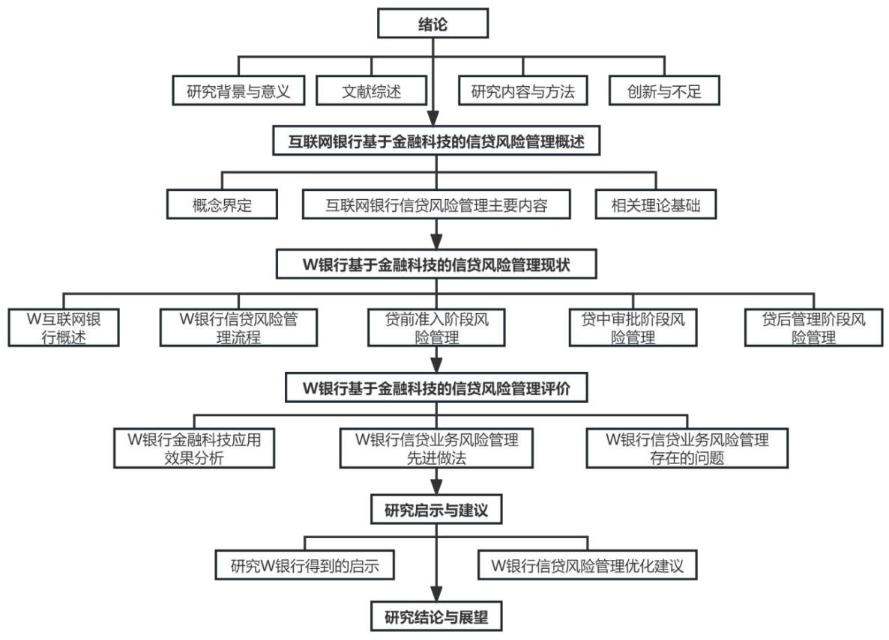

# 1绪论

# 1.1研究背景与意义

# 1.1.1研究背景

近年来，随着科技水平的提高以及金融水平、经济水平的发展，为适应经济发展的需要，2011 年起，央行联手科技部等部门划定了16 个科技金融示范区，自此，我国金融科技迎来了高速发展的阶段。国家多部门明确表态，为建设社会主义现代化高质量金融体系，要大力发展金融科技。当前我国金融科技发展已处于第三阶段，即将传统金融业务与大数据、区块链、人工智能、云计算、物联网等技术相结合，优化传统金融业务交易模式、风险评估模型和信息获取来源，实现提质增效的同时，还衍生出新的金融业务模式，如：智能监管、智能风控、智能获客、智能客服、数字货币等。金融科技的应用甚至可以产生新的银行经营模式，互联网银行通过金融科技实现了传统银行业务与科技的完美结合，显著提高了银行的运营效率和业务处理能力。

中国银行业全面贯彻新发展理念、构建新发展格局，本着信贷业务服务经济高质量发展的原则，持续增大小微企业贷款、普惠金融贷款、绿色贷款等投放力度。2022年，中国银行业进一步落实国家“十四五”发展规划，坚持贯彻创新、协调、绿色、开放、共享的新发展理念，以数字化转型赋能渠道建设，提升金融科技运用能力，加快推进服务工作高质量发展。银行业协会发布的《2022 年中国银行业服务报告》显示，截至 2022 年底，中国银行业的小微企业贷款余额达到 59.70 万亿元，其中单户授信总额1000 万元及以下的普惠型小微企业贷款余额为23.60 万亿元，同比增速 $2 3 . 6 0 \%$ ；本外币绿色贷款余额22.03万亿元，同比增长 $3 8 . 5 0 \%$ 。三者贷款余额的快速增长不仅是国家普惠金融政策影响的结果，与金融科技的快速发展也有着密不可分的联系。金融科技的发展改变了银行传统的放贷模式，特别是互联网银行的产生，大大简化了小额贷款、小微企业贷款的审批流程，并通过后台大数据信用评价体系，筛选出了优质“长尾”客户，为普惠金融的发展提供了极大的助力。顺应时代发展的需要，背靠国家政策扶持，互联网银行应运而生。2014 年12 月，我国第一家由民间资本出资成立的互联网银行——W 银行正式成立。其审批流程仅用时 5 个月，李克强总理亲自参与第一笔贷款发放。这充分说明了国家大力支持金融模式的创新，探索普惠金融道路。以金融科技为基础，“互联网 $^ +$ 银行”的业务模式为深化金融体制改革、解决中小企业融资问题提供了新的发展路径，并将我国银行业的金融风险水平控制在合理范围内，牢牢守住避免发生系统性金融风险的底线。

经历了新冠疫情的三年寒冬，经济形势转好仿佛已成为全民共识，但眼下经济形势尚不容乐观，众多中小企业徘徊在破产的边缘，中小企业融资难的问题尚未解决。互联网银行依托大数据进行信用评级，线上放贷的业务模式为解决中小企业融资成品本高、融资风险高问题提供了一种解决问题的思路。其中W银行就是一典型案例，其在为中小企业放贷缓解其财务压力的同时，基于金融科技将其信贷业务风险控制在合理范围内，2022 年W 银行不良贷款率 $1 . 4 7 \%$ ，低于 2022 年四季度商业银行总不良贷款率 $1 . 6 3 \%$ 。自成立以来，W 银行一直在迅速扩展信贷规模，截至 2022 年末，W 银行贷款和垫款总额达到 3370 亿，个人有效客户数达 3.62 亿人。截至 2022 年底，“微粒贷”累计服务 6000 万借款客户，年内日均发放贷款 90万笔，满足了普罗大众的借款需求。

深入研究 W 银行利用金融科技有效控制信贷风险的方法，分析其信贷风险管理体系，有助于传统商业银行借鉴其成功经验，通过分析其存在的风险点，也能在后疫情时代给监管层提出新的监管重点，助力我国银行业信贷风险管理水平提升，防止系统性金融风险的发生。

# 1.1.2 研究意义

本文旨在通过全面分析金融科技在 W 银行中管理信贷风险的优势及局限性，文章将从风险识别、评估和控制三个方面全面分析W 银行如何运用金融科技来有效防控信贷风险，以论证金融科技能提升中国银行业的信贷风险管理效率，进而说明国内银行业重视金融科技的发展是必要的。互联网银行在信贷业务中对金融科技的应用更为广泛，且其服务对象多为个人以及小微企业等风险较高的“长尾”用户，其不良贷款率低于我国银行业总体水平。W银行信贷业务主体服务客户为高风险客户，其信贷业务整体风险反而低于平均水平，说明金融科技提高了银行信贷业务风险管理水平，由于金融科技得到更广泛的应用，互联网银行对信贷风险的识别和控制相较于传统银行更有优势。以互联网银行为案例，为传统银行解决信贷风险问题提供了更鲜明的参考，若金融科技的运用能使中小企业贷款风险降低，银行也会加强其对中小企业客户的放贷力度。

我国金融科技起步时间较晚，银行业对金融科技的重视程度有待提高，对金融科技的应用尚未产生足够的规模效益，金融科技水平有待提高，特别是其在风险管理领域的应用不足，目前主要以大数据风控为主，金融科技在信贷风险管理领域尚未建立足够的制度基础与技术支持，虽然互联网银行在信贷业务风险管理领域使用金融科技已取得了不错的效果，但仍需注意，无论是其互联网属性还是金融科技属性，都无法消除信贷业务本身的固有风险，而且金融科技的“网效应”、“范围效应”、“尾部效应”使信贷风险更具隐蔽性，不仅要定量分析风险程度，更要注重定性分析风险的类型及其传染性，以避免产生系统性的风险。因此本文从W 银行金融科技在信贷业务风险管理中的应用现状出发，深入分析其作用机理与可能存在的风险，在金融科技高速发展的背景下，通过研究 W 银行的案例，我国银行业可以获得有参考性的启示和经验。银行业可以特别关注那些在金融科技方面拥有高水平和强大信贷风险管理能力的代表性银行，例如互联网银行。通过与行业整体水平进行比较，评估其信贷风险、金融科技发展水平、贷款方式及流程等方面的差异，以便有针对性地改进贷款制度。深入研究互联网银行金融科技发展模式和信贷风险特征，分析其对银行业整体信贷风险的影响，对于促进普惠金融的发展和维护金融市场的稳定与安全，都具有实际意义。

# 1.2文献综述

# 1.2.1国外研究现状

# 1.2.1.1金融科技的研究

# 1.2.1.1.1金融科技的定义与发展

金融科技，又称“Fintech”，是一个在1972 年由Bettinger 首次提出，用以描述银行金融专业知识与现代计算机互联网技术及其他高科技的结合的术语。他指出，随着金融业务逐渐趋于复杂以及计算机技术的发展，将计算机技术更好的应用于传统金融业务中将成为大势所趋，这一概念强调了科技在改进银行服务和运营中的关键作用，特别是在分析和解决日常问题方面。“Fintech”一词在1993 年更多的进入大众的视野，因为在该年8月《美国银行家杂志》对花旗银行发起的项目“Financial ServicesTechnology”以“Fintech”的简称进行了报道。尽管早期受限于大环境，其并没有受到足够的重视，但进入21 世纪后，随着计算机技术的发展，掀起了一股金融科技热潮，催生了“大数据”、“人工智能”、“区块链”等技术在金融界的广泛应用。这些技术的应用不仅为金融产品带来了新的特性，如“脱媒化”、“去中心化”和“定制化”，也促进了金融服务的创新，带来了新的金融衍生品和新型服务方式，对金融行业的转型升级产生了深远影响，但同时也对各国金融监管和政策提出了新的挑战（IMF，2017：Buchak et al.，2018）。Walport 在2015 年将 Fintech 界定为一类提供金融服务并用科技改善服务和管理的公司，其对金融科技的理解是一类企业。而Amer DWetal（2016）则更偏向于将金融科技定义为科技在风险控制、投资、信贷、保险、支付等金融领域的应用。最后，FSB 在2017 年将其定义为“技术驱动的金融创新”，涵盖产业和技术的创新，贯穿于金融产业的全流程中，既包含前端产业创新，也包含后台技术创新。

# 1.2.1.1.2金融科技的分类

关于金融科技的分类，Gai et al.（2018）认为，应该从应用方向层面对金融科技进行分类，并以该分类方法为基础将金融科技分为硬件和基础设施、安全和隐私、数据技术、应用程序和管理以及服务模型五个方面。而巴塞尔银行监管委员会从业务模式层面进行分类，把金融科技划分为支付结算、存贷款与资本筹资、投资管理和市场设施四类业务模式。FSB 则从经济功能层面，把金融科技细化为支付结算类、存贷款与资本筹集类、保险类、投资管理类以及市场设施类。FSB 对金融科技的分类较为契合当下金融科技的发展状况，但随着技术的进步与新金融业务模式的产生，必然会产生不属于以上分类的新类型，还需要持续深入的研究。

# 1.2.1.1.3金融科技的创新与应用

传统金融服务优先考虑收入、财务报告等，而数字金融则更偏向基于从互联网中挖掘的大量行为数据，构建更为复杂、专业、全面的信用评估模型（Duarte et al.，2012；Herzenstein et al.，2011）。Arner et al．（2016）认为发展中经济体采用金融科技的市场逻辑与发达国家不同，这是由于二者金融系统效率与突破性技术掌握程度导致的。Philippon（2016）对金融科技可能如何彻底改变金融行业进行了全面分析，指出传统金融机构的高服务成本为金融科技的迅速成长和创新金融科技公司的崛起铺平了道路。IMF（国际货币基金组织）专题研究组（2017）认为金融和科技之间存在长期的相互依存关系，他们通过追溯现代银行技术的发展路径，指出从ATM 的出现一直到移动银行的时代，银行一直在利用新兴技术来创新和提升服务。

# 1.2.1.2 信贷风险管理的研究

# 1.2.1.2.1 信贷风险识别与评估

Sultan Singh（2015）提出，实施信贷资产组合可以构建不同类型的信用评级，利用特征多元化模型来展现信贷违约率，从而更有效地评估信贷组合风险。Azimova(2019)的研究发现，在激烈的市场竞争中，商业银行为争夺市场份额可能采取高风险信贷策略，这种竞争实质上是对信贷风险控制的比拼，无论竞争程度如何，都可能加剧信贷风险，特别是在经济环境不佳时更为明显。Renu Arora（2021）指出，信息不对称是商业银行信贷风险的主要来源。信息的不完全披露妨碍了银行对企业真实情况的评估，进而放大了信贷风险。Aslanishvili（2021）观察到银行间存在模仿效应，一家银行在信贷业务上的成功可能引发其他银行的模仿，这种趋同若不加控制，将导致信贷风险管理失控。

# 1.2.1.2.2 信贷风险控制

Andre Tioumagneng 等人（2018）深入探讨了商业银行信贷风险管理的核心要素。他们主张，银行应积极优化其信贷风险管理体系，聚焦于关键的信贷风险因素，并采取综合性的管理措施。这样做能够为银行创造更多持续发展的契机。同年，OgunladeOlabamiji（2018）也指出，在信贷风险管理过程中，应结合信用评级体系。他强调，除了运用定量分析技术外，还应综合考量国家政策与外部环境因素。特别是对于产能过剩的企业，更应持审慎态度进行评估。

# 1.2.1.3基于金融科技管理信贷风险的研究

有学者认为金融科技促进银行转型的动力之一来自金融科技的广泛应用带来的信息处理能力的提升。Shahrokhi M & Dandapani K（2008）指出商业银行正在积极利用金融科技的创新来提升运营效率，这不仅改变了银行的传统服务方式，还有助于改善银行的风险水平。Pletz，John（2018）则详细说明了区块链技术如何促进在线贷款的实现，以及如何通过共享借款人信息来更有效地评估信用风险。JagtianiJ和 Lemieux C（2019）的研究揭示，Lending Club 借助金融科技进行信用评级，在预测违约率上有着出色的表现，显著提升了风险防控能力。PhilipponT（2019）提出，贷款机构可运用金融科技的预测工具深入分析消费者行为，进而降低违约率，有效控制商业银行的风险。

# 1.2.2 国内研究现状

# 1.2.2.1金融科技的研究

我国金融科技的研究与国外相比起步稍晚，但我国对金融科技的重视程度以及当下取得的研究成果并不落后于国外，无论是在金融科技的发展还是金融科技于传统金融企业乃至社会经济的积极影响与风险方面都有了较为深入的研究。

# 1.2.2.1.1金融科技的发展

李光磊（2016）指出在金融科技领域，各国随着时间推移逐渐加大对金融科技的投资，并且增加幅度呈现出增长态势。杨飞（2019）提出银行应该加强与发展较为成熟且潜力较大的金融科技公司合作，以实现更好的发展。李琳（2020）认为金融科技将传统银行业务与科技深度融合，有利于中小银行的发展，不过各银行根据业务类型与规模体量的不同，在金融科技发展方向方面应有不同的侧重。何宝宏（2021）表示金融监管机构、科技公司、金融机构三方通过合作与博弈形成了相对稳定的金融科技发展环境。

# 1.2.2.1.2金融科技的积极影响

邱兆祥等（2019）认为金融科技的发展可以提高金融效率，进而增强金融资源配置效率，促进金融稳定性。此外，金融科技还可以减轻信息不对称，提高金融交易的透明度，增强金融市场的稳定性。新的支付、结算、融资方式以及分布式账户的应用推动了金融业的“脱媒化”和“去中心化”，有助于减轻金融冲击的影响。金融科技技术在信用评级和传统金融机构中的广泛应用推动了金融交易管理体制改革和管理技术创新，提高了相关企业金融决策的科学性和金融风险防范能力。李逸飞（2022）指出，银行金融科技发展可以降低银行不良贷款率，优化企业信贷配置结构，提升企业信贷配置能力，促进从抵押贷款向信用贷款的转型，提高银行信息甄别能力，并减轻企业短债长用水平。宋敏（2023）认为金融科技的引入不仅减轻了银行面临的信息难题，提高了商业银行的创新能力，还促进了产业层面的竞争，增强了商业银行的创新意愿，从而推动了金融创新水平的提高。

# 1.2.2.1.3金融科技的风险

邱兆祥等（2019）指出，金融科技的“去中心化”可能导致大量金融科技平台的出现，其中一些平台的资质较低。在监管不完善的情况下，这些平台可能利用自有资金撮合风险较大的业务，但其自身的风险管理能力较差，难以处理短期负债的集中到期和意外的资金外流等情况，从而增加了流动性风险，损害了金融稳定性。在互联网金融领域，监管机构难以对所有数据进行全面有效的监管，不当的科技应用可能导致信息泄露、数据伪造和违规操作等风险，影响金融系统的稳定性。金融科技平台还可能通过借贷、债券和股票等方式进行融资，并承担中介担保功能，形成了所谓的“影子银行”。这些资金通过多种渠道进入金融市场，增加了金融市场的杠杆率，可能引发系统性金融风险。随着金融科技的发展，利用大数据和区块链技术培养的智能算法机器人在金融市场进行高频交易，当市场流动性紧张时，这些机器人可能会集体退出市场，导致价格迅速波动，进而引发高杠杆用户的破产清算和价格挤兑，增加金融风险。过度依赖算法、数据和去中心化金融科技活动相对于传统金融活动更容易受到经济周期的影响。宋科（2023）认为金融科技的发展对银行流动性创造产生负面影响，并且金融科技发展通过提高经营效率和降低风险承担等途径影响银行的流动性创造。

# 1.2.2.2 信贷风险管理的研究

# 1.2.2.2.1 信贷风险识别与评估

雍波（2021）的研究揭示，各国对银行信贷风险识别的理解存在较大差异，直接引入国外制度可能并不适合国内环境。因此，在应用国外先进的风险识别理论时，需充分考虑国内实际情况，特别是中国特色社会主义市场经济体制的特点。张雨佳(2021)发现，许多企业在风险数据的分类分析上存在不足，这是导致风险识别与监控不力的主要原因。为确保风险识别的全面性，需自上而下地深入分析与解读风险来源。刘超等（2022）则提出了一种进化多目标软子空间聚类（EMOSSC）算法，旨在提高商业银行信贷审批过程中对企业客户信用风险的识别与管理能力。

# 1.2.2.2.2 信贷风险控制

董婧（2018）从内部控制的角度指出，预防信贷违规需通过自上而下的系统性改革来达成。郭敏（2018）的实证研究显示，银行内部控制对于提升风险识别效果具有显著作用，进而能够加强内部信贷管理并提升银行的综合竞争力。单建军（2021）则着重强调了信贷风险业务管理的四个关键方面：明确责任制度、完善信息管理机制、实施个人信用评价以及培育健康的信贷文化，以提升员工的信贷管理意识。

# 1.2.2.3基于金融科技管理信贷风险的研究

宫晓林等人（2017）认为金融科技是金融服务的一种创新，它通过信息技术强化了银行、商家和客户三者之间的联系，显著减少了契约沟通成本，从而降低了因信息不对称而引发的违约风险。张德茂等人（2018）着重提到，金融科技不仅提升了商业银行的服务质量，还降低了运营成本，并优化了风险管理流程。姚婷和宋良荣（2021）则建议商业银行应巧妙利用金融科技，以更有效地判断经济周期，从而降低信用风险。

# 1.2.3文献评述

通过对中外文献进行梳理发现，单独在金融科技、信贷风险管理领域都有着丰富的有价值的研究成果，但将二者结合进行研究的成果较少，无论是金融科技对银行信贷风险的影响或是基于金融科技进行信贷风险管理都尚有较大的研究空间。

从研究內容上看，对金融科技的研究主要集中在金融科技发展可能带来的积极影响与风险，以及如何进行配套监管方面。多从宏观层面出发，而对金融科技在微观业务方面如何应用、应用效果等方面的研究较少。对信贷风险管理的研究主要集中在风险管理的方法、各环节如何进行划分、用何种风险模型进行风险管理更高效方面，对信贷风险管理中应用的工具及应用方法研究较少。

在研究样本上看，金融科技主要以大型国有银行以及上市商业银行居多，而信贷风险也主要是以大型国有银行、商业银行、城商行、农商行等传统银行经营模式居多，而在金融科技受到高度重视、互联网经济常态化之际，对互联网银行的研究明显不足。

# 1.3研究内容与方法

# 1.3.1主要内容

本文在借鉴现有相关研究的理论与方法的基础上，以 W 银行如何运用金融科技进行信贷业务风险管理为研究目标。通过对其近年来信贷风险指标、基于金融科技的信贷业务风险管理模式进行分析，并对已经搜集到的资料进行整理归纳，发现其以金融科技加强信贷风险管理的成功经验，以及其信贷风险管理中存在的问题，分析问题产生的原因并提出针对性的改进建议。按照这个研究思路本论文将包括以下六部分的内容：

第一部分是绪论。主要阐述本文的研究背景与意义、文献综述，研究思路与方法、以及本文的创新与不足。

第二部分是相关概念界定及理论基础。其中相关概念界定主要包括对互联网银行、金融科技、互联网银行的信贷业务风险管理的定义进行界定，同时对互联网银行信贷风险管理主要内容进行概述，在理论基础部分主要从信息不对称理论、大数据风险控制理论、长尾理论三个方面展开理论阐述。

第三部分是针对W 银行基于金融科技的信贷风险管理现状进行介绍，首先对其整体发展状况、金融科技发展水平进行介绍。接下来对其信贷风险管理整体流程从整体层面进行介绍，然后对其贷前、贷中、贷后中的风险识别、风险评估、风险控制中金融科技应用情况进行介绍。

第四部分是在上文的基础上，通过梳理文献和分析搜集到的资料对 W 银行基于金融科技控制信贷业务风险的效果、其在金融科技背景下信贷业务先进做法进行研究，识别其信贷业务风险管理存在的问题。

第五部分是启示与建议部分，在金融科技高速发展的当下，通过研究 W 银行得到的启示，以及对上文发现的问题提出针对性建议。

第六部分是总结部分，对上文的研究进行总结归纳，得出研究结论并作出进一步的研究展望。

  
图1-1研究框架

# 1.3.2 研究方法

# 1.3.2.1文献研究法

本文首先收集了有关金融科技、商业银行信贷业务风险的相关概念，并整理了信息不对称理论、大数据风险控制理论、长尾理论，接着，整理了金融科技对商业银行信贷风险管理影响的相关文献，分析总结金融科技背景下银行如何发展信贷业务，以及如何进行信贷业务的风险管理，结合国内外文献研究成果，为本文奠定写作基础。

# 1.3.2.2案例分析法

本文研究选取 W 银行作为案例，其作为国内首家互联网银行，背靠大股东腾讯的数据库，在金融科技领域处于领先地位，其互联网银行的经营模式，以金融科技为支撑点，金融科技在其经营中发挥着举足轻重的作用，通过分析其以互联网为依托的运营模式，并运用其财务数据，通过定量分析、比较分析的方法发掘其信贷风险，并从多个角度研究其金融科技发展水平，分析其金融科技在信贷风险管理中的应用，得出商业银行该如何发展金融科技，以及如何依托金融科技更好的进行信贷风险管理，进而对商业银行后续如何将金融科技与信贷业务风险管理相融合提出有针对性的意见。

# 1.4创新与不足

# 1.4.1创新

1.选择案例视角创新。互联网银行不同于传统的商业银行经营模式，采用“互联网+金融”的新型经营模式，在我国起步较晚，起步最早的W银行也是2014 年才成立，对互联网银行方面的相关研究较少。而互联网银行舍弃线下的门店的经营模式注定其会运用大量金融科技，对金融科技与互联网银行信贷风险管理相关的研究较少，选题具有一定的创新性与时效性。

2.案例内容具有时效性与代表性。金融科技是当下国家政策鼓励支持发展的方向，国内商业银行都在积极探索在金融科技方面的发展与突破，响应国家政策的同时与寻求创造新的利润增长点的同时，也在积极探索其与传统业务的结合。信贷业务作为银行最为传统的业务，国内对金融科技与信贷业务风险控制相结合方面的研究较少。金融科技是互联网银行发展的基础，是互联网银行业务的支撑点，互联网银行大力发展金融科技的同时，运用金融科技辅助促进其信贷业务风险管理，提升整个银行层面的风险管理水平与风险应对能力的效应值得探究，且对传统商业银行有一定的指导意义。

# 1.4.2不足

首先，本文所用数据多为W 银行 22 年公开数据，可能官方披露数据并不够全面，加之本人学识及能力的限制，对金融科技在 W 银行信贷风险管理中的应用研究不够深入，对某些具体技术的使用目的以及达成效果方面可能与实际存在偏差，且互联网银行发展时间较短，其基于金融科技进行风险管理取得的成效是否能持续保持有效性有待市场以及时间的检验。
