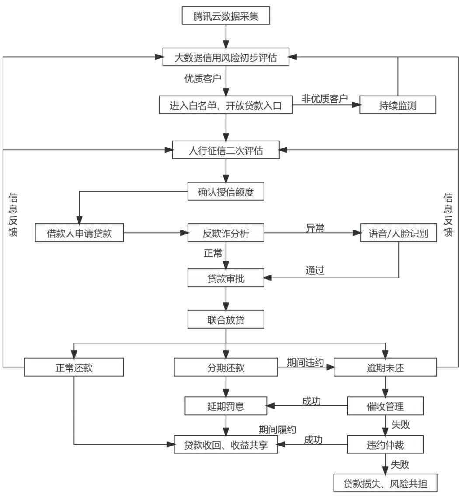

# 3基于金融科技的W银行信贷风险管理现状

# 3.1W互联网银行概述

# 3.1.1 W银行发展概况

W银行成立于2014年12月，是我国首家互联网民营银行，注册资本30 亿，成立之初其最大股东腾讯控股直接持股 $30 \%$ ，截至2022年12月31日其具体股权比例如下：

表3-1银行股权结构  

<table><tr><td colspan="3">2022年12月31日 股东名称</td></tr><tr><td></td><td>持股数额（股）</td><td>比例 （%)</td></tr><tr><td>深圳市腾讯网络计算机网络有限公司 深圳市百业源投资有限公司</td><td>1，260，000，000</td><td>32.73 15.58</td></tr><tr><td>深圳市立业集团有限公司</td><td>600，000，000</td><td></td></tr><tr><td>深圳市淳永投资有限公司</td><td>600，000，000</td><td>15.58</td></tr><tr><td>深圳市横岗投资股份有限公司</td><td>297，000，000</td><td>7.71</td></tr><tr><td>深圳市大河信德企业管理有限公司</td><td>150，000，000</td><td>3.90</td></tr><tr><td>深圳光汇石油集团股份有限公司</td><td>140，000，000</td><td>3.64</td></tr><tr><td>深圳市文正科技有限公司</td><td>120，000，000</td><td>3.12</td></tr><tr><td>深圳市科锐达贸易有限公司</td><td>96，500，000</td><td>2.51</td></tr><tr><td>涌金投资控股有限公司</td><td>90，400，000</td><td>2.35</td></tr><tr><td></td><td>90，000，000</td><td>2.34</td></tr><tr><td>信太科技（集团）股份有限公司</td><td>90，000，000</td><td>2.34</td></tr><tr><td>深圳市金立通信设备有限公司</td><td>90，000，000</td><td>2.34</td></tr></table>

资料来源：W银行22 年财报

W 银行自成立以来，利用自身互联网银行灵活性高的优势，以金融科技为媒介，积极发展普惠金融与绿色金融，仅 2022 年，其普惠小微贷款发放金额就达到 4600 亿人民币，全年发放贷款超过4.1 亿笔，为超过2 万家小微企业提供及时有效的贷款解决方案，截至2022 年末，其服务的个人有效客户超过3.6 亿，各项自有资金贷款余额 3370亿元，其中，个人贷款与小微企业贷款占比较大，然而其不良贷款率却低至仅 $1 . 4 7 \%$ W银行发展大事历程见表3-2。

表3-2W银行大事记  

<table><tr><td>时间</td><td>事件</td></tr><tr><td>2014年12月</td><td>W 银行正式成立，成为全国首家民营银行、数字银行</td></tr><tr><td>2015年1月</td><td>时任总理李克强亲临见证第一笔贷款发放</td></tr><tr><td>2015年5月</td><td>“微粒贷”上线</td></tr><tr><td>2015年8月</td><td>“W银行APP”上线</td></tr><tr><td>2015年9月</td><td>“微车贷”上线</td></tr><tr><td>2016年6月</td><td>有效客户数突破1000万</td></tr><tr><td>2017年1月</td><td>主动向全球开源区块链技术（FISCOBCOS）</td></tr><tr><td>2017年11月</td><td>“微业贷”上线</td></tr><tr><td>2018年9月</td><td>有效客户数突破1亿</td></tr><tr><td>2019年1月</td><td>W银行正式发布联邦AI生态系统及开源发布解决方案FATE</td></tr><tr><td>2019年7月</td><td>“小鹅花钱”上线</td></tr><tr><td>2019年10月</td><td>“微闪贴”上线</td></tr><tr><td>2019年10月</td><td>w银行被Forrester定义为“世界领先的数字银行”</td></tr><tr><td>2020年7月</td><td>W银行首次登榜英国《银行家》“全球银行1000强”榜单</td></tr><tr><td>2021年12月</td><td>金融发放贷款规模突破万亿</td></tr><tr><td>2022年5月</td><td>《亚洲银行家》全球领先纯数字银行中排名第一</td></tr></table>

资料来源：W银行官网整理

2015 年，W 银行构建了国内首个采用安全可控技术的全分布式银行系统架构，将金融科技“大容量、低成本、高可用性”的不可能三角转化为“高性能、高弹性、高可用、高标准、高安全、高效用”等特色优势，并在20202 年进一步优化了基于“Openhive开放蜂巢”技术的底层架构，夯实支撑业务发展的金融科技底座。2017年，W 银行将其区块链技术 FISCO BCOS 向全球开源，并逐步应用到其产品与经营管理中，截至目前，FISCO BCOS 已经成为了包括上万名成员的最大国产联盟链开源生态圈。W 银行行持续深耕金融科技，为营销、风控、运营、消费者权益保护等数字银行业务的各个环节提供科技支持，实现业务全流程数字化，确保在降低经营管理成本的同时，为客户创造更为高效、便捷的金融服务体验。

# 3.1.2 W 银行金融科技发展水平分析

截止2021 年末，我国银行业金融机构共有 4604 家，其中只有小部分发展较好的股份制银行、国有大型商业银行，主要以农商行、村镇银行为主，在风险管理以及金融科技方面，我国上市股份银行会比农商行、村镇银行有着更严格完备的风险管理制度以及更大的金融科技投资力度以及更强研发能力，因此，本文主要选取我国部分大型上市股份银行数据与W 银行进行对比，能对 W 银行金融科技投入与风险管理取得的成果有更加清晰的认知。

# 3.1.2.1科技投入比例远高于行业平均

从国有四大行来看，2022 年度对金融科技的研发投入均超过 200 亿元，其中，工商银行投入最多，达到262.24亿元，金融科技研发投入占营收比均在 $3 \%$ 左右。在全国性股份银行中，招商银行在金融科技研发投入方面最多，达141.68 亿元，其他选取的股份银行样本在金融科技研发方面也有有着不少的投入，其占营收的比重均超过$3 . 5 \%$ ，占比最高的为恒丰银行，达 $5 . 2 7 \%$ 。可见，当下我国上市股份银行对金融科技是十分重视的。

W 银行基于其互联网银行本上就带有更强的科技属性，对金融科技的研发尤为重视，其 2022 年度金融科技研发投入达29.43 亿元，占营业收入比重 $8 . 3 2 \%$ ，且其申请的发明专利数量已超过1100项，可见其十分重视金融科技的发展并取得了一定的成果。W 银行不断开拓金融科技的应用场景，比如：其在产业金融方面运用金融科技和供销数据分析，突破了传统供应链产品对担保和质押的依赖；利用数字化特征以及金融科技优势，延伸产品服务半径。

表3-3 W银行与部分上市股份银行2022 年度金融科技投入对比  

<table><tr><td rowspan=1 colspan=2>银行名称</td><td rowspan=1 colspan=1>金融科技研发投入（亿元）</td><td rowspan=1 colspan=1>金融科技研发投入占营业收入比（%）</td></tr><tr><td rowspan=7 colspan=2>W银行工商银行建设银行农业银行中国银行交通银行邮储银行</td><td rowspan=1 colspan=1>29.43</td><td rowspan=1 colspan=1>8.32</td></tr><tr><td rowspan=1 colspan=1>262.24</td><td rowspan=1 colspan=1>2.86</td></tr><tr><td rowspan=1 colspan=1>232.90</td><td rowspan=1 colspan=1>2.83</td></tr><tr><td rowspan=1 colspan=1>232.11</td><td rowspan=1 colspan=1>3.20</td></tr><tr><td rowspan=1 colspan=1>215.41</td><td rowspan=1 colspan=1>3.49</td></tr><tr><td rowspan=1 colspan=1>116.31</td><td rowspan=1 colspan=1>5.26</td></tr><tr><td rowspan=1 colspan=1>106.52</td><td rowspan=1 colspan=1>3.18</td></tr><tr><td rowspan=1 colspan=2>招商银行</td><td rowspan=1 colspan=1>141.68</td><td rowspan=1 colspan=1>4.51</td></tr><tr><td rowspan=2 colspan=2>中信银行兴业银行</td><td rowspan=1 colspan=1>87.49</td><td rowspan=1 colspan=1>4.14</td></tr><tr><td rowspan=1 colspan=1>82.51</td><td rowspan=1 colspan=1>3.71</td></tr><tr><td rowspan=1 colspan=2>浦发银行</td><td rowspan=1 colspan=1>70.07</td><td rowspan=1 colspan=1>3.71</td></tr><tr><td rowspan=1 colspan=2>平安银行</td><td rowspan=1 colspan=1>69.29</td><td rowspan=1 colspan=1>3.85</td></tr><tr><td rowspan=1 colspan=1></td><td rowspan=1 colspan=1>光大银行</td><td rowspan=1 colspan=1>61.27</td><td rowspan=1 colspan=1>4.04</td></tr><tr><td rowspan=1 colspan=1></td><td rowspan=1 colspan=1>民生银行</td><td rowspan=1 colspan=1>47.07</td><td rowspan=1 colspan=1>3.57</td></tr><tr><td rowspan=1 colspan=2>广发银行</td><td rowspan=1 colspan=1>37.07</td><td rowspan=1 colspan=1>4.93</td></tr><tr><td rowspan=1 colspan=2>恒丰银行</td><td rowspan=1 colspan=1>13.10</td><td rowspan=1 colspan=1>5.27</td></tr></table>

资料来源：各银行官网数据

# 3.1.2.2 科技人员占比远超行业水平

随着国家鼓励金融业数字化转型的政策相继出台，如何发展金融科技成为各大银行必须思考的问题，这就意味着不仅要在资金方面加大投入，专家人才的引进更是必不可少。有22 家银行在22 年年报中透露了金融科技人才数量以及其占比情况，在国有四大行中，工商银行科技人员数量最多，达到 36000人，占全部员工的 $8 . 3 \%$ 。在股份制商业银行中，招商银行科技人员数量最多，科技人员数量10846人，占全部员工的 $9 . 6 \%$ 。工商银行与招商银行无论是金融科技投入资金还是科技人员数量都是同类型银行中最多的，可见其对金融科技的重视程度。近两年中小银行也逐渐加大了对金融科技的重视程度，虽然其科技人员数量较少，但是其增速较快，以沪农商行为例，其科技人员数量22 年同比增长 $4 7 . 7 3 \%$

W 银行由于其互联网银行的属性加之其对金融科技的重视，从成立至今，其科技人员占比始终在 $50 \%$ 以上，2022 年其科技人员数量2050人，占比 $51 \%$ 。在人才方面，其预计未来对金融科技人才的需求仍将持续上升，因此其22 年发布“W 学者计划”，与高校优秀年轻教授合作，加大人才培养力度，增加技术储备，加速技术落地。同时，其与华南理工大学、天津大学、北京交通大学等高校开展区块链课程合作，夯实了人才发展基础。

表3-42022年银行金融科技从业人员情况  

<table><tr><td>银行名称</td><td>2022 年金融科技从业人数</td><td>科技从业人员占比（%）</td></tr><tr><td>W银行</td><td>2050</td><td>51</td></tr><tr><td>工商银行</td><td>36000</td><td>8.3</td></tr><tr><td>建设银行</td><td>15811</td><td>4.2</td></tr><tr><td>中国银行</td><td>13318</td><td>4.35</td></tr><tr><td>招商银行</td><td>10846</td><td>9.6</td></tr><tr><td>农业银行</td><td>10021</td><td>2.2</td></tr><tr><td>兴业银行</td><td>6699</td><td>11.87</td></tr><tr><td>浦发银行</td><td>6447</td><td>10.47</td></tr><tr><td>邮储银行</td><td>6373</td><td>3.27</td></tr><tr><td>交通银行</td><td>5862</td><td>6.38</td></tr><tr><td>中信银行</td><td>4762</td><td>8.4</td></tr><tr><td>民生银行</td><td>4053</td><td>6.47</td></tr><tr><td>光大银行</td><td>3212</td><td>6.75</td></tr><tr><td>广发银行</td><td>2093</td><td>5.55</td></tr><tr><td>渤海银行</td><td>1291</td><td>9.57</td></tr><tr><td>上海银行</td><td>1232</td><td>10.14</td></tr><tr><td>南京银行</td><td>795</td><td>5.04</td></tr><tr><td>北京银行</td><td>783</td><td>4.74</td></tr><tr><td>沪农商行</td><td>715</td><td>7.86</td></tr><tr><td>东莞农商银行</td><td>714</td><td>8.91</td></tr><tr><td>贵阳银行</td><td>253</td><td>4.3</td></tr><tr><td>重庆银行</td><td>151</td><td>3.02</td></tr></table>

资料来源：各银行22 年年报

# 3.1.2.3金融科技细分领域硕果累累

W 银行秉持开源共建、融合共享、开放共赢的开源文化，致力于成为开源技术贡献者和开源社区建设者，已在人工智能、区块链、云计算、大数据等多个领域建立了开源项目社区，共开源了33 个项目，在代码托管平台获得来自全球开发者的超过 35500个Star，13300个Fork。W银行通过开源生态将科技成果向全球企业赋能，提升产业数字化水平，推动科技成果切实转化为生产力。基于在开源社区建设与开源治理等领域取得的成果，W 银行继续入选中国开源软件推进联盟的《2022 中国开源发展蓝皮书》头部企业名单，并作为典型企业代表被收录到云计算开源产业联盟（OSCAR）发布的《2022 年OSPO 案例汇编》。

在人工智能领域，W 银行不断完善以 FATE 开源生态为核心的联邦学习生态，持续提高影响力。FATE 开源生态开源至今已发布 40 余个版本，平台的效率、可用性和安全性均有所提升。2022 年，FATE 开源生态完善了组织架构，并新吸纳了工商银行、中国银联、VMware 等 19 家成员单位。年内，W 银行与中国信通院、中国人工智能学会、粤港澳大湾区大数据研究院等权威机构联合举办 10 余场以隐私计算和联邦学习为主题的线上线下论坛等活动，提升联邦学习生态的影响力。2022 年9 月 FATE 开源社区、开放群岛开源社区、百度、腾讯云、京东科技共同发起了“隐私计算开源协同计划”，进一步推动平台和技术协同开发。

致力于为ESG 战略中的政府、公众企业等多方构筑信任底座。在开源区块链底层平台 FISCO BCOS 方面，W 银行于年内牵头完成 EISCO BCOS V3.0 的一系列决代优化，将性能提升至5万TPS（每秒事务处理量），可承载更大规模、更多场景、更广泛参与的应用需求。在 2022 年3月PRaiy 与incoPat 创新指数研究中心联合发布的“全球隐私计算技术发明专利排行榜（TOP100）”中，W银行以204件专利位列全球银行业第一。在区块链组件建设方面，W 银行相继完成区块链中间件平台WeBASE、实体身份认证及可信数据交换解决方案 Weldentity、账户治理、权限治理等组件的优化选代，实现 FISCO BCOS v3.0 的全面支持，为用户提供最新的组件工具库。

W 银行积极推动区块链全栈技术体系应用于产业数字化，年内重点聚焦粤港澳大湾区一体化建设、“双碳”、乡村振兴、慈善公益、医疗等领域，持续提升生态合作的广度和深度。截至2022 年末，FISCO BCOS 已入驻 9 个国家级基础设施，超 300个标杆应用在生产环境中稳定运行，其中年内共新增 84 个应用落地。W 银行为 2022 年3 月上线的粤港澳大湾区首个跨境数据验证平台提供区块链开源技术支持。该平台支持在保护个人隐私的基础上实现数据要素的跨境核验，大幅提升跨境验证效率，为粵港澳大湾区一体化发展提供新型基础设施支持。W 银行持续为中国人民银行“珠三角征信链”项目提供区块链开源技术支持，服务跨区域征信一体化数据中心枢纽的建设。此外，在深圳市前海管理局、深圳市税务局等政府部门的支持下，W 银行助力中国银行深圳分行推出“基于区块链的境外人士收入数字化核验产品”公共服务平台。该平台通过区块链和数据分析技术，将税务和人才补贴等数据加密上链存证，实现深圳就业的境外人士薪酬信息真实性的非接触式验证，方便境外人士在银行网点快捷办理购汇及汇出业务，有效提升用户体验和银行风控水平，助力深圳优化营商环境。

在大数据领域，W 银行大数据开源项目 Linkis 已通过国际顶级开源组织 Apache软件基金会的毕业投票，成为全球第一个由银行发起并成功毕业的 Apache 项目。W 银行持续推进 POD 架构改造、提高大数据非批量基础引擎生产集群数，大幅节约了IT成本。持续引入合法合规的持续引入多维合法合规的第三方数据，积极开展基于外部大数据的新型风控模型研发，结合多种前沿技术算法，于 2022 年完成了两轮大数据评分模型选代升级。

# 3.2W银行信贷风险管理流程

由于W银行信贷产品众多，本文仅选取W银行代表产品“微粒贷”，根据亲身体验以及公开资料绘制贷款流程如图3-1 所示。在该流程中运用的金融科技技术包括：大数据、区块链、人工智能、生物识别等。借贷主体主要分为三方：借款人、W 银行、资金合作方。其中，资金合作方主要为银行，在出资比例方面，W 银行出资 $20 \%$ ，资金合作方出资 $80 \%$ ，而利息收入方面w银行占 $30 \%$ ，资金合作方占 $70 \%$ ，根据公开资料显示，早在 2018 年，W 银行就与 50 家银行达成资金合作。按贷款流程分为贷前、贷中、贷后。贷前阶段主要包括与资金合作方达成合作、精准识别优质客户（利用大数据技术对客户进行画像，评估客户的信用状况，识别客户是否存在多头借贷）并确定授信额度。贷中主要包括客户发出贷款申请、W 银行利用生物识别技术对客户身份进行识别进行贷款审批、联合放贷。贷后阶段主要包括运用大数据、区块链技术对资金用途进行持续监测，回收贷款，对于未及时还款的客户进行AI催收。

  
图3-1W银行“微粒贷”业务流程图
